# Joint Trajectory and Beamforming Optimization for UAV-ISAC Secure Communications

Zhaolong Ning , Senior Member, IEEE, Yuzhen Zhang, Xiaojie Wang , Senior Member, IEEE, Lei Guo , Dusit Niyato , Fellow, IEEE, and Yan Zhang , Fellow, IEEE

Abstract—Integrated Sensing and Communication (ISAC) can assist Uncrewed Aerial Vehicle (UAV) secure communications by acquiring information about eavesdroppers. However, existing studies have not systematically investigated ISAC beamforming for simultaneously sensing the channel information of ground eavesdroppers, jamming eavesdropping links, and communicating with users, which poses significant challenges in ensuring both sensing accuracy and communication confidentiality. To address this issue, we propose a UAV-ISAC secure communication algorithm to maximize average secrecy rate by jointly optimizing communication and sensing beamforming, user scheduling, sensing time allocation, and UAV trajectory. We address the formulated NP-hard problem by decomposed it into three subproblems. We first relax binary user scheduling and sensing time allocation by a penalty-based successive convex approximation approach. The UAV trajectory is then iteratively optimized while beamforming is designed using semidefinite relaxation, with matrix lifting applied to handle the rank-one constraint. A triplelayer iterative algorithm is constructed by integrating these steps to achieve a suboptimal solution. Numerical experiment results and theoretical analysis validate the superiority of the proposed algorithm in terms of average secrecy rate, convergence and computational complexity.

Index Terms—UAV, ISAC, beamforming, trajectory optimization, physical layer security.

## I. INTRODUCTION

cations and the significant reduction in manufacturing

Received 23 August 2025; revised 25 January 2026; accepted 3 April 2026. Date of publication 14 April 2026; date of current version 16 April 2026. This work was supported in part by the National Natural Science Foundation of China under Grant 62272075 and Grant 62221005; and in part by the Natural Science Foundation of Chongqing under Grant CSTB2025NSCQ-LZX0050, Grant CSTB2024NSCQ-JQX0013, and Grant CSTB2024NSCQ-QCXMX0058. The associate editor coordinating the review of this article and approving it for publication was Z. Liu. (Corresponding author: Xiaojie Wang.)

Zhaolong Ning is with the School of Communications and Information Engineering, Chongqing University of Posts and Telecommunications, Chongqing 400065, China, and also with the School of Intelligence Science and Engineering, Qinghai Minzu University, Xining 810007, China (e-mail: z.ning@ieee.org).

Yuzhen Zhang and Xiaojie Wang are with the School of Communications and Information Engineering, Chongqing University of Posts and Telecommunications, Chongqing 400065, China (e-mail: s230101203@stu.cqupt.edu.cn; xiaojie.kara.wang@ieee.org).

Lei Guo is with the School of Computer Science and Engineering, Northeastern University, Shenyang 110004, China (e-mail: guolei@cse.neu.edu.cn).

Dusit Niyato is with the College of Computing and Data Science, Nanyang Technological University, Singapore 639798 (e-mail: dniyato@ntu.edu.sg).

Yan Zhang is with the School of Information and Communication Engineering, University of Electronic Science and Technology of China, Chengdu 611731, China (e-mail: yanzhang@ieee.org).

Digital Object Identifier 10.1109/TWC.2026.3681639 costs, Uncrewed Aerial Vehicle (UAV) enabled wireless networks are expected to complement future cellular networks, particularly by providing on-demand communication services to rural areas, disaster zones, and densely populated hotspots [1], [2]. These networks offer seamless coverage extension beyond existing infrastructures, primarily due to the UAVs superior mobility and high cruising speed [3], [4]. However, as the scope of UAV applications continues to expand, the associated security challenges are becoming increasingly critical [5].

Due to the Line-of-Sight (LoS) nature of air-to-ground links, signals transmitted by UAVs are more vulnerable to interception by potential eavesdroppers. Physical layer security, which leverages wireless channel randomness to counter information leakage, has emerged as a promising solution [6]. Simultaneously, the rising demand for concurrent communication and sensing in fields such as UAVs, autonomous vehicles, and remote healthcare has fueled the development of Integrated Sensing and Communication (ISAC) technologies [7]. By sharing spectrum and hardware resources, ISAC improves spectrum efficiency and enables joint design for both functions. Moreover, ISAC can enhance communication security by enabling physical-layer techniques such as channel-based key generation and location-aware authentication.

## A. Related Work

Recent studies on ISAC-assisted physical-layer security have primarily focused on scenarios involving stationary ground-based base stations, where sensing information of potential eavesdroppers is exploited to improve secure communication performance. For instance, the authors in [8] introduced a two-stage framework, where the base station first transmits an omnidirectional waveform to estimate the direction of the eavesdropper, followed by the design of artificial noise to disrupt its reception. In [9], confidential signals are transmitted alongside artificial noise, which enables simultaneous sensing of eavesdroppers and degradation of their interception capabilities. Similarly, the study in [10] investigated an ISAC system that concurrently transmits public and confidential messages while performing target tracking via reflected echoes.

The studies in [11] and [12] further extended the scenario to aerial eavesdroppers, where ground base station senses and tracks eavesdroppers. Specifically, the authors in [11] proposed a secure multi-user uplink framework that employs radar waveforms for both target tracking and jamming, with an extended Kalman filter used to predict UAV motion. Covert communications in radar systems enabled by ISAC were explored in [12], where radar sensing was used to detect and disrupt adversarial UAVs. Although these studies consider eavesdropper mobility, they are limited to static and groundbased transmitter deployments.

Building on this foundation, recently researchers have begun exploring the integration of ISAC beamforming into UAV platforms to enable joint communication and sensing tasks. The authors in [13] proposed a sensing-aware transmission strategy, where the UAV ceases sensing beam transmissions once the sensing error falls below a predefined threshold, to improve energy efficiency. To address the imbalance between communication and sensing requirements, the authors in [14] developed a periodic beamforming scheme that dynamically balances the two functions. Furthermore, the work in [15] investigated a joint optimization of UAV trajectory and beamforming design to support both communication enhancement and wide-area radar sensing. In [16], Kalman filtering was utilized to predict the channel states of ground users, to enable joint beamforming for ISAC-enabled UAVs. Additionally, the authors in [17] jointly optimized UAV trajectory, velocity, and communication and sensing beamforming to minimize power consumption while meeting communication QoS and sensing accuracy, typically performing sensing during hovering. The authors in [18] further considered limited backhaul capacity and proposed an orthogonal time-slot-based sensing and communication strategy with data offloaded to a ground base station.

Despite the recent progress in ISAC beamforming for UAV platforms, its application to secure communication remains in its infancy. A few studies have attempted to bridge this gap. An intelligent reflecting surface assisted ISAC-UAV system was proposed in [19], focusing solely on sensing legitimate ground users without capturing information about potential eavesdroppers. In [20], a dedicated jamming UAV equipped with sensing capabilities was deployed at the geometric center of multiple eavesdroppers, and the obtained information is forwarded to the source UAV. Nevertheless, the integration of communication and sensing functionalities on a single UAV platform is not achieved in this design. Although the authors in [21] considered UAV-based sensing of eavesdroppers, it lacks a concrete joint beamforming design that integrates both communication and sensing. More recently, the authors in [22] studied the joint optimization of beamforming and UAV trajectory for covert communications in UAV-enabled ISAC networks, aiming to maximize the achievable covert rate.

## B. Challenges and Contributions

Although existing research has investigated the practice of ISAC in UAV secure communications, several key challenges remain unsolved:

Existing ISAC-assisted secure UAV communication schemes have yet to fully exploit the joint capabilities of communication and sensing. Most prior work either does not integrate communication, sensing, and jamming functionalities on a UAV, or does not leverage beamforming to sense the channel information of eavesdroppers.

This drives the design of a unified UAV-ISAC system capable of simultaneously serving users, sensing the channel information of eavesdroppers, and jamming their reception to enhance physical-layer security.

• Another critical difficulty lies in jointly ensuring sensing accuracy and communication confidentiality while maintaining reliable links with legitimate users. Sensing time allocation, beamforming design, UAV trajectory, and user scheduling need to be coordinated to achieve high secrecy rates without compromising sensing performance.

The associated optimization problem is NP-hard due to strong coupling among variables and the presence of integer variables. These elements create obstacles in solving the problem directly, thereby necessitating the design of efficient iterative algorithms based on convex relaxation techniques to enable practical deployment of secure communications.

To tackle the challenges mentioned, we integrate Successive Convex Approximation (SCA) with Semidefinite Relaxation (SDR) techniques in the proposed UAV-ISAC secure communication algorithm. To the best of our knowledge, this is the first study where the UAV leverages ISAC beamforming to sense ground eavesdroppers’ channel information and jam the eavesdropping links for physical-layer secure communications. This article presents the key contributions summarized below:

We consider a downlink secure communication system in a UAV-ISAC scenario. By processing the echoes of the transmitted sensing signals, the UAV estimates key parameters of eavesdroppers and acquires their channel state information. To ensure practical applicability, we also take into account the robustness of estimated channels. In particular, we use the Cramer–Rao Bound (CRB)´ to characterize the sensing accuracy regarding the relative azimuth angle and distance between the UAV and each eavesdropper.

Within the proposed UAV-ISAC model, we propose an optimization problem by improving communication and sensing beamforming, user scheduling, UAV trajectory and sensing time allocation, to maximize the average secrecy rate while adhering to communication and sensing requirements, which is NP-hard. To solve the problem efficiently, we introduce a triple-layer iterative optimization algorithm to derive the optimal solution for the initial problem.

• We propose the SCA algorithm based on penalties to simultaneously optimize user scheduling and sensing time allocation. Then, we develop the SCA-based method to efficiently approximate UAV trajectory. Finally, we develop the beamforming via SDR technique combined with matrix lifting. Theoretical analysis further validates the efficiency of the proposed algorithm with respect to convergence and computational complexity.

• Through performance evaluations, we demonstrate that the proposed UAV-ISAC algorithm can substantially increase the average secrecy rate by acquiring the eavesdropper’s channel information and creating interference for the eavesdropper. Furthermore, the triple-layer iterative optimization algorithm can attain a remarkable improvement in average secrecy rate in comparison with other schemes.

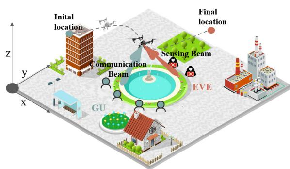

Fig. 1. An illustrative UAV-ISAC secure communication system. The UAV base station moves from its initial to final locations, communicating securely with the ground user by communication beam and sensing beam to sense the eavesdroppers’ channel information.  
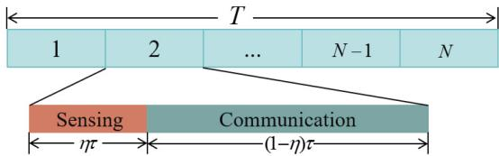  
Fig. 2. Time slot allocation. The sensing period takes up ητ , followed by the remaining (1 − η)τ allocated for communication.

We organize the remainder of this paper as follows. The UAV-ISAC system model and problem formulation are introduced in Section II. In Section III, we propose a triple-layer iterative optimization algorithm to address the established problem. The numerical experiment results are presented in Section IV, where the performance of the proposed algorithm is validated. Finally, the article is concluded in Section V.

Notations: Throughout this paper, notation $\mathbb { C } ^ { C \times D }$ represents the set of $C \times D$ complex-valued matrices. Operation $\operatorname { T r } \{ \cdot \}$ represents the trace of a complex matrix. The realvalued Gaussian distribution and the circularly symmetric complex Gaussian distribution are denoted by $\mathscr { C N } ( \pmb { \mu } , \pmb { \Sigma } )$ and $\scriptstyle { \mathcal { N } } ( \mu , \Sigma )$ , where covariance matrix Σ and mean vector µ are denoted. The conjugate transpose is denoted by $( \cdot ) ^ { H }$ . Vectors are denoted by boldface lowercase letters.

## II. SYSTEM MODEL AND PROBLEM FORMULATION

According to Fig. 1, we consider a UAV-ISAC model, where the UAV base station flies in the air, while K legitimate ground users and M passive eavesdroppers are situated on the ground. A Uniform Linear Array (ULA) is employed by the UAV, consisting of $N _ { R }$ receive antennas and $N _ { T }$ transmit antennas, which are used for beamforming-based transmission and reception. To facilitate trajectory design, we discretize the total operation period T into N equal-length time slots, each with duration τ , such that $T \ = \ N \tau$ . As shown in Fig. 2, time slot i is further divided into a sensing sub-slot and a communication sub-slot with time allocation ratio $\eta [ i ]$ and $1 - \eta [ i ]$ , respectively. During the sensing sub-slot, the UAV performs radar sensing to estimate the parameters of potential eavesdroppers, while the communication sub-slot is used to serve ground users.

To simplify the mathematical formulation, we adopt a 3D Cartesian coordinate system to represent the locations of all relevant nodes, including the UAV, users, and eavesdroppers. We denote horizontal coordinates of the UAV at time slot $i ,$ with $i \in \{ 1 , 2 , . . . , N \}$ , as $\mathbf { q } ^ { B } [ i ] \ = \ [ x ^ { B } [ i ] , y ^ { B } [ i ] ]$ . The 3D position of the UAV is denoted by $[ \mathbf { q } ^ { B } [ i ] , \dot { z } ^ { B } [ i ] ]$ , where $z ^ { B } [ i ]$ indicates its altitude. The horizontal coordinates of user k are denoted by $\mathbf { q } _ { k } ^ { C } [ i ] = [ x _ { k } ^ { C } [ i ] , y _ { k } ^ { C } [ i ] ]$ , where $k \in \{ 1 , 2 , . . . , K \}$ Horizontal coordinates of eavesdropper m at time slot i are denoted by $\mathbf { q } _ { m } ^ { E } [ i ] = [ x _ { m } ^ { E } [ i ] , y _ { m } ^ { E } [ i ] ]$ , where $m \in \{ 1 , 2 , . . . , M \}$ For the downlink transmission, the channels between the UAV and legitimate users are assumed to be perfectly known via dedicated feedback links or channel reciprocity mechanisms, as commonly adopted in the literature [23], [24]. During the sensing phase, the UAV estimates the target-related channels based on the received echo signals. Meanwhile, a trusted thirdparty authority is assumed to identify potential eavesdroppers using prior information [25].

## A. Signal Model for UAV-to-User Transmission

The signal is transmitted by the UAV base station in the downlink at time slot i and expressed as:

$$
\mathbf { x } [ i ] = \sum _ { m = 1 } ^ { M } \mathbf { r } _ { m } [ i ] a _ { m } [ i ] + \sum _ { k = 1 } ^ { K } \mathbf { w } _ { k } [ i ] s _ { k } [ i ] u _ { k } [ i ] ,\tag{1}
$$

where the information-bearing signal intended for user k is denoted by $s _ { k } [ i ] \ \sim \ \mathcal { C N } ( 0 , 1 )$ , and $a _ { m } [ i ] \ \sim \ \mathcal { C N } ( 0 , 1 )$ represents the artificial noise used for sensing and jamming eavesdropper m. We introduce binary variable $u _ { k } [ i ] \in \{ 0 , 1 \}$ to indicate the user scheduling decision, where $u _ { k } [ i ] = 1$ means that the UAV communicates with user k at time slot i. To ensure that the UAV serves at most one user per time slot, we impose constraint $\begin{array} { r } { \sum _ { k = 1 } ^ { K } u _ { k } [ i ] \ \leq \ 1 } \end{array}$ . Herein, $\mathbf { w } _ { k } [ i ] \ \in \ \mathbb { C } ^ { N _ { T } \times 1 }$ denotes the beamforming vector from the UAV to user k at time slot i. Similarly, $\mathbf { r } _ { m } [ i ] \ \in \ \mathbb { C } ^ { N _ { T } \times 1 }$ represents the beamforming vector for artificial noise targeted at eavesdropper m at time slot i.

We adopt a LoS channel model to characterize the wireless link between the UAV base station and the ground users. This is a reasonable approximation in scenarios such as rural or open areas where the UAV operates at high altitudes with minimal blockage and scattering [26]. Accordingly, the downlink channel vector from the UAV to user k at time slot i is given by:

$$
\mathbf { h } _ { k } ^ { C } [ i ] = \sqrt { \beta _ { 0 } \left( d _ { k } ^ { C } [ i ] \right) ^ { - \alpha } } \mathbf { f } _ { k } ^ { C } [ i ] ,\tag{2}
$$

where α denotes the path loss exponent for UAV-toground channels and is set to 2 to model free-space propagation under dominant LoS conditions. The channel power gain at the reference distance of 1 meter is represented by variable $\beta _ { 0 }$ , and distance $d _ { k } ^ { C } [ i ]$ between the UAV and user k at time slot i is calculated as $d _ { k } ^ { C } [ i ] ~ =$ $\sqrt { \left\| \mathbf { q } ^ { B } [ i ] - \mathbf { q } _ { k } ^ { C } [ i ] \right\| ^ { 2 } + \left( z ^ { B } [ i ] \right) ^ { 2 } }$ . The azimuth Angle of Departure (AoD) from the UAV to user k at time slot $i ,$ denoted by $\theta _ { k } ^ { C } [ i ]$ , is represented in the range $[ - \pi / 2 , \pi / 2 ]$ . Variable $\mathbf { f } _ { k } ^ { C } [ i ] = \left[ 1 , \ e ^ { - j \frac { 2 \pi d } { \lambda } \sin ( \theta _ { k } ^ { C } [ i ] ) } , \ \cdots , \ e ^ { - j \frac { 2 \pi d } { \lambda } ( N _ { T } - 1 ) \sin ( \theta _ { k } ^ { C } [ i ] ) } \right] ^ { T }$ denotes the transmit steering vector from the UAV to user k, where the spacing between each adjacent antenna elements is represented by d, and the carrier wavelength is represented by λ. As a result, we express the received signal at user k at time slot i as:

$$
y _ { k } ^ { C } [ i ] = \mathbf { h } _ { k } ^ { C } [ i ] ^ { H } \mathbf { x } [ i ] + n _ { k } ^ { C } [ i ] ,\tag{3}
$$

where variable $n _ { k } ^ { C } [ i ] \ \sim \ \mathcal { C N } ( 0 , \sigma _ { k } ^ { 2 } )$ represents the additive white Gaussian noise at user k, and $\sigma _ { k } ^ { 2 }$ is the noise power.

To ensure communication security, it is simplified that the UAV base station serves at most one user per time slot, thus avoiding inter-user interference. Accordingly, we define the Signal-to-Interference-plus-Noise Ratio (SINR) of user $k$ at time slot i as:

$$
\gamma _ { k } ^ { C } [ i ] = \frac { \biggl | \displaystyle \sum _ { k = 1 } ^ { K } \mathbf { h } _ { k } ^ { C } [ i ] ^ { H } \mathbf { w } _ { k } [ i ] u _ { k } [ i ] \biggr | ^ { 2 } } { \biggl | \displaystyle \sum _ { m = 1 } ^ { M } \mathbf { h } _ { k } ^ { C } [ i ] ^ { H } \mathbf { r } _ { m } [ i ] \biggr | ^ { 2 } + \sigma _ { k } ^ { 2 } } .\tag{4}
$$

Based on the above SINR expression, we express the achievable transmission rate from the UAV to user k at time slot i as:

$$
R _ { k } ^ { C } [ i ] = ( 1 - \eta [ i ] ) \log _ { 2 } \left( 1 + \gamma _ { k } ^ { C } [ i ] \right) ,\tag{5}
$$

where η[i] is the time allocation ratio for sensing, and $( 1 - \eta [ i ] ) \tau$ denotes the effective communication duration at time slot i.

## B. Sensing Model

The UAV base station operates in a monostatic mode, transmitting a signal and receiving the echo reflected from the target. We model the echo channel at time slot i from eavesdropper m to the UAV base station as:

$$
\mathbf { h } _ { m } ^ { r } [ i ] = \epsilon _ { m } [ i ] \sqrt { \beta _ { 0 } \left( d _ { m } ^ { E } [ i ] \right) ^ { - \alpha } } \mathbf { b } _ { m } ^ { E } [ i ] \mathbf { b } _ { m } ^ { E } [ i ] ^ { H } ,\tag{6}
$$

where $\epsilon _ { m } [ i ]$ denotes the reflection coefficient of eavesdropper m at time slot i, and $\beta _ { 0 }$ is the reference path gain at a distance of 1 meter. The distance between the UAV and eavesdropper m is denoted by $d _ { m } ^ { E } [ i ]$ . Variable $ { \mathbf { b } } _ { m } ^ { E } [ i ] \in \mathbb { C } ^ { N _ { R } \times 1 }$ represents the transmit and receive steering vector at the UAV. The steering vector for eavesdropper m at time slot i is given by $\mathbf { b } _ { m } ^ { E } [ i ] =$ $\left[ 1 , e ^ { - j { \frac { 2 \pi d } { \lambda } } \sin ( \theta _ { m } ^ { E } [ i ] ) } , . . . , e ^ { - j { \frac { 2 \pi d } { \lambda } } ( N _ { R } - 1 ) \sin ( \theta _ { m } ^ { E } [ i ] ) } \right] ^ { T }$ To obtain reliable channel state information of eavesdroppers, the UAV base station estimates unknown sensing parameters such as AoD $\theta _ { m } ^ { E } [ i ]$ and distance $d _ { m } ^ { E } [ i ]$ from the UAV base station to eavesdropper m at time slot i.

Given various performance metrics for radar parameter estimation, a fundamental lower bound on the variance of unbiased estimators is provided by the CRB [27]. The CRB for AoD estimation $\hat { \theta } _ { m } ^ { E } [ i ]$ of eavesdropper m at time slot i is given by [28]:

$$
\psi _ { m } [ i ] = \frac { \left( d _ { m } ^ { E } [ i ] \right) ^ { 2 } \sigma _ { n } ^ { 2 } } { \epsilon _ { m } ^ { 2 } \beta _ { 0 } ^ { 2 } G ^ { 2 } \mathbf { r } _ { m } ^ { H } [ i ] \beta _ { m } ^ { H } [ i ] \beta _ { m } [ i ] \mathbf { r } _ { m } [ i ] } ,\tag{7}
$$

where G denotes the matched filter gain, and the derivative of the transmit steering vector with regard to angle $\theta _ { m } ^ { E } [ i ]$ is denoted as $\beta _ { \mathscr { m } } [ i ] = \bar { \partial ( \mathbf { b } _ { m } ^ { E } [ i ] ) } ^ { H } / \partial \theta _ { m } ^ { E } [ i ]$ . The CRB for range estimation $\hat { d } _ { m } ^ { E } [ i ]$ is given by:

$$
\xi _ { m } [ i ] = \frac { \sigma _ { n } ^ { 2 } \left( d _ { m } ^ { E } [ i ] \right) ^ { 2 } \kappa ^ { 2 } c ^ { 2 } } { \epsilon _ { m } ^ { 2 } \beta _ { 0 } ^ { 2 } G ^ { 2 } \left| \mathbf { b } _ { m } ^ { E } [ i ] ^ { H } \mathbf { r } _ { m } [ i ] \right| ^ { 2 } } ,\tag{8}
$$

where $\sigma _ { n } ^ { 2 }$ is the variance of residual noise and clutter, while c denotes the signal propagation speed, and κ is a systemspecific constant.

## C. Signal Model for Eavesdroppers With Channel Uncertainty

The channel vector from the UAV base station to eavesdropper m at time slot i is given by:

$$
\mathbf { h } _ { m } ^ { E } [ i ] = \sqrt { \beta _ { 0 } \left( d _ { m } ^ { E } [ i ] \right) ^ { - \alpha } } \mathbf { f } _ { m } ^ { E } [ i ] ,\tag{9}
$$

where $d _ { m } ^ { E } [ i ] ~ = ~ \sqrt { \| \mathbf { q } ^ { B } [ i ] - \mathbf { q } _ { m } ^ { E } [ i ] \| ^ { 2 } + ( z ^ { B } [ i ] ) ^ { 2 } }$ denotes the Euclidean distance between the UAV base station and eavesdropper m. Let $\theta _ { m } ^ { E } [ i ] \in [ - \pi / 2 , \pi / 2 ]$ denote the AoD from the UAV to eavesdropper m, while $\hat { d } _ { m } ^ { \dot { E } } [ i ]$ and $\hat { \theta } _ { m } ^ { E } [ i ]$ denote the estimated distance and AoD obtained from sensing, respectively. Then, estimated channel vector $\hat { \mathbf { h } } _ { m } ^ { E } [ i ]$ can be constructed accordingly. However, due to inevitable estimation errors, the actual channel state differs from the estimated one.

To enhance robustness, we adopt a bounded channel uncertainty model [29], defined as:

$$
\begin{array} { r } { \chi _ { m } = \left\{ \Delta _ { m } \Big \vert \Delta _ { m } = \mathbf { h } _ { m } ^ { E } [ i ] - \hat { \mathbf { h } } _ { m } ^ { E } [ i ] , \ \left. \Delta _ { m } \right. \leq \varepsilon _ { m } \right\} , } \end{array}\tag{10}
$$

where $\varepsilon _ { m }$ represents the upper bound on the channel estimation error. By accounting for the CRB-based angle and distance estimation errors, this uncertainty radius can be conservatively set as $\varepsilon _ { m } ~ = ~ 3 \sqrt { \psi ^ { \mathrm { m a x } } } + 3 \sqrt { \xi ^ { \mathrm { m a x } } }$ , ensuring that the resulting channel perturbation remains within this set with high probability. A detailed derivation of this bound is provided in Appendix E. In this work, we adopt the worstcase estimation error as the bound, incorporating uncertainties in both range and angle.

The received signal of eavesdropper m at time slot i is then expressed as:

$$
y _ { m } ^ { E } [ i ] = \mathbf { h } _ { m } ^ { E } [ i ] ^ { H } \mathbf { x } [ i ] + n _ { m } ^ { E } [ i ] ,\tag{11}
$$

where $n _ { m } ^ { E } [ i ] \sim \mathcal { C N } ( 0 , \sigma _ { m } ^ { 2 } )$ denotes the additive white Gaussian noise at eavesdropper m. At time slot i, the SINR of eavesdropper m is given by:

$$
\gamma _ { m } ^ { E } [ i ] = \frac { \biggl | \displaystyle \sum _ { k = 1 } ^ { K } \mathbf { h } _ { m } ^ { E } [ i ] ^ { H } \mathbf { w } _ { k } [ i ] u _ { k } [ i ] \biggr | ^ { 2 } } { \biggl | \displaystyle \sum _ { m = 1 } ^ { M } \mathbf { h } _ { m } ^ { E } [ i ] ^ { H } \mathbf { r } _ { m } [ i ] \biggr | ^ { 2 } + \sigma _ { m } ^ { 2 } } ,\tag{12}
$$

where $\sigma _ { m } ^ { 2 }$ is the noise power at eavesdropper m. Then, the achievable transmission rate at eavesdropper m is:

$$
R _ { m } ^ { E } [ i ] = ( 1 - \eta [ i ] ) \log _ { 2 } \left( 1 + \gamma _ { m } ^ { E } [ i ] \right) .\tag{13}
$$

Hence, the worst-case secrecy rate at time slot i is given by:

$$
R _ { \mathrm { s e c } } = \frac { 1 } { N } \sum _ { i = 1 } ^ { N } \bigg [ R _ { k } ^ { C } [ i ] - \operatorname* { m a x } _ { m \in M } { R _ { m } ^ { E } [ i ] } \bigg ] ^ { + } ,\tag{14}
$$

where $[ \cdot ] ^ { + } = \operatorname* { m a x } \{ \cdot , 0 \}$ ensures non-negativity.

## D. Energy Consumption Model

The energy consumption of the UAV base station consists of two main components, i.e., the energy used for communication and sensing and the aerodynamic propulsion energy for flight. At time slot i, sensing and communication energy consumption of the UAV base station is given by:

$$
\begin{array} { r l } & { { E } ^ { I } [ i ] } \\ & { \ = \left\{ \eta [ i ] \sum _ { m = 1 } ^ { M } \| \mathbf { r } _ { m } [ i ] \| ^ { 2 } + \left( 1 - \eta [ i ] \right) \displaystyle \sum _ { k = 1 } ^ { K } u _ { k } [ i ] \| \mathbf { w } _ { k } [ i ] \| ^ { 2 } \right\} \tau , } \end{array}\tag{15}
$$

where $\mathbf { r } _ { m } [ i ]$ and $\mathbf { w } _ { k } [ i ]$ denote sensing and communication beamforming vectors, respectively, and τ is the duration of one time slot. We describe aerodynamic energy consumption for the UAV base station flight at time slot i as modeled in [30]:

$$
E ^ { F } [ i ] = \{ P ^ { 0 } ( 1 + \frac { 3 V ^ { L } [ i ] ^ { 2 } } { ( U ^ { V } ) ^ { 2 } } ) + P ^ { H } ( ( 1 + \frac { V ^ { L } [ i ] ^ { 4 } } { 4 ( V ^ { 0 } ) ^ { 4 } } ) ^ { \frac { 1 } { 2 } } 
$$

$$
- \frac { V ^ { L } [ i ] ^ { 2 } } { 2 ( V ^ { 0 } ) ^ { 2 } } \Biggr ) ^ { \frac { 1 } { 2 } } + C ^ { 0 } V ^ { L } [ i ] ^ { 3 } + G ^ { 0 } V ^ { Z } [ i ] \Biggr \} \tau ,\tag{16}
$$

where the blade profile and induced power coefficients are represented by $P ^ { 0 }$ and $P ^ { H }$ . Variable $U ^ { \bar { V } }$ is the tip speed of rotor blades, and $C ^ { 0 }$ is the drag coefficient. The mean rotor induced velocity is denoted by $V ^ { 0 }$ , and the UAV weight is represented by $G ^ { 0 }$ . We compute horizontal and vertical velocities of the UAV at time slot i as $V ^ { L } [ i ] = \left\| \mathbf { q } ^ { B } [ i + 1 ] - \mathbf { q } ^ { B } [ i ] \right\| / \tau$ and $V ^ { Z } [ i ] = \left| z ^ { B } [ i + 1 ] - z ^ { B } [ i ] \right| ^ { . } / \tau$ , respectively.

## E. Problem Formulation

Our objective is to maximize average secrecy rate over the entire time horizon, by optimizing downlink communication beamforming $\mathbf { w } _ { k } [ i ]$ , sensing beamforming $\mathbf { r } _ { m } [ i ]$ , UAV trajectory Q, user scheduling $u _ { k } [ i ]$ ], and sensing time allocation $\eta [ i ]$ We formulate the optimization problem as:

$$
\mathbf { P } _ { 0 } : \operatorname* { m a x } _ { \substack { \mathbf { w } _ { k } [ i ] , \mathbf { r } _ { m } [ i ] , \boldsymbol { Q } , u _ { k } [ i ] , \eta [ i ] } } R _ { \mathrm { s e c } } ,\tag{17}
$$

$$
\mathrm { s . t . } \sum _ { k = 1 } ^ { K } u _ { k } [ i ] \left\| \mathbf { w } _ { k } [ i ] \right\| ^ { 2 } + \sum _ { m = 1 } ^ { M } \left\| \mathbf { r } _ { m } [ i ] \right\| ^ { 2 }
$$

$$
\leq P ^ { \mathrm { m a x } } , \forall k , m , i ,
$$

$$
\xi _ { m } [ i ] \leq \xi ^ { \operatorname* { m a x } } , \quad \forall m , i ,\tag{17a}
$$

$$
\psi _ { m } [ i ] \leq \psi ^ { \mathrm { m a x } } , \quad \forall m , i ,\tag{17b}
$$

(17c)

$$
u _ { k } [ i ] \in \{ 0 , 1 \} , \quad \forall k , i ,\tag{17d}
$$

$$
\sum _ { k = 1 } ^ { \kappa } u _ { k } [ i ] \leq 1 , \quad \forall k , i ,\tag{17e}
$$

$$
R _ { k } ^ { C } [ i ] \geq R _ { \mathrm { C U } } ^ { \mathrm { m i n } } , \quad \forall k , i ,\tag{17f}
$$

$$
R _ { m } ^ { E } [ i ] \leq R _ { E } ^ { \operatorname* { m a x } } , \quad \forall m , i ,\tag{17g}
$$

$$
\begin{array} { r } { \left\| \mathbf { q } ^ { B } [ i + 1 ] - \mathbf { q } ^ { B } [ i ] \right\| \leq V _ { L } ^ { \operatorname* { m a x } } \tau , } \end{array}\tag{∀i,}
$$

(17h)

$$
\begin{array} { r } { \left| z ^ { B } [ i + 1 ] - z ^ { B } [ i ] \right| \leq V _ { Z } ^ { \operatorname* { m a x } } \tau , \quad \forall i , } \end{array}\tag{17i}
$$

$$
z ^ { \mathrm { m i n } } \leq z ^ { B } [ i ] \leq z ^ { \mathrm { m a x } } , \quad \forall i ,\tag{17j}
$$

$$
E ^ { I } [ i ] + E ^ { F } [ i ] \leq E ^ { \operatorname* { m a x } } , \quad \forall i ,\tag{17k}
$$

where constraint (17a) imposes transmit power budget P <sup>max</sup> on the UAV. Constraints (17b) and (17c) ensure that the CRB remains below thresholds $\xi ^ { \mathrm { m a x } }$ and $\psi ^ { \mathrm { m a x } }$ , thereby satisfying the sensing accuracy requirement. Constraints (17d) and (17e) guarantee that the UAV base station exclusively communicates with a single user at each time slot. Constraints (17f) and $( 1 7 \mathrm { g ) }$ guarantee the minimum user communication rate and the maximum eavesdropping rate. Constraints (17h) and (17i) define the upper bounds on the $\mathrm { U A V } \mathbf { \hat { s } }$ horizontal and vertical flight speeds, specified by $V _ { L } ^ { \mathrm { m a x } }$ and $V _ { Z } ^ { \mathrm { m a x } }$ , respectively. Constraint (17j) limits the $\mathrm { U A V } \mathbf { \hat { s } }$ altitude. Constraint (17k) represents the energy consumption limitation of the UAV base station at each time slot.

Proposition 1: Problem $\mathbf { P } _ { 0 }$ is NP-hard.

For the proof, please see Appendix A.

## III. PROPOSED ALGORITHM

Problem $\mathbf { P } _ { 0 }$ is a mixed-integer non-convex optimization that involves user scheduling, sensing time allocation, UAV trajectory, and beamforming variables, which are highly coupled. To facilitate an efficient solution, we decompose Problem $\mathbf { P } _ { 0 }$ into three subproblems with respect to user scheduling and sensing time allocation, UAV trajectory optimization, and beamforming optimization, respectively.

Remark 1: If Problem $\mathbf { P } _ { 0 }$ is decomposed into three subproblems, each can be reformulated as a convex optimization problem. In contrast, a two-block decomposition reduces flexibility and efficiency while increasing complexity. Specifically, splitting Problem $\mathbf { P } _ { 0 }$ into two blocks either couples binary scheduling variable $u _ { k } [ i ]$ with beamforming variables, creating a mixed-integer nonconvex problem, or ties trajectory Q with beamforming, leading to bilinear forms that are hard to convexify and solve efficiently.

## A. User Scheduling and Sensing Time Allocation Optimization

We design a penalty-based function approach to handle binary scheduling variables, gradually driving non-binary solutions toward binary values and avoiding extra rounding operations. Given communication beamforming $\mathbf { w } _ { k } [ i ] .$ , sensing beamforming $\mathbf { r } _ { m } [ i ]$ and UAV trajectory Q, we focus on user scheduling $u _ { k } [ i ]$ and sensing time allocation η[i]. Then, Problem $\mathbf { P } _ { 0 }$ can be transformed into:

$$
\mathbf { P } _ { 1 } : \operatorname* { m a x } _ { u _ { k } [ i ] , \eta [ i ] } R _ { \mathrm { s e c } } ,
$$

$$
\mathrm { { s . t . ~ c o n s t r a i n t s ~ ( 1 7 a ) , ~ ( 1 7 d ) - ~ ( 1 7 g ) , ~ ( 1 7 k ) . } }\tag{18}
$$

To facilitate the optimization of user scheduling $u _ { k } [ i ]$ and sensing time allocation $\eta [ i ]$ , the objective function of Problem ${ \bf P } _ { 1 }$ is rewritten as:

$$
\begin{array} { l } { \displaystyle R _ { \mathrm { s e c } } = \frac { 1 } { N } \sum _ { i = 1 } ^ { N } \sum _ { k = 1 } ^ { K } u _ { k } [ i ] ( 1 - \eta [ i ] ) } \\ { \displaystyle \left[ \log _ { 2 } \left( 1 + \gamma _ { k } ^ { C ^ { \prime } } [ i ] \right) - \operatorname* { m a x } _ { m \in \mathcal { M } } \log _ { 2 } \left( 1 + \gamma _ { m } ^ { E ^ { \prime } } [ i ] \right) \right] ^ { + } . } \end{array}\tag{19}
$$

Auxiliary variables $\gamma _ { k } ^ { C ^ { \prime } } [ i ]$ and $\gamma _ { m } ^ { E ^ { \prime } } [ i ]$ are defined as follows: <sup>0</sup> [i] = <sub></sub>h<sup>C</sup><sub>k</sub> [i]<sup>H</sup> w<sub>k</sub>[i]<sub></sub><sup>2</sup> P<sup>M</sup><sub>m=1</sub> h<sup>C</sup><sub>k</sub> [i]<sup>H</sup> r<sub>m</sub>[i]<sup></sup><sub></sub><sup>2</sup> γ<sup>E0</sup><sub>m</sub> [i] = h<sup>E</sup><sub>m</sub>[i]<sup>H</sup> w<sub>k</sub>[i]<sup>2</sup> P<sup>M</sup><sub>m=1</sub> h<sup>E</sup><sub>m</sub>[i]<sup>H</sup>r<sub>m</sub>[i] <sup>2</sup>+σ<sup>2</sup><sub>m</sub>

To transform the uncertainty in Problem $\mathbf { P } _ { 1 }$ arising from imperfect channel between the UAV and the eavesdropper into a tractable deterministic formulation, the following inequality should be satisfied according to the worst-case criterion [31]:

$$
\begin{array} { l } { { \displaystyle \log _ { 2 } \left( 1 + \gamma _ { m } ^ { E ^ { \prime } } [ i ] \right) \leq } \ ~ } \\ { { \displaystyle \log _ { 2 } \left( 1 + \frac { \left. \sum _ { k = 1 } ^ { K } \left( \hat { \mathbf { h } } _ { m } ^ { E } [ i ] + \varepsilon _ { m } \right) ^ { H } \mathbf { w } _ { k } [ i ] \right. ^ { 2 } } { \left. \displaystyle \sum _ { m = 1 } ^ { M } \left( \hat { \mathbf { h } } _ { m } ^ { E } [ i ] - \varepsilon _ { m } \right) ^ { H } \mathbf { r } _ { m } [ i ] \right. ^ { 2 } + \sigma _ { m } ^ { 2 } } \right) = g _ { m } ^ { \ast } [ i ] } . } \end{array}\tag{20}
$$

Given the above transformation, the optimization objective and constraint (17g) of Problem $\mathbf { P } _ { 1 }$ could be reformulated as:

$$
\begin{array} { r l } { \mathbf { P } _ { 1 } ^ { \prime } : } & { \displaystyle \operatorname* { m a x } _ { u _ { k } [ i ] , \eta [ i ] } \frac { 1 } { N } \sum _ { i = 1 } ^ { N } \sum _ { k = 1 } ^ { K } u _ { k } [ i ] ( 1 - \eta [ i ] ) S _ { k } ^ { * } [ i ] , } \\ & { \mathrm { s . t . ~ } ( 1 - \eta [ i ] ) u _ { k } [ i ] g _ { m } ^ { * } [ i ] \le R _ { E } ^ { \operatorname* { m a x } } , \quad \forall k , m , i , \ ( \mathrm { \Omega } } \\ & { \mathrm { c o n s t r a i n t s ~ } \quad ( 1 7 \mathrm { a } ) , \ ( 1 7 \mathrm { d } ) - \ ( 1 7 \mathrm { f } ) , \ ( 1 7 \mathrm { k } ) } \end{array}\tag{21}
$$

(21a)

where auxiliary variable $\begin{array} { r c l } { S _ { k } ^ { * } [ i ] } & { = } & { \left[ \log _ { 2 } \Big ( 1 + \gamma _ { k } ^ { C ^ { \prime } } [ i ] \Big ) \ - \right. } \end{array}$ $\begin{array} { r } { \operatorname* { m a x } _ { m \in \mathcal { M } } g _ { m } ^ { * } [ i ] ] . } \end{array}$ +

To handle binary constraint (17d), we equivalently express it as $u _ { k } [ i ] ( 1 - u _ { k } [ i ] ) = 0$ . Introducing slack variable $\tilde { u } _ { k } [ i ]$ we reformulate it as $u _ { k } [ i ] ( 1 - \tilde { u } _ { k } [ i ] ) = 0$ with $u _ { k } [ i ] = \tilde { u } _ { k } [ i ]$ to enable convex relaxation. Accordingly, Problem $\mathbf { P } _ { 1 } ^ { \prime }$ can be further transformed into the following form with the penalty:

$$
\mathbf { P } _ { 1 } ^ { \prime \prime } : \operatorname* { m a x } _ { u _ { k } [ i ] , \eta [ i ] , \tilde { u } _ { k } [ i ] } \frac { 1 } { N } \sum _ { i = 1 } ^ { N } \sum _ { k = 1 } ^ { K } ( u _ { k } [ i ] ( 1 - \eta [ i ] ) S _ { k } ^ { * } [ i ] - \zeta \Lambda _ { k } [ i ] ) ,\tag{22}
$$

$$
\mathrm { s . t . ~ } 0 \leq u _ { k } [ i ] \leq 1 , \quad \forall k , i ,\tag{22a}
$$

$$
\mathrm { c o n s t r a i n t s ~ ( 1 7 a ) , ~ ( 1 7 e ) - ~ ( 1 7 f ) , ~ ( 1 7 k ) , ~ ( 2 1 a ) , }
$$

where $\begin{array} { r c l } { { \Lambda _ { k } \bigl [ i \bigr ] } } & { { = } } & { { \bigl | u _ { k } \bigl [ i \bigr ] - \tilde { u } _ { k } \bigl [ i \bigr ] \bigr | ^ { 2 } + \bigl | u _ { k } \bigl [ i \bigr ] \bigl ( 1 - \tilde { u } _ { k } \bigl [ i \bigr ] \bigr ) \bigr | ^ { 2 } } } \end{array}$ . We observe that user scheduling $u _ { k } [ i ]$ and auxiliary relaxation variable $\tilde { u } _ { k } [ i ]$ are still coupled in Problem $\mathbf { P } _ { 1 } ^ { \prime \prime }$ , but fortunately the closed-form solution of relaxation variable $\tilde { u } _ { k } [ i ]$ can be obtained from the following theorem:

Proposition 2: When we fix user scheduling $u _ { k } [ i ]$ and sensing time allocation $\eta [ i ]$ , auxiliary relaxation variable $\tilde { u } _ { k } [ i ]$ can be expressed as:

$$
\tilde { u } _ { k } [ i ] = \frac { u _ { k } [ i ] + u _ { k } [ i ] ^ { 2 } } { 1 + u _ { k } [ i ] ^ { 2 } } .\tag{23}
$$

For the proof, please see Appendix $\mathbf { B } .$

To convexify bilinear term $u _ { k } [ i ] ( 1 \mathrm { ~  ~ \xi ~ } - \mathrm { ~  ~ \nabla ~ } \eta [ i ] ) ,$ we adopt the perfect square identity: $\begin{array} { r l } { u _ { k } [ i ] ( 1 ~ - ~ \eta [ i ] ) } & { { } = } \end{array}$ $( [ u _ { k } [ i ] + ( 1 \dot { - } \eta [ i ] ) ] ^ { 2 } \dot { - } u _ { k } [ i ] ^ { 2 } - ( 1 \dot { - } \eta [ i ] ) ^ { 2 } ) ^ { } / 2$ . Specifically, the following expression can be obtained by performing a taylor expansion at given point $( u _ { k } [ i ] ^ { r } , \eta [ i ] ^ { r } )$

$$
\begin{array} { r l r } {  { u _ { k } [ i ] ( 1 - \eta [ i ] ) } } \\ & { \geq \frac { 1 } { 2 } [ ( u _ { k } [ i ] ^ { r } + ( 1 - \eta [ i ] ^ { r } ) ) ^ { 2 } + 2 ( u _ { k } [ i ] ^ { r } + ( 1 - \eta [ i ] ^ { r } ) )  } \\ & { } & {  ( u _ { k } [ i ] - u _ { k } [ i ] ^ { r } - \eta [ i ] + \eta [ i ] ^ { r } ) - u _ { k } [ i ] ^ { 2 } - ( 1 - \eta [ i ] ) ^ { 2 } ] } \\ & { = \underline { { L } } [ i ] ^ { r } . } \end{array}\tag{4}
$$

Constraints (21a) and (17k) are non-concave due to the presence of $u _ { k } [ i ] ( 1 - \eta [ i ] )$ . To address this, we transform $u _ { k } [ i ] ( 1 - \eta [ i ] )$ into the following form [32]:

$$
\begin{array} { c } { { ( 1 - \eta [ i ] ) u _ { k } [ i ] \le \displaystyle \frac { 1 } { 2 } \left( \displaystyle \frac { ( 1 - \eta [ i ] ) ^ { r } u _ { k } [ i ] ^ { 2 } } { u _ { k } [ i ] ^ { r } } + \displaystyle \frac { u _ { k } [ i ] ^ { r } ( 1 - \eta [ i ] ) ^ { 2 } } { ( 1 - \eta [ i ] ) ^ { r } } \right) } } \\ { { = \overline { { { L } } } [ i ] ^ { r } . } } \end{array}
$$

Therefore, we can transform Problem $\mathbf { P } _ { 1 } ^ { \prime \prime }$ into Problem $\mathbf { P } _ { 1 } ^ { \prime \prime \prime }$ as follows:

$$
\mathbf { P } _ { 1 } ^ { \prime \prime \prime } : \operatorname* { m a x } _ { u _ { k } [ i ] , \eta [ i ] } \frac { 1 } { N } \sum _ { i = 1 } ^ { N } \sum _ { k = 1 } ^ { K } \Big ( \underline { { L [ i ] ^ { r } S ^ { * } [ i ] } } - \zeta \Lambda _ { k } [ i ] \Big ) ,\tag{26}
$$

$$
\mathrm { s . t . } \ \underline { { L } } [ i ] ^ { r } \log _ { 2 } \left( 1 + \gamma _ { k } ^ { C ^ { \prime } } [ i ] \right) \geq R _ { \mathrm { C U } } ^ { \mathrm { m i n } } , \quad \forall k , i ,
$$

$$
\begin{array} { r } { \overline { L } [ i ] ^ { r } g ^ { * } [ i ] \leq R _ { E } ^ { \operatorname* { m a x } } , \quad \forall m , i , } \end{array}\tag{26a}
$$

(26b)

$$
\begin{array} { r } { \left\{ \eta [ i ] \displaystyle \sum _ { m = 1 } ^ { M } \| \mathbf { r } _ { m } [ i ] \| ^ { 2 } + \overline { { L } } [ i ] ^ { r } \displaystyle \sum _ { k = 1 } ^ { K } \| \mathbf { w } _ { k } [ i ] \| ^ { 2 } \right\} \tau } \\ { + E ^ { F } [ i ] \le E ^ { \operatorname* { m a x } } , \quad \forall i , \quad \quad ( 2 } \\ { \mathrm { c o n s t r a i n t s ~ \ } ( 1 7 \mathrm { a } ) , \ ( 1 7 \mathrm { e } ) , \ ( 2 2 \mathrm { a } ) , } \end{array}\tag{6c}
$$

where we solve this problem by convex optimization for MATLAB.

## B. UAV Trajectory Optimization

The 3D UAV trajectory optimization problem involves highdimensional continuous variables and a large-scale search space, which makes computing a globally optimal solution computationally intractable. Even the trajectory optimization subproblem alone is highly non-convex and NP-hard [33], [34]. Given fixed communication beamforming $\mathbf { w } _ { k } [ i ]$ , sensing beamforming $\mathbf { r } _ { m } [ i ]$ , user scheduling $u _ { k } [ i ]$ , and sensing time allocation $\eta [ i ]$ , we focus on optimizing UAV trajectory Q by solving the following problem:

$$
\begin{array} { r l } { \mathrm { \bf P _ { 2 } : } } & { \underset { \mathcal { Q } } { \operatorname* { m a x } } R _ { \mathrm { s e c } } , } \\ & { \mathrm { s . t . } \mathrm { c o n s t r a i n t s } ( 1 7 { \bf b } ) - ( 1 7 \mathrm { c } ) , ( 1 7 \mathrm { f } ) - ( 1 7 \mathrm { k } ) . } \end{array}\tag{27}
$$

Since direct optimization of Problem $\mathbf { P } _ { 2 }$ is highly intractable, according to equation (20), the eavesdropping rate under uncertainty can be upper bounded as:

$$
R _ { m } ^ { E } [ i ] \leq ( 1 - \eta [ i ] ) ~ u _ { k } [ i ] g _ { m } ^ { \ast } [ i ] = \bar { R } _ { m } ^ { E } [ i ] .\tag{28}
$$

Simultaneously, we introduce auxiliary variable $v _ { m } [ i ]$ to facilitate the reformulation of the objective function in Problem $\mathbf { P } _ { 2 }$ , and then it is transformed as follows:

$$
\mathbf { P } _ { 2 } ^ { \prime } : \operatorname* { m a x } _ { \mathcal { Q } , v _ { m } [ i ] } \frac { 1 } { N } \sum _ { i = 1 } ^ { N } R _ { k } ^ { C } [ i ] ,\tag{29}
$$

$$
\mathrm { s . t . } \quad \bar { R } _ { m } ^ { E } [ i ] \leq v _ { m } [ i ] , \quad \forall m , i ,\tag{29a}
$$

$$
\mathrm { c o n s t r a i n t s ~ \ ( 1 7 b ) - \ ( 1 7 c ) , \ ( 1 7 f ) - \ ( 1 7 k ) . }
$$

It can be found from equations (2) and (9) that transmit steering vectors $\mathbf { f } _ { k } ^ { C } [ i ]$ and $\mathbf { f } _ { m } ^ { E } [ i ]$ are nonlinear functions of the UAV trajectory, which makes Problem ${ \bf { P } } _ { 2 } ^ { \prime }$ highly non-convex and difficult to handle. To simplify trajectory design, we adopt a successive approximation strategy by setting $\mathbf { f } _ { k } ^ { \check { C } } [ i ] \approx \mathbf { f } _ { k } ^ { C } [ i ] ^ { r }$ and $\mathbf { f } _ { m } ^ { E } [ i ] \approx \mathbf { f } _ { m } ^ { \bar { E } } [ i ] ^ { r }$ , where steering vectors at iteration $r + 1$ are approximated by those from the previous iteration.

For simplicity, the transmission rate and constraint (17f) in Problem ${ \bf { P } } _ { 2 } ^ { \prime }$ are rewritten as equality $R _ { k } ^ { C } [ i ] = ( 1 - \eta [ i ] ) \Gamma _ { k } ^ { C } [ i$ ] and inequality $( 1 - \eta [ i ] ) \Gamma _ { k } ^ { C } [ i ] ^ { \overline { { { \bf \Phi } } } } \ge \dot { R } _ { \mathrm { C U } } ^ { \mathrm { m i n } }$ . Introduced variable $\Gamma _ { k } ^ { C } [ i ]$ , derived by logarithmic operations, is expressed as:

$$
\Gamma _ { k } ^ { C } [ i ] = \Upsilon _ { k } ^ { C } [ i ] - \log _ { 2 } \left( \frac { N _ { k } ^ { C } [ i ] } { s _ { k } [ i ] } + \sigma _ { k } ^ { 2 } \right) ,\tag{30}
$$

where introduced variable $\Upsilon _ { k } ^ { C } [ i ]$ is given by $\begin{array} { r l } { \Upsilon _ { k } ^ { C } [ i ] } & { { } = } \end{array}$ log<sub>2</sub> $\left( ( M _ { k } ^ { C } [ i ] + N _ { k } ^ { C } [ i ] ) / s _ { k } [ i ] + \stackrel { \mathrm { \scriptsize { \cdots } } } { \sigma _ { k } ^ { 2 } } \right)$ Introduced variable $\begin{array} { r } { M _ { k } ^ { C } [ i ] \ = \ \left( \sum _ { k = 1 } ^ { K } \beta _ { 0 } ( \mathbf { f } _ { k } ^ { C } [ i ] ^ { r } ) ^ { H } \mathbf { w } _ { k } [ i ] u _ { k } [ i ] \right) ^ { 2 } } \end{array}$ , and introduced variable $\begin{array} { r } { N _ { k } ^ { C } [ i ] = \left( \sum _ { m = 1 } ^ { M } \beta _ { 0 } ( \mathbf { f } _ { k } ^ { C } [ i ] ^ { r } ) ^ { H } \mathbf { r } _ { m } [ i ] \right) ^ { 2 } } \end{array}$ are founded. At time slot $i ,$ variable $s _ { k } [ i ] = z ^ { B } [ i ] ^ { 2 } + \| \mathbf { \check { q } } ^ { B } [ i ] - \mathbf { q } _ { k } ^ { C } [ i ] \| ^ { 2 }$ represents the squared distance from the UAV to user m.

Variable $\Upsilon _ { k } ^ { C } [ i ]$ , introduced here, is convex with respect to distance $s _ { k } [ i ]$ , but it remains non-convex with regard to UAV trajectory variables $z ^ { B } [ i ]$ and $\mathbf { q } ^ { B } [ i ]$ . To address this, the following lemma [35] is introduced:

Lemma 1: If $A _ { 0 } , \ B _ { 0 }$ , and $C _ { 0 }$ are positive constants, then function:

$$
f ( X ) = \log _ { 2 } \left( 1 + \frac { A _ { 0 } } { B _ { 0 } + C _ { 0 } X } \right) ,\tag{31}
$$

is convex with respect to $X ,$ and its first-order lower bound at given point $X ^ { ( r ) }$ can be represented as:

$$
\begin{array} { r l r } & { } & { \log _ { 2 } \left( 1 + \frac { A _ { 0 } } { B _ { 0 } + C _ { 0 } X } \right) \geq \log _ { 2 } \left( 1 + \frac { A _ { 0 } } { B _ { 0 } + C _ { 0 } X ^ { ( r ) } } \right) } \\ & { } & { \qquad \quad - \frac { A _ { 0 } C _ { 0 } ( X - X ^ { ( r ) } ) } { \ln 2 \left( B _ { 0 } + C _ { 0 } X ^ { ( r ) } \right) \left( A _ { 0 } + B _ { 0 } + C _ { 0 } X ^ { ( r ) } \right) } . } \end{array}\tag{32}
$$

According to Lemma 1, the following lower bound for $\Upsilon _ { k } ^ { C } [ i ]$ holds:

$$
\begin{array} { c } { { \Upsilon _ { k } ^ { C } [ i ] \geq \log _ { 2 } \left( \displaystyle \frac { M _ { k } ^ { C } [ i ] + N _ { k } ^ { C } [ i ] } { s _ { k } [ i ] ^ { r } } + \sigma _ { k } ^ { 2 } \right) } } \\ { { + \Omega _ { k } ^ { C } [ i ] \left( s _ { k } [ i ] - s _ { k } [ i ] ^ { r } \right) = \Upsilon _ { k } ^ { \mathrm { l o w } } [ i ] , } } \end{array}\tag{33}
$$

where the first-order derivative is $ \Omega _ { k } ^ { C } [ i ] ~ = ~ - ( M _ { k } ^ { C } [ i ] ~ + ~$ $N _ { k } ^ { C } [ i ] ) l n 2 / ( ( s _ { k } [ i ] ^ { r } ) ^ { 2 } (  { ( M _ { k } ^ { C } [ i ] + N _ { k } ^ { C } [ i ] ) } /  { \stackrel {  } { s _ { k } } [ i ] ^ { r } } + \sigma _ { k } ^ { 2 } ) )$ . By substituting introduced variable $\Upsilon _ { k } ^ { C } [ i ]$ with lower bound $\Upsilon _ { k } ^ { \mathrm { { l o w } } } [ i ]$ we obtain the following expression:

$$
\bar { \Gamma } _ { k } ^ { C } [ i ] = \Upsilon _ { k } ^ { \mathrm { l o w } } [ i ] - \log _ { 2 } \left( \frac { N _ { k } ^ { C } [ i ] } { s _ { k } [ i ] } + \sigma _ { k } ^ { 2 } \right) .\tag{34}
$$

Although obtained lower bound $\bar { \Gamma } _ { k } ^ { C } [ i ]$ is convex with regard to distance $s _ { k } [ i ]$ , it remains non-convex with respect to trajectory variables $z ^ { \dot { B } } \dot { [ i ] }$ and $\mathbf { q } ^ { B } [ i ]$ . To further convexify lower bound $\bar { \Gamma } _ { k } ^ { C } [ i ]$ , we introduce slack variable $\alpha _ { k } ^ { C } [ i ]$ converting $s _ { k } [ i ]$ into exponential form $1 / e ^ { \alpha _ { k } ^ { C } [ i ] }$ , while applying the Taylor expansion to trajectory variables $z ^ { B } [ i ]$ and $\mathbf { q } ^ { B } [ i ]$ , satisfying the following inequality constraint:

$$
\begin{array} { r } { \frac { 1 } { e ^ { \alpha _ { k } ^ { C } [ i ] } } \leq \| \mathbf { q } ^ { B } [ i ] ^ { r } - \mathbf { q } _ { k } ^ { C } [ i ] \| ^ { 2 } + 2 \ z ^ { B } [ i ] ^ { r } ( z ^ { B } [ i ] - z ^ { B } [ i ] ^ { r } ) + } \\ { ( z ^ { B } [ i ] ^ { r } ) ^ { 2 } + \ 2 \left( \mathbf { q } ^ { B } [ i ] ^ { r } - \mathbf { q } _ { k } ^ { C } [ i ] \right) ^ { H } ( \mathbf { q } ^ { B } [ i ] - \mathbf { q } ^ { B } [ i ] ^ { r } ) . } \end{array}\tag{35}
$$

We reformulate lower bound $\bar { \Gamma } _ { k } ^ { C } [ i ]$ obtained via Taylor expansion as:

$$
\begin{array} { r } { \hat { \Gamma } _ { k } ^ { C } [ i ] = \Upsilon _ { k } ^ { \mathrm { l o w } } [ i ] - \log _ { 2 } \left( N _ { k } ^ { C } [ i ] e ^ { \alpha _ { k } ^ { C } [ i ] } + \sigma _ { k } ^ { 2 } \right) . } \end{array}\tag{36}
$$

To approximate the trajectory optimization problem, we replace $\Gamma _ { k } ^ { C } [ i ]$ with its lower bound $\hat { \Gamma } _ { k } ^ { C } [ i ]$ in equation $R _ { k } ^ { C } [ i ] =$ $( 1 - \eta [ i ] ) \ddot { \Gamma _ { k } ^ { C } } [ i ]$ and inequality $( 1 - \eta [ i ] ) \bar { \Gamma } _ { k } ^ { C } [ i ] \geq R _ { \mathrm { C U } } ^ { \operatorname* { m i n } }$ , resulting in:

$$
\begin{array} { r l r } { \mathbf { P } _ { 2 } ^ { \prime \prime } : } & { \underset { \mathcal { Q } , v _ { m } [ i ] , \alpha _ { k } ^ { C } [ i ] } { \operatorname* { m a x } } \frac { 1 } { N } \underset { i = 1 } { \overset { N } { \sum } } ( 1 - \eta [ i ] ) \hat { \Gamma } _ { k } ^ { C } [ i ] , } & { ( 3 7 ) } \\ & { \mathrm { s . t . } } & { ( 1 - \eta [ i ] ) \hat { \Gamma } _ { k } ^ { C } [ i ] \ge R _ { \mathrm { C U } } ^ { \mathrm { m i n } } \quad \forall k , i , \quad \quad ( 3 7 \mathrm { a } ) } \\ & { } & { \mathrm { c o n s t r a i n t s ~ } \ ( 1 7 \mathrm { b } ) - \ ( 1 7 \mathrm { c } ) , \ ( 1 7 \mathrm { g } ) - \ ( 1 7 \mathrm { k } ) , } \\ & { } & { ( 2 9 \mathrm { a } ) , \ ( 3 5 ) . } \end{array}
$$

Secrecy constraint (29a) can be equivalently reformulated as inequality $( 1 - \eta [ i ] ) \Gamma _ { m } ^ { E } [ i ] \leq v _ { m } [ i ]$ to facilitate further analysis. Introduced variable $\Gamma _ { m } ^ { E } [ i ]$ is given as:

$$
\Gamma _ { m } ^ { E } [ i ] = \log _ { 2 } \left( \frac { M _ { m } ^ { E } [ i ] + N _ { m } ^ { E } [ i ] } { s _ { m } [ i ] } + \sigma _ { m } ^ { 2 } \right) - \Upsilon _ { m } ^ { E } [ i ] ,\tag{38}
$$

where introduced variable $\Upsilon _ { m } ^ { E } [ i ]$ is given by $\begin{array} { r l } { \Upsilon _ { m } ^ { E } [ i ] } & { { } = } \end{array}$ log<sub>2</sub> $\left( N _ { m } ^ { E } [ i ] / s _ { m } [ i ] + \sigma _ { m } ^ { 2 } \right)$ . Specifically, introduced variable $\begin{array} { r } { M _ { m } ^ { E } [ i ] = \left( \sum _ { k = 1 } ^ { K } \beta _ { 0 } ( \mathbf { f } _ { m } ^ { E } [ i ] ^ { r } + \varepsilon _ { m } ) ^ { H } \mathbf { w } _ { k } [ i ] u _ { k } [ i ] \right) ^ { 2 } } \end{array}$ , and introduced variable $\begin{array} { r } { N _ { m } ^ { E } [ i ] \ = \ \left( \sum _ { m = 1 } ^ { M } \beta _ { 0 } ( \mathbf { f } _ { m } ^ { E } [ i ] ^ { r } - \varepsilon _ { m } ) ^ { H } \mathbf { r } _ { m } [ i ] \right) ^ { 2 } } \end{array}$ are founded. In addition, at time slot $i ,$ variable $s _ { m } [ i ] \ ^ { \prime } =$ $z ^ { B } [ i ] ^ { 2 } + \| \mathbf { q } ^ { B } [ i ] - \mathbf { q } _ { m } ^ { E } [ i ] \| ^ { 2 }$ represents the squared distance from the UAV to eavesdropper m.

Similarly, Lemma 1 yields the following global lower bound:

$$
\begin{array} { c c } { \Upsilon _ { m } ^ { E } [ i ] \geq \log _ { 2 } \left( \displaystyle \frac { N _ { m } ^ { E } [ i ] } { s _ { m } [ i ] ^ { r } } + \sigma _ { m } ^ { 2 } \right) + \Omega _ { m } ^ { E } [ i ] ( s _ { m } [ i ] - s _ { m } [ i ] ^ { r } ) } \\ { = \Upsilon _ { m } ^ { \mathrm { l o w } } [ i ] , } & { ( \Sigma _ { m } ^ { \mathrm { l o w } } [ i ] , \overline { { { \Lambda } } } ^ { \mathrm { q u a l } } ) } \end{array}\tag{39}
$$

where $\Omega _ { m } ^ { E } [ i ] = - N _ { m } ^ { E } [ i ] l n 2 / \left[ ( s _ { m } [ i ] ^ { r } ) ^ { 2 } \left( N _ { m } ^ { E } [ i ] / s _ { m } [ i ] ^ { r } + \sigma _ { m } ^ { 2 } \right) \right]$ denotes the first-order derivative. By substituting introduced

variable $\Upsilon _ { m } ^ { E } [ i ]$ with the obtained lower bound $\Upsilon _ { m } ^ { \mathrm { l o w } } [ i ]$ , the following expression is derived:

$$
\bar { \Gamma } _ { m } ^ { E } [ i ] = \log _ { 2 } \left( \frac { M _ { m } ^ { E } [ i ] + N _ { m } ^ { E } [ i ] } { s _ { m } [ i ] } + \sigma _ { m } ^ { 2 } \right) - \Upsilon _ { m } ^ { \mathrm { l o w } } [ i ] .\tag{40}
$$

Although obtained upper bound $\bar { \Gamma } _ { m } ^ { E } [ i ]$ is convex with respect to distance $s _ { m } [ i ]$ , it remains non-convex in terms of trajectory variables $z ^ { B } [ i ]$ and $\mathbf { q } ^ { B } [ i ]$ . To further make upper bound $\bar { \Gamma } _ { m } ^ { E } [ i ]$ convex, we introduce slack variable $\alpha _ { m } ^ { E } [ i ]$ , transforming $s _ { m } [ i ]$ into exponential form $1 / e ^ { \alpha _ { m } ^ { E } [ i ] }$ , while applying first-order Taylor expansion to trajectory variables $z ^ { B } [ \bar { i } ]$ and $\bar { \mathbf { q } } ^ { B } [ i ]$ , which satisfies the following constraint:

$$
\begin{array} { r } { \frac { 1 } { e ^ { \alpha _ { m } ^ { E } [ i ] } } \leq \| \mathbf { q } ^ { B } [ i ] ^ { r } - \mathbf { q } _ { m } ^ { E } [ i ] \| ^ { 2 } + 2 \ z ^ { B } [ i ] ^ { r } ( z ^ { B } [ i ] - z ^ { B } [ i ] ^ { r } ) } \\ { + ( z ^ { B } [ i ] ^ { r } ) ^ { 2 } + \ 2 \left( \mathbf { q } ^ { B } [ i ] ^ { r } - \mathbf { q } _ { m } ^ { E } [ i ] \right) ^ { H } ( \mathbf { q } ^ { B } [ i ] - \mathbf { q } ^ { B } [ i ] ^ { r } ) . } \end{array}\tag{41}
$$

We reformulate upper bound $\bar { \Gamma } _ { m } ^ { E } [ i ]$ by:

$$
\begin{array} { r } { \hat { \Gamma } _ { m } ^ { E } [ i ] = \Upsilon _ { m } ^ { \mathrm { l o w } } [ i ] - \log _ { 2 } \left( N _ { m } ^ { E } [ i ] e ^ { \alpha _ { m } ^ { E } [ i ] } + \sigma _ { m } ^ { 2 } \right) . } \end{array}\tag{42}
$$

Therefore, replacing $\Gamma _ { m } ^ { E } [ i ]$ with derived upper bound $\hat { \Gamma } _ { m } ^ { E } [ i ]$ we can obtain:

$$
\begin{array} { r } { ( 1 - \eta [ i ] ) \hat { \Gamma } _ { m } ^ { E } [ i ] \leq v _ { m } [ i ] . } \end{array}\tag{43}
$$

However, energy-related constraint (17k) is still nonconvexity, we introduce slack variable $\mathcal { G } [ i ] \geq 0$ and define $\begin{array} { r } { \mathcal { G } [ i ] ~ = ~ \left( 1 + \frac { ( V ^ { L } [ i ] ) ^ { 4 } } { 4 ( V ^ { 0 } ) ^ { 4 } } \right) ^ { \frac { 1 } { 2 } } - \frac { ( V ^ { L } [ i ] ) ^ { 2 } } { ( 2 V ^ { 0 } ) ^ { 2 } } } \end{array}$ , which is equivalent to $\begin{array} { r l r } { \frac { 1 } { \mathcal G [ i ] ^ { 2 } } } & { { } = } & { \stackrel { \mathrm { \tiny ~ \cdot ~ } } { \mathcal G } [ i ] ^ { 2 } + \frac { ( V ^ { \dot { L } } [ i ] ) ^ { 2 } } { V _ { 0 } ^ { 2 } } } \end{array}$ . Since term $\begin{array} { r } { \mathcal { G } [ i ] ^ { 2 } + \frac { ( V ^ { L } [ i ] ) ^ { 2 } } { V _ { 0 } ^ { 2 } } } \end{array}$ is convex with regard to $\mathbf { \check { q } } ^ { B } [ \mathit { i } ]$ and $\mathcal { G } [ i ]$ . At given local point $( \mathbf { q } ^ { B } [ i ] ^ { r } , \mathcal { G } [ i ] ^ { r } )$ , we can obtain:

$$
\begin{array} { r l r } & { } & { \frac { 1 } { ( \mathcal G [ i ] ^ { r } ) ^ { 2 } } \le ( \mathcal G [ i ] ^ { r } ) ^ { 2 } + 2 \mathcal G [ i ] ^ { r } \left( \mathcal G [ i ] - \mathcal G [ i ] ^ { r } \right) } \\ & { } & { + \frac { ( V ^ { L } [ i ] ^ { r } ) ^ { 2 } } { V _ { 0 } ^ { 2 } } + \frac { 2 ( V ^ { L } [ i ] ^ { r } ) } { V _ { 0 } ^ { 2 } } \left( V ^ { L } [ i ] - ( V ^ { L } [ i ] ^ { r } ) \right) . } \end{array}\tag{44}
$$

Therefore, term $\begin{array} { r } { P ^ { H } \left( \left( 1 + \frac { \left( V ^ { L } \left[ i \right] \right) ^ { 4 } } { 4 ( V ^ { 0 } ) ^ { 4 } } \right) ^ { \frac { 1 } { 2 } } - \frac { \left( V ^ { L } \left[ i \right] \right) ^ { 2 } } { 2 ( V ^ { 0 } ) ^ { 2 } } \right) ^ { \frac { 1 } { 2 } } } \end{array}$ in energy constraint (17k) can be replaced by term $P ^ { H } \mathcal { G } [ i ]$ . Then, it can be recast as:

$$
\begin{array} { c } { { E ^ { I } [ i ] + \displaystyle \left\{ P ^ { 0 } \left( 1 + \frac { 3 ( V ^ { L } [ i ] ) ^ { 2 } } { ( U ^ { V } ) ^ { 2 } } \right) + C ^ { 0 } ( V ^ { L } [ i ] ) ^ { 3 } \right. } } \\ { { \left. + P ^ { H } \mathcal { G } [ i ] + G ^ { 0 } ( V ^ { Z } [ i ] ) \right\} \tau \leq E ^ { \mathrm { m a x } } . } } \end{array}\tag{45}
$$

Finally, the trajectory optimization problem can be approximated as:

$$
\begin{array} { r l } { \mathbf { P } _ { 2 } ^ { \prime \prime \prime } : } & { \underset { \mathcal { Q } , \alpha _ { k } ^ { C } [ i ] , \alpha _ { m } ^ { E } [ i ] , v _ { m } [ i ] , \mathcal { G } [ i ] } { \mathrm { m a x } } \frac { 1 } { N } \underset { i = 1 } { \overset { N } { \sum } } ( 1 - \eta [ i ] ) \ \hat { \Gamma } _ { k } ^ { C } [ i ] , } \\ { \mathrm { s . t . } } & { \mathrm { c o n s t r a i n t s ~ } \left( 1 7 \mathbf { b } \right) - \ \left( 1 7 \mathbf { c } \right) , \ \mathrm { ( 1 7 h ) } } \\ & { \mathrm { ~ \mathcal ~ - ~ \gamma ( 1 7 j ) , ~ } \left( 3 5 \right) , } \\ & { \mathrm { ~ \mathcal ~ { ( 4 1 ) } } , \ \mathrm { ( 4 3 ) } , \ \mathrm { ( 4 4 ) } , \ \mathrm { ( 4 5 ) } , } \end{array}\tag{46}
$$

where we can solve this problem by CVX for MATLAB.

## C. Beamforming Optimization

We fix UAV trajectory Q, user scheduling $u _ { k } [ i ]$ , and sensing time allocation $\eta [ i ]$ . Thus, we only need to optimize beamforming vectors $\mathbf { w } _ { k } [ i ]$ and $\mathbf { r } _ { m } [ i ]$ to solve the following problem:

$$
{ \begin{array} { r l } { \mathbf { P } _ { 3 } : } & { \operatorname* { m a x } } \\ & { \mathbf { w } _ { k } [ i ] , \mathbf { r } _ { m } [ i ] } \\ & { { \mathrm { s . t . ~ c o n s t r a i n t s } } } \\ & { ( 1 7 \mathrm { a } ) - \ ( 1 7 \mathrm { c } ) , \ ( 1 7 \mathrm { f } ) , \ ( 1 7 \mathrm { g } ) , \ ( 1 7 \mathrm { k } ) . } \end{array} }\tag{47}
$$

Since Problem $\mathbf { P } _ { 3 }$ is non-convex, we leverage the monotonicity of the logarithmic function and introduce slack variable $l [ i ]$ to simplify Problem $\mathbf { P } _ { 3 }$ . Hence, the following reformulation can be made:

$$
\begin{array} { r l } { \mathbf { P } _ { 3 } ^ { \prime } : } & { \underset { l [ i ] , \ : \ : \mathbf { w } _ { k } [ i ] , \ : \mathbf { r } _ { m } [ i ] } { \operatorname* { m a x } } \frac { 1 + \gamma _ { k } ^ { C } [ i ] } { 1 + l [ i ] } , } \\ & { \mathrm { s . t . } \gamma _ { m } ^ { E } [ i ] \leq l [ i ] , \quad \forall m , i , } \\ & { \mathrm { c o n s t r a i n t s } ( 1 7 \mathrm { a } ) - ( 1 7 \mathrm { c } ) , ( 1 7 \mathrm { f } ) , ( 1 7 \mathrm { k } ) } \end{array}\tag{48}
$$

(48a)

For Problem $\mathbf { P } _ { 3 } ^ { \prime }$ , slack variable $l [ i ]$ and beamforming vectors $\mathbf { w } _ { k } [ i ]$ and $\mathbf { r } _ { m } [ i ]$ are coupled. Specifically, for a given slack variable, we formulate the inner-layer optimization problem as follows:

$$
\begin{array} { r l } { \mathbf { P } _ { 3 } ^ { \prime \prime } : } & { \underset { \mathbf { w } _ { k } [ i ] , \mathbf { r } _ { m } [ i ] } { \operatorname* { m a x } } ~ \gamma _ { k } ^ { C } [ i ] , } \\ & { \mathrm { s . t . ~ c o n s t r a i n t s } } \\ & { \mathrm { ( 1 7 a ) - \phi ( 1 7 c ) , ~ ( 1 7 f ) , ~ ( 1 7 k ) , ~ ( 4 8 a ) } . } \end{array}\tag{49}
$$

By traversing the feasible interval of slack variable $l [ i ] \in$ $[ l _ { \operatorname* { m i n } } ( i ] , \ : l _ { \operatorname* { m a x } } [ i ] ]$ , the outer-layer optimization problem reduces to maximizing fractional objective $1 + \gamma _ { k } ^ { C } ( l [ i ] ) / ( 1 + l [ i ] )$ over $l [ i ]$ . Since $l _ { \mathrm { m i n } } [ i ] ~ = ~ 0$ , the upper bound is $l _ { \mathrm { m a x } } [ i ] \ =$ $P ^ { \operatorname* { m a x } } \left( \left\| \hat { \mathbf { h } } _ { m } ^ { E } [ i ] \right\| ^ { 2 } + \varepsilon _ { m } ^ { 2 } + 2 \varepsilon _ { m } \left\| \hat { \mathbf { h } } _ { m } ^ { E } [ i ] \right\| \right)$

To facilitate the solution of Problem $\mathbf { P } _ { 3 } ^ { \prime \prime }$ , we introduce communication beamforming matrix $\mathbf { W } _ { k } [ i ] \mathbf { \bar { \Psi } } = \mathbf { w } _ { k } [ i ] \mathbf { w } _ { k } ^ { H } [ i ]$ and sensing beamforming matrix ${ \bf R } _ { m } [ i ] = \bar { { \bf r } } _ { m } [ i ] { \bf r } _ { m } ^ { H } [ i ]$ . These matrices satisfy: rank $( \mathbf { W } _ { k } [ i ] ) = \mathrm { r a n k } \mathbf { \bar { \Gamma } } ( \mathbf { R } _ { m } [ i ] ) { \mathbf { \bar { \Gamma } } } = 1 , \mathbf { W } _ { k } [ i ] \succeq$ 0, and $\mathbf { R } _ { m } [ i ] \succeq \mathbf { 0 }$ . Consequently, by substituting the original vector variables with the introduced matrix form, Problem $\mathbf { P } _ { 3 } ^ { \prime \prime }$ can be equivalently reformulated as:

$$
\begin{array} { r l r } {  { \mathbf { P } _ { 3 } ^ { \prime \prime } : \operatorname* { m a x } _ { \mathbf { W } _ { k } [ i ] , \mathbf { R } _ { m } [ i ] } \sum _ { \mathbf { W } = 1 } ^ { K } \mathrm { t r } ( \mathbf { h } _ { k } ^ { C } [ i ] ^ { H } \mathbf { W } _ { k } [ i ] \mathbf { h } _ { k } ^ { C } [ i ] u _ { k } [ i ] ) } , } \\ & { } & { \underset { \underset { \mathbf { W } = 1 } { \sum } \mathbf { W } = 1 } { \sum } \mathrm { t r } ( \mathbf { h } _ { k } ^ { C } [ i ] ^ { H } \mathbf { R } _ { m } [ i ] \mathbf { h } _ { k } ^ { C } [ i ] ) + \sigma _ { k } ^ { 2 } } \\ & { } & { \underset { \mathbf { K } = 1 } { \sum } u _ { k } [ i ] \mathrm { t r } ( \mathbf { W } _ { k } [ i ] ) + \sum _ { m = 1 } ^ { M } \mathrm { t r } ( \mathbf { R } _ { m } [ i ] ) } \\ & { } & { \leq P ^ { \operatorname* { m a x } } , \forall k , m , i , } \\ & { } & { \mathrm { t r } ( \mathbf { b } _ { m } [ i ] ^ { H } \mathbf { R } _ { m } [ i ] \mathbf { b } _ { m } ^ { P } [ i ] ) \geq \frac { ( d _ { m } ^ { R } [ i ] ) ^ { 2 } \sigma _ { n } ^ { 2 } } { \xi ^ { \operatorname* { m a x } } \sigma _ { m } \beta _ { 0 } ^ { 2 } G } } \end{array}\tag{50}
$$

(50a)

∀m, i,

$$
\mathrm { t r } \left( \beta _ { m } [ i ] ^ { H } { \bf R } _ { m } [ i ] { \bf b } _ { m } ^ { E } [ i ] \right)\tag{50b}
$$

$$
\ge \frac { \sigma _ { n } ^ { 2 } ( d _ { m } ^ { E } [ i ] ) ^ { 2 } \kappa ^ { 2 } c ^ { 2 } } { \psi ^ { \mathrm { m a x } } o _ { m } \beta _ { 0 } ^ { 2 } G ^ { 2 } } , \forall m , i ,\tag{50c}
$$

$$
\sum _ { k = 1 } ^ { K } \mathrm { t r } \left( \mathbf { h } _ { m } ^ { E } [ i ] ^ { H } \mathbf { W } _ { k } [ i ] \mathbf { h } _ { m } ^ { E } [ i ] u _ { k } [ i ] \right)\tag{50d}
$$

$$
\eta [ i ] \tau \sum _ { m = 1 } ^ { M } \mathrm { t r } ( \mathbf { R } _ { m } [ i ] ) + ( 1 - \eta [ i ] ) \tau \sum _ { k = 1 } ^ { K } u _ { k } [ i ]
$$

$$
\mathrm { t r } ( { \mathbf { W } } _ { k } [ i ] ) + E _ { \mathrm { F l y } } [ i ] \leq E ^ { \operatorname* { m a x } } , \forall i ,\tag{50e}
$$

$$
\mathbf { W } _ { k } [ i ] \succeq 0 , \quad \mathbf { R } _ { m } [ i ] \succeq 0 , \forall k , m , i ,\tag{50f}
$$

$$
\mathrm { r a n k } ( { \mathbf { W } } _ { k } [ i ] ) = 1 , \mathrm { r a n k } ( { \mathbf { R } } _ { m } [ i ] ) = 1 , \forall k , m , i .\tag{50g}
$$

We use Lemma 2 [36] to reformulate constraint (50d) into a convex form, addressing the non-convexity introduced by the imperfect channel state information in constraint (50d).

Lemma 2 (S-Procedure): Define quadratic functions with respect to $\mathbf { x } \in \mathbb { C } ^ { M \times 1 }$ as:

$$
f _ { m } ( \mathbf { x _ { 1 } } ) = { \mathbf { x _ { 1 } } } ^ { H } { \mathbf { D } } _ { m } { \mathbf { x _ { 1 } } } + 2 \Re \left\{ { \mathbf { b } } _ { m } ^ { H } { \mathbf { x _ { 1 } } } \right\} + c _ { m } , \quad m = 1 , 2 ,
$$

where $\mathbf { D } _ { m } \in \mathbb { C } ^ { M \times M } , \mathbf { b } _ { m } \in \mathbb { C } ^ { M \times 1 }$ , and $c _ { m } \in \mathbb { R }$ . Implication $f _ { 1 } ( \mathbf { x _ { 1 } } ) \leq 0 \Rightarrow f _ { 2 } ( \mathbf { x _ { 1 } } ) \leq 0$ holds if and only if there exists a scalar $\omega \ge 0$ such that:

$$
\omega \left[ { \bf D } _ { 1 } \ { \bf b } _ { 1 } \right] - \left[ { \bf D } _ { 2 } \ { \bf b } _ { 2 } \right] \succeq { \bf 0 } _ { M + 1 } .
$$

It is important to mention that the channel uncertainty from the UAV to eavesdroppers satisfies $\Delta _ { m } ^ { H } [ i ] \Delta _ { m } [ i ] \leq \varepsilon _ { m } ^ { 2 } .$ Modeling the channel as $\mathbf { h } _ { m } ^ { \bar { E } } [ i ] = \hat { \mathbf { h } } _ { m } ^ { E } [ i ] + \dot { \Delta _ { m } } [ i ]$ , we obtain:

$$
\begin{array} { r } { u _ { k } [ i ] \Delta _ { m } ^ { H } [ i ] \Psi _ { m } [ i ] \Delta _ { m } [ i ] + 2 \ u _ { k } [ i ] \Delta _ { m } ^ { H } [ i ] \Psi _ { m } [ i ] \hat { \mathbf { h } } _ { m } ^ { E } [ i ] } \\ { + u _ { k } [ i ] ( \hat { \mathbf { h } } _ { m } ^ { E } [ i ] ) ^ { H } \Psi _ { m } [ i ] \hat { \mathbf { h } } _ { m } ^ { E } [ i ] - u _ { k } [ i ] l [ i ] \sigma _ { m } ^ { 2 } \leq 0 , } \end{array}\tag{51}
$$

where the matrix is expressed as $\begin{array} { r } { \Psi _ { m } [ i ] = \sum _ { k = 1 } ^ { K } \mathbf { W } _ { k } [ i ] - } \end{array}$ $l [ i ] \sum _ { m = 1 } ^ { M } { \bf R } _ { m } [ i ]$ . According to Lemma 2, constraint (50d) can be equivalently reformulated as the following linear matrix inequality:

$$
\begin{array} { r }  u _ { k } [ i ] \left[ \begin{array} { l l } { \omega _ { m } [ i ] \mathbf { I } - \boldsymbol { \Psi } _ { m } [ i ] } & { - \boldsymbol { \Psi } _ { m } [ i ] \hat { \mathbf { h } } _ { m } ^ { E } [ i ] } \\ { - ( \hat { \mathbf { h } } _ { m } ^ { E } [ i ] ) ^ { H } \boldsymbol { \Psi } _ { m } [ i ] \ \phi _ { m } [ i ] - ( \hat { \mathbf { h } } _ { m } ^ { E } [ i ] ) ^ { H } \boldsymbol { \Psi } _ { m } [ i ] \hat { \mathbf { h } } _ { m } ^ { E } [ i ] \right] \succeq 0 , } \end{array} \end{array}\tag{52}
$$

where $\omega _ { m } [ i ] \geq 0$ is the introduced slack variable, and auxiliary variable $\dot { \phi _ { m } } [ i ] = l [ i ] \sigma _ { m } ^ { 2 } - \omega _ { m } [ i ] \varepsilon _ { m } ^ { 2 }$

Since communication beamforming matrix $\mathbf { W } _ { k } [ i ]$ and sensing beamforming matrix $\mathbf { R } _ { m } [ i ]$ are highly coupled, we introduce slack variable t[i]. Due to the fact that the nonconvexity of rank-one constraint (50g), it is neglected in Problem $\mathbf { P } _ { 3 } ^ { \prime \prime \prime \prime }$ . When objective $t [ i ]$ of Problem $\mathbf { P } _ { 3 } ^ { \prime \prime \prime \prime }$ is given, Problem $\mathbf { P } _ { 3 } ^ { \prime \prime \prime \prime \prime }$ can be transformed into a convex feasibilitychecking problem. As a result, the proposed bisection method, summarized in Algorithm 2, can solve it efficiently.

$$
\mathbf { P } _ { 3 } ^ { \prime \prime \prime \prime } : \ \mathrm { f i n d } \ \mathbf { W } _ { k } [ i ] , \ \mathbf { R } _ { m } [ i ] , \ \omega _ { m } [ i ] , \ t [ i ] ^ { r } ,\tag{53}
$$

$$
\begin{array} { r l } & { \displaystyle \sum _ { k = 1 } ^ { K } \mathrm { t r } \left( \mathbf h _ { k } ^ { C } [ i ] ^ { H } \mathbf W _ { k } [ i ] \mathbf h _ { k } ^ { C } [ i ] u _ { k } [ i ] \right) } \\ & { \displaystyle \mathrm { s . t . } \ \frac { k = 1 } { \sum _ { m = 1 } ^ { M } \mathrm { t r } \left( \mathbf h _ { k } ^ { C } [ i ] ^ { H } \mathbf R _ { m } [ i ] \mathbf h _ { k } ^ { C } [ i ] \right) + \sigma _ { k } ^ { 2 } } \leq t [ i ] ^ { r } , \forall i , } \end{array}\tag{53a}
$$

Algorithm 1 The Pseudo-Code of User Scheduling and Sens  
ing Time Allocation   
1: Initialize: user scheduling $u _ { k } [ i ] ^ { ( r ) }$ , sensing time alloca  
tion $\eta [ i ] ^ { ( r ) }$ , penalty parameter $\zeta ^ { ( r ) }$ , update factor $\iota > 1$   
and threshold $\delta _ { 1 } ;$   
2: repeat   
3: Update penalty parameter $\zeta ^ { ( r + 1 ) } = \iota \zeta ^ { ( r ) } { : }$   
4: Compute relaxation variable $\tilde { u } _ { k } [ i ] ^ { ( r ) }$ by   
equation (23);   
5: Solve Problem $\mathbf { P } _ { 1 } ^ { \prime \prime \prime } ;$   
6: Update $u _ { k } [ i ] ^ { ( r + 1 ) }$ and $\eta [ i ] ^ { ( r + 1 ) }$   
7: Set $r = r + 1 ;$   
8: until The growth of target value $u _ { k } [ i ]$ and $\eta [ i ]$ is less   
than $\delta _ { 1 }$ or the algorithm reaches the maximum number of   
iterations, i.e., $r > I _ { 1 }$ ;   
9: Output: optimized $u _ { k } [ i ] , \eta [ i ] .$

$$
\mathrm { c o n s t r a i n t s ~ \ ( 5 0 a ) - \ ( 5 0 f ) , \ ( 5 2 ) . }
$$

To ensure the convexity of Problem $\mathbf { P } _ { 3 } ^ { \prime \prime \prime \prime }$ , the rank-one constraints are temporarily ignored, which may lead to beamforming matrix $\mathbf { W } _ { k } [ i ]$ and sensing beamforming matrix $\mathbf { R } _ { m } [ i ]$ not satisfying constraint (50g). To address this, we transform (50g) into a tractable matrix inequality by the following lemma [37]:

Lemma 3: For positive semi-definite Hermitian matrix $\mathbf { A _ { 2 } } \in$ $\mathbb { C } ^ { M \times M }$ , condition Rank $( \bf A _ { 2 } ) \phi = \epsilon 1$ is equivalent to the following conditions:

$$
\begin{array} { r l } & { \operatorname { T r } ( \mathbf { A _ { 2 } B _ { 2 } } ) - 2 v _ { 2 } - \operatorname { T r } ( \mathbf { V _ { 2 } } ) \geq 0 , \quad \operatorname { T r } ( \mathbf { B _ { 2 } } ) = 1 , } \\ & { \mathbf { V _ { 2 } } - \mathbf { A _ { 2 } } + v _ { 2 } \mathbf { I } _ { M } \succeq \mathbf { 0 } , \quad \mathbf { B _ { 2 } } \succeq \mathbf { 0 } , \quad \mathbf { V _ { 2 } } \succeq \mathbf { 0 } . } \end{array}
$$

After transforming rank-one constraints, we arrive at the convex feasibility problem:

$$
\begin{array} { r l r } { \mathrm { \bf ~ P } _ { 3 } ^ { \prime \prime \prime \prime \prime } : } & { { \mathrm { f i n d } } \mathrm { \bf ~ W } _ { k } [ i ] , { \bf R } _ { m } [ i ] , \omega _ { m } [ i ] , { \bf A } _ { k } [ i ] , t [ i ] ^ { r } , } & \\ & { } & { { \bf X } _ { k } [ i ] , x _ { k } [ i ] , { \bf B } _ { m } [ i ] , { \bf Y } _ { m } [ i ] , y _ { m } [ i ] , } \end{array}\tag{54}
$$

$$
\mathrm { s . t . } \mathrm { T r } ( \mathbf { W } _ { k } [ i ] \mathbf { A } _ { k } [ i ] ) - 2 \mathbf { \Gamma } x _ { k } [ i ] - \mathrm { T r } ( \mathbf { X } _ { k } [ i ] ) \geq 0 ,\tag{54a}
$$

$$
\mathbf { X } _ { k } [ i ] - \mathbf { W } _ { k } [ i ] + x _ { k } [ i ] \mathbf { I } \succeq 0 ,\tag{54b}
$$

$$
\begin{array} { r } { \mathrm { T r } ( \mathbf { A } _ { k } [ i ] ) = 1 , \ \mathbf { A } _ { k } [ i ] \succeq 0 , \ \mathbf { X } _ { k } [ i ] \succeq 0 , } \end{array}\tag{54c}
$$

$$
\mathrm { T r } ( \mathbf { R } _ { m } [ i ] \mathbf { B } _ { m } [ i ] ) - 2 \ y _ { m } [ i ] - \mathrm { T r } ( \mathbf { Y } _ { m } [ i ] ) \geq 0 ,\tag{54d}
$$

$$
\mathbf { Y } _ { m } [ i ] - \mathbf { R } _ { m } [ i ] + y _ { m } [ i ] \mathbf { I } \succeq 0 ,\tag{54e}
$$

$$
\mathrm { T r } ( \mathbf { B } _ { m } [ i ] ) = 1 , \ \mathbf { B } _ { m } [ i ] \succeq 0 , \ \mathbf { Y } _ { m } [ i ] \succeq 0 ,
$$

$$
\mathrm { c o n s t r a i n t s ~ ( 5 0 a ) - ~ ( 5 0 f ) , ~ ( 5 2 ) , ~ ( 5 3 a ) . }\tag{54f}
$$

Herein, $\mathbf { A } _ { k } [ i ] , \mathbf { X } _ { k } [ i ] , x _ { k } [ i ] , \mathbf { B } _ { m } [ i ] , \mathbf { Y } _ { m } [ i ] ,$ , and $y _ { m } [ i ]$ are slack variables introduced during the iterative process. The presence of coupled variables, specifically communication beamforming matrix $\mathbf { W } _ { k } [ i ]$ and slack variable ${ \bf A } _ { k } [ i ]$ in constraint (54a), as well as sensing beamforming matrix $\mathbf { R } _ { m } [ i ]$ and slack variable $\mathbf { B } _ { m } [ i ]$ in constraint (54d), introduces non-convexity into the problem formulation. As shown in Algorithm 2, objective variables of Problem $\mathbf { P } _ { 3 } ^ { \prime \prime \prime \prime \prime }$ are iteratively updated by fixing communication beamforming matrix $\mathbf { W } _ { k } [ i ]$ and sensing beamforming matrix $\mathbf { R } _ { m } [ i ]$ obtained from the previous iteration, which effectively alleviates the coupling among variables.

Algorithm 2 The Pseudo-Code of Beamforming Optimization   
1: Input: search interval $\vartheta = \delta _ { 3 }$ providing a good trade-off,   
ensuring efficient convergence with acceptable precision,   
lower and upper bounds $t [ i ] _ { \mathrm { m i n } } ^ { ( r _ { 2 } ) } , \ t [ i ] _ { \mathrm { m a x } } ^ { ( r _ { 2 } ) }$ , tolerance $\delta _ { 3 } .$   
maximum iteration number $J ;$   
2: for $n = 1$ to $l _ { \mathrm { m a x } } [ i ] / \vartheta$ do   
3: Set $l [ i ] ^ { n } = n \vartheta ;$   
4: while $t [ i ] _ { \mathrm { m a x } } ^ { ( r _ { 2 } ) } - t [ i ] _ { \mathrm { m i n } } ^ { ( r _ { 2 } ) } > \delta$ do   
5: Set $t [ i ] ^ { ( r _ { 2 } ) } = \left( t [ i ] _ { \mathrm { m a x } } ^ { ( r _ { 2 } ) } + t [ i ] _ { \mathrm { m i n } } ^ { ( r _ { 2 } ) } \right) / 2 ;$   
6: if $\mathbf { P } _ { 3 } ^ { \prime \prime \prime \prime }$ is feasible then   
7: Set ${ \bf W } _ { k } [ i ] ^ { ( r _ { 2 } , 0 ) } , { \bf R } _ { m } [ i ] ^ { ( r _ { 2 } , 0 ) } ;$   
8: for $j = 1$ to J do   
9: if $\mathbf { P } _ { 3 } ^ { \prime \prime \prime \prime \prime }$ is feasible then   
10: Update ${ \bf W } _ { k } [ i ] ^ { ( r _ { 2 } , j ) } , { \bf R } _ { m } [ i ] ^ { ( r _ { 2 } , j ) } ;$   
11: $\mathbf { i } \mathbf { \widetilde { f } } \| \mathbf { W } _ { k } [ i ] ^ { ( r _ { 2 } , \widetilde { \ j } ) } - \mathbf { W } _ { k } [ i ] ^ { ( \widetilde { r _ { 2 } } , j - 1 ) } \| \le \delta _ { 2 }$ and   
$\begin{array} { r } { \| \dot { \bf R } _ { m } [ i ] ^ { ( \dot { r } _ { 2 } , j ) } - { \bf R } _ { m } [ i ] ^ { ( \dot { r } _ { 2 } , j - 1 ) } \| \le \delta _ { 2 } } \end{array}$ then   
12: Set $t [ i ] _ { \mathrm { m i n } } ^ { ( r _ { 2 } ) } = t [ i ] ^ { ( \bar { r } _ { 2 } ) }$ ; break   
13: end if   
14: else   
15: Set $t [ i ] _ { \mathrm { m a x } } ^ { ( r _ { 2 } ) } = t [ i ] ^ { ( r _ { 2 } ) } ;$ ; break   
16: end if   
17: end for   
18: else   
19: Set $t [ i ] _ { \mathrm { m a x } } ^ { ( r _ { 2 } ) } = t [ i ] ^ { ( r _ { 2 } ) } ;$   
20: end if   
21: end while   
22: end for   
23: Let $\begin{array} { r } { l [ i ] ^ { * } = \arg \operatorname* { m a x } _ { n } \frac { 1 + \gamma ( l [ i ] ^ { n } ) } { 1 + l [ i ] ^ { n } } ; } \end{array}$   
24: Output: optimal ${ \bf W } _ { k } [ i ] , { \bf R } _ { m } ^ { \perp } [ i ] .$

Remark 2: We first introduce slack variables to decouple the objective of Problem $\mathbf { P } _ { 3 }$ , and apply matrix lifting to rewrite the non-convex products as convex trace terms. Lemma 2 is used to convert the robust constraints into equivalent linear matrix inequalities. Since lifting introduces rank-one constraints, we first solve relaxed Problem $\mathbf { P } _ { 3 } ^ { \prime \prime \prime \prime }$ to obtain an initial solution, and then apply Lemma 3 to enforce the rank-one structure in a tractable matrix form. Finally, the initial solution is substituted into convex feasibility-checking Problem $\mathbf { P } _ { 3 } ^ { \prime \prime \prime \prime \prime }$ , and a bisection search is performed to obtain the final solution. This rank-one handling avoids Gaussian randomization and yields implementable beamforming vectors.

## D. The Overall Algorithm

By solving Problems $\mathbf { P } _ { 1 } , \ \mathbf { P } _ { 2 }$ and $\mathbf { P } _ { 3 } ,$ we obtain the optimal solutions of $\mathcal { Q } , u _ { k } [ i ] , \eta [ i ] , \mathbf { W } _ { k } [ i ] , \mathbf { R } _ { m } [ i ]$ to the three subproblems, respectively. A triple-layer iterative optimization algorithm is proposed to obtain the optimal solutions to the original problem $\mathbf { P } _ { 0 }$ . The three subproblems are iteratively optimized until the objective function value converges, as shown in Algorithm 3.

For the proof, please see Appendix C.

Algorithm 3 The Pseudo-Code of Three-Layer Iterative Opti  
mization   
1: Initialize: maximum tolerance δ, UAV trajectory $\overline { { \boldsymbol { \mathcal { Q } } ^ { ( 0 ) } } }$   
user scheduling $u _ { k } [ i ] ^ { ( 0 ) } ;$ , sensing time allocation $\eta [ i ] ^ { ( 0 ) }$   
beamforming vectors $\mathbf { W } _ { k } [ i ] ^ { ( 0 ) }$ and ${ \bf R } _ { m } [ i ] ^ { ( 0 ) }$ ;   
2: repeat   
3: Fix $\mathcal { Q } ^ { ( r ) } , \mathbf { W } _ { k } [ i ] ^ { ( r ) } , { \mathbf { R } } _ { m } [ i ] ^ { ( r ) }$ , and update $u _ { k } [ i ] ^ { ( r + 1 ) }$   
$\eta [ i ] ^ { ( r + 1 ) }$ via Algorithm 1;   
4: Fix $u _ { k } [ i ] ^ { ( r + 1 ) }$ $\bar { \eta } [ i ] ^ { ( r + 1 ) }$ $\mathbf { W } _ { k } [ i ] ^ { ( r ) }$ ${ \bf R } _ { m } [ i ] ^ { ( r ) }$ , and   
solve Problem $\mathbf { P } _ { 2 } ^ { \prime \prime \prime }$ to obtain ${ \bar { \mathcal { Q } } } ^ { ( { \bar { r } } + 1 ) } \{$   
5: Fix $u _ { k } [ i ] ^ { ( r + 1 ) }$ $\eta [ i ] ^ { ( r + 1 ) }$ Q<sup>(r+1)</sup>, update   
${ \bf W } _ { k } [ i ] ^ { ( r + \bar { 1 } ) } , { \bf R } _ { m } [ i ] ^ { ( r + \bar { 1 } ) }$ via Algorithm 2;   
6: Set $r = r + 1 ;$   
7: until the change in the objective value of Problem $\mathbf { P } _ { 0 }$   
is less than δ or the maximum number of iterations is   
reached, $\mathrm { i } . \mathrm { e } . , r > I ;$   
8: Output: $\begin{array} { r } { \mathcal { Q } , u _ { k } [ i ] , \eta [ i ] , \mathbf { W } _ { k } [ i ] , \mathbf { R } _ { m } [ i ] . } \end{array}$

Proposition 4: The overall time complexity of the proposed algorithm is represented by:

```latex
$\begin{array} { r } { \mathcal { O } \bigg ( I \log \left( \frac { 1 } { \delta } \right) \left[ \mathcal { O } \left( I _ { 1 } \log \left( \frac { 1 } { \delta _ { 1 } } \right) ( N ( K + 1 ) ) ^ { 3 . 5 } \right) \right. } \end{array}$
$\begin{array} { r l r } { \mathrm { ~ } } & { { } } & { + { \mathcal O } \left( I _ { 2 } \log \left( \frac { 1 } { \delta _ { 2 } } \right) ( 3 N ) ^ { 3 . 5 } \right) } \end{array}$
$\begin{array} { r l r } { \left. } & { { } } & { + { \mathcal O } \left( I _ { 3 } \log \left( \frac { 1 } { \delta _ { 3 } } \right) \left( N ( 3 K + 3 M ) N _ { T } ^ { 2 } + N ( 2 M + K ) \right) ^ { 3 . 5 } \right) \right] \mathrm { . } } \end{array}$
(55)
For the proof, see Appendix D.
```

## IV. SIMULATION RESULTS

A square region of 500 m × 500 m is considered, where four single-antenna users and two eavesdroppers are randomly located within the area. To determine the optimal 3D UAV path, we first define an initial trajectory as a straight line connecting the starting and ending points. The $\mathrm { U A V ^ { \bar { \cdot } } s }$ initial and final horizontal positions are specified as (100, 100, 200) and (400, 400, 200). The parameter values utilized are provided in Table I [38], [39]. Since existing studies do not jointly optimize ISAC beamforming and UAV trajectory design for secure UAV communications, we validate the effectiveness of the proposed algorithm through the following representative schemes:

• ISAC-GSC [40]: The ground station perceives the beamforming information of eavesdroppers while designing beamforming to ensure communication security.

• UAV-ISAC-PA [41]: The joint optimization of power and 3D UAV trajectory is performed to achieve the system’s communication and sensing functions.

• OPT-S1: The upper bound of the channel error in our proposed algorithm is set to 0.05.

• OPT-S2: The upper bound of the channel error in our proposed algorithm is set to 0.01.

• OPT-UA1: A random allocation strategy for sensing time is adopted, while other settings are the same as our proposed algorithm.

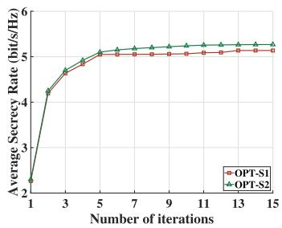  
Fig. 3. Convergence analysis of the three-layer iterative algorithm.

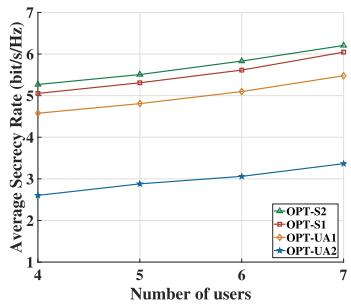  
Fig. 4. Performance analysis for different user numbers.

• OPT-UA2: A fixed user scheduling strategy is adopted, and the sensing durations are randomly allocated within each time frame. Other settings are the same as our proposed algorithm.

## A. Algorithm Convergence

As illustrated in Fig. 3, the proposed algorithm exhibits a fast and stable convergence behavior for both OPT-S1 and OPT-S2. In both cases, the average secrecy rate increases rapidly from approximately 2.3 bit/s/Hz in the first iteration to around 5.0 bit/s/Hz within the first four iterations, indicating the high efficiency of the proposed optimization framework in the early stage. After the fourth iteration, the growth rate gradually slows down, and the algorithm converges after about six iterations. Compared with OPT-S1, OPT-S2 achieves a slightly higher steady-state average secrecy rate, which reflects its performance advantage under lower channel estimation errors within the same optimization framework. From iteration 6 onwards, average secrecy rate remains nearly constant for both OPT-S1 and OPT-S2, with only marginal fluctuations observed up to the 15th iteration. This behavior confirms that further iterations bring negligible performance improvement, and verifies the convergence stability and reliability of the proposed algorithm.

## B. User Scheduling and Sensing Time Allocation Performance

To evaluate the effectiveness of user scheduling and sensing time allocation, we compare the secrecy rates of several schemes under varying numbers of users, as illustrated in Fig. 4. It is evident that as the number of users increases, the secrecy rates of OPT-S1, OPT-S2, and OPT-UA1 also increase. This improvement is attributed to the enhanced flexibility in user scheduling, which effectively reduces the risk of eavesdropping. In contrast, since OPT-UA2 adopts a fixed user scheduling strategy, the secrecy rate remains essentially unchanged with the increase in the number of users. This demonstrates the effectiveness of user scheduling optimization. Although OPT-UA1 exhibits a growing average secrecy rate with more users, its performance remains slightly inferior to that of OPT-S1 and OPT-S2. This highlights the importance of optimizing sensing time allocation. Moreover, the comparison between OPT-S1 and OPT-S2 demonstrates that, in scenarios with significant channel estimation errors, the overall secrecy rate may decline.

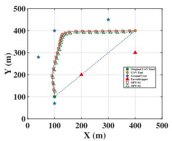  
(a)

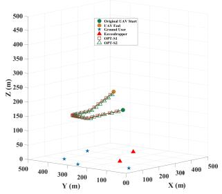  
(b)  
Fig. 5. UAV trajectory of different views: (a) The UAV trajectory in 2D view, and (b) The UAV trajectory in 3D view.

## C. UAV Trajectory Analysis

In Fig. 5, both 2D and 3D UAV trajectories under different optimization schemes are illustrated. As shown in Fig. 5(a), the UAV initially follows a straight-line trajectory from the starting point and gradually moves toward the ground user. As the flight progresses, the trajectory becomes confined within a limited region due to the joint effects of sensing accuracy requirements and energy constraints. Compared with OPT-S1, the trajectory obtained by OPT-S2 is observed to be closer to the eavesdropper. This behavior can be mainly attributed to sensing accuracy constraints in (17b) and (17c), which encourage the UAV to approach the sensing target more closely to satisfy the prescribed sensing performance. Fig. 5(b) depicts the corresponding altitude variation of the UAV throughout the flight duration. It is observed that the UAV remains at the minimum allowable altitude for as long as possible to enhance both communication and sensing performance. Specifically, the UAV first descends from the initial altitude to the minimum altitude and subsequently ascends to the final altitude. Such a 3D UAV trajectory design effectively balances sensing accuracy requirements and communication demands under considered constraints.

Fig. 6 further illustrates time-slot-dependent performance metrics of the UAV. In particular, Fig. 6(a) shows the evolution of the UAV’s vertical velocity. During the initial time slots, the UAV continuously descends until reaching the minimum altitude. Thereafter, the vertical velocity remains close to zero in the intermediate time slots, indicating that the UAV stably hovers at the lowest altitude. Correspondingly, Fig. 6(b) presents the instantaneous secrecy rate in each time slot along with its time-averaged value. It is observed that once the UAV descends to and maintains the minimum altitude, the secrecy rate during the intermediate time slots consistently exceeds the average level. This can be attributed to the improved communication link quality and enhanced sensing performance at lower altitudes, while the stable and low-speed flight in the intermediate phase further facilitates the integration of sensing and communication functionalities.

TABLE I  
SYSTEM PARAMETERS
<table><tr><td>Parameters</td><td>Values</td></tr><tr><td>Channel power gain  $\beta _ { 0 }$ </td><td>-50 dBm</td></tr><tr><td>Transmit power budget  $P _ { \mathrm { m a x } }$ </td><td> $\{ 3 , 4 , 5 , 6 \} \ \mathrm { W }$ </td></tr><tr><td>Sensing accuracy threshold  $\xi ^ { \mathrm { m a x } } , \psi ^ { \mathrm { m a x } }$ </td><td>-3 dB</td></tr><tr><td>Maximum horizontal flight speed  $V _ { r } ^ { \mathrm { m a x } }$ </td><td>{20,25,30,35} m/s</td></tr><tr><td>Maximum vertical flight speed  $V _ { Z } ^ { \mathrm { m a x } }$ </td><td>{5,10,15,20} m/s</td></tr><tr><td>Maximum UAV Altitude  $\bar { z } ^ { \mathrm { m a x } }$ </td><td>{200,220,240,260} m</td></tr><tr><td>Minimum UAV Altitude  $z ^ { \mathrm { m i n } }$ </td><td>150 m</td></tr><tr><td>Number of Antennas  $N _ { T } , N _ { R }$ </td><td>{6,8,10,12}</td></tr><tr><td>Minimum user communication rate</td><td>1 bit/s/Hz</td></tr><tr><td>Maximum eavesdropping rate</td><td>0.1bit/s/Hz</td></tr><tr><td>Noise power  $\sigma _ { k } ^ { 2 } , \sigma _ { m } ^ { 2 } , \sigma _ { n } ^ { 2 }$ </td><td>-110 dBm</td></tr><tr><td>Blade profile coefficient  $P ^ { 0 }$ </td><td>79.86 W</td></tr><tr><td>Induced power coefficient  $P ^ { H }$ </td><td>31.43 W</td></tr><tr><td>Tip speed of rotor blades  $U ^ { V }$ </td><td>120.0 m/s</td></tr><tr><td>Drag coefficient  $C ^ { 0 }$ </td><td>0.0046 kg/m</td></tr><tr><td>Mean rotor induced velocity  $V ^ { 0 }$ </td><td>4.030 m/s</td></tr><tr><td>UAV weight  $G ^ { 0 }$ </td><td>10 Newton</td></tr><tr><td>Channel estimation error  $\varepsilon _ { m }$ </td><td>{0.01,0.05}</td></tr></table>

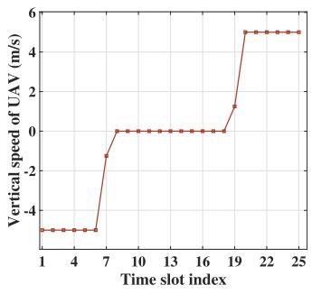  
(a)

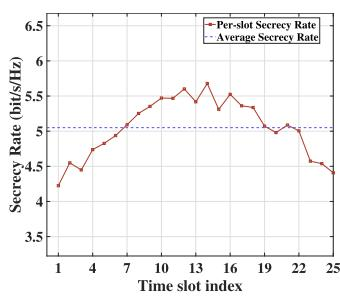  
(b)  
Fig. 6. UAV performance metrics over time slots: (a) Vertical velocity of the UAV at each time slot, and (b) Secrecy rate at each time slot.

Fig. 7 illustrates the average secrecy rate under varying UAV altitudes, mission periods, maximum horizontal flight speeds, and maximum vertical flight speeds. Since ISAC-GSC does not incorporate UAV trajectory optimization, its secrecy rate remains unchanged with respect to UAV parameter variations. In ISAC-GSC, the UAV is stationed at a fixed location, where it simultaneously senses the eavesdropper’s channel and communicates with the legitimate user. Due to the lack of spatial mobility, its average secrecy rate is lower than those of OPT-S1 and OPT-S2, indicating the critical role of trajectory optimization in balancing sensing and secure communication performance. In contrast, UAV-ISAC-PA and the proposed schemes exhibit similar overall trends in secrecy rate variation with respect to UAV parameters. By jointly optimizing the UAV trajectory and transmit power, UAV-ISAC-PA improves the average secrecy rate. However, its performance remains inferior to that of OPT-S1 and OPT-S2 due to the absence of multi-antenna beamforming, suggesting that trajectory and power optimization alone are insufficient to fully exploit the secrecy potential of UAV-ISAC systems, while spatial degrees of freedom provided by beamforming play an important role in suppressing information leakage. Moreover, OPT-S1 and OPT-S2 consistently outperform UAV-ISAC-PA, and the comparison between the two reveals that a larger channel estimation error bound leads to secrecy performance degradation, reflecting the sensitivity of secrecy performance to channel uncertainty.

As shown in Fig. 7(a), when the UAV altitude increases from 200 m to 260 m, the distance between the UAV and ground users increases, resulting in more severe path loss and degraded channel quality, which in turn reduces the average secrecy rate. This observation indicates that a relatively low flight altitude is more favorable for secure communication. Fig. 7(b) shows that the average secrecy rate increases signif icantly with mission period T . This is because more abundant time resources allow the UAV to adjust its trajectory more flexibly and better exploit favorable sensing and communication locations. Even in ISAC-GSC, increasing the mission period enhances secrecy performance by extending the duration of each time slot. From Fig. 7(c), it can be observed that the average secrecy rate increases with the UAV’s maximum horizontal flight speed, as higher mobility enables the UAV to more efficiently satisfy sensing constraints while performing secure communication. As illustrated in Fig. 7(d), the average secrecy rate increases with the UAV’s maximum vertical flight speed. A higher vertical speed allows the UAV to reach lower altitudes more rapidly and remain in favorable operating regions for a longer duration, thereby improving the overall secrecy performance.

## D. Beamforming Performance

As shown in Fig. 8, different schemes are compared in terms of their average secrecy rate under varying numbers of antennas and maximum transmission power levels. UAV-ISAC-PA exhibits a trend similar to OPT-S1 and OPT-S2 with respect to secrecy rate variation as the transmission power increases. However, its average secrecy rate consistently remains lower than that of the proposed schemes, OPT-S1 and OPT-S2, due to the absence of beamforming capability. Since the ISAC-GSC algorithm performs beamforming at the ground station, it shows a comparable variation trend to the proposed schemes when the number of antennas and transmission power change. Nevertheless, the average secrecy rate of ISAC-GSC remains consistently inferior to that of OPT-S1 and OPT-S2, as it lacks trajectory optimization to exploit favorable spatial locations. Furthermore, the comparison between OPT-S1 and OPT-S2 indicates that increased channel estimation errors result in noticeable secrecy performance degradation, regardless of the antenna configuration or power setting. These results demonstrate that both spatial adaptability and robust beamforming are essential for achieving high secrecy performance over a wide range of system parameters.

According to Fig. 8(a), the average secrecy rate increases as the number of antennas grows. Increasing the antenna number enhances the spatial degrees of freedom and array gain, enabling more accurate beamforming in the UAV-ISAC secure communication system. This allows the transmitted signals to be more effectively shaped toward the legitimate user while limiting information leakage toward the eavesdropper, thereby improving both communication performance and sensing accuracy. Moreover, a larger antenna array provides finer spatial control over signal propagation, which further strengthens the desired signal and enhances the average secrecy rate. Fig. 8(b) shows that the average secrecy rate also increases with the maximum transmission power. Higher transmission power improves the received signal strength at the legitimate user, leading to an increased communication rate. Meanwhile, stronger transmission power enhances the effectiveness of beamforming and sensing operations, which helps suppress interference and mitigate eavesdropping, ultimately resulting in improved secrecy performance.

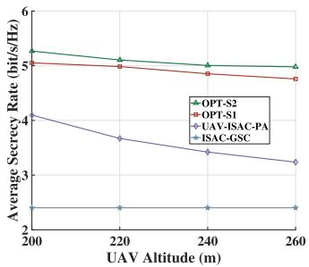  
(a)

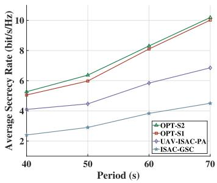  
(b)

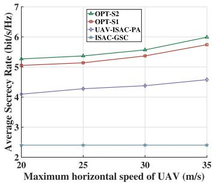  
(c)

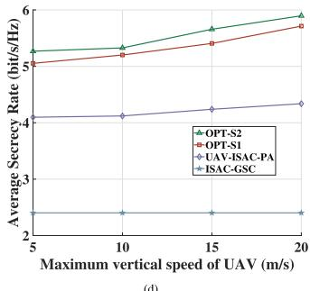  
(d)  
Fig. 7. Performance analysis of UAV with varying parameters: (a) UAV altitudes, (b) flight periods, (c) maximum horizontal flight speed, and (d) maximum vertical flight speed.

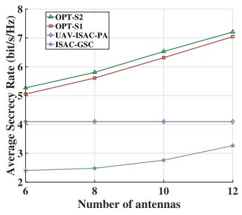  
(a)

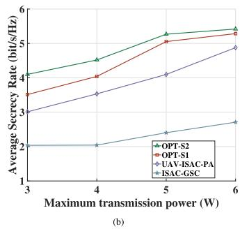  
Fig. 8. Beamforming performance analysis: (a) comparison for different antenna numbers, and (b) comparison under different maximum transmission power.

## V. CONCLUSION

This study focuses on average secrecy rate maximization of UAV-ISAC secure communications. Initially, we have introduced a secure communication model for UAV-ISAC, where a single UAV leverages beamforming to both sense and jam ground eavesdroppers. Following this, we have formulated an optimization problem involving joint beamforming, user scheduling, sensing time allocation, and UAV trajectory optimization. We have solved the problem by a triple-layer iterative optimization framework. We have employed the penalty-based SCA method to relax the binary constraints in user scheduling and sensing time allocation, followed by the SCA-based approach that iteratively optimizes the UAV trajectory. Finally, we have employed the SDR method with matrix lifting to design the beamforming vectors. Numerical results show that our proposed solution significantly outperforms existing methods, validating the effectiveness of the algorithm in the UAV-ISAC secure communications. Future work will focus on developing more accurate channel error models and leveraging machine learning with real air-to-ground measurements to obtain realistic channel error distributions.

## APPENDIX A PROOF OF PROPOSITION 1

Proof: Problem $\mathbf { P } _ { 0 }$ is non-convex in terms of communication beamforming $\mathbf { w } _ { k } [ i ]$ , sensing beamforming $\mathbf { r } _ { m } [ i ]$ , UAV trajectory $\mathcal { Q } ,$ user scheduling $u _ { k } [ i ]$ , and sensing time allocation $\eta [ i ]$ , due to the strong coupling among these variables. Since $u _ { k } [ i ]$ is a binary variable and constraint (17d) is non-convex, Problem $\mathbf { P } _ { 0 }$ is inherently a mixed-integer fractional nonconvex optimization problem. Furthermore, even when the UAV trajectory and beamforming variables are fixed, the remaining subproblem of jointly optimizing user scheduling and sensing time allocation for secrecy rate maximization reduces to a variant of the classical knapsack problem, which is NP-hard. Hence, Problem $\mathbf { P } _ { 0 }$ is also NP-hard. 

## APPENDIX B PROOF OF PROPOSITION 2

Proof: To obtain the optimal auxiliary relaxation variable $\tilde { u } _ { k } [ i ]$ in Problem $\mathbf { P } _ { 1 } ^ { \prime \prime } .$ . In other words, the objective is to determine the maximum value of the following function:

$$
f _ { 1 } ( \tilde { u } _ { k } [ i ] ) = u _ { k } [ i ] ( 1 - \eta [ i ] ) \tau S _ { k } ^ { * } [ i ] - \zeta \Lambda _ { k } [ i ] .\tag{B.1}
$$

Since $\tilde { u } _ { k } [ i ]$ only exists in $\zeta \Lambda _ { k } [ i ]$ of Problem $\mathbf { P } _ { 1 } ^ { \prime }$ , it can be transformed into the problem of finding the maximum value of the following function:

$$
f _ { 1 } ( \tilde { u } _ { k } [ i ] ) = - \zeta ( | u _ { k } [ i ] - \tilde { u } _ { k } [ i ] | ^ { 2 } + | u _ { k } [ i ] ( 1 - \tilde { u } _ { k } [ i ] ) | ^ { 2 } ) .\tag{B.2}
$$

The first and second derivatives of $f _ { 1 } ( \tilde { u } _ { k } [ i ] )$ are:

$$
f _ { 1 } ^ { \prime } ( \tilde { u } _ { k } [ i ] ) = - 2 ( 1 + u _ { k } [ i ] ^ { 2 } ) \tilde { u } _ { k } [ i ] + ( 2 u _ { k } [ i ] ^ { 2 } + 2 u _ { k } [ i ] ) ,\tag{B.3}
$$

$$
f _ { 1 } ^ { \prime \prime } ( \tilde { u } _ { k } [ i ] ) = - 2 ( 1 + u _ { k } [ i ] ^ { 2 } ) .\tag{B.4}
$$

Since $f _ { 1 } ^ { \prime \prime } ( \tilde { u } _ { k } [ i ] ) \leq 0 , f _ { 1 } ^ { \prime } ( \tilde { u } _ { k } [ i ] )$ is monotonically decreasing. When $f _ { 1 } ^ { \prime } ( \tilde { u } _ { k } [ i ] ) = 0$ , the original function attains its maximum value. It can be concluded that at this point, $\tilde { u } _ { k } [ i ]$ satisfies the following equation:

$$
\tilde { u } _ { k } [ i ] = \frac { u _ { k } [ i ] + u _ { k } [ i ] ^ { 2 } } { 1 + u _ { k } [ i ] ^ { 2 } } .\tag{B.5}
$$

Proposition 2 is proved.

## APPENDIX C PROOF OF PROPOSITION 3

Proof: Let $R _ { s e c } ( u ( r ) , \eta ( r ) , W ( r ) , R ( r ) , \mathcal { Q } ( r ) )$ and $R _ { s e c } ^ { u , \eta } ( u ( r ) , \eta ( r ) , W ( r ) , R ( r ) , \mathcal { Q } ( r ) )$ denote the objective value of Problem $\mathbf { P } _ { 0 }$ at the r-th iteration for $r \geq 1$ and the objective value of Problem $\mathbf { P } _ { 0 } .$ , respectively. The superscript $u , \eta$ in $R _ { s e c } ^ { u , \eta }$ denotes the variables to be optimized within the subproblem. In step 3 of Algorithm 3, the following inequality holds:

$$
\begin{array} { r l } & { R _ { s e c } ( u ( r - 1 ) , \eta ( r - 1 ) , W ( r - 1 ) , R ( r - 1 ) , \mathcal { Q } ( r - 1 ) ) \leq } \\ & { R _ { s e c } ^ { u , \eta } ( u ( r ) , \eta ( r ) , W ( r - 1 ) , R ( r - 1 ) , \mathcal { Q } ( r - 1 ) ) , \qquad ( \mathbb { C } . 1 ) } \end{array}
$$

because Problem $\mathbf { P } _ { 1 } ^ { \prime \prime \prime }$ is convex, it can be optimally solved. Convergence of the SCA method is ensured as long as the initial solution is feasible. Specifically, if a feasible solution {Q} exists, by iteratively applying the SCA method, a new feasible solution {Q<sup>0</sup>} can be obtained, and this process continues until the difference between their objective function values is less than the predefined convergence tolerance, $\mathrm { i . e . , }$ $R _ { s e c } ^ { \mathcal { Q } } \{ \mathcal { Q } \} - R _ { s e c } ^ { \mathcal { Q } } \{ \mathcal { Q } ^ { \prime } \} \stackrel { - } { \ } \delta _ { 2 }$ . In step 4 of Algorithm 3, the following inequality holds:

$$
\begin{array} { r l } & { R _ { s e c } ( u ( r - 1 ) , \eta ( r - 1 ) , W ( r - 1 ) , R ( r - 1 ) , \mathscr { Q } ( r - 1 ) ) \leq } \\ & { R _ { s e c } ^ { \mathscr { Q } } ( u ( r - 1 ) , \eta ( r - 1 ) , W ( r - 1 ) , R ( r - 1 ) , \mathscr { Q } ( r ) ) . \mathrm { ~ } ( \mathbb { C } . 2 ) } \end{array}
$$

Similarly, we obtain a feasible initial solution by solving Problem $\mathbf { P } _ { 3 } ^ { \prime \prime \prime \prime }$ <sup>0</sup>, and then progressively approximate the solution of the rank-one constraint through Problem $\mathbf { P } _ { 3 } ^ { \prime \prime \prime \prime \prime }$ , until the beamforming matrix converges. In step 5 of Algorithm $^ { 3 , }$ the following inequality holds:

$$
\begin{array} { r l } & { R _ { s e c } ( u ( r - 1 ) , \eta ( r - 1 ) , W ( r - 1 ) , R ( r - 1 ) , \mathcal { Q } ( r - 1 ) ) \leq } \\ & { R _ { s e c } ^ { W , R } ( u ( r - 1 ) , \eta ( r - 1 ) , W ( r ) , R ( r ) , \mathcal { Q } ( r - 1 ) ) . \qquad ( \mathbb { C } . 3 ) } \end{array}
$$

Hence, from equations (C.1), (C.2), and (C.3), we further have:

$$
\begin{array} { r l r } {  { R _ { s e c } ( u ( r - 1 ) , \eta ( r - 1 ) , W ( r - 1 ) , R ( r - 1 ) , Q ( r - 1 ) ) \le } } \\ & { } & { R _ { s e c } ^ { W , R } ( u ( r ) , \eta ( r ) , W ( r ) , R ( r ) , Q ( r ) ) . } \end{array}
$$

Therefore, in each iteration, the objective function of Problem $\mathbf { P } _ { 0 }$ either increases or remains unchanged. Since the secrecy rate has an upper bound for a fixed transmit power, the objective value of Problem $\mathbf { P } _ { 0 }$ is bounded. Therefore, Algorithm 3 is guaranteed to converge. Numerical results in Section IV show that the algorithm typically converges in only a few iterations, confirming its practical efficiency. 

## APPENDIX D PROOF OF PROPOSITION 4

Proof: In Algorithm 1, the complexity is mainly due to the iterative updates of the penalty function and relaxation variable [42]. The worst-case complexity is $\mathcal { O } ( I _ { 1 } \log ( 1 / \delta _ { 1 } ) ( N ( K +$ $1 ) ) ^ { 3 . 5 } )$ , where $I _ { 1 }$ and $\delta _ { 1 }$ denote the maximum number of iterations and stopping tolerance of the first subproblem, respectively. In Algorithm 2, the SCA procedure dominates the computational cost, and we express the complexity as $\mathcal { O } ( I _ { 2 } \log ( 1 / \delta _ { 2 } ) ( 3 N ) ^ { 3 . 5 } )$ , where $I _ { 2 }$ denotes the iteration number and $\delta _ { 2 }$ represents the solution accuracy of the SCA process [13]. In Algorithm 3, the complexity mainly arises from the exhaustive enumeration and bisection search [43], and is expressed as $\mathcal { O } ( I _ { 3 } \log ( 1 / \delta _ { 3 } ) ( N ( 3 K + 3 M ) N _ { T } ^ { 2 } + N ( 2 M +$ $\bar { \kappa ) ) } ^ { 3 . 5 } )$ , where $I _ { 3 }$ and $\delta _ { 3 }$ denote the iteration number and stopping tolerance of the third stage, respectively. Thus, the overall time complexity can be expressed as in equation (55), which is polynomial. Proposition 4 is proved.<sup></sup>

## APPENDIX E

Proof: Following [8], we assume that the estimation errors of both angle and distance are independent and Gaussian distributed:

$$
\Delta \theta _ { m } ^ { E } [ i ] \sim \mathcal { C N } ( 0 , \psi _ { m } [ i ] ) , \quad \Delta d _ { m } ^ { E } [ i ] \sim \mathcal { C N } ( 0 , \xi _ { m } [ i ] ) ,
$$

where $\Delta \theta _ { m } ^ { E } [ i ]$ and $\Delta d _ { m } ^ { E } [ i ]$ denote angle and distance estimation errors at time slot i for target $m ,$ respectively. According to standard Gaussian confidence interval results [44], estimation errors satisfy:

$$
\begin{array} { r } { | \Delta \theta _ { m } ^ { E } [ i ] | \leq 3 \sqrt { \psi _ { m } [ i ] } , \quad | \Delta d _ { m } ^ { E } [ i ] | \leq 3 \sqrt { \xi _ { m } [ i ] } . } \end{array}
$$

Since the error variances are bounded as $\psi _ { m } [ i ] ~ \leq ~ \psi ^ { \mathrm { m a x } }$ and $\xi _ { m } [ i ] \ \leq \ \xi ^ { \mathrm { m a x } }$ , these inequalities can be conservatively relaxed, corresponding to a confidence level no smaller than the nominal 3σ probability. To relate the angle and distance estimation errors to the resulting channel perturbation, a firstorder Taylor approximation [45] is applied to the eavesdropper channel:

$$
\mathbf { h } _ { m } ^ { E } [ i ] \approx \mathbf { h } _ { m } ^ { E } [ i ] \big | _ { \hat { \theta } _ { m } ^ { E } [ i ] , \hat { d } _ { m } ^ { E } [ i ] } + \frac { \partial \mathbf { h } _ { m } ^ { E } [ i ] } { \partial \theta _ { m } ^ { E } [ i ] } \Delta \theta _ { m } ^ { E } [ i ] + \frac { \partial \mathbf { h } _ { m } ^ { E } [ i ] } { \partial d _ { m } ^ { E } [ i ] } \Delta d _ { m } ^ { E } [ i ] .\tag{E.1}
$$

By applying the triangle inequality [46], the resulting channel perturbation can be conservatively upper-bounded as:

$$
\| \Delta \mathbf { h } _ { m } ^ { E } [ i ] \| \leq \left\| \frac { \partial \mathbf { h } _ { m } ^ { E } [ i ] } { \partial \theta _ { m } ^ { E } [ i ] } \right\| | \Delta \theta _ { m } ^ { E } [ i ] | + \left\| \frac { \partial \mathbf { h } _ { m } ^ { E } [ i ] } { \partial d _ { m } ^ { E } [ i ] } \right\| | \Delta d _ { m } ^ { E } [ i ] | .\tag{E.2}
$$

Since the above partial derivatives are bounded, their maximum norms can be absorbed into the uncertainty radius. Therefore, without loss of generality [47], we adopt the following normalized conservative bound:

$$
\begin{array} { r } { \| \Delta \mathbf { h } _ { m } ^ { E } [ i ] \| \leq | \Delta \theta _ { m } ^ { E } [ i ] | + | \Delta d _ { m } ^ { E } [ i ] | . } \end{array}\tag{E.3}
$$

Combining this with the high-probability bounds on $\Delta \theta _ { m } ^ { E } [ i ]$ and $\Delta d _ { m } ^ { E } [ i ]$ , the channel perturbation is finally bounded as:

$$
\| \Delta \mathbf { h } _ { m } ^ { E } [ i ] \| \leq 3 \sqrt { \psi ^ { \mathrm { m a x } } } + 3 \sqrt { \xi ^ { \mathrm { m a x } } } \triangleq \varepsilon _ { m } ,\tag{E.4}
$$

which explicitly shows how robust channel uncertainty set $\varepsilon _ { m }$ arises from the CRB-based angle and distance estimation errors. 

## REFERENCES

[1] Q. Wu et al., “A comprehensive overview on 5G-and-beyond networks with UAVs: From communications to sensing and intelligence,” IEEE J. Sel. Areas Commun., vol. 39, no. 10, pp. 2912–2945, Oct. 2021.

[2] X. Wang et al., “Robust anti-jamming for hybrid-IRS-assisted AAV swarm communications for low-altitude economy,” IEEE Trans. Wireless Commun., vol. 25, pp. 10337–10353, 2026, doi: 10.1109/ TWC.2025.3645590.

[3] Z. Ning et al., “Joint user association, interference cancellation, and power control for multi-IRS assisted UAV communications,” IEEE Trans. Wireless Commun., vol. 23, no. 10, pp. 13408–13423, Oct. 2024.

[4] Z. Ning, H. Hu, X. Wang, and Y. Zhang, “Channel-aware user association and trajectory design for multi-IRS assisted multi-UAV communications,” IEEE Trans. Wireless Commun., vol. 25, pp. 8483–8497, 2026, doi: 10.1109/TWC.2025.3638442.

[5] X. Wang et al., “Throughput maximization for covert communications: A buffer-aided AAV relaying algorithm,” IEEE J. Sel. Areas Commun., vol. 44, pp. 1842–1857, 2026, doi: 10.1109/JSAC.2025.3638728.

[6] V.-L. Nguyen, P.-C. Lin, B.-C. Cheng, R.-H. Hwang, and Y.-D. Lin, “Security and privacy for 6G: A survey on prospective technologies and challenges,” IEEE Commun. Surveys Tuts., vol. 23, no. 4, pp. 2384–2428, 4th Quart., 2021.

[7] X. Wang et al., “Integration of sensing, communication, and computing for metaverse: A survey,” ACM Comput. Surveys, vol. 56, no. 10, pp. 1–38, Oct. 2024.

[8] N. Su, F. Liu, and C. Masouros, “Sensing-assisted eavesdropper estimation: An ISAC breakthrough in physical layer security,” IEEE Trans. Wireless Commun., vol. 23, no. 4, pp. 3162–3174, Apr. 2024.

[9] Z. Ren, L. Qiu, J. Xu, and D. W. K. Ng, “Robust transmit beamforming for secure integrated sensing and communication,” IEEE Trans. Commun., vol. 71, no. 9, pp. 5549–5564, Sep. 2023.

[10] S. Xu, P. Liu, X. Wang, J. Huang, and Z. Fei, “Integrated sensing and communication systems with simultaneous public and confidential transmission,” IEEE Internet Things J., vol. 11, no. 23, pp. 38113–38125, Dec. 2024.

[11] P. Liu, Z. Fei, X. Wang, J. A. Zhang, Z. Zheng, and Q. Zhang, “Securing multi-user uplink communications against mobile aerial eavesdropper via sensing,” IEEE Trans. Veh. Technol., vol. 72, no. 7, pp. 9608–9613, Jul. 2023.

[12] X. Wang, Z. Fei, P. Liu, J. A. Zhang, Q. Wu, and N. Wu, “Sensing-aided covert communications: Turning interference into allies,” IEEE Trans. Wireless Commun., vol. 23, no. 9, pp. 10726–10739, Sep. 2024.

[13] C. Deng, X. Fang, and X. Wang, “Beamforming design and trajectory optimization for UAV-empowered adaptable integrated sensing and communication,” IEEE Trans. Wireless Commun., vol. 22, no. 11, pp. 8512–8526, Nov. 2023.

[14] K. Meng, Q. Wu, S. Ma, W. Chen, K. Wang, and J. Li, “Throughput maximization for UAV-enabled integrated periodic sensing and communication,” IEEE Trans. Wireless Commun., vol. 22, no. 1, pp. 671–687, Jan. 2023.

[15] Y. Liu et al., “Radar probing optimization for joint beamforming and UAV trajectory design in UAV-enabled integrated sensing and communication,” IEEE Trans. Commun., vol. 73, no. 6, pp. 4469–4485, Jun. 2025.

[16] W. Mao, Y. Lu, G. Pan, and B. Ai, “UAV-assisted communications in SAGIN-ISAC: Mobile user tracking and robust beamforming,” IEEE J. Sel. Areas Commun., vol. 43, no. 1, pp. 186–200, Jan. 2025.

[17] A. Khalili, A. Rezaei, D. Xu, and R. Schober, “Energy-aware resource allocation and trajectory design for UAV-enabled ISAC,” in Proc. GLOBECOM - IEEE Global Commun. Conf., Dec. 2023, pp. 4193–4198.

[18] A. Khalili, A. Rezaei, D. Xu, F. Dressler, and R. Schober, “Efficient UAV hovering, resource allocation, and trajectory design for ISAC with limited backhaul capacity,” IEEE Trans. Wireless Commun., vol. 23, no. 11, pp. 17635–17650, Nov. 2024.

[19] J. Zhang, J. Xu, W. Lu, N. Zhao, X. Wang, and D. Niyato, “Secure transmission for IRS-aided UAV-ISAC networks,” IEEE Trans. Wireless Commun., vol. 23, no. 9, pp. 12256–12269, Sep. 2024.

[20] Y. Liu et al., “Secure rate maximization for ISAC-UAV assisted communication amidst multiple eavesdroppers,” IEEE Trans. Veh. Technol., vol. 73, no. 10, pp. 15843–15847, Oct. 2024.

[21] J. Wu, W. Yuan, and L. Hanzo, “When UAVs meet ISAC: Realtime trajectory design for secure communications,” IEEE Trans. Veh. Technol., vol. 72, no. 12, pp. 16766–16771, Dec. 2023.

[22] D. Deng, W. Zhou, X. Li, D. B. Da Costa, D. W. K. Ng, and A. Nallanathan, “Joint beamforming and UAV trajectory optimization for covert communications in ISAC networks,” IEEE Trans. Wireless Commun., vol. 24, no. 2, pp. 1016–1030, Feb. 2025.

[23] Q. Wu, Y. Zeng, and R. Zhang, “Joint trajectory and communication design for multi-UAV enabled wireless networks,” IEEE Trans. Wireless Commun., vol. 17, no. 3, pp. 2109–2121, Mar. 2018.

[24] Z. Wei, F. Liu, C. Liu, Z. Yang, D. W. K. Ng, and R. Schober, “Integrated sensing, navigation, and communication for secure UAV networks with a mobile eavesdropper,” IEEE Trans. Wireless Commun., vol. 23, no. 7, pp. 7060–7078, Jul. 2024.

[25] Y. Zou, J. Zhu, X. Wang, and L. Hanzo, “A survey on wireless security: Technical challenges, recent advances, and future trends,” Proc. IEEE, vol. 104, no. 9, pp. 1727–1765, Sep. 2016.

[26] Y. Zeng, Q. Wu, and R. Zhang, “Accessing from the sky: A tutorial on UAV communications for 5G and beyond,” Proc. IEEE, vol. 107, no. 12, pp. 2327–2375, Dec. 2019.

[27] S. Li, W. Yuan, J. Yuan, and G. Caire, “On the potential of spatially-spread orthogonal time frequency space modulation for ISAC transmissions,” in Proc. ICASSP - IEEE Int. Conf. Acoust., Speech Signal Process. (ICASSP), May 2022, pp. 8722–8726.

[28] X. Zhang, W. Yuan, C. Liu, J. Wu, and D. W. K. Ng, “Predictive beamforming for vehicles with complex behaviors in ISAC systems: A deep learning approach,” IEEE J. Sel. Topics Signal Process., vol. 18, no. 5, pp. 828–841, Jul. 2024.

[29] D. Xu, X. Yu, D. W. K. Ng, A. Schmeink, and R. Schober, “Robust and secure resource allocation for ISAC systems: A novel optimization framework for variable-length snapshots,” IEEE Trans. Commun., vol. 70, no. 12, pp. 8196–8214, Dec. 2022.

[30] Y. Sun, D. Xu, D. W. K. Ng, L. Dai, and R. Schober, “Optimal 3D-trajectory design and resource allocation for solar-powered UAV communication systems,” IEEE Trans. Commun., vol. 67, no. 6, pp. 4281–4298, Jun. 2019.

[31] A. Ben-Tal and A. Nemirovski, “Robust convex optimization,” Math. Oper. Res., vol. 23, no. 4, pp. 769–805, Nov. 1998.

[32] V.-D. Nguyen, H. V. Nguyen, O. A. Dobre, and O.-S. Shin, “A new design paradigm for secure full-duplex multiuser systems,” IEEE J. Sel. Areas Commun., vol. 36, no. 7, pp. 1480–1498, Jul. 2018.

[33] F. K. F. Kiani, R. A. A. Seyyedabbasi, M. A. S. R. Aliyev, and M. U. G. M. A. Shah, “3D path planning method for multi-UAVs inspired by grey wolf algorithms,” J. Internet Technol., vol. 22, no. 4, pp. 743–755, 2021.

[34] H. Pan, Y. Liu, G. Sun, J. Fan, S. Liang, and C. Yuen, “Joint power and 3D trajectory optimization for UAV-enabled wireless powered communication networks with obstacles,” IEEE Trans. Commun., vol. 71, no. 4, pp. 2364–2380, Apr. 2023.

[35] C. You and R. Zhang, “3D trajectory optimization in Rician fading for UAV-enabled data harvesting,” IEEE Trans. Wireless Commun., vol. 18, no. 6, pp. 3192–3207, Jun. 2019.

[36] E. E. Yaz, “Linear matrix inequalities in system and control theory,” Proc. IEEE, vol. 86, no. 12, pp. 2473–2474, Dec. 1998.

[37] Y. Huang, H. Fu, S. A. Vorobyov, and Z.-Q. Luo, “Robust adaptive beamforming via worst-case SINR maximization with nonconvex uncertainty sets,” IEEE Trans. Signal Process., vol. 71, pp. 218–232, 2023.

[38] W. Mao, K. Xiong, Y. Lu, P. Fan, and Z. Ding, “Energy consumption minimization in secure multi-antenna UAV-assisted MEC networks with channel uncertainty,” IEEE Trans. Wireless Commun., vol. 22, no. 11, pp. 7185–7200, Nov. 2023.

[39] R. Zhang, X. Pang, W. Lu, N. Zhao, Y. Chen, and D. Niyato, “Dual-UAV enabled secure data collection with propulsion limitation,” IEEE Trans. Wireless Commun., vol. 20, no. 11, pp. 7445–7459, Nov. 2021.

[40] P. Liu, Z. Fei, X. Wang, Z. Zheng, X. Li, and J. Xu, “Joint transmitter design for robust secure radar-communication coexistence systems,” IEEE Commun. Lett., vol. 28, no. 8, pp. 1775–1779, Aug. 2024.

[41] Z. Liu, X. Liu, Y. Liu, V. C. M. Leung, and T. S. Durrani, “UAV assisted integrated sensing and communications for Internet of Things: 3D trajectory optimization and resource allocation,” IEEE Trans. Wireless Commun., vol. 23, no. 8, pp. 8654–8667, Aug. 2024.

[42] Y. Cai, F. Cui, Q. Shi, M. Zhao, and G. Y. Li, “Dual-UAV-enabled secure communications: Joint trajectory design and user scheduling,” IEEE J. Sel. Areas Commun., vol. 36, no. 9, pp. 1972–1985, Sep. 2018.

[43] Y. Zhang et al., “Robust transceiver design for covert integrated sensing and communications with imperfect CSI,” IEEE Trans. Commun., vol. 73, no. 9, pp. 8016–8031, Sep. 2025.

[44] V. Chandola, A. Banerjee, and V. Kumar, “Anomaly detection: A survey,” ACM Comput. Surv., vol. 41, no. 3, pp. 1–58, 2009.

[45] J. R. Taylor, An Introduction to Error Analysis: The Study of Uncertainties in Physical Measurements, 2nd ed., Sausalito, CA, USA: University Science Books, 1996.

[46] B. T. Polyak, Introduction to Optimization. New York, NY, USA: Optimization Software, 1987.

[47] R. T. Rockafellar and R. J.-B. Wets, Variational Analysis, 3rd ed., Berlin, Germany: Springer, 2009.


Zhaolong Ning (Senior Member, IEEE) received the Ph.D. degree from Northeastern University, China, in 2014. He is currently a Full Professor with the School of Communication and Information Engineering, Chongqing University of Posts and Telecommunications, Chongqing, China. He has published more than 150 scientific papers in international journals and conferences. His research interests include mobile edge computing, 6G networks, machine learning, and resource management. He is an IET Fellow. He has been a Highly Cited

  
Researcher (Web of Science) since 2020.


Yuzhen Zhang received the bachelor’s degree from the School of Communications and Information Engineering, Chongqing University of Posts and Telecommunications, Chongqing, China, in 2023. She is currently pursuing the master’s degree with Chongqing University of Posts and Telecommunications. Her research interests include integrated sensing and communication, uncrewed aerial vehicles, and secure communications.


Xiaojie Wang (Senior Member, IEEE) received the Ph.D. degree from Dalian University of Technology, Dalian, China, in 2019. She is currently a Full Professor with the School of Communications and Information Engineering, Chongqing University of Posts and Telecommunications, Chongqing, China. She has published more than 70 scientific papers in international journals and conferences. Her research interests are wireless networks, mobile edge computing, and machine learning. She is a Highly Cited Researcher (Web of Science) in 2023 and 2024.

Lei Guo received the Ph.D. degree from the University of Electronic Science and Technology of China, Chengdu, China, in 2006. He is currently a Full Professor with Northeastern University, Shenyang, China. He has authored or co-authored more than 200 technical papers in international journals and conferences. His current research interests include communication networks, optical communications, and wireless communications. He is an editor of several international journals.


Dusit Niyato (Fellow, IEEE) is currently a President’s Chair Professor with the College of Computing and Data Science (CCDS), Nanyang Technological University, Singapore. He serves as a Lead Series Editor for IEEE Communications Magazine Series on Network Softwarization and Management. He was the Editor-in-Chief of IEEE COMMUNICATIONS SURVEYS AND TUTORIALS. He is currently the Editor-in-Chief of IEEE TRANS-ACTIONS ON NETWORK SCIENCE AND ENGINEER-ING. He serves as an Area Editor for IEEE

TRANSACTIONS ON VEHICULAR TECHNOLOGY, a Topical Editor for IEEE INTERNET OF THINGS JOURNAL, a Lead Series Editor for IEEE Communications Magazine, and an Associate Editor for numerous other IEEE and ACM journals. He is currently a Member-at-Large on the Board of Governors of the IEEE Communications Society for 2024–2026.


Yan Zhang (Fellow, IEEE) received the Ph.D. degree from the School of Electrical and Electronics Engineering, Nanyang Technological University, Singapore. He is currently a Full Professor with the University of Electronic Science and Technology of China. His research interests include next-generation wireless networks leading to 6G and green and secure cyber-physical systems. He is an IET Fellow. He is an Elected Member of Academia Europaea (MAE), the Royal Norwegian Society of Sciences and Letters (DKNVS), and the Norwegian Academy

of Technological Sciences (NTVA). In 2018, he was a recipient of the Global Clarivate Analytics “Highly Cited Researcher” Award (Web of Science top 1% most cited worldwide). He is the Co-Editor-in-Chief of IEEE TRANSACTIONS ON INDUSTRIAL INFORMATICS, an Area Editor of IEEE TRANSACTIONS ON GREEN COMMUNICATIONS AND NETWORKING, a Senior Editor of IEEE SYSTEMS JOURNAL, and an Associate Editor of several IEEE TRANSACTIONS/magazines.