# Joint Trajectory and Communication Optimization for Heterogeneous Vehicles in Maritime SAR: Multi-Agent Reinforcement Learning

Chengjia Lei , Graduate Student Member, IEEE, Shaohua Wu , Member, IEEE, Yi Yang Jiayin Xue , Member, IEEE, and Qinyu Zhang , Senior Member, IEEE

Abstract—Nowadays, multiple types of equipment, including unmanned aerial vehicles (UAVs) and automatic surface vehicles (ASVs), have been deployed in maritime search and rescue (SAR). However, due to the lack of base stations (BSs), how to complete rescue while maintaining communication between vehicles is an unresolved challenge. In this paper, we design an efficient and fault-tolerant communication solution by jointly optimizing vehicles’ trajectory, offloading scheduling, and routing topology for a heterogeneous vehicle system. First, we model several essential factors in maritime SAR, including the impact of ocean currents, the observational behavior of UAVs, the fault tolerance of relay networks, resource management of mobile edge computing (MEC), and energy consumption. A multi-objective optimization problem is formulated, aiming at minimizing time and energy consumption while increasing the fault tolerance of relay networks. Then, we transfer the objective into a decentralized partially observable Markov Decision Process (Dec-POMDP) and introduce multi-agent reinforcement learning (MARL) to search for a collaborative strategy. Specifically, two MARL approaches with different training styles are evaluated, and three techniques are added for improving performance, including sharing parameters, normalized generalized-advantage-estimation (GAE), and preserving-outputsprecisely-while-adaptively-rescaling-targets (Pop-Art). Experimental results demonstrate that our proposed approach, named heterogeneous vehicles multi-agent proximal policy optimization (HVMAPPO), outperforms other baselines in efficiency and fault tolerance of communication.

Index Terms—Maritime search and rescue (SAR), multiagent reinforcement learning (MARL), efficiency, fault-tolerant

Manuscript received 18 September 2023; revised 26 February 2024; accepted 6 April 2024. Date of publication 15 April 2024; date of current version 19 September 2024. This work was supported in part by the National Key Research and Development Program of China under Grant 2020YFB1806403, in part by the Guangdong Basic and Applied Basic Research Foundation under Grant 2022B1515120002, in part by the National Natural Science Foundation of China under Grant 62201307, in part by the Shenzhen Science and Technology Program under Grant ZDSYS20210623091808025, and in part by the Major Key Project of PCL under Grant PCL2024A01. The review of this article was coordinated by Dr. Fengye Hu. (Corresponding authors: Shaohua Wu; Yi Yang.)

Chengjia Lei is with the Department of Electronics and Information Engineering, Harbin Institute of Technology, Shenzhen 518055, China, and also with the Peng Cheng Laboratory, Shenzhen 518055, China (e-mail: 22b952020@stu.hit.edu.cn).

Shaohua Wu and Qinyu Zhang are with the Guangdong Provincial Key Laboratory of Aerospace Communication and Networking Technology, Harbin Institute of Technology, Shenzhen 518055, China, and also with the Peng Cheng Laboratory, Shenzhen 518055, China (e-mail: hitwush@hit.edu.cn; zqy@hit.edu.cn).

Yi Yang and Jiayin Xue are with the Peng Cheng Laboratory, Shenzhen 518055, China (e-mail: yangy@pcl.ac.cn; xuejy@pcl.ac.cn).

Digital Object Identifier 10.1109/TVT.2024.3388499

communication, unmanned aerial vehicle (UAV), automatic surface vehicle (ASV).

# I. INTRODUCTION

M ARITIME Search and Rescue (SAR), as a distinct appli-cation domain for offshore safety, constitutes a special- cation domain for offshore safety,constitutes a specialized subdomain within Wilderness Search and Rescue (WiSAR), with its primary mission centered on locating, identifying, and rescuing individuals in open water environments [1], [2]. Two critical characteristics define maritime SAR: 1) the harsh marine environment with limited and unstable communication resources, and 2) the potential mobility of targets affected by waves and winds [3]. Unlike the terrestrial situation, there is nearly no base station (BS) in the ocean area far from the coast. Satellite communication seems to be a preferable option. However, geosynchronous Earth orbit (GEO) satellites offer an extensive coverage range but suffer from severe latency, and low-Earth orbit (LEO) satellites support lower delay but face great challenges in the complex switching strategy [4], [5]. To establish a stable and flexible network, unmanned aerial vehicles (UAVs) have been deployed in maritime SAR to provide relay services in [6], [7], ensuring stable connectivity even in remote oceanic regions. Additionally, the location of targets can be affected by ocean currents and sea wind, which require high demand on trajectory planning for dealing with extra disturbance. In summary, maritime SAR presents formidable challenges in optimization for both communication and trajectory planning.

We propose a solution to address the challenges mentioned above by leveraging a system that comprises heterogeneous vehicles, including UAVs and autonomous surface vehicles (ASVs), which would be employed with limited computation resources for supporting mobile edge computing (MEC) [8]. Specifically, UAVs are divided into two clusters, which are assigned distinct tasks: observing targets and providing relay services. Unlike the approach in [7], our focus extends to an area far from the coast, as depicted in Fig. 1. In the proposed solution, satellite remote sensing is first used to obtain and update the rescue target location. We assume that while satellite remote sensing can provide the coordinates of the rescue target, the transmission and analysis of remote sensing data entail significant time, resulting in a considerable delay in updating information. To improve the accuracy and real-time performance, a cluster of UAVs would depart from the ASV to conduct a detailed search and real-time observation of targets based on the rough information obtained from the satellite. Observation UAVs would capture the image of the sea surface and process images locally or offload them to the edge servers equipped on the ASV for recognition. Moreover, to enable long-distance communication between the observation UAV and the ASV, another cluster of UAVs is deployed to form a relay network, which facilitates necessary information exchange between vehicles. By planning the trajectories of the observation UAVs, the routing UAVs, and the ASV, the collaboration between heterogeneous vehicles can be achieved, thereby efficiently and reliably completing the maritime SAR mission.

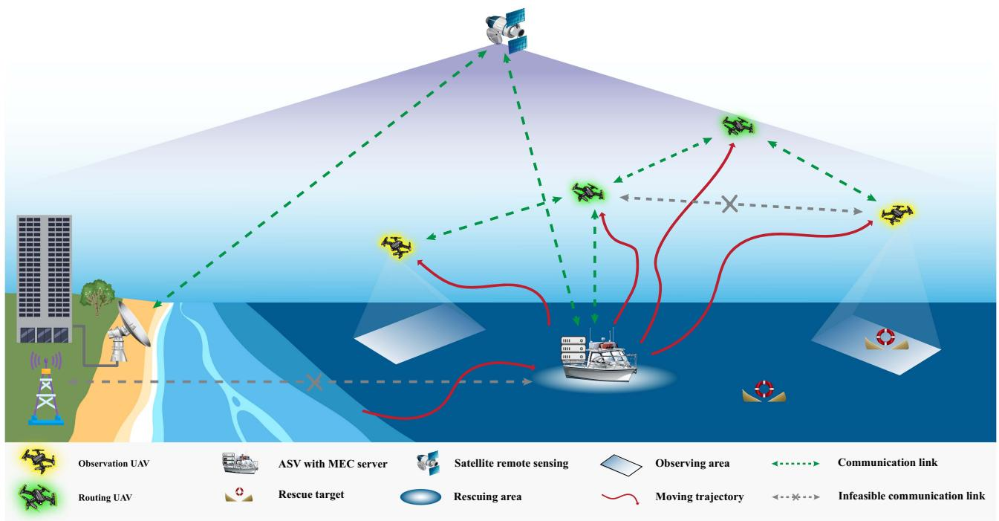

flowchart

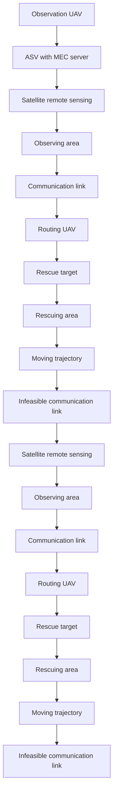

Fig. 1. Solution we proposed for maritime SAR leveraging multiple heterogeneous vehicles.

Given the challenges and the proposed solution, we consider two crucial needs in maritime SAR: mission immediacy and communication reliability. The immediacy implies that the mission should be completed as soon as possible, and the reliability implies that communication between vehicles should be preserved. We measure immediacy and reliability by efficiency and communication fault tolerance, respectively. The efficiency requires time and energy consumption optimization, and the fault tolerance of communication represents the redundancy of relay paths. To minimize time consumption for searching and rescuing, increasing the distance between UAVs to cover a large search area is necessary. However, this adjustment may compromise the reliability of routing services, as excessive distances between UAVs may lead to communication breakdowns. Hence, the maritime SAR can be considered a multi-agent system, where dynamic planning of trajectories for all heterogeneous vehicles in a cooperative manner is vital for enhancing both efficiency and communication fault tolerance. Achieving a balance between mission immediacy and communication reliability necessitates the utilization of a joint optimization method to find a good trade-off. However, searching for such collaborative strategies within the considered system model is a complex NP-Hard problem, and it takes a high demand on real-time performance.

Several existing studies [7], [9], [10] in the field of maritime SAR employed methods with high algorithmic complexity for optimization, such as colony and particle swarm optimization, which limits the possibilities of real-time computation when deployed on vehicles. With advancements in AI hardware, lowpower real-time computing based on machine learning has become feasible. Recently, novel solutions utilizing reinforcement learning (RL) have been proposed to address trajectory planning or communication challenges [11], [12], [13]. However, these researches primarily concentrated on individual aspects of trajectory planning or communication networks, with limited attention to their joint optimization, which is crucial for enhancing the efficiency and reliability of maritime SAR operations. In [14], Q-learning [15] based methods were employed for vehicle trajectory planning, with the objective of maximizing coverage area while minimizing repetition rate. Similarly, [16] introduced a double Q-learning based route optimization approach to enhance the response speed and success rate of communication networks. Furthermore, [17] briefly discussed communication delays in maritime SAR and utilized Q-learning to minimize expected long-term cumulative delays. In [6] presents work closely related to ours, involving the use of multiple heterogeneous vehicles, such as UAVs and ASVs, for optimizing channel resources between UAVs and ASVs’ obstacle avoidance path planning using Q-learning. However, in this study, the optimization of channel resources and trajectory planning were treated independently. To the best of our knowledge, the joint optimization of both trajectory planning and communication networks in maritime SAR has not been fully discussed in existing literature. Additionally, applying RL approaches, such as Q-learning, would suffer from theoretical convergence issues in systems with multiple vehicles, typically yielding suboptimal joint policies.

Multi-agent reinforcement learning (MARL) is an extension of RL tailored for multi-agent systems, aiming to mitigate the increased computational complexity and challenges related to convergence in value estimation [18], [19], [20]. Before the advent of MARL, there were typically two approaches to employing RL in a multi-agent system. The first approach involves treating all individuals as a single joint agent. However, as the number of agents increases, this method leads to exponential growth in computational complexity. Alternatively, the second approach utilizes RL to optimize individuals independently, wherein the influence of other agents on a specific agent is considered as part of the environmental effect. Nonetheless, the iteration of agents’ strategies may alter the state transition function of the environment, resulting in oscillations in value evaluation during the RL training process, thereby impacting its convergence. In MARL, the centralized training with decentralized execution (CTDE) framework offers a promising avenue to enhance convergence and effectiveness while facilitating distributed independent decision-making, which holds significant potential for jointly optimizing maritime SAR problems involving multiple heterogeneous vehicles. Notably, MARL offers several advantages in computational efficiency and global optimization. Unlike RL with a joint agent, computational complexity in CTDE doesn’t increase with the number of vehicles, which is particularly advantageous for devices with limited computational resources, such as UAVs. Each vehicle accounts for the influence of other vehicles on mission immediacy and communication reliability during training, often resulting in superior optimization performance under consistent computational complexity. There is limited research addressing the application of MARL to maritime SAR problems [21]. Nevertheless, numerous successful instances showcase the efficacy of MARL in achieving substantial performance improvements in joint optimization problems related to communication [22]. In [23], multi-agent proximal policy optimization (MAPPO) [24] algorithm was introduced to handle the power allocation problem for the handover (HO) in a two-tier heterogeneous network (HetNet), which contained a macro base station and numerous millimeter-wave (mmWave) BSs. In [25], multi-agent actorcritic and recurrent networks were applied to propose an adaptive communication-based UAV swarm routing algorithm for efficient and effective routing. In [26], a novel solution based on multi-agent DDPG (MADDPG) [19] was proposed to address the problem of user association and resource allocation in wirelessly-connected multi-robot system (MRS) equipped with edge servers. Therefore, we believe that MARL is also an applicable and wise choice for joint optimization in our proposed maritime SAR problem.

Based on the preceding discussion, it becomes evident that a maritime SAR solution emphasizing mission immediacy and fault-tolerant communications is required. Specifically, heterogeneous vehicles should learn to cooperate, while the joint optimization of trajectory and communication should be applied to find a trade-off between mission immediacy and communication reliability. The primary contributions of this paper are outlined as follows:

\- To describe the complex dynamic process of maritime SAR, we model several essential factors, including accounting for ocean current impact, the behavior of visionbased UAV observations, the resources management of MEC, the fault tolerance of routing network with dynamic topology, and the energy consumption of UAVs. Besides, a multi-objective is formulated for joint optimization of trajectory and communication.

\- To the best of our knowledge, it is the first time that MARL is applied in a distributed decision-making manner to optimize collaborative strategies among heterogeneous vehicles for maritime SAR operations. We transform the multi-objective optimization problem into a partially observable Markov Decision Process (Dec-POMDP) [27]. Moreover, a specific reward shaping [28] method is proposed for mixing independent tasks and facilitating balance between them.

We conducted a performance comparison of prominent MARL methods, which encompass the MAPPO algorithm based on centralized training with decentralized execution (CTDE) [29] and the IPPO algorithm based on independent learning (IL) [30]. We utilize sharing parameters [31], normalized normalized generalized-advantageestimation (GAE) [32], and preserving-outputs-preciselywhile-adaptively-rescaling-targets (Pop-Art) [33] technology to improve the performance and the stability of training. Experimental results demonstrate that our proposed algorithm based on MAPPO outperforms other benchmarks in the overall performance of the team while also achieving a delicate trade-off between efficiency and communication fault tolerance.

The rest of this paper is organized as follows. The system model is described in Section II. In Section III, we formulate the maritime SAR as a multi-objective optimization problem with several constraints and then transfer the problem into a Dec-POMDP. In Section IV, we proposed the solution based on the MARL framework, and several techniques that benefit performance and training stability are introduced. The configuration of simulations is detailed in Section V, followed by the demonstration of several experimental results. Finally, conclusions and future works are provided in Section VI.

# II. SYSTEM MODEL

We illustrate a maritime SAR operation leveraging heterogeneous vehicles as depicted in Fig. 1. Without loss of generality, we assume that the region awaiting search and rescue is m km \* n km. Rescue targets are denoted as $T _ { r } =$ $\{ t _ { r } ^ { 1 } , t _ { r } ^ { 2 } , . . . , t _ { r } ^ { j } \}$ , UAVs employed for observation is denoted as $U _ { o } = \{ u _ { o } ^ { 1 } , u _ { o } ^ { 2 } , . . . , u _ { o } ^ { j } \}$ , UAVs employed for providing relay are denoted as $U _ { r } = \{ u _ { r } ^ { 1 } , u _ { r } ^ { 2 } , . . . , u _ { r } ^ { k } \}$ , and ASVs are denoted as $A _ { s } = \{ a _ { s } ^ { 1 } , a _ { s } ^ { 2 } , . . . , a _ { s } ^ { o } \}$ . Due to the influence of ocean currents and atmospheric flows, rescue targets’ position may change over time. We assume that the rough locations of rescue targets could be obtained through satellite remote sensing with a significant time delay in information retrieval. Observation UAVs would search and monitor the area where rescue targets are located based on the rough locations, and once the UAVs identify and capture the rescue target, the latest and precise status of the target would be transmitted to the ASV in real time. The ASV then synchronizes the position information with other vehicles through communication relay networks. The messages could be relayed between the UAV and the ASV through single or multiple hops within a maximum communication range of $r _ { \mathrm { r o u t e r } }$ . The ASV would rescue the target within a distance of $r _ { \mathrm { s a v e } } .$ and the UAV selects the offloading ratio and offloads parts of the task to the edge nodes of the ASV, while processing the remainder locally.

In the maritime SAR process described above, we need to model some key dynamics, including the following aspects: the ocean environment model that affects the location of rescue targets, the observation behavior model of $\mathrm { U A V s } ,$ the offloading model of MEC, the fault-tolerant model of the relay network, and the energy consumption model of UAVs.

# A. Ocean Environment Model

According to [35], a non-circulating but time-varying stream function is introduced to simulate the ocean flow with twodimensional planar environments. The ocean current function is defined as

$$
\varpi (x, y) = 1 - \tanh \left(\frac {y - B (t) \cos (\kappa (x - \tau t))}{(1 + \kappa^ {2} B (t) ^ {2} \sin (\kappa (x - \tau t)) ^ {2}) ^ {0 . 5}}\right), \tag {1}
$$

$$
B (t) = B _ {0} + \epsilon \cos (\psi t + \Theta), \tag {2}
$$

where $B ( t )$ and κ are the setting of adimensionalized amplitude and wave number, respectively. Here we let $B _ { 0 } = 1 . 2 , \tau = 0 . 1 2$ , $\kappa = 0 . 8 4 , \psi = 0 . 4 , \epsilon = 0 . 3$ , and $\Theta = \pi / 2$ , remaining the same as [35]. Then, the current velocities $U _ { s } ( x , y , t )$ and $V _ { s } ( x , y , t )$ along the x and y dimension is updated as

$$
U _ {s} (x, y, t) = - \frac {\partial \varpi}{\partial y}, \tag {3}
$$

$$
V _ {s} (x, y, t) = \frac {\partial \varpi}{\partial x}. \tag {4}
$$

To simulate the environment diversity, we randomize the $U _ { s } ( x , y , t )$ and $V _ { s } ( x , y , t )$ orientations at each episode and add scaled Gaussian noise.

# B. UAVs Employed for Observation

As illustrated in Fig. 2, assume that the camera of the UAV employed for observation is in a vertical shooting state, then we get

$$
\mathrm{FOV} = 2 \tan^ {- 1} \left(\frac {\sqrt {W ^ {2} + H ^ {2}}}{2 F}\right), \tag {5}
$$

where FOV denotes the field of view of the camera, W denotes the width of the camera’s view, H denotes the height of the camera’s view, and F denotes the altitude of the UAV. When the UAV is hovering, the observing area $S _ { \mathrm { o b s } }$ could be calculated as

$$
S _ {\mathrm{obs}} = \frac {4 R _ {\mathrm{WH}}}{R _ {\mathrm{WH}} ^ {2} + 1} \left(F * \tan \left(\frac {\mathrm{FOV}}{2}\right)\right) ^ {2}, \tag {6}
$$

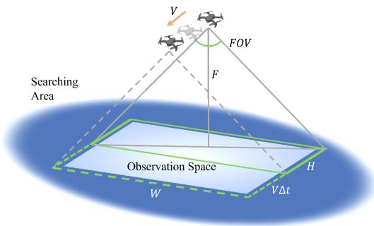

text_image

Searching
Area
V
FOV
F
Observation Space
W
H
VΔt

Fig. 2. UAV utilizes a camera for sea surface observation, with the observed area being proportional to the UAV’s flight speed.

$$
R _ {\mathrm{WH}} = \frac {W}{H}, \tag {7}
$$

where RWH is the aspect ratio of the camera view. When the UAV is in motion, the sweeping region $S _ { \mathrm { o b s } } ^ { \prime }$ of the UAV for observation within a time snap $\Delta t$ can be calculated as

$$
S _ {\mathrm{obs}} ^ {\prime} = S _ {\mathrm{obs}} + \frac {2 R _ {\mathrm{WH}}}{\sqrt {R _ {\mathrm{WH}} ^ {2} + 1}} v * \Delta t * F * \tan \left(\frac {\mathrm{FOV}}{2}\right), \tag {8}
$$

where v denotes the average flight speed during Δt.

# C. Resource Management Model for MEC

When UAVs employ machine learning techniques, such as ResNet [36], for target detection on sea surfaces, computational resources become a critical consideration. If the target detection task is entirely handled locally on the UAV, it will significantly increase power consumption, resulting in reduced endurance. Therefore, the UAV is allowed to adjust the ratio of offloading to edge servers equipped on the ASV automatically according to actual situations. It is assumed that the resolution of images captured by all UAVs is fixed, which implies that the computational load $N _ { \mathrm { F L O P S } }$ within $\Delta t$ could be predetermined. By employing technologies like Kubernetes, we define the amount of computational resources for MEC $R _ { \mathrm { M E C } }$ as

$$
\mathrm{MEC} = R _ {\mathrm{MEC}} * N _ {\mathrm{FLOPS}}. \tag {9}
$$

During each time snap, when UAVs initiate requests for offloading, the total load of the MEC can be represented as

$$
\text { Load } = \left\{ \begin{array}{l l} \mathrm{SUM} _ {\text { FLOPS }} ^ {\mathrm{u}} & , \text { if   } \mathrm{SUM} _ {\text { FLOPS }} ^ {\mathrm{u}} \leq \mathrm{MEC} \\ 0 & , \text { otherwise. } \end{array} \right. \tag {10}
$$

$$
\mathrm{SUM} _ {\mathrm{FLOPS}} ^ {u} = \sum (u _ {\mathrm{FLOPS}} ^ {1}, u _ {\mathrm{FLOPS}} ^ {2}, \dots , u _ {\mathrm{FLOPS}} ^ {j}), \tag {11}
$$

where $u _ { \mathrm { F L O P S } } ^ { j } \in [ 0 , N _ { \mathrm { F L O P S } } ]$ . We consider the case where MEC resources are limited as $R _ { \mathrm { M E C } } < j$ . If the total offloading requests from all UAVs exceed the predetermined load capacity of the MEC, the offloading service will be halted.

# D. Fault Tolerance of Routing Networks

Due to unpredictable communication conditions, the relay node may suffer from a temporary communication failure, affecting the observation UAV to transmit the latest information to the ASV. To address this, we consider communication redundancy between the UAV and the ASV and assume that at least one hop would take place during transmission. For each observation $\mathrm { U A V } ,$ there are maximum of $\textstyle \sum _ { i = 1 } ^ { k } A _ { k } ^ { i }$ potential link paths, where $A _ { k } ^ { i }$ here denotes the factorial operation. We define the fault-tolerant capability $\mathcal { F } _ { u _ { o } ^ { j } \in U _ { o } }$ for an observation UAV as

$$
\mathcal {F} _ {u _ {o} ^ {j} \in U _ {o}} = \frac {\varrho_ {j}}{\sum_ {i = 1} ^ {k} A _ {k} ^ {i}}, \tag {12}
$$

where $\varrho _ { j }$ is the number of existing paths. We denote the average fault-tolerant capability ${ \mathcal { F } } _ { \mathrm { t o t } }$ for all observation UAVs as

$$
\mathcal {F} _ {\text { tot }} = \frac {1}{j} \sum_ {i = 1} ^ {j} \mathcal {F} _ {u _ {o} ^ {i} \in U _ {o}}. \tag {13}
$$

# E. Energy Consumption Model

We mainly consider three kinds of energy consumption of UAVs, including the flight energy consumption $E _ { f } { _ { \mathrm { : } } }$ , the computation energy consumption $E _ { c } ,$ , and the transmission energy consumption $E _ { \mathrm { h o p s } }$ .

As for $E _ { f }$ , according to [37], the flight power $P$ at speed v is formulated as

$$
\begin{array}{l} P (v) = P _ {0} \left(1 + \frac {3 v ^ {2}}{u _ {\mathrm{tip}} ^ {2}}\right) + P _ {a} \left(\sqrt {1 + \frac {v ^ {4}}{4 u _ {\mathrm{rotor}} ^ {4}}} - \frac {v ^ {2}}{2 u _ {\mathrm{rotor}} ^ {2}}\right) ^ {0. 5} \\ + \frac {1}{2} P _ {b} d _ {0} v ^ {3}, \tag {14} \\ \end{array}
$$

$$
P _ {0} = \frac {\delta}{8} P _ {b} d _ {\Omega} ^ {3} d _ {R} ^ {3}, \tag {15}
$$

$$
P _ {a} = (1 + d _ {k}) \frac {d _ {W} ^ {\frac {3}{2}}}{\sqrt {2 \rho d _ {A}}}, \tag {16}
$$

$$
P _ {b} = \rho d _ {s} d _ {A} \tag {17}
$$

where $u _ { \mathrm { t i p } } , u _ { \mathrm { r o t o r } } , \delta , d _ { \Omega } , d _ { R } , d _ { A } , d _ { W } , d _ { s } , d _ { k }$ and $\rho$ are parameters related to mechanical structure. Assume that v is a constant during $\Delta t ,$ then $E _ { f }$ can be expressed as

$$
E _ {f} = \sum_ {i = 1} ^ {j} P (v _ {i}) \Delta t + \sum_ {i = 1} ^ {k} P (v _ {i}) \Delta t. \tag {18}
$$

As for $E _ { c } ,$ , it would be invoked when processing the part of detection tasks without offloading to edge servers. According to [38], $E _ { c }$ could be defined as

$$
E _ {c} = c (f _ {\text { task }}) ^ {2} C _ {\text { task }} * (j * N _ {\text { FLOPS }} - \text { Load }), \tag {19}
$$

where $c = 1 0 ^ { - 2 6 } , f _ { \mathrm { t a s k } }$ denotes the required CPU frequency for processing, $C _ { \mathrm { t a s k } }$ denotes the number of operations to complete the task, and Load is calculated by (10).

As for $E _ { \mathrm { h o p s } } .$ , it would be invoked when offloading the partial task to edge servers if a transmission link path exists. We assume that at least one hop is needed for the data transfer from the UAV

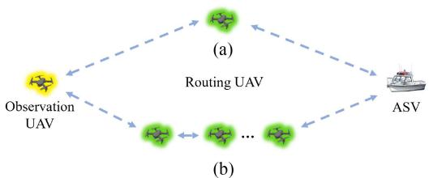

flowchart

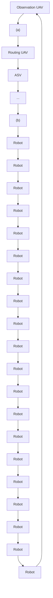

Fig. 3. Case of (a) one-hop and (b) multi-hop in the routing network. Messages would be relayed between the UAV and the ASV through single or multiple hops within a maximum communication range of $r _ { \mathrm { r o u t e r } } .$ .

to the ASV, as shown in Fig. 3. Since M UAVs are employed for routing, there exists at least 1 hop and at most M hops in the relay network. According to [39], firstly, consider the energy consumption during one hop, which is defined as

$$
e _ {\text { hop }} = e _ {r} + e _ {t} + \frac {\eta}{\xi} d ^ {\alpha}, \tag {20}
$$

where $e _ { r }$ and $e _ { t }$ are the energy related to receiving and transmitting but independent of distance, respectively. $\eta , \xi ,$ , and $d ^ { \alpha }$ are the amplification coefficient of the power amplifier, the efficiency coefficient of the radio power amplifier, and the distance between the transmitting point and the receiving point. α denotes the shadow/attenuation effect constant, and in ocean environment $\alpha = 2$ . Thus, the energy consumption of transmitters and receivers within a hop could be calculated as

$$
e _ {\mathrm{hop}} ^ {t} = e _ {t} + \beta \frac {\eta}{\xi} d ^ {\alpha}, \tag {21}
$$

$$
e _ {\mathrm{hop}} ^ {r} = e _ {t} + (1 - \beta) \frac {\eta}{\xi} d ^ {\alpha}, \tag {22}
$$

where $\beta \in [ 0 , 1 ]$ is a discount factor. According to (20), we could infer that the energy consumption of M hops from the UAV to the edge server is

$$
e _ {\mathrm{hop}} (M) = (M - 1) e _ {r} + M e _ {t} + \sum_ {l = 1} ^ {M} \frac {\eta}{\xi} d _ {l} ^ {\alpha}, \tag {23}
$$

where $d _ { l } ^ { \alpha }$ denotes the distance of the lth transmitting path. Considering that the endpoint, the ASV, typically has sufficient fuel, we ignore the communication energy consumption $e _ { r }$ for the final receiver. As a result, the total communication energy consumption incurred by all hops within heterogeneous vehicles could be represented as

$$
E _ {\text { hops }} = \sum_ {i = 1} ^ {J} R _ {\text { off }} ^ {i} * e _ {\text { hop }} (M _ {i}), \tag {24}
$$

$$
R _ {\text { off }} ^ {j} = \frac {u _ {\text { FLOPS }} ^ {j}}{N _ {\text { FLOPS }}}, \tag {25}
$$

where $R _ { \mathrm { o f f } } ^ { i }$ denotes the ith UAV’s ratio of offloading and $M _ { i }$ denotes the actual relay link taken by the ith UAV. Note that there might be multiple possible link for the relay and we always select the shortest one for communication energy consumption calculation.

At last, the total energy consumption $E _ { \mathrm { t o t } }$ is calculated as

$$
E _ {\text { tot }} = E _ {f} + E _ {c} + E _ {\text { hops }}. \tag {26}
$$

# III. PROBLEM FORMULATION AND TRANSFORMATION

# A. Problem Formulation

We aim to enhance efficiency and reliability, in other words, to minimize the time and energy consumption needed to complete tasks while maximizing the fault tolerance of relay networks. This multi-objective optimization problem could be formulated as

$$
\min _ {\Pi = \{\ldots , \pi_ {u _ {o}} ^ {j}, \ldots , \pi_ {u _ {r}} ^ {j + k}, \ldots , \pi_ {a _ {s}} ^ {j + k + o} \}} \sum_ {t = 1} ^ {T} (1 + \mu_ {1} E _ {\mathrm{tot}} ^ {t} - \mu_ {2} \mathcal {F} _ {\mathrm{tot}} ^ {t}),
$$

s.t. for each v of $u _ { o } ^ { j } , 0 \leq v \leq v _ { \operatorname* { m a x } } ^ { U _ { o } }$

for each v of $u _ { r } ^ { k } , 0 \leq v \leq v _ { \operatorname* { m a x } } ^ { U _ { r } }$

for each v of $a _ { s } ^ { o } , 0 \leq v \leq v _ { \operatorname* { m a x } } ^ { A _ { s } }$

$u _ { o } ^ { j } , 0 \leq a \leq a _ { \mathrm { m a x } } ^ { U _ { o } }$

$u _ { r } ^ { k } , 0 \leq a \leq a _ { \mathrm { m a x } } ^ { U _ { r } }$

for each a of $a _ { s } ^ { o } , 0 \leq a \leq a _ { \operatorname* { m a x } } ^ { A _ { s } }$

$$
0 \leq T \leq T _ {\max}
$$

$$
0 \leq r ^ {r o u t e r} \leq R _ {\max} ^ {U _ {r}}
$$

$$
0 \leq R _ {\mathrm{MEC}} \leq j \tag {27}
$$

where π and Π denote the individual and joint policy, respectively. v denotes the movement speed, a denotes the acceleration, T denotes the moment when the task is ended, $T _ { \mathrm { m a x } }$ denotes the ime step, and nce of routerdenote the m $R _ { \operatorname* { m a x } } ^ { U _ { r } }$ ation andeous $v _ { \mathrm { m a x } } ^ { U _ { o } } , v _ { \mathrm { m a x } } ^ { U _ { r } } , v _ { \mathrm { m a x } } ^ { A _ { s } } , a _ { \mathrm { m a x } } ^ { U _ { o } } , a _ { \mathrm { m a x } } ^ { U _ { r } } .$ max, vUr vAs Uo $a _ { \mathrm { m a x } } ^ { A _ { s } }$ vehicles, respectively. $\mu _ { 1 }$ and $\mu _ { 2 }$ are weight factors used to measure the importance of various optimization objectives, including time, energy consumption, and communication fault tolerance, and are adjusted based on the physical characteristics of vehicles (e.g., the power of vehicles) and the conditions of the maritime SAR mission (e.g., the size of the search area). $E _ { \mathrm { t o t } } ^ { t }$ and $\mathcal { F } _ { \mathrm { t o t } } ^ { t }$ denote the total energy consumption and the average fault-tolerant capability of relay networks at the t time step, respectively.

According to the problem formulated above, restricting speed and range of motion emerges as a viable strategy to reduce energy consumption and enhance fault tolerance in routing networks. However, this may impact the time it takes to complete the mission. In other words, the objective defined by (27) involves a balance among task completion time, energy usage, and fault tolerance of relay networks across multiple heterogeneous vehicles, which leads to an NP-hard optimization. Therefore, a joint trajectory and communication optimization approach is needed to trade off efficiency and fault tolerance while meeting the real-time requirements.

# B. Dec-POMDP for Maritime SAR Leveraging Heterogeneous Vehicles

The maritime SAR leveraging multiple vehicles is suitable to be described by Dec-POMDP, as each vehicle makes decisions independently and can access partial information about the others. Distribution implies that decisions are made by individual vehicles, while partial observation indicates that local information is insufficient to represent the overall state. Compared to centralized decision-making in MDP, distributed decision-making reduces reliance on hardware conditions and mitigates decision delay.

The Dec-POMDP is defined by $< o _ { t } , s _ { t } , u _ { t } , r _ { t } , P , n , \gamma >$ , where $o _ { t }$ denotes the observable information, $s _ { t }$ denotes the overall information of the state, $u _ { t }$ denotes the decision generated by individual policy, $r _ { t }$ denotes the reward function, $P$ denotes the transition probability of states, n is the number of vehicles, and $\gamma$ is the discount factor. These elements are explicitly stated in the following.

1) Observation: As the system operates in a distributed manner, each agent could only obtain the latest information when the relay link is established successfully. Otherwise, agents reuse historical information instead. The information used for making decisions includes the vehicle’s own position, velocity, battery remaining, and the relative positions of both other vehicles and rescue targets. Furthermore, different types of vehicles have been designed with slight variations in the types of information they observe to accomplish various tasks efficiently. For instance, the main objective for UAVs employed for routing is to facilitate the relay network between the observing UAV and the ASV. Consequently, their observations do not encompass the relative position information of rescue targets. The observation tuple is defined as follows:

$$
o _ {t} = (\text { pos }, \text { vel }, \text { bat }, \text { relative   pos }) _ {t}. \tag {28}
$$

2) State: The state represents the entirety of the environment, encompassing information about the environment and vehicles. As described in [40], the state is constructed by stacking the current observation of vehicles together. The state tuple is defined as follows:

$$
s _ {t} = (o _ {t} ^ {1}, \dots , o _ {t} ^ {k + j + l}). \tag {29}
$$

3) Action: In our proposed solution, the action refers to the continuous decision space of vehicles. For the ASV, the decision space is 2-dimensional, representing the magnitude of velocity in the x and y directions. The actual velocity is represented by the composite velocity vector in both of them. Additionally, the observation UAV has an extra decision space dedicated to the task offloading ratio. When a relay link exists, the UAV will attempt to partially offload the detection task to edge servers. The action tuples for the observation UAV, the routing UAV, and the ASV are defined as follows:

$$
u _ {t} ^ {u _ {o} ^ {j}} = (\mathrm{vel} _ {x}, \mathrm{vel} _ {y}, R _ {\mathrm{off}} ^ {j}) _ {t} ^ {j}, \tag {30}
$$

$$
u _ {t} ^ {u _ {r} ^ {k}} = (\mathrm{vel} _ {x}, \mathrm{vel} _ {y}) _ {t} ^ {k}, \tag {31}
$$

$$
u _ {t} ^ {a _ {s} ^ {o}} = (\mathrm{vel} _ {x}, \mathrm{vel} _ {y}) _ {t} ^ {o}. \tag {32}
$$

4) Reward: The value of reward represents the effectiveness of the policy. Here, we proposed a special reward shaping method, called mixed-heterogeneous-reward (MHR), to not only make vehicles perform their own tasks but also to encourage cooperation among heterogeneous vehicles to maximize team return. In MHR, two distinct types of reward functions are employed: independent task rewards tailored for individual objectives and joint rewards assigned to different types of vehicles, aiming at fostering collaborative relationships. Independent task rewards are designed to prioritize specific tasks, including target observation, fault tolerance of relay networks, target rescue, and energy management. However, there are inherent contradictions in the optimization directions between specific tasks. For instance, UAVs may spread out to expand the search coverage area, potentially compromising the fault tolerance of relay networks or even moving out of communication range. To address this challenge, joint rewards are introduced to enhance collaboration capabilities among heterogeneous vehicles by mixing the multiple independent task rewards with weight coefficients. The determination of coefficient values considers the impact of other independent task rewards on the primary independent task reward. While ensuring the effectiveness of the primary independent task reward and maximizing the number of targets rescued successfully, the weights of other independent task rewards are maximized as much as possible. In this paper, the specific coefficient values are determined through experimental experience. In detail, we define four types of independent task reward functions: observation reward, relay reward, rescue reward, and energy consumption reward. For observation, the independent task reward is defined as follows:

$$
r _ {\mathrm{obs}} ^ {t} = - D _ {\mathrm{t2u}} - \omega_ {1} * C _ {u} + \omega_ {2} * (- 1. 0 + R _ {c}), \tag {33}
$$

where $\omega _ { 1 } = - 1$ and $\omega _ { 2 } = - 1$ are the coefficients, respectively. $D _ { \mathrm { t 2 u } }$ denotes the sum of the shortest distance between each target and $\mathrm { U A V s } , C _ { u }$ denotes the number of collision occurrences between UAVs, and $R _ { c }$ denotes the proportion of UAVs that have successfully observed targets at the current time. For relay, the independent task reward is defined as follows:

$$
r _ {\text { rel }} ^ {t} = - C _ {u} - 1 + \omega_ {3} * \mathcal {F} _ {\text { tot }} ^ {t}, \tag {34}
$$

where $\omega _ { 3 } = 0 . 2 5$ is the coefficient. For rescue, the independent task reward is defined as follows:

$$
r _ {\mathrm{res}} ^ {t} = \left(- R _ {c} * D _ {\mathrm{a} _ {\mathrm{s}} 2 \mathrm{t}} - (1 - R _ {c}) * (- \sqrt {8})\right) + \omega_ {4} * R _ {s}, (3 5)
$$

where $\omega _ { 4 } = 1$ is the coefficient. $D _ { \mathrm { a _ { s } 2 t } }$ denotes the sum of distances from each ASV to the nearest unique rescue target, and $R _ { s }$ denotes the ratio of successfully rescued targets at the current time. At last, the independent task reward of energy consumption is defined as

$$
r _ {t o t} ^ {t} = - 1. 0 - \omega_ {5} * E _ {\mathrm{tot}} ^ {t}, \tag {36}
$$

where $\omega _ { 5 } = 1$ denotes the coefficient. The values of above coefficients are set based on the specific task effects achieved by a single type of vehicle.

By weighting and mixing specific task rewards, the joint rewards are obtained to achieve the joint optimization of trajectory and communication for heterogeneous vehicles’ cooperation as

Algorithm 1: PPO for Maritime SAR.   
1 Initialize parameters $\theta$ of actor-network $\pi$ and parameters $\phi$ of critic-network $v$ with kaiming initialization method;  
2 while step $\leq$ step $_{max}$ do  
3 Set experience buffer $B = \{\}$ ;  
4 foreach threads for $n$ parallel environments do  
5 $\tau_{th} = []$ empty list  
6 for $t = 1$ to $T_{\text{max}}$ do  
7 $\Pi_t = \text{Actor}(\{o_t^1, o_t^2, o_t^{i+j+k}\}), A_t \sim \Pi_t$ 8 $v_{t+1} = \text{Critic}(\{o_1, o_2, o_{i+j+k}\})$ 9 $\tau_{th} + = [\{o_t^1, o_t^2, o_t^{i+j+k}\}, A_t, r_t]$ 10 end  
11 Compute advantage value Ad on $\tau_{th}$ via GAE  
12 $B = B \cup \tau_{th}$ for $th$ in range $n$ 13 step += $T_{\text{max}} * n$ 14 end  
15 for 1,..., z do  
16 $b = \frac{T_{\text{max}} * n}{z} \leftarrow \text{random mini-batch } b$ from $B$ 17 Compute Loss and update $\theta$ and $\phi$ with huber loss  
18 end  
19 epoch += 1  
19 end

$$
R _ {u _ {o} ^ {j}} ^ {t} = r _ {\mathrm{obs}} ^ {t} + \Omega_ {1} * r _ {\mathrm{res}} ^ {t} + \Omega_ {2} * r _ {\mathrm{rel}} ^ {t} + \Omega_ {3} * r _ {t o t} ^ {t}, \tag {37}
$$

$$
R _ {u _ {r} ^ {k}} ^ {t} = r _ {\mathrm{rel}} ^ {t} + \Omega_ {1} * r _ {\mathrm{obs}} ^ {t} + \Omega_ {2} * r _ {\mathrm{res}} ^ {t} + \Omega_ {3} * r _ {t o t} ^ {t}, \tag {38}
$$

$$
R _ {a _ {\mathrm{s}} ^ {o}} ^ {t} = r _ {\text { res }} ^ {t} + \Omega_ {1} * r _ {\text { obs }} ^ {t} + \Omega_ {2} * r _ {\text { rel }} ^ {t} + \Omega_ {3} * r _ {t o t} ^ {t}, \tag {39}
$$

where $\Omega _ { 1 } = 0 . 1 , \Omega _ { 2 } = 0 . 1$ , and $\Omega _ { 3 } = 0 . 2$ are the coefficients, respectively, and they are determined by the condition that the main reward is not affected while maximizing the setting value as much as possible. To intuitively evaluate the performance of teams consisting of heterogeneous vehicles, the reward of the team at each time step t are computed by averaging the sum of reward functions of all individual vehicles as

$$
r _ {\text { team }} ^ {t} = \frac {1}{N _ {\text { team }}} \left(\sum_ {1} ^ {j} R _ {u _ {o} ^ {j}} ^ {t} + \sum_ {1} ^ {k} R _ {u _ {r} ^ {k}} ^ {t} + \sum_ {1} ^ {o} R _ {a _ {s} ^ {o}} ^ {t}\right), \tag {40}
$$

where $N _ { \mathrm { t e a m } }$ denotes the number of all vehicles in the team. Thus, the team’s return in one episode can be calculated as

$$
R e _ {\text { team }} = \sum_ {1} ^ {T _ {\max}} r _ {\text { team }} ^ {t}. \tag {41}
$$

# IV. MULTI-AGENT REINFORCEMENT LEARNING SOLUTIONS

In this section, we first introduce the baseline algorithm, Proximal Policy Optimization (PPO) [41], and then proposed our MAPPO-based and IPPO-based algorithms, which are extended from PPO within different MARL frameworks.

# A. Proximal Policy Optimization Algorithm

PPO is one of the popular RL approaches widely applied in recent years. There are two neural networks in PPO: the actor-network $\pi _ { \boldsymbol { \theta } } ( a _ { i } | \boldsymbol { o } _ { i } )$ and the critic-network $V _ { \phi } ( o _ { i } )$ . The actor-network is used to approximate the policy, which is a probability distribution over actions given observations. The critic-network is used to approximate the value function, which is the expected return of the current state. The key idea of PPO is to leverage samples generated by the origin policy $\pi _ { \mathrm { o l d } }$ to update the policy $\pi _ { \theta }$ multiple times with a constraint of a clipped surrogate objective function. In the process of updating the neural network, the critic-network needs to be updated to obtain a more accurate estimate of the expected return. At the same time, the actor-network is updated along the direction that maximizes the expected return estimate of the current critic-network. In an epoch, leveraging n parallel threads, the PPO first initially collects B samples to create an experience buffer, and then samples of size b are drawn from the buffer to compose z mini-batches. Each mini-batch will be used for updating parameters of the actor-network and the critical-network with the loss functions as

$$
L _ {\mathrm{ppo}} ^ {\mathrm{ac}} (\theta) = \frac {1}{B} \sum_ {i = 1} ^ {B} \min \left(r _ {i} (\theta) A _ {t}, \operatorname{clip} \left(r _ {i} (\theta), 1 - \varepsilon , 1 + \varepsilon\right) A _ {t}\right), \tag {42}
$$

$$
L _ {\mathrm{ppo}} ^ {\mathrm{cr}} (\phi) = \frac {1}{B} \sum_ {i = 1} ^ {B} 0. 5 * (V _ {\phi} (s _ {i}) - \hat {R} _ {i}) ^ {2}, \tag {43}
$$

$$
\operatorname{clip} (a, 1 - \varepsilon , 1 + \varepsilon) = \left\{ \begin{array}{l l} 1 - \varepsilon , & a <   1 - \varepsilon , \\ 1 + \varepsilon , & a > 1 + \varepsilon , \\ a, & \text { otherwise. } \end{array} \right. \tag {44}
$$

where $L _ { \mathrm { p p o } } ^ { \mathrm { a c } } ( \theta )$ is the loss for the actor-network, $L _ { \mathrm { p p o } } ^ { \mathrm { c r } } ( \phi )$ is the loss for the critic-network, $\begin{array} { r } { r _ { i } ( \theta ) = \frac { \pi _ { \theta } \left( a _ { i } | o _ { i } \right) } { \pi _ { \theta _ { \mathrm { o l d } } } \left( a _ { i } | o _ { i } \right) } , } \end{array}$ θ i| i πθold (ai|oi) , ε is a constant $\in [ 0 , 1 ] .$ , and $\hat { R } _ { i }$ is the target value. $A _ { t }$ is the advantage function with ${ \mathrm { G A E } } ,$ which is defined as

$$
A _ {t} = \sum_ {i = 0} ^ {T _ {d}} (\gamma \lambda) ^ {i} (r _ {i} + \gamma V _ {\phi} (o _ {i + 1}) - V _ {\phi} (o _ {i})), \tag {45}
$$

where λ is a constant $\in [ 0 , 1 ]$ , and $T _ { d }$ denotes the t step when ending the episode.

However, maritime SAR is a multi-intelligent system, while the original PPO is for solving problems containing one agent. Here, we treat all vehicles together as a joint agent by merging vehicles’ observations and decisions separately, and then employ PPO for optimization. The procedure of PPO algorithm for maritime SAR is shown in Algorithm 1.

# B. Multi-Agent PPO and Independent PPO

In this paper, two MARL algorithms, MAPPO and IPPO, are explored to jointly optimize trajectory and communication for heterogeneous vehicles synchronously. In a multi-agent environment, when policies of other agents update, it effectively alters the state transition function $P$ for a specific agent. However, RL theory generally assumes that the $P$ is fixed, and frequent variations in $P$ during training may lead to non-stationarity, impacting the evaluation of agent interactions. In CTDE, one of the popular MARL frameworks, global information S encompassed both environment and other agents would be given for the critic-network to correctly evaluate the expected return, which not only benefits improving convergence performance but also helps facilitate effective collaboration among diverse agents, ultimately optimizing the global objective function. However, [42] proposed an IL MARL framework and indicated that the additional information may provide minimal help, and the redundancy may even adversely impact learning in some situations. Therefore, both MAPPO and IPPO, which are the representative algorithms of the CTDE framework and the IL framework, respectively, are evaluated in this paper. The main difference is that IPPO uses observation $o _ { t }$ to train the critic network, while MAPPO uses the state $s _ { t } .$ which also includes the selected agent’s ID. The PPO, MAPPO, and IPPO frameworks in this paper are shown in Fig. 4.

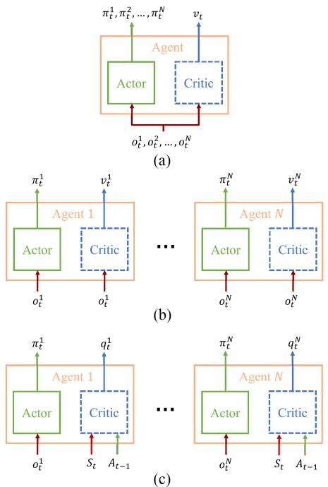  
Fig. 4. Frameworks of PPO, MAPPO, and IPPO. The critic-network is only used in training, and the actor-network is used in both training and testing. (a) PPO. (b) IPPO. (c) MAPPO.

Several techniques are introduced to gain higher accumulated rewards, including sharing parameters, normalized GAE, and Adaptive normalization Pop-Art.

1) Sharing Parameters: With sharing parameters, vehicles of the same type utilize the same neural network. Employing identical models for both sampling and training across multiple homogeneous vehicles can expedite convergence and enhance performance. Furthermore, sharing parameters holds a practical benefit since training individual neural networks for a large number of vehicles is highly challenging. Hence, in the proposed MARL algorithm, we initialize only three PPO-style neural networks $( \theta _ { U _ { o } }$ and $\phi _ { U _ { o } } , \theta _ { U _ { \tau } }$ and $\phi _ { U _ { r } } , \theta _ { A _ { i } }$ s and $\phi _ { A _ { s } } )$ for observation UAVs, routing $\mathrm { U A V s } ,$ , and ASVs, respectively. For convenience, we denote the collection of these distinct neural networks as $\theta _ { H V }$ and $\phi _ { H V }$ .

Algorithm 2: HVMAPPO for Maritime SAR.   
1 Initialize parameters $\theta_{HV}$ of actor-network $\pi$ and parameters $\phi_{HV}$ of critic-network $q$ for each type of vehicles ( $U_o$ , $U_r$ , and $A_s$ ) separately with kaiming initialization method;
2 while step $\leq$ stepmax do
3 Set experience buffer $B = \{\}$ ;
4 foreach threads for n parallel environments do
5 $\tau_{th} = []$ empty list
6 for i=1 to Tmax do
7 $O_t = \{\}, S_t = \{\}, A_t = \{\}, H_t = \{\}$ 8 foreach vehicle n do
9 $\pi_t^n = \text{Actor}(o_t^n), a_t^n \sim \pi_t^n$ 10 $q_t^n = \text{Critic}(s_t^n)$ 11 $O_t = O_t \cup o_t^n, S_t = S_t \cup s_t^n, H_t = H_t \cup h_t^n, A_t = A_t \cup a_t^n$ 12 end
13 $\tau_{th} + = [S_t, O_t, A_t, r_t, H_t]$ 14 end
15 Compute advantage value $\overline{A_t^-}$ on $\tau_{th}$ via normalized GAE, using Pop-Art
16 Compute advantage value $\hat{r}_t^+$ on $\tau_{th}$ with adaptive normalization Pop-Art
17 $D = D \cup \tau_{th}$ for th in range $n$ 18 step+= $T_{\text{max}} * n$ 19 end
20 for 1,..., z do
21 $b = \frac{T_{\text{max}} * n}{z} \leftarrow$ random mini-batch $b$ from $B$ foreach type of vehicles do
22 Compute Loss and update $\theta_{HV}$ and $\phi_{HV}$ with huber loss and sharing parameters
23 end
24 end
25 epoch+= 1
26 end

2) normalized GAE: The value of the reward function could vary a lot, which may lead to a high variance and make fitting the actor-network more difficult. Hence, we normalized the advantage value obtained from GAE. The normalized GAE is defined as

$$
\overline {{A _ {t}}} = (A _ {t} - \text { mean } (A _ {t})) / \text { std } (A _ {t}). \tag {46}
$$

3) Pop-Art: Pop-Art makes a significant contribution to stabilizing when training heterogeneous vehicles at the same time. The main idea of the Pop-Art is to maintain two operators, $\displaystyle \sum$ and $\mu ,$ to scale and shift the outputs of the critic-network and the return, enabling them to have a consistent level of normalization. When starting the training, Pop-Art would initiate operators for each type of agent, respectively. Similar to the normalized GAE, Pop-Art normalizes the value of $\hat { R } _ { i }$ when calculating the (43) and then anti-normalizes the $V _ { \phi _ { H V } } ( . )$ value when calculating the (45). Moreover, at the beginning of each epoch, $\displaystyle \sum$ and $\mu$

also need to be updated according to new samples, achieving adaptive adjustment of scaling and shifting during the training process.

Additionally, we adopt the leaky-relu and kaiming initialization, which have been widely used in deep learning. We found that they would help alleviate the performance degradation problem that occurs after multiple iterations of the network. As mentioned in [34], we also use the huber loss function instead of the mean square error function in (43). Finally, we get the loss function for MAPPO as

$$
L _ {\text { MAPPO }} ^ {\mathrm{ac}} \left(\theta_ {H V}\right) = \frac {1}{B} \sum_ {i = 1} ^ {B} \min \left(r _ {i} \left(\theta_ {H V}\right) \overline {{{A _ {t} ^ {-}}}}, \operatorname{clip} (.) \overline {{{A _ {t} ^ {-}}}}\right), \tag {47}
$$

$$
\operatorname{clip} (.) = \operatorname{clip} (r _ {i} (\theta_ {H V}), 1 - \varepsilon , 1 + \varepsilon) \tag {48}
$$

$$
L _ {\mathrm{MAPPO}} ^ {\mathrm{cr}} (\phi_ {H V}) = \frac {1}{B} \sum_ {i = 1} ^ {B} \mathrm{huber} _ {\alpha} (V _ {\phi_ {H V}} (s _ {i}), \hat {R} _ {i} ^ {+}), \tag {49}
$$

where $\overline { { A _ { t } ^ { - } } }$ denotes the advantage with nGAE and antinormalized Pop-Art. $\hat { R } _ { i } ^ { + }$ denotes the return with normalized Pop-Art, and $\alpha = 1 0$ for the huberα. The total loss is

$$
\text { Loss } = L _ {\text { MAPPO }} ^ {\mathrm{ac}} \left(\theta_ {H V}\right) + \sigma_ {1} L _ {\text { MAPPO }} ^ {\mathrm{cr}} \left(\phi_ {H V}\right) + \sigma_ {2} H \left(\pi_ {\theta_ {H V}}\right), \tag {50}
$$

where $\sigma _ { 1 } , \ \sigma _ { 2 }$ are coefficient hyperparameters, and $H ( \pi _ { \theta } )$ is policy’s entropy.

We integrate the aforementioned techniques into the MAPPO and the IPPO algorithm, alongside the MHR proposed in reward shaping, proposing heterogeneous vehicles multi-agent proximal policy optimization (HVMAPPO) and heterogeneous vehicles independent proximal policy optimization (HVIPPO) tailored for the multi-objective joint optimization of heterogeneous vehicles. In our maritime SAR solution, we initialize distinct neural networks for each vehicle type, with sharing parameters implemented among similar vehicles. These neural networks, deployed on the vehicles, make distributed decisions based on individual vehicle observations and receive their rewards from environmental feedback. We use a buffer to collect experiences of vehicles, including observations, actions, rewards, and state information. Meanwhile, parallel technology is utilized to create multiple simulation environments to accelerate the collection process. Over a predetermined number of episodes, we obtain an experience buffer containing B samples, from which minibatches with size b are derived by sampling z times. Then, mini-batches are used to update the parameters according to (47)–(50). This process is repeated until the maximum number of iterations is reached. The pseudocode of HVMAPPO is shown in Algorithm 2, and we also illustrate its workflow in Fig. 5. For the HVIPPO, just change with $v _ { t } ^ { a } = \mathrm { C r i t i c } ( o _ { t } ^ { n } )$ in line 10 in Algorithm 2.

To conclude, three algorithms are discussed in this paper: the PPO-based algorithm for the merging agent, the MAPPObased, and the IPPO-based algorithm for multiple agents. In the PPO-based algorithm, to solve the multi-agent problem, we merge the observations and decisions of all vehicles separately to form a unified observation space and joint decision-making, which requires a decision center and has higher computational complexity. In contrast, the MAPPO-based approach adopts distributed decision-making and achieves joint optimization of policies among multiple heterogeneous vehicles by 1) the proposed reward shaping method named MHR; and 2) the CTDE framework that contains global information of all vehicles as the critic-network input. Several techniques, including sharing parameters, normalized GAE, and Pop-Art, are also introduced to gain a better performance. In response to findings from [42] suggesting that global information may minimally aid the learning effect in some cases and could even adversely affect learning, the IPPO-based algorithm is evaluated as a comparison. We conduct a detailed experimental analysis of the above three algorithms in the next section.

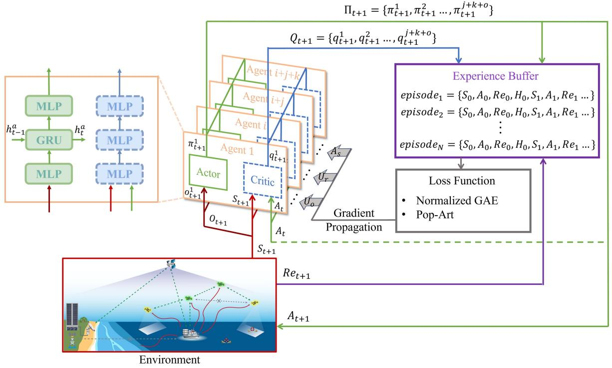

flowchart

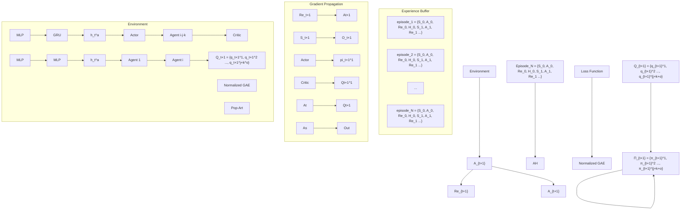

Fig. 5. Illustration of the HVMAPPO algorithm for maritime SAR problem.   
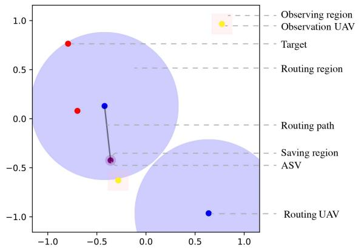

bubble

| Region | X | Y | Color |
|---|---|---|---|
| Observing region | -0.85 | 0.75 | Red |
| Observation UAV | 0.65 | 0.95 | Yellow |
| Target | -0.35 | -0.45 | Purple |
| Routing region | -0.35 | -0.45 | Purple |
| Routing path | -0.35 | -0.65 | Yellow |
| Saving region | -0.35 | -0.45 | Purple |
| ASV | -0.35 | -0.45 | Purple |
| Routing UAV | 0.65 | -0.95 | Blue |
The chart displays a scatter plot with two large shaded ellipses centered at (0,0) and (0,-0.35). The data points are distributed across the plane with no explicit numerical labels or axes provided.

(@)

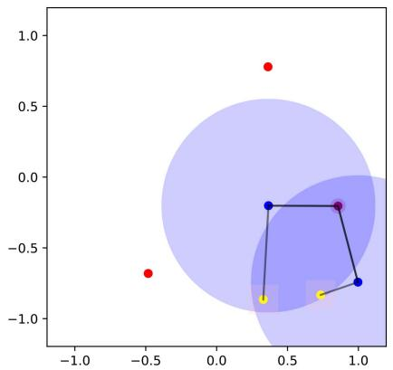

scatter

| x       | y       |
| ------- | ------- |
| -0.5    | -0.7    |
| 0.4     | 0.8     |
| 0.9     | -0.3    |
| 0.9     | -0.8    |

(b)   
Fig. 6. Illustration of our simulator. In (a), all vehicles randomly initialize their coordinates in the search area, and the distance does not affect the transfer of information between vehicles, but the reward value is still calculated as defined. In (b), the UAV will only randomly initialize the coordinates in the area where it can communicate with the ASV and the communication will also be constrained by distance. (a) Training. (b) Testing.

# V. PERFORMANCE EVALUATIONS

In this section, the simulation configuration is given, and several quantitative metrics are designed to measure the performance of algorithms. Additionally, two selected episodes of the simulation process are presented in detail to demonstrate the effectiveness of the proposed approach.

# A. Simulation Configuration

We develop a finite-horizon episodic simulator to train and test our proposed solution. The simulator is illustrated in Fig. 6. Specifically, we consider a search and rescue region of 2 KM ∗ 2 KM with 2 rescue targets, 2 observation UAVs, 2 router UAVs, and 1 ASV. Each episode has a fixed time step $T _ { \mathrm { m a x } }$ . Both UAVs and ASVs20 m/s and imum movement speed,  m/s, as well as maximu $v _ { \operatorname* { m a x } } ^ { U _ { o } } , v _ { \operatorname* { m a x } } ^ { U _ { r } } =$ Uo $a _ { \mathrm { m a x } } ^ { U _ { o } } , a _ { \mathrm { m a x } } ^ { U _ { r } } = 1 0 ~ \mathrm { m } ^ { 2 } / \mathrm { s }$ $v _ { \mathrm { m a x } } ^ { A _ { s } } = 1 0$ and $a _ { \mathrm { m a x } } ^ { A _ { s } } = 5 \mathrm { m } ^ { 2 } / \mathrm { s }$ m acceleration,, respectively. We assume that the flight altitude of UAVs is a constant $F = 1 0 0 \mathrm { m }$ , and the aspect ratio of the camera view is $R _ { \mathrm { W H } } = 1$ . The routing coverage area is a circular region with a radius of $R ^ { \mathrm { R o u t e r } } =$ 750 m. The total load of edge servers is $\mathrm { M E C } = 1 * N _ { \mathrm { F L O P S } } .$ Besides being affected by ocean currents, we assume that the rescue target could also be disturbed by random noises. When the rescue target is not observed, its position is obtained by remote sensing satellites with a time lag of $\dot { \tau } _ { l } = 2 \Delta t$ . Otherwise, the position of targets is updated in real time. A large-scale version is easy to construct by extending, but we believe that the configuration above, with limited computational cost, is sufficient to demonstrate that the proposed method is effective for the joint optimization of trajectory and communication in the maritime SAR problem leveraging heterogeneous vehicles. Details of the configuration and their definition are summarized in Table I.

TABLE I SUMMARY OF SIMULATION CONFIGURATIONS 

<table><tr><td>Notation</td><td>Value</td><td>Definition</td></tr><tr><td> $B_0$ </td><td>1.2</td><td>setting of adimensionalized amplitude in  $\varpi(x,y)$ </td></tr><tr><td> $\tau$ </td><td>0.12</td><td>Phase speed in  $\varpi(x,y)$ </td></tr><tr><td> $\kappa$ </td><td>0.84</td><td>Wave number in  $\varpi(x,y)$ </td></tr><tr><td> $\psi$ </td><td>0.4</td><td>Configure of the adimensionalized amplitude</td></tr><tr><td> $\epsilon$ </td><td>0.3</td><td>Configure of the adimensionalized amplitude</td></tr><tr><td> $\Theta$ </td><td> $\frac{\pi}{2}$ </td><td>Configure of the adimensionalized amplitude</td></tr><tr><td> $R_{\text{WH}}$ </td><td>1</td><td>Aspect ratio of the captured picture</td></tr><tr><td>FOV</td><td>90°</td><td>Field of view of the camera</td></tr><tr><td> $F$ </td><td>100</td><td>Altitude of UAVs (m)</td></tr><tr><td> $R_{\text{MEC}}$ </td><td>1</td><td>Capacity of the MEC</td></tr><tr><td> $U_{\text{tip}}$ </td><td>120</td><td>Tip speed of the rotor blade (m/s)</td></tr><tr><td> $U_{\text{rotor}}$ </td><td>4.03</td><td>Mean rotor induced velocity in hover</td></tr><tr><td> $\rho$ </td><td>1.225</td><td>Air density (kg/m3)</td></tr><tr><td> $d_s$ </td><td>0.05</td><td>Rotor solidity</td></tr><tr><td> $d_A$ </td><td>0.503</td><td>Rotor disc area (m2)</td></tr><tr><td> $d_W$ </td><td>20</td><td>Aircraft weight in Newton</td></tr><tr><td> $d_\Omega$ </td><td>300</td><td>Blade angular velocity (rad/s)</td></tr><tr><td> $d_R$ </td><td>0.4</td><td>Rotor radius (m)</td></tr><tr><td> $d_0$ </td><td>0.6</td><td>Fuselage drag ratio</td></tr><tr><td> $\alpha$ </td><td>2</td><td>Shadow/attenuation effect constant</td></tr><tr><td> $\beta$ </td><td>0</td><td>Discount factor related to energy consumption in hops</td></tr><tr><td> $v_{\text{max}}^{U_o}$ </td><td>20</td><td>Max speed of the observation UAV (m/s)</td></tr><tr><td> $v_{\text{max}}^{U_r}$ </td><td>20</td><td>Max speed of the routing UAV (m/s)</td></tr><tr><td> $v_{\text{max}}^{A_s}$ </td><td>10</td><td>Max speed of the ASV (m/s)</td></tr><tr><td> $a_{\text{max}}^{U_o}$ </td><td>10</td><td>Max acceleration of the observation UAV (m/s2)</td></tr><tr><td> $a_{\text{max}}^{U_r}$ </td><td>10</td><td>Max acceleration of the routing UAV (m/s2)</td></tr><tr><td> $a_{\text{max}}^{A_s}$ </td><td>5</td><td>Max acceleration of the ASV (m/s2)</td></tr><tr><td> $R^{Router}$ </td><td>750</td><td>Max radius for relaying (m)</td></tr><tr><td> $R^{save}$ </td><td>50</td><td>Max radius for saving (m)</td></tr><tr><td> $T_l$ </td><td>10</td><td>Time lag in the location of rescue targets obtained by remote sensing satellites (s)</td></tr><tr><td> $T_{\text{max}}$ </td><td>100</td><td>Max time step in a training episode</td></tr><tr><td> $\Delta t$ </td><td>5</td><td>Time between each decision (s)</td></tr></table>

Additionally, we make some modifications to the simulator during training to enhance robust performance. In Fig. 6(a), when training, the initial positions of all vehicles are randomized, which facilitates faster convergence during training and prevents the optimization from getting trapped in locally optimal strategies. However, random initialization indicates that vehicles might not be able to establish relay links at the beginning. Therefore, we assume there are no distance limitations to receive position information from other vehicles during training. In Fig. 6(b), when testing, the ASV would be randomly initialized at the edges of the search area, and UAVs would be randomly placed within the relay network. If a UAV moves out of communication range and loses connection with the ASV during testing, it must rely solely on historical information. Besides, when a rescue target is observed and saved during testing, it would be randomized to a new position at the next time step.

# B. Experimental Results

The simulator is programmed using the API provided by PettingZoo and runs on Ubuntu 20.04. All algorithms are modified from the codes of OpenAI’s repository called “spinning up”. The same backbone is shared among algorithms, differing primarily in the input and output dimensions. Specifically, there are two separate neural networks for the actor-network and the critic-network, and each network contains two hidden layers of length 64. The training process encompassed a total of 3000 epochs, with 12800 iterations per epoch. A parallel processing approach involving 16 processes is adopted to accelerate the training process, with samples aggregated within a shared buffer.

The convergence in training and testing about the team’s cumulative reward is shown in Fig. 7, where the cumulative reward is computed by (41). The cumulative reward is a comprehensive metric to measure the overall performance of the team. We compare three algorithms, HVMAPPO, HVIPPO, and PPO, along with a random policy. For each algorithm, we initialize three different seeds for training and calculated the mean and variance of the results. After each epoch, the results of training are recorded in Fig. 7(a), while after every 50 epochs of iteration, the latest models are used for testing, and the results are recorded in Fig. 7(b). The solid line represents the mean of the different seed results, and the shading represents the variance. Pentagrams mark the performance of the best models for different algorithms. As depicted in the figure, the HVMAPPO algorithm we proposed gains the highest returns, and both algorithms based on a MARL framework outperform the PPO algorithm, indicating the significant advantage of MARL in joint optimization problems involving heterogeneous vehicles. It is evident that the HVMAPPO we proposed outperforms others during testing, exhibiting the highest mean value with minor variance. In contrast, the performance of the PPO algorithm is unsatisfactory. One possible explanation is that the larger action space, invoked by stacking all vehicles’ actions, brings an extra optimization challenge.

In Fig. 8, we show the performance of algorithms in terms of immediacy, reliability, and the trade-off between them, respectively. Specifically, we measure immediacy and reliability with five quantitative metrics: observation rate, rescue count, energy consumption, load of edge servers, and communication fault tolerance. Observation rate refers to the proportion of time spent observing rescue targets in the total time, while the rescue count indicates the number of targets rescued within an episode. These metrics directly reflect the immediacy of the joint policy, indicating whether observation and rescue can be made as quickly as possible. Energy consumption $E _ { \mathrm { t o t } }$ refers to the total energy expended by UAVs, and the load of edge servers related to (10) reflects the average utilization rate during an episode. These metrics indirectly reflect immediacy, as effective energy management can enhance UAV endurance, thereby facilitating the observation and rescue of more targets in a single mission. Finally, communication fault tolerance related to (13) measures the average redundancy of the relay network within an episode, directly reflecting the reliability of the joint policy. Below, we provide detailed explanations of these metrics. It is worth noting that Fig. 8(a)–(e) are recorded after every 50 epochs of iteration with the latest models, and Fig. 8(f) is evaluated by the best models, which are marked by colorful pentagrams in Fig. 7(b).

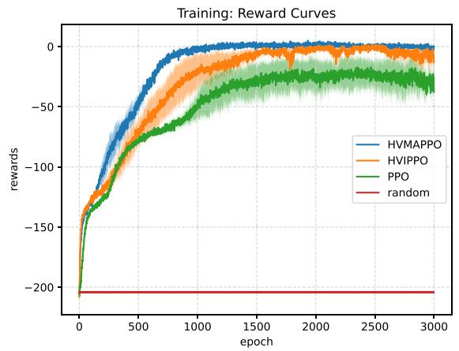

line

| epoch | HVMAPPO | HVIPPO | PPO | random |
|-------|---------|--------|-----|--------|
| 0     | -150    | -150   | -150| -200   |
| 500   | -50     | -40    | -60 | -200   |
| 1000  | 0       | -10    | -30 | -200   |
| 1500  | 0       | 0      | -20 | -200   |
| 2000  | 0       | 0      | -10 | -200   |
| 2500  | 0       | 0      | 0   | -200   |
| 3000  | 0       | 0      | 0   | -200   |

(a)

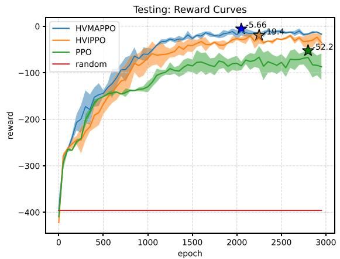

line

| epoch | HVMAPPO | HVIPPO | PPO   | random |
|-------|---------|--------|-------|--------|
| 2000  | 5.66    | 19.4   | -     | -      |
| 2800  | -       | -      | 52.2  | -      |

(b)   
Fig. 7. Results of accumulated rewards during both training and testing for algorithms. Three seeds are randomly selected to initialize the training. In (a), the solid line represents the mean value, while the shaded area represents the variance of episodic rewards across different seeds. In (b), the highest cumulative rewards within episodes in each algorithm are denoted by colorful pentagram symbols. (a) Training results. (b) Testing results.

As shown in Fig. 8(a), the HVMAPPO algorithm we proposed exhibits better performance, capturing the target approximately 70% of the time. An interesting phenomenon arises wherein the probability of observation rate initially ascends and subsequently exhibits a gradual decline. As for testing, when a target is successfully saved, it would be placed in a new position, and UAVs need to move to the re-generated position for observing. Throughout the training process, the policy for observing targets receives prioritized convergence. As the ASV decision-making is refined in subsequent training iterations, the likelihood of observing rescue targets per episode gradually decreases. In Fig. 8(b), both HVMAPPO and HVIPPO algorithms demonstrate the capability to conduct rescue operations on nearly 10 targets within an episode, which indicates a significant improvement over the PPO algorithm. Additionally, the HVMAPPO algorithm we proposed exhibits lower variance compared to the HVIPPO. In summary, according to the observation rate and rescue count, the HVMAPPO we proposed exhibits better immediacy, providing a higher probability of observing and a powerful capability to conduct rescue operations.

In Fig. 8(c), the trend of energy consumption for UAVs exhibits a pattern of initial reduction followed by a gradual increase. During the early stages of training, UAVs have higher energy consumption, which swiftly diminishes with the joint optimization of trajectory and communication. In the later stages of training, owing to substantial enhancements in the ASV’s policy, UAVs’ energy consumption rises due to multiple resets of the rescue target position, consequently causing an elevation in energy consumption. When correlated with Fig. 8(b), it demonstrates that the HVMAPPO we proposed achieves lower energy expenditure when rescuing targets. Also, Fig. 8(d) illustrates the utilization of MEC during various stages of training. Compared to PPO, both HVMAPPO and HVIPPO exhibit higher MEC utilization rates, thereby conducive to reducing energy consumption associated with detecting rescue targets. In summary, comparing HVMAPPO and HVIPPO, the former exhibits slightly lower energy consumption and higher MEC utilization rates, which is conducive to further strengthening the immediacy.

As shown in Fig. 8(e), it demonstrates the communication fault tolerance of the relay network, while HVIPPO is slightly better than HVMAPPO in the later stages of iterating. Among algorithms, the fault tolerance increases faster at the beginning, which indicates that the policy of the UAV employed for constructing relay networks converges faster than others. Then, due to the possibility of significant distances between targets, the fault tolerance of the relay network unavoidably decreases when the observation UAVs accurately fly to the target area for observation. Nevertheless, both HVMAPPO and HVIPPO exhibit slightly higher fault tolerance than PPO, indicating the effectiveness of optimization based on MARL.

It is worth noting that there exists couplings between immediacy and reliability. For instance, as the observation rate increases, relay networks’ fault tolerance may decrease as the distance between vehicles would increase unavoidably. Thus, the policy for heterogeneous vehicles is an integrated optimization outcome encompassing multiple performance metrics. Fig. 8(f) illustrates the trade-off between immediacy and reliability of proposed algorithms, and the results are evaluated by the best models denoted with colorful pentagrams in Fig. 7(b). As for immediacy, two representative metrics are employed: the observation rate and the count of rescues. HVMAPPO outperforms in both metrics, registering a performance improvement of 4% and 12% over HVIPPO, and 9% and 58% over the

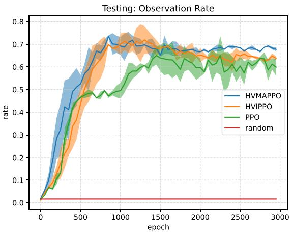

line

| epoch | HVMAPPO | HVIPPO | PPO | random |
|-------|---------|--------|-----|--------|
| 0     | 0.0     | 0.0    | 0.0 | 0.0    |
| 500   | 0.6     | 0.5    | 0.4 | 0.0    |
| 1000  | 0.7     | 0.7    | 0.6 | 0.0    |
| 1500  | 0.7     | 0.7    | 0.6 | 0.0    |
| 2000  | 0.7     | 0.6    | 0.6 | 0.0    |
| 2500  | 0.7     | 0.6    | 0.6 | 0.0    |
| 3000  | 0.7     | 0.6    | 0.6 | 0.0    |

(a)

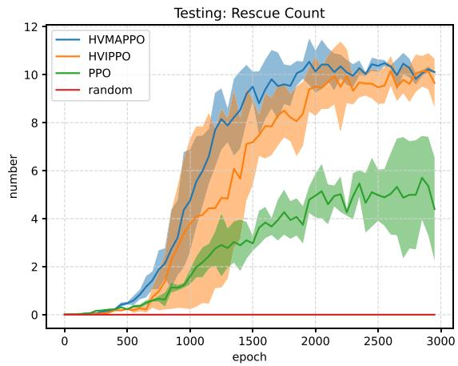

line

| epoch | HVMAPPO | HVIPPO | PPO | random |
|-------|---------|--------|-----|--------|
| 0     | 0       | 0      | 0   | 0      |
| 500   | 1       | 0.5    | 0.2 | 0      |
| 1000  | 4       | 3      | 1   | 0      |
| 1500  | 8       | 6      | 3   | 0      |
| 2000  | 10      | 8      | 5   | 0      |
| 2500  | 10.5    | 9      | 6   | 0      |
| 3000  | 10.5    | 9      | 6   | 0      |

(b)

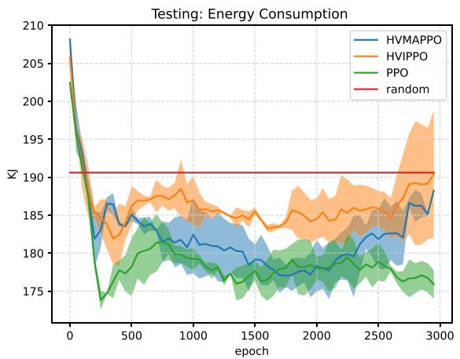

line

| epoch | HVMAPPO | HVIPPO | PPO | random |
|-------|---------|--------|-----|--------|
| 0     | 210     | 210    | 210 | 190    |
| 500   | 185     | 185    | 175 | 190    |
| 1000  | 180     | 185    | 175 | 190    |
| 1500  | 178     | 185    | 175 | 190    |
| 2000  | 178     | 185    | 175 | 190    |
| 2500  | 180     | 185    | 175 | 190    |
| 3000  | 185     | 190    | 175 | 190    |

（c)

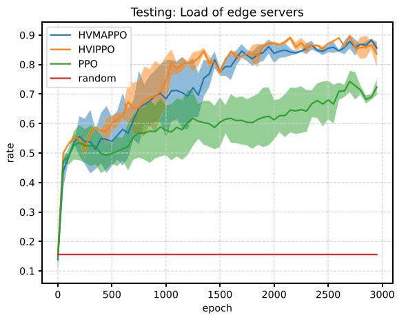

line

| epoch | HVMAPPO | HVIPPO | PPO | random |
|-------|---------|--------|-----|--------|
| 0     | 0.1     | 0.1    | 0.1 | 0.1    |
| 500   | 0.6     | 0.6    | 0.5 | 0.1    |
| 1000  | 0.7     | 0.8    | 0.6 | 0.1    |
| 1500  | 0.8     | 0.85   | 0.65| 0.1    |
| 2000  | 0.85    | 0.85   | 0.7 | 0.1    |
| 2500  | 0.85    | 0.85   | 0.75| 0.1    |
| 3000  | 0.85    | 0.8    | 0.7 | 0.1    |

(d)

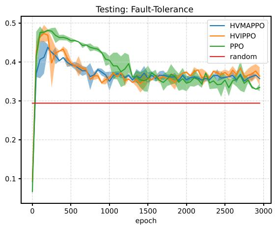

line

| epoch | HVMAPPO | HVIPPO | PPO | random |
|-------|---------|--------|-----|--------|
| 0     | 0.1     | 0.1    | 0.1 | 0.3    |
| 500   | 0.4     | 0.4    | 0.45| 0.3    |
| 1000  | 0.35    | 0.35   | 0.4 | 0.3    |
| 1500  | 0.35    | 0.35   | 0.35| 0.3    |
| 2000  | 0.35    | 0.35   | 0.35| 0.3    |
| 2500  | 0.35    | 0.35   | 0.35| 0.3    |
| 3000  | 0.35    | 0.35   | 0.35| 0.3    |

(e)

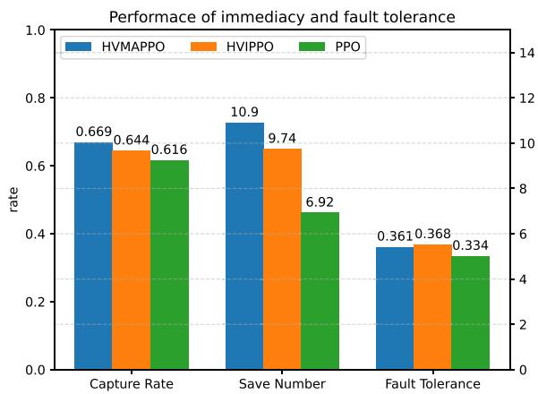

bar

| Category         | HVMAPPO | HVIPPO | PPO   |
| ---------------- | ------- | ------ | ----- |
| Capture Rate     | 0.669   | 0.644  | 0.616 |
| Save Number      | 10.9    | 9.74   | 6.92  |
| Fault Tolerance  | 0.361   | 0.368  | 0.334 |

(f)   
Fig. 8. Performance of HVMAPPO, HVIPPO, and PPO algorithms across various quantitative metrics in testing. (a) Observation rate for targets. (b) Rescue count for targets. (c) Energy consumption of UAVs. (d) Load of edge servers. (e) Fault tolerance of the relay network. (f) The trade-off between immediacy and fault tolerance.

PPO-based algorithm, respectively. However, when it comes to communication fault tolerance, HVMAPPO lags slightly behind HVIPPO, with a marginal decrease of 2%. Despite this, it still surpasses the PPO-based algorithm, showing an improvement of 8%. More importantly, HVMAPPO achieved better overall team performance with slightly less fault tolerance than HVIPPO. These results indicate that the proposed HVMAPPO algorithm effectively optimizes the trade-off between effectiveness and reliability, resulting in higher overall performance.

# C. Selected Episodes

Two episodes are presented here to further demonstrate that with the proposed HVMAPPO, heterogeneous vehicles could not only fulfill their own tasks but also learn to cooperate with others. Fig. 9 presents several critical moments with historical positions in a selected episode. In Fig. 9(a), the ASV is initialized at a corner, and UAVs are randomly placed around the ASV. In Fig. 9(b), trajectories of all vehicles from step 0 to step 16 are shown. At the moment that UAVs are observing targets, routing UAVs (blue circles) keep adjusting their positions to provide relay services for other vehicles. In Fig. 9(c), trajectories of all vehicles from step 16 to step 40 are shown. During this period, UAVs maintain localized movement while the ASV swiftly approaches the nearest target for a successful rescue. Subsequently, a new rescue target is placed randomly within the region. In Fig. 9(d), trajectories of all vehicles from the step 40 to the step 44 are shown. During this period, the UAV approaches the new target and starts observing. At this point, these rescue targets are at a considerable distance from each other. The ASV chooses to approach the new target due to its shorter distance. Meanwhile, routing UAVs adjust their positions to provide multi-hop relay communication with the UAV located in the lower left corner. In summary, observation UAVs, routing UAVs, and the ASV successfully accomplish their tasks of observing, relaying, and rescuing by jointly optimizing trajectories and communication with some advanced skills, such as multi-hop relay communication.

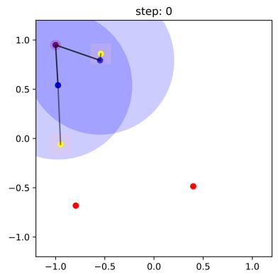

scatter

| x       | y       | color |
| ------- | ------- | ----- |
| -1.0    | 1.0     | blue  |
| -1.0    | 0.5     | blue  |
| -1.0    | 0.0     | yellow|
| -0.5    | 0.8     | yellow|
| -0.5    | -0.7    | red   |
| 0.5     | -0.5    | red   |

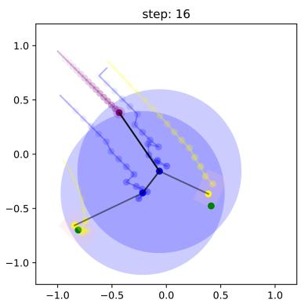

scatter

| x       | y       |
| ------- | ------- |
| -0.8    | -0.7    |
| -0.5    | 0.4     |
| 0.3     | -0.4    |
| 0.5     | -0.5    |

(b)

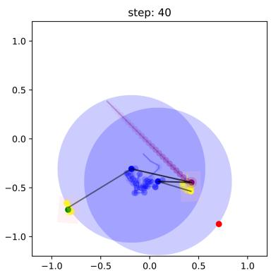

scatter

| x       | y       |
| ------- | ------- |
| -0.8    | -0.7    |
| -0.2    | -0.3    |
| 0.1     | -0.4    |
| 0.4     | -0.5    |
| 0.6     | -0.9    |

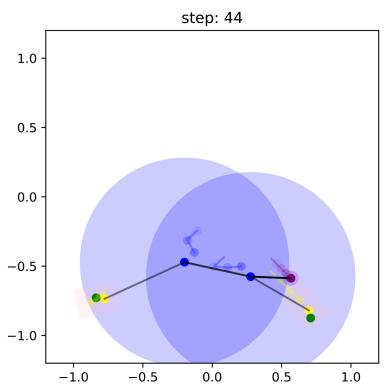

scatter

| x       | y       |
| ------- | ------- |
| -0.8    | -0.7    |
| -0.2    | -0.5    |
| 0.3     | -0.6    |
| 0.6     | -0.7    |
| 0.7     | -0.8    |

(d)   
Fig. 9. Pale circles and lines represent historical positions and trajectories, respectively. The rescue target is initially depicted in red until it is observed, at which point it changes to green. Sub-figures (a), (b), (c), and (d) correspond to distinct moments: the initial time step, the moment when all targets are simultaneously observed, the instant of rescuing a specific target, and the moment when all targets are re-observed.

In another episode, historical trajectories and the movement speed of a specific UAV (“UAV\_0”) are illustrated in Fig. 10. Fig. 10(a) and (b) present all vehicles’ historical trajectories at step 19 and step 43, respectively. Fig. 10(c) shows the speed of the $^ { 6 6 } \mathrm { U A V } _ { - } 0 ^ { , 9 }$ at different time steps. In the beginning, the UAV moves at its maximum speed until step 17 for observing the target, and then gradually decelerates to around 10 m/s. The UAV maintains the speed until the target is rescued. When a new target is generated, the UAV’s speed goes to its maximum of 20 m/s again. At step 43, when the UAV observes a new target, its speed then drops to 10 m/s again. We found that it does not adopt a hovering behavior after the UAV detects a target. Instead, the UAV continues moving at a speed of about 10 m/s, consistent with the results from the UAV flight energy consumption model in (15). In summary, through joint optimization, vehicles not only learn to construct relay networks but also control their flight state to achieve reduced energy consumption. This reflects the capability of the proposed algorithm to maintain communication services while ensuring precise trajectory control, achieving a fine trade-off between immediacy and reliability.

To conclude, the simulation results presented above demonstrate that the joint trajectory and communication optimization based on HVMAPPO not only enables efficient execution of observation and rescue tasks but also constructs a dynamic topology of relay networks to maintain a certain degree of communication fault tolerance. Moreover, a proper trade-off between immediacy and reliability is achieved, thereby enabling heterogeneous vehicles to reach a better performance as a team.

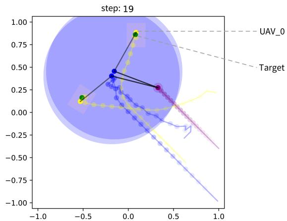

line

| x       | y       | Series     |
| ------- | ------- | ---------- |
| -0.5    | 0.2     | Target     |
| 0.0     | 0.8     | UAV_0      |
| 0.3     | 0.3     | Target     |
| 0.4     | 0.2     | Target     |
| 0.5     | 0.1     | Target     |
| 0.6     | 0.0     | Target     |
| 0.7     | -0.1    | Target     |
| 0.8     | -0.2    | Target     |
| 0.9     | -0.3    | Target     |
| 1.0     | -0.4    | Target     |

(a)

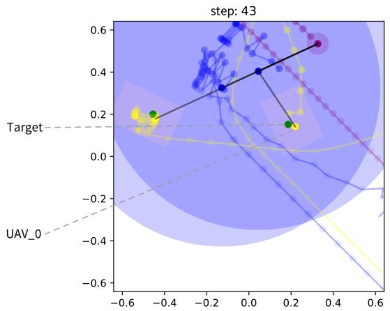

scatter

| x       | y       |
| ------- | ------- |
| -0.5    | 0.2     |
| 0.2     | 0.1     |
| 0.3     | 0.5     |

(b)

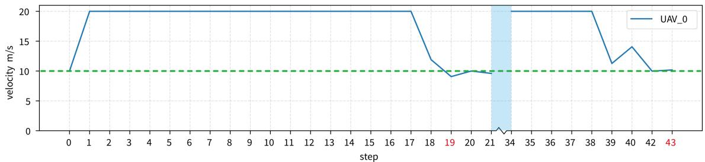

line

| step | UAV_0 |
| ---- | ----- |
| 0    | 10.0  |
| 1    | 20.0  |
| 2    | 20.0  |
| 3    | 20.0  |
| 4    | 20.0  |
| 5    | 20.0  |
| 6    | 20.0  |
| 7    | 20.0  |
| 8    | 20.0  |
| 9    | 20.0  |
| 10   | 20.0  |
| 11   | 20.0  |
| 12   | 20.0  |
| 13   | 20.0  |
| 14   | 20.0  |
| 15   | 20.0  |
| 16   | 20.0  |
| 17   | 20.0  |
| 18   | 12.0  |
| 19   | 9.0   |
| 20   | 10.0  |
| 21   | 10.0  |
| 22   | 9.5   |
| 23   | 9.5   |
| 24   | 9.5   |
| 25   | 9.5   |
| 26   | 9.5   |
| 27   | 9.5   |
| 28   | 9.5   |
| 29   | 11.5  |
| 30   | 14.5  |
| 31   | 14.5  |
| 32   | 14.5  |
| 33   | 14.5  |
| 34   | 14.5  |
| 35   | 14.5  |
| 36   | 14.5  |
| 37   | 14.5  |
| 38   | 14.5  |
| 39   | 14.5  |
| 40   | 14.5  |
| 41   | 14.5  |
| 42   | 14.5  |
| 43   | 14.5  |

（c）  
Fig. 10. Trajectories of heterogeneous vehicles using the HVMAPPO algorithm are illustrated in (a) and (b), while the speed curve of a specific UAV under different steps is also shown in (c). In (a) and (b), the color of the target shifts from red to green upon observation. In (c), the blue curve represents the speed of the UAV, while the green line denotes the optimal speed for minimizing energy consumption during flight. (a) Trajectories of vehicles from the beginning to step 19. (b) Trajectories of vehicles from the beginning to step 43. (c) The velocity changes of a specific UAV.

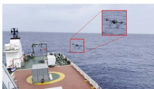

natural_image

Exterior view of a naval ship deck with two inset images showing aircraft on the ocean (no visible text or symbols)

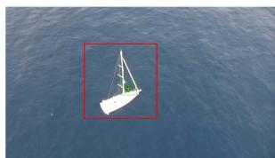

natural_image

Aerial view of a small sailboat floating on calm blue water, enclosed in a red square frame (no text or symbols visible)

Fig. 11. (a) UAV is taking off from the ASV. (b) The image of the rescue target captured by the observation UAV, which is transmitted from the UAV to the ASV via the relay network.

# VI. CONCLUSION AND FUTURE WORK

In this paper, we have investigated the joint trajectory and communication optimization problem in maritime SAR. We have designed a solution leveraging a heterogeneous vehicle system, including UAVs and ASVs, to complete observing, rescuing, offloading scheduling, and multi-hops relaying tasks. Several crucial factors related to maritime SAR have been modeled, including ocean current, observation behavior of the UAV, fault tolerance of relay networks, resources management of MEC, and energy consumption. Furthermore, MARL approaches, named HVMAPPO and HVIPPO, have been proposed for jointly optimizing the efficiency and fault tolerance of communication by searching for a collaborative strategy. Simulation results have shown that the proposed HVMAPPO achieved optimal team performance with a proper balance between efficiency and reliability.

Additionally, we are trying to further validate the experimental results obtained from the simulation in realistic scenarios. Fig. 11(a) shows a UAV used for testing and collecting real data taking off from the ASV. The UAV is equipped with the Global Positioning System (GPS), the antenna gain for long-distance routing communications, and the NVIDIA Jetson, which is utilized to copy with detection tasks. Fig. 11(b) shows an artificially set rescue target captured by the UAV during searching. The image is relayed from the observation UAV to the ASV by the routing UAV. The collected data will be used to fine-tune the collaborative strategy in the future.

# REFERENCES

[1] R. A. Shenoi et al., “Global marine technology trends 2030,” Univ. Southampton, Southampton, U.K., Tech. Rep. GMTT2030, 2015.   
[2] A. Macwan, J. Vilela, G. Nejat, and B. Benhabib, “A multirobot pathplanning strategy for autonomous wilderness search and rescue,” IEEE Trans. Cybern., vol. 45, no. 9, pp. 1784–1797, Sep. 2015.   
[3] X. Li, W. Feng, J. Wang, Y. Chen, N. Ge, and C. -X. Wang, “Enabling 5G on the ocean: A hybrid satellite-UAV-terrestrial network solution,” IEEE Wireless Commun., vol. 27, no. 6, pp. 116–121, Dec. 2020.   
[4] T. S. Abdu, S. Kisseleff, E. Lagunas, and S. Chatzinotas, “Flexible resource optimization for GEO multibeam satellite communication system,” IEEE Trans. Wireless Commun., vol. 20, no. 12, pp. 7888–7902, Dec. 2021.   
[5] L. You, K. -X. Li, J. Wang, X. Gao, X. -G. Xia, and B. Ottersten, “Massive MIMO transmission for LEO satellite communications,” IEEE J. Sel. Areas Commun., vol. 38, no. 8, pp. 1851–1865, Aug. 2020.

[6] T. Yang, Z. Jiang, R. Sun, N. Cheng, and H. Feng, “Maritime search and rescue based on group mobile computing for unmanned aerial vehicles and unmanned surface vehicles,” IEEE Trans. Ind. Inform., vol. 16, no. 12, pp. 7700–7708, Dec. 2020.   
[7] Z. Jiang, T. Yang, L. Zhou, Y. Yuan, and H. Feng, “Maritime search and rescue networking based on multi-agent cooperative communication,” J. Commun. Inf. Netw., vol. 4, no. 1, pp. 42–53, Mar. 2019.   
[8] H. Li, S. Wu, J. Jiao, X. -H. Lin, N. Zhang, and Q. Zhang, “Energy-efficient task offloading of edge-aided maritime UAV systems,” IEEE Trans. Veh. Technol., vol. 72, no. 1, pp. 1116–1126, Jan. 2023.   
[9] Z. Chen, H. Liu, Y. Tian, R. Wang, P. Xiong, and G. Wu, “A particle swarm optimization algorithm based on time-space weight for helicopter maritime search and rescue decision-making,” IEEE Access, vol. 8, pp. 81526–81541, 2020.   
[10] G. Zhang, S. Liu, X. Zhang, and W. Zhang, “Event-triggered cooperative formation control for autonomous surface vehicles under the maritime search operation,” IEEE Trans. Intell. Transp. Syst., vol. 23, no. 11, pp. 21392–21404, Nov. 2022.   
[11] Y. Cai, S. Wu, J. Luo, J. Jiao, N. Zhang, and Q. Zhang, “Age-oriented access control in GEO/LEO heterogeneous network for marine IoRT: A deep reinforcement learning approach,” IEEE Internet Things J., vol. 9, no. 24, pp. 24919–24932, Dec. 2022.   
[12] L. P. Qian, H. Zhang, Q. Wang, Y. Wu, and B. Lin, “Joint multi-domain resource allocation and trajectory optimization in UAV-Assisted maritime IoT networks,” IEEE Internet Things J., vol. 10, no. 1, pp. 539–552, Jan. 2023.   
[13] M. Zhang, S. Wu, J. Jiao, N. Zhang, and Q. Zhang, “Energy- and costefficient transmission strategy for UAV trajectory tracking control: A deep reinforcement learning approach,” IEEE Internet Things J., vol. 10, no. 10, pp. 8958–8970, May 2023.   
[14] Y. Gao, G. Jin, Y. Guo, G. Zhu, Q. Yang, and K. Yang, “Weighted area coverage of maritime joint search and rescue based on multi-agent reinforcement learning,” in Proc. IEEE 3rd Adv. Inf. Manage. Commun. Electron. Automat. Control Conf., 2019, pp. 593–597.   
[15] C. Watkins and P. Dayan, “Q-learning,” Mach. Learn., vol. 8, pp. 279–292, 1992.   
[16] J. Fan, T. Yang, J. Zhao, Z. Cui, J. Ning, and P. Wang, “Double Q learning multi-agent routing method for maritime search and rescue,” in Proc. Adv. Int. Conf. Ubi. Commun, 2023, pp. 367–372.   
[17] Z. Wang and B. Lin, “Q-learning based delay sensitive routing protocol for maritime search and rescue networks,” in Proc. Adv. Veh. Techno. Conf. (VTC2020-Fall), 2020, pp. 1–5.   
[18] R. Sutton and G. Andrew, Reinforcement Learning: An Introduction. Cambridge, MA, USA: MIT Press, 2018.   
[19] R. Lowe, Y. Wu, A. Tamar, J. Harb, P. Abbeel, and I. Mordatch, “Multiagent actor-critic for mixed cooperative-competitive environments,” in Proc. Adv. Neural Inf. Process. Syst., 2017, vol. 30, pp. 1–9.   
[20] K. Zhang, Z. Yang, and T. Ba¸sar, “Multi-agent reinforcement learning: A selective overview of theories and algorithms,” in Handbook of Reinforcement Learning and Control, Berlin, Germany: Springer, 2021, pp. 321–384.   
[21] J. P. Queralta et al., “Collaborative multi-robot search and rescue: Planning, coordination, perception, and active vision,” IEEE Access, vol. 8, pp. 191617–191643, 2020.   
[22] T. Li et al., “Applications of multi-agent reinforcement learning in future internet: A comprehensive survey,” IEEE Commun. Surveys Tut., vol. 24, no. 2, pp. 1240–1279, Secondquarter 2022.   
[23] D. Guo, L. Tang, X. Zhang, and Y. -C. Liang, “Joint optimization of handover control and power allocation based on multi-agent deep reinforcement learning,” IEEE Trans. Veh. Technol., vol. 69, no. 11, pp. 13124–13138, Nov. 2020.   
[24] C. Yu et al., “The surprising effectiveness of PPO in cooperative multiagent games,” in Proc. Adv. Neural Inf. Process. Syst., 2022, vol. 35, pp. 24611–24624.   
[25] Z. Wang et al., “Learning to routing in UAV swarm network: A multi-agent reinforcement learning approach,” IEEE Trans. Veh. Technol., vol. 72, no. 5, pp. 6611–6624, May 2023.   
[26] Q. Cui, X. Zhao, W. Ni, Z. Hu, X. Tao, and P. Zhang, “Multi-agent deep reinforcement learning-based interdependent computing for mobile edge computing-assisted robot teams,” IEEE Trans. Veh. Technol., vol. 72, no. 5, pp. 6599–6610, May 2023.   
[27] F. Oliehoek, “Decentralized POMDPs,” in Reinforcement Learning: Stateof-the-Art. Berlin, Heidelberg, Germany: Springer, 2012, pp. 471–503.   
[28] Y. Andrew, D. Harada, and S. Russell, “Policy invariance under reward transformations: Theory and application to reward shaping,” in Proc. Adv. Int. Conf. Machin. Learn. Syst., 1999, vol. 99, pp. 278–287.

[29] T. Rashid, M. Samvelyan, C. Witt, G. Farquhar, J. Foerster, and S. Whiteson, “Monotonic value function factorisation for deep multi-agent reinforcement learning,” J. Mach. Learn. Res., vol. 21, pp. 7234–7284, 2020.   
[30] A. Oroojlooy and D. Hajinezhad, “A review of cooperative multiagent deep reinforcement learning,” Appl. Intell., vol. 53, no. 11, pp: 13677–13722, 2023.   
[31] Y. Teh et al., “Distral: Robust multitask reinforcement learning,” in Proc. Adv. Neural Inf. Process. Syst, 2017, pp. 5792–5799.   
[32] J. Schulman, P. Moritz, S. Levine, M. Jordan, and P. Abbeel, “Highdimensional continuous control using generalized advantage estimation,” in Proc. Adv. Int. Conf. Learn. Representations, 2016, pp. 1–14.   
[33] H. P. van Hasselt, A. Guez, M. Hessel, V. Mnih, and D. Silver, “Learning values across many orders of magnitude,” in Proc. Adv. Neural Inf. Process. Syst., 2016, pp. 4287–4295.   
[34] V. Mnih et al., “Human-level control through deep reinforcement learning,” Nature, vol. 518, no. 7540, pp. 529–533, 2015.   
[35] M. Chen and D. Zhu, “Optimal time-consuming path planning for autonomous underwater vehicles based on a dynamic neural network model in ocean current environments,” IEEE Trans Veh. Technol., vol. 69, no. 12, pp. 14401–14412, Dec. 2020.   
[36] K. He, X. Zhang, S. Ren, and J. Sun, “Deep residual learning for image recognition,” in Proc. IEEE Conf. Comp. Vis. Pattern Recognit., 2016, pp. 770–778.   
[37] Y. Zeng, J. Xu, and R. Zhang, “Energy minimization for wireless communication with rotary-wing UAV,” IEEE Trans. Wireless Commun., vol. 18, no. 4, pp. 2329–2345, Apr., 2019.   
[38] L. Ale, S. A. King, N. Zhang, A. R. Sattar, and J. Skandaraniyam, “D3PG: Dirichlet DDPG for task partitioning and offloading with constrained hybrid action space in mobile-edge computing,” IEEE Internet Things J., vol. 9, no. 19, pp. 19260–19272, Oct. 2022.   
[39] P. Mahajan, A. Kumar, G. S. S. Chalapathi, and R. Buyya, “EFTA: An energy-efficient, fault-tolerant, and area-optimized UAV placement scheme for search operations,” in Proc. Adv. IEEE Conf. Comput. Commun. Workshops, 2022, pp. 1–6.   
[40] O. Vinyals et al., “Grandmaster level in StarCraft II using multi-agent reinforcement learning,” Nature, vol. 575, no. 7782, pp. 350–354, 2019.   
[41] J. Schulman, F. Wolski, P. Dhariwal, A. Radford, and O. Klimov, “Proximal policy optimization algorithms,” Jul. 2017, arXiv:1707.06347.   
[42] C. S. d. Witt et al., “Is independent learning all you need in the starcraft multi-agent challenge?,” Nov. 2020, arXiv:2011.09533.

natural_image

Portrait photo of a young man against a blue background (no text or symbols visible)

Chengjia Lei (Graduate Student Member, IEEE) received the B.S. degree in automation and the M.S. degree in control science and engineering from the Beijing University of Chemical Technology, Beijing, China, in 2017 and 2020, respectively. He is currently working toward the Ph.D. degree in information and communication engineering with the Harbin Institute of Technology (Shenzhen), Shenzhen, China. He is also affiliated with Peng Cheng Laboratory, Shenzhen. His research interests include control theory, intelligent automatic vehicular networks, reinforce-

ment learning, and multiagent systems.

natural_image

Portrait of a man wearing glasses and a dark polo shirt, seated indoors (no visible text or symbols)

Shaohua Wu (Member, IEEE) received the Ph.D. degree in communication engineering from the Harbin Institute of Technology (Shenzhen), Shenzhen, China, in 2009. From 2009 to 2011, he held a Postdoctoral position with the Department of Electronics and Information Engineering, Shenzhen Graduate School, Harbin Institute of Technology, Harbin, China. From 2014 to 2015, he was a Visiting Researcher with BBCR, University of Waterloo, Waterloo, ON, Canada. Since 2012, he has been a Full Professor with the Harbin Institute of Technology

(Shenzhen). He is also a Professor with Peng Cheng Laboratory, Shenzhen. He has authored or coauthored more than 100 papers in these fields and holds more than 40 Chinese patents. His research interests include satellite and space communications, advanced channel coding techniques, space–air–ground–sea integrated networks, and B5G/6G wireless transmission technologies.

natural_image

Portrait photo of a young man in a dark polo shirt (no text or symbols visible)

Yi Yang received the Ph.D. degree in communication engineering from the Harbin Institute of Technology (Shenzhen), Shenzhen, China, and the second Ph.D. degree in system innovation from Tokushima University, Tokushima, Japan, in 2019. From 2019 to 2021 he held a Postdoctoral position with the Department of Electronics and Information Engineering, Harbin Institute of Technology (Shenzhen), Shenzhen, China. Since 2021, he has been an Assistant Research Fellow with Peng Cheng Laboratory, Shenzhen. His current research interests include cognitive radio, cognitive networks, satellite communication, space information networks, machine learning, and evolutionary algorithms.

natural_image

Portrait of a woman with glasses and shoulder-length dark hair, wearing a pink shirt and green lanyard (no visible text or symbols)

Jiayin Xue (Member, IEEE) received the Ph.D. degree in communication engineering from the Harbin Institute of Technology (Shenzhen), Shenzhen, China, in 2020. She is currently an Associate Researcher with Peng Cheng Laboratory, China. Her research interests include wireless communication, signal processing and space situation awareness.

natural_image

Portrait photo of a man wearing glasses and a collared shirt (no text or symbols visible)

Qinyu Zhang (Senior Member, IEEE) received the bachelor’s degree in communication engineering from the Harbin Institute of Technology (HIT), Harbin, China, in 1994, and the Ph.D. degree in biomedical and electrical engineering from the University of Tokushima, Tokushima, Japan, in 2003. From 1999 to 2003, he was an Assistant Professor with the University of Tokushima. From 2003 to 2005, he was an Associate Professor with the Shenzhen Graduate School, HIT. He was the Founding Director of the Communication Engineering Research Center, School of Electronic and Information Engineering (EIE). Since 2005, he has been a Full Professor and the Dean of the EIE School, HIT. His research interests include aerospace communications and networks, wireless communications and networks, cognitive radios, signal processing, and biomedical engineering. Dr. Zhang was an Associate Chair for Finance of the International Conference on Materials and Manufacturing Technologies 2012. He was the TPC Co-Chair of the IEEE/CIC ICCC 2015. He was the Symposium Co-Chair of the CHINACOM 2011 and the IEEE Vehicular Technology Conference 2016 (Spring). He was the Founding Chair of the IEEE Communications Society Shenzhen Chapter. He is on the Editorial Board of some academic journals, such as Journal of Communication, KSII Transactions on Internet and Information Systems, and Science China Information Sciences. He has been a TPC Member for the Infocom, IEEE ICC, IEEE GLOBECOM, IEEE Wireless Communications and Networking Conference, and other flagship conferences in communications.