# Joint Trajectory and Passive Beamforming Design for Intelligent Reflecting Surface-Aided UAV Communications: A Deep Reinforcement Learning Approach

Liang Wang , Kezhi Wang , Cunhua Pan , and Nauman Aslam

Abstract—In this paper, the intelligent reflecting surface (IRS)-aided unmanned aerial vehicle (UAV) communication system is studied, where the UAV is deployed to serve the user equipment (UE) with the assistance of multiple IRSs mounted on several buildings to enhance the communication quality between UAV and UE. We aim to maximize the energy efficiency of the system. including the data rate of UE and the energy consumption of UAV via jointly optimizing the UAV's trajectory and the phase shifts of reflecting elements of IRS, when the UE moves and the selection of IRSs is considered for the energy saving purpose. Since the system is complex and the environment is dynamic, it is challenging to derive low-complexity algorithms by using conventional optimization methods. To address this issue, we first propose a deep Q-network (DQN)-based algorithm by discretizing the trajectory, which has the advantage of training time. Furthermore, we propose a deep deterministic policy gradient (DDPG)-based algorithm to tackle the case with continuous trajectory for achieving better performance. The experimental results show that the proposed algorithms achieve considerable performance compared to other traditional solutions.

Index Terms—Deep Reinforcement learning, UAV communications, intelligent reflecting surface

## 1 INTRODUCTION

T is widely envisioned that the fifth-generation (5G) wire-Iless networks and beyond will achieve 1000-fold increase in network capacity, accommodate about 100 billion devices and support a number of emerging applications such as virtual reality (VR) services. To satisfy this ever-increasing demand, unmanned aerial vehicle (UAV) has been applied and regarded as one of the most promising technologies to achieve these ambitious goals. Compared to the traditional communication systems that utilize the terrestrial fixed base stations, UAV-aided communication systems are more costeffective and likely to achieve better quality of service (QoS) due to its appealing properties of flexible deployment, fully controllable mobility and low cost. In fact, with the assistance of UAVs, the system performance (e.g., data rate and latency) can be significantly enhanced by establishing the line-of-sight (LoS) communication links between UAVs and user equipments (UEs).

In addition, to further improve the channel quality, adaptive communications can be designed through the mobility/ deployment control of the UAV systems. For example, in [1], Jiang et al. proposed a heterogeneous mobile edge computing (MEC) framework, where ground stations (GSs), ground vehicles (GVs) and UAVs are deployed for providing computing, communication and caching (3C) resources at the network edge. In [2], Yang et al. investigated the weighted-sum cost minimization problem in a hierarchical machine learning (ML) tasks distribution (HMTD) framework and they optimized the offloading strategy, including the binary offloading and partial offloading between the UAV and target. In [3], Hourani et al. proposed an analytical approach for optimizing the altitude of UAV for the purpose of maximizing the radio coverage on the ground. In [4], the authors considered the scenario of UAVs in an orthogonal frequency division multiple access (OFDMA) system and they proposed an iterative block coordinate descent approach for optimizing the UAV’s trajectory and resource allocation, aiming to maximize the minimum average throughput of UEs. The optimization problem of UAV placement and transmit power in UAV-aided relay systems was studied in [5], where Ren et al. proposed a low-complexity iterative algorithm to solve the problem both in the free-space channel and three-dimensional channel scenarios. In [6], to minimize the energy consumption of UAV, Zeng et al. formulated a travelling sale problem and proposed an efficient algorithm to optimize the UAV’s trajectory, including the hovering locations and duration. In [7], a multi-UAV-assisted communication system was studied. The authors proposed a energy-efficient distributed MCS (Edics) algorithm to optimize the UAVs’ trajectory for maximizing the energy efficiency of UAVs. In [8], Lu et al. studied the jamming problem in UAV-aided cellular system, where the relay power is optimized without the knowledge of the cellular topology through a deep reinforcement learning (DRL) approach. Other contributions of UAVs include their applications in MEC [9], [10], [11], device-to-device communication [12], data collection [13], mobile crowd sensing [14] and wireless power transfer networks [15]. In [9], Yang et al. studied the power minimization problem in a multi-UAV-enabled MEC system, where the user association, power control, computation capacity allocation and location planning were optimized. In [10], Wang et al. investigated energy minimization problem in the multi-UAV assisted MEC system, where they proposed a multi-agent deep reinforcement learning approach for optimizing the trajectories of UAVs. In [11], the authors proposed a convex optimization based trajectory (CAT) and deep Reinforcement learning based trajectory (RAT) algorithms for optimizing the user association, resource allocation and the trajectory of UAVs, aiming at minimization the energy consumption of UEs. In [12], Huang et al. investigated the device-to-device (D2D) rate maximization problem in UAVaided wireless communication systems, where they proposed an iterative algorithm for optimizing the UAV flying altitude, location and the bandwidth allocation, which proved that the altitude of the UAV is vital for improving the system performance. In [14], Liu et al. introduced a distributed mobile crowed sensing platform, where multiple UAVs are deployed as mobile terminals for collecting data. They proposed a DRL-based approach for navigating a group of UAVs in order to maximize the collected data, the geographical fairness, and the energy efficiency of UAVs. In [15], Xu et al. studied the problem of maximizing the energy harvested at all energy receivers in a UAV-enabled wireless power transfer system, in which they first proposed an algorithm based on Lagrange dual method for optimizing UAV’s trajectory in an ideal case. Then, they proposed a new successive hover-and-fly algorithm based on convex programming optimization for trajectory design for the general case.

However, in the crowded area, the communication signals between UAV and UE may be blocked by high buildings or other constructions. Thanks to the development of meta-materials or meta-surfaces [16], [17], intelligent reflecting surface (IRS), or reconfigurable intelligent surfaces (RIS) [18], [19] has been proposed and received considerable attention in both academia and industry. In general, the IRS consists of an array of low-cost and passive reflecting elements, each of which is able to reflect the incident signals by smartly adjusting the phase shift, which has the potential to improve the achievable data rate [20]. Furthermore, since the reflecting elements of the IRS can be passive, the IRS is more energy-efficient than traditional relay-aided communication techniques, such as [21].

Due to the above advantages, the IRS has been extensively investigated in various wireless communication systems. In [22], the authors investigated the Holographic Multiple Input Multiple Output Surface (HMIMOS) architecture and analyzed its opportunities and challenges in 6G wireless networks. In [23], an IRS-enhanced MISO wireless system was studied, and the authors proposed a semidefinite relaxation (SDR) based algorithm for optimizing the active and passive beamforming, aiming to maximize the overall received signal power at the user. In [24], Yang et al. studied a realistic IRS-enhanced OFDM system, where the frequency-selective channels were considered, and the passive array reflecting coefficients were optimized for maximizing the achievable data rate of the user. In order to enhance the physical layer security of IRS-aided communication systems, Yu et al. [25] jointly optimized the beamforming at the transmitter and the phase shifts of the IRS, maximizing the physical layer security data rate. For multicast scenarios, the authors in [26] investigated the downlink IRS-aided multigroup multicast communication system, where the IRS can be deploved to enhance the worst-case user channel condition. In [27], Pan et al. studied the weighted sum rate (WSR) maximization problem for an IRS-assisted multicell MIMO communication system, and the authors proposed a pair of algorithms named Majorization-Minimization (MM) and Complex Circle Manifold (CCM) for optimizing the phase shifts of the IRS. The simulation results in [27] showed that the IRS is very effective in mitigating the cell-edge interference. Additionally, the authors in [28] considered to deploy an IRS in a simultaneous wireless information and power transfer (SWIPT) system to enhance both the energy harvesting and data rate performance. In [29], the IRS was shown to be beneficial in reducing the latency of the mobile edge computing system. In [30], the authors studied the achievable rate problem in an IRS-aided wireless system, and they optimized the transmit beamforming and the IRS reflect beamforming through the alternating optimization (AO) based technique. In [31], the authors studied the resource allocation for a point-to-point IRS-aided MIMO communication system when taking into account the channel estimation and channel feedback overhead. In [32], Huang et al. proposed a DRL-based algorithm to optimize the design of beamforming matrix and phase shift matrix in RIS-based multi-user MISO system.

Against the above background, we study an IRS-aided UAV system where the UAV is deployed to provide communication services to the ground UE. To enhance the channel condition between UAV and UE, which may be blocked by some obstacles such as high buildings, the IRS may be mounted on the exterior wall of the buildings. We aim to maximize the energy efficiency of UAV, including the data rate of UE and the energy consumption of UAV via jointly optimizing the UAV’s trajectory, the phase shifts of the reflecting elements of IRS, while UE moves. To address this problem, first, we propose a deep Q-network (DQN)-based algorithm by discretizing the trajectory for the easy deployment. Then, we propose a deep deterministic policy gradient (DDPG)-based algorithm to tackle the continuous situation for better performance. The experiment verifies that the proposed algorithms achieve better performance compared to benchmark solutions.

The reminder of this paper is organized as follows. In Section 2, we introduce the related work and the background of DRL. In Section 3, we describe the system model, including the optimization problem. In Section 4, we July 05,2026 at 12:42:54 UTC from IEEE Xplore. Restrictions apply.

TABLE 1 Main Notations
<table><tr><td>Notation</td><td>Definition</td></tr><tr><td> $k , K , \kappa$  Zmin, Zmax</td><td>the index, the number, and the set of IRSs the minimal, maximal of flying altitude of</td></tr><tr><td>Xmax, Ymax  $t , T , \tau$   $M _ { r } , M _ { c }$   $x ^ { \mathrm { m a x } } , y ^ { \mathrm { m a x } }$  , zmax</td><td>UAV side length of target area the index, the number, and the set of TSs number of reflecting elements of IRSs maximal flying distances of UAV</td></tr><tr><td> $a _ { t } ^ { x } , a _ { t } ^ { y } , a _ { t } ^ { z }$   $[ \bar { x } _ { 0 } ^ { u } , y _ { 0 } ^ { u } , \bar { z } _ { 0 } ^ { u } ]$   $U _ { r }$ </td><td>flying distances of UAV in TS t initial coordinate of UAV tip speed of the rotor blade</td></tr><tr><td> $V _ { h }$ </td><td>the mean rotor induced velocity when</td></tr><tr><td></td><td></td></tr><tr><td></td><td>hovering</td></tr><tr><td></td><td></td></tr><tr><td> $d _ { 0 }$ </td><td>the main body drag ratio</td></tr><tr><td> $\rho _ { a }$ </td><td></td></tr><tr><td></td><td>air density</td></tr><tr><td> $z$ </td><td>the rotor solidity</td></tr><tr><td> $G$ </td><td>rotor disc area</td></tr><tr><td> $t _ { d }$ </td><td>time duration of TS</td></tr><tr><td> $[ x _ { k } , y _ { k } , z _ { k } ]$ </td><td>coordinate of IRS k</td></tr><tr><td> $[ x _ { t } ^ { e } , y _ { t } ^ { e } ]$ </td><td>coordinate of UE in TS t</td></tr><tr><td> $\left[ x _ { t } ^ { u } , y _ { t } ^ { u } , z _ { t } ^ { u } \right]$ </td><td>coordinate of UAV in TS t</td></tr><tr><td> $d _ { k , t } ^ { \mathrm { U I } }$ </td><td>distance between UAV and IRS k in TS t</td></tr><tr><td> $d _ { k , t } ^ { \mathrm { I E } }$ </td><td></td></tr><tr><td> $\pmb { h } _ { k , t } ^ { \mathrm { U I } }$ </td><td>distance between UE and IRS k in TS t</td></tr><tr><td></td><td>channel gain of UAV-IRS k link in TS t</td></tr><tr><td>µ  $\dot { \alpha } ^ { \mathrm { I E } }$ </td><td>path loss at reference distance 1m</td></tr><tr><td> $f , c$ </td><td>path loss exponent</td></tr><tr><td> $\pmb { h } _ { k + } ^ { \mathrm { 1 E } }$ </td><td>carrier frequency, speed of light channel gain of IRS k - UE link in TS t</td></tr><tr><td> $P _ { \cdot } ^ { \prime } \sigma ^ { 2 } , B$ </td><td>transmission power, noise power,</td></tr><tr><td></td><td></td></tr><tr><td></td><td>bandwidth</td></tr><tr><td> $\Theta _ { k , t }$ </td><td>phase shift matrix of IRS k in TS t</td></tr><tr><td> $R _ { k , t }$ </td><td>data rate of UAV-IRS k-UE linke in TS t</td></tr></table>

present the proposed DQN and DDPG-based algorithms. In Section 5, the experimental results are shown. Finally, we conclude the paper in Section 6. The main notations used in this paper are summarized in Table 1.

Other Notations: In this paper, CM 1 denotes the set of $M \times 1$ complex vectors. diag denotes the diagonalization operation. ${ \bf \Pi } ( \cdot ) ^ { T }$ ðÞdenotes the transpose operation. E denotes ðÞthe expectation operation.

## 2 RELATED WORK AND BACKGROUND

## 2.1 IRS-Aided UAV Communications

Most recently, the integration of IRS in UAV-aided communication systems has become a hot research topic. For example, in [33], the authors considered a downlink transmission system, consisting of a rotary-wing UAV, a ground user and an IRS. In this work, the authors proposed a successive convex approximation (SCA) based algorithm to optimize the UAV’s trajectory and passive beamforming of the IRS. In [34], the potential of IRS in UAV-assisted communication systems was investigated. The authors concluded that the deployment of IRS is capable of achieving significant performance gain in UAV-assisted cellular networks. Some other benefits of IRS-assisted system can also be found in the literature. Most of the existing algorithms are based on convex optimization theory, which may achieve suboptimal performance and is time-consuming due to the fact that a number of iterations are required for the convergence of the algorithm. Their complexity may increase with the number of reflecting elements.

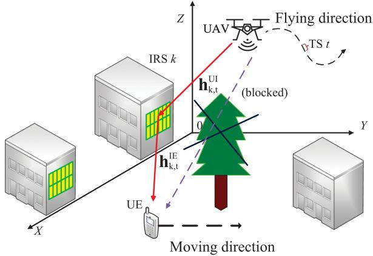  
Fig. 1. Architecture of IRS-aided UAV communication system.

## 2.2 DRL Background

Thanks to the advances in the field of machine learning, most of sophisticated optimization problems may be solved efficiently and in real time. As a branch of machine learning algorithms, reinforcement learning (RL) is viewed as a useful approach for tackling complicated control tasks, such as robotics and games. In [35], Sutton et al. proposed a widely used model-free RL algorithm named Q-learning, where some fundamental knowledge, such as agent, environment, state, action, reward and Q-value were introduced. In addition, another mechanism named Q-table was employed in Q-learning. However, as the size of Q-table is finite, Q-learning may only handle control problems in discrete state and action spaces. As an extension of Q-learning, Mnih et al. [36] proposed the deep Q-network (DQN) algorithm, which combines RL and the powerful deep neural network (DNN). Additionally, two techniques named experience replay and target network were integrated. The experimental results proved that DQN is capable of achieving enhanced performance in the challenging Atari 2600 games. In DQN, the Q-table is replaced by the DNN, as DQN can handle the control problem with infinite state spaces. However, the action space of DQN is still discrete. Inspired by DQN, Silver et al. proposed a deep deterministic policy gradient (DDPG) [37] algorithm based on the actor-critic [38] method, which is able to be applied to continuous action spaces. Although some researchers has started to apply the DRL in the IRS or IRS-assisted UAV communications, most of the work did not consider the selection of IRS and the movement of UE. In this paper, DDPG and DQN will be applied in IRS-aided UAV system, where the selection of IRS and the movement of UE will also be considered.

## 3 SYSTEM MODEL

Assume that there is one rotary UAV, K IRSs mounted on K buildings, respectively and one moving UE to be served, as shown in Fig. 1. Note that the UE can also be other moving object, like the autonomous vehicle. Also, assume that the UE is located in the crowded area where it suffers from severe path loss and high attenuation, caused by high buildings and trees. Thus, the direct link between UAV and UE is July 05,2026 at 12:42:54 UTC from IEEE Xplore. Restrictions apply.

not considered. IRSs are deployed for enhancing the communication quality of UE. The UAV flies within a particular altitude ranging from $[ Z ^ { \mathrm { m i n } } , Z ^ { \mathrm { m a x } } ]$ over a rectangle target area with side lengths $\operatorname { \lambda } ^ { \mathrm { { m a x } } }$ and $\dot { Y } ^ { \mathrm { m a x } }$ for a certain number of time slots (TSs) $T ,$ each of which has $t _ { d }$ time duration. For simplicity, we denote the set of IRSs as $\scriptstyle { \mathcal { K } } \triangleq \{ k =$ $1 , 2 , \ldots , { \bar { K } } \}$ and the set of TSs is denoted as $\mathcal { T } \triangleq \{ 1 , 2 , . . . T \}$ g T f gAdditionally, each of IRSs is equipped with an uniform rectangular array (URA) with $\bar { M } _ { r } \times M _ { c }$ reflecting elements, which could boost the useful signal power by adjusting the phase shifts of the reflecting elements.

## 3.1 UAV Model

In this subsection, we describe the UAV model with Cartesian coordinate system. Specifically, in each of TS, the UAV moves with a flying action determined by two horizontal distances $a _ { t } ^ { x } \in [ - x ^ { \operatorname* { m a x } } , x ^ { \operatorname* { m a x } } ] , ~ a _ { t } ^ { y } \in [ - y ^ { \operatorname* { m a x } } , y ^ { \operatorname* { m a x } } ]$ and a vertical distance $a _ { t } ^ { z } \in [ - z ^ { \operatorname* { m a x } } , z ^ { \operatorname* { m a x } } ]$ . Thus, given the initial coordinate of the UAV, which is $[ x _ { 0 } ^ { u } , y _ { 0 } ^ { u } , z _ { 0 } ^ { u } ]$ , the coordinate ½of the UAV in TS t is expressed as $[ x _ { t } ^ { u } , y _ { t } ^ { u } , z _ { t } ^ { u } ]$ , where $x _ { t } ^ { u } =$ $\begin{array} { r } { x _ { 0 } ^ { u } + \sum _ { t ^ { \prime } = 1 } ^ { t } a _ { t ^ { \prime } } ^ { x } , y _ { t } ^ { u } = y _ { 0 } ^ { u } + \dot { \sum } _ { t ^ { \prime } = 1 } ^ { t } a _ { t ^ { \prime } } ^ { y } } \end{array}$ ½, and $\begin{array} { r } { z _ { t } ^ { u } = z _ { 0 } ^ { u } + \sum _ { t ^ { \prime } = 1 } ^ { t } \bar { a } _ { t ^ { \prime } } ^ { z } } \end{array}$ þ ¼ 0 ¼ þ ¼ 0 ¼ þ ¼ 0Note that as the UAV may not go beyond the border of the targeted area, we have the following constraints

$$
0 \leq x _ { t } ^ { u } \leq X ^ { \operatorname* { m a x } } ,\tag{1}
$$

and

$$
0 \leq y _ { t } ^ { u } \leq Y ^ { \operatorname* { m a x } } ,\tag{2}
$$

and

$$
Z ^ { \operatorname* { m i n } } \leq z _ { t } ^ { u } \leq Z ^ { \operatorname* { m a x } } .\tag{3}
$$

In this work, the energy consumption for communication, such as communication circuitry and signal processing, is ignored compared with the propulsion energy. According to [6], the propulsion energy consumption in TS t is expressed as

$$
\begin{array} { l } { \displaystyle { e _ { t } = \bigg ( P _ { s } \bigg ( 1 + 3 ( \frac { v _ { t } ^ { h } } { U _ { r } } ) ^ { 2 } \bigg ) + P _ { m } \left( \sqrt { 1 + \frac { 1 } { 4 } ( \frac { v _ { t } ^ { h } } { V _ { h } } ) ^ { 4 } } - \frac { 1 } { 2 } ( \frac { v _ { t } ^ { h } } { V _ { h } } ) ^ { 2 } \right) ^ { \frac { 1 } { 2 } } } } \\ { \displaystyle { + \frac { 1 } { 2 } d _ { 0 } \rho _ { a } z G ( v _ { t } ^ { h } ) ^ { 3 } + P _ { k } v _ { t } ^ { v } \bigg ) t _ { d } } , } \end{array}\tag{4}
$$

where $P _ { s } , P _ { m }$ and $P _ { k }$ are fixed constants and can be obtained from [6]; Ur is the tip speed of the rotor blade; $V _ { h }$ denotes the mean rotor induced velocity when hovering; $d _ { 0 }$ is the main body drag ratio; $\rho _ { a }$ is the air density; z means the rotor solidity; G is known as the rotor disc area; $v _ { t } ^ { h } = \frac { \sqrt { ( a _ { t } ^ { x } ) ^ { 2 } + ( a _ { t } ^ { y } ) ^ { 2 } } } { t _ { d } }$ ; and $\begin{array} { r } { v _ { t } ^ { v } = \frac { | a _ { t } ^ { z } | } { t _ { d } } } \end{array}$

## 3.2 Channel Model

Denote the coordinate of IRS k as $[ x _ { k } , y _ { k } , z _ { k } ] ,$ , the coordinate of UE as $[ x _ { t } ^ { e } , y _ { t } ^ { e } ]$ ½ . In this paper, the location of UE varies with ½ time, as UE moves. Thus, the distance between UAV and IRS k in TS t is

$$
d _ { k , t } ^ { \mathrm { U I } } = \sqrt { \left( x _ { t } ^ { u } - x _ { k } \right) ^ { 2 } + \left( y _ { t } ^ { u } - y _ { k } \right) ^ { 2 } + \left( z _ { t } ^ { u } - z _ { k } \right) ^ { 2 } } .\tag{5}
$$

Similarly, the distance between IRS k and UE in TS t is given by

$$
d _ { k , t } ^ { \mathrm { I E } } = \sqrt { ( x _ { t } ^ { e } - x _ { k } ) ^ { 2 } + ( y _ { t } ^ { e } - y _ { k } ) ^ { 2 } + ( z _ { k } ) ^ { 2 } } .\tag{6}
$$

Then, for the 3-D channel model, the path loss of UAV-IRS k link in TS t can be denoted by $\dot { P } _ { k , t } ^ { \mathrm { U I } } \left[ \dot { 3 } \right]$

$$
P _ { k , t } ^ { \mathrm { U I } } = \frac { A } { 1 + u \mathrm { e x p } ( - w ( \theta _ { k , t } - u ) ) } + 2 0 \mathrm { l o g } _ { 1 0 } ( d _ { k , t } ^ { \mathrm { U I } } ) + C ,\tag{7}
$$

where $\begin{array} { r } { A = \eta _ { \mathrm { L o S } } - \eta _ { \mathrm { N L o S } } , C = 2 0 { \log _ { 1 0 } } ( \frac { 4 \pi f } { c } ) + \eta _ { \mathrm { N L o S } } } \end{array}$ . Note that $\eta _ { \mathrm { L o S } }$ and $\eta _ { \mathrm { N L o S } }$ are variables related to the LoS and NLoS links, respectively. $\begin{array} { r } { \theta _ { k , t } = \arctan ( \frac { z _ { t } ^ { u } - z _ { k } } { \sqrt { ( x _ { t } ^ { u } - x _ { k } ) ^ { 2 } + ( y _ { t } ^ { u } - y _ { k } ) ^ { 2 } } } ) } \end{array}$ denotes the elevation angle between UAV and IRS k in TS t. $f ,$ c are the carrier frequency and speed of light, respectively. u and w are constant values determined by the environment. Thus, motivated by [3], the channel gain of UAV-IRS k link in TS t is denoted by $\pmb { h } _ { k , t } ^ { \mathrm { U I } } \in \mathbb { C } ^ { M _ { r } M _ { c } \times 1 }$

$$
\begin{array} { r } { \pmb { h } _ { k , t } ^ { \mathrm { U I } } = \widetilde { C } ( d _ { k , t } ^ { \mathrm { U I } } ) ^ { - 2 } e ^ { \frac { \widetilde { A } } { 1 + a \exp \left( - b ( \theta _ { k , t } - a ) \right) } } \hat { h } _ { k , t } ^ { \mathrm { U I } } , } \end{array}\tag{8}
$$

where $\begin{array} { r } { \widetilde { C } = \underbrace { 1 0 ^ { - \frac { C } { 1 0 } } } _ { \mathrm { ~ \normalfont ~ \cdot ~ } \mathrm { ~ \normalfont ~ \cdot ~ } } \widetilde { A } = - A \frac { \ln 1 0 } { 1 0 } . \ \hbar _ { k , t } ^ { \mathrm { U I } } \in \mathbb { C } ^ { M _ { r } M _ { c } \times 1 } } \end{array}$ is the LoS ¼component [39], [40]

$$
\begin{array} { r } { \hat { \pmb { h } } _ { k , t } ^ { \mathrm { U I } } = \left[ 1 , e ^ { - j \frac { 2 \pi } { \lambda } d \phi _ { k , t } ^ { \mathrm { U I } } \varphi _ { k , t } ^ { \mathrm { U I } } } , \dots , e ^ { - j \frac { 2 \pi } { \lambda } ( M _ { r } - 1 ) d \phi _ { k , t } ^ { \mathrm { U I } } \varphi _ { k , t } ^ { \mathrm { U I } } } \right] ^ { T } } \end{array}
$$

$$
\begin{array} { r } { \otimes \left[ 1 , e ^ { - j \frac { 2 \pi } { \lambda } d \psi _ { k , t } ^ { \mathrm { U I } } \varphi _ { k , t } ^ { \mathrm { U I } } } , \dots , e ^ { - j \frac { 2 \pi } { \lambda } ( M _ { c } - 1 ) d \psi _ { k , t } ^ { \mathrm { U I } } \varphi _ { k , t } ^ { \mathrm { U I } } } \right] ^ { T } , } \end{array}\tag{9}
$$

in which - is the carrier wavelength, d is the antennas separation distance. $\begin{array} { r } { \phi _ { k , t } ^ { \mathrm { U I } } = \frac { x _ { t } ^ { u } - x _ { k } } { d _ { k , t } ^ { \mathrm { U I } } } , \ : \psi _ { k , t } ^ { \mathrm { U I } } = \frac { y _ { k } - y _ { t } ^ { u } } { d _ { k , t } ^ { U I } } , \ : \varphi _ { k , t } ^ { \mathrm { U I } } = \frac { z _ { t } ^ { u } - z _ { k } } { d _ { k , t } ^ { \mathrm { U I } } } } \end{array}$ represent the cosine, sine values of the horizontal, vertical angles of arrival (AoA) of the signal from the UAV to IRS k in TS $t ,$ respectively.

Furthermore, the channel gain of IRS k - UE link in TS $t ,$ is denoted by $\pmb { h } _ { k , t } ^ { \mathrm { i E } } \in \mathbb { C } ^ { M _ { r } M _ { c } \times 1 }$

$$
\boldsymbol { h } _ { \boldsymbol { k } , t } ^ { \mathrm { I E } } = \sqrt { \frac { \mu } { \left( d _ { \boldsymbol { k } , t } ^ { \mathrm { I E } } \right) ^ { \alpha ^ { \mathrm { I E } } } } } \hat { \boldsymbol { h } } _ { \boldsymbol { k } , t } ^ { \mathrm { I E } } ,\tag{10}
$$

in which $\mu$ is the path loss at the reference distance $1 m , \alpha ^ { \mathrm { I E } }$ is the path loss exponent. $\hat { \pmb { h } } _ { k , t } ^ { \mathrm { I E } } \in \mathbb { C } ^ { M _ { r } M _ { c } \times 1 }$ is the LoS component which is given by [40]

$$
\begin{array} { r } { \hat { \pmb { h } } _ { k , t } ^ { \mathrm { I E } } = \bigg [ 1 , e ^ { - j \frac { 2 \pi } { \lambda } d \phi _ { k , t } ^ { \mathrm { I E } } \varphi _ { k , t } ^ { \mathrm { I E } } } , \dots , e ^ { - j \frac { 2 \pi } { \lambda } ( M _ { r } - 1 ) d \phi _ { k , t } ^ { \mathrm { I E } } \varphi _ { k , t } ^ { \mathrm { I E } } } \bigg ] ^ { T } } \\ { \otimes \bigg [ 1 , e ^ { - j \frac { 2 \pi } { \lambda } d \psi _ { k , t } ^ { \mathrm { I E } } \varphi _ { k , t } ^ { \mathrm { I E } } } , \dots , e ^ { - j \frac { 2 \pi } { \lambda } ( M _ { c } - 1 ) d \psi _ { k , t } ^ { \mathrm { I E } } \varphi _ { k , t } ^ { \mathrm { I E } } } \bigg ] ^ { T } , } \end{array}\tag{11}
$$

where $\begin{array} { r } { \phi _ { k , t } ^ { \mathrm { I E } } = \frac { x _ { t } ^ { e } - x _ { k } } { d _ { k , t } ^ { \mathrm { I E } } } , \psi _ { k , t } ^ { \mathrm { I E } } = \frac { y _ { t } ^ { e } - y _ { k } } { d _ { k , t } ^ { \mathrm { I E } } } , \varphi _ { k , t } ^ { \mathrm { I E } } = \frac { z _ { k } } { d _ { k , t } ^ { \mathrm { I E } } } } \end{array}$ represent the cosine, sine values of the horizontal, vertical angles of departure (AoD) of the signal from IRS k to UE in TS $t ,$ respectively. Similar to [40], we denote each of IRS has $M _ { r } \times$ $M _ { c }$ reflecting elements, each of which can passively adjust its phase shift $\theta _ { k , m _ { r } , m _ { c } , t } \in [ - \pi , \pi )$ . Thus, the diagonal phase 2 ½ Þshift matrix of IRS k in TS t can be expressed as $\Theta _ { k , t } =$ $\mathrm { d i a g } \big ( e ^ { j \theta _ { k , 1 , 1 , t } } , \dots , e ^ { j \theta _ { k , m _ { r } , m _ { c } , t } } , \dots , e ^ { j \theta _ { k , M _ { r } , M _ { c } , t } } \big ) \in \dot { \mathbb { C } } ^ { M _ { r } M _ { c } \times M _ { r } M _ { c } }$

Then, the achievable data rate of UAV - IRS k - UE link in TS t is

$$
R _ { k , t } = B \log _ { 2 } \bigg ( 1 + \frac { P ( \pmb { h } _ { k , t } ^ { \mathrm { I E } } ) ^ { T } \pmb { \Theta } _ { k , t } \pmb { h } _ { k , t } ^ { \mathrm { U I } } } { B \sigma ^ { 2 } } \bigg ) ,\tag{12}
$$

where P and $\sigma ^ { 2 }$ are the transmission and noise power respectively. B is the bandwidth.

In this paper, assume that the UE is served with a timedivision-multiple-access (TDMA) mode, where only one IRS is selected in each TS. This is very useful to save the energy consumption of the IRSs, as only one IRS may switch on at each time, whereas other IRSs may be switched off or in the sleep mode. We denote $c _ { k , t } = \{ 0 , 1 \}$ as the schedule factor between UE and IRS k in TS $t ,$ f gwhere $c _ { k , t } = 1$ means IRS k is selected by the UE and otherwise $c _ { k , t } = 0$ ¼. Then, the schedule scheme is described as follows:

$$
c _ { k , t } = \left\{ \begin{array} { l l } { 1 , k = \mathrm { a r g m i n } ( \pmb { d } _ { t } ^ { \mathrm { I E } } ) , } \\ { 0 , \mathrm { o t h e r w i s e } , } \end{array} \right.\tag{13}
$$

where ${ \pmb d } _ { t } ^ { \mathrm { I E } } = \{ d _ { k . t } ^ { \mathrm { I E } } , \forall k \in \mathcal { K } \}$ denotes the set of distances ¼ f 8 2 Kgbetween UE and IRSs in TS t. Additionally, one may have

$$
\sum _ { k = 1 } ^ { K } c _ { k , t } = 1 , \forall t \in T .\tag{14}
$$

which means that only one IRS is selected at each time. Note that other selection schemes may also be applied. For example, one may select IRS based on the cascaded channel between UAV and UE. If the selection scheme is determined, i.e., (13), then (14) may not be needed.

## 3.3 Problem Formulation

In this paper, we aim to maximize the energy efficiency of UAV, including the data rate of UE and energy consumption of UAV, which can be formulated as the following optimization problem

$$
\mathcal { P } : \operatorname* { m a x } _ { \boldsymbol { \Theta } , \boldsymbol { Z } } \sum _ { t = 1 } ^ { T } \frac { \sum _ { k = 1 } ^ { K } c _ { k , t } R _ { k , t } } { e _ { t } } ,\tag{15a}
$$

subject to:

$$
- x ^ { \mathrm { m a x } } \leq a _ { t } ^ { x } \leq x ^ { \mathrm { m a x } } ,\tag{15b}
$$

$$
- y ^ { \mathrm { m a x } } \leq a _ { t } ^ { y } \leq y ^ { \mathrm { m a x } } ,\tag{15c}
$$

$$
- z ^ { \mathrm { m a x } } \leq a _ { t } ^ { z } \leq z ^ { \mathrm { m a x } } ,\tag{15d}
$$

$$
0 \leq x _ { t } ^ { u } \leq X ^ { \operatorname* { m a x } } ,\tag{15e}
$$

$$
0 \leq y _ { t } ^ { u } \leq Y ^ { \operatorname* { m a x } } ,\tag{15f}
$$

$$
Z ^ { \operatorname * { m i n } } \leq z _ { t } ^ { u } \leq Z ^ { \operatorname * { m a x } } ,
$$

$$
- \pi \leq \theta _ { k , m _ { r } , m _ { c } , t } < \pi ,\tag{15g}
$$

(15h)

$$
c _ { k , t } = \left\{ \begin{array} { l l } { 1 , k = \mathrm { a r g m i n } ( \pmb { d } _ { t } ^ { \mathrm { I E } } ) , } \\ { 0 , \mathrm { o t h e r w i s e } , } \end{array} \right.\tag{15i}
$$

where $\pmb { \Theta } = \{ \pmb { \Theta } _ { k , t } , \forall k \in \mathcal { K } , t \in \mathcal { T } \}$ and ${ Z } = \{ [ { a } _ { t } ^ { x } , { a } _ { t } ^ { y } , { a } _ { t } ^ { z } ]$ ; t $\tau \}$ ¼ f 8 2 K 2 T g ¼ f½  8 2. It is quite difficult to solve the above problem in general T gsince it is non-convex. Thus, we first propose a DQN-based algorithm to tackle the trajectory of UAV by discretizing the variables $z .$ This has advantages in terms of training time, although it may result in a little bit of performance loss. We also propose a DDPG-based algorithm to optimize Z with continuous actions for better performance. We also show a low-complexity phase alignment scheme to optimize Q.

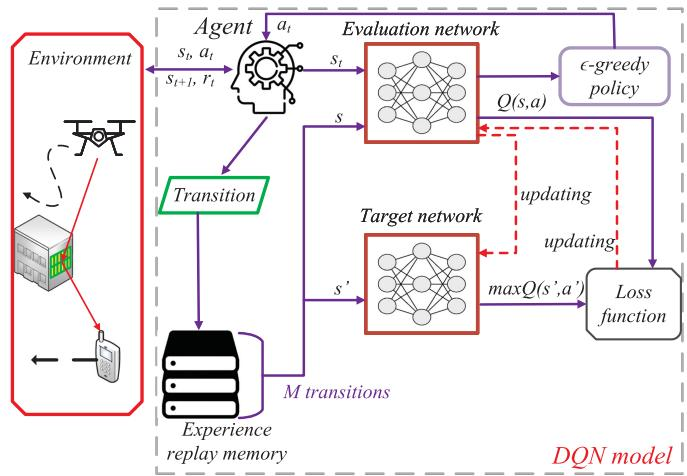  
Fig. 2. Architecture of DQN algorithm.

## 4 PROPOSED ALGORITHMS

## 4.1 DQN-Based Algorithm for Discrete Cases

In this subsection, we show the DQN-based algorithm. We first introduce the state, action and reward. Then, we model the whole IRS-aided UAV communication system as an environment. It is assumed that the agent is employed for interacting with the environment for the purpose of finding the optimal actions that can maximize the accumulated rewards $\begin{array} { r } { R _ { t } = \sum _ { t ^ { \prime } = t } ^ { T } \gamma ^ { t ^ { \prime } - t } r _ { t ^ { \prime } } } \end{array}$ within a sequence of states, where $\gamma \in [ 0 , 1 ]$ ¼is the discount factor. We define the state $s _ { t } ,$ 2the action $a _ { t } ,$ , and the reward $r _ { t }$ in TS t as follows.

1) State $s _ { t } \colon$ the state of agent in TS t has the following components:

a) the coordinate of UAV: $[ x _ { t } ^ { u } , y _ { t } ^ { u } , z _ { t } ^ { u } ]$

b) UAV’s remaining energy level: $\textstyle e ^ { \operatorname* { m a x } } - \sum _ { t ^ { \prime } = 1 } ^ { t } e _ { t ^ { \prime } } ,$ where $e ^ { \mathrm { m a x } }$  ¼is the maximal energy level of UAV.

c) the index of TS: t.

d) the coordinate of UE: $[ x _ { t } ^ { e } , y _ { t } ^ { e } ]$

½e) the set of IRSs’ coordinates: $\{ x _ { k } , x _ { k } , z _ { k } , \forall k \in K \}$

2) Action $a _ { t } \mathrm { : }$ f 8 2 Kgwe define the flying distances of UAV in TS t as action, which is $a _ { t } = [ a _ { t } ^ { x } , a _ { t } ^ { y } , a _ { t } ^ { z } ]$

3) Reward $r _ { t } \mathbf { : }$ we define the reward function as follows:

$$
r _ { t } = \frac { \sum _ { k = 1 } ^ { K } c _ { k , t } R _ { k , t } } { e _ { t } } - p ,\tag{16}
$$

where $p$ is defined as the penalty if the UAV flies out of the target area, i.e., (15 e), (15 f) or (15 g) are not satisfied.

Motivated by the work that is done in [36], here we propose the DQN-based algorithm for optimizing the UAV’s trajectory, whose overall architecture is shown in Fig. 2. In DQN, there is an agent which controls the UAV for interacting with the environment. We assume there are two DNNs named the evaluation network and target network. Note that the target network has the same structure as the evaluation network but it only updates periodically. First, the agent receives the state $s _ { t }$ from the environment and sends it to the evaluation network, which generates the Q-values July 05,2026 at 12:42:54 UTC from IEEE Xplore. Restrictions apply.

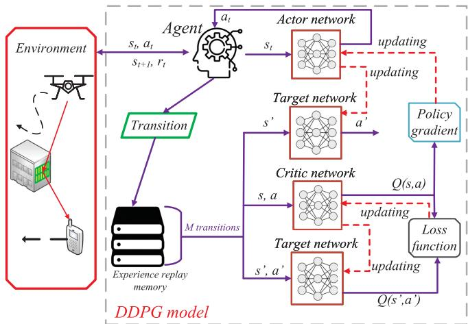  
Fig. 3. Architecture of DDPG algorithm.

$Q ( s , a )$ of all actions. Based on the Q-values and following ð Þan -greedy policy, the action $a _ { t }$ is generated. After that, the reward $r _ { t }$ is obtained from the environment. It is worth mentioning that the proposed DQN-based algorithm can only optimize the UAV’s trajectory in the finitely discrete action space. Hence, we define the action space in each of TS as $\scriptstyle A ,$ which has the following actions:

$$
\begin{array} { r } { A = \left\{ \begin{array} { l l } { \left[ x ^ { \mathrm { m a x } } , 0 , 0 \right] , } \\ { \left[ - z ^ { \mathrm { m a x } } , 0 , 0 , 1 \right] , } \\ { \left[ \frac { y ^ { \mathrm { m a x } } } { 2 } , 0 , 0 , 0 \right] , } \\ { \left[ - \frac { t ^ { \mathrm { m a x } } } { 2 } , 0 , 0 , 1 \right] , } \\ { \left[ \frac { y ^ { \mathrm { m a x } } } { 2 } , 0 , 0 , 1 \right] , } \\ { \left[ 0 , 0 , - y ^ { \mathrm { m a x } } , 0 \right] , } \\ { \left[ 0 , - y ^ { \mathrm { m a x } } , 0 \right] , } \\ { \left[ 0 , \frac { t ^ { \mathrm { m a x } } } { 2 } , 0 , 1 \right] , } \\ { \left[ 0 , - \frac { y ^ { \mathrm { m a x } } } { 2 } , 0 , 1 \right] , } \\ { \left[ 0 , 0 , z ^ { \mathrm { m a x } } , 1 \right] , } \\ { \left[ 0 , 0 , - z ^ { \mathrm { m a x } } \right] , } \\ { \left[ 0 , 0 , 0 \right] , } \end{array} \right. } \end{array}\tag{17}
$$

Then, the transition, which consists of $\left\{ s _ { t } , a _ { t } , r _ { t } , s _ { t + 1 } \right\}$ is f þ gstored into an experience replay memory. When the experience replay memory has enough transitions, the learning procedure starts. A mini-batch randomly samples M transitions to train the evaluation network. Precisely, given the Qvalues $Q ( s , a )$ from the evaluation network and the maximal ð ÞQ-values max $Q ( s ^ { \prime } , a ^ { \prime } )$ from the target network, the loss func-ð Þtion can be calculated for updating the evaluation network, which can be expressed as

$$
L _ { i } ( \delta _ { i } ) = \mathbb { E } _ { s , a } \bigg [ \bigg ( r + \gamma \operatorname* { m a x } _ { a ^ { \prime } } Q ( s ^ { \prime } , a ^ { \prime } | \delta _ { i - 1 } ) - Q ( s , a | \delta _ { i } ) \bigg ) ^ { 2 } \bigg ] ,\tag{18}
$$

where $\delta$ is the parameter of DNN, and i is the index of iteration.

In Algorithm 1, we provide the overall pseudo code of the proposed DQN algorithm. From Line 1 to 2, we initialize the evaluation, target networks and the experience replay memory. During each episode, we first initialize the state $s _ { t } .$ . Then, in each TS, the agent follows an -greedy policy to generate $a _ { t } .$

Precisely, the agent selects $a _ { t }$ that has the maximal Q-value with probability $\epsilon ,$ or randomly selects $a _ { t }$ from with probability $1 - \epsilon .$ AThe energy consumption of UAV is calculated by Eq. (4). Note that in Line 11, the selection of IRS is based on Eq. (13), and the optimization of phase shifts is introduced in Section 4.3. Then, the reward is obtained by Eq. (16). In Line 13, the transition will be stored into experience replay memory. From Line 14, the learning process starts with randomly sampling M transitions from memory for training the evaluation network, whose parameter is updated by Eq. (18). Finally, the target network is also updated periodically.

Algorithm 1. DQN-Based Algorithm   
1: Initialize evaluation, target networks with parameters $\delta ;$   
2: Initialize experience replay memory;   
3: for $\mathrm { E p i s o d e } = 1 , 2 , \ldots , \dot { N } ^ { \mathrm { e p s } }$ do   
4: Initialize state $s _ { t } ;$   
5: for TS $t = 1 , 2 , \dots T$ do   
6: ¼Obtain $s _ { t } ;$   
7: Select at argmax $\cdot Q ( s _ { t } , a _ { t } )$ with probability $\epsilon ;$   
8: Randomly select $\mathbf { \Pi } _ { a _ { t } } ^ { a _ { t } \in A }$ from with probability $1 - \epsilon ;$   
9: Execute at;   
10: Calculate the energy consumption of UAV $e _ { t }$ from   
Eq. (4);   
11: Obtain the optimized phase shifts of selected IRS k   
according to Section 4.3;   
12: Calculate $r _ { t }$ according to Eq. (16);   
13: Store transition $\left\{ s _ { t } , a _ { t } , r _ { t } , s _ { t + 1 } \right\}$ into experience replay   
memory;   
14: if the learning process starts then   
15: Randomly sample M transitions from experience   
replay memory;   
16: Update evaluation network from Eq. (18);   
17: Update target network periodically;   
18: end if   
19: end for   
20: end for

## 4.2 DDPG-Based Algorithm for Continuous Cases

In this subsection, we show the DDPG-based algorithm for tackling the continuous case and optimizing the UAV’s trajectory, which applies the well-known actor-critic approach. We also show the architecture of DDPG algorithm in Fig. 3. There are two DNNs named actor network with function $a =$ $\pi ( s | \delta ^ { \pi } )$ and critic network with function $Q ( s , a | \delta ^ { Q } )$ respec-ð j Þtively. Note that $\pi ( \cdot )$ ð jmaps the state and action, $Q ( \cdot )$ is the ðÞ ðÞapproximator for generating Q-value with the given the state-action pairs. Also, there are two target networks with function $\pi ^ { \prime } ( \cdot )$ and $Q ^ { \prime } ( \cdot )$ , which have the same structure with ðÞ ðÞactor and critic networks, respectively. The agent receives the state $s _ { t }$ from the environment and sends the action $a _ { t }$ generated by its actor network. Then, the transition is stored into the experience replay memory. When the learning process starts, M transitions are sampled to train the actor and critic networks. Precisely, given the states s and actions $^ { a , }$ the critic network generates the Q-values $Q ( s , a )$ for calculating the ð Þpolicy gradient [37], which is expressed as

$$
\nabla _ { \delta ^ { \pi } } J = \mathbb { E } \Big [ \nabla _ { a } Q ( s , a | \delta ^ { Q } ) | _ { s = s _ { t } , a = \pi ( s _ { t } | \delta ^ { \pi } ) } \cdot \nabla _ { \delta ^ { \pi } } \pi ( s | \delta ^ { \pi } ) | _ { s = s _ { t } } \Big ] .\tag{19}
$$

Once the policy gradient is calculated, the parameter of actor network is enabled to be updated. Furthermore, the critic network is trained by the loss function [37] as

$$
L ( \delta ^ { Q } ) = \frac { 1 } { M } \sum _ { m = 1 } ^ { M } \Bigl ( y _ { m } - Q ( s _ { m } , \pi ( s _ { m } | \delta ^ { \pi } ) | \delta ^ { Q } ) ^ { 2 } \Bigr ) ,\tag{20}
$$

where m is the index of transitions in mini-batch, and $y _ { m } = r _ { m } + \gamma Q ^ { \prime } ( s _ { m } ^ { \prime } , \pi ^ { \prime } ( s _ { m } ^ { \prime } | \delta ^ { \pi ^ { \prime } } ) | \delta ^ { Q ^ { \prime } } )$

Algorithm 2. DDPG-Based Algorithm   
1: Initialize actor $\pi ( \cdot )$ and critic Q network with parameters   
$\delta ^ { \pi }$ and $\delta ^ { Q }$ ðÞrespectively;   
2: Initialize target networks $\pi ^ { \prime } ( \cdot ) , Q ^ { \prime } ( \cdot )$ with parameters $\delta ^ { \pi ^ { \prime } } =$   
$\delta ^ { \pi } , \delta ^ { Q ^ { \prime } } = \delta ^ { Q } ;$   
¼3: Initialize experience replay memory;   
4: for $\mathrm { E p i s o d e } ^ { = } = 1 , 2 , . . . , N ^ { \mathrm { e p s } }$ do   
5: Initialize state st;   
6: for $\mathrm { T } S t = 1 , 2 , \ldots , T$ do   
7: ¼Obtain $s _ { t } ;$   
8: Select $a _ { t } = \pi ( s _ { t } | \delta ^ { \pi } ) + \omega N ^ { \prime } ;$   
9: Execute $a _ { t } ;$   
10: Calculate the energy consumption of $\mathrm { U A V } e _ { t }$ from   
Eq. (4);   
11: Obtain the optimized phase shifts of selected IRS k   
according to Section 4.3;   
12: Calculated $r _ { t }$ according to Eq. (16);   
13: Store transition $\left[ s _ { t } , a _ { t } , r _ { t } , s _ { t + 1 } \right]$ into experience replay   
memory;   
14: if the learning process starts then   
15: Randomly sample M transitions from experience   
replay memory;   
16: Update critic network according to Eq. (20);   
17: Update actor network according to Eq. (19);   
18: Update two target networks with rate of t;   
19: end $\mathbf { i } \mathbf { \bar { f } }$   
20: end for   
end for

We further provide the pseudo code of the proposed algorithm in Algorithm 2. From Line 1 to 3, we first initialize actor and critic networks with parameters $\delta ^ { \pi }$ and $\delta ^ { Q }$ respectively. Besides, two target networks and the experience replay memory are initialized as well. During each training episode, the state $s _ { t }$ is initialized in the first TS. Then, the agent obtains $s _ { t }$ from environment and receives at generated by the actor network. Note that in Line 8, a random action noise $N ^ { \prime }$ is deployed and it decays with rate of v for better exploration. In this paper, as the activation function of output layer of actor network is tanh , the action $a _ { t }$ can be expressed by $a _ { t } = [ o _ { t } ^ { x } x ^ { \operatorname* { m a x } } , o _ { t } ^ { y } y ^ { \operatorname* { m a x } } , o _ { t } ^ { z } z ^ { \operatorname* { m a x } } ]$ where $o _ { t } ^ { x } , o _ { t } ^ { y } , o _ { t } ^ { z }$ ¼ ½ are the output values of actor network. After executing the action $a _ { t } ,$ the consumed energy $e _ { t }$ of UAV is obtained from Eq. (4). In Line 11, the optimized phase shifts of selected IRS and reward $r _ { t }$ are obtained by Section 4.3 and Eq. (16) respectively. After that, the transition $\left\{ s _ { t } , a _ { t } , r _ { t } , s _ { t + 1 } \right\}$ is stored into the experience replay f þ gmemory. When the learning process starts, the mini-batch randomly samples M transitions to train the actor and critic network by Eq. (19) and Eq. (20) respectively. Additionally, two target networks are updated with the rate of t 0:001.

TABLE 2 Main Notations
<table><tr><td>Notation</td><td>Description</td><td>Notation</td><td>Description</td></tr><tr><td> $K$ </td><td>3</td><td> $Z ^ { \mathrm { m i n } }$ </td><td>50 m</td></tr><tr><td>Zmax</td><td>300 m</td><td> $X ^ { \mathrm { m a x } }$ </td><td>600 m</td></tr><tr><td>Ymax</td><td>300 m</td><td> $T$ </td><td>100</td></tr><tr><td> $x ^ { \mathrm { m a x } }$ </td><td>40 m</td><td> $y ^ { \mathrm { m a x } }$ </td><td>40</td></tr><tr><td> $z ^ { \mathrm { m a x } }$ </td><td>10 m</td><td> $P _ { s }$ </td><td>79.85</td></tr><tr><td> $P _ { m }$ </td><td>88.63</td><td> $P _ { k }$ </td><td>11.46</td></tr><tr><td> $U _ { r }$ </td><td>120 m/s</td><td> $V _ { h }$ </td><td>4.03</td></tr><tr><td> $d _ { 0 }$ </td><td>0.6</td><td> $\rho _ { a }$ </td><td> $1 . 2 2 5 \mathrm { k g / m ^ { 3 } }$ </td></tr><tr><td> $z$ </td><td>0.05</td><td> $G$ </td><td>0.503 m²</td></tr><tr><td> $t _ { d }$ </td><td>1 s</td><td> $\eta _ { \mathrm { L o S } }$ </td><td>0.1 dB</td></tr><tr><td> $\eta _ { \mathrm { N L o S } }$ </td><td>21 dB</td><td> $u$ </td><td>12.08</td></tr><tr><td>w</td><td>0.11</td><td> $f$ </td><td>2.5 Ghz</td></tr><tr><td>C</td><td> $ { 3 \times 1 0 ^ { 8 } m / s }$ </td><td> $d$ </td><td>λ/2</td></tr><tr><td> $\mu$ </td><td></td><td> $\alpha ^ { \mathrm { I E } }$ </td><td>2.5</td></tr><tr><td> $P$ </td><td>0.001 W</td><td> $\sigma ^ { 2 }$ </td><td>-173 dBm/Hz</td></tr><tr><td> $B$ </td><td>1KHz</td><td> $\gamma$ </td><td>0.99</td></tr><tr><td> $e ^ { \mathrm { m a x } }$ </td><td>20000 J</td><td> $p$ </td><td>100</td></tr><tr><td> $\epsilon$ </td><td>0.9</td><td> $N ^ { \mathrm { e p s } }$ </td><td>6000</td></tr><tr><td>ω</td><td>0.99995</td><td> $N ^ { \prime }$ </td><td>1</td></tr></table>

## 4.3 Phase Shift Optimization

Here, we show a low-complexity algorithm for optimizing the phase shifts of selected IRS. Specifically, by given the coordinates of UAV and UE in TS $t ,$ the phase shift of reflecting element $\theta _ { k , m _ { r } , m _ { c } , t }$ of selected IRS k in TS t requires to be aligned, for maximizing the data rate of UE. According to [40], the optimal phase shift $\theta _ { k , m _ { r } , m _ { c } , t }$ can be calculated by

$$
\begin{array} { r } { \theta _ { k , m _ { r } , m _ { c } , t } = \displaystyle \frac { 2 \pi } { \lambda } \{ d ( m _ { r } - 1 ) \phi _ { k , t } ^ { \mathrm { I E } } \varphi _ { k , t } ^ { \mathrm { I E } } + d ( m _ { c } - 1 ) \psi _ { k , t } ^ { \mathrm { I E } } \varphi _ { k , t } ^ { \mathrm { I E } } } \\ { + d ( m _ { r } - 1 ) \phi _ { k , t } ^ { \mathrm { U I } } \varphi _ { k , t } ^ { \mathrm { U I } } + d ( m _ { c } - 1 ) \psi _ { k , t } ^ { \mathrm { U I } } \varphi _ { k , t } ^ { \mathrm { U I } } \} . } \end{array}\tag{21}
$$

## 5 SIMULATION RESULT

In this section, extensive simulations are conducted to evaluate the performance of the proposed algorithms. The simulation is executed in Python 3.7 and Tensorflow 1.15.0. For DQN-based algorithm, we deploy two fully-connected hidden layers with 256; 256 neurons and the AdamOptimizer is used ½ to update the evaluation network with the rate of 0.001. While the target network is updated with 300 iterations. For DDPGbased algorithm, we also deploy two fully-connected hidden layers with 256; 256 neurons in both actor and critic net-½ works. The AdamOptimizer is used to train the actor and critic networks with the rate of 0.001. The size of experience replay memory and mini-batch are 100000 and 128 respectively. The coordinates of IRSs are set as 100; 100; 50 , [300,400,50], ½  500; 100; 50 . In each training episode, the UAV always ½  starts to serve UE from the initial coordinate 0; 300; 50 . The ½ number of TSs is set as 100. The UE (which can be an autonomous vehicle) moves with a fixed speed 6 m/s starting from the initial coordinate 0; 150 to the final coordinate 600; 150 . ½ Other parameters can be found in Table 2.

For comparison, we present two benchmark algorithms as follows:

Random movement and random phase shifts (RR): In this setting, the UAV randomly selects the flying 05,2026 at 12:42:54 UTC from IEEE Xplore. Restrictions apply.

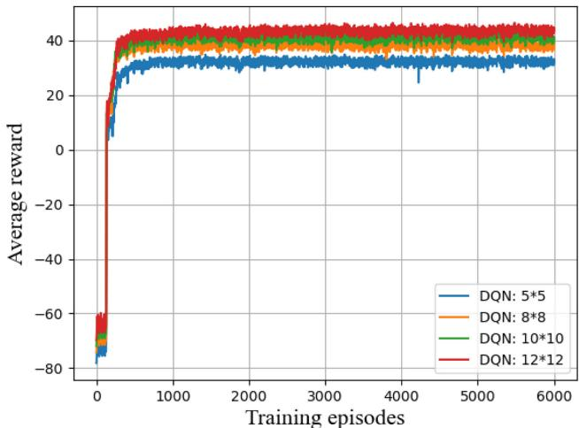

(a)  
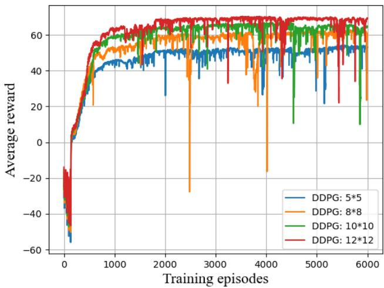  
(b)  
Fig. 4. Average reward of (a) DQN and (b) DDPG versus the number of training episodes.

action in each TS. Also, it randomly selects the phase shift for each reflecting element.

Fixed movement and fixed phase shifts (FF): In this setting, the UAV moves from the initial coordinate 0; 300; 50 to the final coordinate 600; 0; 50 . Addi-½  ½ tionally, the phase shift of each reflecting element is fixed as p .

First, we depict the average reward of the proposed DQN-based and DDPG-based algorithms of the training procedure with different number of reflecting elements in Fig. 4, where the number of IRSs is set to 3 and the number of the reflecting elements is the same for the IRSs. As shown in Fig. 4a, one can see for different number of reflection elements, the training curves of average rewards always remain negative at the beginning. This is because the UAV may have poor performance, such as flying out of the target area, resulting in negative reward. After that, as the networks start to converge, the average rewards increase and eventually remain stable, which indicate that the system find the best performance. Besides, one can observe that as the number of reflecting elements increases, the average rewards increase as well. Then, in Fig. 4b, we depict the average rewards of the proposed

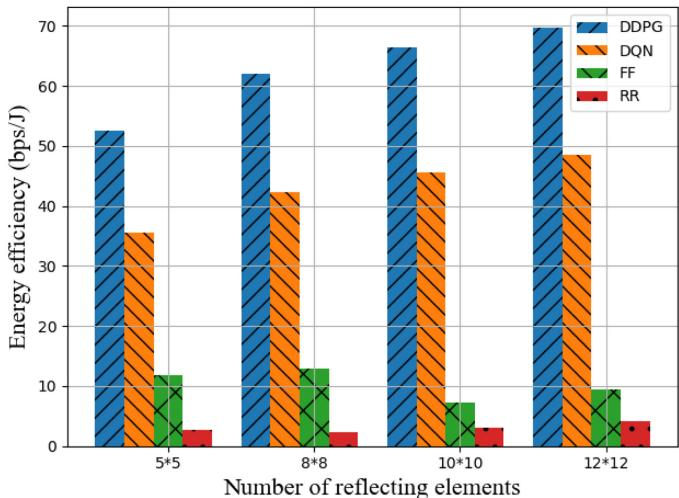  
Fig. 5. Average energy efficiency achieved by DQN, DDPG, FF and RR with different number of reflecting elements.

DDPG-based algorithm versus the number of training episodes, which have the similar trend as DQN-based solution in Fig. 4a. It is worth noting that when the numbers of reflecting elements are the same, DDPG-based solution achieves higher reward than DQN-based solution, as expected. This is because for DQN-based algorithm, it only tries limited set of actions, whereas DDPG-based solutions optimize the variables continuously.

When the training is done, the networks in DQN and DDPG are saved for testing. Here, we also give the complexity of proposed DQN and DDPG-based algorithms in testing phase. Specifically, as the fully-connected layers are applied in the experiments, the complexity for networks in DQN and DDPG is $\textstyle { \mathcal { O } } ( \sum _ { l = 1 } ^ { L } n _ { l - 1 } n _ { l } )$ , where L denotes the Oð ¼  Þnumber of layers and nl is the number of neurons in lth layer. Besides, the complexity for phase shift optimization in each TS is $\mathcal { O } ( M _ { r } M _ { c } )$ . Thus, the overall complexity for OðDQN and DDPG is $\begin{array} { r } { \mathcal { O } ( T ( M _ { r } M _ { c } + \sum _ { l = 1 } ^ { L } n _ { l - 1 } n _ { l } ) ) } \end{array}$ .

Oð ð þ ¼  ÞÞThen, we evaluate the performance of proposed DQN and DDPG-based algorithms. In Fig. 5, we depict the average energy efficiency of UAV obtained by DQN, DDPG, FF, RR respectively in one episode. Specifically, the energy efficiency of UAV obtained by DDPG consistently increases from 52 bps/J to 70 bps/J. Additionally, it is observed that for different number of reflecting elements, DDPG always achieves higher energy efficiency comparing with other algorithms. DQN performs slightly worse than DDPG, which also outperforms FF and RR.

Then, we show the 3D and 2D trajectories obtained by DQN and DDPG with different number of reflecting elements in Fig. 6. Note that in Fig. 6, dot represents UE, and triangle represents IRS. In Fig. 6a, it is observed that the UAV controlled by DQN starts to serve UE from the initial coordinate and finally flies to the appropriate altitude for achieving better performance. In Fig. 6b, one can see that as the location of UE moves, the UAV flies towards to the selected IRS and remains close to it with appropriate flying actions. Also, as shown in Figs. 6c and 6d, the UAV’s trajectory obtained by DDPG is better than the trajectory achieved by DQN, as it always tries continuous actions.

Finally, we show the training time of DQN and DDPGbased algorithms versus the number of reflecting elements July 05,2026 at 12:42:54 UTC from IEEE Xplore. Restrictions apply.

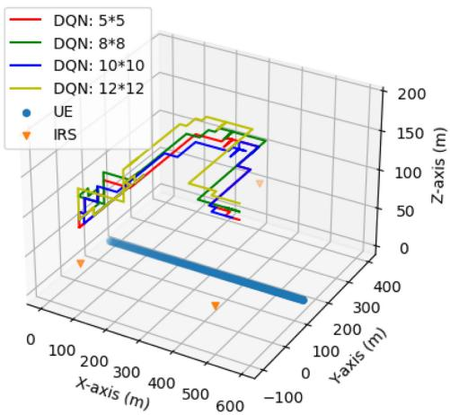  
(a) DQN: 3D

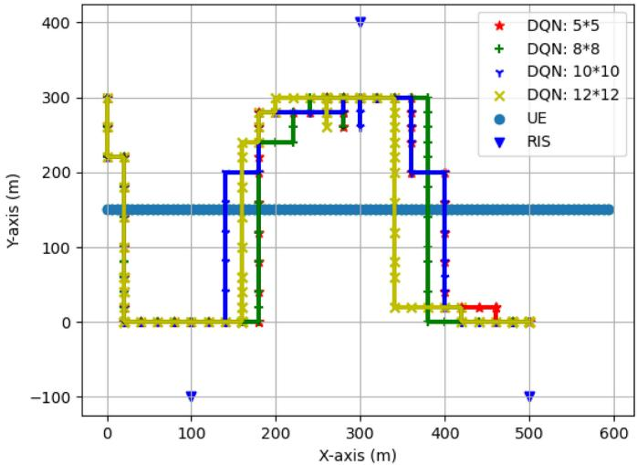  
(b) DQN: 2D

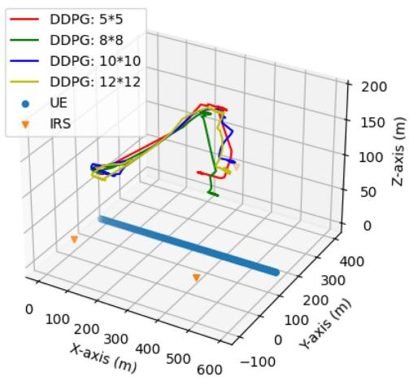  
(c) DDPG: 3D

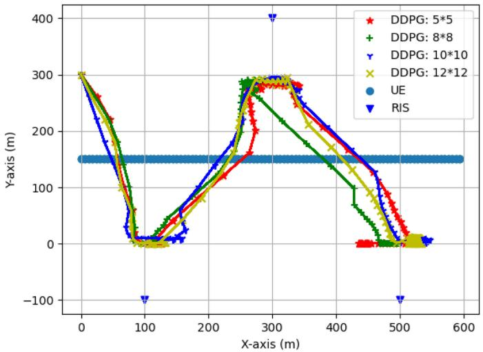  
(d) DDPG: 2D  
Fig. 6. The trajectory of UAV obtained by DQN and DDPG-based algorithms.

of IRS in Fig. 7. Note that the training time will vary with different hardware platform. As shown in Fig. 7, one can see that as the number of reflecting elements increases, the training time of DQN and DDPG increases as well. Besides, DQN consistently outperforms DDPG in terms of training time, for its simpler structure.

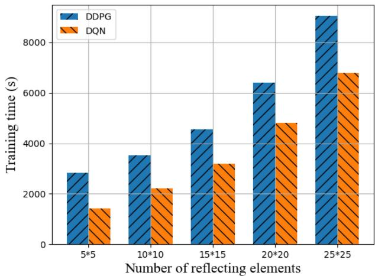  
Fig. 7. Training time of DQN and DDPG-based algorithms versus the number of reflecting elements of IRS.

## 6 CONCLUSION

In this paper, we have studied the joint optimization of UAV’s trajectory and passive phase shifts of reflection elements in the IRS-aided UAV communication system, with the consideration of the movement of UE and the selection of IRS. Our aim is to maximize the energy efficiency of the system, including the data rate of UE and the energy consumption of UAV. We have first proposed a DQN-based algorithm by discretizing the trajectory, which has advantage in terms of training time but has performance loss, which may be suitable for the cases that is sensitive to the training time. Then, for achieving the better performance, we have further applied a DDPG-based algorithm, which can optimize the system’s variables continuously. The experimental results have proved that the proposed algorithms achieve better performance then other traditional solutions.

## REFERENCES

[1] F. Jiang, K. Wang, L. Dong, C. Pan, W. Xu, and K. Yang, “AI driven heterogeneous MEC system with UAV assistance for dynamic environment: Challenges and solutions,” IEEE Netw., vol. 35, no. 1, pp. 400–408, Jan./Feb. 2021.

[2] B. Yang, X. Cao, C. Yuen, and L. Qian, “Offloading optimization in edge computing for deep learning enabled target tracking by internet-of-UAVs,” IEEE Internet Things J., vol. 8, no. 12, pp. 9878–9893, Jun. 2020.

[3] A. Al-Hourani, S. Kandeepan, and S. Lardner, “Optimal LAP altitude for maximum coverage,” IEEE Wireless Commun. Lett., vol. 3, no. 6, pp. 569–572, Dec. 2014.

[4] Q. Wu and R. Zhang, “Common throughput maximization in UAV-enabled OFDMA systems with delay consideration,” IEEE Trans. Commun, vol. 66, no. 12, pp. 6614–6627, Dec. 2018.

[5] H. Ren, C. Pan, K. Wang, W. Xu, M. Elkashlan, and A. Nallanathan, “Joint transmit power and placement optimization for URLLC-enabled UAV relay systems,” IEEE Trans. Veh. Technol, vol. 69, no. 7, pp. 8003–8007, Jul. 2020.

[6] Y. Zeng, J. Xu, and R. Zhang, “Energy minimization for wireless communication with rotary-wing UAV,” IEEE Trans. Wireless Commun., vol. 18, no. 4, pp. 2329–2345, Apr. 2019.

[7] C. H. Liu, Z. Chen, J. Tang, J. Xu, and C. Piao, “Energy-efficient UAV control for effective and fair communication coverage: A deep reinforcement learning approach,” IEEE J. Sel. Areas Commun., vol. 36, no. 9, pp. 2059–2070, Sep. 2018.

[8] X. Lu, L. Xiao, C. Dai, and H. Dai, “UAV-aided cellular communications with deep reinforcement learning against jamming,” IEEE Wireless Commun., vol. 27, no. 4, pp. 48–53, Aug. 2020.

[9] Z. Yang, C. Pan, K. Wang, and M. Shikh-Bahaei, “Energy efficient resource allocation in UAV-enabled mobile edge computing networks,” IEEE Trans. Wireless Commun., vol. 18, no. 9, pp. 4576–4589, Sep. 2019.

[10] L. Wang, K. Wang, C. Pan, W. Xu, N. Aslam, and L. Hanzo, “Multi-agent deep reinforcement learning-based trajectory planning for multi-UAV assisted mobile edge computing,” IEEE Trans. Cogn. Commun. Netw., vol. 7, no. 1, pp. 73–84, Mar. 2021.

[11] L. Wang, K. Wang, C. Pan, W. Xu, N. Aslam, and A. Nallanathan, “Deep reinforcement learning based dynamic trajectory control for UAV-assisted mobile edge computing,” IEEE Trans. Mobile Comput., early access, Feb. 16, 2021, doi: 10.1109/ TMC.2021.3059691.

[12] W. Huang et al., “Joint power, altitude, location and bandwidth optimization for UAV with underlaid D2D communications,” IEEE Wireless Commun. Lett., vol. 8, no. 2, pp. 524–527, 2019.

[13] C. Zhan, Y. Zeng, and R. Zhang, “Energy-efficient data collection in UAV enabled wireless sensor network,” IEEE Wireless Commun. Lett., vol. 7, no. 3, pp. 328–331, Jun. 2018.

[14] C. H. Liu, Z. Chen, and Y. Zhan, “Energy-efficient distributed mobile crowd sensing: A deep learning approach,” IEEE J. Sel. Areas Commun., vol. 37, no. 6, pp. 1262–1276, Jun. 2019.

[15] J. Xu, Y. Zeng, and R. Zhang, “UAV-enabled wireless power transfer: Trajectory design and energy optimization,” IEEE Trans. Wireless Commun., vol. 17, no. 8, pp. 5092–5106, Aug. 2018.

[16] T. J. Cui, M. Q. Qi, X. Wan, J. Zhao, and Q. Cheng, “Coding metamaterials, digital metamaterials and programmable metamaterials,” Light: Sci. Appl., vol. 3, no. 10, 2014, Art. no. e218.

[17] M. Di Renzo et al., “Smart radio environments empowered by reconfigurable AI meta-surfaces: An idea whose time has come,” EURASIP J. Wireless Commun. Netw., vol. 2019, no. 1, pp. 1–20, 2019.

[18] L. Li et al., “Electromagnetic reprogrammable coding-metasurface holograms,” Nature Commun., vol. 8, no. 1, pp. 1–7, 2017.

[19] M. Di Renzo et al., “Smart radio environments empowered by reconfigurable intelligent surfaces: How it works, state of research, and the road ahead,” IEEE J. Sel. Areas Commun., vol. 38, no. 11, pp. 2450–2525, Nov. 2020.

[20] Q. Wu and R. Zhang, “Intelligent reflecting surface enhanced wireless network via joint active and passive beamforming,” IEEE Trans. Wireless Commun., vol. 18, no. 11, pp. 5394–5409, Nov. 2019.

[21] K. Wang, Y. Chen, and M. DiRenzo, “Outage probability of dualhop selective AF with randomly distributed and fixed interferers,” IEEE Trans. Veh. Technol, vol. 64, no. 10, pp. 4603–4616, Oct. 2015.

[22] C. Huang et al., “Holographic MIMO surfaces for 6G wireless networks: Opportunities, challenges, and trends,” IEEE Wireless Commun., vol. 27, no. 5, pp. 118–125, Oct. 2020.

[23] Q. Wu and R. Zhang, “Intelligent reflecting surface enhanced wireless network: Joint active and passive beamforming design,” in Proc. IEEE Glob. Commun. Conf., 2018, pp. 1–6.

[24] Y. Yang, B. Zheng, S. Zhang, and R. Zhang, “Intelligent reflecting surface meets OFDM: Protocol design and rate maximization,” IEEE Trans. Commun, vol. 68, no. 7, pp. 4522–4535, Jul. 2020.

[25] X. Yu, D. Xu, and R. Schober, “Enabling secure wireless communications via intelligent reflecting surfaces,” in Proc. IEEE Glob. Commun. Conf., 2019, pp. 1–6.

[26] G. Zhou, C. Pan, H. Ren, K. Wang, and A. Nallanathan, “Intelligent reflecting surface aided multigroup multicast MISO communication systems,” IEEE Trans. Signal Process., vol. 68, pp. 3236–3251, 2020.

[27] C. Pan et al., “Multicell MIMO communications relying on intelligent reflecting surfaces,” IEEE Trans. Wireless Commun., vol. 19, no. 8, pp. 5218–5233, Aug. 2020.

[28] C. Pan et al., “Intelligent reflecting surface aided MIMO broadcasting for simultaneous wireless information and power transfer,” IEEE J. Sel. Areas Commun., vol. 38, no. 8, pp. 1719–1734, Aug. 2020.

[29] T. Bai, C. Pan, Y. Deng, M. Elkashlan, A. Nallanathan, and L. Hanzo, “Latency minimization for intelligent reflecting surface aided mobile edge computing,” IEEE J. Sel. Areas Commun., vol. 38, no. 11, pp. 2666–2682, Nov. 2020.

[30] S. Abeywickrama, R. Zhang, and C. Yuen, “Intelligent reflecting surface: Practical phase shift model and beamforming optimization,” in Proc. IEEE Int. Conf. on Commun., 2020, pp. 1–6.

[31] A. Zappone, M. Di Renzo, F. Shams, X. Qian, and M. Debbah, “Overhead-aware design of reconfigurable intelligent surfaces in smart radio environments,” 2020, arXiv:2003.02538.

[32] C. Huang, R. Mo, and C. Yuen, “Reconfigurable intelligent surface assisted multiuser MISO systems exploiting deep reinforcement learning,” IEEE J. Sel. Areas Commun., vol. 38, no. 8, pp. 1839–1850, Aug. 2020.

[33] S. Li, B. Duo, X. Yuan, Y.-C. Liang, and M. Di Renzo, “Reconfigurable intelligent surface assisted UAV communication: Joint trajectory design and passive beamforming,” IEEE Wireless Commun. Lett., vol. 9, no. 5, pp. 716–720, May 2020.

[34] D. Ma, M. Ding, and M. Hassan, “Enhancing cellular communications for UAVs via intelligent reflective surface,” 2019, arXiv:1911.07631.

[35] R. S. Sutton and A. G. Barto, Reinforcement Learning: An Introduction, Cambridge, MA, USA: A Bradford Book, 2018.

[36] V. Mnih et al., “Human-level control through deep reinforcement learning,” Nature, vol. 518, no. 7540, pp. 529–533, 2015.

[37] T. P. Lillicrap et al., “Continuous control with deep reinforcement learning,” 2015, arXiv:1509.02971.

[38] A. G. Barto, R. S. Sutton, and C. W. Anderson, “Neuronlike adaptive elements that can solve difficult learning control problems,” IEEE Trans. Syst., Man, Cybern., vol. SMC-13, no. 5, pp. 834–846, Sep./Oct.1983.

[39] H. Ren, C. Pan, K. Wang, Y. Deng, M. Elkashlan, and A. Nallanathan, "Achievable data rate for URLLC-enabled UAV systems with 3-D channel model,” IEEE Wireless Commun. Lett., vol. 8, no. 6, pp. 1587–1590, Dec. 2019.

[40] Z. Wei et al., “Sum-rate maximization for IRS-assisted UAV OFDMA communication systems,” IEEE Trans. Wireless Commun., vol. 20, no. 4, pp. 2530–2550, Apr. 2020.

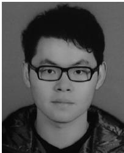  
Liang Wang received the BEng degree, in 2014, the MSc degree, in 2015, and the PhD degree from Northumbria University, U.K., in 2022. He is currently working as a research fellow with Cranfield University, U.K. His research interests include UAV communication, mobile edge computing, physical layer security and machine learning.

Kezhi Wang received the PhD degree in engineering from the University of Warwick, U.K., in 2015. He was a senior research officer in University of Essex, U.K. from 2015-2017. Currently he is with Department of Computer and Information Sciences, Northumbria University, U.K. His research interests include mobile edge computing, intelligent reflection surface, and machine learning.

Cunhua Pan received the BS and PhD degrees from the School of Information Science and Engineering, Southeast University, Nanjing, China, in 2010 and 2015, respectively. From 2015 to 2016, he was a research associate with the University of Kent, U.K. He held a post-doctoral position with the Queen Mary University of London, U.K., from 2016 and 2019. From 2019 to 2021, he was a lecturer with the same university. From 2021, he is a full professor in Southeast University. His research interests mainly include reconfigurable intelligent surfaces (RIS), intelligent reflection surface (IRS), ultra-reliable low latency communication (URLLC) , machine learning, UAV, Internet of Things, and mobile edge computing. He has published more than 120 IEEE journal papers. He is currently an editor of IEEE Wireless Communication Letters, IEEE Communications Letters and IEEE Access. He serves as the guest editor for IEEE Journal on Selected Areas in Communications on the special issue on xURLLC in 6G: Next Generation Ultra-Reliable and Low-Latency Communications. He also serves as a leading guest editor of IEEE Journal of Selected Topics in Signal Processing Special Issue on Advanced Signal Processing for Reconfigurable Intelligent Surface-aided 6G Networks, leading guest editor of IEEE Vehicular Technology Magazine on the special issue on Backscatter and Reconfigurable Intelligent Surface Empowered Wireless Communications in 6G, leading guest editor of IEEE Open Journal of Vehicular Technology on the special issue of Reconfigurable Intelligent Surface Empowered Wireless Communications in 6G and Beyond, and leading guest editor of IEEE Access Special Issue on Reconfigurable Intelligent Surface Aided Communications for 6G and Beyond. He is a workshop organizer in IEEE ICCC 2021 on the topic of Reconfigurable Intelligent Surfaces for Next Generation Wireless Communications (RIS for 6G Networks), and workshop organizer in IEEE Globecom 2021 on the topic of Reconfigurable Intelligent Surfaces for future wireless communications. He is currently the workshops and symposia officer for Reconfigurable Intelligent Surfaces Emerging Technology Initiative. He is workshop chair for IEEE WCNC 2024, and TPC co-chair for IEEE ICCT 2022. He serves as a TPC member for numerous conferences, such as ICC and GLOBECOM, and the student travel grant chair for ICC 2019. He received the IEEE ComSoc Leonard G. Abraham Prize, in 2022.

Nauman Aslam received the PhD degree in engineering mathematics from Dalhousie University, Canada, in 2008. He is a professor with the Department of Computer and Information Science, Northumbria University, UK. Before joining Northumbria University as a senior lecturer, in 2011, he worked as an assistant professor with Dalhousie University, Canada. He is leading the Cyber Security and Network Systems (Cyber-Nets) research group, Northumbria University. His research interests cover diverse but intercon-

nected areas related to communication networks. His current research efforts are focused at addressing problems related to wireless body area networks and IoT, network security, charging management of electric vehicles and application of Artificial Intelligence (AI) in communication networks. He has held, as PI and CoI, grants totalling over £5 million from funders such as EU, EPSRC, Innovate UK, as well as industry, and is the co-author of more than 150 peer-reviewed publications. He is the chair of IEEE UK and Ireland Communications Society (ComSoc) chapter.

" For more information on this or any other computing topic, please visit our Digital Library at www.computer.org/csdl.