# Joint Trajectory and Power Design With Cooperative Jamming UAV Assistance Based on Reinforcement Learning

Yingkun Wen , Member, IEEE, Fengshuan Wang , Hui-Ming Wang , Senior Member, IEEE, Junhuai Li , Senior Member, IEEE, Jin Qian , Kan Wang , Senior Member, IEEE, and Huaijun Wang

Abstract—We examine a secure wireless communication system that is enabled by uncrewed aerial vehicles (UAVs) in this research. In the wireless communication system with an eavesdropping UAV, we deploy a relay UAV to facilitate the transmission of confidential signals from the source station (denoted as S) to ground users. Additionally, we select an idle relay UAV to act as a cooperative jamming UAV, sending interference signals to the eavesdropping UAV. It is quite feasible that the eavesdropping UAV will leverage its mobility to improve the quality of its eavesdropping, making its trajectory unpredictable. First, to address the worst-case scenario for the ground user’s security performance, we assume the eavesdropping UAV approaches at the closest distance. We aim to maximize the worst secrecy rate under perfect CSI via designing the flight trajectory and transmission power of both the relay UAV and the jamming UAV. Second, we investigated the performance of the system’s secrecy outage probability under imperfect CSI. The presence of eavesdropping UAVs and the unpredictable nature of their environment makes traditional convex optimization methods mathematically complex for solving the trajectory optimization problem of the relay and jamming UAVs. To address this, we propose the Multi-Agent joint design trajectory and power (MAJDTP) algorithm based on the Multi-Agent Deep Deterministic Policy Gradient (MADDPG) algorithm to optimize the flight trajectory and transmission power of both UAVs. During the design and training process, the relay and jamming UAVs are treated as agents to derive their optimal flight paths and transmission energy. Finally, our approach surpasses the benchmark algorithm, as demonstrated by the simulation results.

Index Terms—Physical layer security, cooperative jamming, cooperative relay, UAV trajectory design, reinforcement learning.

## I. INTRODUCTION

U NMANNED aerial vehicles (UAVs), which can beflexibly deployed as aerial relays to assist the signal flexibly deployed as aerial relays to assist the signal transmission between terrestrial base stations and users, are seen as a promising technology to support mobile wireless communication due to their mobility, flexibility, and high probability of line-of-sight (LoS) propagation [1]. However, the spread of UAVs by LoS presents a two-sided issue, its broadcast characteristics expose these aerial communications to malevolent intruders and make them vulnerable to wiretapping [2].

Drones are increasingly used in the field of wireless communications with their advantages of high mobility and ease of deployment [3], [4], [5]. At the same time, with the development of physical layer security technology, UAVs can be used as airborne mobile relays to assist in the implementation of wireless communications, or as airborne mobile jammers to secure wireless communications [6]. However, eavesdroppers can still take advantage of the flexibility of UAVs to conduct more effective eavesdropping attacks on relay UAVs, threatening the realization of UAV wireless secure communications [7].

Conventional encryption techniques involve substantial computational complexity, resulting in considerable energy consumption that may be impractical for UAV systems [8]. Physical layer security is a computationally effective solution that uses the inherent unpredictability of wireless networks to prevent wiretapping [9]. In order to improve communication performance, UAVs are designed to employ trajectory optimization to fly as close to ground users as possible while avoiding eavesdroppers as much as possible [10]. Additionally, UAVs can function as beneficial jammers to protect authorized users by actively creating artificial noise (AN) to prevent wiretapping eavesdroppers [11], [12], [13], [14].

Recent years have seen a significant increase in research interest in the PLS of UAV-assisted wireless communication systems. Xiang et al explored the concept of physical layer security within cognitive radio-based non-orthogonal networks featuring various primary and secondary users [15]. The cooperative jamming method is a widely used physical layer security solution for enhancing communication security. In [16], an undercover interference strategy targeting an intelligent Eve was implemented to enhance PLS in collaborative CRNS. In UAV-assisted wireless communication networks, terrestrial and aerial eavesdroppers were investigated [17], [18], [19], [20]. Secrecy rate optimization in UAVassisted wireless communication networks with malicious eavesdroppers is a significant area of research that has been documented in the literature [21].

Moreover, given the energy limitations of UAVs, energy efficiency is also an important research direction [22]. Zhang et al explore a scenario involving secure communication with a UAV, in which the UAV’s transmitter acts as the base station, aiding ground users against eavesdroppers and UAV jammers by collaboratively emitting artificial noise to safeguard the UAV tra. nsmitter’s data connections via eavesdroppers [17]. Zhou et al explore a security framework within UAV-supported networks, involving ground-based IRs and Eves, the use of a UAV-B for sending secret messages to IRs, and the creation of AN by a UAV-J to disrupt Eves. inhibit their access to secret communications [18]. Wen et al explore a feasible secure communication system enabled by UAVs, in which the UAV’s interceptor leverages its mobility for enhanced eavesdropping efficiency without pre-determining its path, leading to the development of an optimizations issue [19]. Zhou et al suggest a UAV-powered MEC system featuring ground users, a single authentic UAV, and non-colluding eavesdropping UAVs, enabling non-offloading users to send interference signals to disrupt eavesdropping UAVs [20].

The eavesdropping UAV will actually utilize all of its mobility to enhance the quality of its eavesdropping. In reality, the UAV is able to instantly modify its position by detecting its surroundings or channel conditions that are not predictable beforehand [23]. As a result, using conventional algorithms to predesign UAV’s path and power allocation designs is challenging. With multiple UAVs and GUs in the network, the approach may not perform well and drop into a local minimum, in spite of it could be addressed via the convex approximation through the binary variables relaxation [24].

Because deep reinforcement learning (DRL) has significant nonlinear approximation capabilities and can train neural networks to handle complicated, model-free issues, it has become a popular tool for UAV trajectory optimization in uncertain situations [25], [26], [27], [28]. Liu et al suggest an innovative UAV-RIS structure to achieve the enduring advantages of the network that manages the RIS and to plan the UAV’s path in wireless networks enhanced by RIS, incorporating a diminishing learning rate deep Q an algorithm depending on the D-DQN is employed to address the issue of combined trajectory and phase shift design [25]. Shao et al proposes a wireless relay communication network with mobility nodes and a jammer powered by UAVs to address this unique optimization issue using DRL. given the complexity involved in handling non-convex optimization under various constraints, conventional convex optimization techniques fall short [26]. Heo et al introduce an innovative structure that merges optimization and deep learning methodologies to create a collaborative strategy for UAVs in secure communications [27]. Abdalla et al developed a system for optimizing UAV trajectories to efficiently cater to users and reduce eavesdropper efficiency using the DDPG algorithm [28].

This paper examines the case when a smart UAV eavesdropper is present and a source station multicasts confidential information to M legitimate UAVs. From the perspective of ground users, we examine the problem of maximizing the worst-case secrecy rate, assuming that the eavesdropping UAV approaches the ground users at the shortest distance. We optimize the trajectories and transmission energy of relay cooperative jamming UAVs using the MADDPG algorithm to maximize the minimum secrecy rate.

To our knowledge, the scenario of a cooperative jamming UAV assisting a secure communication network in the presence of an eavesdropping UAV has not been studied in the literature. We propose the Multi-Agent joint design trajectory and power (MAJDTP) algorithm based on the Multi-Agent Deep Deterministic Policy Gradient (MADDPG) algorithm to optimize the flight trajectories and transmission energy of relay and cooperative jamming UAVs. The main contributions of this paper are summarized as follows:

We examine a realistic UAV-enabled secure communication network in which the eavesdropping UAV cannot be predicted in advance and will utilize its full range of motion for more efficient eavesdropping. To ensure that the network is communicating securely, we select a relay UAV closest to the eavesdropper UAV and switch it to a cooperative jamming UAV. In particular, by modifying the relay and jamming UAV’s flight paths and transmission power, the network’s secrecy performance is enhanced.

Due to the presence of eavesdropping UAVs and dynamic environment caused by its uncontrollable mobility, it is challenging to predesign the trajectories and resource allocations for the relay and jamming UAVs. Thus, we propose the MAJDTP algorithm based on the MADDPG algorithm to optimize the flight trajectory and transmission power of relay and jamming UAVs.

• The simulation results indicate that when the eavesdropping UAV approaches the ground user, the relay UAV adjusts its flight path to minimize the eavesdropping UAV’s signal reception. Simultaneously, the cooperative jamming UAV alters its trajectory to further reduce the eavesdropping UAV’s ability to intercept signals by transmitting interference, thereby improving the system’s security performance. Additionally, simulation results confirm that the suggested method performs better than the benchmark algorithm in terms of secrecy rate.

## II. RELATED WORKS

Due to the wide application of UAVs, UAV-assisted secure communication has been deeply studied [29], [30], [31], [32]. Physical layer security (PLS) has been thoroughly investigated as a supplement for traditional cryptographic methods in safeguarding wireless communication [1], [33], [34], [35]. The cooperative jamming method is a widely used physical layer security solution for enhancing communication security [36], [37], [38], [39]. Reinforcement learning has been developed in communication systems as a way to solve optimization problems [40], [41], [42], [43].

The UAV has a significant part in the procedure of assisting the networks to communicate safely [29], [30], [31], [32]. In [29], a unique role switching mechanism was suggested to ensure safe communication through several UAVs working together. Jiang et al concentrated on the problems with UAV-aided wireless networks’ secretive communication [30]. For mobile UAV assisted secure communication in Internet of Things, Tian et al talked about the maximum secrecy capacity problem [31]. In the face of numerous eavesdroppers, Liu et al suggested an ISAC-UAV assisted secure communication solution [32].

In collaborative jamming drone-assisted wireless communication networks, the physical layer security of the network can be enhanced by transmitting jamming signals to interfere with potential eavesdroppers [44], [45], [46]. In [44], the authors consider a scenario involving two drones that inherently interfere with each other while transmitting their respective private information, thereby enhancing the network’s physical layer security through collaborative interference. In [45], the authors propose a UAV swarm framework that supports simultaneous relay forwarding and collaborative jamming by leveraging wireless energy harvesting. The performance of this framework is evaluated based on the secrecy outage probability. In [46], the authors consider a scenario where secure communication between an information UAV and a legitimate user is enhanced through collaborative jamming by another UAV, with the assistance of a intelligent reflecting surface.

Recent years have seen a large amount of research on physical layer security [1], [33], [34], [35]. In [33], the article describes the function of physical layer security in 6G wireless environment awareness security. In [34], an indepth examination of various features and methods applicable in the PLA was furnished. Wang et al offered a summary of the latest studies focusing on secure communications involving UAVs at the physical layer [1]. Wen et al investigated the amalgamation of jamming and secondary signals in cognitive radio networks (CRNs) for hidden communications, with the goal of boosting secrecy through the use of jamming and secondary signals in a collaborative overlay CRN [35].

Cooperative jamming technology brings a new direction to improve system security performance [36], [37], [38], [39]. In [36], a reliable and amiable jammer selection system featuring honesty is suggested for wireless cooperative systems. Xu and Zhu conducted research on authentic eavesdropping and protected communication within a network of multiple carriers of interference [37]. Zheng et al investigate secret messages exchanged between two authentic transmitter-receiver pairs and a vigilant warden across gradually diminishing channels [38]. Gao et al conducted research on secret communications through collaborative jamming and choosing relays in a wireless relay network [39].

Recent developments in deep reinforcement learning (DRL) algorithms may be able to help with a few secure communication system issues [40], [41], [42], [43]. Guo et al explored a contentious situation involving a genuine eavesdropper and a dubious pair of communicators [40]. Yang et al researched a smart, reflective surface (IRS)-supported wireless secure communication system, in which an IRS is utilized to modify its reflective components, ensuring the safety of communication among several legitimate users amidst multiple users enthusiasts of eavesdropping [41]. Yang et al explored employing an intelligent reflecting surface to improve communication efficiency against jamming and reduce interference by modifying the reflective elements on the IRS surface [42]. In [43], an innovative DRL algorithm aimed at enhancing the average weighted sum-AoI approach was suggested.

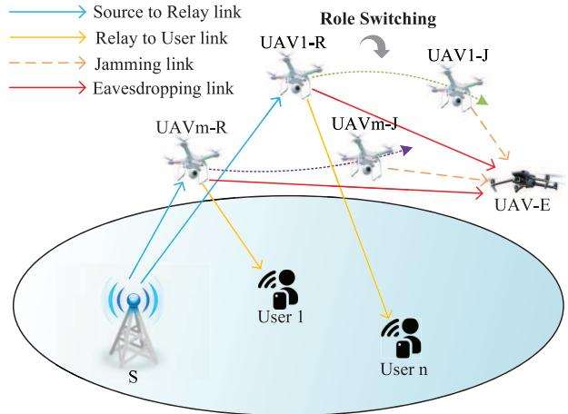  
Fig. 1. System model.

## III. SYSTEM MODEL

## A. System Model

As shown in Fig. 1, in a high-security-demand network scenario, we consider a relay UAVs assisted wireless communication system, where a malicious eavesdropping UAV (Eve) is present in the system. It is anticipated that there is a significant blockage between the relay UAVs and the source station (denoted as S). Relay UAVs (denoted as $m _ { r } )$ are deployed to facilitate communication between the S and ground users. To guarantee the security of communications within the system, we select the mr that is nearest to the eavesdropping UAV and repurpose it as a jamming UAV (denoted as $m _ { j } )$ , which transmits jamming signals aimed at the eavesdropper.

In the UAV-assisted wireless communication system we studied, the presence of an eavesdropping UAV eavesdropping on the transmission process of the relay UAV while the relay UAV is transmitting private information poses a potential threat to the wireless communication system. In order to safeguard the security of the UAV wireless communication system, the control center monitors the position of the eavesdropping drone through radar and other technologies and gives a role switching command to the nearest relay drone, ordering the relay drone to convert into a jamming drone, which performs a follow-jamming task on the eavesdropping drone, thus safeguarding the security of the UAV wireless secure communication system.

Let $\mathcal { M } = \{ 1 , 2 , . . . , M \} , \mathcal { N } = \{ 1 , 2 , . . . , N \}$ indicate the legitimate UAVs and ground users sets. Binary matrixes $\mathbf { p } _ { m _ { r } } [ t ] =$ $\{ p _ { m _ { r } } [ t ] \} \in \mathbb { Z } ^ { N \times { \bar { 1 } } }$ and $\mathbf { w } _ { m _ { j } } [ t ] = \{ w _ { m _ { j } } [ \dot { t } ] \} \in \mathbb { Z } ^ { E \times 1 }$ indicate the $m ^ { t h }$ UAV’s function within the designated time window, which $p _ { m _ { r } } [ t ] \in \{ 0 , 1 \} , w _ { m _ { j } } [ t ] \in \{ 0 , 1 \}$ . When $p _ { m _ { r } } [ t ] = 1$ the $m ^ { t h }$ UAV serve as a relay to facilitate communication between the ground user and S, denoted by $m _ { r } ^ { t h }$ . Similarly, when $w _ { m _ { j } } [ t ] = 1$ , the $m ^ { t h }$ UAV function as a jammer to prevent malicious UAV from wiretapping, denoted by $m _ { j } ^ { t h }$ . For each user, there is at most one UAV to assist communication at the $t ^ { t h }$ time interval. Additionally, each UAV is limited to serving a single ground user within a single time interval. There are certain constraints that must be considered:

$$
p _ { m _ { r } , n } [ t ] \in \{ 0 , 1 \} ,\tag{C1}
$$

$$
0 \leq \sum _ { m = 1 } ^ { M } p _ { m _ { r } , n } [ t ] \leq 1 , \quad \forall n \in \mathcal { N } ,\tag{C2}
$$

$$
0 \leq \sum _ { n = 1 } ^ { N } p _ { m _ { r } , n } [ t ] \leq 1 , \quad \forall m \in \mathcal { M } .\tag{C3}
$$

Likewise, a cooperative jamming UAV can prevent only a single Eve during the $t ^ { t h }$ time slot:

$$
w _ { m _ { j } , e } [ t ] \in \{ 0 , 1 \} ,\tag{C4}
$$

$$
0 \leq \sum _ { m = 1 } ^ { M } w _ { m _ { j } , e } [ t ] \leq 1 , \quad m \in \mathcal { M } .\tag{C5}
$$

It is important to note that, in an effort to facilitate the solution of the problem, we only research a single ground user $n ^ { t h }$ in this paper. Correspondingly, we only need a set of relay UAV and cooperative jammer UAV, denoted by $m _ { a } ,$ $a \in \{ r , j \}$

## B. Movement Model

The limited flight duration $T _ { 0 }$ of the UAVs can be partitioned into $T = T _ { 0 } / \Delta \mathrm { t }$ time intervals, where ∆t must be sufficiently small to ensure that the UAVs’ position can be considered stationary within each time slot. For the sake of notational convenience, we define $\mathcal { T } = \{ 0 , 1 , . . . , T \}$ to denote the set of time intervals.

For mathematical clarity, the three-dimensional (3D) Cartesian coordinate system is adopted, where $\begin{array} { l l } { \displaystyle \mathbf { q } _ { m _ { a } } [ t ] } & { = } \end{array}$ $[ x _ { m _ { a } } ( t ) , y _ { m _ { a } } ( t ) ] ^ { T }$ and $\mathbf { \bar { q } } _ { e } [ t ] = [ x _ { e } ( t ) , y _ { e } ( t ) ] ^ { T }$ represents the horizontal position of $m _ { a }$ and Eve at the $t ^ { t h }$ time interval, respectively [47]. Consequently, the velocity and acceleration of $m _ { a }$ at the $t ^ { t h }$ time interval can be represented as ${ \bf v } _ { m _ { a } } ( t ) =$ $\dot { \mathbf { q } } _ { m _ { a } } ( t )$ and $\mathbf { a } _ { m _ { a } } ( t ) = \ddot { \mathbf { q } } _ { m _ { a } } ( t )$

The velocity of a UAV is the rate of change of position per unit of time, which indicates the speed and direction of the UAV’s motion in three-dimensional space, and is mathematically expressed as:

$$
{ \bf v } _ { m _ { a } } = \frac { d _ { { \bf q } _ { m _ { a } } } } { d _ { t } } ,\tag{1}
$$

where $\mathbf { q } _ { m _ { a } }$ denotes the positional coordinates of $\mathbf { q } _ { m _ { a } }$

The acceleration is the rate of change of speed per unit of time and indicates how the speed of the UAV changes over time. The mathematical expression is:

$$
\mathbf { a } _ { m _ { a } } = \frac { d _ { \mathbf { v } _ { m _ { a } } } } { d _ { t } } .\tag{2}
$$

Utilizing Taylor expansion, the relationships among the UAV’s position, velocity, and acceleration can be expressed as follows [48]:

$$
\mathbf { q } _ { m _ { a } } [ t + 1 ] = \mathbf { q } _ { m _ { a } } [ t ] + \mathbf { v } _ { m _ { a } } [ t ] \Delta t + \frac { 1 } { 2 } \mathbf { a } _ { m _ { a } } [ t ] ( \Delta t ) ^ { 2 } ,\tag{3}
$$

$$
\begin{array} { r } { \mathbf { v } _ { m _ { a } } [ t + 1 ] = \mathbf { v } _ { m _ { a } } [ t ] + \mathbf { a } _ { m _ { a } } [ t ] \Delta t . } \end{array}\tag{4}
$$

Similarly, the velocity and acceleration of the Eve UAV at the $t ^ { t h }$ time interval can be denoted as ${ \bf v } _ { e } ( t ) = \dot { { \bf q } } _ { e } ( t )$ and $\mathbf { a } _ { e } ( t ) = \ddot { \mathbf { q } } _ { e } ( t )$

The maximum speed of the UAVs is constrained by $v ^ { \mathrm { m a x } }$ which establishes that the maximum distance they can travel in each time interval is given by $d ^ { \operatorname* { m a x } } = v ^ { \operatorname* { m a x } } \Delta t$ . Because UAVs are required to return to a designated docking station for energy refueling, their initial position ${ \bf q } _ { m _ { a } } ^ { \mathrm { I } }$ and final position ${ \bf q } _ { m _ { a } } ^ { \mathrm { F } }$ must be predetermined [49].

Typically, S and the ground users move at a pace significantly slower than that of the UAVs, allowing their positions to be treated as static, represented by $\mathbf { q } _ { s } ~ = ~ [ x _ { s } , y _ { s } ] ^ { T }$ and ${ \bf q } _ { n } ~ = ~ [ x _ { n } , y _ { n } ] ^ { T }$ , respectively. Particularly, we suppose that both legitimate and malicious UAVs can monitor each other’s positions instantaneously through technologies like ground radar or cameras [50].

To summarize, the kinematic constraints for UAVs are expressed as follows, with dmin indicating the minimum safe distance between UAVs to prevent collisions, and k · k representing the Euclidean distance.

$$
\mathbf { q } _ { m _ { a } } [ 0 ] = \mathbf { q } _ { m _ { a } } ^ { \mathrm { I } } ,
$$

$$
\mathbf { q } _ { m _ { a } } [ T ] = \mathbf { q } _ { m _ { a } } ^ { \mathrm { F } } ,\tag{C6}
$$

$$
\begin{array} { r } { \| \mathbf { q } _ { m _ { a } } [ t + 1 ] - \mathbf { q } _ { m _ { a } } [ t ] \| ^ { 2 } \leq ( d ^ { \operatorname* { m a x } } ) ^ { 2 } , } \end{array}\tag{C7}
$$

$$
\begin{array} { r } { \| \mathbf { q } _ { m _ { a } } [ t ] - \mathbf { q } _ { m _ { a } ^ { \prime } } [ t ] \| ^ { 2 } \geq ( d ^ { \operatorname* { m i n } } ) ^ { 2 } , } \end{array}\tag{C8}
$$

$$
\forall m _ { a } , m _ { a } ^ { \prime } \in \mathcal { M } , m _ { a } \neq m _ { a } ^ { \prime } .\tag{C9}
$$

## C. Communication Model

In the wireless communication process, channel state information is mainly used to measure the quality of the wireless channel, which is crucial for optimizing the performance of the wireless communication system [51], [52], [53]. In this paper, we investigate the cases where the channel state information is fully known and incompletely known. In the case where the channel state information is completely known, the channels of legitimate and eavesdropping users are estimated by the guide signal [54]. In the case where the channel state information is not completely known and the eavesdropping channel is assumed to satisfy the Rayleigh distribution property, the channel state information of the legitimate user is obtained through the guide signal, and the eavesdropping channel satisfies the Rayleigh fading, which implies that the eavesdropping user’s channel is randomly varying and obeys the Rayleigh distribution [55]. In this case, the communication system cannot accurately obtain the CSI of the eavesdropping user, and we estimate it based on statistical information.

In the UAV-assisted wireless communication system that we studied, the UAV flies at high altitude to perform its mission with fewer obstacles and weaker scattering effects, so the line-of-sight link dominates. In the case of line of sight link dominance, the channel matrix of the multi-antenna system can be approximated as a matrix of rank 1, and thus we simplify the communication between the ground source point and the UAV as a single antenna communication. In addition, the single-antenna model simplifies the channel modeling and system analysis, which facilitates theoretical studies and simulations.

We suppose that the legitimate UAV $m _ { a }$ and the Eve UAV operate at constant altitudes of $H _ { m _ { a } } \mathrm { ~ > ~ } 0$ and $H _ { e } \ > \ 0 .$ correspondingly [56]. To achieve optimal communication performance, legitimate UAVs and the malicious UAV will operate at the minimum permissible flight altitude $H > 0$ such that $H _ { m _ { a } } = H _ { e } = H$ . Consequently, the time-varying coordinate of $m ^ { t h }$ UAV and Eve UAV are represented as $\left[ x _ { m _ { a } } ( t ) , y _ { m _ { a } } ( t ) , H \right] ^ { T }$ and $[ x _ { e } ( t ) , y _ { e } ( t ) , H ] ^ { T }$ , respectively. The corresponding horizontal positions are given by $\mathbf { q } _ { m } ( t ) \ =$ $\left[ x _ { m _ { a } } ( t ) , y _ { m _ { a } } ( t ) \right]$ and $\mathbf { q } _ { e } ( t ) = [ x _ { e } ( t ) , y _ { e } ( t ) ]$ . Consequently, the distances from S to the relay and jammer UAVs, as well as the distance between S and the Eve UAV, are defined as follows:

$$
d _ { s , m _ { r } } [ t ] = \sqrt { \| \mathbf { q } _ { m _ { r } } [ t ] - \mathbf { q } _ { s } \| ^ { 2 } + H ^ { 2 } } ,\tag{5}
$$

$$
d _ { s , m _ { j } } [ t ] = \sqrt { \| \mathbf { q } _ { m _ { j } } [ t ] - \mathbf { q } _ { s } \| ^ { 2 } + H ^ { 2 } } ,\tag{6}
$$

$$
d _ { s , e } [ t ] = \sqrt { \| \mathbf { q } _ { e } [ t ] - \mathbf { q } _ { s } \| ^ { 2 } + H ^ { 2 } } .\tag{7}
$$

Similarly, during the $t ^ { t h }$ time interval, the distances from relay and jammer UAVs to the $n ^ { t h }$ ground user, as well as the distances from relay and jammer UAVs to the Eve UAV can expressed as:

$$
d _ { m _ { r } , n } [ t ] = \sqrt { \| \mathbf { q } _ { m _ { r } } [ t ] - \mathbf { q } _ { n } \| ^ { 2 } + H ^ { 2 } } ,\tag{8}
$$

$$
d _ { m _ { j } , n } [ t ] = \sqrt { \| \mathbf { q } _ { m _ { j } } [ t ] - \mathbf { q } _ { n } \| ^ { 2 } + H ^ { 2 } } ,\tag{9}
$$

$$
d _ { m _ { r } , e } [ t ] = \sqrt { \| \mathbf { q } _ { m _ { r } } [ t ] - \mathbf { q } _ { e } [ t ] \| ^ { 2 } } ,\tag{10}
$$

$$
d _ { m _ { j } , e } [ t ] = \sqrt { \| \mathbf { q } _ { m _ { j } } [ t ] - \mathbf { q } _ { e } [ t ] \| ^ { 2 } } ,\tag{11}
$$

moreover, the distance from relay UAV to cooperative jamming UAV can be represented as

$$
d _ { m _ { r } , m _ { j } } [ t ] = \sqrt { \| \mathbf { q } _ { m _ { r } } [ t ] - \mathbf { q } _ { m _ { j } } [ t ] \| ^ { 2 } } .\tag{12}
$$

In this paper, we employ the LoS communication model for the UAV-to-GU and GU-to-UAV links. Consequently, the channel power gain from S to both the relay and jammer UAVs, as well as to the Eve UAV, is derived from the free space path loss model, which can be expressed as:

$$
h _ { s , m _ { r } } [ t ] = \beta _ { 0 } d _ { s , m _ { r } } ^ { - 2 } [ t ] = \frac { \beta _ { 0 } } { \| \mathbf { q } _ { m _ { r } } [ t ] - \mathbf { q } _ { s } \| ^ { 2 } + H ^ { 2 } } , \quad \forall t ,\tag{13}
$$

$$
h _ { s , m _ { j } } [ t ] = \beta _ { 0 } d _ { s , m _ { j } } ^ { - 2 } [ t ] = \frac { \beta _ { 0 } } { \lVert \mathbf { q } _ { m _ { j } } [ t ] - \mathbf { q } _ { s } \rVert ^ { 2 } + H ^ { 2 } } ,\tag{14}
$$

$$
h _ { s , e } [ t ] = \beta _ { 0 } d _ { s , e } ^ { - 2 } [ t ] = \frac { \beta _ { 0 } } { \| \mathbf { q } _ { e } [ t ] - \mathbf { q } _ { s } \| ^ { 2 } + H ^ { 2 } } , \quad \forall t ,\tag{15}
$$

where $\beta _ { 0 }$ indicates the channel power gain at a reference distance of $d _ { 0 } = 1$ meter. Likewise, the channel power gains from $m _ { a }$ to $n ^ { t h }$ User can be represented as:

$$
h _ { m _ { r } , n } [ t ] = \beta _ { 0 } d _ { m _ { r } , n } ^ { - 2 } [ t ] = \frac { \beta _ { 0 } } { \| \mathbf { q } _ { m _ { r } } [ t ] - \mathbf { q } _ { n } \| ^ { 2 } + H ^ { 2 } } , \quad \forall t ,\tag{16}
$$

$$
h _ { m _ { j } , n } [ t ] = \beta _ { 0 } d _ { m _ { j } , n } ^ { - 2 } [ t ] = \frac { \beta _ { 0 } } { \| \mathbf { q } _ { m _ { j } } [ t ] - \mathbf { q } _ { n } \| ^ { 2 } + H ^ { 2 } } , \quad \forall t ,\tag{17}
$$

since the $m _ { a }$ and Eve UAV are in the same horizontal location, the channel power gains can be formulated as:

$$
h _ { m _ { r } , e } [ t ] = \beta _ { 0 } d _ { m _ { r } , e } ^ { - 2 } [ t ] = \frac { \beta _ { 0 } } { \| \mathbf { q } _ { m _ { r } } [ t ] - \mathbf { q } _ { e } [ t ] \| ^ { 2 } } , \quad \forall t ,\tag{18}
$$

$$
h _ { m _ { j } , e } [ t ] = \beta _ { 0 } d _ { m _ { j } , e } ^ { - 2 } [ t ] = \frac { \beta _ { 0 } } { \| \mathbf { q } _ { m _ { j } } [ t ] - \mathbf { q } _ { e } [ t ] \| ^ { 2 } } ,\tag{19}
$$

$$
h _ { m _ { r } , m _ { j } } [ t ] = \beta _ { 0 } d _ { m _ { r } , e } ^ { - 2 } [ t ] = \frac { \beta _ { 0 } } { \| \mathbf { q } _ { m _ { r } } [ t ] - \mathbf { q } _ { m _ { j } } [ t ] \| ^ { 2 } } ,\tag{20}
$$

## D. Role Switching of UAVs and Energy Consumption

A UAV $m _ { a }$ is able to perform one function at a time due to the half-duplex process; by dynamic role transferring, it can act as a jammer or a relay.

$$
0 \leq \sum _ { n = 1 } ^ { N } p _ { m _ { a } , n } [ t ] + w _ { m _ { a } , e } [ t ] \leq 1 , \quad \forall m _ { a } \in \mathcal { M } , n \in \mathcal { N } .\tag{C10}
$$

To enhance the confidentiality performance of the system, we choose $m _ { r }$ that is closest to the eavesdropping UAV and convert it into a jamming UAV (denoted by $m _ { j } )$ to broadcast interference signals targeting the eavesdropper [57].

Given that the energy consumption of the UAV for communication tasks, such as signal processing, is typically much lower than that for propulsion, we will disregard it in this research [58]. Consequently, the energy consumption of the UAVs comprises only propulsion energy and jamming energy. As indicated in [59], the effective upper bound for the propulsion energy consumption of a fixed-wing $m _ { a }$ UAV, with velocity $\mathbf { v } _ { m _ { a } } [ t ]$ and acceleration $\mathbf { a } _ { m _ { a } } [ t ]$ at time slot t, can be formulated as follows:

$$
\begin{array} { r l r } {  { E _ { m _ { a } } ^ { \mathrm { p u s h } } [ t ] } } \\ & { = [ c _ { 1 } \| \mathbf { v } _ { m _ { a } } [ t ] \| ^ { 3 } + \frac { c _ { 2 } } { \| \mathbf { v } _ { m _ { a } } [ t ] \| } ( 1 + \frac { \| \mathbf { a } _ { m _ { a } } \| ^ { 2 } } { g ^ { 2 } } ) ] + \Delta k , } \end{array}\tag{21}
$$

where $c _ { 1 }$ and $c _ { 1 }$ are two constant parameters associated with aerodynamics, and g denotes the gravitational acceleration. Additionally, $\Delta k ~ = ~ \frac { 1 } { 2 } G ( \| \mathbf { v } _ { m } ^ { \mathrm { F } } \| ^ { 2 } \_ \| \mathbf { v } _ { m } ^ { \mathrm { I } } \| ^ { 2 } )$ represents the change in kinetic energy of the UAV, which depends solely on the UAV’s mass G and its initial and final speeds.

The jamming energy consumption of the $m _ { j }$ UAV at time slot t can be expressed as follows:

$$
E _ { m _ { j } } ^ { \mathrm { j a m } } [ t ] = w _ { m _ { j } , e } [ t ] p _ { m _ { j } } [ t ] .\tag{22}
$$

Consequently, the overall energy consumption of the $m _ { a }$ UAV can be formulated as

$$
E _ { m _ { r } } ^ { \mathrm { t o t a l } } [ t ] = E _ { m _ { r } } ^ { \mathrm { p u s h } } [ t ] ,\tag{23}
$$

$$
\begin{array} { r } { E _ { m _ { j } } ^ { \mathrm { t o t a l } } [ t ] = E _ { m _ { j } } ^ { \mathrm { p u s h } } [ t ] + E _ { m _ { j } } ^ { \mathrm { j a m } } [ t ] . } \end{array}\tag{24}
$$

## IV. MULTIAGENT OPTIMIZATION WITH PERFECT CSI

In this section, we assume the availability of channel state information for $h _ { s , e } , h _ { m _ { r } , e } , h _ { m _ { j } , e }$ is perfect. Therefore, we explore the secrecy rate of a cooperative jamming UAV assisted UAV-enabled system.

## A. Problem Statement and Formulation

The transmission power $p _ { s } [ t ]$ of S and the transmission power $p _ { m _ { j } } [ t ]$ of $m _ { a }$ are constrained by both their average and peak values, resulting in the following limitations:

$$
\frac { 1 } { T } \sum _ { t = 1 } ^ { T } p _ { s } [ t ] \leq P _ { s } ^ { \mathrm { a v e } } ,\tag{C11}
$$

$$
0 \leq p _ { s } [ t ] \leq P _ { s } ^ { \mathrm { m a x } } , \quad \forall t .\tag{C12}
$$

$$
\frac { 1 } { T } \sum _ { t = 1 } ^ { T } p _ { m _ { a } } [ t ] \leq P _ { \mathrm { U A V } } ^ { \mathrm { a v e } } ,\tag{C13}
$$

$$
0 \leq p _ { m _ { a } } [ t ] \leq P _ { \mathrm { U A V } } ^ { \operatorname* { m a x } } , \quad \forall t .\tag{C14}
$$

At the $t ^ { t h }$ time slot, the secrecy rates attainable from S to $m _ { r }$ and Eve UAV can be formulated as follows:

$$
R _ { s , m _ { r } } [ t ] = \log _ { 2 } \left( 1 + \frac { p _ { s } [ t ] h _ { s , m _ { r } } [ t ] } { \sigma _ { r } ^ { 2 } + p _ { m _ { j } } [ t ] h _ { m _ { r } , m _ { j } } [ t ] } \right) ,\tag{25}
$$

$$
R _ { s , e } [ t ] = \log _ { 2 } \left( 1 + \frac { p _ { s } [ t ] h _ { s , e } [ t ] } { \sigma _ { e } ^ { 2 } + p _ { m _ { j } } [ t ] h _ { m _ { j } , e } [ t ] } \right) ,\tag{26}
$$

where $\sigma _ { r } ^ { 2 }$ and $\sigma _ { e } ^ { 2 }$ are the white Gaussian noise power at the $m ^ { t h }$ UAV and Eve UAV. Similarly, the secrecy rates attainable from $m _ { r }$ to $n ^ { t h }$ ground user and Eve UAV can be formulated as follows:

$$
R _ { m _ { r } , n } [ t ] = \log _ { 2 } \left( 1 + \frac { p _ { s } [ t ] h _ { s , m _ { r } } [ t ] h _ { m _ { r } , n } [ t ] } { \sigma _ { n } ^ { 2 } + p _ { m _ { j } } [ t ] h _ { m _ { j } , n } [ t ] } \right) ,\tag{27}
$$

$$
R _ { m _ { r } , e } [ t ] = \log _ { 2 } \left( 1 + \frac { p _ { s } [ t ] h _ { s , m _ { r } } [ t ] h _ { m _ { r } , e } [ t ] } { \sigma _ { e } ^ { 2 } + p _ { m _ { j } } [ t ] h _ { m _ { j } , e } [ t ] } \right) ,\tag{28}
$$

where $\sigma _ { n } ^ { 2 }$ is the white Gaussian noise power at the ground user.

Then, the secrecy throughput from S to m during the $t ^ { t h }$ time interval can be formulated as follows:

$$
R _ { s , m _ { r } } ^ { \mathrm { s e c } } [ t ] = [ R _ { s , m _ { r } } [ t ] - R _ { s , e } [ t ] ] ^ { + } ,\tag{29}
$$

where $[ x ] ^ { + } = \operatorname* { m a x } ( x , 0 )$ . The achievable transmission rate from $m _ { r }$ to $n ^ { t h }$ ground user during the $t ^ { t h }$ time interval can be represented as follow:

$$
R _ { m _ { r } , n } ^ { \mathrm { s e c } } [ t ] = [ R _ { m _ { r } , n } [ t ] - R _ { m _ { r } , e } [ t ] ] ^ { + } .\tag{30}
$$

This paper focuses on the worst-case maximum secrecy rate problem in system. To evaluate the worst security performance from the ground user’s perspective, we suppose that the $m _ { j }$ approaches the ground user at the closest distance. We aim to maximize the minimum secrecy rate by improving the flight paths and transmission power of both relay and the jamming UAVs. This issue can be mathematically formulated as:

$$
\begin{array} { r l r } { \mathrm { P 1 : } } & { { } \underset { \mathbf { q } _ { m _ { r } } , \mathbf { q } _ { m _ { j } } , p _ { m _ { r } } , p _ { m _ { j } } } { \operatorname* { m a x } } } & { R _ { m _ { r } , n } ^ { \mathrm { s e c } } } \\ { } & { { } } & { \mathrm { s . t . } \quad ( C 1 ) - ( C 1 4 ) , } \end{array}\tag{31}
$$

where (C1)–(C5) and (C10) represent the guidelines for the distinction of UAV role allocation, (C6)–(C9) denote the kinetic constraints on the trajectories of UAV movements, (C11)–(C14) establish the mean and maximal transmission power limitations for both the S and UAVs.

## V. MULTIAGENT OPTIMIZATION WITH IMPERFECT CSI

In this section, we consider the scenario in which the source station, ground users, and $m _ { a }$ Uncrewed Aerial Vehicles (UAVs) possess instantaneous channel state information regarding authorized entities, specifically including $h _ { s , m _ { r } } ,$ $h _ { m _ { r } , m _ { j } } , \ h _ { m _ { r } , n }$ , and $h _ { m _ { j } , n } .$ . It is assumed that the instantaneous channel state information $h _ { s , e } , \ h _ { m _ { r } , e } ,$ , and $h _ { m _ { j } , e }$ for legitimate links is imperfect. Furthermore, we assume that the wiretap channels exhibit Rayleigh fading characteristics [60]. In particular, the channel from the S to Eve is modeled as $h _ { s , e } \sim \mathcal { C N } ( 0 , 1 )$ , while the channels from $m _ { r }$ and $m _ { j }$ to Eve are defined as $h _ { m _ { r } , e } \sim \mathcal { C N } ( 0 , 1 )$ and $h _ { m _ { j } , e } \sim \mathcal { C N } ( \bar { 0 } , 1 )$ respectively.

## A. Problem Statement and Formulation

The source station broadcasts confidential signals to ground user using relay UAV. The signals received by both the ground user and the eavesdropper can be represented as follows:

$$
y _ { n } ( l ) = ( h _ { s , n } + h _ { s , m _ { r } } h _ { m _ { r } , n } ) p _ { s } s ( l ) + h _ { m _ { j } , n } p _ { j } j ( l ) + \sigma _ { n } ^ { 2 } ( l ) ,\tag{32}
$$

$$
y _ { e } ( l ) = ( h _ { s , e } + h _ { s , m _ { r } } h _ { m _ { r } , e } ) p _ { s } s ( l ) + h _ { m _ { j } , e } p _ { j } j ( l ) + \sigma _ { e } ^ { 2 } ( l ) ,\tag{33}
$$

the terms $( h _ { s , n } + h _ { s , m _ { r } } h _ { m _ { r } , n } )$ and $( h _ { s , e } + h _ { s , m _ { r } } h _ { m _ { r } , e } )$ are designated as the main channel and wiretap channel, respectively; the variables $h _ { m _ { j } , n }$ and $h _ { m _ { j } , e }$ are identified as jamming channels. Additionally, $\sigma _ { n } ^ { 2 }$ and $\sigma _ { e } ^ { 2 }$ represent the additive white Gaussian noise (AWGN), characterized by distributions $\mathcal { C N } ( 0 , \sigma _ { n } ^ { 2 } )$ and $\mathcal { C N } ( 0 , \sigma _ { e } ^ { 2 } )$ , respectively. The term $s ( l )$ denotes the confidential signal, while $j ( l )$ signifies the jamming signal.

The secrecy rate is a widely used metric for quantifying security in physical layer communications, defined as follows [61]:

$$
C _ { s } = ( C _ { n } - C _ { e } ) ^ { + } .\tag{34}
$$

In this context, $C _ { n }$ and $C _ { e }$ denote the secrecy capacity for the ground user and the wiretap capacity for Eve, respectively, defined as follows:

$$
C _ { n } = \log _ { 2 } \left( 1 + \frac { p _ { s } h _ { s , m _ { r } } h _ { m _ { r } , n } } { \sigma _ { n } ^ { 2 } + p _ { m _ { j } } h _ { m _ { j } , n } } \right) ,\tag{35}
$$

$$
C _ { e } = \log _ { 2 } \left( 1 + \frac { p _ { s } h _ { s , m _ { r } } h _ { m _ { r } , e } } { \sigma _ { e } ^ { 2 } + p _ { m _ { j } } h _ { m _ { j } , e } } \right) .\tag{36}
$$

However, given that $h _ { s , e } , h _ { m _ { r } , e } ,$ , and $h _ { m _ { j } , e }$ are unknown, it becomes challenging to ascertain whether the instantaneous secrecy rate is non-negative. In such cases, we typically employ the secrecy outage probability as a criterion for assessing the security performance of a system [62]. The risk of a secrecy outage refers to the likelihood that the desired physical layer security (PLS) coding rate $R _ { s }$ exceeds the secrecy rate $C _ { s }$ . The formulation of the secrecy outage probability is provided as follows [63]:

$$
\begin{array} { c } { P _ { \mathrm { o u t } } = P ( C _ { s } \leq R _ { s } | \mathrm { T r a n s m i s s i o n } ) } \\ { = P ( C _ { e } \geq C _ { n } - R _ { s } ) . } \end{array}\tag{37}
$$

Clearly, the probability of a secrecy outage is conditional and relies on the proper transmission of the main channels [64]. As a result, the ground user can accurately decode the transmitted codewords at a rate of up to $C _ { m }$ . Assuming that the S possesses complete knowledge of the instantaneous channel state information (CSI) for $h _ { s , m _ { r } } , h _ { m _ { r } , m _ { j } } , h _ { m _ { r } , n } ,$ and $h _ { m _ { j } , n }$ within the coherence time, Alice is capable of utilizing a variable rate of transmitted codewords up to $C _ { n }$

The secrecy outage probability concerning $R _ { s } ,$ , denoted as $P _ { \mathrm { o u t } } .$ , can be expressed as follows:

$$
P _ { \mathrm { o u t } } = 1 - F _ { Z } ( \theta _ { 1 } ) ,\tag{38}
$$

where $\theta _ { 1 } = 2 ^ { C _ { n } - R _ { s } } - 1$ , with $C _ { n }$ defined in Eq. (35) and $F _ { Z } ( z )$ defined in Eq. (39), shown at the bottom of the page.

The equation (39) represents the cumulative distribution function of $F _ { Z } ( z )$ in the formula for the probability of secrecy outage in a multi-objective optimization problem in the scenario with incompletely known channel state information. Supposing that the unknown CSI of wiretap channel follows a complex Gaussian distribution, according to the knowledge of probability theory, the mode of a variable obeying the complex Gaussian distribution is described by the Rayleigh distribution. Therefore, we can derive the formula for the cumulative distribution function of $F _ { Z } ( z )$ in the secrecy outage probability in the multi-objective optimization problem, i.e., equation (39). Equation (40), shown at the bottom of the page, represents the probability distribution function of $F _ { Z } ( z )$ in the security outage probability in the multi-objective optimization problem, and equation (40) is derived by differentiating equation (39).

## VI. MULTIOBJECTIVE OPTIMIZATION ALGORITHM BASED ON MULTIAGENT REINFORCEMENT LEARNING

## A. Multiobjective Optimization Problem Based on Markov Game

In this section, we construct a Markov game for multiobjective optimization function. First, the trajectory and power optimization problem is expressed by a five-tuple Markov game $\mathrm { a s } = \{ \mathcal { T } , \mathcal { S } , \mathcal { A } , \mathcal { T } , \mathcal { R } \}$ , in this context, I represents finite set of agents, S denotes finite set of states, A indicates action set, T is state transition probability, and R represents reward function. Considering the overall performance of UAV-assisted system, the UAV-assisted system is viewed as the environment, and relay UAV, jammer UAV and Eve UAV are abstracted as agents. The details are following:

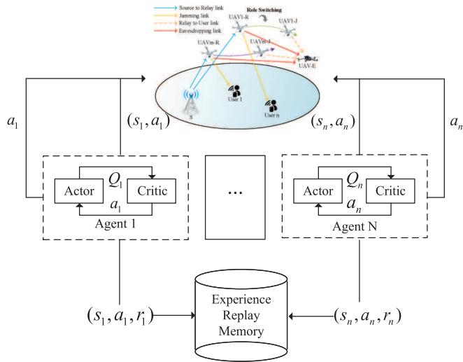  
Fig. 2. MAJDTP algorithm flow chart.

1) State space: The state space for both the relay and jammer UAVs are defined as $\begin{array} { r c l } { \mathbf { s } _ { r } ( t ) } & { = } & { \{ \mathbf { s v } _ { r } ( t ) } \end{array}$ $\begin{array} { r l r } { { \bf s q } _ { r } ( t ) , { \bf s p } _ { r } ( t ) \} , { \bf s } _ { j } ( t ) } & { { } = } & { \{ { \bf s v } _ { j } ( t ) , { \bf s q } _ { j } ( t ) , { \bf s p } _ { j } ( t ) \} } \end{array}$ respectively. $\mathbf { s v } _ { i } ( t ) , \ \mathbf { s q } _ { i } ( t )$ and $\mathbf { s p } _ { k } ( t ) , \bar { i } \in \{ \bar { m } , j \}$ describe speed, position and transmission power of UAVs. We assume that $m _ { r }$ as well as $m _ { j }$ UAV and Eve UAV can observe each other’s positions.

2) Action space: Regarding $m _ { r }$ and $m _ { j }$ UAVs, the action space $a _ { k } ( t )$ contains the speed ${ \pmb v } _ { k } ( t )$ and the transmission power ${ \bf \mathit { p } } _ { k } ( t )$ . Meanwhile, the action space $\mathbf { \Delta } _  \mathbf { \alpha } \mathbf { \alpha } \mathbf { \alpha } \mathbf { \alpha } \mathbf { \beta } \mathbf { \alpha } \mathbf { \alpha } \mathbf { \alpha } \mathbf { \alpha } \mathbf { \alpha } \mathbf { \alpha } \mathbf { \alpha } \mathbf { \alpha } \mathbf { \alpha } \mathbf { \alpha } \mathbf { \alpha } \mathbf { \alpha } \mathbf { \alpha } \mathbf { \alpha } \mathbf { \alpha } \mathbf { \alpha } \mathbf { \alpha } \mathbf { \alpha } \mathbf { \alpha } \mathbf { \alpha } \mathbf { \alpha } \mathbf { \alpha } \mathbf { \alpha } \mathbf { \alpha } \mathbf { \alpha } \mathbf { \alpha } \mathbf { \alpha } \mathbf { \alpha } \mathbf { \alpha } \mathbf { \alpha } \mathbf { \alpha } \mathbf { \alpha } \mathbf { \alpha } \mathbf { \alpha } \mathbf { \alpha } \mathbf { \alpha } \mathbf { \alpha \alpha } \mathbf { \alpha } \mathbf { \alpha \alpha } \mathbf { \alpha \alpha } \mathbf { \alpha \alpha } \mathbf { \alpha \alpha } \mathbf { \alpha \alpha } \mathbf { \alpha \alpha } \mathbf { \alpha \alpha } \mathbf { \alpha \alpha } \mathbf { \alpha \alpha } \mathbf { \alpha \alpha } \mathbf { \alpha \alpha } \mathbf { \alpha \alpha } \mathbf { \alpha \alpha } \mathbf { \alpha \alpha } \mathbf { \alpha \alpha \alpha } \mathbf { \alpha \alpha \beta } \mathbf  \alpha \alpha \alpha \mathbf { \alpha \alpha } \mathbf { \alpha \alpha \alpha } \mathbf { \alpha \alpha \alpha \beta \alpha \alpha \beta \alpha \mathbf } \mathbf  \alpha \alpha \alpha \alpha \alpha \beta \alpha \alpha \beta \mathbf \alpha \alpha \alpha \mathbf \alpha \alpha \alpha \beta \alpha \alpha \mathbf \alpha \alpha \alpha \mathbf \alpha \alpha \alpha \alpha \mathbf \alpha \alpha \alpha \mathbf \alpha \alpha \alpha \alpha \alpha \mathbf \alpha \alpha \alpha \mathbf \alpha \alpha \alpha \alpha \alpha \alpha \mathbf \alpha \alpha \alpha \delta \alpha \delta \delta \delta \delta \delta \delta \delta \alpha \delta \delta \delta \delta \delta \delta \delta \alpha \delta \delta \delta \delta \delta \delta \delta \delta \delta \delta \delta \delta \delta \delta \delta \delta \delta \delta \delta \delta \delta \delta \delta \delta \delta \delta \delta \delta \delta \delta \delta \delta \delta \delta \delta \delta \delta \delta \delta \delta \delta \delta \delta \delta \delta \delta \delta \delta \delta \delta \delta \delta \delta \delta \delta \delta \delta \delta \delta \delta \delta \delta \delta \delta $ for the Eve UAV consists of speed ${ \pmb v } _ { e } ( t )$

3) State Transition Probability: The likelihood of transition from state $s _ { t }$ to the next state $s _ { t + 1 }$ at the time slot t when action a is selected. For all $s _ { t } \in { \mathcal { S } } , a _ { t } \in { \mathcal { A } } .$ the following constraints are satisfied:

$$
\mathcal { T } ( s _ { t + 1 } \vert s _ { t } , a _ { t } ) > 0 ,
$$

$$
\sum _ { s _ { t + 1 } \in S } \mathcal { T } ( s _ { t + 1 } \vert s _ { t } , a _ { t } ) = 1 .\tag{41}
$$

(42)

4) Reward: In UAV-assisted system, the goal of the optimization issue P1 is to maximize the worst secrecy rate. The objective of training the agents is to maximize the sustained cumulative reward. Thus, immediate reward formula for agent at the time slot t can be expressed as:

$$
r _ { r } ( t ) = R _ { m _ { r } , n } [ t ] ,
$$

$$
r _ { j } ( t ) = R _ { m _ { r } , n } [ t ] ,\tag{43}
$$

(44)

$$
\boldsymbol { r } _ { e } ( t ) = \boldsymbol { R } _ { m _ { r } , e } [ t ] .\tag{45}
$$

The Fig. 2 is MAJDTP algorithm flow chart. First, the algorithm initializes the actor and critic networks of each

$$
F _ { Z } ( z ) = \int _ { 0 } ^ { \infty } \left( \int _ { 0 } ^ { z x } \frac { y } { p _ { s } h _ { s , r } h _ { r , n } } \exp \left. - \frac { y ^ { 2 } } { 2 \left( p _ { s } h _ { s , r } h _ { r , n } \right) } \right. d _ { y } \right) \frac { x } { h _ { j , n } p _ { s } } \exp \left. - \frac { x ^ { 2 } } { 2 h _ { j , n } p _ { s } } \right. d _ { x } .\tag{39}
$$

$$
f _ { Z } ( z ) = \int _ { 0 } ^ { \infty } x \frac { x z } { h _ { r , n } p _ { s } } \exp \left. - \frac { ( x z ) ^ { 2 } } { 2 h _ { r , n } p _ { s } } \right. \frac { x } { h _ { j , n } p _ { s } } \exp \left. - \frac { x ^ { 2 } } { 2 h _ { j , n } p _ { s } } \right. d _ { x } .\tag{40}
$$

agent, which are used for deciding actions and estimating Q values, respectively. In addition, a target network is set up to stabilize the training process and an experience replay buffer is initialized to store historical experience. Subsequently, the agents interact in the environment, where each agent generates actions based on the current strategy and performs joint actions with other agents to obtain new environment states and corresponding rewards. These experience data are stored in the experience buffer for subsequent training.

## B. Trajectory and Jamming Power Optimization Algorithm Based on MADDPG

We study the problem of maximizing the security rate of the network by optimizing the flight trajectories of the relay UAV and the jamming UAV as well as the transmission power under the condition that the channel state information is known, and the problem of minimizing the probability of network security outage by optimizing the flight trajectories of the relay UAV and the jamming UAV as well as the transmission power under the condition that the channel state information is not fully known. In the process of optimizing the flight trajectory and transmission power of relay UAVs and jamming UAVs, we implement it by means of a multi-intelligent body deep deterministic algorithm.

First, the algorithm initializes each agent’s strategy network (actor) for action selection and value network (critic) for $\mathrm { Q } \mathrm { - }$ value estimation. To ensure training stability, a target network is also established, along with an experience replay buffer to store historical experiences. The agents then interact within the environment, where each agent generates actions based on its current strategy, collaborates through joint actions, and receives updated environment states and corresponding rewards. These experiences are stored in the replay buffer for future training iterations.

During training, a random batch of data is sampled from the experience buffer to compute the target Q-value, which is derived from a weighted sum of the reward and discount factors. The optimal next move is determined using the target actor network. Next, the loss function of the critic network is calculated using the mean squared error, and its parameters are updated via gradient descent. The actor network is then refined using the policy gradient method to maximize the Qvalue by selecting optimal actions in given states. Additionally, the target network undergoes a soft update, gradually aligning with the current network to enhance training stability. This process is iterated continuously, allowing agents to optimize their strategies until convergence or the desired performance level is achieved.

The core steps of MADDPG algorithm follow the “centralized training, decentralized execution (CTDE)” framework, enabling multiple agents to collaboratively optimize their policies. During training, agents share observations and rewards in a centralized manner, allowing for better coordination and global optimization. However, during execution, each agent operates independently based only on its local observations, ensuring adaptability and scalability in realworld environments.

TABLE I  
NEURAL NETWORK PARAMETERS
<table><tr><td>Parameter</td><td>Value</td><td>Parameter</td><td>Value</td></tr><tr><td>Layer Type</td><td>fully connected</td><td>Activation Function</td><td>ReLU, Sigmoid</td></tr><tr><td>Layers</td><td>4</td><td>Hidden Units</td><td>2 layers with 128</td></tr><tr><td>Optimizer</td><td>Adam</td><td>Learning Rate</td><td>0.001</td></tr></table>

We introduce a multiagent reinforcement learning algorithm derived from MADDPG to address the multiobjective optimization issue P1. The MADDPG algorithm is an enhanced version of the actor-critic and deep deterministic policy gradient (DDPG) algorithms. It adopts a centralized training and distributed execution operation. Each agent includes an actor network $\mu _ { i } ( s _ { t } ^ { i } )$ , a critic network $\mathcal { Q } _ { i } ( s _ { t } , a _ { t } )$ , an actor target network $\mu _ { i } ^ { \prime } ( s _ { t + 1 } ^ { i } )$ , and a critic target network $\mathcal { Q } _ { i } ^ { \prime } ( s _ { t + 1 } , a _ { a + 1 } )$ For the MADDPG algorithm, the actor network can operate with only local information, the critic network is improved using global information, and each agent to make decisions will consider the influence of other agents.

We determine $\pi _ { i }$ as the MAJDTP algorithm’s policy for agent i. By modifying the evaluation network’s parameters $\theta _ { i } ^ { \mu }$ and $\theta _ { i } ^ { \mathcal { Q } }$ , the optimum policy can be achieved. The evaluation network parameters $\theta _ { i } ^ { \mu }$ and $\mathbf { \bar { \theta } } _ { i } ^ { \mathcal { Q } }$ are modified in continuous time during this operation. To be particular, the operation experience $( s _ { t } , a _ { t } , r _ { t } , s _ { t + 1 } )$ is retained in the experience replay buffer D after being acquired via the agent-environment interaction. The evaluation network’s parameters are updated during training by extracting mini-batch samples  over the experience replay buffer D. Through loss function minimization, the critic network modifies the evaluation network parameters $\theta _ { i } ^ { \mathcal { Q } }$ . The loss function’s formula can be represented as follows:

$$
\mathcal { L } ( \theta _ { i } ^ { \mathcal { Q } } ) = \mathbb { E } [ ( Q _ { i } ( s _ { t } , a _ { t } ^ { i } , a _ { t } ^ { - i } | \theta _ { i } ^ { \mathcal { Q } } ) - \mathbf { y } _ { t } ^ { i } ) ^ { 2 } ] ,\tag{46}
$$

$$
\mathbf { y } _ { t } ^ { i } = r _ { t } ^ { i } + \gamma Q _ { i } ^ { ' } ( s _ { t + 1 } , a _ { t + 1 } ^ { i } , a _ { t + 1 } ^ { - i } | \theta _ { i } ^ { \mathcal { Q } } ) ,\tag{47}
$$

where $Q _ { i } ^ { \prime } ( \cdot )$ represents the target network’s state-action value function. The policy objective function is maximized in order to modify the network parameters $\theta _ { i } ^ { \mu }$ for an actor network. The expression for the policy objective function can be represented as follows:

$$
\mathcal { T } ( \theta _ { i } ^ { \mu } ) = \mathbb { E } [ ( \mathcal { Q } _ { i } ( s _ { t } ^ { i } , a ^ { i } | a ^ { i } ) = \mu _ { i } ( s _ { t } ^ { i } ) ) ] ,\tag{48}
$$

where $\mu _ { i } ( \cdot )$ is the actor evaluation network function that reflects actions regarding the deterministic policy $\pi _ { i }$ . Rather than transferring the parameters $\mu _ { i } ^ { \prime }$ and $\mathcal { Q } _ { i } ^ { \prime }$ straight to the target network, we adjust them gradually as the evaluation network parameters $\theta _ { i } ^ { \mu }$ and $\theta _ { i } ^ { \mathcal { Q } }$ are modified, as following:

$$
\theta _ { i } ^ { \mu ^ { \prime } } = \lambda _ { \mathrm { x } } \theta _ { i } ^ { \mu } + ( 1 - \lambda _ { \mathrm { x } } ) \theta _ { i } ^ { \mu ^ { \prime } } ,\tag{49}
$$

$$
\theta _ { i } ^ { \it Q ^ { \prime } } = \lambda _ { z } \theta _ { i } ^ { \it Q } + ( 1 - \lambda _ { z } ) \theta _ { i } ^ { \it Q ^ { \prime } } ,\tag{50}
$$

where $\lambda _ { \mathrm { x } } \ll 1 , \lambda _ { \mathrm { z } } \ll 1$

The above training procedure based MADDPG to solve MAJDTP is shown in Algorithm 1. The training parameters about MAJDTP algorithm in Trajectory and Jamming Power Optimization Algorithm Based on MADDPG section as shown in Table I.

TABLE II  
SIMULATION PARAMETERS
<table><tr><td rowspan=1 colspan=1>Parameter</td><td rowspan=1 colspan=1>Notation</td><td rowspan=1 colspan=1>Simulation value</td><td rowspan=1 colspan=1>Parameter</td><td rowspan=1 colspan=1>Notation</td><td rowspan=1 colspan=1>Simulation value</td></tr><tr><td rowspan=1 colspan=1>Max speed of UAVs</td><td rowspan=1 colspan=1> $\overline { { v ^ { \mathrm { m a x } } } }$ </td><td rowspan=1 colspan=1>50m/s</td><td rowspan=1 colspan=1>Average transmit power of relay UAV</td><td rowspan=1 colspan=1> $\overline { { P _ { \mathrm { R } } ^ { \mathrm { a v e } } } }$ </td><td rowspan=1 colspan=1>20dBm</td></tr><tr><td rowspan=1 colspan=1>Safe distance among UAVs</td><td rowspan=1 colspan=1> $\overline { { d ^ { \mathrm { m i n } } } }$ </td><td rowspan=1 colspan=1> $\overline { { 5 \mathrm { m } } }$ </td><td rowspan=1 colspan=1>Peak transmit power of relay UAV</td><td rowspan=1 colspan=1> $\bar { P } _ { \mathrm { R } } ^ { \mathrm { m a x } }$ </td><td rowspan=1 colspan=1>25dBm</td></tr><tr><td rowspan=1 colspan=1>Data size of S</td><td rowspan=1 colspan=1> $\overline { { D _ { S } } }$ </td><td rowspan=1 colspan=1>1000Mbits</td><td rowspan=1 colspan=1>Average transmit power of jammer UAV</td><td rowspan=1 colspan=1> $\overbrace { P _ { \mathrm { ~ I ~ } } ^ { \mathrm { a v e } } }$ </td><td rowspan=1 colspan=1>22dBm</td></tr><tr><td rowspan=1 colspan=1>Number of time slots</td><td rowspan=1 colspan=1>T</td><td rowspan=1 colspan=1>50</td><td rowspan=1 colspan=1>Peak transmit power of jammer UAV</td><td rowspan=1 colspan=1> $\overline { { P _ { \mathrm { J } } ^ { \mathrm { m a x } } } }$ </td><td rowspan=1 colspan=1>27dBm</td></tr><tr><td rowspan=1 colspan=1>Time slot duration</td><td rowspan=1 colspan=1>∆t</td><td rowspan=1 colspan=1>1s</td><td rowspan=1 colspan=1>Physical layer security coding rate</td><td rowspan=1 colspan=1> $\overline { { R _ { s } } }$ </td><td rowspan=1 colspan=1>3bits/s/Hz</td></tr><tr><td rowspan=1 colspan=1>Altitude of UAVs</td><td rowspan=1 colspan=1>h</td><td rowspan=1 colspan=1>150m</td><td rowspan=1 colspan=1>Channel power gain</td><td rowspan=1 colspan=1> $\beta _ { 0 }$ </td><td rowspan=1 colspan=1>-60dBm</td></tr><tr><td rowspan=1 colspan=1>Terrestrial pass-loss exponent</td><td rowspan=1 colspan=1>α</td><td rowspan=1 colspan=1>3</td><td rowspan=1 colspan=1>Bandwidth</td><td rowspan=1 colspan=1> $\overline { { B _ { \omega } } }$ </td><td rowspan=1 colspan=1>1MHz</td></tr><tr><td rowspan=1 colspan=1>Size of replay buffer RB-size</td><td rowspan=1 colspan=1>RB-size</td><td rowspan=1 colspan=1>80</td><td rowspan=1 colspan=1>Size of mini-batch</td><td rowspan=1 colspan=1> $\overline { { \mathbb { M } } }$ </td><td rowspan=1 colspan=1>32</td></tr><tr><td rowspan=1 colspan=1>Noise power</td><td rowspan=1 colspan=1> $\overline { { \delta ^ { 2 } } }$ </td><td rowspan=1 colspan=1>-110dBm</td><td rowspan=1 colspan=1>Discount factor</td><td rowspan=1 colspan=1>γ</td><td rowspan=1 colspan=1>0.95</td></tr></table>

Algorithm 1 MAJDTP Algorithm   
1: Initialize the actor network and critic network evaluation   
parameters as $\theta _ { i } ^ { \mu }$ and $\theta _ { i } ^ { \mathcal { Q } }$   
2: Initialize the experience replay buffer $\mathcal { D } ,$ with mini-batch   
samples $\epsilon , \epsilon \ll \mathcal { D }$ . Initialize the maximum number of   
training epochs $\mathcal { E } ,$ the maximum number of training steps   
$\mathcal { M } ,$ the action noise H.   
3: for epochs = 1 to $\mathcal { E }$ do   
4: Initialize a random state process $s _ { t } ^ { i } .$   
5: for step t = 1 to M do   
6: Each agent selects actions $a _ { t } ^ { i } = \mu _ { i } ( s _ { t } ^ { i } ) + \mathcal { H } _ { t }$ based on the   
current policy   
7: Execute action $a _ { t } ^ { i }$ and receive the corresponding reward   
$r _ { t } ^ { i }$   
8: $s _ { t } ^ { i } \gets s _ { t + 1 } ^ { i }$   
9: Store state process,the next state process, action process,   
and the corresponding reward $( s _ { t } ^ { i } , a _ { t } ^ { i } , r _ { t } ^ { i } , s _ { t + 1 } ^ { i } )$ in the expe  
rience replay buffer $\mathcal { D }$   
10: for each agent do   
11: Randomly sample a mini-batch $\varepsilon ~ ( s _ { t } ^ { i } , a _ { t } ^ { i } , r _ { t } ^ { i } , s _ { t + 1 } ^ { i } )$ from   
the experience replay buffer D   
12: Set $\mathbf { y } _ { t } ^ { i } \overline { { \mathbf { \Lambda } } } = r _ { t } ^ { i } + \gamma \dot { Q _ { i } ^ { ' } } ( \bar { s } _ { t + 1 } , a _ { t + 1 } ^ { i } , a _ { t + 1 } ^ { - i } | \theta _ { i } ^ { \mathcal { Q } } )$   
13: Update the critic network by minimizing the loss function   
$\dot { \mathcal { L } ( \boldsymbol { \theta } _ { i } ^ { \mathcal { Q } } ) } = \mathbb { E } [ ( Q _ { i } ( s _ { t } , a _ { t } ^ { i } , a _ { t } ^ { - i } | \mathbf { \bar { \boldsymbol { \theta } } } _ { i } ^ { \mathcal { Q } } ) - \mathbf { y } _ { t } ^ { i } ) ^ { 2 } ]$   
14: Update the actor network by maximizing the policy objec  
tive function $\mathcal { T } ( \theta _ { i } ^ { \mu } ) = \mathbb { E } [ ( \mathcal { Q } _ { i } ( s _ { t } ^ { i } , a ^ { i } | a ^ { i } ) ^ { - } = \mu _ { i } ( s _ { t } ^ { i } ) ) ]$   
15: end for   
16: Update target network parameters for each agent i: $\theta _ { i } ^ { \mu ^ { \prime } } =$   
$\lambda _ { a } \theta _ { i } ^ { \mu } + ( 1 - \lambda _ { a } ) \theta _ { i } ^ { \mu ^ { \prime } } , \theta _ { i } ^ { Q ^ { \prime } } = \lambda _ { c } \theta _ { i } ^ { Q } + ( 1 - \lambda _ { c } ) \theta _ { i } ^ { Q ^ { \prime } }$   
17: end for   
18: end for

## VII. SIMULATION RESULTS

In this section, we present experimental results to validate the effectiveness of our proposed MADDPG-based UAV trajectory and interference power optimization algorithm. We investigate the impact of the maximum relay UAV transmit power $P _ { R } ^ { m }$ on the network security rate, security outage probability, and the energy consumption performance of both relay and jamming UAVs under different iteration conditions. Furthermore, by comparing our proposed MAJDTP algorithm with the reference DDPG algorithm, we demonstrate that our method outperforms in terms of security performance, energy consumption, and convergence speed. All simulation experiments were conducted using MATLAB (version 2022a) with a reliable pseudo-random number generator (PRNG) to emulate the actual channel environment. We utilize the MATLAB Reinforcement Learning Toolbox to design the reinforcement learning environment for UAV trajectory and interference power optimization. In the trajectory and jamming power optimization algorithm, network parameters were represented as mathematical variables, transforming the simulation into a mathematical problem. Numerical simulations were then performed using MATLAB to verify the network’s performance. The more simulation parameters are listed in Table II.

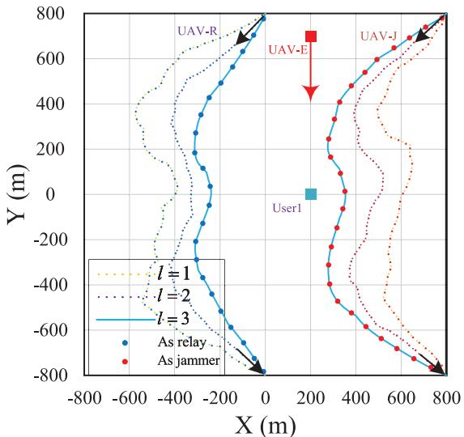  
Fig. 3. UAV’s trajectory with different iteration.

Fig. 3 illustrates the trajectory routes of relay UAV and cooperative jamming UAV in each iteration under the scenario that eavesdropping UAV approach ground users with the shortest route to eavesdrop. Fig. 3 shows that during the signal transmission to the ground user, the relay UAV will first depart from the ground user because of presence of the eavesdropping UAV, and then move closer to the ground user because of signal transmission. After the end of the information transmission process, the relay UAV will move away from the ground user and then return to the set termination point. In the process of transmitting jamming signals, the jamming UAV first flies in the direction of the ground user to interfere with the eavesdropping UAV. When the distance is relatively close, to lessen interference with the ground user signal, it will stay away from the ground user and then fly back to the set termination point.

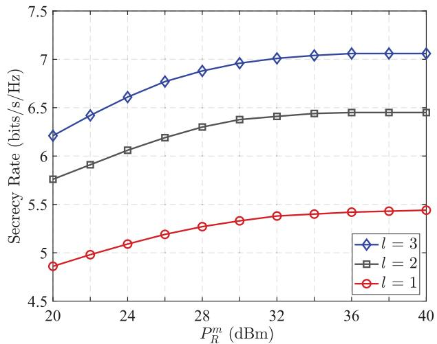  
Fig. 4. Secrecy rate performance versus $P _ { R } ^ { m }$ achieved by differen iteration.

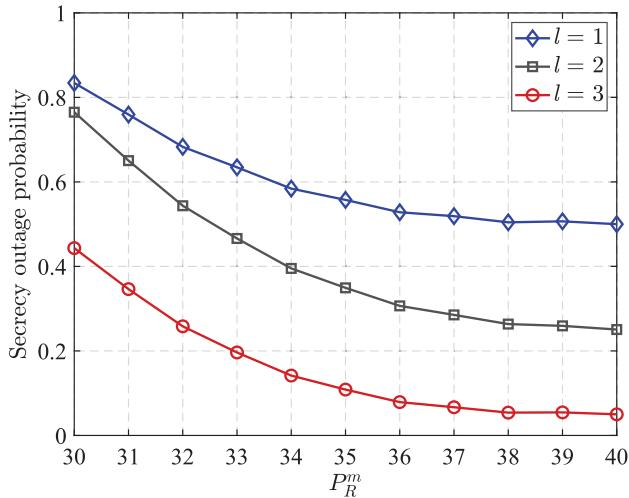  
Fig. 5. Secrecy outage performance versus $P _ { R } ^ { m }$ achieved by differen iteration.

Fig. 4 demonstrates security performance of the putted forward scheme which selects a cooperative UAV as relay, in terms of secrecy rate compared to the maximal transport power $P _ { R } ^ { m }$ across different iteration. First, we observe that as the relay UAV’s maximal transmission power increases, the secrecy rate tends to rise. This is because a higher transmission power enhances the signal strength, which improves the reception quality for the ground user, ultimately increasing the secrecy rate. Additionally, with the increase of the number of iterations of reinforcement learning algorithm, the secrecy rate also shows a rising trend, because with the continuous training of data, the obtained solution is getting better and better. As shown in Fig. 4, the improvement in security performance is more pronounced in the initial iteration, while the gains from subsequent iterations gradually diminish.

The Fig. 5 illustrates the relationship between the secrecy outage probability and the maximum transmission power $P _ { R } ^ { m }$ of relay UAV at different iterations of deep reinforcement learning. Firstly, it is evident from the Fig. 5 that as the maximum transmission power $P _ { R } ^ { m }$ of the relay UAV increases, the secrecy outage probability shows a decreasing trend. This occurs because higher transmission power leads to stronger signal strength at ground user, enabling more reliable signal transmission and reducing the secrecy outage probability. Secondly, at a constant maximum transmission power $P _ { R } ^ { m }$ of the relay UAV, the secrecy outage probability also decreases as the number of iterations increases. This is attributed to the further optimization of the flight trajectories of both the relay UAV and cooperative jamming UAV with more iterations of deep reinforcement learning, which lowers the system’s secrecy outage probability and enhances its safety performance.

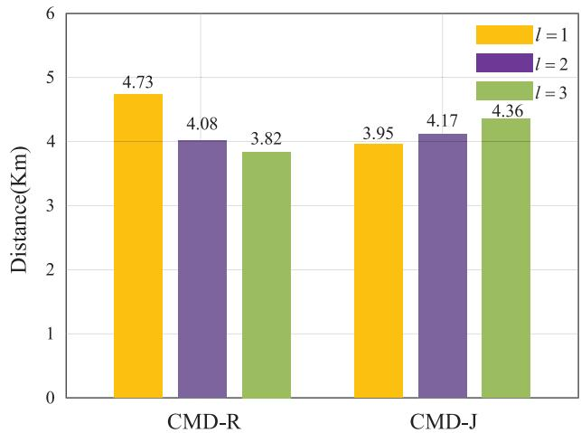  
Fig. 6. Cumulative moving distance with differen iteration.

The Fig. 6 shows the statistical results of cumulative moving distance (CMD) of relay UAV and cooperative jamming UAV under different iterations. As shown in Fig. 6, the cumulative moving distance of the relay UAV and cooperative jamming UAV gradually decreases as the number of iterations rises. This implies that, with more iterations, the cumulative distance traveled by both UAVs becomes shorter, allowing them to get closer to the ground user while transmitting the relay and jamming signals. Reducing the cumulative travel distance of relay UAV and cooperative jamming UAV can improve energy effectiveness of UAVs.

The energy usage of relay and cooperative jamming UAVs with different iteration under perfect channel state information is assessed in Fig. 7. It is noticeable that with an increasing number of iterations, energy consumption of relay UAV and cooperative jamming UAV is in a downward trend. This is because with the iterative training of data by reinforcement learning algorithm, the flight trajectory of relay UAV and cooperative jamming UAV is moving closer and closer to the ground user, thus reducing the cumulative moving distance of relay UAV and cooperative jamming UAV, and thus reducing the energy consumption during flight. In addition, cooperative jamming UAV is required to transmit interference signals to eavesdropping UAV. Thus, the energy usage of the cooperative jamming UAV is considerably higher than relay UAV.

The Fig. 8 illustrates the energy consumption simulation of relay UAV and cooperative jamming UAV under imperfect channel state information across different iterations of reinforcement learning. Firstly, we observe that as the number of reinforcement learning iterations increases, the energy consumption of both relay UAV and cooperative jamming UAV shows a downward trend. This is attributed to the further optimization of flight trajectories and transmission power for both types of drones with the increase in iterations, leading to reduced transmission power and consequently lower energy consumption. Secondly, it is evident that compared to the scenario with perfect channel state information, the energy consumption of relay UAV and cooperative jamming UAV is higher. This is because perfect channel state information enables better adjustment of the flight trajectories and transmission power for both types of drones, thereby reducing energy consumption.

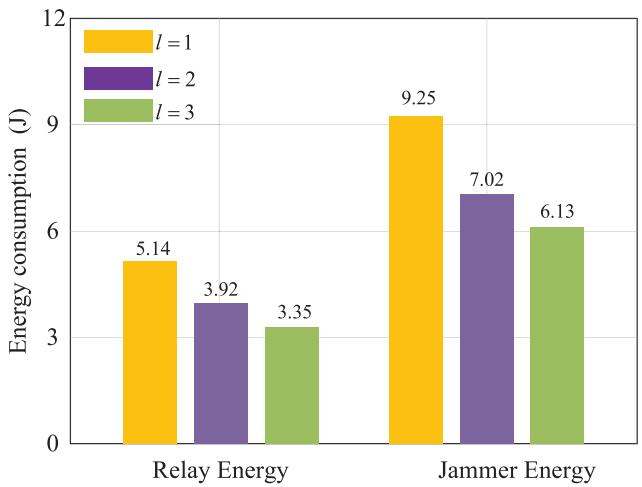  
Fig. 7. Energy consumption of relay UAV and cooperative jamming UAV with different iteration under perfect CSI.  
Fig. 9. Cooperative jammer power versus T with different iteration.

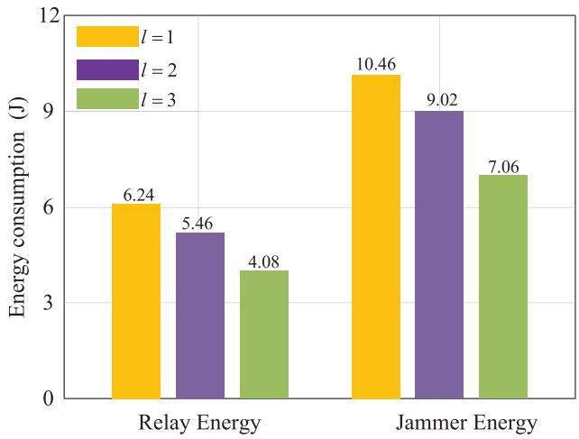  
Fig. 8. Energy consumption of relay UAV and cooperative jamming UAV with different iteration under imperfect CSI.

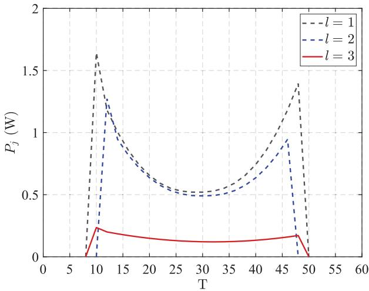

Fig. 9 demonstrates describes the variation curve of jamming power of cooperative jamming UAV in the process of jamming eavesdropping UAV under different iterations. As illustrated in Fig. 9, during jamming operation of the cooperative jamming UAV, the jamming power first presents an upward trend, then gradually decreases to the minimum value, then continues to increase, and finally decreases to the initial value. This is because in the process of transmitting jamming signals, at the beginning, the UAV is closer and closer to the ground user, to minimize interference to the ground user, the interference power is reduced, and then the interference power is increased when it is far away from the ground user. In addition, as the growing number of iterations, the flight path of collaborative jamming UAV is continuously refined, and the distance from ground user is getting closer and closer, therefore the jamming power correspondingly decreases.

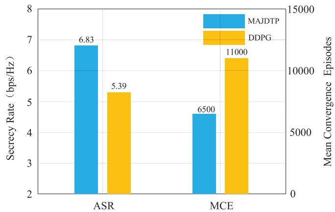  
Fig. 10. Achievable secrecy rate and mean convergence episodes for comparison between MAJDTP and DDPG.

The Fig. 10 demonstrates the outstanding performance of the algorithm we putted forward. In Fig. 10, we provide a comparison of the mean secrecy and convergence rate for our proposed MAJDTP algorithm versus the deep deterministic policy gradient (DDPG) algorithm, which has a learning rate of 0.001 and a γ value of 0.95. DDPG is a form of deep reinforcement learning (DRL) algorithm that operates within the actor-critic framework, where the agent trained with DDPG exclusively gathers its own observations during training. The simulation results indicate that our proposed MAJDTP algorithm demonstrates superior security performance and faster convergence speed than benchmark algorithm.

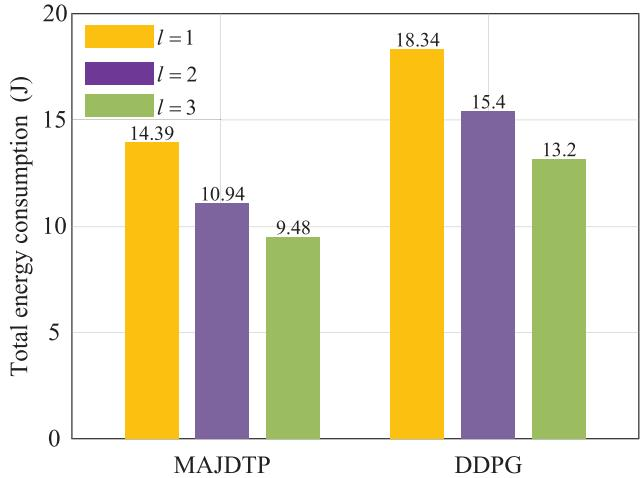  
Fig. 11. Total energy consumption for algorithms MAJDTP and DDPG under different iteration scenarios.

The Fig. 11 illustrates the total energy consumption performance of the MAJATP algorithm and the DDPG algorithm under varying iteration scenarios. Firstly, it can be observed that the total energy consumption for both algorithms decreases as the number of iterations increases. This trend can be attributed to the progressive optimization of the trajectories and transmit power of the relay UAVs and the cooperative jamming UAVs, resulting in reduced overall energy consumption. Secondly, we can observe that the total energy consumption of algorithms MAJDTP is consistently lower than that of algorithm DDPG across different iterations, indicating its superior energy-saving performance. This can be attributed to the fact that algorithm MAJDTP optimizes the trajectory and power of multiple intelligences, resulting in a better design of both the trajectory and power compared to algorithm DDPG, which ultimately reduces the system’s total energy consumption.

## VIII. CONCLUSION

In this paper, we investigate the issue of secure wireless communication in system with an eavesdropping UAV present. From the perspective of ground users, we examine the problem of maximizing the worst-case secrecy rate, assuming that the eavesdropping UAV approaches the ground users at the shortest distance. Moreover, we investigated the performance of the system’s secrecy outage probability under imperfect channel state information. We enhance the system’s security performance by optimizing the flight trajectories and transmission power of the relay UAV and the cooperative jamming UAV. Due to the flexibility and complexity of UAV flight paths, we employ the MAJDTP algorithm to design and train the flight trajectories and transmission energy of the relay and cooperative jamming UAVs, thereby addressing the issue of secure wireless communication in the system. The simulation results demonstrate that our proposed algorithm achieves better performance compared to the reference algorithm.

## REFERENCES

[1] H.-M. Wang, X. Zhang, and J.-C. Jiang, “UAV-involved wireless physical-layer secure communications: Overview and research directions,” IEEE Wireless Commun., vol. 26, no. 5, pp. 32–39, Oct. 2019.

[2] N. Wang, P. Wang, A. Alipour-Fanid, L. Jiao, and K. Zeng, “Physicallayer security of 5G wireless networks for IoT: Challenges and opportunities,” IEEE Internet Things J., vol. 6, no. 5, pp. 8169–8181, Oct. 2019.

[3] M. Mozaffari, W. Saad, M. Bennis, Y.-H. Nam, and M. Debbah, “A tutorial on UAVs for wireless networks: Applications, challenges, and open problems,” IEEE Commun. Surveys Tuts., vol. 21, no. 3, pp. 2334–2360, 3rd Quart., 2019.

[4] Y. Zeng, J. Xu, and R. Zhang, “Energy minimization for wireless communication with rotary-wing UAV,” IEEE Trans. Wireless Commun., vol. 18, no. 4, pp. 2329–2345, Apr. 2019.

[5] S. Yan, S. V. Hanly, and I. B. Collings, “Optimal transmit power and flying location for UAV covert wireless communications,” IEEE J. Sel. Areas Commun., vol. 39, no. 11, pp. 3321–3333, Nov. 2021.

[6] D.-H. Tran, V.-D. Nguyen, S. Chatzinotas, T. X. Vu, and B. Ottersten, “UAV relay-assisted emergency communications in IoT networks: Resource allocation and trajectory optimization,” IEEE Trans. Wireless Commun., vol. 21, no. 3, pp. 1621–1637, Mar. 2022.

[7] H. Wu, M. Li, Q. Gao, Z. Wei, N. Zhang, and X. Tao, “Eavesdropping and anti-eavesdropping game in UAV wiretap system: A differential game approach,” IEEE Trans. Wireless Commun., vol. 21, no. 11, pp. 9906–9920, Nov. 2022.

[8] M. K. Hasan et al., “Lightweight encryption technique to enhance medical image security on Internet of Medical Things applications,” IEEE Access, vol. 9, pp. 47731–47742, 2021.

[9] H.-M. Wang, M. Luo, Q. Yin, and X.-G. Xia, “Hybrid cooperative beamforming and jamming for physical-layer security of two-way relay networks,” IEEE Trans. Inf. Forensics Security, vol. 8, no. 12, pp. 2007–2020, Dec. 2013.

[10] G. Zhang, Q. Wu, M. Cui, and R. Zhang, “Securing UAV communications via joint trajectory and power control,” IEEE Trans. Wireless Commun., vol. 18, no. 2, pp. 1376–1389, Feb. 2019.

[11] A. Li, Q. Wu, and R. Zhang, “UAV-enabled cooperative jamming for improving secrecy of ground wiretap channel,” IEEE Wireless Commun. Lett., vol. 8, no. 1, pp. 181–184, Feb. 2019.

[12] W. Wang et al., “Energy-constrained UAV-assisted secure communications with position optimization and cooperative jamming,” IEEE Trans. Commun., vol. 68, no. 7, pp. 4476–4489, Jul. 2020.

[13] R. Zhang, X. Chen, M. Liu, N. Zhao, X. Wang, and A. Nallanathan, “UAV relay assisted cooperative jamming for covert communications over Rician fading,” IEEE Trans. Veh. Technol., vol. 71, no. 7, pp. 7936–7941, Jul. 2022.

[14] Y. Wen, Y. Huo, L. Ma, T. Jing, and Q. Gao, “A scheme for trustworthy friendly jammer selection in cooperative cognitive radio networks,” IEEE Trans. Veh. Technol., vol. 68, no. 4, pp. 3500–3512, Apr. 2019.

[15] Z. Xiang, W. Yang, G. Pan, Y. Cai, and Y. Song, “Physical layer security in cognitive radio inspired NOMA network,” IEEE J. Sel. Topics Signal Process., vol. 13, no. 3, pp. 700–714, Jun. 2019.

[16] Y. Wen et al., “A covert jamming scheme against an intelligent eavesdropper in cooperative cognitive radio networks,” IEEE Trans. Veh. Technol., vol. 72, no. 10, pp. 13243–13254, May 2023.

[17] Y. Zhang, Z. Mou, F. Gao, J. Jiang, R. Ding, and Z. Han, “UAV-enabled secure communications by multi-agent deep reinforcement learning,” IEEE Trans. Veh. Technol., vol. 69, no. 10, pp. 11599–11611, Oct. 2020.

[18] X. Zhou, Q. Wu, S. Yan, F. Shu, and J. Li, “UAV-enabled secure communications: Joint trajectory and transmit power optimization,” IEEE Trans. Veh. Technol., vol. 68, no. 4, pp. 4069–4073, Apr. 2019.

[19] C. Wen, Y. Fang, and L. Qiu, “Securing UAV communication based on multi-agent deep reinforcement learning in the presence of smart UAV eavesdropper,” in Proc. IEEE Wireless Commun. Netw. Conf. (WCNC), Apr. 2022, pp. 1164–1169.

[20] Y. Zhou et al., “Secure communications for UAV-enabled mobile edge computing systems,” IEEE Trans. Commun., vol. 68, no. 1, pp. 376–388, Jan. 2020.

[21] H.-M. Wang, M. Luo, X.-G. Xia, and Q. Yin, “Joint cooperative beamforming and jamming to secure AF relay systems with individual power constraint and no Eavesdropper’s CSI,” IEEE Signal Process. Lett., vol. 20, no. 1, pp. 39–42, Jan. 2013.

[22] C. Wang, H.-M. Wang, and X.-G. Xia, “Hybrid opportunistic relaying and jamming with power allocation for secure cooperative networks,” IEEE Trans. Wireless Commun., vol. 14, no. 2, pp. 589–605, Feb. 2015.

[23] A. Fotouhi et al., “Survey on UAV cellular communications: Practical aspects, standardization advancements, regulation, and security challenges,” IEEE Commun. Surveys Tuts., vol. 21, no. 4, pp. 3417–3442, 4th Quart., 2019.

[24] N. Cheng et al., “AI for UAV-assisted IoT applications: A comprehensive review,” IEEE Internet Things J., vol. 10, no. 16, pp. 14438–14461, May 2023.

[25] X. Liu, Y. Liu, and Y. Chen, “Machine learning empowered trajectory and passive beamforming design in UAV-RIS wireless networks,” IEEE J. Sel. Areas Commun., vol. 39, no. 7, pp. 2042–2055, Jul. 2021.

[26] M. Shao, J. Yan, and X. Zhao, “Secrecy rate maximization by cooperative jamming for UAV-enabled relay system with mobile nodes,” IEEE Internet Things J., vol. 10, no. 15, pp. 13168–13180, Mar. 2023.

[27] K. Heo, W. Lee, and K. Lee, “UAV-assisted wireless-powered secure communications: Integration of optimization and deep learning,” IEEE Trans. Wireless Commun., vol. 23, no. 9, pp. 10530–10545, Sep. 2024.

[28] A. S. Abdalla and V. Marojevic, “Multiagent learning for secure wireless access from UAVs with limited energy resources,” IEEE Internet Things J., vol. 10, no. 24, pp. 22356–22370, Dec. 2023.

[29] A. Gao, Q. Wang, Y. Hu, W. Liang, and J. Zhang, “Dynamic role switching scheme with joint trajectory and power control for multi-UAV cooperative secure communication,” IEEE Trans. Wireless Commun., vol. 23, no. 2, pp. 1260–1275, Jun. 2023.

[30] X. Jiang et al., “Covert communication in UAV-assisted air-ground networks,” IEEE Wireless Commun., vol. 28, no. 4, pp. 190–197, Aug. 2021.

[31] W. Tian, X. Ding, G. Liu, Y. Dai, and Z. Han, “A UAV-assisted secure communication system by jointly optimizing transmit power and trajectory in the Internet of Things,” IEEE Trans. Green Commun. Netw., vol. 7, no. 4, pp. 2025–2037, Jan. 2023.

[32] Y. Liu et al., “Secure rate maximization for ISAC-UAV assisted communication amidst multiple eavesdroppers,” IEEE Trans. Veh. Technol., vol. 73, no. 10, pp. 15843–15847, Oct. 2024.

[33] A. Chorti et al., “Context-aware security for 6G wireless: The role of physical layer security,” IEEE Commun. Standards Mag., vol. 6, no. 1, pp. 102–108, Mar. 2022.

[34] N. Xie, Z. Li, and H. Tan, “A survey of physical-layer authentication in wireless communications,” IEEE Commun. Surveys Tuts., vol. 23, no. 1, pp. 282–310, 1st Quart., 2020.

[35] Y. Wen et al., “Covert communications aided by cooperative jamming in overlay cognitive radio networks,” IEEE Trans. Mobile Comput., vol. 23, no. 12, pp. 12878–12891, Dec. 2024.

[36] Y. Wen, T. Jing, and Q. Gao, “Trustworthy jammer selection with truthtelling for wireless cooperative systems,” Wireless Commun. Mobile Comput., vol. 2021, no. 1, Jan. 2021, Art. no. 6626355.

[37] D. Xu and H. Zhu, “Jamming-assisted legitimate eavesdropping and secure communication in multicarrier interference networks,” IEEE Syst. J., vol. 16, no. 1, pp. 954–965, Mar. 2022.

[38] T.-X. Zheng, Z. Yang, C. Wang, Z. Li, J. Yuan, and X. Guan, “Wireless covert communications aided by distributed cooperative jamming over slow fading channels,” IEEE Trans. Wireless Commun., vol. 20, no. 11, pp. 7026–7039, Nov. 2021.

[39] C. Gao, B. Yang, D. Zheng, X. Jiang, and T. Taleb, “Cooperative jamming and relay selection for covert communications in wireless relay systems,” IEEE Trans. Commun., vol. 72, no. 2, pp. 1020–1032, Feb. 2024.

[40] D. Guo, H. Ding, L. Tang, X. Zhang, L. Yang, and Y.-C. Liang, “A proactive eavesdropping game in MIMO systems based on multiagent deep reinforcement learning,” IEEE Trans. Wireless Commun., vol. 21, no. 11, pp. 8889–8904, Nov. 2022.

[41] H. Yang, Z. Xiong, J. Zhao, D. Niyato, L. Xiao, and Q. Wu, “Deep reinforcement learning-based intelligent reflecting surface for secure wireless communications,” IEEE Trans. Wireless Commun., vol. 20, no. 1, pp. 375–388, Jan. 2021.

[42] H. Yang et al., “Intelligent reflecting surface assisted anti-jamming communications: A fast reinforcement learning approach,” IEEE Trans. Wireless Commun., vol. 20, no. 3, pp. 1963–1974, Mar. 2021.

[43] Z. Ni and S. Paul, “A multistage game in smart grid security: A reinforcement learning solution,” IEEE Trans. Neural Netw. Learn. Syst., vol. 30, no. 9, pp. 2684–2695, Sep. 2019.

[44] Y. Li, R. Zhang, J. Zhang, and L. Yang, “Cooperative jamming via spectrum sharing for secure UAV communications,” IEEE Wireless Commun. Lett., vol. 9, no. 3, pp. 326–330, Mar. 2020.

[45] H. Dang-Ngoc et al., “Secure swarm UAV-assisted communications with cooperative friendly jamming,” IEEE Internet Things J., vol. 9, no. 24, pp. 25596–25611, Dec. 2022.

[46] R. Ye, Y. Peng, F. Al-Hazemi, and R. Boutaba, “A robust cooperative jamming scheme for secure UAV communication via intelligent reflecting surface,” IEEE Trans. Commun., vol. 72, no. 2, pp. 1005–1019, Feb. 2024.

[47] P. Luong, F. Gagnon, L.-N. Tran, and F. Labeau, “Deep reinforcement learning-based resource allocation in cooperative UAV-assisted wireless networks,” IEEE Trans. Wireless Commun., vol. 20, no. 11, pp. 7610–7625, Nov. 2021.

[48] A. Prosperetti, Advanced Mathematics for Applications. Cambridge, U.K.: Cambridge Univ. Press, 2011.

[49] L. Zhang et al., “A survey on 5G millimeter wave communications for UAV-assisted wireless networks,” IEEE Access, vol. 7, pp. 117460–117504, 2019.

[50] X. Gu and G. Zhang, “A survey on UAV-assisted wireless communications: Recent advances and future trends,” Comput. Commun., vol. 208, pp. 44–78, Aug. 2023.

[51] H. Du, Y. Deng, J. Xue, D. Meng, Q. Zhao, and Z. Xu, “Robust online CSI estimation in a complex environment,” IEEE Trans. Wireless Commun., vol. 21, no. 10, pp. 8322–8336, Oct. 2022.

[52] L. Wei, C. Huang, G. C. Alexandropoulos, C. Yuen, Z. Zhang, and M. Debbah, “Channel estimation for RIS-empowered multi-user MISO wireless communications,” IEEE Trans. Commun., vol. 69, no. 6, pp. 4144–4157, Jun. 2021.

[53] B. Zheng, C. You, W. Mei, and R. Zhang, “A survey on channel estimation and practical passive beamforming design for intelligent reflecting surface aided wireless communications,” IEEE Commun. Surveys Tuts., vol. 24, no. 2, pp. 1035–1071, 2nd Quart., 2022.

[54] Y. Liu, J. Zhao, M. Li, and Q. Wu, “Intelligent reflecting surface aided MISO uplink communication network: Feasibility and power minimization for perfect and imperfect CSI,” IEEE Trans. Commun., vol. 69, no. 3, pp. 1975–1989, Mar. 2021.

[55] J. Guo, C.-K. Wen, S. Jin, and G. Y. Li, “Overview of deep learningbased CSI feedback in massive MIMO systems,” IEEE Trans. Commun., vol. 70, no. 12, pp. 8017–8045, Dec. 2022.

[56] H. Li, J. Li, M. Liu, and F. Gong, “UAV-assisted secure communication for coordinated satellite-terrestrial networks,” IEEE Commun. Lett., vol. 27, no. 7, pp. 1709–1713, Jul. 2023.

[57] H.-M. Wang, Y. Zhang, X. Zhang, and Z. Li, “Secrecy and covert communications against UAV surveillance via multi-hop networks,” IEEE Trans. Commun., vol. 68, no. 1, pp. 389–401, Jan. 2020.

[58] Y. Wen, Y. Huo, T. Jing, and Q. Gao, “A reputation framework with multiple-threshold energy detection in wireless cooperative systems,” in Proc. IEEE Int. Conf. Commun. (ICC), Jun. 2020, pp. 1–6.

[59] L. Xiao, Y. Xu, D. Yang, and Y. Zeng, “Secrecy energy efficiency maximization for UAV-enabled mobile relaying,” IEEE Trans. Green Commun. Netw., vol. 4, no. 1, pp. 180–193, Mar. 2020.

[60] V. K. Rohatgi and A. M. E. Saleh, An Introduction to Probability and Statistics. Hoboken, NJ, USA: Wiley, 2015.

[61] F. Jameel, S. Wyne, G. Kaddoum, and T. Q. Duong, “A comprehensive survey on cooperative relaying and jamming strategies for physical layer security,” IEEE Commun. Surveys Tuts., vol. 21, no. 3, pp. 2734–2771, 3rd Quart., 2019.

[62] B. Li, Y. Zou, J. Zhou, F. Wang, W. Cao, and Y.-D. Yao, “Secrecy outage probability analysis of friendly jammer selection aided multiuser scheduling for wireless networks,” IEEE Trans. Commun., vol. 67, no. 5, pp. 3482–3495, May 2019.

[63] Y. Liu, Z. Su, C. Zhang, and H.-H. Chen, “Minimization of secrecy outage probability in reconfigurable intelligent surface-assisted MIMOME system,” IEEE Trans. Wireless Commun., vol. 22, no. 2, pp. 1374–1387, Feb. 2023.

[64] J. Zheng and Q. Zhang, “Secrecy outage probability of multipleinput–multiple-output secure Internet of Things communication systems,” IEEE Internet Things J., vol. 11, no. 6, pp. 9843–9853, Mar. 2023.

Yingkun Wen (Member, IEEE) received the B.S. degree from North China Electric Power University, Baoding, China, in 2015, and the Ph.D. degree from Beijing Jiaotong University, Beijing, China, in 2021. He is currently an Instructor with the School of Computer Science and Engineering, Xi’an University of Technology, Xi’an, China. His research interests include physical layer security, covert communication, cognitive radio networks, and cooperative communication.

Fengshuan Wang received the B.E. degree from Henan Polytechnic University, Jiaozuo, China, in 2019. He is currently pursuing the M.E. degree with the School of Computer Science and Engineering, Xi’an University of Technology, Xi’an, China. His current research interests include physical layer security, symbiotic radio networks, uncrewed aerial vehicle (UAV) aided networks, and cooperative communication.

Jin Qian received the Ph.D. degree in communication and information system from Beijing Jiaotong University, Beijing, China, in 2017. He is currently a Lecturer with the College of Information Engineering, Taizhou University. His major research interests include wireless communication theory, vehicular ad hoc networks, physical layer security, and network security.

Hui-Ming Wang (Senior Member, IEEE) received the B.S. and Ph.D. degrees in electrical engineering from Xi’an Jiaotong University, Xi’an, China, in 2004 and 2010, respectively. From 2007 to 2008 and from 2009 to 2010, he was a Visiting Scholar with the Department of Electrical and Computer Engineering, University of Delaware, Newark, DE, USA. Since 2015, he has been a Full Professor with Xi’an Jiaotong University. He has co-authored the book Physical Layer Security in Random Cellular Networks (Springer, 2016) and authored or co-authored

more than 180 IEEE journals and conference papers. His research interests include 6G communications and networks, intelligent communications, wireless physical-layer security, and covert communications. He received the IEEE ComSoc Asia–Pacific Best Young Researcher Award in 2018 and the National Excellent Doctoral Dissertation Award in China in 2012. From 2017 to 2022, he was an Associate Editor of IEEE TRANSACTIONS ON COMMUNICATIONS. He was the Clarivate Highly Cited Researcher in 2019 and the Elsevier Highly Cited Researcher from 2020 to 2024.

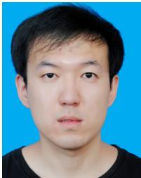

  
network computing.

Junhuai Li (Senior Member, IEEE) received the B.S. degree in electrical automation from Shaanxi Institute of Mechanical Engineering, Xi’an, China, in 1992, the M.S. degree in computer application technology from Xi’an University of Technology, Xi’an, in 1999, and the Ph.D. degree in computer software and theory from Northwest University, Xi’an, in 2002. He is currently a Professor with the School of Computer Science and Engineering, Xi’an University of Technology. His research interests include the Internet of Things technology and

Kan Wang (Senior Member, IEEE) received the Ph.D. degree in military communications from the State Key Laboratory of Integrated Services Networks, Xidian University, Xi’an, China, in 2016. Since March 2017, he has been with the School of Computer Science and Engineering, Xi’an University of Technology, Xi’an. His current research interests include wireless resource allocation, network slicing, convex optimization, and machine learning.

Huaijun Wang received the B.Sc. and M.Sc. degrees in computer science from Xi’an University of Technology in 2005 and 2010, respectively, and the Ph.D. degree in computer software and theory from the Northwest University of China, Xi’an, in 2014. He is currently an Associate Professor with the School of Computer Science and Engineering, Xi’an University of Technology. His research interests include the Internet of Things technology and edge computing.