# KubeSPT: Stateful Pod Teleportation for Service Resilience With Live Migration

Hansheng Zhang , Song Wu , Member, IEEE, Hao Fan , Zhuo Huang , Weibin Xue, Chen Yu , Member, IEEE, Shadi Ibrahim , Senior Member, IEEE, and Hai Jin , Fellow, IEEE

Abstract—Container orchestration systems, such as Kubernetes, streamline containerized application deployment. As more and more applications are being deployed in Kubernetes, there is an increasing need for rescheduling - relocating a running pod to different nodes - due to system upgrades, node failures, and loadbalancing optimizations. Live migration, which transfers services from source nodes to target nodes with minimal downtime, is the ideal support for rescheduling. However, implementing live migration for pods that run stateful services is challenging, because Kubernetes manages pods as stateless. First, the current pod’s network namespace initialization process causes a mismatch in the network state between the migrated pod and internal containers. Second, migrating the memory state results in extended downtime. Third, Kubernetes operations on pods do not consider preserving the state of the pods. Therefore, we propose KubeSPT to achieve live migration of stateful pods in rescheduling scenarios. First, we synchronize the network state of pods and internal containers by controlling packet flow and implement fast service redirection. Second, we introduce a Hot Data and Lazy-Restore method for memory restoration to reduce migration downtime. Finally, we decouple pod migration operations from other Kubernetes operations to ensure compatibility with live migration. Experimental results show that KubeSPT reduces downtime by 86% –93% compared to current rescheduling methods.

Index Terms—Kubernetes, live migration, pod, cloud.

## I. INTRODUCTION

ODERN cluster managers, such as Kubernetes [1], groups for container orchestration and resource isolation [5]. Taking Kubernetes, which has already become an industry standard, as an example, the fundamental unit for container management is the pod. A pod is a group of related containers with shared volumes and network namespaces. Kubernetes manages and deploys containers in a multi-node cluster by placing newly created pods on physical nodes based on scheduling strategies. Meanwhile, as the complexity of workloads increases, rescheduling - moving a running pod to other nodes - becomes more frequent due to system upgrades, node failures, and load balancing optimizations [6], [7].

The current pod rescheduling method in Kubernetes involves killing the original running pod and creating a new one with the same configuration, but without preserving the runtime state of the application in the pod. This is mainly due to the fact that the initial design principles of Kubernetes are focused on stateless applications [2], [8], [9]. However, as more stateful Long-Running Applications (LRAs) are deployed in pods with the widespread adoption of Kubernetes [10], [11], [12], this method becomes problematic. LRAs have complex network connections with clients and a substantial amount of memory data. The current Kubernetes rescheduling method needs to restore the runtime state of LRAs from scratch, leading to unacceptable downtime and redundant computation. A reliable solution to this issue is live migration technology.

Live migration aims to move a service from the source node to the destination node while keeping the service running during the movement. This process involves checkpointing the LRAs on the source node and then restoring their runtime state directly from the checkpoint files on the destination node, minimizing service downtime [13], [14]. Although the live migration of pods gains attention in the Kubernetes community, further research is needed to analyze its characteristics and design customized solutions for stateful pods1 [8], [15]. Successful live migration of pods requires a solid foundation in container live migration techniques. While there have been several methods proposed for container live migration [16], [17], they primarily focus on migrating lightweight containers in edge scenarios and overlook heavy workloads with significant memory footprints typically found in data center environments [13], [18], [19]. Furthermore, the current approach to managing pods and their internal containers in Kubernetes is primarily designed for stateless applications, lacking the ability to efficiently handle the state of migrated pods and containerized applications.

Maintaining the state of running pods involves three main aspects: network connections, memory data, and context awareness. In practice, we identify three critical challenges in achieving live migration of stateful pods as follows:

First, preserving uninterrupted network connections between the pod and clients: The current method for initializing the pod network namespace is designed for newly created pods, assuming the containers inside the pod are newly created without any established connections. It overlooks the network state synchronization between pods and the containers inside them, which can result in disrupted connections.

Second, enabling swift restoration of memory data for memory-intensive workloads to minimize downtime: Existing container migration methods need to restore the entire process memory address space during the migration process, necessitating a substantial amount of data to be written back to memory from the checkpoint files. As a result, migrating memory-intensive applications experience extended periods of downtime [20].

Third, aligning pod live migration with the original Kubernetes workflow designed for stateless applications: The current management operations provided by Kubernetes are designed for stateless pods, which directly kill and restart internal containers without accounting for preserving the states of applications. Moreover, migration is incompatible with original pod control flow. For example, the original control logic would incorrectly create a new stateless replica in the process of migration when deleting the old pod.

In this paper, we propose Kubernetes Stateful Pod Teleportation (KubeSPT), a measure for stateful pod live migration. First, we synchronize the network packet flow between the pod and internal containers during restoration to ensure uninterrupted connections between the pod and clients. Building upon this, we achieve rapid service redirection from the source to the destination node, mitigating additional downtime caused by service rediscovery and network connection rebuilding. Second, based on the fact that memory-intensive applications often exhibit relatively stable memory access hotspots [21], [22], [23], we introduce a Lazy-Restore memory restoration approach. Initially, only the hot data is restored to accelerate the restoration of services. The remaining data is written back to memory on demand after restoring the service completes. Lastly, we decouple the state-related operations of internal container from pod creation/deletion operations. This avoids the impact of pod operations on container states and allows the decoupled container operations to run in parallel with pod operations, reducing downtime. We also enable Kubernetes components to distinguish between migration and other stateless pod operations, allowing pod live migration to coordinate with these components. KubeSPT is avaliable at https://github.com/CGCL-codes/pod-migration.

We utilize Kubernetes Custom Resource Definition (CRD), which supports users to define their Objects and Controllers, to establish the migration foundation, minimizing intrusive modifications to Kubernetes, significantly decreasing redundant computations and the overall runtime of stateful workloads. Experimental results show that KubeSPT reduces the downtime by 86% -93% for clients. Additionally, there is no obvious degradation in service quality after migration.

In conclusion, we make the following contributions:

\- We comprehensively analyze the necessity and challenges of applying live migration to Kubernetes-managed clusters to enhance the rescheduling of stateful pods.

We propose KubeSPT for the live migration of stateful pods. KubeSPT achieves uninterrupted network connections, fast restoration of memory data, and pod management operations aligned with migration.

We implement and evaluate KubeSPT in Kubernetes 1.18.20. Experimental results show that KubeSPT significantly reduces downtime caused by stateful pod rescheduling.

We organize the rest of this paper as follows. Section II expounds on the backgrounds and challenges of pod live migration. Section III demonstrates the design and optimizations of KubeSPT. Section IV describes the key implementation. Section V presents the experimental setup and evaluation results. Section VI presents related work of migration. Finally, Section VII presents our conclusion.

## II. BACKGROUND AND MOTIVATION

We first introduce Kubernetes, followed by a discussion on the necessity and methods of pod rescheduling. Then we introduce CRIU, the basic technology for container live migration, and discuss the challenges of implementing CRIU for stateful applications in Kubernetes.

## A. Kubernetes and Pod

Kubernetes is a distributed cluster management system built on container runtimes like Docker and Containerd. The basic management unit within Kubernetes is the pod, which consists of one or more containers. Containers within the same pod share a network namespace and storage volume, with the network configuration facilitated by the Container Network Interface (CNI) and storage volumes provisioned through Persistent Volume Claims (PVC). The CNI plugin assigns each pod a unique IP address and manages intra-cluster network communication by configuring routing rules within pods and on the nodes. PVCs allow containers within the same pod to access a shared persistent storage area. The most common stateful pods consist of a stateful primary container and other stateless auxiliary containers [24].

Kubernetes operates in a leader-followerarchitecture, requiring the collaboration of multiple components to deploy and manage each pod. When a request to create a pod is sent, the Scheduler first allocates the pod to a node based on user-defined scheduling algorithms. A Kubelet daemon is deployed on each worker node to perform pod operations and notify the leader node of any changes to the pod. When a new pod is created, Kubelet first performs a series of pod initialization operations, such as creating a pause container and initializing plugins. It then calls the Container Runtime Interface (CRI) to create the container. The CNI plugin detects the creation and deletion of pods, dynamically updating the routing table on the nodes in the cluster.

Kubernetes manages the state of pods through Objects and Controllers. Objects are used to represent entities within the cluster. Numerous Objects are utilized to manage pods, such as ReplicaSet, DeploymentSet, and StatefulSet. Each of these Objects has a corresponding Controller. A key design principle of Kubernetes is the reconciliation loop [25]. Each time a watch event of an object is triggered, the controller executes a reconciliation loop to ensure that the resource state within the cluster matches the desired state defined by the object. Additionally, Kubernetes offers the Custom Resource Definition (CRD) interface that enables users to define their own Objects and corresponding Controllers to facilitate extensibility.

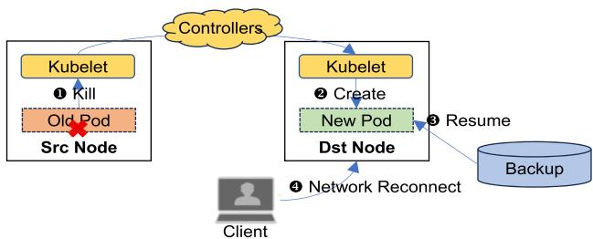  
(a) Kubernetes current rescheduling method.

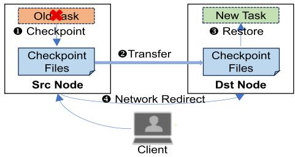  
(b) Live migration based on CRIU.  
Fig. 1. Kubernetes rescheduling method versus Live migration.

## B. Current Rescheduling of Stateful Pods

Pod rescheduling refers to relocating an already running pod to another physical node. Cases such as machine failures and resource overloading can trigger pod rescheduling. Google’s tracking data for their clusters indicates a significant increase in rescheduling frequency. In their latest trace data, the instances of old pods being rescheduling are 2.26 times greater than the placements of new pods [6]. However, the rescheduling methods currently offered by Kubernetes can all be summarized as deleting the old pod and creating a new pod with the same configuration, without preserving the application states of the pod. This is mainly because Kubernetes is originally designed for stateless applications, based on the assumption that applications providing services in the cloud can easily be replaced by other replicas. Even with the later-developed StatefulSet feature, Kubernetes still only creates a new pod with the same name, and can not retain the network or memory state of the containers (applications) within the pod.

With the ever-increasing deployment of stateful Long-Running Applications (LRA) in data centers, the current rescheduling method needs to be re-evaluated. As illustrated in Fig. 1(a), current rescheduling methods require re-establishing long network connections and restoring service states from backups. Although rolling updates using multiple replicas can mitigate downtime by allowing other replicas to handle requests while a pod is rescheduled, this approach faces significant limitations. First, maintaining state consistency across replicas for all applications is challenging, especially for cache databases which constitute a substantial portion of real-world clusters (about 50% in Alibaba cluster trace) [26]). For example, Memcached has no built-in replication, and Redis – its leader-follower model – requires pre-configured replicas and does not allow free selection of the migration destination node. In addition, HPC applications like FFmpeg cannot synchronize intermediate computational states across replicas. And of course, maintaining multiple long-running replicas incurs resource waste and synchronization overhead. In contrast, live migration is applicable to a wide range of workloads, regardless of whether they can provide strong consistency between multiple replicas. Second, rescheduling with multi-replica requires changing the pod’s IP address, which makes it applicable only to pods that establish network connections through the Service [27]. Whereas, the stateful workloads often have to reach a specific pod directly (for example, during database write operations) or have podpod communication [28]. In clusters with complex network environments, direct IP communication between containers is often used to reduce inter-application latency as well [26], [29]. Therefore, pod names and IP addresses must remain consistent before and after rescheduling. The combination of StatefulSets with Headless Services can address this requirement, but, as discussed earlier, it does not preserve the application states. In contrast, live migration ensures that the IP address of the rescheduled pod remains unchanged, making it suitable for stateful pods with various connection types.

As a rescheduling approach broadly applicable to various stateful applications, container live migration gains increasing attention [19], [30], [31]. As shown in Fig. 1(b), container live migration enables the preservation of long network connections and fast restoration of application states. This motivates us to realize pod live migration based on container live migration and implement it in rescheduling scenarios. Some studies also suggest using live migration for proactive pod rescheduling to optimize cluster resource allocation, but a key challenge is minimizing service downtime [32]. Currently, the Kubernetes community introduces a simple checkpoint-restore feature [15]. However, it cannot sustain uninterrupted long connections and show long downtime, making it unsuitable for stateful applications.

## C. CRIU for Container Live Migration

Checkpoint/Restore In Userspace (CRIU) [33] functions as the underlying support for container live migration technologies by providing the capability to checkpoint and restore Linux processes [13], [16], [30]. During the checkpoint phase, CRIU reads process information from the OS and saves it to checkpoint files. When restoring the process, CRIU first creates a new process and then modifies it to match the original process based on the process information stored in the checkpoint files.

CRIU utilizes the socket REPAIR mode implemented in the Linux kernel [34] to migrate established TCP connections. Once the REPAIR mode is enabled, the kernel preserves the current state of the socket. CRIU reads the socket state through kernel interfaces and restores the socket after migration. Among checkpoint files, the files for memory data dominate in terms of size [20]. This means checkpointing, transferring, and restoring a substantial amount of memory data can result in unacceptable downtime. Therefore, CRIU provides pre-copy [35] and postcopy [36] mechanisms to reduce downtime.

## D. Comparison of Different Pod Rescheduling Methods

We experimentally compare the impact of different rescheduling approaches on running stateful applications. We use the method of manually deleting the old pod, creating a new pod, and restoring the application state from a backup to represent existing pod rescheduling approaches as in previous work [8], which we refer to as pod eviction. This approach avoids the issues associated with multi-replica solutions mentioned above and eliminates the coordination and management overhead inherent in the StatefulSet-based approach, as noted in recent studies [37].

We choose Redis as the test application. Although numerous techniques are proposed to achieve zero downtime using Redis leader-follower replication [38], these approaches require maintaining the Redis replica data on the source node and pulling data as needed after the new replica starts. This prevents the release of physical resources on the source node and does not allow the migration of applications from nodes predicted to be nearing decommission [39], [40]. Therefore, we continue to combine the backup-based data restoration approach with the pod eviction to represent the current rescheduling method for Redis load-bearing pods.

Since pod live migration is not yet available and the inability of Kubernetes to detect migrated pods, we illustrate the necessity of implementing pod live migration for stateful applications by contrasting pod eviction with container live migration. We compare the downtime incurred by both methods when transferring Redis databases of various sizes from the source node to the destination node. The source and destination nodes are connected via 3 Gbps network bandwidth, with all other setup details identical to (Section V-A).

Fig. 2 compares the downtime caused by different methods. As the database size increases, the gap in downtime between the current pod rescheduling method and using CRIU for container migration becomes more significant. Furthermore, the performance gap between the CRIU pre-copy method and direct checkpoint and restoration also widens. Fig. 2 analyzes the contributions of each procedure to the downtime. Resuming data from backups consumes significantly more time than migrating the Redis container using CRIU. These observations motivate us to implement pod live migration as an alternative to the current rescheduling method.

## E. Challenges When Using CRIU in Kubernetes

Compared to existing container live migration, the live migration of a stateful pod presents challenges in preserving and restoring network state, memory data, and context information. We must minimize the downtime caused by live migration, allowing more pods to be rescheduled without violating SLOs (Service

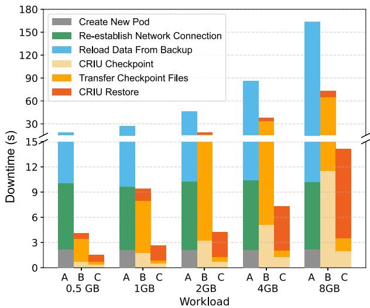  
Fig. 2. Main Components of the Service Downtime in Different Methods. We employ the following three methods for service restoration: A. Pod eviction. B. Container migration based on CRIU. C. Container migration based on CRIU pre-copy mechanism.

Level Objective). After initially implementing stateful pod live migration, we find that the downtime can be expressed by the following formula:

$$
\begin{array}{c} T _ {D} = G _ {D} (M _ {F D}) + G _ {T} (M _ {F D}) + G _ {R} (M _ {W}) \\ + T _ {R e s t a r t} + T _ {R e c o n n e c t} + T _ {O t h e r s} \end{array}\tag{1}
$$

where $G _ { D }$ represents the time taken for the final dump, and $G _ { T }$ represents the time taken to transfer the final dump file. These times are primarily associated with the size of dirty memory $M _ { F D }$ during the last checkpoint. $G _ { R }$ represents the restore time, which is mainly associated with the total memory size $M _ { W }$ of the container. $T _ { R e s t a r t }$ represents the time taken to restart the pod, $T _ { R e c o n n e c t }$ represents the time taken to re-establish the network connection, and $T _ { O t h e r s }$ accounts for other miscellaneous times. We conclude three challenges to reducing the $T _ { D }$ as follows:

Maintaining established long connections: We need to achieve uninterrupted network connections during migration within the Kubernetes network environment. Fig. 2 shows that $T _ { R e c o n n e c t }$ of current rescheduling methods can result in secondlevel downtime. This is primarily due to its inability to maintain long network connections, necessitating the service rediscovery and connection re-establishment.

As mentioned above, a pod encapsulates container networking and has a network stack different from that of containers. During the container migration process, CRIU and overlay networking are employed to maintain network connections and redirect service respectively [30], [41]. However, in our experiments, a straightforward implementation of the above method to migrate a stateful pod results in disconnections of established TCP long connections.

Memory data restoration: We need to minimize the downtime caused by restoring memory data as much as possible. Fig. 2 demonstrates the unacceptable downtime resulting from restoring a substantial amount of memory data. The core reason for this issue is that, unlike virtual machine migration, which only considers data in physical memory, container migration requires handling memory data within the entire virtual address space of the process, resulting in a large $M _ { W }$ , which means a more considerable amount of data to be restored [16], [42]. Although some research indicates the significant impact of memory data on downtime [20], a proper solution remains absent.

In the virtual address space of the process, many data points are not frequently accessed. This makes it unnecessary to impact service quality by restoring them. Numerous studies point out that processes exhibit relatively stable memory access hotspots in the short term, which gradually change over time [21], [22], [23]. This is widely applied in optimizing memory cache and motivates us to propose a novel memory restoration approach on the destination node.

Aligning with Kubernetes systems: In the native Kubernetes workflow, pod operations directly delete or create internal containers, which hinders checkpointing and restoring application states. Furthermore, pod creation steps unrelated to the application states, such as security checks, plugin initialization, and auxiliary containers starting, lead to additional downtime $T _ { R e s t a r t }$ . Unfortunately, because Kubernetes does not allow two pods with the same name to coexist, pre-creating a new pod to minimize downtime is impossible. Hence, a more flexible pod deletion and creation approach is needed to support application states preservation and reduce downtime.

On the other hand, migration must not affect the original functioning of components in Kubernetes [43]. Currently, the functionality of various Kubernetes components is tightly coupled with changes in pod status (creation and deletion). For example, the deletion event of a pod would trigger the immediate creation of an extra stateless replica by controllers such as StatefulSet and Deployment, which is unnecessary for deletion caused by migration.

## III. DESIGN OF KUBESPT

We will first introduce the overall design of Kubernetes Stateful Pod Teleportation (KubeSPT), including its architecture and migration process. Then, we explain how KubeSPT addresses the challenges outlined in the (Section II-D) in detail.

## A. KubeSPT Overview

To realize KubeSPT in practice, we address the challenges outlined in Section II through the following designs:

How to Ensure Uninterrupted Network Long Connections? We identify the primary cause of inconsistency between container network state and pod network state to be the asynchrony between them during the migration restoration phase. By freezing the pod network, we synchronize the pod network with the container network to maintain uninterrupted long connections, eliminating the time required for network reconnection (Section III-B).

How to Restore Memory Data as Quickly as Possible? We utilize the pre-copy mechanism to checkpoint memory data. During this process, we track the ACCESSED bit in kernel page table entries (PTEs) to determine the hot data set. On the target node, we employ a Hot Data and Lazy-Restore method to restart services swiftly. We first restore hot pages, leaving the rest to be restored after service resumption. Additionally, we minimize the impact of migration on the quality of service (Section III-C).

How to Integrate Pod Migration with the Kubernetes System? We decouple the initialization processes of the pod from the preservation of the application states, reducing downtime by parallelizing pod initialization with checkpoint file transmission and preloading container images (Section III-D). On top of that, we implement Kube-SPT in a non-intrusive manner and resolve the collaboration issues between KubeSPT and components such as the Scheduler and Controllers (Section III-E).

Fig. 3(a) illustrates the architecture of KubeSPT. Each creation of a CRD object is a migration request, with the controller as the front end for receiving and distributing these requests. The Migration Daemon, running on each node, sequentially invokes modules T-Checkpointer, T-Proxy, and T-Restorer to accomplish the checkpointing, redirection, and recovery of services running in the pod. When the Controller detects that a CRD object is created, it first selects a target node through the Scheduler and reserves resources for the migrated pod. Then, live migration is carried out in three stages on the source and target nodes as illustrated by Fig. 3(b). 1) First, T-Checkpointer replicates the state of containers running on the source node to the target node. This involves pre-pulling container images on the destination node and then iteratively checkpointing the memory states of applications. 2) Next, T-Checkpointer removes the original pod and then takes a final checkpoint. Concurrently, Controller creates the new pod on the destination node and T-Proxy swiftly redirects services to the new pod. 3) Finally, T-Restorer restores container services on the destination node using our Hot Data and Lazy-Restore method. After our optimization, the downtime can be expressed as:

$$
T _ {D} = \max (T _ {\text {Restart}}, G _ {F T} (M _ {F D})) + G _ {H L} (M _ {H}) + T _ {\text {Others}} \tag {2}\tag{2}
$$

$G _ { F T }$ means the time taken to delete the old pod, perform the final checkpoint, and transfer the files. $G _ { H L }$ represents the time taken to restore the container using our method, which is mainly determined the size of the hot memory data $M _ { H }$

## B. Network Connection Redirection

KubeSPT needs to restore long-lasting network connections, which involves three steps. First, during the final checkpoint on the source node, T-Checkpointer saves the pod’s network connection state to checkpoint files. Next, once the new pod is created, the Controller informs the Migration Daemon on the destination node to invoke T-Proxy to achieve rapid service redirection, ensuring uninterrupted connections. Finally, T-Restorer calls CRIU to restore the pod’s network state on the destination node during restoration.

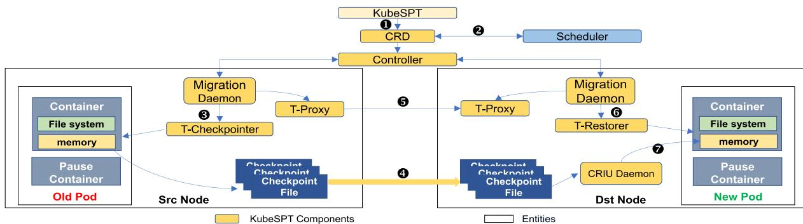  
(a) Architecture and workflow of KubeSPT

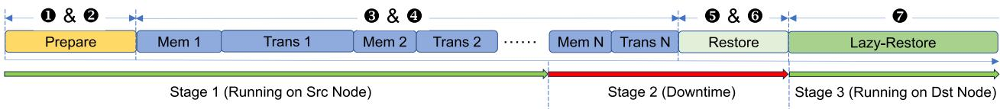  
(b) Pod live migration process of KubeSPT.

Fig. 3. The architecture and migration process of KubeSPT, with the migration steps depicted in the figure, include: ❶ Create CRD❷ Pre-Schedule the pod and pre-pull images ❸ Iterative checkpoint ❹ Iterative transfer checkpoint files ❺ Redirect TCP Connection ❻ Restore the pod ❼ Lazy-Restore the containers.  
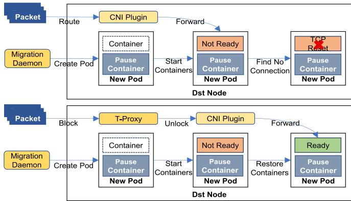  
Fig. 4. The cause of pod TCP long connection disruptions (Above) and the principles of T-Proxy network redirection connections (Below).

Uninterrupted Connection: After creating the new pod, the Controller immediately establishes a temporary route, redirecting packets intended for the pod from the source to the destination node. This design is because that other nodes and applications within the cluster need to recognize its change of host node and waiting for the CNI plugin to detect and reconfigure the cluster’s routing tables often takes several seconds or more.

However, we find a peculiar phenomenon where TCP connections established with the migrated pod’s internal containers are interrupted after establishing the temporary route in a Kubernetes environment. This issue does not typically occur during the live migration of containers. The fundamental cause of this issue lies in the unique network namespace initialization approach of pods in the Kubernetes. Specifically, as shown in Fig. 4, when the pause container is created, Kubernetes considers the initialization of the pod’s network namespace is completed and the pod can receive incoming packets from the external, regardless of whether the services are ready.

This pod network initialization approach is suitable in typical creation cases, as containers only send and receive packets when they are fully established. However, in the context of live migration, this leads to inconsistency between the network states of pods and internal containers. The new pod receive packets before the container is fully restored. At this juncture, the new pod cannot process these packets, leading the destination node to mistakenly assume that the service is offline, subsequently notifying the clients to disconnect.

Network State Restoration: T-Proxy synchronizes the network state of the pod with that of the containers. After creating the new pod, T-Proxy freezes the network namespace of the new pod, establishes an intra-node route, intercepting and caching data packets intended for the new pod. Then, T-Proxy notifies the Controller to create the temporary route. Once the services are fully restored, T-Proxy unfreezes the pod’s network namespace, removes the intra-node route, and then forwards the cached data packets to the new pod. This ensures uninterrupted network connection and rapid service redirection during migration.

We also need to restore the iptables rules within the pod and on the node. Since all containers in a pod share the same network namespace, invoking CRIU to restore the network state of internal containers also restores the iptables rules within the pod’s network space. The iptables rules on the destination node are set up by the CNI plugin when the new pod is created. After migration, the CNI plugin removes the old pod’s iptables rules from the source node during the garbage collection (GC) and notifies other applications in the cluster of the pod’s new node location.

## C. Memory Checkpoint and Restoration

We design T-Checkpointer and T-Restorer to realize checkpoint and restoration, respectively.

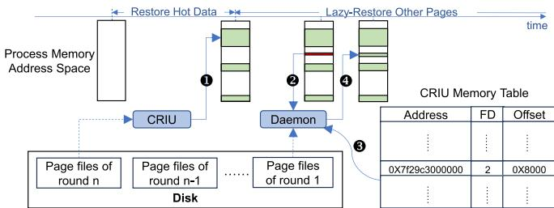  
Fig. 5. Memory restoration process of the Hot Data and Lazy-Restore method: ❶ Track the hot page set during the iterative checkpoint, and restore only the hot pages during the restoration. ❷ Monitor page faults after service restart. ❸ Quickly retrieve checkpoint file information from the CRIU memory table. ❹ Write page data back to the corresponding memory addresses.

Iterative Checkpoint: During the iterative checkpoint, T-Checkpointer does not interrupt the service, as shown in Fig. 3(b). After each round of checkpoint, we flush the AC-CESSED bit of all process PTEs (which takes only a few milliseconds). The ACCESSED bit in a PTE indicates a recently accessed page. During the checkpoint, we mark pages with the ACCESSED bit set as part of the hot data set. We save the address range of the hot data to the checkpoint files, but only the dirty page data is stored in the checkpoint files.

Before performing the final checkpoint, T-Checkpointer transmits each checkpoint file to the destination node after each checkpoint iteration. Once the file transfer is complete, it proceeds to the next checkpoint round. We set iteration termination conditions based on application characteristics. Starting from the second checkpoint, if the number of dirty pages in an iteration is below a certain proportion of the previous round, the convergence condition is met, allowing the next iteration to proceed. Otherwise, T-Checkpointer directly performs the final checkpoint. In addition, if multiple iterations fail to significantly reduce the size of checkpoint files, the final checkpoint can be executed directly in the second round to minimize the impact on workloads. In the final checkpoint, the CRIU page-server functionality is utilized to bypass saving checkpoint files to the source node’s disk and directly transferring them to the destination node, reducing downtime.

Lazy-Restore: T-Restorer employs the Hot Data and Lazy-Restore approach, as shown in Fig. 5, to minimize downtime caused by memory page restoration while maintaining service performance post-restoration. T-Restorer selectively writes hot data to their corresponding process memory address spaces during restoration. The remaining memory data is not immediately written, but the memory address range to be restored is registered using userfaultfd. T-Restorer initiates the CRIU Daemon to listen for page fault interrupts. Once the service restarts, when a page fault interrupt is triggered, the CRIU Daemon fetches the corresponding memory data from checkpoint files and writes it to the memory.

Each time the application accesses a page that is not restored to the address space on destination node, a page fault is triggered. When a page fault is triggered, there are two performance overheads in fetching data from checkpoint files. First, due to the iterative checkpoint, each round generates new checkpoint files containing different memory data. If each page fault needs to search for data from the last checkpoint file and sequentially go through each prior file, it results in an unacceptable performance overhead. Second, memory-intensive programs generate numerous read and write requests, with each request potentially triggering multiple page faults, leading to excessively increased response latency.

T-Restorer separately addresses the above two challenges. During the initialization of CRIU Daemon, a traversing scan of CRIU pagemap files is conducted. For each continuous address space segment, CRIU Daemon records the file descriptor corresponding to its most recent data checkpoint file and calculates the file offset value. These pieces of information are stored in a memory array. Upon receipt of an address associated with a page fault, CRIU Daemon employs binary search to locate the address segment and promptly identifies the file descriptor and offset within the array.

Each time a page fault occurs, we read multiple pages to reduce the total number of page faults. We employ a non-blocking approach to read memory data from checkpoint files, which means that interrupt handling and page data reading by CRIU Daemon occur in parallel. We aim to ensure that the time taken for interrupt handling and page data reading is approximately the same, enhancing their parallelism. Through testing in our cluster, we found that reading 16 successive pages per page fault achieves the best parallelism.

## D. A Novel Pod Recreation Method

T-Checkpointer and T-Restorer intercept the delete/create requests for internal containers to decouple pod operations from internal container operations. Upon receiving a pod creation request, Kubelet initiates a series of pod initialization processes, pulls container images, and ultimately starts the internal containers. These initialization processes are independent of the application state. Before the iterative checkpointing begins, T-Restorer pre-fetches container images on the destination node as shown in Fig. 3(b). Before the final checkpoint, T-Checkpointer deletes the old pod and informs the Controller to immediately start initializing the new pod, parallelizing the final checkpoint files transfer to reduce service downtime.

Pre-pull Images: Directly copying container images from the source node to the destination node cannot make Dockerd aware of the changes, which requires restarting Dockerd usually, resulting in prolonged downtime. KubeSPT leverages the characteristics of layered images. A container image consists of a series of read-only layers and a thin writable layer added on the top [44]. On the same node, read-only layers can be shared among multiple containers directly.

Before the migration, the destination node first obtains the image information of the containers contained in the pod from the Controller. It then fetches the corresponding read-only layers from the cluster’s image server. The read-write layer is incrementally transferred during the iterative transmission through Rsync, and it is copied to the container image folder after container recovery. As the read-write layer of most services stores a manageable amount of data in practice, this process does not result in extended downtime. KubeSPT does not require Dockerd to be restarted on the destination node.

Parallelized Process: To reduce downtime, we parallelize the pod initialization process with the final checkpoint file transfer. However, current pod deletion and creation methods lead to two issues. First, because pod creation starts containers immediately, we need to wait for the completion of all checkpoint file transfers before pod initialization can begin. Second, as mentioned in Section III-C, for the final checkpoint, the T-Checkpointer directly transmits data to the destination node over the network, requiring the maintenance of containers during the last checkpoint.

We adopt a new approach to pod deletion and creation and design a parallelization process. A new pod with the same name is immediately created after killing the original pod. On the source node, T-Checkpointer intercepts the requests from Kubelet to Dockerd to delete the container until the transmission of the final checkpoint files is complete. If the checkpoint files transmission is not yet complete on the destination node when pod initialization finishes, T-Restorer intercepts container startup requests and modifies them to restore requests. We parallelize the pod initialization process with the final checkpoint to avoid additional downtime caused by the pod initialization.

## E. Alignment With Kubernetes Components

When creating a CRD object, KubeSPT first employs the Scheduler to select a destination node and reserves physical resources. KubeSPT reuses the pod placement strategies to select the destination node. KubeSPT creates a virtual pod to invoke the Scheduler, which does not consume actual physical resources but prevents the Scheduler from allocating physical resources reserved for the migrating pod during scheduling. Once the new pod is created, the virtual pod is deleted.

When a pod is migrated, it may be managed by other Controllers. We need to enable these Controllers to recognize the migration of stateful pods rather than simply substituting stateless pod replicas. All requests to modify the state of pods in the cluster are routed through Kube-Controller-Manager. We intercept requests from Kube-Controller-Manager to the Kube-ApiServer using the webhook. The webhook detects the name of the migrating pod and the migration stage by watching the CRD object. When preparation to delete the old pod begins, the webhook starts interception. Once the pod migration completes, the webhook stops intercepting.

We primarily focus on PVCs used for mounting remote persistent storage, as emptyDir or local volumes are not the focus of this study. For the more common RWX type of PVC, KubeSPT remount the PVC to the migrated pod once its initialization is complete. For the RWO type and volumes such as emptyDir volumes and local volumes, we recommend using the iterative data migration method mentioned in [45].

## IV. IMPLEMENT OF KUBESPT

We present key implementation details of KubeSPT. We implement the Migration Daemon as the execution unit for migration on each node. We extend Kubernetes non-invasively to detect the state of the migrated pod and modify Docker,

Containerd, CRIU, and the Linux kernel to support saving and restoring application states. These components call each other sequentially from top to bottom to achieve migration.

We develop a Kubernetes Controller for migration, which communicates with the Migration Daemon on each node using the list-watch approach. Both components notify each other and perform consistency checks to proceed to the next step by modifying the Phrase field of the CRD object. We utilize clientgo [46] to enable the Migrate Daemon to control pods, encompassing operations such as creation, deletion, and information retrieval. Within the T-Checkpointer and T-Restorer modules, Migrate Daemon interacts with Dockerd through the built-in docker client to achieve container checkpoint and restore. In the T-Proxy module, Migrate Daemon achieves the functionality of locking networks by configuring iptables rules.

We expand the gRPC interface for communication between Dockerd and underlying components, enabling its utilization of various functionalities provided by CRIU. In the original version of containerd, it manages checkpoint files in a manner similar to image layer management, subjecting each snapshot to a sha256 hash for content identification. This practice proves unnecessary in migration scenarios. We opt to utilize timestamps and container names to represent the content information of each checkpoint, thus reducing resource consumption and downtime duration. Furthermore, We modify the code of containerd-shim to directly store checkpoint files in a designated disk folder specified by us, reducing the memory occupation during migration.

We reuse the code implementation of CRIU page-server to develop CRIU Daemon. CRIU Daemon is initialized once the final checkpoint files have been transferred to the destination node. We modify the methods of recording and retrieving memory data based on the memory footprint characteristics of applications and integrate this with the iterative checkpointing approach to initialize the CRIU Memory Table of the CRIU Daemon. In our modified Linux kernel, the kernel writes the ACCESSED bit of PTEs to procfs. This is done concurrently with the kernel writing the Soft Dirty bit to procfs, so it does not introduce any additional performance overhead. We enable CRIU to read the ACCESSED bit of PTEs through procfs.

## V. EVALUATION

We describe our experimental setup and methods. Subsequently, we present the test results and provide an analysis.

## A. Experimental Setup

Setup: Our experiment environment consists of three worker nodes in the Kubernetes cluster, each equipped with Intel Xeon E5-2680 v4 CPUs (2.4 GHz) and 64 GB DDR4 RAM, with a network bandwidth of 3 Gbps between nodes. We designate one of the nodes as the leader node, while the other two serve as worker nodes. The pods are migrated between the two worker nodes. The versions of the software components we utilized are as follows: Kubernetes v1.18.20, Dockerd v19.03.9, and CRIU v3.17. The node operating system is CentOS 7.9, and the Linux kernel version is 5.4.232. We choose Calico [47] as the CNI plugin.

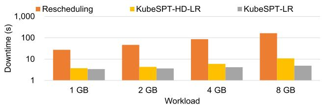  
(a) Redis Workload Downtime Comparison.

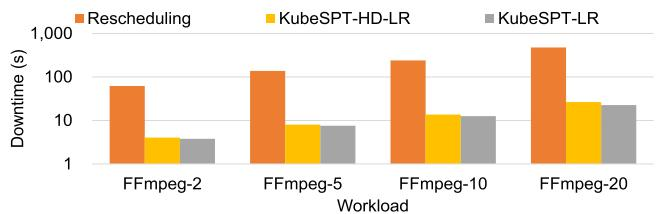  
(b) FFmpeg Workload Downtime Comparison.  
Fig. 6. Downtime comparison between current rescheduling method and KubeSPT migration.

TABLE I  
SIZE OF PRE-DUMP AND FINAL CHECKPOINT FILES

<table><tr><td>Benchmark</td><td>Workload</td><td>Pre-dump (GB)</td><td>Final Dump (GB)</td></tr><tr><td rowspan="4">Redis</td><td>1GB</td><td>1.38</td><td>0.06</td></tr><tr><td>2GB</td><td>2.75</td><td>0.09</td></tr><tr><td>4GB</td><td>5.42</td><td>0.16</td></tr><tr><td>8GB</td><td>10.69</td><td>0.29</td></tr><tr><td rowspan="4">FFmpeg</td><td>FFmpeg-2</td><td>0.83</td><td>0.41</td></tr><tr><td>FFmpeg-5</td><td>1.85</td><td>0.83</td></tr><tr><td>FFmpeg-10</td><td>3.69</td><td>1.68</td></tr><tr><td>FFmpeg-20</td><td>8.02</td><td>3.53</td></tr></table>

Benchmarks: We select two types of server benchmarks: Redis [48] and FFmpeg [49]. The former is a storage-intensive workload, while the latter is a compute-intensive workload. Redis stores all data in memory to enhance read and write efficiency. FFmpeg is commonly used to support the backend of video processors that decode and play videos concurrently, a feature frequently used in social software.

Method: For different service benchmarks, we introduce specific workloads to simulate real-world scenarios. For Redis, we follow the research method and conclusions of [50], [51]. We developed a workload generator, setting the key size to 8 bytes and the value size to 1 KB. We simulate 20 clients accessing the data concurrently outside the cluster. We approximate a Zipfian distribution with θ = 1.22, with a read-write ratio of 1:1. We pre-insert 1 GB, 2 GB, 4 GB, and 8 GB of data into Redis as test workloads.

For FFmpeg, we simulate a video decoding service that concurrently processes videos uploaded by different numbers of clients, providing real-time decoding results. We select 2, 5, 10, and 20 clients as test workloads. For the Redis workload, we designate pages with ACCESSED bits set during the iterative checkpoint as hot data pages. For FFmpeg, we consider only the pages changed after the second-to-last checkpoint as hot due to its higher memory change rate. We conduct separate tests to evaluate the impact of migration on the services under different test workloads.

Metrics: We primarily focus on the following issues:

\- Migration Downtime: How long does a pod live migration of KubeSPT cause service downtime, and what are the components of this downtime? How much optimization is achieved by our design for improvement?

\- Application Performance: How much has the service performance been impacted after the KubeSPT migration?

\- Total Migration Time: How much time is required for the entire migration process, and what are the components?

\- Controllers Reliability: Does KubeSPT impact the functionality of other Kubernetes Controllers?

Due to the lack of mature solutions for stateful pod live migration, we compare KubeSPT with the current Kubernetes rescheduling method. We employ two memory restoration methods - direct Lazy-Restore (KubeSPT-LR) and preloading Hot Data (KubeSPT-HD-LR) - to evaluate the downtime of live migration. Each experiment is repeated ten times and the results are averaged to calculate service downtime.

## B. Migration Downtime

Total Downtime: Fig. 6 compares service downtime resulting from stateful pod rescheduling through different methods. The Redis workload requires reloading data from the backup when using the current rescheduling method. Although downtime can be reduced through segmented encoding for the FFmpeg workload, the loss of intermediate data necessitates reencoding, resulting in unacceptable downtime. In contrast, with the KubeSPT-HD-LR method, pod live migration of KubeSPT can reduce downtime by 86% –93% . When migrating Redis workloads preloaded with 8 GB of data, KubeSPT results in only 10.76 seconds of downtime, while FFmpeg workloads incur a maximum downtime of 26.47 seconds. With the KubeSPT-LR method, we reduce the downtime for the largest Redis workload by 54% and the largest FFmpeg workload by 20%, as no memory data is restored during the restoration phase. However, the impact of these two methods on the performance of migrated applications will be discussed in subsequent sections. The following analysis, in conjunction with (1) and (2), will show the components of the downtime and the optimization of KubeSPT.

Downtime Components: Fig. 7 depicts the contributions of different steps when KubeSPT conducts pod live migration under various workloads. We test the duration of each step to get the total service downtime. We consider the final checkpoint execution, file transfer, and pod recreation as a single step as KubeSPT parallelizes them. We find that $T _ { R e s t a r t }$ is independent of the specific workload, and therefore, the same average value for pod recreation time is used for all workloads. In our test environment, $T _ { R e s t a r t }$ is 2.45 seconds.

We observe that the memory change rate of workloads significantly influences the execution time of the final checkpoint and the duration of file transfer, thereby affecting the downtime. Table I displays the sizes of the first and final round of checkpoint files. For Redis workloads, due to their relatively low rate of memory changes, the checkpoint file sizes exhibit good convergence during the iterative checkpoint phase. This results in the final checkpoint execution and file transfer consuming less time than the pod recreation, i.e., $T _ { R e s t a r t } > G _ { F T } ( M _ { F D } )$ Only migrating workloads preloaded 4GB or more of data causes $T _ { R e s t a r t } < G _ { F T } ( M _ { F D } )$ . In contrast, for FFmpeg workloads with a higher rate of memory changes, the sizes of checkpoint files are challenging to converge during the iterative checkpoint phase. Consequently, the final checkpoint file remains large, making the final checkpoint file transfer the most significant contributor to downtime.

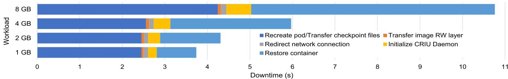  
(a) Downtime Components of Redis Workload.

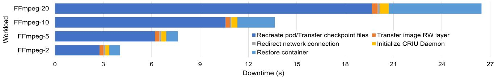  
(b) Downtime Components of FFmpeg Workload.  
Fig. 7. Components of downtime in KubeSPT-HD-LR migration for different workloads.

KubeSPT Optimizations: KubeSPT reduces downtime caused by migration from multiple aspects. Notably, KubeSPT avoids the need for service rediscovery and connection reestablishment, with network connection redirection taking only 93 to 139 milliseconds. Notably, during the synchronization of the pod and internal container network states, pod hot migration has a probability of over 90% causing an interruption in the connection between the pod and clients. In contrast, KubeSPT ensures a 100% guarantee that pod migration will not terminate the TCP connection.

Furthermore, Hot Data and Lazy-Restore significantly reduce downtime for workloads with large memory data sizes compared to the original method of restoring all memory data, as $M _ { H } < M _ { W }$ . It reduces downtime caused by restoring memory data for the heaviest Redis workload by 40% and for the heaviest FFmpeg workload by 38% . The Direct Lazy-Restore method exhibits the shortest downtime because it does not require restoring memory data. Compared to preloading hot data, the time to restore containers for the heaviest Redis workload is reduced by 71%, and the recovery time for the heaviest FFmpeg workload is reduced by 68% .

Lastly, The pod recreation method improved by KubeSPT also contributes to the reduction in downtime. For workloads with good convergence in checkpoint file size, such as Redis, checkpoint file transfer does not lead to additional downtime. Similarly, pod recreation does not result in downtime for workloads that have fewer convergence, such as FFmpeg. Additionally, since KubeSPT pre-fetches larger container image read-only layers, the downtime caused by migrating thinner image read-write layers is relatively acceptable. We also avoid the time consumption caused by hashing checkpoint files.

## C. Application Performance

We conduct tests to assess the impact of KubeSPT migration on quality of service. Fig. 8 illustrates the impact of pod live migration on service working efficiency, while Fig. 9 demonstrates the real-time performance changes before and after migration. For clarity, we omit the impact caused by longer downtime in the figure. In all figures, “Native” signifies that the service remains working on the destination node. At the same time, “KubeSPT-HD-LR” and “KubeSPT-LR” represent the different memory restoration methods by KubeSPT. We eliminate the influence of performance discrepancies among different nodes when plotting.

Redis Workloads: We focus on the impact of migration on the throughput and latency of Redis. We conduct tests with 10 million requests to measure the average throughput of different Redis workloads. Fig. 8(a) illustrates the impact on throughput with service recovery methods compared to the “Native” baseline. As the amount of stored data in Redis increases, the migration workload takes longer, leading to a more significant impact on throughput for workloads. The current Kubernetes rescheduling method results in the most significant throughput reductions. Pod live migration with the KubeSPT-HD-LR method minimizes the impact on throughput.

To demonstrate the real-time impact of migration on Redis service latency, we configure each client thread to send 1000 requests per round and calculate the latency for these requests. We compute the average latency for all threads after excluding values with significant offsets. Fig. 9(a) shows the total latency of each round, averaged across all clients, for 300 rounds adjacent to the migration in our tests with an 8 GB Redis workload.

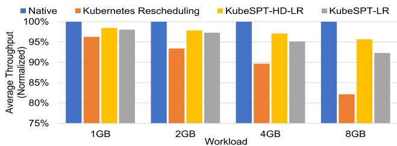  
(a) Average Throughput of Redis.

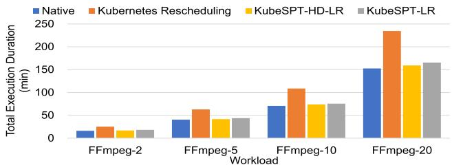  
(b) Transcoding Time of FFmpeg.

Fig. 8. The impact of migration on service operational efficiency.  
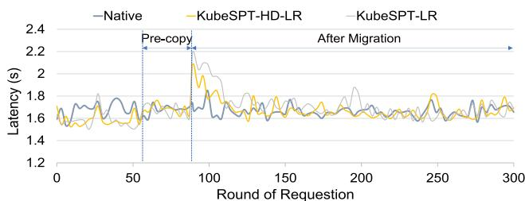  
(a) Redis Response Time.  
Fig. 9. Real-time performance of different workloads.

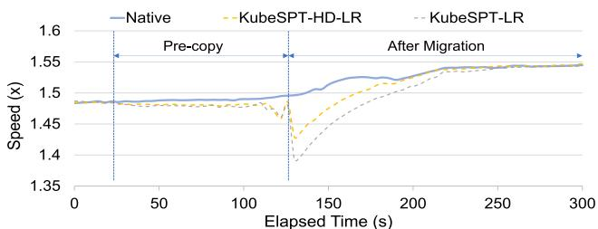  
(b) FFmpeg Transcoding Speed.

To accurately measure the real-time transcoding speed of FFmpeg, we employ the Constant Bit Rate (CBR) method to ensure that the video bitrate and frames per second (fps) remain constant within a specified time range. This allows us to observe changes in the “speed” parameter as a reflection of FFmpeg’s real-time transcoding performance. Fig. 9(b) illustrates the real-time performance variations of FFmpeg under different migration modes. During the pre-copy phase, the decoding speed of FFmpeg decreased by approximately 2% due to the iterative checkpoint preempting physical resources. With

In the pre-copy phase, there was approximately a 3% increase in latency due to contention for physical resources caused by the checkpoint file transfer. After service restoration, there is a notable short-term latency increase. However, Redis pod service latency closely approaches the native levels over 90 rounds of requestion after service restoration, with the KubeSPT-LR method, as data is gradually restored in memory. Meanwhile, the KubeSPT-HD-LR method allows latency to approach native levels approximately 20 rounds of requestion after service recovery, reducing the impact of pod live migration on service quality. Our test results also indicate that KubeSPT’s network state restoration method does not result in additional performance degradation.

FFmpeg Workloads: We examine the impact of migration on the total video decoding time and video decoding rates of FFmpeg. Fig. 8(b) demonstrates the impact of different migration methods on the total decoding time. Since the FFmpeg process cannot resume decoding from the point of interruption in the previous session, requiring a restart, the rescheduling method results in additional decoding time. In contrast, KubeSPT only incurs a 4% increase in downtime, close to the overall transcoding time in native mode.

TABLE II  
TIME OF MIGRATION

<table><tr><td>Benchmark</td><td>Workload</td><td>Pre-copy (s)</td><td>Migration (s)</td></tr><tr><td rowspan="4">Redis</td><td>1GB</td><td>10.72</td><td>16.41</td></tr><tr><td>2GB</td><td>19.48</td><td>25.63</td></tr><tr><td>4GB</td><td>36.86</td><td>45.18</td></tr><tr><td>8GB</td><td>66.93</td><td>79.81</td></tr><tr><td rowspan="4">FFmpeg</td><td>FFmpeg-2</td><td>8.94</td><td>15.93</td></tr><tr><td>FFmpeg-5</td><td>24.17</td><td>33.04</td></tr><tr><td>FFmpeg-10</td><td>54.49</td><td>69.84</td></tr><tr><td>FFmpeg-20</td><td>100.52</td><td>128.74</td></tr></table>

the KubeSPT-LR method, the performance loss is within 10%, and performance gradually recovers to a normal state within 100 seconds. With the KubeSPT-HD-LR method, the performance loss is around 6%, and it recovers to a normal state within 60 seconds. Compared to the benefits in overall transcoding time, these performance overheads are acceptable.

## D. Total Migration Time

Table II presents the durations of KubeSPT in the pre-copy phase and the total migration time. The bandwidth for inter-node file transfer serves as a significant performance bottleneck. Based on the application characteristics, we control the number of checkpointing iterations by selecting appropriate iteration termination conditions, thereby minimizing file transfers. For Redis workloads with good checkpoint file size convergence, the total migration time of the heaviest test workload is about 79.81 seconds. Meanwhile, FFmpeg workloads exhibit poorer checkpoint file size convergence, but the total migration time of the heaviest test workload is 128.74 seconds. Integrating with cluster resource usage prediction [52] and node failure prediction algorithms [39] (capable of predicting node shutdowns 3 minutes in advance), KubeSPT can effectively enhance the resilience of stateful applications within the cluster.

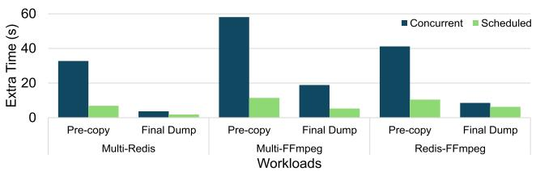  
(a) Multiple Containers Checkpoint.

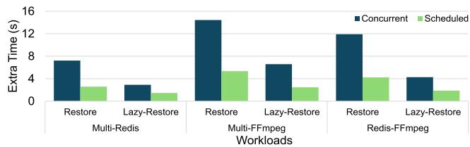  
(b) Multiple Containers Restore.  
Fig. 10. Extra execution time due to simultaneous migration of multiple containers in different ways.

We also attempt to reduce the time required for final checkpoint file transfers in the tests. Fig. 7(b) demonstrates that for compute-intensive workloads with significant variations in memory data, making the checkpoint file sizes converge was challenging, leading to extended downtime during the transmission of the final checkpoint files. We endeavor to minimize the time for transferring checkpoint files by compressing the checkpoint files generated during the pre-copy phase. However, experimental results indicated that due to the rapid changes in memory data for FFmpeg workloads, reducing the duration of checkpoint file transfers does not promote convergence in snapshot file sizes. Instead, the compression process consumes a significant amount of CPU resources.

## E. Controllers Reliability

We conduct tests to determine whether performing real-time pod migrations using KubeSPT would affect the standard functionality of other controllers. We select two commonly used workloads, Deployments and StatefulSets, and a popular custom controller called Tapp [53]. For all workloads, we define three replicas and migrate one of them. In our testing, KubeSPT ensures a 100% guarantee that the state of the pods managed by these controllers remains consistent with the specifications in the YAML file after migration. This enables more pods to be rescheduled with KubeSPT.

## F. Discussion

Multiple Container Rescheduling: When considering the simultaneous migration of multiple pods and the migration of pods running multiple applications, it is essential to account for cases where multiple containers are rescheduled to or from the same node. We find that containers migrated concurrently do not affect each other’s network states. However, the additional downtime and total migration time are impacted by the need to simultaneously save and restore their memory states.

We test the additional time required to migrate multiple workloads. We select Muti-Redis (two 2 G Redis and two 4 G Redis workloads), Multi-FFmpeg (two FFmpeg-5 and two FFmpeg-10 workloads), and Redis-FFmpeg (one 2 G Redis, one 4 G Redis, one FFmpeg-5, and one FFmpeg-10 workload). We test the time consumption caused by different migration steps using Concurrent (executing simultaneously) and Scheduled (executing sequentially). Fig. 10 shows the additional execution time compared to the sum of the execution time of migrating multiple containers individually.

For the Scheduled method, we take checkpoints in the order from smaller workloads to larger ones and restore them in reverse order, which yields better performance compared to the reverse order. The additional execution time caused by the Scheduled method is less than that of the Concurrent method, mainly due to reduced resource contention. However, in real-world scenarios, the time spent in queuing and waiting should also be considered as part of the migration time, so the design of rescheduling algorithms should be balanced according to cluster requirements. Additionally, the additional execution time for migrating FFmpeg workloads is more significant than Redis workloads, mainly because FFmpeg workloads consume more system resources during migration and execution.

Real-World Limitations: Additionally, multi-pod simultaneous migration introduces potential control plane latency, as noted in [37]. When dozens of pods are migrating concurrently in a cluster, communication between components and consistency checks across nodes may result in additional downtime. Due to the limitations of our experimental setup, we did not quantify this overhead; in the future, we plan to integrate KubeSPT with the approach proposed by [37] to address this.

KubeSPT incurs resource usage when saving and restoring application state, which may impact other applications running on the source and target nodes due to contention for network bandwidth and I/O resources. Furthermore, similar to previous work [21], [23], our method is suited for applications with skewed and fixed memory footprints, where prior knowledge of the application’s memory access patterns is necessary to optimize memory retrieval and restoration.

We also consider the impact of communication failures at different stages of the migration process in Fig. 3(b). If a failure occurs during Stage 1, since the application continues running on the source node, KubeSPT terminates the migration. In Stage 2, KubeSPT transfers final checkpoint files directly to the destination node without storing them on disk. A communication failure at this stage may lead to loss of pod state data. In future work, we consider backing up the files to the memory of the source node during the final checkpoint. This allows the pod’s state to be recovered from the backup even if a communication failure occurs. In Stage 3, all state data has already been transferred to the destination node, so communication failures do not affect the restoration of the application state.

## VI. RELATED WORK

In this section, we discuss existing container migration work and provide an update on the progress of pod migration.

Optimizations for container migration focus on storage, networking, and memory [16]. L. Ma et al. leverage the layered structure of container images to reduce rootfs migration overhead [19]. However, their method required restarting the Docker daemon on the destination node to recognize the new container images. Sledge [30] introduces the Context Loader to address this issue, but it introduces more complex control logic. On the other hand, Voyager [14] focuses on achieving fast migration of the rootfs using the post-copy approach.

CloudHopper [13] enables containerized applications to hop around between different clouds. It constructs a web application for hold connections, named the holding program, and employs HAProxy [54] to handle redirection. A.Machen et al. introduces a three-layered migration framework for relocating containers or virtual machines across edge servers [55]. These studies explore how to maintain uninterrupted network connections for containers during migration.

R.S. Venkatesh et al. [20] propose MVAS, which dumps process memory to an independent process virtual address space. However, MVAS requires an unacceptable amount of memory resources. Y. Lu et al. [56] employ page prediction and incremental compression to optimize the iterative snapshot process. Their approach can be integrated with KubeSPT.

When it comes to pod live migration, the Kubernetes community provided a basic pod snapshot implementation in version 1.25 alpha [15]. S. Chaudhary et al. achieve the migration of deep learning workloads [57]. P. S. Junior et al. focus on the migration of pod disk data [45]. However, the above efforts cannot solve the migration challendges of stateful applications we mentioned. MyceDrive [8] utilizes DMTCP [58] for snapshots to ensure uninterrupted network connections during migration. However, they do not optimize the memory snapshots. Meanwhile, S. Mangkhangcharoen et al. discover that CRIU has better applicability than DMTCP [59]. Projects such as KubeVirt [60] and Cloudify [61] are also being pushed forward to improve pod live migration.

## VII. CONCLUSION

Using live migration to address the limitations of current Kubernetes rescheduling methods can effectively enhance the quality and reliability of data center services. We present Kube-SPT in this paper. KubeSPT employs dedicated network state recovery methods for pod network characteristics. For the memory access patterns of applications, KubeSPT employs a Lazy-Restore memory restoration approach, preloads hot memory data, and combines this with pre-copy mechanisms to reduce downtime. Furthermore, KubeSPT improves pod deletion and creation methods to make them more migration-friendly. Finally, KubeSPT ensures that the migration does not disrupt the standard function of Kubernetes components.

## REFERENCES

[1] Kubernetes, 2025. [Online]. Available: https://kubernetes.io/

[2] A. Verma, L. Pedrosa, M. Korupolu, D. Oppenheimer, E. Tune, and J. Wilkes, “Large-scale cluster management at Google with Borg,” in Proc. Eur. Conf. Comput. Syst., 2015, pp. 18:1–18:17.

[3] C. Tang et al., “Twine: A unified cluster management system for shared infrastructure,” in Proc. USENIX Symp. Operating Syst. Des. Implementations, 2020, pp. 787–803.

[4] M. Schwarzkopf, A. Konwinski, M. Abd-El-Malek, and J. Wilkes, “Omega: Flexible, scalable schedulers for large compute clusters,” in Proc. Eur. Conf. Comput. Syst., 2013, pp. 351–364.

[5] B. Burns, B. Grant, D. Oppenheimer, E. A. Brewer, and J. Wilkes, “Borg, omega, and kubernetes,” Commun. ACM, vol. 59, no. 5, pp. 50–57, 2016.

[6] M. Tirmazi et al., “Borg: The next generation,” in Proc. Eur. Conf. Comput. Syst., 2020, pp. 30:1–30:14.

[7] Q. Liu and Z. Yu, “The elasticity and plasticity in semi-containerized co-locating cloud workload: A view from alibaba trace,” in Proc. ACM Symp. Cloud Comput., 2018, pp. 347–360.

[8] P. S. Junior, D. Miorandi, and G. Pierre, “Good shepherds care for their cattle: Seamless pod migration in geo-distributed kubernetes,” in Proc. IEEE Int. Conf. Fog Edge Comput., 2022, pp. 26–33.

[9] U. Deshpande, “Caravel: Burst tolerant scheduling for containerized stateful applications,” in Proc. IEEE Int. Conf. Distrib. Comput. Syst., 2019, pp. 1432–1442.

[10] P. Garefalakis, K. Karanasos, P. R. Pietzuch, A. Suresh, and S. Rao, “Medea: Scheduling of long running applications in shared production clusters,” in Proc. Eur. Conf. Comput. Syst., 2018, pp. 4:1–4:13.

[11] S. Li, L. Wang, W. Wang, Y. Yu, and B. Li, “George: Learning to place long-lived containers in large clusters with operation constraints,” in Proc. ACM Symp. Cloud Comput., 2021, pp. 258–272.

[12] C. Mommessin et al., “Affinity-aware resource provisioning for longrunning applications in shared clusters,” J. Parallel Distrib. Comput., vol. 177, pp. 1–16, 2023.

[13] T. Benjaponpitak, M. Karakate, and K. Sripanidkulchai, “Enabling live migration of containerized applications across clouds,” in Proc. IEEE Int. Conf. Comput. Commun., 2020, pp. 2529–2538.

[14] S. Nadgowda, S. Suneja, N. Bila, and C. Isci, “Voyager: Complete container state migration,” in Proc. IEEE Int. Conf. Distrib. Comput. Syst., 2017, pp. 2137–2142.

[15] Kubelet checkpoint API, 2025. [Online]. Available: https://kubernetes.io/ docs/reference/node/kubelet-checkpoint-api

[16] K. Kaur, F. Guillemin, and F. Sailhan, “Container placement and migration strategies for cloud, fog, and edge data centers: A survey,” Int. J. Netw. Manage., vol. 32, no. 6, 2022, Art. no. e2212.

[17] D. Zhou and Y. Tamir, “Fault-tolerant containers using nilicon,” in Proc. IEEE Int. Parallel Distrib. Process. Symp., 2020, pp. 1082–1091.

[18] R. M. Haris, K. M. Khan, and A. Nhlabatsi, “Live migration of virtual machine memory content in networked systems,” Comput. Netw., vol. 209, 2022, Art. no. 108898.

[19] L. Ma, S. Yi, N. J. Carter, and Q. Li, “Efficient live migration of edge services leveraging container layered storage,” IEEE Trans. Mobile Comput., vol. 18, no. 9, pp. 2020–2033, Sep. 2019.

[20] R. S. Venkatesh, T. Smejkal, D. S. Milojicic, and A. Gavrilovska, “Fas in-memory CRIU for docker containers,” in Proc. Int. Symp. Memory Syst., 2019, pp. 53–65.

[21] A. Raybuck, T. Stamler, W. Zhang, M. Erez, and S. Peter, “HeMem: Scalable tiered memory management for Big Data applications and rea NVM,” in Proc. ACM Symp. Operating Syst. Princ., 2021, pp. 392–407.

[22] D. Ustiugov, P. Petrov, M. Kogias, E. Bugnion, and B. Grot, “Benchmarking, analysis, and optimization of serverless function snapshots,” in Proc. ACM Int. Conf. Architectural Support Program. Lang. Operating Syst., 2021, pp. 559–572.

[23] Z. Qiu et al., “FrozenHot cache: Rethinking cache management for modern hardware,” in Proc. Eur. Conf. Comput. Syst., 2023, pp. 557–573.

[24] Pod, 2025. [Online]. Available: https://kubernetes.io/docs/concepts/ workloads/pods

[25] Controllers, 2025. [Online]. Available: https://kubernetes.io/docs/ concepts/architecture/controller/

[26] S. Luo et al., “Characterizing microservice dependency and performance: Alibaba trace analysis,” in Proc. ACM Symp. Cloud Comput., 2021, pp. 412–426.

[27] Service, 2025. [Online]. Available: https://kubernetes.io/docs/concepts/ services-networking/service/

[28] Headless service with statefulset, 2025. [Online]. Available: https: //docs.vmware.com/en/VMware-Tanzu-Service-Mesh/services/usingtanzu-service-mesh-guide/GUID-38865240-F238-4699-AE75- 171EC494F192.htm

[29] Z. Li et al., “DataFlower: Exploiting the data-flow paradigm for serverless workflow orchestration,” in Proc. ACM Int. Conf. Architectural Support Program. Lang. Operating Syst., 2023, pp. 57–72.

[30] B. Xu et al., “Sledge: Towards efficient live migration of docker containers,” in Proc. Int. Conf. Cloud Comput., 2020, pp. 321–328.

[31] M. Planeta, J. Bierbaum, L. S. D. Antony, T. Hoefler, and H. Härtig, “MigrOS: Transparent live-migration support for containerised RDMA applications,” in Proc. USENIX Annu. Tech. Conf., 2021, pp. 47–63.

[32] F. Xu et al., “Tetris: Proactive container scheduling for long-term load balancing in shared clusters,” IEEE Trans. Serv. Comput., vol. 17, no. 5, pp. 2918–2930, Sep./Oct. 2024.

[33] CRIU: Checkpoint/restore in userspace, 2025. [Online]. Available: https: //criu.org/Main\_Page

[34] TCP connection repair, 2025. [Online]. Available: https://lwn.net/Articles/ 495304/

[35] Memory pre dump, 2025. [Online]. Available: https://criu.org/Memory\_ pre\_dump

[36] Lazy migration, 2025. [Online]. Available: https://criu.org/Lazy\_ migration

[37] L. Cvetkovic, F. Costa, M. Djokic, M. Friedman, and A. Klimovic, “Dirigent: Lightweight serverless orchestration,” in Proc. ACM SIGOPS 30th Symp. Operating Syst. Princ., 2024, pp. 369–384.

[38] Z. Zhu, Y. Zhao, and Z. Liu, “In-memory key-value store live migration with netmigrate,” in Proc. USENIX Conf. File Storage Technol., 2024, pp. 209–224.

[39] A. Das, F. Mueller, and B. Rountree, “Aarohi: Making real-time node failure prediction feasible,” in Proc. IEEE Int. Parallel Distrib. Process. Symp., 2020, pp. 1092–1101.

[40] X. Wang et al., “On workload-aware DRAM failure prediction in largescale data centers,” in Proc. IEEE VLSI Test Symp., 2021, pp. 1–6.

[41] T. Xing, A. Barbalace, P. Olivier, M. L. Karaoui, W. Wang, and B. Ravindran, “H-container: Enabling heterogeneous-ISA container migration in edge computing,” ACM Trans. Comput. Syst., vol. 39, no. 1/4, pp. 5:1–5:36, 2021.

[42] L. He, X. Li, C. Xie, and Z. Song, “In-memory computing based on phase change memory for high energy efficiency,” Sci. China Inf. Sci., vol. 66, no. 10, 2023, Art. no. 200402.

[43] X. Sun et al., “Automatic reliability testing for cluster management controllers,” in Proc. USENIX Symp. Operating Syst. Des. Implementations, 2022, pp. 143–159.

[44] Understand images, containers, and storage drivers, 2025. [Online]. Available: https://github.com/PerfectMemory/docker/blob/master/docs/ userguide/storagedriver/imagesandcontainers.md

[45] P. S. Junior, D. Miorandi, and G. Pierre, “Stateful container migration in geo-distributed environments,” in Proc. IEEE Int. Conf. Cloud Comput. Technol. Sci., 2020, pp. 49–56.

[46] Client-go, 2025. [Online]. Available: https://github.com/kubernetes/ client-go

[47] Calico, 2025. [Online]. Available: https://github.com/projectcalico/calico

[48] Redis, 2025. [Online]. Available: https://redis.io/

[49] Ffmpeg, 2025. [Online]. Available: https://www.ffmpeg.org/

[50] Q. Wang et al., “HPUCache: Toward high performance and resource utilization in clustered cache via data copying and instance merging,” in Proc. IEEE/ACM Int. Workshop Qual. Service, 2022, pp. 1–10.

[51] J. Chen et al., “HotRing: A hotspot-aware in-memory key-value store,” in Proc. USENIX Conf. File Storage Technol., 2020, pp. 239–252.

[52] N. Bashir, N. Deng, K. Rzadca, D. E. Irwin, S. Kodak, and R. Jnagal, “Take it to the limit: Peak prediction-driven resource overcommitment in datacenters,” in Proc. Eur. Conf. Comput. Syst., 2021, pp. 556–573.

[53] Tapp github, 2025. [Online]. Available: https://github.com/tkestack/tapp

[54] Haproxy the reliable, high performance TCP/HTTP load balancer, 2025. [Online]. Available: https://www.haproxy.org/

[55] A. Machen, S. Wang, K. K. Leung, B. J. Ko, and T. Salonidis, “Migrating running applications across mobile edge clouds: Poster,” in Proc. Annu. Int. Conf. Mobile Comput. Netw., 2016, pp. 435–436.

[56] Y. Lu and Y. Jiang, “A container pre-copy migration method based on dirty page prediction and compression,” in Proc. IEEE Int. Conf. Parallel Distrib. Syst., 2022, pp. 704–711.

[57] S. Chaudhary, R. Ramjee, M. Sivathanu, N. Kwatra, and S. Viswanatha, “Balancing efficiency and fairness in heterogeneous GPU clusters for deep learning,” in Proc. Eur. Conf. Comput. Syst., 2020, pp. 1:1–1:16.

[58] J. Ansel, K. Arya, and G. Cooperman, “DMTCP: Transparent checkpointing for cluster computations and the desktop,” in Proc. IEEE Int. Parallel Distrib. Process. Symp., 2009, pp. 1–12.

[59] S. Mangkhangcharoen, J. Haga, and P. Rattanatamrong, “Migrating deep learning data and applications among kubernetes edge nodes,” in Proc. IEEE Int. Conf. High Perform. Comput. Commun., 2021, pp. 2004–2010.

[60] Kubevirt [official site], 2025. [Online]. Available: https://kubevirt.io

[61] Cloudify [official site], 2025. [Online]. Available: https://cloudify.co/

  
Hansheng Zhang is currently working toward the PhD degree with Service Computing Technology and System Lab (SCTS) and Cluster and Grid Lab (CGCL), Huazhong University of Science and Technology (HUST), China. His research interest includes container virtualization and cloud computing.

Song Wu (Member, IEEE) received the PhD degree from the Huazhong University of Science and Technology (HUST), in 2003. He is a professor of computer science with HUST in China. He currently serves as the vice dean of the School of Computer Science and Technology and the vice head of Service Computing Technology and System Lab (SCTS) and the Cluster and Grid Computing Lab (CGCL) in HUST. His current research interests include cloud resource scheduling and system virtualization.

Hao Fan received the PhD degree from the Huazhong University of Science and Technology (HUST), in 2021. Currently, he is working as a post-doctor with Service Computing Technology and System Lab (SCTS) and Cluster and Grid Lab (CGCL), Huazhong University of Science and Technology (HUST) in China. His current research interests include container technology and storage system.

Zhuo Huang received the PhD degree from the Huazhong University of Science and Technology (HUST), in 2023. Currently, he is working as a postdoctor with Service Computing Technology and System Lab (SCTS) and Cluster and Grid Lab (CGCL), Huazhong University of Science and Technology (HUST) in China. His current research interests include container virtualization, serverless computing optimization, and storage system.

Weibin Xue received the BS degree from the Huazhong University of Science and Technology, in 2020, and is currently working toward the MS degree with Service Computing Technology and System Lab (SCTS) and Cluster and Grid Lab (CGCL), HUST. His research interests include lightweight virtualization technologies and solid-state drives.

Shadi Ibrahim (Senior Member, IEEE) received the PhD degree in computer science from the Huazhong University of Science and Technology, in 2011. He is a permanent Inria research scientist. His research interests include cloud computing, Big Data management, virtualization technology, and file and storage systems. He has published several research papers in recognized Big Data and cloud computing research conferences and journals such as IEEE Transactions on Parallel Distributed Systems, Future Generation Computing Systems, SC, IPDPS.

Chen Yu (Member, IEEE) received the PhD degree in information science from Tohoku University, in 2005. From 2005 to 2006, he was a Japan Science and Technology Agency postdoctoral Researcher with the Japan Advanced Institute of Science and Technology. He is with the School of Computer Science and Technology, Huazhong University of Science and Technology (HUST), where he is currently a professor working in the areas of cloud computing, ubiquitous computing, and green communications.

Hai Jin (Fellow, IEEE) received the PhD degree in computer engineering from the Huazhong University of Science and Technology (HUST), in 1994. He is a chair professor of computer science and engineering with HUST in China. He was awarded the Excellent Youth Award from the National Science Foundation of China, in 2001. He is the chief scientist of ChinaGrid, the largest grid computing project in China. His research interests include computer architecture, virtualization technology, cloud computing, peer-topeer computing, and network storage. He is a member of the ACM.