# Large Language Model-Enhanced Deep Reinforcement Learning for Secure Data Collection in Low-Altitude Economy Networking

Lingyi Cai , Ruichen Zhang , Member, IEEE, Jiacheng Wang , Member, IEEE, Yu Zhang , Miaoran Peng , Tao Jiang , Fellow, IEEE, Dusit Niyato , Fellow, IEEE, Wei Ni , Fellow, IEEE, Abbas Jamalipour , Fellow, IEEE, and Dong In Kim , Life Fellow, IEEE

Abstract—Low-altitude economy networking (LAENet) aims to deploy various aerial vehicles to support diverse services, where data collection from edge devices via uncrewed aerial vehicles (UAVs) is a critical task. The key challenge lies in jointly optimizing energy consumption and data freshness in spectrum-constrained and eavesdropping-prone low-altitude environments during the data collection process. Although deep reinforcement learning (DRL) has become a viable solution for UAV-assisted data collection, the RL agent still has limited ability to obtain and utilize informative feedback from complex low-altitude environments. In this paper, we propose a large language model (LLM)-enhanced DRL framework for secure data collection in the LAENet, where we leverage an LLM to process environmental feedback for the RL agent. Specifically, we employ the LLM as (i) a state processor to transform basic environmental observations into task-aligned representations, (ii) a reward designer to generate enriched reward signals that guide the agent’s actions toward the optimization objective, and (iii) a simulator to construct a virtual LAENet environment for evaluating enhanced state–reward pairs before policy training. Theoretical analysis and numerical results demonstrate that the proposed LLM-enhanced DRL framework

achieves faster convergence, improved training stability, and superior performance compared with state-of-the-art baselines.

Index Terms—Low-altitude economy networking, large language model, deep reinforcement learning, UAV-assisted data collection, LLM-enhanced DRL.

## I. INTRODUCTION

L OW-ALTITUDE economy networking (LAENet) repre-sents an emerging autonomous aerial paradigm that en- sents an emerging autonomous aerial paradigm that enables commercial and public services through the coordinated deployment of uncrewed aerial vehicles (UAVs), electric vertical take-off and landing (eVTOL) aircraft, and other aerial platforms within regulated airspace below 1,000 meters [1]. Enabled by advancements of communications and network technologies, aerial platforms in LAENet, particularly UAVs and eVTOLs, are widely used as mobile relays to collect and transmit data for various applications [2], [3]. For example, with flexible deployment and the ability to establish line-of-sight (LoS) links, UAVs can adapt trajectories and hover near edge devices (e.g., sensors, access points, and user terminals) to collect data streams (e.g., traffic surveillance records and environmental sensing data), which is essential for coordinating various low-altitude services such as urban air mobility, environmental monitoring, and disaster response [4], [5].

Despite the above advantages, UAVs need to make decisions by comprehensively considering multiple factors for data collection in the LAENet. First, the limited on-board battery of UAVs requires them to operate under strict energy constraints in propulsion power [6]. Second, UAVs are required to collect frequent and fresh data updates for low-altitude services [7]. Meanwhile, spectrum resources in low-altitude airspace are limited due to the high density of aircraft and users; i.e., UAVs need to select idle channels to communicate with edge devices [8]. Furthermore, the broadcast nature of LoS channels exposes communications between UAVs and edge devices to a high risk of eavesdropping, especially from malicious ground nodes strategically positioned to intercept the transmitted data [9]. Therefore, the key challenge lies in how to jointly optimize these decision variables throughout the data collection process [1].

Deep reinforcement learning (DRL) has emerged as a promising paradigm for tackling complex decision-making problems in

UAV-assisted data collection systems, especially when multiple and conflicting objectives are required to be jointly optimized in dynamic environments [7], [10]. The key advantage of DRL is that it enables the agent for the UAV to continuously interact with the environment and adapt its policy to evolving conditions without relying on explicit environmental models [11]. Numerous studies have utilized DRL algorithms (such as Twin Delayed Deep Deterministic Policy Gradient (TD3), Deep Deterministic Policy Gradient (DDPG), and Deep Q-Network (DQN)) and their variants to address the challenges in data collection [7], [11], [12]. However, the classical DRL paradigm adopted by existing methods has major limitations. The main reason is that the reinforcement learning (RL) agent may receive suboptimal feedback from the more complex and dynamic LAENet environment that hinders policy learning [13]. On the one hand, it is difficult for the agent to extract effective task-specific states from the environment due to the lack of prior knowledge and generalization ability. On the other hand, manually designed simple reward signal creates a bottleneck in guiding policy updates. For this reason, enhancing the state representation and reward design for the RL agent is a key issue in addressing the challenge of data collection in the LAENet.

Recently, large language models (LLMs), as an emerging technology, are expected to alleviate the above-mentioned limitations of the classical RL paradigm [14], [15]. As pretrained models on diverse and large-scale corpora, LLMs demonstrate exceptional abilities in context comprehension, structured reasoning, and knowledge generation [14], [18], [19]. In this paper, we propose an LLM-enhanced DRL framework that systematically integrates LLMs into the RL pipeline to address the challenges of secure data collection in the LAENet. The LLM functions as a semantic interface between the environment and the agent by participating in multiple stages of the learning process. Specifically, the contextual understanding and knowledge abstraction of LLMs enable RL agents for the UAVs to cope with the diverse states in the LAENet environment, thereby addressing the challenge of task-relevant state perception. The ability of semantic reasoning and prior knowledge further supports the extraction of enriched reward signals from the environment and the optimization objectives, which cannot be achieved by the reward functions of classical RL agents. In addition, the generation and simulation capacity of LLMs allows the construction of a virtual LAENet environment, where the suitability of LLM-generated states and rewards can be tested prior to policy training. These roles are coordinated through prompt-based interaction, enabling the LLM to provide rich contextual knowledge and reasoning throughout the DRL process.

The contributions of this paper are summarized as follows:

\- We propose an LLM-enhanced DRL framework for secure data collection in the LAENet, where the LLM augments the classical DRL pipeline from a perception and feedback perspective.

\- We design a structured prompt engineering process to guide the LLM to act as a state processor, reward designer, and simulator, enabling the RL agent to benefit from prior knowledge, task-relevant abstraction, and pre-deployment evaluation.

We provide theoretical analysis and extensive simulations to validate the effectiveness of the proposed schemes. Numerical results show that the LLM-generated state–reward pair achieves approximately 35% faster convergence, 89% lower Age of Information (AoI), and 29% reduction in energy consumption compared with baselines.

The rest of this paper is organized as follows. Section II reviews related work. Section III presents the system model and formulates the secure data collection problem in the LAENet. Section IV details the proposed LLM-enhanced DRL framework, including its design methodology and theoretical analysis. Numerical results are presented in Section V. Finally, Section VI concludes the paper.

## II. RELATED WORK

## A. Classical DRL for UAV-Assisted Data Collection

Recent studies have applied various DRL algorithms to UAVassisted data collection tasks with different optimization goals. The work in [7] proposed a DQN-based scheme to minimize average AoI in wireless-powered UAV systems by learning policies that balance energy harvesting and information freshness. The authors in [11] employed the DDPG algorithm to jointly optimize UAV trajectory and IoT device scheduling, aiming to minimize overall data collection latency by dynamically adapting flight paths based on the service status of ground nodes. The study in [12] proposed a TD3-based trajectory optimization framework that uses a merged pheromone signal to represent spatio–temporal task states, enabling the UAV to efficiently navigate complex urban IoT environments and minimize mission completion time.

Despite notable successes, classical DRL frameworks face critical limitations in a complex LAENet environment, primarily due to their reliance on task-specific state representations and manually crafted reward functions.

## B. Integration of LLMs Into DRL

Recent research has begun to explore the integration of LLMs into the RL process by leveraging their capabilities of contextual reasoning, prior knowledge, and semantic abstraction to address the above-mentioned challenges. In [14], LLM-based generative agents simulate users with diverse personalities, providing realtime quality of experience feedback as dynamic reward signals for personalized service optimization. The work in [15] employs LLMs within RL for vehicular networks to enable scene understanding, hierarchical planning, and inter-agent communication, thereby allowing RL agents to generate interpretable decisions and coordinated trajectories. In [16], LLMs are employed to analyze environmental data, select target locations, and interpret natural-language event descriptions through in-context learning, fine-tuning, and tool-calling, thereby assisting RL agents in coordinating coverage decisions for high-altitude platform stations. The framework in [17] integrates an LLM-based policy network into RL for bandwidth estimation, where an LLM acts as a representation learner to encode flow features and improve generalization. The work in [18] uses an LLM to translate high-level user intents into structured optimization goals, which are executed by RL agents for intent-driven and multi-objective network optimization.

TABLE I  
COMPARISON OF RELATED WORK ON LLM-ENHANCED RL IN NETWORKING
<table><tr><td rowspan="2">Related Works</td><td colspan="5">LLM-enhanced RL Comprehensiveness</td><td rowspan="2">Support for Multiple RL Algorithms</td><td rowspan="2">Theoretical Analysis</td></tr><tr><td>State Representation</td><td>Reward Design</td><td>Policy Guidance</td><td>Environment Simulator</td><td>Inter- pretability</td></tr><tr><td>[14]</td><td></td><td>√</td><td></td><td></td><td></td><td>√</td><td></td></tr><tr><td>[15]</td><td></td><td></td><td>√</td><td></td><td></td><td></td><td></td></tr><tr><td>[16]</td><td>V</td><td></td><td>V</td><td></td><td>7</td><td></td><td></td></tr><tr><td>[17]</td><td>√</td><td></td><td>V</td><td></td><td>√</td><td></td><td></td></tr><tr><td>[18]</td><td>√</td><td></td><td></td><td>一</td><td>一</td><td>√</td><td>一</td></tr><tr><td>Proposed Work</td><td>√</td><td>√</td><td>√</td><td>√</td><td>√</td><td>√</td><td>√</td></tr></table>

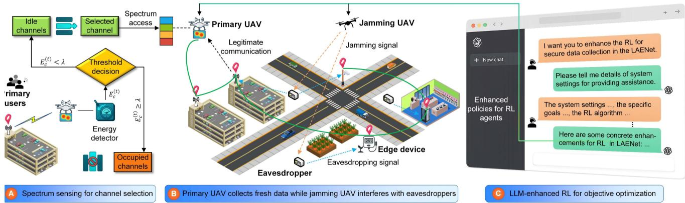  
Fig. 1. System overview for secure data collection in the LAENet. Part A illustrates the spectrum sensing process for opportunistic channel access, where idle channels are identified based on energy detection and threshold decisions. Part B depicts the cooperative data collection scenario: the primary UAV collects real-time data from edge devices through legitimate communication, while the jamming UAV emits interference signals to suppress potential eavesdropping threats. Part C highlights the integration of LLMs to enhance RL policies for improving performance and efficiency of objective optimization in the LAENet.

Inspired by the aforementioned works, we develop an LLMenhanced DRL framework for secure data collection in the LAENet. Compared with classical DRL approaches for UAVassisted data collection (e.g., [7], [11], and [12]), the proposed LLM-enhanced DRL alleviates the limitations of handcrafted state–reward design and improves the interpretability of UAV’s decision making in complex networking environments. Different from existing LLM-enhanced RL schemes (as summarized in Table I), our framework systematically integrates LLMs into state representation, reward design, policy guidance, and environment simulation of the DRL process, while adapting to multiple DRL algorithms. In addition, we analyze that the LLM-enhanced state–reward design can be beneficial to DRL convergence to provide theoretical support.

## III. SYSTEM OVERVIEW AND PROBLEM FORMULATION

## A. System Model

As shown in parts A and B of Fig. 1, we consider a scenario in the LAENet composed of multiple cooperative UAVs to collect data from edge devices in the presence of eavesdroppers and primary users competing for spectral resources. UAV $U _ { a }$ opportunistically accesses idle channels for uplink transmissions from edge devices. Specifically, a set of fixed edge devices $M = \{ 1 , \dots , i , \dots , m \}$ periodically update data packets intended to be collected by the primary UAV $U _ { a }$ The $U _ { a }$ dynamically traverses the low-altitude airspace $\mathcal { P }$ to schedule and communicate with edge devices. In each time slot $t \in \{ 1 , 2 , \dots , T \} , U _ { a }$ selects one edge device $i \in M$ and an idle channel c from the set of available communication channels $N = \{ 1 , \dots , c , \dots , n \}$ for data collection. At the same time, the channel link between $U _ { a }$ and edge device i can be eavesdropped by a set of eavesdroppers $E = \{ 1 , \dots , j , \dots , e \}$ , leading to the leakage of confidential information. Each eavesdropper $j \in E$ is passive, and its location is assumed to be known and can be detected from the local oscillator power unintentionally leaked from its radio frequency front end [20]. To ensure the security of communication, another jamming UAV $U _ { b }$ operates simultaneously with $U _ { a }$ and coordinates trajectory to disrupt potential eavesdroppers by broadcasting artificial noise signals. The UAVs $U _ { a }$ and $U _ { b }$ maintain a fixed flight altitude. In addition, the noise signal can be known and canceled at the edge devices and UAV $U _ { a }$ to avoid interference with the link [21].

## B. Communication Model

In the considered LAENet scenario, the airspace is densely populated by diverse aerial vehicles and primary users (PUs) [8], as shown in Part A of Fig. 1. Because these PUs typically have priority access to the spectrum, UAV $U _ { a }$ needs to continuously sense the radio environment and identify idle channels before transmitting [8], [22]. Such spectrum sensing prevents harmful interference with critical PU services while keeping the UAV compliant with low-altitude economic regulations [23], offering stable, effective, and high-throughput communications among drones within the same crowded low-altitude airspace.

Let $y _ { c } ^ { ( n ) }$ denote the n-th received sample on channel $c \in N$ during a sensing window of $T _ { s }$ samples at time slot t. Following the classical binary-hypothesis model [24], [25]:

$$
y _ { c } ^ { ( n ) } = { \left\{ \begin{array} { l l } { w ^ { ( n ) } , } & { { \mathrm { i f ~ t h e ~ P U ~ i s ~ a b s e n t } } , } \\ { s ^ { ( n ) } + w ^ { ( n ) } , } & { { \mathrm { i f ~ t h e ~ P U ~ i s ~ p r e s e n t } } , } \end{array} \right. }\tag{1}
$$

where $w ^ { ( n ) } { \sim } \mathcal { C N } ( 0 , \sigma ^ { 2 } )$ is the additive white Gaussian noise (AWGN), and $s ^ { ( n ) }$ is the PU signal with variance $\sigma _ { s } ^ { 2 }$ . UAV $U _ { a }$ uses the classical energy detection-based spectrum sensing method to determine the channel state [24], [26], [27]. Specifically, the average received energy over $T _ { s }$ samples is calculated as

$$
E _ { c } ^ { ( t ) } = \frac { 1 } { T _ { s } } \sum _ { n = 1 } ^ { T _ { s } } \bigl | y _ { c } ^ { ( n ) } \bigr | ^ { 2 }\tag{2}
$$

The channel occupancy state $s _ { c } ^ { ( t ) }$ can be estimated by comparing $E _ { c } ^ { ( t ) }$ with a threshold λ [27]:

$$
s _ { c } ^ { ( t ) } = \left\{ \begin{array} { l l } { 1 , } & { \mathrm { i f ~ t h e ~ c h a n n e l ~ i s ~ o c c u p i e d ~ ( i . e . , } \ : E _ { c } ^ { ( t ) } \geq \lambda ) , } \\ { 0 , } & { \mathrm { i f ~ t h e ~ c h a n n e l ~ i s ~ i d l e ~ ( i . e . , } \ : E _ { c } ^ { ( t ) } < \lambda ) . } \end{array} \right.\tag{3}
$$

For simplicity, λ can be set as a fixed threshold [27]:

$$
\lambda = \sigma ^ { 2 } + Q ^ { - 1 } ( \alpha ) \sqrt { 2 \sigma ^ { 4 } / T _ { s } } ,\tag{4}
$$

where $\alpha \in ( 0 , 1 )$ is the maximum allowed probability that the detector wrongly declares a channel occupied when it is actually idle, and $Q ( \cdot )$ is the Gaussian tail function.

Considering that the UAV $U _ { a }$ at location $\mathbf { p } _ { a } ^ { ( t ) } \in \mathbb { R } ^ { 3 }$ accesses a channel $\{ c \in N \mid s _ { c } ^ { ( t ) } = 0 \}$ and selects the edge device i located at position $\mathbf { p } _ { i } \in \mathbb { R } ^ { 3 }$ for data collection at time slot t. The channel gain between UAV $U _ { a }$ and device i over channel c, captures both large-scale path loss and small-scale Rayleigh fading, as given by

$$
\left| g _ { i , c } ^ { ( t ) } \right| ^ { 2 } = \left| \tilde { g } _ { i , c } ^ { ( t ) } \right| ^ { 2 } \cdot \frac { \beta _ { c } } { d _ { i } ^ { 2 } ( t ) } ,\tag{5}
$$

where $| \tilde { g } _ { i , c } ^ { ( t ) } | ^ { 2 }$ ∼ Exp(1) is the Rayleigh fading power, $\beta _ { c }$ denotes the channel power constant at the reference distance of 1 m, and $d _ { i } ( t ) = \sqrt { \| \mathbf { p } _ { a } ^ { ( t ) } - \mathbf { p } _ { i } ^ { ( t ) } \| ^ { 2 } + H ^ { 2 } }$ is the three-dimensional Euclidean distance between UAV $U _ { a }$ and device i. The received signal-to-interference-plus-noise ratio (SINR) at the UAV $U _ { a }$ is given by

$$
\gamma _ { i , c } ^ { ( t ) } = \frac { P _ { i } \left| g _ { i , c } ^ { ( t ) } \right| ^ { 2 } } { \sigma ^ { 2 } + I _ { i } ^ { ( t ) } } ,\tag{6}
$$

where $P _ { i }$ is the transmit power of edge device $i , \sigma ^ { 2 }$ is the noise power, and $I _ { i } ^ { ( t ) }$ is the interference power induced by UAV $U _ { b } .$ Note that $I _ { i } ^ { ( t ) } = 0$ can be considered because the noise signal of $U _ { b }$ can be canceled. The achievable data rate for the legitimate transmission is defined as

$$
R _ { i , c } ^ { ( t ) } = B _ { c } \cdot \log _ { 2 } \left( 1 + \gamma _ { i , c } ^ { ( t ) } \right) ,\tag{7}
$$

where $B _ { c }$ is the bandwidth of channel c.

The eavesdropper j located at $\mathbf { p } _ { j } \in \mathbb { R } ^ { 3 }$ attempts to decode the signal sent by the selected edge device i over channel c, where the corresponding channel gain $g _ { i , j } ^ { ( t ) }$ is

$$
\left| g _ { i , j , c } ^ { ( t ) } \right| ^ { 2 } = \left| \tilde { g } _ { i , j , c } ^ { ( t ) } \right| ^ { 2 } \cdot \frac { \beta _ { c } } { d _ { i , j } ^ { 2 } ( t ) } .\tag{8}
$$

Here, $d _ { i , j } ( t ) = \sqrt { \| \mathbf { p } _ { i } - \mathbf { p } _ { j } \| ^ { 2 } }$ is the distance between devices i and j. Importantly, the interference from the jamming UAV $U _ { b }$ at location $\mathbf { p } _ { b } ^ { ( t ) } \in \mathbb { R } ^ { 3 }$ plays a key role in degrading the eavesdropping link, where the corresponding channel gain is defined as

$$
\left| g _ { j , c } ^ { ( t ) } \right| ^ { 2 } = \left| \tilde { g } _ { j , c } ^ { ( t ) } \right| ^ { 2 } \cdot \frac { \beta _ { c } } { d _ { j } ^ { 2 } ( t ) } .\tag{9}
$$

Here, $d _ { j } ( t ) = \sqrt { \| \mathbf { p } _ { b } ^ { ( t ) } - \mathbf { p } _ { j } \| ^ { 2 } + H ^ { 2 } }$ is the three-dimensional Euclidean distance between UAV $U _ { b }$ and device $j .$ . The interference power received from $U _ { b }$ at j is defined as

$$
I _ { j } ^ { ( t ) } = P _ { b } ^ { ( t ) } \cdot \left| g _ { j , c } ^ { ( t ) } \right| ^ { 2 } ,\tag{10}
$$

where $P _ { b } ^ { ( t ) }$ is the transmit power of the jamming UAV $U _ { b }$ at time slot t. The SINR at eavesdropper $j$ is modeled as

$$
\gamma _ { i , j , c } ^ { ( t ) } = \frac { P _ { i } \left| g _ { i , j , c } ^ { ( t ) } \right| ^ { 2 } } { \sigma ^ { 2 } + I _ { j } ^ { ( t ) } } .\tag{11}
$$

The maximum eavesdropping rate across all eavesdroppers is represented as

$$
R _ { e , i , c } ^ { ( t ) } = B _ { c } \cdot \operatorname* { m a x } _ { j \in E } \log _ { 2 } \left( 1 + \gamma _ { i , j , c } ^ { ( t ) } \right) .\tag{12}
$$

We utilize the secrecy rate to quantify the security in communication, which is defined as the difference between the legitimate transmission rate and the worst-case eavesdropping rate:

$$
R _ { s , i , c } ^ { ( t ) } = \left[ R _ { i , c } ^ { ( t ) } - R _ { e , i , c } ^ { ( t ) } \right] ^ { + } ,\tag{13}
$$

where $[ x ] ^ { + } = \operatorname* { m a x } ( x , 0 )$ . A successful transmission is considered valid if $R _ { s , i , c } ^ { ( t ) } \geq R _ { \operatorname* { m i n } }$ , where $R _ { \mathrm { m i n } }$ is a predefined minimum secrecy threshold.

## C. Energy Model

Assuming that UAVs $U _ { a }$ and $U _ { b }$ are in a bounded threedimensional airspace, and at each discrete time slot t, the positions of the two UAVs are updated with a continuous action vector. Their updated positions are computed based on relative displacement actions $\bar { \Delta } \mathbf { p } _ { a } ^ { ( t ) }$ and $\Delta \mathbf { p } _ { b } ^ { ( t ) }$ , which are scaled to a bounded velocity per time slot. To account for mobility-induced cost, the energy consumption of each UAV is modeled as a function of its displacement. Specifically, the energy consumed by UAV $u \in \{ U _ { a } , U _ { b } \}$ during time slot t is defined as

$$
E _ { u } ^ { ( t ) } = \boldsymbol { \phi } \cdot \left. \mathbf { p } _ { u } ^ { ( t ) } - \mathbf { p } _ { u } ^ { ( t - 1 ) } \right. _ { 2 } ,\tag{14}
$$

where $\phi$ is a mobility-related energy coefficient. The total energy consumed at time slot t is given by

$$
E ^ { ( t ) } = \sum _ { u \in \{ U _ { a } , U _ { b } \} } E _ { u } ^ { ( t ) } .\tag{15}
$$

## D. AoI Model

We use the AoI metric to quantify the freshness of the data collected from edge devices [28]. Let $\Delta _ { i } ^ { ( t ) }$ represent the AoI of edge device $i \in M$ at time slot t. The AoI evolves linearly in time unless a successful and secure transmission occurs. The AoI dynamics for each edge device are defined as

$$
\Delta _ { i } ^ { ( t + 1 ) } = \left\{ \begin{array} { l l } { 1 , } & { \mathrm { i f ~ } i \mathrm { ~ i s ~ s e l e c t e d ~ a n d ~ } R _ { s , i } ^ { ( t ) } \geq R _ { \operatorname* { m i n } } } \\ { \Delta _ { i } ^ { ( t ) } + 1 , } & { \mathrm { o t h e r w i s e } } \end{array} \right.\tag{16}
$$

where $R _ { s , i } ^ { ( t ) }$ is the secrecy rate and $R _ { \mathrm { m i n } }$ is the minimum threshold for a secure update. In addition, AoI evolution remains independent of spectrum observations, while successful transmissions may be indirectly influenced by spectrum congestion levels perceived by UAV $U _ { a }$ . At each time slot t, only one edge device is scheduled by UAV $U _ { a }$ for data collection. The cumulative AoI across all devices in time slot t is written as

$$
\Delta ^ { ( t ) } = \sum _ { i \in M } \Delta _ { i } ^ { ( t ) } .\tag{17}
$$

## E. Problem Formulation

The system aims to achieve secure, fresh, and energy-efficient data collection in the LAENet by jointly optimizing the UAV trajectories and device scheduling policy. The motivation is to minimize the total energy consumption of UAVs and the cumulative AoI across all edge devices over a finite time horizon T . Formally, this objective can be formulated as a constrained optimization problem:

$$
\operatorname* { m i n } _ { \mathbf { p } _ { u } ^ { ( t ) } , \Pi _ { i } ^ { ( t ) } , z _ { c } ^ { ( t ) } , R _ { s , i , c } ^ { ( t ) } } \quad \sum _ { t = 1 } ^ { T } \Big [ \boldsymbol { \alpha } \cdot \boldsymbol { E } ^ { ( t ) } + \boldsymbol { \beta } \cdot \boldsymbol { \Delta } ^ { ( t ) } \Big ]\tag{18a}
$$

$$
\mathrm { s . t . } \mathbf { p } _ { u } ^ { ( t ) } \in \mathcal { P } , \forall t , u \in \{ U _ { a } , U _ { b } \}\tag{18b}
$$

$$
\Pi _ { i } ^ { ( t ) } \in \{ 0 , 1 \} , \forall i \in M , \forall t\tag{18c}
$$

$$
\sum _ { i \in M } \Pi _ { i } ^ { ( t ) } = 1 , \forall i \in M , \forall t\tag{18d}
$$

$$
z _ { c } ^ { ( t ) } , s _ { c } ^ { ( t ) } \in \{ 0 , 1 \} , ~ \forall c \in N , \ \forall t\tag{18e}
$$

$$
\sum _ { c \in N } z _ { c } ^ { ( t ) } = 1 , \forall c \in N , \forall t\tag{18f}
$$

$$
z _ { c } ^ { ( t ) } \le 1 - s _ { c } ^ { ( t ) } , \forall c \in N , \forall t\tag{18g}
$$

$$
R _ { s , i , c } ^ { ( t ) } \geq R _ { \operatorname* { m i n } } \cdot \Pi _ { i } ^ { ( t ) } \cdot z _ { c } ^ { ( t ) } , ~ \forall i , \forall c , \forall t\tag{18h}
$$

where (18b) requires the position of each UAV to remain within a bounded 3D operational space in the low-altitude airspace $\mathcal { P }$ (18c) and (18d) ensure that only one edge device is scheduled for uplink transmission at any time slot t. (18e) illustrates the channel selection indicator $z _ { c } ^ { ( \dot { t } ) }$ and the channel occupancy state $s _ { c } ^ { ( t ) }$ , where $z _ { c } ^ { ( t ) } = 1$ implies that UAV $U _ { a }$ selects channel c for transmission and $s _ { c } ^ { ( t ) } = 1$ indicates that channel c is occupied by the primary user. (18f) specifies that UAV $U _ { a }$ can only select one channel for communication in time slot t. Constraint (18g) ensures that UAV $U _ { a }$ can only select an idle channel for communication. (18h) outlines that the transmission from edge device i at time slot t is only valid if the secrecy rate $R _ { s , i , c } ^ { ( t ) }$ satisfies the requirement. If device i is not selected (i.e., $\Pi _ { i } ^ { ( t ) } = 0 )$ , (18f) becomes trivially satisfied.

The problem (18a) is challenging to solve. First, the decision variables $\mathbf { p } _ { u } ^ { ( t ) } , \Pi _ { i } ^ { ( t ) }$ , and $z _ { c } ^ { ( t ) }$ are highly coupled across time and space. The binary nature of both $\Pi _ { i } ^ { ( t ) }$ and $z _ { c } ^ { ( t ) }$ makes the problem a nonconvex mixed-integer program [29]. Second, the UAV’s trajectory not only influences energy consumption and secrecy performance, but also dynamically affects the availability of idle spectrum due to the spectrum congestion [30]. These factors render the problem inherently dynamic. Considering these challenges, we propose an enhanced DRL-based solution, as shown in Part C of Fig. 1. DRL is well suited for sequential decision-making problems in dynamic and partially observable environments by learning optimal policies through trial-and-error interaction with the environment.

## IV. LLM-ENHANCED DRL-BASED SOLUTION

As shown in Fig. 2, the proposed LLM-enhanced DRL framework aims to assist the RL agent in achieving comprehensive environment perception and improved decision making. Specifically, the proposed framework is built upon a classical DRL backbone and preserves its standard loop. The LLM is utilized to enhance multiple components of the DRL before training, including state representation, reward design, and environment simulation, as detailed in Sections IV-B–IV-D. During training, the DRL agent still updates its policy through conventional learning mechanisms, where the enriched states and refined reward signals designed by LLMs can guide and stabilize the learning process, as discussed in Sections IV-E and IV-F.

## A. Basic MDP Formulation

To solve the constrained optimization problem (18a) via a DRL-based framework, we reformulate it as an MDP. The MDP is defined by the tuple $( S , { \mathcal { A } } , { \mathcal { P } } , { \mathcal { R } } , \gamma )$ , where S denotes the state space, A is the action space, $\mathcal { P }$ represents the stochastic transition dynamics, R is the reward function, and $\gamma$ is the discount factor. In the following, We detail the core elements of the MDP in the context of the secure data collection in the LAENet.

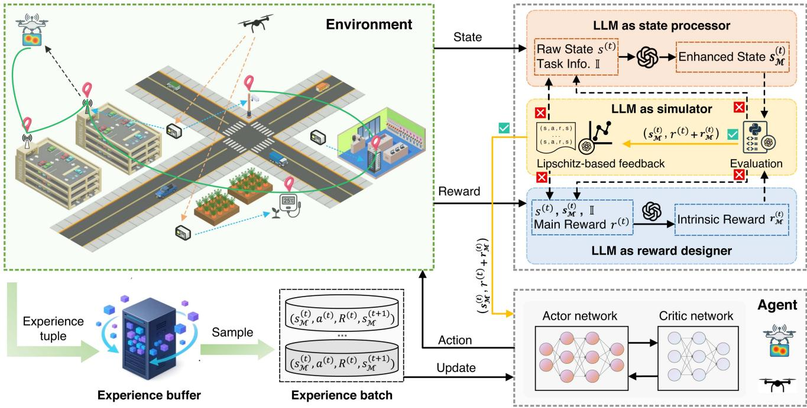  
Fig. 2. Framework of the proposed LLM-enhanced RL. The LLM assists the RL agent in three roles: as a state processor, it refines basic observations into task-aligned states; as a reward designer, it enriches the main reward with intrinsic signals for more informative feedback; and as a simulator, it generates future state–reward trajectories and provides stability feedback.

1) State Space S: State $s ^ { ( t ) } \in S$ at time slot t encapsulates relevant environmental information required for decisionmaking. Typically, the basic state vector $s ^ { ( t ) }$ , which includes various observable environmental information [31], can be represented as

$$
s ^ { ( t ) } \subset \left[ { \bf p } _ { a } ^ { ( t ) } , { \bf p } _ { b } ^ { ( t ) } , E _ { u } ^ { ( t ) } , { \bf p } _ { i } ^ { ( t ) } , { \bf p } _ { e } ^ { ( t ) } , \Delta _ { i } ^ { ( t ) } , s _ { c } ^ { ( t ) } , R _ { s , i , c } ^ { ( t ) } \right] ,\tag{19}
$$

where $\mathbf { p } _ { e } ^ { ( t ) }$ denotes the position of the eavesdropper. However, $s ^ { ( t ) }$ captures only the observable aspects of the basic environment while lacking task-specific details and associations relevant to the optimization problem (18a). To address this limitation, we leverage the extensive prior expert knowledge of LLMs to integrate task-specific information into the state representation, as detailed in Section IV-B.

2) Action Space A: After observing state $s _ { t } ,$ the agent’s decision on the corresponding action $a ^ { ( t ) } \in \mathcal { A }$ at time slot t is denoted as

$$
a ^ { ( t ) } = \left[ \Delta \mathbf { p } _ { a } ^ { ( t ) } , \Delta \mathbf { p } _ { b } ^ { ( t ) } , \mathbf { u } ^ { ( t ) } , \mathbf { v } ^ { ( t ) } \right] ,\tag{20}
$$

where:

$\Delta \mathbf { p } _ { a } ^ { ( t ) } , \Delta \mathbf { p } _ { b } ^ { ( t ) } \mathrm { \in } [ - v _ { \operatorname* { m a x } } , v _ { \operatorname* { m a x } } ] ^ { 2 }$ denote the two-dimensional displacement vectors of $U _ { a }$ and $U _ { b }$ during time slot $t ,$ respectively.

$\mathbf { u } ^ { ( t ) } \in \{ \mathbf { u } \in \mathbb { R } ^ { m } \mid \sum _ { i = 1 } ^ { m } u _ { i } = 1 , \ u _ { i } \geq 0 \}$ is a soft scheduling vector over m edge devices, where $u _ { i }$ represents the probability of selecting device i. The use of $\mathbf { u } ^ { ( t ) }$ enables differentiability for policy optimization in the TD3 algorithm. The corresponding discrete action can be recovered by applying the arg $\mathrm { \dot { m a x } } ( { \bf u } ^ { ( t ) } )$ operation, that is, if arg max $( \mathbf { u } ^ { ( t ) } ) = i$ , then $\Pi _ { i } ^ { ( t ) } = 1$

$\mathbf { v } ^ { ( t ) } \in \{ \mathbf { v } \in \mathbb { R } ^ { n } \ | \ \sum _ { c = 1 } ^ { n } v _ { c } = 1 , \ v _ { c } \geq 0 \}$ is a soft channel selection vector over n available communication channels, where $v _ { c }$ represents the probability of selecting channel c (i.e., if arg max $( \mathbf { v } ^ { ( t ) } ) = c ,$ then $z _ { c } ^ { ( t ) } = 1 )$

3) Reward Function: The reward function guides the agent’s behavior by providing feedback after the actions taken by the RL agent. Typically, the manually designed reward function $r ^ { ( t ) }$ is aligned with the optimization objective (18a) [32]. $\boldsymbol { r } ^ { ( t ) }$ is often expressed as the negative form of (18a), which is defined as

$$
\begin{array} { r } { r ^ { ( t ) } = - ( \alpha E ^ { ( t ) } + \beta \Delta ^ { ( t ) } ) + \mathbf { P } ^ { ( \mathbf { c } ) } , } \end{array}\tag{21}
$$

where $\mathbf { P } ^ { ( \mathbf { c } ) }$ is the penalty term associated with the constraint conditions. However, (21) may lack intrinsic reward factors that influence the optimization objective, which may affect the performance of policy learning. In view of this, we exploit the semantic abstraction and reasoning capabilities of LLMs to design intrinsic reward functions for RL, as detailed in Section IV-C.

## B. Implementation of LLM as State Processor for DRL

1) Motivation of Using LLM as State Processor: The RL agent needs to observe a large amount of state information in the LAENet for policy learning, as illustrated in (21). However, due to the agent’s limited prior knowledge and generalization ability, it is difficult to extract effective task-specific states from the environment. For example, the basic state space may contain task-irrelevant components or fail to capture critical environmental states, which can further hinder the convergence performance of the RL learning. Different from conventional manually designed states, we leverage the LLM as a state processor to perform semantic understanding over raw environment observations. By incorporating task descriptions and domain knowledge, the LLM can identify task-relevant state attributes and abstract them into semantically meaningful representations that are aligned with the decision objective.

2) LLM as State Processor: The LLM M is employed as a state processor to improve the RL agent’s observation of the LAENet environment and enhance the representation and perception of the state. Specifically, $\mathcal { M } : \mathcal { S } \overset { \vartriangle } {  { \ v { S } } } \overline { { \ v { S } } } ^ { \mathcal { M } }$ is prompted (the detailed prompt structure is described in Section IV-E) extracts and generates task-specific meaningful state $s _ { \mathcal { M } } ^ { ( t ) }$ from the basic state:

$$
\begin{array} { r } { \boldsymbol { s } _ { \mathcal { M } } ^ { ( t ) } = \mathcal { M } \left( \boldsymbol { s } ^ { ( t ) } , \mathcal { T } \right) , \boldsymbol { s } _ { \mathcal { M } } ^ { ( t ) } \in \mathcal { S } ^ { \mathcal { M } } , } \end{array}\tag{22}
$$

where I represents the natural language description of the LAENet task1, including the RL environment, system model, and optimization objectives.

## C. Implementation of LLM as Reward Designer for DRL

1) Motivation of Using LLM as Reward Designer: The RL agent in the LAENet aims to learn a policy through interaction with the environment to maximize the expected cumulative reward, which is given by

$$
\operatorname* { m a x } _ { \pi } \mathbb { E } _ { \pi } \left[ \sum _ { t = 0 } ^ { \infty } \gamma ^ { t } r ^ { ( t ) } \right] .\tag{23}
$$

As mentioned earlier, the manually designed reward function (21) typically focuses only on the final reward derived from the optimization objective. However, (21) overlooks the fact that the RL agent may be influenced by various intrinsic reward factors during the policy learning process, thereby missing the opportunity to further improve the learning performance. Different from traditional reward design, we leverage the task-related prior knowledge and reasoning capabilities of LLMs to achieve task-aligned reward design, which can extract enriched and multidimensional reward signals from the environment and the optimization objective to guide the action selection for the RL agent.

2) LLM as Reward Designer: The process of designing intrinsic reward functions using the LLM M is driven by prompt engineering (the detailed prompt structure is described in Section IV-E) [33]. The process of generating intrinsic reward function through M can be expressed as

$$
\boldsymbol { r } _ { \mathcal { M } } ^ { ( t ) } = \mathcal { M } \left( \boldsymbol { s } ^ { ( t ) } , \boldsymbol { s } _ { \mathcal { M } } ^ { ( t ) } , \mathbb { Z } \right) .\tag{24}
$$

The LLM-enhanced reward signals may encourage the agent to learn policies more efficiently at a finer granularity, such as approaching edge devices with higher AoI, increasing exploration of low-congestion channels, and maintaining action smoothness across time steps. The final reward is designed as

$$
R ^ { ( t ) } = \alpha s ^ { ( t ) } + \beta r _ { \mathcal { M } } ^ { ( t ) } ,\tag{25}
$$

where $\boldsymbol { r } ^ { ( t ) }$ is the main reward defined in (21).

## D. Implementation of LLM as Simulator for DRL

1) Motivation of Using LLM as Simulator: Given the stochastic nature of LLMs in generating outputs, multiple enhanced versions of the state representation $s _ { \mathcal { M } } ^ { ( t ) }$ and reward function $r _ { \mathcal { M } } ^ { ( t ) }$ can be derived from the same input. However, whether these enhancements truly improve the performance of DRL policies can only be confirmed by integrating $s _ { \mathcal { M } } ^ { ( t ) }$ and $r _ { \mathcal { M } } ^ { ( t ) }$ into the actual policy learning loop. Such empirical validation typically requires substantial computational resources and training time. Considering the simulation and generation capabilities of the LLM, it can be utilized as a simulator to construct a virtual LAENet environment to determine the superior LLM response as the enhancement scheme for practical RL training.

2) LLM as Simulator: By using the LLM to construct a semantic proxy of the real-world scenario and generating synthetic samples, we can estimate a-priori assessment of the potential enhancement of $s _ { \mathcal { M } } ^ { ( t ) }$ and $r _ { \mathcal { M } } ^ { ( \dot { t } ) }$ [34]. First, the LLM is used to generate the complete Python-based simulation of the virtual LAENet scenario. The environment components follow the previously designed system model in Section III. The MDP model in the RL setting consists of two types of contrasting state-reward pairs $( s ^ { ( t ) } , r ^ { ( t ) } )$ and $( s _ { \mathcal { M } } ^ { ( t ) } , R ^ { ( t ) } )$ . Then, we use the LLM to simulate state samples and calculate corresponding rewards $( \mathrm { i . e . , ~ } \{ r ^ { \prime ( t ) } , ~ s ^ { \prime ( t ) } \} _ { t = 1 } ^ { H }$ and $\{ s _ { \mathcal { M } } ^ { \prime ( t ) } , R ^ { \prime ( t ) } \} _ { t = 1 } ^ { H } )$ without deploying a policy or running an RL episode, which avoids the costly sampling process and extensive interactions with the environment. Finally, inspired by previous works [35], [36] and [37], we propose calculating the Lipschitz constant of $R ^ { ( t ) }$ over $s _ { \mathcal { M } } ^ { ( t ) }$ as defined in (38) in Section IV-F, to analyze LLM-enhanced state-reward designs $( s _ { \mathcal { M } } ^ { ( t ) } , R ^ { ( t ) } )$ without running RL training. Overall, a lower Lipschitz constant can improve the convergence of the RL value function network, as proved in Section IV-F. Designs with large Lipschitz constants are regarded as potentially unstable designs caused by randomness in LLM responses. Under the same simulation setting, comparison across different candidate designs remains meaningful even if the simulated environment may not perfectly match the real environment. Thus, instead of directly trusting LLM-generated designs, the candidate $( s _ { \mathcal { M } } ^ { ( t ) } , R ^ { ( t ) } )$ with relatively smaller Lipschitz constants in the LLM-based simulator is selected as the final enhancement and deployed in the real DRL training loop.

## E. Workflow of Proposed LLM-Enhanced DRL

We take the TD3 algorithm as an example to present the overall workflow of the proposed LLM-enhanced DRL. Due to the constraints of onboard computation and energy, the LLM-design modules of the proposed framework are executed on edge or cloud servers.

1) Step 1 (Basic MDP Model Initialization): The basic MDP model is initialized using manually designed state and reward functions based on the latest state-of-the-art work [9]. The basic state is represented as

$$
\begin{array} { r } { s ^ { ( t ) } = [ \mathbf { p } _ { a } ^ { ( t ) } , \mathbf { p } _ { b } ^ { ( t ) } , s _ { c } ^ { ( t ) } , R _ { s , i , c } ^ { ( t ) } , E _ { a } ^ { ( t ) } , E _ { b } ^ { ( t ) } , \Delta _ { i } ^ { ( t ) } ] . } \end{array}\tag{26}
$$

The design of the main reward function $r ^ { ( t ) }$ is based on (21). Specifically, if the UAV crosses the boundary $( \mathrm { i . e . , } \mathbf { p } _ { u } ^ { ( t ) } \notin \mathcal { P } )$ , a penalty $r _ { 1 }$ is directly imposed $( \mathrm { i . e . , } r ^ { ( t ) } = - r _ { 1 } )$ ; otherwise, $\boldsymbol { r } ^ { ( t ) }$ is designed as

$$
r ^ { ( t ) } = r _ { 2 } \sum _ { i \in M } \mathbf { 1 } \left( ( R _ { s , i , c } ^ { ( t ) } \geq R _ { \operatorname* { m i n } } ) \wedge ( \Pi _ { i } ^ { ( t ) } = 1 ) \wedge ( z _ { c } ^ { ( t ) } = 1 ) \right)
$$

$$
- r _ { 3 } \sum _ { u \in \{ U _ { a } , U _ { b } \} } E _ { u } ^ { ( t ) } - r _ { 4 } \sum _ { i \in M } \Delta _ { i } ^ { ( t ) } ,\tag{27}
$$

where $\mathbf { 1 } ( ( R _ { s , i , c } ^ { ( t ) } \geq R _ { \operatorname* { m i n } } ) \wedge ( \Pi _ { i } ^ { ( t ) } = 1 ) \wedge ( z _ { c } ^ { ( t ) } = 1 ) )$ denotes an indicator function that equals 1 if the secrecy rate $R _ { s , i , c } ^ { ( t ) }$ exceeds the minimum threshold $R _ { \mathrm { m i n } }$ and the selected action corresponds to edge device i under the idle channel $c ;$ otherwise, $\mathbf { 1 } ( ( R _ { s , i , c } ^ { ( t ) } \geq R _ { \operatorname* { m i n } } ) \land ( \Pi _ { i } ^ { ( t ) } = 1 ) ) = 0 .$

2) Step 2 (Prompt LLM as State Processor and Reward Designer): The LLM is prompted to process the state and design reward before RL training. The prompt1 mainly comprises the following critical elements:

\- Task Description: A clear statement of the agent’s mission in the LAENet workspace.

\- Optimization Objective: For example, in our settings, minimizing the sum of AoI and energy consumption while satisfying secrecy rate requirements.

\- State Encoding Specification: A structured breakdown of the original state vector and reward function.

\- Design Requirements: Generating informative state representations and intrinsic reward functions in the Python code format that can be integrated into the RL training pipeline.

3) Step 3 (Response Evaluation in LLM-Based Simulator): The stochastic responses and hallucinations of LLMs may generate seemingly reasonable but actually non-executable code [38]. We assess the execution validity of the LLM-generated state and reward functions based on the following criteria:

\- Conformance to input-output format: The enhanced state returns an augmented state vector consistent with the original structure, and the intrinsic reward outputs a scalar value.

\- Dimensional consistency: Each dimension in the state vector maintains a consistent position, order, and semantic meaning, which aligns with the corresponding components in the reward function.

\- Numerical stability: The generated code includes safeguards against numerical issues, such as division-by-zero errors.

After prompting the LLM and evaluating the responses, the first version of the LLM-enhanced state representations is denoted as

$$
s _ { \mathcal { M } } ^ { ( t ) } = [ s ^ { ( t ) } , d _ { a , b } ^ { ( t ) } , d _ { a , i } ^ { \mathrm { m i n } } , d _ { b , i } ^ { \mathrm { m i n } } , \bar { \Delta } _ { i } ^ { ( t ) } ] ,\tag{28}
$$

where $s ^ { ( t ) }$ is the basic state in (26). According to the explanation provided by the LLM, $d _ { a , b } ^ { ( t ) } = \| \mathbf { p } _ { a } ^ { ( t ) } - \mathbf { p } _ { b } ^ { ( t ) } \| _ { 2 }$ is the Euclidean distance between two UAVs that reflects the degree of spatial coordination. $d _ { a , i } ^ { \operatorname* { m i n } } = \operatorname* { m i n } _ { i } \| \mathbf { p } _ { a } ^ { ( t ) } - \mathbf { p } _ { i } \| _ { 2 }$ denotes the minimum distance from UAV $U _ { a }$ to any edge device $i ,$ indicating $U _ { a } { } ^ { \prime } \mathbf { s }$ closest communication opportunity. $d _ { b , i } ^ { \operatorname* { m i n } } = \operatorname* { m i n } _ { i } \| \mathbf { p } _ { b } ^ { ( t ) } - \mathbf { p } _ { i }$ 2 provides implicit spatial cues to support policy learning. $\bar { \Delta } _ { i } ^ { ( t ) } =$ $\begin{array} { r } { \frac { 1 } { m } \sum _ { i = 1 } ^ { m } \Delta _ { i } ^ { ( t ) } } \end{array}$ represents the mean AoI, which quantifies the average freshness of sensed information over all devices. The first version of the intrinsic reward generated by the LLM is designed as

$$
r _ { \mathcal { M } } ^ { ( t ) } = - \left( r _ { 5 } d _ { a , b } ^ { ( t ) } + r _ { 6 } d _ { a , i } ^ { \operatorname* { m i n } } - r _ { 7 } d _ { b , i } ^ { \operatorname* { m i n } } + r _ { 8 } \bar { \Delta } _ { i } ^ { ( t ) } \right) .\tag{29}
$$

The LLM explains that the term $r _ { 5 } d _ { a , b } ^ { ( t ) }$ penalizes excessive spatial separation between UAVs and promotes coordinated behaviour, which enhances secure communication by ensuring that $U _ { a }$ and $U _ { b }$ remain spatially aligned and effectively degrades the eavesdroppers’ channel quality. $r _ { 5 } d _ { a , b } ^ { ( t ) }$ encourages proximity between $U _ { a }$ and edge devices to improve data collection efficiency and communication quality. Although $U _ { b }$ has no direct connection with the edge device, $r _ { 7 } d _ { b , i } ^ { \mathrm { m i n } }$ may realize the implicit learning of the interference strategy of “staying away from the communication area but close to the eavesdropping area”. Even if no AoI feedback is obtained from the main reward at the current time step due to transmission failure, $r _ { 8 } \bar { \Delta } _ { i } ^ { ( t ) }$ can still provide continuous negative feedback as the information becomes stale to encourage the agent to approach edge devices to reduce the overall AoI.

4) Step 4 (Lipschitz-Based Feedback in LLM-Based Simulator): In the LAENet environment generated by the LLM-based simulator, the Lipschitz constant of reward relative to state is computed according to (38). The Lipschitz constant serves as a quantitative indicator of the smoothness and stability of the state–reward mapping, which is related to the convergence performance of DRL, as demonstrated in Section IV-F. To further reduce the Lipschitz constant to enhance the convergence performance of DRL, the LLM can regenerate (28) and (29) by incorporating the Lipschitz-based feedback into its reasoning process through the CoT prompts1, where the key points include:

\- Dimensional Sensitivity Analysis: Identify which dimensions of the augmented state contribute most or least according to per-dimension Lipschitz constants.

\- Failure Diagnosis and Correction: Investigate poorperforming candidates to determine if they lack critical features or unstable reward signals.

\- Improvement via Feature Extraction: Revise the state representation and reward design by keeping effective features and integrating improvements through the above analysis.

The modified state after Lipschitz-based feedback is represented as

$$
\begin{array} { r } { { s } _ { \mathcal { M } } ^ { * ( t ) } = [ { s } ^ { ( t ) } , { d } _ { a , b } ^ { ( t ) } , { d } _ { a , i } ^ { \operatorname* { m i n } } , { \overline { { d } } _ { a , i } } , { d } _ { b , j } ^ { \operatorname* { m i n } } , { \overline { { d } } _ { b , j } } , { \bar { \Delta } _ { i } ^ { ( t ) } } , { \hat { \Delta } _ { i } ^ { ( t ) } } ] . } \end{array}\tag{30}
$$

In contrast to (28), a notable difference is that the LLM removed the state component $d _ { b , i } ^ { \operatorname* { m i n } }$ and replaced it with the minimum distance from $U _ { b }$ to the eavesdropper $j ~ ( \mathrm { i . e . , } ~ d _ { b , j } ^ { \mathrm { m i n } } )$ . The LLM explained that optimizing $d _ { b , j } ^ { \operatorname* { m i n } }$ is more effective than $d _ { b , i } ^ { \operatorname* { m i n } }$ in enhancing the secrecy rate, since $U _ { b }$ , acting as the jamming UAV, can interfere with the eavesdropper more efficiently when $d _ { b , j } ^ { \operatorname* { m i n } }$ is smaller. In addition, the LLM introduced the average distances $\begin{array} { r } { \overline { { d } } _ { a , i } = \frac { 1 } { m } \sum _ { i = 1 } ^ { m } \| { \bf p } _ { a } ^ { ( t ) } - { \bf p } _ { i } \| _ { 2 } \mathrm { a n d } \overline { { d } } _ { b , j } = \frac { 1 } { e } \sum _ { i = 1 } ^ { e } \| { \bf p } _ { b } ^ { ( t ) } - { \bf p } _ { j } \| _ { 2 } } \end{array}$ to improve overall communication coverage and reduce mobility deviation. $\hat { \Delta } _ { i } ^ { ( t ) }$ is the standard deviation of AoI, which encourages the agent to focus on outdated data to reduce disparities in information staleness across edge devices. Accordingly, the intrinsic reward function is improved as

$$
\begin{array} { r l } & { r _ { \mathcal { M } } ^ { * ( t ) } = \ ( r _ { 5 } ^ { * } d _ { a , b } ^ { ( t ) } + r _ { 6 } ^ { * } d _ { a , i } ^ { \mathrm { m i n } } + r _ { 7 } ^ { * } d _ { b , j } ^ { \mathrm { m i n } } + r _ { 8 } ^ { * } \bar { \Delta } _ { i } ^ { ( t ) } } \\ & { ~ + r _ { 9 } ^ { * } \overline { { d } } _ { a , i } + r _ { 1 0 } ^ { * } \overline { { d } } _ { b , j } + r _ { 1 1 } ^ { * } \bar { \Delta } _ { i } ^ { ( t ) } ) . } \end{array}\tag{31}
$$

5) Step 5 (Network Initialization): We initialize an actor network $\pi _ { \phi }$ and two critic networks $Q _ { \theta _ { 1 } } , Q _ { \theta _ { 2 } }$ with random weights. The target actor network $( \mathrm { i } . \mathrm { e } . , \pi _ { \phi ^ { \prime } } )$ and the target critic networks $( \mathrm { i } . \mathrm { e } . , Q \theta _ { 1 } ^ { \prime }$ and $Q _ { \theta _ { 2 } ^ { \prime } } )$ are initialized with the same parameters as their respective main networks $\pi _ { \phi } , Q _ { \theta _ { 1 } }$ , and $Q _ { \theta _ { 2 } }$ , respectively. A replay buffer D is constructed to store past transitions. The Gaussian exploration noise $\varepsilon \sim \mathcal { N } ( 0 , \sigma ^ { 2 } )$ is initialized to encourage exploration in early stages.

6) Step 6 (Environment Interaction): At each time step t, the agent observes the current environment state $s _ { \mathcal { M } } ^ { * ( t ) }$ enhanced by the LLM. The corresponding action $a ^ { ( t ) }$ is generated as

$$
a ^ { ( t ) } = \mathrm { c l i p } \left( \pi _ { \phi } ( s _ { \mathcal { M } } ^ { * ( t ) } ) + \varepsilon , \ : a _ { \mathrm { m i n } } , \ : a _ { \mathrm { m a x } } \right) ,\tag{32}
$$

where ε is the Gaussian exploration noise to the output of the actor network; $a _ { \mathrm { m i n } }$ and $a _ { \mathrm { m a x } }$ denote the minimum and maximum allowable values of the action, respectively. The action $a ^ { ( t ) }$ is executed in the environment. Subsequently, the system returns a reward $R ^ { ( t ) }$ and the next state $s _ { \mathcal { M } } ^ { * ( t + 1 ) }$ . The transition tuple $( s _ { \mathcal { M } } ^ { * ( t ) } , a ^ { ( t ) } , R ^ { ( t ) } , s _ { \mathcal { M } } ^ { * ( t + 1 ) } )$ is stored in the replay buffer D for future updates.

7) Step 7 (Critic Network Update): When the replay buffer D has accumulated a sufficient number of transition tuples, a minibatch of samples $( s , a , r , s ^ { \prime } )$ is randomly drawn to perform critic updates. The target Q-value y is finally computed using the clipped double Q-learning mechanism:

$$
y = r + \gamma \cdot \operatorname* { m i n } _ { q = 1 , 2 } Q _ { \theta _ { q } } ^ { \prime } ( s ^ { \prime } , \pi _ { \phi ^ { \prime } } ( s ^ { \prime } ) + \mathrm { c l i p } ( \epsilon , - d , d ) ) ,\tag{33}
$$

where r is the reward, γ represents the discount factor, $\theta _ { q } ^ { \prime }$ and $\phi ^ { \prime }$ are parameters of target network. $\epsilon \sim \mathcal { N } ( 0 , \sigma ^ { 2 } )$ represents the exploration noise and clip $( \epsilon , - d , d )$ ensures that the added noise remains within a bounded range $[ - d , d ]$ . Given the target value y, critic networks are updated by minimizing the mean squared error (MSE) loss, which is defined as

$$
\mathcal { L } _ { \mathrm { c r i t i c } } = \frac { 1 } { B } \sum _ { ( s , a , r , s ^ { \prime } ) \in B } \sum _ { q = 1 } ^ { 2 } \left( Q _ { \theta _ { q } } ( s , a ) - y \right) ^ { 2 } ,\tag{34}
$$

where B is the minibatch size, and $B \subset D$ denotes the sampled minibatch.

8) Step 8 (Actor and Target Network Update): The actor parameters $\phi$ are updated every d steps by maximizing the expected Q-value under the current policy:

$$
\nabla _ { \phi } J ( \phi ) = \mathbb { E } _ { s \sim D } \left[ \nabla _ { a } Q _ { \theta _ { 1 } } ( s , a ) \big | _ { a = \pi _ { \phi } ( s ) } \cdot \nabla _ { \phi } \pi _ { \phi } ( s ) \right] ,\tag{35}
$$

where $Q _ { \theta _ { 1 } }$ refers to one of the critic networks used to compute the policy gradient. The target networks are updated using the soft update method:

$$
\theta _ { i } ^ { \prime }  \tau \theta _ { i } + ( 1 - \tau ) \theta _ { i } ^ { \prime } ,\tag{36}
$$

$$
\phi ^ { \prime }  \tau \phi + ( 1 - \tau ) \phi ^ { \prime } ,\tag{37}
$$

where $\tau \in ( 0 , 1 )$ is the update rate.

## F. Theoretical Analysis

In this section, we provide theoretical analysis to further support the effectiveness of using LLMs to enhance RL.

Assumption 1: We abstract the process $\mathcal { M } : \mathcal { S }  \mathcal { S } ^ { \mathcal { M } }$ of using the LLM to process the state in (22) as a mapping $f : S  S$ that performs a permutation transformation for the convenience of theoretical analysis, where $f ( S _ { 0 } ) = S _ { 0 } \subset S [ 3 9 ]$ . We assume that the mapping M is superior to the mapping f. Assume the data distribution $\mu$ over $\boldsymbol { \mathcal { S } }$ satisfies $\mu \circ f ^ { - 1 } = \mu .$ . Under the mapping f, the process of using LLMs to design the reward is abstracted as the neural network mapping [40].

We formally define the Lipschitz constant introduced in Section IV-D, which measures the smoothness of the mapping from state to reward.

Definition 1 (Lipschitz Constant of State to Reward): Denote the state space as $S \subset \mathbb { R } ^ { d }$ and the reward space as R. Abstract the process of using the LLM for reward design as a mapping function u : $S \to \mathbb { R } ^ { m }$ . The Lipschitz constant of u over a subset $s _ { 0 } \subset S$ is defined as [41]

$$
\mathcal { L } ( u ; S _ { 0 } ) = \operatorname* { s u p } _ { s _ { 1 } , s _ { 2 } \in S _ { 0 } } \frac { \| u ( s _ { 1 } ) - u ( s _ { 2 } ) \| _ { 2 } } { \| s _ { 1 } - s _ { 2 } \| _ { 2 } } ,\tag{38}
$$

where the random sequence $( s _ { 1 } , s _ { 2 } )$ is independently and identically distributed over S according to the probability distribution $\mu .$ When ${ \cal S } _ { 0 } = { \cal S }$ , we write $\mathcal { L } ( u ; S _ { 0 } ) : = \mathcal { L } ( u )$

Having established the Lipschitz constant as a measure of individual functions, we extend this notion to the macro-level hypothesis space by defining a function class [37].

Definition 2 (Lipschitz-Bounded Function Class): For a given parameter $\beta > 0 .$ , we define the function class as the set of all functions u with Lipschitz constants less than or equal to $\beta \colon$

$$
\mathcal { U } ( \beta ) \ : = \ \left\{ u : \mathcal { S } \to \mathbb { R } ^ { m } \ \middle | \mathcal { L } ( u ) \leq \beta \right\} .\tag{39}
$$

By construction, if $\beta _ { 1 } \le \beta _ { 0 }$ then $\mathcal { U } ( \beta _ { 1 } ) \subseteq \mathcal { U } ( \beta _ { 0 } )$ [42].

Next, we prove that if the mapping from LAENetenvironment states to reward signals has a smaller Lipschitz constant, then the value function approximation process in RL can achieve a tighter error bound.

Theorem 1: Let $u _ { k } ^ { * } , k = 0 ;$ 1 be the optimal value function satisfying: (i) $u _ { 1 } ^ { \ast } ( s ) : = u _ { 0 } ^ { \ast } ( f ^ { - 1 } ( s ) ) , ( \mathrm { i i } ) \ \mathcal { L } ( f ^ { - 1 } ) \leq 1$ , and (iii) $\mathcal { L } ( u _ { 1 } ^ { * } ) \leq \mathcal { L } ( u _ { 0 } ^ { * } ) \leq \beta _ { 0 }$ . The generalization error is defined as

$$
\mathcal { E } _ { k } = \operatorname* { s u p } _ { u _ { k } \in \mathcal { U } _ { k } } \mathbb { E } _ { s \sim \mu } \left[ \| u _ { k } ^ { * } ( s ) - u _ { k } ( s ) \| _ { 2 } \right] ,\tag{40}
$$

where $\mathcal { U } _ { k } = \mathcal { U } ( \beta _ { k } ) . \mathrm { I f } \ \beta _ { 1 } \le \beta _ { 0 }$ , then ${ \mathcal { E } } _ { 1 } \leq { \mathcal { E } } _ { 0 }$

Proof: For simplicity, the expectation expression in (40) is formalized as the error functional [43], [44]:

$$
\Phi _ { \mu } ( u , v ) = \mathbb { E } _ { s \sim \mu } \left[ \| u ( s ) - v ( s ) \| _ { 2 } \right] .\tag{41}
$$

Since $\mathcal { U } _ { 1 } \subseteq \mathcal { U } _ { 0 }$ , it follows by monotonicity of supremum [45]:

$$
\operatorname* { s u p } _ { u _ { 1 } \in \mathcal { U } _ { 1 } } \Phi _ { \mu } ( u _ { 1 } , u _ { 1 } ^ { * } ) \leq \operatorname* { s u p } _ { u _ { 0 } \in \mathcal { U } _ { 0 } } \Phi _ { \mu } ( u _ { 0 } , u _ { 1 } ^ { * } ) .\tag{42}
$$

For any $u _ { 0 } \in \mathcal { U } _ { 0 }$ , we define $u _ { 1 } ( s ) : = u _ { 0 } ( f ^ { - 1 } ( s ) )$ . Then, $u _ { 1 } \in$ $\mathcal { U } _ { \mathrm { 0 } }$ since f is bijective and $\mathcal { L } ( u _ { 1 } ) \leq \mathcal { L } ( u _ { 0 } )$ . Using the changeof-variable property under $\mu \circ f ^ { - 1 } = \mu ,$ , we have:

$$
\begin{array} { r l } & { \Phi _ { \mu } ( u _ { 0 } , u _ { 1 } ^ { * } ) = \mathbb { E } _ { s \sim \mu } \left. u _ { 0 } ( s ) - u _ { 0 } ^ { * } ( f ^ { - 1 } ( s ) ) \right. _ { 2 } } \\ & { \qquad = \mathbb { E } _ { s ^ { \prime } \sim \mu } \left. u _ { 0 } ( f ( s ^ { \prime } ) ) - u _ { 0 } ^ { * } ( s ^ { \prime } ) \right. _ { 2 } } \\ & { \qquad = \mathbb { E } _ { s ^ { \prime } \sim \mu } \left. u _ { 1 } ( s ^ { \prime } ) - u _ { 0 } ^ { * } ( s ^ { \prime } ) \right. _ { 2 } . } \end{array}\tag{43}
$$

Therefore, we have:

$$
\operatorname* { s u p } _ { u _ { 0 } \in \mathcal { U } _ { 0 } } \Phi _ { \mu } ( u _ { 0 } , u _ { 1 } ^ { * } ) \leq \operatorname* { s u p } _ { u \in \mathcal { U } _ { 0 } } \Phi _ { \mu } ( u _ { 0 } , u _ { 0 } ^ { * } ) = \mathcal { E } _ { 0 } .\tag{44}
$$

Combining (43) and (44), we conclude:

$$
\mathcal { E } _ { 1 } = \operatorname* { s u p } _ { u _ { 1 } \in \mathcal { U } _ { 1 } } \Phi _ { \mu } ( u _ { 1 } , u _ { 1 } ^ { * } ) \leq \operatorname* { s u p } _ { u _ { 0 } \in \mathcal { U } _ { 0 } } \Phi _ { \mu } ( u _ { 0 } , u _ { 1 } ^ { * } ) \leq \mathcal { E } _ { 0 } .\tag{45}
$$

Next, we demonstrate that reducing the Lipschitz constant of the reward function in the LLM-based simulator can tighten the upper bound of the value function’s Lipschitz constant in the RL.

Assumption 2: Let $( S , \parallel \cdot \parallel )$ be a compact metric state space with diameter diam $( S ) \le D < \infty$ . The dynamics are deterministic such that for any state–action pair $( s , a )$ , the next state is $f ( s , a ) \in S$ . Fix a stationary policy π and discount factor $\gamma \in ( 0 , 1 )$

Assumption 3 (Smooth reward): The onestep reward $r ( s ) \in$ R is $K _ { 1 } – \mathrm { L i p s c h i t z , i . e . , } \mathcal { L } ( r ) = K _ { 1 } < \infty [ 3 5 ] , [ 3 6 ]$

Assumption 4 (Smooth dynamics): The transition mapping composed with π is $K _ { \mathrm { 2 } } { \mathrm { - L i p s c h i t z } }$ , that is, $\mathcal { L } ( s \mapsto$ $f ( s , \pi ( s ) ) ) \ : = \ : K _ { 2 } \ : [ 3 5 ]$ . In addition, we assume that $\gamma K _ { 2 } < 1$ [36].

Definition 3 (Value Function): The value function of π after t steps is denoted as $\begin{array} { r } { V _ { t } ^ { \pi } ( s ) ~ = ~ \sum _ { k = 0 } ^ { t } \gamma ^ { k } r ( s _ { k } ) } \end{array}$ , where $s _ { 0 } = s$ and $s _ { k + 1 } = f ( s _ { k } , \pi ( s _ { k } ) )$ . We write $\begin{array} { r } { V ^ { \pi } \equiv \operatorname* { l i m } _ { t  \infty } V _ { t } ^ { \pi } } \end{array}$ for the infinitehorizon value, which exists under Assumption 4.

Lemma 1: Under the Assumptions 3 and 4, for $H  \infty .$ , the value $V ^ { \pi }$ satisfies the following bound:

$$
\mathcal { L } ( V ^ { \pi } ) \leq \frac { K _ { 1 } } { 1 - \gamma K _ { 2 } } .\tag{46}
$$

Proof: Let $s _ { 0 } , s _ { 0 } ^ { \prime } \in \mathcal { S } ; \ s _ { k } = f ^ { ( k ) } ( s _ { 0 } )$ and $s _ { k } ^ { \prime } = f ^ { ( k ) } ( s _ { 0 } ^ { \prime } )$ denote the two deterministic trajectories by, where $f ^ { ( k ) }$ abbreviates k compositions with π fixed. Under Assumption 4, $\lVert s _ { k } - s _ { k } ^ { \prime } \rVert \leq K _ { 2 } ^ { \bar { k } } \lVert s _ { 0 } - s _ { 0 } ^ { \prime } \rVert$ . For any horizon $H \in \mathbb { N } .$ , applying Assumption 3 and summing the geometric series gives:

$$
| V _ { H } ^ { \pi } ( s _ { 0 } ) - V _ { H } ^ { \pi } ( s _ { 0 } ^ { \prime } ) | \le \sum _ { k = 0 } ^ { H } \gamma ^ { k } K _ { 1 } K _ { 2 } ^ { k } \| s _ { 0 } - s _ { 0 } ^ { \prime } \|
$$

$$
= K _ { 1 } \cdot \frac { 1 - ( \gamma K _ { 2 } ) ^ { H + 1 } } { 1 - \gamma K _ { 2 } } \left\| s _ { 0 } - s _ { 0 } ^ { \prime } \right\| .\tag{47}
$$

Letting $H \to \infty$ and using the condition $\gamma K _ { 2 } < 1$ , we obtain:

$$
\mathcal { L } ( V ^ { \pi } ) \leq \frac { K _ { 1 } } { 1 - \gamma K _ { 2 } } .\tag{48}
$$

Definition 4 (Bellman operator): For any bounded $V : S $ R, we define the Bellman operator T as [46]:

$$
( T V ) ( s ) : = r ( s ) + \gamma V ( f ( s , \pi ( s ) ) ) ,\tag{49}
$$

where V denotes an arbitrary bounded candidate for the statevalue function.

Lemma 2: T is a γcontraction under the supnorm, which is expressed as [43]:

$$
\left\| T V _ { 1 } - T V _ { 2 } \right\| _ { \infty } \leq \gamma \ \left\| V _ { 1 } - V _ { 2 } \right\| _ { \infty } .\tag{50}
$$

Proof: Immediate from taking the supremum over s and using the inherent property $| V _ { 1 } ( s ^ { \prime } ) - V _ { 2 } ( s ^ { \prime } ) | \leq \| V _ { 1 } - V _ { 2 } \| _ { \infty }$ with (49). -

Let $E _ { t } : = \| V _ { t } ^ { \pi } - V ^ { \pi } \| _ { \infty }$ denote the Bellman error. Using standard arguments, we have $E _ { 0 } = \| V _ { 0 } ^ { \pi } - V ^ { \pi } \| _ { \infty } \leq { \mathcal { L } } ( V ^ { \pi } )$ D and $E _ { t + 1 } \leq \gamma E _ { t }$ . Unrolling the recursion with Lemma 1, we obtain:

$$
E _ { t } \leq \gamma ^ { t } \frac { K _ { 1 } D } { 1 - \gamma K _ { 2 } } .\tag{51}
$$

Theorem 2: Let $K _ { 1 }$ and $K _ { 1 } ^ { \prime } < K _ { 1 }$ be two reward smoothness constants with all other quantities unchanged. Fix $\varepsilon > 0$ . Let $t _ { \varepsilon }$ denote the smallest integer such that $E _ { t } \leq \varepsilon$ and $t _ { \varepsilon } ^ { \prime }$ denote the smallest integer such that $E _ { t } ^ { \prime } \leq \varepsilon .$ . Then, we have $t _ { \varepsilon } > t _ { \varepsilon } ^ { \prime }$

Proof: According to (51), we can obtain:

$$
t _ { \varepsilon } - t _ { \varepsilon } ^ { \prime } \geq \frac { \log ( K _ { 1 } / K _ { 1 } ^ { \prime } ) } { - \log ( \gamma ) } .\tag{52}
$$

Because $K _ { 1 } / K _ { 1 } ^ { \prime } > 1$ and $- \log ( \gamma ) > 0$ , the $( \log ( K _ { 1 } / K _ { 1 } ^ { \prime } ) ) /$ $\left( - \log ( \gamma ) \right)$ is strictly positive and consequently, $t _ { \varepsilon } - t _ { \varepsilon } ^ { \prime } > 0$ . -

Theorem 2 demonstrates that lowering the reward Lipschitz constant strictly reduces the number of valueiteration steps required to reach error ε. Based on the above analysis, a smoother reward (i.e., smaller $K _ { 1 } )$ in RL contracts the Lipschitz envelope of the value function, which tightens the initial error bound and transfers linearly into fewer iterations.

## V. NUMERICAL RESULTS

## A. Simulation Setup

The simulation environment scenario unfolds within a $3 0 0 \mathrm { m } \times 3 0 0 \mathrm { m } \times 3 0 0$ m cube containing five edge devices and five stationary eavesdroppers positioned at fixed coordinates. Two UAVs operate simultaneously, with horizontal motion discretized to a maximum step size of 20 m per time slot, and their movement constrained within the simulation boundaries, jointly providing the LAENet with energy-efficient, fresh, and secure data collection services. More parameters related to the simulation environment are presented in Table II.

TABLE II SUMMARY OF PARAMETERS  
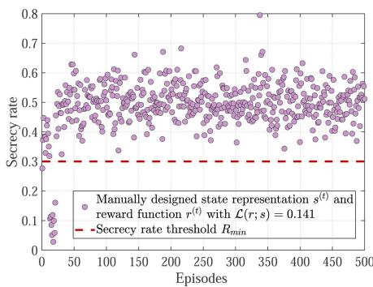  
(a) Manual Design with $\mathcal { L } ( r ; s ) = 0 . 1 4 1$

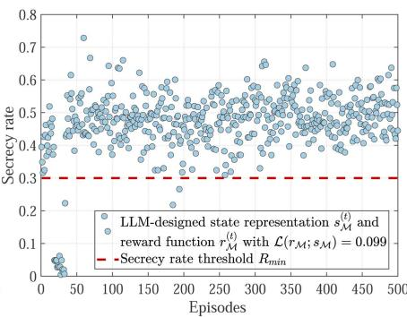  
(b) LLM Design with $\mathcal { L } ( r _ { \mathcal { M } } ; s _ { \mathcal { M } } ) = 0 . 0 9 9$

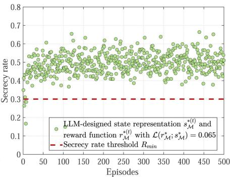  
(c) LLM Design with $\mathcal { L } ( r _ { \mathcal { M } } ^ { \ast } ; s _ { \mathcal { M } } ^ { \ast } ) = 0 . 0 6 5$  
Fig. 3. Comparison of the episode-wise secrecy rate between the proposed LLM-enhanced RL schemes and the baseline scheme [9] under the TD3 algorithm, where the minimum secrecy threshold (indicated by the red dashed line) is set to 0.3.

<table><tr><td rowspan=1 colspan=1>Parameter</td><td rowspan=1 colspan=1>Value</td><td rowspan=1 colspan=1>Parameter</td><td rowspan=1 colspan=1>Value</td></tr><tr><td rowspan=1 colspan=1>Channel powergain</td><td rowspan=1 colspan=1>0.001</td><td rowspan=1 colspan=1>Number of timeslots</td><td rowspan=1 colspan=1>200</td></tr><tr><td rowspan=1 colspan=1>Carrier wavelength</td><td rowspan=1 colspan=1>0.12 m</td><td rowspan=1 colspan=1>Noise power</td><td rowspan=1 colspan=1>-110dBm</td></tr><tr><td rowspan=1 colspan=1>path loss</td><td rowspan=1 colspan=1>2.6</td><td rowspan=1 colspan=1>Rayleighdistribution</td><td rowspan=1 colspan=1> $\sqrt { 1 / 2 }$ </td></tr><tr><td rowspan=1 colspan=1>Transmit power ofedge device</td><td rowspan=1 colspan=1>10 dBm</td><td rowspan=1 colspan=1>Transmit power ofjamming UAV</td><td rowspan=1 colspan=1>0 dBm</td></tr><tr><td rowspan=1 colspan=1>training episodes</td><td rowspan=1 colspan=1>500</td><td rowspan=1 colspan=1>Soft update weight</td><td rowspan=1 colspan=1>0.005</td></tr><tr><td rowspan=1 colspan=1>Actor learning rate</td><td rowspan=1 colspan=1>3e-4</td><td rowspan=1 colspan=1>Critic learning rate</td><td rowspan=1 colspan=1>3e-4</td></tr><tr><td rowspan=1 colspan=1>Batch size</td><td rowspan=1 colspan=1>512</td><td rowspan=1 colspan=1>Buffer size</td><td rowspan=1 colspan=1>1e6</td></tr><tr><td rowspan=1 colspan=1>LLM version</td><td rowspan=1 colspan=1>GPT-4</td><td rowspan=1 colspan=1>LLM parameterscale</td><td rowspan=1 colspan=1>1.8T</td></tr></table>

To validate the effectiveness of the proposed LLM-enhanced RL scheme, we adopt the state and reward designs from the latest state-of-the-art work [9] as the baseline, corresponding to (26) and (27). The Lipschitz constant of the baseline, calculated in our proposed LLM-based simulator, is 0.141, i.e., manually designed state representation $s ^ { ( t ) }$ and reward function $r ^ { ( t ) }$ with $\mathcal { L } ( r ; s ) = 0 . 1 4 1$ . The first comparison scheme is the first version of the LLM-enhanced state representation and reward function (corresponding to (28) and (29)), i.e., LLM-designed state representation $s _ { \mathcal { M } } ^ { ( \bar { t } ) }$ and reward function $r _ { \mathcal { M } } ^ { ( t ) }$ with $\mathcal { L } ( \boldsymbol { r } _ { \mathcal { M } } ; \boldsymbol { s } _ { \mathcal { M } } ) =$ 0.099. The second comparison scheme is the improved version of the first comparison scheme, obtained via Lipschitz-based feedback in the proposed LLM-based simulator (corresponding to (30) and (31)), i.e., LLM-designed state representation $s _ { \mathcal { M } } ^ { * ( t ) }$ and reward function $r _ { \mathcal { M } } ^ { * ( t ) }$ with $\mathcal { L } ( r _ { \mathcal { M } } ^ { \ast } ; s _ { \mathcal { M } } ^ { \ast } ) = 0 . 0 6 5$ . All three schemes described above will all be evaluated under two RL algorithms (i.e., DDPG and TD3).

## B. Results and Analysis

Fig. 4 compares the convergence performance of the three schemes under the TD3 algorithm with a minimum secrecy threshold of 0.3. The red curve, corresponding to the baseline designed according to the state-of-the-art work [9], converges slowly and exhibits larger oscillations throughout training. The blue curve, representing the first valid LLM-designed state–reward pair with a Lipschitz constant equal to 0.099 (i.e., $\mathcal { L } ( r _ { \mathcal { M } } ; s _ { \mathcal { M } } ) = 0 . 0 9 9 )$ , achieves a lower objective value of approximately 420, indicating improved optimization performance compared to the baseline. The orange curve, obtained via Lipschitz-based feedback with Lipschitz constant of 0.065, demonstrates more stable and faster convergence, achieving an improvement of about 35% over the baseline. These results show that the LLM-designed state and reward enable the RL agent to learn superior policies, and illustrate that a state–reward pair with a smaller Lipschitz constant can further enhance RL performance.

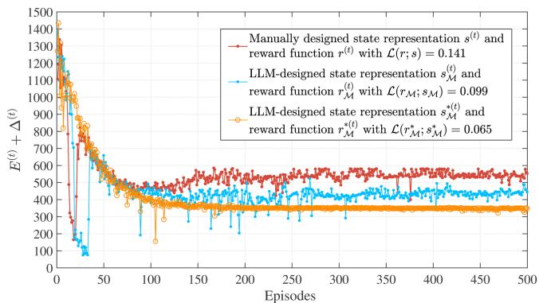  
Fig. 4. Comparison of the convergence performance of the optimization objective between the proposed LLM-enhanced RL schemes and the baseline scheme [9] under the TD3 algorithm, where the minimum secrecy threshold is set to 0.3. The state and reward design of the red curve (i.e., $\mathcal { L } ( r ; s ) = 0 . 1 4 1 )$ correspond to equations (26) and (27). The blue curve (i.e., $\mathcal { L } ( r _ { \mathcal { M } } ; s _ { \mathcal { M } } ) = 0 . 0 9 9 )$ corresponds to equations (28) and (29). The scheme of the orange curve (i.e., $\mathcal { L } ( r _ { \mathcal { M } } ^ { \ast } ; s _ { \mathcal { M } } ^ { \ast } ) = \mathrm { \bar { 0 . 0 6 5 } ) }$ corresponds to (30) and (31).

Furthermore, we collected the secrecy rate samples of the three schemes during RL training to evaluate the security performance of low-altitude data collection, as shown in Fig. 3. The secrecy rate metrics of all three schemes remain stably above the minimum threshold (i.e., 0.3) as RL training converges. Importantly, the secrecy rate distribution shown in Fig. 3(c) is relatively more compact, which further indicates that a lower Lipschitz constant can promote a more stable RL learning policy.

Fig. 5 shows that both AoI and energy consumption increase as $R _ { \mathrm { m i n } }$ grows. As $R _ { \mathrm { m i n } }$ increases, data that could be uploaded is discarded for not satisfying the secrecy rate constraint, which requires the UAV $U _ { a }$ to wait for subsequent data collection opportunities, thereby increasing the AoI. In addition, stricter secrecy rate constraints require extra path adjustments to manage the distances between UAVs, edge devices, and eavesdroppers. In Fig. 5(a), the TD3 LLM-enhanced design with ${ \mathcal { L } } ( r _ { { \mathcal { M } } } ^ { * } ; s _ { { \mathcal { M } } } ^ { * } ) =$ 0.065 achieves the lowest AoI, which is about 89% to 85% lower than the TD3 manual design and 95% to 93% lower than the DDPG manual design. In Fig. 5(b), the same scheme yields the lowest energy usage, reducing consumption by 15% to 8% compared to the TD3 manual design and 33% to 27% compared to the DDPG manual design. These results confirm that the choice of RL algorithm and a smaller Lipschitz constant contribute to consistently superior performance.

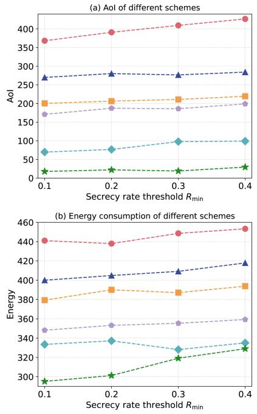  
DDPG, Manual Design, $\mathcal { L } ( r ; s ) = 0 . 1 4 1$ TD3, Manual Design, L(r; s) = 0.141 -- DDPG, LLM Design, L(rM; SM) = 0.099 TD3, LLM Design, $\mathcal { L } ( r _ { \mathcal { M } } ; s _ { \mathcal { M } } ) = 0 . 0 9 9$ DDPG, LLM Design, $\mathcal { L } ( r _ { \mathcal { M } } ^ { \ast } ; s _ { \mathcal { M } } ^ { \ast } ) = 0 . 0 6 5$ -★- TD3, LLM Design, $\mathcal { L } ( r _ { \mathcal { M } } ^ { * } ; s _ { \mathcal { M } } ^ { * } ) = 0 . 0 6 5$

Fig. 6 compares the impact of varying idle channel ratios on AoI and energy consumption under $R _ { m i n } = 0 . 3$ , where the idle channel ratio $\eta _ { \mathrm { i d l e } }$ is defined as the proportion of communication channels sensed to be idle over the total number of available channels in each time slot. The relatively limited effect on energy consumption can be attributed to the fact that the energy model is more sensitive to the UAV mobility than it is to the spectrum availability. In contrast, a decrease in the idle channel ratio has a pronounced effect on AoI due to intensified competition for scarce channel resources, which prolongs data transmission delays and results in greater data staleness. Notably, at an idle channel ratio of 0.4, the TD3 scheme employing the LLMdesigned state–reward pair with the lowest Lipschitz constant of 0.065 $( \mathcal { L } ( r _ { \mathcal { M } } ^ { * } ; s _ { \mathcal { M } } ^ { * } ) = 0 . 0 6 5 )$ achieves an approximately 88.02% reduction in AoI compared to the TD3 scheme with manually designed state and reward $( \mathcal { L } ( r ; s ) = 0 . 1 4 1 )$ .

Fig. 5. Comparison of AoI and energy consumption between the proposed LLM-enhanced RL schemes and the baseline schemes under the DDPG and TD3 algorithms, evaluated at different secrecy rate thresholds.  
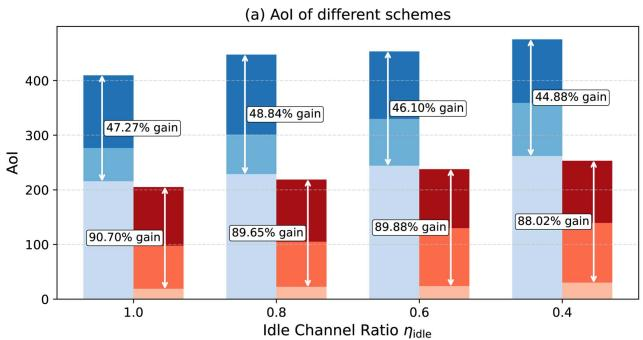

(b) Energy consumption of different schemes  
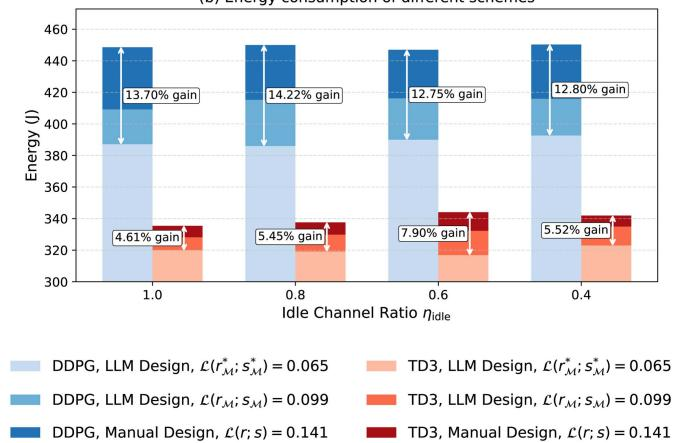  
Fig. 6. Comparison of AoI and energy consumption between the proposed LLM-enhanced RL schemes and the baseline schemes under the DDPG and TD3 algorithms, evaluated at different idle channel ratios with $R _ { m i n } = 0 . 3$

TABLE III  
COMPARISON OF PROPOSED SCHEME WITH EXISTING LLM-ENHANCED RL BASELINES UNDER VARIOUS SETTINGS
<table><tr><td rowspan=1 colspan=2>Different Schemes</td><td rowspan=1 colspan=1> $\overline { { R _ { m i n } = 0 . 1 } }$  $\eta _ { \mathrm { i d l e } } = 1 . 0$ 5 devices</td><td rowspan=1 colspan=1> $\overline { { R _ { m i n } = 0 . 3 } }$  $\eta _ { \mathrm { i d l e } } = 0 . 4$ 5 devices</td><td rowspan=1 colspan=1> $\overline { { R _ { m i n } = 0 . 3 } }$  $\eta _ { \mathrm { i d l e } } = 1 . 0$ 20 devices</td></tr><tr><td rowspan=1 colspan=2>Proposed Scheme</td><td rowspan=1 colspan=1>312.97</td><td rowspan=1 colspan=1>353.35</td><td rowspan=1 colspan=1>525.81</td></tr><tr><td rowspan=1 colspan=1>Baseline based on [</td><td rowspan=1 colspan=1>14]</td><td rowspan=1 colspan=1>433.26</td><td rowspan=1 colspan=1>468.34</td><td rowspan=1 colspan=1>602.02</td></tr><tr><td rowspan=1 colspan=1>Baseline based on [1</td><td rowspan=1 colspan=1>8]</td><td rowspan=1 colspan=1>427.37</td><td rowspan=1 colspan=1>489.38</td><td rowspan=1 colspan=1>649.21</td></tr></table>

We explore the impact of the number of edge devices on system performance. As shown in Fig. 7, both AoI and energy consumption grow with the number of devices due to intensified transmission contention and trajectory complexity. The TD3 scheme with LLM-designed state–reward pair and the lowest Lipschitz constant $\mathcal { L } ( r _ { \mathcal { M } } ^ { * } ; s _ { \mathcal { M } } ^ { * } ) = 0 . 0 6 5$ consistently achieves the best performance, reducing AoI by 89.7% –54.7% and energy consumption by 11.4% –9.2% compared to the TD3 manual design. These results demonstrate that LLM-enhanced RL maintains robust performance as the number of edge devices increases.

To further compare the proposed scheme with existing LLMenhanced RL designs, Table III reports the performance of different schemes under various settings, where all schemes are implemented with the TD3 algorithm and evaluated using the optimization objective (18). The proposed scheme employs LLM-designed state and reward with $\mathcal { L } ( r _ { \mathcal { M } } ^ { \ast } ; s _ { \mathcal { M } } ^ { \ast } ) = 0 . 0 6 5$ . The baseline based on [14] leverages the LLM only for reward design, while the baseline based on [18] uses the LLM solely for state representation. Table III shows that the proposed scheme consistently outperforms the existing LLM-enhanced baselines across different settings. These results indicate that systematically integrating LLMs into state representation and reward design can improve overall performance compared to using LLMs to enhance only a single component of the DRL pipeline.

(a) Aol of different schemes  
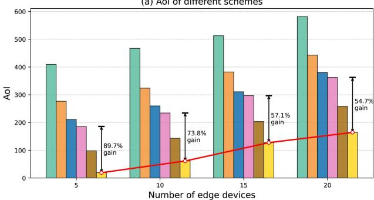

(b) Energy consumption of different schemes  
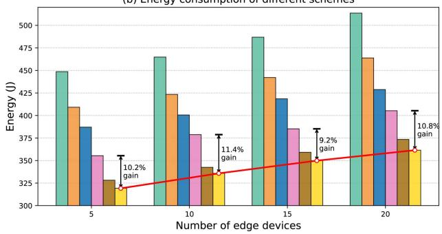  
Fig. 7. Comparison of AoI and energy consumption between the proposed LLM-enhanced RL schemes and the baseline schemes under the DDPG and TD3 algorithms, evaluated with different numbers of edge devices under $R _ { \operatorname* { m i n } } =$ 0.3.

## VI. CONCLUSION

This paper presented an LLM-enhanced DRL framework by leveraging LLMs as a state processor, reward designer, and simulator, which enriches state perception, generates intrinsic rewards, and pre-evaluates LLM-based designs for RL agent. Theoretical analysis proved that reducing the Lipschitz constant of the state–reward improves the convergence of RL training. Numerical results demonstrated that the enhanced scheme achieves about 35% faster convergence, reduces AoI by up to 95% , and lowers energy consumption by 33% compared with DRL baselines under required secrecy rate, highlighting the potential of integrating LLMs into RL for secure data collection in the LAENet. Despite these promising results, the integration of LLMs inevitably introduces additional computational overhead and dependence on prompt engineering. Future work will investigate lightweight LLMs to reduce computation, and further extending to multi-agent AI frameworks is a promising direction for further research.

## REFERENCES

[1] L. Cai et al., “Secure physical layer communications for low-altitude economy networking: A survey,” IEEE Commun. Surv. Tut., vol. 28, pp. 2497–2530, 2026.

[2] K. Li, W. Ni, E. Tovar, and A. Jamalipour, “On-board deep Q-network for UAV-assisted online power transfer and data collection,” IEEE Trans. Veh. Technol., vol. 68, no. 12, pp. 12215–12226, Dec. 2019.

[3] Z. Jia, M. Sheng, J. Li, D. Niyato, and Z. Han, “LEO-satellite-assisted UAV: Joint trajectory and data collection for Internet of Remote Things in 6G aerial access networks,” IEEE Internet Things J., vol. 8, no. 12, pp. 9814–9826, Jun. 2021.

[4] H. Kurunathan, H. Huang, K. Li, W. Ni, and E. Hossain, “Machine learning-aided operations and communications of unmanned aerial vehicles: A contemporary survey,” IEEE Commun. Surv. Tut., vol. 26, no. 1, pp. 496–533, First Quarter, 2024.

[5] X. Lan et al., “UAV-assisted integrated communication and over-the-air computation with interference awareness,” IEEE Trans. Commun., vol. 73, no. 11, pp. 10647–10661, Nov. 2025.

[6] Y. Li et al., “Data collection maximization in IoT-sensor networks via an energy-constrained UAV,” IEEE Trans. Mobile Comput., vol. 22, no. 1, pp. 159–174, Jan. 2023.

[7] L. Liu, K. Xiong, J. Cao, Y. Lu, P. Fan, and K. B. Letaief, “Average AoI minimization in UAV-assisted data collection with RF wireless power transfer: A deep reinforcement learning scheme,” IEEE Internet Things J., vol. 9, no. 7, pp. 5216–5228, Apr. 2022.

[8] K. Tekbıyık et al., “From turbulence to tranquility: AI-driven low-altitude network,” 2025, arXiv:2506.01378.

[9] S. Liang et al., “UAV-enabled secure data collection and energy transfer in IoT via diffusion-model-enhanced deep reinforcement learning,” IEEE Internet Things J., vol. 12, no. 10, pp. 13455–13468, May 2025.

[10] X. Li, L. Lu, W. Ni, A. Jamalipour, D. Zhang, and H. Du, “Federated multi-agent deep reinforcement learning for resource allocation of vehicleto-vehicle communications,” IEEE Trans. Veh. Technol., vol. 71, no. 8, pp. 8810–8824, Aug. 2022.

[11] S. Zhang, W. Liu, and N. Ansari, “Completion time minimization for data collection in a UAV-enabled IoT network: A deep reinforcement learning approach,” IEEE Trans. Veh. Technol., vol. 72, no. 11, pp. 14734–14742, Nov. 2023.

[12] Y. Wang et al., “Trajectory design for UAV-based Internet of Things data collection: A deep reinforcement learning approach,” IEEE Internet Things J., vol. 9, no. 5, pp. 3899–3912, Mar. 2022.

[13] L. Cai et al., “Large language model-enhanced reinforcement learning for low-altitude economy networking,” 2025, arXiv:2505.21045.

[14] H. Du et al., “Reinforcement learning with large language models (LLMs) interaction for network services,” in Proc. Int. Conf. Comput. Netw. Commun., 2024, pp. 799–803.

[15] S. Hu et al., “AgentsCoMerge: Large language model empowered collaborative decision making for ramp merging,” IEEE Trans. Mobile Comput., vol. 24, no. 9, pp. 9791–9805, Oct. 2025.

[16] D. Han et al., “Agent in the sky: Intelligent multi-agent framework for autonomous HAPS coordination and real-world event adaptation,” in Proc. AAAI 2025 Workshop Artif. Intell. Wireless Commun. Netw., 2025, pp. 1–6.

[17] Z. Wang et al., “LLM4Band: Enhancing reinforcement learning with large language models for accurate bandwidth estimation,” in Proc. 35th Workshop Netw. Operating System Support Digit. Audio Video, New York, NY, USA: Association for Computing Machinery, 2025, pp. 43–49.

[18] M. A. Habib et al., “LLM-based intent processing and network optimization using attention-based hierarchical reinforcement learning,” in Proc. 2025 IEEE Wireless Commun. Netw. Conf., 2025, pp. 1–6.

[19] Y. Ren, H. Zhang, F. R. Yu, W. Li, P. Zhao, and Y. He, “Industrial Internet of Things with large language models (LLMs): An intelligence-based reinforcement learning approach,” IEEE Trans. Mobile Comput., vol. 24, no. 5, pp. 4136–4152, May 2025.

[20] J. Si, Z. Cheng, Z. Li, J. Cheng, H.-M. Wang, and N. Al-Dhahir, “Cooperative jamming for secure transmission with both active and passive eavesdroppers,” IEEE Trans. Commun., vol. 68, no. 9, pp. 5764–5777, Sep. 2020.

[21] H. Xing, L. Liu, and R. Zhang, “Secrecy wireless information and power transfer in fading wiretap channel,” IEEE Trans. Veh. Technol., vol. 65, no. 1, pp. 180–190, Jan. 2016.

[22] S. Haykin, “Cognitive radio: Brain-empowered wireless communications,” IEEE J. Sel. Areas Commun., vol. 23, no. 2, pp. 201–220, Feb. 2005.

[23] “Shanghai establishes committee on low-altitude radio spectrum safety,” Accessed: Mar. 7, 2025. [Online]. Available: https://english.news.cn/ 20250307/ae7c0fe904414a6a9ce07ab12b8b16ca/c.html

[24] H. Urkowitz, “Energy detection of unknown deterministic signals,” Proc. IEEE, vol. 55, no. 4, pp. 523–531, Apr. 1967.

[25] F. Digham, M.-S. Alouini, and M. Simon, “On the energy detection of unknown signals over fading channels,” in Proc. IEEE Int. Conf. Commun., 2003, pp. 3575–3579.

[26] R. Polus and C. D’Amours, “Energy detection-based spectrum sensing over shadowed UAV-to-ground channels,” in Proc. IEEE 100th Veh. Technol. Conf., 2024, pp. 1–5.

[27] C. Vl˘adeanu, O. M. K. Al-Dulaimi, A. Mar¸tian, and D. C. Popescu, “Average energy detection with adaptive threshold for spectrum sensing in cognitive radio systems,” IEEE Trans. Veh. Technol., vol. 73, no. 11, pp. 17222–17230, Nov. 2024.

[28] M. Yi et al., “Deep reinforcement learning for fresh data collection in UAV-assisted IoT networks,” in Proc. IEEE Conf. Comput. Commun. Workshops, 2020, pp. 716–721.

[29] X. Tang et al., “Deep graph reinforcement learning for UAV-enabled multiuser secure communications,” IEEE Trans. Mobile Comput., vol. 24, no. 9, pp. 8780–8793, Sep. 2025.

[30] L. Xie, Z. Su, Q. Xu, N. Chen, Y. Fan, and A. Benslimane, “A secure UAV cooperative communication framework: Prospect theory based approach,” IEEE Trans. Mobile Comput., vol. 23, no. 11, pp. 10219–10234, Nov. 2024.

[31] L. Wang, K. Wang, C. Pan, W. Xu, N. Aslam, and A. Nallanathan, “Deep reinforcement learning based dynamic trajectory control for UAV-assisted mobile edge computing,” IEEE Trans. Mobile Comput., vol. 21, no. 10, pp. 3536–3550, Oct. 2022.

[32] Y. Zhang, Z. Mou, F. Gao, J. Jiang, R. Ding, and Z. Han, “UAV-enabled secure communications by multi-agent deep reinforcement learning,” IEEE Trans. Veh. Technol., vol. 69, no. 10, pp. 11599–11611, Oct. 2020.

[33] H. Lee et al., “RLAIF vs RLHF: Scaling reinforcement learning from human feedback with AI feedback,” in Proc. 41st Int. Conf. Mach. Learn., 2024, pp. 26874–26901.

[34] R. Wang et al., “Can language models serve as text-based world simulators?,” in Proc. 62nd Annu. Meeting Assoc. Comput. Linguistics, 2024, pp. 1–17.

[35] K. Asadi, D. Misra, and M. Littman, “Lipschitz continuity in model-based reinforcement learning,” in Proc. 35th Int. Conf. Mach. Learn., 2018, pp. 264–273.

[36] M. Pirotta, M. Restelli, and L. Bascetta, “Policy gradient in Lipschitz Markov decision processes,” Mach. Learn., vol. 100, pp. 255–283, 2015.

[37] G. Khromov and S. P. Singh, “Some fundamental aspects about Lipschitz continuity of neural networks,” in Proc. Int. Conf. Learn. Representations, 2024, pp. 1–45.

[38] N. Shinn et al., “Reflexion: Language Agents With Verbal Reinforcement Learning,” in Proc. Adv. Neural Inf. Process. Syst., A. Oh, T. Naumann, and A. Globerson, Eds. Curran Associates, Inc., 2023, pp. 8634–8652.

[39] H. H. Nguyen et al., “Equivariant reinforcement learning under partial observability,” in Proc. 7th Conf. Robot Learn., J. Tan, M. Toussaint, and K. Darvish, Eds., 2023, pp. 3309–3320.

[40] T. Xie et al., “Text2reward: Reward shaping with language models for reinforcement learning,” in Proc. 12th Int. Conf. Learn. Representations, 2024, pp. 1–37.

[41] P. L. Bartlett, “Spectrally-normalized margin bounds for neural networks,” in Proc. Adv. Neural Inf. Process. Syst., 2017, pp. 6241–6250.

[42] U. V. Luxburg and O. Bousquet, “Distance-based classification with Lipschitz functions,” J. Mach. Learn. Res., vol. 5, pp. 669–695, 2004.

[43] R. S. Sutton et al. Reinforcement Learning: An Introduction. Cambridge, MA, USA: MIT Press, 1998.

[44] S. Shalev-Shwartz and S. Ben-David, Understanding Machine Learning: From Theory to Algorithms. Cambridge, U.K.: Cambridge Univ. Press, 2014.

[45] M. Mohri, A. Rostamizadeh, and A. Talwalkar, Foundations of Machine Learning. Cambridge, MA, USA: MIT Press, 2012.

[46] “Bellman equation,” Accessed: Jul. 7, 2025. [Online]. Available: https: //en.wikipedia.org/wiki/Bellman\_equation

Lingyi Cai is currently working toward the PhD degree with the Research Center of 6G Mobile Communications, School of Cyber Science and Engineering, Huazhong University of Science and Technology (HUST), Wuhan, China, and is also a joint PhD degree with the College of Computing and Data Science, Nanyang Technological University (NTU), Singapore. His research interests include edge intelligence and communication network security.

Ruichen Zhang (Member, IEEE) received the BE degree from Henan University (HENU), China, in 2018, and the PhD degree from Beijing Jiaotong University (BJTU), China, in 2023. He is currently a postdoctoral research fellow with the College of Computing and Data Science, Nanyang Technological University (NTU), Singapore. In 2024, he was a visiting scholar with the College of Information and Communication Engineering, Sungkyunkwan University, Suwon, South Korea. His research interests include the Internet of Agents, LLM-empowered networking, reinforcement learning-enabled wireless communication, generative AI models, and heterogeneous networks. He has received two Best Paper Awards from IEEE IWCMC and has two ESI Highly Cited Papers and one ESI hot papers. He also serves as a guest editor for several IEEE journals, including IEEE Transactions on Cognitive Communications and Networking, IEEE TAI, and IEEE Journal on Selected Areas in Sensors. In addition, he serves as the managing editor of IEEE Transactions on Network Science and Engineering (TNSE) starting from 2025.

Jiacheng Wang (Member, IEEE) received the MS and PhD degrees from the School of Communication and Information Engineering, Chongqing University of Posts and Telecommunications, in 2018 and 2022, respectively. From 2021 to 2022, he was a visiting researcher with the College of Computing and Data Science, Nanyang Technological University, Singapore, where he is now a postdoctoral research fellow. His research interests include generative AI, integrated sensing and communications, network optimization, and edge intelligence. He has published more than 40 papers, including in IEEE Journal on Selected Areas in Communications, IEEE Transactions on Mobile Computing, IEEE Transactions on Wireless Communications, IEEE Transactions on Cognitive Communications and Networking, IEEE Transactions on Vehicular Technology, IEEE CMOST, IEEE Wireless Communications, IEEE Network, IEEE Wireless Communications Letters, IEEE GLOBECOM, IEEE ICC, and IEEE WCNC. He is the lead contributor to the IEEE ComSoc Best Readings on Generative AI and Large Language Models for Networking and has served as a guest editor for IEEE WCM, IEEE Transactions on Cognitive Communications and Networking, IEEE Transactions on Network Science and Engineering, OJCOMS, IoT Magazine, and Networking Letters.

Yu Zhang received the MEng and PhD degrees from the Huazhong University of Science and Technology (HUST), where he is serving as a postdoc researcher. His research interests include cell-free massive MIMO communications and backscatter communications.

Miaoran Peng received the BEng degree in communications engineering from Southeast University, Nanjing, China, in 2020. She is currently working toward the PhD degree with the School of Electronic Information and Communications, Huazhong University of Science and Technology, Wuhan, China. Her research interests include backscatter communications and reconfigurable intelligent surface communications.

Tao Jiang (Fellow, IEEE) is currently a distinguished professor with the Research Center of 6G Mobile Communications, School of Cyber Science and Engineering, Huazhong University of Science and Technology, Wuhan, China. He has authored/coauthored more than 400 papers in major journals/conferences and eight books in Wireless Communications. He has served/is serving as an Associate Editor for some journals in communications, including IEEE Network, IEEE Transactions on Signal Processing, IEEE Communications Surveys & Tutorials, and IEEE Transactions on Vehicular Technology, and an area editor of the IEEE Internet of Things Journal and an associate editor-in-chief of China Communications.

Dusit Niyato (Fellow, IEEE) received the BEng degree from the King Mongkuts Institute of Technology Ladkrabang (KMITL), Thailand, and the PhD degree in electrical and computer engineering from the University of Manitoba, Canada. He is a professor with the College of Computing and Data Science, Nanyang Technological University, Singapore. His research interests include the areas of mobile generative AI, edge intelligence, decentralized machine learning, and incentive mechanism design.

Wei Ni (Fellow, IEEE) received the BE and PhD degrees in electronic engineering from Fudan University, Shanghai, China, in 2000 and 2005, respectively. He is the associate dean (Research) with the School of Engineering, Edith Cowan University, Perth, and a conjoint professor with the University of New South Wales, Sydney, Australia. He is also a technical expert with Standards Australia with a focus on the international standardization of Big Data and AI. He was a deputy project manager with the Bell Labs, Alcatel/Alcatel-Lucent from 2005 to 2008; a senior research engineer with Nokia from 2008 to 2009; and a senior principal research scientist and group leader with the Commonwealth Scientific and Industrial Research Organisation (CSIRO) from 2009 to 2025. His research interests include distributed and trusted learning with constrained resources, quantum Internet, and their applications to system efficiency, integrity, and resilience. He is a co-recipient of the ACM Conference on Computer and Communications Security (CCS) 2025 Distinguished Paper Award, and four Best Paper Awards. He has been an editor for IEEE Transactions on Wireless Communications since 2018, IEEE Transactions on Vehicular Technology since 2022, IEEE Transactions on Information Forensics and Security and IEEE Communication Surveys and Tutorials since 2024, and IEEE Transactions on Network Science and Engineering and IEEE Transactions on Cloud Computing since 2025. He was Chair of the IEEE VTS NSW Chapter (2020 – 2022), Track Chair for VTC-Spring 2017, Track Co-chair for IEEE VTC-Spring 2016, Publication Chair for BodyNet 2015, and Student Travel Grant Chair for WPMC 2014.

Abbas Jamalipour (Fellow, IEEE) received the PhD degree in electrical engineering from Nagoya University, Nagoya, Japan, in 1996. He holds the position of a professor of Ubiquitous Mobile Networking with The University of Sydney. He has authored nine technical books, 11 book chapters, more then 550 technical articles, and five patents, all in the area of wireless communications and networking. He was a recipient of several prestigious awards, such as the 2019 IEEE ComSoc Distinguished Technical Achievement Award in Green Communications, the 2016 IEEE ComSoc Distinguished Technical Achievement Award in Communications Switching and Routing, the 2010 IEEE ComSoc Harold Sobol Award, the 2006 IEEE ComSoc Best Tutorial Paper Award, and over 15 best paper awards. He has been the General Chair or the Technical Program Chair for several prestigious conferences, including IEEE ICC, GLOBECOM, WCNC, and PIMRC. He was the President of the IEEE Vehicular Technology Society from 2020 to 2021. Previously, he held the posi tions of the executive vice president and the editor-in-chief of VTS Mobile World and has been an Elected Member of the Board of Governors of the IEEE Vehicular Technology Society since 2014. He was the editor-in-chief of IEEE Wireless Communications, the vice president-Conferences, and a member of the Board of Governors of the IEEE Communications Society. He sits on the editorial board of IEEE Access and several other journals and is a member of the advisory board of IEEE Internet of Things Journal. Since January 2022, he has been the editor-in-chief of the IEEE Transactions on Vehicular Technology. He is a fellow of the Institute of Electrical, Information, and Communication Engineers and the Institution of Engineers Australia, an ACM professional member, and an IEEE Distinguished Speaker.

Dong In Kim (Life Fellow, IEEE) received the PhD degree in electrical engineering from the University of Southern California, Los Angeles, CA, USA, in 1990. He was a tenured professor with the School of Engineering Science, Simon Fraser University, Burnaby, BC, Canada. He is currently a distinguished professor with the College of Information and Communication Engineering, Sungkyunkwan University, Suwon, South Korea. He is a fellow of Korean Academy of Science and Technology and a life member of the National Academy of Engineering of Korea. He was a recipient of the NRF of Korea Engineering Research Center (ERC) in Wireless Communications for RF Energy Harvesting from 2014 to 2021. He received several research awards, including the 2023 IEEE ComSoc Best Survey Paper Award and the 2022 IEEE Best Land Transportation Paper Award. He was selected as the 2019 recipient of the IEEE ComSoc Joseph LoCicero Award for Exemplary Service to Publications. He was the General Chair of the IEEE ICC 2022, Seoul. From 2001 to 2024, he served as an Editor, an Editor at Large, and an Area Editor of Wireless Communications I for IEEE Transactions on Communications. From 2002 to 2011, he served as an editor and a Founding area editor of Cross-Layer Design and Optimization for IEEE Transactions on Wireless Communications. From 2008 to 2011, he served as the co-editor-in-chief for IEEE/KICS Journal of Communications and Networks. He served as the Founding editor-in-chief for IEEE Wireless Communications Letters from 2012 to 2015. He has been listed as the 2020, 2022, and 2025 Highly Cited Researcher (HCR) by Clarivate Analytics.