JOURNAL OF LAT X CLASS FILES, VOL. 18, NO. 9, SEPTEMBER 2020

# Large Language Model-based QoS-aware Resource Allocation for Multi-UAV Cooperative Edge Computing Networks

Yaqing Wang, Lun Tang, Weili Wang, Xiaoqiang He, and Qianbin Chen Senior Member, IEEE

Abstract—In 6G multiple unmanned aerial vehicles (UAVs) cooperative edge computing networks, strongly coupled system states and limited single-UAV observability lead to inefficient resource management and difficulty in guaranteeing Quality of Service (QoS). To address these issues, we propose a QoS-aware resource allocation method based on a large language model (LLM) for Multi-UAV Cooperative Edge Computing Networks. First, we construct an LLM-based teacher–student resource allocation framework, operating with a global perspective, generates high-quality expert policies that are subsequently injected into distributed student agents via policy distillation, enabling efficient online decision-making in dynamic environments. Second, we design an LLM-based teacher model for accurate expert decision-making under dynamic network conditions. Specifically, we construct a time-varying network knowledge graph (NKG) to represent the complex spatiotemporal states of multi-UAV networks, employ a relation-aware graph attention network (R-GAT) to aggregate crucial neighborhood information and capture node importance, and further combine a fine-tuned LLM with a Tree-of-Thoughts (ToT) reasoning framework to produce high-quality expert resource allocation policies. Finally, we develop a multi-agent student model with policy distillation for efficient management of dynamic, multi-dimensional resources. We formulate a QoS objective that jointly considers delay and fairness, and jointly optimize user association, UAV trajectories, computing allocation, bandwidth allocation, and air-to-air (A2A) migration ratios. The student utilizes the Multi-Agent Proximal Policy Optimization (MAPPO) algorithm and learns from the teacher efficiently via policy distillation, adapting adeptly to dynamic environments. Simulation results demonstrate that the proposed method achieves significantly faster convergence, lower steady-state delay, and higher fairness compared to baseline approaches, while also exhibiting robustness and scalability

across different network sizes and resource conditions.

Index Terms—Multi-UAV cooperative edge computing, resource allocation, edge intelligence, large language model, Deep reinforcement learning

## I. INTRODUCTION

W ITH the advent of 6G, Unmanned Aerial Vehicles(UAVs) are evolving from mere communication relays (UAVs) are evolving from mere communication relays into integrated aerial edge computing and intelligence nodes, giving rise to multi-UAV cooperative mobile edge computing (MEC) networks [1]. Compared with conventional MEC, multi-UAV networks offer flexible deployment and superior line-of-sight (LoS) links, providing viable solutions for largescale, highly dynamic scenarios that demand guaranteed coverage and Quality of Service (QoS) [2]. This inherent flexibility enables deep cooperation among multiple UAVs, facilitating highly efficient joint resource allocation and forming a tightly coupled air-ground collaborative computing fabric. As a key enabler of advanced 6G systems, such cooperation holds broad potential [3].

Although a single UAV has powerful on-board sensing and computing capabilities, its overall performance is constrained by battery capacity and payload limits; its computing power is also difficult to schedule and provision a priori, making it hard to handle bursty and heterogeneous task arrivals on its own. Consequently, cooperative resource allocation among multiple UAVs becomes essential for sustaining high-quality service. However, in UAV-enabled edge intelligence (EI) systems, user distributions are non-stationary, task sets grow and shift, and network topology changes over time. Moreover, channel conditions between user devices (UDs) and UAVs, along with task demands, vary markedly with spatiotemporal conditions. Air-to-air (A2A) cooperation further introduces complex coupling across multiple resource dimensions (e.g., communication, computation, trajectory), rendering the joint optimization problem large-scale, non-convex, mixed-integer, and tightly coupled. These factors place stringent demands on system perception, coordination, and intelligent decisionmaking capabilities, motivating the need for more robust and sophisticated solutions [4].

To address this challenge, deep reinforcement learning (DRL) has been widely introduced for optimizing resource allocation objectives [5]. However, in multi-UAV cooperative edge networks, DRL’s conventional “from-scratch” exploration paradigm faces significant bottlenecks. As the numbers of

JOURNAL OF LAT X CLASS FILES, VOL. 18, NO. 9, SEPTEMBER 2020

UAVs and UDs grow, the joint action and state spaces expand exponentially, leading to sparse rewards, slow convergence, and policy instability [6]. Conventional DRL approaches are often slow and fragile, frequently getting trapped in low-return regions, which hinders the discovery of effective high-return policies [7] [8]. Recently, large language models (LLMs)—which acquire general knowledge and strong logical reasoning abilities from massive corpora [9]—have opened new avenues to overcome these limitations [10]. LLMs exhibit powerful decision-making and personalization capabilities [11]. Combining LLMs with DRL has thus become a promising research direction [12]: by leveraging the LLM’s global planning and reasoning capacity alongside DRL’s adaptive control prowess, LLMs can guide DRL exploration [13] [14], offering a feasible path to tackle the above challenges.

Despite progress, several key challenges persist in current multi-UAV edge intelligence networks: (1) Complexity of efficient resource cooperation in multi-UAV systems. The overall performance is often constrained by the computing capacity provisioned at edge servers. Since a single UAV has limited capability and cannot independently handle dense task requests, inter-UAV resource cooperation is essential for service quality. However, the states and performances of different UAVs become highly coupled: a UAV’s load, resource availability, and location directly affect the performance and available resources of its neighbors, creating complex cascade effects. Achieving efficient, globally consistent resource coordination is therefore the first major challenge. (2) Joint optimization of multi-dimensional resources in highly dynamic environments. UAV networks operate under strong dynamics, reflected in real-time trajectory changes, stochastic task requests from ground devices, and sharp fluctuations in available bandwidth and computing resources. This time-varying nature turns resource allocation into a highdimensional, mixed-integer, strongly coupled joint optimization problem. The key challenge is how to realize precise, realtime allocation of multiple resources under such dynamics—so as to react promptly to environmental changes while meeting strict QoS constraints. (3) Limitations of conventional DRL. Standard DRL methods often converge slowly and are prone to suboptimal policies in complex action spaces, making them ill-suited to the joint optimization of multi-dimensional resources in dynamic multi-UAV networks and insufficient to meet the growing QoS demands of UDs. Overcoming DRL’s exploration bottlenecks—by injecting high-quality priors to accelerate adaptation and learning—is thus a critical challenge.

To address the above challenges, we propose a QoS-aware resource allocation method for multi-UAV cooperative edge networks based on large language models (LLMs). By injecting global priors into DRL through a teacher–student distillation scheme, our approach handles multi-resource coupling in highly dynamic settings while jointly pursuing low delay and long-term fairness, significantly improving sample efficiency and online adaptability. Our main contributions are:

1) Teacher–student joint optimization framework for multi-UAV cooperative edge networks with LLMs: We design an LLM-assisted teacher model that produces high-quality expert policies. Through policy distillation, this expert knowledge is effectively transferred to distributed student agents deployed on UAVs, accelerating their adaptation to dynamic scenarios and enhancing learning stability.

2) LLM-based teacher model tailored to dynamic networks for accurate, robust decision generation: To capture the highly coupled, heterogeneous states in multi-UAV cooperation, we first construct a NKG that unifies topology and heterogeneous relations; then we use a R-GAT to aggregate the importance of neighboring UAVs and encode structured knowledge for the LLM; finally, we apply LoRA fine-tuning together with Tree-of-Thoughts reasoning to generate high-quality expert decisions, providing reliable guidance for downstream optimization.

3) Student model with policy distillation for multiresource cooperative management in dynamic environments: We formulate a joint QoS objective that balances delay and fairness, and jointly optimize access control, UAV trajectory, computing allocation, bandwidth allocation, and A2A migration ratios. The student model is trained with MAPPO enhanced by policy distillation to achieve efficient multi-dimensional resource coordination. Experiments demonstrate that our method consistently outperforms baselines in both delay and fairness, and scales favorably with network size and resource variations.

The remainder of this article is organized as follows. Section II provides an overview of related works. Section III presents the system model. The problem formulation is proposed in Section IV. The novel algorithm based on the Teacher-Student framework is formulated in Section V. The simulation results are presented in Section VI, and this article is summarized in Section VII.

## II. RELATED WORKS

## A. Resource Allocation for Cooperative Multi-UAV Networks

In cooperative UAV networks, [15] considers a multi-UAV collaborative offloading scenario and formulates an optimization problem that minimizes latency. It proposes a Lyapunovand perturbation-based algorithm and achieves a near-optimal offloading strategy. In [16], a multi-UAV edge-computing network assisted by reconfigurable intelligent surfaces is created; by jointly optimizing task association, transmit power, task splitting, and computing (CPU) frequency allocation with trajectory design, the long-term average delay is minimized. Lyapunov optimization and SAC are then used for online decision-making. In [17], they focus on cooperative sensing in a UAV network and propose a sensing-aware resourceallocation scheme that jointly maximizes QoE while minimizing transmission delay. The approach couples semantic communication with trajectory planning and adopts a mixedcooperative DRL method for online decision-making. In [18], they jointly optimize task offloading, server selection, and power allocation in a multi-UAV MEC scenario. It also plans UAV flight paths and CPU frequency to minimize energy consumption and processing delay under a total cost budget. In [19], they study MEC for UAV swarms and use the Age of Task (AoT) as the optimization objective while jointly optimizing trajectory and power via a BCD (block coordinate descent) + SCA solver to improve the timeliness metric. In [20], a multi-UAV edge-computing network with federated sensing is built, jointly optimizing data-sensing access, end-side power, UAV trajectory, and resource allocation, the long-term average sensing-throughput is maximized using a Lyapunov-based online method, while energy consumption and delay constraints are satisfied.

While the aforementioned studies address various resource allocation issues in multi-UAV scenarios, most focus predominantly on ground device-to-UAV or UAV-to-UD optimization. Relatively less consideration has been given to inter-UAV cooperation, including cross-UAV task migration and collaborative computing mechanisms among UAVs, which is a key focus of our work. Beyond UAV-centric MEC optimization, recent studies also emphasize traffic-aware slicing and adaptability under time-varying demands. In particular, Mohajer et al. propose FlexSlice [21], which jointly considers traffic-aware network slicing and an adaptive TD3-based offloading strategy. This line of work is complementary to ours: while FlexSlice focuses on traffic-aware slicing and adaptive control in MEC, our work targets multi-UAV cooperative edge computing with mobility-coupled decisions and explicit inter-UAV workload migration over A2A links.

## B. Applications of Large Language Models in Multi-UAV Systems

In recent years, LLMs are characterized by their strong content-generation and reasoning capabilities derived from vast pre-training corpora, have attracted wide attention in edge intelligence scenarios. A key research trend is how to build LLM-based cooperative mechanisms among resourceconstrained edge devices [22]—now a highly active topic [23]- [26]. For UAV networks in particular, computing, energy, and communications constraints are more pronounced, work coupling LLMs with UAV systems is still at an early stage [27]. In [28], they investigate joint optimization under an air–ground–cloud architecture, exploring LLMs as decision nodes on edge UAVs, together with data quantization and distributed inference, to enhance on-board intelligence for complex tasks. [29] combines LLMs with knowledge graphs to strengthen semantic representation, thereby improving UAVs’ cross-domain knowledge understanding and their perception-and-reasoning ability for ground devices. [30] studies LLM-oriented optimization for integrated sensing-andcommunication tasks, demonstrating the potential of LLMs for jointly modeling perception and communication performance. In [31], they introduce an inverse-reinforcementlearning (IRL)–based “intelligence” enhancement method that helps agents adapt to environment bias, thus improving crossscenario generalization.

## III. SYSTEM MODEL

## A. System Architecture

As depicted in Fig. 1, we consider a multi-UAV cooperative edge computing network operating within a hierarchical framework that integrates the cloud, UAV, and device layers.

• Device Layer: This layer comprises a set of K UDs, denoted by $\begin{array} { r c l } { \mathcal { K } } & { = } & { \{ 1 , 2 , \dots , K \} } \end{array}$ , Each UD $k \in \ K$ generates heterogeneous computation tasks, such as realtime video surveillance and traffic flow prediction.

UAV Layer: This layer consists of a set of N UAVs, denoted by $\mathcal { N } = \{ 1 , 2 , . . . , N \}$ . Each UAV acts as an aerial edge server, equipped with on-board computing capabilities. This layer facilitates both ground-to-air (G2A) data uploads and air-to-air (A2A) task migration for cooperative processing among UAVs. The distributed Student Models are deployed on each UAV for real-time, online decision-making.

Cloud Layer: The cloud layer, typically hosted in a ground station, possesses substantial computational resources. It is responsible for executing the global Teacher Model. The Teacher Model leverages its comprehensive network view to generate expert policies, which are then transmitted to the UAV layer via policy distillation to guide the Student Models.

The system operates over a time horizon partitioned into T discrete time slots, indexed by $t \in \{ 1 , 2 , . . . , T \}$ , each with a duration of τ . The task generated by UD $k \in \mathcal { K }$ in slot t is denoted as $M _ { k } ( t ) = \left\{ D _ { k } ( t ) , W _ { k } ( t ) , T _ { \operatorname* { m a x } } \right\}$ , where $D _ { k } ( t )$ denotes the input data size, $W _ { k } ( t )$ the required number of CPU cycles, and $T _ { \mathrm { m a x } }$ the maximum tolerable delay. Due to the limited local processing capacity of UDs, tasks must be offloaded via G2A links to the UAVs for execution [16]. When a UAV serves a large number of UDs and its communication or computing resources approach saturation, it can migrate a portion of its tasks to neighboring UAVs via A2A links for cooperative processing. Therefore, this paper models both G2A and A2A transmissions.

## B. Communication Model

1) G2A Communication Model: Assume that all UAVs move at a fixed altitude H. Let the position of UAV n at slot t be ${ \bf d } _ { n } ( t ) \ : = \ : \big ( x _ { n } ( t ) , y _ { n } ( t ) , z _ { n } ( t ) \big )$ , and let the position of user device (UD) k be ${ \bf d } _ { k } ( t ) \stackrel { \prime } { = } ( x _ { k } ( t ) , y _ { k } ( t ) , 0 )$ The 3D distance (in meters) between UD k and UAV n is $d _ { k , n } ( t ) = \left\| \mathbf { d } _ { n } ( t ) - \mathbf { d } _ { k } ( t ) \right\|$

We adopt a probabilistic the line-of-sight (LoS) and nonline-of-sight (NLoS) path-loss model to capture blockage in realistic environments. Following [32], [33], the LoS probability between UD k and UAV n is

$$
P _ { k , n } ^ { \mathrm { L o S } } ( t ) = \frac { 1 } { 1 + a \exp \Big ( - b \big [ \arcsin \big ( \frac { H } { d _ { k , n } ( t ) } \big ) - a \big ] \Big ) } ,\tag{1}
$$

where a and b are environment-dependent constants. Hence, the NLoS probability is $P _ { k , n } ^ { \mathrm { N L o S } } ( t ) \stackrel {  } { = } 1 - P _ { k , n } ^ { \mathrm { L o S } } ( t )$ . The freespace path loss (in dB) from UD k to UAV n is

$$
\begin{array} { r } { P L _ { k , n } ^ { \mathrm { F S } } ( t ) = 2 0 \log _ { 1 0 } \bigl ( d _ { k , n } ( t ) \bigr ) + 2 0 \log _ { 1 0 } \bigl ( f _ { c } \bigr ) + 2 0 \log _ { 1 0 } \Bigl ( \frac { 4 \pi } { c } \Bigr ) , } \end{array}\tag{2}
$$

where $f _ { c }$ is the carrier frequency and c is the speed of light. The total path loss (in dB) for the G2A link is then

$$
P L _ { k , n } ( t ) = P L _ { k , n } ^ { \mathrm { F S } } ( t ) + P _ { k , n } ^ { \mathrm { L o S } } ( t ) \eta ^ { \mathrm { L o S } } + P _ { k , n } ^ { \mathrm { N L o S } } ( t ) \eta ^ { \mathrm { N L o S } } ,\tag{3}
$$

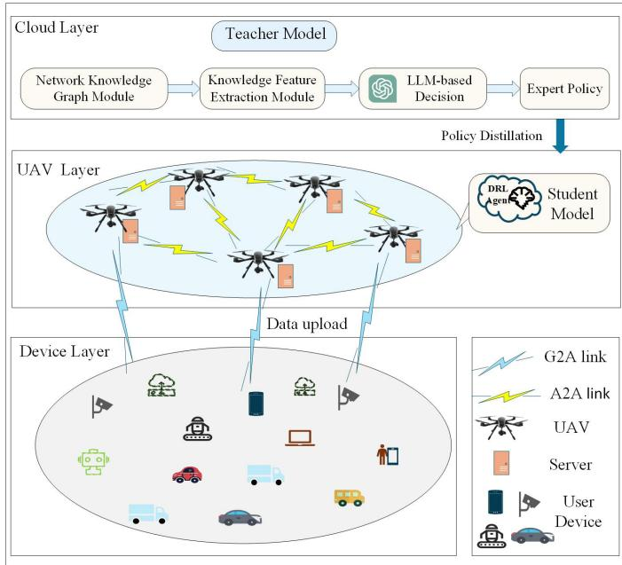  
Fig. 1. System framework of the proposed Teacher–Student for multi-UAV cooperative architecture.

where $\eta ^ { \mathrm { L o S } }$ and $\eta ^ { \mathrm { N L o S } }$ denote the additional path loss for LoS and NLoS links, respectively.

The transmission rate from UD k to UAV n at slot t is

$$
R _ { k , n } ( t ) = B _ { k , n } ( t ) \log _ { 2 } \left( 1 + \frac { p _ { k } ( t ) g _ { k , n } ( t ) } { \displaystyle \sum _ { k ^ { \prime } \in { \mathcal { K } } \backslash \{ k \} } p _ { k ^ { \prime } } ( t ) g _ { k ^ { \prime } , n } ( t ) + \sigma ^ { 2 } } \right)\tag{4}
$$

where $p _ { k } ( t )$ denotes the transmit power of UD k, $g _ { k , n } ( t )$ is the channel gain, given by $g _ { k , n } ( t ) ~ = ~ 1 0 ^ { - P L _ { k , n } ( t ) / 1 0 }$ $\begin{array} { r } { \sum _ { k ^ { \prime } \in \mathcal { K } \backslash \{ k \} } p _ { k ^ { \prime } } ( t ) g _ { k ^ { \prime } , n } ( t ) } \end{array}$ represents the co-channel interference from other UDs within the coverage of UAV n, and $\sigma ^ { 2 }$ is the noise power. The term $B _ { k , n } ( t )$ denotes the bandwidth allocated by UAV n to UD k. Since the total bandwidth assigned by UAV n cannot exceed its available resource $B _ { n }$ the following constraint must hold:

$$
\sum _ { k \in \mathcal { K } } B _ { k , n } ( t ) \ \leq \ B _ { n } , \qquad \forall n \in \mathcal { N } .\tag{5}
$$

Define a binary variable $\delta _ { k , n } ( t ) \in \{ 0 , 1 \}$ to indicate the association between UD k and UAV n at slot t. We set $\delta _ { k , n } ( t ) = 1$ if UD k is associated with UAV n, and $\delta _ { k , n } ( t ) = 0$ otherwise. In each slot, every UD can connect to at most one UAV, while a UAV may serve multiple UDs simultaneously. Hence, the access-control constraint is

$$
\sum _ { n \in \mathcal { N } } \delta _ { k , n } ( t ) \ \leq \ 1 , \qquad \forall k \in \mathcal { K } .\tag{6}
$$

2) A2A Communication Model: Since A2A links among UAVs are typically LoS-dominant due to limited blockage in the air, we model the large-scale A2A channel gain using freespace path loss. The system operates in discrete time slots of duration τ , At the decision time scale, we assume the largescale channel is quasi-static within each slot, i.e., it is determined by the UAV positions in slot t. Let the distance between UAV n and UAV n′ at slot t be $d _ { n , n ^ { \prime } } ( t ) = \left\| \mathbf { d } _ { n } ( t ) - \mathbf { d } _ { n ^ { \prime } } ( t ) \right\|$

To avoid collisions and keep the flight speed within a safe range, the trajectories must satisfy the minimum-separation constraint

$$
\left\| \mathbf { d } _ { n } ( t ) - \mathbf { d } _ { n ^ { \prime } } ( t ) \right\| \geq d _ { \operatorname* { m i n } } , \qquad \forall n , n ^ { \prime } \in \mathcal { N } , n \neq n ^ { \prime } ,\tag{7}
$$

where $d _ { \mathrm { m i n } }$ denotes the smallest allowable inter-UAV distance.

To ensure kinematic feasibility and prevent unrealistic interslot jumps, we impose the maximum-speed constraint

$$
\| \mathbf { d } _ { n } ( t + 1 ) - \mathbf { d } _ { n } ( t ) \| \leq v _ { \operatorname* { m a x } } \tau , \ \forall n \in \mathcal { N }\tag{8}
$$

The free-space path loss (in dB) of the A2A link is

$$
\begin{array} { r } { P L _ { n , n ^ { \prime } } ( t ) = 2 0 \log _ { 1 0 } \left( d _ { n , n ^ { \prime } } ( t ) \right) + 2 0 \log _ { 1 0 } \left( f _ { c } \right) + 2 0 \log _ { 1 0 } \left( \frac { 4 \pi } { c } \right) . } \end{array}
$$

The data rate from UAV n to UAV n′ is

(9)

$$
R _ { n , n ^ { \prime } } ( t ) = B _ { n , n ^ { \prime } } ( t ) \log _ { 2 } \left( 1 + \frac { p _ { n } ( t ) g _ { n , n ^ { \prime } } ( t ) } { \displaystyle \sum _ { m \in \mathcal { N } \backslash \{ n \} } p _ { m } ( t ) g _ { m , n ^ { \prime } } ( t ) + \sigma _ { n ^ { \prime } } ^ { 2 } } \right) ,\tag{10}
$$

where $B _ { n , n ^ { \prime } } ( t )$ is the bandwidth allocated to the A2A link, $p _ { n } ( t )$ is the transmit power of UAV $n , \ g _ { n , n ^ { \prime } } ( t ) \ =$ $1 0 ^ { - P \hat { L } _ { n , n ^ { \prime } } ( t ) / 1 0 }$ is the channel gain of the A2A link, and $\sigma _ { n ^ { \prime } } ^ { 2 }$ is the noise power at receiver $n ^ { \prime }$

Due to the limited on-board computing resources, a UAV may allocate a portion of its tasks to neighboring UAVs for cooperative processing. Let $\gamma _ { n , n ^ { \prime } } ( t ) \in [ 0 , 1 ]$ denote the fraction of the task that UAV n migrates to a neighboring UAV n′ at slot t. Due to the limited A2A radio range, we define the dynamic neighbor set of UAV n at

$$
\mathcal { N } _ { n } ( t ) = \left\{ { n ^ { \prime } \in \mathcal { N } \backslash \{ n \} } \big | \| \mathbf { d } _ { n } ( t ) - \mathbf { d } _ { n ^ { \prime } } ( t ) \| \leq R _ { \mathrm { A 2 A } } \right\}\tag{11}
$$

$R _ { A 2 A }$ denotes the maximum A2A distance to guarantee a reliable link. Task migration is only permitted to UAVs in $\begin{array} { r l } { \mathcal { N } _ { n } ( t ) , \mathrm { i . e . , } \gamma _ { n , n ^ { \prime } } ( t ) = 0 , } & { { } \forall n ^ { \prime } \notin \mathcal { N } _ { n } ( t ) } \end{array}$ . The migrated data size is $D _ { n , n ^ { \prime } } ( t ) = \gamma _ { n , n ^ { \prime } } ( t ) D _ { k } ( t )$ . Accordingly, the fraction processed on the original UAV n is $\begin{array} { r } { 1 - \sum _ { n ^ { \prime } \in \mathcal { N } } \gamma _ { n , n ^ { \prime } } ( t ) } \end{array}$ and the retained data size at UAV n is $D _ { n } ( t ) ~ = ~ ( 1 ~ - \frac { } { }$ $\begin{array} { r l } { ~ } & { { } \sum _ { n ^ { \prime } \in \mathcal { N } } \gamma _ { n , n ^ { \prime } } ( t ) \biggr ) D _ { k } ( t ) } \end{array}$ . We consider divisible workloads, where the task can be partitioned into independently executable subtasks

## C. QoS-aware Problem

In a multi-UAV cooperative edge computing network, UDs face two core QoS requirements:

Delay sensitivity. Tasks such as traffic prediction and emergency assessment demand that both transmission and computation be completed within a stringent time window. If the end-to-end delay exceeds the predefined deadline, the task may become obsolete, rendering the result useless. Therefore, delay is a critical QoS metric.

• Resource allocation fairness. Due to significant variations in distance, channel conditions, and task loads among UDs served by different UAVs (and even among UDs attached to the same UAV), users with favorable conditions may receive a disproportionately large share of resources. Conversely, remote or disadvantaged users might experience long-term under-service or even resource starvation, which degrades the overall user experience.

Optimizing either of these goals in isolation can be detrimental to the other. For instance, exclusively pursuing minimal delay may lead to severe bias against UDs located far from a UAV, whereas strictly enforcing fairness could increase local congestion and overall latency. Consequently, we formulate a joint optimization problem that aims to minimize the delay while upholding a high standard of fairness.

Moreover, UAVs are battery-powered. Uncontrolled energy consumption can interrupt tasks and jeopardize flight safety. To ensure safe and sustained service, we impose an energy constraint on each UAV, requiring that its total energy consumption not exceed $E _ { \mathrm { m a x } }$ , thereby guaranteeing safe and continuous flight.

## D. Delay Model

We consider both the transmission delay from UD to UAV and between UAVs, as well as the computation delay on UAVs.

1) UD–UAV transmission delay: At slot t, the uplink transmission delay for the task generated by UD k and associated with UAV n is

$$
T _ { k , n } ^ { \mathrm { t r a } } ( t ) = \frac { \delta _ { k , n } ( t ) D _ { k } ( t ) } { R _ { k , n } ( t ) } ,\tag{12}
$$

where $\delta _ { k , n } ( t ) \in \{ 0 , 1 \}$ is the association indicator, $D _ { k } ( t )$ is the input data size, and $R _ { k , n } ( t )$ is the G2A rate.

2) Computation delay on UAV n: Let $f _ { n , k } ( t )$ the effective CPU service rate (cycles/s) allocated by UAV n to the computation workload associated with UD k in slot t under CPU sharing, To explicitly capture the practical multi-task CPU sharing mechanism and the induced load coupling, the perslot CPU allocations at UAV n satisfy $\begin{array} { r } { \sum _ { k \in \mathcal { K } } \bar { \delta _ { k , n } } ( \bar { t ) } f _ { n , k } ( \bar { t } ) \leq } \end{array}$ $f _ { n } ^ { \mathrm { m a x } }$ , ∀n $\in \ { \mathcal { N } } .$ . where $f _ { n } ^ { \mathrm { m a x } }$ is the maximum computing capability of UAV n. Then the computation delay on UAV n is

$$
T _ { n , k } ^ { \mathrm { c o m } } ( t ) = \frac { D _ { n } ( t ) W _ { k } ( t ) } { f _ { n , k } ( t ) } ,\tag{13}
$$

where $W _ { k } ( t )$ is the required number of CPU cycles and $\gamma _ { n , n ^ { \prime } } ( t ) \in [ 0 , 1 ]$ is the fraction of the task migrated from UAV n to a neighboring UAV n′.

3) UAV–UAV transmission delay: If a fraction $\gamma _ { n , n ^ { \prime } } ( t )$ of the task is allocated from UAV n to UAV n′, the A2A transmission delay is

$$
T _ { k , n , n ^ { \prime } } ^ { \mathrm { t r a } } ( t ) = \frac { D _ { n , n ^ { \prime } } ( t ) } { R _ { n , n ^ { \prime } } ( t ) } ,\tag{14}
$$

where $R _ { n , n ^ { \prime } } ( t )$ is the achievable A2A rate from n to $n ^ { \prime } .$

4) Computation delay on the neighboring UAV $n ^ { \prime } { : }$ Let $f _ { n ^ { \prime } , n } ( t )$ denote the effective CPU service rate (cycles/s) allocated by the neighboring UAV n′ to process the migrated portion received from UAV n in slot t under CPU sharing, To explicitly capture the multi-task CPU sharing at UAV n′, the per-slot CPU allocations at UAV $n ^ { \prime }$ satisfy $\begin{array} { r } { \sum _ { n \in \mathcal { N } \backslash \{ n ^ { \prime } \} } f _ { n ^ { \prime } , n } ( t ) \ \leq \ f _ { n ^ { \prime } } ^ { \operatorname* { m a x } } } \end{array}$ $\forall n ^ { \prime } \in \mathcal { N }$ . where $f _ { n ^ { \prime } } ^ { \mathrm { m a x } }$ is the maximum computing capability of UAV $n ^ { \prime }$ Then the corresponding computation delay is

$$
T _ { k , n ^ { \prime } } ^ { \mathrm { c o m } } ( t ) = \frac { D _ { n , n ^ { \prime } } ( t ) W _ { k } ( t ) } { f _ { n ^ { \prime } , n } ( t ) } .\tag{15}
$$

Combining the above, we consider divisible workloads where the portion retained at UAV n and the migrated portion processed at neighboring UAVs can be executed in parallel; thus, the end-to-end completion time is modeled as the max of the parallel branches the total delay for a task from UD k served by UAV n is

$$
\begin{array} { r } { T _ { k , n } ( t ) = T _ { k , n } ^ { \mathrm { t r a } } ( t ) + \operatorname* { m a x } \Big \{ T _ { n , k } ^ { \mathrm { c o m } } ( t ) , ~ T _ { k , n , n ^ { \prime } } ^ { \mathrm { t r a } } ( t ) + T _ { k , n ^ { \prime } } ^ { \mathrm { c o m } } ( t ) \Big \} . } \end{array}\tag{16}
$$

The completion delay of UD k in slot t is

$$
T _ { k } ( t ) = \sum _ { n \in \cal N } \delta _ { k , n } ( t ) T _ { k , n } ( t ) ,\tag{17}
$$

which must satisfy the QoS deadline constraint $T _ { k } ( t ) \leq T _ { \operatorname* { m a x } }$

## E. Fairness Model

To avoid long-term under-service caused by path loss or load concentration, we adopt Jain’s index [34] to measure the fairness of the service received by all UDs, ensuring a uniform quality of service as much as possible. First, let the instantaneous throughput of UD k at slot t be

$$
R _ { k } ( t ) = \sum _ { n \in \cal N } \delta _ { k , n } ( t ) R _ { k , n } ( t ) ,\tag{18}
$$

where $R _ { k , n } ( t )$ is the UD–UAV rate and $\delta _ { k , n } ( t ) ~ \in ~ \{ 0 , 1 \}$ indicates the association.

The long-term average throughput of UD k up to slot t is defined by the running average:

$$
\bar { R } _ { k } ( t ) = \frac { 1 } { t } \sum _ { \tau = 1 } ^ { t } R _ { k } ( \tau )\tag{19}
$$

Accordingly, the fairness among UDs at time t is quantified by Jain’s index:

$$
\mathcal { I } ( t ) = \frac { \Big ( \displaystyle \sum _ { k \in \mathcal { K } } \bar { R } _ { k } ( t ) \Big ) ^ { 2 } } { K \displaystyle \sum _ { k \in \mathcal { K } } \bar { R } _ { k } ^ { 2 } ( t ) } .\tag{20}
$$

where $\textstyle { \mathcal { I } } ( t ) \in \left[ { \frac { 1 } { K } } , 1 \right]$ . A value of $\mathcal { I } ( t )$ closer to 1 indicates more equitable resource allocation. When $\begin{array} { r } { \mathcal { I } ( t ) = \frac { 1 } { K } } \end{array}$ , a single UD monopolizes all resources, which corresponds to the most unfair case.

To make the fairness term comparable with the normalized delay term in the objective, we further define the normalized Jain’s index as

$$
{ \tilde { \mathcal { I } } } ( t ) = { \frac { { \mathcal { I } } ( t ) - { \frac { 1 } { K } } } { 1 - { \frac { 1 } { K } } } }\tag{21}
$$

where $\tilde { \mathcal { I } } ( t ) \in [ 0 , 1 ]$

## F. Energy Model

We consider the computation energy on UAVs and the transmission energy over A2A links in our model.

1) Local computation energy on UAV n: After UAV n receives the task of UD k, the energy consumed for local computation at slot t is modeled as:

$$
E _ { n , k } ^ { \mathrm { c o m } } ( t ) = \delta _ { k , n } ( t ) \kappa f _ { n , k } ^ { 2 } ( t ) D _ { n } ( t ) W _ { k } ( t ) ,\tag{22}
$$

where κ is the effective switching capacitance coefficient, and denotes a fixed hardware-related parameter reflecting the processor’s dynamic power characteristics in the adopted DVFS-based energy model. $f _ { n , k } ( t )$ is the CPU frequency allocated by UAV n to UD k, and $\gamma _ { n , n ^ { \prime } } ( t ) \in [ 0 , 1 ]$ is the task fraction migrated to a neighboring UAV $n ^ { \prime } .$

2) A2A transmission energy of UAV n: When UAV n migrates a fraction $\gamma _ { n , n ^ { \prime } } ( t )$ of the task to a neighbor $n ^ { \prime } ,$ the energy consumed by transmitting over the A2A link is

$$
E _ { n , k , n ^ { \prime } } ^ { \mathrm { t r a } } ( t ) = \delta _ { k , n } ( t ) p _ { n } ( t ) T _ { n , n ^ { \prime } } ^ { \mathrm { t r a } } ( t ) ,\tag{23}
$$

where $p _ { n } ( t )$ is the transmit power of UAV n and $T _ { n , n ^ { \prime } } ^ { \mathrm { t r a } } ( t )$ is the A2A transmission delay from n to $n ^ { \prime } .$

Combining the above, the total energy consumed by UAV n at slot t is the sum of its total local computation energy and its total A2A transmission energy, aggregated over all served UDs and all migration links:

$$
E _ { n } ( t ) = \sum _ { k \in { \cal K } } E _ { n , k } ^ { \mathrm { c o m } } ( t ) + \sum _ { k \in { \cal K } } \sum _ { n ^ { \prime } \in { \cal N } \backslash \{ n \} } E _ { n , k , n ^ { \prime } } ^ { \mathrm { t r a } } ( t ) .\tag{24}
$$

## IV. OPTIMIZATION FORMULATION

We aim to jointly optimize UD–UAV association, UAV trajectories, computation and bandwidth allocation, and the task migration fractions delegated to neighboring UAVs. Let the decision variables at slot t be $\Delta ( t ) = \{ \delta _ { k , n } ( t ) \}$ $\mathbf { D } ( t ) =$ $\{ \mathbf { d } _ { n } ( t ) \} , \quad \mathbf { F } ( t ) = \{ f _ { n , k } ( t ) , f _ { n ^ { \prime } , n } ( t ) \} , \quad \mathbf { B } ( t ) = \{ B _ { k , n } ( t ) \}$ $\Gamma ( t ) \ = \ \{ \gamma _ { n , n ^ { \prime } } ( t ) \}$ for all $k \in \mathcal K$ and $n , n ^ { \prime } \in \mathcal { N }$ . To comprehensively enhance system QoS, which encompasses both task completion delay and resource allocation fairness, we formulate the optimization problem based on a weighted delay-fairness (WDF) objective. Specifically, our goal is to minimize the following objective function:

$$
\mathbf { P 1 } \colon \operatorname* { m i n } _ { \substack { \Delta ( t ) , \mathbf { D } ( t ) , \mathbf { F } ( t ) , \mathbf { B } ( t ) , \mathbf { F } ( t ) } } \quad \alpha \cdot \frac { 1 } { K } \sum _ { k \in \mathcal { K } } \frac { T _ { k } ( t ) } { T _ { \operatorname* { m a x } } } + \beta \cdot \left( 1 - \tilde { \mathcal { I } } ( t ) \right)
$$

$$
{ \mathrm { s . t . ~ } } \mathbf { C } \mathbf { 1 } \colon \sum _ { n \in \mathcal { N } } \delta _ { k , n } ( t ) \leq 1 ~ \forall k \in \mathcal { K }
$$

$$
{ \bf C } 2 \colon \big | \big | { \bf d } _ { n } ( t ) - { \bf d } _ { n ^ { \prime } } ( t ) \big | \big | \geq d _ { \operatorname* { m i n } } \forall n , n ^ { \prime } \in \mathcal { N } , n \neq n ^ { \prime }
$$

$$
\mathbf { C 3 } \colon \| \mathbf { d } _ { n } ( t + 1 ) - \mathbf { d } _ { n } ( t ) \| \leq v _ { \operatorname* { m a x } } \tau ~ \forall n \in \mathcal { N }
$$

$$
\mathbf { C } 4 \colon \sum _ { k \in \mathcal { K } } B _ { k , n } ( t ) \leq B _ { n } \forall n \in \mathcal { N }
$$

$$
\mathbf { C 5 } \colon \sum _ { k \in \mathcal { K } } \delta _ { k , n } ( t ) f _ { n , k } ( t ) \leq f _ { n } ^ { \operatorname* { m a x } } \forall n \in \mathcal { N }
$$

$$
\mathrm { C 6 } ; \sum _ { n \in \mathcal { N } \backslash \{ n ^ { \prime } \} } f _ { n ^ { \prime } , n } ( t ) \leq f _ { n ^ { \prime } } ^ { \operatorname* { m a x } } \forall n ^ { \prime } \in \mathcal { N }
$$

$$
\mathbf { C } 7 : \sum _ { t \in \mathcal { T } } E _ { n } ( t ) \leq E _ { \operatorname* { m a x } } \forall n \in \mathcal { N }
$$

$$
\mathbf { C 8 } \colon T _ { k } ( t ) \le T _ { \operatorname* { m a x } } \ \forall k \in \mathcal { K }
$$

$$
\mathbf { C 9 } \colon \alpha , \beta \geq 0 , \alpha + \beta = 1 .\tag{25}
$$

The weighting parameters α and $\beta$ reflect the relative QoS priorities between delay minimization and fairness enhancement, with $\alpha + \beta { } ~ = ~ 1$ . A larger α makes the objective more delay-oriented and tends to favor lower latency, whereas a larger $\beta$ makes the objective more fairness-oriented and tends to promote more balanced service among users. Therefore, the proposed framework can be adapted to different QoS preferences by adjusting the delay-fairness weighting. Constraint C1 ensures that each UD associates with at most one UAV in a slot. C2 guarantees collision avoidance via a minimum inter-UAV separation. C3 limits the movement of each UAV between consecutive time slots by enforcing a maximum flight speed $v _ { m a x }$ . C4 limits the total bandwidth allocated by each UAV. C5 and C6 bound the local and cooperative CPU frequencies by the maximum computing capability of the serving UAV. C7 constrains the accumulated energy consumption of each UAV within the battery budget. Since the system runs over T slots of duration $\tau , \mathbf { C } 7$ enforces the onboard energy budget $E _ { m a x }$ over the episode window $T \tau$ . C8 imposes the QoS deadline for task completion. C9 specifies the nonnegative weights for delay and fairness and normalizes them to sum to one.

## V. PROBLEM SOLUTION BASED ON TEACHER-STUDENT MODEL

The formulated optimization problem involves both discrete and continuous variables, resulting in a complex, non-linear, and non-convex multi-parameter problem. It falls into the class of mixed-integer nonlinear programming (MINLP) and is NPhard, making it intractable to solve exactly. Conventional DRL methods often struggle with inefficient exploration in such large action spaces; when an agent learns from scratch, it tends to suffer from low sample efficiency, slow convergence, and may get trapped in suboptimal policies. To address these challenges, we introduce a teacher-student policy distillation paradigm. We leverage an LLM-generated expert policy as the teacher for resource allocation decisions and devise a policydistillation mechanism to warm-start the student’s learning process. This approach enables the student policy network to benefit from the teacher’s prior knowledge, thereby improving initial performance, accelerating sample efficiency, and fostering more robust and accurate resource-allocation strategies in dynamic multi-UAV scenarios.

## A. LLM-Based Teacher Model for Multi-UAV Cooperative Resource Allocation

In multi-dimensional and highly-coupled UAV network resource allocation scenarios, relying solely on DRL with random priors often leads to low sample efficiency and slow convergence. To address this, we design a teacher model comprising three modules: a network knowledge graph (NKG) construction module, a GAT-based representation extraction module, and an LLM-based decision-making module. This architecture leverages the advanced reasoning and generative capabilities of LLMs to produce expert-level optimization policies. Specifically, we first construct a NKG to uniformly model the topology and resource dependencies of the dynamic airground cooperative environment. Next, we employ a relationaware graph attention network (R-GAT) to extract salient features from the NKG that capture each UAV’s local state and its neighborhood context. Finally, we integrate a fine-tuned LoRA-based LLM with a Tree-of-Thoughts (ToT) reasoning framework to generate high-quality expert policies, which subsequently supervise the MAPPO training of the student model.

Under the proposed teacher–student architecture, the Teacher Model is deployed in the cloud to construct an aggregated global view from periodically collected state summaries, while the Student Models are deployed on UAVs for distributed real-time decision-making based on local observations. Accordingly, the Teacher provides expert guidance based on aggregated network information, whereas the Students continuously adapt their actions based on local observations. Therefore, the proposed framework does not require continuous full-state broadcasting among UAVs, and its signaling overhead mainly consists of periodic state reporting and occasional delivery of distilled guidance.

1) Network Knowledge Graph Construction in multi-UAV cooperative network: To capture the intricate topology and resource interactions in a dynamic multi-UAV cooperative environment, we construct a NKG. In a unified schema, physical entities (UDs, UAVs, base stations, and cloud servers) are represented as nodes, while dependencies such as communication, computation, and task migration are encoded as typed edges.

We define the time-varying knowledge graph in multi-UAV cooperative network as

$$
\mathcal { G } ( t ) = ( \mathcal { V } ( t ) , \mathcal { R } , \mathcal { E } ( t ) , \mathcal { X } ( t ) ) ,\tag{26}
$$

where

$\mathcal { V } ( t )$ : the set of nodes at slot t, including UDs, UAVs, base stations, cloud/edge servers;

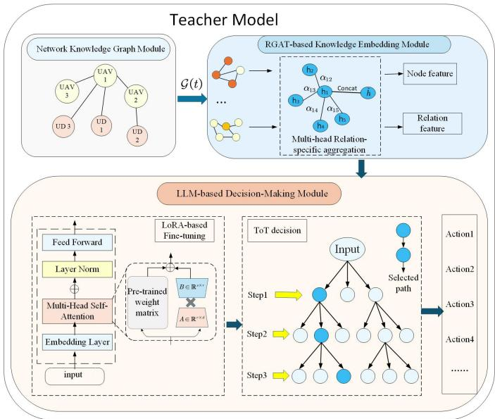  
Fig. 2. LLM-Based Teacher Model for Multi-UAV Cooperative Resource Allocation

• R: the set of relation types; According to the scenario, includes three primary relations:

(1) Communication link: if a feasible G2A path exists between a UD and a UAV, create a “wireless access” relation.

(2) Computing service: when a UAV can process a UD’s task, create a “compute service” relation.

(3) Task migration: when two UAVs cooperate via an A2A link to process tasks, create a “task migration” relation; the edge attribute stores the current migration ratio.

${ \mathcal { E } } ( t ) \subseteq { \mathcal { V } } ( t ) \times { \mathcal { V } } ( t ) \times { \mathcal { R } }$ : the set of typed relation triples;

• X (t): is the collection of time-varying attributes attached to nodes and edges, describing the real-time state. These include:

(1) Node attributes: position, battery level, CPU frequency, task data size, etc.

(2) Edge attributes: inter–node distance, LoS probability, channel gain, allocated bandwidth, migration ratio, etc.

Because the NKG evolves with the system, we define three types of update rules:

• Node update: when a new UD joins or a UAV fails or recovers, add or remove the node in V(t) and synchronously create or delete its incident edges.

• Edge update: based on new association decisions, add or remove UD–UAV communication edges; if the bandwidth on a link drops to zero, delete that edge; when a migration policy is issued, create or update the corresponding “task migration” edge and its ratio.

• Attribute update: for existing nodes or edges, update only their attributes in X (t).

Compared to a static graph model, the proposed NKG naturally represents heterogeneous entities and multi-UAV interactions within a single schema, while its time-varying attributes provide structured background knowledge to the LLM. Coupled with GAT-based feature extraction, this yields rich relational representations that capture both network structure and physical state, enabling more accurate and generalizable decision-making.

2) RGAT-based Knowledge Feature Extraction: Given the highly dynamic nature of the multi-UAV environment, both the network topology and the relationships between entities evolve over time. Relying on simple neighborhood aggregation is insufficient to capture these dynamics. We therefore adopt a Relation-aware Graph Attention Network to extract salient features from the NKG. R-GAT allocates attention weights to neighbors conditioned on node and edge attributes for each distinct relation type. It then performs intra-relation aggregation followed by cross-relation fusion, thereby dynamically modeling the complex and time-varying inter-node dependencies. This mechanism enables node embeddings to encode topological and relational semantics, so that key neighbors and links (e.g., migration or bandwidth) are emphasized and the subsequent inference is more accurate and stable.

Let $\bf \dot { h } _ { i } ^ { ( 0 ) }$ denote the initial feature of each node i in the NKG, which is a vector formed by concatenating its text embedding and the type encoding of the node. Let $x _ { i j } ^ { \left( e \right) }$ be the edge attribute, and for each GAT layer l and relation $r \in \mathcal { R }$ the unnormalized attention score from i to its neighbor j is

$$
c _ { i j } ^ { ( l , r ) } = \mathrm { L e a k y R e L U } ( \mathbf { a } _ { r } ^ { ( l ) ^ { \top } } [ \mathbf { W } _ { r } ^ { ( l ) } h _ { i } ^ { ( l ) }  \mathbf { W } _ { r } ^ { ( l ) } h _ { j } ^ { ( l ) }  \mathbf { U } _ { r } ^ { ( l ) } x _ { i j } ^ { ( e ) }  )\tag{27}
$$

where $\mathcal { N } _ { r } ( i )$ is the set of neighbors of i under relation r, and $j \in \mathcal { N } _ { r } ( i ) . \ \mathbf { W } _ { r } ^ { ( l ) } , \mathbf { U } _ { r } ^ { ( l ) }$ are trainable linear transformations, $\mathbf { \dot { a } } _ { r } ^ { ( l ) }$ is the trainable attention vector, and ∥ denotes vector concatenation.

The normalized attention weight is obtained by a softmax over the relation-specific neighborhood:

$$
\alpha _ { i j } ^ { ( l , r ) } = \frac { \exp \bigl ( c _ { i j } ^ { ( l , r ) } \bigr ) } { \displaystyle \sum _ { k \in \mathcal { N } _ { r } ( i ) } \exp \bigl ( c _ { i k } ^ { ( l , r ) } \bigr ) } , \qquad \sum _ { j \in \mathcal { N } _ { r } ( i ) } \alpha _ { i j } ^ { ( l , r ) } = 1 .\tag{28}
$$

We then perform intra-relation aggregation to update the node features:

$$
\tilde { \mathbf { h } } _ { i , r } ^ { ( l + 1 ) } = \sum _ { j \in \mathcal { N } _ { r } ( i ) } \alpha _ { i j } ^ { ( l , r ) } W _ { r } ^ { ( l ) } \mathbf { h } _ { j } ^ { ( l ) } .\tag{29}
$$

To capture the heterogeneous impact of different relations on node $i ,$ we aggregate the features for each relation separately and then fuse them; We also employ a multi-head attention mechanism (M heads) to improve stability and expressive power:

$$
\mathbf { h } _ { i } ^ { ( l + 1 ) } = \sigma (  \mathbf { \Sigma } _ { m = 1 } ^ { M } \mathbf { \Sigma } \sum _ { r \in \mathcal { R } } \tilde { \mathbf { h } } _ { i , r } ^ { ( l + 1 , m ) } ) ,\tag{30}
$$

where $\sigma ( \cdot )$ is an activation function and ∥ denotes head-wise concatenation.

After propagating for L layers, each entity node in $\mathcal { G }$ obtains the final representation $\mathbf { h } _ { i } ^ { ( L ) }$ , which integrates rich contextual information from its key neighbors across multiple relation types. This mechanism enables the model to learn deep feature representations that fuse network structure with entity states, thereby enhancing the accuracy and robustness of subsequent decision-making.

3) LLM Decision Module Based on Tree-of-Thoughts: Foundation models are trained for broad, general-purpose scenarios. We therefore first perform lightweight domain adaptation via LoRA to align the LLM with our specific context. Since directly prompting an LLM for end-to-end solutions struggles with multi-objective, multi-constraint optimization, we then adopt the Tree-of-Thoughts framework [35] to guide the fine-tuned model in generating decisions that are diverse, accurate, and consistent with domain knowledge.

a) Fine-tuning with LoRA: Although a pre-trained LLM possesses strong general reasoning abilities, a knowledge gap remains for specialized multi-UAV cooperative edge scenarios. To align the LLM’s decisions with our specific setting, we employ a LoRA-based fine-tuning approach. Full-parameter finetuning is computationally prohibitive, requiring substantial resources to update the entire model. Consequently, parameterefficient fine-tuning (PEFT) methods are widely adopted. LoRA, a prominent PEFT method, freezes most weights in the pre-trained Transformer and injects low-rank, trainable layers into the attention blocks, thereby greatly reducing the number of trainable parameters and the associated training overhead.

Let $\mathbf { W } _ { 0 }$ denote a weight matrix in the pretrained model. LoRA injects two low-rank matrices $\mathbf { B } \in \mathbb { R } ^ { s \times r }$ and $\mathbf { A } \in \mathbb { R } ^ { r \times d }$ to construct a matched update $\Delta \mathbf { W } = \mathbf { B } \mathbf { A }$ . The fine-tuned LLM is then written as

$$
\mathbf { W } = \mathbf { W } _ { 0 } + \Delta \mathbf { W } = \mathbf { W } _ { 0 } + \mathbf { B } \mathbf { A } ,\tag{31}
$$

where $r \ll \operatorname* { m i n } ( s , d )$ . During training, $\mathbf { W } _ { 0 }$ is kept frozen and only the low-rank matrices B and A are updated, significantly reducing both the number of trainable parameters and the memory footprint.

b) Multi-step Decision Making via Tree-of-Thoughts: Resource allocation in a multi-UAV network is a highdimensional combinatorial problem that must jointly consider UD association, UAV trajectory, computation and bandwidth allocation, and inter-UAV task migration under multiple constraints. Relying on an LLM to generate a one-shot solution often yields only a ”surface-level” plan. To exploit deeper reasoning, we adopt the Tree-of-Thoughts framework: a complex optimization problem is decomposed into a sequence of interdependent subproblems that are explored on a reasoning tree, while the LLM performs search over thought chains.

ToT generalizes chain-of-thought (CoT) [36] into a tree structure,where each root-to-leaf path corresponds to a complete CoT. Each node stores an intermediate thought, and edges link successive reasoning steps. This structure allows the model to explore diverse reasoning branches in parallel, backtrack, and compare different paths, thus mimicking human-like multi-step deliberation: generate, evaluate, and select among different lines of thought.

Let $A \ : = \ : ( \nu , \mathcal { E } )$ denote the search tree, where the root encodes the initial global state, and each node $v \in \mathcal V$ keeps the current partial decision, its evaluation, and the corresponding local state. During generation, the LLM expands the tree, scores branches, and finally selects the root–to–leaf path with the lowest loss as the expert chain. Concretely, the procedure consists of four stages:

1) Problem Decomposition. Given the initial positions, resource states of all UAVs and UDs, residual energy, and task requests with their deadlines, the problem is decomposed into stepwise reasoning prompts. Following our system model, we split resource allocation into three sub-tasks:

• Task 1: UD association. This sub-task determines the association variables $\delta _ { k , n } ( t )$ , matching to the most suitable UAV.

• Task 2: UAV trajectory planning. Given the user distribution and access requests, plan the next-step position $\mathbf { d } _ { n } ( t )$ of each UAV by optimizing link quality while satisfying collision-avoidance constraints.

• Task 3: Resource and migration allocation: For already associated UDs, this sub-task determines the bandwidth $\{ B _ { k , n } ( t ) \}$ , compute resources $\{ f _ { n , k } ( t ) , f _ { n ^ { \prime } , k } ( t ) \}$ , and the migration ratio to a neighboring $\operatorname { U A V } \gamma _ { n , n ^ { \prime } } ( t )$ if needed.

Candidate Generation. At each node of the reasoning tree—i.e., at every decision step—the LLM receives the subtask prompt along with the current network snapshot and global features, and proposes multiple feasible solutions. Specifically, the sub-task prompt is constructed in a structured manner and includes the current sub-task description, the current-slot system state $s _ { t }$ , the graph feature $H ^ { ( \bar { L } ) }$ the retained partial decisions from previous reasoning steps, and the corresponding feasibility constraints. In this way, each ToT step uses a bounded structured context rather than a long conversational history. For a given sub-task Task-i, we call the LLM with parameters θ to obtain K candidate actions together with their thought chains:

$$
\left\{ \left( a _ { i } , \mathrm { C o T } _ { i } \right) \right\} _ { i = 1 } ^ { K _ { c a n d } } = \mathrm { L L M } _ { \theta } \Big ( s _ { t } , H ^ { ( L ) } , T a s k { - } i \Big )\tag{32}
$$

where $s _ { t }$ is the system state, $H ^ { ( L ) } = \{ h _ { i } ^ { L } \} _ { i \in \mathcal { V } ( t ) }$ is the final NKG features.

Quantitative Self-Evaluation. Each retained candidate branch is quantitatively evaluated according to the weighted delay-fairness objective. For the i-th retained candidate at slot t, its evaluation loss is written as

$$
{ \mathcal L } _ { t } ^ { ( i ) } = \alpha \cdot \frac { 1 } { K } \sum _ { k \in { \mathcal K } } \frac { T _ { k } ^ { ( i ) } ( t ) } { T _ { \operatorname* { m a x } } } + \beta \cdot \big ( 1 - \tilde { \mathcal J } ^ { ( i ) } ( t ) \big ) ,\tag{33}
$$

where $T _ { k } ^ { ( i ) } ( t )$ and $\tilde { \mathcal { I } } ^ { ( i ) } ( t )$ denote the delay and Jain’s fairness index under the i-th candidate action, respectively. Lower loss indicates a better candidate branch.

Beam Search and Pruning. To efficiently navigate the large candidate space and approximate the best reasoning chain, we adopt a beam-search strategy with two tunable hyperparameters:

• Depth L: the tree expands from Task 1 to Task 3, A complete reasoning chain is obtained at depth 3, so we set the maximum search depth to $\mathcal { L } = 3$

• Beam width B: at each layer, we retain the B chains with the lowest loss and prune the others. Each node expands at most $K _ { \mathrm { c a n d } }$ candidates.

After beam search reaches the final reasoning depth, we retain the top-B complete candidate branches in the final beam. Let $A _ { T } ( s _ { t } ) = \{ a _ { t } ^ { ( \hat { 1 } ) } , . . . , a _ { t } ^ { ( B ) } \}$ denote the retained candidate action set. Their losses are normalized into confidence weights by

$$
\omega _ { t } ^ { ( i ) } = \frac { \exp \left( - L _ { t } ^ { ( i ) } / \tau _ { T } \right) } { \sum _ { j = 1 } ^ { B } \exp \left( - L _ { t } ^ { ( j ) } / \tau _ { T } \right) } , \qquad i = 1 , \dots , B .
$$

where $\tau _ { T }$ is the temperature parameter. The Teacher policy distribution is defined as

$$
\pi _ { T } \left( a _ { t } ^ { ( i ) } \mid s _ { t } \right) = \omega _ { t } ^ { ( i ) } , \qquad i = 1 , \ldots , B .
$$

For expert action generation, the candidate with the highest probability is selected, while for policy distillation the full normalized distribution over the retained candidate set is used as the Teacher-side supervisory signal.

The time complexity of beam search is $\mathcal { O } ( B \times K _ { \mathrm { c a n d } } \times \mathcal { L } )$ By searching the tree and pruning suboptimal branches, the model explores diverse alternatives. Candidates that severely violate constraints or deviate from the objective are discarded early, allowing computational resources to be focused on higher-quality solutions. Through this iterative ”analyze - generate - evaluate - search” cycle, the ToT framework ultimately returns a high-quality expert resource-allocation policy for the multi-UAV cooperative network.

Algorithm 1 LLM-based Teacher Policy Generation for   
Multi-UAV Cooperative Resource Allocation   
Input: Global system state $s _ { t } ,$ previous knowledge graph   
$\mathcal { G } ( t { - } 1 )$ ; ToT depth ${ \mathcal { L } } ,$ beam width B, per-step candidates   
$K _ { \mathrm { c a n d } } ;$ RGAT layers L and heads M.   
Output: Teacher policy distribution $\pi _ { T } ( a _ { t } \mid s _ { t } )$   
1: Stage 1: NKG construction   
2: for each slot $t \in \mathcal T$ do   
3: Update node set $\mathcal { V } ( t )$ (insert/remove nodes).   
4: Update edge set $\mathcal { E } ( t )$ (G2A link, computing service,   
task migration).   
5: Update dynamic attributes $\mathcal { X } ( t )$ (positions, battery, LoS   
probability, bandwidth, migration ratio).   
6: Stage 2: R-GAT feature extraction   
7: Initialize node embeddings $h _ { v } ^ { ( 0 ) }$   
8: for layer $\ell = 1 , 2 , \ldots , L$ do   
9: for node $i \in \mathcal { V } ( t )$ do   
10: for relation $r \in \mathcal { R }$ do   
11: Compute unnormalized attention score $c _ { i j } ^ { ( \ell , r ) }$ by   
(27) for $j \in \mathcal { N } _ { r } ( i )$   
12: Normalize to attention weight $\alpha _ { i j } ^ { ( \ell , r ) }$ by (28).   
13: Intra-relation aggregation to obtain $\tilde { h } _ { i , r } ^ { ( \ell + 1 ) }$ by   
(29).   
14: end for   
15: Multi-relation and multi-head fusion to obtain   
$h _ { i } ^ { ( \ell + 1 ) }$ by (30).   
16: end for   
17: end for   
18: Let $H ^ { ( L ) } = \{ h _ { i } ^ { L } \} _ { i \in \mathcal { V } ( t ) }$ be the final NKG features.   
19: Stage 3: LLM decision module with ToT

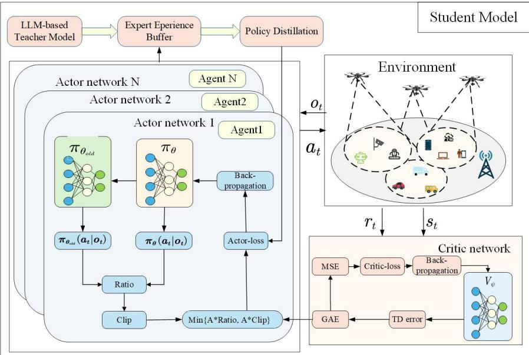  
Fig. 3. Student Model Based on MAPPO with Policy Distillation

20: Initialize the ToT root with $( s _ { t } , H ^ { ( L ) } )$

21: Decompose the decision into three sub-tasks: user association, UAV trajectory, and resource allocation.

22: for task $i = { 1 , 2 , 3 }$ do

23: Candidate generation: use the LoRA-tuned LLM to generate $K _ { \mathrm { c a n d } }$ candidates for task i conditioned on $( s _ { t } , H ^ { ( L ) } )$

24: Candidate evaluation: score each candidate using the objective in (33).

25: Beam search & pruning: keep the top B branches at the current ToT depth; expand until the maximum depth $\mathcal { L }$ is reached.

26: Update the ToT state with retained branches.

27: end for

28: Construct the Teacher policy distribution by softmaxnormalizing the negative evaluation losses of the top-B complete candidates in the final ToT beam.

29: end for

30: return $\pi _ { T } ( a _ { t } \mid s _ { t } )$

## B. Student Model Based on MAPPO with Policy Distillation

The teacher leverages global context to infer a high-quality expert policy distribution and then transfers it to the student, providing guidance for decision making. The student follows an actor–critic paradigm and interacts with the environment through local sensing and partial observations to produce fast responses. However, in high-dimensional mixed action spaces, conventional deep RL can suffer from low sample efficiency, slow convergence, and suboptimal local minima. To inherit the teacher’s prior knowledge while improving learning efficiency, we augment the student’s MAPPO training with a loss term for policy distillation, which regularizes the deviation from the teacher distribution. In this way, the student can both acquire the teacher’s expertise and maintain fast decision adaptation on the edge.

1) POMDP Formulation: As student agents (UAVs) operate with only local observations during execution and lack real-time access to the complete global state, we model the decentralized resource allocation problem as a Partially Observable Markov Decision Process (POMDP), defined by the tuple $\langle S ( t ) , A ( t ) , \mathcal { P } , \mathcal { O } ( t ) , \mathcal { R } ( t ) , \gamma \rangle$

• Agents: Each ${ \mathrm { U A V ~ } } n \in { \mathcal { N } }$ acts as an individual agent.

• State Space S: At slot $t ,$ the global state includes the positions of all UDs and UAVs $\mathbf { d } _ { k } ( t ) , \mathbf { d } _ { n } ( t )$ , the bandwidth allocations between each UD and UAV $B _ { k , n } ( t )$ the total bandwidth of each UAV $B _ { n } ( t )$ , and the computing CPU frequency of each UAV $f _ { n } ( t )$ . We write ${ \cal S } ( t ) = \{ s _ { 1 } ( t ) , s _ { 2 } ( t ) , \ldots , s _ { N } ( t ) \}$

• Action Space A: At slot t, agent n takes action

$$
\begin{array} { r l } & { a _ { n } ( t ) = \{ \delta _ { k , n } ( t ) , ~ d _ { n } ( t ) , ~ f _ { n , k } ( t ) , ~ f _ { n , n ^ { \prime } } ( t ) , } \\ & { ~ B _ { k , n } ( t ) , ~ \gamma _ { n , n ^ { \prime } } ( t ) ~ \} _ { k \in \mathcal { K } , n , n ^ { \prime } \in \mathcal { N } } , } \end{array}
$$

which contains the next-step UAV position, UD–UAV association, bandwidth allocated to each associated UD, and the task fraction migrated from UAV n to its neighbor $n ^ { \prime } .$ . The joint action is $\mathcal { A } ( t ) = \{ a _ { 1 } ( t ) , a _ { 2 } ( t ) , . . . , a _ { N } ( t ) \}$

• State transition: The kernel P is defined by the probability of transitioning from the current state $s _ { t }$ to the next state $s _ { t + 1 }$ after taking action $a _ { t } .$ , i.e., $\mathcal { P } ( s _ { t + 1 } \mid s _ { t } , a _ { t } )$

• Observation: At slot t, UAV n observes its local state $o _ { n } ( t )$ , including its position, the task data size $D _ { k } ( t )$ , the required CPU cycles $W _ { k } ( t )$ , etc. The observation space of UAV n is $\mathcal { O } ( t ) = \{ o _ { 1 } ( t ) , o _ { 2 } ( t ) , \ldots , o _ { N } ( t ) \}$

• Reward: We further refine the reward by introducing penalties. The instantaneous reward of agent n at slot t is

$$
r _ { n } ( t ) = \left\{ \begin{array} { l l } { - \Big ( \alpha \cdot \displaystyle \frac { 1 } { K } \sum _ { k \in \mathcal { K } } \displaystyle \frac { T _ { k } ( t ) } { T _ { \operatorname* { m a x } } } + \beta \left( 1 - \mathcal { I } ( t ) \right) \Big ) , } & { \mathrm { f e a s i b l e , } } \\ { - \xi _ { 1 } N _ { \mathrm { c o l } } - \xi _ { 2 } E _ { \mathrm { o v e r } } - \xi _ { 3 } N _ { \mathrm { n s } } , } & { \mathrm { i n f e a s i b l e . } } \end{array} \right.\tag{34}
$$

Here, “feasible” means all constraints C1–C7 are satisfied; where $\xi _ { 1 }$ penalizes collisions: when the distance between any two UAVs is less than the minimum safe separation $d _ { \mathrm { m i n } } .$ both agents are penalized; $\xi _ { 2 }$ penalizes energy overflow: if a UAV’s cumulative energy consumption exceeds its energy budget, a penalty is issued; $\xi _ { 3 }$ penalizes no service: if a UD is not covered or is not associated with any UAV, the UD incurs a penalty. These penalties prevent service interruption and encourage broader coverage. The discount factor $\gamma$ balances immediate and future rewards.

2) MAPPO with Policy Distillation: MAPPO follows an actor–critic architecture. The actor generates an action from the observed state, while the critic estimates the state–value or action–value to evaluate the current policy and improve it through interaction with the environment. Because samples collected by interacting with the environment can be highly correlated, and because mixed continuous–discrete action spaces are large, we adopt experience replay: trajectories are stored in a buffer and mini–batches are drawn at training time to improve sample reuse.

At the beginning, each agent’s policy network is randomly initialized; let θ denote the parameters of the actor network for agent n, and $\omega$ the parameters of the critic network . At each slot t, given state $s _ { t } .$ , the UAV samples an action $a _ { n } ( t )$ from the policy and then executes it; Here, the Student policy is implemented as a hybrid discrete-continuous actor. Specifically, the association decision is modeled as a categorical action parameterized by softmax logits. The UAV trajectory action is represented as a bounded normalized displacement mapped by a tanh operator, while the bandwidth allocation, CPU allocation, and migration ratios are represented as nonnegative normalized fractions generated by softmax operators and then scaled by the corresponding resource budgets. In this way, the sampled action remains bounded and physically feasible during MAPPO training and execution. These transformations can be interpreted as an implicit projection step that maps candidate actions into the feasible action space, thereby ensuring that all resource constraints are satisfied. The environment transitions to the next state $s _ { t + 1 }$ and returns reward $r ( t )$ . To stabilize training and mitigate policy drift caused by long rollout horizons, we adopt the trust region idea in PPO: in each update, we optimize within a clipped ratio range using the “new” actor (outputting the current action) and the “old” actor (a frozen copy that produced the buffer trajectories). The MAPPO objective is

$$
\mathcal { I } _ { \mathrm { c l i p } } = \mathbb { E } \left[ \sum _ { t = 0 } ^ { T } \operatorname* { m i n } \Bigl ( q _ { t } ( \theta ) \hat { A } _ { t } , \mathrm { c l i p } \bigl ( q _ { t } ( \theta ) , 1 - \varepsilon , 1 + \varepsilon \bigr ) \hat { A } _ { t } \Bigr ) \right] ,\tag{35}
$$

where $q _ { t } ( \theta ) = { \frac { \pi _ { \theta } ( a _ { t } \mid o _ { t } ) } { \pi _ { \theta _ { \mathrm { o l d } } } ( a _ { t } \mid o _ { t } ) } }$ is the importance ratio, and the clipping function is

$$
\mathrm { c l i p } ( r , 1 - \varepsilon , 1 + \varepsilon ) = \mathrm { m a x } \Big ( \mathrm { m i n } ( r , 1 + \varepsilon ) , 1 - \varepsilon \Big ) ,\tag{36}
$$

which constrains the update to $\left[ { 1 - \varepsilon , 1 + \varepsilon } \right]$ so that policy changes remain small. Here $\theta _ { \mathrm { o l d } }$ is the parameter of the behav-

ior policy that generated the buffer data, ε is a hyperparameter, and ${ \hat { A } } _ { t }$ is the advantage.

To obtain more stable training and reduce variance, we adopt a V–critic and generalized advantage estimation (GAE). The advantage is

$$
\hat { A } _ { t } = \delta _ { t } + ( \gamma \lambda ) \delta _ { t + 1 } + \cdot \cdot \cdot + ( \gamma \lambda ) ^ { T - t - 1 } \delta _ { T - 1 } ,\tag{37}
$$

with temporal–difference error

$$
\delta _ { t } = r _ { t } + \gamma V _ { \psi } ( s _ { t + 1 } ) - V _ { \psi } ( s _ { t } ) ,\tag{38}
$$

and the value loss

$$
\begin{array} { r } { \mathcal { L } _ { V } = \frac { 1 } { 2 } \mathbb { E } \Big [ \big ( V _ { \psi } ( s _ { t } ) - \hat { V } _ { t } \big ) ^ { 2 } \Big ] , } \end{array}\tag{39}
$$

where $V _ { \psi }$ is the critic and $\hat { V } _ { t } = r _ { t } + \gamma V _ { \psi } ( s _ { t + 1 } )$

We use Jensen–Shannon (JS) divergence as the distillation term. Compared with the KL divergence, JS is symmetric and avoids the mismatch direction issue. Let $\pi _ { T }$ be the teacher policy and $\pi _ { S }$ the student policy. Although the underlying action space includes both discrete and continuous components, the distillation process is not performed over the entire hybrid action space. Instead, the Teacher policy is defined as a discrete distribution over the finite candidate action set $A _ { T } ( s _ { t } )$ generated by the ToT module. The JS divergence between their action distributions at state $s _ { t }$ is

$$
\begin{array} { r l } & { \mathcal { D } _ { \mathrm { J S } } \big ( \pi _ { T } ( \cdot \mid s _ { t } ) \big | \big | \pi _ { S } ( \cdot \mid s _ { t } ) \big ) = \frac { 1 } { 2 } D _ { \mathrm { K L } } \big ( \pi _ { T } ( \cdot \mid s _ { t } ) \big | \big | \bar { \pi } ( \cdot \mid s _ { t } ) \big ) } \\ & { \phantom { \mathcal { D } _ { \mathrm { J S } } \big ( \cdot \mid s _ { T } ( \cdot \mid s _ { t } ) \big ) = } + \frac { 1 } { 2 } D _ { \mathrm { K L } } \big ( \pi _ { S } ( \cdot \mid o _ { t } ) \big | \big | \bar { \pi } ( \cdot \mid s _ { t } ) \big ) , } \end{array}
$$

where the mixture policy is

(40)

$$
\begin{array} { r } { \pi ( { a } _ { t } \mid s _ { t } ) = \frac { 1 } { 2 } \big ( \pi _ { T } ( { a } _ { t } \mid s _ { t } ) + \pi _ { S } ( { a } _ { t } \mid o _ { t } ) \big ) , } \end{array}\tag{41}
$$

and the KL divergence is

$$
{ \mathcal { D } } _ { \mathrm { K L } } \big ( \pi _ { T } ( \cdot \mid s _ { t } ) \big | \big | \bar { \pi } ( \cdot \mid s _ { t } ) \big ) = \sum _ { a \in A _ { T } ( s _ { t } ) } \pi _ { T } ( a _ { t } \mid s _ { t } ) \log \frac { \pi _ { T } ( a _ { t } \mid s _ { t } ) } { \bar { \pi } ( a _ { t } \mid s _ { t } ) } .
$$

Hence,

(42)

$$
\begin{array} { l } { \displaystyle \mathcal { D } _ { \mathrm { J S } } \big ( \pi _ { T } ( \cdot \mid s _ { t } ) \big \| \pi _ { S } ( \cdot \mid o _ { t } ) \big ) = \frac { 1 } { 2 } \sum _ { a \in A _ { T } ( s _ { t } ) } \pi _ { T } ( a _ { t } \mid s _ { t } ) \log \frac { \pi _ { T } ( a _ { t } \mid s _ { t } ) } { \overline { { \pi } } ( a _ { t } \mid s _ { t } ) } } \\ { \displaystyle + \frac { 1 } { 2 } \sum _ { a \in A _ { T } ( s _ { t } ) } \pi _ { S } ( a _ { t } \mid o _ { t } ) \log \frac { \pi _ { S } ( a _ { t } \mid o _ { t } ) } { \overline { { \pi } } ( a _ { t } \mid s _ { t } ) } . } \end{array}\tag{43}
$$

where the summation is taken over the finite candidate action set $A _ { T } ( s _ { t } )$ induced by the ToT-based teacher, rather than over the entire hybrid action space. We add the distillation regularizer to the PPO objective so that the student learns from the teacher while still improving via environment interaction:

$$
\begin{array} { r } { \mathfrak { F } ( \pi _ { \theta } ) = \mathcal { I } _ { \mathrm { c l i p } } ( \pi _ { \theta } ) + \lambda _ { V } \mathcal { L } _ { V } + \lambda _ { \mathrm { J S } } \mathcal { D } _ { \mathrm { J S } } ( \pi _ { T } ( \cdot | s _ { t } )  \pi _ { \theta } ( \cdot | \ o _ { t } ) ) , } \end{array}\tag{44}
$$

where $\lambda _ { V } > 0$ and $\lambda _ { \mathrm { J S } } > 0$ are weighting hyperparameters. A larger $\lambda _ { \mathrm { J S } }$ enforces stronger imitation of the teacher, whereas a smaller value relies more on environment-driven learning. Complexity Analysis: The main computational overhead of the proposed framework is concentrated at the cloud-side Teacher, including NKG construction/update, R-GAT feature extraction, and LLM-based ToT reasoning, while the Student

Algorithm 2 Multi-Agent Resource Allocation with Policy   
Distillation based on MAPPO   
Input: Number of episodes $M ,$ episode length $T ,$ , number of   
agents $N ;$ teacher policy $\pi _ { T } ( \cdot \mid s ) ;$ ; update epochs $K _ { \mathrm { u p d } } ;$   
Replay buffer $\mathcal { R } ;$ actor parameters θ and critic parameters   
$\psi .$   
Output: Student policy parameters $\theta ^ { \star } .$   
1: for episode $= 1 , 2 , \ldots , M$ do   
2: Reset the environment; obtain initial global state $s _ { t }$ and   
local observations $o _ { t }$   
3: for slot $t = 1 , 2 , \dots , T$ do   
4: for each UAV $n = 1 , 2 , \ldots , N$ do   
5: Sample action $a _ { t }$ from the actor $\pi _ { \boldsymbol { \theta } } ( \cdot \mid o _ { t } )$   
6: end for   
7: Execute the joint action ${ \bf { a } } ( t ) ;$ obtain reward $r _ { t } ,$ next   
global state $s _ { t + 1 } .$ , and next observations $o _ { t + 1 } .$   
8: Store $\left( s _ { t } , o _ { t } , a _ { t } , r _ { t } , s _ { t + 1 } , o _ { t + 1 } \right)$ into $\mathcal { R } .$   
9: end for   
10: Use the centralized critic $V _ { \psi } ( s _ { t } )$ to compute boot  
strapped returns.   
11: Compute TD error as in Eq. (38) and GAE as in   
Eq. (37).   
12: for $k = 1 , 2 , \ldots , K _ { \mathrm { u p d } }$ do   
13: Sample a mini-batch $\mathcal { M } \subset \mathcal { R }$ of size $B .$   
14: for each UAV $n = 1 , 2 , \ldots , N$ do   
15: Compute the actor loss with PPO clipping as in   
Eq. (35).   
16: Compute the critic loss as in Eq. (39).   
17: Compute the JS divergence between student and   
teacher policies as in Eq. (43).   
18: Form the total loss as in Eq. (44).   
19: end for   
20: Update the actor parameters $\theta$ and the critic param  
eters $\psi .$   
21: end for   
22: end for   
23: return $\theta ^ { \star }$

Models deployed on UAVs only perform lightweight online decision-making.

For NKG maintenance, the update cost under incremental graph updates can be approximately characterized by $O ( | \Delta V ( t ) | + | \Delta E ( t ) | + | \Delta X ( t ) | )$ . For R-GAT feature extraction, ignoring fixed feature dimensions, the approximate per-slot complexity is $\begin{array} { r } { O ( L _ { \mathrm { G A T } } \cdot M \cdot \sum _ { r \in \mathcal { R } } | E _ { r } ( t ) | ) } \end{array}$ . For ToT reasoning, using beam search with depth L, beam width $B ,$ and at most $K _ { \mathrm { c a n d } }$ candidates per node, the search complexity can be approximated as $O ( B \times K _ { \mathrm { c a n d } } \times L )$

## VI. SIMULATION RESULTS AND ANALYSIS

We conduct simulations using Python and PyTorch to validate the performance of our proposed algorithm. The simulation environment comprises a multi-UAV network with four UAVs operating at a fixed altitude of 100 m, maintaining a minimum safety separation of 10 m. Each UAV is equipped with a computing capability ranging from 10 to 20 GHz. The channel bandwidths are 20 MHz for G2A links and 40 MHz for A2A links, and the noise power is −100 dBm [37]. For propagation, we use a LoS path-loss exponent of 3 and add an additional 23 dB attenuation for NLoS links [38]. For UD tasks, the input data size is uniformly chosen from 1 to 3 MB, and the required CPU cycles are 300–500 M cycles.

As the teacher model, we adopt GPT-4o as the pretrained backbone and apply parameter-efficient fine-tuning via LoRA with rank $r = 8 .$ The fine-tuned LLM performs ToT search on the teacher side to generate and evaluate candidate actions; the ToT hyperparameters are depth $L \ = \ 3 .$ , beam $B \ = \ 6 ,$ and candidates $K _ { \mathrm { c a n d } } = 5 .$ . The teacher then outputs an expert policy distribution, which is used to perform policy distillation and supervise the student MAPPO training. In the reward design, the penalty coefficients are set to $\xi _ { 1 } ~ = ~ 4 , \xi _ { 2 } ~ =$ $2 , \xi _ { 3 } = 2 ,$ , corresponding to the collision penalty, the energybudget violation penalty, and the penalty for unserved users, respectively.

TABLE I  
SIMULATION PARAMETER SETTINGS
<table><tr><td rowspan=1 colspan=1>Parameters</td><td rowspan=1 colspan=1>Value</td></tr><tr><td rowspan=1 colspan=1>Number of UAVs N</td><td rowspan=1 colspan=1>4</td></tr><tr><td rowspan=1 colspan=1>Number of UDs K</td><td rowspan=1 colspan=1>[10,60]</td></tr><tr><td rowspan=1 colspan=1>Height of UAVs H</td><td rowspan=1 colspan=1>100m</td></tr><tr><td rowspan=1 colspan=1>Minimum distance of UAVs $d _ { m i n }$ </td><td rowspan=1 colspan=1>10m</td></tr><tr><td rowspan=1 colspan=1>Data size of tasks $D _ { k } ( t )$ </td><td rowspan=1 colspan=1> $[ 1 , 3 ] \mathbf { M B }$ </td></tr><tr><td rowspan=1 colspan=1>Computing workload of tasks $W _ { k } ( t )$ </td><td rowspan=1 colspan=1>[300, 500]M cycles</td></tr><tr><td rowspan=1 colspan=1>Allowed delay threshold $T _ { m a x }$ </td><td rowspan=1 colspan=1>[250, 300]ms</td></tr><tr><td rowspan=1 colspan=1>Channel bandwidth of G2A $B _ { k , n } ( t )$ </td><td rowspan=1 colspan=1>20MHz</td></tr><tr><td rowspan=1 colspan=1>Channel bandwidth of A2A $B _ { n , n ^ { \prime } }$ </td><td rowspan=1 colspan=1>40MHz</td></tr><tr><td rowspan=1 colspan=1>Noise power $\sigma ^ { 2 }$ </td><td rowspan=1 colspan=1>-100dBm</td></tr><tr><td rowspan=1 colspan=1>Path loss $\eta _ { L o s } , \eta _ { N L o s }$ </td><td rowspan=1 colspan=1>3,23 dB</td></tr><tr><td rowspan=1 colspan=1>Computation resource of UAVs $f _ { n } ( t )$ </td><td rowspan=1 colspan=1>[10, 20]GHz</td></tr><tr><td rowspan=1 colspan=1>Transmit power of UAVs $p _ { n } ( t )$ </td><td rowspan=1 colspan=1>20dBm</td></tr><tr><td rowspan=1 colspan=1>Transmit power of UDs $p _ { k } ( t )$ </td><td rowspan=1 colspan=1>10dBm</td></tr><tr><td rowspan=1 colspan=1>The Rank of LoRA r</td><td rowspan=1 colspan=1>8</td></tr><tr><td rowspan=1 colspan=1>ToT hyperparameters $( L , B , K _ { \mathrm { c a n d } } ) \ L$ </td><td rowspan=1 colspan=1>3,6,5</td></tr></table>

Accordingly, the experimental evaluation mainly focuses on delay, fairness, and WDF performance, while the UAV energy budget is enforced through Constraint C6 and the energyoverflow penalty. To demonstrate the efficacy of our proposed algorithm, we compare it against four baseline methods:

(1)Nearest: In a multi-UAV setting, each UD always offloads its task to the UAV with the smallest Euclidean distance.

(2) PPO-Only: This variant uses PPO alone for optimization, with no teacher model, no Tree-of-Thought reasoning, and no knowledge distillation, all other settings match those of our student model.

(3) 3D-MADDPG [39]: A fairness-aware scheme for multi-UAV MEC scenarios. It employs MADDPG to jointly optimize UAV selection and 3D trajectories under system constraints, training with the objective of minimizing energy consumption based on fairness among UAVs.

(4)EEFC-TDBA [40]: This algorithm considers a single-UAV scenario without inter-UAV collaboration and uses

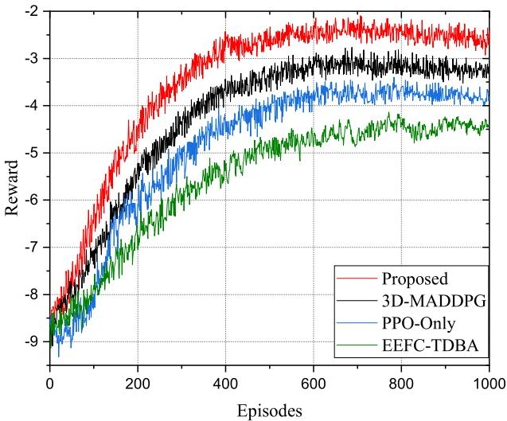  
Fig. 4. Comparison of reward of different algorithms

DDPG to optimize the UAV’s trajectory and resource allocation.

Figure 4 presents the convergence performance of the algorithms during training. As observed, the reward curves for all methods increase steadily with the number of episodes and eventually stabilize, indicating that the agents gradually learn effective resource-allocation policies through interaction with the environment. From the figure, the proposed method rises more quickly and then levels off, demonstrating superior sample efficiency and final performance. This advantage is primarily due to the heuristic guidance provided by the teacher model combined with ToT reasoning, which yields higherquality candidates and more stable exploration. Although 3D-MADDPG enables multi-agent cooperation, it lacks teacher guidance and a generate–score mechanism aligned with the global objective, resulting in slower convergence and inferior performance compared with our approach. PPO–Only, which does not employ a teacher or knowledge distillation, learns less efficiently; and EEFC–TDBA, lacking inter-UAV collaboration, performs the worst. Overall, the simulation results strongly validate the significant advantages of our method in convergence speed, final reward, and stability.

Figure 5 shows how the delay evolves with training episodes across all methods. Overall, except for Nearest, the curves drop rapidly and stabilize after approximately 300–400 episodes, indicating that the agents progressively learn more efficient access and resource allocation policies that shorten task completion time. The Proposed method decreases the fastest and attains the lowest delay, suggesting that teacher guidance from the LoRA-tuned LLM together with distillation regularization based on JS divergence enables more prompt hotspot load balancing across multiple UAVs and more effective intra-UAV resource reallocation; it also exploits A2A task migration and bandwidth coordination more fully. 3D-MADDPG ranks second; although it enables cooperation, it lacks teacher-driven global-objective awareness and feasibility priors. PPO-Only, which has neither teacher signals nor distillation, relies on exploration and consequently converges more slowly, so both methods underperform the Proposed approach. EEFC-TDBA, which lacks inter-UAV collaboration, exhibits markedly higher delay. Nearest, whose distance-based association hardly improves with training, remains at a high delay throughout. Taken together, these results show that the Proposed method delivers significantly better convergence speed, final delay, and stability than the baselines.

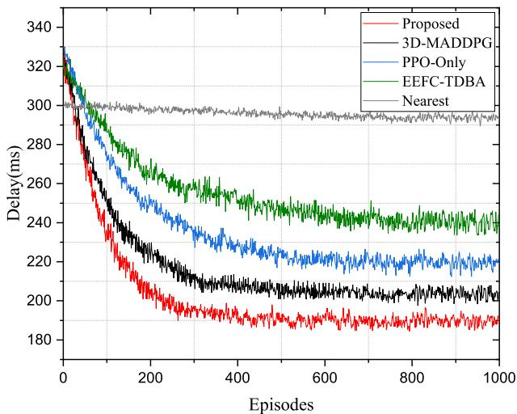  
Fig. 5. Comparison of delay for different algorithms

Figure 6 shows how delay varies with the number of devices. As the number of devices increases, competition for access and computing resources intensifies and link interference rises, leading to a higher system load; consequently, all methods exhibit an overall increase in delay. The Proposed method consistently achieves the lowest delay and shows the smallest increase with scale, demonstrating superior scalability. This advantage stems from teacher guidance and knowledge distillation, which provide high-quality candidate actions and constraint awareness, enabling the policy to proactively load-balance hotspots across multiple UAVs and coordinate resource allocation via A2A task migration. 3D-MADDPG and PPO-Only perform next best. EEFC-TDBA, which lacks inter-UAV collaboration, is heavily affected by congestion. Nearest performs substantially worse because it associates solely by distance without load balancing, causing delay to increase almost linearly as the number of devices grows. These results indicate that the Proposed method maintains lower delay and stronger scalability across a range of system sizes.

Figure 7 illustrates the relationship between UAV computing capability and delay. As the capacity increases from low to high, the delay of all methods decreases. The Proposed method maintains the lowest delay across the entire range. This advantage arises because teacher guidance and distillation provide high-quality priors, enabling the policy to proactively balance load and avoid congestion across multiple UAVs, while coordinating multi-dimensional resources—bandwidth and computing—via A2A task migration. Consequently, queuing and congestion overheads are effectively reduced. By comparison, although 3D-MADDPG and PPO-Only also benefit from increased computing capacity, they remain inferior to the Proposed method due to the absence of teacher priors or limitations in multi-dimensional coordination. EEFC-TDBA, which operates with a single UAV and lacks cooperative computing, shows a weaker response to increased capacity. Nearest relies solely on proximity-based association and scarcely considers cross-UAV cooperation, making it the least sensitive to capacity improvements; its curve is higher and reaches a plateau earlier. Overall, the results indicate that the Proposed method consistently achieves lower delay under diverse computing-resource settings.

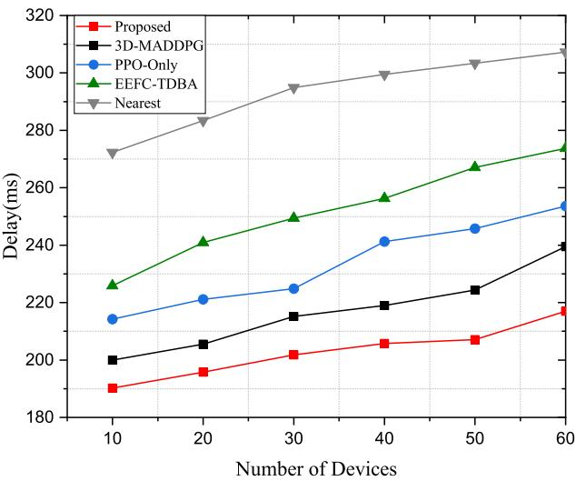  
Fig. 6. Delay of different algorithms under different number of devices

Figure 8 tracks the Jain’s fairness index during training. In the early stages, when the policy has not yet matured, bandwidth and computing resources tend to be skewed toward a few users, leading to low fairness. With repeated interaction with the environment and the influence of the fairness term in the loss function, the agents gradually learn to allocate resources more evenly; distillation from the teacher policy distribution provides additional stable guidance, so fairness increases overall and eventually stabilizes. In comparison, the Proposed method rises the fastest and attains the highest level, indicating that candidate generation and evaluation via the LoRA-tuned LLM with ToT effectively suppress long-term bias. Although 3D-MADDPG supports multi-agent cooperation, it lacks teacher-guided global-objective awareness and thus still exhibits mild imbalance. PPO-Only, which introduces neither teacher signals nor knowledge distillation and relies on exploration, converges more slowly; hence both methods underperform the Proposed approach. EEFC-TDBA, which lacks inter-UAV collaboration, performs worse. Nearest is a simple non-learning strategy that associates purely by distance without load balancing, so its fairness does not improve with training. Overall, these results demonstrate that the Proposed method improves fairness more efficiently and more robustly.

Figure 9 compares the Jain’s Fairness index across the number of devices. As device count increases, competition for access and computing resources intensifies and hotspots and load imbalance become more likely, resulting in an overall downward trend in fairness. The Proposed method experiences the smallest decline and maintains the highest index across the entire range, indicating that teacher guidance and distillation regularization provide constraint awareness and high-quality priors that enable the policy to proactively diffuse hotspots across multiple UAVs and to achieve more balanced intra-UAV bandwidth reallocation. 3D-MADDPG and PPO-Only exhibit some load awareness and decline more gradually as scale grows, but without teacher-guided global-objective awareness or distillation regularization, their redistribution capability lags behind the Proposed method, and hotspot UAVs gradually become overloaded. EEFC-TDBA, which lacks inter-UAV cooperation, achieves markedly lower fairness than the preceding three methods. Nearest declines the most because its greedy, distance-based association ignores instantaneous load, often causing local overload and idle resources, thereby depressing the Jain index. As the number of devices increases further, the system approaches saturation and load proportions stabilize, so the curves fluctuate mildly around a lower plateau toward the end. Overall, the Proposed method maintains higher and more stable fairness across different device counts.

Figure 10 compares the algorithms under two fairness measures. To justify the choice of the Jain index for fairness, we report both the Jain index and the Min–Max ratio as fairness utility functions, where the Min–Max ratio is defined as $M = \frac { \mathrm { m i n } _ { 1 \leq k \leq K } R _ { k } ( t ) } { \mathrm { m a x } _ { 1 \leq k \leq K } R _ { k } ( t ) }$ . Under both metrics, the five methods follow the same ranking: Proposed ranks first, 3D-MADDPG second, PPO-Only third, EEFC-TDBA fourth, and Nearest last. This is consistent with the earlier conclusions on delay, utility, and fairness. The Proposed method leads on both metrics, indicating that, with teacher guidance from the LoRA-LLM and ToT together with distillation, the policy proactively diffuses hotspots across multiple UAVs and, within each UAV, achieves more balanced resource allocation, thereby markedly reducing the phenomenon of persistent neglect of a small subset of users.

In addition, the Jain index values are overall higher than those of the Min–Max ratio, reflecting that the latter is more sensitive to extremes (best and worst users) and therefore yields more conservative scores under the same policy. Nevertheless, both metrics produce the same relative ordering, which confirms the robustness advantage of the proposed approach and supports using the Jain index as a reasonable and more discriminative fairness measure.

Figure 11 illustrates how the WDF evolves over training episodes, where lower curves indicate smaller WDF values. Except for Nearest, all methods drop rapidly with episodes and then gradually stabilize, showing that the policies learn a better trade-off between delay and fairness. The Proposed method remains the lowest throughout and exhibits the smallest variance, indicating that teacher guidance from the LoRA-tuned LLM together with ToT and policy distillation enables the agent to reduce task delay and improve resource allocation fairness simultaneously, with better stability. 3D-MADDPG ranks second: although it supports cooperation, it lacks teacher-guided awareness of the global objective and feasibility priors, thus yielding higher values than the Proposed method. PPO-Only, which does not use a teacher or distillation and relies mainly on exploration, converges more slowly and attains a higher objective value. EEFC-TDBA, lacking collaboration among UAVs, is strongly affected by congestion. Nearest, which greedily associates by distance, shows almost no improvement. This ranking is consistent with the earlier results on delay and fairness, further confirming that the proposed algorithm improves overall QoS.

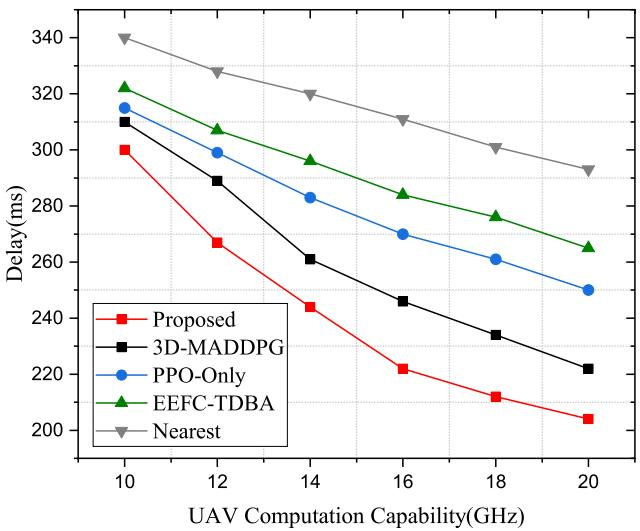  
Fig. 7. Delay with different UAV computing capability

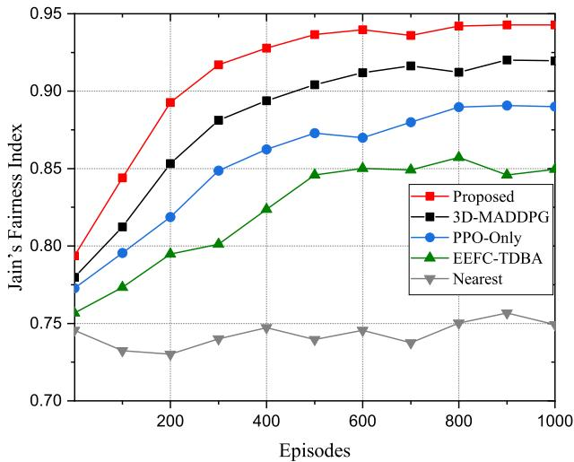  
Fig. 8. Comparison of Jain’s fairness index for different algorithms

Figure 12 shows the relationship between the WDF and the UAV computing capacity. As computing capacity increases, the WDF exhibits an overall decline. Higher CPU frequencies markedly shorten both local and cooperative computation time while also improving fairness, thereby benefiting both delay and fairness simultaneously. The Proposed method attains the lowest overall cost across the entire range because the LLMbased teacher model supplies high-quality expert policies that enable joint optimization of access, trajectory, and resource allocation. 3D-MADDPG and PPO-Only also benefit from increased capacity; however, lacking teacher priors and with limited multi-dimensional coordination, they remain inferior to the Proposed method. EEFC-TDBA adopts a single-UAV perspective without cooperative computing and therefore responds more weakly to capacity improvements. Nearest relies solely on nearest association without cross-UAV coordination, resulting in the highest overall cost.

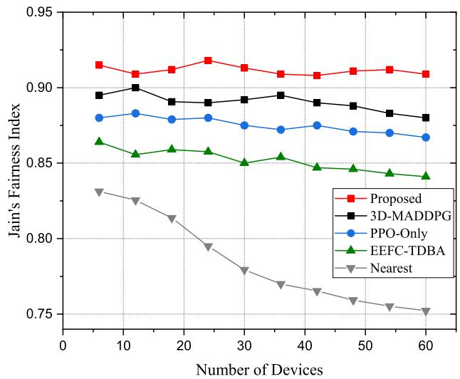  
Fig. 9. Jain’s fairness index of different algorithms under different number of devices

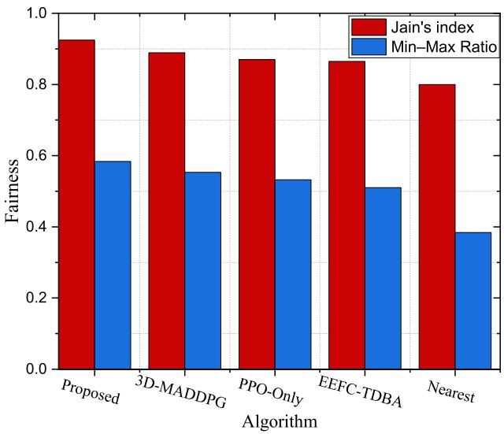  
Fig. 10. Comparison of the different algorithms under two fairness measures

Figure 13 plots the WDF versus bandwidth. As bandwidth increases from 30 MHz to 70 MHz, the WDF of all methods decreases overall, indicating that greater available bandwidth effectively mitigates link congestion and queuing delays and thus reduces the objective value. The Proposed method attains the lowest values at all bandwidth points, reflecting stronger coordinated resource allocation under teacher guidance and distillation; moreover, its decline is more pronounced as bandwidth grows, showing that the policy effectively converts added bandwidth into improvements in both delay and fairness. 3D-MADDPG and PPO-Only rank next: although they benefit to some extent from additional bandwidth, the lack of teacher-driven global scoring and feasibility priors leaves residual resource bias. EEFC-TDBA, which lacks inter-UAV cooperation, gains only limited benefit from bandwidth expansion. Nearest associates solely by distance without load balancing, yielding the highest objective value and the smallest improvement. These results align with the episode-wise convergence trends, indicating that larger bandwidth generally lowers system cost, while cooperation and hierarchical decision-making remain advantageous across all bandwidth settings.

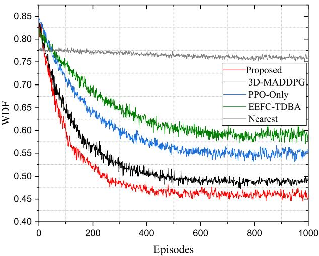  
Fig. 11. Comparison of WDF for different algorithms

TABLE II  
ABLATION STUDY OF THE PROPOSED FRAMEWORK.
<table><tr><td rowspan="2">Method</td><td colspan="4">Components</td><td colspan="3">Metrics</td></tr><tr><td>NKG</td><td>R-GAT</td><td>ToT</td><td>Distill.</td><td>Delay</td><td>Fairness</td><td>WDF</td></tr><tr><td>Ours</td><td>√</td><td>√</td><td>√</td><td>√</td><td>244</td><td>0.918</td><td>0.448</td></tr><tr><td>w/o ToT</td><td>√</td><td>√</td><td>X</td><td>√</td><td>252</td><td>0.903</td><td>0.486</td></tr><tr><td>w/o R-GAT</td><td>√</td><td>X</td><td>√</td><td>√</td><td>259</td><td>0.891</td><td>0.522</td></tr><tr><td>w/o NKG</td><td>×</td><td>√</td><td>√</td><td>√</td><td>266</td><td>0.879</td><td>0.558</td></tr><tr><td>w/o Distill.</td><td>√</td><td>√</td><td>√</td><td>X</td><td>273</td><td>0.862</td><td>0.594</td></tr></table>

To further validate the contribution of each key component, we conduct an ablation study by removing the NKG module, the R-GAT module, the ToT-based teacher reasoning module, and the Teacher-to-Student distillation module, respectively. As shown in Table II, the full model achieves the best overall performance in terms of delay, fairness, and WDF. Removing any one of these modules leads to a consistent performance degradation. In particular, removing the distillation module causes the largest drop, indicating that the Teacher-guided policy transfer plays a critical role in improving the final Student policy. Removing ToT also leads to a clear degradation, which confirms the importance of structured multi-branch candidate exploration in the Teacher module. In addition, the performance drops of w/o NKG and w/o R-GAT verify the effectiveness of structured knowledge modeling and relationaware feature extraction for multi-UAV cooperative resource allocation.

## VII. CONCLUSION

In this paper, we propose an LLM-based teacher–student joint optimization framework for 6G multi-UAV edge cooperative networks. The teacher model, operating with a global view, produces high-quality expert resource-allocation policies that serve as priors for the student. The student model adopts MAPPO augmented with a policy distillation; under a joint objective balancing latency and fairness, it makes coordinated decisions on access control, UAV trajectory planning, computation and bandwidth allocation, and A2A task migration ratio. Simulations demonstrate that, relative to strong baselines, our approach achieves faster convergence, lower steady-state latency, and improved fairness, while maintaining robustness and scalability as the network size and the available computing and bandwidth resources vary.

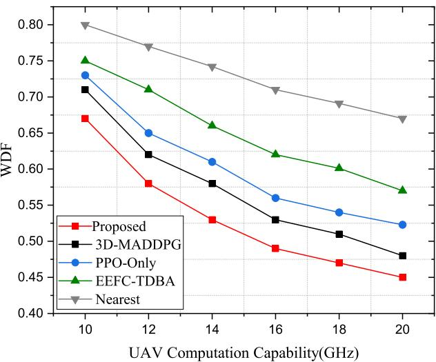  
Fig. 12. WDF with different UAV computing capability

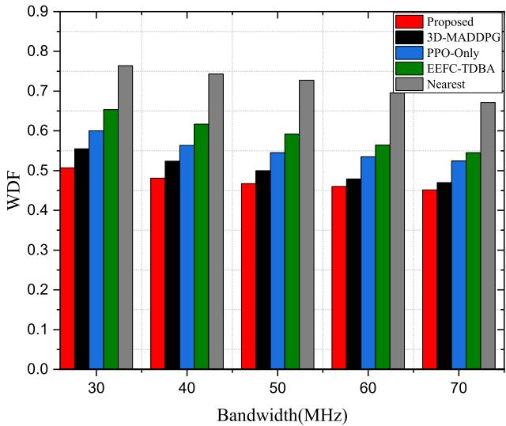  
Fig. 13. WDF with different Bandwidth

## REFERENCES

[1] L. Wang et al., “Joint Task Offloading and Migration Optimization in UAV-Enabled Dynamic MEC Networks,” IEEE Trans. Services Comput., vol. 18, no. 4, pp. 2143–2157, Jul./Aug. 2025.

[2] H. Guo, Y. Wang, J. Liu and C. Liu, “Multi-UAV Cooperative Task Offloading and Resource Allocation in 5G Advanced and Beyond,” IEEE Trans. Wireless Commun., vol. 23, no. 1, pp. 347–359, Jan. 2024.

[3] P. Cao et al., “Computational Intelligence Algorithms for UAV Swarm Networking and Collaboration: A Comprehensive Survey and Future Directions,” IEEE Commun. Surv. Tutor., vol. 26, no. 4, pp. 2684–2728, fourthquarter 2024.

[4] S. Javaid, H. Fahim, B. He and N. Saeed, “Large Language Models for UAVs: Current State and Pathways to the Future,” IEEE Open J. Veh. Technol., vol. 5, pp. 1166–1192, 2024.

[5] J. Zhang et al., “Decision Transformers for Wireless Communications: A New Paradigm of Resource Management,” IEEE Wireless Commun., vol. 32, no. 2, pp. 180–186, Apr. 2025.

[6] W. Zhao et al., “A Survey on DRL-Based UAV Communications and Networking: DRL Fundamentals, Applications and Implementations,” IEEE Commun. Surv. Tutor., early access, Jun. 23, 2025, doi: 10.1109/COMST.2025.3581912.

[7] S. Long et al., “A Survey on Intelligent Network Operations and Performance Optimization Based on Large Language Models,” IEEE Commun. Surv. Tutor., early access, Jan. 07, 2025, doi: 10.1109/COMST.2025.3526606.

[8] H. Kurunathan, H. Huang, K. Li, W. Ni and E. Hossain, “Machine Learning-Aided Operations and Communications of Unmanned Aerial Vehicles: A Contemporary Survey,” IEEE Commun. Surv. Tutor., vol. 26, no. 1, pp. 496–533, firstquarter 2024.

[9] G. Qu, Q. Chen, W. Wei, Z. Lin, X. Chen and K. Huang, “Mobile Edge Intelligence for Large Language Models: A Contemporary Survey,” IEEE Commun. Surv. Tutor., early access, Jan. 09, 2025, doi: 10.1109/COMST.2025.3527641.

[10] L. Cai, R. Zhang, C. Zhao, et al., “Large Language Model-Enhanced Reinforcement Learning for Low-Altitude Economy Networking,” arXiv preprint arXiv:2505.21045, 2025.

[11] X. Li, H. Li, C. Sun, Q. Fan, Z. Han and V. C. M. Leung, “Edge-Enhanced Intelligence: A Comprehensive Survey of Large Language Models and Edge–Cloud Computing Synergy,” IEEE Commun. Surv. Tutor., early access, 2025, doi: 10.1109/COMST.2025.3587225.

[12] P. F. Moshiri, M. A. Onsu, P. Lohan, et al., “Integrating Language Models for Enhanced Network State Monitoring in DRL-Based SFC Provisioning,” arXiv preprint arXiv:2502.11298, 2025.

[13] H. Pang, Z. Wang and G. Li, “Large Language Model Guided Deep Reinforcement Learning for Decision Making in Autonomous Driving,” arXiv preprint arXiv:2412.18511, 2024.

[14] Z. Zhou, B. Hu, C. Zhao, et al., “Large Language Model as a Policy Teacher for Training Reinforcement Learning Agents,” arXiv preprint arXiv:2311.13373, 2023.

[15] Z. Bai, Y. Lin, Y. Cao and W. Wang, “Delay-Aware Cooperative Task Offloading for Multi-UAV Enabled Edge–Cloud Computing,” IEEE Trans. Mobile Comput., vol. 23, no. 2, pp. 1034–1049, Feb. 2024.

[16] C. Wang et al., “Computing Power in the Sky: Digital Twin-Assisted Collaborative Computing With Multi-UAV Networks,” IEEE Trans. Veh. Technol., vol. 74, no. 9, pp. 14466–14482, Sept. 2025.

[17] H. Hu, X. Zhu, F. Zhou, W. Wu, R. Q. Hu and H. Zhu, “Resource Allocation for Multi-Modal Semantic Communication in UAV Collaborative Networks,” IEEE Trans. Commun., vol. 73, no. 9, pp. 7599–7616, Sept. 2025.

[18] F. Pervez, A. Sultana, C. Yang and L. Zhao, “Energy and Latency Efficient Joint Communication and Computation Optimization in a Multi-UAV-Assisted MEC Network,” IEEE Trans. Wireless Commun., vol. 23, no. 3, pp. 1728–1741, Mar. 2024.

[19] Y. Gao, J. Tao, Y. Xu, Z. Wang, Y. Gao and M. Wang, “Improving User QoE via Joint Trajectory and Resource Optimization in Multi-UAV Assisted MEC,” IEEE Trans. Services Comput., vol. 18, no. 3, pp. 1472– 1486, May/Jun. 2025.

[20] P. Qin, M. Fu, Y. Fu and J. Wang, “Cooperative UAV Trajectory Design and Resource Allocation in Blockchain-Enabled Secure Aerial Edge Computing Network,” IEEE Trans. Wireless Commun., early access, 2025, doi: 10.1109/TWC.2025.3582151.

[21] A. Mohajer, J. Hajipour and V. C. M. Leung, ”Dynamic Offloading in Mobile Edge Computing With Traffic-Aware Network Slicing and Adaptive TD3 Strategy,” IEEE Commun. Lett., vol. 29, no. 1, pp. 95- 99, Jan. 2025.

[22] G. Liu, N. Van Huynh, H. Du, et al., “Generative AI for Unmanned Vehicle Swarms: Challenges, Applications and Opportunities,” arXiv preprint arXiv:2402.18062, 2024.

[23] D. Ye et al., “Optimizing AIGC Services by Prompt Engineering and Edge Computing: A Generative Diffusion Model-Based Contract Theory Approach,” IEEE Trans. Veh. Technol., vol. 74, no. 1, pp. 571–586, Jan. 2025.

[24] X. Zhang et al., “Beyond the Cloud: Edge Inference for Generative Large Language Models in Wireless Networks,” IEEE Trans. Wireless Commun., vol. 24, no. 1, pp. 643–658, Jan. 2025.

[25] Y. Hu, D. Ye, J. Kang, M. Wu and R. Yu, “A Cloud–Edge Collaborative Architecture for Multimodal LLM-Based Advanced Driver Assistance Systems in IoT Networks,” IEEE Internet Things J., vol. 12, no. 10, pp. 13208–13221, 15 May 2025.

[26] M. Zhang, X. Shen, J. Cao, Z. Cui and S. Jiang, “EdgeShard: Efficient LLM Inference via Collaborative Edge Computing,” IEEE Internet Things J., vol. 12, no. 10, pp. 13119–13131, 15 May 2025.

[27] Y. Tian, F. Lin, Y. Li, et al., “UAVs Meet LLMs: Overviews and Perspectives Towards Agentic Low-Altitude Mobility,” Inf. Fusion, vol. 122, Art. no. 103158, 2025.

[28] S. Zhang et al., “Large Models for Aerial Edges: An Edge–Cloud Model Evolution and Communication Paradigm,” IEEE J. Sel. Areas Commun., vol. 43, no. 1, pp. 21–35, Jan. 2025.

[29] G. Sun et al., “Large Language Model (LLM)-Enabled Graphs in Dynamic Networking,” IEEE Network, vol. 39, no. 4, pp. 290–301, Jul. 2025.

[30] H. Li, M. Xiao, K. Wang, D. I. Kim and M. Debbah, “Large Language Model Based Multi-Objective Optimization for Integrated Sensing and Communications in UAV Networks,” IEEE Wireless Commun. Lett., vol. 14, no. 4, pp. 979–983, Apr. 2025.

[31] Y. Ren, H. Zhang, F. R. Yu, W. Li, P. Zhao and Y. He, “Industrial Internet of Things With Large Language Models (LLMs): An Intelligence-Based Reinforcement Learning Approach,” IEEE Trans. Mobile Comput., vol. 24, no. 5, pp. 4136–4152, May 2025.

[32] X. Xu, G. Feng, S. Qin, Y. Liu and Y. Sun, “Joint UAV Deployment and Resource Allocation: A Personalized Federated Deep Reinforcement Learning Approach,” IEEE Trans. Veh. Technol., vol. 73, no. 3, pp. 4005– 4018, Mar. 2024.

[33] J. Yin et al., “QoS-Aware Energy-Efficient Multi-UAV Offloading Ratio and Trajectory Control Algorithm in Mobile-Edge Computing,” IEEE Internet Things J., vol. 11, no. 24, pp. 40588–40602, 15 Dec. 2024.

[34] R. K. Jain et al., “A Quantitative Measure of Fairness and Discrimination,” Eastern Res. Lab., Digit. Equip. Corporation, Hudson, MA, Rep. vol. 21, pp. 1–38, 1984.

[35] S. Yao, D. Yu, J. Zhao, et al., “Tree of Thoughts: Deliberate Problem Solving With Large Language Models,” Adv. Neural Inf. Process. Syst., vol. 36, pp. 11809–11822, 2023.

[36] J. Wei, X. Wang, D. Schuurmans, et al., “Chain-of-Thought Prompting Elicits Reasoning in Large Language Models,” Adv. Neural Inf. Process. Syst., vol. 35, pp. 24824–24837, 2022.

[37] H. Hao, C. Xu, W. Zhang, S. Yang and G.-M. Muntean, “Joint Task Offloading, Resource Allocation, and Trajectory Design for Multi-UAV Cooperative Edge Computing With Task Priority,” IEEE Trans. Mobile Comput., vol. 23, no. 9, pp. 8649–8663, Sept. 2024.

[38] “Study on Enhanced LTE Support for Aerial Vehicles (Release 15),” 3GPP Std. 36.777, Dec. 2017.

[39] Y. He, Y. Gan, H. Cui and M. Guizani, “Fairness-Based 3-D Multi-UAV Trajectory Optimization in Multi-UAV-Assisted MEC System,” IEEE Internet Things J., vol. 10, no. 13, pp. 11383–11395, 1 Jul. 2023.

[40] R. Ding, F. Gao and X. S. Shen, “3D UAV Trajectory Design and Frequency Band Allocation for Energy-Efficient and Fair Communication: A Deep Reinforcement Learning Approach,” IEEE Trans. Wireless Commun., vol. 19, no. 12, pp. 7796–7809, Dec. 2020.

  
Yaqing Wang received the M.S. degree from Guangxi Normal University, Guilin, Guangxi, China, in 2021. She is currently pursuing the Ph.D. degree in communication and information systems with Chongqing University of Posts and Telecommunications, Chongqing, China. Her current research interests include edge intelligence computing, digital twin, and intelligent network management.

Lun Tang received the Ph.D. degree in communication and information system from Chongqing University, Chongqing, China, in 2010. He is currently a professor with the School of Communication and Information Engineering, Chongqing University of Posts and Telecommunications. His current research interests include digital twin networks, 5G/6G, Industrial Internet of Things, and the Internet of Vehicles.

Weili Wang received the M.E. and Ph.D. degrees in information and communication engineering from Chongqing University of Posts and Telecommunications, Chongqing, China, in 2018 and 2023, respectively. She was a Visiting Researcher with Carleton University, Ottawa, ON, Canada, from December 2021 to January 2023. She is currently a Postdoctoral Researcher with Cyber Security and Information Law Research Center, Chongqing. Her current research interests include intelligent network management and self-healing techniques in 6G.

Xiaoqiang He received the Ph.D degree in Chongqing University of Posts and Telecommunications, Chongqing, China, in 2023. He is currently a lecturer with College of Communication Engineering, Chongqing Polytechnic University of Electronic Technology. From May 2019 to October 2020, he was a Visiting Graduate Student (Ph.D. student) with the Department of Electrical, Computer, and Biomedical Engineering, Ryerson University, Canada. His current research interests include mobile edge computing, edge intelligence computing, intrusion detection system, and digital twin.

Qianbin Chen (M’03-SM’14) received the Ph.D. degree in communication and information system from the University of Electronic Science and Technology of China, Chengdu, China, in 2002. He is currently a Professor with the School of Communication and Information Engineering, Chongqing University of Posts and Telecommunications, and the Director of the Chongqing Key Laboratory of Mobile Communication Technology. He has authored or co-authored over 100 papers in journals and peer-reviewed conference proceedings, and has coauthored seven books. He holds 47 granted national patents.