# Latency-Aware Computation Offloading in Hybrid UAV-Assisted MEC Systems: Time Scheduling and 3D Trajectory Design

Xiaoyan Hu, Member, IEEE, Xingxia Gao, Student Member, IEEE, Pengle Wen, Student Member, IEEE, Kai-Kit Wong, Fellow, IEEE, Kun Yang, Fellow, IEEE

Abstract—The unmanned/uncrewed aerial vehicle (UAV) assisted mobile edge computing (MEC) technology has become a viable and flexible solution for providing computation offloading and energy charging services for ground users, especially in scenarios with terrible direct links. Therefore, latency has become one of the crucial design issues subject to the energy limitations of the UAV and users. Motivated by this, we study a latency-aware airground hybrid MEC system with an assistant UAV and a ground base station (GBS) to serve and charge multiple users under both the time-division multiple access (TDMA) and non-orthogonal multiple access (NOMA) protocols. The task completion latency minimization problems are formulated by jointly optimizing the time slot scheduling, CPU frequency allocation, UAV’s threedimensional (3D) trajectory design, transmit power allocation, as well as the number of required time slots. To address the formulated mixed integer non-convex optimization problems, we introduce an efficient alternating optimization algorithm with a double-loop structure. In the outer loop, we constantly adjust the number of time slots by employing the bisection search method and determine the search range via feasibility check. In the inner loop, we first transform the original subproblem into an equivalent problem that maximizes the minimum computation completion ratio of the users. Then we further decompose this transformed problem into four subproblems, which can be solved by a proposed iterative algorithm. Extensive experiments are conducted to illustrate the efficacy and superiority of the proposed algorithm over the other benchmark schemes in minimizing the task completion latency, particularly in scenarios where the computing resource is limited or the density of users is high.

Index Terms—Computation offloading, energy charging, task completion latency, 3D trajectory design, time slot scheduling.

## I. INTRODUCTION

With the explosive growth in computational demands driven by the proliferation of user devices, mobile edge computing (MEC) technology has attracted significant attention from various fields. The emerging technology of MEC caters to the needs of the B5G and future 6G era, which is characterized by rapid growth in information volume and strict requirements for latency [1]. The potential applications of MEC have been explored in [2]–[4], such as smart agriculture, augmented reality, and intelligent transportation, etc. As we all know, edge servers deployed close to the user devices can provide essential computation resources. However, in traditional MEC networks, MEC servers are typically mounted with terrestrial infrastructures, which often leads to issues such as limited coverage and inefficient performance.

Due to the advantages of high flexibility and strong operability, introducing the unmanned/uncrewed aerial vehicles (UAVs) into MEC systems can effectively overcome the aforementioned limitations [5], [6]. However, as the number of users grows, UAV-aided MEC system may not meet the demands of computation-intensive latency-critical tasks in many new applications. Considering the potential of terrestrial MEC nodes, i.e., the ground base station (GBS), the air-ground hybrid MEC system can further expand the network coverage and improve the computation capability through cooperation between the UAV and GBS. The prospects and challenges of the UAV-aided hybrid MEC systems have been previously investigated in [7]–[9], where the UAV acts as both aerial relay and MEC server. When the direct links between the users and GBS are blocked, the UAV can not only help users perform computation offloading but also relay tasks to the GBS for further execution [7]. The computation efficiency was maximized in [8], [9] through jointly optimizing the computation and communication resource allocation, as well as the UAV’s trajectory. Based on the above discussion, the UAV-assisted hybrid MEC system can fully utilize the resources at the UAV, GBS and user devices to achieve satisfactory performance.

Although the hybrid UAV-assisted MEC architectures exploring the cooperation between the UAV and GBS can significantly relieve the pressure of user devices on computing and communication resources, the energy resource is becoming one of the main bottlenecks that limits the system performance. To solve this dilemma, the technology of wireless power transfer (WPT) has recently been introduced into MEC systems [10]. The UAV equipped with the energy transmitter can broadcast radio frequency (RF) energy to support user devices in hybrid MEC systems [11]–[13]. In [11], the GBS leveraged laser WPT to charge the UAV while the UAV transmitted RF energy to ground users to supply their operations, and the total number of completed computation task bits was maximized. The authors in [12] considered a heterogeneous MEC system with multiple energy-limited IoT devices, where the UAV can supply energy to all the IoT devices through WPT. Recently, the technology of simultaneous wireless information and power transfer (SWIPT) was adopted in [13] to charge the users while transmitting the results back.

For UAV-assisted MEC networks, a larger number of existing studies focus on planning the UAV’s trajectory at a fixed altitude, namely with two-dimensional (2D) UAV trajectory design [6]–[13]. In addition, most of the works only consider the simplified Line-of-Sight (LoS) UAV channels [6]–[8], [10], [11], which is not suitable for some real-world scenarios, such as in urban or suburban areas. Against the UAV-assisted communication networks with three-dimensional (3D) trajectory design, a practical statistical channel model with the occurrence probability of LoS and non-LoS (NLoS) channels was introduced in [14], [15]. To improve the system performance, some recent UAV-enabled MEC works have begun to study the UAV’s 3D trajectory optimization for diverse practical optimization goals. The authors in [16] considered a UAV-aided MEC network and studied the Pareto-optimal aerial and ground energy minimization problem by jointly optimizing the resource allocation and UAV’s 3D trajectory. In [17], the 3D UAV trajectory and power allocation were optimized to maximize the average secure rate of the MEC system with the federated learning method. Gao et al. provided an efficient design for the UAV-assisted MEC system that aims at minimizing the total time cost including the costs for task offloading, computations, and decision transmissions [18]. The deep reinforcement learning was utilized to minimize the overall UAV propulsion energy in [19] through designing the UAV 3D trajectory and mission offloading strategy. Further in [20], a multi-UAV MEC system was considered, and the delay optimization ratio was minimized through the UAVs’ 3D trajectories optimization and resource assignment. However, the hybrid UAV-assisted MEC architecture exploring the cooperation between the UAV and GBS is not fully investigated in these state-of-the-art works [16]–[20].

From literature review, it is observed that plenty of the UAV-enabled MEC works focus on the performance metrics of energy consumption [7], [10], [13], [16], [19]. Recently, more and more studies have been devoted to minimizing the MEC network latency [18], [20]–[22], which also represents an important performance metric for advanced latency-sensitive applications. Considering a frequency division multiple access based computation offloading protocol, the authors in [21] focused on minimizing the total time consumption of data processing. Also, Wu et al. studied the goal of minimizing the maximum computation latency among all devices in [22]. It is worth mentioning that the time division multiple access (TDMA) is a typical representative of the orthogonal multiple access scheme for wireless communications. Hence, the latency optimization problem for MEC systems under the TDMA protocol is also practically significant, but has not yet been well studied. In addition, the non-orthogonal multiple access (NOMA) is becoming a promising multiple access technology for future communications [23]. By exploiting the technique of successive interference cancellation (SIC) at the receiver, NOMA allows multiple users sharing the same time and frequency resources, and thus improve the system efficiency. As such, it is also of great importance to investigate the potential benefits of utilizing NOMA in UAV-integrated MEC networks [24]–[27]. Specifically, the work [24] aimed at minimizing the total latency of all users by applying the NOMA scheme. The impact of NOMA on QoS-oriented task offloading was explored in [25] with consideration of task priorities. The authors of [26] studied the joint resource allocation and 3D UAV position optimization for a uplink UAV-MEC-NOMA network. Moreover, the UAV-assisted MEC systems under both the TDMA and NOMA protocols were studied in [27]. Similarly, the hybrid UAV-enabled MEC architecture with cooperation between the UAV and GBS is not explored, and the latency-aware resource allocation is not fully investigated in these works [24]–[27].

Motivated by the existing research works mentioned above, we investigate the more potential hybrid UAV-enabled wireless powered MEC systems based on both the TDMA and NOMA protocols in this paper. To fully leverage the computing capabilities at diverse nodes, it is assumed that the computation tasks generated by users adopt the partial offloading mode, where the tasks can be computed locally, offloaded to the UAV, and relayed to the GBS for remote computation. In summary, the major contributions of this paper are listed as follows:

• A Novel Hybrid UAV-assisted Wireless Powered MEC Structure with UAV-GBS Cooperation and UAV 3D Trajectory Design under Probabilistic LoS Channel Model: We develop a novel hybrid UAV-assisted wireless powered MEC structure with one GBS, one UAV and multiple users, where the UAV is equipped with a MEC server and a RF energy transmitter to supply both computation and energy charging services for users. The practical probabilistic LoS channel model is utilized for the UAV-ground links. Based on this, the cooperation between the UAV and the GBS is investigated and the UAV 3D trajectory design with altitude control is leveraged to fully explore the diverse resources at different nodes as well as the high-quality LoS UAV links.

• Problem Formulation Aimed at Minimizing the Network Task Completion Latency under both the TDMA and NOMA Protocols: For the considered MEC system, we formulate two problems aimed at minimizing the task completion latency under both the TDMA and NOMA protocols by jointly optimizing the time slot scheduling, CPU frequency allocation, UAV 3D trajectory design, transmit power allocation, and the number of required time slots. These two problems are mixed-integer nonconvex optimization problems, subject to the informationcausality constraints for partial offloading, and the energy causality constraints for UAV and users.

• Efficient Alternating Optimization Algorithm with Guaranteed Convergence: We propose an efficient alternating optimization algorithm with a double-loop structure to tackle the mixed-integer non-convex problems. To be specific, we constantly adjust the number of time slots by leveraging the bisection search method and determine the search range via feasibility check in the outer loop. The task completion latency minimization problems can be transformed into equivalent problems that maximize the minimum computation completion ratio of users in the inner loop. Then, we decompose these equivalent problems into four subproblems, which can be effectively tackled by the successive convex approximation (SCA), Lagrangian duality method, and standard convex tools.

• Significant Performance Improvement with the Proposed Algorithm: Extensive simulation experiments are carried out to validate the performance advantages of the proposed TDMA and NOMA schemes in reducing the task completion latency compared to the benchmark schemes. The results indicate that our proposed schemes can efficiently utilize the communication and computing resources of the system, thereby significantly decreasing the task completion latency of the network.

The remaining part of this paper is summarized as follows. Section II presents the system model. The task completion latency minimization problems under the TDMA and NOMA protocols are formulated in Section III. We propose the algorithm design in Section IV. Simulation results and performance analysis are shown in Section VI. Finally, the conclusion is summarized in Section VII.

## II. SYSTEM MODEL

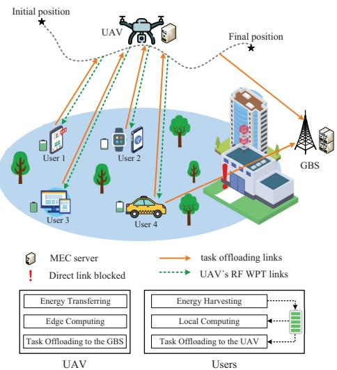  
Fig. 1: A UAV-assisted wireless powered hybrid MEC system serving multiple ground users with partial computation offloading.

Fig. 1 depicts a hybrid UAV-assisted wireless-powered MEC system that consists of K ground users with index $k ~ \in ~ \mathcal { K } ~ \triangleq ~ \{ 1 , . . . , K \}$ , a GBS, and a battery-based UAV cooperating with the GBS to assist the users for computation offloading. The UAV, GBS and all users are equipped with a single antenna. The GBS, integrating with a MEC server, can provide sufficient computing resources to support task completion. All users have wireless energy-harvesting circuits, while the UAV is equipped with a RF energy transmitter and a lightweight MEC server to transmit energy and provide MEC services for users. During the UAV’s flight period, the users perform task offloading and receive RF energy from the UAV simultaneously with the frequency division duplex (FDD) mode [28]. In particular, user k has a latency-critical computational task $D _ { k } \ = \ \{ I _ { k } , C _ { k } \}$ , where $I _ { k }$ denotes the size of user $k ' s$ task and $C _ { k }$ represents the number of CPU cycles required for computing 1-bit data. Suppose that the task bits of each user are bit-wise independent and can be partitioned into smaller-size portions [7], [29], which can be computed separately. In the considered scenario, the users cannot establish direct communication links with the GBS owing to signal blockage, thus the UAV also serves as an aerial relay to further offload tasks to the GBS.

## A. UAV Trajectory Model

Considering a 3D Cartesian coordinate system, the GBS has a fixed horizontal location at $\mathbf { w } _ { b } ~ \in ~ \mathbb { R } ^ { 2 \times 1 }$ . Similarly, let $\mathbf { w } _ { k } \ \in \ \mathbb { R } ^ { 2 \times 1 } \ ( k \ \in \ \mathcal { K } )$ denote each user’s location. The locations of all users and the GBS are assumed to be known in advance via GPS information [6]. For ease of discussion, we assume that a time horizon T is uniformly discretized into N equal time slots denoted by $n \in \mathcal { N } \triangleq \{ 1 , 2 , . . . , N \}$ Assume that each fixed time slot length $\delta _ { t }$ is small enough, thus the position of UAV can be regarded as stationary within any time slot and changes between two adjacent time slots. In time slot n, the 3D coordinate of the UAV can be given as (q[n], z[n]), where ${ \bf q } [ n ] \in \mathbb { R } ^ { 2 \times 1 }$ and z[n] indicate the horizontal and vertical coordinates. For the ease of exposition, the UAV’s moving trajectory during T is described as N sequences denoted by $\{ ( \mathbf { q } [ n ] , z [ n ] ) , n \ \in \ { \mathcal { N } } \}$ . During any time slot, the distance between the UAV and user k is represented as $d _ { k , \mathrm { U A V } } [ n ] = \sqrt { \| \mathbf { q } [ n ] - \mathbf { w } _ { k } \| ^ { 2 } + ( z [ n ] ) ^ { 2 } }$ , and the distance between the GBS and UAV is expressed as $d _ { \mathrm { G B S } } [ n ] = \sqrt { \| \mathbf { q } [ n ] - \mathbf { w } _ { b } \| ^ { 2 } + ( z [ n ] ) ^ { 2 } }$ . Without loss of generality, the $\mathrm { U A V } _ { \mathrm { } } ^ { \prime } \mathrm { s }$ initial and final positions are pre-determined for battery charging and recycling, denoted by $\left( \mathbf { q } _ { 0 } , z _ { 0 } \right)$ and $( \mathbf { q } _ { \mathrm { F } } , z _ { \mathrm { F } } )$ , respectively. Let $V _ { x y }$ and $V _ { z }$ represent the maximum horizontal and vertical flight speeds of the UAV. In addition, the UAV has a minimum and a maximum flying altitudes for complying with the air traffic management, whose altitude can be dynamically adjusted within $[ H _ { \mathrm { m i n } } , H _ { \mathrm { m a x } } ]$ to improve the quality of transmission links. Consequently, we can obtain the following constraints of the UAV’s mobility:

$$
\| \mathbf { q } [ n + 1 ] - \mathbf { q } [ n ] \| \leq V _ { x y } \delta _ { t } , \ \forall n ,
$$

$$
| z [ n + 1 ] - z [ n ] | \leq V _ { z } \delta _ { t } , \ \forall n ,\tag{1a}
$$

(1b)

$$
( \mathbf { q } [ 1 ] , z [ 1 ] ) = ( \mathbf { q } _ { 0 } , z _ { 0 } ) , \ ( \mathbf { q } [ N + 1 ] , z [ N + 1 ] ) = ( \mathbf { q } _ { \mathrm { F } } , z _ { \mathrm { F } } ) ,\tag{1c}
$$

$$
H _ { \mathrm { m i n } } \leq z [ n ] \leq H _ { \mathrm { m a x } } , \ \forall n .\tag{1d}
$$

## B. Channel Model

The conventional UAV channel models that only focus on the LoS links are not suitable for the complex urban environment usually with obstacle blocking. Thus, we adopt a more generic channel model that incorporates the effects of path-loss, shadowing, and small-scale fading [12]. The channel coefficient between the UAV and user k in time slot n is modeled as

$$
h _ { k , \mathrm { U A V } } [ n ] = \sqrt { \mu _ { k , \mathrm { U A V } } [ n ] } \tilde { h } _ { k , \mathrm { U A V } } [ n ] ,\tag{2}
$$

where $\mu _ { k , \mathrm { U A V } } [ n ]$ denotes the large-scale fading coefficient of the Air-to-Ground (A2G) channel, and $\tilde { h } _ { k , \mathrm { U A V } } [ n ] \sim \mathcal { C N } ( 0 , 1 )$ accounts for the small-scale fading. In fact, $\mu _ { k , \mathrm { U A V } } [ n ]$ is related to the LoS and NLoS links [30], which is given as

$$
\mu _ { k , \mathrm { U A V } } [ n ] = \left\{ { \begin{array} { l l } { \mu _ { 0 } d _ { k , \mathrm { U A V } } ^ { - \alpha } [ n ] , } & { { \mathrm { L o S ~ L i n k } } , } \\ { \omega \mu _ { 0 } d _ { k , \mathrm { U A V } } ^ { - \alpha } [ n ] , } & { { \mathrm { N L o S ~ L i n k } } . } \end{array} } \right.\tag{3}
$$

Here, $\mu _ { 0 }$ indicates the channel power gain at the reference distance of 1 meter, $\alpha \geq 2$ indicates the path-loss exponent, and $\omega < 1$ represents the extra attenuation factor under the NLoS link. In general, the possibility of LoS link depends on the propagation environment. Based on [14], the LoS probability between the UAV and user k in time slot n is given by

$$
P _ { k , \mathrm { U A V } } ^ { \mathrm { L o S } } [ n ] = \frac { 1 } { 1 + \beta _ { 0 } \exp { ( - \beta _ { 1 } \left( \varOmega _ { k , \mathrm { U A V } } [ n ] - \beta _ { 0 } \right) ) } } ,\tag{4}
$$

where $\beta _ { 0 }$ and $\beta _ { 1 }$ are the constant parameters relying on the environment, and $\begin{array} { l l l } { \varOmega _ { k , \mathrm { U A V } } [ n ] } & { = } & { \frac { 1 8 0 } { \pi } } \end{array}$ arcsin $\left( \frac { \mathsf { \bar { z } } [ n ] } { d _ { k , \mathrm { U A V } } [ n ] } \right)$ indicates the elevation angle between the UAV and user k measured in degree. On this basis, the average channel gain between the UAV and user k is described as

$$
\begin{array} { r l r } {  { \mathbb { E } [ | h _ { k , \mathrm { U A V } } [ n ] | ^ { 2 } ] } } \\ & { = P _ { k , \mathrm { U A V } } ^ { \mathrm { L o S } } [ n ] \mu _ { 0 } d _ { k , \mathrm { U A V } } ^ { - \alpha } [ n ] + ( 1 - P _ { k , \mathrm { U A V } } ^ { \mathrm { L o S } } [ n ] ) \omega \mu _ { 0 } d _ { k , \mathrm { U A V } } ^ { - \alpha } [ n ] } \\ & { = \hat { P } _ { k , \mathrm { U A V } } ^ { \mathrm { L o S } } [ n ] \mu _ { 0 } d _ { k , \mathrm { U A V } } ^ { - \alpha } [ n ] , } & { ( 5 ) } \end{array}
$$

where $\hat { P } _ { k , \mathrm { U A V } } ^ { \mathrm { L o S } } [ n ] = P _ { k , \mathrm { U A V } } ^ { \mathrm { L o S } } [ n ] + ( 1 - P _ { k , \mathrm { U A V } } ^ { \mathrm { L o S } } [ n ] ) \omega$ indicates a regularized LoS probability for the A2G channels including the effect of the NLoS occurrence.

## C. TDMA Scheme

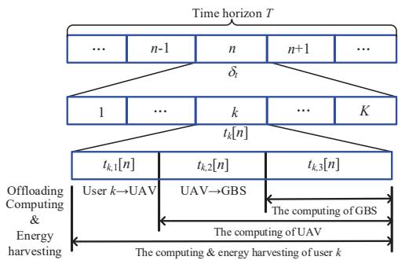  
Fig. 2: Time allocation with TDMA protocol for the hybrid UAVassisted wireless-powered MEC system.

To fully utilize the computation ability, all users execute their computational tasks by adopting a partial offloading manner, i.e., local computing, task offloading to the UAV for computation, and offloading to the GBS for further execution. To avoid co-channel interference among different users, we first apply the TDMA protocol for task offloading, as illustrated in Fig. 2. To be specific, a long-short time slots mixed mechanism [12] is adopted, and each time slot is further dynamically partitioned into K durations, where the kth duration $t _ { k } [ n ] \in [ 0 , \delta _ { t } ]$ is allocated to user k which includes three sections designated as $t _ { k , 1 } [ n ] , t _ { k , 2 } [ n ]$ , and $t _ { k , 3 } [ n ]$ . The user k can offload part of its tasks to the UAV in section $t _ { k , 1 } [ n ]$ , and locally compute the remaining part of tasks in the whole duration. The UAV further offloads part of its received tasks from user k to the GBS in section $t _ { k , 2 } [ n ]$ , and computes the tasks in section $t _ { k , 2 } [ n ]$ and $t _ { k , 3 } [ n ]$ . The GBS computes the tasks of user k offloaded from the UAV in section $t _ { k , 3 } [ n ]$ Consequently, we have the following constraints:

$$
t _ { k , 1 } [ n ] + t _ { k , 2 } [ n ] + t _ { k , 3 } [ n ] = t _ { k } [ n ] , \ \forall k , n ,
$$

$$
\sum _ { k = 1 } ^ { K } t _ { k } [ n ] \leq \delta _ { t } , \ \forall n .\tag{6a}
$$

(6b)

According to [31], the users can simultaneously perform the local computation, task offloading and energy harvesting since the computing processors, communication circuits and energy-harvesting circuits are all separated. Furthermore, we assume that the uplink task offloading and the downlink energy transmission are performed over orthogonal frequency bands at the same time. In practice, the task-output bits of the computation results are significantly smaller in size than taskinput bits for certain applications, and thus the energy and time consumption required for processing the computation results by the UAV and GBS can be ignored.

1) Partial Offloading Model: Let $P _ { k } [ n ]$ represent the offloading power of user k. Then, the data transmission rate from user k to the UAV is given as

$$
\tilde { R } _ { k , \mathrm { U A V } } [ n ] = B \log _ { 2 } { \left( 1 + \frac { P _ { k } [ n ] { \left| h _ { k , \mathrm { U A V } } [ n ] \right| } ^ { 2 } } { \sigma ^ { 2 } \Gamma } \right) } ,\tag{7}
$$

where B is the system bandwidth, $\sigma ^ { 2 }$ indicates the received noise power, and $\Gamma > 1$ is a gap in the channel capacity.

Note that $\tilde { R } _ { k , \mathrm { U A V } } [ n ]$ is a random variable due to the randomness of channel $h _ { k , \mathrm { U A V } } [ n ]$ . Since the probability distribution of $\tilde { R } _ { k , \mathrm { U A V } } [ n ]$ may be intractable to obtain, we instead focus on the expected data transmission rate, denoted as $\hat { R } _ { k , \mathrm { U A V } } [ n ]$ . According to the Jensen’s inequality, we obtain

$$
\begin{array} { r l r } { \mathbb { E } \left[ \tilde { R } _ { k , \mathrm { U A V } } [ n ] \right] } & { \leq { \cal B } \log _ { 2 } \left( 1 + \frac { { \cal P } _ { k } \left[ n \right] \mathbb { E } \left[ \left| h _ { k , \mathrm { U A V } } \left[ n \right] \right| \right] ^ { 2 } } { \sigma ^ { 2 } \Gamma } \right) } & \\ & { = { \cal B } \log _ { 2 } \left( 1 + \frac { { \cal P } _ { k } \left[ n \right] \hat { \cal P } _ { k , \mathrm { U A V } } ^ { \mathrm { L o S } } \left[ n \right] \mu _ { 0 } d _ { k , \mathrm { U A V } } ^ { - \alpha } \left[ n \right] } { \sigma ^ { 2 } \Gamma } \right) } & \\ & { = \hat { R } _ { k , \mathrm { U A V } } [ n ] . } & { \mathfrak { C } } \end{array}\tag{8}
$$

It is observed that $\hat { R } _ { k , \mathrm { U A V } } [ n ]$ is determined not only by the UAV-user k’s distance $d _ { k , \mathrm { U A V } } [ n ]$ , but also by the regularized LoS probability $\hat { P } _ { k , \mathrm { U A V } } ^ { \mathrm { L o S } } [ n ]$ , which makes (8) challenging to handle for optimizing the UAV’s 3D trajectory. To overcome this difficulty, we further apply the homogeneous approximation of the LoS probability [32]. Let $\hat { P } _ { k , \mathrm { U A V } } ^ { \mathrm { L o S } } [ n ] \approx \bar { \bar { P } } _ { k , \mathrm { U A V } } ^ { \mathrm { L o S } } [ n ]$ where $\bar { P } _ { k , \mathrm { U A V } } ^ { \mathrm { L o S } } [ n ]$ can be defined as the value corresponding to the most probable elevation angle [33]. From the above discussion, the data transmission rate between the UAV and user k is approximately re-expressed as

$$
R _ { k , \mathrm { U A V } } [ n ] = B \log _ { 2 } \left( 1 + \frac { \gamma _ { k } [ n ] P _ { k } [ n ] } { \left( \left. \mathbf { q } [ n ] - \mathbf { w } _ { k } \right. ^ { 2 } + ( z [ n ] ) ^ { 2 } \right) ^ { \frac { \alpha } { 2 } } } \right) ,\tag{9}
$$

where $\gamma _ { k } [ n ] \ \triangleq \ \bar { P } _ { k , \mathrm { U A V } } ^ { \mathrm { L o S } } [ n ] \mu _ { 0 } / ( \sigma ^ { 2 } \Gamma )$ . Besides, the task-input bits that user k offloads to the UAV in time slot n are calculated as

$$
g _ { k } ^ { \mathrm { U A V } } [ n ] = t _ { k , 1 } [ n ] R _ { k , \mathrm { U A V } } [ n ] .\tag{10}
$$

Since the UAV can adjust its flying height flexibly, the UAV-GBS channel may be dominated by LoS link, the channel power gain from the UAV to GBS in time slot n can be calculated as

$$
h _ { \mathrm { G B S } } [ n ] = \frac { \mu _ { 0 } } { d _ { \mathrm { G B S } } ^ { 2 } [ n ] } = \frac { \mu _ { 0 } } { \left\| \mathbf { q } [ n ] - \mathbf { w } _ { b } \right\| ^ { 2 } + ( z [ n ] ) ^ { 2 } } .\tag{11}
$$

Consequently, the data transmission rate between the UAV and GBS can be expressed as

$$
\begin{array} { r l } & { R _ { \mathrm { G B S } } [ n ] = B \log _ { 2 } \bigg ( 1 + \frac { h _ { \mathrm { G B S } } [ n ] P _ { \mathrm { U A V } } [ n ] } { \sigma ^ { 2 } } \bigg ) } \\ & { \qquad = B \log _ { 2 } \bigg ( 1 + \frac { \gamma _ { 0 } P _ { \mathrm { U A V } } [ n ] } { \left\| \mathbf { q } [ n ] - \mathbf { w } _ { b } \right\| ^ { 2 } + ( z [ n ] ) ^ { 2 } } \bigg ) , } \end{array}\tag{12}
$$

where $P _ { \mathrm { U A V } } [ n ]$ means the UAV’s transmit power in time slot n for further offloading users’ tasks to the GBS, and $\gamma _ { 0 } =$ $\mu _ { 0 } / \sigma ^ { 2 }$ . Thus, the task-input bits of user k that further offloaded from UAV to GBS are denoted as

$$
g _ { k } ^ { \mathrm { G B S } } [ n ] = t _ { k , 2 } [ n ] R _ { \mathrm { G B S } } [ n ] .\tag{13}
$$

2) Computing Model: We assume that the dynamic voltage and frequency scaling technique is applied by the UAV, GBS and all users for computing, which can adaptively adjust their CPU-cycle frequency [9]. The allowable CPU frequency of user k in time slot n is denoted by $f _ { k } [ n ]$ . Then, the local computation bits of user k are calculated as

$$
l _ { k } ^ { \mathrm { l o c } } [ n ] = \frac { f _ { k } [ n ] t _ { k } [ n ] } { C _ { k } } .\tag{14}
$$

Let $f _ { k } ^ { \mathrm { m a x } }$ represent the user k’s maximum allowable CPU frequency. Thus, we obtain the resource constraint as

$$
0 \leq f _ { k } [ n ] \leq f _ { k } ^ { \operatorname* { m a x } } , \ \forall k , n .\tag{15}
$$

Suppose that the UAV can immediately start computation and continue until the end of the duration as soon as it receives the tasks from users. To execute all users’ tasks in parallel, the UAV-mounted MEC server allocates CPU frequency for each user’s task. Let $f _ { k } ^ { \mathrm { U A V } } [ n ]$ represent the CPU frequency allocated to user k, then the computation bits of UAV for assisting user k are given as

$$
l _ { k } ^ { \mathrm { U A V } } [ n ] = \frac { f _ { k } ^ { \mathrm { U A V } } [ n ] ( t _ { k , 2 } [ n ] + t _ { k , 3 } [ n ] ) } { C _ { k } } .\tag{16}
$$

Likewise, let $f _ { k } ^ { \mathrm { G B S } } [ n ]$ represent the allocated CPU frequency by the GBS for user k. Hence, the computation bits of the GBS for assisting user k can be given by

$$
l _ { k } ^ { \mathrm { G B S } } [ n ] = \frac { f _ { k } ^ { \mathrm { G B S } } [ n ] t _ { k , 3 } [ n ] } { C _ { k } } .\tag{17}
$$

We assume that the UAV and the GBS can process different tasks from the users [29], satisfying the following computing resource constraints in each time slot

$$
0 \leq f _ { k } ^ { \mathrm { U A V } } [ n ] \leq f _ { \mathrm { U A V } } ^ { \operatorname* { m a x } } , \ \forall k , n ,\tag{18a}
$$

$$
0 \leq f _ { k } ^ { \mathrm { G B S } } [ n ] \leq f _ { \mathrm { G B S } } ^ { \mathrm { m a x } } , \ \forall k , n ,\tag{18b}
$$

where f<sup>max</sup><sub>UAV</sub> frequency of the UAV and GBS, respectively.

To ensure all users’ tasks being fully completed within the time horizon T , we consider the task completion constraint as

$$
\sum _ { n = 1 } ^ { N } ( l _ { k } ^ { \mathrm { l o c } } [ n ] + l _ { k } ^ { \mathrm { U A V } } [ n ] + l _ { k } ^ { \mathrm { G B S } } [ n ] ) \ge I _ { k } , ~ \forall k \in { \mathcal K } .\tag{19}
$$

Since the computation and offloading bits of the UAV for assisting user k in each slot cannot exceed the corresponding offloaded task-input bits from user k to the UAV, we have the following information causality constraint that should hold

$$
l _ { k } ^ { \mathrm { U A V } } [ n ] + g _ { k } ^ { \mathrm { G B S } } [ n ] \leq g _ { k } ^ { \mathrm { U A V } } [ n ] , \ \forall k , n .\tag{20}
$$

Similarly, the computation bits of the GBS for supporting user k cannot be greater than the offloaded task-input bits from the UAV to GBS. Consequently, the following information causality constraint should hold as

$$
l _ { k } ^ { \mathrm { G B S } } [ n ] \leq g _ { k } ^ { \mathrm { G B S } } [ n ] , \ \forall k , n .\tag{21}
$$

3) Energy Harvesting and Consumption Model: The UAV constantly broadcasts RF energy to the users via WPT technique during the flying period. Based on the linear energy harvesting model [6], [28], [31], [34], the energy harvested by user k from the UAV in time slot n is calculated by

$$
\begin{array} { r l } & { \tilde { E } _ { k } [ n ] = \lambda _ { k } P _ { \mathrm { U } } [ n ] | h _ { k , \mathrm { U A V } } [ n ] | ^ { 2 } t _ { k } [ n ] } \\ & { \qquad \stackrel { ( a ) } { \approx } \lambda _ { k } P _ { \mathrm { U } } [ n ] \bar { P } _ { k , \mathrm { U A V } } ^ { \mathrm { L o S } } [ n ] \mu _ { 0 } d _ { k , \mathrm { U A V } } ^ { - \alpha } [ n ] t _ { k } [ n ] , } \end{array}\tag{22}
$$

where $\lambda _ { k } \in ( 0 , 1 ]$ indicates the energy conversion efficiency and $P _ { \mathrm { U } } [ n ]$ denotes UAV’s RF energy transmit power. Here, the approximation (a) is obtained by using the approximated average channel gain of $h _ { k , \mathrm { U A V } } [ n ]$ . Hence, the energy consumed by the UAV for RF charging is written as

$$
E _ { \mathrm { U A V } } ^ { \mathrm { W P T } } [ n ] = P _ { \mathrm { U } } [ n ] \delta _ { t } .\tag{23}
$$

The harvested energy by the users is applied to local computing and task offloading. Specifically, the energy consumption of user k for local computing is given as

$$
E _ { k } ^ { \mathrm { l o c } } [ n ] = \kappa _ { k } ( f _ { k } [ n ] ) ^ { 3 } t _ { k } [ n ] ,\tag{24}
$$

where $\kappa _ { k }$ is the CPU capacitance coefficient of user k [6]. In addition, the energy consumed by user k for offloading task bits to the UAV can be found as

$$
E _ { k , \mathrm { U A V } } ^ { \mathrm { o f f } } [ n ] = P _ { k } [ n ] t _ { k , 1 } [ n ] .\tag{25}
$$

Therefore, the total energy consumption of user k in time slot n is calculated as

$$
E _ { k } [ n ] = E _ { k } ^ { \mathrm { l o c } } [ n ] + E _ { k , \mathrm { U A V } } ^ { \mathrm { o f f } } [ n ] .\tag{26}
$$

Since the energy consumption of user k cannot be more than the energy harvested from the UAV [35], the following energy causality constraint should be satisfied:

$$
\sum _ { i = 1 } ^ { n } E _ { k } [ i ] \leq \sum _ { i = 1 } ^ { n } { \tilde { E } } _ { k } [ i ] , \ \forall k , n .\tag{27}
$$

In general, the energy consumption of the UAV in each time slot includes four parts, i.e., computing the tasks from users, offloading tasks to the GBS, RF energy transferring to the users, and propulsion. Firstly, the energy consumed by the UAV for computing the tasks from user k is calculated as

$$
E _ { k , \mathrm { U A V } } ^ { \mathrm { c o m p } } [ n ] = \kappa _ { \mathrm { U } } ( f _ { k } ^ { \mathrm { U A V } } [ n ] ) ^ { 3 } ( t _ { k , 2 } [ n ] + t _ { k , 3 } [ n ] ) ,
$$

where $\kappa _ { \mathrm { U } }$ denotes the UAV’s CPU capacitance coefficient. Also, the energy consumption of the UAV for further offloading user $k '$ task bits to the GBS is expressed as

$$
E _ { k , \mathrm { U A V } } ^ { \mathrm { G B S } } [ n ] = P _ { \mathrm { U A V } } [ n ] t _ { k , 2 } [ n ] .\tag{28}
$$

Since the duration of time-slot $\delta _ { t }$ is significantly small, the UAV can maintain a constant flying speed during each slot. Based on [11], the propulsion power consumption of the fixedwing UAV in time slot n can be determined by

$$
E _ { \mathrm { U A V } } ^ { \mathrm { p r o p } } [ n ] = \delta _ { t } \left( \zeta _ { 1 } \| \mathbf { v } [ n ] \| ^ { 3 } + \frac { \zeta _ { 2 } } { \| \mathbf { v } [ n ] \| } \right) ,\tag{29}
$$

where the parameters $\zeta _ { 1 }$ and $\zeta _ { 2 }$ are associated with the UAV’s aerodynamics. Besides, ${ \bf v } [ n ] \ \in \ \mathbb { R } ^ { 3 \times 1 }$ represents the flying speed of the UAV, which is derived as

$$
{ \bf v } [ n ] = \frac { 1 } { \delta _ { t } } \left( { \bf q } [ n + 1 ] - { \bf q } [ n ] , z [ n + 1 ] - z [ n ] \right) .\tag{30}
$$

Accordingly, the total energy consumption of the UAV in time slot n is calculated by

$$
\begin{array} { r l } & { E _ { \mathrm { U A V } } [ n ] = \displaystyle \sum _ { k = 1 } ^ { K } \left( E _ { k , \mathrm { U A V } } ^ { \mathrm { c o m p } } [ n ] + E _ { k , \mathrm { U A V } } ^ { \mathrm { G B S } } [ n ] \right) } \\ & { ~ + E _ { \mathrm { U A V } } ^ { \mathrm { W P T } } [ n ] + E _ { \mathrm { U A V } } ^ { \mathrm { p r o p } } [ n ] . } \end{array}\tag{31}
$$

Furthermore, considering the limited battery capacity of the UAV, we have

$$
\sum _ { n = 1 } ^ { N } E _ { \mathrm { U A V } } [ n ] \leq E _ { \mathrm { U A V } } ^ { \mathrm { m a x } } ,\tag{32}
$$

where $E _ { \mathrm { U A V } } ^ { \mathrm { m a x } }$ represents the UAV’s energy budget.

## D. NOMA Scheme

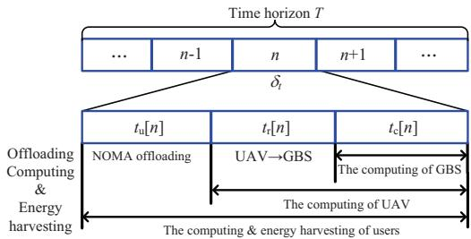  
Fig. 3: Time allocation with NOMA protocol for the hybrid UAVassisted wireless-powered MEC system.

As shown in Fig. 3, the time allocation of NOMA scheme in each time slot is composed of three parts for all users. Then, we have the following constraint:

$$
t _ { \mathrm { u } } [ n ] + t _ { \mathrm { r } } [ n ] + t _ { \mathrm { c } } [ n ] \leq \delta _ { t } , \forall n ,\tag{33}
$$

where $t _ { \mathrm { u } } [ n ] , ~ t _ { \mathrm { r } } [ n ]$ , and $t _ { \mathrm { c } } [ n ]$ denote the time allocated to NOMA offloading, UAV offloading, and GBS computing.

1) Partial Offloading Model: In NOMA scheme, the users are able to access the UAV simultaneously by sharing the same bandwidth and time block resources. For the uplink offloading with NOMA, the UAV employs SIC to decode the received signals from users in descending order of the channel gains, i.e., the signals for users further from the UAV with lower channel gains are regarded as the interference to those closer from the UAV with higher channel gains [36]. Without loss of generality, the channel gains depending on the distances from users to UAV are sorted as $d _ { \mathrm { 1 , U A V } } \leq d _ { \mathrm { 2 , U A V } } \leq \cdots \leq d _ { k , \mathrm { U A V } }$ Then, the uplink transmission rate of user k can be given as

$$
\begin{array} { r l } & { R _ { k , \mathrm { U A V } } [ n ] } \\ & { = B \log _ { 2 } \biggl ( 1 + \frac { \gamma _ { k } [ n ] P _ { k } [ n ] d _ { k , \mathrm { U A V } } ^ { - \alpha } [ n ] } { \Gamma ( \sum _ { j = k + 1 } ^ { K } \gamma _ { j } [ n ] P _ { j } [ n ] d _ { j , \mathrm { U A V } } ^ { - \alpha } [ n ] + \sigma ^ { 2 } ) } \biggr ) . } \end{array}\tag{34}
$$

Hence, the task-input bits that user k offloads to the UAV in time slot n can be denoted by

$$
g _ { k } ^ { \mathrm { U A V } } [ n ] = t _ { \mathrm { u } } [ n ] R _ { k , \mathrm { U A V } } [ n ] .\tag{35}
$$

Note that the downlink transmission rate of UAV is same as that in the TDMA scheme. Thus, the task-input bits of users that further offloaded from UAV to GBS can be expressed as

$$
g _ { \mathrm { u } } ^ { \mathrm { G B S } } [ n ] = t _ { \mathrm { r } } [ n ] R _ { \mathrm { G B S } } [ n ] .\tag{36}
$$

2) Computing Model: The local computation bits of user k can be calculated as

$$
l _ { k } ^ { \mathrm { l o c } } [ n ] = \frac { f _ { k } [ n ] \delta _ { t } } { C _ { k } } .\tag{37}
$$

The computation bits of UAV for assisting user k are given as

$$
l _ { k } ^ { \mathrm { U A V } } [ n ] = \frac { f _ { k } ^ { \mathrm { U A V } } [ n ] ( t _ { \mathrm { r } } [ n ] + t _ { \mathrm { c } } [ n ] ) } { C _ { k } } .\tag{38}
$$

Also, the computation bits of the GBS for assisting user k can be expressed as

$$
l _ { k } ^ { \mathrm { G B S } } [ n ] = \frac { f _ { k } ^ { \mathrm { G B S } } [ n ] t _ { \mathrm { c } } [ n ] } { C _ { k } } .\tag{39}
$$

Since the computing and offloading bits of the UAV should be no larger than the total offloaded bits from the users, and the computing bits of the GBS for users cannot exceed the offloaded bits from the UAV, we impose the following information causality constraints as

$$
\sum _ { k = 1 } ^ { K } g _ { k } ^ { \mathrm { U A V } } [ n ] \geq \sum _ { k = 1 } ^ { K } l _ { k } ^ { \mathrm { U A V } } [ n ] + g _ { \mathrm { u } } ^ { \mathrm { G B S } } [ n ] , \forall n ,\tag{40a}
$$

$$
g _ { u } ^ { \mathrm { G B S } } [ n ] \ge \sum _ { k = 1 } ^ { K } l _ { k } ^ { \mathrm { G B S } } [ n ] , \forall n .\tag{40b}
$$

Besides, the computing resources of the users, UAV, and GBS are constrained as

$$
0 \leq f _ { k } [ n ] \leq f _ { k } ^ { \operatorname* { m a x } } , \ \forall k , n ,\tag{41a}
$$

$$
0 \leq \sum _ { k = 1 } ^ { K } f _ { k } ^ { \mathrm { U A V } } [ n ] \leq f _ { \mathrm { U A V } } ^ { \operatorname* { m a x } } , \ \forall n ,\tag{41b}
$$

$$
0 \leq \sum _ { k = 1 } ^ { K } f _ { k } ^ { \mathrm { G B S } } [ n ] \leq f _ { \mathrm { G B S } } ^ { \operatorname* { m a x } } , \ \forall n .\tag{41c}
$$

Furthermore, we consider the following task completion constraint as

$$
\sum _ { n = 1 } ^ { N } ( l _ { k } ^ { \mathrm { l o c } } [ n ] + l _ { k } ^ { \mathrm { U A V } } [ n ] + l _ { k } ^ { \mathrm { G B S } } [ n ] ) \ge I _ { k } , ~ \forall k \in { \mathcal K } .\tag{42}
$$

3) Energy Harvesting and Consumption Model: The energy harvested by user k from UAV in time slot n is calculated as

$$
\tilde { E } _ { k } [ n ] = \lambda _ { k } P _ { \mathrm { U } } [ n ] \bar { P } _ { k , \mathrm { U A V } } ^ { \mathrm { L o S } } [ n ] \mu _ { 0 } d _ { k , \mathrm { U A V } } ^ { - \alpha } [ n ] \delta _ { t } .\tag{43}
$$

Also, the energy consumption of users k is expressed as [37]

$$
E _ { k } ^ { \mathrm { l o c } } [ n ] = \kappa _ { k } ( f _ { k } [ n ] ) ^ { 3 } \delta _ { t } ,\tag{44}
$$

and the energy consumption of user k for offloading task to the UAV can be calculated as

$$
E _ { k , \mathrm { U A V } } ^ { \mathrm { o f f } } [ n ] = P _ { k } [ n ] t _ { \mathrm { u } } [ n ] .\tag{45}
$$

Thus, we have the following energy causality constraint of user k as

$$
\sum _ { i = 1 } ^ { n } ( E _ { k } ^ { \mathrm { l o c } } [ i ] + E _ { k , \mathrm { U A V } } ^ { \mathrm { o f f } } [ i ] ) \leq \sum _ { i = 1 } ^ { n } \tilde { E } _ { k } [ i ] , \ \forall k , n .\tag{46}
$$

The energy consumed by the UAV for computing the task of user k is expressed as

$$
E _ { k , \mathrm { U A V } } ^ { \mathrm { c o m p } } [ n ] = \kappa _ { \mathrm { U } } ( f _ { k } ^ { \mathrm { U A V } } [ n ] ) ^ { 3 } ( t _ { \mathrm { r } } [ n ] + t _ { \mathrm { c } } [ n ] ) .\tag{47}
$$

Also, the energy consumed by the UAV to offload users’ task bits to the GBS is expressed as

$$
E _ { \mathrm { U A V } } ^ { \mathrm { G B S } } [ n ] = P _ { \mathrm { U A V } } [ n ] t _ { \mathrm { r } } [ n ] .\tag{48}
$$

In addition, the energy consumption of UAV for RF charging and flying is same as the TDMA mode. Then, we have the following energy budget constraint

$$
\begin{array} { r l } {  { \sum _ { n = 1 } ^ { N } \Big ( \sum _ { k = 1 } ^ { K } E _ { k , \mathrm { U A V } } ^ { \mathrm { c o m p } } [ n ] + E _ { \mathrm { U A V } } ^ { \mathrm { G B S } } [ n ] } \quad } & { } \\ & { + E _ { \mathrm { U A V } } ^ { \mathrm { W P T } } [ n ] + E _ { \mathrm { U A V } } ^ { \mathrm { p r o p } } [ n ] \Big ) \leq E _ { \mathrm { U A V } } ^ { \mathrm { m a x } } . } \end{array}\tag{49}
$$

## III. PROBLEM FORMULATION

In this section, we formulate the task completion latency minimization problems under both the TDMA and NOMA protocols. For the TDMA scheme, we formulate the corresponding problem with joint optimization of the time slot scheduling $\mathcal { T } = \{ t _ { k , 1 } [ n ] , t _ { k , 2 } [ n ] , t _ { k , 3 } [ n ] \} _ { k \in \mathcal { K } , n \in \mathcal { N } }$ , the computing CPU frequency allocation $\bar { \mathcal { F } } ~ = ~ \{ f _ { k } ^ { \mathrm { l o c } } [ n ] , f _ { k } ^ { \mathrm { U A V } } [ n ]$ $f _ { k } ^ { \mathrm { G B S } } [ n ] \} _ { k \in \mathcal { K } , n \in \mathcal { N } }$ , the transmit power allocation $\mathcal { P } = \{ P _ { k } [ n ]$ 2 $P _ { \mathrm { U A V } } [ n ] , P _ { \mathrm { U } } [ n ] \} _ { k \in \mathcal { K } , n \in \mathcal { N } }$ , the UAV 3D trajectory ${ \mathcal { Q } } = \{ { \bf q } [ n ]$ $z [ n ] \} _ { n \in \mathcal N }$ , and the number of required time slots $N ,$ subject to the communication, computing, and flying constraints. Therefore, the optimization problem for minimizing the task completion latency can be formulated as

$$
( { \bf P 0 } ) : \operatorname* { m i n } _ { \tau , \mathcal { F } , \mathcal { P } , \mathcal { Q } , N } N \delta _ { t }
$$

$$
\begin{array} { r l } { \mathrm { s . t . } } & { ( 1 ) , ( 6 ) , ( 1 5 ) , ( 1 8 ) - ( 2 1 ) , ( 2 7 ) , ( 3 2 ) , } \\ & { \mathcal { T } \succeq 0 , \mathcal { F } \succeq 0 , \mathcal { P } \succeq 0 , N \in \mathbb { Z } ^ { + } , } \end{array}\tag{50a}
$$

where $\mathbb { Z } ^ { + }$ indicates the set of all positive integers.

For the NOMA scheme, the task completion latency mini mization problem by jointly optimizing the time slot scheduling $\mathcal { T } = \{ t _ { \mathrm { u } } [ n ] , t _ { \mathrm { r } } [ n ] , t _ { \mathrm { c } } [ n ] \} _ { n \in \mathcal { N } } .$ the computing CPU frequency allocation ${ \mathcal { F } } _ { : }$ , the transmit power allocation ${ \mathcal P } ,$ the UAV 3D trajectory $\mathcal { Q } ,$ and the number of required time slots $N$ can be expressed as

$$
\begin{array} { r l } & { ( { \bf P 1 } ) : \underset { \mathcal { T } , \mathcal { F } , \mathcal { P } , \mathcal { Q } , N } { \operatorname* { m i n } } ~ N \delta _ { t } } \\ & { \mathrm { s . t . } \quad ( 1 ) , ( 3 3 ) , ( 4 0 ) , ( 4 1 ) , ( 4 2 ) , ( 4 6 ) , ( 4 9 ) , } \\ & { \quad \mathcal { T } \succeq 0 , \mathcal { F } \succeq 0 , \mathcal { P } \succeq 0 , N \in \mathbb { Z } ^ { + } . } \end{array}\tag{51a}
$$

Obviously, problems (P0) and (P1) are challenging to solve owing to the non-convex constraints (20), (21), (27), (32), (40), (46), and (49), where the optimization variables $\tau$ and $\mathcal { P }$ are highly coupled with the number of time slots N and the 3D trajectory Q. To tackle these two problems, we propose the corresponding effective iterative optimization algorithms, which are detailed in the next two sections.

## IV. ALGORITHM DESIGN FOR TDMA SCHEME

To facilitate the resolution of problems (P0) under the TD-MA protocol, we design a double-loop alternating optimization algorithm. In the outer loop, the number of time slots N is optimized by solving the subproblem with the given time slot scheduling $\tau ,$ , the CPU frequency allocation ${ \mathcal F } .$ , the transmit power allocation ${ \mathcal P } _ { \mathrm { { s } } }$ , and the UAV 3D trajectory $\mathcal { Q } .$ Then, in the inner loop, we propose a four-step alternating algorithm to address four subproblems for optimizing T , F, P and Q. The above two stages for outer loop and inner loop are performed iteratively until the convergence of the algorithm.

## A. Double-Loop Structure for Algorithm Design

1) Outer-Loop Structure for Optimizing N : In this part, we consider a subproblem of the original task completion time minimization problem for optimizing the number of time slots N , with given feasible $\mathcal { T } , \mathcal { F } , \mathcal { P }$ , and Q. In this case, problem (P0) can be simplified as follow

$$
\begin{array} { l } { { \displaystyle ( { \bf P 2 } ) : \begin{array} { c } { { \mathrm { m i n } } } \end{array} N \delta _ { t } } } \\ { { \mathrm { s . t . ~ } ( 1 ) , ( 6 ) , ( 1 5 ) , ( 1 8 ) - ( 2 1 ) , ( 2 7 ) , ( 3 2 ) , ( 5 0 a ) . } } \end{array}
$$

It is easy to observe that the objective function of problem (P2) is monotonically increasing with respect to (w.r.t.) the number of time slots N. Hence, the optimal solution of N can be found by applying the bisection search method [38].

2) Inner-Loop Structure for Optimizing $\{ \mathcal { T } , \mathcal { F } , \mathcal { P } , \mathcal { Q } \}$ For any given N, problem (P0) can be equivalently tackled by optimizing the other variables $\tau , \mathcal { F } , \mathcal { P } , \mathcal { Q }$ through the following feasibility check subproblem

$$
\begin{array} { r l } & { ( \mathbf { P 3 } ) : \mathrm { f i n d } \ T , \mathcal { F } , \mathcal { P } \ \mathrm { a n d } \ Q } \\ & { \mathrm { s . t . } \ ( 1 ) , ( 6 ) , ( 1 5 ) , ( 1 8 ) - ( 2 1 ) , ( 2 7 ) , ( 3 2 ) , ( 5 0 \mathrm { a } ) . } \end{array}
$$

Assume that the optimal solution of N to subproblem (P2) is $N ^ { * }$ . Then if subproblem (P3) is feasible for any given $N _ { \ast }$ we have $N ^ { * } \leq N$ . Otherwise, $N ^ { * } > N$ . Therefore, we can check the feasibility of subproblem (P3) under any given $N$

Remark 1. Specifically, with given number of time slots $N ,$ the objective function of task completion latency, i.e., $N \delta _ { t } ,$ , is fixed. It can be verified that through solving subproblem (P2) and (P3) iteratively, the final optimal solutions can make the equalities in constraint (19) hold for all users. Otherwise, $f _ { k } ^ { \mathrm { ~ \tiny ~ [ n ] , ~ } } ~ f _ { k } ^ { \mathrm { U A V } } [ n ]$ and $f _ { k } ^ { \mathrm { G B S } } [ n ]$ can always be decreased to make the equalities holds for sure with the same N. Then the saved computing resources can be leveraged to speed up the computing rate and further obtain a lower objective value of N considering the fact that $\delta _ { t }$ is sufficiently small.

According to Remark 1, the optimal solution can make the following equation satisfied for all users $k \in \mathcal { K } ,$ , i.e.,

$$
\varrho _ { k } = \frac { 1 } { I _ { k } } \sum _ { n = 1 } ^ { N } ( l _ { k } ^ { \mathrm { l o c } } [ n ] + l _ { k } ^ { \mathrm { U A V } } [ n ] + l _ { k } ^ { \mathrm { G B S } } [ n ] ) \equiv 1 ,\tag{52}
$$

if sufficiently small $\delta _ { t }$ is considered. We define $\varrho _ { k }$ as the computation completion ratio of user $k ,$ and it is known that if problem (P3) is feasible, then $\varrho _ { k } \geq 1$ . Furthermore, with a given $N ,$ we can transform the feasibility check subproblem (P3) into the following problem (P4 ) maximizing the minimum computation completion ratio among all users

$$
\begin{array} { r l } & { ( \widetilde { \bf P } 4 ) : \underset { \mathcal { T } , \mathcal { F } , \mathcal { P } , \mathcal { Q } } { \operatorname* { m a x } } \ \underset { k \in \mathcal { K } } { \operatorname* { m i n } } \ \varrho _ { k } } \\ & { \mathrm { s . t . } \ ( 1 ) , ( 6 ) , ( 1 5 ) , ( 1 8 ) , ( 2 0 ) , ( 2 1 ) , ( 2 7 ) , ( 3 2 ) , ( 5 0 a ) . } \end{array}
$$

Note that solving the optimization problem $(  { \widetilde { \mathbf { P } } } 4 )$ yields an efficient solution that maximize the minimum computation ratio of users with a given N, which can make $\varrho _ { k }$ as equal and large as possible. Hence, problem (P4 ) is equivalent to

$$
( \mathbf { P 4 } ) : \operatorname* { m a x } _ { \mathcal { T } , \mathcal { F } , \mathcal { P } , \mathcal { Q } , \eta } \ : \ : \eta
$$

$$
{ \mathrm { s . t . ~ } } ( 1 ) , ( 6 ) , ( 1 5 ) , ( 1 8 ) , ( 2 0 ) , ( 2 1 ) , ( 2 7 ) , ( 3 2 ) , ( 5 0 { \mathrm { a } } ) ,
$$

$$
\frac { 1 } { I _ { k } } \sum _ { n = 1 } ^ { N } ( l _ { k } ^ { \mathrm { l o c } } [ n ] + l _ { k } ^ { \mathrm { U A V } } [ n ] + l _ { k } ^ { \mathrm { G B S } } [ n ] ) \ge \eta , ~ \forall k .\tag{53a}
$$

Remark 2. Suppose that the optimal solution of η to problem (P4) is $\eta ^ { * }$ . It can be concluded that if $\eta ^ { * } \geq 1 ,$ , problem (P3) is feasible. Otherwise, (P3) is infeasible. Hence, it is clearly that the task completion constraint defined in (19) of problem (P0) is satisfied if and only if $\eta \geq 1$ . Also, the problem (P0) can be solved until the equality $\eta ^ { * } = 1$ holds.

Lemma 1. Based on Remark 2, the minimum N for problem (P2) can be obtained through the bisection search method considering that the objective value $\eta ^ { * }$ monotonically increases w.r.t. N since a larger N can provide a larger feasible region to problem (P4).

Remark 3. It can be verified that through solving subproblems (P2) and (P4) iteratively, the final optimal solutions can make the equalities in constraints (20) and (21) hold. Otherwise, $t _ { k , 2 } [ n ]$ and/or $t _ { k , 3 } [ n ]$ can always be decreased to make the related equalities hold. Hence, the saved resources can further reduce the latency and obtain better solutions.

Remark 4. Based on Remark 3, we can conclude that the optimal solution can make $g _ { k } ^ { \mathrm { G B S } } [ n ] = l _ { k } ^ { \mathrm { G B S } } [ n ]$ and $g _ { k } ^ { \mathrm { U A V } } [ n ] =$ $l _ { k } ^ { \mathrm { U A V } } [ n ] + l _ { k } ^ { \mathrm { G B S } } [ n ]$ satisfied for $\forall k \in K , n \in \mathcal N$

## B. Four-Step Alternating Algorithm

According to Lemma 1, it is important to obtain $\eta ^ { * }$ through solving subproblem (P4) with given N. Considering the strong coupling among variables, next we try to design a fourstep alternating optimization algorithm to solve subproblem (P4) by jointly optimizing the UAV’s 3D trajectory planning Q, computing CPU frequency allocation ${ \mathcal { F } } _ { : }$ , time slot scheduling $\tau .$ , and transmit power allocation P.

1) UAV 3D Trajectory Design: At first, we study the subproblem for optimizing the UAV’s 3D trajectory including the horizontal and vertical trajectories by assuming that ${ \mathcal F } ,$ $\tau$ and $\mathcal { P }$ are given. As a result, the 3D trajectory design subproblem is shown as

$$
\begin{array} { r l } & { ( \mathbf { P 4 . 1 } ) : \underset { \mathcal { Q } , \eta } { \operatorname* { m a x } } ~ \eta } \\ & { \mathrm { s . t . } ~ ( 1 ) , ( 2 0 ) , ( 2 1 ) , ( 2 7 ) , ( 3 2 ) , ( 5 3 \mathrm { a } ) . } \end{array}
$$

Note that subproblem (P4.1) is non-convex since constraints (20), (21), (27) and (32) are not convex w.r.t. $\{ \mathbf { q } [ n ] , z [ n ] \}$ Furthermore, the strong coupling between the horizontal and vertical trajectories pose a high complexity. To facilitate the solution design, we decompose problem (P4.1) into the horizontal trajectory and vertical trajectory design subproblems.

(1) Horizontal Trajectory Design: With any given parameters $( \{ z [ n ] \} _ { n \in \mathcal { N } } , \mathcal { F } , \mathcal { T } , \mathcal { P } )$ , the horizontal trajectory design subproblem is given as follows

$$
( \mathbf { P 4 . 1 . 1 } ) : \operatorname* { m a x } _ { \{ \mathbf { q } [ n ] \} _ { n \in \mathcal { N } } , \eta } \ : \eta
$$

s.t. (1a), (1c), (53a),

$$
l _ { k } ^ { \mathrm { U A V } } [ n ] + g _ { k } ^ { \mathrm { G B S } } ( \mathbf { q } [ n ] ) \leq g _ { k } ^ { \mathrm { U A V } } ( \mathbf { q } [ n ] ) , \ \forall k , n ,\tag{54a}
$$

$$
l _ { k } ^ { \mathrm { G B S } } [ n ] \leq g _ { k } ^ { \mathrm { G B S } } ( \mathbf { q } [ n ] ) , \ \forall k , n ,\tag{54b}
$$

$$
\begin{array} { r } { \sum _ { i = 1 } ^ { n } E _ { k } [ i ] \leq et { } { ' } \sum _ { i = 1 } ^ { n } \tilde { E } _ { k } ( \mathbf { q } [ i ] ) , \ \forall k , n , } \end{array}\tag{54c}
$$

$$
\sum _ { n = 1 } ^ { N } E _ { \mathrm { U A V } } ( \mathbf { q } [ n ] ) \leq E _ { \mathrm { U A V } } ^ { \operatorname* { m a x } } .\tag{54d}
$$

Note that subproblem (P4.1.1) is still a non-convex optimization problem as constraints (54a)−(54d) are not convex w.r.t. q[n]. As a result, we further take the SCA method to remove the non-convexity in these constraints [39], [40].

First, we try to convert the non-convex constraint (54a) into convex. Note that both $g _ { k } ^ { \mathrm { G B S } } ( { \bf q } [ n ] )$ and $g _ { k } ^ { \mathrm { U A V } } ( \mathbf { q } [ n ] )$ are nonconvex versus $\mathbf { q } [ n ] .$ , and we first deal with $g _ { k } ^ { \mathrm { U A } } \bar { \mathbf { V } } ( \mathbf { q } [ n ] )$ . For ease of expression, let $S _ { k } ( \mathbf { q } [ n ] ) = ( \| \mathbf { q } [ n ] - \mathbf { w } _ { k } \| ^ { 2 } + ( z [ n ] ) ^ { 2 } ) ^ { \frac { \alpha } { 2 } }$ It can be found that $S _ { k } ( \mathbf { q } [ n ] )$ is a composite function of ${ \bf q } [ n ]$ To tackle this issue, we derive the following Lemma 2.

Lemma 2. The function $S _ { k } ( \mathbf { q } [ n ] )$ is convex w.r.t. q[n] considering $\alpha \geq 2 .$

Proof: Define $f ( \mathbf { q } [ n ] ) = \| \mathbf { q } [ n ] - \mathbf { w } _ { k } \| ^ { 2 } + ( z [ n ] ) ^ { 2 }$ , then $S _ { k } ( \mathbf { q } [ n ] ) = ( f ( \mathbf { q } [ n ] ) ) ^ { \frac { \alpha } { 2 } }$ . It is obvious that $f (  { \mathbf { q } } [ n ] )$ is convex w.r.t. ${ \bf q } [ n ]$ . For $\alpha \geq 2$ and $f ( \mathbf { q } [ n ] ) \geq 0 , ( f ( \mathbf { q } [ n ] ) ) ^ { \frac { \alpha } { 2 } }$ is convex and nondecreasing w.r.t. $f (  { \mathbf { q } } [ n ] )$ . Based on the composition rule for convex function, we obtain that the function $S _ { k } ( \mathbf { q } [ n ] )$ is convex w.r.t. q[n].

Then, $g _ { k } ^ { \mathrm { U A V } } ( \mathbf { q } [ n ] )$ is re-expressed as

$$
g _ { k } ^ { \mathrm { U A V } } ( \mathbf { q } [ n ] ) = t _ { k , 1 } [ n ] B \log _ { 2 } \bigg ( 1 + \frac { \gamma _ { k } [ n ] P _ { k } [ n ] } { S _ { k } ( \mathbf { q } [ n ] ) } \bigg ) .\tag{55}
$$

It can be proven that the right-hand-side (RHS) of equality (55) is convex w.r.t. $S _ { k } ( \mathbf { q } [ n ] )$ . Then, by adopting the SCA method at given local point $\mathbf { q } ^ { ( r ) } [ n ]$ in the r-th iteration, we can approximate the RHS of (55) as follows

$$
\begin{array} { l } { { \displaystyle g _ { k } ^ { \mathrm { U A V } } ( { \bf q } [ n ] ) \geq t _ { k , 1 } [ n ] B \left[ \log _ { 2 } \left( 1 + \frac { \gamma _ { k } [ n ] P _ { k } [ n ] } { S _ { k } ( { \bf q } ^ { ( r ) } [ n ] ) } \right) - \right. } } \\ { { \displaystyle \left. \frac { \gamma _ { k } [ n ] P _ { k } [ n ] \left( S _ { k } ( { \bf q } [ n ] ) - S _ { k } ( { \bf q } ^ { ( r ) } [ n ] ) \right) } { ( \ln 2 ) S _ { k } ( { \bf q } ^ { ( r ) } [ n ] ) \left( \gamma _ { k } [ n ] P _ { k } [ n ] + S _ { k } ( { \bf q } ^ { ( r ) } [ n ] ) \right) } \right] } } \\ { { \displaystyle \triangleq \check { g } _ { k } ^ { \mathrm { U A V } } ( { \bf q } [ n ] ) , \qquad } } \end{array}\tag{56}
$$

where $\check { g } _ { k } ^ { \mathrm { U A V } } ( \mathbf { q } [ n ] )$ is a concave function of ${ \bf q } [ n ]$

To transform $g _ { k } ^ { \mathrm { \bar { G } B S } } ( { \bf q } [ n ] )$ , we introduce an auxiliary variable $T [ n ]$ , and $T [ n ] \dot { < } \| \mathbf { q } [ n ] - \mathbf { w } _ { b } \| ^ { 2 } + ( z [ n ] ) ^ { 2 }$ . Then, we have

$$
g _ { k } ^ { \mathrm { G B S } } ( \mathbf { q } [ n ] ) \leq t _ { k , 2 } [ n ] B \log _ { 2 } \left( 1 + \frac { \gamma _ { 0 } P _ { \mathrm { U A V } } [ n ] } { T [ n ] } \right)\tag{57}
$$

where $\hat { g } _ { k } ^ { \mathrm { G B S } } ( T [ n ] )$ is a convex function of T [n]. $T [ n ]$

Then, by replacing $g _ { k } ^ { \mathrm { G B S } } [ n ]$ and $g _ { k } ^ { \mathrm { U A V } } [ n ]$ with $\hat { g } _ { k } ^ { \mathrm { G B S } } ( T [ n ] )$ and $\check { g } _ { k } ^ { \mathrm { U A V } } [ n ]$ , constraint (54a) can be converted into a tighter convex constraint given below

$$
\begin{array} { r } { l _ { k } ^ { \mathrm { U A V } } [ n ] + \hat { g } _ { k } ^ { \mathrm { G B S } } ( T [ n ] ) \leq \check { g } _ { k } ^ { \mathrm { U A V } } ( \mathbf { q } [ n ] ) , \ \forall k , n . } \end{array}\tag{58}
$$

Note that the constraint $T [ n ] \leq \| \mathbf { q } [ n ] - \mathbf { w } _ { b } \| ^ { 2 } + ( z [ n ] ) ^ { 2 }$ is nonconvex versus q[n]. By performing the first-order Taylor expansion at the local point $\mathbf { \bar { q } } ^ { ( r ) } [ n ] , \| \mathbf { \bar { q } } [ n ] - \mathbf { w } _ { b } \| ^ { 2 } + ( z [ \bar { n } ] ) ^ { 2 }$ can be convert into its linear lower bound. Then, we obtain a tighter convex constraint given below

$$
\begin{array} { r } { T [ n ] \leq 2 ( \mathbf { q } ^ { ( r ) } [ n ] - \mathbf { w } _ { b } ) ^ { T } ( \mathbf { q } [ n ] - \mathbf { q } ^ { ( r ) } [ n ] ) } \\ { + \left\| \mathbf { q } ^ { ( r ) } [ n ] - \mathbf { w } _ { b } \right\| ^ { 2 } + ( z [ n ] ) ^ { 2 } . \qquad } \end{array}\tag{59}
$$

Next, we focus on the non-convex constraint (54b). By taking $\| \mathbf { q } [ n ] - \mathbf { w } _ { b } \| ^ { 2 }$ as a whole, $g _ { k } ^ { \mathrm { G B S } } ( { \bf q } [ n ] )$ is convex, and we can derive its lower bound $\check { g } _ { k } ^ { \mathrm { G B S } } ( \mathbf { q } [ n ] )$ at given local point $\mathbf { q } ^ { ( r ) } [ n ]$ as in (60) at the top of the next page. Then we can transform constraint (54b) into a tighter convex constraint as

$$
l _ { k } ^ { \mathrm { G B S } } [ n ] \leq \check { g } _ { k } ^ { \mathrm { G B S } } ( \mathbf { q } [ n ] , \ \forall k , n .\tag{61}
$$

Note that constraint (54c) is also non-convex since $\tilde { E } _ { k } ( \mathbf { q } [ n ] )$ given in (22) is non-convex versus q[n] because of $d _ { k , \mathrm { U A V } } ^ { - \alpha } [ n ]$ With the definition of $S _ { k } ( \mathbf { q } [ n ] )$ , we obtain

$$
\tilde { E } _ { k } ( \mathbf { q } [ n ] ) = \lambda _ { k } P _ { \mathrm { U } } [ n ] \bar { P } _ { k , \mathrm { U A V } } ^ { \mathrm { L o S } } [ n ] \mu _ { 0 } S _ { k } ^ { - 1 } ( \mathbf { q } [ n ] ) t _ { k } [ n ] ,\tag{62}
$$

where the RHS of (62) is convex versus $S _ { k } ( \mathbf { q } [ n ] )$ . Hence, by leveraging SCA method, we can obtain a lower bound of $\tilde { E } _ { k } ( \mathbf { q } [ n ] )$ as follows

$$
\begin{array} { r l } & { \tilde { E } _ { k } ( \mathbf { q } [ n ] ) \geq \lambda _ { k } P _ { \mathrm { U } } [ n ] \bar { P } _ { k , \mathrm { U A V } } ^ { \mathrm { L o S } } [ n ] \mu _ { 0 } t _ { k } [ n ] \times } \\ & { \left[ \frac { 1 } { S _ { k } ( \mathbf { q } ^ { ( r ) } [ n ] ) } - \frac { S _ { k } ( \mathbf { q } [ n ] ) - S _ { k } ( \mathbf { q } ^ { ( r ) } [ n ] ) } { \left[ S _ { k } ( \mathbf { q } ^ { ( r ) } [ n ] ) \right] ^ { 2 } } \right] \triangleq \check { E } _ { k } ( \mathbf { q } [ n ] ) , } \end{array}\tag{63}
$$

where $\check { E } _ { k } ( \mathbf { q } [ n ] )$ is a concave lower bound of $\tilde { E } _ { k } ( \mathbf { q } [ n ] )$ versus ${ \bf q } [ n ]$ . Furthermore, by replacing $\tilde { E } _ { k } ( \mathbf { q } [ n ] )$ with $\check { E } _ { k } ( \mathbf { q } [ n ] )$ constraint (54c) can be converted into a convex form as

$$
\sum _ { i = 1 } ^ { n } E _ { k } ( i ) \leq \sum _ { i = 1 } ^ { n } { \check { E } } _ { k } ( \mathbf { q } [ i ] ) , \ \forall k , n .\tag{64}
$$

As for constraint (54d), the left-hand-side (LHS) of the inequality is non-convex due to $E _ { \mathrm { U A V } } ^ { \mathrm { p r o p } } ( \mathbf { q } [ n ] )$ defined in (29). To address this, we introduce an auxiliary parameter $V [ n ]$ satisfying $V [ n ] \leq \| \mathbf { v } [ n ] \|$ which is equivalent to

$$
( V [ n ] \delta _ { t } ) ^ { 2 } \leq \left\| \mathbf { q } [ n + 1 ] - \mathbf { q } [ n ] \right\| ^ { 2 } + ( z [ n + 1 ] - z [ n ] ) ^ { 2 } .\tag{65}
$$

The RHS of (65) is a convex function of $\mathbf { q } [ n { + } 1 ] { - } \mathbf { q } [ n ]$ and its linear lower bound can be derived by employing SCA method at local point ${ \bf q } ^ { ( r ) } [ n + 1 ] - { \bf q } ^ { ( r ) } [ n ]$ . Then the inequality (65) is approximated as

$$
\begin{array} { r l } & { ( V [ n ] \delta _ { t } ) ^ { 2 } \leq 2 \big ( \mathbf { q } ^ { ( r ) } [ n + 1 ] - \mathbf { q } ^ { ( r ) } [ n ] \big ) ^ { T } ( \mathbf { q } [ n + 1 ] - \mathbf { q } [ n ] ) } \\ & { - \left\| \mathbf { q } ^ { ( r ) } [ n + 1 ] - \mathbf { q } ^ { ( r ) } [ n ] \right\| ^ { 2 } + ( z [ n + 1 ] - z [ n ] ) ^ { 2 } , \ \forall n , ( } \end{array}\tag{66}
$$

which is a convex constraint of ${ \bf q } [ n ]$ and $V [ n ]$ . Further, we approximate $E _ { \mathrm { U A V } } ^ { \mathrm { p r o p } } ( \mathbf { q } [ n ] )$ by its convex upper bound, which can be given by

$$
E _ { \mathrm { U A V } } ^ { \mathrm { p r o p } } ( \mathbf { q } [ n ] ) \leq \delta _ { t } \left( \zeta _ { 1 } \left\| \mathbf { v } [ n ] \right\| ^ { 3 } + \frac { \zeta _ { 2 } } { V [ n ] } \right) \triangleq \hat { E } _ { \mathrm { U A V } } ^ { \mathrm { p r o p } } ( \mathbf { q } [ n ] ) .\tag{67}
$$

By substituting $E _ { \mathrm { U A V } } ^ { \mathrm { p r o p } } ( \mathbf { q } [ n ] )$ with $\hat { E } _ { \mathrm { U A V } } ^ { \mathrm { p r o p } } ( \mathbf { q } [ n ] )$ , then the constraint (54d) is transformed into a convex one

$$
\begin{array} { r l } & { \displaystyle \sum _ { n = 1 } ^ { N } \left( \sum _ { k = 1 } ^ { K } \left( E _ { k , \mathrm { U A V } } ^ { \mathrm { c o m p } } [ n ] + E _ { k , \mathrm { U A V } } ^ { \mathrm { G B S } } [ n ] \right) \right. } \\ & { \qquad \quad + \left. E _ { \mathrm { U A V } } ^ { \mathrm { W P T } } [ n ] + \hat { E } _ { \mathrm { U A V } } ^ { \mathrm { p r o p } } ( \mathbf { q } [ n ] ) \right) \leq E _ { \mathrm { U A V } } ^ { \mathrm { m a x } } . } \end{array}\tag{68}
$$

Based on the discussion and derivation above, the subproblem (P4.1.1) is approximately transformed into a convex subproblem (P4.1.2), which is formulated as

$$
\begin{array} { l } { { \displaystyle \left( { \bf P 4 . 1 . 2 } \right) _ { \{ { \bf q } [ n ] , T [ n ] , V [ n ] \} _ { n \in { \cal N } } , \eta } \ ~ } } \\ { { \mathrm { s . t . ~ } \left( 1 \mathrm { a } \right) , ( 1 \mathrm { c } ) , ( 5 3 \mathrm { a } ) , ( 5 8 ) , ( 5 9 ) , ( 6 1 ) , ( 6 4 ) , ( 6 6 ) , ( 6 8 ) , } } \end{array}
$$

which can be solved by CVX in addition with SCA method to obtain the horizontal trajectory $\{ \mathbf { q } [ n ] \} _ { n \in { \mathcal { N } } } .$

(2) Vertical Trajectory Design: With any given parameters $( \mathcal T , \mathcal F , \mathcal P , \{ \mathbf q [ n ] \} _ { n \in \mathcal N } )$ , the vertical trajectory optimization subproblem is given as

$$
\begin{array} { r l } {  { \bigl ( \mathbf { P 4 . 1 . 3 } \bigr ) : \qquad \operatorname* { m a x } _ { \{ z [ n ] \} _ { n \in \mathcal { N } } , \eta } } } & { \eta } \\ { \mathrm { s . t . ~ } ( 1 \mathbf { b } ) - ( 1 \mathbf { d } ) , ( 5 3 \mathbf { a } ) , } \end{array}
$$

$$
\begin{array} { r l } & { g _ { k } ^ { \mathrm { G B S } } ( \mathbf { q } [ n ] ) \geq { t _ { k , 2 } [ n ] B } \Bigg [ \log _ { 2 } \left( 1 + \frac { \gamma _ { 0 } P _ { \mathrm { U M } } [ n ] } { \| \mathbf { q } ^ { ( r ) } [ n ] - \mathbf { w } _ { b } \| ^ { 2 } + ( z [ n ] ) ^ { 2 } } \right) } \\ & { - \frac { \gamma _ { 0 } P _ { \mathrm { U M } } [ n ] \left( \| \mathbf { q } [ n ] - \mathbf { w } _ { b } \| ^ { 2 } - \| \mathbf { q } ^ { ( r ) } [ n ] - \mathbf { w } _ { b } \| ^ { 2 } \right) } { ( \ln 2 ) \left( \| \mathbf { q } ^ { ( r ) } [ n ] - \mathbf { w } _ { b } \| ^ { 2 } + ( z [ n ] ) ^ { 2 } \right) \left( \| \mathbf { q } ^ { ( r ) } [ n ] - \mathbf { w } _ { b } \| ^ { 2 } + ( z [ n ] ) ^ { 2 } + \gamma _ { 0 } P _ { \mathrm { U M } } [ n ] \right) ^ { 2 } } \Bigg ] \triangleq \breve { g } _ { k } ^ { \mathrm { G B S } } ( \mathbf { q } [ n ] ) . } \end{array}\tag{60}
$$

$$
l _ { k } ^ { \mathrm { U A V } } [ n ] + g _ { k } ^ { \mathrm { G B S } } [ n ] ( z [ n ] ) \leq g _ { k } ^ { \mathrm { U A V } } ( z [ n ] ) , \ \forall k , n ,\tag{69a}
$$

$$
l _ { k } ^ { \mathrm { G B S } } [ n ] \leq g _ { k } ^ { \mathrm { G B S } } ( z [ n ] ) , \ \forall k , n ,\tag{69b}
$$

$$
{ \sum } _ { i = 1 } ^ { n } E _ { k } ( i ) \leq \sum _ { i = 1 } ^ { n } { \tilde { E } } _ { k } ( z [ i ] ) , \ \forall k , n ,\tag{69c}
$$

$$
\sum _ { n = 1 } ^ { N } E _ { \mathrm { U A V } } ( z [ n ] ) \leq E _ { \mathrm { U A V } } ^ { \operatorname* { m a x } } .\tag{69d}
$$

Note that problem (P4.1.3) is non-convex since constraints (69a)−(69d) are not convex w.r.t. z[n]. Fortunately, we observe that the vertical trajectory variable $z [ n ]$ has a similar structure as q[n]. Hence, we can adopt the similar SCA method to tackle these constraints.

Firstly, for constraint (69a), we introduce $S _ { k } ( z [ n ] ) ~ =$ $( \| \mathbf { q } [ n ] - \mathbf { w } _ { k } \| ^ { 2 } + ( z [ n ] ) ^ { 2 } ) ^ { \frac { \alpha } { 2 } }$ which is also convex versus $z [ n ]$ Then we can obtain a concave lower bound of $g _ { k } ^ { \mathrm { U A V } } ( z [ n ] )$ having similar expression as $\check { g } _ { k } ^ { \mathrm { U A V } } ( \mathbf { q } [ n ] )$ in (56), and we denote it as $\check { g } _ { k } ^ { \mathrm { U A } \bar { \mathrm { V } } } ( z [ n ] )$ . In addition, we further introduce $\tilde { T } [ n ] \leq \| \mathbf { q } [ n ] - \mathbf { w } _ { b } \| ^ { 2 } + ( z [ n ] ) ^ { 2 }$ , then a convex upper bound of $\bar { g _ { k } ^ { \mathrm { G B S } } [ n ] ( z [ n ] ) }$ can be constructed as $\hat { g } _ { k } ^ { \mathrm { G B S } } ( \tilde { T } [ n ] )$ , which is similar to $\bar { g } _ { k } ^ { \mathrm { G B S } } ( T [ n ] )$ expressed in (57). Then, by respectively replacing $g _ { k } ^ { \mathrm { \tilde { G } B S } } ( z [ n ] )$ and $g _ { k } ^ { \mathrm { U A V } } ( z [ n ] )$ with $\hat { g } _ { k } ^ { \mathrm { G B S } } ( \tilde { T } [ n ] )$ and $\check { g } _ { k } ^ { \mathrm { U A V } } ( z [ n ] )$ , constraint (69a) has been transformed into a tighter convex constraint given below

$$
l _ { k } ^ { \mathrm { U A V } } [ n ] + \hat { g } _ { k } ^ { \mathrm { G B S } } ( \tilde { T } [ n ] ) \leq \check { g } _ { k } ^ { \mathrm { U A V } } ( z [ n ] ) , \ \forall k , n .\tag{70}
$$

Besides, similar to (59), we obtain

$$
\begin{array} { r l } & { \tilde { T } [ n ] \leq ( z ^ { ( r ) } [ n ] ) ^ { 2 } + 2 z ^ { ( r ) } [ n ] ( z [ n ] - z ^ { ( r ) } [ n ] ) } \\ & { \qquad + \parallel \mathbf { q } [ n ] - \mathbf { w } _ { b } \parallel ^ { 2 } , } \end{array}\tag{71}
$$

which is a convex constraint of $z [ n ]$ and $\tilde { T } | n |$

Likewise, by taking $( z [ n ] ) ^ { 2 }$ as a whole, $g _ { k } ^ { \mathrm { G B S } } ( z [ n ] )$ is convex. Thus, we also derive its concave lower bound at the point $z ^ { ( r ) } [ n ]$ given in (72) at the top of the next page. Then, constraint (69b) can be re-expressed as a tighter convex constraint given below

$$
l _ { k } ^ { \mathrm { G B S } } [ n ] \leq \check { g } _ { k } ^ { \mathrm { G B S } } ( z [ n ] ) , \ \forall k , n .\tag{73}
$$

Similarly, we can obtain $\check { E } _ { k } ( z [ n ] )$ similarly as (63), which is a concave lower bound of $\tilde { E } _ { k } ( z [ n ] )$ versus z[n]. Then constraint (69c) is transformed into convex as

$$
\sum _ { i = 1 } ^ { n } E _ { k } ( i ) \leq \sum _ { i = 1 } ^ { n } { \check { E } } _ { k } ( z [ i ] ) .\tag{74}
$$

For the non-convex term $E _ { \mathrm { U A V } } ^ { \mathrm { p r o p } } ( z [ n ] )$ in the LHS of constraint (69d), we can also obtain its convex upper bound by introducing ${ \tilde { V } } [ n ] \leq \| \mathbf { v } [ n ] \|$ , which is converted into a convex constraint as follows

$$
( \tilde { V } [ n ] \delta _ { t } ) ^ { 2 } \leq 2 ( z ^ { ( r ) } [ n + 1 ] - z ^ { ( r ) } [ n ] ) ( z [ n + 1 ] - z [ n ] )
$$

$$
- \left( z ^ { ( r ) } [ n + 1 ] - z ^ { ( r ) } [ n ] \right) ^ { 2 } + \left\| \mathbf { q } [ n + 1 ] - \mathbf { q } [ n ] \right\| ^ { 2 } ,\tag{75}
$$

through applying SCA method at the point $z ^ { ( r ) } [ n + 1 ] - z ^ { ( r ) } [ n ]$ Next, $E _ { \mathrm { U A V } } ^ { \mathrm { p r o p } } ( z [ n ] )$ is approximated as

$$
E _ { \mathrm { U A V } } ^ { \mathrm { p r o p } } ( z [ n ] ) \leq \delta _ { t } \Big ( \zeta _ { 1 } \| \mathbf { v } [ n ] \| ^ { 3 } + \frac { \zeta _ { 2 } } { \tilde { V } [ n ] } \Big ) \triangleq \hat { E } _ { \mathrm { U A V } } ^ { \mathrm { p r o p } } ( z [ n ] ) .\tag{76}
$$

By replacing $E _ { \mathrm { U A V } } ^ { \mathrm { p r o p } } ( z [ n ] )$ with the convex $\hat { E } _ { \mathrm { U A V } } ^ { \mathrm { p r o p } } ( z [ n ] )$ , constraint (69d) is converted into

$$
\begin{array} { r l } & { \displaystyle \sum _ { n = 1 } ^ { N } \bigg ( \sum _ { k = 1 } ^ { K } \Big ( E _ { k , \mathrm { U A V } } ^ { \mathrm { c o m p } } [ n ] + E _ { k , \mathrm { U A V } } ^ { \mathrm { G B S } } [ n ] \Big ) } \\ & { \quad \quad \quad \quad + E _ { \mathrm { U A V } } ^ { \mathrm { W P T } } [ n ] + \hat { E } _ { \mathrm { U A V } } ^ { \mathrm { p r o p } } ( z [ n ] ) \bigg ) \leq E _ { \mathrm { U A V } } ^ { \mathrm { m a x } } . } \end{array}\tag{77}
$$

Finally, the subproblem (P4.1.3) is approximately transformed into the following convex subproblem (P4.1.4)

$$
\begin{array} { r l } & { \left( \mathbf { P 4 . 1 . 4 } \right) : \underset { \{ z [ n ] , \tilde { T } [ n ] , \tilde { V } [ n ] \} _ { n \in \mathcal { N } } } { \operatorname* { m a x } } \eta } \\ & { \mathrm { s . t . } \ ( 1 \mathrm { b } ) - ( 1 \mathrm { d } ) , ( 5 3 \mathrm { a } ) , ( 7 0 ) , ( 7 1 ) , ( 7 3 ) - ( 7 5 ) , ( 7 7 ) , } \end{array}
$$

which can be directly tackled by the existing standard convex optimization tools.

2) Computing CPU Frequency Allocation: In this subsection, for given the optimized 3D UAV trajectory $\mathcal { Q } ,$ time slot scheduling T , and transmit power allocation $\mathcal { P }$ , the subproblem for optimizing CPU frequency allocation $\mathcal { F }$ is simplified as

$$
\begin{array} { r l } & { ( \mathbf { P 4 . 2 } ) : \underset { \mathcal { F } \subseteq 0 , \eta } { \operatorname* { m a x } } \quad \eta } \\ & { \mathrm { s . t . } ( 1 5 ) , ( 1 8 ) , ( 2 0 ) , ( 2 1 ) , ( 2 7 ) , ( 3 2 ) , ( 5 3 \mathrm { a } ) . } \end{array}
$$

By fixing Q, T and ${ \mathcal { P } } ,$ the energy consumption constraints (27) and (32) are convex. In addition, the computing capacity constraints (15), (18), the information causality constraints (20), (21), and the computation completion ratio constraint (53a) are affine. Therefore, subproblem (P4.2) is convex. In order to gain some purposeful insights into subproblem (P4.2) and reduce the computational complexity, we try to employ the Lagrange duality method to obtain the closed-form solutions of the CPU frequency allocation ${ \mathcal { F } } =$ $\{ f _ { k } ^ { \mathrm { l o c } } [ n ] , f _ { k } ^ { \mathrm { U A V } } [ n ] , f _ { k } ^ { \mathrm { G B S } } [ n ] \} _ { k \in \mathcal { K } , n \in \mathcal { N } } .$

Define $\varphi = \{ \varphi _ { k } \} , \xi = \{ \xi _ { k , n } \} , \rho = \{ \rho _ { k , n } \} , \nu = \{ \nu _ { k , n } \} ,$ and τ as the Lagrange multipliers for constraints (53a), (20), (21), (27), and (32), respectively. Then, the partial Lagrange function of subproblem (P4.2) can be written as

$$
\begin{array} { l } { { \displaystyle { \cal L } ( \mathcal { F } , \eta , \varphi , \pmb { \xi } , \pmb { \rho } , \pmb { \nu } , \tau ) = \eta } } \\ { { \displaystyle \quad + \sum _ { k = 1 } ^ { K } \varphi _ { k } \left[ \frac { 1 } { I _ { k } } \sum _ { n = 1 } ^ { N } \left( l _ { k } ^ { \mathrm { l o c } } [ n ] + l _ { k } ^ { \mathrm { U A V } } [ n ] + l _ { k } ^ { \mathrm { G B S } } [ n ] \right) - \eta \right] } } \end{array}
$$

$$
\begin{array} { r l } & { g _ { k } ^ { \mathrm { G B S } } ( z [ n ] ) \geq t _ { k , 2 } [ n ] B \Bigg [ \log _ { 2 } \left( 1 + \frac { \gamma _ { 0 } P _ { \mathrm { U M } } [ n ] } { \| \mathbf { q } [ n ] - \mathbf { w } _ { b } \| ^ { 2 } + ( z ^ { ( r ) } [ n ] ) ^ { 2 } } \right) } \\ & { \qquad - \frac { \gamma _ { 0 } P _ { \mathrm { U A N } } [ n ] \left[ ( z [ n ] ) ^ { 2 } - ( z ^ { ( r ) } [ n ] ) ^ { 2 } \right] } { ( \ln 2 ) \left( \| \mathbf { q } [ n ] - \mathbf { w } _ { b } \| ^ { 2 } + ( z ^ { ( r ) } [ n ] ) ^ { 2 } \right) \left( \| \mathbf { q } [ n ] - \mathbf { w } _ { b } \| ^ { 2 } + ( z ^ { ( r ) } [ n ] ) ^ { 2 } + \gamma _ { 0 } P _ { \mathrm { U M } } [ n ] \right) } \Bigg ] \triangleq \breve { g } _ { k } ^ { \mathrm { G B S } } ( z [ n ] ) . } \end{array}\tag{72}
$$

$$
\begin{array} { r l } & { \displaystyle + \sum _ { k = 1 } ^ { K } \sum _ { n = 1 } ^ { N } \xi _ { k , n } \big ( g _ { k } ^ { \mathrm { U N } } [ n ] - l _ { k } ^ { \mathrm { G N } } [ n ] - g _ { k } ^ { \mathrm { G B } } [ n ] \big ) } \\ & { \displaystyle + \sum _ { k = 1 } ^ { K } \sum _ { n = 1 } ^ { N } \rho _ { k , n } \big ( g _ { k } ^ { \mathrm { G B } } [ n ] - l _ { k } ^ { \mathrm { G B } } [ n ] \big ) } \\ & { \displaystyle + \sum _ { k = 1 } ^ { K } \sum _ { n = 1 } ^ { N } v _ { k , n } \bigg ( \sum _ { i = 1 } ^ { n } \tilde { E } _ { k } [ n ] - \sum _ { i = 1 } ^ { n } E _ { k } [ n ] \bigg ) } \\ & { \displaystyle + \tau \bigg ( E _ { \mathrm { U N } } ^ { \mathrm { m a x } } - \sum _ { n = 1 } ^ { N } E _ { \mathrm { U N } } [ n ] \bigg ) . } \end{array}\tag{78}
$$

Hence, the Lagrange dual function of subproblem (P4.2) is formulated as

$$
\begin{array} { r } { g ( \varphi , \xi , \rho , \nu , \tau ) = \displaystyle \operatorname* { m a x } _ { \mathcal { F } \sum 0 , \eta } L ( \mathcal { F } , \eta , \varphi , \xi , \rho , \nu , \tau ) } \\ { \mathrm { s . t . ~ } ( 1 5 ) , ( 1 8 ) . \qquad } \end{array}\tag{79}
$$

Furthermore, we can obtain the dual problem of subproblem (P4.2) given below

$$
\begin{array} { l } { \displaystyle \operatorname* { m i n } _ { \varphi , \xi , \rho , \nu , \tau } ~ g ( \varphi , \xi , \rho , \nu , \tau ) ~ } \\ { \mathrm { s . t . } ~ \varphi \succeq 0 , \xi \succeq 0 , \rho \succeq 0 , \nu \succeq 0 , \tau \geq 0 . } \end{array}
$$

Note that subproblem (P4.2) is convex, and thus the Slater’s condition can be satisfied [32]. This indicates that the optimal solutions of subproblem (P4.2) can be captured by tackling the dual problem.

By adopting the Karush-Kuhn-Tucker (KKT) condition, and let the partial derivatives of the Lagrange function $L ( \mathcal { F } , \eta , \varphi , \xi , \rho , \nu , \tau )$ w.r.t. the variables $f _ { k } [ n ]$ and $f _ { k } ^ { \mathrm { U A V } } [ n ]$ be zero [41]. Subsequently, the optimal computing CPU frequency allocation can be obtained as follows

$$
\begin{array} { r l } & { f _ { k } ^ { \mathrm { * } } [ n ] = \left[ \sqrt { \frac { \varphi _ { k } } { 3 I _ { k } \kappa _ { k } C _ { k } \sum _ { i = n } ^ { N } \nu _ { k , i } } } \right] _ { 0 } ^ { f _ { k } ^ { \mathrm { m a x } } } , \forall n , } \\ & { f _ { k } ^ { \mathrm { U A V } * } [ n ] = \left[ \sqrt { \frac { 1 } { 3 \kappa _ { \mathrm { U } } C _ { k } \tau } } \Big [ \frac { \varphi _ { k } } { I _ { k } } - \xi _ { k , n } \Big ] ^ { + } \right] _ { 0 } ^ { f _ { \mathrm { U A V } } ^ { \mathrm { m a x } } } , \forall n . } \end{array}\tag{80a}
$$

(80b)

As for $f _ { k } ^ { \mathrm { G B S } } [ n ]$ and $\eta ,$ they are mainly affected by constraints (18b), (21), (53a), and remain linear under these constraints. Thus, the optimal values depend on the partial derivatives of the Lagrange function. For ${ \bf \dot { \rho } } _ { f _ { k } } ^ { \mathrm { G B S } } [ n ]$ in the case of $\begin{array} { r } { \frac { \varphi _ { k } } { I _ { k } } - \rho _ { k , n } < 0 } \end{array}$ , the solution is $f _ { k } ^ { \mathrm { G B S * } } [ n ] = \mathrm { 0 } ;$ otherwise, the optimal $f _ { k } ^ { \mathrm { G B S } } [ n ]$ is given as

$$
f _ { k } ^ { \mathrm { G B S * } } [ n ] = \operatorname* { m i n } \Big ( f _ { \mathrm { G B S } } ^ { \operatorname* { m a x } } , \hat { f } _ { k } ^ { \mathrm { G B S } } [ n ] ) \Big ) ,\tag{81}
$$

where $\begin{array} { r } { \hat { f } _ { k } ^ { \mathrm { G B S } } [ n ] = \frac { C _ { k } } { t _ { k . 3 } [ n ] } g _ { k } ^ { \mathrm { G B S } } ( \mathbf { q } ^ { * } [ n ] , z ^ { * } [ n ] ) } \end{array}$ is a upper bound of $f _ { k } ^ { \mathrm { G B S } } [ n ]$ that obtained through constraint (21). Here,

$g _ { k } ^ { \mathrm { G B S } } ( \mathbf { q } ^ { * } [ n ] , z ^ { * } [ n ] )$ denotes the task bits offloaded to the GBS with the optimized 3D UAV trajectory in time slot n.

Similarly for η, when $\begin{array} { r } { 1 - \sum _ { k = 1 } ^ { K } \varphi _ { k } < 0 } \end{array}$ , we have $\eta ^ { * } = 0 ;$ otherwise, the optimal $\eta$ is derived as

$$
\eta ^ { * } = \underset { k \in \mathcal { K } } { \operatorname* { m i n } } \Bigl ( \frac { 1 } { I _ { k } } \sum _ { n = 1 } ^ { N } ( l _ { k } ^ { \mathrm { l o c } } [ n ] + l _ { k } ^ { \mathrm { U A V } } [ n ] + l _ { k } ^ { \mathrm { G B S } } [ n ] ) \Bigr ) ,\tag{82}
$$

which is obtained through constraints in (53a).

Next, the Lagrangian multipliers $\varphi ^ { \ast } = \{ \varphi _ { k } ^ { \ast } \} , \xi ^ { \ast } = \{ \xi _ { k , n } ^ { \ast } \}$ $\rho ^ { * } ~ = ~ \{ \rho _ { k , n } ^ { * } \} , \nu ^ { * } ~ = ~ \{ \nu _ { k , n } ^ { * } \}$ and $\tau ^ { * }$ can be optimized by leveraging the subgradient method. The update process is given below

$$
\varphi _ { k } ^ { j + 1 } = \left[ \varphi _ { k } ^ { j } - \Delta \varphi _ { k } ^ { j } \left( \frac { 1 } { I _ { k } } \sum _ { n = 1 } ^ { N } ( l _ { k } ^ { \mathrm { l o c } } [ n ] + l _ { k } ^ { \mathrm { U A V } } [ n ] + l _ { k } ^ { \mathrm { G B S } } [ n ] ) - \eta \right) \right] ^ { + } ,\tag{83a}
$$

$$
\xi _ { k , n } ^ { j + 1 } = \left[ \xi _ { k , n } ^ { j } - \Delta \xi _ { k , n } ^ { j } \left( g _ { k } ^ { \mathrm { U A V } } [ n ] - l _ { k } ^ { \mathrm { U A V } } [ n ] - g _ { k } ^ { \mathrm { G B S } } [ n ] \right) \right] ^ { + } ,\tag{83b}
$$

$$
\rho _ { k , n } ^ { j + 1 } = \Big [ \rho _ { k , n } ^ { j } - \Delta \rho _ { k , n } ^ { j } \big ( g _ { k } ^ { \mathrm { G B S } } [ n ] - l _ { k } ^ { \mathrm { G B S } } [ n ] \big ) \Big ] ^ { + } ,\tag{83c}
$$

$$
\nu _ { k , n } ^ { j + 1 } = \biggl [ \nu _ { k , n } ^ { j } - \Delta \nu _ { k , n } ^ { j } \biggl ( \sum _ { i = 1 } ^ { n } \tilde { E } _ { k } [ i ] - \sum _ { i = 1 } ^ { n } E _ { k } [ i ] \biggr ) \biggr ] ^ { + } ,\tag{83d}
$$

$$
\tau ^ { j + 1 } = \bigg [ \tau ^ { j } - \Delta \tau ^ { j } \bigg ( E _ { \mathrm { U A V } } ^ { \operatorname* { m a x } } - \sum _ { n = 1 } ^ { N } E _ { \mathrm { U A V } } [ n ] \bigg ) \bigg ] ^ { + } ,\tag{83e}
$$

where $j$ is the iterative index, and $\Delta \varphi _ { k } ^ { j } , \Delta \xi _ { k , n } ^ { j } , \Delta \rho _ { k , n } ^ { j } , \Delta \nu _ { k , n } ^ { j } ,$ $\Delta \tau ^ { j }$ respectively stand for the step size for obtaining the dual variables in $\varphi , \xi , \rho , \nu$ and $\tau .$

3) Time Slot Scheduling Optimization: In this part, we investigate the time slot scheduling optimization subproblem with given the optimized 3D trajectory Q and the computing CPU frequency allocation ${ \mathcal { F } } ,$ as well as the transmit power allocation ${ \mathcal P } ,$ which is expressed as

$$
\begin{array} { r l } & { ( \mathbf { P 4 . 3 } ) : ~ \displaystyle \operatorname* { m a x } _ { \mathcal { T } \succeq 0 , \eta } \eta } \\ & { ~ \mathrm { s . t . ~ } ( 6 ) , ( 2 0 ) , ( 2 1 ) , ( 2 7 ) , ( 3 2 ) , ( 5 3 \mathrm { a } ) . } \end{array}\tag{84}
$$

By observing the constraints related to the time slot scheduling $\tau .$ , it is clear that the subproblem (P4.3) is a linear programming problem w.r.t. T . As a result, we can adopt the linear optimization technique [42] to effectively solve it and obtain the optimal solution of time slot scheduling $\tau ^ { * }$

4) Transmit Power Allocation Optimization: When the 3D trajectory $\mathcal { Q } ,$ time slot scheduling $\tau$ and computing CPU frequency allocation $\mathcal { F }$ are given as the optimized solution, we can obtain the transmit power allocation subproblem for optimizing ${ \mathcal { P } } _ { \mathrm { { : } } }$ , which is given as

$$
( \mathbf { P 4 . 4 } ) : \operatorname* { m a x } _ { \mathcal { P } \subseteq 0 , \eta } \eta
$$

$$
{ \mathrm { s . t . ~ } } ( 2 0 ) , ( 2 1 ) , ( 2 7 ) , ( 3 2 ) , ( 5 3 { \mathrm { a } } ) .
$$

Note that $g _ { k } ^ { \mathrm { G B S } } ( P _ { \mathrm { U A V } } [ n ] )$ in constraint (20) is concave versus $P _ { \mathrm { U A V } } [ n ]$ , making constraint (20) and problem $\left( \mathbf { P 4 . 4 } \right)$ nonconvex. By applying SCA method at the point $P _ { \mathrm { U A V } } ^ { ( r ) } [ n ] ,$ a convex upper bound of $g _ { k } ^ { \mathrm { G B S } } ( P _ { \mathrm { U A V } } [ n ] )$ is obtained as

$$
g _ { k } ^ { \mathrm { G B S } } ( P _ { \mathrm { U A V } } [ n ] ) \leq t _ { k , 2 } [ n ] B \left[ \log _ { 2 } \left( 1 + \frac { h _ { \mathrm { G B S } } [ n ] P _ { \mathrm { U A V } } ^ { ( r ) } [ n ] } { \sigma ^ { 2 } } \right) \right.
$$

$$
+ \frac { h _ { \mathrm { G B S } } [ n ] ( P _ { \mathrm { U A V } } [ n ] - P _ { \mathrm { U A V } } ^ { ( r ) } [ n ] ) } { ( \ln 2 ) ( \sigma ^ { 2 } + h _ { \mathrm { G B S } } [ n ] P _ { \mathrm { U A V } } ^ { ( r ) } [ n ] ) } \Bigg ] \triangleq \hat { g } _ { k } ^ { \mathrm { G B S } } ( P _ { \mathrm { U A V } } [ n ] ) .\tag{85}
$$

By replacing $g _ { k } ^ { \mathrm { G B S } } ( P _ { \mathrm { U A V } } [ n ] )$ with $\hat { g } _ { k } ^ { \mathrm { G B S } } ( P _ { \mathrm { U A V } } [ n ] )$ , constraint (20) becomes a tighter convex constraint as

$$
l _ { k } ^ { \mathrm { U A V } } [ n ] + \hat { g } _ { k } ^ { \mathrm { G B S } } ( P _ { \mathrm { U A V } } [ n ] ) \leq g _ { k } ^ { \mathrm { U A V } } ( P _ { \mathrm { U A V } } [ n ] ) .\tag{86}
$$

Then the problem (P4.4) can be approximated as a convex optimization problem (P4.4.1) given below

$$
\begin{array} { r l } { } & { \underset { \mathcal { P } \subseteq \mathbb { 0 } , \eta } { \operatorname* { m a x } } \quad \eta } \\ { } & { \mathrm { s . t . ~ } ( 2 1 ) , ( 2 7 ) , ( 3 2 ) , ( 5 3 \mathrm { a } ) , ( 8 6 ) , } \end{array}
$$

which is readily solved through CVX.

## C. Overall Algorithm and Analysis

The procedure of the whole optimization algorithm is summarized in Algorithm 1, and the final solution can be obtained at the convergence of the algorithm. Actually, the bisection search method in the outer loop can easily converge within an acceptable time. Thus, the feasibility of the latency minimization problem primarily depends on the inner loop in Algorithm 1, where all subproblems have been proven to be convex or transformed into convex forms. We can observe that the objective function of (P4) is monotonically nondecreasing with each iteration, since we can always find a solution not worse than that obtained at the previous iteration in the inner loop. Hence, the convergence of the proposed algorithm can always be guaranteed, which will also be verified in Section VI.

The computational complexity is mainly dominated by the bisection search method and the solving process of the subproblems. In specific, the outer loop takes the complexity of $\bar { \mathcal { O } } ( \log _ { 2 } ( ( N ^ { \mathrm { m a x } } - N ^ { \mathrm { m i n } } ) / \epsilon )$ . The complexity of subproblems P4.1.2 and P4.1.4 are given as $\mathcal { O } ( M _ { 1 } ( \bar { 4 } N + 1 ) ^ { \bar { 3 } . 5 } )$ and $\mathcal { O } ( M _ { 2 } ( 3 N + 1 ) ^ { 3 . 5 } )$ , respectively. Similarly, the complexity of subproblem P4.4 can be calculated as $\dot { \mathcal { O } } ( M _ { 3 } ( K N + 2 \dot { N } +$ $1 ) ^ { 3 . { \dot { 5 } } } )$ . Note that $M _ { 1 } , M _ { 2 }$ and $M _ { 3 }$ are the iteration numbers for solving the corresponding subproblems. As for subproblems P4.2 and P4.3, the computation complexities are respectively denoted as $\mathcal { O } ( M _ { 4 } K N )$ and O(KN) [43], where $M _ { 4 }$ denotes the iteration number for updating the lagrangian multipliers. Hence, the total computational complexity of Algorithm 1 is with the order of $\mathcal { O } ( \bar { M } M _ { 3 } ( K N ) ^ { 3 . 5 } \mathrm { { \bar { l } o g } _ { 2 } ( \bar { ( } N ^ { \operatorname* { m a x } } - \bar { N } ^ { \operatorname* { m i n } } ) / \epsilon ) }$ where M denotes the iteration number of the inner loop.

```latex
Algorithm 1 An Efficient Alternating Optimization Algorithm
for Solving the latency minimization Problem (P0)
Input: Set $\eta ^ { 0 } = 1 , N ^ { \mathrm { m a x } } , N ^ { \mathrm { m i n } }$ as the upper and lower bound
of N, the outer loop index $l = 0 ,$ and tolerance $\epsilon ;$ Initialize
the solution $( \mathcal { Q } _ { l } , \bar { \mathcal { F } } _ { l } , \mathcal { T } _ { l } , \mathcal { P } _ { l } ) = \left( \mathcal { Q } _ { 0 } , \mathcal { F } _ { 0 } , \mathcal { T } _ { 0 } , \mathcal { P } _ { 0 } \right)$
1: repeat
2: Initialize the inter loop index $m = 0$ and the solution
$\begin{array} { r } { \big ( \mathcal { Q } ^ { m } , \mathcal { F } ^ { m } , \mathcal { T } ^ { m } , \mathcal { P } ^ { m } \big ) = \big ( \bar { \mathcal { Q } } _ { l } , \mathcal { F } _ { l } , \mathcal { T } _ { l } , \mathcal { P } _ { l } \big ) ; } \end{array}$
3: repeat
4: Solve subproblem (P4.1.2) with given $N ^ { l }$ and
$\{ z ^ { m } [ n ] \} , \mathcal { F } ^ { m } , \mathcal { T } ^ { m } , \mathcal { P } ^ { m }$ to obtain solution $\{ \mathbf { q } ^ { m + 1 } [ n ] \}$
based on the SCA technique;
5: Solve subproblem (P4.1.4) with given $N ^ { l }$ and
$\{ \mathbf q ^ { m + 1 } [ n ] \} , \mathcal { F } ^ { m } , \mathcal { T } ^ { m } , \mathcal { P } ^ { m }$ to obtain solution $\{ z ^ { m + 1 } [ n ] \}$
based on the SCA technique;
6: Solve subproblem (P4.2) with given $N ^ { l }$ and
$\mathcal { Q } ^ { m + 1 } , ~ \mathcal { T } ^ { m } , ~ \mathcal { P } ^ { m }$ to obtain solution $\mathcal { F } ^ { m + 1 }$ by applying
the Lagrange duality method;
7: Solve subproblem (P4.3) with given $N ^ { l }$ and
$\mathcal { Q } ^ { m + 1 } , \mathcal { F } ^ { m + 1 } , \mathcal { P } ^ { \dot { m } }$ to obtain solution $\mathcal { T } ^ { m + \bar { 1 } }$ with CVX;
8: Solve subproblem (P4.4) with given $N ^ { l }$ and
$\mathcal { Q } ^ { m + 1 } , \mathcal { F } ^ { m + 1 } , \mathcal { T } ^ { m + 1 }$ to obtain solution $\mathcal { P } ^ { m + 1 }$ with CVX;
9: Update $m = m + 1 ;$
10: until $\{ \mathcal { Q } ^ { m } , \mathcal { F } ^ { m } , \mathcal { T } ^ { m } , \mathcal { P } ^ { m } \}$ converge to the anticipant
accuracy;
11: Update $\{ \mathcal { Q } _ { l + 1 } , \mathcal { F } _ { l + 1 } , \mathcal { T } _ { l + 1 } , \mathcal { P } _ { l + 1 } \} \quad \gets \quad \{ \mathcal { Q } ^ { m } , \mathcal { F } ^ { m } \}$
${ \mathcal { T } } ^ { m } , { \mathcal { P } } ^ { m } \} ;$
12: Solve problem (P2) with the bisection search method:
calculating $\eta ^ { l + 1 } \left( \dot { N } ^ { l } , \mathcal { Q } _ { l + 1 } , \mathcal { F } _ { l + 1 } , \mathcal { T } _ { l + 1 } , \mathcal { P } _ { l + 1 } \right)$
13: if $\eta ^ { l + \bar { 1 } } \ge \eta ^ { 0 }$ then
14: Let $N ^ { \mathrm { m a x } } = N ^ { l } ;$ ; Update $\begin{array} { r } { N ^ { l + 1 } = \left\lfloor \frac { N ^ { \mathrm { m i n } } + N ^ { \mathrm { m a x } } } { 2 } \right\rfloor ; } \end{array}$
15: else
16: Let $N ^ { \mathrm { m i n } } = N ^ { l } ;$ Update $\begin{array} { r } { N ^ { l + 1 } = \left\lfloor \frac { N ^ { \mathrm { m i n } } + N ^ { \mathrm { m a x } } } { 2 } \right\rfloor ; } \end{array}$
17: end if
18: Update $l = l + 1 ;$
19: until $\begin{array} { r } { | N ^ { \mathrm { m a x } } - N ^ { \mathrm { m i n } } | \leq \epsilon ; } \end{array}$
20: Update $N ^ { * } \gets N ^ { l } , \{ \mathcal { Q } ^ { * } , \mathcal { F } ^ { * } , \mathcal { T } ^ { * } , \mathcal { P } ^ { * } \} \gets \{ \mathcal { Q } _ { l } , \mathcal { F } _ { l } , \mathcal { T } _ { l } , \mathcal { P } _ { l } \}$
Output: The solutions $N ^ { \ast } , \mathcal { Q } ^ { \ast } , \mathcal { F } ^ { \ast } , \mathcal { T } ^ { \ast } , \mathcal { P } ^ { \ast }$ to problem (P0).
```

## V. ALGORITHM DESIGN FOR NOMA SCHEME

In this section, we also leverage the double-loop structure to solve the formulated problem (P1) under the NOMA protocol. In fact, the outer-loop structure for optimizing the number of time slots N is similar to that of the TDMA scheme, and the details are omitted here. Similar to the transformation in the inner-loop structure for optimizing $\tau , \mathcal { F } , \mathcal { P } , \mathcal { Q }$ with TDMA scheme, we can obtain the equivalent problem for optimizing $\tau , \mathcal { F } , \mathcal { P } , \mathcal { Q }$ with NOMA protocol as

$$
\begin{array} { r l } & { \mathrm { ( { \bf P 5 } ) } : \underset { \mathcal { T } , \mathcal { F } , \mathcal { P } , \mathcal { Q } , \eta } { \operatorname* { m a x } } \quad \eta } \\ & { \quad \mathrm { s . t . } \ ( 1 ) , ( 3 3 ) , ( 4 0 ) , ( 4 1 ) , ( 4 6 ) , ( 4 9 ) , ( 5 1 { \mathrm { a } } ) , } \\ & { \quad \frac { 1 } { I _ { k } } \sum _ { n = 1 } ^ { N } ( l _ { k } ^ { \mathrm { l o c } } [ n ] + l _ { k } ^ { \mathrm { U A V } } [ n ] + l _ { k } ^ { \mathrm { G B S } } [ n ] ) \ge \eta , \ \forall k . } \end{array}\tag{87a}
$$

Similar to problem (P4), it is difficult to obtain the solution of problem (P5) directly due to the non-convex constraints (40), (46) and (49). Hence, we also leverage the alternating optimization method to divide problem (P5) into four subproblems. Actually, the subproblems for time slot scheduling and CPU frequency allocation are similar to those in the TDMA scheme, which are omitted here. In the following subsections, we focus on tackling the subproblems of UAV 3D trajectory design and the transmit power allocation.

## A. UAV 3D Trajectory Design

Given the fixed variables $\{ \mathcal { T } , \mathcal { F } , \mathcal { P } \}$ , the subproblem for optimizing the UAV 3D trajectory is formulated as

$$
\begin{array} { l } { { ( { \bf P 5 . 1 } ) : \displaystyle \operatorname* { m a x } _ { { \bf \epsilon } \geq , \eta } \eta } } \\ { { \mathrm { s . t . ~ } ( 1 ) , ( 4 0 ) , ( 4 6 ) , ( 4 9 ) , ( 8 7 a ) . } } \end{array}
$$

Then, we also decompose problem (P5.1) into the horizontal trajectory and vertical trajectory optimization subproblems.

With any given parameters $( \{ z [ n ] \} _ { n \in \mathcal { N } } , \mathcal { F } , \mathcal { T } , \mathcal { P } )$ , the horizontal trajectory optimization subproblem is expressed as

$$
( \mathbf { P 5 . 1 . 1 } ) : \operatorname* { m a x } _ { \{ \mathbf { q } [ n ] \} _ { n \in \mathcal { N } } , \eta } \quad \eta
$$

s.t. (1a), (1c), (87a),

$$
\sum _ { k = 1 } ^ { K } l _ { k } ^ { \mathrm { U A V } } [ n ] + g _ { \mathrm { u } } ^ { \mathrm { G B S } } ( \mathbf { q } [ n ] ) \leq \sum _ { k = 1 } ^ { K } g _ { k } ^ { \mathrm { U A V } } ( \mathbf { q } [ n ] ) , \ \forall n ,\tag{89a}
$$

$$
{ \sum } _ { k = 1 } ^ { K } l _ { k } ^ { \mathrm { G B S } } [ n ] \leq g _ { \mathrm { u } } ^ { \mathrm { G B S } } ( \mathbf { q } [ n ] ) , \ \forall n ,\tag{89b}
$$

$$
{ \sum } _ { i = 1 } ^ { n } ( E _ { k } ^ { \mathrm { l o c } } [ i ] + E _ { k , \mathrm { U A V } } ^ { \mathrm { o f f } } [ i ] ) \le \sum _ { i = 1 } ^ { n } \tilde { E } _ { k } ( \mathbf { q } [ i ] ) , \forall k , n ,\tag{89c}
$$

$$
\begin{array} { r l } & { \sum _ { n = 1 } ^ { N } \Big ( \displaystyle \sum _ { k = 1 } ^ { K } E _ { k , \mathrm { U A V } } ^ { \mathrm { c o m p } } [ n ] + E _ { \mathrm { U A V } } ^ { \mathrm { G B S } } [ n ] } \\ & { ~ + E _ { \mathrm { U A V } } ^ { \mathrm { W P T } } [ n ] + E _ { \mathrm { U A V } } ^ { \mathrm { p r o p } } ( \mathbf { q } [ n ] ) \Big ) \leq E _ { \mathrm { U A V } } ^ { \mathrm { m a x } } . } \end{array}\tag{89d}
$$

In problem (P5.1.1), except $g _ { k } ^ { \mathrm { U A V } } ( \mathbf { q } [ n ] )$ in the RHS of the non-convex constraint (89a), the transformations of other terms in the non-convex constraints (89a)−(89d) are similar to those in problem (P4.1.1). Hence, here we mainly focus on handling the term $g _ { k } ^ { \mathrm { U A V } } ( \mathbf { q } [ n ] )$ , and try to find out a concave lower bound of $g _ { k } ^ { \mathrm { U A V } } ( \mathbf { q } [ n ] )$ , denoted as $\check { g } _ { k } ^ { \mathrm { U A V } } ( \mathbf { q } [ n ] )$ to make constraint (89a) convex. By introducing the positive auxiliary variables in $\pi = \{ \pi _ { 1 , k } [ n ] , \pi _ { 2 , k } [ n ] , \pi _ { 3 , k } [ n ] , \pi _ { 4 , k } [ n ]$ $\pi _ { 5 , j } [ n ] , \pi _ { 6 , j } [ n ] , \forall k , j , n \}$ , we have

$$
\begin{array} { r } { g _ { k } ^ { \mathrm { U A V } } ( \mathbf { q } [ n ] ) \geq \check { g } _ { k } ^ { \mathrm { U A V } } ( \mathbf { q } [ n ] ) \overset { \triangle } { = } t _ { \mathrm { u } } [ n ] B \log _ { 2 } ( 1 + \pi _ { 1 , k } [ n ] ) , } \end{array}\tag{90}
$$

with several auxiliary constraints given as

$$
\pi _ { 1 , k } [ n ] \leq { \frac { \pi _ { 2 , k } [ n ] } { \pi _ { 3 , k } [ n ] } } , \forall k , n ,\tag{91a}
$$

$$
\pi _ { 2 , k } [ n ] \leq \frac { \gamma _ { k } [ n ] P _ { k } [ n ] } { \pi _ { 4 , k } [ n ] } , \ : \forall k , n ,\tag{91b}
$$

$$
\pi _ { 3 , k } [ n ] \geq \Gamma \bigg ( \sum _ { j = k + 1 } ^ { K } \pi _ { 5 , j } [ n ] + \sigma ^ { 2 } \bigg ) , \ \forall k , n ,\tag{91c}
$$

$$
\pi _ { 4 , k } [ n ] \geq d _ { k , \mathrm { U A V } } ^ { \alpha } [ n ] , \ \forall k , n ,
$$

$$
\pi _ { 5 , j } [ n ] \geq \frac { \gamma _ { j } [ n ] P _ { j } [ n ] } { \pi _ { 6 , j } [ n ] } , \forall j , n ,\tag{91d}
$$

(91e)

$$
\pi _ { 6 , j } [ n ] \leq d _ { j , \mathrm { U A V } } ^ { \alpha } [ n ] , \ \forall j , n .\tag{91f}
$$

Note that constraints (91a), (91b), and (91f) are still nonconvex. (91a) can be converted into a second-order cone (SOC) constraint with given local points $\{ \pi _ { 1 , k } ^ { ( r ) } [ n ] , \pi _ { 3 , k } ^ { ( r ) } [ n ] \}$ as

$$
\begin{array} { r l } & { \Big \| \left[ \frac { \pi _ { 1 , k } [ n ] + \pi _ { 3 , k } [ n ] } { 2 } , F ( \pi _ { 1 , k } [ n ] , \pi _ { 3 , k } [ n ] , \pi _ { 2 , k } [ n ] ) \right] \Big \| } \\ & { \leq F ( \pi _ { 1 , k } [ n ] , \pi _ { 3 , k } [ n ] , \pi _ { 2 , k } [ n ] ) + 1 , } \end{array}\tag{92}
$$

where we have $F ( \pi _ { 1 , k } [ n ] , \pi _ { 3 , k } [ n ] , \pi _ { 2 , k } [ n ] ) = ( \pi _ { 1 , k } ^ { ( r ) } [ n ] - \pi _ { 3 , k } ^ { ( r ) } [ n ] )$ $( \pi _ { 1 , k } [ n ] - \pi _ { 3 , k } [ n ] ) / 4 - ( \pi _ { 1 , k } ^ { ( r ) } [ n ] - \pi _ { 3 , k } ^ { ( r ) } [ n ] ) ^ { 2 } / 8 + ( \pi _ { 2 , k } [ n ] - 1 ) / 2$ Note that the RHSs of (91b) and (91f) are convex, which motivates us to apply the SCA technique for convex approximation. Thus, we obtain the following convex constraints

$$
\frac { \gamma _ { k } [ n ] P _ { k } [ n ] } { \pi _ { 4 , k } ^ { ( r ) } [ n ] } - \frac { \gamma _ { k } [ n ] P _ { k } [ n ] ( \pi _ { 4 , k } [ n ] - \pi _ { 4 , k } ^ { ( r ) } [ n ] ) } { ( \pi _ { 4 , k } ^ { ( r ) } [ n ] ) ^ { 2 } } \ge \pi _ { 2 , k } [ n ] ,\tag{93}
$$

and

$$
\begin{array} { r l } & { ( \| \mathbf q ^ { ( r ) } [ n ] - \mathbf w _ { j } \| ^ { 2 } + ( z [ n ] ) ^ { 2 } ) ^ { \frac { \alpha } { 2 } } } \\ & { + \alpha ( \| \mathbf q ^ { ( r ) } [ n ] - \mathbf w _ { j } \| ^ { 2 } + ( z [ n ] ) ^ { 2 } ) ^ { \frac { \alpha } { 2 } - 1 } } \\ & { \times ( \mathbf q ^ { ( r ) } [ n ] - \mathbf w _ { j } ) ^ { T } ( \mathbf q [ n ] - \mathbf q ^ { ( r ) } [ n ] ) \ge \pi _ { 6 , j } [ n ] , } \end{array}\tag{94}
$$

where $\pi _ { 4 , k } ^ { ( r ) } [ n ]$ and $\mathbf { q } ^ { ( r ) } [ n ]$ are given feasible local points.

Hence, with the auxiliary variables in π and convex constraints, $\check { g } _ { k } ^ { \mathrm { U A V } } ( \mathbf { q } [ n ] )$ can be used in the constraint (89a) to construct a tighter convex constraint. Then the approximated problem of (P5.1.1) is convex and can be readily solved.

As for the vertical trajectory optimization subproblem for designing variables $\{ z [ n ] \} _ { n \in \mathcal { N } }$ with the given parameters $\{ { \mathcal { F } } , { \mathcal { T } } , { \mathcal { P } } , \{ \mathbf { q } [ n ] \} _ { n \in { \mathcal { N } } } \}$ , it has similar structure with problem (P5.1.1) for optimizing $\{ \mathbf { q } [ n ] \} _ { n \in \mathcal { N } }$ . Consequently, we can adopt the similar approach with the SCA technique to handle the corresponding problem.

## B. Transmit Power Allocation Optimization

By fixing $\{ \tau , \mathcal { F } , \mathcal { Q } \}$ , we can obtain the transmit power allocation subproblem for optimizing P, given as

$$
\begin{array} { r l } & { \bigl ( \mathbf { P 5 . 2 } \bigr ) : \underset { \mathcal { P } , \eta } { \operatorname* { m a x } } \quad \eta } \\ & { \mathrm { s . t . ~ } ( 4 0 ) , ( 4 6 ) , ( 4 9 ) , ( 8 7 \mathrm { a } ) . } \end{array}
$$

Note that problem (P5.2) is convex w.r.t. $P _ { \mathrm { U } } [ n ]$ , whereas it is non-convex w.r.t. $P _ { k } [ n ]$ and $P _ { \mathrm { U A V } } [ n ]$ due to the constraint (40a). The transformation of the non-convex term $g _ { \mathrm { u } } ^ { \mathrm { G B S } } [ n ]$ in (40a) follows a similar procedure as in (85). Next, we mainly focus on the non-convex term $g _ { k } ^ { \mathrm { U A V } } [ n ]$ in (40a). Similar to the transformation of (91), by introducing the auxiliary variables in $\pmb { \tau } = \{ \tau _ { 1 , k } [ n ] , \tau _ { 2 , k } [ n ] , \tau _ { 3 , k } [ n ] \}$ , we have

$$
\begin{array} { r } { g _ { k } ^ { \mathrm { U A V } } ( \mathbf q [ n ] ) \geq \check { g } _ { k } ^ { \mathrm { U A V } } ( \mathbf q [ n ] ) \triangleq t _ { \mathrm { u } } [ n ] B \log _ { 2 } ( 1 + \tau _ { 1 , k } [ n ] ) , } \end{array}\tag{96}
$$

$$
\mathrm { w i t h ~ t h e ~ f o l l o w i n g ~ a u x i l i a r y ~ c o n s t r a i n t s }
$$

$$
\tau _ { 1 , k } [ n ] \leq \frac { \tau _ { 2 , k } [ n ] } { \tau _ { 3 , k } [ n ] } ,\tag{97a}
$$

$$
\tau _ { 2 , k } [ n ] \leq \gamma _ { k } [ n ] P _ { k } [ n ] d _ { k , \mathrm { U A V } } ^ { - \alpha } [ n ] ,\tag{97b}
$$

$$
{ \tau } _ { 3 , k } [ n ] \geq \Gamma \bigg ( \sum _ { j = k + 1 } ^ { K } { \gamma } _ { j } [ n ] P _ { j } [ n ] d _ { j , \mathrm { U A V } } ^ { - \alpha } [ n ] + { \sigma } ^ { 2 } \bigg ) .\tag{97c}
$$

Note that (97b) and (97c) are convex constraints. With given $\{ \tau _ { 1 , k } ^ { r } [ n ] , \tau _ { 3 , k } ^ { r } [ n ] \}$ , the constraint (97a) can be re-expressed as the SOC form, denoted as

$$
\begin{array} { r l } & { \Big \| \left[ \frac { \tau _ { 1 , k } [ n ] + \tau _ { 3 , k } [ n ] } { 2 } , F ( \tau _ { 1 , k } [ n ] , \tau _ { 3 , k } [ n ] , \tau _ { 2 , k } [ n ] ) \right] \Big \| } \\ & { \leq F ( \tau _ { 1 , k } [ n ] , \tau _ { 3 , k } [ n ] , \tau _ { 2 , k } [ n ] ) + 1 , } \end{array}\tag{98}
$$

where we have $F ( \tau _ { 1 , k } [ n ] , \tau _ { 3 , k } [ n ] , \tau _ { 2 , k } [ n ] ) = ( \tau _ { 1 , k } ^ { ( r ) } [ n ] - \tau _ { 3 , k } ^ { ( r ) } [ n ] )$ $( \tau _ { 1 , k } [ n ] - \tau _ { 3 , k } [ n ] ) / 4 - ( \tau _ { 1 , k } ^ { ( r ) } [ n ] - \tau _ { 3 , k } ^ { ( r ) } [ n ] ) ^ { 2 } / 8 + ( \tau _ { 2 , k } [ n ] - 1 ) / 2$ Then, the above problem can be readily solved by existing standard convex optimization tools.

## VI. SIMULATION RESULTS

This section presents the simulation results to evaluate the effectiveness of the proposed latency minimization algorithm. Assume that the wireless-powered UAV-assisted hybrid MEC system has $K = 5$ users randomly distributed in a geographic area of $\mathrm { 5 0 \times 5 0 ~ m ^ { 2 } }$ . The UAV moves from its initial horizontal location ${ \bf q } _ { 0 } = [ 0 , 0 ] ^ { \dag }$ m to the final location $\mathbf { q } _ { F } = [ 5 0 , 5 0 ] ^ { \dagger }$ m within an altitude range of $[ H _ { \operatorname* { m i n } } , H _ { \operatorname* { m a x } } ]$ to compute and relay users’ task-input bits, where $H _ { \operatorname* { m i n } } = 1 0$ m and $H _ { \mathrm { m a x } } = 5 0$ m. All users are considered to have the same task-input data size and the maximum computing capacity, i.e., $I _ { k } = \bar { I } , f _ { k } ^ { \operatorname* { m a x } } =$ <sup>¯</sup>f <sup>max</sup>, ∀k [29]. The rest of the system parameter settings are given in Table I, unless otherwise specified.

TABLE I: SIMULATION PARAMETERS.
<table><tr><td>Parameters</td><td>Definitions</td><td>Values</td></tr><tr><td>Path loss exponent</td><td>α</td><td>2.3</td></tr><tr><td>System bandwidth</td><td>B</td><td>400 MHz</td></tr><tr><td>Noise power</td><td> $\sigma ^ { 2 }$ </td><td>-110 dBm</td></tr><tr><td>The LoS channel parameters</td><td> $( \beta _ { 0 } , \beta _ { 1 } )$ </td><td>(10, 0.6)</td></tr><tr><td>The extra additional attenuation factor</td><td> $\omega$ </td><td>0.2</td></tr><tr><td>Reference Channel power gain</td><td> $\mu _ { 0 }$ </td><td>-60 dB</td></tr><tr><td>The capacitance coefficient at the CPU</td><td> $\kappa _ { \mathrm { U } } , \kappa _ { k } , \forall k$ </td><td> $1 0 ^ { - 2 8 }$ </td></tr><tr><td>The energy conversion efficiency</td><td> $\lambda _ { k } , \forall k$ </td><td>0.8</td></tr><tr><td>Maximum CPU frequency of the UAV</td><td> $f _ { \tiny { \mathrm { ~ I ~ I ~ A ~ U ~ } } } ^ { \tiny { \mathrm { ~ m a x ~ } } }$ </td><td>5GHz</td></tr><tr><td>Maximum CPU frequency of each user</td><td> $\bar { f } ^ { \mathrm { m a x } }$ </td><td>1 GHz</td></tr><tr><td>Maximum CPU frequency of the GBS</td><td> $f _ { \mathrm { G B S } } ^ { \mathrm { m a x } }$ </td><td>10 GHz</td></tr><tr><td>Required CPU cycles per bit</td><td> $C _ { k } , \forall k$ </td><td>100 cycles/bit</td></tr><tr><td>Maximum horizontal and vertical speeds</td><td> $V _ { x y } , V _ { z }$ </td><td>40 m/s, 10 m/s</td></tr><tr><td>The UAV&#x27;s propulsion parameters</td><td> $( \zeta _ { 1 } , \zeta _ { 2 } )$ </td><td>(0.00614,15.976)</td></tr></table>

To demonstrate the convergence and the efficiency of the proposed double-loop alternating algorithm, we first present the trends of the computation completion ratio $\eta$ (for innerloop) and the task completion latency (for outer-loop) under different task-input data sizes for both TDMA and NOMA schemes in Fig. 4 and Fig. 5. As shown in Fig. 4, we can observe that the computation completion ratio η converges to a stable value close to 1 after only several iterations, illustrating a fast convergence speed of our proposed four-step alternating iterative algorithm in the inner loop. For Fig. 5, we can see that the task completion latency fluctuates over the first number of iterations and ultimately remains stable, which also demonstrates the convergence of the proposed algorithm.

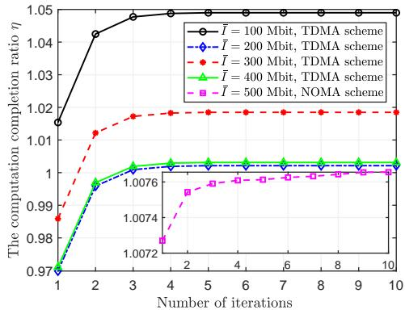  
Fig. 4: Convergence performance of the inner loop.

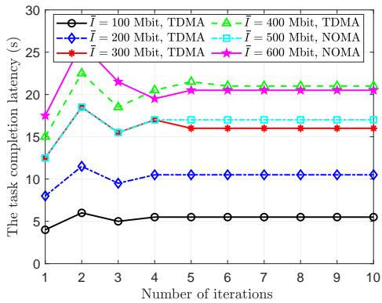  
Fig. 5: Convergence performance of the outer loop.

Fig. 6 plots the UAV’s optimized trajectories under the taskinput data size $\bar { I } = 1 0 0$ and 300 Mbit for both the TDMA and NOMA schemes. To be specific, Figs. 6(a) and 6(c) depict the UAV’s 3D trajectory, while the horizontal trajectory are plotted in Figs. 6(b) and 6(d). To improve the clarity, we sample the trajectory in every time slot, marked by $\mathbf { \cdots } _ { \mathbf { 0 } } \mathbf { \cdot } \mathbf { \sigma } $ . As depicted in Fig. 6, the UAV first flies quickly towards the regions with a high density of users, and then the UAV tends to change its trajectory to strike a better balance between the uplink offloading of the users and the relay transmission to the GBS. This is due to the fact that the 3D position has a great impact on the quality of user-to-UAV and UAV-to-GBS channels. Additionally, for a large value of <sup>¯</sup>I = 300 Mbit, more time slots are required to complete the computational tasks, as the UAV exploits its flexibility to adaptively enlarge its 3D trajectory, and find a proper location to serve the users. While for $\bar { I } = 1 0 0 \mathrm { M b i t }$ , the UAV always flies relatively faster to reach the final location within limited number of time slots. It can be seen that as task-input bits <sup>¯</sup>I increases, the altitude variation of the UAV becomes more significant. The reason is that the UAV expects to enhance channel quality by providing better elevation angles to help the task offloading process. Note that the trajectories under NOMA scheme are different from those under TDMA scheme, since the uplink offloading rates of users in NOMA scheme also depend on the SIC decoding order, which is related to the channel gains between the UAV and users. That is, since the users always offload their tasks to the UAV simultaneously, the UAV has to consider the global offloading scheduling of all the users in each time slot.

To intuitively reflect the task computation process of the users during the flight period under the TDMA scheme, we illustrate the number of computing bits versus the time-slot index in Fig. 7. It shows that each user will get continuous communication and computation resources allocation. Referring to the trajectories depicted in Figs. 6(c) and 6(d), the UAV flies from $[ 0 , 0 , 1 5 ] ^ { \dagger }$ m to $[ 5 0 , 5 0 , 1 5 ] ^ { \dagger }$ m, passing through user $^ { 3 , }$ user 2, user 5, user 4 and user 1 in turn. When UAV flies near user $k ,$ the user will achieve the best channel condition to the UAV, resulting in more energy supply and higher data rate, and thus larger number of data bits will be processed. For instance, we can observe that around time-slot 2, the computing bits of user 3 reaches its maximum value.

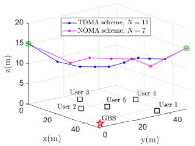  
(a) 3D trajectory with $\bar { I } = 1 0 0$ Mbit.

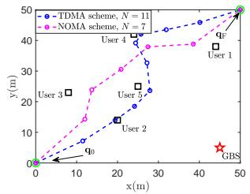  
(b) 2D trajectory with $\bar { I } = 1 0 0$ Mbit.

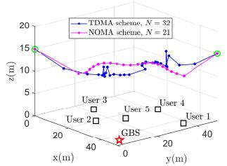  
(c) 3D trajectory with $\bar { I } = 3 0 0$ Mbit.

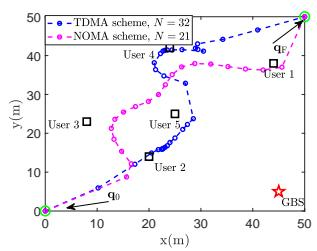  
(d) 2D trajectory with $\bar { I } = 3 0 0$ Mbit.

Fig. 6: Examples of the optimized UAV trajectory.  
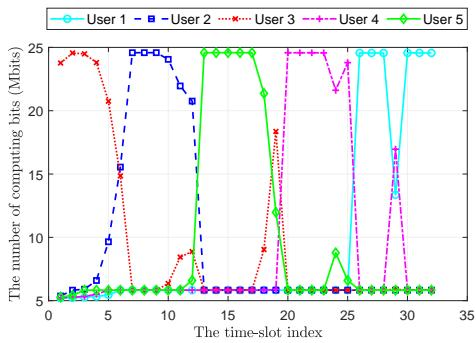  
Fig. 7: The computation bits of the users at each slot with $\bar { I } = 3 0 0$ Mbit, $N = 3 2$ , for TDMA scheme.

Next, to further demonstrate the superior performance of the proposed double-loop alternating algorithm, we take into account the following four benchmark schemes: 1) Without altitude optimization benchmark (WOA), where the vertical trajectory is fixed [9]; 2) Without local computation benchmark (WLC), where the users are unable to execute computation tasks locally [44]; 3) UAV as relay only benchmark (URO), where the UAV fulfills the roles of energy supply and relay, but not provide computing services, i.e., the UAV transmits all users’ offloading tasks to the GBS [45]; 4) Equal timeslot scheduling benchmark (ETS), where all users have fixed and equal time allocation. 5) Genetic algorithm (GA)-based benchmark, where the outer-loop optimal solution is obtained by applying the bisection search method, while the inner-loop problem is solved by the GA algorithm [46].

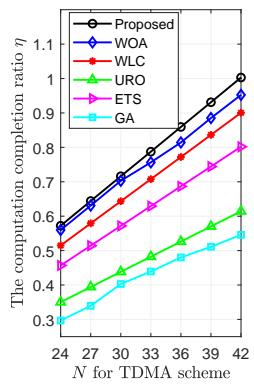

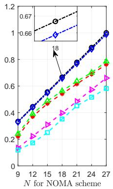  
Fig. 8: Computation completion ratio η versus the number of time slots N with $\bar { I } = 4 0 0$ Mbit.

Fig. 8 shows the relationship between the computation completion ratio η and the number of time slots N for both the TDMA and NOMA schemes. As we can see, the computation completion ratio of all schemes increases versus ${ \bar { N , } }$ which is consistent with Lemma 1. Besides, our proposed scheme notably outperforms all the other benchmark schemes, as expected. From Fig. 8, when $N = 4 2$ , our proposed TDMA scheme can achieve a task computation ratio greater than 1, whereas the URO and ETS schemes can respectively achieve about 0.6 and 0.8, the WOA and WLS schemes are slightly better while the GA scheme is the worst. This indicates that the great advantages of the UAV for both relaying task-input data and performing computation, while also emphasizing the importance of optimizing time slot scheduling. In particular, the proposed NOMA scheme can accomplish the task completion within only 27 time slots. Moreover, under the same number of time slots, it consistently achieves a higher task completion ratio than the corresponding benchmarks, which demonstrates the effectiveness of the proposed NOMA scheme.

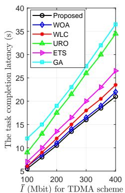

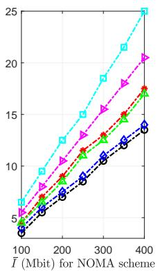  
Fig. 9: Task computation latency versus the task-input data size I<sup>¯</sup>.

Fig. 9 presents the comparisons of the task computation latency versus the task-input data size <sup>¯</sup>I for both the TDMA and NOMA schemes. The overall trend of task computation latency exhibits a linear increase as <sup>¯</sup>I grows, indicating the proportional relationship of the offloading and computing time to the size of task-input data. Furthermore, as <sup>¯</sup>I increases, the performance gap between our proposed scheme and the other benchmark schemes becomes larger. This phenomenon implies the advantages of our proposed TDMA and NOMA schemes in reducing task completion latency which is more obvious when dealing with computation-intensive tasks. Except the GA scheme, the URO scheme perform obviously worse than the other schemes with TDMA protocol, reflecting the great effects of partial local computing and time slot scheduling in minimizing the task completion latency under the TDMA protocol. However, the URO scheme perform better in the case under the NOMA protocol, which highlights the importance of UAV relaying in the NOMA case where all users perform offloading simultaneously. As can be observed, the proposed TDMA and NOMA schemes achieve substantial performance gains compared with the GA scheme.

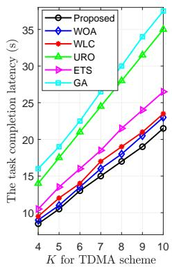

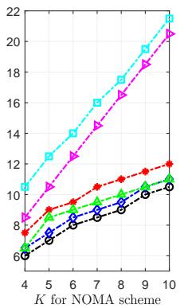  
Fig. 10: Task computation latency versus the number of users with $\bar { I } = 2 0 0 \ \mathrm { M b i t }$

The results of Fig. 10 describe the influence of the number of users on the task completion latency for both the TDMA and NOMA schemes. One can observe that with an increasing number of users joining the system, the objective value of the latency also rises, since more users share the limited communication and computation resources, which will definitely increase the overall latency for completing all users’ tasks. Compared with the TDMA scheme, the proposed NOMA scheme leverages the benefits of NOMA offloading, which allows multiple users to share the same time and communication resources. This reward becomes more impressive as the number of users grows. Unlike the WLC scheme, the proposed TDMA and NOMA schemes can perform local computing and offload partial tasks to be computed at the UAV and GBS with air-ground cooperation, thereby minimizing the task completion latency. For the WOA scheme, the fixed altitude leads to relatively poor channel conditions for offloading transmission links, resulting in low transmission rates. Due to the limited freedom of vertical direction, the distance between the UAV and GBS may increase and the elevation between the user and UAV may decrease, which will lead to a lower probability of LoS link connections for users.

To explore the influence of the computation resources, we investigate how task completion latency behaves versus the maximum CPU frequencies of the users and UAV in Fig. 11 and Fig. 12, respectively, for both the TDMA and NOMA schemes. As described in Fig. 11, the WLC scheme remains unchanged as <sup>¯</sup>f<sup>max</sup> increases since this scheme stipulates that all users should offload their tasks to the UAV without performing any processing locally. It is evident that for the other four schemes, the task completion latency decreases as <sup>¯</sup>f<sup>max</sup> increases since a large proportion of the tasks can be completed at the local side, thereby reducing the computing and data transmission time. In particular, Fig. 12 reveals the effect of the maximum CPU frequency at the UAV on the task completion latency. With the improvement of the UAV’s computing capacity, the users are willing to offload more taskinput data to the UAV, which attributes to the decrease on the latency. Overall, whether the computing resource increases at the users or UAV, the proposed TDMA and NOMA schemes consistently achieve lower task completion latency compared with their corresponding benchmark schemes. In addition, a similar pattern is observed for the URO scheme, where the The reason is that the UAV transmits all tasks to the GBS for further execution, and the transmission latency caused by offloading tasks plays a dominant role in the total latency.

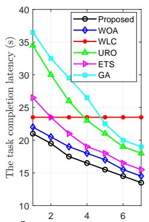

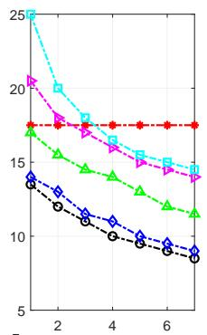  
fmax (GHz) for TDMA scheme fmax (GHz) for NOMA scheme

Fig. 11: Task computation latency versus the maximum CPU frequency of users swith I<sup>¯</sup> = 400 Mbit.  
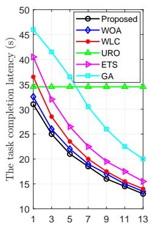

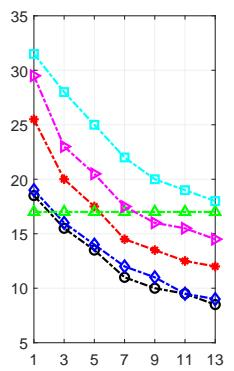  
FUAV (GHz) for NOMA scheme  
Fig. 12: Task computation latency versus the maximum CPU frequency of the UAV with I<sup>¯</sup> = 400 Mbit.

## VII. CONCLUSIONS

We investigate a hybrid UAV-assisted wireless-powered MEC framework, with the goal of minimizing the task completion latency, under both the TDMA and NOMA protocols. The number of required time slots, time slot scheduling, CPU frequency allocation, transmission power allocation and UAV’s

3D trajectory design are jointly optimized in the formulated problem. An alternating optimization algorithm with a doubleloop structure is designed to address the above non-convex problem. Specifically, we constantly update the number of time slots by employing the bisection search method in the outer loop. Then, the original subproblem is converted into an equivalent problem that maximizes the minimum computation ratio of the users in the inner loop. Sufficient simulation results are performed to validate the effectiveness of the proposed optimization algorithm in reducing the task completion latency under both the TDMA and NOMA protocols. In future works, we will extend the proposed framework to other scenarios, such as considering multi-UAV cooperation, heterogeneous mobile users access technologies, etc. These scenarios introduce additional challenges in dynamic coordination, interference management, and resource allocation. Furthermore, we will incorporate robust optimization and intelligent decisionmaking to address real-world uncertainties in channel state information (CSI) acquisition and UAV flight control.

## REFERENCES

[1] M. Vaezi, A. Azari, S. R. Khosravirad, M. Shirvanimoghaddam, M. M. Azari, D. Chasaki, and P. Popovski, “Cellular, wide-area, and nonterrestrial IoT: A survey on 5G advances and the road toward 6G,” IEEE Commun. Surveys Tuts., vol. 24, no. 2, pp. 1117–1174, 2022.

[2] Y. C. Hu, M. Patel, D. Sabella, N. Sprecher, and V. Young, “Mobile edge computing - a key technology towards 5G,” ETSI white paper, vol. 11, no. 11, pp. 1–16, 2015.

[3] F. Giust, V. Sciancalepore, D. Sabella, M. C. Filippou, S. Mangiante, W. Featherstone, and D. Munaretto, “Multi-access edge computing: The driver behind the wheel of 5G-connected cars,” IEEE Commun. Stds. Mag., vol. 2, no. 3, pp. 66–73, 2018.

[4] X. Hu, K.-K. Wong, C. Masouros, and S. Jin, “IRS-Aided Mobile Edge Computing: From Optimization to Learning,” Intelligent Surfaces Empowered 6G Wireless Network, pp. 207–228, 2023.

[5] Y. Zeng, Q. Wu, and R. Zhang, “Accessing from the sky: A tutorial on UAV communications for 5G and beyond,” Proc. IEEE, vol. 107, no. 12, pp. 2327–2375, 2019.

[6] F. Zhou, Y. Wu, R. Q. Hu, and Y. Qian, “Computation rate maximization in UAV-enabled wireless-powered mobile-edge computing systems,” IEEE J. Sel. Areas Commun., vol. 36, no. 9, pp. 1927–1941, 2018.

[7] X. Hu, K.-K. Wong, K. Yang, and Z. Zheng, “UAV-assisted relaying and edge computing: Scheduling and trajectory optimization,” IEEE Trans. Wireless Commun., vol. 18, no. 10, pp. 4738–4752, 2019.

[8] Y. Xu, T. Zhang, Y. Liu, D. Yang, L. Xiao, and M. Tao, “UAVassisted MEC networks with aerial and ground cooperation,” IEEE Trans. Wireless Commun., vol. 20, no. 12, pp. 7712–7727, 2021.

[9] L. Wang, Q. Zhou, and Y. Shen, “Computation efficiency maximization for UAV-assisted relaying and MEC networks in urban environment,” IEEE Trans. Green Commun. Netw., vol. 7, no. 2, pp. 565–578, 2023.

[10] X. Hu, K.-K. Wong, and K. Yang, “Wireless powered cooperationassisted mobile edge computing,” IEEE Trans. Wireless Commun., vol. 17, no. 4, pp. 2375–2388, 2018.

[11] X. Hu, K.-K. Wong, and Y. Zhang, “Wireless-powered edge computing with cooperative UAV: Task, time scheduling and trajectory design,” IEEE Trans. Wireless Commun., vol. 19, no. 12, pp. 8083–8098, 2020.

[12] W. Liu, H. Wang, X. Zhang, H. Xing, J. Ren, Y. Shen, and S. Cui, “Joint trajectory design and resource allocation in UAV-enabled heterogeneous MEC systems,” IEEE Internet Things J., vol. 11, no. 19, pp. 30 817– 30 832, 2024.

[13] X. Hu, P. Wen, H. Xiao, W. Wang, and K.-K. Wong, “Maximizing energy charging for UAV-assisted MEC systems with SWIPT,” IEEE Trans Veh. Technol., vol. 74, no. 5, pp. 8442–8447, 2025.

[14] Y. Zeng, J. Xu, and R. Zhang, “Energy minimization for wireless communication with rotary-wing UAV,” IEEE Trans. Wireless Commun., vol. 18, no. 4, pp. 2329–2345, 2019.

[15] W. Luo, Y. Shen, B. Yang, S. Wang, and X. Guan, “Joint 3-D trajectory and resource optimization in multi-UAV-enabled IoT networks with wireless power transfer,” IEEE Internet Things J., vol. 8, no. 10, pp. 7833–7848, 2021.

[16] C. Xu, C. Zhan, H. Yang, and L. Xiao, “Pareto-optimal aerial-ground energy minimization for aerial 3D mobile edge computing networks,” IEEE Trans Veh. Technol., vol. 73, no. 5, pp. 7218–7233, 2024.

[17] R. Karmakar, G. Kaddoum, and O. Akhrif, “A novel federated learningbased smart power and 3D trajectory control for fairness optimization in secure UAV-assisted MEC services,” IEEE Trans. Mobile Comput., vol. 23, no. 5, pp. 4832–4848, 2024.

[18] Y. Gao, X. Yuan, D. Yang, Y. Hu, Y. Cao, and A. Schmeink, “UAVassisted MEC system with mobile ground terminals: DRL-based joint terminal scheduling and UAV 3D trajectory design,” IEEE Trans Veh. Technol., vol. 73, no. 7, pp. 10 164–10 180, 2024.

[19] C. Liu, Y. Zhong, R. Wu, S. Ren, S. Du, and B. Guo, “Deep reinforcement learning based 3D-trajectory design and task offloading in UAV-enabled MEC system,” IEEE Trans. Veh. Technol., vol. 74, no. 2, pp. 3185–3195, 2025.

[20] Z. Wang, T. Wei, G. Sun, X. Liu, H. Yu, and D. Niyato, “Multi-UAV enabled MEC networks: Optimizing delay through intelligent 3-D trajectory planning and resource allocation,” IEEE Trans. Intell. Transp. Syst, pp. 1–15, 2025.

[21] C. Wang, D. Zhai, R. Zhang, H. Li, and F. Richard Yu, “Latency minimization for UAV-assisted MEC networks with blockchain,” IEEE Trans. Wireless Commun., vol. 72, no. 11, pp. 6854–6866, 2024.

[22] Q. Wu, M. Cui, G. Zhang, F. Wang, Q. Wu, and X. Chu, “Latency minimization for UAV-enabled URLLC-based mobile edge computing systems,” IEEE Trans. Wireless Commun., vol. 23, no. 4, pp. 3298–3311, 2024.

[23] Y. Liu, S. Zhang, X. Mu, Z. Ding, R. Schober, N. Al-Dhahir, E. Hossain, and X. Shen, “Evolution of NOMA toward next generation multiple access (NGMA) for 6G,” IEEE J. Sel. Areas Commun., vol. 40, no. 4, pp. 1037–1071, 2022.

[24] F. Guo, H. Zhang, H. Ji, X. Li, and V. C. Leung, “Joint trajectory and computation offloading optimization for UAV-assisted MEC with NO-MA,” in Proc. IEEE Conf. Comput. Commun. Workshops (INFOCOM WKSHPS), 2019, pp. 1–6.

[25] P. Chen, L. Luo, D. Guo, J. Wu, K. Chi, C. Yan, and X. Dong, “QoSoriented task offloading in NOMA-based multi-UAV cooperative MEC systems,” IEEE Trans. Wireless Commun., pp. 1–1, 2025.

[26] X. Yu, X. Zhang, Y. Rui, X. Dang, G. Jia, and M. Guizani, “Joint resource allocation and 3D-position optimization for UAV-assisted MEC network with NOMA,” IEEE Trans. Netw. Sci. Eng., vol. 12, no. 3, pp. 1440–1456, 2025.

[27] Y. Xu, T. Zhang, D. Yang, Y. Liu, and M. Tao, “Joint resource and trajectory optimization for security in UAV-assisted MEC systems,” IEEE Trans. Commun., vol. 69, no. 1, pp. 573–588, 2021.

[28] F. Wang, J. Xu, X. Wang, and S. Cui, “Joint offloading and computing optimization in wireless powered mobile-edge computing systems,” IEEE Trans. Wireless Commun., vol. 17, no. 3, pp. 1784–1797, 2018.

[29] C. Zhan, H. Hu, X. Sui, Z. Liu, and D. Niyato, “Completion time and energy optimization in the UAV-enabled mobile-edge computing system,” IEEE Internet Things J., vol. 7, no. 8, pp. 7808–7822, 2020.

[30] G. Zheng, C. Xu, M. Wen, and X. Zhao, “Service caching based aerial cooperative computing and resource allocation in multi-UAV enabled MEC systems,” IEEE Trans Veh. Technol., vol. 71, no. 10, pp. 10 934– 10 947, 2022.

[31] W. Feng, J. Tang, N. Zhao, X. Zhang, X. Wang, K.-K. Wong, and J. A. Chambers, “Hybrid beamforming design and resource allocation for UAV-aided wireless-powered mobile edge computing networks with NOMA,” IEEE J. Sel. Areas Commun., vol. 39, no. 11, pp. 3271–3286, 2021.

[32] Y. Xu, T. Zhang, Y. Liu, D. Yang, L. Xiao, and M. Tao, “Cellularconnected multi-UAV MEC networks: An online stochastic optimization approach,” IEEE Trans. Commun., vol. 70, no. 10, pp. 6630–6647, 2022.

[33] J. Gu, H. Wang, G. Ding, Y. Xu, Z. Xue, and H. Zhou, “Energyconstrained completion time minimization in UAV-enabled internet of things,” IEEE Internet Things J., vol. 7, no. 6, pp. 5491–5503, 2020.

[34] X. Hu, K.-K. Wong, and Z. Zheng, “Wireless-powered mobile edge computing with cooperated UAV,” in Proc. 20th Int. Workshop Signal Process. Adv. Wireless Commun. (SPAWC), 2019, pp. 1–5.

[35] K. Xiong, Y. Liu, L. Zhang, B. Gao, J. Cao, P. Fan, and K. B. Letaief, “Joint optimization of trajectory, task offloading, and CPU control in UAV-assisted wireless powered fog computing networks,” IEEE Trans. Green Commun. Netw., vol. 6, no. 3, pp. 1833–1845, 2022.

[36] Z. Liang, H. Chen, Y. Liu, and F. Chen, “Data sensing and offloading in edge computing networks: TDMA or NOMA?” IEEE Trans. Wireless Commun., vol. 21, no. 6, pp. 4497–4508, 2022.

[37] X. Hu, C. Masouros, and K.-K. Wong, “Reconfigurable intelligent surface aided mobile edge computing: From optimization-based to

location-only learning-based solutions,” IEEE Trans. Commun., vol. 69, no. 6, pp. 3709–3725, 2021.

[38] X. Zhang, Z. Chang, G. Zhang, M. Li, and Y. Hu, “Trajectory optimization and resource allocation for time minimization in the UAV-enabled MEC system,” in Proc. IEEE Wireless Commun. Netw. Conf. (WCNC), 2022, pp. 333–338.

[39] H. Xiao, X. Hu, W. Zhang, W. Wang, K.-K. Wong, and K. Yang, “Energy-efficient STAR-RIS enhanced UAV-enabled MEC networks with bi-directional task offloading,” IEEE Trans. Wireless Commun., vol. 24, no. 4, pp. 3258–3272, 2025.

[40] H. Xiao, X. Hu, W. Wang, Z. Su, K.-K. Wong, and K. Yang, “STAR-RIS and UAV combination in MEC networks: Simultaneous task offloading and communications,” IEEE Trans. Commun., vol. 73, no. 8, pp. 6169– 6184, 2025.

[41] X. Hu, L. Wang, K.-K. Wong, M. Tao, Y. Zhang, and Z. Zheng, “Edge and central cloud computing: A perfect pairing for high energy efficiency and low-latency,” IEEE Trans. Wireless Commun., vol. 19, no. 2, pp. 1070–1083, 2020.

[42] H. Hu, Z. Chen, F. Zhou, R. Q. Hu, and H. Zhu, “Computation-efficient grouping, trajectory, and resource allocation for UAV swarm-assisted aerialground collaborative computing networks,” IEEE Internet Things J., vol. 11, no. 7, pp. 12 510–12 525, 2024.

[43] Z. Liu, J. Qi, Y. Shen, K. Ma, and X. Guan, “Maximizing energy efficiency in uav-assisted nomamec networks,” IEEE Internet of Things Journal, vol. 10, no. 24, pp. 22 208–22 222, 2023.

[44] Z. Yu, Y. Gong, S. Gong, and Y. Guo, “Joint task offloading and resource allocation in UAV-enabled mobile edge computing,” IEEE Internet Things J., vol. 7, no. 4, pp. 3147–3159, 2020.

[45] T. Liu, M. Cui, G. Zhang, Q. Wu, X. Chu, and J. Zhang, “3D trajectory and transmit power optimization for UAV-enabled multi-link relaying systems,” IEEE Trans. Green Commun. Netw., vol. 5, no. 1, pp. 392– 405, 2021.

[46] Q. Huang, W. Wang, W. Lu, N. Zhao, A. Nallanathan, and X. Wang, “Resource allocation for multi-cluster NOMA-UAV networks,” IEEE Trans. Commun., vol. 70, no. 12, pp. 8448–8459, 2022.


Xiaoyan Hu (Member, IEEE) received the Ph.D. degree in Electronic and Electrical Engineering from University College London (UCL), London, U.K., in 2020. From 2019 to 2021, she was a Research Fellow with the Department of Electronic and Electrical Engineering, UCL, U.K. She is currently an Associate Professor with the School of Information and Communications Engineering, Faculty of Electronic and Information Engineering, Xi’an Jiaotong University, Xi’an, China. Her research interests are in the areas of 5G&6G wireless communications, including topics such as edge computing, reconfigurable intelligent surface, UAV communications, integrated sensing and communications (ISAC), secure&covert communications, and learning-based communications. She is the recipient of the IEEE Communication Society Big Data 2023 Best Influential Journal Paper Award. She has been recognized as an Exemplary Reviewer for IEEE COMMUNICATIONS LETTERS. From 2020 to 2023, she served as the Assistant to the Editor-in-Chief of IEEE WIRELESS COMMUNICATIONS LETTERS, and she is currently serving as an Associate Editor for IEEE WIRELESS COMMUNICATIONS LETTERS. She has also served as a Guest Editor for ELECTRONICS on Physical Layer Security and for CHINA COM-MUNICATIONS Blue Ocean Forum on MAC and Networks.


Xingxia Gao (Student Member, IEEE) is currently pursuing the Ph.D. degree with the School of Information and Communications Engineering, Xi’an Jiaotong University, Xi’an, China. Her current research interests include ISAC, UAV communications, and mobile edge computing.


Pengle Wen (Student Member, IEEE) received the M.Eng. degree in the School of Information and Communications Engineering, Xi’an Jiaotong University, Xi’an, China, in 2025. His research interests include UAV communications, mobile edge computing, MIMO.


Kai-Kit Wong (Fellow, IEEE) received the BEng, the MPhil, and the PhD degrees, all in Electrical and Electronic Engineering, from the Hong Kong University of Science and Technology, Hong Kong, in 1996, 1998, and 2001, respectively. After graduation, he took up academic and research positions at the University of Hong Kong, Lucent Technologies, Bell-Labs, Holmdel, the Smart Antennas Research Group of Stanford University, and the University of Hull, UK. He is currently the Chair of Wireless Communications with the Department of Electronic

and Electrical Engineering, University College London, UK. His current research centers around 5G and beyond mobile communications, including topics such as massive MIMO, full-duplex communications, millimetre-wave communications, edge caching and fog networking, physical layer security, wireless power transfer and mobile computing, V2X communications, fluid antenna communications systems, and of course cognitive radios. He is Fellow of IEEE and IET and is also on the editorial board of several international journals. He has served as Senior Editor for IEEE COMMUNICATIONS LETTERS since 2012 and for IEEE WIRELESS COMMUNICATIONS LETTERS since 2016. He had also previously served as Associate Editor for IEEE SIGNAL PROCESSING LETTERS from 2009 to 2012 and Editor for IEEE TRANSACTIONS ON WIRELESS COMMUNICATIONS from 2005 to 2011. He was also Guest Editor for IEEE JSAC SI on virtual MIMO in 2013, on physical layer security for 5G in 2018 and on Fluid Antenna System and Other Next-Generation Reconfigurable Antenna Systems for Wireless Communications in 2025. He was the Editor-in-Chief of the IEEE WIRELESS COMMUNICATIONS LETTERS from 2020 to 2023.


Kun Yang (Fellow, IEEE) received his PhD from the Department of Electronic & Electrical Engineering of University College London (UCL), UK. He is currently a Chair Professor of Nanjing University and an affiliated professor at the University of Essex. His main research interests include wireless networks and communications, communication-computing cooperation, and new AI (artificial intelligence) for wireless. He has published 500+ papers and filed 50 patents. He serves on the editorial boards of a few IEEE journals (e.g., IEEE WCM, TVT, TNB).

He is a Deputy Editor-in-Chief of IET Smart Cities Journal. He has been a Judge of GSMA GLOMO Award at World Mobile Congress Barcelona since 2019. He was a Distinguished Lecturer of IEEE ComSoc, a Recipient of the 2024 IET Achievement Medals and the Recipient of 2024 IEEE CommSoft TCs Technical Achievement Award. He is a Member of Academia Europaea (MAE), a Fellow of IEEE, a Fellow of IET and a Distinguished Member of ACM.