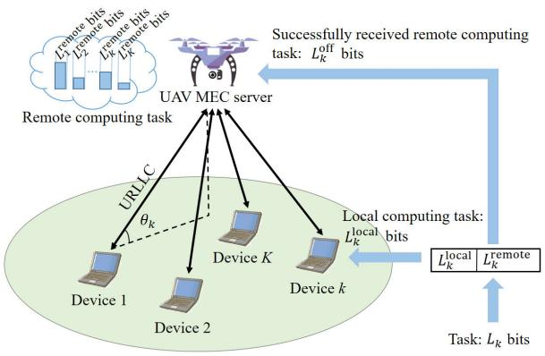
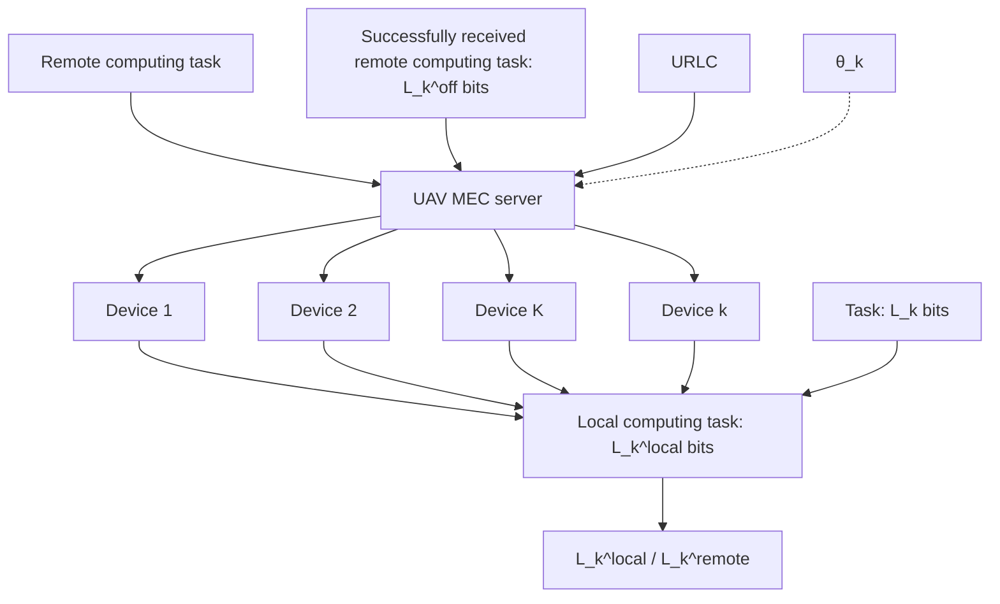
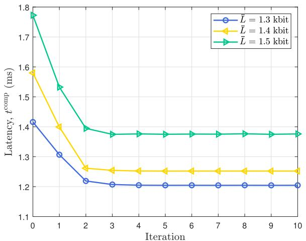
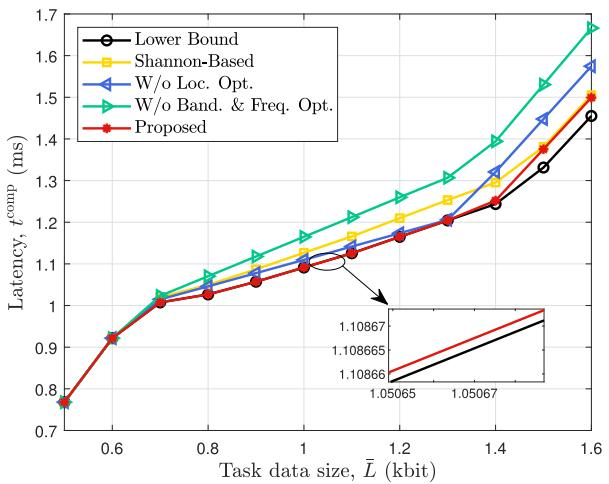
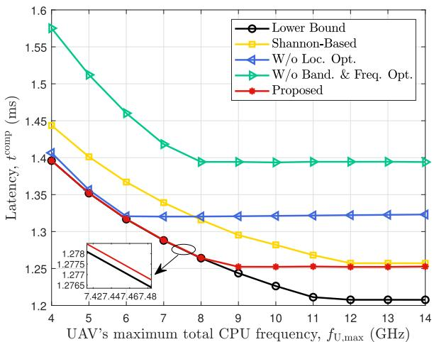
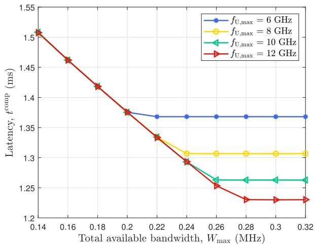
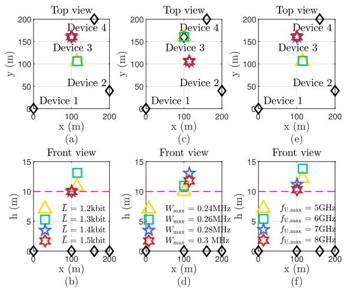
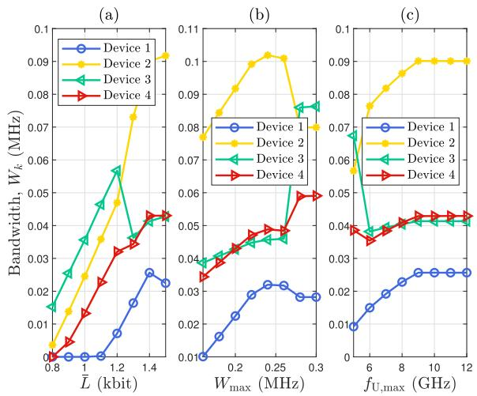
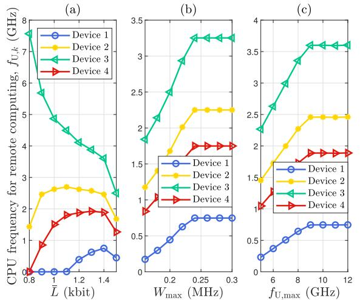

# Latency Minimization for UAV-Enabled URLLC-Based Mobile Edge Computing Systems

Qingjie Wu , Miao Cui , Guangchi Zhang , Feng Wang , Member, IEEE,Qingqing Wu , Senior Member, IEEE, and Xiaoli Chu , Senior Member, IEEE D

Abstract— In this paper, we consider an unmanned aerial vehicle (UAV)-enabled mobile edge computing (MEC) system, where multiple ground devices offload portions of their latency-sensitive and mission-critical computational tasks to a UAV-carried MEC server for remote computing and compute the remaining portions locally. To meet the low-latency requirements of the MEC, ultrareliable and low-latency communication (URLLC) is used to offload tasks from the devices to the UAV. We minimize the maximum computation latency among all devices by jointly optimizing the computing times and CPU frequencies of the devices and the UAV, the offloading bandwidths of the devices, and the three-dimensional location of the UAV. We propose an algorithm that decomposes the joint optimization problem into three subproblems, which optimize the UAV’s horizontal location, the UAV’s altitude, and the offloading bandwidths and computing CPU frequencies, respectively. In solving the subproblems, the data rate expression of the devices’ finite-blocklength offloading is accurately approximated by a tractable logarithmic function, and the successive convex approximation technique is applied to tackle the non-convex structure. Furthermore, a semi-closed-form solution to the subproblem that optimizes the bandwidths and CPU frequencies is derived to reduce the complexity. Simulation

Manuscript received 5 March 2023; revised 15 July 2023; accepted 17 August 2023. Date of publication 28 August 2023; date of current version 11 April 2024. The work of Miao Cui and Guangchi Zhang was supported in part by the Science and Technology Plan Project of Guangdong Province under Grant 2022A0505020008, Grant 2022A0505050023, and Grant 2019B010119001; in part by the Natural Science Foundation of Guangdong Province under Grant 2023A1515011980; in part by the Key Program of Marine Economy Development Special Foundation of Department of Natural Resources of Guangdong Province under Grant GDNRC[2023]24; in part by the Special Support Plan for High-Level Talents of Guangdong Province under Grant 2019TQ05X409; in part by the Open Research Project Program of the State Key Laboratory of Internet of Things for Smart City (University of Macau) under Grant SKL-IoTSC(UM)-2021-2023/ORPF/A04/2022; in part by the Open Research Fund of Integrated Services Networks (ISN) Laboratory under Grant ISN23-12; and in part by the Open Fund Project of Jiangxi Military-Civilian Integration Beidou Navigation Key Laboratory under Grant 2022JXRH0004. The work of Qingqing Wu was supported in part by the Guangdong Science and Technology Program under Grant 2022A0505050011 and in part by the Science and Technology Development Fund (FDCT) under Grant 0119/2020/A3. The associate editor coordinating the review of this article and approving it for publication was H. T. Dinh. (Corresponding authors: Miao Cui; Guangchi Zhang.)

Qingjie Wu, Miao Cui, Guangchi Zhang, and Feng Wang are with the School of Information Engineering, Guangdong University of Technology, Guangzhou 510006, China (e-mail: qingjiewu55@163.com; cuimiao@gdut.edu.cn; gczhang@gdut.edu.cn; fengwang13@gdut.edu.cn).

Qingqing Wu is with the Department of Electronic Engineering, Shanghai Jiao Tong University, Shanghai 200240, China (e-mail: qingqingwu@sjtu. edu.cn).

Xiaoli Chu is with the Department of Electronic and Electrical Engineering, The University of Sheffield, S1 4ET Sheffield, U.K. (e-mail: x.chu@sheffield.ac.uk).

Color versions of one or more figures in this article are available at https://doi.org/10.1109/TWC.2023.3307154.

Digital Object Identifier 10.1109/TWC.2023.3307154

results show that the proposed algorithm can significantly reduce the system’s computation latency compared to the benchmark schemes.

Index Terms— Unmanned aerial vehicle, mobile edge computing, ultra-reliable and low-latency communications, computation latency.

# I. INTRODUCTION

HE rapid development of the fifth generation (5G) T wireless communication technology has greatly promoted the ubiquitous deployment of Internet-of-Things (IoT) for mission-critical applications such as factory automation, remote health monitoring, and virtual reality. The computational tasks of these applications are generally latency-sensitive, which poses a significant challenge to the computing-capability-constrained IoT devices [1]. Mobile edge computing (MEC) is a promising way to address this challenge by deploying computing servers close to the devices and providing them with lower latency and computational agility through task offloading [2], [3], [4]. However, the computational performance of MEC is limited by the communication performance of the wireless links between the devices and the MEC servers [5]. Since unmanned aerial vehicles (UAVs) can be dispatched on-demand [6], [7], [8], [9], [10], the offloading link quality and computing capability of ground devices can be improved by deploying UAVs carrying MEC servers at appropriate locations [11], [12].

Meanwhile, ultra-reliable and low-latency communication (URLLC) is usually applied in the IoT to guarantee the quality of service (QoS) in terms of latency [13], [14]. Since the data transmission packets in URLLC are short, e.g., 20 or 32 bytes [15], the transmission blocklength and the channel-code length are finite, and the decoding error cannot be ignored. Thus, the Shannon capacity formula, which assumes an infinite blocklength, cannot be used to express the data rate of URLLC [16], [17]. Instead, an accurate approximate data rate expression for a finite blocklength transmission was derived in [18], which characterizes the effect of signal-to-noise ratio (SNR), blocklength, and decoding error probability on the data rate. However, the existing works on UAV-enabled MEC systems [19], [20], [21], [22], [23] have not considered URLLC for task offloading. As a result, the existing optimization methods cannot be directly applied to the UAV-enabled MEC systems with URLLC-based offloading.

In this paper, we study a UAV-enabled URLLC-based MEC system, where multiple ground devices can offload some of their computational tasks to a UAV-carried MEC server via URLLC links. To minimize the maximum computation latency among all the ground devices, the location of the UAV, the offloading bandwidths of the devices, and the computing times and CPU frequencies of the devices and the UAV are jointly optimized.

# A. Related Works

1) UAV-enabled MEC systems: UAVs have been considered to improve the computation performance of MEC systems [19], [20], [21], [22], [23]. The authors in [12] studied minimizing the total energy consumption of the users in a UAV-assisted MEC system for both orthogonal and non-orthogonal multiple access schemes. The authors in [19] investigated a UAV-enabled MEC system with stochastic computational tasks and minimized the average weighted energy consumption of the users and the UAV. By optimizing the time allocation, transmit power, and UAV trajectory, the maximizations of the weighted sum completed task-input bits and computation rate of UAV-enabled MEC systems were studied in [20] and [21], respectively, where the UAV and the users were wirelessly powered. To provide more computation offloading opportunities for users, multi-UAV-enabled MEC architectures were proposed in [22]. Task offloading decisions and the trajectory of a UAV carrying an MEC server were jointly optimized to minimize the maximum delay of all users in [23]. In the UAV-enabled MEC systems, the minimization of UAV energy consumption and that of the users’ task completion time cannot be achieved simultaneously, the authors in [4] obtained a Pareto-optimal solution to balance the tradeoff between them. However, in the above works on UAV-enabled MEC systems, the blocklengths of offloading transmissions were all assumed to be infinite. The study of UAV-enabled MEC systems with URLLC-based offloading is still missing.

2) UAV-enabled URLLC systems: Since UAVs can dynamically adjust their deployment locations according to the practical environment and/or communication requirements to establish high-quality communication links between themselves and nodes on the ground, the UAV-enabled URLLC is expected to achieve lower packet error probability and retransmission probability, resulting in higher reliability and lower latency, as compared with its terrestrial counterpart [24], [25], [26], [27]. The average data rate of a UAV-enabled URLLC system under a three-dimensional (3D) air-ground channel model was derived in [24]. A relay station carried by a UAV was proposed to assist the URLLC in [25] and [26], where joint optimization of UAV transmit power and location and that of transmission blocklength and UAV location were studied to minimize decoding error probability while guaranteeing the latency requirement, respectively. The authors in [27] considered the URLLC between a UAV equipped with an antenna array and multiple ground IoT devices, and jointly optimized the blocklength of uplink communications, the UAV location, and the beamwidth of the antenna array to minimize the sum uplink transmit power of the devices. Most of the above works modeled the air-ground channels using the lineof-sight (LoS) model, while ignoring the effect of multipath fading.

3) URLLC-based MEC systems: In [28], offloading schemes were studied to achieve a balance between latency and reliability of task offloading in a single-user URLLC-based MEC system. In [29], a cross-layer design was investigated to minimize the overall packet loss probability in a URLLC-based MEC system. In [30], the queue length in a URLLC-based MEC system was analyzed, and a task offloading and resource allocation framework was proposed for the system. Although with the above works, the URLLC-based MEC system with multiple users has not been sufficiently studied. In such a system, the optimization of computation resources for the tasks of multiple users under an overall resource constraint is an important problem for computing capability improvement, which has not yet been investigated.

# B. Contributions and Organization

In this paper, we consider a UAV-enabled URLLC-based MEC system where URLLC is used for offloading computation tasks from ground devices to the UAV-carried MEC server. We propose to minimize the maximum computation latency among all the devices by jointly optimizing the computing times and CPU frequencies of the devices and the UAV, the offloading bandwidths of the devices, and the 3D location of the UAV. Unlike the existing works [19], [20], [21], [22], [23], we assume that URLLC is used for offloading computation tasks, i.e., the offloading transmissions’ blocklengths are finite and their data rates cannot be accurately expressed by the Shannon formula. Furthermore, the channels between the UAV and ground devices are modeled by the more accurate angle-dependent Rician fading model instead of the LoS model, since there exists the non-negligible scattering effect in these channels in practice. The formulated problem is challenging to solve for the following reasons. First, the optimization variables are inter-coupled in the constraints of the problem. Second, due to the angle-dependent-Rician fading of the UAV-ground-device channels, the data-rate expression of the finite-block-length transmission [18] is not tractable, making the problem non-convex and complicated. We propose an efficient algorithm to solve the considered problem. Specifically, the proposed algorithm decomposes the original problem into three subproblems, which optimize the UAV’s horizontal location, the UAV’s altitude, and the offloading bandwidths and the computing CPU frequencies, respectively, and the algorithm solves them alternately until achieving convergence. The coupling among the variables is tackled by using the block coordinate descent (BCD) technique. The contributions of this work are highlighted as follows.

• Based on the monotonicity of the offloading rate expression with respect to the received SNR, we obtain the expression of a device’s finite-blocklength offloading under our considered Rician fading channel for a fixed maximum tolerable outage probability. The obtained offloading rate expression is a function of the UAV location, which facilitates the optimization of the 3D location of the UAV.   
• To solve the subproblems that optimize the UAV’s horizontal location and the UAV’s altitude, we further approximate the obtained data-rate expression by

a logarithmic form, which simplifies the mathematical relationship between the data rate and the SNR. Then, by exploiting the convexity of the SNR expression and by applying the successive convex approximation (SCA) technique, we obtain locally optimal solutions to these subproblems.

• To solve the subproblem that optimizes the offloading transmission bandwidths and computing CPU frequencies, we first transform this subproblem that minimizes the maximum computation latency among all devices into an equivalent problem that maximizes the minimum ratio of the completed-task data size to the entire-task data size among all devices. We then apply the SCA technique to approximate the transformed optimization problem to a convex one. Next, we obtain the optimal solution to this approximated problem in a semi-closed form by developing a novel two-layer algorithm.   
• Simulation results show that the proposed algorithm can converge rapidly and achieve significantly lower computation latency as compared to the benchmark schemes. The results also show that the joint optimization of bandwidth, CPU frequency, and UAV location can improve the communication capability and computing capability of the system in a balanced way, thus it is effective in reducing the computation latency of the system. In addition, the results show that there is a significant latency performance gap between the proposed algorithm and the benchmark scheme using the Shannon capacity to express the offloading data rate, which demonstrates that using an accurate data rate expression to characterize the finite blocklength offloading is necessary for the optimization.

The rest of this paper is organized as follows. In Section II, the system model is introduced and the problem of minimizing all devices’ maximum computation latency is formulated. In Section III, the proposed algorithm for solving the problem is presented. Simulation results are presented in Section IV. The conclusion is given in Section V.

# II. SYSTEM MODEL AND PROBLEM FORMULATION

As shown in Fig. 1, we consider a UAV-enabled URLLCbased MEC system consisting of a UAV-carried MEC server and K devices with mission-critical and latency-sensitive computational tasks. The set of devices is denoted by $\kappa \triangleq$ $\{ 1 , 2 , \ldots , K \}$ . Due to the limited size of the UAV and the devices, we assume that they are each equipped with a single antenna. The devices have limited computation capabilities and need to offload some of their computational tasks to the UAV. To achieve low-latency task offloading, URLLC is used, where the channel code length of each offloading transmission is short and the blocklength of it is finite [14].

# A. Communication Model

The locations of the devices and the UAV are expressed in a 3D Cartesian coordinate system. The coordinate of device $k ,$ $k \in \mathcal { K }$ , and the UAV are denoted by $\left[ \mathbf { s } _ { k } ^ { T } , 0 \right] ^ { T }$ and $\left\lceil \mathbf { q } ^ { T } , h \right\rceil ^ { T }$ , respectively, where $\mathbf s _ { k } , \mathbf q \in \mathbb R ^ { 2 \times 1 }$ in meters (m) denote their horizontal coordinates, respectively, and h in m denotes the altitude of the UAV. To avoid obstacles and to comply with UAV flight regulations, h is limited to a certain range:

flowchart

Fig. 1. A UAV-enabled URLLC-based MEC system.

$$
h _ {\min} \leq h \leq h _ {\max}, \tag {1}
$$

where $h _ { \mathrm { m i n } }$ and $h _ { \mathrm { m a x } }$ are the minimum and maximum altitudes of the UAV, respectively.

To avoid co-channel interference, all devices offload their tasks to the UAV on orthogonal frequency channels.1 The offloading bandwidth of device k is denoted by $W _ { k }$ , and the sum of all devices’ bandwidths should not exceed the total available bandwidth $W _ { \mathrm { m a x } } .$ , i.e.,

$$
\sum_ {k = 1} ^ {K} W _ {k} \leq W _ {\max}, \quad W _ {k} \geq 0, \forall k. \tag {2}
$$

Besides, we denote the offloading duration of all devices by $T ^ { \mathrm { o f f } }$ in seconds $( \mathrm { s } ) , ^ { 2 }$ and the blocklength of device k’s transmission can be written as $N _ { k } = W _ { k } T ^ { \mathrm { o f f } }$ .

Considering both the dominant LoS path and the non-negligible multipath components, we model the channel between device k and the UAV using the Rician fading model. In particular, the channel coefficient between device k and the UAV can be expressed as $h _ { k } = \sqrt { \beta _ { k } } g _ { k } .$ , where $g _ { k }$ is the small-scale fading coefficient with $\mathbb { E } [ | g _ { k } | ^ { 2 } ] = 1$ and $\beta _ { k }$ is the large-scale channel power gain that accounts for the path-loss effect and can be expressed as $\beta _ { k } ~ = ~ \beta _ { 0 } d _ { k } ^ { - \alpha }$ , where $\beta _ { 0 }$ is the channel power gain at a reference distance $d _ { 0 } = 1$ m, α is the path-loss exponent, and $d _ { k } = { \sqrt { \left\| \mathbf { q } - \mathbf { s } _ { k } \right\| ^ { 2 } + h ^ { 2 } } }$ is the distance between device k and the UAV. Since the blocklength of each transmission is finite and short, we assume that all channel coefficients $\{ h _ { k } , k \in \mathcal { K } \}$ remain constant for each transmission.3

1For simplicity, we assume that the frequency synchronization is correct [6], [7], [8], [9], [10], [11], [12], [19], [20], [21], [22], [23], [24], [25], [26], [27]. Frequency synchronization methods and the associated errors for UAV-enabled MEC systems will be studied in our future work.   
2As the URLLC standard requires $T ^ { \mathrm { o f f } }$ to be no longer than 1 ms [15], it is difficult to adaptively adjust such a short duration in practice [27], [29], [31]. Therefore, we do not consider optimizing $T ^ { \mathrm { o f f } }$ .   
3We assume that $\{ h _ { k } , k \in \mathcal { K } \}$ are perfectly known by the system. If there are channel state information (CSI) errors, the performance of the proposed algorithm may be degraded. How to design a robust algorithm for the system against CSI errors will be left for our future work.

The received SNR at the UAV can be written as $\gamma _ { k } =$ $\frac { | h _ { k } | ^ { 2 } P _ { k } } { N _ { 0 } W _ { k } }$ , where $P _ { k }$ is the transmit power of device k, and $N _ { 0 }$ denotes the noise power spectrum density at the receiver. According to [18], the channel capacity of device $k$ in bit/second/Hertz (bps/Hz) for blocklength $N _ { k }$ and decoding error probability $\epsilon _ { k }$ can be approximated by

$$
C _ {k} \approx \log_ {2} (1 + \gamma_ {k}) - \sqrt {\frac {V _ {k}}{N _ {k}}} \frac {Q ^ {- 1} (\epsilon_ {k})}{\ln 2}, \tag {3}
$$

where $Q ^ { - 1 } \underline { { ( \cdot ) } }$ is the inverse function of $Q ( x ) \quad \triangleq { \begin{array} { r l } { \Delta } & { { } } \end{array} }$ x  2 π $\begin{array} { r } { \int _ { x } ^ { \infty } \frac { 1 } { \sqrt { 2 \pi } } e ^ { - \frac { t ^ { 2 } } { 2 } } \mathrm { d } t . } \end{array}$ t2 , and $V _ { k } \ = \ 1 - \left( 1 + \gamma _ { k } \right) ^ { - 2 }$ is the channel dispersion.

We let $R _ { k }$ denote the offloading rate of device k at a specific received SNR $\tilde { \gamma } _ { k }$ . The expressions of $R _ { k }$ and $\tilde { \gamma } _ { k }$ can be obtained as follows. The outage probability of device k can be expressed as

$$
\begin{array}{l} P _ {k} ^ {\text { out }} = P r (C _ {k} <   R _ {k}) \stackrel {(a)} {=} P r (\gamma_ {k} <   \tilde {\gamma} _ {k}) \\ = P r \left(\left| g _ {k} \right| ^ {2} <   \frac {\tilde {\gamma} _ {k} N _ {0} W _ {k}}{\beta_ {k} P _ {k}}\right) = F \left(\frac {\tilde {\gamma} _ {k} N _ {0} W _ {k}}{\beta_ {k} P _ {k}}\right), \tag {4} \\ \end{array}
$$

where $P r ( \cdot )$ denotes the probability of an event and $F ( \cdot )$ is the cumulative distribution function (CDF) of $| g _ { k } | ^ { 2 } .$ . In (4), (a) holds because $C _ { k }$ is a monotonically increasing function of $\gamma _ { k }$ when $C _ { k } > 0 [ 3 2 ]$ . The offloading rate $R _ { k }$ is maximized when $P _ { k } ^ { \mathrm { o u t } } = \varepsilon _ { k }$ , where $\varepsilon _ { k }$ is the maximum tolerable outage probability of device k. Thus, $\tilde { \gamma } _ { k }$ can be obtained by solving the equation $\begin{array} { r l r } { F \left( \frac { { \widetilde \gamma } _ { k } N _ { 0 } W _ { k } } { \beta _ { k } P _ { k } } \right) } & { { } = } & { { \varepsilon } _ { k } } \end{array}$ . According to [10], the solution to this equation can be approximated by $\begin{array} { r } { \tilde { \gamma } _ { k } = \frac { F _ { k } \beta _ { k } P _ { k } } { N _ { 0 } W _ { k } } } \end{array}$ , where

$$
F _ {k} \triangleq Z _ {1} + \frac {Z _ {2}}{1 + e ^ {- (B _ {1} + B _ {2} \theta_ {k})}}, \tag {5}
$$

and the constants $B _ { 1 } , B _ { 2 } , Z _ { 1 }$ , and $Z _ { 2 }$ are determined by the maximum and minimum Rician factors as well as $\varepsilon _ { k } .$ , and they can be obtained by the logistic regression method according to the numerical channel data. Besides,

$$
\theta_ {k} \triangleq \frac {h}{\sqrt {\| \mathbf {q} - \mathbf {s} _ {k} \| ^ {2} + h ^ {2}}} \tag {6}
$$

denotes the elevation angle from device k to the UAV. After obtaining $\tilde { \gamma } _ { k }$ , the offloading rate $R _ { k }$ can be expressed as

$$
R _ {k} = \log_ {2} (1 + \tilde {\gamma} _ {k}) - \sqrt {\frac {\tilde {V} _ {k}}{N _ {k}}} \frac {Q ^ {- 1} (\epsilon_ {k})}{\ln 2}, \tag {7}
$$

where $\tilde { V } _ { k } = 1 - \left( 1 + \tilde { \gamma } _ { k } \right) ^ { - 2 } .$ .

# B. Computing Model

The devices execute their computational tasks in a hybrid local-remote way. The task data of each device is bitwise independent and can be divided into two parts, one to be computed locally and the other to be offloaded to the UAV for remote computing [12]. For device $k ,$ let $L _ { k }$ in bits denote the data size of its task and $c _ { k }$ denote the number of CPU cycles required to compute 1 bit of the task.

1) Local Computing: The dynamic voltage and frequency scaling (DVFS) technique [33] is used by all devices for local computing. Let $t _ { k } ^ { \mathrm { l o c a l } }$ in s and $f _ { k }$ in cycle/s denote the local computing time and CPU frequency of device k, respectively. The local-computing task data size and the energy consumption of device k can be expressed as $\begin{array} { r } { L _ { k } ^ { \mathrm { l o c a l } } = \frac { t _ { k } ^ { \mathrm { l o c a l } } \overline { { f _ { k } } } } { c _ { k } } } \end{array}$ and $E _ { k } ^ { \mathrm { l o c a l } } \ = \ t _ { k } ^ { \mathrm { l o c a l } } \kappa _ { k } f _ { k } { } ^ { 3 }$ , respectively, where $\kappa _ { k }$ ckdenotes the effective capacitance coefficient of device k. The CPU frequency $f _ { k }$ is upper bounded by a maximum frequency $f _ { k , \mathrm { m a x } } , \mathrm { i . e . }$ ,

$$
0 \leq f _ {k} \leq f _ {k, \max}. \tag {8}
$$

The total energy consumption of device k is the sum of its communication energy consumption and computing energy consumption and should not exceed its energy budget $E _ { k , \mathrm { m a x } } ,$ i.e.,

$$
P _ {k} T ^ {\text { off }} + E _ {k} ^ {\text { local }} \leq E _ {k, \max}. \tag {9}
$$

2) Remote Computing: During the task offloading from device k to the UAV, since the transmission blocklength is finite, the decoding error probability cannot be neglected [16]. Therefore, the data size of device $k ' s$ offloaded task that is successfully received by the UAV can be expressed as $L _ { k } ^ { \mathrm { o f f } } = ( 1 - \epsilon _ { k } ) N _ { k } R _ { k }$ .

The UAV-carried MEC server starts computing device k’s task immediately after successfully receiving it. To compute all devices’ tasks in parallel, the MEC server allocates CPU frequency $f _ { \mathrm { U } , k }$ for device $k ' s$ task, subject to the following constraints:

$$
\sum_ {k = 1} ^ {K} f _ {\mathrm{U}, k} \leq f _ {\mathrm{U}, \max}, \quad f _ {\mathrm{U}, k} \geq 0, \forall k, \tag {10}
$$

where $f _ { \mathrm { U , m a x } }$ is the maximum total CPU frequency of the MEC server. Let $t _ { k } ^ { \mathrm { r e m o t e } }$ denote the remote computing time of device $k \mathrm { { s } }$ task, and the data size of device $k ' \mathrm { s }$ remote computing task can be expressed as $\begin{array} { r } { L _ { k } ^ { \mathrm { r e m o t e } } \ = \ \frac { t _ { k } ^ { \mathrm { r e m o t e } } f _ { \mathrm { U } , k } } { c \iota } } \end{array}$ ck . The remote computing task of device k should satisfy the information-causality constraint, i.e.,

$$
L _ {k} ^ {\text { off }} \geq L _ {k} ^ {\text { remote }}. \tag {11}
$$

In addition, to complete the entire task of device k, the sum data size of its locally and remotely computed parts should satisfy the following constraint,

$$
L _ {k} ^ {\text { local }} + L _ {k} ^ {\text { remote }} \geq L _ {k}. \tag {12}
$$

The energy consumption of the UAV is usually dominated by its propulsion energy consumption, which is much higher than its computing and communication energy consumption [34]. Since the UAV remains static during the MEC process, its propulsion power consumption is constant and cannot be optimized. Furthermore, the UAV MEC server can be supplied with sufficient energy through wireless energy harvesting or wired cable connections [21], so we do not consider the energy consumption of the UAV.

# C. Computation Latency

We consider the mission-critical computational tasks, where the data sizes of the computation results are much smaller than those of the offloaded tasks [23], [31]. Thus, the download latencies caused by transmitting the computation results back to the devices can be neglected. Thus, the remote computing latency of device k is the sum of its offloading duration and remote computing time, i.e., $T ^ { \mathrm { o f f } } + t _ { k } ^ { \mathrm { r e m o t e } }$ . Assuming that each device can perform local computing and transmit to the UAV simultaneously, the computation latency of device k is given by $t _ { k } ^ { \mathrm { c o m p } } = \dot { \mathrm { m a x } } \{ T ^ { \mathrm { o f f } } \stackrel { \cdot } { + } t _ { k } ^ { \mathrm { r e m o t e } } , t _ { k } ^ { \mathrm { l o c a \dot { l } } } \}$ , and the maximum computation latency among all the devices is given by $t ^ { \mathrm { c o m p } } =$ max $\cdot \{ t _ { k } ^ { \mathrm { c o m p } } , \forall k \}$ .

# D. Problem Formulation

We aim to minimize the maximum computation latency among all the devices $t ^ { \mathrm { c o m p } }$ by jointly optimizing the local computing and remote computing times $\tau \quad { \triangleq }$ $\{ t _ { k } ^ { \mathrm { l o c a l } } , t _ { k } ^ { \mathrm { r e m o t e } } , \bar { \forall k } \}$ , tk , the offloading bandwidths of all devices $\downarrow \downarrow \triangleq \{ W _ { k } , \forall k \}$ , the CPU frequencies for all devices and the UAV $\mathcal { F } \triangleq \{ f _ { k } , f _ { \mathrm { U } , k } , \forall k \}$ , as well as the horizontal location $\mathbf { q }$ and altitude h of the UAV. Defining the set $\Lambda \triangleq$ $\{ \mathcal { W } , \mathcal { F } , \mathcal { T } , \mathbf { q } , h , t ^ { \mathrm { c o m p } } \}$ , we formulate the joint optimization problem as

$$
(\mathbf {P 1}): \min _ {\Lambda} t ^ {\text { comp }} \tag {13a}
$$

$$
\text { s.t. } t _ {k} ^ {\text { local }} \leq t ^ {\text { comp }}, \quad \forall k \tag {13b}
$$

$$
T ^ {\text { off }} + t _ {k} ^ {\text { remote }} \leq t ^ {\text { comp }}, \quad \forall k \tag {13c}
$$

$$
\frac {t _ {k} ^ {\text { local }} f _ {k}}{c _ {k}} + \frac {t _ {k} ^ {\text { remote }} f _ {\mathrm{U} , k}}{c _ {k}} \geq L _ {k}, \quad \forall k \tag {13d}
$$

$$
\left(1 - \epsilon_ {k}\right) N _ {k} R _ {k} \geq \frac {t _ {k} ^ {\text { remote }} f _ {\mathrm{U} , k}}{c _ {k}}, \quad \forall k \tag {13e}
$$

$$
P _ {k} T ^ {\text {off}} + t _ {k} ^ {\text {local}} \kappa_ {k} f _ {k} ^ {3} \leq E _ {k, \max}, \quad \forall k \tag {13f}
$$

$$
\sum_ {k = 1} ^ {K} W _ {k} \leq W _ {\max}, W _ {k} \geq 0, \quad \forall k \tag {13g}
$$

$$
\sum_ {k = 1} ^ {K} f _ {\mathrm{U}, k} \leq f _ {\mathrm{U}, \max}, f _ {\mathrm{U}, k} \geq 0, \quad \forall k \tag {13h}
$$

$$
0 \leq f _ {k} \leq f _ {k, \max}, \quad \forall k \tag {13i}
$$

$$
h _ {\min} \leq h \leq h _ {\max}, \tag {13j}
$$

where constraints (13b) and (13c) are from the definition of $t ^ { \mathrm { c o m p . } }$ (13d) is from (12), ensuring that the task of each device is completed; (13e) is the information-causality constraint in (11); (13f) is from (9), which guarantees that the energy consumption of each device does not exceed its energy budget; (13g), (13h), (13i), and (13j) denote the constraints on the bandwidths, CPU frequencies for remote computing, CPU frequencies for local computing, and the $\mathrm { U A V } _ { \mathrm { \Delta } }$ altitude, respectively. Problem (P1) is non-convex due to the non-convexity of constraints (13d)-(13f). Furthermore, the complicated mathematical relationship between $R _ { k }$ and $\tilde { \gamma } _ { k }$ in (13e) and the coupling of the optimization variables make it challenging to solve (P1) directly.

# III. PROPOSED ALGORITHM FOR PROBLEM (P1)

To overcome the above identified challenges, we devise an efficient algorithm to solve (P1). We decouple variables W, ${ \mathcal { F } } , { \bf q } ,$ and h in problem (P1) by applying the BCD technique, which decomposes (P1) into three subproblems: 1) Subproblem 1 jointly optimizes the UAV’s horizontal location q and computing times $\tau$ for given W, F, and h; 2) Subproblem 2 jointly optimizes the $\mathrm { U A V } _ { \mathrm { \Delta } }$ altitude h and computing times $\tau$ for given W, F, and q; 3) Subproblem 3 jointly optimizes the bandwidths W, CPU frequencies ${ \mathcal F } ,$ and computing times $\tau$ for given q and h. Note that the computing times are optimized in each subproblem. This is because the objective value $t ^ { \mathrm { c o m p } }$ is directly determined by the computing times according to constraints (13b) and (13c). These three subproblems are solved alternately until the objective value tcomp converges. The solutions to the three subproblems are presented as follows.

# A. Subproblem 1: Jointly Optimizing UAV’s Horizontal Location and Computing Times

Given the bandwidths W, CPU frequencies ${ \mathcal F } ,$ and UAV altitude h, problem (P1) reduces to

$$
(\mathbf {P 2}): \min _ {\mathcal {T}, \mathbf {q}, t ^ {\text { comp }}} \quad t ^ {\text { comp }} \tag {14a}
$$

$$
\text { s.t. } (1 3 b) - (1 3 f). \tag {14b}
$$

Since $R _ { k }$ given in (7) has a complicated expression, where $\tilde { \gamma } _ { k }$ appears in both the logarithmic function and the denominator of $\tilde { V } _ { k } \mathrm { ' s }$ second term, (13e) is non-convex. Furthermore, γ˜k also has a complicated expression. Thus, (P2) is intractable, and we solve it as follows.

To simplify the expression of $R _ { k }$ , unlike the existing works that set $\dot { \tilde { V } } _ { k } \ \tilde { \approx } \ 1 \ [ 2 7 ]$ , we find a lower bound for $R _ { k }$ in the following proposition.

Proposition 1: For a given $\hat { \gamma } _ { k } , ~ R _ { k }$ in (13e) can be lower bounded by

$$
R _ {k} ^ {\mathrm{lb}} \triangleq \rho_ {k} \log_ {2} (\tilde {\gamma} _ {k}) + \frac {\eta_ {k}}{\ln 2}, \quad \forall k, \tag {15}
$$

where $\rho _ { k } = \rho _ { 1 k } - \mathrm { l n } 2 \delta _ { k } \rho _ { 2 k } , \eta _ { k } = \eta _ { 1 k } - \mathrm { l n } 2 \delta _ { k } \eta _ { 2 k } , \delta _ { k } =$

$$
\frac {Q ^ {- 1} (\epsilon_ {k})}{\ln 2 \sqrt {N _ {k}}}, \rho_ {1 k} = \frac {\hat {\gamma} _ {k}}{1 + \hat {\gamma} _ {k}}, \rho_ {2 k} = \frac {\hat {\gamma} _ {k}}{\sqrt {\hat {\gamma} _ {k} ^ {2} + 2 \hat {\gamma} _ {k}}} - \frac {\hat {\gamma} _ {k} \sqrt {\hat {\gamma} _ {k} ^ {2} + 2 \hat {\gamma} _ {k}}}{(1 + \hat {\gamma} _ {k}) ^ {2}},
$$

$\eta _ { 1 k } = \ln \left( 1 + \hat { \gamma } _ { k } \right) - \rho _ { 1 k } \ln \left( \hat { \gamma } _ { k } \right)$ , and $\begin{array} { r } { \eta _ { 2 k } = \sqrt { 1 - \frac { 1 } { ( 1 + \hat { \gamma } _ { k } ) ^ { 2 } } } - } \end{array}$ $\rho _ { 2 k } \mathrm { l n } \left( \hat { \gamma } _ { k } \right)$ . In addition, $R _ { k } = R _ { k } ^ { \mathrm { l b } }$ if and only if $\tilde { \gamma } _ { k } = \hat { \gamma } _ { k }$ .

Proof: We use Lemma 3 and Lemma 4 of [17] for the proof. Note that Lemma 3 of [17] holds if the SNR of a device is not less than $( \sqrt { 1 7 } - 3 ) / 4$ . This condition can be satisfied with $\epsilon _ { k } \leq 1 0 ^ { - 5 }$ and $N _ { k } \le 2 0 0$ , which fits the requirements of URLLC considered in our paper $[ 1 5 ] . ^ { 4 }$ In addition, Lemma 4 of [17] holds if the SNR of a device is not less than zero, which can also be satisfied due to the nonnegativity of the SNR. Thus, Lemma 3 and Lemma 4 of [17] are applicable here, and they show that the following inequality holds

$$
\begin{array}{l} R _ {k} \geq \frac {1}{\ln 2} \left(\rho_ {1 k} \ln \left(\tilde {\gamma} _ {k}\right) + \eta_ {1 k}\right) - \delta_ {k} \left(\rho_ {2 k} \ln \left(\tilde {\gamma} _ {k}\right) + \eta_ {2 k}\right) \\ = \rho_ {k} \log_ {2} (\tilde {\gamma} _ {k}) + \frac {\eta_ {k}}{\ln 2}, \quad \forall k. \tag {16} \\ \end{array}
$$

4These parameters are consistent with those in the simulations.

By replacing $R _ { k }$ in (13e) with its lower bound in (15), problem (P2) is transformed into the following problem

$$
(\mathbf {P 3}): \min _ {\mathcal {T}, \mathbf {q}, t ^ {\text { comp }}} t ^ {\text { comp }} \tag {17a}
$$

$$
\text { s.t. } \left(1 - \epsilon_ {k}\right) N _ {k} R _ {k} ^ {\mathrm{lb}} \geq \frac {t _ {k} ^ {\text { remote }} f _ {\mathrm{U} , k}}{c _ {k}}, \quad \forall k \tag {17b}
$$

$$
(1 3 b) - (1 3 d), \quad (1 3 f). \tag {17c}
$$

Since any solution that satisfies (17b) will satisfy (13e), the solution to problem (P3) must be feasible to problem (P2). Thus, we can solve (P3) to obtain a high-quality solution to (P2).

Then, we tackle the difficulty arising from the non-convexity and complicated expression of $\tilde { \gamma } _ { k }$ in (17b). Problem (P3) is reformulated into the following form by introducing slack variables $\mathcal { E } \triangleq \{ E _ { k } , \forall k \}$ :

$$
(\mathbf {P 4}): \min _ {\mathcal {T}, \mathcal {E}, \mathbf {q}, t ^ {\text { comp }}} \quad t ^ {\text { comp }} \tag {18a}
$$

$$
\text { s.t. } E _ {k} \leq B _ {1} + B _ {2} \theta_ {k}, \quad \forall k \tag {18b}
$$

$$
\frac {\omega_ {k}}{\left(\left\| \mathbf {q} - \mathbf {s} _ {k} \right\| ^ {2} + h ^ {2}\right) ^ {\frac {\alpha}{2}}} \left(Z _ {1} + \frac {Z _ {2}}{1 + e ^ {- E _ {k}}}\right)
$$

$$
\geq e ^ {\Omega_ {k}}, \quad \forall k \tag {18c}
$$

$$
(1 3 b) - (1 3 d), \quad (1 3 f), \tag {18d}
$$

where $\begin{array} { r } { \omega _ { k } = \frac { \beta _ { 0 } P _ { k } } { N _ { 0 } W _ { k } } } \end{array}$ and $\begin{array} { r } { \Omega _ { k } = \frac { \mathrm { l n 2 } } { \rho _ { k } } \left( \frac { t _ { k } ^ { \mathrm { r e m o t e } } f _ { \mathrm { U } , k } } { ( 1 - \epsilon _ { k } ) N _ { k } c _ { k } } - \frac { \eta _ { k } } { \mathrm { l n 2 } } \right) } \end{array}$ . We can prove that problem (P3) is equivalent to problem (P4) by contradiction. Specifically, it can be proved that the optimal solution to (P4) satisfies constraint (18b) with equality. Since the left-hand-side (LHS) of constraint (18c) is an increasing function of $E _ { k }$ , if (18b) is satisfied with a strict inequality, we can always increase $E _ { k }$ until the equality is satisfied, without violating (18c) and increasing the objective value. Therefore, there must be an optimal solution to (P4) that satisfies constraints (18b) with equality, and thus (P4) is equivalent to (P3). Problem (P4) has a more tractable form than (P3), but it is still difficult to solve because constraints (18b) and (18c) are non-convex. To overcome this difficulty, the following proposition is needed.

Proposition 2: Given $\omega , Z _ { 1 } , Z _ { 2 } ~ > ~ 0$ and $\alpha \_ \geq \ 2$ , the function $\begin{array} { r } { \xi \left( x , y \right) \triangleq \left( Z _ { 1 } + \frac { Z _ { 2 } } { x } \right) \frac { \omega } { y ^ { \frac { \alpha } { 2 } } } } \end{array}$  y α2 ω is convex with respect to $x > 0$ and $y > 0 .$ .

Proof: We prove the convexity of $\xi ( x , y )$ by checking its Hessian matrix, which can be written as

$$
\nabla^ {2} \xi (x, y) = \left[ \begin{array}{c c} \frac {2 Z _ {2} \omega}{x ^ {3} y ^ {\frac {\alpha}{2}}} & \frac {\frac {\alpha}{2} Z _ {2} \omega}{x ^ {2} y ^ {\frac {\alpha}{2} + 1}} \\ \frac {\frac {\alpha}{2} Z _ {2} \omega}{x ^ {2} y ^ {\frac {\alpha}{2} + 1}} & \frac {\frac {\alpha}{2} (\frac {\alpha}{2} + 1) \omega (Z _ {1} x + Z _ {2})}{x y ^ {\frac {\alpha}{2} + 2}} \end{array} \right]. \tag {19}
$$

For $x > 0 , y > 0$ , and any real vector $\mathbf { t } \triangleq \left[ t _ { 1 } , t _ { 2 } \right] ^ { T }$ , we have

$$
\begin{array}{l} \mathbf {t} ^ {T} \nabla^ {2} \xi (x, y) \mathbf {t} = t _ {1} ^ {2} \frac {2 Z _ {2} \omega}{x ^ {3} y ^ {\frac {\alpha}{2}}} + t _ {2} ^ {2} \frac {\frac {\alpha}{2} (\frac {\alpha}{2} + 1) \omega (Z _ {1} x + Z _ {2})}{x y ^ {\frac {\alpha}{2} + 2}} \\ + \frac {\alpha t _ {1} t _ {2} Z _ {2} \omega}{x ^ {2} y ^ {\frac {\alpha}{2} + 1}} \\ = \left(\frac {t _ {1} \sqrt {Z _ {2} \omega}}{x ^ {\frac {3}{2}} y ^ {\frac {\alpha}{4}}} + \frac {\frac {\alpha}{2} t _ {2} \sqrt {Z _ {2} \omega}}{x ^ {\frac {1}{2}} y ^ {\frac {\alpha}{4} + 1}}\right) ^ {2} + t _ {1} ^ {2} \frac {Z _ {2} \omega}{x ^ {3} y ^ {\frac {\alpha}{2}}} \\ \end{array}
$$

$$
+ t _ {2} ^ {2} \omega \frac {\frac {\alpha^ {2}}{4} \left(Z _ {1} x + Z _ {2}\right) + \frac {\alpha}{2} Z _ {1} x}{x y ^ {\frac {\alpha}{2} + 2}} \geq 0. \tag {20}
$$

Therefore, $\nabla ^ { 2 } \xi ( x , y )$ is a positive semidefinite matrix and $\xi \left( x , y \right)$ is jointly convex with respect to x and $y .$

According to Proposition $2 , \ \tilde { \gamma } _ { k } , \ \mathrm { i . e . } .$ the LHS of constraint (18c), is convex with respect to $\left( 1 + e ^ { - E _ { k } } \right)$ and $( | | \mathbf { q } -  $ $\mathbf { s } _ { k } \| ^ { 2 } + h ^ { 2 } )$ . Similarly, we can also prove that $\theta _ { k }$ in the righthand-side (RHS) of constraint (18b) is convex with respect to $\left( \| \mathbf { q } - \mathbf { s } _ { k } \| ^ { 2 } + h ^ { 2 } \right)$ . Thus, we can tackle the non-convexity issue of problem (P4) by applying the SCA technique, which solves problem (P4) iteratively until its objective value converges. Without loss of generality, we present the procedure of the $( i + 1 ) \mathrm { t h }$ iteration and denote the solution of q obtained in the ith iteration by $\mathbf { q } ^ { ( i ) }$ . Based on the fact that the first-order Taylor expansion of a convex function is its global underestimator, if we define $\begin{array} { r } { \hat { E } _ { k } ^ { ( i ) } \triangleq B _ { 1 } + B _ { 2 } \frac { h } { \sqrt { \| \mathbf { q } ^ { ( i ) } - \mathbf { s } _ { k } \| ^ { 2 } + h ^ { 2 } } } . } \end{array}$ ) ≜ B1 + B2 $\hat { X } _ { k } ^ { ( i ) } \triangleq 1 + e ^ { - \hat { E } _ { k } ^ { ( i ) } }$ , and $\hat { Y } _ { k } ^ { ( i ) } \triangleq \Vert  { \mathbf { q } } ^ { ( i ) } -  { \mathbf { s } } _ { k } \Vert ^ { 2 } + h ^ { 2 }$ i)−sk∥2+h2, the lower bounds for $\tilde { \gamma } _ { k }$ and $\theta _ { k }$ can be obtained by using their first-order Taylor expansions at $\{ \hat { X } _ { k } ^ { ( i ) } , \hat { Y } _ { k } ^ { ( i ) } \}$ } nd Yˆ (i a $\dot { Y } _ { k } ^ { ( i ) }$ , respectively:

$$
\begin{array}{l} \tilde {\gamma} _ {k} \geq \hat {\gamma} _ {k} ^ {(i)} - \hat {\Phi} _ {k} ^ {(i)} (e ^ {- E _ {k}} - e ^ {- \hat {E} _ {k} ^ {(i)}}) \\ - \hat {\Psi} _ {k} ^ {(i)} \left(\| \mathbf {q} - \mathbf {s} _ {k} \| ^ {2} - \| \mathbf {q} ^ {(i)} - \mathbf {s} _ {k} \| ^ {2}\right) \triangleq \tilde {\gamma} _ {k} ^ {\mathrm{lb} (i)}, \tag {21} \\ \end{array}
$$

$$
\theta_ {k} \geq \theta_ {k} ^ {(i)} - \Upsilon_ {k} ^ {(i)} (\| \mathbf {q} - \mathbf {s} _ {k} \| ^ {2} - \| \mathbf {q} ^ {(i)} - \mathbf {s} _ {k} \| ^ {2}) \triangleq \theta_ {k} ^ {\mathrm{lb} (i)}. \tag {22}
$$

In (21), $\begin{array} { r } { \hat { \gamma } _ { k } ^ { ( i ) } = \big ( Z _ { 1 } + \frac { Z _ { 2 } } { \hat { X } _ { k } ^ { ( i ) } } \big ) \frac { \omega _ { k } } { \hat { Y } _ { k } ^ { ( i ) \frac { \alpha } { 2 } } } , \hat { \Phi } _ { k } ^ { ( i ) } = \frac { Z _ { 2 } \omega _ { k } } { \hat { X } _ { k } ^ { ( i ) 2 } \hat { Y } _ { k } ^ { ( i ) \frac { \alpha } { 2 } } } , \hat { \Psi } _ { k } ^ { ( i ) } = } \end{array}$ Z2 ωk Yˆ (i)k $\frac { \frac { \alpha } { 2 } \omega _ { k } \left( Z _ { 1 } \hat { X } _ { k } ^ { \left( i \right) } + Z _ { 2 } \right) } { \hat { X } _ { k } ^ { \left( i \right) } \hat { Y } _ { k } ^ { \left( i \right) } }$ Xˆ (i)k Yˆ (i) α2k , and $\tilde { \gamma } _ { k } ^ { \mathrm { l b } ( i ) }$ γ˜k k k is concave and the equality holds at the point $\mathbf { q } = \mathbf { q } ^ { ( i ) }$ . In (22), $\begin{array} { r } { \theta _ { k } ^ { ( i ) } = \frac { h } { \sqrt { \hat { Y } _ { k } ^ { ( i ) } } } , \Upsilon _ { k } ^ { ( i ) } = \frac { h } { 2 \hat { Y } _ { k } ^ { ( i ) } { \frac { 3 } { 2 } } } , } \end{array}$ = 2 Yˆ (i) 32k , and $\theta _ { k } ^ { \mathrm { 1 b } ( i ) }$ is concave and the equality holds at the point $\mathbf { q } =$ q (i) . $\mathbf { q } ^ { ( i ) }$

By replacing the LHS of (18c) and the RHS of (18b) with their lower bounds $\tilde { \gamma } _ { k } ^ { \mathrm { l b } ( i ) }$ γ˜k and $\theta _ { k } ^ { \mathrm { 1 b } ( i ) }$ in (21) and (22), respectively, we construct the approximated problem in the $( i + 1 )$ th iteration as follows:

$$
(\mathbf {P 5}): \min _ {\mathcal {T}, \mathcal {E}, \mathbf {q}, t ^ {\text { comp }}} \quad t ^ {\text { comp }} \tag {23a}
$$

$$
\text { s.t. } E _ {k} \leq B _ {1} + B _ {2} \theta_ {k} ^ {\mathrm{lb} (i)}, \quad \forall k \tag {23b}
$$

$$
\tilde {\gamma} _ {k} ^ {\mathrm{lb} (i)} \geq e ^ {\Omega_ {k}}, \quad \forall k \tag {23c}
$$

$$
(1 3 b) - (1 3 d), \quad (1 3 f). \tag {23d}
$$

Since problem (P5) is convex, we can solve it efficiently by the interior-point method.

# B. Subproblem 2: Jointly Optimizing the UAV’s Altitude and Computing Times

Given the bandwidths W, the CPU frequencies ${ \mathcal F } ,$ and the UAV’s horizontal location ${ \bf q } ,$ problem (P1) reduces to

$$
(\mathbf {P 6}): \min _ {\mathcal {T}, h, t ^ {\mathrm{comp}}} \quad t ^ {\mathrm{comp}} \tag {24a}
$$

$$
\text { s.t. } (1 3 b) - (1 3 f), (1 3 j). \tag {24b}
$$

Since problem (P6) has a similar structure to problem (P2), we can solve it using a similar procedure. In particular, we introduce slack variables E to replace $B _ { 1 } + B _ { 2 } \theta _ { k }$ in (13e), and approximate the problem by using a log-function lower bound of $R _ { k }$ and the first-order Taylor expansion lower bound of $\tilde { \gamma } _ { k }$ sequentially. Then we use the SCA technique to solve the approximated problem iteratively. By denoting the solution of h obtained in the ith iteration by $\bar { h ^ { ( i ) } }$ , the problem in the (i + 1)th iteration can be formulated as

$$
(\mathbf {P 7}): \min _ {\mathcal {T}, \mathcal {E}, h, t ^ {\text { comp }}} \quad t ^ {\text { comp }} \tag {25a}
$$

$$
\text { s.t. } \check {\gamma} _ {k} ^ {(i)} - \check {\Phi} _ {k} ^ {(i)} (e ^ {- E _ {k}} - e ^ {- \check {E} _ {k} ^ {(i)}})
$$

$$
- \check {\Psi} _ {k} ^ {(i)} (h ^ {2} - h ^ {(i) 2}) \geq e ^ {\Omega_ {k}}, \quad \forall k \tag {25b}
$$

$$
(1 3 b) - (1 3 d), \quad (1 3 f), \quad (1 3 j), \quad (1 8 b), \tag {25c}
$$

where $\begin{array} { r } { \check { E } _ { k } ^ { ( i ) } = B _ { 1 } + B _ { 2 } \frac { h ^ { ( i ) } } { \sqrt { \| \mathbf { q } - \mathbf { s } _ { k } \| ^ { 2 } + h ^ { ( i ) 2 } } } , \check { X } _ { k } ^ { ( i ) } = 1 + e ^ { - \check { E } _ { k } ^ { ( i ) } } } \end{array}$ = B1 + B2 ,

$$
\check {Y} _ {k} ^ {(i)} = \| \mathbf {q} - \mathbf {s} _ {k} \| ^ {2} + h ^ {(i) \dot {2}}, \check {\gamma} _ {k} ^ {(i)} = (Z _ {1} + \frac {Z _ {2}}{\check {X} _ {k} ^ {(i)}}) \frac {\omega_ {k}}{\check {Y} _ {k} ^ {(i) \frac {\alpha}{2}}}, \check {\Phi} _ {k} ^ {(i)} =
$$

$$
\frac {Z _ {2} \omega_ {k}}{\check {X} _ {k} ^ {(i) 2} \check {Y} _ {k} ^ {(i) \frac {\alpha}{2}}}, \text {   and   } \check {\Psi} _ {k} ^ {(i)} = \frac {\frac {\alpha}{2} \omega_ {k} (Z _ {1} \check {X} _ {k} ^ {(i)} + Z _ {2})}{\check {X} _ {k} ^ {(i)} \check {Y} _ {k} ^ {(i) \frac {\alpha}{2} + 1}}. \text {   Since   } \frac {\partial^ {2} \theta_ {k}}{\partial h ^ {2}} =
$$

$$
- \frac {3 h (\| \mathbf {q} - \mathbf {s} _ {k} \| ^ {2})}{(\| \mathbf {q} - \mathbf {s} _ {k} \| ^ {2} + h ^ {2}) ^ {\frac {5}{2}}} <   0, \theta_ {k} \text { is   concave   with   respect   to } h
$$

and (18b) is a convex constraint. Therefore, problem (P7) is a convex optimization problem and can be solved by the interiorpoint method.5

# C. Subproblem 3: Jointly Optimizing Bandwidths, CPU

# Frequencies, and Computing Times

Given the UAV’s horizontal location q and altitude h, problem (P1) reduces to

$$
\text {(P8)}: \min _ {\mathcal {W}, \mathcal {F}, \mathcal {T}, t ^ {\mathrm{comp}}} \quad t ^ {\mathrm{comp}} \tag {26a}
$$

$$
\text { s.t. } (1 3 b) - (1 3 i). \tag {26b}
$$

Problem (P8) is difficult to solve because the variables $\mathcal { F }$ and T are coupled in (13d)–(13f). Nevertheless, the following theorem shows that we can solve (P9) to get the solution to (P8).

Theorem 1: Problem (P8) is equivalent to

$$
(\mathbf {P 9}): \min _ {t ^ {\text { comp }}} t ^ {\text { comp }} \tag {27a}
$$

$$
\text { s.t. } \eta^ {*} (t ^ {\mathrm{comp}}) \geq 1, \tag {27b}
$$

where $\eta ^ { * } \left( t ^ { \mathrm { c o m p } } \right)$ denotes the optimal value of the following problem:

$$
(\mathbf {P 1 0}): \max _ {\mathcal {W}, \mathcal {F}, \mathcal {T}, \eta} \quad \eta \tag {28a}
$$

$$
\text { s.t. } \frac {\frac {t _ {k} ^ {\text { local }} f _ {k}}{c _ {k}} + \frac {t _ {k} ^ {\text { remote }} f _ {\mathrm{U} , k}}{c _ {k}}}{L _ {k}} \geq \eta , \quad \forall k \tag {28b}
$$

$$
(1 3 b), (1 3 c), (1 3 e) - (1 3 i). \tag {28c}
$$

Proof: In problem (P10), variables $\{ t _ { k } ^ { \mathrm { l o c a l } } , \forall k \}$ and $\{ f _ { k } , \forall k \}$ do not couple with the other variables in either the constraints or the objective function, and they determine the value of the term $\frac { t _ { k } ^ { \mathrm { l o } \overline { { \operatorname { c a l } } } } f _ { k } } { c _ { k } }$ alfk in (28b). Furthermore, maximizing $\frac { t _ { k } ^ { \mathrm { l o c a l } } f _ { k } } { c _ { k } }$ ckin (28b) leads to the maximization of the objective

5Since it is difficult to express $\theta _ { k }$ by any built-in functions in an existing optimization tool, such as CVX, we approximate $\theta _ { k }$ by its upper bound obtained by taking its first-order Taylor expansion at $\ddot { h } ^ { ( i ) }$ .

value of (P10). Therefore, for any $k \ \in \ { \mathcal { K } } , \ t _ { k } ^ { \mathrm { l o c a l } }$ and $f _ { k }$ can be optimized independently of the other variables by maximizing $t _ { k } ^ { \mathrm { l o c a l } } f _ { k }$ subject to (13b), (13f), and (13i). After some manipulations, the optimal solution of $t _ { k } ^ { \mathrm { l o c a l } }$ and $f _ { k }$ can be obtained in closed form:

$$
t _ {k} ^ {\text { local* }} = t ^ {\text { comp }}, \quad \forall k, \tag {29}
$$

$$
f _ {k} ^ {*} = \min \left\{f _ {k, \max}, \sqrt [ 3 ]{\frac {E _ {k , \max} - P _ {k} T ^ {\text { off }}}{t ^ {\operatorname{comp}} \kappa_ {k}}} \right\}, \quad \forall k. \tag {30}
$$

In addition, we can prove that the optimal solution to problem (P10) satisfies (13c) with equality by contradiction, thus the optimal solution of $t _ { k } ^ { \mathrm { r e m o t e } }$ is

$$
t _ {k} ^ {\text { remote* }} = t ^ {\text { comp }} - T ^ {\text { off }}, \quad \forall k. \tag {31}
$$

By substituting (29)–(31) into problem (P10), the remaining problem can be written as

$$
\text { (P11) }: \max _ {\mathcal {W}, \tilde {\mathcal {F}}, \eta} \quad \eta \tag {32a}
$$

$$
\text { s.t. } \frac {\frac {t ^ {\text { comp }} f _ {k} ^ {*}}{c _ {k}} + \frac {(t ^ {\text { comp }} - T ^ {\text { off }}) f _ {\mathrm{U} , k}}{c _ {k}}}{L _ {k}} \geq \eta , \quad \forall k \tag {32b}
$$

$$
\left(1 - \epsilon_ {k}\right) N _ {k} R _ {k} \geq \frac {\left(t ^ {\text { comp }} - T ^ {\text { off }}\right) f _ {\mathrm{U} , k}}{c _ {k}}, \quad \forall k \tag {32c}
$$

$$
(1 3 g), (1 3 h), \tag {32d}
$$

where $\tilde { \mathcal { F } } \triangleq \{ f _ { \mathrm { U } , k } , \forall k \}$ . We denote the optimal value of problem (P11) (and (P10)) by $\eta ^ { * } ( t ^ { \mathrm { { c o m p } } } )$ . Since the LHS of (32b) is a non-decreasing function of $t ^ { \mathrm { c o m p } } , \ \eta ^ { \ast } ( t ^ { \mathrm { c o m p } } )$ is a non-decreasing function of $t ^ { \mathrm { c o m p } }$ . And constraint (13d) in problem (P8) is satisfied if and only if $\eta ^ { * } \left( t ^ { \mathrm { c o m p } } \right) \geq 1$ Therefore, problem (P8) is equivalent to problem $( \mathrm { P 9 } ) . \quad \quad \quad \quad \quad \quad$

According to Theorem 1, problem (P8) can be solved by applying a bisection search over $t ^ { \mathrm { c o m p } }$ and solving problem (P11) until the equality in (27b) holds. Thus, we will focus on solving (P11) in the following.

By letting Uk = V˜kWk = Wk − Wk3(W +ϖ )2 $\begin{array} { r } { \dot { U _ { k } } \ = \ \tilde { V } _ { k } W _ { k } \ = \ \Breve { W } _ { k } \ - \ \frac { { W _ { k } } ^ { 3 } } { ( W _ { k } + \varpi _ { k } ) ^ { 2 } } } \end{array}$ and $\varpi _ { k } ~ =$ FkβkPkN , NkRk in (32c) can be rewritten as $\begin{array} { r } { \frac { F _ { k } \beta _ { k } P _ { k } } { N _ { 0 } } , N _ { k } R _ { k } } \end{array}$

$$
N _ {k} R _ {k} = \underbrace {W _ {k} T ^ {\text { off }} \log_ {2} \left(1 + \frac {\varpi_ {k}}{W _ {k}}\right)} _ {\phi_ {k} (W _ {k})} - \underbrace {\sqrt {U _ {k} T ^ {\text { off }}} \frac {Q ^ {- 1} (\epsilon_ {k})}{\ln 2}} _ {\varphi_ {k} (W _ {k})}. \tag {33}
$$

According to the property of perspective functions [35], $\phi _ { k } \left( W _ { k } \right)$ is concave. And $\varphi _ { k } \left( W _ { k } \right)$ can be proved to be concave by checking its second-order derivative. Since $N _ { k } R _ { k }$ in (33) is the difference of two concave functions, the constraints in (32c) are non-convex, and (P11) is a non-convex problem. Nevertheless, it can be solved efficiently using the SCA technique, and the procedure in the (i + 1)th iteration is presented as follows. We denote the solution of $W _ { k }$ obtained in the ith iteration by $W _ { k } ^ { ( i ) }$ and derive an upper bound for φk (Wk) by using its first-order Taylor expansion at W (i)k : $\varphi _ { k } \left( W _ { k } \right)$ $\boldsymbol { W } _ { k } ^ { ( i ) }$

$$
\varphi_ {k} (W _ {k}) \leq \varphi_ {k} (W _ {k} ^ {(i)}) + \varphi_ {k} ^ {(i)} (W _ {k} - W _ {k} ^ {(i)}) \triangleq \varphi_ {k} ^ {\mathrm{ub}} (W _ {k}), \tag {34}
$$

where φk $\begin{array} { r } { \varphi _ { k } ^ { ( i ) } = \frac { Q ^ { - 1 } ( \epsilon _ { k } ) \left( 3 \varpi _ { k } { } ^ { 2 } W _ { k } ^ { ( i ) } + \varpi _ { k } { } ^ { 3 } \right) } { 2 \mathrm { l n } 2 \left( W _ { k } ^ { ( i ) } + \varpi _ { k } \right) { } ^ { 3 } } \sqrt { \frac { T ^ { \mathrm { o f f } } } { U _ { k } } } } \end{array}$ is the first-order derivative of φk (Wk) at W (i)k . $\varphi _ { k } \left( W _ { k } \right)$ $W _ { k } ^ { ( i ) }$ By replacing $\varphi _ { k } \left( W _ { k } \right)$ in the LHS of constraint (32c) with its upper bound $\varphi _ { k } ^ { \mathrm { u b } } \left( W _ { k } \right)$ in (34), the problem that needs to be solved in the $( i + 1 )$ th iteration can be expressed as:

$$
\text {(P12)}: \max _ {\mathcal {W}, \tilde {\mathcal {F}}, \eta} \quad \eta \tag {35a}
$$

$\mathrm { s . t . } \ \left( 1 - \epsilon _ { k } \right) \left( \phi _ { k } \left( W _ { k } \right) - \varphi _ { k } ^ { \mathrm { u b } } \left( W _ { k } \right) \right)$

$$
\geq \frac {\left(t ^ {\text { comp }} - T ^ {\text { off }}\right) f _ {\mathrm{U} , k}}{c _ {k}}, \quad \forall k \tag {35b}
$$

$$
(1 3 g), (1 3 h), (3 2 b). \tag {35c}
$$

Since problem (P12) is a convex optimization problem, it can be solved using the interior-point method. However, to provide more insight and reduce complexity, we provide a closed-form solution to problem (P12) below.

We define function $G _ { k } \left( W _ { k } \right) \triangleq \phi _ { k } \left( W _ { k } \right) - \varphi _ { k } ^ { \mathrm { u b } } \left( W _ { k } \right)$ and the solution to ∂Gk(Wk) = 0 can be obtained as $\begin{array} { r } { \frac { \partial G _ { k } ( W _ { k } ) } { \partial W _ { k } } = 0 } \end{array}$

$$
W _ {k} = - \frac {\varpi_ {k}}{1 + \frac {1}{\mathcal {W} _ {0} \left(- e ^ {- (\frac {\ln 2}{T ^ {\mathrm{off}}} \varphi_ {k} ^ {(i)} + 1)}\right)}} \triangleq \tilde {W} _ {k}, \tag {36}
$$

where $\mathcal { W } _ { 0 } ( \cdot )$ denotes the monotonically increasing branch of the Lambert W function, and the derivation of (36) is similar to Appendix E of [16]. Since $G _ { k } \left( W _ { k } \right)$ is concave, it is an increasing function of $W _ { k }$ when $0 \leq W _ { k } \leq \tilde { W } _ { k }$ and is a decreasing function of $W _ { k }$ when $W _ { k } > \tilde { W } _ { k }$ . Thus, $\{ W _ { k } \}$ in problem (P12) should satisfy

$$
0 \leq W _ {k} \leq \tilde {W} _ {k}, \quad \forall k. \tag {37}
$$

With (37), the LHS of (35b) is monotonically increasing with $W _ { k }$ . Therefore, similar to (18b), the optimal solution to problem (P12) should satisfy (35b) with equality, i.e.,

$$
\left(1 - \epsilon_ {k}\right) G _ {k} (W _ {k}) = \frac {\left(t ^ {\text { comp }} - T ^ {\text { off }}\right) f _ {\mathrm{U} , k}}{c _ {k}}, \quad \forall k. \tag {38}
$$

By replacing (35b) with (37) and (38), problem (P12) is equivalent to

$$
\text {(P13)}: \max _ {\mathcal {W}, \tilde {\mathcal {F}}, \eta} \quad \eta \tag {39a}
$$

$$
\text { s.t. } (1 3 g), (1 3 h), (3 2 b), (3 7), (3 8). \tag {39b}
$$

Problem (P13) can be solved by a two-layer algorithm, where in the inner layer, W and $\tilde { \mathcal { F } }$ are optimized with a fixed $\eta ,$ and in the outer layer, η is maximized with W and $\tilde { \mathcal { F } }$ that are obtained as the functions of η.

1) Optimizing W and $\tilde { \mathcal { F } }$ in the Inner Layer: In (32b), if there exists some k such that $\frac { t ^ { \mathrm { c o m p } } f _ { k } ^ { * } } { c _ { k } L _ { k } } \ge \eta$ k , the optimal solution of $f _ { \mathrm { U } , k }$ and $W _ { k }$ cshould be $f _ { \mathrm { U } , k } ^ { * } ( \boldsymbol { \eta } ) ~ = ~ 0$ and $W _ { k } ^ { * } ( \eta ) = 0 .$ We define $\begin{array} { r } { \mathcal { M } \triangleq \{ k \vert \frac { t ^ { \mathrm { c o m p } } f _ { k } ^ { \ast } } { c _ { k } L _ { k } } \geq \eta \} } \end{array}$ . Then for $k \in \mathcal { K } / \mathcal { M } .$ , the optimal solution to (P13) should satisfy (32b) with equality, which can be proved by contradiction similar to (38). Thus, for $k \in \mathcal { K } / \mathcal { M } .$ , the optimal $f _ { \mathrm { U } , k }$ is

$$
f _ {\mathrm{U}, k} ^ {*} = \frac {c _ {k} L _ {k} \eta - t ^ {\text { comp }} f _ {k} ^ {*}}{t ^ {\text { comp }} - T ^ {\text { off }}} \triangleq f _ {\mathrm{U}, k} ^ {\eta}, \quad \forall k \in \mathcal {K} / \mathcal {M}. \tag {40}
$$

To obtain the optimal $W _ { k } ,$ , we substitute (40) into (38), and after some manipulation, we can transform (38) into the following form

$$
\ln \left(1 + \frac {\varpi_ {k}}{W _ {k}}\right) - \frac {\Xi_ {k}}{W _ {k}} = \frac {\ln 2}{T ^ {\mathrm{off}}} \varphi_ {k} ^ {(i)}, \quad \forall k \in \mathcal {K} / \mathcal {M}, \tag {41}
$$

where $\begin{array} { r } { \Xi _ { k } = \frac { \log 2 } { T ^ { \mathrm { o f f } } } \left( \frac { ( t ^ { \mathrm { c o m p } } - T ^ { \mathrm { o f f } } ) f _ { \mathrm { U } , k } ^ { \eta } } { c _ { k } ( 1 - \epsilon _ { k } ) } + \varphi _ { k } ( W _ { k } ^ { ( i ) } ) - \varphi _ { k } ^ { ( i ) } W _ { k } ^ { ( i ) } \right) } \end{array}$ φk · To obtain the optimal $W _ { k }$ from (41), the following proposition is needed.

Proposition 3: Given $\lambda , \mu , \vartheta > 0$ and $x > 0 , { \mathrm { i f } } - { \textstyle { \frac { \mu } { \lambda } } } e ^ { \vartheta - { \frac { \mu } { \lambda } } } \in$ $[ - \frac { 1 } { e } , 0 ]$ , the solution of the equation ln $\begin{array} { r } { \left( 1 + \frac { \lambda } { x } \right) - \frac { \ddot { \mu } } { x } = \vartheta } \end{array}$ is

$$
x ^ {*} = \left\{ \begin{array}{l l} x _ {1}, & \mu \geq \lambda , \\ x _ {1} \text {   and   } x _ {2}, & \mu <   \lambda , \end{array} \right. \tag {42}
$$

where

$$
x _ {1} = - \frac {1}{\frac {1}{\mu} \mathcal {W} _ {- 1} \left(- \frac {\mu}{\lambda} e ^ {\vartheta - \frac {\mu}{\lambda}}\right) + \frac {1}{\lambda}}, \tag {43a}
$$

$$
x _ {2} = - \frac {1}{\frac {1}{\mu} \mathcal {W} _ {0} \left(- \frac {\mu}{\lambda} e ^ {\vartheta - \frac {\mu}{\lambda}}\right) + \frac {1}{\lambda}}, \tag {43b}
$$

and ${ \mathcal { W } } _ { - 1 } ( \cdot )$ and $\mathcal { W } _ { 0 } ( \cdot )$ are the branches of the Lambert W function in $( - \infty , - 1 )$ and $[ - 1 , + \infty )$ , respectively.

Proof: Equation $\begin{array} { r } { \ln ( 1 + \frac { \lambda } { x } ) - \frac { \mu } { x } = \vartheta } \end{array}$ can be equivalently written as

$$
- \left(\frac {\mu}{\lambda} + \frac {\mu}{x}\right) e ^ {- \left(\frac {\mu}{\lambda} + \frac {\mu}{x}\right)} = - \frac {\mu}{\lambda} e ^ {\vartheta - \frac {\mu}{\lambda}}. \tag {44}
$$

$\begin{array} { r } { \mathrm { I f } - \frac { \mu } { \lambda } e ^ { \vartheta - \frac { \mu } { \lambda } } \in \left[ - \frac { 1 } { e } , 0 \right] } \end{array}$ , according to the property of Lambert W function, (44) has two solutions, which are given in (43). For $x > 0 ,$ , we define $\begin{array} { r } { f ( x ) \triangleq \ln ( 1 + \frac { \lambda } { x } ) - \frac { \mu } { x } } \end{array}$ , and its first-order derivative is

$$
\frac {\partial f (x)}{\partial x} = \frac {\mu}{x ^ {2}} - \frac {\lambda}{x ^ {2} + \lambda x}. \tag {45}
$$

If $\mu ~ \geq ~ \lambda$ , then $\begin{array} { r } { \frac { \partial f ( x ) } { \partial x } ~ > ~ 0 . } \end{array}$ , since $\mu ( x ^ { 2 } + \lambda x ) - \lambda x ^ { 2 } =$ $( ( \mu - \lambda ) x + \lambda \mu ) x$ and $x > 0 ,$ , and thus $f ( x )$ is monotonically increasing and the equation $f ( x ) = \vartheta$ has a unique solution. By checking the monotonicity of $x _ { 1 }$ and $x _ { 2 }$ with ϑ and since $x _ { 2 } < 0$ , the solution to $f ( x ) = \vartheta$ is $x _ { 1 }$ in this case. If $\mu < \lambda ,$ , ∂f(x)∂x ≥ 0 when x ≤ λµλ−µ $\begin{array} { r } { \frac { \partial f ( x ) } { \partial x } \geq 0 } \end{array}$ increa $\begin{array} { r } { x \le \frac { \lambda \mu } { \lambda - \mu } } \end{array}$ $\frac { \partial f ( x ) } { \partial x } < 0$ ) < 0 when x > λµλ−µ , decreas $\begin{array} { r } { x > \frac { \lambda \mu } { \lambda - \mu } , } \end{array}$ $f ( x )$ $\begin{array} { r } { x \in ( 0 , \frac { \lambda \mu } { \lambda - \mu } ] } \end{array}$ $x \in$ $\textstyle \left( { \frac { \lambda \mu } { \lambda - \mu } } , + \infty \right)$ . Thus, x1 and x2 are both the solutions to $f ( x ) =$ ϑ, and $x _ { 1 } \leq x _ { 2 }$ , since $\begin{array} { r } { \mathcal { W } _ { 0 } \left( - \frac { \mu } { \lambda } e ^ { \vartheta - \frac { \mu } { \lambda } } \right) \ge \mathcal { W } _ { - 1 } \left( - \frac { \mu } { \lambda } e ^ { \vartheta - \frac { \mu } { \lambda } } \right) } \end{array}$ .

By using Proposition 3 and substituting $\lambda = \varpi _ { k } , \mu = \Xi _ { k } .$ , $\begin{array} { r } { \vartheta = \dot { \frac { \mathrm { l n 2 } } { T ^ { \mathrm { o f f } } } } \varphi _ { k } ^ { ( \tilde { i } ) } } \end{array}$ , and $x = W _ { k }$ into (42) and (43), the optimal $W _ { k }$ can be obtained in two cases. In one case, if the parameters in (41) satisfy

$$
- \frac {\Xi_ {k}}{\varpi_ {k}} e ^ {\frac {\ln 2}{T ^ {\text { off }}} \varphi_ {k} ^ {(i)} - \frac {\Xi_ {k}}{\varpi_ {k}}} \in \left[ - \frac {1}{e}, 0 \right], \tag {46}
$$

then according to (43), the solution to (41) is

$$
W _ {k} ^ {\eta} \triangleq - \frac {1}{\frac {1}{\Xi_ {k}} \mathcal {W} _ {- 1} \left(- \frac {\Xi_ {k}}{\varpi_ {k}} e ^ {\frac {\ln 2}{T ^ {\text { off }}} \varphi_ {k} ^ {(i)} - \frac {\Xi_ {k}}{\varpi_ {k}}}\right) + \frac {1}{\varpi_ {k}}}. \tag {47}
$$

Note that (47) has included the two cases in (42). In the other case, if (46) is not satisfied, since $G _ { k } ( W _ { k } )$ is an increasing function of $W _ { k }$ , the optimal $W _ { k }$ can be obtained by solving (38) for $W _ { k } \in [ 0 , \tilde { W } _ { k } ]$ by using the bisection search method, and the obtained solution is denoted by $\bar { W } _ { k } ^ { \eta }$ .

Algorithm 1 Proposed Two-Layer Algorithm for Problem (P13)   
1: Initialization: Set initial values for $\eta_{\min}$ , $\eta_{\max}$ , and $\sigma$ .
2: Obtain $\{f_k^*\}$ according to (30).
3: repeat
4: Set $\eta = \frac{\eta_{\min} + \eta_{\max}}{2}$ .
5: Obtain $W_k^*(\eta)$ and $f_{\mathrm{U},k}^*(\eta)$ according to (48) and (49), respectively.
6: If any constraints in (50b)-(50d) are satisfied, set $\eta_{\min} = \eta$ ; otherwise, set $\eta_{\max} = \eta$ .
7: until $|\eta_{\min} - \eta_{\max}| \leq \sigma$ .
8: Set $W_k^* = W_k^*(\eta)$ , $f_{\mathrm{U},k}^* = f_{\mathrm{U},k}^*(\eta)$ , $\forall k$ , and $\eta^* = \eta$ .
9: Output: $\eta^*$ , $\{W_k^*\}$ , $\{f_k^*\}$ , $\{f_{\mathrm{U},k}^*\}$ .

Based on the above discussions, the optimal $f _ { \mathrm { U } , k }$ and $W _ { k }$ with a fixed η are

$$
W _ {k} ^ {*} (\eta) = \left\{ \begin{array}{l l} W _ {k} ^ {\eta}, & k \in \mathcal {K} / \mathcal {M} \text {   and   (46)   is   satisfied }, \\ \bar {W} _ {k} ^ {\eta}, & k \in \mathcal {K} / \mathcal {M} \text {   but   (46)   is   not   satisfied }, \\ 0, & k \in \mathcal {M}. \end{array} \right. \tag {48}
$$

$$
f _ {\mathrm{U}, k} ^ {*} (\eta) = \left\{ \begin{array}{l l} f _ {\mathrm{U}, k} ^ {\eta}, & k \in \mathcal {K} / \mathcal {M}, \\ 0, & k \in \mathcal {M}. \end{array} \right. \tag {49}
$$

2) Optimizing η in the Outer Layer: By substituting (48) and (49) into problem (P13), the problem of optimizing η is

$$
\begin{array}{l} (\mathbf {P 1 4}): \max _ {\eta} \quad \eta (50a) \\ \text { s.t. } \sum_ {k = 1} ^ {K} f _ {\mathrm{U}, k} ^ {*} (\eta) \leq f _ {\mathrm{U}, \max} (50b) \\ \sum_ {k = 1} ^ {K} W _ {k} ^ {*} (\eta) \leq W _ {\max} (50c) \\ W _ {k} ^ {*} (\eta) \leq \tilde {W} _ {k}, \quad \forall k. (50d) \\ \end{array}
$$

Since both $W _ { k } ^ { * } ( \eta )$ and $f _ { \mathrm { U } , k } ^ { * } ( \eta )$ are non-decreasing with $\eta ,$ the optimal η can be obtained by using a one-dimensional search method, which starts at a small initial value and stops until any constraints in (50b)–(50d) are satisfied with equality. The proposed two-layer algorithm for problem (P13) is presented in Algorithm 1.

Remark 1: If the optimal solution to problem (P14) satisfies constraint (50b) with equality and satisfies the other constraints with inequality, it means that all CPU frequency resources of the UAV have been used up, while there are still unallocated offloading bandwidth resources. Therefore, the computing resource of the UAV is the bottleneck for reducing the latency tcomp in this case.

Remark 2: On the other hand, if the optimal solution to problem (P14) satisfies constraint (50c) with equality and satisfies the other constraints with inequality, the communication resource is the bottleneck for reducing the latency $t ^ { \mathrm { c o m p } }$ .

Algorithm 2 Proposed Algorithm for Problem (P1)   
1: Initialization: Set initial values for $\mathbf{q}^{(0)}, h^{(0)}, \mathcal{W}^{(0)}, \mathcal{F}^{(0)}, t^{\mathrm{comp}(0)}$ , and $\delta$ , and let $i = 0$ .
2: repeat
3:    Set $i = i + 1$ .
4:    Given $\mathbf{q}^{(i-1)}, h^{(i-1)}, \mathcal{W}^{(i-1)}$ , and $\mathcal{F}^{(i-1)}$ , obtain $\mathbf{q}^{(i)}$ by solving problem (P5).
5:    Given $\mathbf{q}^{(i)}, h^{(i-1)}, \mathcal{W}^{(i-1)}$ , and $\mathcal{F}^{(i-1)}$ , obtain $h^{(i)}$ by solving problem (P7).
6:    Given $\mathbf{q}^{(i)}, h^{(i)}$ , and $\mathcal{W}^{(i-1)}$ , obtain $\mathcal{W}^{(i)}, \mathcal{F}^{(i)}$ , and $t^{\mathrm{comp}(i)}$ by solving problem (P8).
7: until $\left|\frac{t^{\mathrm{comp}(i)} - t^{\mathrm{comp}(i-1)}}{t^{\mathrm{comp}(i)}}\right| \leq \delta$ .
8: Output $t^{\mathrm{comp}(i)}, \mathbf{q}^{(i)}, h^{(i)}, \mathcal{W}^{(i)}, \mathcal{F}^{(i)}$ .

# D. Overall Algorithm

We summarize the proposed overall algorithm for solving problem (P1) in Algorithm 2, which solves subproblems 1, 2, and 3 alternately and iteratively. The optimal objective value $t ^ { \mathrm { c o m p } }$ is non-increasing over iterations and must be lower-bounded, so Algorithm 2 is guaranteed to converge. The complexity of Algorithm 2 is $\mathcal { O } ( ( K N ) ^ { 3 . 5 } \mathrm { l o g } ( 1 / \delta ) )$ ), where N is the iteration number and δ is a threshold indicating the convergence accuracy.

# IV. SIMULATION RESULTS

We provide simulation results to evaluate the effectiveness of the proposed algorithm. We consider that $K = 4$ devices are randomly located in a square area of $2 0 0 \times 2 0 0 ~ \mathrm { { m ^ { 2 } } }$ . Unless otherwise specified, the simulation parameters are set as follows: $N _ { 0 } = - 1 6 9$ dBm/Hz $, \beta _ { 0 } = - 6 0 ~ \mathrm { d B } , \alpha = 2 , T ^ { \mathrm { o f f } } =$ 1 ms, $\varepsilon = 0 . 0 1 , K _ { \mathrm { m a x } } = 3 0 ~ \mathrm { d B } , K _ { \mathrm { m i n } } = 0 ~ \mathrm { d B } , h _ { \mathrm { m i n } } = 1 0 ~ \mathrm { m } ,$ $h _ { \mathrm { m a x } } = 5 0 \mathrm { m }$ , and for all $k , \epsilon _ { k } = 1 0 ^ { - 5 } , P _ { k } = 0 . 5 \mathrm { W } , f _ { k , \operatorname* { m a x } } =$ 1 GHz, $E _ { k , \operatorname* { m a x } } = 8 \times 1 0 ^ { - 4 } \mathrm { J } , c _ { k } = 1 0 0 0$ cycles/b, $\kappa _ { k } = 1 0 ^ { - 2 8 }$ . $B _ { 1 } , B _ { 2 } , Z _ { 1 }$ , and $Z _ { 2 }$ are set according to [10]. The data sizes of all devices’ tasks are set as $L _ { 1 } = { \bar { L } } , L _ { 2 } = 1 . 3 { \ \bar { L } } , L _ { 3 } = 1 . 5 { \ \bar { L } }$ , and $L _ { 4 } = 1 . 2 \ \bar { L }$ , where L¯ denotes a specific task data size and it may take different values in the simulation results. In the propand $\{ f _ { \mathrm { U } , k } \}$ lgorithm, t are set as $\begin{array} { r } { \sum _ { k = 1 } ^ { K } \mathbf { s } _ { k } ^ { T } / K , \ : h _ { \operatorname* { m i n } } , \ : \mathbf { \tilde { W } _ { \operatorname* { m a x } } } / K , \ : f _ { k , \operatorname* { m a x } } } \end{array}$ $\mathbf { q } , h , \{ W _ { k } \} , \{ f _ { k } \}$ and $f _ { \mathrm { U , m a x } } / K$ , respectively.

# A. Convergence Behavior of the Proposed Algorithm

Fig. 2 shows the achieved latency of the proposed algorithm versus iteration for $\bar { L } = 1 . 3 , 1 . 4$ , and 1.5 kbit, respectively. It is observed that the proposed algorithm converges after 4 iterations in all cases, which indicates that it can converge rapidly.

# B. Performance Comparison

We compare the proposed algorithm with the following four benchmark schemes.

• Without Location Optimization (denoted by “w/o loc. $o p t . ^ { \prime \prime } ) { : }$ It fixes the UAV location at $[ \sum _ { k = 1 } ^ { K } \mathbf { s } _ { k } ^ { \check { T } } / K , h _ { \operatorname* { m i n } } ] ^ { T }$ and optimizes the offloading bandwidths and the CPU frequencies of the devices and UAV by solving problem (P8).

line

| Iteration | L̅ = 1.3 kbit | L̅ = 1.4 kbit | L̅ = 1.5 kbit |
| --------- | ------------ | ------------ | ------------ |
| 0         | 1.42         | 1.59         | 1.78         |
| 1         | 1.31         | 1.40         | 1.53         |
| 2         | 1.22         | 1.26         | 1.40         |
| 3         | 1.21         | 1.25         | 1.38         |
| 4         | 1.20         | 1.25         | 1.38         |
| 5         | 1.20         | 1.25         | 1.38         |
| 6         | 1.20         | 1.25         | 1.38         |
| 7         | 1.20         | 1.25         | 1.38         |
| 8         | 1.20         | 1.25         | 1.38         |
| 9         | 1.20         | 1.25         | 1.38         |
| 10        | 1.20         | 1.25         | 1.38         |

Fig. 2. Convergence behavior of the proposed algorithm for $\begin{array} { r } { \bar { L } = 1 . 3 , 1 . 4 , } \end{array}$ , 1.5 kbit.

line

| Task data size, L̄ (kbit) | Lower Bound | Shannon-Based | W/o Loc. Opt. | W/o Band. & Freq. Opt. | Proposed |
| ------------------------ | ----------- | ------------- | ------------- | ---------------------- | -------- |
| 0.5                      | 0.78        | 0.78          | 0.78          | 0.78                   | 0.78     |
| 0.6                      | 0.92        | 0.92          | 0.92          | 0.92                   | 0.92     |
| 0.7                      | 1.02        | 1.02          | 1.02          | 1.02                   | 1.02     |
| 0.8                      | 1.08        | 1.08          | 1.08          | 1.08                   | 1.08     |
| 0.9                      | 1.12        | 1.12          | 1.12          | 1.12                   | 1.12     |
| 1.0                      | 1.16        | 1.16          | 1.16          | 1.16                   | 1.16     |
| 1.1                      | 1.20        | 1.20          | 1.20          | 1.20                   | 1.20     |
| 1.2                      | 1.24        | 1.24          | 1.24          | 1.24                   | 1.24     |
| 1.3                      | 1.28        | 1.28          | 1.28          | 1.28                   | 1.28     |
| 1.4                      | 1.32        | 1.32          | 1.32          | 1.32                   | 1.32     |
| 1.5                      | 1.36        | 1.36          | 1.36          | 1.36                   | 1.36     |
| 1.6                      | 1.40        | 1.40          | 1.40          | 1.40                   | 1.40     |

Fig. 3. Latencies of different schemes versus the task data size L¯ for $W _ { \mathrm { m a x } }$ = 0.2 MHz and $f _ { \mathrm { U , m a x } } = 9 ~ \mathrm { G H z }$ .

• Without Bandwidth and CPU Frequency Optimization (denoted by “w/o band. & freq. opt.”): It fixes the offloading bandwidths of the devices as $W _ { k } = W _ { \mathrm { m a x } } / K$ , ∀k, and the CPU frequencies of the devices and UAV as $f _ { k , \mathrm { m a x } }$ and $f _ { \mathrm { U , m a x } } / K$ , respectively. And it optimizes the $\mathrm { U A V } \mathbf { \hat { s } }$ horizontal location and altitude by solving problems (P5) and (P7), respectively.   
• Lower Bound: It ignores the finite blocklength restriction in the offloading and uses the Shannon formula to evaluate the devices’ offloading data rates. By solving a problem similar to (P1), where the expression of $R _ { k }$ in (13e) is replaced by $R _ { k } = \log _ { 2 } ( 1 + \tilde { \gamma } _ { k } )$ , it jointly optimizes the UAV’s horizontal location and altitude, computing times and the CPU frequencies of the devices and UAV, as well as the offloading bandwidths. Note that the optimized objective value of this scheme serves as a lower bound for that of the proposed algorithm.   
• Shannon-Based: It substitutes the optimization results obtained by the “lower bound” scheme into the setup of this paper’s finite-block-length-based system to evaluate the latency performance.

In Fig. 3, we show the latencies of different schemes versus the task data size $\bar { L }$ for $W _ { \mathrm { m a x } } = 0 . 2$ MHz and $f _ { \mathrm { U , m a x } } =$ 9 GHz. It is observed that the latencies of all schemes increase with L¯. When $\bar { L } \leq 0 . 6$ kbit, all schemes have similar latencies. This is because when the task data size is small, all devices can complete their tasks locally, as their local computing times are not longer than the offloading transmission duration. When $\bar { L } \ge 0 . 7$ kbit, as L¯ increases, the latencies’ increasing speeds of all schemes slow down. This is because as the task data size increases, it is not efficient to compute all tasks locally, and thus remote computing begins to participate, indicating that UAV-enabled MEC can effectively reduce the computation latency. When $\bar { L } \ge 1 . 4$ kbit, the latencies’ increasing speeds increase again, and this is because the MEC is limited by the offloading communication capability. It is also observed that the proposed algorithm always has lower latency than the benchmark schemes and achieves latency performance close to the “lower bound” scheme, which demonstrates the effectiveness of jointly optimizing the computing times, offloading bandwidths, computing CPU frequencies, and the UAV location. Furthermore, the following two cases in Fig. 3 are noteworthy. On the one hand, when 0.7 kbit $\le \bar { L } \le 1 . 3$ kbit, the “w/o loc. opt.” scheme and the proposed algorithm have similar latencies. This is because when the task data size is small or moderate, the offloading communication capability of the system is not yet saturated, and the computing capability is the bottleneck for latency reduction. Since optimizing the UAV location only improves the communication capability but has no effect on improving the computing capability, its effect is not significant. In contrast, the “w/o band. & freq. opt.” scheme has the highest latency and the gap between it and the proposed algorithm grows with the increase of ${ \bar { L } } ,$ which indicates that optimizing the CPU frequencies can improve the computing capability of the system, and thus its effect is significant in this case. On the other hand, when $\bar { L } > 1 . 3$ kbit, the latencies of the “w/o loc. opt.” and “w/o band. & freq. opt.” schemes are both much higher than that of the proposed algorithm. This is because the offloading communication capability becomes the bottleneck of latency reduction at this time. These two schemes cannot fully use the communication capability of the system by fixing the UAV location and the offloading bandwidths, respectively. When $\bar { L } > 1 . 5$ kbit, the latency gap between the proposed algorithm and the “Shannon-based” scheme becomes small. This is because as a device’s task data size increases, the difference between the finite-blocklength data rate and the Shannon capacity relative to the task data size decreases.

In Fig. 4, we show the latencies of different schemes versus the UAV’s maximum total CPU frequency $f _ { \mathrm { U , m a x } }$ for $\bar { L } =$ 1.4 kbit and $W _ { \mathrm { m a x } } = 0 . 2 \ : \mathrm { M H z }$ . It is observed that the proposed algorithm always outperforms the benchmark schemes except for the “lower bound” scheme. Furthermore, it is observed that the latencies of all schemes first decrease and then remain stable as the increase of $f _ { \mathrm { U , m a x } }$ . The reason for this is twofold. First, when $f _ { \mathrm { U , m a x } }$ is not high, the computing capability is the bottleneck of latency reduction, and increasing $f _ { \mathrm { U , m a x } }$ will improve the UAV’s computation capability and will help reduce latency. Second, when $f _ { \mathrm { U , m a x } }$ is high enough, the

line

| UAV's maximum total CPU frequency, fU,max (GHz) | Lower Bound | Shannon-Based | W/o Loc. Opt. | W/o Band. & Freq. Opt. | Proposed |
| --- | --- | --- | --- | --- | --- |
| 4 | 1.278 | 1.45 | 1.41 | 1.58 | 1.40 |
| 5 | 1.2775 | 1.40 | 1.36 | 1.51 | 1.35 |
| 6 | 1.277 | 1.37 | 1.32 | 1.46 | 1.32 |
| 7 | 1.2765 | 1.34 | 1.32 | 1.42 | 1.29 |
| 8 | 1.2765 | 1.32 | 1.32 | 1.40 | 1.26 |
| 9 | 1.2765 | 1.30 | 1.32 | 1.40 | 1.25 |
| 10 | 1.2765 | 1.29 | 1.32 | 1.40 | 1.25 |
| 11 | 1.2765 | 1.28 | 1.32 | 1.40 | 1.25 |
| 12 | 1.2765 | 1.275 | 1.32 | 1.40 | 1.25 |
| 13 | 1.2765 | 1.275 | 1.32 | 1.40 | 1.25 |
| 14 | 1.2765 | 1.275 | 1.32 | 1.40 | 1.25 |

Fig. 4. Latencies of different schemes versus the UAV’s maximum total CPU frequency $f _ { \mathrm { U , m a x } }$ for $\bar { L } = 1 . 4$ kbit and $W _ { \mathrm { m a x } } = 0 . 2$ MHz.

UAV’s computation capability is no longer the bottleneck of latency reduction, and the offloading communication capability becomes the bottleneck. When $f _ { \mathrm { U , m a x } } > 1 2 ~ \mathrm { G H z } .$ , the latency gap between the proposed algorithm and the “Shannon-based” scheme becomes small. This is because as the maximum total CPU frequency increases, the difference between the finite-blocklength data rate and the Shannon capacity relative to the CPU frequency reduces.

The results of Fig. 3 and Fig. 4 show that when offloading communication is the bottleneck of latency reduction, optimizing the UAV location and the devices’ offloading bandwidths is effective in reducing the computation latency of the system, and on the contrary, when computing is the bottleneck, optimizing the CPU frequencies is effective in reducing the computation latency. The proposed algorithm jointly optimizes the UAV location, the offloading bandwidths, and the computing CPU frequencies, so that it can improve the communication and computing capabilities in a balanced manner, thus always achieving the lowest latency. In addition, the significant latency gap between the proposed algorithm and the “Shannon-based” scheme demonstrates that the use of the more accurate offloading data rate expression considering the finite blocklength can improve the offloading data rates and thus the communication capability more effectively.

# C. Bandwidth, CPU Frequency, and Location Optimization Results of the Proposed Algorithm

We plot the latency of the proposed algorithm versus the total available bandwidth $W _ { \mathrm { m a x } }$ for different values of $f _ { \mathrm { U , m a x } }$ when $\bar { L } = 1 . 5$ kbit in Fig. 5. It is observed that when $W _ { \mathrm { m a x } } \leq$ 0.2 MHz, the latencies for all values of $f _ { \mathrm { U , m a x } }$ are similar and they all decrease with increasing $W _ { \mathrm { m a x } } .$ . This is because when $W _ { \mathrm { m a x } }$ is low, the offloading communication capability is the bottleneck for latency reduction, and increasing $W _ { \mathrm { m a x } }$ can help offload more tasks to the UAV for remote computing, and thus can reduce latency. It can also be observed that when $W _ { \mathrm { m a x } } ~ > ~ 0 . 2$ MHz, higher $f _ { \mathrm { U , m a x } }$ results in lower latency. This is because when $W _ { \mathrm { m a x } }$ is moderate or high, the communication is no longer the bottleneck and the computing capability becomes the dominant factor in reducing latency.

line

| Total available bandwidth, W_max (MHz) | f_U,max = 6 GHz | f_U,max = 8 GHz | f_U,max = 10 GHz | f_U,max = 12 GHz |
| --------------------------------------- | --------------- | --------------- | ---------------- | ---------------- |
| 0.14                                    | 1.50            | 1.50            | 1.50             | 1.50             |
| 0.16                                    | 1.47            | 1.47            | 1.47             | 1.47             |
| 0.18                                    | 1.43            | 1.43            | 1.43             | 1.43             |
| 0.20                                    | 1.38            | 1.38            | 1.38             | 1.38             |
| 0.22                                    | 1.37            | 1.34            | 1.34             | 1.34             |
| 0.24                                    | 1.37            | 1.31            | 1.30             | 1.30             |
| 0.26                                    | 1.37            | 1.31            | 1.26             | 1.25             |
| 0.28                                    | 1.37            | 1.31            | 1.26             | 1.23             |
| 0.30                                    | 1.37            | 1.31            | 1.26             | 1.23             |
| 0.32                                    | 1.37            | 1.31            | 1.26             | 1.23             |

Fig. 5. Latency of the proposed algorithm versus the total available bandwidth $\tilde { W _ { \mathrm { m a x } } }$ for different values of $f _ { \mathrm { U , m a x } }$ when $\bar { L } = 1 . 5$ kbit.

  
Fig. 6. The top and front views of the UAV locations obtained by the proposed algorithm. (a) and (b) are for different values of L¯, $W _ { \mathrm { m a x } } =$ 0.2 MHz, and $f _ { \mathrm { U , m a x } } = 9$ GHz; (c) and (d) are for different values of $W _ { \mathrm { m a x } } , \bar { L } = 1 . 5$ kbit, and $f _ { \mathrm { U , m a x } } = 8$ GHz; (e) and (f) are for different values of $f _ { \mathrm { U , m a x } } ,$ , $\bar { L } = 1 . 4$ kbit, and $W _ { \mathrm { m a x } } = 0 . 2 ~ \mathrm { M H z }$ .

Fig. 6 shows top and front views of the UAV locations obtained by the proposed algorithm for different values of L¯, $W _ { \mathrm { m a x } } .$ , and $f _ { \mathrm { U , m a x } } ,$ where the locations of the devices are denoted by black diamonds, and the UAV locations for different parameters are denoted by different shapes of polygons with different colors as shown in the legends. It is observed in Fig. 6(a) and Fig. 6(b) that the UAV’s optimal location gets closer to device 3, which has the largest task size, as L¯ increases. This is because when L¯ is not large, the data sizes of the offloading tasks are not large, and optimizing the offloading bandwidth alone can provide sufficient communication capability. In contrast, when L¯ is large, it is necessary to optimize both the UAV location and the offloading bandwidths to efficiently improve communication capability. In Fig. 6(c) and Fig. 6(d), it is observed that the UAV’s optimal location moves from the top of device 3 to the center of all devices as $W _ { \mathrm { m a x } }$ increases. This is because when $W _ { \mathrm { m a x } }$ is small, communication is the bottleneck for latency reduction, the UAV focuses on improving the offloading performance of the device with the largest task size, and thus lets its location close to device 3 to improve the channel gain between them. When $W _ { \mathrm { m a x } }$ is sufficiently large, communication is no longer the bottleneck, and the UAV can stay in the middle of all devices to achieve a communication balance with them. In Fig. 6(e) and Fig. 6(f), it is observed that the UAV’s optimal location gets closer to device 3 as $f _ { \mathrm { U , m a x } }$ increases. This is because when $f _ { \mathrm { U , m a x } }$ is low, the UAV cannot handle too heavy computation tasks, so the offloaded data sizes are not large. As $f _ { \mathrm { U , m a x } }$ grows, more and more task data should be offloaded to the UAV, which requires stronger communication capability. Allocating bandwidth alone cannot fully achieve this goal, so the UAV should set its location close to the device with the largest task size to further improve communication capability. In addition, it is observed in Figs. 6(b), 6(d), and 6(f) that the UAV’s altitude can be optimized so that the elevation angles between the UAV and the devices and the large-scale path loss of the UAV-device channels are of values that maximize the communication capability. The results of Fig. 6 demonstrate again that optimizing the UAV location is effective especially when communication is the bottleneck.

line

| L (kbit) | Bandwidth, Wk (MHz) - Device 1 | Bandwidth, Wk (MHz) - Device 2 | Bandwidth, Wk (MHz) - Device 3 | Bandwidth, Wk (MHz) - Device 4 |
| -------- | ------------------------------- | ------------------------------- | ------------------------------- | ------------------------------- |
| 0.8      | 0.005                           | 0.005                           | 0.015                           | 0.005                           |
| 1.0      | 0.005                           | 0.015                           | 0.025                           | 0.01                            |
| 1.2      | 0.01                            | 0.03                            | 0.05                            | 0.03                            |
| 1.4      | 0.025                           | 0.09                            | 0.04                            | 0.045                           |
| Wmax (MHz) | Device 1: 0.01                  | Device 2: 0.075                 | Device 3: 0.04                  | Device 4: 0.035                |
| fU,max (GHz) | Device 1: 0.01              | Device 2: 0.08                  | Device 3: 0.07                  | Device 4: 0.04                 |
|          |                               |                               |                               |                               |
|          |                               |                               |                               |                               |
|          |                               |                               |                               |                               |
|          |                               |                               |                               |                               |
|          |                               |                               |                               |                               |
|          |                               |                               |                               |                               |
|          |                               |                               |                               |                               |
|          |                               |                               |                               |                               |
|          |                               |                               |                               |                               |
|          |                               |                               |                               |                               |

Fig. 7. Offloading bandwidths allocated to different devices versus: (a) L¯ for $W _ { \mathrm { m a x } } = 0 . 2$ MHz and $f _ { \mathrm { U , m a x } } = 9$ GHz; (b) $W _ { \mathrm { m a x } }$ for $\bar { L } = 1 . 5$ kbit and $f _ { \mathrm { U , m a x } } = 8 ~ \mathrm { G H z } ;$ (c) $f _ { \mathrm { U , m a x } }$ for $\bar { L } = 1 . 4$ kbit and $W _ { \mathrm { m a x } } = 0 . 2 ~ \mathrm { M H z }$ .

Fig. 7 and Fig. 8 show the offloading bandwidths and UAV’s CPU frequencies allocated to different devices versus $\bar { L } , W _ { \mathrm { m a x } } .$ , and $f _ { \mathrm { U , m a x } } ,$ respectively. It is observed in Fig. 7(a) that the bandwidths of devices 1, 2, and 4 increase with ${ \bar { L } } ,$ and the bandwidth of device 1 decreases a little when $\bar { L } >$ 1.4 kbit. This is because the latency performance depends on the offloading communication capability. Allocating more bandwidth to the devices can improve communication capability, and thus more tasks can be offloaded for remote computing to reduce latency. However, when the sum of the bandwidths reaches its maximum value, the communication capability becomes the bottleneck for latency reduction. To balance the latencies of all devices, the devices with smaller task data sizes should compute larger portions of tasks locally and smaller portions remotely, and vice versa for the devices with larger task data sizes. It is also observed that the bandwidth of device 3 increases with L¯ when $\bar { L } \leq 1 . 2$ kbit but decreases significantly when $\bar { L } > 1 . 2$ kbit. This is due to the joint optimization of bandwidth and UAV location, and note that the UAV location in this case is shown in Figs. 6(a) and 6(b). In Fig. 8(a), it is observed that as L¯ increases, the CPU frequency allocated to device 3 decreases, and those allocated to devices 1, 2, and 4 first increase and then decrease. This is because device 3 has the largest task data size, and letting it use most of the remote computing resource when L¯ is small is the optimal way to reduce the system latency. As L¯ increases, all devices should share the remote computing resource to balance their latencies. When L¯ is large enough, communication becomes the bottleneck, and most of the tasks are computed locally, so the UAV can lower the CPU frequencies to save energy according to the principle of the DVFS technique.

line

| L (kbit) | Device 1 (CPU frequency) | Device 2 (CPU frequency) | Device 3 (CPU frequency) | Device 4 (CPU frequency) |
|----------|---------------------------|---------------------------|---------------------------|---------------------------|
| 0.8      | 0.0                       | 1.5                       | 7.5                       | 0.0                       |
| 1.0      | 0.0                       | 2.5                       | 5.5                       | 1.0                       |
| 1.2      | 0.5                       | 2.5                       | 4.5                       | 1.5                       |
| 1.4      | 0.5                       | 2.0                       | 3.5                       | 1.5                       |
| W_max    | Device 1 (CPU frequency) | Device 2 (CPU frequency) | Device 3 (CPU frequency) | Device 4 (CPU frequency) |
| 0.2      | 0.5                       | 1.5                       | 2.5                       | 1.0                       |
| 0.3      | 0.5                       | 2.5                       | 3.5                       | 1.5                       |
| f_U,max  | Device 1 (CPU frequency) | Device 2 (CPU frequency) | Device 3 (CPU frequency) | Device 4 (CPU frequency) |
| 6        | 0.2                       | 1.5                       | 2.0                       | 1.0                       |
| 8        | 0.5                       | 2.0                       | 3.0                       | 1.5                       |
| 10       | 0.5                       | 2.5                       | 3.5                       | 1.5                       |
| 12       | 0.5                       | 2.5                       | 3.5                       | 1.5                       |

Fig. 8. UAV’s CPU frequencies allocated to different devices versus: (a) L¯ for $W _ { \mathrm { m a x } } = 0 . 2$ MHz and $f _ { \mathrm { U , m a x } } = 9$ GHz; (b) $W _ { \mathrm { m a x } }$ for $\bar { L } = 1 . 5$ kbit and $f _ { \mathrm { U , m a x } } = 8 ~ \mathrm { G H z } ;$ (c) $f _ { \mathrm { U , m a x } }$ for $\bar { L } = 1 . 4$ kbit and $W _ { \mathrm { m a x } } = 0 . 2 ~ \mathrm { M H z }$ .

In Fig. 7(b) and Fig. 8(b), it is observed that both the bandwidths and CPU frequencies increase with $W _ { \mathrm { m a x } }$ when $W _ { \mathrm { m a x } } \leq 0 . 2 4$ MHz, and the CPU frequencies remain unchanged when $W _ { \mathrm { m a x } } > 0 . 2 4$ MHz. This is because communication is the bottleneck when $W _ { \mathrm { m a x } }$ is low, allocating more bandwidth to the devices can improve the communication capability, and as the offloaded data sizes increase, the CPU frequencies allocated to the devices will increase accordingly. And when $W _ { \mathrm { m a x } }$ is large enough, communication is no longer the bottleneck, and the UAV’s computing capability is saturated, so the CPU frequencies become unchanged. In Fig. 7(b), It is observed that the bandwidths of devices 1 and 2 decrease with $W _ { \mathrm { m a x } }$ when $W _ { \mathrm { m a x } } = 0 . 2 8$ MHz, which is due to the result of the UAV location optimization, as shown in Figs. 6(c) and 6(d).

In Fig. 7(c) and Fig. 8(c), it is observed that except for the bandwidth of device 3 has a decrease when $f _ { \mathrm { U , m a x } } = 6$ GHz due to the change of UAV location shown in Fig. 6(e), the bandwidths and CPU frequencies of all devices increase with $f _ { \mathrm { U , m a x } }$ when $f _ { \mathrm { U , m a x } } \le 8$ GHz and then remain unchanged when $f _ { \mathrm { U , m a x } } > 8$ GHz. This is because when $f _ { \mathrm { U , m a x } }$ is not high, the computing capability is the bottleneck, and increasing $f _ { \mathrm { U , m a x } }$ will result in more tasks to be computed remotely. And when $f _ { \mathrm { U , m a x } }$ is large enough, the communication capability becomes the bottleneck, so the devices cannot offload more tasks to the UAV. Interestingly, it is observed in Fig. 8 that the device with the larger task size is allocated with more CPU frequency. However, the offloading bandwidth is not allocated according to this rule, as shown in Fig. 7. This is because although the device with the largest task size should be allocated with the strongest communication capability, allocating the most bandwidth to the device is not the best way to achieve this goal, but jointly optimizing the offloading bandwidth and UAV location is.

# V. CONCLUSION

In this paper, we have studied a UAV-enabled MEC system with URLLC-based offloading to perform mission-critical and latency-sensitive computational tasks. The computation latency of the system has been minimized by jointly optimizing the computing times and the computing CPU frequencies of the devices and the UAV MEC server, the offloading bandwidths of the devices, and the 3D location of the UAV. To solve the considered problem, we have proposed an efficient algorithm based on the BCD technique, which decomposes the original optimization problem into three subproblems and solves them alternately and iteratively until convergence is achieved. The proposed algorithm solves the subproblems by applying the SCA technique and has obtained the solutions of bandwidths and CPU frequencies in a semi-closed form. Simulation results have validated that the proposed algorithm can significantly lower computation latency compared to other benchmark schemes, and the use of the accurate data rate expression instead of the Shannon formula to characterize the data rate of the finite blocklength transmission is necessary for the optimization of the considered URLLC-based system. Furthermore, it has been demonstrated that optimizing the UAV location and the bandwidths is more effective when communication is the bottleneck for latency reduction, and optimizing the CPU frequencies is more effective when computing is the bottleneck.

# REFERENCES

[1] P. Mach and Z. Becvar, “Mobile edge computing: A survey on architecture and computation offloading,” IEEE Commun. Surveys Tuts., vol. 19, no. 3, pp. 1628–1656, 3rd Quart., 2017.   
[2] D. Sabella, A. Vaillant, P. Kuure, U. Rauschenbach, and F. Giust, “Mobile-edge computing architecture: The role of MEC in the Internet of Things,” IEEE Consum. Electron. Mag., vol. 5, no. 4, pp. 84–91, Oct. 2016.   
[3] F. Wang, J. Xu, X. Wang, and S. Cui, “Joint offloading and computing optimization in wireless powered mobile-edge computing systems,” IEEE Trans. Wireless Commun., vol. 17, no. 3, pp. 1784–1797, Mar. 2018.   
[4] C. Zhan, H. Hu, X. Sui, Z. Liu, and D. Niyato, “Completion time and energy optimization in the UAV-enabled mobile-edge computing system,” IEEE Internet Things J., vol. 7, no. 8, pp. 7808–7822, Aug. 2020.   
[5] Y. Mao, C. You, J. Zhang, K. Huang, and K. B. Letaief, “A survey on mobile edge computing: The communication perspective,” IEEE Commun. Surveys Tuts., vol. 19, no. 4, pp. 2322–2358, 4th Quart., 2017.   
[6] Y. Zeng, R. Zhang, and T. J. Lim, “Wireless communications with unmanned aerial vehicles: Opportunities and challenges,” IEEE Commun. Mag., vol. 54, no. 5, pp. 36–42, May 2016.   
[7] T. Liu et al., “Task completion time minimization for UAV-enabled data collection in Rician fading channels,” IEEE Internet Things J., vol. 10, no. 2, pp. 1134–1148, Jan. 2023.   
[8] G. Zhang, Q. Wu, M. Cui, and R. Zhang, “Securing UAV communications via joint trajectory and power control,” IEEE Trans. Wireless Commun., vol. 18, no. 2, pp. 1376–1389, Feb. 2019.

[9] Q. Wu, Y. Zeng, and R. Zhang, “Joint trajectory and communication design for multi-UAV enabled wireless networks,” IEEE Trans. Wireless Commun., vol. 17, no. 3, pp. 2109–2121, Mar. 2018.   
[10] C. You and R. Zhang, “3D trajectory optimization in Rician fading for UAV-enabled data harvesting,” IEEE Trans. Wireless Commun., vol. 18, no. 6, pp. 3192–3207, Jun. 2019.   
[11] N. Cheng et al., “Air-ground integrated mobile edge networks: Architecture, challenges, and opportunities,” IEEE Commun. Mag., vol. 56, no. 8, pp. 26–32, Aug. 2018.   
[12] S. Jeong, O. Simeone, and J. Kang, “Mobile edge computing via a UAVmounted cloudlet: Optimization of bit allocation and path planning,” IEEE Trans. Veh. Technol., vol. 67, no. 3, pp. 2049–2063, Mar. 2018.   
[13] P. Schulz et al., “Latency critical IoT applications in 5G: Perspective on the design of radio interface and network architecture,” IEEE Commun. Mag., vol. 55, no. 2, pp. 70–78, Feb. 2017.   
[14] M. Bennis, M. Debbah, and H. V. Poor, “Ultrareliable and low-latency wireless communication: Tail, risk, and scale,” Proc. IEEE, vol. 106, no. 10, pp. 1834–1853, Oct. 2018.   
[15] Study on Scenarios and Requirements for Next Generation Access Technologies, Release 14, document TR 38.913, 3GPP, Sophia Antipolis, France, Jun. 2017.   
[16] J. Chen, L. Zhang, Y.-C. Liang, X. Kang, and R. Zhang, “Resource allocation for wireless-powered IoT networks with short packet communication,” IEEE Trans. Wireless Commun., vol. 18, no. 2, pp. 1447–1461, Feb. 2019.   
[17] H. Ren, C. Pan, Y. Deng, M. Elkashlan, and A. Nallanathan, “Joint pilot and payload power allocation for massive-MIMO-enabled URLLC IIoT networks,” IEEE J. Sel. Areas Commun., vol. 38, no. 5, pp. 816–830, May 2020.   
[18] Y. Polyanskiy, H. V. Poor, and S. Verdu, “Channel coding rate in the finite blocklength regime,” IEEE Trans. Inf. Theory, vol. 56, no. 5, pp. 2307–2359, May 2010.   
[19] J. Zhang et al., “Stochastic computation offloading and trajectory scheduling for UAV-assisted mobile edge computing,” IEEE Internet Things J., vol. 6, no. 2, pp. 3688–3699, Apr. 2019.   
[20] X. Hu, K.-K. Wong, and Y. Zhang, “Wireless-powered edge computing with cooperative UAV: Task, time scheduling and trajectory design,” IEEE Trans. Wireless Commun., vol. 19, no. 12, pp. 8083–8098, Dec. 2020.   
[21] F. Zhou, Y. Wu, R. Q. Hu, and Y. Qian, “Computation rate maximization in UAV-enabled wireless-powered mobile-edge computing systems,” IEEE J. Sel. Areas Commun., vol. 36, no. 9, pp. 1927–1941, Sep. 2018.   
[22] Z. Yang, C. Pan, K. Wang, and M. Shikh-Bahaei, “Energy efficient resource allocation in UAV-enabled mobile edge computing networks,” IEEE Trans. Wireless Commun., vol. 18, no. 9, pp. 4576–4589, Sep. 2019.   
[23] Q. Hu, Y. Cai, G. Yu, Z. Qin, M. Zhao, and G. Y. Li, “Joint offloading and trajectory design for UAV-enabled mobile edge computing systems,” IEEE Internet Things J., vol. 6, no. 2, pp. 1879–1892, Apr. 2019.   
[24] H. Ren, C. Pan, K. Wang, Y. Deng, M. Elkashlan, and A. Nallanathan, “Achievable data rate for URLLC-enabled UAV systems with 3-D channel model,” IEEE Wireless Commun. Lett., vol. 8, no. 6, pp. 1587–1590, Dec. 2019.   
[25] H. Ren, C. Pan, K. Wang, W. Xu, M. Elkashlan, and A. Nallanathan, “Joint transmit power and placement optimization for URLLC-enabled UAV relay systems,” IEEE Trans. Veh. Technol., vol. 69, no. 7, pp. 8003–8007, Jul. 2020.   
[26] C. Pan, H. Ren, Y. Deng, M. Elkashlan, and A. Nallanathan, “Joint blocklength and location optimization for URLLC-enabled UAV relay systems,” IEEE Commun. Lett., vol. 23, no. 3, pp. 498–501, Mar. 2019.   
[27] A. Ranjha and G. Kaddoum, “Quasi-optimization of uplink power for enabling green URLLC in mobile UAV-assisted IoT networks: A perturbation-based approach,” IEEE Internet Things J., vol. 8, no. 3, pp. 1674–1686, Feb. 2021.   
[28] J. Liu and Q. Zhang, “Offloading schemes in mobile edge computing for ultra-reliable low latency communications,” IEEE Access, vol. 6, pp. 12825–12837, 2018.   
[29] C. She, Y. Duan, G. Zhao, T. Q. S. Quek, Y. Li, and B. Vucetic, “Crosslayer design for mission-critical IoT in mobile edge computing systems,” IEEE Internet Things J., vol. 6, no. 6, pp. 9360–9374, Dec. 2019.   
[30] C.-F. Liu, M. Bennis, M. Debbah, and H. V. Poor, “Dynamic task offloading and resource allocation for ultra-reliable low-latency edge computing,” IEEE Trans. Commun., vol. 67, no. 6, pp. 4132–4150, Jun. 2019.

[31] H. Ren, C. Pan, Y. Deng, M. Elkashlan, and A. Nallanathan, “Resource allocation for secure URLLC in mission-critical IoT scenarios,” IEEE Trans. Commun., vol. 68, no. 9, pp. 5793–5807, Sep. 2020.   
[32] S. He, Z. An, J. Zhu, J. Zhang, Y. Huang, and Y. Zhang, “Beamforming design for multiuser uRLLC with finite blocklength transmission,” IEEE Trans. Wireless Commun., vol. 20, no. 12, pp. 8096–8109, Dec. 2021.   
[33] W. Zhang, Y. Wen, K. Guan, D. Kilper, H. Luo, and D. O. Wu, “Energy-optimal mobile cloud computing under stochastic wireless channel,” IEEE Trans. Wireless Commun., vol. 12, no. 9, pp. 4569–4581, Sep. 2013.   
[34] Y. Zeng and R. Zhang, “Energy-efficient UAV communication with trajectory optimization,” IEEE Trans. Wireless Commun., vol. 16, no. 6, pp. 3747–3760, Jun. 2017.   
[35] S. Boyd and L. Vandenberghe, Convex Optimization. Cambridge, U.K.: Cambridge Univ. Press, 2004.

natural_image

Portrait photo of a man in formal attire against a blue background (no text or symbols visible)

Qingjie Wu received the B.Eng. degree from the Guangdong University of Technology, Guangzhou, China, in 2021, where he is currently pursuing the M.Sc. degree with the School of Information Engineering. His current research interests include unmanned aerial vehicle communications and ultra-reliable and low-latency communications.

natural_image

Portrait of a woman with short dark hair and glasses, wearing a black top (no text or symbols visible)

Miao Cui received the B.E. degree in communication engineering and the M.S. degree in computer science from Northeast Electric Power University, Jilin, China, in 2001 and 2003, respectively, and the Ph.D. degree in circuit system from the South China University of Technology, Guangzhou, China, in 2009. She is currently a Lecturer with the Guangdong University of Technology, Guangzhou. Her research interests include analysis, optimization, and the design of wireless networks.

natural_image

Portrait of a man in business attire (no text or symbols visible)

Guangchi Zhang received the B.S. degree in electronic engineering from Nanjing University, Nanjing, China, in 2004, and the Ph.D. degree in communication engineering from Sun Yat-sen University, Guangzhou, China, in 2009. He has been with the School of Information Engineering, Guangdong University of Technology, Guangzhou, since 2009, where he is currently a Professor. He was a Senior Research Associate with the City University of Hong Kong from October 2011 to March 2012 and a Visiting Professor with the National   
University of Singapore from January 2017 to January 2018. His research interests include multiple-input multiple-output communications, wireless relaying systems, unmanned aerial vehicle-enabled communications, intelligent reflecting surface-assisted communications, physical layer security, and artificial intelligence-enabled communications. He was a recipient of the IEEE Communications Society 2014 Heinrich Hertz Award and the IEEE COMMUNICATION LETTERS 2014 Exemplary Reviewer.

natural_image

Portrait of a man wearing glasses and a suit (no text or symbols visible)

Feng Wang (Member, IEEE) received the Ph.D. degree from Fudan University, Shanghai, China, in 2016. From 2012 to 2013, he was a Research Fellow of the Sharp Laboratories of China, Shanghai. In 2017, he was a Post-Doctoral Research Fellow of the Engineering Systems and Design Pillar, Singapore University of Technology and Design, Singapore. From 2021 to 2022, he was a Hong Kong Scholar Fellow of the Department of Electronic and Computer Engineering, The Hong Kong University of Science and Technology, Hong Kong, China.   
He is currently an Associate Professor with the School of Information Engineering, Guangdong University of Technology, Guangzhou, China. His research interests include signal processing for wireless communications, mobile edge computing and intelligence, and the applications of optimization algorithms. He received the Exemplary Reviewer for the IEEE WIRELESS COMMUNICATIONS LETTERS in 2020. He has currently served as a member of the Technical Program Committees for several IEEE conferences and a reviewer for several IEEE journals.

natural_image

Portrait of a smiling man wearing glasses and a suit (no text or symbols visible)

Qingqing Wu (Senior Member, IEEE) is currently an Associate Professor with Shanghai Jiao Tong University. His current research interests include intelligent reflecting surface (IRS), unmanned aerial vehicle (UAV) communications, and MIMO transceiver design. He has coauthored more than 100 IEEE journal articles with 30 ESI highly cited articles and nine ESI hot articles, which have received more than 20,000 Google citations. He was listed as the Clarivate ESI Highly Cited Researcher in 2022 and 2021, the Most Influential

Scholar Award in AI-2000 by Aminer in 2021, and World’s Top 2% Scientist by Stanford University in 2020 and 2021.

He was a recipient of the IEEE Communications Society Fred Ellersick Prize, the IEEE Best Tutorial Paper Award in 2023, the Asia–Pacific Best Young Researcher Award and Outstanding Paper Award in 2022, the Young Author Best Paper Award in 2021, the Outstanding Ph.D. Thesis Award of the China Institute of Communications in 2017, the IEEE ICCC Best Paper Award in 2021, and the IEEE WCSP Best Paper Award in 2015. He was an Exemplary Editor of IEEE COMMUNICATIONS LETTERS in 2019 and the Exemplary Reviewer of several IEEE journals. He serves as an Associate Editor for IEEE TRANSACTIONS ON COMMUNICATIONS, IEEE COMMU-NICATIONS LETTERS, and IEEE WIRELESS COMMUNICATIONS LETTERS. He is the Lead Guest Editor of the IEEE JOURNAL ON SELECTED AREAS IN COMMUNICATIONS. He is the Workshop Co-Chair of IEEE ICC 2019-2023 and IEEE GLOBECOM 2020. He serves as the Workshops and Symposia Officer of Reconfigurable Intelligent Surfaces Emerging Technology Initiative and Research Blog Officer of Aerial Communications Emerging Technology Initiative. He is the IEEE Communications Society Young Professional Chair of Asia Pacific Region.

natural_image

Portrait of a woman with short dark hair, wearing a patterned top, against a blurred green and purple background (no text or symbols visible)

Xiaoli Chu (Senior Member, IEEE) received the B.Eng. degree in electronic and information engineering from Xi’an Jiao Tong University in 2001 and the Ph.D. degree in electrical and electronic engineering from The Hong Kong University of Science and Technology in 2005. From 2005 to 2012, she was with the Centre for Telecommunications Research, King’s College London. She is currently a Professor with the Department of Electronic and Electrical Engineering, The University of Sheffield, U.K. She has coauthored over 200 peer-reviewed   
journals and conference papers, including eight ESI Highly Cited Papers and the IEEE Communications Society 2017 Young Author Best Paper. She coauthored/coedited the books Fog-Enabled Intelligent IoT Systems (Springer 2020), Ultra Dense Networks for 5G and Beyond (Wiley 2019), Heterogeneous Cellular Networks—Theory, Simulation and Deployment (Cambridge University Press 2013), and 4G Femtocells: Resource Allocation and Interference Management (Springer 2013). She received the IEEE COMMUNICATIONS LETTERS Exemplary Editor Award in 2018. She is a Senior Editor of the IEEE WIRELESS COMMUNICATIONS LETTERS, an Associate Editor of the IEEE TRANSACTIONS ON NETWORK SCIENCE AND ENGINEERING, and an Editor of the IEEE OPEN JOURNAL OF VEHICULAR TECHNOLOGY.