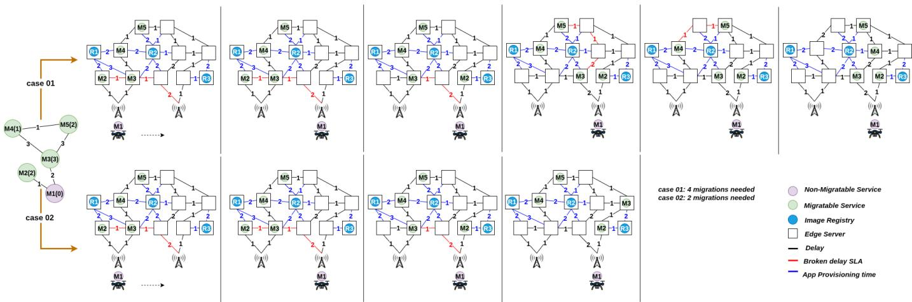
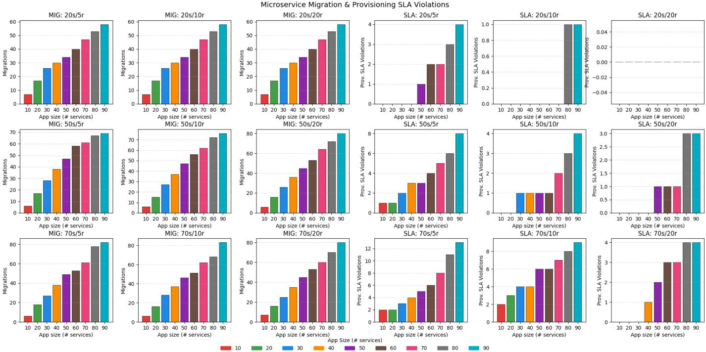
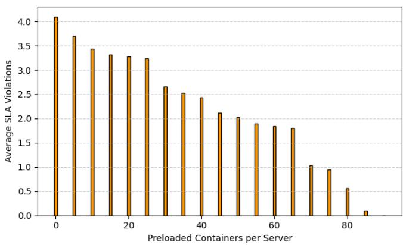

# Layer-Reuse Aware Optimization for Efficient Microservice Migration in UAV Edge Systems

Abd Elghani Meliani

Miloud Bagaa

Adlen Ksentini

Eurecom

Biot, France

UQTR University

Eurecom

Trois-Rivieres, Canada\`

meliani@eurecom.fr

Miloud.Bagaa@uqtr.ca

Biot, France

ksentini@eurecom.fr

Abstract—The integration of Unmanned Aerial Vehicles (UAVs) with edge computing enables latency-sensitive services such as real-time video analytics and object detection. However, UAV mobility causes frequent network changes, requiring efficient microservice migration to maintain Service Level Agreements (SLAs). Existing strategies often overlook the layered structure of containers and the impact of layer reuse on provisioning time. This paper introduces a layer-aware optimization model for microservice migration in UAV-assisted edge environments. Using an optimization solver, the model jointly minimizes provisioning time, the number of migrations, and SLA violations by considering Docker layer reuse, registry selection, and end-to-end latency constraints. It provides optimal placement decisions that serve as a reliable baseline for future heuristic and learning-based approaches. Experimental results in UAV mobility scenarios demonstrate that the proposed model significantly reduces provisioning overhead through intelligent, layer-aware placement.

Index Terms—Migration, Edge-Computing, Image Registries, Microservices, containers

## I. INTRODUCTION

Cloud computing has emerged as one of the most transformative technologies of the past two decades, allowing tenants to deploy applications on shared infrastructures while preserving isolation through virtualization. This foundation has evolved with the rise of container-based technologies, such as Docker for runtime execution and Kubernetes for orchestration. In parallel, application design has shifted from monolithic architectures to microservices, lightweight and modular components that simplify scalability, maintenance, and migration across heterogeneous environments. With the emergence of latency-sensitive applications such as video surveillance, augmented reality (AR), and virtual reality (VR), operators have been required to deploy certain services geographically closer to end users. This demand has led to the formalization of a new paradigm, known as edge computing, which extends computational resources to the edge of the network. The emergence of edge computing has introduced both opportunities and challenges. One major challenge lies in reusing cloud-based service and resource orchestrators within edge environments. This difficulty stems primarily from the high degree of dynamism characterizing edge infrastructures and the wide geographical distribution of edge services. Application migration remains a significant problem in edge computing, despite extensive research efforts. This is mainly due to two factors. First, most existing approaches to container migration treat containers similarly to virtual machines, disregarding their distinctive layered architecture. Unlike monolithic VM images, containers consist of multiple read-only layers, with a writable layer created at runtime for modifications. The base image layers remain shared, enabling containers on the same host to reuse common layers. Consequently, effective container migration strategies should prioritize targeting hosts that already store part of the container’s layers, thereby reducing provisioning time. Second, the growing adoption of microservice-based applications adds further complexity to migration in edge environments. Beyond the challenges of relocating individual containers, microservices must continue to satisfy stringent communication delay requirements defined in their SLAs after migration. Maintaining these guarantees significantly complicates the migration process. In this paper, we address the two previously discussed challenges in the specific context of UAVbased microservice applications. Such applications are increasingly used today for tasks such as video surveillance and object detection. The general concept involves UAVs equipped with lightweight computing devices to capture environmental data, which is then transmitted to microservices deployed at the edge for analysis. However, as the UAV moves, latency between its local microservices and those at the edge may exceed tolerated limits. In such cases, migration is required to relocate services closer to the UAV and preserve latency constraints. we propose a layer-aware optimization model for microservice migration in UAV-assisted edge environments. The model jointly minimizes provisioning time, the number of migrations, and SLA violations by considering Docker layer reuse, registry selection, and end-to-end delay constraints. It provides optimal placement decisions to serve as a solid baseline for future heuristic or learning-based solutions, as no prior work has addressed this problem holistically. We also provide a reproducible benchmarking setup and demonstrate the model’s effectiveness in UAV mobility scenarios, showing reduced latency and provisioning overhead through intelligent, layer-aware placement.

The remainder of this paper is organized as follows. Section II reviews related work on microservice migration and edge computing. Sections III and IV presents the proposed optimization model, detailing the system assumptions and formulation. Section V describes the experimental setup and discusses the obtained results. Finally, Section VI concludes the paper and outlines directions for future research.

## II. RELATED WORK

When discussing service migration in general—and container migration in particular—the literature is rich, with approaches differing by vantage point and target use case. Meliani et al. focus on proactive lifecycle management for stateful microservices in multi-cluster environments, introducing a zero-touch management framework that integrates with Kubernetes to enable seamless cross-cluster migrations; while it explicitly considers microservice architectures, it does not exploit the layered nature of container images [1]. MAPER proposes a mobility-aware, energy-conscious strategy that corelocates registries and applications based on user mobility and server power profiles to jointly optimize delay, provisioning time, and energy [2]. In parallel, Ouyang et al. (“Follow Me at the Edge”) cast mobility-aware placement as a Markov decision process and apply Lyapunov optimization and gametheoretic tools to minimize long-term delay and migration cost while preserving QoS; however, services are modeled monolithically and microservice-level concerns remain out of scope in [2] and [3] . A complementary thread addresses provisioning delay via registry control: Knob et al. place registries near communities of edge sites to shorten pull paths [4]; Roges and Ferreto elastically add or remove registries in response to demand [5]; and Temp et al. migrate registries according to user movements to improve responsiveness [6]. Despite these advances, migrating applications—especially microservices with state deltas and layered image reuse—can be preferable to migrating registries, which requires synchronizing large image repositories and thus incurs higher bandwidth and energy costs. To the best of our knowledge, our work is the first to optimize migration for containerized microservice applications under highly dynamic edge scenarios such as UAV use cases, jointly accounting for mobility, latency SLAs, and layer-aware provisioning.

## III. PROBLEM FORMULATION

We model UAV-based edge applications as a weighted graph $\mathcal { G } _ { a p p } = ( M , \mathcal { E } , W , \lambda )$ , where M is the set of microservices, $\mathcal { E }$ the communication links, $W _ { u , v }$ the tolerated latency between microservices u and v, and $\lambda _ { u , v }$ the packet arrival rate from u to v. Each microservice $u \in M$ is defined by its container layers $L _ { u } ,$ , a provisioning time bound $B _ { u }$ , and a boolean $O _ { u }$ indicating migratability (non-migratable ones typically run on UAVs). The infrastructure is represented as a weighted directed graph $\mathcal { G } _ { i n f r a } = ( V , E , C )$ , where V is the set of edge servers, E the communication links, and $C _ { i , j }$ the link capacities. Since edge servers are geographically distributed, multiple image registries may exist $( R \subseteq V )$ to reduce provisioning time. Each server $i \in V$ is characterized by its stored layers $H _ { i }$ and a binary flag $S _ { i }$ indicating if it hosts a registry. The deployment cost of a microservice v on server i using registry $r ,$ denoted $\psi _ { i , r } ^ { v } ,$ , is zero if all layers of v already exist on i; otherwise, it depends on the distance to r and the number of missing layers.

We define $\varphi _ { i , v } = 1$ if at least one layer of v is missing on $i ,$ and 0 otherwise. Figure 1 illustrates the model. Purple nodes denote non-migratable services, and edge weights represent tolerated latencies. Our objective is threefold: (i) minimize latency SLA violations via optimized migrations, (ii) minimize provisioning time violations by balancing registry proximity and cached layers, and (iii) minimize the total number of migrations. The figure compares two scenarios—one with four migrations and multiple SLA violations, and another achieving compliance with only two migrations.

## IV. PROBLEM MODELIZATION

## A. Delay SLA Violation

The objective of this work is to design and implement a solution that optimizes container migration while satisfying microservice delay and provisioning SLAs. The first step is to model the effective application delay. We define the endto-end delay between any two microservices $( u , v ) \in \mathcal { E }$ . Let $\mathcal { P } _ { u , v }$ be the path used to route traffic between them, composed of multiple links $( i , j ) \in E$ . The aggregate arrival rate $\Lambda$ is expressed as:

$$
\Lambda _ { i , j } = \sum _ { \forall ( u , v ) \in \mathcal { E } \wedge ( i , j ) \in \mathcal { P } _ { u , v } } \lambda _ { u , v }
$$

Let L denote the packet size, $s _ { i , j }$ the propagation delay between nodes i and $j ,$ and $v _ { i , j }$ the transmission speed depending on the medium (e.g., optical fiber or wireless). The processing delay per packet is denoted by $D _ { \mathrm { p r o c e s s i n g } }$ . The effective delay $D _ { e f f }$ considering transmission, propagation, processing, and queuing delays can be modeled as follow:

$$
\begin{array} { r l } { \forall ( i , j ) \in E : } & { D _ { e f f } ^ { i , j } = D _ { T r a n s m i s s i o n } + D _ { P r o p a g a t i o n } } \\ & { \phantom { \forall \dag } + D _ { Q u e u e } + D _ { P r o c e s s i n g } } \\ & { \phantom { \forall \dag } = \frac { L } { C _ { i , j } - \Lambda _ { i , j } \times L } + \frac { d _ { i , j } } { S _ { i , j } } + D _ { p r o c e s s i n g } } \end{array}
$$

Then, the end to end delay can be modelted as follows:

(1)

$$
\begin{array} { l } { \displaystyle { D _ { e 2 e } ^ { u , v } = \sum _ { ( i , j ) \in \mathcal { P } _ { u , v } } D _ { e f f } ^ { i , j } } } \\ { = \displaystyle { \sum _ { ( i , j ) \in \mathcal { P } _ { u , v } } \left( \frac { L } { C _ { i , j } - \Lambda _ { i , j } \times L } + \frac { d _ { i , j } } { s _ { i , j } } + D _ { p r o c e s s i n g } \right) } } \end{array}\tag{2}
$$

Our solution, besides placing and relocating the services,   
defines the path $\mathcal { P } _ { u , v }$ between any two microservices. We   
define $\mathcal { X } _ { i , j } ^ { u , v }$ as a boolean variable indicating if link $( i , j ) \in E$ $\begin{array} { r } { { \mathscr { P } } _ { u , v } \colon { \boldsymbol { \mathcal { X } } } _ { i , j } ^ { u , v } = \left\{ \begin{array} { l l } { 1 } & { } \\ { 0 } \end{array} \right. } \end{array}$ if link $( i , j )$ is used in $\mathcal { P } _ { u , v } ,$   
is used in otherwise.

Similarly, $y _ { u , i }$ indicates whether microservice $u \in M$ is $i \in V \colon \mathcal { V } _ { u , i } = \left\{ \begin{array} { l l } { 1 } \\ { 0 } \end{array} \right.$ if u is hosted on $i ,$ hosted on edge otherwise.

Let $R \subseteq V$ be the set of edges hosting registries. Each edge $i \in V$ uses a registry $r \in R$ to fetch missing layers for launching a microservice $v \in M$ . We define $\chi _ { i , r } ^ { v }$ as: $\chi _ { i , r } ^ { v } = \left\{ { 1 \atop 0 } \right.$ if edge i uses registry r to fetch layers of $v ,$ otherwise.

  
Fig. 1. Overview of UAV microservice migration problem.

1) Path Definition between micro-services and Loop Avoidance: Each microservice $v \in M$ must be hosted on exactly one edge, expressed as:

$$
\forall v \in M : \quad \sum _ { i \in V } \mathcal { V } _ { v , i } = 1\tag{3}
$$

The traffic of a microservice u with destination v should originate from the edge hosting u, i.e., if $\mathcal { D } _ { u , i } = 1$ , then at least one outgoing link $( i , j )$ must be active. To linearize this condition, we introduce the following constraints:

$$
\forall ( u , v ) \in \mathcal { E } , \forall i \in V : \quad \mathcal { V } _ { u , i } \leq \mathcal { A } \sum _ { j \in \eta ( i ) } \mathcal { X } _ { i , j } ^ { u , v } , \quad \sum _ { j \in \eta ( i ) } \mathcal { X } _ { i , j } ^ { u , v } \leq 1\tag{4}
$$

where $\eta ( i )$ denotes the neighbors of node i in $\mathcal { G } _ { i n f r a }$ , and $\mathcal { A }$ is a large constant $( A \gg 1 )$ .

We also ensure that the traffic of a microservice u destined to v arrives at the edge hosting v. If $\mathcal { V } _ { v , j } = 1$ , at least one incoming link $( i , j )$ must be active. To linearize this condition, we define:

$$
\forall ( u , v ) \in \mathcal { E } , \forall j \in V : \quad \mathcal { V } _ { v , j } \leq \mathcal { A } \sum _ { i \in \eta ( j ) } \mathcal { X } _ { i , j } ^ { u , v } , \quad \sum _ { i \in \eta ( j ) } \mathcal { X } _ { i , j } ^ { u , v } \leq 1\tag{5}
$$

where $\eta ( j )$ denotes the neighbors of $j$ in $\mathcal { G } _ { i n f r a }$ , and A is a large constant $( A \gg 1 )$ .

To ensure that paths between u and v are continuous and loop-free, we define the following constraints. First, traffic generated at the source edge i hosting microservice u must not return to it, and traffic received at the destination edge hosting v must not be sent back. These conditions prevent loops at both ends:

$$
\forall ( u , v ) \in \mathcal { E } , \forall i \in V : \quad \sum _ { j \in \eta ( i ) } \mathcal { X } _ { j , i } ^ { u , v } \leq ( 1 - \mathcal { V } _ { u , i } ) \mathcal { A } ,\tag{6}
$$

To guarantee path continuity, each intermediate edge (neither source nor destination) must forward all received traffic to one of its neighbors. For each pair of microservices $( u , v ) \in \mathcal { E }$ and each edge $i \in V$ , the original non-linear constraint is equivalently replaced by the following linear form:

For each pair $( u , v ) \in \mathcal { E }$ and each edge $i \in V$ , enforce:

$$
\begin{array} { r l } & { \displaystyle \sum _ { j \in \eta ( i ) } \chi _ { j , i } ^ { u , v } - \sum _ { j \in \eta ( i ) } \chi _ { i , j } ^ { u , v } \leq ( \mathscr { V } _ { u , i } + \mathscr { V } _ { v , i } ) \mathscr { A } , } \\ & { \displaystyle \sum _ { j \in \eta ( i ) } \chi _ { i , j } ^ { u , v } - \sum _ { j \in \eta ( i ) } \chi _ { j , i } ^ { u , v } \leq ( \mathscr { V } _ { u , i } + \mathscr { V } _ { v , i } ) \mathscr { A } . } \end{array}\tag{7}
$$

Here, $\eta ( i )$ denotes the neighbors of node i in $\mathcal { G } _ { i n f r a }$ , and A is a large constant $( A \gg 1 )$ .

2) Latency Constraint Across Microservices: For each link $( i , j ) \in E$ , the aggregate arrival rate is defined as

$$
\Lambda _ { i , j } = \sum _ { ( u , v ) \in \mathscr { E } } \lambda _ { u , v } \mathscr { X } _ { i , j } ^ { u , v }
$$

For each pair of microservices $( u , v ) \in \mathcal { E }$ , the end-to-end delay is expressed as:

$$
D _ { e 2 e } ^ { u , v } = \sum _ { ( i , j ) \in E } \left( \frac { L } { C _ { i , j } - \Lambda _ { i , j } L } + \frac { d _ { i , j } } { v _ { i , j } } + D _ { \mathrm { p r o c e s s i n g } } \right) \mathcal { X } _ { i , j } ^ { u , v } .\tag{8}
$$

Equation (8) involves two optimization variables, $\mathcal { X } _ { i , j } ^ { u , v }$ and $\Lambda _ { i , j }$ , making it non-linear. It can be decomposed as follows:

$$
\begin{array} { r l } { \forall ( u , v ) \in \mathcal { E } : } & { D _ { e 2 e } ^ { u , v } = \underset { ( \underbrace { i , j ) \in E } } { \sum } \left( \frac { d _ { i , j } } { v _ { i , j } } + D _ { \mathrm { p r o c e s s i n g } } \right) \mathcal { X } _ { i , j } ^ { u , v } } \\ & { + \underset { ( \underbrace { i , j ) \in E } } { \sum } \frac { L } { C _ { i , j } - \Lambda _ { i , j } L } \mathcal { X } _ { i , j } ^ { u , v } \ . } \end{array}\tag{9}
$$

While part (9.a) is linear, part (9.b) is not. For stability, $\Lambda _ { i , j }$ must satisfy $0 \le \Lambda _ { i , j } \le C _ { i , j }$ . We linearize (9.b) using a piecewise approximation of the inverse term.

For each $( i , j ) \in E$ , let $\Delta \ = \ \operatorname* { m i n } _ { ( u , v ) \in \mathcal { E } } \lambda _ { u , v }$ be the breakpoint interval, $\mathcal { N } _ { i , j } ^ { \Delta } = \lfloor C _ { i , j } / \Delta \rfloor$ the number of intervals, and $\psi _ { i , j } ^ { k } ~ = ~ \Delta k ~ ( { k } ^ { \mathrm { ~ ~ } } = ~ \bar { 0 } , . . . , \mathcal { N } _ { i , j } ^ { \Delta } )$ the breakpoints. We introduce a binary variable $\mu _ { i , j } ^ { k }$ indicating which interval is active. The following linear constraints relate the total arrival rate to the selected interval:

$$
\forall ( i , j ) \in E : \quad \sum _ { ( u , v ) \in \mathcal E } \lambda _ { u , v } \ : \mathcal X _ { i , j } ^ { { \boldsymbol \omega } , v } \leq \sum _ { k = 0 } ^ { \mathcal N _ { i , j } ^ { \Delta } } \psi _ { i , j } ^ { k } \mu _ { i , j } ^ { k } , \qquad \sum _ { k = 0 } ^ { \mathcal N _ { i , j } ^ { \Delta } } \mu _ { i , j } ^ { k }\tag{10}
$$

For each $( u , v ) \in \mathcal { E }$ and $( i , j ) \in E ,$ , if a link (i, j) is used to route traffic, one interval must be selected:

$$
\mathcal { X } _ { i , j } ^ { u , v } = 1 \implies \sum _ { k = 1 } ^ { \mathcal { N } _ { i , j } ^ { \Delta } } \mu _ { i , j } ^ { k } = 1 .\tag{11}
$$

The nonlinear component (9.b) is then replaced with the following linear formulation:

$$
\forall ( i , j ) \in E : \quad \mathcal { B } = \sum _ { k = 1 } ^ { \mathcal { N } _ { i , j } ^ { \Delta } } \frac { L } { C _ { i , j } - L \psi _ { i , j } ^ { k } } \mu _ { i , j } ^ { k } ,\tag{12}
$$

where $\mu _ { i , j } ^ { k }$ are binary variables.

Substituting (12) into (9), the linearized end-to-end delay is obtained as:

$$
\begin{array} { r l } { \forall ( u , v ) \in \mathcal { E } : \ } & { D _ { e 2 e } ^ { u , v } = \displaystyle \sum _ { ( i , j ) \in E } \Big ( \frac { d _ { i , j } } { v _ { i , j } } + D _ { \mathrm { p r o c e s s i n g } } \Big ) \mathcal { X } _ { i , j } ^ { u , v } } \\ & { \qquad + \displaystyle \sum _ { ( i , j ) \in E } \displaystyle \sum _ { k = 1 } ^ { N _ { i , j } ^ { \Delta } } \frac { L } { C _ { i , j } - L \psi _ { i , j } ^ { k } } \mu _ { i , j } ^ { k } . } \end{array}\tag{13}
$$

For each pair $( u , v ) \in \mathcal { E } ,$ we define a boolean variable $z _ { u , v }$ such that $z _ { u , v } = 1$ if $D _ { e 2 e } ^ { u , v } \ge W _ { u , v }$ , and $z _ { u , v } = 0$ otherwise. This condition is enforced by the following linear constraints:

$$
\begin{array} { r l } { \forall ( u , v ) \in \mathcal { E } : } & { D _ { e 2 e } ^ { u , v } \leq W _ { u , v } + z _ { u , v } \mathcal { A } , } \\ & { W _ { u , v } < D _ { e 2 e } ^ { u , v } + ( 1 - z _ { u , v } ) \mathcal { A } , } \end{array}\tag{14}
$$

where A is a large constant (A ≫ 1).

B. Selecting Registries for Microservices and Provisioning Time SLA Violation

In what follows, we define the cost function for microservice relocation. Let $\zeta _ { v }$ be a continuous variable representing the total relocation and deployment cost of microservice v:

$$
\forall v \in M : \quad \zeta _ { v } = \sum _ { i \in V } \sum _ { r \in R } \psi _ { i , r } ^ { v } \chi _ { i , r } ^ { v } .\tag{15}
$$

The variable $\chi _ { i , r } ^ { v }$ indicates whether the registry r is used by edge i to retrieve missing layers of $v .$ Its value is determined by the following constraints.

First, $\chi _ { i , r } ^ { v }$ must be zero if v is not hosted on edge i:

$$
\forall i \in V , v \in M , r \in R : \quad \chi _ { i , r } ^ { v } \leq \mathcal { V } _ { v , i } .\tag{16}
$$

Second, $\chi _ { i , r } ^ { v }$ must also be zero if all layers of v already exist on i:

$$
\forall i \in V , v \in M , r \in R : \quad \chi _ { i , r } ^ { v } \leq \varphi _ { i , v } .\tag{17}
$$

If v is hosted at edge i and at least one layer is missing, = 1.then at least one registry must be used:

$$
\forall i \in V , v \in M : \quad \sum _ { r \in R } \chi _ { i , r } ^ { v } \geq \varphi _ { i , v } \mathcal { V } _ { v , i } .\tag{18}
$$

Finally, only one registry can be used to retrieve the missing layers:

$$
\forall i \in V , v \in M : \quad \sum _ { r \in R } \chi _ { i , r } ^ { v } \leq 1 .\tag{19}
$$

Let $\mathcal { T } _ { v }$ be a boolean variable indicating whether the relocation time $\zeta _ { v }$ exceeds the tolerated delay $B _ { u } ~ ( T _ { v } ~ = ~ 1 ~ $ if $\zeta _ { v } \geq B _ { u } , 0$ otherwise). This condition is enforced through:

$$
\begin{array} { r l } { \forall v \in M : } & { \zeta _ { v } \leq B _ { u } + T _ { v } \mathcal { A } , } \\ & { B _ { u } < \zeta _ { v } + ( 1 - T _ { v } ) \mathcal { A } , } \end{array}\tag{20}
$$

where A is a large constant $( A \gg 1 )$

## C. Number of Microservice Relocation

Let $\mathcal { V } _ { \ i , u } ^ { \prime }$ be a parameter that defines if the microservice $v \in M$ was hosted in the edge $i \in V$ in the previous period.

$$
\mathcal { V } _ { \upsilon , i } ^ { \prime } = \left\{ { \begin{array} { l l } { 1 } & { \mathrm { i f } \ \upsilon \mathrm { ~ w a s ~ o n ~ e d g e } \ i } \\ { 0 } & { \mathrm { o t h e r w i s e } } \end{array} } \right.\tag{21}
$$

We aim to optimize the number of relocations, whereby we try to move the microservices only when it is needed. Let $\phi _ { v } .$ for $v \in M ,$ a decision boolean variable that shows if the microservice has changed its edge. We define the following two constraints:

$$
\forall u \in M , \forall i \in V : \mathcal { V } _ { v , i } - \mathcal { V } ^ { \prime } { } _ { v , i } \leq \phi _ { v }\tag{22}
$$

$$
\forall u \in M , \forall i \in V : \phi _ { v } \leq 2 - \mathcal { V } _ { v , i } - \mathcal { V ^ { \prime } } _ { v , i }\tag{23}
$$

## D. Final Optimization

We adapt the weighted sum method to resolve the multiobjectives optimization problem. Let $\alpha , \beta$ and γ the weights of the optimization problem, such that $\alpha + \beta + \gamma = 1$

Let α

$$
\operatorname* { m i n } \ \frac { 1 } { | M | } \times ( \alpha \times \sum _ { v \in M } \mathcal { T } _ { v } + \beta \times \sum _ { v \in M } \phi _ { v } ) + \frac { \gamma } { | \mathcal { E } | } \sum _ { ( u , v ) \in \mathcal { E } } z _ { u , v }
$$

subject to

(3), (4), (5), (6), (7), (10), (13), (14), (15)

(16), (17), (18), (19),(20), (22), and (23).

## V. EXPERIMENTS AND RESULTS

## A. Experimental Setup

To evaluate the proposed optimization model, we conducted an extensive set of experiments using the Gurobi solver [7] to efficiently solve the mixed-integer programming formulation of the migration problem. The results presented correspond to the average values over 1000 independent repetitions for each configuration, ensuring statistical robustness. In all experiments, the application graphs were generated from the 100 most downloaded Docker Hub images, where the number of microservices in each experiment corresponds to the number of selected images (e.g., an application of size 10 is composed of the 10 most downloaded images, size 20 of the top 20, and so forth). Each microservice is characterized by its image layers, its allowed provisioning time, and traffic arrival rate ranging from 10 to 1000 packets per second, while tolerated latencies between services vary from 10 ms to 500 ms. Both the application and infrastructure graphs were designed to have at least one and at most three links per node, guaranteeing connectivity without over-saturation. The infrastructure graph emulates a realistic edge environment with link distances of up to 20 km, link speeds between 12.5 MB/s and 125 MB/s, and link capacities within the same range. In every application graph, one microservice was designated as nonmigratable, representing the component running on a UAV, and was randomly selected among all microservices.

1) Test-1: Impact of Application and Infrastructure Scale on Migration and SLA Violations: The first experiment aims to study the effect of varying the application size, the number of registries, and the size of the infrastructure on the number of migrations and the number of provisioning-time SLA violations. For this purpose, we varied the number of microservices from 10 to 90 (step 10), the number of servers among 20, 50, 70, and the number of registries among 5, 10, 20. In this test, no cached layers were pre-loaded on servers to ensure independence between runs, and the initial allocation of microservices to edge servers was randomized.

2) Test-2: Effect of Cached Layers on Provisioning-Time SLA Violations: The second experiment investigates the impact of cached layers on provisioning-time SLA violations by fixing the infrastructure (30 servers and 5 registries) and the application (90 microservices) while varying the number of pre-loaded containers per server from 0 to 90 in increments of 5. In this case, a random subset of images was cached on each server for every repetition to simulate heterogeneous caching conditions.

Across both experiments, all models were solved using Gurobi with a time limit of 60 seconds, and results were averaged over successful runs to quantify the influence of system parameters—such as caching, registry distribution, and infrastructure size—on migration frequency and provisioning SLA performance.

## B. Results And Discussions

Figure 2 shows the results of the first experiment, which analyzes the impact of application size, number of image registries, and infrastructure scale on the number of migrations and provisioning-time SLA violations. Each row corresponds to a different infrastructure size (20, 50, and 70 servers), and each column pair displays the average number of migrations (MIG) and SLA violations (SLA) for registry configurations of 5, 10, and 20. The x-axis indicates the application size (10–90 microservices), while the y-axis reports the corresponding averaged values over 100 repetitions. The left panels show the total number of migrations, and the right panels present the provisioning-time SLA violations after optimization. The results in Figure 2 show that increasing the number of image registries significantly reduces provisioning-time SLA violations, reaching zero when each server hosts a registry (20s/20r). As the application size grows, the number of violations increases due to more inter-service dependencies and provisioning requests. The number of migrations, however, is not influenced by the number of registries but rises with the infrastructure size, as larger infrastructures offer more placement options for optimization. Overall, registry distribution mainly affects provisioning efficiency, while infrastructure scale drives migration activity.

Figure 3 illustrates the results of the second experiment, showing the average number of provisioning-time SLA violations as a function of the number of preloaded containers per server. As observed, the number of violations decreases steadily as more container images are cached in advance, since the likelihood of finding required layers locally increases. When servers already host all container layers (case of 90 preloaded containers), no SLA violations occur because provisioning no longer depends on remote transfers. This trend highlights an important property of the system: as drones move across regions, the number of violations may initially be high, but it gradually decreases after several iterations as servers accumulate cached layers from previous deployments, thus improving overall provisioning performance.

## VI. CONCLUSION

This paper presented a layer-aware optimization model for microservice migration in UAV-assisted edge environments. The model jointly minimizes the number of migrations, delaybased and provisioning-time SLA violations by accounting for Docker layer reuse, registry selection, and end-to-end latency constraints. To the best of our knowledge, this is the first work to explicitly integrate the layered structure of containers into a migration optimization framework, providing a strong baseline for future works in the field. Our experiments focused on two main metrics—the number of migrations and provisioningtime SLA violations—as they best demonstrate the efficiency of the proposed model. In future work, we plan to extend the evaluation to include additional performance metrics, such as execution time and extend the model to include other objectives such as minimizing energy consumption, and to compare our results against heuristic and learning-based strategies that we are developing.

  
Fig. 2. Average number of migrations and provisioning-time SLA violations for varying application sizes, registry counts, and infrastructure scales.

  
Fig. 3. Average number of provisioning-time SLA violations versus the number of preloaded containers per server

## ACKNOWLEDGMENT

This work is partially supported by the European Union’s Horizon Program under the 6G-Intense projects (Grant No. 101139266).

## REFERENCES

[1] A. E. Meliani, M. Mekki, and A. Ksentini, “Resiliency focused proactive lifecycle management for stateful microservices in multi-cluster containerized environments,” Computer Communications, vol. 236, p. 108111, 2025. [Online]. Available: https://www.sciencedirect.com/science/article/pii/S0140366425000684

[2] D. C. Temp, A. A. F. da Costa, A. N. C. Vieira, E. S. Oribes, I. M. L. Jr., P. S. S. de Souza, M. C. Luizelli, A. F. Lorenzon, and F. D. Rossi, “Maper: Mobility-aware energy-efficient container registry migrations for edge computing infrastructures,” The Journal of Supercomputing, vol. 81, no. 1, p. 15, 2025, published 17 October 2024; article number 15.

[3] T. Ouyang, Z. Zhou, and X. Chen, “Follow me at the edge: Mobilityaware dynamic service placement for mobile edge computing,” IEEE Journal on Selected Areas in Communications, vol. 36, no. 10, pp. 2333– 2345, 2018.

[4] L. A. Dias Knob, F. Faticanti, T. Ferreto, and D. Siracusa, “Communitybased placement of registries to speed up application deployment on edge computing,” in 2021 IEEE International Conference on Cloud Engineering (IC2E), 2021, pp. 147–153.

[5] L. Roges and T. Ferreto, “Dynamic provisioning of container registries in edge computing infrastructures,” in Proceedings of the Symposium on High Performance Computing Systems (WSCAD). Symposium on High Performance Computing Systems (WSCAD), 2023, pp. 85–96. [Online]. Available: https://sol.sbc.org.br/index.php/sscad/article/view/26511

[6] D. C. Temp, P. S. S. de Souza, A. F. Lorenzon, M. C. Luizelli, and F. D. Rossi, “Mobility-aware registry migration for containerized applications on edge computing infrastructures,” Journal of Network and Computer Applications, vol. 217, p. 103676, 2023. [Online]. Available: https://www.sciencedirect.com/science/article/pii/S1084804523000954

[7] L. Gurobi Optimization, Gurobi Optimizer Reference Manual, 2024. [Online]. Available: https://www.gurobi.com