# Learning-Assisted Dynamic VNF Selection and Chaining for 6G Satellite-Ground Integrated Networks

Jianxin Zhang , Qiang Ye , Senior Member, IEEE, Kaige Qu , Member, IEEE, Yanglong Sun , Member, IEEE, Yuliang Tang , Member, IEEE, Dongmei Zhao , Senior Member, IEEE, and Tong Ye, Member, IEEE

Abstract—The sixth generation (6G) mobile communication system is expected to provide global seamless network coverages, where a satellite-ground integrated network (SGIN) is seen as one of the typical 6G networking paradigms. In this paper, a dynamic virtual network function (VNF) selection and chaining (DVSC) problem in an SGIN is investigated. We aim to balance the network resource provisioning and VNF migration costs with service performance gain to maximize the long-term network profit. Specifically, we formulate the DVSC problem as a Markov decision process (MDP), by taking into consideration the heterogeneity and time-varying nature of SGINs. A novel VNF selection and chaining scheme is proposed, where a deep Q-learning (DQL) algorithm is designed to dynamically determine a set of VNF selection and chaining policies (VSCPs) based on the evolving network states (e.g., network resources, network topology, and network traffic load). Furthermore, to elaborate the level of computing resource sharing of VSCP sets, a new sharing ratio (SR) is proposed. To efficiently allocate heterogeneous network resources, the action space is built by clustering the historical records of the network load and selecting the VSCP set for each cluster in a greedy manner. Extensive simulation results are presented to demonstrate the effectiveness of the proposed framework in comparison with the state-of-the-art schemes.

Index Terms—6G, deep reinforcement learning, NFV, satelliteground integrated networks, SDN, service function chaining.

# I. INTRODUCTION

T HE sixth generation (6G) mobile communication systems are envisioned to extend wireless communication cover-

Received 21 November 2023; revised 10 March 2024; accepted 28 August 2024. Date of publication 30 September 2024; date of current version 16 January 2025. This work was supported in part by the National Natural Science Foundation of China under Grant 91638204. The review of this article was coordinated by Dr. Tomaso De Cola. (Corresponding author: Yuliang Tang.)

Jianxin Zhang, Yuliang Tang, and Tong Ye are with the School of Informatics, Xiamen University, Xiamen 361102, China (e-mail: zjxxmu@stu.xmu.edu.cn; tyl@xmu.edu.cn; tongyy@stu.xmu.edu.cn).

Qiang Ye is with the Department of Electrical and Software Engineering, University of Calgary, Calgary, AB T2N 1N4, Canada (e-mail: qiang.ye@ucalgary.ca).

Kaige Qu is with the Department of Electrical and Computer Engineering, University of Waterloo, Waterloo, ON N2L 3G1, Canada (e-mail: k2qu@uwaterloo.ca).

Yanglong Sun is with the Navigation College, Jimei University, Xiamen 361021, China (e-mail: ylsun4work@gmail.com).

Dongmei Zhao is with the Department of Electrical and Computer Engineering, McMaster University, Hamilton, ON L8S 4K1, Canada (e-mail: dzhao@mcmaster.ca).

Digital Object Identifier 10.1109/TVT.2024.3454438

ages from cities to remote areas, such as oceans, deserts, and forests, providing global seamless coverages and ubiquitous connectivities. However, existing terrestrial communication networks cover about 20 percent of all terrestrial areas over the globe, less than 6 percent of the entire earth surface, leaving a huge gap for achieving global coverages [1]. Satellite communication remains a good option to extend the communication coverage, and has been regarded as one of the important components for 6G. One promising networking architecture for 6G is to integrate ground networks with satellites to form a satelliteground integrated network (SGIN), which can provide extended communication services towards users in remote areas and meet responsive user requirements in emerging 6G applications, such as immersive online education, logistics tracking, and remote data collection [2].

In an SGIN, a flexible and efficient resource management framework is expected to coordinate the allocation of heterogeneous network resources (e.g., computing and communication resources) from different network segments (i.e., satellite network segment and ground network segment). Network function virtualization (NFV) and software-defined networking (SDN) are recognized as two potential technologies to improve resource allocation efficiency and realize the integration of satellites with ground networks [3], [4], [5]. Through NFV, network functions, e.g., intrusion detection system (IDS) and network address translation (NAT), are decoupled from conventional function-specific middleboxes and softwarized as virtual network functions (VNFs) hosted at generic commodity servers. To ensure efficient end-to-end (E2E) data delivery, SDN is leveraged to decouple the control plane from the data plane to realize a centralized network control, with packet forwarding rules configured at each software programmable switch via the Openflow protocol [6]. Based on NFV and SDN, an E2E service can be flexibly supported in an SGIN by forming a service function chain (SFC) which comprises a sequence of VNFs interconnected by virtual links in a predefined order. These VNFs can be flexibly instantiated and executed on heterogeneous network elements (e.g., satellites and ground nodes) in the SGIN by an NFV orchestrator (NFVO), which is often integrated with the SDN controller and placed in a logically centralized location for VNF placement and flow routing.

To improve the service performance in a cost-effective way, we need to determine the optimal VNF selection and chaining policy (VSCP) for each SFC which consists of VNF selection and virtual link mapping decisions. The VNF selection is to map VNFs in an SFC to the nodes installed with corresponding VNF instances to process traffic, and the virtual link mapping is to allocate physical transmission resources to virtual links to interconnect the selected VNF instances. A VSCP can steer a traffic flow through multiple VNFs in a predefined order to fulfil a composite service in E2E data delivery.

The dynamic VNF selection and chaining (DVSC) problem in the fifth generation (5G) mobile communication systems has been extensively investigated [7], [8], [9], [10], [11], [12]. These works mainly study an SFC mapping problem in traditional wired networks, where ground networks are operated independently to support the 5G services. Different from the 5G networks, in SGINs, VNFs and virtual links are mapped to heterogeneous network nodes (e.g., satellites and ground nodes) and communication links. Satellites can steer traffic flows to earth station (ES) for using the VNF instances installed at ground nodes, and improve network computing capacity by deploying VNFs to satellites. Ground nodes can utilize abundant computing resources to host computation intensive VNFs (e.g., image rendering) and process packets from multiple flows on shared VNF instances. Meanwhile, satellite movements may lead to SFC mapping decision changes which also needs to be taken into consideration. Therefore, an SFC mapping problem in 6G SGINs should be studied by taking into consideration the heterogeneity and time-varying features of the SGINs, which would lead to new technical challenges for dynamic VNF selection and chaining.

First, an SGIN is heterogeneous consisting of different network segments with complementary characteristics. Specifically, a satellite network segment can provide a global communication coverage with limited computation capacity and communication bandwidth, whereas a ground network segment may have sufficient computing and communication resources but with a restricted communication coverage. To save the computing resource provisioning cost, existing works focus on how to execute VNF instances at shared ground nodes, and on leveraging the satellite networks as a complementary solution to balance the network-wide computation load [13], [14]. To efficiently allocate heterogeneous network resources, existing studies extract differentiated network attributes (e.g., node computing resources, communication coverages, and link bandwidth resources) for different network segments and obtain VSCPs via matching between network resources and service demands [15], [16]. To improve service performance, more VNF instances may need to be executed. Satellite networks can leverage global communication coverages to route flows through VNF instances installed at different network locations [17], [18]. Given traffic rates of flows and network topology, the above works can obtain a near-optimal SFC mapping scheme for SGINs in terms of resource utilization efficiency or service performance. However, SFCs are remapped when traffic rates of flows or network topology change, which may lead to frequent VNF migrations. Considering a more practical scenario with diverse traffic flows and dynamic traffic rates, we need to investigate how a VSCP set can be dynamically determined over sequential time slots to make use of the complementary advantages of different network segments in SGINs and how to balance the network resource provisioning and VNF migration costs with service performance.

Second, SGIN topology varies with time due to satellite movements. It leads to the connection may need to be switched among different satellites and variations in the traffic routing path over time [19]. In [20], [21], [22], authors use the timevarying graphs to describe the topology evolution of the satellite network where a sequence of discrete time intervals is considered, with a fixed topology assumed in each interval, and VNF placement and routing decisions are calculated at each topology snapshot. As satellite movements, the above approach requires many topology snapshots to describe the changing network topology and increases the complexity of algorithms. The virtual node (VN) approach is used to divide the Earth’s surface into cells and assign an accessible satellite for each cell based on geodetic positions of the subsatellite points, and the routing path is calculated based on the segment routing approach [23]. Nevertheless, the VNF selection and chaining decision updates still need to be further studied when topological changes. In this paper, we characterize the topological changes between the satellite network segment and the ground network segment over sequential time slots, and design VSCPs consisting of multiple SFC mapping decisions to adapt to the changing network topology.

To deal with the aforementioned issues for dynamic service provisioning in SGINs, in this paper, we present a deep Qlearning (DQL) based dynamic VNF selection and chaining framework for an SGIN. We investigate how to determine the VSCP set in a heterogeneous and time-varying SGIN with dynamic network traffic load. The main contributions are as follows:

- An SDN/NFV-based SGIN architecture is established to support ubiquitous services such as immersive online education for users in remote areas and cities, in which a sequence of VNFs in an SFC are traversed in a predefined order based on a VSCP in a time-varying SGIN topology.   
- A DVSC problem in an SGIN is formulated as a Markov decision process (MDP) to capture the relation between network state and VSCP set. The objective is to balance the network resource provisioning and VNF migration costs with service performance gain to maximize the long-term network profit.   
- We use a VSCP set to represent a joint VNF selection and chaining policy of multiple flows. Furthermore, we propose a new sharing ratio (SR) to elaborate the level of computing resource sharing of VSCP sets. To efficiently allocate heterogeneous network resources, VNF selection and chaining policies are selected by the following steps: 1) distinguish network load levels by clustering the historical records of the network load, and 2) search the optimal VSCP set for different network loads in a greedy manner according to the network resource provisioning cost, service performance gain, and the value of SR. These selected VSCP sets constitute the action space, and a deep Q network (DQN) is trained to determine the VSCP set

based on the evolving network states to maximize the accumulative network profit.

The satellites covering the ground network segment are identified based on the VN approach. To guarantee the selected VSCP set is feasible with satellite movements, VSCP sets consisting of a sequence of VNF selection and chaining decisions are delivered to satellites covering the ground network segment.   
Extensive simulation results demonstrate that our proposed DQL based VNF selection and chaining algorithm outperforms baseline algorithms and approaches the performance upper bound. The proposed framework balances the resource provisioning and VNF migration costs with service performance gain in the presence of a dynamic network load.

The rest of the paper is organized as follows. Section II provides a literature review. The system model is presented in Section III. The VNF selection and chaining problem in SGINs is formulated in Section IV. In Section V, a DQL-based VNF selection and chaining algorithm is proposed. In Section VI, simulations are conducted to demonstrate the effectiveness of the proposed scheme, followed by the conclusions given in Section VII.

# II. RELATED WORK

SFC technology enables elastic service provisioning and reduces network operation cost, and has been widely used in 5G networks. SFC orchestration in NFV-based wireline networks is usually formulated as an integer linear programming (ILP) [7], [8], or mixed integer linear programming (MILP) problem [9], [10], and heuristic algorithms are proposed to optimize several parameters, such as embedding cost, network throughput, QoS, energy efficiency, etc. Besides, the SFC embedding problem is formulated as an MDP model, and deep neural network (DNN)-based [11] or graph-neural network (GNN)-based [12] approaches are utilized to efficiently make embedding decisions. The existing works focus on wired networks, mostly a single network segment consisting of ground nodes and wired links. SGINs, as one of the typical 6G network paradigms, consist of an integration of different network segments, including a satellite network segment and a ground network segment, where satellites and ground nodes have different features in coverage, dynamics, communication, and computing capacities [24], [25], [26].

There are some research works on VNF selection and chaining problems in SGINs in terms of supporting future wireless applications (e.g., immersive online education, remote driving and remote sensing). In [13], [14], the service chain instantiation problem in an SGIN is studied to improve resource utilization efficiency. A heuristic greedy algorithm is presented in [13], where a higher priority is allocated to ground networks to deploy VNFs to make full use of their computing resources. In [14], a related approach considering VNF multiplexing and SFC merging is proposed to save the network resource provisioning cost. Zhang et al. [15], [16] model the heterogeneous resource allocation in a space-air-ground integrated network (SAGIN) as a multi-domain SFC embedding problem. In [15], a deep reinforcement learning (DRL) method is proposed where the agent is a multi-layer policy network used to determine the SFC embedding strategy and the feature matrix is built by extracting the SAGIN resource attributes to provide an environment for agent training. In [16], an SAGIN architecture with service function chaining is established, and an SFC mapping algorithm based on delay prediction is proposed to meet the requirements for delay-sensitive services. Both works improve the efficiency and rationality of the allocation of heterogeneous network resources in SAGIN. To improve service performance, more computing and communication resources may need to be used. Satellite networks are seen as a good complement to ground networks in terms of providing additional communication and computing resources to increase the network capacity and coverage [17], [18]. In [17], a VNF instance scaling problem for SGINs is investigated, and an algorithm based on traffic forecasting is proposed to scale VNF instances where satellites can host some VNF instances to increase the network capacity. In [18], the authors study a bidirectional mission offloading problem for SDN/NFV-enabled SAGIN. A heuristic routing algorithm is proposed, where satellites act as relay nodes to route flows through VNF instances installed at different network locations to reduce the communication delay with fewer hops. The existing works can efficiently map SFCs under SGINs where the network traffic load and the network topology are considered relatively stable. However, the SFC mapping decisions would need to be re-determined when network state transitions happen (e.g., a link connection or network traffic load changes), which may result in VNF migrations. As a result, when the network environment changes more frequently, it will lead to an increase in VNF migration cost and a decrease in service performance. Different from the existing works, we aim to balance network resource provisioning and VNF migration costs with performance gain to maximize the long-term network profit.

Satellite movements result in SGIN topology variations, and the VNF selection and chaining decisions should be changed to adapt to the time-varying network topology. In [20], [21], [22], a time-varying graphs method is used to describe the changing network topology. In [20], a dynamic evolution of topology is described over discrete time slots, and a tabu search-based algorithm is proposed to determine the SFC mapping scheme for each static network topology. Further, considering the storage capacity of nodes, storage links are introduced to connect adjacent network topology instances, and the VNF deployment and routing policy can be performed across multiple time slots [21], [22]. More snapshots are needed to characterize the topological changes over time, which lead to more storage overhead and increased algorithm complexity. In [23], the VN method is used to divide the Earth’s surface into cells, and assign a satellite to each VN, where the routing path is divided into multiple segments by middle points, and satellites need only forward packets to the middle points. However, if a user changes its accessing satellite (i.e., satellite handover), the midpoints and routes need to be recalculated which increases the computational load on the controller. The dynamic VSCP that can adapt to SGIN topological changes still needs to be investigated.

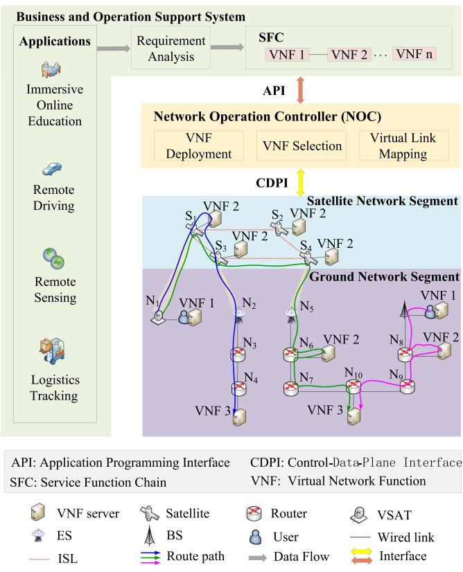

<details>
<summary>flowchart</summary>

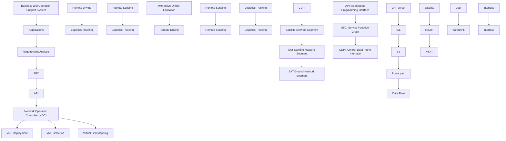
</details>

Fig. 1. An SDN/NFV enabled SGIN architecture.

# III. SYSTEM MODEL

We consider an SDN/NFV-enabled SGIN, as shown in Fig. 1. The satellite network segment is formed by interconnecting satellites, very-small-aperture-terminals (VSATs), and ESs, where VSATs provide bidirectional communication between end users and satellites using satellite-to-ground links (SGLs), ESs provide bidirectional communication between terrestrial infrastructures and satellites using SGLs, and satellites are interconnected via inter-satellite links (ISLs). The satellite network segment of an SGIN is modeled by using the satellite constellation for phase I of Starlink [27]. We consider two types of ISLs based on satellite locations within a constellation: intra-plane ISLs, which are established by satellites in the same orbit plane, and inter-plane ISLs, which are formed by satellites in adjacent orbit planes. Each satellite establishes four permanent ISLs with its neighboring satellites, including two intra-plane ISLs and two inter-plane ISLs [19]. The ground network segment is established through interconnecting base stations (BSs) and routers using wired links, where BSs provide network access for local end users, and routers are responsible for packet forwarding via wired links. Based on NFV/SDN technologies, VNFs can be flexibly deployed at the satellites, routers and end users, and the network operation controller (NOC) can monitor the network state and service requirements with a global view and enforce flow entries to programmable network nodes to improve traffic steering efficiency.

There can be multiple paths traversing a sequence of VNFs in a predefined order to provide service for end users at different

TABLE I SUMMARY OF IMPORTANT PARAMETERS 

<table><tr><td>Notations</td><td>Descriptions</td></tr><tr><td> $V_t$ </td><td>The set of physical nodes at slot  $t$ </td></tr><tr><td> $E_t$ </td><td>The set of physical links at slot  $t$ </td></tr><tr><td> $\mathcal{F}$ </td><td>The set of VNFs required by the service</td></tr><tr><td> $\mathcal{L}$ </td><td>The set of flows in network</td></tr><tr><td> $\pi_l$ </td><td>The SFC of flow  $l$ </td></tr><tr><td> $\mathcal{F}_l$ </td><td>The set of VNFs for SFC  $\pi_l$ </td></tr><tr><td> $E_l$ </td><td>The set of virtual links for SFC  $\pi_l$ </td></tr><tr><td> $a_{f_i}^v$ </td><td>The binary parameter that indicates whether VNF  $f_i$  is deployed at node  $v$ </td></tr><tr><td> $c_{f_i}^v$ </td><td>The packet processing rate of node  $v$  for VNF  $f_i$ </td></tr><tr><td> $B_t^{(v,u)}$ </td><td>The link transmission rate of link  $(v,u)$  at slot  $t$ </td></tr><tr><td> $f_{i,l}^{(j)}$ </td><td>The  $j^{th}$  VNF in SFC  $\pi_l$  and its function type is  $i$ </td></tr><tr><td> $\lambda_{l,t}$ </td><td>The packet arrival rate of flow  $l$  at slot  $t$ </td></tr><tr><td> $x_t^v\left(f_{i,l}^j\right)$ </td><td>The binary variable that indicates whether the VNF  $f_{i,l}^j$  is mapped to physical node  $v$  at slot  $t$ </td></tr><tr><td> $y_t^{(v,u)}\left(f_{i,l}^j,f_{i',l}^{j+1}\right)$ </td><td>The binary variable that indicates whether the virtual link  $\left(f_{i,l}^j,f_{i',l}^{j+1}\right)$  is mapped to physical link  $(v,u)$  at slot  $t$ </td></tr><tr><td> $D$ </td><td>The end-to-end delay requirement of the service</td></tr><tr><td> $D_{l,t}$ </td><td>The end-to-end delay of flow  $l$  at slot  $t$ </td></tr><tr><td> $\phi_{1,t}$ </td><td>The normalized computing resource provisioning cost at slot  $t$ </td></tr><tr><td> $\phi_{2,t}$ </td><td>The normalized communication resource provisioning cost at slot  $t$ </td></tr><tr><td> $\phi_{3,t}$ </td><td>The VNF migration cost at slot  $t$ </td></tr><tr><td> $R_t$ </td><td>The service performance gain at slot  $t$ </td></tr><tr><td> $\chi_t$ </td><td>The total network profit at slot  $t$ </td></tr></table>

TABLE II SUMMARY OF IMPORTANT ACRONYMS 

<table><tr><td>Acronyms</td><td>Descriptions</td></tr><tr><td>ANRPC</td><td>Accumulative network resource provisioning cost</td></tr><tr><td>ASPG</td><td>Accumulative service performance gain</td></tr><tr><td>CDPI</td><td>Control-data-plane interface</td></tr><tr><td>DDVSC</td><td>DRL-based dynamic VNF selection and chaining</td></tr><tr><td>DRL</td><td>Deep reinforcement learning</td></tr><tr><td>DVSC</td><td>Dynamic VNF selection and chaining</td></tr><tr><td>ISL</td><td>Inter-satellite link</td></tr><tr><td>NOC</td><td>Network operation controller</td></tr><tr><td>SFC</td><td>Service function chain</td></tr><tr><td>SGIN</td><td>Satellite-ground integrated network</td></tr><tr><td>SGL</td><td>Satellite-to-ground link</td></tr><tr><td>SR</td><td>Sharing ratio</td></tr><tr><td>VNF</td><td>Virtual network function</td></tr><tr><td>VSAT</td><td>Very-small-aperture-terminals</td></tr><tr><td>VSCP</td><td>VNF selection and chaining policies</td></tr></table>

locations (e.g., the blue arrow, the green arrow, and the pink arrow in Fig. 1). Note that due to the wide communication coverage of the satellite network segment, satellites can route flows to any location where an ES is deployed (e.g., the blue solid arrow and the green arrow in Fig. 1). Tables I and II summarize the important parameters, variables and acronyms.

# A. Network Model

In an SGIN, a VSAT can communicate with an ES through a satellite network segment. The accessing satellite from a VSAT is determined according to the longest link duration rule [28] and a traffic routing path is selected with the smallest hop-count [19]. In this regard, we focus on the satellites which are used to cover the ground network segment. Satellite movements result in a time-varying SGIN topology. Based on the VN approach [23], the satellite network segment is described as a virtual lattice grid consisting of interconnecting VNs. The size of a virtual lattice grid is determined according to the communication coverage of the satellite network segment. The satellites covering the ground network segment are identified as VNs in the virtual lattice grid. The actual satellite that is associated with a particular VN keeps changing, and the virtual lattice grid itself remains static to the ground network segment.

In addition, the NOC is deployed at the ground network segment which can steer traffic, activate/deactivate VNF instances, and migrate VNFs. For the satellites in the virtual lattice grid, the satellites periodically (e.g., every second) report their updated resource states (i.e., usage of links and satellites) and locations to the ESs, and the ESs forward this information to the NOC [29]. Furthermore, when the VNs are assigned to other satellites or NOC changes VSCPs, flow tables for traffic routing among satellites are updated and forwarded to the satellites via ESs. Meanwhile, NOC can monitor the resource states of the ground network segment (i.e., usage of links, BSs and routers) and deliver flow tables for traffic routing among ground nodes to routers and BSs by control-data-plane interfaces (CDPIs). Based on Fig. 1, the service establishment and maintenance process is described as follows: 1) users order the service from the business and operation support system (BOSS), which analyzes the user’s service requirements (e.g., required network functions, delay requirements, etc.) to form SFCs; 2) SFCs are submitted to the NOC via application programming interfaces (APIs), and the NOC deploys the required VNFs to routers and satellites based on the monitored the resource states of the SGIN, the network topology, and the network function type; 3) the NOC calculates flow tables for VNF selection and virtual link mapping, and delivers flow tables to satellites and routers via CDPIs.

Consider time $\tau$ is divided into $T$ time slots indexed by $1 , 2 , \ldots , T$ with fixed and identical length. Within a time slot t, the connections among nodes are assumed unchanged and the network topology is static. The SGIN at time slot t is modeled as an undirected graph $\mathcal { G } _ { t } = ( V _ { t } , E _ { t } )$ , where $V _ { t }$ represents the set of physical nodes and $E _ { t }$ represents the set of physical links interconnecting the nodes. We have $V _ { t } = V ^ { G } \cup V _ { t } ^ { S }$ , where $V ^ { G }$ is the set of ground nodes of SGIN including BSs, routers, VSATs and ESs, and $V _ { t } ^ { S }$ is the set of satellites in the virtual lattice grid at t. We also have $E _ { t } = E ^ { G } \cup E _ { t } ^ { S G } \cup E _ { t } ^ { S }$ , where $E ^ { G }$ is the set of wired links connecting ground nodes, $E _ { t } ^ { S }$ are the ISLs among satellites at t, and $E _ { t } ^ { S \bar { G } }$ is the set of SGLs at t. Define the link pointing from node v to node u as $( v , u ) \in E _ { t }$ , where we have $v , u \in V _ { t }$ . Due to satellite mobility, $V _ { t } ^ { \dot { S } } , E _ { t } ^ { S G }$ and $E _ { t } ^ { S }$ can change over consecutive time slots.

# B. Service Model

We consider an SGIN providing an immersive online education service which requires four VNFs $[ 2 ] ,$ [30]: movement capture, information fusion, logic programming, and image rendering. These VNFs are deployed at the heterogeneous network nodes in the SGIN. Specifically, movement capture function is responsible for capturing users’ movements, emotions, and facial expressions via immersion devices (e.g., XR headsets and motion sensors), which is deployed at the user terminals. Information fusion function is a lightweight network function deployed at the satellites and ground nodes and responsible for collecting cognitive data from immersion devices. Logic programming function is responsible for human-environment interaction computing that guarantees the virtual environment to react to users’ actions. Logic programming function needs to consume numerous computing resources, which is suitable to be deployed at the ground nodes. Image rendering function is responsible for modeling and refreshing the virtual environment, which needs to be deployed at the ground nodes with a high-performance processor.

The set of VNFs required by the education service is denoted by $\mathcal { F } = \{ f _ { 1 } , f _ { 2 } , \ldots , f _ { n } \}$ , where $f _ { i } ( i = 1 , 2 , \dots , n )$ denotes a function of type i. The binary parameter $a _ { f _ { i } } ^ { v }$ indicates whether VNF $f _ { i } \in \mathcal { F }$ is deployed at node $v \in V _ { t }$ , given by

$$
a _ {f _ {i}} ^ {v} = \left\{ \begin{array}{l l} 1, & \text { VNF } f _ {i} \text {   is   deployed   at   node   } v \\ 0, & \text { otherwise. } \end{array} \right. \tag {1}
$$

To simplify resource management, we consider cross server pipelined SFC model to deploy VNFs where a node can only host at most one type of VNF [31], i.e.,

$$
\sum_ {f _ {i} \in \mathcal {F}} a _ {f _ {i}} ^ {v} \leq 1, \forall v \in V _ {t}. \tag {2}
$$

The VNF deployment scheme can be determined according to node computing resources, link bandwidth resources, network topology, and network function types [32]. Moreover, to ensure continuous service, consider that information fusion as a lightweight and basic function is deployed at all satellites.

The aggregate traffic of end users accessing to the same BS or VSAT forms a flow. Suppose that there are L flows in the SGIN, denoted by $\mathcal { L } = \{ 1 , 2 , \dots , L \}$ . Suppose flow $l \in \mathcal L$ traverse SFC $\pi _ { l } .$ , represented by a sequence of VNFs, $f _ { i , l } ^ { j } \in \mathcal { F } _ { l }$ , in a predefined order, where $\mathcal { F } _ { l }$ indicates the set of VNFs for $\pi _ { l } , j$ indicates the sequence number of a specific VNF in $\pi _ { l } ,$ i indicates the function type. We call the logical abstraction of all mapped physical paths between two consecutive VNFs of a flow as a virtual link and use $E _ { l } = ( f _ { i , l } ^ { j } , f _ { i ^ { \prime } , l } ^ { j + 1 } )$ ) to represent the virtual link from VNF $f _ { i , l } ^ { j }$ to VNF $f _ { i ^ { \prime } , l } ^ { j + 1 }$ in $\pi _ { l } .$ .

We consider an immersive online education service, with E2E delay requirement D in ms and average packet size σ in bits. The packet arrival process of flow l over sequential time slots is modeled as a Poisson process with rate parameter $\lambda _ { l , t }$ in slot t, and we assume that the packet arrival processes of flows are independent and identically distributed (i.i.d).

# C. Computation and Communication Model

The processing capacity $p ^ { v }$ of node $v \in V _ { t }$ is denoted by its maximum CPU processing rate in cycles/s. We define the computation intensity of VNF $f _ { i }$ as $\zeta _ { f _ { i } }$ which is the number of CPU cycles to process one bit of information for VNF $f _ { i }$ . The packet processing rate (in packets/s) at node v for VNF $f _ { i }$ is

$$
c _ {f _ {i}} ^ {v} = \frac {p ^ {v}}{\zeta_ {f _ {i}} \sigma} \tag {3}
$$

where $c _ { f _ { i } } ^ { v }$ represents the number of packets that can be processed by node v per second for VNF $f _ { i }$ . The packet processing delay on node v for VNF $f _ { i }$ is given by

$$
D _ {f _ {i}} ^ {v} = \frac {1}{c _ {f _ {i}} ^ {v}}. \tag {4}
$$

The link transmission rate (in bits/s) of $( v , u ) \in E _ { t }$ at slot t is denoted by $B _ { t } ^ { ( v , u ) }$ and the transmission delay per packet over link $( v , u )$ is

$$
D _ {t} ^ {(v, u)} = \frac {\sigma}{B _ {t} ^ {(v , u)}}. \tag {5}
$$

For a link $( v , u ) \in E ^ { G }$ , i.e., a wired link, the link transmission rate (in bits/s) $B _ { t } ^ { ( v , u ) }$ is constant. For a link $( v , u ) \in E _ { t } ^ { S G } \cup E _ { t } ^ { S }$ i.e., an SGL or an ISL, the link transmission rate (in bits/s) is given by

$$
B _ {t} ^ {(v, u)} = b \times \eta_ {t} \tag {6}
$$

where b is the communication frequency (in Hz) of link $( v , u )$ and $\eta _ { t }$ is the spectral efficiency (in bps/Hz) at slot t. According to the DVB-S2X standard [33], $\eta _ { t }$ can be determined according to communication signal to noise ratio (SNR). The SNR at slot t is given by [22], [34]

$$
S N R _ {t} = E I R P + C - A _ {1, t} - A _ {2} - \kappa - b \tag {7}
$$

where EIRP is the effective isotropic radiated power of a sender (i.e., VSAT or satellite), C is the quality factor of a receiver (satellite or ES), $A _ { 1 , t }$ is the free space loss, $A _ { 2 }$ is other signal transmission losses, κ is the Boltzmann’s constant (i.e., 1.38 × $1 0 ^ { - 2 3 } \mathrm { k B } )$ , and b is the communication bandwidth of link $( v , u )$ . Specifically, $A _ { 1 , t }$ is given by

$$
A _ {1, t} = \varsigma_ {1} + 1 0 \varsigma_ {2} \times \log_ {1 0} d _ {t} ^ {(v, u)} + 1 0 \varsigma_ {3} \times \log_ {1 0} M \tag {8}
$$

where $\zeta _ { 1 } , \zeta _ { 2 }$ and $\varsigma _ { 3 }$ are constants obtained by the actual measurement in the specific environmen t, d(v,u)t i $d _ { t } ^ { ( v , u ) }$ s the communication distance (in km) of link (v, u) at slot t, and M is the communication center frequency (in GHz). For an SGL, $A _ { 2 }$ mainly includes atmospheric absorption loss and rain attenuation, and for an ISL, $A _ { 2 }$ mainly includes beam pointing loss. In clear weather conditions, $A _ { 2 }$ can be assumed to be a small positive constant.

# D. Satellite-to-Ground Link Handover Mechanism

An ES is located on the Earth’s surface and a satellite flies in space, as shown in Fig. 2(a). When the satellite is visible to the ES, the SGL can be established and maintained. Otherwise, the ES hands the communication link over to another satellite according to the longest link duration rule [28].

The duration of SGLs is estimated based on satellite trajectories. Assume that the satellite moves in a circular cross-section of the observation area of the ES, as shown in Fig. 2(a). The distance between the satellite and the center of the circular cross-section $| \beta _ { 4 , t } |$ is given by

$$
\left| \boldsymbol {\beta} _ {4, t} \right| = \left| \boldsymbol {\beta} _ {2} - \boldsymbol {\beta} _ {1, t} + \boldsymbol {\beta} _ {3} \right| \tag {9}
$$

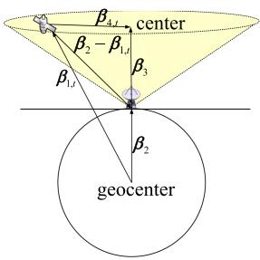

<details>
<summary>text_image</summary>

center
β₄
β₂ - β₁
β₃
β₁
β₂
geocenter
</details>

(@)

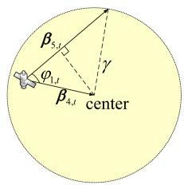

<details>
<summary>text_image</summary>

β₅,₁
φ₁,₁
γ
β₄,₁
center
</details>

(b)   
Fig. 2. An illustration on SGL handover mechanism. (a) SGL visibility analysis. (b) SGL duration analysis.

where $\beta _ { 1 , t }$ and $\beta _ { 2 } .$ , respectively, are the position vectors of the satellite and the ES, $\beta _ { 3 }$ is the central visual vector of the ES, which points from the ES to the center of the circular crosssection of the observation area of the ES. Due to the limited viewing field of the ES, the satellite trajectory vector $\beta _ { 5 , t }$ is assumed to be straight, as shown in Fig. 2(b). The length of satellite trajectory $| \beta _ { 5 , t } |$ | depends on the radius of the circular cross-section $\gamma _ { : }$ the vector $\beta _ { 4 , t }$ and the angle $\varphi _ { 1 , t }$ formed by the vector $\beta _ { 4 , t }$ and the satellite trajectory vector $\beta _ { 5 , t }$ , given by

$$
\left| \boldsymbol {\beta} _ {5, t} \right| = \left(\left| \boldsymbol {\beta} _ {4, t} \right| \cos \varphi_ {4, t} + \sqrt {\gamma^ {2} - \left| \boldsymbol {\beta} _ {4 , t} \right| ^ {2} \sin^ {2} \varphi_ {1 , t}}\right). \tag {10}
$$

The duration of SGL $T _ { S G }$ is given by

$$
T _ {S G} = \frac {1}{\vartheta} \times | \boldsymbol {\beta} _ {5, t} | \tag {11}
$$

where $\vartheta$ is the satellite velocity.

# E. Service Request

To complete service requests, a flow l starting from the user terminal needs to sequentially traverse the VNFs in $\operatorname { S F C } \pi _ { l }$ to reach the destination node, which consists of VNF selection and virtual link mapping. Let binary variable $x _ { t } ^ { v } ( f _ { i , l } ^ { j } )$ represent the mapping of VNF $f _ { i , l } ^ { j }$ to node v at slot t. We have

$$
x _ {t} ^ {v} \left(f _ {i, l} ^ {j}\right) = \left\{ \begin{array}{l} 1, \text { VNF } f _ {i, l} ^ {j} \text {   of   flow   } l \text {   is   mapped } \\ \text { to   node   } v \text {   at   slot   } t \\ 0, \text {   otherwise. } \end{array} \right. \tag {12}
$$

The VNF $f _ { i , l } ^ { j }$ can map to only nodes that are installed with the corresponding VNF instance, represented as

$$
a _ {f _ {i}} ^ {v} \geq x _ {t} ^ {v} \left(f _ {i, l} ^ {j}\right), \forall v \in V _ {t}, \forall f _ {i, l} ^ {j} \in \mathcal {F} _ {l}, \forall t \in \mathcal {T}. \tag {13}
$$

If VNF $f _ { i }$ is not deployed at node v, we have $a _ { f _ { i } } ^ { v } = 0$ .

The VNF $f _ { i , l } ^ { j }$ can only be mapped to one physical node. That is

$$
\sum_ {v \in V _ {t}} x _ {t} ^ {v} \left(f _ {i, l} ^ {j}\right) = 1, \forall f _ {i, l} ^ {j} \in \mathcal {F} _ {l}, \forall t \in \mathcal {T}. \tag {14}
$$

For an immersive online education service, the first VNF movement capture is mapped to the user terminal which is the source node of flow l denoted as $v _ { l , s } ,$ given by

$$
x _ {t} ^ {v _ {l, s}} \left(f _ {i, l} ^ {1}\right) = 1, \forall l \in \mathcal {L}. \tag {15}
$$

If flow l uses the second VNF information fusion deployed at satellites, we consider the VNF information fusion is mapped to the accessing satellite of flow l denoted as $v _ { l , a } ,$ and the following relationship holds

$$
x _ {t} ^ {v _ {l, a}} \left(f _ {i, l} ^ {2}\right) + \sum_ {v \in E ^ {G}} x _ {t} ^ {v} \left(f _ {i, l} ^ {2}\right) = 1, \forall l \in \mathcal {L}. \tag {16}
$$

The refreshed virtual environment can be obtained through the last VNF Image rendering, which is mapped to the destination node of flow l denoted as $v _ { l , d } ,$ given by

$$
x _ {t} ^ {v _ {l, d}} \left(f _ {i, l} ^ {n}\right) = 1, \forall l \in \mathcal {L}. \tag {17}
$$

Let binary variable $y _ { t } ^ { ( v , u ) } ( f _ { i , l } ^ { j } , f _ { i ^ { \prime } , l } ^ { j + 1 } )$ indicate the mapping of virtual link $( f _ { i , l } ^ { j } , f _ { i ^ { \prime } , l } ^ { j + 1 } )$ to link $( v , u )$ at slot t. We have

$$
y _ {t} ^ {(v, u)} \left(f _ {i, l} ^ {j}, f _ {i ^ {\prime}, l} ^ {j + 1}\right) = \left\{ \begin{array}{l} 1, \text { virtual   link } \left(f _ {i, l} ^ {j}, f _ {i ^ {\prime}, l} ^ {j + 1}\right) \text { of   flow } l \\ \text { is   mapped   to   link } (v, u) \text { at   slot } t \\ 0, \text { otherwise. } \end{array} \right. \tag {18}
$$

# F. Cost Model

The network resource provisioning cost includes communication resource provisioning cost and computing resource provisioning cost. At slot $t , \phi _ { t } ^ { v }$ is a binary variable with $\phi _ { t } ^ { v } = 1$ if at least one VNF is mapped to node v, and $\phi _ { t } ^ { v } = 0$ otherwise. The binary variable $\phi _ { t } ^ { v }$ can be expressed as

$$
\phi_ {t} ^ {v} = \mathbb {I} \left[ \sum_ {l \in \mathcal {L}} \sum_ {f _ {i, l} ^ {j} \in \mathcal {F} _ {l}} x _ {t} ^ {v} \left(f _ {i, l} ^ {j}\right) \right] \tag {19}
$$

where I(·) is the indicator function, given by

$$
\mathbb {I} (x) = \left\{ \begin{array}{l l} 1, & x > 0 \\ 0, & \text { otherwise. } \end{array} \right. \tag {20}
$$

Define the computing resource provisioning cost as the computing resource utilization in the network, given by

$$
\phi_ {1, t} = \frac {\sum_ {v \in V _ {t}} \phi_ {t} ^ {v} p ^ {v}}{\sum_ {v \in V _ {t}} p ^ {v}} \tag {21}
$$

where $\textstyle \sum _ { v \in V _ { t } } \phi _ { t } ^ { v } p ^ { v }$ is the total computing resource usage by all ${ \mathrm { V N F s } } ,$ , and $\sum { _ { v \in V _ { t } } p ^ { v } }$ is the total computing resource capacity of all nodes.

At slot t, $\phi _ { t } ^ { ( v , u ) }$ is a binary variable with $\phi _ { t } ^ { ( v , u ) } = 1$ if at least one virtual link is mapped to link $( v , u )$ , and $\phi _ { t } ^ { ( v , u ) } = 0$ otherwise. The binary variable $\phi _ { t } ^ { ( v , u ) }$ can be expressed as

$$
\phi_ {t} ^ {(v, u)} = \mathbb {I} \left[ \sum_ {l \in \mathcal {L}} \sum_ {\left(f _ {i, l} ^ {j}, f _ {i ^ {\prime}, l} ^ {j + 1}\right) \in E _ {l}} y _ {t} ^ {(v, u)} \left(f _ {i, l} ^ {j}, f _ {i ^ {\prime}, l} ^ {j + 1}\right) \right]. \tag {22}
$$

Define the communication resource provisioning cost as the communication resource utilization in the network, given by

$$
\phi_ {2, t} = \frac {\sum_ {(v , u) \in E ^ {G} \cup E _ {t} ^ {S} \cup E _ {t} ^ {S G}} \phi_ {t} ^ {(v , u)} B _ {t} ^ {(v , u)}}{\sum_ {(v , u) \in E ^ {G} \cup E _ {t} ^ {S} \cup E _ {t} ^ {S G}} B _ {t} ^ {(v , u)}} \tag {23}
$$

where $\sum _ { ( v , u ) \in E ^ { G } \cup E _ { t } ^ { S } \cup E _ { t } ^ { S G } } \phi _ { t } ^ { ( v , u ) } B _ { t } ^ { ( v , u ) }$ is the total communication resource usage by all virtual links,  (v,u)∈EG∪ESt ∪ESGt $\sum ( v , u ) \in E ^ { G } \cup E _ { t } ^ { S } \cup E _ { t } ^ { S G }$ $B _ { t } ^ { ( v , u ) }$ is the total communication resource of all links.

We also consider the VNF migration cost. For flow l, let integer variable $z _ { l , t }$ indicate the number of VNFs that are remapped at slot t. The integer variable $z _ { l , t }$ can be expressed as

$$
z _ {l, t} = \sum_ {f _ {i, l} ^ {j} \in \mathcal {F} _ {l}} \sum_ {v \in V _ {t}} \left[ 1 - x _ {t - 1} ^ {v} \left(f _ {i, l} ^ {j}\right) \right] x _ {t} ^ {v} \left(f _ {i, l} ^ {j}\right) \tag {24}
$$

where $[ 1 - x _ { t - 1 } ^ { v } ( f _ { i , l } ^ { j } ) ] x _ { t } ^ { v } ( f _ { i , l } ^ { j } )$ is equal to 1 if VNF $f _ { i , l } ^ { j }$ is remapped to node v at slot t, and equal to 0 otherwise. Different from ground networks, there are two reasons for VNF migration. First, NOC determines a new VSCP that leads to a change in VNF selection decision; and second satellite movements lead to a change in VNF selection decision to adapt to the time-varying network topology. Define the VNF migrations cost as the number of VNF migrations, given by

$$
\phi_ {3, t} = \sum_ {l \in \mathcal {L}} z _ {l, t}. \tag {25}
$$

# IV. PROBLEM FORMULATION

Problem statement: Consider an SDN/NFV-enabled SGIN where VNFs can be flexibly deployed at both the satellites and ground nodes. A VNF selection and chaining problem is to determine the VNF mapping decision and virtual link mapping decision for flow $l , l \in \mathcal { L }$ at each time slot, based on the previous mapping decision and the current network state. The objective is to balance the network resource provisioning and VNF migration costs with service performance gain to maximize the long-term network profit, taking into consideration service request constraints, capacity constraints, delay constraints, and flow conservation constraints.

# A. Capacity Constraints

For a node v ∈ Vt, the traffic rate of flows  l∈L  fj ∈Fl λl,t $v \in V _ { t } .$ $\begin{array} { r } { \sum _ { l \in \mathcal { L } } \sum _ { f _ { i , l } ^ { j } \in \mathcal { F } _ { l } } \lambda _ { l , t } } \end{array}$ $x _ { t } ^ { v } ( f _ { i , l } ^ { j } )$ should be upper bounded due to the limited processing capacity, given by

$$
\sum_ {l \in \mathcal {L}} \sum_ {f _ {i, l} ^ {j} \in \mathcal {F} _ {l}} \lambda_ {l, t} x _ {t} ^ {v} \left(f _ {i, l} ^ {j}\right) <   c _ {f _ {i}} ^ {v}. \tag {26}
$$

For a link $( v , u ) \in E _ { t }$ , the traffic rate of flows $\sum _ { l \in \mathcal { L } }$ $\sum _ { ( f _ { i , l } ^ { j } , f _ { i ^ { \prime } , l } ^ { j + 1 } ) \in E _ { l } } \lambda _ { l , t } y _ { t } ^ { ( v , u ) } ( f _ { i , l } ^ { j } , f _ { i ^ { \prime } , l } ^ { j + 1 } )$ (v,u) j should be upper bounded due to the limited link transmission rate, given by

$$
\sum_ {l \in \mathcal {L}} \sum_ {\left(f _ {i, l} ^ {j}, f _ {i ^ {\prime}, l} ^ {j + 1}\right) \in E _ {l}} \lambda_ {l, t} y _ {t} ^ {(v, u)} \left(f _ {i, l} ^ {j}, f _ {i ^ {\prime}, l} ^ {j + 1}\right) <   \frac {B _ {t} ^ {(v , u)}}{\sigma}. \tag {27}
$$

# B. Delay Constraints

Let $D _ { l , t }$ represent the E2E delay of flow l, which should not exceed the E2E delay requirement D, given by

$$
D _ {l, t} \leq D, \forall l \in \mathcal {L}, \forall t \in \mathcal {T}. \tag {28}
$$

For E2E delay $D _ { l , t }$ , we consider processing delay, queuing delay, transmission delay and propagation delay. With Poisson packet arrival and deterministic packet processing time, the average packet delay can be found approximately using an M/D/1 queueing model, which has been proven to be a more accurate upper bound than that using a G/D/1 queueing model [35].

Let $D _ { q , t } ^ { v }$ q,t denote queuing delay before a packet is processed by node v. $D _ { q , t } ^ { v }$ can be expressed as

$$
D _ {q, t} ^ {v} = \frac {K _ {q , t} ^ {v}}{\sum_ {l \in \mathcal {L}} \sum_ {f _ {i , l} ^ {j} \in \mathcal {F} _ {l}} \lambda_ {l , t} x _ {t} ^ {v} \left(f _ {i , l} ^ {j}\right)} \tag {29}
$$

where $K _ { q , t } ^ { v }$ represents the packet queue length at node v at slot t, given by

$$
K _ {q, t} ^ {v} = \frac {\left(\rho_ {t} ^ {v}\right) ^ {2}}{2 \left(1 - \rho_ {t} ^ {v}\right)}. \tag {30}
$$

In (30), $\rho _ { t } ^ { v }$ represents the processing intensity of node v, given by

$$
\rho_ {t} ^ {v} = \frac {\sum_ {l \in \mathcal {L}} \sum_ {f _ {i , l} ^ {j} \in \mathcal {F} _ {l}} \lambda_ {l , t} x _ {t} ^ {v} \left(f _ {i , l} ^ {j}\right)}{c _ {f _ {i}} ^ {v}}. \tag {31}
$$

We have $\rho _ { t } ^ { v } < 1$ to keep queue length stable.

For flow l, let $D _ { 1 , l , t }$ denote the total packet processing and queuing delay at all processing nodes, which can be expressed as

$$
D _ {1, l, t} = \sum_ {f _ {i, l} ^ {j} \in \mathcal {F} _ {l}} \sum_ {v \in V _ {t}} \left(D _ {f _ {i}} ^ {v} + D _ {q, t} ^ {v}\right) x _ {t} ^ {v} \left(f _ {i, l} ^ {j}\right) \tag {32}
$$

where $D _ { f _ { i } } ^ { v }$ is given by (4).

Let $D _ { 2 , l , t }$ denote the total packet transmission delay in all transmitting links, which can be expressed as

$$
D _ {2, l, t} = \sum_ {\left(f _ {i, l} ^ {j}, f _ {i ^ {\prime}, l} ^ {j + 1}\right) \in E _ {l}} \sum_ {(v, u) \in E _ {t}} D _ {t} ^ {(v, u)} y _ {t} ^ {(v, u)} \left(f _ {i, l} ^ {j}, f _ {i ^ {\prime}, l} ^ {j + 1}\right) \tag {33}
$$

where $D _ { t } ^ { ( v , u ) }$ is given by (5).

Let $D _ { 3 , l , t }$ denote the total propagation delay in SGLs and ISLs, which can be expressed as

$$
D _ {3, l, t} = \sum_ {\left(f _ {i, l} ^ {j}, f _ {i ^ {\prime}, l} ^ {j + 1}\right) \in E _ {l}} \sum_ {(v, u) \in E _ {t} ^ {S G} \cup E _ {t} ^ {S}} \frac {d _ {t} ^ {(v , u)} y _ {t} ^ {(v , u)} \left(f _ {i , l} ^ {j} , f _ {i ^ {\prime} , l} ^ {j + 1}\right)}{\nu} \tag {34}
$$

where $d _ { t } ^ { ( v , u ) }$ is the communication distance of link $( v , u )$ at slot t, ν is speed of signal propagation.

The end-to-end delay $D _ { l , t }$ can be expressed as

$$
D _ {l, t} = D _ {1, l, t} + D _ {2, l, t} + D _ {3, l, t}. \tag {35}
$$

# C. Flow Conservation Constraints

For flow l, the flow conservation is given by (36) shown at the bottom of this page. In (36), if $v = v _ { l , s } , \mathrm { i . e . }$ ., v is the source node, the number of flows out is one more than the number of flows in. If $v = v _ { l , d } , \mathrm { i . e . , } v$ is the destination node, the number of flows in is one more than the number of flows out. If $v \in V _ { t } \backslash \{ v _ { l , s } , v _ { d } \}$ , the number of flows in must be equal to the number of flows out.

# D. Optimization Problem

Let $R _ { t }$ denote the service performance gain of all flows. For an immersive online education service, E2E delay can impact the user experience. Thus, $R _ { t }$ is expressed as

$$
R _ {t} = \sum_ {l \in \mathcal {L}} \lambda_ {l, t} (1 - D _ {l, t} / D) \tag {37}
$$

where D is the E2E delay requirement of the service, $\lambda _ { l , t } ( 1 - D _ { l , t } / D )$ is the service performance gain of flow l at slot t.

From the perspective of the service provider, the objective is to maximize the service performance gain. Meanwhile, physical resource cost and VNF migration cost should be minimized. Thus, the network profit at slot t is designed as follows

$$
\chi_ {t} = - \alpha_ {1} \phi_ {1, t} - \alpha_ {2} \phi_ {2, t} - \alpha_ {3} \phi_ {3, t} + \alpha_ {4} R _ {t} \tag {38}
$$

where $\alpha _ { 1 } , \alpha _ { 2 } , \alpha _ { 3 }$ and $\alpha _ { 4 }$ are weights.

To maximize the long-term network profit, the dynamic virtual network function selection and chaining problem in an SGIN can be formulated as

$$
\text {(P1)}: \max _ {\mathbf {x} _ {t}, \mathbf {y} _ {t}} \sum_ {t = 1} ^ {T} \chi_ {t}
$$

$$
\text { s   .   t   . } (1 3) - (1 7), (2 6) - (2 8), (3 6)
$$

$$
x _ {t} ^ {v} \left(f _ {i, l} ^ {j}\right), y _ {t} ^ {(v, u)} \left(f _ {i, l} ^ {j}, f _ {i ^ {\prime}, l} ^ {j + 1}\right) \in \{0, 1 \}. \tag {39}
$$

$$
\sum_ {u \in V _ {t}} y _ {t} ^ {(v, u)} \left(f _ {i, l} ^ {j}, f _ {i ^ {\prime}, l} ^ {j + 1}\right) - \sum_ {u \in V _ {t}} y _ {t} ^ {(u, v)} \left(f _ {i, l} ^ {j}, f _ {i ^ {\prime}, l} ^ {j + 1}\right) = \left\{ \begin{array}{l} 1, v = v _ {l, s} \\ - 1, v = v _ {l, d}, \forall l \in \mathcal {L}, \forall \left(f _ {i, l} ^ {j}, f _ {i ^ {\prime}, l} ^ {j + 1}\right) \in E _ {l}, \forall v \in V _ {t}. \\ 0, \text {else} \end{array} \right. \tag {36}
$$

In (P1), the vector $\mathbf { x } _ { t }$ represents a sequence of VNF selection decisions at slot t, which can be expressed as

$$
\mathbf {x} _ {t} = \left[ x _ {t} ^ {v} \left(f _ {i, l} ^ {v}\right) \right] _ {\left| l \in \mathcal {L}, f _ {i, l} ^ {v} \in \mathcal {F} _ {l}, v \in V _ {t} \right.}. \tag {40}
$$

The vector $\mathbf { y } _ { t }$ represents a sequence of virtual link mapping decisions at slot t, which can be expressed as

$$
\mathbf {y} _ {t} = \left[ y _ {t} ^ {(v, u)} \left(f _ {i, l} ^ {j}, f _ {i ^ {\prime}, l} ^ {j + 1}\right) \right] \bigg | _ {l \in \mathcal {L}, \left(f _ {i, l} ^ {j}, f _ {i ^ {\prime}, l} ^ {j + 1}\right) \in E _ {l}, (v, u) \in E _ {t}}. \tag {41}
$$

The proposed VNF selection and chaining problem can be reduced to the capacitated plant location problem with single source constraints, which is NP-hard [36]. We can obtain the exact solutions only when the problem size is small, using the conventional optimization-based schemes. However, with an increase of problem size, it becomes computationally complex to solve for the optimal VNF selection and chaining pattern using the conventional optimization-based methods (e.g., dynamic programming). Moreover, to capture the relation between network state and VSCP set over time, we describe the VNF selection and chaining problem as an MDP formulation. A DRL-based algorithm can be a less computational complex option to solve the MDP problem with large problem size (e.g., state space), which can also capture the network dynamics with state-action transitions to optimize a long-term network profit. After the learning model training is converged, a DRL-based algorithm can provide an efficient SFC mapping solution across time slots through online implementation, which is more computationally tractable than solving per-time-slot optimization.

# E. Problem Analysis

A VSCP set represents a joint VNF selection and chaining policy of multiple flows. To save computing resources, VNF instances can be shared among multiple flows. The SR is defined as the ratio of computing resources that are shared to the total computing resources to evaluate the level of computing resource sharing of a VSCP set, given by

$$
S R = \frac {H _ {2}}{H _ {1}} \tag {42}
$$

where $H _ { 1 }$ is the total computing resources and $H _ { 2 }$ is the shared computing resources by flows.

Although computing resources can be saved through VNF instances sharing, service performance may reduce. This is because VNF instances shared by multiple flows will lead to longer queue latency, and the route of flows might be longer to reach the shared VNF instances, which increases the transmission delay. Thus, the SR can reflect the tradeoff relationship between network resource provisioning cost and service performance gain.

# V. DRL-BASED DYNAMIC VNF SELECTION AND CHAINING ALGORITHM FOR SGINS

We propose a DRL-based dynamic VNF selection and chaining (DDVSC) algorithm for SGINs, which chooses a VSCP set based on the network resources, network traffic load, network topology and the previous VSCP set. The objective is to balance the network resource provisioning and VNF migration costs with service performance gain to maximize the long-term network profit.

The optimization period T is divided into K time intervals indexed by $1 , 2 , \ldots , K$ , and each time interval contains N time slots, where $k ^ { \mathrm { t h } }$ interval is indexed by $[ N ( k - 1 ) + 1 , N ( k - 1 ) + 2 , \ldots , N k ]$ . The NOC observes the network state in each time slot and determines a VSCP set at the start point of each time interval. The current decision of the NOC is only dependent on the latest state, so the VNF selection and chaining decision process can be formulated as an MDP. The key elements in MDP are listed as follows:

State Space: Let $\lambda _ { \mathcal { L } } ^ { ( k ) } = [ \lambda _ { l } ^ { ( k ) } ] _ { | l \in \mathcal { L } }$ denote the forecast traffic rate of flows in interval k based on the traffic rate of flows in previous intervals [31]. The state $\pmb { s } ^ { ( k ) }$ includes traffic rate of flows $\lambda _ { \mathcal { L } } ^ { ( k ) }$ , network state parameter $\varpi ^ { ( k ) }$ and the previous VSCP set ${ \pmb w } ^ { ( k - 1 ) }$ , i.e.,

$$
\boldsymbol {s} ^ {(k)} = \left[ \boldsymbol {\lambda} _ {\mathcal {L}} ^ {(k)}, \boldsymbol {\varpi} ^ {(k)}, \boldsymbol {w} ^ {(k - 1)} \right] \tag {43}
$$

where (k) includes network topology parameter G[n(k−1)+1], ${ \varpi ^ { ( k ) } }$ $\mathcal { G } _ { [ n ( k - 1 ) + 1 ] }$ VNF deployment information $a _ { f _ { i } } ^ { v }$ , packet processing rate of node cvfi , and link transmission rate B(v,u)t . $c _ { f _ { i } } ^ { v }$ $B _ { t } ^ { ( v , u ) }$

Action Space: The action space W consists of a sequence of actions, $\pmb { w } _ { m } \in \mathcal { W }$ , where ${ \pmb w } _ { m }$ is a VSCP set that represents a joint VNF selection and chaining policy of multiple flows:

$$
\boldsymbol {w} _ {m} = \left[ \boldsymbol {p} _ {1} ^ {(m)}, \boldsymbol {p} _ {2} ^ {(m)}, \dots , \boldsymbol {p} _ {L} ^ {(m)} \right] \tag {44}
$$

where m indicates the sequence number of a specific action in action space and ${ \pmb p } _ { l } ^ { ( m ) }$ indicates the VSCP of flow l in set ${ \pmb w } _ { m }$ . The VSCP p(l ${ \pmb p } _ { l } ^ { ( m ) }$ can be expressed as

$$
\boldsymbol {p} _ {l} ^ {(m)} = \left[ x _ {l, S} ^ {(m)}, \mathbf {x} _ {l, G} ^ {(m)}, \mathbf {y} _ {l, S} ^ {(m)}, \mathbf {y} _ {l, G} ^ {(m)} \right] \tag {45}
$$

where x(m)l,S $x _ { l , S } ^ { ( m ) }$ and x(m)l,G $\mathbf { x } _ { l , G } ^ { ( m ) }$ represent the VNF selection policy in the satellite network segment and ground network segment, and $\mathbf { y } _ { l , S } ^ { ( m ) }$ and $\mathbf { y } _ { l , G } ^ { ( m ) }$ represent the link mapping policy in the satellite network segment and ground network segment. $x _ { l , S } ^ { ( m ) }$ is a binary variable with x(m)l,S $x _ { l , S } ^ { ( m ) } = 1$ if the VNF instance installed at the accessing satellite of flow l is used, and $x _ { l , S } ^ { ( m ) } = 0 \mathrm { o t h e r w i s e }$ . Due to satellite movements, x(m)l,S $x _ { l , S } ^ { ( m ) }$ can make different VNF selection decisions across time slots. x(m)l,G $\mathbf { x } _ { l , G } ^ { ( m ) }$ can be expressed as

$$
\mathbf {x} _ {l, G} ^ {(m)} = \left[ x ^ {v} \left(f _ {i, l} ^ {j}\right) \right] _ {\left| f _ {i, l} ^ {j} \in \mathcal {F} _ {l}, v \in V ^ {G} \right.} \tag {46}
$$

where $x ^ { v } ( f _ { i , l } ^ { j } )$ is a binary variable with $x ^ { v } ( f _ { i , l } ^ { j } ) = 1 \mathrm { i f } \mathrm { V N F } f _ { i , l } ^ { j }$ is mapped to the ground node v, and $x ^ { v } ( f _ { i , l } ^ { j } ) = 0$ otherwise. $\mathbf { y } _ { l , S } ^ { ( m ) }$ y l,S can be expressed as

$$
\mathbf {y} _ {l, S} ^ {(m)} = \left\{ \begin{array}{c c} {[ v _ {l, s}, v _ {l, E S} ], \text {   flow   } l \text {   accesses   to   satellites   via   node }} \\ & {v _ {l, s} \text {   and   is   routed   to   the   node   } v _ {l, E S}} \\ {[ 0, 0 ], \quad \text { otherwise }} \end{array} \right. \tag {47}
$$

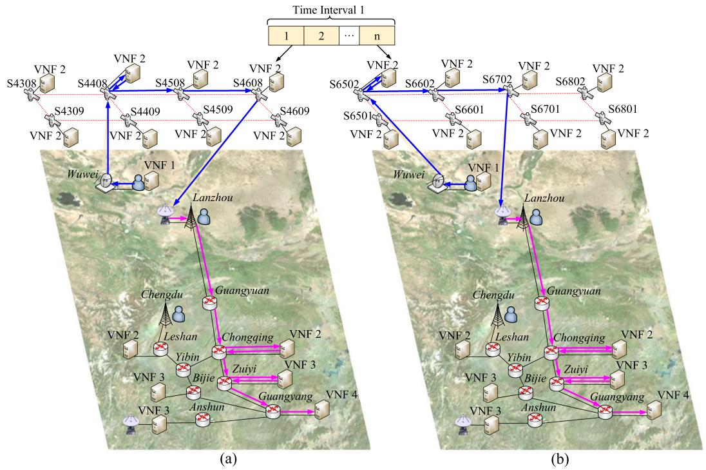

<details>
<summary>flowchart</summary>

```mermaid
graph TD
    subgraph (a)
        A["VNF 2"] --> B["S4308"]
        B --> C["S4408"]
        C --> D["S4508"]
        D --> E["S4608"]
        E --> F["S4609"]
        F --> G["Wuwei"]
        G --> H["Lanzhou"]
        H --> I["Chengdu"]
        I --> J["Guangyuan"]
        J --> K["Anshun"]
        K --> L["Zuiyi"]
        L --> M["Bijie"]
        M --> N["Chongqing"]
        N --> O["VNF 2"]
        O --> P["VNF 3"]
        P --> Q["VNF 4"]
        Q --> R["Anshun"]
        R --> S["Guangyang"]
    end

    subgraph (b)
        T["VNF 2"] --> U["S6502"]
        U --> V["S6602"]
        V --> W["S6702"]
        W --> X["S6802"]
        X --> Y["S6801"]
        Y --> Z["VNF 2"]
        Z --> AA["Wuwei"]
        AA --> AB["Lanzhou"]
        AB --> AC["Chengdu"]
        AC --> AD["Guangyuan"]
        AD --> AE["VNF 2"]
        AE --> AF["VNF 3"]
        AF --> AG["VNF 4"]
        AG --> AH["Anshun"]
        AH --> AI["Bijie"]
        AI --> AJ["Zuiyi"]
        AJ --> AK["Chongqing"]
        AK --> AL["VNF 2"]
        AL --> AM["VNF 3"]
        AM --> AN["VNF 4"]
        AN --> AO["Anshun"]
        AO --> AP["Bijie"]
        AP --> AQ["VNF 3"]
        AQ --> AR["VNF 4"]
        AR --> AS["Anshun"]
    end

    subgraph Time Interval 1
        AT["1"] & AU["2"] & AV["..."] & AW["n"]
    end

    style (a) fill:#f9f,stroke:#333
    style (b) fill:#f9f,stroke:#333
```
</details>

Fig. 3. A VSCP across time slots to adapt to the time-varying network topology.

where $v _ { l , s }$ is the source node, which is equipped with a VSAT to connect to satellites, and $v _ { l , E S }$ is the ES that routes the traffic from the satellite network to the ground network. If flow l does not traverse the satellite network segment, y(m)l,S $\mathbf { y } _ { l , S } ^ { ( m ) } = [ 0 , 0 ]$ . The path of flow l in the satellite network segment is searched according to the smallest hop-count [19]. Due to satellite movements, y l,S $\mathbf { y } _ { l , S } ^ { ( m ) }$ can make different virtual link mapping decisions across slots. y(m)l,G $\mathbf { y } _ { l , G } ^ { ( m ) }$ can be expressed as

$$
\mathbf {y} _ {l, G} ^ {(m)} = \left[ y ^ {(v, u)} \left(f _ {i, l} ^ {j}, f _ {i ^ {\prime}, l} ^ {j + 1}\right) \right] _ {| (v, u) \in E ^ {G}, \left(f _ {i, l} ^ {j}, f _ {i ^ {\prime}, l} ^ {j + 1}\right) \in E _ {l}} \tag {48}
$$

where $y ^ { ( v , u ) } ( f _ { i , l } ^ { j } , f _ { i ^ { \prime } , l } ^ { j + 1 } )$ is a binary variable with $y ^ { ( v , u ) }$ $( f _ { i , l } ^ { j } , f _ { i ^ { \prime } , l } ^ { j + 1 } ) = 1$ if virtual link $( f _ { i , l } ^ { j } , f _ { i ^ { \prime } , l } ^ { j + 1 } )$ is mapped to the ground link (v, u), and $y ^ { ( v , u ) } ( f _ { i , l } ^ { j } , f _ { i ^ { \prime } , l } ^ { j + 1 } ) = 0$ otherwise.

There is an example to describe how a VSCP makes a sequence of VNF selection and changes decisions across time slots, as shown in Fig. 3. In the ground network segment in Western China, a user in Wuwei city accesses services via a VSAT. The satellite network segment includes 8 satellites to cover the ground network segment and VNF 2 is deployed at each satellite. This VSCP set x(m)l,S $x _ { l , S } ^ { ( m ) } = 1$ = 1 and y(m)l,S $\mathbf { y } _ { l , S } ^ { ( m ) } = [ v _ { 1 } , v _ { 2 } ]$ , where $v _ { 1 }$ is the user terminal at Wuwei city and $v _ { 2 }$ is the ES at Lanzhou city. $\mathbf { x } _ { l , G } ^ { ( m ) }$ and $\mathbf { y } _ { l , G } ^ { ( m ) }$ determine a VNF selection decision and routing path in the ground network segment, and they remain unchanged in a time interval (e.g., the pink solid arrow in Fig. 3(a) and (b)). At time slot $1 , x _ { l , S } ^ { ( m ) }$ lets VNF 2 map to satellite S4408, i.e., the $8 ^ { \mathrm { t h } }$ satellite located at the $4 4 ^ { \mathrm { t h } }$ orbit, and $\mathbf { y } _ { l , S } ^ { ( m ) }$ lets virtual links (VNF 1, VNF 2) and (VNF 2, VNF 3) map to links with the blue solid arrow to connect the VSAT at Wuwei city to the ES at Lanzhou city, as shown in Fig. 3(a). Due to satellite movements, satellite S4408 can not communicate with the VSAT at time slot n. Thus, x(ml,S $\mathbf { x } _ { l , S } ^ { ( m ) }$ ) lets VNF 2 remap to satellite S6502, and y(m)l,S $\mathbf { y } _ { l , S } ^ { ( m ) }$ lets virtual links (VNF 1, VNF 2) and (VNF 2, VNF 3) remap to other physical links with the blue solid arrow in Fig. 3(b).

With the number of traffic flow increasing, the action space suffers from the curse of dimensionality issue. To reduce the action space, the following steps are performed: 1) unitizing the k-means clustering method to cluster the historical records of the network load; and 2) selecting a VSCP set for each cluster to build action space W.

The historical records of the network load in optimization period T is denoted by $\lambda _ { \mathcal { L } , \mathcal { T } } ^ { H } = \{ \lambda _ { \mathcal { L } , 1 } ^ { H } , \lambda _ { \mathcal { L } , 2 } ^ { H } , . . . , \lambda _ { \mathcal { L } , T } ^ { \bar { H } } \}$ , where $\lambda _ { \mathcal { L } , t } ^ { H } \in \lambda _ { \mathcal { L } , \mathcal { T } } ^ { H }$ represents historical record of the network load at slot t, given by

$$
\lambda_ {\mathcal {L}, t} ^ {H} = \left(\lambda_ {1, t} ^ {H}, \lambda_ {2, t} ^ {H} \dots , \lambda_ {L, t} ^ {H}\right) \tag {49}
$$

where $\lambda _ { l , t } ^ { H } ( l = 1 , 2 , \dots , L )$ represents the historical record of traffic rate of flow l at slot t.

The clustering result of the historical records of the network load is expressed as $\mathcal { H } = ( h _ { 1 } , h _ { 2 } , \ldots , h _ { | \mathcal { W } | } )$ , where $h _ { j } , h _ { j } \in \mathcal { H }$ is a cluster consisting of several historical records of the network load at different time slots. The cluster center of $h _ { j }$ is denoted as $\lambda _ { \mathcal { L } , j } ^ { C }$ , which can be expressed as

$$
\lambda_ {\mathcal {L}, j} ^ {C} = \left(\lambda_ {1, j} ^ {C}, \lambda_ {2, j} ^ {C}, \dots , \lambda_ {L, j} ^ {C}\right) \tag {50}
$$

where $\lambda _ { l , j } ^ { C } \in \lambda _ { \mathcal { L } , j } ^ { C }$ is the average of traffic rate of flow l in $j ^ { t h }$ cluster.

Then, we need to select the optimal VSCP set for each cluster to build action space, which should satisfy the service request constraints, capacity constraints, delay constraints and flow conservation constraints. Furthermore, the balance of network resource provisioning cost and service performance gain must be considered. The estimated network profit of a VSCP set at slot t can be expressed as

Algorithm 1: The Historical Records of the Network Load Clustering Algorithm.   
Require: Number of desired clusters $|\mathcal{W}|$ , the historical records of the network load $\lambda_{\mathcal{L},\mathcal{T}}^{H}$ , the number of iterations $\mathcal{C}$ .

Ensure: The clustering result of the historical records of the network load $\mathcal{H} = (h_1, h_2, \ldots, h_{|\mathcal{W}|})$ .

1: Randomly select $|\mathcal{W}|$ elements from the historical records of the network load $\lambda_{\mathcal{L},\mathcal{T}}^{H}$ as initial cluster centers, and denote $i = 1$ ;

2: while $i \leq \mathcal{C}$ do

3: Calculate the Euclidean distances between each element $\lambda_{\mathcal{L},t}^{H}$ and all cluster centers $\| \lambda_{\mathcal{L},t}^{H} - \lambda_{\mathcal{L},j}^{C} \|_{\lambda_{\mathcal{L},t}^{H} \in \lambda_{\mathcal{L},\mathcal{T}}^{H}, 1 \leq j \leq |\mathcal{W}|}$ , and assign $\lambda_{\mathcal{L},t}^{H}$ to the nearest cluster;

4: for each cluster $h_j (1 \leq j \leq |\mathcal{W}|)$ do

5: Recalculate the cluster center by averaging the elements in the cluster;

6: end for

7: $i = i + 1$ ;

8: end while

$$
\chi_ {t} ^ {\prime} = - \alpha_ {1} \phi_ {1, t} - \alpha_ {2} \phi_ {2, t} + \alpha_ {4} R _ {t}. \tag {51}
$$

Note that $\chi _ { t } ^ { \prime }$ neglects VNF migration cost because we select the optimal VSCP set for different network traffic loads, the temporal correlation of network traffic loads is broken.

Algorithm 2 finds the optimal VSCP set for different network loads in a greedy manner. The algorithm firstly searches all VSCPs for each flow based on a breadth-first search method. For each cluster, it searches the VSCP set with the highest value of SR and calculates the estimated network profit of the VSCP set. This VSCP set saves network resource cost while the service performance gain may not be optimal. Then, Algorithm 2 searches the new VSCP sets by reducing SR and calculates their estimated network profits. It then compares the estimated network profit of the searched VSCP sets, and selects the set with the highest estimated network profit to add the action space W. The search process is terminated until the estimated network profit of new searched VSCP sets does not increase or all VSCP sets are traversed.

Reward : The reward obtained in time interval k is evaluated as the total network profit, which is expressed as

$$
r ^ {(k)} = \sum_ {t = N (k - 1) + 1} ^ {N k} \chi_ {t}. \tag {52}
$$

The DDVSC algorithm is shown in Algorithm 3 and Fig. 4. The NOC receives the current network state $\pmb { s } ^ { ( k ) }$ , and the evaluation network and the target network estimate the $Q \mathrm { - }$ values of each action $Q ( \boldsymbol { s } ^ { ( k ) } , \bar { \boldsymbol { w } } ; \boldsymbol { \theta } )$ and the target Q-value ${ \operatorname* { m a x } } _ { \pmb { w } \in \mathcal { W } } Q ^ { \prime } ( \pmb { s } ^ { ( k + 1 ) } , \pmb { w } ; \pmb { \theta } ^ { \prime } )$ , where θ and $\pmb { \theta } ^ { \prime }$ are the corresponding parameters of these two neural networks. Then, the NOC selects the VSCP set ${ \pmb w } ^ { ( k ) }$ via ε − greedy exploration and executes the corresponding VNF selection and virtual link mapping decisions to obtain the reward $r ^ { ( k ) }$ and next state $\boldsymbol { s } ^ { ( k + 1 ) }$ . A transition $[ \pmb { s } ^ { ( k ) } , \pmb { w } ^ { ( k ) } , r ^ { ( k ) } , \pmb { s } ^ { ( k + 1 ) } ]$ , including the current network state, VSCP set, network profit and the next network state, is stored into a replay buffer E. The minibatch B is formulated with G experiences randomly sampled from E, given by

Algorithm 2: Optimal VSCP set Searching for Different Network Loads.   
Require: The clustering results of the historical records of the network load $\mathcal{H} = (h_1, \ldots, h_{|\mathcal{W}|})$ .

Ensure: The action space $\mathcal{W}$ .

1: Search all VSCPs for each flow based on a breadth-first search method;

2: for each cluster $h_i(1 \leq i \leq |\mathcal{W}|)$ do

3: Initialize searching step $\delta_1(0 < \delta_1 < 1)$ , the estimated network profit $p_0 = 0$ , the optimal VSCP set $w = \emptyset$ , and set iteration number $i = 0$ ;

4: $i = i + 1$ ;

5: Set sharing ratio of computing resource $1 - i \times \delta_1 \leq SR \leq 1 - (i - 1) \times \delta_1$ ;

6: while $1 - (i - 1) \times \delta_1 < 0$ do

7: if $w = \emptyset$ then

8: There is no VSCP set can meet service demands;

9: else

10: The optimal VSCP set $w$ is added to the action space $\mathcal{W}$ ;

11: end if

12: Break loop;

13: end while

14: Search the VSCP sets that satisfy the sharing ratio of computing resource and problem constraints (13)-(17), (26)-(28), (36);

15: if no new VSCP set is searched then

16: Return to step 4;

17: else

18: Calculate the estimated network profit of the searched VSCP sets using (51);

19: end if

20: Select the VSCP set $w'$ with the highest estimated network profit $p_1$ from the new searched sets;

21: if $p_1 > p_0$ then

22: $w = w', p_0 = p_1$ ;

23: Return to step 4;

24: else

25: Break loop;

26: end if

27: end for

$$
\mathcal {B} = \left\{\left(\boldsymbol {s} ^ {(g (j))}, \boldsymbol {w} ^ {(g (j))}, r ^ {(g (j))}, \boldsymbol {s} ^ {(g (j)) + 1}\right) \in \mathbf {E} | 1 \leq j \leq G \right\}. \tag {53}
$$

Then, the weights of the evaluate NN, θ, are updated by minimizing the loss function given by [37]

$$
\mathcal {L} (\boldsymbol {\theta}) = \mathbb {E} \left[ \mu^ {(k)} - Q \left(\boldsymbol {s} ^ {(k)}, \boldsymbol {w} ^ {(k)}; \boldsymbol {\theta}\right) \right] ^ {2} \tag {54}
$$

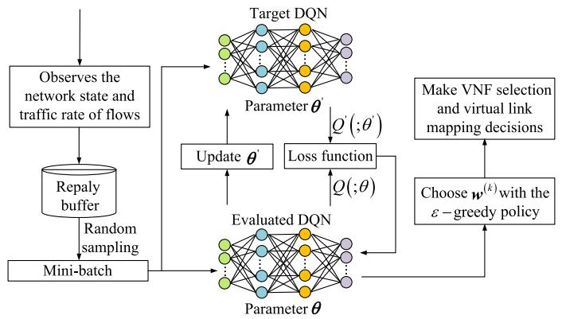

<details>
<summary>flowchart</summary>

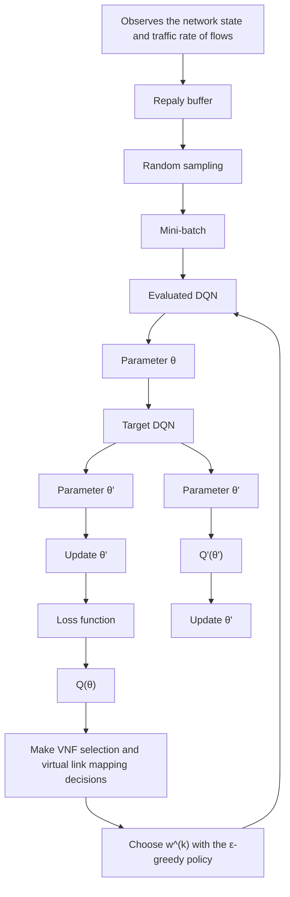
</details>

Fig. 4. An illustration of the DRL-based dynamic VNF selection and chaining algorithm.

where $\mu ^ { ( k ) }$ is the target value given by

$$
\mu^ {(k)} = r ^ {(k)} + \delta_ {2} \max _ {\boldsymbol {w} \in W} Q ^ {\prime} (\boldsymbol {s} ^ {(k + 1)}, \boldsymbol {w}; \boldsymbol {\theta} ^ {\prime}) \tag {55}
$$

where $\delta _ { 2 } \in [ 0 , 1 ]$ is the discount factor and represents the weight of uncertainty about the future utility in the learning process. The target NN copies evaluation NN weights to update its weights $\pmb { \theta } ^ { \prime }$ in every C steps.

In the VNF selection and chaining process, the NOC first observes the satellite segment covering the ground network segment to identify available satellites. The SGIN is monitored by the NOC in each time slot, where the topology (i.e., location and connectivity of nodes), resource states (i.e., usage of links and nodes) of the SGIN, and traffic rates of flows can be obtained via CDPIs. Then, NOC uses the DDVSC algorithm to determine the VSCP set for flows at the start point of each time interval, and flow tables for VNF selection and chaining are delivered to the satellites and ground nodes via SGLs and wired links. When users switch accessing satellites, satellites in the virtual lattice grid are changed and their flow tables are updated by control signaling based on the selected VSCP set. As the number of users increases, more flow tables may need to be updated. To solve this problem, cluster-based flow tables update approaches [38] are proposed where users in similar areas are partitioned into groups and relevant flow tables are updated by control signaling in groups.

The computational complexity of the DDVSC algorithm mainly depends on the number of multiplications in the two NNs [39]. The evaluation NN executes both the forward propagation and backpropagation, while the target NN only executes the forward propagation. We consider that the evaluated NN consists of two FC layers, each with $m _ { 2 }$ and $m _ { 3 }$ neural cells, respectively. The input size of the evaluated NN is denoted by $L + m _ { 1 } + p _ { \cdot } L$ parameters are used to represent traffic rates of flows, $m _ { 1 }$ parameters are used to represent the network configuration information, and $p$ parameters are used to represent the previous VSCP set. The evaluated NN outputs |W| values representing the value function of each action in the current state. G experiences are sampled from the replay buffer. The computational complexity of DDVSC algorithm $\mathcal { O } _ { 1 }$ is given by

Algorithm 3: DRL-Based Dynamic VNF Selection and Chaining Algorithm for SGINs.   
1: Initialize the learning rate of the evaluation network, the discount factor $\text{deta } \delta_2$ , the maximum learning episode $EP$ , the existing VSCP set $w^{(0)}$ , the maximum training steps $n$ per episode, the replay buffer $\mathbf{E}$ , the evaluation network with random weights $\theta$ , the target network with weights $\theta' = \theta$ .

2: for episode= 1 : $EP$ do

3: The NOC receives the traffic rate of flows $\lambda_{\mathcal{L}}^{(1)}$ , the network state parameter $\varpi^{(1)}$ and the existing VSCP set $w^{(0)}$ ;

4: $s^{(1)} = [\lambda_{\mathcal{L}}^{(1)}, \varpi^{(1)}, w^{(0)}]$ ;

5: for $k = 1 : n$ do

6: Select action $w^{(k)}$ according to $\varepsilon$ -greedy algorithm;

7: Execute the action $w^{(k)}$ in the SGIN, obtain the reward $r^{(k)}$ , next state $s^{(k+1)}$ ;

8: Formulate a memory transition $e^{(k)} = [s^{(k)}, w^{(k)}, r^{(k)}, s^{(k+1)}]$ ;

9: Store the transition into replay buffer: $E \leftarrow E \cup e^{(k)}$ ;

10: Obtain a minibatch $B$ by uniformly and randomly sampling $G$ experiences from the replay buffer $E$ ;

11: Set $\mu^{(k)}$ according to (55);

12: Perform a gradient descent step on (54) with respect to the network parameters $\theta$ ;

13: Update $\theta'$ with $\theta$ every $C$ steps;

14: end for

15: end for

$$
\mathcal {O} _ {1} = \mathcal {O} \left[ G \left(L m _ {2} + m _ {2} m _ {3} + m _ {1} m _ {2} + | \mathcal {W} | m _ {3} + m _ {2} p + | \mathcal {W} | p\right) \right]. \tag {56}
$$

# VI. SIMULATION RESULTS

In this section, we evaluate the performance of the proposed algorithm based on an important 6G case study on immersive online education service.

# A. Simulation Setup

We consider an SGIN scenario as Fig. 3. There are three flows in an SGIN. The users in Lanzhou city and Chengdu city access an immersive online education service via local BS, and the users in Wuwei city access an immersive online education service via a VSAT. The two ESs are located in Chengdu city and Anshun city, and they are responsible for communication with satellites. The whole time horizon is 95 min from 14 Sep 2023 04:00:00.000 UTCG to 14 Sep 2023 05:35:00.000 UTCG. The time slot length is set to 1 second and the time interval length is set to 5 min, thus the whole time horizon consists of 19 time intervals.

The CPU processing rate of satellites is 2 GHz. The ground node in Guiyang city has a professional processor to render images, and its CPU processing rate is 9 GHz. The CPU processing rate is 3 GHz for the other ground nodes with a server. The computation intensity of physical nodes for VNFs is 10 cycles/bit and the packet size is 10 KB. The delay requirement of the service is 10 ms [2]. The transmission rate of wired links is 0.4 Gbps and the communication bandwidth of SGLs and ISLs is 45 MHz. The EIRP of VSAT and satellite is 34.5 dBW, and the quality factor of ES and satellite is 22.7 dBi/K and 11.1 dBi/K [27]. We consider the packet arrival process of flows according to Poisson distribution, and the two flows accessing BSs have the same traffic rate. The average traffic rate of flows is shown in Fig. 5. The main simulation parameters are listed in Table III.

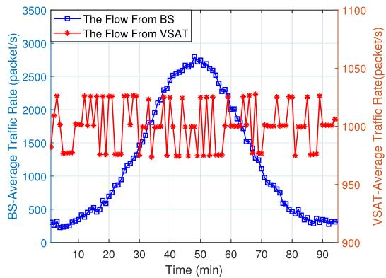

<details>
<summary>line</summary>

| Time (min) | The Flow From BS (packet/s) | The Flow From VSAT (packet/s) |
| ---------- | --------------------------- | ----------------------------- |
| 0          | 300                         | 1400                          |
| 5          | 400                         | 1600                          |
| 10         | 600                         | 1800                          |
| 15         | 800                         | 2000                          |
| 20         | 1000                        | 2200                          |
| 25         | 1200                        | 2100                          |
| 30         | 1400                        | 2000                          |
| 35         | 1600                        | 1900                          |
| 40         | 1800                        | 1800                          |
| 45         | 2000                        | 1700                          |
| 50         | 2200                        | 1600                          |
| 55         | 2400                        | 1500                          |
| 60         | 2600                        | 1400                          |
| 65         | 2400                        | 1300                          |
| 70         | 2200                        | 1200                          |
| 75         | 2000                        | 1100                          |
| 80         | 1800                        | 1000                          |
| 85         | 1600                        | 950                           |
| 90         | 1400                        | 900                           |
| 95         | 1200                        | 950                           |
| 100        | 1000                        | 1000                          |
</details>

Fig. 5. Average traffic rate of flows.

TABLE III SIMULATION PARAMETERS [2], [27] 

<table><tr><td>Parameter</td><td>Value</td></tr><tr><td>Number of orbits planes</td><td>72</td></tr><tr><td>Number of satellite per plane</td><td>22</td></tr><tr><td>Height of orbits</td><td>550 km</td></tr><tr><td>Orbit inclination angle</td><td>53 deg</td></tr><tr><td>Minimum elevation angle of ES</td><td>20 deg</td></tr><tr><td>EIRP of VSATs/satellites</td><td>34.5 dBW</td></tr><tr><td>Quality Factor of Satellite/ES</td><td>11.1/22.7 dBi/K</td></tr><tr><td> $S_1, S_2, S_3$ </td><td>92.5, 20, 20</td></tr><tr><td>Other signal transmission losses of SGLs/ISLs</td><td>1 dB</td></tr><tr><td>Packet size</td><td>10 KB</td></tr><tr><td>Delay requirement</td><td>10 ms</td></tr><tr><td>Simulation time</td><td>5700 s</td></tr><tr><td> $α_1, α_2, α_3, α_4$ </td><td>1000,500,125,1</td></tr></table>

# B. Results and Analysis

The NOC selects a VSCP set at each time interval. The feasible VSCPs sets must not violate the physical resource constraints, service request constraints, delay constraints and flow conservation constraints. The number of feasible VSCP sets selected in the whole time horizon is shown in Fig. 6, which is calculated using the average value over 10 episodes. Fig. 6 proves the proposed DDVSC algorithm can always choose the feasible VSCP sets in each time interval after 4800 episodes.

The performance of the DDVSC algorithm is evaluated and compared with that of three existing algorithms [13], [40], [41]. The work in [13] proposes a greedy minimum cost algorithm that prefers to use and share the VNF instances installed at ground nodes to save the computing resources. When the service performance can not be guaranteed solely by the ground network segment, the satellites are leveraged to balance the network-wide computation load. The work in [40] proposes a greedy best availability algorithm that uses multiple VNF instances at different network locations to improve service performance. In [41], a dynamic VNF selection and chaining algorithm is designed based on the actor-critic network to maximize the long-term network profit.

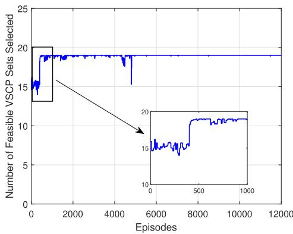

<details>
<summary>line</summary>

| Episodes | Number of Feasible VSCP Sets Selected |
| -------- | ------------------------------------ |
| 0        | 15                                   |
| 1000     | 19                                   |
| 2000     | 19                                   |
| 3000     | 19                                   |
| 4000     | 19                                   |
| 5000     | 19                                   |
| 6000     | 19                                   |
| 7000     | 19                                   |
| 8000     | 19                                   |
| 9000     | 19                                   |
| 10000    | 19                                   |
| 11000    | 19                                   |
</details>

Fig. 6. Number of feasible VSCP sets selected in whole time horizon.

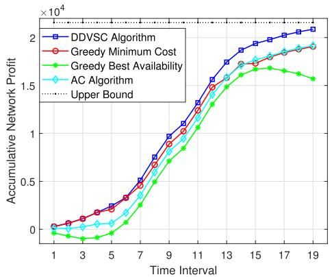

<details>
<summary>line</summary>

| Time Interval | DDVSC Algorithm | Greedy Minimum Cost | Greedy Best Availability | AC Algorithm |
| ------------- | --------------- | ------------------- | ------------------------- | ------------ |
| 1             | 0               | 0                   | 0                         | 0            |
| 3             | 0               | 0                   | 0                         | 0            |
| 5             | 0               | 0                   | 0                         | 0            |
| 7             | 0.5             | 0.5                 | 0.5                       | 0.5          |
| 9             | 1.0             | 1.0                 | 1.0                       | 1.0          |
| 11            | 1.5             | 1.5                 | 1.5                       | 1.5          |
| 13            | 2.0             | 1.8                 | 1.7                       | 1.8          |
| 15            | 2.0             | 1.9                 | 1.6                       | 1.9          |
| 17            | 2.0             | 1.9                 | 1.6                       | 1.9          |
| 19            | 2.0             | 1.9                 | 1.6                       | 1.9          |
</details>

Fig. 7. Comparison of accumulative network profit between the three existing algorithms and the proposed DDVSC algorithm.

The comparison of the four algorithms in terms of accumulative network profit is shown in Fig. 7. Moreover, the upper bound of accumulative network profit is also given in Fig. 7. Compared with the three existing algorithms, the proposed DDVSC algorithm increases the accumulative network profit by 9.5 %, 32.9 % and 8.9 %, respectively. Meanwhile, the DDVSC algorithm is only 3.4 % lower than the upper bound of accumulative network profit. The reason is that the DDVSC algorithm can select an appropriate VSCP set in different network traffic loads. Specifically, when the network traffic load is low, the DDVSC algorithm lets multiple flows share the VNF instances to save the computing resource provisioning cost. When the network traffic load is high, the DDVSC algorithm lets flows use more VNF instances to obtain more service performance gain. Note that the greedy best availability algorithm has negative network profits in some time intervals. This is because when the network traffic load is low, the network resource provisioning cost outweighs the service performance gain.

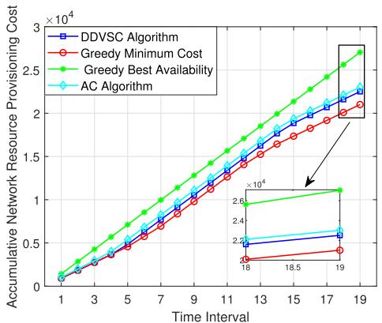

<details>
<summary>line</summary>

| Time Interval | DDVSC Algorithm | Greedy Minimum Cost | Greedy Best Availability | AC Algorithm |
| ------------- | --------------- | ------------------- | ------------------------ | ------------ |
| 1             | 0               | 0                   | 0                        | 0            |
| 3             | 0.25            | 0.2                 | 0.3                      | 0.2          |
| 5             | 0.5             | 0.4                 | 0.6                      | 0.4          |
| 7             | 0.75            | 0.6                 | 0.9                      | 0.6          |
| 9             | 1.0             | 0.8                 | 1.2                      | 0.8          |
| 11            | 1.25            | 1.0                 | 1.5                      | 1.0          |
| 13            | 1.5             | 1.2                 | 1.8                      | 1.2          |
| 15            | 1.75            | 1.4                 | 2.1                      | 1.4          |
| 17            | 2.0             | 1.6                 | 2.4                      | 1.6          |
| 19            | 2.25            | 1.8                 | 2.7                      | 1.8          |
</details>

Fig. 8. Comparison of accumulative network resource provisioning cost between the three existing algorithms and the proposed DDVSC algorithm.

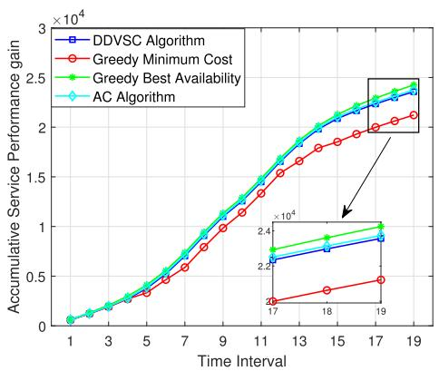

<details>
<summary>line</summary>

| Time Interval | DDVSC Algorithm | Greedy Minimum Cost | Greedy Best Availability | AC Algorithm |
| ------------- | --------------- | ------------------- | ------------------------ | ------------ |
| 1             | 0               | 0                   | 0                        | 0            |
| 3             | 0               | 0                   | 0                        | 0            |
| 5             | 0               | 0                   | 0                        | 0            |
| 7             | 0               | 0                   | 0                        | 0            |
| 9             | 0               | 0                   | 0                        | 0            |
| 11            | 0               | 0                   | 0                        | 0            |
| 13            | 0               | 0                   | 0                        | 0            |
| 15            | 0               | 0                   | 0                        | 0            |
| 17            | 0               | 0                   | 0                        | 0            |
| 19            | 0               | 0                   | 0                        | 0            |
</details>

Fig. 9. Comparison of accumulative service performance gain between the three existing algorithms and the proposed DDVSC algorithm.

The comparison of the four algorithms in terms of accumulative network resource provisioning cost (ANRPC) is shown in Fig. 8. It can be observed that among the four algorithms, the greedy minimum cost algorithm has the lowest ANRPC and the proposed DDVSC algorithm has the second lowest ANRPC. This is because the greedy minimum cost algorithm aims to minimize the network resource provisioning cost. However, the proposed DDVSC algorithm can obtain more service performance gain than the greedy minimum cost algorithm. In addition, the greedy best availability algorithm has the highest ANRPC. This is because the greedy best availability algorithm uses more computing resources to obtain the best service performance.

Fig. 9 shows the comparison among the four algorithms in terms of the accumulative service performance gain (ASPG). We can see that the greedy best availability algorithm has the highest ASPG but it also pays the highest network resource provisioning cost. The ASPG of the AC algorithm is slightly higher than the DDVSC algorithm, this is because the AC algorithm provides more computing resources for the service which leads to increasing the network resource provisioning cost. Note that the greedy minimum cost algorithm and the greedy best availability algorithm can only obtain optimality in terms of network cost or service performance, while the proposed DDVSC algorithm balances network cost and service performance to maximize the total network profit.

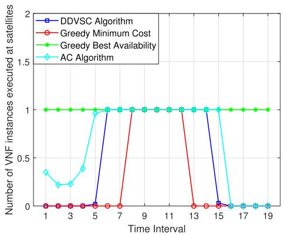

<details>
<summary>line</summary>

| Time Interval | DDVSC Algorithm | Greedy Minimum Cost | Greedy Best Availability | AC Algorithm |
| ------------- | --------------- | ------------------- | ------------------------ | ------------ |
| 1             | 0               | 0                   | 1                        | 0.4          |
| 3             | 0               | 0                   | 1                        | 0.2          |
| 5             | 0               | 0                   | 1                        | 1.0          |
| 7             | 1               | 0                   | 1                        | 1.0          |
| 9             | 1               | 1                   | 1                        | 1.0          |
| 11            | 1               | 1                   | 1                        | 1.0          |
| 13            | 0               | 0                   | 1                        | 1.0          |
| 15            | 0               | 0                   | 1                        | 1.0          |
| 17            | 0               | 0                   | 1                        | 0            |
| 19            | 0               | 0                   | 1                        | 0            |
</details>

Fig. 10. Number of VNF instances executed at satellites in each time interval.

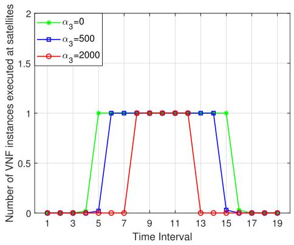

<details>
<summary>line</summary>

| Time Interval | α₃=0 | α₃=500 | α₃=2000 |
| ------------- | ---- | ------ | ------- |
| 1             | 0    | 0      | 0       |
| 3             | 0    | 0      | 0       |
| 5             | 1    | 0      | 0       |
| 7             | 1    | 1      | 0       |
| 9             | 1    | 1      | 1       |
| 11            | 1    | 1      | 1       |
| 13            | 1    | 1      | 0       |
| 15            | 1    | 1      | 0       |
| 17            | 0    | 0      | 0       |
| 19            | 0    | 0      | 0       |
</details>

Fig. 11. Number of VNF instances executed at satellites in each time interval in different VNF migration costs.

In SGINs, the satellite network segment can provide additional computing resources to balance the network-wide computation load and improve service performance. Fig. 10 shows the comparison among the four algorithms in terms of the number of VNF instances executed at satellites in each time interval. We can see that the greedy best availability algorithm uses the VNF instances installed at satellites in each time interval to obtain more computing resources to improve service performance. The greedy minimum cost algorithm minimally utilizes the VNF instances installed at satellites because the algorithm prefers to use the VNF instances deployed at ground nodes to improve resource utilization efficiency. Both the DDVSC algorithm and AC algorithm can use VNF instances installed at satellites based on the evolving network states, and the proposed DDVSC algorithm is more robust to varying traffic flows as shown in Fig. 10 compared with the AC algorithm. This is because the action space of the DDVSC algorithm is compressed by the clustering approach.

When a VNF is mapped to a satellite, satellite movements lead to a VNF migration. For the proposed DDVSC algorithm, Fig. 11 shows the number of VNF instances executed at satellites in each time interval in different VNF migration costs. We set $\alpha _ { 3 } = 0 , 5 0 0 , 2 0 0 0$ to represent different migration costs. We can see that VNF instances deployed at satellites are executed in fewer time intervals as the VNF migration cost increases. This is because when migration cost is high, the NOC prefers to use the VNF instances deployed at ground nodes to reduce VNF migrations due to satellite movements.

# VII. CONCLUSION

In this paper, we investigate a DVSC problem in an SGIN which is described as an MDP formulation. The objective is to maximize the accumulative network profit in a heterogeneous and time-varying SGIN with a dynamic network traffic load. To solve the DVSC problem, a novel VNF selection and chaining algorithm based on DRL is proposed to dynamically determine the VSCP set. Due to satellite movements, each VSCP consisting of a sequence of VNF selection and virtual link mapping decisions adapts to the changing network topology. Moreover, SR is proposed to capture the relation between the network resource provisioning cost and the service performance gain. To efficiently allocate heterogeneous network resources, we cluster the historical records of the network load and search the optimal VSCP sets for different network loads in a greedy manner. Extensive simulation results demonstrate the advantages of the proposed DDVSC algorithm, compared with existing works, in terms of maximizing the accumulative network profit and service performance gain with minimal network resource provisioning cost. In SGINs, the satellite network segment can route flows to ESs for accessing VNF servers in the ground network segment. For future work, we will investigate the impact of the density and location of ES deployment on the VNF selection and chaining problem.

# REFERENCES

[1] S. Chen, Y. -C. Liang, S. Sun, S. Kang, W. Cheng, and M. Peng, “Vision, requirements, and technology trend of 6G: How to tackle the challenges of system coverage, capacity, user data-rate and movement speed,” IEEE Wireless Commun., vol. 27, no. 2, pp. 218–228, Apr. 2020.   
[2] Next G. Alliance, “6G applications and use cases,” Tech. Rep., May 2022. Accessed: Sep. 23, 2024. [Online]. Available: https://nextgalliance.org/ whitepapers/6g-applications-and-use-cases/   
[3] X. Qin, T. Ma, Z. Tang, X. Zhang, H. Zhou, and L. Zhao, “Service-aware resource orchestration in ultra-dense LEO satellite-terrestrial integrated 6G: A service function chain approach,” IEEE Trans. Wireless Commun., vol. 22, no. 9, pp. 6003–6017, Sep. 2023.   
[4] X. Shen et al., “AI-assisted network-slicing based next-generation wireless networks,” IEEE Open J. Veh. Technol., vol. 1, pp. 45–66, 2020.   
[5] X. Shen, J. Gao, W. Wu, M. Li, C. Zhou, and W. Zhuang, “Holistic network virtualization and pervasive network intelligence for 6G,” IEEE Commun. Surveys Tuts., vol. 24, no. 1, pp. 1–30, firstquarter 2022.   
[6] W. Zhuang, Q. Ye, F. Lyu, N. Cheng, and J. Ren, “SDN/NFV empowered future IoV with enhanced communication, computing, and caching,” Proc. IEEE, vol. 108, no. 2, pp. 274–291, Feb. 2020.   
[7] A. Varasteh, B. Madiwalar, A. Van Bemten, W. Kellerer, and C. Mas-Machuca, “Holu: Power-aware and delay-constrained VNF placement and chaining,” IEEE Trans. Netw. Serv. Manag., vol. 18, no. 2, pp. 1524–1539, Jun. 2021.   
[8] X. Shang, Y. Huang, Z. Liu, and Y. Yang, “Reducing the service function chain backup cost over the edge and cloud by a self-adapting scheme,” IEEE Trans. Mobile Comput., vol. 21, no. 8, pp. 2994–3008, Aug. 2022.   
[9] H. Hawilo, M. Jammal, and A. Shami, “Network function virtualizationaware orchestrator for service function chaining placement in the cloud,” IEEE J. Sel. Areas Commun., vol. 37, no. 3, pp. 643–655, Mar. 2019.   
[10] M. Karimzadeh-Farshbafan, V. Shah-Mansouri, and D. Niyato, “Reliability aware service placement using a viterbi-based algorithm,” IEEE Trans. Netw. Serv. Manag., vol. 17, no. 1, pp. 622–636, Mar. 2020.

[11] Y. Liu, Y. Lu, X. Li, Z. Yao, and D. Zhao, “On dynamic service function chain reconfiguration in IoT networks,” IEEE Internet Things J., vol. 7, no. 11, pp. 10969–10984, Nov. 2020.   
[12] X. Fu, F. R. Yu, J. Wang, Q. Qi, and J. Liao, “Dynamic service function chain embedding for NFV-enabled IoT: A deep reinforcement learning approach,” IEEE Trans. Wireless Commun., vol. 19, no. 1, pp. 507–519, Jan. 2020.   
[13] G. Wang, S. Zhou, S. Zhang, Z. Niu, and X. Shen, “SFC-based service provisioning for reconfigurable space-air-ground integrated networks,” IEEE J. Sel. Areas Commun., vol. 38, no. 7, pp. 1478–1489, Jul. 2020.   
[14] B. Feng, G. Li, G. Li, H. Zhou, H. Zhang, and S. Yu, “Efficient mappings of service function chains at terrestrial-satellite hybrid cloud networks,” in Proc. IEEE Glob. Commun. Conf., Abu Dhabi, Dec. 2018, pp. 1–6.   
[15] P. Zhang, C. Wang, N. Kumar, and L. Liu, “Space-air-ground integrated multi-domain network resource orchestration based on virtual network architecture: A DRL method,” IEEE Trans. Intell. Transp. Syst., vol. 23, no. 3, pp. 2798–2808, Mar. 2022.   
[16] P. Zhang, P. Yang, N. Kumar, and M. Guizani, “Space-air-ground integrated network resource allocation based on service function chain,” IEEE Trans. Veh. Technol., vol. 71, no. 7, pp. 7730–7738, Jul. 2022.   
[17] J. Zhang, Y. Tang, T. Ye, and Y. Sun, “SFC-based service provisioning for 6G satellite-ground integrated networks,” in Proc. IEEE/CIC Int. Conf. Commun. China, Xiamen, Jul. 2021, pp. 951–956.   
[18] S. Zhou, G. Wang, S. Zhang, Z. Niu, and X. S. Shen, “Bidirectional mission offloading for agile space-air-ground integrated networks,” IEEE Wireless Commun., vol. 26, no. 2, pp. 38–45, Apr. 2019.   
[19] Q. Chen, G. Giambene, L. Yang, C. Fan, and X. Chen, “Analysis of intersatellite link paths for LEO mega-constellation networks,” IEEE Trans. Veh. Technol., vol. 70, no. 3, pp. 2743–2755, Mar. 2021.   
[20] J. Li, W. Shi, H. Wu, S. Zhang, and X. Shen, “Cost-aware dynamic SFC mapping and scheduling in SDN/NFV-enabled space-air-ground integrated networks for Internet of Vehicles,” IEEE Internet Things J., vol. 9, no. 8, pp. 5824–5838, Apr. 2022.   
[21] H. Yang, W. Liu, X. Wang, and J. Li, “Group sparse space information network with joint virtual network function deployment and maximum flow routing strategy,” IEEE Trans. Wireless Commun., vol. 22, no. 8, pp. 5291–5305, Aug. 2023.   
[22] H. Yang, W. Liu, J. Li, and T. Q. S. Quek, “Space information network with joint virtual network function deployment and flow routing strategy with QoS constraints,” IEEE J. Sel. Areas Commun., vol. 41, no. 6, pp. 1737–1756, Jun. 2023.   
[23] A. Kak and I. F. Akyildiz, “Towards automatic network slicing for the Internet of Space Things,” IEEE Trans. Netw. Serv. Manag., vol. 19, no. 1, pp. 392–412, Mar. 2022.   
[24] Z. Niu, X. S. Shen, Q. Zhang, and Y. Tang, “Space-air-ground integrated vehicular network for connected and automated vehicles: Challenges and solutions,” Intell. Converged Netw., vol. 1, no. 2, pp. 142–169, Sep. 2020.   
[25] T. Chen et al., “Learning-based computation offloading for IoRT through Ka/Q-band satellite-terrestrial integrated networks,” IEEE Internet Things J., vol. 9, no. 14, pp. 12056–12070, Jul. 2022.   
[26] T. Wang, P. Li, Y. Wu, L. Qian, Z. Su, and R. Lu, “Quantum-empowered federated learning in space-air-ground integrated networks,” IEEE Netw., vol. 38, no. 1, pp. 96–103, Jan. 2024, doi: 10.1109/MNET.2023.3318083.   
[27] “Space exploration technologies. SpaceX non-geostationary satellite system attachment: Schedule stechnical report,” Tech. Rep., Nov. 2018. Accessed: Nov. 2023. [Online]. Available: https://www.fcc.report/IBFS/ SATMOD-20181108-00083/1569860.pdf   
[28] F. Wang, D. Jiang, Z. Wang, J. Chen, and T. Q. S. Quek, “Seamless handover in LEO based non-terrestrial networks: Service continuity and optimization,” IEEE Trans. Commun., vol. 71, no. 2, pp. 1008–1023, Feb. 2023.   
[29] M. Sheng, Y. Wang, J. Li, R. Liu, D. Zhou, and L. He, “Toward a flexible and reconfigurable broadband satellite network: Resource management architecture and strategies,” IEEE Wireless Commun., vol. 24, no. 4, pp. 127–133, Aug. 2017.   
[30] M. Salehi, K. Hooli, J. Hulkkonen, and A. Tölli, “Enhancing nextgeneration extended reality applications with coded caching,” IEEE Open J. Commun. Soc., vol. 4, pp. 1371–1382, 2023.   
[31] H. Tang, D. Zhou, and D. Chen, “Dynamic network function instance scaling based on traffic forecasting and VNF placement in operator data centers,” IEEE Trans. Parallel Distrib. Syst., vol. 30, no. 3, pp. 530–543, Mar. 2019.   
[32] D. Li, P. Hong, K. Xue, and J. Pei, “Availability aware VNF deployment in datacenter through shared redundancy and multi-tenancy,” IEEE Trans. Netw. Serv. Manag., vol. 16, no. 4, pp. 1651–1664, Dec. 2019.

[33] ESTI, “Digital Video Broadcasting (DVB); Second generation framing structure, channel coding and modulation systems for broadcasting, interactive services, news gathering and other broadband satellite applications part:2 DVB-S2 Extensions (DVB-S2X),” Oct. 2014.   
[34] S. Nie and I. F. Akyildiz, “Channel modeling and analysis of inter-smallsatellite links in terahertz band space networks,” IEEE Trans. Commun., vol. 69, no. 12, pp. 8585–8599, Dec. 2021.   
[35] Q. Ye, W. Zhuang, X. Li, and J. Rao, “End-to-end delay modeling for embedded VNF chains in 5G core networks,” IEEE Internet Things J., vol. 6, no. 1, pp. 692–704, Feb. 2019.   
[36] F. Bari, S. R. Chowdhury, R. Ahmed, R. Boutaba, and O. C. M. B. Duarte, “Orchestrating virtualized network functions,” IEEE Trans. Netw. Serv. Manag., vol. 13, no. 4, pp. 725–739, Dec. 2016.   
[37] Q. Ye, W. Shi, K. Qu, H. He, W. Zhuang, and X. Shen, “Joint RAN slicing and computation offloading for autonomous vehicular networks: A learning-assisted hierarchical approach,” IEEE Open J. Veh. Technol., vol. 2, pp. 272–288, 2021.   
[38] Q. Liu et al., “Cluster-based flow control in hybrid software-defined wireless sensor networks,” Comput. Netw., vol. 187, Mar. 2021, Art. no. 107788.   
[39] Y. Xiao, L. Xiao, X. Lu, H. Zhang, S. Yu, and H. V. Poor, “Deepreinforcement-learning-based user profile perturbation for privacy-aware recommendation,” IEEE Internet Things J., vol. 8, no. 6, pp. 4560–4568, Mar. 2021.   
[40] R. Mijumbi, J. Serrat, J. -L. Gorricho, N. Bouten, F. De Turck, and S. Davy, “Design and evaluation of algorithms for mapping and scheduling of virtual network functions,” in Proc. IEEE 1st Conf. Netw. Softwarization, London, Apr. 2015, pp. 1–9.   
[41] R. Wang, J. Li, K. Wang, X. Liu, and X. Lit, “Service function chaining in NFV-enabled edge networks with natural actor-critic deep reinforcement learning,” in Proc. IEEE/CIC Int. Conf. Commun. China, Xiamen, Jul. 2021, pp. 1095–1100.

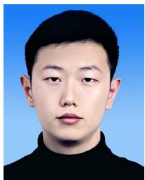

<details>
<summary>natural_image</summary>

Portrait photo of a young man in a black top against a blue background (no text or symbols visible)
</details>

Jianxin Zhang received the B.S. degree in communication engineering from Henan Normal University, Xinxiang, China, in 2016, the M.S. degree in electrical engineering from Northwestern Polytechnical University, Xi’an, China, in 2019. He is currently working toward the Ph.D. degree in communication engineering with Xiamen University, Xiamen, China. His research interests include space-air-ground integrated networks, SDN/NFV, and network slicing.


<details>
<summary>natural_image</summary>

Portrait of a man wearing glasses and a light blue shirt (no text or symbols visible)
</details>

Qiang (John) Ye (Senior Member, IEEE) received the Ph.D. degree in electrical and computer engineering from the University of Waterloo, Waterloo, ON, Canada, in 2016. He was with the Department of Electrical and Computer Engineering, University of Waterloo, Waterloo, ON, Canada, as a Postdoctoral Fellow and then a Research Associate from 2016 to 2019. From 2019 to 2021, he was with the Department of Electrical and Computer Engineering and Technology, Minnesota State University, Mankato, MN, USA. From 2021 to 2023, he was an Assistant

Professor with the Department of Computer Science, Memorial University of Newfoundland, St. John’s, NL, Canada. Since 2023, he has been an Assistant Professor with the Department of Electrical and Software Engineering, Schulich School of Engineering, University of Calgary, Calgary, AB, Canada. He has authored or coauthored more than 70 research articles on top-ranked journals and conference proceedings. He is was the General, Publication, Program Cochairs for different reputable international conferences and workshops, and was an Associate Editor for prestigious international journals, such as IEEE TRANSACTIONS ON VEHICULAR TECHNOLOGY and IEEE TRANSACTIONS ON COGNITIVE COMMUNICATIONS AND NETWORKING. He was with the IEEE Vehicular Technology Society Region 7 Chapter Coordinator in 2024 and the Regions 1-7 Chapters Coordinator from 2022 to 2023. Dr. Ye was the recipient of the Best Paper Award in the IEEE/CIC International Conference on Communications in China in 2024 and the IEEE Transactions on Cognitive Communications and Networking Exemplary Editor Award in 2023.


<details>
<summary>natural_image</summary>

Portrait of a woman wearing glasses and formal attire (no text or symbols visible)
</details>

Kaige Qu (Member, IEEE) received the B.Sc. degree in communication engineering from Shandong University, Jinan, China, in 2013, and the M.Sc. degrees in integrated circuits engineering and electrical engineering from Tsinghua University, Beijing, China, and KU Leuven, Leuven, Belgium, in 2016, and the Ph.D. degree in electrical and computer engineering from the University of Waterloo, Waterloo, ON, Canada, in 2021. From 2021 to 2023, she was a Postdoctoral Fellow and then a Research Associate with the Department of Electrical and Computer Engineering, University of Waterloo. Her research interests include connected and autonomous vehicles, network intelligence, network virtualization, and digital twin assisted network automation.


<details>
<summary>natural_image</summary>

Portrait of a man wearing glasses and a dark jacket against a blue background (no text or symbols visible)
</details>

Yanglong Sun (Member, IEEE) received the B.S. and M.S. degrees from Zhengzhou University, Zhengzhou, China, in 2011 and 2014, respectively. He is currently working toward the Ph.D. degree in communication engineering, Xiamen University, Xiamen, China. From 2018 to 2019, he was a Visiting Ph.D. student with Broadband Communications Research Lab, Department of Electrical and Computer Engineering, University of Waterloo, Waterloo, ON, Canada. His research interests include on vehicular adhoc networks, resource allocation in IoV, mobile

5G networks, and intelligent transportation systems.


<details>
<summary>natural_image</summary>

Portrait photo of a middle-aged man with gray hair wearing a blue polo shirt against a blue background (no text or symbols visible)
</details>

Yuliang Tang (Member, IEEE) received the M.S. degree from the Beijing University of Posts and Telecommunications, Beijing, China, in 1996, and the Ph.D. degree in information and communication engineering from Xiamen University, Xiamen, China, in 2009. He is currently a Professor with the Department of Information and Communication Engineering, Xiamen University. He has authored or coauthored more than 100 papers in journals and international conferences. His research interests include wireless communication, 5G and beyond, and

vehicular adhoc networks. He has been granted more than 20 patents in his research areas.


<details>
<summary>natural_image</summary>

Portrait of a woman wearing glasses and a dark collared shirt (no text or symbols visible)
</details>

Dongmei Zhao (Senior Member, IEEE) received the Ph.D. degree with the Department of Electrical and Computer Engineering, University of Waterloo, Waterloo, ON, Canada, in 2002. In 2002, she joined the Department of Electrical and Computer Engineering, McMaster University, Hamilton, ON, where she is a Full Professor. She is currently a Professional Engineer with Ontario. she is an Associate Editor for the IEEE INTERNET OF THINGS JOURNAL, and also for the IEEE TRANSACTIONS ON VEHICULAR TECH-NOLOGY from 2007 to 2017. She was the IEEE VTS

Distinguished Lecturer. Her research interests mainly include mobile wireless networking, energy efficient networking, vehicular networks, and digital twins.


<details>
<summary>natural_image</summary>

Portrait of a woman in formal attire with long dark hair (no visible text or symbols)
</details>

Tong Ye (Member, IEEE) received the B.S. degree in communication engineering from Fuzhou University, Fuzhou, China, in 2020, the M.S. degree in communication engineering from Xiamen University, Xiamen, China, in 2023. Her research interests include service function chain and network virtualization.