# Learning-Based Over-the-Air Integrated Sensing, Communication and Computation in UAV Swarm-Enabled Intelligent Transportation Systems

Peng Hou , Graduate Student Member, IEEE, Hongbin Zhu , Member, IEEE, Zhihui Lu , Member, IEEE, Shin-Chia Huang , Senior Member, IEEE, Yang Yang , Fellow, IEEE, and Hongfeng Chai

Abstract—The Over-the-air Integrated Sensing, Communication, and Computation (Air-ISCC), supported by Unmanned Aerial Vehicles (UAVs), is a key technology for future 6G wireless networks. Air-ISCC can facilitate the mutual gain of communication, sensing, and computation functions. Equipping UAVs with sensing and communication units and computation resources empowers them to sense network environments and incorporate sensing information to provide computation offloading and mobile computing services. To optimize sensing, communication, and computation performance jointly, we present a multi-objective optimization framework in this paper. This framework jointly optimizes time slot scheduling, power control, resource allocation, and service association to maximize the service success of Air-ISCC while minimizing the energy consumption of UAVs. We transform the Air-ISCC problem into a sequential decision-making problem and propose a Proximity policy optimization-Based Intelligent Air-ISCC algorithm (PBIA) based on deep reinforcement learning. Leveraging the parallelization capability of the PBIA algorithm, we further propose training intelligent agents based on parallel deep reinforcement learning to realize autonomous decisionmaking of UAV swarm. Experimental results show that PBIA can learn effective policies with high learning efficiency and stability. Compared to baselines, PBIA significantly enhances the service success rate from 16.32% to 61.44%.

Received 29 April 2024; revised 14 July 2024 and 19 September 2024; accepted 2 November 2024. Date of publication 5 November 2024; date of current version 21 August 2025. This work was supported in part by the Shanghai Sailing Program under Grant 23YF1402600; in part by the National Key Research and Development Program of China under Grant 2021YFC3300600; in part by the Shanghai Science and Technology Project under Grant 23511100500 and Grant 22510761000; in part by the National Natural Science Foundation of China under Grant 92046024, Grant 92146002, and Grant 61873309; in part by the Intel Sponsored Research Agreement Intel CG under Grant #89533661; and in part by the MOST Key International S&T Collaboration Program under Grant 2024YFE0200500. The editor coordinating the review of this article was M. Chen. (Corresponding authors: Hongbin Zhu; Zhihui Lu.)

Digital Object Identifier 10.1109/TGCN.2024.3492028

Index Terms—Integrated sensing and communications, unmanned aerial vehicles, reinforcement learning, intelligent transportation systems, multi-access edge computing.

## I. INTRODUCTION

ing and wireless communication technologies, the network nodes in the B5G and 6G era are envisioned to go beyond a singular communication dimension and perform environmental sensing and data communication services in an integrated manner [1], [2]. To this end, Integrated Sensing And Communication (ISAC) technology has emerged as one of the key technologies in B5G and 6G [3]. ISAC aims to realize efficient resource utilization by sharing spectrum resources and hardware devices between sensing and communication systems [4], [5], [6].

Moreover, the rapid growth of the Internet of Things Devices (IoTDs) and the increasing diversity of network services necessitate the development of multifunctional networks [7], [8]. Future networks must not only ensure reliable data transmission from device to the edge but also support ubiquitous smart applications featuring high-precision sensing and low-latency computing [9]. These networks will integrate data from a multitude of connected devices with sensing capabilities, enabling autonomous reasoning and decision-making [10]. For example, In complex and dynamic environments such as Intelligent Transportation Systems (ITS), the execution of IoTD tasks requires precise environmental sensing and enhanced computing capabilities for adaptive decision-making. Moreover, since sensing data often require subsequent processing, ISAC services can be provided more efficiently and with better timeliness through the rational selection of computing nodes [11]. Hence, the integration of sensing, communication, and computation functions is essential [10], [12]. However, traditional cloud/edge computing networks and ISAC networks typically separate these three functions, which contradicts the vision for 6G networks [8]. Recent advances in signal processing and mobile computing technologies suggest that combining ISAC technology with the Multi-access Edge Computing (MEC) paradigm is a promising approach to achieve Integrated Sensing, Communication, and Computation (ISCC) [1], [9], [13]. ISCC not only leverages spectrum multiplexing and provides sensing capabilities similar to ISAC networks but also introduces new degrees of freedom for the joint design of sensing, computation, and communication, leading to synergistic enhancement [8]. Therefore, the study of ISCC is of extraordinary significance.

The performance of terrestrial ISCC is bottlenecked by challenging propagation conditions, particularly in disasterstricken regions, remote areas, and hotspots [9]. To enhance the quality of ISCC services, Unmanned Aerial Vehicle (UAV)-based Over-the-air ISCC (Air-ISCC) has been proposed as a candidate to overcome the limitations of terrestrial ISCC [8], [14]. Compared to centralized methods such as ground base stations and satellites, UAVs offer significant advantages, including wide coverage, high mobility, and lineof-sight communication [5], [6], [15], [16]. Additionally, UAVs equipped with dual-functional radar communication systems can provide flexible communication and sensing services for IoT devices via ISAC technology. Furthermore, UAVs with edge servers and AI capabilities can deliver proximity-based, low-latency edge computing services to IoTDs, thereby supporting more complex ISCC scenarios and intelligent services [1], [7], [15], [17].

However, a single UAV’s limited sensing range, communication rate, and computation capability can result in suboptimal performance for geographically dispersed and time-critical tasks [11], [15]. In an Air-ISCC network with multiple UAVs, larger sensing coverage can be achieved by sharing or fusing the sensing results of different UAVs [11]. Load balancing among UAVs can be facilitated through service associations, reducing resource competition among IoTDs and providing lower latency data transmission and computation services for IoTDs. Moreover, the energy consumption of individual UAVs can be reduced, extending their service duration. By integrating the sensing, communication, and computation capabilities of multiple UAVs, the limitations of a single UAV can be effectively compensated for, and resource efficiency can be further improved [18], [19].

The intelligent decision-making of UAV swarm network, along with the collaboration among multiple UAVs, remains a challenge, particularly when considering sensing, communication, and computation efficiencies [6], [15]. Additionally, unlike ISAC, ISCC not only enhances resource management in the computation dimension but also requires balancing the inherent conflicts among sensing, communication, and computation performance. This balance is crucial to avoid inefficient competition for multidimensional resources among IoTDs [10]. Therefore, achieving intelligent services and efficient resource management in UAV swarm-enabled Air-ISCC poses a challenge.

In particular, due to the time-varying nature of network environments and resource constraints, it may not be practical to simply solve the above challenges by traditional optimization methods is not practical [16]. Consequently, AI technology, particularly Deep Reinforcement Learning (DRL), emerges as a promising solution for the Air-ISCC problem [9], [15], [16]. With the further combination of UAV and AI technologies, the UAV can be equipped with a high-performance chip and algorithms, such as DRL [19]. Specifically, DRL is a learning-from-experience method that does not require labeling the training sample pairs in advance, which is especially suitable for decision-making in dynamic Air-ISCC [15]. By combining ISCC functions with DRL algorithms, UAVs can dynamically sense channel state, target location, available resources, etc., in real time and make optimal ISCC decisions, thereby providing high-quality services for IoTDs [19]. Additionally, leveraging their high mobility, UAVs can achieve rapid deployment to address diverse service scenarios and demands.

Inspired by the above, we consider an ITS network enabled by a UAV swarm, in which UAVs act as an Air-ISCC platform. This platform can provide sensing, communication, and computation services for mobile IoTDs. To realize real-time intelligent task scheduling, service association, and resource allocation, the key challenge of Air-ISCC is 1) how to integrate heterogeneous resources and time-varying information; and 2) the collaboration between multiple UAVs. Therefore, we model the Air-ISCC problem as a multi-objective optimization problem and propose an intelligent DRL-based solution. The main contributions of this paper are as follows:

We consider an Air-ISCC network enabled by a UAV swarm in ITS. The Air-ISCC problem is formulated as a multi-objective optimization problem that concurrently enhances system energy efficiency and service success rate. To this end, we jointly optimize time slot scheduling, power control, resource allocation, and service association.

To facilitate collaboration and intelligent decisionmaking among UAVs, we propose the Proximal policy optimization-Based Intelligent Air-ISCC (PBIA) algorithm. Leveraging the principles of DRL, the algorithm transforms the Air-ISCC problem into a Markov decisionmaking process. Through continuous interaction with the environment, we can obtain the optimal service policy.

• Given the parallelization feature of the PBIA algorithm, we further propose to employ parallel DRL to enable efficient training of the model. In addition, We provide the model testing and deployment methods.

Sufficient experimental results show that the PBIA algorithm effectively learns an Air-ISCC policy. The algorithm not only exhibits fast learning, high stability, and robust decision-making capabilities but also facilitates collaboration among multiple UAVs.

The rest of the paper is organized as follows: Section II reviews the related work. In Section III, we present the system model. Section IV formulates the Air-ISCC problem. In Section V, we propose a DRL-based solution algorithm. Section VI presents the performance evaluation results. Finally, we conclude the paper in Section VII.

## II. RELATED WORK

## A. UAV-Enabled ISAC

The UAV-enabled ISAC has been regarded as one of the crucial applications in 6G networks. Current studies are focused on enhancing the radar sensing and data communication capabilities of over-the-air ISAC, including aspects such as multi-input multi-output beamforming, waveform design, trajectory optimization, power control, and interference cancellation [14].

For example, in beamforming and trajectory optimization, Chen et al. [18] devised a novel antenna array integrated into a UAV, enabling beam sharing by orthogonally generating sensing and communication beams. Meng et al. [4] introduced an algorithm leveraging a two-layer penalty to jointly optimize UAV trajectories, user associations, and beamforming for UAV-enabled ISAC systems to maximize throughput. Meanwhile, Liu et al. [6] considered the integration of UAVs into the IoT for ISAC services. They proposed a three-layer iterative optimization algorithm that jointly optimizes node scheduling, transmit power, and UAV trajectory to maximize communication rates. Qin et al. [16] jointly optimize user associations, UAV trajectories, and power allocation in a network with UAVs acting as mobile aerial ISAC platforms, and propose a centralized and distributed DRL-based solution to maximize the weighted spectral efficiency. In addition, regarding power control, and interference cancellation, Rezaei et al. [3] considered an ISAC system with wireless power transfer, in which energy is transmitted from UAVs to users during radar sensing. They proposed an alternating optimization-based approach to enhance the system performance by jointly optimizing radar performance, time scheduling, and power control. Mu et al. [20] considered the interference between communication signals as well as between sensing signals and communication signals. They used the ratio of the total transmitted data rate to the total power consumption as an optimization object to achieve energy-efficient interference cancellation.

## B. UAV-Enabled ISCC

With the convergence of UAV and MEC technologies, over-the-air ISAC is evolving into Air-ISCC. This advancement enhances the overall network performance through the joint optimization of sensing, communication, and computation functionalities. Current research on Air-ISCC primarily focuses on incorporating aspects of computation offloading and resource allocation into the existing Air-ISAC framework.

Huang et al. [1] studied the joint optimization problem of sensing scheduling, number of time slots, sensing power, communication power, and UAV trajectory in ISAC for UAVenabled MEC. They proposed an effective algorithm for reducing the UAV’s energy consumption and data collection time. Li et al. [9] considered an Air-ISCC network driven by digital twins in which users perform radar sensing and computation offloading on the same spectrum while UAVs are deployed to provide edge computing services. They proposed a multi-agent Proximal Policy Optimization (PPO) algorithm based on DRL to minimize the radar vibration performance and offload energy consumption. Zhou et al. [7] proposed a UAV-enabled ISCC system for IoT, which supports users to perform radar sensing, local computation, and computation offloading. It aims to minimize weighted energy consumption through iterative optimization of resource allocation, power control, and UAV trajectory. In addition, Xu et al. [8] realize the trade-off between sensing, communication, and computation by determining the Pareto boundary between computing power and sensing beam gain in the UAV-enabled ISCC framework.

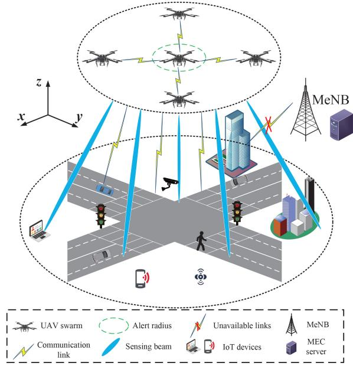  
Fig. 1. Air-ISCC in UAV swarm-enabled ITS network.

Table I provides an overview of the differences between this paper and existing works. Notably, our work differs in several key aspects: 1) Unlike studies focusing on a single UAV, we consider an Air-ISCC network supported by a UAV swarm. In this network, multiple UAVs achieve ISCC through target sensing, data offloading, and over-the-air computation. 2) To balance sensing, communication, and computation performance, we introduce an optimization objective that aligns closely with real-world requirements. Specifically, our goal is to maximize the success rate of ISCC services while reducing energy consumption. 3) Our study also considers the impact of IoTD’s mobility on system performance. We jointly optimize time slot scheduling, power control, and resource allocation, facilitating multi-UAV collaboration through intelligent service association. 4) We propose an intelligent solution based on DRL to enable intelligent decision-making for UAV swarm, including model training, testing, and deployment.

## III. SYSTEM MODEL

## A. Network Model

As shown in Fig. 1, we consider an Air-ISCC network in the ITS. The network comprises a UAV swarm with m UAVs and n single-antenna terrestrial IoTDs, denoted as sets U = $\{ 1 , 2 , \ldots , m \} , | \mathcal { U } | \ = \ m \ \mathrm { a n d } \ \mathcal { Z } \ = \ \{ 1 , 2 , \ldots , n \} , | \mathcal { Z } | \ = \ n ,$ respectively. The communication links and sensing signals between IoTDs and master eNodeB (MeNB) are blocked due to terrain constraints or traffic accidents [12]. Each UAV is equipped with an antenna array and a radar sensing unit that generates sensing beams and communication beams for sensing and data communication [18]. It is assumed that orthogonal subchannels with a uniform bandwidth B are used between the UAVs [10]. Additionally, Orthogonal Frequency Division Multiple (OFDM) and self-interference cancellation techniques are employed to eliminate interference between UAVs [1], [18]. Moreover, the UAVs are also equipped with computing and storage resources that provide computing services for real-time processing of sensing tasks while realizing communication services and target sensing [16], [19]. Therefore, UAVs can sense the environmental information around IoTDs based on the echoes [6] and provide over-the-air communication and computation services to the IoTDs [19].

TABLE I  
COMPARISON OF THIS PAPER WITH EXISTING WORKS
<table><tr><td>Work</td><td>Optimization objective</td><td>Method</td><td>ISCC</td><td>Multi objective</td><td>Multi-UAV</td><td>Mobility of IoTDs</td><td>Edge intelligence</td></tr><tr><td>Our</td><td>Energy consumption &amp; success rate</td><td>DRL</td><td>√</td><td></td><td></td><td></td><td></td></tr><tr><td>[2]</td><td>Trajectory optimization &amp; communication rates</td><td>Iterative optimization</td><td>X</td><td>4</td><td>X</td><td>X</td><td>X</td></tr><tr><td>[4]</td><td>Throughput</td><td>Heuristic algorithm</td><td>X</td><td>X</td><td>X</td><td>X</td><td>X</td></tr><tr><td>[7]</td><td>Energy consumption</td><td>Iterative optimization</td><td></td><td>X</td><td>X</td><td>X</td><td>X</td></tr><tr><td>[8]</td><td>Communication rate &amp; sensing gain</td><td>Semidefinite programming &amp; concave-convex procedure</td><td></td><td></td><td>X</td><td>X</td><td>X</td></tr><tr><td>[5]</td><td>Energy efficiency</td><td>Successive convex approximation &amp; fractional programming</td><td>X</td><td>V</td><td>X</td><td>X</td><td>X</td></tr><tr><td>[6]</td><td>Communication rate</td><td>Iterative optimization</td><td>X</td><td>X</td><td>X</td><td>X</td><td>X</td></tr><tr><td>[16]</td><td>Spectral efficiency</td><td>DRL</td><td>X</td><td>V</td><td>√</td><td>X</td><td></td></tr><tr><td>[1]</td><td>Energy consumption &amp; latency</td><td>Block coordinate drop</td><td></td><td></td><td>X</td><td>X</td><td>X</td></tr><tr><td>[13]</td><td>Energy consumption &amp; latency</td><td>Successive convex approximation</td><td></td><td>√</td><td>X</td><td>X</td><td>X</td></tr><tr><td>[15]</td><td>Cost</td><td>DRL</td><td>1</td><td>X</td><td>X</td><td>X</td><td>√</td></tr><tr><td>[3]</td><td>Signal-to-noise ratio &amp; throughput</td><td>Alternate optimization &amp; fractional programming</td><td>X</td><td>X</td><td>√</td><td>X</td><td>X</td></tr><tr><td>[9]</td><td>Radar performance &amp; energy consumption</td><td>DRL</td><td></td><td></td><td></td><td>X</td><td></td></tr></table>

We assume that the flight time T and flight altitude H of the UAV swarm are constant [4], [5], [6], [16]. We divide T into N time slots, each of duration $\Delta = \tau / N$ , and the time slot index is denoted by $t \in { \cal T } = \{ 1 , 2 , \dots , N \}$ . The time slots are selected small enough to assume that the positions of the UAVs and IoTDs remain relatively constant during this duration to facilitate radar sensing and data communication. The position of the UAV swarm is stationary, serving the IoTDs within a specified region.1 Conversely, the positions of the IoTDs change over time. In the Cartesian 3D coordinate system, the position of IoTD i and UAV j at time slot t are denoted as $L _ { i } ^ { d } [ t ] = ( x _ { i } [ t ] , y _ { i } [ t ] , 0 ) , \ L _ { j } ^ { u } = ( x _ { j } , y _ { j } , H )$ , respectively. For safety, each UAV has a guard radius $R _ { g } ,$ i.e., the distance between UAVs cannot be less than $R _ { g }$ [18].

$$
\left\| L _ { i } ^ { u } - L _ { j } ^ { u } \right\| _ { 2 } \geq R _ { g } , \forall i , j \in \mathcal { U } .\tag{1}
$$

To prevent mutual interference between radar signals and communication signals, Air-ISCC employs Time-Division Multiplexing (TDM) technology for radar sensing, communication, and computation [4], [5], [6], [7]. As shown in Fig. 2, each time slot is divided into two sub-time slots by assigning weighting parameters α [6]. The first sub-time slot is used for sensing the environment and target position estimation, and the second sub-timeslot is used for over-the-air computation services including task offloading for IoTDs and computation for UAVs. Specifically, each task needs to be completed in a time slot [4], [8].

We consider the potential applications of the proposed UAV swarm-enabled ITS model mainly in emergency response scenarios that require rapid deployment, such as disaster relief and rapid rescue for major traffic disruptions/communication outages in ITS [12]. The UAVs’ sensing capabilities can quickly gather information about the traffic scene, while computing services can optimize rescue paths and resource scheduling, thereby enhancing the efficiency of emergency response.

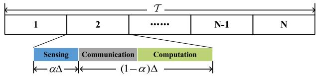  
Fig. 2. Time slot division.

## B. Sensing Model

When the UAV’s ISAC device performs radar sensing, information bits are embedded in the sidelobe waveform of the radar signal beampattern [14]. The reflected radar signal from each receiver is converted into a set of radar data. According to the radar detection model in [21], the amount of radar data (in bits) for UAV j at time slot t can be modeled as

$$
D _ { j } ^ { r a d } [ t ] = \xi _ { j } \nu _ { j } N _ { \theta } f _ { s } [ t ] \varphi _ { i } , \forall j \in \mathbb { Z } ,\tag{2}
$$

where $D _ { j } ^ { r a d } [ t ]$ includes data such as position, obstacle identification, signal measurement, and target identification [1]. $\xi _ { j } ~ \ge ~ 1$ is a constant associated with the introduced data redundancy, $\nu _ { j }$ is the switching speed of the radar beam, $N _ { \theta }$ is the number of quantization angles, $f _ { s } [ t ]$ is the sampling frequency, and $\varphi _ { j }$ is the number of quantization bits each sample.

The communication signals are removed from the detected waveform using Serial Interference Cancellation (SIC) to obtain the radar echo signal without communication interference [1], [14]. Therefore, the channel power gain of the suppressed radar echo signal received by UAV j at the time slot t can be expressed as [5], [7]

$$
h _ { j , i } ^ { r a d } [ t ] = \frac { G _ { \mathrm { t r a n } } G _ { \mathrm { r e c e } } \lambda ^ { 2 } \sigma _ { r c s } } { ( 4 \pi ) ^ { 3 } \left( d _ { i , j } [ t ] \right) ^ { 4 } } = \frac { g _ { 0 } ^ { r a d } } { \left( d _ { i , j } [ t ] \right) ^ { 4 } } , \forall i \in \mathcal { I } , j \in \mathcal { U } ,\tag{3}
$$

where $g _ { 0 } ^ { r a d }$ is the channel power at the reference distance $d _ { i , j } [ t ] ~ { = } ~ 1 . ~ G _ { \mathrm { t r a n } }$ and $G _ { \mathrm { r e c e } }$ are the antenna gains of the UAV’s transmitter and receiver, respectively, and $\sigma _ { r c s }$ denotes the radar cross-section of the target. $\begin{array} { r } { \lambda { } ~ = ~ c / f _ { c } } \end{array}$ denotes the signal wavelength, where c and $f _ { c }$ denote the speed of light and the signal carrier frequency, respectively. $\| \bar { L } _ { i } ^ { d } [ t ] - L _ { j } ^ { u } \| ^ { 2 }$ represents the distance from UAV j to IoTD i in time slot t. We assume that the Doppler shift induced by the moving target is constant so that the Doppler parameters can be fully compensated [9].

Since the radar illumination on the target can be regarded as the target passively transmitting information about its parameters [1]. Therefore, the radar estimated information rate can be regarded as the mutual information between the radar and the target [7], [10], i.e., the amount of information about the target parameters provided by the received echo signal [5], [6]. According to information theory, the greater the mutual information, the more target information can be acquired [6]. Therefore, we employ the radar estimated information rate to measure the sensing performance of the radar [5], [22]. The radar estimated information rate between UAV j and IoTD i in time slot t is

$$
R _ { i , j } ^ { r a d } [ t ] = { B \log _ { 2 } } \left( 1 + \frac { { { p _ { j } } [ t ] { h _ { i , j } ^ { r a d } [ t ] } } } { { \sigma _ { 0 } ^ { 2 } } } \right) , \forall i \in \mathcal { I } , j \in \mathcal { U } ,\tag{4}
$$

where $p _ { j } [ t ]$ denote the sensing power of UAV j, B is the bandwidth of ISCC, and $\sigma _ { 0 } ^ { 2 }$ denotes the noise power. Since different UAVs use distinct orthogonal subchannels, interference can be ignored [23].

To effectively sense the environment through radar sensing to support the service, the average information from the radar estimate should not be less than the required radar detection data [7]. i.e.,

$$
\sum _ { i = 1 } ^ { n } c _ { i , j } [ t ] R _ { i , j } ^ { r a d } [ t ] \alpha _ { j } [ t ] \Delta \geq D _ { j } ^ { r a d } [ t ] , \forall i \in \mathcal { I } , j \in \mathcal { U } ,\tag{5}
$$

here, $c _ { i , j } [ t ]$ is the association variable between IoTD i and UAV j at time slot t. $c _ { i , j } [ t ] = 1$ means that IoTD i is one of the service targets of UAV j, otherwise $c _ { i , j } [ t ] = 0$ . Note that optimizing $c _ { i , j } [ t ]$ not only improves the efficiency of the service but also promotes collaboration among UAVs. The sensing energy consumption of the UAV j at time slot t is

$$
E _ { j } ^ { r a d } [ t ] = \alpha _ { j } [ t ] \Delta p _ { j } [ t ] , \forall j \in \mathcal { U } .\tag{6}
$$

where $\alpha _ { j } [ t ] \Delta$ denotes the sensing sub-timeslot duration of $\mathrm { U A V } ~ j$ at timeslot t.

## C. Communication Model

At time slot t, after the UAV completes environment sensing and target localization, IoTD i will offload the generated task $\Omega _ { i } \overline { { [ t ] } } = \{ D _ { i } ^ { o f f } [ t ] , C _ { i . } ^ { o f f } [ t ] \}$ to the UAV for over-the-air computation services. $D _ { i . . } ^ { o f f } [ t ]$ is the amount of input data for the computing task, $C _ { i } ^ { o f f } [ t ]$ is the average number of CPU cycles required for the task per unit bit [9]. The channel power gain of the ground-to-air link from IoTD i to UAV j at time slot t can be expressed as [6]

$$
h _ { i , j } ^ { c o m m } [ t ] = \frac { g _ { t } G _ { \mathrm { r e c e } } \lambda ^ { 2 } } { \left( 4 \pi \right) ^ { 2 } \left( d _ { i , j } [ t ] \right) ^ { 2 } } = \frac { g _ { 0 } ^ { c o m m } } { \left( d _ { i , j } [ t ] \right) ^ { 2 } } , \forall i \in \mathcal { I } , j \in \mathcal { U } ,\tag{7}
$$

where $g _ { 0 } ^ { c o m m }$ is the channel power at the reference distance $\begin{array} { l l l l } { { d _ { i , j } } } & { { = } } & { { d _ { i , j } [ t ] } } & { { = } } & { { 1 \mathrm { m } } } \end{array}$ $g _ { t }$ is the antenna gain of the transmitter of the IoTD. According to Shannon’s second theorem, the communication rate of IoTD i sending data to UAV j at time ranging slot t is expressed as

$$
R _ { i , j } ^ { c o m m } [ t ] = { \cal B } \log _ { 2 } \left( 1 + \frac { q _ { i } h _ { i , j } ^ { c o m } [ t ] } { \sigma _ { 0 } ^ { 2 } } \right) , \forall i \in \mathbb { Z } , j \in \mathcal { U } ,\tag{8}
$$

where $q _ { i }$ denotes the communication power of IoTD i. Therefore, the delay and energy consumption of IoTD i to offload the task at time slot t is

$$
T _ { i } ^ { o f f } [ t ] = c _ { i , j } [ t ] \frac { D _ { i } ^ { o f f } [ t ] } { R _ { i , j } ^ { c o m } [ t ] } , \forall i \in \mathcal { I } , j \in \mathcal { U } ,\tag{9}
$$

$$
E _ { i } ^ { o f f } [ t ] = q _ { i } T _ { i } ^ { o f f } [ t ] , \forall i \in \mathcal { T } .\tag{10}
$$

## D. Computation Model

We assume that the UAV performs computation processing only after the IoTD completes task offloading. In addition, using the Dynamic Voltage and Frequency Scaling (DVFS) technique [17], the UAV can dynamically allocate its computing resources based on the amount of arriving tasks [13], [19]. Let $\varepsilon _ { i , j } [ t ]$ denote the proportion of CPU computing resources that UAV j allocates to IoTD i, and $f _ { i } ^ { \mathrm { m a x } }$ represents the total CPU computing resources of $\mathrm { U A V } j [ 2 4 ]$ . Then the computing delay of IoTD i’s tasks and the computing energy consumption of the UAV j at time slot t can be calculated as

$$
T _ { i } ^ { c o m p } [ t ] = c _ { i , j } [ t ] \frac { D _ { i } ^ { o f f } [ t ] C _ { i } ^ { o f f } [ t ] } { \varepsilon _ { i , j } [ t ] f _ { j } ^ { \operatorname* { m a x } } } , \forall i \in \mathcal { I } , j \in \mathcal { U } ,\tag{11}
$$

$$
E _ { j } ^ { c o m p } [ t ] = \sum _ { i = 1 } ^ { n } c _ { i , j } [ t ] \kappa _ { j } \left( \varepsilon _ { j , i } [ t ] f _ { j } ^ { \operatorname* { m a x } } \right) ^ { 3 } T _ { i } ^ { c o m p } [ t ] , \forall i \in \mathcal { I } , j \in \mathcal { U } ,\tag{12}
$$

where $\kappa _ { j }$ denotes the effective capacitance factor of the UAV’s processor, which is a constant determined by the UAV hardware specifications [7]. Then, the service delay of the offloaded task can be calculated as (13) and satisfies the time slot constraint (14),

$$
T _ { i } ^ { s e r } [ t ] = T _ { i } ^ { o f f } [ t ] + T _ { i } ^ { c o m p } [ t ] ,\tag{13}
$$

$$
\begin{array} { r } { T _ { i } ^ { s e r } [ t ] \leq c _ { i , j } [ t ] ( 1 - \alpha _ { j } [ t ] ) \Delta , } \end{array}\tag{14}
$$

where $( 1 - \alpha _ { j } [ t ] ) \Delta$ denotes the sub-slot duration used by the UAV j for communication and computation at time slot t.

According to (6) and (12), the energy consumption of the UAV j in time slot t is

$$
E _ { j } ^ { u a v } [ t ] = E _ { j } ^ { r a d } [ t ] + E _ { j } ^ { c o m p } [ t ] , \forall j \in \mathcal { U } .\tag{15}
$$

In real Air-ISCC systems, the computing results of a task are usually small [15]. Therefore, we ignore the delay and energy consumption of the resulting backhaul [13], [19], which does not have a significant impact on the subsequent analysis.

## IV. PROBLEM FORMULATION

## A. Problem Definition

The primary objective of ISCC is to ensure high-quality service for over-the-air computation, specifically by maximizing the success rate O[t] of services. We employ the variable $o _ { i } [ t ]$ to signify whether the task of IoTD i is successful at time slot t. If constraints (5) and (14) are met, $o _ { i } [ t ] = 1$ , otherwise, $o _ { i } [ t ] = 0$ . Therefore, the success of the service relies on the processes of sensing, communication, and computation, and is intricately linked to time slot scheduling, power control, resource allocation, and service association.

$$
o _ { i } [ t ] = { \left\{ \begin{array} { l l } { 1 , { \mathrm { ~ i f ~ } } { \mathrm { s a t i s f y ~ } } ( 5 ) { \mathrm { ~ a n d ~ } } ( 1 4 ) , } \\ { 0 , { \mathrm { ~ o t h e r w i s e } } , } \end{array} \right. }\tag{16}
$$

$$
\mathcal { O } [ t ] = \frac { \sum _ { i = 1 } ^ { n } o _ { i } [ t ] } { | \mathcal { T } | } \times 1 0 0 \% , \forall i \in \mathcal { T } , t \in T .\tag{17}
$$

Given that UAV-enabled Air-ISCC operates within strictly energy constraints, it becomes imperative to consider energy consumption to prolong the network’s service duration. We define the system energy consumption E[t] at time slot t as the average of the energy consumption of the UAVs and the IoTDs, calculated as

$$
\mathcal { E } [ t ] = \eta _ { 1 } \frac { 1 } { m } \sum _ { j = 1 } ^ { m } E _ { j } ^ { u a v } [ t ] + \eta _ { 2 } \frac { 1 } { n } \sum _ { i = 1 } ^ { n } E _ { i } ^ { o f f } [ t ] ,\tag{18}
$$

where the weight factors $\eta _ { 1 }$ and $\eta _ { 2 }$ are employed to balance the energy consumption of the UAVs and IoTDs, acting as empirical parameters closely related to the environmental settings.2

In summary, this paper aims to maximize the success rate of offloading tasks and minimize the total system energy consumption over the entire service period. This is achieved by jointly optimizing time slot scheduling, power control, resource allocation, and service association while satisfying the sensing quality, service delay, and resource constraint. Consequently, the Air-ISCC problem in ITS can be formulated as a multi-objective optimization problem, denoted as P1.

$$
\operatorname* { m a x } _ { \alpha , \mathbf { p } , \epsilon , \mathcal { C } } \frac { 1 } { N } \sum _ { t = 1 } ^ { N } \{ - \mathcal { E } [ t ] , \mathcal { O } [ t ] \}\tag{P1}
$$

$$
\mathrm { s . t . } x _ { i } [ t ] , y _ { i } [ t ] \in \Lambda , \forall i \in \mathcal { I } ,\tag{19a}
$$

$$
0 < \alpha _ { j } [ t ] \leq 1 , \forall j \in \mathcal { U } ,\tag{19b}
$$

$$
0 < p _ { j } [ t ] \leq p _ { \operatorname* { m a x } } , \forall j \in \mathcal { U } ,\tag{19c}
$$

$$
c _ { i , j } [ t ] \in \{ 0 , 1 \} , \sum _ { j = 1 } ^ { m } c _ { i , j } [ t ] = 1 , \forall i \in \mathbb { Z } , j \in \mathcal { U } ,\tag{19d}
$$

$$
0 \leq \varepsilon _ { i , j } [ t ] \leq 1 ,\tag{19e}
$$

$$
\begin{array} { r } { \sum _ { i = 1 } ^ { n } c _ { i , j } [ t ] \varepsilon _ { i , j } [ t ] \leq 1 , \forall i \in \mathcal { I } , j \in \mathcal { U } , } \end{array}\tag{19f}
$$

$$
( 5 ) , \ ( 1 4 ) .\tag{19g}
$$

where sets $\pmb { \alpha } = \{ \pmb { \alpha } _ { j } [ t ] | t \in T , j \in \mathcal { U } \}$ denote the time slot scheduling decisions, $\textbf { p } = \ \{ p _ { j } [ t ] | j \ \in \ \mathcal { U } , t \ \in \ T \}$ denote the power control decisions for UAVs. Meanwhile, sets ${ \mathcal { C } } =$ $\{ c _ { i , j } [ t ] | i \in \mathcal { I } , j \in \mathcal { U } , t \in \mathcal { T } \}$ and $\pmb { \varepsilon } = \{ \varepsilon _ { i , j } [ t ] | j \in \mathcal { U } , i \in$ ${ \mathcal { T } } , t \in T \}$ are the service association and computing resource allocation decisions between IoTDs and UAVs. Condition (19a) indicates that the IoTD’s movable range corresponds to the coverage area of the UAV swarm, where Λ denotes the UAV swarm’s coverage area (service area). Inequality (19b) specifies the range of values for the time slot weight $\alpha _ { j } [ t ]$ . Inequality (19c) indicates that the sensing power of the UAV must not exceed the maximum power $p _ { \mathrm { m a x } } .$ . Inequality (19d) defines the value of the association variable $c _ { i , j } [ t ]$ between the IoTDs and UAVs, and each IoTD can be associated with only one UAV. Inequality (19e) specifies the range of values for the proportion of computing resources $\varepsilon _ { i , j } [ t ]$ allocated by the UAV to the IoTDs, while (19f) represents the total proportion of computing resources allocated to the associated IoTDs by the each UAV must not exceed 1. Condition (19g) represents constraints on sensing, communication, and computation.3

## B. Problem Analysis

Due to the complex interdependencies among the four optimization variables and the introduction of the binary integer constraint C, problem P1 is a nonlinear, highly non-convex mixed-integer fractional continuous optimization problem [9], [16]. Additionally, the time-varying nature of the environmental state renders P1 a continuous decision problem, making it impossible to simply decompose the objective over time [9]. Consequently, optimally solving P1 is extremely challenging, and no established standard method currently exists for addressing such non-convex continuous optimization problems [25].

Conventional optimization algorithms require the problem to be decomposed in each time slot and involve lengthy iterations to achieve satisfactory solutions [2], [5], [6], making traditional offline optimization methods impractical for this problem [9], [16]. Fortunately, the DRL algorithm offers a promising alternative [16], [26]. DRL is a goal-oriented intelligent decision-making method capable of addressing various complex problems requiring adaptive behavior and intelligent decision-making [25]. By incorporating information about the environmental state into the DRL algorithm and designing a suitable reward function based on the optimization objective of P1, an intelligent model can be trained to derive an optimal policy for the UAV swarm. Therefore, we propose a DRLbased solution algorithm.

$$
\mathrm { V . \ L E A R N I N G - B A S E D \ I N T E L L I G E N T { A I R } \mathrm { - } I S C C }
$$

$$
A . \ M D P { \cdot } B a s e d \ P r o b l e m \ T r a n s f o r m a t i o n
$$

Given the non-convexity of P1, we employ the DRL method as a solution strategy. Leveraging the powerful decision-making capability of the DRL, the multi-objective optimization problem P1 can be effectively addressed without relying on an exact model or global state information.

To this end, we transform P1 into a Markov decision process, symbolized by a quadruple $( S , A , P , R )$ , where each element $s _ { t } \in S$ represents a state and $a _ { t } \in A$ represents an action. $P : S \times A \to \pi ( S )$ denotes the state transfer function and $r _ { t } \in R : S \times A \to R$ is the reward function.

The core of reinforcement learning is to train an intelligent agent that continuously interacts with the environment based on a Markov decision process. The agent’s objective is to learn an optimal policy $\pi : S  { \mathcal { A } }$ that maximizes cumulative rewards. In this interaction process, the agent, in state $s _ { t } ,$ executes action $a _ { t }$ according to the policy. Subsequently, the state transitions from $s _ { t }$ to $s _ { t + 1 }$ , and the agent receives the reward $r _ { t } .$ This interactive repeats, enabling the intelligent agent to progressively maximize the cumulative reward $G _ { t }$ over time.

$$
G _ { t } = \sum _ { i = t } ^ { N } \gamma ^ { i - t } r _ { i } , \forall i \in T ,\tag{20}
$$

where $\gamma \in [ 0 , 1 )$ is a discount factor used to weigh the effect of future rewards on cumulative rewards.

Since the state transfer function of the Air-ISCC network cannot be accurately known, we propose to employ the modelfree DRL algorithm to solve P1. The basic components of the DRL framework (i.e., state, action, and reward) are defined as follows:

1) State: The state of Air-ISCC should include all factors related to sensing, communication, and computation. However, overly intricate states not only fail to enhance the performance of DRL but also introduce potential obstacles to the learning process of the agent. Therefore, we define the state $s _ { t } \in S$ to comprise the spatial coordinates of UAVs and IoTDs at time slot t, along with the tasks generated by IoTDs, which are the most crucial factors affecting the agent’s decision.

$$
\begin{array} { r l } & { s _ { t } = [ L _ { 1 } ^ { u } , \ldots , L _ { m } ^ { u } , x _ { 1 } [ t ] , \ldots , x _ { n } [ t ] } \\ & { \qquad y _ { 1 } [ t ] , \ldots , y _ { n } [ t ] , D _ { 1 } ^ { o f f } [ t ] , \ldots , D _ { n } ^ { o f f } [ t ] } \\ & { \qquad C _ { 1 } ^ { o f f } [ t ] , \ldots , C _ { n } ^ { o f f } [ t ] ] _ { 1 \times ( 3 m + 4 n ) } } \end{array}\tag{21}
$$

2) Action: The agent’s actions at time slot t are the decision variables required to optimize in P1, including time slot scheduling α, power control p, resource allocation ε, and service association $\mathcal { C } .$

$$
\begin{array} { r l } & { a _ { t } = [ \alpha _ { 1 } [ t ] , \alpha _ { 2 } [ t ] , \dotsc , \alpha _ { m } [ t ] , } \\ & { \qquad p _ { 1 } [ t ] , p _ { 2 } [ t ] , \dotsc , p _ { m } [ t ] , } \\ & { \qquad \varepsilon _ { 1 , 1 } [ t ] , \varepsilon _ { 2 , 1 } [ t ] , \dotsc , \varepsilon _ { n , m } [ t ] , } \\ & { \qquad c _ { 1 , 1 } [ t ] , c _ { 2 , 1 } [ t ] , \dotsc , c _ { n , m } ] _ { 1 \times ( 2 m + 2 m n ) } } \end{array}\tag{22}
$$

3) Reward: DRL typically aims to maximize a single objective, namely the cumulative reward $G _ { t } ,$ while problem P1 is inherently a multi-objective optimization problem. To address this discrepancy, we define the reward as the difference between the service success reward and the energy consumption,4 introducing a weighting factor $\varpi$ to balance the optimization objectives. This allows the two optimization objectives to be jointly expressed as the learning objective of the DRL agent.

$$
r _ { t } = - \mathcal { E } [ t ] + \varpi \sum _ { i = 1 } ^ { n } o _ { i } [ t ] .\tag{23}
$$

Eq. (23) provides a simple and consistent optimization objective for the DRL agent, enhancing the stability and convergence of the algorithm while reducing training complexity. This adaptive approach aligns DRL’s capabilities with the complex requirements of the multi-objective nature of P1. By designing the reward $r _ { t } ,$ , the DRL agent’s decisions not only maximize the service success rate but also minimize the system’s energy consumption, thereby achieving the multiobjective optimization of P1.

## B. PPO-Based Intelligent Air-ISCC

The popular DRLs include DDQN [19], DDPG, A3C, PPO [27], etc. However, in our model the state $s _ { t }$ is continuous, and the action a involves a combination of continuous and discrete variables. Consequently, algorithms like DDQN, designed exclusively for discrete actions are unsuitable for our problem. In addition, the DDPG algorithm suffers from low sample efficiency, hyperparameter sensitivity, and poor stability. In contrast, PPO not only utilizes the learning samples efficiently but also has good stability and convergence [9]. As a policy-based online DRL algorithm, PPO solves the problem of step size sensitivity that exists in traditional policy gradient algorithms. It incorporates innovative techniques like policy gradient, trust region optimization, clipping mechanism, and advantage function, giving PPO a superior advantage in solving P1. Therefore, we employ the PPO algorithm to train the DRL agent and propose the PPO-Based Intelligent Air-ISCC (PBIA) algorithm.

The PBIA algorithm employs actor-critic architecture to construct a policy optimization model to find the optimal neural network parameters $\theta ^ { * }$ to obtain the optimal Air-ISCC decision variables. Therefore, the PBIA consists of an actor network $\pi ( a | s ; \theta )$ and a critic network $V ( s ; w )$ , as shown in Fig. 3. The actor network $\pi ( a | s ; \theta )$ is further partitioned into two components, labeled old and new, associated with parameters $\theta _ { o l d }$ and θ, respectively. Additionally, the parameter of the critic network is denoted as w. In this architecture, the actor network $\pi ( a | s ; \theta )$ generates the action $a _ { t }$ based on the current state $s _ { t } ,$ interacting with the environment. Since the service association actions $c _ { i , j }$ are discrete, to facilitate the learning of the network, we unify $a _ { t }$ as a continuous action and use the argmax function to map $c _ { i , j }$ to a discrete decision.

$$
c _ { i , j } = \left\{ \begin{array} { l l } { 1 , j = \mathrm { a r g } \operatorname* { m a x } c _ { i , j } , } \\ { 0 , \mathrm { o t h w e w i s e } . } \end{array} \right.\tag{24}
$$

Before training, the PPO agent generates N experiences by interacting with the environment following the current policy to collect the samples required for training and store them in the experience pool M. The trajectory of experiences is

$$
\zeta = \{ s _ { 0 } , a _ { 0 } , r _ { 0 } , s _ { 1 } , s _ { 1 } , a _ { 1 } , r _ { 1 } , s _ { 2 } , . . . , s _ { N } , a _ { N } , r _ { N } \} ,\tag{25}
$$

where N denotes the total steps of the complete episodes experienced in each iteration. Then, the critic network V(s; w) computes state-related information by evaluating the state value $V _ { \pi } ( s ; w )$ , expressed as

$$
\begin{array} { r } { V _ { \pi } ( s _ { t } ; w ) = \mathbb { E } _ { \zeta \sim \pi ( a | s ; \theta ) } \biggl [ \sum _ { i = 0 } ^ { N } \gamma ^ { i - t } r _ { i } | s _ { t } \biggr ] . } \end{array}\tag{26}
$$

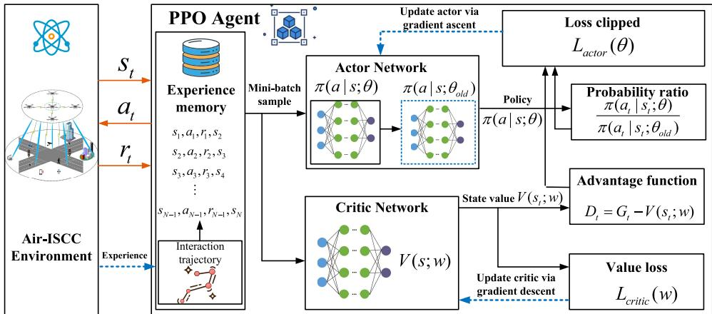  
Fig. 3. Network architecture for PPO-based intelligent Air-ISCC algorithm.

To reduce the variance of the gradient estimation, the PBIA algorithm introduces an advantage function to evaluate the performance of the action $a _ { t }$ , i.e.,

$$
D _ { t } = \sum _ { i = 0 } ^ { N } ( \gamma \lambda ) ^ { i - t } ( r _ { t } + b \gamma V _ { \pi } ( s _ { t + 1 } ) - V _ { \pi } ( s _ { t } ; w ) ) ,
$$

$$
G _ { t } = D _ { t } + V _ { \pi } ( s _ { t } ; w ) .\tag{27}
$$

(28)

Further, to ensure the stability of the policy update, (27) employs the Generalized Advantage Estimation (GAE) method. Here, b is 0 if $s N$ is the terminal state and 1 otherwise. $0 \leq \lambda \leq 1$ is called the smoothing factor of GAE and used to weigh the bias and variance of the advantage function estimator. Meanwhile, to reduce the variance between different trajectories and make the training more stable. We normalize the advantage values to make the distribution of advantage values of different trajectories more consistent.

$$
D _ { i } \gets \frac { D _ { i } - m e a n ( D _ { 1 } , \dots , D _ { N } ) } { s t d ( D _ { 1 } , \dots , D _ { N } ) } .\tag{29}
$$

For critic network V(s; w), we use temporal differencing to compute the loss function $L _ { c r i t i c }$ , and then minimize the loss of all mini-batch sampled data to update parameter w.

$$
\begin{array} { r l r } {  { L _ { c r i t i c } ( \boldsymbol { w } ) = \frac { 1 } { 2 K } \sum _ { i = 1 } ^ { K } ( \boldsymbol { G } _ { i } - V _ { \pi } ( s _ { i } ; \boldsymbol { w } ) ) ^ { 2 } , } } \\ & { } & \\ & { } & { \boldsymbol { w }  \boldsymbol { w } - \beta _ { w } \frac { 1 } { K } \sum _ { i = 1 } ^ { K } ( \boldsymbol { G } _ { i } - V _ { \pi } ( s _ { i } ; \boldsymbol { w } ) ) \nabla _ { \boldsymbol { w } } V _ { \pi } ( s _ { i } ; \boldsymbol { w } ) , } \end{array}\tag{30}
$$

(31)

where $\beta _ { w }$ is the learning rate of the critic network. K denotes the mini-batch size of experience trajectories sampled randomly.

For actor network $\pi ( a | s ; \theta )$ , the parameter θ is updated by optimizing the objective function $L _ { a c t o r } ( \theta )$ of the policy gradient

$$
L _ { a c t o r } ( \theta ) = \frac { 1 } { K } \sum _ { i = 1 } ^ { K } \operatorname* { m i n } ( \varphi _ { i } ( \theta ) \cdot D _ { i } , c _ { i } ( \theta ) \cdot D _ { i } + \mu \Phi _ { i } ( \theta , s _ { i } ) ) ,\tag{32}
$$

where $\varphi _ { i } ( \theta )$ denotes the magnitude of the network parameter update, which is calculated as the ratio of the probability of taking action with the new and old policy, i.e.,

Algorithm 1: PPO-Based Intelligent Air-ISCC   
Input: Air-ISCC environment.   
Output: Optimal Service Policy $\pi ^ { * } ( a | s ; \theta )$   
1 Initialize the actor network $\pi ( a | s ; \theta )$ with random   
parameter $\theta ;$   
2 Initialize the critic network V(s;w) with random   
parameter w;   
3 for each episode do   
4 Randomly select an initial state s0;   
5 for step $t = 1 , 2 , . . . , N$ do   
6 Select an action $a _ { t }$ based on the current policy   
π $\cdot ( a | s ; \theta )$   
7 Execute action $a _ { t }$ in Air-ISCC environment and   
obtain the next state $s _ { t + 1 }$ and reward $r _ { t } ;$   
8 Compute the return and advantage function   
using (26) to (28);   
9 Store the experiences into the experience   
memory $\mathcal { M } ;$   
10 end   
11 $\theta _ { o l d }  \theta ;$   
12 for each learning epoch do   
13 Randomly sample K experience from M;   
14 Update the parameters w of the critical network   
V(s;w) via (30) and (31);   
15 Normalize the advantage values via (29);   
16 Update the parameters θ of the actor network   
$\tau ( a | s ; \theta )$ via (32) to (38);   
17 end   
18 end

$$
\varphi _ { i } ( \theta ) = \frac { \pi ( a _ { i } | s _ { i } ; \theta ) } { \pi ( a _ { i } | s _ { i } ; \theta _ { o l d } ) } ,\tag{33}
$$

$$
c _ { i } ( \theta ) = c l i p \bigg ( \frac { \pi ( a _ { i } | s _ { i } ; \theta ) } { \pi ( a _ { i } | s _ { i } ; \theta _ { o l d } ) } , 1 - \varsigma , 1 + \varsigma \bigg ) .\tag{34}
$$

The clip function serves to limit the value of $\varphi _ { i } ( \theta )$ within the range $[ 1 - \varsigma , 1 + \varsigma ] .$ , thereby preventing the policy from converging to a local optimum.

More importantly, the introduction of the min function in (32) plays a crucial role in enhancing the stability of model training. Specifically, in cases where $D _ { i } > 0$ , indicating a positive advantage function for an action, it is necessary to promote such advantage actions, i.e., to increase the action selection probability $\pi ( a _ { i } | s _ { i } ; \theta )$ . However, to avoid a sharp increase in the update of $\pi ( a _ { i } | s _ { i } ; \theta )$ , we use the min function to limit the update of $\pi ( a _ { i } | s _ { i } ; \theta )$ to not exceed $( 1 + \varsigma ) \pi ( a _ { i } | s _ { i } ; \theta _ { o l d } )$ Consequently, $L _ { a c t o r } ( \theta )$ modification as follows:

$$
L _ { a c t o r } ( \theta ) = \frac { 1 } { K } \sum _ { i = 1 } ^ { K } \operatorname* { m i n } \biggl ( \frac { \pi ( a _ { i } | s _ { i } ; \theta ) } { \pi ( a _ { i } | s _ { i } ; \theta _ { o l d } ) } \cdot D _ { i } , ( 1 + \varsigma ) D _ { i } + \mu \Phi _ { i } ( \theta , s _ { i } ) \biggr ) .\tag{35}
$$

Similarly, in scenarios where $D _ { i } ~ < ~ 0 ,$ , the decrease of $\pi ( a _ { i } | s _ { i } ; \theta )$ cannot be greater than $( 1 - \varsigma ) \pi ( a _ { i } | s _ { i } ; \theta _ { o l d } )$ , and $L _ { a c t o r } ( \theta )$ is denoted as

$$
L _ { a c t o r } ( \theta ) = \frac { 1 } { K } \sum _ { i = 1 } ^ { K } \operatorname* { m i n } \Bigg ( \frac { \pi ( a _ { i } | s _ { i } ; \theta ) } { \pi ( a _ { i } | s _ { i } ; \theta _ { o l d } ) } \cdot D _ { i } , ( 1 - \varsigma ) D _ { i } + \mu \Phi _ { i } ( \theta , s _ { i } ) \Bigg ) .\tag{36}
$$

Furthermore, to facilitate agent exploration, we add an entropy loss term $\mu \Phi _ { i } ( \theta , s _ { i } )$ to the loss function, where $\mu$ is the entropy loss weight and $\Phi _ { i } ( \theta , s _ { i } )$ is the entropy.

$$
\Phi _ { i } ( \theta , s _ { i } ) = \frac { 1 } { 2 } \sum _ { k = 1 } ^ { N _ { o u t } } \ln \Bigl ( 2 \pi \cdot e \cdot \sigma _ { k , i } ^ { 2 } \Bigr ) ,\tag{37}
$$

where $N _ { o u t }$ is the number of actions output by the actor, and e and $\sigma _ { k , i } ^ { 2 }$ are the mean and standard deviation. When acting $a _ { i }$ according to the current policy in state $s _ { i }$ . The entropy value is higher when the agent is more uncertain about the next action. Thus, maximizing the entropy loss term amplifies the agent’s uncertainty, fostering exploration and steering the agent away from the local optimum.

Finally, the parameter θ of the actor network $\pi ( a | s ; \theta )$ is updated by the policy gradient

$$
\theta  \arg \operatorname* { m a x } _ { \theta } L _ { a c t o r } ( \theta ) .\tag{38}
$$

We present the complete PBIA algorithm in Algorithm 1. After the PPO model is trained through Algorithm 1, we can obtain the optimal Actor network parameters $\theta ^ { * }$ . Based on $\theta ^ { * }$ the UAV swarm can obtain the optimal policy to improve the service success rate $\mathcal { O } [ t ]$ as much as possible while reducing the system energy consumption $\mathcal { E } [ t ]$

Lemma 1: The complexity of Algorithm 1 is $O _ { 1 }$

Proof: The computation complexity of Algorithm 1 can be measured based on the training complexity of the deep neural network used [19]. Assuming that the actor and critic networks contain $J _ { 1 }$ and $J _ { 2 }$ fully connected layers, respectively, the complexity of the algorithm can be calculated as

$$
O _ { 1 } = \left( l _ { M e } N \left( \sum _ { j = 0 } ^ { J _ { 1 } } h _ { A , j } h _ { A , j + 1 } + \sum _ { k = 1 } ^ { J _ { 2 } } h _ { C , k } h _ { C , k + 1 } \right) \right) ;\tag{39}
$$

where $l _ { M e }$ denotes the maximum number of training episodes. $h _ { A , j }$ and $h _ { C , k }$ denote the number of units in

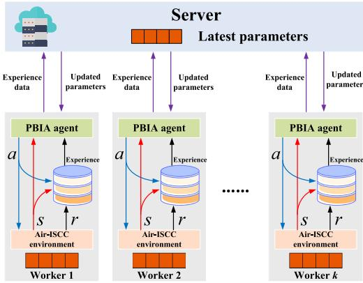  
Fig. 4. Training PBIA using asynchronous parallel computing.

the j-th and k-th network layers of the actor and critic networks, and accordingly, $h _ { A , 0 }$ and $h _ { C , 0 }$ are the input sizes, respectively.

## C. Model Training, Deployment and Testing

1) Model Training: The PPO algorithm typically utilizes data collected by the current agent interacting with the Air-ISCC environment to update its policy parameters. Each agent possesses its own policy network in scenarios involving multiple agents, enabling independent parameter updates. Consequently, the policies of distinct agents can be concurrently updated across multiple parallel computing units without mutual interference. Furthermore, the unorganized nature of sample data in the PPO algorithm allows for combination with the experience replay mechanism. Therefore, the PBIA algorithm is well-suited for parallel training, and we propose employing parallel reinforcement learning to boost the training efficiency of PBIA.

As shown in Fig. 4, the system comprises a server and k worker nodes. The server and workers can send messages to each other at any time, but the workers cannot communicate with each other. Before parallel computing, the server dispatches each worker a copy of the PBIA agent and the Air-ISCC environment. Subsequently, each worker trains the model in the environment, returning experience data $\chi _ { k } ~ =$ $( s _ { t } , a _ { t } , r _ { t } , s _ { t + 1 } )$ to the server. The server’s agent then learns from the experience data provided by the workers, followed by sending the updated policy parameters back to the respective worker.

Notably, we employ an asynchronous training mechanism to further enhance training efficiency. Specifically, upon receiving experience data $\chi _ { k }$ from a worker $k ,$ the server initiates gradient descent to update the parameters and promptly sends the updated parameters back to the contributing worker. Then, the worker persists in interacting with the environment to accumulate experience using the latest network parameters. This iterative learning process continues until the completion of model training. We summarize the above steps in Algorithm 2.

2) Model Testing and Deployment: Following the training of the PBIA agent according to Algorithm 2, code can be generated to deploy the optimal policy to control the UAV swarm. Subsequently, we can test the agent performance based on Algorithm 3. Specifically, the UAV swarm comprises a control UAV and participating UAVs, with the control UAV responsible for generating optimal actions, and the participating UAVs providing Air-ISCC services. The participating UAV performs sensing, communication, and computation services, guided by decisions involving time slot scheduling, power control, service association, and resource allocation. Finally, the control UAV updates the state $s _ { t + 1 }$ and outputs a new action based on the feedback from the participating UAVs.

Algorithm 2: Parallel Computing Based Model Training   
Input: Air-ISCC environment.   
Output: Trained PBIA Agent.   
1 The server sends copies of the PBIA agent and   
environment to each parallel worker;   
2 for each episode do   
$/ \star$ For worker \*/   
3 Each worker interacts with the Air-ISCC   
environment to get experience data   
$\chi _ { k } = ( s _ { t } , a _ { t } , r _ { t } , s _ { t + 1 } ) ;$   
4 for each worker k do   
/\* If the number of experiences   
exceeds the threshold $N _ { p }$ \*/   
5 if $| \chi _ { k } | > N _ { p }$ then   
6 Send the experience data $\chi _ { k }$ to the server;   
$/ \star$ For server $\star /$   
7 Server computes gradient based on received   
$\chi _ { k }$ via (30) and (32);   
8 Server updates network parameters via (31)   
and (38);   
9 The server sends the updated parameters   
back to the worker $k ;$   
10 The worker k updates the parameters;   
11 end   
12 end   
13 end

## VI. EXPERIMENTS AND RESULTS

In this section, we first introduce the experimental setting, followed by a detailed analysis of the results.

## A. Experimental Settings

1) Parameter Settings: We conducted experiments using a Dell Inspiron 16 Plus 7630 PC with an Intel i7-13620H CPU and an NVIDIA RTX 4060 graphics card. We simulated in a 400m × 400m Manhattan city block [6], [9], [16] with 1 control UAV and 3 participating UAVs hovering at 120m. The coordinates of the control UAV are (200, 200), and the 3 participating UAVs are uniformly distributed in the simulation area with coordinates (150, 113.4), (150, 286.6), and (300, 200). The initial locations of the 10 IoTDs follow a Poisson point process, with IoTDs moving along the horizontal or vertical directions within the Manhattan streets at a speed of $2 \ m / s$ (in four directions: up, down, left and right). The size of the task data $D _ { i } ^ { o f f } [ t ]$ for IoTDs at time slot t follows a uniform distribution of 0.5 to 1.5 Mb [9], [28].

Algorithm 3: Model Testing and Deployment   
Input: Service policy.   
Output: Air-ISCC service for UAV swarm.   
1 Deploying the optimal policy to the control UAV;   
2 while the service is not terminated do   
3 The control UAV sends the optimal $a _ { t }$ to the   
participating UAVs;   
$/ \star$ Sensing \*/   
4 Each UAV senses the environment, including target   
localization, task sensing, etc., involving time slot   
scheduling α and power control p;   
/\* Communication \*/   
5 Each UAV establishes a service association with   
IoTDs, i.e., action C;   
6 Each UAV receives the offloading tasks from the   
IoTDs;   
$/ \star$ Computation \*/   
7 Each UAV allocates computing resources for the   
received tasks, i.e., ε;   
8 Each UAV returns computing results to the IoTDs;   
9 The control UAV updates the state $s _ { t + 1 }$ according   
to (21);   
10 end

TABLE II  
ENVIRONMENTAL PARAMETERS FOR SIMULATIONS
<table><tr><td rowspan=1 colspan=1>Parameter</td><td rowspan=1 colspan=1>Value</td><td rowspan=1 colspan=1>Parameter</td><td rowspan=1 colspan=1>Value</td></tr><tr><td rowspan=1 colspan=1>H</td><td rowspan=1 colspan=1>120 [3], [5]</td><td rowspan=1 colspan=1> $\overline { { D _ { \scriptscriptstyle i } ^ { r a d } } }$ </td><td rowspan=1 colspan=1>4MB</td></tr><tr><td rowspan=1 colspan=1>pmax</td><td rowspan=1 colspan=1>1w [6]</td><td rowspan=1 colspan=1> $\underline { { \sigma _ { 0 } ^ { 2 } } }$ </td><td rowspan=1 colspan=1>-170dBm [2]</td></tr><tr><td rowspan=1 colspan=1> ${ \overline { { g _ { 0 } ^ { r a d } } } }$ </td><td rowspan=1 colspan=1>-47dB [2]</td><td rowspan=1 colspan=1> $\overline { { g _ { 0 } ^ { c o m m } } }$ </td><td rowspan=1 colspan=1>-50dB [2]</td></tr><tr><td rowspan=1 colspan=1> $\scriptstyle { \overline { { B } } }$ </td><td rowspan=1 colspan=1>1MHz [1], [7]</td><td rowspan=1 colspan=1> $\underline { { q _ { i } } }$ </td><td rowspan=1 colspan=1> $\overline { { 0 . 1 w \ [ 1 3 ] } }$ </td></tr><tr><td rowspan=1 colspan=1> $\overline { { f _ { i } ^ { \mathrm { m a x } } } }$ </td><td rowspan=1 colspan=1>10 GHz [28]</td><td rowspan=1 colspan=1> $\underline { { \kappa _ { j } } }$ </td><td rowspan=1 colspan=1> $\overline { { 1 \times 1 0 ^ { - 2 7 } \ [ 2 8 ] } }$ </td></tr><tr><td rowspan=1 colspan=1>w</td><td rowspan=1 colspan=1>30</td><td rowspan=1 colspan=1> $\eta _ { 1 } / \eta _ { 2 }$ </td><td rowspan=1 colspan=1>1/800</td></tr></table>

Additionally, the number of CPU computations required per unit bit $C _ { i } ^ { \dot { o f f } } [ t ]$ obeys a uniform distribution of 500 to 1500 CPU cycles/bit [9], [28]. The Air-ISCC has a service cycle of $N = 3 0 0$ time slots, and the length of each time slot Δ is t = 1 second [3]. If not specified, other environmental parameters are detailed in Table II.

For building and training the PBIA agent, we utilized the Deep Learning, Reinforcement Learning, and Parallel Computing toolbox of MATLAB 2023b. Both actor and critic networks employed the Adam optimizer with a learning rate of $1 \times 1 0 ^ { - 4 }$ , and the networks are structured as $1 2 8 \times 2 5 6 \times$ 256 and $1 2 8 \times 2 5 6 \times 1 2 8$ , respectively. By default, the PBIA agent is configured with a discount rate γ of 0.1, batch size K of 1024, cross-entropy weight μ of 0.01, clipping factor ς of 0.3, GAE factor λ of 0.95, and a maximum number of training episodes set to 3000.

2) Comparative Methods: We choose the following four algorithms as baselines to indicate the effectiveness and superiority of the PBIA algorithm.

DDPG: An off-policy DRL algorithm that combines the ideas of deterministic policy gradients and deep Q-networks. DDPG utilizes the experience replay and delayed update schemes of DQNs to directly output action vectors [28].

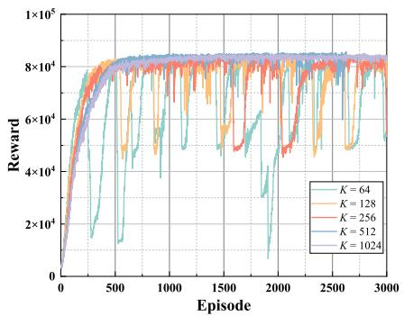  
(a) Effect of mini-batchsize K.

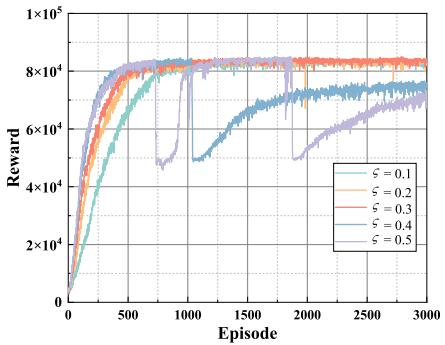  
(b) Effect of clip factor .  
Fig. 5. Effect of hyperparameters K, ς and μ on PBIA algorithm.

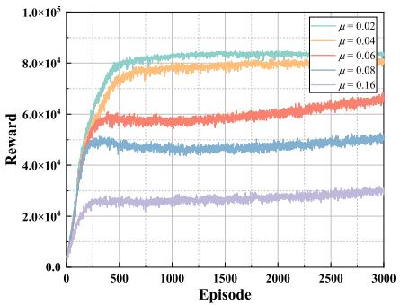  
(c) Effect of entropy loss weight µ.

REINFORCE: A Monte Carlo update-based policy gradient DRL algorithm that utilizes policy gradient theory to update policy parameters.

Static decisions: The service policy of UAVs is fixed, where UAVs and IoTDs are associated according to proximity, computing resources are allocated proportionally, and other decisions are the median of the range of values.

Random: All service decisions of UAVs are randomized at each time slot [1].

Note that all DRL algorithms, including PBIA, DDPG, and REINFORCE used the same parallel training method in the experiments.

## B. Results and Analysis

We first discuss the effect of hyperparameters on the convergence of the PBIA algorithm, and then compare the performance of the algorithms in the default environment. Finally, we change the environment to prove the scalability and adaptability of PBIA.

1) Hyperparameters and Convergence: The impact of sampling mini-batch size K, clip factor ς, and entropy loss weight μ on PBIA is shown in Fig. 5. Firstly, K decides the amount of data used in each update of the model, which in turn affects the learning stability of the PBIA algorithm. As shown in Fig. 5(a), smaller values of K result in more unstable learning, while larger values of K increase computational costs. When K = 1024, the learning of PBIA has stabilized, so we choose K = 1024 as the default value to strike a balance between stability and computational efficiency. The clipping factor ς limits the size of the policy gradient at each PBIA update. Second, Fig. 5(b) emphasizes the importance of setting ς to a small value, which prevents oversized updates and thus improves the algorithm’s stability. Finally, the cross-entropy loss weight μ can influence the exploratory behavior of the agents. However, higher weights may cause the algorithm to fall into a local optimum. Fig. 5(c) shows that larger values of μ result in worse convergence performance for PBIA.

Although the hyperparameters affect the performance of the PBIA algorithm, it is worth noting that these results show that PBIA effectively learns an effective service policy. It shows the ability of the PBIA to converge towards a satisfactory solution. Note that as a complex DRL algorithm, the convergence of PBIA often depends on a substantial amount of experimental data in practical applications [27]. Consequently, this paper emphasizes verifying the algorithm’s convergence through extensive experiments.5

As in (33) and (34), PBIA ensures the stable update of an efficient sampling strategy by introducing trust regions and clip loss functions. Unlike other complex DRL algorithms, PBIA eliminates the need for intricate secondary optimization, allowing it to learn effective policies more quickly. Additionally, PBIA shows high robustness when handling the high-dimensional continuous state and action spaces inherent in the proposed problem. Consequently, the PBIA algorithm offers significant advantages in terms of stability, efficiency, and robustness.

2) Efficiency and Superiority of Algorithm: Fig. 6(a) visually displays the notable convergence superiority of the PBIA algorithm over DDPG and REINFORCE, showcasing both a significantly faster convergence rate and a superior final result. The exceptional stability of PBIA is evident, as it consistently maintains its outstanding performance after convergence.

To further evaluate the algorithm’s performance, we conducted extensive testing over 100 episodes, presenting the average reward in Fig. 6(b) and the average success rate in Fig. 6(c). As expressed in (23), the reward is intricately linked to system energy consumption and service success rate, with a higher reward corresponding to lower energy consumption and a higher success rate. Remarkably, PBIA outshines other algorithms by attaining the highest average reward in Fig. 6(b) and the highest success rate in Fig. 6(c), indicating its optimal optimization of the objective function. Additionally, the notably low error in PBIA’s results underscores not only the quality of its decisions but also its remarkable stability. The detailed numerical results are presented in Table III. Considering the collaborative nature of providing services for IoTDs using multiple UAVs, we evaluate the effectiveness of UAV collaboration by using the standard deviation of UAV load as a load-balancing metric. It is obvious that PBIA has the best load-balancing effect, which indicates that PBIA achieves service collaboration among multiple UAVs while learning the optimal policy.

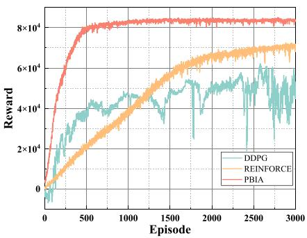  
(a) Convergence of DRL-based algorithms.

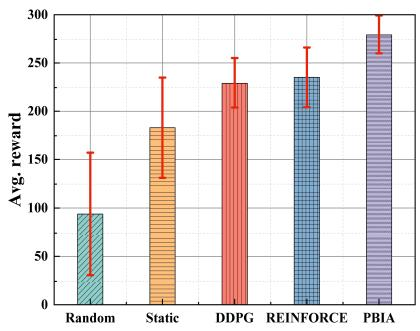  
(b) Average reward over 100 testing episodes.

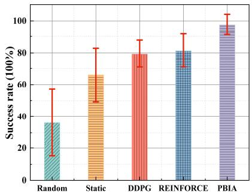  
(c) Average success rate over 100 testing episodes.

Fig. 6. Performance comparison of the proposed algorithm PBIA with the baseline algorithms.  
TABLE III  
AVERAGE RESULTS OF PBIA VS. BASELINES OVER 100 TESTING EPISODES
<table><tr><td>Algorithms</td><td>Average service delay (s)</td><td>Average system energy consumption (J)</td><td>Average reward</td><td>Average success rate</td><td>Average load balance metric</td></tr><tr><td>Random</td><td> $\overline { { 1 . 0 4 3 \pm 0 . 7 6 7 } }$ </td><td>14.383±3.667</td><td> $\overline { { 9 4 . 0 3 9 { \pm 6 2 . 8 4 7 } } }$ </td><td>36.14%±20.89%</td><td>1.758±0.907</td></tr><tr><td>Static</td><td>0.444±0.084</td><td>14.790±3.775</td><td> $\overline { { 1 8 3 . 2 4 6 { \pm } 5 1 . 9 0 7 } }$ </td><td>66.01%±16.84%</td><td>1.729±0.894</td></tr><tr><td>DDPG</td><td>1.488±0.428</td><td>8.628±0.970</td><td>229.363±25.684</td><td>79.33%±8.44%</td><td>2.175±0.458</td></tr><tr><td>REINFORCE</td><td>5.285±2.155</td><td>8.342±0.969</td><td> $\overline { { 2 3 5 . 4 2 5 { \pm } 3 1 . 3 4 9 } }$ </td><td> $\overline { { 8 1 . 2 6 \% \pm 1 0 . 3 1 \% } }$ </td><td> $\overline { { 3 . 1 0 8 \pm 0 . 4 7 3 } }$ </td></tr><tr><td>PBIA</td><td>0.445±0.463</td><td>13.208±1.538</td><td>279.527±19.716</td><td> $9 7 . 5 8 \% \pm 6 . 4 7 \%$ </td><td> $\mathbf { \overline { { 0 . 8 6 3 \pm 0 . 4 3 9 } } } ^ { \ast }$ </td></tr></table>

\* indicates the optimal value of the results.

3) Scalability of Algorithm: The UAV swarm operates within constrained resources, and as the number of IoTDs increases, resource competition intensifies. We set the number of IoTDs between 8 and 16 to examine the adaptability of the algorithm to fluctuations in the number of IoTDs. Fig. 7(a) shows that PBIA consistently learns effective policies even as the number of IoTDs varies, with rewards increasing as the number of IoTDs grows. Fig. 7(b) highlights the performance advantage of PBIA, as the number of IoTDs increases, the Random, Static, DDPG, and REINFORCE algorithms consistently achieve a lower service success rate than PBIA. This indicates that PBIA excels at making better service decisions in the competition for IoTD resources and its ability to accommodate changes in IoTD counts.

In terms of average reward and average success rate, PBIA showcases substantial improvements ranging from 15.78% to 66.36% and 16.32% to 61.44%, respectively, compared to baselines. Additionally, PBIA has a remarkable improvement ranging from 50.09% to 72.23% in load balancing effectiveness. Thus, the results depicted in Fig. 6 and Table III reaffirm that PBIA effectively learns an effective policy. Notably, PBIA not only excels in rapid learning and stability but also facilitates effective collaboration among multiple UAVs.

Although the performance gap between REINFORCE and PBIA is smaller at n = 8 and n = 16, REINFORCE’s convergence speed is significantly slower than PBIA’s (as shown in Fig. 6(a)), indicating less efficient learning. Conversely, in the energy-constrained Air-ISCC network, PBIA balances learning efficiency and decision quality.

TABLE IV  
TEST RESULTS OF THE PBIA AS THE MOVEMENT SPEED OF IOTDS VARIES
<table><tr><td rowspan="2">Speed</td><td rowspan="2">Average reward</td><td rowspan="2">Average success rate</td><td rowspan="2">Average load balance metric</td></tr><tr><td></td></tr><tr><td> $\overline { { 2 \ m / s } }$ </td><td>279.53±19.72</td><td> $9 7 . 5 8 \% \pm 6 . 4 7 \%$ </td><td>0.863±0.439</td></tr><tr><td> $\overline { { 6 \ m / s } }$ </td><td>277.13±22.22</td><td> $9 6 . 7 9 \% \pm 7 . 3 0 \%$ </td><td>0.865±0.438</td></tr><tr><td> $\overline { { 1 0 ~ m / s } }$ </td><td> $\overline { { 3 7 4 . 3 3 \pm 2 7 . 8 0 } }$ </td><td> $9 5 . 8 5 \% \pm 9 . 1 7 \%$ </td><td>0.860±0.439</td></tr><tr><td> $\overline { { 1 4 ~ m / s } }$ </td><td> $2 7 4 . 7 7 { \scriptstyle \pm 2 7 . 9 6 }$ </td><td> $9 6 . 0 0 \% \pm 9 . 2 4 \%$ </td><td> $\overline { { 0 . 8 6 2 { \pm } 0 . 4 4 1 } }$ </td></tr></table>

To further examine the algorithm’s adaptability to changes in the number of UAVs, we set the $n = 1 6$ and vary the number of UAVs. The result as in Fig. 8(a) shows that the reward curve of the PBIA algorithm converges regardless of changes in the number of UAVs, demonstrating that PBIA effectively learns a robust service policy. Fig. 8(b) shows that the service success rate continues to improve as the number of UAVs increases. This improvement is due to the additional sensing, communication, and computation resources provided by the increased number of UAVs, which reduces resource competition among IoTDs within the network. Consequently, the PBIA algorithm efficiently adapts to changes in the number of UAVs, maintaining high learning efficiency and excellent performance.

4) Adaptability of Algorithm: We varied the movement speed of IoTDs to evaluate the adaptability of the PBIA algorithm, with the convergence results shown in Fig. 9(a) and Table IV. Faster speeds lead to more dynamic and less predictable environments, making it more challenging for the algorithm to maintain stable performance. Despite changes in IoTD movement speed, the convergence speed of PBIA remains largely unaffected, all converge to a better performance level. This demonstrates PBIA’s ability to adapt to different environmental conditions. However, the stability of PBIA decreases as the speed of the IoTDs increases.

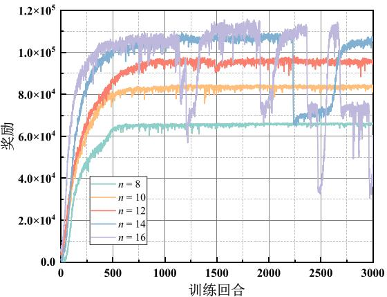  
(a) Convergence results of PBIA.

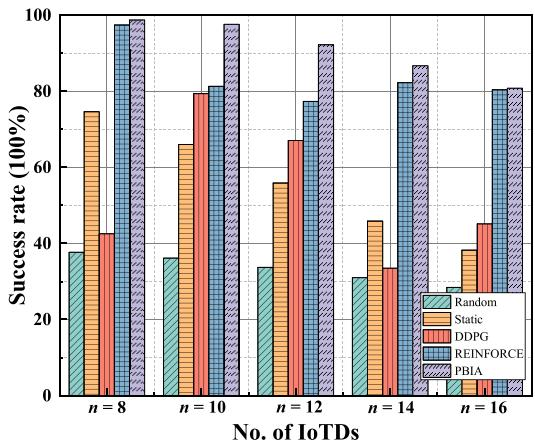  
(b) Service success of the algorithms

Fig. 7. Performance results of PBIA vs. baselines as the number of IoTDs varies.  
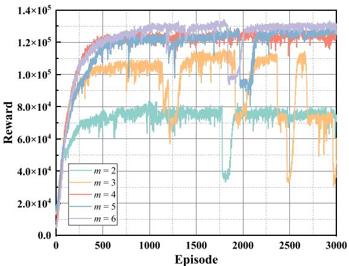

(a) Convergence results of PBIA.  
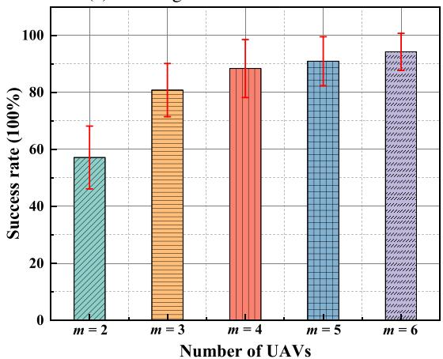  
(b) Service success rate of PBIA.  
Fig. 8. Performance results of PBIA as the number of UAVs varies.

Additionally, we varied the weight factors $\eta _ { 1 }$ and η2 in the system energy consumption to further validate the algorithm’s adaptability, as shown in Fig. 9(b) and Table V. The results indicate that PBIA consistently converges, maintaining stability and effectiveness with different weights. Although the weighting factors affect the trade-off between the energy consumption of UAVs and IoTDs, indirectly influencing the stability of the PBIA algorithm, PBIA consistently learns effective policies. Therefore, the combined results from Fig. 9(a) and Fig. 9(b) indicate that the optimization performance of the PBIA algorithm is not affected by the weight factors, which maintains the stability of the learning performance.

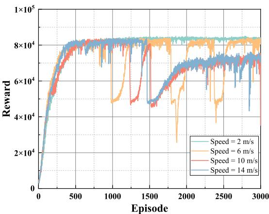

(a) Convergence results of PBIA for varying movement speed of IoTDs.  
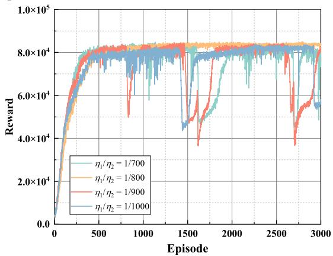  
(b) Convergence results of PBIA for varying weight parameters of system energy consumption.  
Fig. 9. Convergence results of PBIA as the moving speed of IoTDs and the weighting parameter of system energy consumption are varied.

TABLE V  
TEST RESULTS OF THE PBIA AS THE WEIGHTING FACTORS ARE VARIED
<table><tr><td> $\eta _ { 1 } / \eta _ { 2 }$ </td><td>Average reward</td><td>Average success rate</td><td>Average load balance metric</td></tr><tr><td>1/700</td><td>276.25±19.96</td><td>96.35%±6.48%</td><td>0.864±0.442</td></tr><tr><td>1/800</td><td>279.53±19.72</td><td>97.58%±6.47%</td><td>0.863±0.439</td></tr><tr><td>1/900</td><td>279.52±18.70</td><td>97.74%±6.12%</td><td>0.867±0.445</td></tr><tr><td>1/1000</td><td>274.80±19.89</td><td>96.34%±6.44%</td><td>0.867±0.446</td></tr></table>

## VII. CONCLUSION

We studied UAV swarm-enabled Air-ISCC, in which UAVs can sense the network environment and provide over-theair communication and edge computing services for IoTDs. Our objective is to maximize the service success rate while simultaneously minimizing energy consumption. To achieve this, we jointly optimize time slot scheduling, power control, resource allocation, and service association. We proposed the PBIA algorithm, an efficient algorithm for solving complex optimization problems based on DRL, which can efficiently learn effective policies. Experimental results show that PBIA can strike a balance between energy consumption and success rate optimization while maintaining stability in a dynamic environment.

This study restricts the mobility of UAVs, and the trajectory optimization of multiple UAVs in dynamic ITS environments will be one of the focal points of our future studies.

## REFERENCES

[1] N. Huang, C. Dou, Y. Wu, L. Qian, B. Lin, and H. Zhou, “Unmanned-aerial-vehicle-aided integrated sensing and computation with mobile-edge computing,” IEEE Internet Things J., vol. 10, no. 19, pp. 16830–16844, Oct. 2023.

[2] X. Jing, F. Liu, C. Masouros, and Y. Zeng, “ISAC from the sky: UAV trajectory design for joint communication and target localization,” IEEE Trans. Wireless Commun., vol. 23, no. 10, pp. 12857–12872, Oct. 2024.

[3] O. Rezaei, M. M. Naghsh, S. M. Karbasi, and M. M. Nayebi, “Resource allocation for UAV-enabled integrated sensing and communication (ISAC) via multi-objective optimization,” in Proc. IEEE Int. Conf. Acoust., Speech Signal Process. (ICASSP), 2023, pp. 1–5.

[4] K. Meng, Q. Wu, S. Ma, W. Chen, K. Wang, and J. Li, “Throughput maximization for UAV-enabled integrated periodic sensing and communication,” IEEE Trans. Wireless Commun., vol. 22, no. 1, pp. 671–687, Jan. 2023.

[5] Y. Liu, S. Liu, X. Liu, Z. Liu, and T. S. Durrani, “Sensing fairnessbased energy efficiency optimization for UAV enabled integrated sensing and communication,” IEEE Wireless Commun. Lett., vol. 12, no. 10, pp. 1702–1706, Oct. 2023.

[6] X. Liu, Y. Liu, Z. Liu, and T. S. Durrani, “Fair integrated sensing and communication for multi-UAV enabled Internet of Things: Joint 3-D trajectory and resource optimization,” IEEE Internet Things J., vol. 11, no. 18, pp. 29546–29556, Sep. 2024.

[7] Y. Zhou, X. Liu, X. Zhai, Q. Zhu, and T. S. Durrani, “UAV-enabled integrated sensing, computing, and communication for Internet of Things: Joint resource allocation and trajectory design,” IEEE Internet Things J., vol. 11, no. 7, pp. 12717–12727, Apr. 2024.

[8] Y. Xu, T. Zhang, Y. Liu, and D. Yang, “UAV-enabled integrated sensing, computing, and communication: A fundamental trade-off,” IEEE Wireless Commun. Lett., vol. 12, no. 5, pp. 843–847, May 2023.

[9] B. Li, W. Liu, W. Xie, N. Zhang, and Y. Zhang, “Adaptive digital twin for UAV-assisted integrated sensing, communication, and computation networks,” IEEE Trans. Green Commun. Netw., vol. 7, no. 4, pp. 1996–2009, Dec. 2023.

[10] L. Zhao, D. Wu, L. Zhou, and Y. Qian, “Radio resource allocation for integrated sensing, communication, and computation networks,” IEEE Trans. Wireless Commun., vol. 21, no. 10, pp. 8675–8687, Oct. 2022.

[11] K. Meng et al., “UAV-enabled integrated sensing and communication: Opportunities and challenges,” IEEE Wireless Commun., vol. 31, no. 2, pp. 97–104, Apr. 2024.

[12] S. Tong, Y. Liu, J. Mišic, X. Chang, Z. Zhang, and C. Wang, “Joint task´ offloading and resource allocation for fog-based intelligent transportation systems: A UAV-enabled multi-hop collaboration paradigm,” IEEE Trans. Intell. Transp. Syst., vol. 24, no. 11, pp. 12933–12948, Nov. 2023.

[13] Q. Liu, H. Liang, R. Luo, and Q. Liu, “Energy-efficiency computation offloading strategy in UAV aided V2X network with integrated sensing and communication,” IEEE Open J. Commun. Soc., vol. 3, pp. 1337–1346, 2022.

[14] X. Li, Y. Gong, K. Huang, and Z. Niu, “Over-the-air integrated sensing, communication, and computation in IoT networks,” IEEE Wireless Commun., vol. 30, no. 1, pp. 32–38, Feb. 2023.

[15] Y. Zhu, R. Zhang, Y. Cui, S. Wu, C. Jiang, and X. Jing, “UAVaided partial task offloading for integrated sensing, computation, and communications systems via deep reinforcement learning,” in Proc. 2nd Workshop Integr. Sens. Commun. Metaverse, 2023, pp. 1–6.

[16] Y. Qin, Z. Zhang, X. Li, W. Huangfu, and H. Zhang, “Deep reinforcement learning based resource allocation and trajectory planning in integrated sensing and communications UAV network,” IEEE Trans. Wireless Commun., vol. 22, no. 11, pp. 8158–8169, Nov. 2023.

[17] P. Hou, Y. Huang, H. Zhu, Z. Lu, S.-C. Huang, and H. Chai, “Intelligent decision-based edge server sleep for green computing in MEC-enabled IoV networks,” IEEE Trans. Intell. Veh., vol. 9, no. 2, pp. 3687–3703, Feb. 2024.

[18] X. Chen, Z. Feng, Z. Wei, F. Gao, and X. Yuan, “Performance of joint sensing-communication cooperative sensing UAV network,” IEEE Trans. Veh. Technol., vol. 69, no. 12, pp. 15545–15556, Dec. 2020.

[19] P. Hou, X. Jiang, Z. Wang, S. Liu, and Z. Lu, “Federated deep reinforcement learning-based intelligent dynamic services in UAV-assisted MEC,” IEEE Internet Things J., vol. 10, no. 23, pp. 20415–20428, Dec. 2023.

[20] J. Mu, W. Ouyang, Z. Jing, B. Li, and F. Zhang, “Energy-efficient interference cancellation in integrated sensing and communication scenarios,” IEEE Trans. Green Commun. Netw., vol. 7, no. 1, pp. 370–378, Mar. 2023.

[21] C. Ding, J.-B. Wang, H. Zhang, M. Lin, and G. Y. Li, “Joint MIMO precoding and computation resource allocation for dual-function radar and communication systems with mobile edge computing,” IEEE J. Sel. Areas Commun., vol. 40, no. 7, pp. 2085–2102, Jul. 2022.

[22] Q. Zhang, X. Wang, Z. Li, and Z. Wei, “Design and performance evaluation of joint sensing and communication integrated system for 5G mmWave enabled CAVs,” IEEE J. Sel. Topics Signal Process., vol. 15, no. 6, pp. 1500–1514, Nov. 2021.

[23] X. Xu, R. Tao, S. Li, Y. Chen, L. Xia, and Y. Yang, “Collaborative multi-UAV sensing in integrated sensing and communication networks,” in Proc. SPIE 2nd Int. Conf. Optoelectron. Inf. Comput. Eng. (OICE), 2023, pp. 133–142.

[24] Y. He, G. Yu, Y. Cai, and H. Luo, “Integrated sensing, computation, and communication: System framework and performance optimization,” IEEE Trans. Wireless Commun., vol. 23, no. 2, pp. 1114–1128, Feb. 2024.

[25] Y. Bai, H. Zhao, X. Zhang, Z. Chang, R. Jäntti, and K. Yang, “Toward autonomous multi-UAV wireless network: A survey of reinforcement learning-based approaches,” IEEE Commun. Surveys Tuts., vol. 25, no. 4, pp. 3038–3067, 4th Quart., 2023.

[26] T. Cai et al., “Cooperative data sensing and computation offloading in UAV-assisted crowdsensing with multi-agent deep reinforcement learning,” IEEE Trans. Netw. Sci. Eng., vol. 9, no. 5, pp. 3197–3211, Sep./Oct. 2022.

[27] J. Schulman, F. Wolski, P. Dhariwal, A. Radford, and O. Klimov, “Proximal policy optimization algorithms,” 2017, arXiv:1707.06347.

[28] B. Li, S. Peng, and Z. Fei, “Beamforming and resource optimization in UAV integrated sensing and communication network with edge computing,” J. Commun., vol. 44, no. 9, pp. 228–237, 2023.

[29] M. Holzleitner, L. Gruber, J. Arjona-Medina, J. Brandstetter, and S. Hochreiter, “Convergence proof for actor-critic methods applied to PPO and RUDDER,” in Transactions on Large-Scale Data-and Knowledge-Centered Systems XLVIII: Special Issue In Memory of Univ. Prof. Dr. Roland Wagner. Berlin, Germany: Springer, 2021, pp. 105–130.

  
Peng Hou (Graduate Student Member, IEEE) received the B.S. degree in communication engineering from the University of Science and Technology Beijing in 2018, and the M.S. degree in electronics and communication engineering from Yunnan University in 2021. He is currently pursuing the Ph.D. degree with Fudan University.

His main research interests include mobile edge computing, Internet of vehicles, and reinforcement learning.

Hongbin Zhu (Member, IEEE) received the B.S. degree in electronic engineering from the Ocean University of China, Qingdao, China, in 2014, and the Ph.D. degree in electronic engineering with co-supervision from ShanghaiTech University, Shanghai, China, and the Shanghai Institute of Microsystem and Information Technology, Chinese Academy of Sciences, Shanghai, China, in 2019.

He is currently a Pre-Tenure Associate Professor with the Institute of FinTech, Fudan University. His research interests include FinTech, edge intelligence, and signal processing.

Zhihui Lu (Member, IEEE) received the Ph.D. degree in computer science degree from Fudan University in 2004.

He is a Professor with the School of Computer Science, Fudan University. His research interests are cloud computing and service computing technology, big data architecture, edge computing, and IoT distributed systems. He has (co-)authored two books and more than 100 journal articles and conference papers in these areas. He is a member of the China Computer Federation’s service computing specialized committee.

Shin-Chia Huang (Senior Member, IEEE) received the B.S. degree from National Taiwan Normal University, Taipei, Taiwan, in July 2002, the M.S. degree from National Chiao Tung University, Hsinchu, Taiwan, in July 2005, and the Ph.D. degree in electrical engineering from National Taiwan University, Taipei, in 2009.

He is currently a Full Professor with the Department of Electronic Engineering, National Taipei University of Technology, Taipei, and an International Adjunct Professor with the Faculty of

Business and Information Technology, University of Ontario Institute of Technology, Oshawa, ON, Canada. His research interests include cloud computing and big data analytics, artificial intelligence, and mobile applications and systems.

Prof. Huang serves as an Associate Editor for the IEEE TRANSACTIONS OF INTELLIGENT VEHICLES, IEEE SENSORS JOURNAL, IEEE OPEN JOURNAL OF THE COMPUTER SOCIETY, and Electronic Commerce Research and Applications. He is currently the Chapter Chair of the IEEE Taipei Section Broadcast Technology Society

Yang Yang (Fellow, IEEE) received the B.S. and M.S. degrees in radio engineering from Southeast University in 1996 and 1999, respectively, and the Ph.D. degree in information engineering from the Chinese University of Hong Kong in 2002.

He is a Professor with IoT Thrust, the Director of Research Center for the Digital World with Intelligent Things (DOIT), and the Associate Vice President for Teaching and Learning with the Hong Kong University of Science and Technology (Guangzhou), China. He is also an Adjunct Professor

with the Department of Broadband Communication, Peng Cheng Laboratory, and the Chief Scientist of IoT with Terminus Group, China. Before joining HKUST (Guangzhou), he has held faculty positions with the Chinese University of Hong Kong; Brunel University, U.K.; University College London, U.K.; CAS-SIMIT; and ShanghaiTech University, China. His research interests include multitier computing networks, 5G/6G systems, AIoT technologies, intelligent services and applications, and advanced wireless testbeds. He has published more than 300 papers and filed more than 120 technical patents in these research areas.

Hongfeng Chai received the B.S. degree in computer science from Shijiazhuang Army School in 1981, and the M.S. degree in international finance from the Southwestern University of Finance and Economics in 2000.

He is currently a Professor and a Doctoral Supervisor with the School of Computer Science, Fudan University, Shanghai, China. His main research interest is financial information engineering management.

Prof. Chai is an Academician of the Chinese

Academy of Engineering. He was elected as an Academician of the Chinese Academy of Engineering in 2015 and was the Founder of the National Engineering Laboratory of E-commerce and E-payment.