# Learning-Based NOMA-Enabled Queue-Aware Task Offloading and AAV 3D Trajectory Planning for SAGIN

Peng Qin , Member, IEEE, Hongjie Li, Yang Fu , Jinhui Hu , Xue Wu, and Xianchao Zhang , Member, IEEE

Abstract—Space-air-ground integrated network (SAGIN) is a viable solution to serve users in such areas lacking ground base stations, in which case autonomous aerial vehicles (AAVs) provide massive access and satellites provide backhaul transmission. To improve spectrum utilization and throughput, non-orthogonal multiple access (NOMA) is used to reuse channels. However, different trajectories of AAVs and computing task assignment may lead to various communication delay and energy consumption. Additionally, regarding the high dynamic nature of SAGIN, it often falls into the dilemma of information uncertainty and curse of dimensionality. To overcome the above challenges, a hierarchical network model is designed, where AAVs and satellites collaborate to process users’ offloaded computing tasks. Then, a joint AAV trajectory design, task offloading, task assignment and computing resource allocation problem for minimizing system cost is then proposed. Due to the coupling between queue delay constraints and decision-making, Lyapunov optimization is applied to split the issue into three subproblems. Firstly, a AAV trajectory design and task offloading algorithm based on multi-agent twin delayed deep deterministic policy gradient (MATD3) is designed to deal with the curse of dimension issue. Then, the problem of joint task assignment and AAV computing resource allocation is solved via CVX due to that it is convex. Finally, a low-complexity Greedy-based Satellite Computing Resource Allocation (GSCRA) algorithm is proposed to obtain the minimum system cost. Simulations show the superior performance of our algorithm compared with benchmarks in reducing the system cost.

Index Terms—SAGIN, task offloading, AAV trajectory planning, NOMA, MATD3.

Received 10 October 2024; revised 22 December 2024 and 11 February 2025; accepted 16 March 2025. Date of publication 19 March 2025; date of current version 15 August 2025. This work was supported in part by the National Natural Science Foundation of China under Grant 62201212 and Grant 62271201, in part by the Natural Science Foundation of Hebei Province under Grant F2022502017, and in part by the Provincial Key Laboratory of Multimodal Perceiving and Intelligent Systems under Grant MPIS202409. The review of this article was coordinated by Prof. Nan Wu. (Peng Qin and Hongjie Li contributed equally to this work.) (Corresponding authors: Jinhui Hu; Xianchao Zhang.)

Peng Qin, Yang Fu, and Xue Wu are with the State Key Laboratory of Alternate Electrical Power System with Renewable Energy Sources, School of Electrical and Electronic Engineering, North China Electric Power University, Beijing 102206, China (e-mail: qinpeng@ncepu.edu.cn).

Hongjie Li is with the Beijing University of Technology, Beijing 100124, China (e-mail: lihongjie163bjut@163.com).

Jinhui Hu is with the New Smart City Research Institute, China Electronics Technology Group Co., Ltd, Shenzhen 518038, China (e-mail: cn.hjh@hotmail.com).

Xianchao Zhang is with the Provincial Key Laboratory of Multimodal Perceiving and Intelligent Systems, Jiaxing University, Jiaxing 314001, China (e-mail: zhangxianchao@zjxu.edu.cn).

Digital Object Identifier 10.1109/TVT.2025.3552807

# I. INTRODUCTION

LTHOUTH 5G ground network can be deployed to meet the needs of Internet of Things (IoT) applications in hotspots, there is still a lack of efficient and cost-effective scheme for remote districts, oceans and polar regions [1], [2]. Autonomous aerial vehicles (AAVs) can provide massive access in remote areas lacking ground base stations (GBS) due to its proximity and flexible characteristics [3]. However, the coverage of AAV is still limited, and it’s expensive or impossible to set up ground stations for AAVs to send back the data due to geographical factors [4]. Meanwhile, low earth orbit (LEO) satellite has much wider coverage, and the ideal link between AAV and satellite can serve as the backhaul [5]. Thus, space-air-ground Integrated network (SAGIN) is a viable solution for providing services to users in such areas lacking GBSs and AAVs-oriented ground stations [6], in which case AAVs provide massive access and satellites serve as backhaul. In fact, the 3 rd generation partnership project (3GPP) has been making great efforts to expand the network coverage and improve service continuity via SAGIN [7].

Recently, AAV communication has aroused great concerns [8], [9], [10]. Lots of studies focus on the orthogonal multiple access (OMA)-based AAV communication. In comparison with OMA, non-OMA (NOMA) enables more users to access the designated resource block simultaneously, so greatly enhancing the spectrum utilization and throughput [11], [12]. Specifically, NOMA is able to recover the data at the receiving terminal via successive interference cancellation (SIC) technique. Furthermore, different trajectories of AAVs may lead to different channel quality, resulting in different communication delay and energy consumption. Additionally, the AAV computing task assignment may also affect the system performance. Thus, considering trajectory, task assignment as well as computing resouce arrangement jointly is crucial.

However, regarding the high dynamic nature of SAGIN, the channel state information (CSI) and the availability of AAV candidates are time-varying [13]. For users, global information is no longer a priori knowledge, which is called the dilemma of information uncertainty. To cope with it, by exploring the network state environment, reinforcement learning (RL) can make intelligent decisions under information uncertainty [14], [15], [16]. However, as the state space increases exponentially, it still faces the issue of dimension curse. Thus, deep RL (DRL)

method, which integrates the learning and predictive power of deep learning (DL) with the decision-making capability of RL is proposed [17]. Morover, the above-mentioned research all neglects the queuing delay constraints.

Therefore, to address the above challenges, we first design a hierarchical network model. Next, a joint AAV trajectory plan, task offloading, task assignment and computing resource allocation problem for minimizing system cost, i.e., weighted sum of energy consumption and delay, is proposed. Due to the coupling between long-term queue delay constraints and short term decision-making, Lyapunov optimization is applied to decompose the issue [18]. To be specific, it is split into the following subproblems: 1) AAV trajectory design and terminal task offloading; 2) task assignment and computing resource allocation at AAV side; 3) satellite computing resource allocation. Subsequently, the first subproblem is denoted as Markov decision process (MDP) and a multi agent twin delayed deep deterministic (MATD3)-based AAV trajectory design and task offloading (MTDTO) algorithm is designed to overcome the curse of dimension issue. For the second one, it is convex, and CVX toolbox is applied to solve it. For the third, a low-complexity greedy-based satellite computing resource allocation (GSCRA) algorithm is designed to optimize satellite computing resource allocation.

In summary, we seamlessly integrate SAGIN and NOMA with MEC system, whilst fully unleashing the potential of these technologies via judicious network design and resource coordination, thereby boosting the computing performance with queue awareness. The main contributions are as follows:

We design a hierarchical network system, in which AAVs and satellites cooperate to process users’ offloaded computing tasks. AAVs are able to provide edge service, while satellites with stronger payloads can help complete the tasks. Then, we formulate the problem to minimize system cost by collaboratively optimizing AAV trajectory, task offloading, task assignment as well as computing resource allocation.   
Since long term queue delay constraints and short term decision-making are coupled, solving this problem directly is challenging. Thus, according to Lyapunov optimization, it is split into three subproblems, which are sequentially solved. We denote the first sub-problem as MDP and design the MTDTO algorithm to deal with the curse of dimension, which can learn the offloading and trajectory scheme under the condition of incomplete CSI. For the second one, it’s a convex issue, so we apply CVX. For the third one, a low-complexity GSCRA algorithm on the basis of greedy algorithm is proposed to determine satellite computing resource allocation.   
- A lot of simulations have been carried out to compare with multi-agent deep deterministic policy gradient (MAD-DPG), MATD3-F, MATD3-P and deep deterministic policy gradient (DDPG) methods. Simulation outcomes demonstrate our method outperforms the benchmark approaches with regard to reward and system cost.

The remainder is structured as below. Section II overviews the recent works. Section III expounds the SAGIN system model, and the minimization of system cost is regarded as the optimization objective in Section IV. In Section V, the issue is split into several subproblems. In Section VI, simulations and analysis are provided. The conclusion is drawn in Section VII.

# II. RELATED WORKS

As an enabler technology for future communication, SAGIN has become the reserarch hotspot in both industry and academia. Numerous studies on SAGIN-related technologies have been conducted [19]. Reference [20] proposed SAGIN heterogeneous network based on artificial intelligence (AI), which solved the problem that the traditional terrestrial network could not provide high-quality seamless service. Literature [21] developed a software-defined SAGIN architecture to provide diversified vehicular services in various scenarios effectively and economically. Literature [22] proposed a AAV assisted network to improve the system throughput. Inspired by the aforementioned works we can see that SAGIN has become a feasible and effective method to extend the network coverage.

In recent years, mobile edge computing (MEC) has attracted great attention [23]. In literature [24], AAVs acted as edge servers to process offloaded tasks from users. To further improve the network throughput and spectrum efficiency, NOMA is adopted, which can provide services for more terminals. Paper [25] applied NOMA for AAVs and HAPS. Thus, the spectrum efficiency was increased and more terminals could be connected. Literature [26] studied the physical layer security and utilized NOMA in MEC system. It attempted to obtain the minimum energy consumption by jointly optimize task offloading, computing resource and subchannel allocation. Note that, all above works assume system global state information is known, which, however, is no longer easy to obtain in SAGIN dynamic environment due to the unfeasible frequent information exchange.

Machine learning, especially deep reinforcement learning (DRL), can be regarded as a potential method to deal with the unknown global information issue in complex environment [27], [28], [29]. Paper [27] designed a trajectory control algorithm according to multi-agent DRL, which jointly optimized the geographical fairness of users, AAV-user load and user energy consumption. Literature [28] developed a multi-agent RL (MARL) method, and each agent got optimal strategy only based on local observation. Similarly, the authors of [29] proposed an air ground integrated network and a deep actor-critic approach was designed to deal with the dimensionality curse issue for task offloading. However, all above works do not take the task queue delay into consideration, which is the long-term constraint and deeply affects problem solving.

# III. SYSTEM MODEL

# A. SAGIN Hierarchical Network Model

Fig. 1 shows the SAGIN system model, which has K satellites $S = \{ s _ { 1 } , s _ { 2 } , \ldots , s _ { k } , \ldots , s _ { K } \} , \forall k \in \{ 1 , 2 , \ldots , K \} , J$ AAVs $\mathcal { L } = \{ l _ { 1 } , l _ { 2 } , \ldots , l _ { j } , \ldots , l _ { J } \} , \forall j \in \{ 1 , 2 , \ldots , J \} .$ , and I =ground users $\mathcal { U } = \{ u _ { 1 } , u _ { 2 } ^ { \prime } , \dotsc , u _ { i } , \dotsc , u _ { I } \} , \forall i \in \{ 1 , 2 , \dotsc , I \}$ .

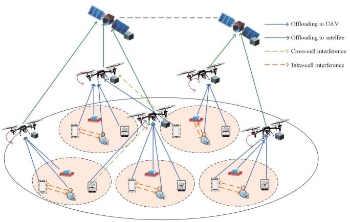

flowchart

```mermaid
graph TD
    A["Drone with UAV"] --> B["Offloading to UAV"]
    A --> C["Offloading to satellite"]
    A --> D["Cross-cell interference"]
    A --> E["Intra-cell interference"]
    F["Drone with UAV"] --> G["Offloading to UAV"]
    F --> H["Offloading to satellite"]
    F --> I["Cross-cell interference"]
    F --> J["Intra-cell interference"]
    K["Drone with UAV"] --> L["Offloading to UAV"]
    K --> M["Offloading to satellite"]
    K --> N["Cross-cell interference"]
    K --> O["Intra-cell interference"]
    P["Drone with UAV"] --> Q["Offloading to UAV"]
    P --> R["Offloading to satellite"]
    P --> S["Cross-cell interference"]
    P --> T["Intra-cell interference"]
    U["Drone with UAV"] --> V["Offloading to UAV"]
    U --> W["Offloading to satellite"]
    U --> X["Cross-cell interference"]
    U --> Y["Intra-cell interference"]
```

Fig. 1. SAGIN system model.

$\{ \mathcal { U } ^ { 1 } , \dotsc , \mathcal { U } ^ { j } , \dotsc , \mathcal { U } ^ { J } \}$ represents the corresponding user sets served by $J \ { \mathrm { A A V s } }$ , where Y represents the number of users supported by AAV j, and $\mathcal { U } ^ { j } = \{ \hat { u } _ { 1 } ^ { j } , u _ { 2 } ^ { j } , \dots , u _ { y } ^ { j } , \dots , u _ { Y } ^ { j } \}$ . Each =AAV utilizes one orthogonal channel, and users utilize NOMA to reuse the channels.

The system adopts discrete time slot model, and $\mathcal { T } =$ $\{ 1 , 2 , . . . , T \}$ with size τ for each slot. $D _ { i } ( t )$ =is the computing tasks generated by user $u _ { i }$ in slot t. $\lambda _ { i }$ ( )represents the average task arrival rate of $u _ { i } .$ . Different users may execute different applications, and $\varpi _ { i }$ is the CPU cycle number requested by $u _ { i }$ to process one-bit data. Edge servers are installed in AAVs and satellites, and the capacity of satellite is stronger than that of AAV. Note that, in our scenario, users’ computing and energy storage capabilities are restricted, so computing-intensive tasks may not be completed locally and must be offloaded to the edge for computing. Assuming that there is no overlap among the sub-areas of AAVs, which can offer MEC service in their respective region [30]. Furthermore, satellite with more payload can help AAVs complete the computing tasks. The amount of data offloaded to AAV for processing is expressed as $D _ { i } ^ { e } ( t )$ , ( )and the offloaded data amount from AAV to LEO satellite is expressed as $D _ { i } ^ { l } ( t )$ . Then, in slot t, we can obtain the following ( )relationship for task offloading.

$$
D _ {i} (t) = D _ {i} ^ {e} (t) + D _ {i} ^ {l} (t), \tag {1}
$$

$$
D _ {i} ^ {e} (t) = w _ {j, k} ^ {i} (t) D _ {i} (t), \tag {2}
$$

$$
D _ {i} ^ {l} (t) = (1 - w _ {j, k} ^ {i} (t)) D _ {i} (t), \tag {3}
$$

where $w _ { j , k } ^ { i } ( t ) \in [ 0 , 1 ] , ~ ( 1 - w _ { j , k } ^ { i } ( t ) ) \in [ 0 , 1 ]$ are the task pro-( ) [ ]portion performed at $\mathrm { A A V } ~ l _ { j }$ ( )) [and satellite $s _ { k }$ , respectively. If $( 1 - w _ { j , k } ^ { i } ( t ) ) = 1$ , all tasks of user $u _ { i }$ will be performed on satellite sk. $w _ { j , k } ^ { i } ( t )$ is related to the CSI and the computing ( )power of the devices.

Suppose that each user $u _ { i }$ employs two large enough buffers to backlog the arrival tasks. $Q _ { i } ^ { e } ( t )$ represents the tasks to be offloaded to AAVs, and $Q _ { i } ^ { l } ( t )$ ( )stores the tasks to be executed ( )at satellites. The tasks that leave $Q _ { i } ^ { e } ( t ) , Q _ { i } ^ { l } ( t )$ are $U _ { i } ^ { e } ( t ) , U _ { i } ^ { l } ( t )$ respectively. Consequently, $Q _ { i } ^ { e } ( t )$ ( )and $Q _ { i } ^ { l } ( t )$ ) ( )are defined as

$$
Q _ {i} ^ {e} (t + 1) = [ Q _ {i} ^ {e} (t) - U _ {i} ^ {e} (t) ] ^ {+} + D _ {i} (t), \tag {4}
$$

$$
Q _ {i} ^ {l} (t + 1) = [ Q _ {i} ^ {l} (t) - U _ {i} ^ {l} (t) ] ^ {+} + D _ {i} ^ {l} (t), \tag {5}
$$

where $[ \cdot ] ^ { + } = \operatorname* { m a x } ( \cdot , 0 )$ .

[ ] = max( )Tasks that cannot be completed in time will queue up in the task buffer and cause delays. According to the Little theorem [31], the average queuing delay and average queue length are positively correlated. The average queue backlog is constrained in order to guarantee the network’s average delay and consequently the network’s stability. Therefore, the queue is confined to

$$
\overline {{{Q _ {i} ^ {e}}}} (t) <   \infty , \tag {6}
$$

$$
\overline {{{Q _ {i} ^ {l}}}} (t) <   \infty . \tag {7}
$$

We focus on the following four processes for task offloading: 1) ground-to-air communication between users and AAVs; 2) computing on AAV; 3) air-to-space transmission from AAV to satellite; 4) computing on satellite.

# B. AAV and Satellite Movement Model

The position of AAV $l _ { j }$ is expressed as $\varphi _ { j } ( t ) =$ $[ x _ { j } ( t ) , y _ { j } ( t ) , z _ { j } ( t ) ] ^ { T }$ , and $\omega _ { j } ( \dot { t } ) = [ x _ { j } ( t ) , y _ { j } ( t ) ] ^ { T }$ ( ) =denotes the [ ( ) ( ) ( )]horizontal coordinate of $l _ { j } . l _ { j }$ ( ) = [ ( ) ( )]moves across distance $L _ { j } ( t )$ with angle $\theta _ { j } ( t ) \in [ 0 , 2 \pi ]$ in slot t. Then, we get

$$
x _ {j} (t + 1) = x _ {j} (t) + L _ {j} (t) \cos (\theta_ {j} (t)), \tag {8}
$$

$$
y _ {j} (t + 1) = y _ {j} (t) + L _ {j} (t) \sin (\theta_ {j} (t)). \tag {9}
$$

Furthermore, it is assumed that the maximum elevation angle of AAV $l _ { j }$ is $\varrho _ { j }$ , and the maximum horizontal radius $C _ { \operatorname* { m a x } } ^ { j } ( t )$ is calculated by [32]

$$
C _ {\max} ^ {j} (t) = z _ {j} (t) \tan (\varrho_ {j}). \tag {10}
$$

Because of the limited flight speed of AAV, the flight distance is also finite, which is obtained by the following formula:

$$
Z _ {\min} \leq z _ {j} (t) \leq Z _ {\max}, \tag {11}
$$

$$
L _ {j} (t) = \left| \left| \omega_ {j} (t + 1) - \omega_ {j} (t) \right| \right| \leq L _ {\max} ^ {h}, \tag {12}
$$

$$
\triangle z _ {j} (t) = \left| z _ {j} (t + 1) - z _ {j} (t) \right| \leq L _ {\max} ^ {v}, \tag {13}
$$

where $Z _ { \mathrm { m i n } }$ and $Z _ { \mathrm { m a x } }$ represent the minimum height and the maximum height, respectively; $\triangle z _ { j } ( t )$ represents the vertical moving distance; $L _ { \mathrm { m a x } } ^ { h }$ and $L _ { \mathrm { m a x } } ^ { v }$ ( )represent the AAV maximum horizontal and vertical distance. Besides, the AAV should move within the service rectangle, then the following movement constraints must be met:

$$
0 \leq x _ {j} (t) \leq X _ {\max}, \tag {14}
$$

$$
0 \leq y _ {j} (t) \leq Y _ {\max}, \tag {15}
$$

where the side lengths of the rectangular area are expressed as $X _ { \mathrm { m a x } }$ and $Y _ { \mathrm { m a x } } .$ respectively. The following overlapping constraints are provided in order to prevent any two $\mathbf { A A V s } ^ { \prime }$ coverage from overlapping with one another:

$$
\left| \left| \omega_ {n} (t) - \omega_ {j} (t) \right| \right| \geq \left[ C _ {\max} ^ {n} (t) + C _ {\max} ^ {j} (t) \right], n \neq j. \tag {16}
$$

Likewise, the distance between AAVs should not be smaller than the minimum value $D _ { \mathrm { m i n } }$ to prevent collisions between any

two AAVs. Then we have

$$
\left| \left| \varphi_ {n} (t) - \varphi_ {j} (t) \right| \right| \geq D _ {\min}, n \neq j. \tag {17}
$$

We express $a _ { i , j } ( t )$ as the service association vector. When user $u _ { i }$ ( )is served by AAV $l _ { j } , a _ { i , j } ( t ) = 1$ ; otherwise, $a _ { i , j } ( t ) = 0$ . ( ) = ( ) =Suppose that each user will be served by no more than one AAV in slot $\begin{array} { r } { t , \mathrm { { s o } } \sum _ { j = 1 } ^ { J } a _ { i , j } ( t ) \leq 1 } \end{array}$ .

( )The movement of the LEO satellite is determined by its orbit parameters $\langle H , \iota , \Omega , \nu ( t ) \rangle$ [33], where H indicates the orbit Ω ( )altitude, ι denotes the inclination angle, is the angle between Ωthe vernal equinox and ascending node (i.e., the intersection of the orbital and equatorial planes), and $\nu ( t )$ is the angle between ( )the satellite and ascending node in slot t. We can calculate the satellite 3D coordinate $( \check { x ^ { S } } ( t ) , y ^ { S } ( t ) , z ^ { S } ( t ) )$ as

$$
x ^ {S} (t) = H \left[ \cos \nu (t) \cos \Omega - \sin \nu (t) \cos \iota \sin \Omega \right],
$$

$$
y ^ {S} (t) = H \left[ \cos \nu (t) \sin \Omega + \sin \nu (t) \cos \iota \cos \Omega \right],
$$

$$
z ^ {S} (t) = H \sin \nu (t) \sin \iota . \tag {18}
$$

# C. Communication Model

1) User-AAV Communication Model: The channel model with line-of-sight (LoS) and non-line-of-sight (NLoS) links is utilized [34]. In slot t, the path loss $L _ { i , j } ( t )$ from $u _ { i } \tan l _ { j }$ is defined as:

$$
\begin{array}{l} L _ {i, j} (t) = 2 0 \mathrm{log} _ {1 0} \left(\frac {4 \pi f _ {c} \sqrt {d _ {i , j , t} ^ {2} + r _ {i , j , t} ^ {2}}}{c}\right) + P _ {i, j, t} ^ {L o S} \gamma_ {i, j, t} ^ {L o S} \\ + (1 - P _ {i, j, t} ^ {N L o S}) \gamma_ {i, j, t} ^ {N L o S}, \tag {19} \\ \end{array}
$$

where γ i,j,t $\gamma _ { i , j , t } ^ { L o S }$ and γi,j,t $\gamma _ { i , j , t } ^ { N L o S }$ represent the additional loss brought on by LoS and NLoS links in the free space. $f _ { c }$ defines the carrier frequency, and light speed is denoted by c. The vertical and horizontal distances between $u _ { i }$ and $l _ { j }$ shown by formulas (19)–(20) are represented by $d _ { i , j , t }$ and ${ r } _ { i , j , t }$ , respectively. The position of $u _ { i }$ is $( u _ { i , t } ^ { x } , u _ { i , t } ^ { y } , 0 )$ .

$$
d _ {i, j, t} = \sqrt {(x _ {j} (t) - u _ {i , t} ^ {y}) ^ {2} + (y _ {j} (t) - u _ {i , t} ^ {x}) ^ {2}}, \tag {20}
$$

$$
r _ {i, j, t} = z _ {j} (t). \tag {21}
$$

The user-AAV link’s LoS probability $P _ { i , j , t } ^ { L o S }$ is determined by the formula below.

$$
P _ {i, j, t} ^ {L o S} = \frac {1}{1 + b _ {1} \exp \left\{- b _ {2} \left[ \arctan \left(\frac {d _ {i , j , t}}{r _ {i , j , t}}\right) - b _ {1} \right] \right\}}, \tag {22}
$$

where $b _ { 1 } , \ b _ { 2 }$ are determined by state of environment. Consequently, the user-AAV transmission rate is determined by

$$
R _ {i, j} (t) = B _ {j} \log_ {2} \left(1 + \frac {c _ {i , j} (t) P _ {i , j} 1 0 ^ {- \frac {L _ {i , j} (t)}{1 0}}}{\sum_ {n > i} c _ {n , j} (t) P _ {n , j} 1 0 ^ {- \frac {L _ {n , j} (t)}{1 0}} + \sigma^ {2}}\right), \tag {23}
$$

where $P _ { i , j }$ and $B _ { j }$ represent transmission power and bandwidth, respectively. $c _ { i , j } ( t )$ represents the availability of the $\mathrm { A A V } \ l _ { j }$ to the user $u _ { i } .$ ( ), where $c _ { i , j } ( t ) \in \{ 0 , 1 \}$ . If $c _ { i , j } ( t ) = 1$ , $l _ { j }$ is available to $u _ { i }$ ( )in slot t, that is, $u _ { i }$ ( ) =is covered by AAV $l _ { j } ;$ Otherwise, $c _ { i , j } ( t ) = 0$ . To ensure the success of SIC, each AAV $l _ { j }$ ( ) =sorts the served users with $c _ { i , j } ( t ) = 1$ in a descending order according to channel gains $1 0 ^ { - \frac { L _ { i , j } ( t ) } { 1 0 } }$ . Accordingly, the AAV carries out SIC by sequentially decoding the signal from each user i whilst treating the signals from subsequent users $n > i$ as interference. Once the signal from $u _ { i }$ is decoded, it will be removed and no longer interfere subsequent users $n > i ,$ thereby improving the signal-to-interference-plus-noise-ratio. Therefore, $\begin{array} { r } { \sum _ { n > i } c _ { n , j } ( t ) P _ { n , j } 1 0 ^ { - \frac { L _ { n , j } ( t ) } { 1 0 } } } \end{array}$ denotes the co-channel interference to user $u _ { i }$ ( )due to channel multiplexing. In addition, we employ $b _ { j , k } ( t )$ to indicate the connection state between AAVs ( )and satellites, where $b _ { j , k } ( t ) = 1$ if $\mathbf { A A V } \ j$ is connected to the satellite k, otherwise, $\bar { b _ { j , k } } ( t ) = 0 . \sigma ^ { 2 }$ denotes the channel noise.

( ) =2) AAV-Satellite Communication Model: Given the locations of satellite $( x ^ { S } ( t ) , y ^ { S } ( t ) , z ^ { S } ( t ) )$ and each AAV $\varphi _ { j } ( t )$ , we can ( ( ) ( ) ( )) ( )derive the real-time communication channel and transmission rate. We use $R _ { L U } ( t )$ to express the rate for AAV-satellite com-( )munication, which is generally lower than that of user-AAV communication due to that the long distance between satellite and AAV [35]. Notice that the trajectory of satellite in (18) may affect $R _ { L U } ( t )$ and thus the task amount that can be offloaded ( )from AAV to satellite, making the satellite edge computing different from ground servers. Consequently, the proposed design should adaptively configure task splitting ratio according to AAV-satellite link condition. Moreover, the propagation latency between the satellite and AAV is a small constant that determined by the orbit altitude and speed of light, hence it does not affect the optimization.

# D. Computing Model

1) Computing on AAV: The tasks $U _ { i } ^ { e } ( t )$ that leave $Q _ { i } ^ { e } ( t )$ can be obtained by

$$
U _ {i} ^ {e} (t) = \sum_ {j = 1} ^ {J} c _ {i, j} (t) \min \{Q _ {i} ^ {e} (t), \tau R _ {i, j} (t) \}. \tag {24}
$$

Considering that the AAV computing resource is finite, we must take the queue backlog into account. AAVs have sufficiently big task buffers, and $K _ { i , j } ( t )$ represents the computing queue of $\mathrm { \ A A V \ } l _ { j }$ ( ), which backlogs the tasks offloaded from user $u _ { i } .$ . Let the number of tasks computed completely from $K _ { i , j } ( t )$ as $H _ { i , j } ( t )$ . The computing resource allocated by $l _ { j }$ to user $u _ { i }$ ( )is ( )expressed as $f _ { i , j } ( t )$ , and its upper bound is $f _ { i , m a x } ( t )$ . Then we have

$$
K _ {i, j} (t + 1) = [ K _ {i, j} (t) - H _ {i, j} (t) ] ^ {+} + a _ {i, j} (t) U _ {i} ^ {e} (t), \tag {25}
$$

$$
H _ {i, j} (t) = \min \left\{K _ {i, j} (t), \frac {\tau f _ {i , j} (t)}{\varpi_ {i}} \right\}. \tag {26}
$$

Similar to (6) and (7), $K _ { i , j } ( t )$ is confined to

$$
\overline {{{K _ {i , j}}}} (t) <   \infty . \tag {27}
$$

2) Computing on Satellite: Similar to the computing on AAVs, the tasks $U _ { i } ^ { l } ( t )$ that leave $Q _ { i } ^ { l } ( t )$ can be acquired by

$$
U _ {i} ^ {l} (t) = \min \left\{Q _ {i} ^ {l} (t), \tau R _ {L U} (t) \right\}. \tag {28}
$$

Usually, multi-core CPU is installed on LEO satellite, then the task will be executed immediately when it arrives without queue backlog and queue delay, which assumption is also used by perivous work [36].

# E. Execution Delay Cost Model

In the system under consideration, its execution delay cost includes four parts: user-AAV transmission delay, AAV computing delay, AAV-satellite transmission delay, and satellite computing delay. After processing by AAVs and satellites, the computing result can be passed back to users through the same routes as the offloading process. Since the data size of the computing result is usually much smaller than the original task, the delay and energy consumption for result transmission is negligible1 [6], [24], [25].

1) Communication Delay of User-AAV: Taking into account that the whole tasks are transferred to AAVs through ground-air channel, then the ground-air delay is

$$
T _ {i, j} ^ {l} (t) = \frac {D _ {i} (t)}{R _ {i , j} (t)} + \frac {d _ {i , j , t}}{c}, \tag {29}
$$

where $D _ { i } ( t ) / R _ { i , j } ( t )$ denotes the transmission delay, $d _ { i , j , t } / c$ ( ) ( )signifies the propagation delay, which is determined by the distance and the light speed.

2) Computing Delay of AAV: After gaining all data from the device, each AAV determines the task amount of local computing. The computing delay of AAV is determined by

$$
T _ {i, j} ^ {A A V} (t) = \frac {K _ {i , j} (t) \varpi_ {i}}{f _ {i , j} (t)}. \tag {30}
$$

3) Communication Delay of AAV-Satellite: The AAVsatellite delay is obtained by

$$
T _ {i, j, k} ^ {s a t} (t) = \frac {D _ {i} ^ {l} (t)}{R _ {L U} (t)} + \frac {d _ {j , k , t}}{c}, \tag {31}
$$

where $d _ { j , k , t }$ denotes the distance between AAV $l _ { j }$ and satellite $s _ { k }$ in slot t.

4) Computing Delay of Satellite: When the satellite obtains the tasks from AAVs, it begins to process them. The computing delay on the satellite can be obtained by

$$
T _ {i, j, k} ^ {S} (t) = \frac {Q _ {i} ^ {l} (t) \varpi_ {i}}{f _ {i , j , k} (t)}, \tag {32}
$$

where the computing resource allocated by $s _ { k }$ to AAV $l _ { j }$ is expressed as $f _ { i , j , k } ( t )$ .

( )Overall, in slot t, the total delay cost is

$$
T _ {i} (t) = T _ {i, j} ^ {l} (t) + T _ {i, j} ^ {A A V} (t) + T _ {i, j, k} ^ {s a t} (t) + T _ {i, j, k} ^ {S} (t). \tag {33}
$$

# F. Energy Cost Model

The purpose of task offloading and resource allocation is to obtain the minimum system cost, which includes the energy consumption for offloading tasks to AAV and LEO satellite.

1Please note that this does not mean the result can be always feedback timely, and instead the overall delay is dominated by offloading and computing processes, which necessitate judicious design in system optimization.

Each part includes the transmission energy consumption and computing energy consumption. Note that, the system energy consumption includes many parts, among which the circuit power of transmitter and receiver is a constant that does not affect the following analysis. Moreover, since the AAV propulsion and hover energy are directly proportional to the service time, they can be also modeled as constants owing to that we consider a fixed $T \tau$ . In this paper, we focus on the effective processing of tasks offloaded by users, so we mainly consider data transmission and computing energy consumption [30].

1) Energy Consumption for Offloading Tasks to AAV: In slot t, the energy consumption $E _ { i } ^ { e } ( t )$ for $u _ { i }$ offloading tasks to the AAV $l _ { j }$ is

$$
E _ {i} ^ {e} (t) = \sum_ {j = 1} ^ {J} a _ {i, j} (t) c _ {i, j} (t) P _ {i, j} \min \left\{\frac {D _ {i} (t)}{R _ {i , j} (t)}, \tau \right\}. \tag {34}
$$

Define $\mathbf { A A V } \mathbf { \hat { s } }$ usage $B _ { i } ^ { e } ( t )$ as the AAV CPU cycle used by user $u _ { i }$ .

$$
B _ {i} ^ {e} (t) = \sum_ {j = 1} ^ {J} H _ {i, j} (t) \varpi_ {i}. \tag {35}
$$

Therefore, the energy consumption for offloading tasks to AAV is

$$
C _ {i} ^ {e} (t) = \alpha B _ {i} ^ {e} (t) + E _ {i} ^ {e} (t), \tag {36}
$$

where α denotes the weight of AAV usage energy consumption.

2) Energy Consumption of Offloading Tasks to Satellite: The energy consumption $E _ { i } ^ { l } ( t )$ of AAV $l _ { j }$ for task offloading to satellite is

$$
E _ {i} ^ {l} (t) = \sum_ {k = 1} ^ {K} b _ {j, k} (t) P _ {j, k} \min \left\{\frac {Q _ {i} ^ {l} (t)}{R _ {L U} (t)}, \tau \right\}, \tag {37}
$$

where $P _ { j , k }$ is the AAV-satellite transmission power.

In slot t, the usage $B _ { i } ^ { l } ( t )$ of LEO satellite is denoted by its ( )CPU cycle allocated to task of user $u _ { i }$ .

$$
B _ {i} ^ {l} (t) = U _ {i} ^ {l} (t) \varpi_ {i}. \tag {38}
$$

Then, the energy consumption cost for offloading tasks from $l _ { j }$ to satellite is calculated by

$$
C _ {i} ^ {l} (t) = \beta B _ {i} ^ {l} (t) + E _ {i} ^ {l} (t), \tag {39}
$$

where the weight of satellite usage energy consumption is represented by $\beta .$ .

Overall, in slot t, the total energy consumption cost is

$$
E _ {i} (t) = C _ {i} ^ {l} (t) + C _ {i} ^ {e} (t). \tag {40}
$$

# IV. PROBLEM FORMULATION

# A. Problem Formulation

The system cost is expressed as the weighted sum of energy consumption $E _ { i } ( t )$ as well as delay cost $T _ { i } ( t )$ [37]:

$$
C _ {i} (t) = \delta_ {1} E _ {i} (t) + \delta_ {2} T _ {i} (t), \tag {41}
$$

where $\delta _ { 1 }$ and $\delta _ { 2 }$ are weights representing the different importance of $E _ { i } ( t )$ and $T _ { i } ( t )$ , respectively. $\delta _ { 1 } \geq \delta _ { 2 }$ indicates an energy-saving scheme, while $\delta _ { 1 } < \delta _ { 2 }$ indicates a delay-sensitive situation. Therefore, through jointly optimizing the AAV coordinate $\Psi ( t )$ , the AAV task proportion $W ( t )$ , the computing resources $F _ { A A V } ( t ) , F _ { s a t } ( t )$ ( ), and the task offloading decision $A ( t )$ ( ) ( ), the issue is formulated to obtain the minimum system cost ( )of P0.

$$
\mathbf {P 0}: \min _ {\Psi (t), A (t), W (t), F _ {A A V} (t), F _ {s a t} (t)} \sum_ {i \in I} \sum_ {t \in T} C _ {i} (t)
$$

$$
\text { s.t. } C 1: w _ {j, k} ^ {i} (t) \in [ 0, 1 ],
$$

$$
C 2: a _ {i, j} (t) \in \{0, 1 \},
$$

$$
C 3: \sum_ {j = 1} ^ {J} a _ {i, j} (t) \leq 1,
$$

$$
C 4: b _ {j, k} (t) \in \{0, 1 \},
$$

$$
C 5: \sum_ {k = 1} ^ {K} b _ {j, k} (t) \leq 1,
$$

$$
C 6: \sum_ {j = 1} ^ {J} f _ {i, j, k} (t) \leq f _ {i, j, m a x} (t),
$$

$$
C 7: f _ {i, j} (t) \leq f _ {i, m a x} (t),
$$

$$
C 8: (6) - (7), (2 7),
$$

$$
C 9: (1 1) - (1 7). \tag {42}
$$

C1 represents the task split limit for each AAV. C2-C3 indicate that one user can select no more than one AAV to connect in each slot, and C4-C5 denote that one AAV can select at most one satellite to connect. C6-C7 shows that computing capacities are limited to the available AAV and satellite computing resources. C8 is the queue constraint, and C9 describes the motion constraints of the AAV.

# B. Lyapunov Optimization

As queue delay and offloading decision-making are coupled, P0 is difficult to address directly. Then, we solve it on the basis of Lyapunov optimization, which can split the problem into three subproblems and handle each separately.

Using Lyapunov function to control the dynamics to gain the network stability is the crucial aspect of Lyapunov optimization. Assume the network status at this moment is $X ( t ) =$ $\{ Q _ { i } ^ { e } ( t ) , Q _ { i } ^ { l } ( t ) , K _ { i , j } ( t ) \}$ ( ) =, then Lyapunov function is calculated by

$$
L (X (t)) = \frac {1}{2} \left\{\sum_ {i = 1} ^ {I} \left[ Q _ {i} ^ {l} (t) ^ {2} + Q _ {i} ^ {e} (t) ^ {2} + \sum_ {j = 1} ^ {J} K _ {i, j} (t) ^ {2} \right] \right\}. \tag {43}
$$

The Lyapunov function is correlated with $Q _ { i } ^ { e } ( t ) , Q _ { i } ^ { l } ( t )$ and $K _ { i , j } ( t )$ . When $L ( X ( t ) )$ ( ) ( )decreases, the task queue backlog de-( ) ( ( ))creases due to the task offloading. The definition of Lyapunov drift is

$$
\Delta L (X (t)) = \mathbb {E} [ L (X (t + 1)) - L (X (t)) \mid X (t) ]. \tag {44}
$$

If $\Delta L ( X ( t ) )$ becomes smaller, the backlog of task queue and energy queue between two consecutive slots changes marginally. Via minimizing $\Delta L ( X ( t ) )$ , the constraints in (42) can be guar-Δ ( ( ))anteed. To obtain the minimum system cost, drift plus penalty is expressed as

$$
\Delta_ {V} L (X (t)) = \Delta L (X (t)) + V \cdot \mathbb {E} [ \varphi (t) \mid X (t) ], \tag {45}
$$

where V is the weight, $\textstyle \varphi ( t ) = \sum _ { i \in I } C _ { i } ( t )$ denotes the operating cost. But minimizing $\Delta _ { V } L ( X ( t ) )$ ( )directly is challenging. As a Δ ( ( ))result, Theorem 1 provides the upper boundary.

Theorem 1: While $V \geq 0 .$ , given the network status $X ( t )$ , then

$$
\Delta_ {V} L (X (t)) \leq A + \sum_ {i = 1} ^ {I} \mathbb {E} \left[ Q _ {i} ^ {e} (t) \cdot \left(D _ {i} (t) - U _ {i} ^ {e} (t)\right) \mid X (t) \right]
$$

$$
+ \sum_ {i = 1} ^ {I} \mathbb {E} \left[ Q _ {i} ^ {l} (t) \cdot \left(D _ {i} ^ {l} (t) - U _ {i} ^ {l} (t)\right) \mid X (t) \right]
$$

$$
+ \sum_ {i = 1} ^ {I} \sum_ {j = 1} ^ {J} \left[ K _ {i, j} (t) \cdot \left(a _ {i, j} (t) \cdot U _ {i} ^ {e} (t) - H _ {i, j} (t)\right) \mid X (t) \right]
$$

$$
+ V \mathbb {E} [ \varphi (t) \mid X (t) ], \tag {46}
$$

where A is a constant.

Proof: A comprehensive proof is excluded due to space limitation. Similar proof is available in [38].

Then, Lyapunov optimization is utilized to loosen the restrictions on network sustainability and stability. By minimizing $\Delta _ { V } L ( X ( t ) )$ in each time slot, we are able to asymptotically Δ ( ( ))obtain the solution to P0 with performance gap $O ( 1 / V )$ , i.e., a ( )larger V reduces the gap but increases the risk of violating queue stability constraints. Particularly, the right-hand-side of (46) can be divided into three linearly combined terms, while different terms incorporate different sets of optimization variables. This observation motivates us to decouple P0 into three subproblems that can be handled independently. Additionally, in the process of decoupling, we assume that $\begin{array} { r } { \frac { f _ { i , j } ( t ) \tau } { \varpi _ { i } } \le K _ { i , j } ( t ) } \end{array}$ i .

( )1) Trajectory Optimization and Task Offloading: We jointly determine the task offloading decision for user as well as AAV, and AAV trajectory optimization by minimizing SP1.

$$
\begin{array}{l} \mathbf {S P 1}: \min _ {\Psi (t), A (t)} \Phi (t) = \sum_ {i = 1} ^ {I} \Pi (t) \\ = \sum_ {i = 1} ^ {I} \left[ - Q _ {i} ^ {e} (t) U _ {i} ^ {e} (t) + \sum_ {j = 1} ^ {J} K _ {i, j} (t) \left(a _ {i, j} (t) U _ {i} ^ {e} (t)\right) \right. \\ + V \delta_ {1} \sum_ {j = 1} ^ {J} a _ {i, j} (t) c _ {i, j} (t) P _ {i, j} \min \left\{\frac {D _ {i} (t)}{R _ {i , j} (t)}, \tau \right\} \\ + V \delta_ {1} \sum_ {k = 1} ^ {K} b _ {j, k} (t) P _ {j, k} \min \left\{\frac {Q _ {i} ^ {l} (t)}{R _ {L U} (t)}, \tau \right\} \\ \left. + V \delta_ {2} \frac {D _ {i} (t)}{R _ {i , j} (t)} \right] \\ \end{array}
$$

$$
\text { s.t. } \quad C 2 - C 5, C 9. \tag {47}
$$

2) Task Split and AAV Computing Resource Allocation: The task split and AAV computing resource allocation are then determined by optimizing SP2.

$$
\begin{array}{l} \mathbf {S P 2}: \min _ {W (t), F _ {A A V} (t)} \sum_ {i = 1} ^ {I} \left[ Q _ {i} ^ {e} (t) D _ {i} (t) + Q _ {i} ^ {l} (t) D _ {i} ^ {l} (t) \right. \\ + V \delta_ {1} \alpha \sum_ {j = 1} ^ {J} H _ {i, j} (t) \tau f _ {i, j} (t) \\ \left. + V \delta_ {2} \left(\frac {K _ {i , j} (t) \varpi_ {i}}{f _ {i , j} (t)} + \frac {D _ {i} ^ {l} (t)}{R _ {L U} (t)}\right) \right] \\ \end{array}
$$

s.t. C 1, C 7,

$$
C 1 0: \frac {f _ {i , j} (t) \tau}{\varpi_ {i}} \leq K _ {i, j} (t). \tag {48}
$$

3) Satellite Computing Resource Allocation: Finally, we obtain the satellite computing resource allocation by solving SP3.

$$
\mathbf {S P 3}: \min _ {F _ {s a t} (t)} \Xi \left(f _ {i, j, k} (t)\right)
$$

$$
= \sum_ {i = 1} ^ {I} \left[ - Q _ {i} ^ {l} (t) U _ {i} ^ {l} (t) + V \delta_ {2} \frac {Q _ {i} ^ {l} (t) \varpi_ {i}}{f _ {i , j , k} (t)} \right]
$$

$\mathrm { s . t . } C 6 .$ (49)

# V. NOMA-ENABLED QUEUE-AWARE TASK OFFLOADING AND AAV TRAJECTORY PLANNING FOR SAGIN

In this part, we give solution to the above subproblems. Note that SP1 is still a mixed integer nonlinear programming (MINLP) problem. Moreover, owing to the information uncertainty and dimension curse caused by dynamics of SAGIN, traditional optimization-based methods can’t effectively solve it. Thus, we denote it as an MDP and design an MTDTO algorithm. For SP2, the CVX toolbox can be used to tackle this convex optimization problem. For SP3, a low-complexity GSCRA algorithm is proposed to optimize satellite computing resource allocation. By addressing these sub-problems, we finally get the optimized result of P0.

# A. MATD3-Based AAV Trajectory Optimization and Task Offloading

Given that the action of AAVs and users affects the environmental state, the current environmental state and the action of AAVs as well as users decides the system cost. In addition, the previous state and action together cause the environment to transition into a new one. Thus, in this scenario, the SP1 is expressed as a multi-agent MDP $\langle \varkappa , S , \mathcal { E } , P , \mathcal { R } , \delta \rangle$ , where κ denotes the agent set, $S$ and E represent the state and action space, respectively, P denotes the state transition probability, R is the reward function, and $\delta \in [ 0 , 1 ]$ represents discount factor.

[ ]1) Agent Set κ: AAVs and users act as agents to learn trajectory planning as well as task offloading scheme, $\varkappa _ { j } = l _ { j }$ , $\forall j \in \mathcal { L } , \varkappa _ { J + i } = u _ { i } , \forall i \in \mathcal { U }$ .

2) State Space $S \colon$ For AAVs, the three-dimensional coordinate position and energy consumption of AAV can be observed. For users, it is feasible to observe energy consumption of users. Thus, the state space is expressed as

$$
s _ {j} (t) = \{\varphi_ {j} (t), K _ {i, j} (t), R _ {L U} (t), \forall i \in \mathcal {U}, j \in \mathcal {L} \},
$$

$$
s _ {J + i} (t) = \{Q _ {i} ^ {e} (t), \varphi_ {j} (t), \forall i \in \mathcal {U}, j \in \mathcal {L} \}. \tag {50}
$$

3) Action Space E: AAVs need to decide the trajectory, and AAV-satellite association $b _ { j , k } ( t )$ , while each user needs to determine user-AAV association $a _ { i , j } ( t )$ . Thus, the action space of AAV is $e _ { j } ( t ) = \{ L _ { j } ( t ) , \theta _ { j } ( t ) , \triangle z _ { j } ( t ) , b _ { j , k } ( t ) \} , \forall j \in \mathcal { L }$ , and the action space of user is $e _ { J + i } ( t ) = \{ a _ { i , j } ( t ) \} , \forall i \in \mathcal { U }$ .

( ) = ( )4) Reward Function R: Agents should cooperate to minimize SP1  while satisfying the constraints. For example, the ΦAAV reward function ${ \mathcal { R } } _ { j }$ can be denoted by the negative value of . If some constraints are not met, the corresponding penalty Φwill be applied in the reward function. To make sure that the AAV provides computing service to all its associated users, meeting the coverage constraints of the AAV is essential. If some users are beyond the AAV’s coverage, penalty will be added. Thus, the AAV reward is expressed as

$$
\mathcal {R} _ {j} (t) = \left\{ \begin{array}{l} - \Phi (t), \text {   constraints   are   satisfied }, \\ - \eta_ {1} - \eta_ {2} - \eta_ {3} [ J - \sum_ {j = 0} ^ {J} I _ {j} (t) ], \text { otherwise }, \end{array} \right. \tag {51}
$$

where $\eta _ { 1 } , \eta _ { 2 }$ and $\eta _ { 3 }$ respectively represent the penalties associated with constraint (16), (17) and the coverage constraint.

For the users, the reward can be gained on the basis of the target function of SP1, i.e.,

$$
\mathcal {R} _ {J + i} (t) = - \Pi (t). \tag {52}
$$

Nevertheless, it is non-trivial to accurately model the state transition probability for the above MDP, owing to the evolution of queue backlogs is coupled with task offloading, splitting, and computational resource allocation. Moreover, the information related to future generated tasks cannot be obtained prior to decision-making in practice, which makes offline optimization methods (e.g., dynamic programming) inapplicable. Therefore, a state-of-the-art DRL framework, i.e., MATD3, is invoked to learn from the complicated environment.

Taking the continuous action space of the system into account, TD3-based method is proposed. Each agent adopts TD3, which includes an actor network with weight of $\mu _ { j }$ as well as two critic networks with weights $\theta _ { j } ^ { 1 }$ and $\theta _ { j } ^ { 2 }$ . Target actor network with weight $\mu _ { j } ^ { \prime }$ as well as the target critic network with weights $\{ \theta _ { j } ^ { a \prime } \} _ { a = 1 , 2 }$ is used to further enhance the learning stability.

Each agent attempts to optimize reward function of itself, and we adopt multi-agent cooperative DRL architecture to obtain the maximum total expected discounted reward of all agents. For AAVs, the total expected discounted reward is

$$
\mathcal {R} (t) = \sum_ {j = 0} ^ {J} \mathcal {R} _ {j} (t). \tag {53}
$$

For users, the total expected discounted reward is

$$
\mathcal {R} (t) = \sum_ {i = 0} ^ {I} \mathcal {R} _ {J + i} (t). \tag {54}
$$

Algorithm 1: MATD3-Based AAV Trajectory Design and Task Offloading Algorithm (MTDTO).   
1: Phase 1: Initialization
2: Initialize actor networks with $\mu_j$ and $\mu_j'$ , respectively.
3: Initialize critic networks with weights $\{\theta_j^a\}_{a=1,2}$ and $\{\theta_j^a\}'\}_{a=1,2}$ , respectively.
4: Initialize replay buffer.
5: Phase 2:
6: while each episode do
7: Initialize $s(t)$ , set $t = 1$ .
8: while $t < T$ do
9: Each agent chooses action $e_j(t) = \pi_j^\mu(s_j(t)) + \xi$ .
10: Execute action $e(t)$ .
11: Get $\mathcal{R}(t)$ , transit to state $s(t+1)$ and take action $e(t)$ .
12: Store $(s(t), s'(t), e(t), \mathcal{R}(t))$ into replay buffer.
13: for $j = 1, \ldots, J + I$ do
14: Pick mini-batch of $(s_i, s'_i, e_i, r_i)$ from $\mathcal{B}$ .
15: Update weights $\{\theta_j^a\}_{a=1,2}$ by minimizing (58).
16: if $t \mod d$ then
17: Update actor network parameters $\mu_j$ .
18: Update the target networks' parameters.
19: end if
20: end for
21: end while
22: end while

The method on the basis of centralized training and decentralized execution is used to ensure convergence. In particular, the critic network and the target critic network seek to gain a global perspective during the centralized training stage. Agent cooperation is realized by sharing state-action information parameters, thus the strategies of other agents are obtained and $Q _ { j } ^ { \theta _ { i } } ( s ( t ) , e _ { j } ( t ) )$ is gained for all agents. According to the estimation strategies of other agents, each agent changes the local actor strategy $\pi _ { i } ^ { \mu } : S  { \mathcal { E } }$ to realize the global optimal strategy $\pi _ { j } ^ { \mu } = \{ \pi _ { 1 } ^ { \mu } , \pi _ { 2 } ^ { \mu } , . . . , \pi _ { J } ^ { \mu } \}$ . In decentralized execution phase, the =agent’s critic network is no longer needed, and the weight of the actor network is obtained and fixed. Based on local state information $s _ { j } ( t )$ , each agent uses $\pi _ { j } ^ { \mu } ( s ( t ) )$ and $\mu _ { j }$ to make decision. ( ) ( ( ))Considering that there is no communication between agents, the communication overhead will be considerably reduced, allowing for the system to be expanded to large-scale applications.

Algorithm 1 summarizes the above-mentioned MATD3- based AAV Trajectory Design and Task Offloading algorithm (MTDTO). It first initializes the six neural networks weights as well as agent’s replay buffer B. The evaluation of the actor network $\pi _ { j } ^ { \mu } { \bar { ( } } s ( t ) { ) }$ and random noise $\xi$ is used by the agent to ( ( ))choose an action in each episode. Based on the above actions, all AAVs perform trajectory plan and determine AAV-satellite association $b _ { j , k } ( t )$ , while users determine user-AAV association $a _ { i , j } ( t )$ ( ). When moving out of the service area, some AAVs may ( )fly with random horizontal angles. If the vertical altitude is exceeded, the AAV will keep flying at the boundary altitude $\left( Z _ { \operatorname* { m i n } } \mathrm { o r } Z _ { \operatorname* { m a x } } \right)$ . By performing the actions, agents will get the (next state $s ^ { \prime } ( t )$ ), action $e _ { j } ( t )$ as well as instant reward R t .

( )Each agent stores $( s ( t ) , s ^ { \prime } ( t ) , e ( t ) , \mathcal { R } ( t ) )$ ( )into B [39], and ( (selects a small batch of $\{ s _ { i } , s _ { i } ^ { \prime } , e _ { i } , r _ { i } \}$ ( ))from the buffer. Subsequently, by sending $s _ { i }$ to evaluation actor network to produce ${ \bar { \pi } } _ { j } ^ { \mu } ( s _ { i } )$ , the actor is trained by the policy gradient approach:

$$
\nabla_ {\mu_ {n}} J (\mu_ {n}) = \frac {1}{M _ {b}} \sum_ {j = 1} ^ {M _ {b}} \nabla_ {\mu_ {n}} \pi_ {n} ^ {\mu} (s _ {n} ^ {j})
$$

$$
\cdot \nabla_ {a _ {n}} Q _ {n} ^ {\theta_ {1}} \left(s _ {i}, e _ {1} ^ {i}, \dots , e _ {J} ^ {i}\right) | _ {e _ {j} = \pi_ {n} ^ {\mu} \left(s _ {j} ^ {i}\right)}. \tag {55}
$$

In addition, we introduce the random noise $\widetilde { \epsilon }$ to control the exploration process:

$$
\widetilde {e _ {i}} = \pi_ {j} ^ {\mu^ {\prime}} (s _ {i}) + \widetilde {\epsilon}, \tag {56}
$$

$\widetilde \epsilon \sim c l i p ( N ( 0 , \hat { \sigma } ^ { 2 } ) , - 1 , 1 )$ . Thus, the critic target $y _ { i }$ is calcu-%lated.

$$
y _ {i} = r _ {i} + \delta \min _ {a = 1, 2} Q _ {j} ^ {\theta_ {a} ^ {\prime}} (s _ {i} ^ {\prime}, \widetilde {e} _ {i}), a = 1, 2. \tag {57}
$$

On the basis of the strategy $\pi _ { n } ^ { \mu } ( s _ { j } )$ , the critic networks ( )will simultaneously gain two Q values $Q _ { n } ^ { \theta _ { 1 } } \bigl ( s _ { i } , \pi _ { n } ^ { \mu } \bigl ( s _ { j } \bigr ) \bigr )$ and $Q _ { n } ^ { \theta _ { 2 } } \bigl ( s _ { i } , \pi _ { n } ^ { \mu } ( s _ { j } ) \bigr )$ (by minimizing the loss function $L ( \theta _ { j } ^ { a } )$ .

$$
L \left(\theta_ {j} ^ {a}\right) = \frac {1}{M _ {b}} \sum_ {i = 1} ^ {M _ {b}} \left[ y _ {i} - Q _ {n} ^ {\theta_ {a}} \left(s _ {i}, e _ {i}\right) \right] ^ {2}, a = 1, 2. \tag {58}
$$

The evaluation networks’ weights will be updated by:

$$
\mu_ {j} \leftarrow \mu_ {j} - l r \nabla_ {\mu_ {j}} J (\mu_ {j}), \tag {59}
$$

$$
\theta_ {j} ^ {a} \leftarrow \theta_ {n} ^ {i} - l r \nabla_ {\theta_ {j} ^ {a}} L \left(\theta_ {j} ^ {a}\right), a = 1, 2. \tag {60}
$$

where lr represents the learning rate. By tracking the learned network, the network weight is updated by:

$$
\mu_ {j} ^ {\prime} = \tau_ {0} \mu_ {j} + (1 - \tau_ {0}) \mu_ {j} ^ {\prime}, \tag {61}
$$

$$
\theta_ {j} ^ {a} \prime = \tau_ {0} \theta_ {j} ^ {a} + (1 - \tau_ {0}) \theta_ {j} ^ {a} \prime , \tag {62}
$$

and $\tau _ { 0 }$ represents the update rate.

Next, we talk about the complexity of the proposed method. During the centralized training process, 3D coordination of AAVs and historical task offloading experience of users/AAVs need to be obtained. The total size of AAVs position is 3J, the total size of users’ historical task offloading experience is I, and each agent gains respective action locally in decentralized execution phase. Therefore, the whole communication complexity of our approach is $O ( J + I )$ . In addition, in centralized training phase, AAVs utilize critic network with input size $3 J + J ( 4 + I K )$ and output size 1, respectively. Also, the input and output of users are $I + J I$ and 1, respectively. Each agent decides actions on the basis of actor network. AAVs have a 3J input and $J ( 4 + I K )$ output size. Similarly, users’ input and out-( + )put size are I and JI. In the process of decentralized execution, each AAV gains actions from individual actor network, with an input size of 3 and an output size of $4 + I K$ . Each user gains +actions from individual actor network, with an input size of 1 and an output size of J. The back propagation algorithm’s computational complexity increases in direct proportion to value of input scale times output scale when a fully connected neural network is used. For critic networks, the complexity of centralized training back-propagation is $O ( I J K + J I )$ , and for actor networks, ( + )the decentralized execution phase is $O ( J ^ { 2 } + I J K + I ^ { 2 } + J I )$ . Thus, the whole complexity is $O ( J ^ { 2 } + I J K + I ^ { 2 } + J I )$ +.

Algorithm 2: Greedy-Based Satellite Computing Resource Allocation Algorithm (GSCRA).   
1: Input: $\tau, \alpha$ 2: Output: $f_{i,j,k}(t)$ 3: while $t = 1 \sim T$ do
4:    while $s_k \in S$ do
5:    Initialization $S_t = \{s_k \in S\}$ and $\Delta f_{i,j,\max}(t) = f_{i,j,\max}(t)$ .
6:    while $S_t \neq \emptyset$ and $f_{j,\max}(t)$ do
7: $\varphi_{i,j}(t) = \min\{\Delta f_{i,j,\max}(t), \frac{Q_i^l(t)\varpi_i}{\tau}\}$ ,
8: $s_{i^*} = \arg\max_{m_i \in \mathcal{M}_t} \Xi(f_{i,j,k}(t))$ ,
9: $f_{i^*,j}(t) = \varphi_{i^*,j}(t)$ ,
10: $\Delta f_{j,\max}(t) = \Delta f_{j,\max}(t) - f_{i^*,j}(t)$ ,
11: $S_t = S_t \setminus s_{i^*}$ .
12:    end while
13:    end while
14: end while

# B. Task Assignment and AAV Computing Resource Allocation

We can get the second derivative of SP2 objective function in (46) as follows:

$$
\frac {\partial^ {2} \Gamma (t)}{\partial w _ {j , k} ^ {i} (t) ^ {2}} = \frac {\partial^ {2} \Gamma (t)}{\partial w _ {j , k} ^ {i} (t) f _ {i , j} (t)} = \frac {\partial^ {2} \Gamma (t)}{\partial f _ {i , j} (t) w _ {j , k} ^ {i} (t)} = \frac {\partial^ {2} \Gamma (t)}{\partial f _ {i , j} (t) ^ {2}} = 0. \tag {63}
$$

The Hessian matrix of t is a positive semi-definite matrix, Γ( )and SP2 is a convex problem with inequality constraints. Thus, CVX toolbox is applied to solve it.

# C. Satellite Computing Resource Allocation

For satellite computing resource allocation, we utilize the greedy-based algorithm to obtain a low complexity solution. For $F _ { s a t } ( t )$ in SP3, a greedy-based computing resource allocation method on satellites is proposed. Algorithm 2 gives detailed description. The resource allocation process won’t stop until all AAVs’ task queues are assigned with computing resources, or the available resource is zero.

# VI. PERFORMANCE RESULTS AND ANALYSIS

We evaluate the proposed solution through large number of simulations. There are 2 satellites, 2-5 AAVs and multiple terminals located in two hot spots of remote region with size of 400 m× 400 m. To assist users with calculation and offloading, two AAVs are positioned at random at first. The input data size $D _ { i } ( t )$ is generated within [1, 5] Mbits, and the CPU cycles number i needed by each terminal’s task is randomly generated

TABLE I SIMULATION PARAMETERS 

<table><tr><td>Parameter</td><td>Value</td><td>Parameter</td><td>Value</td></tr><tr><td> $D_i(t)$ </td><td>[1,5] Mbits [30]</td><td> $\varpi_i$ </td><td>[100, 200] cycles/bit</td></tr><tr><td> $\lambda_i$ </td><td>1 task/sec [30]</td><td> $Z_{min}$ </td><td>50mm [8]</td></tr><tr><td> $Z_{max}$ </td><td>100m [8]</td><td> $f_c$ </td><td>0.1GHZ [19]</td></tr><tr><td> $P_{i,j}$ </td><td>23dBm [18]</td><td> $\sigma^2$ </td><td>-114dBm [18]</td></tr><tr><td> $\gamma_{i,j}^{LoS}, \gamma_{i,j}^{NLoS}$ </td><td>0.1,21 [19]</td><td> $\varrho_j$ </td><td>42.44° [34]</td></tr><tr><td> $\alpha$ </td><td> $10^{-10}$ J/cycle</td><td> $\beta$ </td><td> $4 \times 10^{-10}$  J/cycle</td></tr><tr><td> $lr$ </td><td> $1 \times 10^{-2}$ </td><td> $\delta$ </td><td>0.95</td></tr><tr><td> $T$ </td><td>1000</td><td> $M_b$ </td><td>256</td></tr><tr><td> $\tau_0$ </td><td>0.05</td><td> $\hat{\sigma}^2$ </td><td>0.2</td></tr></table>

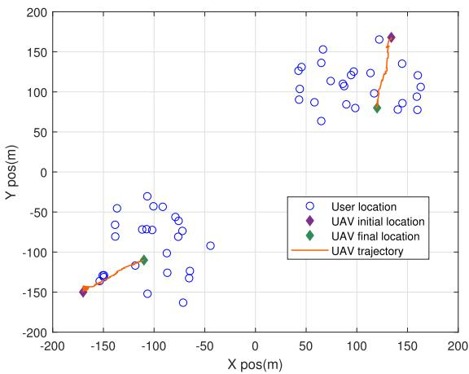

scatter

| X pos(m) | Y pos(m) | Type             |
| -------- | -------- | ---------------- |
| -150     | -150     | User location    |
| -100     | -100     | User location    |
| -50      | -50      | User location    |
| 0        | 0        | User location    |
| 50       | 50       | User location    |
| 100      | 100      | User location    |
| 150      | 150      | User location    |
| -150     | -150     | UAV initial location |
| -100     | -100     | UAV initial location |
| -50      | -50      | UAV initial location |
| 0        | 0        | UAV initial location |
| 50       | 50       | UAV initial location |
| 100      | 100      | UAV initial location |
| 150      | 150      | UAV initial location |
| -150     | -150     | UAV final location|
| -100     | -100     | UAV final location|
| -50      | -50      | UAV final location|
| 0        | 0        | UAV final location|
| 50       | 50       | UAV final location|
| 100      | 100      | UAV final location|
| 150      | 150      | UAV final location|
| -150     | -150     | UAV trajectory   |
| -100     | -100     | UAV trajectory   |
| -50      | -50      | UAV trajectory   |
| 0        | 0        | UAV trajectory   |
| 50       | 50       | UAV trajectory   |
| 100      | 100      | UAV trajectory   |
| 150      | 150      | UAV trajectory   |

Fig. 2. AAV trajectory under the proposed method.

within [100, 200] cycles/bit. The default parameter values are shown in Table I [30]. Besides, the actor and critic networks both have two fully connected hidden layers with 256 and 128 neurons.

Our approach is compared with the following four benchmark methods.

- MADDPG method [40]: AAV trajectory and task offloading are optimized through MADDPG algorithm.   
MATD3-F method: Task offloading, task assignment and computing resource allocation are optimized without trajectory optimization.   
MATD3-P method: AAV trajectory, task offloading and task assignment are optimized without computing resource optimization.   
DDPG method: AAV trajectory and task offloading are optimized through DDPG algorithm, where each agent has an independent DDPG model and makes its own decisions, regardless of the actions and states of other agents.

Fig. 2 shows the trajectory of 2 AAVs. For better demonstration, we utilize 50 users. As we can see that each AAV finally moves to the center of a hotspot, which enables it to effectively provide edge computing service. To balance energy consumption and time delay, AAV are as close as possible to each user to provide higher quality services. Moreover, since MTDTO optimizes the AAV trajectory as well as offloading strategy according to the current energy and offloading queue states, it is able to obtain the minimum system cost without violating the constraints.

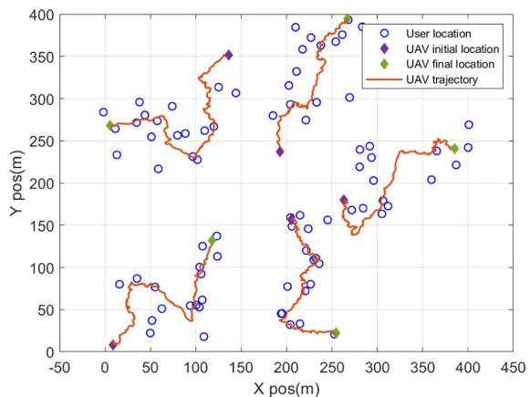

scatter

| X pos(m) | Y pos(m) | Type             |
| -------- | -------- | ---------------- |
| 0        | 275      | UAV initial location |
| 10       | 275      | UAV final location |
| 140      | 350      | UAV initial location |
| 200      | 240      | UAV initial location |
| 260      | 390      | UAV final location |
| 380      | 240      | UAV final location |
| 380      | 240      | UAV final location |
| 380      | 240      | UAV final location |
| 380      | 240      | UAV final location |
| 380      | 240      | UAV final location |
| 380      | 240      | UAV final location |
| 380      | -        | UAV final location |
| 380      | -        | UAV final location |
| 380      | -        | UAV final location |
| 380      | -        | UAV final location |
| 380      | -        | UAV final location |
| 380      | -        | UAV final location |
| 380      | -        | UAV final location |
| 380      | -        | UAE trajectory    |
| 380      | -        | UAE trajectory    |
| 380      | -        | UAE trajectory    |
| 380      | -        | UAE trajectory    |
| 380      | -        | UAE trajectory    |
| 380      | -        | UAE trajectory    |
| 380      | -        | UAE trajectory    |
| 380      | -        | UAE trajectory    |
|
| 380      | -        | UAE trajectory    |
| 380      | -        | UAE trajectory    |
| 380      | -        | UAE trajectory    |
| 380      | -        | UAE trajectory    |
| 380      | -        | UAE trajectory    |
| 380      | -        | UAE trajectory    |
| 380      | -        | UAE trajectory    |
| ...      | ...      | ...              |
| ...      | ...      | ...              |
| ...      | ...      | ...              |
| ...      | ...      | ...              |
| ...      | ...      | ...              |
| ...      | ...      | ...              |
| ...      | ...      | ...              |
| ...      | ...      | ...              |
| ...      | ...      | ...              |
| ...      | ...      | ...              |
| ...      | ...      | ...<nl>| ...      | ...      | ...              |
| ...      | ...      | ...              |
| ...      | ...      | ...              |
| ...      | ...      | ...              |
| ...      | ...      | ...              |
| ...      | ...      | ...              |
| ...      | ...      | ...              |
| ...      | ...      | ...              |
| ...      | ...      | ...              |
| ...      | ...      | ...              |

(a)

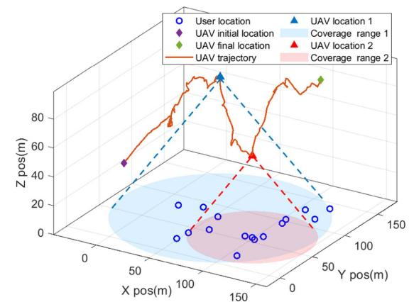  
(b)   
Fig. 3. AAV trajectory for large-scale scenario. (a) 2D trajectory. (b) 3D trajectory of the AAV in the bottom left corner

Fig. 3 displays the AAV trajectory for large-scale scenario, where 5 AAVs cooperate to serve 80 users. In Fig. 3(a), we can observe that each AAV is capable of covering certain users while avoiding getting close to other AAVs, satisfying the collision and coverage overlapping avoidance restraints. Besides, the obtained trajectories appropriately match the user distribution of the horizontal plane, offering high-quality task offloading channels. More insightful, Fig. 3(b) presents the 3D trajectory of the AAV in the bottom left corner, illustrating that the AAV adaptively controls the coverage range via adjusting its altitude. Specifically, when the AAV pass through an area with low user density (location 1), it raises the altitude to expand the coverage, allowing more users to offload tasks and reduce queue backlogs; otherwise (location 2), the AAV covers less users by decreasing the altitude, which suppresses the co-channel interference and boosts the offloading performance of high-density user area.

Fig. 4 shows the system cost versus time slot. It indicates that compared to the other four benchmark approaches, the system cost of our method is less and more stable. This is because our method jointly optimizes task offloading, computing resource assignment and trajectory, leading to reduction in data transmission delay and energy consumption. Due to the gradient vanishing problem, AAVs may travel away from their associated users, causing MATD3-F to consume more energy. Moreover, the agents only learn to optimize their individual reward during the training phase since DDPG cannot use the global information. That is why its performance is much worse. Numerical result demonstrates that the total system cost of our method is 18.76%, 29.40%, 35.38%, and 52.14% lower than MADDPG, MATD3-F, MATD3-P, and DDPG, respectively.

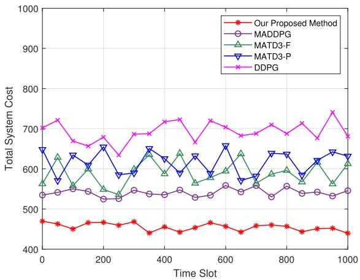

line

| Time Slot | Our Proposed Method | MADDPG | MATD3-F | MATD3-P | DDPG |
| --------- | ------------------- | ------ | ------- | ------- | ---- |
| 0         | 470                 | 540    | 560     | 650     | 710  |
| 100       | 460                 | 550    | 570     | 630     | 720  |
| 200       | 470                 | 530    | 550     | 660     | 680  |
| 300       | 460                 | 540    | 560     | 590     | 690  |
| 400       | 450                 | 540    | 640     | 650     | 720  |
| 500       | 460                 | 550    | 630     | 620     | 670  |
| 600       | 470                 | 560    | 610     | 660     | 710  |
| 700       | 460                 | 550    | 590     | 580     | 690  |
| 800       | 470                 | 560    | 620     | 640     | 710  |
| 900       | 460                 | 550    | 580     | 630     | 680  |
| 1000      | 450                 | 540    | 620     | 640     | 690  |

Fig. 4. Total system cost versus time slot.

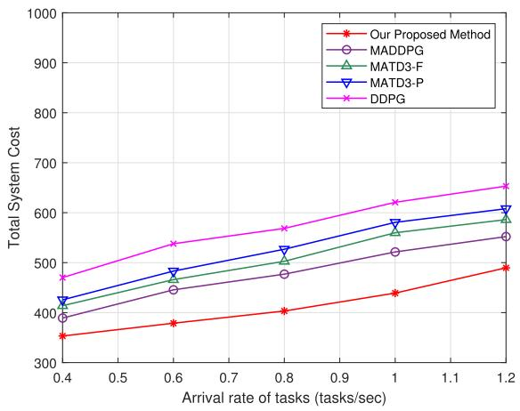

line

| Arrival rate of tasks (tasks/sec) | Our Proposed Method | MADDPG | MATD3-F | MATD3-P | DDPG |
| --------------------------------- | ------------------- | ------ | ------- | ------- | ---- |
| 0.4                               | 350                 | 400    | 420     | 430     | 470  |
| 0.6                               | 380                 | 450    | 480     | 490     | 540  |
| 0.8                               | 400                 | 480    | 510     | 530     | 570  |
| 1.0                               | 440                 | 520    | 560     | 580     | 620  |
| 1.2                               | 490                 | 550    | 600     | 610     | 660  |

Fig. 5. Total system cost versus task arrival rate $\lambda _ { i }$ .

Fig. 5 plots total system cost versus task arrival rate $\lambda _ { i }$ . As the arrival rate $\lambda _ { i }$ increases, AAVs need more energy for data processing, leading to the system cost increasing. We can also see that our method obtains the lowest system cost. This is because MATD3-based algorithm has improved learning strategy and value estimation compared with MADDPG. Moreover, continuous action space is adopted by MTDTO and our method jointly optimizes trajectory, offloading and computing resource allocation. Thus, it has better performance and stability.

Fig. 6 shows the sum of the accumulated reward in the training process. It is evident that at the beginning, the curve grows up with volatility. This is because agent learns to choose task offloading candidates to adjust to dynamic environment. AAVs cooperate to offer computing services and meet movement constraints and channel conditions. It converges when all agents learn appropriate policy, and the cumulative reward may change around its convergence value because of the dynamic nature of task queue and remaining edge computing resources. It can also be seen that, compared with MADDPG, MATD3-F, MATD3-P, and DDPG, our approach has faster convergence speed and higher sum reward.

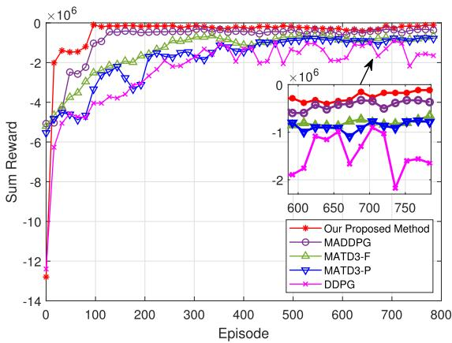

line

| Episode | Our Proposed Method | MADDPG | MATD3-F | MATD3-P | DDPG |
| ------- | ------------------- | ------ | ------- | ------- | ---- |
| 0       | -12.5               | -5.0   | -5.5    | -6.0    | -12.0 |
| 100     | 0.0                 | -2.0   | -3.0    | -4.0    | -5.0  |
| 200     | 0.0                 | -1.0   | -2.0    | -3.0    | -4.0  |
| 300     | 0.0                 | 0.0    | -1.0    | -2.0    | -3.0  |
| 400     | 0.0                 | 0.0    | 0.0     | -1.0    | -2.0  |
| 500     | 0.0                 | 0.0    | 0.0     | 0.0     | -1.0  |
| 600     | 0.0                 | 0.0    | 0.0     | 0.0     | 0.0   |
| 700     | 0.0                 | 0.0    | 0.0     | 0.0     | 0.0   |
| 800     | 0.0                 | 0.0    | 0.0     | 0.0     | 0.0   |

Fig. 6. Sum of the accumulated reward.

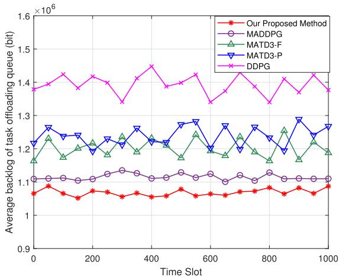

line

| Time Slot | Our Proposed Method | MADDPG | MATD3-F | MATD3-P | DDPG |
| --------- | ------------------- | ------ | ------- | ------- | ---- |
| 0         | 1.08                | 1.10   | 1.25    | 1.28    | 1.38 |
| 100       | 1.07                | 1.10   | 1.22    | 1.26    | 1.42 |
| 200       | 1.08                | 1.10   | 1.20    | 1.24    | 1.40 |
| 300       | 1.07                | 1.12   | 1.23    | 1.27    | 1.34 |
| 400       | 1.06                | 1.12   | 1.22    | 1.25    | 1.45 |
| 500       | 1.07                | 1.12   | 1.24    | 1.28    | 1.39 |
| 600       | 1.08                | 1.12   | 1.20    | 1.28    | 1.34 |
| 700       | 1.07                | 1.10   | 1.23    | 1.26    | 1.40 |
| 800       | 1.08                | 1.12   | 1.25    | 1.28    | 1.33 |
| 900       | 1.07                | 1.12   | 1.22    | 1.29    | 1.42 |
| 1000      | 1.08                | 1.12   | 1.20    | 1.27    | 1.38 |

Fig. 7. Average backlog versus time.

Fig. 7 shows the average backlog. It is evident that the task backlog of our method is much reduced compared to MADDPG, MATD3-F, MATD3-P, and DDPG. The reason lies in that for our approach, users and AAVs both adjust the task offloading strategy and AAV trajectory based on the real-time task queue to accomplish the optimized offloading and trajectory strategy, and decrease the task backlog. For DDPG method, each agent has an independent decision, and there is no local information sharing, so its performance is lower than that of our method. Numerical result delineates that our approach can reduce the average queue backlog by 4.36%, 12.49%, 15.95%, and 30.38% compared to four benchmark methods, respectively.

To better examine the expandability of our approach, we assess the system cost under different numbers of AAVs and users. In Fig. 8, the users’ number increases from 20 to 70. It is evident that the more users there are, the more computation tasks must be performed, which raises the system cost. Additionally, with AAVs’ number increasing, more AAVs will participate in the computing and offloading, which will improve the efficiency of task processing and reduce the system cost.

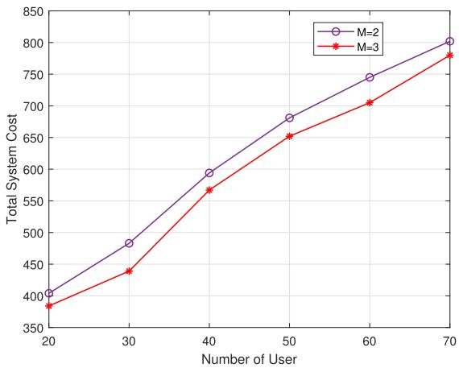

line

| Number of User | M=2  | M=3  |
| -------------- | ---- | ---- |
| 20             | 400  | 385  |
| 30             | 485  | 440  |
| 40             | 600  | 570  |
| 50             | 685  | 655  |
| 60             | 750  | 710  |
| 70             | 805  | 785  |

Fig. 8. Total system cost versus users’ number under different AAVs’ numbers.

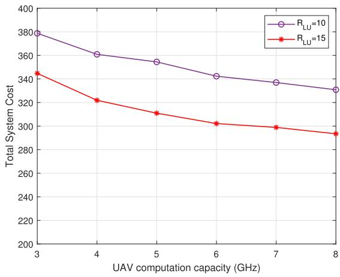

line

| UAV computation capacity (GHz) | R_LU=10 | R_LU=15 |
| ------------------------------ | ------- | ------- |
| 3                              | 380     | 345     |
| 4                              | 362     | 322     |
| 5                              | 355     | 312     |
| 6                              | 342     | 302     |
| 7                              | 338     | 298     |
| 8                              | 332     | 292     |

Fig. 9. Total system cost versus AAVs’ computing capacity.

Fig. 9 plots total system cost versus various computation capacity and $R _ { L U } ( t )$ . The AAV computation capacity is raised ( )from 3 to 8 GHz, and $R _ { L U } ( t )$ increases from 10 to 15 Mbps. With the growing of $R _ { L U } ( t )$ ), transmission delay and energy ( )consumption decrease, resulting in lower system cost. Additionally, more computing resources are given to users as the AAVs computation capacity grows, thus reducing computation delay and system cost. Numerical results showcase that when $R _ { L U } ( t ) = 1 5$ Mbps, the increase of AAV computation capacity ( ) =from 3 GHz to 8 GHz reduces the total system cost by 17.51%.

# VII. CONCLUSION

A hierarchical network model is considered in this paper, where AAVs and satellites collaborate to process users’ offloaded computing tasks, and a joint AAV trajectory plan, task offloading, task assignment and computing resource allocation problem for minimizing system cost is proposed. Due to the coupling between queue delay constraints and decision-making, Lyapunov optimization is applied to split the issue into three subproblems. MTDTO, CVX-based method and GSCRA are designed to minimize system cost. The simulation outcomes show the advantages of our method. We will consider integrating cache resource into SAGIN network to provide more efficient service in the future.

# REFERENCES

[1] T. K. Rodrigues and N. Kato, “Hybrid centralized and distributed learning for MEC-Equipped satellite 6G networks,” IEEE J. Sel. Areas Commun., vol. 41, no. 4, pp. 1201–1211, Apr. 2023.   
[2] H. Guo, J. Li, J. Liu, N. Tian, and N. Kato, “A survey on space-air-groundsea integrated network security in 6G,” IEEE Commun. Surveys Tuts., vol. 24, no. 1, pp. 53–87, First Quarter 2022.   
[3] Z. Wang, J. Guo, Z. Chen, L. Yu, Y. Wang, and H. Rao, “Robust secure UAV relay-assisted cognitive communications with resource allocation and cooperative jamming,” J. Commun. Netw., vol. 24, no. 2, pp. 139–153, Apr. 2022.   
[4] Z. Jia, M. Sheng, J. Li, D. Zhou, and Z. Han, “Joint HAP access and LEO satellite backhaul in 6G: Matching game-based approaches,” IEEE J. Sel. Areas Commun., vol. 39, no. 4, pp. 1147–1159, Apr. 2021.   
[5] C. Joo and J. Choi, “Low-delay broadband satellite communications with high-altitude unmanned aerial vehicles,” J. Commun. Netw., vol. 20, no. 1, pp. 102–108, Feb. 2018.   
[6] Y. K. Tun, K. T. Kim, L. Zou, Z. Han, G. Dán, and C. S. Hong, “Collaborative computing services at ground, air, and space: An optimization approach,” IEEE Trans. Veh. Technol., vol. 73, no. 1, pp. 1491–1496, Jan. 2024.   
[7] M. Centenaro, C. E. Costa, F. Granelli, C. Sacchi, and L. Vangelista, “A survey on technologies, standards and open challenges in satellite IoT,” IEEE Commun. Surveys Tuts., vol. 23, no. 3, pp. 1693–1720, Third Quarter 2021.   
[8] P. Qin et al., “Joint trajectory plan and resource allocation for UAV-enabled C-NOMA in air-ground integrated 6G heterogeneous network,” IEEE Trans. Netw. Sci. Eng., vol. 10, no. 6, pp. 3421–3434, Nov./Dec. 2023.   
[9] Q. Song, S. Jin, and F.-C. Zheng, “Completion time and energy consumption minimization for UAV-Enabled multicasting,” IEEE Wireless Commun. Lett., vol. 8, no. 3, pp. 821–824, Jun. 2019.   
[10] H. Kang, X. Chang, J. Miši´c, V. B. Miši´c, J. Fan, and J. Bai, “Improving Dual-UAV aided Ground-UAV bi-directional communication security: Joint UAV trajectory and transmit power optimization,” IEEE Trans. Veh. Technol., vol. 71, no. 10, pp. 10570–10583, Oct. 2022.   
[11] V. H. Dang et al., “Throughput optimization for noma energy harvesting cognitive radio with Multi-UAV-Assisted relaying under security constraints,” IEEE Trans. Cogn. Commun. Netw., vol. 9, no. 1, pp. 82–98, Feb. 2023.   
[12] P. Qin, Y. Zhu, X. Zhao, X. Feng, J. Liu, and Z. Zhou, “Joint 3D-Location planning and resource allocation for XAPS-enabled C-NOMA in 6G heterogeneous Internet of Things,” IEEE Trans. Veh. Technol., vol. 70, no. 10, pp. 10594–10609, Oct. 2021.   
[13] S. Zhu, L. Gui, N. Cheng, Q. Zhang, F. Sun, and X. Lang, “UAV-Enabled computation migration for complex missions: A reinforcement learning approach,” IET Commun., vol. 14, no. 15, pp. 2472–2480, 2020.   
[14] N. H. Chu, D. T. Hoang, D. N. Nguyen, N. Van Huynh, and E. Dutkiewicz, “Joint speed control and energy replenishment optimization for UAV-Assisted IoT data collection with deep reinforcement transfer learning,” IEEE Internet Things J., vol. 10, no. 7, pp. 5778–5793, Apr. 2023.   
[15] O. S. Oubbati, M. Atiquzzaman, A. Baz, H. Alhakami, and J. Ben-Othman, “Dispatch of UAVs for urban vehicular networks: A deep reinforcement learning approach,” IEEE Trans. Veh. Technol., vol. 70, no. 12, pp. 13174–13189, Dec. 2021.   
[16] J.-H. Lee, J. Park, M. Bennis, and Y.-C. Ko, “Integrating LEO satellites and Multi-UAV reinforcement learning for hybrid FSO/RF non-terrestrial networks,” IEEE Trans. Veh. Technol., vol. 72, no. 3, pp. 3647–3662, Mar. 2023.   
[17] B. Zhang, C. Jin, B. Tian, K. Cao, J. Wang, and P. Zhang, “Electromagneticmodel-Driven twin delayed deep deterministic policy gradient algorithm for stealthy conformal array antenna,” IEEE Trans. Antennas Propag., vol. 70, no. 12, pp. 11779–11789, Dec. 2022.   
[18] P. Qin, Y. Fu, G. Tang, X. Zhao, and S. Geng, “Learning based energy efficient task offloading for vehicular collaborative edge computing,” IEEE Trans. Veh. Technol., vol. 71, no. 8, pp. 8398–8413, Aug. 2022.   
[19] P. Qin, M. Wang, X. Zhao, and S. Geng, “Content service oriented resource allocation for space-air-ground integrated 6G networks: A three-sided cyclic matching approach,” IEEE Internet Things J., vol. 10, no. 1, pp. 828–839, Jan. 2023.

[20] P. Zhang, C. Wang, N. Kumar, and L. Liu, “Space-air-Ground integrated multi-domain network resource orchestration based on virtual network architecture: A DRL method,” IEEE Trans. Intell. Transp. Syst., vol. 23, no. 3, pp. 2798–2808, Mar. 2022.   
[21] N. Zhang, S. Zhang, P. Yang, O. Alhussein, W. Zhuang, and X. Shen, “Software defined space-air-ground integrated vehicular networks: Challenges and solutions,” IEEE Commun. Mag., vol. 55, no. 7, pp. 101–109, Jul. 2017.   
[22] J. Wang, C. Jiang, Z. Wei, C. Pan, H. Zhang, and Y. Ren, “Joint UAV hovering altitude and power control for space-air-ground IoT networks,” IEEE Internet Things J., vol. 6, no. 2, pp. 1741–1753, Apr. 2019.   
[23] N. Cheng et al., “Air-ground integrated mobile edge networks: Architecture, challenges, and opportunities,” IEEE Commun. Mag., vol. 56, no. 8, pp. 26–32, Aug. 2018.   
[24] S. Mao, S. He, and J. Wu, “Joint UAV position optimization and resource scheduling in space-air-ground integrated networks with mixed cloud-edge computing,” IEEE Syst. J., vol. 15, no. 3, pp. 3992–4002, Sep. 2021.   
[25] P. Qin, Y. Fu, X. Zhao, K. Wu, J. Liu, and M. Wang, “Optimal task offloading and resource allocation for C-NOMA heterogeneous air-ground integrated power-IoT networks,” IEEE Trans. Wireless Commun., vol. 21, no. 11, pp. 9276–9292, Nov. 2022.   
[26] W. Wu, F. Zhou, R. Q. Hu, and B. Wang, “Energy-efficient resource allocation for secure NOMA-Enabled mobile edge computing networks,” IEEE Trans. Commun., vol. 68, no. 1, pp. 493–505, Jan. 2020.   
[27] L. Wang, K. Wang, C. Pan, W. Xu, N. Aslam, and L. Hanzo, “Multi-agent deep reinforcement learning-based trajectory planning for Multi-UAV assisted mobile edge computing,” IEEE Trans. Cogn. Commun. Netw., vol. 7, no. 1, pp. 73–84, Mar. 2021.   
[28] J. Cui, Y. Liu, and A. Nallanathan, “Multi-agent reinforcement learningbased resource allocation for UAV networks,” IEEE Trans. Wireless Commun., vol. 19, no. 2, pp. 729–743, Feb. 2020.   
[29] P. Qin, S. Wang, Z. Lu, Y. Xie, and X. Zhao, “Deep reinforcement learningbased energy minimization task offloading and resource allocation for air ground integrated heterogeneous networks,” IEEE Syst. J., vol. 17, no. 3, pp. 4958–4968, Sep. 2023.   
[30] N. Zhao, Z. Ye, Y. Pei, Y.-C. Liang, and D. Niyato, “Multi-agent deep reinforcement learning for task offloading in UAV-Assisted mobile edge computing,” IEEE Trans. Wireless Commun., vol. 21, no. 9, pp. 6949–6960, Sep. 2022.   
[31] J. D. C. Little, “A proof for the queuing formula: L=λW,” Operations Res., vol. 9, no. 3, pp. 383–387, Jun. 1961.   
[32] M. Alzenad, A. El-Keyi, F. Lagum, and H. Yanikomeroglu, “3-D placement of an unmanned aerial vehicle base station (UAV-BS) for energyefficient maximal coverage,” IEEE Wireless Commun. Lett., vol. 6, no. 4, pp. 434–437, Aug. 2017.   
[33] J. Li, G. Sun, Q. Wu, D. Niyato, J. Kang, and A. Jamalipour, “Collaborative ground-space communications via evolutionary multi-objective deep reinforcement learning,” IEEE J. Sel. Areas Commun., vol. 42, no. 12, pp. 3395–3411, Dec. 2024.   
[34] A. Al-Hourani, S. Kandeepan, and S. Lardner, “Optimal LAP altitude for maximum coverage,” IEEE Wireless Commun. Lett., vol. 3, no. 6, pp. 569–572, Dec. 2014.   
[35] T. Hong, W. Zhao, R. Liu, and M. Kadoch, “Space-air-Ground IoT network and related key technologies,” IEEE Wireless Commun., vol. 27, no. 2, pp. 96–104, Apr. 2020.   
[36] J. Liu, X. Zhao, P. Qin, S. Geng, and S. Meng, “Joint dynamic task offloading and resource scheduling for WPT enabled space-air-ground power Internet of Things,” IEEE Trans. Netw. Sci. Eng., vol. 9, no. 2, pp. 660–677, Mar./Apr. 2022.   
[37] F. Chai, Q. Zhang, H. Yao, X. Xin, R. Gao, and M. Guizani, “Joint multitask offloading and resource allocation for mobile edge computing systems in satellite IoT,” IEEE Trans. Veh. Technol., vol. 72, no. 6, pp. 7783–7795, Jun. 2023.   
[38] Q. Zhang, L. Gui, F. Hou, J. Chen, S. Zhu, and F. Tian, “Dynamic task offloading and resource allocation for mobile-edge computing in dense cloud RAN,” IEEE Internet Things J., vol. 7, no. 4, pp. 3282–3299, Apr. 2020.   
[39] T. Uan, W. D. R. Neto, C. E. Rothenberg, K. Obraczka, C. Barakat, and T. Turletti, “Dynamic controller assignment in software defined internet of vehicles through multi-agent deep reinforcement learning,” IEEE Trans. Netw. Service Manag., vol. 18, no. 1, pp. 585–596, Mar. 2021.   
[40] P. Qin, Y. Fu, Y. Xie, K. Wu, X. Zhang, and X. Zhao, “Multi-agent learning-based optimal task offloading and UAV trajectory planning for AGIN-Power IoT,” IEEE Trans. Commun., vol. 71, no. 7, pp. 4005–4017, Jul. 2023.