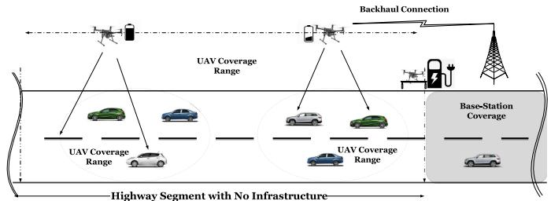
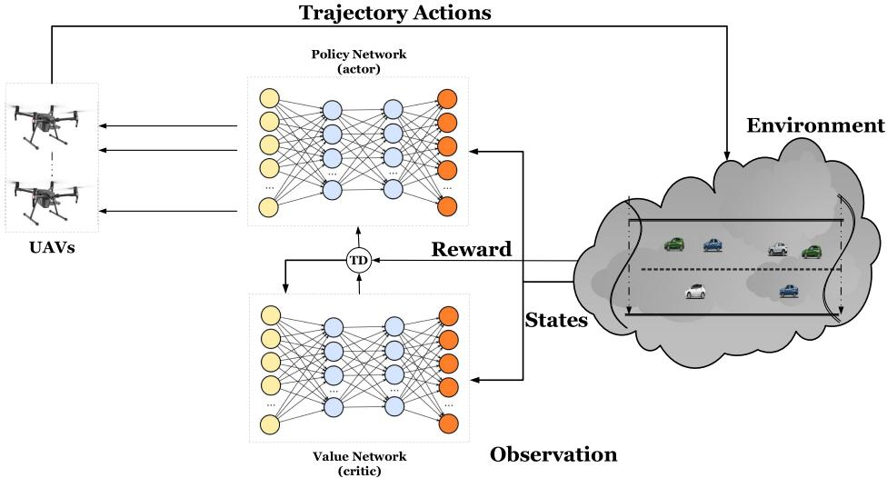
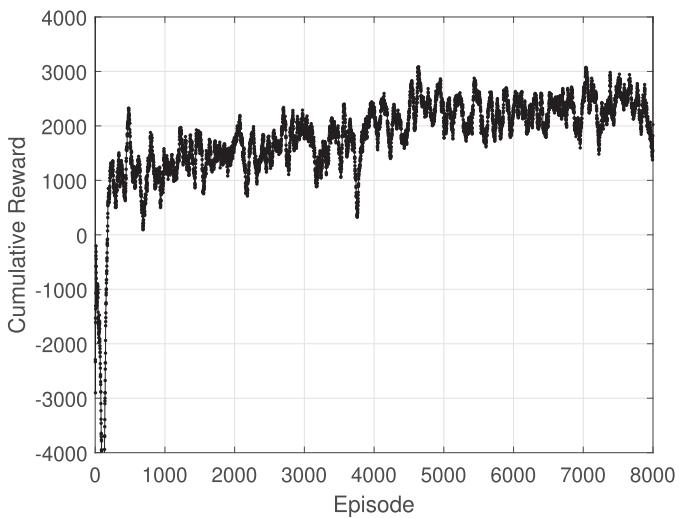
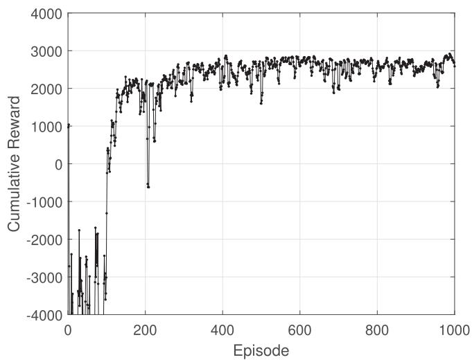
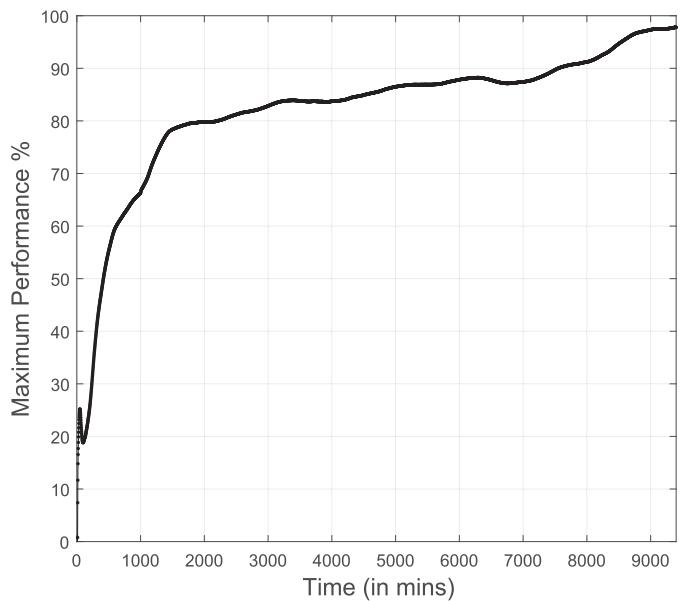
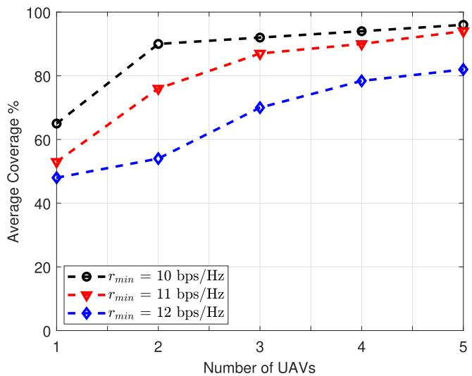
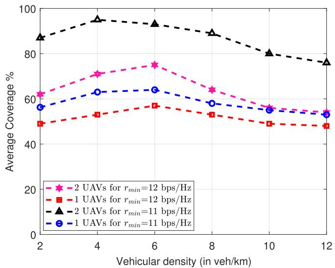
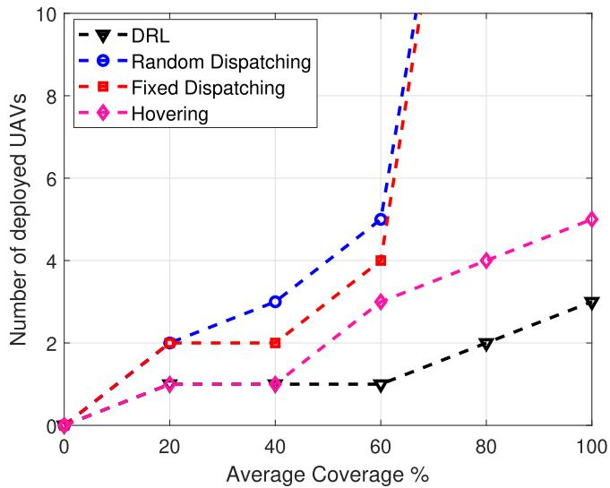
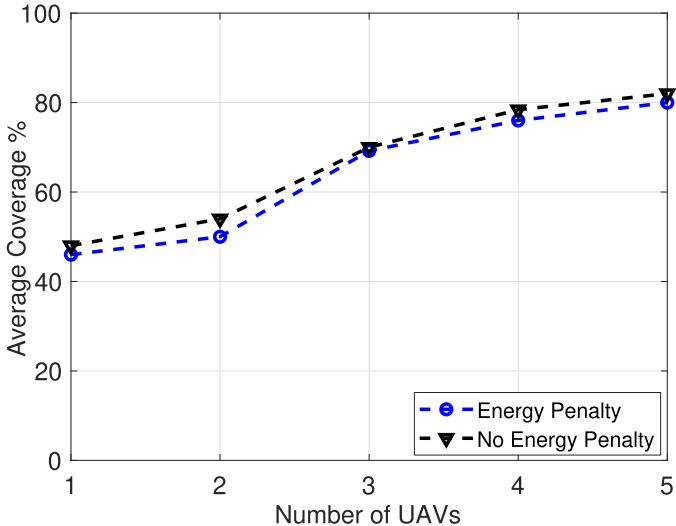
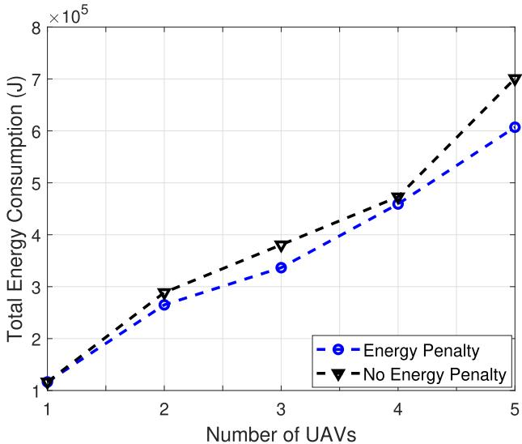

# Leveraging UAVs for Coverage in Cell-Free Vehicular Networks: A Deep Reinforcement Learning Approach

Moataz Samir , Dariush Ebrahimi , Chadi Assi , Sanaa Sharafeddine , and Ali Ghrayeb

Abstract—The success in transitioning towards smart cities relies on the availability of information and communication technologies that meet the demands of this transformation. The terrestrial infrastructure presents itself as a preeminent component in this change. Unmanned aerial vehicles (UAVs) empowered with artificial intelligence (Al) are expected to become an integral component of future smart cities that provide seamless coverage for vehicles on highways with poor cellular infrastructure. Motivated by the above, in this paper, we introduce UAVs cell-free network for providing coverage to vehicles entering a highway that is not covered by other infrastructure. However, UAVs have limited energy resources and cannot serve the entire highway all the time. Furthermore, the deployed UAVs have insufficient knowledge about the environment (e.g., the vehicles’ instantaneous location). Therefore, it is challenging to control a swarm of UAVs to achieve efficient communication coverage. To address these challenges, we formulate the trajectories decisions making as a Markov decision process (MDP) where the system state space considers the vehicular network dynamics. Then, we leverage deep reinforcement learning (DRL) to propose an approach for learning the optimal trajectories of the deployed UAVs to efficiently maximize the vehicular coverage, where we adopt Actor-Critic algorithm to learn the vehicular environment and its dynamics to handle the complex continuous action space. Finally, simulations results are provided to verify our findings and demonstrate the effectiveness of the proposed design and show that during the mission time, the deployed UAVs adapt their velocities in order to cover the vehicles.

Index Terms—UAV coverage, deep reinforcement learning, UAVs’ trajectories, drive-thru, actor-critic algorithm, vehicular networks

## 1 INTRODUCTION

wireless networks under different labels such as beyond fifth-generation (B5G or 5G+), and the sixth-generation (6G) are expected to seamlessly and ubiquitously connect everything, support very high data rates and diverse requirements on reliability, latency, and capability of devices to support a myriad of applications such as augmented/virtual reality, ultra-high-definition movies, Internet of Vehicles (IoV), smart cities and so on. One of the most certain enabling techniques for future wireless networks is artificial intelligence (AI), which has been proven to be effective in dealing with the large scale problems associated with wireless networks. Hence, there has been a consensus that AI techniques will be at the core of future wireless networks [1].

One of the main applications of future wireless networks is to provide ubiquitous coverage to suburban, rural highways and volatile environments, where vehicles might need access to different types of information including safety commands, maps, and route guidance during the entire navigation period. However, the seamless provision of connectivity and the uninterrupted delivery of services along highways also pose various challenges that future wireless technologies promise to solve. The situation is particularly challenging in highways such as cross-border highways where the communication services might be unavailable. Nevertheless, cellular infrastructure could either be inadequately provisioned to cover all vehicles or could be exposed to unexpected hardware failure or direct damage. Besides, providing ubiquitous coverage to highways, where terrestrial infrastructure is economically infeasible due to geographical constraints, is a challenging task that current and future wireless networks have to consider. Motivated by this, different European projects such as “5G-CroCo” [2], “5G-Carmen” [3], and “5G-MOBIX” [4] are working toward the vision of future connected vehicles under different scenarios as well as service demand.

Alternatively, intelligent cell-free networks with the provision of some isolated AI operations [5] are expected to play an important role in future wireless networks, where the full potential of mobile base-stations such as unmanned aerial vehicles (UAVs) or dronecells will be realized to provide effective coverage whenever needed. Indeed, due to their agility and mobility, UAVs are being promoted as a promising paradigm in future wireless networks to provide network connectivity when the infrastructure is partially or fully unavailable. Furthermore, they can be deployed to enhance the coverage of cellular networks during an unplanned surge in traffic demand [6]. An additional advantage of using UAVs is that they can be relocated from one zone to another in order to provide network connectivity based on the actual traffic demand. Moreover, in vehicular networks that are typically characterized by high mobility and varying vehicle arrival pattern, multiple UAVs with autonomous control are required to cooperatively provide network coverage and adapt to current traffic conditions. Thus, the existence of a swarm of UAVs to provide wireless connectivity will be necessary.

Nonetheless, UAVs have limited communication ranges and are constrained by their energy budget. Thus, they cannot serve on entire highway all the time or keep flying back and fourth for long periods. It is thus challenging to find the trajectories of a minimum number of UAVs in order to achieve effective coverage in the long run under UAV’s energy budget constraint, while maintaining a certain Quality of service (QoS). To this end, we propose to leverage AI technique particularly Deep Reinforcement Learning (DRL) in order to control the trajectories of UAVs and present a novel and highly efficient solution.

## 1.1 Related Works

Much research has been recently done to address various challenges in UAV communication systems. Optimizing the trajectory of the UAV is one of the important research challenges. For instance, the work in [7] maximized the minimum rate among ground users by optimizing the trajectory and user scheduling for a single-UAV. In [8], the authors optimized the UAV’s trajectory to minimize the time to completely disseminate a common file to a number of distributed ground terminals. In [9], the UAV trajectory and ground terminal transmit power are jointly optimized for both circular and straight trajectories to reveal a fundamental trade-off between the UAV propulsion energy consumption and ground terminal communication energy consumption. In [10] the authors analyzed the coverage properties and proposed a UAV-based deployment in the emergency scenario. The authors in [11] analyzed the optimal height for the UAV to minimize the transmitted power for covering a target area. In [12] the horizontal positions are optimized while fixing the altitude of the UAVs to minimize the number of UAVs required to cover a fixed number of stationary users. The authors in [13] studied a similar problem for a drone-cell placement optimization in three-dimensional space.

Recently, few works have been conducted to investigate the use of multiple UAVs. In fact, compared to a single UAV, the use of a swarm of UAVs allows to operate in challenging missions with higher performance and efficiency. However, new issues should be considered with using the swarm of UAVs such as energy efficiency, path planning, etc. For example, the work in [14] jointly optimized the trajectory, multi-user scheduling and power control for multiple UAVs to maximize the minimum rate of ground users. In our recent work in [15], we optimized the trajectories and radio resources of the minimum number of UAVs to serve vehicles in a mobility environment. In [16], the authors deployed multiple UAVs for collecting data from ground IoT devices, where the total uplink transmit power of these

IoT devices is minimized in a time-varying network by optimizing the UAV’s trajectory and IoT power control.

Machine learning has received significant attention and particularly has been recently utilized for solving challenging problems with UAVs. Specifically, the authors of [17] employed echo state network (ESN) based prediction algorithm for predicting the future locations of ground users and then a multi-agent Q-learning based algorithm is proposed to predict the locations of UAVs in each time-slot. In [18], a centralized deep reinforcement learning is proposed to control the trajectory of UAVs in a static environment for providing effective communication coverage while considering fairness and energy consumption for a fixed number of UAVs. In [19] the authors proposed a decentralized deep reinforcement learning solution to obtain the trajectories of multiple UAVs to achieve the energy efficiency.

Unlike the works in [7], [8], [9], [10], [11], [12], [13] that consider a single UAV, multiple UAVs are employed and coverage services is maximized under UAVs’ energy budget constraint. In contrast to the works in [14], [15], [16], [17], [18], [19] which study the performance of multiple UAVs in static environment, these results cannot readily extend to cases in a highly dynamic environment such as vehicular networks where the network’s topology frequently changes. To this end, we consider a vehicular network in our analysis and a machine learning approach is exploited to learn the vehicular environment and its dynamics to handle the complex continuous action space. In other words, we are interested in further leveraging the Deep Reinforcement Learning technique for UAV control and present a Deep Reinforcement Learning based method to offer network coverage in dynamic environment.

## 1.2 Motivation and Work Objectives

Despite several studies related to the deployment and trajectory optimization of UAVs, there are still many open questions that are yet to be answered. In particular, for vehicular networks, there is no framework that can provide the minimum number of UAVs to serve vehicles on a given highway segment in a high mobility scenario under UAV’s energy budget constraint while maintaining an acceptable Quality of Service (QoS) for each vehicle. Most of the existing coverage work relies on users which are stationary where a complete knowledge about the environment (such as the users’ instantaneous location) is available in order to obtain results. However, users could be mobile (e.g., vehicles) with random speeds, hence, the assumptions of a global knowledge of the network is not valid, especially in highly dynamic environments such as vehicular networks. Nonetheless, prior work relies on optimization frameworks which require high computation resources to attain results [20]. Furthermore, none of the existing literature provides a solution for a real scenario in highly dynamic environments such as a vehicular network, where the networks topology is frequently changed.

In our work in [15], we provided a mathematical optimization framework that can provide the minimum number of UAVs and their optimal trajectories to serve vehicles on a given highway segment in a high-mobility scenario. However, we considered a complete knowledge about the environment in advance in order to obtain our results. The July 05,2026 at 12:38:43 UTC from IEEE Xplore. Restrictions apply.

assumption of knowing the instantaneous location of vehicles in advance is not valid in a realistic scenario. Furthermore, the energy consumption of the UAVs has been neglected. However, the energy consumption needs to be carefully considered if the trajectory requires serving for a long time.

Unlike our study presented in [21], where a Reinforcement Learning approach is utilized to govern the UAVs’ trajectories with a set of actions (traveling distance), in this work, we consider UAVs trajectories without traveling restrictions, constraining their mobility to finite distances (i.e., the UAV trajectories is continuous), where the action space dimension is infinite. Hence, the required computational time and effort to realize an optimal number of UAVs and their trajectories using Reinforcement Learning is infeasible. Furthermore, fixing the coverage of a UAV may not be the best solution to minimize the number of UAVs which should be dynamically changeable according to the current traffic condition.

Obviously, we are dealing with a continuous control task since each UAV can carry out infinite actions (traveling distance) to serve the existing and newly arriving vehicles, and hence the use of Deep Reinforcement Learning (DRL) techniques is necessary to explore the effect of the UAVs’ actions on the vehicular environment. It is important to mention that the control task is not dependent only on one UAV but on the joint actions of all UAVs. Deep Q-Network (DQN) could be adapted to solve continuous control task through discretizing the action space. However, one of the major limitation of this technique is the curse of dimensionality [22]: the number of actions space increases exponentially with the number of degrees of freedom. For instance, a 20 degree of freedom action (as traveling distance in both direction) for 2 UAVs leads to an action space with dimensionality: $2 ^ { 2 0 } = 1 0 4 8 5 7 6$ . The situation is worse with ¼increasing the number of UAVs and their action space. The commonly-used method for continuous control task is the Actor-Critic algorithm (AC) which uses neural network approximator to learn policies in continuous action spaces. So, we adapt one of the state-of-the-art method of Actor-Critic, Deep Deterministic Policy Gradient (DDPG) [23], to solve our problem.

To this end, this paper proposes the exploitation of the Actor-Critic algorithm, which has been shown to deliver superior performance in continuous action spaces. Taking advantage of the ability of Actor-Critic framework in exploring unknown environments, we design the Actor-Critic framework to find the trajectories for a minimum number of UAVs to provide network connectivity for vehicles under UAV’s energy budget constraints. To achieve that, a central agent in the external network is trained to observe the environment and then control the decision of realizing the minimum number of UAVs and their trajectories to provide effective communication coverage while maintaining an acceptable Quality of Service (QoS) for each vehicle. This task is quite challenging because UAVs have limited energy and cannot fly all day. So, the UAVs should fly in an energyefficient manner during the coverage process and back to the charging station when needed. Hence, a UAV (or more) are dispatched to provide coverage for vehicles. Furthermore, in highly dynamic environments such as a vehicular network, the network’s topology frequently changes. The trajectories of

  
Fig. 1. A drive-through scenario with multiple UAVs covering vehicles crossing a highway segment with no communication infrastructure. The shaded part of the highway marks the end of the previous segment that is covered by a ground base station.

UAVs should be adapted to account for the aforementioned changes in network topologies.

It is clear that, at most, one needs to deploy a total of $\textstyle { \left\lceil { \frac { d } { R } } \right\rceil }$ UAVs in order to cover the segment, where d and R are the total length of the considered highway and the coverage range of each UAV, respectively. However, given the agility of the UAVs and the dynamic nature of the vehicular network, a fewer UAVs may only be needed to provide the anticipated service based on the vehicles’ requirements. To this end, the aim of this paper is to find a control policy that specifies the trajectories of a minimum number of UAVs at each time-slot to achieve an effective coverage on the highway while maintaining an acceptable Quality of Service for each vehicle.

## 1.3 Organization

The rest of the paper is organized as follows. Section 2 presents the communication scenario of the vehicle-to-UAVs. In Section 3, the problem formulation of trajectory design to minimize the number of UAVs is presented. Section 4 lays out a detailed presentation of the DRL framework. Simulation results are presented in Section 5. Finally, conclusions are drawn in Section 6, and future research directions are highlighted.

## 2 THE COMMUNICATION SCENARIO

As illustrated in Fig. 1, we consider a highway segment with a communication infrastructure that is either damaged (e.g., following a natural disaster) or non existent. Furthermore, this segment has unidirectional traffic flow of vehicles that exits the coverage of a fixed base-station, where a set of M UAVs, indexed by $m = 1 , \ldots , M _ { }$ M, intended to serve as ¼mobile base-stations for vehicles crossing the highway segment. The UAVs are assumed to have high capacity fronthaul links such as free space optics (FSO) or millimeterwave (mmWave) links with ingress ground base station (GBS), where a central unit with Actor-Critic agent resides. The Actor-Critic agent observes the dynamic vehicular environment and steadily learns the optimal trajectory policy and manages the cooperation between the deployed UAVs. Therefore, a vehicle that cannot be covered while being within the coverage of one UAV will be covered by other deployed UAVs. We consider a multiple time frames system where each frame (of duration T ) is divided into N equal time-slots, each with length $\delta _ { t } ,$ indexed by $n = 1 , . . , N _ { }$ We use $\nu ^ { n }$ ¼to denote the subset of vehicles to be served, in time-slot $n ,$ where $\mathcal { V } = \mathcal { V } ^ { 1 } . . \cup \mathcal { V } ^ { n } . . \cup \mathcal { V } ^ { N }$

In this work, we consider a scenario where the timefrequency resources are sufficient to mitigate the various possible sources of interference. We assume each UAV can simultaneously communicate with multiple vehicles within its coverage by allocating appropriate orthogonal resources to ensure interference-free communication; this interference-free model has been widely used in the literature [24]. Furthermore, we assume neighboring UAVs are allocated different parts of the spectrum, so that inter-UAV communication is also interference free. Thus, we assume the vehicles are served when they lie within the coverage of any UAV without interference from other UAVs, and henceforth our study is concerned with dealing with the UAVs coverage issue. We adopt a widely used traffic model on the highway [25], [26], where vehicles travel with random speeds; the vehicles’ speeds distribution is assumed to be a truncated Gaussian in the range $[ \nu _ { m i n } ; \nu _ { m a x } ]$ [27]. We assume that vehicles’ speeds are non-constant during their entire navigation period within the given highway segment. Thus, the number of vehicles V within the segment will follow a Poisson distribution with vehicular density $\rho _ { p }$ Veh/Km [28]. According to federal aviation regulations, all UAVs are assumed to fly at a constant altitude H above ground level and the time-varying horizontal coordinate of UAV m at time-slot n is located at $( w _ { m } ^ { n } , 0 , H )$ . During the considered time frame, vehicles enter and leave the highway segment resulting in a change in the number of vehicles in ${ \dot { \gamma } } ^ { n }$ . We are Vinterested in the arrival and departure times of vehicles causing that change.

In the UAVs-to-Vehicles scenario, four basic assumptions are considered in our analysis as follows:

Each UAV leaves one station at the beginning of the highway segment and a UAV is rushed to a charging station before its energy is depleted (i.e., before excess a given threshold energy).

Once a UAV is used, it will continue to be deployed as long as it has sufficient energy above the given threshold energy to serve; whether a deployed UAV may or may not serve vehicles depends on the number of vehicles under its coverage.

Each vehicle is guaranteed specific QoS (if covered) during its residence on the highway segment.

A UAV spends its entire energy in flying and hovering. In fact, the energy consumption of a UAV is dominated by the propulsion energy, since the communication energy is minimal compared to propulsion energy. Thus, for more tractable analysis, we neglect communication energy in our work [29].1

In a typical UAV assisted communication, the channel is generally modeled using large-scale fading and small scale fading [34]. However, in highway scenarios, such the one considered in this paper, the UAV-to-vehicle channel can be characterized with strong line-of-sight and therefore the small scale fading can be neglected [34], [35]. All vehicles are assumed to transmit with constant power $P$ leading to a received power $P _ { i , m } ^ { n } = h _ { i , m } ^ { n } P$ in slot n, where $h _ { i , m } ^ { n }$ is the channel gain from UAV m to vehicle i in time-slot n. This channel gain can be written as

$$
h _ { i , m } ^ { n } = h _ { o } \Big ( \sqrt { \big ( x _ { i } ^ { n } - w _ { m } ^ { n } \big ) ^ { 2 } + H ^ { 2 } } \Big ) ^ { - 2 } , \forall n , m , i ,\tag{1}
$$

where $h _ { o }$ is the median of the mean path gain at reference distance $d _ { 0 } = 1 { \mathrm { m } } . x _ { i } ^ { n }$ is the instantaneous position of vehicle ¼i in time-slot n. In addition, a total bandwidth B is allocated for each UAV. If $v ^ { n }$ vehicles communicate with a UAV at time-slot n simultaneously, the bandwidth each vehicle obtains at time-slot n is calculated by

$$
B _ { i } ^ { n } = B \varphi ( v ^ { n } ) ,\tag{2}
$$

where $\varphi ( v ^ { n } )$ is the channel utilization function which is a ð Þdecreasing function of contending vehicle number $v ^ { n }$ . Thus, the instantaneous achievable rate $r _ { i , m } ^ { n }$ between vehicle i and UAV m at time-slot n can be written as

$$
r _ { i , m } ^ { n } = \left\{ \begin{array} { l l } { B _ { i } ^ { n } \mathrm { l o g } _ { 2 } ( 1 + \frac { P h _ { i , m } ^ { n } } { \sigma ^ { 2 } } ) , } & { \mathrm { i f } \ a _ { i } \leq n \leq d _ { i } , } \\ { 0 , } & { \mathrm { o t h e r w i s e } } \end{array} \right.\tag{3}
$$

where $a _ { i }$ and $d _ { i }$ are the arrival and departure times of vehicle i to the highway segment, respectively. where $\sigma ^ { 2 } = B _ { i } ^ { n } N _ { o }$ with $N _ { o }$ ¼denoting the power spectral density of the additive white Gaussian noise (AWGN) at the receivers. In practice, a vehicle i is considered to be covered by a UAV with an acceptable QoS if the instantaneous achievable rate $r _ { i , m } ^ { n }$ served by UAV m at time-slot n is greater than a threshold value $r _ { m i n . }$ , which indicates an acceptable instantaneous rate for each vehicle.

While flying to serve vehicles on the highway segment, UAVs determine their trajectories in a way to save on their total consumed energy consumption. We follow the energy consumption model for a UAV presented in [36], where the total power consumption for constant speed UAV v can be modeled as

$$
\begin{array} { r } { P ( \omega ) _ { t o t a l } = \underbrace { K \bigg ( 1 + 3 \frac { \omega ^ { 2 } } { \omega _ { b } ^ { 2 } } \bigg ) } _ { \mathrm { B l a d e ~ p r o f i l e ~ p o w e r } } + \underbrace { \frac { 1 } { 2 } \rho \omega ^ { 3 } F } _ { \mathrm { P a r a s i t e ~ p o w e r } } } \\ { + \underbrace { m g \sqrt { \bigg ( \frac { - \omega ^ { 2 } + \sqrt { \omega ^ { 4 } + ( \frac { m g \eta } { \rho A } ) ^ { 2 } } } { 2 } \bigg ) } } _ { \mathrm { I n d u c e d ~ p o w e r } } , } \end{array}\tag{4}
$$

where $\omega _ { b }$ represents the blade’s rotor speed, K and $F$ are two constants which depend on the dimensions of the blade and the UAV drag coefficient, respectively, $\rho$ is the air density, $m _ { U }$ and g respectively denote the mass of the UAV and the standard gravity, A is the area of the UAV. The total energy consumption to cover a distance d at a constant speed UAV v can be computed as

$$
E ( \omega ) _ { t o t a l } = \int _ { 0 } ^ { d / \omega } P ( \omega ) d t = P ( \omega ) \frac { d } { \omega } .\tag{5}
$$

## 3 OPTIMIZATION PROBLEM FORMULATION

The objective of this paper aims at optimizing the UAVs’ trajectories to minimize the number of UAVs that serve vehicles within the highway segment under the mobility of UAVs and vehicles constraints as well as the UAVs’ energy budget constraint. To mathematically formulate the problem, we introduce a binary decision variable $\gamma _ { m } \in \{ 0 , 1 \}$ $\forall m ,$ 2 f gthat takes the value of 1 if the UAV m is deployed and 0 8otherwise, $y _ { i , m } ^ { n } \in \{ 0 , 1 \} , \forall n , m , i \in V ^ { n }$ to indicate whether 2 f g 8 2UAV m is serving vehicle i in time-slot $n ;$ the binary variable $c _ { i , m } ^ { n } \in \{ 0 , 1 \} , \breve { \forall } n , m , i \in V ^ { n }$ to indicate whether vehicle i 2 f g 8 2is covered by UAV m with an acceptable QoS $r _ { m i n }$ in timeslot $n , c _ { i , m } ^ { n }$ is define as follows:

$$
c _ { i , m } ^ { n } = \left\{ \begin{array} { l l } { 1 , } & { \mathrm { i f } \sum _ { m = 1 } ^ { M } y _ { i , m } ^ { n } r _ { i , m } ^ { n } > r _ { m i n } \forall n , m , i \in V ^ { n } , } \\ { 0 , } & { \mathrm { o t h e r w i s e } . } \end{array} \right.\tag{6}
$$

We also define the binary variable $z _ { m }$ indicating that the residual energy of UAV m is barely enough to travel to the charging station, $z _ { m }$ is define as follows:

$$
\mathrm { w h e r e : ~ } z _ { m } ^ { n } = \left\{ \begin{array} { l l } { 1 , } & { \mathrm { i f ~ } E _ { m } ^ { n } \geq E _ { T r a v e l } \quad \forall n , m , } \\ { 0 , } & { \mathrm { o t h e r w i s e } } \end{array} \right. ,\tag{7}
$$

where $E _ { m } ^ { n }$ is the residual energy of UAV m in time-slot n and $E _ { T r a v e l }$ is the required energy for traveling to the charging station, respectively. In other words, once residual energy is less than the required energy to travel back to the charging station, immediately the deployed UAV m will be changed to out-of-service. Due to the untractability of Equations (6) and (7), we introduce new binary variables $c _ { i , m } ^ { n }$ and $z _ { m } ;$ and big number method to reformulate the coverage in (6) and the energy variable in (7) into the following:

$$
c _ { i , m } ^ { n } \geq \frac { \sum _ { m = 1 } ^ { M } y _ { i , m } ^ { n } r _ { i , m } ^ { n } - r _ { m i n } } { \Lambda } , ~ \forall n , m , i \in V ^ { n } ,\tag{8a}
$$

$$
c _ { i , m } ^ { n } < 1 + \frac { \sum _ { m = 1 } ^ { M } y _ { i , m } ^ { n } r _ { i , m } ^ { n } - r _ { m i n } } { \Lambda } , ~ \forall n , m , i \in V ^ { n } ,\tag{8b}
$$

$$
z _ { m } < 1 + \left( \frac { E _ { m } ^ { n } - E _ { T r a v e l } } { \Lambda } \right) \quad \forall n , m ,\tag{9a}
$$

$$
z _ { m } \geq \left( \frac { E _ { m } ^ { n } - E _ { T r a v e l } ) } { \Lambda } \right) \quad \forall n , m ,\tag{9b}
$$

where L is a large number that is used to ensure the validity of the above equations. We represent the UAVs trajectories by $\mathbf { W } = [ ( w _ { m } ^ { n } , \hat { 0 } , H ) , \forall n ] .$ , the required UAVs by $\mathbf { K } = [ \gamma _ { m } . \forall m$ $\in M ]$ ¼ ½ð Þ 8 , the UAV energies by $\bar { \mathbf { Z } } \bar { = } \left[ z _ { m } . \forall m \right]$ ¼ ½ 8, the UAV serving 2 indicator by $\mathbf { Y } = [ y _ { i , m } ^ { n } , \forall n , m , i \in V ^ { n } ] .$ 8 , and the coverage indicator by $\mathbf { C } = [ c _ { i , m } ^ { n } , \forall n , m , i \in V ^ { n } ]$ . To this end, our optimiza-¼ ½ 8 2tion problem is formulated as

$$
\begin{array} { r l } { ( \mathcal { D } ^ { * } \setminus \frac { \mathcal { N } } { \mathcal { N } ^ { 2 } \cdot \Delta \xi } , \xi ) \overset { \leq } { = } } & { \displaystyle \sum _ { i = 1 } ^ { N } \sum _ { j = 1 } ^ { N } \frac { \partial } { \partial x _ { i } } \sum _ { \alpha = 1 } ^ { N } - \frac { \partial } { \partial x _ { i } } \sum _ { \alpha = 1 } ^ { N } } \\ { \leq } & { \displaystyle ( - \frac { 1 } { N } - \frac { \partial } { \partial x _ { i } } ) \sum _ { \alpha = 1 } ^ { N } \frac { \partial } { \partial x _ { i } } \sum _ { \alpha = 1 } ^ { N } - \frac { \partial } { \partial x _ { i } } \sum _ { \alpha = 1 } ^ { N } \frac { \partial } { \partial x _ { i } } \sum _ { \alpha = 1 } ^ { N } } \\ & { \overset { \mathrm { ( ) } } { \leq } } & { \displaystyle ( - \frac { 1 } { N } - \frac { \partial } { \partial x _ { i } } ) \sum _ { \alpha = 1 } ^ { N } \frac { \partial } { \partial x _ { i } } \sum _ { \alpha = 1 } ^ { N } - \frac { \partial } { \partial x _ { i } } \sum _ { \alpha = 1 } ^ { N } \frac { \partial } { \partial x _ { i } } \sum _ { \alpha = 1 } ^ { N } } \\ & { \overset { \mathrm { ( ) } } { \leq } } & { \displaystyle ( - \frac { 1 } { N } - \frac { \partial } { N } ) \sum _ { \alpha = 1 } ^ { N } \frac { \partial } { \partial x _ { i } } \sum _ { \alpha = 1 } ^ { N } \frac { \partial } { \partial x _ { i } } \sum _ { \alpha = 1 } ^ { N } \frac { \partial } { \partial x _ { i } } \sum _ { \alpha = 1 } ^ { N } } \\ & { \overset { \mathrm { ( ) } } { \leq } } &  \displaystyle ( - \frac { 1 } { N } - \frac { \partial } { \partial x _ { i } } ) \sum _ { \alpha = 1 } ^ { N } \frac { \partial } { \partial x _ { i } } \sum _ { \alpha = 1 } ^ { N } \frac \end{array}
$$

where - and c are weight parameters, and $\xi + \psi = 1$ . A þ ¼larger value for c will render the coverage the dominant factor, so the solution should deploy a UAV for a small number of vehicles (or just one vehicle), which economically could be expensive for the operator; a larger value for - will render deploying a new UAV the dominant factor, hence, the solution will provide a non-continuous coverage with less deployed UAVs.

Constraints 1 and 2 guarantee that each vehicle is cov-C Cered with an acceptable QoS $r _ { m i n }$ in (bps/Hz) within their residence on the highway segment. 3 limits the distance Ctraveled by the deployed UAV m in one time-slot based on its maximum speed. 5 constrain the serving to UAVs that Care dispatched. 6 ensures that one vehicle is served by at Cmost one UAV at a time. Constraint 7 ensures that once a CUAV m is used, the UAV will continue deployed as long it has energy to serve. Constraints 8 and 9 ensure that the C Cresidual energy of UAV m for traveling is sufficient enough to serve and fly before it runs out of energy. Finally, 10 indicates the initial positions of the UAVs.

We observe that $\mathcal { O P }$ is a mixed integer non-linear pro-OPgram (MINLP), due to the existence of the binary variables $y _ { i , m } ^ { n } , \gamma _ { m } , z _ { m } ,$ , and $c _ { i , m } ^ { n }$ in 4 and non-convex constraints 1 Cand 2 [14], even if the binary variables $y _ { i , m } ^ { n } , \gamma _ { m } , z _ { m } .$ , and $c _ { i , m } ^ { n }$ Care relaxed to take any value between 0 and 1. The relaxed version of is, nevertheless, non-convex due to the trajec-Otory variable $w _ { m } ^ { n }$ in 1 and 2. To the best of our knowledge, C Cthere is no solver for solving efficiently.

OPClearly, the solution of the (if it exists), which yields a OPtrajectory for a minimum number of UAVs during a time frame ${ \dot { N , } }$ relies on the knowledge of the instantaneous position of vehicles at each time-slot during their residence on the highway segment; given that by the time a trajectory is designed, there is no possible way of obtaining the instantaneous position in future slots, and thus we cannot properly solve . Unrealistic assumptions lead to inaccurate solu-OPtions with an excessive complexity. In order to solve this problem at a low complexity and find an optimal solution, a July 05,2026 at 12:38:43 UTC from IEEE Xplore. Restrictions apply.

deep reinforcement learning algorithm will be invoked in next section.

## 4 THE PROPOSED DEEP REINFORCEMENTLEARNING APPROACH

In this work, an Actor-Critic agent is deployed at the central unit, and interacts with the vehicular environment in a sequence of actions, observations, rewards and penalties. At each time-slot n, the agent selects an action from the feasible continuous actions at that time. The deployed UAVs will either travel along the highway in a specific direction or hover to serve the vehicles in a fixed position. It is important to understand, the real trajectory of UAVs can fly in arbitrary distances without any mobility constraint below the maximum speed. The agent then observes the dynamic changes in the vehicular environment and modifies the system state representation. The agent also receives a reward or penalty accordingly. In order to achieve the maximum effective coverage on the highway, all UAVs should operate in a consistent, orderly and energy efficient way to provide the vehicles with acceptable QoS. After each selected action (either traveling or hovering), each UAV receives a step reward which is a normalized indicator of how well the selected action accomplishes the previously-mentioned goals. The objective of Actor-Critic is to construct an optimal action selection policy for each UAV that covers the vehicles along the highway segment in order to achieve an effective coverage with acceptable QoS. It is worth mentioning that the received reward by each UAV depends on the entire previous sequence of actions and the observations from the vehicular environment. As such, the impact of the action may only be seen after several time steps. In the following, we first briefly review ${ \mathrm { A C } } ,$ a learning technique which is suitable for controlling autonomous machines such as UAVs. Then, we introduce our approach using Actor-Critic for efficient UAV coverage.

## 4.1 Deep Reinforcement Learning Background

Standard Reinforcement Learning is a branch of machine learning paradigm, which deals with multi-state decision process of a software agent (a central unit in our case) while interacting with an environment in discrete decision epochs. In general, RL assumes the system consists of multiple states $S ,$ where at each epoch $n ,$ the agent observes state $s _ { n } \in S ,$ executes action $a _ { n }$ 2from a finite number of actions A according to an agent’s policy p(i.e., the next UAVs’ position) and receives a reward $r _ { n } ,$ and moves to the next state s .

þThe goal of RL is to learn from the transition tuple $\langle s _ { n } .$ $a _ { n } , r ( s _ { n } , a _ { n } ) , s _ { n + 1 } \rangle$ , and find an optimal policy $\pi ^ { * }$ hthat will ð Þ þ imaximize the discounted cumulative sum of all future rewards. Note that the policy $\pi = \{ a _ { 1 } , a _ { 2 } , \ldots , a _ { N } \}$ defines which action $a _ { n }$ ¼ fshould be applied at state $s _ { n }$ g. If we let $r ( s _ { n } , \pi ( a _ { n } ) )$ denote the reward obtained by choosing policy $\pi ,$ ð ÞÞthe cumulative discounted sum of all future rewards using policy p is given by:

$$
R _ { \pi } = \sum _ { n = 1 } ^ { N } \lambda ^ { n - 1 } r ( s _ { n } , \pi ( a _ { n } ) ) ,\tag{11}
$$

where $\lambda \in [ 0 , 1 )$ is a discount factor, which measures the 2 ½ Þweight given to the future rewards.

Q-learning is one of the widely used methods of RL algorithms, which allows the agent to optimally act in an environment represented by a Markov decision process (MDP). Q-learning iteratively improves the state-action value function (also known as Q-function or Q-value), and by estimating the future reward if action $a _ { n }$ is taken, the agent presents the higher probability of going from state $s _ { n }$ to $s _ { n + 1 }$ using þpolicy p. The Q-value function is usually stored in a table. However, Q-learning only works with a low-dimensional finite discrete action state space. DRL is a deep version of RL, where one (or multiple) deep neural networks (DNNs) is used as the approximator of the action-value function Q : . ð ÞDeep Q-Network approach is one of the approaches of DRL, where a single neural network (NN) is trained through minimizing a loss function $L ,$ as follows:

$$
L ( \theta ^ { Q } ) = \mathbb { E } [ T _ { n } - Q ( s _ { n } , a _ { n } | \theta ^ { Q } ) ] ,\tag{12}
$$

where $\theta ^ { Q }$ are the function parameters (weights) of DNN; and $T _ { n }$ is a target value, which can be computed by

$$
T _ { n } = r _ { n } + \lambda ^ { n - 1 } \operatorname* { m a x } _ { a _ { n + 1 } } Q ( s _ { n + 1 } , a _ { n + 1 } ) .\tag{13}
$$

However, Deep Q-Network tends to diverge with the non-linear function appropriator. Some techniques are utilized in order to avoid the divergence of Deep Q-Network, namely: experience replay, fixed target network and reward normalization [37]. In experience replay, a random minibatch of samples from the past experience is used during the training process to reduce the correlation between samples. In addition, in fixed target network, the same NNs’ parameters are used to calculate the target function. Reward normalization techniques are used to limit the scale of the error derivatives and ensure the stability of the algorithm. However, it is unfeasible to apply both Q-learning and Deep Q-Network to continuous control because it is necessary to figure out the value for each action that maximizes the Q-function, which is quite difficult. Deep Deterministic Policy Gradient (DDPG) [23] with the assistance of experience replay, fixed target network and reward normalization techniques was designed for continuous control actions that uses an Actor-Critic approach, that is, the use of two DNNs namely actor and critic networks, where critic network is a Deep Q-Network, which is represented as $Q ( s _ { n } , a _ { n } | \theta ^ { Q } )$ ðTherefore, the same loss function with different parameters is used for training the actor and critic networks, $\theta ^ { Q }$ and $\theta ^ { \pi }$ respectively. The actor network $\pi ( s _ { n } | \theta ^ { \pi } )$ is trained to obtain the optimal actions $a _ { n }$ ð j Þfor a given states $s _ { n }$ . The actor network is updated by applying the chain rule to the expected return from the start distribution J with respect to the actor parameter $\theta ^ { \pi }$ [23]

$$
\begin{array} { r } { \nabla _ { \theta ^ { \pi } } J \approx \mathbb { E } \left[ \nabla _ { a } Q ( s , a | \theta ^ { Q } ) | _ { s = s _ { n } , a = \pi ( s _ { n } ) } . \nabla _ { \theta ^ { \pi } } \pi ( s | \theta ^ { \pi } ) | _ { s = s _ { n } } \right] . } \end{array}\tag{14}
$$

The weights of these networks are then updated by having them slowly track the learned networks $\begin{array} { r } { \dot { \theta ^ { \prime } : = } \tau \theta + \dot { ( 1 - \tau ) } \bar { \theta ^ { \prime } } , } \end{array}$ with $\tau \ll 1$

	For more information on Deep Deterministic Policy Gradient, the reader is referred to [23]. The next subsection July 05,2026 at 12:38:43 UTC from IEEE Xplore. Restrictions apply.

presents the system state representation as well as the rewards and penalties associated with the agent’s actions.

## 4.2 Input From the Environment

At the beginning of the coverage mission, the agent observes the vehicular network environment that defines the states of the system, collects all the parameters associated with the set of in-range vehicles, and executes an action for each UAV at time-slot n. The input of UAVs from the vehicular environment at time-slot n is:

$E _ { n } ^ { m }$ : a vector of size M containing the remaining energy of each UAV at time-slot $n ,$ where $m \in { \mathcal { M } } ,$ $0 \leq \bar { E } _ { n } ^ { m } \leq E _ { t o t a l . }$ , where $E _ { t o t a l }$ 2 Mis the total energy of  

$V ^ { n } ;$ the number of vehicles residing within the considered highway segment, at time-slot n.

$x _ { i } ^ { n . }$ : a vector of size ${ \dot { V } } ^ { n }$ containing the instantaneous position of vehicle $i \in ( 1 , 2 , . . , V ^ { n } )$ , at time-slot n.

$w _ { m } ^ { n } ;$ 2 ð Þ: a vector of size M containing the ground level position of each UAV, at time-slot n.

$\gamma _ { m } ^ { n } ;$ : a vector of size M containing the status of the UAVs whether UAV m is deployed or not, at time-slot $n .$

$C _ { i } ^ { n }$ : a vector of size $V ^ { n }$ , containing the coverage indicators of each vehicle. If $C _ { i } ^ { n } = 1 ,$ , vehicle i lies within ¼the coverage of a UAV at time-slot $n ;$ otherwise, $C _ { i } ^ { n } = 0$ . To this end, the coverage indicators $C _ { i } ^ { n }$ at time-slot n can be written as

$$
C _ { i } ^ { n } = \left\{ \begin{array} { c c } { 1 , } & { \mathrm { i f } \sum _ { m = 1 } ^ { M } y _ { i , m } ^ { n } r _ { i , m } ^ { n } \ge r _ { m i n } \land \sum _ { m = 1 } ^ { M } y _ { i , m } ^ { n } \le 1 , } \\ & { \forall i \in \mathcal { V } ^ { n } , a _ { i } \le n \le d _ { i } , } \\ { 0 , } & { \mathrm { o t h e r w i s e , } } \end{array} \right.\tag{15}
$$

where $y _ { i , m } ^ { n } \in \{ 0 , 1 \}$ , m is a binary decision variable, 2 f g 8that takes the value of 1 if the vehicle i is served by UAV m and 0 otherwise.

Each UAV fully observes the current vehicular network environment and updates the central unit which is able to realize the system state representation $s _ { n }$ at time-slot n.

## 4.3 Actions and Expected Rewards

At each step, each UAV m carries out an action $a _ { m } ^ { n }$ which represents a traveling distance $d _ { n } ^ { m }$ in a specific direction $\Phi _ { m } ,$ depending on its current state. The UAVs may travel with arbitrary velocities in different directions, which makes the problem non-trivial to be solved. However, by assuming that the width of the highway lane is ignored as compared to the transmission range of vehicles and UAVs [38], the model may be simplified to as few as two directions (left and right) in the middle of the highway. Hence, at time-slot $n ,$ each UAV chooses its action (distance and direction), and accordingly, the vehicular network environment pays an immediate reward; that is, a scalar value that reflects the righteousness of the UAVs’ actions. The immediate reward $r _ { n }$ is the sum of the following normalized quantities:

1) Penalty incurred on network due to the existence of a vehicle within the highway without UAVs’ coverage: the value of this penalty is a normalized quantity proportional to the coverage indicator of each vehicle. As such, the UAVs are encouraged to cover the vehicles within the considered highway segment. Recall that a vehicle communicates its exit point upon its arrival to the highway, and the UAVs should coordinate to continuously cover that vehicle within the highway. The coverage penalty due to non-coverage can be written as

$$
\mathcal { P } _ { c } ^ { n } = \xi \sum _ { i \in \mathcal { V } ^ { n } } 1 - C _ { i } ^ { n } ,\tag{16}
$$

where $\xi$ is weight with a high value to avoid UAVs missing to cover a vehicle.

Penalty incurred on network due to the deployment of a new UAV: the network receives this penalty when the current deployed UAVs cannot cover the newly arrived vehicles and a new UAV is required to be deployed. The value of this penalty is proportional to the number of deployed UAVs. As a result, the network learns to optimize the trajectories of the minimum number of UAVs to cover the current and newly arrived vehicles. The deployment penalty due to the deployment of a new UAV can be written as

$$
\mathcal { P } _ { U } ^ { n } = \psi \sum _ { m = 1 } ^ { M } \gamma _ { m } ,\tag{17}
$$

where $\gamma _ { m }$ is binary variable that takes the value of 1 if UAV m is deployed and 0 otherwise, and $\psi$ is weight with a high value to avoid unnecessary deployment of UAVs.

Penalty incurred on network if the residual energy of each UAV exceeds the required energy for traveling to the charging station: the Actor-Critic agent strives to maximize its rewards (minimize negative rewards, i.e., costs), it learns how to minimize the total energy consumption of UAVs to serve more vehicles and avoid this penalty. This penalty is referred as the energy penalty.

4) Penalty incurred on network if the deployed UAV flies outside the given highway segment: the Actor-Critic agent learns how to continue the flying on the given highway segment.

Obviously, we are dealing with an infinite control task since each UAV can carry out infinite actions (traveling distance), and hence the use of Actor-Critic techniques is necessary to solve our problem. Now, it is important to mention that the reward function is not dependent only on one UAV but on a joint actions of all UAVs. It is noteworthy that even if the impact of the occurrence of the above described event is unveiled in a single time-step (i.e., when a vehicle arrives to the considered highway segment or departs from it), the Actor-Critic agent realizes that the deployed and nondeployed UAVs and their previous trajectories lead to this current system state. This is a clear example that the feedback from an action may sometimes be delayed after many thousands of time-slots have elapsed.

## 4.4 Markov Decision Model

Consider the non-stationary MDP model that is a tuple $( S , { \mathcal { A } } , G _ { n } , { \mathcal { R } } _ { n } , \gamma )$ where:

  
Fig. 2. DRL-based proposed appraoch to obtain the control policy that governs the trajectories of the deployed UAVs.

$s$ is a finite set of states where, at any time-slot $n ,$ the system state $s _ { n } \in S$

$\mathcal { \bar { A } } ^ { n }$ 2 Sis the action space at time-slot $n ,$ where the feasi-Able actions for UAV m at time-slot n is $a _ { m } ^ { n } \subset { \mathcal { A } } ^ { n }$ where UAV m travels with distance $d _ { n } ^ { m }$ Ain a left or right direction to cover the vehicles within the considered highway segment, where $d _ { n } ^ { m } \leq d _ { m a x }$ and $d _ { m a x }$ is the maximum traveling distance within a time-slot.

$G _ { n } \subset { \mathcal { S } } \times { \mathcal { A } } ^ { n }$ is a measurable subset of $S \times A ^ { n }$ and S  A S  Adenotes the set of possible state-action combinations at the beginning of the nth time-slot. $G _ { n }$ contains the graph of a measurable mapping.

$\mathcal { R } _ { n } : G _ { n } \to \mathbb { R }$ is a measurable function where $\mathcal { R } _ { n } ( s _ { n } , a _ { m } ^ { n } )$ ; m ; gives the immediate reward of R ð Þ 8 2 Mthe system at time-slot n if the current state is $s _ { n }$ and action $a _ { m } ^ { n } , \forall m \in { \mathcal { M } }$ is chosen.

$\gamma$ 8 2 Mis a discount factor that determines the present value of future rewards, where $0 \leq \gamma \leq 1$

 In fact, the most recent observation such as the number of vehicles, their positions, their coverage status and the current position of the deployed UAVs is completely sufficient statistic of the history to make a decision. In other words, the future is independent of the past given some current aggregate statistic about the present which satisfy the Markov property. The goal of all agents is to interact with the vehicular environment and select the best actions (the travel distance and direction) that maximize cumulative discounted future rewards in the given time N.

## 4.5 Solution Algorithm

Recall that, our objective is to find a control policy that governs the trajectories of the deployed UAVs at each time-slot to achieve an effective coverage with a minimum number of UAVs under energy budget. This problem has been formulated as an MDP whose vehicular environment states are modeled as a Markov chain.

The implementation of the proposed DRL approach is shown in Fig. 2, which is composed of the vehicular environment, the coverage reward including the penalties, an actornetwork, a critic network, and a temporal difference (TD) error. The vehicular environment can be observed by the UAVs, which is then sent to the central control agent, where the actor and critic networks decide the best control policy for the deployed UAVs. As mentioned before, since we are dealing with continuous control actions to obtain the trajectories of UAVs, we adapt the Deep Deterministic Policy Gradient (DDPG) to solve our problem. The DRL algorithm to obtain UAVs’ trajectories is presented in Algorithm 1. The proposed algorithm works as follows.

In the first part, after defining the input and output of the algorithm (Lines 1-2), the proposed algorithm randomly initializes the replay buffer of size $Z ,$ the weights parameters for the actor-network $\theta ^ { \pi }$ and critic network $\theta ^ { Q }$ (Lines 3-4). Further, as mentioned in Section 4.1, we create the target networks $\pi ^ { \prime } ( . )$ and $Q ^ { \prime } ( . )$ to enhance the training stability, where ð Þ ð Þthe target, critic and actor networks have the same structures. The target network weight parameters $\pi ^ { \prime } ( . )$ and $Q ^ { \prime } ( . )$ are ini-ð Þ ð Þtialized (Line 5), where at later steps (Lines 12- 23), those parameters are slowly updated according to the control parameter $\tau = 0 . 0 0 1$ in order to enhance the stability.

¼The exploration phase, reward, and penalties are explained in the second part (Lines 6-29). During the exploration phase, the algorithm obtains a trajectory action from the current actor-network $\theta ^ { \pi }$ bounded with the maximum velocity of the $\mathrm { U A V s } , \omega _ { m a x } ,$ and then a random noise is added that decays over time with a rate of 0.9995, where the random noise is generated from a uniform distribution with a zero mean and a variance of 1. During the training phase, the proposed algorithm guide the Actor-Critic agent to avoid actions that violate the highway border (i.e., flies outside the given highway segment) by applying a specific penalty to the reward (Lines 13-15), where, a penalty $p$ is deducted from the overall reward, and the corresponding trajectory action of the UAV m is cancelled. Likewise, the proposed algorithm trains the agent to stop serving and return to the charging station if the residual energy is below a threshold. Furthermore, during the training phase, the proposed algorithm trains the Actor-Critic agent to dispatch the minimum number of UAVs by applying a one-time penalty for each dispatching UAV as shown in Algorithm 2. During the UAVs’ trajectories, the deployed UAVs are serving the vehicles according to closest distance as mentioned in Algorithm 3. In our algorithm, the defined penalties are set to a large value compared to the corresponding reward, which is 5 times.

Algorithm 1. Proposed Solution: DRL to Obtain $\mathrm { U A V s ^ { \prime } }$   
Trajectories   
1: Input: Discount factor, learning rate for actor and critic   
network, buffer size, mini-patch size, UAV energy parame  
ters, penalties;   
2: Output: The trajectories of UAVs.   
3: Initialize replay buffer $Z .$   
4: Randomly initialize critic network $Q ( s , a | \theta ^ { Q } )$ and actor   
network p $( s | \theta ^ { \pi } )$ with weights $\theta ^ { Q }$ and $\theta ^ { \pi } ;$   
ð j Þ5: Initialize target networks $\mathbf { \bar { \boldsymbol { Q } } } ^ { \prime }$ and $\pi ^ { \prime }$ with weights $\theta ^ { Q ^ { \prime } } {  } \theta ^ { Q ^ { \prime } } ,$   
$\theta ^ { \pi ^ { \prime } } {  } \theta ^ { \pi }$   
6: for episode = 1, P do   
7: Collect network characteristics to realize state $s _ { 1 }$   
8: for all $n \in N$ do   
9: 2Observe: $E _ { n } ^ { m } , V ^ { n } , s _ { i } ^ { n } , x _ { i } ^ { n } , w _ { m } ^ { n } ,$ and $C _ { i } ^ { n } ,$   
10: Execute: Select action $a _ { n } ^ { m } = \pi ( s _ { n } ) .$ , and add a random   
¼noise that decays over time;   
11: Evaluate: obtain the reward $r _ { n }$ and $s _ { n + 1 } ,$   
12: for $\mathrm { U A V } \ : m : = 1 , \dots M$ do   
13: ¼m   
14: $r _ { n } = r _ { n } - P .$   
15: ¼ Cancel the movement of UAV m and update $s _ { n + 1 } .$   
16: else if The residual energy, $E _ { m } ^ { n } ,$ of UAV m is less   
than $E _ { T r a v e l }$ then   
17: $r _ { n } = r _ { n } - P .$   
18: ¼ Changed the status of UAV m to out-of-service,   
mark UAV $m ,$ and update M.   
19: else   
20: Apply Algorithm 2 and update $r _ { n } .$   
21: Apply Algorithm 3 and update $r _ { n } .$   
22: end if   
23: end for   
24: Store transition $( s _ { n } , a _ { n } , r _ { n } , s _ { n + 1 } )$ in $Z$   
25: þSample random minibatch of transitions   
$( s _ { n } , a _ { n } , r _ { n } , s _ { n + 1 } )$ of size H samples from $Z .$   
26: $T _ { n } : = r _ { n } + \lambda Q ^ { \prime } ( s _ { n + 1 } , \pi ^ { \prime } ( s _ { n + 1 } | \theta ^ { \pi ^ { \prime } } ) | \theta ^ { Q ^ { \prime } } ) ;$   
27: Update weights up of $Q ( \cdot )$ by minimizing the loss:   
$\begin{array} { r } { L ( \theta ^ { Q } ) = \frac { 1 } { H } \sum _ { n = 1 } ^ { H } ( T _ { n } - \bar { Q } ( s _ { n } , a _ { n } ) ) ^ { 2 } } \end{array}$   
28: Update the weights $\theta ^ { \pi }$ of p : using:   
29: pJ $\begin{array} { r } { \frac { 1 } { H } \sum _ { l = 1 } ^ { H } \nabla _ { a } Q ( s , a | \theta ^ { Q } ) | _ { s = s _ { l } , a = \pi ( s _ { l } ) } \nabla _ { \theta ^ { \pi } } \pi ( s | \theta ^ { \pi } ) | _ { s = s _ { l } } ; } \end{array}$   
30: ¼Update the corresponding target networks:   
31: $\dot { \theta ^ { Q ^ { \prime } } } : = \tau \theta ^ { Q } + ( 1 - \bar { \tau } ) \theta ^ { Q ^ { \prime } } ;$   
32: $\begin{array} { r } { \theta ^ { \pi ^ { \prime } } : = \tau \theta ^ { Q } + ( 1 - \tau ) \theta ^ { \pi ^ { \prime } } ; } \end{array}$   
33: ¼end for   
34: end for

Algorithm 2. Minimizing the Number of UAV Algorithm   
1: Total number of available UAVs and their current positions.   
2: Set the binary variables $\gamma _ { m } = 0 \forall m .$   
3: for UAV m $\dot { : = 1 } , \dots M$ do   
4: while $( \gamma _ { m } = = 0$ and $w _ { m } ^ { n } > 0 )$ do   
5: $r _ { n } = r _ { n } - P .$   
6: ¼ Change the status of the $\mathrm { U A V } \gamma _ { m } = 1 .$   
7: end while   
8: end for   
In the last part, the weights and parameters of the neural   
network (Lines 24-34) are updated according to the DDPG   
algorithm. First, the collected samples including $( s _ { n } , a _ { n } , r _ { n } ,$   
$s _ { n + 1 } )$ are stored in the replay buffer of size $Z$ after each   
Authorized licensed use limited to: Guangxi University. Downloaded

executed action, and then a random mini-batch of size H is sampled from the buffer Z to updated the actor and critic networks. As explained in Section 4.1, the weights parameter of the critic network are updated to minimize (12), while the actor-network weights parameters are updated according to (14).

Algorithm 3. Vehicle Admission Algorithm   
1: Sort all vehicles based on the distance to the current   
location of the $\mathrm { U A V } m , d _ { i , m } ,$   
2: where the closest vehicle is at the top of the list.   
3: for Vehicle $i : = 1 , \ldots V ^ { n }$ do   
4: ¼Select the closest unmarked vehicle to the current location   
of the UAV m.   
5: while $( r _ { i } ^ { n } \ge r _ { m i n } )$ do   
6: Mark vehicle i, increase $r _ { n } ,$ and update the number of   
served vehicles.   
7: end while   
8: end for

## 4.6 Complexity Analysis

In this subsection, the complexity analysis is discussed. After adequate training, the Deep Reinforcement Learning agent observes the vehicular network environment that previously defined states as input, the Deep Reinforcement Learning agent utilizes its trained actor network $\pi ( s | \theta ^ { \pi } )$ to carry out an action $a _ { m } ^ { n }$ ð j Þwhich represents a traveling distance and direction. Based on [39], the total computational complexity for the fully connected layers can be expressed as the number of multiplications: $O ( \overleftarrow { \sum } _ { p = 1 } ^ { P } n _ { p } . n _ { p - 1 } ) .$ , where $n _ { p }$ is ð ¼  Þthe number of neural units in fully-connected layer p.

## 5 SIMULATION AND NUMERICAL ANALYSIS

In this section, we evaluate the performance of the proposed algorithm numerically. The main input parameters that are used in this simulation are listed in Table 1. In order to deliver realistic results, the simulation parameters should be an accurate representation of a real highway scenario. It is assumed that a highway segment of length 5 km is simulated, on which multiple UAVs are ready to be dispatched to ensure a network coverage to vehicles. The flow of vehicles entering the highway segment follows a Poisson distribution that is used to run the simulation; we generate 2.4 million samples each corresponding to a snapshot of the system at a particular time-slot. Vehicles velocities are randomly generated using a truncated Gaussian distribution with mean equal 100 km/h, variance 16 km $/ \mathrm { h } ,$ and velocities can be varied between 80–120 km/h, where the vehicles randomly change their velocities within the given highway according to a normal distribution.

In our simulation, 2-layer fully connected neural network is used for each network (i.e., the actor and critic networks), which includes 20 and 80 neurons in the first and second layers respectively, and utilized the rectified linear unit (ReLU) function for activation for both networks. As for, the activation function, hyperbolic tangent (tanh) is utilized in the last layer for that actor-network to limit the traveling actions according to the maximum traveling distance of the $\mathrm { U A V s } .$ . The generated samples are used to train the deep July 05,2026 at 12:38:43 UTC from IEEE Xplore. Restrictions apply.

TABLE 1 Simulation Parameters
<table><tr><td>Parameter</td><td>Value</td></tr><tr><td>r Minimum vehicle speed,  $\nu _ { m i n } \left[ \mathrm { K m / h } \right]$ </td><td>80</td></tr><tr><td>Maximum vehicle speed,  $\nu _ { m a x } [ \mathrm { K m / h } ]$ </td><td>120</td></tr><tr><td>UAV max speed,  $\omega _ { m a x } [ \mathrm { m } / \mathrm { s } ]$ </td><td>50</td></tr><tr><td>highway segment of length d [Km]</td><td>5</td></tr><tr><td>Rotor speed, ωb</td><td>100</td></tr><tr><td>Blade dimension constant, K</td><td>570</td></tr><tr><td>Air density, ρ</td><td>1.225</td></tr><tr><td>Drag and reference area coefficient, F</td><td>0.4</td></tr><tr><td>UAV mass, mU [Kg]</td><td>5</td></tr><tr><td>UAV surface area  $\mathsf { \bar { A } } [ m ^ { 2 } ]$ </td><td>0.25</td></tr><tr><td>Buffer size</td><td>10000</td></tr><tr><td>Patch size</td><td>120</td></tr><tr><td>Activation functions</td><td>ReLU and tanh</td></tr><tr><td>Number of Layers</td><td>2</td></tr><tr><td>Learning rate for actor</td><td>0.001</td></tr><tr><td>Learning rate for critic</td><td>0.002</td></tr><tr><td>Reward discount</td><td>0.8</td></tr><tr><td>action variation</td><td>50</td></tr><tr><td>Decay the action randomness</td><td>0.995</td></tr><tr><td>Soft replacement value</td><td>0.01</td></tr><tr><td>Optimizer technique</td><td>Adam</td></tr><tr><td>UAV altitude, H</td><td>100m</td></tr><tr><td>Channel power gain, γ0</td><td>-50 dB</td></tr><tr><td>Noise power, σ2</td><td>-110dBm</td></tr></table>

neural network using Tensor Processing Unit (TPU) to realize an optimal trajectory for the deployed UAVs. After establishing the optimal trajectory determined by the proposed algorithm, another set of mobility traces was used to test the performance of the proposed trajectory policy.

We start by first studying the convergence performance of the proposed DRL algorithm. The total reward is calculated as the summation of the cost of each action for UAVs, which is the weighted sum of the penalty of UAVs’ deployment, coverage for each vehicle and energy consumption of UAVs. As shown in Fig. 3, it can be seen that the cumulative reward increases very fast over time at the beginning of learning. This is because, at the beginning of the training, the deployed UAVs start to learn the border of the highways to avoid the penalties due to flying outside the border. Moreover, many vehicles were not yet covered since the UAVs did not learn the suitable trajectories in the dynamic environment to cover the vehicles. After that, the trained UAVs can result in significant improvement in the reward. Furthermore, this improvement starts to diminish when the deployed UAVs are well trained about the borders of the highway and they start to effectively cover the vehicles. It is worth mentioning that due to the non-stationarity (stable dynamics) of the environment, the reward is highly varying around the average while on average the cumulative reward is increasing with training. A similar observation has been made in [40].

To better understand the impact of the dynamics in the environment of the vehicular network, we simulate a scenario that takes into account accurate prior knowledge about vehicles’ instantaneous positions. As shown in Fig. 4, the performance of the algorithm can be drastically different. The proposed algorithm converges very fast; starting from around the 300th episode the algorithm already converges. The high convergence rate stems from the prior knowledge about the environment as well as the adopted DDGP algorithm in which the critic-network judges and guides the actor-network to learn the suitable trajectories in advance.

  
Fig. 3. Accumulated reward over time.

  
Fig. 4. Accumulated reward over time for with prior knowledge.

To observe the efficiency of the proposed Deep Reinforcement Learning algorithm in terms of time, its performance is compared with the maximum performance. This result is presented in Fig. 5, which clearly indicates that our algorithm requires few hours, 16 hours, to learn the dynamics of the vehicular environment in order to attain a good performance, 70 percent. It can also be observed that more samples/updates from the vehicular environment are beneficial for improving the performance. This is quite reasonable considering the fact that the global information about the vehicular environment is unknown and frequently changed.

The percentage of average coverage is another performance metric we study. Fig. 6 depicts this metric versus the number of deployed UAVs, and for different minimum rates (in $b p s / \tilde { H } _ { z } )$ with vehicular density 12 Veh/Km. Clearly, as we increase the minimum rate $r _ { m i n } ,$ the UAVs will adapt its trajectory to fly closer to a vehicle or subset of vehicles to meet their requirements, therefore, by increasing the minimum rate more UAVs are needed to fulfill the requirements of vehicles for the same average coverage. For July 05,2026 at 12:38:43 UTC from IEEE Xplore. Restrictions apply.

  
Fig. 5. Performance versus time.

  
Fig. 6. Impact of $r _ { m i n } .$

example, to achieve the minimum rate of 11 $b p s / H _ { z }$ with 78 percent average coverage, 2UAV are required. The same average coverage can be achieved for the minimum rate $( \mathrm { i . e . , ~ } r _ { m i n } = 1 2 ~ b p s / H _ { z } )$ by increasing the number of $\mathrm { U A V s } ,$ ¼where 5UAVs become significantly needed to fulfill the requirements of vehicles with the same percentage. It is also obvious that while increasing the number of deployed UAVs the proposed algorithm achieves higher average coverage for the same minimum rate.

Next, we study the impact of vehicular density on the proposed DRL solution for different minimum rates (in $b p s / \tilde { H } _ { z } )$ As shown in Fig. 7, at lower vehicular density with higher requirements, one dispatched UAV is able to serve only a few number of vehicles, and this is due to the fact that the dispatched UAV optimizes its trajectory to fly closer to vehicles to fulfill the vehicles’ requirements and wastes more time in flying to reach other vehicles, therefore, the UAV covers a fewer number of vehicles. Surprisingly, when the vehicular density increases, our proposed algorithm covers more vehicles, since with increasing the vehicular density, the vehicles’ velocities decrease and thus enjoys more services.

  
Fig. 7. Impact of vehicular density.

  
Fig. 8. Performance evaluation and comparisons.

For instance, when the vehicular density is 4 Veh/Km for 2UAVs with minimum requirements of 11 $b p s / H _ { z } ,$ the proposed algorithm covers 10 percent more vehicles compared to 4 Veh/Km. This shows the efficiency of the proposed framework in achieving effective coverage for the vehicles within the given highway segment since the major goal is to maximize the vehicular coverage. We can also observe from the figure that when the vehicular density increases the average coverage decreases as expected since more UAVs are required to fulfill the vehicles’ requirements.

We next compare our proposed approach with three others trajectories approaches for the minimum rate $( \mathrm { i . e . , }$ $r _ { m i n } 4 b p s / H _ { z } )$ to show the efficiency of our proposed approach: 1) Random UAV dispatching approach where, at random time based on a normal distribution, the central unit randomly dispatches one UAV with maximum speed, 50 m/ s, to serve the vehicles within the highway segment. 2) Fixed Dispatching Rate, where the central unit decides to dispatch one UAV every time period $n ^ { \prime } ,$ ever 35 sec, with the maximum speed. 3) Fixed Hovering UAVs, where UAVs are hovering a fixed distance, every 1 Km, to serve the vehicles. It can be seen in Fig. 8, the proposed algorithm consistently outperforms July 05,2026 at 12:38:43UTC from IEEE Xplore. Restrictions apply.

(a) Average Coverage for the deployed UAVs  
  
(b) Total Energy Consumption of the UAVs.  
Fig. 9. Impact of energy saving.

other approaches in term of number of required UAVs. For example, to achieve 100 percent average coverage the proposed algorithm achieves a lower number of deployed UAVs compared to the other approaches because the former provides more flexibility for the UAV to predict and adapt its trajectory to serve the vehicles. In contrast, fixed and random dispatching approaches, the fixed velocity does not have a significant impact on coverage, which well justify the robustness of the proposed algorithm in terms of coverage.

Finally, we show the impact of energy penalty on the energy consumption and the average coverage with the minimum rate $( \mathrm { i . e . , } r _ { m i n } 1 2 \ b p s / H _ { z } )$ . From Fig. 9, we can see that, while considering the energy penalty on the deployed UAVs, the proposed algorithm almost achieves the same coverage with less energy consumption. For example, in Fig. 9a, when the average coverage is 80 percent with 5UAVs, the average energy consumption while applying the energy penalty is 16 percent reduction compared to without applying as shown in Fig. 9b. We can make an interesting observation that the proposed algorithm choose the action that achieves the almost same coverage with less energy consumption, which can somehow reduce the energy consumption. This is a clear implication of the penalty incurred on the Actor-Critic agent, in the training phase, due to the impact of the penalty when the residual energy exceeds the required energy for traveling to charging station. Recall that since this penalty is proportional to the residual energy of the deployed UAVs, the Actor-Critic agent learns to minimize the energy consumption of the UAVs in order to avoid penalizing its total rewards.

## 6 CONCLUSION AND FUTURE WORK

In this paper, we proposed the deep reinforcement learning framework that controls the trajectories of multiple UAVs to efficiently cover vehicles in a dynamic environment where communication infrastructure is not available. Specifically, the proposed approach maximizes the vehicular coverage with the minimum number of UAVs with minimum energy consumption. It was demonstrated that the proposed algorithm was capable to learn the vehicle environment and its dynamics to control the UAVs to provide effective coverage for the vehicles. Our results showed that our proposed solution outperformed alternative approaches including fixed and random deployment approaches, and static UAV placement in terms of the percentage of average coverage (average improvement of 40 percent). A future extension of this work could be studying the backhaul stability on the overall system performance. Moreover, achieving a seamless handover among UAVs in such dynamic environment will be another direction that need to be explored.

## ACKNOWLEDGMENTS

This work was supported in part by the Concordia University and in part by FQRNT.

## REFERENCES

[1] K. Letaief et al., “The roadmap to 6G - AI empowered wireless networks,” 2019. [Online]. Available: http://arxiv.org/abs/ 1904.11686

[2] 5GCroCo Project. Accessed: Jan. 16, 2020. [Online]. Available: https://5gcroco.eu/

[3] 5GCARMEN Project. Accessed: Jan. 16, 2020. [Online]. Available: https://www.5gcarmen.eu/

[4] 5GMobix Project. Accessed: Jan. 16, 2020. [Online]. Available: https://www.5g-mobix.com/

[5] F. Tariq et al., “A speculative study on 6G,” 2019. [Online]. Available: https://arxiv.org/pdf/1902.06700.pdf

[6] M. Mozaffari, W. Saad, M. Bennis, Y. Nam, and M. Debbah, “A tutorial on UAVs for wireless networks: Applications, challenges, and open problems,” IEEE Commun. Surveys Tuts., vol. 21, no. 3, pp. 2334–2360, Third Quarter 2019.

[7] Q. Wu, Y. Zeng, and R. Zhang, “Joint trajectory and communication design for UAV-enabled multiple access,” in Proc. IEEE Global Commun. Conf., 2017, pp. 1–6.

[8] Y. Zeng, X. Xu, and R. Zhang, “Trajectory design for completion time minimization in UAV-enabled multicasting,” IEEE Trans. Wireless Commun., vol. 17, no. 4, pp. 2233–2246, Apr. 2018.

[9] D. Yang, Q. Wu, Y. Zeng, and R. Zhang, “Energy trade-off in ground-to-UAV communication via trajectory design,” IEEE Trans. Veh. Technol., vol. 67, no. 7, pp. 6721–6726, Jul. 2018.

[10] I. Dalmasso, I. Galletti, R. Giuliano, and F. Mazzenga, “WiMAX networks for emergency management based on UAVs,” in Proc. IEEE 1st AESS Eur. Conf. Satell. Telecommun., 2012, pp. 1–6.

[11] M. Mozaffari, W. Saad, M. Bennis, and M. Debbah, “Drone small cells in the clouds: Design, deployment and performance analysis,” in Proc. IEEE Global Commun. Conf., 2015, pp. 1–6.

[12] J. Lyu, Y. Zeng, R. Zhang, and T. J. Lim, “Placement optimization IEEE Commun. Lett. 21, no. 3, pp. 604–607, Mar. 2017.

[13] R. I. Bor-Yaliniz, A. El-Keyi, and H. Yanikomeroglu, “Efficient 3-D placement of an aerial base station in next generation cellular networks,” in Proc. IEEE Int. Conf. Commun., 2016, pp. 1–5.

[14] Q. Wu, Y. Zeng, and R. Zhang, “Joint trajectory and communication design for multi-UAV enabled wireless networks,” IEEE Trans. Wireless Commun., vol. 17, no. 3, pp. 2109–2121, Mar. 2018.

[15] M. Samir, S. Sharafeddine, C. Assi, T. M. Nguyen, and A. Ghrayeb, “Trajectory planning and resource allocation of multiple UAVs for data delivery in vehicular networks,” IEEE Netw. Lett., vol. 1, no. 3, pp. 107–110, Sep. 2019.

[16] M. Mozaffari, W. Saad, M. Bennis, and M. Debbah, “Mobile unmanned aerial vehicles (UAVs) for energy-efficient internet of things communications,” IEEE Trans. Wireless Commun., vol. 16, no. 11, pp. 7574–7589, Nov. 2017.

[17] X. Liu, Y. Liu, Y. Chen, and L. Hanzo, “Trajectory design and power control for multi-UAV assisted wireless networks: A machine learning approach,” IEEE Trans. Veh. Technol., vol. 68, no. 8, pp. 7957–7969, Aug. 2019.

[18] C. H. Liu, Z. Chen, J. Tang, J. Xu, and C. Piao, “Energy-efficient UAV control for effective and fair communication coverage: A deep reinforcement learning approach,” IEEE J. Sel. Areas Commun., vol. 36, no. 9, pp. 2059–2070, Sep. 2018.

[19] C. Liu, X. Ma, X. Gao, and J. Tang, “Distributed energy-efficient multi-UAV navigation for long-term communication coverage by deep reinforcement learning,” IEEE Trans. Mobile Comput., vol. 19, no. 6, pp. 1274–1285, 2020.

[20] C. H. Liu, Z. Chen, and Y. Zhan, “Energy-efficient distributed mobile crowd sensing: A deep learning approach,” IEEE J. Sel. Areas Commun., vol. 37, no. 6, pp. 1262–1276, Jun. 2019.

[21] M. Samir, D. Ebrahimi, C. Assi, S. Sharafeddine, and A. Ghrayeb, “Trajectory planning of multiple dronecells in vehicular networks: A reinforcement learning approach,” IEEE Netw. Lett., vol. 2, no. 1, pp. 14–18, Mar. 2020.

[22] W. B. Powell, “What you should know about approximate dynamic programming,” Naval Res. Logistics, vol. 56, no. 3, pp. 239–249, Apr. 2009.

[23] Lillicrap et al., “Continuous control with deep reinforcement learning,” 2015. [Online]. Available: http://arxiv.org/abs/ 1509.02971

[24] M. Mozaffari, W. Saad, M. Bennis, and M. Debbah, “Mobile unmanned aerial vehicles (UAVs) for energy-efficient internet of things communications,” IEEE Trans. Wireless Commun., vol. 16, no. 11, pp. 7574–7589, Nov. 2017.

[25] A. B. Reis, S. Sargento, F. Neves, and O. K. Tonguz, “Deploying roadside units in sparse vehicular networks: What really works and what does not,” IEEE Trans. Veh. Technol., vol. 63, no. 6, pp. 2794–2806, Jul. 2014.

[26] N. Wisitpongphan, F. Bai, P. Mudalige, V. Sadekar, and O. Tonguz, “Routing in sparse vehicular ad hoc wireless networks,” IEEE J. Sel. Areas Commun., vol. 25, no. 8, pp. 1538–1556, Oct. 2007.

[27] Z. Zhang, G. Mao, and B. D. O. Anderson, “Stochastic characterization of information propagation process in vehicular ad hoc networks,” IEEE Trans. Intell. Transp. Syst., vol. 15, no. 1, pp. 122–135, Feb.2014.

[28] R. Atallah, M. Khabbaz, and C. Assi, “Multihop V2I communications: A feasibility study, modeling, and performance analysis,” IEEE Trans. Veh. Technol., vol. 66, no. 3, pp. 2801–2810, Mar. 2017.

[29] Y. Zeng and R. Zhang, “Energy-efficient UAV communication with trajectory optimization,” IEEE Trans. Wireless Commun., vol. 16, no. 6, pp. 3747–3760, Jun. 2017.

[30] Y. Chen, B. Ai, Y. Niu, K. Guan, and Z. Han, “Resource allocation for device-to-device communications underlaying heterogeneous cellular networks using coalitional games,” IEEE Trans. Wireless Commun., vol. 17, no. 6, pp. 4163–4176, Jun. 2018.

[31] Q. Zhang et al., “Reflections in the sky: Millimeterwave communication with UAV-carried intelligent reflectors,” 2019. [Online]. Available: https://arxiv.org/abs/1908.03271

[32] Y. Zeng, J. Xu, and R. Zhang, “Energy minimization for wireless communication with rotary-wing UAV,” IEEE Trans. Wireless Commun., vol. 18, no. 4, pp. 2329–2345, Apr. 2019.

[33] C. Franco and G. Buttazzo, “Energy-aware coverage path planning of UAVs,” in Proc. IEEE Int. Conf. Auton. Robot Syst. Competitions, 2015, pp. 111–117.

[34] A. Khuwaja, Y. Chen, N. Zhao, M. Alouini, and P. Dobbins, “A survey of channel modeling for UAV communications,” IEEE Commun. Surveys Tuts., vol. 20, no. 4, pp. 2804–2821, Fourth Quarter 2018.

[35] K. Xiong, Y. Zhang, P. Fan, H. Yang, and X. Zhou, “Mobile service amount based link scheduling for high-mobility cooperative vehicular networks,” IEEE Trans. Veh. Technol., vol. 66, no. 10, pp. 9521–9533, Oct. 2017.

[36] Y. Zeng, J. Xu, and R. Zhang, “Energy minimization for wireless communication with rotary-wing UAV,” IEEE Trans. Wireless Commun., vol. 18, no. 4, pp. 2329–2345, Apr. 2019.

[37] V. Mnih et al., “Playing atari with deep reinforcement learning,” in Proc. Int. Conf. Neural Inf. Process. Syst. Workshop Deep Learn., 2013, pp. 1–9.

[38] K. Abboud and W. Zhuang, “Stochastic analysis of a single-hop communication link in vehicular Ad-Hoc networks,” IEEE Trans. Intell. Transp. Syst., vol. 15, no. 5, pp. 2297–2307, Oct. 2014.

[39] C. H. Liu, Z. Dai, Y. Zhao, J. Crowcroft, D. O. Wu, and K. Leung, “Distributed and energy-efficient mobile crowdsensing with charging stations by deep reinforcement learning,” in IEEE Trans. Mobile Comput., early access, Aug. 30, 2019, doi: 10.1109/TMC.2019.2938509.

[40] P. Henderson, R. Islam, P. Bachman, J. Pineau, D. Precup, and D. Meger, “Deep reinforcement learning that matters,” in Proc. AAAI Conf. Artif. Intell., 2018, pp. 3207–3214.

" For more information on this or any other computing topic, please visit our Digital Library at www.computer.org/csdl.