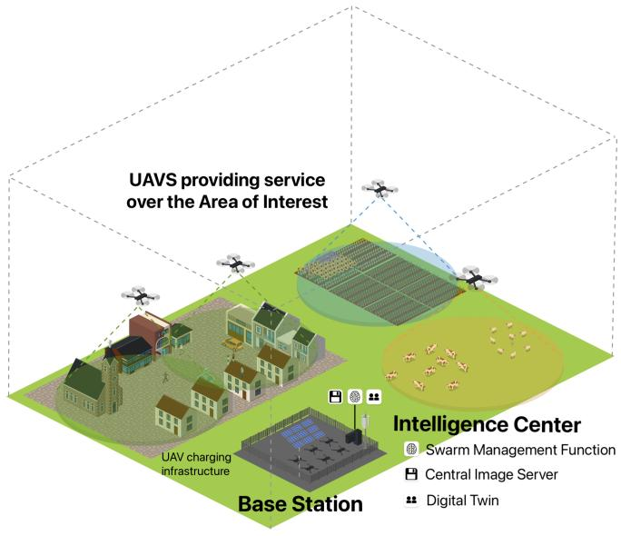
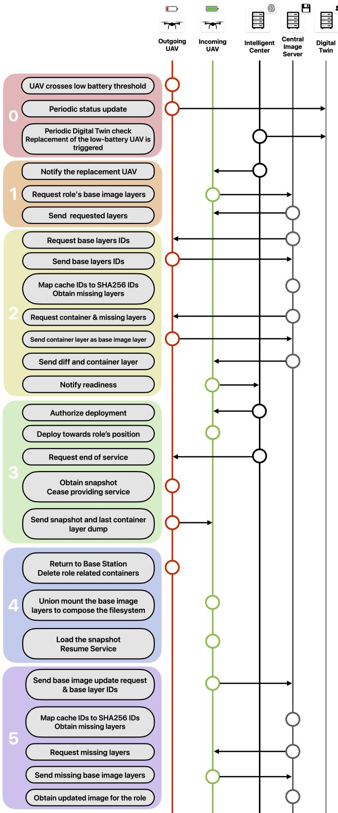

# Live Migration of Stateful Microservices in UAV-Assisted Networks for Enhanced Availability

Sergio Frejo-Mart´ın∗, Andres Garc ´ ´ıa-Lopez ´ ∗,

Juan Manuel Murillo∗, Jaime Galan-Jim´ enez´ ∗

∗Department of Computer Systems and Telematics Engineering, University of Extremadura, Spain. sfrejom@unex.es, andresgl@unex.es, juanmamu@unex.es, jaime@unex.es

Abstract—UAV-assisted networks provide a rapid and flexible solution for deploying communication infrastructures in environments with limited or no conventional access, such as rural areas or disaster-stricken regions. However, the inherent constraints of UAVs, particularly their limited flight time, necessitate frequent node replacements, which disrupt microservices hosted on the UAVs. This paper introduces a model for live migration of stateful microservices in UAV-assisted networks, leveraging pre-copy mechanisms and containerized environments to minimize service downtime and ensure state preservation. The proposed architecture incorporates a Digital Twin for real-time monitoring, a Swarm Management Function for orchestrating UAV replacements, and a Central Image Server for managing storage layers. By combining these elements, the model achieves seamless handovers, reducing disruptions and enabling reliable deployment of state-sensitive applications. Potential use cases, including real-time data analysis and edge computing, underscore the advantages of this approach. Future work will focus on evaluating performance metrics such as service downtime, network overhead, and energy consumption to further optimize this solution.

Index Terms—Unmanned Aerial Vehicles, Microservices Architecture, Live migration, Downtime, Edge computing

## I. INTRODUCTION AND MOTIVATION

Unmanned Aerial Vehicle (UAV)-assisted networks have emerged as an innovative and effective solution to address the challenges of rapid and flexible deployment of communication infrastructures in areas where conventional networks are impractical or entirely absent. These areas include rural environments, remote regions, and disaster-stricken zones, where establishing traditional infrastructure can be expensive, logistically challenging, and time-consuming. By leveraging the mobility, cost-effectiveness and flexibility of Unmanned Aerial Vehicles (UAVs), these networks provide a versatile framework for delivering essential communication services [1].

Recent advances in onboard computing capabilities and wireless communications have further expanded the potential of UAV-assisted networks. UAVs can now support sophisticated solutions in the fields of Edge Computing and Software-Defined Networking. These capabilities have unlocked new opportunities across diverse domains, including network and services management, environmental monitoring and emergency response coordination. The deployment of Microservice-Based Architectures (MSAs) in Flying Ad-Hoc Networks (FANETs) has also become a field of interest for research endeavors due to their modularity and scalability [2], [3]. However, the practical implementation of this idea over UAV-assisted networks carries limitations related to service continuity and reliability that cannot be overlooked.

The most significant of these limitations is the flight time of UAVs, dictated by their constrained battery capacity. This limitation imposes frequent node replacements to maintain network functionality. Node replacements can also take place due to other technical issues. Such replacements are not trivial, as they disrupt the microservices hosted on the UAVs, potentially leading to data loss, service interruption and other inconveniences that degrade user experience. While stateless services can recover relatively easily, stateful microservices — those that rely on maintaining data across sessions— are particularly vulnerable to disruptions during UAV replacements.

Ensuring the seamless operation of stateful microservices in FANETs remains an open challenge. To address it, this paper introduces a novel framework for live migration of microservices in UAV-assisted networks.

The importance of this research lies in its ability to bridge the gap between the theoretical potential of UAV-assisted networks and their practical implementation. By enabling reliable support for state-sensitive applications, this framework not only improves the user experience but also expands the range of use cases that UAV-assisted networks can support.

In the following sections, we begin with a review of the state of the art in live migration techniques in Sec. II, exploring existing approaches and their relevance to UAV-assisted networks. Sec. III then describes the proposed architecture, outlining its key components and operational workflow. The mechanisms for ensuring state preservation during UAV replacements are detailed in Sec. IV, where we discuss the live migration process and strategies to minimize downtime. Potential applications are explored in Sec. V, highlighting the advantages of our approach in practical scenarios. The system’s limitations and open challenges are analyzed in Sec. VI, identifying areas for further refinement. Finally, Sec. VII concludes the paper by summarizing our findings and discussing future research directions aimed at enhancing performance and scalability.

## II. STATE OF THE ART

The concept of Li-Mi (Live Migration) describes the transfer of processes or service instances from an original host to another, while causing minimal service disruption in the process. A recently published survey [4] provides a comprehensive overview of the different approaches to live migration relevant today. Early attempts at Li-Mi relied on VMs (Virtual Machines) to host the services to be migrated [5]. This solution was appropriate for providing an isolated execution environment that did not depend on the host OS or system libraries. VMs had several limitations, primarily their large size, often in the order of gigabytes. Also, despite providing mechanisms to implement live migration, these are often hypervisor dependent, undermining the interoperability edge VMs had.

Containers surged as a lighter alternative to VMs to achieve isolated execution environments that can be saved and restored at convenience [6]. The work in [7] implements a containerbased stateless approach to service migration in UAV-assisted networks for energy optimization purposes. Although reliant on the OS and libraries of the host machines, this approach to Li-Mi dramatically reduces the data volume to be migrated, as well as the time required to perform a warm start, i.e., to deploy the services on the new host. The layered internal storage solution of containers is a key part of their convenience for live migrations. A Docker container filesystem is made up of hierarchically stacked read-only layers that describe filesystem differences. These are known as base image layers. When union mounted, they restore the described state of the filesystem. The container layer is an additional layer with read-write permissions that reflects the modifications that occurred during the current container execution [8].

The described layered filesystem structure is especially convenient for enabling the refinement of the live migration process. Multiple optimization techniques to reduce migration time have become reference approaches. Namely, pre-copy, post-copy and hybrid optimizations. In the pre-copy method, the idea is to transmit as much of the service state as possible while it is still running. Post-copy transmits the minimum viable resources for the deployment of the service, and then progressively transmits the rest while on execution. Hybrid interpretations mix both techniques at convenience. [9]

While transmitting the filesystem allows service migration, is not enough for it to be a stateful migration. The remaining required data includes, but is not limited to, the process memory state (virtual memory areas, shared memory segments, and memory-mapped files), CPU registers, open file descriptors (including file positions and flags), active network connections (such as UNIX domain and TCP sockets), process credentials (UIDs, GIDs, and capabilities), timers and signal handlers [10], [11]. This runtime data can be systematically packed and transferred using CRIU (Checkpoint/Restore in Userspace) [12]. CRIU has become the de facto reference tool for obtaining container checkpoints and restoring their state. Initially being a Virtuozzo project, it has been integrated into container management and virtualization engines, such as OpenVZ, LXC/LXD, Docker or Podman, as well as distributed as a package for multiple Linux distributions [4].

Live migration is achieved by transferring all storage layers and a checkpoint to the new host, which mounts the layers and loads the checkpoint, restoring the container from the point it was checkpointed. Although a clear consensus hasn’t been established regarding the best medium for Li-Mi, containers show a greater prevalence in recent studies, mainly due to their limited size and the standardization of management tools.

UAV swarms have been gaining relevance as a platform for the deployment of microservice architectures, especially in the research scene. This is due to the high mobility, versatility, and agile deployment they offer. Some research efforts have focused on optimizing the deployment and placement of such services within the swarm. [7] takes a MILP-based approach to optimize microservices location by dynamically balancing energy consumption across UAVs and adapting to real-time service demands. Despite implementing service migration for this matter, the state of the deployed services is not considered. Live migration of services would be a desired capability in MSA-enabled FANETs, as service handovers lead to frequent service disruption. Despite that fact, no research endeavors were found on the topic.

## III. PROPOSED ARCHITECTURE DESCRIPTION

The present work proposes a model for UAV-assisted networks hosting stateful microservice architectures. The goal of the showcased system is to maximize service availability, which is achieved by minimizing downtime during the handover process, while also preserving the runtime state of the deployed services through migrations. Together, these targets aim to deliver a seamless experience comparable to that on traditional ground-based networks.

To achieve this, we rely on the live migration model for containers proposed by Ma et al. in [8]. This model addresses the challenges of live migration by leveraging the aforementioned layered storage structure to implement precopy mechanisms. Their approach minimizes the amount of data to be transferred during migrations by synchronizing immutable base image layers across edge servers and isolating the writable container layer. The authors demonstrate that their method reduces service handoff times by up to 80% compared to existing solutions. Their deep and systematic study of Docker storage system is also to be highlighted and is the base for optimizing the layer management and caching.

An effective adaptation of this migration mechanism to MSA-enabled FANETs requires identifying the components and protocols involved in the process and aligning them with the customary procedures and resources of UAV-assisted networks. A schematic representation of the proposed model is presented in Fig 1. Two main areas can be differentiated in the system. The Area of Interest constitutes the region where UAVs provide service to end users, whereas the Base Station contains the UAV charging infrastructure and the Intelligence Center (IC). The IC provides high computing capabilities to host data-intensive tasks that cannot be handled by UAVs.

Three components are hosted in the IC, which cover functions related to network and services monitoring and

management:

• Digital Twin: A virtual model that represents each UAV in the swarm. It is designed to accurately reflect the technical characteristics and real-time status of each node. UAVs regularly send status updates to the Digital Twin, which incorporates these technical parameters to maintain an up-to-date representation of the UAVs and overall network conditions [13], [14].

• Swarm Management Function (SMF): Responsible for orchestrating UAV operations within the swarm, ensuring efficient coordination, task allocation and optimal placement of nodes. It relies on the Digital Twin as a data source to monitor the status of UAVs and detect anomalies such as battery depletion or technical malfunction of a UAV. Once the problem is identified, the SMF initiates corrective actions, such as orchestrating UAV replacements, to maintain seamless network operation.

• Central Image Server (CIS): A repository responsible for managing and distributing base images across the UAV network. Each base image is associated with a role, which defines a location and a set of microservices to host. These images contain the required software configurations and dependencies necessary to perform the functions assigned to their role. The CIS maintains an updated version of each role’s base image. Additionally, since each storage layer is assigned a random cacheID at each node, the CIS also maintains a mapping between these identifiers and the SHA256 hash that uniquely identifies each layer. This mapping mechanism contributes to the efficient synchronization and retrieval of layers, streamlining the image management process.

The components of the IC cooperate for the common purpose of managing the network. At the start, UAVs are deployed over the designated Area of Interest and microservices are offered to people below. From this moment on, UAVs start sending periodic status updates to the DT, which stores the data in the UAVs’ digital counterparts. The Swarm Management Function regularly checks on the DT data in search of incidences. When it detects a UAV is nearing battery depletion or undergoing a technical issue, it triggers the replacement process. The SMF, together with the CIS, cooperate to bring the replacement UAV into exactly the same status as the UAV to be serviced.

The procedure for replacing a UAV is oriented toward minimizing the downtime caused in the services it hosts. To achieve that, it leverages the pre-copy technique often used in the optimization of live migration scenarios. Before leaving the Base Station, the replacement UAV downloads the image corresponding to the role to take from the CIS. The image in the CIS, incoming and outgoing UAVs are synchronized. By the time the replacement takes place, the volume of data to be transferred is limited to the runtime information and writable memory layer. Downtime is reduced to the time it takes to obtain a checkpoint and transfer it, together with the container layer, to the replacement UAV via inter-UAV communication. A more comprehensive explanation of this mechanism is provided in the following section.

  
Fig. 1. Diagram of the proposed model

## IV. STATE PRESERVATION MECHANISM

UAV-assisted networks require periodic replacement of their aerial nodes. This is a critical process that consumes substantial amounts of energy and computational resources and causes the interruption of microservices hosted in the UAV. In most proposed architectures for FANETs, services are not just interrupted but entirely disrupted, requiring a fresh deployment on the new UAV. The fact that this procedure takes place periodically for every UAV within the swarm underscores the need for optimization in this process. The network model proposed in this paper incorporates a UAV replacement mechanism conceived to maximize service availability by minimizing downtime and leveraging the network architecture to also provide support for stateful service migration.

The process is divided into phases, since some steps take place simultaneously at different points in the architecture. The interactions between the different actors involved can be seen in the sequence diagram at Fig 2. The stages of the process are:

1) Phase 0 - Replacement process onset: In the default system state, UAVs provide service to end users and IoT devices over the designated Area of Interest. Meanwhile, in the IC, the Swarm Management Function polls the Digital Twin at regular intervals to monitor the network status. When a UAV is identified as having a low battery or undergoing a technical issue, the system initiates the UAV replacement and state preservation process to ensure uninterrupted operation.

2) Phase 1 - Pre-deployment setup of the replacement UAV: The SMF designates one of the available fully charged UAVs in the IC as replacement for the compromised UAV. The replacement UAV is informed on the role to fulfill, which specifies the position the UAV must occupy and the services it will host. It then proceeds to request the Central Image Server the role’s base image, which includes the layers making up the most recently known state of the filesystem in the to-be-replaced UAV.

3) Phase 2 - Base image alignment: The CIS requests the outgoing UAV the IDs of the layers that make up its base image. It then maps these local cache IDs to the SHA256-derived IDs and identifies missing layers in the replacement UAV. The CIS requests the outgoing UAV to send the remaining layers along with its container layer. To transmit the container layer, its associated container has to be committed, turning the container layer into a new base layer and defining a new container layer. When layers are received in the CIS, it updates its local image version and sends the pages to the replacement UAV. After all filesystem layers are received, the replacement UAV becomes ready to be deployed, which is communicated to the Swarm Management Function.

4) Phase 3 - Service handover: The SMF authorizes the deployment of the replacement UAV once the base image state is uniform across both involved UAVs and the CIS. The newcomer UAV flies towards the designated area. Upon takeoff, the outgoing UAV is instructed to cease its services. To preserve its current runtime state, this UAV creates a checkpoint, prepares it for transmission and halts the container. This marks a critical moment in the process in which a brief service downtime is unavoidable to guarantee consistency in the service state. If the container was not to be halted, any changes in the runtime status during the transmission of the checkpoint would lead to an inconsistent state. It is important to notice the checkpoint represents a small fraction of the total volume of data that makes up the service state. Most of the data transfer took place in the previous phase, while the new UAV was still charging in the IC. When a UAV-to-UAV connection is established between the outgoing and the replacement UAV, the former transmits the checkpoint along with the container layer, which is again transmitted as a base layer.

5) Phase 4 - Service resumption: The newcomer UAV now contains the necessary resources to resume service from the exact same point prior to replacement. To achieve this, it reloads the Docker daemon, mounts the received layers to restore the filesystem and loads the checkpoint. Microservices are then resumed from the point the container was halted. Meanwhile, the outgoing UAV deletes the files associated with its previous role and returns to the Base Station, where it will be provided charging and assistance.

6) Phase 5 - CIS synchronization: Once the deployment process has been completed and services have been resumed on the replacement UAV, a final step is needed to ensure consistency across the system. To achieve this, the CIS updates the role image backup by integrating the remaining layers generated during the transition. This guarantees the stored backup to be an accurate representation of the most recent operational state, allowing future UAV deployments to inherit the latest configurations and runtime environments seamlessly.

## V. USE CASES

The UAV replacement mechanism provides a set of features novel to UAV-assisted networks. Firstly, global service downtime is significantly reduced, as most of the data is transferred while the services are still active. Additionally, status preservation is achieved by leveraging CRIU checkpoints and containers’ layered storage. This constitutes an important leap against comparable UAV-assisted architectures, as microservices do not need to be freshly deployed after each migration, but instead they are restored from the same execution state they stopped at. The service is reestablished with minimal disruption to the user experience. Indirectly, live migration also contributes to the reduction of downtime due to warm microservice deployments from a checkpoint being faster than fresh deployments.

These features increase the capabilities of the network and enable support for use cases that would not be feasible otherwise. To illustrate some potential applications, consider a hypothetical scenario in a rural area with limited connectivity. This context is optimal for the deployment of FANETs [1]. Residents benefit from the connectivity and services provided by the swarm, while UAVs operate efficiently in such open scenarios favorable for line-of-sight communications.

One example is the Town Hall offering the local film library catalog as an on-demand streaming service. UAVs hosting the microservice store the films and stream them to users who request them. If this service was to be offered without state preservation mechanisms, ongoing video playback sessions would be restarted at each handover. By contrast, in the proposed system users would only experience a brief interruption in service comparable to momentary connectivity issues before the playback resumes in the new node.

Some microservices passively collect and analyze data to track processes and provide actionable insights. Many feasible examples can be applied to rural environments, including the automated UAV-assisted surveillance of restricted areas, cattle tracking or crop monitoring. Services like this would also benefit from statefulness. Preserving the runtime state of these services through migrations helps avoid data inconsistencies, prevents redundant processing, and ensures continuous service coverage.

UAVs offer an interesting platform for the deployment of Edge Computing solutions due to their high mobility, proximity to users and reduced infrastructure dependence. One potential use case is Edge Caching, where frequently requested content, such as web pages or media files, is stored on a server close to end users [15]. Locally hosting these files within the swarm reduces latency and network traffic for future accesses, thereby improving quality of service. With no state preservation mechanism, the edge cache would be wiped at each migration, as it would require a fresh deployment. The stateful migration capabilities of the proposed model would allow transferring the contents in cache to the new UAV, maintaining a consistent state through migrations and keeping the Edge Cache solution useful and performant.

  
Fig. 2. Sequence diagram of the UAV replacement process.

These use cases demonstrate the notable advantages of integrating state preservation within UAV-assisted networks, enabling reliable and continuous services and making it feasible to deploy state-sensitive microservices in this kind of network.

## VI. DRAWBACKS AND LIMITATIONS

UAV-assisted networks are inherently complex, as are the conditions in which they are operate. The implementation of service continuity introduces additional challenges and considerations. Several areas susceptible to improvement have been identified during the design and implementation of the system. This section will perform a critical assessment of the limitations encountered.

A trade-off of state awareness is the increased network overhead derived from the state preservation mechanism. The process of synchronizing the layers that make up a base image across the host UAV, the CIS and, eventually, the replacement UAV, requires dedicated control traffic, along with frequent transmission of storage layers across the network. This is also the reason for the increase in energy consumption, bandwidth utilization, and CPU usage. While a moderate decline in network performance is an expected trade-off for implementing state-awareness, further optimization efforts in the transmission process can help mitigate the impact.

The Intelligence Center representing a single point of failure is also a potential concern. The Swarm Management Function instance in the IC coordinates the network, while the Central Image Server manages image coordination across UAVs, making failures in either component critical. Even when functioning correctly, these components can introduce bottlenecks as the network scales up. A solution to this could use UAVs computing capabilities to implement distributed versions of the IC components. A decentralized Swarm Management Function would require consensus mechanisms to coordinate network management decisions. Likewise, a distributed implementation of the Central Image Server (i.e., Distributed Image Servers) could utilize multiple, or even all UAVs, to store images of the neighboring UAVs. However, introducing redundancy would increase the complexity of maintaining the base image backups up to date. Finally, the Digital Twin is centralized by design, so it could mitigate dependency by being implemented as an on-cloud solution.

A final key limitation of the proposed model is its susceptibility to sudden UAV failures. If a UAV malfunctions and crashes, the runtime state of microservices is lost, disrupting service. While more frequent state backups could help mitigate this issue, the associated traffic and energy costs make this impractical. Ensuring seamless continuity in such cases remains a challenge, highlighting the need for fault-tolerant strategies. Predictive maintenance can reduce failures, but anticipating every issue in time for a preventive replacement is not always feasible.

In general, while the proposed model effectively minimizes downtime and allows stateful microservice hosting in UAVassisted networks, the challenges showcased in this section show there is still room for improvement. Addressing these limitations requires a combination of architectural improvements and strategic optimizations. Fortunately, UAV-assisted networks stand out for their versatility and adaptability, enabling a plethora of interesting resources, such as Software-Defined Networking and Edge Computing. These are key to the implementation of solutions such as the decentralization of components, optimized network management functions, preventive maintenance, or the state-preservation mechanism itself.

## VII. CONCLUSIONS AND FUTURE WORK

UAV-assisted networks have consolidated as an agile solution for rapid ad-hoc networks deployment. Nonetheless, these networks still face intrinsic limitations, primarily the need to periodically replace network nodes when their UAV battery depletes.

To address this challenge, this paper introduces a UAVassisted network model tailored to minimize the impact of node replacements. The proposed framework ensures service continuity by leveraging a pre-copy live migration mechanism and a state preservation strategy based on containerized execution environments. This approach effectively mitigates downtime and ensures microservices maintain a consistent state through the migration process. This constitutes an improvement on the capabilities of the network as a whole, enabling the deployment of state-sensitive services.

Despite these advancements, several challenges remain. State preservation introduces network overhead, requiring further optimization to balance efficiency and performance. Additionally, while this work assumes a controlled environment, sudden UAV failures remain an open challenge in the pursuit of service continuity. Solutions to these problems that capitalize on the versatility and adaptability of UAVs are an open area for future investigation.

Looking ahead, the next phase of this research will focus on a thorough performance assessment of the proposed migration and handover mechanisms. Simulation testbeds will be implemented to measure key metrics such as average service downtime, average migration time, network overhead and energy consumption. These evaluations will guide future optimization efforts to achieve a resilient, efficient and fully operational solution for deploying stateful microservices in UAV-assisted networks.

## ACKNOWLEDGMENT

This work has been partially funded by MI-CIU/AEI/10.13039/50100011033 and by “European

Union NextGenerationEU/PRTR” (projects TED2021- 130913B-I00 and PDC2022-133465-I00), by the project PID2021-124054OB-C31 and the grant CAS21/00057 (MICIU/AEI/FEDER, UE), and by the Regional Ministry of Economy, Science and Digital Agenda of the Regional Government of Extremadura (GR21133).

## REFERENCES

[1] J. Galan-Jim´ enez, E. Moguel, J. Garc´ ´ıa-Alonso, and J. Berrocal, “Energy-efficient and solar powered mission planning of uav swarms to reduce the coverage gap in rural areas: The 3d case,” Ad Hoc Networks, vol. 118, p. 102517, 2021. [Online]. Available: https://doi.org/10.1016/j.adhoc.2021.102517

[2] S. Garc´ıa-Gil, J. G. de-la Hiz, A. Garc´ıa-Lopez, J. M. Murillo,´ and J. Galan-Jim ´ enez, “Qos evaluation of edge computing´ microservice-based applications in uav ad hoc networks,” IEEE, 2024, https://doi.org/10.21203/rs.3.rs-4817788/v1.

[3] A. Garc´ıa-Lopez, D. Ramos-Ramos, S. Garc´ ´ıa-Gil, J. Gomez-´ delaHiz, J. M. Murillo, and J. Galan-Jim´ enez, “Microservices´ adaptability and self-organization of uav-assisted wireless networks in failure rural scenarios,” Research Square, 2024. [Online]. Available: https://doi.org/10.21203/rs.3.rs-4817788/v1

[4] W. Soussi, G. Gur, and B. Stiller, “Democratizing container live¨ migration for enhanced future networks - a survey,” ACM Computing Surveys, vol. 57, no. 4, pp. 1–37, 2024. [Online]. Available: https://doi.org/10.1145/3704436

[5] C. Clark, K. Fraser, S. Hand, J. G. Hansen, E. Jul, C. Limpach, I. Pratt, and A. Warfield, “Live migration of virtual machines,” in Proceedings of the 2nd Symposium on Networked Systems Design & Implementation (NSDI ’05). Berkeley, CA, USA: USENIX Association, 2005, pp. 273–286. [Online]. Available: https://www.usenix.org/conference/nsdi-05/live-migration-virtual-machines

[6] R. Morabito, “Power consumption of virtualization technologies: An empirical investigation,” in 2015 IEEE/ACM 8th International Conference on Utility and Cloud Computing (UCC). IEEE, 2015, pp. 522–527. [Online]. Available: https://doi.org/10.1109/UCC.2015.93

[7] S. Garc´ıa-Gil, D. Ramos-Ramos, J. Berrocal, J. M. Murillo, and J. Galan-Jim ´ enez, “Microservices migration: A pathway´ to improved energy efficiency in uav networks,” Internet of Things, vol. 30, p. 101463, 2025. [Online]. Available: https://www.sciencedirect.com/science/article/pii/S2542660524004049

[8] L. Ma, S. Yi, N. Carter, and Q. Li, “Efficient live migration of edge services leveraging container layered storage,” IEEE Transactions on Mobile Computing, vol. 18, no. 9, pp. 2020–2031, 2019. [Online]. Available: https://doi.org/10.1109/TMC.2018.2871842

[9] A. Choudhary, M. C. Govil, G. Singh, L. K. Awasthi, E. S. Pilli, and D. Kapil, “A critical survey of live virtual machine migration techniques,” Journal of Cloud Computing: Advances, Systems and Applications, vol. 6, no. 23, 2017.

[10] CRIU Project, “Checkpoint/restore in userspace (criu) documentation,” 2024, accessed: 30-Jan-2025. [Online]. Available: https://criu.org/Checkpoint/Restore

[11] ——, “Criu wiki: Image files and checkpoint storage format,” 2024, accessed: 30-Jan-2025. [Online]. Available: https://criu.org

[12] R. A. Addad, D. L. C. Dutra, M. Bagaa, T. Taleb, and H. Flinck, “Towards a fast service migration in 5g,” in 2018 IEEE Conference on Standards for Communications and Networking (CSCN). IEEE, 2018, pp. 1–6. [Online]. Available: https://doi.org/10.1109/CSCN.2018.8581836

[13] L. Lei, G. Shen, L. Zhang, and Z. Li, “Toward intelligent cooperation of uav swarms: When machine learning meets digital twin,” IEEE Network, vol. 35, no. 1, pp. 386–392, 2021.

[14] B. Li, W. Liu, W. Xie, N. Zhang, and Y. Zhang, “Adaptive digital twin for uav-assisted integrated sensing, communication, and computation networks,” arXiv preprint, vol. 2310.17470, 2023. [Online]. Available: https://arxiv.org/abs/2310.17470

[15] G. Wu, Y. Miao, B. Alzahrani, A. Barnawi, A. Alhindi, and M. Chen, “Adaptive edge caching in uav-assisted 5g network,” in IEEE Global Communications Conference (GLOBECOM). IEEE, 2021.