# Live Migration of Video Analytics Applications in Edge Computing

Chenghao Rong , Jessie Hui Wang , Jilong Wang , Yipeng Zhou , and Jun Zhang , Fellow, IEEE

Abstract—In order to schedule resources efficiently or maintain applications’ continuity for mobile customers, edge platforms often need to adaptively migrate the applications on them. However, our measurement shows that existing migration solutions cannot solve the issue of migrating video analytics applications in edge computing because the memory states of video analytics applications have different characteristics from other applications. We conduct a breakdown analysis of the memory states of video analytics applications, and propose to treat three types of states separately with three different techniques, i.e., warm-up, sync, and replay, to minimize the negative influence of migrations on application performance. Based on this idea, we implement a prototype system in which two new components, i.e., state store and sidecar, are designed to achieve near-transparent live migration with minimal application code modifications. Evaluation experiments demonstrate that the time of application interruption caused by migrating a video analytics application with our solution is less than 405 ms, and our solution does not consume much resources.

Index Terms—Container migration, edge computing, state migration, video analytics.

## I. INTRODUCTION

UBLIC edge platforms have been increasingly popular, By bringing computation and storage closer to end customers, they can provide lower latency and better quality of service (QoS) for edge applications compared to cloud platforms.

The killer application for edge platforms is real-time video analytics (VA) applications [3], which have drawn many researchers to make efforts to optimize their performance. Particularly, edge platforms need to adaptively change the placement of edge applications to cope with the mobility of users or to improve resource efficiency. Many works have focused on the issue of making scheduling decisions on when and where to migrate applications [4], [5], [6], [7], [8], [9]. But, how to implement the migration decisions made by these works? In other words, edge platforms need a solution to migrate the VA applications on them without significantly degrading the performance of applications.

Migrating VA applications within an edge platform is essentially migrating containers because edge platforms typically use container technology to serve applications due to its simplicity and low overhead [10], [11]. When an edge platform decides to migrate a containerized application, it needs to transfer the memory states of the migrated application containers [12]. The migration of application’s memory states within a cloud has been studied by many researchers, and the proposed solutions can be classified into three types according to their basic ideas, i.e., Checkpoint/Restore [13], [14], [15], [16], [17], Pre-copy [12], [18], [19], [20], [21], [22], Post-copy [11], [23], [24], [25], [26], [27].

However, our measurements reveal that these migration methods cannot solve the issue of migrating VA applications within an edge platform. The size of the memory states of typical VA applications is huge, which makes Checkpoint/Restore inefficient. The dirty page rate of the memory states during the running of typical VA applications is very large, which makes Pre-copy methods infeasible. Post-copy methods take longer time to finish migration, and they cannot guarantee the application performance during migration, which is unacceptable for edge VA applications because these applications are usually delay-critical.

Fortunately, by a breakdown analysis of the memory states of VA applications, we notice that not all memory states are worthy to be transferred from the source to the destination, which is an idea of state synchronization. The memory states that have to be transferred are only the persistent and frequently modified states (named as crucial states), such as the feature points of objects and the results generated by application-specific components of the VA application. In contrast, the persistent and unmodified states (named as permanent states), such as model parameters and run-time libraries, can be recovered in advance by loading and initializing application images at the destination, which is an idea of warm-up. The volatile and frequently modified states (named as ephemeral states), such as intermediate features outputted by CNN models, can be re-created by re-analyzing the same frame at the destination, which is an idea of replay. Our measurement results also show that permanent states and ephemeral states dominate the size of the VA application’s memory states. Crucial states are with small size, and transferring them is much easier and more efficient than transferring all memory states.

Based on the above ideas, we try to develop the migration solution for edge platforms. However, there are two problems in implementing these ideas. First, the edge platform should be compatible with existing applications without complex porting efforts [28], [29], but edge platforms lack some critical information that is necessary for migration using the above ideas, which may cause extensive application code modifications. Specifically, edge platforms cannot obtain the memory pages for crucial states in real time, and they do not know which frames should be replayed to get ephemeral states of an application. Second, the migration procedure should be transparent to applications (i.e., customers of the edge platform). In other words, migrating applications on the edge platform seamlessly should be a service provided for edge applications, and ideally, it should not incur any overhead to applications.

We design two components to solve the above implementation problems and achieve near-transparent migrations with minimal application code modifications. We ask an application to actively report its crucial states to its edge platform, and these states are saved in the new component state store. The state store is designed to be distributed, and each edge server has a local state store to save the crucial states of applications on this server. In this way, frequent cross-server data transmission is avoided, which is beneficial for application performance. The global state store is only used to synchronize crucial states from the source to the destination. The other new component sidecar is designed for migration transparency. With it, applications only need to appropriately insert two simple HTTP GET/PUT operations into their codes to request/report their crucial states, and they do not need to care about any details of the implementation of the migration solution, which enables application migration with minimal application code modifications.

To summarize, our work makes three contributions. First, we analyze the memory states of VA applications and reveal why existing migration methods for cloud computing scenarios do not solve the VA application migration problem in edge platforms. Second, from a breakdown analysis of the memory states, we propose to treat three types of states separately and exploit three different techniques, i.e., warm-up, sync, and replay, to migrate them. Third, based on the idea, we use carefully designed APIs and a novel combination of the sidecar and hierarchical state stores to achieve near-transparent state migration of video analytics applications with minimal application code modifications. Evaluation experiments show that our system can achieve seamless VA application migration with no more than 405 ms of application interruption time and does not trade much resources for migration performance gains.

## II. BACKGROUND

## A. VA Applications Need to Be Migrated Seamlessly

Edge platforms need to adaptively change the placements of VA applications to cope with the mobility of users or to improve resource efficiency. Specifically, in the scenarios where cameras are constantly moving, such as autonomous delivery vehicles [30] and dashboard cameras [31], a VA application typically offloads its computation to the nearby edge server to obtain lower latency and more computing resources. However, when the user (device) move away from the nearby edge server, the application QoS will be significantly degraded due to the deteriorating network connection. Ideally, when users move, the VA applications on the edge server should also be live migrated to a new nearby server. Besides, resources of an edge platform are dynamic. An edge platform may change the placement of applications among edge servers (or between the edge server and the cloud) to improve resource efficiency [4], [5], [6], [7], [8], [9]. Therefore, efficient live migration is essential for VA applications in edge computing scenarios.

A good migration scheme hands off the migrated application from the source server to the destination server without degrading the latency and accuracy of VA applications. Typically, an application migration takes several minutes to complete, and the application may be interrupted for a while during migration [18], [32]. We refer to the period from the timepoint at which a migration command is received to the timepoint at which everything is settled down in the destination server as migration time and the period of application interruption as downtime. Real-time VA applications often require analysis latency within a few hundred milliseconds [33], so a minimal downtime is a must. During application interruptions, newly arriving video frames cannot be analyzed, and these frames must be analyzed after the migration is completed. Although many works have shown that we can obtain accurate analysis results by only analyzing key frames because video frames are redundant [34], [35], [36], the information about key frames is not available to edge platforms. The selection of key frames is implemented by application developers and is packaged into the image. An edge platform does not know how the application is implemented [29], so it is agnostic to the information about key frames. Blindly discarding video frames may lead to inaccurate analysis results. Therefore, the migration of VA applications also needs to ensure that each video frame must be analyzed.

## B. VA Application Migration is Essentially Migrating Memory States

Edge platforms usually work in a multi-tenant way, so an isolated and lightweight virtual environment is demanded for edge application encapsulation [12]. Although traditional hardwarelevel approach, i.e., virtual machine (VM), can provide excellent resource isolation, it drastically increases the overhead of deploying and running applications [37]. In practice, edge platforms typically choose to use container technology to serve applications due to its simplicity and low overhead [10], [11], [38]. Therefore, migrating VA applications within an edge platform is equivalent to migrating containers in a geo-distributed environment. Specifically, to migrate a containerized application, we mainly need to transfer the application image (including application codes, libraries, and other files needed to make the application run such as configuration files) and the memory states, i.e., memory data of the container.

The image of an application is read-only and never changes during running, so we can transfer the image without stopping the application, which does not necessarily incur any downtime. The key issue is the transfer of memory states. Memory states are changed continuously as the application runs. To maintain consistency in the memory states of the running application, we must pause the application to complete the transfer of the memory states during migration [12], [39]. Therefore, migrating VA applications is essentially migrating the memory states of containerized applications.

## C. Memory States of a Typical VA Application

A typical VA application consists of a pipeline of video processing components, i.e., a front-end object detector and a back-end task-specific module to track the object of interest and further analyze the video frames [40]. To migrate the VA application memory state, it is necessary to understand the memory state generated by a typical VA application.

The object detector component is responsible for detecting objects in video frames. There are two popular types of object detectors, i.e., object detection and background subtraction [6], and both of them use CNN models to classify objects in video frames. The memory states generated by this component are mainly model parameters and intermediate features. During application running, the model parameters are loaded from the image into memory, and the intermediate features are generated during frame inference.

The task-specific module can be represented as a directed acyclic graph (DAG), containing multiple components such as object tracking and object counter [40]. In general, object tracking is the basis for further analysis of video frames [7], [41]. It is responsible for identifying the same objects across video frames and tracking the status changes of objects, e.g., detecting whether a pedestrian is running through a red light. To track objects correctly, an object tracker must calculate the feature points for each object in a frame and then compare them with the feature points of the objects in previous frames. Therefore, the component has to store all feature points of the objects in the previous frames and this frame, which is its memory states. Similarly, other task-specific components need to keep their intermediate results in a data structure, which is a part of the memory states of VA applications.

## III. DEMYSTIFYING MEMORY STATES OF VA APPLICATIONS

State migration has been well-studied in cloud computing scenarios for various applications [37], and the proposed migration methods are explicitly developed based on the characteristics of the memory states of the application under study. As far as we know, migrating VA applications in edge computing scenarios has never been studied. In this section, we conduct measurements to understand the characteristics of the memory states of VA applications and investigate whether and why current migration solutions proposed for other scenarios and applications cannot solve our problem.

## A. Measurement Setting

We need to choose some representative VA applications to conduct our measurements. Particularly, the selected applications should cover two popular types of object detectors, i.e., CNN-based object detection and background subtraction, and they should be implemented with all representative deep learning (DL) frameworks (i.e., TensorFlow and PyTorch) and different ways to store model files.

Application A: Vehicle Counter (CNN-based detector, Py-Torch). An edge server receives video streams from cameras at traffic lights, identifies vehicles, and responds to periodical queries from users, such as the number of vehicles per day/hour/minute. The application uses Faster R-CNN + ResNet101 and Deep Sort [41] to identify various vehicles with PyTorch. The model file we use is PyTorch’s default format.

\- Application B: Object Tracking (CNN-based detector, TensorFlow, frozen graph model). Some cameras are constantly moving, such as autonomous delivery vehicles [30] and dashboard cameras [31]. We use the same algorithms as application A to detect and track objects for alerts with TensorFlow. The model file we use is a frozen graph model (a way to store model files), which consumes more memory in exchange for inference efficiency.

Application C: Person Detection (background subtraction, CNN-based classifier, TensorFlow). An edge server receives video streams for real-time analysis of intrusions. The application uses the background subtraction method to extract RoIs of objects in frames, EfficientDet [42] to classify objects to search persons, and SURF [43] to track the moving persons with TensorFlow. The model file format used by this application is SavedModel, which is the recommended way to save models in TensorFlow.

We implement the prototypes of these applications and encapsulate each prototype into a container. We prepare several input videos in advance instead of collecting data in real time to facilitate our measurements and ensure the fairness of comparison. The video quality of input videos is 480p, 5fps, and this quality has been sufficient to obtain relatively accurate analytics results [9], [44], [45]. During measurements, these videos are pushed to application’s containers via the RTMP protocol, which is widely used in real-time video analytics.

As existing migration tools, such as CRIU [46], do not support migration of applications that use GPU devices [47], the measurements are conducted in a CPU cluster with three edge servers. Each server has 64 cores of 2.8 GHz AMD EPYC processor and 64 GB RAM. It is widespread that VA applications are run in a CPU cluster [4], [5], [7]. Edge servers are connected via WAN, and we set the network bandwidth between the edge servers to 50 Mbps according to the measurement results in [48].

## B. Why Current Solutions Cannot Work

We implement three live migration methods that are widely used, i.e.,Checkpoint/Restore [13], [14], [15], [16], [17], Precopy [12], [18], [19], [20], [21], [22], Post-copy [11], [23], [24], [25], [26], [27] based on CRIU, which is an open-source tool of live migration. Note that the application images are transferred in advance, and we concentrate on the migration of their memory states in our measurements.

TABLE I  
THE SIZE OF SNAPSHOT AND THE DOWNTIME OF MIGRATING VA APPLICATIONS UNDER THE CHECKPOINT/RESTORE METHOD

<table><tr><td>App</td><td>Snapshot Size (GB)</td><td>Downtime (s)</td></tr><tr><td>A</td><td>2.13</td><td>425.64</td></tr><tr><td>B</td><td>3.78</td><td>703.72</td></tr><tr><td>C</td><td>1.59</td><td>325.98</td></tr></table>

These three methods represent the basic ideas of all current migration methods [37]. Checkpoint/Restore simply freezes the running application at the source server (hereafter called source application), checkpoints all the related memory states into a base snapshot, sends the base snapshot to the destination server, and resumes the migrated application at the destination (hereafter called destination application) with the base snapshot [13], [14]. Obviously, it is preferred when migrating applications whose memory states are small.

Pre-copy first transfers a base snapshot and iteratively transfers dirty pages (modified memory pages after the last transfer) in multiple rounds [18], [19]. In practice, pre-copy gradually decreases the time interval of each iteration to reduce the size of dirty pages [12]. When the size of dirty pages is small enough, the source application is shut down, and the remaining dirty pages are transferred to the destination server [22]. We can see that the application is stopped only in the last round, which reduces the downtime. Obviously, the performance of this method depends on the dirty page rate, and it is friendly only towards applications that do not modify memory states frequently.

Post-copy first freezes the source application and transfers a snapshot of boot memory (the memory states that are necessary to start the application). Then the destination application is resumed immediately at the destination. The boot memory is only a part of all memory states. Therefore, the destination application will trigger many page faults during running, and the corresponding page is fetched from the source server once a fault is triggered [23], [24], [26]. This method is helpful for urgent migration commands since the application can run at the destination as soon as possible [27]. However, the migration procedure may take a longer time, and the application performance is uncertain before the migration is completed.

1) Size of Memory States and Migration Performance of Checkpoint/Restore: Table I reports the size of the transferred base snapshot and the downtime when the Checkpoint/Restore method is used for migrating the three applications. It can be seen that the size of VA applications’ memory snapshots are huge, which will cause a long downtime in the Checkpoint/Restore method. For example, the snapshot of the vehicle counter application is 2.13 Gb, and migrating an application with such a huge snapshot takes over 400 seconds. We can see that Checkpoint/Restore is not suitable for migrating VA applications in low bandwidth scenarios.

2) Dirty Page Rates and Migration Performance of Pre-Copy: We set the maximum iterations of pre-copy to 10 and gradually reduce the time interval of each iteration from 100 seconds to 10 seconds. We measure the size of dirty pages to be transferred in each iteration, and calculate the dirty page rate which represents the minimum network bandwidth needed to complete the transfer before the end of one iteration.

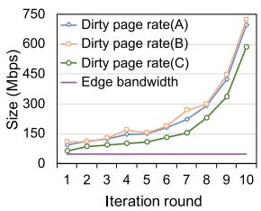  
(a) without compression

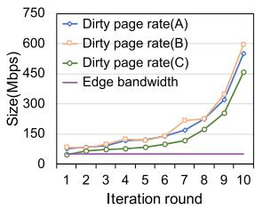  
(b) with compression  
Fig. 1. Dirty page rates under the Pre-copy method versus the typical network bandwidth between edge servers.

TABLE II  
THE MIGRATION PERFORMANCE AND APPLICATION PERFORMANCE UNDER THE POST-COPY METHOD

<table><tr><td>App</td><td>Downtime (s)</td><td>Migration time (s)</td><td>Number of processing frames</td></tr><tr><td>A</td><td>2.50</td><td>527.8</td><td>23</td></tr><tr><td>B</td><td>2.36</td><td>822.6</td><td>21</td></tr><tr><td>C</td><td>1.41</td><td>504.7</td><td>27</td></tr></table>

As shown in Fig. 1(a), the dirty page rate is greater than the network bandwidth among edge servers for all applications, i.e., the speed of generating dirty pages is greater than the available transmission speed. We further try to use a compression technology (such as gzip) to reduce the size of data to be transferred. The results are shown in Fig. 1(b). We can see that the compressed dirty page rate is still greater than the network bandwidth between edge servers. We can conclude that pre-copy does not serve the purpose of migrating VA applications since VA applications generate dirty pages very frequently.

3) Application Performance and Migration Performance of Post-Copy: Table II shows the migration performance and application performance when the Post-copy method is used. Since it transfers only boot memory to the destination server, the VA application’s downtime is significantly shorter compared to Checkpoint/Restore. But the migration time of VA applications is extremely long because it takes a very long time to trigger all page faults to retrieve all memory pages. Although the application starts to run at the destination very quickly, the application performance degrades significantly before the migration is completed. For example, the downtime is 2.5 seconds for the vehicle counter application, but the migration time is about 500 seconds, and the application only analyzes 23 video frames in these 500 seconds. Note that the application needs to analyze 500 5 frames in this period, and these frames are queued up to be analyzed, which causes bursts in computing resource demand and is detrimental to the stability of the edge system.

## C. Breakdown of Memory States of VA Applications

The most important concern of VA applications is the analysis latency for each frame, so minimizing the downtime and guaranteeing the application performance during migration are our primary goals.

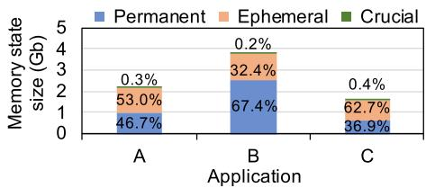  
Fig. 2. The percentage of three memory state types in the base snapshot.

The basic idea to achieve these two goals is to transfer static memory states as much as possible and start the application at the destination only after all memory states have been recovered. We try to minimize the size of dirty pages so as to reduce the downtime which is necessary for transferring dirty pages. Fortunately, we note that not all dirty pages are worthy to be migrated. For example, inference with CNN models generates intermediate features, which are part of the dirty pages. These features can be gotten by analyzing the same frames at the destination, which means transferring these states is not necessary.

Therefore, we conduct a breakdown analysis of the memory states of VA applications to find other memory states that do not need to be transferred, similar to the intermediate features.

\- The model parameters of object detector components and DL frameworks are never modified throughout the application’s whole life. These memory states are named permanent states, which are persistent and not modified during running.

\- Some memory states are persistent and frequently modified during the application is running, which includes the results returned by video processing components, such as the results of the object detector, the RoIs retrieved by the background subtraction component, the feature points extracted by the feature extraction component, and the tracking results of previous frames. We name them as crucial states, as they are necessary states to keep the applications’ correct contexts which means they have to be transferred from the source to the destination.

\- The features outputted by model layers and the intermediate results generated by the object tracker component are volatile and frequently modified during the application is running. They can be gotten just by analyzing a single frame. We name them as ephemeral states.

Fig. 2 shows the breakdown statistics of these three types of memory states in the snapshots of three applications. DL framework API (e.g., torch.save in PyTorch) is used to checkpoint CNN models and get the size of model parameters. We place breakpoints in the source codes of three applications and use CRIU to dump the memory states of each breakpoint. BinDiff is used to compare these memory states and classify them into one of the three types.

We can see that the permanent states and the ephemeral states dominate the size of the memory states for all applications. The size of the crucial states is very small compared to the other two types. It is good news, and then we can propose the following ideas to solve the migration problem.

Permanent states can be warmed up in advance at the destination server since they will not be modified. For example, We can launch the application container using the same image and initialize it. It is extremely rewarding to warm up these states instead of transmitting them because they are large.

Ephemeral states can be gotten at the destination by replaying and re-analyzing the related frames with the same model. Then, we can eliminate the transmission of these ephemeral states during migration. Moreover, since the time of analyzing a frame is very short (about a few hundred milliseconds depending on the model used), re-analyzing video frames does not raise a long downtime.

Crucial states must be synchronized from the source to the destination, which incurs downtime. Fortunately, the size of crucial states is not very large (less than 1% of the base snapshot), and we hope the downtime will be acceptable.

## IV. OVERALL SYSTEM DESIGN

Based on the ideas proposed in the last section, migrating a VA application in edge computing can be completed in three phases: warm-up phase (warm-up containers to recover permanent states), sync phase (data transmission to synchronize crucial states), and replay phase (replay and re-analyze frames to recover ephemeral states).

Ideally, these phases should be completed quickly (to avoid long downtime and migration time), and their implementation should be transparent to applications (to avoid increasing the burden on application developers) [28]. However, there are at least two problems that edge platforms themselves cannot solve.

Problem 1: Edge platforms cannot obtain crucial states in real time during migration.

First, the memory addresses of crucial states are not fixed each time the application is loaded into memory. Due to system security concerns, current operating systems enable address space layout randomization (ASLR) [49], [50]. Edge platforms cannot quickly read crucial states from fixed memory addresses. Second, in Section III-C, we use an offline approach to get the crucial states in debug mode with the premise of having VA application’s source codes. However, in a production edge platform, VA applications are implemented by edge platform’s customers, and the source codes are packaged as an image, so edge platforms do not have access to the source codes and cannot obtain crucial states.

Problem 2: Edge platforms do not know which frames should be replayed to get ephemeral states of the applications.

The execution process of the application is completely invisible to the edge platform, so the location of the frames being analyzed of an application is also not accessible by the edge platform. When edge platforms need to replay frame analysis to get ephemeral states, they do not know the location of the frame being replayed.

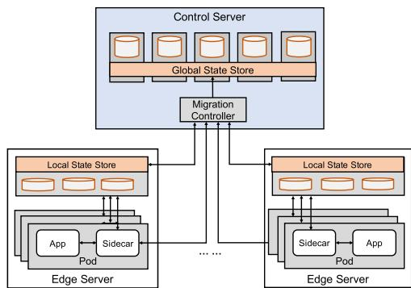  
Fig. 3. System architecture.

## A. Architecture

The two problems mentioned above tell us that completely transparent migration of VA applications is impossible because the crucial states and the location of the frames being analyzed of an application (hereafter called states for convenience) are completely invisible to the edge platform. To obtain states quickly during migration, we ask edge applications to actively report the states of migrated applications to edge platforms, and use a proxy for each VA application to transparently migrate the states. In this way, we can quickly acquire states with minimal application modifications.

Specifically, the edge platform sets up a state store to receive and save the states from applications. During running, applications write their states to the state store. When applications need to be migrated, they can read the states from the state store. However, a VA application container cannot know the network address of the state store as they are different containers. Therefore, applications cannot accomplish the write process by themselves. Although we can ask the edge platform to notify applications of the address, it urges applications to take more jobs and revise their implement codes.

In this work, we propose a proxy for each application, named sidecar, which shares a network address with the application. When a VA application needs to write states, it first delivers the states to its sidecar. Then the sidecar writes the states to the state store. When a VA application needs to read states, it first notifies its sidecar of the request to get states. Then the sidecar reads the states from the state store and returns the states to the application.

Fig. 3 illustrates the architecture of our system, which consists of the following three components. We describe our design concerns and their responsibilities as follows.

Migration Controller: It serves as the control center. It is responsible for several tasks: 1) sending the network address of the local state store to the sidecar, 2) all tasks that need the timing coordination between the source and destination servers, such as launching the destination application, synchronizing states between servers, and stopping the source application. In our system, the synchronization of crucial states is done by the controller, rather than the application container sending the states directly to the destination server. This is because the source application container lacks network information about the destination application container, and containers of the source and destination edge servers (clusters) may be in different container networks for security considerations [51].

State Store: It is responsible for storing states of VA applications. It should be a distributed database due to the distributed nature of edge platforms. Applications keep writing states to and reading states from the state store during running, which means state access performance is a key issue. In order to avoid frequent cross-server data transmission, each edge server has a local state store that serves local VA applications. When an application is running normally, its states are stored in the corresponding local state store, which avoids sending states over the Internet. The global state store is located on the control server, e.g., a cloud server. The global state store is only used to synchronize states across servers. During migration, the migration controller stores the states obtained from the source server in the global state store. In this way, the migration controller can access the states from the global state store and resend them when it fails to send states to the destination server due to fluctuations in the edge network.

Sidecar: The sidecar and the application container make up the application pod. As a VA application is started, its sidecar is automatically injected into the pod. The sidecar acts as a bridge to associate the migration controller, local state stores, and application containers. With sidecar, an application container only needs to send states to and request states from the sidecar. All migration functions are actually completed by the sidecar, such as reading/writing states to the local state store, queuing video frames, and managing migration phases. Sidecar is the key enabler to make migration near-transparent to applications.

## B. Warm-Up Phase: Permanent State Recovery

Because of the reproducibility of permanent states, we can recreate the permanent states in advance at the destination server by launching and initializing a container instance of the migrated application.

Due to the feature named “lazy initialization” of Cuda and DL frameworks, model parameters are not initialized when a container is created, which means not all permanent states are created. Analyzing the first frame would take a longer time than analyzing the later frames because the first frame would trigger the initialization of model parameters. For example, when we use Faster R-CNN + ResNet101 to analyze video frames with RTX 3090, the first inference takes about 8 seconds, while the inference of each later frame only takes about 120 milliseconds.

We need to warm up the complete permanent states and avoid the long delay of analyzing the first frame. In our design, the sidecar sends a random picture to the application container after the container of the destination application is started. The application container analyzes the picture to complete the lazy initialization of Cuda and DL frameworks. This process is named as pre-initialization of model parameters. It does not increase the downtime because the source application is not stopped during this process.

## C. Sync Phase: Crucial State Synchronization

Basically, during running, the application keeps sending/requesting its crucial states to/from its sidecar, and its sidecar writes/reads the received states into/from the local state store. During migration, the migration controller pulls the states from the local state store of the source server and pushes these states to the local state store of the destination server. In this way, the crucial states are synchronized between the two servers.

In this subsection, we introduce the implementation of the communication between an application container and its sidecar and the communication between the sidecar and its corresponding local state store.

1) How Applications Send/Request Crucial States: To minimize the damage to migration transparency, an edge platform should provide state management interfaces to customers. There are two essential state management interfaces: statePUT, which is to implement the function of sending crucial states to the sidecar, and stateGET, which is to implement the function of requesting crucial states from the sidecar. The application and its sidecar are two different containers on the same server. Therefore we can let them share the same network namespace. Then they can communicate with each other using localhost instead of a specific IP address.

With the state management interfaces, customers (application developers) can make simple modifications of their application codes to enable high-performance migration on the edge platform. We take two typical types of VA applications as examples to guide customers on how to modify their application codes. Algorithm 1 describes how to modify an object detection-based application. The pseudo-code about how to modify a background subtraction-based application is provided in Algorithm 2.

Customers only need to add one stateGET and one statePUT in their codes appropriately, and all other sentences are the pseudo-codes of original applications. Specifically, as shown in Algorithm 1, since an object tracker needs the feature points of previous frames to track objects, an object detection-based application needs to call stateGET to get crucial states (line 7), and the arguments are the number of previous frames needed by the object tracker. After analyzing a frame, the application needs to call statePUT to update the latest crucial states to the sidecar (line 10), and the arguments are the feature points of the latest frame being analyzed and the results of application-specific components. Similarly, as shown in Algorithm 2, a background subtraction-based application calls statePUT and stateGET to update and get crucial states on line 8 and line 11, respectively. We can see that the application migration is near-transparent to customers.

2) How Sidecar Reads/Writes Crucial States: Applications send/request states from the sidecar, and then the sidecar needs to write/read states in the local state store. We present writing states to the local state store as writeState and reading states from the local state store as readState. Because state read/write resides on the critical path of application execution process, writeState and readState must be implemented in an efficient way.

Obviously, we should complete a send/request command of an application by accessing the database (local state store) only once because each database access would incur latency. An object tracker may require the feature points from multiple frames to associate the same objects across frames. We should not read/write the states of each individual frame separately. In our design, a sidecar uses a single key-value pair to store the states of all previous frames needed by analyzing the current frame. The number of frames in a single key-value pair depends on object tracking algorithms used by VA applications.

```txt
Algorithm 1: An Object Detection-Based Application.

1: model ← loadWeight(model_path)
2: image ← extractFrameFromRTMP(rtmp_url)
3: while image ≠ NULL do
4: img ← preprocess(image)
5: obj ← objectDetector(model, img)
6: feat ← extractFeaturePoints(obj)
7: pre_feats, pre_res ← stateGET(num)
8: tracker ← objectTracker(feat, pre_feats)
9: res ← objectCounter(tracker, pre_res) ▷
Application-specific components
10: statePUT(feat, res)
11: image ← extractFrameFromRTMP(rtmp_url)
12: end while
```

```txt
Algorithm 2: A Background Subtraction-Based Application.

1: model ← loadWeight(model_path)
2: image ← extractFrameFromRTMP(rtmp_url)
3: while image ≠ NULL do
4: img ← preprocess(image)
5: RoIs ← backgroundSubtractor(img)
6: obj ← objectClassifier(RoIs, model)
7: feat ← extractFeaturePoints(obj, RoIs)
8: pre_feats, pre_res ← stateGET(num)
9: tracker ← objectTracker(feat, pre_feats)
10: res ← objectCounter(tracker, pre_res) ▷
Application-specific components
11: statePUT(feat, res)
12: image ← extractFrameFromRTMP(rtmp_url)
13: end while
```

To implement the above design, in writeState, a sidecar maintains a queue, containing feature points of the needed previous frames. The maximum length of the queue is the number of previous frames needed by the application’s object tracker. When the sidecar receives the states of a new frame, the sidecar removes the feature points at the head of this queue and pushes the new frame’s feature points to the tail of this queue. Then, we use application ID (the unique identifier of an application in edge platforms) as the key and package the queue and the latest results of application-specific components as the value. At last, sidecar writes the key-value pair to the local state store. In readState, a sidecar only needs to perform an operation of reading the database to get the states needed by an application.

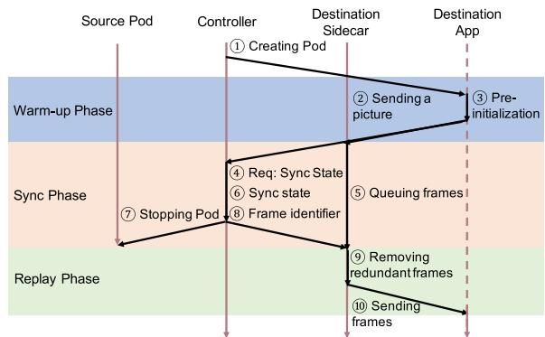  
Fig. 4. The overall procedures for migrating a VA application.

Since the local state store and the sidecar are located on the same server, the time overhead of reading and writing states is tiny.

## D. Replay Phase: Ephemeral State Recovery

Once migrating crucial states is finished, the migration controller stops the source application and asks the destination application to start re-analyzing the frame that is being processed when the source application is stopped (hereafter called beginning frame). Before this step, the destination sidecar should have started fetching frames from the RTMP stream and storing the frames in a queue at the destination.

The key issue is how the destination knows which frame is the beginning frame that should be re-analyzed. For convenience, we denote the beginning frame as frame 0 and the last analyzed frame of the source application as frame -1. RTMP protocol does not have an identifier field in each frame. We use the hash value of partial data of an encoded video frame as the frame identifier, and the identifier of frame -1 is sent as a crucial state to the destination in the sync phase. In our implementation, we choose the first 1000 bytes of an encoded frame (e.g., a PNG image) to calculate the hash value. Although the size of this data is small, it is encoded from the entire image, which guarantees the uniqueness of the frame identifier. Also, the overhead of computing its hash value is negligible (less than 2 ms).

In the replay phase, the destination sidecar has gotten the identifier of frame -1 from the crucial states, and it can get the beginning frame (frame 0) from its queue according to the identifier of frame -1. Relaying this frame can recover all ephemeral states. After that, the destination can analyze all subsequent frames normally.

## E. Summary of Migration Procedure

Fig. 4 shows the procedure of application migration. After receiving a migration command from the scheduler, the migration controller immediately creates a pod of the migrated application in the destination server ( 1 ).

Warm-Up Phase: After the pod is created, the destination sidecar sends a random picture to the destination application ( 2 ). The destination application starts the step pre-initialization <sup>(</sup><sup>3</sup> <sup>).</sup> <sup>Once</sup> <sup>the</sup> <sup>destination</sup> <sup>application</sup> <sup>finishes</sup> <sup>pre-initialization,</sup> it returns an HTTP status code 200 (successful response) to the destination sidecar.

Sync Phase: After the destination sidecar receives the status code 200, it sends a request for synchronizing state to the migration controller ( 4 ). At the same time, the destination sidecar starts to fetch video frames from the RTMP stream and store them in a video frame queue ( 5 ). After the migration controller receives the request for synchronizing state, it reads the crucial states from the local state store of the source server and writes these states to the local state store of the destination server ( 6 ). After the migration controller gets the states from the local state store of the source server, it immediately stops the source application pod ( 7 ) and sends the frame identifier in the crucial states to the destination sidecar ( 8 ).

Replay Phase: When the destination sidecar gets the identifier of frame -1, it locates the frame and deletes the frames before the beginning frame from the frame queue ( 9 ). The remaining frames in the frame queue are sent one by one to the destination application container ( 10 ).

## V. IMPLEMENTATION

We implement our system on Kubernetes 1.21 [52], which is a widely-used open-source system for automating deployment, scaling, and management of containerized applications. The source code of our system is available [53].

VA Application: We implement the Gaussian mixture modelbased background subtraction method [54] to extract regions of interest (RoIs), and the length of history is set to 500, and the threshold is set to 60. The models used in the object detectors of three applications are pre-trained on the Kitti dataset [55]. To track objects, we implement SURF and Deep Sort. SURF extracts objects’ feature points based on the video frames, while Deep Sort extracts the feature points based on the feedback information of the object detector. The interfaces of stateGET and statePUT are implemented using simple HTTP GET/PUT operations.

Migration Controller: We implement the migration controller at the kube-system namespace and bind it to the controller server. With role-based access control (RBAC), we grant the migration controller permissions to manage cluster resources, such as creating and deleting application pods, viewing pods information, etc. During the sync phase, we implement a low-cost remote procedure call (RPC) to access (store) states in the state store.

State Store: We choose Redis as our state store. Redis is an in-memory key-value storage system that provides low-latency access to data. We implement state redundant backup to achieve reliable state storage. Each local state store has one master node and two slave nodes. The states are automatically synchronized between the master node and the slave nodes. When the master node fails, the slave node is automatically switched to be the new master node for failure recovery. Furthermore, we add a new resource object statestore in Kubernetes to help the migration controller access the information of local state stores. We bind this resource object with a Redis instance. In this way, the migration controller can use the list statestore operation to get the information of each server’s local state store, such as IP, location, and running status.

Sidecar: We pre-build the sidecar as an image and upload the image to a registry. An edge server needs to pull this image when its sidecar is started on this server for the first time. In the sidecar, we use OpenCV 3.4 to decode RTMP video streams. The interfaces of readState and writeState are implemented as a low-cost RPC.

## VI. EVALUATION

Experiment Setup: Following Fig. 3, we build a Kubernetes cluster that has a control server and two edge servers. The control server has a 64-core 2.8Ghz AMD EPYC CPU, and 64 GB RAM. The two edge servers have different hardware to emulate the heterogeneity of edge computing [56]. One has a 64-core 2.8 GHz AMD EPYC CPU, 64 GB RAM, and two RTX 3090 GPU (named as server A). The other has a 40-core 2.2 GHz Intel Xeon CPU, 64 GB RAM, and two RTX 2070 GPU (named as server B). VA applications are migrated between these two edge servers. The bandwidth between an edge server and the controller server is set to be varied between 25 Mbps and 50 Mbps according to the measurements in [48]. According to [33], the latency between an edge and the nearest cloud is usually less than 20 ms. This latency is significant to some extremely low-latency scenarios such as autonomous driving, but in our scenario, analyzing a frame typically takes hundreds of milliseconds [8], [34]. It has a limited impact on the application performance, so we do not emulate it.

Applications: We use the same applications as in Section III-A, including vehicle counter, object tracking, and person detection. These applications almost dominate the usage scenarios of edge video analytics. In our evaluations, we build a live streaming environment with Nginx and FFmpeg. Each application pod pulls a video stream from an Nginx container to conduct analysis. To ensure consistency in evaluations, we prepare several videos (1080p, 5fps) in advance, and these videos are also transformed to different frames rates to evaluate the impact of frame rate on application migration. The frame rates are 2, 3, and 5 in our evaluation because edge servers with RTX 2070 GPU can only analyze a maximum of 5.7 frames per second.

## A. Migration Performance

The key metrics to evaluate the performance of a migration solution are overall migration time and downtime, and downtime is more important than migration time in our problem.

Overall Migration Time: The migration of an application starts when the scheduler sends a migration command and ends when the replay phase is completed. In addition to the warm-up phase, the sync phase, and the replay phase, the migration process also includes the application pod bootup because the migrated application needs to be created in the Kubernetes cluster.

We evaluate the migration time with different applications and different network bandwidths. We conduct experiments for each setting five times and show the average migration time in

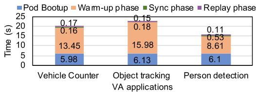

(a) Migrating applications from server A to server B  
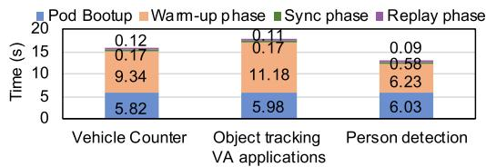  
Fig. 5. Overall migration time under different computation resources.

Fig. 5. We only show the results when the network bandwidth is 25 Mbps because the conclusions under other network bandwidths are similar to this case.

The migration time with our solution is very short (less than 25 seconds) compared with the results in Tables I and II. Our system can significantly reduce the migration time. Our breakdown analysis of the migration time shows that the pod bootup and warm-up phase account for the majority of the migration time, and only a tiny fraction of the migration time (about 1%) is spent on the sync phase and the replay phase. Besides, by comparing Fig. 5(a) and (b), we can find that the time overhead of the warm-up phase on server A is less than that on server B. In our system, during the warm-up phase, application containers need to load DNN models and initialize model parameters, and the time overhead of this process depends on the performance of GPU devices [47], so the time overhead of the warm-up phase is affected by GPU devices of edge servers.

Downtime: Application migration can cause an application interruption. During the interruption, new arriving frames have to be queued. After the migration is completed, the destination application needs to analyze these queued frames. Obviously, the latency of analyzing these queued frames is larger than the latency of analyzing frames when the application is running normally, because the latency of queued frames includes the downtime caused by migration. Therefore, we can use the latency of analyzing each frame during migration to evaluate the downtime. The average latency of frame analysis during the application is running normally can serve as the baselines.

Fig. 6 shows the results of the scenario where VA applications are migrated from server A to server B. The first frame analyzed by the destination application is denoted as frame 0. As shown in Fig. 6(a), when the frame rate is 5, the latency of frame 0 is larger than the baseline. Even in the worst case (migrating person detection application), the gap between the latency of frame 0 and the baseline is 405 ms, which is extremely low compared with the results in Tables I and II. It shows that our migration method can achieve a near-seamless application migration. Besides, we also note that the gaps between the latency of frame 0 and the baseline are small for the other two applications (85 ms and 109 ms). This is because the size of feature points of SURF (used in person detection) is larger than that of Deep Sort (used in vehicle counter and object tracking). Constrained by the low bandwidth, the sync phase of person detection takes more time, so the downtime of the person detection application is larger than that of the other two applications.

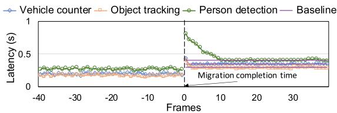

(a) The frame rate is 5.  
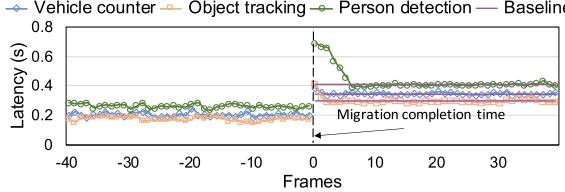  
(b) The frame rate is 3.

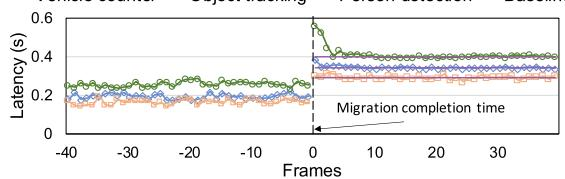  
(c) The frame rate is 2.  
Fig. 6. The latency of frame analysis with different frame rates (25 Mbps).

The gap between the latency of frame 0 and the baseline decreases as the frame rate becomes small. As shown in Fig. 6(b) and (c), in the worst case (migrating person detection application), the gap between the latency of frame 0 and the baseline is 159 ms when the frame rate is 2, and the gap is 284 ms when the frame rate is 3. The gaps become significantly smaller at lower frame rates. The interval between two consecutive frames is long at a low frame rate, and then the source application may be stopped at the interval between two consecutive frames, which means there is no new frame arriving during downtime. Therefore, the application interruption does not affect the latency of the analysis of new frames. In short, the migration downtime is hidden in the interval between two consecutive frames when the frame rate is low.

We can also see that, with our solution, the latency of frame analysis degrades for an extremely short time. In the worst case, as shown in Fig. 6(a), the increase of latency caused by migration lasts for only 9 frames, less than two seconds. It is negligible because migration is not frequent [7], [8].

## B. Migration Impact on Resource Load

During the migration downtime, many arrived frames are queued up for analysis. If too many frames are queued, the system will consume a lot of resources to analyze these queued frames after migration, which may lead to resource load burst and affect system stability. Therefore, we evaluate the resource usage of our system during migration. We use the average GPU utilization during the application is running normally as the baseline.

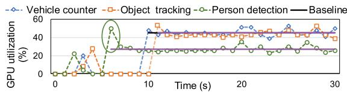

(a) server A  
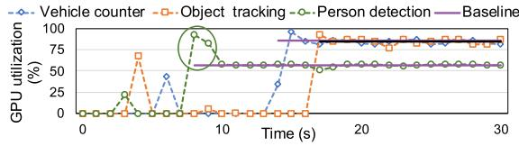  
(b) Server B  
Fig. 7. GPU utilization of the destination server during migration (5fps).

We measure the resource usage of the destination server (server A and server B) with different frame rates when migrating VA applications. Due to space constraints, we only show the resource usage of server A and server B at 5fps. The conclusions under other frame rates are similar to this case. Fig. 7 shows the results. Only one picture (pre-initialization) is analyzed, so the GPU utilization is 0 in most of the warm-up phase. There is a brief fluctuation in GPU utilization because the application pod needs to conduct the pre-initialization during the warm-up phase. Once the application migration is finished, the pod needs to analyze the queued frames. The GPU utilization of person detection on server B rises significantly in the first two seconds and then falls back to the baseline (green box in Fig. 7). The duration of fluctuations in GPU utilization is completely acceptable compared to the migration interval of several minutes or even hours. Besides, we note that the GPU resource utilization of the other two applications does not change significantly. This is because the number of queued frames during the migration of vehicle counter and object tracking is smaller than that during the migration of person detection. In our multiple experiments, 3 frames are queued in most cases when the person detection is migrated, and only 2 frames are queued in most cases when vehicle counter and object tracking are migrated.

In short, our migration solution does not have a perceptible impact on the computation load of the system.

## C. Resource Usage of Sidecar

With sidecar, an edge platform enables near-transparent migration, but sidecar also consumes computation resources during application running. To evaluate the resource usage of the sidecar, we implement the version of VA applications without a sidecar for each application and use its resource usage as the baseline. We consider the difference between the two versions as the resource usage of a sidecar. Since sidecar does not use GPU, we only measure the CPU usage.

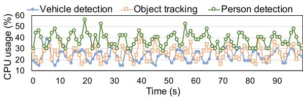

(a) server A  
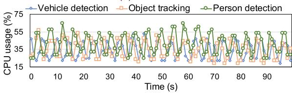  
(b) Server B  
Fig. 8. CPU usage of sidecar (5fps).

Intuitively, as the frame rate increases, the sidecar’s resource usage also increases. Therefore, we only show the resource usage of the sidecar at 5fps in Fig. 8, which is the case with the highest resource usage for the sidecar in our evaluation. Among the three applications, the CPU usage of the sidecar of person detection is the largest. Its average CPU usage is 42.11% (0.42 CPU core) on server B, and its average CPU usage is 37.91% (0.38 CPU core) on server A. The CPU resource overhead caused by the sidecar is acceptable. First, limited by the number of its GPUs, one edge server can not serve many VA applications. Generally, an edge server has 8 GPUs, and one GPU serves a single VA application without GPU packing [47]. Second, edge servers have many CPU cores, e.g., Dell PowerEdge XE2420 has 48 CPU cores, so CPU resource is relatively sufficient.

## D. Performance of State Read/Write

In our system, VA applications need to read states from and write states to the local state store during running. These operations increase the latency of frame analysis, and it is critical to evaluate the latency of these operations.

The evaluated applications use two object tracking methods, i.e., SURF and Deep Sort. SURF needs to extract multiple feature points for each object in one previous frame, and we denote the maximum number of extracted feature points for each object (used in SURF) as α. Deep Sort needs to extract feature points from multiple previous frames, and we denote the number of previous frames (used in Deep Sort) as β. In this evaluation, we vary the values of α from 200 to 400 and the values of $\beta$ from 10 to 30 according to [41], [43]. The frame rate of video streams is 5. Each experiment lasts 10 minutes. We record the overhead of state read/wirte.

Table III shows the average overhead of state read/write when a VA application uses Deep Sort to track objects on server B. As the number of extracted feature points increases, the time overhead of state read/write also increases. When β is 30, the operations of writing and reading states take 15.42 ms, accounting for about 5% of the latency of frame analysis. This time overhead is acceptable for the latency of frame analysis.

TABLE III  
THE PERFORMANCE OF STATE READ/WRITE USING WHEN A VA APPLICATION USES DEEP SORT TO TRACK OBJECTS

<table><tr><td>β</td><td>Write (ms)</td><td>Read (ms)</td><td>data size (Kb)</td></tr><tr><td>10</td><td>3.60</td><td>7.03</td><td>42.56</td></tr><tr><td>20</td><td>4.62</td><td>7.87</td><td>63.12</td></tr><tr><td>30</td><td>6.45</td><td>8.97</td><td>93.48</td></tr></table>

TABLE IV

THE PERFORMANCE OF STATE READ/WRITE WHEN A VA APPLICATION USES SURF TO TRACK OBJECTS

<table><tr><td>α</td><td>Write (ms)</td><td>Read (ms)</td><td>data size (Kb)</td></tr><tr><td>200</td><td>8.51</td><td>30.22</td><td>323.67</td></tr><tr><td>300</td><td>11.78</td><td>39.56</td><td>430.21</td></tr><tr><td>400</td><td>15.88</td><td>48.17</td><td>583.49</td></tr></table>

However, as shown in Table IV, the operations of writing and reading states take longer when a VA application uses SURF to track objects. It is because the states of applications using SURF are much larger than that of applications using Deep Sort. In the worst case (α is 400), the operations take 64 ms. This time overhead is not negligible compared to the latency of frame analysis (about 400 ms). The performance of state read/write greatly depends on the speed of data serialization. Using high-performance data serialization methods or avoiding data serialization can greatly reduce this latency. To ensure low latency of VA applications, we recommend that edge platform customers should use lightweight object tracking algorithms, e.g., Deep Sort.

## VII. LIMITATION AND DISCUSSION

We discuss the limitation of our migration scheme and the future research direction.

In our system, we assume that the model is not modified over the lifetime of a VA application, but a few works assume that the model used by the application is not always constant during application running. For example, some works propose to switch between lightweight and heavyweight models depending on the server load [8], [9], [44]. In these works, an VA application may switch the used model at intervals. We refer to the interval of switching models as a time window. Essentially, the DL model may be modified over the lifetime of an application, but is not changed inside a time window. Our system can respond to application migration commands within a time window to migrate VA applications in the scenarios of these works.

In our paper, we take two typical types of VA applications as examples to guide developers on how to modify their applications. Developers only need to identify crucial states in the codes of application-specific components based on their experience. Application-specific components are usually simple [7], so developers can easily identify their crucial states. However, there are still few complex application-specific components. To ensure the reliability of the migrated applications with complex application-specific components, developers need to iterate over code changes and corresponding unit tests to ascertain the states completeness, which increases the burden on developers. Ideally, we should provide a tool to automatically identify crucial states in the VA application code. Theoretically, we can use static analysis [57], [58], [59] to identify all potential crucial states and then use dynamic analysis [60] to minimize the scope and eliminate the redundant data as much as possible. The detailed designs will be explored in our future work.

## VIII. RELATED WORK

Application Migration: To alleviate network bottlenecking during migration, many works are dedicated to sending migrated data faster, generating dirty memory pages slower, or sending less data for the dirty memory pages.

In [61], the authors are concerned about transferring memory pages faster by using high-speed networks, such as Remote Direct Memory Access (RDMA). But this high-speed network capability is not available in edge computing. The network resources between edge servers are scarce.

The authors of [18] propose to slow down the dirty page rate by shifting the execution of the application to a wait state after the application generates more than a certain number of dirty pages. During migration, this method significantly degrades application performance, i.e., computation speed is reduced, and latency is increased. This method is not suitable for latency-sensitive VA applications.

In recent years, many works have been devoted to sending less data, but they are essentially based on the idea of pre-copy. In [21], [62], the authors use a native pre-copy solution to migrate an application running within multiple containers (VMs). RemusDB [63] relies on VM checkpointing and compression to propagate state changes of a database system. In [64], [65], the authors use various techniques, e.g., binary delta encoding algorithm, de-duplication, and compression to reduce the size of dirty pages for efficient VM migration. In [39], [66], the authors utilize layered storage of images to reduce the overhead of image migration, but they still use memory difference transfers and compression techniques to reduce the size of dirty pages when migrating states. Talaria [67] proposes an in-engine content synchronization solution to migrate mobile cloud gaming instances, which sends the game objects’ states in the order of their priority. In [12], [68], the authors propose a specific hardware accelerator to speed up the data reduction computations (such as compression and delta encoding) to accelerate the live migration of services. As the software stack of the applications studied in their works is simple and is without CNN models and DL frameworks, the dirty page rates of the applications studied in these works are much lower than that of VA applications. In our measurements, the dirty page rate of VA applications is usually larger than the typical edge network bandwidth (more than 25 times at the maximum). Even with compression, the dirty page rate of the pre-copy’s first iteration is only smaller than the edge network bandwidth, but transferring the memory pages still takes more than 91 seconds in the first iteration, which is not tolerable for VA applications. As a result, it is hardly smaller than the edge network bandwidth even though data reduction techniques are exploited, such as compression or data de-duplication. These existing works cannot solve the migration of VA applications.

There are also some works that aim to make scheduling decisions on when and where to migrate applications [69], [70], [71], [72], [73]. They usually formulate optimization problems and solve the optimization problems to make decisions, but they do not address how to implement the migration decisions made by these works. These works can be used as a supplement to our system. Specifically, using their scheduling algorithms, we can predict the possible destination locations for application migration in advance, and then the migrated application can be pre-warmed in advance at the possible destination servers.

State Management for NFV: Network Functions Virtualization (NFV) advocates moving Network Functions (NFs) from dedicated hardware devices to software applications running in VMs or containers on shared server hardware [74]. An important benefit of the NFV is elastic scaling, i.e., the ability to increase or decrease the number of instances used for a specific NF [28]. As most NFs tend to be stateful, elastic scaling of NFV involves migrating flow states across NF instances. The existing works are dedicated to sending the states directly between NF instances during migration or decoupling the packet processing from the state in NFs.

Recent works allow the states to be directly transferred between NF instances during migration with the help of a centralized SDN controller. Specifically, OpenNF [75] and Split/Merge [76] use carefully designed state management libraries to achieve redistribution of flow states from the original instance to the new instance. U-HAUL [77] only migrates elephant (long-lived) flow states, which reduces the amount of data during migration. FAST [78] proposes a heuristic algorithm based on tabu search to decide the destination and transfer link of state migration, then transfer the state directly between application instances based on OpenNF. TFM [79] completely decouples the state migration and packet migration and allows these two procedures to be executed in parallel, avoiding the increase in migration time caused by the sequence of these two procedures. In these works, the authors assume that the source codes of NF applications are available to network operators. The operators can significantly modify NF application codes to adapt these works. For example, making a simple monitoring appliance (e.g., PRADS) OpenNF-compliant took over 120 man-hours [29]. However, this assumption is not always true in our scenario, i.e., source codes of video analytics applications may not be available for edge platforms. Moreover, the extensive porting efforts to adapt state migration increase the burden on developers.

Some work decouples packet processing from flow states, which means that NF instances get flow states from external storage on demand during packet processing. Specifically, in [80], [81], states of all NF instances are stored in a standalone centralized state store via the RDMA high-speed network, and NF instances themselves are stateless and hence can easily scale in/out. Similarly, S6 [28] proposes to use a global DSO (distributed shared object), shared by all NF instances, to scale NF instances elastically. In these works, they assume servers are connected by a high-speed network. However, in our scenario, edge servers are distributed across geographical locations, and network resources between servers are not abundant. Although the state data of video analytics applications is reduced after replaying and warming up, the crucial state is still large compared to flow states. During application running, such a large data transfer across machines increases the application latency, which is intolerable for video analytics applications.

## IX. CONCLUSION

In this paper, we conducted measurements to understand the characteristics of the memory states of VA applications. Based on the characteristics we found, we propose to treat three types of states separately and exploit three techniques, i.e., warm-up, sync, and replay, to migrate them. We further implemented the above idea on Kubernetes and designed two new components to achieve near-transparent live migration. The evaluation shows our system can achieve seamless migration of VA applications without consuming much resources.

## REFERENCES

[1] AWS, “Aws local zones.” Accessed: Nov. 16, 2022. [Online]. Available: https://aws.amazon.com/about-aws/global-infrastructure/localzones/

[2] Azure, “Azure private mec.” Accessed: Nov. 16, 2022. [Online]. Available: https://docs.microsoft.com/en-us/azure/private-multi-access-edgecompute-mec/overview

[3] G. Ananthanarayanan et al., “Real-time video analytics: The killer app for edge computing,” Computer, vol. 50, no. 10, pp. 58–67, 2017.

[4] C.-C. Hung et al., “VideoEdge: Processing camera streams using hierarchical clusters,” in Proc. IEEE/ACM Symp. Edge Comput., 2018, pp. 115–131.

[5] P. Yang, F. Lyu, W. Wu, N. Zhang, L. Yu, and X. S. Shen, “Edge coordinated query configuration for low-latency and accurate video analytics,” IEEE Trans. Ind. Inform., vol. 16, no. 7, pp. 4855–4864, Jul. 2020.

[6] J. Jiang, G. Ananthanarayanan, P. Bodik, S. Sen, and I. Stoica, “Chameleon: Scalable adaptation of video analytics,” in Proc. Conf. ACM Special Int. Group Data Commun., 2018, pp. 253–266.

[7] H. Zhang, G. Ananthanarayanan, P. Bodik, M. Philipose, P. Bahl, and M. J. Freedman, “Live video analytics at scale with approximation and Delay-Tolerance,” in Proc. 14th USENIX Symp. Netw. Syst. Des. Implementation, 2017, pp. 377–392.

[8] C. Rong, J. H. Wang, J. Liu, J. Wang, F. Li, and X. Huang, “Scheduling massive camera streams to optimize large-scale live video analytics,” IEEE/ACM Trans. Netw., vol. 30, no. 2, pp. 867–880, Apr. 2022.

[9] X. Ran, H. Chen, X. Zhu, Z. Liu, and J. Chen, “DeepDecision: A mobile deep learning framework for edge video analytics,” in Proc. IEEE Conf. Comput. Commun., 2018, pp. 1421–1429.

[10] T. Taleb, K. Samdanis, B. Mada, H. Flinck, S. Dutta, and D. Sabella, “On multi-access edge computing: A survey of the emerging 5G network edge cloud architecture and orchestration,” IEEE Commun. Surv. Tut., vol. 19, no. 3, pp. 1657–1681, Third Quarter 2017.

[11] C. Puliafito, C. Vallati, E. Mingozzi, G. Merlino, F. Longo, and A. Puliafito, “Container migration in the fog: A performance evaluation,” Sensors, vol. 19, no. 7, 2019, Art. no. 1488.

[12] Z. Zhou, X. Li, X. Wang, Z. Liang, G. Sun, and G. Luo, “Hardware-assisted service live migration in resource-limited edge computing systems,” in Proc. 57th ACM/IEEE Des. Automat. Conf., 2020, pp. 1–6.

[13] M. Bozyigit and M. Wasiq, “User-level process checkpoint and restore for migration,” ACM SIGOPS Operating Syst. Rev., vol. 35, no. 2, pp. 86–96, 2001.

[14] C. Yang, “Checkpoint and restoration of micro-service in docker containers,” in Proc. 3rd Int. Conf. Mechatron. Ind. Informat., 2015, pp. 915–918.

[15] S. Nadgowda, S. Suneja, N. Bila, and C. Isci, “Voyager: Complete container state migration,” in Proc. IEEE 37th Int. Conf. Distrib. Comput. Syst., 2017, pp. 2137–2142.

[16] C. Prakash, D. Mishra, P. Kulkarni, and U. Bellur, “Portkey: Hypervisorassisted container migration in nested cloud environments,” in Proc. 18th ACM SIGPLAN/SIGOPS Int. Conf. Virtual Execution Environ., 2022, pp. 3–17.

[17] T. Xing, A. Barbalace, P. Olivier, M. L. Karaoui, W. Wang, and B. Ravindran, “H-container: Enabling heterogeneous-ISA container migration in edge computing,” ACM Trans. Comput. Syst., vol. 39, 2022, Art. no. 5.

[18] C. Clark et al., “Live migration of virtual machines,” in Proc. 2nd Conf. Symp. Netw. Syst. Des. Implementation, 2005, pp. 273–286.

[19] M. Nelson et al., “Fast transparent migration for virtual machines,” in Proc. USENIX Annu. Tech. Conf., 2005, pp. 391–394.

[20] M. Terneborg, J. K. Rönnberg, and O. Schelén, “Application agnostic container migration and failover,” in Proc. IEEE 46th Conf. Local Comput. Netw., 2021, pp. 565–572.

[21] T. Benjaponpitak, M. Karakate, and K. Sripanidkulchai, “Enabling live migration of containerized applications across clouds,” in Proc. IEEE Conf. Comput. Commun., 2020, pp. 2529–2538.

[22] H. Wang, Y. Li, Y. Zhang, and D. Jin, “Virtual machine migration planning in software-defined networks,” in Proc. IEEE Conf. Comput. Commun., 2015, pp. 487–495.

[23] M. R. Hines, U. Deshpande, and K. Gopalan, “Post-copy live migration of virtual machines,” ACM SIGOPS Operating Syst. Rev., vol. 43, no. 3, pp. 14–26, 2009.

[24] T. Hirofuchi, H. Nakada, S. Itoh, and S. Sekiguchi, “Enabling instantaneous relocation of virtual machines with a lightweight VMM extension,” in Proc. 10th IEEE/ACM Int. Conf. Cluster Cloud Grid Comput., 2010, pp. 73–83.

[25] C. C. Chou, Y. Chen, D. Milojicic, N. Reddy, and P. Gratz, “Optimizing post-copy live migration with system-level checkpoint using fabricattached memory,” in Proc. IEEE/ACM Workshop Memory Centric High Perform. Comput., 2019, pp. 16–24.

[26] U. Deshpande and K. Keahey, “Traffic-sensitive live migration of virtual machines,” Future Gener. Comput. Syst., vol. 72, pp. 118–128, 2017.

[27] U. Deshpande, D. Chan, T.-Y. Guh, J. Edouard, K. Gopalan, and N. Bila, “Agile live migration of virtual machines,” in Proc. IEEE Int. Parallel Distrib. Process. Symp., 2016, pp. 1061–1070.

[28] S. Woo, J. Sherry, S. Han, S. Moon, S. Ratnasamy, and S. Shenker, “Elastic scaling of stateful network functions,” in Proc. 15th USENIX Symp. Netw. Syst. Des. Implementation, 2018, pp. 299–312.

[29] J. Khalid, A. Gember-Jacobson, R. Michael, A. Abhashkumar, and A. Akella, “Paving the way for NFV: Simplifying middlebox modifications using StateAlyzr,” in Proc. 13th USENIX Symp. Netw. Syst. Des. Implementation, 2016, pp. 239–253.

[30] WIRED, “The prime challenges for amazon’s new delivery robot.” Accessed: Nov. 16, 2022. [Online]. Available: https://www.wired.com/story/ amazon-new-delivery-robot-scout/

[31] M. Cordts et al., “The cityscapes dataset for semantic urban scene understanding,” in Proc. IEEE Conf. Comput. Vis. Pattern Recognit., 2016, pp. 3213–3223.

[32] A. Machen, S. Wang, K. K. Leung, B. J. Ko, and T. Salonidis, “Migrating running applications across mobile edge clouds: Poster,” in Proc. 22nd Annu. Int. Conf. Mobile Comput. Netw., 2016, pp. 435–436.

[33] N. Mohan, L. Corneo, A. Zavodovski, S. Bayhan, W. Wong, and J. Kangasharju, “Pruning edge research with latency shears,” in Proc. 19th ACM Workshop Hot Topics Netw., 2020, pp. 182–189.

[34] Y. Li et al., “Reducto: On-camera filtering for resource-efficient real-time video analytics,” in Proc. Annu. Conf. ACM Special Int. Group Data Commun. Appl. Technol., Architectures Protoc. Comput. Commun., 2020, pp. 359–376.

[35] K. Chen, T. Li, H.-S. Kim, D. E. Culler, and R. H. Katz, “MAR-VEL: Enabling mobile augmented reality with low energy and low latency,” in Proc. 16th ACM Conf. Embedded Netw. Sensor Syst., 2018, pp. 292–304.

[36] T. Y.-H. Chen, L. Ravindranath, S. Deng, P. Bahl, and H. Balakrishnan, “GLIMPSE: Continuous, real-time object recognition on mobile devices,” in Proc. 13th ACM Conf. Embedded Netw. Sensor Syst., 2015, pp. 155–168.

[37] F. Zhang, G. Liu, X. Fu, and R. Yahyapour, “A survey on virtual machine migration: Challenges, techniques, and open issues,” IEEE Commun. Surv. Tuts., vol. 20, no. 2, pp. 1206–1243, Second Quarter 2018.

[38] M. Park, K. Bhardwaj, and A. Gavrilovska, “Toward lighter containers for the edge,” in Proc. 3rd USENIX Workshop Hot Topics Edge Comput., 2020, pp. 1–7.

[39] L. Ma, S. Yi, N. Carter, and Q. Li, “Efficient live migration of edge services leveraging container layered storage,” IEEE Trans. Mobile Comput., vol. 18, no. 9, pp. 2020–2033, Sep. 2019.

[40] X. Zeng, B. Fang, H. Shen, and M. Zhang, “Distream: Scaling live video analytics with workload-adaptive distributed edge intelligence,” in Proc. 18th Conf. Embedded Netw. Sensor Syst., 2020, pp. 409–421.

[41] N. Wojke, A. Bewley, and D. Paulus, “Simple online and realtime tracking with a deep association metric,” in Proc. IEEE Int. Conf. Image Process., 2017, pp. 3645–3649.

[42] M. Tan, R. Pang, and Q. V. Le, “EfficientDet: Scalable and efficient object detection,” in Proc. IEEE/CVF Conf. Comput. Vis. Pattern Recognit., 2020, pp. 10781–10790.

[43] H. Bay, A. Ess, T. Tuytelaars, and L. Van Gool, “Speeded-up robust features (SURF),” Comput. Vis. Image Understanding, vol. 110, no. 3, pp. 346–359, 2008.

[44] T. Tan and G. Cao, “FastVA: Deep learning video analytics through edge processing and NPU in mobile,” in Proc. IEEE Conf. Comput. Commun., 2020, pp. 1947–1956.

[45] J. Redmon and A. Farhadi, “YOLOv3: An incremental improvement,” 2018, arXiv:1804.02767.

[46] CRIU. Accessed: Nov. 16, 2022. [Online]. Available: https://criu.org/

[47] W. Xiao et al., “Gandiva: Introspective cluster scheduling for deep learning,” in Proc. 13th USENIX Symp. Operating Syst. Des. Implementation, 2018, pp. 595–610.

[48] B. Zhang, X. Jin, S. Ratnasamy, J. Wawrzynek, and E. A. Lee, “AWStream: Adaptive wide-area streaming analytics,” in Proc. Conf. ACM Special Int. Group Data Commun., 2018, pp. 236–252.

[49] C. Kil, J. Jun, C. Bookholt, J. Xu, and P. Ning, “Address space layout permutation (ASLP): Towards fine-grained randomization of commodity software,” in Proc. IEEE 22nd Annu. Comput. Secur. Appl. Conf., 2006, pp. 339–348.

[50] K. Z. Snow, F. Monrose, L. Davi, A. Dmitrienko, C. Liebchen, and A.-R. Sadeghi, “Just-in-time code reuse: On the effectiveness of fine-grained address space layout randomization,” in Proc. IEEE Symp. Secur. Privacy, 2013, pp. 574–588.

[51] M. Orlov, “4 reasons why your docker containers can’t talk to each other.” Accessed: Nov. 16, 2022. [Online]. Available: https://maximorlov.com/4- reasons-why-your-docker-containers-cant-talk-to-each-other

[52] Kubernetes, “Kubernetes, production-grade container orchestration.” Accessed: Nov. 16, 2022. [Online]. Available: https://kubernetes.io/

[53] State migration for va application. Accessed: Feb. 15, 2023. [Online]. Available: https://github.com/lolo-pop/State-Migration-for-VA-Application/

[54] OpenCV, “How to use background subtraction methods.” Accessed: Apr. 15, 2022. [Online]. Available: https://docs.opencv.org/3.4/d1/dc5/ tutorial-background-subtraction.htm

[55] A. Geiger, P. Lenz, C. Stiller, and R. Urtasun, “Vision meets robotics: The KITTI dataset,” Int. J. Robot. Res., vol. 32, no. 11, pp. 1231–1237, 2013.

[56] W. Shi, J. Cao, Q. Zhang, Y. Li, and L. Xu, “Edge computing: Vision and challenges,” IEEE Internet Things J., vol. 3, no. 5, pp. 637–646, Oct. 2016.

[57] J. Ferrante, K. J. Ottenstein, and J. D. Warren, “The program dependence graph and its use in optimization,” ACM Trans. Program. Lang. Syst., vol. 9, no. 3, pp. 319–349, 1987.

[58] S. Sinha, M. J. Harrold, and G. Rothermel, “System-dependence-graphbased slicing of programs with arbitrary interprocedural control flow,” in Proc. 21st Int. Conf. Softw. Eng., 1999, pp. 432–441.

[59] M. Das, “Unification-based pointer analysis with directional assignments,” ACM SIGPLAN Notices, vol. 35, no. 5, pp. 35–46, 2000.

[60] E. J. Schwartz, T. Avgerinos, and D. Brumley, “All you ever wanted to know about dynamic taint analysis and forward symbolic execution (but might have been afraid to ask),” in Proc. IEEE Symp. Secur. Privacy, 2010, pp. 317–331.

[61] W. Huang, Q. Gao, J. Liu, and D. K. Panda, “High performance virtual machine migration with RDMA over modern interconnects,” in Proc. IEEE Int. Conf. Cluster Comput., 2007, pp. 11–20.

[62] J. Zheng, T. S. E. Ng, K. Sripanidkulchai, and Z. Liu, “COMMA: Coordinating the migration of multi-tier applications,” in Proc. 10th ACM SIGPLAN/SIGOPS Int. Conf. Virtual Execution Environ., 2014, pp. 153– 164.

[63] U. F. Minhas, S. Rajagopalan, B. Cully, A. Aboulnaga, K. Salem, and A. Warfield, “RemusDB: Transparent high availability for database systems,” VLDB J., vol. 22, no. 1, pp. 29–45, 2013.

[64] K. Ha et al., “You can teach elephants to dance: Agile VM handoff for edge computing,” in Proc. 2nd ACM/IEEE Symp. Edge Comput., 2017, pp. 1–14.

[65] T. Wood, K. Ramakrishnan, P. Shenoy, and J. Van der Merwe, “CloudNet: Dynamic pooling of cloud resources by live wan migration of virtual machines,” ACM SIGPLAN Notices, vol. 46, no. 7, pp. 121–132, 2011.

[66] L. Ma, S. Yi, and Q. Li, “Efficient service handoff across edge servers via docker container migration,” in Proc. 2nd ACM/IEEE Symp. Edge Comput., 2017, pp. 1–13.

[67] T. Braud, A. Alhilal, and P. Hui, “Talaria: In-engine synchronisation for seamless migration of mobile edge gaming instances,” in Proc. 17th Int. Conf. Emerg. Netw. EXperiments Technol., 2021, pp. 375–381.

[68] Z. Zhou, X. Li, and G. Sun, “Accelerate service live migration in resourcelimited edge computing systems,” in Proc. 4th ACM/IEEE Symp. Edge Comput., 2019, pp. 354–355.

[69] Z. Tang, X. Zhou, F. Zhang, W. Jia, and W. Zhao, “Migration modeling and learning algorithms for containers in fog computing,” IEEE Trans. Serv. Comput., vol. 12, no. 5, pp. 712–725, Sep./Oct. 2019.

[70] C. Liu, F. Tang, Y. Hu, K. Li, Z. Tang, and K. Li, “Distributed task migration optimization in MEC by extending multi-agent deep reinforcement learning approach,” IEEE Trans. Parallel Distrib. Syst., vol. 32, no. 7, pp. 1603–1614, Jul. 2021.

[71] Z. Benomar, F. Longo, G. Merlino, and A. Puliafito, “Cloud-based enabling mechanisms for container deployment and migration at the network edge,” ACM Trans. Internet Technol., vol. 20, no. 3, pp. 1–28, 2020.

[72] M. Sun, Z. Zhou, X. Xue, and W. Gaaloul, “Migration-based service allocation optimization in dynamic IoT networks,” in Proc. Int. Conf. Service-Oriented Comput., 2021, pp. 385–399.

[73] S. Wang, Y. Guo, N. Zhang, P. Yang, A. Zhou, and X. Shen, “Delay-aware microservice coordination in mobile edge computing: A reinforcement learning approach,” IEEE Trans. Mobile Comput., vol. 20, no. 3, pp. 939– 951, Mar. 2021.

[74] ETSI, “Network functions virtualisation (NFV).” Accessed: Nov. 16, 2022. [Online]. Available: https://www.etsi.org/technologies/nfv

[75] A. Gember-Jacobson et al., “OpenNF: Enabling innovation in network function control,” ACM SIGCOMM Comput. Commun. Rev., vol. 44, no. 4, pp. 163–174, 2014.

[76] S. Rajagopalan, D. Williams, H. Jamjoom, and A. Warfield, “Split/Merge: System support for elastic execution in virtual middleboxes,” in Proc. 10th USENIX Symp. Netw. Syst. Des. Implementation, 2013, pp. 227–240.

[77] L. Liu, H. Xu, Z. Niu, P. Wang, and D. Han, “U-HAUL: Efficient state migration in NFV,” in Proc. 7th ACM SIGOPS Asia-Pacific Workshop Syst., 2016, pp. 1–8.

[78] T. V. Doan, G. T. Nguyen, M. Reisslein, and F. H. Fitzek, “FAST: Flexible and low-latency state transfer in mobile edge computing,” IEEE Access, vol. 9, pp. 115315–115334, 2021.

[79] Y. Wang, G. Xie, Z. Li, P. He, and K. Salamatian, “Transparent flow migration for NFV,” in Proc. IEEE 24th Int. Conf. Netw. Protoc., 2016, pp. 1–10.

[80] M. Kablan, B. Caldwell, R. Han, H. Jamjoom, and E. Keller, “Stateless network functions,” in Proc. ACM SIGCOMM Workshop Hot Topics Middleboxes Netw. Function Virtualization, 2015, pp. 49–54.

[81] M. Kablan, A. Alsudais, E. Keller, and F. Le, “Stateless network functions: Breaking the tight coupling of state and processing,” in Proc. 14th USENIX Symp. Netw. Syst. Des. Implementation, Boston, MA: USENIX Association, 2017, pp. 97–112. [Online]. Available: https://www.usenix. org/conference/nsdi17/technical-sessions/presentation/kablan

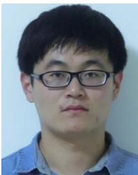  
Chenghao Rong received the BS degree from Shandong University, in 2015, and the MS degree from the University of Chinese Academy of Sciences, in 2018. He is currently working toward the PhD degree with Tsinghua University, China. His research interests include edge computing and video analytics.


Jessie Hui Wang received the BS and MS degrees in computer science from Tsinghua University, and the PhD degree in information engineering from The Chinese University of Hong Kong, in 2007. She is currently an associate professor with Tsinghua University. Her research interests include Internet routing, distributed computing, network measurement, and Internet economics.

  
Jilong Wang received the PhD degree in computer science from Tsinghua University, in 2000. He is currently a professor with Tsinghua University. He has served as the chair of the board of directors for Asia Pacific Advanced Network (APAN) since 2019. His research focuses on network measurement, cyberspace governance and Internet testbed.


Jun Zhang (Fellow, IEEE) received the PhD degree in electrical and computer engineering from the University of Texas at Austin, in 2009. He is an associate professor with the Department of Electronic and Computer Engineering, Hong Kong University of Science and Technology. His research interests include wireless communications and networking, mobile edge computing and edge AI, and cooperative AI. He is a co-authored the book Fundamentals of LTE (Prentice-Hall, 2010). He is a co-recipient of several best paper awards, including the 2021 Best


Yipeng Zhou received the PhD degree from Information Engineering Department, CUHK, in 2012. He is a senior lecturer with the School of Computing, Faculty of Science and Engineering, Macquarie University, and the recipient of ARC Discover Early Career Researcher Award (DECRA), in 2018. He was a research fellow at the Institute of Telecommunication Research (ITR), University of South Australia from 2016 to 2018. His research interests lie in distributed/federated learning, privacy preserved distributed learning and networking. He has

published more than 90 papers including IEEE INFOCOM, ICNP, IWQoS, IEEE/ACM Transactions on Networking, IEEE Journal on Selected Areas in Communications, IEEE Transactions on Parallel and Distributed Systems, IEEE Transactions on Mobile Computing, IEEE Transactions on Multimedia, etc.

Survey Paper Award of the IEEE Communications Society, the 2019 IEEE Communications Society, and Information Theory Society Joint Paper Award. He also received the 2016 IEEE ComSoc Asia-Pacific Best Young Researcher Award. He is an IEEE ComSoc distinguished lecturer.