# M-SIALNS for Air–Ground Collaborative Inspection: Spatio-Temporal Conflict Mitigation in Complex Bi-Layer Networks

Miaohan Zhang , Yuanhao Xu , Xuewei Yu , Chunyan Zhang , Member, IEEE, and Jianlei Zhang , Member, IEEE

Abstract—Multi-vehicle–UAV collaborative inspection systems face critical challenges in complex environments, where spatiotemporal node conflicts, coupled scheduling, and congestion severely afect operational eficiency. To address these issues, we define the Multi-UAV–Multi-Vehicle Collaborative Inspection Vehicle Routing Problem in a Bi-Layer Road Network (MUMV-CIVRP-BLRN). The model captures realistic inspection scenarios through (i) spatiotemporal node-conflict constraints that prevent simultaneous vehicle access to occupied nodes and (ii) flexible UAV operations, enabling chained multi-task sorties and crossvehicle recovery. To solve this NP-hard problem, we propose a Multi-Strategy Improved Adaptive Large Neighborhood Search (M-SIALNS) algorithm. Beyond standard ALNS frameworks, M-SIALNS incorporates a cluster-based initialization method, task-chain destroy–repair operators, and air–ground coordination strategies specifically tailored for the bi-layer structure. These strategies enhance global search, solution feasibility, and robustness. Comprehensive experiments on benchmark datasets and a power-grid case study demonstrate the advantages of M-SIALNS. Compared with state-of-the-art algorithms, it reduces inspection duration by 1.6%–11.0%, consistently delivering statistically significant improvements. Ablation and sensitivity analyses confirm the contribution of tailored operators and provide managerial insights into optimal fleet configurations and resource allocation thresholds. This work advances both the theoretical modeling of bi-layer vehicle–UAV routing and its practical deployment in large-scale inspection missions.

Index Terms—Vehicle-UAV collaborative operation, multi-UAV inspection, power grid inspection, bi-layer road network, adaptive large neighborhood search.

## I. INTRODUCTION

uncrewed aerial vehicles (UAVs) and Ground Vehicles

Digital Object Identifier 10.1109/TITS.2025.3647141 (GVs) have emerged as crucial technologies for improving operational eficiency and response capabilities in inspection systems [1]. UAVs possess distinct advantages, such as high maneuverability, cost-efectiveness, and exceptional adaptability to diverse terrains, enabling them to execute complex missions efectively. Simultaneously, GVs function as mobile hubs for energy replenishment and operational coordination, addressing UAV range limitations through dynamic docking mechanisms [2]. Recent advancements in drone communication technologies—such as improved air-to-ground links [3] and enhanced stability of drone–base station connectivity [4] —have established a strong technical foundation for reliable coordination between UAVs and ground vehicles. These physical-layer improvements have, in turn, enabled the development of advanced scheduling strategies and collaborative operation algorithms, thereby strengthening their applicability in complex real-world scenarios. In the industrial sector, leading logistics enterprises such as United Parcel Service and Amazon [5] are piloting these systems for lastmile delivery, demonstrating feasibility in operational practice. Parallel to these industrial eforts, the academic community has progressively developed the theoretical underpinnings of vehicle–UAV collaboration. The research trajectory began with single-vehicle–single-UAV formulations, such as the Flying Sidekick Traveling Salesman Problem (FSTSP) [6], and subsequently expanded to more sophisticated models including the Traveling Salesman Problem with Drones (TSP-D) [7] and the Vehicle Routing Problem with Drones (VRP-D) [8]. To enhance practical relevance, subsequent studies introduced critical operational dimensions, including multi-task sorties [9], [10], time-window constraints [11], [12], realistic energy-consumption models [13], [14], and flexible cross-vehicle docking [10], [15]. Consequently, the central challenge at the current research frontier is developing models and algorithms that remain robust under the complexities of real-world environments. Addressing this challenge is essential for validating practical applicability and enabling large-scale deployment across diverse domains.

Although previous studies have advanced vehicle-UAV collaborative frameworks for complex operations, their focus has primarily been on logistics applications [6], [15]. However, few investigations address the specific challenges posed by inspection tasks in complex environments. Existing research includes vehicle-UAV collaboration for a variety of situations such as search operations [16], agriculture [17], and mountain inspections [18]. These frameworks, including those used in logistics, generally rely on predefined graph networks or distance matrices for planning, which assumes vehicle and UAVs can access any node based on distance or time, ignoring potential conflicts or access restrictions due to node occupancy in complex environments. Furthermore, to simplify problem dimensions, some studies treat vehicles merely as fixed charging stations for UAVs, overlooking the dynamic role that vehicles can play in collaborative operations [18], [19]. While existing research shows UAVs enhance eficiency by performing multiple tasks within a single mission, these studies often treat UAVs as extensions to delivery tasks only, thereby neglecting the complex requirements and environmental challenges associated with inspection operations. To overcome this limitation, we introduce a spatiotemporal node conflict constraint as a core mechanism. When a vehicle occupies a node to perform UAV operations, the node is exclu sively locked, preventing access by other vehicles during that period. This constraint explicitly models physical restrictions in real-world road networks—such as single-vehicle access points or temporary blockages due to docking—and transforms the ground layer into a dynamic, resource-constrained environment. Current VRP-D frameworks [20], [21] are constrained by assumptions such as mandatory return-to-origin requirements and single-task-per-launch limitations, which reduce system sustainability in prolonged inspection scenarios. To overcome these limitations. This model allows UAVs to perform multiple sorties within a single mission and enables flexible docking with and launching from any available vehicle. Specifically, the concept of flexible dock ing permits a UAV, upon completing an inspection task, to land on any vehicle with available capacity, including its original launch vehicle. In this model, vehicles launch UAVs from ground-layer nodes to air-layer nodes, where UAVs conduct inspections along internode arcs, corresponding spatially to, for example, power grid lines in practical appli cations. This framework can be directly extended to various inspection scenarios, including pipeline monitoring and bridge inspections. This problem is defined as the Multi-UAV and Multi-Vehicle Collaborative Inspection Vehicle Routing Prob lem in a Bi-Layer Road Network (MUMV-CIVRP-BLRN), with a specific application to power grid inspection scenarios. The Bi-Layer Road Network consists of an aerial laye for uav inspection missions and a ground layer for vehicle deployment and retrieval operations. The primary objective of our model optimization is to minimize task completion time by optimizing vehicle-UAV coordinated scheduling and task assignment. To achieve high-quality solutions for the MUMV-CIVRP-BLRN under multi-dimensional complex constraints, we propose the Multi-Strategy Improved Adaptive Large Neighborhood Search Algorithm (M-SIALNS). Initially, a clustering algorithm is employed to establish the mapping relationship between air and ground nodes, plan lowcongestion vehicle routes, and generate high-quality initial UAV inspection routes. Additionally, the algorithm’s globa search capability is enhanced through strategically devised air-ground destruction and repair strategies. These strategie facilitate the algorithm’s ability to escape local optima and achieve high-quality solutions that adhere to the constraints of the vehicle-UAV collaborative inspection task.

## II. RELATED WORKS

In this review of related works, we first examine seminal studies on vehicle-UAV collaborative frameworks. Building upon this foundation, we then analyze extensions related to flexible UAV operations and vehicle routing problems. A comprehensive overview of these scholarly contributions is presented below.

In the study of vehicle-UAV collaborative frameworks, Murray and Chu [6] introduced the Flying Sidekick Traveling Salesman Problem (FSTSP), laying the groundwork for vehicle-UAV cooperation. Agatz et al. [7] developed the Traveling Salesman Problem with Drones (TSP-D), adding constraints on drone launch and recovery locations on vehicles. Expanding on these concepts, Kitjacharoenchai et al. [22] and Murray and Raj [9] extended the problem to the Multiple Traveling Salesman Problem with Drones (mTSP-D) and the Multiple Flying Sidekick Traveling Salesman Problem (mFSTSP), respectively. Building further, Wang et al. proposed the Vehicle Routing Problem with Drones (VRP-D), which significantly broadened the research scope by introducing two key flexibilities: 1) UAVs could be recovered by vehicles other than their launching vehicle, and 2) vehicles could perform multiple launch-and-recover operations.

In the realm of flexible UAV operations, Moshref-Javadi et al. [23] introduced the multiple-visit Traveling Salesman Problem for UAVs, enabling UAVs to undertake multiple tasks within a single operation. Gu et al. [24] addressed the Vehicle Routing Problem with Drones – Multiple Visits (VRPD-MV), allowing for multiple UAV visits per operation. Luo et al. [25] extended these frameworks by permitting UAVs to perform simultaneous delivery, pickup, and combined delivery-pickup tasks in one operation. Furthering these advances, Jiang et al. [26] explored scenarios where a UAV can execute both delivery and pickup tasks during a single mission, while autonomously docking at any vehicle.

In research on multi-vehicle routing strategies, Luo et al. [12] addressed the truck-UAV collaborative routing problem with flexible time windows. Das et al. [11] enhanced this framework by considering synchronized UAV operations alongside time windows in the truck-UAV routing problem. Stodola and Kutejˇ [27] proposed the multi-depot vehicle routing problem with UAVs, leveraging deployment from multiple heterogeneous fleets or warehouses. Zhou et al. [16] addressed the two-echelon vehicle routing problem with drones, wherein the task network is decomposed into two levels. In the first level, vehicles travel to designated docking points; in the second, drones are launched from these vehicles to execute multiple tasks. However, this model assumes vehicles must wait for UAVs to return before proceeding, overlooking collaborative delivery potentials. Imran et al. [15] introduced the Autonomous Vehicle Routing Problem with UAVs (A-VRPD), where UAVs autonomously select vehicles from an AV pool, assign them to customer groups, and optimize routes to minimize total operational costs. Kuo et al. [28] focused on a multi-objective approach to VRP-D, addressing July 05,2026 at 11:54:16 UTC from IEEE Xplore. Restrictions apply.

both time span coordination between vehicles and UAVs and vehicle carbon emissions.

In the field of algorithm design, most frameworks for the Flying Sidekick Traveling Salesman Problem (FSTSP) and its extended variants focus on minimizing delivery time using heuristic and improved algorithms [7], [22], [29]. To address the complexity of these problems, both Agatz et al. [7] and Kitjacharoenchai et al. [22] adopt a two-stage solution algorithm. This two-stage approach first constructs initial routes for the vehicles, and then optimally inserts UAV tasks into these routes to generate a complete vehicle-UAV collaborative schedule. As scenarios grow increasingly complex, traditional algorithms often face challenges balancing speed and accuracy. In response, metaheuristic algorithms, recognized for their speed, eficiency, and precision [26], [30], have become the favored approach. These include algorithms centered on neighborhood search, such as Iterated Local Search with Variable Neighborhood Descent (ILS-VND) [24], the Adaptive Large Neighborhood Search (ALNS) algorithm [26], and heuristics incorporating Neighborhood Search (NS) [31]. Additionally, hybrid algorithms that simulate natural processes, such as those combining Tabu Search and Simulated Annealing [23] and Ant Colony Optimization (ACO) approaches, ofer valuable solutions.

In the realm of multi-objective optimization, Luo et al. [25] introduced an adaptive resource allocation multi-objective evolutionary algorithm (ODEA-ARA) based on goal space decomposition, targeting transportation costs, waiting times, and service reliability. Luo et al. [12] also developed a Pareto local search hybrid multi-objective optimization algorithm to minimize delivery costs while maximizing customer satisfaction. Das et al. [11] proposed a collaborative Pareto Ant Colony Optimization algorithm to reduce travel costs and enhance customer service levels. Kuo et al. [28] designed the NSGA-II algorithm for multi-objective optimization, focusing on minimizing both operational span and carbon emissions.

While the literature presents significant advancements, existing studies typically address flexible operational capabilities in isolation, which leaves a critical gap in the development of a comprehensive and integrated framework. For instance, some studies have explored multi-tasking per UAV sortie [23], [24], [25], while others have investigated cross-vehicle docking. However, these features are often implemented within simplified contexts—such as single-vehicle-single-UAV or single-vehicle-multi-UAV [26] configurations—that do not fully address the complexities of large-scale, fleet-level collaboration.

In response to these limitations, this paper formulates the Multi-UAV and Multi-Vehicle Collaborative Inspection Vehicle Routing Problem in a Bi-Layer Road Network (MUMV-CIVRP-BLRN). The proposed model is distinguished by its holistic integration of three critical dimensions of operational flexibility: 1.Multi-to-Multi Collaboration: The model supports a fleet of multiple vehicles operating collaboratively with a fleet of multiple UAVs, moving beyond prevalent oneto-many or many-to-one limitations. 2.Multi-Task per Sortie: A single UAV can execute a chain of multiple, distinct inspection tasks in one flight, maximizing aerial eficiency.

3.Flexible Cross-Vehicle Docking: UAVs are decoupled from their launch vehicles, permitted to land on any compatible vehicle within the fleet that has available capacity. 4.The model incorporates spatiotemporal ground constraints, which treat the ground network as a dynamic, resource-constrained environment. By enforcing exclusive locks on nodes during vehicle operations, these constraints realistically simulate real-world trafic conflicts and resource contention. By integrating these capabilities, the MUMV-CIVRP-BLRN presents a more realistic and scalable paradigm for complex inspection scenarios.

## III. PROBLEM DESCRIPTION AND FORMULATION

## A. Problem Description

The MUMV-CIVRP-BLRN is formally defined on a bilayer graph $\textit { G } = \left( N , A , M \right)$ , comprising nodes $N ,$ arcs A, and , ,layers M, as illustrated in Fig. 1(b). The graph includes both the Ground-Level Network and Air-Level Network, represented by the sets T (Ground layers) and F (Air layers), respectively. Thus, $M \ = \ \{ T , F \} .$ . The node set of the Air-,Level Network is denoted as $N ^ { F } = \{ a _ { 1 } , a _ { 2 } , \dotsc , a _ { i } , \dotsc , a _ { | N ^ { F } | } \} \nonumber$ where $| N ^ { F } |$ represents the total number of air nodes. The node set of the Ground-Level Network is denoted as $\begin{array} { r l } { N ^ { T } } & { { } = } \end{array}$ $\{ g _ { 0 } , g _ { 1 } , \ldots , g _ { i } , \ldots , g _ { | N ^ { T } | } , g _ { | N ^ { T } | + 1 } \} .$ which includes $\vert N ^ { T } \vert ~ + ~ 2$ , , . . . , , . . . , ,nodes. Within the Ground-Level Network, the set of nodes that vehicles can access for parking is defined as $N _ { 0 } ^ { T } =$ $\{ g _ { 1 } , g _ { 2 } , . . . , g _ { i } , . . . , g _ { \left| N ^ { T } \right| } \}$ , comprising $| N ^ { T } |$ parking nodes. Let $N _ { - } ^ { T } = \{ g _ { 0 } , g _ { 1 } , . . . , \dot { g } _ { i } , . . . , g _ { | N ^ { T } | } \}$ represent the set of nodes , , . . . , , . . . ,from which a vehicle may depart or be stationed, and let $N _ { + } ^ { T } = \{ g _ { 1 } , \dots , g _ { i } , . . . , g _ { \left| N ^ { T } \right| + 1 } \} \}$ represent the set of nodes from which a vehicle may return or be stationed. The set A consists of all arcs connecting nodes in the network, formed by the union of the arcs in the Ground-Level Network $A ^ { T }$ and the Air-Level Network $A ^ { F }$ . In both subsets, every arc connects two distinct nodes. It is important to note that for any arc $( a _ { i } , a _ { j } )$ in $A ^ { F }$ and $( g _ { i } , g _ { j } )$ in $A ^ { T }$ , it is stipulated that $a _ { i } \neq a _ { j } ,$ $g _ { i } \neq g _ { j }$ . This condition ensures that each edge in the graph uniquely represents a path between two independent nodes.

In MUMV-CIVRP-BLRN, |V| vehicles are initially dispatched from the central depot $g _ { 0 }$ . Each vehicle is configured to carry a maximum of $| D _ { k } |$ UAVs for inspection tasks. The total number of UAVs across all vehicles is |X|, with each UAV denoted by x. For any vehicle $\nu _ { k } ~ \in ~ V ,$ , where $V = \{ \nu _ { 1 } , \nu _ { 2 } , . . . , \nu _ { k } , . . . , \nu _ { | V | } \}$ , the UAV carried by vehicle $\nu _ { k }$ and assigned the code x is represented as $d _ { \nu _ { k } } ^ { x }$ , where $\forall d _ { \nu _ { k } } ^ { x } \in X .$ The set $D _ { k }$ represents the collection of UAVs carried by the k-th vehicle, and the union of all UAVs across vehicles is represented as $\textstyle X = \bigcup _ { \nu _ { k } \in V } D _ { \nu _ { k } }$

During mission execution, UAV operations are restricted to the air layer, as depicted in Fig. 1(c). The UAV operates in two modes. In the first mode (Inspection Task), the UAV executes power line inspections along transmission towers at a predefined inspection speed (indicated by the purple line). In the second mode (No Inspection Task), the UAV travels to the next designated mission node at its maximum flight speed (indicated by the orange line). Similarly, vehicle operations, including scheduling, launching, and recovering uavs, are restricted to the ground layer. Fig. 1(a) illustrates the ground network’s node conflict constraint. In the depicted scenario, vehicles $\nu _ { 1 }$ and $\nu _ { 4 }$ occupy nodes $g _ { 3 }$ and $g _ { 4 } ,$ respectively, during the time intervals indicated in the occupancy schedule. If vehicle $\nu _ { 3 }$ plans to travel from $g _ { 1 }$ to g5 during this period, its potential routes, such as $g _ { 1 }  g _ { 3 }  g _ { 5 }$ and $g _ { 1 } \  \ g _ { 2 } \  \ g _ { 4 } \  \ g _ { 7 } \  \ g _ { 5 }$ , are rendered infeasible because intermediate nodes are occupied during specific time windows. Consequently, the vehicle must either select a nonconflicting route, such as $g _ { 1 }  g _ { 2 }  g _ { 5 } ,$ , or wait at its current location until a node in its intended path becomes available.

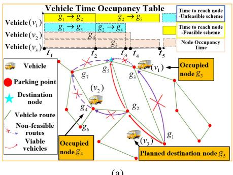

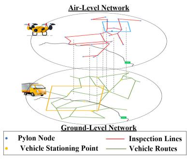

(c)  
Fig. 1. Conceptual examples of MUMV-CIVRP-BLRN model.  
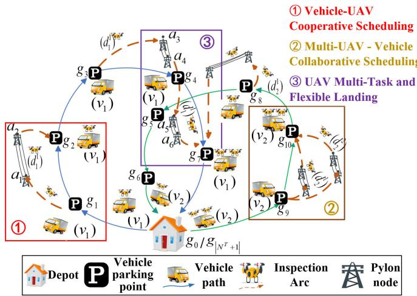  
Fig. 2. An example of characteristics in vehicle-UAV collaborative operations.

Fig. 2 (1) illustrates the vehicle-UAV collaborative framework, where UAV $d _ { 1 } ^ { 1 }$ is initially deployed by vehicle $\nu _ { 1 }$ at node $g _ { 1 }$ and recovered at $g _ { 2 }$ . This UAV executes transmission line inspection by traversing arcs sequentially between consecutive air nodes $a _ { 1 }  a _ { 2 }$ . As depicted in Fig. 2 (3), the operational framework achieves two significant functional breakthroughs: (1) UAV $d _ { 1 } ^ { 1 }$ deployed by vehicle $\nu _ { 1 }$ at g3 conducts sequential arc inspections $( a _ { 3 }  a _ { 4 }$ and $a _ { 5 } ~  ~ a _ { 6 } )$ within a single task cycle, demonstrating its capacity for multi-task execution. Additionally, (2) UAV $d _ { 2 } ^ { 1 } ,$ , initially launched from vehicle $\nu _ { 2 }$ at g8, successfully undergoes cross-vehicle recovery by vehicle v at node $g _ { 7 }$ , thus establishing a non-native docking capability through this inter-vehicle coordination framework.

The inspection task is considered complete when: (1) All arcs in the Air Layer Network have been surveyed by UAVs, and (2) All vehicles return to node $g _ { \left| N ^ { T } \right| + 1 }$ after completing UAV recovery. This operational protocol ensures comprehensive coverage while maintaining resource eficiency.

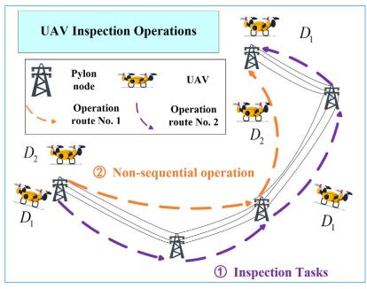

To streamline the expression of arc membership within the model, the following symbolic membership relations are no longer explicitly specified in subsequent formulations: $\forall ( a _ { i } $ $a _ { j } ) \in A ^ { F } , \ a _ { i } \neq a _ { j } ; \forall ( g _ { i } \to g _ { j } ) \in A ^ { T } , \ g _ { i } \neq g _ { j } ; \forall ( g _ { i } \to a _ { i } ) \ \in$ $A ; \forall ( a _ { j }  g _ { j } ) \in A$

## B. Conditional Hypothesis

1) It is assumed that all vehicles travel at a known, constant speed, are equipped with suficient power for UAV recharging. Assume that UAV energy consumption is linearly proportional to total flight duration.

2) Each vehicle is assumed to have a Command and Control (C2) communication range with a radius of $R _ { \mathrm { { c o m m } } } ,$ enabling communication with UAVs.

3) The model does not account for stochastic factors that may afect mission execution, such as wind conditions, GPS inaccuracies, or hardware-related variables.

4) Only one vehicle is permitted to occupy a ground node at any given time.

5) The model permits a vehicle to launch or retrieve multiple UAVs simultaneously at a single node, and any potential operational delays or scheduling conflicts arising from queued operations are not considered.

## C. Mathematical Formulation

Based on the above description and definition, the established CMDMVRP-BLRN model is shown below:

$$
M i n : Z = \operatorname* { m a x } _ { \nu _ { k } \in V } \{ a t _ { g _ { \lfloor N ^ { T } \rfloor + 1 } } ^ { \nu _ { k } } \} .\tag{1}
$$

The optimization objective of CMDMVRP-TLRN formulated in equation (1) aims to minimize the maximum task completion time across all vehicles. The constructed constraints are as follows:

$$
\sum _ { \nu _ { k } \in V } \sum _ { x = 1 } ^ { | X | } u _ { a _ { i } \to a _ { j } } ^ { x , \nu _ { k } } > = 1 . \quad \forall a _ { i } , a _ { j } \in N ^ { F }\tag{2}
$$

Constraint (2) ensures the inspection coverage constraint for each arc segment while limiting its inspection by a UAV to at least once.

1) Vehicle Route Constraints:

$$
\sum _ { g _ { j } \in N _ { 0 } ^ { T } } u _ { g _ { 0 }  g _ { j } } ^ { \nu _ { k } } = 1 , \quad \forall \nu _ { k } \in V , g _ { 0 } \in N _ { - } ^ { T }\tag{3}
$$

$$
\sum _ { g _ { j } \in N _ { 0 } ^ { T } } u _ { g _ { j } \to g _ { \lfloor N ^ { T } \rfloor + 1 } } ^ { \nu _ { k } } = 1 . \quad \forall \nu _ { k } \in V , g _ { \lfloor N ^ { T } \rfloor + 1 } \in N _ { + } ^ { T }\tag{4}
$$

Constraints (3–4) represent the departure and return constraints for each vehicle.

$$
\sum _ { g _ { j } \in N _ { 0 } ^ { T } } u _ { g _ { i }  g _ { j } } ^ { \nu _ { k } } \leq 1 , \forall \nu _ { k } \in V , \forall g _ { i } \in N _ { 0 } ^ { T }\tag{5}
$$

$$
\sum _ { g _ { i } \in N _ { 0 } ^ { T } } u _ { g _ { i } \to g _ { j } } ^ { \nu _ { k } } - \sum _ { g _ { i } \in N _ { 0 } ^ { T } } u _ { g _ { j } \to g _ { i } } ^ { \nu _ { k } } = 0 , \ \forall \nu _ { k } \in V , \ \forall g _ { j } \in N _ { 0 } ^ { T }\tag{6}
$$

$$
p o s _ { g _ { i } } ^ { \nu _ { k } } - p o s _ { g _ { j } } ^ { \nu _ { k } } + \left( | N ^ { T } | - 1 \right) \cdot u _ { g _ { i } \to g _ { j } } ^ { \nu _ { k } } \le | N ^ { T } | - 2 .
$$

$$
\forall \nu _ { k } \in V , \forall g _ { i } , g _ { j } \in N _ { 0 } ^ { T }\tag{7}
$$

Constraint (5) ensures the visitation restriction for each node by vehicles. Constraint (6) ensures the vehicle flow balance constraint. Constraints (7) restrict ordering constraints and apply MTZ subtour elimination constraints, where pos denotes the visitation order of nodes by vehicles.

2) Spatio-Temporal Node Conflict Constraints:

$$
\begin{array} { r l r } {  { d t _ { g _ { i } } ^ { \nu _ { k } } \le d t _ { g _ { i } } ^ { \nu _ { m } } - \varepsilon + M ( 1 - c _ { g _ { i } } ^ { \nu _ { k } , \nu _ { m } } ) , \quad \forall \nu _ { k } , \nu _ { m } \in V , } } \\ & { } & { \forall g _ { i } \in N _ { 0 } ^ { T } } \end{array}
$$

$$
d t _ { g _ { i } } ^ { \nu _ { m } } \leq d t _ { g _ { i } } ^ { \nu _ { k } } - \varepsilon + M \cdot c _ { g _ { i } } ^ { \nu _ { k } , \nu _ { m } } , \quad \forall \nu _ { k } , \nu _ { m } \in V ,\tag{8}
$$

$$
\forall g _ { i } \in N _ { 0 } ^ { T }\tag{9}
$$

$$
c _ { g _ { i } } ^ { \nu _ { k } , \nu _ { m } } + c _ { g _ { i } } ^ { \nu _ { m } , \nu _ { k } } = 1 .
$$

$$
\forall \nu _ { k } , \nu _ { m } \in V , \forall g _ { i } \in N _ { 0 } ^ { T }\tag{10}
$$

Constraints (8–10) represent node-spatiotemporal conflicts through overlapping time windows, preventing vehicles from arriving at ground node $g _ { i }$ within the same time window.

3) Vehicle-UAV Collaboration Constraints:

$$
\begin{array} { r l } & { a t _ { g _ { 0 } } ^ { \nu _ { k } } = 0 , \quad \forall \nu _ { k } \in V , g _ { 0 } \in N _ { - } ^ { T } } \\ & { a t _ { g _ { j } } ^ { \nu _ { k } } \geq d t _ { g _ { i } } ^ { \nu _ { k } } + t _ { g _ { i }  g _ { j } } ^ { \nu _ { k } } - M ( 1 - u _ { g _ { i }  g _ { j } } ^ { \nu _ { k } } ) , \forall \nu _ { k } \in V , } \\ & { \quad \forall g _ { i } , g _ { j } \in N ^ { T } } \end{array}\tag{11}
$$

(12)

$$
t _ { g _ { i }  g _ { j } } ^ { \nu _ { k } } \geq \frac { l _ { g _ { i }  g _ { j } } } { \bar { \nu } _ { t } } - M ( 1 - u _ { g _ { i }  g _ { j } } ^ { \nu _ { k } } ) . \quad \forall \nu _ { k } \in V ,\tag{13}
$$

Constraint (11) defines the initial node time instant for vehicle $\nu _ { k } .$ . Constraints (12–13) ensure that the time-window is indeed within the ground transportation network.

$$
d t _ { g _ { i } } ^ { \nu _ { k } } \geq a t _ { g _ { i } } ^ { \nu _ { k } } . \quad \forall \nu _ { k } \in V , g _ { i } \in N _ { - } ^ { T }\tag{14}
$$

Constraint (14) governs the departure time limits for vehicle $\nu _ { k } ,$ encompassing both UAV launch and recovery operations initiated after the vehicle’s arrival at a node.

$$
a t _ { g _ { i } } ^ { \nu _ { k } } \leq a t _ { g _ { i } } ^ { x , \nu _ { m } } + M ( 1 - b _ { g _ { j }  g _ { i } } ^ { x , \nu _ { m } , \nu _ { k } } ) , \quad \forall \nu _ { k } , \nu _ { m } \in V ,
$$

$$
\forall g _ { i } \in N _ { 0 } ^ { T }\tag{15}
$$

$$
s t _ { g _ { i } } ^ { \nu _ { k } } \geq t l + t r + \operatorname* { m a x } \left( t _ { g _ { i } } ^ { x , \nu _ { k } } \right) . \quad \forall \nu _ { k } \in V , \forall g _ { i } \in N _ { 0 } ^ { T } ,
$$

$$
\forall x \in X\tag{16}
$$

Constraint (15) represents that vehicles must arrive at a node early to wait and recover UAVs. Constraint (16) characterize the parking duration at $g _ { i }$ nodes.

$$
\sum _ { a _ { i } \in N ^ { F } } y _ { g _ { i } \to a _ { i } } ^ { x , \nu _ { k } } = \sum _ { a _ { j } \in N ^ { F } } z _ { a _ { j } \to g _ { j } } ^ { x , \nu _ { k } } , \quad \forall \nu _ { k } \in V , \forall g _ { i } \in N _ { 0 } ^ { T } ,
$$

$$
\forall x \in X\tag{17}
$$

$$
b _ { g _ { i }  g _ { j } } ^ { x , \nu _ { k } , \nu _ { m } } \leq y _ { g _ { i }  a _ { i } } ^ { x , \nu _ { k } } , \quad \forall \nu _ { k } \in V , \forall x \in X , \forall g _ { i } \in N _ { 0 } ^ { T }\tag{18}
$$

$$
b _ { g _ { i }  g _ { j } } ^ { x , \nu _ { k } , \nu _ { m } } \leq z _ { a _ { j }  g _ { i } } ^ { x , \nu _ { m } } , \quad \forall \nu _ { k } \in V , \forall x \in X , \forall g _ { i } \in N _ { 0 } ^ { T }\tag{19}
$$

$$
b _ { g _ { i } \to g _ { j } } ^ { x , \nu _ { k } , \nu _ { m } } \geq \varepsilon + M \left( y _ { g _ { i } \to a _ { i } } ^ { x , \nu _ { k } } + z _ { a _ { j } \to g _ { j } } ^ { x , \nu _ { m } } - 2 \right) .
$$

$$
\forall \nu _ { k } \in V , \forall x \in X , \forall g _ { i } \in N _ { 0 } ^ { T }\tag{20}
$$

Constraint (17) ensures the equilibrium of the amounts of UAVs launched and recovered. Constraints (18–20) ensure the validity of cross - vehicle collaborative recovery via logic.

4) UAV Arrival Time and Sequence Coordination:

$$
a \delta \geq a t _ { g _ { i } } ^ { \nu _ { k } } + t r \cdot \sum _ { g _ { j } \in N _ { 0 } ^ { T } } \sum _ { \nu _ { m } \in V } b _ { g _ { j }  g _ { i } } ^ { x , \nu _ { m } , \nu _ { k } } , \quad \forall \nu _ { k } \in V ,\tag{21}
$$

$$
a \delta \geq d t _ { g _ { j } } ^ { x , \nu _ { m } } + t _ { g _ { j } } ^ { x , \nu _ { m } } + t r - M ( 1 - \sum _ { g _ { j } \in N _ { 0 } ^ { T } } \sum _ { \nu _ { m } \in V } b _ { g _ { j }  g _ { i } } ^ { x , \nu _ { m } , \nu _ { k } } ) ,
$$

$$
\forall \nu _ { k } \in V , \forall x \in X , \forall g _ { i } \in N _ { 0 } ^ { T }\tag{22}
$$

$$
a t _ { g _ { i } } ^ { x , \nu _ { k } } \geq a \delta , \forall \nu _ { k } \in V , \forall x \in X , \forall g _ { i } \in N _ { 0 } ^ { T }\tag{23}
$$

$$
d t _ { g _ { i } } ^ { x , \nu _ { k } } \geq a t _ { g _ { i } } ^ { x , \nu _ { k } } , \quad \forall \nu _ { k } \in V , \forall x \in X , \forall g _ { i } \in N _ { 0 } ^ { T }\tag{24}
$$

Constraint (21) ensures the arrival time of $\mathrm { U A V s } ( a _ { \delta } )$ is no earlier than the sum of vehicle $\nu _ { k } ^ { \prime } s$ arrival time at $g _ { i }$ δand total cross-vehicle recovery time. Constraint (22) ensures that $a _ { \delta }$ follows the departure time, flight time, and recovery time of the launching vehicle $\nu _ { m }$ . Constraint (23) ensures the UAV arrival time at $g _ { i }$ is synchronized with the global threshold $a _ { \delta } .$ Constraint (24) ensures the UAV departure time is later than its arrival time.

5) UAV Communications Mission Execution and Duration Constraints:

$$
t _ { a _ { i }  a _ { j } } ^ { x , \nu _ { k } } \geq \frac { l _ { a _ { i }  a _ { j } } } { \bar { \nu } _ { u } } - M ( 1 - u _ { a _ { i }  a _ { j } } ^ { x , \nu _ { k } } ) , \quad \forall \nu _ { k } \in V ,\tag{25}
$$

$$
t _ { g _ { i }  a _ { i } } ^ { x , \nu _ { k } } \geq \frac { l _ { g _ { i }  a _ { i } } } { \bar { \nu } _ { u } } - M ( 1 - y _ { g _ { i }  a _ { i } } ^ { x , \nu _ { k } } ) , \quad \forall \nu _ { k } \in V ,
$$

$$
\forall x \in X , \ \forall a _ { i } , a _ { j } \in N ^ { F }\tag{26}
$$

$$
t _ { a _ { j }  g _ { j } } ^ { x , \nu _ { k } } \geq \frac { l _ { a _ { j }  g _ { j } } } { \bar { \nu } _ { u } } - M ( 1 - z _ { a _ { j }  g _ { j } } ^ { x , \nu _ { k } } ) , \quad \forall \nu _ { k } \in V ,
$$

$$
\forall x \in X , \ \forall a _ { i } , a _ { j } \in N ^ { F }\tag{27}
$$

$$
y _ { g _ { i } \to a _ { i } } ^ { x , \nu _ { k } } \bullet l _ { g _ { i } \to a _ { i } } \le R _ { c o m m } , \forall \nu _ { k } \epsilon V , \forall x \epsilon X ,
$$

$$
\forall g _ { i } \in N ^ { T } , \ \forall a _ { i } \in N ^ { F }\tag{28}
$$

$$
z _ { a _ { j }  g _ { j } } ^ { x , \nu _ { k } } \bullet l _ { a _ { j }  g _ { j } } \leq R _ { c o m m } , \forall \nu _ { k } \epsilon V , \forall x \epsilon X ,
$$

$$
\forall g _ { j } \in N ^ { T } , \ \forall a _ { j } \in N ^ { F }\tag{29}
$$

$$
e \geq t _ { g _ { i } } ^ { x , \nu _ { k } } \geq \left( \sum _ { a _ { i } \in N ^ { F } } t _ { g _ { i } \to a _ { i } } ^ { x , \nu _ { k } } + \sum _ { a _ { i } , a _ { j } \in N ^ { F } } t _ { a _ { i } \to a _ { j } } ^ { x , \nu _ { k } } + \sum _ { a _ { j } \in N ^ { F } } t _ { a _ { j } \to g _ { j } } ^ { x , \nu _ { k } } \right)
$$

$$
- M ( 1 - \sum _ { \nu _ { m } \in V } b _ { g _ { i }  g _ { j } } ^ { x , \nu _ { k } , \nu _ { m } } ) .\tag{30}
$$

Constraints (25–27) represent the task execution time constraints for UAVs, accounting for their potential recovery time, launch time calculations and the constraints on UAV task execution time following multiple tasks performed by a vehicle at the same node. Constraints (28–29) ensure that UAV launch and recovery operations take place within the communication range of the associated vehicle. Constraint (30) ensures that the total mission duration for each UAV x is the sum of its launch, inspection, and recovery flight times, and that this total duration does not exceed the $\mathrm { U A V } \mathbf { \hat { s } }$ endurance limit.

6) UAV Ownership Constraints:

$$
\sum _ { \mathbf { a } _ { i } \in \mathbf { N } ^ { F } } y _ { g _ { i } \to a _ { i } } ^ { x , \nu _ { k } } \le p _ { g _ { i } } ^ { x , \nu _ { k } } , \quad \forall \nu _ { k } \in V , \forall x \in X ,
$$

$$
\forall a _ { i } \in N ^ { F } , \forall g _ { i } \in N _ { 0 } ^ { F }
$$

$$
\sum _ { { \bf { a } } _ { j } \in { \bf { N } } ^ { F } } z _ { a _ { j }  g _ { i } } ^ { x , \nu _ { k } } \geq p _ { g _ { i } } ^ { x , \nu _ { k } } . \quad \forall \nu _ { k } \in V , \ \forall x \in X ,\tag{31}
$$

$$
\forall a _ { j } \in N ^ { F } , \forall g _ { i } \in N _ { 0 } ^ { F }\tag{32}
$$

Constraints (31–32) ensure the afiliation relationship between UAVs and their carrying vehicles at each node.

7) The Number of UAV Tasks Constraints:

$$
d n t _ { g _ { 0 } } ^ { \nu _ { k } } = | D _ { \nu _ { k } } | , \quad \forall \nu _ { k } , \nu _ { m } \in V\tag{33}
$$

$$
a n _ { g _ { i } } ^ { \nu _ { k } } \leq | D _ { \nu _ { k } } | , \quad \forall \nu _ { k } \in V , \forall g _ { i } \in N _ { 0 } ^ { T }
$$

$$
d n _ { g _ { i } } ^ { \nu _ { k } } \leq | D _ { \nu _ { k } } | , \quad \forall \nu _ { k } \in V , \forall g _ { i } \in N _ { 0 } ^ { T }\tag{34}
$$

$$
a n _ { g _ { i } } ^ { \nu _ { k } } \ge d n _ { g _ { j } } ^ { \nu _ { k } } + \sum _ { x \in X } \sum _ { \nu _ { m } \in V } \sum _ { g _ { h } \in N _ { 0 } ^ { T } } b _ { g _ { h } \to g _ { j } } ^ { x , \nu _ { m } , \nu _ { k } }\tag{35}
$$

$$
- M ( 1 - u _ { g _ { j }  g _ { i } } ^ { \nu _ { k } } ) , \quad \forall \nu _ { k } \in V ,
$$

$$
\forall x \in X , \forall g _ { i } , g _ { j } \in N _ { 0 } ^ { T }\tag{36}
$$

$$
d n _ { g _ { i } } ^ { \nu _ { k } } \geq a n _ { g _ { i } } ^ { \nu _ { k } } - \sum _ { x \in X } \sum _ { \nu _ { m } \in V } \sum _ { g _ { j } \in N _ { 0 } ^ { T } } b _ { g _ { i } \to g _ { j } } ^ { x , \nu _ { k } , \nu _ { m } } . \quad \forall \nu _ { k } \in V ,
$$

$$
\forall x \in X , \forall g _ { i } \in N _ { 0 } ^ { T }\tag{37}
$$

Constraint (33) ensures that vehicle $\nu _ { k }$ carries all assigned UAVs when departing from the initial ground node. Constraints (34–35) represent the number of carried UAVs when the vehicle $\nu _ { k }$ arrives/departs from node $g _ { i } .$ Constraints (36–37) govern the dynamic update of UAV numbers carried by vehicle $\nu _ { k }$ at node $g _ { i }$

8) UAV Route Constraints:

$$
\sum _ { a _ { j } \in N ^ { F } } u _ { a _ { i }  a _ { k } } ^ { x , \nu _ { k } } - \sum _ { a _ { j } \in N ^ { F } } u _ { a _ { j }  a _ { i } } ^ { x , \nu _ { k } } = 0 , \quad \forall \nu _ { k } \in V ,
$$

$$
\forall a _ { i } \in N ^ { F } , \ \forall x \in X\tag{38}
$$

$$
u _ { a _ { i }  a _ { j } } ^ { x , \nu _ { k } } \leq \sum _ { g _ { i } \in N _ { 0 } ^ { T } } y _ { g _ { i }  a _ { i } } ^ { x , \nu _ { k } } , \quad \forall \nu _ { k } \in V , ~ \forall x \in X , ~ \forall a _ { i } , a _ { j } \in N ^ { F }\tag{39}
$$

$$
z _ { a _ { j }  g _ { j } } ^ { x , \nu _ { k } } \leq \sum _ { a _ { i } \in N ^ { F } } u _ { a _ { i }  a _ { j } } ^ { x , \nu _ { k } } , \quad \forall \nu _ { k } \in V , \forall x \in X ,
$$

$$
\forall a _ { j } \in N ^ { T } , \forall g _ { j } \in N _ { 0 } ^ { T }\tag{40}
$$

$$
z _ { a _ { j }  g _ { j } } ^ { x , \nu _ { k } } \geq y _ { g _ { i }  a _ { i } } ^ { x , \nu _ { k } } + u _ { a _ { i }  a _ { j } } ^ { x , \nu _ { k } } - 1 . \quad \forall \nu _ { k } \in V , \ \forall x \in X ,
$$

$$
\forall a _ { i } , a _ { j } \in N ^ { T } , \forall g _ { j } \in N _ { 0 } ^ { T }\tag{41}
$$

Constraint (38) ensures flow balance for UAV air paths. Constraints (39–41) ensure task continuity limits at air network nodes.

## IV. SOLUTION APPROACH

## A. Model Complexity and Algorithm Design Analysis

This section provides a computational complexity analysis of the proposed model. The following notation is used in the analysis: M denotes the number of vehicles, N the number of aerial nodes, V the total number of nodes, D the number of uavs, and z the mission capacity of a single uav. Conventional VRP-D models typically conduct unified optimization within a single-layer network, which creates a tight coupling among decision variables such as vehicle routing, drone scheduling, and task allocation. This modeling paradigm generates a large, multidimensional decision space with a computational complexity of $O ( V ^ { M } \bullet M ! \bullet D ^ { \widehat { z } ^ { M } } \bullet N ^ { z ^ { D } } )$ , significantly hindering algorithmic scalability. In contrast, the proposed two-layer network model achieves a decoupling of vehicle and drone operations. This approach decomposes the original problem into two interrelated yet less complex subproblems: ground vehicle path planning and aerial drone task assignment. Through this decomposition, the overall computational complexity is reduced from a multiplicative to an additive form, with an approximate complexity of $O ( V - N ^ { M \bullet M ! } +$ $M ! \bullet N ^ { z ^ { D } } + L ^ { D ^ { Z ^ { N } } } )$ ).This approach reduces computational costs, thereby enhancing the model’s applicability in complex realtime scenarios.Nevertheless, the problem remains NP-hard and exhibits a three-layer dynamic programming structure. The large solution space and complex constraints challenge commercial solvers to find feasible solutions within reasonable time [26]. Heuristic algorithms based on neighborhood search are widely used due to their flexibility and strong search capabilities [32]. The literature [26] proposes a two-stage solution framework based on Adaptive Large Neighborhood Search (ALNS). Additionally, other representative approaches include hybrid algorithms that integrate simulated annealing with variable neighborhood search [10], as well as parallel ALNS [33] methods designed to enhance computational eficiency. Building on this strong precedent, this study proposes that a meticulously customized ALNS algorithm, equipped with a diverse set of improved destruction and repair operators, provides a powerful and well-suited methodology for solving the proposed MUMV-CIVRP-BLRN model.

## B. M-SIALNS Solution Framework Design

As shown in Fig. 3, the proposed M-SIALNS algorithm utilizes a three-layer architecture designed to address the challenges of the MUMV-CIVRP-BLRN model. This layered structure distinguishes it from standard ALNS algorithms. The first stage is the Generation Layer, where a roadmap for the dual-layer network is constructed based on the spatial distribution of nodes, vehicle and UAV parameters, and the map scale, which establishes the connectivity and distances between nodes. The second stage is the Initialization Layer, where a high-quality initial solution is generated using a clustering-based air-ground node mapping strategy. This strategy is designed to efectively partition the task area and provide a strong starting point for the subsequent optimization phase. Finally, the third stage is the Optimization Layer. Unlike the generic operators found in standard ALNS, the proposed destruction-and-repair strategies are specifically designed to incorporate the model’s complex constraints, ensuring the feasibility of all generated solutions. Furthermore, diverse operator combinations are utilized to enhance the algorithm’s global search capabilities, targeting diferent structural characteristics of the solution.

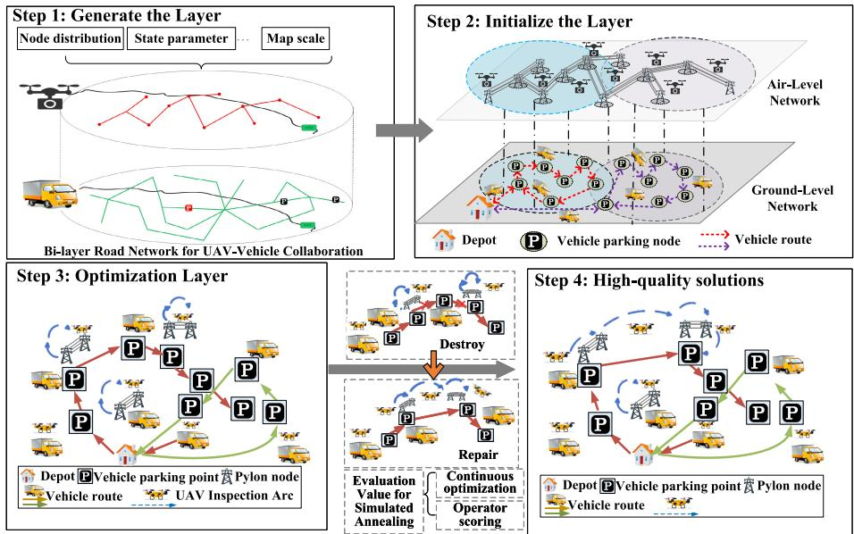  
Fig. 3. Algorithm overall technical framework diagram.

## C. Build High-Quality Initial Solution

Given the inherent characteristics of inspection tasks—a large number of nodes, random spatial distribution, and strong network connectivity—a simple random task assignment often leads to disorganized routes and ineficient coordination. To address this, our method adopts the well-established “Cluster-First, Route-Second” heuristic [34], [35]. This approach is known to guide the search toward more promising regions of the solution space, thereby accelerating convergence and improving solution quality. As detailed in Algorithm 1 and illustrated in Fig. 3, the procedure first clusters all aerial inspection nodes into a number of groups equal to the number of available vehicles. Subsequently, a dedicated route is planned for each vehicle-UAV team within its assigned cluster. This structured approach provides a high-quality starting point by partitioning the problem, which simplifies the initial search space and reduces the likelihood of initial routing conflicts. Operational Flow and Conflict Management The operational flow for each vehicle follows a sequential, event-driven logic until all inspection tasks are completed. Before departing for a destination node, a vehicle checks the node’s occupancy status to avoid conflicts. If the node is occupied, the vehicle waits at its current position and updates the node’s occupancy time information; otherwise, it proceeds and records its departure. Upon arrival, the vehicle executes a defined sequence of tasks:

Algorithm 1 M-SIALNS Initialization Generation   
Input: Air Network Arc Set: A, Ground Network Arc   
Set: G;Vehicle Set: V, Vehicle Current Time:   
v.t, Vehicle Current Node: v.curr, Number of   
UAVs Carried by a Vehicle: v.capacity. et al;   
Uninspected Air Arcs: E; Ground Node   
Occupancy Status Information: O.   
Output: Vehicle-UAV collaborative scheduling   
solution.   
1 clusters ← CLUSTERMAPPING(A, G, |VD);   
2 foreach v ∈ V do   
3 | v.route ← PLANVEHICLEROUTE(clusters[v.id]);   
4 end foreach   
5 while E≠∅do   
6 foreach v ∈ V do   
7 foreach n ∈ v.route do   
8 if IsOCCUPIED(n, v.t) then   
9 v.t ← UPDATEWAITTIME(n, v.t);   
10 else   
11 Record departure time at n;   
12 UPDATEOCCUPATION(n, v.t);   
13 end if   
14 Calculate   
travel\_time ← TRAVELTIME(v.curr, n);   
15 Update v.t ← v.t + travel\_time,   
v.curr ← n;   
16 if v.current\_capacity < v.capacity then   
17 (recover\_flag, v.t) ←   
DECIDERECOVER(v);   
18 end if   
19 if v.current\_capacity > 0 then   
20 (launch\_flag, v.t) ←   
DECIDELAUNCH(v);   
21 end if   
22 end foreach   
23 end foreach   
24 end while

first, it performs any pending UAV recovery operations (as outlined in Algorithm 2); next, it executes planned UAV launch tasks (as outlined in Algorithm 3). Once all operations at the current node are complete, the vehicle proceeds to its next destination, repeating this cycle.

Algorithm 2 Decide Recover for Vehicle   
Input: Vehicle: v with attributes: Current node:   
v.curr, Current time: v.t, Available UAV   
capacity: v.available\_capacity, Full capacity:   
v.capacity; Carry UAV set U where each   
u ∈ U has attributes: Status: u.launched,   
Current node: u.n, Speed: u.speed, Returnable   
nodes: u.return\_nodes;   
Helper function: CALCULATE\_TRAVEL\_TIME   
Output: recover\_success, Vehicle and UAV attributes   
1 recover success ← False;   
2 foreach $u \in U$ do   
3 if not u.is launched or   
v.available\_capacity ≥ v.capacity then   
4 continue // u not launched or   
v.capacity is full   
5 end if   
6 if v.curr ∉ d.return\_nodes then   
7 continue ; // u not reach v.curr   
8 else   
// Update u status information   
9 return\_time ←   
CALCULATE\_TIME(u.n, v.curr, v.speed);   
10 recover\_success ← True;   
11 u.n ← v.curr;   
12 u.t ← u.t + return\_time;   
u.launched ← False;   
13 v.available\_capacity ←   
v.available\_capacity + 1;   
14 Add recover node u.n to v.task   
15 end if   
16 end foreach

## D. Destruction Operation

Considering the strong dependency between vehicle and UAV sub-routes, the following definition is made to adjust infeasible solutions in the algorithm’s new solutions during the destruction process, ensuring that they comply with the constraints of the MUMV-CIVRP-BLRN model:

Definition 1: Let the task route of vehicle $\nu _ { k } ,$ , denoted as $1  R .$ , be represented by $\alpha _ { \nu _ { k } } ^ { 1 \to R } = \{ \alpha _ { \nu _ { k } } ^ { 1 } , \alpha _ { \nu _ { k } } ^ { 2 } , \alpha _ { \nu _ { k } } ^ { g _ { i } } , \ldots , \alpha _ { \nu _ { k } } ^ { g _ { j } } , \alpha _ { \nu _ { k } } ^ { R } \}$ where the UAV x carried by $\nu _ { k }$ is launched from node $g _ { i }$ to air node 1, and its inspection route is given by $\vec { \beta } _ { x } ^ { 1 \to P } = \{ \beta _ { x } ^ { 1 } , \beta _ { x } ^ { 2 } , \beta _ { x } ^ { a _ { i } } , . . . \beta _ { x } ^ { a _ { j } } , \beta _ { x } ^ { P } \}$ , which is eventually recovered by vehicle $\nu _ { k }$ at node $g _ { j } .$ . This task can be represented as $\dot { \alpha _ { \nu _ { k } } ^ { g _ { i }  1 } } \oplus \beta _ { x } ^ { 1  P } \oplus \alpha _ { \nu _ { k } } ^ { P  g _ { j } }$ . Similarly, if a vehicle recovers a UAV x launched by another vehicle at node $g _ { j } ,$ where its inspection route is from $F ^ { \prime } ~ \mathrm { t o } ~ G ^ { \prime }$ , this can be represented as $\alpha _ { \nu _ { k } } ^ { g _ { i } \overset { . } {  } 1 } \oplus [ \beta _ { x } ^ { 1  P ^ { \prime } } , \beta _ { x ^ { \prime } } ^ { F  G ^ { \prime } } ] \oplus \alpha _ { \nu _ { k } } ^ { [ P , G ^ { \prime } ]  g _ { j } }$ . This encoding method eficiently represents the vehicle’s launch/recovery tasks at each node and the corresponding state calculations (e.g., number of UAVs carried, arrival/departure times at nodes, etc.).

Definition 2: In the destruction of the vehicle route, if a node $\alpha _ { \nu _ { k } } ^ { n }$ in the path segment $\alpha _ { \nu _ { k } } ^ { 1  R }$ of vehicle $\nu _ { k }$ is destroyed, the adjacency matrix is first used to check whether the previous node $\alpha _ { \nu _ { k } } ^ { n - 1 }$ and the next node $\alpha _ { \nu _ { k } } ^ { n + 1 }$ are adjacent. If they are adjacent, the node segments are directly connected, i.e., $\alpha _ { \nu _ { k } } ^ { 1 \to n - 1 }$ ⊕ $\alpha _ { \nu _ { k } } ^ { n + 1 \to R }$ . If the nodes are not adjacent, the nearest-neighbor algorithm is used to repair the destroyed ground route.

Algorithm 3 Pseudo-Code for Vehicle-Launched UAV Inspec   
tion Missions   
Input: Vehicle v, which contains a collection of   
UAVs D: Current node: v.curr, Current time:   
v.t; UAV launch time: u.w; UAV work time   
capacity: u.r; UAV remain work time: u.e;   
UÂV launch status: u.launched; Uninspected   
air arcs set E.   
Output: launch\_success, UAV inspection missions:   
u.task.   
1 launch\_success ← False; u.task ← None;   
2 foreach $d \in D$ do   
3 u.launched ← False; u.e = u, r;   
4 if E≠∅ then   
5 d.current\_node ← v.curr;   
d.launch\_time ← v.t + v.w;   
6 d.t ← d.launch time;   
// Update UAV's attributes   
7 while $\bar { \boldsymbol { \varepsilon } } \neq \boldsymbol { \varnothing }$ and $d . r \geq d . e$ do   
8 $( e , \delta , n ) \gets$   
FINDNEARESTEDGE(d.current\_node, ε);   
// Inspection arc ←δ;   
Inspection time ←e;   
Arrival node ←n   
9 u.r = u.r -e // Calculate UAV   
remain work time   
// Get current returnable   
ground nodes sets   
10 R ← GETRETURNNODES(d);   
11 if $u . e \leq 0$ or |R| < 1 then   
// UAV can't complete   
inspection mission δ   
12 return launch\_success u.task;   
13 break;   
14 else   
15 launch\_success ← True;   
16 u.node ← n, u.t ← u.t + e; Add   
inspection task δ to u.task;   
17 Remove e from ε;   
18 end if   
19 end while   
20 end if   
21 end foreach

Definition 3: If there exists any damaged node $g _ { n } \ \in \ N ^ { T }$ that prevents vehicle $\nu _ { k }$ from launching a UAV at node $g _ { n }$ and recovering it at node $g _ { j } ( \mathrm { i . e . , ~ \exists x ~ \in ~ \boldsymbol { X } } \nu _ { k } , \nu _ { m } \ \in \ V \ \to$ $b _ { g _ { i } \to g _ { n } } ^ { x , \nu _ { k } , \nu _ { m } }$ or $b _ { g _ { n }  g _ { i } } ^ { x , \bar { \nu _ { k } } , \nu _ { m } } ~ = ~ 1 )$ ,. If the UAV launch and recovery operations are executed by the same vehicl $\mathfrak { z } ( \nu _ { k } \ = \nu _ { m } )$ , then the corresponding air inspection task and the damaged node are directly eliminated, and the removed task chain can be expressed as $\alpha _ { \nu _ { k } } ^ { g _ { n }  a _ { i } } \oplus \beta _ { x } ^ { a _ { i }  a _ { j } } \oplus \alpha _ { \nu _ { k } } ^ { a _ { j }  g _ { j } }$ , as illustrated in Fig. 4(a). If UAV x launched from node $g _ { n }$ is recovered by a diferent vehicle $\nu _ { m } ( \nu _ { k } \neq \nu _ { m } )$ , then all potential task chains generated when vehicle $\nu _ { m }$ subsequently launches UAV x will be eliminated, which can be expressed as $( \alpha _ { \nu _ { k } } ^ { g _ { n } \to a _ { i } } \oplus \beta _ { x } ^ { a _ { i } \to a _ { j } } \oplus \alpha _ { \nu _ { m } } ^ { a _ { j } \to g _ { j } }$ ⊕ $\alpha _ { x } ^ { g _ { j }  a _ { i } ^ { \prime } } \oplus \beta _ { x } ^ { a _ { i } ^ { \prime }  a _ { j } ^ { \prime } } \oplus \alpha _ { x } ^ { a _ { j } ^ { \prime }  g _ { j } ^ { \prime } } \cdot . . )$ , as illustrated in Fig. 4(b).

Definition 4: If any segment of the inspection task $a _ { i } \to a _ { j }$ in the UAV air inspection mission $\beta _ { x } ^ { 1  P }$ is disrupted, and if the disrupted inspection task is the starting or ending task of

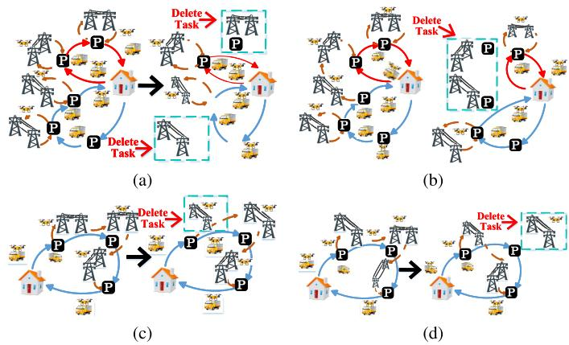  
Fig. 4. Destruction strategy definition diagram.

UAV $x ^ { \prime } s$ air inspection mission $( y _ { g _ { i }  a _ { j } } ^ { x , \nu _ { k } } ~ = ~ 1 ~ o r ~ z _ { a _ { j }  g _ { j } } ^ { x , \nu _ { k } } ~ = ~ 1 )$ then adjust the sequence of the $\mathrm { U A V } ^ { \bullet } \mathbf { s }$ inspection tasks by setting $y _ { g _ { i } \to a _ { j } } ^ { x , \nu _ { k } } = 1 \ o r \ z _ { a _ { j } \to g _ { j } } ^ { x , \nu _ { k } } = 1$ , as illustrated in Fig. $4 ( \mathrm { c } )$ Otherwise, repair the $\mathrm { U A V } ^ { \ , } \mathbf { s }$ air inspection task using the nearest neighbor approach, as depicted in Fig. 4(d). If the number of tasks in the $\mathrm { U A V } ^ { \ , } \mathbf { s }$ air inspection task, calculated as $\textstyle \sum _ { a _ { i } \in N ^ { F } } \sum _ { a _ { i } \in N ^ { F } } u _ { a _ { i } \to a _ { j } } ^ { x , \nu _ { k } }$ or $\textstyle \sum _ { a _ { i } \in N ^ { F } } \sum _ { a _ { i } \in N ^ { F } } u _ { a _ { j } \to a _ { i } } ^ { x , \nu _ { k } }$ , is less than or equal to 1, then directly remove the launch and recovery tasks for this UAV, and concurrently, remove potential task relay chain tasks as per Definition 3 to ensure that all constraints are satisfied.

The proposed task-chain destruction operator is designed to maintain solution feasibility, as proven below. Let $\begin{array} { r l } { S } & { { } = } \end{array}$ $\{ C _ { 1 } , C _ { 2 } , \ldots , C _ { n } \}$ be a solution set, where each element $C _ { i }$ is a task chain representing a complete drone mission. For each task chain $C _ { i } , C _ { j } \in S$ , let $V _ { l } ( C _ { i } )$ and $V _ { r } ( C _ { i } )$ denote its respective launch and recovery vehicles. A binary dependency relation, $\prec ,$ is defined over the set S . The successor set for a task chain $C _ { k }$ , denoted $\operatorname { S u c c } ( C _ { k } )$ , is the set of all task chains that are directly or indirectly dependent on $C _ { k }$ . This is defined by the transitive closure of the dependency relation: $\operatorname { S u c c } ( C _ { k } ) = \{ C _ { j } \in S \ | \ C _ { k } \prec ^ { * } \ C _ { j } \}$ , where $\prec ^ { * }$ is the transitive closure of ≺. For the solution set S to be considered valid, it must be closed with respect to the dependency’s predecessors. Formally, for any $C _ { j } \in S$ , if there exists a task chain $C _ { i }$ such that $C _ { i } < C _ { j } .$ , then it must also hold that $C _ { i } \in S$

Proposition: Let S be a feasible solution and let Φ be the task-chain removal operator defined as $\Phi ( S ) = S \ \backslash \ \{ C _ { \mathrm { t a r g e t } } \cup { }$ $\operatorname { S u c c } ( C _ { \mathrm { t a r g e t } } ) \}$ . The resulting solution $S ^ { * }$ is also feasible. Feasibility requires that any predecessor of a task chain in the solution (if present) must also be in the solution.

Proof: By contradiction, assume $S ^ { \prime }$ is infeasible. Then there exists $C _ { k } \in S ^ { \prime }$ such that its immediate predecessor $C _ { p }$ (satisfying $C _ { p } \prec C _ { k } )$ is not in $S ^ { \prime } . 1$ . Since $C _ { k }$ is in $S ^ { \prime } \subset S$ , and S is feasible, $C _ { p }$ is in $S _ { \cdot } \ 2 . \ C _ { p } \in S$ and $C _ { p } \notin S ^ { \prime }$ implies $C _ { p }$ is removed by operator Φ. Thus, $C _ { p } \in \{ C _ { \mathrm { t a r g e t } } \cup$ Succ( $\left. C _ { \mathrm { t a r g e t } } \right\}$ Hence, $C _ { \mathrm { t a r g e t } } \ < ^ { * } \ C _ { p }$ . Combining this with $C _ { p } \ \prec \ C _ { k }$ yields $C _ { \mathrm { t a r g e t } } < ^ { * } C _ { k }$ . This implies that $C _ { k }$ is a successor of $C _ { \mathrm { t a r g e t } } , \mathrm { i . e . } _ { \cdot }$ $C _ { k } \in \mathrm { S u c c } ( C _ { \mathrm { t a r g e t } } )$ . According to Φ, $\mathrm { S u c c } ( C _ { \mathrm { t a r g e t } } )$ should be removed, hence $C _ { k } \notin S ^ { \prime }$ . This contradicts the initial condition of the conclusion, thus proving the statement.

1) Air-Ground Node Random Destory Strategy(RANDOM): This strategy employs a random destruction mechanism, selecting a variable number of ground nodes or aerial inspection arcs for removal. The consequences of these removals are then propagated according to predefined rules. Specifically, the destruction of selected ground nodes $g _ { n } \in N _ { 0 } ^ { T }$ triggers the removal of their associated tasks, as governed by Definitions 2 and 3. Similarly, removing selected aerial inspection arcs $a _ { i }  a _ { j }$ results in the deletion of their corresponding tasks and potential relay chains, according to Definitions 3 and 4. By design, this approach significantly perturbs the current solution structure, thereby expanding the algorithm’s search space.

2) Similarity Destruction Strategy Based on High-Frequency Conflicts(SIM): To mitigate trafic congestion arising from concentrated UAV deployments, this study introduces a node similarity destruction strategy that leverages the geospatial distribution of tasks. The core of this strategy is a task gravity score—a composite metric calculated for each node that aggregates its own task density with the influence of its neighbors. Based on this score, the operator identifies core gravity nodes and subsequently removes surrounding nodes exhibiting high similarity in terms of task frequency and geographic distance. This targeted process dismantles regions of high task density to disrupt locally optimal configurations, creating opportunities for more efective solution reconstruction and ultimately enhancing overall inspection eficiency.

3) Worst Air-Ground Node Destruction Strategy(WORST): This strategy proposes a two-level destruction strategy that simultaneously targets sources of ineficiency on the ground and in the air. At the ground level, the strategy addresses vehicle congestion by calculating the occupancy time for each node $( \forall n \in N _ { 0 } ^ { T } )$ . These nodes are then sorted in descending order of their occupancy time to create a removal priority list, systematically deconstructing the most congested points and their associated aerial tasks. At the air level, the focus shifts to ineficient tasks, defined as those with long execution times and few inspection arcs. The operator then forms an aerial task deletion list by ranking these ineficient tasks, prioritizing the removal of the most time-consuming among them. This targeted, two-pronged approach serves as a fine-tuning mechanism, efectively relieving ground congestion and eliminating ineficient aerial tasks to enhance overall scheduling eficiency without disrupting core system functionality.

## E. Repair Operation

To eficiently integrate destroyed air inspection segments into existing UAV inspection tasks or ground nodes (generating new launch/recovery UAV tasks), we provide the following definition.

Definition $5 \colon$ For an existing drone’s launch/recovery $\mathrm { t a s k } ( \stackrel {  } { \alpha } _ { \nu _ { k } } ^ { g _ { i }  p } \oplus \beta _ { x } ^ { p  q } \oplus \alpha _ { \nu _ { k } } ^ { q  g _ { j } } )$ , the insertion of the disrupted inspection task $( a _ { i }  a _ { j } )$ is performed, there are three ways to insert it, specifically, it can be inserted after the vehicle launch task $( ( \alpha _ { \nu _ { k } } ^ { g _ { i } \to \hat { p } } \oplus \beta _ { x } ^ { ( a _ { i } \to a _ { j } \bar { ) } \vee ( a _ { j } \to a _ { i } ) } \oplus \beta _ { x } ^ { p \to q } \oplus \alpha _ { \nu _ { k } } ^ { q \to g _ { j } } ) )$ , before the recovery task $( ( \alpha _ { \nu _ { k } } ^ { \vec { g _ { i } }  p } \oplus \beta _ { x } ^ { p  q } \oplus \beta _ { x } ^ { ( a _ { i }  a _ { j } ) \lor ( a _ { j }  a _ { i } ) } \stackrel {  } { \oplus } \alpha _ { \nu _ { k } } ^ { a _ { i }  g _ { j } } ) )$ , and within the UAV inspection route $( \alpha _ { \nu _ { k } } ^ { g _ { i }  p } \oplus \beta _ { x } ^ { p  p ^ { \prime } } \oplus \beta _ { x } ^ { ( \hat { a } _ { i }  a _ { j } ) \vee ( a _ { j }  a _ { i } ) } \oplus \beta _ { x } ^ { q ^ { \prime }  q } \ : ,$ ⊕ $\alpha _ { \nu _ { k } } ^ { q  g _ { j } } )$ ).

Definition ${ \it 6 : }$ To construct a new UAV launch/recovery task, for any vehicle $\displaystyle \nu _ { k } ,$ traverse its task route $g _ { 1 }  g _ { L }$ . For the

UAV x carried by the vehicle, determine the set of ground nodes where the air arc can be inserted. This represents the segment of ground nodes $\Omega _ { \nu _ { k } } ^ { x }$ where the vehicle carries the UAV along its continuous path.

First, obtain all the nodes $\Omega _ { \nu _ { k } } ^ { x } = g _ { i } | 1 \leq i \leq L , p _ { g _ { i } } ^ { x , \nu _ { k } } = 1$ where UAV x was carried by vehicle $\nu _ { k }$ throughout its entire route (not necessarily contiguous). To describe the contiguous segments of UAV x carried along vehicle path $\nu _ { k } ,$ , we define an index set $\mathcal { R } _ { \nu _ { k } } ^ { x } = \{ 1 , 2 , \dots \} r _ { \operatorname* { m a x } } \}$ . For each $r \in \mathcal { R } _ { \nu _ { k } } ^ { x }$ , define the segment $\Omega _ { \nu _ { k } } ^ { x , \ddot { r } } = ( g _ { s _ { r } } , g _ { s _ { r } + 1 } , . . . , g _ { e _ { r } } )$ where $1 \leq s _ { r } \leq e _ { r } \leq L$ represents the starting and ending node indices of the segment, which satisfies the following conditions.

1) Continuous Carry Phase: $\forall i \in [ s _ { r } , e _ { r } ] , p _ { g _ { i } } ^ { x , \nu _ { k } } \ = \ 1$ , The UAV x is continuously carried by the vehicle form node $s _ { r }$ to node $e _ { r }$

2) No launch tasks at adjacent nodes: Within the segment: For all arcs within the segment $s _ { r } \leq i \leq e _ { r } ,$ no UAV launch tasks are triggered, i.e., $b _ { g _ { i }  g _ { i + 1 } } ^ { x , \nu _ { k } , \nu _ { m } } = 0 , \forall i = s _ { r } , s _ { r } +$ $1 , \ldots , e _ { r } - 1$

3) Boundary conditions (start of the region): A new continuous carrying segment oficially begins at node $s _ { r }$ when any of the following conditions are met: 1.The vehicle path starts carrying at the first node, i.e., $s _ { r } = 1 ; 2$ . The UAV has not been following the vehicle prior to this node, i.e. $, p _ { s _ { r } - 1 } ^ { x , \nu _ { k } } = 0 .$ A UAV launch or recovery task is triggered on the arc $( g _ { s _ { r } - 1 } \to g _ { s _ { r } } )$ , i.e., $b _ { g _ { s _ { r } - 1 } \to g _ { s _ { r } } } ^ { x , \nu _ { k } , \nu _ { m } } = 1$

4) Boundary conditions (end of the region): The “continuous carrying” segment ends at node $e _ { r }$ when any of the following conditions are met: 1. $\begin{array} { r } { e _ { r } \ = \ L , } \end{array}$ indicating that the segment extends to the last node of the vehicle path. 2.The UAV is no longer following the vehicle at the next node, i.e., $p _ { g _ { e r } + 1 } ^ { x , \nu _ { k } } = 0$ 3.A UAV launch task occurs on the arc $( g _ { e _ { r } }  g _ { e _ { r } + 1 } )$

The above constraints ensure that $\Omega _ { \nu _ { k } } ^ { x , r }$ , represents the continuous UAV carrying segment, where each node within this segment is capable of executing a UAV launch task. By combining these segments, the potential solution space that can be inserted is obtained, $\mathrm { i . e . , } \Omega _ { \nu _ { k } } ^ { x } = \cup _ { r \in \mathcal { R } _ { \nu _ { k } } ^ { x } } \Omega _ { \nu _ { k } } ^ { x , r }$ , meaning the segments do not overlap in terms of node indices. Each node (if $p \ : = \ : 1 )$ belongs to exactly one segment; if a node does not carry UAV $x ,$ it is not part of any of the aforementioned segments.

1) Insertion Strategy Based on Greedy Strategy(GREEDY): The Greedy (GRE) strategy is the most straightforward approach. For each arc pending reinsertion, it calculates the cost increment ∆T (typically the additional travel time) for every feasible insertion position. It then deterministically selects the insertion with the minimum $\Delta T$ . This process is repeated until all arcs are reinserted. The formal selection is: $( g _ { n } ^ { * } , \nu _ { k } ^ { * } , x ^ { * } , i ^ { * } ) = a r g _ { ( g _ { \ast } ^ { * } , \nu _ { k } ^ { * } , x ^ { * } , i ^ { * } ) \in S } m i n R .$

, , , , , ,2) Insertion Strategy Based on Regret Value(GRET): To mitigate the myopic nature of the GRE strategy, a Regretbased heuristic is employed. This strategy considers not only the best insertion cost but also the penalty for failing to select it. The procedure for each iteration is as follows: 1.For each remaining removed arc, identify its two best feasible insertion positions and their respective cost increments, $\Delta T _ { b e s t }$ and $\Delta T _ { s e c o n d } .$ 2. Calculate a regret value for each arc, defined as $R = \Delta T _ { s e c o n d } - \Delta T _ { b e s t } . ~ 3$ . Select the arc with the maximum regret value. This arc is considered the most urgent, as the cost of choosing its second-best option is highest. 4. Insert the selected arc into its best position (the one corresponding to $\Delta T _ { b e s t } )$

3) Noise-Based Random Insertion Strategy(NOISE): The Noise-based strategy introduces stochasticity to escape local optima. While the GRE strategy always selects the best move, this approach allows for the selection of suboptimal moves with a certain probability. For a given arc to be inserted, the operator first computes the cost increment $\Delta T _ { j }$ for each feasible insertion position j. Then, instead of a deterministic choice, it employs a roulette wheel selection mechanism. The probability $\Delta P _ { j }$ of selecting position j is made inversely proportional to its cost(e.g., $\begin{array} { r } { P _ { j } \propto \frac { 1 } { \Delta T _ { j } } ) } \end{array}$ . This method maintains a strong bias toward high-quality insertions while still allowing for diversification in the search process.

## V. COMPUTATIONAL EXPERIMENTS

This section details the computational experiments designed to comprehensively evaluate the proposed MUMV-CIVRP-BLRN model and M-SIALNS algorithm. Our evaluation is structured in four parts. First, we generate benchmark instances of varying scales based on the Solomon dataset and benchmark M-SIALNS against several state-of-the-art algorithms. Second, we conduct an ablation study to analyze the internal mechanisms of M-SIALNS, specifically assessing the contribution of each proposed destroy-and-repair operator. Third, a parameter sensitivity analysis is performed to refine the algorithm’s configuration and derive managerial insights regarding the optimal fleet composition and mission scale. Finally, to assess the practical applicability and generalizability of our approach, we present a case study using a real-world power grid topology, testing the model’s transferability across diferent operational contexts.

## A. Benchmark Instance Generation and Parameter Setting

Given the absence of established benchmarks for the MUMV-CIVRP-BLRN, we generated a new test suite by adapting the Solomon instances (C: clustered, R: random, RC: mixed) [24]. To simulate the sparse, locally connected structure of real-world power grids, we constructed inter-node connections using a distance-based, probability-decreasing strategy. The resulting instances were categorized into five scales based on their size and geographical scope: small (50 inspection arcs, $3 0 \times 3 0$ km), medium (100 inspection arcs, $5 0 \times 5 0 ~ \mathrm { k m } )$ , large (200 inspection arcs, 100 × 100 km), and super-large (300–500 inspection arcs, $1 5 0 \times 1 5 0$ km to $2 0 0 ~ \times$ 200 km). The composition and naming convention of the test set are detailed in Table II. For example, the instance name R1 6 1-U300-R200-(8:80) signifies a problem based on the Solomon R1 6 1 dataset, containing 300 aerial inspection arcs (U300) within a $2 0 0 \times 2 0 0$ km area (R200), and solved with a fleet of 8 vehicles and 80 UAVs (8:80), where each vehicle carries 10 UAVs. The experimental parameters are based on real-world hardware. UAV operations are modeled on the DJI M300 RTK, with a maximum flight endurance of 46 minutes and distinct speeds for travel(32.4 km/h) and inspection(28.8 km/h), compliant with the T/AOPA0053-2023 standard. The ground support platform is the Fuyazhifang V10, a vehicle-mounted auto-airport that can service up to four UAVs simultaneously. Vehicle speed is set to (60 km/h). To ensure statistical reliability, each test instance was run 30 independent times. Algorithm performance is evaluated using three primary metrics derived from the 30 independent runs: (1) Average Objective Function Value $( Z _ { A } )$ , representing the mean solution quality; (2) Average Improvement Rate (AIR%), calculated as the percentage improvement of our algorithm over the second-best performing algorithm; and (3) Stability

TABLE I NOTATIONS AND DESCRIPTIONS
<table><tr><td>Sym.</td><td>Description</td></tr><tr><td> $N$ </td><td>All network nodes;  $N = N ^ { F } \cup N ^ { T } , N ^ { F } \cap N ^ { T } = \emptyset$ </td></tr><tr><td> $A$ </td><td>All arcs among nodes;  $A = A ^ { F } \cup A ^ { T }$ </td></tr><tr><td> $A ^ { T }$ </td><td>Set of arcs in the ground network</td></tr><tr><td> $A ^ { F }$ </td><td>Set of arcs in the air network</td></tr><tr><td> $N ^ { T }$ </td><td>Set of ground network nodes;  $N ^ { T } = \{ g _ { 1 } , g _ { 2 } , . . . , g _ { i } , . . . , g _ { \left| N ^ { T } \right| } \}$ </td></tr><tr><td> $N ^ { F }$ </td><td>Set of air network nodes;  $N ^ { F } = \{ a _ { 1 } , a _ { 2 } , \dotsc , a _ { i } , \dotsc , a _ { \lfloor N ^ { F } \rfloor } \}$ </td></tr><tr><td> $V$ </td><td>Set of vehicles;  $V = \{ v _ { 1 } , v _ { 2 } , \ldots , v _ { k } , \ldots , v _ { | V | } \}$ </td></tr><tr><td> $l _ { g _ { i }  g _ { j } }$ </td><td>Distance on arc  $( g _ { i } \to g _ { j } )$  in the ground network</td></tr><tr><td> $l _ { a _ { i }  a _ { j } }$ </td><td>Inspection distance on arc  $( a _ { i }  a _ { j } )$  in the air network</td></tr><tr><td> $e$ </td><td>UAV endurance time</td></tr><tr><td> $\bar { v } _ { u }$ </td><td>Average inspection speed of  $\mathrm { U A V s }$ </td></tr><tr><td> ${ \bar { v } } _ { t }$ </td><td>Average speed of vehicles</td></tr><tr><td> $t l$ </td><td>UAV launch time</td></tr><tr><td> $t r$ </td><td>UAV recovery time</td></tr><tr><td> $M$ </td><td>A sufficiently large positive value</td></tr><tr><td>ε</td><td> $\mathbf { A }$  sufficiently small positive value</td></tr><tr><td> $t _ { g _ { i }  g _ { j } } ^ { v _ { k } }$   $a t _ { q _ { i } } ^ { v _ { k } }$ </td><td>Operation time of vehicle  $v _ { k }$  on the ground network arc  $( g _ { i } \to g _ { j } )$  Arrival time of vehicle  $v _ { k }$  at ground network node gi</td></tr><tr><td> $d t _ { g _ { i } } ^ { v _ { k } }$ </td><td>Departure time of vehicle  $v _ { k }$  from ground network node  $g _ { j }$ </td></tr><tr><td> $a n _ { g _ { i } } ^ { v _ { k } }$ </td><td>Number of UAVs carried by vehicle  $v _ { k }$  upon arriving at ground network node  $g _ { i }$ </td></tr><tr><td> $d n _ { g _ { j } } ^ { v _ { k } }$ </td><td>Number of UAVs carried by vehicle  $v _ { k }$  upon departing from ground network node  $g _ { j }$ </td></tr><tr><td> ${ \mathit { s t } } _ { g _ { i } } ^ { v _ { k } }$ </td><td>Operation time of vehicle  $v _ { k }$  at node  $g _ { i }$ </td></tr><tr><td> $p _ { g _ { i } } ^ { x , v _ { k } }$ </td><td>Binary decision variable that captures whether UAV x is carried vehicle vk at node gi</td></tr><tr><td> $b _ { g _ { i }  g _ { j } } ^ { x , v _ { k } , v _ { m } }$ </td><td>Binary decision variable that captures whether vehicle  $v _ { k }$  launches</td></tr><tr><td></td><td> $\mathrm { U A V } \ x \ \mathrm { a t }$  node  $g _ { i }$  and vehicle  $v _ { m }$  recovers  $\mathrm { U A V }$  x at node  $g _ { j }$ </td></tr><tr><td> $u _ { g _ { i }  g _ { j } } ^ { v _ { k } }$ </td><td>Binary decision variable that captures whether vehicle  $v _ { k }$  traverses</td></tr><tr><td> $c _ { g _ { i } } ^ { v _ { k } , v _ { m } }$ </td><td>the ground network arc  $( g _ { i } \to g _ { j } )$ </td></tr></table>

<table><tr><td colspan="2">UAV-related Decision Variables</td></tr><tr><td> $t _ { a _ { i }  a _ { j } } ^ { x , v _ { k } }$ </td><td>Operation time of the x-th UAV of vehicle  $v _ { k }$  on the air network arc  $( a _ { i }  a _ { j } )$ </td></tr><tr><td> $t _ { g _ { i }  a _ { j } } ^ { x , v _ { k } }$ </td><td>Operation time of the x-th UAV of vehicle  $v _ { k }$  from ground network node  $g _ { i }$  to air network node  $a _ { j }$ </td></tr><tr><td> $t _ { a _ { i }  g _ { j } } ^ { x , v _ { k } }$ </td><td>Operation time of the x-th UAV of vehicle  $v _ { k }$  from air network node  $a _ { i }$  to ground network node  $g _ { j }$ </td></tr><tr><td> $t _ { g _ { i } } ^ { x , v _ { k } }$ </td><td>Operation time of the x-th UAV of vehicle  $v _ { k }$  after being launched at node  $g _ { i }$ </td></tr><tr><td> $a t _ { a , i } ^ { x , v _ { k } }$   $d t _ { a _ { i } } ^ { x , v _ { k } }$   $u _ { a _ { i }  a _ { j } } ^ { x , \tilde { v } _ { k } }$ </td><td>Arrival time of the x-th UAV of vehicle  $v _ { k }$  at node  $a _ { i }$  Departure time of the x-th UAV of vehicle  $v _ { k }$  from node  $a _ { j }$  Binary decision variable that captures whether the x-th UAV of vehicle  $v _ { k }$  performs an inspection task on the air network arc</td></tr><tr><td> $y _ { g _ { i }  a _ { i } } ^ { x , v _ { k } }$ </td><td> $( a _ { i }  a _ { j } )$  Binary decision variable that captures whether vehicle vk launches the x-th UAV from ground network node 4  $g _ { i }$  to air network node  $a _ { i }$ </td></tr><tr><td> $z _ { a _ { j }  g _ { j } } ^ { x , v _ { k } }$ </td><td>Binary decision variable that captures whether vehicle 1  $v _ { k }$  recovers the x-th UAV from air network node  $a _ { j }$  to ground network node  $g _ { j }$ </td></tr></table>

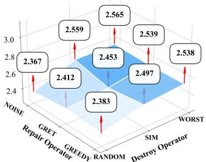  
(a) Ablation Study(Small Scale)

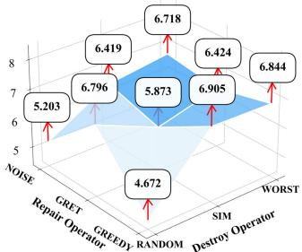  
(b) Ablation Study(Middle Scale)

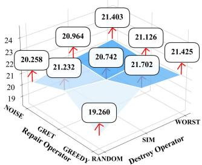  
(c) Ablation Study(Large Scale)

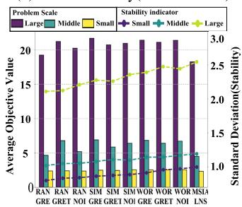  
(d) Performance Comparison with MSIALNS  
Fig. 5. Analysis diagram of operator combination ablation experiments in M-SIALNS.

Index (SI), measuring the consistency of the results across runs. We also report the best $( Z _ { B } )$ and worst $( Z _ { L } )$ objective values obtained.

As shown in Table II, a comprehensive empirical evaluation of the proposed M-SIALNS algorithm was conducted through a systematic comparison with a series of state-of-theart benchmark algorithms across small, medium, large, and ultra-large-scale instances. The results demonstrate that the M-SIALNS algorithm exhibits superior performance in terms of solution quality, convergence stability, and computational robustness. For small-scale instances, the M-SIALNS algorithm demonstrates strong optimization capabilities. Specifi cally, its resulting objective function values are, on average, 2.5% lower than those achieved by the next-best performing algorithm. For medium-to-large-scale instances (U100–U200), the performance advantage of M-SIALNS becomes more pronounced as problem complexity increases. In medium-scale instances, M-SIALNS achieved an average reduction in the objective function value ranging from 7.97% to 10.22%. As the scale increased to large instances (U200), this performance gap widened further, with the average improvement in the objective function value reaching 9.76% to 11.84%. For super-largescale instances (U300–U500), the vast combinatorial search space causes traditional algorithms to be highly susceptible to premature convergence on local optima. In contrast, M-SIALNS leverages its customized task chain break-andrepair mechanism and air-ground coordination strategy to facilitate eficient and extensive exploration within the strictly constrained solution space. For instance, in the R1 6 1- U500-R150-(8:80) instance, M-SIALNS achieved an average objective value of 24.14, representing a performance improvement of 11.0% and 13.3% over the second-best ALNS-GTIS (27.14) and the advanced T-ALNS (27.85), respectively. This robust performance is attributed to two of the algorithm’s core strengths: (1) Its clustering-based heuristic mechanism generates high-quality initial solutions, providing strong starting points for the iterative search process; and (2) The highly customized disruption and repair operators enhance local exploration capabilities, efectively preventing premature convergence to local optima.

TABLE II  
ALNS, VNS, SA-VNS, T-ALNS, ALNS-GTIS TEST RESULTS ON SMALL, MEDIUM, LARGE AND SUPER LARGE SCALE CASES
<table><tr><td rowspan=1 colspan=28>M-SIALNS               ALNS               VNS              SA-VNS             T-ALNS           ALNS-GTIS</td></tr><tr><td rowspan=1 colspan=28>Instances     ZLZBZAAIR%SIATZLZBZA SI ATZLZBZA SI ATZLZBZA SI ATZLZBZASI ATZLZBZASI AT</td></tr><tr><td rowspan=1 colspan=28>R101/RC101-U508.58 6.927.92 1.6%4.4358 9.117.308.435.0453 9.177.368.475.04608.947.168.274.95598.827.088.154.7857 8.716.998.054.7255-R30-(1:1)</td></tr><tr><td rowspan=1 colspan=1>R101/RC101-U50-R30-(1:2)</td><td rowspan=1 colspan=1>6.40</td><td rowspan=1 colspan=1>4.49</td><td rowspan=1 colspan=1>5.40</td><td rowspan=1 colspan=1>0.0%</td><td rowspan=1 colspan=1>4.04</td><td rowspan=1 colspan=1>56</td><td rowspan=1 colspan=1>6.72</td><td rowspan=1 colspan=1>4.80</td><td rowspan=1 colspan=2>5.744.20</td><td rowspan=1 colspan=1>50</td><td rowspan=1 colspan=1>6.78</td><td rowspan=1 colspan=1>4.82</td><td rowspan=1 colspan=2>5.774.25</td><td rowspan=1 colspan=1>62</td><td rowspan=1 colspan=1>6.59</td><td rowspan=1 colspan=1>4.71</td><td rowspan=1 colspan=1>5.63</td><td rowspan=1 colspan=1>4.12</td><td rowspan=1 colspan=1>60</td><td rowspan=1 colspan=1>6.39</td><td rowspan=1 colspan=1>4.64</td><td rowspan=1 colspan=1>5.554.01</td><td rowspan=1 colspan=1>58</td><td rowspan=1 colspan=1>6.40</td><td rowspan=1 colspan=1>4.495.404.0457</td></tr><tr><td rowspan=1 colspan=1>R101/RC101-U50-R30-(1:3)</td><td rowspan=1 colspan=1>4.58</td><td rowspan=1 colspan=1>3.46</td><td rowspan=1 colspan=1>3.74</td><td rowspan=1 colspan=1>0.0%</td><td rowspan=1 colspan=1>1.36</td><td rowspan=1 colspan=1>55</td><td rowspan=1 colspan=1>4.90</td><td rowspan=1 colspan=1>3.65</td><td rowspan=1 colspan=2>3.981.49</td><td rowspan=1 colspan=1>51</td><td rowspan=1 colspan=1>4.92</td><td rowspan=1 colspan=1>3.68</td><td rowspan=1 colspan=2>4.001.45</td><td rowspan=1 colspan=1>65</td><td rowspan=1 colspan=1>4.81</td><td rowspan=1 colspan=1>3.58</td><td rowspan=1 colspan=1>3.91</td><td rowspan=1 colspan=1>1.46</td><td rowspan=1 colspan=1>62</td><td rowspan=1 colspan=1>4.73</td><td rowspan=1 colspan=1>3.46</td><td rowspan=1 colspan=1>3.781.40</td><td rowspan=1 colspan=1>56</td><td rowspan=1 colspan=1>4.59</td><td rowspan=1 colspan=1>3.463.741.3659</td></tr><tr><td rowspan=1 colspan=7>R101/RC101-U503.552.722.93 3.4%0.9060-R30-(1:4)</td><td rowspan=1 colspan=19>3.822.913.120.94493.822.923.140.97703.752.723.060.92653.532.723.02 0.9357</td><td rowspan=1 colspan=2>3.552.722.940.9162</td></tr><tr><td rowspan=1 colspan=28>R101/RC101-U10015.64 11.5813.768.45%9.2325019.29 14.8116.7313.0724319.2914.9816.7313.0725717.76 12.8315.46 11.7627817.6212.81 15.38 11.525917.23 12.52 15.03 11.08 280-R50-(2:2)</td></tr><tr><td rowspan=2 colspan=1>R101/RC101-U100-R50-(2:4)</td><td rowspan=3 colspan=1>8.69</td><td rowspan=3 colspan=2>7.758.09</td><td rowspan=3 colspan=1>8.48%</td><td rowspan=3 colspan=1>5.32</td><td></td><td></td><td></td><td></td><td></td><td></td><td></td><td></td><td></td><td></td><td></td><td></td><td></td><td></td><td></td><td></td><td></td><td></td><td></td><td></td><td></td><td></td></tr><tr><td rowspan=2 colspan=1>268</td><td rowspan=2 colspan=1>10.24</td><td rowspan=2 colspan=1>9.1</td><td rowspan=2 colspan=2>9.501.28</td><td rowspan=2 colspan=1>248</td><td rowspan=2 colspan=1>10.55</td><td rowspan=2 colspan=1>8.67</td><td></td><td></td><td></td><td></td><td></td><td></td><td></td><td></td><td></td><td></td><td></td><td></td><td></td><td></td></tr><tr><td></td><td rowspan=1 colspan=1>9.79</td><td rowspan=1 colspan=1>1.28</td><td rowspan=1 colspan=1>267</td><td rowspan=1 colspan=1>9.75</td><td rowspan=1 colspan=1>4.99</td><td rowspan=1 colspan=1>9.06</td><td rowspan=1 colspan=1>1.22</td><td rowspan=1 colspan=1>270</td><td rowspan=1 colspan=1>9.71</td><td rowspan=1 colspan=1>8.64</td><td rowspan=1 colspan=1>9.021.21</td><td rowspan=1 colspan=1>266</td><td rowspan=1 colspan=1>9.51</td><td rowspan=1 colspan=1>8.468.845.32297</td></tr><tr><td rowspan=1 colspan=1>-R50-(2:6)</td><td rowspan=1 colspan=1>8.41</td><td rowspan=1 colspan=1>6.52</td><td rowspan=1 colspan=1>7.82</td><td rowspan=1 colspan=1>10.22%</td><td rowspan=1 colspan=1>1.08</td><td rowspan=1 colspan=1>273</td><td rowspan=1 colspan=1>10.20</td><td rowspan=1 colspan=1>8.97</td><td rowspan=1 colspan=1>9.53</td><td rowspan=1 colspan=1>1.80</td><td rowspan=1 colspan=1>250</td><td rowspan=1 colspan=1>10.51</td><td rowspan=1 colspan=1>9.21</td><td rowspan=1 colspan=1>9.82</td><td rowspan=1 colspan=1>1.80</td><td rowspan=1 colspan=1>282</td><td rowspan=1 colspan=1>9.73</td><td rowspan=2 colspan=1>8.57</td><td rowspan=2 colspan=1>9.08</td><td rowspan=2 colspan=1>1.63</td><td rowspan=1 colspan=1>286</td><td rowspan=1 colspan=1>9.59</td><td rowspan=1 colspan=1>8.48</td><td rowspan=1 colspan=1>8.941.78</td><td rowspan=1 colspan=1>278</td><td rowspan=1 colspan=1>9.34</td><td rowspan=1 colspan=1>7.828.711.30299</td></tr><tr><td rowspan=1 colspan=1>R101/RC101-U100</td><td rowspan=3 colspan=1>9.19</td><td rowspan=3 colspan=1>5.97</td><td rowspan=1 colspan=1>7.65</td><td rowspan=1 colspan=1>7.97%</td><td rowspan=1 colspan=1>1.08</td><td rowspan=1 colspan=1>297</td><td rowspan=1 colspan=1>10.7</td><td rowspan=1 colspan=1>7.10</td><td rowspan=1 colspan=1>8.981</td><td rowspan=1 colspan=1>.97</td><td rowspan=1 colspan=1>2561</td><td rowspan=1 colspan=1>1.007</td><td rowspan=1 colspan=1>.32</td><td rowspan=1 colspan=1>9.25</td><td rowspan=1 colspan=1>1.97</td><td rowspan=1 colspan=1>205</td><td rowspan=1 colspan=1>10.18</td><td rowspan=1 colspan=1>6.71</td><td rowspan=1 colspan=1>8.53</td><td rowspan=1 colspan=1>1.76</td><td rowspan=1 colspan=1>2911</td><td rowspan=1 colspan=1>0.21</td><td rowspan=1 colspan=1>6.75</td><td rowspan=1 colspan=1>8.56 1.73</td><td rowspan=1 colspan=1>295</td><td rowspan=1 colspan=1>9.91</td><td></td></tr><tr><td rowspan=2 colspan=1>-R50-(2:8)</td><td></td><td></td><td></td><td></td><td></td><td></td><td></td><td></td><td></td><td></td><td></td><td></td><td></td><td></td><td></td><td></td><td></td><td></td><td></td><td></td><td></td><td></td><td></td><td></td><td></td></tr><tr><td></td><td></td><td></td><td></td><td></td><td></td><td></td><td></td><td></td><td></td><td></td><td></td><td></td><td></td><td></td><td></td><td></td><td></td><td></td><td></td><td></td><td></td><td></td><td></td><td rowspan=1 colspan=1>6.558.311.30330</td></tr><tr><td rowspan=1 colspan=1>R101/RC101-U200-R100-(4:4)</td><td rowspan=1 colspan=3>21.38 19.45 19.74</td><td rowspan=1 colspan=1>11.84%</td><td rowspan=1 colspan=2>6.52 1800</td><td rowspan=1 colspan=1>28.85</td><td rowspan=1 colspan=1>22.74</td><td rowspan=1 colspan=2>24.45 7.73</td><td rowspan=1 colspan=4>1800 28.85 23.36 24.86</td><td rowspan=1 colspan=1>7.73</td><td rowspan=1 colspan=1>1800</td><td rowspan=1 colspan=1>25.85</td><td rowspan=1 colspan=1>21.82</td><td rowspan=1 colspan=2>22.39 7.86</td><td rowspan=1 colspan=1>1800</td><td rowspan=1 colspan=1>25.74</td><td rowspan=1 colspan=1>20.34</td><td rowspan=1 colspan=2>22.87 7.74 1800</td><td rowspan=1 colspan=2>25.29 19.93 22.45 7.60 1800</td></tr><tr><td rowspan=1 colspan=1>R101/RC101-U200</td><td rowspan=1 colspan=2>17.93 16.15</td><td rowspan=1 colspan=1>17.30</td><td rowspan=1 colspan=1>10.64%</td><td rowspan=1 colspan=1>3.13</td><td rowspan=1 colspan=1>1800</td><td rowspan=1 colspan=1>25.47</td><td rowspan=1 colspan=1>20.46</td><td rowspan=1 colspan=1>22.01</td><td rowspan=1 colspan=1></td><td rowspan=1 colspan=1>1800</td><td rowspan=1 colspan=1>25.47</td><td rowspan=1 colspan=1>21.47</td><td rowspan=1 colspan=1>23.35</td><td rowspan=1 colspan=1>3.89</td><td rowspan=1 colspan=1>1800</td><td rowspan=1 colspan=1></td><td rowspan=1 colspan=1>18.57</td><td rowspan=1 colspan=1>20.32</td><td rowspan=1 colspan=1></td><td rowspan=1 colspan=1>1800</td><td rowspan=1 colspan=1>25.47</td><td rowspan=1 colspan=1>17.96</td><td rowspan=1 colspan=1>19.53 6.71</td><td rowspan=1 colspan=1>1800</td><td rowspan=1 colspan=2>21.52 17.80 19.36 3.76 1800</td></tr><tr><td rowspan=1 colspan=1>R101/RC101-U200-R100-(4:12)</td><td rowspan=1 colspan=1>17.48</td><td rowspan=1 colspan=1>15.63</td><td rowspan=1 colspan=1>16.46</td><td rowspan=1 colspan=1>9.76%</td><td rowspan=1 colspan=1>2.85</td><td rowspan=1 colspan=1>1800</td><td rowspan=1 colspan=1>22.36</td><td rowspan=1 colspan=1>20.38</td><td rowspan=1 colspan=1>21.97</td><td rowspan=1 colspan=1>3.39</td><td rowspan=1 colspan=1>1800</td><td rowspan=1 colspan=1>22.36</td><td rowspan=1 colspan=1>21.11</td><td rowspan=1 colspan=1>21.88</td><td rowspan=1 colspan=1>3.39</td><td rowspan=1 colspan=1>1800</td><td rowspan=1 colspan=1>22.36</td><td rowspan=1 colspan=1>17.14</td><td rowspan=1 colspan=1>18.24</td><td rowspan=1 colspan=1>4.48</td><td rowspan=1 colspan=1>1800</td><td rowspan=1 colspan=1>22.36</td><td rowspan=1 colspan=1>18.11</td><td rowspan=1 colspan=1>19.31 3.35</td><td rowspan=1 colspan=1>1800</td><td rowspan=1 colspan=1>20.98</td><td rowspan=1 colspan=1>18.03 19.23 3.34 1800</td></tr><tr><td rowspan=4 colspan=3>-R100-(4:16)</td><td rowspan=4 colspan=1>15.58</td><td rowspan=4 colspan=1>11.68%</td><td rowspan=4 colspan=1>2.16</td><td rowspan=4 colspan=1>1800</td><td rowspan=4 colspan=1>20.98</td><td rowspan=4 colspan=1>19.46</td><td rowspan=4 colspan=1>20.41</td><td rowspan=4 colspan=1>2.97</td><td rowspan=4 colspan=1>1800</td><td rowspan=4 colspan=1>20.98</td><td rowspan=4 colspan=1>19.63</td><td rowspan=4 colspan=1>20.10</td><td rowspan=4 colspan=1>2.97</td><td rowspan=4 colspan=1>1800</td><td rowspan=4 colspan=1>19.98</td><td></td><td></td><td></td><td></td><td></td><td></td><td></td><td></td><td></td><td></td></tr><tr><td rowspan=3 colspan=1>17.92</td><td rowspan=3 colspan=1>18.61</td><td rowspan=3 colspan=1>6.62</td><td rowspan=3 colspan=1>1800</td><td rowspan=3 colspan=1>19.83</td><td></td><td></td><td></td><td></td><td></td></tr><tr><td rowspan=2 colspan=1>17.31</td><td rowspan=2 colspan=1>17.795.53</td><td rowspan=2 colspan=1>1800</td><td></td><td></td></tr><tr><td rowspan=1 colspan=2>19.66 17.16 17.64 2.59 1800</td></tr><tr><td rowspan=1 colspan=1>R1_6_1-U300-R150-(6:24)</td><td rowspan=1 colspan=3>21.16 19.47 19.89</td><td rowspan=1 colspan=1>9.88%</td><td rowspan=1 colspan=1>4.50</td><td rowspan=1 colspan=1>3600</td><td rowspan=1 colspan=1>25.55</td><td rowspan=1 colspan=2>23.51 24.31</td><td rowspan=1 colspan=1>4.59</td><td rowspan=1 colspan=2>3600 26.22</td><td rowspan=1 colspan=3>24.12 24.94 5.13</td><td rowspan=1 colspan=2>3600 23.91</td><td rowspan=1 colspan=1>20.37</td><td rowspan=1 colspan=1>22.14</td><td rowspan=1 colspan=1>4.71</td><td rowspan=1 colspan=1>3600</td><td rowspan=1 colspan=1>22.80</td><td rowspan=1 colspan=1>19.43</td><td rowspan=1 colspan=1>21.11 4.85</td><td rowspan=1 colspan=1>3600</td><td rowspan=1 colspan=1>22.14 18.86</td><td rowspan=2 colspan=1>2050  4 3600</td></tr><tr><td rowspan=1 colspan=4>R1_6_1-U300-R150-(6:36)</td><td rowspan=1 colspan=1>5.11%</td><td rowspan=1 colspan=2>4.20 3600</td><td rowspan=1 colspan=1>25.08</td><td rowspan=1 colspan=1>22.96</td><td rowspan=1 colspan=1>24.21</td><td rowspan=1 colspan=1>4.06</td><td rowspan=1 colspan=1>3600</td><td rowspan=1 colspan=1>25.68</td><td rowspan=1 colspan=3>23.26 24.84 4.59</td><td rowspan=1 colspan=1>3600</td><td rowspan=1 colspan=1>22.82</td><td rowspan=1 colspan=1>19.44</td><td rowspan=1 colspan=1>21.13</td><td rowspan=1 colspan=1>3.55</td><td rowspan=1 colspan=1>3600</td><td rowspan=1 colspan=1>21.76</td><td rowspan=1 colspan=1>18.54</td><td rowspan=1 colspan=1>20.15 4.31</td><td rowspan=1 colspan=1>3600</td><td rowspan=1 colspan=1>21.13 18.00</td></tr><tr><td rowspan=5 colspan=4>R1_6_1-U300</td><td rowspan=5 colspan=1>7.63%</td><td rowspan=5 colspan=1>3.80</td><td rowspan=5 colspan=1>3600</td><td rowspan=5 colspan=1>23.25</td><td></td><td></td><td></td><td></td><td></td><td></td><td></td><td></td><td></td><td></td><td></td><td></td><td></td><td></td><td></td><td></td><td></td><td></td><td></td><td></td></tr><tr><td rowspan=4 colspan=1>21.41</td><td rowspan=4 colspan=1>22.26</td><td rowspan=4 colspan=1>3.15</td><td rowspan=4 colspan=1>3600</td><td rowspan=4 colspan=1>22.78</td><td rowspan=4 colspan=1>21.95</td><td rowspan=4 colspan=1>22.79</td><td rowspan=4 colspan=1>3.60</td><td></td><td></td><td></td><td></td><td></td><td></td><td></td><td></td><td></td><td></td><td></td><td></td></tr><tr><td rowspan=3 colspan=1>3600</td><td rowspan=3 colspan=1>21.03</td><td rowspan=3 colspan=1>17.91</td><td rowspan=3 colspan=1>19.47</td><td rowspan=3 colspan=1>4.02</td><td rowspan=3 colspan=1>3600</td><td rowspan=3 colspan=1>20.05</td><td rowspan=3 colspan=1>17.08</td><td></td><td></td><td></td><td></td></tr><tr><td rowspan=2 colspan=1>18.57.4.16</td><td rowspan=2 colspan=1>3600</td><td></td><td></td></tr><tr><td rowspan=1 colspan=1>19.47</td><td rowspan=1 colspan=1></td></tr><tr><td rowspan=1 colspan=4>-R150-(6:48)</td><td></td><td></td><td></td><td></td><td></td><td></td><td></td><td></td><td></td><td></td><td></td><td></td><td></td><td></td><td></td><td></td><td></td><td></td><td></td><td></td><td></td><td></td><td></td><td></td></tr><tr><td rowspan=4 colspan=4>R1_6_1-U300-R150-(6:60)</td><td rowspan=4 colspan=1>7.77%</td><td rowspan=4 colspan=1>3.50</td><td rowspan=4 colspan=1>3600</td><td rowspan=4 colspan=1>22.30</td><td rowspan=4 colspan=1>20.97</td><td rowspan=4 colspan=1>21.57</td><td rowspan=4 colspan=1>3.68</td><td rowspan=4 colspan=1>3600</td><td rowspan=4 colspan=1>21.67</td><td rowspan=4 colspan=2>21.3 21.06</td><td rowspan=4 colspan=1>3.30</td><td rowspan=4 colspan=1>3600</td><td rowspan=4 colspan=1>18.85</td><td rowspan=4 colspan=1>16.06</td><td></td><td></td><td></td><td></td><td></td><td></td><td></td><td></td><td></td></tr><tr><td rowspan=3 colspan=1>17.45</td><td rowspan=3 colspan=1></td><td rowspan=3 colspan=1>3600</td><td rowspan=3 colspan=1>17.98</td><td rowspan=3 colspan=1>15.31</td><td></td><td></td><td></td><td></td></tr><tr><td rowspan=2 colspan=1>16.653.41</td><td rowspan=2 colspan=1>3600</td><td></td><td></td></tr><tr><td rowspan=1 colspan=1></td><td rowspan=1 colspan=1>16.16 3.12 3600</td></tr><tr><td rowspan=1 colspan=6>R1_6_1-U50030.80 28.34 29.57 10.94% 3.85 4</td><td rowspan=1 colspan=10>800 43.50 37.06 40.28 4.25 4800 44.45 37.87 41.16 4.35 4</td><td rowspan=2 colspan=12>800 37.25 31.73 34.49 4.15 4800 35.52 30.26 32.89 4.45 4800 35.85 30.54 33.20 4.05 4800800 33.03 28.13 30.58 3.70 4800 31.50 26.83 29.17 3.95 4800 31.96 27.23 29.59 3.60 4800800 32.66 27.82 30.24 3.45 4800 31.15 26.54 28.85 3.70 4800 31.40 26.75 29.08 3.40 4800800 30.40 25.90 28.15 3.20 4800 29.00 25.70 27.85 3.45 4800 29.38 26.16 27.14 3.15 4800</td></tr><tr><td rowspan=1 colspan=16>R1_6_1-U50027.03 25.14 26.22 11.4% 3.55 4800 38.57 32.86 35.72 3.80 4800 39.42 33.58 36.50 3.90 4-R200-(8:48)R1_6_1-U50026.46 24.87 25.93 10.82% 3.25 4800 38.15 32.50 35.32 3.55 4800 38.99 33.21 36.10 3.65 4-R200-(8:64)R1_6_1-U50024.38 23.16 24.14 11.00% 3.19 4800 35.51 30.25 32.88 3.33 4800 36.29 30.91 33.60 3.40 4-R200-(8:80)</td></tr></table>

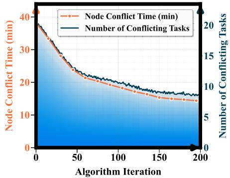  
(a) Small-Scale Scenario

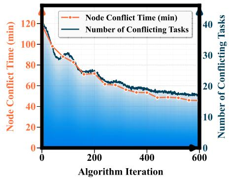  
(b) Middle-Scale Scenario

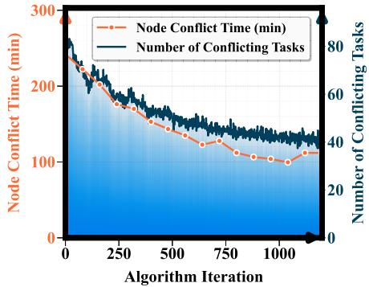  
(c) Large-Scale Scenario  
Fig. 6. Convergence curves of time conflicts resolved by MSIALNS.

## B. M-SIALNS Ablation Experiment and Node Conflict Mitigation

An ablation study was conducted to systematically evaluate the contributions of three destruction operators—Random, SIM, and WORST—and three repair operators—Greedy, REGRET, and NOISE. The experiments were performed on representative small, medium, and large-scale instances. The results are visualized in Fig. 5 as three-dimensional performance surfaces, which map each destruction-repair pairing to its corresponding average objective function value. The results in Fig. 5 indicate that all operator combinations yielded competitive objective function values and exhibited consistent trends across diferent scales. Among them, the RANDOM-GREEDY combination consistently yielded the poorest performance. This outcome is primarily attributed to the fact that pairing a non-guided random destruction method with a myopic greedy repair mechanism is highly susceptible to premature convergence on local optima. In contrast, both the WORST and SIM destruction operators demonstrate significant eficacy, particularly when paired with the GREEDY repair. The WORST-GREEDY combination improves upon other WORST-based pairings by an average of 2.5%, as it strategically deconstructs the most costly solution components, creating high-potential optimization opportunities. The SIM-GREEDY pairing is even more potent, achieving a 6.3% improvement over the baseline by dismantling similarity-based substructures to facilitate eficient, localized reconstruction. Notably, the RANDOM-NOISE combination demonstrated significant advantages, which are attributed to its introduction of controlled random perturbations into the greedy decisionmaking process. This mechanism enables the algorithm to escape local optima more efectively. This capability is visu ally evidenced by its consistent positioning in the low-lying regions (valleys) of the performance surface plot, corresponding to superior objective function values. To further evaluate the performance of the M-SIALNS algorithm in mitigating node conflicts, a series of experiments was conducted on benchmark task instances of small, medium, and large scales. Fig. 6 illustrates the progressive decrease in both the number of node conflicts and their total duration as the M-SIALNS algorithm iterates. Within Fig. 6, the area plot depicts the change in total ground node conflict duration over iterations, while the line chart tracks the corresponding number of conflicting tasks.

Vehicle-UAV Objective Functions Value for Middle-Scale Inspection Tasks-100 Inspection Arcs  
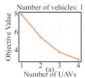

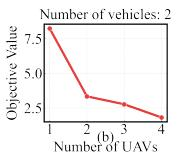

Vehicle-UAV Objective Functions Value for Small-Scale Inspection Tasks-50 Inspection Arcs  
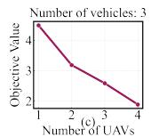

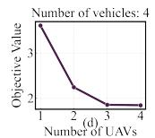

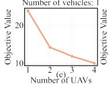

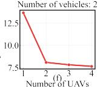

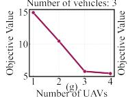

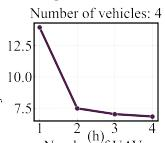

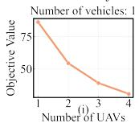

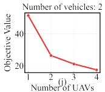

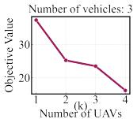

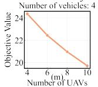

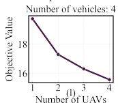

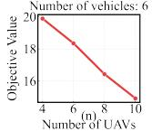

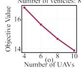

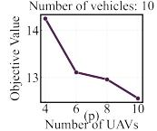

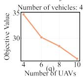

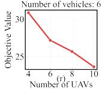

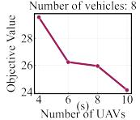

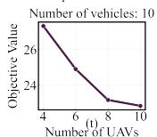  
Vehicle-UAV Objective Functions Value for Super-Large-Scale Inspection Tasks-500 Inspection Arcs  
Fig. 7. Objective function values for diferent vehicle-UAV configurations.

As shown in Fig. 6, the M-SIALNS algorithm steadily reduces both the node conflict duration and the number of conflicting tasks as the number of iterations increases. For small, medium, and large-scale instances, the algorithm reduced the number of conflicting tasks by approximately 28%, 35%, and 42%, respectively, while decreasing the total conflict duration by approximately 31%, 39%, and 45%. These results demonstrate the efectiveness of the M-SIALNS algorithm in addressing complex vehicle-UAV collaborative inspection problems.Notably, at certain points in the iterative process, a temporary increase in the overall conflict duration was observed despite a reduction in the number of local conflict tasks. This underscores the importance of avoiding local optima—i.e., myopic decisions—and making global trade-ofs during conflict resolution. The multi-strategy coordination mechanism embedded within M-SIALNS provides it with robust global exploration capabilities, enabling it to efectively escape local optima and ultimately yield high-quality solutions for vehicle-UAV collaborative inspection.

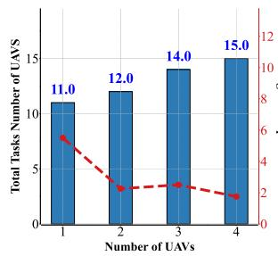  
(a) Vehicle Number = 2

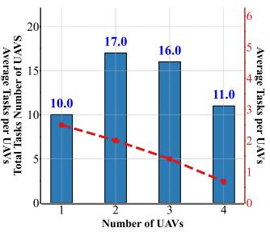  
(b) Vehicle Number = 4

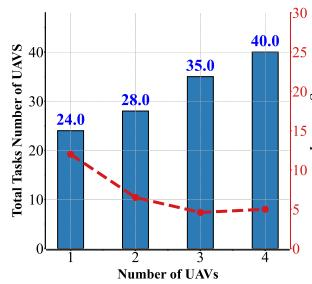

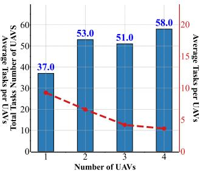  
(d) Vehicle Number = 4

(c) Vehicle Number = 2  
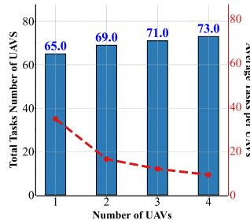  
(e) Vehicle Number = 2

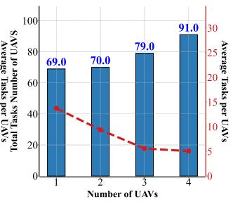  
(f) Vehicle Number = 4

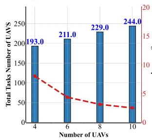

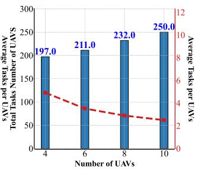  
(h) Vehicle Number = 8

(g) Vehicle Number = 6  
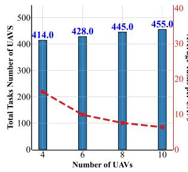  
(i) Vehicle Number = 6

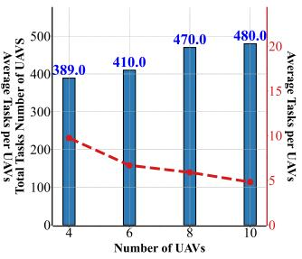  
(j) Vehicle Number = 8  
Fig. 8. Number of tasks for diferent vehicle-UAV configurations. (a-b) present 50 inspection arcs. (c-d) present 100 inspection arcs. (e-f) present 200 inspection arcs. (g-h) present 300 inspection arcs. (i-j) present 500 inspection arcs.

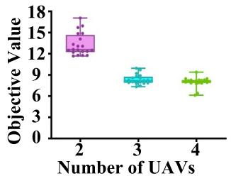  
(a) Box Plot of Objective Value Distribution (Vehicle Number=1)

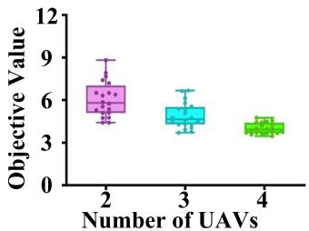  
(b) Box Plot of Objective Value Distribution (Vehicle Number=2)

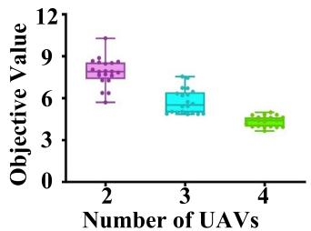  
(c) Box Plot of Objective Value Distribution (Vehicle Number=3)

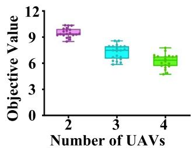  
(d) Box Plot of Objective Value Distribution (Vehicle Number=4)

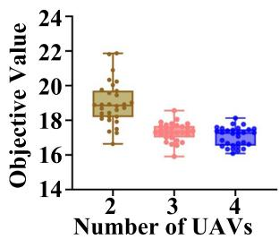  
(e) Box Plot of Objective Value Distribution (Vehicle Number=1)

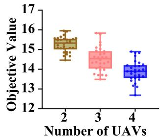  
(f) Box Plot of Objective Value Distribution (Vehicle Number=2)

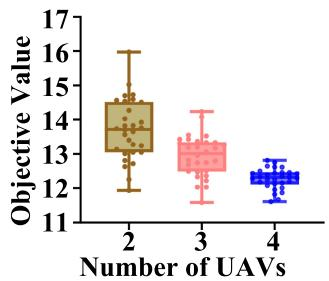  
(g) Box Plot of Objective Value Distribution (Vehicle Number=3)

  
(h) Box Plot of Objective Value Distribution (Vehicle Number=4)  
Fig. 9. Box plots of objective function values under various vehicle-UAV configurations, where subfigures (a–d) represent rural/complex mountainous scenarios and (e–h) depict urban environments.

## C. Insights and Thoughts on MUMV-CIVRP-BLRN Management Under Diferent Parameters

A comprehensive sensitivity analysis was conducted to systematically quantify the impact of varying vehicle-UAV resource allocations on collaborative inspection eficiency. This analysis evaluated the performance and scalability of the M-SIALNS algorithm across various geographical scales and task densities. The experimental design encompassed five problem scales, ranging from small to ultra-large, wherein vehicle-UAV configurations were systematically varied from (1:1) to (8:80). Fig. 7 illustrates the distribution of UAV inspection workloads across various typical operational scenarios and vehicle configurations. The bar chart displays the total workload completed by the entire UAV fleet, while the line chart plots the average workload per UAV.

As shown in Fig. 7 (a–d), system performance in small-scale scenarios exhibits significant sensitivity to resource allocation. For instance, under the single-vehicle configuration (a), increasing the number of UAVs improves inspection eficiency by 63%. However, as resource allocation is further expanded (e.g., to 2 vehicles and 8 UAVs or more), performance gains plateau or even slightly decline. This phenomenon indicates that system performance is ultimately constrained by path and node competition among agents within a limited geographic area. As the mission scale expands (e–h), the contribution of vehicles becomes more critical. When the number of vehicles is insuficient, adding Vehicles yields significant benefits; however, once an adequate number of vehicles is deployed, increasing only the number of UAVs leads to sharply diminishing marginal returns (g-h). This pattern indicates that the primary bottleneck has shifted from UAV coverage capacity to the coordination and support capabilities of vehicles. Therefore, a balanced and coordinated scaling of both vehicles and UAVs is critical for improving performance, but this must occur within the system’s capacity for efective resource uti lization to avoid redundancy. This pattern is further amplified in super-large-scale tasks, which exhibit a clear phenomenon of diminishing marginal returns. For instance, a comparison of scenarios (o) and (p) shows that adding UAVs yields a 17.9% eficiency gain when the number of vehicles is low; however, this gain decreases to 11.9% when the number of vehicles is higher. This finding indicates that once resource allocation reaches a certain density, the marginal contribution of deploying additional agents (either vehicles or UAVs) to overall system performance diminishes significantly.

Fig. 8 shows that in small-scale scenarios, increasing the number of UAVs generally improves system performance(Inspection eficiency). Additional UAVs can reduce redundant movements and vehicle waiting times, thereby enhancing overall inspection eficiency. However, this trend is not linear. In configurations (a-b), the number of tasks completed by UAVs first increases and then decreases, mirroring the pattern of diminishing returns observed for the objective function in Fig. 7. This trade-of is also evident in mediumto large-scale tasks (c-f), where adding more UAVs yields only limited reductions in the objective function, indicating that the benefits of parallel task execution are ofset by rising coordination costs and scheduling complexity. Consequently, optimizing the vehicle-UAV configuration within the system’s capacity is crucial for maximizing performance. In the largestscale tasks (g-j), the number of tasks completed by UAVs shows a significant positive correlation with the total fleet size. This suggests that when system resources are not yet saturated, deploying more UAVs remains an efective strategy for reducing the objective function value. However, to maintain this eficiency and prevent performance degradation from excessive system load, it is crucial to determine the optimal agent configuration that balances workload and resource utilization.

## D. Migratory Experiment Analysis

To further assess the applicability of the proposed framework, a comparative evaluation was conducted in a simulated urban environment alongside the original complex (e.g., mountainous) environment. The urban scenarios incorporated four key modifications to reflect real-world conditions: (1) higher task density; (2) a reduced vehicle-UAV communication range (1.5 km) due to signal obstruction; (3) lower vehicle speeds (40 km/h) to account for trafic congestion; and (4) relaxed routing constraints, such as disregarding node occupancy conflicts, to model a well-connected grid network. Test instances for both environments were generated following the methodology described in Section V-A and utilizing line distribution data from [36]. Each configuration, consisting of 1 to 4 vehicles and 2 to 4 uavs, was evaluated in thirty independent simulations to ensure statistical robustness. The comparative results, presented as box plots in Fig. 9, compare the solution quality distributions across these two distinct operational settings.

As shown in Fig. 9, the median objective function values across all experimental groups show a significant downward trend as the numbers of vehicles and UAVs are increased in coordination. These results indicate that the proposed model and algorithm are highly adaptable and capable of solving vehicle-UAV collaborative inspection tasks in diverse environments. This confirms that increasing the number of agents is an efective strategy for enhancing the eficiency of resource allocation. The analysis further reveals that the optimal resource configuration is context-dependent. For instance, a 3:4 vehicle-to-UAV ratio proved optimal in complex environments, whereas a 4:4 ratio was superior in urban settings. This disparity is attributed to the less restrictive vehicle routing constraints in urban environments, where additional vehicles contribute more efectively to eficiency. Nevertheless, for both scenarios, deploying an excessive number of agents leads to diminishing returns due to resource redundancy. This underscores the criticality of tailoring the fleet composition to the specific operational environment to maximize performance. Therefore, by tailoring key parameters and constraints to specific operational contexts, the proposed model and algorithm are broadly applicable to a wide range of multi-agent collaborative applications, such as agricultural monitoring and infrastructure inspection.

## VI. CONCLUSION

This study formulated the Multi-UAV–Multi-Vehicle Collaborative Inspection Vehicle Routing Problem in a Bi-Layer Road Network (MUMV-CIVRP-BLRN), a novel framework that captures the complexities of real-world inspection missions. To solve this NP-hard problem, we developed the M-SIALNS algorithm, which integrates bi-layer destruction–repair operators and a cluster-based initialization strategy. Extensive computational experiments demonstrate that M-SIALNS consistently outperforms benchmark algorithms in both solution quality and stability. Beyond methodological contributions, the study also provides managerial insights by clarifying the relationship between fleet configuration and operational eficiency. Results show that an optimal vehicle–UAV ratio significantly improves performance, while identifying thresholds where additional resources yield diminishing marginal returns. These findings ofer practical guidelines for designing cost-efective vehicle–UAV collaborative inspection systems.

Future research will extend this work by considering environmental uncertainties such as wind disturbances and positioning errors, incorporating nonlinear UAV energyconsumption models, and optimizing energy eficiency under practical constraints including time windows and mission urgency. To achieve adaptive decision-making in dynamic environments, we plan to develop advanced reinforcement learning algorithms, thereby further enhancing the robustness of the proposed model and strengthening its applicability in real-world inspection scenarios.

## VII. DECLARATION OF COMPETING INTEREST

The authors declare that they have no known competing financial interests or personal relationships that could have appeared to influence the work reported in this article.

## REFERENCES

[1] H. Li, J. Chen, F. Wang, and M. Bai, “Ground-vehicle and unmannedaerial-vehicle routing problems from two-echelon scheme perspective: A review,” Eur. J. Oper. Res., vol. 294, no. 3, pp. 1078–1095, Nov. 2021.

[2] S. H. Chung, B. Sah, and J. Lee, “Optimization for drone and dronetruck combined operations: A review of the state of the art and future directions,” Comput. Oper. Res., vol. 123, Nov. 2020, Art. no. 105004.

[3] E. E. Elsayed, “Investigations on OFDM UAV-based free-space optical transmission system with scintillation mitigation for optical wireless communication-to-ground links in atmospheric turbulence,” Opt. Quantum Electron., vol. 56, no. 5, p. 837, Mar. 2024.

[4] M. R. Hayal et al., “Modeling and investigation on the performance enhancement of hovering UAV-based FSO relay optical wireless communication systems under pointing errors and atmospheric turbulence efects,” Opt. Quantum Electron., vol. 55, no. 7, p. 625, Jul. 2023.

[5] Amazon. (Jun. 2022). Amazon Prime Air Prepares for Drone Deliveries. U.S. About Amazon. [Online]. Available: https://www.aboutamazon.com/news/transportation/amazon-primeair-prepares-for-drone-deliveries

[6] C. C. Murray and A. G. Chu, “The flying sidekick traveling salesman problem: Optimization of drone-assisted parcel delivery,” Transp. Res. C, Emerg. Technol., vol. 54, pp. 86–109, May 2015.

[7] N. Agatz, P. Bouman, and M. Schmidt, “Optimization approaches for the traveling salesman problem with drone,” Transp. Sci., vol. 52, no. 4, pp. 965–981, Aug. 2018.

[8] Z. Wang and J. Sheu, “Vehicle routing problem with drones,” Transp. Res. B, Methodol., vol. 122, pp. 350–364, Apr. 2019.

[9] C. C. Murray and R. Raj, “The multiple flying sidekicks traveling salesman problem: Parcel delivery with multiple drones,” Transp. Res. C, Emerg. Technol., vol. 110, pp. 368–398, Jan. 2020.

[10] M. R. Salama and S. Srinivas, “Collaborative truck multi-drone routing and scheduling problem: Package delivery with flexible launch and recovery sites,” Transp. Res. E, Logistics Transp. Rev., vol. 164, Aug. 2022, Art. no. 102788.

[11] D. N. Das, R. Sewani, J. Wang, and M. K. Tiwari, “Synchronized truck and drone routing in package delivery logistics,” IEEE Trans. Intell. Transp. Syst., vol. 22, no. 9, pp. 5772–5782, Sep. 2021.

[12] Q. Luo, G. Wu, B. Ji, L. Wang, and P. N. Suganthan, “Hybrid multiobjective optimization approach with Pareto local search for collaborative truck-drone routing problems considering flexible time windows,” IEEE Trans. Intell. Transp. Syst., vol. 23, no. 8, pp. 13011–13025, Aug. 2022.

[13] R. Raj and C. Murray, “The multiple flying sidekicks traveling salesman problem with variable drone speeds,” Transp. Res. C, Emerg. Technol., vol. 120, Nov. 2020, Art. no. 102813.

[14] P. L. Gonzalez-R, D. Canca, J. L. Andrade-Pineda, M. Calle, and J. M. Leon-Blanco, “Truck-drone team logistics: A heuristic approach to multi-drop route planning,” Transp. Res. C, Emerg. Technol., vol. 114, pp. 657–680, May 2020.

[15] N. M. Imran, S. Mishra, and M. Won, “A-VRPD: Automating dronebased last-mile delivery using self-driving cars,” IEEE Trans. Intell. Transp. Syst., vol. 24, no. 9, pp. 9599–9612, Sep. 2023.

[16] H. Zhou, H. Qin, C. Cheng, and L.-M. Rousseau, “An exact algorithm for the two-echelon vehicle routing problem with drones,” Transp. Res. B, Methodol., vol. 168, pp. 124–150, Feb. 2023.

[17] P. Tokekar, J. V. Hook, D. Mulla, and V. Isler, “Sensor planning for a symbiotic UAV and UGV system for precision agriculture,” IEEE Trans. Robot., vol. 32, no. 6, pp. 1498–1511, Dec. 2016.

[18] J. Wang, G. Wang, X. Hu, H. Luo, and H. Xu, “Cooperative transmission tower inspection with a vehicle and a UAV in urban areas,” Energies, vol. 13, no. 2, p. 326, Jan. 2020.

[19] Y. Han et al., “Two-stage heuristic algorithm for vehicle-drone collaborative delivery and pickup based on medical supplies resource allocation,” J. King Saud Univ.-Comput. Inf. Sci., vol. 35, no. 10, Dec. 2023, Art. no. 101811.

[20] D. Schermer, M. Moeini, and O. Wendt, “A matheuristic for the vehicle routing problem with drones and its variants,” Transp. Res. C, Emerg. Technol., vol. 106, pp. 166–204, Sep. 2019.

[21] D. Sacramento, D. Pisinger, and S. Ropke, “An adaptive large neighborhood search metaheuristic for the vehicle routing problem with drones,” Transp. Res. C, Emerg. Technol., vol. 102, pp. 289–315, May 2019.

[22] P. Kitjacharoenchai, M. Ventresca, M. Moshref-Javadi, S. Lee, J. M. A. Tanchoco, and P. A. Brunese, “Multiple traveling salesman problem with drones: Mathematical model and heuristic approach,” Comput. Ind. Eng., vol. 129, pp. 14–30, Mar. 2019.

[23] M. Moshref-Javadi, S. Lee, and M. Winkenbach, “Design and evaluation of a multi-trip delivery model with truck and drones,” Transp. Res. E, Logistics Transp. Rev., vol. 136, Apr. 2020, Art. no. 101887.

[24] R. Gu, M. Poon, Z. Luo, Y. Liu, and Z. Liu, “A hierarchical solution evaluation method and a hybrid algorithm for the vehicle routing problem with drones and multiple visits,” Transp. Res. C, Emerg. Technol., vol. 141, Aug. 2022, Art. no. 103733.

[25] Q. Luo, G. Wu, A. Trivedi, F. Hong, L. Wang, and D. Srinivasan, “Multiobjective optimization algorithm with adaptive resource allocation for truck-drone collaborative delivery and pick-up services,” IEEE Trans. Intell. Transp. Syst., vol. 24, no. 9, pp. 9642–9657, Sep. 2023.

[26] J. Jiang, Y. Dai, F. Yang, and Z. Ma, “A multi-visit flexible-docking vehicle routing problem with drones for simultaneous pickup and delivery services,” Eur. J. Oper. Res., vol. 312, no. 1, pp. 125–137, Jan. 2024.

[27] P. Stodola and L. Kutej, “Multi-depot vehicle routing problem withˇ drones: Mathematical formulation, solution algorithm and experiments,” Expert Syst. Appl., vol. 241, May 2024, Art. no. 122483.

[28] R. J. Kuo, E. Edbert, F. E. Zulvia, and S.-H. Lu, “Applying NSGA-II to vehicle routing problem with drones considering makespan and carbon emission,” Expert Syst. Appl., vol. 221, Jul. 2023, Art. no. 119777.

[29] P. Bouman, N. Agatz, and M. Schmidt, “Dynamic programming approaches for the traveling salesman problem with drone,” Networks, vol. 72, no. 4, pp. 528–542, Dec. 2018.

[30] Y. Xia, W. Zeng, C. Zhang, and H. Yang, “A branch-and-price-and-cut algorithm for the vehicle routing problem with load-dependent drones,” Transp. Res. B, Methodol., vol. 171, pp. 80–110, May 2023.

[31] F. Zeng, Z. Chen, J.-P. Clarke, and D. Goldsman, “Nested vehicle routing problem: Optimizing drone-truck surveillance operations,” Transp. Res. C, Emerg. Technol., vol. 139, Jun. 2022, Art. no. 103645.

[32] S. T. Windras Mara, A. P. Rifai, and B. M. Sopha, “An adaptive large neighborhood search heuristic for the flying sidekick traveling salesman problem with multiple drops,” Expert Syst. Appl., vol. 205, Nov. 2022, Art. no. 117647.

[33] S. S. Ozarik, V. Lurkin, L. P. Veelenturf, T. Van Woensel, and G. Laporte,¨ “An adaptive large neighborhood search heuristic for last-mile deliveries under stochastic customer availability and multiple visits,” Transp. Res. B, Methodol., vol. 170, pp. 194–220, Apr. 2023.

[34] Y. Miao and X. Bao, “An improved genetic algorithm for solving the semi-soft clustered vehicle routing problem,” Appl. Sci., vol. 15, no. 9, p. 4871, Apr. 2025.

[35] J. Kim, A. Manna, A. Roy, and I. Moon, “Clustered vehicle routing problem for waste collection with smart operational management approaches,” Int. Trans. Oper. Res., vol. 32, no. 2, pp. 863–887, Mar. 2025.

[36] T. Zhou, “Research on route planning problem of vehicle and its mounted unmanned aerial vehicle with wire line inspection,” M.S. thesis, College Syst. Eng., Nat. Univ. Defense Technol., Changsha, China, 2018.

Miaohan Zhang received the B.E. degree in logistics engineering and the M.E. degree in transportation engineering from Kunming University of Science and Technology, Kunming, China, in 2021 and 2024, respectively. He is currently pursuing the Ph.D. degree with the College of Artificial Intelligence, Nankai University, Tianjin, China. His research interests include vehicle-UAV collaborative scheduling, operations research optimization, intelligent optimization algorithms, and deep reinforcement learning.

Yuanhao Xu is currently pursuing the B.E. degree in transportation engineering with the School of Civil Aviation and Aeronautics, Kunming University of Science and Technology, Kunming, China. His research interests include intelligent optimization algorithms, vehicle routing problems, and deep learning.

Xuewei Yu was born in China, in 1994. She received the bachelor’s degree in communication engineering from Nanjing University of Posts and Telecommunications, Nanjing, China, in 2016, and the master’s degree in vehicle engineering from China North Vehicle Research Institute, Beijing, China, in 2019. She is currently pursuing the Ph.D. degree in artificial intelligence with Nankai University, Tianjin, China. Her research interests include swarm intelligence and multirobot systems. Her main work experience includes her current research in swarm intelligence and multirobot systems.

Chunyan Zhang (Member, IEEE) received the Ph.D. degree in general and fundamental mechanics from Peking University, Beijing, China, in 2013. She is currently a Professor with the College of Artificial Intelligence, Nankai University, Tianjin, China. Her research interests include evolutionary game theory, swarm intelligence, distributed optimization, robotics, and mechatronics systems.

Jianlei Zhang (Member, IEEE) received the Ph.D. degree in general and fundamental mechanics from Peking University, Beijing, China, in 2014, and the Ph.D. degree in systems and control from the University of Groningen, Groningen, The Netherlands, in 2015. He is currently a Professor with the College of Artificial Intelligence, Nankai University, Tianjin, China. His research interests include swarm intelligence, distributed optimization, and mechatronics systems.