# MADDPG-Based Joint Service Placement and Task Offloading in MEC Empowered Air–Ground Integrated Networks

Jianbo Du , Member, IEEE, Ziwen Kong , Aijing Sun , Jiawen Kang , Senior Member, IEEE, Dusit Niyato , Fellow, IEEE, Xiaoli Chu , Senior Member, IEEE, and F. Richard Yu , Fellow, IEEE

Abstract—Multiaccess edge computing (MEC) empowered air–ground integrated networks (AGINs) hold great promise in delivering accessible computing services for users and Internet of Things (IoT) applications, such as forest fire monitoring, emergency rescue operations, etc. In this article, we present a comprehensive air–ground integrated MEC framework, where edge servers carried by unmanned aerial vehicles (UAVs) will provide efficient computation services to IoT devices and user equipment (UE) (which are collectively referred to as UEs). We aim to minimize the long-term average weighted sum of task completion delay and economic expenditure for all the UEs. This objective is achieved through various strategies, including preinstalling new service instances into UAVs, removing idle service instances from UAVs, task offloading decision making, access control, selecting appropriate service instances for each offloaded service request, and resource allocation optimization. Considering the complexity of the problem and the dynamics of the system, we reformulate the problem as a Markov decision process (MDP) and present a multiagent deep deterministic policy gradient (MADDPG)-based algorithm to enable low-complexity and realtime adaptive decision-making. Since our problem contains integer, binary and continuous variables, it is not straightforward to apply the MADDPG algorithm. Specifically, we first normalize the continuous variables, and then convert the continuous output generated by MADDPG into discrete variables, while ensuring the coupling constraints between different variables are preserved. The simulation results demonstrate the fast convergence of our proposed algorithm and its superior performance in minimizing costs compared with the baseline algorithms.

Manuscript received 18 June 2023; revised 14 September 2023; accepted 18 October 2023. Date of publication 24 October 2023; date of current version 7 March 2024. This work was supported in part by the Natural Science Foundation of China under Grant 62271391; in part by the Serving Local Special Scientific Research Project of Education Department of Shaanxi Province under Grant 21JC032; in part by the Horizon Europe Research and Innovation Program under Grant 101086219; in part by the UK Engineering and Physical Sciences Research Council (EPSRC) under Grant EP/X038971/1; and in part by the Guangdong Province Science and Technology Project under Grant 2023A0505050127. (Corresponding author: Aijing Sun.)

Jianbo Du, Ziwen Kong, and Aijing Sun are with the School of Communications and Information Engineering, Xi’an University of Posts and Telecommunications, Xi’an 710121, China (e-mail: dujianboo@163.com; kzw15877611325@163.com; sunaijing@xupt.edu.cn).

Jiawen Kang is with the School of Automation, Guangdong University of Technology, Guangzhou 511400, China (e-mail: kavinkang@gdut.edu.cn).

Dusit Niyato is with the School of Computer Science and Engineering, Nanyang Technological University, Singapore 639798 (e-mail: dniyato@ntu.edu.sg).

Xiaoli Chu is with the Department of Electronic and Electrical Engineering, The University of Sheffield, S1 3JD Sheffield, U.K. (e-mail: x.chu@sheffield.ac.uk).

F. Richard Yu is with the Systems and Computer Engineering, Carleton University, Ottawa, ON K1S 5B6, Canada (e-mail: Richard.Yu@carleton.ca).

Digital Object Identifier 10.1109/JIOT.2023.3326820

Index Terms—Air–ground integrated networks (AGINs), computation offloading, deep reinforcement learning (DRL), resource allocation, service deployment.

# I. INTRODUCTION

W ITH the rapid advancement of wireless communica-tions, terrestrial wireless networks are experiencing tions,terrestrial wireless networks are experiencing an unprecedented surge in traffic, resulting in overwhelming congestion and an increased risk of network collapse [1]. In recent years, the frequency of natural disasters, such as earthquakes and tsunamis, has significantly increased due to the degradation of the natural environment. In such critical situations, the swift establishment of a temporary communication network is of utmost importance [2], [3]. Furthermore, in mission-critical scenarios like forest fire monitoring, in remote areas, or ensuring on-site communication during major holiday gatherings, it is not practical to deploy ground communication infrastructures [4]. On the other hand, smart user equipment (UE) has become an indispensable tool in our daily life, and the Internet of Things (IoT) devices have also become ubiquitous. Many applications running on smart UEs and IoT devices (which are collectively referred to UEs) today are computation-intensive and resource-demanding [5], bringing great challenges to the processing capability and battery life of UEs [6], [7]. Multiaccess edge computing (MEC) [8] and air– ground integrated networks (AGINs), have been considered for addressing those challenges. Leveraging MEC and unmanned aerial vehicles (UAVs) for various IoT networks and wireless communication networks has emerged as a thriving research area in recent years.

MEC has been proposed as an efficient supplement to cloud computing [9]. By deploying computation and caching resources at edge nodes, MEC can empower UEs to run computation-intensive and resource-hungry applications, thereby reducing the task processing delay and the energy consumption [10]. In recent times, UAVs have emerged as valuable and practical tools for swiftly and cost-effectively deploying communication infrastructures. By equipping UAVs with MEC servers, UEs can benefit from reliable communication and efficient task processing services in various scenarios. Consequently, the research on MEC-empowered AGINs has become a prominent and dynamic area of study in recent years.

However, when combining MEC with UAVs, certain challenges need to be addressed.

1) While many studies primarily address task offloading process-related issues, it is crucial to note that the deployment of task applications on UAV edge servers should be given precedence. Only after deploying the task applications on UAV edge servers can the tasks be successfully offloaded to them.   
2) Given limited caching capabilities of UAVs [11], deploying all task applications on each individual UAV is not feasible. Therefore, it is imperative to design optimized service placement strategies [12] thus to minimize the service distance between UEs and their serving UAVs.   
3) Each UE has an option to either address its task locally by itself, or offload the task to a connected UAV. However, given that a UE might be covered by multiple UAVs, the question arises: Should the task be offloaded or not? If the decision is made to offload the task, determining the optimal UAV for the UE to access becomes crucial.   
4) When a UE is admitted and served by a UAV, the UAV has two options: a) it can either serve the UE with an available idle service instance that has already been deployed on the UAV or b) it can initialize a new service instance specifically to process the UE’s offloaded task. In this scenario, determining the best choice for the UAV is important.   
5) When multiple UEs offload tasks to the same UAV, then the UAV needs to allocate its available computation resources among the UEs in a thoughtful manner. Additionally, each UE should carefully design its transmit power given specific objectives, such as delay energy consumption and task processing cost.   
6) In UAV-based systems, the environment is typically highly dynamic, and the objectives are often defined with long-term considerations.

Given these factors, it becomes essential to meticulously develop algorithms that optimize the objectives while maintaining low complexity and delivering high-performance outcomes. Driven by the aforementioned rationales, our main contributions are given as follows.

1) We present a novel MEC-based AGIN that facilitates the provision of Quality-of-Service (QoS)-guaranteed task processing services. Specifically, we investigate and optimize the whole process for task offloading. To achieve this objective, we first consider the service deployment process, including service instance initializing and removing, and then we conduct corresponding optimization for task offloading.

2) Our objective is to minimize the long-term averaged weighted sum of task completion delay and task processing economic expenditure of the system. For this purpose, we jointly optimize task placement and replacement strategies during the service deployment phase, as well as decision making, access control, service instance selection, and resource allocation during the task offloading phase. Additionally, we ensure that the optimization process meets task processing

QoS requirements, resource constraints, service instance placement and replacement constraints, load balancing, and other relevant factors.

3) The complexity of the formulated problem is amplified by various factors, such as the mixed integer and nonlinear properties, real-time dynamics of wireless channel gains, time-varying locations of UAVs and UEs, fluctuating communication and computation resources, and random user requests. Traditional convex optimization and dynamic programming approaches struggle to solve the problem effectively. To address this, we reframe the problem as a Markov decision process (MDP) and propose a deep reinforcement learning (DRL)-based algorithm utilizing the multiagent deep deterministic policy gradient (MADDPG) approach. However, since MADDPG is designed for continuous problems [13], we reformulate the output of MADDPG to handle integer and binary variables, enabling us to obtain solutions for these types of variables as well.

The subsequent sections are structured as follows. In Section II, we provide an overview of the related works. Section III introduces the system model, while Section IV delves into our problem formulation. In Section V, we reformulate the problem as a MDP and propose a joint optimization algorithm based on DRL. In Section VI, our simulation results are presented and discussed. Finally, this article is concluded in Section VII, summarizing the key findings and contributions.

# II. RELATED WORKS

Recent years, there has been a remarkable amount in research on MEC empowered AGINs, which has emerged as a prominent and highly active research area. In most existing studies, MEC-enabled UAVs usually act as the edge computing node, and will provide UEs with computation offloading (or task offloading) services.

Mao et al. [14] addressed the computation offloading challenges in UAV and MEC-assisted IoT systems. Their approach intended to optimize user access control, UAV positioning, and resource allocation of the UAV edge server, etc., to minimize the maximum task processing latency among all end devices. In [15], a load-balancing-based dynamic entry and exit mechanism was introduced within a multi-UAV edge computing framework, and thus to ensure the seamless delivery of uninterrupted, high-quality task offloading services to users situated within the designated area. To address the objective of minimizing the maximum latency in task processing across all UEs, Zheng et al. [16] proposed to optimize service and UAV placement, and task offloading decision-making. Duan et al. [17] explored the utilization of a UAV-assisted MEC system to optimize platoon moving vehicles. Their objective was to maximize the energy efficiency of MEC services through radio and computation resource scheduling optimization. To cater to the service requirements of remote edge users, He et al. [18] introduced a multihop task offloading framework where UAVs work collectively to enable multihop task offloading through joint resource allocation and deployment optimization. The aforementioned studies employed traditional optimization algorithms to address their problems. However, traditional methods often exhibit high complexity, which limit their efficiency in finding optimal solutions. Additionally, when considering the real-time dynamics of the network, traditional methods may struggle to provide solutions that can adapt to changing conditions effectively.

Several studies have incorporated intelligent algorithms [19] AGIN networks. In this article by Li et al. [20] integrated UAVs, edge computing, etc., into IoT networks to facilitate data transmission in impaired machine-to-machine communication networks. The authors intended to maximize the data computation capacity, and presented an adaptive algorithm based on dueling deep Q-network (DQN) to obtain optimal strategies. Cheng et al. [21] focused on task scheduling issues within space-AGINs enabled IoT systems, and presented an actor-critic (AC)-based optimization algorithm to effectively allocate computing resources among different virtual machines deployed at UAV edge servers and to devise task scheduling strategies. Liao et al. [22] tackled the task offloading challenge within a blockchain-enabled space–air–ground integrated IoT system. They primarily concerned optimizing UAV selection for access, offloading decision making between the UAVs and the satellite, and allocating resources between blockchain tasks and general computing tasks, in order to minimize the queuing delay in the system. Gong et al. [23] delved into the task offloading related challenges within a three-layer space–air– ground heterogeneous network to maximize the total transmit rate of all ground UEs. To achieve this, they employed a combination of multiagent proximal policy optimization algorithm, Lyapunov optimization, and convex optimization techniques, thus to optimize task scheduling, high-altitude platform selection, etc. Peng and Shen [24] studied the user association and computation resource allocation problem in an UAV assisted vehicular networks, where the macro eNodeB and UAV act as access points and edge nodes. Based on MADDPG, the number of offloaded tasks is maximized, and the heterogeneous QoS is satisfied. The aforementioned studies primarily focused on the task offloading process, assuming that the services have already been deployed on UAVs. However, they did not consider scenarios where the required application is not available on the edge servers, that require task should first be placed and then can task offloading be conducted.

Chen et al. [25] investigated an MEC-empowered IoT system and specifically focused on the service caching and placement issues for IoT tasks driven by sensed data, and they proposed a DRL-based algorithm to get the optimal solution. The research presented in [26] focuses on the virtual network function (VNF) deployment problem within a satellite-facilitated MEC system. This problem is formulated as a potential game, and the authors proposed an iterative algorithm to obtain a suboptimal VNF deployment strategy to adopt to user requests. While the works mentioned in [25] and [26] may provide valuable insights into task placement strategies and resource allocation, they do not consider the dynamic decision-making process of task offloading.

Few studies have comprehensively examined the complete task offloading process in AGIN, encompassing both task placement and offloading procedures, so as for joint optimization. Yu et al. [27] proposed an MEC enabled space– air–ground integrated framework, where a low-Earth orbit satellite serves as the edge server, and they investigated joint caching placement and offloading decision for the vehicles in remote areas, while other related issues mentioned in offloading, such as resource allocation, power control, etc., are not considered. Yu et al. [28] conducted a comprehensive investigation into computation offloading issues in an edge computing enabled ultradense network. Their study focused on addressing the joint challenges of service placement, task partitioning strategy, etc., to minimize task processing delays and enhance network resource utilization. Then the authors proposed a two-layer DQN-based algorithm. The upper layer determined delay-insensitive cache placement decisions in a slower timescale, and the lower layer operated in a faster timescale and generated delay-sensitive computation offloading and resource allocation decisions. Yu et al. [28] mainly considered task offloading issues in ground scenarios. In air–ground scenarios, there are several other crucial factors that need to be considered, such as access control, etc. Furthermore, it is important to address the challenge of task replacement when the storage space of the UAV becomes full because of the limited storage volume of UAVs.

Inspired by the aforementioned considerations, we present a novel approach by jointly examining the entire process of task offloading in an AGIN that encompasses the optimization of both the task deployment process and the task offloading process. In task deployment process, we consider task placement for newly arrived task requests, and the task replacement for the placed task when the storage space is full. We consider that each service instance can only serve one UE, and we should decide whether the task should be served by a new or an existing service instance. In the task offloading process, additional considerations need to be taken into account. First, we need to determine each UE should select local processing or task offloading modes, and which specific UAV that the UE should access in task offloading mode. Furthermore, it is essential to consider the data transmit power of each UE in computation offloading, and the resource allocation of each UAV when it serves multiple UEs. Given the complexity of the problem and the highly dynamics of the environment, tackling the challenges becomes inherently difficult. In the subsequent sections, we offer an MADDPG-based algorithm to tackle the problem for adaptive real-time solutions, and intend for long-term system performance optimization. Since our problem contains binary, integer and continuous variables, while MADDPG can only solve problems with continuous variables, we will improve MADDPG to adapt to our problem.

# III. SYSTEM MODEL

In Fig. 1, we present an overview of the considered AGIN, which comprise a collection of UAVs equipped with MEC capabilities, as well as a set of UEs. The set of UAVs and UEs are represented as $\mathcal { I } = \{ 1 , 2 , \ldots , j , \ldots , J \}$ and $\mathcal { Z } =$ $\{ 1 , 2 , \ldots , i , \ldots , I \}$ , respectively, and the symbols J and I stand for the total numbers of UAVs and UEs. Each UAV is assigned an j within the set ${ \mathcal { I } } ,$ and each UE is assigned an index i within the set I. In our system, each UAV and the edge server deployed on it are treated as the same entity and can be referred to as either UAV j or edge server $j ,$ and UAVs have the ability to establish direct communication links with each other via wireless connections. The system operates in a time-slotted manner, where each time slot (or time step) represents a discrete unit of time for task placement, offloading and processing. We use $\mathcal { T } = \{ 1 , 2 , \dots , t , \dots , T \}$ to represent the set of time slots, where T denotes the number of time slots in the system. The duration of each time slot is τ . At the beginning of each time slot, each UE has a computeintensive task to be processed, which can either be tackled by the UE itself, or be offloaded to a UAV for stronger task executing capability at a certain cost. To minimize the delay in task processing, the effective approach is to preinstall service instances on UAVs before the arrival of user requests. Idle existing instances can also be removed to make room for deploying other instances for frequently requested services. Especially, we call UAV 1 as the primary UAV, which has the most powerful processing capabilities and plenty energy. Other UAVs are referred to as general UAVs, whose computing power and energy supply are relatively limited.

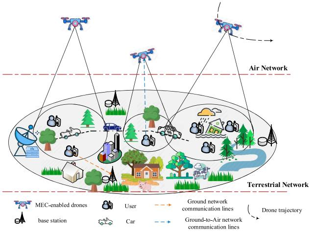

flowchart

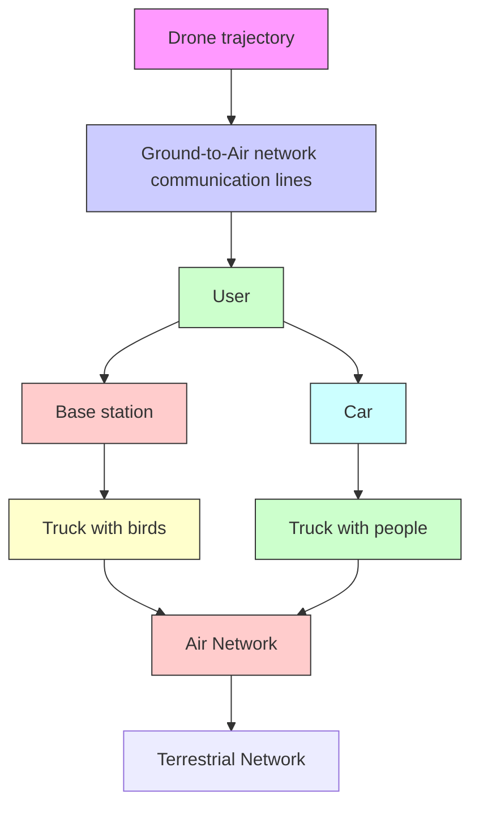

Fig. 1. Concerned scenario.

# A. Task Model

In the given scenario, there exist H distinct types of services, where the set of tasks is represented by $\mathcal { H } =$ $\{ 1 , 2 , \dots , h , \dots , H \}$ [29]. Each task h is described by the parameters $\Lambda _ { h } = \{ D _ { h } , \Xi _ { h } , O _ { h } , w _ { h } , T _ { h } ^ { \operatorname* { m a x } } \}$ . Here, $D _ { h }$ (measured in bits) denotes the input data size associated with the task; $\Xi _ { h }$ (measured in CPU cycles/s) represents the task processing density, i.e., the number of CPU cycles necessary to address one bit of the task; based on $D _ { h }$ and $\Xi _ { h }$ , the computation amount $C _ { h }$ can be given by $C _ { h } = D _ { h } \Xi _ { h } ; ~ O _ { h }$ (measured in bits) specifies the size of the result obtained from processing the task, which is considerably smaller than the input data size $D _ { h }$ [9]; $w _ { h }$ (measured in bits) refers to the size of a service instance for the specific service $h ; T _ { h } ^ { \mathrm { m a x } }$ (measured in seconds) indicates the maximum acceptable delay or latency for completing the task, and it defines the time constraint within which the task should be finished.

# B. Service Placement Stage

In this section, we investigate the real-time service placement (or service deployment, task placement, task deployment) strategies in the system. Service (or task) is an abstraction of applications that can be deployed at UEs and UAVs, and requested by UEs. To run a particular service at a device (i.e., UAVs and UEs in this article), the device has to deploy the service, i.e., to store the data associated with the services, such as libraries and databases. As such, we consider that each UE deploys its required service and can process its required task itself, so we do not consider the task placement issues at the UE end. The UAVs also have certain storage space for service deployment. However, the caching capacity of the UAVs are limited, and each UAV could not deploy all services. In this article, we adopt the assumption that each instance of a task deployed at a UAV is capable of serving only one task processing request from only one UE [30].

During the service placement stage, we have the flexibility to deploy or remove service instances from UAVs. We denote the variable $\delta _ { h , j } ( t )$ as the number of instances of task h that will be installed or removed from UAV j at time slot t. If $\delta _ { h , j } ( t ) > 0 .$ it indicates that $\delta _ { h , j } ( t )$ instances of service h will be deployed at UAV $j ;$ If $\delta _ { h , j } ( t ) \ < \ 0 .$ , it means that $\delta _ { h , j } ( t )$ instances of service h will be released from UAV $j ;$ and if $\delta _ { h , j } ( t ) = 0 $ , it implies that no instances of service h will be placed or deleted from UAV j at that particular time step. Finally, we adapt variable $n _ { h , j } ( t )$ to represent the number of instances of service h at UAV j after the service placement stage at time slot t. Note that the instances of a same task h are indistinguishable, once the number $\delta _ { h , j } ( t )$ is determined, $\delta _ { h , j } ( t )$ random instances will be removed from the UAV j.

# C. Task Offloading Stage

At the start of each time slot t, every UE i creates a task from the H tasks. The task request generated by UE i is represented by the binary variable $r _ { i , h } ( t ) \in \{ 0 , 1 \}$ . Specifically, if $r _ { i , h } ( t ) = 1$ , it indicates that UE i generates task h, otherwise $r _ { i , h } ( t ) = 0$ . For each task, there are two possible processing options: 1) local processing or 2) offloading to a UAV. The decision of whether to offload the task or process it locally is denoted by the binary variable $\varrho _ { i } ( t ) \in \{ 0 , 1 \}$ for UE i. If $\varrho _ { i } ( t ) = 1$ , it indicates the task of UE i will be offloaded to a UAV for processing. Conversely, if $\varrho _ { i } ( t ) = 0 \ :$ , it indicates that UE i will process the task locally by itself.

1) Local Processing: Define $f _ { i } ^ { l }$ (measured in CPU cycles/s) as the local CPU frequency of UE $i ,$ and the delay of processing task h locally at UE i can be given by

$$
T _ {i} ^ {l} (t) = \frac {\sum_ {h \in \mathcal {H}} r _ {i , h} (t) C _ {h} (t)}{f _ {i} ^ {l}}. \tag {1}
$$

The expense of local processing comes from the energy consumption, which can be given by

$$
\operatorname{Exp} _ {i} ^ {l} (t) = \eta^ {l} f _ {i} ^ {l} \tag {2}
$$

where $\eta _ { i } ^ { l }$ [measured in \$/(CPU cycles/s)] denotes the price in using UE i’s local CPU for task processing.

2) UAV Edge Processing: If UE i intends to offload its task to a UAV j, then the overall incurred delay consists of three components: 1) data delivery delay, which represents the time that it takes to transmit the input data from UE i to UAV j; 2) task processing delay at the UAV, which accounts for the time taken by the UAV to perform the task and generate the task processing result; and 3) result transmission delay, which means the time taken to transfer the processing result from UAV j to UE i. Considering that the size of task processing results is typically very tiny, we can omit the result delivery latency in UAV edge processing mode. In addition to delay considerations, it is important to account for the economic expenditure of UEs in task offloading decision making, such as the monetary price of using UAV resources or other relevant factors.

In order to obtain the delay and economic expenditure of edge processing mode, we first need to consider the data rate of ground-UAV wireless links. The path loss between UE i and its associated UAV j could be expressed as [23]

$$
\begin{array}{l} \mathrm{PL} _ {i, j} (t) = 2 0 \log \left(\frac {4 \pi f _ {c} \sqrt {x _ {i , j} ^ {2} (t) + y _ {j} ^ {2} (t)}}{c}\right) \\ + \operatorname{pro} _ {i, j} ^ {\mathrm{LoS}} (t) \epsilon_ {i, j} ^ {\mathrm{LoS}} (t) + \left(1 - \operatorname{pro} _ {i, j} ^ {\mathrm{LoS}} (t)\right) \epsilon_ {i, j} ^ {\mathrm{NLoS}} (t) \tag {3} \\ \end{array}
$$

where $x _ { i , j } ( t )$ (measured in meters) expresses the horizontal distance between UE i and UAV j, yj(t) (in meters) represents the vertical altitude of UAV j from the ground, $f _ { c }$ (measured in Hertz) corresponds to the carrier frequency, and c (measured in m/s) stands for the speed of light. In addition, $\epsilon _ { i , j } ^ { \mathrm { L o S } } ( t )$ and $\epsilon _ { i , j } ^ { \mathrm { { N L o S } } } ( t )$ denotes the additional path loss experienced beyond the free space path loss due to Line-of-Sight (LoS) and non-LoS (NLoS) transmission, respectively. Moreover, the probability of whether the LoS link exists between ground UE i and UAV j can be expressed as [23]

$$
\operatorname{pro} _ {i, j} ^ {\mathrm{LoS}} (t) = \frac {1}{1 + \alpha_ {1} \exp \left\{- \alpha_ {2} \left[ \arctan \left(\frac {y _ {j} (t)}{x _ {i , j} (t)}\right) - \alpha_ {1} \right] \right\}} \tag {4}
$$

where the symbols $\alpha _ { 1 }$ and $\alpha _ { 2 }$ are constant parameters.

Denote the bandwidth of each UAV j as $B _ { j } , ~ j ~ \in ~ { \mathcal { I } } .$ , which will be shared among the UEs that are served by UAV j in nonorthogonal multiple access (NOMA), thus to achieve better channel utilization, thereby obtaining higher channel transmission rates and larger system capacity. Define $a _ { i , j } ( t ) , \ i \in \mathcal { I } , \ j \in \mathcal { I }$ as the access control scheme of UE i. In this context, $a _ { i , j } ( t ) = 1$ indicates that UE i selects UAV j for task offloading in time step t, and $a _ { i , j } ( t ) = 0$ otherwise. Then, the wireless data delivery rate between the ground UE and its attached UAV could be expressed as

$$
R _ {i, j} (t) = B _ {j} \log \left(1 + \frac {a _ {i , j} (t) p _ {i , j} (t) h _ {i , j} (t)}{\sum_ {l \in \mathcal {I} , h _ {l , j} (t) <   h _ {i , j} (t)} a _ {l , j} (t) p _ {l , j} (t) h _ {l , j} (t) + \sigma^ {2}}\right) \tag {5}
$$

where $h _ { i , j } ( t ) = 1 0 ^ { ( - \mathrm { { P L } } _ { i , j } ( t ) / 1 0 ) } , p _ { i , j } ( t )$ represents the transmit power when UE i offloads data to $\operatorname { U A V } j ,$ and $\sigma ^ { 2 }$ denotes the noise power.

Next, we discuss the delay and economic expenditure in UAV edge processing mode. For a $\mathrm { U A V } \ j ,$ in order to accommodate the task processing request $r _ { i , h } ( t )$ from UE i, two conditions must be met: either there should be an available idle service instance at UAV j or there should be sufficient space to initialize a new instance for task h. We introduce a binary variable aidlei,j,h(t) to represent the scenario where the $a _ { i , j , h } ^ { \mathrm { i d l e } } ( t )$ task processing request $r _ { i , h } ( t )$ is offloaded to UAV j and served by an idle instance of task $h ,$ and use $a _ { i , j , h } ^ { \mathrm { n e w } } ( t )$ to indicate the case when the request $r _ { i , h } ( t )$ is served by a newly deployed instance of task h at UAV j. Consequently, we have

$$
a _ {i, j} (t) r _ {i, h} (t) = a _ {i, j, h} ^ {\text { idle }} (t) + a _ {i, j, h} ^ {\text { new }} (t). \tag {6}
$$

For each UE i, the delay to complete the task execution in UAV edge processing mode consists of the service deployment delay (if its request is served by a newly initialized service instance), the data transmission delay, and the task processing delay, which can be expressed as

$$
\begin{array}{l} T _ {i} ^ {u} (t) = \sum_ {j \in \mathcal {J}} \sum_ {h \in \mathcal {H}} \left[ a _ {i, j, h} ^ {\text { idle }} (t) \left(\frac {r _ {i , h} (t) D _ {h} (t)}{R _ {i , j} (t)} + \frac {r _ {i , h} (t) C _ {h} (t)}{f _ {i , j} (t)}\right) \right. \\ \left. + a _ {i, j, h} ^ {\text { new }} (t) \left(D _ {h, j} ^ {\text { place }} + \frac {r _ {i , h} (t) D _ {h} (t)}{R _ {i , j} (t)} + \frac {r _ {i , h} (t) C _ {h} (t)}{f _ {i , j} (t)}\right) \right] \tag {7} \\ \end{array}
$$

where $f _ { i , j } ( t )$ (measured in CPU cycles/s) represents the computation resource assigned to UE i by UAV (measured in second) is the delay of initiali $j ,$ and g a $D _ { h , j } ^ { \mathsf { p l a c e } }$ instance for task h on UAV j.

The economic expenditure of UAV edge processing mode arises from two components, i.e., the utilization of the wireless channel for data transmission in task offloading, and the consumption of computation resources for task processing, which can be given by

$$
\begin{array}{l} \mathrm{Exp} _ {i} ^ {u} (t) = \sum_ {j \in \mathcal {J}} \sum_ {h \in \mathcal {H}} \Big [ a _ {i, j, h} ^ {\mathrm{idle}} (t) \Big (\eta^ {j, 1} R _ {i, j} (t) + \eta^ {j, 2} f _ {i, j} (t) \Big) \\ \left. \left. + a _ {i, j, h} ^ {\mathrm{new}} (t) \left(\eta^ {j, 1} R _ {i, j} (t) + \eta^ {j, 2} f _ {i, j} (t) + \lambda_ {h, j}\right) \right] \right. \tag {8} \\ \end{array}
$$

where $\eta ^ { j , 1 }$ (measured in \$/bps) represents the price for utilizing the wireless channel resource of UAV $j , \bar { \eta ^ { j , 2 } }$ [measured in \$/(CPU cycles/s)] denotes the price for utilizing the computation resources of UAV j, and $\lambda _ { h , j }$ (in \$) is the additional economic cost for using a newly deployed instance of service h on $\mathrm { U A V } j ,$ respectively.

Combining local and edge processing together, the total delay for completing the task for UE i is

$$
T _ {i} (t) = \left(1 - \varrho_ {i} (t)\right) T _ {i} ^ {l} (t) + \varrho_ {i} (t) T _ {i} ^ {u} (t) \tag {9}
$$

and the economic expenditure of UE i is expressed as

$$
\mathrm{Exp} _ {i} (t) = (1 - \varrho_ {i} (t)) \mathrm{Exp} _ {i} ^ {l} (t) + \varrho_ {i} (t) \mathrm{Exp} _ {i} ^ {u} (t). \tag {10}
$$

Considering both the delay and economic expenditure factors, the cost of each UE i is defined as

$$
\operatorname{Cost} _ {i} (t) = \gamma^ {1} \vartheta^ {t} T _ {i} (t) + \gamma^ {2} \vartheta^ {c} \mathrm{Exp} _ {i} (t) \tag {11}
$$

where $\gamma ^ { 1 } ~ \in ~ [ 0 , 1 ]$ and $\gamma ^ { 2 } \in \left[ 0 , 1 \right]$ are weight coefficients which determine the importance of reducing delay and reducing economic expenditure, respectively, and we have $\gamma ^ { 1 } +$ $\gamma ^ { 2 } = 1$ . The two parameters $\vartheta ^ { t }$ (in Cost/s) and $\vartheta ^ { c }$ (in Cost/\$) are coefficients for balancing the range of delay and economic expenditure to the same magnitude, and also for unifying the unit of the two quantities. The important notations are summarized in Table I.

# IV. PROBLEM FORMULATION

# A. Problem Formulation

In this article, our objective is to minimize the long-term average system cost by jointly optimizing the task placement $\Delta ( t ) ~ = ~ \{ \delta _ { h , j } ( t ) \}$ , $h \in { \mathcal { H } } , \ j \in { \mathcal { I } }$ , the offloading decision $\pmb { \varrho } ( t ) = \{ \varrho _ { i } ( t ) \} , \ i \in \mathcal { T } ,$ the access control and instance selection $\mathbf { A } ( t ) = \{ a _ { i , j } ( t ) , a _ { i , j , h } ^ { \mathrm { i d l e } } ( t ) , a _ { i , j , h } ^ { \mathrm { n e w } } ( t ) \} , i \in \mathcal { T } , j \in \mathcal { I } , h \in \mathcal { H }$ aidle (t , the transmit power control $\mathbf { P } _ { } ( t ) ^ { \prime \prime } = \{ p _ { i , j } ( t ) \} , ~ i \in \mathcal { T } , ~ j \in \mathcal { T }$ , and the computation resource assignment $\mathbf { F } ( t ) = \{ f _ { i , j } ( t ) \} , i \in \mathcal { T } , j \in \mathcal { I }$ . The joint optimization problem is formulated as

$$
\left(\mathcal {P} _ {\mathbf {1}}\right): \min _ {\boldsymbol {\Delta} (t), \boldsymbol {\varrho} (t), \mathbf {A} (t), \mathbf {P} (t), \mathbf {F} (t)} \left[ \frac {1}{T ^ {\max}} \sum_ {t \in \mathcal {T}} \sum_ {i \in \mathcal {I}} \operatorname{Cost} _ {i} (t) \right] \tag {12}
$$

s.t. (C1) $\ : \delta _ { h , j } ( t ) \in \mathbb { N } , \ h \in { \mathcal { H } } , \ j \in { \mathcal { I } }$

(C2) : $n _ { h , j } ( t - 1 ) \geq | \delta _ { h , j } ( t ) | \cdot \mathbb { I } \{ \delta _ { h , j } ( t ) < 0 \}$

$$
h \in \mathcal {H}, j \in \mathcal {J}
$$

$\begin{array} { c } { { ( \mathbb { C 3 } ) : n _ { h , j } ( t - 1 ) + \delta _ { h , j } ( t ) \cdot \mathbb { I } \{ \delta _ { h , j } ( t ) > 0 \} \leq \mathrm { t h r e s } } } \\ { { h \in \mathcal { H } , \ j \in \mathcal { I } } } \end{array}$

(C4) : $: \varrho _ { i } ( t ) \in \{ 0 , 1 \} , \ i \in \mathcal { I }$

(C5) : $a _ { i , j } ( t ) \in \{ 0 , 1 \} , \ i \in \mathcal { T } , \ j \in \mathcal { T }$

(C6) $: a _ { i , j , h } ^ { \mathrm { i d l e } } ( t ) , a _ { i , j , h } ^ { \mathrm { n e w } } ( t ) \in \{ 0 , 1 \}$ $i \in \mathcal { I } , \ j \in \mathcal { I } , \ h \in \mathcal { H }$

$( \mathbf { C } 7 ) : \sum _ { j \in \mathcal { I } } a _ { i , j } ( t ) \cdot \mathbb { I } \{ \varrho _ { i } ( t ) = 1 \} = 1 , \ i \in \mathcal { I }$

(C8) : $a _ { i , j , h } ^ { \mathrm { i d l e } } ( t ) + a _ { i , j , h } ^ { \mathrm { n e w } } ( t ) = a _ { i , j } ( t ) r _ { i , h } ( t )$ $i \in \mathcal { I } , \ j \in \mathcal { I } , \ h \in \mathcal { H }$

(C9) : $\sum _ { h \in \mathcal { H } } n _ { h , j } ( t ) w _ { h } \le \Pi _ { j } , \ j \in \mathcal { I }$

$( \mathbf { C } 1 0 ) : \sum _ { i \in \mathcal { I } } \varrho _ { i } ( t ) a _ { i , j } ( t ) r _ { i , h } ( t ) \leq n _ { h , j } ( t ) , \ j \in \mathcal { I }$ i∈I

(C11) : $\sum _ { j \in \mathcal { I } } \varrho _ { i } ( t ) a _ { i , j } ( t ) = 1 , \ i \in \mathcal { I }$

(C12) : $0 < p _ { i , j } ( t ) < p ^ { \operatorname* { m a x } } , \ i \in \mathcal { I } , \ j \in \mathcal { I }$

(C13) : $0 < f _ { i , j } ( t ) < f _ { j } ^ { \operatorname* { m a x } } , \ i \in \mathcal { T } , \ j \in \mathcal { I }$

(C14) : $\sum _ { i \in \mathbb { Z } } f _ { i , j } ( t ) \leq f _ { j } ^ { \operatorname* { m a x } } , \ j \in \mathcal { I }$ i∈I

$( \mathbf { C 1 5 } ) : T _ { i } ( t ) \cdot \mathbb { I } \{ r _ { i , h } ( t ) = 1 \} \leq T _ { h } ^ { \operatorname* { m a x } } , i \in \mathcal { I } , j \in \mathcal { I }$

where thres is a threshold for the number of deployed service instances in task placement; $\Pi _ { j } , j \in \mathcal { I }$ represents the storage capacity of the UAV j for application data caching in task placement; $p ^ { \mathrm { m a x } }$ denotes the maximum transmit power of UEs; $f _ { j } ^ { \operatorname* { m a x } }$ represents the processing capability of MEC server $j ;$ Tmax r $\dot { T } _ { h } ^ { \mathrm { m a x } }$ efers to the maximum tolerable task processing latency of task $h ;$ and additionally, I{·} is the symbolic function, where · holds when $\mathbb { I } \{ \cdot \} = 1$ , and otherwise, $\mathbb { I } \{ \cdot \} = 0$ .

In $( \mathcal { P } _ { 1 } ) , ^ { 1 }$ (C1) is the integer requirement on task instance placement; (C2) is used to assure that the removed number of instances of each service h should be less than the number of

1Please note that we omit the $t \in \mathcal T$ in each constraint for concise.

instances deployed on UAV j; (C3) is used to prevent too many instances are installed at a certain UAV, and thus to keep load balancing among UAVs; (C4), (C5), and (C6) represent the binary constraints related to task offloading decision, access control, and service instance selection; (C7) assures that one UE can only access one UAV; (C8) assures that there must be a deployed instance in UAV j to serve its admitted UE i; (C9) ensures that the volume of the deployed tasks should be less than the storage volume of each UAV; (C10) constrains that the number of UEs that admitted in UAV j for processing task h must not exceed the number of instances of task h in UAV j; (C11) constrains that each UE should offload its task to only one UAV; (C12) represents the constraint on transmit power control; (C13) requires that the computation resource allocation must be nonnegative; (C14) imposes constraints that the assigned computation resource must be less than the processing capability of each UAV; and finally, (C15) is the QoS requirement, which ensures that the task should be completed within the maximum tolerable delay.

Remark 1: We consider that the duration τ of each time slot should be greater than or equal to the maximum tolerable latency of all tasks, as specified in (C14). This assumption helps avoiding the challenges of dealing with issues of queues [31]. The exploration of cross-slot optimization will be considered as a part of our future work.

Remark 2: We assume all UAVs and UEs work in an ideal synchronization state.

The formulated problem $( \mathcal { P } _ { 1 } )$ is a mixed-integer and nonlinear programming (MINLP) problem, and it is known to be generally NP-hard and therefore challenging to solve optimally. Moreover, the decision-making process in this problem occurs in a highly dynamic environment for longterm optimization, which makes it challenging for traditional convex optimization algorithms to adapt to the unknown environment and perform adaptive optimization. DRL algorithms are designed to optimize a long-term objective [32], and we attempt to exploit DRL to solve our problem. Since our problem contains integer, binary, and continuous variables, discrete control oriented DRL algorithms, such as DQN, AC, and advantage AC (A2C), could not work well [33], [34]. Although we can resort to discretization, we have to face the curse of dimension issues and dramatically deteriorating performance. Deep deterministic policy gradient (DDPG) is specifically designed to address continuous control problems, so it is still not appropriate for solving our formulated mixed integer and continuous problem. However, we can reshape DDPG for our problem, and propose a more suitable joint optimization algorithm based on MADDPG for MINLP, and thus for more reliable, realtime, and high-efficient system control and decision making optimization.

# V. JOINT OPTIMIZATION ALGORITHM BASED ON MADDPG FOR OUR MINLP PROBLEM

In this section, we demonstrate the utilization and improvement of MADDPG to learn real-time control strategies of our problem. We begin by introducing the preliminary concepts of

MADDPG. Subsequently, we reformulate our problem $( \mathcal { P } _ { 1 } )$ as a MDP, by constructing its state space, action space, immediate reward, and state transformation for each agent. Next, we present the framework of our MADDPG-based optimization algorithm for MINLP problem.

# A. Preliminaries of MADDPG

In single-agent DRL frameworks [35], the agent strengthens its decision-making abilities by continuously and actively interacting with the environment [36]. Specifically, DDPG algorithm [34] belongs to the DRL algorithm family, that is well-suited for continuous control tasks. MADDPG is introduced as an extension of DDPG, which aims at addressing the common challenge in complex systems where individual agents are often faced with limited observations, which significantly hampers their learning process. MADDPG operates under the principle of centralized training and decentralized executing. In this framework, every agent is associated with an actor and a critic, referred to as $\mu _ { j } ( o _ { j } ( t ) ; \theta _ { j } )$ and $q _ { j } ( \mathbf { s } ( t ) , \mathbf { a } ( t ) ; w _ { j } )$ , respectively. Each actor network $\mu _ { j } ( o _ { j } ( t ) ; \theta _ { j } )$ works in a decentralized and deterministic manner, i.e., for a given input $o _ { j } ( t )$ , it will output a deterministic action ${ \bf a } _ { j } ( t ) = { \bf \hphantom { 0 } }$ $\mu _ { j } ( o _ { j } ( t ) ; \theta _ { j } )$ ). For each critic network $q _ { j } ( \mathbf { s } ( t ) , \mathbf { a } ( t ) ; w _ { j } )$ ), its input includes the global state $\mathbf { \boldsymbol { s } } ( t ) = \{ o _ { 1 } ( t ) , \ldots , o _ { J } ( t ) \}$ and action $\mathbf { a } ( t ) = \{ \mathbf { a } _ { 1 } ( t ) , \ldots , \mathbf { a } _ { J } ( t ) \}$ , which comprises the observations and actions of all agents at time t. The output of the critic network is a real number that serves as an estimation of the performance associated with taking action a(t) under the given state s(t). The actor network of the jth agent $\mu _ { j } ( o _ { j } ( t ) ; \theta _ { j } )$ is used to control its corresponding agent j, while the jth critic network $q _ { j } ( \mathbf { s } ( t ) , \mathbf { a } ( t ) ; w _ { j } )$ is used for evaluating action a(t), and the score its gives can be used to guide the jth actor network to train its parameters, and thus to make better actions. In order to cut off “bootstrapping” to avoid error propagation, thereby alleviating the overestimation issues of MADDPG, target networks are employed for calculating time difference (TD) targets. For each actor network, there is a corresponding target actor network, which is denoted as $\mu _ { j } ( o _ { j } ( t ) ; \theta _ { j } ^ { - }$ ); also, each critic network corresponds to a target critic network $q _ { j } ( \mathbf { s } ( t ) , \mathbf { a } ( t ) ; w _ { j } ^ { - } )$ . Each target network in MADDPG shares the same structure as its corresponding primary actor or primary critic, but with different parameters. The parameters of the jth primary actor and primary critic are represented by $\theta _ { j }$ and $w _ { j } ,$ and correspondingly, the parameters of the jth target actor and target critic are represented by $\theta _ { j } ^ { - }$ and $w _ { j } ^ { - }$ , respectively.

We first discuss the training process of actor networks. In the training process, actor networks are trained using deterministic policy gradient, and critic networks are trained employing TD algorithm. As an off-policy DRL algorithm, MADDPG leverages experience replay to mitigate temporal correlations among training samples, enabling the reuse of past experiences for network training. This mechanism not only helps in stabilizing the training but also promotes more efficient exploration and thus improves the overall performance of the algorithm. Experiences are represented as tuples capturing state, action, reward, and next state information, with the form $< \mathbf { s } ( t ) , \mathbf { a } ( t ) , \mathbf { r } ( t ) , \mathbf { s } ( t + 1 ) > , t \in \mathcal { T }$ . MADDPG utilizes a centralized replay buffer, which is located in the central controller and serves as a repository for all the experiences collected during the training process. In a general experience, $\mathbf { s } ( t )$ and ${ \bf a } ( t )$ are the global state and the actions taken by all agents at time step t as aforementioned, respectively. Similarly, $\mathbf { r } ( t ) = \{ r _ { 1 } ( t ) , \ldots , r _ { J } ( t ) \}$ signifies the rewards received by each agent at time step t, and $\mathbf { s } ( t + 1 ) = \{ o _ { 1 } ( t + 1 ) , \ldots , o _ { J } ( t + 1 ) \}$ is the new global state observed by all agents in time step $t + 1$ , respectively.

The purpose of training the jth actor network $\mu _ { j } ( o _ { j } ( t ) ; \theta _ { j } )$ is to optimize its parameter $\theta _ { j } ,$ , thus to improve the score given by the jth critic network. The objective function of the jth actor network in MADDPG can be defined as

$$
\begin{array}{l} \mathfrak {J} _ {j} (\theta_ {1}, \dots , \theta_ {J}) \\ = \mathbb {E} _ {S} \left[ q \left(S, \left[ \mu_ {1} (O _ {1} (t); \theta_ {1}), \dots , \mu_ {J} (O _ {J} (t); \theta_ {J}) \right]; w _ {j}\right) \right] \tag {13} \\ \end{array}
$$

where the expectation is about state $S ~ = ~ [ O _ { 1 } , \ldots , O _ { J } ] .$ . The gradient of the objective function with respect to the parameters of the jth actor can be computed by

$$
\begin{array}{l} \nabla_ {\theta_ {j}} \mathfrak {J} _ {j} (\theta_ {1}, \dots , \theta_ {J}) \\ = \mathbb {E} _ {S} \left[ \nabla_ {\theta_ {j}} q \left(S, \left[ \mu_ {1} \left(O _ {1} (t); \theta_ {1}\right), \dots , \mu_ {J} \left(O _ {J} (t); \theta_ {J}\right) \right]; w _ {j}\right) \right]. \tag {14} \\ \end{array}
$$

Next, we adopt the Monte Carlo method to appropriate the expectation in the above equation. We sample a batch of M experience from the experience pool, where a certain experience m can be given by $< \mathbf { s } ^ { m } ( t ) , \mathbf { a } ^ { m } ( t ) , \mathbf { r } ^ { m } ( t ) , \mathbf { s } ^ { m } ( t + 1 ) >$ . For each state $\mathbf { s } ^ { m } ( t ) = [ o _ { 1 } ^ { m } ( t ) , \hdots , o _ { J } ^ { m } ( t ) ]$ , we can obtain J actions by the J actor networks, which can be given by

$$
\hat {\mathbf {a}} _ {1} ^ {m} (t) = \mu_ {1} \big (o _ {1} ^ {m} (t); \theta_ {1} \big)
$$

$$
\hat {\mathbf {a}} _ {J} ^ {m} (t) = \mu_ {J} \left(o _ {J} ^ {m} (t); \theta_ {J}\right). \tag {15}
$$

The gradient of the objective function with respect to the parameters of the jth actor, i.e., θj, can be given by

$$
\begin{array}{l} \mathbf {g} _ {\theta_ {j}} ^ {m} = \nabla_ {\theta_ {j}} q \left(\mathbf {s} ^ {m} (t), \left[ \mu_ {1} \left(o _ {1} ^ {m} (t); \theta_ {1}\right), \dots , \mu_ {J} \left(o _ {J} ^ {m} (t); \theta_ {J}\right) \right]; w _ {j}\right) \\ = \nabla_ {\theta_ {j}} q \left(\mathbf {s} ^ {m} (t), \left[ \hat {\mathbf {a}} _ {1} ^ {m} (t), \dots , \hat {\mathbf {a}} _ {J} ^ {m} (t) \right]; w _ {j}\right) \\ = \nabla_ {\theta_ {j}} \mu_ {j} \left(o _ {j} ^ {m} (t); \theta_ {j}\right) \cdot \nabla_ {\hat {\mathbf {a}} _ {j} ^ {m} (t)} q \left(\mathbf {s} ^ {m} (t), \left[ \hat {\mathbf {a}} _ {1} ^ {m} (t), \dots , \hat {\mathbf {a}} _ {J} ^ {m} (t) \right]; w _ {j}\right) \tag {16} \\ \end{array}
$$

and the average gradient is given by

$$
\mathbf {g} _ {\theta_ {j}} = \frac {1}{M} \sum_ {m = 1} ^ {M} \mathbf {g} _ {\theta_ {j}} ^ {m}. \tag {17}
$$

The parameter $\theta _ { j }$ of actor j can be updated by gradient ascend as follows:

$$
\theta_ {j} \leftarrow \theta_ {j} + \beta \cdot \mathbf {g} _ {\theta_ {j}}. \tag {18}
$$

Next, we discuss the training methods of critic networks. Each critic network $q _ { j } ( \mathbf { s } ( t ) , \mathbf { a } ( t ) ; w _ { j } )$ can be trained using the TD algorithm, so as to fit the action value function $Q _ { j } ( \mathbf { s } , \mathbf { a } )$ as possible. Given an experience $< \mathbf { s } ^ { m } ( t ) , \mathbf { a } ^ { m } ( t ) , \mathbf { r } ^ { m } ( t ) , \mathbf { s } ^ { m } ( t + 1 ) >$ , and for the state $\mathbf { \boldsymbol { s } } ^ { m } ( t { + } 1 ) = [ o _ { 1 } ^ { m } ( t { + } 1 ) , \dots , o _ { J } ^ { m } ( t { + } 1 ) ]$ , we can obtain J actions by the J target actor networks at time step $t + 1$ , which can be given by

$$
\hat {\mathbf {a}} _ {1} ^ {m -} (t + 1) = \mu_ {1} \bigl (o _ {1} ^ {m} (t + 1); \theta_ {1} ^ {-} \bigr)
$$

$$
\hat {\mathbf {a}} _ {J} ^ {m -} (t + 1) = \mu_ {J} \left(o _ {J} ^ {m} (t + 1); \theta_ {J} ^ {-}\right) \tag {19}
$$

and we have

$$
\hat {\mathbf {a}} ^ {m -} (t + 1) = \left[ \hat {\mathbf {a}} _ {1} ^ {m -} (t + 1), \dots , \hat {\mathbf {a}} _ {J} ^ {m -} (t + 1) \right]. \tag {20}
$$

The loss function is

$$
L \big (\theta_ {j} \big) = \frac {1}{2 M} \sum_ {t = 1} ^ {M} \Big (\hat {y} _ {j} ^ {m} (t) - q \big (\mathbf {s} ^ {m} (t), \mathbf {a} ^ {m} (t); w _ {j} \big) \Big) ^ {2} \tag {21}
$$

where $\hat { y } _ { j } ^ { m } ( t )$ is TD target, which is expressed as

$$
\hat {y} _ {j} ^ {m} (t) = r _ {j} ^ {m} (t) + \gamma \cdot q \Big (\mathbf {s} ^ {m} (t + 1), \hat {\mathbf {a}} ^ {m -} (t + 1); w _ {j} \Big). \tag {22}
$$

Then, TD error can be given by

$$
\delta_ {j} ^ {m} (t) = q \left(\mathbf {s} ^ {m} (t), \mathbf {a} ^ {m} (t); w _ {j}\right) - \hat {y} _ {j} ^ {m} (t). \tag {23}
$$

To update the parameters wj of the jth critic network, gradient descent algorithm can be applied as follows:

$$
w _ {j} \leftarrow w _ {j} - \alpha \cdot \frac {1}{M} \sum_ {t = 1} ^ {M} \delta_ {j} ^ {m} (t) \cdot \nabla_ {w _ {j}} q \Big (\mathbf {s} ^ {m} (t), \mathbf {a} ^ {m} (t); w _ {j} \Big). \tag {24}
$$

In the end, each agent j refreshes its target actor and critic networks as follows:

$$
\theta_ {j} ^ {-} \leftarrow \zeta \cdot \theta_ {j} + (1 - \zeta) \cdot \theta_ {j} ^ {-}
$$

$$
w _ {j} ^ {-} \leftarrow \zeta \cdot w _ {j} + (1 - \zeta) \cdot w _ {j} ^ {-} \tag {25}
$$

where $\zeta \in [ 0 , 1 ]$ .

# B. Problem Reformulation

In the considered system, every UAV functions as a DRL agent to make independent and localized decisions based on its observations and learned policies. Besides, the primary UAV serves as the controller which possesses the global information of the whole system. At the start of each time slot, every UE initiates its task processing request and sends it to all UAVs it is associated with. Each UAV gathers the information, e.g., the task requests information, the dynamics of the network states, etc., from all its covered UEs, and then sends it to the center controller at the primary UAV. After obtaining the global network state information, centralized training process will proceed at the center controller. After training, each agent will perform distributed decision making based on its observation $o _ { j } ( t )$ . To utilize DRL algorithms to address the formulated problem $( \mathcal { P } _ { 1 } )$ , it is necessary to convert it into the standard form of MDP. The key components of this transformation include defining the state space, action space, reward function, and state transition for each agent, which are given as follows.

1) State Space: At the start of each time step t, every agent $j , j \in \mathcal { I }$ gathers and obtains its own observation $o _ { j } ( t )$ from the environment. Please note that each UAV can only observe the dynamics of its covered UEs. Denote the set of UEs covered by UAV j as $\mathcal { T } _ { j }$ , where the distance between each UE i in $\mathcal { T } _ { j }$ satisfies

$$
\sqrt {x _ {i , j} (t) ^ {2} + y _ {j} (t) ^ {2}} \leq D _ {\text { th }} \tag {26}
$$

where $D _ { \mathrm { t h } }$ is the distance threshold [3].

The observation of $\mathrm { U A V } j , \mathrm { i . e . , } o _ { j } ( t )$ , could be represented as

$$
o _ {j} (t) \triangleq \{\mathbf {r} _ {j} (t), \mathbf {N} _ {j} (t - 1), \boldsymbol {\epsilon} _ {j} (t), \mathbf {X} _ {j} (t), \mathbf {Y} _ {j} (t) \} \tag {27}
$$

where

1) $\mathbf { r } _ { j } ( t ) ~ = ~ \{ r _ { i , h } ( t ) \} , ~ r _ { i , h } ( t ) ~ \in ~ \{ 0 , 1 \} , ~ i ~ \in ~ \mathcal { T } _ { j } , ~ h ~ \in ~ \mathcal { H }$ represents the user request for tasks within the coverage of UAV j at the start of the tth time step.   
2) $\mathbf { N } _ { j } ( t - 1 ) = \{ n _ { h , j } ( t - 1 ) \}$ , $h \in { \mathcal { H } }$ represents the count of instances of service h exists in UAV j at the conclusion of time step $t - 1 , \mathrm { i . e . , }$ at the start of time step t.   
3) $\epsilon _ { j } ( t ) = \lbrace \epsilon _ { i , j } ^ { \mathrm { { D S } } } ( t ) , \epsilon _ { i , j } ^ { \mathrm { { N L o S } } } ( t ) \rbrace , i \in  { \mathcal { T } } _ { j }$ NLoSi,j (t)}, i ∈ Ij represents the timedependant additional path loss encountered during LoS and NLoS transmissions.   
4) $\mathbf { X } _ { j } ( t ) ~ = ~ \{ x _ { i , j } ( t ) \} , ~ i ~ \in ~ \mathcal { T } _ { j }$ represents the flat distance between UAV j and the UE i that falls within its coverage area.   
5) $\mathbf { Y } _ { j } ( t ) = \{ y _ { j } ( t ) \}$ is the altitude of UAV j away from the ground.

Once the observation is obtained, each UAV will send it to the center controller in the primary UAV, based on which the center controller can obtain the joint state of time slot t, which is expressed as

$$
\mathbf {s} (t) \triangleq \{o _ {1} (t), o _ {2} (t), \dots , o _ {J} (t) \} \tag {28}
$$

and the state space could be represented by $S = \{ \mathbf { s } ( t ) , t \in \mathcal { T } \}$ .

2) Action Space: Under observation $o _ { j } ( t )$ , the actor of agent j calculates its action ${ \bf a } _ { j } ( t )$ as

$$
\mathbf {a} _ {j} (t) \triangleq \{\boldsymbol {\Delta} _ {j} (t), \varrho_ {j} (t), \mathbf {A} _ {j} (t), \mathbf {P} _ {j} (t), \mathbf {F} _ {j} (t) \} \tag {29}
$$

where

1) $\Delta _ { j } ( t ) = \{ \delta _ { h , j } ( t ) \} , \ h \in \mathcal { H }$ is the task placement decision at $\mathrm { U A V } j .$ .   
2) $\pmb { \varrho } _ { j } ( t ) = \{ \varrho _ { i } ( t ) \} , \ i \in \mathcal { T } _ { j }$ is the offloading decision of UEs covered by UAV j.   
3) $\mathbf { A } _ { j } ( t ) ~ = ~ \{ a _ { i , j } ( t ) , a _ { i , j , h } ^ { \mathrm { i d l e } } ( t ) , a _ { i , j , h } ^ { \mathrm { n e w } } ( t ) \} , ~ i ~ \in ~ \mathcal { T } _ { j } , ~ h ~ \in ~ \mathcal { H }$ , a i,j,h represents the access control and instance selection.   
4) $\mathbf { P } _ { j } ( t ) = \{ p _ { i , j } ( t ) \} , ~ i \in \mathcal { T } _ { j }$ stands for the transmit power control of UEs served by UAV j.   
5) $\mathbf { F } _ { j } ( t ) ~ = ~ \{ f _ { i , j } ( t ) \} , ~ i ~ \in ~ \mathcal { T } _ { j }$ represents the computation resource allocation at $\mathrm { U A V } \ j$ .

The collection action of the J agents is described as

$$
\mathbf {a} (t) = \{\mathbf {a} _ {1} (t), \mathbf {a} _ {2} (t), \dots , \mathbf {a} _ {J} (t) \} \tag {30}
$$

and accordingly, the action space could be expressed as ${ \mathcal { A } } =$ $\{ \mathbf { a } ( t ) , t \in \mathcal { T } \}$ .

3) Reward Function: Upon taking action ${ \bf a } _ { j } ( t )$ , each agent j obtains an immediate reward $r ( t )$ . In our formulated problem $( \mathcal { P } _ { 1 } )$ , our objective is to reduce the long-term total cost incurred by all UEs. All agents collaborate to maximize their contributions toward minimizing the total cost, and each agent receives the same reward. In this context, we define the immediate reward $r ( t )$ as the reciprocal of the total cost. Mathematically, it could be represented as

$$
r (t) = r _ {j} (t) = \frac {1}{J} \frac {1}{\sum_ {i \in \mathcal {I}} \operatorname{Cost} _ {i} (t)}. \tag {31}
$$

Moreover, the actions of all agents are bounded by the constraints as defined by (C1)–(C15) in $( \mathcal { P } _ { 1 } )$ . However, the outputs of the actor networks may be infeasible due to these constraints. To address the issue, we need to judge whether the constraints are satisfied when all agents have taken their actions. If the constraints are met, each agent will obtain its reward, and otherwise, it will receive a penalty, which is a dramatically small negative constant. By this manners, actors are guided to choose better actions in the next time slot. On the basis of the aforementioned analysis, the immediate reward for each agent j could be given by

$$
r (t) = \left\{ \begin{array}{l l} \frac {1}{J} \frac {1}{\sum_ {i \in \mathcal {I}} \operatorname{Cost} _ {i} (t)}, & \text { if   all   constraints   are   met } \\ \text { penalty }, & \text { otherwise. } \end{array} \right. \tag {32}
$$

4) Next State: After selecting and executing actions, each agent receives the immediate reward as defined above. Subsequently, the system transitions from the current state s(t) to the next state $\mathbf s ( t + 1 )$ through the following means.

1) User requests for tasks $r _ { i , h } ( t + 1 ) , ~ i ~ \in ~ \mathcal { I } , ~ h ~ \in ~ \mathcal { H }$ transforms following a certain distribution, and in this article, we consider it transforms according to uniform distribution.   
2) The count of service h’s instances exists in UAV j at the end of time slot t − 1, denoted as $n _ { h , j } ( t - 1 ) , j \in \mathcal { I } .$ , h ∈ H, undergoes changes based on the action $a _ { j } ( t )$ during the service placement stage. Specifically, the count at time slot t is given by $n _ { h , j } ( t ) \ : = \ : n _ { h , j } ( t - 1 ) \ : + \ : \delta _ { h , j } ( t )$ , $j \in \mathcal { I } , \ h \in \mathcal { H }$ .   
3) Time-varying additional path loss under LoS and NLoS transmissions, i.e., $\{ \epsilon _ { i , j } ^ { \mathrm { L o } \hat { S } } ( t + 1 ) , \epsilon _ { i , j } ^ { \mathrm { N L o S } } ( t + 1 ) \}$ , i ∈ $\mathcal { T } , j \in \mathcal { I }$ , are generated from the four tuples randomly: {0.1, 21}, {1, 20}, {1.6, 23}, and {2.3, 34}.   
4) The horizontal distance between user i and $\mathrm { U A V } j x _ { i , j } ( t +$ 1) = 300 sin $\theta _ { x } + 5 0 , \ \theta _ { x }$ is randomly generated from $[ 0 , \pi / 2 ]$ .   
5) Altitude of each UAV j away from the ground, $\mathrm { i } . \mathrm { e } . , y _ { j } ( t +$ $1 ) = 1 0 0 \sin { \theta _ { y } } + 5 0 , \theta _ { y }$ is randomly generated from $[ 0 , \pi / 2 ]$ .

# C. Reformulating Actions to Adapt to MADDPG

Since MADDPG is designed for addressing problems with continuous action spaces, each agent j will output continuous actions. To adapt the output of actors to our formulated problem $( \mathcal { P } _ { 1 } )$ , we need to transform the output of the actor networks.

1) Continuous Action Normalization: In order to cut down the action space’s dimension, all continuous variables, including power control and computation resource assignment, are limited to a value between 0 and 1. Let a denote a general action output by the actor network, $a ^ { \mathrm { m a x } }$ and $a ^ { \mathrm { m i n } }$ denote the maximum and minimum value that can be taken by $^ { a , }$ respectively, and let a˜ denote the actual value, then $\widetilde { a }$ can be recovered from a as follows:

$$
\widetilde {a} = a \left(a ^ {\max} - a ^ {\min}\right) + a ^ {\min}. \tag {33}
$$

2) Discrete Action Reformulation: We transform the discrete actions as follows:

1) For the integer task placement variable $\delta _ { n , j } ( t )$ , we simply round it to the nearest integer, which is denoted as $\widetilde { \delta } _ { n , j } ( t )$ .   
2) For the binary offloading decision making $\varrho _ { i } ( t )$ , we consider the output as the probability of taking $\varrho _ { i } ( t ) = 1$ . Note that, in order to balance the exploration-utilization issues in DRL, in the training process, the continuous output of $\varrho _ { i } ( t )$ is used as the probability for sampling the binary offloading decision, and in testing process, the agent will select 0 or 1 that with the maximum probability according to the value of $\varrho _ { i } ( t )$ . We denote the reformulated offloading decision as $\widetilde { \varrho } _ { i } ( t )$ .   
3) For the binary variables, including access control $a _ { i , j } ( t )$ and the instance selection variable $a _ { i , j , h } ^ { \mathrm { i d l e } } ( t ) , a _ { i , j , h } ^ { \mathrm { n e w } } ( t )$ aidlei,j,h(t), since they are coupled by (6), i.e., constraint (C7) as in our formulated problem in $( \mathcal { P } _ { 1 } )$ , they should be addressed carefully.

We consabilities of tput  and $a _ { i , j } ( t )$ $a _ { i , j , h } ^ { \mathrm { i d l e } } ( t )$ as the prob-g the training $a _ { i , j } ( t ) = 1$ $a _ { i , j , h } ^ { \mathrm { i d l e } } ( t ) = 1 .$ process, a random value is taken following the probability $a _ { i , j } ( t )$ $a _ { i , j } ( t )$ is. If ed as 0, then we takeis sampled as 1, then $a _ { i , j , h } ^ { \mathrm { n e w } } ( t ) = 0$ $a _ { i , j , h } ^ { \mathrm { i d l e } } ( t ) = 0$ $a _ { i , j } ( t )$ we use a random probabis sampled as 1, we take mine  othe $a _ { i , j , h } ^ { \mathrm { i d l e } } ( t ) : \mathrm { i f } \ a _ { i , j , h } ^ { \mathrm { i d l e } } ( t )$ $a _ { i . i . h } ^ { \mathrm { n e w } } ( t ) = 0 ;$ $a _ { i , j , h } ^ { \mathrm { i d l e } } ( t )$ sampled as 0, we take $a _ { i , j , h } ^ { \mathrm { n e w } } ( t ) = 1$ .

During the testing process, agent selects 0 and 1 that with m pr and $a _ { i , j } ( t )$ $a _ { i , j } ( t ) = 0$ , we will taket then selects anewi,j,h(t) = 0 a $a _ { i , j , h } ^ { \mathrm { n e w } } ( t ) = 0$ $a _ { i , j , h } ^ { \mathrm { i d l e } } ( t ) = 0 ;$ $a _ { i , j } ( t ) = 1$ 0 and 1 that with the maximum probability for $a _ { i , j , h } ^ { \mathrm { i d l e } } ( t )$ , and if $a _ { i , j , h } ^ { \mathrm { i d l e } } ( t ) = 1$ $a _ { i , j , h } ^ { \mathrm { n e w } } ( t ) = 0$ , otherwise, if $\dot { a } _ { i , j , h } ^ { \mathrm { i d l e } } ( t ) = 0 .$ $a _ { i , j , h } ^ { \mathrm { n e w } } ( t ) = \ddot { 1 }$

Denote the reformulated access control and the instance selection variables as $\widetilde { a } _ { i , j } ( t ) \widetilde { a } _ { i , j , h } ^ { \mathrm { i d l e } } ( t )$ , and $\widetilde { a } _ { i , j , h } ^ { \mathrm { n e w } } ( t )$ , respectively, and the addressed action at time step t is expressed as

$$
\widetilde {\mathbf {a}} _ {j} (t) \triangleq \{\widetilde {\boldsymbol {\Delta}} (t), \widetilde {\boldsymbol {\varrho}} (t), \widetilde {\mathbf {A}} (t), \widetilde {\mathbf {P}} (t), \widetilde {\mathbf {F}} (t) \}. \tag {34}
$$

Then the joint action of J agents can be denoted as $\widetilde { \mathbf { a } } ( t ) =$ $\{ \widetilde { { \mathbf a } } _ { 1 } ( t ) , \ \widetilde { { \mathbf a } } _ { 2 } ( t ) , \dots , \widetilde { { \mathbf a } } _ { J } ( t ) \}$ .

# D. Joint Optimization Algorithm Framework Based on MADDPG for our MINLP Problem

Based on the aforementioned state space, action space, the addressed action, the reward, and the next state, the joint optimization algorithm based on MADDPG for MINLP is presented in Algorithm 1. For better understanding, Fig. 2 presents the framework of our Algorithm 1,

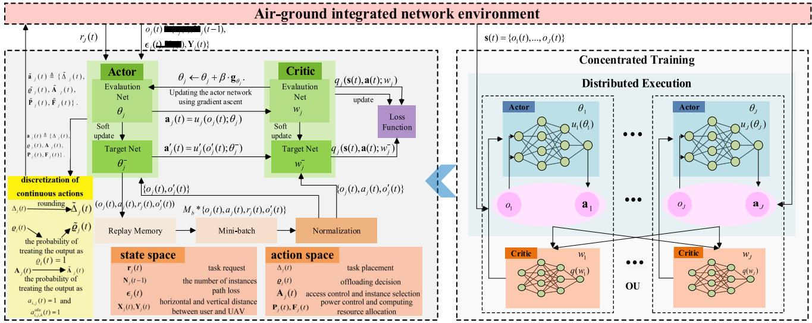

flowchart

Air-ground integrated network architecture diagram showing actor and critic evaluation, state space, and distributed execution components with decision nodes and loss function.

Fig. 2. Framework of the proposed MINLP tailored MADDPG algorithm.   
Algorithm 1 Joint Optimization Algorithm Based on MADDPG for MINLP

# Require:

1: Initialize the weight parameters $\theta _ { j }$ and wj of the primary actor and critic, and initialize the parameters $\theta _ { j } ^ { - }$ and $w _ { j } ^ { - }$ for the target actor and critic by letting $\theta _ { j }  \theta _ { i } ^ { - }$ and $\alpha _ { j }  \alpha _ { j } ^ { - }$ , respectively.   
2: Initialize the learning rate α and β corresponding to the critic and actor networks, the discount factor γ , the number of episode $E P ,$ and the maximum number of training steps per episode $T ^ { \mathrm { m a x } }$ .   
3: Initialize the experience pool D, the size of mini-batch M, and the random process  for action exploration.   
4: Initialize the network layout parameters, such as the number of UEs I, the number of UAVs J, the parameters of tasks, etc.

# Ensure:

5: for episode $= 1 { : } E P$ do   
6: Each UAV is initialized with an initial state $o _ { j } ( t ) ,$ , and the central controller obtains the global state s(t).   
7: for each step $t = 1 : T ^ { \mathrm { m a x } }$ do   
8: for agent $j = 1 : J$ do   
9: Takes action $\mathbf { a } _ { j } ( t ) = \mu _ { j } ( \mathbf { s } ( t ) ; \theta _ { j } ) + \boldsymbol { \Psi } ( t ) .$   
10: Reform action ${ \bf a } _ { j } ( t )$ as $\widetilde { \mathbf { a } } _ { j } ( t ) .$   
11: Execute the action $\widetilde { \mathbf { a } } _ { j } ( t )$ , receives its reward $r ( t )$ , and the next observe $o _ { j } ( t + \mathbf { \bar { 1 } } )$ .   
12:   
13: Obtain s(t) and a(t) according to (28) and (30).   
14: Store $< { \bf s } ( t ) , \tilde { \bf a } ( t ) , { \bf r } ( t ) , { \bf s } ( t + 1 ) >$ in experience pool D.   
15: Set $\mathbf { s } ( t ) \gets \mathbf { s } ( t + 1 ) .$   
16: if Reply buffer is full then   
17: for agent $n = 1 : J$ do   
18: Randomly select M samples from the experience pool to create a mini-batch.   
19: Update the primary actor and critic networks via (18) and (24), respectively.   
20: Update the target networks via (25).   
21: end for   
22: end if   
23: end for   
24: end for

which encompasses service placement, task offloading, access control, and resource allocation. As shown in Fig. 2 and Algorithm 1, at the beginning of each episode, each agent j observes the environment and acquires its initial state $o _ { j } ( t )$ ,

and the central controller deployed at the primary UAV obtains the global state s(t). Based on $\mathbf { s } ( t )$ , each actor obtains its action ${ \bf a } _ { j } ( t ) = \mu _ { j } ( { \bf s } ( t ) ; \theta _ { j } )$ , i.e., the joint task placement, offloading decision, access control and instance selection, transmit power control, and computation resource assignment, by providing the state as input to the actor network. In order to enhance the exploration capabilities of the algorithm, a noise (t) which is randomly sampled from an Ornstein–Uhlenbeck process is incorporated into $\mu _ { j } ( \mathbf { s } ( t ) ; \theta _ { j } )$ , and the action becomes ${ \bf a } _ { j } ( t ) ~ = ~ \mu _ { j } ( { \bf s } ( t ) ; \theta _ { j } ) + \psi ( t )$ . Then transform action as in Section V-C, ${ \bf a } _ { j } ( t )$ becomes valid action $\widetilde { \mathbf { a } } _ { j } ( t )$ . Each agent executes its corresponding action $\widetilde { \mathbf { a } } _ { j } ( t )$ , and it will receive its reward $r _ { j } ( t )$ , and its observation will transit to $o _ { j } ( t + 1 )$ , and meanwhile, the global environment will transform to the next state $\mathbf s ( t + 1 )$ .

Then we store the experience $< { \bf s } ( t ) , { \bf a } ( t ) , r ( t ) , { \bf s } ( t + 1 ) >$ into the experience pool. If the experience pool becomes full, randomly choose M samples from it to create a minibatch. This mini-batch will be utilized to train the actor and critic networks, according to the procedures described in (18) and (24). Finally, all target networks are updated according to (25).

# E. Complexity Analysis

In each training step, the MADDPG algorithm samples and stores experiences from the J agents, and then sample batch of M experiences from the stored memory for training each agent. During each time step, the MADDPG algorithm computes and updates the action policies and value functions of each agent, which involves the forward and backward propagation of neural networks. The MADDPG algorithm utilizes deep neural networks to construct the actor and critic networks, which consist of input layers, hidden layers, and output layers. Specifically, the actor network takes the state space as input and produces actions as output, while the critic network takes the concatenation of the state and action spaces as input and outputs Q-values. The primary factor influencing the time complexity is the dimensionality of the network structures.

TABLE I PARAMETER NOTATIONS AND DEFAULT VALUE SETTINGS 

<table><tr><td>Parameter</td><td>Notations</td><td>Value</td></tr><tr><td>Number of UEs</td><td> $I$ </td><td>10 [37]</td></tr><tr><td>Number of UAVs</td><td> $J$ </td><td>3 [14]</td></tr><tr><td>Number of tasks</td><td> $H$ </td><td>10</td></tr><tr><td>UEs’ local processing capability</td><td> $f_{i}^{l}$ </td><td>0.06 G CPU cycles/s [9]</td></tr><tr><td>UEs’ maximum transmit power</td><td> $p^{max}$ </td><td>0.1 W [16]</td></tr><tr><td>Input data size of task</td><td> $D_{h}$ </td><td>8 Mb [7]</td></tr><tr><td>Processing density of task</td><td> $\Xi_{h}$ </td><td>1000 CPU cycles/s</td></tr><tr><td>Size of each task instance</td><td> $w_{h}$ </td><td>800 Mb</td></tr><tr><td>Delay tolerance of tasks</td><td> $T_{h}^{max}$ </td><td>1 s [14]</td></tr><tr><td>Processing capability of MEC server</td><td> $f_{j}^{max}$ </td><td>12 G CPU cycles/s [16] [6]</td></tr><tr><td>Storage capacity of each MEC server</td><td> $\Pi_{j}$ </td><td>3 G</td></tr><tr><td>Bandwidth of each UAV</td><td> $B_{j}$ </td><td>(1,5) GHz [23]</td></tr><tr><td>Carrier frequency</td><td> $f_{c}$ </td><td> $1.2 \times 10^{9}$  Hz</td></tr><tr><td>Speed of light</td><td> $c$ </td><td> $3 \times 10^{8}$  m/s [23]</td></tr><tr><td>Environment-determined variables</td><td> $\alpha_{1}$  and  $\alpha_{2}$ </td><td>1.88, 0.43 [38]</td></tr><tr><td>The power spectral density of noise</td><td> $\sigma^{2}$ </td><td> $17 \times 10^{-12}$  [18]</td></tr><tr><td>Price of UAV communication resource</td><td> $\eta^{j,1}$ </td><td> $1 \times 10^{-9}$  $/bps</td></tr><tr><td>Price of UAV computation resource</td><td> $\eta^{j,2}$ </td><td> $4 \times 10^{-9}$  $(CPU cycles/s)</td></tr><tr><td>Price of local computation resource</td><td> $\eta_{i}^{l}$ </td><td> $0.2 \times 10^{-9}$  $(CPU cycles/s)</td></tr><tr><td>Service instance initializing delay</td><td> $D_{h,j}^{place}$ </td><td>0.1 s</td></tr><tr><td>Cost for using a new deployed instance</td><td> $\lambda_{h,j}$ </td><td>0.001 $</td></tr><tr><td>Weight of delay</td><td> $\gamma^{1}$ </td><td>0.3 Utility/s</td></tr><tr><td>Weight of expense</td><td> $\gamma^{2}$ </td><td>0.7 Utility/$</td></tr><tr><td>Cost of delay</td><td> $\vartheta^{t}$ </td><td>0.008 Cost/s</td></tr><tr><td>Cost of expense</td><td> $\vartheta^{e}$ </td><td>0.004 Cost/$</td></tr><tr><td>Task placement threshold</td><td> $thres$ </td><td>3</td></tr><tr><td>Access distance threshold</td><td> $D_{th}$ </td><td>300 m [3]</td></tr></table>

The computational complexity required for training each actor using a piece of experience is $O _ { \mathrm { a c t o r } } = O ( R H + H ^ { 2 } + H L )$ , where R represents the dimensionality of the state space, H represents the number of neurons in the hidden layers (there are two hidden layers in our network), and L represents the dimensionality of the action space. Similarly, the time complexity of the critic network can be represented as $O _ { \mathrm { c r i t i c } } =$ $O ( ( R + L ) H + H ^ { 2 } + H )$ . Since the target actor and critic networks have the same network structure as the actor and critic networks, the algorithm complexity for a single agent can be expressed as follows $O _ { \mathrm { s i n g l e } } = O ( 2 ( R H + H ^ { 2 } + H L ) +$ $2 ( ( R + L ) H + H ^ { 2 } + H ) )$ . Therefore, we can determine the overall time complexity of the algorithm is ${ \cal O } = { \cal O } ( 2 J M ( R H + H ^ { 2 } +$ $H L + ( R + L ) H + H ^ { 2 } + H ) )$ ).

# VI. SIMULATION RESULTS AND DISCUSSION

In this section, we assess the performance of our proposed MADDPG algorithm for MINLP through simulation. Default parameter settings are exhibited in Table I, and they will keep unchanged in the following simulations unless otherwise stated. Our simulation was run on python 3.7, pycharm 2021 and tensorflow 1.14.

In the subsequent analysis, we initially assess the convergence of the proposed MADDPG algorithm for MINLP under various learning rates. Subsequently, we compare its performance with several baseline algorithms to provide a comprehensive evaluation. To simplify notation, we refer to our proposed MINLP tailored MADDPG algorithm as “Proposed” or “our proposed algorithm” in the subsequent discussions, which means that we conduct the joint optimization as defined in problem $( \mathcal { P } _ { 1 } )$ . The comparison algorithm are given as follows.

1) Placement-Offloading-Power-Optimization (POPO): The access control strategy takes random values and other strategies are optimized using our proposed algorithm. POPO shares similarities with the approach presented in [39], where optimizations are performed for task placement, offloading decisions, and transmit power control. Besides, POPO also optimize computation resource allocation in UAVs. Furthermore, while each service in [39] can serve all tasks of the service, in POPO, each service instance can only serve a single task.   
2) Only-Task-Placement-Offloading-Access (OTPOA): Only the task placement, task offloading, and access control policies are optimized using our proposed algorithm, while the transmit power control and computing resource allocation policies are randomized.   
3) All-Offloading: All UEs perform task offloading, i.e., the offloading decision of all UEs equals to 1, and other policies, including task placement, access control, transmission power control, and computing resource allocation, are optimized using our proposed algorithm.   
4) Random: All decisions are made randomly, and there is no concepts of states, actions and training process as in other algorithms. Specifically, in this algorithm, the states variables as in the proposed algorithm, will

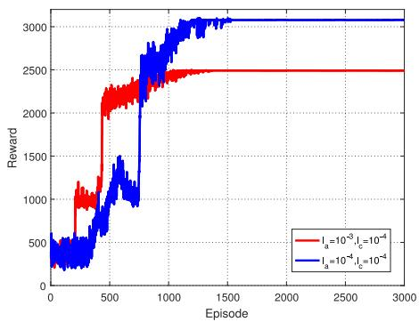

line

| Episode | Reward (I_a=10^-3, I_c=10^-4) | Reward (I_a=10^-4, I_c=10^-4) |
| ------- | ------------------------------ | ----------------------------- |
| 0       | 300                            | 300                           |
| 500     | 1000                           | 1000                          |
| 1000    | 2500                           | 2500                          |
| 1500    | 2500                           | 3000                          |
| 2000    | 2500                           | 3000                          |
| 2500    | 2500                           | 3000                          |
| 3000    | 2500                           | 3000                          |

Fig. 3. Convergence of our proposed algorithm under various learning rate for the actor network.

act as general known quantities, and these quantities are coupled between different time slots as the state transition of our proposed algorithm. Also, the optimization variables, i.e., the actions as in Proposed, are also considered as known quantities, which are generated randomly from their value range.

# A. Convergence of Algorithm 1

Figs. 3 and 4 demonstrate the convergence of our proposed algorithm under different combinations of learning rates. The x-axis of both figures stands for the episodes, while the yaxis means the immediate total reward of all agents in each episode. Notably, it is evident from both figures that our proposed algorithm achieves convergence regardless of the selected learning rate. In Fig. 3, we set the learning rate of the critic network as $l _ { c } = 1 0 ^ { - 4 }$ , and for the actor network, we evaluate two different learning rates, namely, $l _ { a } = 1 0 ^ { - 3 }$ and $l _ { a } = 1 0 ^ { - 4 }$ . In Fig. 4, we maintain the learning rate of the actor network at $l _ { a } = 1 0 ^ { - 4 }$ , while examining the impact of different learning rates for the critic network, specifically $l _ { c } = 1 0 ^ { - 3 }$ and $l _ { c } = 1 0 ^ { - 4 }$ . Both the curves in the two figures converge at nearly the 1500th episode, which proves that our algorithm converges quickly in solving our complicated problem ( 1).

Fig. 5 illustrates the performance and convergence of the above mentioned four algorithms, i.e., proposed, POPO, OTPOA, and all-offloading. In the comparison, all parameters take their default settings. From the figure, it can be observed that all four algorithms exhibit good convergence performance. However, among these algorithms, our proposed algorithm is superior to the other three in both convergence speed and reward performance. In convergence speed, the proposed algorithm converges slightly faster than other algorithms, and when it converges, the reward almost keeps stable in the following episodes, while the baseline algorithms still fluctuate to a certain extent after convergence.

Next we compare the reward performance among Proposed and the baseline algorithms. Since our objective is to minimize the total cost of the system, while the reward is defined as the reciprocal of the total cost, it follows that a higher reward corresponds to better performance. Thus, in the subsequent simulations, higher reward values indicate improved performance in terms of cost reduction. Among the baseline algorithms, POPO does not incorporate an optimized access control strategy, so the performance gap between it and our proposed algorithm can therefore reflect the performance improvement achieved through access control optimization. Similarly, OTPOA does not optimize the transmit power and computation resource allocation strategies, and thus, the performance gap between OTPOA and our proposed algorithm highlights the performance gain resulting from optimized transmit power control; and all-offloading does not incorporate an optimized offloading strategy, and therefore, the performance gap observed between it and our proposed algorithm can be attributed to the performance improvement resulting from optimized task offloading decision-making. Based on the performance depicted in Fig. 5, it is evident that our proposed algorithm achieves the best performance among the evaluated algorithms. It is followed by POPO, all-offloading, and finally OTPOA, in descending order of performance.

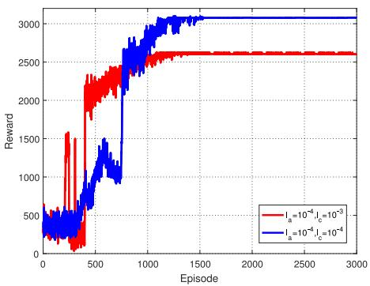

line

| Episode | Reward (I_a=10^-4, I_c=10^-3) | Reward (I_a=10^-4, I_c=10^-4) |
| ------- | ------------------------------ | ----------------------------- |
| 0       | 500                            | 500                           |
| 500     | 2500                           | 2500                          |
| 1000    | 2600                           | 2800                          |
| 1500    | 2600                           | 3000                          |
| 2000    | 2600                           | 3000                          |
| 2500    | 2600                           | 3000                          |
| 3000    | 2600                           | 3000                          |

Fig. 4. Convergence of our proposed algorithm under various learning rate for the critic network.   
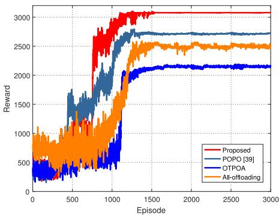

line

| Episode | Proposed | POPO [39] | OTPOA | All-offloading |
| ------- | -------- | --------- | ----- | -------------- |
| 0       | 500      | 500       | 500   | 500            |
| 500     | 1500     | 1500      | 1500  | 1500           |
| 1000    | 2500     | 2500      | 2000  | 2500           |
| 1500    | 3000     | 2750      | 2200  | 2750           |
| 2000    | 3000     | 2750      | 2200  | 2750           |
| 2500    | 3000     | 2750      | 2200  | 2750           |
| 3000    | 3000     | 2750      | 2200  | 2750           |

Fig. 5. Comprehensive performance comparison between the four algorithms.

In Fig. 6, we plot the curve depicting the relationship between local processing capacity of UEs and the average system reward of each episode after the algorithm converges (which is shorted as system reward). When the local processing capacity increases, except for all-offloading, the rewards of other algorithms gradually increase. This is because when local processing capacity increase, task processing delay will be reduced, and the cost will be reduced for one hand; moreover, for proposed, POPO, and OTPOA, when local processing capacity increases, local processing will be feasible for many UEs, and the three algorithms will let more UEs to process their tasks locally by task offloading optimization. As a result, little economic expenditure will be spend, and the cost will further be reduced for another hand. When cost is reduced, the system immediate reward will be increased. For all-offloading algorithm, since all UEs offload their tasks to UAV processing, the local processing capability of UEs will not affect the system cost, and further has no effect on the system reward it could obtain. However, since all-offloading algorithm offloads all tasks to the UAV for execution, the local processing capability of UEs will not affect the system cost and the system reward it could obtain, making the reward of the all-offloading algorithm remains relatively constant as the local processing capacity increases. From Fig. 6, it is evident that our proposed algorithm consistently maintains the highest reward. This demonstrates the robustness and effectiveness of our algorithm in achieving optimal performance regardless of changes in local processing capacity.

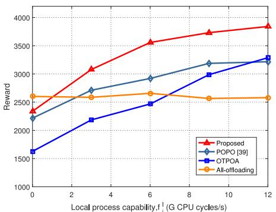

line

| Local process capability, f | Proposed | POPO [39] | OTPOA | All-offloading |
| --------------------------- | -------- | --------- | ----- | ------------- |
| 0                           | 2400     | 2200      | 1650  | 2600          |
| 3                           | 3100     | 2700      | 2150  | 2600          |
| 6                           | 3600     | 2900      | 2450  | 2650          |
| 9                           | 3800     | 3200      | 3000  | 2550          |
| 12                          | 3900     | 3300      | 3300  | 2550          |

Fig. 6. Reward versus local processing capability of UEs $f _ { i } ^ { l } .$ .

In Fig. 7, we present the relationship between the input data size $D _ { h }$ and the system reward. As was defined, the computation amount is defined as $C _ { h } \ = \ D _ { h } \Xi _ { h }$ , which is tightly coupled with the input data size $D _ { h }$ . When the task data size is very small, the computation amount $C _ { h }$ is also very tiny, the majority of tasks can be effectively executed locally. As a result, the rewards achieved by the Proposed, POPO, and OTPOA are very similar. In this scenario, the need for task offloading is minimal, and the impact of factors related to edge processing, such as access control and power control strategies, is relatively insignificant. Consequently, the performance of these algorithms is very close, leading to similar reward values. For all-offloading algorithm, all tasks are offloaded to the UAV for processing, which increases the processing latency and incurs higher economic expenditure, leading to a decrease in the obtained reward. As the input data size $D _ { h }$ increases, the rewards of all four algorithms gradually decrease. This is because the data transmit delay and the fees for data transmission in task offloading will increase, which will contribute to a decrease in the system reward. When $D _ { h }$ is greater than 6 Mbit, since the default processing density is defined as $\Xi _ { h } ~ = ~ 1 0 0 0$ in this article, the computation amount $C _ { h }$ will be quite large, and at this point, the optimal choice will be offloading all tasks to the edge servers for processing, which is achieved by all-offloading. Because joint access control, task placement and task offloading decision optimization, our proposed algorithm could achieve nearly the same performance with all-offloading, which reflects in Fig. 7 that they both could obtain nearly the same reward.

In Fig. 8, we present the relationship between the maximum task processing tolerable latency $T _ { h } ^ { \mathrm { m a x } }$ and the system reward. Whe n $T _ { h } ^ { \mathrm { m a x } }$ h is extremely low, indicating stringent latency requirements, significant computational resources are required for task processing. At this stage, none of the four algorithms can handle tasks locally, and task offloading becomes necessary. However, the data transmission in task offloading, service deployment, and task processing by the UAV all introduce certain latency, which cannot be completed within the limited time of $T _ { h } ^ { \mathrm { m a x } }$ , and UAV processing will also infeasible. Consider the reward function that we defined earlier, when any constraints could not be satisfied, the reward will be zero. Therefore, the obtained reward of all algorithms are zero at this point.

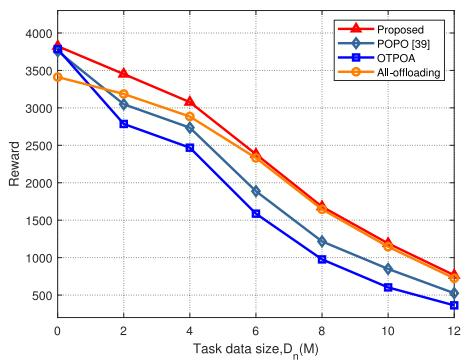

line

| Task data size, Dₙ (M) | Proposed | POPO [39] | OTPOA | All-offloading |
| ---------------------- | -------- | --------- | ----- | ------------- |
| 0                      | 3800     | 3700      | 3700  | 3400          |
| 2                      | 3500     | 3100      | 2800  | 3200          |
| 4                      | 3100     | 2700      | 2400  | 2900          |
| 6                      | 2400     | 1900      | 1600  | 2300          |
| 8                      | 1700     | 1200      | 1000  | 1600          |
| 10                     | 1200     | 800       | 600   | 1100          |
| 12                     | 800      | 500       | 400   | 700           |

Fig. 7. Reward versus input data size $D _ { h } .$ .

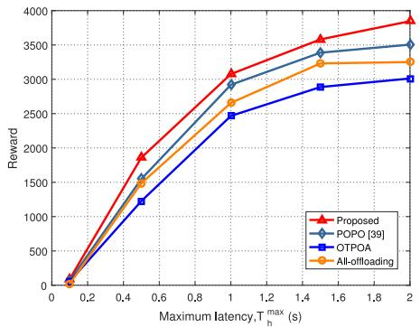

line

| Maximum latency, T_max_h (s) | Proposed | POPO [39] | OTPOA | All-offloading |
| ---------------------------- | -------- | --------- | ----- | -------------- |
| 0.2                          | 0        | 0         | 0     | 0              |
| 0.4                          | 1800     | 1600      | 1200  | 1500           |
| 0.6                          | 2000     | 1800      | 1400  | 1700           |
| 1.0                          | 3100     | 3000      | 2500  | 2700           |
| 1.4                          | 3600     | 3400      | 2900  | 3200           |
| 2.0                          | 3900     | 3500      | 3100  | 3300           |

Fig. 8. Reward versus the maximum task processing latency $T _ { h } ^ { \mathrm { m a x } }$

As the maximum tolerable latency for task processing increases to 0.5 s, it becomes feasible to process some tasks either locally or on the UAV. Therefore, the system’s reward grows rapidly at this stage for all algorithms, and this increase continues until $T _ { h } ^ { \mathrm { m a x } } = 1 ~ \mathrm { s }$ . When $T _ { h } ^ { \operatorname* { m a x } } > 1$ , most tasks can be processed by the system, so the reward growth slows down. As $T _ { h } ^ { \mathrm { m a x } } > 1 . 5 .$ , nearly all tasks can be successfully executed by a UAV or the UE itself. As a result, the reward of alloffloading algorithm stops growing, because there is no further performance gain from task offloading optimization. For the other three algorithms, as they have the flexibility to choose between local and UAV execution based on optimization criteria, they can effectively decrease latency and economic costs, resulting in a slight increase in system reward. What is more, when the maximum task processing latency increases, our proposed algorithm consistently outperforms all-offloading, POPO, and OTPOA in terms of reducing overall system cost and therefore maximizing the system reward.

In Fig. 9, we depict the relationship between the task placement threshold thre and the system reward. When thre = 0, it implies that the UAVs are unable to deploy and handle any tasks. In such a scenario, our proposed algorithm, POPO, and OTPOA utilize task offloading decision optimization to determine that tasks should be processed locally, thereby enabling them to receive a certain amount of reward. However, in most cases, the limited processing capability of UEs often results in the inability to accomplish a significant portion of tasks, making the QoS constraints are frequently not met, and thus the reward is usually 0 as defined by our reward function in (31). Consequently, the system reward is generally low in such scenarios. For alloffloading, tasks can only be offloaded to UAVs for processing. However, since the UAVs are incapable of handling any tasks, all-offloading will receive a reward of 0 in this particular case. As thre increases from 0 to 4, the reward for all four algorithms experiences a significant growth. This can be attributed to the ability to deploy more instances at UAVs, resulting in an increased capacity for processing tasks with lower latency, and therefore more reward. As thre continues to increase, the reward for the four curves grows at a slower pace. In this scenario, even though each UAV can be deployed with more instances, the actual number of instances that can be deployed is constrained by the storge capability of UAVs. As a result, the incremental benefits in reward derived from increasing thre become progressively smaller over time. Moreover, it is noteworthy that our proposed algorithm consistently demonstrates the highest reward when the task placement threshold is fixed at any given point.

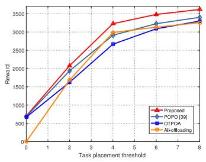

line

| Task placement threshold | Proposed | POPO [39] | OTPOA | AB-offloading |
| ------------------------- | -------- | --------- | ----- | ------------ |
| 0                         | 700      | 700       | 700   | 0            |
| 2                         | 2100     | 2000      | 1600  | 1600         |
| 4                         | 3200     | 3000      | 2700  | 3000         |
| 6                         | 3500     | 3200      | 3100  | 3100         |
| 8                         | 3600     | 3300      | 3200  | 3200         |

Fig. 9. Reward versus task placement threshold thre.

In Fig. 10, we illustrate the correlationreward and the service deployment latency $D _ { h , j } ^ { \mathsf { p l a c e } }$ en the system. As indicated selecting a newly initialized instance in the UAV processing mode. When Dplaceh,j $D _ { h , j } ^ { \mathsf { \tilde { p l a c e } } }$ is extremely small, the task completion delay is primarily attributed to data transmission and processing, with no additional time spent on service instance placement. As a result, the reward is significantly higher. As Dplace $D _ { h , j } ^ { \mathsf { p l a c e } }$ increases, the data transmission and processing may exceed the available time frame of Tmaxh − Dplaceh,j $T _ { h } ^ { \mathrm { m a x } } - D _ { h , j } ^ { \mathrm { p l a c e } }$ for numerous UEs when utilizing a newly initialized service instance. Consequently, the system reward experiences a rapid decline. When Dplace $\dot { D } _ { h , j } ^ { \mathrm { p l a c e } } > 1$ h,j , i.e., the service placement delay exceeds the maximum required task completion delay, the QoS requirement (C15) cannot be fulfilled when utilizing a newly initialized service instance. Consequently, the reward in this scenario will be zero. Since local processing and using an existing instance for task processing may be feasible, our proposed algorithms, POPO and OTPOA, can still yield certain system rewards by leveraging such situations. For all-offloading, the service deployment latency is extremely high and the storage capacity of UAV edge nodes is limited, tasks cannot be completed within $T _ { h } ^ { \mathrm { m a x } }$ . Consequently, the reward in these cases will be zero. Furthermore, it is evident that our proposed algorithm consistently outperforms others regardless of the values of Dplaceh,j . $D _ { h , j } ^ { \mathsf { p l a c } \epsilon }$

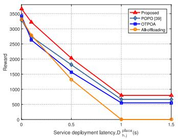

line

| Service deployment latency, D_place_hj (s) | Proposed | POPO [39] | OTPOA | All-offloading |
| ---------------------------------------- | -------- | --------- | ----- | ------------- |
| 0                                        | 3500     | 3500      | 3500  | 3500          |
| 0.5                                      | 2000     | 1800      | 1600  | 1400          |
| 1.0                                      | 800      | 700       | 600   | 0             |
| 1.5                                      | 800      | 700       | 600   | 0             |

Fig. 10. Reward versus service deployment latency $D _ { h , j } ^ { \mathsf { p l a c e } }$ Dh,j

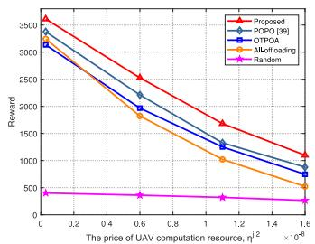

line

| The price of UAV computation resource, n^2 ×10^-9 | Proposed | POPO [39] | QTOA | Alkoffloading | Random |
|---|---|---|---|---|---|
| 0 | 3600 | 3400 | 3200 | 3100 | 400 |
| 0.2 | 3400 | 3200 | 3000 | 2900 | 400 |
| 0.6 | 2800 | 2400 | 2000 | 1800 | 400 |
| 1.0 | 2200 | 1800 | 1500 | 1200 | 400 |
| 1.2 | 1700 | 1400 | 1200 | 1100 | 400 |
| 1.6 | 1200 | 1100 | 800 | 700 | 350 |

Fig. 11. Reward versus UAVs’ computation resource price $\eta ^ { j , 2 }$ .

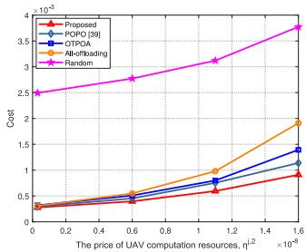

line

| The price of UAV computation resources, η² × 10⁻⁸ | Proposed | POPO [39] | OTPQA | All-offloading | Random |
|---|---|---|---|---|---|
| 0.0 | 0.25 | 0.25 | 0.25 | 0.25 | 2.5 |
| 0.4 | 0.35 | 0.4 | 0.4 | 0.45 | 2.7 |
| 0.8 | 0.5 | 0.6 | 0.6 | 0.7 | 3.0 |
| 1.2 | 0.75 | 0.85 | 0.85 | 1.0 | 3.2 |
| 1.6 | 1.0 | 1.15 | 1.4 | 2.0 | 3.8 |

Fig. 12. Cost versus UAVs’ computation resource price $\eta ^ { j , 2 } .$

In Figs. 11 and 12, we demonstrate the system reward and cost versus the price of UAVs’ computation resources $\eta ^ { j , 2 }$ . There are two points that should be noted.

1) In the two figures, we add random as a baseline algorithm.   
2) The cost in Fig. 12 equals to the reciprocal of the reward of each episode, which is motivated from the definition of reward as in (32).

However, (32) is defined for each time slot, and the cost in Fig. 12 is defined for each episode. Although the time scale is not exactly the same, the cost in Fig. 12 can also reflect the cost of the system.

When the price of UAVs’ computation resource is very low, except for random, all other algorithms could gain relatively large reward, and correspondingly, the cost is very small. With the increase of ηj,2, more money will be spent in $\eta ^ { j , 2 }$ task processing, and the reward of all algorithms decrease, and the costs increase meanwhile. Since there is no any optimization in random, the performance of random is very poor, where the reward of random is much smaller and the cost of random is much higher than other algorithms as shown in Figs. 11 and 12. It can also be observed that, the proposed algorithms always performs the best under different values of $\eta ^ { j , 2 }$ .

# VII. CONCLUSION

In this article, we have conducted a comprehensive investigation of the task offloading process in an AGIN, encompassing both the service placement and task offloading stages. In service deployment stage, we optimized the application placement and replacement issues, with the constraints on the storage capacity satisfied. In the task offloading stage, we focused on optimizing several key aspects, including the task offloading decision, access control and service instance selection, transmit power control for each UE, and computation resource assignment for each UAV. Since the problem is a MINLP problem with tightly coupled optimization variables, it poses significant challenges for traditional optimization techniques to find an optimal solution efficiently. Also, as we intended to realize long-term system cost minimization, and our problem contains continuous variables, which motivates us to use MADDPG to solve the problem. We further improve MADDPG to adapt to our MINLP problem in solving the integer variables with the coupling between variables guaranteed. Simulation results have demonstrated the efficacy of our proposed algorithm, which exhibits fast convergence and outperforms other baseline algorithms in terms of maximizing the reward, i.e., weighted sum of task processing delay and economic expenditure cost reduction.

# REFERENCES

[1] D. Zhou, M. Sheng, J. Wu, J. Li, and Z. Han, “Gateway placement in integrated satellite-terrestrial networks: Supporting communications and Internet of Remote Things,” IEEE Internet Things J., vol. 9, no. 6, pp. 4421–4434, Mar. 2022.   
[2] D. Zhou, M. Sheng, Y. Wang, J. Li, and Z. Han, “Machine learning based resource allocation in satellite networks supporting Internet of Remote Things,” IEEE Trans. Wireless Commun., vol. 20, no. 10, pp. 6606–6621, Oct. 2021.   
[3] Z. Zhang et al., “Energy-efficient secure video streaming in UAV-enabled wireless networks: A safe-DQN approach,” IEEE Trans. Green Commun. Netw., vol. 5, no. 4, pp. 1892–1905, Dec. 2021.   
[4] J. Liu, X. Zhang, R. Zhang, T. Huang, and F. R. Yu, “Reliable and low-overhead clustering in LEO small satellite networks,” IEEE Internet Things J., vol. 9, no. 16, pp. 14844–14856, Aug. 2022.   
[5] J. Kang et al., “Personalized saliency in task-oriented semantic communications: Image transmission and performance analysis,” IEEE J. Sel. Areas Commun., vol. 41, no. 1, pp. 186–201, Jan. 2023.   
[6] X. Ren et al., “AI-bazaar: A cloud-edge computing power trading framework for ubiquitous AI services,” IEEE Trans. Cloud Comput., vol. 11, no. 3, pp. 2337–2348, Jul.–Sep. 2023, doi: 10.1109/TCC.2022.3201544.   
[7] L. Liu, J. Feng, X. Mu, Q. Pei, D. Lan, and M. Xiao, “Asynchronous deep reinforcement learning for collaborative task computing and on-demand resource allocation in vehicular edge computing,” IEEE Trans. Intell. Transp. Syst., early access, Mar. 6, 2023, doi: 10.1109/TITS.2023.3249745.   
[8] X. Yuan, J. Chen, N. Zhang, J. Ni, F. R. Yu, and V. C. Leung, “Digital twin-driven vehicular task offloading and IRS configuration in the Internet of Vehicles,” IEEE Trans. Intell. Transp. Syst., vol. 23, no. 12, pp. 24290–24304, Dec. 2022.   
[9] J. Du, F. R. Yu, G. Lu, J. Wang, J. Jiang, and X. Chu, “MEC-assisted immersive VR video streaming over terahertz wireless networks: A deep reinforcement learning approach,” IEEE Internet Things J., vol. 7, no. 10, pp. 9517–9529, Oct. 2020.

[10] X. Yuan et al., “FedSTN: Graph representation driven federated learning for edge computing enabled urban traffic flow prediction,” IEEE Trans. Intell. Transp. Syst., vol. 24, no. 8, pp. 8738–8748, Aug. 2023.   
[11] R. Zhang et al., “Buffer-aware virtual reality video streaming with personalized and private viewport prediction,” IEEE J. Sel. Areas Commun., vol. 40, no. 2, pp. 694–709, Feb. 2022.   
[12] S. Bi, L. Huang, and Y. J. A. Zhang, “Joint optimization of service caching placement and computation offloading in mobile edge computing systems,” IEEE Trans. Wireless Commun., vol. 19, no. 7, pp. 4947–4963, Jul. 2020.   
[13] Z. Cheng, M. Min, M. Liwang, L. Huang, and Z. Gao, “Multiagent DDPG-based joint task partitioning and power control in fog computing networks,” IEEE Internet Things J., vol. 9, no. 1, pp. 104–116, Jan. 2022.   
[14] S. Mao, S. He, and J. Wu, “Joint UAV position optimization and resource scheduling in space-air-ground integrated networks with mixed cloud-edge computing,” IEEE Syst. J., vol. 15, no. 3, pp. 3992–4002, Sep. 2021.   
[15] H. Guo, X. Zhou, Y. Wang, and J. Liu, “Achieve load balancing in multi-UAV edge computing IoT networks: A dynamic entry and exit mechanism,” IEEE Internet Things J., vol. 9, no. 19, pp. 18725–18736, Oct. 2022.   
[16] G. Zheng, C. Xu, M. Wen, and X. Zhao, “Service caching based aerial cooperative computing and resource allocation in multi-UAV enabled MEC systems,” IEEE Trans. Veh. Technol., vol. 71, no. 10, pp. 10934–10947, Oct. 2022.   
[17] X. Duan, Y. Zhou, D. Tian, J. Zhou, Z. Sheng, and X. Shen, “Weighted energy-efficiency maximization for a UAV-assisted multiplatoon mobileedge computing system,” IEEE Internet Things J., vol. 9, no. 19, pp. 18208–18220, Oct. 2022.   
[18] X. He, R. Jin, and H. Dai, “Multi-hop task offloading with on-thefly computation for multi-UAV remote edge computing,” IEEE Trans. Commun., vol. 70, no. 2, pp. 1332–1344, Feb. 2022.   
[19] J. Kang et al., “Communication-efficient and cross-chain empowered federated learning for artificial intelligence of things,” IEEE Trans. Netw. Sci. Eng., vol. 9, no. 5, pp. 2966–2977, Sep./Oct. 2022.   
[20] M. Li, P. Si, R. Yang, Z. Wang, and Y. Zhang, “UAV-assisted data transmission in blockchain-enabled M2M communications with mobile edge computing,” IEEE Netw., vol. 34, no. 6, pp. 242–249, Nov./Dec. 2020.   
[21] N. Cheng et al., “Space/aerial-assisted computing offloading for IoT applications: A learning-based approach,” IEEE J. Sel. Areas Commun., vol. 37, no. 5, pp. 1117–1129, May 2019.   
[22] H. Liao et al., “Blockchain and semi-distributed learning-based secure and low-latency computation offloading in space-air-ground-integrated power IoT,” IEEE J. Sel. Topics Signal Process., vol. 16, no. 3, pp. 381–394, Apr. 2022.   
[23] Y. Gong, H. Yao, D. Wu, W. Yuan, T. Dong, and F. R. Yu, “Computation offloading for rechargeable users in space-air-ground networks,” IEEE Trans. Veh. Technol., vol. 72, no. 3, pp. 3805–3818, Mar. 2023.   
[24] H. Peng and X. Shen, “Multi-agent reinforcement learning based resource management in MEC-and UAV-assisted vehicular networks,” IEEE J. Sel. Areas Commun., vol. 39, no. 1, pp. 131–141, Jan. 2021.   
[25] Y. Chen, Y. Sun, B. Yang, and T. Taleb, “Joint caching and computing service placement for edge-enabled IoT based on deep reinforcement learning,” IEEE Internet Things J., vol. 9, no. 19, pp. 19501–19514, Oct. 2022.   
[26] X. Gao, R. Liu, and A. Kaushik, “Virtual network function placement in satellite edge computing with a potential game approach,” IEEE Trans. Netw. Service Manage., vol. 19, no. 2, pp. 1243–1259, Jun. 2022.   
[27] S. Yu, X. Gong, Q. Shi, X. Wang, and X. Chen, “EC-SAGINs: Edgecomputing-enhanced space–air–ground-integrated networks for Internet of Vehicles,” IEEE Internet Things J., vol. 9, no. 8, pp. 5742–5754, Apr. 2022.   
[28] S. Yu, X. Chen, Z. Zhou, X. Gong, and D. Wu, “When deep reinforcement learning meets federated learning: Intelligent multitimescale resource management for multiaccess edge computing in 5G ultradense network,” IEEE Internet Things J., vol. 8, no. 4, pp. 2238–2251, Feb. 2021.   
[29] J. Du, Y. Sun, N. Zhang, Z. Xiong, A. Sun, and Z. Ding, “Costeffective task offloading in NOMA-enabled vehicular mobile edge computing,” IEEE Syst. J., vol. 17, no. 1, pp. 928–939, Mar. 2023.   
[30] Y. Li, W. Liang, and J. Li, “Profit maximization for service placement and request assignment in edge computing via deep reinforcement learning,” in Proc. 24th Int. ACM Conf. Model., Anal. Simulat. Wireless Mobile Syst., Nov. 2021, pp. 51–55.

[31] H. Zhu, Q. Wu, X. Wu, J. Fan, P. Fan, and J. Wang, “Decentralized power allocation for MIMO-NOMA vehicular edge computing based on deep reinforcement learning,” IEEE Internet Things J., vol. 9, no. 14, pp. 12770–12782, Jul. 2022.   
[32] F. Fu, Y. Kang, Z. Zhang, F. R. Yu, and T. Wu, “Soft actor–critic DRL for live transcoding and streaming in vehicular fog-computing-enabled IoV,” IEEE Internet Things J., vol. 8, no. 3, pp. 1308–1321, Feb. 2021.   
[33] R. S. Sutton and A. G. Barto, Reinforcement Learning: An Introduction. Cambridge, MA, USA: MIT Press, 2018.   
[34] T. P. Lillicrap et al., “Continuous control with deep reinforcement learning,” 2015, arXiv:1509.02971.   
[35] J. Du, W. Cheng, G. Lu, H. Cao, X. Chu, and Z. Zhang, “Resource pricing and allocation in MEC enabled blockchain systems: An A3C deep reinforcement learning approach,” IEEE Trans. Netw. Sci. Eng., vol. 9, no. 1, pp. 33–44, Jan./Feb. 2022.   
[36] M. Li, F. R. Yu, P. Si, W. Wu, and Y. Zhang, “Resource optimization for delay-tolerant data in blockchain-enabled IoT with edge computing: A deep reinforcement learning approach,” IEEE Internet Things J., vol. 7, no. 10, pp. 9399–9412, Oct. 2020.   
[37] K. Wei, Q. Tang, J. Guo, M. Zeng, Z. Fei, and Q. Cui, “Resource scheduling and offloading strategy based on LEO satellite edge computing,” in Proc. IEEE 94th Veh. Technol. Conf. (VTC-Fall), Norman, OK, USA, Sep. 2021, pp. 1–6.   
[38] R. I. Bor-Yaliniz, A. El-Keyi, and H. Yanikomeroglu, “Efficient 3-D placement of an aerial base station in next generation cellular networks,” in Proc. IEEE Int. Conf. Commun. (ICC), Kuala Lumpur, Malaysia, May 2016, pp. 1–5.   
[39] Z. Yao, Y. Li, S. Xia, and G. Wu, “Attention cooperative task offloading and service caching in edge computing,” in Proc. IEEE Global Commun. Conf., Rio de Janeiro, Brazil, 2020, pp. 5189–5194.

natural_image

Portrait of a woman with glasses and shoulder-length dark hair, wearing a patterned top (no text or symbols visible)

Jianbo Du (Member, IEEE) received the Ph.D. degree in communication and information systems from Xidian University, Xi’an, Shaanxi, China, in 2018.

She was a Visiting Scholar with Carleton University, Ottawa, ON, Canada, in 2019. She is currently an Associate Professor with the School of Communication and Information Engineering, Xi’an University of Posts and Telecommunications, Xi’an, China. Her research interests include mobile edge computing, blockchain, space–air–ground integrated networks, deep reinforcement learning, optimization theory and methods, etc., and their applications in wireless communications.

natural_image

Portrait of a woman in a collared shirt (no text or symbols visible)

Ziwen Kong received the bachelor’s degree in communication engineering from Xi’an University of Technology, Xi’an, China, in 2021. She is currently pursuing the Master of Engineering degree in information and communication with Xi’an University of Posts and Telecommunications, Xi’an.

Her research interests include mobile edge computing, blockchain and deep reinforcement learning algorithms, as well as their applications in wireless communication.

natural_image

Portrait of a woman wearing glasses and a blazer (no visible text or symbols)

Aijing Sun received the master’s degree from Xidian University, Xi’an, China, in 2003.

She is a Professor and the Dean of the School of Communication and Information Engineering, Xi’an University of Posts and Telecommunications, Xi’an, China. She is the Vice Chairman of Shaanxi Institute of Communications, Xi’an, and an Expert Member of Communications Branch, China Institute of Electronics, Beijing, China. Her research interests include Internet of Things technology and intelligent education information technology.

Dr. Sun won the Third Prize of Shaanxi Science and Technology Award, the Second Prize of Shaanxi Provincial Higher Education Science and Technology Award, the First Prize of Shaanxi Province Excellent Textbook, and the Second Prize of Shaanxi Provincial Higher Education Teaching Achievement Award, as the first complete person. She is also the Winner of the 2020 Shaanxi Provincial Teaching Teacher Award due to her excellent contributions in education and research.

natural_image

Portrait of a person wearing glasses and a collared shirt (no text or symbols visible)

Jiawen Kang (Senior Member, IEEE) received the Ph.D. degree from Guangdong University of Technology, Guangzhou, China, in 2018.

He has been a Postdoctoral Researcher with Nanyang Technological University, Singapore, from 2018 to 2021. He is currently a Full Professor with Guangdong University of Technology. His research interests mainly focus on blockchain, security, and privacy protection in wireless communications and networking.

natural_image

Black-and-white portrait of a person wearing glasses and a jacket (no visible text or symbols)

Dusit Niyato (Fellow, IEEE) received the B.Eng. degree from King Mongkuts Institute of Technology Ladkrabang, Bangkok, Thailand, in 1999, and the Ph.D. degree in electrical and computer engineering from the University of Manitoba, Winnipeg, MB, Canada, in 2008.

He is a Professor with the School of Computer Science and Engineering, Nanyang Technological University, Singapore. His research interests are in the areas of sustainability, edge intelligence, decentralized machine learning, and incentive mechanism design.

natural_image

Portrait of a woman wearing glasses and a turtleneck (no text or symbols visible)

Xiaoli Chu (Senior Member, IEEE) received the B.Eng. degree in electronic and information engineering from Xi’an Jiaotong University, Xi’an, China, in 2001, and the Ph.D. degree in electrical and electronic engineering from The Hong Kong University of Science and Technology, Hong Kong, in 2005.

She is a Professor with the Department of Electronic and Electrical Engineering, University of Sheffield, Sheffield, U.K. From 2005 to 2012, she was with the Centre for Telecommunications Research, King’s College London, London, U.K. She has coauthored over 200 peer-reviewed journal and conference papers, including eight ESI Highly Cited Papers and the IEEE Communications Society 2017 Young Author Best Paper. She coauthored/coedited the books FogEnabled Intelligent IoT Systems (Springer, 2020), Ultra Dense Networks for 5G and Beyond (Wiley, 2019), Heterogeneous Cellular Networks-Theory, Simulation and Deployment (Cambridge University Press, 2013), and 4G Femtocells: Resource Allocation and Interference Management (Springer, 2013).

Prof. Chu received the IEEE Communications Letters Exemplary Editor Award in 2018, a Senior Editor for IEEE WIRELESS COMMUNICATIONS LETTERS, an Associate Editor for IEEE TRANSACTIONS ON NETWORK SCIENCE AND ENGINEERING, an Editor for IEEE OPEN JOURNAL OF VEHICULAR TECHNOLOGY.

natural_image

Portrait photo of a man in formal attire (no text or symbols visible)

F. Richard Yu (Fellow, IEEE) received the Ph.D. degree in electrical engineering from The University of British Columbia, Vancouver, BC, Canada, in 2003.

From 2002 to 2006, he was with Ericsson, Lund, Sweden, and a start-up in California, USA. He was also with Carleton University, Ottawa, ON, Canada, in 2007, where he is currently a Professor. His research interests include cross-layer/cross-system design, security, green ICT, and QoS provisioning in wireless-based systems.

Prof. Yu received the IEEE Outstanding Service Award in 2016, the IEEE Outstanding Leadership Award in 2013, the Carleton Research Achievement Award in 2012, the Ontario Early Researcher Award (formerly Premiers Research Excellence Award) in 2011, the Excellent Contribution Award at IEEE/IFIP TrustCom 2010, the Leadership Opportunity Fund Award from Canada Foundation of Innovation in 2009, and the Best Paper Awards at IEEE ICC 2014, Globecom 2012, IEEE/IFIP TrustCom 2009, and the Internal Conference on Networking 2005. He has served as the TPC co-chair for numerous conferences. He is a Registered Professional Engineer in the province of Ontario, Canada. He serves as the Vice-Chair for the IEEE Technical Committee on Green Communications and Computing, and a member of Board of Governors for the IEEE Vehicular Technology Society.