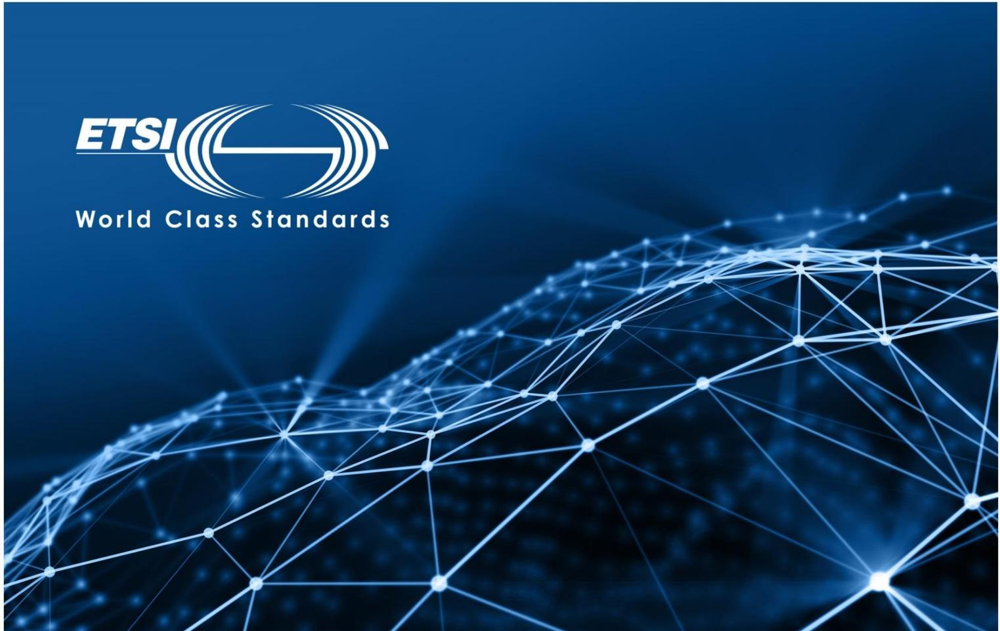

text_image

ETSI
World Class Standards

ETSI White Paper No. 11

# Mobile Edge Computing A key technology towards 5G

First edition – September 2015

ISBN No. 979-10-92620-08-5

Authors:

Yun Chao Hu, Milan Patel, Dario Sabella, Nurit Sprecher and Valerie Young

ETSI (European Telecommunications Standards Institute)

06921 Sophia Antipolis CEDEX, France

Tel +33 4 92 94 42 00

info@etsi.org

www.etsi.org

# About the authors

Yun Chao Hu

Contributor, Huawei, Vice Chair ETSI MEC ISG, Chair MEC IEG Working Group

Milan Patel

Contributor, Huawei

Dario Sabella

Contributor, Telecom Italia; Vice-Chair MEC IEG Working Group

Nurit Sprecher

Contributor, Nokia; Chair ETSI MEC ISG

Valerie Young

Contributor, Intel

# Contents

About the authors 2

Contents 3

Introduction 4

Market Drivers 5

Business Value 6

Mobile Edge Computing Service Scenarios 7

General 7

Augmented Reality 8

Intelligent Video Acceleration 9

Connected Cars 9

Internet of Things Gateway 11

Deployment Scenarios 11

ETSI Industry Specification Group on Mobile Edge Computing 12

Proofs of Concept 13

Conclusions 14

References 15

# Introduction

Mobile Edge Computing (MEC) is a new technology which is currently being standardized in an ETSI Industry Specification Group (ISG) of the same name. Mobile Edge Computing provides an IT service environment and cloud-computing capabilities at the edge of the mobile network, within the Radio Access Network (RAN) and in close proximity to mobile subscribers. The aim is to reduce latency, ensure highly efficient network operation and service delivery, and offer an improved user experience.

Mobile Edge Computing is a natural development in the evolution of mobile base stations and the convergence of IT and telecommunications networking. Based on a virtualized platform, MEC is recognized by the European 5G PPP (5G Infrastructure Public Private Partnership) research body as one of the key emerging technologies for 5G networks (together with Network Functions Virtualization (NFV) and Software-Defined Networking (SDN)) [1]. In addition to defining more advanced air interface technologies, 5G networks will leverage more programmable approaches to software networking and use IT virtualization technology extensively within the telecommunications infrastructure, functions, and applications. MEC thus represents a key technology and architectural concept to enable the evolution to 5G, since it helps advance the transformation of the mobile broadband network into a programmable world and contributes to satisfying the demanding requirements of 5G in terms of expected throughout, latency, scalability and automation.

MEC is based on a virtualized platform, with an approach complementary to NFV: in fact, while NVF is focused on network functions, the MEC framework enables applications running at the edge of the network. The infrastructure that hosts MEC and NFV or network functions is quite similar; thus, in order to allow operators to benefit as much as possible from their investment, it will be beneficial to reuse the infrastructure and infrastructure management of NFV to the largest extent possible, by hosting both VNFs (Virtual Network Functions) and MEC applications on the same platform.

The environment of Mobile Edge Computing is characterized by low latency, proximity, high bandwidth, and real-time insight into radio network information and location awareness. All of this can be translated into value and can create opportunities for mobile operators, application and content providers enabling them to play complementary and profitable roles within their respective business models and allowing them to better monetize the mobile broadband experience.

Mobile Edge Computing opens up services to consumers and enterprise customers as well as to adjacent industries that can now deliver their mission-critical applications over the mobile network. It enables a new value chain, fresh business opportunities and a myriad of new use cases across multiple sectors. The intention is to develop favourable market conditions which will create sustainable business for all players in the value chain, and to facilitate global market growth. To this end, a standardized, open environment needs to be created to allow the efficient and seamless integration of such applications across multi-vendor Mobile Edge Computing platforms. This will also ensure that the vast majority of the customers of a mobile operator can be served.

The objectives of this white paper are to introduce the concept of Mobile Edge Computing and the related key market drivers, and to discuss the business and technical benefits of Mobile Edge Computing. A few examples of service scenarios that can benefit from the technology and possible deployment scenarios are presented. The white paper explains what is being standardized and how innovation can be stimulated through using a standardized API. It outlines the specifications being produced by the Industry Specification Group on MEC.

ETSI ISG MEC encourages Proofs of Concept (PoC) to demonstrate the viability of MEC implementations. PoCs help to build awareness and confidence in the technology, and to develop a diverse and open MEC ecosystem. This white paper describes the MEC PoC framework and calls for active participation.

# Market Drivers

The growth of mobile traffic and pressure on costs are driving a need to implement several changes in order to maintain quality of experience, to generate revenue, and optimize network operations and resource utilization. The Internet of Things is further congesting the network and network operators need to do local analysis to ease security and backhaul impacts. Enterprises want the ability to enable and engage with their customers with more efficient, secure and low latency connections. Application and content providers are challenged with the latency of the network when connecting to the cloud. These challenges need to be resolved.

Mobile operators need to shorten the time to launch new revenue generating applications for current customers but also for specific industries and sectors, such as but not limited to automotive, industry automation and welfare industries. Business transformation based on collaboration with the different players in the value chain can help in facing these challenges.

Technology improvements which provide low latency, better flexibility, agility, usage of virtualization, network and context awareness, etc. can provide the opportunity to increase the Quality of Experience of end users and make network operation more cost effective and competitive.

Smart phone applications and content are moving to the cloud. The access to the cloud needs to be optimised to guarantee a rich experience for consumers of an application or consumers of content and a tight collaboration is essential between network operators and application and content providers. This collaboration can lead to the deployment of applications/content at the edge of the mobile operator’s network, providing awareness of the network and context information. Standardization will be essential to support this collaboration and the hosting of cloud or internet based applications within a multivendor environment.

The market drivers of MEC include business transformation, technology integration and industry collaboration (as illustrated in Figure 1). All of these can be enabled by MEC and a wide variety of use cases can be supported for new and innovative markets, such as e-Health, connected vehicles, industry automation, augmented reality, gaming and IoT services.

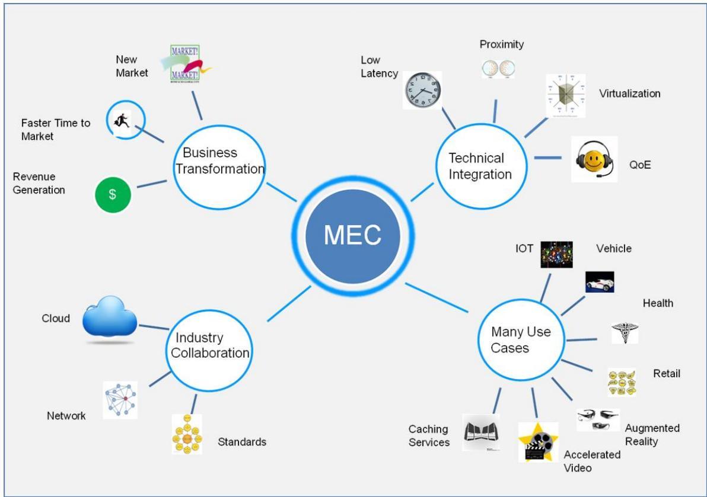

flowchart

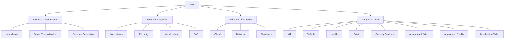

Figure 1: MEC market drivers

# Business Value

Mobile Edge Computing offers an IT service environment at a location considered to be a lucrative point in the mobile network: the Radio Access Network (RAN) edge. Characterized by proximity, low latency and high bandwidth, this environment will offer localized cloud computing capabilities as well as exposure to real-time radio network and context information.

Opening up this IT service environment will allow applications and services from mobile operators, service and content providers to be efficiently and seamlessly integrated across multi-vendor, mobile edge computing platforms. The characteristics and capabilities offered by a MEC platform can be leveraged in a way that will allow proximity, context, agility and speed to be used for wider innovation that can be translated into unique value and revenue generation.

Access to content and applications can be accelerated; their responsiveness can be increased, maximizing speed and interactivity. Popular and locally-relevant content can be delivered directly where users connect, limiting ingress bandwidth to the core and cloud.

Knowledge of real-time radio network conditions and context information can be used to optimize the network and service operation (responding and adapting to changing network conditions). This would improve service experience and the utilization of network resources, enabling them to efficiently handle increased amounts of traffic. Real-time network and fine-granular context information (including

location) could be used to enrich the mobile broadband experience by creating highly personalized services which are tailored to individual needs and preferences.

Operators can reposition themselves in the value chain and redefine personalized services. They can capitalize their networks and open them up to authorized third-parties (in a secure way), exposing capabilities to Over the Top (OTT) players and application developers to flexibly, agilely and rapidly deploy innovative applications and services towards mobile subscribers, enterprises and vertical segments. Operators will be able to create new revenue streams, delight their customers by developing a new breed of applications that provide incremental value, and open up new market opportunities. In addition, applications supporting tighter integration of network and service parameters will improve both service experience and utilization of the network resources.

Application service providers, OTT players and independent software vendors will be able to translate proximity and context into value, and be able to generate new revenue. Their applications and services can be enhanced and accelerated to provide a unique and unparalleled experience. Innovative applications can be deployed rapidly in a new standards-based environment, taking advantage of new levels of flexibility and agility. Applications will be able to expand their cloud into the mobile network and create a whole new set of services. They will be able to feel and react to end-user experience in real time, based on the actual radio conditions. The new MEC specifications will allow applications and services to be deployed on top of multi-vendor Mobile Edge Computing platforms, enabling them to be used by the vast majority of the customers of a single mobile operator. The mobile end user will enjoy a unique, gratifying and personalized mobile-broadband experience.

The MEC initiative will help to develop favourable market conditions for all players in the value chain as well as facilitate economic growth with a myriad of new use cases across multiple sectors (see Figure 2).

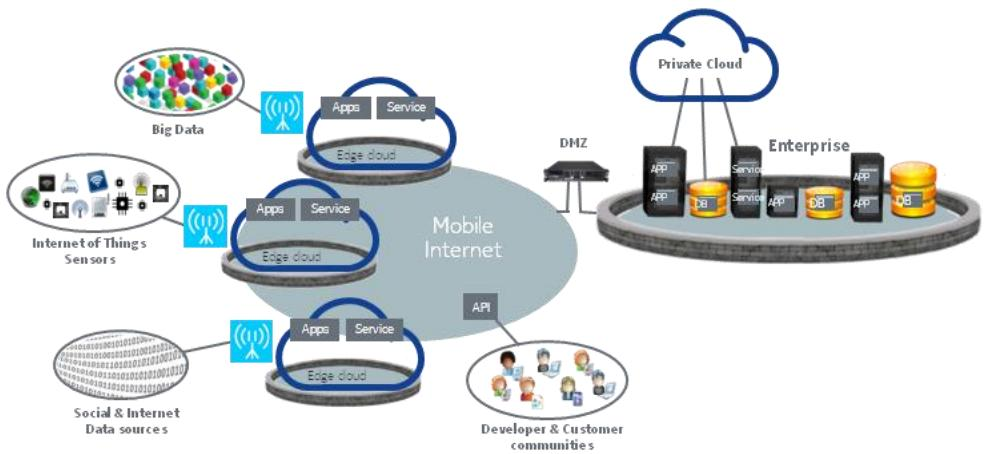

flowchart

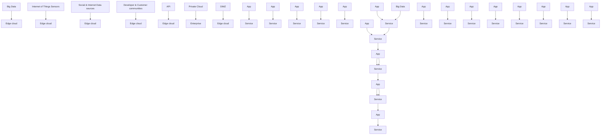

Figure 2: Improved QoE with Mobile Edge Computing in close proximity to end users

# Mobile Edge Computing Service Scenarios

# General

The following sections describe a number of service scenarios that have been considered within ETSI ISG MEC. These illustrate various scenarios which can take advantage of Mobile Edge Computing to either increase performance compared to providing such services through the cloud or through core network servers, or to utilize the unique capabilities offered by MEC platforms such as proximity to the user and network edge, serving a highly localized area. It should be noted these examples are non-exhaustive and further service scenarios are available in the ETSI ISG MEC specification for Mobile Edge Computing Service Scenarios, GS MEC 004. Other scenarios which can make use of MEC are also possible.

# Augmented Reality

New services become possible when mobile networks supporting high data rates and low latency computation are deployed. One example of such services is Augmented Reality. Augmented reality (AR) is the combination of a view of the real-world environment and supplementary computer-generated sensory input such as sound, video, graphics or GPS data. Augmented reality can enhance the experience of a visitor to a museum or another point of interest. Consider a visitor to a museum, art gallery, city monument, music or sports event, holding their mobile device towards a particular point of interest with the application related to their visit activated (i.e., the museum application). The camera captures the point of interest and the application displays additional information related to what the visitor is viewing.

Augmented reality services require an application to analyse the output from a device's camera and/or a precise location in order to supplement a user's experience when visiting a point of interest by providing additional information to the user about what they are currently experiencing. The application needs to be aware of a user's position and the direction they are facing, either through positioning techniques or through the camera view, or both. After analysing such information, the application can provide additional information in real-time to the user. If the user moves, the information needs to be refreshed. Hosting the Augmented Reality service on a MEC platform instead of in the cloud is advantageous since supplementary information pertaining to a point of interest is highly localised and is often irrelevant beyond the particular point of interest. Figure 3 shows how a MEC platform can be used to provide an Augmented Reality service.

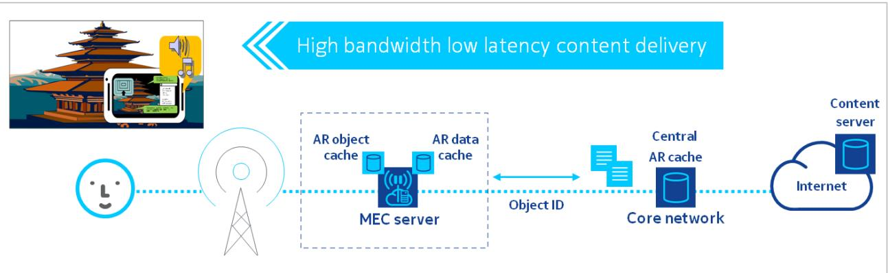

flowchart

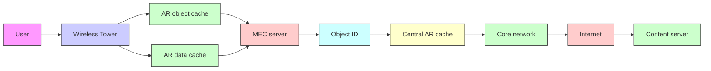

Figure 3: Augmented Reality Service Scenario

Additionally, the processing of user location or camera view can be performed on a MEC platform rather than on a more centralized server. There may be a need to update information at a fast rate, depending on how the user moves, and the context in which the augmented reality service is used (e.g. in an art gallery, exhibits are positioned only a few metres apart and each piece is supplemented with additional text on the artist, the interpretation of the artwork, etc.) In other words, augmented reality data requires low latency and a high rate of data processing in order to provide the correct information to

the user's device depending on the location and orientation of the user. Performing such data processing on the MEC platform also has the advantage of collecting metrics, anonymized meta-data, etc., in order to analyse the service usage and help to improve the service in order to provide a better user experience.

# Intelligent Video Acceleration

End user Quality of Experience (QoE) and utilization of radio network resources can be improved through intelligent video acceleration. Internet media and file delivery are typically streamed or downloaded today using Hypertext Transmission Protocol (HTTP) over the TCP protocol. Available capacity can vary by an order of magnitude within seconds (as a result of changes in radio channel conditions, devices entering/leaving network). TCP may not be able to adapt fast enough to rapidlyvarying conditions in the radio access network (RAN). This may lead to under-utilisation of precious radio resources and to a sub-optimal user experience.

Figure 4 shows an example of the intelligent video acceleration service scenario which attempts to overcome the challenges described above. In this scenario, a radio analytics application, which resides in a MEC server, provides the video server with an indication on the throughput estimated to be available at the radio downlink interface. This information can be used to assist the TCP congestion control decisions (for example in selecting the initial window size, setting the value of the congestion window during the congestion avoidance phase, and adjusting the size of the congestion window when the conditions on the "radio link" deteriorate). The information can also be used to ensure that the application-level coding matches the estimated capacity at the radio downlink.

The video server may use this information to assist TCP congestion control decisions (for example by ensuring that the application level coding matches the estimated capacity at the radio downlink). The content’s time-to-start as well as video-stall occurrences can be reduced, enabling improved video quality and throughput.

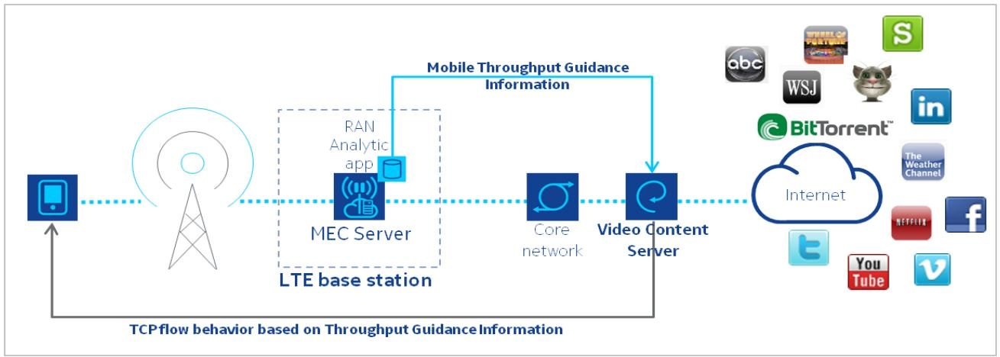

flowchart

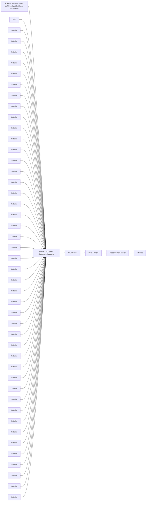

Figure 4: Intelligent Video Acceleration Service Scenario

# Connected Cars

The number of connected vehicles is rapidly growing and will continue to do so over the coming years. Communication of vehicles and roadside sensors with a roadside unit is intended to increase the safety, efficiency, and convenience of the transportation system, by the exchange of critical safety and

operational data. The communication can also be used to provide value added services, such as car finder, parking location and to support entertainment services (e.g. video distribution).

As the number of connected vehicles increases and use cases evolve, the volume of data will continue to increase along with the need to minimize latency. Whilst data stored and processed centrally may be adequate for some use cases, it can be unreliable and slow for others.

LTE can significantly accelerate the deployment of connected vehicle communications. LTE cells can provide “beyond the line of sight” visibility i.e. beyond the range of direct communication between vehicles of 300 – 500m. It can also satisfy the tight latency requirement of connected vehicle communications, below 100ms in some use cases. Messages could be distributed in real time over LTE, eliminating the need to build a countrywide Digital Short-Range Communications (DSRC) network. Cars can leverage their increasingly inbuilt LTE connectivity; in deployments where DSRC exists, LTE would be able complement it.

Mobile Edge Computing can be used to extend the connected car cloud into the highly distributed mobile base station environment, and enable data and applications to be housed close to the vehicles. This can reduce the round trip time of data and enable a layer of abstraction from both the core network and applications provided over the internet. MEC applications can run on MEC servers which are deployed at the LTE base station site to provide the roadside functionality. The MEC applications can receive local messages directly from the applications in the vehicles and the roadside sensors, analyse them and then propagate (with extremely low latency) hazard warnings and other latency-sensitive messages to other cars in the area (as depicted in Figure 5). This enables a nearby car to receive data in a matter of milliseconds, allowing the driver to immediately react.

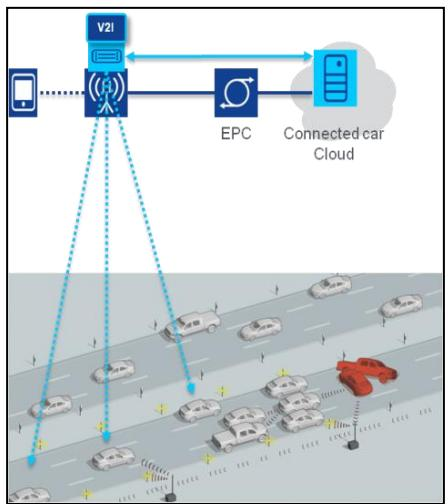

flowchart

```mermaid
graph TD
    A["Mobile Phone"] --> B["V2I"]
    B --> C["EPC"]
    C --> D["Connected car Cloud"]
    D --> B
    B --> E["Car Road"]
    E --> F["Car Road"]
    F --> G["Car Road"]
    G --> H["Car Road"]
    H --> I["Car Road"]
    I --> J["Car Road"]
    J --> K["Car Road"]
    K --> L["Car Road"]
    L --> M["Car Road"]
    M --> N["Car Road"]
    N --> O["Car Road"]
    O --> P["Car Road"]
    P --> Q["Car Road"]
    Q --> R["Car Road"]
    R --> S["Car Road"]
    S --> T["Car Road"]
    T --> U["Car Road"]
    U --> V["Car Road"]
    V --> W["Car Road"]
    W --> X["Car Road"]
    X --> Y["Car Road"]
    Y --> Z["Car Road"]
    Z --> AA["Car Road"]
    AA --> AB["Car Road"]
    AB --> AC["Car Road"]
    AC --> AD["Car Road"]
    AD --> AE["Car Road"]
    AE --> AF["Car Road"]
    AF --> AG["Car Road"]
    AG --> AH["Car Road"]
    AH --> AI["Car Road"]
    AI --> AJ["Car Road"]
    AJ --> AK["Car Road"]
    AK --> AL["Car Road"]
    AL --> AM["Car Road"]
    AM --> AN["Car Road"]
    AN --> AO["Car Road"]
    AO --> AP["Car Road"]
    AP --> AQ["Car Road"]
    AQ --> AR["Car Road"]
    AR --> AS["Car Road"]
    AS --> AT["Car Road"]
    AT --> AU["Car Road"]
    AU --> AV["Car Road"]
    AV --> AW["Car Road"]
    AW --> AX["Car Road"]
    AX --> AY["Car Road"]
    AY --> AZ["Car Road"]
    AZ --> BA["Car Road"]
    BA --> BB["Car Road"]
    BB --> BC["Car Road"]
    BC --> BD["Car Road"]
    BD --> BE["Car Road"]
    BE --> BF["Car Road"]
    BF --> BG["Car Road"]
    BG --> BH["Car Road"]
    BH --> BI["Car Road"]
    BI --> BJ["Car Road"]
    BJ --> BK["Car Road"]
    BK --> BL["Car Road"]
    BL --> BM["Car Road"]
    BM --> BN["Car Road"]
    BN --> BO["Car Road"]
    BO --> BP["Car Road"]
    BP --> BQ["Car Road"]
    BQ --> BR["Car Road"]
    BR --> BS["Car Road"]
    BS --> BT["Car Road"]
    BT --> BU["Car Road"]
    BU --> BV["Car Road"]
    BV --> BW["Car Road"]
    BW --> BX["Car Road"]
    BX --> BY["Car Road"]
    BY --> BZ["Car Road"]
```

Figure 5: Connected Vehicles Service Scenario

The roadside MEC application will be able to inform adjacent Mobile Edge Computing servers about the event(s) and in so doing, enable these servers to propagate hazard warnings to cars that are close to the affected area.

The roadside application will be able to send local information to the applications at the connected car cloud for further centralized processing and reporting.

# Internet of Things Gateway

The Internet of Things (IoT) generates additional messaging on telecoms networks, and requires gateways to aggregate the messages and ensure low latency and security. Because of the nature of some of the devices being connected, a real time capability is required and a grouping of sensors and devices is needed for efficient service.

IoT devices are often resource constrained in terms of processor and memory capacity. There is a need to aggregate various IoT device messages connected through the mobile network close to the devices. This also provides an analytics processing capability and a low latency response time.

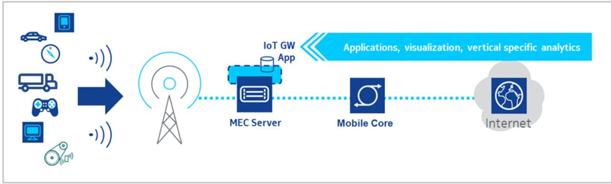

flowchart

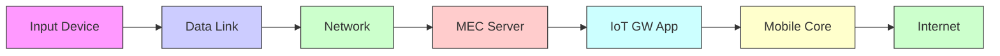

Figure 6: IoT Gateway Service Scenario

Various devices are connected over different forms of connectivity, such as 3G, LTE, Wi-Fi or other radio technologies. In general the messages are small, encrypted and come in different forms of protocols. There is a need for a low latency aggregation point to manage the various protocols, distribution of messages and for the processing of analytics. The MEC server provides the capability to resolve these challenges.

Mobile Edge Computing can be used to connect and control devices remotely, analyse and provide real time provisioning and analytics. MEC enables the aggregation and distribution of IoT services into the highly distributed mobile base station environment, and enable applications to respond in real-time. This can reduce the round trip time of data and enable a layer of abstraction from both the core network and applications in the cloud. IoT applications can run on MEC servers which are deployed at the LTE base station site to provide this functionality.

# Deployment Scenarios

Mobile Edge Computing servers can be deployed at multiple locations, such as at the LTE macro base station (eNodeB) site, at the 3G Radio Network Controller (RNC) site, at a multi-Radio Access Technology (RAT) cell aggregation site, and at an aggregation point (which may also be at the edge of the core network). The multi-RAT cell aggregation site can be located indoors within an enterprise (e.g. hospital, large corporate HQ), or indoors/outdoors for a special public coverage scenario (e.g. stadium, shopping mall) to control a number of local multi-RAT access points providing radio coverage to the premises. This deployment option enables the direct delivery of locally-relevant, fast services from base station clusters. Where a MEC platform is deployed may depend on a number of factors, including scalability, physical deployment constraints, performance criteria (e.g. latency) and which network information will be exposed. Note that some MEC services may not be available / applicable in certain deployment options.

MEC applications can be intelligently and flexibly deployed in a seamless manner on different MEC platforms based on technical and business parameters. The deployment of MEC applications on a particular MEC platform may depend on the availability of specific MEC services and on other parameters, such as latency requirements, required resources, availability of a particular VNF, scalability considerations, cost etc.

MEC will utilise the NFV infrastructure. The NFV platform may be dedicated to MEC or shared with other network functions or applications. MEC will also use (as much as possible) the NFV management and orchestration entities and interfaces.

# ETSI Industry Specification Group on Mobile Edge Computing

The ETSI Industry Specification Group (ISG) on Mobile Edge Computing (MEC) produces normative Group Specifications that will enable the hosting of third-party applications in a multi-vendor MEC environment. Launched in December 2014, the group plans to deliver the first set of specifications within 2 years.

The initial scope of the ISG MEC focuses on use cases; it specifies the requirements and the reference architecture, including the components and functional elements that are the key enablers for MEC solutions.

When the first documents reach the required maturity level, work on platform services, APIs and interfaces will commence. The MEC platform API will be application-agnostic and will allow the smooth porting of value-creating applications on every mobile-edge server with guaranteed SLA (see Figure 7).

Mobile-edge Computing platform APl   
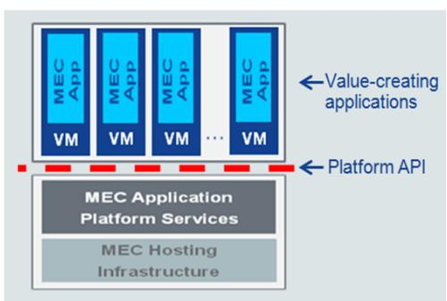

flowchart

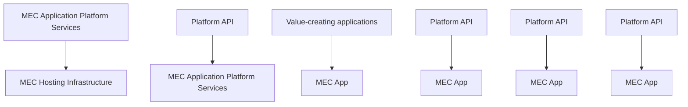

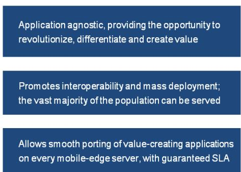

text_image

Application agnostic, providing the opportunity to revolutionize, differentiate and create value
Promotes interoperability and mass deployment; the vast majority of the population can be served
Allows smooth porting of value-creating applications on every mobile-edge server, with guaranteed SLA

Figure 7: MEC platform API

In addition to the technical work, an industry-enabling working group (IEG WG) has been setup under the ISG MEC which is tasked with advancing Mobile Edge Computing in the industry and accelerating the adoption of the concept and the standards. This will help to develop favourable market conditions for sustainable business for all players in the value chain.

The IEG group is developing two Group Specifications:

1. ETSI GS MEC-IEG 005 [2] Proof of Concept Framework, specifying the process and criteria that a Proof of Concept demonstration must adhere to. This specification has already been published;   
2. ETSI GS MEC-IEG 004 Service Scenarios, which presents a number of examples of service scenarios, business and consumer benefits which can be enabled by Mobile Edge Computing.

The ETSI ISG is open to members and non-members of ETSI to participate and contribute towards this innovative technology. Industry players are invited to actively participate and contribute to the work on Mobile Edge Computing and to take part in the PoC activities. More information on how to participate is available at: http://www.etsi.org/mobile-edge-computing/get-involved-in-mec.

# Proofs of Concept

In order to ensure the success and widespread deployment of Mobile Edge Computing, it is necessary to have more than just timely and high quality specifications. It is crucial to validate the specifications that are being developed, and to demonstrate that the use cases have been fulfilled. Furthermore, the MEC concept must be demonstrated to be feasible and valuable to all the major stakeholders in the value chain in order to appeal to the widest possible audience.

To showcase the Mobile Edge Computing concept, the ISG MEC has developed a Proof of Concept process, specified in GS MEC-IEG 005 [2]. A PoC proposal can be submitted by a PoC team consisting of at least one Mobile Network Operator, at least one infrastructure vendor and at least one content or application provider. GS MEC-IEG 005 [2] specifies the process and criteria that a Proof of Concept demonstration must adhere to in order to be accepted as a MEC PoC. A wiki site http://mecwiki.etsi.org has been put in place to assist PoC teams. This site hosts the PoC project proposal templates and the list of PoC Topics, which are specific areas where input or feedback from PoCs is needed. One or several PoC Topics can be addressed by a single PoC project.

The public demonstration of MEC Proofs of Concept helps to build commercial awareness and confidence in this technology, and helps to develop a diverse, open, MEC ecosystem.

# Conclusions

Mobile Edge Computing enables innovative service scenarios that can ensure enhanced personal experience and optimized network operation, as well as opening up new business opportunities. A few examples are described in this white paper to demonstrate how proximity to users and objects, together with network and context information can be leveraged by applications to create value. Mobile Edge Computing attracts a new value-chain and energized eco-system, where all players can benefit from tighter collaboration. Mobile operators can play a pivotal role within the new value chain and attract OTT service providers, developers and Internet players to innovate over a new cutting-edge technology, while enabling context-aware applications to run in close proximity to the mobile subscriber. Mobile subscribers can enjoy a unique, truly gratifying and personalized mobile-broadband experience which is tailored to their needs and preferences.

Based on a virtualized platform, MEC complements NFV and is fully aligned with the emerging distributed cloud approach. It is recognised as a key technology of the future 5G era, satisfying the demanding requirements for ultra-low latency and stimulating innovation.

The MEC technology is defined by the ETSI ISG MEC, which was launched in December 2014 with the intention to develop the first set of specifications within 2 years. The deliverables will include service scenarios, requirements, architecture and API specifications, complemented with a PoC Framework specification and White Papers which aim to accelerate the market adoption of the MEC technology.

MEC supports different deployment options, as MEC Servers can be located at different places within the Radio Access Network depending on technical and business requirements.

A MEC Proof-of-Concept (PoC) program has been established to demonstrate the viability of MEC implementations. The results and lessons learned by the MEC PoCs are fed back to the ISG MEC specification activities.

The MEC ISG is developing the foundation to enable an open radio access network which can host third party innovative applications and content at the edge of the network. The ISG is open to members and non-members of ETSI to participate and contribute towards this innovative technology, and to take part in the PoC activities.

# References

[1] 5G Vision: The 5G Infrastructure Public Private Partnership: the next generation of communication networks and services. From The 5G Infrastructure Public Private Partnership: https://5g-ppp.eu/wp-content/uploads/2015/02/5G-Vision-Brochure-v1.pdf

[2] ETSI GS MEC-IEG 005; Mobile Edge Computing (MEC); Proof of Concept Framework.

natural_image

Abstract digital network graphic with interconnected nodes on a dark blue gradient background (no text or symbols)

ETSI

World Class Standards

ETSI (European Telecommunications Standards Institute)

06921 Sophia Antipolis CEDEX, France

Tel +33 4 92 94 42 00

info@etsi.org

www.etsi.org

This White Paper is issued for information only. It does not constitute an official or agreed position of ETSI, nor of its Members. The views expressed are entirely those of the author(s).

ETSI declines all responsibility for any errors and any loss or damage resulting from use of the contents of this White Paper.

ETSI also declines responsibility for any infringement of any third party's Intellectual Property Rights (IPR), but will be pleased to acknowledge any IPR and correct any infringement of which it is advised.

# Copyright Notification

Copying or reproduction in whole is permitted if the copy is complete and unchanged (including this copyright statement).

© European Telecommunications Standards Institute 2015. All rights reserved.

DECT™, PLUGTESTS™, UMTS™, TIPHON™, IMS™, INTEROPOLIS™, FORAPOLIS™, and the TIPHON and ETSI logos are Trade Marks of ETSI registered for the benefit of its Members.

3GPP™ and LTE™ are Trade Marks of ETSI registered for the benefit of its Members and of the 3GPP Organizational Partners.

GSM™, the Global System for Mobile communication, is a registered Trade Mark of the GSM Association.

natural_image

Abstract digital network background with blue gradient and white nodes (no text or symbols)

