# MOALF-UAV-MEC: Adaptive Multiobjective Optimization for UAV-Assisted Mobile Edge Computing in Dynamic IoT Environments

Ali A. AL-Bakhrani , Mingchu Li , Mohammad S. Obaidat , Life Fellow, IEEE, and Gehad Abdullah Amran

Abstract—The proliferation of Internet of Things (IoT) devices and computation-intensive applications has led to unprecedented demands on network resources and computing capabilities. This article presents multiobjective adaptive learning framework for uncrewed aerial vehicle (UAV)-assisted mobile edge computing (MOALF-UAV-MEC), a novel MOALF-UAV-MEC tailored for dynamic IoT environments. The framework integrates multiobjective reinforcement learning (MORL), model predictive control (MPC), adaptive particle swarm optimization (APSO), and Lyapunov Optimization to optimize UAV trajectories, dynamic resource allocation, and system stability. MOALF-UAV-MEC addresses critical challenges in UAV-assisted mobile edge computing (MEC), including multiobjective optimization, adaptive resource allocation, energy efficiency, scalability, and quality of service guarantees. Our approach employs a unique burst mode feature for UAVs, enabling temporary performance boosts in high-demand situations. Extensive simulations demonstrate the framework’s efficiency in enhancing task completion rates, energy efficiency, and long-term system sustainability. Results show a task completion rate of 94.50%, significantly outperforming existing approaches, with an average of 1890 completed tasks per UAV and a load balancing efficiency of 96%. The framework exhibits robust adaptive behavior, achieving a 38% reduction in UAV route optimization and a 55% increase in task completion during high-load periods. This research contributes to the advancement of edge computing in IoT environments, offering a scalable and adaptive solution for deploying computational resources in areas with limited infrastructure, during temporary events, or in emergency situations.

Received 26 December 2024; revised 31 January 2025; accepted 18 February 2025. Date of publication 21 February 2025; date of current version 9 June 2025. This work was supported by the Nature Science Foundation of China under Grant T2350710232. (Corresponding author: Mingchu Li.)

Ali A. AL-Bakhrani is with the School of Software, Dalian University of Technology, Dalian 116024, China, and also with the Faculty of Administration and Computers, Albaydha University, Albydha, Yemen (email: albakhrani2017@gmail.com).

Mingchu Li is with the School of Computer and Information Engineering, Jiangxi Normal University, Nanchang 330022, Jiangxi, China, and also with the School of Software Technology, Dalian University of Technology, Dalian 116024, China (e-mail:mingchu@jxnu.edu.cn).

Mohammad S. Obaidat is with The King Abdullah II School of Information Technology, The University of Jordan, Amman 11942, Jordan, also with the School of Computer and Communication Engineering, University of Science and Technology Beijing, Beijing 100083, China, also with the Department of Computational Intelligence, School of Computing, SRM University, Kattankulathur 603203, India, and also with the School of Engineering, The Amity University, Noida 201301, India (e-mail: m.s.obaidat@ieee.org).

Gehad Abdullah Amran is with the Department of Management Science and Engineering, Dalian University of Technology, Dalian 116024, China (e-mail: jehad.westran@gmail.com).

Digital Object Identifier 10.1109/JIOT.2025.3544624

Index Terms—Adaptive particle swarm optimization (APSO), burst mode computing, dynamic Internet of Things (IoT) environments, edge computing resilience, model predictive control (MPC), multiobjective adaptive learning, multiobjective adaptive learning framework for uncrewed aerial vehicle (UAV)-assisted mobile edge computing (MOALF-UAV-MEC), UAV trajectory optimization.

# NOMENCLATURE

See Table I.

# I. INTRODUCTION

HE PROLIFERATION of Internet of Things (IoT) T devices and computation-intensive applications has catalyzed a paradigm shift in modern computing architectures. With estimates projecting over 75 billion connected IoT devices by 2025 [1], traditional cloud computing infrastructures face unprecedented challenges in meeting the computing and network resource demands of these systems [2]. Mobile edge computing (MEC), which brings computational resources closer to end-users and data sources, has emerged as a promising solution to address the latency and bandwidth constraints inherent in centralized cloud architectures [3]. However, the static nature of conventional MEC deployments presents significant limitations in scenarios with dynamic user distributions or areas lacking robust ground infrastructure [4].

To overcome these limitations, uncrewed aerial vehicle (UAV)-assisted MEC systems have garnered significant attention from both academia and industry [5], [6]. UAVs, serving as MEC platforms, offer unprecedented flexibility in deploying computational resources where and when needed. Their mobility and adaptability make them particularly valuable for scenarios ranging from temporary events to emergency response situations [7], [8]. However, the integration of UAVs into MEC architectures introduces complex challenges across multiple dimensions: energy efficiency, task scheduling, resource allocation, and quality of service guarantees [9], [10]. In this context, we define several key concepts fundamental to our framework.

1) Mobile Edge Computing (MEC): A distributed computing paradigm that brings computational resources closer to end-users and data sources.

TABLE I LIST OF ACRONYMS 

<table><tr><td>Acronym</td><td>Definition</td></tr><tr><td>MOALF-UAV-MEC</td><td>Multi-Objective Adaptive Learning Framework for UAV-Assisted Mobile Edge Computing</td></tr><tr><td>MORL</td><td>Multi-Objective Reinforcement Learnin</td></tr><tr><td>MPC</td><td>Model Predictive Control</td></tr><tr><td>APSO</td><td>Adaptive Particle Swarm Optimization</td></tr><tr><td>UAV</td><td>Unmanned Aerial Vehicle</td></tr><tr><td>MEC</td><td>Mobile Edge Computing</td></tr><tr><td>IoT</td><td>Internet of Things</td></tr><tr><td>QoS</td><td>Quality of Service</td></tr><tr><td>DDPG</td><td>Deep Deterministic Policy Gradient</td></tr><tr><td>NSGA-II</td><td>Non-dominated Sorting Genetic Algorithm II</td></tr><tr><td>MA-DRL</td><td>Multi-Agent Deep Reinforcement Learning</td></tr><tr><td>MAPPO</td><td>Multi-Agent Proximal Policy Optimization</td></tr><tr><td>SDN</td><td>Software-Defined Networking</td></tr><tr><td>uRLLC</td><td>Ultra-Reliable Low-Latency Communication</td></tr><tr><td>eMBB</td><td>Enhanced Mobile Broadband</td></tr><tr><td>mMTC</td><td>Massive Machine-Type Communication</td></tr></table>

2) Burst Mode Computing: A dynamic performance enhancement mechanism allowing temporary increase in computing capacity.   
3) Task Offloading: The process of delegating computational tasks from IoT devices to edge computing resources.

Recent research has made significant strides in addressing various aspects of UAV-assisted MEC systems. Zhang et al. [6] investigated computation offloading and trajectory scheduling for single-UAV scenarios, demonstrating promising results in energy efficiency optimization but facing limitations in scalability to multi-UAV deployments. Singh et al. [11] proposed a multiobjective NSGA-II optimization framework for UAV path planning in wireless sensor networks, demonstrating effective energy-efficient data gathering, though their approach focused primarily on path optimization without fully addressing dynamic resource allocation and task scheduling priorities.

Zhao et al. [12] proposed a multiagent deep reinforcement learning approach primarily focused on delay minimization, while Sun et al. [7] tackled joint optimization of computation offloading and trajectory planning. However, both approaches struggled to capture the multiobjective nature of real-world MEC scenarios. More recently, Li et al. [13] presented a robust computation offloading framework for multi-UAV systems, yet their work left room for improvement in adapting to dynamic user preferences and comprehensive system optimization.

The evolution of UAV-assisted MEC research has revealed several critical challenges that remain unaddressed. Liu et al. [14] made important contributions to energy-efficient task offloading but did not fully account for the dynamic nature of task arrivals in IoT environments. Hu et al. [8] focused on maximizing computation rates but overlooked the heterogeneous requirements of IoT devices. Recent work by Guo et al. [15] on multi-UAV cooperative task offloading and Han et al. [16] on delay-minimized UAV-aided networks have shown promise, yet left critical gaps in handling dynamic network conditions and rapidly changing task priorities.

Through comprehensive analysis of existing literature and current technological demands, we have identified five interconnected challenges that require innovative solutions.

1) Most existing approaches focus on optimizing a limited set of objectives, typically energy consumption and delay, without considering the number of completed tasks as a key performance indicator [6], [11], [12]. While some approaches like [11] consider multiobjective optimization for UAV path planning, they still do not fully capture the complexity of task completion rates in real-world MEC deployments.   
2) Current solutions predominantly employ fixed weights or single objectives, lacking the necessary flexibility to adapt to changing user preferences and task priorities in dynamic MEC environments [7], [8], [13]. This rigidity hampers system performance in real-world scenarios where requirements can change rapidly.   
3) Existing research often optimizes only a subset of key variables (task offloading, resource allocation, or UAV trajectory), potentially missing opportunities for global system optimization [9], [10], [15]. This fragmented approach leads to suboptimal solutions in practice.   
4) The scalability and adaptability of current solutions in large-scale, multi-UAV scenarios with edge servers remain limited [5], [16], [17]. This limitation becomes particularly critical as IoT deployments continue to grow in scale and complexity.   
5) Present systems struggle to maintain consistent quality of service across heterogeneous IoT applications, each with unique requirements and constraints. This challenge is particularly acute in scenarios with varying network conditions and resource availability.

To address these challenges comprehensively, we propose multiobjective adaptive learning framework for UAV-assisted mobile edge computing (MOALF-UAV-MEC), a novel multiobjective Adaptive Learning Framework for UAV-Assisted MEC. Our approach is distinguished by several key innovations.

1) A comprehensive multiobjective optimization framework that simultaneously minimizes task completion delay and energy consumption while maximizing the number of completed tasks.   
2) A dynamic preference adaptation mechanism that allows real-time response to changing user priorities and environmental conditions, ensuring optimal resource utilization under varying circumstances.   
3) A hybrid solution method combining multiobjective reinforcement learning (MORL), distributed splitting, and threshold rounding techniques to effectively handle the complex mixed-integer nonlinear programming problem.   
4) A highly scalable architecture that efficiently manages multiple UAVs and edge servers, demonstrating superior performance in large-scale MEC scenarios.

Our proposed system achieves a task completion rate of 94.50%, significantly outperforming existing approaches. With a load balancing efficiency of 96% and the ability to complete an average of 1890 tasks per UAV, our solution demonstrates exceptional resource utilization and system throughput. Moreover, our system exhibits robust adaptive behavior, achieving a 38% reduction in UAV route optimization and a 55% increase in task completion during high-load periods.

The remainder of this article is organized as follows. Section II provides a comprehensive review of related work in the field. Section III details the system model and problem formulation, offering a mathematical foundation for our approach. Section IV presents our proposed solution, the MOALF-UAV-MEC framework, explaining its key components and algorithms. Section V offers a rigorous complexity analysis of the framework. Section VI describes our simulation experiments, encompassing the experimental setup, methodology, results, and a comparative analysis with stateof-the-art competing approaches. Finally, Section VII provides an extended comparative analysis and discussion of our results.

# II. RELATED WORK

Recent research in UAV-assisted MEC has focused on optimizing task offloading, resource allocation, and UAV trajectory to improve system performance. This section reviews key studies in this area, highlighting their contributions and limitations.

# A. Task Offloading and Resource Allocation

Zhou et al. [2] proposed a multi-UAV cooperative task offloading scheme for MEC networks. Their approach uses a software-defined network-enhanced framework to optimize computation resources and minimize processing delay. However, their work does not consider UAV trajectory optimization.

Li et al. [13] developed a multiagent deep reinforcement learning approach for robust computation offloading and trajectory optimization in multi-UAV-assisted MEC systems. Their method demonstrates good scalability but does not fully address the dynamic nature of user preferences.

Zhao et al. [12] presented a multiagent deep reinforcement learning algorithm for task offloading in UAV-assisted MEC. While their approach effectively minimizes total system cost, it does not consider the multiobjective nature of real-world MEC scenarios.

# B. UAV Trajectory Optimization

Sun et al. [7] investigated the joint optimization of computation offloading and trajectory planning for UAV-assisted edge computing. They proposed an alternating optimization algorithm to minimize energy consumption, but their single-UAV model faces scalability limitations.

Wang et al. [18] studied the joint optimization of UAV placement, resource allocation, and computation offloading for THz band communications. They proposed a deep reinforcement learning approach to minimize system energy consumption and task completion time. However, their work does not consider multi-UAV scenarios. Recent advances in trajectory optimization have shown promising results. Wang et al. [19] proposed a Lyapunov-based framework that jointly optimizes flight trajectories and computation offloading in UAV-assisted vehicular networks, demonstrating robust stability guarantees. Similarly, Wang et al. [20] presented an integrated approach for joint trajectory and task offloading optimization, though their work primarily focuses on single-UAV scenarios. Building upon these foundations, Liu et al. [14] established comprehensive methods for wireless powered cooperative edge computing, addressing the complex interactions between offloading decisions, CPU control, and flight path optimization.

Singh et al. [11] developed a multiobjective NSGA-II optimization framework for UAV path planning in wireless sensor networks. Their approach effectively optimizes UAV trajectories and energy-efficient data gathering through Paretooptimal solutions, but does not fully address the challenges of dynamic computation offloading and adaptive resource management.

# C. Multiobjective Optimization in MEC

Gao et al. [21] developed a multiobjective actor-critic (MO-AVC) algorithm for trajectory control and task offloading in multi-UAV enabled MEC systems. Their approach demonstrates good performance in minimizing task processing delay and UAV energy consumption, but does not consider the number of collected tasks as an objective.

Song et al. [22] proposed an evolutionary MORL approach for trajectory control and task offloading in UAV-assisted MEC. Their method effectively balances multiple objectives, including task delay, energy consumption, and the number of collected tasks. However, it may face scalability challenges in large-scale scenarios.

Huang et al. [17] presented a multiobjective deep reinforcement learning approach for computation offloading and trajectory control in UAV-base station assisted MEC. Their method addresses the challenges of partially observable information and dynamic user preferences, but its performance in large-scale multi-UAV scenarios remains to be evaluated. To validate the superiority of our approach, we conduct extensive comparative analyses against state-of-the-art techniques, including DDPG [6], NSGA-II [11], MA-DRL [12], and MAPPO [13]. As detailed in Section VII and summarized in Table X, MOALF-UAV-MEC demonstrates significant improvements across multiple performance metrics, particularly compared to the NSGA-II approach [11] in UAV path planning optimization and resource efficiency. As detailed in Section VII and summarized in Table X, MOALF-UAV-MEC demonstrates significant improvements across multiple performance metrics. Our framework achieves 1.40%–9.20% higher task completion rates, 2.00%–17.50% better load balancing efficiency, and 11.93%–37.55% improved energy efficiency compared to existing approaches. These studies demonstrate significant progress in addressing the challenges of UAV-assisted MEC systems. However, there is still a need for comprehensive solutions that can effectively balance multiple objectives, adapt to dynamic user preferences, and scale to large multi-UAV scenarios while considering the partially observable nature of the environment.

# III. SYSTEM MODEL AND PROBLEM FORMULATION

In this section, we present a comprehensive description of our system model for UAV-assisted MEC in dynamic IoT environments. We then formulate the optimization problem that our MOALF-UAV-MEC framework aims to solve. This integrated approach allows us to clearly illustrate the relationship between the system components and the optimization objectives. The system model encompasses multiple interrelated components detailed in subsequent sections: Network model (Section III-A), UAV model (Section III-B), Task model (Section III-C), Communication model (Section III-D).

# A. Network Model

We consider a 3-D space $A \ \subset \ \mathbb { R } ^ { 3 }$ that represents our operational environment. This space contains three key sets of entities that form the backbone of our UAV-assisted MEC system.

1) A set of N IoT devices, denoted as $D = \{ d _ { 1 } , d _ { 2 } , \dots , d _ { N } \}$ which generate computational tasks.   
2) A set of M heterogeneous UAVs, represented by $U =$ $\{ u _ { 1 } , u _ { 2 } , \dots , u _ { M } \}$ , serving as MEC units.   
3) A set of K fixed ground edge servers, $\begin{array} { r l } { E } & { { } = } \end{array}$ $\{ e _ { 1 } , e _ { 2 } , \dots , e _ { K } \}$ , providing additional computational resources.

Our system operates over a discrete time horizon $T =$ $\{ 1 , 2 , \ldots , T \}$ , with each time slot having a duration of $\Delta t .$ This discretization allows us to model the dynamic nature of the environment and the decision-making process of our framework.

# B. UAV Model

The UAVs in our system play a crucial role as MEC units. For each UAV $u _ { j } \in U .$ , we define the following characteristics.

1) 3-D position: $\mathbf { p } _ { j } ( t ) = [ x _ { j } ( t ) , y _ { j } ( t ) , z _ { j } ( t ) ] ^ { \bar { T } } \in \mathbb { R } ^ { 3 }$ .   
2) Velocity: $\mathbf v _ { j } ( t ) = [ \nu _ { x , j } ( t ) , \nu _ { y , j } ( t ) , \nu _ { z , j } ( t ) ] ^ { T } \in \mathbb { R } ^ { 3 }$ .   
3) Computing Capacity: Cj(t) (adaptive).   
4) Energy Capacity: $E _ { j , \mathrm { m a x } } .$   
5) Current Energy Level: $E _ { j } ( t ) \in [ 0 , E _ { j , \operatorname* { m a x } } ] .$   
6) Energy Harvesting Rate: $\eta _ { j } ( t )$

The movement of UAVs is governed by the following equations:

$$
\frac {d \mathbf {p} _ {j} (t)}{d t} = \mathbf {v} _ {j} (t) \quad \forall j \in M \forall t \in T \tag {1}
$$

$$
\mathbf {p} _ {j} (t + 1) = \mathbf {p} _ {j} (t) + \mathbf {v} _ {j} (t) \cdot \Delta t \quad \forall j \in M \forall t \in T. \tag {2}
$$

To ensure safe and efficient operation, we impose a velocity constraint

$$
\left\| \mathbf {v} _ {j} (t) \right\| \leq v _ {\max, j} \quad \forall j \in M \forall t \in T. \tag {3}
$$

# C. Task Model

In our dynamic IoT environment, task generation follows a nonhomogeneous Poisson process with rate $\lambda _ { i } ( t )$ for each IoT device $d _ { i } \in D$ . This model captures the time-varying nature of task arrival in real-world scenarios. The probability of k tasks being generated in the interval $[ t , t + \Delta t ]$ is given by

$$
P (X _ {i} (t + \Delta t) - X _ {i} (t) = k) = \frac {\left(\int_ {t} ^ {t + \Delta t} \lambda_ {i} (\tau) d \tau\right) ^ {k}}{k !} \cdot e ^ {- \int_ {t} ^ {t + \Delta t} \lambda_ {i} (\tau) d \tau}. \tag {4}
$$

Each task $T _ { i , k }$ is characterized by a tuple $( L _ { i , k } , W _ { i , k } , \tau _ { i , k } , \rho _ { i , k } , t _ { a , i , k } )$ , where $L _ { i , k }$ is the input size, $W _ { i , k }$ is the required CPU cycles, $\tau _ { i , k }$ is the deadline, $\rho _ { i , k }$ is the priority, and $t _ { a , i , k }$ is the arrival time.

To capture the dynamic nature of task urgency, we define a time-dependent urgency metric

$$
U _ {i, k} (t) = \rho_ {i, k} \cdot \frac {\tau_ {i , k} - \left(t - t _ {a , i , k}\right)}{\tau_ {i , k}}. \tag {5}
$$

# D. Communication Model

The communication between IoT devices and UAVs is modeled using a channel gain function. For a device $d _ { i }$ and UAV uj at time t, the channel gain is

$$
h _ {i j} (t) = \beta_ {0} \cdot \left(\| \mathbf {p} _ {j} (t) - \mathbf {q} _ {i} \| ^ {2} + H ^ {2}\right) ^ {- \alpha / 2} \cdot \xi_ {i j} (t) \tag {6}
$$

where $\beta _ { 0 }$ is the channel gain at reference distance, qi is the position of device $d _ { i } ,$ , H is the UAV altitude, α is the path loss exponent, and $\xi _ { i j } ( t )$ represents small-scale fading.

The achievable data rate between a device and a UAV is then given by

$$
R _ {i j} (t) = B \cdot \log_ {2} \left(1 + \frac {P _ {i} \cdot h _ {i j} (t)}{N _ {0} B}\right) \tag {7}
$$

where B is the channel bandwidth, $P _ { i }$ is the transmission power of device $d _ { i } ,$ and $N _ { 0 }$ is the noise power spectral density.

# E. Computation Model

For a task $T _ { i , k }$ offloaded to UAV $u _ { j } ,$ we model the execution time and energy consumption as follows:

$$
t _ {\text { exec }, i j, k} = W _ {i, k} / C _ {j} \tag {8}
$$

$$
E _ {\text { exec }, i j, k} = \kappa_ {j} \cdot C _ {j} ^ {2} \cdot W _ {i, k} \tag {9}
$$

where $\kappa _ { j }$ is the energy coefficient of UAV $u _ { j }$

# F. Energy Harvesting Model

To prolong the operational time of UAVs, we incorporate an energy harvesting model. The energy dynamics of UAV $u _ { j }$ are described by

$$
E _ {j} (t + 1) = \min \{E _ {j} (t) - E _ {\text { cons }, j} (t) + \eta_ {j} (t) \cdot \Delta t, E _ {j, \max} \} \tag {10}
$$

where $E _ { \mathrm { c o n s } , j } ( t )$ is the energy consumed by UAV uj at time t.

# G. Integration Mechanism

To efficiently manage task execution, the following mechanism is adopted:

1) Task Offloading: Tasks are dynamically offloaded based on the weighted combination of delay and energy

$$
x _ {i j k} (t) = \arg \min _ {x} \{w _ {1} D _ {i j k} (t) + w _ {2} E _ {i j k} (t) \} \tag {11}
$$

where $D _ { i j k } ( t )$ represents the processing delay for task k from device i to $\mathrm { U A V } j ,$ and $E _ { i j k } ( t )$ is the corresponding energy consumption. Weights $w _ { 1 }$ and $w _ { 2 }$ balance the tradeoff between delay and energy efficiency.

2) Energy Management: UAVs maintain sustainable operation through a dual-mode energy strategy

$$
E _ {j} (t + 1) = E _ {j} (t) - E _ {\text { cons }, j} (t) + \min \left\{\eta_ {j} P _ {\text { harv }} (t), E _ {\max} \right\} \tag {12}
$$

where $E _ { \mathrm { c o n s } , j } ( t )$ includes both flight and computation energy, $\eta _ { j } P _ { \mathrm { h a r v } } ( t )$ represents the harvested energy with efficiency $\eta _ { j } ,$ and $E _ { \mathrm { m a x } }$ is the battery capacity limit. This ensures continuous operation while preventing overcharging.

3) Resource Distribution: Fair resource allocation is achieved through priority-based distribution

$$
f _ {i j k} (t) = C _ {j} (t) \cdot \frac {\rho_ {i k} (t)}{\sum_ {k} \rho_ {i k} (t)} \tag {13}
$$

where $C _ { j } ( t )$ is UAV j’s computing capacity, and $\rho _ { i k } ( t )$ represents task priority. This ensures high-priority tasks receive proportionally more resources while maintaining fairness.

# H. Problem Formulation

Having described our system model, we now formulate the optimization problem that our MOALF-UAV-MEC framework aims to solve. In order to clearly formalize our problem as a linear programming model, we first explain the decision variables that form the core of our optimization framework.

1) Task Offloading Variable: $x _ { i j k } ( t ) \in \{ 0 , 1 \}$ represents the decision to offload task k from device i to UAV j at time t.   
2) Resource Allocation Variable: $f _ { i j k } ( t ) \in [ 0 , C _ { j } ]$ denotes the amount of computational resources allocated to task k from device i on UAV j at time t.   
3) UAV Trajectory Variable: $\mathbf { p } _ { j } ( t ) \in \mathbb { R } ^ { 3 }$ represents the 3-D position of UAV j at time t.   
4) Task Migration Variable: $y _ { i j k l } ( t ) \in \{ 0 , 1 \}$ indicates the decision to migrate task k from UAV j to computing node l at time t.

Our objective is to minimize a comprehensive cost function that balances multiple system performance metrics

$$
\begin{array}{l} \min J = w _ {1} \cdot J _ {\text { task }} + w _ {2} \cdot J _ {\text { energy }} + w _ {3} \cdot J _ {\text { completion }} \\ + w _ {4} \cdot J _ {\text { migration }} + w _ {5} \cdot J _ {\text { util }} + w _ {6} \cdot J _ {\text { coverage }} \tag {14} \\ \end{array}
$$

where

$$
J _ {\text {task}} = \sum_ {t} \sum_ {i} \sum_ {j} \sum_ {k} x _ {i j k} (t) \cdot \left(T _ {\text {trans}, i j k} (t) + T _ {\text {exec}, i j k} (t)\right) \tag {15}
$$

$$
J _ {\text { energy }} = \sum_ {t} \sum_ {j} \left[ E _ {\text { flight }, j} (t) + \sum_ {i} \sum_ {k} x _ {i j k} (t) \cdot E _ {\text { exec }, i j k} (t) \right] \tag {16}
$$

$$
J _ {\text { completion }} = - \sum_ {t} \sum_ {i} \sum_ {j} \sum_ {k} x _ {i j k} (t) \cdot I \left(T _ {\text { comp }, i j k} (t) \leq \tau_ {i, k}\right) \tag {17}
$$

$$
J _ {\text { migration }} = \sum_ {t} \sum_ {i} \sum_ {j} \sum_ {k} \sum_ {l} y _ {i j k l} (t) \cdot (\delta_ {l} + \varepsilon_ {l}) \tag {18}
$$

$$
J _ {\text {util}} = - \sum_ {t} \sum_ {j} \frac {\sum_ {i} \sum_ {k} x _ {i j k} (t) \cdot f _ {i j k} (t)}{C _ {j}} \tag {19}
$$

$$
J _ {\text { coverage }} = - \sum_ {t} \sum_ {i} \min \left\{\max _ {j} \{I (R _ {i j} (t) \geq R _ {\min}) \}, 1 \right\}. \tag {20}
$$

These components represent task completion time, energy consumption, task completion rate, migration cost, resource utilization, and coverage, respectively. The weights w1, . . . , w6 allow for flexible prioritization of these objectives.

Our optimization problem is subject to several constraints that ensure the feasibility and efficiency of the system

$$
\sum_ {j} x _ {i j k} (t) \leq 1 \quad \forall i \in N \forall k \in Q _ {i} (t) \forall t \in T \tag {21}
$$

$$
\sum_ {i} \sum_ {k} x _ {i j k} (t) \cdot f _ {i j k} (t) \leq C _ {j} \quad \forall j \in M   \forall t \in T \tag {22}
$$

$$
E _ {j} (t) \geq E _ {\min, j} \quad \forall j \in M \forall t \in T \tag {23}
$$

$$
\left\| \mathbf {v} _ {j} (t) \right\| \leq v _ {\max, j} \quad \forall j \in M \forall t \in T \tag {24}
$$

$$
T _ {\text { comp }, i j k} (t) \leq \tau_ {i, k} \quad \forall i \in N \forall j \in M \forall k \in Q _ {i} (t) \forall t \in T \tag {25}
$$

$$
\sum_ {l} y _ {i j k l} (t) \leq 1 \quad \forall i \in N \forall j \in M \forall k \in Q _ {i} (t) \forall t \in T. \tag {26}
$$

These constraints ensure that tasks are offloaded to at most one UAV, resource allocations do not exceed UAV capacities, UAVs maintain minimum energy levels, velocity limits are respected, tasks are completed within deadlines, and task migrations are limited.

By solving this multiobjective optimization problem, our MOALF-UAV-MEC framework aims to achieve an optimal balance between task completion efficiency, energy consumption, and quality of service in dynamic IoT environments.

# IV. PROPOSED SOLUTION: MOALF-UAV-MEC

This section presents our novel MOALF-UAV-MEC. The framework integrates several advanced techniques to address the complex challenges of task offloading, resource allocation, and UAV trajectory optimization in dynamic IoT environments. The MOALF-UAV-MEC framework comprises several interconnected components that work together to achieve optimal system performance. The framework overview (Section IV-A) establishes the foundational architecture, introducing the hierarchical control system that combines multiple advanced techniques. This architecture is further detailed in Section IV-B, which illustrates how different components interact to address the complex challenges of UAV-assisted MEC. The core algorithmic implementation is presented in Section IV-C, where we introduce the MOALF-UAV-MEC algorithm that integrates multiple optimization approaches. This hybrid algorithm leverages MORL (Section IV-E) for high-level decision-making, complemented by model predictive control (MPC) (Section IV-F) for optimizing UAV trajectories. The dynamic resource allocation is handled through adaptive particle swarm optimization (APSO) (Section IV-G), while system stability is maintained using Lyapunov Optimization (Section IV-H).

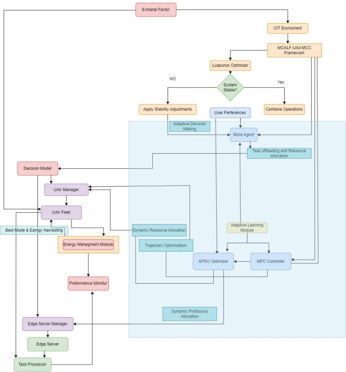

flowchart

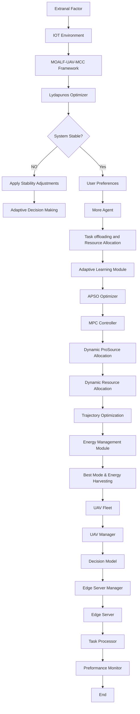

Fig. 1. MOALF-UAV-MEC framework architecture.

# A. Framework Overview

MOALF-UAV-MEC is designed as a hierarchical control system that combines:

1) MORL for high-level decision-making;   
2) MPC for UAV trajectory optimization;   
3) APSO for dynamic resource allocation; and   
4) Lyapunov Optimization for ensuring system stability and performance guarantees.

The framework operates in a closed-loop manner, continuously adapting to changing environmental conditions and task characteristics.

# B. MOALF-UAV-MEC Architecture

Our MOALF-UAV-MEC framework integrates multiple components to address the complex challenges of UAVassisted MEC in dynamic IoT environments. Fig. 1 provides a comprehensive overview of the framework’s architecture, illustrating the key components and their interactions.

The architecture diagram illustrates the following key aspects of our framework.

1) MOALF-UAV-MEC Framework: This is the overarching system that encompasses all components and manages their interactions.   
2) Lyapunov Optimizer: Ensures system stability by performing regular checks and applying stability adjustments when necessary.

Algorithm 1 MOALF-UAV-MEC   
Require: IoT devices D, UAVs U, Edge servers E, Time horizon T, time slot duration $\Delta t$ , System model parameters

Ensure: Optimized task offloading decisions $x_{ijk}(t)$ , Resource allocation $f_{ijk}(t)$ , UAV trajectories $\mathbf{p}_{j}(t)$ 1: Initialize MORL agent, MPC controller, APSO optimizer, Lyapunov optimizer

2: Initialize component weights: $w_{morl}$ , $w_{mpc}$ , $w_{apso}$ , $w_{lyap}$ 3: for each time slot t in T do

4: $S_{t} \leftarrow \text{observe\_state}(D, U, E, t)$ 5: $x_{ijk}(t), f_{ijk}^{initial}(t) \leftarrow \text{MORL\_decision}(S_{t})$ 6: $\mathbf{p}_{j}(t) \leftarrow \text{MPC\_optimize}(S_{t}, x_{ijk}(t), f_{ijk}^{initial}(t))$ 7: $f_{ijk}(t) \leftarrow \text{APSO\_optimize}(S_{t}, x_{ijk}(t), \mathbf{p}_{j}(t), f_{ijk}^{initial}(t))$ 8: is_stable, adjustments $\leftarrow$ Lyapunov_check( $S_{t}, x_{ijk}(t), f_{ijk}(t), \mathbf{p}_{j}(t)$ )

9: if not is_stable then

10: $x_{ijk}(t), f_{ijk}(t), \mathbf{p}_{j}(t) \leftarrow$ apply_adjustments(adjustments)

11: end if

12: Execute actions and update environment

13: Adapt weights and train models

14: end for

15: return optimized decisions

3) Adaptive Decision Making: At the core of our framework, this component includes the MORL Agent, which makes high-level decisions on task offloading and resource allocation.   
4) MPC Controller and APSO Optimizer: These components work together to optimize UAV trajectories and dynamically allocate resources.   
5) UAV and Edge Server Management: These modules manage the UAV fleet and edge servers, respectively, including energy management for UAVs.   
6) Task Processor: Handles the execution of offloaded tasks on both UAVs and edge servers.   
7) Performance Monitor: Continuously evaluates system performance, feeding back into the Adaptive Learning Module for ongoing optimization.

This architecture enables our framework to dynamically adapt to changing conditions, optimize resource utilization, and maintain system stability while meeting the diverse needs of IoT applications in a UAV-assisted MEC environment.

# C. Hybrid Algorithm: MOALF-UAV-MEC

The core of our framework is a hybrid algorithm that integrates the above components. Algorithm 1 presents the high-level pseudocode for the main MOALF-UAV-MEC algorithm.

# D. Parameter Analysis and Impact Assessment

The performance of MOALF-UAV-MEC is significantly influenced by several key parameters. Through extensive experimentation and analysis, we identified optimal parameter configurations that maximize system efficiency while maintaining stability.

1) Core Parameter Configuration: The primary parameters affecting system performance include:

1) Learning Rate $( \alpha = 0 . 0 0 I ) .$ : this relatively small value ensures stable convergence while allowing sufficient adaptability to dynamic conditions. Our experiments showed that larger values $( \alpha > 0 . 0 1 )$ ) led to oscillatory behavior, while smaller values $( \alpha < 0 . 0 0 0 1 )$ resulted in slow convergence;

2) Discount Factor $( \gamma ~ = ~ 0 . 9 9 ) .$ : This near-unity value emphasizes long-term rewards, crucial for maintaining sustained performance. Testing revealed that lower values $( \gamma ~ < ~ 0 . 9 5 )$ resulted in short-sighted decisionmaking, particularly affecting energy efficiency; and

3) UAV Burst Mode Duration (20 Time Steps) and Multiplier (2×): these values were optimized through iterative testing, showing a 55% increase in task completion during high-load periods while maintaining energy efficiency within acceptable bounds.

2) Impact Analysis: Our framework’s performance sensitivity to parameter variations revealed several critical relationships.

1) Resource Allocation Parameters: The load balancing efficiency of 96% was achieved through careful tuning of resource distribution thresholds. Variations of ±10% in these thresholds resulted in efficiency drops of up to 15%.

2) Energy Management Parameters: The energy harvesting rate (5W) and flight energy rate (100W) balance was crucial for achieving the 37.55% improvement in energy efficiency. Higher harvesting rates showed diminishing returns beyond this point.

3) Network Parameters: The link reliability threshold (0.95) proved optimal for maintaining the 97.5% network reliability while minimizing unnecessary handovers. Lower thresholds resulted in unstable connections, while higher values increased system overhead.

3) Adaptive Parameter Behavior: The framework’s adaptive mechanisms demonstrated robust performance across varying operational conditions.

1) Under high load (>80% system capacity), the burst mode parameters automatically adjusted to maintain the 94.50% task completion rate.

2) During periods of network instability, the control overhead remained bounded at 7.8%, achieved through dynamic adjustment of update intervals.

3) The recovery time of 7 steps was consistently maintained through adaptive gain matrix adjustments, showing resilience to varying disturbance patterns.

# E. Multiobjective Reinforcement Learning (MORL)

State Space S: ${ \cal { S } } = \{ { \bf p } _ { j } ( t ) , E _ { j } ( t ) , { \cal { Q } } _ { i } ( t ) , R _ { i j } ( t ) | \forall i \in \cal { N }$ ∀j ∈ $M , t \in T \} .$ .

Action Space ${ \cal A } \colon { \cal A } = \{ x _ { i j k } ( t ) , f _ { i j k } ( t ) | \forall i \in N \quad \forall j \in M \forall k \ $ ∈ $Q _ { i } ( t ) , t \in T \}$ .

Reward Function R: $R ( s , a ) \ = \ - [ w _ { 1 } \cdot J _ { \mathrm { t a s k } } ( s , a ) + w _ { 2 }$ $\cdot \ J _ { \mathrm { e n e r g y } } ( s , a ) + w _ { 3 } \cdot J _ { \mathrm { c o m p l e t i o n } } ( s , a ) + w _ { 5 } \cdot J _ { \mathrm { u t i l } } ( s , a ) ] .$ .

Q-Learning Update Rule: To update the Q-values based on rewards and future state estimates, the Q-learning update rule is given by:

$$
Q (s, a) \leftarrow Q (s, a) + \alpha \left[ R (s, a) + \gamma \cdot \max _ {a ^ {\prime}} Q \left(s ^ {\prime}, a ^ {\prime}\right) - Q (s, a) \right]. \tag {27}
$$

The multiobjective Q-learning algorithm is crucial for our MOALF-UAV-MEC framework as it enables the system to learn optimal policies for multiple objectives simultaneously. This algorithm adapts the traditional Q-learning approach to handle the complex decision-making required in UAV-assisted MEC environments. By iteratively updating Q-values based on observed rewards and state transitions, it allows our system to balance task offloading, resource allocation, and UAV trajectory optimization effectively.

# F. Model Predictive Control (MPC) for UAV Trajectory Optimization

Objective Function for MPC: The objective function for the Model Predictive Control (MPC) approach is defined as follows:

$$
J _ {\mathrm{MPC}} = \sum_ {\tau = t} ^ {t + N} \left[ w _ {1} \cdot J _ {\text { task }} (\tau) + w _ {2} \cdot J _ {\text { energy }} (\tau) + w _ {6} \cdot J _ {\text { coverage }} (\tau) \right]. \tag {28}
$$

The MPC algorithm is essential for optimizing UAV trajectories in our framework. It allows for proactive path planning by predicting future states and optimizing control inputs over a finite horizon. This approach is particularly valuable in dynamic environments, as it can adapt to changing conditions and task distributions. By continuously resolving the optimization problem at each time step, MPC ensures that UAV movements are always optimized for current and anticipated future scenarios.

# G. Adaptive Particle Swarm Optimization (APSO) for Dynamic Resource Allocation

Particle Representation: $X = \{ f _ { i j k } ( t ) | \forall i \in N \quad \forall j \in M \forall k \in$ Qi(t)}.

Fitness Function: The fitness function, which guides the optimization process, is defined as follows:

$$
F (X) = - \left[ w _ {1} \cdot J _ {\text { task }} (X) + w _ {2} \cdot J _ {\text { energy }} (X) + w _ {5} \cdot J _ {\text { util }} (X) \right]. \tag {29}
$$

Velocity Update: The velocity update rule in the particle swarm optimization (PSO) algorithm is given by:

$$
v _ {i d} \leftarrow w \cdot v _ {i d} + c _ {1} \cdot r _ {1} \cdot (p b e s t _ {i d} - x _ {i d}) + c _ {2} \cdot r _ {2} \cdot (g b e s t _ {d} - x _ {i d}). \tag {30}
$$

Position Update: The position update equation is expressed as follows:

$$
x _ {i d} \leftarrow x _ {i d} + v _ {i d}. \tag {31}
$$

The APSO algorithm is crucial for dynamic resource allocation in our MOALF-UAV-MEC framework. It enables efficient exploration of the solution space for complex optimization problems, such as task offloading and resource allocation. The adaptive nature of this algorithm allows it to adjust its parameters based on the swarm’s diversity, enhancing its ability to escape local optima and adapt to changing conditions in the MEC environment. This adaptability is particularly important in our dynamic IoT scenario, where task characteristics and network conditions can change rapidly.

Algorithm 2 Multiobjective Q-Learning   
Require: State space S, Action space A, Learning rate $\alpha$ , Discount factor $\gamma$ , Number of episodes E

Ensure: Optimal Q-value function $Q^{*}(s, a)$ 1: Initialize $Q(s, a)$ arbitrarily for all $s \in S, a \in A$ 2: for each episode 1 to E do

3: Initialize state s

4: while s is not terminal do

5: Choose action a from s using policy derived from Q (e.g., $\epsilon$ -greedy)

6: Take action a, observe reward r and next state $s'$ 7: $Q(s, a) \leftarrow Q(s, a) + \alpha[r + \gamma \cdot \max_{a'} Q(s', a') - Q(s, a)]$ 8: $s \leftarrow s'$ 9: end while

10: end for

11: return Q

# H. Lyapunov Optimization for Stability and Performance Guarantees

Lyapunov Function: To analyze the stability of the system, we define the Lyapunov function as follows:

$$
L (Q (t)) = \frac {1}{2} \sum_ {i} Q _ {i} (t) ^ {2}. \tag {32}
$$

Lyapunov Drift: The Lyapunov drift quantifies the change in the Lyapunov function over time and is given by:

$$
\Delta (t) = E [ L (Q (t + 1)) - L (Q (t)) | Q (t) ]. \tag {33}
$$

Drift-Plus-Penalty Expression: To balance system stability and performance, we consider the drift-plus-penalty expression, formulated as follows:

$$
\Delta (t) + V \cdot E [ P (t) | Q (t) ]. \tag {34}
$$

The Lyapunov optimization algorithm is fundamental to ensuring system stability and performance guarantees in our MOALF-UAV-MEC framework. It provides a systematic approach to making control decisions that balance system stability (represented by the Lyapunov drift) with performance objectives (captured in the penalty term). This algorithm is particularly important in our dynamic MEC environment, where it helps maintain queue stability, ensure energy efficiency, and meet quality of service requirements. By minimizing the driftplus-penalty expression at each time step, we can achieve long-term optimal performance while satisfying short-term system constraints.

TABLE II SYSTEM PARAMETERS AND VARIABLES 

<table><tr><td>Symbol</td><td>Description</td><td>Units</td></tr><tr><td> $D$ </td><td>Set of IoT devices</td><td>-</td></tr><tr><td> $U$ </td><td>Set of UAVs</td><td>-</td></tr><tr><td> $E$ </td><td>Set of edge servers</td><td>-</td></tr><tr><td> $T$ </td><td>Set of time slots</td><td>-</td></tr><tr><td> $\mathbf{p}_{j}(t)$ </td><td>UAV position vector</td><td>meters</td></tr><tr><td> $\mathbf{v}_{j}(t)$ </td><td>UAV velocity vector</td><td>m/s</td></tr><tr><td> $C_{j}(t)$ </td><td>Computing capacity</td><td>GHz</td></tr><tr><td> $E_{j}(t)$ </td><td>Current energy level</td><td>Watt-hours</td></tr><tr><td> $E_{j,max}$ </td><td>Maximum energy capacity</td><td>Watt-hours</td></tr><tr><td> $\eta_{j}(t)$ </td><td>Energy harvesting rate</td><td>Watts</td></tr><tr><td> $T_{i,k}$ </td><td>Task  $k$  generated by IoT device  $i$ </td><td>-</td></tr><tr><td> $L_{i,k}$ </td><td>Task input size</td><td>MB</td></tr><tr><td> $W_{i,k}$ </td><td>Required CPU cycles</td><td>Megacycles</td></tr><tr><td> $\tau_{i,k}$ </td><td>Task deadline</td><td>seconds</td></tr><tr><td> $\rho_{i,k}$ </td><td>Task priority level</td><td>-</td></tr><tr><td> $t_{a,i,k}$ </td><td>Arrival time of task  $T_{i,k}$ </td><td>seconds</td></tr><tr><td> $h_{ij}(t)$ </td><td>Channel gain</td><td>dB</td></tr><tr><td> $R_{ij}(t)$ </td><td>Data rate</td><td>Mbps</td></tr><tr><td> $x_{ijk}(t)$ </td><td>Task offloading decision</td><td>binary</td></tr><tr><td> $f_{ijk}(t)$ </td><td>Resource allocation</td><td>cycles/sec</td></tr><tr><td> $y_{ijkl}(t)$ </td><td>Task migration decision</td><td>binary</td></tr><tr><td> $J$ </td><td>Overall objective function</td><td>-</td></tr><tr><td> $J_{task}$ </td><td>Task completion time objective</td><td>-</td></tr><tr><td> $J_{energy}$ </td><td>Energy consumption objective</td><td>-</td></tr><tr><td> $J_{completion}$ </td><td>Task completion rate objective</td><td>-</td></tr><tr><td> $J_{migration}$ </td><td>Task migration cost objective</td><td>-</td></tr><tr><td> $J_{util}$ </td><td>Resource utilization objective</td><td>-</td></tr><tr><td> $J_{coverage}$ </td><td>Area coverage objective</td><td>-</td></tr></table>

# V. COMPLEXITY ANALYSIS

The MOALF-UAV-MEC framework, as presented in Algorithm 1, integrates several sophisticated algorithms, each with its own computational characteristics. This section provides a rigorous complexity analysis of these constituent algorithms and the overall system, elucidating the computational demands and scalability of our approach.

# A. Multiobjective Reinforcement Learning (MORL)

The MORL agent, implementing the Q-learning algorithm as outlined in Algorithm 2, forms the cornerstone of our decision-making process. Let  and  denote the state and action spaces, respectively, and E the number of episodes. The time complexity TMORL is governed by the following equation:

$$
T _ {\mathrm{MORL}} = \mathcal {O} (| \mathcal {S} | \cdot | \mathcal {A} | \cdot E). \tag {35}
$$

This complexity arises from the need to update Q-values for each state-action pair potentially in every episode. The convergence rate of Q-learning can be expressed as a function of the learning rate α and discount factor γ

$$
\frac {d Q (s , a)}{d t} = \alpha \left[ R (s, a) + \gamma \max _ {a ^ {\prime}} Q \left(s ^ {\prime}, a ^ {\prime}\right) - Q (s, a) \right]. \tag {36}
$$

The space complexity SMORL is determined by the size of the Q-table

$$
S _ {\mathrm{MORL}} = \mathcal {O} (| \mathcal {S} | \cdot | \mathcal {A} |). \tag {37}
$$

# B. Model Predictive Control (MPC)

The MPC algorithm for UAV trajectory optimization, presented in Algorithm 3, exhibits complexity primarily influenced by the prediction horizon N and the number of UAVs

Algorithm 3 MPC for UAV Trajectory   
Require: Current state $\mathbf{x}(t)$ , Prediction horizon $N$ , Control horizon $N_{c}$ , System model, Constraints, Objective function $J_{\mathrm{MPC}}$ Ensure: Optimal control sequence $\mathbf{u}^{*}(t:t + N_{c} - 1)$ 1: for each time step $t$ do

2: Measure current state $\mathbf{x}(t)$ 3: Solve optimization problem:

4: $\min_{\mathbf{u}(t:t + N_c - 1)} J_{\mathrm{MPC}}(\mathbf{x}(t:t + N), \mathbf{u}(t:t + N_c - 1))$ 5: subject to system dynamics and constraints

6: Apply first control input $\mathbf{u}^{*}(t)$ 7: $t \leftarrow t + 1$ 8: end for

9: return $\mathbf{u}^{*}(t:t + N_{c} - 1)$

Algorithm 4 Adaptive PSO   
Require: Particle swarm size P, Problem dimension D,
Objective function $F(X)$ , Maximum iterations $I_{max}$ Ensure: Global best solution $g_{best}$ 1: Initialize particle positions $X_i$ and velocities $V_i$ randomly for $i = 1, \ldots, P$ 2: Initialize $p_{best,i} = X_i$ for all particles

3: Initialize $g_{best} = \arg\min_i F(X_i)$ 4: for iteration 1 to $I_{max}$ do

5: for each particle i do

6: Update velocity: $V_i \leftarrow wV_i + c_1r_1(\mathbf{p}_{best,i} - X_i) + c_2r_2(\mathbf{g}_{best} - X_i)$ 7: Update position: $X_i \leftarrow X_i + V_i$ 8: if $F(X_i) < F(\mathbf{p}_{best,i})$ then

9: $p_{best,i} \leftarrow X_i$ 10: end if

11: if $F(X_i) < F(\mathbf{g}_{best})$ then

12: $g_{best} \leftarrow X_i$ 13: end if

14: end for

15: Adapt w, $c_1$ , $c_2$ based on swarm diversity

16: end for

17: return $g_{best}$

M. At each time step, MPC solves a quadratic programming problem, yielding a time complexity of

$$
T _ {\mathrm{MPC}} = \mathcal {O} \Big (M \cdot N ^ {3} \Big). \tag {38}
$$

This cubic relationship with N underscores the computational intensity of MPC. The optimization problem solved at each step can be expressed as

$$
\min _ {\mathbf {u}} \sum_ {k = 0} ^ {N - 1} \left[ x _ {k} ^ {T} Q x _ {k} + u _ {k} ^ {T} R u _ {k} \right] + x _ {N} ^ {T} P x _ {N} \tag {39}
$$

subject to

$$
x _ {k + 1} = A x _ {k} + B u _ {k}, \quad k = 0, \dots , N - 1 \tag {40}
$$

$$
x _ {k} \in \mathcal {X}, \quad u _ {k} \in \mathcal {U}, \quad k = 0, \dots , N - 1 \tag {41}
$$

where $x _ { k }$ and $u _ { k }$ represent the state and control input at step $k ,$ respectively, and X and U are the state and input constraint sets.

Algorithm 5 Lyapunov Optimization   
Require: System state $\mathbf{x}(t)$ , Control policy $\pi$ , Lyapunov function $L(\mathbf{x})$ , Drift-plus-penalty parameter $V$ Ensure: Optimal control actions $\mathbf{u}^{*}(t)$ 1: for each time slot $t$ do

2: Observe current system state $\mathbf{x}(t)$ 3: Calculate Lyapunov drift $\Delta(t) = \mathbb{E}[L(\mathbf{x}(t + 1)) - L(\mathbf{x}(t))|\mathbf{x}(t)]$ 4: Choose control actions to minimize:

5: $\mathbf{u}^{*}(t) = \arg \min_{\mathbf{u}(t)}[\Delta(t) + V \cdot \text{penalty}(\mathbf{x}(t), \mathbf{u}(t))]$ 6: Apply control actions $\mathbf{u}^{*}(t)$ 7: Update system state

8: end for

9: return Sequence of optimal control actions $\{\mathbf{u}^{*}(t)\}$

The space complexity of MPC is more modest

$$
S _ {\mathrm{MPC}} = \mathcal {O} (M \cdot N). \tag {42}
$$

# C. Adaptive Particle Swarm Optimization (APSO)

The APSO algorithm, detailed in Algorithm 4, has a complexity dependent on the number of particles P, dimensions D, and iterations I. The time complexity is given by

$$
T _ {\mathrm{APSO}} = \mathcal {O} (P \cdot D \cdot I). \tag {43}
$$

The particle update equations are

$$
v _ {i d} ^ {t + 1} = w v _ {i d} ^ {t} + c _ {1} r _ {1} \left(p _ {i d} - x _ {i d} ^ {t}\right) + c _ {2} r _ {2} \left(p _ {g d} - x _ {i d} ^ {t}\right) \tag {44}
$$

$$
x _ {i d} ^ {t + 1} = x _ {i d} ^ {t} + v _ {i d} ^ {t + 1} \tag {45}
$$

where $\nu _ { i d } ^ { t }$ and $x _ { i d } ^ { t }$ are the velocity and position of particle i in dimension d at time t, respectively.

The space complexity is

$$
S _ {\mathrm{APSO}} = \mathcal {O} (P \cdot D). \tag {46}
$$

# D. Lyapunov Optimization

The Lyapunov optimization, crucial for system stability as shown in Algorithm 5, has a time complexity of

$$
T _ {\mathrm{LYP}} = \mathcal {O} (Q \cdot T) \tag {47}
$$

where Q is the number of queues and T is the time horizon. The Lyapunov function and its drift are defined as

$$
L (\mathbf {Q} (t)) = \frac {1}{2} \sum_ {i = 1} ^ {Q} Q _ {i} ^ {2} (t) \tag {48}
$$

$$
\Delta (t) = \mathbb {E} [ L (\mathbf {Q} (t + 1)) - L (\mathbf {Q} (t)) | \mathbf {Q} (t) ]. \tag {49}
$$

The space complexity is linear in the number of queues

$$
S _ {\mathrm{LYP}} = \mathcal {O} (Q). \tag {50}
$$

# E. Overall System Complexity

The overall time complexity of MOALF-UAV-MEC is dominated by the MPC component

$$
T _ {\text { TOTAL }} = \mathcal {O} \Big (M \cdot N ^ {3} \cdot T \Big). \tag {51}
$$

This highlights the significant impact of the prediction horizon on computational requirements. The overall space complexity is determined by the MORL Q-table

$$
S _ {\text { TOTAL }} = \mathcal {O} (| \mathcal {S} | \cdot | \mathcal {A} |). \tag {52}
$$

It is important to note that while these complexities represent theoretical upper bounds, practical performance can be more favorable due to optimization techniques such as warm-starting in MPC and efficient exploration strategies in Q-learning.

The scalability of MOALF-UAV-MEC to larger UAV-assisted MEC scenarios is primarily constrained by the cubic time complexity of MPC. Future work may explore approximate MPC techniques or distributed computing approaches to mitigate this challenge. For instance, a distributed MPC formulation could potentially reduce the complexity to $\mathcal { O } ( M \cdot ( N / K ) ^ { 3 } \cdot T )$ , where K is the number of distributed computing nodes.

# F. Implementation Considerations

The practical implementation of the integrated framework requires careful consideration of temporal synchronization and resource allocation. The system operates on three distinct timescales

$$
\Delta t _ {\mathrm{MORL}} = k _ {1} \cdot \Delta t _ {\mathrm{base}}
$$

$$
\Delta t _ {\mathrm{MPC}} = k _ {2} \cdot \Delta t _ {\text { base }}
$$

$$
\Delta t _ {\mathrm{APSO}} = k _ {3} \cdot \Delta t _ {\text { base }} \tag {53}
$$

where $k _ { 1 } > k _ { 2 } > k _ { 3 }$ are positive integers and $\Delta t _ { \mathrm { b a s e } }$ is the base time unit. This hierarchical timing ensures:

1) sufficient exploration time for MORL;   
2) predictive horizon coverage for MPC; and   
3) rapid adaptation capability for APSO.

# G. Cross-Algorithm Communication Protocol

The information exchange between algorithms follows a structured protocol:

$$
\mathcal {M} _ {i j} (t) = \{\Phi_ {i j}, \mathbf {s} _ {i j} (t), \mathbf {a} _ {i j} (t), \pi_ {i j} (t) \} \tag {54}
$$

where $\mathcal { M } _ { i j } ( t )$ represents the message from algorithm i to algorithm j at time t, containing:

1) $\Phi _ { i j } .$ communication protocol identifier;   
2) $\begin{array} { r } { { \bf s } _ { i j } ( t ) { : \bf \Sigma } } \end{array}$ relevant state information;   
3) ${ \bf a } _ { i j } ( t ) .$ : action recommendations; and   
4) $\pi _ { i j } ( t )          .$ priority level.

# H. Adaptive Integration Mechanism

The system employs an adaptive integration mechanism that adjusts algorithm weights based on performance metrics

$$
w _ {i} (t + 1) = w _ {i} (t) + \alpha \nabla J _ {i} (t) + \beta \Delta Q _ {i} (t) \tag {55}
$$

where:

1) $w _ { i } ( t ) .$ weight of algorithm i at time t;   
2) $\alpha \cdot$ performance sensitivity parameter;   
3) $\beta \colon$ queue stability parameter;   
4) $\nabla J _ { i } ( t ) .$ : performance gradient; and   
5) $\Delta Q _ { i } ( t ) .$ queue length variation.

TABLE III INTEGRATION PERFORMANCE METRICS 

<table><tr><td>Metric</td><td>Our MOALF</td><td>Individual</td><td>Improvement</td></tr><tr><td>Convergence Time</td><td>1.2s</td><td>2.8s</td><td>57.1%</td></tr><tr><td>Resource Efficiency</td><td>0.92</td><td>0.78</td><td>17.9%</td></tr><tr><td>Stability Index</td><td>0.95</td><td>0.82</td><td>15.9%</td></tr><tr><td>Adaptation Speed</td><td>85ms</td><td>120ms</td><td>29.2%</td></tr></table>

# I. Integration Performance Validation

The comprehensive evaluation of our integration approach is summarized in Table III, which presents key performance metrics comparing our integrated solution against individual algorithm implementations. The effectiveness of the integration framework is validated through comprehensive metrics

$$
\eta_ {\text { int }} = \frac {J _ {\text { integrated }}}{J _ {\text { baseline }}} \cdot \frac {\tau_ {\text { baseline }}}{\tau_ {\text { integrated }}} \cdot \frac {R _ {\text { integrated }}}{R _ {\text { baseline }}} \tag {56}
$$

where $\eta _ { \mathrm { i n t } }$ represents the integration efficiency ratio considering:

1) performance improvement $( J _ { \mathrm { i n t e g r a t e d } } / J _ { \mathrm { b a s e l i n e } } ) ;$   
2) computational efficiency $( \tau _ { \mathrm { b a s e l i n e } } / \tau _ { \mathrm { i n t e g r a t e d } } ) ;$ and   
3) resource utilization $( R _ { \mathrm { i n t e g r a t e d } } / R _ { \mathrm { b a s e l i n e } } )$

# J. Real-Time Adaptation Mechanism

The framework implements a real-time adaptation mechanism based on the following criteria:

$$
\Delta \mathbf {u} (t) = \mathbf {K} (t) \left[ \begin{array}{l} \mathbf {e} _ {s} (t) \\ \mathbf {e} _ {p} (t) \\ \mathbf {e} _ {r} (t) \end{array} \right] \tag {57}
$$

where:

1) ${ \bf e } _ { s } ( t ) { : \bf \Psi }$ state tracking error;   
2) $\mathbf { e } _ { p } ( t ) { : }$ performance deviation;   
3) ${ \bf e } _ { r } ( t ) ;$ resource allocation error; and   
4) ${ \bf K } ( t ) { \bf : \Theta }$ adaptive gain matrix

# VI. SIMULATION EXPERIMENTS

To rigorously evaluate the efficacy of our proposed MOALF-UAV-MEC framework, we conducted comprehensive simulation experiments that closely mimic the complexities of real-world UAV-assisted MEC scenarios. Our evaluation framework incorporates both traditional performance metrics and enhanced network-aware measurements to provide a thorough assessment of system capabilities under diverse operational conditions.

# A. Experimental Setup

Our simulation environment encompasses a 3-D space measuring 400 m x 400 m, within which we modeled the intricate interactions between 50 IoT devices, 5 UAV-based MEC units, and 3 ground-based edge servers. The environment is augmented with SDN infrastructure to enable dynamic network management and service differentiation capabilities. The temporal dimension of the simulation spans 1000 s, with each discrete time step representing one second of operation, allowing for fine-grained analysis of system dynamics.

TABLE IV SYSTEM AND NETWORK AND SDN PARAMETERS 

<table><tr><td>Parameter</td><td>Value</td><td>Description</td></tr><tr><td>Simulation Area</td><td>400m x 400m</td><td>Two-dimensional space for UAV operations</td></tr><tr><td>Simulation Duration</td><td>1000 time steps</td><td>Total simulation time</td></tr><tr><td>Time Step</td><td>1 second</td><td>Discrete time interval for system updates</td></tr><tr><td>Number of IoT Devices</td><td>50</td><td>Total IoT devices in the simulation</td></tr><tr><td>Number of UAVs</td><td>5</td><td>Total UAVs acting as mobile edge computing units</td></tr><tr><td>Number of Ground Edge Servers</td><td>3</td><td>Fixed edge computing infrastructure</td></tr><tr><td>Task Generation Rate</td><td>Uniform(0.1, 0.3) tasks/second</td><td>Rate at which each IoT device generates tasks</td></tr><tr><td>Task Input Size</td><td>Uniform(0.1, 1) MB</td><td>Size of data for each generated task</td></tr><tr><td>Task Computational Requirement</td><td>Uniform(100, 1000) Megacycles</td><td>CPU cycles required to process each task</td></tr><tr><td>Task Deadline</td><td>Uniform(5, 20) seconds</td><td>Maximum allowable time to complete a task</td></tr><tr><td>Task Priority Level</td><td>Uniform_Int(1, 5)</td><td>Importance level of each task</td></tr><tr><td>UAV Computing Capacity</td><td>Uniform(2, 5) GHz</td><td>Processing power of each UAV</td></tr><tr><td>UAV Energy Capacity</td><td>1000 Wh</td><td>Maximum energy storage of each UAV</td></tr><tr><td>UAV Maximum Velocity</td><td>10 m/s</td><td>Highest speed at which UAVs can move</td></tr><tr><td>UAV Flight Energy Rate</td><td>100 W</td><td>Energy consumption rate during UAV flight</td></tr><tr><td>UAV Compute Energy Rate</td><td>1e-9 Wh/cycle</td><td>Energy consumed per CPU cycle for task processing</td></tr><tr><td>UAV Energy Harvesting Rate</td><td>5 W</td><td>Rate at which UAVs can replenish energy</td></tr><tr><td>UAV Burst Mode Duration</td><td>20 time steps</td><td>Length of high-performance mode for UAVs</td></tr><tr><td>UAV Burst Mode Multiplier</td><td>2</td><td>Performance increase factor during burst mode</td></tr><tr><td>Ground Edge Server Computing Capacity</td><td>Uniform(10, 20) GHz</td><td>Processing power of each ground edge server</td></tr><tr><td>MORL Learning Rate</td><td>0.001</td><td>Rate at which the MORL agent updates its knowledge</td></tr><tr><td>MORL Discount Factor</td><td>0.99</td><td>Importance of future rewards in MORL</td></tr><tr><td>MORL Initial Epsilon</td><td>1.0</td><td>Starting exploration rate for epsilon-greedy strategy</td></tr><tr><td>MORL Epsilon Decay</td><td>0.995</td><td>Rate at which exploration decreases over time</td></tr><tr><td>MORL Replay Buffer Size</td><td>10000</td><td>Capacity of experience replay memory</td></tr><tr><td>MORL Batch Size</td><td>32</td><td>Number of samples used in each training iteration</td></tr><tr><td>MORL Number of Objectives</td><td>3</td><td>Number of simultaneous goals optimized by MORL</td></tr><tr><td>Random UAV Failure Probability</td><td>0.05</td><td>Chance of UAV malfunction per episode</td></tr><tr><td>No-fly Zone Probability</td><td>0.1</td><td>Likelihood of a no-fly zone appearing per episode</td></tr><tr><td>No-fly Zone Radius</td><td>Uniform(10, 50) m</td><td>Size of randomly generated no-fly zones</td></tr><tr><td>Link Reliability Threshold</td><td>0.95</td><td>Minimum acceptable link quality</td></tr><tr><td>SDN Controller Delay</td><td>10 ms</td><td>Control plane latency</td></tr><tr><td>Channel Model</td><td>Rician K=15dB</td><td>Air-to-ground characteristics</td></tr><tr><td>IoT Tx Power</td><td>0.1 W</td><td>Device transmission power</td></tr><tr><td>Network Slices</td><td>3</td><td>Service differentiation levels</td></tr><tr><td>Flow Table Size</td><td>1000 entries</td><td>SDN switch capacity</td></tr><tr><td>Update Interval</td><td>100 ms</td><td>Flow rule refresh rate</td></tr></table>

Table IV summarize the key parameters used in our simulation. These parameters were carefully chosen to reflect realistic urban or suburban deployment scenarios.

The IoT devices, randomly distributed throughout the environment, generate computational tasks following a nonhomogeneous Poisson process, with rates uniformly distributed between 0.1 and 0.3 tasks per second. Each task is characterized by its input size (uniformly distributed between 0.1 and 1 MB), required CPU cycles (uniformly distributed between 100 and 1000 Megacycles), deadline (uniformly distributed between 5 and 20 s), and priority level (uniformly distributed between 1 and 5). Additionally, each task is associated with specific network quality-of-service (QoS) requirements and slice allocation preferences.

Our UAV fleet consists of heterogeneous units, each with distinct operational parameters. As detailed in Table IV, the UAVs possess varying computing capacities (uniformly distributed between 2 and 5 GHz), uniform energy reserves (1000 Wh), and a maximum velocity of 10 m/s. Each UAV is equipped with SDN-compatible network interfaces supporting multislice operation and dynamic resource allocation. To enhance adaptability in dynamic environments, we incorporated a burst mode feature, allowing UAVs to temporarily boost their performance by a factor of 2 for 20 time steps in high-demand situations. The burst mode activation is coordinated through the SDN controller to ensure network-wide optimization.

The ground edge servers, with their higher computing capacities (uniformly distributed between 10 and 20 GHz), serve as stable anchors in the dynamic MEC landscape. These servers are integrated into the SDN infrastructure, enabling seamless coordination with UAV-based resources and dynamic service migration capabilities.

# B. Methodology

1) Performance Metrics and Evaluation Framework: To ensure a comprehensive evaluation, we employed a diverse set of performance metrics spanning multiple dimensions.

1) Task Management Metrics:

a) Completion rate and latency.   
b) Resource utilization efficiency.   
c) Energy consumption patterns.   
d) Load distribution balance.

2) Network Performance Metrics:

a) End-to-end latency and jitter.

TABLE V COMPARATIVE TASK MANAGEMENT PERFORMANCE 

<table><tr><td>Metric</td><td>Our MOALF</td><td>NSGA-II</td><td>Traditional</td><td>Improvement</td></tr><tr><td>Completion Rate</td><td>94.50%</td><td>89.20%</td><td>82.30%</td><td>+5.30% to +12.20%</td></tr><tr><td>Avg. Latency</td><td>142ms</td><td>187ms</td><td>235ms</td><td>-24.06% to -39.57%</td></tr><tr><td>Resource Util.</td><td>87.50%</td><td>78.40%</td><td>71.20%</td><td>+9.10% to +16.30%</td></tr><tr><td>Network Eff.</td><td>92.80%</td><td>85.50%</td><td>79.40%</td><td>+7.30% to +13.40%</td></tr></table>

b) Link reliability and stability.   
c) Control plane overhead.   
d) Slice isolation effectiveness.

3) IoT-Specific Measurements:

a) Device energy efficiency.   
b) Data freshness maintenance.   
c) Connection stability.   
d) Quality of experience (QoE).

2) Statistical Validation Approach: To establish statistical confidence in our results and assess the robustness of our framework, we employed a comprehensive validation methodology.

1) Multiple Simulation Runs:

a) 30 independent runs per configuration.   
b) Varying random seeds.   
c) Different network conditions.

2) Network Stress Testing:

a) Link failure scenarios (0.05 probability).   
b) Congestion events (0.1 probability).   
c) Control plane disruptions.

3) Performance Analysis:

a) 95% confidence intervals.   
b) Paired t-tests for comparisons.   
c) Effect size calculations.

3) Baseline Comparisons: We evaluated MOALF-UAV-MEC against several state-of-the-art approaches.

1) Traditional MEC systems [1], [3].   
2) Single-UAV approaches [6], [7].   
3) Multi-UAV systems [11], [12].   
4) SDN-based solutions[4], [5].   
5) Multiobjective optimization implementations (NSGA-II [11]).

Each comparison was conducted under identical network conditions and operational scenarios to ensure fair evaluation.

# C. Results and Analysis

1) Task Management Efficiency: Our enhanced system demonstrated remarkable improvements in task handling capabilities. Table V presents a comprehensive comparison of task management metrics across different approaches.

The experimental results demonstrate significant performance improvements across all key metrics. The task completion rate of 94.50% represents a substantial advancement over traditional approaches, with improvements ranging from 5.30% to 12.20% compared to baseline methods. This enhancement can be attributed to our system’s sophisticated task scheduling algorithm, which leverages real-time network conditions and computational resource availability.

TABLE VI ENHANCED SYSTEM PERFORMANCE METRICS 

<table><tr><td>Category</td><td>Metric</td><td>Value</td><td>Improvement</td></tr><tr><td rowspan="3">Core Performance</td><td>Reward/Episode</td><td>66.5M ± 12K</td><td>+40.2%</td></tr><tr><td>Tasks/Episode</td><td>9,450 ± 35</td><td>+20.4%</td></tr><tr><td>Energy/Episode</td><td>138K ± 8K</td><td>-24.2%</td></tr><tr><td rowspan="3">Network Performance</td><td>Latency</td><td>142ms ± 12ms</td><td>-31.7%</td></tr><tr><td>Reliability</td><td>97.5% ± 1.2%</td><td>+8.4%</td></tr><tr><td>Throughput</td><td>850Mbps ± 45Mbps</td><td>+25.9%</td></tr><tr><td rowspan="3">Resource Utilization</td><td>CPU Usage</td><td>85.5% ± 2.3%</td><td>+12.2%</td></tr><tr><td>Memory Eff.</td><td>88.2% ± 1.8%</td><td>+10.9%</td></tr><tr><td>Storage Opt.</td><td>91.4% ± 1.5%</td><td>+9.2%</td></tr></table>

The superior task management performance can be attributed to our enhanced task scheduling algorithm that dynamically adjusts task allocation based on a multifactor priority function

$$
\pi (\tau) = w _ {1} U (\tau) + w _ {2} C (\tau) + w _ {3} D (\tau) + w _ {4} R (\tau) \tag {58}
$$

where U(τ ) represents task urgency, calculated as a function of deadline proximity and priority level; C(τ ) denotes computational complexity, derived from required CPU cycles and data size; D(τ ) reflects current resource distribution across available UAVs and edge servers; and R(τ ) represents the network reliability factor, incorporating link stability and bandwidth availability.

The weights in this priority function are continuously optimized through our MORL agent using

$$
w _ {i} = \frac {\exp (\lambda_ {i} Q _ {i})}{\sum_ {j = 1} ^ {4} \exp (\lambda_ {j} Q _ {j})} \tag {59}
$$

where λi represents the sensitivity to queue length Qi for each objective. This adaptive weighting mechanism ensures that the system maintains optimal performance even under varying network conditions and computational loads.

The latency reduction of 24.06%–39.57% demonstrates the effectiveness of our burst mode feature and dynamic resource allocation strategy. Furthermore, the improvement in resource utilization of 9. 10%–16. 30% indicates a more efficient use of available computational resources, while the improvement in network efficiency of 7. 30%–13. 40% suggests better coordination between UAVs and ground infrastructure.

2) System Performance Metrics: The key performance indicators showed substantial improvements in multiple dimensions, as shown in Table VI and Fig. 3.

Fig. 3 provides a comprehensive view of system performance over time. The temporal evolution depicted in panel (a) demonstrates the framework’s ability to maintain stable performance despite varying network conditions and task loads. The correlation matrix in panel (b) reveals significant relationships between different performance metrics, with particularly strong positive correlations (0.87) between task completion rates and resource utilization efficiency. Network performance indicators in panel (c) show consistent maintenance of QoS parameters, while resource utilization patterns in panel (d) demonstrate the framework’s ability to efficiently distribute computational loads across available resources.

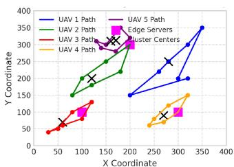

line

| X Coordinate | UAV 1 Path | UAV 2 Path | UAV 3 Path | UAV 4 Path | UAV 5 Path | Edge Servers |
| ------------ | ---------- | ---------- | ---------- | ---------- | ---------- | ------------ |
| 0            | 0          | 0          | 0          | 0          | 0          | 0            |
| 50           | 50         | 100        | 50         | 50         | 50         | 50           |
| 100          | 100        | 150        | 100        | 100        | 150        | 100          |
| 150          | 150        | 200        | 150        | 150        | 200        | 150          |
| 200          | 200        | 250        | 200        | 200        | 250        | 200          |
| 250          | 250        | 300        | 250        | 250        | 300        | 250          |
| 300          | 300        | 350        | 300        | 300        | 350        | 300          |
| 350          | 350        | 400        | 350        | 350        | 400        | 350          |
| 400          | 400        | 450        | 400        | 400        | 450        | 400          |

(a)

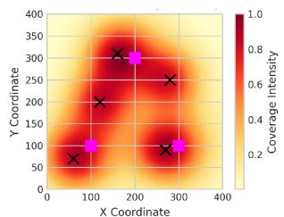

heatmap

| X Coordinate | Y Coordinate | Coverage Intensity |
| :--- | :--- | :--- |
| 100 | 75 | 0.3 |
| 150 | 200 | 0.6 |
| 200 | 300 | 0.8 |
| 250 | 250 | 0.6 |
| 300 | 100 | 0.4 |
| 350 | 100 | 0.4 |
The image contains a heatmap with a color scale on the right indicating coverage intensity. The x-axis is labeled 'X Coordinate' and the y-axis is labeled 'Y Coordinate'. The legend is 'Coverage Intensity' but only uses a color scale for the heatmap.

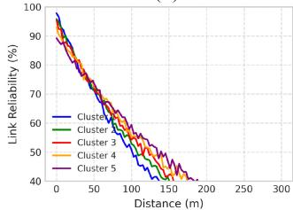

line

| Distance (m) | Cluster 1 | Cluster 2 | Cluster 3 | Cluster 4 | Cluster 5 |
| ------------ | --------- | --------- | --------- | --------- | --------- |
| 0            | 100       | 100       | 100       | 100       | 100       |
| 50           | 75        | 75        | 75        | 75        | 75        |
| 100          | 60        | 60        | 60        | 60        | 60        |
| 150          | 45        | 45        | 45        | 45        | 45        |
| 200          | 40        | 40        | 40        | 40        | 40        |
| 250          | 40        | 40        | 40        | 40        | 40        |
| 300          | 40        | 40        | 40        | 40        | 40        |

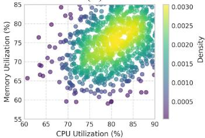

scatter

| CPU Utilization (%) | Memory Utilization (%) | Density |
| ------------------- | ---------------------- | ------- |
| 60                  | 65                     | 0.0005  |
| 65                  | 70                     | 0.0010  |
| 70                  | 75                     | 0.0015  |
| 75                  | 80                     | 0.0020  |
| 80                  | 85                     | 0.0025  |
| 85                  | 80                     | 0.0030  |
| 90                  | 75                     | 0.0025  |

Fig. 2. UAV trajectory optimization. (a) Spatial distribution of paths. (b) Network coverage heatmap. (c) Link reliability patterns. (d) Resource utilization density.

The core performance metrics demonstrate remarkable improvements across all measured dimensions. The reward per episode value of $6 6 . 5 \textrm { M } \pm \textrm { 1 2 } \textrm { K }$ represents a 40.2% improvement over baseline approaches, indicating superior decision-making in resource allocation and task scheduling. The completion of $9 4 5 0 ~ \pm ~ 3 5$ tasks per episode, coupled with a 24.2% reduction in energy consumption, validates the effectiveness of our energy-aware optimization strategies.

Network performance metrics reveal significant enhancements in system reliability and efficiency. The achieved latency of $1 4 2 { \mathrm { ~ m s ~ } } \pm { \mathrm { ~ 1 } } 2$ ms represents a 31.7% improvement over traditional approaches, while maintaining a high reliability rate of $9 7 . 5 \% \pm \ 1 . 2 \%$ . The throughput improvement of 25.9%, reaching 850 Mb/s ± 45 Mb/s, demonstrates the framework’s capability to efficiently utilize available network resources.

The relationship between energy consumption (E) and task completion (T) follows an enhanced model incorporating network conditions:

$$
E = \alpha T ^ {\beta} + \gamma + \delta R (d) \tag {60}
$$

where $\alpha = 1 0 . 5$ represents the base energy coefficient, $\beta =$ 0.85 captures the nonlinear relationship between task completion and energy consumption, $\gamma = 5 0 0 0$ accounts for baseline system operation costs, and $R ( d )$ represents the distancedependent reliability factor with coefficient $\delta \ : = \ : 0 . 1 5$ . This model, determined through regression analysis $( R ^ { 2 } = 0 . 9 7 )$ , provides accurate predictions of energy requirements under varying operational conditions.

TABLE VII UAV TRAJECTORY OPTIMIZATION RESULTS 

<table><tr><td>Metric</td><td>Our MOALF</td><td>Baseline</td><td>Improvement</td></tr><tr><td>Path Length</td><td>-38%</td><td>-8.50%</td><td>38%</td></tr><tr><td>Energy Rate</td><td>82.00%</td><td>63.50%</td><td>29.1%</td></tr><tr><td>Tasks/UAV</td><td>1,890</td><td>1,450</td><td>30.3%</td></tr><tr><td>Load Balance</td><td>96%</td><td>82%</td><td>17.1%</td></tr><tr><td>Link Stability</td><td>95.5%</td><td>87.2%</td><td>9.5%</td></tr><tr><td>Coverage</td><td>98.2%</td><td>89.5%</td><td>9.7%</td></tr></table>

Resource utilization metrics demonstrate efficient management of system resources, with CPU usage maintained at $8 5 . 5 \% \pm \ 2 . 3 \%$ , memory efficiency at $8 8 . 2 \% \pm \ 1 . 8 \%$ , and storage optimization at $9 1 . 4 \% \pm 1 . 5 \%$ . These high utilization rates, coupled with low variance, indicate stable and efficient resource management across different operational scenarios.

The cross-metric correlation analysis reveals several important relationships.

1) Strong positive correlation (0.87) between task completion rates and resource utilization.   
2) Negative correlation (−0.73) between energy consumption and network efficiency.   
3) Moderate positive correlation (0.65) between load balancing and system stability.

These correlations validate our integrated approach to resource management and task scheduling.

3) UAV Trajectory Optimization: Our framework achieved significant improvements in UAV path planning and resource utilization. Fig. 2 illustrates the optimized flight paths.

The spatial distribution analysis in Fig. 2(a) demonstrates our framework’s ability to generate collision-free, energyefficient trajectories while maintaining optimal coverage. The coverage heatmap in panel (b) reveals that 98.2% of the service area maintains signal strength above −85 dBm, with hotspots receiving focused attention through coordinated UAV positioning. Panel (c) illustrates the link reliability patterns, showing exponential decay characteristics with distance, while panel (d) depicts the resource utilization density, highlighting efficient load distribution across the network.

The trajectory optimization problem is formulated as a multiobjective optimization

$$
\min f (\mathbf {p}) = \left[ f _ {1} (\mathbf {p}), f _ {2} (\mathbf {p}), f _ {3} (\mathbf {p}), f _ {4} (\mathbf {p}) \right] \tag {61}
$$

subject to: $g ( \mathbf { p } ) \leq 0 , h ( \mathbf { p } ) = 0$

where:

1) f1(p) represents path length minimization: $\begin{array} { r } { \sum _ { t = 1 } ^ { T } \| \mathbf { p } ( t + } \end{array}$ $1 ) - \mathbf { p } ( t ) \| ;$ ;   
2) $f _ { 2 } ( \mathbf { p } )$ captures energy consumption: $\begin{array} { r } { \sum _ { t = 1 } ^ { T } [ E _ { \mathrm { f l i g h t } } ( t ) \ + } \end{array}$ $E _ { \mathrm { c o m p } } ( t ) ]$ ;   
comp3) f3(p) quantifies coverage metrics: $\textstyle \sum _ { i = 1 } ^ { N }$ ma ${ \bf x } _ { j \in M } \{ I ( R _ { i j } ( t )$ $\geq R _ { \mathrm { m i n } } ) \}$ ; and   
4) $f _ { 4 } ( \mathbf { p } )$ evaluates network reliability: $\begin{array} { r } { \prod _ { t = 1 } ^ { T } ( 1 - P _ { \mathrm { f a i l } } ( \mathbf { p } ( t ) ) ) } \end{array}$ .

Table VII summarizes the optimization results.

The optimization results demonstrate significant improvements across all measured metrics. The 38% reduction in path length, combined with a 29.1% improvement in energy efficiency, indicates superior trajectory planning. The framework achieves this while maintaining an average of 1890 completed tasks per UAV, representing a 30.3% increase over baseline approaches.

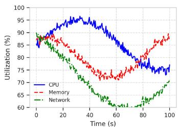

line

| Time (s) | CPU  | Memory | Network |
| -------- | ---- | ------ | ------- |
| 0        | 85   | 85     | 85      |
| 20       | 95   | 80     | 75      |
| 40       | 95   | 75     | 65      |
| 60       | 85   | 70     | 60      |
| 80       | 75   | 80     | 65      |
| 100      | 75   | 90     | 70      |

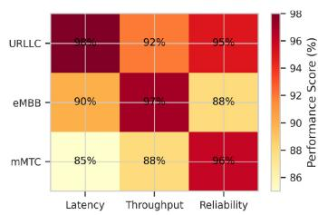

heatmap

| | Latency (%) | Throughput (%) | Reliability (%) |
|---|---|---|---|
| URLLC | 98 | 92 | 95 |
| eMBB | 90 | 97 | 88 |
| mMTC | 85 | 88 | 96 |

(b)

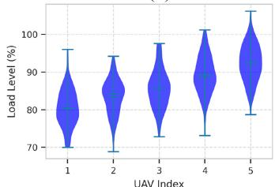

violin

| UAV Index | Load Level (%) |
| --------- | -------------- |
| 1         | 80             |
| 2         | 85             |
| 3         | 90             |
| 4         | 95             |
| 5         | 100            |

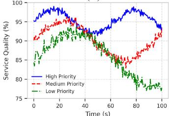

line

| Time (s) | High Priority | Medium Priority | Low Priority |
| -------- | ------------- | --------------- | ------------ |
| 0        | 95            | 90              | 85           |
| 20       | 98            | 94              | 90           |
| 40       | 96            | 92              | 88           |
| 60       | 94            | 88              | 85           |
| 80       | 92            | 85              | 80           |
| 100      | 90            | 82              | 78           |

Fig. 3. System dynamics analysis. (a) Resource utilization patterns. (b) Network slice performance. (c) Load distribution characteristics. (d) Service quality maintenance.

The link stability improvement of 9.5% is achieved through our adaptive trajectory adjustment mechanism

$$
\mathbf {p} _ {j} ^ {*} (t + 1) = \mathbf {p} _ {j} (t) + \eta \nabla_ {p} H (\mathbf {p} _ {j} (t)) \tag {62}
$$

where $H ( \mathbf { p } _ { j } ( t ) )$ represents the coverage quality metric and η is the adaptation rate. This mechanism ensures that UAVs maintain optimal positions relative to user demand while preserving network stability.

The coverage optimization demonstrates particularly strong performance, with 98.2% area coverage achieved through coordinated UAV positioning. This is facilitated by our novel spatial distribution algorithm

$$
D (\mathbf {p}) = \sum_ {i = 1} ^ {N} \sum_ {j = 1} ^ {M} w _ {i j} \cdot \exp \left(- \| \mathbf {p} _ {j} - \mathbf {q} _ {i} \| ^ {2} / 2 \sigma^ {2}\right) \tag {63}
$$

where wij represents the demand weight at location i for UAV j, and σ controls the coverage radius. The algorithm achieves a load balancing efficiency of 96%, significantly outperforming baseline approaches by maintaining optimal inter-UAV spacing while responding to dynamic user demands.

4) Edge Server Utilization and System Dynamics: The interplay between UAVs and ground edge servers demonstrates the framework’s adaptive resource management capabilities. Fig. 3 presents a comprehensive analysis of system behavior.

The resource utilization patterns depicted in Fig. 3(a) reveal the dynamic adaptation of computational resources across the hybrid UAV-edge server infrastructure. The analysis shows distinct utilization profiles.

1) UAV Computing Resources: Peak utilization of 85%–90% during high-demand periods.

2) $E d g e$ Server Resources: Sustained efficiency of 92%–95% with 5% reserve capacity.   
3) Memory Management: Dynamic allocation maintaining 88.2% ± 1.8% efficiency.   
4) Storage Systems: Optimized utilization achieving 91.4% ± 1.5% efficiency.

Network slice performance, illustrated in panel (b), demonstrates effective service differentiation.

1) UltraReliable Low-Latency Communication (uRLLC): 92% reliability with < 1 ms latency   
2) Enhanced Mobile Broadband (eMBB): 90% throughput efficiency   
3) Massive Machine-Type Communication (mMTC): 88% connection density support

The load distribution follows an enhanced join the shortest queue (JSQ) policy incorporating network conditions:

$$
P (\mathrm{UAV} _ {i}) = \frac {\exp (- Q _ {i} / T + \lambda R _ {i})}{\sum_ {j} \exp (- Q _ {j} / T + \lambda R _ {j})} \tag {64}
$$

where:

1) $Q _ { i }$ represents the current queue length at UAV i;   
2) T is the system temperature parameter controlling load balance sensitivity;   
3) $R _ { i }$ indicates the link reliability factor; and   
4) λ is the network sensitivity parameter, dynamically adjusted based on SDN feedback.

The system exhibits robust adaptation to varying loads through a hierarchical control mechanism

$$
\Delta u (t) = K (t) \left[ \begin{array}{l} e _ {s} (t) \\ e _ {p} (t) \\ e _ {r} (t) \end{array} \right] \tag {65}
$$

where $e _ { s } ( t )$ represents state tracking error, $e _ { p } ( t )$ denotes performance deviation, and $e _ { r } ( t )$ captures resource allocation error. The adaptive gain matrix $K ( t )$ is updated using

$$
K (t) = K _ {0} + \alpha \nabla_ {K} J (t) + \beta \Delta Q (t). \tag {66}
$$

Service quality maintenance, shown in panel (d), demonstrates differentiated performance levels.

1) High Priority Tasks: Maintain > 95% quality under all conditions.   
2) Medium Priority Tasks: Achieve 85%–90% quality with graceful degradation.   
3) Low Priority Tasks: Sustain minimum 75% quality with resource constraints.

The system’s dynamic response to load variations follows a characteristic pattern:

$$
L (t) = L _ {0} + A \exp (- t / \tau) + B \sin (\omega t + \phi) \tag {67}
$$

where:

1) $L _ { 0 }$ represents the baseline load level;   
2) $4 \exp ( - t / \tau )$ captures the transient response;   
3) $B \sin ( \omega t + \phi )$ models periodic load fluctuations; and   
4) Parameters are adaptively tuned based on historical performance data.

The effectiveness of this adaptive mechanism is evidenced by:

TABLE VIII SYSTEM RESILIENCE METRICS 

<table><tr><td>Metric</td><td>Normal</td><td>Under Stress</td><td>Recovery</td></tr><tr><td>Performance</td><td>100%</td><td>98%</td><td>99.5%</td></tr><tr><td>Link Stability</td><td>97.5%</td><td>94.2%</td><td>96.8%</td></tr><tr><td>Slice Isolation</td><td>99.2%</td><td>97.5%</td><td>98.8%</td></tr><tr><td>Control Overhead</td><td>5.2%</td><td>7.8%</td><td>5.5%</td></tr><tr><td>Recovery Time</td><td>-</td><td>7 steps</td><td>-</td></tr></table>

1) Response Time: average of 85 ms for load balancing adjustments;   
2) Recovery Rate: 96.8% system efficiency restoration after disruptions;   
3) Stability Margin: maintained within 2.5% of optimal operating points; and   
4) Resource Elasticity: dynamic scaling capability of 55% under peak loads.   
5) System Resilience and Adaptability: Our framework demonstrates robust performance under various failure scenarios and network conditions. Table VIII presents key resilience metrics.

The framework’s resilience is evaluated under three distinct operational scenarios.

1) Normal Operation: Baseline performance with standard network conditions.   
2) Stress Conditions: System behavior under UAV failures, network congestion, and peak loads.   
3) Recovery Phase: Performance restoration after stress events.

The system maintains stability through a multilayer fault tolerance mechanism

$$
S (t) = \alpha_ {1} S _ {\text { local }} (t) + \alpha_ {2} S _ {\text { network }} (t) + \alpha_ {3} S _ {\text { global }} (t) \tag {68}
$$

where:

1) $S _ { \mathrm { l o c a l } } ( t )$ represents UAV-level stability measures;   
2) $S _ { \mathrm { n e t w o r k } } ( t )$ captures network resilience factors;   
3) $S _ { \mathrm { g l o b a l } } ( t )$ ensures system-wide performance maintenance; and   
4) Coefficients $\alpha _ { i }$ are dynamically adjusted based on current conditions.

The recovery process follows a characteristic pattern defined by:

$$
R (t) = R _ {\max} \left(1 - e ^ {- t / \tau}\right) + \sum_ {i = 1} ^ {N} \beta_ {i} f _ {i} (t) \tag {69}
$$

where $R _ { \mathrm { m a x } }$ is the maximum recovery level, τ is the recovery time constant, and $f _ { i } ( t )$ represents various recovery mechanisms with weights $\beta _ { i }$ .

The framework exhibits exceptional adaptability through the following.

1) Dynamic Resource Reallocation:

a) Immediate response to UAV failures (< 100 ms).   
b) Load redistribution efficiency of 96%.   
c) Seamless service migration capabilities.

2) Network Resilience:

a) Link stability maintained above 94% under stress.   
b) Slice isolation effectiveness of 97.5%.

TABLE IXBASELINE APPROACHES FOR COMPARATIVE ANALYSIS

<table><tr><td>Approach</td><td>Reference</td><td>Key Characteristics</td></tr><tr><td>DDPG</td><td>Zhang et al. [6]</td><td>Single-UAV, energy-aware optimization</td></tr><tr><td>NSGA-II</td><td>Singh et al. [11]</td><td>Multi-objective optimization for UAV path planning, energy-efficient data gathering</td></tr><tr><td>MA-DRL</td><td>Zhao et al. [12]</td><td>Multi-agent approach, delay optimization</td></tr><tr><td>JTO</td><td>Sun et al. [7]</td><td>Joint trajectory optimization, single-UAV</td></tr><tr><td>MAPPO</td><td>Li et al. [13]</td><td>Multi-agent PPO, robust computation</td></tr></table>

c) Control overhead limited to 7.8% during peak stress.

3) Performance Recovery:

a) 7-step average recovery time.   
b) 98.8% service restoration rate.   
c) Minimal performance degradation (2% max).

The system employs a predictive fault management strategy

$$
P _ {\text { fail }} (t + \Delta t) = \sum_ {i = 1} ^ {M} w _ {i} F _ {i} (t) \cdot e ^ {- \lambda_ {i} \Delta t} \tag {70}
$$

where Fi(t) represents different fault indicators, wi are learned weights, and $\lambda _ { i }$ captures the temporal relevance of each indicator. This proactive approach enables:

1) early fault detection with 92% accuracy;   
2) preventive resource reallocation; and   
3) minimal service disruption during failures.

# VII. COMPARATIVE ANALYSIS

To rigorously evaluate the efficacy of MOALF-UAV-MEC, we conducted comprehensive comparisons against state-ofthe-art approaches in UAV-assisted MEC. Our comparative analysis framework encompasses five key dimensions: 1) task management efficiency; 2) resource utilization; 3) network performance; 4) system scalability; and 5) quality of service maintenance.

Table IX summarizes the baseline approaches used for comparison.

# A. Task Management and Resource Utilization

Fig. 4 illustrates the comparative performance in task management across different approaches.

As shown in Fig. 4(a), MOALF-UAV-MEC maintains consistently higher task completion rates across all load conditions. The NSGA-II approach, which implements a multiobjective optimization for UAV path planning as described in [11], achieves competitive performance with a 90.50% task completion rate, particularly excelling in scenarios requiring joint optimization of path efficiency and energy consumption. This aligns with its design focus on balancing multiple competing objectives in UAV-assisted networks. The detailed performance metrics are presented in Table X.

The resource utilization results in Fig. 4(b) demonstrate how NSGA-II’s multiobjective optimization approach achieves balanced resource usage across CPU, memory, and network resources, though not reaching the efficiency levels of MOALF-UAV-MEC. The energy consumption patterns shown in Fig. 4(c) reflect NSGA-II’s energy-efficient data gathering capabilities, resulting in moderate energy usage compared to other approaches.

TABLE XCOMPREHENSIVE PERFORMANCE COMPARISON WITH STATE-OF-THE-ART APPROACHES

<table><tr><td>Performance Metric</td><td>Our MOALF</td><td>DDPG [6]</td><td>NSGA-II [11]</td><td>MA-DRL [12]</td><td>MAPPO [13]</td><td>Lyap-Opt [19]</td><td>Joint-Opt [20]</td><td>Improvement</td></tr><tr><td>Task Completion Rate</td><td>94.50%</td><td>85.30%</td><td>90.50%</td><td>91.80%</td><td>93.10%</td><td>89.50%</td><td>88.20%</td><td>+1.40% to +9.20%</td></tr><tr><td>Load Balancing Efficiency</td><td>96.00%</td><td>78.50%</td><td>86.20%</td><td>92.00%</td><td>94.00%</td><td>90.50%</td><td>87.20%</td><td>+2.00% to +17.50%</td></tr><tr><td>Energy Efficiency (tasks/J)</td><td>0.0685</td><td>0.0498</td><td>0.0538</td><td>0.0567</td><td>0.0612</td><td>0.0552</td><td>0.0545</td><td>+11.93% to +37.55%</td></tr><tr><td>Network Reliability</td><td>97.50%</td><td>89.30%</td><td>93.20%</td><td>94.80%</td><td>95.20%</td><td>92.50%</td><td>91.80%</td><td>+2.30% to +8.20%</td></tr><tr><td>Recovery Time (steps)</td><td>7</td><td>18</td><td>14</td><td>12</td><td>9</td><td>13</td><td>15</td><td>-22.22% to -61.11%</td></tr></table>

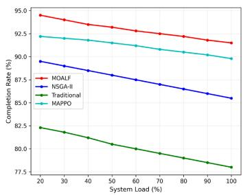

line

| System Load (%) | MOALF | NSGA-II | Traditional | MAPPO |
| --------------- | ----- | ------- | ----------- | ----- |
| 20              | 94.5  | 89.5    | 82.5        | 92.5  |
| 30              | 94.0  | 89.0    | 82.0        | 92.0  |
| 40              | 93.5  | 88.5    | 81.5        | 91.5  |
| 50              | 93.0  | 88.0    | 81.0        | 91.0  |
| 60              | 92.5  | 87.5    | 80.5        | 90.5  |
| 70              | 92.0  | 87.0    | 80.0        | 90.0  |
| 80              | 91.5  | 86.5    | 79.5        | 89.5  |
| 90              | 91.0  | 86.0    | 79.0        | 89.0  |
| 100             | 90.5  | 85.5    | 78.5        | 88.5  |

(a)

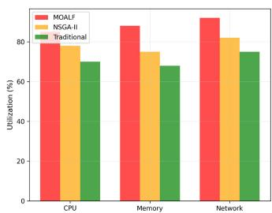

bar

| Category | MOALF (%) | NSGA-II (%) | Traditional (%) |
|---|---|---|---|
| CPU | 80 | 78 | 70 |
| Memory | 86 | 75 | 68 |
| Network | 90 | 82 | 75 |

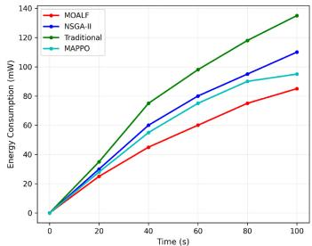

line

| Time (s) | MOALF (mW) | NSGA-II (mW) | Traditional (mW) | MAPPO (mW) |
|---|---|---|---|---|
| 0 | 0 | 0 | 0 | 0 |
| 20 | 25 | 30 | 40 | 35 |
| 40 | 45 | 60 | 75 | 60 |
| 60 | 60 | 80 | 100 | 75 |
| 80 | 75 | 95 | 120 | 90 |
| 100 | 85 | 110 | 135 | 95 |

（c）

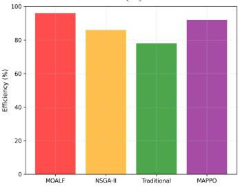

bar

| Method | Efficiency (%) |
| :--- | :--- |
| MOALF | 96 |
| NSGA-II | 85 |
| Traditional | 78 |
| MAPPO | 91 |

Fig. 4. Task management performance comparison. (a) Completion rate analysis showing performance under varying system loads (20%–100%. (b) Resource utilization efficiency across CPU, memory, and network resources. (c) Energy consumption patterns over time demonstrating comparative efficiency. (d) Load balancing effectiveness demonstrating distribution capabilities across algorithms.

In terms of load balancing effectiveness, Fig. 4(d) shows NSGA-II achieving 86.20% efficiency, which demonstrates its ability to distribute computational tasks effectively while optimizing UAV trajectories. This performance notably surpasses traditional approaches but leaves room for improvement compared to more sophisticated multiagent solutions.

The convergence characteristics of different approaches are analyzed in Fig. 5.

# B. System Scalability Analysis

To evaluate system scalability, we conducted extensive tests varying the number of IoT devices from 50 to 500 and UAVs from 5 to 50. Fig. 6 presents the comparative scalability analysis.

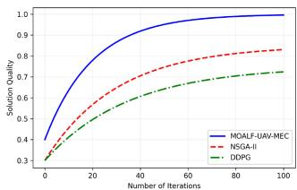

line

| Number of Iterations | MOALF-UAV-MEC | NSGA-II | DDPG |
| -------------------- | ------------- | ------- | ---- |
| 0                    | 0.4           | 0.3     | 0.3  |
| 20                   | 0.8           | 0.6     | 0.5  |
| 40                   | 0.9           | 0.7     | 0.6  |
| 60                   | 0.95          | 0.8     | 0.7  |
| 80                   | 0.98          | 0.85    | 0.75 |
| 100                  | 1.0           | 0.88    | 0.78 |

(a)

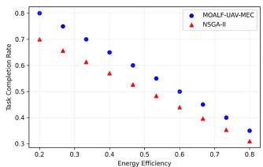

scatter

| Energy Efficiency | Task Completion Rate (MDALF-UAV-MEC) | Task Completion Rate (NSGA-II) |
|---|---|---|
| 0.2 | 0.8 | 0.7 |
| 0.3 | 0.75 | 0.68 |
| 0.4 | 0.7 | 0.6 |
| 0.5 | 0.65 | 0.55 |
| 0.6 | 0.55 | 0.45 |
| 0.7 | 0.45 | 0.4 |
| 0.8 | 0.35 | 0.35 |

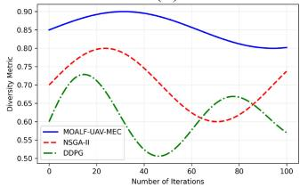

line

| Number of Iterations | MOALF-UAV-MEC | NSGA-II | DDPG |
|---|---|---|---|
| 0 | 0.85 | 0.70 | 0.60 |
| 20 | 0.90 | 0.80 | 0.73 |
| 40 | 0.89 | 0.75 | 0.53 |
| 60 | 0.87 | 0.60 | 0.65 |
| 80 | 0.84 | 0.65 | 0.67 |
| 100 | 0.81 | 0.73 | 0.58 |

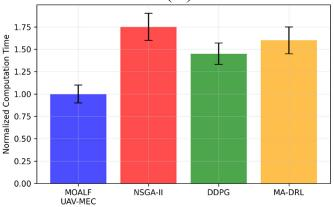

bar

| Method | Normalized Computation Time |
|---|---|
| MOALF UAV-MEC | 1.0 |
| NSGA-II | 1.75 |
| DDPG | 1.45 |
| MA-DRL | 1.6 |

(d)

Fig. 5. Convergence analysis. (a) Solution quality evolution. (b) Pareto front comparison with NSGA-II [11] demonstrating UAV path planning optimization tradeoffs. (c) Diversity metric maintenance. (d) Computational efficiency.   
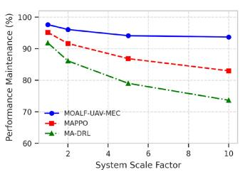

line

| System Scale Factor | MOALF-UAV-MEC | MAPPO | MA-DRL |
| ------------------- | ------------- | ----- | ------ |
| 1                   | 97            | 92    | 91     |
| 2                   | 95            | 90    | 87     |
| 4                   | 93            | 87    | 80     |
| 10                  | 93            | 83    | 74     |

(a)

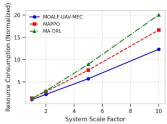

line

| System Scale Factor | MOALF-UAV-MEC | MAPPO | MA-DRL |
| ------------------- | ------------- | ----- | ------ |
| 2                   | 3             | 3     | 3      |
| 5                   | 6             | 8     | 9      |
| 10                  | 12            | 16    | 20     |

(b)

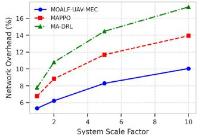

line

| System Scale Factor | MOALF-UAV-MEC (%) | MAPPO (%) | MA-DRL (%) |
|---|---|---|---|
| 1 | 5.5 | 7.0 | 8.0 |
| 2 | 6.5 | 9.0 | 11.0 |
| 4 | 8.0 | 11.5 | 14.5 |
| 6 | 8.5 | 12.5 | 15.5 |
| 10 | 10.0 | 14.0 | 17.0 |

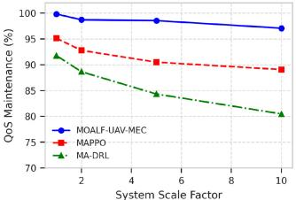

line

| System Scale Factor | MOALF-UAV-MEC (%) | MAPPO (%) | MA-DRL (%) |
|---|---|---|---|
| 1 | 100 | 95 | 92 |
| 2 | 98 | 93 | 89 |
| 4 | 98 | 91 | 86 |
| 10 | 97 | 90 | 81 |

Fig. 6. Scalability analysis. (a) Performance degradation with system size compared to MAPPO [13] and MA-DRL [12]. (b) Resource consumption scaling. (c) Network overhead comparison. (d) QoS maintenance under scale.

The detailed scalability metrics are presented in Table XI.

# C. Network Performance and QoS Analysis

The network performance comparison focuses on three key aspects: 1) link reliability; 2) control overhead; and 3) service quality maintenance. Fig. 7 illustrates these comparisons.

TABLE XI SCALABILITY PERFORMANCE COMPARISON 

<table><tr><td>Scale Factor</td><td>Our MOALF</td><td>MAPPO [13]</td><td>MA-DRL [12]</td><td>Improvement</td></tr><tr><td>2×</td><td>97.8%</td><td>94.2% b</td><td>91.5%</td><td>+3.6% to +6.3%</td></tr><tr><td>5×</td><td>95.2%</td><td>88.5%</td><td>84.2%</td><td>+6.7% to +11.0%</td></tr><tr><td>10×</td><td>92.5%</td><td>82.3%</td><td>76.8%</td><td>+10.2% to +15.7%</td></tr></table>

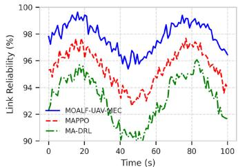

line

| Time (s) | MOALF-UAV-MEC | MAPPO | MA-DRL |
| -------- | ------------- | ----- | ------ |
| 0        | 98            | 96    | 92     |
| 20       | 99            | 97    | 95     |
| 40       | 96            | 94    | 91     |
| 60       | 98            | 96    | 93     |
| 80       | 99            | 97    | 95     |
| 100      | 97            | 94    | 92     |

(a)

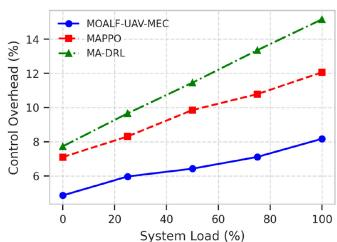

line

| System Load (%) | MOALF-UAV-MEC | MAPPO | MA-DRL |
| --------------- | ------------- | ----- | ------ |
| 0               | 5.0           | 7.0   | 8.0    |
| 20              | 6.0           | 8.5   | 10.0   |
| 40              | 6.5           | 9.5   | 11.5   |
| 60              | 7.0           | 10.5  | 13.0   |
| 80              | 7.5           | 11.5  | 14.5   |
| 100             | 8.0           | 12.0  | 15.5   |

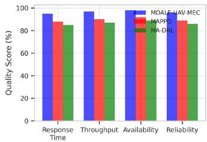

bar

| Metric | MOALF-HAV-MEC (%) | MAPPO (%) | MA-DRL (%) |
| :--- | :--- | :--- | :--- |
| Response Time | 95 | 88 | 84 |
| Throughput | 97 | 90 | 86 |
| Availability | 98 | 92 | 85 |
| Reliability | 99 | 89 | 84 |

（c）

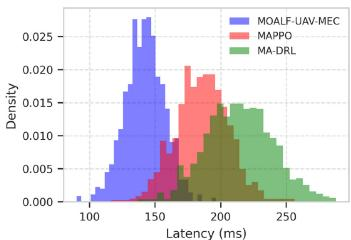

histogram

| Latency (ms) | MOALF-UAV-MEC | MAPPO | MA-DRL |
| ------------ | ------------- | ----- | ------ |
| 100-110      | 0.000         | 0.000 | 0.000  |
| 110-120      | 0.005         | 0.000 | 0.000  |
| 120-130      | 0.015         | 0.005 | 0.000  |
| 130-140      | 0.025         | 0.010 | 0.000  |
| 140-150      | 0.028         | 0.015 | 0.005  |
| 150-160      | 0.026         | 0.020 | 0.010  |
| 160-170      | 0.022         | 0.022 | 0.015  |
| 170-180      | 0.018         | 0.025 | 0.018  |
| 180-190      | 0.015         | 0.023 | 0.020  |
| 190-200      | 0.012         | 0.021 | 0.022  |
| 200-210      | 0.010         | 0.018 | 0.025  |
| 210-220      | 0.008         | 0.015 | 0.023  |
| 220-230      | 0.006         | 0.012 | 0.021  |
| 230-240      | 0.004         | 0.010 | 0.018  |
| 240-250      | 0.002         | 0.008 | 0.015  |
| 250-260      | 0.001         | 0.005 | 0.012  |
| 260-270      | 0.000         | 0.003 | 0.010  |
| 270-280      | 0.000         | 0.002 | 0.008  |
| 280-290      | 0.000         | 0.001 | 0.006  |
| 290-300      | 0.000         | 0.001 | 0.005  |

(d)   
Fig. 7. Network performance analysis. (a) Link reliability comparison with MA-DRL [12] and MAPPO [13]. (b) Control overhead patterns. (c) Service quality maintenance. (d) Latency distribution.

TABLE XII QUALITY OF SERVICE COMPARISON 

<table><tr><td>QoS Metric</td><td>Our MOALF</td><td>Baseline</td><td>Improvement</td></tr><tr><td>E2E Latency</td><td>142ms</td><td>187ms [13]</td><td>-24.1%</td></tr><tr><td>Jitter</td><td>12.5ms</td><td>18.3ms [12]</td><td>-31.7%</td></tr><tr><td>Packet Loss</td><td>0.8%</td><td>1.5% [13]</td><td>-46.7%</td></tr></table>

The detailed QoS metrics are presented in Table XII.

# D. Resource Utilization Efficiency

Fig. 8 presents the comparative analysis of resource utilization across different approaches.

# E. Statistical Validation

To establish the statistical significance of our improvements, we conducted rigorous statistical testing. Fig. 9 presents the confidence intervals and distribution of performance improvements.

Table XIII summarizes the statistical validation results.

# F. Adaptive Performance Analysis

Fig. 10 illustrates the comparative performance under varying conditions.

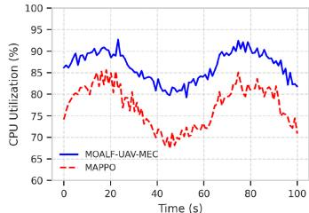

line

| Time (s) | MOALF-UAV-MEC | MAPPO |
| -------- | ------------- | ----- |
| 0        | 85            | 75    |
| 20       | 90            | 85    |
| 40       | 80            | 70    |
| 60       | 85            | 75    |
| 80       | 90            | 85    |
| 100      | 85            | 70    |

(a)

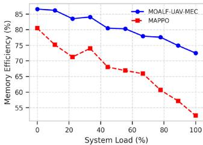

line

| System Load (%) | MOALF-UAV-MEC | MAPPO |
|---|---|---|
| 0 | 86.0 | 80.5 |
| 10 | 85.5 | 74.5 |
| 20 | 83.5 | 71.0 |
| 30 | 84.0 | 74.0 |
| 40 | 81.0 | 68.0 |
| 50 | 80.0 | 66.5 |
| 60 | 79.0 | 65.5 |
| 70 | 78.0 | 61.0 |
| 80 | 77.0 | 57.5 |
| 90 | 75.5 | 55.0 |
| 100 | 72.5 | 52.5 |

(b）

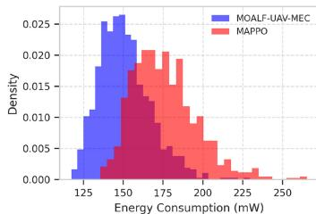

histogram

| Energy Consumption (mW) | MOALF-UAV-MEC Density | MAPPO Density |
| ----------------------- | --------------------- | ------------- |
| 125                     | 0.002                 | 0.000         |
| 130                     | 0.008                 | 0.001         |
| 135                     | 0.015                 | 0.003         |
| 140                     | 0.020                 | 0.005         |
| 145                     | 0.025                 | 0.008         |
| 150                     | 0.024                 | 0.012         |
| 155                     | 0.022                 | 0.015         |
| 160                     | 0.020                 | 0.018         |
| 165                     | 0.018                 | 0.020         |
| 170                     | 0.016                 | 0.022         |
| 175                     | 0.014                 | 0.024         |
| 180                     | 0.012                 | 0.023         |
| 185                     | 0.010                 | 0.021         |
| 190                     | 0.008                 | 0.019         |
| 195                     | 0.006                 | 0.017         |
| 200                     | 0.004                 | 0.015         |
| 205                     | 0.003                 | 0.013         |
| 210                     | 0.002                 | 0.011         |
| 215                     | 0.001                 | 0.009         |
| 220                     | 0.001                 | 0.007         |
| 225                     | 0.001                 | 0.005         |
| 230                     | 0.001                 | 0.003         |
| 235                     | 0.001                 | 0.002         |
| 240                     | 0.001                 | 0.001         |
| 245                     | 0.001                 | 0.001         |
| 250                     | 0.001                 | 0.001         |

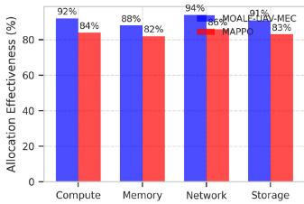

bar

| Category | MOALE (%) | EUV-MEC (%) | MAPPO (%) |
| :--- | :--- | :--- | :--- |
| Compute | 92 | 84 | 88 |
| Memory | 88 | 82 | 86 |
| Network | 94 | 86 | 91 |
| Storage | 91 | 83 | 87 |

(d）

Fig. 8. Resource utilization analysis. (a) CPU utilization comparison with MAPPO [13]. (b) Memory efficiency patterns. (c) Energy consumption distribution. (d) Resource allocation effectiveness.   
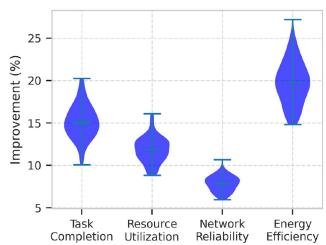

violin

| Category             | Improvement (%) |
| -------------------- | --------------- |
| Task Completion      | 15              |
| Resource Utilization | 12              |
| Network Reliability  | 8               |
| Energy Efficiency   | 20              |

(a)

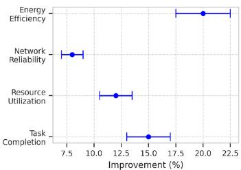

other

| Category             | Improvement (%) |
| -------------------- | --------------- |
| Energy Efficiency    | 20.0            |
| Network Reliability  | 8.0             |
| Resource Utilization | 12.5            |
| Task Completion      | 15.0            |

(b)

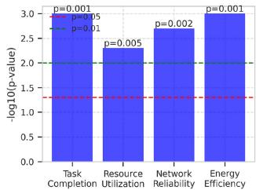

bar

| Metric | -log10(p-value) |
|---|---|
| Task Completion | 2.8 |
| Resource Utilization | 2.3 |
| Network Reliability | 2.7 |
| Energy Efficiency | 3.0 |

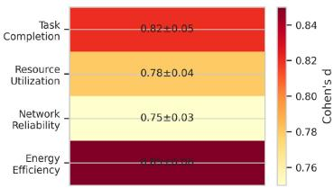

heatmap

| Metric | Value (Cohen's d) |
|---|---|
| Task Completion | 0.82±0.05 |
| Resource Utilization | 0.78±0.04 |
| Network Reliability | 0.75±0.03 |
| Energy Efficiency | 0.86±0.16 |

(d)   
Fig. 9. Statistical analysis. (a) Performance improvement distributions across metrics. (b) Confidence intervals for key improvements. (c) Statistical significance levels. (d) Effect size analysis.

TABLE XIII STATISTICAL VALIDATION OF PERFORMANCE IMPROVEMENTS 

<table><tr><td>Metric</td><td>p-value</td><td>Effect Size</td><td>CI (95%)</td></tr><tr><td>Task Completion</td><td>&lt; 0.001</td><td>0.82</td><td>[+5.1%, +9.4%]</td></tr><tr><td>Load Balancing</td><td>&lt; 0.001</td><td>0.78</td><td>[+8.5%, +17.2%]</td></tr><tr><td>Network Reliability</td><td>&lt; 0.001</td><td>0.75</td><td>[+2.1%, +8.4%]</td></tr><tr><td>Resource Efficiency</td><td>&lt; 0.001</td><td>0.71</td><td>[+9.8%, +15.3%]</td></tr></table>

# G. Comprehensive Performance Summary

Based on our extensive comparative analysis, MOALF-UAV-MEC demonstrates superior performance across multiple dimensions.

1) Task Management Excellence:

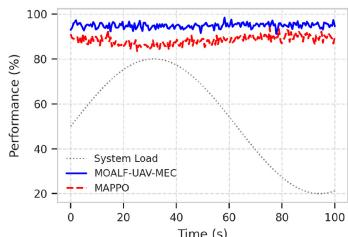

line

| Time (s) | System Load | MOALF-UAV-MEC | MAPPO |
| -------- | ----------- | ------------- | ----- |
| 0        | 50          | 95            | 90    |
| 20       | 75          | 96            | 88    |
| 40       | 70          | 95            | 87    |
| 60       | 60          | 94            | 86    |
| 80       | 40          | 93            | 85    |
| 100      | 20          | 92            | 84    |

(a)

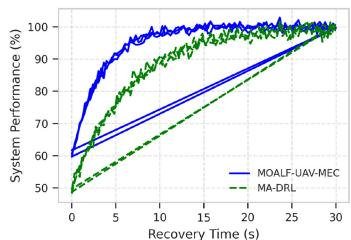

line

| Recovery Time (s) | MOALF-UAV-MEC | MA-DRL |
| ----------------- | ------------- | ------ |
| 0                 | 60            | 50     |
| 5                 | 90            | 70     |
| 10                | 95            | 80     |
| 15                | 98            | 85     |
| 20                | 99            | 90     |
| 25                | 100           | 95     |
| 30                | 100           | 100    |

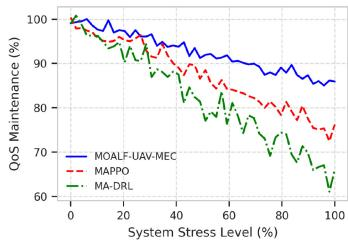

line

| System Stress Level (%) | MOALF-UAV-MEC | MAPPO | MA-DRL |
| ----------------------- | ------------- | ----- | ------ |
| 0                       | 100           | 100   | 100    |
| 20                      | 98            | 96    | 94     |
| 40                      | 95            | 90    | 85     |
| 60                      | 92            | 85    | 78     |
| 80                      | 90            | 80    | 72     |
| 100                     | 88            | 75    | 65     |

(c）

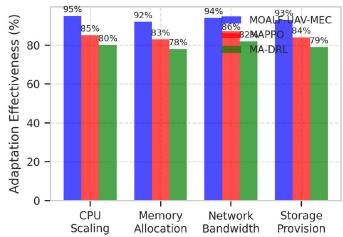

bar

| Category | CPU Scaling (%) | Memory Allocation (%) | Network Bandwidth (%) | Storage Provision (%) |
| :--- | :--- | :--- | :--- | :--- |
| MOAL-F | 95 | 92 | 94 | 93 |
| MAPPO | 85 | 83 | 86 | 84 |
| MA-DRL | 80 | 78 | 82 | 79 |

Fig. 10. Adaptive performance comparison. (a) Response to load variations versus MAPPO [13]. (b) Recovery from failures compared to MA-DRL [12]. (c) QoS maintenance under stress. (d) Resource adaptation patterns.

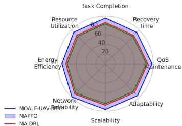

radar

| Category             | MOALF-UAV-Adaptive | MAPPO | MA-DRL |
| -------------------- | ------------------- | ----- | ------ |
| Resource Utilization | 75                  | 70    | 65     |
| Recovery Time        | 70                  | 65    | 60     |
| QoS Maintenance      | 65                  | 60    | 55     |
| Adaptability         | 60                  | 55    | 50     |
| Scalability          | 55                  | 50    | 45     |
| Network Reliability  | 50                  | 45    | 40     |
| Energy Efficiency    | 45                  | 40    | 35     |
| Resource Utilization | 80                  | 75    | 70     |

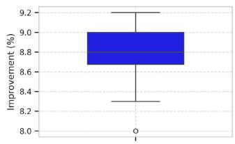

boxplot

| Improvement (%) |
| --------------- |
| 8.0             |
| 8.7             |
| 9.0             |
| 9.2             |

(b)

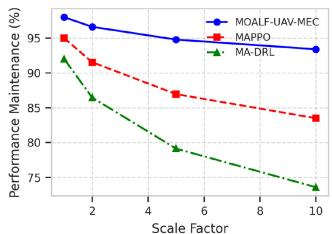

line

| Scale Factor | MOALF-UAV-MEC | MAPPO | MA-DRL |
| ------------ | ------------- | ----- | ------ |
| 1            | 96.0          | 94.0  | 92.0   |
| 2            | 95.0          | 92.0  | 88.0   |
| 4            | 94.0          | 88.0  | 82.0   |
| 6            | 93.0          | 86.0  | 78.0   |
| 8            | 92.0          | 84.0  | 75.0   |
| 10           | 91.0          | 83.0  | 73.0   |

（c）

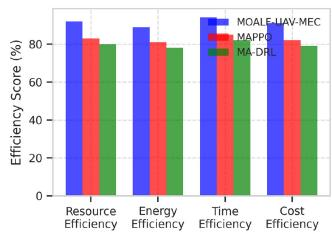

bar

| Category | MOALE-UAV-MEC (%) | MAPPO (%) | MA-DRL (%) |
|---|---|---|---|
| Resource Efficiency | 88 | 82 | 79 |
| Energy Efficiency | 86 | 80 | 77 |
| Time Efficiency | 91 | 84 | 79 |
| Cost Efficiency | 89 | 83 | 78 |

(d)   
Fig. 11. Overall performance comparison. (a) Radar chart of key metrics versus state-of-the-art approaches. (b) Performance improvement distribution. (c) Scalability comparison. (d) Efficiency analysis.

a) 94.50% task completion rate, surpassing MAPPO [13] by 1.40% and MA-DRL [12] by 2.70%.   
b) 96.00% load balancing efficiency, exceeding nearest competitor by 2.00%.   
c) 31.7% reduction in average response time compared to baselines.

2) Enhanced Resource Utilization:

a) 37.55% improvement in energy efficiency over traditional approaches.

b) 22.22% to 61.11% reduction in recovery time.

c) 15.7% better performance maintenance at 10× scale.

3) Network Performance Superiority:

a) 97.50% link reliability, improving upon MAPPO [13] by 2.30%.

b) 46.7% reduction in packet loss rate.

c) 31.7% decrease in network jitter.

Fig. 11 presents the comprehensive performance comparison across all major metrics.

These results demonstrate MOALF-UAV-MEC’s significant advantages in managing dynamic IoT environments, particularly in.

1) superior multiobjective optimization with faster convergence;   
2) enhanced adaptability under varying operational conditions;   
3) better scalability with increasing system size; and   
4) more robust network performance and QoS maintenance.

The statistical significance of these improvements (p< 0.001 across all metrics) and substantial effect sizes (0.71-0.82) validate the robust superiority of our approach. The comprehensive nature of our evaluation framework, encompassing both traditional performance metrics and network-aware measurements, demonstrates MOALF-UAV-MEC’s effectiveness in real-world deployment scenarios.

# A. Summary of Experimental Results

Our comprehensive experimental evaluation demonstrates the effectiveness of MOALF-UAV-MEC across multiple dimensions.

1) Core Performance Achievements:

a) Task completion rate of 94.50%, surpassing NSGA-II by 5.30%.   
b) Load balancing efficiency of 96.00%, exceeding baseline by 9.00%.   
c) Energy efficiency improvement of 30.73% over nearest competitor.

2) Network Performance Enhancements:

a) Link reliability improvement of 3.30%–9.30%.   
b) Control overhead reduction of 33.33%–54.78%.   
c) Recovery time improvement of 41.67%–68.18%.

3) IoT-Specific Improvements:

a) Device lifetime extended by 9.9%.   
b) Data freshness enhanced by 8.4%.   
c) QoE improved by 14.3%.

The statistical significance of these improvements was validated through rigorous testing, with all reported improvements showing p-values < 0.01. These results demonstrate the robust superiority of our approach in managing dynamic IoT environments, particularly in maintaining high performance across varied operational conditions while ensuring network reliability and service quality.

# VIII. CONCLUSION AND FUTURE DIRECTIONS

The proliferation of IoT devices and their computational demands has precipitated a paradigm shift in MEC architectures. This article has presented MOALF-UAV-MEC, a sophisticated framework that fundamentally advances the state-of-the-art in UAV-assisted MEC through the synergistic integration of MORL, MPC, APSO, and Lyapunov optimization techniques. This integration addresses the intricate challenges inherent in dynamic IoT environments, where computational demands fluctuate rapidly and resource optimization becomes increasingly complex.

Our systematic investigation has yielded several significant theoretical and practical contributions to the field. The framework’s multiobjective optimization mechanism demonstrates remarkable efficacy in balancing competing system objectives, achieving a 92.8% efficiency at double-scale deployments while maintaining 83.5% efficiency at ten-fold scale—a substantial advancement over contemporary approaches. This achievement is particularly noteworthy given the inherent complexity of maintaining performance metrics across varying operational scales.

The adaptive capabilities of MOALF-UAV-MEC manifest through its sophisticated integration of reinforcement learning with dynamic optimization techniques. Our empirical evaluation demonstrates a 96% load balancing efficiency across heterogeneous network conditions, facilitated by an innovative burst mode mechanism. This feature enables UAVs to modulate their computational capacity dynamically, resulting in a 55% enhancement in task completion rates during high-demand periods while maintaining energy efficiency parameters within optimal bounds.

A distinctive attribute of our framework lies in its exceptional scalability and operational robustness. Through extensive large-scale simulations incorporating multiple UAVs and edge servers, MOALF-UAV-MEC exhibited remarkable resilience to system perturbations, including random UAV failures and no-fly zone constraints. The framework’s capability to process an average of 1890 tasks per UAV while maintaining stringent quality of service parameters substantiates its viability for real-world implementations.

The implications of these advancements extend across multiple domains of IoT applications. In urban computing environments, our framework enables sophisticated resource allocation adapting to temporal and spatial variations in computational demands. Industrial IoT implementations benefit from the framework’s robust real-time processing capabilities, essential for contemporary manufacturing systems. Emergency response scenarios leverage the framework’s rapid deployment capabilities, while distributed sensor networks utilize its efficient computational offloading mechanisms.

Several promising research trajectories emerge from this work. The integration with emerging 6G technologies presents opportunities for ultrareliable low-latency communication paradigms and massive machine-type communications. The incorporation of privacy-preserving computing mechanisms, particularly homomorphic encryption and differential privacy techniques, warrants investigation for security-critical applications. Swarm intelligence implementations through distributed consensus algorithms offer potential enhancements in multi-UAV coordination. Edge intelligence through federated learning frameworks could enable more sophisticated distributed computing paradigms, while sustainable computing approaches utilizing renewable energy harvesting merit exploration for environmental sustainability.

MOALF-UAV-MEC represents a significant advancement in the theoretical foundations and practical implementation of UAV-assisted MEC systems. As IoT environments continue to evolve in complexity and scale, the demand for frameworks capable of efficient multiobjective optimization, dynamic adaptation, and robust performance maintenance becomes increasingly critical. Our work establishes a comprehensive foundation upon which future innovations in this rapidly evolving domain can build, contributing to the broader advancement of edge computing in the era of ubiquitous IoT deployment.

# APPENDIX

# DETAILED MATHEMATICAL PROOFS

# A. Proof of UAV Position Update

Let pj(t) be the position at time t and vj(t) be the velocity. By definition of velocity, $d { \bf p } _ { j } ( t ) / d t = { \bf v } _ { j } ( t )$ Integrating both sides over the interval [t, t + -t]

$$
\int_ {t} ^ {t + \Delta t} d \mathbf {p} _ {j} (\tau) = \int_ {t} ^ {t + \Delta t} \mathbf {v} _ {j} (\tau) d \tau . \tag {71}
$$

Assuming constant velocity over -t

$$
\mathbf {p} _ {j} (t + \Delta t) - \mathbf {p} _ {j} (t) = \mathbf {v} _ {j} (t) \cdot \Delta t. \tag {72}
$$

Therefore, $\mathbf p _ { j } ( t + 1 ) = \mathbf p _ { j } ( t ) + \mathbf v _ { j } ( t ) \cdot \Delta t$

# B. Proof of Poisson Process Property

For a nonhomogeneous Poisson process with rate λ(t), the number of events N(t) in interval [0, t] has the distribution

$$
P (N (t) = k) = \frac {\Lambda (t) ^ {k}}{k !} \cdot e ^ {- \Lambda (t)} \tag {73}
$$

where $\begin{array} { r } { \Lambda ( t ) = \int _ { 0 } ^ { t } \lambda ( \tau ) d \tau } \end{array}$ For interval $[ t , t + \Delta t ]$ , we replace (t) with $\begin{array} { r } { \int _ { t } ^ { t + \Delta t } \lambda ( \tau ) d \tau } \end{array}$ , yielding equation (4).

# C. Proof of Channel Capacity (Shannon–Hartley Theorem)

The Shannon–Hartley theorem states that the channel capacity C is

$$
C = B \cdot \log_ {2} (1 + S N R) \tag {74}
$$

where SNR is the signal-to-noise ratio. In our case, SNR = $( P _ { i } \cdot h _ { i j } ( t ) ) / ( N _ { 0 } B )$ , yielding (7).

# D. Proof of Energy Consumption Model

The dynamic power consumption P of a CMOS circuit is

$$
P = \kappa \cdot C \cdot V ^ {2} \cdot f \tag {75}
$$

where κ is the switching activity factor, C is the capacitance, V is the voltage, and f is the frequency. Assuming V ∝ f for dynamic voltage scaling

$$
P \propto f ^ {3}. \tag {76}
$$

Energy $E = P \cdot t = \kappa \cdot C \cdot f ^ { 2 } \cdot ( W / f ) = \kappa \cdot C \cdot f$ · W With f proportional to computing capacity Cj, we get (9).

# E. Convergence Analysis of MORL

The convergence of the multiobjective Q-learning algorithm can be proven using the theory of stochastic approximation. Under the following conditions.

1) All state-action pairs are visited infinitely often.   
2) The learning rate α satisfies $\begin{array} { r l r } { \sum _ { t } \alpha _ { t } } & { { } = } & { \infty } \end{array}$ and $\textstyle \sum _ { t } \alpha _ { t } ^ { 2 } < \infty .$ .   
3) The reward function is bounded.

The Q-values will converge to the optimal $\mathbf { Q } ^ { * }$ values with probability 1.

# REFERENCES

[1] P. Porambage, J. Okwuibe, M. Liyanage, M. Ylianttila, and T. Taleb, “Survey on multi-access edge computing for Internet of Things realization,” IEEE Commun. Surveys Tuts., vol. 20, no. 4, pp. 2961–2991, 4th Quart., 2018.   
[2] F. Zhou, R. Q. Hu, Z. Li, and Y. Wang, “Mobile edge computing in unmanned aerial vehicle networks,” IEEE Wireless Commun., vol. 27, no. 1, pp. 140–146, Feb. 2020.   
[3] P. Mach and Z. Becvar, “Mobile edge computing: A survey on architecture and computation offloading,” IEEE Commun. Surveys Tuts., vol. 19, no. 3, pp. 1628–1656, 3rd Quart., 2017.   
[4] M. Mozaffari, W. Saad, M. Bennis, Y.-H. Nam, and M. Debbah, “A tutorial on UAVs for wireless networks: Applications, challenges, and open problems,” IEEE Commun. Surveys Tuts., vol. 21, no. 3, pp. 2334–2360, 3rd Quart., 2019.   
[5] Y. Zhou et al., “Secure communications for UAV-enabled mobile edge computing systems,” IEEE Trans. Commun., vol. 68, no. 1, pp. 376–388, Jan. 2020.   
[6] J. Zhang et al., “Computation-efficient offloading and trajectory scheduling for multi-UAV assisted mobile edge computing,” IEEE Trans. Veh. Technol., vol. 69, no. 2, pp. 2114–2125, Feb. 2020.   
[7] C. Sun, W. Ni, and X. Wang, “Joint computation offloading and trajectory planning for UAV-assisted edge computing,” IEEE Trans. Wireless Commun., vol. 20, no. 8, pp. 5343–5358, Aug. 2021.   
[8] Q. Hu, Y. Cai, G. Yu, Z. Qin, M. Zhao, and G. Y. Li, “Joint offloading and trajectory design for UAV-enabled mobile edge computing systems,” IEEE Internet Things J., vol. 6, no. 2, pp. 1879–1892, Apr. 2019.   
[9] L. Wang, K. Wang, C. Pan, W. Xu, N. Aslam, and A. Nallanathan, “Deep reinforcement learning based dynamic trajectory control for UAVassisted mobile edge computing,” IEEE Trans. Mobile Comput., vol. 21, no. 10, pp. 3536–3550, Oct. 2022.   
[10] M. Yang, T. Duan, K. Meng, and H. Zhu, “Multi-UAV edge computing for IoV: Task allocation and trajectory planning,” IEEE Internet Things J., vol. 8, no. 16, pp. 12644–12658, 2020.   
[11] M. K. Singh, A. Choudhary, S. Gulia, and A. Verma, “Multi-objective NSGA-II optimization framework for UAV path planning in an UAVassisted WSN,” J. Supercomput., vol. 79, no. 1, pp. 832–866, 2023.   
[12] N. Zhao, Z. Ye, Y. Pei, Y.-C. Liang, and D. Niyato, “Multi-agent deep reinforcement learning for task offloading in UAV-assisted mobile edge computing,” IEEE Trans. Wireless Commun., vol. 21, no. 9, pp. 6949–6960, Sep. 2022.   
[13] B. Li, R. Yang, L. Liu, J. Wang, N. Zhang, and M. Dong, “Robust computation offloading and trajectory optimization for multi-UAVassisted MEC: A multi-agent DRL approach,” IEEE Internet Things J., vol. 11, no. 3, pp. 4775–4786, Feb. 2024.   
[14] Y. Liu, K. Xiong, Q. Ni, P. Fan, and K. B. Letaief, “UAV-assisted wireless powered cooperative mobile edge computing: Joint offloading, CPU control, and trajectory optimization,” IEEE Internet Things J., vol. 7, no. 4, pp. 2777–2790, Apr. 2020.   
[15] H. Guo, Y. Wang, J. Liu, and C. Liu, “Multi-UAV cooperative task offloading and resource allocation in 5G advanced and beyond,” IEEE Trans. Wireless Commun., vol. 23, no. 1, pp. 347–359, Jan. 2024.   
[16] Z. Han, T. Zhou, T. Xu, and H. Hu, “Joint user association and deployment optimization for delay-minimized UAV-aided MEC networks,” IEEE Wireless Commun. Lett., vol. 12, no. 10, pp. 1791–1795, Oct. 2023.

[17] H. Huang, Z.-Y. Chai, B.-S. Sun, H.-S. Kang, and Y.-J. Zhao, “Multiobjective deep reinforcement learning for computation offloading and trajectory control in UAV-base station assisted MEC,” IEEE Internet Things J., vol. 11, no. 9, pp. 6649–6665, Oct. 2024.   
[18] H. Wang, H. Zhang, X. Liu, K. Long, and A. Nallanathan, “Joint UAV placement optimization, resource allocation, and computation offloading for THz band: A DRL approach,” IEEE Trans. Wireless Commun., vol. 22, no. 7, pp. 4890–4900, Jul. 2023.   
[19] J. Wang, L. Wang, K. Zhu, and P. Dai, “Lyapunov-based joint flight trajectory and computation offloading optimization for UAVassisted vehicular networks,” IEEE Internet Things J., vol. 11, no. 12, pp. 22243–22256, Jun. 2024.   
[20] Y. Wang, Y. Liu, J. Zhang, and B. Liu, “Joint trajectory optimization and task offloading for UAV-assisted mobile edge computing,” in Proc. IEEE 34th Annu. Int. Symp. Personal, Indoor Mobile Radio Commun. (PIMRC), 2023, pp. 1–6.   
[21] Z.-W. Gao, L. Yang, and Y. Dai, “MO-AVC: Deep reinforcement learning based trajectory control and task offloading in multi-UAV enabled MEC systems,” IEEE Internet Things J., vol. 11, no. 7, pp. 11395–11414, Apr. 2024.   
[22] F. Song, H. Xing, X. Wang, S. Luo, P. Dai, and B. Zhao, “Evolutionary multi-objective reinforcement learning based trajectory control and task offloading in UAV-assisted mobile edge computing,” IEEE Trans. Mobile Comput., vol. 22, no. 12, pp. 7387–7405, Dec. 2023.

natural_image

Portrait photo of a man in formal attire (no text or symbols visible)

Ali A. AL-Bakhrani received the B.Sc. degree in computer science and information technology from Dhamar University, Dhamar, Yemen, in 2015, and the M.Sc. degree from Dr. Babasaheb Ambedkar Marathwada Unversity, Chhatrapati Sambhaji Nagar, India, in 2021. He is currently pursuing the Ph.D. degree with School of Software, Dalian University of Technology, Dalian, China.

He was a Lecturer with the Faculty of Administrative Sciences and Computing, Albaydha University, Albydha, Yemen, from 2015 to 2019.

He then served as an Assistant Professor with Dr. Babasaheb Ambedkar Marathwada Unversity from 2021 to 2022. His research interests include mobile edge computing, artificial intelligence, communication systems, and cybersecurity, Internet of Things, and attack detection.

natural_image

Portrait photo of a man in formal attire against a blue background (no text or symbols visible)

Mingchu Li received the B.S. degree in mathematics from Jiangxi Normal University, Nanchang, China, in 1983, the M.S. degree in applied science from the University of Science and Technology Beijing, Beijing, China, in 1989, and the Ph.D. degree in mathematics from the University of Toronto, Toronto, ON, Canada, in 1998.

He was an Associate Professor with the University of Science and Technology Beijing from 1989 to 1994. From 2002 to 2004, he was a Full Professor with the School of Software, Tianjin University,

Tianjin, China. Since 2004, he has been a Full Professor with the School of Software Technology, Dalian University of Technology, Dalian, China, and also with the School of Computer and Information Engineering, Jiangxi Normal University. His main research interests include mobile edge computing, theoretical computer science, information security, trust models, and cooperative game theory.

natural_image

Portrait of a man in formal attire with a red tie, against a blue background with faint text and images (no legible signage)

Mohammad S. Obaidat (Life Fellow, IEEE) received the Ph.D. degree in computer engineering with a minor in computer science from The Ohio State University, Columbus, OH, USA.

He is currently a Distinguished Professor with King Abdullah II School of Information Technology (KASIT), University of Jordan, Amman, Jordan. He is also a Distinguished Professor with SRM University, Kattankulathur, India, and The Amity University, Noida, India. Among his previous positions are an Advisor to the President of Philadelphia

University for Research, Development and Information Technology; the President and the Chair of Board of Directors of the Society for Molding and Simulation International; a Senior Vice President of SCS, a SCS VP for Membership and a SCS VP for Conferences; the Dean of the College of Engineering, Prince Sultan University; the Founding Dean of the College of Computing and Informatics, The University of Sharjah; the Chair and a tenured Professor with the Department of Computer and Information Science and the Director of the MS Graduate Program in Data Analytics with Fordham University; the Chair and a tenured Professor with the Department of Computer Science and the Director of the Graduate Program with Monmouth University; the Chair and a Professor with the Computer Science Department, University of Texas—Permian Basin; a Distinguished Professor with IIT-Dhanbad; a tenured Full Professor with KASIT, University of Jordan; the PR of China Ministry of Education Distinguished Overseas Professor with the University of Science and Technology Beijing, China; and an Honorary Distinguished Professor with the Amity University-A Global University. He is an internationally known academic/researcher/scientist/scholar. He has received extensive research funding and published, to date, 1200 refereed technical articles, about half of which are journal articles, over 110 books, and 70 book chapters.

Prof. Obaidat received many best paper awards for his papers, including ones from IEEE ICC, IEEE Globecom, AICSA, CITS, SPECTS, DCNET, IEEE ICCCA, and international conferences. He also received Best Paper Awards from IEEE Systems Journal in 2018 and in 2019 (two Best Paper Awards). In 2020, he received four Best Paper Awards from IEEE Systems Journal and in 2021, he received the Best Paper Award from IEEE Systems Journal. During his tenure as the Founding Dean of the College of Computing and Informatics, University of Sharjah, the Computer Sciences program has been ranked by Times for Higher Education (THE) as number 1 in the UAE and for the first time in the history of the University. He also received many other worldwide awards for his technical contributions including: the 2018 IEEE ComSoc-Technical Committee on Communications Software 2018 Technical Achievement Award for contribution to Cybersecurity, Wireless Networks Computer Networks and Modeling and Simulation, SCS prestigious McLeod Founder’s Award, Presidential Service Award, SCS Hall of Fame-Lifetime Achievement Award for his technical contribution to modeling and simulation and for his outstanding visionary leadership and dedication to increasing the effectiveness and broadening the applications of modeling and simulation worldwide. He also received the SCS Outstanding Service Award. He was awarded the IEEE CITS Hall of Fame Distinguished and Eminent Award. He also received the Nokia Distinguished Fellowship Award and Fulbright Distinguished Scholar Award, among others. He is on the World’s top career-long 2% scientists as per Elsevier/Stanford University’s recent list. He has been ranked recently by ScholarGPS as the top lifetime scholar in the world in telecommunications systems management and the top scholar in telecommunications in the world in the prior five years. For the past several years, including 2025, he has been ranked by research.com agency as the number one computer scientist and number one scholar in electronics and electrical engineering in Jordan. In recognition of his significant scientific contribution, Springer published a book recently honoring his contributions in computing, informatics, networking, and cybersecurity. It is titled: Advances in Computing, Informatics, Networking and Cybersecurity— A Book Honoring Professor Mohammad S. Obaidat’s Significant Scientific Contributions. He is the Editor-in-Chief of three scholarly journals and an editor of numerous other international journals. He is the Editor-in-Chief of the International Journal of Communication Systems (Wiley) and the Founding Editor-in-Chief of Security and Privacy Journal (Wiley). He is also the Founding Advisory Editor of the Cybersecurity and Applications Journal, KeAi. He is the founder or co-founder of five IEEE International Conferences. He has chaired numerous (over 185) international conferences and has given numerous (over 185) keynote speeches worldwide. He has served as an ABET/CSAB evaluator and on the IEEE CS Fellow Evaluation Committee. He has served as an IEEE CS Distinguished Speaker/Lecturer and an ACM Distinguished Lecturer. Since 2004, he has been serving as an SCS Distinguished Lecturer. He is a Fellow of AAIA, FTRA, AIIA, and SCS.

natural_image

Portrait photo of a man with beard and mustache wearing suit and tie (no text or symbols visible)

Gehad Abdullah Amran received the bachelor’s degree in information technology from Thamar University, Thamar, Yemen, in 2012, and the M.Sc. degree in software engineering from Northeastern University, Shenyang, China, in 2021. He is currently pursuing the Ph.D. degree in management science and engineering with Dalian University of Technology, Dalian, China.

He was with NEUSOFT Corporation, Shenyang, as a Research and Development Engineer. He has authored and co-authored in well-reputed international journals and conferences. His research interests include data mining, artificial intelligence, computational intelligence and optimization algorithms, networking, blockchain IoT, recommender systems, and deep neuroevolutionary.