# MOTO: Mobility-Aware Online Task Offloading With Adaptive Load Balancing in Small-Cell MEC

Sijing Duan , Student Member, IEEE, Feng Lyu , Senior Member, IEEE, Huaqing Wu , Member, IEEE, Wenxiong Chen, Member, IEEE, Huali Lu , Student Member, IEEE, Zhe Dong, Student Member, IEEE, and Xuemin Shen , Fellow, IEEE

Abstract—Mobile edge computing is a promising computing paradigm enabling mobile devices to offload computation-intensive tasks to nearby edge servers. However, within small-cell networks, the user mobilities can result in uneven spatio-temporal loads, which have not been well studied by considering adaptive load balancing, thus limiting the system performance. Motivated by the data analytics and observations on a real-world user association dataset in a large-scale WiFi system, in this paper, we investigate the mobility-aware online task offloading problem with adaptive load balancing to minimize the total computation costs. However, the problem is intractable directly without prior knowledge of future user mobility behaviors and spatio-temporal computation loads of edge servers. To tackle this challenge, we transform and decompose the original task offloading optimization problem into two sub-problems, i.e., task offloading control (ToC) and server grouping (SeG). Then, we devise an online control scheme, named MOTO (i.e., Mobility-aware Online Task Offloading), which consists of two components, i.e., Long Short Term Memory based algorithm and Dueling Double DQN based algorithm, to efficiently solve the ToC and SeG sub-problems, respectively. Extensive trace-driven experiments are carried out and the results demonstrate the effectiveness of MOTO in reducing computational costs of mobile devices and achieving load balancing when compared to the state-of-the-art benchmarks.

Index Terms—Mobile edge computing, load balance, mobility-aware task offloading, reinforcement learning

# 1 INTRODUCTION

HE proliferation of smart mobile devices (MDs) has Tbrought rich convenience to our lives. However, the

Sijing Duan, Feng Lyu, Huali Lu, and Zhe Dong are with the School of Computer Science and Engineering, Central South University, Changsha, Hunan 410083, China. E-mail: {duansijing, fenglyu, huali\_lu, rudy\_dong}@csu.edu.cn.   
Huaqing Wu is with the Department of Electrical and Software Engineering, University of Calgary, Calgary, AB T2N 1N4, Canada. E-mail: huaqing.wu1@ucalgary.ca.   
Wenxiong Chen is with the Research Institute of Languages and Cultures and the College of Information Science and Engineering, Hunan Normal University, Changsha, Hunan 410081, China. E-mail: chenwx@hunnu. edu.   
Xuemin Shen is with the Department of Electrical and Computer Engineering, University of Waterloo, Waterloo, ON N2L 3G1, Canada. E-mail: sshen@uwaterloo.ca.

Manuscript received 24 June 2022; revised 9 October 2022; accepted 1 November 2022. Date of publication 8 November 2022; date of current version 5 December 2023.

This work was supported in part by the National K&D Program of China under Grants 2022YFF0604504 and 2022YFC2009805, in part by the National Natural Science Foundation of China under Grant 62002389, in part by Young Elite Scientist Sponsorship Program by CAST under Grant YESS20200238, in part by the Key Research and Development Program of Hunan Province of China under Grant 2022GK2013, in part by the Natural Science Foundation of Hunan Province of China under Grant 2021JJ20079, in part by the Young Talents Plan of Hunan Province of China under Grant 2021RC3004, in part by 111 Project under Grant B18059, in part by Central South University Innovation-Driven Research Programme under Grant 2023CXQD029, in part by Hunan Education Department under Grant 18B043, and in part by the Research Project on Teaching Reform of Ordinary Colleges and Universities in Hunan Province under Grant HNJG-2020-0156. (Corresponding author: Feng Lyu.)

Digital Object Identifier no. 10.1109/TMC.2022.3220720

limited on-board energy and computing power of MDs have impeded the performance improvement for computationintensive services, e.g., augmented/virtual reality and autonomous driving [2], [3], [4]. Mobile edge computing (MEC) is a promising paradigm to alleviate the computing burdens of MDs by deploying servers at the network edge [5], [6], [7]. With MEC, users can obtain high-quality computing services with low latency. Recently, integrating MEC with small-cell networks has drawn much attention considering the highthroughput performance of small-cell networks. By deploying edge servers at the small-cell based stations (SBSs), small-cell MEC enables agile service provisioning since MDs can offload their computation tasks to edge servers with reduced communication distance and fast response [8].

Nevertheless, the design of efficient computation offloading strategies in small-cell MEC system is a challenging task. First, MDs with diverse computing capabilities and computing task requirements may have different offloading demands. Second, mobile users are usually unevenly distributed with differentiated service request patterns, resulting in unbalanced computation loads on edge servers. Moreover, the load conditions of edge servers are time-varying since MDs are highly dynamic with frequent access and logout. Therefore, it is crucial to design an efficient mobility-aware task offloading strategy with adaptive load balancing in small-cell MEC systems.

In recent years, there have been many existing works investigating mobile task offloading in small-cell networks and MEC. For example, in [11], an adaptive cooperative and energy-efficient task offloading algorithm is presented for multiple small-cell MEC nodes. In [12], the authors design a data-driven task offloading in MEC-empowered vehicular networks. In [14], a distributed computation offloading strategy is investigated in small-cell networks integrated with MEC. In [15], an offloading strategy for NOMAenabled hierarchical small-cell MEC is proposed. To minimize the overall energy consumption while ensuring the latency requirements, the authors of [16] focus on the joint design of computation offloading and interference coordination in small cell networks. Furthermore, the joint optimization of task offloading and resource allocation strategies are investigated in MEC systems, aiming to achieve the trade-off between energy efficiency and service delay [10], [27], [28], [29], [30]. However, the user mobility issue and load balancing are not considered in those offloadingrelated researches. On the other hand, there have been some works focusing on load balancing problems. For example, an optimization problem considering load balancing and task offloading is studied in MEC networks [18]. In [19], [20], load balancing solutions are proposed in vehicular MEC systems and IoT edge systems, respectively. In [21], [22], [23], load balancing issues are considered in small-cell networks. Despite the extensive works, the uneven spatiotemporal load issue and adaptive load balancing in smallcell MEC have not been well studied, calling for further investigations. We summarize the difference between this paper and the existing works in Table 1. The main differences are summarized as follows: (1) most existing works focus on either task offloading or load balancing, while investigation of the integration of both issues is rare; (2) the user mobility characteristics in small-cell MEC have not been well considered; and (3) most existing works mainly focus on theoretical modeling from a mathematical perspective, while paying little attention to the data-driven approach for DL model design.

TABLE 1 Comparison With Some Related Works 

<table><tr><td>Reference</td><td>Small cell MEC</td><td>Mobility-aware</td><td>Data-driven approach</td><td>Task offloading</td><td>Load balancing</td><td>DL-based method</td></tr><tr><td>Thananjeyan et al. [9]</td><td>No</td><td>Yes</td><td>No</td><td>Yes</td><td>No</td><td>No</td></tr><tr><td>Hu et al. [10]</td><td>No</td><td>Yes</td><td>No</td><td>Yes</td><td>No</td><td>No</td></tr><tr><td>Jing et al. [11]</td><td>Yes</td><td>No</td><td>No</td><td>Yes</td><td>No</td><td>No</td></tr><tr><td>Dai et al. [12]</td><td>No</td><td>No</td><td>Yes</td><td>Yes</td><td>No</td><td>Yes</td></tr><tr><td>Qian et al. [13]</td><td>No</td><td>No</td><td>Yes</td><td>Yes</td><td>No</td><td>Yes</td></tr><tr><td>Yang et al. [14]</td><td>Yes</td><td>No</td><td>No</td><td>Yes</td><td>No</td><td>No</td></tr><tr><td>Yang et al. [15]</td><td>Yes</td><td>No</td><td>No</td><td>Yes</td><td>No</td><td>No</td></tr><tr><td>Huang et al. [16]</td><td>Yes</td><td>No</td><td>No</td><td>Yes</td><td>No</td><td>Yes</td></tr><tr><td>Yang et al. [17]</td><td>No</td><td>No</td><td>No</td><td>Yes</td><td>No</td><td>Yes</td></tr><tr><td>Li et al. [18]</td><td>No</td><td>No</td><td>No</td><td>Yes</td><td>Yes</td><td>No</td></tr><tr><td>Wu et al. [19]</td><td>No</td><td>No</td><td>No</td><td>Yes</td><td>Yes</td><td>Yes</td></tr><tr><td>Liu et al. [20]</td><td>No</td><td>No</td><td>No</td><td>No</td><td>Yes</td><td>Yes</td></tr><tr><td>Hasan et al. [21]</td><td>Yes</td><td>No</td><td>No</td><td>No</td><td>Yes</td><td>No</td></tr><tr><td>Hu et al. [22]</td><td>Yes</td><td>No</td><td>No</td><td>No</td><td>Yes</td><td>No</td></tr><tr><td>Mohammad et al. [23]</td><td>Yes</td><td>No</td><td>No</td><td>No</td><td>Yes</td><td>No</td></tr><tr><td>Tang et al. [24]</td><td>No</td><td>No</td><td>No</td><td>Yes</td><td>No</td><td>Yes</td></tr><tr><td>Zhang et al. [25]</td><td>No</td><td>No</td><td>No</td><td>Yes</td><td>Yes</td><td>No</td></tr><tr><td>Yang et al. [26]</td><td>No</td><td>No</td><td>No</td><td>No</td><td>Yes</td><td>Yes</td></tr><tr><td>This paper</td><td>Yes</td><td>Yes</td><td>Yes</td><td>Yes</td><td>Yes</td><td>Yes</td></tr></table>

To bridge this gap, in this paper, we study the mobilityaware online task offloading with adaptive load balancing in small-cell MEC. Specifically, we first justify the research motivations by conducting a comprehensive data analytics on a real-world dataset in a large-scale WiFi system (i.e., a typical example of small-cell MEC system). Based on the analysis on 29,284,966 association records of 21,725 users, we have two major observations. First, the mobility behaviors of most users are highly dynamic with short association durations. Second, the distributions of mobile user loads present uneven and dynamic spatio-temporal characteristics, which motivate us to conduct mobility-aware task offloading with achieving load balancing. To investigate the problem, we then formulate a task offloading optimization (TOO) problem, which is intractable directly since the future user mobility behaviors and the spatio-temporal computation loads of MEC servers are unavailable in advance. To this end, we transform and decompose the original problem into two sub-problems, i.e., Task offloading Control (ToC) and Server Grouping (SeG) with load balancing. Afterwards, we propose an online control scheme, named MOTO (i.e., Mobility-aware Online Task Offloading), to solve the two sub-problems. Particularly, MOTO consists of two components, i.e., Long short term memory (LSTM)-based algorithm and Dueling Double DQN (D3QN)-based algorithm, respectively solving the ToC and SeG sub-problems. Finally, we implement our proposed MOTO scheme and conduct extensive trace-driven experiments, which demonstrate that the proposed scheme can achieve the superior performance in terms of system computational costs and load balancing.

Our main contributions are summarized as follows:

We investigate the mobility-aware online task offloading in a practical small-cell MEC system, which is of significant importance for mobile service provisioning to keep pace with the dynamic network conditions. To justify the research motivations, we conduct a comprehensive data analytics on a realworld dataset in a large-scale WiFi system with several major observations.

Inspired by the observations, we formulate a TOO problem to investigate the mobility-aware task offloading control strategy. To solve the non-convex and intractable TOO problem, we decompose it into two sub-problems: 1) the task offloading control (ToC) sub-problem which optimizes the task offloading decisions to adapt to dynamic user mobility behaviors, and 2) the server grouping (SeG) subproblem that groups MEC servers to address the spatially and temporally uneven computation loads.

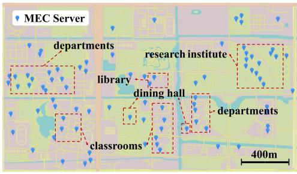

<details>
<summary>text_image</summary>

MEC Server
departments
research institute
library
dining hall
departments
classrooms
400m
</details>

Fig. 1. APs deployment map.

We propose a task offloading control scheme called MOTO to minimize the total computation costs. In MOTO, we integrate two major techniques: LSTMbased method for ToC sub-problem and D3QNbased method for SeG sub-problem. The proposed MOTO can effectively control online task offloading and achieve adaptive load balancing.

The remainder of this paper is organized as follows. We conduct a systematical data analysis and present our observations and motivations in Section 2. Section 3 gives the system model and problem formulation. We decompose the problem and elaborate on our MOTO design in respective Sections 4 and 5. In Section 6, we evaluate the performance of proposed MOTO with trace-driven experiments. Section 7 reviews the related work. Finally, we conclude the paper and direct our future work in Section 8.

# 2 MOTIVATIONS

In this section, we justify the motivations of our study with some data-driven observations. Specifically, we adopt a public large-scale WiFi dataset1 , which contains 4045 access points (APs) and more than 21,725 active users. When mobile users connect to APs, the system can record network association information, including the connection time, disconnection time, and consumed traffic volume, etc. Fig. 1 visualizes the scope of the WiFi system, which covers classrooms, department buildings, libraries, dining halls, and research institutes in a university.

# 2.1 User Mobility Issue

We first study the overall distributions of user associations. Fig. 2a shows the cumulative distribution functions (CDFs) of user association duration, where results from Apr. 26 to May 16 and from May 17 to Jun. 6 are plotted. We can achieve two major observations. First, two curves show a quite close trend, indicating similar connection behaviors in these two time periods. Second, more than 80% of the association duration are less than 600s, which means that users are not inclined to keep a long connection with associated AP. Fig. 2b shows the CDFs of the number of connected APs for each user per day. We can observe that 40% of users connect to less than 5 APs per day and about 20% of users associate more than 20 APs, which indicates that users usually move frequently among multiple geographic locations with a short duration staying in each location. Likewise, the two curves within different time periods are quite similar, which demonstrate that the observed phenomenons exist with a long time span.

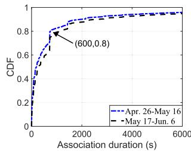

<details>
<summary>line</summary>

| Association duration (s) | Apr. 26-May 16 CDF | May 17-Jun. 6 CDF |
| ------------------------ | ------------------ | ----------------- |
| 0                        | 0.0                | 0.0               |
| 600                      | 0.8                | 0.8               |
| 2000                     | 0.9                | 0.9               |
| 4000                     | 0.95               | 0.95              |
| 6000                     | 1.0                | 1.0               |
</details>

(a) CDFs of association duration

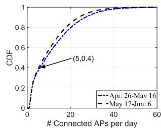

<details>
<summary>line</summary>

| # Connected APs per day | CDF (Apr. 26-May 16) | CDF (May 17-Jun. 6) |
| ------------------------ | -------------------- | ------------------ |
| 0                        | 0.0                  | 0.0                |
| 5                        | 0.4                  | 0.4                |
| 20                       | 0.8                  | 0.8                |
| 40                       | 0.95                 | 0.95               |
| 60                       | 1.0                  | 1.0                |
</details>

(b) CDFs of the number of connected APs for each user   
Fig. 2. Overall user association analysis.

# 2.2 Dynamics of User Load

We select one department building to study the temporal dynamic characteristics of mobile users. Fig. 3 shows the total number of users, as well as the actual increments/decrements of users connecting/disconnecting the edge server in the building from 11:00 a.m to 13:00 p.m., where the time slot duration is minutely based. We can observe that the number of users has symmetries and reaches the maximum value (i.e., 1,000) around 12 p.m. It further indicates that the users move frequently during certain time periods, e.g., lunchtime. The highly dynamic temporal variation motivates us to make computation load predictions in advance for better task offloading decisions.

To better understand the spatio-temporal dynamics of user load distribution, we further analyze the variations in the number of users on different buildings at different time slots. In particular, we count the number of users in all buildings at different time slots on one day, where the sampling interval is 15 minutes. Fig. 4 shows the heatmap of user distribution, where the server ID is ranked in descending order by the number of users at 8 a.m. In addition, users are mainly active between 08:00 a.m and 20:00 p.m. We can observe that most of the users gather in several hot buildings, while the number of users in other buildings is small. Therefore, we need to consider load balancing among servers for better service provisioning and resource utilization.

We then examine the spatio-temporal dynamics of the user load in different locations. Fig. 5 visualizes the number of users at two different moments on one day, i.e., 11:00 a.m and 23:00 p.m, where circles denote the number of users and larger size implies more users. We can have the following two major observations. First, the number of users is temporally uneven. Particularly, the computation load at 11:00 a.m is much larger than that of $2 3 { : } 0 0 \mathrm { \dot { p } } . \mathrm { m } ^ { 2 }$ . It is reasonable since users are more active in the daytime than nighttime. Second, the user loads are spatially variant. For example, the user load of classrooms is heavier than that of departments and research institutions.

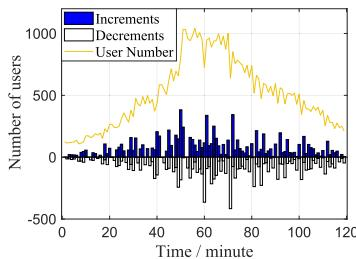

<details>
<summary>line</summary>

| Time / minute | Increments | Decrement | User Number |
| ------------- | ---------- | --------- | ----------- |
| 0             | 0          | 0         | 0           |
| 10            | 0          | 0         | 100         |
| 20            | 0          | 0         | 200         |
| 30            | 0          | 0         | 300         |
| 40            | 0          | 0         | 400         |
| 50            | 100        | -100      | 500         |
| 60            | 200        | -200      | 600         |
| 70            | 100        | -100      | 500         |
| 80            | 50         | -50       | 400         |
| 90            | 100        | -100      | 300         |
| 100           | 50         | -50       | 200         |
| 110           | 100        | -100      | 100         |
| 120           | 50         | -50       | 50          |
</details>

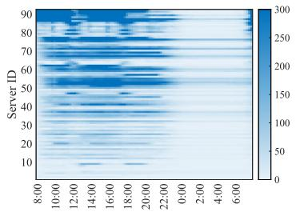

<details>
<summary>heatmap</summary>

| Server ID | 8:00 | 10:00 | 12:00 | 14:00 | 16:00 | 18:00 | 20:00 | 22:00 | 0:00 | 2:00 | 4:00 | 6:00 |
|-----------|------|-------|-------|-------|-------|-------|-------|-------|------|------|------|------|
| 90        |      |       |       |       |       |       |       |       |      |      |      |      |
| 80        |      |       |       |       |       |       |       |       |      |      |      |      |
| 70        |      |       |       |       |       |       |       |       |      |      |      |      |
| 60        |      |       |       |       |       |       |       |       |      |      |      |      |
| 50        |      |       |       |       |       |       |       |       |      |      |      |      |
| 40        |      |       |       |       |       |       |       |       |      |      |      |      |
| 30        |      |       |       |       |       |       |       |       |      |      |      |      |
| 20        |      |       |       |       |       |       |       |       |      |      |      |      |
| 10        |      |       |       |       |       |       |       |       |      |      |      |      |
The chart displays a heatmap with color intensity representing values from 0 to 300. The x-axis labels are 'Time' (minutes) and the y-axis labels are 'Server ID'. There is no label for the data series. Values are estimated based on the provided code.
</details>

Fig. 4. Heatmap of user distribution.

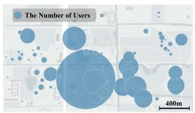

<details>
<summary>text_image</summary>

The Number of Users
400m
</details>

(a) 11:00 a.m

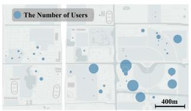

<details>
<summary>text_image</summary>

The Number of Users
400m
</details>

(b) 23:00 p.m   
Fig. 5. Spatio-temporal dynamics of computation load.

Therefore, the highly dynamic mobility behaviors of users and uneven load distributions motivate us to investigate mobility-aware task offloading with load balancing, to achieve optimal resource utilization.

# 3 SYSTEM MODEL AND PROBLEM FORMULATION

In this section, we first describe the system model and then formulate the mobility-aware task offloading problem.

# 3.1 System Model

We consider a typical small-cell MEC scenario, where mobile edge servers (MESs) communicate with each other via wireless network3 . Fig. 6 shows an example of the scenario, where MESs are located in each building. We partition the longterm duration into $T$ consecutive time $\mathrm { s i o t s } ^ { 4 } .$ . In each time slot, there are many MDs connecting to MESs for computation service requests through the connected wireless network. Due to the mobility characteristics5 , mobile users may move among buildings and be served by MESs deployed in the corresponding building. Denote by $\mathcal { U } = \{ \mathrm { M D } _ { 1 } , \mathrm { M D } _ { 2 }$ ; $\dots , \mathrm { M D } _ { i } , . . . , \mathrm { M D } _ { N } \}$ U ¼the set of MDs, and by $\mathcal { P } = \mathrm { \{ M E S _ { 1 } } $ 1; $\mathrm { M E S _ { 2 } } , . . . , \mathrm { M E S } _ { j } , . . . , \mathrm { M E S } _ { M } \}$ P ¼the set of MESs, where $N = | \mathcal { U } |$

2. We assume that the computation loads are proportional to the number of users.   
3. The considered problem and the proposed scheme are readily applicable to general WiFi-based and 5G-based small-cell networks.   
4. The system is managed and scheduled every time slot, the duration of which can be set flexibly in accordance with the system requirement.   
5. Since we do not restrict the users’ mobility characteristics in the model design, the proposed scheme can also be applied to scenarios with high-mobility users.

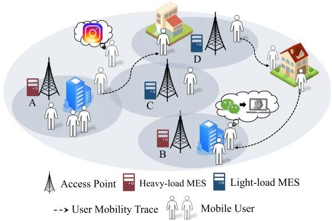

<details>
<summary>flowchart</summary>

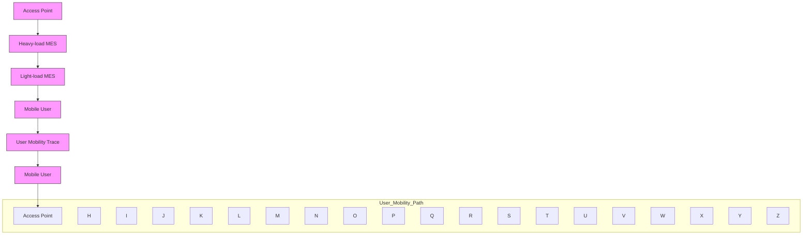
</details>

Fig. 6. System architecture of small-cell MEC.

and $M = | \mathcal { P } |$ . The key notations are summarized in Table 2. ¼ jPjEach MD can only be served by one MES in each time slot. The uneven distribution of users and differences in service requests result in uneven loads for MESs. For example, the loads of MES A and MES B in crowded places are heavy, while loads of MES C and MES D are light.

# 3.1.1 Task Buffer Model

We consider that tasks arrive at MDi following a Bernoulli process with a parameter $\lambda _ { i } ,$ , where the MD has at most one task to be processed in each time slot. Without loss of generality, the computing tasks are atomic, which can be executed locally or be offloaded to an MES. Each task can be described by a tuple $\{ \rho , l \}$ , where $\rho$ represents the average f gdata size required to be transmitted when the MD offloads the task to an MES, and l indicates the average CPU cycles required to finish the task computation.

For each task, there are two processing options, i.e., local computing or edge computing via offloading. Generally,

TABLE 2 Key Notations 

<table><tr><td>Notation</td><td>Definition</td></tr><tr><td> $\mathcal{U},\mathcal{P}$ </td><td>the set of MDs and MESs</td></tr><tr><td> $M,N,i,j$ </td><td>the number and indexes of MDs and MESs</td></tr><tr><td> $\rho,l$ </td><td>the average data size of task, the average CPU cycles required to finish the task computation</td></tr><tr><td> $f_{i},f_{j}$ </td><td>the CPU frequency of  $MD_{i}$  and  $MES_{j}$ </td></tr><tr><td> $x_{j}$ </td><td>the offloading probability of  $MES_{j}$ </td></tr><tr><td> $\mu_{i},\mu_{j}$ </td><td>the task processing rate of  $MD_{i}$  and  $MES_{j}$ </td></tr><tr><td> $\mu_{g}$ </td><td>the sum of computing power of all MESs in group  $g$ </td></tr><tr><td> $p_{i}$ </td><td>the transmission power of  $MD_{i}$ </td></tr><tr><td> $D_{i}^{L}$ </td><td>the expected time for local computing of  $MD_{i}$ &#x27;s task</td></tr><tr><td> $D_{i}^{O}$ </td><td>the expected time for  $MD_{i}$ &#x27;s task executed at edge</td></tr><tr><td> $E_{i}^{L}$ </td><td>the computational energy cost of  $MD_{i}$ </td></tr><tr><td> $E_{i}^{O}$ </td><td>The energy cost to support the transmission of  $MD_{i}$ </td></tr><tr><td> $C_{i}^{L}$ </td><td>the weighted local computing cost of  $MD_{i}$ &#x27;s task</td></tr><tr><td> $C_{i}^{O}$ </td><td>the weighted expected cost for edge computing of  $MD_{i}$ &#x27;s task</td></tr><tr><td> $C_{i}$ </td><td>the weighted computational costs of  $MD_{i}$ &#x27;s task</td></tr><tr><td> $V_{j}$ </td><td>the set of MDs served by  $MES_{j}$ </td></tr><tr><td> $r$ </td><td>the average data rate of wireless links between MD and MES</td></tr><tr><td> $\alpha$ </td><td>the weight coefficient for delay</td></tr><tr><td> $\sigma_{a,b}$ </td><td>the indicator of whether  $MES_{a}$  and  $MES_{b}$  belong to the same group</td></tr><tr><td> $\mathcal{G}$ </td><td>the number of MES groups</td></tr></table>

Authorized licensed use limited to: Guangxi University. Downloaded on May 30,2026 at 11:16:22 UTC from IEEE Xplore. Restrictions apply.

MDs will offload as many tasks as possible to the MESs to minimize their computational costs while satisfying the computing capability constraints of MESs. But too many tasks flooding into the MES buffer will reduce the quality of service. Therefore, each MESj will set a task offloading probability $x _ { j }$ to limit MD task offloading. In each time slot, MES broadcasts the edge computing delay and offloading probability x to all MDs. The goal is to minimize the sum cost of all MDs by making task offloading control decisions at each MES. Specifically, the MESs firstly calculates the offloading probability $\mathbf { X } =$ $\{ x _ { 1 } , x _ { 2 } , . . . , x _ { j } , . . . , x _ { M } \}$ ¼for all MESs, and all MDs associated f gwith MESj offload their tasks with a probability of $x _ { j } \in [ 0 , 1 ]$ .

# 3.1.2 Local Computing Model

Denote the CPU frequency of MDi by $f _ { i } ,$ , the local task processing rate $\mu _ { i }$ can be represented by $\begin{array} { r } { \mu _ { i } = \frac { f _ { i } } { l } } \end{array}$ . Then, the ¼expected time spent for local computing can be calculated as

$$
D _ {i} ^ {L} = \frac {1}{\mu_ {i} - (1 - x _ {j}) \lambda_ {i}}. \tag {1}
$$

The computational energy cost to support local computing can be calculated by

$$
E _ {i} ^ {L} = k f _ {i} ^ {2} l, \tag {2}
$$

where k represents the energy consumption coefficient, which mainly depends on the chip architecture.

Combining Eqs. (1) and (2), the weighted expectation cost for local computing can be obtained by

$$
C _ {i} ^ {L} = \alpha D _ {i} ^ {L} + (1 - \alpha) E _ {i} ^ {L}, \tag {3}
$$

where $\alpha \in [ 0 , 1 ]$ is the weight coefficient for delay, and 1  a 2 ½  is for the energy cost. If the MD cares more about the delay performance, a larger a can be set.

# 3.1.3 Edge Computing Model

Denote by $V _ { j }$ the set of MDs that are currently served by MESj. The cost for task execution on the MES consists of two parts: 1) the transmission delay and energy cost to offload the task; and 2) the expected computation delay to execute the task at edge.

Let $f _ { j }$ be the CPU frequency of ${ \mathrm { M E S } } _ { j } ,$ and then the task process rate of MESj can be calculated as $\begin{array} { r } { \mu _ { j } = \frac { f _ { j } } { l } } \end{array}$ . Denote by $r$ ¼the average data rate of wireless links between MDs and MESs. Then, the expected time spent for the task executed at edge can be calculated as

$$
D _ {i} ^ {O} = \frac {\rho}{r} + \frac {1}{\mu_ {j} - x _ {j} \sum_ {i = 1} ^ {v _ {j}} \lambda_ {i}}, \tag {4}
$$

where $v _ { j } = | V _ { j } |$ represents the number of MDs in the set $V _ { j } ,$ and $x _ { j }$ ¼ j jshould satisfy $\mu _ { j } - x _ { j } \sum _ { i = 1 } ^ { v _ { j } } \lambda _ { i } \geq 0$ due to the comput- ¼ ing capability constraint of MESj. The energy cost to support the MD transmission can be calculated by

$$
E _ {i} ^ {O} = p _ {i} \frac {\rho}{r}, \tag {5}
$$

where $p _ { i }$ is the transmission power of MDi.

Combining Eqs. (4) and (5), the weighted expected cost for edge computing can be achieved by

$$
C _ {i} ^ {O} = \alpha D _ {i} ^ {O} + (1 - \alpha) E _ {i} ^ {O}. \tag {6}
$$

# 3.2 Problem Formulation

At the beginning of each time slot, task offloading control decisions are made to minimize the computational costs of all MDs in the time slot based on the offloading decision X. We first define the weighted computational cost of $\mathrm { M D } _ { i } { } ^ { \prime } \mathbf { s }$ tasks with Eqs. (3) and (6):

$$
C _ {i} = (1 - x _ {j}) C _ {i} ^ {L} + x _ {j} C _ {i} ^ {O}. \tag {7}
$$

The sum of computational costs of all MDs in the system can be calculated as

$$
C _ {t o t a l} = \sum_ {i = 1} ^ {N} C _ {i}. \tag {8}
$$

Therefore, the task offloading optimization (TOO) problem can be formulated as P1:

P1 (Original TOO Problem):

$$
\min _ {\{\mathbf {x} \}} C _ {t o t a l}
$$

$$
s. t. \quad \mathbf {C 1}: 0 \leq x _ {j} \leq \min (1, \frac {\mu_ {j}}{\sum_ {i = 1} ^ {v _ {j}} \lambda_ {i}}), \forall j \in \mathcal {P}. \tag {9}
$$

Directly tackling the above P1 problem is difficult since the dynamic user mobility behaviors result in spatially and temporally uneven computation load distribution. Furthermore, the status of task arrival rate in the time slot is unavailable in advance.

# 4 PROBLEM TRANSFORMATION AND DECOMPOSITION

In this section, we first introduce an MES grouping approach and transform P1 into a group-based TOO problem to facilitate load balancing. Then, to solve the non-convex and intractable problem, we further decompose the problem into two sub-problems: 1) the task offloading control (ToC) sub-problem which optimizes the task offloading decisions to adapt to user mobility behaviors; and 2) the server grouping (SeG) sub-problem that addresses the spatially and temporally uneven computation loads to achieve load balancing.

# 4.1 Problem Transformation

The objective of P1 is to find the optimal offloading control decision for each MES to serve its associated MDs. However, considering the uneven load of different MESs in the realworld scenario, it is inefficient that each MES only serves its associated MDs. For example, some overloaded MESs are not able to support high-quality service provisioning while some light-loaded MESs’s resources are underutilized.

To solve this problem, a potential approach is to transfer parts of tasks from heavy-loaded MESs to light-loaded MESs. For each heavy-loaded MES, we need to determine the target MES for task transfer. Although we can find the target MES via exhaustive searching, the searching delay is unacceptable. In this work, we leverage a grouping-based approach, where several MESs are clustered into one group and the tasks can only be transferred within the group.

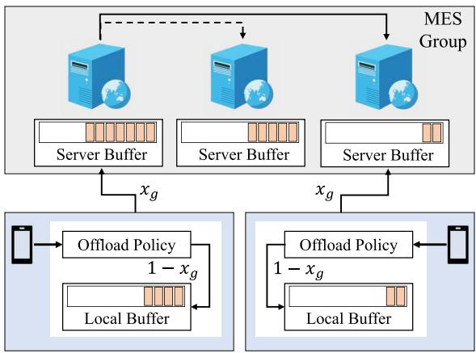

<details>
<summary>flowchart</summary>

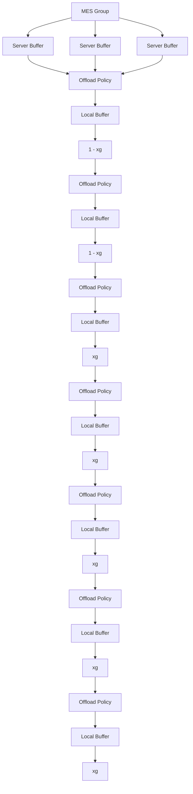
</details>

Fig. 7. Illustration of offloading decision in a group.

Denote by $\mathbf { G } = \{ \sigma _ { a , b } \}$ the grouping decision, where $\mathrm { M E S } _ { a } , \mathrm { M E S } _ { b } \in \mathcal { P }$ ¼ fand $\sigma _ { a , b } \in \{ 0 , 1 \}$ indicates whether MESa; ${ \mathrm { M E S } } _ { b }$ 2 P 2 f gbelong to the same group, i.e.,

$$
\sigma_ {a, b} = \left\{ \begin{array}{l l} 1 & \text {   If   MESa   and   MESb   are   in   the   same   group;   } \\ 0 & \text { Otherwise. } \end{array} \right. \tag {10}
$$

Denote by g an MES group, and  the set of groups. A Ggroup g includes MESs and MDs associated with those MESs. All MESs in g are viewed as a whole, and the probability of offloading tasks to MESs in $g$ is $x _ { g } .$ . Let $y _ { g }$ and $v _ { g }$ denote the number of MESs and MDs in $g ,$ respectively. The sum of computing rate of all MESs in g can be calculated as

$$
\mu_ {g} = \sum_ {j = 1} ^ {y _ {g}} \mu_ {j}. \tag {11}
$$

After merging servers into a group, the tasks of users belonging to g may be executed on any MES in this group. Fig. 7 shows the task offloading process after grouping. In particular, when MD has a task to be processed, it first makes an offloading decision based on $x _ { g } .$ If MDi chooses local processing, the task will be placed in the local task buffer. Otherwise, the task will be uploaded to MESa which is directly connected to MD , and then MES will be determined to perform the task. For simplicity of description, we consider that all MESs in the same group have the same computing rate $( \mu _ { a } = \mu _ { b } ) ^ { \mathrm { ~ 6 ~ } }$ . It means that the proba-¼bility of tasks being executed on any MES is equal, and the amount of tasks handled by each server is also equal. In this case, the probability that a task needs to be transferred to another server in the group for execution is the edge computing delay for MD belonging $\frac { y _ { g } - 1 } { y _ { q } }$ . Then,can be recalculated as

$$
D _ {i} ^ {O} = \frac {\rho}{r} + \frac {y _ {g} - 1}{y _ {g}} \frac {\rho}{r ^ {t r a n s}} + \frac {1}{\mu_ {g} - x _ {g} \sum_ {i = 1} ^ {v _ {g}} \lambda_ {i}}. \tag {12}
$$

where $r ^ { t r a n s }$ represents the average transmission data rate between MESs.

With MES grouping, the sum computational costs of all MDs can be calculated as

6. If MESs have different computing rates, the system will assign tasks to different MESs based on their computing capabilities.

Authorized licensed use limited to: Guangxi University. Downloaded on May 30,2026 at 11:16:22 UTC from IEEE Xplore. Restrictions apply. May30,2026at1116:22UTCfromIEEEXplore.Restrictionsply.

$$
C _ {t o t a l} ^ {T} = \sum_ {g = 1} ^ {| \mathcal {G} |} C _ {t o t a l} ^ {g}, \tag {13}
$$

where  is the number of MES groups based on grouping jGdecision $\mathbf { G } ,$ and $C _ { T o t a l } ^ { g }$ represents the sum computational costs of all users in g, i.e.,

$$
C _ {t o t a l} ^ {g} = \sum_ {i = 1} ^ {v _ {g}} C _ {i}. \tag {14}
$$

With group-based adaptive load balancing, the original problem P1 can be transformed into

P2 (Transformed Problem):

$$
\min _ {\{\mathbf {G}, \mathbf {X} \}} C _ {t o t a l} ^ {T}
$$

$$
s. t. \quad \mathbf {C 1}: 0 \leq x _ {g} \leq \min (1, \frac {\mu_ {g}}{\sum_ {i = 1} ^ {v _ {g}} \lambda_ {i}}), \forall g \in \mathcal {G}. \tag {15}
$$

The transformed problem P2 includes ToC and SeG subproblems, which optimize the task offloading decision X and server grouping decision with load balancing $G ,$ respectively. Therefore, by solving P2, we can achieve the optimal task offloading control decision X and the optimal server grouping decision $\mathbf { G } ^ { \ast }$ , where the number of users and computing resources of each group are matched optimally.

# 4.2 Problem Decomposition

Since $\mathbf { G } ^ { \ast }$ is discrete and X is continuous, P2 is a typical mixed integer nonlinear programming (MINLP) problem [31]. Generally, the spatial branch and bound (SBB) method can be adopted to solve MINLP problems [32]. However, due to high complexity, this method is not suitable for our problem which requires real-time decisions to adapt to dynamic environments.

In this work, we use the Tammer method to decompose P2 into two sub-problems to reduce the complexity [33]. Particularly, we first rewrite the transformed problem P2 as:

P2 (Equivalent Problem):

$$
\min _ {\{\mathbf {G} \}} \left(\min _ {\{\mathbf {X} \}} C _ {t o t a l} ^ {T}\right).
$$

$$
s. t. \quad \mathbf {C 1}. \tag {16}
$$

Since C1 only constrains the solution of $\mathbf { X } ^ { * }$ , solving problem P2 is equivalent to solving the following two sub-problems, i.e., the task offloading control (ToC) sub-problem P2:1 and the server grouping (SeG) sub-problem P2:2.

P2:1 (ToC Sub-Problem):

$$
C _ {t o t a l} ^ {*} = \min _ {\{\mathbf {X} \}} \sum_ {g = 1} ^ {| \mathcal {G} |} C _ {t o t a l} ^ {g}
$$

$$
s. t. \quad \mathbf {C 1}. \tag {17}
$$

P2:2 (SeG Sub-Problem):

$$
\min _ {\{\mathbf {G} \}} C _ {t o t a l} ^ {*}. \tag {18}
$$

# 5 DESIGN OF MOTO

In this section, we elaborate on the design of MOTO. Particularly, we first describe its architecture and present the workflow. Then, we concentrate on the major technical components of MOTO.

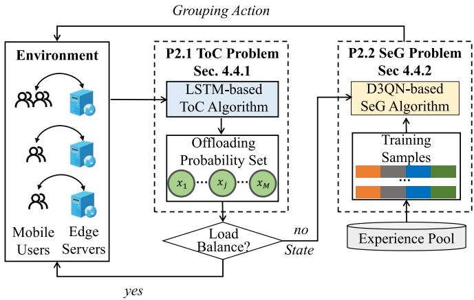

<details>
<summary>flowchart</summary>

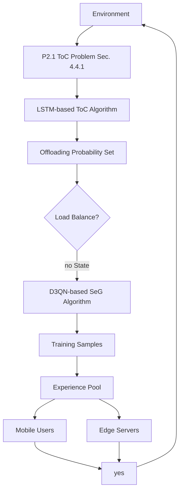
</details>

Fig. 8. An overview of the proposed MOTO.

# 5.1 Overview

Fig. 8 shows the workflow and overall architecture of MOTO, which consists of two components, i.e., LSTM-based algorithm for ToC and D3QN-based algorithm for SeG. Since the task arrival rates are unknown in advance, MOTO determines task offloading strategy in an online learning manner based on dynamic network environment. Specifically, the system initializes each MES as one group and solves P2:1 by predicting the task arrival rates of all MDs, and get the optimal offloading probability set $\pmb { \chi } ^ { * }$ . Afterwards, the system determines whether the system is load balanced. If the system is in a load-balanced state, we return the current decision to the environment. Otherwise, the MESs need to be regrouped by solving P2:2.

The computation loads of MESs in different locations are uneven in both time and spatial domains. To improve the intelligence of server grouping strategy, we transform P2:2 into a typical Markov Decision Process (MDP) problem, and design a D3QN-based reinforcement learning (RL) algorithm to solve it. The D3QN algorithm takes the current state $X ^ { t }$ and samples from the experience pool as the inputs, outputs a grouping action, and gets a reward. The online learning process continues until the system can make satisfying offloading control decisions in accordance with the dynamic environments. In the following subsections, we will elaborate on the two algorithms.

# 5.2 LSTM-Based Algorithm for ToC

Since task offloading in different groups is independent, solving P2:1 is equivalent to finding the optimal $x _ { g } ^ { * }$ for each group. In this section, we first prove that ToC Sub-Problem is convex. Then, we design an LSTM-based algorithm to solve it. To obtain the optimal solution for P2:1, we derive Lemma 1 in the following.

Lemma 1. $C _ { t o t a l } ^ { g }$ Cgtotal is a convex function in the definition domain $0 \leq x _ { g } \leq \operatorname* { m i n } ( 1 , { \frac { \mu _ { g } } { \sum _ { i = 1 } ^ { v _ { g } } \lambda _ { i } } } )$ 1

¼ Proof. Based on (7) and (14), we can rewrite $C _ { t o t a l } ^ { g }$

$$
C _ {t o t a l} ^ {g} (x _ {g}) = \sum_ {i = 1} ^ {v _ {g}} \big ((1 - x _ {g}) C _ {i} ^ {L} + x _ {g} C _ {i} ^ {O} \big). \tag {19}
$$

It is easy to see $C _ { t o t a l } ^ { g }$ is a higher-order function of $x ,$ , including higher-order terms, first-order terms and constant terms. For convenience, we extract the higher-order terms as

$$
\psi (x _ {g}) = (1 - x _ {g}) \alpha \sum_ {i = 1} ^ {v _ {g}} \frac {1}{\mu_ {i} - (1 - x _ {g}) \lambda_ {i}}
$$

$$
+ x _ {g} \alpha \sum_ {i = 1} ^ {v _ {g}} \frac {1}{\mu_ {g} - x _ {g} \sum_ {i = 1} ^ {v _ {g}} \lambda_ {i}}. \tag {20}
$$

The second derivative of $\psi ( x _ { g } )$ is calculated as

$$
\psi^ {\prime \prime} (x _ {g}) = \sum_ {i = 1} ^ {v _ {g}} \left(\frac {2 \alpha \lambda_ {i} \mu_ {i}}{(\mu_ {i} - (1 - x _ {g}) \lambda_ {i}) ^ {3}} + \frac {2 \alpha \lambda_ {g} \mu_ {g}}{(\mu_ {g} - x _ {g} \lambda_ {g}) ^ {3}}\right). \tag {21}
$$

Obviously, $\lambda _ { i } , \mu _ { i } , \lambda _ { g }$ and $\mu _ { g }$ are greater than 0. In addition, for $\mathrm { M D } _ { i } ,$ , the task arrival rate $\lambda _ { i }$ must be less than the task processing rate $\mu _ { i } ,$ , and $x _ { g }$ is less than 1. So we can get

$$
\mu_ {i} - \left(1 - x _ {g}\right) \lambda_ {i} > 0. \tag {22}
$$

Generally, the task processing rate of an MES is greater than its task arrival rate. Thus, $\mu _ { g } - x _ { g } \lambda _ { g }$ is greater than 0 and $\psi ^ { \prime \prime }$ g is a positive number, and $C _ { t o t a l } ^ { g } ( x _ { g } )$ is a convex function. Þ

With Lemma 1, P2:1 can be easily solved with given task arrival information, which however is not available beforehand when making the offloading decisions. Therefore, for every group $g ,$ we devise an LSTM-based ToC algorithm to predict the task arrival rates of all MDs in the group $\lambda _ { g } ^ { t _ { 0 } + 1 }$ in the upcoming time slot, as illustrated in Fig. 9.

LSTM-Based ToCAlgorithm. LSTM is a variant of Recurrent Neural Network (RNN) to effectively deal with timeseries data prediction [34], [35]. Denote by $\mathcal { T N } = \{ t n _ { 1 } , \cdots ,$ ; $t n _ { t } , t n _ { l s } \}$ TN ¼ f   the time series of historical tasks, where ls is the glength of time series, and each element $t n _ { t }$ is the number of tasks arrival at time slot t. At each time slot $t ,$ the LSTM cell can be calculated as

$$
e _ {t} = \sigma (W _ {e} [ h _ {t - 1}; t n _ {t} ] + b _ {e}),
$$

$$
i _ {t} = \sigma (W _ {i} [ h _ {t - 1}; t n _ {t} ] + b _ {i}),
$$

$$
o _ {t} = \sigma (W _ {o} [ h _ {t - 1}; t n _ {t} ] + b _ {o}),
$$

$$
\hat {m} _ {t} = \tanh (W _ {m} [ h _ {t} - 1; t n _ {t} ] + b _ {m}), \tag {23}
$$

where $e _ { t } , i _ { t } , o _ { t } ,$ , and $\hat { m } _ { t }$ are forget gate, input gate, output gate, and modulated input, $\sigma ( \cdot )$ is the Sigmoid function, and $t n _ { t }$ ðÞis the input. Then the memory cell and hidden state are updated as

$$
m _ {t} = e _ {t} \odot m _ {t - 1} + i _ {t} \odot \hat {m} _ {t},
$$

$$
h _ {t} = o _ {t} \odot \tanh (m _ {t}), \tag {24}
$$

where $h _ { t }$ is the output of the LSTM cell at step t.

We adopt three LSTM layers in this paper, each LSTM cell takes the vector representation, memory state, and hidden state at time slot t 1 as input at time slot t

$$
h _ {t}, c _ {t} = L S T M (t n _ {t - 1}, h _ {t - 1}, c _ {t - 1}), \tag {25}
$$

where $c _ { t - 1 }$ and $h _ { t - 1 }$ are the memory state and the hidden  state, respectively, and the output $h _ { t }$ denotes the task arrival rates at the next time slot, $\mathrm { i . e . , } \ \lambda _ { g } ^ { t + 1 }$ . Based on the predicted task arrival information, we can get the optimal task offloading probability $x _ { a } ^ { * }$ for each group

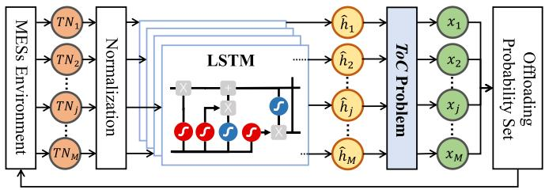

<details>
<summary>flowchart</summary>

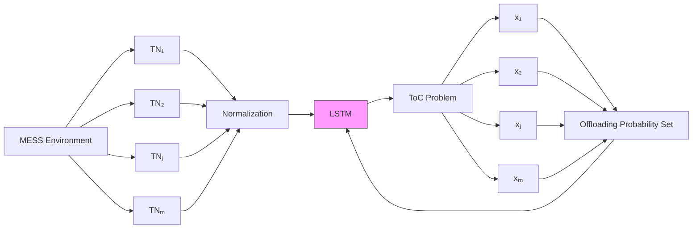
</details>

Fig. 9. The architecture of LSTM-based ToC algorithm.

$$
x _ {g} ^ {*} = \operatorname{argmax} _ {x _ {g}} C _ {\text { total }} ^ {g} (x _ {g}), \tag {26}
$$

which can be solved in polynomial time with the Newton method [36].

Recall that the task offloading probability should satisfy the computing constraint $\mu _ { j } \geq x _ { g } \sum \lambda _ { i }$ . For $\mathrm { M E S } _ { j }$ with lim-ited computation capability, the associated MDs will decrease $x _ { j }$ to avoid MES overload. In this paper, we use $| x _ { a } - x _ { b } |$ to represent the load gap between $\mathrm { M E S } _ { a }$ and ${ \mathrm { M E S } _ { b } }$ j  j. Note that for MESs in the same group, their computational loads are balanced since they cooperate to perform computation via task transfer. Considering the highly dynamic network environment, absolute load balancing is difficult to achieve unless all MESs are in the same group. Therefore, we consider that load balancing can be achieved once the load gap (i.e., $x _ { m a x } - x _ { m i n } )$ is less than the maximum value of d. The $x _ { m a x }$ and $x _ { m i n }$ denote the maximum and minimum values of decision X, respectively. When the system service loads are unbalanced, the MESs need to be regrouped.

# 5.3 D3QN-Based Algorithm for SeG

To solve the SeG sub-problem, we first model it as an MDP and then propose a D3QN-based algorithm to optimize MES grouping.

Problem Mapping. A typical MDP model consists a tuple with five parameters $\langle \bar { S } , \bar { A } , { P } , R , \gamma \rangle$ , representing the state h ispace, action space, state transition probability, reward function, and future reward discount factor, respectively. The value of $\gamma$ is between 0 and 1, where a larger g means that more attention is paid to future rewards.

Based on the value of X obtained from solving the ToC sub-problem, if the computational loads are unbalanced, the MES grouping algorithm will be activated to regroup MESs. In other words, the grouping module only works when needed, which means that the time interval between two grouping actions is dynamic. We define the time interval between two consecutive actions as a logical step t, and let t denote the time interval when MESs update task offloading probabilities. Therefore, one time step t might contain multiple time slots t.

State Space: Let S denote the collection of all the states of environment. In our model, we set the task offloading probability of all MESs as the state at $\tau ,$ i.e., $s ^ { \tau } = \{ x _ { j } ^ { \tau } \} \in S ,$ , $1 \leq j \leq M .$

 Action Space: Let A be the collection of all actions. The goal of server grouping is to split and regroup all MESs into new MES groups. Considering the tremendous dimension of grouping decisions, we divide the procedure into multiple actions. The derivation process is as follows.

Denote by M the number of MESs. $\operatorname { I f } n _ { 1 }$ MESs are selected as a group from M MESs, the number of combinations is

$\frac { M ! } { n _ { 1 } ! ( M - n _ { 1 } ) ! }$ . Then, $n _ { 2 }$ MESs are selected from the remaining $( M - n _ { 1 } )$ MESs as a group with the number of combinations ð being $\frac { \ ' ( M - n _ { 1 } ) ! } { n _ { 2 } ! ( M - n _ { 1 } - n _ { 2 } ) ! }$ . The above process is repeated until there ð   Þis no remaining MES, i.e., the server grouping is finished. We assume that all MESs are divided into H groups, then the size of grouping action space can be calculated by:

$$
| \mathcal {A} | = \frac {M !}{n _ {1} ! (M - n _ {1}) !} \frac {(M - n _ {1}) !}{n _ {2} ! (M - n _ {1} - n _ {2}) !}
$$

$$
\dots \frac {(M - n _ {1} - n _ {2} - \cdots - n _ {H - 1}) !}{n _ {H} ! (M - n _ {1} - n _ {2} - \cdots - n _ {H}) !}
$$

$$
= \frac {M !}{n _ {1} ! \times n _ {2} ! \times \cdots \times n _ {H} !} \tag {27}
$$

According to Equation (27), the searching latency is positively correlated with the number of MESs in the group and the largest possible size of the action space is $M ! \left( \mathrm { i . e . , } \right.$ , each group contains only one MES). Such a large size action space makes the parameter learning process of reinforcement learning very difficult. To solve the above problem, in this paper, each action only combines or splits two MESs during server grouping and regrouping. Specifically, let action space at $t _ { 0 }$ be the $a ^ { t _ { 0 } } = \{ \breve { \mathrm { F l a g } } ^ { t _ { 0 } } , \breve { M E S } _ { i } ^ { t _ { 0 } } , M E S _ { j } ^ { t _ { 0 } } \bar  \} \in \mathcal { A } ,$ where $\bar { M } E S _ { i } ^ { t _ { 0 } }$ ; $M E S _ { i } ^ { t _ { 0 } } \in M$ ¼and $F l a g ^ { t _ { 0 } } \in \{ 0 , \dot { 1 } \}$ j g 2 A. Particularly, $\begin{array} { r } { F l a g ^ { t _ { 0 } } = 0 } \end{array}$ and $\begin{array} { r } { { F l a g } ^ { t _ { 0 } ^ { \prime } } = 1 } \end{array}$ 2 f grepresent combining and splitting $M E S _ { i } ^ { t _ { 0 } }$ ¼and $M E S _ { j } ^ { \tilde { t } _ { 0 } }$ ¼, respectively. In this way, the action space is reduced from M! to $2 M ( M - 1 )$ . Particularly, if the action is to merge MESi and ${ \mathrm { M E S } } _ { j }$  Þwhich originally belong to different groups, MESi and ${ \mathrm { M E S } } _ { j }$ will form a new group. After grouping, when the computation tasks arrive, the serving MES with the shortest task buffers (i.e., with the minimum task loads) within a group will be chosen.

Reward: As mentioned before, a logic step t may include multiple time slots. The reward of each time slot can be calculated as

$$
r _ {t} = \frac {1}{N} \sum_ {i = 1} ^ {N} (C _ {i} ^ {L} - C _ {i} ^ {O}). \tag {28}
$$

Then the reward of step t can be given as

$$
r _ {\tau} = \frac {1}{h ^ {\tau}} \sum r _ {t}, \tag {29}
$$

where $h ^ { \tau }$ represents the number of time slots in $\tau ,$ which depends on the speed of environment change. The slower the environment changes at t, the larger the $\breve { h ^ { \tau } }$ .

Based on the MDP model, the grouping sub-problem P2:2 is transformed into an optimization problem that finds the optimal grouping policy $\pi ^ { * }$ to maximize the reward of all users.

Definition 1 (MES Grouping Policy). MES Grouping Policy p represents the mapping relationship between $S$ and A, and $\pi ^ { * }$ is the best mapping with the highest reward. With $\pi ^ { * }$ , the model can directly obtain the best grouping action $a ^ { \tau * } =$ $\{ F l a g ^ { \tau * } , M E S _ { i } ^ { \tau * } , M E \bar { S } _ { j } ^ { \tau * } \} \in { \cal A }$ ¼at time t based on the observed fstate $s ^ { \tau } = \{ x _ { j } ^ { \tau } \} \in S .$ .

D3QN-Based SeG Algorithm. A D3QN-based algorithm is designed to find the optimal MES grouping policy, as shown in Fig. 10. D3QN is a classical RL algorithm for Markov Decision Process, which has been proven to achieve good performance in large-scale discrete state space. D3QN combines the characteristics of Double DQN [37] and Dueling DQN [38]. It contains two neural networks with the same structure, namely, the online network that interacts with the environment and the target network that stores parameters. The design of double networks avoids the overestimation problem in learning.

Algorithm 1. MOTO: Mobility-Aware Online Task Offloading Scheme With Adaptive Load Balancing   
1: Initialization: $t, \tau \leftarrow 0$ ; $x_{g}^{t} \leftarrow 1$ , $\forall x_{g}^{t} \in X^{t}$ ; $|g| \leftarrow 1$ , $\forall g \in G$ ; $r^{\tau} \leftarrow 0$ , $s^{\tau} \leftarrow X^{t}$ , $a^{\tau} \in A$ 2: while $t \rightarrow TZ$ do

3: for $g \in G$ do

4: $n_{g}^{t} \leftarrow 0$ , $r^{t} \leftarrow 0$ .

5: for $i \in g$ do

6: Calculate $C_{i}^{L}$ , $C_{i}^{O}$ .

7: if i decides to offload task based on $x_{g}^{t}$ then

8: $n_{g}^{t} \leftarrow n_{g}^{t} + 1$ .

9: $r^{t} \leftarrow r^{t} + (C_{i}^{L} - C_{i})$ .

10: end if

11: end for

12: Set $\{n_{g}^{t-len}, n_{g}^{t-len+1}, ..., n_{g}^{t-1}\} \cap n_{g}^{t}$ as the input of LSTM.

13: Get $\hat{n}_{g}^{t+1}$ as the output of LSTM.

14: $x_{g}^{t+1} = \arg\max_{x_{g}} C_{total}^{g}(x_{g}) \leftarrow \hat{n}_{g}^{t+1}$ ;

15: $r^{\tau} \leftarrow r^{\tau} + r^{t}$ .

16: end for

17: if $X_{max}^{t+1} - X_{min}^{t+1} > \delta$ then

18: $s^{\tau+1} \leftarrow X^{t+1}$ 19: Store $(s^{\tau}, a^{\tau}, r^{\tau}, s^{\tau+1})$ to D3QN experience pool.

20: Set $s^{\tau+1}$ as the state input of online network.

21: Select $a^{\tau+1} \in A$ via $\epsilon$ -greedy policy.

22: Regroup servers with action $a^{\tau+1}$ .

23: if $(\tau + 1)\% \phi = 0$ then

24: Update $\theta$ based on D3QN experience pool.

25: $\theta^{-} \leftarrow \theta$ .

26: end if

27: $\tau = \tau + 1$ 28: end if

29: $t = t + 1$ 30: end while

When the MESs are load unbalanced, Xt is sent as the current state $s ^ { \tau }$ to D3QN, which will make action $a ^ { \tau }$ to regroup the MESs. After regrouping, we can obtain the next state value $s ^ { \tau + 1 }$ and collect the reward value $r ^ { \tau }$ . Then, we collect $s ^ { \tau } , a ^ { \tau } , s ^ { \tau + 1 }$ and $r ^ { \tau }$ and store them in the experience pool to train the network parameters.

The parameter training process is as follows. We first enter the state $s ^ { \tau }$ and the action $a ^ { \tau }$ into the online network to get the estimated action-value as

$$
Q (s ^ {\tau}, a ^ {\tau}; \eta , \alpha , \beta) = V (s ^ {\tau}; \eta , \beta) + B (s ^ {\tau}, a ^ {\tau}; \eta , \omega), \tag {30}
$$

where $V ( s ^ { \tau } ; \eta , \beta )$ is the value function, and its output is a scalar. $B ( s ^ { \tau } , a ^ { \tau } ; \eta , \omega )$ is an advantage function, which outð Þputs a vector whose length is equal to the size of the action space. h is the input layer and hidden layer parameters, and v and b are the output layer parameters of the value function and advantage function, respectively. For simplicity of description, we use u to represent all the parameters of the online network, i.e.,

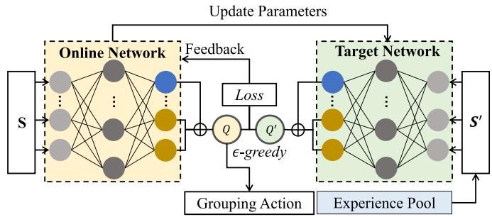

<details>
<summary>flowchart</summary>

```mermaid
graph TD
    subgraph_Online_Network["Online Network"]
        S --> A1["..."]
        S --> A2["..."]
        S --> A3["..."]
        S --> A4["..."]
        S --> A5["..."]
        S --> A6["..."]
    end

    subgraph_Target_Network["Target Network"]
        Loss --> Q["Q"]
        Loss --> Q'[Q']
        Q --> Q'
        Q' --> Q
    end

    Q --> G1["Grouping Action"]
    Q' --> G2["Experience Pool"]
    G1 --> S'[S']
    G2 --> S'

    style Online_Network fill:#f9f,stroke:#333
    style Target_Network fill:#bbf,stroke:#333
    note right of L: Update Parameters
    note left of L: Feedback
    note right of L: Loss
    note bottom of L: Grouping Action
    note bottom of L: Experience Pool
```
</details>

Fig. 10. The architecture of D3QN-based SeG algorithm.

$$
\theta = \langle \eta , \omega , \beta \rangle . \tag {31}
$$

Correspondingly, we use u to represent the parameters of the target network. We input $s ^ { \tau + 1 }$ into the online network to get the argmaxa $\{ s ^ { \tau } , a ; \theta \}$ with the largest action-value, f gand then we can get the target action-value as

$$
Q ^ {\text { target }} = r ^ {\tau} + \gamma \hat {Q} \left(s ^ {\tau + 1}, \operatorname{argmax} _ {a} \left\{s ^ {\tau}, a; \theta \right\}; \theta^ {-}\right). \tag {32}
$$

Equation (32) shows that D3QN uses different functions to select and evaluate an action, which can avoid the over-estimation problem in the original DQN. Based on (30) and (32), we can get the loss function of online network parameter as

$$
L (\theta) = \left(Q ^ {\text { target }} - Q (s ^ {\tau}, a ^ {\tau}; \theta)\right) ^ {2}. \tag {33}
$$

After obtaining the loss function, we can update the parameter u in the online network through the gradient back propagation of the neural network. In addition, we need to replace the parameter $\theta ^ { - }$ in the target network with the parameter u in online network at regular intervals. This method of asynchronous update of the two networks reduces the correlation between target action-value and estimated action-value, which is conducive to accelerate network convergence. Combining the proposed solutions of the sub-problems, we summarize the details of MOTO in Algorithm 1.

Algorithm Complexity Analysis. The MOTO scheme includes two major stages: 1) offline model training and 2) online decision. In the first stage, the system periodically takes a portion of data from the experience pool and the system costs consist of two components, i.e., the LSTM-based algorithm for task offloading control (ToC) and the D3QN-based algorithm for server grouping (SeG). For the ToC, the prediction step is 1 and each step is 1 min, which needs len iterations in total. Denote the termination threshold of Newton’s method by f, so the time cost for solving task offloading probability is ${ \mathcal { O } } ( { \scriptstyle { \frac { 1 } { \phi } } } )$ . Thus, the time cost of ToC is $O ( l e n + \frac { 1 } { \phi } )$ . For the $S e G ,$ let $T$ ð Þbe ð þ Þthe number of time steps in each episode and Z denote the number of episodes, then the cost of the D3QN-based algorithm is $O ( T \hat { Z } )$ . In the second stage, we assume the number of ð Þusers and MESs are n and m, respectively. The time costs for ToC and SeG are within $\begin{array} { r } { O ( l o g ( \bar { \frac { n } { m } } ) ) } \end{array}$ and O m , respectively. ð ð ÞÞ ð ÞOverall, the proposed model can be adaptive in an online manner with low time complexity.

# 6 PERFORMANCE EVALUATION

In this section, we conduct extensive data-driven experiments to evaluate the performance of MOTO. Specifically, we first elaborate on the evaluation methodology with experiment setup, benchmark strategies design, and metrics definition. Then, we respectively compare the overall performance, the performance of LSTM-based ToC algorithm, and the performance of D3QN-based SeG algorithm, to evaluate the impact of different parameters.

TABLE 3 Network Association Record Description 

<table><tr><td>Field</td><td>Value</td></tr><tr><td>Association ID</td><td>241974033</td></tr><tr><td>AP ID</td><td>1030</td></tr><tr><td>AP Name</td><td>MH-D2CY-2F-13</td></tr><tr><td>Building Name</td><td>MH-D2CY</td></tr><tr><td>Client MAC Address</td><td>00:00:xx:xx:EF:52</td></tr><tr><td>Connection Time</td><td>2019-05-08T18:30:31+08:00</td></tr><tr><td>Disconnection Time</td><td>2019-05-08T18:40:31+08:00</td></tr><tr><td>Number of APs: 4045</td><td>Number of Records: 29,284,966</td></tr><tr><td>Number of Users: 21,725</td><td>Time Span: Apr. 26th to Jun. 6th 2019</td></tr></table>

# 6.1 Methodology

# 6.1.1 Experiment Setup

We implement MOTO in Python based on Tensorflow, which is an open-source machine learning framework. The experiments are carried out on a server with 4 CPUs each containing 16 Intel(R) Xeon(R) Platinum 8260 CPU @2.40GHz with 24 cores, and one graphics processing unit (NVIDIA Tian V GPU) is used to accelerate the training process. For performance evaluation, we adopt 42 days large-scale real world data samples, i.e., from Apr. 26th, 2019 to Jun. 6th 2019. Table 3 shows an example of an association record, containing the association ID (the unique identification of record), the associated AP ID and name (the unique identification of AP, identifying the campus, building, and floor), the building name where the AP is located, client MAC address (the unique identification of mobile user), connection time, and disconnection time. In particular, we randomly select 35 days and use the data samples as the training data set, and the remaining 7 days data samples are the testing data set. The detailed experimental parameters are shown in Table 4.

# 6.1.2 Benchmarks

To demonstrate the performance of our proposed MOTO, we adopt and implement the following comparable benchmarks strategies for LSTM-based ToC algorithm and D3QN-based SeG algorithm, respectively.

(1) For LSTM-based ToC algorithm:

No offloading (NO): in this strategy, all tasks are computed locally.   
Random offloading (RO): users can randomly select local or edge computing.   
Free offloading (FO): users choose local or edge computing with lower total cost.

(2) For D3QN-based SeG algorithm:

All group (AG): all MESs in the system are in the same group.   
No group (NG): each MES independently provides services for MDs.

TABLE 4 Experimental Parameters 

<table><tr><td>Parameters</td><td>Value</td></tr><tr><td>Task size (ρ)</td><td> $2 \times 10^{3}$  Bits</td></tr><tr><td>CPU cycles required to process a task (l)</td><td> $4 \times 10^{6}$  Cycles</td></tr><tr><td>CPU frequency of MDs ( $f_{i}$ )</td><td>2 GHz</td></tr><tr><td>CPU frequency of MESs ( $f_{j}$ )</td><td> $16 \times 3$  GHz</td></tr><tr><td>Task arrive rate of MDs ( $\lambda_{i}$ )</td><td>[0.05 - 0.15] Tasks/ms</td></tr><tr><td>Energy efficiency parameter (k)</td><td> $1 \times 10^{-27}$ </td></tr><tr><td>Transmission power of MDs ( $p_{i}$ )</td><td>1 W</td></tr><tr><td>Weights of delay (α)</td><td>0.8</td></tr><tr><td>Maximum load gap (δ)</td><td>0.1</td></tr><tr><td>Exploration rate (ε)</td><td>[0.1, 0.4]</td></tr><tr><td>Learning rate (lr)</td><td> $1 \times 10^{-4}$ </td></tr><tr><td>Reward discount factor (γ)</td><td>0.7</td></tr><tr><td>D3QN experience pool capacity</td><td> $1 \times 2^{19}$ </td></tr><tr><td>Batch size</td><td> $1 \times 2^{10}$ </td></tr><tr><td>Optimizer</td><td>Adam</td></tr><tr><td>Activation function</td><td>Relu</td></tr></table>

Max-Min Group (MG): this strategy firstly groups the MESs with the heaviest load and the lightest load, and then the grouping rule is repeated until no more groups can be formed.

For the overall performance comparison, we choose the combination of FO and three benchmarks for D3QN-based algorithm, i.e., AG+FO, NG+FO, and MG+FO. The reason is that FO can always outperform NO and RO, which will be described in Section 6.3.

# 6.1.3 Performance Metrics

The following three metrics are defined to evaluate the offloading control performance with load balancing.

Energy Cost (Energy): the sum of energy consumption on local computing and transmission when offloading tasks to the edge server.   
Delay Cost (Delay): the sum of delay on transmission and computation.   
Total Cost: the weighted cost of energy cost and delay cost.

# 6.2 Overall Performance Comparison

We first carry out the overall performance comparison between MOTO and other benchmark strategies. Figs. 11a, 11b, and 11c show the CDFs of system energy, delay, and total cost achieved by different strategies, respectively. We have the following three major observations. First, MOTO can outperform other benchmarks significantly on all metrics. Particularly, the probabilities that the energy cost is lower than 2 mj are about 0.88, 0.45, 0.57, and 0.24 in MOTO, NG+FO MG+FO, and AG+FO, respectively. This is because MOTO scheme comprehensively considers task offloading control and server grouping with adaptive load balancing, and both modules are coupled to each other. Instead, other baselines are static in load balancing and cannot adjust computing strategy dynamically and adaptively according to the actual system status. Second, we can observe that given the percentile of 80%, the delay costs of $N G + F O , M G + F O$ and AG+FO reach about 5ms, 4.7ms and 4.7ms, respectively, while the MOTO scheme only consumes 1.3ms, reducing the delay cost by 74%, 72.3%, and 72.3% compared to other three benchmarks. Third, since the delay has a higher weight than the energy, the results of total cost show similar trends with delay, and the MOTO scheme can achieve the least cost in most cases. Finally, we also find that AG+FO has lower energy cost than other baselines but performs worse on delay metric. This is because the system achieves the best load balancing with full edge resource utilization when all servers belong to the same group. In this case, more MDs prefer to offload tasks. However, searching for an optimal MES for MD task offloading leads to high delay costs under AG+FO scheme. The reason is that users choose local or edge computing with the lower total cost and all MESs are in the same group with large size. Different from the AG+FO scheme, the searching space of our proposed MOTO scheme is within a group and the server grouping strategy will avoid forming large-size MES groups. Therefore, the searching delay is very small (i.e., about 1/1000 of the average task execution time) and can be negligible.

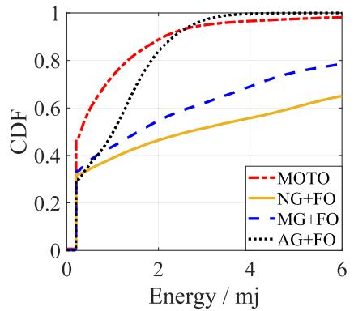

<details>
<summary>line</summary>

| Energy / mj | MOTO  | NG+FO | MG+FO | AG+FO |
|-------------|-------|-------|-------|-------|
| 0           | 0.0   | 0.0   | 0.0   | 0.0   |
| 2           | 0.9   | 0.45  | 0.55  | 0.85  |
| 4           | 0.98  | 0.55  | 0.7   | 0.95  |
| 6           | 1.0   | 0.65  | 0.8   | 1.0   |
</details>

(a) CDFs of energy cost

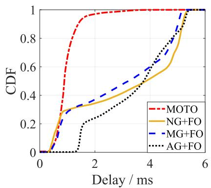

<details>
<summary>line</summary>

| Delay / ms | MOTO  | NG+FO | MG+FO | AG+FO |
| ---------- | ----- | ----- | ----- | ----- |
| 0          | 0.0   | 0.0   | 0.0   | 0.0   |
| 1          | 0.95  | 0.3   | 0.25  | 0.0   |
| 2          | 1.0   | 0.4   | 0.35  | 0.2   |
| 3          | 1.0   | 0.5   | 0.45  | 0.3   |
| 4          | 1.0   | 0.6   | 0.55  | 0.45  |
| 5          | 1.0   | 0.7   | 0.65  | 0.6   |
| 6          | 1.0   | 1.0   | 1.0   | 1.0   |
</details>

(b) CDFs of delay

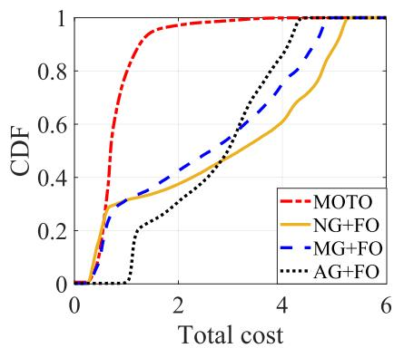

<details>
<summary>line</summary>

| Total cost | MOTO  | NG+FO | MG+FO | AG+FO |
| ---------- | ----- | ----- | ----- | ----- |
| 0          | 0.0   | 0.0   | 0.0   | 0.0   |
| 1          | 0.9   | 0.3   | 0.3   | 0.2   |
| 2          | 1.0   | 0.4   | 0.4   | 0.3   |
| 3          | 1.0   | 0.5   | 0.5   | 0.4   |
| 4          | 1.0   | 0.6   | 0.6   | 0.5   |
| 5          | 1.0   | 0.8   | 0.8   | 0.7   |
| 6          | 1.0   | 1.0   | 1.0   | 1.0   |
</details>

(c) CDFs of total cost   
Fig. 11. The overall system performance.

Then we evaluate the temporal performance of MOTO scheme, i.e., how it performs at different time periods. Fig. 12 shows the temporal box-plots of total cost, where four time periods (i.e., 8:00-11:00, 11:00-14:00, 14:00-17:00, 17:00-20:00) are considered. Under all temporal zones, MOTO can achieve a significantly better performance in terms of total cost. By observing the 25th, 50th, 75th, and 100th percentiles, the total costs of the benchmark schemes have large deviations. On the other hand, the performance of MOTO varies less than other schemes with different percentiles and with time evolving, demonstrating the stability and adaptiveness of MOTO. It is also worth noting that the gaps between the upper and lower quartile position of the four schemes are relatively large during 8:00-11:00 and 11:00-14:00. This is because the users’ mobility in these periods are much larger than that in 14:00-17:00 and 17:00-20:00.

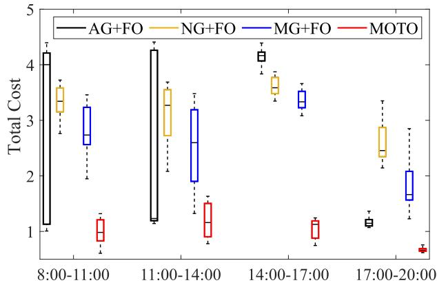

<details>
<summary>boxplot</summary>

| Time Range   | AG+FO | NG+FO | MG+FO | MOTO |
| ------------ | ----- | ----- | ----- | ---- |
| 8:00-11:00   | 4.3   | 3.5   | 3.2   | 1.2  |
| 11:00-14:00  | 4.3   | 3.5   | 3.2   | 1.5  |
| 14:00-17:00  | 4.2   | 3.7   | 3.5   | 1.2  |
| 17:00-20:00  | 1.2   | 2.8   | 2.0   | 0.6  |
</details>

Fig. 12. The total cost versus time.

Moreover, when observing the performance of benchmarks, the total cost box-plot gap of AG+FO scheme is particularly large. The reason is that AG+FO requires all users in the same server group, leading to increasing computation costs for all users when resources are insufficient. For NG +FO and MG+FO schemes, due to the large number of server groups, the user surge for some servers only affects a part of users, and thus the impact on the overall user computation cost is smaller compared to AG+FO.

# 6.3 Performance of LSTM-Based ToC Algorithm

In this subsection, we examine the performance of the LSTM-based algorithm for ToC sub-problem, considering that each MES independently provides services for MDs. We first evaluate the total cost of different task offloading schemes at different time periods, as shown in Fig. 13. We can observe that the proposed LSTM-based ToC algorithm can outperform other baselines with an obvious performance gap. Moreover, NO scheme achieves the highest cost and remains the same value at all time intervals since all tasks are computed locally. RO scheme allows mobile devices to randomly offload tasks, but its cost is still high. The reason is that the proportion of offloading tasks is low.

Then, we compare total cost with varying weight of delay $\alpha ,$ as shown in Fig. 14. Regardless of the a variation, the proposed LSTM-based ToC algorithm can outperform other baselines with an obvious performance gap. Moreover, the total costs decrease with the increasing value of a, as the delay cost is much larger than the energy cost. Furthermore, we plot the average total cost, delay cost, and energy cost by adopting different values of a in Fig. 15. We can observe that LSTM-based ToC algorithm can outperform all the benchmarks under the total cost and delay cost. For the energy cost, LSTM-based ToC algorithm achieves higher score than FO scheme when $\alpha = 0 . 9$ and approximately the same score when $\alpha = 0 . 1$ ¼. The reason is that FO scheme prefers to offload ¼as many tasks as possible to edge servers, which can reduce the energy cost of MDs. However, FO scheme can lead to overloading of edge servers and increase system delay, which can be verified in Fig. 15b. In addition, the standard deviation of NO scheme is almost 0 since all computation tasks are computed locally, which leads to the same computation costs for all MDs.

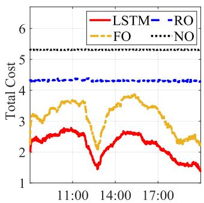

<details>
<summary>line</summary>

| Time   | LSTM | RO  | FO  | NO  |
|--------|------|-----|-----|-----|
| 11:00  | 2.5  | 4.5 | 3.5 | 5.2 |
| 14:00  | 1.5  | 4.5 | 3.8 | 5.2 |
| 17:00  | 1.2  | 4.5 | 2.5 | 5.2 |
</details>

Fig. 13. The offloading cost versus time.   
Authorized licensed use limited to: Guangxi University. Downloaded on May 30,2026 at 11:16:22 UTC from IEEE Xplore. Restrictions apply.

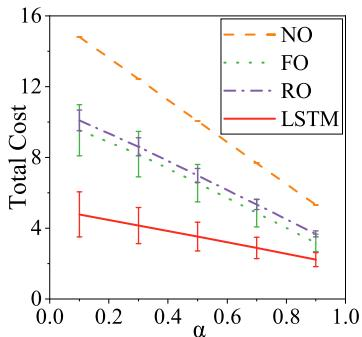

<details>
<summary>line</summary>

| α    | NO   | FO   | RO   | LSTM |
| ---- | ---- | ---- | ---- | ---- |
| 0.0  | 15.0 | 10.0 | 10.0 | 5.0  |
| 0.2  | 13.0 | 9.0  | 9.0  | 4.5  |
| 0.4  | 11.0 | 8.0  | 8.0  | 4.0  |
| 0.6  | 9.0  | 7.0  | 7.0  | 3.5  |
| 0.8  | 7.0  | 6.0  | 6.0  | 3.0  |
| 1.0  | 5.0  | 5.0  | 5.0  | 2.5  |
</details>

Fig. 14. Impact of different a on the total cost.

# 6.4 Performance of D3QN-Based SeG Algorithm

We then verify the performance of D3QN-based SeG algorithm. Note that for fairness, LSTM-based ToC algorithm is adopted for all benchmarks. We first plot the CDFs of total cost in Fig. 16a, and it can be seen that the proposed D3QNbased SeG algorithm can achieve the superior performance. Particularly, given the percentile of 80%, the costs of AG, MG, and NG reach about 1.7, 3, and 4.1, respectively, while the D3QN-based SeG algorithm only achieves a score of 0.9, reducing the total cost by 47%, 70%, and 78%, respectively. Fig. 16b shows the average performance of three metrics with error bars, and we have the following observations. For all metrics, D3QN-based SeG algorithm can significantly outperform other benchmarks. For instance, the average energy costs for D3QN-based SeG algorithm, NG, MG and AG are

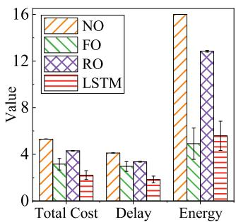

<details>
<summary>bar</summary>

| Category | NO  | FO  | RO  | LSTM |
| -------- | --- | --- | --- | ---- |
| Total Cost | 5   | 3   | 4   | 2    |
| Delay    | 4   | 3   | 3   | 2    |
| Energy   | 16  | 5   | 13  | 6    |
</details>

(a) $\alpha = 0 . 9$

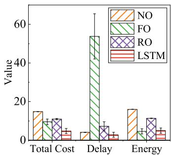

<details>
<summary>bar</summary>

| Category   | NO  | FO  | RO  | LSTM |
| ---------- | --- | --- | --- | ---- |
| Total Cost | 15  | 10  | 12  | 4    |
| Delay      | 4   | 55  | 8   | 3    |
| Energy     | 16  | 4   | 12  | 4    |
</details>

(b) $\alpha = 0 . 1$   
Fig. 15. Average performance of LSTM-based ToC algorithm.   
Authorized licensed use limited to: Guangxi University. Downloaded on May 30,2026 at 11:16:22 UTC from IEEE Xplore. Restrictions apply.

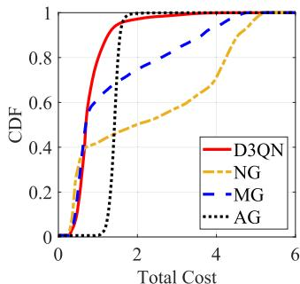

<details>
<summary>line</summary>

| Total Cost | D3QN CDF | NG CDF | MG CDF | AG CDF |
| ---------- | -------- | ------ | ------ | ------ |
| 0          | 0        | 0      | 0      | 0      |
| 1          | 0.95     | 0.4    | 0.6    | 0.0    |
| 2          | 1.0      | 0.5    | 0.7    | 0.95   |
| 3          | 1.0      | 0.6    | 0.8    | 1.0    |
| 4          | 1.0      | 0.7    | 0.9    | 1.0    |
| 5          | 1.0      | 0.8    | 0.95   | 1.0    |
| 6          | 1.0      | 0.9    | 1.0    | 1.0    |
</details>

(a)CDFs of total cost of server grouping schemes

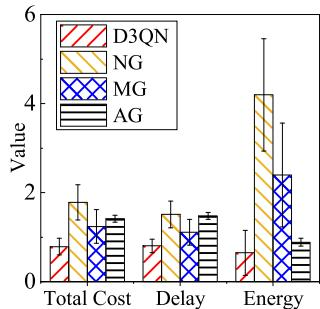

<details>
<summary>bar</summary>

| Category | D3QN | NG  | MG  | AG  |
| -------- | ---- | --- | --- | --- |
| Total Cost | 0.8  | 1.8 | 1.2 | 1.4 |
| Delay    | 0.8  | 1.5 | 1.1 | 1.4 |
| Energy   | 0.7  | 4.2 | 2.5 | 0.9 |
</details>

(b)Averageperformanceof server grouping schemes   
Fig. 16. Performance of D3QN-based SeG algorithm.

about 0.8, 4.2, 2.3, and 1 respectively. That means D3QNbased SeG algorithm reduces the energy cost by about 80.9%, 65.2%, and 25% compared with other benchmarks.

We next investigate the buffer size (number of tasks in MES buffer) of all MESs without (Red) and with (Blue) load balancing. As shown in Fig. 17, with grouping-based load balancing, the standard deviation of MES load becomes smaller, which shows the effectiveness of the load balancing algorithm. In addition, we can find that the average load of all MESs has increased after load balancing. This is because MESs can handle more tasks and their computing resources are more effectively utilized after load balancing.

# 6.5 Impact of a and s on System Performance

In this subsection, we investigate the impact of weight of delay a and the maximum load gap d on the performance of MOTO.

In Fig. 18a, we plot the average results of total cost, delay cost, and energy cost with varying weights of delay a, while fixing the maximum load gap d to 0.2. With increasing value of a, compared with the energy cost, the delay cost has a more predominant impact on the total cost. In this case, MOTO focuses more on minimizing the delay when making task offloading decisions. Therefore, the total cost and delay cost decrease and energy cost increases with a larger a. Specifically, when a increases from 0.1 to 0.3, the total cost and delay cost can decrease from 4.7 and 2.9 to 4.1 and 1.9, respectively.

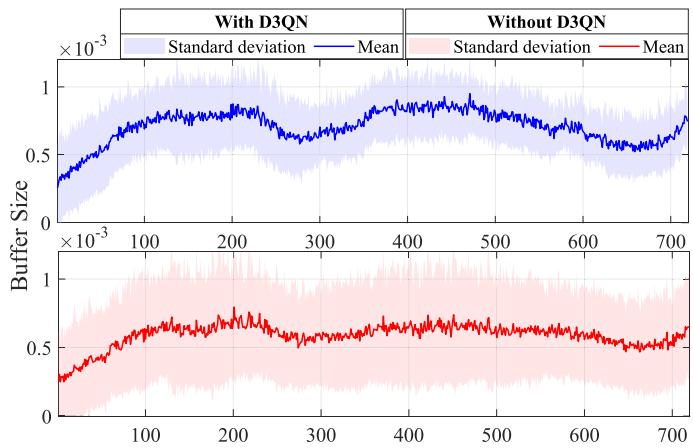

<details>
<summary>line</summary>

| X Value | With D3QN Mean | With D3QN Standard deviation | Without D3QN Mean | Without D3QN Standard deviation |
|---------|----------------|------------------------------|-------------------|--------------------------------|
| 0       | ~0.001         | ~0.001                       | ~0.001            | ~0.001                         |
| 100     | ~0.008         | ~0.007                       | ~0.006            | ~0.005                         |
| 200     | ~0.009         | ~0.008                       | ~0.007            | ~0.006                         |
| 300     | ~0.007         | ~0.006                       | ~0.006            | ~0.005                         |
| 400     | ~0.009         | ~0.007                       | ~0.007            | ~0.006                         |
| 500     | ~0.008         | ~0.006                       | ~0.006            | ~0.005                         |
| 600     | ~0.007         | ~0.005                       | ~0.005            | ~0.004                         |
| 700     | ~0.008         | ~0.006                       | ~0.006            | ~0.005                         |
</details>

Fig. 17. Mean and standard deviation of MESs buffer size with and without load balancing.

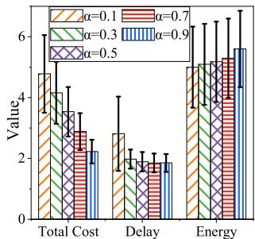

<details>
<summary>bar</summary>

| Category | α=0.1 | α=0.3 | α=0.5 | α=0.7 | α=0.9 |
|---|---|---|---|---|---|
| Total Cost | 4.8 | 4.2 | 3.6 | 3.2 | 2.4 |
| Delay | 2.9 | 1.8 | 1.7 | 1.6 | 1.6 |
| Energy | 5.0 | 5.2 | 5.4 | 5.4 | 5.6 |
</details>

(a) Impact of weight of delay α

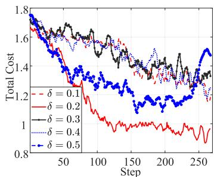

<details>
<summary>line</summary>

| Step | δ = 0.1 | δ = 0.2 | δ = 0.3 | δ = 0.4 | δ = 0.5 |
|------|---------|---------|---------|---------|---------|
| 0    | 1.8     | 1.8     | 1.8     | 1.8     | 1.8     |
| 50   | 1.4     | 1.3     | 1.6     | 1.5     | 1.4     |
| 100  | 1.3     | 1.2     | 1.5     | 1.4     | 1.3     |
| 150  | 1.2     | 1.1     | 1.4     | 1.3     | 1.2     |
| 200  | 1.1     | 1.0     | 1.3     | 1.2     | 1.1     |
| 250  | 1.0     | 0.9     | 1.2     | 1.1     | 1.0     |
| 300  | 0.9     | 0.8     | 1.1     | 1.0     | 0.9     |
</details>

(b) Impact of maximum load gap δ   
Fig. 18. Average performance of MOTO.

As shown in Fig. 18b, we plot the convergence curves of total cost with different values of d, while fixing the weight of delay to 0.9. All curves are smoothed for clear results. We have the following two major observations. First, MOTO can achieve the best convergence performance when the d  0:2. ¼Second, although MOTO also converges fast when d  0:5, ¼the curve increases again in the last several training steps. The reason is that a larger value of d indicates a higher load gap tolerance. In this case, although the algorithm can find the load balancing point easily, it cannot guarantee that the system is stable in the balanced state, thus resulting in some fluctuation.

# 7 RELATED WORK

We review the related works in two categories, i.e., mobile task offloading and load balancing in MEC.

# 7.1 Mobile Task Offloading in MEC

To achieve efficient task computation in MEC, mobile task offloading has attracted much research attention recently [9], [11], [12], [14], [15], [16], [17], [24], [39], [40], [41]. For example, Yang et al. [14] considered the interaction of the interests between small cells and mobile devices. They proposed a distributed computation offloading method in a multi-server and multi-device system. To minimize the total energy consumption of user equipment subject to minimum overall throughput of the hierarchical small cell mobileedge network, the authors of [15] proposed an alternating direction method of multipliers (ADMM)-based distributed offloading algorithm. Huang et al. [16] focused on joint optimization of computation offloading and interference coordination for small-cell MEC. Thus, they proposed a distributed DRL scheme with the objective of minimizing the overall energy consumption while ensuring the latency requirements. Yang et al. [17] devised a multi-task learning approach to solve the computation offloading problems in a multi-access edge computing network. Tang et al. [24] designed a model-free DRL-based distributed algorithm, which can determine the offloading decision without knowing the task models and offloading decision of other devices. Zhou et al. [41] studied the task offloading strategies for computing task selection to maximize effective rewards in uncertain and stochastic 5G small cell networks. Some recent works focused on joint task offloading and resource allocation in MEC [10], [13], [18], [27], [28], [29], [30]. Specifically, Hu et al. [10] studied the computing offloading and resource allocation problems in a MEC-enabled IoT network that supports both mobility and energy harvesting. Jiang et al. [27] proposed an online joint offloading and resource allocation framework under the long-term MEC energy constraint to guarantee the end-user quality of experience. The authors of [30] proposed a utility-based approach to maximize users’ quality of experience through jointly optimizing service selection, computation resource allocation, and task offloading decisions. Although these research works proposed effective mobile task offloading methods in MEC, the consideration of user mobility issues and load balancing is still lacking in those MEC offloading strategies. Different from the previous works, in this paper, we design a mobility-aware online task offloading control strategy in a more practical scenario with the consideration of load balancing in the small-cell MEC system.

# 7.2 Load Balancing in MEC

Load balancing in MEC refers to efficiently distributing mobile computation tasks across a set of edge servers [18], [19], [20], [21], [22], [23], [25], [26]. This technique can avoid unevenly overloading and idle conditions among edge servers and achieve overall computation balance. For example, Li et al. [18] studied an optimization problem to minimize the weighted sum of the total delay and energy consumption of all MDs in the MEC network, which considered multi-dimensional optimization on offloading strategy making, load balancing, computation resource allocation and transmit power control. In [19], the authors proposed a distributed coalition-based algorithm and an incentive algorithm based on DRL, solving the load balance problem in the vehicle-to-vehicle computation offloading problem. To fulfill the communication balancing requirements from IoT networks and the computation balancing requirements from edge servers, Liu et al. [20] proposed a dynamic clustering solution using the DRL-based approach. The authors of [21] proposed a mobility load balancing algorithm for small cell networks by adapting network load status and considering load estimation. Zhang et al. [25] studied parallel offloading and load balancing with multiple cooperative MEC servers and massive delay-sensitive execution workloads. The authors proposed a Lyapunov-based centralized cost management algorithm to maximize the computation efficiency by load balancing. Yang et al. [26] and Wu et al. [42] focused on UAV-enabled MEC. To achieve load balancing and optimal UAV caching for UAVs, the authors developed a deep learning-based algorithm for task scheduling and real-time decision-making. Despite the extensive work, the uneven spatio-temporal load issue and adaptive load balancing in small-cell MEC have not been well studied, thus limiting the system’s performance. In this paper, we design a joint task offloading control and load balancing framework to achieve better service provisioning and resource utilization in small-cell MEC.

# 8 CONCLUSION AND FUTURE WORK

In this paper, we have investigated mobility-aware online task offloading with adaptive load balancing in a small-cell MEC system. As the formulated TOO problem is intractable directly without knowing the dynamics of mobile users and the computation loads distribution on edge servers, we have proposed MOTO to jointly optimize the task offloading and MES grouping in an online manner. Specifically, we firstpredict the task arrival rates and derive the offloading probabilities based on the LSTM-based approach. Then, a D3QN-based MES grouping approach is devised to achieve load balancing. With the proposed MOTO scheme, the spatially and temporally uneven user demands can be effectively managed and utilized for resource-efficient task computation, which can further provide valuable insights on service provisioning in mobile networks. Besides, the problem formulation and optimization process in this work can provide a theoretical basis for future studies related to task offloading in small-cell MEC systems. For future work, we will integrate digital twin techniques to better characterize user dynamics and optimize the deep learning model to further improve the user behavior prediction to facilitate adaptive computing offloading.

# REFERENCES

[1] F. Lyu et al., “Mobility-aware computation offloading with adaptive load balancing in small-cell MEC,” in Proc. IEEE Int. Conf. Commun., 2022, pp. 4330–4335.   
[2] L. Zhong et al., “A multi-user cost-efficient crowd-assisted VR content delivery solution in 5G-and-beyond heterogeneous networks,” IEEE Trans. Mobile Comput., early access, Mar. 24, 2022, doi: 10.1109/TMC.2022.3162147.   
[3] J. Lin, P. Yang, N. Zhang, F. Lyu, X. Chen, and L. Yu, “Lowlatency edge video analytics for on-road perception of autonomous ground vehicles,” IEEE Trans. Ind. Informat., early access, Jun. 13, 2022, doi: 10.1109/TII.2022.3181986.   
[4] F. Lyu et al., “Characterizing urban vehicle-to-vehicle communications for reliable safety applications,” IEEE Trans. Intell. Transp. Syst., vol. 21, no. 6, pp. 2586–2602, Jun. 2020.   
[5] Y. Ma, W. Liang, J. Li, X. Jia, and S. Guo, “Mobility-aware and delaysensitive service provisioning in mobile edge-cloud networks,” IEEE Trans. Mobile Comput., vol. 21, no. 1, pp. 196–210, Jan. 2022.   
[6] W. Zhuang, Q. Ye, F. Lyu, N. Cheng, and J. Ren, “SDN/NFVempowered future IoV with enhanced communication, computing, and caching,” Proc. IEEE, vol. 108, no. 2, pp. 274–291, Feb. 2020.   
[7] H. Wu, J. Chen, C. Zhou, J. Li, and X. Shen, “Learning-based joint resource slicing and scheduling in space-terrestrial integrated vehicular networks,” J. Commun. Inf. Netw., vol. 6, no. 3, pp. 208–223, 2021.   
[8] L. Chen, C. Shen, P. Zhou, and J. Xu, “Collaborative service placement for edge computing in dense small cell networks,” IEEE Trans. Mobile Comput., vol. 20, no. 2, pp. 377–390, Feb. 2021.   
[9] S. Thananjeyan, C. A. Chan, E. Wong, and A. Nirmalathas, “Mobility-aware energy optimization in hosts selection for computation offloading in multi-access edge computing,” IEEE Open J. Commun. Soc., vol. 1, pp. 1056–1065, 2020.   
[10] H. Hu, Q. Wang, R. Q. Hu, and H. Zhu, “Mobility-aware offloading and resource allocation in a MEC-enabled IoT network with energy harvesting,” IEEE Internet Things J., vol. 8, no. 24, pp. 17 541–17 556, Dec. 2021.   
[11] Z. Jing, Q. Yang, Y. Wu, M. Qin, K. S. Kwak, and X. Wang, “Adaptive cooperative task offloading for energy-efficient small cell MEC networks,” in Proc. IEEE Wirel. Commun. Netw. Conf., 2022, pp. 292–297.   
[12] P. Dai, K. Hu, X. Wu, H. Xing, and Z. Yu, “Asynchronous deep reinforcement learning for data-driven task offloading in MECempowered vehicular networks,” in Proc. IEEE Conf. Comput. Commun., 2021, pp. 1–10.   
[13] Y. Qian, J. Xu, S. Zhu, W. Xu, L. Fan, and G. K. Karagiannidis, “Learning to optimize resource assignment for task offloading in mobile edge computing,” IEEE Commun. Lett., vol. 26, no. 6, pp. 1303–1307, Jun. 2022.   
[14] L. Yang, H. Zhang, X. Li, H. Ji, and V. C. Leung, “A distributed computation offloading strategy in small-cell networks integrated with mobile edge computing,” IEEE/ACM Trans. Netw., vol. 26, no. 6, pp. 2762–2773, Dec. 2018.   
[15] L. Yang, S. Guo, L. Yi, Q. Wang, and Y. Yang, “NOSCM: A novel offloading strategy for NOMA-enabled hierarchical small cell mobile-edge computing,” IEEE Internet Things J., vol. 8, no. 10, pp. 8107–8118, May 2021.

[16] X. Huang, S. Leng, S. Maharjan, and Y. Zhang, “Multi-agent deep reinforcement learning for computation offloading and interference coordination in small cell networks,” IEEE Trans. Veh. Technol, vol. 70, no. 9, pp. 9282–9293, Sep. 2021.   
[17] B. Yang, X. Cao, J. Bassey, X. Li, and L. Qian, “Computation offloading in multi-access edge computing: A multi-task learning approach,” IEEE Trans. Mobile Comput., vol. 20, no. 9, pp. 2745–2762, Sep. 2021.   
[18] S. Li, J. Du, D. Zhai, X. Chu, and F. R. Yu, “Task offloading, load balancing, and resource allocation in MEC networks,” IET Commun., vol. 14, no. 9, pp. 1451–1458, 2020.   
[19] Y. Wu, J. Wu, L. Chen, J. Yan, and Y. Han, “Load balance guaranteed vehicle-to-vehicle computation offloading for min-max fairness in VANETs,” IEEE Trans. Intell. Transp. Syst., vol. 23, no. 8, pp. 11 994–12 013, Aug. 2022.   
[20] Q. Liu, T. Xia, L. Cheng, M. Van Eijk, T. Ozcelebi, and Y. Mao, “Deep reinforcement learning for load-balancing aware network control in IoT edge systems,” IEEE Trans. Parallel Distrib. Syst., vol. 33, no. 6, pp. 1491–1502, Jun. 2022.   
[21] M. M. Hasan, S. Kwon, and J.-H. Na, “Adaptive mobility load balancing algorithm for LTE small-cell networks,” IEEE Trans. Wireless Commun., vol. 17, no. 4, pp. 2205–2217, Apr. 2018.   
[22] J. Hu, H. Zhang, Y. Liu, X. Li, and H. Ji, “An intelligent UAV deployment scheme for load balance in small cell networks using machine learning,” in Proc. IEEE Wirel. Commun. Netw. Conf., 2019, pp. 1–6.   
[23] M. Javad-Kalbasi and S. Valaee, “Energy and spectrum efficient user association for backhaul load balancing in small cell networks,” in Proc. IEEE Glob. Commun. Conf., 2020, pp. 1–6.   
[24] M. Tang and V. W. Wong, “Deep reinforcement learning for task offloading in mobile edge computing systems,” IEEE Trans. Mobile Comput., vol. 21, no. 6, pp. 1985–1997, Jun. 2022.   
[25] W. Zhang, G. Zhang, and S. Mao, “Joint parallel offloading and load balancing for cooperative-MEC system with delay constraints,” IEEE Trans. Veh. Technol, vol. 71, no. 4, pp. 4249–4263, Apr. 2022.   
[26] L. Yang, H. Yao, J. Wang, C. Jiang, A. Benslimane, and Y. Liu, “Multi-UAV-enabled load-balance mobile-edge computing for IoT networks,” IEEE Internet Things J., vol. 7, no. 8, pp. 6898–6908, Aug. 2020.   
[27] H. Jiang, X. Dai, Z. Xiao, and A. K. Iyengar, “Joint task offloading and resource allocation for energy-constrained mobile edge computing,” IEEE Trans. Mobile Comput., early access, Feb. 11, 2022, doi: 10.1109/TMC.2022.3150432.   
[28] L. Tan, Z. Kuang, L. Zhao, and A. Liu, “Energy-efficient joint task offloading and resource allocation in OFDMA-based collaborative edge computing,” IEEE Trans. Wireless Commun., vol. 21, no. 3, pp. 1960–1972, Mar. 2022.   
[29] H. Yuan and M. Zhou, “Profit-maximized collaborative computation offloading and resource allocation in distributed cloud and edge computing systems,” IEEE Trans. Autom. Sci. Eng., vol. 18, no. 3, pp. 1277–1287, Jul. 2021.   
[30] W. Chu, P. Yu, Z. Yu, J. C. Lui, and Y. Lin, “Online optimal service selection, resource allocation and task offloading for multi-access edge computing: A utility-based approach,” IEEE Trans. Mobile Comput., early access, Feb. 18, 2022, doi: 10.1109/TMC.2022.3152493.   
[31] S. Burer and A. N. Letchford, “Non-convex mixed-integer nonlinear programming: A survey,” Surv. Operations Res. Manage. Sci., vol. 17, no. 2, pp. 97–106, 2012.   
[32] P. Belotti, J. Lee, L. Liberti, F. Margot, and A. W€achter, “Branching and bounds tightening techniques for non-convex MINLP,” Optim. Methods Softw., vol. 24, no. 4-5, pp. 597–634, 2009.   
[33] K. Tammer, “The application of parametric optimization and imbedding to the foundation and realization of a generalized primal decomposition approach,” Math. Res., vol. 35, pp. 376–386, 1987.   
[34] W. Wei, H. Gu, and B. Li, “Congestion control: A renaissance with machine learning,” IEEE Netw., vol. 35, no. 4, pp. 262–269, Jul./ Aug. 2021.   
[35] S. Duan et al., “Multitype highway mobility analytics for efficient learning model design: A case of station traffic prediction,” IEEE Trans. Intell. Transp. Syst., vol. 23, no. 10, pp. 19 484–19 496, Oct. 2022.   
[36] J. J. Mor-e and D. C. Sorensen, “Newton’s method,” Argonne National Lab., IL USA, Tech. Rep. ANL-82-8, 1982.   
[37] H. Van Hasselt, A. Guez, and D. Silver, “Deep reinforcement learning with double Q-learning,” in Proc. AAAI Conf. Artif. Intell., 2016, pp. 2094–2100.

[38] Z. Wang, T. Schaul, M. Hessel, H. Hasselt, M. Lanctot, and N. Freitas, “Dueling network architectures for deep reinforcement learning,” in Proc. Int. Conf. Mach. Learn., 2016, pp. 1995–2003.   
[39] S. Yue et al., “TODG: Distributed task offloading with delay guarantees for edge computing,” IEEE Trans. Parallel Distrib. Syst., vol. 33, no. 7, pp. 1650–1665, Jul. 2022.   
[40] J. Liu, J. Ren, Y. Zhang, X. Peng, Y. Zhang, and Y. Yang, “Efficient dependent task offloading for multiple applications in MEC-cloud system,” IEEE Trans. Mobile Comput., early access, Oct. 11, 2021, doi: 10.1109/TMC.2021.3119200.   
[41] R. Zhou et al., “Online task offloading for 5G small cell networks,” IEEE Trans. Mobile Comput., vol. 21, no. 6, pp. 2103–2115, Jun. 2022.   
[42] H. Wu, F. Lyu, C. Zhou, J. Chen, L. Wang, and X. Shen, “Optimal UAV caching and trajectory in aerial-assisted vehicular networks: A learning-based approach,” IEEE J. Sel. Areas Commun., vol. 38, no. 12, pp. 2783–2797, Dec. 2020.


<details>
<summary>natural_image</summary>

Portrait of a person with short hair and necklace (no text or symbols visible)
</details>

Sijing Duan (Student Member, IEEE) is currently working toward the PhD degree with the School of Computer Science and Engineering, Central South University, Changsha, China. Her research interests include Internet-of-Things, mobile edge computing, data mining, and data-driven application design.


<details>
<summary>natural_image</summary>

Portrait photo of a man in a white shirt (no text or symbols visible)
</details>

Feng Lyu (Senior Member, IEEE) received the BS degree in software engineering from Central South University, Changsha, China, in 2013 and the PhD degree from the Department of Computer Science and Engineering, Shanghai Jiao Tong University, Shanghai, China, in 2018. During respective Sept. 2018-Dec. 2019 and Oct. 2016-Oct. 2017, he worked as a postdoctoral fellow and was a visiting PhD student in BBCR Group, Department of Electrical and Computer Engineering, University of Waterloo, Canada. He

is currently a professor with the School of Computer Science and Engineering, Central South University, Changsha, China. His research interests include vehicular networks, beyond 5G networks, Big Data measurement and application design, and edge computing. He is the recipient of the Best Paper Award of IEEE ICC 2019. He currently serves as associate editor for IEEE Systems Journal and leading guest editor for Peer-to-Peer Networking and Applications, and served as TPC members for many international conferences. He is a member of Communication Society, and Vehicular Technology Society.


<details>
<summary>natural_image</summary>

Portrait of a smiling woman with long dark hair, wearing a collared shirt (no text or symbols visible)
</details>

Huaqing Wu (Member, IEEE) received the BE and ME degrees from the Beijing University of Posts and Telecommunications, Beijing, China, in 2014 and 2017, respectively, and the PhD degree from the University of Waterloo, Ontario, Canada, in 2021. She received the prestigious Natural Sciences and Engineering Research Council of Canada (NSERC) Postdoctoral Fellowship Award in 2021 and worked as a postdoctoral fellow with the Department of Electrical and Computer Engineering, MacMaster University, from 2021 to

2022. She is currently an assistant professor with the Department of Electrical and Software Engineering, University of Calgary, Alberta, Canada. Her current research interests include B5G/6G, space-air-ground integrated networks, Internet of vehicles, edge computing/caching, and artificial intelligence (AI) for future networking. She received the Best Paper Award for IEEE GLOBECOM 2018 and Chinese Journal on Internet of Things 2020.


<details>
<summary>natural_image</summary>

Portrait photo of a man in a collared shirt (no text or symbols visible)
</details>

Wenxiong Chen (Member, IEEE) received the BS degree in communication engineering and the MS degree in translation from Hunan Normal University, Changsha, China, in 2007 and 2011, respectively, and the PhD degree in management science and engineering from Central South University, Changsha, China, in 2021. He is currently an Associate Researcher with the Research Institute of Languages and Cultures, and associate professor with the College of Information Science and Engineering, Hunan Normal University. His   
research interests include information management, Big Data measurement and application design.


<details>
<summary>natural_image</summary>

Portrait photo of a woman with long dark hair wearing a collared shirt and bow tie (no text or symbols visible)
</details>

Huali Lu (Student Member, IEEE) received the MS degree from the College of Computer Science and Electronic Engineering from Hunan University, Changsha, China, in 2020. She is currently working toward the PhD degree with the School of Computer Science and Engineering, Central South University, Changsha, China. Her researches mainly focus on spatial-temporal data mining, compact data collection, and trajectory similarity computing.


<details>
<summary>natural_image</summary>

Portrait photo of a young man (no text or symbols visible)
</details>

Zhe Dong (Student Member, IEEE) received the BSc from the School of Computer Science and Technology, Hainan University, Hainan, China, in 2019 and the MSc degree from the School of Computer Science and Engineering, Central South University, Changsha, China, in 2022. His research interests include edge computing, reinforcement learning, and wireless communication.


<details>
<summary>natural_image</summary>

Portrait of a man in a white shirt (no text or symbols visible)
</details>

Xuemin Shen (Fellow, IEEE) received the PhD degree in electrical engineering from Rutgers University, New Brunswick, NJ, USA, in 1990. He is a University professor with the Department of Electrical and Computer Engineering, University of Waterloo, Canada. His research focuses on network resource management, wireless network security, Internet of Things, 5G and beyond, and vehicular networks. He is a registered professional engineer of Ontario, Canada, an Engineering Institute of Canada fellow, a Canadian Academy of

Engineering fellow, a Royal Society of Canada fellow, a Chinese Academy of Engineering foreign member, and a distinguished lecturer of the IEEE Vehicular Technology Society and Communications Society. He received the Canadian Award for Telecommunications Research from the Canadian Society of Information Theory (CSIT) in 2021, the R.A. Fessenden Award in 2019 from IEEE, Canada, Award of Merit from the Federation of Chinese Canadian Professionals (Ontario) in 2019, James Evans Avant Garde Award in 2018 from the IEEE Vehicular Technology Society, Joseph LoCicero Award in 2015 and Education Award in 2017 from the IEEE Communications Society (ComSoc), and Technical Recognition Award from Wireless Communications Technical Committee (2019) and AHSN Technical Committee (2013). He has also received the Excellent Graduate Supervision Award in 2006 from the University of Waterloo and the Premier’s Research Excellence Award (PREA) in 2003 from the Province of Ontario, Canada. He served as the technical program committee Cchair/co-chair for IEEE GLOBECOM’16, IEEE INFOCOM’14, IEEE VTC’10 Fall, IEEE GLOBECOM’07, and the chair for the IEEE ComSoc Technical Committee on Wireless Communications. He is the president Elect of the IEEE Com-Soc. He was the vice president for Technical & Educational Activities, vice president for Publications, member-at-large on the Board of Governors, chair of the distinguished lecturer Selection Committee, and member of Selection Committee of the ComSoc. He served as the editor-in-chief for IEEE IoT Journal, IEEE Network, and IET Communications.

" For more information on this or any other computing topic, please visit our Digital Library at www.computer.org/csdl.