# Maritime-Oriented Network Slicing in O-RAN Integrated Aerial-Terrestrial Networks

Sahar Ammar , Student Member, IEEE, Wiem Abderrahim , Member, IEEE, and Basem Shihada , Senior Member, IEEE

Abstract—The deployment of reliable maritime communication systems integrated with terrestrial networks is challenging due to the large maritime regions, the difficulty of deploying conventional base stations at sea, and the heterogeneity of proprietary equipment. In this paper, we propose an AI-based network slicing framework for Open Radio Access Network (O-RAN) integrated aerialterrestrial maritime networks that incorporates non-tethered and tethered unmanned aerial vehicles (UAVs) and marine buoys. The network provides ubiquitous connectivity while addressing diverse maritime user requirements. Specifically, we leverage network slicing to accommodate the needs of two distinct slices: the maritime infotainment slice, which demands high data rates, and the maritime emergency communication slice, which requires high-reliability and low-latency. Moreover, we adopt virtualization principles to enable flexible deployment approaches for virtualized network functions (VNFs), that can be dynamically scaled and/or migrated across virtualized network nodes. Then, we design a network slicing framework based on a Deep Reinforcement Learning (DRL) that takes into account the characteristics of the maritime environment, and present two algorithms using Advantage Actor-Critic (A2C) and Proximal Policy Optimization (PPO). Our findings highlight the importance of the integration of aerial and terrestrial networks with network slicing to enhance the energy efficiency of maritime communications while meeting diverse Quality of Service (QoS) requirements.

Index Terms—Maritime communication, Open-RAN, integrated aerial-terrestrial network, maritime emergency and rescue, network slicing, deep reinforcement learning (DRL).

## I. INTRODUCTION

M ARITIME activities have expanded over the last fewdecades beyond traditional fishing and maritime trans- decades beyond traditional fishing and maritime transportation to include ocean exploration and climate change research. This created a global marine market size worth 4,420.7 million USD in 2022 and expected to surpass 10,000 million USD in 2033 [1]. These activities require enhanced maritime communications systems that provide ubiquitous connectivity and satisfy the various demands of the passengers, fishermen, and devices on remote ships. More critically, ships and underwater rescue operations require more reliable communication. In fact, statistics reveal that an average of 17 accidents per 100 marine vessels occurred worldwide between 2012 and 2017 [2]. However, establishing such systems remains a challenge that requires further research. This is due to the low user density, the vast ocean areas that should be covered and the difficulty of de ploying typical base stations (BSs) in the seas [3]. Conventional maritime communication technologies are based on on-shore BSs providing basic services including text messaging and voice calling. Additionally, satellite-based solutions were used to expand the coverage in the sea [4]. However, they suffer from large propagation distances and restricted on-board resources leading to significant delays and limited data rates. Moreover, international regulations are required to manage the different demands and distribute the licenses; which might delay the deployment and yield political complications [3]. Also, maritime users particularly in fishing villages and small islands cannot afford the use of satellite-based systems. This is due to their high costs and large antennas which cannot be installed on fishing and small boats. Therefore, researchers are dedicating their efforts to develop comprehensive 6G communication systems that extend and complement the terrestrial networks. Specifically, integrated aerial-terrestrial networks have emerged as a promising solution to endorse the coverage and service scope of terrestrial networks. In fact, unmanned aerial vehicles (UAVs) can expand the near shore coverage, by acting as relaying units to connect marine vessels and on-land BSs. Thanks to their cost-efficiency, simple and flexible deployment, UAVs are suitable to ensure seamless connectivity in the near-shore region. The use of these aerial platforms, including tethered and non-tethered UAVs, have been explored in [5], [6], [7], [8] to extend the coverage of terrestrial networks and enhance maritime connectivity. Nonetheless, such integrated networks are usually heterogeneous and rely on proprietary equipment. This limits their flexibility and adaptability to different Quality of Service (QoS) demands, which is required to support diversified maritime use cases. For instance, marine passenger infotainment users need a high data rate connectivity, while maritime emergency communication necessitates low latency.

To overcome these inherent challenges of maritime communication, we propose an intelligent network slicing framework built on an integrated aerial-terrestrial maritime network architecture. Incorporating non-tethered UAVs, tethered UAVs, and marine buoys, the proposed architecture offers ubiquitous connectivity and satisfies the requirements of various maritime users. Additionally, we introduce Open Radio Access Network (O-RAN) concepts in the integrated maritime network to offer openness, intelligence and interoperability. The O-RAN architecture is mainly based on virtualized RAN with disaggregated components and AI-powered controllers [9], [10], [11]. Specifically, the RAN virtualization through Network Function Virtualization (NFV) can be exploited to improve network programmability, flexibility, and agility. Additionally, to enable multi-vendor deployments, O-RAN promotes the disaggregation of RAN functions into Centralized Unit (CU), Distributed Unit (DU), and Radio Unit (RU) as well as the use of open interfaces and white-box hardware. To efficiently manage the network, O-RAN architecture introduces the RAN Intelligent Controller (RIC) based on software-defined networking (SDN) principles [10]. RIC is responsible for network management, RAN automation, and resource orchestration through the integration of AI technologies. These O-RAN features enable the deployment of the proposed intelligent network slicing framework via the creation of optimized network slices that ensure the coexistence of maritime applications with different QoS requirements. In fact, the O-RAN virtualization supports the flexible deployment of VNFs through scaling and migration in network nodes, while the O-RAN open interfaces facilitate data collection for the training and inference of the proposed DRL-based RAN slicing and VNF deployment algorithms.

## A. Related Works

In this section, we discuss the existing related works on network slicing in maritime networks and integrated aerialterrestrial networks. We focus on relevant studies tackling the problems of RAN slicing and virtualized network function (VNF) deployment, particularly VNF scaling and migration.

1) Network Slicing in Maritime Networks: The literature on network slicing in maritime networks is limited with a handful of studies focusing mainly on the design of SDN/NFV-enabled architectures as technology enablers of slicing. Specifically, SDN/NFV-based architectures are proposed for Internet of Things-based maritime transport applications and underwater networks in [16] and [17]. In addition, an SDN-enabled integrated maritime network is designed in [18] to optimize QoS requirements by leveraging a resource scheduling strategy based on deep Q-network. In [19], an SDN-based architecture for underwater acoustic networks is developed with network slicing to improve routing and resource allocation. Moreover, the authors of [20] propose a software-defined maritime fog computing architecture to provide communication and computing services. Despite such efforts, several challenges associated with the use of slicing in maritime networks, including RAN slicing, VNF deployment, and slice management, remain unexplored.

2) RAN Slicing and VNF Deployment in Integrated Aerial-Terrestrial Networks: The problems of RAN slicing and VNF deployment in terrestrial networks are extensively exam ined [12], [13]. For instance, a heuristic VNF migration algorithm is proposed in [21] for system cost minimization. Additionally, the authors of [22] develop a VNF scaling scheme based on deep reinforcement learning (DRL) to optimize the latency, service acceptance rate and deployment cost. Meanwhile, other studies jointly investigating RAN slicing and VNF deployment are reported in [23], [24]. In particular, VNF placement, CPU allocation, and traffic routing are jointly considered in [23] to support vertical applications. Using heuristics and convex optimization techniques, the authors the formulated problem of delay minimization. Moreover, in [24], a VNF embedding and RAN slicing strategy is designed to maximize the number of mapped VNFs, utilizing heuristic algorithms. However, these solutions, tailored for terrestrial networks, are not suitable for integrated aerial-terrestrial networks, primarily due to their unique characteristics. In particular, the high mobility of UAVs, constrained onboard resources, and limited power supplies, introduce rapid environment dynamics and additional constraints. This increases the complexity of the RAN slicing and VNF deployment problems in integrated networks, rendering con ventional methods inefficient and intractable, and necessitating more intelligent and adaptive approaches. That is why several efforts have been dedicated to tackle these challenges [15]. For instance, dynamic RAN slicing is optimized jointly with UAV positioning in [25] and [26] for improved performance. The authors of [25] target resource consumption minimization using a clique-based algorithm, while the authors of [26] develop a DRL-based method to tackle the formulated multi-objective optimization. Meanwhile, VNF deployment is considered in [27], [28], [29] for integrated networks. In particular, a hierarchical DRL-based scheme is proposed to jointly minimize the average delay and maximize the energy efficiency through VNF placement, scheduling and migration with UAV trajectory optimiza tion [28]. Moreover, the joint RAN slicing and VNF deployment is examined in [30] for integrated aerial-terrestrial networks the authors design an iterative algorithm that maximizes the computing resource utilization efficiency to support the three 5G slices. Despite these contributions, further investigations are required to develop intelligent, adaptive, and energy-efficient approaches capable of coping with the features of integrated networks.

To address these research gaps, our work investigates the joint RAN slicing and VNF deployment in integrated aerial-terrestrial maritime networks. Specifically, we consider the characteristics of maritime integrated networks such as the low user density and the clustered distribution, high mobility of UAVs, and their limited resources. Additionally, we focus on energy-efficiency maximization, a critical aspect of such networks, and we take into account the distinct QoS requirements, in terms of throughput, delay and reliability, of each network slice. We highlight that the concurrent satisfaction of these heterogeneous requirements is necessary, presenting significant challenges.

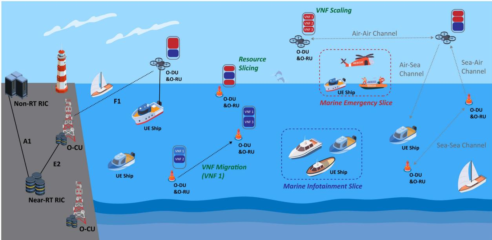  
Fig. 1. Illustration of the O-RAN Integrated Maritime Network Architecture.

## B. Main Contributions

In this work, we propose an intelligent network slicing framework for integrated aerial-terrestrial maritime networks. Leveraging O-RAN principles, the proposed architecture offers ubiquitous connectivity and satisfies various maritime user demands. We exploit the concept of RAN virtualization to dynamically deploy network functions in virtualized network elements, specifically UAVs, tethered UAVs and marine buoys. The VNFs can be scaled and/or migrated in these virtualized nodes, featuring different hardware characteristics and energy constraints. In addition, we adopt RAN slicing to serve the desired requirements of two slices. Specifically, we focus on serving the maritime infotainment slice with high data rates needs and the maritime emergency communication slice; which requires high reliability and low delays. In particular, we employ resource slicing to properly allocate the computing and communication resources to serve the two maritime slices. The main contributions of this paper can be summarized as follows:

\- We design a network slicing framework for integrated aerial-terrestrial networks, that takes into account the characteristics and requirements of maritime users.

\- We leverage RAN virtualization, a key concept of the O-RAN architecture, to flexibly deploy VNFs through scaling and migration in network nodes that offer different resource and energy constraints.

\- We use RAN slicing to properly allocate the resources to serve two types of slices namely the high data rate connectivity slice for marine passenger infotainment, and the high reliability emergency communication slice for ships rescue. We perform inter-slice and intra-slice resource management where the computing resources are allocated to each slice (inter-slice allocation) and the communication resources are allocated to each user belonging to each slice (intra-slice allocation).

\- We formulate the joint RAN slicing and VNF deployment with UAV trajectory optimization problem to improve the performance of the integrated network. We maximize the overall energy efficiency, which is a key aspect in these networks, and meet the requirements of the slices in terms of data rates, reliability and delay.

We propose a Deep Reinforcement Learning-based Maritime Network Slicing Framework to tackle the formulated problem exploiting the characteristics of the maritime environment and using two policy gradient algorithms, namely Advantage Actor-Critic (A2C) and Proximal Policy Optimization (PPO).

## II. SYSTEM MODEL

The proposed integrated aerial-terrestrial maritime network is illustrated in Fig. 1. The architecture is composed of tethered and non-tethered UAVs as well as marine buoys that act as RAN nodes where different VNFs can be deployed. These nodes provide connectivity to the maritime end-users, i.e. user equipment (UEs), on the ships belonging to the marine infotainment slice or emergency slice. Moreover, Fig. 1 illustrates how the major components and interfaces of the O-RAN architecture map onto the proposed integrated network, based on the O-RAN Alliance reference architecture [10], [11], to support maritimeoriented slicing. Specifically, the open RU (O-RU) and open DU (O-DU), hosting low-level functionalities, can be deployed on the UAVs and buoys to reduce network latency, by eliminating the open-fronthaul link, fulfilling the low latency requirement of the emergency slice. Meanwhile, the open CU (O-CU) can be deployed on on-land edge/cloud servers since it manages higher-level functions requiring larger computing resources. The O-CU connects to the O-DUs through the F1 interface, which carries user and control planes traffic. In addition, the O-RAN architecture includes two types of RICs, namely the

TABLE I MAIN NOTATIONS
<table><tr><td>Notation Description</td><td></td></tr><tr><td>T</td><td>Set of time slots</td></tr><tr><td>S</td><td>Set of network slices</td></tr><tr><td>F</td><td>Set of VNF types</td></tr><tr><td>N</td><td>Set of non-tethered UAVs</td></tr><tr><td>M</td><td>Set of tethered UAVs</td></tr><tr><td>K</td><td>Set of marine buoys</td></tr><tr><td> $\overline { { U _ { s } } }$ </td><td>Set of end-users belonging to slice s</td></tr><tr><td> $\overline { { \boldsymbol { X } _ { u _ { s } } [ t ] } }$ </td><td>3D position vector of end-user  $\overline { { u _ { s } } }$  at time slot t</td></tr><tr><td> $\overline { { X _ { \zeta } [ t ] } }$ </td><td>3D position vector of node ζ ∈ {N, M, K } at time slot t</td></tr><tr><td> $\overbrace { C _ { \ / c } ^ { \mathrm { t o t a l } } } ^ { \mathrm { > ~ * ~ . ~ } }$ </td><td>Total CPU capacity at node  $\overline { { \zeta \in \{ N , } } $  M, K}</td></tr><tr><td>ptransmit</td><td>Total transmission power at node  $\overline { { \zeta \in \{ N , M , K \} } }$ </td></tr><tr><td> $\frac { > } { B _ { \zeta } }$ </td><td>Bandwidth at node ζ</td></tr><tr><td> $\overline { { P _ { \ / c } ^ { \mathrm { f l i g h t } } } }$ </td><td>Power needed for the flight of node  $\zeta \in \{ N , M \}$ </td></tr><tr><td> $\mathcal { T } _ { f , i } ^ { \mathrm { r e q } }$ </td><td>CPU capacity required to deploy one VNF instance i of type  $f \in F$ </td></tr><tr><td> $\overline { { \Lambda _ { f , s } ^ { \zeta } [ t ] } }$ </td><td>Number of VNF instances of type  $f \in F$  at node  $\zeta \in \mathbf { \Xi }$   $\{ N , M , K \}$  serving slice s ∈ S at time slot t</td></tr><tr><td> $\frac { \mathrm { r e q } } { f , s }$ </td><td>Resource requirement of CPU capacity for deploying the VNF of type f to serve slice s</td></tr><tr><td> $\overline { { Q _ { P , f , i , s } } }$ </td><td>CPU capacity needed by VNF instance i of type f to serve slice s</td></tr><tr><td> $\overline { { Q _ { T , f , i , s } } }$ </td><td>Data size transmitted by VNF instance i of type f to serve slice s</td></tr><tr><td> $\underline { { R _ { \operatorname* { m i n } } ^ { s } } }$ </td><td>Minimum throughput requirement for slice s</td></tr><tr><td> $\overline { W } _ { \operatorname* { m i n } } ^ { s }$ </td><td>Minimum reliability requirement for slice s</td></tr><tr><td> $\frac { \overline { { D _ { \mathrm { m a x } } ^ { s } } } } { \mathrm { m a x } }$ </td><td>Maximum delay requirement for slice s</td></tr><tr><td> $\eta _ { f , s } ^ { \zeta } [ t ]$ </td><td>Integer variable indicating the scaling of VNF instances of type f at node ζ to serve slice s at time slot t</td></tr><tr><td> $\overline { { \mu _ { f , i , s } ^ { \zeta , \zeta ^ { \prime } } [ t ] } }$ </td><td>Binary variable indicating the migration of VNF instance i of type f from node ζ to  $\zeta ^ { \prime }$  at time slot t to serve slice s</td></tr><tr><td> $c _ { f , i , s } ^ { \zeta } [ t ]$ </td><td>CPU capacity allocated to VNF instance i of type f at node ζ to serve slice s at time slot t</td></tr></table>

$\overline { { p _ { f , i , u _ { s } } ^ { \zeta } [ t ] } }$ Transmission power allocated to VNF instance i of type f at node ζ to serve user $u _ { s }$ at time slot t

Near-Real-Time (Near-RT) RIC, and the Non-Real-Time (Non-RT) RIC. On the one hand, the Near-RT RIC deals with real-time RAN control and management by enforcing policies provided by the Non-RT RIC, using trained AI models. It can be deployed on edge/cloud servers and it communicates with the O-CU and O-DU nodes through the E2 interface, which allows the Near-RT RIC to send control commands to the O-CU/O-DU and collect network data from them. On the other hand, the Non-RT RIC is responsible for RAN analytics, policy management, and network optimization by training AI algorithms. It can be deployed on regional or national cloud servers and it connects to the Near-RT RIC via the A1 interface, which enables the Non-RT RIC to transfer AI-enabled policies and models, and receive updated network information. Consequently, the RICs enable the O-RAN intelligence required to support the proposed intelligent network slicing framework. Table I summarizes the main notations used throughout the paper.

## A. Integrated-Aerial-Maritime Channel Modeling

In the proposed integrated-aerial-maritime network, four types of wireless channels can be distinguished. This includes (i) the Air-to-Air (AA) channel for the communication between UAVs, (ii) the Air-to-Sea (AS) channel for UAVs to maritime end-users and buoys links, (iii) the Sea-to-Air (SA) channel for UAVs to buoys communication, and (iv) the Sea-to-Sea (SS)

channel for marine buoys and end-users links. The modeling of each channel includes the large-scale fading characterized by the path loss of the dominant Line-of-Sight (LOS) component, and the small-scale fading modeled as a Rician fading [31]. First, the path loss for the AA, AS and SA channels can be expressed using the Free-space path loss model, as follows [32],

$$
L _ { \mathrm { s _ { c } } } [ t ] = 1 0 \alpha _ { \mathrm { s _ { c } } } \log _ { 1 0 } \left( \frac { 4 \pi d _ { A , B } [ t ] } { \lambda } \right)\tag{1}
$$

For the SS channel, given that three types of rays can co-exist in this environment, the path loss is modeled using the tworay model and the three-ray model to account for different link ranges, and it is expressed as [31],

$$
L _ { \mathrm { S S } } [ t ] = \left\{ { 2 0 \log _ { 1 0 } \left( 2 L _ { 0 } \sin \left( \frac { 2 \pi z _ { A } z _ { B } } { \lambda d _ { A , B } [ t ] } \right) \right) , d _ { A , B } [ t ] \leq d _ { \mathrm { b } } } \right.\tag{2}
$$

where $\begin{array} { r } { \Delta _ { S S } = 2 \sin ( \frac { 2 \pi z _ { A } z _ { B } } { \lambda d _ { A , B } [ t ] } ) \sin ( \frac { 2 \pi ( z _ { d } - z _ { A } ) ( z _ { d } - z _ { B } ) } { \lambda d _ { A , B } [ t ] } ) } \end{array}$ $L _ { 0 } =$ $\frac { 4 \pi d _ { A , B } [ t ] } { \lambda } , \ \boldsymbol { z } _ { d }$ is the duct layer height, and $\begin{array} { r } { d _ { \mathrm { b } } = \frac { 4 z _ { A } z _ { B } } { \lambda } } \end{array}$ is the boundary distance defining the model to employ. Additionally, $z _ { A }$ and $z _ { B }$ are the heights of the transmitter and receiver, $\alpha _ { \mathrm { s _ { c } } }$ denotes the path loss exponent and $\lambda = c / f ,$ , with $f$ and c are =the frequency and the light velocity. Also, $d _ { A , B } [ t ]$ represents the distance between the transmitter node A and receiver node B, which can be tethered UAVs, non-tethered UAVs, buoys or maritime end-users. Thus, the path gain of the A − B link is:

$$
\begin{array} { r } { h _ { A , B } [ t ] = 1 0 ^ { \frac { G _ { A } + G _ { B } - L _ { \mathrm { S } _ { \mathrm { c } } } [ t ] } { 1 0 } } , } \end{array}\tag{3}
$$

where $s _ { c } \in \{ S S , A S , S A , A A \} , G _ { A }$ and $G _ { B }$ are the transmitter and receiver antenna gains. Moreover, to capture the characteristics of the maritime channel, the small-scale channel fading caused by the weak paths resulting from the multiple sea surface reflections, especially in rough sea situations, is modeled as Rician fading with the following distribution [31],

$$
f _ { \chi _ { A , B } [ t ] } ( \boldsymbol { x } ) = \frac { \displaystyle x } { \displaystyle \sigma ^ { 2 } } \exp \left( \frac { - \left( x ^ { 2 } + \nu _ { A , B } ^ { 2 } \right) } { 2 \sigma ^ { 2 } } \right) I _ { 0 } \left( \frac { x \nu _ { A , B } } { \sigma ^ { 2 } } \right)\tag{4}
$$

where $\begin{array} { r } { \nu _ { A , B } ^ { 2 } [ t ] = P _ { A } [ t ] ( \frac { \lambda } { 4 \pi d _ { A , B } [ t ] } ) ^ { \alpha _ { \mathrm { s c } } } G _ { A } G _ { B } } \end{array}$ and $2 \sigma ^ { 2 }$ represent the average received power of the LOS component and the multipath components, respectively. Additionally, $P _ { A } [ t ]$ is the transmit power and $I _ { 0 } ( . )$ denotes the first kind of modified Bessel function of the $0 ^ { t h }$ order.

## B. UAV Mobility and Flight Power Consumption

To ensure optimized and efficient network performance, we examine the joint RAN slicing and VNF deployment in conjunction with the non-tethered UAV trajectory design. We assume that the non-tethered UAVs have equal maximum velocity $V = V _ { \mathrm { U A V } }$ , then the UAVs can travel a maximum distance $d _ { \mathrm { U A V } } = \tau V$ between two consecutive time slots. In addition, to avoid collisions between the UAVs including both tethered and non-tethered types, a safety minimum distance $d _ { \mathrm { s a f e } }$ should be guaranteed [28]. Thus, two mobility constraints should be fulfilled in the UAV trajectory optimization:

$$
\begin{array} { r } { C _ { 1 } : \quad | | X _ { n } [ t ] - X _ { n } [ t - 1 ] | | \leq d _ { \mathrm { U A V } } , \quad \forall n \in N . } \end{array}\tag{5}
$$

$$
\begin{array} { r l } { C _ { 2 } : } & { { } | | X _ { \zeta } [ t ] - X _ { \zeta ^ { \prime } } [ t ] | | > d _ { \mathrm { s a f e } } , \quad \forall \zeta \neq \zeta ^ { \prime } \in \{ N , M \} } \end{array}\tag{6}
$$

where $X _ { \zeta } [ t ]$ denotes the position vector of node $\zeta = n$ , m corresponding to the $n ^ { t h }$ UAVs and $m ^ { t h } \mathrm { T - U A V s }$ . Moreover, we assume that both types of UAVs are rotary-wing UAVs. While the tethered UAVs only hover over their position, the non-tethered UAVs travel at a maximum constant velocity V . Their hovering $P _ { m } ^ { \mathrm { h o v e r } }$ and flight $P _ { n } ^ { \mathrm { { f l i g h t } } }$ powers are [33]:

$$
P _ { m } ^ { \mathrm { h o v e r } } = P _ { m } ^ { b p } + P _ { m } ^ { i p } ,\tag{7}
$$

$$
P _ { n } ^ { \mathrm { { f i g h t } } } = P _ { n } ^ { b p } \left( 1 + { \frac { 3 V ^ { 2 } } { U _ { \mathrm { { t i p } } } ^ { 2 } } } \right) + P _ { n } ^ { i p } \left( { \sqrt { 1 + { \frac { V ^ { 4 } } { 4 V _ { 0 } ^ { 4 } } } } } - { \frac { V ^ { 2 } } { 2 V _ { 0 } ^ { 2 } } } \right) ^ { \frac { 1 } { \large . } }\tag{1/2}
$$

$$
+ \frac { 1 } { 2 } D _ { R } \rho _ { \mathrm { a i r } } S _ { \mathrm { r o t o r } } A _ { \mathrm { r o t o r } } V ^ { 3 } ,\tag{8}
$$

where $\begin{array} { r } { P _ { \zeta } ^ { b p } = \frac { P _ { \mathrm { d r a g } } } { 8 } \rho _ { \mathrm { a i r } } S _ { \mathrm { r o t o r } } A _ { \mathrm { r o t o r } } v _ { \mathrm { b l a d e } } ^ { 3 } R _ { \mathrm { r o t o r } } ^ { 3 } } \end{array}$ and $P _ { \zeta } ^ { i p } = ( 1 +$ $c _ { i p } \big ) \frac { ( w _ { \zeta } ^ { N } ) ^ { \acute { 3 } / 2 } } { \sqrt { 2 \rho _ { \mathrm { a i r } } A _ { \mathrm { r o t o r } } } }$ denote the blade profile and induced powers of the UAV hovering. $\mathrm { \mathit { P } _ { d r a g } }$ and $\rho _ { \mathrm { a i r } }$ are the profile drag coefficient and the air density. Also, $R _ { \mathrm { r o t o r } } , A _ { \mathrm { r o t o r } } ,$ , and $S _ { \mathrm { r o t o r } }$ represent the rotor radius, disc area, and solidity, respectively. vblade, $w _ { \zeta } ^ { N }$ and $c _ { i p }$ are the blade angular velocity, the aircraft weight, and the incremental correction factor to induced power. $U _ { \mathrm { t i p } } , \ V _ { 0 }$ $D _ { R }$ denote the tip speed of the rotor blade, the mean hovering rotor-induced velocity, and the fuselage drag ratio.

## C. Quality of Service (QoS) Metrics

To serve the desired slices, we consider three slice QoS metrics, namely the throughput, reliability and delay. First, the overall throughput $R _ { f , i , s } ^ { \zeta } [ t ]$ of slice $s ,$ derived by summing over the per-user throughput provided by the VNF instance i of type $f$ at node ζ at time slot t, is given by,

$$
R _ { f , i , s } ^ { \zeta } [ t ] = \sum _ { u _ { s } \in U _ { s } } B _ { \zeta } l o g _ { 2 } \left( 1 + \gamma _ { f , i , u _ { s } } ^ { \zeta } [ t ] \right)\tag{9}
$$

where $B _ { \zeta }$ is the bandwidth of a single resource block allocated to one user at node $\zeta , U _ { s }$ denotes the set of end-users belonging to slice s, and $\gamma _ { f , i , u _ { s } } ^ { \zeta } [ t ]$ is the SNR per user expressed as,

$$
\gamma _ { f , i , u _ { s } } ^ { \zeta } [ t ] = \frac { h _ { \zeta , u _ { s } } [ t ] \chi _ { \zeta , u _ { s } } ^ { 2 } [ t ] p _ { f , i , u _ { s } } ^ { \zeta } [ t ] } { B _ { \zeta } N _ { 0 } }\tag{10}
$$

where $\chi _ { \zeta , u _ { s } } [ t ]$ and $N _ { 0 }$ are the Rician fading factor and the noise power spectral density, respectively. Also, $p _ { f , i , u _ { s } } ^ { \zeta } [ t ]$ denotes the [ ]transmission power allocated to VNF instance i of type $f$ at node ζ to serve user $u _ { s }$ at time slot t. In this work, we assume that intra-cell interference can be overlook given the unique features of maritime environment including the low number of network nodes and the sparsely distributed users. Moreover, we assume that frequency reuse is implemented in our system to ensure that intra-cell interference remains minimal. Moreover, the transmission reliability is obtained using the outage probability defined as,

$$
P _ { o u t } = P r \left[ \gamma _ { f , i , u _ { s } } ^ { \zeta } [ t ] \leq \gamma _ { f , i , u _ { s } } ^ { \zeta , \operatorname* { m i n } } \right]\tag{11}
$$

where $\gamma _ { f , i , u _ { s } } ^ { \zeta , \operatorname* { m i n } }$ denotes the minimum SNR value guaranteeing minimal link quality. Given that the channel modeling includes the Rician fading factor $\chi _ { \zeta , u _ { s } } [ t ]$ , following the distribution in Eq (4) and assuming that $\sigma = 1$ , the $P _ { o u t }$ can be written in terms of the cumulative distribution function (CDF) of a noncentral chi-squared distribution with two degrees of freedom and noncentrality parameter $\nu _ { \zeta , u _ { s } } ^ { 2 } [ t ]$ . Hence, the transmission reliability $W _ { f , i , s } ^ { \zeta } [ t ]$ supported by the VNF instance i of type $f$ at node $\zeta$ to serve slice s at time slot t is,

$$
W _ { f , i , s } ^ { \zeta } [ t ] = \frac { 1 } { | U _ { s } | } \sum _ { u _ { s } \in U _ { s } } Q _ { 1 } \left( \nu _ { \zeta , u _ { s } } [ t ] , \frac { \sqrt { B _ { \zeta } N _ { 0 } \gamma _ { f , i , u _ { s } } ^ { \zeta , \operatorname* { m i n } } } } { \nu _ { \zeta , u _ { s } } [ t ] } \right)\tag{12}
$$

where $Q _ { 1 } ( \alpha , \beta )$ denotes the Marcum Q-function of first order, given by,

$$
Q _ { 1 } ( \alpha , \beta ) = \int _ { \beta } ^ { \infty } x \exp \left( - \frac { x ^ { 2 } + \alpha ^ { 2 } } 2 \right) I _ { 0 } ( \alpha x ) d x .\tag{13}
$$

Furthermore, the total delay $D _ { f , i , s } ^ { \zeta } [ t ]$ of VNF instance i of type $f$ [ ]at node ζ serving slice s at time slot t is given by,

$$
D _ { f , i , s } ^ { \zeta } [ t ] = D _ { P , f , i , s } ^ { \zeta } [ t ] + D _ { T , f , i , s } ^ { \zeta } [ t ]\tag{14}
$$

where $D _ { P , f , i , s } ^ { \zeta } [ t ]$ and $D _ { T , f , i , s } ^ { \zeta } [ t ]$ are the processing and transmission delays expressed as follows:

$$
D _ { P , f , i , s } ^ { \zeta } [ t ] = \frac { Q _ { P , f , i , s } } { c _ { f , i , s } ^ { \zeta } [ t ] + C _ { f , i } ^ { \mathrm { r e q } } } , D _ { T , f , i , s } ^ { \zeta } [ t ] = \frac { Q _ { T , f , i , s } } { R _ { f , i , s } ^ { \zeta } [ t ] }\tag{15}
$$

where $c _ { f , i , s } ^ { \zeta } [ t ]$ is the CPU capacity allocated to VNF instance i of type $f$ at node ζ to serve slice s at time slot $t . ~ C _ { f . i } ^ { \mathrm { r e q } }$ and $Q _ { P , f , i , s }$ are the CPU capacity required to deploy one VNF instance i of type $f$ and the CPU capacity needed to serve slice s. Also, $Q _ { T , f , i , s }$ denotes the data size transmitted by i to serve slice s. In case of VNF migration, the migration delay $D _ { \mathbf { M } , f , i } ^ { \zeta , \zeta ^ { \prime } } [ t ]$ is added to the total delay and it is given by,

$$
D _ { \mathrm { M } , f , i } ^ { \zeta , \zeta ^ { \prime } } [ t ] = \frac { Q _ { M , f , i } } { R _ { f , i } ^ { \zeta , \zeta ^ { \prime } } [ t ] }\tag{16}
$$

where $Q _ { M , f , i }$ is the data size of VNF instance i of type $f$ and $R _ { f , i } ^ { \zeta , \zeta ^ { \prime } } [ t ] = B _ { \zeta } l o g _ { 2 } ( 1 + \gamma _ { f , i } ^ { \zeta , \zeta ^ { \prime } } [ t ] )$ denotes the migration throughput with $\begin{array} { r } { \gamma _ { f , i } ^ { \zeta , \zeta ^ { \prime } } [ t ] = \frac { h _ { \zeta , \zeta ^ { \prime } } [ t ] \chi _ { \zeta , \zeta ^ { \prime } } ^ { 2 } [ t ] p _ { f , i } ^ { \zeta , \zeta ^ { \prime } } } { B _ { \zeta } N _ { 0 } } } \end{array}$ and $p _ { f , i } ^ { \zeta , \zeta ^ { \prime } }$ is the transmit power needed for the migration of VNF instance i of type f from $\zeta ~ { \mathrm { t o ~ } } \zeta ^ { \prime }$

## III. JOINT RAN SLICING AND VNF DEPLOYMENT PROBLEM

To optimize the performance of the proposed maritime network, we jointly consider RAN slicing and VNF deployment. In particular, we make a VNF scaling and/or a VNF migration decision while simultaneously allocating the computing and communication resources to serve the desired slices. Additionally, we design the non-tethered UAV trajectory to optimize network operation. Consequently, the optimization variables are defined as follows:

$\eta _ { f , s } ^ { \zeta } [ t ]$ : Integer variable indicating the number of VNF instances of type $f$ to add or remove at node $\zeta$ to serve slice s at time slot t.

$\mu _ { f , i , s } ^ { \zeta , \zeta ^ { \prime } } [ t ]$ : Binary variable equal to 1 VNF instance i of type f deployed at node $\zeta$ at time slot t − migrates to node $\zeta ^ { \prime }$ at at time slot t to serve slice $s ,$ and 0 otherwise.

$c _ { f , i , s } ^ { \zeta } [ t ]$ : CPU capacity allocated to VNF instance i of type f at node ζ to serve slice s at time slot t.

$p _ { f , i , u _ { s } } ^ { \zeta } [ t ] \colon$ Transmission power allocated to VNF instance i of type f at node $\zeta$ to serve user $u _ { s }$ belonging to slice s at time slot t.

$X _ { n } [ t ] { \mathrm { : } }$ : Position vector of the $n ^ { t h }$ non-tethered UAVs at [ ]time slot t.

To properly scale and/or migrate the VNF instances to serve slice s, multiple constraints should be satisfied. On the one hand, the computing and communication resource constraints are defined as follows $\forall \zeta , \zeta ^ { \prime }$ , ∀t:

$$
C _ { 3 } : \quad \sum _ { s \in S } \sum _ { f \in F } \sum _ { i \in \Lambda _ { f , s } ^ { \zeta } } ( 1 - \mu _ { f , i , s } ^ { \zeta , \zeta ^ { \prime } } [ t ] ) \cdot ( c _ { f , i , s } ^ { \zeta } [ t ] + C _ { f , i } ^ { \mathrm { r e q } } ) \leq C _ { \zeta } ^ { \mathrm { t o t a l } }\tag{17}
$$

$$
C _ { 4 } : \ \sum _ { s \in S } \sum _ { f \in F } \sum _ { i \in \Lambda _ { f , s } ^ { \zeta ^ { \prime } } [ t ] } \mu _ { f , i , s } ^ { \zeta , \zeta ^ { \prime } } [ t ] \cdot ( c _ { f , i , s } ^ { \zeta ^ { \prime } } [ t ] + C _ { f , i } ^ { \mathrm { r e q } } ) \leq C _ { \zeta ^ { \prime } } ^ { \mathrm { t o t a l } }\tag{18}
$$

$$
C _ { 5 } : \quad \sum _ { s \in S } \sum _ { f \in { \cal F } } \sum _ { i \in \Lambda _ { f , s } ^ { \zeta } } \sum _ { [ t ] } ( 1 - \mu _ { f , i , s } ^ { \zeta , \zeta ^ { \prime } } [ t ] ) \cdot p _ { f , i , u _ { s } } ^ { \zeta } [ t ] \le P _ { \zeta } ^ { \mathrm { t r a n s m i t } }\tag{19}
$$

$$
C _ { 6 } : \ \sum _ { s \in S } \sum _ { f \in F } \sum _ { i \in \Lambda _ { f , s } ^ { \zeta ^ { \prime } } [ t ] } \sum _ { u _ { s } \in U _ { s } } \mu _ { f , i , s } ^ { \zeta , \zeta ^ { \prime } } [ t ] \cdot p _ { f , i , u _ { s } } ^ { \zeta ^ { \prime } } [ t ] \le P _ { \zeta ^ { \prime } } ^ { \mathrm { t r a n s m i t } }\tag{20}
$$

where $S$ and $F$ are the sets of network slices and VNF types. $C _ { \zeta } ^ { \mathrm { t o t a l } }$ and $P _ { \zeta } ^ { \mathrm { t r a n s m i t } }$ are the total CPU capacity and transmission power at node $\zeta ,$ respectively, and $\Lambda _ { f , s } ^ { \zeta } [ t ]$ is the number of VNF instances of type $f$ at node $\zeta$ serving slice s at time slot t. The constraints $C _ { 3 } - C _ { 6 }$ ensure that the consumed resources do not exceed the available resources at nodes $\zeta$ and $\zeta ^ { \prime } .$ . It is worth noting that $C _ { 3 }$ and $C _ { 4 }$ guarantee that the consumed CPU capacity remains less or equal than $C _ { \zeta ^ { \prime } } ^ { \mathrm { t o t a l } }$ in case of the migration of VNF instance i of type $f$ and $C _ { \zeta } ^ { \mathrm { t o t a l } }$ in case of no migration. Equivalently, $C _ { 5 }$ and $C _ { 6 }$ ensure the same conditions for the transmission power. Moreover, since multiple VNF instance i of type $f$ can be deployed in different nodes, the total allocated computing resources should meet the needs of the served slice s. This is ensured by the following constraint $\forall f \in F , \quad \forall s \in S$ ∀t:

$$
\begin{array} { r l } { C _ { 7 } : } & { \displaystyle \sum _ { \zeta \in \{ N , M , K \} } \displaystyle \sum _ { i \in \Lambda _ { f , s } ^ { \zeta ^ { \prime } } [ t ] } \mu _ { f , i , s } ^ { \zeta , \zeta ^ { \prime } } [ t ] \cdot c _ { f , i , s } ^ { \zeta ^ { \prime } } [ t ] } \\ & { + \displaystyle \sum _ { \zeta \in \{ N , M , K \} } \displaystyle \sum _ { i \in \Lambda _ { f , s } ^ { \zeta } [ t ] } \left( 1 - \mu _ { f , i , s } ^ { \zeta , \zeta ^ { \prime } } [ t ] \right) \cdot c _ { f , i , s } ^ { \zeta } [ t ] = C _ { f , s } ^ { \mathrm { r e q } } , } \end{array}\tag{21}
$$

where N, M, and K represent the set of non-tethered UAVs, tethered UAVs, and marine buoys. $C _ { f , s } ^ { \mathrm { r e q } }$ denotes the resource requirement of CPU capacity for deploying the VNF of type $f$ to serve slice s. On the other hand, the following slice constraints should be satisfied to fulfill the QoS requirements of the infotainment and emergency slices in terms of throughput, reliability and delay $\forall s \in S$ ∀t :

$$
\begin{array} { r l } & { C _ { 8 } : \displaystyle \sum _ { \zeta \in \{ N , M , K \} } \displaystyle \sum _ { f \in F } \sum _ { i \in \Lambda _ { f , s } ^ { \zeta ^ { \prime } } [ t ] } \mu _ { f , i , s } ^ { \zeta , \zeta ^ { \prime } } [ t ] \cdot R _ { f , i , s } ^ { \zeta ^ { \prime } } [ t ] } \\ & { + \displaystyle \sum _ { \zeta \in \{ N , M , K \} } \displaystyle \sum _ { f \in F } \sum _ { i \in \Lambda _ { f , s } ^ { \zeta } [ t ] } \left( 1 - \mu _ { f , i , s } ^ { \zeta , \zeta ^ { \prime } } [ t ] \right) \cdot R _ { f , i , s } ^ { \zeta } [ t ] \geq R _ { \operatorname* { m i n } } ^ { s } , } \end{array}\tag{22}
$$

$$
\begin{array} { r l } & { C _ { 9 } : \displaystyle \sum _ { \zeta \in \{ N , M , K \} } \sum _ { f \in F } \sum _ { i \in \Lambda _ { f , s } ^ { \zeta ^ { \prime } } [ t ] } \mu _ { f , i , s } ^ { \zeta , \zeta ^ { \prime } } [ t ] \cdot W _ { f , i , s } ^ { \zeta ^ { \prime } } [ t ] } \\ & { + \displaystyle \sum _ { \zeta \in \{ N , M , K \} } \sum _ { f \in F } \sum _ { i \in \Lambda _ { f , s } ^ { \zeta } [ t ] } \left( 1 - \mu _ { f , i , s } ^ { \zeta , \zeta ^ { \prime } } [ t ] \right) \cdot W _ { f , i , s } ^ { \zeta } [ t ] \ge W _ { \operatorname* { m i n } } ^ { s } , } \end{array}\tag{23}
$$

$$
\begin{array} { r l } & { C _ { 1 0 } : \quad \displaystyle \sum _ { \zeta \in \{ N , M , K \} } \sum _ { f \in F } \sum _ { i \in \Lambda _ { f , s } ^ { \zeta ^ { \prime } } [ t ] } \mu _ { f , i , s } ^ { \zeta , \zeta ^ { \prime } } [ t ] \cdot \left( D _ { f , i , s } ^ { \zeta ^ { \prime } } [ t ] + D _ { \mathrm { M } , f , i } ^ { \zeta , \zeta ^ { \prime } } [ t ] \right) } \\ & { + \quad \displaystyle \sum _ { \zeta \in \{ N , M , K \} } \sum _ { f \in F } \sum _ { i \in \Lambda _ { f , s } ^ { \zeta } [ t ] } \left( 1 - \mu _ { f , i , s } ^ { \zeta , \zeta ^ { \prime } } [ t ] \right) \cdot D _ { f , i , s } ^ { \zeta } [ t ] \le D _ { \operatorname* { m a x } } ^ { s } , } \end{array}\tag{24}
$$

where $R _ { \operatorname* { m i n } } ^ { s } , W _ { \operatorname* { m i n } } ^ { s }$ and $D _ { \operatorname* { m a x } } ^ { s }$ denote the minimum throughput, reliability, and delay requirements for slice s. While meeting the QoS requirements of both slices, our goal is to maximize the energy efficiency EE t of the network, defined as follows,

$$
\begin{array} { r l } & { \Phi _ { \mathrm { E E } } [ t ] = \underset { \zeta \in \{ N , M , K \} } { \sum } \underset { s \in S } { \sum } \underset { f \in F } { \sum } \left[ \underset { i \in \Delta _ { f , s } ^ { \zeta ^ { \prime } } [ t ] } { \sum } \mu _ { f , i , s } ^ { \zeta , \zeta ^ { \prime } } [ t ] \cdot \frac { R _ { f , i , s } ^ { \zeta ^ { \prime } } [ t ] } { P _ { \zeta ^ { \prime } } [ t ] } \right. } \\ & { + \left. \underset { i \in \Lambda _ { f , s } ^ { \zeta } [ t ] } { \sum } \left( 1 - \mu _ { f , i , s } ^ { \zeta , \zeta ^ { \prime } } [ t ] \right) \cdot \frac { R _ { f , i , s } ^ { \zeta } [ t ] } { P _ { \zeta } [ t ] } \right] \qquad \mathrm { ( f ~ } \underset { \zeta ^ { \prime } } { \sum } \left( 1 - \mu _ { f , i , s } ^ { \zeta ^ { \prime } } [ t ] \right) } \end{array}\tag{25}
$$

where $P _ { \zeta } [ t ]$ is the power consumption (flight and service) at node ζ expressed as,

$$
P _ { \zeta } [ t ] = P _ { \zeta } ^ { \mathrm { f i g h t } } \cdot \mathbb { 1 } _ { \{ N , M \} } ( \zeta ) + \sum _ { s \in S } \sum _ { f \in F } \sum _ { i \in \Lambda _ { f , s } ^ { \zeta } } [ t ]\tag{26}
$$

where $\Omega _ { 1 } = 1 0 ^ { - 2 8 }$ and $\Omega _ { 2 } = 3$ are parameters related to the CPU model [34], [35], [36]. We formulate the optimization problem of the joint resource slicing, VNF scaling and migration with UAV trajectory design, as follows,

$$
\begin{array} { r l } & { ( \mathbf { P } ) : \underset { \eta _ { f , s } ^ { \zeta } [ t ] , \mu _ { f , i , s } ^ { \zeta , \zeta ^ { \prime } } [ t ] , c _ { f , i , s } ^ { \zeta } [ t ] , p _ { f , i , u _ { s } } ^ { \zeta } [ t ] , X _ { n } [ t ] } { \operatorname* { m a x } } : \frac { 1 } { T } \sum _ { t \in T } \Phi _ { \mathrm { E E } } [ t ] } \\ & { \mathrm { s . t } C _ { 1 } - C _ { 1 0 } , \mu _ { f , i , s } ^ { \zeta , \zeta ^ { \prime } } [ t ] \in \{ 0 , 1 \} , \eta _ { f , s } ^ { \zeta } [ t ] \in \mathbb { Z } . } \end{array}\tag{27}
$$

where T is the set of time slots. The optimization problem P can be simplified to consider either the VNF scaling or the VNF migration with the resource slicing and the UAV trajectory design. This yields two special cases with problems $\displaystyle ( \mathbf { P _ { S } } )$ and $\left( \mathbf { P _ { M } } \right)$ ,

$$
\left( \mathbf { P } _ { \mathbf { S } } \right) : \underset { \eta _ { f , s } ^ { \zeta } [ t ] , c _ { f , i , s } ^ { \zeta } [ t ] , p _ { f , i , u _ { s } } ^ { \zeta } [ t ] , X _ { n } [ t ] } { \operatorname* { m a x } } \quad \frac { 1 } { T } \sum _ { t \in T } \Phi _ { \mathrm { E E } } [ t ]
$$

$$
\mathrm { s . t } C _ { 1 } - C _ { 3 } , C _ { 5 } , C _ { 7 } - C _ { 1 0 } , \eta _ { f , s } ^ { \zeta } [ t ] \in \mathbb { Z } .\tag{28}
$$

$$
\begin{array} { r l } & { ( { \bf P _ { M } } ) : \underset { \mu _ { f , i , s } ^ { \zeta , \zeta ^ { \prime } } [ t ] , c _ { f , i , s } ^ { \zeta } [ t ] , p _ { f , i , u _ { s } } ^ { \zeta } [ t ] , X _ { n } [ t ] } { \operatorname* { m a x } } \frac { 1 } { T } \sum _ { t \in T } \Phi _ { \mathrm { E E } } [ t ] } \\ & { \quad \mathrm { s . t } C _ { 1 } - C _ { 1 0 } , \mu _ { f , i , s } ^ { \zeta , \zeta ^ { \prime } } [ t ] \in \{ 0 , 1 \} . } \end{array}\tag{29}
$$

## IV. DEEP REINFORCEMENT LEARNING-BASED MARITIME NETWORK SLICING FRAMEWORK

Since the formulated problem is a mixed-integer nonlinear optimization problem with multiple constraints, it is classified as NP-hard. In addition, the proposed integrated maritime network is characterized by its large-scale topology, dynamic environment, and time-variant traffic demand. This increases the complexity of the joint optimization problem. Consequently, conventional model-based optimization methods can no longer provide the necessary efficiency and optimality. Hence, we develop a DRL-based framework to tackle the problem of dynamic joint RAN slicing and VNF deployment with UAV trajectory optimization.

## A. Background on Reinforcement Learning

RL is a branch of machine learning that is based on sequential learning where an agent learns to make decision by interacting with an environment, with the goal of maximizing a cumulative reward [37]. RL algorithms can be categories into value-based methods and policy gradient methods. On the one hand, value-based approaches, including Q-learning and Deep Q-Networks (DQNs), utilize value functions to implicitly optimize their policies. In fact, they select the actions that maximizes the value function, which is an estimation of the expected cumulative reward that the agent can obtain from a specific state (or state-action pair), under a particular policy. On the other hand, policy gradient methods, such as REINFORCE and Advantage Actor-Critic (A2C), explicitly optimize a policy by representing it as a parameterized function. The policy’s parameters are updated it through gradient ascent in the direction of increased expected reward. Traditional RL algorithms (e.g. Q-learning and REINFORCE) struggle with high-dimensional state-action spaces and dynamic environments. Thus, Deep RL (DRL) was developed to overcome these limitations and broaden the application range of RL [38]. DRL algorithms, such as DQN, Deep Deterministic Policy Gradient (DDPG), A2C, and Proximal Policy Optimization (PPO), combine the concepts of RL with deep neural networks (DNNs). In particular, DQN [39] was introduced as an extension to Q-learning to handle high-dimensional state spaces by employing DNNs as value function estimators. Additionally, multiple variants of

TABLE II  
COMPARISON OF OFF-POLICY AND ON-POLICY ALGORITHMS [37], [39], [40], [41], [42], [43]
<table><tr><td>Property</td><td>On-Policy Algorithms</td><td>Off-Policy Algorithms</td></tr><tr><td>Policy update</td><td>Learning through data generated by the cur- rent policy.</td><td>Learning through data stored in the replay buffer and generated by different policies.</td></tr><tr><td>Training stability</td><td>Higher stability because policy updates rely on freshly collected samples.</td><td>Susceptible to instabil- ity because policy up- dates rely on data col- lected under both new and old policies.</td></tr><tr><td>Adaptability to dynamic environments</td><td>Higher adaptability thanks to the reliance on recent interactions with the environment.</td><td>Lower adaptability be- cause of the use of old transitions from the buffer.</td></tr><tr><td>Exploration capability</td><td>Inherent exploration thanks to the use of stochastic policies and entropy regularization.</td><td>Limited exploration using mechanisms, such as €-greedy and additive noise, relying on external 1 hyper- parameters.²</td></tr><tr><td>Sample efficiency</td><td>Lower sample efficiency because only fresh data is used.</td><td>Higher sample efficiency because data stored in the buffer can be reused.</td></tr><tr><td>Sensitivity to hyper- parameters</td><td>Lower sensitivity to hyper-parameter tun- ing.</td><td>Higher sensitivity to hyper-parameter tun- ing.</td></tr><tr><td>Examples</td><td>A2C, PPO, TRPO</td><td>DQN, DDPG, SAC</td></tr></table>

DQN were developed to enhance its performance, including Double DQN (DDQN) and Dueling DQN. For instance, DDQN uses an online network for action selection and a target network for Q-value evaluation, which addressed the overestimation bias issue of DQN. Meanwhile, DDPG [40] was designed to deal with continuous actions using a deterministic policy gradient and an actor-critic architecture. DDPG also suffers from overestimation bias which was handled by the Twin Delayed DDPG (TD3) algorithm using two critic networks for Q-value estimation. In addition, Soft Actor–Critic (SAC) was designed for continuous actions using the TD3 twin architecture combined with stochastic policies and entropy regularization.

Although these off-policy algorithms alleviate the limitations of traditional RL, they still face multiple challenges that are better addressed by on-policy approaches. Table II compares the properties of these methods. In particular, while they offer improved sample efficiency, off-policy algorithms, such as DQN and DDPG, suffer from multiple issues, in terms of stability, adaptability, and exploration, especially when dealing with complex environments such as in the considered problem. In fact, their reliance on experience replay buffers in the training process makes them more prone to instability and prevents them from adapting to complex dynamic environments. Specifically, the samples, stored in the buffers, include data collected under both new and old policies, which can destabilize the network’s updates. This causes oscillations in the value estimates and increases the algorithms sensitivity to hyper-parameters. Moreover, they select actions based on deterministic or -greedy mechanisms that require hyper-parameter tuning, leading to limited exploration. Meanwhile, on-policy approaches, including A2C [41] and PPO [42], address these challenges by learning using data generated by the current policy, resulting in lower sample efficiency compared to off-policy agents. These actor– critic algorithms employ stochastic policies and entropy regularization, which improve their exploration capabilities, allowing them to handle discrete and continuous action spaces, as well as complex stochastic environments. In addition, they update their policies with newly collected rollouts, by running multiple environment instances (workers) in parallel to accelerate sample collection and ensure data decorrelation, which improves their sample efficiency. This also enhances their learning stability, adaptability, and robustness to hyper-parameter tuning. Consequently, on-policy algorithms are more suitable for complex highly dimensional and dynamic environments which is why they are commonly utilized in wireless communication applications. Therefore, we propose two DRL algorithms based on A2C and PPO in this work to tackle the joint RAN slicing and VNF deployment problem.

## B. Proposed DRL-Based Framework

In this section, we present our DRL-framework for joint RAN slicing and VNF deployment with UAV trajectory optimization. First, the formulated problem in (3) considers the individuals on the ships as the end-users. However, this results in extremely large state and action spaces. Meanwhile, these end-users are sparsely distributed in the vast marine region, but they are also grouped in small areas, forming dispersed clusters [44]. Hence, we exploit the cluster property of the maritime environment and consider the ships as the end-users in the Markov Decision Process (MDP) formulation. Then, we formulate the proposed optimization problem as an RL problem by defining the state and action spaces as well as the reward function. We also explain the training process for the proposed A2C- and PPO-based RAN slicing and VNF deployment algorithms.

1) The State Space: At timeslot t, the state $S [ t ]$ describing the environment is composed of the 3D position vectors $X _ { \zeta } [ t ]$ of the UAVs, T-UAVs, and buoys, the VNF instances placement $\delta _ { f , i , s } ^ { \zeta } [ t ]$ and the number of VNF instances $\Lambda _ { f , s } ^ { \zeta } [ t ]$ at each node. In addition, the state includes the ships information consisting of a 3D position vector $X _ { u _ { s } } [ t ]$ and a binary indicator $I _ { s } [ t ]$ associating the ship with the corresponding slice s. Thus, the state is given by $\bar { S [ t ] } = \{ X _ { \zeta } [ t ] , \delta _ { f , i , s } ^ { \zeta } [ t ] , \Lambda _ { f , s } ^ { \zeta } [ t ] , X _ { u _ { s } } [ t ] , I _ { s } [ t ] \}$ . Moreover, we [ ] = [ ] [ ] Λ [ ] [ ] [ ]quantize the large maritime area into squares forming a $N _ { G }$ by $N _ { G }$ grid, as illustrated in Fig. 2. Then, we represent the position vectors as a tuple $( x , h )$ where x is an integer indicating the square to which the ship $u _ { s }$ or the node ζ belong and h is a binary indicating the sea and air levels. This further simplifies the state representation.

2) The Action Space: The actions of the RL agent involve the combinations of the VNF deployment decisions, including the discrete scaling actions $\eta _ { f , s } ^ { \zeta } [ t ]$ and the binary migration actions $\mu _ { f , i , s } ^ { \zeta , \zeta ^ { \prime } } [ t ]$ , the RAN slicing decisions consisting of the continuous actions $c _ { f , i , s } ^ { \zeta } [ t ]$ representing the CPU capacity and $p _ { f , i , u _ { s } } ^ { \zeta } [ t ]$ indicating the transmission power. Additionally, the action space include the continuous actions $\tilde { X } _ { n } [ t ]$ used for the trajectory optimization of the $n ^ { t h }$ non-tethered $\mathrm { U A V s }$ Thus, at timeslot t, the actions of the RL agent are defined as $A [ t ] = \{ \eta _ { f , s } ^ { \zeta } [ t ] , \mu _ { f , i , s } ^ { \zeta , \zeta ^ { \prime } } [ t ] , c _ { f , i , s } ^ { \zeta } [ t ] , p _ { f , i , u _ { s } } ^ { \zeta } [ t ] , \tilde { X } _ { n } [ t ] \}$ . The actions $A [ t ]$ = [ ] [ ] [ ] [ ] [ ]include both continuous and discrete components, adding complexity when applying RL algorithms. Thus, we discretize the continuous actions to address this issue and simplify the action space representation. First, we exploit the grid in Fig. 2 simplifying the maritime area to convert $\tilde { X } _ { n } [ t ]$ to a discrete action describing the UAV movement from one square to another. This results into five actions $\tilde { X } _ { n } [ t ] = \{ \mathrm { l e f t } $ , right, up, down, none} where the UAV can travel $d _ { \mathrm { U A V } }$ at each timesolt t. Then, we quantize the RAN slicing actions into two levels in an on/off fashion. So, the RL agent can either select a minimum or a maximum value for the computing and communication resource slicing. This quantization step unifies the action space and facilitates the use of RL algorithms.

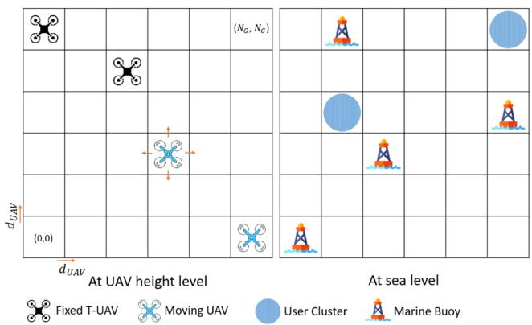  
Fig. 2. Illustration of the maritime area in a 2D grid.

3) The Reward Function: We design the reward function $R [ t ]$ [ ]to maximize the energy efficiency at timeslot t while satisfying the constraints, using a weighted penalty method [45]. The reward is defined as,

$$
R [ t ] = \omega _ { \mathrm { o b j } } \cdot \Phi _ { \mathrm { E E } } [ t ] - \sum _ { C \in \Gamma } \omega _ { c } \cdot m a x \{ 0 , C [ t ] - C _ { \mathrm { m a x } } \}\tag{30}
$$

where $\omega _ { \mathrm { o b j } }$ and $\omega _ { c }$ are the weights balancing between the objective function and the constraints. Also, $C [ t ]$ and $C _ { \mathrm { m a x } }$ represent the constraints when written in form of $C [ t ] \leq C _ { \mathrm { m a x } }$ , and  is the set of constraints defined in Section III.

4) Training Process: A2C [41] and PPO [42] simultaneously train two neural networks; an actor network, which selects actions based on the learned policy using probability distribution, and a critic network, which evaluates these actions by estimating the value function. The two algorithms use advantage functions $A _ { t } ( s _ { t } , a _ { t } )$ to measure how beneficial an action $a _ { t }$ is given a state $s _ { t } .$ . A2C utilizes a short-horizon n-step trajectory to compute $A _ { t }$ , while synchronously averaging the gradients from the parallel workers for the policy update. This reduces the gradients variance, accelerates the training, and allows the policy to quickly adapt to the environment dynamics. Meanwhile, PPO employs the Generalized Advantage Estimation (GAE)

to compute advantages through long-horizon trajectories and introduces a clipping mechanism that constrains policy updates. This prevents excessively large steps improving learning stability and robustness at the cost of longer convergence. These key differences in the training process allow A2C to converge faster and present better overall performance compared to PPO in our setting, as demonstrated by the simulation results in the following section.

\- Training process for A2C: The A2C-based approach is presented in Algorithm 1. At each timestep t, the agent selects an action $a _ { t }$ according to its policy $\pi _ { \alpha } .$ , given the current state $s _ { t } ,$ as shown in lines 5–10. Specifically, the action selection of A2C is based on stochastic policies where the agent samples an action $a _ { t }$ from a discrete probability distribution $\pi _ { \alpha } ( a _ { t } | s _ { t } )$ given by,

$$
\pi _ { \alpha } ( a _ { t } | s _ { t } ) = { \frac { e ^ { x _ { a _ { t } } } } { \sum _ { a } e ^ { x _ { a } } } }\tag{31}
$$

where $x _ { a _ { t } }$ denotes the logit for action $a _ { t }$ . The logits are the output of the actor network and represent non-normalized scores for each action, which are transformed into probabilities using the softmax function defined in (31). Then, the agent receives a reward $r _ { t } .$ , and the next state $s _ { t + 1 }$ . These trajectories $( a _ { t } , s _ { t } , r _ { t } , s _ { t + 1 } )$ are stored into batches for updating the actor and critic networks, as shown in lines 11–16 in Algorithm 1. Then, the return $G _ { t } ^ { A 2 C }$ , defined in line 12, and the state-value function $V _ { \psi } ( s _ { t } )$ , estimated by the critic, are used to derive the advantage function $A _ { t } ^ { A 2 C }$ , given by,

$$
A _ { t } ^ { A 2 C } ( s _ { t } , a _ { t } ) = G _ { t } ^ { A 2 C } - V _ { \psi } \left( s _ { t } \right)\tag{32}
$$

Then, using gradient ascent, the actor network is updated in line 14 by maximizing the policy objective given by,

$$
\mathcal { L } _ { \mathrm { a c t o r } } ^ { A 2 C } ( \alpha ) = \mathbb { E } _ { t } \left[ A _ { t } ^ { A 2 C } ( s _ { t } , a _ { t } ) \log \pi _ { \alpha } ( a _ { t } | s _ { t } ) \right]\tag{33}
$$

where $\pi _ { \alpha } ( a _ { t } | s _ { t } )$ are the log probability of action $a _ { t }$ given state $s _ { t }$ under the policy $\pi _ { \alpha } .$ . Simultaneously, using gradient descent, the critic network is updated in line 15 by minimizing the critic loss expressed as,

$$
\mathcal { L } _ { \mathrm { c r i t i c } } ^ { A 2 C } ( \psi ) = \mathbb { E } _ { t } \left[ \left( G _ { t } ^ { A 2 C } - V _ { \psi } \left( s _ { t } \right) \right) ^ { 2 } \right]\tag{34}
$$

\- Training process for PPO: The PPO-based approach is presented in Algorithm 2. Following similar training process as A2C, the PPO agent interacts with the environment as shown in lines 5-10. Then, the algorithm updates its actor and critic networks using the collected batches of trajectories as shown in lines 11-16. On the one hand, the PPO actor is updated in line 14 by maximizing the policy objective, which includes the clipped surrogate objective and the entropy loss term and given by,

$$
\begin{array} { r } { \mathcal { L } _ { \mathrm { a c t o r } } ^ { P P O } ( \theta ) = \mathbb { E } _ { t } [ \operatorname* { m i n } ( \rho _ { t } ( \theta ) A _ { t } ^ { P P O } , \mathrm { c l i p } ( \rho _ { t } ( \theta ) , 1 - \upsilon , } \end{array}
$$

$$
1 + v ) A _ { t } ^ { P P O } ) ] + \tau _ { \mathrm { e x p } } \mathbb { E } _ { \pi _ { \theta } } \left[ \log \pi _ { \theta } ( a | s _ { t } ) \right]\tag{35}
$$

where $\begin{array} { r } { \rho _ { t } ( \theta ) = \frac { \pi _ { \theta } \left( a _ { t } | s _ { t } \right) } { \pi _ { \theta \mathrm { o l d } } \left( a _ { t } | s _ { t } \right) } } \end{array}$ represents the probability ratio between the old and the new policies, $\tau _ { \mathrm { e x p } }$ denotes the entropy coefficient and υ is the clipping hyperparameter. Moreover,

Algorithm 1: A2C-based RAN slicing and VNF deployment   
algorithm.   
1: Input the environment and the hyperparameters   
including the number of episodes $N _ { e p } .$ , the learning   
rates $\epsilon _ { \alpha } ^ { A \bar { 2 } C }$ and $\epsilon _ { \psi } ^ { A 2 C }$ , and the discount factor γA2C.   
2: Initialize the actor network $\pi _ { \alpha } .$ the critic network $V _ { \psi }$   
3: for episode 1 to $N _ { e p }$ do   
4: =Observe the initial state $s _ { 1 }$   
5: for $\mathrm { t } = 1$ to n do   
6: =Compute action probabilities $\pi _ { \alpha } ( a _ { t } | s _ { t } )$ using (31).   
7: Select the action $a _ { t } \sim \pi _ { \alpha } ( \cdot | s _ { t } )$   
8: Receive the reward $r _ { t } ,$ and the next state $s _ { t + 1 }$   
9: Store the trajectory $\left( { { s _ { t } } , { a _ { t } } , { r _ { t } } , { s _ { t + 1 } } } \right)$ in $\mathcal { D } .$   
10: end for   
11: for each trajectory in D do   
12: Compute the return   
$\begin{array} { r } { G _ { t } ^ { A 2 \hat { C } } = \sum _ { k = 0 } ^ { n - 1 } \gamma _ { A 2 C } ^ { k } r _ { t + k } + \gamma _ { A 2 C } ^ { n } V _ { \psi } ( s _ { t + n } ) } \end{array}$   
13: Compute the advantage $A _ { t } ^ { A 2 C }$ (using (32).   
14: Update the actor network by maximizing the policy   
objective $\mathcal { L } _ { \mathrm { a c t o r } } ^ { A 2 C } ( \alpha )$ in (33), using gradient ascent:   
$\alpha  \alpha + \epsilon _ { \alpha } ^ { A 2 C } \nabla _ { \alpha } \mathcal { L } _ { \mathrm { a c t o r } } ^ { A 2 C } ( \alpha )$   
15: Update the critic network by minimizing the critic   
loss $\mathcal { L } _ { \mathrm { c r i t i c } } ^ { A 2 C } ( \psi )$ in (34), using gradient descent:   
$\psi  \psi - \epsilon _ { \psi } ^ { A 2 C } \nabla _ { \psi } \mathcal { L } _ { \mathrm { c r i t i c } } ^ { A 2 C } ( \psi )$   
16: end for   
17: end for

$A _ { t } ^ { P P O }$ is derived using GAE and given by [46],

$$
A _ { t } ^ { P P O } \left( s _ { t } , a _ { t } \right) = \sum _ { k = 0 } ^ { \infty } \left( \gamma _ { P P O } \lambda _ { G A E } \right) ^ { k } \delta _ { t + k }\tag{36}
$$

where $\delta _ { t } = r _ { t } + \gamma _ { P P O } V _ { \phi } ( s _ { t + 1 } ) - V _ { \phi } ( s _ { t } )$ . On the other hand, the critic is updated in line 15 via the minimization of the value loss $\mathcal { L } _ { \mathrm { c r i t i c } } ^ { P P O } ( \dot { \phi } )$ , which has similar expression to A2C, defined in (34), with $G _ { t } ^ { P P O } = A _ { t } ^ { P P O } + V _ { \phi } \dot { ( } s _ { t } )$ . These synchronous updates allow the actor to improve its action selection and the critic to better estimate the value function.

## C. Convergence and Complexity Analysis

As policy gradient algorithms, the theoretical foundation of A2C and PPO is built on the Policy Gradient Theorem [37]. These methods learn a parameterized policy $\pi _ { \beta } ( a \mid s )$ by maximizing an objective $\mathcal { I } ( \beta )$ , which is a performance measure generally defined as the expected discounted return. They update their policies through gradient ascent, which requires the computation of the policy gradient $\nabla _ { \beta } \mathcal { I } ( \beta )$ . As proven in [37], the Policy Gradient Theorem offers an analytic expression for $\nabla _ { \beta } \mathcal { I } ( \beta )$ that is independent of the specifics of the environment and it is given by,

$$
\nabla _ { \beta } \mathcal { I } ( \beta ) = \mathbb { E } _ { s , a \sim \pi _ { \beta } } [ \nabla _ { \beta } \log \pi _ { \beta } ( a | s ) Q ^ { \pi _ { \beta } } ( a | s ) ]\tag{37}
$$

where $Q ^ { \pi _ { \beta } } \left( a | s \right)$ is the action-value function under policy $\pi _ { \beta }$ In practice, the Q-values $Q ^ { \pi _ { \beta } } ( a | s )$ are estimated and different algorithms employ different estimation techniques such as using the critic network for actor-critic methods. In fact, the Policy Gradient Theorem allows the replacement of the $Q ^ { \pi _ { \beta } } \left( a | s \right)$ with the advantage function $A _ { t } ( s , a )$ in the policy gradient (37) without changes in the expected gradient. This substitution reduces the gradients variance and improves training stability. Furthermore, this theorem ensures that the policy updates are in the ascent direction of the objective $\mathcal { I } ( \beta )$ . Consequently, under the standard assumptions of the step size $\begin{array} { r } { \alpha _ { t } \left( \mathrm { i . e . } \sum _ { t } \alpha _ { t } = \infty \right. } \end{array}$ and $\textstyle \sum _ { t } \alpha _ { t } ^ { 2 } < \infty )$ , the stochastic approximation theory guarantees that these algorithms converge almost surely to the stationary points of $\mathcal { I } ( \beta )$ . Therefore, policy gradient algorithms, including A2C and PPO, are guaranteed to converge to locally optimal policies [37], [47], [48]. However, global optimality of these methods, particularly when deep neural networks are used, remain an open research issue.

Algorithm 2: PPO-based RAN slicing and VNF deployment   
algorithm.   
1: Input the environment and the hyperparameters   
including the number of episodes $N _ { e p }$ , the learning   
rates $\epsilon _ { \theta } ^ { P \bar { P } O }$ and $\epsilon _ { \phi } ^ { P P O }$ , the discount factor $\gamma _ { P P O }$ , the   
GAE parameter $\lambda _ { G A E }$ , the entropy coefficient $\tau _ { \mathrm { e x p } } ,$   
and the clipping hyperparameter $v .$   
2: Initialize the actor network $\pi _ { \theta } .$ , the critic network $V _ { \phi }$   
3: for episode 1 to $N _ { e p }$ do   
4: Observe the initial state $s _ { 1 }$   
5: for $\mathrm { t } = 1$ to $T$ do   
6: Compute action probabilities $\pi _ { \boldsymbol { \theta } } \big ( a _ { t } | \boldsymbol { s } _ { t } \big )$ using (31).   
7: Select the action $a _ { t } \sim \pi _ { \theta } ( \cdot | s _ { t } )$   
8: Receive the reward $r _ { t } .$ , and the next state $s _ { t + 1 }$   
9: Store the trajectory $\left( { { s _ { t } } , { a _ { t } } , { r _ { t } } , { s _ { t + 1 } } } \right)$ in $B .$   
10: end for   
11: for each trajectory in B do   
12: Compute the advantage $A _ { t } ^ { P P O }$ using (36).   
13: Compute probability ratio $\begin{array} { r } { \rho _ { t } ( \theta ) = \frac { \pi _ { \theta } \left( a _ { t } \vert s _ { t } \right) } { \pi _ { \theta \mathrm { o l d } } \left( a _ { t } \vert s _ { t } \right) } . } \end{array}$   
14: ( ) =Update the actor network by maximizing the policy   
objective $\mathcal { L } _ { \mathrm { a c t o r } } ^ { P P O } ( \theta )$ in (35), using gradient ascent:   
$\theta  \theta + \epsilon _ { \theta } ^ { P P O } \nabla _ { \theta } \mathcal { L } _ { \mathrm { a c t o r } } ^ { P P O } ( \theta )$   
15: Update the critic network by minimizing the critic   
loss $\mathcal { L } _ { \mathrm { c r i t i c } } ^ { P P O } ( \phi )$ in (34), using gradient descent:   
$\phi  \phi - \epsilon _ { \phi } ^ { P P O } \nabla _ { \phi } \mathcal { L } _ { \mathrm { c r i t i c } } ^ { P P O } ( \phi )$   
16: end for   
17: end for

The computational complexity of PPO and A2C is dominated by the value function evaluation and the policy update steps, which involve forward passes through the critic and actor networks. Hence, the complexity depends on their network architectures which are defined by the state and action spaces dimensionality and the structure of the hidden layers. The state size $D _ { S }$ is given by $( N + M + K ) ( 2 + S F + \Lambda _ { \operatorname* { m a x } } ) + 3 U _ { s }$ and the action size is $D _ { A }$ is given by $( N + M + K ) ( 2 S F +$ $2 \Lambda _ { \operatorname* { m a x } } ( 1 + U _ { s } ) ) + 5 N$ , where $\Lambda _ { \mathrm { m a x } }$ is the maximum number of

VNF instances per network node. We assume that the two algorithms have the same architecture where the actor and critic networks include $H _ { a }$ and $H _ { c }$ hidden layers with $N _ { a , h } , h = 1 . . H _ { a }$ and $N _ { c , h } , h = 1 . . H _ { c }$ neurons, respectively. The complexity of = 1one forward pass of the actor and critic network is given by $\begin{array} { r } { O _ { a c t o r } = O ( D _ { S } N _ { a , 1 } + \sum _ { h = 1 } ^ { H _ { a } } N _ { a , h - 1 } N _ { a , h } + D _ { A } N _ { a , H _ { a } } ) } \end{array}$ and $\begin{array} { r } { O _ { c r i t i c } = O ( D _ { S } N _ { c , 1 } + \sum _ { h = 1 } ^ { H _ { c } } N _ { c , h - 1 } N _ { c , h } + N _ { c , H _ { c } } ) } \end{array}$ , respectively. Therefore, the computational complexities of the proposed A2C and PPO approaches are $O ( T _ { A 2 C } ( O _ { a c t o r } ^ { A 2 \bar { C } } +$ $\bar { O } _ { c r i t i c } ^ { A 2 C } ) )$ and $O ( T _ { P P O } ( O _ { a c t o r } ^ { \dot { P } \dot { P } O } + O _ { c r i t i c } ^ { P P O } ) )$ , respectively. $T _ { A 2 C }$ and $T _ { P } P O$ are the number of timesteps per rollout for A2C and PPO. Once the training is completed, only a single forward pass through the trained models is needed for action selection, given the network information. This computation allows the algorithm to be executed with a negligible latency that is compatible with the RIC control intervals.

## V. RESULTS AND ANALYSIS

In this section, we present the simulation results evaluating the performance of the proposed DRL-based network slicing framework. First, we consider a 25 $K m ^ { 2 }$ maritime area having 5 marine buoys that can be used for communication purposes. We assume that the ships and the buoys have the same height $z _ { u _ { s } } = z _ { k } = 2 \mathrm { m } , k \in K$ while the heights of the tethered and non-tethered UAVs are $z _ { m } = 1 1 2 \mathrm { m } , m \in M$ and $z _ { n } = 1 1 5 \mathrm { m }$ $n \in N$ = =, respectively. Also, we set the safety distance between the UAVs to $d _ { \mathrm { s a f e } } = 3 \mathrm { m }$ . Additionally, the bandwidth, CPU capacity and transmit power of the buoys are $B _ { k } = 2 ~ \mathrm { M H z }$ $\dot { C } _ { k } ^ { \mathrm { t o t a l } } = 1 0 ^ { 9 }$ (cycles/s), and $P _ { k } ^ { \mathrm { t r a n s m i t } } = 3 0 \mathrm { d B m } [ 4 9 ]$ . Moreover, the CPU capacity required to serve one slice s and to deploy one VNF instance of type f are $C _ { f , s } ^ { \mathrm { r e q } } = 1 0 ^ { 9 }$ cycles/s and $C _ { f , i } ^ { \mathrm { r e q } } \stackrel { \cdot } { = } 2 . 5$ $1 0 ^ { 8 }$ cycles/s. The data sizes required to serve the infotainment 10and the emergency slice are 2 Mbits and 2 Kbits. The CPU capacity required by one VNF instance i to serve one slice s is $Q _ { P , f , i , s } = 1 0 ^ { 7 }$ cycles/s. In case of migration, the data size of the migrated VNF instance and the transmit power needed for it migration are $Q _ { M , f , i } = 1 0 0$ Kbits and $p _ { f , i } ^ { \zeta , \bar { \zeta ^ { \prime } } } = 1 6$ dBm. The main simulation settings are summarized in Table III.

Furthermore, we consider a decision making timeslot of length $t = 1 0 \mathrm { s } .$ , we train the DRL agents using $N _ { e n v } = 8$ parallel environments, and we evaluate their performance by averaging over $N _ { e p } = 2 0$ episodes with $T = 1 0 0$ steps. This captures the stochasticity of the environment while offering accelerated training and effective lightweight evaluation. Regarding the DRL parameters, we fine-tune the hyperparameters of the proposed A2C- and PPO-based RAN slicing and VNF deployment algorithms through extensive experimentation. First, we adopt the same actor and critic networks architecture for the two algorithms to ensure a fair comparison. Specifically, both actor and critic networks are designed using four layers with 128, 64, 64, and 128 neurons. This architecture allows the RL agent to handle high-dimensional state-action spaces and deal with the non-linear dependency between the different actions. The learning rates for the A2C actor and critic are $\epsilon _ { \alpha } ^ { A 2 C } = \epsilon _ { \psi } ^ { A 2 C } = 0 . 0 0 \bar { 0 } 7$ . Meanwhile, we adopt an adaptive learning rate for PPO-based algorithm, balancing between convergence and training speed. The learning rates for the PPO actor and critic are $\epsilon _ { \theta } ^ { P P \bar { O } } \stackrel { - } { = } \epsilon _ { \phi } ^ { P P O } = \epsilon _ { i n i t a l } \stackrel { - } { \cdot } \exp \left( - d _ { r a t e } ( 1 - E ) \right)$ where $\epsilon _ { i n i t a l } = 0 . 0 0 0 5$ is the initial learning rate, $d _ { r a t e } = 0 . 9 9$ is the exponential decay and E training progress. Moreover, we tune the discount factor $\gamma _ { P P O } = \gamma _ { A 2 C } = 0 . 9 9$ , the PPO entropy coefficient $\tau _ { \mathrm { e x p } } = 0 . 0 0 5$ = = 0 99, and the PPO clipping hyperparameter $\upsilon = 0 . 3$ . In our simulations, we solve the three problems of joint RAN slicing and VNF deployment as discussed in Section III. Throughout this section, we refer to these cases respectively as Migration-based deployment $\left( \mathbf { P _ { M } } \right)$ , Scaling-based deployment $\displaystyle \left( \mathbf { P _ { S } } \right)$ and Hybrid deployment P .

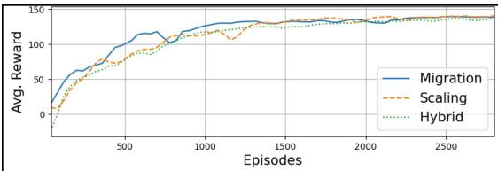  
(a) A2C-based Algorithm

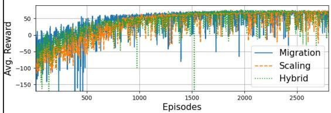  
(c) Metaheuristic Benchmark

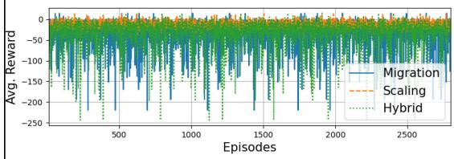  
(e) Greedy Benchmark  
Fig. 3. Average reward over episodes for DRL-based algorithms and benchmarks.

TABLE III  
MAIN SIMULATION PARAMETERS [32], [33], [50], [51]
<table><tr><td>Parameter</td><td>Value</td></tr><tr><td>Path loss exponents  $\alpha _ { A A } , \alpha _ { A S } , \alpha _ { S A } , \alpha _ { S S }$ </td><td>1.9, 2.2, 2.2, 2</td></tr><tr><td>Carrier frequency f</td><td>2 GHz</td></tr><tr><td>Noise power spectral density N0</td><td> $- 1 2 4 ~ \mathrm { d B m / H z }$ </td></tr><tr><td>UAVs antenna gain  ${ \overline { { G _ { n } , G _ { m } } } }$ </td><td>20 dB</td></tr><tr><td>Buoys and ships antenna  $\overline { { \mathrm { g a i n } G _ { k } , G _ { u _ { s } } } }$ </td><td>10 dB</td></tr><tr><td>UAV velocity V</td><td> $\overline { { 1 0 m / s } }$ </td></tr><tr><td>UAV weight  $\overline { { w ^ { N } } }$ </td><td>20N</td></tr><tr><td>Profile drag coefficient  $\overline { { P _ { \mathrm { d r a g } } } }$ </td><td>0.012</td></tr><tr><td>Blade angular velocity  ${ \underline { { v _ { \mathrm { b l a d e } } } } }$ </td><td> $\overline { { 3 0 0 \mathrm { \ r a d / s } } }$ </td></tr><tr><td>incremental correction factor  $\underline { { c _ { i p } } }$ </td><td>0.1</td></tr><tr><td>Air density  $\underline { { \rho _ { \mathrm { a i r } } } }$ </td><td> $\overline { { 1 . 2 2 5 ~ \mathrm { K g } / \mathrm { m } ^ { 3 } } }$ </td></tr><tr><td>Tip speed of the rotor blade  $\overline { { U _ { \mathrm { t i p } } } }$ </td><td> $\overline { { 1 2 0 m / s } }$ </td></tr><tr><td>mean hovering rotor-induced velocity  $\overline { { V _ { 0 } } }$ </td><td> $\overline { { 4 . 0 3 m / s } }$ </td></tr><tr><td>fuselage drag ratio  $\overline { { D _ { R } } }$ </td><td>0.6</td></tr><tr><td>Rotor radius  $\overline { { R _ { \mathrm { r o t o r } } } }$ </td><td>0.4m</td></tr><tr><td>Disc area  $A _ { \mathrm { { r o t o r } } }$ </td><td> $\overline { { 0 . 5 0 3 m } }$ </td></tr><tr><td> $\overline { { S \mathrm { o l i d i t y } \ S _ { \mathrm { r o t o r } } } }$ </td><td>0.05</td></tr></table>

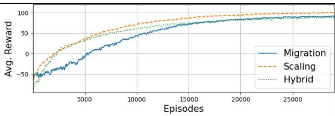  
(b) PPO-based Algorithm

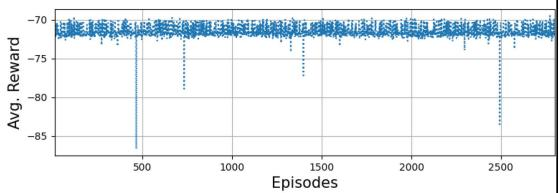  
(d) Static Benchmark

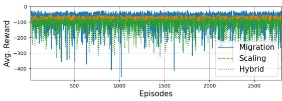  
(f) Random Benchmark

## A. Convergence Performance

To understand the convergence of the proposed DRL-based algorithms, we examine the average training reward for the three problems, illustrated in Fig. 3(a) and (b). First, we observe that the A2C agent converges faster than the PPO agent requiring about 2700 episodes. This aligns with the training process of A2C that adopts short-horizon policy update, as discussed in previous section. In addition, A2C achieves a slightly higher total cumulative reward compared to PPO agent. This is due to A2C’s policy updates which are more rapid and aggressive than PPO, allowing it to improve its policy in early training, take advantage of the initial rewards, and adapt to the environment dynamics. Nonetheless, as A2C explores various policies, the reward exhibits more fluctuations suggesting lower learning stability particularly in the Migration case. Meanwhile, the PPO agent shows slower convergence taking up to 20000 episodes, which is due to the use of long-horizon trajectories for policy updates. In addition, PPO presents improved stability compared to A2C, which is caused by the clipping mechanism that ensures the changes in the policy remain conservative. This reduces the reward fluctuations and stabilizes the learning at the cost of training time. Furthermore, we compare the reward performance of the proposed DRL-based algorithms with four benchmarks, as demonstrated in Fig. 3(c), (d), (e) and (f). In fact, since the optimization problem formulated in Section 3 is NP-hard, deriving a global optimal solution can be untractable and inefficient. Thus, we consider a metaheuristic method based on the genetic algorithm, a static baseline with one VNF instance per slice and equal resource slicing, as well as the greedy and random benchmarks. The DRL agents, after convergence, achieve significantly higher reward compared to all benchmarks. Specifically, the A2C-based and the PPO-based approaches achieve an average reward of approximately and around , respectively, whereas the metaheuristic benchmark yields a highly fluctuating performance with rewards oscillating around . Meanwhile, the static baseline shows a consistently negative reward around − , while the greedy and random methods present substantial variability and severely negative rewards, frequently dropping below − . This indicates persistent energy inefficiencies and constraints violations including resources and QoS requirements. Consequently, these results show the superiority of DRL-based solutions over relevant benchmarks in solving complex dynamic optimization problems such as joint RAN slicing and VNF deployment in integrated aerial-terrestrial maritime networks.

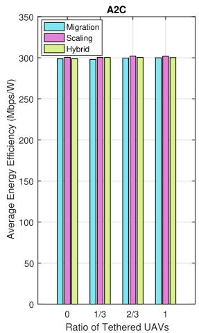  
(a)

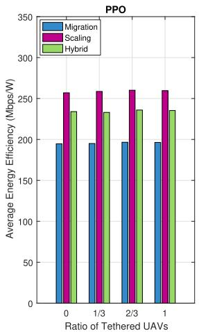  
(b)  
Fig. 4. Energy Efficiency vs. UAVs’ Ratio.

## B. Impact of Aerial Network Settings

After training the DRL agents, we investigate the performance of our model from a communication perspective. Extensive simulations were conducted while varying the types of UAVs (i.e. tethered, non-tethered) and their ratio within a fixed total number of UAVs. For each simulation, we focus on analyzing four network performance indicators; energy efficiency, achievable throughput of the infotainment slice, delay of the emergency slice and guaranteed reliability to the emergency slice. To establish a fair comparison and obtain accurate insights, we maintain the same total power for the three scenarios, independently of the number of network nodes. We begin by exploring the energy efficiency of our integrated aerial-terrestrial maritime network as illustrated in Fig. 4. We notice that the A2C-based algorithms offers superior energy efficiency gains compared to the PPO agent. This is due to the rapid policy updates of the A2C that allows it to better adapt to the environment dynamics when the three approaches are considered across different UAV deployments. In contrast, while it offers stable learning, the clipping mechanism restricts the PPO-based algorithms leading to lower efficiency. Moreover, when comparing deployment strategies, the Scaling-based approach outperforms the Hybrid and the Migration-based schemes. Specifically, the PPO’s longhorizon updates can effectively handle the gradual changes in the environment introduced by the scaling actions, but struggle to track the more abrupt shifts caused by the migration actions.

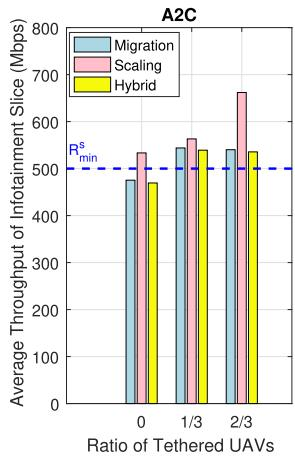  
(a)

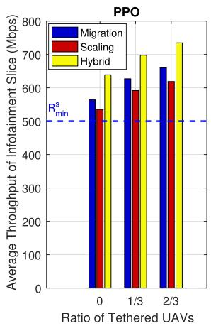  
(b)

Fig. 5. Infotainment Slice’s Throughput vs. UAVs’ Ratio.  
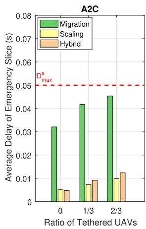  
(a)

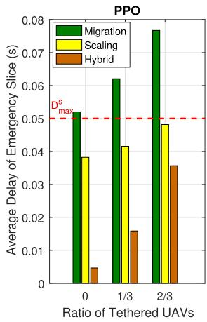  
(b)  
Fig. 6. Emergency Slice’s Delay vs. UAVs’ Ratio.

Furthermore, we investigate the performance of the DRL agents in terms of the slice QoS requirements as illustrated in Figs. 5, 6, and 7. First, we examine the throughput of the infotainment slice supported by the proposed integrated maritime network. As shown in Fig. 5, we notice that increasing the ratio of tethered UAVs substantially enhances the throughput for both DRL agents thanks to the increased proximity of the UAVs to the end-users. Additionally, we observe that the three deployment schemes can fulfill the infotainment slice needs, as long as one tethered UAV is deployed, by providing throughput higher than the minimum requirement $R _ { \mathrm { m i n } } ^ { s }$ . Moreover, when the A2C agent is used, the Scaling approach offers increased infotainment slice throughput, as depicted in Fig. 5(a). Meanwhile, when the PPO algorithm is applied, the Hybrid deployment shows improved throughput performance compared to other schemes, as illustrated in Fig. 5(b). Second, we study the delay of the emergency slice provided by the integrated aerial-terrestrial maritime network. As shown in Fig. 6, we observe that the deployment of supplementary non-tethered UAVs contributes reduced delays thanks to their unrestricted mobility. On the one hand, the A2C agent offers enhanced delay performance across the deployment schemes compared to the PPO agent. Specifically, the three approaches satisfy the emergency delay requirements where the Scaling approach provides the lowest delay. On the other hand, while the PPO-based Scaling and Hybrid schemes present reduced delays, the Migration approach fails to fulfill the emergency requirement with delays greater than $D _ { \operatorname* { m a x } } ^ { s } .$ This is due to the additional delay necessary to migrate the VNF instances between the network nodes. Third, we investigate the reliability of the emergency slice supported by the integrated maritime network. As demonstrated in Fig. 7, the Migrationbased deployment is the only approach that successfully meets the reliability requirements for both DRL algorithms. This is expected as the VNF instances can be migrated towards the network nodes that are closer to the end-users belonging to the emergency slice. Moreover, the deployment of supplementary tethered UAVs marginally improves the reliability by around 1% under this scheme since the agent does not receive additional reward once the reliability requirement $W _ { \mathrm { m i n } } ^ { s }$ is satisfied.

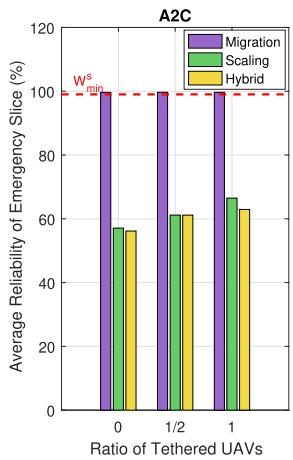  
(a)

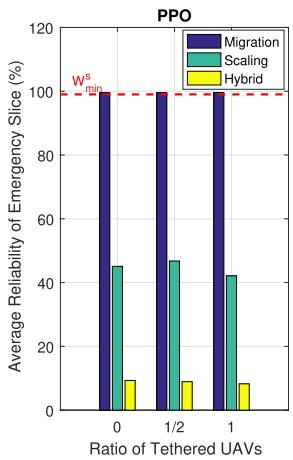  
(b)  
Fig. 7. Emergency Slice’s Reliability vs. UAVs’ Ratio.

Although all the approaches aim to maximize the energy efficiency, each converges to a distinct policy that accounts for the QoS constraints differently. This is because the scaling and migration actions have different impact on the overall reward and the agents policy updates. In fact, scaling actions produce smooth reward changes that are suitable for both A2C and PPO agents. In contrast, migration actions cause abrupt reward fluctuations that can be captured by the rapid updates of A2C, whereas the long-horizon clipped updates of PPO struggle to adapt. Consequently, these differences lead each agent to prioritize the QoS requirements differently, yielding diverse QoS satisfaction levels. In particular, the A2C-based scaling approach shows superiority in terms of infotainment throughput and emergency delay, while the A2C-based migration scheme achieves improved reliability performance.

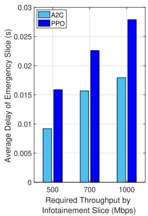  
(a)

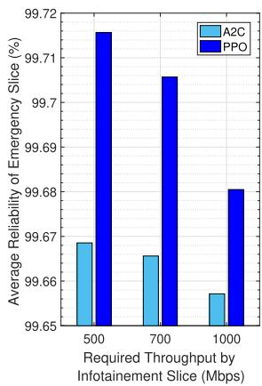  
(b)

Fig. 8. Impact of Infotainment Slice Requirements’ Stringency.  
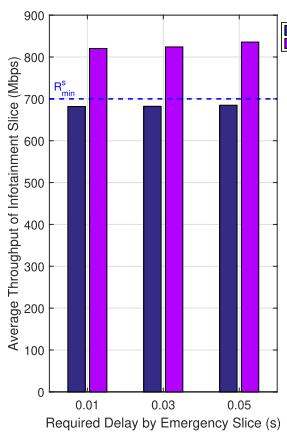  
(a)

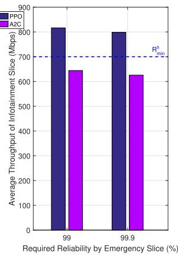  
(b)  
Fig. 9. Impact of Emergency Slice Requirements’ Stringency.

## C. Impact of QoS Requirements’ Stringency

In this section, we investigate the impact of the stringency of QoS requirements on the previously studied network performance indicators. First, we consider the infotainment slice throughput by increasing the required $R _ { \mathrm { m i n } }$ form 500 Mbps to 700 Mbps and 1000 Mbps respectively. Extensive simulations indicate that this variation has an insignificant impact on energy efficiency. However, the emergency slice indicators are deteriorated as depicted in Fig. 8. This is due to the fact that the network resources are predominately allocated to the infotainment slice to satisfy its increasing needs. Specifically, we notice that the average delay of the emergency slice increases and its reliability decreases while meeting the QoS requirements. Notably, the A2C-based algorithm converges to a policy that achieves a lower delay, while the PPO agent guarantees higher reliability.

Moreover, we increase the stringency of the QoS requirements of the emergency slice by decreasing the maximum delay $D _ { \mathrm { m a x } }$ form 0.05 s to 0.03 s and 0.01 s and increasing the minimum reliability $W _ { \mathrm { m i n } }$ from 0.9 to 0.99. Extensive simulations reveal that this variation has a negligible impact on energy efficiency. Nonetheless, the infotainment throughput is affected as depicted in Fig. 9. Specifically, we notice that the average throughput decreases when the QoS requirements get more stringent in terms of delay or reliability. We note also that the A2C-based algorithm guarantees the required throughput $R _ { \operatorname* { m i n } } ^ { s }$ under more stringent delay constraints, while it fails when reliability constraints are more demanding. Contrarily, the PPO-based algorithm achieves the required throughput $R _ { \mathrm { m i n } } ^ { s }$ under more strict reliability constraints, while it fails when delay constraints become more stringent. These findings suggest that the A2C-based algorithm converges to a policy that maximizes the energy efficiency while prioritizing delay constraints. Meanwhile, the PPO-based algorithm converges to a different policy focusing on reliability.

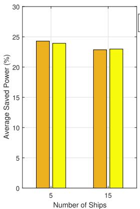  
(a)

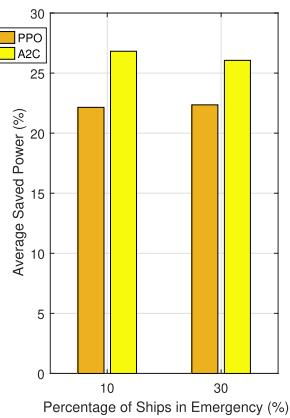  
(b)  
Fig. 10. Impact of UAVs Trajectory Optimization.

## D. Impact of UAVs Trajectory Optimization

In this section, we investigate the effect of non-tethered UAV trajectory optimization on the network performance. Specifically, we notice that the total power consumption can be substantially saved as illustrated in Fig. 10. In fact, both algorithms can save around 24% in small-scale maritime network (i.e. 5 ships) and 22% in large-scale maritime network (i.e. 15 ships), where the hybrid approach presents the highest power-saving capabilities as depicted in Fig. 10(a). In addition, we study the impact of increasing the emergency traffic on power savings in Fig. 10(b). We pinpoint that the adoption of the A2C-based algorithm helps to increase power saving by 4% compared to the PPO-based algorithm, when more ships are in emergency.

## E. Impact of Integrated Maritime Network Scalability

In this section, we investigate the scalability performance of the proposed DRL agents. First, we vary the number of aerial nodes and we examine its impact on energy efficiency, as depicted in Fig. 11(a). We observe that the energy efficiency improves in case of the A2C-based scaling approach when the number of UAVs increases. This is due to the short-horizon policy updates of A2C that allows it to explore various actions that increase the throughput, when more UAVs are deployed, with minimized power consumption, leading to energy efficiency gains. In contrast, the PPO-based algorithm shows minor variations which is caused by the clipping mechanism that limits the agent’s ability to benefit from the additional UAVs. Second, we increase the number of maritime end-users by varying the number of ships, as shown in Fig. 11(b). We note that the energy efficiency is substantially deteriorated when the PPO-based algorithm is applied, whereas the A2C-based agent shows stable performance with minimal degradation as the number of ships increases. This is expected since the integrated network is required to serve additional maritime users using the same resources. Hence, we can deduce that the A2C agent offers superior network scalability performance compared to the PPO-based approach.

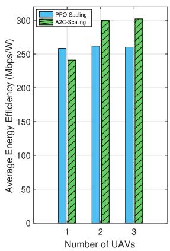  
(a)

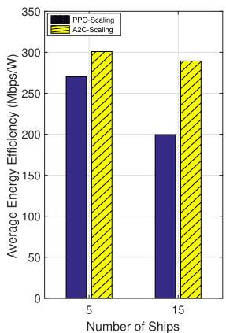  
(b)  
Fig. 11. Impact of Network Scalability.

## VI. CONCLUSION AND FUTURE DIRECTIONS

In this paper, we proposed an AI-based network slicing framework for O-RAN integrated aerial-terrestrial maritime networks that offers ubiquitous connectivity and satisfies various maritime users requirements. We improved the energy efficiency of the proposed O-RAN maritime network while meeting the requirements of two heterogeneous slices in terms of throughput, reliability and delay. Our findings are twofold. From a DRL perspective, our results highlight the superiority of the A2C-based RAN slicing and VNF deployment. Specifically, the A2C-based algorithm offers better network indicators performance in terms of energy efficiency and it satisfies all the QoS requirements of the infotainment slice and the emergency slice. Therefore, we recommend adopting the A2C-based algorithm for realworld implementation. From a communication perspective, our results show that the migration approach is the most suitable for real-world deployment, as it satisfies all QoS requirements, whether the A2C-based algorithm or PPO-based algorithm is used. This approach comes at the cost of increased delay for the emergency slice and reduced throughput for the infotainment slice, as the reliability of the emergency slice is prioritized. Our future work will focus on the extension of the proposed O-RAN integrated aerial-terrestrial maritime network to a satelliteaerial-terrestrial networks in order to improve connectivity in under-connected maritime areas. We plan to consider satellites mega-constellations capable of offering ubiquitous connectivity in the open-sea to serve efficiently large cargo and cruise ships besides fishing boats and small vessels. In addition, we intend to adopt a multi-agent hybrid DRL approach to handle the continuous and discrete actions of the RAN slicing and VNF deployment problem, and a distributed learning scheme to deal with network scalability.

## REFERENCES

[1] F. M. Insights, “Marine communication market outlook (2023 to 2033),” 2025. [Online]. Available: https://www.futuremarketinsights.com/reports/ marine-communication-market

[2] J. Lindner, “Must-know cruise ship sinking statistics,” 2025. [Online]. Available: https://gitnux.org/cruise-ship-sinking-statistics/

[3] F. S. Alqurashi, A. Trichili, N. Saeed, B. S. Ooi, and M.-S. Alouini, “Maritime communications: A survey on enabling technologies, opportunities, and challenges,” IEEE Internet Things J., vol. 10, no. 4, pp. 3525–3547, Feb. 2023.

[4] P. Hadinger, “Inmarsat global xpress the design, implementation, and activation of a global Ka-band network,” in Proc. 33rd AIAA Int. Commun. Satell. Syst. Conf. Exhib., 2015, pp. 4303–4311.

[5] M. Messmer, B. Kiefer, L. A. Varga, and A. Zell, “UAV-assisted maritime search and rescue: A holistic approach,” in Proc. IEEE Int. Conf. Unmanned Aircr. Syst., 2024, pp. 272–280.

[6] S. Ammar, O. Amin, and B. Shihada, “Tethered UAV-based communications for under-connected near-shore maritime areas,” in Proc. 2024 IEEE Int. Black Sea Conf. Commun. Netw., 2024, pp. 42–47.

[7] L. Liu, B. Lin, and Y. Che, “Joint UAV-BS deployment and power allocation for maritime emergency communication system,” in Proc. IEEE 13th Int. Conf. Wireless Commun. Signal Process., 2021, pp. 1–5.

[8] N. Nomikos, A. Giannopoulos, A. Kalafatelis, V. Özduran, P. Trakadas, and G. K. Karagiannidis, “Improving connectivity in 6G maritime communication networks with UAV swarms,” IEEE Access, vol. 12, pp. 18739–18751, 2024.

[9] G. Mildh et al., “Architecture principles for a cloud-friendly future 6G RAN architecture,” O-RAN Next Gener. Res. Group (nGRG), Alfter, Germany, Tech. Rep. RR-2024-01, 2024.

[10] C.-L. I and S. Katti, “O-RAN: Towards an open and smart RAN,” O-RAN Alliance White Paper WP-2018, Oct. 2018.

[11] B. Agarwal, R. Irmer, D. Lister, and G.-M. Muntean, “Open ran for 6G networks: Architecture, use cases and open issues,” IEEE Commun. Surveys Tuts., early access, Apr. 18, 2025, doi: 10.1109/COMST.2025.3562429.

[12] Y. Wu, H.-N. Dai, H. Wang, Z. Xiong, and S. Guo, “A survey of intelligent network slicing management for industrial IoT: Integrated approaches for smart transportation, smart energy, and smart factory,” IEEE Commun. Surveys Tuts., vol. 24, no. 2, pp. 1175–1211, Secondquarter 2022.

[13] L. U. Khan, I. Yaqoob, N. H. Tran, Z. Han, and C. S. Hong, “Network slicing: Recent advances, taxonomy, requirements, and open research challenges,” IEEE Access, vol. 8, pp. 36009–36028, 2020.

[14] M. Dubey, A. K. Singh, and R. Mishra, “AI based resource management for 5G network slicing: History, use cases, and research directions,” Concurrency Computation: Pract. Experience, vol. 37, no. 2, 2025, Art. no. e8327.

[15] S. Ammar, C. Pong Lau, and B. Shihada, “An in-depth survey on virtualization technologies in 6G integrated terrestrial and non-terrestrial networks,” IEEE Open J. Commun. Soc., vol. 5, pp. 3690–3734, 2024.

[16] M. Gharbaoui, B. Martini, S. Noto, A. L. Ruscelli, P. Pagano, and P. Castoldi, “Experimenting SDN/NFV solutions for flexible maritime transport & logistics (T&L) services,” in Proc. 2023 IEEE Conf. Netw. Function Virtualization Softw. Defined Netw., 2023, pp. 27–33.

[17] A. Celik, N. Saeed, B. Shihada, T. Y. Al-Naffouri, and M.-S. Alouini, “A software-defined opto-acoustic network architecture for Internet of Underwater Things,” IEEE Commun. Mag., vol. 58, no. 4, pp. 88–94, Apr. 2020.

[18] T. Yang, J. Li, H. Feng, N. Cheng, and W. Guan, “A novel transmission scheduling based on deep reinforcement learning in software-defined maritime communication networks,” IEEE Trans. Cogn. Commun. Netw., vol. 5, no. 4, pp. 1155–1166, Dec. 2019.

[19] O. M. Bushnaq, I. V. Zhilin, G. D. Masi, E. Natalizio, and I. F. Akyildiz, “Automatic network slicing for admission control, routing, and resource allocation in underwater acoustic communication systems,” IEEE Access, vol. 10, pp. 134440–134454, 2022.

[20] C. Zhu, W. Zhang, Y. H. Chiang, N. Ye, L. Du, and J. An, “Software-defined maritime fog computing: Architecture, advantages, and feasibility,” IEEE Netw., vol. 36, no. 2, pp. 26–33, Mar./Apr. 2022.

[21] F. Zhang, H. Lu, F. Guo, and Z. Gu, “Traffic prediction based VNF migration with temporal convolutional network,” in Proc. - IEEE Glob. Commun. Conf., 2021, pp. 1–6.

[22] X. Yu et al., “Priority-aware deployment of autoscaling service function chains based on deep reinforcement learning,” IEEE Trans. Cogn. Commun. Netw., vol. 10, no. 3, pp. 1050–1062, Jun. 2024.

[23] S. Agarwal, F. Malandrino, C. F. Chiasserini, and S. De, “VNF placement and resource allocation for the support of vertical services in 5G networks,” IEEE/ACM Trans. Netw., vol. 27, no. 1, pp. 433–446, Feb. 2019.

[24] T. N. Nguyen, T. V. Le, M. V. Nguyen, H. N. Nguyen, and S. Vu, “Optimizing resource allocation and VNF embedding in RAN slicing,” IEEE Trans. Netw. Service Manag., vol. 21, no. 2, pp. 2187–2199, Apr. 2024.

[25] H. Shen, Q. Ye, W. Zhuang, W. Shi, G. Bai, and G. Yang, “Drone-smallcell-assisted resource slicing for 5G uplink radio access networks,” IEEE Trans. Veh. Technol., vol. 70, no. 7, pp. 7071–7086, Jul. 2021.

[26] G. Zhou, L. Zhao, G. Zheng, S. Song, J. Zhang, and L. Hanzo, “Multiobjective optimization of space-air-ground integrated network slicing relying on a pair of central and distributed learning algorithms,” IEEE Internet Things J., vol. 11, no. 5, pp. 8327–8344, Mar. 2024.

[27] J. Li, W. Shi, H. Wu, S. Zhang, and X. Shen, “Cost-aware dynamic SFC mapping and scheduling in SDN/NFV-enabled space-air-groundintegrated networks for Internet of Vehicles,” IEEE Internet Things J., vol. 9, no. 8, pp. 5824–5838, Apr. 2022.

[28] M. Pourghasemian, M. R. Abedi, S. S. Hosseini, N. Mokari, M. R. Javan, and E. A. Jorswieck, “AI-based mobility-aware energy efficient resource allocation and trajectory design for NFV enabled aerial networks,” IEEE Trans. Green Commun. Netw., vol. 7, no. 1, pp. 281–297, Mar. 2023.

[29] X. Feng, M. He, L. Zhuang, Y. Song, and R. Peng, “Service function chain deployment algorithm based on deep reinforcement learning in Space–Air–Ground integrated network,” Future Internet, vol. 16, 2024, Art. no. 27.

[30] Y. Peng and B. Di, “Joint VNF deployment and resource allocation in integrated terrestrial-aerial access networks enabled by network slicing,” in Proc. IEEE 20th Int. Conf. Embedded Ubiquitous Comput., 2022, pp. 74–80.

[31] J. Wang et al., “Wireless channel models for maritime communications,” IEEE Access, vol. 6, pp. 68070–68087, 2018.

[32] A. A. Khuwaja, Y. Chen, N. Zhao, M.-S. Alouini, and P. Dobbins, “A survey of channel modeling for UAV communications,” IEEE Commun. Surveys Tuts., vol. 20, no. 4, pp. 2804–2821, Fourthquarter 2018.

[33] Y. Zeng, J. Xu, and R. Zhang, “Energy minimization for wireless communication with rotary-wing UAV,” IEEE Trans. Wireless Commun., vol. 18, no. 4, pp. 2329–2345, Apr. 2019.

[34] R.-J. Reifert et al., “Rate-splitting and common message decoding in hybrid cloud/mobile edge computing networks,” IEEE J. Sel. Areas Commun., vol. 41, no. 5, pp. 1566–1583, May 2023.

[35] Z. Yang, C. Pan, K. Wang, and M. Shikh-Bahaei, “Energy efficient resource allocation in UAV-enabled mobile edge computing networks,” IEEE Trans. Wireless Commun., vol. 18, no. 9, pp. 4576–4589, Sep. 2019.

[36] M. Dayarathna, Y. Wen, and R. Fan, “Data center energy consumption modeling: A survey,” IEEE Commun. Surveys Tuts., vol. 18, no. 1, pp. 732–794, Firstquarter 2016.

[37] R. S. Sutton and A. G. Barto, Reinforcement Learning: An Introduction, 2nd ed. Cambridge, MA, USA: MIT Press, 2018.

[38] V. Mnih et al., “Human-level control through deep reinforcement learning,” Nature, vol. 518, no. 7540, pp. 529–533, 2015.

[39] V. Mnih et al., “Playing Atari with deep reinforcement learning,” 2013, arXiv:1312.5602.

[40] T. P. Lillicrap et al., “Continuous control with deep reinforcement learning,” 2015, arXiv:1509.02971.

[41] V. Mnih et al., “Asynchronous methods for deep reinforcement learning,” in Proc. Int. Conf. Mach. Learn., 2016, pp. 1928–1937.

[42] J. Schulman, F. Wolski, P. Dhariwal, A. Radford, and O. Klimov, “Proximal policy optimization algorithms,” 2017, arXiv:1707.06347.

[43] S. V. Albrecht, F. Christianos, and L. Schäfer, Multi-Agent Reinforcement Learning: Foundations and Modern Approaches. Cambridge, MA, USA: MIT Press, 2024. [Online]. Available: https://www.marl-book.com

[44] T. Wei, W. Feng, Y. Chen, C.-X. Wang, N. Ge, and J. Lu, “Hybrid satelliteterrestrial communication networks for the maritime Internet of Things: Key technologies, opportunities, and challenges,” IEEE Internet Things J., vol. 8, no. 11, pp. 8910–8934, Jun. 2021.

[45] Y. Liu, A. Halev, and X. Liu, “Policy learning with constraints in modelfree reinforcement learning: A survey,” in Proc. 30th Int. Joint Conf. Artif. Intell., 2021, pp. 4508–4515.

[46] J. Schulman, P. Moritz, S. Levine, M. Jordan, and P. Abbeel, “Highdimensional continuous control using generalized advantage estimation,” 2015, arXiv:1506.02438.

[47] M. Holzleitner, L. Gruber, J. Arjona-Medina, J. Brandstetter, and S. Hochreiter, “Convergence proof for actor-critic methods applied to ppo and rudder,” in Transactions on Large-Scale Data-and Knowledge-Centered Systems XLVIII. Berlin, Germany: Springer, 2021, pp. 105–130.

[48] V. Konda and J. Tsitsiklis, “Actor-critic algorithms,” in Proc. Adv. Neural Inf. Process. Syst., 1999, vol. 12, pp. 1008–1014.

[49] M. Dai, C. Dou, Y. Wu, L. Qian, R. Lu, and T. Q. S. Quek, “Multi-UAV aided multi-access edge computing in marine communication networks: A joint system-welfare and energy-efficient design,” IEEE Trans. Commun., vol. 72, no. 9, pp. 5517–5531, Sep. 2024.

[50] D. W. Matolak and R. Sun, “Air–ground channel characterization for unmanned aircraft systems—Part I: Methods, measurements, and models for over-water settings,” IEEE Trans. Veh. Technol., vol. 66, no. 1, pp. 26–44, Jan. 2017.

[51] J. Xu, M. A. Kishk, and M.-S. Alouini, “Space-air-ground-sea integrated networks: Modeling and coverage analysis,” IEEE Trans. Wireless Commun., vol. 22, no. 9, pp. 6298–6313, Sep. 2023.

  
Sahar Ammar (Student Member, IEEE) received the Diplôme d’ingénieur from Ecole Polytechnique de Tunisie, Tunisia, in 2020, and the MSc degree in electrical and computer engineering in 2022 from King Abdullah University of Science and Technology, Saudi Arabia, where she is currently working toward the PhD degree in electrical and computer engineering with Networking Lab. Her research interests include next-generation wireless networks, network virtualization technologies, and optical wireless communications.

Wiem Abderrahim (Member, IEEE) received the doctoral degree in information and communication technologies from the Higher School of Communications of Tunis (Sup’Com), Carthage University, Tunisia, in 2017. In 2019, she joined King Abdullah University of Science and Technology (KAUST),Thuwal, Saudi Arabia, as a postdoctoral fellow with Computer, Electrical and Mathematical Sciences and Engineering Division. Since 2023, she has been an assistant professor with Ecole Nationale d’Ingénieurs de Gabès. She is currently a research

fellow with MEDIATRON Lab, Sup’Com, Carthage University, Tunisia.

Basem Shihada (Senior Member, IEEE) received the PhD degree in computer science from the University of Waterloo, Canada, in 2007. prof. Shihada joined King Abdullah University of Science and Technology as a Founding Faculty member in 2008. His expertise lies in developing cutting-edge wireless systems, where he has made groundbreaking contributions across various domains, including intelligent wireless systems, wireless underwater systems, molecular communication systems, and non-terrestrial systems. His notable achievements are the creation and suc-

cessful demonstration of Aqua-Fi, the world’s first underwater Wi-Fi Sun-Fi, the world first communication via building glass, and communication via breath. His work has been recognized with several best paper awards at renowned conferences within his field. His invaluable contributions have also been published in prestigious scientific journals such as Nature Electronics and many IEEE Transactions. In 2023, he was an area editor. He was the recipient of exemplary editor award from the IEEE Communications Letter journal.