# Maritime Coverage Enhancement Using UAVs Coordinated With Hybrid Satellite-Terrestrial Networks

Xiangling Li, Wei Feng , Senior Member, IEEE, Yunfei Chen , Senior Member, IEEE, Cheng-Xiang Wang , Fellow, IEEE, and Ning Ge , Member, IEEE

Abstract— Due to the agile maneuverability, unmanned aerial vehicles (UAVs) have shown great promise for on-demand communications. In practice, UAV-aided aerial base stations are not separate. Instead, they rely on existing satellites/terrestrial systems for spectrum sharing and efficient backhaul. In this case, how to coordinate satellites, UAVs and terrestrial systems is still an open issue. In this paper, we deploy UAVs for coverage enhancement of a hybrid satellite-terrestrial maritime communication network. Using a typical composite channel model including both large-scale and small-scale fading, the UAV trajectory and in-flight transmit power are jointly optimized, subject to constraints on UAV kinematics, tolerable interference, backhaul, and the total energy of the UAV for communications. Different from existing studies, only the location-dependent largescale channel state information (CSI) is assumed available, because it is difficult to obtain the small-scale CSI before takeoff in practice and the ship positions can be obtained via the dedicated maritime Automatic Identification System. The optimization problem is non-convex. We solve it by using problem decomposition, successive convex optimization and bisection searching tools. Simulation results demonstrate that the UAV fits well with existing satellite and terrestrial systems, using the proposed optimization framework.

Manuscript received April 4, 2019; revised September 6, 2019 and November 26, 2019; accepted January 5, 2020. Date of publication January 15, 2020; date of current version April 16, 2020. This work was supported in part by the National Key R&D Program of China (Grant No. 2018YFA0701601); the National Natural Science Foundation of China (Grant No. 61922049, 61771286, 61941104, 61701457, 61960206006, 91638205); the National Key R&D Program of China (Grant No. 2018YFB1801101); the Research Fund of National Mobile Communications Research Laboratory, Southeast University (Grant No. 2020B01); the EU H2020 RISE TESTBED2 project (Grant No. 872172); the China Postdoctoral Science Foundation Project (Grant No. 2019M650680); the Beijing Innovation Center for Future Chip, and the Peng Cheng Laboratory. This article was presented in part at the IEEE WOCC’2019. The associate editor coordinating the review of this article and approving it for publication was L. Jalloul. (Corresponding author: Wei Feng.)

Xiangling Li and Ning Ge are with the Beijing National Research Center for Information Science and Technology, Tsinghua University, Beijing 100084, China (e-mail: lingjlu@yeah.net; gening@tsinghua.edu.cn).

Wei Feng is with the Beijing National Research Center for Information Science and Technology, Tsinghua University, Beijing 100084, China, and also with the Peng Cheng Laboratory, Shenzhen 518055, China (e-mail: fengwei@tsinghua.edu.cn).

Yunfei Chen is with the School of Engineering, University of Warwick, Coventry CV4 7AL, U.K. (e-mail: yunfei.chen@warwick.ac.uk).

Cheng-Xiang Wang is with the National Mobile Communications Research Laboratory, School of Information Science and Engineering, Southeast University, Nanjing 210096, China, and also with the Purple Mountain Laboratories, Nanjing 211111, China (e-mail: chxwang@seu.edu.cn).

Color versions of one or more of the figures in this article are available online at http://ieeexplore.ieee.org.

Digital Object Identifier 10.1109/TCOMM.2020.2966715

Index Terms— Hybrid satellite-terrestrial network, maritime communications, power allocation, trajectory, unmanned aerial vehicle (UAV).

# I. INTRODUCTION

C URRENTLY, the increase of activities on the oceanhas promoted great demand for wireless communicasatellite-terrestrial networks have emerged, in which satellites and terrestrial systems are integrated for maritime coverage enhancement [4]–[6]. Basically, the satellites, deployed in the Geostationary Earth Orbit or Low Earth Orbits, can provide a wide-area coverage [7]. However, their transmission rate is usually limited due to long transmission distance and restricted onboard payloads. High-throughput satellites have thus attracted great attentions [8]. Yet, it is still quite challenging to realize the global broadband coverage using the state-of-the-art satellite technologies at a practically affordable cost. As an alternative, terrestrial base stations (TBSs) can be deployed along the coast to offer high-rate communication services. However, their coverage range is usually limited.

Different from satellites and TBSs, unmanned aerial vehicles (UAVs) have shown considerable promise for agile communications [9], [10]. UAVs can enable aerial base stations with largely increased line of sight (LOS) transmission range. Moreover, UAVs can adaptively change their spatial locations according to the communication demands. While most existing studies on UAVs focused on the terrestrial scenario, we explore the potential gain of UAVs for maritime coverage enhancement in this paper. Particularly, we focus on the coordination issue between UAVs and existing maritime satellites/terrestrial systems. Related works can be summarized into three categories according to their system models, which are discussed as follows.

1) UAVs Only: Most previous works focused on the UAVonly system model, while ignoring satellites and TBSs. For rotary-wing UAVs, the optimal placement of UAVs has been widely investigated, leading to many insightful observations [11]–[18]. In [12] and [13], the optimal altitude was analyzed in terms of area spectral efficiency and outage probability, respectively. In [14], the transmit power and the bandwidth were jointly optimized for achieving maximum throughput. In [15] and [16], the deployment of multiple UAVs was comprehensively investigated to ensure the coverage with a minimum number of UAVs. In addition, the authors of [16] have also skillfully addressed the problem of the latencyminimal 3D cell association among UAVs.

For fixed-wing UAVs, the trajectory design is an important issue, which is closely related to the UAV’s kinematic parameters [19]–[24]. Considering the UAV’s maximum velocity, the trajectory of the UAV was optimized for achieving maximum throughput and minimum UAV periodic flight duration in [19]–[21]. Furthermore, considering the UAV’s maximum acceleration, the trajectory optimization for the UAV was investigated for energy efficiency in [22], [23]. These works [11]–[24] mainly considered static users. For mobile users, the ergodic achievable rate was maximized by dynamically adjusting the UAV heading [25]–[27]. Intuitively in the maritime scenario, the UAV trajectory should adaptively cater to the mobility of ships, providing an accompanying broadband coverage, which however remains elusive.

2) Coexistence of UAVs and TBSs: In addition to UAV-only models, the coexistence of UAVs and TBSs was investigated in [28]–[33]. The TBS can be used as a hub to connect rotarywing UAVs to the network [28]. In this case, the access link and the backhaul link should be jointly optimized to maximize the sum rate. In [29], the UAV-based multi-hop backhaul network was formulated to adapt to the dynamics of the network. In [30], solar powered UAVs were investigated and the network’s energy consumption was minimized by determining whether UAVs were needed and the number of UAVs to be used. Outage probability is also an important issue for the coexistence of UAVs and TBSs [31]–[33]. In [33], the throughput was maximized subject to the maximum outage probability constraint. For the maritime scenario, the TBS is the primary choice for UAV backhaul due to their high-speed transmission rate.

3) Coexistence of UAVs and Satellites: More recently, the integration of UAVs and satellites has been investigated in [34]–[39]. Particularly, the authors of [36] investigated the integration of satellite and UAV communications for heterogeneous flying vehicles. In addition, the long transmission delay is quite challenging for satellites. Thus, the impact of UAV altitude on the average delay was analyzed to coordinate UAVs and satellites in [37]. A multi-UAV assisted network was formulated in [38], where the coverage probability and the ergodic achievable rate were analyzed for post-disaster areas. The airborne mobile wireless networks were considered in [39], where an efficient power allocation scheme was proposed to support the diverse real-time services.

Despite of the aforementioned works, there remain open problems in the integration of UAVs into hybrid satelliteterrestrial maritime communication networks. Firstly, to solve the spectrum scarcity problem, it is valuable to explore the potential of spectrum sharing among satellites, UAVs and terrestrial networks. Till now, spectrum sharing between satellites and terrestrial networks has been studied [43]–[45]. For more complicated spectrum sharing among satellites, UAVs and terrestrial networks, it is crucial to obtain the channel state information (CSI) for interference mitigation. Both the large transmission delay via satellites and the mobility of UAVs and ships render this challenging. This problem has never been investigated in existing studies. Secondly, the real-time UAV planning has been widely studied, for which the UAV was deployed to cover the entire area or for maximum coverage [11], [14], [16], [38]. During the transmission, the position, the heading angle or resources for the UAV were dynamically optimized to improve the quality of service [7], [8], [16], [18], [25]–[28]. However, the UAV cannot land on the sea surface and replenish energy on the sea surface. Instead, the UAV has to wait on the coast. According to the communication demand, the UAV journeys between the position on the coast and that on the ocean for covering the mobile user. In this case, the UAV’s positions on the ocean should be designed before the UAV takes off. Specially, the distance between the position on the coast and that on the ocean is large, which leads to a long flight time. To avoid this issue, the pre-deployment of the UAV should be investigated, for which a whole trajectory of the UAV is planned for coverage enhancement according to the mobility of the user before the UAV takes off and then the UAV is pre-deployed with the designed trajectory. However, the limited capacity of wireless backhaul affects the real-time transmission and the energy for communications at UAVs is also limited due to battery life. These constraints should be considered in the optimization of UAV trajectory. Besides, different from most previous works which use the free space path loss model to simplify analysis, it is more practical to consider both large-scale and small-scale fading [46], [47]. However, it is difficult to acquire the random smallscale fading before takeoff [48]. Thus, we propose a new method that only uses the large-scale CSI in UAV trajectory design.

Motivated by the above observations, we investigate a hybrid satellite-UAV-terrestrial maritime communication network where UAVs are integrated for coverage enhancement. Considering the severe environment on the ocean, we consider the fixed-wing UAV, which has longer duration of flight and stronger anti-wind capability than the rotary-wing UAV. A typical composite channel model including both largescale and small-scale fading is used. We obtain the ship positions from the dedicated maritime Automatic Identification System. Accordingly, different from the terrestrial scenario, we assume that only the large-scale CSI is available before the UAV takes off. The main contributions are summarized as follows.

1) In our work, UAVs share the spectrum with satellites and utilize TBSs or satellites as wireless backhaul. In [43]–[45], the spectrum sharing was investigated only considering satellites and TBSs. We further integrate UAVs into this system and focus on the new challenges of achieving the CSI for interference mitigation.

2) Because the large-scale CSI is location dependent, we can obtain it using historical or pre-measured data on the ocean. We optimize the whole trajectory and transmit power during the fight, subject to the UAV’s kinematical constraints, the backhaul constraints, tolerable interference constraints and the communication energy. In [11]– [39], the trajectory design and resource allocation were investigated using perfect CSI at all scales. We consider the issue caused by pre-deploying UAVs above the sea surface and solve the issue using the large-scale CSI.

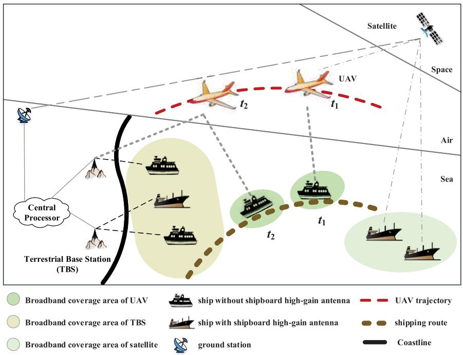

<details>
<summary>flowchart</summary>

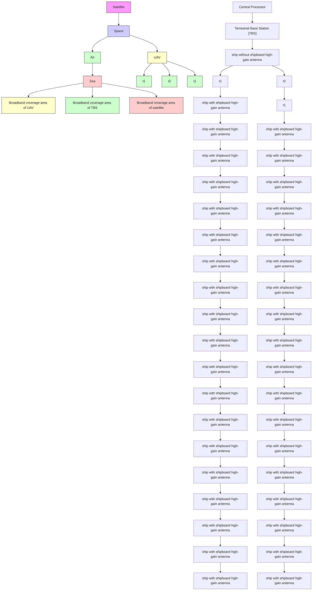
</details>

Fig. 1. Illustration of a hybrid satellite-UAV-terrestrial maritime communication network, where satellites, UAVs and TBSs provide broadband services in a coordinated manner.

3) The optimization problem is non-convex. We decompose the problem and solve it by using successive convex optimization and bisection searching tools. Simulation results demonstrate that the UAV fits well with existing satellite and terrestrial systems. Besides, a significant performance gain can be achieved via joint optimization of the UAV trajectory and transmit power by using only the large-scale CSI.

The rest of this paper is organized as follows. In Section II, the system model is introduced. The problem for the UAVaided coverage enhancement is formulated and solved in Section III. In Section IV, simulation results are presented. Section V concludes the paper.

Throughout this paper, vectors and scalars are denoted by boldface letters and normal letters, respectively. | · | indicates the absolute value of a scalar or the cardinality of a set. Transpose operator is indicated with $[ \cdot ] ^ { T }$ . -p-norm means $\begin{array} { r } { \| \pmb { x } \| _ { p } = \left( \sum _ { i = 1 } ^ { n } \left| x _ { i } \right| ^ { p } \right) ^ { 1 / p } . \mathcal { C } \mathcal { N } ( 0 , \sigma ^ { 2 } ) } \end{array}$ represents the complex Gaussian distribution with zero mean and $\sigma ^ { 2 }$ variance. $\dot { \mathbf { x } } _ { t }$ and $\ddot { \mathbf { x } } _ { t }$ denote the first-order and second-order derivatives of $\mathbf { \Delta } _ { \mathbf { \mathcal { X } } _ { t } }$ with respect to t. E{·} denotes the expectation operator. Main notations are summarized in Table I.

# II. SYSTEM MODEL

We consider a practical hybrid maritime network consisting of mobile users (ships), UAVs, TBSs and satellites, as shown in Fig. 1. The TBSs are deployed along the coast to provide communication services for users in the area of coastal waters. The broadband coverage area of TBSs is usually limited due to large non-line-of-sight pathloss. Out of the coverage area of TBSs, the maritime satellites provide communication links. For the ships equipped with expensive high-gain antennas, the broadband service can be guaranteed. Whereas for the low-end ships without high-gain antennas, it is still difficult to enjoy a broadband service even within the coverage area of satellites. To fill up this gap, we utilize UAVs to provide broadband services in an on-demand manner. More specifically, if a mobile user needs a high-rate communication service (e.g., a video conference) from $t _ { s }$ to $t _ { e }$ , the communication request will be sent from the mobile user to its nearest TBS and then transmitted to the central processor. The central processor selects one idle UAV and prepares the idle UAV to serve the mobile user. After the idle UAV is sent, the mobile user will be associated to the idle UAV at time $t _ { s }$ . The UAV will fly along the optimized trajectory to serve the user from time $t _ { s }$ to time $t _ { e } .$ . After finishing the high-rate communication service, the mobile user will be associated to its nearest TBS at time $t _ { e }$ and the UAV will go back to the coast.

In this paper, the spectrum is shared between UAVs and satellites. Thus, there may be interference between the UAVto-user link and the satellite-to-user link. Because the antenna gain of users served by UAVs is lower than that of users served by satellites, the interference on users served by UAVs from satellites can be ignored. Besides, interference management and user association among UAVs are important for improving the quality of service, which have been comprehensively investigated in [40]–[42]. Due to the space limitation, we simplify the system model to concentrate on spectrum sharing between UAVs and satellites. We assume that, from $t _ { s }$ to $t _ { e } ,$ a user is connected to one UAV and the UAV only serves one user. Moreover, only a few users are served by UAVs and thus UAVs are sparsely distributed on the immense ocean. To avoid the interference between UAVs, orthogonal resources, e.g., different subcarriers or different time slots, have been used before UAVs take off. Then, to mitigate the leakage interference on users served by satellites, we jointly adjust the trajectory and the transmit power of UAVs.

TABLE I   
MAIN NOTATIONS 

<table><tr><td>Notation</td><td>Meaning</td></tr><tr><td>U, Γ, Ξ</td><td>Set of UAVs, TBSs and satellites connected to UAVs, respectively</td></tr><tr><td>Ψ</td><td>Set of users served by UAVs</td></tr><tr><td>Su</td><td>Set of satellites sharing the same frequency with the u-th UAV</td></tr><tr><td>Ou</td><td>Set of users served by satellites and interfered by the u-th UAV</td></tr><tr><td>RU,ψu,t</td><td>Ergodic achievable rate between the u-th UAV and its user in Ψ at time t</td></tr><tr><td>RΓ,Uγ,u,t</td><td>Ergodic achievable rate between the γ-th TBS and the u-th UAV at time t</td></tr><tr><td>RΣ,Uξ,u,t</td><td>Ergodic achievable rate between the ξ-th satellite in Ξ and the u-th UAV at time t</td></tr><tr><td>RSu,OuS,o,t</td><td>Ergodic achievable rate between the s-th satellite in Su and the o-th user in Ou at time t</td></tr><tr><td>hU,Ψu,u,t, LU,Ψu,u,t</td><td>Channel and path loss between the u-th UAV and its user in Ψ at time t, respectively</td></tr><tr><td>hU,OuUo,t, LU,OuUo,t</td><td>Channel and path loss between the u-th UAV and the o-th user in Ou at time t, respectively</td></tr><tr><td>hΓ,Uγ,u,t, LΓ,Uγ,u,t</td><td>Channel and path loss between the γ-th TBS and the u-th UAV at time t, respectively</td></tr><tr><td>hΣ,Uξ,u,t, LΣ,Uξ,u,t</td><td>Channel and path loss between the ξ-th satellite in Ξ and the u-th UAV at time t, respectively</td></tr><tr><td>hSU,OuS,o,t, LSu,OuS,o,t</td><td>Channel and path loss between the s-th satellite in Su and the o-th user in Ou at time t</td></tr><tr><td>PU,t, PΓγ,t</td><td>Transmit power of the u-th UAV and the γ-th TBS at time t, respectively</td></tr><tr><td>PSs,t, PΣξ,t</td><td>Transmit power of the s-th satellite in Su and the ξ-th satellite in Ξ at time t, respectively</td></tr><tr><td>GΨ, GO</td><td>Antenna gain of users served by UAVs and users served by satellites, respectively</td></tr><tr><td>GU, GΓ, GS</td><td>Antenna gain of UAVs, TBSs, and satellites, respectively</td></tr><tr><td>SU, SS</td><td>Path-loss exponent for the UAV-to-ground link and the satellite-to-ground link, respectively</td></tr><tr><td>AU, AS</td><td>Path loss at d0 for the UAV-to-ground link and the satellite-to-ground link, respectively</td></tr><tr><td>cUt, cΞξ,t, cΓγ</td><td>Position vector of the u-th UAV and the ξ-th satellite at time t, and the γ-th TBS, respectively</td></tr><tr><td>cΨu,t, cOuO,t</td><td>Position vector of the u-th user in Ψ and the o-the user in Ou at time t, respectively</td></tr><tr><td>vUt, aUu,t</td><td>Velocity vector and acceleration vector of the u-th UAV at time t, respectively</td></tr><tr><td>vΨt</td><td>Velocity vector of users in Ψ at time t</td></tr><tr><td>νmax, νmin</td><td>Maximum velocity, minimum velocity</td></tr><tr><td>zmax, zmin</td><td>Maximum height, minimum height</td></tr><tr><td>amax</td><td>Maximum acceleration</td></tr><tr><td>PUMax</td><td>Maximum transmit power of UAVs</td></tr><tr><td>T0</td><td>Travel time during which a UAV serves a mobile user</td></tr><tr><td>E0</td><td>Allowable communication energy</td></tr><tr><td>I0</td><td>Interference temperature limitation</td></tr><tr><td>K</td><td>Rician factor</td></tr><tr><td>h</td><td>Rician fading</td></tr></table>

To serve the mobile users on the ocean, UAVs need the wireless backhaul. Both TBSs and satellites can be used. As shown in [36], when UAVs are close to the mainland, the air-to-ground backhaul is able to provide enough capacity. In this case, TBSs nearest to UAVs can be utilized to connect UAVs to the central processor. Otherwise, satellites are used instead. Note that UAVs have limited energy. Generally, UAVs fly close to the coast and are mainly served by TBSs. In this paper, we focus on the TBS-assisted backhaul but also study the satellite-assisted backhaul.

We assume that autonomous UAVs are employed as aerial base stations and both UAVs and users served by UAVs are equipped with a single antenna. Let U and Ψ denote the set of UAVs and the set of users served by UAVs, respectively. In this paper, each UAV only serves one user and thus $| \mathbf { U } | = | \Psi |$ . Let $T _ { 0 }$ be the travel time from $t _ { s }$ to $t _ { e }$ during which the u-th UAV serves its user. At time $t ,$ the signal transmitted from the u-th UAV is denoted as $b _ { u , i } ^ { \mathrm { U } }$ t and the received signal of the user served by the u-th UAV can be expressed as

$$
q _ {u, t} ^ {\Psi} = P _ {u, t} ^ {\mathrm{U}} G _ {\mathrm{U}} G _ {\Psi} h _ {u, u, t} ^ {\mathrm{U}, \Psi} b _ {u, t} ^ {\mathrm{U}} + e _ {u, u, t} ^ {\mathrm{U}, \Psi} \tag {1}
$$

where $0 \leq t \leq T _ { 0 } , P _ { u , t } ^ { \mathrm { U } }$ denotes the transmit power of the u-th UAV, GU denotes the antenna gain of UAVs, GΨ denotes the antenna gain of users served by UAVs, $h _ { u , u , t } ^ { \mathrm { U } , \Psi }$ t denotes the channel between the u-th UAV and its user, and e U,Ψu,u,t $e _ { u , u , t } ^ { \mathrm { U } , \Psi }$ denotes the White Gaussian noise.

We assume that UAVs are high enough to enable LOS transmission. A typical composite channel containing both largescale and small-scale fading is employed. The channel between the u-th UAV and its user at time t can be represented as

$$
h _ {u, u, t} ^ {\mathrm{U}, \Psi} = \left(L _ {u, u, t} ^ {\mathrm{U}, \Psi}\right) ^ {- 1 / 2} \tilde {h} _ {u, u, t} ^ {\mathrm{U}, \Psi} \tag {2}
$$

where LU,Ψu,u,t $L _ { u , u , t } ^ { \mathrm { U } , \Psi }$ denotes the path loss and $\tilde { h } _ { u , u , t } ^ { \mathrm { U } , \Psi }$ denotes Rician fading during the information transmission. Let du,u,t $d _ { u , u , t } ^ { \mathrm { U } , \Psi }$ denote the distance between the u-th UAV and its user at time t.

We assume the earth surface to be smooth and flat.1 Then, the path loss model can be expressed as

$$
L _ {u, u, t} ^ {\mathrm{U}, \Psi} (\mathrm{dB}) = A _ {\mathrm{U}} + 1 0 \varsigma_ {\mathrm{U}} \log 1 0 \left(\frac {d _ {u , u , t} ^ {\mathrm{U} , \Psi}}{d _ {0}}\right) + X _ {u, u, t} ^ {\mathrm{U}, \Psi} \tag {3}
$$

where $d _ { 0 }$ denotes the reference distance, $A _ { \mathrm { U } }$ denotes the path loss at $d _ { 0 } , \varsigma _ { \mathrm { U } }$ denotes the path-loss exponent, and $X _ { u , u , t } ^ { \mathrm { U } , \Psi }$ t is a zero-mean Gaussian random variable with standard deviation $\sigma _ { X _ { \mathrm { U } } }$ [50]–[52]. Rician fading can be represented as

$$
\tilde {h} _ {u, u, t} ^ {\mathrm{U}, \Psi} = \sqrt {\frac {K _ {\mathrm{U}}}{1 + K _ {\mathrm{U}}}} + \sqrt {\frac {1}{1 + K _ {\mathrm{U}}}} g _ {u, u, t} ^ {\mathrm{U}, \Psi} \tag {4}
$$

where $g _ { u , u , t } ^ { \mathrm { U } , \Psi } \in \mathcal { C N } ( 0 , \ 1 )$ and $K _ { \mathrm { U } }$ indicates the Rician factor that corresponds to the ratio between the LOS power and the scattering power [53]–[56]. On the ocean, ships normally travel along the fixed shipping routes and then the historical or pre-measured data can be derived. We can use the derived data to obtain the relationship between the location and the large-scale CSI. By using this relationship, the corresponding large-scale CSIthat path loss $\overset { \cdot } { L } _ { u , u , t } ^ { \mathrm { U } , \Psi }$ cation can be obtaineand Rician factor $K _ { \mathrm { U } }$ hus, we assumeare available, whereas $g _ { u , u , t } ^ { \mathrm { U } , \Psi }$ u,u,t  is unknown. The ergodic achievable rate $R _ { u , u , t } ^ { \mathrm { U } , \Psi }$ between the u-th UAV and its user at time t can be derived as

$$
R _ {u, u, t} ^ {\mathrm{U}, \Psi} = \mathbf {E} \left\{\log_ {2} \left[ 1 + \frac {P _ {u , t} ^ {\mathrm{U}} G _ {\mathrm{U}} G _ {\Psi} \left| h _ {u , u , t} ^ {\mathrm{U} , \Psi} \right| ^ {2}}{\sigma^ {2}} \right] \right\} \tag {5}
$$

where $\sigma ^ { 2 }$ denotes noise power. The expectation is taken over the small-scale fading.

By substituting (2) and (3) into (1), the received signal of the user served by the u-th UAV can be rewritten as

$$
q _ {u, t} ^ {\Psi} = P _ {u, t} ^ {\mathrm{U}} W _ {u, u, t} ^ {\mathrm{U}, \Psi} \left(d _ {u, u, t} ^ {\mathrm{U}, \Psi}\right) ^ {- \varsigma_ {\mathrm{U}} / 2} \tilde {h} _ {u, u, t} ^ {\mathrm{U}, \Psi} b _ {u, t} ^ {\mathrm{U}} + e _ {u, u, t} ^ {\mathrm{U}, \Psi}, \tag {6}
$$

where W U,Ψu,u,t $\begin{array} { r } { W _ { u , u , t } ^ { \mathrm { U } , \Psi } = G _ { \mathrm { U } } G _ { \Psi } d _ { 0 } ^ { \varsigma _ { \mathrm { U } } / 2 } 1 0 ^ { - \frac { A _ { \mathrm { U } } + X _ { u , u , t } ^ { \mathrm { U } , \Psi } } { 2 0 } } } \end{array}$ is known, $P _ { u , t } ^ { \mathrm { U } }$ and $d _ { u , u , t } ^ { \mathrm { U } , \Psi }$ need to be determined. Considering the user mobility, our aim is to maintain certain achievable rate to avoid severe performance degradation during the travel time. Before the u-th UAV is deployed, the trajectory and the transmit power of the u-th UAV are optimized to maximize the minimum ergodic rate during the whole travel time $T _ { 0 } .$ . After the u-th UAV is sent out, the u-th UAV serves the mobile user according to the optimized trajectory and transmit power.

# III. UAV-AIDED COVERAGE ENHANCEMENT

In this section, we formulate the optimization problem of the UAV trajectory and in-flight transmit power and provide an iterative algorithm to solve the optimization problem.

1If the distances are shorter than a few tens of kilometers, it is often permissible to neglect earth curvature and assume the earth surface to be smooth and flat [49].

# A. Problem Formulation

The set of TBSs is denoted as Γ. We assume that the γ-th TBS receives the high-rate communication request from a mobile user and then starts to send the u-th UAV. During the travel time $T _ { 0 }$ of the u-th UAV, the $\gamma \mathrm { - }$ th TBS is nearest to the mobile user among TBSs and provides wireless backhual for the u-th UAV. We consider a three-dimensional Cartesian coordinate system, in which the γ-th TBS is located at $\mathbf { c } _ { \gamma } ^ { \Gamma } = \left( 0 , \ 0 , \ \overset { \cdot } { z } _ { \gamma } ^ { \Gamma } \right)$ . The positions of the u-th UAV and its user at time t are respectively denoted as ${ \bf c } _ { u , t } ^ { \mathrm { U } } = \left[ x _ { u , t } ^ { \mathrm { U } } , ~ y _ { u , t } ^ { \mathrm { U } } , ~ z _ { u , t } ^ { \mathrm { U } } \right] ^ { T }$ and $\mathbf { c } _ { u , t } ^ { \Psi } = \left[ x _ { u , t } ^ { \Psi } , ~ y _ { u , t } ^ { \Psi } , ~ z _ { u , t } ^ { \Psi } \right] ^ { T }$ . We discretize the travel time $T _ { 0 }$ into T time slots with a step size $\Delta t .$ . We adjust the trajectory and the transmit power of the u-th UAV per time slot. We assume that UAVs and users on the ocean move under the law of uniformly accelerated rectilinear motion during $\Delta t .$ Moreover, Δt is small enough so that an exact trajectory of UAVs can be obtained and the large-scale channel is assumed to remain the same during $\Delta t .$ .

The set of satellites sharing the same frequency with the u-th UAV are denoted as $\mathbf { S } _ { u } .$ . The set of users served by satellites and interfered by the u-th UAV is denoted as $\mathrm { O } _ { u } .$ . To simplify the analysis, we assume that satellites and their users are equipped with a single antenna. Without loss of generality, we assume that one user served by a satellite is interfered by the u-th UAV per time slot. Let the o-th user in $\mathrm { O } _ { u }$ be served by the s-th satellite in $\mathbf { S } _ { u }$ at time t. The ergodic achievable rate for the o-th user in $\mathrm { O } _ { u }$ at time t can be denoted as

$$
R _ {s, o, t} ^ {\mathrm{S} _ {u}, \mathrm{O} _ {u}} = \mathbf {E} \left\{\log_ {2} \left[ 1 + \frac {P _ {s , t} ^ {\mathrm{S}} G _ {\mathrm{S}} G _ {\mathrm{O}} \left| h _ {s , o , t} ^ {\mathrm{S} _ {u} , \mathrm{O} _ {u}} \right| ^ {2}}{P _ {u , t} ^ {\mathrm{U}} G _ {\mathrm{U}} G _ {\mathrm{O}} \left| h _ {u , o , t} ^ {\mathrm{U} , \mathrm{O} _ {u}} \right| ^ {2} + \sigma^ {2}} \right] \right\} \tag {7}
$$

where P S $P _ { s , t } ^ { S }$ denotes the transmit power of the s-th satellite, $G _ { \mathrm { { S } } }$ denotes the antenna gain of satellites, and $G _ { 0 }$ denotes the antenna gain of users served by satellites. $h _ { u , o , t } ^ { \mathrm { U } , \mathrm { O } _ { u } }$ U,Ou denotes the channel between the u-the UAV and the o-can be written as equations in (2), (3) and $( 4 ) . \ : h _ { s , o , t } ^ { \mathrm { S } _ { u } , \mathrm { O } _ { u } }$ $\mathrm { O } _ { u }$ whichdenotes the channel between the s-th satellite in $\mathrm { \bf S } _ { u }$ and the o-th user in $\mathrm { O } _ { u }$ which can be expressed as

$$
h _ {s, o, t} ^ {\mathrm{S} _ {u}, \mathrm{O} _ {u}} = \left(L _ {s, o, t} ^ {\mathrm{S} _ {u}, \mathrm{O} _ {u}}\right) ^ {- 1 / 2} \tilde {h} _ {s, o, t} ^ {\mathrm{S} _ {u}, \mathrm{O} _ {u}} \tag {8}
$$

where $L _ { s , o , t } ^ { S _ { u } , 0 _ { u } }$ denotes the path loss and $\tilde { h } _ { s , o , t } ^ { \mathrm { S } _ { u } , \mathrm { O } _ { u } }$ denotes Rician s,o,t s,o,t fading during the information transmission. Let $d _ { s , o , t } ^ { \mathrm { S } _ { u } , \mathrm { O } _ { u } }$ denote the distance between the s-th satellite in $\mathrm { \bf S } _ { u }$ and the o-th user in $\mathrm { O } _ { u }$ . Then, the path loss model can be expressed as

$$
L _ {s, o, t} ^ {\mathrm{S} _ {u}, \mathrm{O} _ {u}} (\mathrm{dB}) = A _ {\mathrm{S}} + 1 0 \varsigma_ {\mathrm{S}} \log 1 0 \left(\frac {d _ {s , o , t} ^ {\mathrm{S} _ {u} , \mathrm{O} _ {u}}}{d _ {0}}\right) + X _ {s, o, t} ^ {\mathrm{S} _ {u}, \mathrm{O} _ {u}} \tag {9}
$$

where $d _ { 0 }$ denotes the reference distance, $A _ { \mathrm { S } }$ denotes the path loss at d0, ςS denotes the path-loss exponent, and $X _ { s , o , t } ^ { S _ { u } , \mathrm { O } _ { u } }$ is a zero-mean Gaussian random variable with standard deviation $\sigma _ { X _ { S } }$ . Rician fading can be represented as

$$
\tilde {h} _ {s, o, t} ^ {\mathrm{S} _ {u}, \mathrm{O} _ {u}} = \sqrt {\frac {K _ {\mathrm{S}}}{1 + K _ {\mathrm{S}}}} + \sqrt {\frac {1}{1 + K _ {\mathrm{S}}}} g _ {s, o, t} ^ {\mathrm{S} _ {u}, \mathrm{O} _ {u}} \tag {10}
$$

where g u s,o,t $g _ { s , o , t } ^ { \mathrm { S } _ { u } , \mathrm { O } _ { u } } \in \mathcal { C N } ( 0 , \ 1 )$ and $K _ { S }$ indicates the Rician factor. The expectation is taken over the small-scale fading. To avoid the interference shown in (7), an interference temperature limitation $I _ { 0 }$ is applied to give

$$
\mathbf {E} \left[ P _ {u, t} ^ {\mathrm{U}} G _ {\mathrm{U}} G _ {\mathrm{O}} \left| h _ {u, o, t} ^ {\mathrm{U}, \mathrm{O} _ {u}} \right| ^ {2} \right] \leq I _ {0}, \quad o \in \mathrm{O} _ {u}. \tag {11}
$$

On the ocean, the UAV has to be connected to the central processor. Either the TBS-to-UAV link or the satellite-to-UAV link can be considered for the wireless backhaul. Due to the wireless backhual, tside of the u-th UAV $R _ { u , u , t } ^ { \mathrm { U } , \tilde { \Psi } }$ odic achievable rate of the accesscannot exceed that of the backhaul side of the u-th UAV. Thus, we have

$$
R _ {u, u, t} ^ {\mathrm{U}, \Psi} \leq R _ {\mathrm{bh}}. \tag {12}
$$

Orthogonal resources, e.g., different subcarriers or different time slots, have been used to avoid the interference between UAVs. When the γ-th the u-th UAV, we have $R _ { \mathrm { b h } } = R _ { \gamma , u , t } ^ { \Gamma , \mathrm { U } }$ the wireless backhaul for, which can be expressed as

$$
R _ {\gamma , u, t} ^ {\Gamma , \mathrm{U}} = \mathbf {E} \left\{\log_ {2} \left[ 1 + \frac {P _ {\gamma , t} ^ {\Gamma} G _ {\Gamma} G _ {\mathrm{U}} \left| h _ {\gamma , u , t} ^ {\Gamma , \mathrm{U}} \right| ^ {2}}{\sigma^ {2}} \right] \right\} \tag {13}
$$

where $G _ { \Gamma }$ denotes the antenna gain of TBSs and $h _ { \gamma , u , \ast } ^ { \Gamma , \mathrm { U } }$ t denotes the channel between the γ-th TBS and the u-th UAV, which can be written as

$$
h _ {\gamma , u, t} ^ {\Gamma , \mathrm{U}} = \left(\frac {d _ {0}}{d _ {\gamma , u , t} ^ {\Gamma , \mathrm{U}}}\right) ^ {\frac {S _ {\mathrm{U}}}{2}} 1 0 ^ {- \frac {A _ {\mathrm{U}} + X _ {\gamma , u , t} ^ {\Gamma , \mathrm{U}}}{2 0}}
$$

$$
\left(\sqrt {\frac {K _ {\mathrm{U}}}{1 + K _ {\mathrm{U}}}} + \sqrt {\frac {1}{1 + K _ {\mathrm{U}}}} g _ {\gamma , u, t} ^ {\Gamma , \mathrm{U}}\right) \tag {14}
$$

where $d _ { \gamma , u , t } ^ { \Gamma , \mathrm { U } }$ denotes the distance between the γ-th TBS and the u-th UAV, $X _ { \gamma , u , i } ^ { \Gamma , \mathrm { U } }$ XΓ,Uγ,u, is a zero-mean Gaussian random variable t with standard deviation $\sigma _ { X _ { \mathrm { U } } }$ , and $g _ { \gamma , u , t } ^ { \Gamma , \mathrm { U } } \in \mathcal { C N } ( 0 , \ 1 )$ . Let $\Xi$ be the set of satellites serving UAVs. When the u-th UAV is $R _ { \mathrm { b h } } = R _ { \xi , u , t } ^ { \Xi , \mathrm { U } } ,$ which can be expressed as

$$
R _ {\xi , u, t} ^ {\Xi , \mathrm{U}} = \mathbf {E} \left\{\log_ {2} \left[ 1 + \frac {P _ {\xi , t} ^ {\Xi} G _ {S} G _ {\mathrm{U}} \left| h _ {\xi , u , t} ^ {\Xi , \mathrm{U}} \right| ^ {2}}{\sigma^ {2}} \right] \right\} \tag {15}
$$

where $\Xi$ ξ,t at time t and $P _ { \xi , t } ^ { \Xi }$ denotes the transmit power of the ξ-th satellite in $h _ { \xi , u , t } ^ { \Xi , \mathrm { U } }$ t denotes the channel between the ξ-th satellite and the u-th UAV, which can be written as

$$
h _ {\xi , u, t} ^ {\Xi , \mathrm{U}} = \left(\frac {d _ {0}}{d _ {\xi , u , t} ^ {\Xi , \mathrm{U}}}\right) ^ {\frac {\mathrm{S} _ {\mathrm{S}}}{2}} 1 0 ^ {- \frac {A _ {\mathrm{S}} + X _ {\xi , u , t} ^ {\Xi , \mathrm{U}}}{2 0}}
$$

$$
\left(\sqrt {\frac {K _ {\mathrm{S}}}{1 + K _ {\mathrm{S}}}} + \sqrt {\frac {1}{1 + K _ {\mathrm{S}}}} g _ {\xi , u, t} ^ {\Xi , \mathrm{U}}\right) \tag {16}
$$

where $d _ { \xi , u , t } ^ { \Xi , \mathrm { U } }$ denotes the distance between the ξ-th satellite and the u-th UAV, X Ξ,Uξ,u,t $X _ { \xi , u , t } ^ { \Xi , \mathrm { U } }$ is a zero-mean Gaussian random variable with standard deviation $\sigma _ { X _ { \mathrm { S } } }$ , and $g _ { \xi , u , t } ^ { \Xi , \mathrm { U } } \in \mathcal { C N } ( 0 , \ 1 )$ .

The definition of the velocity and the acceleration of the fixed-wing UAV can be expressed as

$$
\mathbf {v} _ {u, t} ^ {\mathrm{U}} = \dot {\mathbf {c}} _ {u, t} ^ {\mathrm{U}}, \tag {17}
$$

$$
\mathbf {a} _ {u, t} ^ {\mathrm{U}} = \ddot {\mathbf {c}} _ {u, t} ^ {\mathrm{U}}. \tag {18}
$$

The fixed-wing UAV has intrinsic maximum velocity $v _ { \mathrm { m a x } }$ and maximum acceleration $a _ { \mathrm { m a x } }$ . Besides, it has the minimum velocity $v _ { \mathrm { m i n } }$ (or the stall velocity) to remain aloft. Because of these bounds to the amplitude of the velocity and the acceleration, we have

$$
\left\| \mathbf {v} _ {u, t} ^ {\mathrm{U}} \right\| _ {2} \geq v _ {\min}, \tag {19}
$$

$$
\left\| \mathbf {v} _ {u, t} ^ {\mathrm{U}} \right\| _ {2} \leq v _ {\max}, \tag {20}
$$

$$
\left\| \mathbf {a} _ {u, t} ^ {\mathrm{U}} \right\| _ {2} \leq a _ {\max}. \tag {21}
$$

Besides, considering the bounds of the height of the u-th UAV, we have

$$
z _ {\min} \leq z _ {u, t} ^ {\mathrm{U}} \leq z _ {\max}. \tag {22}
$$

The lower bound in (22) is used to guarantee that the UAV is high enough to enable LOS transmission. The upper bound in (22) is set to indicate the maximum height that the UAV can reach according to the air traffic control.

We focus on the dynamic coverage performance of the user during T time slots. As the energy consumption for communications is limited, we have

$$
\sum_ {t = 1} ^ {T} P _ {u, t} ^ {\mathrm{U}} \Delta t \leq E _ {0} \tag {23}
$$

where $E _ { 0 }$ denotes the allowable energy consumption during $T _ { 0 }$ . Considering the maximum transmit power $P _ { \mathrm { m a x } } ^ { \dot { \mathrm { U } } }$ , we have

$$
0 \leq P _ {u, t} ^ {\mathrm{U}} \leq P _ {\max} ^ {\mathrm{U}}. \tag {24}
$$

The working time of the UAV is mainly determined by the fuel for flying and the battery for the communication. We assume that the fuel of the fixed-wing UAV is large enough for the trip during the travel time $T _ { 0 } .$ . If the residual energy is not enough to provide services after $T _ { 0 } ,$ multi-UAV scheduling can be employed.

According to the above analysis, the optimization problem can be formulated as

$$
\max _ {P _ {u, t} ^ {\mathrm{U}}, \mathbf {c} _ {u, t} ^ {\mathrm{U}}, \mathbf {v} _ {u, t} ^ {\mathrm{U}}, \mathbf {a} _ {u, t} ^ {\mathrm{U}}} \quad \min _ {t} R _ {u, u, t} ^ {\mathrm{U}, \Psi}
$$

${ \mathrm { s u b j e c t ~ t o ~ ( 1 1 ) } } , ( 1 2 ) , ( 1 7 ) , ( 1 8 ) , ( 1 9 ) ,$

$$
(2 0), (2 1), (2 2), (2 3), (2 4) \tag {25}
$$

where the minimum ergodic achievable rate during T time slots is maximized, by optimizing UAV’s transmit power, three-dimensional coordinates, velocities and accelerations during T time slots.

# B. An Iterative Solution

The optimization problem in (25) is difficult because the expectation is taken over the Rician fading in (5), (11)

and (12). Because the path loss $L _ { u , u , t } ^ { \mathrm { U } , \Psi }$ is available and $g _ { u , u , t } ^ { \mathrm { U } , \Psi } \in \mathcal { C N } ( 0 , \ 1 )$ , the average SNR can be expressed as

$$
\mathbf {E} \left\{P _ {u, t} ^ {\mathrm{U}} G _ {\mathrm{U}} G _ {\Psi} \left| h _ {u, u, t} ^ {\mathrm{U}, \Psi} \right| ^ {2} \sigma^ {- 2} \right\} = \frac {P _ {u , t} ^ {\mathrm{U}} G _ {\mathrm{U}} G _ {\Psi} \left(L _ {u , u , t} ^ {\mathrm{U} , \Psi}\right) ^ {- 1}}{\sigma^ {2}}. \tag {26}
$$

Let miz η U,Ψu,u,t $\eta _ { u , u , t } ^ { \mathrm { U } , \Psi } = P _ { u , t } ^ { \mathrm { U } } G _ { \mathrm { U } } G _ { \Psi } \left( L _ { u , u , t } ^ { \mathrm { U } , \Psi } \right) ^ { - 1 } \sigma ^ { - 2 }$ Pu,t . To solve thhip between $R _ { u , u , t } ^ { \mathrm { U } , \Psi }$ and η U,Ψu,u,t $\eta _ { u , u , t } ^ { \mathrm { U } , \Psi }$ is analyzed and the result is demonstrated in the following theorem.

Theorem 1: The ergodic achievable rate $R _ { u , u , t } ^ { \mathrm { U } , \Psi }$ is strictly concave and monotonically increasing with respect to the average SNR η U,Ψu,u,t. $\eta _ { u , u , t } ^ { \mathrm { U } , \Psi }$

Proof: See Appendix A.

According to the monotonicity of the objective function, we equivalently simplify (25) as

$$
\max _ {P _ {u, t} ^ {\mathrm{U}}, \mathbf {c} _ {u, t} ^ {\mathrm{U}}, \mathbf {v} _ {u, t} ^ {\mathrm{U}}, \mathbf {a} _ {u, t} ^ {\mathrm{U}}} \min _ {t} \frac {P _ {u , t} ^ {\mathrm{U}} G _ {\mathrm{U}} G _ {\Psi} \left(L _ {u , u , t} ^ {\mathrm{U} , \Psi}\right) ^ {- 1}}{\sigma^ {2}}. \tag {27}
$$

Similarly, we assume that $K _ { \mathrm { U } } = K _ { \mathrm { S } }$ . Then, the constraint (12) can be equivalently simplified as

$$
\frac {P _ {u , t} ^ {\mathrm{U}} G _ {\mathrm{U}} G _ {\Psi} \left(L _ {u , u , t} ^ {\mathrm{U} , \Psi}\right) ^ {- 1}}{\sigma^ {2}} \leq \frac {P _ {\mathrm{bh} , t} G _ {\mathrm{bh}} G _ {\mathrm{U}} (L _ {\mathrm{bh} , t}) ^ {- 1}}{\sigma^ {2}} \tag {28}
$$

where $P _ { \mathrm { b h } , t } \in \Bigl \{ P _ { \gamma , t } ^ { \Gamma } , P _ { \xi , t } ^ { \Xi } \Bigr \} , \ L _ { \mathrm { b h } , t } \in \Bigl \{ L _ { \gamma , u , t } ^ { \Gamma , \mathrm { U } } , L _ { \xi , u , t } ^ { \Xi , \mathrm { U } } \Bigr \} , \ G _ { \mathrm { b h } } \ \in$ $\{ G _ { \Gamma } , G _ { \mathrm { S } } \} , L _ { \gamma , u , t } ^ { \Gamma , \mathrm { U } }$ denotes the path loss between the γ-th TBS and the u-th UAV, and $L _ { \xi , u , t } ^ { \Xi , \mathrm { U } }$ denotes the path loss between the ξ-th satellite in Ξ and the u-th UAV.

To deal with the derivatives in (17) and (18), by using the first-order and second-order Taylor approximations, the constraints in (17) and (18) can be expressed as

$$
\mathbf {v} _ {u, t + 1} ^ {\mathrm{U}} \approx \mathbf {v} _ {u, t} ^ {\mathrm{U}} + \mathbf {a} _ {u, t} ^ {\mathrm{U}} \Delta t, \tag {29}
$$

$$
\mathbf {c} _ {u, t + 1} ^ {\mathrm{U}} \approx \mathbf {c} _ {u, t} ^ {\mathrm{U}} + \mathbf {v} _ {u, t} ^ {\mathrm{U}} \Delta t + \frac {1}{2} \mathbf {a} _ {u, t} ^ {\mathrm{U}} \Delta t ^ {2}. \tag {30}
$$

Let

$$
\Delta \mathbf {v} _ {t} ^ {\mathrm{U}} = \mathbf {v} _ {u, t + 1} ^ {\mathrm{U}} - (\mathbf {v} _ {u, t} ^ {\mathrm{U}} + \mathbf {a} _ {u, t} ^ {\mathrm{U}} \Delta t), \tag {31}
$$

$$
\Delta \mathbf {c} _ {t} ^ {\mathrm{U}} = \mathbf {c} _ {u, t + 1} ^ {\mathrm{U}} - \left(\mathbf {c} _ {u, t} ^ {\mathrm{U}} + \mathbf {v} _ {u, t} ^ {\mathrm{U}} \Delta t + \frac {1}{2} \mathbf {a} _ {u, t} ^ {\mathrm{U}} \Delta t ^ {2}\right). \tag {32}
$$

We also let $\Delta v _ { w , t } ^ { \mathrm { U } }$ and $\Delta c _ { w , t } ^ { \mathrm { U } }$ t denote the w-th element in $\Delta \mathbf { v } _ { t } ^ { \mathrm { U } }$ and $\Delta \mathbf { c } _ { t } ^ { \mathrm { U } }$ , where $w \in \{ 1 , 2 , 3 \}$ . We have

$$
\left| \Delta v _ {w, t} ^ {\mathrm{U}} \right| \leq \Delta v _ {0}, \tag {33}
$$

$$
\left| \Delta c _ {w, t} ^ {\mathrm{U}} \right| \leq \Delta c _ {0} \tag {34}
$$

where thresholds $\Delta v _ { 0 }$ and $\Delta c _ { 0 }$ are set to be small values. According to g u,o,t $g _ { u , o , t } ^ { \mathrm { U } , 0 _ { u } } \in \mathcal { C N } ( 0 , 1 )$ U,Ou , we have

$$
\mathbf {E} \left[ P _ {u, t} ^ {\mathrm{U}} G _ {\mathrm{U}} G _ {0} \left| h _ {u, o, t} ^ {\mathrm{U}, \mathrm{O} _ {u}} \right| ^ {2} \right] = P _ {u, t} ^ {\mathrm{U}} G _ {\mathrm{U}} G _ {0} \left(L _ {u, o, t} ^ {\mathrm{U}, \mathrm{O} _ {u}}\right) ^ {- 1} \tag {35}
$$

where L u,o,t $L _ { u , o , t } ^ { \mathrm { U } , \mathrm { O } _ { u } }$ denotes the path loss between the u-the UAV and the o-th user in $\mathrm { O } _ { u }$ . Then, the constraint in (11) can be rewritten as

$$
P _ {u, t} ^ {\mathrm{U}} G _ {\mathrm{U}} G _ {\mathrm{O}} \left(L _ {u, o, t} ^ {\mathrm{U}, \mathrm{O} _ {u}}\right) ^ {- 1} \leq I _ {0}. \tag {36}
$$

To solve the max-min problem, let

$$
Q = \min _ {t} P _ {u, t} ^ {\mathrm{U}} G _ {\mathrm{U}} G _ {\Psi} \left(L _ {u, u, t} ^ {\mathrm{U}, \Psi}\right) ^ {- 1} \sigma^ {- 2}. \tag {37}
$$

Based on the above analysis, the problem in (25) can be approximated as

$$
\max _ {P _ {u, t} ^ {\mathrm{U}}, \mathbf {c} _ {u, t} ^ {\mathrm{U}}, \mathbf {v} _ {u, t} ^ {\mathrm{U}}, \mathbf {a} _ {u, t} ^ {\mathrm{U}}, Q} Q \tag {38a}
$$

subject to (19), (20), (21), (22), (23),

$$
(2 4), (2 8), (3 3), (3 4), (3 6),
$$

$$
Q \leq \frac {P _ {u , t} ^ {\mathrm{U}} G _ {\mathrm{U}} G _ {\Psi} \left(L _ {u , u , t} ^ {\mathrm{U} , \Psi}\right) ^ {- 1}}{\sigma^ {2}}. \tag {38b}
$$

Let cOuo,t $\mathbf { c } _ { o , t } ^ { \mathrm { { O } _ { u } } }$ Ou denote the position vector of the o-th user interfered by the u-the UAV and $\mathbf { c } _ { \xi , t } ^ { \Xi }$ denote the position vector of the ξ- th satellite in Ξ. According to (3), we rewrite constraints (28), (36) and (38b) with $\mathbf { c } _ { u , t }$ as

$$
B _ {u, t} ^ {\mathrm{U}} P _ {\mathrm{bh}, t} \left\| \mathbf {c} _ {u, t} ^ {\mathrm{U}} - \mathbf {c} _ {u, t} ^ {\Psi} \right\| _ {2} ^ {\varsigma_ {\mathrm{U}}} \geq B _ {u, t} ^ {\Psi} P _ {u, t} ^ {\mathrm{U}} \left\| \mathbf {c} _ {u, t} ^ {\mathrm{U}} - \mathbf {c} _ {\mathrm{bh}, t} \right\| _ {2} ^ {\varsigma_ {\mathrm{bh}}}, \tag {39}
$$

$$
I _ {0} \left\| \mathbf {c} _ {u, t} ^ {\mathrm{U}} - \mathbf {c} _ {o, t} ^ {\mathrm{O} _ {u}} \right\| _ {2} ^ {\varsigma_ {\mathrm{U}}} \geq B _ {o, t} ^ {\mathrm{O} _ {u}} P _ {u, t} ^ {\mathrm{U}}, \tag {40}
$$

$$
Q \left\| \mathbf {c} _ {u, t} ^ {\mathrm{U}} - \mathbf {c} _ {u, t} ^ {\Psi} \right\| _ {2} ^ {\varsigma_ {\mathrm{U}}} \leq B _ {u, t} ^ {\Psi} P _ {u, t} ^ {\mathrm{U}} \tag {41}
$$

with

$$
B _ {u, t} ^ {\Psi} = G _ {\mathrm{U}} G _ {\Psi} d _ {0} ^ {\mathrm{SU}} \sigma^ {- 2} 1 0 ^ {- \frac {A _ {\mathrm{U}} + X _ {u , u , t} ^ {\mathrm{U} , \Psi}}{1 0}}, \tag {42}
$$

$$
B _ {u, t} ^ {\mathrm{U}} = G _ {\mathrm{bh}} G _ {\mathrm{U}} d _ {0} ^ {\zeta_ {\mathrm{bh}}} \sigma^ {- 2} 1 0 ^ {- \frac {A _ {\mathrm{bh}} + X _ {\mathrm{bh} , t}}{1 0}}, \tag {43}
$$

$$
B _ {o, t} ^ {\mathrm{O} _ {u}} = G _ {\mathrm{U}} G _ {\mathrm{O}} d _ {0} ^ {\mathrm{SU}} 1 0 ^ {- \frac {A _ {\mathrm{U}} + X _ {u , o , t} ^ {\mathrm{U} , \mathrm{O} _ {u}}}{1 0}} \tag {44}
$$

where $\mathbf { c } _ { \mathrm { b h } , t } \in  { \left\{ \mathbf { c } _ { \gamma } ^ { \Gamma } , \ \mathbf { c } _ { \xi , t } ^ { \Xi } \right\} } , \ \mathsf { S } _ { \mathrm { b h } } \in  { \left\{ \mathsf { G } \cup , \mathsf { S } _ { \mathrm { S } } \right\} } , \ A _ { \mathrm { b h } } \in  { \left\{ A _ { \mathrm { U } } , A _ { \mathrm { S } } \right\} }$ and $X _ { \mathrm { b h } , t } \in \left\{ X _ { \gamma , u , t } ^ { \Gamma , \tilde { \mathrm { U } } } , X _ { \xi , u , t } ^ { \Xi , \mathrm { U } } \right\}$ , X Ξ,U ! . The convexity of $\left\| \mathbf { c } _ { u , t } ^ { \mathrm { U } } - \mathbf { c } _ { u , t } ^ { \Psi } \right\| _ { 2 } ^ { \operatorname { S U } }$ is closely related to $\varsigma _ { \mathrm { U } } .$ . To make the analysis easy, based on the monotonicity of power functions, the constraints in (39), (40) and (41) are rewritten as

$$
\left(B _ {u, t} ^ {\mathrm{U}} P _ {\mathrm{bh}, t}\right) ^ {\frac {2}{\varsigma_ {\mathrm{U}}}} \left\| \mathbf {c} _ {u, t} ^ {\mathrm{U}} - \mathbf {c} _ {u, t} ^ {\Psi} \right\| _ {2} ^ {2} \geq \left(B _ {u, t} ^ {\Psi} P _ {u, t} ^ {\mathrm{U}}\right) ^ {\frac {2}{\varsigma_ {\mathrm{U}}}} \left\| \mathbf {c} _ {u, t} ^ {\mathrm{U}} - \mathbf {c} _ {\mathrm{bh}, t} \right\| _ {2} ^ {\frac {2 \varsigma_ {\mathrm{bh}}}{\varsigma_ {\mathrm{U}}}}, \tag {45}
$$

$$
I _ {0} ^ {\frac {2}{\varsigma_ {\mathrm{U}}}} \left\| \mathbf {c} _ {u, t} ^ {\mathrm{U}} - \mathbf {c} _ {o, t} ^ {\mathrm{O} _ {u}} \right\| _ {2} ^ {2} \geq \left(B _ {o, t} ^ {\mathrm{O} _ {u}} P _ {u, t} ^ {\mathrm{U}}\right) ^ {\frac {2}{\varsigma_ {\mathrm{U}}}}, \tag {46}
$$

$$
Q ^ {\frac {2}{\varsigma_ {\mathrm{U}}}} \left\| \mathbf {c} _ {u, t} ^ {\mathrm{U}} - \mathbf {c} _ {u, t} ^ {\Psi} \right\| _ {2} ^ {2} \leq \left(B _ {u, t} ^ {\Psi} P _ {u, t} ^ {\mathrm{U}}\right) ^ {\frac {2}{\varsigma_ {\mathrm{U}}}}. \tag {47}
$$

One can see that ${ \left\| { \mathbf { v } _ { u , t } ^ { \mathrm { U } } } \right\| } _ { 2 } ^ { 2 } , ~ { \left\| { \mathbf { a } _ { u , t } ^ { \mathrm { U } } } \right\| } _ { 2 } ^ { 2 } , ~ { \left\| { \mathbf { c } _ { u , t } ^ { \mathrm { U } } - \mathbf { c } _ { u , t } ^ { \mathrm { \Psi } } } \right\| } _ { 2 } ^ { 2 }$ and $\left\| \mathbf { c } _ { u , t } ^ { \mathrm { U } } - \mathbf { c } _ { o , t } ^ { \mathrm { 0 } _ { u } } \right\| _ { 2 } ^ { 2 }$ are convex functions. The constraints in (20), 2 (21) and (47) indicate the convex sets with respect to $\mathbf { v } _ { u , t } ^ { \mathrm { U } } ,$ $\mathbf { a } _ { u , t } ^ { \mathrm { U } }$ and cave $\mathbf { c } _ { u , t } ^ { \mathrm { U } } .$ . The constraiwith respect to n (19and d (46) indicate the. $\mathbf { v } _ { u , t } ^ { \mathrm { U } }$ $\mathbf { c } _ { u , t } ^ { \mathrm { U } }$

Then, we determine the convexity of (45). If the satellite-to-UAV backhaul link is considered, ${ \bf c } _ { \mathrm { b h } , t } = { \bf c } _ { \xi , t } ^ { \Xi } , P _ { \mathrm { b h } , t } = P _ { \xi , t } ^ { \Xi } ,$ $G _ { \mathrm { b h } } = G _ { \mathrm { S } } , \ \varsigma _ { \mathrm { b h } } = \varsigma _ { \mathrm { S } } , \ A _ { \mathrm { b h } } = \ A _ { \mathrm { S } }$ and $X _ { \mathrm { b h } , t } \stackrel { \cdot } { = } X _ { \xi , u , t } ^ { \Xi , \mathrm { U } } .$ = XΞ,U . In the inequality (45), because the satellite is far away from the UAV, we assume that the distance between the UAV and the satellite does not change during T time slots and then $\left\| \mathbf { c } _ { u , t } ^ { \mathrm { U } } - \mathbf { c } _ { \xi , t } ^ { \Xi } \right\|$ − cΞξ , t is constant. In this case, the constraint in (45) is non-convex with respect to ${ \bf c } _ { u , t } ^ { \mathrm { U } }$ . If the TBS-to-UAV backhaul link is considered,

TABLE II SUCCESSIVE CONVEX OPTIMIZATION OF TRAJECTORY AND TRANSMIT POWER   
Initialization:   
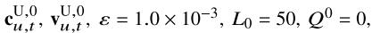  
FOR1=1 T0 $l = L _ { 0 }$

1) Solve the problem in (55) for given $\mathbf { c } _ { u , t } ^ { \mathrm { U } , l - 1 }$ cut and Vut $\mathbf { v } _ { u , t } ^ { \mathrm { U } , l - 1 }$ , then denote the optimal solution as Pu.1,u.t, $P _ { u , t } ^ { \mathrm { U } , l } , \mathbf { \bar { c } } _ { u , t } ^ { \mathrm { U } , l } , \mathbf { v } _ { u , t } ^ { \mathrm { U } , l } , \mathbf { a } _ { u , t } ^ { \mathrm { U } , l } , Q ^ { l } ,$ ，   
2)If $\left| Q ^ { l } - Q ^ { l - 1 } \right| \Bigl / Q ^ { l } < \varepsilon ,$ stop.

# END

cbh,t = cΓγ , Pbh,t = P Γγ,t, ${ \bf c } _ { \mathrm { b h } , t } = { \bf c } _ { \gamma } ^ { \Gamma } , P _ { \mathrm { b h } , t } = P _ { \gamma , t } ^ { \Gamma } , G _ { \mathrm { b h } } = G _ { \Gamma } , \varsigma _ { \mathrm { b h } } = \varsigma _ { \mathrm { U } } , A _ { \mathrm { b h } } = A _ { \mathrm { U } }$ and $X _ { \mathrm { b h } , t } = \dot { X } _ { \gamma , u , t } ^ { \Gamma , \mathrm { U } }$ . Define the function

$$
\begin{array}{l} f _ {1} \left(\mathbf {c} _ {u, t} ^ {\mathrm{U}}\right) = \left(B _ {u, t} ^ {\mathrm{U}} P _ {\xi , t} ^ {\Xi}\right) ^ {2 / \varsigma_ {\mathrm{U}}} \left\| \mathbf {c} _ {u, t} ^ {\mathrm{U}} - \mathbf {c} _ {u, t} ^ {\Psi} \right\| _ {2} ^ {2} \\ - \left(B _ {u, t} ^ {\Psi} P _ {u, t} ^ {\mathrm{U}}\right) ^ {2 / \varsigma_ {\mathrm{U}}} \left\| \mathbf {c} _ {u, t} ^ {\mathrm{U}} - \mathbf {c} _ {\gamma} ^ {\Gamma} \right\| _ {2} ^ {2}. \tag {48} \\ \end{array}
$$

To determine the convexity of (45), we verify the relationship between $f _ { 1 } \left( \mathbf { c } _ { u , t } ^ { \mathrm { U } } \right)$ and ${ \bf c } _ { u , v } ^ { \mathrm { U } }$ t by the second-order derivatives. We have the following theorem.

Theorem 2: If function, else if BU $B _ { u , t } ^ { \mathrm { U } } \mathbf { \bar { \Sigma } } _ { \xi , t } \leq B _ { u , t } ^ { \Psi } P _ { u , t } ^ { \mathrm { U } } , \ f _ { 1 } \left( \mathbf { c } _ { u , t } ^ { \mathrm { U } } \right)$ $B _ { u , t } ^ { \mathrm { U } } \boldsymbol { P } _ { \xi , t } ^ { \ z } > B _ { u , t } ^ { \Psi } \boldsymbol { P } _ { u , t } ^ { \mathrm { U } } , \ f _ { 1 } \left( \mathbf { c } _ { u , t } ^ { \mathrm { U } } \right)$ ξ ,Ξ is a concaveis a convex function.

Proof: The second-order partial derivative of $f _ { 1 } \left( \mathbf { c } _ { u , t } ^ { \mathrm { U } } \right)$ with respect to ${ \bf c } _ { u , t } ^ { \mathrm { U } }$ is

$$
\ddot {f} _ {1} \left(\mathbf {c} _ {u, t} ^ {\mathrm{U}}\right) = 2 \left(B _ {u, t} ^ {\mathrm{U}} P _ {\xi , t} ^ {\Xi}\right) ^ {2 / \varsigma_ {\mathrm{U}}} - 2 \left(B _ {u, t} ^ {\Psi} P _ {u, t} ^ {\mathrm{U}}\right) ^ {2 / \varsigma_ {\mathrm{U}}}. \tag {49}
$$

$B _ { u , t } ^ { \mathrm { U } } , \qquad B _ { u , t } ^ { \Psi } , \qquad P _ { \xi , t } ^ { \Xi }$ B Ψ , P Ξ and $P _ { u , t } ^ { \mathrm { U } } ,$ if BUu,tP Ξξ,t ≤ $B _ { u , t } ^ { \mathrm { U } } \boldsymbol { P } _ { \xi , t } ^ { \Xi } \leq B _ { u , t } ^ { \Psi } \boldsymbol { P } _ { u , t } ^ { \mathrm { U } } , \boldsymbol { f } _ { 1 } ^ { \intercal } \big ( \mathbf { c } _ { u , t } ^ { \mathrm { U } } \big )$ we have a convex constraint in (45). If $B _ { u , t } ^ { \mathrm { U } } { P } _ { \xi , t } ^ { \Xi } > B _ { u , t } ^ { \Psi } { P } _ { u , t } ^ { \mathrm { U } } ,$ BUu,tP Ξξ,t > BΨu,tP Uu,t, $f _ { 1 } \left( \mathbf { c } _ { u , t } ^ { \mathrm { U } } \right)$ is a convex function, then we have a concave constraint in (45).

Based on the above analysis, the problem in (38) is still non-convex due to the non-convex constraints in (19), (45) and (46). To make the problem in (38) more tractable, the Taylor expansion is employed to approximate the convex functions with the linear ones. Then, we obtain the following lemma.

Lemma 1: For any given vU,ru,t $\mathbf { v } _ { u , t } ^ { \mathrm { U } , r }$ and $\mathbf { c } _ { u , t } ^ { \mathrm { U } , r }$ , we have

$$
\begin{array}{l} \left\| \mathbf {v} _ {u, t} ^ {\mathrm{U}, r} \right\| _ {2} ^ {2} + 2 \left(\mathbf {v} _ {u, t} ^ {\mathrm{U}, r}\right) ^ {T} \left(\mathbf {v} _ {u, t} ^ {\mathrm{U}} - \mathbf {v} _ {u, t} ^ {\mathrm{U}, r}\right) \geq v _ {\min} ^ {2}, (50) \\ \left(B _ {u, t} ^ {\mathrm{U}} P _ {\mathrm{bh}, t}\right) ^ {\frac {2}{\varsigma_ {\mathrm{U}}}} f _ {u, u, t} ^ {\mathrm{U}, \Psi} \geq \left(B _ {u, t} ^ {\Psi} P _ {u, t} ^ {\mathrm{U}}\right) ^ {\frac {2}{\varsigma_ {\mathrm{U}}}} \left\| \mathbf {c} _ {u, t} ^ {\mathrm{U}} - \mathbf {c} _ {\mathrm{bh}, t} \right\| _ {2} ^ {\frac {2 \varsigma_ {\mathrm{bh}}}{\varsigma_ {\mathrm{U}}}}, (51) \\ I _ {0} ^ {\frac {2}{\varsigma_ {\mathrm{U}}}} f _ {u, o, t} ^ {\mathrm{U}, \mathrm{O} _ {u}} \geq \left(B _ {o, t} ^ {\mathrm{O} _ {u}} P _ {u, t} ^ {\mathrm{U}}\right) ^ {\frac {2}{\varsigma_ {\mathrm{U}}}} (52) \\ \end{array}
$$

with

$$
f _ {u, u, t} ^ {\mathrm{U}, \Psi} = \left\| \mathbf {c} _ {u, t} ^ {\mathrm{U}, r} - \mathbf {c} _ {u, t} ^ {\Psi} \right\| _ {2} ^ {2} + 2 \left(\mathbf {c} _ {u, t} ^ {\mathrm{U}, r} - \mathbf {c} _ {u, t} ^ {\Psi}\right) ^ {T} \left(\mathbf {c} _ {u, t} ^ {\mathrm{U}} - \mathbf {c} _ {u, t} ^ {\mathrm{U}, r}\right), \tag {53}
$$

$$
f _ {u, o, t} ^ {\mathrm{U}, \mathrm{O} _ {u}} = \left\| \mathbf {c} _ {u, t} ^ {\mathrm{U}, r} - \mathbf {c} _ {o, t} ^ {\mathrm{O} _ {u}} \right\| _ {2} ^ {2} + 2 \left(\mathbf {c} _ {u, t} ^ {\mathrm{U}, r} - \mathbf {c} _ {o, t} ^ {\mathrm{O} _ {u}}\right) ^ {T} \left(\mathbf {c} _ {u, t} ^ {\mathrm{U}} - \mathbf {c} _ {u, t} ^ {\mathrm{U}, r}\right). \tag {54}
$$

Proof: See Appendix B.

According to Lemma 1, we can iteratively solve the problem by using the successive convex optimization. The details are given in Table II. In the l-th iteration, by using $\mathbf { v } _ { u , t } ^ { \mathrm { U } , l - 1 }$

TABLE III SUCCESSIVE CONVEX OPTIMIZATION AND DECOUPLING OF TRAJECTORY AND TRANSMIT POWER   
Initialization: 

<table><tr><td>$ \mathbf{c}_{u,t}^{\mathrm{U},0}, \mathbf{v}_{u,t}^{\mathrm{U},0}, \varepsilon = 1.0 \times 10^{-3}, L_0 = 50, Q^0 = 0, $</td></tr></table>

FOR1=1TO $l = L _ { 0 }$

1) Solve the problem in (56)for given Cut $\mathbf { c } _ { u , t } ^ { \mathrm { U } , l } = \mathbf { c } _ { u , t } ^ { \mathrm { U } , l - 1 }$ =Cu,t ，then denote the optimal solution as Pu,t, $P _ { u , t } ^ { \mathrm { U } , l }$   
$\mathbf { c } _ { u , t } ^ { \mathrm { U } , l - 1 } , \mathbf { v } _ { u , t } ^ { \mathrm { U } , l - 1 }$ -1,and Pu,t, $P _ { u , t } ^ { \mathrm { U } , l }$ Pu,t,and ${ \bf c } _ { u , t } ^ { \mathrm { U } , l } , { \bf v } _ { u , t } ^ { \mathrm { U } , l } , \mathbf { a } _ { u , t } ^ { \mathrm { U } , l } , \breve { Q } ^ { l } ,$   
3)If $\left| Q ^ { l } - Q ^ { l - 1 } \right| \Bigl / Q ^ { l } < \varepsilon ,$ stop.

# END

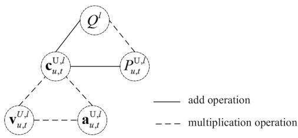

<details>
<summary>flowchart</summary>

```mermaid
graph TD
    Q["Q^l"] --> C["u,t"]
    Q --> P["u,t"]
    C --> v["u,t"]
    C --> a["u,t"]
    P --> u,t
    v -.-> a
    P -.-> u,t
    style Q stroke-dasharray: 5 5
    style P stroke-dasharray: 5 5
    style v stroke-dasharray: 5 5
    style a stroke-dasharray: 5 5
    note right of Q add operation
    note right of P multiplication operation
```
</details>

Fig. 2. Coupling relationships between the variables of the problem in (55).

and c U,lu,t $\mathbf { c } _ { u , t } ^ { \mathrm { U } , l - 1 }$ obtained in the (l −1)-th iteration, the optimization problem can be formulated as

$$
\begin{array}{l} \max _ {P _ {u, t} ^ {\mathrm{U}, l}, \mathbf {c} _ {u, t} ^ {\mathrm{U}, l}, \mathbf {v} _ {u, t} ^ {\mathrm{U}, l}, \mathbf {a} _ {u, t} ^ {\mathrm{U}, l}, Q ^ {l}} Q ^ {l} \\ \text { subject   to } (2 0), (2 1), (2 2), (2 3), (2 4), (3 3), \\ (3 4), (4 7), (5 0), (5 1), (5 2). \tag {55} \\ \end{array}
$$

In constraints, the superscript l is used for $P _ { u , t } ^ { \mathrm { U } } , \mathbf { c } _ { u , t } ^ { \mathrm { U } } , \mathbf { v } _ { u , t } ^ { \mathrm { U } } , \mathbf { a } _ { u , t } ^ { \mathrm { U } } .$ and Q, respectively. Besides, $\mathbf { v } _ { u , t } ^ { \mathrm { U } , r }$ and $\mathbf { c } _ { u , t } ^ { \mathrm { U } , r }$ c u,t U,r are replaced with $\mathbf { v } _ { u , t } ^ { \mathrm { U } , l - \bar { 1 } }$ vu,t and $\mathbf { c } _ { u , t } ^ { \mathrm { U } , l - 1 }$ , respectively.

In (55), the variables Ql , $P _ { u , t } ^ { \mathrm { U } , l }$ and c U,lu,t $\mathbf { c } _ { u , t } ^ { \mathrm { U } , l }$ are closely related to each other because of multiplication operations, as shown in Fig. 2. Consequently, $\mathbf { c } _ { u , t } ^ { \mathrm { U } , l }$ cannot be obtained together with $Q ^ { l }$ and $P _ { u , t } ^ { \mathrm { U } , l }$ . Geometric programming can be employed to transform the multiplication operation into add one, so that $P _ { u , t } ^ { \mathrm { U } , l }$ and $\mathbf { c } _ { u , t } ^ { \mathrm { U } , l }$ can be solved together. But it provides a tight bound. Therefore, we decouple the problem in (55) into two subproblems and solve it iteratively, as shown in Table III. First, with given c u,t, $\mathbf { c } _ { u , t } ^ { \mathrm { U } , l } .$ we optimize $P _ { u , t } ^ { \mathrm { U } , l }$ Pu,t . Then, with the P U,lu,t , obtained relations $P _ { u , t } ^ { \mathrm { U } , l }$ mize and $\mathbf { c } _ { u , t } ^ { \mathrm { { U } , { \bar { l } } } }$ In addition, due to the linearare solved together in this c u,t , $\mathbf { c } _ { u , t } ^ { \mathrm { U } , l } , ~ \mathbf { v } _ { u , t } ^ { \mathrm { U } , l }$ v u,t a U,lu,t $\mathbf { a } _ { u , t } ^ { \mathrm { { U } } , l }$ paper. Two subproblems are described as follow.

1 PP $\mathbf { c } _ { u , t } ^ { \mathrm { U } , l - 1 }$ 1) Optimization of Transmit Power: By using c u,t obtained in the (l − 1)-th iteration, we set c U,lu,t $\mathbf { c } _ { u , t } ^ { \mathsf { { U } } , l } = \mathbf { c } _ { u , t } ^ { \mathsf { { U } } , l - 1 }$ c u,t and optimize the transmit power U,l $P _ { u , t } ^ { \mathrm { U } , l }$ Pu,t by solving the following problem

$$
\max _ {P _ {u, t} ^ {\mathrm{U}, l}, Q ^ {l}} Q ^ {l} \tag {56}
$$

$$
\text { subject   to } (2 3), (2 4), (4 7), (5 1), (5 2).
$$

The problem in (56) is a LP, which can be solved with CVX [57].

TABLE IV BISECTION METHOD FOR SOLVING THE PROBLEM (57) 

<table><tr><td>Initialization:</td></tr><tr><td>1) ε = 1.0 × 10-3, M0 = 50,</td></tr><tr><td>2) Set U0 = PU,tBΨu,tzmin,</td></tr><tr><td>FOR m = 1 TO m = M0</td></tr><tr><td>3) Qm = (Um-1 + Lm-1)/2,</td></tr><tr><td>4) Solve the convex problem in (58) with given cU,t, vU,t, Pu,t, PU,t and Qm, and denote the optimal solutions as cU,m, vU,m, aU,m,</td></tr><tr><td>5) If the problem is solved, Um = Um-1, Lm = Qm; otherwise Um = Qm, Lm = Lm-1,</td></tr><tr><td>6) If |Um - Lm|/Lm &lt; ε, stop,</td></tr><tr><td>END</td></tr><tr><td>7) Ql = Qm,</td></tr><tr><td>8) cU,t = cU,m, vU,t = vU,m, aU,t = aU,m.</td></tr></table>

2) Optimization of Three-Dimensional Coordinates, Velocities and Accelerations: By using the obtained $P _ { u , t } ^ { \mathrm { U } , l ^ { ' } } , ~ \mathbf { c } _ { u , t } ^ { \mathrm { U } , l - 1 }$ U,l and vU,lu,t $\mathbf { v } _ { u , t } ^ { \mathrm { U } , l - 1 }$ , the problem in (55) can be rewritten as

$$
\max _ {\mathbf {c} _ {u, t} ^ {\mathrm{U}, l}, \mathbf {v} _ {u, t} ^ {\mathrm{U}, l}, \mathbf {a} _ {u, t} ^ {\mathrm{U}, l}, Q ^ {l}} Q ^ {l}
$$

(57)

Then, we can iteratively solve the problem in (55) by employing successive convex optimization.

Similarly, to solve the problem in (57), the bisection method is utilized to decouple $Q ^ { l }$ and $\mathbf { c } _ { u , t } ^ { \mathrm { U } , l } .$ . We decompose the problem in (57) into a series of convex problems by setting $Q ^ { l }$ and solve it iteratively. The details are shown in Table IV. In the m-th iteration, let $U ^ { m - 1 }$ and $L ^ { m - 1 }$ respectively denote the upper bound and lower bound of $Q ^ { l }$ . For $Q ^ { m } = \bar { ( } U ^ { m - 1 } + L ^ { m - 1 } ) / 2 .$ with given $\mathbf { c } _ { u , t } ^ { \mathrm { U } , l - 1 } , \mathbf { v } _ { u , t } ^ { \mathrm { U } , l - 1 }$ −t , v −u,t and $P _ { u , t } ^ { \mathrm { U } , l }$ obtained by solving the problem in (56), the convex problem can be formulated as

c u, t ,

(58)

wher e P U , $P _ { u , t } ^ { \mathrm { U } } , \mathbf { c } _ { u , t } ^ { \mathrm { U } } , { \bf v } _ { u , t } ^ { \mathrm { U } } , \mathbf { a } _ { u , t } ^ { \mathrm { U } } , Q$ v u,t, aUu,t , Q are replaced with P U,l , c U,m , $P _ { u , t } ^ { \mathrm { U } , l } , \mathrm { \mathbf { c } } _ { u , t } ^ { \mathrm { U } , m } .$ replaced with $\mathbf { v } _ { u , t } ^ { \mathrm { U } , m } , ~ \mathbf { a } _ { u , t } ^ { \mathrm { U } , m } , ~ Q ^ { m } ,$ a u, t , $\mathbf { v } _ { u , t } ^ { \mathrm { U } , l - 1 }$ respectively. Besides, and $\mathbf { c } _ { u , t } ^ { \mathrm { { U } , { l - 1 } } }$ , respectively. When the v u,t $\mathbf { v } _ { u , t } ^ { \mathrm { U } , r }$ and c u,t $\mathbf { c } _ { u , t } ^ { \mathrm { U } , r }$ U,r are maximum $Q ^ { m }$ is found, with which the convex problem (58) is solved, we achieve the related vectors c U,mu,t , vU,mu,t , a U,mu,t . $\mathbf { c } _ { u , t } ^ { \mathrm { U } , m ^ { \star } } , \mathbf { v } _ { u , t } ^ { \mathrm { U } , m } , \mathbf { a } _ { u , t } ^ { \mathrm { U } , m }$ Tis $z _ { \mathrm { m i n } }$ ortest d. Given $P _ { u , t } ^ { \mathrm { U } , l }$ ce between the UAV and th, we set the upper bound of $Q ^ { 1 }$ obile userto be

$$
U ^ {0} = P _ {u, t} ^ {\mathrm{U}, l} B _ {u, t} ^ {\Psi} z _ {\min} ^ {- \varsigma_ {\mathrm{U}}}. \tag {59}
$$

The lower bound of $Q ^ { 1 }$ is set to be 0.

# IV. SIMULATION RESULTS AND DISCUSSION

In this section, simulation is performed to validate the performance of our proposed algorithm. The γ-th TBS connected to the u-th UAV is located at (0, 0, 100) m. The u-th UAV

TABLE V SIMULATION PARAMETERS 

<table><tr><td>Symbol</td><td>Value</td><td>Symbol</td><td>Value</td></tr><tr><td> $z_{\text{min}}$ </td><td>2.6 km</td><td> $v_{\text{min}}$ </td><td>10 m/s</td></tr><tr><td> $z_{\text{max}}$ </td><td>5.0 km</td><td> $v_{\text{max}}$ </td><td>60 m/s</td></tr><tr><td> $\mathbf{v}_{t}^{\Psi}$ </td><td> $[30, 0, 0]^{T}$  m/s</td><td> $P_{\gamma,t}^{\Gamma}$ </td><td>37, 40 dBm</td></tr><tr><td> $\sigma^{2}$ </td><td>-107 dBm</td><td> $a_{\text{max}}$ </td><td>10 m/s $^2$ </td></tr></table>

provides the communication services for the mobile user. We uniformly sample T = 10 points from the positions of the user served by the u-th UAV for simple analysis. The u-th UAV flies according to the optimized trajectory. The antenna gains of TBSs, UAVs and satellites are set to be 12 dBi, 8 dBi and 52 dBi. The antenna gains of users served by UAVs and satellites are set to be 8 dBi and 30 dBi. The system is operated at the 5 GHz carrier frequency. We take the geosynchronous Earth orbit satellite (GEO) as an example. The transmit power of satellites is 49.03 dBm. The distance between satellites and UAVs (users) is $3 . 6 \times 1 0 ^ { 7 }$ m. The path loss for the UAV-toground link is set to be

$$
L _ {u, u, t} ^ {\mathrm{U}, \Psi} (\mathrm{dB}) = 1 1 6. 7 + 1 5 \log 1 0 \left(\frac {d _ {u , u , t} ^ {\mathrm{U} , \Psi}}{2 6 0 0}\right) + X _ {u, u, t} ^ {\mathrm{U}, \Psi}. \tag {60}
$$

The path loss for the satellite-to-UAV (user) link is set to be

$$
L _ {\xi , u, t} ^ {\Xi , \mathrm{U}} (\mathrm{dB}) = 4 6. 4 + 2 0 \log 1 0 \left(d _ {\xi , u, t} ^ {\Xi , \mathrm{U}}\right) + X _ {\xi , u, t} ^ {\Xi , \mathrm{U}} \tag {61}
$$

where the standard deviation of XU,Ψu,u,t $X _ { u , u , t } ^ { \mathrm { U } , \Psi }$ an d XΞ,U $X _ { \xi , u , t } ^ { \Xi , \mathrm { U } }$ is 0.1. The bandwidth allocated to satellites, UAVs and TBSs is set to be 5 MHz. The main parameters are given in Table V. For each experiment, we randomly generate the small-scale fading for 1000 rounds to achieve ergodic achievable rates according to the parameters given in Table V.

# A. Performance Comparison Between the Optimal Solution and the Approximate Solution

Because the optimization problem (25) is not convex and cannot be directly solved, the Taylor approximations and the bisection method are used to solve the problem in this paper. To validate the loss in performance caused by the Taylor approximations and the bisection method, we consider a scenario where the optimization problem (25) is simplified and the optimal values of the simplified problem can be achieved. In the scenario, the constraints on UAV kinematics, backhaul and the total energy of the UAV can be ignored. The UAV trajectory and in-flight transmit power are mainly determined by the interference. The optimization problem can be rewritten as

$$
\max _ {P _ {u, t} ^ {\mathrm{U}}, \mathbf {c} _ {u, t} ^ {\mathrm{U}}} \frac {P _ {u , t} ^ {\mathrm{U}} G _ {\mathrm{U}} G _ {\Psi} \left(L _ {u , u , t} ^ {\mathrm{U} , \Psi}\right) ^ {- 1}}{\sigma^ {2}}
$$

$\mathrm { s u b j e c t ~ t o ~ ( 2 2 ) } , ( 2 4 ) , ( 3 6 )$ (62)

Lemmavalues of $I _ { 0 } \left\| \mathbf { c } ^ { * } - \mathbf { c } _ { o , t } ^ { \mathrm { O } _ { u } } \right\| _ { 2 } ^ { \mathrm { S U } } \geq B _ { o , t } ^ { \mathrm { O } _ { u } } P _ { \operatorname* { m a x } } ^ { \mathrm { U } }$ , the optimalblem (62) are $P _ { u , t } ^ { \mathrm { U } }$ $\mathrm { i } _ { \mathrm { c } _ { u , t } ^ { \mathrm { U } } }$ $P _ { \mathrm { m a x } } ^ { \mathrm { U } }$ and $\mathbf { c } ^ { * }$ , where $\mathbf { c } ^ { * } = \left[ x _ { u , t } ^ { \Psi } , \ y _ { u , t } ^ { \Psi } , \ z _ { \operatorname* { m i n } } \right] ^ { T }$ .

Proof: See Appendix C.

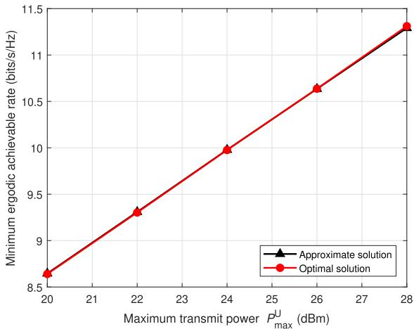

<details>
<summary>line</summary>

| Maximum transmit power P_max^U (dBm) | Approximate solution | Optimal solution |
| ------------------------------------ | -------------------- | ---------------- |
| 20                                   | 8.6                  | 8.6              |
| 22                                   | 9.3                  | 9.3              |
| 24                                   | 10.0                 | 10.0             |
| 26                                   | 10.7                 | 10.7             |
| 28                                   | 11.3                 | 11.3             |
</details>

Fig. 3. Minimum ergodic achievable rate for the optimal solution and the approximate solution.

Assume that the users served by the UAV and the satellite are respectively located at $( 5 . 0 \times 1 0 ^ { 4 } , \ 0 , \ 1 0 )$ m to $( 5 . 0 \times 1 0 ^ { 4 } , ~ - 1 0 ^ { 5 }$ , 10 m. The interference temperature limitation $I _ { 0 } \mathrm { i s } - 7 4 $ $P _ { \mathrm { m a x } } ^ { \mathrm { U } }$ dBm and e range [20, 28] dBm and thencan be satisfied. The initial loca- $K _ { \mathrm { U } } ~ = ~ 3 1 . 3 $ . The maximum $I _ { 0 } \left\| \mathbf { c } ^ { * } - \mathbf { \bar { c } } _ { o , t } ^ { \mathrm { O } _ { u } } \right\| _ { 2 } ^ { \mathrm { S U } } \geq B _ { o , t } ^ { \mathrm { O } _ { u } } P _ { \mathrm { m a x } }$ u P tion of the UAV is set to be $( 4 . 5 \times 1 0 ^ { 4 } , \ 0 , \ 3 0 0 0 )$ . By using the solutions obtained with Taylor approximations and the bisection method and those given in Lemma 2, the minimum ergodic achievable rate is compared by simulation. The simulation result is shown in Fig. 3. For this scenario, using Taylor approximations and the bisection method, the minimum ergodic achievable rate of the approximate solution is close to that of the optimal solution.

# B. Performance Comparison Among Different Algorithms

In this part, we compare our proposed algorithm with those in [20] and [22]. In these works, the full CSI was used for the whole trajectory optimization. The user served by the u-th UAV travels from the position $( 5 . 0 \times 1 0 ^ { 4 } , \ 0 , \ 1 0 )$ $( 6 . 8 \times 1 0 ^ { 4 } , \ 0 , \ 1 0 )$ m along x axis. Let  positions of the user serve $\begin{array} { r l } { \mathbf { c } _ { u , t } ^ { \Psi } } & { { } = } \end{array}$ $\left[ x _ { u , t } ^ { \Psi } , \ \dot { y } _ { u , t } ^ { \Psi } , \ z _ { u , t } ^ { \Psi } \right] ^ { T }$ Ψ T u-th UAV and $\bar { \bf v } _ { t } ^ { \Psi }$ be the user’s velocity. For comparison, trajectory which is denoted as . The transmit power is set to $\begin{array} { r l } { \mathbf { \dot { c } } _ { u , t } ^ { \mathrm { U } } } & { { } = } \end{array}$ $\left[ x _ { u , t } ^ { \Psi } , \ y _ { u , t } ^ { \Psi } , \ z _ { \operatorname* { m i n } } \right] ^ { T }$ the constraints on tolerable interference, backhaul, maximum transmit power and the total communication energy of the UAV. Besides, lites are set as The initial traje cOuo,t $\begin{array} { r } { \mathbf { c } _ { o , t } ^ { \mathrm { O } _ { u } } = \left[ x _ { u , t } ^ { \Psi } , \ y _ { u , t } ^ { \Psi } + ( - 1 ) ^ { t } \times 8 0 0 0 , \ z _ { u , t } ^ { \Psi } \right] ^ { T } } \end{array}$ ${ \mathbf { c } } _ { u , t } ^ { \mathrm { U } } =$ $\left[ x _ { u , t } ^ { \Psi } / 2 , ~ y _ { u , t } ^ { \Psi } , ~ z _ { \operatorname* { m i n } } \right] ^ { T }$ .

Because of the difficulty of obtaining the small-scale CSI, the full CSI can not be accurately obtained in practice. In our proposed algorithm, the whole trajectory and the transmit power of the UAV are optimized with the large-scale CSI only. To validate the performance of our proposed algorithm, the minimum ergodic achievable rate of different algorithms is compared. The simulation results are shown in Fig. 4, where $E _ { 0 }$ is 500 J and $P _ { \gamma , t } ^ { \Gamma } = 4 0 ~ \mathrm { d B m }$ . We set that the interference temperature limitation $I _ { 0 }$ is −40 dBm and vary maximum transmit power $P _ { \mathrm { m a x } } ^ { \mathrm { U } }$ U in the range [22, 36] dBm. Because $I _ { 0 }$ is large, the interference can be ignored. The transmit power is bounded by the maximum transhaul and total communication energy. When $P _ { \mathrm { m a x } } ^ { \mathrm { U } } \leq 3 0 ~ \mathrm { d B m }$ the performance is mainly determined by backhaul and maximum transmit power. The existing algorithms ignore the constraint of maximum transmit power. We decrease their transmit power to satisfy this constraint. One sees that the performance can be improved with the optimization problem subject to the constraint of maximum transmit power. When $P _ { \mathrm { m a x } } ^ { \mathrm { U } ^ { - } } \geq 3 0$ dBm, the total transmit power during $T$ is larger than the total communication energy and the performance is mainly determined by backhaul and total communication energy. The algorithm in [20] investigated the optimization problem with full CSI subject to constraints of backhaul and total communication energy. Our proposed algorithm achieves better performance than that in [20]. To further validate the performance of our proposed algorithm using the large-scale CSI, we vary Rician factor $K _ { \mathrm { U } }$ . The simulation results are shown in Fig. 5. One sees that by reducing $K _ { \mathrm { U } }$ , our proposed algorithm obtains much better performance than the existing ones. One sees that the performance can be improved with the large-scale CSI.

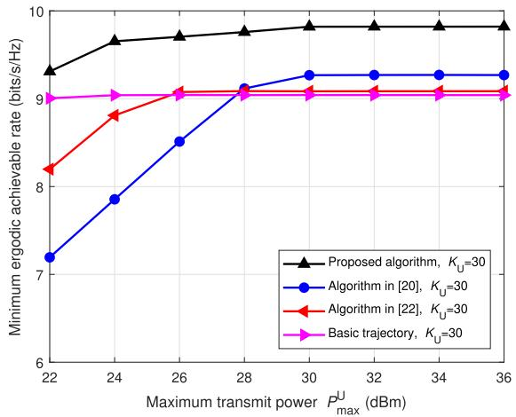

<details>
<summary>line</summary>

| Maximum transmit power P_max^U (dBm) | Proposed algorithm, K_U=30 | Algorithm in [20], K_U=30 | Algorithm in [22], K_U=30 | Basic trajectory, K_U=30 |
| ------------------------------------ | -------------------------- | -------------------------- | -------------------------- | ------------------------ |
| 22                                   | 9.4                        | 7.2                        | 8.2                        | 9.0                      |
| 24                                   | 9.6                        | 7.8                        | 8.8                        | 9.0                      |
| 26                                   | 9.7                        | 8.5                        | 9.0                        | 9.0                      |
| 28                                   | 9.8                        | 9.1                        | 9.0                        | 9.0                      |
| 30                                   | 9.8                        | 9.3                        | 9.0                        | 9.0                      |
| 32                                   | 9.8                        | 9.3                        | 9.0                        | 9.0                      |
| 34                                   | 9.8                        | 9.3                        | 9.0                        | 9.0                      |
| 36                                   | 9.8                        | 9.3                        | 9.0                        | 9.0                      |
</details>

Fig. 4. Minimum ergodic achievable rate of different algorithms with Rician factor $K _ { \mathrm { U } } = 3 0$ , the interference temperature limitation $\mathrm { \bar { \Delta } } I _ { 0 } = - 4 0$ dBm and the total communication energy $E _ { 0 } \doteq 5 0 0 \mathrm { ~ J ~ }$ .

To illustrate the performance gain achieved by using interference constraint, the comparison of minimum ergodic achievable rate is shown in Fig. 6, where $K _ { \mathrm { U } } = 3 1 . 3$ . We set $E _ { 0 } ~ = ~ 3 \times 1 0 ^ { 4 } ~ \mathrm { { J } }$ and $P _ { \gamma , t } ^ { \Gamma } = 4 0 $ dBm. Because $E _ { 0 }$ is large, the transmit power is limited by interference, maximum transmit power and backhaul. We set that the interference temperature limitation $I _ { 0 }$ is −55 dBm and −40 dBm and vary maximum transmit power $P _ { \mathrm { m a x } } ^ { \mathrm { U } }$ in the range [30, 40] dBm. When $I _ { 0 } ~ = ~ - 4 0$ dBm, the interference can be ignored. The algorithms in [20] and [22] neglect the constraints of interference and maximum transmit power. We reduce their transmit power to satisfy those constraints. By varying $I _ { 0 }$ and P U $P _ { \mathrm { m a x } } ^ { \mathrm { U } }$ , the minimum ergodic achievable rate is increased when $P _ { \mathrm { m a x } } ^ { \mathrm { U } } \geq 3 6 $ dBm. One sees that the transmit power is determined by interference constraint when $P _ { \mathrm { m a x } } ^ { \mathrm { U } } \geq 3 6 $ dBm and

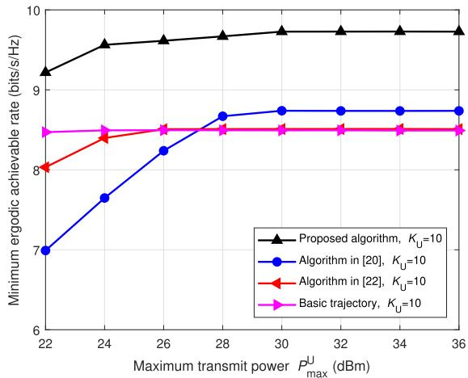

<details>
<summary>line</summary>

| Maximum transmit power P_max^U (dBm) | Proposed algorithm, K_U=10 | Algorithm in [20], K_U=10 | Algorithm in [22], K_U=10 | Basic trajectory, K_U=10 |
| ------------------------------------ | -------------------------- | -------------------------- | -------------------------- | ------------------------ |
| 22                                   | 9.2                        | 7.0                        | 8.0                        | 8.5                      |
| 24                                   | 9.5                        | 7.6                        | 8.3                        | 8.5                      |
| 26                                   | 9.6                        | 8.2                        | 8.4                        | 8.5                      |
| 28                                   | 9.7                        | 8.7                        | 8.5                        | 8.5                      |
| 30                                   | 9.7                        | 8.8                        | 8.5                        | 8.5                      |
| 32                                   | 9.7                        | 8.8                        | 8.5                        | 8.5                      |
| 34                                   | 9.7                        | 8.8                        | 8.5                        | 8.5                      |
| 36                                   | 9.7                        | 8.8                        | 8.5                        | 8.5                      |
</details>

Fig. 5. Minimum ergodic achievable rate of different algorithms with Rician factor $K _ { \mathrm { U } } = 1 0$ , the interference temperature limitation $\mathrm { \bar { \Delta } } I _ { 0 } = - 4 0$ dBm and the total communication energy $\begin{array} { r } { E _ { 0 } \stackrel {  } { = } 5 0 0 . } \end{array}$ J.   
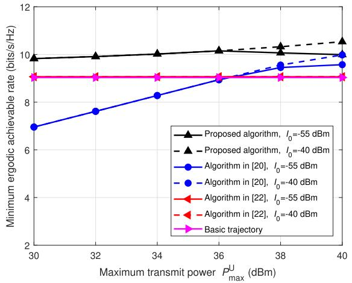

<details>
<summary>line</summary>

| Maximum transmit power P_max^U (dBm) | Proposed algorithm, I_0=-55 dBm | Proposed algorithm, I_0=-40 dBm | Algorithm in [20], I_0=-55 dBm | Algorithm in [20], I_0=-40 dBm | Algorithm in [22], I_0=-55 dBm | Algorithm in [22], I_0=-40 dBm | Basic trajectory |
| ------------------------------------ | --------------------------------- | --------------------------------- | ------------------------------- | ------------------------------- | ------------------------------- | ------------------------------- | ---------------- |
| 30                                   | 10.0                              | 10.0                              | 7.0                             | 9.0                             | 9.0                             | 9.0                             | 9.0              |
| 32                                   | 10.0                              | 10.0                              | 7.5                             | 9.0                             | 9.0                             | 9.0                             | 9.0              |
| 34                                   | 10.0                              | 10.0                              | 8.5                             | 9.0                             | 9.0                             | 9.0                             | 9.0              |
| 36                                   | 10.0                              | 10.0                              | 9.0                             | 9.0                             | 9.0                             | 9.0                             | 9.0              |
| 38                                   | 10.5                              | 10.5                              | 9.5                             | 9.5                             | 9.5                             | 9.5                             | 9.5              |
| 40                                   | 11.0                              | 11.0                              | 10.0                            | 10.0                            | 10.0                            | 10.0                            | 10.0             |
</details>

Fig. 6. Minimum ergodic achievable rate of different algorithms with the interference temperature limitation $I _ { 0 } = - 5 5$ dBm or 40 dBm and the total communication energy $E _ { 0 } = 3 \times 1 0 ^ { 4 } \mathrm { ~ J }$ .

$I _ { 0 } = - 5 5$ dBm. The performance of our proposed algorithm is best of all when $\bar { P } _ { \mathrm { m a x } } ^ { \mathrm { U } } \ge 3 6$ dBm and $I _ { 0 } = - 5 5$ dBm. Thus, our proposed algorithm can improve minimum ergodic achievable rate by a joint optimization of the whole trajectory and the transmit power with interference constraints.

# C. Discussion on the Impact of Key Parameters

In this part, the minimum ergodic achievable rate of the backhaul link and the access link of the UAV and the satellite-to-user link is simulated. The user served by the u-th UAV travels from the position $( 1 . 0 ~ \times ~ 1 0 ^ { 5 }$ , 0, 10) m to $( 2 . 8 ~ \times ~ 1 0 ^ { 5 }$ , 0, 10) m along x axis. The posi-$\begin{array} { r l } { \mathbf { c } _ { o , t } ^ { \mathrm { { O } } _ { u } ^ { \mathrm { ~ - ~ } } } } & { { } = } \end{array}$ $\left[ x _ { u , t } ^ { \Psi } , \ y _ { u , t } ^ { \Psi } + ( - 1 ) ^ { t } \times 8 0 0 0 0 , \ z _ { u , t } ^ { \Psi } \right] ^ { T }$ $P _ { \gamma , t } ^ { \Gamma } ~ = ~ 3 7 $ $P _ { \mathrm { m a x } } ^ { \mathrm { U } } = 4 0 $ $E _ { 0 } ~ = ~ \mathsf { \bar { 6 } } 0 0 0 ~ \mathrm { ~ J } .$ temperature limitation $I _ { 0 }$ is in the range $[ - 9 4 , \ - 7 4 ]$ dBm. When the γ-th TBS provides the backhaul link for the u-th UAV, the simulation result is shown in Fig. 7, where the initial trajectory of the u-th UAV is $\left[ 0 . 9 x _ { u , t } ^ { \Psi } , \ \bar { y } _ { u , t } ^ { \Psi } , \ z _ { \operatorname* { m i n } } \right] ^ { T }$ . When $I _ { 0 }$ is increased, the minimum ergodic achievable rate of the satellite-to-user link is reduced because of the interference. When $I _ { 0 } ~ \leq ~ - 8 2$ dBm, the minimum ergodic achievable rate of the access link of the u-th UAV is lower than that of the backhaul link of the u-th UAV because the interference constraint is tighter than the backhaul constraint. When $I _ { 0 } \geq - 8 2$ dBm, the performance is jointly determined by the interference constraint and the backhaul constraint. When the satellite provides the backhaul link for the UAV, the simulation result is shown in Fig. 8, where the initial trajectory of UAV is $\left[ x _ { u , t } ^ { \Psi } , \ y _ { u , t } ^ { \Psi } , \ z _ { \operatorname* { m i n } } \right] ^ { T }$ . Obviously, when $I _ { 0 } ~ \leq ~ - 8 6$ dBm, the minimum ergodic achievable rate of the access link of the u-th UAV is lower than that of the backhaul link of the u-th UAV because the interference constraint is tighter than the backhual constraint. When $I _ { 0 } \geq - 8 6 ~ \mathrm { d B m }$ , the minimum ergodic achievable rate is unvaried because the performance is mainly determined by the backhaul constraint.

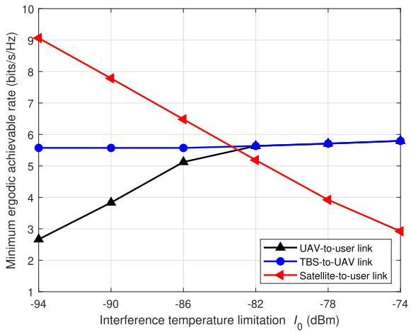

<details>
<summary>line</summary>

| Interference temperature limitation I₀ (dBm) | UAV-to-user link | TBS-to-UAV link | Satellite-to-user link |
| ------------------------------------------- | ---------------- | --------------- | ----------------------- |
| -94                                         | 2.8              | 5.6             | 9.0                     |
| -90                                         | 3.8              | 5.6             | 7.8                     |
| -86                                         | 5.2              | 5.6             | 6.5                     |
| -82                                         | 5.6              | 5.7             | 5.2                     |
| -78                                         | 5.8              | 5.8             | 4.0                     |
| -74                                         | 5.9              | 5.9             | 3.0                     |
</details>

Fig. 7. Minimum ergodic achievable rate for the UAV-to-user link, the satellite-to-user link and the TBS-to-UAV link, where the TBS provides the backhaul link for the UAV.

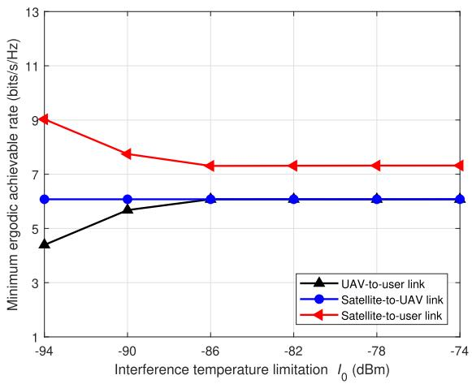

<details>
<summary>line</summary>

| Interference temperature limitation I₀ (dBm) | UAV-to-user link | Satellite-to-UAV link | Satellite-to-user link |
| ------------------------------------------- | ---------------- | --------------------- | ---------------------- |
| -94                                         | 4.5              | 6.0                   | 9.0                    |
| -90                                         | 5.5              | 6.0                   | 8.0                    |
| -86                                         | 6.0              | 6.0                   | 7.5                    |
| -82                                         | 6.0              | 6.0                   | 7.5                    |
| -78                                         | 6.0              | 6.0                   | 7.5                    |
| -74                                         | 6.0              | 6.0                   | 7.5                    |
</details>

Fig. 8. Minimum ergodic achievable rate for the UAV-to-user link, the satellite-to-user link and the satellite-to-UAV link, where the satellite provides the backhaul link for the UAV.

We also analyze the impact of the total energy and the interference on the minimum ergodic achievable rate. Set $P _ { \gamma , t } ^ { \Gamma } ~ = ~ 3 7 ~ \mathrm { d B m }$ , $P _ { \mathrm { m a x } } ^ { \mathrm { U } } ~ = ~ 4 0 ~ $ dBm and $K _ { \mathrm { U } } ~ = ~ K _ { \mathrm { S } } ~ =$ 31.3. When the γ-th TBS provides the backhaul link for the u-th UAV, the simulation result is shown in Fig. 9, where the total energy $E _ { 0 }$ is in the range [1, 104] J.

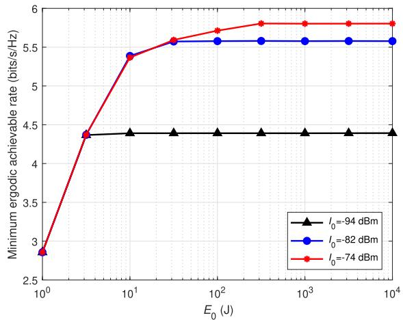

<details>
<summary>line</summary>

| E₀ (J) | I₀=-94 dBm | I₀=-82 dBm | I₀=-74 dBm |
| ------ | ---------- | ---------- | ---------- |
| 1      | 4.4        | 4.4        | 3.0        |
| 10     | 4.4        | 5.4        | 5.4        |
| 100    | 4.4        | 5.6        | 5.7        |
| 1000   | 4.4        | 5.6        | 5.8        |
| 10000  | 4.4        | 5.6        | 5.8        |
</details>

Fig. 9. Minimum ergodic achievable rate with different interference temperature limitation $I _ { 0 } ,$ where the TBS provides the backhaul link for the UAV.   
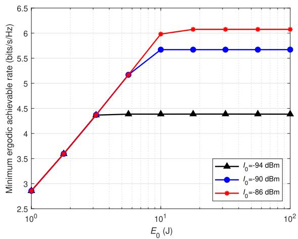

<details>
<summary>line</summary>

| E₀ (J) | I₀=-94 dBm | I₀=-90 dBm | I₀=-86 dBm |
| ------ | ---------- | ---------- | ---------- |
| 1      | 2.9        | 3.6        | 3.6        |
| 2      | 4.4        | 5.2        | 5.2        |
| 5      | 4.4        | 5.7        | 6.0        |
| 10     | 4.4        | 5.7        | 6.1        |
| 20     | 4.4        | 5.7        | 6.1        |
| 50     | 4.4        | 5.7        | 6.1        |
| 100    | 4.4        | 5.7        | 6.1        |
</details>

Fig. 10. Minimum ergodic achievable rate with different interference temperature limitation $I _ { 0 } , { \bf \bar { \Psi } }$ where the satellite provides the backhaul link for the UAV.

The interference temperature limitation $I _ { 0 }$ is set to be −94 dBm, −82 dBm and −74 dBm, respectively. The initial trajectory of the u-th UAV is $\left[ x _ { u , t } ^ { \Psi } , \ : y _ { u , t } ^ { \Psi } , \ : z _ { \operatorname* { m i n } } \right] ^ { T }$ , $\left[ x _ { u , t } ^ { \Psi } , \ y _ { u , t } ^ { \Psi } , \ z _ { \operatorname* { m i n } } \right] ^ { T }$ and $\left[ 0 . 9 x _ { u , t } ^ { \Psi } , \ y _ { u , t } ^ { \Psi } , \ z _ { \operatorname* { m i n } } \right] ^ { T }$ , respectively. When the satellite provides the backhaul link for the UAV, the simulation result is shown in Fig. 10, where the total energy $E _ { 0 }$ is in the range $[ 1 , ~ 1 0 ^ { \bar { 2 } } ]$ J. The interference temperature limitation $I _ { 0 }$ is set to be −94 dBm, −90 dBm and −86 dBm, respectively. The initial trajectory of the u-th UAV is $\left[ x _ { u , t } ^ { \Psi } , \ y _ { u , t } ^ { \Psi } , \ z _ { \operatorname* { m i n } } \right] ^ { T }$ . As shown in Fig. 9 and Fig. 10, when $I _ { 0 }$ and $E _ { 0 }$ are increased, better performance can be obtained. When the energy constraint is tight, the performance is determined by $E _ { 0 }$ . By increasing $E _ { 0 } .$ , when the interference constraint is tight, the performance is determined by $I _ { 0 }$ .

An optimized trajectory and transmit power of a UAV dBm, in the $P _ { \mathrm { m a x } } ^ { \mathrm { U } } ~ = ~ 4 0 ~ $ $_ { \mathrm { X ^ { - } y } }$ plane are shown in Fig. 11, where dBm, $I _ { 0 } ~ = ~ - 5 5$ dBm, $E _ { 0 } ~ = ~ 4 0 0 0 ~ \mathrm { J } .$ $P _ { \gamma , t } ^ { \Gamma } ~ = ~ 4 0 $ and $K _ { \mathrm { U } } ~ = ~ K _ { \mathrm { S } } ~ = ~ 3 1 . 3$ . The mobile user travels from the position (5.0 × 104, 0, 10) m to $( 6 . 8 \times 1 0 ^ { 4 } , ~ 0 , ~ 1 0 )$ m alongset as $\mathbf { c } _ { o , t } ^ { \mathrm { 0 } _ { u } } = \left[ x _ { u , t } ^ { \mathrm { 4 } } , \ \stackrel { \cdot } { y _ { u , t } ^ { \mathrm { 4 } } } + ( - 1 ) ^ { t } \times 8 0 0 0 , \ z _ { u , t } ^ { \mathrm { 4 } } \right] ^ { T }$ atellites are. The initial trajectory of the UAV is $\left[ x _ { u , t } ^ { \Psi } / 2 , ~ y _ { u , t } ^ { \Psi } , ~ z _ { \operatorname* { m i n } } \right] ^ { T }$ . The UAV flying according to the blue curve serves the user moving along the dark line. Because of constraints of wireless backhaul, the optimized trajectory is between the TBS and the mobile user. Besides, because the users interfered by the UAV appear on the sides of the mobile user, the optimized trajectory is bent to satisfy interference constraints. The obtained transmit power of the UAV satisfies the constraints on maximum transmit power and allowable communication energy.

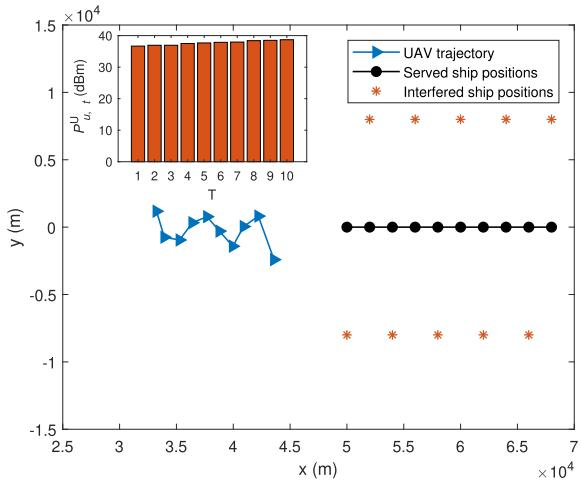

<details>
<summary>bar_line</summary>

| T (x ×10⁴) | UAV trajectory (y ×10⁴) | Served ship positions (y ×10⁴) | Interfered ship positions (y ×10⁴) |
| ---------- | ------------------------ | ------------------------------ | --------------------------------- |
| 1          | ~38                      | 38                             | 0                                 |
| 2          | ~38                      | 38                             | 0                                 |
| 3          | ~38                      | 38                             | 0                                 |
| 4          | ~38                      | 38                             | 0                                 |
| 5          | ~38                      | 38                             | 0                                 |
| 6          | ~38                      | 38                             | 0                                 |
| 7          | ~38                      | 38                             | 0                                 |
| 8          | ~38                      | 38                             | 0                                 |
| 9          | ~38                      | 38                             | 0                                 |
| 10         | ~38                      | 38                             | 0                                 |
| 5          | ~-0.7                    | 0                              | -0.7                              |
| 6          | ~-0.7                    | 0                              | -0.7                              |
| 7          | ~-0.7                    | 0                              | -0.7                              |
| 8          | ~-0.7                    | 0                              | -0.7                              |
| 9          | ~-0.7                    | 0                              | -0.7                              |
| 10         | ~-0.7                    | 0                              | -0.7                              |
| 5          | ~-1.5                    | 0                              | -1.5                              |
| 6          | ~-1.5                    | 0                              | -1.5                              |
| 7          | ~-1.5                    | 0                              | -1.5                              |
| 8          | ~-1.5                    | 0                              | -1.5                              |
| 9          | ~-1.5                    | 0                              | -1.5                              |
| 10         | ~-1.5                    | 0                              | -1.5                              |
The chart includes an inset bar chart and a line chart with markers for UAV trajectory, served ship positions, and interfered ship positions over time. The x-axis is labeled as 'x (m)' and the y-axis is labeled as 'y (m)'. The data series are annotated with the same axes and values.
</details>

Fig. 11. Optimized trajectory in the x-y plane.   
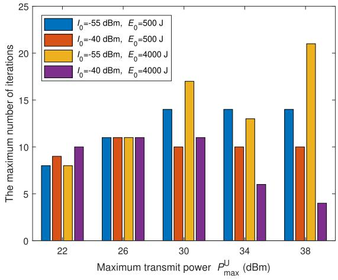

<details>
<summary>bar</summary>

| Maximum transmit power P_max^U (dBm) | I₀=-55 dBm, E₀=500 J | I₀=-40 dBm, E₀=500 J | I₀=-55 dBm, E₀=4000 J | I₀=-40 dBm, E₀=4000 J |
| ------------------------------------ | --------------------- | --------------------- | ---------------------- | ---------------------- |
| 22                                   | 8                     | 9                     | 8                      | 10                     |
| 26                                   | 11                    | 11                    | 11                     | 11                     |
| 30                                   | 14                    | 10                    | 17                     | 11                     |
| 34                                   | 14                    | 10                    | 13                     | 6                      |
| 38                                   | 14                    | 10                    | 21                     | 4                      |
</details>

Fig. 12. Maximum number of iterations.

# D. Convergence Performance of the Proposed Algorithm

The convergence is analyzed in this part. The experiment is implemented 100 times by generating different scenes. The user served by the UAV travels from the position $( 5 . 0 \times 1 0 ^ { 4 } , \ 0 , \ 1 0 )$ m to $( 6 . 8 \times 1 0 ^ { 4 }$ , 0, 10) m along the x axis. The users served by satellites and interfered by the UAV appear randomly. The distance between the user served by satellites and the one served by the UAV is 8000 m. The maximum numbers of iterations are shown in Fig. 12, where P U $P _ { \mathrm { m a x } } ^ { \mathrm { U } }$ is in t, and range [22, 38] dBm, is 500 J and 4000 $P _ { \gamma , t } ^ { \Gamma } = 4 0 $ P1 dBm,terfer-$K _ { \mathrm { U } } ~ = ~ 3 1 . 3$ $E _ { 0 }$ ence temperature limitation $I _ { 0 }$ is −55 dBm and −40 dBm and the initial trajectory of UAV is $\left[ 3 x _ { u , t } ^ { \Psi } / 4 , \ y _ { u , t } ^ { \Psi } , \ z _ { \operatorname* { m i n } } \right] ^ { T }$ and $\left[ x _ { u , t } ^ { \Psi } / 2 , \ y _ { u , t } ^ { \Psi } , \ z _ { \operatorname* { m i n } } \right] ^ { T }$ , respectively. Different values of parameters represent different cases, where the performance is either separately or jointly determined by the constraints on maximum transmit power, interference, backhaul and the allowable communication energy. One sees that, the maximum number of iterations is smaller than 25 in all cases. Thus, the algorithm converges within 25 iterations in the cases considered.

# V. CONCLUSION

In this paper, UAVs have been used for on-demand satelliteterrestrial maritime communications. The coordination with existing satellites/terrestrial systems has been investigated to realize spectrum sharing and efficient backhaul. This paper has adopted a typical composite channel model consisting of both large-scale and small-scale fading, under which UAVs have been deployed for accompanying coverage. The UAV’s whole trajectory and transmit power during the fight have been jointly optimized, subject to constraints on UAV kinematics, tolerable interference, backhaul, and the total communication energy of the UAV. Different from previous studies, we have assumed that only the large-scale CSI is available, as the positions of mobile ships can be obtained via the maritime AIS and be used as the prior information. Then, we have solved the non-convex problem by problem decomposition, successive convex optimization and bisection searching tools. Simulation results have shown that the UAV fits well with existing satellite and terrestrial systems. Besides, the performance gain can be achieved via joint optimization of UAV trajectory and transmit power with only the large-scale CSI. In future work, we will explore more possibility of improving the quality of service by utilizing UAVs and jointly investigate trajectory optimization, interference management and user association among UAVs, TBSs and satellites.

# APPENDIX A

# PROOF OF THEOREM 1

$R _ { u , u , t } ^ { \mathrm { U } , \Psi }$ Let η u,u,t can be expressed as $\eta _ { u , u , t } ^ { \mathrm { U } , \Psi } = P _ { u , t } ^ { \mathrm { U } } G _ { \mathrm { U } } G _ { \Psi } \left( L _ { u , u , t } ^ { \mathrm { U } , \Psi } \right) ^ { - 1 } \sigma ^ { - 2 }$ LU,Ψu,u,t . According to (5),

$$
R _ {u, u, t} ^ {\mathrm{U}, \Psi} = \mathbf {E} \left\{\log_ {2} \left[ 1 + \eta_ {u, u, t} ^ {\mathrm{U}, \Psi} b _ {u, u, t} ^ {\mathrm{U}, \Psi} \right] \right\}, \tag {63}
$$

where

$$
b _ {u, u, t} ^ {\mathrm{U}, \Psi} = \left| \sqrt {\frac {K _ {\mathrm{U}}}{1 + K _ {\mathrm{U}}}} + \sqrt {\frac {1}{1 + K _ {\mathrm{U}}}} g _ {u, u, t} ^ {\mathrm{U}, \Psi} \right| ^ {2}. \tag {64}
$$

We analyze the relationship between $R _ { u , u , t } ^ { \mathrm { U } , \Psi }$ and $\eta _ { u , u , t } ^ { \mathrm { U } , \Psi }$ via the first-order and second-order derivatives. Since $g _ { u , u , t } ^ { \mathrm { U } , \Psi } \in$ $\mathcal { C N } ( 0 , 1 )$ , the variable $b _ { u , u , t } ^ { \mathrm { U } , \Psi }$ u,u,t t follows a non-central chi-square probability density function with two degrees of freedom as

$$
f _ {b _ {u, u, t} ^ {\mathrm{U}, \Psi}} (\rho) = (1 + K _ {\mathrm{U}}) e ^ {- K _ {\mathrm{U}}} e ^ {- (1 + K _ {\mathrm{U}}) \rho} I _ {0} \left(2 \sqrt {K _ {\mathrm{U}} (1 + K _ {\mathrm{U}}) \rho}\right) \tag {65}
$$

where $\rho \geq 0$ and $I _ { 0 } ( \cdot )$ is the zeroth-order modified Bessel function of the first kind [53]. Then, $R _ { u , u , t } ^ { \mathrm { U } , \Psi }$ can be expressed as

$$
R _ {u, u, t} ^ {\mathrm{U}, \Psi} = \log_ {2} e \int_ {0} ^ {\infty} \ln \left(1 + \eta_ {u, u, t} ^ {\mathrm{U}, \Psi} \rho\right) f _ {b _ {u, u, t} ^ {\mathrm{U}, \Psi}} (\rho) d \rho . \tag {66}
$$

The first-order derivative with respect to η U,Ψu,u,t $\eta _ { u , u , t } ^ { \mathrm { U } , \Psi }$ is

$$
\dot {R} _ {u, u, t} ^ {\mathrm{U}, \Psi} = \log_ {2} e \int_ {0} ^ {\infty} \frac {\rho}{1 + \eta_ {u , u , t} ^ {\mathrm{U} , \Psi} \rho} f _ {b _ {u, u, t} ^ {\mathrm{U}, \Psi}} (\rho) d \rho . \tag {67}
$$

The second-order derivative with respect to $\eta _ { u , u , t } ^ { \mathrm { U } , \Psi }$ is

$$
\ddot {R} _ {u, u, t} ^ {\mathrm{U}, \Psi} = \log_ {2} e \int_ {0} ^ {\infty} \frac {- \rho^ {2}}{\left(1 + \eta_ {u , u , t} ^ {\mathrm{U} , \Psi} \rho\right) ^ {2}} f _ {b _ {u, u, t} ^ {\mathrm{U}, \Psi}} (\rho) d \rho . \tag {68}
$$

Because $\eta _ { u , u , t } ^ { \mathrm { U } , \Psi } ~ \ge ~ 0$ and $f _ { b _ { u , u , t } ^ { \mathrm { U , \Psi } } } ( \rho ) \ > \ 0 , \ \dot { R } _ { u , u , t } ^ { \mathrm { U , \Psi } } \ > \ 0$ and . So, bu,u,t is an increasing function of bu,u,t and $\ddot { R } _ { u , u , t } ^ { \mathrm { U } , \Psi } < 0$ $R _ { u , u , t } ^ { \mathrm { U } , \Psi }$ $\eta _ { u , u , t } ^ { \mathrm { U } , \Psi }$ strictly concave. Thus, the theorem is proved.

# APPENDIX B

# PROOF OF LEMMA 1

According to that any convex function is globally lowerbounded by its first-order Taylor expansion at any point [58], with the given $\mathbf { v } _ { u , t } ^ { \mathrm { U } , r }$ and $\mathbf { c } _ { u , t } ^ { \mathrm { U } , r }$ , we have the following inequalities

$$
\left\| \mathbf {v} _ {u, t} ^ {\mathrm{U}} \right\| _ {2} ^ {2} \geq \left\| \mathbf {v} _ {u, t} ^ {\mathrm{U}, r} \right\| _ {2} ^ {2} + 2 \left(\mathbf {v} _ {u, t} ^ {\mathrm{U}, r}\right) ^ {T} \left(\mathbf {v} _ {u, t} ^ {\mathrm{U}} - \mathbf {v} _ {u, t} ^ {\mathrm{U}, r}\right), \tag {69}
$$

$$
\left\| \mathbf {c} _ {u, t} ^ {\mathrm{U}} - \mathbf {c} _ {u, t} ^ {\Psi} \right\| _ {2} ^ {2} \geq \left\| \mathbf {c} _ {u, t} ^ {\mathrm{U}, r} - \mathbf {c} _ {u, t} ^ {\Psi} \right\| _ {2} ^ {2} + 2 \Big (\mathbf {c} _ {u, t} ^ {\mathrm{U}, r} - \mathbf {c} _ {u, t} ^ {\Psi} \Big) ^ {T}
$$

$$
\left(\mathbf {c} _ {u, t} ^ {\mathrm{U}} - \mathbf {c} _ {u, t} ^ {\mathrm{U}, r}\right). \tag {70}
$$

Then, combining the constraints in (19), (45) and (46), the lemma is proved.

# APPENDIX C

# PROOF OF LEMMA 2

We rewrite the objective function in (62) with ${ \bf c } _ { u , t } ^ { \mathrm { U } }$

$$
\frac {P _ {u , t} ^ {\mathrm{U}} G _ {\mathrm{U}} G _ {\Psi} \left(L _ {u , u , t} ^ {\mathrm{U} , \Psi}\right) ^ {- 1}}{\sigma^ {2}} = B _ {u, t} ^ {\Psi} P _ {u, t} ^ {\mathrm{U}} \left\| \mathbf {c} _ {u, t} ^ {\mathrm{U}} - \mathbf {c} _ {u, t} ^ {\Psi} \right\| _ {2} ^ {- \varsigma_ {\mathrm{U}}}. \tag {71}
$$

Obviously, considering the constraints (22) and (24), when $P _ { u , t } ^ { \mathrm { U } } = P _ { \operatorname* { m a x } } ^ { \mathrm { U } }$ and $\mathbf { c } _ { u , t } ^ { \mathrm { U } } = \left[ x _ { u , t } ^ { \Psi } , ~ y _ { u , t } ^ { \Psi } , ~ z _ { \operatorname* { m i n } } \right] ^ { T }$ , the objective to (36), if P U function can be maximishould be satisfied. Let $P _ { u , t } ^ { \mathrm { U } }$ u,t and $\mathbf { c } _ { u , i } ^ { \mathrm { U } }$ $I _ { 0 } \big \| \mathbf { c } ^ { * } - \mathbf { c } _ { o , t } ^ { \mathrm { O } _ { u } } \big \| _ { 2 } ^ { \mathrm { S U } } \geq \bar { B } _ { o , t } ^ { \mathrm { O } _ { u } } P _ { \operatorname* { m a x } } ^ { \mathrm { U } }$ $\mathbf { c } ^ { * } = \left[ x _ { u , t } ^ { \Psi } , \ y _ { u , t } ^ { \Psi } , \ z _ { \operatorname* { m i n } } \right] ^ { T }$ , the optimal values of em (62) are int (36) also. According $P _ { \mathrm { m a x } } ^ { \mathrm { U } }$ and $\mathbf { c } ^ { * }$ . The lemma is proved.

# REFERENCES

[1] X. Li, W. Feng, Y. Chen, C.-X. Wang, and N. Ge, “UAV-enabled accompanying coverage for hybrid satellite-UAV-terrestrial maritime communications,” in Proc. 28th Wireless Opt. Commun. Conf. (WOCC), Beijing, May 2019.   
[2] T. Wei, W. Feng, Y. Chen, C.-X. Wang, N. Ge, and J. Lu, “Hybrid satellite-terrestrial communication networks for the maritime Internet of Things: Key technologies, opportunities, and challenges,” Mar. 2019, arXiv:1903.11814. [Online]. Available: https://arxiv.org/abs/1903.11814   
[3] T. Wei, W. Feng, J. Wang, N. Ge, and J. Lu, “Exploiting the shipping lane information for energy-efficient maritime communications,” IEEE Trans. Veh. Technol., vol. 68, no. 7, pp. 7204–7208, Jul. 2019.   
[4] F. Daoud, “Hybrid satellite/terrestrial networks integration,” Comput. Netw., vol. 34, no. 5, pp. 781–797, Nov. 2000.   
[5] W. Feng, N. Ge, and J. Lu, “Coordinated satellite-terrestrial networks: A robust spectrum sharing perspective,” in Proc. 26th Wireless Opt. Commun. Conf. (WOCC), Newark, NJ, USA, Apr. 2017.

[6] E. Lagunas, S. K. Sharma, S. Maleki, S. Chatzinotas, and B. Ottersten, “Resource allocation for cognitive satellite communications with incumbent terrestrial networks,” IEEE Trans. Cogn. Commun. Netw., vol. 1, no. 3, pp. 305–317, Sep. 2015.   
[7] B. G. Evans, “The role of satellites in 5G,” in Proc. 7th ASMS/SPSC. Workshop, Livor, no. 2014, pp. 197–202.   
[8] D. Minoli, Innovations in Satellite Communications and Satellite Technology: The Industry Implications of DVB-S2X, High Throughput Satellites, Ultra HD, M2M, and IP. Hoboken, NJ, USA: Wiley, 2015.   
[9] B. Li, Z. Fei, and Y. Zhang, “UAV communications for 5G and beyond: Recent advances and future trends,” IEEE Internet Things J., vol. 6, no. 2, pp. 2241–2263, Apr. 2019.   
[10] Y. Zeng, R. Zhang, and T. J. Lim, “Wireless communications with unmanned aerial vehicles: Opportunities and challenges,” IEEE Commun. Mag., vol. 54, no. 5, pp. 36–42, May 2016.   
[11] M. Mozaffari, W. Saad, M. Bennis, and M. Debbah, “Unmanned aerial vehicle with underlaid device-to-device communications performance and tradeoffs,” IEEE Trans. Wireless Commun., vol. 15, no. 6, pp. 3949–3963, Jun. 2016.   
[12] A. Pokkunuru, Q. Zhang, and P. Wang, “Capacity analysis of aerial small cells,” in Proc. IEEE Int. Conf. Commun. (ICC), Paris, France, May 2017.   
[13] M. M. Azari, F. Rosas, K.-C. Chen, and S. Pollin, “Joint sum-rate and power gain analysis of an aerial base station,” in Proc. IEEE Globecom Workshops (GC Wkshps), Washington, DC, USA, Dec. 2016.   
[14] R. Fan, J. Cui, S. Jin, K. Yang, and J. An, “Optimal node placement and resource allocation for UAV relaying network,” IEEE Commun. Lett., vol. 22, no. 4, pp. 808–811, Apr. 2018.   
[15] J. Lyu, Y. Zeng, R. Zhang, and T. J. Lim, “Placement optimization of UAV-mounted mobile base stations,” IEEE Commun. Lett., vol. 21, no. 3, pp. 604–607, Mar. 2017.   
[16] M. Mozaffari, A. Taleb Zadeh Kasgari, W. Saad, M. Bennis, and M. Debbah, “Beyond 5G with UAVs: Foundations of a 3D wireless cellular network,” IEEE Trans. Wireless Commun., vol. 18, no. 1, pp. 357–372, Jan. 2019.   
[17] Y. Sun, T. Wang, and S. Wang, “Location optimization for unmanned aerial vehicles assisted mobile networks,” in Proc. IEEE Int. Conf. Commun. (ICC), Kansas City, MO, USA, May 2018.   
[18] M. F. Sohail, C. Y. Leow, and S. Won, “Non-orthogonal multiple access for unmanned aerial vehicle assisted communication,” IEEE Access, vol. 6, pp. 22716–22727, 2018.   
[19] J. Zhang, Y. Zeng, and R. Zhang, “UAV-enabled radio access network: Multi-mode communication and trajectory design,” IEEE Trans. Signal Process., vol. 66, no. 20, pp. 5269–5284, Oct. 2018.   
[20] Y. Zeng, R. Zhang, and T. J. Lim, “Throughput maximization for UAV-enabled mobile relaying systems,” IEEE Trans. Commun., vol. 64, no. 12, pp. 4983–4996, Dec. 2016.   
[21] Q. Wu, Y. Zeng, and R. Zhang, “Joint trajectory and communication design for multi-UAV enabled wireless networks,” IEEE Trans. Wireless Commun., vol. 17, no. 3, pp. 2109–2121, Mar. 2018.   
[22] Y. Zeng and R. Zhang, “Energy-efficient UAV communication with trajectory optimization,” IEEE Trans. Wireless Commun., vol. 16, no. 6, pp. 3747–3760, Jun. 2017.   
[23] M. Hua, Y. Wang, Z. Zhang, C. Li, Y. Huang, and L. Yang, “Powerefficient communication in UAV-aided wireless sensor networks,” IEEE Commun. Lett., vol. 22, no. 6, pp. 1264–1267, Jun. 2018.   
[24] D. H. Choi, S. H. Kim, and D. K. Sung, “Energy-efficient maneuvering and communication of a single UAV-based relay,” IEEE Trans. Aerosp. Electron. Syst., vol. 50, no. 3, pp. 2320–2327, Jul. 2014.   
[25] P. Zhan, K. Yu, and A. L. Swindlehurst, “Wireless relay communications with unmanned aerial vehicles: Performance and optimization,” IEEE Trans. Aerosp. Electron. Syst., vol. 47, no. 3, pp. 2068–2085, Jul. 2011.   
[26] F. Jiang and A. L. Swindlehurst, “Optimization of UAV heading for the ground-to-air uplink,” IEEE J. Select. Areas Commun., vol. 30, no. 5, pp. 993–1005, Jun. 2012.   
[27] J. Ouyang, Y. Zhuang, M. Lin, and J. Liu, “Optimization of beamforming and path planning for UAV-assisted wireless relay networks,” Chin. J. Aeronaut., vol. 27, no. 2, pp. 313–320, Apr. 2014.   
[28] E. Kalantari, I. Bor-Yaliniz, A. Yongacoglu, and H. Yanikomeroglu, “User association and bandwidth allocation for terrestrial and aerial base stations with backhaul considerations,” 2017, arXiv:1709.07356. [Online]. Available: https://arxiv.org/abs/1709.07356   
[29] U. Challita and W. Saad, “Network formation in the sky: Unmanned aerial vehicles for multi-hop wireless backhauling,” in Proc. IEEE Global Commun. Conf. (GLOBECOM), Singapore, Dec. 2017.

[30] A. Alsharoa, H. Ghazzai, A. Kadri, and A. E. Kamal, “Spatial and temporal management of cellular HetNets with multiple solar powered drones,” IEEE Trans. Mobile Comput., to be published.   
[31] Y. Chen, W. Feng, and G. Zheng, “Optimum placement of UAV as relays,” IEEE Commun. Lett., vol. 22, no. 2, pp. 248–251, Feb. 2018.   
[32] S. Zhang, H. Zhang, Q. He, K. Bian, and L. Song, “Joint trajectory and power optimization for UAV relay networks,” IEEE Commun. Lett., vol. 22, no. 1, pp. 161–164, Jan. 2018.   
[33] J. Lyu, Y. Zeng, and R. Zhang, “UAV-aided offloading for cellular hotspot,” IEEE Trans. Wireless Commun., vol. 17, no. 6, pp. 3988–4001, Jun. 2018.   
[34] Y. Xu, Y. Wang, R. Sun, and Y. Zhang, “Joint relay selection and power allocation for maximum energy efficiency in hybrid satelliteaerial-terrestrial systems,” in Proc. IEEE 27th Annu. Int. Symp. Pers., Indoor, Mobile Radio Commun. (PIMRC), Valencia, Spain, Sep. 2016.   
[35] T. Qi, W. Feng, and Y. Wang, “Outage performance of non-orthogonal multiple access based unmanned aerial vehicles satellite networks,” China Commun., vol. 15, no. 5, pp. 1–8, May 2018.   
[36] M. Vondra, M. Ozger, D. Schupke, and C. Cavdar, “Integration of satellite and aerial communications for heterogeneous flying vehicles,” IEEE Netw., vol. 32, no. 5, pp. 62–69, Sep. 2018.   
[37] C. Joo and J. Choi, “Low-delay broadband satellite communications with high-altitude unmanned aerial vehicles,” J. Commun. Netw., vol. 20, no. 1, pp. 102–108, Feb. 2018.   
[38] S. Zhang and J. Liu, “Analysis and optimization of multiple unmanned aerial vehicle-assisted communications in post-disaster areas,” IEEE Trans. Veh. Technol., vol. 67, no. 12, pp. 12049–12060, Dec. 2018.   
[39] X. Zhang, W. Cheng, and H. Zhang, “Heterogeneous statistical QoS provisioning over airborne mobile wireless networks,” IEEE J. Select. Areas Commun., vol. 36, no. 9, pp. 2139–2152, Sep. 2018.   
[40] H. El Hammouti, M. Benjillali, B. Shihada, and M.-S. Alouini, “Learnas-you-fly: A distributed algorithm for joint 3D placement and user association in multi-UAVs networks,” IEEE Trans. Wireless Commun., vol. 18, no. 12, pp. 5831–5844, Dec. 2019.   
[41] U. Challita, W. Saad, and C. Bettstetter, “Interference management for cellular-connected UAVs: A deep reinforcement learning approach,” IEEE Trans. Wireless Commun., vol. 18, no. 4, pp. 2125–2140, Apr. 2019.   
[42] W. Mei, Q. Wu, and R. Zhang, “Cellular-connected UAV: Uplink association, power control and interference coordination,” IEEE Trans. Wireless Commun., vol. 18, no. 11, pp. 5380–5393, Nov. 2019.   
[43] S. Maleki et al., “Cognitive spectrum utilization in Ka band multibeam satellite communications,” IEEE Commun. Mag., vol. 53, no. 3, pp. 24–29, Mar. 2015.   
[44] S. K. Sharma, S. Chatzinotas, J. Grotz, and B. Ottersten, “3D beamforming for spectral coexistence of satellite and terrestrial networks,” in Proc. 2015 IEEE 82nd Veh. Technol. (VTC-Fall), Boston, MA, USA, Sep. 2015.   
[45] A. H. Khan, M. A. Imran, and B. G. Evans, “Semi-adaptive beamforming for OFDM based hybrid terrestrial-satellite mobile system,” IEEE Trans. Wireless Commun., vol. 11, no. 10, pp. 3424–3433, Oct. 2012.   
[46] W. Feng, Y. Wang, N. Ge, J. Lu, and J. Zhang, “Virtual MIMO in multi-cell distributed antenna systems: Coordinated transmissions with large-scale CSIT,” IEEE J. Select. Areas Commun., vol. 31, no. 10, pp. 2067–2081, Oct. 2013.   
[47] W. Feng, Y. Wang, D. Lin, N. Ge, J. Lu, and S. Li, “When mmWave communications meet network densification: A scalable interference coordination perspective,” IEEE J. Select. Areas Commun., vol. 35, no. 7, pp. 1459–1471, Jul. 2017.   
[48] W. Feng, J. Wang, Y. Chen, X. Wang, N. Ge, and J. Lu, “UAVaided MIMO communications for 5G Internet of Things,” IEEE Internet Things J., vol. 6, no. 2, pp. 1731–1740, Apr. 2019.   
[49] J. D. Parsons, The Mobile Radio Propagation Channel. 2nd ed. New York, NY, USA: Wiley, 2000.   
[50] D. W. Matolak and R. Sun, “Air–ground channel characterization for unmanned aircraft systems—Part I: Methods, measurements, and models for over-water settings,” IEEE Trans. Veh. Technol., vol. 66, no. 1, pp. 26–44, Jan. 2017.   
[51] C.-X. Wang, J. Bian, J. Sun, W. Zhang, and M. Zhang, “A survey of 5G channel measurements and models,” IEEE Commun. Surveys Tutr., vol. 20, no. 4, pp. 3142–3168, 4th Quart., 2018.   
[52] S. Wu, C.-X. Wang, E.-H.-M. Aggoune, M. M. Alwakeel, and X. You, “A general 3-D non-stationary 5G wireless channel model,” IEEE Trans. Commun., vol. 66, no. 7, pp. 3065–3078, Jul. 2018.   
[53] M. K. Simon and M.-S. Alouini, Digital Communication Over Fading Channels. Hoboken, NJ, USA: Wiley, 2005.

[54] L. Zeng, X. Cheng, C.-X. Wang, and X. Yin, “A 3D geometry-based stochastic channel model for UAV-MIMO channels,” in Proc. 2017 IEEE Wireless Commun. Netw. Conf. (WCNC), San Francisco, CA, USA, Mar. 2017.   
[55] H. Chang, J. Bian, C.-X. Wang, Z. Bai, W. Zhou, and H. Aggoune, “A 3D non-stationary wideband GBSM for low-altitude UAV-to-ground V2V MIMO channels,” IEEE Access, vol. 7, no. 1, pp. 70719–70732, Dec. 2019.   
[56] L. Zeng, X. Cheng, C.-X. Wang, and X. Yin, “Second order statistics of non-isotropic UAV Ricean fading channels,” in Proc. IEEE 86th Veh. Technol. Conf. (VTC-Fall), Toronto, ON, Canada, Sep. 2017.   
[57] M. Grant and S. Boyd. (2016). CVX: MATLAB Software for Disciplined Convex Programming. [Online]. Available: http://cvxr.com/cvx   
[58] S. Boyd and L. Vandenberghe, Convex Optimization. Cambridge, U.K.: Cambridge Univ. Press, 2004.


<details>
<summary>natural_image</summary>

Portrait of a woman in business attire (no visible text or symbols)
</details>

Xiangling Li received the B.S. degree in information engineering and the M.S. degree in signal and information processing from Jilin University, Jilin, China, in 2008 and 2011, respectively, and the Ph.D. degree from the School of Information and Communication Engineering, Beijing University of Posts and Telecommunications, Beijing, China, in 2017. She is currently a Post-Doctoral Researcher with Tsinghua University. Her research interests include maritime broadband communication networks, UAV networks, and wireless sensor networks.


<details>
<summary>natural_image</summary>

Portrait photo of a man in formal attire (no text or symbols visible)
</details>

Wei Feng (Senior Member, IEEE) received the B.S. and Ph.D. degrees from the Department of Electronic Engineering, Tsinghua University, Beijing, China, in 2005 and 2010, respectively. He is currently an Associate Professor with the Department of Electronic Engineering, Tsinghua University. His research interests include maritime communication networks, large-scale distributed antenna systems, and coordinated satellite-UAV-terrestrial networks. He serves as the Assistant to the Editor-in-Chief of China Communications, an Editor of IEEE TRANS-

ACTIONS ON COGNITIVE COMMUNICATIONS AND NETWORKING, and an Associate Editor of IEEE ACCESS.


<details>
<summary>natural_image</summary>

Portrait of a man wearing glasses and a light blue shirt (no text or symbols visible)
</details>

Yunfei Chen (Senior Member, IEEE) received the B.E. and M.E. degrees in electronics engineering from Shanghai Jiaotong University, Shanghai, China, in 1998 and 2001, respectively, and the Ph.D. degree from the University of Alberta in 2006. He is currently working as an Associate Professor with the University of Warwick, U.K. His research interests include wireless communications, cognitive radios, wireless relaying, and energy harvesting.


<details>
<summary>natural_image</summary>

Portrait of a man wearing glasses and a suit (no text or symbols visible)
</details>

Cheng-Xiang Wang (Fellow, IEEE) received the B.Sc. and M.Eng. degrees in communication and information systems from Shandong University, China, in 1997 and 2000, respectively, and the Ph.D. degree in wireless communications from Aalborg University, Denmark, in 2004.

He was a Research Assistant with the Hamburg University of Technology, Hamburg, Germany, from 2000 to 2001, a Visiting Researcher with Siemens AG Mobile Phones, Munich, Germany, in 2004, and a Research Fellow with the University of Agder,

Grimstad, Norway, from 2001 to 2005. He has been with Heriot-Watt University, Edinburgh, U.K., since 2005, where he was promoted to a Professor in 2011. In 2018, he joined Southeast University, China, as a Professor. He is also a part-time Professor with the Purple Mountain Laboratories, Nanjing, China. He has authored three books, one book chapter, and over 370 articles in refereed journals and conference proceedings, including 23 Highly Cited Papers. He has also delivered 18 invited keynote speeches/talks and seven tutorials in international conferences. His current research interests include wireless channel measurements and modeling, B5G wireless communication networks, and applying artificial intelligence to wireless communication networks.

Dr. Wang is a fellow of IET, an IEEE Communications Society Distinguished Lecturer in 2019 and 2020, and a Highly-Cited Researcher recognized by Clarivate Analytics from 2017 to 2019. He is currently an Executive Editorial Committee member for IEEE TRANSACTIONS ON WIRELESS COMMUNICATIONS. He has served as a TPC member, the TPC Chair, and a General Chair for over 80 international conferences. He received ten Best Paper Awards from IEEE GLOBECOM 2010, IEEE ICCT 2011, ITST 2012, IEEE VTC 2013-Spring, IWCMC 2015, IWCMC 2016, IEEE/CIC ICCC 2016, WPMC 2016, and WOCC 2019. He has served as an Editor for nine international journals, including IEEE TRANSACTIONS ON WIRE-LESS COMMUNICATIONS from 2007 to 2009, IEEE TRANSACTIONS ON VEHICULAR TECHNOLOGY from 2011 to 2017, and IEEE TRANSACTIONS ON COMMUNICATIONS from 2015 to 2017. He was a Guest Editor for IEEE JOURNAL ON SELECTED AREAS IN COMMUNICATIONS, Special Issue on Vehicular Communications and Networks (Lead Guest Editor), Special Issue on Spectrum and Energy Efficient Design of Wireless Communication Networks, and Special Issue on Airborne Communication Networks. He was also a Guest Editor for IEEE TRANSACTIONS ON BIG DATA, Special Issue on Wireless Big Data. He is a Guest Editor for IEEE TRANSACTIONS ON COGNITIVE COMMUNICATIONS AND NETWORKING, Special Issue on Intelligent Resource Management for 5G and Beyond.


<details>
<summary>natural_image</summary>

Portrait of a man wearing glasses, suit, and tie (no text or symbols visible)
</details>

Ning Ge (Member, IEEE) received the B.S. and Ph.D. degrees from Tsinghua University, China, in 1993 and 1997, respectively. From 1998 to 2000, he worked on the development of ATM switch fabric ASIC in ADC Telecommunications, Dallas. Since 2000, he has been with the Department of Electronics Engineering, Tsinghua University, where he is currently a Professor and the Director of the Communication Institute. His research interests include ASIC design, short range wireless communication, and wireless communications. He is a Senior Member of CIC and CIE.