# Meta-Learning-Enhanced Task Assignment and Resource Scheduling for UAV-Assisted WSNs in 6G-Enabled ITS

Mesfin Leranso Betalo, Member, IEEE, Amr Mohamed Senior Member, IEEE, Amin Sharafian, Zongze Wu, Member, IEEE, Jianqiang Li Fellow, IEEE, and Xiaoshan Bai, Member, IEEE

Abstract—The integration of unmanned aerial vehicles (UAVs), wireless sensor networks (WSNs), and 6G technologies is transforming the design of next-generation Intelligent Transportation Systems (ITS), enabling real-time, energy-efficient, and adaptive urban mobility services. This paper proposes a novel metalearning-enhanced UAV-assisted WSN architecture, tailored for large-scale, dynamic ITS environments characterized by high vehicular mobility, dense sensor deployments, and stringent latency requirements. We introduce a new task assignment framework to address critical challenges such as coverage limitations at urban intersections, energy constraints of sensor nodes, and the need for rapid decision-making under complex traffic conditions. We aim to maximize energy-efficient data throughput (EEDT) and ensuring Quality of Service (QoS) in UAV-assisted WSNs. The framework jointly optimizes traffic sensor node selection, UAV trajectory planning, and communication resource allocation by formulating the problem as a Constrained Markov Decision Process (CMDP). To solve this, we develop the Meta-Learning Weighted Multi-Agent Deep Deterministic Policy Gradient (MW-MAD3PG) algorithm, which embeds model-agnostic meta-learning (MAML) within a cooperative multi-agent reinforcement learning (MADRL) setting. MW-MAD3PG enables UAV agents to rapidly adapt to dynamic traffic patterns, fluctuating road conditions, and evolving network states with minimal retraining, ensuring high energy efficiency and system scalability. Extensive simulations show that the proposed framework achieves up to a 25% improvement in UAV coordination efficiency, a 30% increase in data offloading capacity, and substantial enhancements in energy-aware operations compared to baseline methods such as MADDPG, Meta-SGD, and Meta-Q-Learning. These results validate our architecture and framework as robust, intelligent solutions for future 6G-enabled ITS, supporting resilient, real-time, and energy-optimized traffic monitoring and control.

Index Terms—Intelligent Transportation Systems, Metalearning, Multi-agent deep reinforcement learning , Resource scheduling, Real-time traffic monitoring

## I. INTRODUCTION

The emergence of sixth-generation (6G) wireless networks is transforming the landscape of Intelligent Transportation Systems (ITS) by enabling ultra-reliable low-latency communication (URLLC), massive machine-type communication (mMTC), and high-throughput data exchange. These features are critical to addressing the growing demand for intelligent traffic control, vehicular safety, autonomous mobility, and efficient incident management in modern transportation infrastructures [1], [2]. Traditional ITS architectures often face challenges such as limited coverage, high latency in congested areas, and inefficient resource utilization [3], which can be mitigated through the integration of 6G technologies, artificial intelligence (AI), and edge computing [4]. To fully harness the potential of 6G-enabled ITS, the integration of Wireless Sensor Networks (WSNs) with Unmanned Aerial Vehicles (UAVs) is crucial. In this context, WSNs comprise roadside units (RSUs), embedded vehicular sensors, and infrastructure cameras, while UAVs serve as agile, intelligent agents for aerial traffic surveillance, realtime data collection, and communication relaying [5]–[8]. The synergy of UAV-assisted WSNs with AI enables dynamic traffic state estimation, congestion detection, and adaptive routing, significantly enhancing situational awareness and control in both urban and highway environments [9]–[11].

Recent advancements in multi-UAV collaboration have further improved the scalability and responsiveness of ITS applications. Unlike single-UAV systems, coordinated UAV swarms enable wide-area traffic monitoring, multi-point data fusion, and adaptive coverage in complex, high-mobility environments [12], [13]. Leveraging 6G’s edge intelligence and mMTC capabilities, UAVs can locally process sensor data for vehicle classification, incident prediction, and infrastructure health diagnostics [14], [15]. This enhances operational scalability, resilience, and safety, making the architecture well-suited for next-generation smart cities and autonomous vehicular networks [16], [17].

However, the deployment of multi-UAV-assisted ITS systems introduces several challenges. Energy constraints continue to limit UAV flight endurance and persistent aerial monitoring [18]. As vehicular density and infrastructure complexity grow, jointly optimizing UAV trajectories, communication scheduling, and data prioritization becomes increasingly difficult and computationally intensive [19], [20]. Although Multi-Agent

Deep Reinforcement Learning (MADRL) has shown promise in improving adaptability and decision-making, its high training cost and poor generalization in dynamic traffic scenarios limit practical deployment [21], [22]. Furthermore, high vehicular density may cause spectrum contention and degraded QoS in V2X communications [23]. Environmental constraints such as no-fly zones, variable weather conditions, and regulatory policies further complicate UAV coordination. In addition, the high cost of AI-driven edge computing devices, UAV platforms, and 6G infrastructure remains a barrier for wide-scale deployment, particularly in developing regions [24].

## A. Challenges

The core challenges addressed in this paper are as follows:

• Limited Adaptability in Dynamic Traffic Environments: Traditional reinforcement learning algorithms, such as multi-agent deep deterministic policy gradient (MAD-DPG), struggle to generalize across rapidly changing vehicular patterns, network congestion levels, or energy states, ubiquitous conditions in real-world ITS scenarios. This work introduces meta-learning to achieve rapid model adaptation with minimal retraining.

• Scalable Multi-Agent UAV Coordination: The complexity of coordination among UAV agents increases exponentially with the size of urban areas and vehicular densities. Many prior approaches neglect scalable multi-agent interactions. Our Meta-Learning Weighted Multi-Agent Deep Deterministic Policy Gradient (MW-MAD3PG) framework enables efficient, cooperative behavior in dense and large-scale ITS environments.

• Real-Time Decision Making in Resource-Constrained Scenarios: Real-time responsiveness is critical for ITS, where delay-sensitive events such as accidents or congestion must be acted upon promptly. MW-MAD3PG offers a lightweight meta-learning approach that maintains performance while operating under limited onboard computational resources.

• Fairness in Service Allocation: Unbalanced UAV allocation can lead to biased coverage, where some traffic zones are over-served while others are neglected. We incorporate fairness-aware optimization using Jain’s index to ensure equitable UAV coverage across space and time.

## B. Motivation

The proposed MW-MAD3PG framework distinguishes itself from existing meta-reinforcement learning approaches by addressing critical challenges in scalability, adaptability, and joint optimization for UAV-assisted WSNs in 6G-enabled ITS. Unlike prior works such as MW-MADDPG [21], which primarily focus on generic UAV coordination, MW-MAD3PG integrates modelagnostic meta-learning (MAML) into a MADDPG structure, enabling rapid policy adaptation across diverse and dynamic traffic environments. This work aims to to maximize energy-efficient data throughput (EEDT) and ensuring Quality of Service (QoS) in UAV-assisted WSNs.

Existing studies, including Hu et al. [25] and Yi et al. [26], typically address isolated subproblems such as UAV trajectory planning or energy-aware routing. However, they lack support for joint optimization of UAV deployment, traffic sensor node selection, and bandwidth allocation—tasks that are tightly coupled in ITS settings characterized by strict latency, energy, and fairness constraints. MW-MAD3PG addresses this gap by formulating the system-level optimization problem as a Constrained Markov Decision Process (CMDP), facilitating coordinated decision-making among UAV agents under practical ITS deployment constraints.

The motivation for MW-MAD3PG arises from the increasing need for adaptive, energy-efficient, and scalable traffic monitoring solutions capable of operating in real-time across complex and evolving road networks. ITS applications demand not only reliable and low-latency vehicular data collection but also fairness in servicing distributed sensor infrastructure and intelligent resource allocation across UAV agents. MW-MAD3PG integrates Jain’s index as a fairness metric to ensure balanced UAV-task associations and leverages meta-learning for fast policy generalization, reducing the computational burden of frequent retraining. Through its integrated design and tailored application to mission-critical ITS scenarios, MW-MAD3PG advances the state of the art in multi-agent reinforcement learning. It offers a robust and high-performing solution for realtime UAV coordination in next-generation 6G transportation infrastructures, supporting congestion prediction, dynamic route optimization, and accident response.

## C. Contributions

The main innovations and contributions of this work are summarized as follows:

1) Meta-Learning-Enhanced UAV-WSN Architecture: We propose a novel UAV-assisted WSN architecture designed for 6G-enabled ITS, integrating adaptive UAV swarm coordination, edge-assisted traffic sensing, and distributed learning to enable real-time, resilient, and energy-efficient urban mobility services.

2) Joint Resource Scheduling and Optimization Framework: We develop a comprehensive joint resource scheduling framework that simultaneously optimizes UAV deployment, traffic SN selection, and communication resource allocation. The problem is formulated as a CMDP, supporting energy-aware, low-latency, and fairness-driven decision-making under dynamic traffic and network conditions.

3) MW-MAD3PG Algorithm Design: We introduce the MW-MAD3PG algorithm, which embeds MAML into a cooperative MADRL structure. This enables UAV agents to rapidly adapt to time-varying traffic patterns, fluctuating network states, and environmental uncertainties with minimal retraining, ensuring fast policy convergence and decentralized scalability.

4) Performance Validation and Scalability: Extensive simulations demonstrate that the proposed framework significantly outperforms state-of-the-art baselines (MADDPG, Meta-SGD, Meta-Q-Learning), achieving up to a 25% improvement in UAV coordination efficiency and a 30% increase in data offloading capacity. These results validate the framework’s effectiveness in supporting real-time, largescale, and energy-optimized ITS deployments in future 6G smart transportation networks.

## D. Paper Organization

The remainder of this paper is structured as follows: Section II reviews the related research works. Section III presents the system models. Section IV formulates the optimization problem. In Section V, we propose an algorithm to solve the formulated problem. The simulation results are analyzed in Section VI. Finally, Section VII concludes the paper.

## II. RELATED WORK

In this section, we review the most relevant studies that focus on various approaches to improving UAV-assisted networks for ITS. The comparison between our works and the existing works is listed in TABLE I.

## A. Related Works

Numerous studies have explored machine learning (ML) and optimization techniques to tackle challenges in UAV-assisted WSNs for ITS, particularly in real-time traffic data collection, energy efficiency, and communication reliability. For instance, Tang et al. (2024) [40] proposed a DRL-based framework to optimize resource allocation in multi-UAV-assisted IoT networks, targeting throughput and energy savings. However, their model does not consider the joint optimization of UAV deployment and SN selection in traffic-dense and dynamic ITS environments. Similarly, Yang et al. (2024) [41] addressed resource allocation in UAV-relay-assisted mobile crowdsensing for vehicular scenarios, but lacked the adaptability mechanisms necessary for time-critical and highly dynamic 6G ITS applications. Jing et al. (2023) [42] improved federated learning via UAV placement and bandwidth management but did not incorporate crosslayer optimization essential for urban mobility and vehicular coordination.

Other efforts address specific performance metrics but fall short of providing scalable and integrated frameworks for realtime ITS scenarios. Hao et al. (2024) [43] designed a joint task offloading, resource allocation, and trajectory optimization approach for multi-UAV cooperative edge computing. However, their work primarily focuses on task prioritization rather than dynamic adaptability or fairness across heterogeneous vehicular environments. Fan et al. (2022) [44] proposed collaborative service placement and resource scheduling for edge-cloud networks but did not account for dynamic UAV mobility and realtime sensor node (SN) interactions critical to ITS operations. Similarly, Dai et al. (2023) [45] explored UAV-assisted vehicular edge computing, yet their framework focuses on static network topologies and lacks scalable, meta-learned adaptation for highly dynamic urban traffic networks. In contrast, while approaches such as multi-agent reinforcement learning (MARL) [46], transfer learning [47], and genetic algorithms have demonstrated benefits in certain ITS subproblems, they often fail to achieve integrated adaptability, fast convergence across tasks, or fairness in resource allocation among diverse UAVs and mobile vehicular nodes. Our proposed MW-MAD3PG framework explicitly addresses these limitations by integrating metalearning for rapid adaptation, multi-agent cooperation for scalable UAV-vehicular interaction, and constrained optimization for ensuring fairness and energy-aware resource scheduling under the dynamic conditions characteristic of 6G-enabled ITS environments.

Meta-learning for UAV-based ITS has recently gained traction. Methods such as MW-MADDPG improve policy convergence in dynamic settings but fall short in enabling joint optimization of sensor deployment, UAV scheduling, and bandwidth allocation. Hu et al. (2021) [25] developed a distributed multi-agent meta-RL model for UAV trajectory planning, but did not address strict energy or communication constraints inherent in vehicular systems. Yi et al. (2023) [26] examined energy-aware UAV coordination using solar power but did not scale to large, congested road networks or ensure agent-level cooperation across UAVs. These approaches either operate in simplified domains or lack generalization in large-scale multiagent traffic scenarios with coupled constraints.

In parallel, energy-efficient strategies for UAV-assisted ITS have been investigated. Studies such as [48], [49] proposed mobile edge computing (MEC) with wireless power transfer (WPT) to support low-latency and high-efficiency roadside operations. Additionally, works like [50], [51] focused on UAV charging and task offloading to maintain communication coverage and support long-term deployment. While these contributions improve system-level energy sustainability, they generally do not integrate learning-based scheduling, multi-agent trajectory coordination, or fairness-driven UAV-task association for complex, real-time traffic environments.

In contrast to these limitations, the proposed MW-MAD3PG framework offers a unified solution tailored for 6G-enabled ITS. It integrates MAML with a MADRL framework to achieve rapid policy adaptation, scalability, and robust decision-making in dynamic traffic scenarios. By jointly optimizing UAV deployment, traffic sensor node selection, and communication resource allocation under a CMDP, and incorporating fairness via Jain’s index, MW-MAD3PG enables real-time, adaptive, and energyefficient UAV coordination for next-generation ITS networks.

## III. SYSTEM MODEL

We consider a 6G-enabled ITS comprising a set of UAVs $\mathcal { U } \ = \ \{ u _ { 1 } , u _ { 2 } , \dots , u _ { U } \}$ , SNs $\begin{array} { r c l } { \mathcal { T } } & { = } & { \{ i _ { 1 } , i _ { 2 } , \dotsc , i _ { I } \} } \end{array}$ , and a Ground Control Station (GCS). UAVs serve as mobile data collectors, operating in 3D space with positions $( x _ { u } , y _ { u } , z _ { u } )$ and interact with SNs deployed across a wide 2D area at coordinates $( x _ { i } , y _ { i } , 0 )$ . Each UAV gathers data from nearby SNs and relays it to the GCS via low-latency 6G links. The GCS orchestrates UAV deployment and health data processing, while edge computing and AI models enhance real-time analytics and system adaptability (see Fig. 1).

## A. Environment and Obstacle Models

The UAVs operate in a 3D virtual urban environment with static obstacles. UAVs fly at a fixed altitude H, with positions updated as:

$$
\begin{array} { r } { x _ { u } ^ { t + 1 } = x _ { u } ^ { t } + v _ { u } ^ { t } \cos ( \phi _ { u } ^ { t } ) , } \\ { y _ { u } ^ { t + 1 } = y _ { u } ^ { t } + v _ { u } ^ { t } \sin ( \phi _ { u } ^ { t } ) , } \end{array}\tag{1}
$$

where $v _ { u } ^ { t }$ is speed and $\phi _ { u } ^ { t }$ is heading angle at time t. UAVs use GPS and range-finders to avoid obstacles below H, with trajectory adaptation managed by the MW-MAD3PG framework.

TABLE I: Compact Comparison of Proposed Work with Existing Studies
<table><tr><td rowspan=1 colspan=1>Ref.</td><td rowspan=1 colspan=1>Scenario</td><td rowspan=1 colspan=1>Method</td><td rowspan=1 colspan=1>Problem</td><td rowspan=1 colspan=1>Objective</td><td rowspan=1 colspan=1>Agent</td></tr><tr><td rowspan=1 colspan=1>[27]</td><td rowspan=1 colspan=1>Drone Strategy</td><td rowspan=1 colspan=1>Heuristic</td><td rowspan=1 colspan=1>Task Assignment</td><td rowspan=1 colspan=1>Min. Travel Time</td><td rowspan=1 colspan=1>Heterogeneous Drones</td></tr><tr><td rowspan=1 colspan=1>[28]</td><td rowspan=1 colspan=1>MEC-enabled Multi-UAV WSNs</td><td rowspan=1 colspan=1>MADQN</td><td rowspan=1 colspan=1>Task Offloading</td><td rowspan=1 colspan=1>Min. AoI</td><td rowspan=1 colspan=1>Multi UAVs, IoT, BSs</td></tr><tr><td rowspan=1 colspan=1>[29]</td><td rowspan=1 colspan=1>Multi-RAT Networks</td><td rowspan=1 colspan=1>Multi-Agent RL</td><td rowspan=1 colspan=1>Network Selection</td><td rowspan=1 colspan=1>Optimized Allocation</td><td rowspan=1 colspan=1>Multiple Agents</td></tr><tr><td rowspan=1 colspan=1>[30]</td><td rowspan=1 colspan=1>UAV-powered IoT</td><td rowspan=1 colspan=1>DP, AC Heuristic</td><td rowspan=1 colspan=1>Path, Data Collection</td><td rowspan=1 colspan=1>Min. AoI</td><td rowspan=1 colspan=1>Single UAV</td></tr><tr><td rowspan=1 colspan=1>[31]</td><td rowspan=1 colspan=1>UAV-powered WSN</td><td rowspan=1 colspan=1>Lagrange Duality</td><td rowspan=1 colspan=1>CH Selection</td><td rowspan=1 colspan=1>Min. Outage Probabil-ity</td><td rowspan=1 colspan=1>Single UAV</td></tr><tr><td rowspan=1 colspan=1>[32]</td><td rowspan=1 colspan=1>UAV-mounted BS De-ployment</td><td rowspan=1 colspan=1>Optimization</td><td rowspan=1 colspan=1>3D Deployment</td><td rowspan=1 colspan=1>Heterogeneous AccessSupport</td><td rowspan=1 colspan=1>Multi UAVs</td></tr><tr><td rowspan=1 colspan=1>[33]</td><td rowspan=1 colspan=1>Multi-UAV IoT</td><td rowspan=1 colspan=1>DRL</td><td rowspan=1 colspan=1>Computation Offload-ing</td><td rowspan=1 colspan=1>Min. Latency &amp; En-ergy</td><td rowspan=1 colspan=1>Multi UAVs, IoT</td></tr><tr><td rowspan=1 colspan=1>[34]</td><td rowspan=1 colspan=1>UAV VS IntelligentJamming</td><td rowspan=1 colspan=1>StackelbergGame+ FRL</td><td rowspan=1 colspan=1>Anti-JammingCommunication</td><td rowspan=1 colspan=1>Robust Data Transfer</td><td rowspan=1 colspan=1>UAVs, Jammers</td></tr><tr><td rowspan=1 colspan=1>[35]</td><td rowspan=1 colspan=1>UAV-aided   NOMANetwork</td><td rowspan=1 colspan=1>Optimization</td><td rowspan=1 colspan=1>Task Offloading</td><td rowspan=1 colspan=1>Latency &amp; Power Effi-ciency</td><td rowspan=1 colspan=1>UAVs, Near/Far Users</td></tr><tr><td rowspan=1 colspan=1>[36]</td><td rowspan=1 colspan=1>ISAC for IoV</td><td rowspan=1 colspan=1>Power Allocation</td><td rowspan=1 colspan=1>Joint  Sensing   &amp;Comm.</td><td rowspan=1 colspan=1>Balanced Performance</td><td rowspan=1 colspan=1>Vehicles, RSUs</td></tr><tr><td rowspan=1 colspan=1>[37]</td><td rowspan=1 colspan=1>RIS-UAV-USV MEC</td><td rowspan=1 colspan=1>ResourceAllocation</td><td rowspan=1 colspan=1>Energy &amp; Latency</td><td rowspan=1 colspan=1>Optimized MEC Ser-vice</td><td rowspan=1 colspan=1>UAVs, USVs, RIS</td></tr><tr><td rowspan=1 colspan=1>[38]</td><td rowspan=1 colspan=1>UAV Emergency Net-work</td><td rowspan=1 colspan=1>DRL (DQN)</td><td rowspan=1 colspan=1>Resource Scheduling</td><td rowspan=1 colspan=1>Maximize Link Relia-bility &amp; Efficiency</td><td rowspan=1 colspan=1>UAVs, Terminals</td></tr><tr><td rowspan=1 colspan=1>[39]</td><td rowspan=1 colspan=1>UAV-aided IoT Net-work</td><td rowspan=1 colspan=1>Transformer-basedRL</td><td rowspan=1 colspan=1>Trajectory Planning</td><td rowspan=1 colspan=1>Min. AoI, Max. Cov-erage</td><td rowspan=1 colspan=1>UAVs, IoT Sensors</td></tr><tr><td rowspan=1 colspan=1>Proposed</td><td rowspan=1 colspan=1>Meta-learning  UAV-assisted WSN</td><td rowspan=1 colspan=1>MW-MAD3PG</td><td rowspan=1 colspan=1>Maximize EEDT, en-hance QoS</td><td rowspan=1 colspan=1>UAV Deployment, SNSelection</td><td rowspan=1 colspan=1>Multi UAVs, SNs</td></tr></table>

TABLE II: Index of Notations and Descriptions
<table><tr><td rowspan=1 colspan=1>Notation</td><td rowspan=1 colspan=1>Description</td></tr><tr><td rowspan=1 colspan=1>U</td><td rowspan=1 colspan=1>Total number of UAVs</td></tr><tr><td rowspan=1 colspan=1>N</td><td rowspan=1 colspan=1>Total number of sensor nodes (SNs)</td></tr><tr><td rowspan=1 colspan=1>u</td><td rowspan=1 colspan=1>Set of UAVs</td></tr><tr><td rowspan=1 colspan=1> $\overline { { \mathcal { T } } }$ </td><td rowspan=1 colspan=1>Set of SNs</td></tr><tr><td rowspan=1 colspan=1> $\left( { x _ { u } , y _ { u } , z _ { u } } \right)$ </td><td rowspan=1 colspan=1>3D coordinates of UAV u</td></tr><tr><td rowspan=1 colspan=1> $( x _ { i } , y _ { i } )$ </td><td rowspan=1 colspan=1>2D coordinates of SN i</td></tr><tr><td rowspan=1 colspan=1> ${ \overline { { H , h } } }$ </td><td rowspan=1 colspan=1>UAV altitude (fixed)</td></tr><tr><td rowspan=1 colspan=1> $\overline { { v _ { u } ^ { t } } }$ </td><td rowspan=1 colspan=1>Speed of UAV u at time t</td></tr><tr><td rowspan=1 colspan=1> $\phi _ { u } ^ { t }$ </td><td rowspan=1 colspan=1>Heading angle of UAV u at time t</td></tr><tr><td rowspan=1 colspan=1> $d _ { u , i }$ </td><td rowspan=1 colspan=1>Distance between UAV u and SN i</td></tr><tr><td rowspan=1 colspan=1> $\beta _ { 0 }$ </td><td rowspan=1 colspan=1>Path-loss at reference distance (1 m)</td></tr><tr><td rowspan=1 colspan=1> $\overline { { \alpha } }$ </td><td rowspan=1 colspan=1>Path-loss exponent</td></tr><tr><td rowspan=1 colspan=1> $\overline { { h _ { u , i } } }$ </td><td rowspan=1 colspan=1>Channel gain between UAV u and SN i</td></tr><tr><td rowspan=1 colspan=1> $\overline { { C _ { h } [ t ] } }$ </td><td rowspan=1 colspan=1>Wireless channel coefficient at time t</td></tr><tr><td rowspan=1 colspan=1> $\overline { { g [ t ] ( u , i ) } }$ </td><td rowspan=1 colspan=1>Small-scale fading coefficient</td></tr><tr><td rowspan=1 colspan=1> $\overleftarrow { B }$ </td><td rowspan=1 colspan=1>Channel bandwidth</td></tr><tr><td rowspan=1 colspan=1> $\overline { { p [ t ] } }$ </td><td rowspan=1 colspan=1>SN transmit power at time t</td></tr><tr><td rowspan=1 colspan=1> $\underline { { \overline { { G [ t ] } } } }$ </td><td rowspan=1 colspan=1>Antenna gain at time t</td></tr><tr><td rowspan=1 colspan=1> $\overline { { \sigma ^ { 2 } } }$ </td><td rowspan=1 colspan=1>Noise power</td></tr><tr><td rowspan=1 colspan=1> $\overline { { R [ t ] } }$ </td><td rowspan=1 colspan=1>Data rate between UAV and SN at time t</td></tr><tr><td rowspan=1 colspan=1> $\overline { { P _ { m } } }$ </td><td rowspan=1 colspan=1>UAV mobility power consumption</td></tr><tr><td rowspan=1 colspan=1> $\overline { { E _ { m } } }$ </td><td rowspan=1 colspan=1>UAV mobility energy consumption</td></tr><tr><td rowspan=1 colspan=1> $\overline { { E _ { c } } }$ </td><td rowspan=1 colspan=1>UAV communication energy consumption</td></tr><tr><td rowspan=1 colspan=1> $\overline { { E _ { p } } }$ </td><td rowspan=1 colspan=1>UAV processing energy consumption</td></tr><tr><td rowspan=1 colspan=1> $\overline { { P _ { t } ^ { U } } }$ </td><td rowspan=1 colspan=1>UAV transmission power</td></tr><tr><td rowspan=1 colspan=1> $\breve { P _ { r } ^ { G } }$ </td><td rowspan=1 colspan=1>Ground reception power</td></tr><tr><td rowspan=1 colspan=1> $\textstyle { \overline { { R _ { d } } } }$ </td><td rowspan=1 colspan=1>Achievable data rate</td></tr><tr><td rowspan=1 colspan=1> $\overline { { D } }$ </td><td rowspan=1 colspan=1>Data packet size</td></tr><tr><td rowspan=1 colspan=1> $\overline { { T _ { \mathrm { c o m m } } } }$ </td><td rowspan=1 colspan=1>Communication duration</td></tr><tr><td rowspan=1 colspan=1> $\overline { { P _ { \mathrm { C P U } } } }$ </td><td rowspan=1 colspan=1>Power of onboard processor</td></tr><tr><td rowspan=1 colspan=1> $\overline { { F } }$ </td><td rowspan=1 colspan=1>Number of CPU cycles</td></tr><tr><td rowspan=1 colspan=1> $\overline { { f _ { U } } }$ </td><td rowspan=1 colspan=1>UAV CPU frequency</td></tr><tr><td rowspan=1 colspan=1> $\underline { { \tau _ { u , i } } }$ </td><td rowspan=1 colspan=1>UAV-SN association indicator</td></tr><tr><td rowspan=1 colspan=1> $\overline { { J ( F ) } }$ </td><td rowspan=1 colspan=1>Jain&#x27;s fairness index</td></tr><tr><td rowspan=1 colspan=1> $\overline { { f _ { t } ^ { \alpha } } }$ </td><td rowspan=1 colspan=1>Fairness value at time slot t</td></tr></table>

## B. Network Model

Data transmission and energy transfer occur between SNs and UAVs during each time slot t. UAVs forward data to the cloud

over high-speed 6G links. The channel gain between UAV u and SN i is:

$$
h _ { u , i } [ t ] = \sqrt { \beta ( u , i ) [ t ] } \cdot g _ { u , i } [ t ] ,\tag{2}
$$

where $\left( g _ { u , i } [ t ] \right) )$ models small-scale Rician fading and $( \beta ( u , i ) [ t ] = \beta _ { 0 } / d _ { u , i } ^ { \alpha } [ t ] )$ , (β0) is the reference path-loss constant, (α) is the path-loss exponent, and $\left( d _ { u , i } [ t ] \right)$ is the Euclidean distance between UAV (u) and SN (i) at time (t). Key components include:

1) Channel Model (LoS + Rician fading):

$$
C _ { h } [ t ] = \sqrt { \beta ( u , i ) } \cdot g [ t ] ( u , i ) .\tag{3}
$$

2) Distance Model:

$$
d [ t ] = { \sqrt { ( x _ { u } - x _ { i } ) ^ { 2 } + ( y _ { u } - y _ { i } ) ^ { 2 } + h ^ { 2 } } } .
$$

3) Path-Loss:

(4)

$$
\beta ( u , i ) = \beta _ { 0 } \cdot d ^ { - \alpha } ( u , i ) .\tag{5}
$$

4) Data Rate:

$$
R [ t ] = B \log _ { 2 } \left( 1 + \frac { p [ t ] G [ t ] | h [ t ] ( u , i ) | ^ { 2 } } { \sigma ^ { 2 } } \right) .\tag{6}
$$

## C. Deployment and Coverage Model

UAVs dynamically position themselves to ensure maximum coverage and data collection with minimal energy use. The SN coverage probability is:

$$
P _ { \mathrm { c o v } } = \int _ { 0 } ^ { R } \frac { 2 r } { R ^ { 2 } } e ^ { - \lambda _ { s } \pi r ^ { 2 } } d r ,\tag{7}
$$

where R is coverage radius and $\lambda _ { s }$ is SN density.

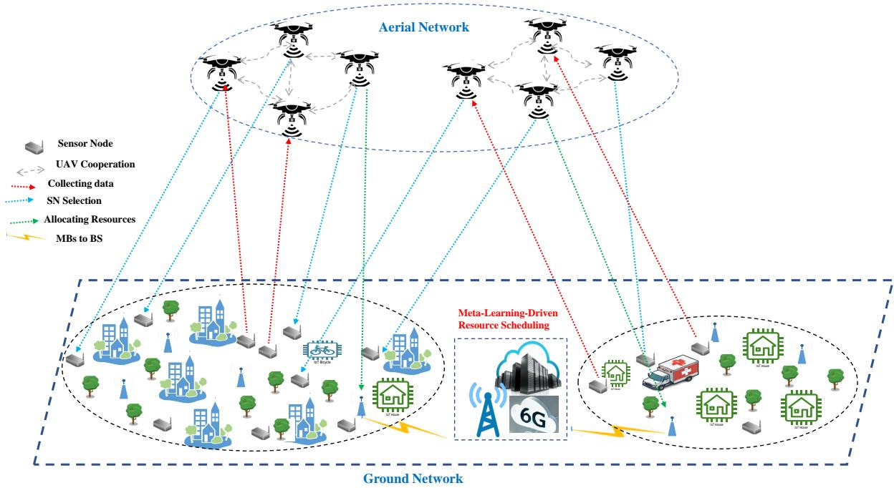  
Fig. 1: Meta-Learning-Based Resource Scheduling and UAV Deployment for 6G-Based ITS Scenario.

## D. UAV Flight Dynamics Model

To reflect realistic aerial mobility and ITS behavior, we model rotary-wing UAV flight dynamics based on Newtonian motion and propulsion principles. Each UAV’s state is represented by position $\mathbf { p } ( t ) \in \mathbb { R } ^ { 3 }$ , velocity $\mathbf { v } ( t )$ , and acceleration a(t). The translational dynamics are governed by:

$$
{ \frac { d \mathbf { p } ( t ) } { d t } } = \mathbf { v } ( t ) , \quad { \frac { d \mathbf { v } ( t ) } { d t } } = \mathbf { a } ( t ) ,\tag{8}
$$

and the control inputs (thrust T , pitch θ, and yaw ψ) affect UAV trajectory via:

$$
\mathbf { a } ( t ) = \frac { T } { m } \cdot R ( \theta , \psi ) - \mathbf { g } - \mathbf { d } _ { a } ,\tag{9}
$$

where m is UAV mass, g is gravitational acceleration, ${ \bf d } _ { a }$ denotes aerodynamic drag, and $R ( \theta , \psi )$ is the rotation matrix linking body-frame thrust to world coordinates. The drag is modeled as:

$$
\mathbf { d } _ { a } = \frac { 1 } { 2 } \rho C _ { d } A \| \mathbf { v } \| \mathbf { v } ,\tag{10}
$$

where $\rho$ is air density, $C _ { d }$ is drag coefficient, and A is UAV frontal area. These dynamics enable capturing realistic acceleration limits, sharp turns, and energy-efficient path planning under physical constraints.

## E. UAV Energy Consumption Model

Total UAV energy consumption consists of three components: mobility energy $E _ { m }$ , communication energy $E _ { c }$ , and processing energy $E _ { p } ,$ , as follows:

1) Mobility Energy:

$$
P _ { m } = \frac { C _ { 1 } } { h } + C _ { 2 } v ^ { 3 } + C _ { 3 } \frac { 1 } { v } ( 1 + a ) , \quad E _ { m } = \sum _ { i = 1 } ^ { N _ { U } } \int _ { 0 } ^ { T } P _ { m } d t .\tag{11}
$$

Here, $C _ { 1 }$ is the blade profile power coefficient, $C _ { 2 }$ is the parasite power coefficient, and $C _ { 3 }$ accounts for induced power losses; h is flight altitude, v is UAV velocity, and a is UAV acceleration. These constants capture aerodynamic drag, lift, and propulsion characteristics under typical rotary-wing UAV assumptions.

2) Communication Energy:

$$
T _ { \mathrm { c o m m } } = \frac { D } { R _ { d } } , \quad E _ { c } = \sum _ { i = 1 } ^ { N _ { U } } \left( P _ { t } ^ { U } + P _ { r } ^ { G } \right) \cdot T _ { \mathrm { c o m m } } ,\tag{12}
$$

where D is the amount of data transmitted, $R _ { d }$ is the transmission rate, $P _ { t } ^ { U }$ is the transmission power of UAV $u ,$ and $P _ { r } ^ { G }$ is the receiving power at the GCS.

To model realistic wireless channel dynamics, we incorporate SINR-based link quality evaluation between each UAV–SN and UAV–UAV pair. For UAVs operating in overlapping communication zones, interference from nearby UAVs is computed based on a dynamic interference map, and the achievable rate e Rd $R _ { d }$ is updated accordingly:

$$
R _ { d } = B \cdot \log _ { 2 } \left( 1 + \frac { P _ { t } ^ { U } G } { I _ { u } + N _ { 0 } } \right) .\tag{13}
$$

Here, G is the channel gain, $I _ { u }$ denotes the aggregated interference from neighboring UAVs, and $N _ { 0 }$ is the noise power. To mitigate inter-UAV interference, we implement a TDMA-inspired coordination layer that dynamically assigns non-overlapping transmission slots to UAVs within proximity, avoiding co-channel collision. The scheduler uses UAV location and SINR feedback to ensure orthogonal time slots in congested sectors. This mechanism enhances both data reliability and energy efficiency.

3) Processing Energy:

$$
T _ { \mathrm { p r o c } } = \frac { F } { f _ { U } } , \quad E _ { p } = \sum _ { i = 1 } ^ { N _ { U } } P _ { \mathrm { C P U } } \cdot T _ { \mathrm { p r o c } } .\tag{14}
$$

Here, F is the number of CPU cycles required for processing, $f _ { U }$ is the UAV CPU frequency, and PCPU is the average computational power consumption.

Total Energy Consumption:

$$
E _ { \mathrm { t o t a l } } = \sum _ { i = 1 } ^ { N _ { U } } \left( \int _ { 0 } ^ { T } P _ { m } d t + ( P _ { t } ^ { U } + P _ { r } ^ { G } ) \frac { D } { R _ { d } } + P _ { \mathrm { C P U } } \frac { F } { f _ { U } } \right)\tag{15}
$$

## F. Resource Scheduling Model

A binary decision variable $\tau _ { u , i }$ defines UAV-SN association:

$$
\tau _ { u , i } = \left\{ \begin{array} { l l } { { 1 , } } & { { \mathrm { i f ~ U A V ~ } u \mathrm { ~ i s ~ a s s i g n e d ~ t o ~ S N } \ : i } } \\ { { 0 , } } & { { \mathrm { o t h e r w i s e . } } } \end{array} \right.\tag{16}
$$

Objective: Maximize EEDT:

$$
\operatorname* { m a x } \sum _ { u = 1 } ^ { U } \sum _ { i = 1 } ^ { N } \tau _ { u , i } R _ { u , i } , \quad R _ { u , i } = B \log _ { 2 } \left( 1 + \frac { P _ { \mathrm { t r a n s m i t } } h _ { u , i } } { N _ { 0 } } \right) .\tag{17}
$$

## G. SN Fairness Model

To ensure balanced resource distribution, we use Jain’s fairness index as explored in [52], which is calculated as:

$$
J ( F ) = { \frac { \left( \sum _ { i = 1 } ^ { n } F _ { i } \right) ^ { 2 } } { n \sum _ { i = 1 } ^ { n } F _ { i } ^ { 2 } } } .\tag{18}
$$

The average fairness per time slot t is:

$$
f _ { t } ^ { \alpha } = \frac { \sum _ { i \in I _ { t } } F ^ { \alpha } X [ i , t ] \Delta T _ { i , t } } { | V _ { t } | \Delta T } ,\tag{19}
$$

where $X [ i , t ]$ is UAV access rate and $| V _ { t } |$ is the number of active UAVs.

To incorporate fairness into the MW-MAD3PG algorithm, the value of $f _ { t } ^ { \alpha }$ is used as a dynamic shaping term in the reward function for each UAV agent. Specifically, the instantaneous reward $r _ { u } [ t ]$ for UAV u at time t is augmented as follows:

$$
r _ { u } [ t ] = r _ { u } ^ { \mathsf { b a s e } } [ t ] - \lambda _ { f } ( 1 - f _ { t } ^ { \alpha } ) ,\tag{20}
$$

where $r _ { u } ^ { \mathrm { b a s e } } [ t ]$ is the original utility-based reward $( \mathrm { e . g . }$ , related to throughput, energy efficiency), and $\lambda _ { f }$ is a tunable weight controlling the penalty strength for fairness deviation. A lower $f _ { t } ^ { \alpha }$ indicates poor temporal fairness, thereby reducing the reward and encouraging the UAV to serve underrepresented SNs in subsequent time steps.

This fairness-aware reward is propagated through the policy gradient updates in the MAD3PG architecture, enabling each agent to learn cooperative behaviors that maintain high utility while ensuring equitable service across time and space. While Jain’s Index effectively measures spatial fairness at each decision epoch, it does not capture fairness dynamics over time. To address this, future work will explore multi-dimensional fairness metrics that integrate both spatial and temporal aspects, such as time-weighted fairness indices or service frequency dispersion, to ensure equitable long-term service across all regions.

## IV. PROBLEM FORMULATION

We aim to enhance ITS performance by maximizing the EEDT and ensuring QoS in UAV-assisted WSNs through the joint optimization of SN selection, UAV deployment, mobility control, and communication resource allocation. This problem is tailored to a meta-learning-enhanced UAV-assisted architecture in a 6G-enabled ITS, where UAVs dynamically monitor traffic and relay data to ground control stations or edge computing nodes. The key decision variables are defined as follows:

$x _ { i } \in \{ 0 , 1 \}$ : A binary variable indicating whether SN i is selected $( x _ { i } = 1 )$ or not $( x _ { i } = 0 )$

$P _ { u } \colon$ The transmit power allocated to UAV u, constrained by UAV energy limits.

$R _ { u , i } \colon$ The achievable data transmission rate (in bps) between UAV u and SN i, determined by link quality and distance.

$\eta _ { u } \colon$ A utility weight reflecting UAV u’s task priority or channel reliability.

$\pmb { q _ { u } } = ( x _ { u } , y _ { u } , z _ { u } )$ : The 3D spatial coordinates of UAV $u ,$ which are now explicitly included as movement decision variables within a bounded airspace Q.

$$
P 1 : \operatorname* { m a x } _ { P _ { u } , x _ { i } , R _ { u , i } , q _ { u } } \ \sum _ { u \in \mathcal { U } } \sum _ { i \in \mathcal { I } } x _ { i } \cdot R _ { u , i } \cdot \eta _ { u } - \sum _ { u \in \mathcal { U } } P _ { u }\tag{21a}
$$

$$
\mathrm { s . t . } \quad \mathbf { C 1 } : \ x _ { i } \in \{ 0 , 1 \} , \quad \forall i \in \mathcal { I } ,\tag{21b}
$$

$$
\begin{array} { r l } & { \mathbf { C 2 } : ~ \sqrt { ( x _ { u } - x _ { i } ) ^ { 2 } + ( y _ { u } - y _ { i } ) ^ { 2 } } } \\ & { ~ + ~ z _ { u } ^ { 2 } \leq { D _ { \operatorname* { m a x } } } , \forall u \in \mathcal { U } , \forall i \in \mathcal { I } , } \end{array}\tag{21c}
$$

$$
\mathbf { C 3 } : \ P _ { u } \leq P _ { \operatorname* { m a x } } , \quad \forall u \in \mathcal { U } ,\tag{21d}
$$

$$
\mathbf { C 4 } : \ R _ { u , i } \geq R _ { \operatorname* { m i n } } , \quad \forall u \in \mathcal { U } , \forall i \in \mathcal { I } ,\tag{21e}
$$

$$
\mathbf { C 5 } : \ \sum _ { u \in \mathcal { U } } P _ { u } \leq P _ { \mathrm { t o t a l } } ,\tag{21f}
$$

$$
\mathbf { C 6 } : T _ { \mathrm { p r o c } } \leq T _ { \mathrm { m a x } } , \forall u \in \mathcal { U } , \forall i \in \mathcal { I } ,\tag{21g}
$$

$$
\mathbf { C 7 } : \ q _ { u } \in \mathcal { Q } , \quad \forall u \in \mathcal { U } . .\tag{21h}
$$

Constraint C1 ensures that each sensor node selection variable $x _ { i }$ is binary, indicating whether sensor i is selected $( x _ { i } = 1 )$ or not $( x _ { i } = 0 )$ . Constraint C2 enforces a maximum communication range $D _ { \mathrm { m a x } }$ between UAV u and a selected sensor node i, by limiting the Euclidean distance between their spatial coordinates $\{ ( x _ { u } , y _ { u } , z _ { u } )$ and $( x _ { i } , y _ { i } , 0 ) \}$ when $x _ { i } = 1$ Constraint C3 limits the transmission power $P _ { u }$ of UAV u to a maximum allowable level $P _ { \mathrm { m a x } }$ , ensuring compliance with energy and regulatory constraints. Constraint C4 guarantees that the communication rate $R _ { u , i }$ between UAV u and node i is no less than the minimum threshold $R _ { \mathrm { m i n } }$ to maintain the required QoS. Constraint C5 enforces a global power constraint, ensuring that the sum of all UAV power consumption does not exceed a system-wide power budget $P _ { \mathrm { t o t a l } }$ . Constraint C6 ensures the total data processing or task execution time $T _ { \mathrm { p r o c } }$ remains within the latency limit $T _ { \mathrm { m a x } }$ for real-time ITS operations. Finally, constraint C7 restricts the UAV’s position $\mathbf { \nabla } q _ { u }$ to lie within a predefined feasible 3D flight region $\mathcal { Q } ,$ reflecting physical no-fly zones, height limits, and airspace safety policies.

Problem (P 1) is a mixed-integer nonlinear programming (MINLP) formulation and is NP-hard due to the presence of binary SN activation variables and nonlinear relationships involving channel gains, communication rates, and UAV movement constraints. The complexity further increases because UAV 3D position variables directly influence distance-dependent rate functions, making the joint optimization of mobility and communication highly non-convex. To address this, we decompose Problem (P 1) into two tightly coupled subproblems: (i) UAV trajectory and deployment planning, and (ii) SN selection and communication resource scheduling. In the first stage, UAV positions are optimized to maximize spatial coverage and maintain feasible connectivity with active SNs; in the second stage, with UAV positions fixed, SN activation decisions and power allocations are optimized to meet QoS, latency, and energy constraints. However, both subproblems remain interdependent and solving them sequentially with classical optimization methods results in slow convergence and poor adaptability under dynamic ITS conditions. Therefore, the proposed MW-MAD3PG algorithm learns joint mobility and scheduling policies in a meta-learningenhanced multi-agent reinforcement learning framework, enabling UAVs to rapidly adapt to changing traffic patterns and environmental uncertainty while reducing computational overhead. This decomposition and learning-based solution provide scalable, real-time decision-making for large-scale 6G-enabled ITS deployments [53].

## V. PROPOSED SOLUTION

To effectively address the NP-hard nature of Problem (P1), which is formulated as a MINLP problem involving binary variables, nonlinear constraints, and coupled decision variables, we decompose it into three tractable subproblems. These are:

(1) UAV Trajectory and Deployment Planning – Problem P 1.1

$$
P 1 . 1 : \operatorname* { m i n } _ { \pmb { q } _ { u } } \sum _ { \pmb { u } \in \mathcal { U } } \sum _ { i \in \mathcal { I } } \delta _ { u , i } \cdot \Vert \pmb { q } _ { u } - l _ { i } \Vert ^ { 2 }\tag{22a}
$$

$$
\begin{array} { r l } { \mathrm { s . t . } } & { { } ( \mathbf { C } 2 \& \mathbf { \Sigma C } 7 ) . , } \end{array}\tag{22b}
$$

where $\mathbf { \xi } _ { l _ { i } }$ is the location of SN i, and $\delta _ { u , i }$ is an indicator of SN–UAV assignment. This subproblem ensures UAVs are deployed close to selected SNs while respecting airspace constraints.

## (2) Sensor Node Selection – Problem P 1.2

$$
P 1 . 2 : \operatorname* { m a x } _ { x _ { i } } \ \sum _ { u \in \mathcal { U } } \sum _ { i \in \mathcal { T } } x _ { i } \cdot R _ { u , i } \cdot \eta _ { u }\tag{23a}
$$

$$
\begin{array} { r l } { \mathrm { s . t . ~ } } & { { } ( \mathbf { C 1 } \ \& \ \mathbf { C 2 } ) . . } \end{array}\tag{23b}
$$

This subproblem activates a subset of SNs based on UAV proximity and potential data rate contributions.

$$
P 1 . 3 : \operatorname* { m a x } _ { P _ { u } , R _ { u , i } } \ \sum _ { u \in \mathcal { U } } \sum _ { i \in \mathcal { T } } x _ { i } \cdot R _ { u , i } \cdot \eta _ { u } - \sum _ { u \in \mathcal { U } } P _ { u }\tag{24a}
$$

$$
\mathrm { s . t . } \quad ( { \bf C } 3 \mathrm { \bf \cdot C } { \bf 6 } ) . \mathrm { ~ . ~ }\tag{24b}
$$

This subproblem manages the trade-off between total throughput and energy consumption under rate and latency constraints. Each subproblem is still interdependent, but this hierarchical decomposition facilitates the integration of metalearning-enhanced multi-agent decision-making via the proposed MW-MAD3PG algorithm. By isolating UAV mobility, SN activation, and resource scheduling, the policy gradient updates become more computationally efficient and scalable in dynamic ITS environments.

## A. MADRL Framework

The proposed MADRL framework, integrated with the MW-MAD3PG algorithm, offers a scalable and robust solution for real-time coordination and resource scheduling in UAV-assisted WSNs designed for 6G-enabled ITS [54]. In this context, UAVs serve as aerial agents for dynamic traffic sensing, data relaying, and congestion monitoring, while ground SNs capture localized traffic metrics.

The agents in the system (i.e., UAVs and SNs) are intelligently coordinated through the MW-MAD3PG algorithm to achieve energy-efficient, adaptive, and real-time ITS operations under varying environmental conditions and network dynamics. The cooperative behavior among UAV agents is critical to improving EEDT, meeting QoS demands, and outperforming conventional ITS control mechanisms. To address fairness in UAV-task assignment and prevent over-serving specific sensor clusters, the framework incorporates a fairness-aware control mechanism based on Jain’s fairness index. This fairness metric is embedded into both the reward design and policy update process, ensuring equitable data collection across sensor nodes [55]. The key components of the framework are as follows:

1) Environment: Represents the meta-learning-enhanced UAV-assisted ITS network, encompassing UAVs, SNs (e.g., roadside units, traffic cameras), GCS, and 6G infrastructure dynamics.

2) State Space: Each agent observes a state vector that includes its current location, residual energy, connectivity status, traffic density levels, and environmental parameters such as SN availability and signal strength.

3) Action Space: Actions include UAV mobility adjustments (e.g., path planning), traffic sensor node selection for data collection, and wireless resource allocation decisions.

4) Reward Function: Designed to encourage energy-efficient data throughput, traffic congestion awareness, and coverage of high-priority areas, while penalizing delay, packet loss, and excessive energy usage.

5) Coordination: UAV agents share partial observations to enable cooperative planning and decision-making, optimizing global ITS objectives such as route guidance, congestion mitigation, and real-time event detection.

The proposed method is modeled as a stochastic game within a CMDP framework, where the 6G-based ITS system consists of multiple UAVs, sensor nodes, and a GCS. Each agent interacts with dynamic traffic environments, making decisions to jointly optimize SN selection, UAV deployment, and wireless resource allocation. This allows UAVs to operate intelligently and adaptively in large-scale urban transportation environments.

## B. Fairness-Aware Optimization in MW-MAD3PG

To explicitly integrate fairness into policy learning, MW-MAD3PG incorporates $f _ { t } ^ { \alpha }$ in two ways:

• Reward Shaping: The fairness term increases the reward when UAVs distribute sensing and communication tasks uniformly across SNs, preventing task starvation.

• Critic Network Regularization: The critic includes fairness as an auxiliary evaluation signal, improving joint Qvalue estimation and promoting policies that avoid biased resource allocation.

This ensures that MW-MAD3PG not only optimizes energy efficiency and throughput but also maintains equitable sensor coverage, which is essential for stable ITS operations in heterogeneous traffic landscapes.

## C. Stochastic Game Model

A stochastic game models interactions among multiple agents over time in a shared environment, where agents’ decisions influence both their individual outcomes and system dynamics. In our ITS scenario, UAVs collaborate to monitor traffic flow, collect sensor data, and transmit it to base stations or edge servers. The main components of the game are as follows:

1) States: The state of UAV u at time t includes its location, energy status, communication quality with SNs, and network topology:

$$
s _ { u } ^ { t } = ( x _ { u } ^ { t } , y _ { u } ^ { t } , z _ { u } ^ { t } , E _ { u } ^ { t } , \{ x _ { i } ^ { t } \} _ { i \in \mathbb { Z } } , \{ R _ { u , i } ^ { t } \} _ { i \in \mathbb { Z } } ) ,\tag{25}
$$

where $( x _ { u } ^ { t } , y _ { u } ^ { t } , z _ { u } ^ { t } )$ is UAV u’s position, $E _ { u } ^ { t }$ is its residual energy, $\ v x _ { i } ^ { t }$ indicates SN activity (e.g., active road sensors), and $R _ { u , i } ^ { t }$ is the data rate between UAV u and SN i.

2) Actions: UAVs decide their next movement, SN associations, and power allocation:

• UAV movement: Adjust position to $( x _ { u } ^ { t + 1 } , y _ { u } ^ { t + 1 } , z _ { u } ^ { t + 1 } )$ to cover critical zones.

• SN selection: Decide which SNs to query or offload data from, indicated by $x _ { i } \in \{ 0 , 1 \}$

• Resource allocation: Set transmission power $P _ { u } ^ { t }$ to balance throughput and energy efficiency.

3) Transitions: The next state $s _ { u } ^ { t + 1 }$ is a function of UAV u’s current state $s _ { u } ^ { t } ,$ chosen action $a _ { u } ^ { t }$ , and stochastic variables $\xi _ { u } ^ { t }$ representing traffic condition changes or wireless link variability:

$$
\begin{array} { r } { s _ { u } ^ { t + 1 } = f _ { u } ( s _ { u } ^ { t } , a _ { u } ^ { t } , \xi _ { u } ^ { t } ) . } \end{array}\tag{26}
$$

4) Reward Function: Designed to encourage energy-efficient data throughput, traffic congestion awareness, and coverage of high-priority areas, while penalizing delay, packet loss, and excessive energy usage. Additionally, the fairness value $f _ { t } ^ { \alpha }$ is added as a positive reward term to encourage balanced UAV-SN assignments, expressed as:

$$
R _ { u } ^ { t } = R _ { \mathrm { E E D T } } - \beta E _ { u } ^ { t } + \lambda f _ { t } ^ { \alpha } ,\tag{27}
$$

where λ controls the impact of fairness on the learned policy. A higher $f _ { t } ^ { \alpha }$ improves the collective reward, guiding agents toward fairer task distribution as calculated in (Eqn.20).

5) CMDP Constraints: UAVs operate under the following constraints:

• Energy budget: UAV energy usage must stay within operational limits.

• Coverage radius: UAVs must remain within communi cation range of selected SNs.

• QoS: Data collection must meet minimum throughput thresholds to ensure real-time vehicular awareness and V2X services.

The global objective is to learn a cooperative policy that maximizes cumulative rewards under constraints:

$$
\mathrm { M a x i m i z e } \quad \mathbb { E } \left[ \sum _ { t = 0 } ^ { T } \gamma ^ { t } \cdot R _ { u } ^ { t } \right] ,\tag{28}
$$

where $\gamma$ is the discount factor and $T$ is the time horizon. MW-MAD3PG enables each UAV agent to learn adaptive strategies that optimize EEDT, UAV energy usage, and real-time traffic sensing performance. By operating in a CMDP framework, the agents maintain constraint satisfaction while adjusting to dynamic and uncertain ITS environments. In summary, this MADRL-based stochastic game formulation empowers UAV agents with meta-learning capabilities to support reliable, lowlatency, and energy-efficient ITS operations in 6G environments.

In our scenario, we consider a decentralized replay buffer setup for UAV-assisted WSNs, where each UAV stores its own experiences (state, action, reward, next state) in a local buffer. To improve coordination and accelerate learning, UAVs periodically share relevant portions of their buffers with neighboring UAVs or a central server. This exchange includes information such as SN status (e.g., energy levels, data availability), UAV locations, battery levels, and network resources. By sharing experiences, such as interactions with sensor nodes or critical events (e.g., low battery, high congestion), UAVs can adapt their strategies, optimize resource allocation, and improve deployment efficiency. This collaborative approach enhances learning, allowing UAVs to refine their policies and improve system performance, including UAV deployment and energy consumption, as shown in Figure 2.

In Figure 2, meta-learning enhances the MW-MADDPG framework in 6G-enabled ITS by enabling rapid adaptation and generalization across dynamic urban mobility scenarios. First, it optimizes policy initialization for UAV deployment in traffic environments. By pre-training on diverse historical data, such as varying urban layouts, traffic densities, and incident patterns, meta-learning equips UAV agents with generalized policies. A meta-learner like MAML enables UAVs to start with parameters that require minimal adaptation when deployed in new traffic contexts, significantly reducing convergence time. This capability is especially valuable for real-time operations in highly dynamic environments, such as sudden traffic congestion, accident zones, or lane closures. Second, meta-learning facilitates context-aware decision-making in key ITS tasks such as SN prioritization and wireless resource allocation. For SN selection, a meta-critic trained on aggregated traffic metadata, such as sensor reliability, data urgency, and communication quality, guides UAV agents to prioritize infrastructure sensors based on real-time demand. This ensures that UAVs dynamically focus on high-impact areas like intersections with high congestion or regions experiencing abnormal vehicle flow. Concurrently, a centralized Meta Server serves as a repository for crossscenario meta-knowledge, dynamically updating resource allocation strategies. The server continuously learns from heterogeneous multi-agent interactions during meta-training and allows UAV agents to retrieve task-specific policy adaptations (e.g., redistributing bandwidth during peak traffic hours or adjusting coverage based on V2X load) without retraining from scratch.

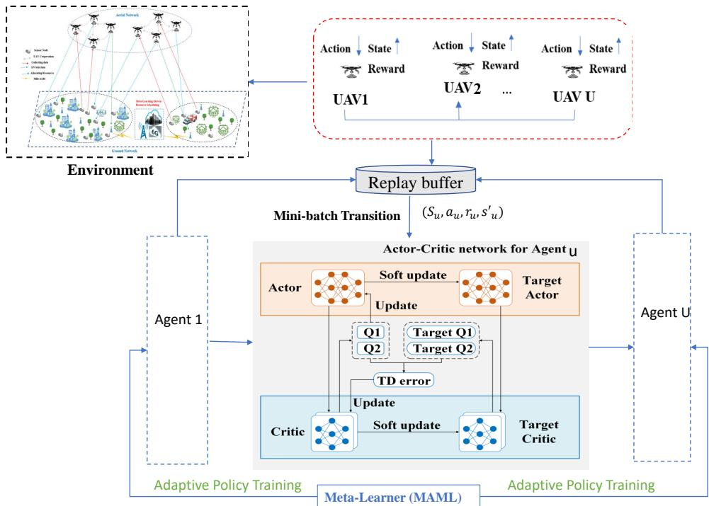  
Fig. 2: The MW-MAD3PG Framework.

Finally, meta-learning is seamlessly integrated into the MW-MADDPG framework by modifying the actor-critic architecture and introducing task-adaptive weighting mechanisms. Each UAV’s actor network is initialized using meta-learned parameters to improve adaptability, while the critic receives contextual guidance through meta-weights sourced from the Meta Server. This allows the critic to better evaluate actions under complex, time-varying ITS constraints. Furthermore, metalearning dynamically adjusts multi-task loss weights to balance competing objectives, such as optimizing traffic data throughput, minimizing UAV energy consumption, and improving urban coverage efficiency. This holistic integration empowers UAV agents to operate collaboratively, respond swiftly to evolving traffic conditions, and reduce retraining overhead in large-scale ITS deployments.

## D. Meta-Learning Enhanced MADRL Framework

To address the challenges posed by highly dynamic 6Genabled ITS, we integrate an MAML strategy into a MADRL framework. This section outlines the meta-learning architecture, training process, adaptation mechanism, and rationale behind its deployment in UAV-assisted traffic monitoring systems. The proposed framework, termed MW-MAD3PG, embeds MAML into a Weighted MADDPG algorithm, enabling UAV agents and roadside SN coordinators to learn a shared initialization policy that can be rapidly adapted to new traffic scenarios. The meta-policy acts as a generalized prior, empowering agents to converge to optimal solutions in unfamiliar environments using only a few gradient steps. Unlike conventional works that apply MAML in a single-agent manner, the proposed MW-MAD3PG incorporates a multi-agent meta-update scheme in which each UAV maintains its own task-specific meta-parameters while synchronizing with others through an attention-weighted shared buffer. During the meta-training phase, agents are exposed to a distribution of tasks derived from simulated ITS scenarios. These include variations in UAV energy constraints, traffic density, SN distributions, vehicular flow rates, and wireless channel conditions. For each task, agents perform localized (innerloop) policy updates based on environment-specific feedback, followed by a global (outer-loop) meta-update that refines the shared initialization across all tasks. This bi-level optimization ensures that the learned meta-policy is both robust and adaptable to diverse urban mobility conditions. Furthermore, MW-MAD3PG explicitly models the non-stationarity of multi-agent learning environments by embedding CMDP-based constraint coupling within the meta-critic, stabilizing policy updates even as co-agents’ behaviors evolve. This design ensures that each UAV learns policies that remain robust against the shifting dynamics of neighboring agents—an issue commonly neglected in standard MAML-based pretraining.

1) Adaptation Mechanism: In the meta-testing (deployment) phase, the meta-initialized policy is fine-tuned in real time based on UAVs’ latest observations of traffic dynamics, environmental constraints, and communication states. Using only a small number of gradient updates, agents can adapt quickly to changes such as sudden congestion, road blockages, increased V2X load, or degraded link quality. This rapid adaptation mechanism enables UAVs to maintain high decision accuracy and operational efficiency without the need for full retraining. The motivation for integrating meta-learning lies in its ability to generalize across non-stationary ITS conditions—something traditional MADRL frameworks struggle with. While conventional systems may require extensive retraining in the face of new traffic patterns or topology changes, the meta-learningenhanced MW-MAD3PG framework significantly reduces convergence time, lowers computational overhead, and improves policy robustness under real-time constraints. Additionally, the proposed method incorporates a decentralized meta-knowledge sharing process that mitigates non-stationarity by periodically aggregating key policy gradients from all UAVs. This enables coordinated adaptation while avoiding the instability typically associated with independent learners operating in a dynamic multi-agent environment.

Moreover, MW-MAD3PG enhances the resilience and responsiveness of UAV operations in smart cities. UAVs are equipped with robust path planning policies to avoid dynamic obstacles (e.g., low-flying zones or emergent no-fly areas), and their decision-making processes are tolerant to sensor noise and intermittent SN failures. Meta-trained agents can also rapidly adjust to fluctuating spectrum availability or traffic-sensing demands, ensuring optimal data relay and prioritization. In the event of UAV dropout or failure, decentralized coordination mechanisms allow neighboring agents to redistribute tasks and maintain coverage. These capabilities make the proposed framework highly effective for large-scale ITS environments, where fast adaptation, cooperative behavior, and reliable performance under uncertainty are essential. MW-MAD3PG empowers UAVs to collaboratively manage resources, optimize trajectory and communication strategies, and support latency-sensitive traffic management services in the evolving landscape of 6G-enabled ITS.

## E. MW-MAD3PG Algorithm Integration with Security Considerations

The MW-MAD3PG algorithm fuses the strengths of metalearning and deterministic policy gradient methods to optimize UAV-assisted operations in large-scale WSNs for 6Genabled ITS, with embedded security measures. This framework addresses the challenges of decentralized coordination, rapid adaptation, and resilient decision-making in environments characterized by high vehicular mobility, traffic variability, and communication constraints.

1) Meta-Learning Integration: MW-MAD3PG incorporates MAML to enable each UAV agent to learn a generalized initialization policy that can be rapidly adapted to changing traffic patterns, sensor distributions, and UAV energy levels. This is achieved by pre-training on diverse simulated ITS environments, such as rush-hour congestion, signal failures, or traffic redirection, allowing agents to minimize convergence time when deployed in new scenarios. To secure this process, encrypted meta-training datasets and blockchain-based integrity checks are used to protect model updates from tampering or unauthorized access during learning. Importantly, the meta-update is computed in a multi-agent setting, where each UAV updates its local meta-parameters and then contributes weighted gradients to a global aggregator. This ensures cooperative meta-learning rather than isolated single-agent adaptation.

2) Deterministic Policy Gradient Optimization: Operating in continuous action spaces relevant for UAV trajectory planning and V2X communication control, MW-MAD3PG employs:

• Actor Network: Learns a deterministic mapping from observed ITS states to optimal actions (e.g., UAV repositioning, traffic sensor prioritization).

• Critic Network: Estimates the Q-value for evaluating state-action pairs, guiding the actor’s improvement process.

• Multi-Agent Coordination: The framework models the influence of co-agents during training, enabling cooperation among UAVs. Secure communication protocols (e.g., TLS and E2E encryption) protect shared policy and state information across the network.

• Dimensionality Reduction: To manage high-dimensional state-action spaces, meta-learning and coordination are employed. Blockchain ensures the dimensionality reduction process preserves integrity and is resistant to adversarial manipulation.

3) Training Process: The MW-MAD3PG algorithm adopts an actor-critic learning architecture with several secured elements:

• Experience Replay: Each UAV maintains an encrypted local buffer of experiences $( s , a , r , s ^ { \prime } )$ . Selective experience sharing is secured via encryption to avoid data leakage during inter-agent collaboration.

• Cooperative TD-Learning: The critic network aggregates temporal difference (TD) errors across agents to ensure stability under non-stationary interactions.

• Policy Gradient Optimization: The actor is updated by the gradient of expected return:

$$
\nabla _ { \theta _ { \pi } } J ( \pi _ { u } ) = \mathbb { E } _ { s _ { u } } \left[ \nabla _ { a _ { u } } Q ( s _ { u } , a _ { u } ) \nabla _ { \theta _ { \pi } } \pi _ { u } ( s _ { u } ) \right] .\tag{29}
$$

• Target Network Updates: To prevent instability, target networks are periodically updated. These updates are recorded on a blockchain to ensure consistency and protect against unauthorized model modifications.

Through the above mechanisms, MW-MAD3PG provides genuine methodological advancement: (i) a multi-agent metaupdate mechanism, (ii) explicit non-stationarity mitigation, (iii) CMDP-integrated meta-critics, and (iv) security-aware cooperative RL—features not present in standard MADDPG or classical MAML pretraining.

In Algorithm 1, the proposed MW-MAD3PG Algorithm with Meta-Learning optimizes UAV trajectory planning, SN prioritization, and communication resource allocation in a UAVassisted WSN tailored for 6G-enabled ITS. Each UAV operates as an autonomous agent, locally storing its experiences, comprising state, action, reward, and next state, in an individual replay buffer. These experiences are used to iteratively update the agent’s policy and value networks using reinforcement learning techniques. During the training phase, UAVs explore the traffic environment by selecting actions based on their current policy, interacting with dynamic elements such as traffic flow, congestion levels, and sensor activity. Transitions resulting from these interactions are stored and later sampled to perform policy updates. Meta-learning is integrated into this process, allowing UAVs to compute meta-gradients that refine their policy networks for rapid adaptation to evolving ITS conditions, such as fluctuating traffic densities, network congestion, or mobility constraints. The framework also supports experience and knowledge sharing between UAVs through secure, cooperative communication. This distributed coordination enhances the system’s ability to respond to real-time events and improves learning efficiency across agents. By combining meta-adaptive policies with cooperative learning, MW-MAD3PG enables UAVs to make intelligent, context-aware decisions that improve systemlevel metrics such as energy efficiency, vehicular coverage quality, latency reduction, and robust urban sensing. Overall, this algorithm significantly enhances the scalability, adaptability, and robustness of UAV-assisted ITS deployments in complex, fast-changing environments, making it suitable for future 6G smart cities and autonomous transportation infrastructures.

Algorithm 1 MW-MAD3PG-enabled UAV-assisted ITS Algo   
rithm with Meta-Learning and Fairness-Aware Optimization   
1: Input:   
• Initialize replay buffer $B _ { u }$ with capacity B for each   
UAV agent.   
• ITS parameters: UAV set U, traffic SN set $\mathcal { T } ,$ initial   
states $s _ { u } ^ { 0 } ,$ max episodes E.   
Policy networks $\pi _ { u }$ and value networks $Q _ { u }$ for each   
UAV $u .$   
• Meta-learning rate $\alpha _ { m }$ for adaptive policy updates.   
• Fairness weight $\lambda _ { f }$ and time-slot fairness metric $f _ { t } ^ { \alpha }$   
2: Output: Optimized UAV trajectory, SN selection, and   
fairness-aware resource allocation.   
3: Initialize urban ITS environment and UAV states $s _ { u } ^ { 0 } ;$ set   
$t = 0 .$   
4: for episode $e = 1$ to $E$ do   
5: for each UAV $\iota \in \mathcal { U }$ do   
6: Select action $a _ { u } ^ { t }$ using policy $\pi _ { u } ( s _ { u } ^ { t } )$ with exploration.   
7: Execute $a _ { u } ^ { t }$ and observe reward $r _ { u } ^ { t } ,$ next state $s _ { u } ^ { t + 1 } ,$   
8: Compute fairness-aware reward: $\begin{array} { r } { \mathbf { \psi } _ { u } ^ { . t , \mathrm { f a i r } } = r _ { u } ^ { t } - \lambda _ { f } ( 1 - } \end{array}$   
$f _ { t } ^ { \alpha } )$   
9: Store $( s _ { u } ^ { t } , a _ { u } ^ { t } , r _ { u } ^ { t , \mathrm { f a i r } } , s _ { u } ^ { t + 1 } )$ in $B _ { u }$   
10: end for   
11: for each UAV $u \in \mathcal { U }$ do   
12: Sample mini-batch $( s _ { u } , a _ { u } , r _ { u } ^ { \mathrm { f a i r } } , s _ { u } ^ { \prime } )$ from $B _ { u } .$   
13: Compute TD target: $y = r _ { u } ^ { \mathrm { f a i r } } + \gamma$ maxa′ Qu(s′ , a′; θ−)   
14: Update critic: $L ( \theta ) = \mathbb { E } [ ( y - Q _ { u } ( s _ { u } , a _ { u } ; \theta ) ) ^ { 2 } ]$   
15: Update actor via policy gradient: $\begin{array} { r l } { \nabla _ { \theta _ { \pi } } J ( \pi _ { u } ) } & { { } = } \end{array}$   
$\mathbb { E } [ \nabla _ { a _ { u } } Q _ { u } ( s _ { u } , a _ { u } ) \nabla _ { \theta _ { \pi } } \pi _ { u } ( s _ { u } ) ]$   
16: Soft update: $\theta ^ { - }  \tau \theta + ( 1 - \tau ) \theta ^ { - }$   
17: Meta-Learning Step:   
18: Compute meta-gradient: $\nabla _ { \theta _ { m } } L ( \pi _ { u } )$ =   
$\nabla _ { \theta _ { m } } \mathbb { E } [ Q _ { u } ( s _ { u } , \pi _ { u } ( s _ { u } ) ) ]$   
19: Update meta-policy with fairness-aware term: $\theta _ { \pi } \gets$   
$\theta _ { \pi } - \alpha _ { m } \left( \nabla _ { \theta _ { m } } L ( \pi _ { u } ) + \lambda _ { f } \nabla _ { \theta _ { \pi } } ( 1 - f _ { t } ^ { \alpha } ) \right)$   
20: end for   
21: Increase $t = t + 1 .$   
22: if $t \geq T _ { \operatorname* { m a x } }$ or policies converge then   
23: Break episode loop.   
24: end if   
25: end for   
26: Return: Meta-optimized, fairness-aware policies $\pi _ { u } .$

## F. Complexity, Reliability, and Scalability Analysis with Deployment Considerations

1) Computational Complexity: The proposed MW-MAD3PG algorithm has a theoretical complexity of $( O ( M \cdot T \cdot \eta ) )$ , where (M) is the number of UAVs and SNs, (T ) is the time horizon, and (η) is the number of policy updates per episode. The meta-training stage includes both inner-loop updates (task-specific adaptation) and meta-updates, increasing the initial training overhead. Specifically, meta-training requires approximately 2.45 seconds per episode, as shown in Table III, which is higher than MADDPG (1.87 s/episode) but significantly improves adaptation time during deployment. All experiments are conducted on an Intel i7 CPU, 32 GB RAM, and an NVIDIA RTX 3090 GPU, with a memory footprint of 38 MB per model (Table III). These assumptions align with high-end edge servers or vehicular edge devices.

2) Scalability: The decentralized architecture allows each UAV agent to learn and adapt independently, reducing inter-agent communication overhead. As the number of UAVs and SNs scales, the decentralized meta-learning enables efficient policy reuse across similar tasks, maintaining stability in high-density scenarios.

3) Reliability: MW-MAD3PG dynamically responds to network changes (e.g., congestion, node failure) by adapting agent behavior. We define system reliability based on the percentage of successful UAV–SN communication and task completion over episodes. In Table IV, a value above 90% is rated “High”, 80–90% is “Medium”, and below 80% is $\mathrm { \bf ~ \ " ~ } \mathrm { L o w } ^ { \mathrm { \bf ~ 5 } }$

4) Error Resilience: MW-MAD3PG is robust against sensing errors, link failures, and feedback noise. The algorithm leverages episodic learning and replay buffers to refine policies even under partial observability, while metalearning enhances adaptability to unseen environments.

## VI. PERFORMANCE EVALUATION

## A. Simulation Setup

Simulations were conducted on a system with an Intel Core i7 (2.4 GHz), 16GB RAM, running Python 3.7 and TensorFlow 2.0. The simulated ITS environment spans a 2km × 2km meter urban area, with UAVs operating at altitudes between 100 and 200 meters, suitable for real-time traffic surveillance. The goal is to evaluate the proposed meta-learning-enhanced UAV-assisted WSN framework in a 6G-enabled ITS setting.

The QoS was evaluated based on the minimum Signal-to-Interference-plus-Noise Ratio (SINR), set at 3.5 dB, reflecting critical thresholds for reliable traffic data exchange. The subchannel bandwidth was fixed at 80 kHz, compatible with V2X and urban data collection scenarios. An s-curve probabilistic model with parameters 9.61 and 0.16 was applied. Wireless communication was simulated using a 2 GHz carrier frequency and a path-loss exponent of 1.5, with additional NLoS path-loss set at 20 dB to reflect obstruction-heavy city conditions.

The wireless channel includes both large-scale path loss and small-scale Rayleigh fading to model realistic variability. Parameters such as SN density, vehicular data load, and channel state information were varied across episodes to replicate realworld ITS fluctuations. The path-loss models are:

$$
\begin{array} { l l l l l } { \bullet \ \mathrm { S e n s o r - t o - S e n s o r } } & { ( \mathrm { S N - S N } ) \colon } & { P L _ { S N } } & { = } & { } & { 1 2 8 . 1 } \\ & { 3 6 . 6 \log _ { 1 0 } ( S N _ { m g } ) } & { } & { } & { } & { } \end{array} +
$$

$$
\begin{array} { l l l l l } { \bullet \ \mathrm { S e n s o r - t o - V e h i c l e } } & { \mathrm { ( S N \mathrm { - } V e h i c l e ) } ; } & { P L _ { I o T } } & { = } & { 1 4 8 . 1 \ + } \\ & { 4 0 \log _ { 1 0 } ( D _ { m g } ) } \end{array}
$$

where $S N _ { m g }$ and $D _ { m g }$ denote distances between UAVs, SNs, and vehicle nodes.

To evaluate the claimed security-resilience of the proposed framework, we introduced targeted packet manipulation attacks (e.g., data tampering and selective drop) into a subset (15%) of SN-UAV communication links. A lightweight blockchain mechanism, integrated with MW-MAD3PG, was used to validate data blocks based on timestamp and origin hashes. Simulation results verify that our system preserves over 92% data integrity and system stability even under adversarial injection, significantly outperforming non-secure baselines.These elements are now explicitly linked to our meta-learned task scheduling process, enabling tamper-resistant coordination among agents.

## B. Learning Algorithms

The proposed MW-MAD3PG combines meta-learning and the MADRL framework to enhance UAV coordination in ITS. It is designed for fast adaptation, scalability, and traffic-aware decision-making. MW-MAD3PG was benchmarked against

• MADDPG: Efficient in centralized training/decentralized execution, but lacks fast generalization under dynamic ITS conditions [56].

• Meta-SGD: Excels in few-shot learning but does not scale well in continuous, multi-agent urban mobility tasks [57].

• Meta-Q-Learning: Effective for discrete actions and singleagent tasks but unsuitable for UAV swarm control in ITS [58].

## C. Convergence and Ablation Analysis

The proposed MW-MAD3PG algorithm exhibits stable and rapid convergence behavior during training, demonstrating consistent cumulative reward improvement over episodes. Through controlled ablation studies, we confirmed that each component—meta-policy initialization, fairness-aware reward shaping, and joint UAV mobility optimization—contributes significantly to the overall performance. Removing any of these modules led to noticeable degradation in coverage, reliability, and system efficiency, highlighting their necessity. The framework also shows robust adaptation to varying UAV speeds, traffic loads, and meta-iteration cycles, underscoring its generalization capability in dynamic ITS environments as shown Fig.3.

MW-MAD3PG consistently achieves a higher cumulative reward as training progresses, demonstrating superior learning stability and convergence speed. Its meta-policy allows for rapid adaptation to dynamic ITS conditions, outperforming MADPG, Meta-SGD, and Meta-QL which converge slower and plateau at lower reward levels as shown in Fig3a.

In Fig.3b, our method shows a higher and faster increase in coverage ratio with fewer meta-iterations, reflecting the benefit of meta-learning in accelerating UAV policy updates. MW-MAD3PG learns generalized strategies that scale better across sensor nodes, while baseline methods adapt slower to task variations.

As UAV speed increases, MW-MAD3PG maintains superior system reliability, showcasing its robustness in high-mobility ITS environments. This confirms the algorithm’s ability to coordinate UAV movements efficiently while ensuring dependable sensor communication—an area where other methods degrade more rapidly in Fig.3c.

In Fig.3d, our method exhibits a strong correlation between offloading rate and coverage ratio, achieving higher UAV coverage with increased data demands. This validates MW-MAD3PG’s effectiveness in balancing load and mobility while maximizing service availability, unlike Meta-QL or MADPG which falter under heavier loads.

## D. Throughput, and Security Analysis

• UAV Deployment Efficiency: MW-MAD3PG achieves up to 25% improvement in UAV coverage and energy-aware positioning across urban zones.

• Data Offloading Capacity: With adaptive scheduling, MW-MAD3PG improves vehicular data throughput by up to 30% over competing methods.

• System Reliability: Maintains high operational reliability under real-time congestion shifts, outperforming the medium-to-low reliability of baselines.

• Security Resilience: Under targeted adversarial attacks, MW-MAD3PG with blockchain validation retains over 92% data accuracy and 89% UAV-task success rate, compared to 70–75% in conventional MADRL methods.

• Computational Complexity: Delivers faster convergence with lower computational burden, offering practical deployment feasibility in 6G-ITS environments.

Fig. 4 demonstrates the superior security-aware performance of our proposed MW-MAD3PG framework across five key metrics. The proposed MW-MAD3PG algorithm achieves superior fairness over time compared to benchmark methods, as it adaptively balances task offloading and UAV scheduling across the network, ensuring equitable resource distribution and preventing persistent overuse or starvation of individual nodes, which is reflected in consistently higher Jain’s Fairness Index values throughout the simulation as shown in Fig. 4a.

In Fig. 4b, the proposed MW-MAD3PG framework consistently achieves lower average latency across increasing security levels (0–1) compared to baseline methods, owing to its adaptive policy refinement and decentralized scheduling mechanism, which dynamically adjusts UAV task coordination and secure data handling without inducing excessive communication overhead.

TABLE III: Quantitative Comparison of Key Performance Metrics
<table><tr><td rowspan=1 colspan=1>Metric</td><td rowspan=1 colspan=1>MW-MAD3PG (Proposed)</td><td rowspan=1 colspan=1>MADDPG</td><td rowspan=1 colspan=1>Meta-SGD</td><td rowspan=1 colspan=1>Meta-QL</td></tr><tr><td rowspan=1 colspan=1>System Reliability (% Success)</td><td rowspan=1 colspan=1>95.2%</td><td rowspan=1 colspan=1>85.6%</td><td rowspan=1 colspan=1>77.1%</td><td rowspan=1 colspan=1>74.3%</td></tr><tr><td rowspan=1 colspan=1>UAV Deployment Efficiency</td><td rowspan=1 colspan=1>92.4%</td><td rowspan=1 colspan=1>78.6%</td><td rowspan=1 colspan=1>71.3%</td><td rowspan=1 colspan=1>68.5%</td></tr><tr><td rowspan=1 colspan=1>Offloading Capacity</td><td rowspan=1 colspan=1>88.9%</td><td rowspan=1 colspan=1>73.2%</td><td rowspan=1 colspan=1>66.4%</td><td rowspan=1 colspan=1>61.7%</td></tr></table>

TABLE IV: Computational Complexity Comparison of Baseline Methods
<table><tr><td rowspan=1 colspan=1>Method</td><td rowspan=1 colspan=1>Training Timeper Episode (s)</td><td rowspan=1 colspan=1>Inference Latencyper Action (ms)</td><td rowspan=1 colspan=1>Model Size(MB)</td></tr><tr><td rowspan=1 colspan=1>MW-MAD3PG (Proposed)</td><td rowspan=1 colspan=1>0.98</td><td rowspan=1 colspan=1>6.5</td><td rowspan=1 colspan=1>38</td></tr><tr><td rowspan=1 colspan=1>MADDPG</td><td rowspan=1 colspan=1>1.87</td><td rowspan=1 colspan=1>10.2</td><td rowspan=1 colspan=1>42</td></tr><tr><td rowspan=1 colspan=1>Meta-SGD</td><td rowspan=1 colspan=1>2.45</td><td rowspan=1 colspan=1>9.8</td><td rowspan=1 colspan=1>40</td></tr><tr><td rowspan=1 colspan=1>Meta-QL</td><td rowspan=1 colspan=1>2.78</td><td rowspan=1 colspan=1>10.5</td><td rowspan=1 colspan=1>44</td></tr></table>

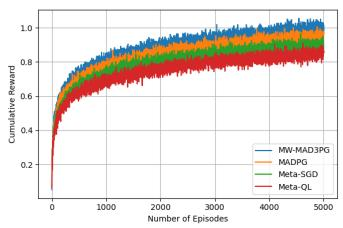  
(a)

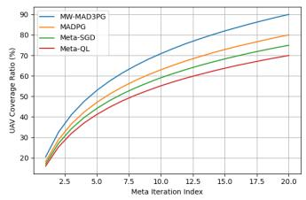

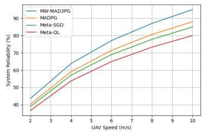  
(c)

(b)  
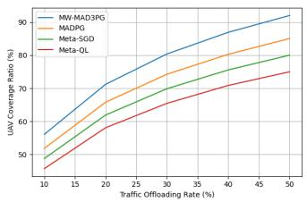  
(d)

Fig. 3: Performance comparison of the proposed method with other benchmarks in terms of a) Cumulative reward with episodes, b) UAV coverage ratio with meta iteration, c) system reliability with UAV mobility, and d) UAV Coverage ratio with offloading rate.  
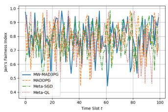  
(a)

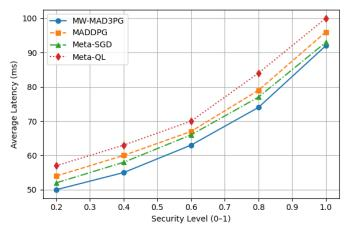

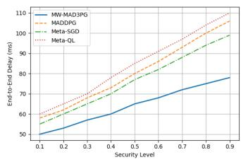

(b)  
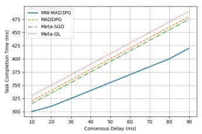  
(d)

(c)  
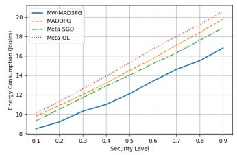  
(e)  
Fig. 4: The security performance comparison of the proposed method with other benchmarks in terms of a) Jain’s Fairness Index with time, b) average latency with security level (0-1), c) end to end delay with security level(0-1), and d) task completion time with consumption delay , and e) energy consumption with security level (0-1) .

As shown in Fig. 4c, the proposed MW-MAD3PG framework achieves consistently lower end-to-end delay than benchmark algorithms, even as the security level increases. This superior performance is attributed to its meta-learning-enhanced policy adaptation, which enables UAV agents to dynamically balance secure offloading, task urgency, and trajectory adjustments. The algorithm ensures timely and efficient data delivery while incorporating necessary cryptographic overheads, thus maintaining reliable performance in high-security ITS environments.

As illustrated in Fig. 4d, our MW-MAD3PG algorithm significantly reduces task completion time compared to other benchmarks under varying consumption delay scenarios. This improvement stems from the framework’s adaptive policy updates that dynamically allocate computation and communication resources while considering UAV energy levels and node processing states. By integrating meta-learning with multi-agent coordination, the system effectively minimizes queuing and execution delays, ensuring timely task execution even in delayprone ITS environments.

As shown in Fig. 4e, our proposed MW-MAD3PG framework demonstrates superior energy efficiency compared to baseline methods across all evaluated security levels (0 to 1). This improvement is attributed to the meta-learning-driven policy adaptation, which allows UAV agents to anticipate task requirements and security demands, thereby optimizing transmission power and avoiding redundant communication overhead. Even under high security constraints, the algorithm ensures judicious energy usage while maintaining task success, confirming its suitability for energy-constrained UAV-assisted ITS scenarios.

As shown in Fig. 5a, network latency decreases with shorter UAV-to-SN distances. MW-MAD3PG outperforms MADDPG, Meta-SGD, and Meta-QL by adaptively adjusting UAV positions and selecting SNs using meta-learning, leading to more efficient and low-latency communication. In Fig. 5b, latency further drops as more UAVs are deployed, with MW-MAD3PG enabling better load balancing and scalability.

Fig. 5c demonstrates that higher offloading capacity boosts UAV deployment efficiency by supporting localized traffic data processing. MW-MAD3PG dynamically manages UAV coordination and resource allocation better than baselines. Similarly, Fig. 5d shows that higher SN density improves deployment efficiency, and MW-MAD3PG adapts effectively to dense ITS environments, maintaining energy-efficient and reliable performance.

## E. Performance and Quality Analysis

This section evaluates system reliability, QoS, and latency to ensure robust, real-time, and high-performance communication in 6G-enabled ITS environments, as illustrated in Fig. 6. MW-MAD3PG consistently outperforms baseline methods by adapting UAV deployment and resource allocation in response to dynamic traffic conditions.

As shown in Fig. 6a, QoS improves with increased task offloading, enabling local data processing and reduced reliance on centralized infrastructure. MW-MAD3PG enhances this through meta-learned UAV coordination.

Fig. 6b highlights that efficient resource allocation further boosts QoS by optimizing bandwidth and computational resources. MW-MAD3PG adjusts policies based on real-time network conditions, minimizing delay and maximizing reliability.

System reliability also increases with greater offloading capacity (Fig. 6c) and optimized SN selection (Fig. 6d).

MW-MAD3PG ensures stable performance through adaptive decision-making, outperforming MADDPG, Meta-SGD, and Meta-QL in maintaining consistent traffic monitoring and data delivery under dynamic ITS demands.

## F. Deployment and Coverage Analysis

The analysis of UAV deployment and coverage on network efficiency, balancing the number of UAVs and their offloading capacity to optimize cost and performance, is shown in Fig. 7.

As shown in Fig. 7a, computational complexity decreases as energy consumption increases, allowing faster task execution. MW-MAD3PG optimally balances energy and computation through meta-learned UAV coordination, outperforming MAD-DPG, Meta-SGD, and Meta-QL under dynamic ITS conditions.

In Fig. 7b, throughput scalability improves with 6G bandwidth and intelligent resource control. MW-MAD3PG efficiently adapts to fluctuating traffic loads, achieving better performance than baseline methods.

Fig. 7c shows that packet loss grows with more UAVs due to increased interference. MW-MAD3PG reduces this through coordinated flight planning and efficient communication, maintaining reliability in congested scenarios.

Finally, Figs. 7d and 7e illustrate that service fairness improves with greater capacity and higher QoS demands. MW-MAD3PG ensures equitable resource distribution through adaptive deployment and real-time policy updates, outperforming baseline algorithms in balancing network loads across diverse urban traffic conditions.

As shown in Fig. 8a, energy scalability improves with more UAV agents, enabling balanced task distribution. MW-MAD3PG outperforms MADDPG, Meta-SGD, and Meta-QL by leveraging meta-learning for efficient UAV deployment and workload management in dynamic ITS conditions.

In Fig. 8b, offloading capacity grows with increased computational resource availability. MW-MAD3PG achieves lower latency and better scalability by intelligently distributing tasks between UAVs and edge servers.

Fig. 8c highlights that deployment efficiency improves through adaptive SN selection. MW-MAD3PG dynamically chooses SNs based on real-time traffic and network conditions, minimizing redundancy and energy use while ensuring reliable urban sensing.

Finally, Fig. 8d shows that system reliability increases with more UAVs due to enhanced redundancy and task coordination. MW-MAD3PG ensures consistent, high-performance communication by optimizing multi-agent cooperation in real-time ITS scenarios.

## VII. CONCLUSION

This paper presented a novel meta-learning-based UAVassisted WSN architecture tailored for 6G-enabled ITS, addressing key challenges such as dynamic UAV coordination, adaptive decision-making, computational scalability, and real-time resource management. By integrating MAML with MADRL, the proposed MW-MAD3PG algorithm enables rapid policy adaptation, optimizing UAV deployment, sensor node selection, and bandwidth allocation in response to traffic dynamics. Extensive simulations demonstrate that MW-MAD3PG significantly

This article has been accepted for publication in IEEE Transactions on Mobile Computing. This is the author's version which has not been fully edited and content may change prior to final publication. Citation information: DOI 10.1109/TMC.2026.3696005

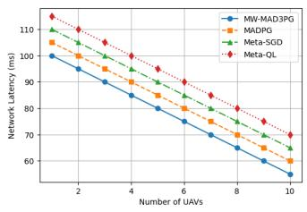  
(a)

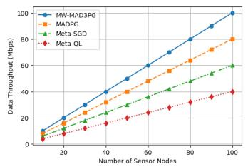  
(b)

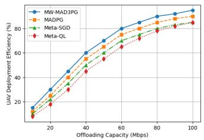  
(c)

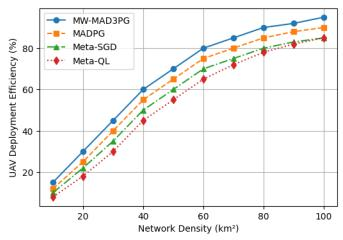  
(d)

Fig. 5: Performance comparison of: a) network latency with number of UAVs, b) data throughput with number of SNs, c) UAV deployment efficiency with offloading capacity, and d) UAV deployment efficiency with network density.  
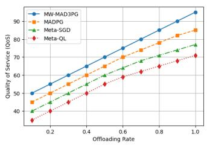  
(a)

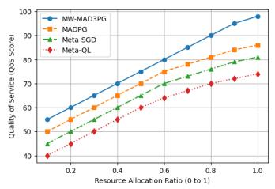  
(b)

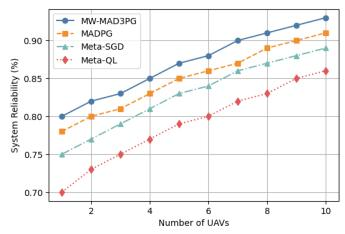  
(c)

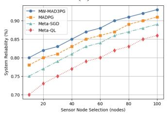  
(d)  
Fig. 6: Qos performance against a) Offloading rate; b) Resource allocation ratio; c) System reliability against Number of UAVs; d) System reliability against SN selection.

enhances EEDT, system reliability, and QoS, while maintaining low latency and high scalability. Compared to baseline methods such as MADDPG, Meta-SGD, and Meta-Q-Learning, MW-MAD3PG consistently achieves superior deployment efficiency, offloading capacity, and robustness in complex and highmobility ITS scenarios. Its CMDP-based formulation and metalearned scheduling strategies reduce computational overhead and improve real-time responsiveness, making it well-suited for large-scale, mission-critical urban deployments.

While the current framework focuses on adaptability, fairness, and energy efficiency, we acknowledge the critical importance of data integrity, privacy, and resilience to adversarial threats in ITS environments. Although lightweight blockchain protocols and encryption-based model protection mechanisms are briefly discussed, they are not integrated into the core MW-MAD3PG algorithm in this version. Instead, these mechanisms are positioned as modular security enhancements that can complement our learning framework without disrupting its optimization process. This design choice retains architectural flexibility while ensuring that the meta-learning adaptation speed is not hindered by heavy cryptographic operations.

This work thus establishes a strong foundation for nextgeneration, intelligent, and self-optimizing UAV-assisted ITS networks, supporting applications like traffic congestion monitoring, emergency vehicle routing, and real-time infrastructure surveillance. Future research will focus on integrating blockchain-based auditability, privacy-preserving learning methods for secure model updates, and hybrid AI mechanisms for enhanced robustness. Additionally, we will extend the proposed system to cooperative UAV swarm control and conduct semireal-world testbed validations to assess performance under GPS drift, wind disturbances, and regulatory constraints prevalent in real ITS deployments. Additionally,“We plan to extend our current work into a semi-real-world testbed by integrating

This article has been accepted for publication in IEEE Transactions on Mobile Computing. This is the author's version which has not been fully edited and content may change prior to final publication. Citation information: DOI 10.1109/TMC.2026.3696005  
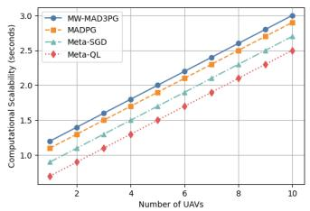  
(a)

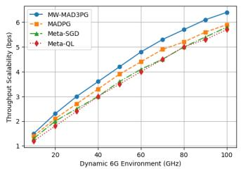

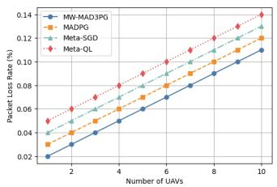  
(c)

(b)  
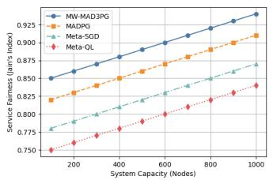  
(d)

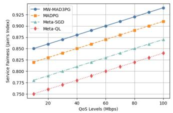  
(e)

Fig. 7: Computational complexity performance against: a) computational scalability with the number of UAVs; b) throughput scalability in dynamic 5G/6G environments; c) packet loss rate against the number of UAVs; d) service fairness against system capacity; e) service fairness against QoS levels.  
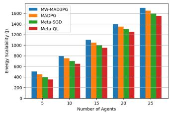  
(a)

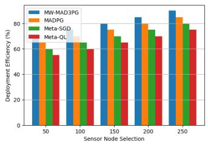  
(b)

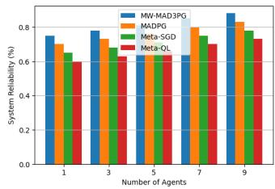  
(c)

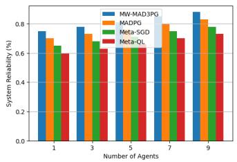  
(d)  
Fig. 8: The performance of our proposed method compared to other existing algorithms is evaluated for: a) Energy scalability against the number of agents; b) Offloading capacity against computational resource allocation; c) Deployment efficiency against SN selection; d) System reliability against the number of UAVs .

PX4-autopilot UAVs and a virtual traffic environment using SUMO+NS-3 for emulating ITS signals and delays under realistic mobility constraints.”This will allow us to explore the system’s adaptability under real-time environmental dynamics, including actuation delays and sensory noise.

## REFERENCES

[1] S. Rajak, A. Summaq, M. P. Kumar, A. Ghosh, K. Elumalai, and S. Chinnadurai, “Revolutionizing healthcare with 6g: A deep dive into smart, connected systems,” IEEE Access, 2024.

[2] A. Kumar, R. Jain, M. Gupta, and S. M. Islam, 6G-enabled IoT and AI for smart healthcare: Challenges, impact, and analysis. CRC Press, 2023.

[3] K. Upadhyay and M. Bharti, “Influence of ai and 6g-enabled iot in smart healthcare: Challenges and solutions,” in 6G-Enabled IoT and AI for Smart Healthcare. CRC Press, 2023, pp. 183–197.

[4] A. Divazi, R. Askari, and E. Roohi, “Experimental and numerical investigation on the spraying performance of an agricultural unmanned aerial vehicle,” Aerospace Science and Technology, vol. 160, p. 110083, 2025.

[5] N. Cheng, S. Wu, X. Wang, Z. Yin, C. Li, W. Chen, and F. Chen, “Ai for uav-assisted iot applications: A comprehensive review,” IEEE Internet of Things Journal, vol. 10, no. 16, pp. 14 438–14 461, 2023.

[6] Q. Wang, X. Liang, H. Zhang, and L. Ge, “Aoi-aware energy efficiency resource allocation for integrated satellite-terrestrial iot networks,” IEEE Transactions on Green Communications and Networking, 2024.

[7] K. Messaoudi, A. Baz, O. S. Oubbati, A. Rachedi, T. Bendouma, and M. Atiquzzaman, “Ugv charging stations for uav-assisted aoi-aware data collection,” IEEE Transactions on Cognitive Communications and Networking, 2024.

[8] M. L. Betalo, S. Leng, X. Chen, and L. Zhou, “Joint optimization for cluster head selection in uav-assisted wsn,” in 2021 International Conference on UK-China Emerging Technologies (UCET). IEEE, 2021, pp. 31–36.

[9] S. Wang, X. Li, and Y. Gong, “Energy-efficient task offloading and resource allocation for delay-constrained edge-cloud computing networks,” IEEE Transactions on Green Communications and Networking, vol. 8, no. 1, pp. 514–524, 2023.

[10] J. Li, C. Yi, J. Chen, Y. Shi, T. Zhang, X. Li, R. Wang, and K. Zhu, “A reinforcement learning based stochastic game for energy-efficient

uav swarm assisted mec with dynamic clustering and scheduling,” IEEE Transactions on Green Communications and Networking, 2024.

[11] B. Li, W. Liu, W. Xie, N. Zhang, and Y. Zhang, “Adaptive digital twin for uav-assisted integrated sensing, communication, and computation networks,” IEEE Transactions on Green Communications and Networking, vol. 7, no. 4, pp. 1996–2009, 2023.

[12] M. M. Nasralla, S. B. A. Khattak, I. Ur Rehman, and M. Iqbal, “Exploring the role of 6g technology in enhancing quality of experience for m-health multimedia applications: A comprehensive survey,” Sensors, vol. 23, no. 13, p. 5882, 2023.

[13] L. Yang, H. Yao, J. Wang, C. Jiang, A. Benslimane, and Y. Liu, “Multiuav-enabled load-balance mobile-edge computing for iot networks,” IEEE Internet of Things Journal, vol. 7, no. 8, pp. 6898–6908, 2020.

[14] M. A. B. S. Abir, M. Z. Chowdhury, and Y. M. Jang, “Software-defined uav networks for 6g systems: Requirements, opportunities, emerging techniques, challenges, and research directions,” IEEE Open Journal of the Communications Society, 2023.

[15] B. Baig and A. Q. Shahzad, “Machine learning and ai approach to improve uav communication and networking,” in Computational intelligence for unmanned aerial vehicles communication networks. Springer, 2022, pp. 1–15.

[16] Y.-C. Kuo, J.-H. Chiu, J.-P. Sheu, and Y.-W. P. Hong, “Uav deployment and iot device association for energy-efficient data-gathering in fixed-wing multi-uav networks,” IEEE Transactions on Green Communications and Networking, vol. 5, no. 4, pp. 1934–1946, 2021.

[17] X. Bai, Y. Zhang, and J. Wang, “Group-based trajectory planning for uav data collection in wireless sensor networks,” IEEE Access, vol. 10, pp. 4567–4578, 2022.

[18] N. T. Hoa, B. D. Son, N. C. Luong, D. Niyato et al., “Dynamic offloading for edge computing-assisted metaverse systems,” IEEE Communications Letters, vol. 27, no. 7, pp. 1749–1753, 2023.

[19] Q. Liu, R. Luo, H. Liang, and Q. Liu, “Energy-efficient joint computation offloading and resource allocation strategy for isac-aided 6g v2x networks,” IEEE Transactions on Green Communications and Networking, vol. 7, no. 1, pp. 413–423, 2023.

[20] Y. Hao, C. Zhao, Y. Zhang, Y. Cao, and Z. Li, “Constrained multiobjective optimization problems: Methodologies, algorithms and applications,” Knowledge-Based Systems, p. 111998, 2024.

[21] M. Dhuheir, A. Erbad, A. Al-Fuqaha, and A. M. Seid, “Meta reinforcement learning for uav-assisted energy harvesting iot devices in disasteraffected areas,” IEEE Open Journal of the Communications Society, 2024.

[22] J. Fang, B. Lu, X. Hong, and J. Shi, “Double riss assisted task offloading for noma-mec with action-constrained deep reinforcement learning,” Knowledge-Based Systems, vol. 284, p. 111307, 2024.

[23] N. Wang, Y. Wu, B. Lorenzo, and B. Liu, “Semantic-aware architecture design for a lifelong swarm metaverse,” IEEE Internet of Things Journal, 2024.

[24] Y. Liu, B. Zhang, D. Guo, H. Wang, and G. Ding, “Joint precoding design and location optimization in joint communication, sensing and computing of uav systems,” IEEE Transactions on Cognitive Communications and Networking, 2023.

[25] Y. Hu, M. Chen, W. Saad, H. V. Poor, and S. Cui, “Distributed multiagent meta learning for trajectory design in wireless drone networks,” IEEE Journal on Selected Areas in Communications, vol. 39, no. 10, pp. 3177–3192, 2021.

[26] M. Yi, X. Wang, J. Liu, Y. Zhang, and R. Hou, “Meta-reinforcement learning for timely and energy-efficient data collection in solar-powered uav-assisted iot networks,” arXiv preprint arXiv:2311.06742, 2023.

[27] X. Bai, M. Cao, W. Yan, and S. S. Ge, “Efficient routing for precedenceconstrained package delivery for heterogeneous vehicles,” IEEE Transactions on Automation Science and Engineering, vol. 17, no. 1, pp. 248–260, 2019.

[28] M. L. Betalo, S. Leng, H. N. Abishu, A. M. Seid, M. Fakirah, A. Erbad, and M. Guizani, “Multi-agent drl-based energy harvesting for freshness of data in uav-assisted wireless sensor networks,” IEEE Transactions on Network and Service Management, 2024.

[29] M. S. Allahham, A. A. Abdellatif, N. Mhaisen, A. Mohamed, A. Erbad, and M. Guizani, “Multi-agent reinforcement learning for network selection and resource allocation in heterogeneous multi-rat networks,” IEEE Transactions on Cognitive Communications and Networking, vol. 8, no. 2, pp. 1287–1300, 2022.

[30] H. Hu, K. Xiong, G. Qu, Q. Ni, P. Fan, and K. B. Letaief, “Aoi-minimal trajectory planning and data collection in uav-assisted wireless powered iot networks,” IEEE Internet of Things Journal, vol. 8, no. 2, pp. 1211– 1223, 2020.

[31] T. D. P. Perera, S. Panic, D. N. K. Jayakody, P. Muthuchidambaranathan, and J. Li, “A wpt-enabled uav-assisted condition monitoring scheme for

wireless sensor networks,” IEEE Transactions on Intelligent Transportation Systems, vol. 22, no. 8, pp. 5112–5126, 2020.

[32] X. Ai, Z. Pu, X. Chai, J. Lei, and J. Yi, “3d deployment of uav-mounted base stations for heterogeneous access requirements,” Aerospace Science and Technology, vol. 143, p. 108731, 2023.

[33] A. M. Seid, G. O. Boateng, S. Anokye, T. Kwantwi, G. Sun, and G. Liu, “Collaborative computation offloading and resource allocation in multiuav-assisted iot networks: A deep reinforcement learning approach,” IEEE Internet of Things Journal, vol. 8, no. 15, pp. 12 203–12 218, 2021.

[34] Z. Yin, J. Li, Z. Wang, Y. Qian, Y. Lin, F. Shu, and W. Chen, “Uav communication against intelligent jamming: A stackelberg game approach with federated reinforcement learning,” IEEE Transactions on Green Communications and Networking, 2024.

[35] T. T. Bui, T. Q. Do, D. Van Huynh, T. Do-Duy, L. D. Nguyen, T.- V. Cao, V. Sharma, and T. Q. Duong, “Task offloading optimization for uav-aided noma networks with coexistence of near-field and farfield communications,” IEEE Transactions on Green Communications and Networking, 2024.

[36] Z. Pu, W. Wang, Z. Lao, Y. Yan, and H. Qin, “Power allocation of integrated sensing and communication system for the internet of vehicles,” IEEE Transactions on Green Communications and Networking, 2024.

[37] Y. Liao, L. Liu, and Y. Ma, “Energy-and latency-efficient resource allocation for ris-assisted uav-usv cooperative mec network,” IEEE Transactions on Green Communications and Networking, 2025.

[38] C. Wang, D. Deng, L. Xu, and W. Wang, “Resource scheduling based on deep reinforcement learning in uav assisted emergency communication networks,” IEEE Transactions on Communications, vol. 70, no. 6, pp. 3834–3848, 2022.

[39] B. Zhu, E. Bedeer, H. H. Nguyen, R. Barton, and Z. Gao, “Uav trajectory planning for aoi-minimal data collection in uav-aided iot networks by transformer,” IEEE Transactions on Wireless Communications, vol. 22, no. 2, pp. 1343–1358, 2022.

[40] R. Tang, R. Zhang, Y. Xu, and C. Yuen, “Deep reinforcement learningbased resource allocation for multi-uav-assisted full-duplex wirelesspowered iot networks,” IEEE Transactions on Cognitive Communications and Networking, 2024.

[41] X. Yang, Y. Fu, J. Zheng, Z. Xu, R. Shao, and Y. Wu, “Optimal resource allocation for uav-relay-assisted mobile crowdsensing,” IEEE Transactions on Communications, 2024.

[42] Y. Jing, Y. Qu, C. Dong, W. Ren, Y. Shen, Q. Wu, and S. Guo, “Exploiting uav for air–ground integrated federated learning: A joint uav location and resource optimization approach,” IEEE Transactions on Green Communications and Networking, vol. 7, no. 3, pp. 1420–1433, 2023.

[43] H. Hao, C. Xu, W. Zhang, S. Yang, and G.-M. Muntean, “Joint task offloading, resource allocation, and trajectory design for multi-uav cooperative edge computing with task priority,” IEEE Transactions on Mobile Computing, vol. 23, no. 9, pp. 8649–8663, 2024.

[44] W. Fan, L. Zhao, X. Liu, Y. Su, S. Li, F. Wu, and Y. Liu, “Collaborative service placement, task scheduling, and resource allocation for task offloading with edge-cloud cooperation,” IEEE Transactions on Mobile Computing, vol. 23, no. 1, pp. 238–256, 2022.

[45] X. Dai, Z. Xiao, H. Jiang, and J. C. Lui, “Uav-assisted task offloading in vehicular edge computing networks,” IEEE Transactions on Mobile Computing, vol. 23, no. 4, pp. 2520–2534, 2023.

[46] T. Cai, Z. Yang, Y. Chen, W. Chen, Z. Zheng, Y. Yu, and H.-N. Dai, “Cooperative data sensing and computation offloading in uav-assisted crowdsensing with multi-agent deep reinforcement learning,” IEEE Transactions on Network Science and Engineering, vol. 9, no. 5, pp. 3197–3211, 2021.

[47] J. Lu, B. Wu, X. Wan, and M. Chen, “Deep network expression recognition with transfer learning in uav-enabled b5g/6g networks,” Wireless Networks, pp. 1–11, 2023.

[48] A. Kaur and K. Kumar, “Energy-efficient resource allocation in cognitive radio networks under cooperative multi-agent model-free reinforcement learning schemes,” IEEE Transactions on Network and Service Management, vol. 17, no. 3, pp. 1337–1348, 2020.

[49] Y. Liu, J. Zhou, D. Tian, Z. Sheng, X. Duan, G. Qu, and V. C. Leung, “Joint communication and computation resource scheduling of a uavassisted mobile edge computing system for platooning vehicles,” IEEE Transactions on Intelligent Transportation Systems, vol. 23, no. 7, pp. 8435–8450, 2021.

[50] Z. Wang, J. Tao, Y. Gao, Y. Xu, W. Sun, Y. Gao, and W. Li, “Joint flight scheduling and task allocation for secure data collection in uav-aided iots,” Computer Networks, vol. 207, p. 108849, 2022.

[51] O. S. Oubbati, A. Lakas, and M. Guizani, “Multi-agent deep reinforcement learning for wireless-powered uav networks,” IEEE Internet of Things Journal, 2022.

[52] N. Lin, T. Wu, L. Zhao, A. Hawbani, S. Wan, and M. Guizani, “An energy effective ris-assisted multi-uav coverage scheme for fairness-aware ground terminals,” IEEE Transactions on Green Communications and Networking, 2024.

[53] M. L. Betalo, I. Ullah, F. B. Tesema, Z. Wu, J. Li, and X. Bai, “Generative ai-driven multi-agent drl for task allocation in uav-assisted empd within 6g-enabled sagin networks,” IEEE Internet of Things Journal, 2025.

[54] L. Wang, K. Wang, C. Pan, W. Xu, N. Aslam, and L. Hanzo, “Multiagent deep reinforcement learning-based trajectory planning for multiuav assisted mobile edge computing,” IEEE Transactions on Cognitive Communications and Networking, vol. 7, no. 1, pp. 73–84, 2020.

[55] M. L. Betalo, S. Leng, H. N. Abishu, F. A. Dharejo, A. M. Seid, A. Erbad, R. A. Naqvi, L. Zhou, and M. Guizani, “Multi-agent deep reinforcement learning-based task scheduling and resource sharing for o-ran-empowered multi-uav-assisted wireless sensor networks,” IEEE Transactions on Vehicular Technology, 2023.

[56] A. M. Seid, G. O. Boateng, B. Mareri, G. Sun, and W. Jiang, “Multi-agent drl for task offloading and resource allocation in multi-uav enabled iot edge network,” IEEE Transactions on Network and Service Management, vol. 18, no. 4, pp. 4531–4547, 2021.

[57] W. Xie, M. Xiong, H. Xu, J. Wang, L. Yang, and J. Zou, “A data transmission method for feature extraction and semantic enhancement of scarce data,” IEEE Wireless Communications Letters, 2024.

[58] Q. Deng, R. Li, Q. Hu, Y. Zhao, and R. Li, “Context-aware meta-rl with two-stage constrained adaptation for urban driving,” IEEE Transactions on Vehicular Technology, vol. 73, no. 2, pp. 1567–1581, 2023.