Research article

# Microservices migration: A pathway to improved energy efficiency in UAV networks

Santiago García-Gil ∗, Diego Ramos-Ramos , Javier Berrocal , Juan Manuel Murillo , Jaime Galán-Jiménez

Departamento de Ingeniería Sistemas Informáticos y Telemáticos, Universidad de Extremadura, Badajoz, 06006, Extremadura, Spain

A R T I C L E I N F O

Keywords: UAV Microservices migration Energy efficiency IoT

## A B S T R A C T

The access to Internet and digital services play a key role in all aspects of development, from the economic to the socio-cultural dimensions, yet a substantial part of the world’s population is deprived of this source of opportunities. Rural regions, characterized by having low population densities, suffer this lack of provision the most. On top of that, the remoteness and complicated orography of rural localities render traditional network infrastructure close to useless. To ensure that these localities benefit from access to digital services and to the Internet, we envision the use of swarms of Unmanned Aerial Vehicles (UAVs). Through computing enabled UAVs, the deployment of IoT applications decomposed into microservices that have an impact in the main socio-economic activities becomes a possibility. However, UAVs consume a lot of battery power, which complicates the feasibility of their use in real-world environments. To overcome this limitation, in this paper the energy optimal deployment and migration of microservices is studied, resulting in an Mix Integer Linear Programming (MILP) problem formulation. As a result, an optimal battery drain aware deployer and migrator of microservices in UAVbased networks is proposed. Our method has proved effective during the simulation, perfectly balancing the work load between UAVs, thus balancing also battery drain and maximizing fly time.

## 1. Introduction

In today’s constantly evolving digital landscape, Internet connectivity has become a fundamental pillar of modern society, facilitating access to essential services and information. However, despite significant advances, a substantial portion of the world’s population, especially those residing in rural and low-income areas, still lack access to the Internet [1–3].

Neglect in meeting the connectivity needs of rural populations results in digital divide. which exacerbates the rural exodus This situation poses a serious thread to the sustainability of an ever increasing world population [4], which calls for substantia improvement in food production sectors. For livestock farming, access to information related to animal status, health and/or location is game changing because it helps cattle ranchers to make informed decisions [5.6]. Precision agriculture, which greatly improves yield rate, also relies heavily on connectivity dependent technology [7,8]. Additionally, this lack of connectivity affects other critica applications, such as telemedicine [9.10]. and educational services [11].

Addressing the challenge of limited Internet access in remote and low-income regions requires innovative approaches that transcend traditional infrastructure limitations [12,13]. In this context, deploying Internet of Things (IoT) applications via Unmanned

Aerial Vehicles (UAVs) presents a promising solution. However, ensuring successful deployment requires careful consideration of various factors, including resource constraints, dynamic environmental conditions, and the need for seamless operation in remote areas. Thus, a comprehensive strategy is essential to effectively deploy and manage IoT applications in UAV-based networks.

Given the constrained computational and battery capacities of UAVs, several existing works have explored the provision of IoT services using UAV networks in rural areas. In [14], the authors exploit the use of beaconing scheduling as an efficient means of optimizing energy consumption in UAV networks. Moreover, UAVs have the potential to prolong the operational lifespan of IoT devices that suffer from constrained battery life by employing wireless power transmission systems [15,16]. Remarkably, the emergence of AI in the last few years allows the proposal of novel methods to enhance the use of UAVs in IoT [17,18]. By integrating AI into UAVs, their communication and networking capabilities can be improved, as well as their flight safety, thereby enhancing the QoS they provide in IoT application scenarios [19,20].

In the present work, we provide a perspective on the problem and study the underlying structural properties. In the proposed approach, IoT applications are decomposed into smaller, cohesive and highly independent parts, known as microservices, which are well suited to deploy and execute in the on-board computer of UAVs given the fact that their computing capacities are heavily constrained [21]. In that way, instead of deploying complete applications in the UAVs, their light-weight microservices are distributed throughout the swarm. These microservices, when called in a particular order, provide the same functionalities as their monolithic counterparts. However, as they are distributed, special attention needs to be given to coordination between UAVs. Furthermore, the optimality of a microservice-based application deployment in UAVs is expected to change overtime due to the internal factors, such as the swarm status or individual UAV remaining battery, and external factors, such as location changes or changes in the microservice requesting pattern of IoT devices. In order to address the deployment and migration of microservices throughout UAV-based networks in dynamic environments, the methods proposed in this work rely in Mix Integer Linear Programming (MILP).

Therefore, this paper proposes a novel approach using a microservices-based architecture within a UAV network to address the digital divide in rural areas. By decomposing IoT applications into lightweight microservices, we enable optimized deployment across UAV swarms, ensuring that each UAV handles only specific, manageable functions. Through the formulation of the joint deployment and microservices migration problem as a MILP model, the energy consumption is dynamically balanced by migrating microservices across UAVs based on real-time battery levels and computational load. Simulation results performed in realistic scenarios validate the effectiveness of our proposed approach. Specifically, the resulting model is able to balance perfectly UAV battery consumption within a swarm so that the fly-time is maximized.

As a summary. the main contributions of this work are:

• The design of a UAV-based network for IoT in remote areas that decomposes IoT applications into lightweight microservices.

• The formulation of an MILP model for energy consumption minimization and battery-aware microservice migration across UAVs.

• Extensive performance evaluation to show the effectiveness of the proposed solution.

The remainder of this paper is structured as follows. Section 2 presents a review of related works. Section 3 describes the system model including (i) the UAV-based network architecture, (ii) the microservice-based IoT application model, and (iii) the power consumption model. Section 4 defines the MILP model designed to migrate microservices among UAVs while minimizing energy consumption. Section 5 reports the set of experimental results, highlighting the benefits of the proposed approach. Section 6 discusses practical implications about the system operation in complex environments and its adaptation to large-scale applications. Finally, Section 7 presents the concluding remarks based on the findings.

## 2. Related works

Recent research has focused on optimizing UAV-enabled networks through dynamic task allocation, load-balancing strategies, and resource allocation optimization techniques. Below are works that address these topics. A brief discussion of how they relate to this article is also provided.

Yang et al. [22] propose a Mobile Edge Computing (MEC) framework powered by multiple Unmanned Aerial Vehicles (UAVs) to optimize task execution in IoT networks. Their system integrates advanced Deep Learning and Reinforcement Learning algorithms to achieve efficient load balancing and task scheduling among the UAV fleet. By leveraging differential evolution (DE) for multi-UAV deployment and Deep Reinforcement Learning (DRL) for task scheduling, they ensure optimal resource use and improved execution efficiency, Moreover. Pan et al. [23] contribute a Dynamic Migration Algorithm (DMA-LBD) tailored for UAV relay networks to tackle Load Balancing and average Delay optimization challenges. Through their proposed scheme, they dynamically manage the migration of tasks across the network, effectively balancing the workload among UAVs while minimizing relay link delays. Their approach demonstrates superior performance compared to traditional methods, emphasizing the importance of adaptive strategies in optimizing UAV relay operations. In contrast to our solution. the authors, taking into account the capacity constraints inherent to UAVs, distribute the requests required by the IoT devices across the UAV network, thus not distributing the microservices, but the requests made by each of the IoT applications in the network.

Kopeikin et al. [24] focuses on enhancing communication reliability and performance in multi-UAV systems through dynamic task allocation. Their distributed algorithm optimizes task placement and execution, addressing uncertainties in vehicle dynamics ll ff l fl h l d h ff f h h h hl h l bl robust and efficient communication among UAVs in dynamic environments. Additionally, Halder et al. [25] propose a Round-Robinbased dynamic distributed task scheduling mechanism tailored for UAV networks. By dynamically allocating tasks among UAVs in real-time, their approach aims to enhance network performance while considering factors such as network topology, channe characteristics, and energy constraints. Through comprehensive experimental validations, they demonstrate the efficacy of their scheduling strategy in achieving efficient task allocation and use of UAV resources. Unlike our solution, the authors distribute the tasks over the UAVs but do not make use of microservices.

Table 1  
A comparison of the related works against the method proposed in the current article.

<table><tr><td>Reference</td><td>Proposal</td><td>Objective</td><td>Method</td><td>Considers microservices</td><td>Considers migration</td><td>Considers UAV-based networks</td></tr><tr><td>[22]</td><td>A UAV-based task offloading balancer</td><td>Optimize QoS through load balancing</td><td>Differential Evolution algorithms and Deep Reinforcement Learning</td><td>No</td><td>No</td><td>Yes</td></tr><tr><td>[23]</td><td>A dynamic user migration strategy for task offloading in UAV-based Networks</td><td>Reduce delay and balance computational load</td><td>Heuristic algorithm</td><td>No</td><td>Yes</td><td>Yes</td></tr><tr><td>[24]</td><td>An algorithm to control task allocation and networking relaying</td><td>Ensuring the execution of critical missions</td><td>Heuristic algorithm</td><td>No</td><td>No</td><td>Yes</td></tr><tr><td>[25]</td><td>A dynamic task scheduler based on UAV clustering</td><td>Maximize the throughput</td><td>Heuristic algorithm</td><td>No</td><td>No</td><td>Yes</td></tr><tr><td>[26]</td><td>A task offloader</td><td>Minimize latency and energy consumption</td><td>Multi-agent DRL</td><td>No</td><td>No</td><td>Yes</td></tr><tr><td>[27]</td><td>A task offloader</td><td>Minimized weighted sum of delay and energy consumption</td><td>Branch and bound and convex optimization methods</td><td>No</td><td>No</td><td>Yes</td></tr><tr><td>[28]</td><td>A cooperative UAV task allocator</td><td>Maximize the number of completed tasks</td><td>Heuristic Algorithm</td><td>No</td><td>No</td><td>Yes</td></tr><tr><td>[29]</td><td>A MSA deployer for the edge layer</td><td>Minimize deployment overhead and meeting QoS constraints</td><td>DRL and graph neural networks</td><td>Yes</td><td>No</td><td>No</td></tr><tr><td>[30]</td><td>A microservice deployment and migration intelligent agent</td><td>Minimize latency experienced by users</td><td>Reinforcement learning and learning automata</td><td>Yes</td><td>Yes</td><td>No</td></tr><tr><td>Our work</td><td>A microservice deployment and migration algorithm for UAV-based Networks</td><td>Minimize energy consumption and maximize service uptime</td><td>Heuristic Algorithm</td><td>Yes</td><td>Yes</td><td>Yes</td></tr></table>

Sacco et al. [26] introduce a distributed architecture using Multi-Agent Reinforcement Learning (MARL) to facilitate sustainable task offloading in UAV networks. Their approach enables collaborative decision-making among system nodes, aiming to minimize user-perceived latency and energy consumption by dynamically managing task allocation to the perimeter cloud. By continuously learning from the environment, their system adapts to varying conditions, optimizing task offloading and transmission technologies to achieve sustainable performance. In addition, Zhu et al. [27] tackles the challenge of minimizing delay and energy consumption in UAV-assisted cellular networks under SDN (Software Defined Network) control. Their joint task and resource allocation framework dynamically adjust task computation modes and resource allocation strategies to optimize network performance. Using algorithm design and decomposition techniques, they address the non-convex nature of the optimization problem, achieving significant improvements in delay and energy efficiency. Lastly, Simi et al. [28] propose a distributed tasking algorithm tailored for multi-UAV sensor networks, focusing on energy-aware coordination and planning to optimize task allocation. Their approach enables efficient use of resources by dynamically distributing tasks among UAVs based on available resources and environmental conditions. By leveraging energy-aware coordination strategies. they enhance the overall efficiency of task execution, ensuring optimal performance in resource-constrained environments. Additionally, their work emphasizes the importance of collaborative task allocation and coordination in achieving efficient operation of multi-UAV systems. Like previous works, unlike our suggested method, the authors distribute the requests required by the IoT devices over the UAV network, but at no point do they propose dynamic migration of microservices over the UAVs in the network

In [29], Wenkai et al. propose a deployer for Microservice Architecture (MSA) based applications for the edge computing layer. They use a mixture of DRL with graph-based neural networks to determine where to deploy microservices within a set of servers located in the edge computing laver. The decisions are based on the characteristics of the MSA-based application. however they do not consider the migration of the microservices once they are deploved nor the use of UAV-enhanced networks. On the other hand, the work of Ray et al. does consider the migration. Their work is concerned with the microservice placement and migration problem. The proposal relies on reinforcement learning and a learning automata to decide where to place microservices once they are requested and, given the high user mobility of their scenario, when to migrate them to other servers. Despite being a great academic work that takes into account the deployment and migration of microservices, it also does not consider the use of UAV-based networks.

To the best of our knowledge, the current article marks the initial effort towards proactively migrating microservices within a UAV-based network to attend to rural populations’ requests for IoT applications, with a primary focus on minimizing energy consumption. Table 1 presents a comparative analysis of the studies discussed in this section and demonstrates the innovative aspects of the introduced method. Notably, our approach exhibits substantial benefits over the methods evaluated. Unlike others that either distribute users or allocate tasks to UAVs, our technique is distinguished by employing dynamic microservice migration across the UAV network. This approach enhances both energy efficiency and network adaptability, leading to superior overall performance.

Next section provides a detailed description of the system model for mapping IoT applications onto the UAV network architecture.

## 3. System model

In this section, the system model for IoT application mapping in UAV-based network is presented. The Section 3.1 is devoted to introduce network architecture considerations. The Microservice-based IoT application model, based on the work published in [31] is addressed in the second Section 3.2. Finally. The UAV swarm energy consumption model considered is explained in detail in Section 3.3.

## 3.1. UAV-based network architecture

The planned system is designed to meet specific needs in rural environments. More specifically, since cattle farming is one of the most common activities in rural areas, the system is designed based on a intelligent livestock farming use case which monitors cattle d h i i i i i i d f l i di i l k i f hi h i f il bl i the considered scenario, a swarm or set of UAVs are used as network nodes. These UAVs carry as payload lightweight WiFi stations that allow them to stablish network links between themselves and the neighboring UAVs –the ones within the area of coverage–, thus forming a fully-connected mesh network which relies on multi-hop routing to achieve communication between distant UAVs. This architecture is built based on previous published work [21,32–34] that demonstrated the effectiveness of UAV-based networks in reducing latency and energy consumption in rural environments. The resulting UAV swarm makes possible the provide connectivity to the IoT devices attached to animals, which are potentially scattered across vast extensions of land. Relying on graph theory, the architecture can be interpreted as a graph, $\mathcal { G } = ( \mathcal { N } , \mathcal { L } )$ , where $\mathcal { N } = \{ { n } _ { 1 } , { n } _ { 2 } , \ldots , { n } _ { | \mathcal { N } | } \}$ are the UAVs and $\mathcal { L } = \{ l _ { 1 } , l _ { 2 } , \ldots , l _ { | \mathcal { L } | } \} ,$ , the network links between them. An undirected graph is considered for simplicity, but the system is easily extendable to a directed graph.

Each UAV $n _ { i } \in \mathcal N$ is defined by the $( b _ { n _ { i } } , c _ { n _ { i } } , f _ { n _ { i } } )$ 3-tuple, where $b _ { n _ { i } }$ refers to energy that the battery of the UAV can provide, $c _ { n _ { i } }$ refers to the RAM memory of the onboard computer and $f _ { n _ { i } }$ to the frequency of the CPU of the onboard computer expressed in GHz.

In particular, each UAV can extend its range to multiple target IoT devices within the range of the radio signal. That way, each IoT device establishes a network link with the closest UAV to then initiate IoT application requests to provide valuable data and functionalities to the cattle ranchers. Issues such as Line-of-Sight (LoS) conditions between animals and UAVs are assumed to prevail, as there are no serious obstacles, such as buildings or trees, that could affect the Quality of Service (QoS). One last aspect about the UAVs is that a minimum battery threshold, $^ { b , }$ is imposed so that once it is reached, UAVs will not provide microservices to IoT devices in order to preserve the remaining battery to reach the charging station.

The architecture presented in this work is exemplified through a straightforward yet effective illustration in Fig. 1. In this example, a ranch hosting cattle and hogs is showcased, where these animals are each fitted with IoT sensors for data tracking. Meanwhile, UAVs with the capability to communicate among themselves operate over the ranch, thereby facilitating connectivity across its entire span. When considering a significant distance among UAVs, such as 900 meters, as outlined in the model from [35], it guarantees interference-free communication. Moreover, maintaining a flight altitude of 50 meters is more than adequate in this scenario to provide an unobstructed Line of Sight between UAVs and between UAVs and IoT devices, as mentioned in [36].

## 3.2. Microservices-based IoT applications model

As in previous published work [32,37], the MSA paradigm is adopted. It consist on the decomposition of applications into a collection of microservices, each responsible for executing a specific functionality, as detailed in [31]. This approach have become the de facto industry standard because of the modularity and maintainability of the resulting systems, allowing a management of individual services independently, facilitating scalability, fault isolation, and continuous deployment. With the MSA, an application can be specified as a set of microservices $\mathcal { M } = \{ m _ { 1 } , m _ { 2 } , \dots , m _ { | \mathcal { M } | } \}$ such that each can be deployed independently of the others. Requirements are specified at the microservice level, $( c _ { m _ { i } } , f _ { m _ { i } } , f _ { m _ { i } } ^ { r } , l _ { m _ { i } } , d _ { m _ { i } } )$ ), where $c _ { m _ { i } }$ is the RAM that the microservice needs to ll $f _ { m _ { i } }$ d $f _ { m _ { i } } ^ { r }$ �h d h l d d d d l h d attend each request. respectively. $l _ { m _ { i } }$ denotes the input data size of the microservice and $d _ { m _ { i } }$ is the number of replicas or instances of the microservice that needs to be deployed within the UAVs. Fig. 1 illustrates the MSA with a practical example featuring two different applications. The first application, designed for bovines, consists of three microservices: Grazing Zone, Animal Tracking and Interest Zone. The second application consists of two microservices, the Animal Historic Record and the Interest Zone, with the microservice of the interest zone being shared by both applications. UAVs are responsible for the deployment of specific subsets ot the set M. taking into account their computing capabilities and energy limitations. IoT collars connected to cattle initiate requests for microservices applications by communicating with UAVs, which then pass these requests to the nearest UAV equipped to process them. For the case of cattle, following the example in Fig. 1, they request through their IoT collar the different microservices: (i) the Grazing Zone microservice, represented in the figure with the coverage area in blue, (ii) the Animal Tracking microservice, indicated with the coverage area in brown: and (iii) the Interest Zone microservice, whose coverage area is highlighted in red. This application helps to effectively zoning grazing areas, optimizing resource utilization, and ensuring proper management of pasture resources. By leveraging data collected from UAVs, such as aerial imagery and environmental parameters, the GZ application aids in identifying optimal grazing zones for livestock, thereby enhancing overall pasture management efficiency. On the other hand, the IoT eartag attached to hogs request an application that monitors the activity of the animal, denoted as Animal Historic Records (AHR). The AHR application is instrumental in maintaining comprehensive records of individual animal activities, health metrics.

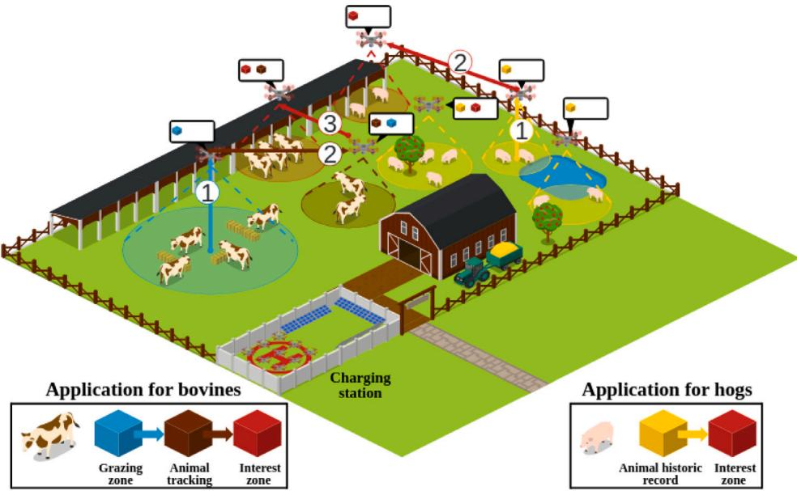  
Fig. 1. UAV-based network scenario and deployment of cattle monitoring applications.

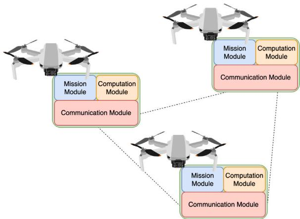  
Fig. 2. High-level technological architecture of the system.

and behavioral patterns over time. The AHR workflow consists of the execution of the animal historic record microservice and the area of interest microservice, represented in Fig. 1 with the yellow and red coverage areas, respectively.

The high-level architecture of the swarm of UAVs is shown in Fig. 2. in which their main components are identified. The control flow of the architecture is the following: the Communication Module is in charge of managing the communication of the UAV with the environment. There are two types of communications: (i) the communication between the UAV and the users that are placed on the ground: and (ii) the communication between the UAV with the set of UAVs that are within its coverage range, In the first case, requests for applications from users (GZ and AHR in the example of Fig. 1) must be managed and the output information must be provided. In the second case, the communication among UAVs is performed to inform about the environmental conditions with the goal of participating in the collaboration to re-compute the mission planning. Moreover, it serves as communication links to forward the information referred to the workflows of the applications that are being executed, The Computation Module handles the set of computation resources of the UAVs. It has the control about the allocated RAM memory to each microservice, as a function of the type of microservice. It is able to communicate with the Computation Module of the UAVs in its range through its local Communication Module in order to notify if a particular microservice can be deployed or not. Furthermore, it is able to dynamically migrate microservices among UAVs. Finally, the Mission Module defines and executes at run time the set of missions to be followed by the UAV swarm in such a way that users have access to Internet and are able to execute their applications. If the modification of an already planned mission requires the modification of the applications deployment. the Computation Module will be notified through the Communication Module. Then, the required changes will be performed in a consistent way with the rest of UAVs.

Summary of the main variables used throughout the paper.

Table 2

<table><tr><td>Symbol</td><td>Variable</td></tr><tr><td colspan="2">Set related variables</td></tr><tr><td> $\mathcal{G} = \{ \mathcal{N}, \mathcal{L} \}$ </td><td>The graph that represents the UAV ad hoc network topology.</td></tr><tr><td> $\mathcal{M}$ </td><td>The set of microservices that composes the application to deploy.</td></tr><tr><td colspan="2">UAV related variables</td></tr><tr><td> $n_i$ </td><td>Theith UAV.</td></tr><tr><td> $f_{n_i}$ </td><td>The frequency at which the CPU of theith UAV operates.</td></tr><tr><td> $c_{n_i}$ </td><td>The amount of RAM that the onboard computer of theith UAV has.</td></tr><tr><td> $b_{n_i}$ </td><td>The energy that the battery of theith UAV can provide.</td></tr><tr><td colspan="2">Microservice related variables</td></tr><tr><td> $m_j$ </td><td>Thejth microservice.</td></tr><tr><td> $f_{m_j}$ </td><td>The cycles per second at which thejth microservice has to be executed.</td></tr><tr><td> $f_{m_j}^r$ </td><td>The cycles per second at which thejth microservices’ requests have to be executed.</td></tr><tr><td> $c_{m_j}$ </td><td>The amount of RAM that thejth microservice needs to allocate for its execution.</td></tr><tr><td> $l_{m_j}$ </td><td>The amount of input data that each request of thejth microservice generates.</td></tr><tr><td> $d_{m_j}$ </td><td>The number of replicas to deploy over the UAVs of thejth microservice.</td></tr><tr><td colspan="2">Energy consumption related variables</td></tr><tr><td> $u_{n_i}$ </td><td>The CPU load ratio of theith UAV.</td></tr><tr><td> $r_{n_i}^u$ </td><td>The uplink data rate of theith UAV.</td></tr><tr><td> $r_{n_i}^d$ </td><td>The downlink data rate of theith UAV.</td></tr><tr><td> $P(u_{n_i}, r_{n_i}^u, r_{n_i}^d)$ </td><td>The power draw of theith UAV given the CPU load ratio and the uplink and downlink data rates.</td></tr><tr><td> $E(u_{n_i}, r_{n_i}^u, r_{n_i}^d, t)$ </td><td>The energy consumption of theith UAV during a time slot given the CPU load ratio and the uplink and downlink data rates.</td></tr><tr><td colspan="2">Other variables</td></tr><tr><td>t</td><td>The duration of each time slot.</td></tr><tr><td> $q_{u_i,m_j}$ </td><td>The number of requests of thejth microservice that theith UAV receives during a time slot.</td></tr><tr><td>b</td><td>The minimum level of battery that UAVs can reach before stopping providing microservices.</td></tr><tr><td> $x_{n_i,m_j}$ </td><td>The decision variable that states whether thejth microservice is deployed in theith UAV.</td></tr><tr><td>z</td><td>A slack variable that holds the value of the UAV with the least battery.</td></tr></table>

## 3.3. Power consumption model

The ultimate goal of this work is to make the use of UAVs to deploy network infrastructure and services more viable. To achieve this, its main limitation, the energy consumption that limits the flight time, must be addressed. The consumption models of Raspberry Pi 4 devices, published by Kaup et al. in [38] and obtained through empirical measurements, have served as a starting point to assess the battery consumption of UAVs. They measure the power that a Raspberry Pi 4 draws from its power supply based on the work load of its CPU and the traffic generated through its Ethernet and WiFi network interfaces. In order to better understand all the variables that compose the proposed model, Table 2 shows the notation used with a small description.

The CPU power draw is based on two components, $P _ { i d l e } ^ { C P U } = 1 . 5 7 7 8 W$ and $P _ { i d l e } ^ { C P U } = 0 . 1 8 1 \cdot u W$ . The first component is the power required by the CPU for being on and the second component indicates the increase derived by subjecting the CPU to a workload �.

The other part of the consumption comes from the activity of the network interfaces. There is an Ethernet and a WiFi network interface. Both have an idle consumption, $P _ { i d l e } ^ { E t h } = 0 . 2 9 4 W$ and $P _ { i d l e } ^ { W i F i } = 0 . 9 4 2 W$ , respectively. As the Ethernet network interface of the UAVs are not used, its consumption as a function of the data rate is not taken into account. On the other hand, the consumption coming from the use of the WiFi network card is broken down into two parts, one depending on the uplink data rate $r ^ { u } , \mathsf { \bar { P } } ^ { W i F i } ( r _ { u } ) = \bar { 0 } . 0 6 4 + 4 . 8 1 3 e ^ { - 3 } \cdot r _ { u } \frac { W } { M b v s }$ , and the other on the downlink counterpart $r ^ { d } , P ^ { W i F i } ( r _ { d } ) = 0 . 0 5 7 + 4 . 8 1 3 e ^ { - 3 } \cdot r _ { d } \frac { W } { M b p s } .$

h ll h d l d l h d l h $\operatorname { E q . }$ (1) can be assembled. It estimates the power draw involved in running a number of microservices and attending the requests coming to each UAV from IoT devices based on the CPU load and network traffic generated. In order to obtain the energy consumption. Eq. (2). time has to be taken into account. being t the time slot duration.

$$
P (u, r ^ {u}, r ^ {d}) = P _ {i d l e} ^ {C P U} + P ^ {C P U} (u) + P _ {i d l e} ^ {E t h} + P _ {i d l e} ^ {W i F i} + P ^ {W i F i} (r ^ {u}) + P ^ {W i F i} (r ^ {d})\tag{1}
$$

$$
E (u, r ^ {u}, r ^ {d}, t) = P (u, r ^ {u}, r ^ {d}) \cdot t\tag{2}
$$

The resulting model requires prior knowledge about the amount of upstream and downstream traffic flowing the UAV’s WiF network interface and about the workload the CPU is subjected to. In turn, these values depend on the microservices deployed on each UAV and the requests they receives from each of the microservices. The set of variables that define which microservices are deployed in each UAV are represented by $X = \{ x _ { n _ { i } , m _ { i } } \mid \forall n _ { i } \in \mathcal { N } , \forall m _ { j } \in \mathcal { M } \}$ . With these variables, the CPU usage can be calculated as shown in Eq. (3)

$$
u _ {n _ {i}} = \frac {\sum_ {m _ {j}} ^ {\mathcal {M}} x _ {n _ {i} , m _ {j}} \cdot (f _ {m _ {j}} + f _ {m _ {j}} ^ {r} \cdot q _ {n _ {i} , m _ {j}})}{f _ {n _ {i}}},\tag{3}
$$

where $q _ { n _ { i } , m _ { j } }$ is the number of requests during a time slot. The downlink data rate is calculated as shown in Eq. (4)

$$
r _ {n _ {i}} ^ {d} = \sum_ {m _ {j}} ^ {\mathcal {M}} l _ {m _ {j}} \cdot q _ {n _ {i}, m _ {j}},\tag{4}
$$

which is the sum of the size of the input data of the requests that the $n _ { i }$ UAV receives regardless of whether the service is deployed or not. And lastly, the uplink data rate es obtained applying Eq. (5)

$$
r _ {n _ {i}} ^ {u} = \sum_ {m _ {j}} ^ {\mathcal {M}} (1 - x _ {n _ {i}, m _ {j}}) \cdot l _ {m _ {j}} \cdot q _ {n _ {i}, m _ {j}},\tag{5}
$$

that reads as the sum of the input data sizes of the requests of those microservices $m _ { j }$ that are not deployed within the UAV $n _ { i }$ and thus, have to forwarded.

## 4. Problem formulation

With an understanding of the characteristics of UAVs, microservices, and the evaluation of energy consumption, the MILP optimization problem is presented in this section. The ultimate goal of this is to keep the UAV swarm functional for as long as possible by making optimal use of resources. Given a set of UAVs $\mathcal { N }$ and microservices  to deploy, in each time window $t ,$ the problem to be solved is to decide on which UAV to deploy each microservice in such a way as to maximize the remaining battery of the UAV with the least battery. This in turn maximizes the number of epochs of duration � the UAV swarm will be able to operate without recharging. $X = \{ x _ { n _ { i } , m _ { i } } \mid \forall n _ { i } \in \mathcal { N } , \forall m _ { j } \in \mathcal { M } \}$ is the set of decision variables and through binary values, each $x _ { n _ { i } , m _ { j } }$ represents whether the microservice $m _ { j }$ is deployed in the UAV $n _ { i }$ and � is a slack variable that represents the remaining battery of the UAV with the least battery.

max �

(6a)

s.t.

$$
\sum_ {n _ {i}} ^ {\mathcal {N}} x _ {n _ {i}, m _ {j}} = d _ {m _ {j}} \quad \forall m _ {j} \in \mathcal {M}\tag{6b}
$$

$$
\sum_ {m _ {j}} ^ {\mathcal {M}} x _ {n _ {i}, m _ {j}} \cdot c _ {m _ {j}} <   = c _ {u _ {i}} \forall u _ {i} \in \mathcal {N}\tag{6c}
$$

$$
\sum_ {m _ {j}} ^ {\mathcal {M}} x _ {n _ {i}, m _ {j}} \cdot (f _ {m _ {j}} + f _ {m _ {j}} ^ {r} \cdot q _ {n _ {i}, m _ {j}}) <   = f _ {u _ {i}} \forall u _ {i} \in \mathcal {N}\tag{6d}
$$

$$
b _ {n _ {i}} - E (u _ {n _ {i}}, r _ {n _ {i}} ^ {u}, r _ {n _ {i}} ^ {d}, t) > = b \quad \forall u _ {i} \in \mathcal {N}\tag{6e}
$$

$$
b _ {n _ {i}} - E (u _ {n _ {i}}, r _ {n _ {i}} ^ {u}, r _ {n _ {i}} ^ {d}, t) > = z \quad \forall u _ {i} \in \mathcal {N}\tag{6f}
$$

The above can be seen formulated in the system of equations shown in Eq. (6). However, the system is subject to multiple set of constraints which need explanation. Eq. (6b) represent the first set of constraints and it forces the solver to not left any replica of each microservice undeployed during a time slot. The second set of constraints, Eq. (6c), states that the sum of the allocated RAM needed to deploy all the microservices assigned to the $n _ { i }$ UAV must not surpass its RAM capacity, $c _ { n _ { i } } .$ . The third set of constraints, Eq. (6d). is added so that the frequency at which the CPU of the UAVs run. $f _ { u _ { i } } ,$ , is at least equal to the sum of the cycles that needs to be run per unit of time of all the microservices deployed in themselves and all the requests they receives, $f _ { m _ { j } }$ and $f _ { m _ { j } } ^ { r }$ respectively. The purpose of the forth set of constraints, Eq. (6e) is setting a lower boundary for the battery life consumption so that UAVs have enough energy to reach the recharging station. The last set of constraints, Eq. (6f) are necessary so that the slack variable � represents the remaining energy of the UAV with the lowest battery level. By maximizing � (see the objective function in Eq. (6)) the solver is effectively balancing the deployment of microservices so that battery usage across the UAV swarm is homogeneous.

In the next section, the description of a set of experimental analyses is provided to show the effectiveness of the proposed formulation over realistic UAV-based rural scenarios.

## 5. Experimental results

In this section, the MILP model is evaluated through simulations in realistic rural scenarios. First, in Section 5.1 the simulation set-up including the considered scenario and parameterization is described. Then, analyses are carried out focusing on different metrics: energy usage and battery drain, service migration, computing resources usage, network traffic within the UAV swarm, impact of the number of UAVs and impact of the computing requirements of the services. All files used to evaluate the proposed model as executables or datasets are available in [39].

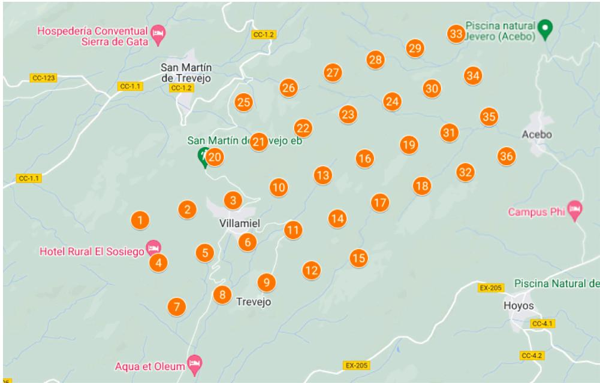  
Fig. 3. UAV network deployment over the considered scenario

## 5.1. Simulation set-up

Both solutions are being assessed within the real rural environment of Sierra de Gata in Cáceres (Spain), with a focus on smart farming applications, particularly the monitoring of livestock in mountain regions. This area encompasses four villages (Villamiel, Trevejo, San Martín de Trevejo, and Acebo) connected by rural roads, as depicted in Fig. 3. The selection of the UAV sites is performed by solving the design problem of [40], in order to minimize the installation costs.

To address the needs of smart farming in these areas, a UAV-based network architecture, similar to the one outlined in Section 3, is being deployed. A fleet of UAVs is positioned at an altitude of 50 meters with a distance of 900 m among UAVs [36] to minimize interference. Additionally, assuming a Line-of-Sight (LoS) condition between users and UAVs, given the absence of significant obstacles like buildin s or trees, ensures optimal QoS. Consequentl , the network consists of 36 UAVs providin covera e of mountain areas and rural roads.

To represent this scenario, a JSON file is used as a dataset where model features are defined such as how often a request is made, the number of requests, the set of UAVs and the set of microservices. In addition, the battery level, RAM capacity and CPU frequency are defined for each UAV. For each microservice, the CPU cycles for deployment, the CPU cycles per request, the required RAM, the input size and the number of replicas are defined [41]. The value of these features for the evaluated scenario are explained next, where the characteristics of the UAVs, the specifications of the microservices in Table 3 and the simulation times are indicated

In the given scenario, each UAV comes equipped with a Raspberry Pi with 4 GB of RAM, a 1.5 GHz CPU, and a 4.2 Ah and 11.1 V battery (46.62 Wh). The Raspberry Pi 4 is considered to have a dedicated battery because its consumption is at least an order of magnitude lower than that of the UAV components [42]. Thus, the data can be better interpreted. Additionally, each UAV is furnished with an antenna to enable wireless communication and strengthen connectivity within the environment. These attributes, retrieved from [43,44], serve to deliver the necessary microservices for computation and processing tasks and they are based on commodity hardware so that future real-world tests can be carried out. To assess the effectiveness of the proposed algorithm within a UAV-based network, the suite of microservices emploved. their specifications, and their impact on UAV components have been carefully examined through rigorous experimental tests.

In order to monitor both the behavior and the area where the animals are grazing, it was decided to consider two applications on the Internet of Animal Things (IoAT). These applications, as discussed above (Section 3.2) are decomposed into a series of microservices that provide different functionalities. They try to delimit the area where the animals can move, in the case of the ( i ) li i d i h f h ( i l i i d) li i ll i f i b h relationships that the animals have with each other, as well as their points of interest within the area where they reside. The specification of the microservices is provided in Table 3.

The simulation process is as follows. A time slot duration of 10 min is considered. During each time slot, 10.000 random microservices requests are made to the UAVs and the solver obtains the optimal microservice deployment scheme for � (recal from Section 4 that X is the set of decisions variables that indicate where are the microservices deploved). Once a solution is found microservices are deployed and another time slot starts. However, from one time slot to the next, the UAV’s computational and battery resources are reduced by its use. The simulation continues for as many time slots as possible until it is not feasible to find a solution because of insufficient resources. This provides an accurate estimate of battery life under realistic workloads and allows the proposed model to be evaluated.

Table 3  
Specification of the microservices considered to evaluate the model.

<table><tr><td>Microservice</td><td>Symbol</td><td>RAM  $c_m$ </td><td>Freq. execution  $f_m$ </td><td>Freq. request  $f_m^r$ </td><td>Input data size  $l_m$ </td><td>Replicas  $d_m$ </td></tr><tr><td>Grazing zone</td><td> $m_1$ </td><td>707 MB</td><td>680 MCycles/s</td><td>1 MCycles/s</td><td>200 Kb</td><td>4</td></tr><tr><td>Animal geopositioning</td><td> $m_2$ </td><td>1.12 GB</td><td>720 MCycles/s</td><td>2 MCycles/s</td><td>200 Kb</td><td>4</td></tr><tr><td>Animal historic record</td><td> $m_3$ </td><td>1.93 GB</td><td>850 MCycles/s</td><td>2 MCycles/s</td><td>250 Kb</td><td>4</td></tr><tr><td>Interest point</td><td> $m_4$ </td><td>1.67 GB</td><td>920 MCycles/s</td><td>2.5 MCycles/s</td><td>300 Kb</td><td>4</td></tr></table>

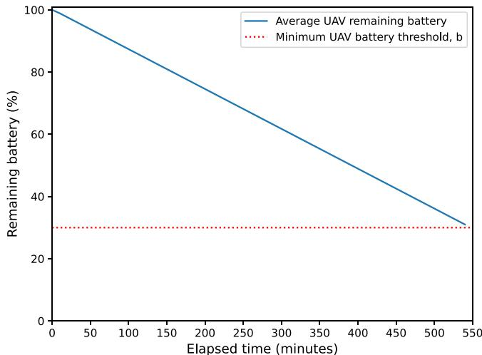  
Fig. 4. Average remaining battery level of UAVs over time.

## 5.2. Performance evaluation

h l f h f f h d l d ll h l f h average battery percentage of the UAVs throughout the simulation. It can be seen that, as time goes by, there is a linear decrease in the battery percentage of the UAVs composing the network, reaching a minimum of 30% in the worst case, being the minimum battery percentage established. Results show that, with the specified configuration, the system can operate for more than 9 h, consuming only 1.06% of battery life in each time slot of 10 min. This means that the battery bottleneck would not be found in the Raspberry Pi 4 used, but in the battery usage coming from the UAV flight. At the same time, it highlights the effectiveness of h kl d b l h h h f f h d d d b h b l of the different UAVs in each of the executed time slots of the tests is always lower than 0.2%

The second analysis that is shown aims at representing the values of different metrics: microservices migration, CPU utilization, uplink, and downlink data rate per UAV, as a function of time. In particular, Fig. 5(a) represents the number of microservices migrated in each UAV in each proposed scenario. There are 12 microservice instances to deploy and 36 UAVs; and given that the optimization problem aims to balance the workload, it is unexpected to find UAVs hosting more than one microservice per time slot. This can be verified by observing that the situation where a microservice is added to a UAV in two consecutive time slots never occurs. The greater number of UAVs than microservices results in frequent migrations during all time slots that allow workload balancing, which in turns results in energy consumption balancing.

The colormaps shown in Figs. 5(b), 5(c) and 5(d) show the CPU utilization rate, the uplink and downlink data rates generated during each time slot for each UAV, respectively. Multiple conclusions can be drawn from them. Given the random nature of the generation of the 10.000 requests during each time slot, it can be seen that the incoming traffic flowing through the UAVs in the topology is quite homogeneous (see Fig. 5(d)). On the other hand, the percentage of CPU usage and the amount of outgoing traffic flowing through the UAV interface has a certain inverse proportionality, i.e., lighter values of CPU utilization correspond to higher values of uplink data rate. This event is motivated by Eqs. (3) and (5) which states that the CPU usage is determined, in part, by the microservices to be deploved in the UAV and that the outgoing traffic depends on those requests that arrive and that have to be forwarded because they cannot be attended by the UAV due to not having the microservice deployed

Fig. 6 represents the time that all requests can be served for different simulations in which the number of requests per TS is increased. As can be observed, a reduction in the elapsed time is experienced with respect to the number of requests per TS. Clearly, the more requests made by users lead to an increase in the UAVs energy consumption. Another important aspect to remark is that the same increase in the number of requests per TS impacts in a different way if we consider a low or a high number of requests. In particular, the service time is much more reduced if this adding of requests is carried out for a low number (i.e., passing from 1000 to 2000 requests per TS) rather than the case of adding the same number of requests when this number is high (e.g., from 30,000 to 31,000 requests per TS). Another remarkable observation is the downtime in the last steps, which represents the inability of the UAV swarm to provide service when the number of requests per TS exceeds 36,300.

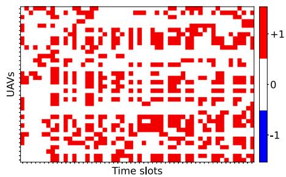  
(a) Microservices migrated on each UAV throughout the simulation.

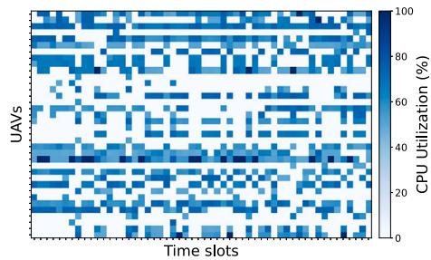  
(b) CPU usage ratio of each UAV during each time slot.

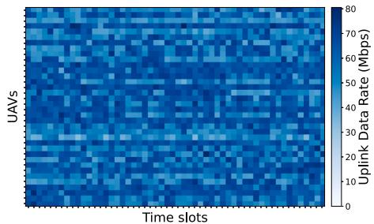

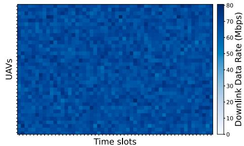  
(d) Downlink data rate of each UAV during each time slot.

Fig. 5. Microservices migration, CPU utilization, uplink and downlink data rate per UAV as a function of time.  
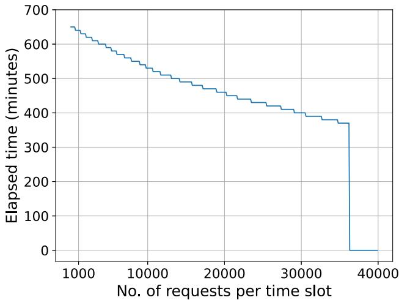  
Fig. 6. UAV swarm operational time depending on the number of requests per TS.

In order to show the effectiveness of the proposed approach, a scalability analysis has been carried out. In particular, Fig. 7(a), reports the impact of the size of the UAV swarm for different number of requests per TS on the ability of the system to remain operational over time. In other words, to check if there is a substantial impact when increasing the number of UAVs and the number of requests per TS to spread the load even more and try to make the swarm system run longer. Results show three remarkable facts. The first one is that the number of UAVs is relevant in order to obtain feasible solutions given the constraints of the problem instance being tested. Specifically, at least 15 UAVs are needed to find a feasible solution for the problem, Second, once the number of UAVs to obtain a feasible solution is set, increasing their number leads to a sub-linear increase in the duration of the swarm’s operationa time. Thus, it is not particularly attractive to increase the number of UAVs beyond this threshold. This is because the small difference between the minimum and the maximum power consumption of a Raspberry Pi 4 with the specified conditions (around 2.8 Wh and 4.1 Wh with a fully loaded CPU and 100 Mbps of downlink and uplink data rates using WiFi network interfaces), leaves little room for improvement. The third fact that we can observe is that the higher the number of requests per TS, the higher the number of UAVs needed to achieve the same improvement in service time as the executions with a lower number of requests per TS. Finally, Fig. 7(b) shows how the remaining battery level of the UAVs progresses as a function of time for different values of requests per TS. Clearly, the more number of requests per TS results in a higher consumption, with the lower bound limit of 30% for battery set as constraint.

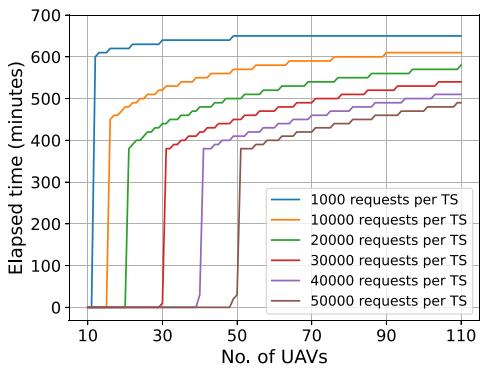

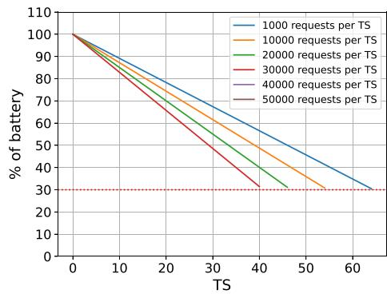  
(a) UAV swarm operational time as a function of (b) Average remaining battery percentage as a the number of UAVs and the number of requests function of time for different values of requests per TS. per TS.  
Fig. 7. UAV swarm operational time and remaining battery depending on the number of UAVs and the number of requests.

After analyzing the set of experimental evaluations that have been carried out, it can be remarked that the proposed MILP mode is able to obtain an optimal solution even for large instances of the problem (scalability analysis) in tractable times (3.6 s. in the worst-case scenario). Thus, there is no need to run lightweight heuristics that would lead to suboptimal results

Our findings demonstrate that using a microservices-based approach within UAV swarms optimally balances energy consumption across UAVs, thus extending network uptime. By dynamically balancing the energy load across UAVs through optimal microservice migration, the operational lifetime of each UAV’s battery is extended. This reduces the frequency of recharging or replacement, lowering both logistical costs and downtime. This energy-efficient design is especially critical in remote regions where recharging infrastructure may be limited or costly to set up. In challenging environments where terrain or weather can affect signal quality, the flexibility of our proposed approach allows UAVs to dynamically adiust microservice deplovments based on current resource levels. This adaptability ensures consistent service delivery, even under variable conditions, making it suitable for applications requiring real-time data, such as wildfire detection, search and rescue operations, or environmental monitoring. The microservices architecture and UAV deployment model make it easier to scale up the network as connectivity demand grows. For instance, during agricultural peak seasons, additional UAVs can be seamlessly integrated to handle increased data processing or monitoring needs without reconfiguring the entire system. This scalability makes the system suitable for various rural and remote IoT applications bevond agriculture, including healthcare and educational services.

## 6. Discussion

We then discuss two main issues that may impact the presented results, namely: (i) the consideration of complex environments, and (ii) the scalability for large-scale applications.

The proposed UAV-based microservices deployment system is designed for flexible adaptation to complex rural environments and scalability for large-scale IoT applications. By addressing challenges such as variable terrain, fluctuating connectivity demands, and extensive geographic coverage, the system effectively operates under diverse conditions. In the following, detailed discussion on the system’s adaptability, scalability, and potential enhancements to support large-scale deployments is provided.

## 6.1. Impact of complex environments

The proposed system leverages real-time sensor data from both UAVs and IoT devices to adapt to complex environmental factors, such as obstructed line-of-sight due to topography, vegetation, or shifting atmospheric conditions. UAVs autonomously adjust their positions within the swarm to maintain optimal connectivity, ensuring reliable data transmission even in geographically diverse landscapes.

UAVs monitor environmental changes (e.g., wind speed, altitude adjustments, and battery levels) and adjust microservice deployment based on UAV availability, energy status, and computational load. In areas with heavy vegetation or terrain obstacles, UAVs can coordinate to reposition or even hand off specific microservices to UAVs in better-suited locations. This adaptability is essential for applications that require continuous coverage, such as livestock monitoring, where real-time data is critical to decision making.

During peak demand periods, such as harvesting seasons in agricultural applications, the system can prioritize critical services to ensure uninterrupted availability of high-importance microservices (e.g., livestock health or location tracking). By dynamically adjusting microservice priorities, the system reduces the risk of overloading individual UAVs and maintains essential functionality.

h ffl d i l d d b d b d d h f ibl ll i h to scale without sacrificing performance. This offloading minimizes strain on UAV resources and ensures consistent performance across fluctuating demand levels.

## 6.2. Impact of large-scale applications

For extensive applications covering large geographic regions, scalability is achieved by adding more UAVs to the network. The MILP model dynamically recalculates optimal microservice placement, integrating new UAVs seamlessly into the swarm to distribute energy consumption and computational load across all available units. This approach enables the network to expand without centralized control, maintaining an efficient, decentralized structure.

In larger deployments, a hierarchical clustering strategy can be implemented, where UAVs are organized into clusters, each handling localized tasks. Clusters can communicate with one another through relay UAVs, limiting the communication overhead on individual UAVs and enhancing efficiency. This hierarchical approach reduces the burden on communication channels and processing capabilities, making it feasible to deploy large-scale networks across widespread rural areas.

For highly scalable operations, UAVs could intermittently transmit non-critical data to a nearby ground station or edge server if available, further reducing local processing loads and ensuring that UAV resources focus on essential, time-sensitive tasks.

## 7. Conclusion

Although Internet use is steadily increasing, particularly markedly in rich countries, there remains a pronounced digital divide among the population in rural and economically disadvantaged areas, which lacks access to online connectivity. However, the use of UAVs offers an innovative solution to address these types of situations, providing a mobile and flexible platform to bring digital services to these marginalized communities.

This work, takes advantage of the benefits offered by UAV-based network architecture to provide solutions, in this case, to the livestock sector. Taking into account the limited computational and battery capabilities of the UAVs, IoT applications are decomposed into microservices, making each UAV capable of deploying and running a specific amount of these services. The system is formulated into an MILP model that is able to migrate microservices along the UAV network in a way that minimizes energy consumption, thus increasing service lifetime.

Simulations carried out in a realistic scenario validate the effectiveness of the solutions in terms of energy efficiency and network capacity when faced with an increase in requests from the microservices deployed on the network, highlighting that the migration of microservices is more efficient in terms of energy consumption than task allocation. Results show that by balancing the average remaining battery of the UAVs in the network when deciding to migrate microservices across the UAVs, vields significant improvements in the battery life-time of the UAVs.

Yet, multiple potentially beneficial aspects are not addressed in this paper. The inclusion of QoS constraints or the notion of service function chain in the MILP formulation can lead to a optimization problem that also takes into account the experience of use, rendering it valid for scenarios with latency-sensitive applications. Considering UAVs with mounted photovoltaic panels or tethered UAVs is another interesting approach to extend flight time and microservice provision, although disadvantages, such us the increase of the cost of the infrastructure or mobility limitations, arises and they would require to design a different and, potentially, more complex power consumption model than the one proposed. All of the above issues are potential areas for future research suggesting that not enough research has been done on the subject.

## CRediT authorship contribution statement

Santiago García-Gil: Writing – review & editing, Visualization, Software, Investigation, Formal analysis, Conceptualization. Diego Ramos-Ramos: Writing – review & editing, Writing – original draft, Validation, Software, Resources, Methodology, Investigation. Conceptualization. Javier Berrocal: Writing – review & editing, Writing – original draft, Validation. Software. Resources, Methodology, Investigation, Conceptualization. Juan Manuel Murillo: Writing – review & editing, Writing – origina draft, Validation, Software, Resources, Methodology, Investigation, Conceptualization. Jaime Galán-Jiménez: Writing – review & editing, Writing – original draft, Validation, Software, Resources, Methodology, Investigation, Conceptualization.

## Declaration of competing interest

The authors declare that they have no known competing financial interests or personal relationships that could have appeared to influence the work reported in this paper.

[5] Vincent Bretagnolle, Elsa T. Berthet, Nicolas Gross, Bertrand Gauffre, Christine Plumejeaud, Sylvie Houte, Isabelle Badenhausser, Karine Monceau, Fabrice Allier, Pascal Monestiez, Sabrina Gaba, Description of long-term monitoring of farmland biodiversity in a LTSER, Data Brief 19 (2018) 1310–1313.

## Acknowledgments

This work has been partially funded by Grant TED2021-130913B-I00 funded by MICIU/AEI/10.13039/50100011033 and by ‘‘European Union NextGenerationEU/PRTR’’, by the Ministry of Science, Innovation and Universities, Spain (project PDC2022- 133465-I00), by the project PID2021-124054OB-C31 and the grant CAS21/00057 (MICIU/AEI/FEDER, UE, Spain), and by the Regional Ministry of Economy, Science and Digital Agenda of the Regional Government of Extremadura, Spain (GR21133).

## Data availability

Data will be made available on request.

## References

[1] Ida Sèmévo Tognisse, Jules R. Dégila, Ahmed Dooguy Kora, Connecting Rural Areas: A solution approach to bridging the coverage gap, in: 2021 IEEE 12th Annual Ubiquitous Computing, Electronics & Mobile Communication Conference, UEMCON, 2021, pp. 0873–0873.

[2] William G. Tierney, Zoë B. Corwin, Amanda Ochsner, Diversifying Digital Learning, Johns Hopkins University Press, 2018.

[3] Chuma Makalima, Yolanda Gwala, Lutho Makasi, Anam Baza, Andile Michael Lwanga, Co-designing an integrated digital education portal for the eastern cape rural learners, in: Extended Abstracts of the 2023 CHI Conference on Human Factors in Computing Systems, 2023.

[4] J. Shi, G. An, A. Weber, D. Zhang, Prospects for rice in 2050, Plant, Cell Environ. 46 (2023) 1037–1045, http://dx.doi.org/10.1111/pce.14565.

[6] Shailendra Mishra, Sunil Kumar Sharma, Advanced contribution of IoT in agricultural production for the development of smart livestock environments, Internet Things 22 (2023) 100724, http://dx.doi.org/10.1016/j.iot.2023.100724.

[7] T. Saranya, C. Deisy, S. Sridevi, Kalaiarasi Sonai Muthu Anbananthen, A comparative study of deep learning and internet of things for precision agriculture, Eng. Appl. Artif. Intell. 122 (2023) 106034, http://dx.doi.org/10.1016/j.engappai.2023.106034.

[8] Guillermo Montilla León, Ricardo Montilla Camara, Egilda Pérez Morales, Luigi Frassato, César Seijas Fossi, Precision agriculture for rice crops with an h i i l h l h i d

[9] Emad Siddiqui, Sara Fatima, Abid Ali Jamali, Tooba Siddiqui, Paediatric Emergency Medicine: Reality, Expectation, Experience, and Need for Improvements from a Low- Income Settings., J. College Phys. Surg.–Pakistan : JCPSP 33 6 (2023) 601–602.

[10] Taylor Goulbourne, Itzhak Yanovitzky, The communication infrastructure as a social determinant of health: Implications for health policymaking and practice, Milbank Q. (2021).

[11] Claudia Galindo, Mavis G. Sanders, Yolanda Abel, Transforming educational experiences in low-income communities, Am. Educ. Res. J. 54 (2017) 140S - 163S.

[12] Albérico Travassos Rosário, Joana Carmo Dias, Sustainability and the digital transition: a literature review, Sustainability (2022).

[13] Ahmed Imran, Why addressing digital inequality should be a priority, Electron. J. Inf. Syst. Dev. Countries 89 (2022).

[14] Mohamed Ould-Elhassen Aoueileyine, Ramzi Allani, Ridha Bouallegue, Anis Yazidi, Coverage strategy for small-cell UAV-based networks in IoT environment, Sensors 23 (21) (2023) http://dx.doi.org/10.3390/s23218771.

[15] Songyuan Li, Shibo He, Kang Hu, Lingkun Fu, Shuo Chen, Jiming Chen, Operation state scheduling towards optimal network utility in RF-powered internet of things, IEEE Trans. Mob. Comput. 20 (11) (2021) 3117–3130, http://dx.doi.org/10.1109/TMC.2020.2995256.

[16] Xiaopeng Yuan, Tianyu Yang, Yulin Hu, Jie Xu, Anke Schmeink, Trajectory design for UAV-enabled multiuser wireless power transfer with nonlinear energy harvesting, IEEE Trans. Wireless Commun. 20 (2) (2021) 1105–1121, http://dx.doi.org/10.1109/TWC.2020.3030773.

[17] Wu Chen, Jiajia Liu, Hongzhi Guo, Nei Kato, Toward robust and intelligent drone swarm: Challenges and future directions, IEEE Netw. 34 (4) (2020) 278–283, http://dx.doi.org/10.1109/MNET.001.1900521.

[18] Dinh C. Nguyen, Ming Ding, Pubudu N. Pathirana, Aruna Seneviratne, Jun Li, Dusit Niyato, Octavia Dobre, H. Vincent Poor, 6G internet of things: A comprehensive survey, IEEE Internet Things J. 9 (1) (2022) 359–383, http://dx.doi.org/10.1109/JIOT.2021.3103320.

[19] Nan Cheng, Shen Wu, Xiucheng Wang, Zhisheng Yin, Changle Li, Wen Chen, Fangjiong Chen, AI for UAV-assisted IoT applications: A comprehensive review, IEEE Internet Things J. 10 (16) (2023) 14438–14461, http://dx.doi.org/10.1109/JIOT.2023.3268316

[20] Muhammad Adil, Houbing Song, Spyridon Mastorakis, Hussein Abulkasim, Ahmed Farouk, Zhanpeng Jin, UAV-assisted IoT applications, cybersecurity threats, AI-enabled solutions, open challenges with future research directions, IEEE Trans, Intell. Veh, 9 (4) (2024) 4583–4605, http://dx,doi,org/10.1109 TIV.2023.3309548.

[21] Diego Ramos-Ramos, Alejandro González-Vegas, Javier Berrocal, Jaime Galán-Jiménez, Energy-aware microservice-based application deployment in UAV-based networks for rural scenarios, J. Netw. Syst. Manage. 32 (3) (2024) 53.

[22] Lei Yang, Haipeng Yao, Jingjing Wang, Chunxiao Jiang, Abderrahim Benslimane, Yunjie Liu, Multi-UAV-enabled load-balance mobile-edge computing for IoT networks, IEEE Internet Things J. 7 (8) (2020) 6898–6908.

[23] Wu Pan. Na Ly. Dynamic migration scheme for load balancing and average delay optimization in SDN-based multi-UAV relay network, IEEE Access (2023)

[24] Andrew Kopeikin, Sameera S Ponda, Luke B Johnson, Jonathan P How, Multi-uav network control through dynamic task allocation: Ensuring data-rate and bit-error-rate support, in: 2012 IEEE Globecom Workshops, IEEE, 2012, pp. 1579–1584.

[25] Subir Halder, Amrita Ghosal, Mauro Conti, Dynamic super round-based distributed task scheduling for UAV networks, IEEE Trans. Wireless Commun. 22 (2) (2022).1014–1028.

[26] Alessio Sacco, Flavio Esposito, Guido Marchetto, Paolo Montuschi, Sustainable task offloading in UAV networks via multi-agent reinforcement learning, IEEE Trans. Veh. Technol. 70 (5) (2021) 5003–5015.

[27] Yujjao Zhu, Sihua Wang, Xuanlin Liu, Haonan Tong, Changchuan Yin, Joint task and resource allocation in SDN-based UAV-assisted cellular networks, in: 2020 IEEE/CIC International Conference on Communications in China, ICCC, IEEE, 2020, pp. 430–435.

[28] S. Simi, Rakesh Kurup, Sethuraman Rao, Distributed task allocation and coordination scheme for a multi-UAV sensor network, in: 2013 Tenth International Conference on Wireless and Optical Communications Networks, WOCN, IEEE, 2013, pp. 1–5.

[29] Wenkai Lv, Pengfei Yang, Tianyang Zheng, Chengmin Lin, Zhenyi Wang, Minwen Deng, Quan Wang, Graph-reinforcement-learning-based dependency-aware microservice deployment in edge computing, IEEE Internet Things J. 11 (1) (2024) 1604–1615, http://dx.doi.org/10.1109/JIOT.2023.3289228.

[30] Kaustabha Ray, Ansuman Banerjee, Nanjangud C. Narendra, Learning-based microservice placement and migration for multi-access edge computing, IEEE Trans. Netw. Serv. Manag. 21 (2) (2024) 1969–1982, http://dx.doi.org/10.1109/TNSM.2023.3344192.

[31] Kasun Indrasiri, Microservices in practice - key architectural concepts of an MSA, 2019, https://wso2.com/whitepapers/microservices-in-practice-keyarchitectural-concepts-of-an-msa/.

[32] Jaime Galán-Jiménez, Alejandro González Vegas, Javier Berrocal, Reduction of latency of microservice based lot applications in rural areas with lack of connectivity using UAV-based networks, in: 2022 IEEE Symposium on Computers and Communications, ISCC, 2022, pp. 1–6.

[33] Santiago García Gil, Juan Manuel Murillo, Jaime Galán-Jiménez, Optimizing IoT microservices placement for latency reduction in UAV-assisted wireless networks, in: 2023 JEEE 20th International Conference on Mobile Ad Hoc and Smart Systems, MASS. 2023, pp. 658–663, http://dx,doi,org/10.1109 MASS58611.2023.00093.

[34] Santiago García Gil, José A. Gómez de la Hiz, Diego Ramos Ramos, Juan Manuel Murillo, Jaime Galán-Jimenez, DRL-Based Coverage Optimization in UAV Networks for Microservice-Based IoT Applications, IGI Global, 2024, pp. 27–54, http://dx.doi.org/10.4018/979-8-3693-0578-2.ch002.

[35] Akram Al-Hourani, Sithamparanathan Kandeepan, Simon Lardner, Optimal LAP altitude for maximum coverage, IEEE Wirel. Commun. Lett. 3 (6) (2014) 569–572. http://dx.doi.org/10.1109/LWC.2014.2342736

[36] Jaime Galán-Jiménez, Enrique Moguel, José García-Alonso, Javier Berrocal, Energy-efficient and solar powered mission planning of UAV swarms to reduce the coverage gap in rural areas: The 3D case, Ad Hoc Netw. 118 (2021) 102517, http://dx.doi.org/10.1016/j.adhoc.2021.102517.

[37] Jaime Galán-Jiménez, Alejandro González Vegas, Javier Berrocal. Energy-efficient deployment of IoT applications in remote rural areas using UAV networks. in: 2022 14th IFIP Wireless and Mobile Networking Conference, WMNC, 2022, pp. 70–74, http://dx.doi.org/10.23919/WMNC56391.2022.9954292.

[38] Fabian Kaup, Philip Gottschling, David Hausheer, Powerpi: Measuring and modeling the power consumption of the raspberry pi, in: 39th Annual IEEE Conference on Local Computer Networks, 2014, pp. 236–243, http://dx.doi.org/10.1109/LCN.2014.6925777.

[39] Santiago García-Gil, Service migration, 2024, https://github.com/sgarciatz/service-migration. (Accessed 8 November 2024).

[40] Luca Chiaraviglio, Lavinia Amorosi, Nicola Blefari-Melazzi, Paolo Dell’Olmo, Carlos Natalino, Paolo Monti, Optimal design of 5G networks in rural zones with UAVs, optical rings, solar panels and batteries, in: 2018 20th International Conference on Transparent Optical Networks, ICTON, 2018, pp. 1–4, http://dx.doi.org/10.1109/ICTON.2018.8473712.

[41] Santiago García-Gil, Service migration - dataset, 2024, https://github.com/sgarciatz/service-migration/blob/main/input/Scenario\_36.json. Accessed 8 November 2024.

[42] Thiago A. Rodrigues, Jay Patrikar, Natalia L. Oliveira, H. Scott Matthews, Sebastian Scherer, Constantine Samaras, Drone flight data reveal energy and greenhouse gas emissions savings for very small package delivery, Patterns 3 (8) (2022) 100569, http://dx.doi.org/10.1016/j.patter.2022.100569.

[43] Ankur Limaye, Tosiron Adegbija, A workload characterization for the internet of medical things (IoMT), in: 2017 IEEE Computer Society Annual Symposium on VLSI, ISVLSI, 2017, pp. 302–307, http://dx.doi.org/10.1109/ISVLSI.2017.60.

[44] ARM cortex-A53 mpcore processor technical reference manual r0p3, 2013, https://developer.arm.com/documentation/ddi0500/e/level-1-memory-system/ about-the-l1-memory-system.