# Minimum Secrecy Rate Maximization for UAV-Mounted Movable Antenna Empowered Wireless Networks

Liangsen Zhai and Xiapu Luo

Abstract—In response to the problems in uncrewed aerial vehicle (UAV) communications such as limited antenna number, exposure of the line-of-sight (LoS) for eavesdroppers, and limited onboard energy, this paper proposes a secure UAV communication scheme based on movable antennas (MAs). This scheme jointly designs the user scheduling factors, the UAV beamforming, the small-scale adjustment of MA positions, and the large-scale planning of UAV trajectories to maximize the system’s minimum secrecy rate under uncertain eavesdropper regions. To solve the non-convex optimization problem, a block coordinate descent (BCD) algorithm is used to decompose the original problem into four subproblems for iterative solving, followed by an analysis of the algorithm’s convergence and computational complexity. Simulation results reveal that the UAV follows the strategy of “maximum-speed-flight-and-then-low-speed-hovering” to serve each user in sequence. In this way, it can quickly pass through the uncertain region of the eavesdroppers and minimize the distance to the served user during the flight period. The proposed scheme leverages millimeter-level MA position reconstruction and wide-range UAV trajectory design. When the system’s minimum secrecy rate is maintained at 3.5 bps/Hz, the proposed scheme can securely support approximately 20% more users than the fixed-position antenna (FPA) scheme, while achieving more than 40% reductions in both transmit power and antenna count.

Index Terms—Movable antenna, uncrewed aerial vehicle, eavesdroppers’ uncertain region, secrecy rate, max-min fairness.

## I. INTRODUCTION

U NCREWED aerial vehicles (UAVs) have emerged as a flexible and efficient solution for providing wireless communication services, owing to their three-dimensional (3D) deployment capability and high probability of line-ofsight (LoS) links to ground users [1], [2]. These characteristics make UAVs promising candidates for future wireless networks, including the envisioned sixth-generation (6G) systems, where UAVs can act as airborne base stations or relays to complement terrestrial infrastructures [3], [4]. Consequently, extensive research efforts have been devoted to UAV-enabled communications, with a particular focus on trajectory design and resource allocation strategies [5], [6], [7], [8], [9], [10].

Despite their advantages, UAV communications are inherently vulnerable to eavesdropping due to the broadcast nature of wireless channels and the predominance of LoS links. To address this issue, physical layer security has been widely investigated as a lightweight and effective solution for UAV systems [11], [12], [13], [14]. However, many existing works rely on the idealized assumption that the eavesdroppers’ locations are perfectly known, which is rarely feasible in practice. Motivated by this limitation, recent studies have begun to explore resilient UAV communication designs that explicitly account for uncertainty in eavesdropper location information [15], [16], [17].

While various resource allocation methods have been exploited to enhance UAV physical-layer security, their degrees of freedom remain limited by fixed-position antennas (FPAs). By contrast, the newly-emerged movable antenna (MA) technology introduces additional spatial reconfigurability, potentially improving the security of UAV communications. Specifically, unlike traditional FPAs, MAs can achieve millimeter-level movement within areas spanning several wavelengths, driven by actuators such as stepper motors [18]. This introduces additional spatial degrees of freedom for transceivers’ antennas or reconfigurable intelligent surface (RIS) elements, allowing for channel reconfiguration through joint design with beamforming amplitude and direction [19]. This technology has preliminarily attempted to be applied in many networks to improve the performance. For example, in [20], MAs were utilized on the transceiver side of multicast communications, where a joint design of antenna positioning and precoding was employed in boosting maxmin fairness. In [21], MAs were integrated into integrated sensing and communications (ISAC) systems for enhancing the perception capabilities by leveraging the channel reconstruction ability of MAs, while meeting the increasing communication demands. Considering the challenges of acquiring real-time channel state information (CSI) for MA-related links, a two-timescale design was constructed though [22] for boosting practicality, where optimizing MA positions and precoding was performed based on statistical and instantaneous CSI, respectively. In [23], the sum rate in the downlink communication were maximized by combining MAs and RIS which acted as two promising channel propagation environment customization techniques, where MAs outperformed FPAs in terms of performance gain under passive RIS beamforming.

Additionally, a limited amount of work in [24], [25], and [26] has employed MAs to enhance physical layer security and show that, compared to FPAs, MAs can reduce the correlation between legitimate and eavesdropping links, significantly improving the secrecy rate. In [24], the method for enhancing security has been investigated to reduce the high correlation between the user and eavesdropping channels by adjusting the frequency, position, and precoding of transmit antennas. The secrecy rate within multiple-input multipleoutput (MIMO) scenarios was maximized in [25] by jointly designing beamforming, MA positioning, and artificial noise to enhance system security. In [26], artificial noise, transmit and receive beamforming, and antenna positioning were jointly optimized for boosting the full-duplex secure communication. However, the security schemes of MAs in [24], [25], and [26] primarily focus on terrestrial communication and do not address the unique security challenges and opportunities posed by MAs installed on the aerial UAV. On one hand, the limited space and energy of the UAV, coupled with dynamic channel variations, require the design of compact, low-power MA deployment schemes. On the other hand, the large-scale trajectory planning of the UAV (ranging from hundreds to thousands of meters) and the small-scale position adjustments of MAs (on the millimeter level) can form a “dual mobility” collaboration. Specifically, the UAV’s macro trajectory can quickly evade eavesdroppers, while the micro positioning of MAs can fine-tune the beam direction. The combination of these two elements can simultaneously reduce the eavesdropping link gain and improve the quality of the legitimate link, which is a spatial degree of freedom extension that ground MAs cannot achieve.

Currently, there have been some preliminary studies that have attempted to utilize the collaboration between UAV and MAs to enhance communication performance. In particular, in the collaborative design of UAV deployments/trajectories, beamforming and MA positions, classical optimization techniques were employed in [27], [28], [29], [30], and [31] for achieving the growth in the sum throughput or minimum achievable rate. Differently, deep reinforcement learning was adopted in [32] and [33] to address the complex optimization challenges of UAV-MA synergy. Further, the rate fairness of the UAV-swarm-mounted MAs was studied in [34] through the joint design of receiver beamforming and UAV deployments. However, these UAV-MA studies all focus on improving communication performance or expanding functions, without addressing the protection against eavesdropping attacks and more practical scenarios where the locations of the eavesdroppers are uncertain.

In UAV-mounted MA empowered wireless networks, both the UAV and the MAs possess mobility and adaptability, with their movement characteristics being complementary in both spatial and temporal scales. This “dual mobility” coordination mechanism is the potential key to addressing security threats such as eavesdropping. First, the air-to-ground links primarily rely on LoS propagation, which can be easily intercepted by malicious eavesdroppers. Although the UAV can minimize exposure time by planning trajectories to quickly traverse the uncertain regions of the eavesdroppers, the MAs can further boost the beam gain through millimeter-level positional adjustments. Second, traditional FPAs require stacking more antennas to improve security, which is not practical for the UAV with limited body space. In contrast, the MAs dynamically reconstructs its position to exploit additional spatial degrees of freedom, requiring fewer antennas in contrast to the FPA solution while maintaining the same level of security. Comparison of core designs between this paper and comparable literatures is presented in Table I.

Motivated by these factors, this paper focuses on secure transmission in a UAV-mounted MA empowered wireless network. In this setup, a UAV with multiple MAs delivers sensitive data toward several receivers, while facing the threat from multiple eavesdroppers. The following outlines the paper’s key contributions.

Considering the imperfect knowledge of the eavesdroppers’ information, the UAV can just estimate a circular area in which each eavesdropper is positioned. The system’s minimum secrecy rate is maximized through careful design of the user scheduling factor, MA positioning, UAV beamforming, and UAV trajectories.

To make the original problem more manageable, the triangle inequality is first applied to handle the uncertain region of the eavesdroppers, where the potential locations of the eavesdroppers are infinite. Then, auxiliary variables are introduced for tackling the challenging maxmin form in the objective. Finally, in the transformed problem, we employ a block coordinate descent (BCD) algorithm to decouple the strongly coupled variables in multiple constraints. The subproblems involving user scheduling factors, UAV beamforming, UAV trajectories, and MA positions are solved alternately using methods such as first- and/or second-order Taylor expansions. The algorithm’s convergence and complexity are examined, and one suboptimal solution is obtained once this algorithm converges.

Simulation results illustrate that by minimizing exposure over the uncertain regions of eavesdroppers, the UAV sequentially moves towards each user at maximum speed and hovers above them until the service for all users is completed, ensuring max-min fairness. In the proposed scheme, optimizing beamforming and user scheduling factors determine the rate of increase and its baseline value in the secrecy rate, respectively. Meanwhile, the combined building in trajectories and MA positions further elevates the security’s upper bound.

Below is an outline of the upcoming sections. Section II gives the system modeling and optimization problem. Section III presents a BCD solution on resolving the posttransformed problem. Section IV and V give simulation analysis as well as conclusion, respectively.

Notations: The representations of scalars, vectors, matrices and sets are z, z, Z, and $\mathcal { Z } .$ Moreover, $\mathbf { z } ^ { \mathrm { T } }$ and $\mathbf { z } ^ { \mathrm { H } }$ signify the transpose and Hermitian transpose operations. |z| and $\| \mathbf { z } \|$ signify the modulo and the l2-norm operations. $\dot { \mathbb { C } } ^ { \dot { N _ { 1 } } \times N _ { 2 } }$ signifies a $N _ { 1 } \times N _ { 2 }$ -dimensional complex space. The symbols $\angle z$ and Re (z) signify the phase and real part for the scalar z. Meanwhile, ∆= means “defined $\mathrm { { a s } } ^ { \dag } .$

TABLE I  
COMPARISON OF CORE DESIGNS BETWEEN THIS PAPER AND COMPARABLE LITERATURES
<table><tr><td>Comparison dimension</td><td>Secure UAV communication in [12], [13], and [14]</td><td>MA-enabled secure communication in [24], [25], and [26]</td><td>Performance improvement of UAV-MA collaboration in [27], [28], [29], [32], [33], and [34]</td><td>Secure communication of UAV-MA collaboration in this paper</td></tr><tr><td>System model</td><td>UAV-mounted FPAs; Known eavesdropper positions</td><td>Ground MAs; Known eavesdropper positions</td><td>UAV-mounted MAs; No eavesdroppers</td><td>UAV-mounted MAs; Unknown eavesdropper positions</td></tr><tr><td>Optimization variables</td><td>UAV power/beamforming, UAV trajectories</td><td>MA positions, beamforming</td><td>MA positions, UAV&#x27;s beamforming, UAV trajectories</td><td>User scheduling factors, MA positions, UAV&#x27;s beamforming, UAV trajectories</td></tr><tr><td>Optimization methods</td><td>Alternating optimization (AO) or basic convex optimization</td><td>Gradient descent or convex optimization</td><td>AO algorithm; second-order Taylor expansion</td><td>BCD algorithm; second-order Taylor expansion</td></tr><tr><td>Security mechanism</td><td>Solely relying on UAV power/beam control</td><td>Solely relying on MAs to reduce link correlation</td><td>No security mechanism</td><td>UAV-MA empowered “dual mobility&quot;</td></tr></table>

## II. SYSTEM MODEL AND PROBLEM FORMULATION

## A. System Model

A UAV-mounted MA empowered wireless network is investigated, in which one UAV serves K users, while L eavesdroppers attempt to intercept the valuable data that the UAV transmits. The users and eavesdroppers each possess a separate FPA. Meanwhile, the UAV possesses M MAs, whose positions $\mathbf { x } [ n ] = \left[ x _ { 1 } [ n ] , \cdots , x _ { M } [ n ] \right] ^ { \mathrm { \scriptscriptstyle T } }$ during the nth timeslot are able to freely placed inside a linear area of length D. Without sacrificing generality, $0 \leq x _ { 1 } [ n ] < \cdots < x _ { M } [ n ] \leq D$ is assumed [27], which leads to

$$
x _ { m } [ n ] \in [ 0 , D ] , \quad \forall m \in \mathcal { M } , n \in \mathcal { N } ,\tag{1}
$$

and

$$
x _ { m } [ n ] - x _ { \overline { { m } } } [ n ] \geq D _ { \operatorname* { m i n } } , \ \forall \left\{ m , \overline { { m } } \right\} \in \mathcal { M } , m > \overline { { m } } , \ \forall n \in \mathcal { N } .\tag{2}
$$

Therein, $D _ { \mathrm { m i n } }$ denotes the minimal spacing among MAs for preventing coupling phenomena, $\mathcal { M } \overset { \Delta } { = } \{ 1 , \cdots , M \}$ , as well as $\mathcal { N } \overset { \Delta } { = } \{ 1 , \cdots , N \}$ . The advantages of a one-dimensional linear MA are as follows: a) it only requires linear space, making it suitable for medium- to small-sized UAVs; b) it is powered by a single motor, resulting in low power consumption; c) it only needs a single track, which is easy to deploy in the limited space of the $\mathrm { U A V } ^ { \ , } \mathbf { s }$ body; d) the optimization dimension of MA placement is low, with high optimization efficiency, meeting the UAV’s coherence time requirements. Although the two-dimensional planar MA array has better performance in suppressing eavesdroppers compared to the one-dimensional linear MA array, it requires a larger deployment space as well as higher costs, energy consumption and computational complexity. It will be explored in subsequent research. The flying period T of the UAV becomes split up to N timeslots, each lasting $\begin{array} { r } { \tau = \frac { T } { N } } \end{array}$ . When τ becomes sufficiently tiny, the UAV position in every timeslot is approximately fixed [5]. In the nth timeslot, the UAV position is $\mathbf { q } [ n ] = \bar { [ q _ { x } [ n ] , q _ { y } [ n ] ] } ^ { \mathrm { T } }$ satisfying

$$
\mathbf { q } [ 1 ] = \mathbf { q } _ { I } , \mathbf { q } [ N ] = \mathbf { q } _ { F } ,\tag{3}
$$

and

$$
\| \mathbf { q } [ n + 1 ] - \mathbf { q } [ n ] \| \leq v _ { \operatorname* { m a x } } \tau , \quad \forall n \in \mathcal { N } \backslash \left\{ N \right\} .\tag{4}
$$

Therein, $\mathbf { q } _ { I }$ and $\mathbf { q } _ { F }$ represent the start and end positions for the flight trajectories, respectively, as well as $v _ { \mathrm { m a x } }$ is the maximum flight velocity. Throughout the overall flight period, the UAV keeps a fixed height of H. Meanwhile, the kth user and the lth eavesdropper are positioned on the ground at $\mathbf { u } _ { k } = \left[ u _ { k , x } , u _ { k , y } \right] ^ { \mathrm { T } }$ and ${ \bf e } _ { l } = \left[ \bar { e } _ { l , x } , e _ { l , y } \right] ^ { \mathrm { T } }$ . For the UAV, the exact location of the lth eavesdropper is difficult to acquire, and only the center $\widehat { \mathbf e } _ { l } = [ \widehat { e } _ { l , x } , \widehat { e } _ { l , y } ] ^ { \mathrm { T } }$ and radius $\boldsymbol { r } _ { e _ { l } }$ for the circular area, in which the lth eavesdropper gets placed, is known, i.e., $\mathbf { e } _ { l } \in \mathcal { E } \triangleq \{ \| \mathbf { e } _ { l } - \widehat { \mathbf { e } } _ { l } \| \leq r _ { e _ { l } } \}$ [15]. The reasons for using the bounded error model rather than the statistical error model when the locations of the eavesdroppers are uncertain are as follows. First, in practice, the UAV can only determine the “activity range boundary” of eavesdroppers through shortterm reconnaissance, but it cannot obtain the distribution characteristics of the eavesdroppers’ locations. Second, if a statistical error model are used, the optimization goal will shift to maximizing the minimum ergodic secrecy rate or controlling the minimal secrecy outage probability, which conflicts with the paper’s focus on worst-case fairness. Third, the bounded error model can calculate a lower limit for the secrecy rate, avoiding the exponential growth of computational complexity related to probability distributions and matching the limited onboard resources in the UAV.

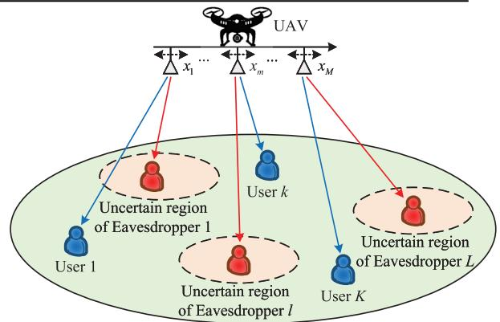  
Fig. 1. Secure transmission in a UAV-mounted MA empowered wireless networks.

Regarding the channel between the UAV and the kth user, the steering vector for the MA array within the nth timeslot is $\mathbf { a } _ { a u _ { k } } [ n ] ^ { \sim } = \Bigl [ e ^ { j { \frac { 2 \pi } { \lambda } } x _ { 1 } [ n ] \cos \theta _ { u _ { k } } [ n ] } , \dot { \mathrm {  { ~ \delta ~ } } } \cdot \dot { \mathrm {  { ~ \delta ~ } } } , e ^ { j { \frac { 2 \pi } { \lambda } } x _ { M } [ n ] \cos \theta _ { u _ { k } } [ n ] } \Bigr ] ^ { \mathrm { T } } ,$ where $\begin{array} { r } { \theta _ { u _ { k } } [ n ] \stackrel { - } { = } \operatorname { a r c c o s } \frac { q _ { x } [ n ] - u _ { k , x } } { \sqrt { \| \mathbf { q } \| n \| - \mathbf { u } _ { k } \| ^ { 2 } + H ^ { 2 } } } } \end{array}$ and λ is the wavelength [27]. Assuming all UAV-to-node channels remain LoS, the related free-space path loss within the nth timeslot is $\begin{array} { r } { h _ { a u _ { k } } [ n ] = \frac { \sqrt { \rho _ { 0 } } } { \sqrt { \| \mathbf q [ n ] - \mathbf u _ { k } \| ^ { 2 } + H ^ { 2 } } } } \end{array}$ , in which $\rho _ { 0 }$ represents the gain related to the reference distance at 1 m1 [17]. Likewise, regarding the channel between the UAV and the lth eavesdropper, the steering vector of the MA array within the nth timeslot is $\begin{array} { r l r } { \mathbf { a } _ { a e _ { l } } [ n ] } & { = } & { \left\lceil e ^ { j \frac { 2 \pi } { \lambda } x _ { 1 } [ n ] \cos \theta _ { e _ { l } } [ n ] } , \cdots , e ^ { j \frac { 2 \pi } { \lambda } x _ { M } [ n ] \cos \theta _ { e _ { l } } [ n ] } \right\rceil ^ { \mathrm { T } } } \end{array}$ where $\begin{array} { r } { \theta _ { e _ { l } } [ n ] = \operatorname { a r c c o s } \frac { q _ { x } [ n ] - e _ { l , x } } { \sqrt { \| \mathbf { q } [ n ] - \mathbf { e } _ { l } \| ^ { 2 } + H ^ { 2 } } } } \end{array}$ . Moreover, the related free-space path loss is denoted by $\begin{array} { r } { h _ { a e _ { l } } [ n ] = \frac { \sqrt { \rho _ { 0 } } } { \sqrt { \| \mathbf q [ n ] - \mathbf e _ { l } \| ^ { 2 } + H ^ { 2 } } } . } \end{array}$

Next, the achievable rate for the kth user within the nth timeslot is represented by

$$
R _ { u _ { k } } [ n ] = \alpha _ { k } [ n ] \mathrm { l o g } _ { 2 } \left( 1 + \frac { \left| h _ { a u _ { k } } [ n ] { \bf a } _ { a u _ { k } } ^ { \mathrm { H } } [ n ] { \bf w } _ { k } [ n ] \right| ^ { 2 } } { \sigma _ { k } ^ { 2 } } \right) ,\tag{5}
$$

where ${ \bf w } _ { k } [ n ]$ indicates the transmit beamforming used for communication of the kth user within the nth timeslot, as well as $\sigma _ { k } ^ { 2 }$ is the noise power at the kth user. Additionally, $\alpha _ { k } [ n ]$ is a binary value symbolizing user scheduling, satisfying

$$
\sum _ { k = 1 } ^ { K } \alpha _ { k } [ n ] \leq 1 , \quad \forall n \in \mathcal { N } ,\tag{6}
$$

$$
\alpha _ { k } [ n ] \in \{ 0 , 1 \} , \quad \forall k \in { \mathcal { K } } , n \in { \mathcal { N } } ,\tag{7}
$$

in which ${ \mathcal { K } } \ { \stackrel { \Delta } { = } } \ \{ 1 , \cdots , K \}$ . In other words, $\alpha _ { k } [ n ] \ = \ 1$ indicates that within the nth timeslot, the UAV serves only the kth user.2 Correspondingly, the eavesdropping rate at which the lth eavesdropper wiretaps the information from the kth user within the nth timeslot is denoted as

$$
R _ { e _ { l } u _ { k } } [ n ] = \alpha _ { k } [ n ] \mathrm { l o g } _ { 2 } \left( 1 + \frac { \left| h _ { a e _ { l } } [ n ] { \bf a } _ { a e _ { l } } ^ { \mathrm { H } } [ n ] { \bf w } _ { k } [ n ] \right| ^ { 2 } } { \sigma _ { l } ^ { 2 } } \right) ,\tag{8}
$$

in which $\sigma _ { l } ^ { 2 }$ is the noise power at the lth eavesdropper. Therefore, within the nth timeslot, the secrecy rate regarding the kth user is

$$
R _ { u _ { k } } ^ { \mathrm { s e c } } [ n ] = \bigg [ R _ { u _ { k } } [ n ] - \operatorname* { m a x } _ { l \in \mathcal { L } ~ { \bf e } _ { l } \in \mathcal { E } } R _ { e _ { l } u _ { k } } [ n ] \bigg ] ^ { + } ,\tag{9}
$$

where $[ r ] ^ { + } \stackrel { \Delta } { = }$ max {r, 0} and ${ \mathcal { L } } \ { \stackrel { \Delta } { = } } \ \{ 1 , \cdots , L \}$ . Note that max max $R _ { e _ { l } u _ { k } } [ n ]$ refers to the maximum eavesdropping rate l∈L e ∈E   
regarding the kth user within the nth timeslot over all possible locations of L eavesdroppers.

## B. Problem Formulation

The target is to improve the minimum secrecy rate in the system averaged over N timeslots, through the meticulous design of user scheduling factor matrix $\begin{array} { r l r } { \mathrm { ~ \bf ~ A ~ } } & { { } \triangleq } & { \{ \alpha _ { k } [ n ] , \ \forall k , \ \forall n \} } \end{array}$ , MA position matrix $\begin{array} { r l r } { { \bf X } } & { { } \triangleq } & { \{ x _ { m } [ n ] , \forall m , \forall n \} } \end{array}$ , UAV’s beamforming matrix $\textbf { W } \overset { \Delta } { = } \{ \mathbf { w } _ { k } [ n ] , \ \forall k , \ \forall n \}$ , and UAV trajectory matrix $\mathbf { Q } \triangleq \{ \mathbf { q } [ n ] , \ \forall n \}$ . Therefore, the problem is stated by

$$
\operatorname* { m a x } _ { \mathbf { A } , \mathbf { X } , \mathbf { W } , \mathbf { Q } } \operatorname* { m i n } _ { k \in \mathcal { K } } \frac { 1 } { N } \sum _ { n \in \mathcal { N } } R _ { u _ { k } } ^ { \mathrm { s e c } } [ n ]\tag{10a}
$$

$$
s . t . \sum _ { k = 1 } ^ { K } \left\| \mathbf { w } _ { k } [ n ] \right\| ^ { 2 } \leq P _ { \operatorname* { m a x } } , \quad \forall n \in \mathcal { N } ,\tag{10b}
$$

$$
( 1 ) - ( 4 ) , ( 6 ) , ( 7 ) ,\tag{10c}
$$

where $P _ { \mathrm { m a x } }$ denotes the UAV’s maximal transmit power. Point out that the objective function presents a max-min form, and appears non-smooth (caused by $[ \cdot ] ^ { + } )$ along with nonconcave (caused by max max $R _ { e _ { l } u _ { k } } [ n ] )$ [16]. Together with l∈L e ∈E   
the infinitely many possible positions of eavesdropers (i.e., $\mathbf { e } _ { l } \in \mathcal { E }$ , ∀l), it is extremely challenging to optimally address problem (10). Next, we will transform problem (10) into a simpler form, and then address it iteratively through the BCD algorithm.

## III. PROBLEM TRANSFORMATION AND SOLUTION

In this section, we first utilize the triangle inequality to handle the uncertainty in the eavesdroppers’ locations, and then eliminate $[ \cdot ] ^ { + }$ . Next, we introduce auxiliary variables to handle the intractable max-min form. Finally, we apply a BCD algorithm to decouple the optimization variables for the posttransformed problem.

## A. Problem Transformation

First of all, the eavesdroppers’ position uncertainty is addressed. Based on the triangle inequality and $\mathbf { e } _ { l } \in \mathcal { E } \triangleq$ $\{ \| \mathbf { e } _ { l } - \widehat { \mathbf { e } } _ { l } \| \leq r _ { e _ { l } } \}$ , we have

$$
\begin{array} { r l } & { \| \mathbf { q } [ n ] - \mathbf { e } _ { l } \| \geq | \| \mathbf { q } [ n ] - \widehat { \mathbf { e } } _ { l } \| - \| \widehat { \mathbf { e } } _ { l } - \mathbf { e } _ { l } \| | } \\ & { \qquad \geq | \| \mathbf { q } [ n ] - \widehat { \mathbf { e } } _ { l } \| - r _ { e _ { l } } | , } \end{array}\tag{11}
$$

which leads to $\begin{array} { r l r } { h _ { a e _ { l } } [ n ] } & { { } \le } & { \sqrt { \frac { \rho _ { 0 } } { \left( \left\| \mathbf { q } \left[ n \right] - \widehat { \mathbf { e } } _ { l } \right\| - r _ { e _ { l } } \right) ^ { 2 } + H ^ { 2 } } } } \end{array}$ ∆= $h _ { a e _ { \lambda } } ^ { \mathrm { u b } } [ n ]$ [17] and the equality holds when ${ \bf e } _ { l } ^ { \mathrm { u b } } ~ = ~ \widehat { \bf e } _ { l } +$ $\frac { r _ { e _ { l } } } { \| \mathbf { q } [ n ] - \widehat { \mathbf { e } } _ { l } \| } \left( \mathbf { q } [ n ] - \widehat { \mathbf { e } } _ { l } \right)$ . Given that $\boldsymbol { r } _ { e _ { l } }$ is much smaller than $\|  { \mathbf { q } } [ n ] -  { \mathbf { \widehat { e } } } _ { l } \|$ , the angular difference between the lth eavesdropper’s position at $\mathbf { e } _ { l } ^ { \mathrm { u b } } \triangleq \left\lceil e _ { l , x } ^ { \mathrm { u b } } , e _ { l , y } ^ { \mathrm { u b } } \right\rceil ^ { \mathrm { T } }$ and other positions within the uncertain region is relatively small. Therefore, we utilize $\mathbf { e } _ { l } ^ { \mathrm { u b } }$ to approximately calculate the steering vector $\mathbf { a } _ { a e _ { l } } [ n ] ~ = ~ \left\lceil e ^ { j { \frac { 2 \pi } { \lambda } } x _ { 1 } [ n ] \cos \theta _ { e _ { l } } [ n ] } , \cdot \cdot \cdot ~ , e ^ { j { \frac { 2 \pi } { \lambda } } x _ { M } [ n ] \cos \theta _ { e _ { l } } [ n ] } \right\rceil ^ { \mathrm { T } } ,$ where $\begin{array} { r } { \theta _ { e _ { l } } [ n ] \ = \ \operatorname { a r c c o s } \frac { q _ { x } [ n ] - e _ { l , x } ^ { \mathrm { u b } } } { \sqrt { \left\| \mathbf { q } [ n ] - \mathbf { e } _ { l } ^ { \mathrm { u b } } \right\| ^ { 2 } + H ^ { 2 } } } } \end{array}$ . Consequently, a lower bound of (9) gets established, namely

$$
R _ { u _ { k } } ^ { \mathrm { s e c } } [ n ] \geq \bigg [ R _ { u _ { k } } [ n ] - \operatorname* { m a x } _ { l \in \mathcal { L } } R _ { e _ { l } u _ { k } } ^ { \mathrm { u b } } [ n ] \bigg ] ^ { + } ,\tag{12}
$$

where

$$
R _ { e _ { l } u _ { k } } ^ { \mathrm { u b } } [ n ] \overset { \Delta } { = } \alpha _ { k } [ n ] \log _ { 2 } \left( 1 + \frac { \left| h _ { a e _ { l } } ^ { \mathrm { u b } } [ n ] \mathbf { a } _ { a e _ { l } } ^ { \mathrm { H } } [ n ] \mathbf { w } _ { k } [ n ] \right| ^ { 2 } } { \sigma _ { l } ^ { 2 } } \right)\tag{13}
$$

Based on this, we have eliminated the eavesdroppers’ position uncertainty and are able to obtain a lower bound regarding (10a).

Secondly, if $R _ { u _ { k } } [ n ] - \operatorname* { m a x } _ { \iota \in \mathcal { C } } R _ { e _ { l } u _ { k } } ^ { \mathrm { u b } } [ n ] < 0 .$ , we can set the transmit power within the nth timeslot to 0, thereby achieving $R _ { u _ { k } } [ n ] - \operatorname* { m a x } _ { l \in \mathcal { C } } R _ { e _ { l } u _ { k } } ^ { \mathrm { u b } } [ n ] = 0 \ [ 1 6 ]$ , [17]. This ensures that the secrecy rate remains non-negative under the regulation of the transmit power. Therefore, $[ \cdot ] ^ { + }$ in (12) is eliminated while still maintaining the optimality.

Then, by using the lower bound after eliminating $[ \cdot ] ^ { + }$ in (12) and setting the auxiliary variables $\begin{array} { r l r } { \eta _ { \mathrm { s e c } } ^ { \mathrm { m i n } } } & { { } = } & { \displaystyle \operatorname* { m i n } _ { k \in { \cal K } } \frac { 1 } { N } \sum _ { n \in { \cal N } } \bigg \{ R _ { u _ { k } } [ n ] - \operatorname* { m a x } _ { l \in { \cal L } } { \cal R } _ { e _ { l } u _ { k } } ^ { \mathrm { u b } } [ n ] \bigg \} } \end{array}$ and $\eta _ { e u _ { k } } ^ { \mathrm { u b } } [ n ] \ = \ \operatorname* { m a x } _ { l \in \mathcal { L } } R _ { e _ { l } u _ { k } } ^ { \mathrm { u b } } [ \bar { n ] } , \ \dot { \forall } k \in \mathcal { K } , \forall n \in \mathcal { N } ,$ , problem (10a) is approximated as

$$
\operatorname* { m a x } _ { \mathbf { A } , \mathbf { X } , \mathbf { W } , \mathbf { Q } , \eta _ { \mathrm { s e c } } ^ { \operatorname* { m i n } } , \mathbf { H } _ { e u } ^ { \mathrm { u b } } } \eta _ { \mathrm { s e c } } ^ { \operatorname* { m i n } }\tag{14a}
$$

$$
\mathrm { s . t . } \frac { 1 } { N } \sum _ { n \in \mathcal { N } } \left\{ R _ { u _ { k } } [ n ] - \eta _ { e u _ { k } } ^ { \mathrm { u b } } [ n ] \right\} \ge \eta _ { \mathrm { s e c } } ^ { \mathrm { m i n } } , \quad \forall k \in \mathcal { K } ,\tag{14b}
$$

$$
R _ { e _ { l } u _ { k } } ^ { \mathrm { u b } } [ n ] \leq \eta _ { e u _ { k } } ^ { \mathrm { u b } } [ n ] , \quad \forall k \in \mathcal { K } , l \in \mathcal { L } , n \in \mathcal { N } ,\tag{14c}
$$

$$
( 1 ) - ( 4 ) , ( 6 ) , ( 7 ) , ( 1 0 b ) ,\tag{14d}
$$

where $\mathbf { H } _ { e u } ^ { \mathrm { u b } } \ \triangleq \ \{ \eta _ { e u _ { k } } ^ { \mathrm { u b } } [ n ] , \forall k , \forall n \} . ^ { 3 }$ After transformation, problem (12) remains non-convex due to the significant coupling in the optimized variables, which makes achieving its optimal solution quite challenging. In the following, the BCD algorithm is designed for achieving a suboptimal solution about this problem, where the derivations for solving the subproblems regarding user scheduling factor matrix A, UAV’s beamforming matrix W, UAV trajectory matrix $\mathbf { Q } ,$ and MA position matrix X are sequentially given, assuming the other variables are given.

## B. Optimization of A With Given W, Q, and X

Given W, Q, and X, the subproblem regarding A is represented as

$$
\operatorname* { m a x } _ { \mathbf { A } , \eta _ { \mathrm { s e c } } ^ { \mathrm { m i n } } , \mathbf { H } _ { e u } ^ { \mathrm { u b } } } \eta _ { \mathrm { s e c } } ^ { \mathrm { m i n } }\tag{15a}
$$

$$
\mathrm { s . t . ~ 0 } \leq \alpha _ { k } [ n ] \leq 1 , \quad \forall k \in \mathcal { K } , n \in \mathcal { N } ,\tag{15b}
$$

$$
( 6 ) , ( 1 4 b ) , ( 1 4 c ) ,\tag{15c}
$$

where the binary value $\alpha _ { k } [ n ]$ in (7) is changed to a continuous value between 0 and 1 in (15b). Problem (15) is a typical linear programming issue that gets resolved with convex optimization solvers like CVX. The real-valued solutions between 0 and 1 obtained is able to be rebuild to binary forms through the approach outlined by [5]. Specifically, the nth timeslot can be further divided into $\mu$ sub-timeslots. When the $\alpha _ { k } [ n ]$ obtained after solving problem (15) is within the range of

0 to 1, the number of sub-timeslots allocated to the kth user in the nth timeslot is denoted by round $\left( \mu \alpha _ { k } [ n ] \right)$ , in which round (·) represents taking the nearest integer. It can be observed that as more sub-timeslots are divided, the gap between round $\left( \mu \alpha _ { k } [ n ] \right)$ and the nearest integer becomes smaller and smaller. According to the optimality theory of linear programming, the optimal solution of problem (15) must lie at one of the vertices in the feasible region. Regarding the constraint set of $\alpha _ { k } [ n ]$ , the vertices in the feasible region precisely correspond to the binary situations where $\alpha _ { k } [ n ] = 0$ or $\alpha _ { k } [ n ] = 1$ . Therefore, when the proposed BCD algorithm converges, $\alpha _ { k } [ n ]$ in A is usually tight and nearly binary [15]. This phenomenon will be presented in Fig. 5.

## C. Optimization of W With Given A, Q, and X

Given A, Q, and X, the subproblem regarding W is represented as

$$
\operatorname* { m a x } _ { \mathbf { W } , \eta _ { \mathrm { s e c } } ^ { \mathrm { m i n } } , \mathbf { H } _ { e u } ^ { \mathrm { u b } } } \eta _ { \mathrm { s e c } } ^ { \mathrm { m i n } } \mathrm { s . t . } ( 1 0 b ) , ( 1 4 b ) , ( 1 4 c ) .\tag{16}
$$

Through adding auxiliary variables $\mathbf { E } _ { u } \ \triangleq \ \{ e _ { u _ { k } } [ n ] , \forall k , n \}$ and $\mathbf { E } _ { e u } \triangleq \{ e _ { e _ { l } u _ { k } } [ n ] , \forall k , l , n \}$ , (16) is correspondingly transformed into

$$
\operatorname* { m a x } _ { \mathbf { W } , \eta _ { \mathrm { s e c } } ^ { \mathrm { m i n } } , \mathbf { H } _ { e u } ^ { \mathrm { u b } } , \mathbf { E } _ { u } , \mathbf { E } _ { e u } } \eta _ { \mathrm { s e c } } ^ { \mathrm { m i n } }\tag{17a}
$$

$$
\begin{array} { r l } { \mathrm { s . t . } \ } & { \displaystyle \frac { 1 } { N } \sum _ { n \in \mathcal { N } } \left\{ \alpha _ { k } [ n ] \log _ { 2 } \left( 1 + \frac { \left| h _ { a u _ { k } } [ n ] \right| ^ { 2 } } { \sigma _ { k } ^ { 2 } } e _ { u _ { k } } [ n ] \right) \right. } \\ & { \quad \left. - \eta _ { e u _ { k } } ^ { \mathrm { { u b } } } [ n ] \right\} } \\ & { \displaystyle \geq \eta _ { \mathrm { s e c } } ^ { \mathrm { { m i n } } } , \quad \forall k \in { \mathcal K } , } \\ & { e _ { u _ { k } } [ n ] \leq \left| \mathbf { a } _ { a u _ { k } } ^ { \mathrm { H } } [ n ] \mathbf { w } _ { k } [ n ] \right| ^ { 2 } , \quad \forall k \in { \mathcal K } , n \in { \mathcal N } , } \end{array}\tag{17c}
$$

$$
\alpha _ { k } [ n ] \mathrm { l o g } _ { 2 } \left( 1 + \frac { \big | h _ { a e _ { l } } ^ { \mathrm { u b } } [ n ] \big | ^ { 2 } } { \sigma _ { l } ^ { 2 } } e _ { e _ { l } u _ { k } } [ n ] \right) \le \eta _ { e u _ { k } } ^ { \mathrm { u b } } [ n ] ,
$$

$$
\forall k \in K , l \in \mathcal { L } , n \in \mathcal { N } ,\tag{17d}
$$

$$
e _ { e _ { l } u _ { k } } [ n ] \geq { \big | } \mathbf { a } _ { a e _ { l } } ^ { \mathrm { H } } [ n ] \mathbf { w } _ { k } [ n ] { \big | } ^ { 2 } ,
$$

$$
\forall k \in K , l \in \mathcal { L } , n \in \mathcal { N } ,\tag{17e}
$$

$$
( 1 0 b ) .\tag{17f}
$$

The non-convexity in problem (17) arises from the non-convex constraints (17c) and (17d). Therefore, the first-order Taylor expansion is employed for linearizing the non-convex terms in (17c) and (17d), i.e.,

$$
\begin{array} { r l } & { \left| \mathbf { a } _ { a u _ { k } } ^ { \mathrm { H } } [ n ] \mathbf { w } _ { k } [ n ] \right| ^ { 2 } } \\ & { \ \geq 2 \mathrm { R e } \left\{ \left( \mathbf { w } _ { k } ^ { ( t ) } [ n ] \right) ^ { \mathrm { H } } \mathbf { a } _ { a u _ { k } } [ n ] \mathbf { a } _ { a u _ { k } } ^ { \mathrm { H } } [ n ] \mathbf { w } _ { k } [ n ] \right\} } \\ & { \quad - \left| \mathbf { a } _ { a u _ { k } } ^ { \mathrm { H } } [ n ] \mathbf { w } _ { k } ^ { ( t ) } [ n ] \right| ^ { 2 } \triangleq e _ { u _ { k } } ^ { \mathrm { l b } } [ n ] \left( \mathbf { w } _ { k } [ n ] , \mathbf { w } _ { k } ^ { ( t ) } [ n ] \right) , } \end{array}\tag{18}
$$

and

$$
\log _ { 2 } \left( 1 + \frac { \left| h _ { a e _ { l } } ^ { \mathrm { u b } } [ n ] \right| ^ { 2 } } { \sigma _ { l } ^ { 2 } } e _ { e _ { l } u _ { k } } [ n ] \right)
$$

$$
\begin{array} { l } { { \displaystyle \le \log _ { 2 } \left( 1 + \frac { \left| h _ { a e _ { l } } ^ { \mathrm { u b } } [ n ] \right| ^ { 2 } } { \sigma _ { l } ^ { 2 } } e _ { e _ { l } u _ { k } } ^ { ( t ) } [ n ] \right) } } \\ { { \displaystyle \qquad + \frac { 1 } { \ln 2 } \frac { \left| h _ { a e _ { l } } ^ { \mathrm { u b } } [ n ] \right| ^ { 2 } \left( e _ { e _ { l } u _ { k } } [ n ] - e _ { e _ { l } u _ { k } } ^ { ( t ) } [ n ] \right) } { \sigma _ { l } ^ { 2 } + \left| h _ { a e _ { l } } ^ { \mathrm { u b } } [ n ] \right| ^ { 2 } e _ { e _ { l } u _ { k } } ^ { ( t ) } [ n ] } } } \\ { { \displaystyle \triangleq \kappa _ { e _ { l } u _ { k } } ^ { \mathrm { u b } } [ n ] \left( e _ { e _ { l } u _ { k } } [ n ] , e _ { e _ { l } u _ { k } } ^ { ( t ) } [ n ] \right) . } } \end{array}\tag{19}
$$

Therefore, the handling of problem (17) is approximated through the iterative solving of the following convex problem, i.e.,

min max ηsec W,ηminsec ,Hubeu,Eu,Eeu

$$
\begin{array} { r } { \mathrm { s . t . } \quad e _ { u _ { k } } [ n ] \leq e _ { u _ { k } } ^ { \mathrm { l b } } [ n ] \left( \mathbf { w } _ { k } [ n ] , \mathbf { w } _ { k } ^ { ( t ) } [ n ] \right) , } \end{array}\tag{20a}
$$

$$
\forall k \in K , n \in N ,\tag{20b}
$$

$$
\alpha _ { k } [ n ] \kappa _ { e _ { l } u _ { k } } ^ { \mathrm { u b } } [ n ] \left( e _ { e _ { l } u _ { k } } [ n ] , e _ { e _ { l } u _ { k } } ^ { ( t ) } [ n ] \right) \leq \eta _ { e u _ { k } } ^ { \mathrm { u b } } [ n ] ,
$$

$$
\forall k \in { \mathcal { K } } , l \in { \mathcal { L } } , n \in { \mathcal { N } } ,\tag{20c}
$$

$$
( 1 0 b ) , ( 1 7 b ) , ( 1 7 e ) .\tag{20d}
$$

This problem is capable of being handled through convex optimization solvers like CVX.

## D. Optimization of Q With Given A, W, and X

Given A, W, and X, the subproblem regarding Q is represented as

$$
\operatorname* { m a x } _ { \mathbf { Q } , \eta _ { \mathrm { s e c } } ^ { \mathrm { m i n } } , \mathbf { H } _ { e u } ^ { \mathrm { u b } } } \eta _ { \mathrm { s e c } } ^ { \mathrm { m i n } } \quad \mathrm { s . t . ~ } ( 3 ) , ( 4 ) , ( 1 4 b ) , ( 1 4 c ) .\tag{21}
$$

Let $\begin{array} { r } { C _ { u _ { k } } [ n ] ~ = ~ \frac { \rho _ { 0 } } { \sigma _ { { k } } ^ { 2 } } \big | \mathbf { a } _ { a u _ { k } } ^ { \mathrm { H } } [ n ] \mathbf { w } _ { k } [ n ] \big | ^ { 2 } } \end{array}$ , ∀k, n and $C _ { e _ { l } u _ { k } } [ n ] ~ =$ $\begin{array} { r } { \frac { \rho _ { 0 } } { \sigma _ { \iota } ^ { 2 } } \left| \mathbf { a } _ { a e _ { l } } ^ { \mathrm { H } } [ n ] \mathbf { w } _ { k } [ n ] \right| ^ { 2 } , \forall k , l , n . } \end{array}$ , and introduce the slack variables ${ \bf D } _ { a e } \triangleq \{ d _ { a e _ { l } } [ n ] , \forall l , n \}$ , then (21) is correspondingly converted to

$$
\operatorname* { m a x } _ { \mathbf { Q } , \eta _ { \mathrm { s e c } } ^ { \mathrm { m i n } } , \mathbf { H } _ { e u } ^ { \mathrm { u b } } , \mathbf { D } _ { a e } } \eta _ { \mathrm { s e c } } ^ { \mathrm { m i n } }\tag{22a}
$$

$$
\begin{array} { r l } { \mathrm { s . t . ~ } } & { \displaystyle \frac { 1 } { N } \sum _ { n \in \mathcal { N } } \left\{ \alpha _ { k } [ n ] \log _ { 2 } \left( 1 + \frac { C _ { u _ { k } } [ n ] } { \left. \mathbf { q } [ n ] - \mathbf { u } _ { k } \right. ^ { 2 } + H ^ { 2 } } \right) \right. } \\ & { \left. - \eta _ { e u _ { k } } ^ { \mathrm { u b } } [ n ] \right\} } \\ & { \ge \eta _ { \mathrm { s e c } } ^ { \operatorname* { m i n } } , \forall k \in \mathcal { K } , } \end{array}
$$

$$
\alpha _ { k } [ n ] \mathrm { l o g } _ { 2 } \left( 1 + \frac { C _ { e _ { l } u _ { k } } [ n ] } { d _ { a e _ { l } } [ n ] } \right) \le \eta _ { e u _ { k } } ^ { \mathrm { u b } } [ n ] ,
$$

$$
\forall k \in { \mathcal { K } } , l \in { \mathcal { L } } , n \in { \mathcal { N } } ,\tag{22c}
$$

$$
d _ { a e _ { l } } [ n ] \leq ( \| \mathbf { q } [ n ] - \widehat { \mathbf { e } } _ { l } \| - r _ { e _ { l } } ) ^ { 2 } + H ^ { 2 } ,
$$

$$
\forall l \in { \mathcal { L } } , n \in { \mathcal { N } } ,\tag{22d}
$$

$$
( 3 ) , ( 4 ) .\tag{22e}
$$

Apart from q[n] in $h _ { a u _ { k } } [ n ]$ and $h _ { a e _ { l } } ^ { \mathrm { u b } } [ n ]$ , it is observed that q[n] also exists in the steering vectors $\mathbf { a } _ { a u _ { k } } [ n ]$ and $\mathbf { a } _ { a e _ { l } } [ n ]$ within $C _ { u _ { k } } [ n ]$ and $C _ { e _ { l } u _ { k } } [ n ]$ ], which are complex and nonlinear about ${ \bf q } [ n ]$ . Following [37] and [38], we use the $\mathbf { q } ^ { ( t - 1 ) } [ n ]$ from the $( t - 1 ) \mathrm { t h }$ iteration to approximately obtain $C _ { u _ { k } } [ n ]$ and $C _ { e _ { l } u _ { k } } [ n ]$ in the tth iteration. Specifically, we have $\begin{array} { r } { C _ { u _ { k } } [ n ] = \frac { \rho _ { 0 } } { \sigma _ { k } ^ { 2 } } \bigg | \Big ( \mathbf { a } _ { a u _ { k } } ^ { ( t - 1 ) } [ n ] \Big ) ^ { \mathrm { H } } \mathbf { w } _ { k } [ n ] \bigg | ^ { 2 } , } \end{array}$ , where $\mathbf { a } _ { a u _ { k } } ^ { ( t - 1 ) } [ n ] =$ $\left[ e ^ { j \frac { 2 \pi } { \lambda } x _ { 1 } \left[ n \right] \cos \theta _ { u _ { k } } ^ { ( t - 1 ) } \stackrel { . } { [ n ] } } , \cdot \cdot \cdot , e ^ { j \frac { 2 \pi } { \lambda } x _ { M } \left[ n \right] \cos \theta _ { u _ { k } } ^ { ( t - 1 ) } \left[ n \right] } \right] ^ { \mathrm { T } }$ and $\begin{array} { r } { \dot { \theta } _ { u _ { k } } ^ { ( t - 1 ) } [ n ] \ : = \ : \operatorname { a r c c o s } \frac { q _ { x } ^ { ( t - 1 ) } [ n ] - u _ { k , x } } { \sqrt { \left\| \mathbf { q } ^ { ( t - 1 ) } [ n ] - \mathbf { u } _ { k } \right\| ^ { 2 } + H ^ { 2 } } } } \end{array}$ . Similarly, we can obtain $C _ { e _ { l } u _ { k } } [ n ]$ based on $\mathbf { q } ^ { ( t - 1 ) } [ n ]$ . Although $C _ { u _ { k } } [ n ]$ and $C _ { e _ { l } u _ { k } } [ n ]$ are approximated, problem (22) remains non-convex, primarily arising from the non-convexity in (22b) and (22d). Subsequently, the first-order Taylor expansion is employed for approximately handling the non-convex terms in (22b) and (22d). Then, we obtain

$$
\log _ { 2 } \left( 1 + \frac { C _ { u _ { k } } [ n ] } { \left. \mathbf { q } [ n ] - \mathbf { u } _ { k } \right. ^ { 2 } + H ^ { 2 } } \right)
$$

$$
\geq \log _ { 2 } \left( 1 + \frac { C _ { u _ { k } } [ n ] } { \left. \mathbf { q } ^ { ( t ) } [ n ] - \mathbf { u } _ { k } \right. ^ { 2 } + H ^ { 2 } } \right) - \frac { 1 } { \ln 2 } \cdot
$$

$$
C _ { u _ { k } } [ n ] \left( \left| \left| \mathbf { q } [ n ] - \mathbf { u } _ { k } \right| \right| ^ { 2 } - \left| \left| \mathbf { q } ^ { ( t ) } [ n ] - \mathbf { u } _ { k } \right| \right| ^ { 2 } \right)
$$

$$
\begin{array} { r } { \overline { { \Big ( \big \| \mathbf { q } ^ { ( t ) } [ n ] - \mathbf { u } _ { k } \big \| ^ { 2 } + H ^ { 2 } \Big ) \left( \big \| \mathbf { q } ^ { ( t ) } [ n ] - \mathbf { u } _ { k } \big \| ^ { 2 } + H ^ { 2 } + C _ { u _ { k } } [ n ] \right) } } } \end{array}
$$

$$
\triangleq \mathbb { R } _ { u _ { k } } ^ { \mathrm { 1 b } } [ n ] \left( \mathbf { q } [ n ] , \mathbf { q } ^ { ( t ) } [ n ] \right) ,\tag{23}
$$

and

$$
\begin{array} { r l } & { \big ( \big \| \mathbf { q } [ n ] - \widehat { \mathbf { e } } _ { l } \big \| - r _ { e _ { l } } \big ) ^ { 2 } + H ^ { 2 } } \\ & { \geq \Big \| \mathbf { q } ^ { ( t ) } [ n ] - \widehat { \mathbf { e } } _ { l } \Big \| ^ { 2 } + r _ { e _ { l } } ^ { 2 } + H ^ { 2 } } \\ & { \phantom { \frac { 1 } { 2 } } + 2 \Big ( \mathbf { q } ^ { ( t ) } [ n ] - \widehat { \mathbf { e } } _ { l } \Big ) ^ { \mathrm { T } } \Big ( \mathbf { q } [ n ] - \mathbf { q } ^ { ( t ) } [ n ] \Big ) - 2 r _ { e _ { l } } \| \mathbf { q } [ n ] - \widehat { \mathbf { e } } _ { l } \| } \\ & { \triangleq d _ { a e _ { l } } ^ { \mathrm { l b } } [ n ] \Big ( \mathbf { q } [ n ] , \mathbf { q } ^ { ( t ) } [ n ] \Big ) . } \end{array}
$$

Thus, solving problem (22) is transformed into iteratively resolving the next convex one, i.e.,

$$
\operatorname* { m a x } _ { \mathbf { Q } , \eta _ { \mathrm { s e c } } ^ { \mathrm { m i n } } , \mathbf { H } _ { e u } ^ { \mathrm { u b } } , \mathbf { D } _ { a e } } \eta _ { \mathrm { s e c } } ^ { \mathrm { m i n } }\tag{25a}
$$

$$
\mathrm { s . t . } \quad \frac { 1 } { N } \sum _ { n \in \mathcal { N } } \Big \{ \alpha _ { k } [ n ] R _ { u _ { k } } ^ { \mathrm { l b } } [ n ] \left( \mathbf { q } [ n ] , \mathbf { q } ^ { ( t ) } [ n ] \right) - \eta _ { e u _ { k } } ^ { \mathrm { u b } } [ n ] \Big \}
$$

$$
\geq \eta _ { \mathrm { s e c } } ^ { \mathrm { m i n } } , \quad \forall k \in \mathcal { K } ,\tag{25b}
$$

$$
d _ { a e _ { l } } [ n ] \leq d _ { a e _ { l } } ^ { \mathrm { l b } } [ n ] \left( \mathbf { q } [ n ] , \mathbf { q } ^ { ( t ) } [ n ] \right) , \forall l \in \mathcal { L } , n \in \mathcal { N } ,
$$

$$
( 3 ) , ( 4 ) , ( 2 2 c ) .\tag{25c}
$$

(25d)

This problem remains convex and is able to be handled through common convex optimization toolboxes, like CVX.

## E. Optimization of X With Given A, W, and Q

Given A, W, and $\mathbf { Q } ,$ the subproblem regarding X is represented as

$$
\operatorname* { m a x } _ { \mathbf { X } , \eta _ { \mathrm { s e c } } ^ { \mathrm { m i n } } , \mathbf { H } _ { e u } ^ { \mathrm { u b } } } \eta _ { \mathrm { s e c } } ^ { \mathrm { m i n } } \quad \mathrm { s . t . } ( 1 ) , ( 2 ) , ( 1 4 b ) , ( 1 4 c ) .\tag{26}
$$

Through adding auxiliary variables $\mathbf { G } _ { u } \triangleq \{ g _ { u _ { k } } [ n ] , \forall k , n \}$ and $\mathbf { G } _ { e u } \triangleq \{ g _ { e \imath u _ { k } } [ n ] , \forall k , l , n \}$ , (26) is correspondingly transformed into

$$
\operatorname* { m a x } _ { \mathbf { X } , \eta _ { \mathrm { s e c } } ^ { \operatorname* { m i n } } , \mathbf { H } _ { e u } ^ { \mathrm { u b } } , \mathbf { G } _ { u } , \mathbf { G } _ { e u } } \eta _ { \mathrm { s e c } } ^ { \operatorname* { m i n } }\tag{27a}
$$

$$
\begin{array} { r l } { \mathrm { s . t . ~ } } & { \displaystyle \frac { 1 } { N } \sum _ { n \in \cal N } \Biggl \{ \alpha _ { k } [ n ] \log _ { 2 } \left( 1 + \frac { \left| { h _ { a u _ { k } } [ n ] } \right| ^ { 2 } } { \sigma _ { k } ^ { 2 } } g _ { u _ { k } } [ n ] \right) } \\ & { - \eta _ { e u _ { k } } ^ { \mathrm { u b } } [ n ] \Biggr \} } \\ & { \geq \eta _ { \mathrm { s e c } } ^ { \mathrm { m i n } } , \forall k \in { \cal K } , } \\ & { g _ { u _ { k } } [ n ] \leq \left| \mathbf { a } _ { a u _ { k } } ^ { \mathrm { H } } [ n ] \mathbf { w } _ { k } [ n ] \right| ^ { 2 } , \forall k \in { \cal K } , n \in { \cal N } , } \end{array}\tag{7b}
$$

$$
\alpha _ { k } [ n ] \mathrm { l o g } _ { 2 } \left( 1 + \frac { \big | h _ { a e _ { l } } ^ { \mathrm { u b } } [ n ] \big | ^ { 2 } } { \sigma _ { l } ^ { 2 } } g _ { e _ { l } u _ { k } } [ n ] \right) \le \eta _ { e u _ { k } } ^ { \mathrm { u b } } [ n ] ,\tag{27c}
$$

$$
\forall k \in K , l \in \mathcal { L } , n \in \mathcal { N } ,\tag{27d}
$$

$$
g _ { e _ { l } u _ { k } } [ n ] \geq \big | \mathbf { a } _ { a e _ { l } } ^ { \mathrm { H } } [ n ] \mathbf { w } _ { k } [ n ] \big | ^ { 2 } ,
$$

$$
\forall k \in K , l \in \mathcal { L } , n \in \mathcal { N } ,\tag{27e}
$$

$$
( 1 ) , ( 2 ) .\tag{27f}
$$

It remains non-convex, primarily due to the non-convex constraints (27c)–(27e). Next, the second-order Taylor expansion is employed for handling (27c) and (27e), while utilizing the first-order Taylor expansion for addressing (27d).

To expose $x _ { m } [ n ]$ from the right-hand side of (27c), we further express it as

$$
\begin{array} { r l } & { \left| \displaystyle \frac { \partial \mathbf { I } } { \partial x _ { k } } \left[ n \right] \mathbf { W } _ { k } [ n ] \right| ^ { 2 } } \\ & { \displaystyle \stackrel { ( a ) } { = } \left| \displaystyle \sum _ { m = 1 } ^ { M } w _ { k , m } ^ { \mathbf { H } } [ n ] e ^ { i x _ { m } [ n ] n _ { k } [ n ] } \right| ^ { 2 } } \\ & { \displaystyle \stackrel { ( a ) } { = } \left| \displaystyle \sum _ { m = 1 } ^ { M } | w _ { k , m } [ n ] | e ^ { j ( x _ { k } [ n ] x _ { m } [ n ] - \sqrt { w _ { k , m } [ n ] } ) } \right| ^ { 2 } } \\ & { \displaystyle \stackrel { ( a ) } { = } \displaystyle \sum _ { m = 1 } ^ { M } \sum _ { m = 1 } ^ { M } | w _ { k , m } [ n ] w _ { k , m } [ n ] | e ^ { j t _ { k } ( x _ { m } [ n ] , x _ { m } [ n ] ) } } \\ & { \displaystyle = \displaystyle \sum _ { m = 1 } ^ { M } \sum _ { m = 1 } ^ { M } | w _ { k , m } [ n ] w _ { k , m } [ n ] | \cos \left( f _ { k } \left( x _ { m } [ n ] , x _ { m } [ n ] \right) \right) . } \end{array}\tag{28}
$$

Therein, $\begin{array} { r l r } { { \bf w } _ { k } [ n ] } & { { } \quad = \quad } & { \left[ w _ { k , 1 } [ n ] , \cdots , w _ { k , M } [ n ] \right] ^ { \mathrm { T } } } \end{array}$ and $\begin{array} { r l r } { v _ { k } [ n ] } & { { } = } & { \frac { 2 \pi } { \lambda } } \end{array}$ cos $\theta _ { u _ { k } } [ n ]$ holds in equation (a1), $\begin{array} { l c l } { w _ { k , m } [ n ] } & { = } & { | w _ { k , m } ^ { \sim } [ n ] | e ^ { j \angle w _ { k , m } [ n ] } } \end{array}$ holds in equation (a2), and $f _ { k } \left( x _ { m } [ n ] , x _ { \overline { { m } } } [ n ] \right)$ $v _ { k } [ n ] \left( x _ { m } [ n ] - x _ { \overline { { { m } } } } [ n ] \right)$ $( \angle w _ { k , m } [ n ] - \angle w _ { k , \overline { { { m } } } } [ n ] )$ holds in equation (a3). The expression in (28) is neither convex nor concave about $x _ { m } [ n ]$ If a first-order Taylor expansion is adopted, it can only linearly approximate the local trend of the cosine function at the given point, but the curvature (the second derivative) of the cosine function cannot be ignored. Linear approximation can lead to excessive approximation error and prevent the construction of compact constraint boundaries. Therefore, a second-order Taylor expansion can be utilized to construct a concave lower bound for approximation, which retains the linear trend while capturing the curvature characteristics through the second-order term. Specifically, at a given real number $\alpha _ { 0 } ,$ , a concave surrogate function derived from the second-order Taylor expansion for cos(α) is presented by

$$
\cos ( \alpha ) \approx \cos ( \alpha _ { 0 } ) - \sin ( \alpha _ { 0 } ) \left( \alpha - \alpha _ { 0 } \right) - \frac { 1 } { 2 } \cos ( \alpha _ { 0 } ) { ( \alpha - \alpha _ { 0 } ) } ^ { 2 }
$$

$$
\ge \cos ( \alpha _ { 0 } ) - \sin ( \alpha _ { 0 } ) \left( \alpha - \alpha _ { 0 } \right) - \frac 1 2 ( \alpha - \alpha _ { 0 } ) ^ { 2 } \overset { \Delta } { = } g \left( \alpha \left| \alpha _ { 0 } \right. \right) ,\tag{29}
$$

where cos $( \alpha _ { 0 } ) ~ \leq ~ 1$ and $\left( \alpha - \alpha _ { 0 } \right) ^ { 2 } \ \geq \ 0$ are used in the inequality derivation. Let α and $\alpha _ { 0 }$ in (29) be replaced by $f _ { k } \left( x _ { m } [ n ] , x _ { \overline { { m } } } [ n ] \right)$ and $f _ { k } \left( x _ { m } ^ { ( t ) } [ n ] , x _ { \overline { { m } } } ^ { ( t ) } [ n ] \right)$ at the given $x _ { m } ^ { ( t ) } [ n ]$ and $x _ { \overline { { m } } } ^ { ( t ) } [ n ]$ respectively. Then, the second-order Taylor expansion is employed for constructing a concave lower bound regarding (28) [39], denoted as

$$
\begin{array} { l } { { \displaystyle \left. { \bf { a } } _ { a u _ { k } } ^ { \mathrm { H } } [ n ] { \bf { w } } _ { k } [ n ] \right. ^ { 2 } } \ ~ } \\ { { \displaystyle \geq \sum _ { m = 1 } ^ { M } \sum _ { m = 1 } ^ { M } \left. { w } _ { k , m } [ n ] { w } _ { k , m } [ n ] \right. } \ ~ } \\ { { \displaystyle ~ \cdot ~ g \left( f _ { k } \left( x _ { m } [ n ] , x _ { m } [ n ] \right) \Big \vert f _ { k } \left( x _ { m } ^ { ( t ) } [ n ] , x _ { m } ^ { ( t ) } [ n ] \right) \right) } } \end{array}
$$

$$
\begin{array} { l } { { \displaystyle = \sum _ { m = 1 } ^ { M } \sum _ { m = 1 } ^ { M } | w _ { k , m } [ n ] w _ { k , \overline { { m } } } [ n ] | \left\{ \cos \left( f _ { k } \left( x _ { m } ^ { ( t ) } [ n ] , x _ { \overline { { m } } } ^ { ( t ) } [ n ] \right) \right) \right. } } \\ { { \displaystyle ~ - \sin \left( f _ { k } \left( x _ { m } ^ { ( t ) } [ n ] , x _ { \overline { { m } } } ^ { ( t ) } [ n ] \right) \right) v _ { k } [ n ] } } \\ { { \displaystyle ~ \left. \left[ ( x _ { m } [ n ] - x _ { \overline { { m } } } [ n ] ) - \left( x _ { m } ^ { ( t ) } [ n ] - x _ { \overline { { m } } } ^ { ( t ) } [ n ] \right) \right] \right. } } \\ { { \displaystyle ~ - \frac { 1 } { 2 } v _ { k } ^ { 2 } [ n ] \Big [ \left( x _ { m } [ n ] - x _ { \overline { { m } } } [ n ] \right) - \left( x _ { m } ^ { ( t ) } [ n ] - x _ { \overline { { m } } } ^ { ( t ) } [ n ] \right) \Big ] ^ { 2 } \right\} } } \\ { { \displaystyle ~ \left. = \frac { 1 } { 2 } \mathbf { x } ^ { \mathrm { T } } [ n ] \mathbf { A } _ { k } [ n ] \mathbf { x } [ n ] + \mathbf { b } _ { k } ^ { \mathrm { T } } [ n ] \mathbf { x } [ n ] + c _ { k } [ n ] } . } \end{array}
$$

Therein, the coefficient of the quadratic term is

$$
\mathbf { A } _ { k } [ n ] \overset { \Delta } { = } - 2 v _ { k } ^ { 2 } [ n ] \left( \gamma _ { k } [ n ] \mathrm { d i a g } \left( \overline { { \mathbf { w } } } _ { k } [ n ] \right) - \overline { { \mathbf { w } } } _ { k } [ n ] \overline { { \mathbf { w } } } _ { k } ^ { \mathrm { T } } [ n ] \right) ,\tag{31}
$$

with $\begin{array} { r l r } { \overline { { \bf w } } _ { k } [ n ] } & { \stackrel { \Delta } { = } } & { \left[ \left| w _ { k , 1 } [ n ] \right| , \cdots , \left| w _ { k , M } [ n ] \right| \right] ^ { \mathrm { T } } } \end{array}$ and $\gamma _ { k } [ n ] ~ =$ $\sum _ { m = 1 } ^ { M } | w _ { k , m } [ n ] |$ . The coefficient of the linear term is $\mathbf { b } _ { k } [ n ]  { \triangleq }$ $\left[ b _ { k , 1 } [ n ] , \cdots , b _ { k , M } [ n ] \right] ^ { \mathrm { T } }$ , where

$$
\begin{array} { l } { { \displaystyle b _ { k , m } [ n ] = \sum _ { m = 1 } ^ { M } \left. w _ { k , m } [ n ] w _ { k , m } [ n ] \right. \left\{ - 2 v _ { k } [ n ] \cdot \right. } \ ~ }  \\ { { \displaystyle \left. \sin \left( f _ { k } \left( x _ { m } ^ { ( t ) } [ n ] , x _ { m } ^ { ( t ) } [ n ] \right) \right) + 2 v _ { k } ^ { 2 } [ n ] \left( x _ { m } ^ { ( t ) } [ n ] - x _ { m } ^ { ( t ) } [ n ] \right) \right\} . } } \end{array}\tag{32}
$$

Also, the constant term coefficient is

$$
\begin{array} { r l r } {  { c _ { k } [ n ] } } \\ & { \triangleq \sum _ { m = 1 } ^ { M } \sum _ { m = 1 } ^ { M } | w _ { k , m } [ n ] w _ { k , \overline { { m } } } [ n ] | \{ \cos ( f _ { k } ( x _ { m } ^ { ( t ) } [ n ] , x _ { \overline { { m } } } ^ { ( t ) } [ n ] ) )  } \\ & { } & {  + \sin ( f _ { k } ( x _ { m } ^ { ( t ) } [ n ] , x _ { \overline { { m } } } ^ { ( t ) } [ n ] ) )  v _ { k } [ n ] ( x _ { m } ^ { ( t ) } [ n ] - x _ { \overline { { m } } } ^ { ( t ) } [ n ] )  } \\ & { } & {  - \frac { 1 } { 2 } v _ { k } ^ { 2 } [ n ] ( x _ { m } ^ { ( t ) } [ n ] - x _ { \overline { { m } } } ^ { ( t ) } [ n ] ) ^ { 2 } \} . } \end{array}\tag{3}
$$

Therefore, constraint (27c) is transformed into a quadratic form, i.e.,

$$
\begin{array} { r l } & { \frac { 1 } { 2 } \mathbf { x } ^ { \mathrm { T } } [ n ] \mathbf { A } _ { k } [ n ] \mathbf { x } [ n ] + \mathbf { b } _ { k } ^ { \mathrm { T } } [ n ] \mathbf { x } [ n ] + c _ { k } [ n ] } \\ & { \qquad \geq g _ { u _ { k } } [ n ] , \forall k \in \mathcal { K } , n \in \mathcal { N } . } \end{array}\tag{34}
$$

To determine whether the transformed constraint (34) is convex, we need to check whether ${ \bf A } _ { k } [ n ]$ is a positive semi-definite or negative semi-definite matrix. Define $\begin{array} { r l } { \overline { { \mathbf { W } } } _ { k } [ n ] } & { { } \triangleq } \end{array}$ diag $\left( \left[ \sqrt { | w _ { k , 1 } [ n ] | } , \cdot \cdot \cdot , \sqrt { | w _ { k , M } [ n ] | } \right] ^ { \mathrm { T } } \right)$ and $\begin{array} { r l r } { { \bf 1 } _ { M } } & { { } \triangleq } & { { \left[ 1 , \cdots , 1 \right] } ^ { \mathrm { { T } } } } \end{array}$ , then we have diag $\begin{array} { r l } { ( \overline { { \mathbf { w } } } _ { k } [ n ] ) } & { { } = } \end{array}$ $\overline { { \mathbf { W } } } _ { k } [ n ] \overline { { \mathbf { W } } } _ { k } [ \bar { n } ]$ and $\begin{array} { r } { \dot { \overline { { \mathbf { w } } } } _ { k } [ n ] = \overline { { \mathbf { W } } } _ { k } [ n ] \overline { { \mathbf { W } } } _ { k } [ n ] \mathbf { 1 } _ { M } } \end{array}$ . Based on this, the resulting inequality will be obtained:

$$
\begin{array} { r l } & { \mathbf { x } ^ { \mathbf { T } } [ n ] \mathbf { A } _ { k } [ n ] \mathbf { x } [ n ] } \\ & { = - 2 v _ { k } ^ { \mathbf { T } } [ n ] \left. \gamma _ { k } [ n ] \mathbf { x } ^ { \mathbf { T } } [ n ] \mathrm { d i a g } \left( \overline { { \mathbf { w } } } _ { k } [ n ] \right) \mathbf { x } [ n ] \right. } \\ & { \left. \quad - \mathbf { x } ^ { \mathbf { T } } [ n ] \overline { { \mathbf { w } } } _ { k } [ n ] \overline { { \mathbf { w } } } _ { k } ^ { \mathbf { T } } [ n ] \mathbf { x } [ n ] \right. } \\ & { = - 2 v _ { k } ^ { 2 } [ n ] \left[ \gamma _ { k } [ n ] \left\| \overline { { \mathbf { W } } } _ { k } [ n ] \mathbf { x } [ n ] \right\| ^ { 2 } - \left| \mathbf { 1 } _ { M } ^ { \mathbf { T } } \overline { { \mathbf { W } } } _ { k } [ n ] \overline { { \mathbf { W } } } _ { k } [ n ] \mathbf { x } [ n ] \right| ^ { 2 } \right] } \\ & { \stackrel { ( b \mathbf { h } ) } { = } - 2 v _ { k } ^ { 2 } [ n ] \left[ \left\| \overline { { \mathbf { W } } } _ { k } [ n ] \mathbf { 1 } _ { M } \right\| ^ { 2 } \left\| \overline { { \mathbf { W } } } _ { k } [ n ] \mathbf { x } [ n ] \right\| ^ { 2 } \right. } \\ & { \quad \left. \quad - \left| \mathbf { 1 } _ { M } ^ { \mathbf { T } } \overline { { \mathbf { W } } } _ { k } [ n ] \overline { { \mathbf { W } } } _ { k } [ n ] \mathbf { x } [ n ] \right| ^ { 2 } \right] } \\ & { \stackrel { ( b \mathbf { h } ) } { \leq } 0 , } \end{array}
$$

where $\gamma _ { k } [ n ] = \left. \overline { { \mathbf { W } } } _ { k } [ n ] \mathbf { 1 } _ { M } \right. ^ { 2 }$ holds in equation (b1), and Cauchy-Schwarz inequality is used in inequality (b2), that is, $\Vert \mathbf { b } _ { 1 } \Vert ^ { 2 } \mathbf { \bar { \Vert } b } _ { 2 } \Vert ^ { 2 } \geq \left| \mathbf { b } _ { 1 } ^ { T } \mathbf { b } _ { 2 } ^ { \mathbf { \bar { \alpha } } } \right| ^ { 2 }$ . Therefore, ${ \bf A } _ { k } [ n ]$ is a negative semidefinite matrix, which makes constraint (34) convex.

Similar to the transformation steps for constraint (27c), the non-convex constraint (27e) is then dealt with. Specifically, we first expose $x _ { m } [ n ]$ on the right-hand side of (27e) and convert it into a quadratic form, that is,

$$
\begin{array} { r l } & { | \mathbf { a } _ { a e \lfloor \mathfrak { n } \rfloor } ^ { \mathbf { H } } [ \mathfrak { n } ] \mathbf { w } _ { k } [ \mathfrak { n } ] | ^ { 2 } } \\ & { \stackrel { ( c ) } { = } | \displaystyle \sum _ { m = 1 } ^ { M } w _ { k , m } ^ { \mathbf { H } } [ \mathfrak { n } ] e ^ { j x _ { m } [ \mathfrak { n } ] \varphi _ { l } [ \mathfrak { n } ] } | ^ { 2 } } \\ & { \stackrel { ( c ) } { = } \displaystyle \sum _ { m = 1 } ^ { M } \displaystyle \sum _ { m = 1 } ^ { M } | w _ { k , m } [ \mathfrak { n } ] w _ { k , m } [ \mathfrak { n } ] | e ^ { j ( \tilde { f } _ { k , l } ( x _ { m } [ \mathfrak { n } ] , x _ { m } [ \mathfrak { n } ] ) ) } } \\ & { \stackrel { ( d ) } { = } \displaystyle \sum _ { m = 1 } ^ { M } \displaystyle \sum _ { m = 1 } ^ { M } | w _ { k , m } [ \mathfrak { n } ] w _ { k , \overline { { m } } } [ \mathfrak { n } ] | \cos { ( \tilde { f } _ { k , l } ( x _ { m } [ \mathfrak { n } ] , x _ { \overline { { m } } } [ \mathfrak { n } ] ) ) } , } \end{array}\tag{36}
$$

where $\begin{array} { r l r } { \varphi _ { l } [ n ] } & { { } = } & { \frac { 2 \pi } { \lambda } \cos \theta _ { e _ { l } } [ n ] } \end{array}$ holds in equation (c1), and $\begin{array} { r l r } { \widetilde { f } _ { k , l } \left( x _ { m } [ n ] , x _ { \overline { { m } } } [ n ] \right) } & { { } = } & { \varphi _ { l } [ n ] \left( x _ { m } [ n ] - x _ { \overline { { m } } } [ n ] \right) \ - } \end{array}$ $( \angle w _ { k , m } [ n ] - \angle w _ { k , \overline { { { m } } } } [ n ] )$ holds in equation (c2). Then, we further have

$$
\begin{array} { r l } & { \left| \left| \mathbf { a } _ { \alpha \mathbf { t } } ^ { \mathrm { H } } [ n ] \mathbf { w } _ { k } [ n ] \right| ^ { 2 } \right| } \\ & { \stackrel { ( \Delta ) } { \leq } \displaystyle \sum _ { m = 1 } ^ { M } \displaystyle \sum _ { m = 1 } ^ { M } | w _ { k , m } [ n ] w _ { k , m } [ n ] | \cdot } \\ & { \tilde { g } \left( \int _ { k , l } \left( x _ { m } [ n ] , x _ { m } [ n ] \right) \Big | \int _ { k , l } \left( x _ { m } ^ { ( t ) } [ n ] , x _ { m } ^ { ( t ) } [ n ] \right) \right) } \\ & { = \displaystyle \sum _ { m = 1 } ^ { M } \displaystyle \sum _ { m = 1 } ^ { M } | w _ { k , m } [ n ] w _ { k , m } [ n ] | \left\{ \cos \left( \tilde { f } _ { k , l } \left( x _ { m } ^ { ( t ) } [ n ] , x _ { m } ^ { ( t ) } [ n ] \right) \right) \right. } \\ & { \qquad - \left. \sin \left( \tilde { f } _ { k , l } \left( x _ { m } ^ { ( t ) } [ n ] , x _ { m } ^ { ( t ) } [ n ] \right) \right) \varphi _ { l } [ n ] \cdot } \\ & { \left[ \left( x _ { m } [ n ] - x _ { m } ^ { ( t ) } [ n ] \right) - \left( x _ { m } ^ { ( t ) } [ n ] \right) - x _ { m } ^ { ( t ) } [ n ] \right) \right] } \end{array}
$$

$$
\begin{array} { l } { { \displaystyle + \frac { 1 } { 2 } \varphi _ { l } ^ { 2 } [ n ] \Big [ ( x _ { m } [ n ] - x _ { \overline { { { m } } } } [ n ] ) - \Big ( x _ { m } ^ { ( t ) } [ n ] - x _ { \overline { { { m } } } } ^ { ( t ) } [ n ] \Big ) \Big ] ^ { 2 } \Bigg \} } } \\ { { \displaystyle \stackrel { ( c 4 ) } { = } \frac { 1 } { 2 } \mathbf { x } ^ { \mathrm { T } } [ n ] \widetilde { \mathbf { A } } _ { k , l } [ n ] \mathbf { x } [ n ] + \widetilde { \mathbf { b } } _ { k , l } ^ { \mathrm { T } } [ n ] \mathbf { x } [ n ] + \widetilde { c } _ { k , l } [ n ] } . }  \end{array}\tag{37}
$$

Therein, in inequality (c3), we have

$$
\begin{array} { l } { \displaystyle \cos ( \beta ) \approx \cos ( \beta _ { 0 } ) - \sin ( \beta _ { 0 } ) ( \beta - \beta _ { 0 } ) - \frac 1 2 \cos ( \beta _ { 0 } ) ( \beta - \beta _ { 0 } ) ^ { 2 } } \\ { \displaystyle \le \cos ( \beta _ { 0 } ) - \sin ( \beta _ { 0 } ) ( \beta - \beta _ { 0 } ) + \frac 1 2 ( \beta - \beta _ { 0 } ) ^ { 2 } \triangleq \widetilde g ( \beta | \beta _ { 0 } ) , \smallskip } \end{array}\tag{38}
$$

where cos $\begin{array} { r l } { \left( \beta _ { 0 } \right) } & { { } \ge \ - 1 } \end{array}$ and $\left( \beta - \beta _ { 0 } \right) ^ { 2 } \ \geq \ 0$ is used in the inequality. Then, let $\beta$ and $\beta _ { 0 }$ in (38) be replaced by $\widetilde { f } _ { k , l } \left( x _ { m } [ n ] , x _ { \overline { { m } } } [ n ] \right)$ and $\tilde { f } _ { k , l } \left( x _ { m } ^ { ( t ) } [ n ] , x _ { m } ^ { ( t ) } [ n ] \right)$ at the given $x _ { m } ^ { ( t ) } [ n ]$ and $x _ { \overline { { m } } } ^ { ( t ) } [ n ]$ respectively. In equation (c4), the coefficient of the quadratic term is

$$
\widetilde { \mathbf { A } } _ { k , l } [ n ] \overset { \Delta } { = } 2 \varphi _ { l } ^ { 2 } [ n ] \left( \gamma _ { k } [ n ] \mathrm { d i a g } \left( \overline { { \mathbf { w } } } _ { k } [ n ] \right) - \overline { { \mathbf { w } } } _ { k } [ n ] \overline { { \mathbf { w } } } _ { k } ^ { \mathrm { T } } [ n ] \right)\tag{39}
$$

The coefficient of the linear term is $\begin{array} { r l } { \widetilde { \mathbf { b } } _ { k , l } [ n ] } & { { } = } \end{array}$ $\left[ \widetilde { b } _ { k , l , 1 } [ n ] , \cdots , \widetilde { b } _ { k , l , M } [ n ] \right] ^ { \mathrm { T } }$ , where

$$
\begin{array} { l } { { \displaystyle \widetilde b _ { k , l , m } [ n ] = \sum _ { \overline { { { m } } } = 1 } ^ { M } \left. w _ { k , m } [ n ] w _ { k , \overline { { { m } } } } [ n ] \right. \left\{ - 2 \varphi _ { l } [ n ] \cdot \right. } } \\ { { \displaystyle \left. \sin \left( \widetilde f _ { k , l } \left( x _ { m } ^ { ( t ) } [ n ] , x _ { \overline { { { m } } } } ^ { ( t ) } [ n ] \right) \right) - 2 \varphi _ { l } ^ { 2 } [ n ] \left( x _ { m } ^ { ( t ) } [ n ] - x _ { \overline { { { m } } } } ^ { ( t ) } [ n ] \right) \right\} . } } \end{array}\tag{40}
$$

Also, the constant term coefficient is

$$
\begin{array} { r l r } {  { \widetilde { c } _ { k , l } [ n ] } } \\ & { \stackrel { \bigtriangleup } { = } \sum _ { m = 1 } ^ { M } \sum _ { m = 1 } ^ { M } | w _ { k , m } [ n ] w _ { k , \overline { { m } } } [ n ] | \{ \cos ( \widetilde { f } _ { k , l } ( x _ { m } ^ { ( t ) } [ n ] , x _ { \overline { { m } } } ^ { ( t ) } [ n ] ) )  } \\ & { } & {  + \sin ( \widetilde { f } _ { k , l } ( x _ { m } ^ { ( t ) } [ n ] , x _ { \overline { { m } } } ^ { ( t ) } [ n ] ) ) \varphi _ { l } [ n ] ( x _ { m } ^ { ( t ) } [ n ] - x _ { \overline { { m } } } ^ { ( t ) } [ n ] )  } \\ & { } & {  + \frac { 1 } { 2 } \varphi _ { l } ^ { 2 } [ n ] ( x _ { m } ^ { ( t ) } [ n ] - x _ { \overline { { m } } } ^ { ( t ) } [ n ] ) ^ { 2 } \} . } \end{array}
$$

Thus, constraint (27e) is transformed into a quadratic form, i.e.,

$$
\begin{array} { r l } & { \frac { 1 } { 2 } \mathbf { x } ^ { \mathrm { T } } [ n ] \widetilde { \mathbf { A } } _ { k , l } [ n ] \mathbf { x } [ n ] + \widetilde { \mathbf { b } } _ { k , l } ^ { \mathrm { T } } [ n ] \mathbf { x } [ n ] + \widetilde { c } _ { k , l } [ n ] } \\ & { \qquad \leq g _ { e _ { l } u _ { k } } [ n ] , \forall k \in \mathcal { K } , l \in \mathcal { L } , n \in \mathcal { N } . } \end{array}\tag{42}
$$

To determine whether the transformed constraint (42) is convex, we construct the following inequality:

$$
\begin{array} { r l r } & { } & { { { \bf x } } ^ { \mathrm { T } } [ n ] \widetilde { { \bf A } } _ { k , l } [ n ] { \bf x } [ n ] = 2 \varphi _ { l } ^ { 2 } [ n ] \left[ \left\| \overline { { { { \bf W } } } } _ { k } [ n ] { \bf 1 } _ { M } \right\| ^ { 2 } \left\| \overline { { { { \bf W } } } } _ { k } [ n ] { \bf x } [ n ] \right\| ^ { 2 } \right. } \\ & { } & { \left. - \left| { \bf 1 } _ { M } ^ { \mathrm { T } } \overline { { { \bf W } } } _ { k } [ n ] \overline { { { { \bf W } } } } _ { k } [ n ] { \bf x } [ n ] \right| ^ { 2 } \right] \geq 0 . ( 4 3 ) } \end{array}
$$

Hence, $\widetilde { \mathbf { A } } _ { k , l } [ n ]$ is a semi-positive definite matrix, which causes constraint (42) to be convex.

The remaining non-convex constraint in (27) is given by (27d), where the core nonlinear term is a logarithmic function. The convexity and local linearity of this function determine that the first-order Taylor expansion is sufficient to meet the requirements. Thus, the first-order Taylor expansion is employed for linearizing (27d), i.e.,

$$
\begin{array} { r l r } & { \log _ { 2 } \left( 1 + \frac { \left| h _ { a e _ { L } } ^ { \mathrm { u b } } \left[ n \right] \right| ^ { 2 } } { \sigma _ { l } ^ { 2 } } g _ { e _ { l } u _ { k } } \left[ n \right] \right) } & \\ & { \leq \log _ { 2 } \left( 1 + \frac { \left| h _ { a e _ { L } } ^ { \mathrm { u b } } \left[ n \right] \right| ^ { 2 } } { \sigma _ { l } ^ { 2 } } g _ { e _ { l } u _ { k } } ^ { ( t ) } \left[ n \right] \right) } & \\ & { } & { + \frac { 1 } { \ln 2 } \frac { \left| h _ { a e _ { L } } ^ { \mathrm { u b } } \left[ n \right] \right| ^ { 2 } \left( g _ { e _ { l } u _ { k } } \left[ n \right] - g _ { e _ { l } u _ { k } } ^ { ( t ) } \left[ n \right] \right) } { \sigma _ { l } ^ { 2 } + \left| h _ { a e _ { L } } ^ { \mathrm { u b } } \left[ n \right] \right| ^ { 2 } g _ { e _ { l } u _ { k } } ^ { ( t ) } \left[ n \right] } } \\ & { \triangleq \varsigma _ { e _ { l } u _ { k } } ^ { \mathrm { u b } } \left[ n \right] \left( g _ { e _ { l } u _ { k } } \left[ n \right] , g _ { e _ { l } u _ { k } } ^ { ( t ) } \left[ n \right] \right) . } & \end{array}\tag{44}
$$

Then, constraint (27d) is written as

$$
\begin{array} { r l } & { \alpha _ { k } [ n ] \varsigma _ { e _ { l } u _ { k } } ^ { \mathrm { u b } } [ n ] \left( g _ { e _ { l } u _ { k } } [ n ] , g _ { e _ { l } u _ { k } } ^ { ( t ) } [ n ] \right) \leq \eta _ { e u _ { k } } ^ { \mathrm { u b } } [ n ] , } \\ & { \qquad \forall k \in \mathcal { K } , l \in \mathcal { L } , n \in \mathcal { N } . } \end{array}\tag{45}
$$

Using the approximation analysis above, (27) is converted to a convex one, that is,

$$
\begin{array} { c } { { \displaystyle \operatorname* { m a x } _ { \mathbf { X } , \eta _ { \mathrm { s e c } } ^ { \mathrm { m i n } } , \mathbf { H } _ { e u } ^ { \mathrm { u b } } , \mathbf { G } _ { u } , \mathbf { G } _ { e u } } \eta _ { \mathrm { s e c } } ^ { \mathrm { m i n } } } } \\ { { \mathrm { s . t . } ( 1 ) , ( 2 ) , ( 2 7 b ) , ( 3 4 ) , ( 4 2 ) , ( 4 5 ) . } } \end{array}\tag{46}
$$

It is able to be effectively handled using convex optimization tools like CVX.

## F. Overall Algorithm for Problem (14)

By incorporating these subproblems mentioned previously, an iterative algorithm based on BCD is proposed for handling problem (14). The optimization variables need to be initialized first, and then, in each iteration, the suboptimal solutions for each subproblem are obtained by alternately addressing problems (15), (20), (25), and (46). The solution obtained in the previous iteration serves as the initial solution in the subsequent iteration. The specifics for the overall iterative processes are provided within Algorithm 1, where the objective value in problem (14) at the tth iteration is represented by $\eta _ { \mathrm { s e c } } ^ { \operatorname* { m i n } } \left( \mathbf { A } ^ { ( \hat { t } ) } , \mathbf { W } ^ { ( t ) } , \mathbf { Q } ^ { ( t ) } , \mathbf { X } ^ { ( t ) } \right)$

The convergence of Algorithm 1 is described as follows. For step 3 in Algorithm 1, a standard linear programming is handled to achieve $\mathbf { A } ^ { ( t ) }$ , hence the following inequality holds:

$$
\begin{array} { r l } & { \eta _ { \mathrm { s e c } } ^ { \mathrm { m i n } } \left( \mathbf { A } ^ { ( t - 1 ) } , \mathbf { W } ^ { ( t - 1 ) } , \mathbf { Q } ^ { ( t - 1 ) } , \mathbf { X } ^ { ( t - 1 ) } \right) } \\ & { \leq \eta _ { \mathrm { s e c } } ^ { \mathrm { m i n } } \left( \mathbf { A } ^ { ( t ) } , \mathbf { W } ^ { ( t - 1 ) } , \mathbf { Q } ^ { ( t - 1 ) } , \mathbf { X } ^ { ( t - 1 ) } \right) . } \end{array}\tag{47}
$$

For step 4 in Algorithm 1, (20) is addressed iteratively to obtain $\bar { \mathbf { W } } ^ { ( t ) }$ , so we have

$$
\begin{array} { r l } & { \eta _ { \mathrm { s e c } } ^ { \mathrm { m i n } } \left( \mathbf { A } ^ { ( t ) } , \mathbf { W } ^ { ( t - 1 ) } , \mathbf { Q } ^ { ( t - 1 ) } , \mathbf { X } ^ { ( t - 1 ) } \right) } \\ & { \stackrel { ( d 1 ) } { = } \overline { { \eta } } _ { \mathrm { s e c } } ^ { \mathrm { m i n } } \left( \mathbf { A } ^ { ( t ) } , \mathbf { W } ^ { ( t - 1 ) } , \mathbf { Q } ^ { ( t - 1 ) } , \mathbf { X } ^ { ( t - 1 ) } \right) } \\ & { \stackrel { ( d 2 ) } { \leq } \overline { { \eta } } _ { \mathrm { s e c } } ^ { \mathrm { m i n } } \left( \mathbf { A } ^ { ( t ) } , \mathbf { W } ^ { ( t ) } , \mathbf { Q } ^ { ( t - 1 ) } , \mathbf { X } ^ { ( t - 1 ) } \right) } \\ & { \stackrel { ( d 3 ) } { \leq } \eta _ { \mathrm { s e c } } ^ { \mathrm { m i n } } \left( \mathbf { A } ^ { ( t ) } , \mathbf { W } ^ { ( t ) } , \mathbf { Q } ^ { ( t - 1 ) } , \mathbf { X } ^ { ( t - 1 ) } \right) , } \end{array}\tag{48}
$$

where $\frac { \eta _ { \mathrm { s e c } } ^ { \mathrm { m i n } } } { \eta _ { \mathrm { s e c } } ^ { \mathrm { m i n } } } \left( \mathbf { A } ^ { ( t ) } , \mathbf { W } ^ { ( t ) } , \mathbf { Q } ^ { ( t - 1 ) } , \mathbf { X } ^ { ( t - 1 ) } \right)$ is the objective value of problem (20). Equation (d1) holds since successive convex approximation (SCA) is tight at the given feasible solution. The best solution to (20) is $\mathbf { W } ^ { ( t ) }$ , which is why the inequality $( d 2 )$ works. Inequality $( d 3 )$ is valid because problem $( 2 0 ) \mathrm { { s } }$ objective function is bounded below by problem (14). Similar to the relationship in (48), steps 5 and 6 of Algorithm 1 which adopt the SCA technique also satisfy the following inequalities:

Algorithm 1 BCD Algorithm for Problem (14)   
1: Set index $t = 1 ,$ , convergence limit ε, and starting values   
$\left\{ { \bf A } ^ { ( 0 ) } , { \bf W } ^ { ( 0 ) } , { \bf Q } ^ { ( 0 ) } , { \bf X } ^ { ( 0 ) } \right\}$ of variables.   
2: repeat   
3: Solve problem (15) with given $\left\{ { \bf W } ^ { ( t - 1 ) } , { \bf Q } ^ { ( t - 1 ) } , { \bf X } ^ { ( t - 1 ) } \right\}$   
and obtain the updated $\mathbf { A } ^ { ( t ) }$   
4: Solve problem (20) iteratively with given   
$\left\{ { \bf A } ^ { ( t ) } , { \bf Q } ^ { \dot { ( t - 1 ) } } , { \bf X } ^ { ( t - 1 ) } \right\}$ and obtain the updated $\mathbf { W } ^ { ( \bar { t } ) }$   
5: Solve problem (25) iteratively with given   
$\left\{ { \bf A } ^ { ( t ) } , { \bf W } ^ { ( t ) } , { \bf X } ^ { ( t - 1 ) } \right\}$ and obtain the updated $\mathbf { Q } ^ { ( t ) }$   
6: Solve problem (46) iteratively with given   
$\{ \mathbf { A } ^ { ( t ) } , \mathbf { W } ^ { ( t ) } , \mathbf { Q } ^ { ( t ) } \}$ and obtain the updated $\mathbf { X } ^ { ( t ) }$   
7: Compute ηminsec $\left( \mathbf { A } ^ { \left( t \right) } , \mathbf { W } ^ { \left( t \right) } , \mathbf { Q } ^ { \left( t \right) } , \mathbf { X } ^ { \left( { \bar { t } } \right) } \right)$   
8: Update $t = t + 1 .$   
9: until $\eta _ { \mathrm { s e c } } ^ { \mathrm { m i n } } \left( \mathbf { A } ^ { ( t - 1 ) } , \mathbf { W } ^ { ( t - 1 ) } , \mathbf { Q } ^ { ( t - 1 ) } , \mathbf { X } ^ { ( t - 1 ) } \right)$   
$\eta _ { \mathrm { s e c } } ^ { \operatorname* { m i n } } \left( \mathbf { A } ^ { ( t - 2 ) } , \mathbf { W } ^ { ( t - 2 ) } , \mathbf { Q } ^ { ( t - 2 ) } , \mathbf { X } ^ { ( t - 2 ) } \right) \leq \varepsilon .$

$$
\begin{array} { r l } & { \eta _ { \mathrm { s e c } } ^ { \operatorname* { m i n } } \left( \mathbf { A } ^ { ( t ) } , \mathbf { W } ^ { ( t ) } , \mathbf { Q } ^ { ( t - 1 ) } , \mathbf { X } ^ { ( t - 1 ) } \right) } \\ & { \leq \eta _ { \mathrm { s e c } } ^ { \operatorname* { m i n } } \left( \mathbf { A } ^ { ( t ) } , \mathbf { W } ^ { ( t ) } , \mathbf { Q } ^ { ( t ) } , \mathbf { X } ^ { ( t - 1 ) } \right) , } \end{array}\tag{49}
$$

and

$$
\begin{array} { r l } & { \eta _ { \mathrm { s e c } } ^ { \operatorname* { m i n } } \left( \mathbf { A } ^ { ( t ) } , \mathbf { W } ^ { ( t ) } , \mathbf { Q } ^ { ( t ) } , \mathbf { X } ^ { ( t - 1 ) } \right) } \\ & { \leq \eta _ { \mathrm { s e c } } ^ { \operatorname* { m i n } } \left( \mathbf { A } ^ { ( t ) } , \mathbf { W } ^ { ( t ) } , \mathbf { Q } ^ { ( t ) } , \mathbf { X } ^ { ( t ) } \right) . } \end{array}\tag{50}
$$

Based on inequalities (47)–(50), we further derive

$$
\begin{array} { r l } & { \eta _ { \mathrm { s e c } } ^ { \mathrm { m i n } } \left( \mathbf { A } ^ { ( t - 1 ) } , \mathbf { W } ^ { ( t - 1 ) } , \mathbf { Q } ^ { ( t - 1 ) } , \mathbf { X } ^ { ( t - 1 ) } \right) } \\ & { \leq \eta _ { \mathrm { s e c } } ^ { \mathrm { m i n } } \left( \mathbf { A } ^ { ( t ) } , \mathbf { W } ^ { ( t ) } , \mathbf { Q } ^ { ( t ) } , \mathbf { X } ^ { ( t ) } \right) , } \end{array}\tag{51}
$$

which implies that in each iteration, problem (14) generates a non-decreasing objective value. Additionally, due to the boundedness of the constraints, the objective value in (14) is constrained by a limited upper limit. Thus, Algorithm 1 guarantees converging to a locally suboptimal solution for problem (14) [15].

The complexity regarding Algorithm 1 is calculated as follows. Since problem (15) in step 3 of Algorithm 1 is a typical linear programming, its complexity is $c _ { 1 } =$ $\mathcal { O } \left( \sqrt { 2 K N + 1 } \log \frac { 1 } { \varepsilon } \right)$ , where ε represents the convergence limit. Meanwhile, the complexities of steps 4, 5, and 6 of Algorithm 1 are $c _ { 2 } ~ = ~ \mathcal { O } \left( ( K L N + 3 K N + 1 ) ^ { 3 . 5 } \log \frac { 1 } { \varepsilon } \right)$ $\begin{array} { l l l } { c _ { 3 } } & { = } & { \mathcal { O } \left( ( K N + L N + 2 \dot { N } + 1 ) ^ { 3 . 5 } \log \frac { 1 } { \varepsilon } \right) } \end{array}$ , and $\begin{array} { r l } { c _ { 4 } } & { { } = } \end{array}$ $\mathcal { O } \left( \left( K L N + 2 K N + M N + 1 \right) ^ { 3 . 5 } \log \frac { 1 } { \varepsilon } \right)$ , respectively [15]. Therefore, the computational complexity regarding Algorithm 1 is derived as $\mathcal { O } \left( L _ { \mathrm { i t e r a } } \left( c _ { 1 } + c _ { 2 } + c _ { 3 } + c _ { 4 } \right) \right)$ , where $L _ { \mathrm { i t e r a } }$ represents the iteration number of Algorithm 1.

## IV. SIMULATION RESULTS AND ANALYSIS

This section shows the simulation results and analysis in the proposed scheme and other different schemes. In the simulation, the user number K is setted as 3, and the user locations $\mathbf { u } _ { k }$ are situated at (300, 0), $\left( - { \frac { 3 0 0 } { \sqrt { 2 } } } , { \frac { 3 0 0 } { \sqrt { 2 } } } \right)$ , and $\left( - { \frac { 3 0 0 } { \sqrt { 2 } } } , - { \frac { 3 0 0 } { \sqrt { 2 } } } \right) .$ 4 The number L of eavesdroppers is 2. At the UAV, the centers of the uncertain circular regions of two eavesdroppers are (300, 300) and (−500, 0), with radii of 50 and 100. The trajectories of the UAV are initialized as a circle with a constant velocity.5 The circular trajectories’ center is established as the origin, and the radius is the minimum distance from the circle center to the users [17]. The UAV has a setted height H = 100 m, and the maximum velocity $v _ { \mathrm { m a x } }$ is 40 $\mathrm { m } / \mathrm { s }$ [15]. At the same time, the flight period T is 60 s, the number N of discrete timeslots is 60, which makes one discrete timeslot τ lasting 1 s. The UAV’s MA number M is set to $5 ,$ and both the starting and ending locations for the trajectories are (300, 0). The wavelength λ corresponds to 0.01 m, the minimum distance $D _ { \mathrm { m i n } }$ between adjacent MAs is 0.5λ, and the movable range D of MAs is 5λ [39]. Additionally, the noisy power corresponds to −110 dBm, the channel power gain $\rho _ { 0 }$ is −60 dB, the UAV’s maximum transmit power $P _ { \mathrm { m a x } }$ corresponds to 0.1 W, and the convergence threshold ε is $1 0 ^ { - 3 }$ [40].

To verify the exceptional performance of the proposed scheme in terms of security, the subsequent benchmark schemes are considered.

1) Fixed user scheduling (FUS): To reveal the impact of user scheduling factor on the system’s minimum secrecy rate, this scheme sets the number of dedicated service timeslots for each user to be the same, and alternately optimizes the remaining variables W, Q, and X.

2) Fixed beamforming (FBF): To reveal the impact of UAV beamforming on the system’s minimum secrecy rate, this scheme adopts maximum ratio transmission to design the UAV beamforming to serve the scheduled user, and alternately optimizes the remaining variables A, Q, and X.

3) Fixed trajectory (FT): To reveal the impact of UAV trajectories on the system’s minimum secrecy rate, this scheme adopts the circular trajectory to serve each user successively throughout the entire UAV flight period, and alternately optimizes the remaining variables A, W, and X.

4) FPA: To reveal the impact of the mobility of MAs on the system’s minimum secrecy rate, this scheme keeps the MAs fixed at specific antenna positions throughout the entire UAV flight period, and alternately optimizes the remaining variables A, W, and Q.

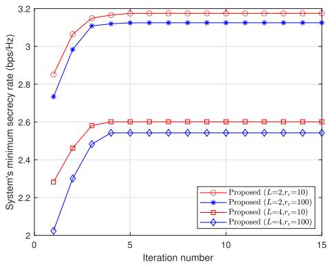  
Fig. 2. System’s minimum secrecy rate versus iteration number.

5) Discrete MA position (DMAP): In the framework of the BCD algorithm, this scheme employs exhaustive search rather than the SCA method to optimize the MA positions in order to assess the influence of the SCA method on the quality of the convergent solution. Therein, the linear movement region of the MAs is discretized with a minimum spacing $D _ { \mathrm { m i n } }$ for the division of discrete points.

6) Angular error: Since the calculation of the steering vector ${ \bf a } _ { a e _ { l } } [ n ]$ of the lth eavesdropper approximately adopts the position determined by the triangle inequality in (11), there is an angular error between this position $\mathbf { e } _ { l } ^ { \mathrm { u b } }$ and the actual optimal position ${ \bf e } _ { l } ^ { \mathrm { { o p t } } }$ . This angular difference is modeled as a uniformly distributed random variable to evaluate the impact of such an approximation, that $\mathrm { i s } , \ \mathbf { e } _ { l } ^ { \mathrm { u b } } \ - \ \mathbf { e } _ { l } ^ { \mathrm { o p t } } \ \sim \ \mathcal { U } \left[ - \frac { \omega } { 2 } , - \frac { \omega } { 2 } \right]$ where ω represents the maximum error.

## A. Convergence of Algorithm 1

According to Fig. 2, the system’s minimum secrecy rate adds rapidly during the first five iterations and then gradually stabilizes. Additionally, considering varying setup for the eavesdropper number L and the radius $r _ { e }$ in the eavesdroppers uncertainty region, Algorithm 1 in the proposed scheme can converge within approximately 15 iterations. For a fixed number L of eavesdroppers, when the radius $r _ { e }$ of the eavesdroppers’ uncertainty region is enlarged from 10 m to 100 m, a slight decrease in the system’s minimum secrecy rate is observed. This is due to the larger uncertainty region of the eavesdroppers, which allows the malicious eavesdroppers to potentially be closer to the users, leading to a higher eavesdropping rate (i.e., a worse-case scenario). Furthermore, when $r _ { e }$ remains constant and the number L of eavesdroppers is doubled, the system’s minimum secrecy rate decreases by approximately 20%, indicating that the addition of extra eavesdroppers clearly increases the risk of information leakage.

## B. UAV Trajectory, Flight Velocity and User Scheduling Situation During the Whole Flight Period

In Fig. 3, the optimized UAV trajectories are seen to significantly differ from the initial circular UAV trajectories. Specifically, the initial UAV trajectories is uniformly distributed along the circle, whereas the optimized flight path initially flies directly towards the legitimate users’ direction and then hovers above the users once the UAV reaches the target users. This direct flight not only allows the UAV to reach the next user requiring service more quickly but also helps avoid the eavesdroppers’ uncertainty region as much as possible during the flight period. Furthermore, hovering above the legitimate user shortens the distance to the user, thereby enhancing the channel conditions of the legitimate links and improving the achievable rate.

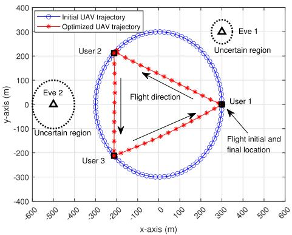

Fig. 3. Initial and optimized trajectory changes of the UAV in the proposed scheme with $T = 9 { \bar { 0 } }$ s and $N \stackrel { = } { = } 9 0 .$  
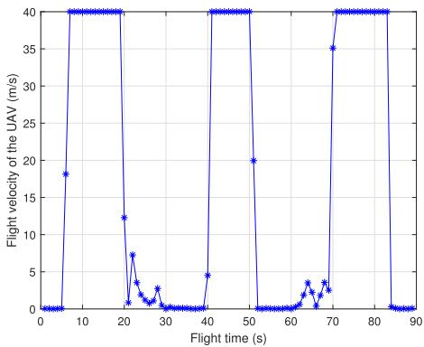  
Fig. 4. UAV flight velocity changes of the proposed scheme during the whole UAV flight period with $\dot { T _ { \vphantom { \int } } } = 9 0 \stackrel { \textstyle - } { s }$ and $N = 9 0$

The UAV’s flight velocity variations throughout the entire flight period are clearly presented in Fig. 4. Specifically, the UAV initially hovers with a low velocity near the user 1, which helps reduce the distance to the served user and enhances the security of information transmission. It then accelerates to maximum speed to reach the user 2 that requires service and hovers once again upon arrival. It is pointed out that even when the UAV is flying at its maximum speed, it still establishs communication with the user while also being subject to eavesdropping. Therefore, by adopting the maximum speed, the UAV can quickly pass through and move away from the uncertain area where the eavesdropper is located, thereby reducing the rate of eavesdropping. Then, the hovering processes above the user 2 will result in the UAV having the smallest distance from the user 2, which will achieve the maximum link gain and enhance the achievable rate of the user 2. This “maximum-speed-flight-and-then-low-speed-hovering” strategy is significantly superior to the “communication-whileflying” strategy, mainly because maximum speed flight and hovering above the user respectively achieve the goals of staying as far away from the eavesdropper as possible and staying as close to the legitimate user as possible.

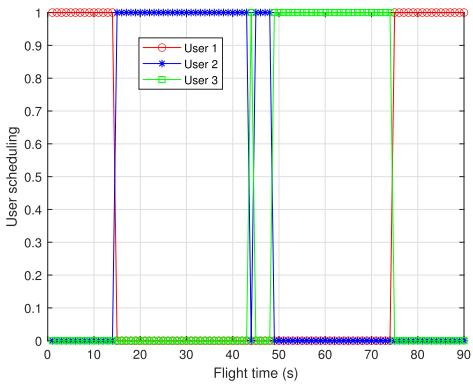

Fig. 5. User scheduling of the proposed scheme during the whole UAV flight period with $T = 9 0 ~ s$ and N = 90.  
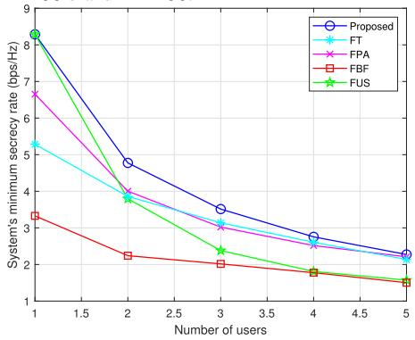  
Fig. 6. Relationship between the system’s minimum secrecy rate and the number of users in different schemes.

Fig. 5 illustrates the variation of the user scheduling factors in the proposed scheme. It is observed that three users are served in a round-robin manner to ensure the system’s security related to the worst user, achieving the objective of users secrecy rate fairness. Additionally, the user scheduling factors are approximately binary, which is in line with the conclusion of Subsection III-B.

## C. Comparison of the Proposed Scheme With the Benchmark Scheme

The linkage amongst the system’s minimum secrecy rate in different schemes and the number K of users is shown in Fig. 6. As K increases, the system’s minimum secrecy rate regarding every schemes gradually decreases, despite the rate about decline slowing down. It indicates that a higher number of users increases the difficulty of maintaining fairness in the secrecy rate, resulting in the reduction of the secrecy rate about the worst-performing user. Among all schemes, the proposed scheme performs the best, demonstrating its scalability in supporting more users. As K rises, the rate distinction among the proposed scheme and the FT scheme steadily narrows, suggesting that with a limited flight period, the increase in K makes it harder for the UAV to maintain rate fairness among different users. This significantly weakens the UAV’s trajectory planning performance, indicating the need to allocate more flight time for data transmission services based on K. Compared to FPA, the proposed scheme can always serve more users, showing that MAs can leverage spatial degrees of freedom to enhance the system’s capacity to support users. Notably, the performance of the FUS scheme declines sharply as K increases from 1 to 5, due to the high sensitivity of the user scheduling factor to changes in K. In other words, a higher K requires more flexible and reasonable user scheduling to ensure effective beamforming, antenna positioning, and trajectory planning.

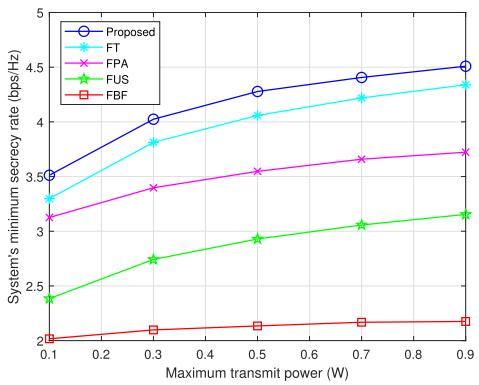  
Fig. 7. Relationship between the system’s minimum secrecy rate and the maximum transmit power of the UAV in different schemes.

Over the entire power range in Fig. 7, the poorest user’s secrecy rate for entire schemes adds significantly, with the rate of increase initially fast and then slowing down, without reaching saturation. This nearly linear gain indicates that the additional power is effectively utilized to enhance the desired signal and suppress information reception by malicious eavesdroppers. The growth momentum of FPA is noticeably slower than that of the proposed scheme, suggesting that, under limited power, the extra space degrees of freedom offered through MA mobility are additionally leveraged for more efficient secure transmission. The difference to secrecy rate among the proposed and FPA scheme also illustrates a significant security performance loss with static antenna placements compared to dynamic antenna configurations. In contrast to other schemes, the FBF scheme achieves only about half of the secrecy rate in the proposed scheme while shows minimal improvement as $P _ { \mathrm { m a x } }$ increases. These observations reveal that increasing the transmission power alone, without considering beamforming design to effectively align the beams with the intended users, is insufficient. Additionally, nonadaptive beamforming only achieves half the performance of adaptive beamforming during the secured transfer related to the UAV-mounted MA empowered wireless network. Finally, the inferior security of the FUS scheme indicates that in the proposed scheme, the user scheduling design is a crucial factor for enhancing security.

In Fig. 8, throughout the entire flight period T, with the exception of the FT scheme, the system’s minimal secrecy rate for all other schemes shows a slight upward trend. This upward trend is mainly due to the longer flight period T, which enables the UAV to keep hovering over the served user within an extended time. Based on this, the extended hovering time, combined with the effects of the UAV’s trajectory planning, leads to an improvement in the worst-case performance. However, the FT scheme adopts fixed trajectories, and a longer flight period T will only result in a more dense distribution of positions along the fixed trajectories, meaning that the predefined path does not allow the UAV’s trajectory planning to find a flight route with stronger channel conditions. Furthermore, as the UAV’s flight period T increases, the security disparity among the proposed scheme and the FT scheme is more pronounced, indicating that a longer flight period T will make the effects of the UAV flight path design more evident.

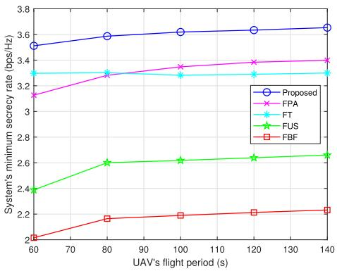

Fig. 8. Relationship between the system’s minimum secrecy rate and the flight period of the UAV in different schemes.  
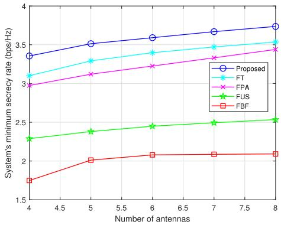  
Fig. 9. Relationship between the system’s minimum secrecy rate and the number of antennas of the UAV in different schemes.

In Fig. 9, the increase in the antenna number M for the UAV results in a continuous improvement in the system’s minimum secrecy rate. This is primarily because more fixed-position antennas can exploit the degrees of freedom at discrete region points, thereby forming sharper beams to mitigate information leakage. Additionally, MAs can further optimize the antenna placement design to move to positions with better channel conditions for eavesdropping suppression. It is observed that the security performance of the FBF scheme tends to saturate when 7 MAs are deployed, indicating the necessity of jointly designing beamforming and antenna placement. Otherwise, the system will reach the security boundary when the number of MAs is relatively small. With the same number of antennas, the proposed scheme, through dynamic antenna positioning, can achieve a higher system’s minimum secrecy rate compared to the traditional FPA scheme, as shown in Fig. 9. This reflects from the side that, for the same level of security performance, the proposed scheme requires fewer antennas than the FPA scheme. It is attributed to the security performance being enhanced through MA dynamic adjustment, which does not require stacking more antennas like FPAs to improve performance, thus achieving both energy-saving and cost-effective security performance enhancement.

In Fig. 10, as the movable range D of MAs gradually increases, the system’s minimum secrecy rate of the proposed scheme continuously improves and gradually saturates. This indicates that the increase in D provides more placement nloaded on July 05,2026 at 10:54:43 UTC from IEEE Xplore. Restrictions apply.

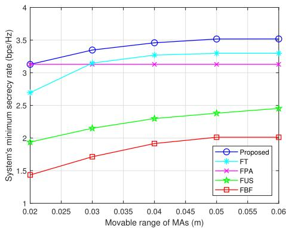  
Fig. 10. Relationship between the system’s minimum secrecy rate and the movable range of MAs in different schemes.

positions for MAs, i.e., more spatial degrees of freedom, allowing MAs to have more position options to enhance the useful signal reception for desired users while suppressing the eavesdropping signal reception for undesired eavesdroppers. Furthermore, the saturation phenomenon shows that MAs only require a limited movable range to achieve the security limit, which is highly beneficial for determining the movable range of MAs installed on the limited UAV body. Additionally, it is observed that due to the lack of antenna mobility, the security difference among FPA and the proposed scheme continuously widens, highlighting the effectiveness of the proposed scheme that integrates the MA technique.

## D. Solution Quality for Ma Position Optimization and the Impact of the Angular Error

In Fig. 11, as the number L of eavesdroppers increments, the system’s minimum secrecy rate for all schemes gradually declines, indicating that a higher L amplifies the risk of information leakage. The proposed scheme outperforms the FPA scheme, demonstrating superior robustness against eavesdropping. As L increases, the security difference between the angular error scheme and the proposed scheme slightly increases, mainly because a higher number of eavesdroppers exacerbates the adverse impact of the eavesdroppers’ angular errors on the worst-case security guarantee. Meanwhile, there is only a minor difference between the proposed scheme and the angular error scheme, demonstrating the effectiveness of the angle approximation method used in the steering vector to deal with the uncertainty of the eavesdroppers’ positions.

When the MAs’ minimal spacing $D _ { \mathrm { m i n } }$ of the DMAP scheme changes from $\lambda { \mathrm { ~ t o ~ } } \frac \lambda 2$ and then ${ \mathrm { ~ \bf ~ t o ~ } } \frac { \lambda } { 3 } .$ , a noticeable increment in the system’s minimum secrecy rate is observed. This is attributed to smaller $D _ { \mathrm { m i n } }$ , which leads to finer MA spacing, allowing more MA candidate positions to be selected and resulting in stronger eavesdropping resistance. It is noted that $D _ { \operatorname* { m i n } } = \lambda$ performs the worst, as the large MA spacing limits the selection to only a few candidate positions. In contrast, the security of the proposed scheme is between that of the DMAP schemes with $\begin{array} { r } { \bar { D } _ { \mathrm { m i n } } = \frac { \lambda } { 3 } } \end{array}$ and $\begin{array} { r } { D _ { \mathrm { m i n } } = \frac { \lambda } { 2 } } \end{array}$ , because the proposed scheme adopts continuous MA positions with $\begin{array} { r } { D _ { \mathrm { m i n } } = \frac { \lambda } { 2 } } \end{array}$ , thereby achieving better eavesdropping resistance than the DMAP scheme with $\begin{array} { r } { D _ { \operatorname* { m i n } } = \frac { \lambda } { 2 } } \end{array}$ using discrete MA positions. However, the DMAP scheme with $\begin{array} { r } { D _ { \mathrm { m i n } } = \frac { \lambda } { 3 } } \end{array}$ , which disregards antenna coupling effects, has a smaller MA spacing, potentially allowing it to select more MA positions than the proposed scheme. It is worth noting that the security difference between the proposed scheme and the DMAP scheme with $\begin{array} { r } { D _ { \mathrm { m i n } } = \frac { \lambda } { 3 } } \end{array}$ is small, highlighting the effectiveness of using the SCA iteration to obtain MA positions.

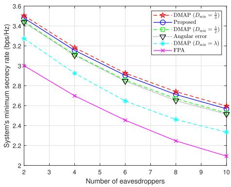  
Fig. 11. Solution quality for MA position optimization and the AoD error.

## V. CONCLUSION

This paper developed a security resource scheduling strategy for the UAV-mounted MA empowered wireless network. In particular, the UAV with several MAs needed to transmit sensitive information to numerous users when there are numerous eavesdroppers around. Considering partial knowledge of eavesdropper information, the system’s minimal secrecy rate was maximized via the collaboratively constructing in user scheduling factors, UAV beamforming, MA locations, and UAV trajectories. The problem was initially reformulated through the introduction of triangle inequalities and auxiliary variables to address the uncertainty of eavesdropper positions and the max-min objective function. Next, the BCD algorithm was developed for decomposing the post-transformed problem into four subproblems, iteratively solved until algorithm convergence. Simulation results showed that the proposed scheme supports more users as well as reduces antenna and transmission power usage by leveraging the MAs. Additionally, the MAs can achieve their performance upper bound with only a limited movement area. During the flight period, the UAV will fly above every user, ensuring secure communication while avoiding eavesdroppers as much as possible.

## REFERENCES

[1] Y. Zeng, Q. Wu, and R. Zhang, “Accessing from the sky: A tutorial on UAV communications for 5G and beyond,” Proc. IEEE, vol. 107, no. 12, pp. 2327–2375, Dec. 2019.

[2] X.-W. Tang, Y. Huang, Y. Shi, and Q. Wu, “MUL-VR: Multi-UAV collaborative layered visual perception and transmission for virtual reality,” IEEE Trans. Wireless Commun., vol. 24, no. 4, pp. 2734–2749, Apr. 2025.

[3] X.-W. Tang, Y. Huang, Y. Shi, X.-L. Huang, and Q. Shi, “3D trajectory planning for real-time image acquisition in UAV-assisted VR,” IEEE Trans. Wireless Commun., vol. 23, no. 1, pp. 16–30, Jan. 2024.

[4] S. Su et al., “Crowdsensing for emergency response in unknown environments: A rapid strategic sensing approach,” IEEE Trans. Mobile Comput., vol. 24, no. 11, pp. 1–16, Nov. 2025.

[5] Q. Wu, Y. Zeng, and R. Zhang, “Joint trajectory and communication design for multi-UAV enabled wireless networks,” IEEE Trans. Wireless Commun., vol. 17, no. 3, pp. 2109–2121, Mar. 2018.

[6] J. Tang, J. Liu, X. He, L. Xie, L. Qu, and H. Dai, “Deep reinforcement learning for AoI-aware trajectory and phase-shift design in IRS-assisted UAV data collection,” IEEE Trans. Wireless Commun., vol. 24, no. 12, pp. 10613–10628, Dec. 2025.

Authorized licensed use limited to: LNM Institute of Information Technology. Downloaded on July 05,2026 at 10:54:43 UTC from IEEE Xplore. Restrictions apply.

[7] X. Ru, B. Li, X. Jiang, G. Wang, N. Zhao, and A. Nallanathan, “Joint trajectory and resource optimization for AAV-relayed multiuser SWIPT,” IEEE Trans. Wireless Commun., vol. 24, no. 12, pp. 9854–9867, Dec. 2025.

[8] X. Lan et al., “UAV-assisted integrated communication and over-theair computation with interference awareness,” IEEE Trans. Commun., vol. 73, no. 11, pp. 10647–10661, Nov. 2025.

[9] Y. Zhang, Z. Na, S. Li, B. Lin, Y. Lin, and A. Nallanathan, “Joint service caching and task offloading for multi-UAV-assisted offshore edge computing networks,” IEEE Trans. Veh. Technol., vol. 74, no. 12, pp. 1–13, Dec. 2025.

[10] C. Kim, H.-H. Choi, and K. Lee, “Interference coordination for multi-UAV-enabled communications under probabilistic LoS channels,” IEEE Internet Things J., vol. 12, no. 19, pp. 40484–40498, Oct. 2025.

[11] L. Wang, Y. Chen, P. Wang, and Z. Yan, “Security threats and countermeasures of unmanned aerial vehicle communications,” IEEE Commun. Standards Mag., vol. 5, no. 4, pp. 41–47, Dec. 2021.

[12] G. Zhang, Q. Wu, M. Cui, and R. Zhang, “Securing UAV communications via joint trajectory and power control,” IEEE Trans. Wireless Commun., vol. 18, no. 2, pp. 1376–1389, Feb. 2019.

[13] M. Hua, Y. Wang, Q. Wu, H. Dai, Y. Huang, and L. Yang, “Energyefficient cooperative secure transmission in multi-UAV-enabled wireless networks,” IEEE Trans. Veh. Technol., vol. 68, no. 8, pp. 7761–7775, Aug. 2019.

[14] X. Pang, N. Zhao, J. Tang, C. Wu, D. Niyato, and K.-K. Wong, “IRSassisted secure UAV transmission via joint trajectory and beamforming design,” IEEE Trans. Commun., vol. 70, no. 2, pp. 1140–1152, Feb. 2022.

[15] R. Zhang, X. Pang, W. Lu, N. Zhao, Y. Chen, and D. Niyato, “Dual-UAV enabled secure data collection with propulsion limitation,” IEEE Trans. Wireless Commun., vol. 20, no. 11, pp. 7445–7459, Nov. 2021.

[16] C. Zhong, J. Yao, and J. Xu, “Secure UAV communication with cooperative jamming and trajectory control,” IEEE Commun. Lett., vol. 23, no. 2, pp. 286–289, Feb. 2019.

[17] H. Lei, H. Yang, K.-H. Park, I. S. Ansari, J. Jiang, and M.- S. Alouini, “Joint trajectory design and user scheduling for secure aerial underlay IoT systems,” IEEE Internet Things J., vol. 10, no. 15, pp. 13637–13648, Aug. 2023.

[18] L. Zhu, W. Ma, and R. Zhang, “Modeling and performance analysis for movable antenna enabled wireless communications,” IEEE Trans. Wireless Commun., vol. 23, no. 6, pp. 6234–6250, Jun. 2024.

[19] L. Zhu, W. Ma, and R. Zhang, “Movable antennas for wireless communication: Opportunities and challenges,” IEEE Commun. Mag., vol. 62, no. 6, pp. 114–120, Jun. 2024.

[20] Y. Gao, Q. Wu, and W. Chen, “Joint transmitter and receiver design for movable antenna enhanced multicast communications,” IEEE Trans. Wireless Commun., vol. 23, no. 12, pp. 18186–18200, Dec. 2024.

[21] C. Jiang, C. Zhang, C. Huang, J. Ge, D. Niyato, and C. Yuen, “Movable antenna-assisted integrated sensing and communication systems,” IEEE Trans. Wireless Commun., vol. 24, no. 8, pp. 6397–6412, Aug. 2025.

[22] Z. Zheng, Q. Wu, W. Chen, and G. Hu, “Two-timescale design for movable antenna-enabled multiuser MIMO systems,” IEEE Trans. Commun., vol. 73, no. 11, pp. 10554–10571, Nov. 2025.

[23] X. Wei et al., “Movable antennas meet intelligent reflecting surface: Friends or foes?,” IEEE Trans. Commun., vol. 73, no. 11, pp. 12756–12770, Nov. 2025.

[24] Z. Cheng, J. Si, Z. Li, P. Liu, Y. Huang, and N. Al-Dhahir, “Movable frequency diverse array for wireless communication security,” IEEE Trans. Commun., vol. 73, no. 8, pp. 6813–6824, Aug. 2025.

[25] J. Tang, C. Pan, Y. Zhang, H. Ren, and K. Wang, “Secure MIMO communication relying on movable antennas,” IEEE Trans. Commun., vol. 73, no. 4, pp. 2159–2175, Apr. 2024.

[26] J. Ding, Z. Zhou, and B. Jiao, “Movable antenna-aided secure full-duplex multi-user communications,” IEEE Trans. Wireless Commun., vol. 24, no. 3, pp. 2389–2403, Mar. 2025.

[27] W. Liu, X. Zhang, H. Xing, J. Ren, Y. Shen, and S. Cui, “UAV-enabled wireless networks with movable-antenna array: Flexible beamforming and trajectory design,” IEEE Wireless Commun. Lett., vol. 14, no. 3, pp. 566–570, Mar. 2025.

[28] H. Mao, L. Zhu, X. Pi, Z. Xiao, X.-G. Xia, and R. Zhang, “Robust design for movable-antenna array enabled AAV communications with jittering,” IEEE Wireless Commun. Lett., vol. 14, no. 11, pp. 3470–3474, Nov. 2025.

[29] W. Zhou, D. Yang, Y. Xu, L. Xiao, F. Wu, and T. Zhang, “Movable antenna array for improving AAV relaying networks,” IEEE Wireless Commun. Lett., vol. 14, no. 12, pp. 4127–4131, Dec. 2025.

[30] X.-W. Tang, Y. Shi, Y. Huang, and Q. Wu, “Joint optimization of UAV height and antenna configuration for UAV-mounted movable antenna,” IEEE Wireless Commun. Lett., vol. 15, pp. 235–239, 2026.

[31] K. Li et al., “Can movable antenna-enabled micro-mobility replace UAV-enabled macro-mobility? A physical layer security perspective,” IEEE Trans. Mobile Comput., pp. 1–13, 2025, doi: 10.1109/ TMC.2025.3624340. [Online]. Available: https://ieeexplore.ieee.org/ document/11214460/authors#authors

[32] Y. Bai, B. Xie, R. Zhu, Z. Chang, and R. Jantti, “Movable antenna-¨ equipped UAV for data collection in backscatter sensor networks: A deep reinforcement learning-based approach,” in Proc. IEEE Int. Conf. Commun., Jun. 2025, pp. 6560–6565.

[33] T. Zhou, K. Xu, G. Hu, X. Xia, C. Wei, and B. Zhang, “Joint trajectory, beamforming and antenna deployment design for movable antennaaided A2G communication: A DRL-based two-stage method,” in Proc. IEEE/CIC Int. Conf. Commun. China (ICCC Workshops), Aug. 2025, pp. 1–5.

[34] H. Lu, Y. Zeng, S. Ma, B. Li, S. Jin, and R. Zhang, “Enabling aerial movable antenna system with UAV swarm for low-altitude economy,” in Proc. IEEE/CIC Int. Conf. Commun. China (ICCC Workshops), Aug. 2025, pp. 1–6.

[35] X. Lin et al., “The sky is not the limit: LTE for unmanned aerial vehicles,” IEEE Commun. Mag., vol. 56, no. 4, pp. 204–210, Apr. 2018.

[36] Z. Kuang et al., “Movable-antenna array empowered ISAC systems for low-altitude economy,” in Proc. IEEE/CIC Int. Conf. Commun. China (ICCC Workshops), Aug. 2024, pp. 776–781.

[37] S. Li, B. Duo, M. D. Renzo, M. Tao, and X. Yuan, “Robust secure UAV communications with the aid of reconfigurable intelligent surfaces,” IEEE Trans. Wireless Commun., vol. 20, no. 10, pp. 6402–6417, Oct. 2021.

[38] C. Deng, X. Fang, and X. Wang, “Beamforming design and trajectory optimization for UAV-empowered adaptable integrated sensing and communication,” IEEE Trans. Wireless Commun., vol. 22, no. 11, pp. 8512–8526, Nov. 2023.

[39] W. Ma, L. Zhu, and R. Zhang, “Multi-beam forming with movableantenna array,” IEEE Commun. Lett., vol. 28, no. 3, pp. 697–701, Mar. 2024.

[40] L. Zhai, Y. Zou, J. Zhu, and Y. Jiang, “RIS-assisted UAV-enabled wireless powered communications: System modeling and optimization,” IEEE Trans. Wireless Commun., vol. 23, no. 5, pp. 5094–5108, May 2024.

  
Liangsen Zhai received the Ph.D. degree in signal and information processing from Nanjing University of Posts and Telecommunication, Nanjing, China, in June 2024. He is currently a Post-Doctoral Fellow with The Hong Kong Polytechnic University. His research interests include game theory, reconfigurable intelligent surface, movable antenna, wireless powered communication, and physical layer security.

Xiapu Luo is currently a Full Professor with the Department of Computing, The Hong Kong Polytechnic University. His research interests include blockchain and smart contracts security, mobile and the IoT security, network security and privacy, and software engineering with papers published in top venues. His research led to more than ten best/distinguished paper awards, including ACM CCS’24 Distinguished Paper Award, four ACM SIGSOFT Distinguished Paper Awards, Best DeFi Papers Award 2023, Best Paper Award in

INFOCOM’18, Best Research Paper Award in ISSRE’16, and several awards from the industry. He received the BOCHK Science and Technology Innovation Prize (FinTech) in 2023 for his contribution to blockchain security. He is an ACM Distinguished Member for his research in safeguarding blockchain and smart contracts along with Android and its applications. He is an Associate Editor of IEEE/ACM TRANSACTIONS ON NETWORKING (ToN), IEEE TRANSACTIONS ON DEPENDABLE AND SECURE COMPUTING (TDSC), IEEE TRANSACTIONS ON NETWORK AND SERVICE MANAGEMENT (TNSM), and ACM Transactions on Privacy and Security (TOPS).