# Mobile-Edge Computing in SAGINs: A Hybrid Action Space P-DDQN Algorithm for Joint Offloading and Resource Allocation

Haosheng Chen , Haixia Cui , Senior Member, IEEE, Peng Cao , Yejun He , Senior Member, IEEE, Jun Li , Ivan Wang-Hei Ho , Senior Member, IEEE, and Victor C. M. Leung , Life Fellow, IEEE

Abstract—The flexible deployment of uncrewed aerial vehicles (UAVs) and the wide-area coverage of low Earth orbit (LEO) satellites make their integration in space–air–ground integrated networks (SAGINs) a promising solution for communication in resource-constrained remote areas. This paper proposes a SAGIN framework supporting mobile edge computing (MEC) with a three-layer architecture, which provides heterogeneous computing resources for ground Internet of Things (IoT) devices and enables users in remote and underdeveloped regions to access computational services. Our objective is to minimize the weighted sum of energy consumption and latency in the SAGIN subject to satellite coverage time constraints and partial task offloading requirements. The optimization problem is formulated as a mixed-integer nonlinear programming (MINLP) challenge that jointly optimizes the UAV’s three-dimensional trajectory, IoT device association, transmit power, and task assignment. The coupled optimization variables form a hybrid action space with both discrete and continuous actions. To address this challenge, a parameterized double deep Q-network (P-DDQN) algorithm based on deep reinforcement learning (DRL) is proposed. The proposed method employs the DDQN algorithm to handle discrete actions and the deep deterministic policy gradient (DDPG) algorithm to generate continuous actions. Simulation results show that the proposed algorithm outperforms several baseline

schemes in terms of system cost, providing an efficient solution for highly coupled hybrid decision optimization problems in SAGINs.

Index Terms—Low Earth orbit (LEO) satellites, uncrewed aerial vehicles (UAVs), space-air-ground integrated networks (SAGINs), edge computing, deep reinforcement learning (DRL).

## I. INTRODUCTION

## A. Background

B ENEFITING from advances in wireless communication and Internet of Things (IoT) technologies, a wide range of computation-intensive and latency-sensitive applications, such as environmental monitoring, 4K/8K video transmission, and virtual/augmented reality (VR/AR), are rapidly emerging and imposing higher demands on communication and computing resources [1]. However, traditional terrestrial networks rely heavily on fixed base stations and communication infrastructure, leading to limited coverage and insufficient flexibility, and thus are no longer capable of meeting the growing global demand for ubiquitous connectivity [2]. Moreover, key infrastructure components, such as base stations and fiber-optic links, are highly susceptible to natural disasters (e.g., earthquakes and floods), which may cause severe communication disruptions [3]. Over the past few years, advances in space communication networks have effectively mitigated the limitations of terrestrial networks. Satellite communications offer significant advantages, including wide coverage and high reliability, thereby enabling connectivity in remote and underserved regions where traditional infrastructure is lacking [4], [5]. Furthermore, satellite communications exhibit strong resilience to natural disasters and terrestrial interference, enabling them to play a vital role in applications such as broadband Internet, navigation systems, broadcasting, and weather monitoring [6].

Recently, satellite technology has achieved significant breakthroughs across military, commercial, and civilian domains, leading to more cost-effective and miniaturized satellites—particularly low Earth orbit (LEO) satellites. Prominent LEO satellite systems, such as OneWeb and Starlink, are deploying large-scale constellations comprising thousands of satellites to enable global connectivity. These systems are designed to provide low-latency broadband services with worldwide coverage. They not only bridge the gaps of traditional terrestrial communications, but also play a crucial role in advancing global digital transformation [7], [8]. Additionally, extensive research in wireless communications has focused on integrating LEO satellites with terrestrial networks to enhance overall network performance and resilience [9], [10], [11].

As a key development direction of the sixth-generation (6G) wireless communication system, the space-air-ground integrated network (SAGIN), composed of LEO satellites, uncrewed aerial vehicles (UAVs), and terrestrial networks, has attracted widespread attention from the academic community. UAVs, serving as mobile edge nodes, offer high mobility and flexibility, making them an effective complement to SAGIN. Specifically, UAVs can rapidly establish connectivity and deliver low-latency communication services for a wide range of applications, including Internet of Vehicles (IoV) communications, smart city development, surveillance, and traffic offloading in hotspot areas [12], [13]. Moreover, the limited service coverage of UAVs can be effectively complemented by LEO satellites, which are well-suited to provide seamless, allweather, and continuous global communication coverage [14]. By integrating these components, SAGIN enables efficient and reliable communications across a wide range of applications, including IoV [15], post-disaster rescue operations [16], and maritime target localization [17].

On the other hand, integrating mobile edge computing (MEC) into SAGIN provides an effective solution to meet the growing demands of high-bandwidth and low-latency applications and services. Specifically, MEC enhances the quality of service (QoS) for mobile applications by offloading computing tasks from remote cloud servers to the network edge [18], [19]. At present, many works have investigated various MEC-enabled frameworks [20], [21], [22].

## B. Related Work

Due to their low-altitude operation and high controllability, UAVs can be flexibly deployed to designated areas to provide low-latency and highly reliable temporary computing services for ground IoT devices. Consequently, UAV-assisted MEC has attracted widespread attention [23], [24], [25]. In [23], Lin et al. proposed a parametrized dueling deep Q-network and linear programming algorithm to jointly optimize UAV trajectory, task offloading, and time allocation, aiming to maximize energy efficiency while ensuring offloading fairness. In [24], Zhong et al. proposed a distributed UAV function switching and trajectory design algorithm to jointly optimize UAV trajectory, resource allocation, and function switching, aiming to improve security and reduce latency. In [25], Huang et al. introduced a UAV-assisted task scheduling approach that minimizes the total network overhead while meeting the QoS demands of requested devices. However, while these studies exploit the flexible deployment advantages of UAVs to support MEC, they overlook satellite communication services, which can provide seamless global coverage. This limitation reduces the effectiveness of the system in large-scale user scenarios.

Currently, the integration of LEO satellites into MEC networks has attracted widespread attention in the academic community and is widely regarded as a promising direction for future wireless communications [26], [27], [28]. In [26], Lyu et al. proposed task scheduling within a collaborative LEO-IoT framework. They introduced an innovative multi-agent information broadcasting and judging (MAIBJ) algorithm aimed at enabling efficient collaborative resource allocation. In [27], Li et al. proposed a joint task offloading and resource allocation strategy for LEO satellite-enabled MEC networks. A two-level hierarchical game is developed to optimize task offloading, channel and power allocation, and computation resource allocation, aiming to minimize the overall system cost. In [28], Cao et al. formulated a communication resource allocation problem in an LEO satellite-assisted MEC architecture, aiming to minimize the overall energy consumption of the network. However, these studies focus solely on LEO satellite-enabled MEC scenarios, overlooking the flexible connectivity offered by UAVs in complex environments, thereby limiting their applicability in obstacle-prone scenarios.

UAVs and LEO satellites can effectively complement each other through collaborative operations in SAGIN, thereby enhancing overall communication coverage and service capabilities [29], [30], [31], [32], [33], [34]. Specifically, Shao et al. proposed a resource scheduling strategy based on the multi-agent twin delayed deep deterministic policy gradient (TD3) algorithm, aiming to enhance the anti-jamming capability of SAGIN, reduce the overall network latency, and maintain real-time services even under adverse conditions [29]. In [30], Chen et al. investigated the task offloading problem in UAV-assisted LEO satellite edge computing (ULSE) networks and proposed a joint UAV and LEO satellite task offloading (JULTO) algorithm, aiming to minimize the total cost of all mobile users and derive the Nash equilibrium offloading strategy. In [31], Nguyen et al. investigated the computation offloading problem in a hybrid edge–cloud based SAGIN and proposed using an alternating optimization approach combined with the successive convex approximation (SCA) method to minimize the weighted energy consumption of ground users and UAVs. In [32], Cai et al. proposed a privacy-aware task scheduling scheme in SAGIN using multi-agent proximal policy optimization (PPO) to jointly optimize delay, energy consumption, and security under varying privacy requirements. In [33], Zhu et al. proposed a SAGIN-MEC framework that jointly optimizes energy and delay costs using Newton’s interior point method and deep Q-network (DQN) algorithm for resource and task allocation. In [34], Du et al. proposed a SAGIN architecture that incorporates MEC and blockchain technologies. They designed an adaptive optimization algorithm based on the deep deterministic policy gradien (DDPG) to optimize task segmentation of IoT devices and the bandwidth allocation of UAVs and satellite among their served IoT devices, aim to minimize overall network energy consumption.

## C. Motivation and Contributions

Motivated by the aforementioned related research, this paper investigates task offloading and resource allocation in MECenabled SAGIN. To the best of our knowledge, existing works have not jointly addressed UAV dynamic access and 3D trajectory optimization, multi-satellite access under coverage time constraints, and transmit power allocation. Furthermore, this paper extends the study to partial task offloading in MEC and formulates the optimization objective as the weighted sum of latency and energy consumption. To tackle this optimization problem, we propose a novel deep reinforcement learning (DRL)-based framework for hybrid action spaces to minimize the overall system cost. The main contributions of this paper are summarized as follows, and a detailed comparison with existing works is presented in Table I.

• For remote and underdeveloped areas lacking terrestrial base station coverage, a LEO satellite–UAV cooperative computing offloading architecture is proposed. In this architecture, the UAV is flexibly deployed to provide temporary communication and edge computing services, while LEO satellites offer wide-area coverage and powerful computing capabilities to compensate for the UAV’s limited coverage range and energy supply. Accordingly, the system objective is formulated as minimizing the total system cost under satellite coverage time constraints and partial task offloading requirements.

• Based on the proposed architecture, the joint optimization of task offloading, power allocation, and UAV trajectory is formulated as a long-term sequential optimization problem involving both discrete and continuous decision variables, leading to a hybrid action space. Most existing approaches rely on discretizing continuous actions or approximating discrete actions with continuous functions, which inevitably results in the curse of dimensionality and unstable training. To address these challenges, we introduce an action space parameterization technique and design a parameterized double deep Q-network (P-DDQN) algorithm to handle the hybrid action space problem.

• The P-DDQN algorithm employs DDQN to make discrete action decisions (e.g., user scheduling and satellite association selection), while the policy network of DDPG is used to generate the corresponding continuous parameters (e.g., task offloading ratios and transmit power) for each discrete action. Simulation results demonstrate that the proposed algorithm can effectively reduce the action space dimensionality while alleviating Q-value overestimation and training instability, thereby providing an efficient solution for highly coupled hybrid decision optimization problems in SAGINs.

## II. SYSTEM MODEL

The SAGIN framework, as illustrated in Fig. 1, provides heterogeneous MEC services to ground IoT devices through the collaboration of the UAV and LEO satellites. The considered users are located in remote areas without ground network support [3], [6]. There are M IoT devices $G _ { m }$ on the ground, where $m \in \mathcal { M } = \{ 1 , 2 , \ldots , M \}$ . The aerial layer consists of a UAV, while the space layer includes K LEO satellites, where $k \in \mathcal { K } = \{ 1 , 2 , \dots , K \}$ . Both the UAV and LEO satellites are equipped with MEC servers, enabling them to provide heterogeneous computational resources to IoT devices. To facilitate UAV trajectory design, its 3D coordinates at time slot $n \in \mathcal { N } = \{ 1 , 2 , \dots , N \}$ is denoted by $u ( n ) = \{ x _ { u } ( n ) , y _ { u } ( n ) , z _ { u } ( n ) \}$

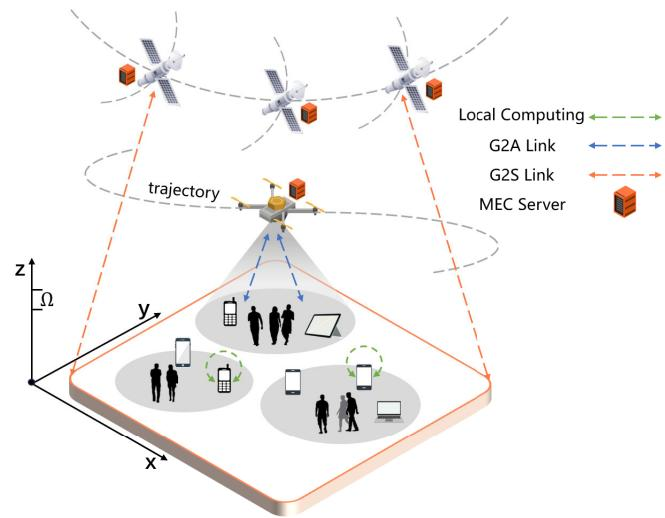

Fig. 1. System model of MEC-enabled SAGIN.  
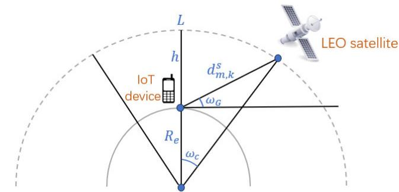  
Fig. 2. Geometric relationship of the G2S link.

Many existing studies simplify the system model by assuming that the UAV operates at a constant altitude [4], [35]. In contrast, this work discretizes the UAV altitude into uniform intervals of length Ω, and the UAV can only adjust its altitude in discrete steps of Ω during vertical movement. In addition, due to the high mobility of LEO satellites, the communication duration between the satellites and IoT devices is limited by the satellite coverage time.

## A. Service Coverage Model

1) LEO Satellite Coverage Time: Unlike the static positioning in ground MEC networks, the positions of LEO satellites are changing dynamically. Therefore, the time window during which LEO satellites can deliver services for ground IoT devices is restricted, and communication can only be established when specific conditions between the satellites and ground users are met. Fig. 2 illustrates the geometric relationship between IoT devices and LEO satellites.

The elevation angle between the LEO satellite k and the IoT device $G _ { m }$ is given by

$$
\omega _ { G } = \operatorname { a r c c o s } \left( \frac { R _ { e } + h } { d _ { m , k } ^ { s } } \sin \omega _ { c } \right) ,\tag{1}
$$

where $R _ { e }$ represents the radius of the Earth. $d _ { m , k } ^ { s }$ represents the distance between the LEO satellite k and IoT device $G _ { m } ,$ which can be obtained as $\begin{array} { r l } { d _ { m , k } ^ { s } } & { { } = } \end{array}$ $\sqrt { R _ { e } ^ { 2 } + ( R _ { e } + h ) ^ { 2 } - 2 R _ { e } ( R _ { e } + h ) \cos \omega _ { c } } .$ . h represents the altitude of the orbit of the LEO satellite. $\omega _ { c }$ denotes the central angle associated with the LEO satellite’s coverage region. It should be noted that $\omega _ { G }$ is the predefined minimum elevation angle for the satellite coverage area. When the elevation angle between the IoT device and the LEO satellite falls below this threshold, the LEO satellite can no longer provide service to the corresponding IoT device. Accordingly, $\omega _ { c }$ can be expressed as

$$
\omega _ { c } = \operatorname { a r c c o s } \bigg ( \frac { R _ { e } } { R _ { e } + h } \cos { \omega _ { G } } \bigg ) - \omega _ { G } ,\tag{2}
$$

Subsequently, the maximum arc length covered by the LEO satellite during its coverage period can be obtained by

$$
L = 2 \omega _ { c } ( R _ { e } + h ) ,\tag{3}
$$

We assume that the elevation angle of LEO satellite k in the current time slot is $\omega _ { G } ^ { \prime }$ . Thus, there are two possible cases for the remaining coverage range of the LEO satellite [30]:

Case 1: $\begin{array} { r } { \omega _ { G } \leq \omega _ { G } ^ { \prime } \leq \frac { \pi } { 2 } } \end{array}$

Based on (2), the central angle $\omega _ { c } ^ { \prime }$ in the current time slot can be expressed as

$$
\omega _ { c } ^ { \prime } = \operatorname { a r c c o s } \bigg ( \frac { R _ { e } } { R _ { e } + h } \cos { \omega _ { G } ^ { \prime } } \bigg ) - \omega _ { G } ^ { \prime } ,\tag{4}
$$

Thus, the remaining coverage arc length of the LEO satellite k for the IoT device $G _ { m }$ is

$$
L _ { m , k } ^ { r e } = ( \omega _ { c } + \omega _ { c } ^ { \prime } ) ( R _ { e } + h ) ,\tag{5}
$$

Case 2: $\begin{array} { r } { \frac { \pi } { 2 } < \omega _ { G } ^ { \prime } \leq \pi - \omega _ { G } } \end{array}$

Similar to Case 1, we can obtain $\omega _ { c } ^ { \prime }$ and $L _ { m , k } ^ { r e }$ as

$$
\omega _ { c } ^ { \prime } = \operatorname { a r c c o s } \left( \frac { R _ { e } } { R _ { e } + h } \cos ( \pi - \omega _ { G } ^ { \prime } ) \right) - ( \pi - \omega _ { G } ^ { \prime } ) ,\tag{6}
$$

$$
L _ { m , k } ^ { r e } = ( \omega _ { c } - \omega _ { c } ^ { \prime } ) ( R _ { e } + h ) ,\tag{7}
$$

We use $v _ { s }$ to denote the velocity of the LEO satellites. Therefore, the remaining time for communication between the LEO satellite k and the IoT device $G _ { m }$ is given by

$$
T _ { m , k } ^ { r e } = \frac { L _ { m , k } ^ { r e } } { v _ { s } } ,\tag{8}
$$

2) UAV Coverage Area: UAVs equipped with computing servers can be deployed at low altitudes to act as MEC nodes, providing low-latency and highly reliable communication and computing services for ground IoT devices within their coverage areas [32]. Fig. 3 depicts the spatial distribution of IoT devices and the UAV in the considered system.

Without loss of generality, the 3D position of IoT device $G _ { m }$ at time slot n is denoted by $q _ { m } ( n ) = \{ x _ { m } ( n ) , y _ { m } ( n ) , z _ { m } ( n ) \}$ Since IoT devices are typically deployed on the ground, their altitude is assumed to be zero, i.e., $z _ { m } ( n ) = 0 $ . Thus, the Euclidean distance between IoT device $G _ { m }$ and the UAV at time slot n can be expressed as

$$
d _ { m u } ( n )
$$

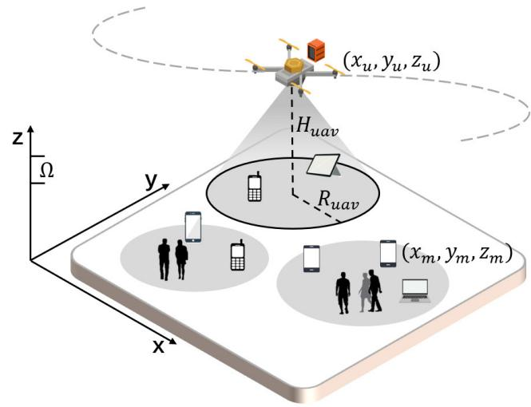  
Fig. 3. The coverage area of the UAV for IoT devices.

$$
\begin{array} { l } { { = | | q _ { m } ( n ) - u ( n ) | | } } \\ { { = [ ( x _ { m } ( n ) - x _ { u } ( n ) ) ^ { 2 } + ( y _ { m } ( n ) - y _ { u } ( n ) ) ^ { 2 } + z _ { u } ^ { 2 } ( n ) ] ^ { \frac { 1 } { 2 } } , } } \end{array}\tag{9}
$$

Furthermore, the task offloading from IoT device $G _ { m }$ to the UAV is subject to the following constraint

$$
[ ( x _ { m } ( n ) - x _ { u } ( n ) ) ^ { 2 } + ( y _ { m } ( n ) - y _ { u } ( n ) ) ^ { 2 } ] ^ { \frac { 1 } { 2 } } \leq R _ { u a v } , \forall m , n .\tag{10}
$$

where $R ^ { u a v }$ denotes the maximum horizontal coverage radius of the UAV.

## B. Communication Model

In this work, a UAV flies at a low altitude with certain horizontal and vertical speeds to serve ground IoT devices in open suburban scenarios. In such environments, the wireless channel typically experiences a strong line-of-sight (LoS) link along with scattered multipath components caused by the surrounding environment. Therefore, the channel between the UAV and IoT devices is modeled using the Rician fading model, which can simultaneously characterize the LoS link and the small-scale fading effects [35]. The corresponding channel coefficient between IoT device $G _ { m }$ and the UAV is expressed as

$$
h _ { m u } ( n ) = \sqrt { \frac { \zeta } { 1 + \zeta } } \overline { { { H } } } _ { m u } + \sqrt { \frac { 1 } { 1 + \zeta } } \widetilde { H } _ { m u } ,\tag{11}
$$

where $\zeta$ represents the Rician fading factor. The LoS part and the non-line-of-sight (NLoS) part in Rician fading are given by $\overline { { H } } _ { m u } = \bar { l } _ { m u } \check { d } _ { m u } ^ { - \alpha _ { L } / 2 } ( n )$ and $\tilde { H } _ { m u } = \tilde { l } _ { m u } d _ { m u } ^ { - \alpha _ { N } / 2 } ( n )$ . The LoS channel coefffcient meets $| \bar { l } _ { m u } | = 1$ , while $l _ { m u }$ represents the NLoS channel coefficient, modeled as a Gaussian fading channel with a mean of zero and a variance of one. $\alpha _ { L }$ and α represent the path loss exponents for the LoS and NLoS components. Based on (11), if IoT device $G _ { m }$ opts to offload task to the UAV, the uplink transmission rate is given by

$$
R _ { m u } ( n ) = B _ { m u } \mathrm { l o g } _ { 2 } \left( 1 + \frac { P _ { m u } ^ { t } ( n ) | h _ { m u } ( n ) | ^ { 2 } } { \sigma _ { u } ^ { 2 } } \right) ,\tag{12}
$$

where $B _ { m u }$ denotes the bandwidth between $G _ { m }$ and the UAV. $P _ { m u } ^ { t }$ denotes the transmit power of $G _ { m }$ to the UAV, and $\sigma _ { u } ^ { 2 }$ is the variance of the additive white Gaussian noise (AWGN) at the UAV.

Moreover, each IoT device is assumed to connect to one LEO satellite for data transmission [27], and the selected LEO satellite k can serve IoT devices within a limited coverage time. The channel coefficient between the LEO satellite k and IoT device $G _ { m }$ is given by

$$
\overline { { h } } _ { m , k } ( n ) = \frac { \lambda \sqrt { \chi _ { k } } } { 4 \pi d _ { m , k } ^ { s } ( n ) } e ^ { j \upsilon } ,\tag{13}
$$

where λ represents the wavelength, χk represents the beam gain, and υ denotes the antenna phase.

Due to the long propagation distance between LEO satellites and ground IoT devices, the channel state information (CSI) is typically outdated. Therefore, we consider the outdated CSI model for satellite communications [6], which can be expressed as

$$
h _ { m , k } ( n ) = \eta \overline { { { h } } } _ { m , k } ( n ) + \sqrt { 1 - \eta ^ { 2 } } g _ { m , k } ( n ) ,\tag{14}
$$

where $\eta ~ = ~ 2 \pi \overline { { J } } _ { 0 } \widetilde { f } _ { m , k } T _ { m , k } ^ { p r } , ~ \overline { { J } } _ { 0 }$ denotes the zeroth order Bessel function of the first kind, $\widetilde { f } _ { m , k }$ and $T _ { m , k } ^ { p r }$ represent the maximum Doppler frequency and the propagation delay between IoT device $G _ { m }$ and LEO satellite $k ,$ respectively, and $g _ { m , k }$ is a complex Gaussian random variable with the same variance as $\overline { { h } } _ { m , k }$ . Therefore, the uplink transmission rate from $G _ { m }$ to LEO satellite k can be expressed as

$$
R _ { m , k } ( n ) = B _ { m , k } \mathrm { l o g } _ { 2 } \left( 1 + \frac { P _ { m , k } ^ { t } ( n ) | h _ { m , k } ( n ) | ^ { 2 } } { \sigma _ { k } ^ { 2 } } \right) ,\tag{15}
$$

where $B _ { m , k }$ represents the bandwidth between $G _ { m }$ and the LEO satellite k. $P _ { m , k } ^ { t }$ represents the transmit power of $G _ { m }$ to the LEO satellite k, and $\sigma _ { k } ^ { 2 }$ is the variance of the AWGN at the LEO satellite k.

## C. Computation Model

The task generated by IoT device $G _ { m }$ with size $D _ { m } ,$ is partitioned into three components: $D _ { m } ^ { l }$ for local execution, $D _ { m } ^ { u }$ for offloading to the UAV, and $D _ { m } ^ { s }$ for offloading to LEO satellite. We assume that dividing the task does not result in any additional computational data input [34]. Thus, we have

$$
D _ { m } ^ { l } ( n ) + D _ { m } ^ { u } ( n ) + D _ { m } ^ { s } ( n ) = D _ { m } ( n ) ,\tag{16}
$$

when $D _ { m } ^ { u } = D _ { m } ^ { s } = 0$ , the task of IoT device $G _ { m }$ is entirely processed locally.

1) Local Computing: For the locally processed task $D _ { m } ^ { l }$ , let $f _ { m }$ denote the central processing unit (CPU) cycle frequency of IoT device $G _ { m }$ . Thus, the local computation delay is given by

$$
T _ { m } ^ { l } ( n ) = \frac { D _ { m } ^ { l } ( n ) C _ { m } } { f _ { m } } ,\tag{17}
$$

where $C _ { m }$ denotes the number of CPU cycles required to process one bit of data. Furthermore, the energy consumption for local computation is expressed as

$$
E _ { m } ^ { l } ( n ) = \kappa f _ { m } ^ { 2 } D _ { m } ^ { l } ( n ) C _ { m } ,\tag{18}
$$

where κ represents the effective switched capacitance coefficient, reflecting the energy efficiency of the processor during task execution.

2) Ground-to-Air (G2A): A binary variable $\alpha _ { m } ( n )$ is introduced to indicate whether IoT device $G _ { m }$ is scheduled to be served by the UAV at time slot n, with

$$
\alpha _ { m } ( n ) \in \{ 0 , 1 \} , \forall m \in { \mathcal { M } } , n \in { \mathcal { N } } ,\tag{19}
$$

where $\alpha _ { m } ( n ) = 1$ indicates that the UAV delivers services to IoT device $G _ { m }$ . Otherwise, $\alpha _ { m } ( n ) = D _ { m } ^ { u } ( n ) = 0 .$

The total flight duration T is divided into N time slots. Each time slot consists of two phases: the UAV first moves to a sensing access point and then hovers to collect and execute the tasks offloaded from IoT device $G _ { m }$ . Considering that the UAV is equipped with a single-antenna transceiver, time division multiple access (TDMA) is adopted for task offloading, where at most one IoT device can offload its tasks to the UAV in each time slot [36]. Therefore, the binary variable $\alpha _ { m } ( n )$ is subject to the following constraint

$$
\sum _ { m = 1 } ^ { M } \alpha _ { m } ( n ) = 1 , \forall n \in N ,\tag{20}
$$

The total delay of G2A communication includes both the data transmission delay between IoT device $G _ { m }$ and the UAV and the task execution delay, which can be expressed as

$$
T _ { m } ^ { u } ( n ) = \frac { D _ { m } ^ { u } ( n ) } { R _ { m u } ( n ) } + \frac { D _ { m } ^ { u } ( n ) C _ { m } } { f _ { u } } ,\tag{21}
$$

where $f _ { u }$ denotes the computing capability of the UAV. The change in the UAV’s horizontal coordinates as it moves from its current position $u ( n ) \ = \ \{ x ( n ) , y ( n ) , z ( n ) \}$ to the next sensing access point $u ( n + 1 ) = \{ x ( n + 1 ) , y ( n + 1 ) , z ( n + 1 ) \}$ is given by

$$
\begin{array} { r } { x ( n + 1 ) = x ( n ) + v ^ { h } ( n ) \cdot t _ { f l y } ( n ) \cdot \cos { \theta } ( n ) , } \end{array}\tag{22}
$$

$$
y ( n + 1 ) = y ( n ) + v ^ { h } ( n ) \cdot t _ { f l y } ( n ) \cdot \sin \theta ( n ) ,\tag{23}
$$

where $\theta ( n )$ and $v ^ { h } ( n )$ denote the horizontal flight angle and speed. $t _ { f l y } ( n )$ is the flight time of the UAV.

For changes in the UAV’s vertical coordinates, we assume that the UAV’s flight altitude along the vertical axis is divided into equal-length segments Ω. In each time slot, the UAV either maintains its previous flight altitude or ascends or descends to an adjacent segment. To guarantee the existence of the flight trajectory, we use $v ^ { v } ( n ) \ = \ \frac { \Omega } { t _ { f l y } ( n ) }$ to denote the UAV’s vertical speed. Therefore, the UAV’s vertical coordinate change can be expressed as

$$
z ( n + 1 ) = \left\{ \begin{array} { l l } { \begin{array} { r l } & { z ( n ) + \Omega , g ( n ) = \uparrow , } \\ & { z ( n ) , g ( n ) = \bullet , } \\ & { z ( n ) - \Omega , g ( n ) = \downarrow , } \end{array} } \end{array} \right.\tag{24}
$$

where $g ( n ) \in \{ \uparrow , \bullet , \downarrow \}$ represents the UAV’s vertical movement, ↑, • and ↓ correspond to ascent, hovering, and descent actions, respectively.

The total energy consumption of G2A communication includes the UAV’s energy consumption for flight, hovering, communication, and computation:

## • Flight Energy Consumption

The UAV’s flight energy consumption is determined by its speed and flight duration. Accordingly, the propulsion power consumption can be expressed as

$$
\begin{array} { l } { { P _ { f } ( n ) } } \\ { { \displaystyle = \frac { 1 } { 2 } \rho s A d _ { 0 } | | v ^ { h } ( n ) | | ^ { 3 } + P _ { b } \left( 1 + \frac { 3 | | v ^ { h } ( n ) | | ^ { 2 } } { U _ { t i p } ^ { 2 } } \right) + P _ { v } v ^ { v } ( n ) , } } \end{array}\tag{25}
$$

where $\rho , s , A , U _ { t i p }$ and $d _ { 0 }$ are parameters related to the aerodynamics of the UAV [36]. $P _ { b }$ is the blade profile power, and $P _ { v }$ is the ascending/descending power.

Therefore, the UAV’s flight energy consumption can be expressed as

$$
e _ { f } ( n ) = P _ { f } ( n ) t _ { f l y } ( n ) ,\tag{26}
$$

## • Hovering Energy Consumption

At each time slot, the UAV hovers at position $u ( n )$ to receive and execute the task offloaded from IoT device $G _ { m } ,$ and then moves to $u ( n + 1 )$ . Accordingly, the hovering energy consumption of the UAV is determined by the transmission and computation delays, which can be expressed as

$$
e _ { h } ( n ) = P _ { h } T _ { m } ^ { u } ( n ) ,\tag{27}
$$

where $P _ { h }$ denotes the UAV’s hovering power.

## • Communication and Computation Energy Consumption

Since the specific types of offloaded tasks are not explicitly distinguished, the energy consumption for G2A communication and computation is given by

$$
e _ { c } ( n ) = P _ { m u } ^ { t } ( n ) \frac { D _ { m } ^ { u } ( n ) } { R _ { m u } ( n ) } + \kappa D _ { m } ^ { u } ( n ) C _ { m } f _ { u } ^ { 2 } ,\tag{28}
$$

Based on (26), (27), and (28), the total energy consumption of G2A communication can be obtained as

$$
E _ { m } ^ { u } ( n ) = e _ { f } ( n ) + e _ { h } ( n ) + e _ { c } ( n ) ,\tag{29}
$$

3) Ground-to-Space (G2S): In the LEO satellite computing scheme, a binary variable $b _ { m , k } ( n ) \in \{ 0 , 1 \}$ is introduced to indicate whether IoT device $G _ { m }$ offloads its task to LEO satellite k at time slot n. Accordingly, the offloading strategy of IoT device $G _ { m }$ can be represented as $\beta _ { m } ( n ) \ =$ $\{ b _ { m , 1 } ( n ) , b _ { m , 2 } ( n ) , \dots , b _ { m , K } ( n ) \}$ , where $b _ { m , k } ( n ) = 1$ indicates that the task is offloaded to LEO satellite k. Otherwise, $b _ { m , k } ( n ) ~ = ~ D _ { m } ^ { s } ( n ) ~ = ~ 0 .$ . Since each IoT device can be associated with at most one LEO satellite for task offloading, we can conclude that

$$
\sum _ { k = 1 } ^ { K } b _ { m , k } ( n ) \leq 1 , \forall m \in \boldsymbol { \mathcal { M } } , n \in \mathcal { N } ,\tag{30}
$$

The long distance between IoT devices and LEO satellites results in non-negligible propagation delay [30]. Thus, the total processing delay for G2S communication consists of three components: transmission delay, propagation delay, and computation delay, which can be obtained as

$$
\begin{array} { l } { T _ { m , k } ^ { s } ( n ) } \\ { = \displaystyle \sum _ { k = 1 } ^ { K } b _ { m , k } ( n ) \left[ \frac { D _ { m } ^ { s } ( n ) } { R _ { m , k } ( n ) } + \frac { d _ { m , k } ^ { s } ( n ) } { c } + \frac { D _ { m } ^ { s } ( n ) C _ { m } } { f _ { s } } \right] , } \end{array}\tag{31}
$$

where c denotes the speed of light, and $f _ { s }$ indicates the computational capacity allocated by LEO satellite k to IoT device $G _ { m }$ . We assume that all LEO satellites possess identical computing capabilities [3]. Due to the limited satellite coverage time, the total processing delay of the G2S link must satisfy the following constraint

$$
T _ { m , k } ^ { s } ( n ) \leq T _ { m , k } ^ { r e } ( n ) , \forall m , k , n .\tag{32}
$$

Accordingly, the energy consumption for G2S communication can be expressed as

$$
\begin{array} { l } { { \displaystyle E _ { m , k } ^ { s } ( n ) } } \\ { { \displaystyle = \sum _ { k = 1 } ^ { K } { b _ { m , k } ( n ) \left[ P _ { m , k } ^ { t } ( n ) \frac { D _ { m } ^ { s } ( n ) } { R _ { m , k } ( n ) } + \kappa D _ { m } ^ { s } ( n ) C _ { m } f _ { s } ^ { 2 } \right] } , } } \end{array}\tag{33}
$$

Since each IoT device can be associated with at most one satellite, an appropriate offloading strategy is required to select the optimal satellite when multiple satellites provide overlapping coverage for IoT device $G _ { m }$ . Specifically, the processing delay of offloading tasks to each candidate satellite k is first computed based on (31), and the feasible satellite set satisfying constraint (32) is then determined

$$
S _ { m } ( n ) = \{ k : T _ { m , k } ^ { s } ( n ) \leq T _ { m , k } ^ { r e } ( n ) \} ,\tag{34}
$$

If $S _ { m } ( n ) \neq \emptyset$ , the optimal satellite $k ^ { * }$ is selected from this feasible set according to

$$
k ^ { * } = \arg \operatorname* { m i n } _ { k \in S _ { m } ( n ) } \left( \frac { D _ { m } ^ { s } ( n ) } { R _ { m , k } ( n ) } + \frac { d _ { m , k } ^ { s } ( n ) } { c } \right) ,\tag{35}
$$

Since all LEO satellites are assumed to have identical computational capabilities, the computation delay does not influence the satellite selection process. Therefore, the optimal satellite is determined by minimizing the transmission and propagation delays. If $S _ { m } ( n ) = \emptyset$ , the task is either processed locally or offloaded to the UAV.

Remark 1: Compared with G2A links, where the UAV operates at relatively low altitudes and the propagation delay is negligible relative to transmission and computation delays, G2S links involve long distance signal propagation between ground users and LEO satellites. As a result, the propagation delay becomes non-negligible and is explicitly modeled in (31). Incorporating this delay is essential for accurately characterizing the latency of G2S links and ensuring that the satellite coverage time constraint in (32) is properly enforced.

## D. System Cost Model

According to the computation and communication models, the total system cost in SAGIN include the delay and energy consumption incurred by local computation, task offloading, and edge computing. Therefore, the system cost at time slot n is defined by two components: the maximum delay for completing the computational tasks of IoT device $G _ { m }$ and the total energy consumption during task execution, which can be expressed as

$$
T _ { m } ^ { t o t a l } ( n ) = \operatorname* { m a x } \{ T _ { m } ^ { l } ( n ) , T _ { m } ^ { u } ( n ) , T _ { m , k } ^ { s } ( n ) \} ,\tag{36}
$$

$$
E _ { m } ^ { t o t a l } ( n ) = E _ { m } ^ { l } ( n ) + E _ { m } ^ { u } ( n ) + E _ { m , k } ^ { s } ( n ) ,\tag{37}
$$

By jointly considering the delay and energy consumption incurred during task processing, a more comprehensive assessment of resource utilization efficiency and task offloading strategies can be achieved. Furthermore, it provides a flexible framework for adapting to diverse application requirements by adjusting the relative importance of delay and energy consumption [33]. Thus, the system cost for processing the task generated by IoT device $G _ { m }$ in time slot n is defined as

$$
C o s t _ { m } ^ { s y s } ( n ) = \sigma T _ { m } ^ { t o t a l } ( n ) + ( 1 - \sigma ) E _ { m } ^ { t o t a l } ( n ) ,\tag{38}
$$

where σ represents the weighting factor that balances the impact of delay and energy consumption in the system cost. Specifically, σ plays a critical role in characterizing the tradeoff between delay and energy efficiency. A smaller value of σ emphasizes energy conservation, which is particularly suitable for IoT devices with limited battery capacity, while a larger value prioritizes delay reduction, making it suitable for latency-sensitive applications such as real-time monitoring and emergency response scenarios.

Moreover, σ can be dynamically adjusted according to network conditions, workload distribution, and device status, thereby enabling the system to adapt to diverse and evolving requirements in IoT environments [37].

## E. Problem Formulation

To effectively reduce the system cost, we jointly optimize the UAV trajectory, user association, power allocation, and task assignment to obtain an optimal computation offloading and resource allocation scheme. Specifically, our objective is to minimize the weighted sum of delay and energy consumption under the constraints of limited LEO satellite coverage time and partial task offloading. Thus, the corresponding formulation and constraints are given by

$$
\operatorname* { m i n } _ { \mathbb { A } , \mathbb { D } , \mathbb { U } , \mathbb { P } } \quad \sum _ { n = 1 } ^ { N } \sum _ { m = 1 } ^ { M } \alpha _ { m } ( n ) C o s t _ { m } ^ { s y s } ( n ) ,\tag{39}
$$

$$
\mathrm { s . t . } \sum _ { m = 1 } ^ { M } \alpha _ { m } ( n ) = 1 , \forall n ,\tag{39a}
$$

$$
\sum _ { k = 1 } ^ { K } b _ { m , k } ( n ) \leq 1 , \forall m , n ,\tag{39b}
$$

$$
T _ { m , k } ^ { s } ( n ) \leq T _ { m , k } ^ { r e } ( n ) , \forall m , k , n ,\tag{39c}
$$

$$
D _ { m } ^ { l } ( n ) + D _ { m } ^ { u } ( n ) + D _ { m } ^ { s } ( n ) = D _ { m } ( n ) , \forall m , n ,\tag{39d}
$$

$$
0 \leq P _ { m u } ^ { t } ( n ) \leq P _ { m u } ^ { \operatorname* { m a x } } , \forall m , n ,\tag{39e}
$$

$$
0 \leq P _ { m , k } ^ { t } ( n ) \leq P _ { m , k } ^ { \operatorname* { m a x } } , \forall m , k , n ,\tag{39f}
$$

$$
\sum _ { n = 1 } ^ { N } \sum _ { m = 1 } ^ { M } \alpha _ { m } ( n ) D _ { m } ( n ) \geq D _ { t o t a l } ,\tag{39g}
$$

where $\mathbb { A } = \{ \alpha _ { m } ( n ) , \beta _ { m } ( n ) \}$ represents the association control variables for IoT device $\dot { G _ { m } } . \mathbb { D } = \{ D _ { m } ^ { l } ( n ) , D _ { m } ^ { u } ( n ) , D _ { m } ^ { s } ( n ) \}$ represents the task assignment in the three-layer network architecture. $\mathbb { U } = \{ u ( n ) \}$ represents the $\mathrm { U A V } ^ { \ , } \mathbf { s }$ 3D trajectory, and $\mathbb { P } = \{ P _ { m u } ^ { t } ( n ) , \hat { P } _ { m , k } ^ { t } ( n ) \}$ represents the transmit power of IoT device $G _ { m }$ to the UAV and LEO satellite $k ,$ respectively. Constraint $\mathrm { ( 3 9 a ) }$ ensures that the UAV can communicate with one IoT device in each time slot. (39b) enforces that each IoT device is associated with at most one LEO satellite. (39c) guarantees that the total delay of G2S communication does not exceed the satellite coverage time. (39d) corresponds to the task assignment constraint. (39e) and (39f) represent the transmit power constraints of IoT devices for different communication links. Finally, (39g) guarantees that all tasks are fully processed.

## III. A DEEP REINFORCEMENT LEARNING SOLUTION FORHYBRID ACTION SPACE

Problem (39) is formulated as a mixed-integer nonlinear programming (MINLP) problem, involving both discrete and continuous decision variables with nonlinear objective functions and constraints. Traditional optimization methods, which rely on accurate system models and static parameters, are often insufficient for tackling such complex problems with time-varying characteristics and high-dimensional coupling. In contrast, DRL enables model-free learning through continuous interaction with the environment and exhibits strong adaptability to dynamic optimization scenarios with long-term objectives. Therefore, a DRL-based approach is employed to solve problem (39).

## A. The MDP in SAGIN Scenario

Before applying DRL, optimization problem is reformulated as a Markov decision process (MDP), which consists of three fundamental components: state, action, and reward. The detailed definitions of these components are provided as follows:

1) State: The state characterizes the system environment of the proposed SAGIN. At time slot $n ,$ it is defined as

$$
\begin{array} { r l } & { s ( n ) } \\ & { \ = \{ q _ { 1 } ( n ) , \dots , q _ { M } ( n ) , u ( n ) , D _ { 1 } ( n ) , \dots , D _ { M } ( n ) , T _ { 1 , 1 } ^ { r e } ( n ) , } \\ & { \ \dots , T _ { 1 , K } ^ { r e } ( n ) , \dots , T _ { M , 1 } ^ { r e } ( n ) , \dots , T _ { M , K } ^ { r e } ( n ) , D _ { t o t a l } ^ { r e } ( n ) \} , ( 4 0 } \end{array}\tag{0}
$$

where $q _ { m } ( n )$ and $u ( n )$ denote the location information of IoT device $G _ { m }$ and the UAV, respectively. $D _ { m } ( n )$ represents the amount of tasks generated by $G _ { m }$ at time slot n. $T _ { m , k } ^ { r e } ( n )$ denotes the remaining service time of LEO satellite k for $G _ { m } .$ $D _ { t o t a l } ^ { r e } ( n )$ represents the remaining task volume of the system.

2) Action: The action space in the proposed SAGIN framework consists of both discrete and continuous components. Specifically, the discrete actions include the association control of IoT devices and the $\mathrm { U A V } \mathbf { \hat { s } }$ vertical flight actions. Let $j ( n )$ denote the discrete action at time slot $n ,$ which is defined as

$$
j ( n ) = \{ \alpha _ { 1 } ( n ) , \ldots , \alpha _ { M } ( n ) , \beta _ { m } ( n ) , g ( n ) \} ,\tag{41}
$$

where each discrete action $j ( n )$ is associated with a set of continuous actions $a _ { j } ( n )$ . For instance, when an IoT device selects offloading nodes, it determines the corresponding transmit power and the amount of data offloaded to the UAV and LEO satellite k. Additionally, after completing the tasks in a given time slot, the UAV adjusts its flight parameters to move toward the next sensing access point. Therefore, the continuous action is defined as

$$
a _ { j } ( n ) = \{ \mathbb { P } , \mathbb { D } , \mathbb { Q } \} ,\tag{42}
$$

where $\mathbb { Q } = \{ v ^ { h } ( n ) , \theta ( n ) \}$ represents the continuous parameters related to the UAV trajectory, with $0 \leq v ^ { h } ( n ) \leq v _ { \operatorname* { m a x } } ^ { h }$ and $0 \leq \theta ( n ) \leq 2 \pi$ . Therefore, the hybrid action at time slot n is given by

$$
a ( n ) = \{ j ( n ) , a _ { j } ( n ) \} ,\tag{43}
$$

3) Reward: According to (39), the system cost incurred by processing the computational tasks of the scheduled IoT device at time slot n is defined as the reward. To align this definition with the optimization objective of minimizing the system cost and the RL objective of maximizing the cumulative discounted reward, the reward is defined as the negative of the system cost. Specifically, the reward function is given by

$$
r ( s ( n ) , a ( n ) ) = - \sum _ { m = 1 } ^ { M } \alpha _ { m } ( n ) C o s t _ { m } ^ { s y s } ( n ) ,\tag{44}
$$

If constraint (39c) is violated during training, the task can only be processed locally or offloaded to the UAV (e.g., $b _ { m , k } ( n ) = D _ { m } ^ { s } ( n ) = 0 )$ , resulting in a reduced reward at the corresponding time slot. For constraint (39d), the task is partitioned as $D _ { m } ^ { l } \ = \ R _ { m } ^ { l } \cdot D _ { m } , D _ { m } ^ { u } \ = \ R _ { m } ^ { u } \cdot D _ { m }$ , and $D _ { m } ^ { s } = R _ { m } ^ { s } \cdot D _ { m } .$ where $R _ { m } ^ { l } , R _ { m } ^ { u } , R _ { m } ^ { s } \in [ 0 , 1 ]$ denote the task offloading ratios for local processing, the UAV, and the LEO satellite, respectively. To ensure that the sum of these ratios does not exceed 1, normalization is applied as follows $R _ { m } ^ { l } =$ $\begin{array} { r l r } { \frac { X _ { m } ^ { l } } { X _ { m } ^ { l } + X _ { m } ^ { u } + X _ { m } ^ { s } } , R _ { m } ^ { u } } & { = } & { \frac { X _ { m } ^ { u } } { X _ { m } ^ { l } + X _ { m } ^ { u } + X _ { m } ^ { s } } , R _ { m } ^ { s } \ = \ \frac { X _ { m } ^ { s } } { X _ { m } ^ { l } + X _ { m } ^ { u } + X _ { m } ^ { s } } , } \end{array}$ where $X _ { m } ^ { l } , X _ { m } ^ { u } , X _ { m } ^ { s } \in [ 0 , 1 ]$ are the unnormalized task offloading ratios.

## B. P-DDQN Algorithm for Hybrid Action Space

The action vector in (43) comprises both discrete and continuous components, posing significant challenges for conventional DRL methods. A common approach is to discretize continuous actions or transform discrete actions into continuous parameters. However, these strategies often lead to an excessively large action space or introduce higher complexity and ambiguity at the decision boundaries. To address these limitations, we propose a hybrid action space framework in which discrete and continuous actions are handled by different agents for collaborative learning, thereby effectively decoupling the hybrid actions and enabling efficient and stable joint computation offloading and resource allocation.

1) Preliminaries: Traditional Q-learning learns optimal policies through interactions with the environment. However, it struggles in high-dimensional spaces due to the need to maintain Q-values for every state–action pair. To address this issue, neural networks were introduced for function approximation, leading to the development of the DQN algorithm. Nevertheless, DQN is prone to overestimating Q-values.

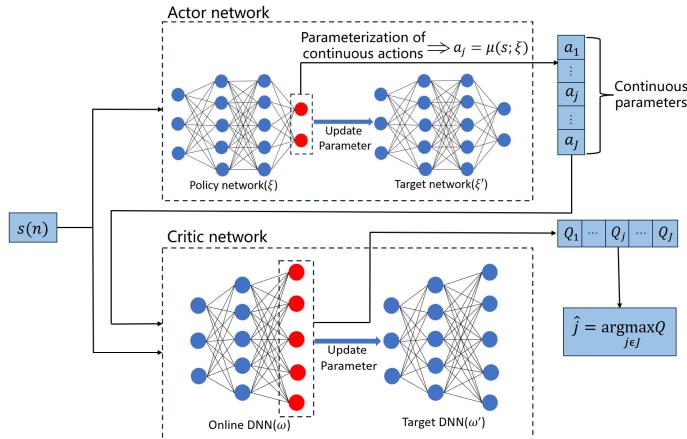  
Fig. 4. The network structure of the P-DDQN algorithm.

DDQN mitigates this issue by decoupling action selection and evaluation through the use of separate networks, thereby improving training stability. Despite these advantages, both DQN and DDQN are inherently limited to discrete action spaces. When extended to continuous domains, discretization of actions often results in the curse of dimensionality.

The policy-based DDPG algorithm is well-suited for handling continuous action spaces, but it is specifically designed for purely continuous control problems. Therefore, we introduce an action decoupling algorithm to address the hybrid action space problem.

2) P-DDQN: The P-DDQN algorithm is an actor–critic method that combines both policy-based and value-based approaches. It consists of four neural networks, where the actor network adopts the policy network of the DDPG algorithm along with its corresponding target network, while the critic network employs the DDQN algorithm, as illustrated in Fig. 4. The decision-making process of P-DDQN is divided into two stages: action generation and policy update.

Initially, the policy network generates continuous actions conditioned on the observed state for each discrete action. Subsequently, the obtained continuous actions together with the state are fed into the DDQN network, which selects the discrete action that maximizes the Q-value. In this manner, the optimal discrete action and its corresponding continuous action for the current state are jointly determined. Based on this mechanism, P-DDQN explicitly preserves the discrete nature of action selection, thereby avoiding the policy bias introduced when approximating discrete actions with continuous distributions. As a result, the proposed approach enhances both the accuracy and stability of the learned policy.

According to (43), we define a hybrid action space consisting of both continuous and discrete components as

$$
\begin{array} { r } { A = \{ ( j ( n ) , a _ { j } ( n ) ) | j \in J , a _ { j } \in A _ { j } \} , } \end{array}\tag{45}
$$

where J denotes the set of discrete actions. $A _ { j }$ denotes the the set of continuous actions. For $a \in A ,$ the state-action value function $Q ( s , a ) = Q ( s , j , a _ { j } )$ is utilized to evaluate the quality of taking an action in a given state. Here, $s \in S$ , and S denotes the state space. Accordingly, the Bellman equation

$$
\begin{array} { r l r } & { \underset { \textstyle Q ( s ( n ) , j ( n ) , a _ { j } ( n ) ) = \underset { r ( n ) , s ( n + 1 ) } { \mathbb { E } } } { \sim } } & { \underset { \textstyle ( r ( n ) , ( s ( n + 1 ) ) \leq j } { \mathbb { E } } [ r ( n ) + \gamma Q ( s ( n + 1 ) , \widehat { j } , a _ { \widehat { j } } ; } \\ & { \underset { \textstyle ( s ^ { \prime } ) | s ( n ) = s , a ( n ) = \{ j ( n ) , a _ { j } ( n ) \} } { \sim } } & { ( 4 6 ) } \end{array}
$$

where $\gamma$ denotes the discount factor, which determines the importance of future rewards. $\widehat { j }$ and $a _ { \widehat { j } }$ represent the optimal discrete action and its corresponding continuous action, respectively. $\omega ^ { \prime }$ represents the weight parameter of the target network in DDQN. To obtain the optimal action, we first compute $\begin{array} { r } { \widehat { a } _ { j } = \arg \operatorname* { s u p } _ { a _ { i } \in A _ { i } } Q ( s ( n + 1 ) , j , a _ { j } ) } \end{array}$ for each $j \in J ,$ and then take the largest $Q ( s ( n + 1 ) , j , \widehat { a } _ { j } )$ to obtain the optimal discrete action $\widehat { j } .$ However, directly computing the supremum over the continuous action space $A _ { j }$ is computationally intractable. Therefore, we leverage a policy network $\mu ( \cdot ; \xi )$ to approximate this process by mapping the state to the corresponding continuous action vector. Specifically, the continuous action is obtained as

$$
\widehat { \boldsymbol { a } } _ { j } = \mu ( s ; \boldsymbol { \xi } ) = \underset { \boldsymbol { a } _ { j } \in { \boldsymbol { A } } _ { j } } { \arg \operatorname* { s u p } } Q ( s , j , \boldsymbol { a } _ { j } ) , \forall j \in \boldsymbol { J } ,\tag{47}
$$

After obtaining the continuous action from the policy network, the DDQN online network parameterizes $Q ( s , j , a _ { j } )$ to select the optimal discrete action ${ \widehat { j } } ,$ which is determined as

$$
\left\{ \begin{array} { l l } { \widehat { j } = \arg \operatorname* { m a x } _ { j \in J } Q ( s , j , a _ { j } ) , } \\ { Q ( s , j , a _ { j } ) = Q ( s , j , a _ { j } ; \omega ) , } \end{array} \right.\tag{48}
$$

where ω denotes the weight parameter of the DDQN online network. The P-DDQN algorithm is trained using the Temporal Difference (TD) learning framework. Specifically, the update process is carried out in an alternating manner. First, we fix the network parameter ω of DDQN and minimize the TD loss function to update the policy network parameter $\xi .$ Then, we fix $\xi$ and update the weight ω of the DDQN online network by minimizing a least-squares loss function associated with the evaluation of discrete actions. The parameter update process is described as follows

$$
\left\{ \begin{array} { l l } { \displaystyle y _ { t } = r + \gamma Q ( \boldsymbol { s } ^ { \prime } , \hat { \boldsymbol { \jmath } } ^ { \prime } , \boldsymbol { \mu } ^ { \prime } ( \boldsymbol { s } ^ { \prime } ; \boldsymbol { \xi } ^ { \prime } ) ; \omega ^ { \prime } ) , } \\ { \displaystyle \ell _ { Q } ( \omega ) = \frac { 1 } { 2 } [ Q ( \boldsymbol { s } , \boldsymbol { j } , \boldsymbol { \mu } ( \boldsymbol { s } ; \boldsymbol { \xi } ) ; \omega ) - y _ { t } ] ^ { 2 } , } \\ { \displaystyle \ell _ { \mu } ( \boldsymbol { \xi } ) = - \sum _ { j = 1 } ^ { J } Q ( \boldsymbol { s } , \boldsymbol { j } , \boldsymbol { \mu } ( \boldsymbol { s } ; \boldsymbol { \xi } ) ; \omega ) , } \\ { \omega = \omega - \delta _ { c } \cdot \nabla _ { \omega } \ell _ { Q } ( \omega ) , } \\ { \displaystyle \xi = \boldsymbol { \xi } - \delta _ { a } \cdot \nabla _ { \xi } \ell _ { \mu } ( \boldsymbol { \xi } ) , } \end{array} \right.\tag{49}
$$

where $y _ { t }$ denotes the target state-action value, and $s ^ { \prime }$ and $\widehat { j ^ { \prime } }$ represent the next state and the corresponding optimal discrete action, respectively. $\mu ^ { \prime } ( \cdot ; \xi ^ { \prime } )$ denotes the target policy network, with $\xi ^ { \prime }$ being its weight parameters. $\ell _ { \mu } ( \xi )$ and $\ell _ { Q } ( \omega )$ denote the loss functions of the DDPG policy network and the DDQN online network, respectively. Moreover, $\delta _ { a }$ and $\delta _ { c }$ represent the learning rates of the actor network and the critic network.

Finally, a soft update mechanism is employed to periodically update the parameters of the target networks, ensuring training stability. The update rules are given by

$$
\left\{ \begin{array} { l l } { \omega ^ { \prime } = \phi \omega + ( 1 - \phi ) \omega ^ { \prime } , \phi \ll 1 , } \\ { \xi ^ { \prime } = \tau \xi + ( 1 - \tau ) \xi ^ { \prime } , \tau \ll 1 , } \end{array} \right.\tag{50}
$$

where $\phi$ and $\tau$ are the soft update coefficients [1].

Algorithm 1 P-DDQN-Based Joint Offloading and Resource   
Allocation Algorithm   
1: Initialize the network parameters $\xi , \xi ^ { \prime } ,$ ω and $\omega ^ { \prime } ;$   
2: Initialize the experience replay buffer with capacity $M ,$   
define the mini-batch size as $R _ { m } ,$ and initialize the total   
system task volume $D _ { t o t a l } ;$   
3: for each episode do   
4: Reset environment, and record the initial state $s _ { 0 } ;$   
5: for time slot $\mathbf { \Omega } = [ 1 , . . . . , n , . . . , N ]$ do   
6: Compute continuous action $a _ { j } ( n ) \gets \mu ( s ( n ) ; \xi ) ;$   
7: Select the hybrid action $a ( \bar { n } ) \ = \ \{ j ( n ) , a _ { j } ( n ) \}$   
based on the -greedy policy;   
8: Execute action $a ( n )$ , obtain reward $r ( n )$ and   
observe the next state $s ( n + 1 ) ;$   
9: Save quadruple $\{ s ( n ) , a ( n ) , r ( n ) , s ( n { + } 1 ) \}$ into the   
experience replay buffer;   
10: Randomly sample a mini-batch of $R _ { m }$ experience   
tuples $\{ \bar { s ( i ) } , a ( \bar { i } ) , r ( i ) , s ( i + 1 ) \}$ from the buffer;   
11: if $s ( i + 1 )$ indicates the end of the episode then   
12: $y ( i ) = r ( i ) ;$   
13: else   
14: $y ( i ) \ = \ r ( i ) + \gamma Q ( s ( i + 1 ) , \widehat { j } ( i + 1 ) , \mu ^ { \prime } ( s ( i +$   
$1 ) ; { \dot { \xi } } ^ { \prime } ) ; \omega ^ { \prime } ) ;$   
15: end if   
16: Use the mini-batch data to calculate the gradients   
$\nabla _ { \omega } \ell _ { Q } ( \omega )$ and $\nabla _ { \xi } \ell _ { \mu } ( \xi )$   
17: Update the network parameters based on Eq. (49)   
and Eq. (50);   
18: if remaining tasks $D _ { t o t a l } ^ { r e } ( n ) = 0$ then   
19: Initiate a new episode;   
20: end if   
21: end for   
22: end for

## C. Implementation Details of Algorithm 1

By analyzing the network architecture and decision-making process of P-DDQN, we design the corresponding training framework, as illustrated in Fig. 5. The framework consists of two main components: the upper part is responsible for action generation, while the lower part focuses on policy updates. Algorithm 1 summarizes the overall training procedure of the proposed P-DDQN algorithm. At time slot $n ,$ the state $s ( n )$ is first fed into the actor network, which generates continuous actions according to the policy $\mu ( s ( n ) ; \xi )$ . Given the generated continuous actions and the current state, the critic network then determines the optimal discrete action $\hat { j } ( n )$ based on (48). Therefore, the hybrid action $a ( n )$ at time slot n is obtained. Subsequently, the agent executes $a ( n )$ interacts with the SAGIN environment, and transitions to the next state $s ( n + 1 )$ . During this process, the environment provides a reward $r ( n )$ according to (42). The experience tuple $\{ s ( n ) , a ( n ) , r ( n ) , s ( n + 1 ) \}$ is stored in the replay buffer. During the policy update phase, mini-batches are sampled from the buffer to update the network parameters, resulting in an updated policy $\pi ( \xi , \xi ^ { \prime } , \omega , \omega ^ { \prime } ) _ { n + 1 }$ . The updated policy is then used to determine the action $a ( n + 1 )$ based on the new state $s ( n + 1 )$ . Through iterative interactions and updates, the policy is progressively improved and eventually converges to an optimal strategy that effectively minimizes the system cost.

TABLE I  
COMPARISON BETWEEN OUR WORK AND EXISTING WORKS
<table><tr><td rowspan=1 colspan=1>Novelty</td><td rowspan=1 colspan=1>Our work</td><td rowspan=1 colspan=1>[30]2025</td><td rowspan=1 colspan=1>[33]2025</td><td rowspan=1 colspan=1>[27]2025</td><td rowspan=1 colspan=1>[29]2025</td><td rowspan=1 colspan=1>[5]2024</td><td rowspan=1 colspan=1>[6]2024</td><td rowspan=1 colspan=1>[34]2024</td><td rowspan=1 colspan=1>[32]2024</td><td rowspan=1 colspan=1>[31]2024</td><td rowspan=1 colspan=1>[24]2024</td><td rowspan=1 colspan=1>[26]2023</td><td rowspan=1 colspan=1>[28]2023</td></tr><tr><td rowspan=1 colspan=1>Satellite</td><td rowspan=1 colspan=1> $\checkmark$ </td><td rowspan=1 colspan=1> $\checkmark$ </td><td rowspan=1 colspan=1> $\checkmark$ </td><td rowspan=1 colspan=1> $\checkmark$ </td><td rowspan=1 colspan=1> $\checkmark$ </td><td rowspan=1 colspan=1> $\checkmark$ </td><td rowspan=1 colspan=1> $\checkmark$ </td><td rowspan=1 colspan=1> $\checkmark$ </td><td rowspan=1 colspan=1> $\checkmark$ </td><td rowspan=1 colspan=1> $\checkmark$ </td><td rowspan=1 colspan=1></td><td rowspan=1 colspan=1> $\checkmark$ </td><td rowspan=1 colspan=1> $\checkmark$ </td></tr><tr><td rowspan=1 colspan=1>Multiple satellites</td><td rowspan=1 colspan=1> $\checkmark$ </td><td rowspan=1 colspan=1> $\checkmark$ </td><td rowspan=1 colspan=1> $\checkmark$ </td><td rowspan=1 colspan=1> $\checkmark$ </td><td rowspan=1 colspan=1> $\checkmark$ </td><td rowspan=1 colspan=1> $\checkmark$ </td><td rowspan=1 colspan=1> $\checkmark$ </td><td rowspan=1 colspan=1></td><td rowspan=1 colspan=1></td><td rowspan=1 colspan=1> $\checkmark$ </td><td rowspan=1 colspan=1></td><td rowspan=1 colspan=1> $\checkmark$ </td><td rowspan=1 colspan=1></td></tr><tr><td rowspan=1 colspan=1>Satellite coverage time</td><td rowspan=1 colspan=1> $\checkmark$ </td><td rowspan=1 colspan=1> $\checkmark$ </td><td rowspan=1 colspan=1></td><td rowspan=1 colspan=1> $\checkmark$ </td><td rowspan=1 colspan=1></td><td rowspan=1 colspan=1> $\checkmark$ </td><td rowspan=1 colspan=1> $\checkmark$ </td><td rowspan=1 colspan=1></td><td rowspan=1 colspan=1></td><td rowspan=1 colspan=1></td><td rowspan=1 colspan=1></td><td rowspan=1 colspan=1></td><td rowspan=1 colspan=1></td></tr><tr><td rowspan=1 colspan=1>UAV/HAP</td><td rowspan=1 colspan=1> $\checkmark$ </td><td rowspan=1 colspan=1> $\checkmark$ </td><td rowspan=1 colspan=1> $\checkmark$ </td><td rowspan=1 colspan=1></td><td rowspan=1 colspan=1> $\checkmark$ </td><td rowspan=1 colspan=1></td><td rowspan=1 colspan=1> $\checkmark$ </td><td rowspan=1 colspan=1> $\checkmark$ </td><td rowspan=1 colspan=1> $\checkmark$ </td><td rowspan=1 colspan=1> $\checkmark$ </td><td rowspan=1 colspan=1> $\checkmark$ </td><td rowspan=1 colspan=1></td><td rowspan=1 colspan=1></td></tr><tr><td rowspan=1 colspan=1>UAV 3D trajectory</td><td rowspan=1 colspan=1> $\checkmark$ </td><td rowspan=1 colspan=1></td><td rowspan=1 colspan=1></td><td rowspan=1 colspan=1></td><td rowspan=1 colspan=1> $\checkmark$ </td><td rowspan=1 colspan=1></td><td rowspan=1 colspan=1> $\checkmark$ </td><td rowspan=1 colspan=1></td><td rowspan=1 colspan=1></td><td rowspan=1 colspan=1> $\checkmark$ </td><td rowspan=1 colspan=1> $\checkmark$ </td><td rowspan=1 colspan=1></td><td rowspan=1 colspan=1></td></tr><tr><td rowspan=1 colspan=1>User association</td><td rowspan=1 colspan=1> $\checkmark$ </td><td rowspan=1 colspan=1> $\checkmark$ </td><td rowspan=1 colspan=1> $\checkmark$ </td><td rowspan=1 colspan=1> $\checkmark$ </td><td rowspan=1 colspan=1></td><td rowspan=1 colspan=1> $\checkmark$ </td><td rowspan=1 colspan=1> $\checkmark$ </td><td rowspan=1 colspan=1></td><td rowspan=1 colspan=1> $\checkmark$ </td><td rowspan=1 colspan=1> $\checkmark$ </td><td rowspan=1 colspan=1></td><td rowspan=1 colspan=1></td><td rowspan=1 colspan=1> $\checkmark$ </td></tr><tr><td rowspan=1 colspan=1>Power control</td><td rowspan=1 colspan=1> $\checkmark$ </td><td rowspan=1 colspan=1></td><td rowspan=1 colspan=1></td><td rowspan=1 colspan=1> $\checkmark$ </td><td rowspan=1 colspan=1></td><td rowspan=1 colspan=1></td><td rowspan=1 colspan=1></td><td rowspan=1 colspan=1></td><td rowspan=1 colspan=1></td><td rowspan=1 colspan=1></td><td rowspan=1 colspan=1></td><td rowspan=1 colspan=1> $\checkmark$ </td><td rowspan=1 colspan=1></td></tr><tr><td rowspan=1 colspan=1>Partial offloading</td><td rowspan=1 colspan=1> $\checkmark$ </td><td rowspan=1 colspan=1></td><td rowspan=1 colspan=1></td><td rowspan=1 colspan=1></td><td rowspan=1 colspan=1> $\checkmark$ </td><td rowspan=1 colspan=1></td><td rowspan=1 colspan=1> $\checkmark$ </td><td rowspan=1 colspan=1> $\checkmark$ </td><td rowspan=1 colspan=1></td><td rowspan=1 colspan=1> $\checkmark$ </td><td rowspan=1 colspan=1></td><td rowspan=1 colspan=1> $\checkmark$ </td><td rowspan=1 colspan=1> $\checkmark$ </td></tr><tr><td rowspan=1 colspan=1>DRL algorithm</td><td rowspan=1 colspan=1> $\checkmark$ </td><td rowspan=1 colspan=1></td><td rowspan=1 colspan=1> $\checkmark$ </td><td rowspan=1 colspan=1></td><td rowspan=1 colspan=1> $\checkmark$ </td><td rowspan=1 colspan=1></td><td rowspan=1 colspan=1> $\checkmark$ </td><td rowspan=1 colspan=1> $\checkmark$ </td><td rowspan=1 colspan=1> $\checkmark$ </td><td rowspan=1 colspan=1></td><td rowspan=1 colspan=1></td><td rowspan=1 colspan=1> $\checkmark$ </td><td rowspan=1 colspan=1></td></tr><tr><td rowspan=1 colspan=1>Hybrid action space</td><td rowspan=1 colspan=1> $\checkmark$ </td><td rowspan=1 colspan=1></td><td rowspan=1 colspan=1> $\checkmark$ </td><td rowspan=1 colspan=1> $\checkmark$ </td><td rowspan=1 colspan=1> $\checkmark$ </td><td rowspan=1 colspan=1></td><td rowspan=1 colspan=1> $\checkmark$ </td><td rowspan=1 colspan=1></td><td rowspan=1 colspan=1> $\checkmark$ </td><td rowspan=1 colspan=1> $\checkmark$ </td><td rowspan=1 colspan=1> $\checkmark$ </td><td rowspan=1 colspan=1></td><td rowspan=1 colspan=1> $\checkmark$ </td></tr><tr><td rowspan=1 colspan=1>Cost minimization</td><td rowspan=1 colspan=1> $\checkmark$ </td><td rowspan=1 colspan=1> $\checkmark$ </td><td rowspan=1 colspan=1> $\checkmark$ </td><td rowspan=1 colspan=1> $\checkmark$ </td><td rowspan=1 colspan=1></td><td rowspan=1 colspan=1> $\checkmark$ </td><td rowspan=1 colspan=1></td><td rowspan=1 colspan=1></td><td rowspan=1 colspan=1> $\checkmark$ </td><td rowspan=1 colspan=1></td><td rowspan=1 colspan=1></td><td rowspan=1 colspan=1> $\checkmark$ </td><td rowspan=1 colspan=1></td></tr><tr><td rowspan=1 colspan=1>Latency minimization</td><td rowspan=1 colspan=1> $\checkmark$ </td><td rowspan=1 colspan=1> $\checkmark$ </td><td rowspan=1 colspan=1></td><td rowspan=1 colspan=1></td><td rowspan=1 colspan=1> $\checkmark$ </td><td rowspan=1 colspan=1> $\checkmark$ </td><td rowspan=1 colspan=1> $\checkmark$ </td><td rowspan=1 colspan=1></td><td rowspan=1 colspan=1></td><td rowspan=1 colspan=1></td><td rowspan=1 colspan=1> $\checkmark$ </td><td rowspan=1 colspan=1> $\checkmark$ </td><td rowspan=1 colspan=1></td></tr><tr><td rowspan=1 colspan=1>Energy minimization</td><td rowspan=1 colspan=1> $\checkmark$ </td><td rowspan=1 colspan=1> $\checkmark$ </td><td rowspan=1 colspan=1></td><td rowspan=1 colspan=1></td><td rowspan=1 colspan=1></td><td rowspan=1 colspan=1> $\checkmark$ </td><td rowspan=1 colspan=1> $\checkmark$ </td><td rowspan=1 colspan=1> $\checkmark$ </td><td rowspan=1 colspan=1></td><td rowspan=1 colspan=1> $\checkmark$ </td><td rowspan=1 colspan=1></td><td rowspan=1 colspan=1> $\checkmark$ </td><td rowspan=1 colspan=1> $\checkmark$ </td></tr></table>

In this paper, the UAV is modeled as an agent to make task offloading and resource allocation decisions for IoT devices. Accordingly, the computational complexity of the proposed P-DDQN algorithm mainly depends on the number of training episodes, the number of steps per episode, the mini-batch size, and the architectures of the actor and critic networks.

## D. Complexity Analysis

Let $E _ { p } , S _ { e }$ , and $R _ { m }$ denote the number of training episodes, the number of steps per episode, and the mini-batch size used for each parameter update, respectively. The P-DDQN algorithm follows an actor–critic framework. Therefore, we define $L _ { \xi }$ and $L _ { \omega }$ as the numbers of layers in the actor and critic networks, respectively, and let $N _ { l _ { \xi } }$ and $N _ { l _ { \omega } }$ denote the numbers of neurons in the $l _ { \xi } { \mathrm { - t h } }$ actor layer and the $l _ { \omega }$ -th critic layer. Accordingly, the computational complexity of the proposed P-DDQN algorithm can be expressed as

$$
\mathcal { C } = \mathcal { O } \left( E _ { p } S _ { e } R _ { m } \left( \sum _ { l _ { \xi } = 0 } ^ { L _ { \xi } - 1 } N _ { l _ { \xi } } N _ { l _ { \xi } + 1 } + \sum _ { l _ { \omega } = 0 } ^ { L _ { \omega } - 1 } N _ { l _ { \omega } } N _ { l _ { \omega } + 1 } \right) \right) ,\tag{51}
$$

where the two summation terms represent the computational complexities of the actor and critic networks, respectively.

## IV. SIMULATION RESULTS

## A. Simulation Setup

1) Experiment Parameters Setting: In the simulation environment, we consider $M = 8$ IoT users moving randomly at low speed within a 100 m ×100 m horizontal area. The data size of each IoT device is set to $D _ { m } \in [ 2 , 4 ]$ Mbits [33], and the CPU cycles required for each task are set to 1.5 Gcycles. The maximum transmit power from ground IoT devices to the UAV and LEO satellites is set to $P _ { m u } ^ { \mathrm { m a x } } = 2 4$ dBm and $P _ { m , k } ^ { \mathrm { m a x } } = 3 0$ dBm, respectively [31]. The UAV operates at an altitude ranging from $H _ { u a v } ^ { \mathrm { m i n } } = 9 0$ m to $H _ { u a v } ^ { \mathrm { m a x } } = 1 2 0$ m, which is uniformly discretized into segments of length $\Omega = 2 \mathrm { ~ m ~ }$ The UAV battery capacity is set to $E _ { u } = 2 0 0 ~ \mathrm { K J }$ [38]. We consider $K = 3 { \mathrm { ~ L E O } }$ satellites, each operating at an orbital altitude of $h = 5 0 0$ km [39] with a minimum elevation angle of $\omega _ { G } = 4 0 ^ { \circ }$ . The path loss exponents for LoS and NLoS links are set to $\alpha _ { L } = 2$ and $\alpha _ { N } = 2 . 5$ , respectively [6]. The channel bandwidths for the UAV and LEO satellites are $B _ { m u } = 2 \ : \mathrm { M H z }$ and $B _ { m , k } = 1 0$ MHz, respectively [38], [40]. The actor and critic networks of P-DDQN both adopt fully connected neural network architectures. The corresponding network structures are configured as $| s . \mathrm { d i m } | \times 2 5 6 \times 1 2 8 \times 6 4 \times | a _ { j } . \mathrm { d i m } |$ and |s. dim $+ a _ { j }$ . dim |×256×128×64×|a. dim |, respectively. The reward discount factor is set to $\gamma = 0 . 9$ . The initial exploration rate of the -greedy strategy is set to $\epsilon = 0 . 9$ and decays to 0.01. The soft update coefficient is set to $\phi = \tau = 0 . 0 1$ . A summary of the key parameters is provided in Table II.

TABLE II  
SIMULATION PARAMETER CONFIGURATION
<table><tr><td>Parameter</td><td>Symbol</td><td>Value</td></tr><tr><td>The total number of LEO staellites</td><td>K</td><td>3</td></tr><tr><td>The total number of IoT devices</td><td>M</td><td>8</td></tr><tr><td>The weighting factor</td><td>σ</td><td>0.7</td></tr><tr><td>The length of segment</td><td> $\Omega$ </td><td>2 m</td></tr><tr><td>The channel bandwidth of the UAV</td><td> $B _ { m u }$ </td><td>2MHz</td></tr><tr><td>The channel bandwidth of LEO staellites</td><td> $B _ { m , k }$ </td><td>10 MHz</td></tr><tr><td>The UAV battery capacity</td><td> $E _ { u }$ </td><td>200 KJ</td></tr><tr><td>The maximum horizontal speed</td><td> $v _ { \underline { { { \mathrm { m a x } } } } } ^ { h }$ </td><td>10 m/s</td></tr><tr><td>The data size of IoT devices</td><td> $D _ { m }$ </td><td>[2,4] Mbits</td></tr><tr><td>The processing rate of IoT devices</td><td> $f _ { m }$ </td><td>0.2 GHz</td></tr><tr><td>The processing rate of the UAV</td><td> $f _ { u }$ </td><td>0.6 GHz</td></tr><tr><td>The processing rate of LEO satellites</td><td> $f _ { s }$ </td><td>1.2 GHz</td></tr></table>

2) Hyperparameters and Convergence Analysis: To determine the optimal hyperparameter values, we compared the impact of different learning rates on the convergence performance of the P-DDQN algorithm under a replay buffer capacity of $M = 1 0 0 0 0$ and a mini-batch size of $R _ { m } = 1 2 8$

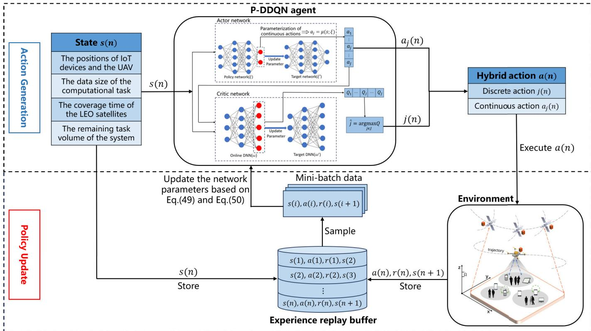  
Fig. 5. The training framework of the P-DDQN algorithm.

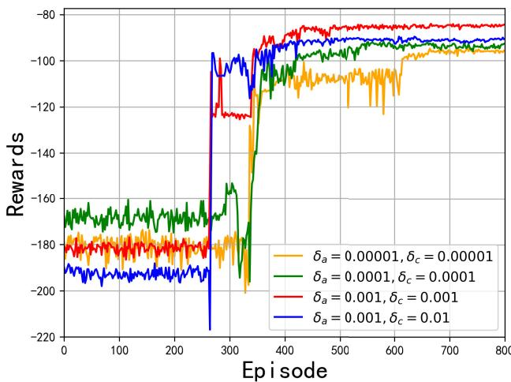  
Fig. 6. Cumulative rewards under different learning rates.

The learning rate controls the step size of network parameter updates, and its value has a significant impact on the convergence speed and stability of the model. Fig. 6 illustrates the impact of different learning rates on the cumulative rewards achieved by the P-DDQN algorithm during training. As observed, all four curves exhibit a similar overall trend. However, for the orange and green curves corresponding to smaller learning rates, the convergence process is noticeably slower, with the rewards stabilizing only after approximately

600–800 episodes. This indicates that smaller learning rates require more training time for the model to approach the optimal solution. In contrast, the red curve, which represents a moderate learning rate, demonstrates faster convergence and achieves higher reward values with fewer training episodes. Based on these observations, the learning rates are set to $\delta _ { a } = 0 . 0 0 1$ and $\delta _ { c } = 0 . 0 0 1$ in the subsequent simulations.

## B. Performance Evaluation and Analysis

1) Benchmark Algorithms: The effectiveness of the proposed model is evaluated by comparing it with several baseline algorithms, including P-DQN, PPO, DDPG, and DDQN. Specifically, P-DQN and PPO are selected as benchmark methods that are inherently suitable for hybrid action space problems, while DDPG and DDQN are included as representative algorithms for purely continuous and purely discrete action spaces, respectively.

a) P-DQN: P-DQN and P-DDQN share the same network structure. The primary difference lies in the estimation of the target Q-value. Specifically, P-DQN adopts a maximization operation to compute the target, which is expressed as $y _ { t } \ = \ r + \gamma \operatorname* { m a x } _ { i ^ { \prime } \in J } Q ( s ^ { \prime } , j ^ { \prime } , \mu ^ { \prime } ( s ^ { \prime } ; \xi ^ { \prime } ) ; \omega ^ { \prime } )$ , where $\operatorname* { m a x } _ { j ^ { \prime } \in J } Q ( \cdot ; \omega ^ { \prime } )$ represents the maximum Q-value for the next state, evaluated by the target network.

b) PPO: PPO is a widely utilized algorithm for policy optimization and is suitable for a variety of RL tasks. In hybrid action space scenarios, PPO typically employs separate policy heads for discrete and continuous actions, enabling simultaneous optimization of hybrid decision variables.

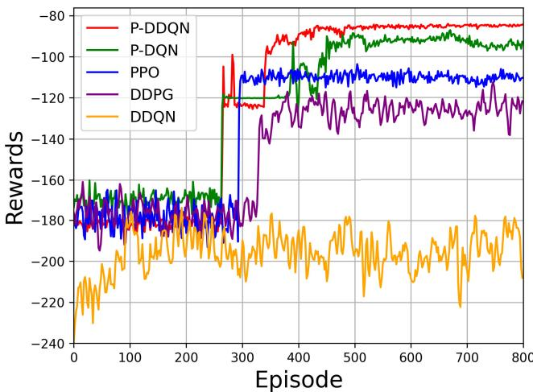  
Fig. 7. Performance comparison of different algorithms.

c) DDPG: DDPG is originally designed for continuous action spaces. To enable its application to discrete decisionmaking tasks, such as user scheduling and satellite association selection, the corresponding continuous actions generated by DDPG are discretized.

d) DDQN: Since DDQN is designed for purely discrete action spaces, the continuous decision variables are discretized, e.g., $X _ { m } ^ { l } ~ = ~ \{ 0 , 0 . 2 , \ldots , 1 . 0 \}$ . To alleviate the action space explosion resulting from discretization, the transmit power of IoT devices is assumed to be fixed.

2) Performance Evaluation: To validate the effectiveness of the proposed algorithm, we conduct experimental evaluations from multiple perspectives, including comparisons with baseline methods and ablation studies on the transmit power of IoT devices and the UAV flight altitude, thereby systematically demonstrating its superiority.

Fig. 7 illustrates the training result of different algorithms in solving optimization problem (39). It can be observed that P-DDQN achieves the highest reward among all the compared methods. During the early stages of training, P-DDQN exhibits low and fluctuating rewards due to the exploratory nature of DRL and the reliance on randomly sampled experiences from the replay buffer. As training progresses, the agent performs fewer random actions and learns more effective actions, resulting in higher and more stable rewards, and ultimately converges to approximately – 85 after 500 episodes.

Moreover, the P-DQN algorithm, which follows closely, suffers from Q-value overestimation, as it directly applies the maximization operation on the target network to compute the target Q-value, leading to unstable decision-making. PPO can handle hybrid action space problems by sampling from appropriate probability distributions. However, under the considered system model and optimization objective, its policy updates tend to be relatively conservative, which may cause the algorithm to converge prematurely to a suboptimal solution. DDPG is specifically designed for continuous action spaces and is therefore not well-suited for the proposed scenario involving a hybrid action space with a large number of discrete actions. DDQN exhibits the poorest performance due to its restriction to discrete action spaces. When applied to hybrid settings, the discretization of continuous actions significantly enlarges the action space, which increases training complexity and hinders convergence.

To evaluate the adaptability of the proposed scheme, we compare the system cost of various algorithms under different task complexities, numbers of IoT devices, and numbers of LEO satellites. As illustrated in Fig. 8(a), the system cost of all algorithms increases as the CPU cycle demand of tasks grows. This is because ground IoT devices have limited computational capabilities, and higher computational complexity forces them to offload more tasks to the UAV and LEO satellites, resulting in increased energy consumption and latency. Furthermore, the proposed P-DDQN algorithm consistently outperforms the baseline methods, with its advantage becoming more pronounced when the CPU cycle demand exceeds 1 Gcycles.

Fig. 8(b) shows that the system cost increases as the number of IoT devices grows. This is primarily due to the increased offloading demand on the UAV and LEO satellites, which intensifies the competition among IoT devices for system resources. Moreover, a larger number of IoT devices leads to more complex UAV flight trajectories, which increases the difficulty of trajectory optimization and consequently results in higher latency and energy consumption.

Fig. 8(c) illustrates the system cost under different numbers of LEO satellites. It can be observed that the system cost decreases as the number of satellites increases. This is because a larger number of satellites results in higher satellite density, thereby increasing the likelihood that users can access satellites with higher elevation angles. A higher elevation angle ωG corresponds to a smaller central angle $\omega _ { c } .$ . According to $d _ { m , k } ^ { s } = \sqrt { R _ { e } ^ { 2 } + ( R _ { e } + h ) ^ { 2 } - 2 R _ { e } ( R _ { e } + h ) \cos \omega _ { c } } .$ , a smaller central angle leads to a shorter transmission distance, which improves the G2S link quality and enhances the achievable data rate. Moreover, with more satellites available, ground users can remain within the effective coverage area for longer durations, enabling more computation tasks to be offloaded to LEO satellites. This reduces the reliance on local computing and UAV processing, thereby reducing the overall system cost.

To evaluate the impact of power allocation and trajectory optimization on system cost, we conduct ablation studies on the transmit power of IoT devices and the UAV flight altitude, respectively. As illustrated in Fig. 9(a), fixing these parameters leads to higher system costs due to reduced flexibility (e.g., $\begin{array} { r } { P _ { m u } ^ { t } = \frac { P _ { m u } ^ { \mathrm { m i n } } + P _ { m u } ^ { \mathrm { m a x } } } { 2 } , H _ { u a v } = \frac { H _ { u a v } ^ { \mathrm { m i n } } + H _ { u a v } ^ { \mathrm { m a x } } } { 2 } \big ) } \end{array}$ . Specifically, a fixed transmission power cannot adapt to varying task requirements and dynamic network conditions, resulting in either underutilization or excessive resource consumption. Although fixing the flight altitude has a relatively smaller impact on system cost, it neglects altitude optimization, leading to inefficient UAV trajectory planning and increased energy consumption.

Fig. 9(b) illustrates the system cost of three schemes over one task cycle. Specifically, the P-DDQN algorithm, which jointly optimizes transmission power and flight altitude, maintains the system cost at approximately 2.30 for each time slot with relatively small fluctuations. In contrast, fixing the flight altitude results in system costs fluctuating around 2.65 per time slot, while fixing the transmission power leads to the most unstable performance and consistently incurs the highest system cost in most time slots.

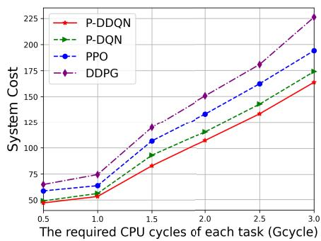  
(a)

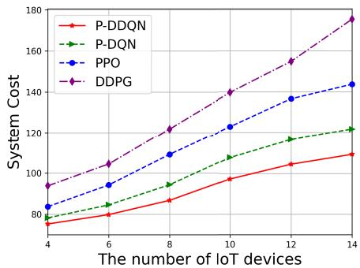  
(b)

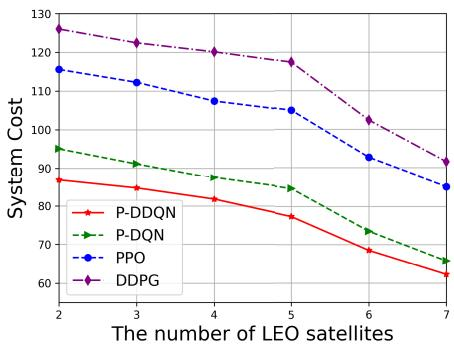  
(c)

Fig. 8. System cost of various algorithms under different task complexities, numbers of IoT devices, and numbers of LEO satellites. (a) Different task complexities. (b) Different numbers of IoT devices. (c) Different numbers of LEO satellites.  
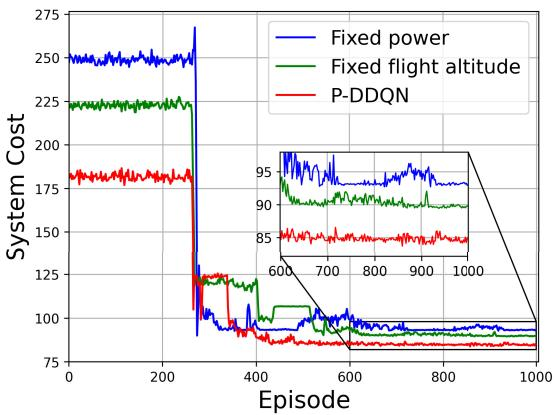

(a)  
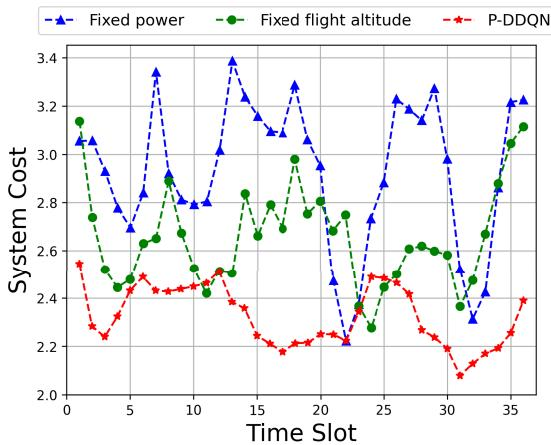  
(b)  
Fig. 9. System cost under different power and altitude configurations. (a) Cumulative system cost of different strategies. (b) System cost per time slot.

Next, we investigate the UAV trajectory optimization problem under the condition of low-speed mobility of ground IoT devices, and analyze the impact of IoT device distribution on the UAV flight altitude. As illustrated in Fig. 10(a), the red line represents the UAV’s 3D trajectory over one cycle, while the green dots indicate the initial positions of the eight

IoT devices. Fig. 10(c) shows the variation in the UAV’s altitude during the same period. It can be observed that the UAV’s altitude increases from 96 m to 118 m within the first 15 time slots, and then gradually decreases starting from the 19th time slot. This behavior reflects the UAV’s adaptive trajectory adjustment based on the state information of the IoT devices. As shown in Fig. 10(b), when IoT devices 1–4 are relatively dispersed, the UAV tends to fly at a higher altitude to ensure good communication visibility. In contrast, when IoT devices 5–8 are more densely distributed, the UAV lowers its altitude to reduce energy consumption, as long-distance communication is no longer necessary.

Finally, the effectiveness of the proposed algorithm is vali dated under extreme weight settings. As shown in Fig. 11(a) and Fig. 11(b), the DDPG algorithm exhibits noticeable fluctuations during training and achieves relatively poor convergence performance. This is mainly because DDPG is designed for continuous action spaces, and discretizing its outputs to handle hybrid action spaces introduces approximation errors and degrades training stability. In contrast, although PPO can inherently handle hybrid action spaces, its policy updates are relatively conservative under the considered system model and optimization objectives, making it prone to converging to suboptimal solutions and resulting in inferior performance compared with the proposed algorithm. These results demonstrate that the proposed P-DDQN algorithm achieves superior stability and performance, even under extreme scenarios.

## V. CONCLUSION

This paper investigates the joint optimization of energy consumption and latency in MEC-enabled SAGINs, where the UAV and LEO satellites collaboratively provide edge computing services for ground IoT devices. We formulate a hybrid action space optimization problem to jointly optimize IoT device association, transmission power, and task assignment, as well as the UAV trajectory, with the objective of minimizing the weighted sum of energy consumption and latency. To address the hybrid action space, a P-DDQN algorithm is proposed, which integrates DDPG for continuous action optimization and DDQN for discrete action selection. Simulation results demonstrate that the proposed P-DDQN algorithm can effectively achieve adaptive resource allocation and task offloading, outperform baseline schemes and attaining the lowest system cost. In future work, the proposed framework will be extended to more complex SAGIN scenarios, including multi-UAV cooperative optimization, to better reflect practical deployments. In addition, we will explore multi-agent hybrid action space algorithms based on the soft actor–critic framework, enabling more comprehensive evaluations under extended system models.

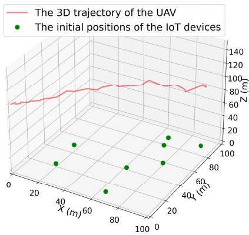  
(a)

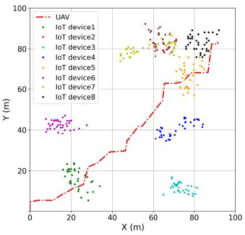  
(b)

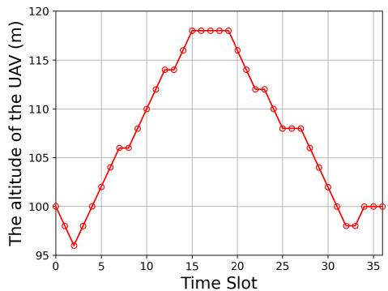  
(c)

Fig. 10. UAV trajectory optimization based on IoT device distribution. (a) Spatial distribution of the UAV and IoT devices. (b) 2D trajectories of the UAV and IoT devices. (c) Altitude variation of the UAV in each time slot.  
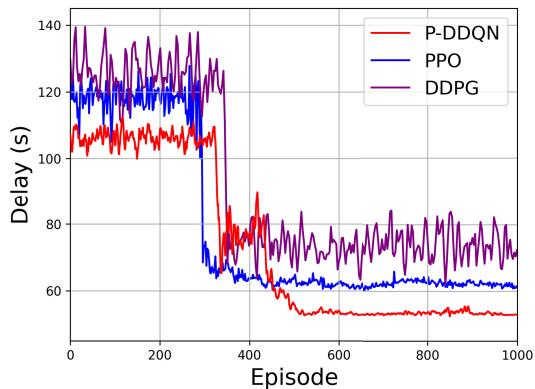

(a)  
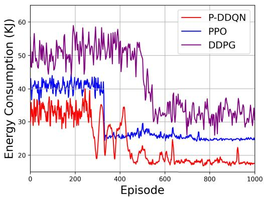  
(b)  
Fig. 11. System performance under extreme weighting factors. (a) Cumulative system delay $( \sigma = 1 )$ . (b) Cumulative energy consumption $( \sigma = 0 )$

## REFERENCES

[1] H. Zhou, K. Jiang, X. Liu, X. Li, and V. C. M. Leung, “Deep reinforcement learning for energy-efficient computation offloading in mobile-edge computing,” IEEE Internet Things J., vol. 9, no. 2, pp. 1517–1530, Jan.2022.

[2] T. de Cola and I. Bisio, “QoS optimisation of eMBB services in converged 5G-satellite networks,” IEEE Trans. Veh. Technol., vol. 69, no. 10, pp. 12098–12110, Oct.2020.

[3] Q. Tang, Z. Fei, B. Li, and Z. Han, “Computation offloading in LEO satellite networks with hybrid cloud and edge computing,” IEEE Internet Things J., vol. 8, no. 11, pp. 9164–9176, Jun.2021.

[4] M. D. Nguyen, W. Ajib, W.-P. Zhu, and G. K. Kurt, “Integrated computation offloading, UAV trajectory control, and resource allocation against jamming in SAGIN,” in Proc. IEEE 99th Veh. Technol. Conf. (VTC-Spring), Singapore, Jun. 2024, pp. 1–5.

[5] J. Shuai, H. Cui, Y. He, and M. Guizani, “Dynamic satellite edge computing offloading algorithm based on distributed deep learning,” IEEE Internet Things J., vol. 11, no. 16, pp. 27790–27802, Aug.2024.

[6] C. Huang, G. Chen, P. Xiao, Y. Xiao, Z. Han, and J. A. Chambers, “Joint offloading and resource allocation for hybrid cloud and edge computing in SAGINs: A decision assisted hybrid action space deep reinforcement learning approach,” IEEE J. Sel. Areas Commun., vol. 42, no. 5, pp. 1029–1043, May2024.

[7] J. C. McDowell, “The low Earth orbit satellite population and impacts of the SpaceX starlink constellation,” Astrophys. J. Lett., vol. 892, no. 2, p. L36, Apr.2020.

[8] V. L. Foreman, A. Siddiqi, and O. De Weck, “Large satellite constellation orbital debris impacts: Case studies of OneWeb and SpaceX proposals,” in Proc. AIAA SPACE Astronaut. Forum Expo., Orlando, FL, USA, Sep. 2017, p. 5200.

[9] S. Liu et al., “LEO satellite constellations for 5G and beyond: How will they reshape vertical domains?,” IEEE Commun. Mag., vol. 59, no. 7, pp. 30–36, Jul.2021.

[10] Z. Xiao et al., “LEO satellite access network (LEO-SAN) toward 6G: Challenges and approaches,” IEEE Wireless Commun., vol. 31, no. 2, pp. 89–96, Apr.2024.

[11] K. Wei, Q. Tang, J. Guo, M. Zeng, Z. Fei, and Q. Cui, “Resource scheduling and offloading strategy based on LEO satellite edge computing,” in Proc. IEEE 94th Veh. Technol. Conf. (VTC-Fall), Norman, OK, USA, Sep. 2021, pp. 1–6.

[12] Y. He, Y. Gan, H. Cui, and M. Guizani, “Fairness-based 3-D multi-UAV trajectory optimization in multi-UAV-assisted MEC system,” IEEE Internet Things J., vol. 10, no. 13, pp. 11383–11395, Jul.2023.

[13] B. Adhikari, A. S. Khwaja, M. Jaseemuddin, A. Anpalagan, and A. Nallanathan, “Energy efficient RIS-assisted UAV networks using twin delayed DDPG technique,” IEEE Trans. Wireless Commun., vol. 23, no. 12, pp. 18423–18439, Dec.2024.

[14] P. Qin et al., “Energy-efficient resource allocation for space–air–ground integrated industrial power Internet of Things network,” IEEE Trans. Ind. Informat., vol. 20, no. 4, pp. 5274–5284, Apr.2024.

[15] J. Li, W. Shi, H. Wu, S. Zhang, and X. Shen, “Cost-aware dynamic SFC mapping and scheduling in SDN/NFV-enabled space–air–groundintegrated networks for Internet of Vehicles,” IEEE Internet Things J., vol. 9, no. 8, pp. 5824–5838, Apr.2022.

[16] E. M. Mohamed, M. Ahmed Alnakhli, and M. M. Fouda, “Joint UAV trajectory planning and LEO-sat selection in SAGIN,” IEEE Open J. Commun. Soc., vol. 5, pp. 1624–1638, 2024.

[17] X. Wang, L. T. Yang, D. Meng, M. Dong, K. Ota, and H. Wang, “Multi-UAV cooperative localization for marine targets based on weighted subspace fitting in SAGIN environment,” IEEE Internet Things J., vol. 9, no. 8, pp. 5708–5718, Apr.2022.

[18] T. X. Tran, A. Hajisami, P. Pandey, and D. Pompili, “Collaborative mobile edge computing in 5G networks: New paradigms, scenarios, and challenges,” IEEE Commun. Mag., vol. 55, no. 4, pp. 54–61, Apr.2017.

[19] N. Abbas, Y. Zhang, A. Taherkordi, and T. Skeie, “Mobile edge computing: A survey,” IEEE Internet Things J., vol. 5, no. 1, pp. 450–465, Feb.2018.

[20] S. Wang et al., “A cloud-guided feature extraction approach for image retrieval in mobile edge computing,” IEEE Trans. Mobile Comput., vol. 20, no. 2, pp. 292–305, Feb.2021.

[21] M. Gao et al., “Computation offloading with instantaneous load billing for mobile edge computing,” IEEE Trans. Services Comput., vol. 15, no. 3, pp. 1473–1485, May2022.

[22] X. Xia et al., “OL-MEDC: An online approach for cost-effective data caching in mobile edge computing systems,” IEEE Trans. Mobile Comput., vol. 22, no. 3, pp. 1646–1658, Mar.2023.

[23] N. Lin, H. Tang, L. Zhao, S. Wan, A. Hawbani, and M. Guizani, “A PDDQNLP algorithm for energy efficient computation offloading in UAV-assisted MEC,” IEEE Trans. Wireless Commun., vol. 22, no. 12, pp. 8876–8890, Dec.2023.

[24] L. Zhong, Y. Liu, X. Deng, C. Wu, S. Liu, and L. T. Yang, “Distributed optimization of multi-role UAV functionality switching and trajectory for security task offloading in UAV-assisted MEC,” IEEE Trans. Veh. Technol., vol. 73, no. 12, pp. 19432–19447, Dec.2024.

[25] X. Huang, X. Yang, Q. Chen, and J. Zhang, “Task offloading optimization for UAV-assisted fog-enabled Internet of Things networks,” IEEE Internet Things J., vol. 9, no. 2, pp. 1082–1094, Jan.2022.

[26] Y. Lyu, Z. Liu, R. Fan, C. Zhan, H. Hu, and J. An, “Optimal computation offloading in collaborative LEO-IoT enabled MEC: A multiagent deep reinforcement learning approach,” IEEE Trans. Green Commun. Netw., vol. 7, no. 2, pp. 996–1011, Jun.2023.

[27] P. Li, Y. Wang, Z. Wang, T. Wang, and J. Cheng, “Joint task offloading and resource allocation strategy for hybrid MEC-enabled LEO satellite networks: A hierarchical game approach,” IEEE Trans. Commun., vol. 73, no. 5, pp. 3150–3166, May2025.

[28] X. Cao et al., “Edge-assisted multi-layer offloading optimization of LEO satellite-terrestrial integrated networks,” IEEE J. Sel. Areas Commun., vol. 41, no. 2, pp. 381–398, Feb.2023.

[29] Z. Shao, H. Yang, and Z. Xiong, “Intelligent latency-oriented optimization for multi-UAV-assisted mobile edge computing in space-airground integrated networks,” IEEE Trans. Commun., vol. 73, no. 12, pp. 13384–13398, Dec.2025.

[30] Y. Chen, J. Zhao, Y. Wu, J. Huang, and X. S. Shen, “Multi-user task offloading in UAV-assisted LEO satellite edge computing: A game-theoretic approach,” IEEE Trans. Mobile Comput., vol. 24, no. 1, pp. 363–378, Jan.2025.

[31] M. D. Nguyen, L. B. Le, and A. Girard, “Integrated computation offloading, UAV trajectory control, edge-cloud and radio resource allocation in SAGIN,” IEEE Trans. Cloud Comput., vol. 12, no. 1, pp. 100–115, Jan.2024.

[32] Y. Cai, H. Yao, Y. Gong, F. Wang, N. Zhang, and M. Guizani, “Privacydriven security-aware task scheduling mechanism for space-air-ground integrated networks,” IEEE Trans. Netw. Sci. Eng., vol. 11, no. 5, pp. 4704–4718, Sep.2024.

[33] W. Zhu, X. Deng, J. Gui, H. Zhang, and G. Min, “Cost-effective task offloading and resource scheduling for mobile edge computing in 6G space-air–ground integrated network,” IEEE Internet Things J., vol. 12, no. 12, pp. 19428–19442, Jun.2025.

[34] J. Du et al., “Joint optimization in blockchain- and MEC-enabled space–air–ground integrated networks,” IEEE Internet Things J., vol. 11, no. 19, pp. 31862–31877, Oct.2024.

[35] B. He et al., “Energy-efficient joint beamforming and trajectory optimization for UAV-enabled integrated sensing and communication,” IEEE Trans. Commun., vol. 73, no. 12, pp. 13426–13440, Dec.2025.

[36] H. Xiao, X. Hu, W. Zhang, W. Wang, K.-K. Wong, and K. Yang, “Energy-efficient STAR-RIS enhanced UAV-enabled MEC networks

with bi-directional task offloading,” IEEE Trans. Wireless Commun., vol. 24, no. 4, pp. 3258–3272, Apr.2025.

[37] J. Chi, X. Zhou, F. Xiao, Y. Lim, and T. Qiu, “Task offloading via prioritized experience-based double dueling DQN in edge-assisted IIoT,” IEEE Trans. Mobile Comput., vol. 23, no. 12, pp. 14575–14591, Dec.2024.

[38] M. Yan, L. Zhang, W. Jiang, C. A. Chan, A. F. Gygax, and A. Nirmalathas, “Energy consumption modeling and optimization of UAV-assisted MEC networks using deep reinforcement learning,” IEEE Sensors J., vol. 24, no. 8, pp. 13629–13639, Apr.2024.

[39] H. Peng, Z. Su, Z. Zhang, B. Hua, T. H. Luan, and N. Cheng, “Intelligent and collaborative computing offloading and resource management in satellite-cloud-MEC integrated IoVs,” IEEE Trans. Cognit. Commun. Netw., vol. 11, no. 6, pp. 4267–4280, Dec.2025.

[40] X. Lin, A. Liu, C. Han, X. Liang, K. Pan, and Z. Gao, “LEO satellite and UAVs assisted mobile edge computing for tactical ad-hoc network: A game theory approach,” IEEE Internet Things J., vol. 10, no. 23, pp. 20560–20573, Dec.2023.

  
Haosheng Chen received the M.S. degree in communication engineering from the School of Electronic Science and Engineering (School of Microelectronics), South China Normal University (SCNU), China, in June 2026. He will pursue the Ph.D. degree in information and communication engineering with South China University of Technology, Guangzhou, China, from July 2026. His research interests include edge intelligence, uncrewed aerial vehicle (UAV) communications, and deep reinforcement learning.

Haixia Cui (Senior Member, IEEE) received the M.S. and Ph.D. degrees in communication engineering from South China University of Technology (SCUT), Guangzhou, China, in 2005 and 2011, respectively. From July 2014 to July 2015, she was an Advanced Visiting Scholar (a Visiting Associate Professor) with the Department of Electrical and Computer Engineering, The University of British Columbia (UBC), Vancouver, Canada. She is currently a Full Professor with the School of Electronic Science and Engineering (School of Microelectron-

ics), South China Normal University (SCNU), China. She has authored or co-authored more than 110 refereed journal articles and conference papers, and one book. She also holds about 30 patents. Her current research interests include mobile-edge computing, vehicular networks, cooperative communication, wireless resource allocation, 5G/6G, multiple access control, and power control in wireless networks.

Peng Cao received the Ph.D. degree in communication engineering from the Huazhong University of Science and Technology, Wuhan, China, in 2001. He is currently an Associate Professor with the School of Electronic Science and Engineering (School of Microelectronics), South China Normal University (SCNU), China. His current research interests include the design of short-range wireless communication systems and wearable IoT.

Yejun He (Senior Member, IEEE) received the Ph.D. degree in information and communication engineering from the Huazhong University of Science and Technology (HUST), Wuhan, China, in 2005.

From 2005 to 2006, he was a Research Associate with the Department of Electronic and Information Engineering, The Hong Kong Polytechnic University, Hong Kong. From 2006 to 2007, he was a Research Associate with the Department of Electronic Engineering, Faculty of Engineering, The

Chinese University of Hong Kong, Hong Kong. Since 2006, he has been a Faculty Member with Shenzhen University, Shenzhen, China, where he is currently a Full Professor with the College of Electronics and Information Engineering, the Director of the Sino-British Antennas and Propagation Joint Laboratory, Ministry of Science and Technology of the People’s Republic of China (MOST), the Director of Guangdong Engineering Research Center of Base Station Antennas and Propagation, and the Director of Shenzhen Key Laboratory of Antennas and Propagation. In 2012, he joined the Department of Electrical and Computer Engineering, University of Waterloo, Waterloo, ON, Canada, as a Visiting Professor. From 2013 to 2015, he was an Advanced Visiting Scholar (a Visiting Professor) with the School of Electrical and Computer Engineering, Georgia Institute of Technology, Atlanta, GA, USA. From 2023 to 2024, he was an Advanced Research Scholar (a Visiting Professor) with the Department of Electrical and Computer Engineering, National University of Singapore, Singapore. He was selected as a Leading Talent in “Guangdong Special Support Program” and Shenzhen “Pengcheng Scholar” Distinguished Professor, China, in 2020 and 2024, respectively. He is the Principal Investigator of over 40 current or finished research projects, including the National Natural Science Foundation of China, the Science and Technology Program of Guangdong Province, and the Science and Technology Program of Shenzhen City. He has authored or co-authored more than 370 refereed journal articles and conference papers, and seven books. He holds about 20 patents. Since 2006, he has been a faculty of Shenzhen University, where he is currently a Distinguished Professor with the College of Electronics and Information Engineering, Shenzhen University, Shenzhen, the Director of Sino-British Antennas and Propagation Joint Laboratory of Ministry of Science and Technology of the People’s Republic of China (MOST), the Director of the Guangdong Engineering Research Center of Base Station Antennas and Propagation, and the Director of the Shenzhen Key Laboratory of Antennas and Propagation. His research interests include wireless communications, antennas, and radio frequency.

Dr. He was selected as a Board Member of the IEEE Wireless and Optical Communications Conference (WOCC) and he is a Fellow of IET, and a Fellow of China Institute of Communications (CIC). He was a recipient of Shenzhen Overseas High-Caliber Personnel Level B (Peacock Plan Award B) and Shenzhen High-Level Professional Talent (Local Leading Talent). He received the Second Prize of Shenzhen Science and Technology Progress Award in 2017, the Third Prize of Guangdong Provincial Science and Technology Progress Award in 2018, the Second Prize of Guangdong Provincial Science and Technology Progress Award in 2023, and the 10th Guangdong Provincial Patent Excellence Award in 2023. He has served as a Technical Program Committee Member or the Session Chair for various conferences, including the IEEE Global Telecommunications Conference (GLOBECOM), the IEEE International Conference on Communications (ICC), the IEEE Wireless Communication Networking Conference (WCNC), and the IEEE Vehicular Technology Conference (VTC). He served as the TPC Chair for IEEE ComComAp 2021 and the General Chair for IEEE ComComAp 2019. He served as the TPC Co-Chair for WOCC 2023/2022/2019/2015, APCAP 2023, UCMMT 2023, ACES-China 2023, and NEMO 2020. He acted as the Publicity Chair of several international conferences, such as IEEE PIMRC 2012. He is the Chair of the IEEE Antennas and Propagation Society-Shenzhen Chapter and obtained the 2022 IEEE APS Outstanding Chapter Award. He has served as an Executive Chair of 2024/2025 IEEE International Workshop on Radio Frequency and Antenna Technologies (RFAT 2024 and RFAT 2025) and 2026 IEEE International Conference on Radio Frequency and Antenna Technologies (RFAT 2026). He is serving as an Associate Editor for IEEE TRANSACTIONS ON ANTENNAS AND PROPAGATION, IEEE TRANSACTIONS ON VEHICULAR TECHNOLOGY, IEEE Antennas and Propagation Magazine, IEEE ANTENNAS AND WIRELESS PROPAGATION LETTERS, International Journal of Communication Systems, China Communications, and ZTE Communications. He has served as a reviewer for various journals, such as IEEE TRANSACTIONS ON VEHICULAR TECHNOLOGY, IEEE TRANSACTIONS ON COMMUNICATIONS, IEEE TRANSACTIONS ON INDUSTRIAL ELECTRONICS, IEEE TRANSACTIONS ON ANTENNAS AND PROPAGATION, IEEE WIRE-LESS COMMUNICATIONS, IEEE COMMUNICATIONS LETTERS, International Journal of Communication Systems, and Wireless Personal Communications.

Jun Li received the B.S. and M.S. degrees from the School of Physics and Telecommunications Engineering, South China Normal University, China, in 1995 and 2002, respectively. He is currently an Associate Professor with the School of Electronic Science and Engineering (School of Microelectronics), South China Normal University. His current research interests include optical imaging, optical image security, compressive sensing, and deep learning.

Ivan Wang-Hei Ho (Senior Member, IEEE) received the B.Eng. and M.Phil. degrees in information engineering from The Chinese University of Hong Kong, Hong Kong, in 2004 and 2006, respectively, and the Ph.D. degree in electrical and electronic engineering from Imperial College London, London, U.K., in 2010.He was a Research Intern with the IBM Thomas J. Watson Research Center, Hawthorne, NY, USA, and a Post-Doctoral Research Associate with the System Engineering Initiative, Imperial College London. In 2010, he cofounded P2 Mobile Technologies Ltd., where he was the Chief Research and Development Engineer. He is currently an Assistant Professor with the Department of Electrical and Electronic Engineering, The Hong Kong Polytechnic University, Hong Kong. His research interests include wireless communications and networking, specifically in vehicular networks, intelligent transportation systems, and the Internet of Things (IoT). He primarily invented the MeshRanger series wireless mesh embedded systems, which received the Silver Award in Best Ubiquitous Networking at Hong Kong ICT Awards 2012. His work on indoor positioning and the IoT also received the Gold Medal at the International Trade Fair Ideas and Inventions New Products (iENA), Germany, in 2019, and the Gold Medal with the Organizer’s Choice Award in the International Invention Innovation Competition in Canada (iCAN) in 2020. He was the TPC Co-Chair of the PERSIST-IoT Workshop in conjunction with ACM MobiHoc 2019 and IEEE INFOCOM 2020. He is an Associate Editor of IEEE TRANSACTIONS ON VEHICULAR TECHNOLOGY, IEEE ACCESS, and IEEE TRANSACTIONS ON CIRCUIT AND SYSTEMS—II: EXPRESS BRIEFS.

Victor C. M. Leung (Life Fellow, IEEE) is currently a Distinguished Professor of computer science and software engineering with Shenzhen University, and Artificial Intelligence Research Institute, Shenzhen MSU-BIT University, China. He is also an Emeritus Professor of electrical and computer engineering and the Director of the Laboratory for Wireless Networks and Mobile Systems, The University of British Columbia (UBC), Canada. His published works have together attracted more than 50 000 citations. His broad research interests include wireless networks

and mobile systems. He has published widely in these areas. He is a fellow of the Royal Society of Canada (Academy of Science), Canadian Academy of Engineering, and the Engineering Institute of Canada. He received the 1977 APEBC Gold Medal, the 1977–1981 NSERC Postgraduate Scholarships, the IEEE Vancouver Section Centennial Award, the 2011 UBC Killam Research Prize, the 2017 Canadian Award for Telecommunications Research, the 2018 IEEE TCGCC Distinguished Technical Achievement Recognition Award, and the 2018 ACM MSWiM Reginald Fessenden Award. He co-authored papers that won the 2017 IEEE ComSoc Fred W. Ellersick Prize, the 2017 IEEE Systems Journal Best Paper Award, the 2018 IEEE CSIM Best Journal Paper Award, and the 2019 IEEE TCGCC Best Journal Paper Award. He is named in the current Clarivate Analytics list of “Highly Cited Researchers.” He is serving on the Editorial Boards for IEEE TRANSACTIONS ON GREEN COMMUNICATIONS AND NETWORKING, IEEE TRANSACTIONS ON CLOUD COMPUTING, IEEE TRANSACTIONS ON COMPUTATIONAL SOCIAL SYS-TEMS, IEEE ACCESS, and several other journals.