# Mobile-Edge Computing: Partial Computation Offloading Using Dynamic Voltage Scaling

Yanting Wang, Min Sheng, Senior Member, IEEE, Xijun Wang, Member, IEEE, Liang Wang, and Jiandong Li, Senior Member, IEEE

Abstract— The incorporation of dynamic voltage scaling technology into computation offloading offers more flexibilities for mobile edge computing. In this paper, we investigate partial computation offloading by jointly optimizing the computational speed of smart mobile device (SMD), transmit power of SMD, and offloading ratio with two system design objectives: energy consumption of SMD minimization (ECM) and latency of application execution minimization (LM). Considering the case that the SMD is served by a single cloud server, we formulate both the ECM problem and the LM problem as nonconvex problems. To tackle the ECM problem, we recast it as a convex one with the variable substitution technique and obtain its optimal solution. To address the nonconvex and nonsmooth LM problem, we propose a locally optimal algorithm with the univariate search technique. Furthermore, we extend the scenario to a multiple cloud servers system, where the SMD could offload its computation to a set of cloud servers. In this scenario, we obtain the optimal computation distribution among cloud servers in closed form for the ECM and LM problems. Finally, extensive simulations demonstrate that our proposed algorithms can significantly reduce the energy consumption and shorten the latency with respect to the existing offloading schemes.

Index Terms— Partial computation offloading, dynamic voltage scaling, mobile-edge computing, collaboration between communication and computation resources.

# I. INTRODUCTION

W ITH smart mobile devices (SMDs) gaining enormouspopularity, users expect to run desktop-level applications such as speech recognition (e.g., Siri), online game, and reality augmentation on SMDs anywhere. However, it is very challenging for the SMD to support these resourcehungry applications due to its limited resources of energy, computation, and storage. To address this limitation, computation offloading provides a promising technique to broaden the capability of SMDs, which migrates part or all of the data processing of mobile applications from resource-limited

Manuscript received October 26, 2015; revised April 12, 2016 and July 1, 2016; accepted August 5, 2016. Date of publication August 11, 2016; date of current version October 14, 2016. This work is supported by the National Natural Science Foundation of China (61231008, 61301176, and 91338114), 863 project (No.2014AA01A701), and 111 Project (B08038). The associate editor coordinating the review of this paper and approving it for publication was V. Wong (Corresponding author: Min Sheng).

Y. Wang, M. Sheng, X. Wang, and J. Li are with the State Key Laboratory of Integrated Service Networks, Institute of Information Science, Xidian University, Xi’an, 710071, China (e-mail: yantingwangxd@gmail.com; msheng@mail.xidian.edu.cn; xjwang22@gmail.com; jdli@mail.xidian.edu.cn).

L. Wang is with the School of Computer Science, Shannxi Normal University, Xi’an, 710119, China (e-mail:wangliang@snnu.edu.cn).

Color versions of one or more of the figures in this paper are available online at http://ieeexplore.ieee.org.

Digital Object Identifier 10.1109/TCOMM.2016.2599530

mobile devices to powerful computing platforms in network edge [1]–[3].

Several architectures for mobile computation offloading are proposed, e.g., MAUI, CloneCloud, ThinkAir, CONCERT, and femto-cloud proposed in TROPIC [4]–[8]. Particularly, the project TROPIC incorporates computation offloading into heterogeneous networks, where several femto access points (FAPs) equipped with some amount of computation and storage capabilities collaborate to form a femto-cloud. The femto-cloud is an example of mobile-edge computing which aims to provide information technology and cloudcomputing capacities within the radio access network to offer a service environment characterized by proximity, low latency, and high rate access [9]. On the other hand, computation offloading schemes are studied in [9]–[17]. Since offloading introduces additional communication overhead, a key technical challenge is how to balance the tradeoff between computation cost and communication cost to support applications with enhanced user experience, such as lower latency and energy consumption.

To improve network performance, references [9]–[12] focus on full offloading strategies to minimize latency or energy consumption. Compared with full offloading, partial offloading is more suitable for the application with more stringent latency requirement, since it takes advantage of parallelism between the SMD and cloud. Additionally, it is more reasonable to offload partial rather than entirety of application since bandwidth is limited in wireless networks [2]. Therefore, many works are devoted to partial offloading [13]–[17]. Particularly, the authors in [13] minimize the energy consumption of SMD by jointly optimizing the uplink time, downlink time, and processed data size at the SMD and cloud. A dynamic offloading algorithm based on Lyapunov optimization is proposed in [14] to achieve energy saving. In [15], the transmit power and constellation size are jointly optimized to minimize the energy expenditure of SMD under the latency constraint. The authors in [16] jointly study the partitioning of computations and the scheduling of offloaded computations on the cloud resources, with the goal of achieving minimum average completion time for all the users. A framework for partitioning and executing data stream applications is proposed in [17] to achieve maximum speed. However, the aforementioned researches only consider a fixed computational speed of SMD, which is neither energy-optimal nor latency-optimal at the SMD’s side.

Dynamic voltage scaling (DVS) is a technique that varies the supply voltage and clock frequency based on the computation load to provide desired performance [18]. Using DVS technology, the SMD could adaptively adjust its computational speed to reduce energy consumption or shorten the computing time. Therefore, the incorporation of DVS technology into computation offloading offers more flexibilities for strategy design. Among the few works focused on this topic, the authors in [19] consider the optimization of computational speed of SMD and the transmission rate under Gilbert-Elliott channel to make offloading decision between local execution and total offloading. Although [19] provides some hints about the impact of computational speed on offloading decision, it does not consider computation partition. Moreover, it ignores the cloud processing time and energy consumption of receiving at the SMD, which limits the scope of application. Note that DVS technology further complicates partial computation offloading decisions by affecting not only the transmit power of SMD but also the offloading ratio. Consequently, the existing offloading designs cannot be directly utilized for partial computation offloading when SMD has the capability of DVS. This motivates the study of this paper.

In this paper, we focus on jointly optimizing communication and computation resources for partial computation offloading using DVS technology. Specifically, we optimize the computational speed of SMD, transmit power of SMD, and offloading ratio to achieve two system goals: energy consumption of SMD minimization (ECM) and latency of application execution minimization (LM). In the scenario where the SMD is severed by a single cloud, we formulate these two problems as nonconvex problems and design two algorithms to solve them. Further, we investigate the ECM problem and LM problem in a multiple cloud servers scenario, where the SMD could offload computation to a set of cloud servers. To our knowledge, we are the first to design the energy-optimal and latency-optimal partial computation offloading strategies when SMD has the capability of DVS. Part of the results have been presented in our previous work, which investigates the ECM problem in a single-cloud scenario and obtains its locally optimal solution by the alternating minimization method [20]. The main contributions of this paper are as follows:

• We propose an energy-optimal partial computation offloading (EPCO) algorithm to recast the nonconvex ECM problem into a convex one based on the variable substitution technique and obtain the optimal computational speed of SMD and optimal transmit power of SMD in closed-form.   
• Through analyzing the optimal solutions, we derive the necessary and sufficient condition under which local execution is optimal. Besides, we analyze the optimality of total offloading and reach a conclusion that total offloading cannot be optimal when DVS is utilized.   
• To handle the nonconvex and nonsmooth LM problem, we propose a locally optimal algorithm based on the univariate search technique [21].   
• We further study the ECM problem and LM problem in a multiple cloud servers scenario, where the optimal computation distribution among cloud servers and the optimal user association are obtained.

TABLE I PARTIAL OFFLOADING PARAMETERS 

<table><tr><td>Symbol</td><td>Description</td></tr><tr><td> $W_{\text{U}}/W_{\text{D}}$ </td><td>uplink/downlink channel bandwidth</td></tr><tr><td>d</td><td>distance from the SMD to its serving FAP</td></tr><tr><td> $h_1/h_2$ </td><td>uplink/downlink channel fading coefficients</td></tr><tr><td> $N_0$ </td><td>white Gaussian noise power</td></tr><tr><td> $P_t$ </td><td>transmit power of SMD</td></tr><tr><td> $P_0$ </td><td>static power consumption of SMD</td></tr><tr><td> $k_t$ </td><td>efficient factor of power amplifier of SMD</td></tr><tr><td> $P_r$ </td><td>receive power consumption of SMD</td></tr><tr><td> $P_F$ </td><td>transmit power of the serving FAP</td></tr><tr><td> $P_{t_{\text{max}}}$ </td><td>maximum transmit power of SMD</td></tr><tr><td> $f_l$ </td><td>computational speed of SMD</td></tr><tr><td> $f_c$ </td><td>computational speed of cloud</td></tr><tr><td> $f_{l_{\text{max}}}$ </td><td>maximum computational speed of SMD</td></tr><tr><td>k</td><td>a coefficient depending on chip architecture (using for modeling computation energy consumption)</td></tr><tr><td>I</td><td>amount of computation input data bits</td></tr><tr><td> $L_{\text{max}}$ </td><td>application-dependent latency requirement</td></tr><tr><td> $E_{\text{max}}$ </td><td>maximum energy supplied by SMD</td></tr><tr><td>C</td><td>number of cycles needed for the application</td></tr><tr><td> $\beta_1$ </td><td>a coefficient accounting for the overhead in uplink transmission</td></tr><tr><td> $\beta_2$ </td><td>a coefficient jointly accounting for the overhead in downlink transmission and the ratio of output to input bits offloaded to the cloud</td></tr><tr><td>λ</td><td>ratio of locally executed amount of bits to the total input data bits</td></tr><tr><td> $R_{\text{U}}/R_{\text{D}}$ </td><td>uplink/downlink rate</td></tr><tr><td> $t_{\text{U}}/t_{\text{D}}$ </td><td>uplink/downlink transmit delay</td></tr><tr><td> $\tau_c$ </td><td>execution time in the cloud</td></tr><tr><td> $t_l/E_l$ </td><td>time/energy consumption for local execution part</td></tr><tr><td> $t_c/E_c$ </td><td>time/energy consumption for offloading part</td></tr><tr><td>L/E</td><td>total time/energy consumption of SMD</td></tr><tr><td>N</td><td>number of FAPs in femto-cloud</td></tr><tr><td> $L_c$ </td><td>cloud latency in multi-FAP scenario</td></tr><tr><td> $t_{cm}$ </td><td>time for offloading part in multi-FAP scenario</td></tr><tr><td> $f_n$ </td><td>computational speed of FAP n</td></tr><tr><td> $w_n$ </td><td>allocated computation bits to FAP n</td></tr><tr><td> $\delta_{Tx,bh}(n)$ </td><td>one way communication latency from the associated FAP to FAP n</td></tr><tr><td> $\delta^{r}_{Tx,bh}(n)$ </td><td>one way communication latency from FAP n to the associated FAP</td></tr></table>

The rest of this paper is organized as follows: Section II presents the system model and problem formulation. In Section III, we propose an algorithm to solve the ECM problem and do some extension. The LM problem is studied in Section IV. Finally, extensive simulation results and conclusions are provided in Sections V and VI, respectively.

# II. SYSTEM MODEL AND PROBLEM FORMULATION

In this section, we first introduce the system architecture design and application model. Then, the energy consumption and latency model are presented. Finally, we formulate two optimization problems. The parameters used in the following are listed in Table I.

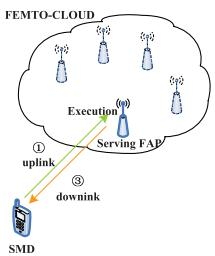

flowchart

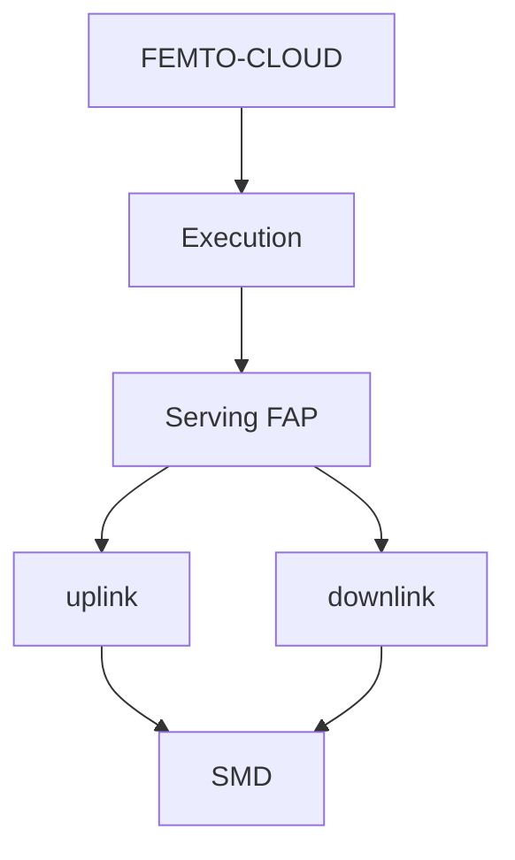

Fig. 1. An illustration of computation offloading.

# A. System Architecture Design

Since cellular network can manage communication but not computation, a new computation control entity is needed in the computation offloading architecture, which is called small cell cloud manager (SCM) in TROPIC [8]. The SCM consists of three modules related to computation offloading, i.e., offloading module, operator module, and optimization module. Through collaboration among these modules, the SCM manages computing-related activities in small cell cloud, i.e., femto-cloud in this paper. To put it simply, the SCM obtains the information of both the small cell and the SMD, e.g., the instantaneous channel information, cloud computational resource availability, parameters of SMD, and QoS requirements of SMD through operator module. Then, the SCM executes the optimization mechanisms in optimization module. Finally, the offloading decision is delivered to the SMD and the femto-cloud through offloading module.1

Based on this mobile computation offloading architecture, we consider a set of cloud-enhanced FAPs collaborate to form a femto-cloud and provide the SMD with proximity access to the cloud computing services [8], which is shown in Fig.1. When the SMD has a computation-intensive application to process, it sends resource request to the SCM. The SCM judiciously determine whether to offload the application or not and which portion is needed to be offloaded to the cloud. Once the SCM decides to offload, three phases need to be performed sequentially. Firstly, the SMD sends data to the cloud through uplink channel. Secondly, the cloud executes the offloaded data. Finally, the results are sent back to the SMD through downlink channel.2 With the goal of saving SMD’s energy consumption, the decision of offloading depends on several aspects, such as computational speed of SMD, transmit power of SMD, channel condition, etc. In order to investigate the effect of these factors on offloading decisions, we consider

the case that the nearest serving FAP is the only server allowed to execute the offloaded part [13]. Therefore, we do not distinguish FAP, cloud server, and cloud hereinafter.

# B. Application Model

There are a significant number of applications that can support the cloud service. Focusing on different types of applications, the resource management needs to be tackled in different ways. In general, applications can be classified into the following three major groups [13]:

• Data partitioned oriented applications. The amount of data to be processed is known beforehand for this kind of applications. Besides, we could take advantage of parallelism by processing a portion of total data at the local side and the remaining part at the cloud side concurrently [9], [12], [13], [19], [22]. The typical examples are the virus scan application and the file/figure compression application. Note that a load balancer divides all the files or figures into several independent subsets that can be processed in parallel.   
• Code partitioned oriented applications. This type of applications can be divided into several components. Some of the components can be parallel, while some need to be sequential since the output data of some components is the input data of some others. The relationship among these components can be expressed by the component dependency graph (CDG) or call graph (CG) [15], [23], [24]. For different CDGs or CGs, different mathematical formulations should be made.   
• Continuous execution applications. It is not known beforehand for how long the application runs. Cloud mobile gaming and other interactive applications belong to this group. One Quality of Service (QoS) metric of this type of applications is the average delay, which includes communication delay, queuing delay, and computing delay [25]–[28].

In this paper, we focus on data partitioned oriented applications. Particularly, the application is abstracted into a profile with two parameters, i.e., $( I , L _ { \mathrm { m a x } } )$ [19], where I and $L _ { \mathrm { m a x } }$ denote the amount of computation input data bits and the application-dependent latency requirement, respectively. Following [13] and [20], we model the number of cycles C needed for the application as the number of computation input data multiplied by a factor, i.e., $C = \alpha I$ , where α $( \alpha > 0 )$ depends on the nature of application, e.g., computational complexity of application. Besides, we define $\lambda \left( 0 \leq \lambda \leq 1 \right)$ as the ratio of locally executed amount of bits to the total input data bits. In order to simplify the analysis, we assume full granularity in data partition [13]. In other words, the application could be partitioned into subsets of any size, despite that only several partitions are possible in practice. Accordingly, the optimal solution in this paper could be served as a performance upper-bound of realistic offloading strategies. In other words, the optimal solution obtained in our work should be further quantized [29]. The quantization methods will be provided in Section III-B and Section IV-B.

# C. Energy Consumption and Latency Model

1) Local Computing Cost: We model the power consumption of CPU as $P = k f ^ { 3 }$ as in [19], where $f$ and $k$ are the CPU’s computational speed and a coefficient depending on chip architecture, respectively. As f is equal of cycles per second, the energy consumption per cycle is thus $k f ^ { 2 }$ . For the SMD, its computation energy consumption can be minimized by optimally configuring computational speed via DVS technology. When the amount of data bits processed at the SMD is $\lambda I ,$ the execution time $t _ { l }$ is

$$
t _ {l} = \frac {\alpha \lambda I}{f _ {l}}, \tag {1}
$$

where $f _ { l }$ is computational speed of SMD. The energy consumption $E _ { l }$ is given by

$$
E _ {l} = \alpha \lambda I k f _ {l} ^ {2}. \tag {2}
$$

2) Offloading Cost: In this work, frequency division duplex (FDD) is considered as the duplex mode. The uplink and downlink channels are assumed to be the frequency-flat block-fading Rayleigh channels, with block length no less than the maximum latency requirement of the application. The path loss between the SMD and its serving FAP is modeled as $d ^ { - \upsilon }$ , where $d$ and v denote the distance from the SMD to its serving FAP and the path loss exponent, respectively. Moreover, the uplink and downlink channel fading coefficients are denoted by $h _ { 1 }$ and $h _ { 2 } .$ , respectively, both of which are modeled as circularly symmetric complex Gaussian random variables. Considering the white Guassian noise power is $\mathrm { N } _ { 0 } .$ , the uplink rate $R _ { \mathrm { U } }$ and downlink rate $R _ { \mathrm { D } }$ are given by

$$
R _ {\mathrm{U}} = W _ {\mathrm{U}} \log_ {2} \left(1 + \frac {P _ {t} d ^ {- v} | h _ {1} | ^ {2}}{\mathrm{N} _ {0}}\right), \tag {3}
$$

$$
R _ {\mathrm{D}} = W _ {\mathrm{D}} \log_ {2} \left(1 + \frac {P _ {\mathrm{F}} d ^ {- v} | h _ {2} | ^ {2}}{\mathrm{N} _ {0}}\right), \tag {4}
$$

where $W _ { \mathrm { U } } , \ W _ { \mathrm { D } } , \ P _ { t }$ , and $P _ { \mathrm { F } }$ denote the uplink channel bandwidth, downlink channel bandwidth, transmit power of SMD, and transmit power of its serving FAP, respectively.

With $\left( 1 - \lambda \right) I$ bits offloaded to the cloud, the amount of uplink data is $\beta _ { 1 } \left( 1 - \lambda \right) I ,$ , where $\beta _ { 1 } \left( \beta _ { 1 } > 0 \right)$ denotes the overhead in uplink transmission, such as channel encoding, data encryption. Besides, the downlink data size is $\beta _ { 2 } \left( 1 - \lambda \right) I ,$ where $\beta _ { 2 } \left( \beta _ { 2 } > 0 \right)$ accounts jointly for the overhead in downlink transmission and the ratio of output to input bits offloaded to the cloud [13]. When computation offloading takes place, the total execution time $t _ { c }$ can be expressed as

$$
t _ {c} = t _ {\mathrm{U}} + \tau_ {c} + t _ {\mathrm{D}}. \tag {5}
$$

In $( 5 ) , \tau _ { c }$ is the execution time in the cloud and given by $\tau _ { c } =$ α(1−λ)If , where fc is the computational speed of cloud. Here, $\frac { \alpha ( 1 - \lambda ) I } { f _ { - } }$ $f _ { c }$ c $f _ { c }$ is fixed for the duration of application execution [13], [27]. In addition, $t _ { \mathrm { U } }$ and $t _ { \mathrm { D } }$ denote the uplink and downlink transmission delay, which can be expressed as $\begin{array} { r } { t _ { \mathrm { U } } = \frac { \beta _ { 1 } ( 1 - \lambda ) I } { R _ { \mathrm { U } } } } \end{array}$ RU and $\begin{array} { r } { t _ { \mathrm { D } } = \frac { \beta _ { 2 } ( 1 - \lambda ) I } { R _ { \mathrm { D } } } } \end{array}$ RD , respectively. Thus, the energy consumption of SMD $E _ { c }$ is expressed as

$$
E _ {c} = (P _ {0} + k _ {t} P _ {t}) t _ {\mathrm{U}} + P _ {r} t _ {\mathrm{D}}, \tag {6}
$$

where $P _ { 0 } , k _ { t }$ , and $P _ { r }$ refer to the static power consumption, efficient factor of power amplifier, and receive power consumption, respectively.

3) Total Cost: Since parallel computing is considered, the latency to execute the application $L \left( f _ { l } , P _ { t } , \lambda \right)$ can be given by

$$
L \left(f _ {l}, P _ {t}, \lambda\right) = \max \left\{t _ {l}, t _ {c} \right\}. \tag {7}
$$

Besides, the whole energy consumption of SMD $E \left( f _ { l } , P _ { t } , \lambda \right)$ can be expressed as

$$
E \left(f _ {l}, P _ {t}, \lambda\right) = E _ {l} + E _ {c}. \tag {8}
$$

# D. Problem Formulation

1) Energy Consumption Minimization Problem (ECM): In order to prolong the battery lifetime, it is useful to minimize the overall energy consumption of SMD while guaranteeing the latency requirement of application. The energy minimization problem is formulated as follows:

$$
\mathbf {P 1}: \min _ {f _ {l}, P _ {t}, \lambda} E (f _ {l}, P _ {t}, \lambda)
$$

$$
s. t. \mathrm{C} 1: L \left(f _ {l}, P _ {t}, \lambda\right) \leq L _ {\max},
$$

$$
\mathrm{C} 2: 0 \leq \lambda \leq 1,
$$

$$
\mathrm{C} 3: 0 \leq P _ {t} \leq P _ {t _ {\max}},
$$

$$
\mathrm{C} 4: 0 \leq f _ {l} \leq f _ {l _ {\max}},
$$

where $E \left( P _ { t } , f _ { l , , \lambda } \right)$ is given by

$$
\begin{array}{l} E \left(f _ {l}, P _ {t}, \lambda\right) = \alpha I k \lambda f _ {l} ^ {2} + \left(P _ {0} + k _ {t} P _ {t}\right) \frac {\beta_ {1} (1 - \lambda) I}{W _ {\mathrm{U}} \log_ {2} (1 + P _ {t} a)} \\ + P _ {r} \frac {\beta_ {2} (1 - \lambda) I}{R _ {\mathrm{D}}}, \tag {9} \\ \end{array}
$$

where $\begin{array} { r } { a = \frac { d ^ { - \upsilon } | h _ { 1 } | ^ { 2 } } { \mathrm { N } _ { 0 } } } \end{array}$ . Besides, $t _ { c }$ can be expressed as

$$
t _ {c} = \frac {\beta_ {1} (1 - \lambda) I}{W _ {\mathrm{U}} \log_ {2} \left(1 + \frac {P _ {t} d ^ {- v} \left| h _ {1} \right| ^ {2}}{\mathrm{N} _ {0}}\right)} + \frac {\alpha (1 - \lambda) I}{f _ {c}} + \frac {\beta_ {2} (1 - \lambda) I}{R _ {\mathrm{D}}}. \tag {10}
$$

In P1, C1 reflects the latency constraint. C2 specifies the domain of λ. C3 and C4 are the maximum transmit power and computational speed constraints imposed by radio interface and CPU, respectively.3 We can see both $E \left( f _ { l } , P _ { t } , \lambda \right)$ and $t _ { c }$ in C1 are nonconvex. Therefore, P1 is a nonconvex problem, which is challenging to be solved [31]. Note that using DVS technology, the SMD can adjust its computational speed according to the optimization results.

3Note that $f _ { l }$ is restricted to a finite set of values in practice. If we model it as a discrete variable, the offloading problem will be formulated as a mixed-integer optimization problem, which is NP-hard in general. Due to the difficulty in obtaining its optimal solution, it is hard to provide insights into the optimal policy structures. Therefore, we model it as a continuous variable in our paper. Accordingly, the optimal solution could be served as a performance upper-bound of realistic offloading strategies. Moreover, the computational speed of SMD is assumed to be a continuous variable in many researches [19], [30].

2) Latency Minimization Problem (LM): In situations where the SMD has a stringent requirement on energy consumption while application is delay-sensitive, it is preferred to use limited energy to, as far as possible, shorten the latency to execute the application, which can be formulated as follows:

$$
\begin{array}{l} \mathbf {P 2}: \min _ {f _ {l}, P _ {t}, \lambda} L \left(f _ {l}, P _ {t}, \lambda\right) \\ s. t. \mathrm{C} 5: E \left(f _ {l}, P _ {t}, \lambda\right) \leq E _ {\max}, \\ \mathrm{C2,C3,C4,} \\ \end{array}
$$

where C5 reflects the energy constraint. Due to the nonconvexity of both objective and constraints, P2 is a nonconvex problem. Additionally, it is also a nonsmooth optimization problem due to the nonsmoothness of objective function $L \left( f _ { l } , P _ { t } , \lambda \right)$ .

Remark 1: Not only the LM problem but also the ECM problem is suitable for delay-sensitive applications. Delaysensitive applications are characterized by their bounded endto-end delay requirements [32], [33], which can be guaranteed in the ECM problem.

# III. ENERGY-OPTIMAL PARTIAL OFFLOADING CONTROL SCHEME

In this section, the feasibility of the energy minimization problem is first analyzed. Then, we propose an algorithm to solve this nonconvex problem by transforming it to a convex problem. At last, we discuss two special cases and extend the problem to a multiple cloud servers scenario.

# A. Feasibility Analysis

In order to guarantee that the feasible region of $f _ { l }$ is not empty, we have

$$
\lambda \leq \frac {L _ {\max} f _ {l _ {\max}}}{\alpha I} \triangleq \lambda_ {\mathrm{u}} \tag {11}
$$

according to C1 and C4. Similarly, to ensure that the feasible region of $P _ { t }$ is not empty, from C1 and C3, we can obtain

$$
\lambda \geq 1 - \frac {L _ {\max}}{I \left(\frac {\beta_ {1}}{W _ {\mathrm{U}} \log_ {2} (a P _ {t _ {\max}} + 1)} + \frac {\alpha}{f _ {c}} + \frac {\beta_ {2}}{R _ {\mathrm{D}}}\right)} \triangleq \lambda_ {1}. \tag {12}
$$

Taking C2 into consideration, we define

$$
\lambda_ {\max} = \min \left\{\lambda_ {\mathrm{u}}, 1 \right\}, \tag {13}
$$

$$
\lambda_ {\min} = \max \{\lambda_ {1}, 0 \}. \tag {14}
$$

To make the feasible region of λ be not empty, $\lambda _ { \operatorname* { m i n } } \le \lambda _ { \operatorname* { m a x } }$ should hold, which is the equivalent of

$$
L _ {\max} \geq L _ {\max} ^ {\text { par }}, \tag {15}
$$

where $L _ { \mathrm { m a x } } ^ { \mathrm { p a r } }$ is given by

$$
L _ {\max} ^ {\text { par }} = \frac {1}{\frac {f _ {l _ {\max}}}{\alpha I} + \frac {1}{I \left(\frac {\beta_ {1}}{W _ {\mathrm{U}} \log 2 (\alpha P _ {l _ {\max}} + 1)} + \frac {\alpha}{f c} + \frac {\beta_ {2}}{R _ {\mathrm{D}}}\right)}}. \tag {16}
$$

Based on the analysis above, we conclude that P1 is feasible only if $L _ { \mathrm { m a x } } \geq L _ { \mathrm { m a x } } ^ { \mathrm { p a r } }$ Lparmax, which implies that only the applications with $L _ { \mathrm { m a x } } \geq L _ { \mathrm { m a x } } ^ { \mathrm { p a r } }$ can be supported in partial offloading.

Remark 2: In full offloading, when the application is totally processed in the SMD, $\begin{array} { r } { \frac { \alpha I } { f _ { l \mathrm { m a x } } } \overset { \cdot } { \leq } L _ { \mathrm { m a x } } } \end{array}$ should hold. Otherwise, flmax we have only the $\begin{array} { r } { I \left( \frac { \beta _ { 1 } } { W _ { \mathrm { U } } \log _ { 2 } \left( a P _ { \mathrm { t m a x } } + 1 \right) } + \frac { \alpha } { f _ { c } } + \frac { \beta _ { 2 } } { R _ { \mathrm { D } } } \right) \leq L _ { \operatorname* { m a x } } } \end{array}$ + . Therefore,supported in $\hat { L } _ { \mathrm { m a x } } \geq L _ { \mathrm { m a x } } ^ { \mathrm { f u l l } }$ full offloading, where $L _ { \mathrm { m a x } } ^ { \mathrm { f u l l } }$ ma is given by

$$
L _ {\max} ^ {\text { full }} = \min \left\{\frac {\alpha I}{f _ {l _ {\max}}}, I \left(\frac {\beta_ {1}}{W _ {\mathrm{U}} \log_ {2} \left(a P _ {t _ {\max}} + 1\right)} + \frac {\alpha}{f _ {c}} + \frac {\beta_ {2}}{R _ {\mathrm{D}}}\right) \right\}. \tag {17}
$$

Comparing (16) with (17), we can see $\begin{array} { r c l } { L _ { \operatorname* { m a x } } ^ { \mathrm { p a r } } } & { \le } & { L _ { \operatorname* { m a x } } ^ { \mathrm { f u l l } } . } \end{array}$ Therefore, only partial offloading scheme can support these applications with $L _ { \mathrm { m a x } } \in [ L _ { \mathrm { m a x } } ^ { \mathrm { p a r } } , \bar { L } _ { \mathrm { m a x } } ^ { \mathrm { f u l l } } )$ .

# B. Optimal Solution

We optimally solve P1 by transforming the original problem to an one-dimensional problem. Before we elaborate the details of the proposed algorithm, we first give a lemma which is the basis of this algorithm.

Lemma 1: We always have

$$
\inf _ {x, y} f (x, y) = \inf _ {x} \tilde {f} (x),
$$

where ${ \tilde { f } } \left( x \right) = \operatorname* { i n f } _ { y } f \left( x , y \right)$

Proof: See [31].

Lemma 1 tells us that we could minimize a function by first minimizing over some of the variables, and then minimizing over the remaining ones. With Lemma 1, we could solve P1 by minimizing over $f _ { l } , P _ { t }$ , and λ, sequentially.

In P1, we discover that $E \left( f _ { l } , P _ { t } , \lambda \right)$ increases monotonically with the increase of $f _ { l } .$ Besides, from C1, we have $t _ { l } \ \leq \ L _ { \operatorname* { m a x } }$ , which yields $\begin{array} { r } { f _ { l } \ge \frac { \alpha \lambda I } { L _ { \mathrm { m a x } } } } \end{array}$ . Therefore, the optimal Lmax $f _ { l }$ can be derived in closed-form as follows:

$$
f _ {l} ^ {*} (\lambda) = \frac {\alpha \lambda I}{L _ {\max}}. \tag {18}
$$

Substituting (18) into P1, we can simplify the original optimization problem to P3 by reducing the number of variables to two. Specifically,

$$
\mathbf {P 3}: \min _ {P _ {t}, \lambda} E (P _ {t}, \lambda)
$$

$$
s. t. \mathrm{C} 6: t _ {c} \leq L _ {\max},
$$

$$
\mathrm{C} 7: 0 \leq \lambda \leq \lambda_ {\max},
$$

$$
\mathrm{C} 3,
$$

where $E \left( P _ { t } , \lambda \right)$ is given by

$$
\begin{array}{l} E \left(P _ {t}, \lambda\right) = \frac {k (\alpha I) ^ {3}}{L _ {\max} ^ {2}} \lambda^ {3} + \beta_ {1} (1 - \lambda) I \underbrace {\frac {P _ {0} + k _ {t} P _ {t}}{W _ {\mathrm{U}} \log_ {2} (1 + P _ {t} a)}} _ {f \left(P _ {t}\right)} \\ + P _ {r} \frac {\beta_ {2} (1 - \lambda) I}{R _ {\mathrm{D}}}. \tag {19} \\ \end{array}
$$

Next, we minimize $E \left( P _ { t } , \lambda \right)$ by first minimizing over $P _ { t }$ and then over λ. In order to obtain the optimal $P _ { t }$ , we should analyze the feature of $f \left( P _ { t } \right)$ , which is revealed in the following lemma.

Lemma 2: The function

$$
f \left(P _ {t}\right) = \frac {P _ {0} + k _ {t} P _ {t}}{W _ {\mathrm{U}} \log_ {2} \left(1 + P _ {t} a\right)}
$$

is unimodal.

$x \left( P _ { 0 } + k _ { t } { \frac { 2 ^ { \frac { 1 } { W _ { \mathrm { U } } x } } - 1 } { a } } \right)$ Proof: First, we can obtain that is convex w.r.t. $x , \ x \geq 0 .$ $\begin{array} { r l r l } { f \left( x \right) } & { { } = } & { } \end{array}$ , since its Hessian matrix is positive semidefinite. Hence, if the function $f \left( x \right)$ has a minimum, this minimum is unique. Next, let $\begin{array} { r } { P _ { t } = \frac { 2 ^ { \frac { 1 } { W _ { \mathrm { U } } x } } - 1 } { a } } \end{array}$ a , we can represent $f \left( x \right)$ as $\begin{array} { r } { f \left( \frac { 1 } { W _ { \mathrm { U } } \log _ { 2 } \left( 1 + a P _ { t } \right) } \right) } \end{array}$ versus $P _ { t } , \mathrm { i . e . , } f \left( P _ { t } \right)$ 2. In this procedure, all we do is to apply a change of variable, which is monotonous. Therefore, it is still true to say if $f \left( P _ { t } \right)$ has a minimum, this minimum is unique. In other words, the function $f \left( P _ { t } \right)$ is unimodal.

Thanks to Lemma 2, the optimal $P _ { t }$ will be chosen among three points, i.e., the two extreme points of set S and the peak point of $f \left( P _ { t } \right)$ . Here, S denotes the feasible region of $P _ { t } .$ . From C6, we can obtain the following result

$$
P _ {t} \geq \frac {2 ^ {\frac {\beta_ {1}}{W _ {\mathrm{U}} \left(\frac {L _ {\max}}{(1 - \lambda) I} - \frac {a}{f _ {c}} - \frac {\beta_ {2}}{R _ {\mathrm{D}}}\right)}} - 1}{a} \triangleq P _ {t _ {\min}} (\lambda). \tag {20}
$$

According to C3 and (20), we can express the optimal $P _ { t }$ in closed-form as

$$
P _ {t} ^ {*} (\lambda) = \left\{ \begin{array}{l l} P _ {t _ {\min}} (\lambda), & P _ {t _ {\min}} (\lambda) > \hat {P} _ {t}, \\ \hat {P} _ {t}, & P _ {t _ {\min}} (\lambda) \leq \hat {P} _ {t} \leq P _ {t _ {\max}}, \\ P _ {t _ {\max}}, & \hat {P} _ {t} > P _ {t _ {\max}}, \end{array} \right. \tag {21}
$$

where $\hat { P } _ { t }$ denotes the transmit power that minimizes $f \left( P _ { t } \right)$ , i.e., $\nabla f \left( P _ { t } \right) \mid _ { P _ { t } = \hat { P } _ { t } } = 0$ . Note that $\hat { P } _ { t }$ is not related to λ. Using (21), P3 can be rewritten as a simplified onedimensional problem of λ as follows:

P4 : min E (λ) λ

$$
s. t. \mathrm{C} 8: \lambda_ {\min} \leq \lambda \leq \lambda_ {\max},
$$

where

$$
\begin{array}{l} E (\lambda) = \frac {k (\alpha I) ^ {3}}{L _ {\max} ^ {2}} \lambda^ {3} + f (P _ {t} ^ {*} (\lambda)) \beta_ {1} (1 - \lambda) I \\ + P _ {r} \frac {\beta_ {2} (1 - \lambda) I}{R _ {\mathrm{D}}}. \tag {22} \\ \end{array}
$$

So far we have simplified the original optimization problem P1 into an one-dimensional problem P4. However, it is difficult to prove the convexity of $E \left( \lambda \right)$ directly due to the item $f \left( P _ { t } ^ { * } \left( \lambda \right) \right) \beta _ { 1 } \left( 1 - \lambda \right) I ,$ . Fortunately, we can prove the convexity by transforming P3 and using the following lemma.

Lemma 3: If f is convex in (x , y), and C is a convex nonempty set, then the function

$$
g (x) = \inf _ {y \in C} f (x, y)
$$

is convex in x, provided $g \left( x \right) > - \infty$ for some x. The domain of g is the projection of dom f on its x −coordinates, i.e., dom $g = \left\{ x | ( x , y ) \right.$ ∈dom f for some $y \in C \bigg \}$ .

Proof: See [31].

Algorithm 1 Energy-Optimal Partial Computation Offloading (EPCO) 

<table><tr><td>1: Obtain the latency constraint  $L_{\text{max}}$  and other system settings, then calculate  $L_{\text{max}}^{\text{par}}$ </td></tr><tr><td>2: if  $L_{\text{max}} < L_{\text{max}}^{\text{par}}$  then</td></tr><tr><td>3: Drop this application or update the system to support it</td></tr><tr><td>4: else</td></tr><tr><td>5: Using bisection algorithm to solve P4 and obtain  $\lambda^{*}$ </td></tr><tr><td>6: end if</td></tr><tr><td>7: Calculate  $f_{l}^{*}$  using (18)</td></tr><tr><td>8: Calculate  $P_{t}^{*}$  using (21)</td></tr></table>

This lemma provides us with a method to prove the convexity of a function. Motivated by it, we make the following efforts.

Let

$$
x = \frac {1 - \lambda}{\log_ {2} (1 + P _ {t} a)}, \tag {23}
$$

then the constraint on x is $\begin{array} { r } { x \in \left[ \frac { 1 - \lambda } { \log _ { 2 } \left( 1 + P _ { \operatorname* { m a x } _ { \alpha } ^ { a } } \right) } , + \infty \right) } \end{array}$ . Hence, we can reformulate P3 in a more compact form as

$$
\mathbf {P 5}: \min _ {x, \lambda} E (x, \lambda)
$$

$$
s. t. \mathrm{C} 9: t _ {c} (x, \lambda) \leq L _ {\max},
$$

$$
\mathrm{C} 1 0: x \geq \frac {1 - \lambda}{\log_ {2} \left(1 + P _ {t _ {\max}} a\right)},
$$

$$
\mathrm{C} 7,
$$

where the objective is

$$
\begin{array}{l} E (x, \lambda) = \frac {k (\alpha I) ^ {3}}{L _ {\max} ^ {2}} \lambda^ {3} + \frac {\beta_ {1} I}{W _ {\mathrm{U}}} x \left[ P _ {0} + \frac {k _ {t}}{a} \left(2 ^ {\frac {1 - \lambda}{x}} - 1\right) \right] \\ + P _ {r} \frac {\beta_ {2} (1 - \lambda) I}{R _ {\mathrm{D}}}, \tag {24} \\ \end{array}
$$

and the offloading latency is

$$
t _ {c} (x, \lambda) = \frac {\beta_ {1} I}{W _ {\mathrm{U}}} x + \frac {\alpha (1 - \lambda) I}{f _ {c}} + \frac {\beta_ {2} (1 - \lambda) I}{R _ {\mathrm{D}}}. \tag {25}
$$

Since Hessian matrix of $E \left( x , \lambda \right)$ is positive semidefinite, $E \left( x , \lambda \right)$ is convex in $( x , \lambda )$ within the triangular region specified by C6 and $\begin{array} { r } { x \in \left[ \frac { 1 - \lambda } { \log _ { 2 } \left( 1 + P _ { \operatorname* { m a x } } a \right) } , + \infty \right) } \end{array}$  1−λlog (1+P a) , +∞. Additionally, C9 is a linear function of x and λ. Therefore, P5 is a convex optimization problem, which minimizes a convex function $E \left( x , \lambda \right)$ over a convex set C [31]. Define $\begin{array} { r } { E _ { 1 } \left( \lambda \right) = \operatorname* { i n f } _ { x \in C } E \left( x , \lambda \right) . } \end{array}$ , thanks to Lemma 3, we can see that $E _ { 1 } \left( \lambda \right)$ is convex w.r.t. λ. Since $E \left( \lambda \right)$ in P4 is the same as $E _ { 1 } \left( \lambda \right)$ , P4 is also a convex problem. Besides, it is an one-dimensional problem. Hence, some simple algorithms (e.g., 0.618 and bisection) could be used to obtain its globally optimal solution. Without loss of generality, we choose the bisection method.

By now, we have solved the original problem P1. The pseudo code of this method is given in Algorithm 1. Besides, bisection algorithm in line 5 could be found in [31].

Remark 3: Here, we provide the corresponding quantization method based on the structure of ECM. Assuming that for a set of files to be processed for virus scan, the possible partition set is $\begin{array} { r c l } { \Omega } & { = } & { \{ \lambda _ { 1 } , \lambda _ { 2 } , \cdot \cdot \cdot \lambda _ { \mathrm { M } } \} } \end{array}$ . We define $\begin{array} { r l } { \lambda _ { c 1 } } & { { } = } \end{array}$ arg min $\phantom { } _ { \cdots } \left\{ \lambda ^ { * } - \lambda _ { i } \right\}$ and $\lambda _ { c 2 } \ = \ \arg \operatorname* { m i n } _ { \lambda _ { i } \in \Omega , \lambda _ { i } \geq \lambda ^ { * } } \{ \lambda _ { i } - \lambda ^ { * } \}$ . $\mathbf { \bar { \rho } } ^ { \infty } \lambda _ { i } \in \Omega , \lambda _ { i } \leq \lambda ^ { * }$ Since $E \left( \lambda \right)$ is a convex function, we can choose the optimal offloading ratio in practice $\lambda _ { p } ^ { * }$ through comparing $E \left( \lambda _ { c 1 } \right)$ and $E \left( \lambda _ { c 2 } \right)$ . Specifically, $\lambda _ { p } ^ { * } ~ = ~ \lambda _ { c 1 }$ if $E \left( \lambda _ { c 1 } \right) ~ \leq ~ E \left( \lambda _ { c 2 } \right)$ . Otherwise, $\lambda _ { p } ^ { * } = \lambda _ { c 2 }$ . Note that if $\lambda _ { c 1 }$ or $\lambda _ { c 2 }$ do not exist, we let $E \left( \lambda _ { c 1 } \right) = + \infty$ or $E \left( \lambda _ { c 2 } \right) = + \infty$ .

# C. Analysis of Special Cases

In this subsection, we provide an analysis of some special cases of the problem aforementioned. This analysis gives practical guidelines for partial communication offloading. Moreover, a key different conclusion from other works (e.g., [13]) due to DVS technology is derived.

1) Optimality of Local Execution: Here, we give the necessary and sufficient condition under which the SMD prefers to process the application locally. Specifically, $\lambda = 1$ should be feasible and $\stackrel { \bullet } { \frac { d \dot { E } ( \lambda ) } { d \lambda } } \mid _ { \lambda = 1 } \leq 0$ due to the convexity of $E \left( \lambda \right)$ . The first condition means that the SMD should have enough computation capacity to support the application with latency requirement $L _ { \mathrm { m a x } } , \mathrm { i . e . }$ .,

$$
f _ {l _ {\max}} \geq \frac {\alpha I}{L _ {\max}}. \tag {26}
$$

The second condition holds if

$$
\frac {d E (\lambda)}{d \lambda} | _ {\lambda = 1} = \frac {3 k (\alpha I) ^ {3}}{L _ {\max} ^ {2}} - f \left(P _ {t} ^ {*} (1)\right) \beta_ {1} I - \frac {P _ {r} \beta_ {2} I}{R _ {\mathrm{D}}} \leq 0, \tag {27}
$$

where $f \left( P _ { t } \right)$ and $P _ { t } ^ { * } \left( 1 \right)$ have been given in Lemma 2 and (21), respectively.

2) Optimality of Total Offloading: Similarly, the necessary and sufficient condition under which total offloading is the optimal decision is: i) $\lambda = 0$ is feasible; ii) $\frac { d { \cal E } ( \lambda ) } { d \lambda } \vert _ { \lambda = 0 \geq } 0 .$ Different from [13], where total offloading could be optimal under some conditions, we come to a different conclusion with DVS technology, which is given as follows:

Theorem 1: When the SMD has the capability of DVS, total offloading could not be the optimal strategy.

Proof: Intuitively, the SMD prefers to offload its computation when the channel condition is very good. Considering $a  + \infty , \hat { P } _ { t } = + \infty$ . According to (21), $P _ { t } ^ { * } \left( \lambda \right) = P _ { t _ { \operatorname* { m a x } } }$ . Therefore,

$$
\frac {d E (\lambda)}{d \lambda} | _ {\lambda = 0} = - \beta_ {1} I f (P _ {t _ {\max}}) - \frac {P _ {r} \beta_ {2} I}{R _ {\mathrm{D}}} <   0, \tag {28}
$$

which violates the second condition mentioned above. Hence, total offloading can not be the optimal strategy.

# D. Extension to Multiple Cloud Servers

In this subsection, we briefly extend the simple case described above to a multiple cloud servers scenario, where a set of cloud servers, i.e., FAPs can process the application for the SMD. Specifically, the SMD sends data to the most suitable FAP if an offloading decision is made. Then this FAP distributes the data to each FAP in the femto-cloud. Here, we aim to optimize the computation distribution among femtocloud as well as the user association to minimize the energy consumption of SMD, which is hard to be tackled. Therefore, we divide this problem into two subproblems and solve them one by one. One is to find the optimal computation distribution for a given associated FAP. The other is to choose the most suitable associated FAP.

1) Subproblem One: Here, we consider point-to-point communication between the severing FAP and other FAPs in the femto-cloud [34], [35]. Therefore, the cloud latency $L _ { c } ,$ , which is due to the communication latency between FAPs and the computation latency at each FAP, is the maximum latency experienced with the FAPs of the femto-cloud. It can be written as

$$
L _ {c} = \max _ {n = \{1, \dots , N \}} \left\{\frac {\alpha w _ {n}}{f _ {n}} + \delta_ {T x, b h} (n) + \delta_ {T x, b h} ^ {r} (n) \right\}, \tag {29}
$$

where $N , w _ { n } , f _ { n } , \delta _ { T x , b h } \left( n \right)$ , and $\delta _ { T x , b h } ^ { r } \left( n \right)$ denote the number of FAPs in femto-cloud, allocated computation bits to $\operatorname { F A P } n ,$ computational speed of FAP $n ,$ one way communication latency from the associated FAP to FAP n, and that for the reverse way, respectively. Without loss of generality, we denote the index of the associated FAP as 1. Therefore, $\delta _ { T x , b h } \left( 1 \right)$ and $\delta _ { T x , b h } ^ { r } \left( 1 \right)$ both are zero. Additionally, we consider the fiber communication as the transmission technology between FAPs, which guarantees rapid interaction among femto-cloud4 Due to the super-high throughput of fiber communication, $\delta _ { T x , b h } \left( n \right)$ and $\delta _ { T x , b h } ^ { r } \left( n \right)$ are load independent [36]. Therefore, $L _ { c }$ can be approximated by

$$
L _ {c} = \max \left\{\frac {\alpha w _ {1}}{f _ {1}}, \max _ {n = \{2, \dots , N \}} \left\{\frac {\alpha w _ {n}}{f _ {n}} + 2 \delta \right\} \right\}, \tag {30}
$$

where $\delta$ refers to the load independent latency. Using (30), The offloading latency $t _ { c m }$ could be expressed as

$$
t _ {c m} = t _ {\mathrm{U}} + L _ {c} + t _ {\mathrm{D}}. \tag {31}
$$

Accordingly, the original problem P1 can be rewritten as

$$
\begin{array}{l} \mathbf {P 6}: \min _ {f _ {l}, P _ {t}, \lambda , w _ {n}} E \left(f _ {l}, P _ {t}, \lambda\right) \\ s. t. \mathrm{C} 1 1: \max \left\{t _ {l}, t _ {c m} \right\} \leq L _ {\max}, \\ \mathrm{C} 1 2: \sum_ {n = 1} ^ {N} w _ {n} = (1 - \lambda) I, \\ \mathrm{C} 1 3: w _ {n} \geq 0, \\ \mathrm{C2,C3,C4,} \\ \end{array}
$$

where $E \left( P _ { t } , f _ { l , \it 3 } \lambda \right)$ is the same as (9). From C11, we have

$$
t _ {\mathrm{U}} + t _ {\mathrm{D}} \leq L _ {\max} - L _ {c}. \tag {32}
$$

Observing (32), we can see that reducing $L _ { c }$ can expand the feasible region on $( f _ { l } , P _ { t } , \lambda )$ space, which consequently reduces the optimal value of P6. Hence, instead of directly solving P6, we first investigate the following problem

$$
\begin{array}{l} \mathbf {P 7}: \min _ {w _ {n}} L _ {c} \\ s. t. \mathrm{C} 1 2, \mathrm{C} 1 3. \\ \end{array}
$$

4Note that the analysis below is applicable for wireless communication between FAPs if fiber communication is not available.

Algorithm 2 Energy-Optimal Partial Computation Offloading in Multiple Cloud Servers Scenario (EPCOMCSS)   
1: Initialize the optimal value of P6 $V^{*}$ 2: for $n = 1$ to $N$ do
3: Calculate $L_{\max}^{\prime}$ according to (35)
4: Use Algorithm 1 to solve P8 and obtain the optimal solution $(f_{l_n}, P_{t_n}, \lambda_n)$ and the optimal value $V_n$ 5: if $V_n \leq V^{*}$ then
6: Set $V^{*} = V_{n}$ , $P_t^{*} = P_{t_n}$ , $f_l^{*} = f_{l_n}$ , and $\lambda^{*} = \lambda_{n}$ 7: end if
8: end for
9: Calculate $w_n^{*}$ according to (33)

Easily, we can obtain the optimal solution of P7 as below,

$$
w _ {n} ^ {*} = \left\{ \begin{array}{l l} \frac {(1 - \lambda) I f _ {1} + \frac {2 \delta f _ {1}}{\alpha} \sum_ {n = 2} ^ {N} f _ {n}}{\sum_ {n = 1} ^ {N} f _ {n}}, & n = 1 \\ \frac {f _ {n}}{\sum_ {n = 2} ^ {N} f _ {n}} [ (1 - \lambda) I - w _ {1} ], & n \geq 2. \end{array} \right. \tag {33}
$$

Accordingly, the optimal value of P7 $L _ { c } ^ { * }$ can be expressed as

$$
L _ {c} ^ {*} = \frac {\alpha (1 - \lambda) I}{\sum_ {n = 1} ^ {N} f _ {n}} + \frac {2 \delta \sum_ {n = 2} ^ {N} f _ {n}}{\sum_ {n = 1} ^ {N} f _ {n}}. \tag {34}
$$

Substituting (34) and (18) into P6, we can simplify the problem as follows:

$$
\mathbf {P 8}: \min _ {P _ {t}, \lambda} E (P _ {t}, \lambda)
$$

$$
s. t. \mathrm{C} 1 4: t _ {\mathrm{U}} + \frac {\alpha (1 - \lambda) I}{\sum_ {n = 1} ^ {N} f _ {n}} + t _ {\mathrm{D}} \leq L _ {\max} ^ {\prime},
$$

$$
\mathrm{C3,C7,}
$$

where $E \left( P _ { t } , \lambda \right)$ is given by (19), and $L _ { \mathrm { m a x } } ^ { ' }$ is given by

$$
L _ {\max} ^ {\prime} = L _ {\max} - \frac {2 \delta \sum_ {n = 2} ^ {N} f _ {n}}{\sum_ {n = 1} ^ {N} f _ {n}}. \tag {35}
$$

Since P8 has the same structure as P3, it could be efficiently solved with Algorithm 1.

2) Subproblem Two: Since the size of femto-cloud is usually limited, the exhaustive search method can be used to solve this problem. Specifically, an optimal energy consumption value can be obtained for any given associated FAP by solving subproblem one. Through comparing these values, we find the minimum and choose the corresponding FAP as the associated FAP.

Remark 4: The associated FAP may be not the one with the best channel condition, since the computational speeds of FAPs also affect the result, which is reflected in Section V-B and Section V-D. Specifically, larger computational speed of the associated FAP, i.e., $f _ { 1 }$ , larger $L _ { \mathrm { m a x } } ^ { ' }$ , which provides a larger feasible region of P8. Consequently, a smaller optimal value could be obtained.

After solving these two subproblems, ECM in a multiple cloud servers scenario is handled. The pseudo code of this method is given in Algorithm 2.

# IV. LATENCY-OPTIMAL PARTIAL OFFLOADING CONTROL SCHEME

In this section, we first present the feasibility analysis and then propose an algorithm to solve the nonconvex and nonsmooth problem P2. Finally, we extend this problem to a multiple cloud servers scenario and propose the corresponding algorithm.

# A. Feasibility Analysis

Since P2 aims at minimizing the latency under energy consumption constraint (i.e., $E ( f _ { l } , P _ { t } , \lambda ) \leq E _ { \operatorname* { m a x } } )$ and other three constraints (i.e., C2, C3, and C4), the feasibility problem of P2 is the equivalent of solving the following problem:

$$
\mathbf {P 9}: \min _ {f _ {l}, P _ {t}, \lambda} E (f _ {l}, P _ {t}, \lambda)
$$

$$
s. t. \mathrm{C2,C3,C4}.
$$

If the optimal value of P9, i.e., $E \left( f _ { l } ^ { * } , P _ { t } ^ { * } , \lambda ^ { * } \right)$ satisfies $E \left( f _ { l } ^ { * } , P _ { t } ^ { * } , \lambda ^ { * } \right) \leq E _ { \operatorname* { m a x } }$ , then P2 is feasible; otherwise P2 is infeasible. Note that the feasible set of P2 is nonempty, since we can always find a feasible $f _ { l }$ when setting λ as one to meet the energy consumption constraint.

# B. Optimal Solution

From Section II, we know that P2 is a nonconvex and nonsmooth problem. Motivated by the difficulties of handling this problem, we propose a suboptimal algorithm in this section. The basic idea is to construct a non-increasing objective sequence, which converges to a locally optimal solution of P2. We elaborate the details of the proposed algorithm in the sequel.

First, we introduce a new variable t to transform the originally nonsmooth problem P2 to a smooth one as follows:

$$
\text { P10 }: \min _ {f _ {l}, P _ {t}, \lambda , t} t
$$

$$
s. t. \mathrm{C} 1 5: L \left(f _ {l}, P _ {t}, \lambda\right) \leq t,
$$

$$
\mathrm{C2,C3,C4,C5.}
$$

By setting $\begin{array} { r } { r = \frac { 1 } { \log _ { 2 } \left( 1 + P _ { t } a \right) } } \end{array}$ , we rewrite P10 as

$$
\text { P11 }: \min _ {f _ {l}, r, \lambda , t} t
$$

$$
s. t. \mathrm{C} 1 6: \alpha I \lambda - f _ {l} t \leq 0,
$$

$$
\mathrm{C} 1 7: \left(\frac {\beta_ {1}}{W _ {\mathrm{U}}} r + \frac {\alpha}{f _ {c}} + \frac {\beta_ {2}}{R _ {\mathrm{D}}}\right) (1 - \lambda) I - t \leq 0,
$$

$$
\mathrm{C} 1 8: E \left(f _ {l}, r, \lambda\right) - E _ {\max} \leq 0,
$$

$$
\mathrm{C} 1 9: r \geq \frac {1}{\log_ {2} \left(1 + a P _ {t _ {\max}}\right)} \triangleq r _ {\min},
$$

$$
\mathrm{C2,C4},
$$

where the first item in C18 could be expressed as

$$
\begin{array}{l} E \left(f _ {l}, r, \lambda\right) = \alpha k I \lambda f _ {l} ^ {2} + \frac {P _ {r} \beta_ {2} (1 - \lambda) I}{R _ {\mathrm{D}}} \\ + \frac {\beta_ {1} (1 - \lambda) I}{W _ {\mathrm{U}}} \underbrace {r \left[ P _ {0} + \frac {k _ {t}}{a} \left(2 ^ {\frac {1}{r}} - 1\right) \right]} _ {g (r)}. \tag {36} \\ \end{array}
$$

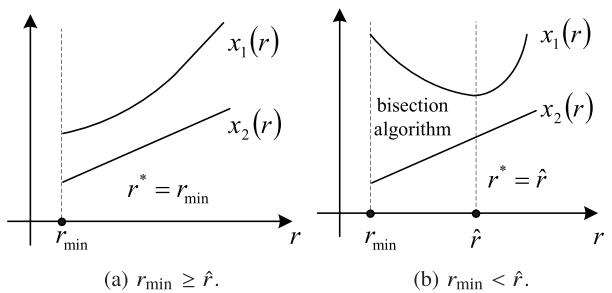  
Fig. 2. An illustration of $r ^ { * }$ in several cases.

Observing P11, we can find that P11 becomes a linear program of λ and t when we fix $f _ { l }$ and $r ,$ while it becomes a convex program of $f _ { l }$ and r when we fix λ and t. Therefore, based on the univariate search technique [21], we could solve P11 by using alternating minimization between the linear program and the convex program aforementioned. Specifically, we first give a feasible solution of P11, e.g., $\left( { { f } _ { l _ { 0 } } , { r } _ { 0 } , { \lambda } _ { 0 } , t _ { 0 } } \right)$ and solve the linear program to obtain $( \lambda _ { 1 } , t _ { 1 } )$ with the given $\left( f _ { l _ { 0 } } , r _ { 0 } \right)$ . Based on $( \lambda _ { 1 } , t _ { 1 } )$ , we then solve the convex problem to obtain $\left( f _ { l _ { 1 } } , r _ { 1 } \right)$ . This process is continued until the relative difference between the objective values in two sequential iterations becomes less than a pre-defined error tolerance threshold $\epsilon .$

Note that with the given $\left( \lambda _ { j } , t _ { j } \right)$ , where $j , ( j \geq 1 )$ denotes the iterative number, the convex problem is a feasibility problem, which has a constant objective. To obtain a nonincreasing objective sequence, we should construct a new objective. Here, we adopt the original expression of latency as the new objective, and thus write the new optimization as follows:

$$
\begin{array}{l} \mathbf {P 1 2}: \min _ {f _ {l}, r} \max \left\{\underbrace {\frac {\alpha I \lambda_ {j}}{f _ {l}}} _ {x _ {1} (r)}, \underbrace {\left(\frac {\beta_ {1} r}{W _ {\mathrm{U}}} + \frac {\alpha}{f _ {c}} + \frac {\beta_ {2}}{R _ {\mathrm{D}}}\right) \left(1 - \lambda_ {j}\right) I} _ {x _ {2} (r)} \right\} \\ s. t. \mathrm{C} 2 0: E (f _ {l}, r, \lambda_ {j}) \leq E _ {\max}, \\ \mathrm{C4,C19,} \\ \end{array}
$$

where the left-hand term of C20 is given by (36).

The optimal r is illustrated in Fig. 2. Obviously, $x _ { 2 } \left( r \right)$ is a monotonically increasing function of r . In order to analytically obtain the optimal r, we should analyze the monotone property of $x _ { 1 } ( r ) . ^ { 5 }$ Since $g \left( r \right)$ is a strictly convex function of r , it has only one global optimal solution rˆ.

• If $\dot { r } _ { \operatorname* { m i n } } \geq \hat { r } , g \left( r \right)$ monotonically increases in $[ r _ { \mathrm { m i n } } , + \infty )$ . Via C20, we can see that a larger $g \left( r \right)$ results in a smaller $f _ { l } ,$ , thus leading to a larger $x _ { 1 } \left( r \right)$ . Hence, $x _ { 1 } \left( r \right)$ is a monotonically increasing function of r . As shown in Fig. $^ { 2 \mathrm { a } , }$ both $x _ { 1 } \left( r \right)$ and $x _ { 2 } \left( r \right)$ monotonically increase with the increment of r in $[ r _ { \mathrm { m i n } } , + \infty )$ , the optimal r should be $r _ { \mathrm { m i n } }$ .   
• If $r _ { \mathrm { m i n } } ~ < ~ \hat { r } , ~ g _ { \mathrm { \ell } } ( r )$ monotonically decreases in $\left[ r _ { \operatorname* { m i n } } , \hat { r } \right]$ and monotonically increases in $\textstyle \left[ { \widehat { r } } , + \infty \right)$ . As shown in Fig. 2b, when $r ~ \in ~ \left[ \hat { r } , + \infty \right)$ , the optimal r is $\hat { r }$ due to the same reason stated above. Therefore, we can

$\begin{array} { r } { { 5 } _ { \mathrm { T e r m } } \frac { \alpha I \lambda _ { j } } { f _ { l } } } \end{array}$ 5Term α I λ j is affected by r via C20. Hence, it is reasonable to name $\frac { \alpha I \lambda _ { j } } { f _ { l } }$ as x1 (r).

Algorithm 3 Analytically Solve P12 (AS) Algorithm   
1: Based on the channel state and $P_{l_{max}}$ , calculate $r_{min}$ and $\hat{r}$ 2: if $r_{min} \geq \hat{r}$ then
3: Set $r_j = r_{min}$ 4: Set $f_{l_j} = \min\left\{\hat{f}_l, f_{l_{\max}}\right\}$ , where $\hat{f}_l$ is the solution of $E(f_l, r_j, \lambda_j) = E_{\max}$ 5: Based on $f_{l_j}$ , $r_j$ , calculate the objective of P12
6: else
7: Given tolerance $\varepsilon > 0$ , let $l = r_{min}$ , and $u = \hat{r}$ 8: while $u - l \geq \varepsilon$ do
9: Set $r_j = \frac{(l + u)}{2}$ 10: Set $f_{l_j} = \min\left\{\hat{f}_l, f_{l_{\max}}\right\}$ , where $\hat{f}_l$ is the solution of $E(f_l, r_j, \lambda_j) = E_{\max}$ 11: Calculate $x_1(r_j)$ and $x_2(r_j)$ 12: if $x_1(r_j) > x_2(r_j)$ then
13: Set $l = r_j$ 14: else if $x_1(r_j) < x_2(r_j)$ then
15: Set $u = r_j$ 16: else
17: Break
18: end if
19: end while
20: Based on $f_{l_j}$ , $r_j$ , calculate the objective of P12
21: end if

Algorithm 4 Latency-Optimal Partial Computation Offloading (LPCO)   
1: Set iteration number $j = 1$ , initialize with a feasible $(f_{l_0}, r_0, \lambda_0, t_0)$ 2: Obtain $(\lambda_1, t_1)$ and the corresponding objective value $t_1$ by solving the linear program, which fixes $f_l$ and $r$ as $f_{l_0}$ and $r_0$ , respectively
3: Based on $(\lambda_1, t_1)$ , use Algorithm 3 to solve P12 and obtain $(f_{l_1}, r_1)$ 4: while $\frac{|t_j - t_{j-1}|}{t_{j-1}} > \epsilon$ do
5: $j \leftarrow j + 1$ 6: Update $(\lambda_j, t_j)$ and the corresponding objective value $t_j$ by solving the linear program, which fixes $f_l$ and $r$ as $f_{l_{j-1}}$ and $r_{j-1}$ , respectively
7: Based on $(\lambda_j, t_j)$ , use Algorithm 3 to solve P12 and obtain $(f_{l_j}, r_j)$ 8: end while

reduce the search region from $[ r _ { \mathrm { m i n } } , + \infty ]$ to $\left[ r _ { \operatorname* { m i n } } , \hat { r } \right]$ . In $[ r _ { \operatorname* { m i n } } , \hat { r } ] , x _ { 1 } \left( r \right)$ monotonically decreases, while $x _ { 2 } \left( r \right)$ monotonically increases. Hence, we can use the bisection algorithm to find the optimal r [31].

The pseudo code of the method is represented in Algorithm 3. Further, we can solve P11 to obtain latency-optimal partial computation offloading strategy by using the algorithm described in Algorithm 4, whose convergence is stated in Theorem 2.

Theorem 2: If P10 is feasible for the initial setting $\left( { f _ { l } } _ { 0 } , r _ { 0 } , \lambda _ { 0 } , t _ { 0 } \right)$ , the convergence of Algorithm 4 is guaranteed.

Proof: Assuming that P11 has a nonempty domain for $f _ { l } , \ r , \ \lambda ,$ and t, we can obtain a smaller or equal value, $\mathrm { i } . \mathrm { e } . , t _ { j } \leq t _ { j - 1 }$ through optimizing (λ, t) and $( f _ { l } , r )$ alternately. Therefore, Algorithm 4 yields a non-increasing objective sequence, which is clearly bounded below by a value larger than zero and converges to the stationary point. 1

Remark 5: Here, we still take the virus scan as an example to present the quantization method. Assuming that the possible partition set for a set of files is $\begin{array} { r l } { \Omega } & { { } = } \end{array}$ $\{ \lambda _ { 1 } , \lambda _ { 2 } , \dots \lambda _ { \mathrm { M } } \}$ . Define $\lambda _ { c 1 } ~ = ~ \mathrm { a r g } \operatorname* { m i n } _ { \lambda _ { i } \in \Omega , \lambda _ { i } \leq \lambda ^ { * } } \{ \lambda ^ { * } - \lambda _ { i } \}$ and $\lambda _ { c 2 } = \arg \operatorname* { m i n } _ { \lambda _ { i } \in \Omega , \lambda _ { i } \geq \lambda ^ { * } } \{ \lambda _ { i } - \lambda ^ { * } \}$ . With Algorithm 4, we obtain ${ \boldsymbol { \lambda } } ^ { * } ,$ which may not fall into . However, we can achieve the near-optimal value using the probabilistic ratio [29]. Specifically, Pr $( \lambda ^ { * } = \lambda _ { c 1 } ) = 1 - \operatorname* { P r } { ( \lambda ^ { * } = \lambda _ { c 2 } ) } = p$ , where $p =$ $\arg \operatorname* { m i n } _ { 0 \leq p \leq 1 } \left[ p t _ { c } \left( \lambda _ { c 1 } \right) + \left( 1 - p \right) t _ { l } \left( \lambda _ { c 2 } \right) \right]$ .

# C. Extension to Multiple Cloud Servers

In this subsection, we study the LM problem in the multiple cloud servers scenario described in Subsection III-D. We aim to derive the optimal computation distribution among femtocloud and the user association to minimize the execution latency of application, which is hard to be solved. Therefore, we divide this problem into two subproblems and solve them one by one. One is to find the optimal computation distribution for a given associated FAP. The other is to choose the most suitable associated FAP. For the second subproblem, we can use the exhaustive search method described in Subsection III-D. Next, we focus on the first subproblem.

Based on the analysis given in Section III-D, the original problem P2 can be rewritten as

$$
\text { P13 }: \min _ {f _ {l}, P _ {t}, \lambda , w _ {n}} \max \left\{t _ {l}, t _ {\mathrm{U}} + L _ {c} + t _ {\mathrm{D}} \right\}
$$

$$
s. t. \mathrm{C2,C3,C4,C5,C12,C13}.
$$

Observing P13, we find that the optimal $w _ { n }$ is the one that minimize $L _ { c } .$ In other words, we can still solve P7 before solving P13. Therefore, the optimal computation distribution among multiple FAPs is the same as that derived in Section III-D.

Substituting (34) and (18) into P13, we can simplify the problem as follows:

$$
\begin{array}{l} \text { P14: } \min _ {f _ {l}, P _ {t}, \lambda} \max \left\{t _ {l}, t _ {\mathrm{U}} + \frac {\alpha (1 - \lambda) I}{\sum_ {n = 1} ^ {N} f _ {n}} + t _ {\mathrm{D}} + t ^ {\prime} \right\} \\ s. t. \text { C2,C3,C4,C5, } \end{array}
$$

where $\begin{array} { r } { t ^ { \prime } = \frac { 2 \delta \sum _ { n = 2 } ^ { N } f _ { n } } { \sum _ { n = 1 } ^ { N } f _ { n } } } \end{array}$ 2δ Nn=2 is a constant, which is independent of Nn=1 fn optimization variables. Since P14 has the same structure as P2, it could be efficiently solved with the LPCO algorithm.

Remark 6: Note that we can always decouple P7 from P6 and P13 to obtain the optimal computation distribution among multiple FAPs. This is because we do not account for the energy consumption of femto-cloud.

After solving these two subproblems, LM problem in a multiple cloud servers scenario is handled. The pseudo code of this method is given in Algorithm 5.

Algorithm 5 Latency-Optimal Partial Computation Offloading in Multiple Cloud Servers Scenario (LPCOMCSS)   
1: Initialize the optimal value of P13 $V^{*}$ 2: for n = 1 to N do
3: Use Algorithm 4 to solve P14 and obtain the optimal solution ( $f_{l_{n}}$ , $P_{t_{n}}$ , $\lambda_{n}$ ) and the optimal value $V_{n}$ 4: if $V_{n} \leq V^{*}$ then
5: Set $V^{*} = V_{n}$ , $P_{t}^{*} = P_{t_{n}}$ , $f_{l}^{*} = f_{l_{n}}$ , and $\lambda^{*} = \lambda_{n}$ 6: end if
7: end for
8: Calculate $w_{n}^{*}$ according to (33)

# V. SIMULATION RESULTS

This section provides some simulation results to illustrate the performance of the proposed algorithms. We set $k = 1 0 ^ { - 2 6 }$ so that the energy consumption is consistent with the measurements in [37]. Besides, we let $\alpha ~ = ~ 4 0$ to fit the computing features in [13]. The remaining parameters are taken as follows: $W _ { \mathrm { U } } ~ = ~ W _ { \mathrm { D } } ~ = ~ 1 0 \mathrm { M H z }$ [13], $P _ { 0 } =$ 0.4 W [13], $k _ { t } ~ = ~ 1 8$ [13], β1 = 1 [13], $\beta _ { 2 } ~ = ~ 0 . 2$ [13], $P _ { \mathrm { F } } = 0 . 1 \ : \mathrm { W }$ [38], $P _ { r } ~ = ~ 0 . 4 \ : \mathrm { W }$ [39], $P _ { \mathrm { { t _ { \mathrm { m a x } } } } } ~ = ~ 0 . 1 \ : \mathrm { W }$ [28], $f _ { l _ { \mathrm { m a x } } } = 4 \times 1 0 ^ { 8 }$ cycles/s [37], $f _ { c } = 8 \times 1 0 ^ { 8 }$ cycles/s [13], and δ = 15 ms [36].

# A. Performance of EPCO

Fig. 3 shows the optimal ratio $\lambda ^ { * }$ obtained by EPCO algorithm and proves its optimality. Fig. 3a shows the optimal ratio $\lambda ^ { * }$ versus $d$ and $L _ { \mathrm { m a x } }$ . As d increases, sending data through wireless channel consumes more energy. Therefore, $\lambda ^ { * }$ increases and finally arrives to $\textstyle \frac { f _ { l _ { \mathrm { m a x } } } L _ { \mathrm { m a x } } } { \alpha I }$ as stated in C7. Note that the original optimization problem is feasible in the projection area shown in Fig. 3a. Moreover, the optimal $\lambda ^ { * }$ is always greater than zero, which verifies the results given in Theorem 1. Fig. 3b shows the minimum energy consumption of SMD as a function of λ under several simulation settings. As shown in Fig. 3b, the minimum energy consumption can be obtained by adopting the optimal ratio $\lambda ^ { * }$ . Moreover, the optimal ratio is consistent with that shown in Fig. 3a, which verifies the optimality of EPCO algorithm.

Fig. 4 shows the admission probability (i.e., the probability that the application with latency requirement $L _ { \mathrm { m a x } }$ can be supported by the system) of the full offloading (FO) and the proposed EPCO. Specifically, the admission probability performance with respect to $d$ in the case of $L _ { \mathrm { m a x } } ~ = ~ 3 \mathrm { s }$ is displayed in Fig. 4a. Note that the applications with $L _ { \mathrm { m a x } } =$ $3 \mathrm { s }$ cannot be supported only by the SMD, which can be obtained by (11). In other words, offloading is necessary under this condition. From Fig. 4a, we can see as $d$ increases, the admission probability reduces in both schemes because the communication cost increases with the growth of $d .$ Further, the admission probability is reduced to zero since offloading costs so much energy that the SMD cannot afford. Moreover, compared with FO, EPCO could obtain higher application admission probability, since it makes full use of the computation resources at both sides. Fig. 4b presents the admission probability versus $L _ { \mathrm { m a x } }$ . In Fig. 4b, we can see that the admission probability in both schemes grow with the increase of $L _ { \mathrm { m a x } }$ . Moreover, when $L _ { \mathrm { m a x } }$ is larger than 4 s, the value of admission probability is equal to one. This is due to the fact that the application with $L _ { \mathrm { m a x } } \geqslant 4 \mathrm { s }$ can be solely supported by the SMD. In addition, as shown in Fig. 4b, only the proposed EPCO scheme can support the application when $L _ { \operatorname* { m a x } } \in [ 1 . 7 , 2 . 8 ]$ , which verifies the benefit of partial offloading in terms of enlarging admission probability.

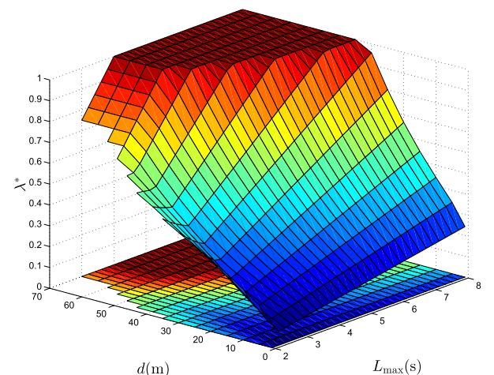

surface_3d

| d(m) | Lmax(s) | λ*   |
|------|---------|------|
| 70   | 0       | 0.1  |
| 60   | 2       | 0.3  |
| 50   | 4       | 0.5  |
| 40   | 6       | 0.7  |
| 30   | 8       | 0.9  |

(a)λ\* vs.d and $L _ { \mathrm { m a x } } .$

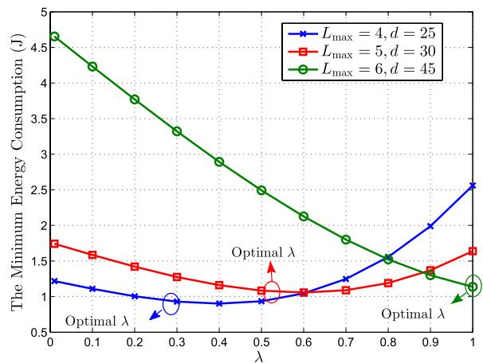

line

| λ    | L_max = 4, d = 25 | L_max = 5, d = 30 | L_max = 6, d = 45 |
| ---- | ----------------- | ----------------- | ----------------- |
| 0.0  | 1.2               | 1.8               | 4.7               |
| 0.1  | 1.1               | 1.7               | 4.3               |
| 0.2  | 1.0               | 1.5               | 3.9               |
| 0.3  | 0.9               | 1.3               | 3.4               |
| 0.4  | 0.9               | 1.2               | 2.9               |
| 0.5  | 1.0               | 1.1               | 2.5               |
| 0.6  | 1.1               | 1.1               | 2.2               |
| 0.7  | 1.3               | 1.1               | 1.8               |
| 0.8  | 1.6               | 1.2               | 1.5               |
| 0.9  | 2.0               | 1.4               | 1.3               |
| 1.0  | 2.5               | 1.7               | 1.1               |

(b) The minimum energy consumption v.s.λ.   
Fig. 3. λ∗ and its optimality.

Fig. 5 evaluates the minimum energy consumption of SMD using several schemes versus distance d. As expected, EPCO outperforms the other three schemes, since it combines the advantages of Partial Offloading (PO) and DVS technology. Especially, EPCO surpasses both the PO with $f _ { l _ { 1 } } ~ = ~ f _ { l _ { \mathrm { m a x } } }$ scheme and PO with $f _ { l _ { 2 } } = 0 . 3 f _ { l _ { \mathrm { m a x } } }$ scheme, which exhibits the superiority of DVS technology. Furthermore, EPCO outmatches the FO with optimal $f _ { l }$ scheme when d falls in about [15, 45], which verifies the benefit of PO. This is because that data can be processed parallelly in EPCO scheme. Within a given latency requirement, less bits will be executed in the SMD. Hence, the SMD can use a slower computational speed to save more energy. Similarly, the SMD can choose more suitable transmit power to save energy for the offloaded bits. Next, we explain some interesting phenomena shown in this figure. Firstly, we observe that when d is small (less than about 10 m), all these schemes perform almost the same. This is because the channel is so good that the SMD offloads almost all the computation. Therefore, almost all the energy is spent on data exchanging, which increases with the increasing d. Secondly, the minimum energy consumption in the PO with $f _ { l _ { 2 } } ~ = ~ 0 . 3 f _ { l _ { \mathrm { m a x } } }$ scheme increases until the delay constraint cannot be satisfied for large d. The reason is that the SMD cannot support this application all by itself when using $f _ { l _ { 2 } }$ and it has to offload. As d increases, the communication consumes more energy. Finally, the other three schemes saturate at the value that equals the energy spent on total execution at the SMD. The reason is that transmission consumes more energy than computing directly at the SMD when $d$ is larger than some value, and hence the SMD prefers to execute the application all by itself. In other words, the conditions under which local execution is optimal are met. At saturation, the minimum energy consumption value in FO with optimal $f _ { l }$ scheme equals that in EPCO, since both schemes use DVS technology to minimize the local energy consumption. Without using DVS, PO with $f _ { l _ { 1 } } = f _ { l _ { \mathrm { m a x } } }$ scheme saturates at a larger value. Especially, EPCO surpasses PO with $f _ { l _ { 1 } } = f _ { l _ { \mathrm { m a x } } }$ scheme by about 36% in terms of energy consumption.

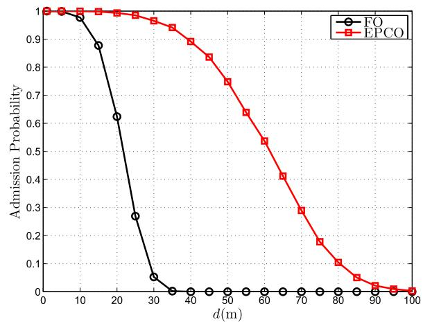

line

| d(m) | FO    | EPCO  |
|------|-------|-------|
| 0    | 1.000 | 1.000 |
| 10   | 0.980 | 1.000 |
| 20   | 0.620 | 0.990 |
| 30   | 0.050 | 0.970 |
| 40   | 0.000 | 0.850 |
| 50   | 0.000 | 0.750 |
| 60   | 0.000 | 0.650 |
| 70   | 0.000 | 0.550 |
| 80   | 0.000 | 0.450 |
| 90   | 0.000 | 0.350 |
| 100  | 0.000 | 0.250 |

(a) $\mathrm { A P ~ v . s . ~ } d .$

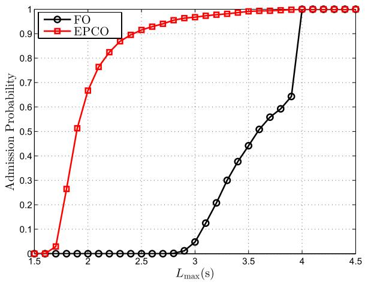

line

| L_max (s) | FO    | EPCO  |
| --------- | ----- | ----- |
| 1.5       | 0.0   | 0.0   |
| 1.6       | 0.0   | 0.0   |
| 1.7       | 0.0   | 0.27  |
| 1.8       | 0.0   | 0.52  |
| 1.9       | 0.0   | 0.67  |
| 2.0       | 0.0   | 0.76  |
| 2.1       | 0.0   | 0.82  |
| 2.2       | 0.0   | 0.86  |
| 2.3       | 0.0   | 0.89  |
| 2.4       | 0.0   | 0.91  |
| 2.5       | 0.0   | 0.93  |
| 2.6       | 0.0   | 0.94  |
| 2.7       | 0.0   | 0.95  |
| 2.8       | 0.0   | 0.96  |
| 2.9       | 0.0   | 0.97  |
| 3.0       | 0.1   | 0.98  |
| 3.1       | 0.2   | 0.985 |
| 3.2       | 0.3   | 0.99  |
| 3.3       | 0.4   | 0.992 |
| 3.4       | 0.5   | 0.994 |
| 3.5       | 0.6   | 0.995 |
| 3.6       | 0.7   | 0.996 |
| 3.7       | 0.8   | 0.997 |
| 3.8       | 0.9   | 0.998 |
| 3.9       | 1.0   | 0.999 |
| 4.0       | 1.0   | 1.0   |
| 4.1       | 1.0   | 1.0   |
| 4.2       | 1.0   | 1.0   |
| 4.3       | 1.0   | 1.0   |
| 4.4       | 1.0   | 1.0   |
| 4.5       | 1.0   | 1.0   |

(b) $\mathrm { A P \ v . s . \ } L _ { \mathrm { m a x . } }$

Fig. 4. Admission probability (AP) performance.   
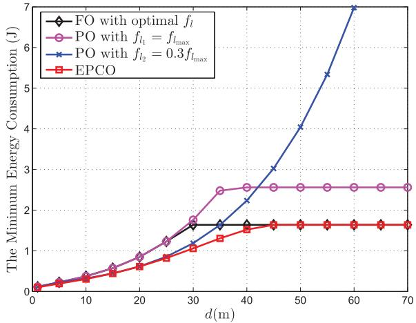

line

| d(m) | FO with optimal f_l | PO with f_l1 = f_lmax | PO with f_l2 = 0.3f_lmax | EPCO |
|------|---------------------|------------------------|--------------------------|------|
| 0    | 0.0                 | 0.0                    | 0.0                      | 0.0  |
| 10   | 0.2                 | 0.3                    | 0.4                      | 0.2  |
| 20   | 0.5                 | 0.8                    | 0.9                      | 0.5  |
| 30   | 1.5                 | 1.8                    | 1.2                      | 1.0  |
| 40   | 1.6                 | 2.5                    | 2.2                      | 1.5  |
| 50   | 1.6                 | 2.5                    | 4.0                      | 1.6  |
| 60   | 1.6                 | 2.5                    | 7.0                      | 1.6  |
| 70   | 1.6                 | 2.5                    | -                        | 1.6  |

Fig. 5. The minimum energy consumption vs. d.

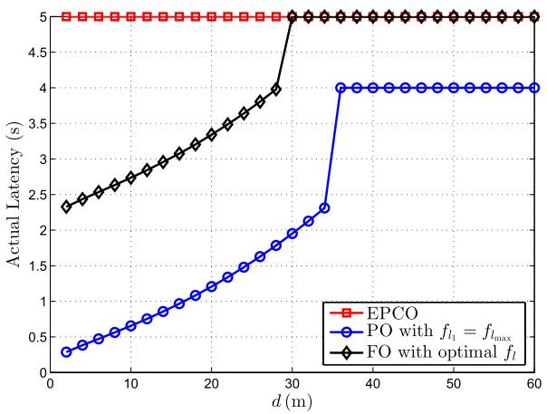

line

| d (m) | EPCO | PO with fl = fl_max | FO with optimal fl |
|-------|------|---------------------|--------------------|
| 0     | 5.0  | 0.3                 | 2.3                |
| 5     | 5.0  | 0.5                 | 2.5                |
| 10    | 5.0  | 0.7                 | 2.7                |
| 15    | 5.0  | 1.0                 | 3.0                |
| 20    | 5.0  | 1.3                 | 3.3                |
| 25    | 5.0  | 1.6                 | 3.6                |
| 30    | 5.0  | 2.0                 | 4.0                |
| 35    | 5.0  | 4.0                 | 5.0                |
| 40    | 5.0  | 4.0                 | 5.0                |
| 45    | 5.0  | 4.0                 | 5.0                |
| 50    | 5.0  | 4.0                 | 5.0                |
| 55    | 5.0  | 4.0                 | 5.0                |
| 60    | 5.0  | 4.0                 | 5.0                |

Fig. 6. The actual latency vs. d under $L _ { \mathrm { m a x } } = 5 \mathrm { s }$

Fig. 5 shows that EPCO outperforms other schemes in terms of energy consumption. Next, we explain this phenomenon from the perspective of latency via Fig. 6. Fig. 6 presents the actual latency under EPCO, PO with fixed $f _ { l } ,$ , and FO with optimal $f _ { l }$ scheme, respectively. The actual latency in EPCO is always equal to $L _ { \mathrm { m a x } }$ . This is because that once it is below $L _ { \mathrm { m a x } } .$ , we can choose a lower $f _ { l }$ to further reduce the energy consumption, which results in the actual latency always being $L _ { \mathrm { m a x } }$ no matter under what channel conditions. On the contrary, the actual latency in PO with $f _ { l } = f _ { l _ { \mathrm { m a x } } }$ and that in FO with optimal $f _ { l }$ scheme are not always equal to $L _ { \mathrm { m a x } } .$ The reasons are as follows: In PO with $f _ { l } = f _ { l _ { \mathrm { m a x } } }$ scheme, the SMD cannot adaptively adjust the computational speed to fully utilize $L _ { \mathrm { m a x } }$ . Additionally, a larger uplink transmission time may not lead to a less energy consumption due to $P _ { 0 } .$ . Therefore, the latency constraint is inactive. In other words, the actual latency is not equal to $L _ { \mathrm { m a x } }$ . Finally, the PO with $f _ { l } = f _ { l _ { \mathrm { m a x } } }$ scheme saturates at 4 $^ { \textrm { S , } }$ which is the time required by total execution at the SMD. Similarly, in FO with optimal $f _ { l }$ scheme, the SMD chooses total offloading when d is small while local execution when d is large. When the SMD offloads its computation, the latency constraint may be inactive as explained above. However, in our proposed scheme EPCO, the SMD can utilize $L _ { \mathrm { m a x } }$ to save energy when local execution is preferred, and thus the actual latency is equal to $L _ { \mathrm { m a x } }$ when d is large, since the SMD has the capability of DVS.

Fig. 5 and Fig. 6 indicate that EPCO can fully utilize $L _ { \mathrm { m a x } }$ to save energy, which is especially suitable for delayconstrained applications. Taking online game as the example, once $L _ { \mathrm { m a x } }$ is met, the video interface will be smooth, thus satisfying the mobile players. Additionally, it is more important to prolong battery lifetime for the mobile players in such situations.

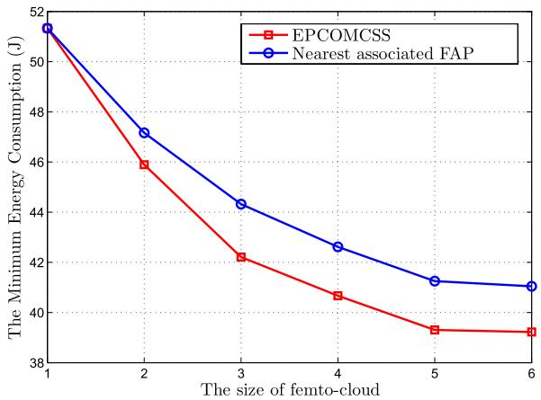

line

| The size of femto-cloud | EPCOMCSS | Nearest associated FAP |
| ----------------------- | -------- | ---------------------- |
| 1                       | 51.0     | 51.5                   |
| 2                       | 46.0     | 47.0                   |
| 3                       | 42.0     | 44.0                   |
| 4                       | 40.5     | 42.5                   |
| 5                       | 39.5     | 41.0                   |
| 6                       | 39.2     | 40.8                   |

Fig. 7. The minimum energy consumption v.s. N.

# B. Performance of EPCOMCSS

Fig. 7 shows the energy performance versus the size of femto-cloud in the multiple cloud servers scenario. Here, we set $L _ { \mathrm { m a x } } ~ = ~ 0 . 4 \mathrm { s }$ . The reason is that it is more meaningful to consider the multiple cloud servers scenario for the applications with stringent latency, since they requires more computation resource. From this figure, we can see that the minimum energy consumption decreases with the increment of N, which means more energy saving could be achieved in the multiple cloud servers scenario. The reasons are as follows: As N increases, richer computational capability of femto-cloud is available. Besides, increasing N leads to greater selection diversity gain of multiple FAPs. We can also see that the optimal association achieves lower energy consumption by considering both channel conditions and computation capability of FAP.

# C. Performance of LPCO

In Fig. 8a, we plot the convergence evolution of the outer loop of LPCO with different initial points. It is observed that it always converges fast, which validates Theorem 2. Here, either solving the linear problem once or solving the convex problem once is termed one iteration. To show the overall convergence of LPCO, we further display the convergence evolution of its inner loop, i.e., Algorithm 3 in Fig. 8b. We observe that it has a fast convergence rate and converges typically in a few steps. Thus, LPCO is cost efficient in the computational complexity. In addition, a different channel condition a leads to a different $( r _ { \operatorname* { m i n } } , \hat { r } )$ . Fig. 8b shows that the minimal latency decreases as channel condition a increases, since good channel conditions can reduce the cost of communication, e.g., latency.

Fig. 9 shows the minimum latency under several schemes as a function of $d .$ Here, we adopt such a benchmark, which works like exhaustive search method (LES). Specifically, we first uniformly choose $1 0 0 0 \times 1 0 0 0 \times 1 0 0 0 ( P _ { t } , f _ { l } , \lambda )$ points in $\left( 0 , P _ { { t _ { \mathrm { m a x } } } } \right) \times \left( 0 , f _ { { t _ { \mathrm { m a x } } } } \right) \times \left( 0 , 1 \right)$ region. Then we pick up the feasible points and calculate the corresponding objectives. Through comparing these objectives, we could find the “optimal” value. Fig. 9 shows that LPCO performs almost the same as LES, which verifies the superior performance of LPCO. Moreover, through comparing LPCO, PO with $f _ { l _ { 2 } } = 0 . 3 f _ { l _ { \mathrm { m a x } } }$ , PO with $f _ { l _ { 3 } } = 0 . 7 f _ { l _ { \mathrm { m a x } } }$ , and PO with $f _ { l _ { 4 } } = f _ { l _ { \mathrm { m a x } } }$ , we can see lower latency can be obtained if the SMD has the capability of DVS, since the SMD can more intelligently manage offloading via DVS technology. Besides, LPCO outmatches FO with optimal $f _ { l } ,$ since the SMD can intelligently utilize the resources in the

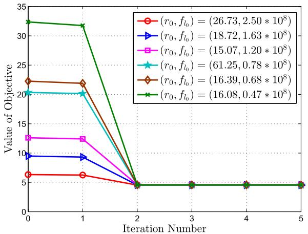

line

| Iteration Number | (r₀, f₁₀) = (26.73, 2.50 * 10⁸) | (r₀, f₁₀) = (18.72, 1.63 * 10⁸) | (r₀, f₁₀) = (15.07, 1.20 * 10⁸) | (r₀, f₁₀) = (61.25, 0.78 * 10⁸) | (r₀, f₁₀) = (16.39, 0.68 * 10⁸) | (r₀, f₁₀) = (16.08, 0.47 * 10⁸) |
| ---------------- | ------------------------------ | ------------------------------- | ------------------------------- | ------------------------------- | ------------------------------- | ------------------------------- |
| 0                | 6                              | 9                               | 12                              | 20                              | 22                              | 32                              |
| 1                | 6                              | 9                               | 12                              | 20                              | 22                              | 32                              |
| 2                | 5                              | 5                               | 5                               | 5                               | 5                               | 5                               |
| 3                | 5                              | 5                               | 5                               | 5                               | 5                               | 5                               |
| 4                | 5                              | 5                               | 5                               | 5                               | 5                               | 5                               |
| 5                | 5                              | 5                               | 5                               | 5                               | 5                               | 5                               |

(a) Convergence performance of the outer loop of LPCO.

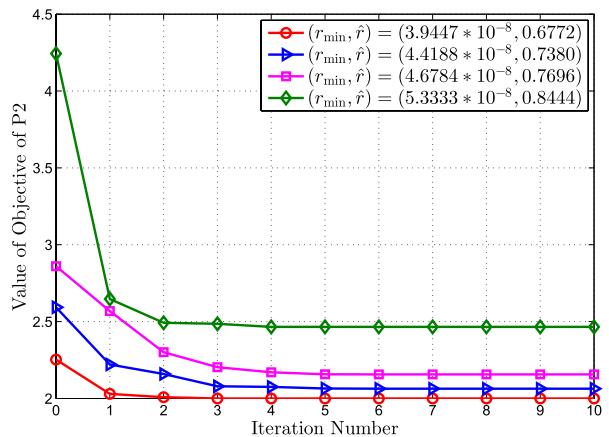

line

| Iteration Number | (r_min, r̂) = (3.9447 * 10⁻⁸, 0.6772) | (r_min, r̂) = (4.4188 * 10⁻⁸, 0.7380) | (r_min, r̂) = (4.6784 * 10⁻⁸, 0.7696) | (r_min, r̂) = (5.3333 * 10⁻⁸, 0.8444) |
| ---------------- | ----------------------------------- | ----------------------------------- | ----------------------------------- | ----------------------------------- |
| 0                | 2.2                                 | 2.6                                 | 2.9                                 | 4.3                                 |
| 1                | 2.0                                 | 2.2                                 | 2.6                                 | 2.7                                 |
| 2                | 2.0                                 | 2.1                                 | 2.3                                 | 2.5                                 |
| 3                | 2.0                                 | 2.0                                 | 2.2                                 | 2.5                                 |
| 4                | 2.0                                 | 2.0                                 | 2.1                                 | 2.5                                 |
| 5                | 2.0                                 | 2.0                                 | 2.1                                 | 2.5                                 |
| 6                | 2.0                                 | 2.0                                 | 2.1                                 | 2.5                                 |
| 7                | 2.0                                 | 2.0                                 | 2.1                                 | 2.5                                 |
| 8                | 2.0                                 | 2.0                                 | 2.1                                 | 2.5                                 |
| 9                | 2.0                                 | 2.0                                 | 2.1                                 | 2.5                                 |
| 10               | 2.0                                 | 2.0                                 | 2.1                                 | 2.5                                 |

(b）Convergence performance of the inner loop of LPCO,i.e., Algorithm 3.

Fig. 8. Convergence performance of LPCO.   
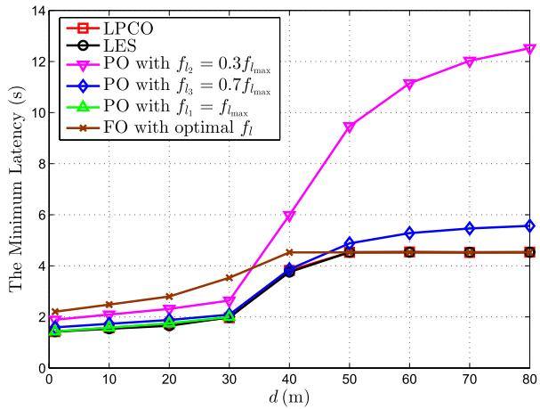

line

| d (m) | LPCO | LES | PO with f_l2 = 0.3f_lmax | PO with f_l3 = 0.7f_lmax | PO with f_l1 = f_lmax | FO with optimal f_l |
|-------|------|-----|--------------------------|--------------------------|------------------------|---------------------|
| 0     | 1.5  | 1.5 | 1.5                      | 1.5                      | 1.5                    | 2.0                 |
| 10    | 1.6  | 1.6 | 2.0                      | 1.8                      | 1.7                    | 2.2                 |
| 20    | 1.7  | 1.7 | 2.2                      | 2.0                      | 1.8                    | 2.5                 |
| 30    | 1.8  | 2.0 | 2.5                      | 2.2                      | 2.0                    | 3.0                 |
| 40    | 3.8  | 3.8 | 6.0                      | 3.8                      | 3.8                    | 4.5                 |
| 50    | 4.5  | 4.5 | 9.5                      | 5.0                      | 4.5                    | 4.5                 |
| 60    | 4.5  | 4.5 | 11.0                     | 5.2                      | 4.5                    | 4.5                 |
| 70    | 4.5  | 4.5 | 12.0                     | 5.5                      | 4.5                    | 4.5                 |
| 80    | 4.5  | 4.5 | 12.5                     | 5.6                      | 4.5                    | 4.5                 |

Fig. 9. The minimum latency v.s. d.

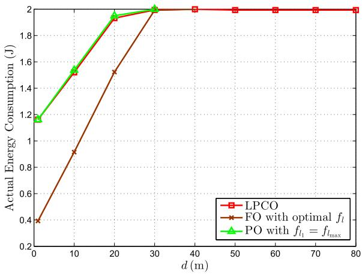

line

| d (m) | LPCO | FO with optimal f_l | PO with f_l = f_lmax |
|-------|------|---------------------|----------------------|
| 0     | 1.2  | 0.4                 | 1.2                  |
| 10    | 1.5  | 0.9                 | 1.5                  |
| 20    | 1.9  | 1.5                 | 1.9                  |
| 30    | 2.0  | 2.0                 | 2.0                  |
| 40    | 2.0  | 2.0                 | 2.0                  |
| 50    | 2.0  | 2.0                 | 2.0                  |
| 60    | 2.0  | 2.0                 | 2.0                  |
| 70    | 2.0  | 2.0                 | 2.0                  |
| 80    | 2.0  | 2.0                 | 2.0                  |

Fig. 10. The actual energy consumption v.s. d.

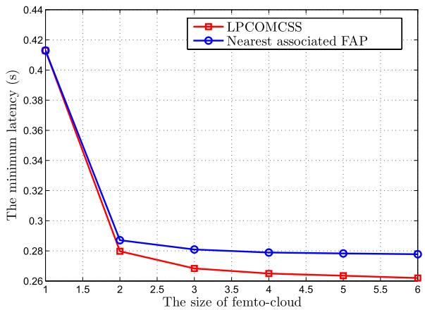

line

| The size of femto-cloud | LPCOMCSS | Nearest associated FAP |
| ----------------------- | -------- | ---------------------- |
| 1                       | 0.41     | 0.41                   |
| 2                       | 0.28     | 0.29                   |
| 3                       | 0.27     | 0.28                   |
| 4                       | 0.265    | 0.28                   |
| 5                       | 0.263    | 0.28                   |
| 6                       | 0.262    | 0.28                   |

Fig. 11. The minimum latency v.s. N.

SMD and cloud. In Fig. 9, the minimum latency in the six schemes increases with the increasing d. This is because that as d increases, offloading through wireless channel becomes costly, thus leading to more and more data processed locally. Due to the energy consumption constraint, the SMD has to reduce $f _ { l } ,$ and thus leads to an increasing latency. When all the data within the application is locally processed, the minimum latency is independent of $d .$ Moreover, it remains at min $\left\{ f _ { l _ { \mathrm { m a x } } } , \sqrt { \frac { E _ { \mathrm { m a x } } } { \alpha k I } } \right\}$ flmax , . Note that the null values indicate that the application can not be supported by the system.

Fig. 10 shows the actual energy consumption v.s. d under LPCO, FO with optimal $f _ { l } ,$ , and PO with $f _ { l _ { 1 } } = f _ { l _ { \mathrm { m a x } } }$ scheme, respectively. Different from that the actual latency in EPCO is always equal to $L _ { \mathrm { m a x } }$ due to using DVS, the actual energy consumption in LPCO is not always equal to $E _ { \mathrm { m a x } }$ . The reason is straightforward. Although we can choose a larger $f _ { l }$ to reduce latency once $E _ { \mathrm { m a x } }$ constraint is inactive, we cannot arbitrarily increase $f _ { l }$ due to constrained computational speed of SMD, i.e., $f _ { l _ { \mathrm { m a x } } }$ , which is verified by that the actual energy consumption of LPCO is almost the same as that of PO with $f _ { l _ { 1 } } = f _ { l _ { \mathrm { m a x } } }$ .

# D. Performance of LPCOMCSS

Fig. 11 shows the minimum latency versus the size of femto-cloud in the multiple cloud servers scenario. From this figure, we can see that the minimum latency decreases with the increment of N. This is because when N increases, richer computational capability of femto-cloud is available. Besides, greater selection diversity gain of multiple FAPs could be obtained. We can also see that the optimal association achieves lower latency by considering both channel conditions and computation capability of FAP.

# VI. CONCLUSIONS

In this paper, we have investigated partial computation offloading with DVS technology in mobile edge computing and formulated two optimization problems, namely, the ECM problem and the LM problem. To address the ECM problem, we have designed the EPCO algorithm to transform the original problem and obtained the globally optimal solutions in closed-form except for λ. Through the analysis of some special cases, we have got the conditions under which local execution is optimal and achieved a conclusion that total offloading could not be optimal when the SMD has the capability of DVS. Moreover, a multiple cloud servers scenario has been addressed, where the optimal computation distribution among clouds as well as the optimal user association have been derived. Then we proposed LPCO algorithm to solve the LM problem which can achieve good performance. Similarly, we studied the LM problem in a multiple cloud servers scenario. Finally, extensive simulations verified the advantages of the proposed algorithms with respect to energy consumption, latency, and admission probability.

# REFERENCES

[1] K. Kumar, J. Liu, Y.-H. Lu, and B. Bhargava, “A survey of computation offloading for mobile systems,” Mobile Netw. Appl., vol. 18, no. 1, pp. 129–140, 2013.   
[2] X. Ma, Y. Zhao, L. Zhang, H. Wang, and L. Peng, “When mobile terminals meet the cloud: Computation offloading as the bridge,” IEEE Netw., vol. 27, no. 5, pp. 28–33, Sep./Oct. 2013.   
[3] N. Fernando, S. W. Loke, and W. Rahayu, “Mobile cloud computing: A survey,” Future Generat. Comput. Syst., vol. 29, no. 1, pp. 84–106, 2013.   
[4] E. Cuervo et al., “MAUI: Making smartphones last longer with code offload,” in Proc. ACM MobiSys, San Francisco, CA, USA, Jun. 2010, pp. 49–62.   
[5] B.-G. Chun, S. Ihm, P. Maniatis, M. Naik, and A. Patti, “CloneCloud: Elastic execution between mobile device and cloud,” in Proc. EuroSys, Salzburg, Austria, Apr. 2011, pp. 301–314.   
[6] S. Kosta, A. Aucinas, P. Hui, R. Mortier, and X. Zhang, “ThinkAir: Dynamic resource allocation and parallel execution in the cloud for mobile code offloading,” in Proc. IEEE INFOCOM, Orlando, FL, USA, Mar. 2012, pp. 945–953.   
[7] J. Liu, T. Zhao, S. Zhou, Y. Cheng, and Z. Niu, “CONCERT: A cloudbased architecture for next-generation cellular systems,” IEEE Wireless Commun., vol. 21, no. 6, pp. 14–22, Dec. 2014.   
[8] FP7 European Project. (2012). Distributed Computing, Storage and Radio Resource Allocation Over Cooperative Femtocells (TROPIC). [Online]. Available: http://www.ict-tropic.eu/   
[9] S. Sardellitti, G. Scutari, and S. Barbarossa, “Joint optimization of radio and computational resources for multicell mobile-edge computing,” IEEE Trans. Signal Inf. Process. Over Netw., vol. 1, no. 2, pp. 89–103, Jun. 2015.   
[10] K. Kumar and Y.-H. Lu, “Cloud computing for mobile users: Can offloading computation save energy?” Computer, vol. 43, no. 4, pp. 51–56, Apr. 2010.   
[11] H. Wu, Q. Wang, and K. Wolter, “Tradeoff between performance improvement and energy saving in mobile cloud offloading systems,” in Proc. IEEE ICC, Budapest, Hungary, Jun. 2013, pp. 728–732.   
[12] S. Barbarossa, S. Sardellitti, and P. Di Lorenzo, “Joint allocation of computation and communication resources in multiuser mobile cloud computing,” in Proc. IEEE SPAWC, Darmstadt, Germany, Jun. 2013, pp. 26–30.

[13] O. Munoz, A. Pascual-Iserte, and J. Vidal, “Optimization of radio and computational resources for energy efficiency in latency-constrained application offloading,” IEEE Trans. Veh. Technol., vol. 64, no. 10, pp. 4738–4755, Oct. 2015.   
[14] D. Huang, P. Wang, and D. Niyato, “A dynamic offloading algorithm for mobile computing,” IEEE Trans. Wireless Commun., vol. 11, no. 6, pp. 1991–1995, Jun. 2012.   
[15] P. Di Lorenzo, S. Barbarossa, and S. Sardellitti. (2016). “Joint optimization of radio resources and code partitioning in mobile edge computing.” [Online]. Available: http://arxiv.org/abs/1307.3835   
[16] L. Yang, J. Cao, H. Cheng, and Y. Ji, “Multi-user computation partitioning for latency sensitive mobile cloud applications,” IEEE Trans. Comput., vol. 64, no. 8, pp. 2253–2266, Aug. 2015.   
[17] L. Yang, J. Cao, Y. Yuan, T. Li, A. Han, and A. Chan, “A framework for partitioning and execution of data stream applications in mobile cloud computing,” SIGMETRICS Perform. Eval. Rev., vol. 40, no. 4, pp. 23–32, Mar. 2013.   
[18] G. Qu, “What is the limit of energy saving by dynamic voltage scaling?” in Proc. IEEE/ACM ICCAD, San Jose, CA, USA, Nov. 2001, pp. 560–563.   
[19] W. Zhang, Y. Wen, K. Guan, D. Kilper, H. Luo, and D. O. Wu, “Energy-optimal mobile cloud computing under stochastic wireless channel,” IEEE Trans. Wireless Commun., vol. 12, no. 9, pp. 4569–4581, Sep. 2013.   
[20] Y. Wang et al., “Energy-optimal partial computation offloading using dynamic voltage scaling,” in Proc. IEEE Int. Conf. Commun. Workshop (ICCW), London, U.K., Jun. 2015, pp. 2695–2700.   
[21] G. S. G. Beveridge and R. S. Schechter, Optimization: Theory and Practice. New York, NY, USA: McGraw-Hill, 1970.   
[22] X. Chen, “Decentralized computation offloading game for mobile cloud computing,” IEEE Trans. Parallel Distrib. Syst., vol. 26, no. 4, pp. 974–983, Apr. 2015.   
[23] S. E. Mahmoodi, R. N. Uma, and K. P. Subbalakshmi, “Optimal joint scheduling and cloud offloading for mobile applications,” IEEE Trans. Cloud Comput., to be published.   
[24] W. Zhang, Y. Wen, and D. O. Wu, “Collaborative task execution in mobile cloud computing under a stochastic wireless channel,” IEEE Trans. Wireless Commun., vol. 14, no. 1, pp. 81–93, Jan. 2015.   
[25] S. Chen, Y. Wang, and M. Pedram, “A semi-Markovian decision process based control method for offloading tasks from mobile devices to the cloud,” in Proc. IEEE GLOBECOM, Atlanta, GA, USA, Dec. 2013, pp. 2885–2890.   
[26] M. Molina, O. Muñoz, A. Pascual-Iserte, and J. Vidal, “Joint scheduling of communication and computation resources in multiuser wireless application offloading,” in Proc. IEEE PIMRC, Washington, DC, USA, Sep. 2014, pp. 1093–1098.   
[27] M. Kamoun, W. Labidi, and M. Sarkiss, “Joint resource allocation and offloading strategies in cloud enabled cellular networks,” in Proc. IEEE ICC, London, U.K., Jun. 2015, pp. 5529–5534.   
[28] S. Barbarossa, P. Di Lorenzo, and S. Sardellitti, “Computation offloading strategies based on energy minimization under computational rate constraints,” in Proc. IEEE EuCNC, Sydney, NSW, Australia, Jun. 2014, pp. 1–5.   
[29] X. Wang, W. Chen, and Z. Cao, “ARCOR: Agile rateless coded relaying for cognitive radios,” IEEE Trans. Veh. Technol., vol. 60, no. 6, pp. 2777–2789, Jul. 2011.   
[30] W. Zhang, Y. Wen, J. Cai, and D. O. Wu, “Toward transcoding as a service in a multimedia cloud: Energy-efficient job-dispatching algorithm,” IEEE Trans. Veh. Technol., vol. 63, no. 5, pp. 2002–2012, Jun. 2014.   
[31] S. Boyd and L. Vandenberghe, Convex Optimization. Cambridge, U.K.: Cambridge Univ. Press, 2004.   
[32] D. T. T. Nga, M.-G. Kim, and M. Kang, “Delay-guaranteed energy saving algorithm for the delay-sensitive applications in IEEE 802.16e systems,” IEEE Trans. Consum. Electron., vol. 53, no. 4, pp. 1339–1347, Nov. 2007.   
[33] S. Chimmanee, “PACS metric based on regression for evaluating endto-end QoS capability over the Internet for telemedicine,” in Proc. IEEE ICOIN, Bangkok, Thailand, Jan. 2013, pp. 359–364.   
[34] ÓJ. Oueis, E. C. Strinati, and S. Barbarossa, “Small cell clustering for efficient distributed cloud computing,” in Proc. IEEE PIMRC, Washington, DC, USA, Sep. 2014, pp. 1474–1479.   
[35] J. Oueis, E. C. Strinati, and S. Barbarossa, “The fog balancing: Load distribution for small cell cloud computing,” in Proc. IEEE VTC Spring, Glasgow, Scotland, May 2015, pp. 1–6.

[36] J. Oueis, E. Calvanese-Strinati, A. De Domenico, and S. Barbarossa, “On the impact of backhaul network on distributed cloud computing,” in Proc. IEEE WCNCW, Istanbul, Turkey, Apr. 2014, pp. 12–17.   
[37] A. P. Miettinen and J. K. Nurminen, “Energy efficiency of mobile clients in cloud computing,” in Proc. USENIX HotCloud, Boston, MA, USA, Jun. 2010, pp. 4–11.   
[38] A. Damnjanovic et al., “A survey on 3GPP heterogeneous networks,” IEEE Wireless Commun., vol. 18, no. 3, pp. 10–21, Jun. 2011.   
[39] A. R. Jensen, M. Lauridsen, P. Mogensen, T. B. Sørensen, and P. Jensen, “LTE UE power consumption model: For system level energy and performance optimization,” in Proc. IEEE VTC Fall, Quebec City, QC, Canada, Sep. 2012, pp. 1–5.

natural_image

Portrait of a young woman with long dark hair and glasses (no text or symbols visible)

Yanting Wang received the B.S. degree in communications engineering from Xidian University, Xi’an, China. She is currently pursuing the Ph.D. degree with the State Key Laboratory of ISN. Her research interests include computation offloading, caching, applications of convex optimization theory, and heterogeneous networks.

natural_image

Portrait of a woman with dark hair wearing a light turtleneck sweater against a red background (no text or symbols visible)

Min Sheng (M’03–SM’16) received the M.Eng and Ph.D. degrees in Communication and Information Systems from Xidian University, Shaanxi, China, in 1997 and 2000, respectively. She is currently a Full Professor with the Broadband Wireless Communications Laboratory, School of Telecommunication Engineering, Xidian University. Her general research interests include mobile ad hoc networks, wireless sensor networks, wireless mesh networks, third generation (3G)/fourth generation (4G) mobile communication systems, dynamic radio resource management (RRM) for integrated services, cross-layer algorithm design and performance evaluation, cognitive radio and networks, cooperative communications, and medium access control (MAC) protocols. She has published 2 books and over 50 papers in refereed journals and conference proceedings. She is a member of the IEEE. She was the New Century Excellent Talents in University by the Ministry of Education of China, and obtained the Young Teachers Award by the Fok Ying-Tong Education Foundation, China, in 2008.

natural_image

Portrait of a man wearing glasses and a suit jacket, outdoors with trees in the background (no visible text or symbols)

Xijun Wang (M’12) received the B.S. degree (high honors) in communications engineering from Xidian University, Xi’an, China, in 2005, and the Ph.D. degree in electronic engineering from Tsinghua University, Beijing, China, in 2012. Since 2012, he has been with the School of Telecommunications Engineering, Xidian University, where he is currently an Associate Professor. He visited the Singapore University of Technology and Design, Singapore, from 2015 to 2016. His current research interests include spectrum sharing, LTE unlicensed, cognitive radios, and heterogeneous networks. He has served as a Technical Program Co-Chair of the Wireless Communications Systems Symposium of the IEEE/CIC ICCC 2016, and a Publicity Chair of the IEEE/CIC ICCC 2013. He is a Reviewer for several IEEE journals and has been recognized as an Exemplary Reviewer of the IEEE WIRELESS COMMUNICATIONS LETTERS in 2014. He was a recipient of the best paper award at the IEEE/CIC ICCC 2013.

natural_image

Portrait photo of a man in a striped shirt against a red background (no text or symbols visible)

Liang Wang received the B.S. degree in telecommunications engineering and the Ph.D. degree in communication and information systems from Xidian University in 2009 and 2015, respectively. He is currently a Lecturer with the School of Computer Science, Shaanxi Normal University. His research interests focus on dynamic spectrum access in cognitive radio networks, energy-efficient transmission, applications of convex optimization theory, and robust design in wireless communications networks.

natural_image

Portrait of a man wearing glasses and a striped shirt with a patterned tie (no text or symbols visible)

Jiandong Li (SM’05) received the B.E., M.S., and Ph.D. degrees in communications engineering from Xidian University, Xi’an, China, in 1982, 1985, and 1991, respectively. He has been a faculty member of the School of Telecommunications Engineering with Xidian University since 1985, where he is currently a Professor and Vice Director of the Academic Committee of the State Key Laboratory of Integrated Service Networks. He was a Visiting Professor with the Department of Electrical and Computer Engineering, Cornell University, from 2002 to 2003.

He served as the General Vice Chair for ChinaCom 2009 and the TPC Chair of the IEEE ICCC 2013. He was awarded as a Distinguished Young Researcher from NSFC and a Changjiang Scholar from the Ministry of Education, China, respectively. His major research interests include wireless communication theory, cognitive radio, and signal processing.