# Mobility-Aware Computation Offloading in Satellite Edge Computing Networks

Jian Zhou , Member, IEEE, Qi Yang , Lu Zhao , Haipeng Dai , Senior Member, IEEE, and Fu Xiao , Member, IEEE

Abstract—Satellite edge computing, as an extension of ground edge computing, is a key technology for achieving seamless global computing coverage. However, the low earth orbit (LEO) satellites have limited computing resources and are moving at a high speed. This naturally poses a challenge to find more suitable computation offloading strategies with minimum network latency and energy consumption, especially when a large number of co-existing users are to offload their tasks. In this paper, therefore, we mainly focus on computation offloading in the satellite edge computing network (SECN) by jointly considering LEO satellites’ mobility and SECN’s heterogeneous resource constraints to explore more practical computation offloading strategies. We first formulate the problem of Mobility-aware Computation Offloading (MCO) in the SECN via specifying the effect of LEO satellites’ high-speed movement on the computation offloading, aiming to minimize the network latency and energy consumption. Considering the MCO problem is discrete and non-convex as the objective function and constraints are associated with the binary decision variables. We then convert the original non-convex problem into a continuous convex problem which is proved to be feasible. To avoid a high computational complexity incurred by the extensive co-existing user offloading, we design MCO-A, a distributed algorithm based on ADMM (alternating direction method of multipliers) to solve the MCO problem efficiently. Finally, the performance of MCO-A is evaluated via extensive experiments including small-scale and large-scale scenarios. The experimental results show that MCO-A can achieve a lower network latency and energy consumption in an efficient way compared with the baseline and state-of-the-art approaches.

Index Terms—ADMM, computation offloading, edge computing, mobility analysis, satellite network.

# I. INTRODUCTION

N RECENT years, satellite networks have been widely I applied in various domains, including telecommunications,

Manuscript received 16 September 2023; revised 28 December 2023; accepted 23 January 2024. Date of publication 29 January 2024; date of current version 3 September 2024. This work was supported in part by the National Science Fund for Distinguished Young Scholars of China under Grant 62125203, in part by the Key Program of the National Natural Science Foundation of China under Grant 61932013, in part by the National Natural Science Foundation of China under Grants 61972210, 62272243, 62102195, and 62202237, in part by the Natural Science Foundation of Jiangsu Province under Grant BK20230351, and in part by the Natural Science Foundation of the Higher Education Institutions of Jiangsu Province under Grant 23KJB520023. Recommended for acceptance by L. Kong. (Corresponding author: Lu Zhao.)

Jian Zhou, Qi Yang, Lu Zhao, and Fu Xiao are with the School of Computer Science, Nanjing University of Posts and Telecommunications, Nanjing 210023, China (e-mail: zhoujian@njupt.edu.cn; 1021041222@njupt.edu.cn; luzhao@njupt.edu.cn; xiaof@njupt.edu.cn).

Haipeng Dai is with the State Key Laboratory for Novel Software Technology, Nanjing University, Nanjing 210023, China (e-mail: haipengdai@nju.edu.cn).

Digital Object Identifier 10.1109/TMC.2024.3359759

remote sensing, navigation, and broadcasting. Compared with ground networks, satellite networks including geosynchronous earth orbit (GEO) and low earth orbit (LEO) satellites can offer distinct advantages in wide coverage areas and ubiquitous access [1]. These characteristics enable satellite networks to effectively provide communication abilities for the remote and underserved regions where ground infrastructures may be limited or absent [2], [3]. Particularly, with the high altitude and global reach, satellite networks can extend connectivity to areas that are challenging to reach with ground networks. Driven by edge computing, the satellite edge computing network (SECN) is emerged, which allows users to offload and execute their computing-intensive tasks on GEO and/or LEO satellites [4], [5], [6].

In the SECN, GEO satellites have large payloads, expansive coverage areas, and fixed relative positions, which can easily solve users’ computing-intensive tasks that can hardly be accomplished by users in the local [7]. However, GEO satellites are geographically and logically far away from users and therefore, offloading tasks to the remote GEO satellites may suffer from high and unpredictable latency, making it hard to fulfill users’ low-latency requirements [8]. Compared with GEO satellites, LEO satellites can provide low-latency services to users but they have only limited energy, computation and storage resources [5]. Besides, each LEO satellite is moving at a high speed and covers a small geographical area [9]. Due to the fact of high-speed movement, LEO satellites’ positions are constantly changing and consequently the area covered by each is not fixed. Thus, the ground environment and the space environment may suffer from constant changes, especially the connections between users and LEO satellites are constantly changing [10]. Finally, LEO satellites are heterogeneous in terms of resources, which may impact the computation offloading strategy [11], [12], [13]. Thus, how to determine whether/where to offload users’ computing-intensive tasks in the SECN is challenging by minimizing network latency and energy consumption under a series of constraints like LEO satellites’ high-speed movement and resources.

Recently, the computation offloading problem in the SECN has attracted much attention, and many efforts focused on different optimization objectives with different constraints have been devoted, such as optimizing networks’ latency [14], energy consumption [11], or achieving a balance between latency and energy consumption [15]. Nevertheless, they usually have an unpractical assumption that the LEO satellite is always stationary. With the high-speed movement, LEO satellites that process users’ offloading tasks may move away from the users. In this case, returning the computation results of offloading tasks to these users will inevitably incur extra higher latency, which would significantly impact the users’ quality of experience. Besides, due to LEO satellites’ resource limitations, how to efficiently offload the tasks of large-scale co-existing users is much more challenging. Therefore, it is necessary to jointly consider LEO satellites’ mobility and resource constraints to explore more practical computation offloading strategies.

In this paper we make the first attempt at considering the LEO satellites’ high-speed movement and study the Mobility-aware Computation Offloading (MCO) problem in the SECN. Specifically, we propose a SECN architecture, where GEO satellites acts as the cloud, LEO satellites act as edge computing nodes, and the ground users are the end-users. Please note that since the movement of users is extreme slowly compared to that of the LEO satellites and does not affect the MCO strategy when offloading tasks in the SECN, it is negligible in this paper. Besides, all the offloading tasks submitted by users can be computed locally, or on LEO satellites and GEO satellites. Major contributions are as follows:

We design a SECN architecture with three layers, including GEO layer, LEO layer and ground layer. Within the architecture, we first analyze four LEO satellites mobility scenarios affecting on the computation offloading.   
We formulate the MCO problem as a constrained optimization problem in the SECN, aiming to minimize network latency and energy consumption. Considering the MCO problem’s discrete and non-convex, we convert it into a continuous convex problem by relaxing binary variables, which is then proved to be feasible.   
We propose MCO-A, an ADMM-based distributed optimization algorithm, for solving the MCO problem efficiently, and we prove MCO-A’s convergence.   
We evaluate MCO-A’s performance by conducting extensive experiments in both small-scale and large-scale scenarios. The results show that MCO-A can achieve superior performance against existing benchmarks.

The remainder of this paper is organized as follows: Section II provides related work, and Section III presents the system model. Section IV analyzes the mobility of LEO satellites and formulates the MCO problem. Section V proposes the MCO-A approach. Section VI analyzes the simulation results, followed by a conclusion in Section VII.

# II. RELATED WORK

In the SECN, the computation offloading problem has been comprehensively studied recently. Many approaches were proposed to find suitable offloading strategies with different objectives under different constraints. However, few existing works for the problem have taken the movement of LEO satellites in account when offloading users’ tasks. Next, we classify the existing works on the problem from two trending streams as follows, including different optimization objectives and different approaches used.

Latency and/or Energy Consumption Minimization. To name a few, Wang et al. [16] took into account the resource allocation strategy in the SECN and established a collaborative network for emergencies. They considered the different sensitivities of users to latency and connection time to achieve dynamic resource scheduling in emergencies. By considering the important factor of energy consumption when offloading tasks, Song et al. [17] utilized LEO satellites to divide the problem into space end and ground end, and minimized the energy consumption on the ground segment. Tang et al. [9] studied the computation offloading decision, which minimizes the total energy consumption of ground users under the constraints of coverage time and computing power of each LEO satellite. You et al. [11] proposed a convex optimization problem model to minimize user energy consumption and derived an offloading priority function that generates user priorities based on their channel gains and local computational energy consumption. To achieve a balance between latency and energy consumption, Zhang et al. [18] optimized the allocation of user associations, offloading decisions, computing, and communication resources for a MEC-enhanced network with multiple satellites and cloud computing centers. The authors of [19] also studied the same problem and proposed a satellite edge computing network with bilateral computing power, aiming to optimize the network latency and energy consumption. However, the above works do not consider the effect of LEO satellites’ movement on computational offloading in real scenarios.

Approaches for Computation Offloading. More recently, reinforcement learning (RL) or game theory approaches are utilized to solve the computation offloading problems. As far as we know, RL is favored in the field due to its excellence in adapting to dynamic changes in the environment. Moreover, game theory provides near-optimal solutions by modeling decision-making as a game. By adopting these approaches, researchers can effectively address offloading challenges and optimize offloading strategies in various scenarios. In terms of using reinforcement learning for problem-solving, Xu et al. [20] proposed a joint communication-computation resource allocation approach based on deep reinforcement learning (DRL). Unlike the traditional Q-learning approach, the DRL uses deep neural networks to estimate state-action values. Zhu et al. [21] proposed a low-complexity approach based on DRL to solve the computation offloading problem in the SECN. This approach only makes offloading decisions based on the current channel state. Regarding using game theory for problem-solving, Zhang et al. [22] studied the joint computation and communication resources management problem in a satellite network to minimize the execution latency of compute-intensive applications. They considered two satellite edge computing scenarios and presented an approach based on game theory to obtain an approximate optimal solution. Wang et al. [23] proposed a novel LEO satellite edge computing system model, where latency and energy consumption were defined as the system cost. The problem was then decomposed into two sub-problems, and game theory was employed to solve the computation offloading problem under optimal resource allocation. However, the current work shows limitations, as RL usually has longer training times and is not suitable for the large-scale scenarios. Furthermore, when the number of participants increases, the computational complexity of game theory rises, and it isn’t easy to achieve the Nash equilibrium in a short period.

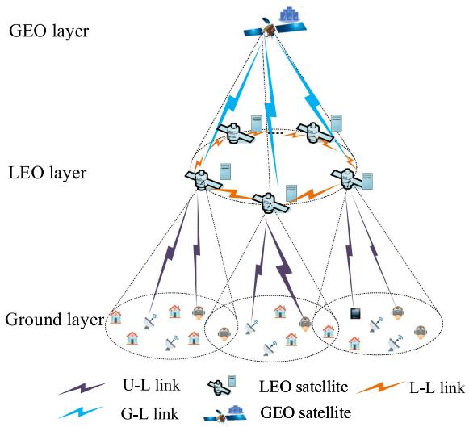

flowchart

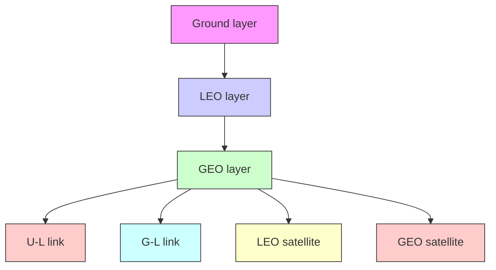

Fig. 1. Architecture of SECN.

To summarize, different from previous studies mentioned above, this paper studies the MCO problem in the SECN environment. We aim to minimize the latency and energy consumption by jointly considering the mobility and resource constraints of LEO satellites. In particular, targeting on computation offloading for large-scale computing-intensive tasks, we exploit the advantages of ADMM and propose a distributed optimization algorithm based on ADMM, namely MCO-A, to efficiently sovle the MCO problem. Finally, we theoretically prove MCO-A’s convergence.

# III. SYSTEM MODEL

Fig. 1 shows the architecture of SECN, which includes three layers: GEO layer, LEO layer and ground layer.

GEO Layer: Similar to [7], [24], this layer includes one GEO satellite regarded as the cloud center because GEO satellites have large payloads and expansive coverage areas and their positions are relatively fixed.

LEO Layer: It consists of LEO satellites equipped with MEC servers. In this paper, we only focus on the collaboration and computation offloading among the co-orbiting LEO satellites, which are called L-L links (i.e., inter-satellite communication), same to [8]. Besides, LEO satellites can communicate with GEO satellites via G-L (GEO satellite to LEO satellite) links [25].

Ground Layer: It is the user layer in which each user’s device has computing capability. Due to the long distance and transmission power limitations, it is hard for users to directly communicate with the GEO satellite. Note that each ground area is covered by at least one LEO satellite. Then, for each user, we call the LEO satellite that covers it and is closest to it as its accessible LEO satellite. Thus, similar to the previous works [8], [9], [26], [27], we allow users to offload their tasks

TABLE I NOTATION 

<table><tr><td>Notation</td><td>Description</td></tr><tr><td> $\mathcal{M}$ </td><td>Set of satellites</td></tr><tr><td> $\mathcal{I}$ </td><td>Set of users</td></tr><tr><td> $\gamma_{i,\tilde{m}}$ </td><td>Coverage angle of the accessible LEO satellite  $\tilde{m}$ </td></tr><tr><td> $t^{R}_{i,\tilde{m}}$ </td><td>Time that accessible LEO satellite  $\tilde{m}$  covers user  $i$ </td></tr><tr><td> $r^{U}_{i,\tilde{m}}$ </td><td>Transmission rate from user  $i$  to its accessible LEO satellite  $\tilde{m}$ </td></tr><tr><td> $q_{i}$ </td><td>User  $i$ &#x27;s computation task</td></tr><tr><td> $LL^{U}_{i}$ </td><td>Local latency of user  $i$ </td></tr><tr><td> $T^{S'}_{i,m}$ </td><td>Offloading latency of user  $i$  in LEO satellite  $m$ </td></tr><tr><td> $T^{G}_{i,g}$ </td><td>Offloading latency of user  $i$  in GEO satellite  $g$ </td></tr><tr><td> $LE^{U}_{i}$ </td><td>Local energy consumption of user  $i$ </td></tr><tr><td> $E^{S}_{i,m}$ </td><td>Offloading energy of user  $i$  in LEO satellite  $m$ </td></tr><tr><td> $E^{G}_{i,g}$ </td><td>Offloading energy of user  $i$  in GEO satellite  $g$ </td></tr><tr><td> $f^{U}_{i}$ </td><td>Computing power of user  $i$ </td></tr><tr><td> $f^{S}_{m}$ </td><td>Computing power of LEO satellite  $m$ </td></tr><tr><td> $f^{G}_{g}$ </td><td>Computing power of GEO satellite  $g$ </td></tr><tr><td> $a_{i,m}$ </td><td>Offloading decision of user  $i$ </td></tr><tr><td> $t_{total}$ </td><td>Total latency of network</td></tr><tr><td> $e_{total}$ </td><td>Total energy consumption of network</td></tr><tr><td> $\lambda$ </td><td>Weight coefficient of indicator</td></tr><tr><td> $Z_{m}$ </td><td>Maximum resources provided by LEO satellite  $m$ </td></tr><tr><td> $a'_{i,m}$ </td><td>Continuous variables of  $a_{i,m}$ </td></tr></table>

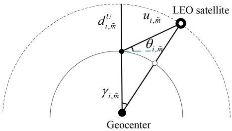

text_image

LEO satellite
d^U_{i,\tilde{m}} u_{i,\tilde{m}}
θ_{i,\tilde{m}}
γ_{i,\tilde{m}}
Geocenter

Fig. 2. Geometric relationship between satellite and user.

to the accessible LEO satellites directly via U-L (User to LEO satellite) links, or to other LEO satellites (L-L link) and/or the GEO satellite (G-L link) via their accessible LEO satellites as intermediate relays.

Consider a scenario where one GEO satellite provides coverage for co-orbiting LEO satellites and ground users. Let M $\{ 1 , \ldots , m , \ldots , M , g \}$ =be a set of satellites, including M LEO 1satellites and one GEO satellite g, and $\mathcal { T } = \{ 1 , \dots , i , \dots , I \}$ be = 1a set of ground users. Note that compared with LEO satellites, the GEO satellite move slowly and cover a wide range. Thus we assume that it is static with respect to the ground [28]. The main symbols used in the rest of this paper are summarized in Table I.

# A. Coverage Time Model

Fig. 2 shows the geometric relationship between accessible LEO satellite and users. Due to the high-speed movement of LEO satellites, the time $t _ { i , \tilde { m } } ^ { R }$ that user i is covered by its accesi,msible LEO satellite m can be calculated as follows,

$$
t _ {i, \tilde {m}} ^ {R} = \frac {u _ {i , \tilde {m}}}{v _ {i , \tilde {m}}}, \tag {1}
$$

where $v _ { i , \tilde { m } }$ denotes the linear velocity of the accessible LEO i,msatellite m for user i. Let us denote $u _ { i , \tilde { m } } = 2 ( r e + d _ { i , \tilde { m } } ^ { U } ) \gamma _ { i , \tilde { m } }$ indicating the arc length of the U-L communication between user i and its accessible LEO satellite $\tilde { m } .$ , where $\gamma _ { i , \tilde { m } }$ is the ˜coverage angle of accessible LEO satellite $\tilde { m } .$ i,m, and calculated by,

$$
\gamma_ {i, \tilde {m}} = \arccos \frac {r e}{r e + d _ {i , \tilde {m}} ^ {U}} \cos \theta_ {i, \tilde {m}} - \theta_ {i, \tilde {m}}, \tag {2}
$$

where $d _ { i , \tilde { m } } ^ { U }$ denotes the height of users’ accessible LEO satellite i,mm from the ground, re represents the radius of the Earth, and $\theta _ { i , \tilde { m } }$ denotes the elevation angle between user i and its accessible i,mLEO satellite $\tilde { m }$ .

# B. Communication Model

Due to the limitations of LEO satellites’ resources, we should consider the communication between users and LEO satellites, and/or between LEO satellites and the GEO satellite when offloading users’ tasks. Similar to [1], [9], we consider the Largescale fading and Rician fading of the wireless communication signal. Then, the uplink transmission rate $r _ { i , \tilde { m } } ^ { U }$ from user i to its i,maccessible LEO satellite m via U-L links can be calculated by,

$$
r _ {i, \tilde {m}} ^ {U} = \log \left(1 + \frac {p _ {i , \tilde {m}} ^ {U} \left| h _ {i , \tilde {m}} ^ {U} \right| ^ {2}}{\sigma_ {i , \tilde {m}} ^ {2}}\right) b _ {i, \tilde {m}} ^ {U}, \tag {3}
$$

where $b _ { i , \tilde { m } } ^ { U } , p _ { i , \tilde { m } } ^ { U } , h _ { i , \tilde { m } } ^ { U }$ , and $\sigma _ { i , \tilde { m } }$ denote the channel bandwidth, i,m i,m i,mthe transmission power, the channel gain, and the noise power from user i to its accessible LEO satellite m , respectively. Since ˜the co-orbiting LEO satellites are linked via the ring structure, we denote m and $m + 1$ as two adjacent LEO satellites. Then, we define the traLEO satellites as $r _ { m , m + 1 } ^ { S }$ on rate via . Denote by $r _ { \tilde { m } , g } ^ { G }$ etween two adjacentthe transmission rate m,mvia G-L between GEO satellite $g$ m,gand accessible LEO satellite m˜ . Following the same idethat for each LEO satellite $m .$ previous work, the values of $r _ { m , m + 1 } ^ { S }$ we asand $r _ { \tilde { m } , g } ^ { G }$ are constant.

# C. Latency Model

There are three components in the SECN latency, including the local latency, the LEO satellite latency, and the GEO satellite latency. We assume each user generates one computation task to offload within one-time slot [30], the computation task of user i is represented as $q _ { i } = \{ o _ { i } , x _ { i } \}$ , where $o _ { i }$ (bits) represents the i = i iamount of data for the task, and $x _ { i } = o _ { i } w _ { i }$ represents the CPU i =cycle per bit demanded by the task, $w _ { i }$ i(cycles/bit) is the task intensity.

1) Local Latency: Local Latency( $L L ^ { U } )$ . It is produced by processing tasks on users’ devices. It is related to computing power and the average CPU cycles of the task [9]. Let us define $\bar { L } L _ { i } ^ { U }$ as the local latency perceived by user i, which can be iexpressed as,

$$
L L _ {i} ^ {U} = \frac {x _ {i}}{f _ {i} ^ {U}}, i \in \mathcal {I}, \tag {4}
$$

where $f _ { i } ^ { U }$ and $x _ { i }$ denote user $i \mathrm { \ ' } _ { \mathrm { s } }$ computing power and the i iaverage CPU cycles needed by the task, respectively [31].

2) LEO Satellite Latency: Similar to [9], [32], the LEO satellite latency includes three components, i.e., transmission latency, propagation latency, and computation latency.

Transmission Latency $( T L ^ { S } )$ . When offloading users’ tasks to LEO satellites, the transmission latency is mainly determined by U-L transmission latency and L-needed). We define the former as $T L _ { i , \tilde { m } } ^ { S } .$ mission latency (if indicating the lai,mtency of user i transmitting its offloading task to its accessible LEO satellite $\tilde { m } .$ . The latter is denoted by $T L _ { \tilde { m } , m } ^ { S }$ indicating the latency of accessible LEO satellite m˜ offloading task to LEO satellite m. Then, $T L _ { i , \tilde { m } } ^ { S }$ ttingand $T L _ { \tilde { m } , m } ^ { S }$ $i \ ' s$

$$
T L _ {i, \tilde {m}} ^ {S} = \frac {o _ {i}}{r _ {i , \tilde {m}} ^ {U}}, i \in \mathcal {I}, \tag {5}
$$

$$
T L _ {\tilde {m}, m} ^ {S} = \frac {o _ {i}}{r _ {m , m + 1} ^ {S}} n _ {\tilde {m}, m}, m \in \mathcal {M}, \tag {6}
$$

where $n _ { \tilde { m } , m } \geq 0$ denotes the number of hops between user $i \gamma _ { \mathrm { s } }$ m,m 0 accessible LEO satellite $\tilde { m }$ and LEO satellite $m .$ . When offloading user i’s task to its accessible LEL-L transmission will not be involved, that is, $T L _ { \tilde { m } , m } ^ { S } = 0 $ , the.

Propagation Latency $( P L ^ { S } )$ m,m. When offloading users’ tasks to LEO satellites, the propagation latency is mainly determined by U-L propagation latency andneeded). We define the former as $P L _ { i , \tilde { m } } ^ { S }$ ropagation latency (ifindicating the latency i,mof user i propagating its offloading task to its accessible LEO satellite m , the latter is denoted by $P L _ { \tilde { m } , m } ^ { S }$ indicating the latency ˜ m,mof accessible LEO satellite m propagating user $i \ ' \mathrm { s }$ offloading ˜task to LEO satellite m. Then, $P L _ { i , \tilde { m } } ^ { S }$ and $P L _ { \tilde { m } , m } ^ { S }$ can be calculated as follows,

$$
P L _ {i, \tilde {m}} ^ {S} = \frac {d _ {i , \tilde {m}} ^ {U}}{c}, i \in \mathcal {I}, \tag {7}
$$

$$
P L _ {\tilde {m}, m} ^ {S} = \frac {d _ {m , m + 1} ^ {S}}{c} n _ {\tilde {m}, m}, m \in \mathcal {M}, \tag {8}
$$

where $d _ { i , \tilde { m } } ^ { U } , d _ { m , m + 1 } ^ { S }$ denote the distance between user i and its i,m m,maccessible satellite m and the distance between adjacent LEO ˜satellites, respectively, c is the speed of light. Similar to (6), $P L _ { \tilde { m } , m } ^ { S } = 0$ if user i’s task is offloaded to its accessible LEO m,msatellite m.

˜Computation Latency $( C L ^ { S } )$ . When user i’s task is offloaded by to LEO satellite $C L _ { i , m } ^ { S }$ and calculated as follows, $m _ { ; }$ , the computation latency for user i is denoted

$$
C L _ {i, m} ^ {S} = \frac {x _ {i}}{f _ {m} ^ {S}}, i \in \mathcal {I}, m \in \mathcal {M}, \tag {9}
$$

where $f _ { m } ^ { S }$ is the computing power (GHz) of LEO satellite m.

mAccording to $( 5 ) \AA { - } ( 9 )$ , the total latency $T _ { i , m } ^ { S }$ of user i’s offloadi,ming its task to LEO satellite m is calculated by,

$$
\begin{array}{l} T _ {i, m} ^ {S} = T L _ {i, \tilde {m}} ^ {S} + T L _ {\tilde {m}, m} ^ {S} \\ + 2 P L _ {i, \tilde {m}} ^ {S} + 2 P L _ {\tilde {m}, m} ^ {S} + C L _ {i, m} ^ {S}, \tag {10} \\ \end{array}
$$

when the user i’s accessible satellite has sufficient resources, the user offloading its task to its accessible LEO satellite, i.e., $m =$ m , that is, T LS ˜ $\tilde { m } ,$ $T L _ { \tilde { m } , m } ^ { S } = P L _ { \tilde { m } , m } ^ { S } = 0$ latency in LEO satellite. ˜is T S $T _ { i , m } ^ { S } = T L _ { i , \tilde { m } } ^ { S } + 2 P L _ { i , \tilde { m } } ^ { S } + C L _ { i , m } ^ { S }$ m,m T LS ˜

i,m = i,m + 2 i,m + i,mBesides, we neglect the transmission latency for result feedback, as the resulting data is much smaller than the origin data. However, the propagation latency cannot be ignored due to the substantial distance between users and LEO satellites [10].

3) GEO Satellite Latency: Similar to the LEO satellite latency, the GEO satellite latency also includes three components, i.e., transmission latency, propagation latency, and computation latency. Due to the long distance, users can not communicate with the GEO satellite directly [8], [24]. Thus, offloading user i’s task to GEO satellite g needs to be forwarded by user i’s accessible LEO satellite transmitting the task to $g .$

Transmission Latency $( T L ^ { G } )$ . Let us defin $T L _ { i , g } ^ { G }$ as the i,glatency of transmitting user i’s task to GEO satellite g, which is mainly determined by U-L transmission latency and G-L transmission latewe can calculate $\dot { T L } _ { i , g } ^ { G }$ iven user i’s accessible LEO satellite m˜ ,as follows,

$$
T L _ {i, g} ^ {G} = T L _ {i, \tilde {m}} ^ {S} + \frac {o _ {i}}{r _ {\tilde {m} , g} ^ {G}}, i \in \mathcal {I}, \tag {11}
$$

where rG ˜ $r _ { \tilde { m } , g } ^ { G }$ denote the transmission rate from the accessible m,gsatellite m to the GEO satellite g.

˜Propagation Latency $( P L ^ { G } )$ . The propagation latency is mainly determined by U-L propagation latency and G-L propagation latency. Given user i and its accessible LEO satellite m , the U-L propagation latency is calculated by (7), i.e., $P L _ { i , \tilde { m } } ^ { S } .$ i,mWe define G-L propagation latency of user i to GEO satellite g as $P L _ { i , g } ^ { G }$ , which can be calculated by,

$$
P L _ {i, g} ^ {G} = P L _ {i, \tilde {m}} ^ {S} + \frac {d _ {\tilde {m} , g} ^ {G}}{c}, i \in \mathcal {I}, \tag {12}
$$

where dG ˜ $d _ { \tilde { m } , g } ^ { G }$ denote distance from the accessible satellite m to m,gthe GEO satellite g.

Computation Latencpower of GEO satellite $( C L ^ { G } )$ $f _ { g } ^ { G }$ (GHz) be the commputation latency $g .$ $C L _ { i , g } ^ { G }$

$$
C L _ {i, g} ^ {G} = \frac {x _ {i}}{f _ {g} ^ {G}}, i \in \mathcal {I}. \tag {13}
$$

Based on (11)–(13), the latency $T _ { i , g } ^ { G }$ of user i offloading the i,gcomputation task to the GEO satellite g can be calculated by,

$$
T _ {i, g} ^ {G} = T L _ {i, g} ^ {G} + 2 P L _ {i, g} ^ {G} + C L _ {i, g} ^ {G}. \tag {14}
$$

As described in Section III-C2, the propagation latency from the GEO satellite to the LEO satellite and from the LEO satellite to the user cannot be ignored.

# D. Energy Consumption Model

There are three components in the SECN energy consumption, including local energy consumption, LEO satellite energy consumption, and GEO satellite energy consumption.

1) Local Energy Consumption: Local Energy Consumption $( L E ^ { U } )$ . For local computation, the energy consumption denoted by $L E _ { i } ^ { U }$ is incurred by user i processing its task. According to [12], $L E _ { i } ^ { U }$ is calculated by,

$$
L E _ {i} ^ {U} = \varepsilon_ {i} (f _ {i} ^ {U}) ^ {2} x _ {i}, i \in \mathcal {I}, \tag {15}
$$

where $\varepsilon _ { i }$ is a constant, which is related to user i’s device iCPU [33], [34].

2) LEO Satellite Energy Consumption: Similar to [7], [31], the LEO satellite energy consumption includes two components, i.e., transmission energy consumption, and computation energy consumption.

Transmission Energy Consumption( $T E ^ { S } )$ . Similar to the calculation of transmission latency in Section III-C2, when offloading users’ tasks to LEO satellites, the transmission energy consumption is mainly determined by U-L transmission energy consumption and/or L-L transmission energy consumption. Let T ES ˜ $T E _ { i , \tilde { m } } ^ { S }$ and T ES˜ $T E _ { \tilde { m } , m } ^ { S }$ be the energy consumption of U-L transi,m m,mmission and L-L transmission, respectively. Then, we have,

$$
T E _ {i, \tilde {m}} ^ {S} = \frac {o _ {i}}{r _ {i , \tilde {m}} ^ {U}} p _ {i, \tilde {m}} ^ {U}, i \in \mathcal {I}, \tag {16}
$$

$$
T E _ {\tilde {m}, m} ^ {S} = \frac {o _ {i}}{r _ {m , m + 1} ^ {S}} p _ {m, m + 1} ^ {S} n _ {\tilde {m}, m}, m \in \mathcal {M}, \tag {17}
$$

where adjace $p _ { m , m + 1 } ^ { S }$ represents the trsatellites m and tween twowhen of-$m + 1 . \ T E _ { \tilde { m } , m } ^ { S } = 0$ + 1 m,m = 0floading user i’s task to its accessible LEO satellite m .

Computation Energy Consumption $( C E ^ { S } )$ ˜. When user i’s consumption task is offloaded to LEO satellite m, the computation energy $C E _ { i , m } ^ { S }$ for user i is calculated by [9],

$$
C E _ {i, m} ^ {S} = \varepsilon_ {m} (f _ {m} ^ {S}) ^ {2} x _ {i}, i \in \mathcal {I}, m \in \mathcal {M}, \tag {18}
$$

where $\varepsilon _ { m }$ is a constant related to the CPU of the MEC server on mLEO satellite m [6].

Since the resulting data is much smaller than the origin data and the energy incurred by it is extremely low, we do not consider the energy consumption for result feedback, same to [9]. Based on (16)–(18), we can obtain the energy consumptionoffloading its task to LEO satellite m, and denote it as $E _ { i , m } ^ { S } ,$ r i

$$
E _ {i, m} ^ {S} = T E _ {i, \tilde {m}} ^ {S} + T E _ {\tilde {m}, m} ^ {S} + C E _ {i, m} ^ {S}. \tag {19}
$$

Same as Section III-C2, waccessible LEO satellite, i.e., $m = \tilde { m } , T E _ { \tilde { m } , m } ^ { S } = 0$ e task to its, the energy $E _ { i , m } ^ { S }$ = ˜ m,m = 0of user i for offloading its task to LEO satellite m is equal ito $T E _ { i , \tilde { m } } ^ { S } + C E _ { i , m } ^ { S }$ .

i,m + i,m3) GEO Satellite Energy Consumption: The GEO satellite energy consumption includes two components, i.e., transmission energy consumption, and computation energy consumption. Since the GEO satellite possess robust onboard capacity and its energy can be supplemented with solar energy [8], the computation energy is ignored.

Transmission Energy Consumption(T EG). When offloading users’ tasks to GEO satellite g, the transmission energy consumption is mainly determined by U-L transmission energy consumption and G-L transmission energy consumption. We define U-L and G-L transmission energy consumption between user i and its offloading GEO satellite g as $T E _ { i , g } ^ { G }$ , which can be

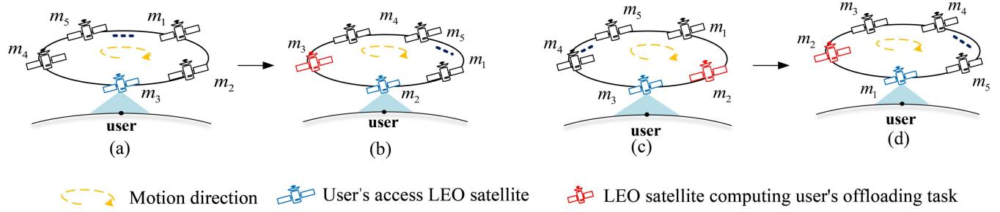  
Fig. 3. Four scenarios of LEO satellites’ mobility.

calculated by,

$$
T E _ {i, g} ^ {G} = T E _ {i, \tilde {m}} ^ {S} + \frac {o _ {i}}{r _ {\tilde {m} , g} ^ {G}} p _ {\tilde {m}, g} ^ {G}, i \in \mathcal {I}, \tag {20}
$$

where satelli $p _ { \tilde { m } , g } ^ { G }$ is the transmission power from the accessible LEOto the GEO satellite g.

˜Based on (20), the energy consumption $E _ { i , g } ^ { G }$ of user i offloading the computation task to GEO satellite $g$ gcan be calculated by,

$$
E _ {i, g} ^ {G} = T E _ {i, g} ^ {G}. \tag {21}
$$

Since the computed results are typically much smaller in size compared to the original data, according to [18], [32], we ignored the energy consumption of the return process.

# IV. PROBLEM FORMULATION

In this section, we analyze the impact of LEO satellites’ mobility on computation offloading latency and formulate the MCO problem.

# A. Mobility Analysis

Different from the GEO satellite, LEO satellites are moving at a high speed and their coverage areas are constantly changing. Thus, for each user, its accessible LEO satellite may be changed when LEO satellites move. To specify the effect of LEO satellites’ high-speed movement on the computation offloading, we discuss the following four scenarios, as shown in Fig 3.

Fig. 3(a) illustrates user $i \gamma _ { \mathrm { ~ s ~ } }$ accessibility to LEO satellite m3. As the accessible LEO satellite can be regarded as the intermediate relay, user i’s task can be offloaded to $m _ { 3 }$ or to other LEO satellites $( \mathrm { e . g . , } m _ { 1 } , m _ { 2 } , m _ { 4 } , \mathrm { e t c . ) }$ via $m _ { 3 }$ . Assume that $m _ { 3 }$ has enough computation resources to accomplish user $i \mathrm { \ ' } _ { \mathrm { s } }$ task. Since $m _ { 3 }$ keeps moving, user i may not always be covered by $m _ { 3 } .$ . Thuse that he computaticovers, i.e., r i’s task is less than the then the computation $m _ { 3 }$ $C L _ { i , m } ^ { S } \leq t _ { i , \tilde { m } } ^ { R } ,$ ≤ t R ˜ <tm， i,m i,mresults can be returned directly. In this case, the latency for user $i \ ' \mathrm { s }$ task offloading does not change as $m _ { 3 }$ moves. Meanwhile, the latency includes three components, i.e., U-L transmission latency, U-L propagation latency and the computation latency on $m _ { 3 }$ . Based on the sum of $( 5 ) , ( 7 )$ tencand calculated $T L _ { i , m _ { 3 } } ^ { S } , P L _ { i , m _ { 3 } } ^ { S } , C L _ { i , m _ { 3 } } ^ { S }$ $P L _ { m _ { 3 } , i } ^ { S } .$

i,m i,m i,m m ,iWhen the computation time for user i’s task on m3 is larger than the time that $m _ { 3 }$ covers, i.e., $C L _ { i , m } ^ { S } > t _ { i , \tilde { m } } ^ { R }$ . In this case, $m _ { 3 }$ will move away from user i as shown in Fig. 3(b). In the meantime, user i’s accessible LEO satellite is switched to m2, and the distance between $m _ { 3 }$ and $m _ { 2 }$ is one hop.1 To return the computation results of user i, this case will inevitably incur extra latency overhead, i.e., the latency incurred by transmitting computation results from $m _ { 3 }$ to $m _ { 2 }$ . Since the size of computation results is very small and the transmission latency incurred by it is extremely low, we do not consider the transmission latency for the result feedback. Thus, when $m _ { 3 }$ moves away from user i, the L-L propagation latency from $m _ { 3 }$ to m2 and the U-L propagation latency from $m _ { 2 }$ to user i should be considered. Thus, in this case, user i’s latency can be obtained by the sum of T LS $i \gamma _ { \mathrm { s } }$ $T L _ { i , m _ { 3 } } ^ { S } ,$ P LS 3 , $P L _ { i , m _ { 3 } } ^ { S } , C L _ { i , m _ { 3 } } ^ { S } , P L _ { m _ { 3 } , m _ { 2 } } ^ { S }$ CLS 3 , , and $P L _ { m _ { 2 } , i } ^ { S }$ .

i,m i,m m ,m m ,iIn Fig. 3(c), it depicts that user i’s task is offloaded to LEO satellite $m _ { 2 }$ , which involves U-L transmission latency, U-L propagation latency, L-L transmission latency, L-L propaga-$T L _ { i , m _ { 3 } } ^ { S } , P L _ { i , m _ { 3 } } ^ { S } ,$ T LS 3 2 , $T L _ { m _ { 3 } , m _ { 2 } } ^ { S } , P L _ { m _ { 3 } , m _ { 2 } } ^ { S } , C L _ { i , m _ { 2 } } ^ { S } , P L _ { m _ { 2 } , m _ { 3 } } ^ { S }$ $P L _ { m _ { 3 } , i } ^ { S } .$ m ,m m ,m i,m m ,m m ,im2 accomplishes the computation offloading of user i’s task, $m _ { 3 }$ is still the accessible LEO satellite of user i. In this case, $ m _ { 2 } \textrm { ' s }$ movement does not affect the latency for offloading user i’s task. Besides, when $m _ { 2 }$ covers user i, the computation results accomplished by $m _ { 2 }$ can be returned to i directly. In this case, the latency for user i decreases as L-L propathe result feedback does not be incurred, i.e., $P L _ { m _ { 2 } , m _ { 3 } } ^ { S } = 0$

However, when $m _ { 2 }$ m ,mcontinues to move away from user i as shown in Fig. 3(d), user $i \ ' s$ accessible LEO satellite is switched to $m _ { 1 }$ . Comparing with Fig. 3(c), we should consider L-L propagation latency from $m _ { 2 }$ to $m _ { 1 }$ while returning the computation results from $m _ { 2 }$ to user i. Thus, extra L-L propagation latency is incurred as shown in Fi $m _ { 2 }$ moves away, which is similar to the phe(b). In this case, user i’s latency includes $T L _ { i , m _ { 3 } } ^ { S } ,$ P LS 3 , $P L _ { i , m _ { 3 } } ^ { S } , T L _ { m _ { 3 } , m _ { 2 } } ^ { S } , P L _ { m _ { 3 } , m _ { 2 } } ^ { S } , C L _ { i , m _ { 2 } } ^ { S } , P L _ { m _ { 2 } , m _ { 1 } } ^ { S }$ , P LS , P LS i,mand P LS $P L _ { m _ { 1 } , i } ^ { S } .$ $P L _ { m _ { 2 } , m _ { 1 } } ^ { S }$ , it is noted that the extra L-L propagation latencyincurred is determined by the number of hops between m ,mthe computation offloading LEO satellite $( \mathrm { e } . \mathrm { g } . , m _ { 2 } )$ and user i’s current accessible LEO satellite $( \mathrm { e } . \mathrm { g } . , m _ { 1 } )$ .

Based on the analyses in Figs. 3(a)-(d), the accessible LEO satellite m of user i may switch as LEO satellites move.

1Due to the ring structure of the LEO satellite orbits, for any two LEO satellites, we employ the shortest connecting path $( \mathrm { i . e . }$ , minimum number of hops) between them to model their data transmission and propagation path, same to [35], [36].

Let us define $\tilde { m }$ and $m ^ { \prime }$ to indicate user i’s accessible LEO ˜satellite when offloading its task and returning its computation result, respectively. Then, given user i and LEO satellite m for offloading user $i \mathrm { \ ' } _ { \mathrm { s } }$ task, we calculate the latency for user i as,

$$
T _ {i, m} ^ {S ^ {\prime}} =
$$

$$
\left\{ \begin{array}{l l} T _ {i, m} ^ {S}, & \tilde {m} = m ^ {\prime}, \\ T L _ {i, \tilde {m}} ^ {S} + P L _ {i, \tilde {m}} ^ {S} + T L _ {\tilde {m}, m} ^ {S} + P L _ {\tilde {m}, m} ^ {S} & \\ + P L _ {m, m ^ {\prime}} ^ {S} + P L _ {i, m ^ {\prime}} ^ {S} + C L _ {i, m} ^ {S}, & \tilde {m} \neq m ^ {\prime}. \end{array} \right. \tag {22}
$$

Note that since the size of computation results is extremely small, we ignore the energy consumption incurred by returning the computation results.

# B. MCO Problem

We define $A _ { i } = \{ a _ { i , 1 } , \ldots , a _ { i , m } , \ldots , a _ { i , M } , a _ { i , g } \} , i \in \mathcal { I }$ , m ∈ i = i, i,m i,M i,gM as the offloading decision of user i for each satellite. Here, $a _ { i , m } \in \{ 0 , 1 \} , i \in \mathcal { I }$ represents whether user $i \gamma _ { \mathrm { ~ s ~ } }$ computation i,m 0 1task is offloaded to LEO satellite m, while $a _ { i , g } \in \{ 0 , 1 \} , i \in \mathcal { I }$ i,g 0 1represents whether user i’s computation task is offloaded to the GEO satellite. If $a _ { i , m } = 0$ and $a _ { i , g } = 0$ , it indicates that user i’s i,m = 0 i,g = 0task is processed locally by itself. Let $t _ { t o t a l }$ and $e _ { t o t a l }$ denote total totalthe total latency and energy consumption of the SECN, respectively. According to (4), (14) and (22), $t _ { t o t a l }$ is calculated by follows,

$$
t _ {t o t a l} = \sum_ {i \in \mathcal {I}} \sum_ {m \in \mathcal {M}} [ (1 - a _ {i, m} - a _ {i, g}) L L _ {i} ^ {U}
$$

$$
\left. + a _ {i, m} T _ {i, m} ^ {S ^ {\prime}} + a _ {i, g} T _ {i, g} ^ {G} \right]. \tag {23}
$$

Based on (15), (19), and (21), $e _ { t o t a l }$ is calculated by,

$$
e _ {t o t a l} = \sum_ {i \in \mathcal {I}} \sum_ {m \in \mathcal {M}} [ (1 - a _ {i, m} - a _ {i, g}) L E _ {i} ^ {U}
$$

$$
\left. + a _ {i, m} E _ {i, m} ^ {S} + a _ {i, g} E _ {i, g} ^ {G} \right]. \tag {24}
$$

For convenient comparison with latency and energy, we normalize $t _ { t o t a l }$ and $e _ { t o t a l }$ as $t _ { t o t a l } ^ { \prime }$ and $e _ { t o t a l } ^ { \prime }$ by using Min-Max total total total totalnormalization, following the same settings in [16]. Thus, both $t _ { t o t a l } ^ { \prime }$ and $e _ { t o t a l } ^ { \prime }$ fall within the range of [0,1]. With the contotal totalstraints of offloadable LEO satellites computational resources, our objective is to minimize the cost of SECN, where the cost refers to the weighted sum of latency and energy consumption. In light of this, we formulate the computing offloading problem as follows,

$$
\min _ {A _ {i}} \lambda t _ {\text { total }} ^ {\prime} + (1 - \lambda) e _ {\text { total }} ^ {\prime}, \tag {25}
$$

$$
\text { s.t. } \sum_ {m \in \mathcal {M}} a _ {i, m} \leq 1, i \in \mathcal {I}, \tag {25a}
$$

$$
a _ {i, m} \in \{0, 1 \}, \forall i, m, \tag {25b}
$$

$$
\sum_ {i \in \mathcal {I}} a _ {i, m} x _ {i} \leq Z _ {m}, m \in \mathcal {M}, \tag {25c}
$$

where λ is the weight coefficient of the indicator. (25 a) and (25 b) ensure that each offloading task can only be processed locally or on the LEO satellite or on the GEO satellite. (25 c) represents the computing resource constraints, where $Z _ { m }$ represents the maximum resources on LEO satellite m.

# V. APPROACH DESIGN

# A. Problem Reduction

Since the function (25) and constraints (25 a)–(25 c) are linear combinations of a series of discrete variables $a _ { i , m }$ , it is nonconvex [37], we then convert the original non-convex problem into a convex problem and prove that is feasible. First, we convert the problem by transforming binary variables $a _ { i , m } \in \{ 0 , 1 \}$ into continuous variables $0 \leq a _ { i , m } ^ { \prime } \leq \dot { 1 }$ i,m 0 1. The transformed problem is shown as follows,

$$
\min f (a _ {i, m} ^ {\prime}), \tag {26}
$$

$$
\text { s.t. } \sum_ {m \in \mathcal {M}} a _ {i, m} ^ {\prime} \leq 1, i \in \mathcal {I}, \tag {26a}
$$

$$
0 \leq a _ {i, m} ^ {\prime} \leq 1, \forall i, m, \tag {26b}
$$

$$
\sum_ {m \in \mathcal {M}} a _ {i, m} ^ {\prime} x _ {i} \leq Z _ {m}, m \in \mathcal {M}, \tag {26c}
$$

where $f ( a _ { i , m } ^ { \prime } ) = \lambda t _ { t o t a l } ^ { \prime } ( a _ { i , m } ^ { \prime } ) + ( 1 - \lambda ) e _ { t o t a l } ^ { \prime } ( a _ { i , m } ^ { \prime } )$ . The ( i,m) = total( i,m) + (1 ) total( i,m)convexity of function (26) is discussed by the following proposition.

Lemma 1. If the function (26) is feasible, it is a convex problem concerning all optimization variables.

Proof. We prove the convexity of function (26) through the definition of convex functions. For any two users, their offloading decision sets are given by $\bar { X } = \{ x _ { i , 1 } , x _ { i , 2 } , \ldots , x _ { i , m } , \ldots , x _ { i , M } , x _ { i , g } \} ^ { T }$ and $\bar { Y } =$ $\{ y _ { i , 1 } , y _ { i , 2 } , \ldots , y _ { i , m } , \ldots , y _ { i , M } , y _ { i , g } \} ^ { T }$ i,g ¯ =. As stated by the domain i, i, i,m i,M i,gof function (26), it is known that every offloading decision in X and Y belong to [0,1]. According to the definition of convex functions, if we have $f ( \alpha { \bar { X } } + ( 1 - \alpha ) { \bar { Y } } ) \leq$ $\alpha f ( \bar { X } ) + ( 1 - \alpha ) f ( \bar { Y } )$ ( + (1, f · is convex, where $\alpha \in [ 0 , 1 ]$ ( ) + (1is coefficient.

Let’s put $\alpha \bar { X } + ( 1 - \alpha ) \bar { Y }$ into f · , we have,

$$
f (\alpha \bar {X} + (1 - \alpha) \bar {Y})
$$

$$
= \sum_ {i \in \mathcal {I}} (\lambda L L _ {i} ^ {U} + (1 - \lambda) L E _ {i} ^ {U}) + \sum_ {i \in \mathcal {I}} \sum_ {m \in \mathcal {M}} [ \alpha x _ {i, m}
$$

$$
\left(\lambda T _ {i, m} ^ {S ^ {\prime}} + (1 - \lambda) E _ {i, m} ^ {S} - \lambda L L _ {i} ^ {U} - (1 - \lambda) L E _ {i} ^ {U}\right) +
$$

$$
(1 - \alpha) y _ {i, m} (\lambda T _ {i, m} ^ {S ^ {\prime}} + (1 - \lambda) E _ {i, m} ^ {S} - \lambda L L _ {i} ^ {U}
$$

$$
\left. - (1 - \lambda) L E _ {i} ^ {U}) \right] + \sum_ {i \in \mathcal {I}} \left[ \left(\alpha x _ {i, g}\right) \left(\lambda T _ {i, g} ^ {G} + (1 - \lambda) E _ {i, g} ^ {G} \right. \right.
$$

$$
- \lambda L L _ {i} ^ {U} - (1 - \lambda) L E _ {i} ^ {U}) + (1 - \alpha) y _ {i, g}
$$

$$
\left. \left(\lambda T _ {i, g} ^ {G} + (1 - \lambda) E _ {i, g} ^ {G} - \lambda L L _ {i} ^ {U} - (1 - \lambda) L E _ {i} ^ {U}\right) \right]. \tag {27}
$$

Substituting X into $\alpha f ( \cdot )$ , we have,

$$
\begin{array}{l} \alpha f (\bar {X}) \\ = \alpha \sum_ {i \in \mathcal {I}} \sum_ {m \in \mathcal {M}} [ (\lambda L L _ {i} ^ {U} + (1 - \lambda) L E _ {i} ^ {U}) \\ + x _ {i, m} (\lambda T _ {i, m} ^ {S ^ {\prime}} + (1 - \lambda) E _ {i, m} ^ {S} - \lambda L L _ {i} ^ {U} - (1 - \lambda) L E _ {i} ^ {U}) \\ \left. + x _ {i, g} \left(\lambda T _ {i, g} ^ {G} + (1 - \lambda) E _ {i, g} ^ {G} - \lambda L L _ {i} ^ {U} - (1 - \lambda) L E _ {i} ^ {U}\right) \right] \\ = \alpha \sum_ {i \in \mathcal {I}} (\lambda L L _ {i} ^ {U} + (1 - \lambda) L E _ {i} ^ {U}) + \sum_ {i \in \mathcal {I}} \sum_ {m \in \mathcal {M}} \alpha x _ {i, m} \\ (\lambda T _ {i, m} ^ {S ^ {\prime}} + (1 - \lambda) E _ {i, m} ^ {S} - \lambda L L _ {i} ^ {U} - (1 - \lambda) L E _ {i} ^ {U}) \\ + \sum_ {i \in \mathcal {I}} \alpha x _ {i, g} (\lambda T _ {i, g} ^ {G} + (1 - \lambda) E _ {i, g} ^ {G} \\ - \lambda L L _ {i} ^ {U} - (1 - \lambda) L E _ {i} ^ {U}). \tag {28} \\ \end{array}
$$

$$
\begin{array}{l} (\lambda T _ {i, m} ^ {S ^ {\prime}} + (1 - \lambda) E _ {i, m} ^ {S} - \lambda L L _ {i} ^ {U} - (1 - \lambda) L E _ {i} ^ {U}) \\ + \sum_ {i \in \mathcal {I}} \alpha x _ {i, g} (\lambda T _ {i, g} ^ {G} + (1 - \lambda) E _ {i, g} ^ {G} \\ - \lambda L L _ {i} ^ {U} - (1 - \lambda) L E _ {i} ^ {U}). \tag {28} \\ \end{array}
$$

Substituting $\bar { Y }$ into $( 1 - \alpha ) f ( \cdot )$ , we obtain,

$$
\begin{array}{l} (1 - \alpha) f (\bar {Y}) \\ = \sum_ {i \in \mathcal {I}} [ (1 - \alpha) (\lambda L L _ {i} ^ {U} + (1 - \lambda) L E _ {i} ^ {U}) ] \\ + \sum_ {i \in \mathcal {I}} \sum_ {m \in \mathcal {M}} [ (1 - \alpha) x _ {i, m} (\lambda T _ {i, m} ^ {S ^ {\prime}} \\ \left. + (1 - \lambda) E _ {i, m} ^ {S} - \lambda_ {1} L L _ {i} ^ {U} - \lambda_ {2} L E _ {i} ^ {U}) \right] \\ + \sum_ {i \in \mathcal {I}} [ (1 - \alpha) x _ {i, g} (\lambda T _ {i, g} ^ {G} \\ + (1 - \lambda) E _ {i, g} ^ {G} - \lambda L L _ {i} ^ {U} - (1 - \lambda) L E _ {i} ^ {U}) ]. \tag {29} \\ \end{array}
$$

With the sum of (28) and (29), we have,

$$
\begin{array}{l} \alpha f (\bar {X}) + (1 - \alpha) f (\bar {Y}) \\ = \sum_ {i \in \mathcal {I}} (\lambda L L _ {i} ^ {U} + (1 - \lambda) L E _ {i} ^ {U}) + \sum_ {i \in \mathcal {I}} \sum_ {m \in \mathcal {M}} [ \alpha x _ {i, m} \\ (\lambda T _ {i, m} ^ {S ^ {\prime}} + (1 - \lambda) E _ {i, m} ^ {S} - \lambda L L _ {i} ^ {U} + (1 - \lambda) L E _ {i} ^ {U}) ] \\ + \sum_ {i \in \mathcal {I}} [ (1 - \alpha) x _ {i, g} (\lambda T _ {i, g} ^ {G} + (1 - \lambda) E _ {i, g} ^ {G} \\ \left. - \lambda L L _ {i} ^ {U} - (1 - \lambda) L E _ {i} ^ {U}) \right]. \tag {30} \\ \end{array}
$$

From (27)–(30), we obtain $\alpha f ( { \bar { X } } ) + ( 1 - \alpha ) f ( { \bar { Y } } ) =$ $f ( \alpha \bar { X } + ( 1 - \alpha ) \bar { Y } )$ ( ) + (. Thus, the inequality $f ( \alpha \bar { X } + ( 1 -$ $\alpha ) \bar { Y } ) \leq \alpha f ( \bar { X } ) + ( 1 - \alpha ) f ( \bar { Y } )$ ( + (1holds. According to the def-) ) ( ) + (1 ) ( )inition of convexity [38], we can conclude that the objective function $f ( a _ { i , m } ^ { \prime } )$ in (26) is convex. Since inequalities (26 a) and ( i,m)(26 c) are all half-spaces, we can easily obtain that both of them are convex sets, and their intersection sets are also convex sets.

Given conditions, $0 \leq x _ { i , 1 } + x _ { i , 2 } + \cdot \cdot \cdot + x _ { i , g } \leq 1 , 0 \leq$ $y _ { i , 1 } + y _ { i , 2 } + \cdot \cdot \cdot + y _ { i , g } \leq 1$ i, + i,, for all $\alpha \in [ 0 , 1 ] .$ i,g 1 0, we have $\begin{array} { r l } { 0 \leq \alpha \bar { X } + ( 1 - \alpha ) \bar { Y } = [ \alpha x _ { i , 1 } + ( 1 - \alpha ) y _ { i , 1 } , \alpha x _ { i , 2 } } & { { } + ( 1 - \alpha ) { \cal M } _ { i } , } \end{array}$ $\alpha ) y _ { i , 2 } , \ldots , \alpha x _ { i , g } \ + \ ( 1 - \alpha ) y _ { i , g } ] \ = \alpha ( x _ { i , 1 } + x _ { i , 2 } + \cdots +$ $x _ { i , g } ) \ : + \ : ( 1 - \alpha ) ( y _ { i , 1 } + y _ { i , 2 } + \cdot \cdot \cdot + y _ { i , g } ) \leq \alpha + ( 1 - \alpha ) = 1$ . i,g)Thus, $0 \leq \alpha \bar { X } + ( 1 - \alpha ) \bar { Y } \leq 1$ + i,g) + (1 ) = 1and it holds that (26 b) is a 0 + (1 ) 1convex set. Therefore, the function (26) is convex.

# B. MCO-A Design

Given a set M of satellites and a set I of co-existing users, we should note that more LEO satellite-and-user pairs needs to be explored when offloading users’ tasks. Thus, centralized processing the reduced problem may result in an unacceptable computational overhead. Moreover, the reduced problem is the convex problem and is difficult to be efficiently solved by using centralized approaches in a large-scale distributed environment [39], [40]. Therefore, in this paper, we introduce a distributed algorithm based on ADMM (alternating direction method of multipliers) to overcome this issue. Because ADMM is a well-known distributed algorithm for solving the large-scale convex problems efficiently [41]. By utilizing the decomposition-coordination strategy [42], [43], ADMM enables us to decompose the original complex problem into multiple local subproblems that are easy to solve. Then, it obtains the global solution by coordinating subproblems’ solutions. The pseudocode of MCO-A is presented in Algorithm 1.

Specifically, we treat $a _ { i , m } ^ { \prime }$ in the function (26) as a global i,mvariable, for user i, its offloading decision $a _ { i , m } ^ { \prime }$ is indivisible. To i,mmake the problem divisible so that each satellite can solve the problem, a local variable is introduced as a copy of the global variable $a _ { i , m } ^ { \prime } .$ For each $a _ { i , m } ^ { \prime } ,$ , we divide it into $M + 1$ fractions, i,ide $a _ { i , m } ^ { \prime }$ into $\{ \hat { a } _ { i , m } ^ { 1 } , \hat { a } _ { i , m } ^ { 2 } , \dotsc , \hat { a } _ { i , m } ^ { k } , \dotsc , \hat { a } _ { i , q } ^ { M + 1 } \}$ ak , + 1, aM+1 } ai,g , where $M + 1$ $\hat { a } _ { i , m }$ sent this set . Substituting $M + 1$ components corresponding the function (26), we have, $a _ { i , m } ^ { \prime }$ $\hat { a } _ { i , m } ^ { k }$

$$
\begin{array}{l} f (\hat {a} _ {i, m}) = \sum_ {k \in \mathcal {M}} \sum_ {i \in \mathcal {I}} \sum_ {m \in \mathcal {M}} (1 - \hat {a} _ {i, m} ^ {k} - \hat {a} _ {i, g} ^ {k}) \\ [ \lambda L L _ {i} ^ {U} + (1 - \lambda) L E _ {i} ^ {U} ] \\ + \hat {a} _ {i, m} ^ {k} [ \lambda T _ {i, m} ^ {S ^ {\prime}} + (1 - \lambda) E _ {i, m} ^ {S} ] \\ + \hat {a} _ {i, g} ^ {k} [ \lambda T _ {i, g} ^ {G} + (1 - \lambda) E _ {i, g} ^ {G} ]. \tag {31} \\ \end{array}
$$

Equivalent local problem to the global function (26) is represented as follows,

$$
\min f (\hat {a} _ {i, m}), \tag {32}
$$

$$
\text { s.t. } \sum_ {k \in \mathcal {M}} \hat {a} _ {i, m} ^ {k} \leq 1, i \in \mathcal {I},
$$

$$
0 \leq \hat {a} _ {i, m} ^ {k} \leq 1, \forall i, m, k,
$$

$$
\sum_ {i \in \mathcal {I}} \hat {a} _ {i, m} ^ {k} x _ {i} \leq Z _ {m}, m \in \mathcal {M},
$$

$$
\hat {a} _ {i, m} ^ {k} = a _ {i, m} ^ {\prime}, \forall i, k, m.
$$

The consistency constraint (32 d) forces all local variables in each satellite to be consistent with their corresponding global variables. For ease of description, we define the following set as the feasible set of local variables,

$$
\hat {\Omega} = \left\{\hat {a} _ {i, m} \left| \begin{array}{l} \sum_ {k \in \mathcal {M}} \hat {a} _ {i, m} ^ {k} \leq 1, \forall i, \\ 0 \leq \hat {a} _ {i, m} ^ {k} \leq 1, \forall i, m, k, \\ \sum_ {i \in \mathcal {I}} \hat {a} _ {i, m} ^ {k} x _ {i} \leq Z _ {m}, \forall k. \end{array} \right. \right\}. \tag {33}
$$

Then, we give the objective function of the local variable,

$$
F (\hat {a} _ {i, m}) = \left\{ \begin{array}{l l} f (\hat {a} _ {i, m}), & \text { when   } \hat {a} _ {i, m} \in \hat {\Omega}, \\ + \infty , & \text { otherwise. } \end{array} \right. \tag {34}
$$

Based on (33) and (34), the equivalent description of the local problem is as follows,

$$
\min _ {\hat {a} _ {i, m}} F (\hat {a} _ {i, m}), \tag {35}
$$

$$
\mathrm{s.t.} \hat {a} _ {i, m} ^ {k} = a _ {i, m} ^ {\prime}, \forall i, k, m.
$$

In the function (35), the function with a feasible set $\hat { \Omega }$ is Ωdetachable concerning all satellites in the SECN. The constraint (35 a) ensures consistency between all local and global variables. When all local variables in each satellite are equal to their corresponding global variables, the consensus is maintained. We apply ADMM to solve the function (35). The augmented Lagrange representation of the function (35) is given,

$$
\begin{array}{l} L (\hat {a} _ {i, m}) \\ = F (\hat {a} _ {i, m}) + \sum_ {k \in \mathcal {M}} \sum_ {i \in \mathcal {I}} \sum_ {m \in \mathcal {M}} \sigma_ {i, m} ^ {k} (\hat {a} _ {i, m} ^ {k} - a _ {i, m} ^ {\prime}) \\ + \frac {\rho}{2} \sum_ {k \in \mathcal {M}} \sum_ {i \in \mathcal {I}} \sum_ {m \in \mathcal {M}} \| \hat {a} _ {i, m} ^ {k} - a _ {i, m} ^ {\prime [ t ]} \| ^ {2}, \tag {36} \\ \end{array}
$$

where σ  {σ1 , . . . , σ $\hat { \sigma } _ { i , m } = \{ \sigma _ { i , m } ^ { 1 } , \ldots , \sigma _ { i , m } ^ { k } , \ldots , \sigma _ { i , m } ^ { M } , \sigma _ { i , g } ^ { M + 1 } \}$ represents ˆi,m = i,m i,mthe set of Lagrange multiplier and $\rho$ i,m i,gis the penalty parameter used to adjust the convergence speed of ADMM.

Problem (36) is solved by iteratively updating the local variables, global variables, and the Lagrange multiplier. The iterative steps are as follows:

Step 1: For the LEO satellite, update local variable $\hat { a } _ { i , m } ^ { k }$ by using (37),

$$
\begin{array}{l} \hat {a} _ {i, m} ^ {k [ t + 1 ]} \\ = \underset {\hat {a} _ {i, m}} {\arg \min} \{F (\hat {a} _ {i, m}) \\ + \sum_ {k \in \mathcal {M}} \sum_ {i \in \mathcal {I}} \sum_ {m \in \mathcal {M}} \sigma_ {i, m} ^ {k [ t ]} (\hat {a} _ {i, m} ^ {k} - a _ {i, m} ^ {' [ t ]}) \\ + \frac {\rho}{2} \sum_ {k \in \mathcal {M}} \sum_ {i \in \mathcal {I}} \sum_ {m \in \mathcal {M}} \| \hat {a} _ {i, m} ^ {k} - a _ {i, m} ^ {' [ t ]} \| ^ {2} \}, \tag {37} \\ \end{array}
$$

where we can introduce the primal-dual interior point approach [39] to solve the (37) as it is convex.

Step 2: For the LEO satellite, update global variable $a _ { i , m } ^ { \prime }$ using (38),

$$
\begin{array}{l} a _ {i, m} ^ {' [ t + 1 ]} \\ = \underset {\hat {a} _ {i, m}} {\arg \min} \left\{\sum_ {k \in \mathcal {M}} \sum_ {i \in \mathcal {I}} \sum_ {m \in \mathcal {M}} \sigma_ {i, m} ^ {k [ t ]} (\hat {a} _ {i, m} ^ {k [ t + 1 ]} - a _ {i, m} ^ {' [ t ]}) \right. \\ \left. + \frac {\rho}{2} \sum_ {k \in \mathcal {M}} \sum_ {i \in \mathcal {I}} \sum_ {m \in \mathcal {M}} \| \hat {a} _ {i, m} ^ {k [ t + 1 ]} - a _ {i, m} ^ {\prime [ t ]} \| ^ {2} \right\}. \tag {38} \\ \end{array}
$$

Clearly, with the addition of the Lagrange regularization term, the solution of the global variable is a convex problem. Therefore, we solve it by setting its gradient to zero,

$$
\begin{array}{l} \sum_ {k \in \mathcal {M}} \sum_ {i \in \mathcal {I}} \sum_ {m \in \mathcal {M}} \sigma_ {i, m} ^ {k [ t ]} \\ + \rho \sum_ {k \in \mathcal {M}} \sum_ {i \in \mathcal {I}} \sum_ {m \in \mathcal {M}} (\hat {a} _ {i, m} ^ {k [ t + 1 ]} - a _ {i, m} ^ {' [ t ]}) = 0, \forall i, m. \tag {39} \\ \end{array}
$$

Then, $a _ { i , m } ^ { \prime }$ can be rearranged as follows,

$$
\begin{array}{l} a _ {i, m} ^ {\prime [ t ]} = \frac {1}{(M + 1) \rho} \sum_ {k \in \mathcal {M}} \sum_ {i \in \mathcal {I}} \sum_ {m \in \mathcal {M}} \sigma_ {i, m} ^ {k [ t ]} \\ + \frac {1}{(M + 1)} \sum_ {k \in \mathcal {M}} \sum_ {i \in \mathcal {I}} \sum_ {m \in \mathcal {M}} \hat {a} _ {i, m} ^ {k [ t + 1 ]}, \forall i, m. \tag {40} \\ \end{array}
$$

We obtain the feasible global solution by iteratively making the Lagrange multiplier equal to zero. The global solution can be rearranged as (41),

$$
a _ {i, m} ^ {\prime [ t ]} = \frac {1}{(M + 1)} \sum_ {k \in \mathcal {M}} \sum_ {i \in \mathcal {I}} \sum_ {m \in \mathcal {M}} \hat {a} _ {i, m} ^ {k [ t + 1 ]}, \forall i, m, \tag {41}
$$

which means that the global solution $a _ { i , m } ^ { \prime }$ is calculated during i,miteration by averaging every satellite’s local variables a k[t+ $a _ { i , m } ^ { k [ t + 1 ] }$ to estimate the global variable.

Step 3: Update Lagrange multiplier. For the GEO satellite, based on (37), (38), the Lagrange multiplier can be updated using (42),

$$
\sigma_ {i, m} ^ {k [ t + 1 ]} = \sigma_ {i, m} ^ {k [ t ]} + \rho (\hat {a} _ {i, m} ^ {k [ t + 1 ]} - a _ {i, m} ^ {' [ t + 1 ]}), \forall i, m. \tag {42}
$$

Step 4: Stopping criterion. Following [13], the primitive and dual residuals of each satellite must be as small as possible under feasible conditions. Therefore, the stopping criterion is expressed as inequality (43) and (44),

$$
\left\| \hat {a} _ {i, m} ^ {k [ t + 1 ]} - a _ {i, m} ^ {\prime [ t + 1 ]} \right\| _ {2} \leq \vartheta_ {1}, \forall i, m, k, \tag {43}
$$

where $\vartheta _ { 1 }$ represents the threshold for stopping iteration under the original feasible conditions. Similarly, the dual residual under the dual feasible condition is expressed as,

$$
\left\| a _ {i, m} ^ {\prime [ t + 1 ]} - a _ {i, m} ^ {\prime [ t ]} \right\| _ {2} \leq \vartheta_ {2}, \forall i, m, \tag {44}
$$

where $\vartheta _ { 2 }$ represents the threshold for stopping iteration under the double feasible conditions.

Step 5: Recovery binary variable. In Section V-A, since the binary variables are relaxed to continuous variables, we need to recover the obtained continuous variables to binary values. For each user i, recover the largest value as 1 and others as 0. Repeat this process for each user until all variables are recovered to 0-1 variables.

As shown in Algorithm 1, MCO-A first sets the maximum number of iterations and stopping threshold, and initializes the feasible solutions. Then, each LEO satellite updates global and local offloading variables according to the objective function until the original residual and dual residuals exceed the threshold. Finally, we use Algorithm 2 to restore the continuous variable $a _ { i , m } ^ { \prime }$ to 0-1 variable $a _ { i , m }$ . The notation m represents the satellite i,m i,m ˆassociated with the maximum value of the offloading decision for user i. For each user $i ,$ restore the largest $a _ { i , \hat { m } } ^ { \prime }$ to 1 and the rest a $a _ { i , m } ^ { \prime } \mathrm { t o } 0 .$ i,m. Repeat it until the computation offloading decision i,mvariables $a _ { i , m } ^ { \prime }$ are restored to $a _ { i , m }$ for all users.

Algorithm 1: MCO-A.   
Input: number of users n, number of satellites M.
Output: the solutions $a_{i,m}, \forall i \in I$ .
1: Set the stopping criterion threshold $\vartheta_{1}, \vartheta_{2} > 0$ , randomly initialize the feasible solution $\hat{a}_{i,m}^{[0]}$ and the scaling Lagrange multipliers vectors $\hat{\sigma}_{i,m}^{[0]}$ .
2: Set the maximum number of iterations T.
3: for $i = 1, 2, \ldots, T$ do
4: Update local variables $\hat{a}_{i,m}^{k[t+1]}$ by using (37).
5: Update global variables $a_{i,m}^{'[t+1]}$ according to (39)–(41).
6: Update Lagrange multipliers $\sigma_{i,m}^{k[t+1]}$ via (42).
7: $t = t + 1$ .
8: end for
9: repeat
10: t < T
11: until $\|\hat{a}_{i,m}^{k[t+1]} - a_{i,m}^{'[t+1]}\|_{2} \leq \vartheta_{1}, \|a_{i,m}^{'[t+1]} - a_{i,m}^{'[t]}\|_{2} \leq \vartheta_{2}.$ 12: return $a_{i,m}'$ , and then use Algorithm 2 to recovery them to binary variables.

Algorithm 2: Binary Variables Recovery Algorithm.   
Input: the continuous values $a_{i,m}^{\prime}$ .
Output: the recovered binary variables $a_{i,m}$ .
1: Set $M^{\prime}:=\varnothing$ .
2: for episode=0,1,2,... do
3: Find the maximum decision value $a_{i,\hat{m}}^{\prime}$ for user i.
4: Set $a_{i,\hat{m}}^{\prime}=1$ and $a_{i,m}^{\prime}=0$ , where $m\in M\setminus\{\hat{m}\}$ .
5: if the constraints (26 a)-(26 c) are satisfy then
6: Set $M^{\prime}:=M^{\prime}\bigcup\{\hat{m}\}$ .
7: break.
8: end if
9: end for

# C. Performance Analysis

1) Convergence Analysis: In this section, the convergence of the MCO-A proposed in Section V-B is analyzed in the following.

Lemma 2. The function $F ( \cdot )$ in (35) is convex, closed and true.

Proof. As mentioned in Section V-B, function $F ( \cdot )$ in (35) is the global consensus problem of function $f ( \cdot )$ ( )in (26), which means that $F ( \cdot )$ is equivalent to $f ( \cdot )$ ( ). Thus, $F ( \cdot )$ is convex as $f ( \cdot ) \mathrm { \{ s \} }$ ( ) ( ) ( ) convexity has been proven in Lemma 1. Besides, it ( )can be easily obtained that $F ( \cdot )$ is closed. Because the feasible domain of $F ( \cdot ) \mathrm { ^ { \circ } s }$ variables, $\hat { a } _ { i , m } ^ { k }$ is belongs to the range of [0, ( ) ˆi,m1]. Same as [9], the Lagrange equation associated with $F ( \cdot )$

is real-valued and non-empty, which ensures $F ( \cdot ) \mathrm { ^ { \circ } s }$ validity. Therefore, function $F ( \cdot )$ ( )is convex, closed and true.

( )Lemma 3. Consider that the solution set of the original problem is non-empty, and the Slater condition is satisfied. Let us suppose that $a ^ { * }$ is the solution of KKT conditions and $a ^ { * }$ is bounded, then we have $F ( a _ { i . m } ^ { \prime } )  F ( a ^ { * } ) , a _ { i . m } ^ { \prime }  a ^ { * }$ .

( i,m) ( ) i,mAccording to Lemmas 2 and 3, ADMM supports the residual and dual variable convergence. The detailed proofs are presented as follows:

We set $( a ^ { * } , \sigma ^ { * } )$ as an optimal solution, and $\hat { a } _ { i , m } ^ { k } - a ^ { * } =$ $0 , \sigma _ { i , m } ^ { k } - \sigma ^ { * } = 0$ ) ˆi,m . Then, we can rewrite (36) as follows,

$$
\begin{array}{l} L (\hat {a} _ {i, m}, \hat {\sigma} _ {i, m}) \\ = F (\hat {a} _ {i, m}) + \sum_ {k \in \mathcal {M}} \sum_ {i \in \mathcal {I}} \sum_ {m \in \mathcal {M}} \\ \sigma_ {i, m} ^ {k} (\hat {a} _ {i, m} ^ {k} - a _ {i, m} ^ {\prime}). \tag {45} \\ \end{array}
$$

According to Lemma 3, we take the partial derivative of (45) with respect to $a ^ { * }$ and have,

$$
\begin{array}{l} 0 \in \partial L (\hat {a} _ {i, m}, \hat {\sigma} _ {i, m}) \\ = \frac {\partial F (a ^ {*})}{\partial a ^ {*}} + \sum_ {k \in \mathcal {M}} \sum_ {i \in \mathcal {I}} \sum_ {m \in \mathcal {M}} \sigma_ {i, m} ^ {k}. \tag {46} \\ \end{array}
$$

We define the error between the iterative variable and the optimal solution as follows, $e _ { a } ^ { [ t ] } = \hat { a } _ { i , m } ^ { k [ t ] } - a ^ { * } , e _ { \sigma } ^ { [ t ] } = \sigma _ { i , m } ^ { k [ t ] } - \sigma ^ { * }$ a k t − a∗, e[t] σk t , where $e _ { a } ^ { [ t ] }$ and $e _ { \sigma } ^ { [ t ] }$ a = ˆi,m σ = i,mare the errors corresponding to the optimal a solutions of $\hat { a } _ { i , m } ^ { k }$ σ and $\sigma _ { i , m } ^ { k } ,$ respectively. We aim to prove that as $t \to \infty , \| e _ { a } ^ { [ t ] } \| \to 0 , \| e _ { \sigma } ^ { [ t ] } \| \to 0$ .

a Since L a[t] , σ $L ( \hat { a } _ { i , m } ^ { [ t ] } , \hat { \sigma } _ { i , m } ^ { [ t ] } )$ σ 0must have a gradient of 0 at $\hat { a } _ { i , m } ^ { k } =$ a k t $\hat { a } _ { i , m } ^ { k [ t + 1 ] }$ (ˆi,m, we have,

$$
\begin{array}{l} 0 \in \frac {\partial F (\hat {a} _ {i , m} ^ {[ t + 1 ]})}{\partial \hat {a} _ {i , m} ^ {k [ t + 1 ]}} + \sum_ {k \in \mathcal {M}} \sum_ {i \in \mathcal {I}} \sum_ {m \in \mathcal {M}} \sigma_ {i, m} ^ {k [ t + 1 ]} \\ + \rho \sum_ {k \in \mathcal {M}} \sum_ {i \in \mathcal {I}} \sum_ {m \in \mathcal {M}} (\hat {a} _ {i, m} ^ {k [ t + 1 ]} - a _ {i, m} ^ {' k [ t + 1 ]}). \tag {47} \\ \end{array}
$$

According to the Lagrange multiplier σk[t+ $\sigma _ { i , m } ^ { k [ t + 1 ] }$ we can introduce σk t $\sigma _ { i , m } ^ { k [ t + 1 ] }$ i,minto the function (47), and we obtain,

$$
0 \in \frac {\partial F (\hat {a} _ {i , m} ^ {[ t + 1 ]})}{\partial \hat {a} _ {i , m} ^ {k [ t + 1 ]}} + \sum_ {k \in \mathcal {M}} \sum_ {i \in \mathcal {I}} \sum_ {m \in \mathcal {M}} \sigma_ {i, m} ^ {k [ t + 1 ]}. \tag {48}
$$

By defining $\begin{array} { r } { u ^ { k [ t + 1 ] } = - \sum _ { m \in \mathcal { M } } \sigma _ { i , m } ^ { k [ t + 1 ] } } \end{array}$ , when combined = m i,mwith the function (48), the following conclusion can be drawn,

$$
u ^ {k [ t + 1 ]} \in \partial F (\hat {a} _ {i, m} ^ {[ t + 1 ]}). \tag {49}
$$

Let us construct an error recurrence relation as follows,

$$
u ^ {k [ t + 1 ]} \in \partial F (\hat {a} _ {i, m} ^ {[ t + 1 ]}), \sigma^ {*} \in - \partial F (a ^ {*}). \tag {50}
$$

Using the monotonicity of convex functions, we have uk[t+1]  σ∗, a k[t+ $( u ^ { k [ t + 1 ] } + \sigma ^ { * } , \hat { a } _ { i , m } ^ { k [ t + 1 ] } - a ^ { * } ) \geq 0$ 1] − a∗ ≥ . Simplifying the function (50),

we finally get,

$$
\left(\rho \| e _ {a} ^ {[ t ]} \| ^ {2} + \frac {1}{\rho} \| e _ {\sigma} ^ {[ t ]} \| ^ {2}\right) \geq \rho \| e _ {a} ^ {[ t + 1 ]} - e _ {a} ^ {[ t ]} \| ^ {2} + \frac {1}{\rho} \| e _ {\sigma} ^ {[ t + 1 ]} - e _ {\sigma} ^ {[ t ]} \| ^ {2}. \tag {51}
$$

Inequality (51) indicates that $\begin{array} { r } { ( \rho \| e _ { a } ^ { [ t ] } \| ^ { 2 } + \frac { 1 } { \rho } \| e _ { \sigma } ^ { [ t ] } \| ^ { 2 } ) } \end{array}$ decreases and eventually converges to 0.

2) Complexity Analysis: Based on function $F ( \cdot )$ in (37), e− (·) $e ^ { - F ( \cdot ) }$ ( )can be regarded as the likelihood of the function and $e ^ { \sigma _ { i , m } ^ { k [ t ] } ( \hat { a } _ { i , m } ^ { k [ t ] } - a _ { i , m } ^ { ' [ t ] } ) + \frac { \rho } { 2 } \| \hat { a } _ { i , m } ^ { k [ t ] } - a _ { i , m } ^ { ' [ t ] } \| ^ { 2 } }$ −a i,m)  [t] −a i,m can be viewed as an approximate prior distribution. Given $a _ { i , m } ^ { ' [ t ] } ,$ the linear minimum mean i,msquare error estimation is performed in the local variable update, taking $\mathcal { O } ( I ^ { 3 } )$ time.

( )Similarly, according to (38)–(41), $\mathbf { \nabla } _ { e } - \hat { a } _ { i , m } ^ { k [ t ] }$ is the Laplace distribution, while $e ^ { \sigma _ { i , m } ^ { k [ t ] } ( \hat { a } _ { i , m } ^ { k \overline { { { [ t ] } } } } - a _ { i , m } ^ { ^ { \prime } [ t ] } ) + \frac { \rho } { 2 } \| \hat { a } _ { i , m } ^ { k [ t ] } - a _ { i , m } ^ { ^ { \prime } [ t ] } \| ^ { 2 } }$ −  i,m is an approximate likelihood of the function with a computational complexity of O I M  . In the Lagrange multiplier update, a k[t] $\mathcal { O } ( I ( M + 1 ) )$ $\hat { a } _ { i , m } ^ { k [ t ] } - \overset { ^ { \prime } [ t ] } { a _ { i , m } ^ { \prime } }$ a t ( ( + 1)) ˆi,m i,mrepresents the error, which will be fed back to the parameter and further modify (38) and (42). When (36) converges, we have a k t $\hat { a } _ { i , m } ^ { k [ t ] } - a _ { i , m } ^ { ' [ t ] } \to 0$ a t → . In the meantime, parameter σk $\sigma _ { i , m } ^ { k }$ is ˆi,m i,m 0no longer updated, with a computational complexity of $\dot { \mathcal { O } } ( I )$ . ( )Therefore, the computational complexity of each iteration of the ADMM-based model-solving algorithm is $\mathcal { O } ( I ^ { 3 } ) + \mathcal { O } ( I ( M +$ $1 ) ) + \mathcal { O } ( I ) \approx \mathcal { O } ( I ^ { 3 } )$ ( ) + ( ( +. Assuming t represents the number of 1)) + ( ) ( )iterations required for convergence, the total computational complexity of this approach is $\mathcal { O } ( t I ^ { 3 } )$ .

# VI. PERFORMANCE EVALUATION

# A. Simulation Settings

Similar to [19], [29], five LEO satellites and one GEO satellite are involved in our simulations. To evaluate MCO-A’s performance, we consider two MCO scenarios, including small and large scales, by varying two parameters, including the number of users and the size of each user’s offloading task. Specifically, in small-scale MCO scenarios, we vary the number of users from 5 to 25 in steps of 5, while in the large-scale MCO scenarios, we vary the number of users from 100 to 500 in steps of 100. Same to [9], the size of each task is randomly chosen from the range of , kb in small-scale and large-scale MCO scenarios. [1000 3000]Besides, we take the parameters of previous works [19], [23] and our actual results into consideration to determine the range or the fixed parameters involved in the settings of GEO and LEO satellites, as summarized in Table II.

In our experiments, five representative approaches are employed to compare with MCO-A’s performance.

Optimal: This approach uses a convex optimization toolbox to obtain the optimal offloading decision for each user.   
- JTO-CCRO [44]: This approach is based on game theory, which can obtain the offloading decision by iterating continuously but without considering satellite mobility scenarios.   
- DRLCO [45]: This task offloading approach is implemented through deep reinforcement learning, which can

TABLE II SYSTEM PARAMETERS 

<table><tr><td>Parameter</td><td>Value</td></tr><tr><td>Distance between adjacent LEO satellites  $d_{m,m+1}^{S}$ </td><td>4481km</td></tr><tr><td>User i&#x27;s distance to LEO satellites  $d_{i,\tilde{m}}^{U}$ </td><td>784km</td></tr><tr><td>Radius of the Earth re</td><td>6371km</td></tr><tr><td>Computational density of the task wi</td><td>3M cycles/bit</td></tr><tr><td>LEO satellite  $\tilde{m}$ &#x27;s linear velocity vi, $\tilde{m}$ </td><td>27000km/h</td></tr><tr><td>Speed of light c</td><td> $3 \times 10^{8}$ m/s</td></tr><tr><td>User i&#x27;s transmit power  $p_{i,\tilde{m}}^{U}$ </td><td>23dBm</td></tr><tr><td>Channel bandwidth  $b_{i,\tilde{m}}^{U}$  between user i and accessible satellite  $\tilde{m}$ </td><td>20MHz</td></tr><tr><td>Channel gain  $h_{i,\tilde{m}}^{U}$ </td><td>-150dB</td></tr><tr><td>Noise power  $\sigma_{i,\tilde{m}}$ </td><td> $10^{-9}$ </td></tr><tr><td>Transmission rate between LEO satellites  $r_{m,m+1}^{S}$ </td><td>40Mbps</td></tr><tr><td>computing power of local users  $f_{i}^{U}$ </td><td>200MHz</td></tr><tr><td>LEO satellite  $m_{1}$ &#x27;s computing power  $f_{m1}^{S}$ </td><td>1GHz</td></tr><tr><td>LEO satellite  $m_{2}$ &#x27;s computing power  $f_{m2}^{S}$ </td><td>1.5GHz</td></tr><tr><td>LEO satellite  $m_{3}$ &#x27;s computing power  $f_{m3}^{S}$ </td><td>2GHz</td></tr><tr><td>LEO satellite  $m_{4}$ &#x27;s computing power  $f_{m4}^{S}$ </td><td>2.5GHz</td></tr><tr><td>LEO satellite  $m_{5}$ &#x27;s computing power  $f_{m5}^{S}$ </td><td>3GHz</td></tr><tr><td>Transmission rate from accessible satellite  $\tilde{m}$  to the GEO satellite  $r_{\tilde{m},g}^{G}$ </td><td>20Mbps</td></tr><tr><td>Distance between accessible satellite and GEO satellite  $d_{\tilde{m},g}^{G}$ </td><td>31305km</td></tr><tr><td>Computing power of GEO satellite  $f_{g}^{G}$ </td><td>50GHz</td></tr><tr><td>User i&#x27;s energy factor  $\varepsilon_{i}$ </td><td> $5 \times 10^{-26}$ J/Hz $^{3}$ /s</td></tr><tr><td>LEO satellite m&#x27;s energy factor  $\varepsilon_{m}$ </td><td> $5 \times 10^{-32}$ J/Hz $^{3}$ /s</td></tr><tr><td>Threshold for  $\vartheta_{1}, \vartheta_{2}$ </td><td> $10^{-6}$ </td></tr><tr><td>Weighting factor between latency and energy consumption λ</td><td>0.5</td></tr></table>

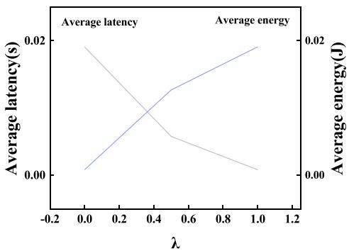

line

| λ    | Average latency(s) | Average energy(J) |
| ---- | ------------------ | ----------------- |
| 0.0  | 0.02               | 0.02              |
| 0.4  | 0.01               | 0.01              |
| 0.6  | 0.015              | 0.005             |
| 1.0  | 0.02               | 0.00              |

Fig. 4. Impact of parameter λ.

dynamically generate offloading decisions but without considering satellite mobility scenarios.

- Random: This approach randomly selects a location (i.e., one of the LEO or GEO satellite or local) for each user to compute.   
- LC: This approach computes locally without picking any offloading.

We implement all the six competing approaches in MATLAB. Each experiment is run 100 times to obtain the average results.

# B. Discussion on Parameter λ

In Fig. 4, we investigate the impact of weight coefficient λ on $M C O { - } A ^ { \prime } \mathrm { s }$ performance by varying λ’s value from 0.0 to 1.0 with the steps of 0.2. As given in Objective (25), a small λ means that our solution is inclined to lower latency at higher energy consumption. From Fig. 4, we can observe that when λ increases, the average energy consumed increases while the average latency incurred decreases accordingly. Interestingly, when the value of λ increases continuously and exceeds 0.5, the growth rate of the average energy consumption and the decline of average latency decrease. The reason for the decrease is that, with a larger λ, more tasks are offloaded to the LEO satellites that are closer to the user, rather than moving to the satellites that consume less energy. In practice, a suitable value of λ can be empirically chosen for the MCO strategy to achieve the best performance for specific application scenarios. Without loss of generality, λ is set at 0.5 in the following experiments.

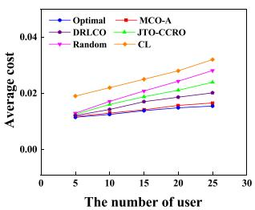  
(a) Costs u.s.Number of users

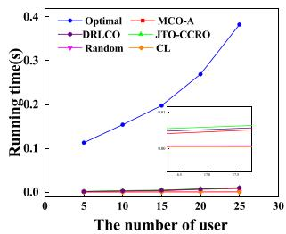  
(b) Time u.s.Number of users   
Fig. 5. Impact of users in small scale.

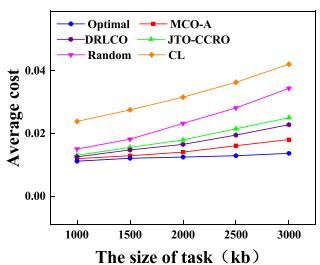  
(a) Costs v.s. Size of task

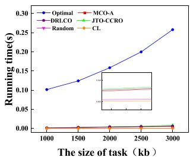  
(b) Time v.s.Size of task   
Fig. 6. Impact of the size of tasks in small scale.

# C. Performance in Small-Scale Experiments

Fig. 5 shows the performance comparison in terms of average cost and running time by varying the number of users from 5 to 25. As depicted in Fig. 5(a), the average costs for all approaches increase as the number of users increases. This is attributed to the higher latency and energy consumption associated with processing more users’ offloading tasks. Obviously, Optimal achieves the lowest average cost in all cases. In addition, MCO-A’s performance in average cost is second to Optimal and outperforms other competing approaches. The reasons for MCO-A’s advantages are that comparing to DRLCO, JTO-CCRO and Random, MCO-A considers the mobility of LEO satellites, and thus can find more suitable and reasonable task offloading solutions. Compared with MCO-A, CL is to offload all tasks locally, resulting in higher latency and energy consumption. As a result, it incurs the highest average cost. On average, MCO-A’s average cost is 6.9% higher than Optimal, 15.4% lower than DRLCO, 20.3% lower than JTO-CCRO, 24.3% lower than Random, and 34.1% lower than CL.

Fig. 5(b) shows the running time incurred by all the six approaches. With the increase of the number of users, all competing approaches take a higher running time. This is because with a large amount of users, more tasks are to be offloaded, which leads to an increase in running time for finding a suitable offloading decision. Besides, Optimal performs the highest running time to find a solution. This is expected because, Optimal utilizes matrix operations, experiencing exponential growth in running time as the number of users increases due to the increasing dimensions of the involved matrices. MCO-A is much more efficient than Optimal, and slightly efficient than DRLCO and JTO-CCRO. The reason that MCO-A is slightly more efficient than DRLCO and JTO-CCRO, is that MCO-A utilizes ADMM and does not require multiple iterations to find a solution in the same scale scenario. As a result, MCO-A takes less running time. Comparing with MCO-A, CL and Random are more efficient but they undergo much higher average cost than MCO-A, as shown in Fig. 5(a). This also limits their applications in the real-world.

Fig. 6 depicts the performance comparison by varying the size of each task from 1000 kb to 3000 kb. In this experiment, the number of users is fixed at 15. From Fig. 6(a), we can see that the average costs for all approaches increase as each task’s size increases. This is because the offloading task’s size directly correlates with the transmission latency and energy consumption. With the increase in the size of each task, a larger computation is needed, which leads to a higher cost in terms of transmission latency and energy consumption. Obviously, Optimal again achieves the best performance in average cost, outperforming MCO-A, DRLCO, JTO-CCRO, Random, and CL by 20.1%, 35.9%, 41.3%, 56.2%, and 63.4%, respectively, on average. Besides, we can see that MCO-A performs good performance and still is second to Optimal. Overall, on average, the average cost of MCO-A is 13.8% higher than Optimal, but 15.3%, 24.3%, 34.7%, and 39% lower than DRLCO, JTO-CCRO, Random, and CL, respectively. This also shows that MCO-A is capable of making more suitable offloading decisions for users, especially in distributed MCO environments.

In Fig. 6(b), it clearly shows that when the size of each task increases, all approaches incur more running time. This is because with a larger task size, each task needs more computation and thus more running time is incurred. Among all the six approaches, we can observe the same phenomena shown in Fig. 5(b) that Optimal takes much more running time than other competing approaches. Besides, MCO-A again takes less running time than Optimal, DRLCO and JTO-CCRO but more than CL and Random. Compared with MCO-A, the average cost of CL and Random are 34.7% and 39% higher than MCO-A. Such a higher cost would not be preferred in real scenarios.

# D. Performance in Large-Scale Experiments

Fig. 7 shows the performance comparison in large-scale user scenarios by varying the number of users from 100 to 500 with the steps of 100. Each user’s task size is randomly chosen from the range of , kb. In Fig. 7(a), similar to the phenomena in small-scale scenarios shown in Fig. 5(a), the average cost incurred by all the six approaches increases when the number of users increases. Overall, Optimal again achieves the lowest average cost. The average cost of MCO-A still is second to Optimal and is much lower than DRLCO, JTO-CCRO, Random and CL. Specifically, MCO-A’s average cost is 17.9% lower than DRLCO, 30.9% lower than JTO-CCRO, 41.1% lower than Random, 48.3% lower than CL, and 25.6% higher than Optimal. This demonstrates that MCO-A’s advantages in finding suitable task offloading solutions. The underlying reasons are also similar to Fig. 5(a) and thus are not omitted here. From Fig. 7(b), we can see that the running time taken by all the six approaches in large-scale user scenarios is similar to that in Fig. 5(b). With more users, all those approaches need more running time. Similar to previous results, Optimal is the slowest, and CL and Random are the fastest. Besides, MCO-A requires 0.25 seconds on average, which is lower than Optimal, DRLCO and JTO-CCRO. Furthermore, although CL and Random are more efficient then MCO-A, they undergo much higher average cost 41.1% and 48.3% higher than MCO-A, respectively, on average, as illustrated in Fig. 7(a). This also shows MCO-A’s performance advantages in solving the MCO problem.

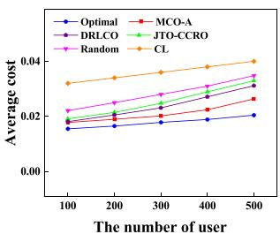  
(a) Costs v.s. Number of users

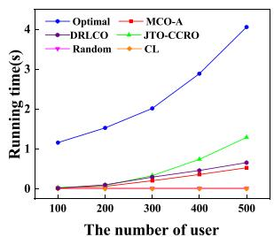  
(b) Time v.s.Number of users   
Fig. 7. Impact of users in large scale.

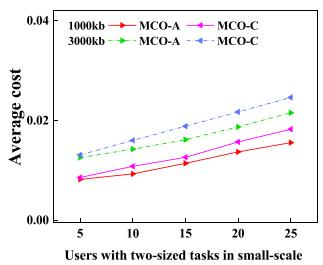

line

| Users with two-sized tasks in small-scale | MCO-A | MCO-C | MCO-A | MCO-C |
| ------------------------------------------ | ----- | ----- | ----- | ----- |
| 5                                          | 0.01  | 0.01  | 0.015 | 0.015 |
| 10                                         | 0.012 | 0.013 | 0.017 | 0.018 |
| 15                                         | 0.014 | 0.016 | 0.019 | 0.02  |
| 20                                         | 0.016 | 0.018 | 0.021 | 0.022 |
| 25                                         | 0.018 | 0.02  | 0.023 | 0.024 |

(a) average cost in small-scale

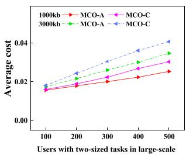

line

| Users with two-sized tasks in large-scale | 1000kb | 3000kb | MCO-A | MCO-C |
| ------------------------------------------ | ------ | ------ | ----- | ----- |
| Average cost                               | 0.02   | 0.02   | 0.02  | 0.02  |
| 100                                        | 0.02   | 0.02   | 0.02  | 0.02  |
| 200                                        | 0.02   | 0.02   | 0.02  | 0.02  |
| 300                                        | 0.02   | 0.02   | 0.02  | 0.02  |
| 400                                        | 0.02   | 0.02   | 0.02  | 0.02  |
| 500                                        | 0.02   | 0.02   | 0.02  | 0.02  |

(b) average cost in large-scale   
Fig. 9. Costs versus number of users.

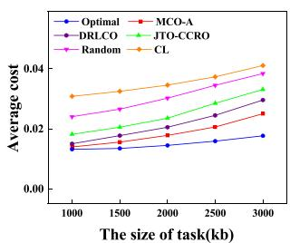  
(a) Costs u.s. Size of task

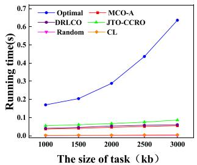  
(b) Time v.s. Size of task   
Fig. 8. Impact of the size of tasks in large scale.

Fig. 8 shows the performance comparison of all the six approaches in terms of average cost and running time in the large-scale scenarios. In these experiments, we vary the size of each task from 1000 kb to 3000 kb and fix the number of users at 300. Fig. 8(a) shows the same phenomenon shown in Fig. 6(a), i.e., second to Optimal, MCO-A performs good performance in average cost, outperforming DRLCO, JTO-CCRO, Random, and CL, by 17.9%, 30.9%, 41.1%, and 48.3%, respectively, on average. Compared with MCO-A, Optimal achieves a lower

average cost than MCO-A, but it is very inefficient than MCO-A, as illustrated in Fig. 8(b). Besides, we can observe that Fig. 8(b) depicts a similar phenomenon to Fig. 6(b), i.e., the running time of MCO-A is consistently lower than DRLCO, JTO-CCRO and Optimal. Compared with CL and Random, MCO-A consumes a higher running time. This is the performance price to pay for MCO-A’s performance advantages in average cost over CL and Random.

# E. Comparison of Approach Effectiveness

In this section, we consider small-scale and large-scale MCO scenarios to investigate the impact of LEO satellites’ mobility on MCO-A’s performance in average cost to assess the benefits and effectiveness of incorporating satellite mobility, as shown in Fig. 9. Let MCO-C be an approach without considering LEO satellites’ mobility. Besides, we construct two sets of experiments in each of the two MCO scenarios and set the size of each task at 1000 kb and 3000 kb, respectively.

Comparing Fig. 9(a) and (b), it clearly depicts that MCO-A achieves the best performance in all cases. Because MCO-A considers the mobility of LEO satellites, this helps MCO-A allow users’ tasks to offload to the LEO satellites with lighter workloads. Thus, more users’ tasks can be offloaded with a lower average cost in terms of latency and energy consumption. In contrast, MCO-C is hard to find suitable task offloading decisions, incurring the higher costs in both small-scale and large-scale scenarios. Besides, under different task sizes, both MCO-A and MCO-C achieves a higher average cost when the number of users increases. The underlying reasons are that with a larger users, more offloading tasks need to be processed, leading to a higher transmission latency and energy consumption. Overall, MCO-A outperforms MCO-C by 29.5% and 33% in small and large scales, respectively, on average.

From the above analysis, we can observe that considering LEO satellites’ mobility is very useful for finding more effective task offloading solutions with minimum costs. This also shows that MCO-A is capable of choosing more suitable LEO satellites for offloading tasks in practice.

# VII. CONCLUSION AND FUTURE WORK

In this paper, we focused on the problem of mobility-aware computation offloading (MCO) in the satellite edge computing network (SECN) that comprises GEO satellites as cloud centers, LEO satellites as edge computing nodes, and users as end-terminals. We first formulated the MCO problem by considering LEO satellites’ mobility, with the objective of minimizing network latency and energy consumption. Considering the MCO problem is discrete and non-convex, we transformed it into a continuous convex problem by relaxing binary variables and then proved the converted problem is feasible. We proposed MCO-A, a distributed algorithm based on the ADMM with a provable convergence to solve the MCO problem efficiently. Finally, through extensive experiments, the results showed that MCO-A achieves excellent performance. Overall, our approach contributes to computation offloading in the SECN by jointly considering LEO satellites’ mobility and resource constraints.

In the future, we will explore the probability of including more specific factors in our model such as inter-task dependencies, resource allocation optimization, and collaboration among GEO satellites, to further extend the ability and improve the performance of our approach. Moreover, we will investigate the impact of distributed algorithms on latency to improve the holistic algorithm design.

# REFERENCES

[1] A. Abdi, W. C. Lau, M. Alouini, and M. Kaveh, “A new simple model for land mobile satellite channels: First-and second-order statistics,” IEEE Trans. Wireless Commun., vol. 2, no. 3, pp. 519–528, May 2003.   
[2] B. Al Homssi et al., “Next generation mega satellite networks for access equality: Opportunities, challenges, and performance,” IEEE Commun. Mag., vol. 60, no. 4, pp. 18–24, Apr. 2022.   
[3] N. K. Lyras, C. N. Efrem, C. I. Kourogiorgas, and A. D. Panagopoulos, “Optimum monthly based selection of ground stations for optical satellite networks,” IEEE Commun. Lett., vol. 22, no. 6, pp. 1192–1195, Jun. 2018.   
[4] X. Cao and K. R. Liu, “Distributed linearized ADMM for network cost minimization,” IEEE Trans. Signal Inf. Process. Netw., vol. 4, no. 3, pp. 626–638, Sep. 2018.   
[5] C. Ding, J. Wang, M. Cheng, M. Lin, and J. Cheng, “Dynamic transmission and computation resource optimization for dense LEO satellite assisted mobile-edge computing,” IEEE Trans. Commun., vol. 71, no. 5, pp. 3087–3102, May 2023.   
[6] D. Jiang et al., “QoE-aware efficient content distribution scheme for satellite-terrestrial networks,” IEEE Trans. Mobile Comput., vol. 22, no. 1, pp. 443–458, Jan. 2023.   
[7] W. Lv, P. Yang, Y. Ding, Z. Wang, C. Lin, and Q. Wang, “Energy-efficient and QoS-aware computation offloading in GEO/LEO hybrid satellite networks,” Remote Sens., vol. 15, no. 13, pp. 3299–3299, 2023.   
[8] T. Leng, P. Duan, D. Hu, G. Cui, and W. Wang, “Cooperative user association and resource allocation for task offloading in hybrid GEO-LEO satellite networks,” Int. J. Satell. Commun. Netw., vol. 40, no. 3, pp. 230–243, 2022.   
[9] Q. Tang, Z. Fei, B. Li, and Z. Han, “Computation offloading in LEO satellite networks with hybrid cloud and edge computing,” IEEE Internet Things J., vol. 8, no. 11, pp. 9164–9176, Jun. 2021.   
[10] P. A. Apostolopoulos, G. Fragkos, E. E. Tsiropoulou, and S. Papavassiliou, “Data offloading in UAV-assisted multi-access edge computing systems under resource uncertainty,” IEEE Trans. Mobile Comput., vol. 22, no. 1, pp. 175–190, Jan. 2023.   
[11] C. You, K. Huang, H. Chae, and B. Kim, “Energy-efficient resource allocation for mobile-edge computation offloading,” IEEE Trans. Wireless Commun., vol. 16, no. 3, pp. 1397–1411, Mar. 2017.   
[12] Y. Xiao, Q. Shen, and J. Xing, “A co-orbiting multi-satellite edge computing offload method for LEO constellation networks considering mission request energy consumption,” in Proc. Int. Conf. Cyber Secur., Artif. Intell., Digit. Economy, 2023, pp. 58–63.   
[13] S. Boyd, N. Parikh, E. Chu, B. Peleato, and J. Eckstein, “Distributed optimization and statistical learning via the alternating direction method of multipliers,” Found. Trends Mach. Learn., vol. 3, no. 1, pp. 1–122, 2011.   
[14] B. Soret, S. Ravikanti, and P. Popovski, “Latency and timeliness in multihop satellite networks,” in Proc. Int. Conf. Commun., 2020, pp. 1–6.

[15] K. Wei, Q. Tang, J. Guo, M. Zeng, Z. Fei, and Q. Cui, “Resource scheduling and offloading strategy based on LEO satellite edge computing,” in Proc. Veh. Technol. Conf., 2021, pp. 1–6.   
[16] F. Wang, D. Jiang, S. Qi, C. Qiao, and L. Shi, “A dynamic resource scheduling scheme in edge computing satellite networks,” Mobile Netw. Appl., vol. 26, no. 2, pp. 597–608, 2021.   
[17] Z. Song, Y. Hao, Y. Liu, and X. Sun, “Energy-efficient multiaccess edge computing for terrestrial-satellite Internet of Things,” IEEE Internet Things J., vol. 8, no. 18, pp. 14202–14218, Sep. 2021.   
[18] H. Zhang, S. Xi, H. Jiang, Q. Shen, B. Shang, and J. Wang, “Resource allocation and offloading strategy for UAV-assisted LEO satellite edge computing,” Drones, vol. 7, no. 6, pp. 383–393, 2023.   
[19] Y. Wang, J. Zhang, X. Zhang, P. Wang, and L. Liu, “A computation offloading strategy in satellite terrestrial networks with double edge computing,” in Proc. Int. Conf. Commun. Syst., 2018, pp. 450–455.   
[20] F. Xu, F. Yang, C. Zhao, and S. Wu, “Deep reinforcement learning based joint edge resource management in maritime network,” China Commun., vol. 17, no. 5, pp. 211–222, 2020.   
[21] D. Zhu et al., “Deep reinforcement learning-based task offloading in satellite-terrestrial edge computing networks,” in Proc. Wireless Commun. Netw. Conf., 2021, pp. 1–7.   
[22] S. Zhang, G. Cui, Y. Long, and W. Wang, “Joint computing and communication resource allocation for satellite communication networks with edge computing,” China Commun., vol. 18, no. 7, pp. 236–252, 2021.   
[23] B. Wang, T. Feng, and D. Huang, “A joint computation offloading and resource allocation strategy for LEO satellite edge computing system,” in Proc. Int. Conf. Commun. Technol., 2020, pp. 649–655.   
[24] M. Bouet and V. Conan, “Mobile edge computing resources optimization: A GEO-clustering approach,” IEEE Trans. Netw. Service Manag., vol. 15, no. 2, pp. 787–796, Jun. 2018.   
[25] Z. Tang, J. Lou, and W. Jia, “Layer dependency-aware learning scheduling algorithms for containers in mobile edge computing,” IEEE Trans. Mobile Comput., vol. 22, no. 6, pp. 3444–3459, Jun. 2023.   
[26] Z. Song, Y. Hao, and X. Sun, “Computation offloading and resource allocation algorithm for collaborative LEO satellite multi-access edge computing,” Acta Electonica Sinica, vol. 50, no. 3, pp. 567–567, 2022.   
[27] H. Tan, M. He, T. Xia, X. Zheng, and J. Lai, “A novel multi-level computation offloading scheme at LEO constellation broadband network edge,” in Proc. World Congr. Serv., 2020, pp. 281–286.   
[28] F. Vatalaro, G. E. Corazza, C. Caini, and C. Ferrarelli, “Analysis of LEO, MEO, and GEO global mobile satellite systems in the presence of interference and fading,” IEEE J. Sel. Areas Commun., vol. 13, no. 2, pp. 291–300, Feb. 1995.   
[29] Y. Zhang, C. Chen, L. Liu, D. Lan, H. Jiang, and S. Wan, “Aerial edge computing on orbit: A task offloading and allocation scheme,” IEEE Trans. Netw. Sci. Eng., vol. 10, no. 1, pp. 275–285, Jan./Feb. 2023.   
[30] W. Chu, P. Yu, Z. Yu, J. C. Lui, and Y. Lin, “Online optimal service selection, resource allocation and task offloading for multi-access edge computing: A utility-based approach,” IEEE Trans. Mobile Comput., vol. 22, no. 7, pp. 4150–4167, Jul. 2023.   
[31] C. Yi, J. Cai, and Z. Su, “A multi-user mobile computation offloading and transmission scheduling mechanism for delay-sensitive applications,” IEEE Trans. Mobile Comput., vol. 19, no. 1, pp. 29–43, Jan. 2020.   
[32] M. Liu, G. Feng, L. Cheng, and S. Qin, “A deep reinforcement learning based adaptive transmission strategy in space-air-ground integrated networks,” in Proc. Int. Conf. Commun., 2022, pp. 4697–4702.   
[33] X. Chen, L. Jiao, W. Li, and X. Fu, “Efficient multi-user computation offloading for mobile-edge cloud computing,” IEEE Trans. Netw., vol. 24, no. 5, pp. 2795–2808, Oct. 2016.   
[34] S. Guo, B. Xiao, Y. Yang, and Y. Yang, “Energy-efficient dynamic offloading and resource scheduling in mobile cloud computing,” in Proc. Int. Conf. Comput. Commun., 2016, pp. 1–9.   
[35] Z. Luo et al., “A refined Dijkstra’s algorithm with stable route generation for topology-varying satellite networks,” in Proc. Int. Conf. Distrib. Comput. Syst., 2021, pp. 1146–1147.   
[36] Y. Liu and L. Zhu, “A suboptimal routing algorithm for massive LEO satellite networks,” in Proc. Int. Symp. Netw., Comput. Commun., 2018, pp. 1–5.   
[37] K. Murota and A. Shioura, “Relationship of M-/L-convex functions with discrete convex functions by Miller and Favati–Tardella,” Discrete Appl. Math., vol. 115, no. 1/3, pp. 151–176, 2001.   
[38] A. Ben-Tal and A. Nemirovski, “Robust convex optimization,” Math. Operations Res., vol. 23, no. 4, pp. 769–805, 1998.

[39] L. Majzoobi, F. Lahouti, and V. Shah-Mansouri, “Analysis of distributed ADMM algorithm for consensus optimization in presence of node error,” IEEE Trans. Signal Process., vol. 67, no. 7, pp. 1774–1784, Apr. 2019.   
[40] J. Wang and N. Elia, “A control perspective for centralized and distributed convex optimization,” in Proc. Conf. Decis. Control Eur. Control Conf., 2011, pp. 3800–3805.   
[41] S. Minaee and Y. Wang, “An ADMM approach to masked signal decomposition using subspace representation,” IEEE Trans. Image Process., vol. 28, no. 7, pp. 3192–3204, Jul. 2019.   
[42] C. Chen, B. He, Y. Ye, and X. Yuan, “The direct extension of ADMM for multi-block convex minimization problems is not necessarily convergent,” Math. Program., vol. 155, no. 1, pp. 57–79, 2016.   
[43] T. Erseghe, “Distributed optimal power flow using ADMM,” IEEE Trans. Power Syst., vol. 29, no. 5, pp. 2370–2380, Sep. 2014.   
[44] M. Jia, L. Zhang, J. Wu, Q. Guo, and X. Gu, “Joint computing and communication resource allocation for edge computing towards huge LEO networks,” China Commun., vol. 19, no. 8, pp. 73–84, 2022.   
[45] N. Cheng et al., “Space/aerial-assisted computing offloading for IoT applications: A learning-based approach,” IEEE J. Sel. Areas Commun., vol. 37, no. 5, pp. 1117–1129, May 2019.

natural_image

Portrait of a man wearing glasses and a suit against a blue background (no text or symbols visible)

Jian Zhou (Member, IEEE) received the PhD degree from the Nanjing University of Science and Technology, Nanjing, China, in 2012. He is currently a professor with the Nanjing University of Posts and Telecommunications, Nanjing. His research interests include edge intelligence, edge computing, and satellite network.

natural_image

Portrait photo of a young woman against a plain blue background (no text or symbols visible)

Qi Yang is currently working toward the graduate degree with the School of Computer Science, Nanjing University of Posts and Telecommunications, Nanjing, Jiangsu, China. His research interests include edge intelligence and satellite edge computing.

natural_image

Portrait photo of a man against a solid blue background (no text or symbols visible)

Lu Zhao received the PhD degree in software engineering from the Nanjing University of Aeronautics and Astronautics, Nanjing, China, in 2021. He worked as a visiting PhD student with the Swinburne University of Technology from 2019 to 2020. He is currently a lecturer with the School of Computer Science at Nanjing University of Posts and Telecommunications, Nanjing, Jiangsu, China. His research interests include service computing, crowdsourcing/crowdsensing, and edge computing.

natural_image

Portrait photo of a man in business attire (no text or symbols visible)

Haipeng Dai (Senior Member, IEEE) received the BS degree from the Department of Electronic Engineering, Shanghai Jiao Tong University, Shanghai, China, in 2010, and the PhD degree from the Department of Computer Science and Technology, Nanjing University, Nanjing, China, in 2014. His research interests are mainly in the areas of wireless charging, mobile computing, and data mining. He is an Associate Professor with the Department of Computer Science and Technology in Nanjing University. He has authored more than 200 papers in many prestigious confer-  
ences and journals such as ACM MobiSys, ACM MobiHoc, ACM UbiComp, IEEE INFOCOM, USENIX ATC, ACM EuroSys, ACM SIGMETRICS, IEEE ICNP, IEEE IPSN, ACM SIGMOD, ACM VLDB, IEEE Transactions on Mobile Computing, IEEE Journal on Selected Areas in Communications, IEEE/ACM Transactions on Networking, IEEE Transactions on Parallel and Distributed Systems, and IEEE Transactions on Sensor Networks. He is an ACM member. He serves/ed as the Leading program chair of IEEE ISPA’22-23, the co-vice program chair of IEEE HPCC’21, track chair of the ICCCN’19 and ICPADS’21. He served as TPC member of international conferences such as INFOCOM, IJCAI, SC, VLDB, SIGKDD, MobiHoc, and ICNP. He received Best Paper Award from IEEE ICNP’15, Best Paper Award Runner-up from IEEE SECON’18, Best Paper Award Candidate from IEEE INFOCOM’17, Best Paper Award from IEEE HPCC’22, and Best Paper Award from WASA’22.

natural_image

Portrait of a man wearing glasses and a suit against a blue background (no text or symbols visible)

Fu Xiao (Member, IEEE) received the PhD degree in computer science and technology from the Nanjing University of Science and Technology, Nanjing, China, in 2007. He is currently a professor and a PhD supervisor with the School of Computers, Nanjing University of Posts and Telecommunications. His main research interests include wireless sensor networks and mobile computing. He is a member of the association for computing machinery.