# Modeling and Analysis of Movable Antenna Aided MIMO Wideband UAV-to-UAV Channels for Low-Altitude Economy Networks

Linzhou Zeng , Member, IEEE, Xuewen Liao , Member, IEEE, Zhangfeng Ma , Member, IEEE, Ruichen Zhang , Member, IEEE, Dusit Niyato , Fellow, IEEE, Hao Jiang , Senior Member, IEEE, and Cheng-Xiang Wang , Fellow, IEEE

Abstract—The integration of movable antenna (MA) technique into unmanned aerial vehicle (UAV) communications offers a promising solution to reliable and energy-efficient non-terrestrial networking for low-altitude economy. To characterize multi-MA-assisted UAV-to-UAV wideband fading channels, we propose a three-dimensional arbitrary-elevation two-concentric-cylinders reference model. Based on this model, we derive the space-timefrequency correlation function (STF-CF) in closed form. From the STF-CF, we also obtain the space-Doppler power spectral density (SD-PSD) and the power space-delay spectrum (PSDS). The excellent agreement between the theoretical PSDS and some previously reported measurement data demonstrates the utility of the reference model. We then establish corresponding simulation models, which produce consistent results with the derived expressions. By leveraging the closed-form correlation function, the gradient of the log-determinant of spatial correlation matrix with respect to the MA positions can be conveniently obtained, which offers a viable method to maximize the ergodic capacity of the multi-MA assisted wideband UAV-to-UAV channels.

Index Terms—Low-altitude economy, movable antenna, wideband UAV-to-UAV channels, geometry-based stochastic model.

## I. INTRODUCTION

OW-ALTITUDE economy (LAE) is an emerging ecoflight activities for commercial and social purposes, such as tourism, transportation, and logistics. Unleashing the potential of LAE relies on a reliable and efficient communication network for the safe and long-endurance operation of unmanned aerial vehicles (UAVs) [1]. As a vital component of LAE networks [2], UAV-to-UAV (U2U) communications have attracted much attention due to their use cases such as data gathering and transferring. To support the design of U2U communication systems, it is a prerequisite to understand the U2U fading channels and its statistical properties [3], [4].

As a commonly used type of statistical channel models, the (regular-shaped) geometry-based stochastic models (GBSMs) have been utilized to describe the U2U channels. This kind of models assume that the effective scatterers are randomly distributed on certain geometry shape(s), and that the propagating waves behave like rays in multipath environments [5], [6]. Previously reported U2U GBSMs can be broadly categorized, based on the geometry shape, into the single-cylinder model [7], the single-concentric-cylinders model [8], the compositeellipsoid model [9], the single-confocal-ellipsoids model [10], and the two-sphere model [11]. To be more specific, [7] considered the line-of-sight (LoS), single-bounced (SB), and double-bounced (DB) components on a cylindrical surface, with a Gauss-Markov mobility model describing the threedimensional (3-D) arbitrary trajectories of the UAVs. A two-state continuous-time Markov process was introduced to the concentric-cylinders model in [8] to characterize the dynamic evolution of scatterers for millimeter-wave communications. Similarly, a composite-ellipsoid model was discussed in [9], which consists of two ellipsoids that respectively stand for the local scatterers and the far clusters. In addition, [10] presented a single-confocal-ellipsoids model, where the effective scattering region was represented by an elliptical cylinder, the intersection between the slant ellipsoid and the ground plane. Note that in the aforementioned models, both the transmitter (Tx) and the receiver (Rx) are located in a same region defined by the geometry shape of effective scatterers. To account for the local scatterers at the Tx side and at the Rx side

TABLE I  
COMPARISON BETWEEN THIS PAPER AND SOME EXISTING WORKS. (SINR: SIGNAL-TO-INTERFERENCE-PLUS-NOISE RATIO, LOG-DET CORRELATION:LOGARITHM OF THE DETERMINANT OF THE SPATIAL CORRELATION MATRIX)
<table><tr><td rowspan=2 colspan=3>Ref.</td><td rowspan=2 colspan=1>Regular-ShapedGBSM</td><td rowspan=2 colspan=1>UAV</td><td rowspan=2 colspan=1>MIMO</td><td rowspan=1 colspan=1>Wide-</td><td rowspan=1 colspan=1>Channel S</td><td rowspan=1 colspan=2>tatistical Property</td><td rowspan=1 colspan=1>Closed-</td><td rowspan=1 colspan=1>Movable/</td><td rowspan=1 colspan=3>Objective Function</td></tr><tr><td rowspan=1 colspan=1>Band</td><td rowspan=1 colspan=1>CorrelationFunction</td><td rowspan=1 colspan=1>DopplerSpectrum</td><td rowspan=1 colspan=1>DelaySpectrum</td><td rowspan=1 colspan=1>FormStatistics</td><td rowspan=1 colspan=1>FluidAntenna</td><td rowspan=1 colspan=1>AchievableRate</td><td rowspan=1 colspan=1>SINR</td><td rowspan=1 colspan=1>Log-DetCorrelation</td></tr><tr><td rowspan=1 colspan=2>[5]</td><td rowspan=1 colspan=1></td><td rowspan=1 colspan=1>√</td><td rowspan=1 colspan=1></td><td rowspan=1 colspan=1>√</td><td rowspan=1 colspan=1>√</td><td rowspan=1 colspan=1>√</td><td rowspan=1 colspan=1>√</td><td rowspan=1 colspan=1>√</td><td rowspan=1 colspan=1>√</td><td rowspan=1 colspan=1></td><td rowspan=1 colspan=1></td><td rowspan=1 colspan=1></td><td rowspan=1 colspan=1></td></tr><tr><td rowspan=1 colspan=2>[7]</td><td rowspan=1 colspan=1></td><td rowspan=1 colspan=1>√</td><td rowspan=1 colspan=1>√</td><td rowspan=1 colspan=1>√</td><td rowspan=1 colspan=1>√</td><td rowspan=1 colspan=1>√</td><td rowspan=1 colspan=1>√</td><td rowspan=1 colspan=1></td><td rowspan=1 colspan=1></td><td rowspan=1 colspan=1></td><td rowspan=1 colspan=1></td><td rowspan=1 colspan=1></td><td rowspan=1 colspan=1></td></tr><tr><td rowspan=1 colspan=2>[8]</td><td rowspan=1 colspan=1></td><td rowspan=1 colspan=1>√</td><td rowspan=1 colspan=1>√</td><td rowspan=1 colspan=1>√</td><td rowspan=1 colspan=1>√</td><td rowspan=1 colspan=1>√</td><td rowspan=1 colspan=1> $\overline { { \checkmark } }$ </td><td rowspan=1 colspan=1></td><td rowspan=1 colspan=1></td><td rowspan=1 colspan=1></td><td rowspan=1 colspan=1></td><td rowspan=1 colspan=1></td><td rowspan=1 colspan=1></td></tr><tr><td rowspan=1 colspan=2>[9]</td><td rowspan=1 colspan=1></td><td rowspan=1 colspan=1>√</td><td rowspan=1 colspan=1>V</td><td rowspan=1 colspan=1></td><td rowspan=1 colspan=1>√</td><td rowspan=1 colspan=1></td><td rowspan=1 colspan=1></td><td rowspan=1 colspan=1>√</td><td rowspan=1 colspan=1></td><td rowspan=1 colspan=1></td><td rowspan=1 colspan=1></td><td rowspan=1 colspan=1></td><td rowspan=1 colspan=1></td></tr><tr><td rowspan=1 colspan=2>[10</td><td rowspan=1 colspan=1>]</td><td rowspan=1 colspan=1>√</td><td rowspan=1 colspan=1> $\checkmark$ </td><td rowspan=1 colspan=1>√</td><td rowspan=1 colspan=1>√</td><td rowspan=1 colspan=1>√</td><td rowspan=1 colspan=1>√</td><td rowspan=1 colspan=1>√</td><td rowspan=1 colspan=1></td><td rowspan=1 colspan=1></td><td rowspan=1 colspan=1></td><td rowspan=1 colspan=1></td><td rowspan=1 colspan=1></td></tr><tr><td rowspan=1 colspan=2>[11]</td><td rowspan=1 colspan=1></td><td rowspan=1 colspan=1>√</td><td rowspan=1 colspan=1>√</td><td rowspan=1 colspan=1>√</td><td rowspan=1 colspan=1></td><td rowspan=1 colspan=1>√</td><td rowspan=1 colspan=1></td><td rowspan=1 colspan=1></td><td rowspan=1 colspan=1></td><td rowspan=1 colspan=1></td><td rowspan=1 colspan=1></td><td rowspan=1 colspan=1></td><td rowspan=1 colspan=1></td></tr><tr><td rowspan=1 colspan=2>[12]</td><td rowspan=1 colspan=1></td><td rowspan=1 colspan=1>了</td><td rowspan=1 colspan=1>√</td><td rowspan=1 colspan=1>√</td><td rowspan=1 colspan=1></td><td rowspan=1 colspan=1>√</td><td rowspan=1 colspan=1>√</td><td rowspan=1 colspan=1></td><td rowspan=1 colspan=1>√</td><td rowspan=1 colspan=1></td><td rowspan=1 colspan=1></td><td rowspan=1 colspan=1></td><td rowspan=1 colspan=1></td></tr><tr><td rowspan=1 colspan=2>[13]</td><td rowspan=1 colspan=1></td><td rowspan=1 colspan=1> $\overline { { \checkmark } }$ </td><td rowspan=1 colspan=1> $\checkmark$ </td><td rowspan=1 colspan=1>√</td><td rowspan=1 colspan=1></td><td rowspan=1 colspan=1>√</td><td rowspan=1 colspan=1></td><td rowspan=1 colspan=1></td><td rowspan=1 colspan=1>√</td><td rowspan=1 colspan=1></td><td rowspan=1 colspan=1></td><td rowspan=1 colspan=1></td><td rowspan=1 colspan=1></td></tr><tr><td rowspan=1 colspan=2>[18]</td><td rowspan=1 colspan=1></td><td rowspan=1 colspan=1>√</td><td rowspan=1 colspan=1></td><td rowspan=1 colspan=1> $\checkmark$ </td><td rowspan=1 colspan=1></td><td rowspan=1 colspan=1> $\checkmark$ </td><td rowspan=1 colspan=1></td><td rowspan=1 colspan=1></td><td rowspan=1 colspan=1>√</td><td rowspan=1 colspan=1>V</td><td rowspan=1 colspan=1>√</td><td rowspan=1 colspan=1></td><td rowspan=1 colspan=1></td></tr><tr><td rowspan=1 colspan=1>[</td><td rowspan=1 colspan=1>20]</td><td rowspan=1 colspan=1></td><td rowspan=1 colspan=1></td><td rowspan=1 colspan=1></td><td rowspan=1 colspan=1></td><td rowspan=1 colspan=1> $\checkmark$ </td><td rowspan=1 colspan=1></td><td rowspan=1 colspan=1></td><td rowspan=1 colspan=1></td><td rowspan=1 colspan=1></td><td rowspan=1 colspan=1> $\overline { { \checkmark } }$ </td><td rowspan=1 colspan=1> $\overline { { \checkmark } }$ </td><td rowspan=1 colspan=1></td><td rowspan=1 colspan=1></td></tr><tr><td rowspan=1 colspan=1></td><td rowspan=1 colspan=1>[23]</td><td rowspan=1 colspan=1></td><td rowspan=1 colspan=1></td><td rowspan=1 colspan=1> $\checkmark$ </td><td rowspan=1 colspan=1></td><td rowspan=1 colspan=1></td><td rowspan=1 colspan=1></td><td rowspan=1 colspan=1></td><td rowspan=1 colspan=1></td><td rowspan=1 colspan=1></td><td rowspan=1 colspan=1> $\overline { { \checkmark } }$ </td><td rowspan=1 colspan=1> $\checkmark$ </td><td rowspan=1 colspan=1></td><td rowspan=1 colspan=1></td></tr><tr><td rowspan=1 colspan=1></td><td rowspan=1 colspan=1>[24]</td><td rowspan=1 colspan=1></td><td rowspan=1 colspan=1></td><td rowspan=1 colspan=1> $\checkmark$ </td><td rowspan=1 colspan=1></td><td rowspan=1 colspan=1></td><td rowspan=1 colspan=1> $\overline { { \checkmark } }$ </td><td rowspan=1 colspan=1></td><td rowspan=1 colspan=1></td><td rowspan=1 colspan=1> $\overline { { \checkmark } }$ </td><td rowspan=1 colspan=1>√</td><td rowspan=1 colspan=1></td><td rowspan=1 colspan=1>√</td><td rowspan=1 colspan=1></td></tr><tr><td rowspan=1 colspan=1>[</td><td rowspan=1 colspan=1>25]</td><td rowspan=1 colspan=1></td><td rowspan=1 colspan=1></td><td rowspan=1 colspan=1></td><td rowspan=1 colspan=1> $\overline { { \checkmark } }$ </td><td rowspan=1 colspan=1></td><td rowspan=1 colspan=1></td><td rowspan=1 colspan=1></td><td rowspan=1 colspan=1></td><td rowspan=1 colspan=1></td><td rowspan=1 colspan=1>√</td><td rowspan=1 colspan=1> $\overline { { \checkmark } }$ </td><td rowspan=1 colspan=1></td><td rowspan=1 colspan=1></td></tr><tr><td rowspan=1 colspan=1>[</td><td rowspan=1 colspan=1>26]</td><td rowspan=1 colspan=1></td><td rowspan=1 colspan=1>V</td><td rowspan=1 colspan=1></td><td rowspan=1 colspan=1></td><td rowspan=1 colspan=1></td><td rowspan=1 colspan=1>V</td><td rowspan=1 colspan=1></td><td rowspan=1 colspan=1></td><td rowspan=1 colspan=1> $\overline { { \checkmark } }$ </td><td rowspan=1 colspan=1>√</td><td rowspan=1 colspan=1></td><td rowspan=1 colspan=1></td><td rowspan=1 colspan=1></td></tr><tr><td rowspan=1 colspan=1>[</td><td rowspan=1 colspan=1>27]</td><td rowspan=1 colspan=1></td><td rowspan=1 colspan=1> $\overline { { \checkmark } }$ </td><td rowspan=1 colspan=1></td><td rowspan=1 colspan=1></td><td rowspan=1 colspan=1></td><td rowspan=1 colspan=1> $\overline { { \checkmark } }$ </td><td rowspan=1 colspan=1></td><td rowspan=1 colspan=1></td><td rowspan=1 colspan=1> $\checkmark$ </td><td rowspan=1 colspan=1> $\overline { { \checkmark } }$ </td><td rowspan=1 colspan=1></td><td rowspan=1 colspan=1></td><td rowspan=1 colspan=1></td></tr><tr><td rowspan=1 colspan=3>ThisWork</td><td rowspan=1 colspan=1> $\checkmark$ </td><td rowspan=1 colspan=1>√</td><td rowspan=1 colspan=1>√</td><td rowspan=1 colspan=1>V</td><td rowspan=1 colspan=1> $\checkmark$ </td><td rowspan=1 colspan=1>√</td><td rowspan=1 colspan=1>J</td><td rowspan=1 colspan=1> $\checkmark$ </td><td rowspan=1 colspan=1> $\checkmark$ </td><td rowspan=1 colspan=1></td><td rowspan=1 colspan=1></td><td rowspan=1 colspan=1>√</td></tr></table>

While the prior works have established some useful geometrical channel models and analyzed several important channel statistics for U2U communications, the expressions of those channel statistics such as correlation functions were mostly given in the form of numerical integration. Such compli cated forms hinder in-depth understanding of the channel characteristics and efficient analysis of the channel capacity. To address this issue, based on an arbitrary-elevation two-cylinder model, we have recently derived a closed-form expression of the space-time correlation function, which allow for a convenient investigation into the ergodic capacity of the multiple-input multiple-output (MIMO) U2U channels [12]. More recently, we have obtained other closed-form space-time correlation functions from an arbitrary-elevation two-sphere model, and explored how the system performance is influenced by the multimodality in the distribution of the scatterers [13], [14]. Nevertheless, these works are limited to the scope of narrowband MIMO U2U channels. In order to achieve highspeed U2U communications, a wideband system is required where the signal bandwidth considerably exceeds the coherence bandwidth of the channel. Therefore, it is essential to construct wideband MIMO U2U channel models. To depict the frequency-selective fading in wideband multipath channels, the space-time correlation function should be extended into the space-time-frequency correlation function (STF-CF). Moreover, for a comprehensive description of the wideband fading channels, two other significant statistical properties, i.e., the space-Doppler power spectrum density (SD-PSD) and the power space-delay spectrum (PSDS), should be studied. These channel statistics respectively quantify the distributions of multipath power over Doppler frequency and over time delay, serving as useful supplements to the STF-CF for the characterization of wideband MIMO channels.

To overcome the limitations of traditional MIMO systems with fixed-position antennas, movable antenna (MA) [15], a.k.a fluid antenna [16], [17], has emerged as a promising separately, a two-sphere model was reported in [11], where each sphere represents the local scatterers around a station.

solution to exploit spatial degrees of freedom (DoFs) more fully [18], [19], [20]. The core principle of manipulating antenna position to control the wireless channel is wellsupported by experimental work, demonstrating that antenna counter-movements can stabilize time-varying channels [21] and that movement within a constrained space can track local channel maxima to avoid deep fading [22]. While recent studies have demonstrated MA’s performance gains in UAV-to-ground (U2G) scenarios [23], [24], its application to U2U communications remains unexplored. The U2U scenario, potentially involving mobility at both terminals, presents a more dynamic propagation environment. This makes it difficult to optimize performance based on the instantaneous achievable rate, as in prior works [25]. Instead, the more stable metric of spatial correlation is a preferable objective. However, existing spatial correlation models for MAs [26], [27] are often confined to the Jakes/Clarke model, failing to capture the 3- D non-isotropic scattering of U2U environments and the full DoFs of 3-D antenna movement. This necessitates a more accurate 3-D spatial correlation model for multi-MA U2U systems. Furthermore, realizing potential gains requires efficient MA position optimization algorithms, for which the gradientbased method is well-suited given its computational efficiency and convergence stability [28]. It is particularly effective for maximizing a correlation-related function when a closedform gradient is available, which greatly facilitates practical implementation.

Motivated by the above, we propose an arbitrary-elevation two-concentric-cylinders model for 3-D MA aided MIMO wideband U2U channels, which accounts for the LoS, the SB at the Tx (SBT), the SB at the Rx (SBR), and the DB rays. The novelties and contributions of this paper are given below, and a comparison with its closely related works is detailed in Table I.

• We propose a concentric-cylinders-based channel model, which is actually the wideband extension of the arbitraryelevation two-cylinder model reported in [12]. Based on the geometry, we present new approximations on the propagation lengths, which allows for the derivation of a closed-form expression of the STF-CF.

• From the STF-CF, we also obtain the SD-PSD and the PSDS. For the PSDS, we compare the theoretical results and some existing measured data, which demonstrates the utility of the proposed channel model for realistic wideband U2U communication scenarios.

• Based on the reference model, we provide corresponding deterministic and simulation models. The correlation function obtained from these simulation models are in good alignment with the previously derived expression. This validates the correctness of the derivations as well as the usefulness of the simulators.

• Using the derived correlation function, we obtain the closed-form gradient of the log-determinant of the spatial correlation matrices. Then, we propose a gradient-based ascent algorithm to enhance the ergodic capacity of MA aided wideband U2U communications, with some practical mechanic constraints on the MAs further considered.

The remainder of the paper is organized as follows. Section II introduces the reference model for MA aided MIMO wideband U2U channels, and its statistical properties are derived in Section III. Section IV describes the corresponding simulation models. Analysis of the ergodic channel capacity is presented in Section V. Finally, conclusions are drawn in Section VI.

Notation: The lightfaced roman (e.g., x or X), boldfaced roman (e.g., x and X), and boldfaced italic uppercase (e.g., X) letters represent scalars, vectors, and matrices, respectively. The boldfaced roman with a hat (e.g., xˆ) denote unit vectors. For scalars, mod denotes the modulo, $\big ( \mathbf { \nabla } \cdot \mathbf { \nabla } \big ) ^ { * }$ the conjugate, E [ · ] the expectation, and ∗ the convolution. For vectors, | · | stands for the vector norm, $\langle \ \cdot \ , \ \cdot \ \rangle$ the vectors angle, $\dot { ( \mathbf { \nabla } \cdot \mathbf { \nabla } ) } ^ { \mathrm { T } }$ the vector transpose, · the dot product, and $\times$ the cross product. For matrices, $( \mathbf { \nabla } \cdot \mathbf { \nabla } ) ^ { \dagger }$ symbolizes the conjugate transpose, det ( · ) the determinant, and Tr ( · ) the trace.

## II. REFERENCE MODEL FOR MA AIDED MIMO WIDEBAND U2U CHANNELS

We consider a wideband U2U MIMO communication system with M MAs at the Tx and $M _ { R }$ MAs at the Rx. The proposed channel model is illustrated in Fig. 1.

Fig. 1a presents the overview of the arbitrary-elevation concentric-cylinders channel model. The $M _ { T }$ transmit and $M _ { R }$ receive MAs can change their positions freely within two $3 \mathrm { - }$ D regions centered at the points $O _ { T }$ and $O _ { R }$ , respectively. Both the Tx and the Rx are in motion, with the velocity of ${ \pmb v } _ { T }$ and $v _ { R } ,$ respectively. The local scattering region at the Tx side is a cylindrical ring defined by two concentric cylindrical surfaces of radii $r _ { T \mathrm { m i n } }$ and $r _ { T \operatorname* { m a x } } ,$ , and the local scattering region at the Rx side is another cylindrical ring defined by two concentric cylindrical surfaces of radii $r _ { R }$ min and $r _ { R \mathrm { m a x } }$ [5]. Within the scattering region around the $\mathrm { T x } .$ it is assumed that there are $N _ { 1 }$ scatterers distributed on $L _ { 1 }$ concentric cylindrical surfaces. The $l _ { \mathrm { 1 } } \mathrm { t h }$ cylindrical surface is of the radius $r _ { T } ^ { ( l _ { 1 } ) }$ that satisfies $r _ { T \operatorname* { m i n } } \le r _ { T } ^ { ( l _ { 1 } ) } \le r _ { T \operatorname* { m a x } } ,$ where $1 \leq l _ { 1 } \leq L _ { 1 }$ . This cylindrical surface is assumed to contain $N _ { 1 } ^ { ( l _ { 1 } ) }$ scatterers, and the $( n _ { 1 } , l _ { 1 } )$ )th transmit scatterer is denoted by $S _ { T } ^ { ( n _ { 1 } , l _ { 1 } ) }$ , where $1 \leq n _ { 1 } \leq N _ { 1 } ^ { ( l _ { 1 } ) }$ . Similarly, within the scattering region around the Rx, it is assumed that there are $N _ { 2 }$ scatterers distributed on $L _ { 2 }$ concentric cylindrical surfaces. The $l _ { 2 }$ th cylindrical surface is of the radius $r _ { R } ^ { ( l _ { 2 } ) }$ that satisfies $r _ { R \mathrm { m i n } } \leq r _ { R } ^ { ( l _ { 2 } ) } \leq r _ { R \mathrm { m a x } } ,$ where $1 \le l _ { 2 } \le L _ { 2 }$ This cylindrical surface is assumed to contain $N _ { 2 } ^ { ( l _ { 2 } ) }$ scatterers, and the $( n _ { 2 } , l _ { 2 } ) \mathrm { t h }$ receive scatterer is denoted by $S _ { R } ^ { ( n _ { 2 } , l _ { 2 } ) }$ where $1 \leq n _ { 2 } \leq N _ { 2 } ^ { ( l _ { 2 } ) }$ . The azimuth and the elevation angle of departure (AoD) of the wave impinging on $S _ { T } ^ { ( n _ { 1 } , l _ { 1 } ) }$ are denoted by $\alpha _ { T } ^ { ( n _ { 1 } , l _ { 1 } ) }$ and $\beta _ { T } ^ { ( n _ { 1 } , l _ { 1 } ) }$ , respectively. The azimuth and the elevation angle of arrival (AoA) of the wave scattered from $S _ { R } ^ { ( n _ { 2 } , l _ { 2 } ) }$ are $\alpha _ { R } ^ { ( \breve { n } _ { 2 } , l _ { 2 } ) }$ and $\beta _ { R } ^ { ( n _ { 2 } , l _ { 2 } ) }$ , respectively. Note that the angles $\alpha _ { T } ^ { ( n _ { 1 } , l _ { 1 } ) }$ and $\alpha _ { R } ^ { ( n _ { 2 } , l _ { 2 } ) }$ are defined with a counterclockwise rotation as positive. Thus, the clockwise $\alpha _ { R } ^ { ( n _ { 2 } , l _ { 2 } ) }$ shown corresponds to a negative value. Similarly, for $\beta _ { T } ^ { ( n _ { 1 } , l _ { 1 } ) }$ and $\beta _ { R } ^ { ( n _ { 2 } , l _ { 2 } ) }$ , an upward rotation is defined as positive.

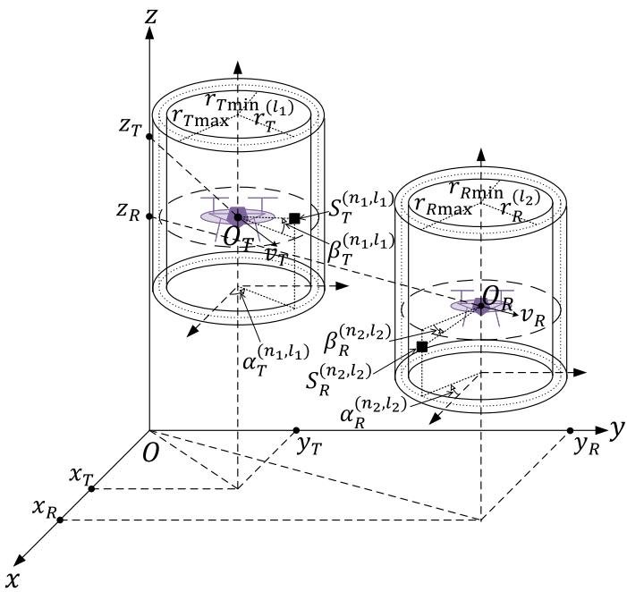  
(a)

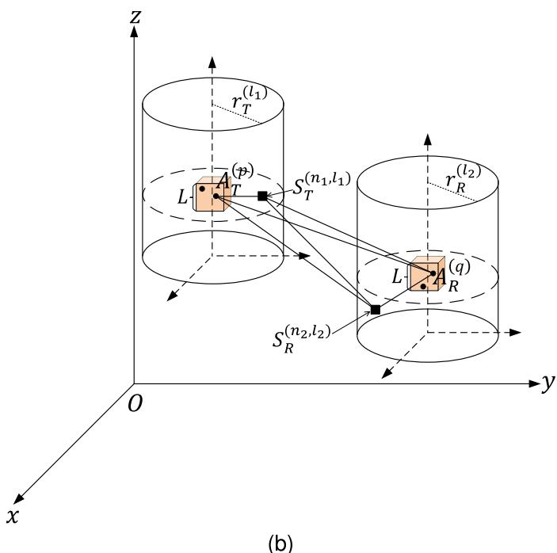  
Fig. 1. The illustration of the proposed geometrical channel model. (a) The overview of the two-concentric-cylinders model with the UAVs. (b) The detail of the l1th and l2th cylinders with the cubic regions for MAs.

TABLE II  
DENOTATIONS OF SIGNIFICANT SYMBOLS IN THE PROPOSED MODEL
<table><tr><td rowspan=1 colspan=1>Symbol</td><td rowspan=1 colspan=1>Denotation</td></tr><tr><td rowspan=1 colspan=1> $O _ { T } , O _ { R }$ </td><td rowspan=1 colspan=1>The center of the transmit regionand the receive region, respectively.</td></tr><tr><td rowspan=1 colspan=1> $r _ { T \operatorname* { m i n } } , r _ { T \operatorname* { m a x } }$ </td><td rowspan=1 colspan=1>The min and max radii of the concentriccylinders at the Tx side, respectively.</td></tr><tr><td rowspan=1 colspan=1> $r _ { R \mathrm { m i n } } , r _ { R \mathrm { m a x } }$ </td><td rowspan=1 colspan=1>The min and max radii of the concentriccylinders at the Rx side, respectively.</td></tr><tr><td rowspan=1 colspan=1> $r _ { T } ^ { ( l _ { 1 } ) } , r _ { R } ^ { ( l _ { 2 } ) }$ </td><td rowspan=1 colspan=1>The radius of the l1th cylinder at the Tx side andthe l2th cylinder at the Rx side, respectively.</td></tr><tr><td rowspan=1 colspan=1> $A _ { T } ^ { ( p ) } , A _ { R } ^ { ( q ) }$ </td><td rowspan=1 colspan=1>The pth transmit MA and theqth receive MA, respectively.</td></tr><tr><td rowspan=1 colspan=1> $S _ { T } ^ { ( n _ { 1 } , l _ { 1 } ) } , S _ { R } ^ { ( n _ { 2 } , l _ { 2 } ) }$ </td><td rowspan=1 colspan=1>The $( n _ { 1 } , l _ { 1 } ) \mathrm { t h }$ transmit scatterer and the $( n _ { 2 } , l _ { 2 } ) t$ h receive scatterer, respectively.</td></tr><tr><td rowspan=1 colspan=1> $\alpha _ { T } ^ { ( n _ { 1 } , l _ { 1 } ) } , \beta _ { T } ^ { ( n _ { 1 } , l _ { 1 } ) }$ </td><td rowspan=1 colspan=1>The azimuth and the elevation AoD of thewave impinging on $S _ { T } ^ { ( n _ { 1 } , l _ { 1 } ) }$ , respectively.</td></tr><tr><td rowspan=1 colspan=1> $\alpha _ { R } ^ { ( n _ { 2 } , l _ { 2 } ) } , \beta _ { R } ^ { ( n _ { 2 } , l _ { 2 } ) }$ </td><td rowspan=1 colspan=1>The azimuth and the elevation AoA of thewave scattered from $S _ { R } ^ { ( n _ { 2 } , l _ { 2 } ) }$ , respectively.</td></tr><tr><td rowspan=1 colspan=1> ${ \mathbf { } } v _ { T } , v _ { R }$ </td><td rowspan=1 colspan=1>The velocity of the Tx and the Rx, respectively.</td></tr><tr><td rowspan=1 colspan=1> $d _ { p q } , d _ { T R }$ </td><td rowspan=1 colspan=1>The displacement from $\overline { { { A _ { T } ^ { ( p ) } } } }$ to $\overline { { A _ { R } ^ { ( q ) } } }$ and from $O _ { T }$ to $O _ { R } ,$ respectively.</td></tr><tr><td rowspan=1 colspan=1> $d _ { p , n _ { 1 } , l _ { 1 } } , d _ { T , n _ { 1 } , l _ { 1 } }$ </td><td rowspan=1 colspan=1>The displacement from $\overline { { A _ { T } ^ { ( p ) } } }$ to $\overline { { S _ { T } ^ { ( n _ { 1 } , l _ { 1 } ) } } }$ and from $O _ { T }$ to $S _ { T } ^ { ( n _ { 1 } , l _ { 1 } ) ^ { \underline { { t } } } }$ , respectively.</td></tr><tr><td rowspan=1 colspan=1> $d _ { n _ { 1 } , l _ { 1 } , q } , d _ { n _ { 1 } , l _ { 1 } , R }$ </td><td rowspan=1 colspan=1>The displacement from $\overline { { S _ { T } ^ { ( n _ { 1 } , l _ { 1 } ) } \ { \bf t o \ } A _ { R } ^ { ( q ) } } }$ and from $S _ { T } ^ { ( n _ { 1 } , l _ { 1 } ) }$ to $O _ { R } ,$ respectively.</td></tr><tr><td rowspan=1 colspan=1> $d _ { p , n _ { 2 } , l _ { 2 } } , d _ { T , n _ { 2 } , l _ { 2 } }$ </td><td rowspan=1 colspan=1>The displacement from $\overline { { A _ { T } ^ { ( p ) } \ { \mathrm { t o } \ S _ { R } ^ { ( n _ { 2 } , l _ { 2 } ) } } } }$ and from $O _ { T }$ to $\underline { { S _ { R } ^ { ( n _ { 2 } , l _ { 2 } ) } } }$ , respectively.</td></tr><tr><td rowspan=1 colspan=1> $d _ { n _ { 2 } , l _ { 2 } , q } , d _ { n _ { 2 } , l _ { 2 } , R }$ </td><td rowspan=1 colspan=1>The displacement from $\overline { { S _ { R } ^ { ( n _ { 2 } , l _ { 2 } ) } \mathrm { ~ t o ~ } A _ { R } ^ { ( q ) } } }$ and from $\underline { { S _ { R } ^ { ( n _ { 2 } , l _ { 2 } ) } } }$ to $O _ { R } ,$ respectively.</td></tr><tr><td rowspan=1 colspan=1> $\underline { { { d } _ { n _ { 1 } , l _ { 1 } , n _ { 2 } , l _ { 2 } } } }$ </td><td rowspan=1 colspan=1>The displacement from $\overline { { S _ { T } ^ { ( n _ { 1 } , l _ { 1 } ) } \ { \mathrm { t o } \ S _ { R } ^ { ( n _ { 2 } , l _ { 2 } ) } } } } .$ </td></tr><tr><td rowspan=1 colspan=1> $d _ { T p } , d _ { R q }$ </td><td rowspan=1 colspan=1>The displacement from $O _ { T }$ to $\overline { { A _ { T } ^ { ( p ) } } }$ and from $O _ { R }$ to ${ A } _ { R } ^ { ( q ) }$ , respectively.</td></tr></table>

Fig. 1b depicts only the $l _ { 1 }$ th cylindrical surface at the Tx side and the l th cylindrical surface at the Rx side. As shown in Fig. 1b, we assume 3-D cubic feasible regions of the size $L \times L \times L$ for the transmit and receive MAs, i.e., $\mathcal { C } _ { T } ~ = ~ \left[ - L / 2 , L / 2 \right] ^ { 3 }$ and $\mathcal { C } _ { R } ~ = ~ \left[ - L / 2 , L / 2 \right] ^ { 3 }$ , respectively [20]. Specifically, we denote the pth $( 1 \leq p \leq M _ { T } )$ transmit MA by $A _ { T } ^ { ( p ) }$ , and denote the qth $( 1 \leq q \leq M _ { R } )$ receive MA by ${ A } _ { R } ^ { \left( q \right) }$ . The propagating waves from $A _ { T } ^ { ( p ) }$ to ${ A } _ { R } ^ { \left( q \right) }$ consist of the LoS, SBT, SBR, and DB rays. Hereafter, for the LoS rays, the displacement vector from $\dot { \boldsymbol A } _ { T } ^ { ( p ) }$ to ${ A } _ { R } ^ { \left( q \right) }$ is represented by $d _ { p q } .$ . For the SBT rays, the displacement vectors from $A _ { T } ^ { ( p ) }$ to ${ \bf \bar { \cal S } } _ { T } ^ { ( n _ { 1 } , l _ { 1 } ) }$ and from ${ \bf { \dot { S } } } _ { T } ^ { ( n _ { 1 } , l _ { 1 } ) }$ to $\big \langle A _ { R } ^ { ( q ) }$ are denoted by $d _ { p , n _ { 1 } , l _ { 1 } }$ and $d _ { n _ { 1 } , l _ { 1 } , q } ,$ , respectively. For the SBR rays, the displacement vectors from $A _ { T } ^ { \bar { ( p ) } }$ to $\bar { S _ { R } ^ { ( n _ { 2 } , l _ { 2 } ) } }$ and from ${ \bf { \dot { S } } } _ { R } ^ { ( n _ { 2 } , l _ { 2 } ) }$ to ${ A } _ { R } ^ { \left( q \right) }$ are denoted by $d _ { p , n _ { 2 } , l _ { 2 } }$ and $d _ { n _ { 2 } , l _ { 2 } , q } ,$ , respectively. For the DB rays, the displacement vectors from $A _ { T } ^ { ( p ) }$ to $S _ { T } ^ { ( n _ { 1 } ^ { - } , l _ { 1 } ) }$ , from $S _ { T } ^ { ( n _ { 1 } , \bar { l } _ { 1 } ) }$ to $S _ { R } ^ { ( n _ { 2 } ^ { - } , l _ { 2 } ) }$ , and from $S _ { R } ^ { ( n _ { 2 } , l _ { 2 } ) }$ to $\bar { A } _ { R } ^ { ( q ) }$ are denoted by $d _ { p , n _ { 1 } , l _ { 1 } }$ $d _ { n _ { 1 } , l _ { 1 } , n _ { 2 } , l _ { 2 } }$ , and $d _ { n _ { 2 } , l _ { 2 } , q } ,$ respectively.

Note that the relative positions of the transmit MA $A _ { T } ^ { ( p ) }$ to the transmit regional center $O _ { T }$ can be expressed by $d _ { T p }$ . Similarly, those of the receive MA ${ A } _ { R } ^ { \left( q \right) }$ to $O _ { R }$ can be expressed by $d _ { R q }$ . Denote the collections of those relative positions, by $\mathbf { D } _ { T p } ~ = ~ [ d _ { T p } | _ { p = 1 } , d _ { T p } | _ { p = 2 } , . . . , d _ { T p } | _ { p = M _ { T } } ] ~ \in ~ \mathbb { R } ^ { 3 \times M _ { T } }$ and ${ \bf D } _ { R q } ~ = ~ [ { d } _ { R q } | _ { q = 1 } , { d } _ { R q } | _ { q = 2 } , . . . , { d } _ { R q } | _ { q = M _ { R } } ] ~ \in ~ \mathbb { R } ^ { 3 \times M _ { R } }$ respectively. Then, the $M _ { R } \times M _ { T }$ channel matrix is generally a function of $\mathbf { D } _ { T p }$ and $\mathbf { D } _ { R q }$ . Table II shows key parameters.

Based on the geometrical model in Fig. 1, the input delayspread function between $A _ { T } ^ { ( p ) }$ and ${ A } _ { R } ^ { \left( q \right) }$ can be written as

$$
\begin{array} { l } { { \displaystyle h _ { p q } \left( t , \tau \right) = \sqrt { \frac { K } { K + 1 } } h _ { p q } ^ { \mathrm { L o S } } \left( t , \tau \right) + \sqrt { \frac { \eta _ { \mathrm { S B T } } } { K + 1 } } h _ { p q } ^ { \mathrm { S B T } } \left( t , \tau \right) } } \\ { { \displaystyle \qquad + \sqrt { \frac { \eta _ { \mathrm { S B R } } } { K + 1 } } h _ { p q } ^ { \mathrm { S B R } } \left( t , \tau \right) + \sqrt { \frac { \eta _ { \mathrm { D B } } } { K + 1 } } h _ { p q } ^ { \mathrm { D B } } \left( t , \tau \right) , } } \end{array}\tag{1}
$$

where K denotes the Rician K-factor [29], and ηSBT, ηSBR, and η represent the contributions of the SBT, the SBR, and the DB components, respectively, to the total scattered power, satisfying $\eta _ { \mathrm { S B T } } + \eta _ { \mathrm { S B R } } + \eta _ { \mathrm { D B } } = 1$ . From the model, we have

$$
\begin{array} { c } { { h _ { p q } ^ { \mathrm { L o S } } \left( t , \tau \right) = e ^ { j 2 \pi \left( { f _ { T \mathrm { m a x } } \cos { \left. { v _ { T } , d _ { p q } } \right. } - { f _ { R \mathrm { m a x } } \cos { \left. { v _ { R } , d _ { p q } } \right. } }  t } } } } \\right)\ { { e ^ { - j \frac { 2 \pi } { \lambda } | d _ { p q } | } \delta \left( \tau - { \tau _ { \mathrm { L o S } } } \right) , } } \end{array}\tag{2}
$$

$$
\begin{array} { r l r } {  { h _ { p q } ^ { \mathrm { S B T } } ( t , \tau ) = \operatorname* { l i m } _ { N _ { 1 } \to \infty } \frac { 1 } { \sqrt { N _ { 1 } } } \sum _ { l _ { 1 } = 1 } ^ { L _ { 1 } } \sum _ { n _ { 1 } = 1 } ^ { N _ { 1 } ^ { ( l _ { 1 } ) } } e ^ { j \phi _ { n _ { 1 } , l _ { 1 } } } } } \\ & { } & { \quad e ^ { j 2 \pi ( f _ { T \operatorname* { m a x } } \cos  \boldsymbol { v } _ { T } , \boldsymbol { d } _ { p , n _ { 1 } , l _ { 1 } }  - f _ { R \operatorname* { m a x } } \cos  \boldsymbol { v } _ { R } , \boldsymbol { d } _ { n _ { 1 } , l _ { 1 } , q }  ) t } } \\ & { } & { \quad e ^ { - j \frac { 2 \pi } { \lambda } ( | \boldsymbol { d } _ { p , n _ { 1 } , l _ { 1 } } | + | \boldsymbol { d } _ { n _ { 1 } , l _ { 1 } , q } | ) } \delta ( \tau - \tau _ { n _ { 1 } , l _ { 1 } } ) , \qquad ( 3 ) } \end{array}
$$

$$
\begin{array} { r l r } {  { h _ { p q } ^ { \mathrm { S B R } } ( t , \tau ) = \operatorname* { l i m } _ { N _ { 2 } \to \infty } \frac { 1 } { \sqrt { N _ { 2 } } } \sum _ { l _ { 2 } = 1 } ^ { L _ { 2 } } \sum _ { n _ { 2 } = 1 } ^ { N _ { 2 } ^ { ( l _ { 2 } ) } } e ^ { j \phi _ { n _ { 2 } , l _ { 2 } } } } } \\ & { } & { \quad e ^ { j 2 \pi ( f _ { T \operatorname* { m a x } } \cos  v _ { T } , d _ { p , n _ { 2 } , l _ { 2 } }  - f _ { R \operatorname* { m a x } } \cos  v _ { R } , d _ { n _ { 2 } , l _ { 2 } , q }  ) t } } \\ & { } & { \quad e ^ { - j \frac { 2 \pi } { \lambda } ( | d _ { p , n _ { 2 } , l _ { 2 } } | + | d _ { n _ { 2 } , l _ { 2 } , q } | ) } \delta ( \tau - \tau _ { n _ { 2 } , l _ { 2 } } ) , \qquad ( 4 ) } \end{array}
$$

$$
\begin{array} { r l r } { { \displaystyle h _ { p q } ^ { \mathrm { \tiny { D B } } } \left( t , \tau \right) = \operatorname* { l i m } _ { N _ { 1 } , N _ { 2 } \to \infty } \frac { 1 } { \sqrt { N _ { 1 } N _ { 2 } } } \sum _ { l _ { 1 } = 1 } ^ { L _ { 1 } } \sum _ { n _ { 1 } = 1 } ^ { N _ { 1 } ^ { ( l _ { 1 } ) } } \sum _ { l _ { 2 } = 1 } ^ { L _ { 2 } } \sum _ { n _ { 2 } = 1 } ^ { N _ { 2 } ^ { ( l _ { 2 } ) } } } } & { { } } & { { } } \\ { { \displaystyle e ^ { j 2 \pi \left( f _ { T \operatorname* { m a x } } \cos \left. v _ { T } , d _ { p , n _ { 1 } , l _ { 1 } } \right. - f _ { R \operatorname* { m a x } } \cos \left. v _ { R } , d _ { n _ { 2 } , l _ { 2 } , q } \right. \right) t } } } & { { } } & { { } } \\ { { \displaystyle e ^ { - j \frac { 2 \pi } { \lambda } \left( \left| d _ { p , n _ { 1 } , l _ { 1 } } \right| + \left| d _ { n _ { 1 } , l _ { 1 } , n _ { 2 } , l _ { 2 } } \right| + \left| d _ { n _ { 2 } , l _ { 2 } , q } \right| \right) } } } & { { } } & { { } } \\ { { \displaystyle e ^ { j \phi _ { n _ { 1 } , l _ { 1 } , n _ { 2 } , l _ { 2 } } } \delta \left( \tau - \tau _ { n _ { 1 } , l _ { 1 } , n _ { 2 } , l _ { 2 } } \right) , } } & { { } } & { { } } \end{array}
$$

where λ represents the carrier wavelength, $f _ { T \mathrm { m a x } } = \left| \pmb { v } _ { T } \right| / \lambda$ and $f _ { R \mathrm { m a x } } \ = \ \left| \pmb { v } _ { R } \right| / \lambda$ denote the maximum Doppler frequencies related to the Tx and Rx, respectively. Besides, $\phi _ { n _ { 1 } }$ and $\phi _ { n _ { 2 } }$ are respectively the random phase shifts caused by $S _ { T } ^ { ( n _ { 1 } , l _ { 1 } ) }$ and $S _ { R } ^ { ( \hat { n } _ { 2 } , l _ { 2 } ) }$ , and they are assumed to be independently uniformly distributed over the interval [0, 2π). Finally, $\phi _ { n _ { 1 } n _ { 2 } } = { \bf ( } \phi _ { n _ { 1 } } + \phi _ { n _ { 1 } } )$ mod 2π is the joint phase shift due to ${ \bar { S } } _ { T } ^ { ( n _ { 1 } , l _ { 1 } ) }$ and the following $S _ { R } ^ { ( n _ { 2 } , l _ { 2 } ) }$ , which can be shown to be also uniformly distributed over [0, 2π). Note that the time delays $\tau _ { \mathrm { L o S } } , \tau _ { n _ { 1 } , l _ { 1 } } , \tau _ { n _ { 2 } , l _ { 2 } }$ , and $\tau _ { n _ { 1 } , l _ { 1 } , n _ { 2 } , l _ { 2 } }$ are given by [30]

$$
\tau _ { \mathrm { L o S } } = \frac { | \boldsymbol d _ { T R } | } { c } ,\tag{6}
$$

$$
\tau _ { n _ { 1 } , l _ { 1 } } = \frac { | { d _ { T , n _ { 1 } , l _ { 1 } } } | + | { d _ { n _ { 1 } , l _ { 1 } , R } } | } { c } ,\tag{7}
$$

$$
\tau _ { n _ { 2 } , l _ { 2 } } = \frac { | d _ { T , n _ { 2 } , l _ { 2 } } | + | d _ { n _ { 2 } , l _ { 2 } , R } | } { c } ,\tag{8}
$$

$$
\tau _ { n _ { 1 } , l _ { 1 } , n _ { 2 } , l _ { 2 } } = \frac { | { d _ { T , n _ { 1 } , l _ { 1 } } } | + | { d _ { n _ { 1 } , l _ { 1 } , n _ { 2 } , l _ { 2 } } } | + | { d _ { n _ { 2 } , l _ { 2 } , R } } | } { \alpha } ,\tag{9}
$$

Suppose that $d _ { T } , d _ { R } \ll R \ll | d _ { T R } | \ [ 1 2 ]$ , and we have for 1) distances: $| { d _ { p q } } | ~ \approx ~ | { d _ { T R } } | ~ + ~ { \hat { d } } _ { T R } ~ \cdot ~ ( \_ { d _ { T p } } + { d _ { R q } } )$ $( \hat { d } _ { T R } = d _ { T R } / \left| d _ { T R } \right| ) , \left| d _ { p , n _ { 1 } , l _ { 1 } } \right| \approx \left| d _ { T , n _ { 1 } , l _ { 1 } } \right| - \hat { d } _ { T , n _ { 1 } , l _ { 1 } } \cdot d _ { T p }$ $( \hat { d } _ { T , n _ { 1 } , l _ { 1 } } ~ = ~ d _ { T , n _ { 1 } , l _ { 1 } } / \vert d _ { T , n _ { 1 } , l _ { 1 } } \vert ) , ~ \vert d _ { n _ { 1 } , l _ { 1 } , q } \vert ~ \approx ~ \vert d _ { n _ { 1 } , l _ { 1 } , R } \vert ~ +$ $\hat { d } _ { n _ { 1 } , l _ { 1 } , R } \cdot d _ { R q } ~ ( \hat { d } _ { n _ { 1 } , l _ { 1 } , R } = d _ { n _ { 1 } , l _ { 1 } , R } / | d _ { n _ { 1 } , l _ { 1 } , R } | ) , ~ | d _ { p , n _ { 2 } , l _ { 2 } } | \approx$ $| d _ { T , n _ { 2 } , l _ { 2 } } | - \hat { d } _ { T , n _ { 2 } , l _ { 2 } } \cdot d _ { T p } ( \hat { d } _ { T , n _ { 2 } , l _ { 2 } } = d _ { T , n _ { 2 } , l _ { 2 } } / | d _ { T , n _ { 2 } , l _ { 2 } } | ) ,$ $| d _ { n _ { 2 } , l _ { 2 } , q } | ~ \approx ~ | d _ { n _ { 2 } , l _ { 2 } , R } | ~ + ~ \hat { d } _ { n _ { 2 } , l _ { 2 } , R } ~ \cdot ~ d _ { R q } ~ ( \hat { d } _ { n _ { 2 } , l _ { 2 } , R } ~ =$ $d _ { n _ { 2 } , l _ { 2 } , R } / \left| d _ { n _ { 2 } , l _ { 2 } , R } \right| ) ; ~ 2 )$ angles: $\langle { \pmb v } _ { T } , { \pmb d } _ { p q } \rangle ~ \approx ~ \langle { \pmb v } _ { T } , { \pmb d } _ { T R } \rangle$ $\begin{array} { r } { \big < \pmb { v } _ { R } , \pmb { d } _ { p q } \big > \approx \big < \pmb { v } _ { R } , \pmb { d } _ { T R } \big > ; \big < \pmb { v } _ { T } , \pmb { d } _ { p , n _ { 1 } , l _ { 1 } } \big > \approx \big < \pmb { v } _ { T } , \pmb { d } _ { T , n _ { 1 } , l _ { 1 } } \big > } \end{array}$ $\begin{array} { r l r l r } { \langle { \pmb v } _ { R } , { \pmb d } _ { n _ { 1 } , l _ { 1 } , q } \rangle } & { { } \approx } & { } & { \langle { \pmb v } _ { R } , { \pmb d } _ { n _ { 1 } , l _ { 1 } , R } \rangle , \mathrm { ~ } \langle { \pmb v } _ { T } , { \pmb d } _ { p , n _ { 2 } , l _ { 2 } } \rangle } & { { } \approx } \end{array}$ $\langle v _ { T } , d _ { T , n _ { 2 } , l _ { 2 } } \rangle$ , and $\langle { \pmb v } _ { R } , { \pmb d } _ { n _ { 2 } , l _ { 2 } , q } \rangle \ \approx \ \langle { \pmb v } _ { R } , { \pmb d } _ { n _ { 2 } , l _ { 2 } , R } \rangle$ . These approximations allows us to simplify the expressions of $h _ { p q } ^ { \mathrm { \tiny { \mathrm { L o S } } } } \left( t , \tau \right) , h _ { p q } ^ { \mathrm { \tiny { S B T } } } ( t , \tau ) , h _ { p q } ^ { \mathrm { \tiny { S B R } } } \left( t , \tau \right)$ , and $h _ { p q } ^ { \mathrm { D B } } \left( t , \tau \right)$ . Then, by taking the Fourier transform over τ on $h _ { p q } \left( t , \tau \right)$ , we obtain the time-variant transfer function [5]

$$
\begin{array} { r l r } {  { H _ { p q } ( t , f ) = \mathcal { F } _ { \tau } \{ h _ { p q } ( t , \tau ) \} } } \\ & { } & { = \sqrt { \frac { K } { K + 1 } } H _ { p q } ^ { \mathrm { L o S } } ( t , f ) + \sqrt { \frac { \eta _ { \mathrm { S B T } } } { K + 1 } } H _ { p q } ^ { \mathrm { S B T } } ( t , f ) } \\ & { } & { + \sqrt { \frac { \eta _ { \mathrm { S B R } } } { K + 1 } } H _ { p q } ^ { \mathrm { S B R } } ( t , f ) + \sqrt { \frac { \eta _ { \mathrm { D B } } } { K + 1 } } H _ { p q } ^ { \mathrm { D B } } ( t , f ) , } \end{array}\tag{10}
$$

where the LoS, SBT, SBR, and DB components are

$$
\begin{array} { r l } & { H _ { p q } ^ { \mathrm { L o S } } \left( t , f \right) } \\ & { = e ^ { j 2 \pi \left( f _ { T \operatorname* { m a x } } \cos \left. v _ { T } , d _ { T R } \right. - f _ { R \operatorname* { m a x } } \cos \left. v _ { R } , d _ { T R } \right. \right) t } } \\ & { ~ e ^ { - j \frac { 2 \pi } { \lambda } \left( \left| d _ { T R } \right| + \hat { d } _ { T R } . \left( - d _ { T p } + d _ { R q } \right) \right) } e ^ { - j \ 2 \pi f \frac { \left| d _ { T R } \right| } { c } } , } \end{array}\tag{11}
$$

$$
H _ { p q } ^ { \mathrm { S B T } } \left( t , f \right)
$$

$$
\begin{array} { r l } & { \approx \underset { N _ { 1 } \to \infty } { \operatorname* { l i m } } \frac { 1 } { \sqrt { N _ { 1 } } } \underset { l _ { 1 } = 1 } { \overset { L _ { 1 } } { \sum } } \underset { n _ { 1 } = 1 } { \overset { N _ { 1 } ^ { ( l _ { 1 } ) } } { \sum } } e ^ { - j } \ 2 \pi f \frac { \left| d _ { T , n _ { 1 } , l _ { 1 } } \right| + \left| d _ { n _ { 1 } , l _ { 1 } , R } \right| } { c } } \\ & { e ^ { j \phi _ { n _ { 1 } , l _ { 1 } } } e ^ { j 2 \pi \left( f _ { T \operatorname* { m a x } } \cos \left. v _ { T } , d _ { T , n _ { 1 } , l _ { 1 } } \right. - f _ { R \operatorname* { m a x } } \cos \left. v _ { R } , d _ { n _ { 1 } , l _ { 1 } , R } \right. \right) t } } \\ & { e ^ { - j \frac { 2 \pi } { \lambda } \left( \left| d _ { T , n _ { 1 } , l _ { 1 } } \right| + \left| d _ { n _ { 1 } , l _ { 1 } , R } \right| - \hat { d } _ { T , n _ { 1 } , l _ { 1 } } \cdot d _ { T p } + \hat { d } _ { n _ { 1 } , l _ { 1 } , R } \cdot d _ { R q } \right) } , } \end{array}\tag{12}
$$

$$
\begin{array} { r l } & { H _ { p q } ^ { \mathrm { S B R } } ( t , f ) } \\ & { \approx \underset { N _ { 2 }  \infty } { \operatorname* { l i m } } \frac { 1 } { \sqrt { N _ { 2 } } } \underset { l _ { 2 } = 1 } { \overset { L _ { 2 } } { \sum } } \underset { n _ { 2 } = 1 } { \overset { N _ { 2 } ^ { ( l _ { 2 } ) } } { \sum } } e ^ { - j } ~ 2 \pi f \frac { | { d _ { T , n _ { 2 } , l _ { 2 } } | + | { d _ { n _ { 2 } , l _ { 2 } , R } } | } } { c } } \\ & { ~ e ^ { j \phi _ { n _ { 2 } , l _ { 2 } } } e ^ { j 2 \pi ( f _ { T \operatorname* { m a x } } \cos {  { { \boldsymbol v _ { T } } , { d _ { T , n _ { 2 } , l _ { 2 } } } }  } - f _ { R \operatorname* { m a x } } \cos {  { { \boldsymbol v _ { R } } , { d _ { n _ { 2 } , l _ { 2 } , R } } }  } ) t } } \\ & { ~ e ^ { - j \frac { 2 \pi } { \lambda } ( | { { d _ { T , n _ { 2 } , l _ { 2 } } } } | + | { { d _ { n _ { 2 } , l _ { 2 } , R } } } | - \hat { { d } } _ { T , n _ { 2 } , l _ { 2 } } \cdot { d _ { T p } } + \hat { { d } } _ { n _ { 2 } , l _ { 2 } , R } \cdot { d _ { R q } } ) } , } \end{array}\tag{13}
$$

$$
\begin{array} { r l } {  { H _ { p q } ^ { \mathrm { D B } } ( t , f ) } } \\ & { \approx \operatorname* { l i m } _ { N _ { 1 } , N _ { 2 } \to \infty } \frac { 1 } { \sqrt { N _ { 1 } N _ { 2 } } } \sum _ { l _ { 1 } = 1 } ^ { L _ { 1 } } \sum _ { n _ { 1 } = 1 } ^ { N _ { 1 } ^ { ( l _ { 1 } ) } } \sum _ { l _ { 2 } = 1 } ^ { L _ { 2 } } \sum _ { n _ { 2 } = 1 } ^ { N _ { 2 } ^ { ( l _ { 2 } ) } } } \\ & { e ^ { j 2 \pi ( f _ { T \operatorname* { m a x } } \cos {  v _ { T } , d _ { T , n _ { 1 } , l _ { 1 } }  } - f _ { R \operatorname* { m a x } } \cos {  v _ { R } , d _ { n _ { 2 } , l _ { 2 } , R }  } ) t } } \end{array}
$$

$$
\begin{array} { r } { e ^ { - j \frac { 2 \pi } { \lambda } \left( \left| d _ { T , n _ { 1 } , l _ { 1 } } \right| + \left| d _ { n _ { 1 } n _ { 2 } } \right| + \left| d _ { n _ { 2 } , l _ { 2 } , R } \right| - \hat { d } _ { T , n _ { 1 } , l _ { 1 } } \cdot d _ { T p } + \hat { d } _ { n _ { 2 } , l _ { 2 } , R } \cdot d _ { R q } \right) } } \end{array}
$$

$$
e ^ { j \phi _ { n _ { 1 } , l _ { 1 } , n _ { 2 } , l _ { 2 } } } e ^ { - j \mathrm { \Delta } _ { 2 \pi f } \left[ \frac { \left| { d } _ { T , n _ { 1 } , l _ { 1 } } \right| + \left| { d } _ { n _ { 1 } , l _ { 1 } , n _ { 2 } , l _ { 2 } } \right| + \left| { d } _ { n _ { 2 } , l _ { 2 } , R } \right|  } { c } } ,\right]\tag{14}
$$

## III. STATISTICAL PROPERTIES OF THE REFERENCECHANNEL MODEL

## A. Space-Time-Frequency Correlation Function

The normalized STF-CF between the transfer functions $H _ { p q } \left( t , f \right)$ and $H _ { p ^ { \prime } q ^ { \prime } } \left( t , f \right)$ is defined as [5]

$$
R _ { p q , p ^ { \prime } q ^ { \prime } } \left( \Delta t , \Delta f \right) = \frac { \mathbb { E } \left[ H _ { p q } ^ { * } \left( t , f \right) H _ { p ^ { \prime } q ^ { \prime } } \left( t + \Delta t , f + \Delta f \right) \right] } { \sqrt { \mathbb { E } \left[ \left| H _ { p q } \left( t , f \right) \right| ^ { 2 } \right] \mathbb { E } \left[ \left| H _ { p ^ { \prime } q ^ { \prime } } \left( t , f \right) \right| ^ { 2 } \right] } } ,\tag{15}
$$

which can be simplified to

$$
\begin{array} { r l } & { R _ { p q , p ^ { \prime } q ^ { \prime } } \left( \Delta t , \Delta f \right) } \\ & { = \displaystyle \frac { K } { K + 1 } R _ { p q , p ^ { \prime } q ^ { \prime } } ^ { \mathrm { L o S } } \left( \Delta t , \Delta f \right) + \frac { \eta _ { \mathrm { S B T } } } { K + 1 } R _ { p q , p ^ { \prime } q ^ { \prime } } ^ { \mathrm { S B T } } \left( \Delta t , \Delta f \right) } \\ & { + \frac { \eta _ { \mathrm { S B R } } } { K + 1 } R _ { p q , p ^ { \prime } q ^ { \prime } } ^ { \mathrm { S B R } } \left( \Delta t , \Delta f \right) + \frac { \eta _ { \mathrm { D B } } } { K + 1 } R _ { p q , p ^ { \prime } q ^ { \prime } } ^ { \mathrm { D B } } \left( \Delta t , \Delta f \right) . } \end{array}\tag{16}
$$

In (16), the STF-CFs of the SBT, SBR, and DB components, i.e., $R _ { p q , p ^ { \prime } q ^ { \prime } } ^ { \mathrm { L o S } } ( \Delta t , \Delta f ) , R _ { p q , p ^ { \prime } q ^ { \prime } } ^ { \mathrm { S B T } } ( \Delta t , \Delta f ) , R _ { p q , p ^ { \prime } q ^ { \prime } } ^ { \mathrm { S B R } } ( \bar { \Delta } t , \Delta f )$ and $R _ { p q , p ^ { \prime } q ^ { \prime } } ^ { \mathrm { { D B } } ^ { \prime } } \left( \Delta t , \Delta f \right)$ , can be respectively derived as [12]

$$
\begin{array} { r l } & { R _ { p q , p ^ { \prime } q ^ { \prime } } ^ { \mathrm { L o S } } ( \Delta t , \Delta f ) } \\ & { = e ^ { - j \frac { 2 \pi } { \lambda } \hat { \pmb { d } } _ { T R } \cdot \left( - \pmb { d } _ { p p ^ { \prime } } + \pmb { d } _ { q q ^ { \prime } } - ( { \pmb v } _ { T } - { \pmb v } _ { R } ) \Delta t \right) } e ^ { - j \frac { 2 \pi } { c } \Delta f ( | { \pmb d } _ { T R } | ) } , } \end{array}\tag{17}
$$

$$
\begin{array} { r l } {  { R _ { p q , p ^ { \prime } q ^ { \prime } } ^ { \mathrm { S B T } } ( \Delta t , \Delta f ) } } \\ & { = \operatorname* { l i m } _ { N _ { 1 } \to \infty } \frac { 1 } { N _ { 1 } } \sum _ { l _ { 1 } = 1 } ^ { L _ { 1 } } \sum _ { n _ { 1 } = 1 } ^ { N _ { 1 } ^ { ( l _ { 1 } ) } } \mathbb { E } [ e ^ { - j \frac { 2 \pi } { c } \Delta f ( | d _ { T , n _ { 1 } , l _ { 1 } } | + | d _ { n _ { 1 } , l _ { 1 } , R } | ) }  } \\ & {  e ^ { - j \frac { 2 \pi } { \lambda } ( - \hat { d } _ { T , n _ { 1 } , l _ { 1 } } \cdot ( d _ { p p ^ { \prime } } + v _ { T } \Delta t ) + \hat { d } _ { n _ { 1 } , l _ { 1 } , R } \cdot ( d _ { q q ^ { \prime } } + v _ { R } \Delta t ) ) } ] , } \end{array}\tag{18}
$$

$$
\begin{array} { l } { { R _ { p q , p ^ { \prime } q ^ { \prime } } ^ { \mathrm { S B R } } \left( \Delta t , \Delta f \right) } } \\ { { = \displaystyle \operatorname* { l i m } _ { N _ { 2 } \to \infty } \frac { 1 } { N _ { 2 } } \sum _ { l _ { 2 } = 1 } ^ { L _ { 2 } } \sum _ { n _ { 2 } = 1 } ^ { N _ { 2 } ^ { ( l _ { 2 } ) } } \mathbb E \left[ e ^ { - j \frac { 2 \pi } { c } \Delta f \left( \left| d _ { T , n _ { 2 } , l _ { 2 } } \right| + \left| d _ { n _ { 2 } , l _ { 2 } , R } \right| \right) } \right. } } \\ { { \left. e ^ { - j \frac { 2 \pi } { \lambda } \left( - \hat { d } _ { T , n _ { 2 } , l _ { 2 } } \cdot \left( d _ { p p ^ { \prime } } + v _ { T } \Delta t \right) + \hat { d } _ { n _ { 2 } , l _ { 2 } , R } \cdot \left( d _ { q q ^ { \prime } } + v _ { R } \Delta t \right) \right) } \right] , } } \end{array}\tag{19}
$$

$$
\begin{array} { r l } { { } } & { { \displaystyle R _ { p q , p ^ { \prime } q ^ { \prime } } ^ { \mathrm { D B } } ( \Delta t , \Delta f ) } } \\ { { } } & { { = \operatorname* { l i m } _ { N _ { 1 } , N _ { 2 } \to \infty } \frac { 1 } { N _ { 1 } N _ { 2 } } \sum _ { l _ { 1 } = 1 } ^ { L _ { 1 } } \sum _ { n _ { 1 } = 1 } ^ { N _ { 1 } ^ { ( l _ { 1 } ) } } \sum _ { l _ { 2 } = 1 } ^ { L _ { 2 } } \sum _ { n _ { 2 } = 1 } ^ { N _ { 2 } ^ { ( l _ { 2 } ) } } } } \\ { { } } & { { \mathbb { E } \left[ e ^ { - j \frac { 2 \pi } { c } \Delta f \left( \left| d _ { T , n _ { 1 } , l _ { 1 } } \right| + \left| d _ { n _ { 1 } , l _ { 1 } , n _ { 2 } , l _ { 2 } } \right| + \left| d _ { n _ { 2 } , l _ { 2 } , R } \right| \right) } \right. } } \\ { { } } & { { \left. e ^ { - j \frac { 2 \pi } { \lambda } \left( - \hat { d } _ { T , n _ { 1 } , l _ { 1 } } \cdot \left( d _ { p p ^ { \prime } } + v _ { T } \Delta t \right) + \hat { d } _ { n _ { 2 } , l _ { 2 } , R } \cdot \left( \hat { d } _ { q q ^ { \prime } } + v _ { R } \Delta t \right) \right) } \right] , } } \end{array}\tag{20}
$$

where ${ d _ { p p ^ { \prime } } = d _ { T p ^ { \prime } } - d _ { T p } }$ denotes the displacement vector from $A _ { T } ^ { ( p ) } \ \mathrm { t o } A _ { T } ^ { \left( p ^ { \prime } \right) }$ , and ${ \pmb d } _ { q q ^ { \prime } } = { \pmb d } _ { R q ^ { \prime } } - { \pmb d } _ { R q }$ denotes the displacement vector from ${ A } _ { R } ^ { \left( q \right) }$ to $A _ { R } ^ { \left( q ^ { \prime } \right) }$

In (18), (19), and (20), the unit vectors $\hat { \pmb { d } } _ { T , n _ { 1 } , l _ { 1 } } , \hat { \pmb { d } } _ { n _ { 2 } , l _ { 2 } , R } ,$ $\hat { d } _ { T , n _ { 2 } , l _ { 2 } } ,$ , and $\hat { d } _ { n _ { 1 } , l _ { 1 } , R }$ may be specified as [12]

$$
\begin{array} { r } { \hat { \pmb { d } } _ { T , n _ { 1 } , l _ { 1 } } = \left[ \sin \alpha _ { T } ^ { ( n _ { 1 } , l _ { 1 } ) } \cos \beta _ { T } ^ { ( n _ { 1 } , l _ { 1 } ) } \right] , } \\ { \sin \alpha _ { T } ^ { ( n _ { 1 } , l _ { 1 } ) } \cos \beta _ { T } ^ { ( n _ { 1 } , l _ { 1 } ) } } \\ { \sin \beta _ { T } ^ { ( n _ { 1 } , l _ { 1 } ) } } \end{array}\tag{21}
$$

$$
\hat { \pmb { d } } _ { n _ { 2 } , l _ { 2 } , R } = - \left[ \begin{array} { c } { \cos \alpha _ { R } ^ { ( n _ { 2 } , l _ { 2 } ) } \cos \beta _ { R } ^ { ( n _ { 2 } , l _ { 2 } ) } } \\ { \sin \alpha _ { R } ^ { ( n _ { 2 } , l _ { 2 } ) } \cos \beta _ { R } ^ { ( n _ { 2 } , l _ { 2 } ) } } \\ { \sin \beta _ { R } ^ { ( n _ { 2 } , l _ { 2 } ) } } \end{array} \right] ,\tag{22}
$$

(23)

$$
\begin{array} { r } { \hat { \pmb { d } } _ { n _ { 1 } , l _ { 1 } , R } \approx \hat { \pmb { d } } _ { T R } - \Delta _ { n _ { 1 } , l _ { 1 } } \hat { \pmb { d } } _ { T , n _ { 1 } , l _ { 1 } } \qquad } \\ { + \Delta _ { n _ { 1 } , l _ { 1 } } \left( \hat { \pmb { d } } _ { T R } \cdot \hat { \pmb { d } } _ { T , n _ { 1 } , l _ { 1 } } \right) \hat { \pmb { d } } _ { T R } , } \end{array}\tag{24}
$$

Meanwhile, in (18), (19), and (20), the propagation lengths $\begin{array} { r } { { \big | } d _ { T , n _ { 1 } , l _ { 1 } } { \big | } , \vert d _ { n _ { 1 } , l _ { 1 } , R } { \big | } , \vert d _ { n _ { 2 } , l _ { 2 } , R } { \big | } } \end{array}$ , and $\lvert d _ { n _ { 1 } , l _ { 1 } , n _ { 2 } , l _ { 2 } } \rvert$ can be expressed as

$$
\begin{array} { r } { | \pmb { d } _ { T , n _ { 1 } , l _ { 1 } } | = r _ { T } ^ { ( l _ { 1 } ) } / \cos \beta _ { T } ^ { ( n _ { 1 } , l _ { 1 } ) } , } \end{array}\tag{25}
$$

$$
\begin{array} { r } { | d _ { n _ { 2 } , l _ { 2 } , R } | = r _ { R } ^ { ( l _ { 2 } ) } / \cos \beta _ { R } ^ { ( n _ { 2 } , l _ { 2 } ) } , } \end{array}\tag{26}
$$

$$
| { d } _ { n _ { 1 } , l _ { 1 } , R } | \approx | { d } _ { T R } | - \hat { { d } } _ { T R } \cdot { d } _ { T , n _ { 1 } , l _ { 1 } } ,\tag{27}
$$

$$
| { d } _ { T , n _ { 2 } , l _ { 2 } } | \approx | { d } _ { T R } | - \hat { { d } } _ { T R } \cdot { d } _ { n _ { 2 } , l _ { 2 } , R } ,\tag{28}
$$

$$
\begin{array} { r } { \vert d _ { n _ { 1 } , l _ { 1 } , n _ { 2 } , l _ { 2 } } \vert \approx \vert d _ { T R } \vert - d _ { T R } \cdot \hat { d } _ { T , n _ { 1 } , l _ { 1 } } - \hat { d } _ { T R } \cdot d _ { n _ { 2 } , l _ { 2 } , R } . } \end{array}\tag{29}
$$

Note that we have assumed that $\beta _ { T } ^ { ( n _ { 1 } , l _ { 1 } ) }$ and $\beta _ { R } ^ { ( n _ { 2 } , l _ { 2 } ) }$ are small, such that $| d _ { T , n _ { 1 } , l _ { 1 } } | \ll | d _ { T R } |$ and $| d _ { n _ { 1 } , l _ { 1 } , R } | \ll | d _ { T R } | .$ , when approximating $| d _ { n _ { 1 } , l _ { 1 } , R } | , | d _ { n _ { 2 } , l _ { 2 } , R } |$ , and $\begin{array} { r } { | d _ { n _ { 1 } , l _ { 1 } , n _ { 2 } , l _ { 2 } } | . } \end{array}$

For ease of derivation, let $\hat { \pmb { d } } _ { T R } = [ \hat { d } _ { T R , x } , \hat { d } _ { T R , y } , \hat { d } _ { T R , z } ] ^ { \mathrm { T } }$ $d _ { p p ^ { \prime } } = [ d _ { p p ^ { \prime } , x } , d _ { p p ^ { \prime } , y } , \underline { { d } } _ { p p ^ { \prime } , z } ] ^ { \mathrm { T } } , \ d _ { q q ^ { \prime } } = [ d _ { q q ^ { \prime } , x } , d _ { q q ^ { \prime } , y } , d _ { q q ^ { \prime } , z } ] ^ { \mathrm { T } }$ $\pmb { v } _ { T } = [ v _ { T , x } , v _ { T , y } , v _ { T , z } ] ^ { \mathrm { T } }$ , and $\pmb { v } _ { R } = [ v _ { R , x } , v _ { R , y } , v _ { R , z } ] ^ { \mathrm { T } }$ . Thus,

$$
\begin{array} { l } { { \displaystyle R _ { p q , p ^ { \prime } q ^ { \prime } } ^ { \mathrm { S B T } } ( \Delta t , \Delta f ) } } \\ { { = \operatorname* { l i m } _ { N _ { 1 } \to \infty } \frac { 1 } { N _ { 1 } } \sum _ { l _ { 1 } = 1 } ^ { L _ { 1 } } \sum _ { n _ { 1 } = 1 } ^ { N _ { 1 } ^ { ( l _ { 1 } ) } } e ^ { - j \frac { 2 \pi } { \lambda } \hat { d } _ { T R } \cdot \left( d _ { q q ^ { \prime } } + v _ { R } \Delta t \right) } e ^ { - j \frac { 2 \pi } { c } \Delta f | d _ { T R } | } } } \\ { { \displaystyle \mathbb { E } \left[ e ^ { - j \frac { 2 \pi } { c } \Delta f \left( r _ { T } ^ { ( l _ { 1 } ) } / \cos \beta _ { T } ^ { ( n _ { 1 } , l _ { 1 } ) } \right) } e ^ { j \frac { 2 \pi } { \lambda } D _ { n _ { 1 } , l _ { 1 } , x } ^ { \mathrm { S B T } } \cos \alpha _ { T } ^ { ( n _ { 1 } , l _ { 1 } ) } \cos \beta _ { T } ^ { ( n _ { 1 } , l _ { 1 } ) } } \right. } } \\ { { \displaystyle \left. e ^ { j \frac { 2 \pi } { \lambda } D _ { n _ { 1 } , l _ { 1 } , y } ^ { \mathrm { S B T } } \sin \alpha _ { T } ^ { ( n _ { 1 } , l _ { 1 } ) } \cos \beta _ { T } ^ { ( n _ { 1 } , l _ { 1 } ) } } e ^ { j \frac { 2 \pi } { \lambda } D _ { n _ { 1 } , l _ { 1 } , z } ^ { \mathrm { S B T } } \sin \beta _ { T } ^ { ( n _ { 1 } , l _ { 1 } ) } } \right] , } } \end{array}\tag{30}
$$

$$
\begin{array} { l } { { \displaystyle R _ { p q , p ^ { \prime } q ^ { \prime } } ^ { \mathrm { S B R } } ( \Delta t , \Delta f ) } } \\ { { = \displaystyle \operatorname* { l i m } _ { N _ { 2 }  \infty } \frac { 1 } { N _ { 2 } } \sum _ { l _ { 2 } = 1 } ^ { L _ { 2 } } \sum _ { n _ { 2 } = 1 } ^ { N _ { 2 } ^ { ( n _ { 2 } , l _ { 2 } ) } } e ^ { - j \frac { 2 \pi } { \lambda } \hat { d } _ { T R } \cdot ( d _ { p p ^ { \prime } } + \pmb { v } _ { T } \Delta t ) } e ^ { - j \frac { 2 \pi } { c } \Delta f | d _ { T R } | } } } \\ { { \mathbb { E } [ e ^ { - j \frac { 2 \pi } { c } \Delta f ( r _ { R } ^ { ( l _ { 2 } ) } / \cos \beta _ { R } ^ { ( n _ { 2 } , l _ { 2 } ) } ) } e ^ { j \frac { 2 \pi } { \lambda } D _ { n _ { 2 } , l _ { 2 } , x } ^ { \mathrm { S B R } } \cos \alpha _ { R } ^ { ( n _ { 2 } , l _ { 2 } ) } \cos \beta _ { R } ^ { ( n _ { 2 } , l _ { 2 } ) } }  } } \\ { {  e ^ { j \frac { 2 \pi } { \lambda } D _ { n _ { 2 } , l _ { 2 } , y } ^ { \mathrm { S B R } } \sin \alpha _ { R } ^ { ( n _ { 2 } , l _ { 2 } ) } \cos \beta _ { R } ^ { ( n _ { 2 } , l _ { 2 } ) } } e ^ { j \frac { 2 \pi } { \lambda } D _ { n _ { 2 } , l _ { 2 } , z } ^ { \mathrm { S B R } } \sin \beta _ { R } ^ { ( n _ { 2 } , l _ { 2 } ) } } ] , } } \end{array}\tag{31}
$$

$$
\begin{array} { l } { { \displaystyle R _ { p q , p ^ { \prime } q ^ { \prime } } ^ { \mathrm { D B } } \left( \Delta t , \Delta f \right) } } \\ { { \displaystyle = \operatorname* { l i m } _ { N _ { 1 } , N _ { 2 } \to \infty } \frac { 1 } { N _ { 1 } N _ { 2 } } \sum _ { l _ { 1 } = 1 } ^ { L _ { 1 } } \sum _ { n _ { 1 } = 1 } ^ { N _ { 1 } ^ { ( l _ { 1 } ) } } \sum _ { l _ { 2 } = 1 } ^ { L _ { 2 } } \sum _ { n _ { 2 } = 1 } ^ { N _ { 2 } ^ { ( l _ { 2 } ) } } e ^ { - j \frac { 2 \pi } { c } \Delta f \left| d _ { T R } \right| } } } \end{array}
$$

$$
\begin{array} { r l } & { \mathbb { E } [ e ^ { - j \frac { 2 \pi } { c } \Delta f ( r _ { T } ^ { ( l _ { 1 } ) } / \cos \beta _ { T } ^ { ( n _ { 1 } , l _ { 1 } ) } ) } e ^ { j \frac { 2 \pi } { \lambda } D _ { n _ { 1 } , l _ { 1 } , x } ^ { \mathrm { S R T } } \cos \alpha _ { T } ^ { ( n _ { 1 } , l _ { 1 } ) } \cos \beta _ { T } ^ { ( n _ { 1 } , l _ { 1 } ) } }  } \\ & {  e ^ { j \frac { 2 \pi } { \lambda } D _ { n _ { 1 } , l _ { 1 } , y } ^ { \mathrm { S R T } } \sin \alpha _ { T } ^ { ( n _ { 1 } , l _ { 1 } ) } \cos \beta _ { T } ^ { ( n _ { 1 } , l _ { 1 } ) } } e ^ { j \frac { 2 \pi } { \lambda } D _ { n _ { 1 } , l _ { 1 } , z } ^ { \mathrm { S R T } } \sin \beta _ { T } ^ { ( n _ { 1 } , l _ { 1 } ) } }  } \\ & {  e ^ { - j \frac { 2 \pi } { c } \Delta f ( r _ { R } ^ { ( l _ { 2 } ) } / \cos \beta _ { R } ^ { ( n _ { 2 } , l _ { 2 } ) } ) } e ^ { j \frac { 2 \pi } { \lambda } D _ { n _ { 2 } , l _ { 2 } , x } ^ { \mathrm { D R } } \cos \alpha _ { R } ^ { ( n _ { 2 } , l _ { 2 } ) } \cos \beta _ { R } ^ { ( n _ { 2 } , l _ { 2 } ) } }  } \\ &   e ^ { j \frac { 2 \pi } { \lambda } D _ { n _ { 2 } , l _ { 2 } , y } ^ { \mathrm { D R } } \sin \alpha _ { R } ^ { ( n _ { 2 } , l _ { 2 } ) } \cos \beta _ { R } ^ { ( n _ { 2 } , l _ { 2 } ) } } e ^  j \frac { 2 \pi } { \lambda } D _ { n _ { 2 } , l _ { 2 } , z } ^ { \mathrm { D B R } } \sin \beta _ { R } ^  ( n _ { 2 } , l _ \end{array}\tag{32}
$$

where the parameters are $D _ { n _ { 1 } , l _ { 1 } , x / y / z } ^ { \mathrm { S B T } } = \Delta _ { n _ { 1 } , l _ { 1 } } ( d _ { q q ^ { \prime } , x / y / z } +$ $\begin{array} { r c c c c c c } { v _ { R , x / y / z } \Delta t } & { - } & { \hat { d } _ { T R } } & { \cdot } & { ( d _ { q q ^ { \prime } } } & { + } & { v _ { R } \Delta t ) \hat { d } _ { T R , x / y / z } ) } & { + } & { } \end{array}$ $\begin{array} { r l r } { d _ { p p ^ { \prime } , x / y / z } } & { { } + } & { v _ { T , x / y / z } \Delta t \quad + \quad \frac { \lambda \Delta f } { c } \left| d _ { T , n _ { 1 } , l _ { 1 } } \right| \hat { d } _ { T R , x / y / z } , } \end{array}$ $\begin{array} { r c l } { { D _ { n _ { 2 } , l _ { 2 } , x / y / z } ^ { \mathrm { S B R } } } } & { { = } } & { { \Delta _ { n _ { 2 } , l _ { 2 } } ( d _ { p p ^ { \prime } , x / y / z } \ + \ v _ { T , x / y / z } \Delta t \ - \ \hat { d } _ { T R } \ . } } \end{array}$ $( { d _ { p p ^ { \prime } } } \ + \ { { \bf { v } } _ { T } } \Delta t ) { \hat { d } } _ { T R , x / y / z } \ ) \ + \ d _ { q q ^ { \prime } , x / y / z } \ + \ v _ { R , x / y / z } \Delta t \ -$ $\begin{array} { r l r } { \frac { \lambda \Delta f } { c } \left| d _ { n _ { 2 } , l _ { 2 } , R } \right| \hat { d } _ { T R , x / y / z } , } & { D _ { n _ { 1 } , l _ { 1 } , x / y / z } ^ { \mathrm { D B T } } } & { = } & { d _ { p p ^ { \prime } , x / y / z } \ + } \end{array}$ $\begin{array} { r } { v _ { T , x / y / z } \Delta t + \frac { \lambda \Delta f } { c } | \pmb { d } _ { T , n _ { 1 } , l _ { 1 } } | \hat { d } _ { T R , x / y / z } , } \end{array}$ and $D _ { n _ { 2 } , l _ { 2 } , x / y / z } ^ { \mathrm { D B R } } =$ $\begin{array} { r } { d _ { q q ^ { \prime } , x / y / z } + v _ { R , x / y / z } \Delta t - \frac { \lambda \Delta f } { c } \left| d _ { n _ { 2 } , l _ { 2 } , R } \right| \hat { d } _ { T R , x / y / z } . } \end{array}$

Since the reference model has infinite scatterers, we replace the discrete random variables $\alpha _ { T } ^ { ( n _ { 1 } , l _ { 1 } ) } , \beta _ { T } ^ { ( n _ { 1 } , l _ { 1 } ) } , \alpha _ { R } ^ { ( \bar { n _ { 2 } } , l _ { 2 } ) }$ $\beta _ { R } ^ { ( n _ { 2 } , l _ { 2 } ) } , r _ { T } ^ { ( l _ { 1 } ) }$ , and $r _ { R } ^ { ( l _ { 2 } ) }$ by continuous ones $\alpha _ { T } , \beta _ { T } , \alpha _ { R } , \beta _ { R } ,$ rT and $r _ { R } .$ . Further, we assume that these variables are independent with each other. Here, we adopt the von Mises probability density function (PDF) to describe the azimuth AoD and

the azimuth AoA, i.e., $\begin{array} { r } { f \left( \alpha _ { T } \right) = \frac { e ^ { k _ { T } \cos \left( \alpha _ { T } - \alpha _ { T \mu } \right) } } { 2 \pi I _ { 0 } \left( k _ { T } \right) } , - \pi < \alpha _ { T } \le } \end{array}$ π and $\begin{array} { r } { f \left( \alpha _ { R } \right) = \frac { e ^ { k _ { R } \cos \left( \alpha _ { R } - \alpha _ { R \mu } \right) } } { 2 \pi I _ { 0 } \left( k _ { R } \right) } , - \pi < \alpha _ { R } \leq \pi _ { \mathrm { . } } } \end{array}$ , where $I _ { \nu } \left( \cdot \right)$ is the νth order modified Bessel function of the first kind, $\alpha _ { T \mu }$ and $\alpha _ { R \mu }$ are the mean angles, and $k _ { T }$ and $k _ { R }$ control the spreads of scatterers around the mean values. Meanwhile, we characterize the elevation AoA and the elevation AoD by the cosine PDF $\begin{array} { r } { f \left( \beta _ { T } \right) = \frac { \pi } { 4 \beta _ { T m } } \cos { \left( \frac { \pi } { 2 } \frac { \beta _ { T } - \beta _ { T \mu } } { \beta _ { T m } } \right) } , \left. \beta _ { T } - \beta _ { T \mu } \right. \le } \end{array}$ $\beta _ { T m }$ and $\begin{array} { r l r } { f \left( \beta _ { R } \right) } & { { } = } & { \frac { \pi } { 4 \beta _ { R m } } \cos \left( \frac { \pi } { 2 } \frac { \beta _ { R } - \beta _ { R \mu } } { \beta _ { R m } } \right) , \left. \beta _ { R } - \beta _ { R \mu } \right. \ \le } \end{array}$ $\beta _ { R m }$ , where $\beta _ { T \mu }$ and $\beta _ { R \mu }$ represent the mean values, and $\beta _ { T m }$ and $\beta _ { R m }$ govern the spreads. To depict the radii $r _ { T }$ and $r _ { R }$ , we use the $\begin{array} { r } { \hat { \mathrm { P D F s } } \ f \left( r _ { T } \right) \ = \frac { 2 r _ { T } } { r _ { T \mathrm { m a x } } ^ { 2 } - r _ { T \mathrm { m i n } } ^ { 2 } } , r _ { T \mathrm { m i n } } < r _ { T } < r _ { T } } \end{array}$ max and $\begin{array} { r } { f \left( r _ { R } \right) = \frac { 2 r _ { R } } { r _ { R \mathrm { m a x } } ^ { 2 } - r _ { R \mathrm { m i n } } ^ { 2 } } , r _ { R } } \end{array}$ min $< r _ { R } \le r _ { R }$ max, respectively.

Hence, we can write the parameters in continuous variable version: $D _ { x / y / z } ^ { \mathrm { S B T } } \ = \ \Delta _ { T } \bar { ( } d _ { q q ^ { \prime } , x / y / z } + v _ { R , x / y / z } \Delta t \ -$ $\begin{array} { c c c c c c } { { \hat { d } _ { T R } } } & { { \cdot } } & { { ( d _ { q q ^ { \prime } } } } & { { + } } & { { \bar { v } _ { R } \Delta t ) \hat { d } _ { T R , x / y / z } ) } } & { { + } } & { { d _ { p p ^ { \prime } , x / y / z } } } & { { + } } \end{array}$ $\begin{array} { r } { v _ { T , x / y / z } \Delta t \quad + \quad \frac { \lambda \Delta f } { c } \frac { r _ { T } } { \cos \beta _ { T } } \hat { d } _ { T R , x / y / z } \quad \mathrm { ~ a n d ~ } \quad D _ { x / y / z } ^ { \mathrm { S B R } } \quad = } \end{array}$ $\Delta _ { R } ( d _ { p p ^ { \prime } , x / y / z } + v _ { T , x / y / z } \Delta t - \hat { d } _ { T R } . ( d _ { p p ^ { \prime } } + v _ { T } \Delta t ) \hat { d } _ { T R , x / y / z } ) +$ $\begin{array} { r } { d _ { q q ^ { \prime } , x / y / z } + v _ { R , x / y / z } \Delta t - \frac { \lambda \Delta f } { c } \frac { r _ { R } } { \cos \beta _ { R } } \hat { d } _ { T R , x / y / z } , } \end{array}$ where $\Delta _ { T } =$ $r _ { T } / \cos \beta _ { T } / \left| d _ { T R } \right|$ and $\Delta _ { R } = r _ { R } / \cos \beta _ { R } / \left| { d _ { T R } } \right|$ , as well as $\begin{array} { r } { D _ { x / y / z } ^ { \mathrm { D B T } } = d _ { p p ^ { \prime } , x / y / z } + v _ { T , x / y / z } \Delta t + \frac { \lambda \Delta f } { c } \frac { r _ { T } } { \cos { \beta _ { T } } } \hat { d } _ { T R , x / y / z } } \end{array}$ and $\begin{array} { r } { D _ { x / y / z } ^ { \mathrm { D B R } } = d _ { q q ^ { \prime } , x / y / z } + v _ { R , x / y / z } \Delta t - \frac { \lambda \Delta f } { c } \frac { r _ { R } } { \cos \beta _ { R } } \hat { d } _ { T R , x / y / z } } \end{array}$ . This enables us to transform (30), (31), and (32) into integrals:

$$
\begin{array} { l l } { { } } & { { R _ { p q , p ^ { \prime } q ^ { \prime } } ^ { \mathrm { S B T } } \left( \Delta t , \Delta f \right) } } \\ { { } } & { { = e ^ { - j \frac { 2 \pi } { \lambda } \hat { d } _ { T R } \cdot \left( { d _ { q q ^ { \prime } } } + { v _ { R } } \Delta t \right) } e ^ { - j \frac { 2 \pi } { c } \Delta f \left| { d _ { T R } } \right| } \displaystyle \int _ { { r _ { T \operatorname* { m i n } } } } ^ { r _ { T \operatorname* { m a x } } } \int _ { \beta _ { T \operatorname* { m i n } } } ^ { \beta _ { T \operatorname* { m a x } } } \int _ { - \pi } ^ { \pi } \frac { \partial \hat { d } _ { T \operatorname* { m a x } } } { \partial r _ { \operatorname* { m i n } } } } } \\ { { } } & { { e ^ { j \frac { 2 \pi } { \lambda } D _ { x } ^ { \mathrm { S B T } } \cos \alpha _ { T } \cos \beta _ { T } } e ^ { j \frac { 2 \pi } { \lambda } D _ { y } ^ { \mathrm { S B T } } \sin \alpha _ { R } \cos \beta _ { R } } e ^ { j \frac { 2 \pi } { \lambda } D _ { z } ^ { \mathrm { S B T } } \sin \beta _ { T } } } } \\ { { } } & { { f \left( \alpha _ { T } \right) f \left( \beta _ { T } \right) f \left( r _ { T } \right) e ^ { - j \frac { 2 \pi } { c } \Delta f \frac { r _ { T } } { \cos \beta _ { T } } } \mathrm { d } \alpha _ { T } \mathrm { d } \beta _ { T } \mathrm { d } r _ { T } , } } \\ { { } } & { { R _ { p q , p ^ { \prime } q ^ { \prime } } ^ { \mathrm { S B R } } \left( \Delta t , \Delta f \right) } } \end{array}
$$

$$
\begin{array} { l } { { \displaystyle = e ^ { j \frac { 2 } { \pi } \Delta \pi \cdot ( d _ { w ^ { \prime } } + s _ { \mathrm { R } } \Delta t ) } e ^ { - j \frac { s _ { \mathrm { R } } ^ { 2 } } { 2 } \Delta \left( t d _ { \mathrm { R } } \right) } \displaystyle \int _ { \tau _ { \tau _ { \mathrm { E } } \tau _ { \mathrm { m } } } } ^ { \tau \tau _ { \mathrm { T } } \tau _ { \mathrm { E } } } \int _ { \Delta \tau _ { \mathrm { R } } } ^ { \Delta \tau _ { \mathrm { R } } + s _ { \mathrm { R } } } \int _ { - \tau } ^ { \tau } } } \\ { { \displaystyle \oint e ^ { j \frac { 2 } { \pi } \Delta \tau _ { \mathrm { R } } \Delta \tau _ { \mathrm { R } } + s _ { \mathrm { R } } \Delta t - s _ { \mathrm { R } } \Delta t } \beta _ { \mathrm { R } } ^ { \frac { 2 } { \pi } } \gamma _ { \mathrm { R } } ^ { \mathrm { R } } \gamma _ { \mathrm { R } } ^ { \mathrm { R } } \mathrm { u d } s \mathrm { n a r e s } \beta _ { \mathrm { R } } ^ { 2 } e ^ { j \frac { s _ { \mathrm { R } } ^ { 2 } } { 2 } \lambda } \gamma _ { \mathrm { R } } ^ { \mathrm { R } } \mathrm { u d } s _ { \mathrm { R } } } }  \\ { { \displaystyle \oint \left( \alpha _ { 1 } \right) \Big ( j \left( \Delta _ { R } \right) \Big ) \Big ( \Gamma _ { \tau } \Big ) e ^ { - j \frac { 2 } { \pi } \Delta \tau _ { \mathrm { R } } \tau _ { \mathrm { R } } } \int _ { - \tau } ^ { \tau _ { \mathrm { R } } \tau _ { \mathrm { R } } } d \Delta _ { R } \mathrm { d } \mathrm { d } \lambda _ { R } \mathrm { d } B _ { R } \mathrm { d } \mathrm { R } } }  \\ { { \displaystyle R _ { \mathrm { R } \mathrm { R } } ^ { 3 } \mathrm { R } _ { \mathrm { R } } ^ { \prime } \eta _ { \mathrm { R } } ^ { \prime } \left( \Delta _ { 1 } , \Delta \right) } } \\   \displaystyle = e ^ \end{array}\tag{35}
$$

where we have defined $\beta _ { T \mu } - \beta _ { T m } = \beta _ { T \mathrm { m i n } } , \beta _ { T \mu } + \beta _ { T m } =$ $\beta _ { T \mathrm { m a x } } , \beta _ { R \mu } - \beta _ { R m } = \beta _ { R \mathrm { m i n } } , \mathrm { a n d } \beta _ { R \mu } + \beta _ { R m } = \beta _ { R \mathrm { m a x } } .$ Use [12] and $\begin{array} { r } { \int _ { a } ^ { b } x e ^ { - j c x } \mathrm { d } x = \frac { e ^ { - j b c } ( 1 + j \dot { b } c ) - e ^ { - j a c } ( 1 + j a c ) } { c ^ { 2 } } } \end{array}$ , and we can approximately solve these integrals as (36), (37), and (38), shown at the bottom of the page.

• In (36), the parameters $\tilde { X } _ {  { \mathrm { S B T } } }$ and $\tilde { Y } _ { \mathrm { S B T } }$ are defined as $\begin{array} { r } { \tilde { X } _ { \mathrm { S B T } } ~ = ~ j \frac { 2 \bar { \pi } } { \lambda } \tilde { D } _ { x } ^ { \mathrm { S B T } } } \end{array}$ cos $\beta _ { T \mu } + k _ { T }$ cos $\alpha _ { T \mu }$ and $\tilde { Y } _ { \mathrm { S B T } } ~ =$ $j \frac { 2 \pi } { \lambda } \tilde { D } _ { y } ^ { \mathrm { S B T } }$ cos $\beta _ { T \mu } ~ +$ kT sin $\alpha _ { T \mu }$ , respectively. In addition, $\tilde { D } _ { x / y / z } ^ { \mathrm { S B T } }$ are given by $\tilde { D } _ { x / y / z } ^ { \mathrm { S B T } } = \tilde { \Delta } _ { T } ( d _ { q q ^ { \prime } , x / y / z } +$ $v _ { R , x / y / z } \Delta t - \hat { d } _ { T R } \cdot ( d _ { q q ^ { \prime } } + v _ { R } \Delta t ) \hat { d } _ { T R , x / y / z } ) + d _ { p p ^ { \prime } , x / y / z } +$ vT ,x/y/z∆t + λ∆fc r¯Tcos β ˆdT R,x/y/z, where ∆˜ T = r¯T / cos βT µ/ |dT R| and $\begin{array} { r } { \bar { r } _ { T } = \frac { 1 } { 2 } ( r _ { T } \operatorname* { m i n } + r _ { T } \operatorname* { m a x } ) } \end{array}$

• In (37), the parameters X˜SBR and Y˜SBR are defined as $\begin{array} { r } { \tilde { X } _ { \mathrm { S B R } } ~ = ~ j \frac { 2 \bar { \pi } } { \lambda } \tilde { D } _ { x } ^ { \mathrm { S B R } } } \end{array}$ cos βRµ + kR cos $\alpha _ { R \mu }$ and $\tilde { Y } _ { \mathrm { S B R \ } } =$ $j \frac { 2 \pi } { \lambda } \tilde { D } _ { y } ^ { \mathrm { S B R } }$ cos $\beta _ { R \mu } + k _ { R }$ sin $\alpha _ { R \mu } ,$ respectively. In addition, $\mathbb { \tilde { D } } _ { x / y / z } ^ { \mathrm { S B R } }$ are given by $\tilde { D } _ { x / y / z } ^ { \mathrm { S B R } } = \tilde { \Delta } _ { R } ( d _ { p p ^ { \prime } , x / y / z } +$ $v _ { T , x / y / z } \Delta t - \hat { d } _ { T R } \cdot ( d _ { p p ^ { \prime } } + v _ { T } \Delta t ) \hat { d } _ { T R , x / y / z } ) + d _ { q q ^ { \prime } , x / y / z } +$ $\begin{array} { r } { v _ { R , x / y / z } \Delta t \ - \ \frac { \lambda \Delta f } { c } \frac { \bar { r } _ { R } } { \cos \beta _ { R \mu } } \hat { d } _ { T R , x / y / z } , } \end{array}$ where $\begin{array} { r l } { \dot { \Delta } _ { R } } & { { } = } \end{array}$ $\bar { r } _ { R } / \cos \beta _ { R \mu } / \left| d _ { T R } \right|$ and $\begin{array} { r } { \dot { r _ { R } } = \frac { 1 } { 2 } ( r _ { R \operatorname* { m i n } } + r _ { R \operatorname* { m a x } } ) } \end{array}$

• In (38), the parameters are $\begin{array} { r } { \tilde { X } _ { \mathrm { D B } } = j \frac { 2 \pi } { \lambda } \tilde { D } _ { x } ^ { \mathrm { D B T } } } \end{array}$ cos $\beta _ { T \mu } +$ $\begin{array} { r l r } { k _ { T } \cos \alpha _ { T \mu } , } & { { } \tilde { Y } _ { \mathrm { D B } } } & { = } & { j \frac { 2 \pi } { \lambda } \tilde { D } _ { y } ^ { \mathrm { D B T } } } \end{array}$ cos $\beta _ { T \mu } \ +$ kT sin $\alpha _ { T \mu } ,$ $\begin{array} { r } { \tilde { Z } _ { \mathrm { D B } } ~ = ~ j \frac { 2 \pi } { \lambda } \tilde { D } _ { x } ^ { \mathrm { D B R } } } \end{array}$ cos $\beta _ { R \mu } + k _ { R } \cos \alpha _ { R \mu } .$ , as well as $\tilde { W } _ { \mathrm { D B } } ~ = ~ j { \frac { 2 \dot { \pi } } { \lambda } } \tilde { D } _ { y } ^ { \mathrm { D B R } }$ cos $\beta _ { R \mu } + k _ { R }$ sin $\alpha _ { R \mu }$ , respectively. In addition, $\begin{array} { c c l } { { \tilde { D } _ { x / y / z } ^ { \mathrm { D B T } } } } & { { = } } & { { d _ { p p ^ { \prime } , x / y / z } \ + \ v _ { T , x / y / z } { \Delta t } \ + } } \end{array}$ $\frac { \lambda \Delta f } { c } \frac { { \bar { r } _ { T } } } { \cos { \beta _ { T u } } } \hat { d } _ { T R , x / y / z }$ and $\begin{array} { r l r } { \tilde { D } _ { x / y / z } ^ { \mathrm { D B R } } } & { { } = } & { d _ { q q ^ { \prime } , x / y / z } \ + } \end{array}$ $\begin{array} { r } { v _ { R , x / y / z } \dot { \Delta t } - \frac { \lambda \Delta f } { c } \frac { \bar { r } _ { R } } { \cos \beta _ { R \mu } } \hat { d } _ { T R , x / y / z } . } \end{array}$

Between the closed-form approximate results in (38) and (37) and the numerical exact ones in (35) and (34), the good agreement is shown in Figs. 2a and 2b, respectively, where $\Delta t = 0 , M _ { T } = M _ { R } = 2 , p = 1 , p ^ { \prime } = 2 , q = 2 , q ^ { \prime } = 1 , d _ { p p ^ { \prime } } =$

$$
\begin{array} { r l } & { \quad \phi _ { 1 2 } ^ { \mathrm { R e } } : \sin \theta _ { 2 } , } \\ & { \quad \sin \theta _ { 1 2 } , } \\ & { \quad \sin \theta _ { 2 3 } , } \\ & { \quad \sin ^ { 2 } \theta _ { 1 3 } , } \\ & { \quad \sin ^ { 2 } \theta _ { 1 4 } , } \\ & { \quad \sin ^ { 2 } \theta _ { 1 4 } , } \\ & { \quad \sin ^ { 2 } \theta _ { 1 4 } , } \\ & { \quad \sin ^ { 2 } \theta _ { 1 4 } , } \\ & { \quad \sin ^ { 2 } \theta _ { 1 4 } , } \\ & { \quad \sin ^ { 2 } \theta _ { 1 4 } , } \\ & { \quad \sin ^ { 2 } \theta _ { 1 4 } , } \\ & { \quad \sin ^ { 2 } \theta _ { 1 4 } , } \\ & { \quad \sin ^ { 2 } \theta _ { 1 4 } , } \\ & { \quad \sin ^ { 2 } \theta _ { 1 4 } , } \\ & { \quad \sin ^ { 2 } \theta _ { 1 4 } , } \\ & { \quad \sin ^ { 2 } \theta _ { 1 4 } , } \\ & { \quad \sin ^ { 2 } \theta _ { 1 4 } , } \\ & { \quad \sin ^ { 2 } \theta _ { 1 4 } , } \\ & { \quad \sin ^ { 2 } \theta _ { 1 4 } , } \\ & { \quad \sin ^ { 2 } \theta _ { 1 4 } , } \\ & { \quad \sin ^ { 2 } \theta _ { 1 4 } , } \\ & { \quad \sin ^ { 2 } \theta _ { 1 4 } , } \\ & { \quad \sin ^ { 2 } \theta _ { 1 4 } , } \\ & { \quad \sin ^ { 2 } \theta _ { 1 4 } , } \\ & { \quad \sin ^ { 2 } \theta _ { 1 4 } , } \\ & { \quad \sin ^ { 2 } \theta _ { 1 4 } , } \\ & { \quad \sin ^ { 2 } \theta _ { 1 4 } , } \\ & { \quad \sin ^ { 2 } \theta _ { 1 4 } , } \\ & { \quad \sin ^ { 2 } \theta _ { 1 4 } , } \\ & { \quad \sin ^ { 2 } \theta _ { 1 4 } , } \\ &  \quad \sin ^ { 2 } \theta _   \end{array}
$$

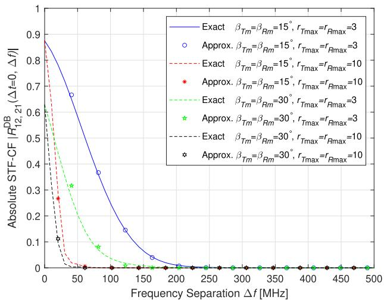

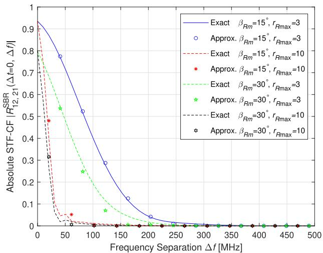  
(b)

(a)  
Fig. 2. Comparison of the absolute value of the exact and the approximate (approx.) STF-CFs versus frequency separation for (a) DB rays and (b) SBR rays.  
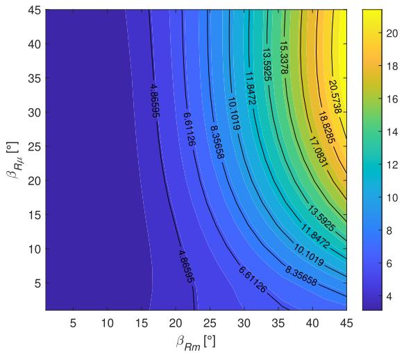  
(a)

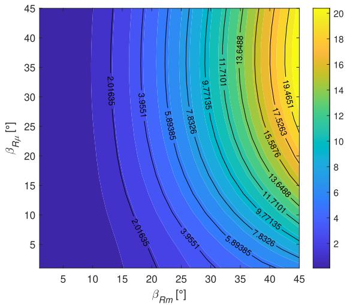  
(b)  
Fig. 3. Two-dimensional map of relative error in percentage (%) between the exact and the approximate STF-CFs averaged over a certain interval of time delay for (a) DB rays and (b) SBR rays.

−0.5λ · [cos $4 5 ^ { \circ }$ cos $1 2 0 ^ { \circ }$ , sin $4 5 ^ { \circ }$ cos $1 2 0 ^ { \circ }$ , sin $1 2 0 \mathrm { ^ { o } J } ^ { \mathrm { T } } , d _ { q q ^ { \prime } } =$ 0.5λ · [cos 45◦ cos 120◦, sin 45◦ cos 120◦, sin $1 2 0 ^ { \circ } ] ^ { \mathrm { T } } , ~ { d _ { T R } } ~ =$ $[ 0 , 5 0 \mathrm { ~ m } , - 5 0 \mathrm { ~ m } ] ^ { \mathrm { T } } , k _ { T } = k _ { R } = 2 0 , \alpha _ { T \mu } = 7 0 ^ { \circ } , \alpha _ { R \mu } = 2 0 ^ { \circ }$ and $\beta _ { T \mu } ~ = ~ \beta _ { R \mu } ~ = ~ 1 0 ^ { \circ }$ . Moreover, Fig. 2 shows that the frequency correlation decreases as the elevation angle spread or the maximum cylindrical radius increases.

To showcase the relative error between the exact STF-CF and the approximate one, we plot the two-dimensional error maps for both the DB rays and the SB rays in Fig. 3. The relative error for a certain point is calculated by dividing the absolute error (between its exact value and approximate one) by the exact value. Since the effects of $\beta _ { T }$ and $\beta _ { R }$ are analogous, we focus on the variation of $\beta _ { R }$ , whose distribution is determined by the parameters $\beta _ { R m }$ and $\beta _ { R \mu }$ . To avoid exceeding the defined range of elevation angles, we consider the relative error with respect to $\beta _ { R m }$ and $\beta _ { R \mu }$ varying from $0 ^ { \circ } ~ \mathrm { t o } ~ 4 5 ^ { \circ }$ . The other parameters used to obtain the two maps are the same as those for Fig. 2, with $r _ { T \mathrm { m i n } } = r _ { R \mathrm { m i n } } = 2$ and $r _ { T \operatorname* { m a x } } = r _ { R \operatorname* { m a x } } = 3 .$ . Each value on the maps is the mean of the error samples from 50 equal-distance points for the delay $\Delta t$ between 0 and $\frac { v _ { T } } { \lambda }$ , with $\Delta f$ fixed at 1 MHz. Fig. 3 visually demonstrates the high consistency between the two STF-CFs for small elevation angular spreads, confirming that our approximations do not introduce significant deviations. It can be seen that, for both DB and SB rays, the maximum relative error between the exact and approximate STF-CFs remains below 25%. Particularly, for DB rays, the approximation achieves remarkably low errors below 5% within the commonly used parameter range of $\beta _ { R m } ~ < ~ 2 0 ^ { \circ }$ and $\beta _ { R \mu } < 2 0 ^ { \circ }$ , with the error gradually increasing to 10 ∼ 15% only at extreme angle combinations beyond 30◦. For SB rays, the errors consistently remain below 5% across most ranges $( \beta _ { R m } ~ < ~ 1 5 ^ { \circ }$ and $\beta _ { R \mu } ~ < ~ 3 0 ^ { \circ } )$ . While both maps show increased sensitivity at larger angles, the approximation accuracy remains well below 10% for the vast majority of practical applications.

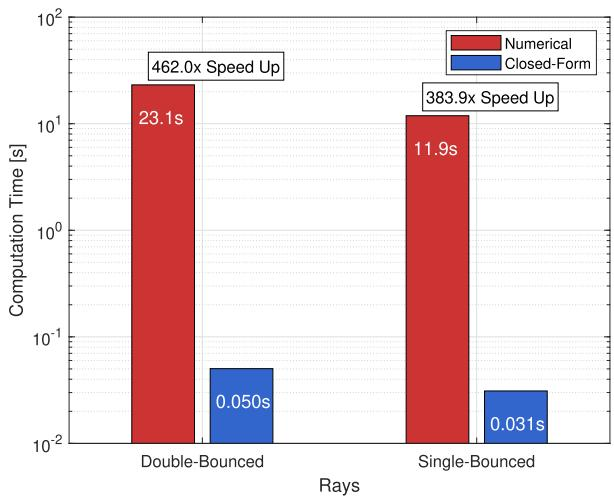  
Fig. 4. Comparison of the computation time between the numerical exact STF-CF and the closed-form approximate one for the DB and SB rays.

To demonstrate the computational advantages of the closedform approximate STF-CF, we compare its computation time with that of the numerical exact one, as shown in Fig. 4. For the DB component, numerical integration requires 23.1 seconds to compute the statistical characterization, while our analytical expression completes the identical computation in just 0.050 seconds. This represents a remarkable 462-fold acceleration in speed. Similarly, for the SB component, computation time is reduced from 11.9 seconds using numerical methods to a mere 0.031 seconds using our formulation, exhibiting an improvement of approximately 384 times. This orders-of-magnitude enhancement in efficiency directly translates to practical benefits for system design, eliminating lengthy waiting for numerical results. Furthermore, the analytical nature of our expressions provides immediate physical insight into parameter dependencies, which is often obscured in numerical closed-box approaches.

Compared to the closed-form STF-CFs in [5, Appendix $\mathrm { C l } ,$ the expressions in (36), (37), and (38) not only extend from terrestrial to aerial stations, but also preserve the statistical independence between the time delays and the Doppler spreads [5], owing to the proposed approximations on propagation lengths as in (27), (28), and (29).

## B. Space-Doppler Power Spectrum Density

The SD-PSD is defined as the Fourier transform of the space-time correlation function with respect to $\Delta t , \ \mathrm { i . e . }$ $S _ { p q , p ^ { \prime } q ^ { \prime } } \left( f _ { D } \right) = \mathcal { F } _ { \Delta t } \left\{ R _ { p q , p ^ { \prime } q ^ { \prime } } \left( \Delta t , \Delta f = 0 \right) \right\}$ . Based on (16), the total SD-PSD can be decomposed into

$$
\begin{array} { l } { { S _ { p q , p ^ { \prime } q ^ { \prime } } \left( f _ { D } \right) = \displaystyle \frac { K } { K + 1 } S _ { p q , p ^ { \prime } q ^ { \prime } } ^ { \mathrm { L o S } } \left( f _ { D } \right) + \displaystyle \frac { \eta _ { \mathrm { S B T } } } { K + 1 } S _ { p q , p ^ { \prime } q ^ { \prime } } ^ { \mathrm { S B T } } \left( f _ { D } \right) } } \\ { { \displaystyle \qquad + \left. \frac { \eta _ { \mathrm { S B R } } } { K + 1 } S _ { p q , p ^ { \prime } q ^ { \prime } } ^ { \mathrm { S B R } } \left( f _ { D } \right) + \frac { \eta _ { \mathrm { D B } } } { K + 1 } S _ { p q , p ^ { \prime } q ^ { \prime } } ^ { \mathrm { D B } } \left( f _ { D } \right) \right.} \dag ,  }  \end{array}\tag{39}
$$

where the constituent SD-PSDs $S _ { p q , p ^ { \prime } q ^ { \prime } } ^ { \mathrm { L o S } } ( f _ { D } ) , \ S _ { p q , p ^ { \prime } q ^ { \prime } } ^ { \mathrm { S B T } } ( f _ { D } )$ $S _ { p q , p ^ { \prime } q ^ { \prime } } ^ { \mathrm { S B R } } \left( f _ { D } \right)$ , and $S _ { p q , p ^ { \prime } q ^ { \prime } } ^ { \mathrm { D B } } \left( f _ { D } \right)$ are, respectively, the Fourier transforms of $R _ { p q , p ^ { \prime } q ^ { \prime } } ^ { \mathrm { L o S } ^ { \ F ^ { \prime } \ u \prime \prime } } ( \mathring { \Delta } t , \Delta f = 0 ) , \ R _ { p q , p ^ { \prime } q ^ { \prime } } ^ { \mathrm { S B T } } ( \Delta t , \Delta f = 0 )$ $R _ { p q , p ^ { \prime } q ^ { \prime } } ^ { \mathrm { S B R } } \left( \Delta t , \Delta f \right. = 0 )$ ), and $R _ { p q , p ^ { \prime } q ^ { \prime } } ^ { \mathrm { D B } } \left( \Delta t , \dot { \Delta } f \right. = 0 )$

The SD-PSD of the LoS component can be obtained as

$$
\begin{array} { r } { S _ { p q , p ^ { \prime } q ^ { \prime } } ^ { \mathrm { L o S } } \left( f _ { D } \right) = e ^ { - j \frac { 2 \pi } { \lambda } \hat { d } _ { T R } \cdot \left( - d _ { p p ^ { \prime } } + d _ { q q ^ { \prime } } \right) } \qquad } \\ { \qquad \cdot \delta \left( f _ { D } - \frac { \hat { d } _ { T R } \cdot \left( \pmb { v } _ { T } - \pmb { v } _ { R } \right) } { \lambda } \right) , } \end{array}\tag{40}
$$

where $\delta ( \cdot )$ is the Dirac delta function. Following the derivations in [31, Appendix B] (but note the difference in the definition of the correlation function), we can obtain the SD-PSDs of the SBT, SBR, and DB components, as given by (41), (42), and (43), shown at the bottom of the next page, respectively.

• In (41), the two-dimensional vectors $k _ { T } , \quad A _ { T } .$ , and $\scriptstyle { B _ { T } }$ are defined as $\mathbf { k } _ { T } ~ = ~ \left( k _ { T } \cos \alpha _ { T \mu } , k _ { T } \right.$ sin $\alpha _ { T \mu } )$ ， $\begin{array} { r l r } { A _ { T } } & { = } & { \frac { 2 \pi } { \lambda } \cos \beta _ { T \mu } ( \tilde { \Delta } _ { T } ( v _ { R , x } \ - \ \hat { d } _ { T R } \ \cdot \ v _ { R } \hat { d } _ { T R , x } ) } \end{array}$ + $\begin{array} { r c l c r } { v _ { T , x } , \tilde { \Delta } _ { T } ( v _ { R , y } } & { - } & { \hat { d } _ { T R } { \mathrm {  ~ \cal ~ \cdot ~ } } v _ { R } \hat { d } _ { T R , y } ) { \mathrm {  ~ \rho ~ } } + { \mathrm {  ~ \nabla ~ } } v _ { T , y } ) , } \end{array}$ , and $\begin{array} { r l r } { { \bf B } _ { T } } & { = } & { \frac { 2 \pi } { \lambda } \cos \beta _ { T \mu } ( \tilde { \Delta } _ { T } ( d _ { q q ^ { \prime } , x } - \hat { d } _ { T R } \cdot d _ { q q ^ { \prime } } \hat { d } _ { T R , x } ) + } \end{array}$ $d _ { p p ^ { \prime } , x } , \tilde { \Delta } _ { T } ( d _ { q q ^ { \prime } , y } - d _ { T R } { \mathrm {  ~ \cdot ~ } } d _ { q q ^ { \prime } } \partial _ { T R , y } ) { \mathrm {  ~ + ~ } } d _ { p p ^ { \prime } , y } ) ,$ respectively, and the scalars aT , bT , and $c _ { T }$ are given by $a _ { T } \ = \ \tilde { \Delta } _ { T } ( v _ { R , z } \ - \ \hat { d } _ { T R } \cdot v _ { R } \hat { d } _ { T R , z } ) \ + \ v _ { T , z } ,$ $\begin{array} { r l r } { b _ { T } } & { = } & { \tilde { \Delta } _ { T } ( d _ { q q ^ { \prime } , z } - \hat { d } _ { T R } \cdot d _ { q q ^ { \prime } } \hat { d } _ { T R , z } ) + d _ { p p ^ { \prime } , z } , } \end{array}$ and $\begin{array} { r } { c _ { T } ~ = ~ \frac { 4 \beta _ { T m } } { \lambda } \cos { \beta _ { T \mu } } , } \end{array}$ respectively. Besides, $f _ { D }$ should satisfy $\begin{array} { r } { \left| f _ { D } ^ { \cdot } + \frac { \hat { d } _ { T R } \cdot \pmb { v } _ { R } } { \lambda } \right| \leq \frac { | A _ { T } | } { 2 \pi } \mathrm { ~ a n d ~ } \left| \frac { f _ { D } } { a _ { T } } - \frac { \sin \beta _ { T \mu } } { \lambda } \right| \leq \frac { c _ { T } } { 4 } } \end{array}$ • In (42), the two-dimensional vectors $\textstyle k _ { R } , A _ { R } ^ { \prime } .$ , and $B _ { R }$ are defined as $\textbf { \textit { k } } _ { R } ~ = ~ \left( k _ { R } \cos \alpha _ { R \mu } , k _ { R } \sin \alpha _ { R \mu } \right)$ $\begin{array} { r l r } { A _ { R } } & { = } & { \frac { 2 \pi } { \lambda } \cos \beta _ { R \mu } ( \tilde { \Delta } _ { R } ( v _ { T , x } \textrm { -- } \hat { d } _ { T R } \textrm { -- } v _ { T } \hat { d } _ { T R , x } ) \textrm { + } } \end{array}$ $\begin{array} { r c l c r } { { v _ { R , x } , \tilde { \Delta } _ { R } \big ( v _ { T , y } } } & { { - } } & { { \partial _ { T R } { \mathrm { ~  ~ \cdot ~ } } { \bf v } _ { T } \dot { d } _ { T R , y } \big ) } } & { { + } } & { { v _ { R , y } \big ) } } \end{array}$ , and $\begin{array} { r } { { \cal B } _ { R } \ = \ \frac { 2 \pi } { \lambda } \cos \beta _ { R \mu } ( \tilde { \Delta } _ { R } ( d _ { p p ^ { \prime } , x } \ - \ \hat { d } _ { T R } \cdot d _ { p p ^ { \prime } } \hat { d } _ { T R , x } ) \ + } \end{array}$ $d _ { q q ^ { \prime } , x } , \tilde { \Delta } _ { R } ( d _ { p p ^ { \prime } , y } - \hat { d } _ { T R } \mathrm { ~  ~ \cdot ~ } d _ { p p ^ { \prime } } \hat { d } _ { T R , y } ) + d _ { q q ^ { \prime } , y } )$ respectively, and the scalars $a _ { R } , \ b _ { R } ,$ and $c _ { R }$ are given by $a _ { R } \ = \ \tilde { \Delta } _ { R } ( v _ { T , z } \ - \ \partial _ { T R } \cdot v _ { T } \partial _ { T R , z } ) \ + \ v _ { R , z } ,$ $\begin{array} { r l r } { b _ { R } } & { { } = } & { \tilde { \Delta } _ { R } \big ( d _ { p p ^ { \prime } , z } - \hat { d } _ { T R } \cdot d _ { p p ^ { \prime } } \hat { d } _ { T R , z } \big ) + d _ { q q ^ { \prime } , z } } \end{array}$ , and $\begin{array} { r } { c _ { R } \ = \ \frac { 4 \beta _ { R m } } { \lambda } \cos { \beta _ { R \mu } } , } \end{array}$ respectively. Besides, $f _ { D }$ should satisfy $\begin{array} { r } { \left| f _ { D } - \frac { \hat { { \boldsymbol { d } } } _ { T R } \cdot { \boldsymbol { v } } _ { T } } { \lambda } \right| \leq \frac { | { \boldsymbol { A } } _ { R } | } { 2 \pi } } \end{array}$ and $\begin{array} { r } { \left| \frac { f _ { D } } { a _ { R } } - \frac { \sin \beta _ { R \mu } } { \lambda } \right| \le \frac { c _ { R } } { 4 } } \end{array}$ • In (43), the two-dimensional vectors A , $B _ { T R } ; C _ { T R }$ and ${ { \cal D } _ { T R } }$ are defined as $\begin{array} { r } { \pmb { A } _ { T R } = \frac { 2 \pi } { \lambda } \cos \beta _ { T \mu } ( v _ { T , x } , v _ { T , y } ) } \end{array}$ $\begin{array} { r } { { \cal B } _ { T R } = \frac { 2 \pi } { \lambda } \cos \beta _ { T \mu } ( d _ { p p ^ { \prime } , x } , d _ { p p ^ { \prime } , y } ) ; C _ { T R } = \frac { 2 \pi } { \lambda } \cos \beta _ { R \mu } . } \end{array}$ $( v _ { R , x } , v _ { R , y } )$ , and $\begin{array} { l l l } { { { \cal D } _ { T R } } } & { { = } } & { { { \frac { 2 \pi } { \lambda } } } } \end{array}$ cos $\beta _ { R \mu } ( d _ { q q ^ { \prime } , x } , d _ { q q ^ { \prime } , y } ) .$ respectively. The parameters $\boldsymbol { k } _ { T } , \boldsymbol { k } _ { R } , \boldsymbol { c } _ { T }$ and $c _ { R }$ remains the same as before. Besides, $f _ { D }$ should satisfy $| f _ { D } | \le$ $\begin{array} { r l r } { \frac { | A _ { T R } | } { 2 \pi } , ~ \left| \frac { f _ { D } } { v _ { T , z } } - \frac { \sin \beta _ { T \mu } } { \lambda } \right| } & { \leq } & { \frac { c _ { T } } { 4 } , ~ | f _ { D } | ~ \leq ~ \frac { | \dot { C _ { T R } } | } { 2 \pi } } \end{array}$ , and $\begin{array} { r } { \left| \frac { f _ { D } } { v _ { R , z } } - \frac { \sin \beta _ { R \mu } } { \lambda } \right| \leq \frac { c _ { R } } { 4 } } \end{array}$

## C. Power Space-Delay Spectrum

The PSDS is defined as the inverse Fourier transform of the space-frequency correlation function with respect to $\Delta f .$ i.e., $P _ { p q , p ^ { \prime } q ^ { \prime } } \left( \tau \right) = \mathcal { F } _ { \Delta t } ^ { - 1 } \left\{ R _ { p q , p ^ { \prime } q ^ { \prime } } \left( \Delta t = 0 , \Delta f \right) \right\}$ . Similar to the SD-PSD, it is also a summation of the PSDSs of the LoS, SBT, SBR, and DB components, which can be expressed as

$$
\begin{array} { l } { { \displaystyle P _ { p q , p ^ { \prime } q ^ { \prime } } \left( \tau \right) = \frac { K } { K + 1 } P _ { p q , p ^ { \prime } q ^ { \prime } } ^ { \mathrm { L o S } } \left( \tau \right) + \frac { \eta _ { \mathrm { S B T } } } { K + 1 } P _ { p q , p ^ { \prime } q ^ { \prime } } ^ { \mathrm { S B T } } \left( \tau \right) } } \\ { { \displaystyle \qquad + \frac { \eta _ { \mathrm { S B R } } } { K + 1 } P _ { p q , p ^ { \prime } q ^ { \prime } } ^ { \mathrm { S B R } } \left( \tau \right) + \frac { \eta _ { \mathrm { D B } } } { K + 1 } P _ { p q , p ^ { \prime } q ^ { \prime } } ^ { \mathrm { D B } } \left( \tau \right) . } } \end{array}\tag{44}
$$

The PSDS of the LoS component is simply given by

$$
P _ { p q , p ^ { \prime } q ^ { \prime } } ^ { \mathrm { L o S } } ( \tau ) = e ^ { - j \frac { 2 \pi } { \lambda } \hat { { \cal d } } _ { T R } \cdot \left( - d _ { p p ^ { \prime } } + d _ { q q ^ { \prime } } \right) } \delta \left( \tau - \frac { | d _ { T R } | } { c } \right)\tag{45}
$$

From the duality and the time reversal property of the Fourier transform, we can see that $\mathrm { i f } \ x ( t ) \ \overset { \mathcal { F } } {  } X ( f )$ , then $X ( - t ) \stackrel { \mathcal { F } } {  }$ $x ( f ) , \mathrm { i . e . , } x ( f ) \stackrel { \mathcal { F } ^ { - 1 } } {  } X ( - t )$ . This allows us to easily obtain the PSDSs of the SBT, SBR, and DB components based upon the derived SD-PSDs, as in (46), (47), and (48), shown at the bottom of the next page, respectively.

• In (46), the two-dimensional vector ${ \bf \delta E } _ { T }$ is defined as $\begin{array} { r } { { \cal E } _ { T } \ = \ \frac { 2 \pi } { \lambda } \cos \beta _ { T \mu } \left( \frac { \lambda } { c } \frac { \bar { r } _ { T } } { \cos \beta _ { T \mu } } \hat { d } _ { T R , x } , \frac { \lambda } { c } \frac { \bar { r } _ { T } } { \cos \beta _ { T \mu } } \hat { d } _ { T R , y } \right) \ = } \end{array}$ $\begin{array} { r } { \frac { 2 \pi \bar { r } _ { T } } { c } \left( \hat { d } _ { T R , x } , \hat { d } _ { T R , y } \right) } \end{array}$ , and the scalar $e _ { T } , \tau _ { T \operatorname* { m i n } }$ , and τT max are, respectively, $\begin{array} { r } { e _ { T } = \frac { \lambda } { c } \frac { \bar { r } _ { T } } { \cos \beta _ { T \mu } } \hat { d } _ { T R , z } , \tau _ { T \mathrm { m i n } } = } \end{array}$ $\frac { r _ { T \operatorname* { m i n } } } { c \cos \beta _ { T \mu } }$ , and $\begin{array} { r l r } { \tau _ { T \operatorname* { m a x } } } & { { } = } & { \frac { r _ { T \operatorname* { m a x } } } { c \cos \beta _ { T \mu } } } \end{array}$ . Besides, τ should satisfy $\begin{array} { r } { \left| \tau - \frac { | d _ { T R } | } { c } \right| \ \leq \ \frac { | { \cal { E } } _ { T } | } { 2 \pi } , \ \left| \frac { \tau } { e _ { T } } + \frac { \sin \beta _ { T \mu } } { \lambda } \right| \ \leq \ \frac { c _ { T } } { 4 } } \end{array}$ , and $\tau _ { T \operatorname* { m i n } } \leq \tau \leq \tau$ max.

• In (47), the two-dimensional vector $E _ { R }$ is defined ${ \pmb { { E } } } _ { R } =$ $\begin{array} { r } { \frac { 2 \pi } { \lambda } \cos \beta _ { R \mu } \left( - \frac { \lambda } { c } \frac { \bar { r } _ { R } } { \cos \beta _ { R \mu } } \hat { d } _ { T R , x } , - \frac { \lambda } { c } \frac { \bar { r } _ { R } } { \cos \beta _ { R \mu } } \hat { d } _ { T R , y } \right) } \end{array}$ = $\begin{array} { r } { \frac { 2 \pi \bar { r } _ { R } } { c } \left( - \hat { d } _ { T R , x } , - \hat { d } _ { T R , y } \right) } \end{array}$ , and the scalar $e _ { R } , \tau _ { R }$ min and $\tau _ { R \mathrm { m a x } } \mathrm { a r e }$ , respectively, $\begin{array} { r l r } { e _ { R } } & { { } = } & { - \frac { \lambda } { c } \frac { \bar { r } _ { R } } { \cos \beta _ { R \mu } } \hat { d } _ { T R , z } , } \end{array}$ $\begin{array} { r } { \tau _ { R \mathrm { m i n } } ~ = ~ \frac { r _ { R \mathrm { m i n } } } { c \cos \beta _ { R \mu } } } \end{array}$ , and $\begin{array} { r } { \tau _ { R \mathrm { m a x } } = \frac { r _ { R \mathrm { m a x } } } { c \cos \beta _ { R \mu } } } \end{array}$ . Besides, τ should satisfy $\begin{array} { r } { \bigg | \tau - \frac { | { d _ { T R } } | } { c } \bigg | \leq \frac { | { E _ { R } } | } { 2 \pi } , \bigg | \frac { \tau } { e _ { R } } + \frac { \sin \beta _ { R \mu } } { \lambda } \bigg | \leq \frac { c _ { R } } { 4 } } \end{array}$ and $\tau _ { R \mathrm { m i n } } \leq \dot { \tau } \leq \tau _ { R \mathrm { m a x } } .$

• In (48), the parameters $E _ { T } , E _ { R } ,$ , τT min, τT max, τR min, and $\tau _ { R \mathrm { m a x } }$ are the same as above. Besides, τ satisfy $| \tau | \leq$ $\begin{array} { r } { \frac { | E _ { T } | } { 2 \pi } , \left| \frac { \tau } { e _ { T } } + \frac { \sin \beta _ { T \mu } } { \lambda } \right| \le \frac { c _ { T } } { 4 } , { \tau _ { T } } _ { \mathrm { m i n } } \le \tau \le { \tau _ { T } } _ { \mathrm { m a x } } , | \tau | \le } \end{array}$ $\begin{array} { r } { \frac { | E _ { R } | } { 2 \pi } , \left| \frac { \tau } { e _ { R } } + \frac { \sin \beta _ { R \mu } } { \lambda } \right| \le \frac { c _ { R } } { 4 } } \end{array}$ , and $\tau _ { R \mathrm { m i n } } \leq \tau \leq$ τR max.

To demonstrate the utility of the proposed wideband model, we compare its PSDS with the empirical measurements in [32] conducted at 1420 MHz in the urban scenario, as shown in Fig. 5. Based on the measurement description, the theoretical PSDS curve in Fig. 5 is obtained under $f _ { c } = 1 4 2 0$ MHz, $d _ { T R } \ = \ [ 0 , 3 3 0 \ \mathrm { m } , - 1 4 \ \mathrm { m } ] ^ { \mathrm { T } } , \ r _ { T \mathrm { m i n } } \ = \ r _ { R \mathrm { m i n } } = 1 \ \mathrm { m } ,$ $r _ { T \mathrm { m a x } } ~ = ~ r _ { R \mathrm { m a x } } ~ = ~ 2 ~ \mathrm { m } , ~ k _ { T } ~ = ~ k _ { R } ~ = ~ 0 , ~ \alpha _ { T \mu } ~ = ~ 9 0 ^ { \circ }$ $\alpha _ { R \mu } = 2 7 0 ^ { \circ } , \beta _ { T m } = \beta _ { R m } = 1 5 ^ { \circ } , \beta _ { T \mu } = \beta _ { R \mu } = - 3 0 ^ { \circ }$ $K = 1 , \eta _ { \mathrm { S B T } } = \eta _ { \mathrm { S B R } } = 0$ , and $\eta _ { \mathrm { D B } } = 1$ . It can be see from Fig. 5 that the theoretical results agree well with the empirical data.

## IV. SIMULATION MODELS FOR MIMO WIDEBAND U2U CHANNELS

In the deterministic simulation model, the discrete random variables are $\begin{array} { r l r } { \alpha _ { T } ^ { ( n _ { 1 , A } , l _ { 1 } ) } } & { { } = } & { F _ { \alpha _ { T } } ^ { - 1 } \left( \frac { n _ { 1 , A } - \frac { 1 } { 2 } } { N _ { 1 , A } ^ { ( l _ { 1 } ) } } \right) } \end{array}$ $\begin{array} { r l r } { \beta _ { T } ^ { ( n _ { 1 , E } , l _ { 1 } ) } } & { { } = } & { \beta _ { T \mu } ~ + ~ \frac { 2 \beta _ { T m } } { \pi } ~ \cdot ~ \arcsin \left( \frac { 2 \left( n _ { 1 , E } - \frac { 1 } { 2 } \right) } { N _ { 1 , E } ^ { ( l _ { 1 } ) } } - 1 \right) } \end{array}$

$$
\begin{array} { r l } { \frac { \partial C _ { 3 , 2 } } { \partial x _ { i } } ( z _ { i } , z _ { n - 1 } , z _ { n - 1 } , z _ { n } ) } & { = \left. \frac { - \partial ^ { 2 } \kappa ^ { 2 } } { \partial x _ { i } } - \frac { \partial ^ { 2 } \kappa ^ { 2 } } { \partial x _ { i } } - \frac { \partial ^ { 2 } \kappa ^ { 2 } } { \partial x _ { i } } \frac { \partial ^ { 2 } \kappa ^ { 2 } } { \partial x _ { i } } \right. \qquad \left. \frac { \partial \kappa ^ { 2 } } { \partial x _ { i } } - \frac { \partial ^ { 2 } \kappa ^ { 2 } } { \partial x _ { i } } \frac { \partial ^ { 2 } \kappa ^ { 2 } } { \partial x _ { i } } \right. } \\ & { \qquad \left. \frac { \partial \kappa ^ { 2 } } { \partial x _ { i } } - \frac { \partial ^ { 2 } \kappa ^ { 2 } } { \partial x _ { i } } \frac { \partial ^ { 2 } \kappa ^ { 2 } } { \partial x _ { i } } \frac { \partial ^ { 2 } \kappa ^ { 2 } } { \partial x _ { i } } \frac { \partial ^ { 2 } \kappa ^ { 2 } } { \partial x _ { i } } \frac { \partial ^ { 2 } \kappa ^ { 2 } } { \partial x _ { i } } \frac { \partial ^ { 2 } \kappa ^ { 2 } } { \partial x _ { i } } \frac { \partial ^ { 2 } \kappa ^ { 2 } } { \partial x _ { i } } \frac { \partial ^ { 2 } \kappa ^ { 2 } } { \partial x _ { i } } \right. } \\ &  \qquad \left. \qquad \quad \times \frac { \partial ^ { 2 } \kappa ^ { 2 } } { \partial x _ { i } } - \frac { \partial ^ { 2 } \kappa ^ { 2 } } { \partial x _ { i } } \frac { \partial ^ { 2 } \kappa ^ { 2 } } { \partial x _ { i } } \frac { \partial ^ { 2 } \kappa ^ { 2 } } { \partial x _ { i } } \frac { \partial ^ { 2 } \kappa ^ { 2 } } { \partial x _ { i } } \frac { \partial ^ { 2 } \kappa ^ { 2 } } { \partial x _ { i } } \right. \frac  \end{array}\tag{41}
$$

(42)

(43)

rT (l1) = (l1− 12 )(r2T max−r2T min) L1 + r2 T min, αR (n2,A,l2) = F−1 αR n2,A− 1 N (l2) 2 R (n2,E,l2) = 2,A   
βRµ + 2βRm · arcsin $\left( \frac { 2 \big ( n _ { 2 , E } - \frac { 1 } { 2 } \big ) } { N _ { 2 , E } ^ { ( l _ { 2 } ) } } - 1 \right)$ , and $\begin{array} { r l } { r _ { R } ^ { ( l _ { 2 } ) } } & { { } = } \end{array}$ π   
$\begin{array} { r } { \sqrt { \frac { \left( l _ { 2 } - \frac { 1 } { 2 } \right) \left( r _ { R \operatorname* { m a x } } ^ { 2 } - r _ { R \operatorname* { m i n } } ^ { 2 } \right) } { L _ { 2 } } + r _ { R \operatorname* { m i n } } ^ { 2 } } , \mathrm { ~ f o r ~ } n _ { 1 , A } = 1 , 2 , . . . , N _ { 1 , A } ^ { ( l _ { 1 } ) } , } \end{array}$ $\begin{array} { r l r l r } { \stackrel { \cdot } { n _ { 2 , A } } } & { { } = } & { 1 , 2 , . . . , N _ { 2 , A } ^ { ( l _ { 2 } ) } , n _ { 1 , E } } & { { } = } & { 1 , 2 , . . . , N _ { 1 , E } ^ { ( l _ { 1 } ) } } \end{array}$ and $\begin{array} { r c l } { n _ { 2 , E } } & { = } & { 1 , 2 , . . . , N _ { 2 . E } ^ { ( l _ { 2 } ) } , } \end{array}$ where $\begin{array} { r c l } { N _ { 1 } } & { = } & { \sum _ { l _ { 1 } } ^ { L _ { 1 } } N _ { 1 , A } ^ { ( l _ { 1 } ) } N _ { 1 , E } ^ { ( l _ { 1 } ) } } \end{array}$ and $\begin{array} { r } { N _ { 2 } \ = \ \sum _ { l _ { 2 } } ^ { L _ { 2 } } N _ { 2 , A } ^ { ( l _ { 1 } ) } N _ { 2 , E } ^ { ( l _ { 1 } ) } } \end{array}$ . Here $F _ { \alpha _ { T / R } } ^ { - 1 } \left( \mathbf { \Omega } \cdot \mathbf { \Omega } \right)$ denotes the inverse functions of cumulative distribution function for $f \left( \alpha _ { T / R } \right)$

In the stochastic simulation model, we introduce randomness to the generation of $\alpha _ { T } ^ { ( n _ { 1 , A } , l _ { 1 } ) } , \beta _ { T } ^ { ( { \tilde { n } _ { 1 , E } } , l _ { 1 } ) } , r _ { T } ^ { ( l _ { 1 } ) } , \alpha _ { R } ^ { ( { \tilde { n } _ { 2 , A } } , l _ { 2 } ) }$ $\beta _ { R } ^ { ( n _ { 2 } , { \cal E } , l _ { 2 } ) }$ , and $r _ { R } ^ { ( l _ { 2 } ) }$ , through replacing $n _ { 1 , A } , n _ { 1 , E } , l _ { 1 } , n _ { 2 , A } ,$ $n _ { 2 , E } ,$ , and $l _ { 2 }$ by $\begin{array} { r } { \tilde { n _ { 1 , A } } + \vartheta _ { 1 , A } - \frac { 1 } { 2 } , n _ { 1 , E } + \vartheta _ { 1 , E } - \frac { 1 } { 2 } , l _ { 1 } + \varphi _ { 1 } - \frac { 1 } { 2 } , } \end{array}$ $n _ { 2 , A } + \vartheta _ { 2 , A } - \frac { 1 } { 2 } , n _ { 2 , E } + \vartheta _ { 2 , E } - \frac { 1 } { 2 }$ , and $l _ { 2 } + \varphi _ { 2 } - { \frac { 1 } { 2 } }$ , respectively, where $\vartheta _ { 1 , A } , \vartheta _ { 1 , E } , \varphi _ { 1 } , \vartheta _ { 2 , A } , \vartheta _ { 2 , E } ,$ , and ϕ2 are independent random variables uniformly distributed over [0, 1).

Fig. 6 compares the STF-CFs for DB components from the reference model and the simulation ones, where $d _ { p p ^ { \prime } } =$ $- 0 . 5 \lambda \cdot [ \cos 4 5 ^ { \circ } \cos 3 0 ^ { \circ }$ , sin 45◦ cos 30◦, sin $3 0 \% , ~ d _ { q q ^ { \prime } } =$ $0 . 5 \lambda ~ \cdot ~ \left[ \cos 4 5 ^ { \circ } \cos 3 0 ^ { \circ } , \sin 4 5 ^ { \circ } \cos 3 0 ^ { \circ } , \sin 3 0 ^ { \circ } \right] ^ { \mathrm { T } } , ~ d _ { T R } ~ =$ $[ 0 , 5 0 \mathrm { ~ m } , - 5 0 \mathrm { ~ m } ] ^ { \mathrm { T } } , k _ { T } = k _ { R } = 2 0 , \alpha _ { T \mu } = 7 0 ^ { \circ } , \alpha _ { R \mu } = 2 0 ^ { \circ }$ $\beta _ { T \mu } = \beta _ { R \mu } = 1 0 ^ { \circ } , \beta _ { T m } = \beta _ { R m } = 1 5 ^ { \circ } , r _ { T \mathrm { m i n } } = r _ { R \mathrm { m i n } } = 2 ,$ and $r _ { T \operatorname* { m a x } } = r _ { R \operatorname* { m a x } } = 3 .$ The correlation curves match each other well, validating the usefulness of simulation models. For brevity, the comparison for SBR rays is omitted.

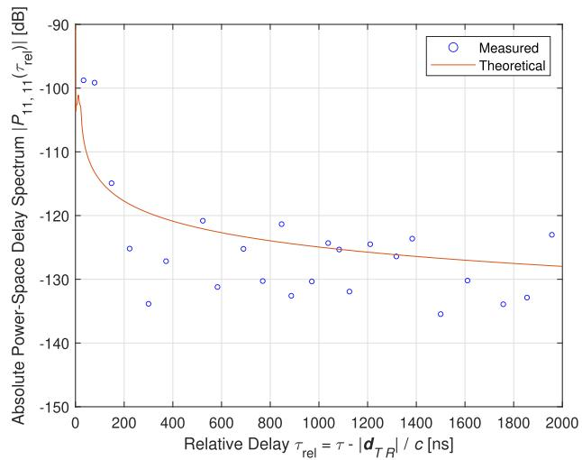  
Fig. 5. Comparison between the theoretical PSDS and the empirical data points taken from [32, Fig. 3]. Note that we have considered a path loss of −84 dB for the theoretical results, based on the description in [32].

$$
\begin{array} { r l } &  \begin{array} { r l } & { \forall x _ { 1 } ( x ) = x ^ { 0 } , x ^ { 0 } , x ^ { 0 } , x ^ { 1 } , x ^ { 1 } , x ^ { 1 } } \\ & { \qquad \quad + \frac { 1 } { 2 } ( \frac { \sin ^ { 2 } \theta } { \sin ^ { 2 } \theta } ) ^ { 2 } , } \end{array} \qquad ( \begin{array} { l } { 1 - \frac { \sin ^ { 2 } \theta } { \sin ^ { 2 } \theta } , x ^ { 0 } , x ^ { 1 } , x ^ { 1 } , x ^ { 1 } } \\  1 - \frac { \sin ^ { 2 } \theta } { \sin ^ { 2 } \theta } , x ^ { 1 } , x ^ { 1 } , x ^ { 1 } , x ^ { 1 } , x ^ { 1 } , x ^ { 1 } , x ^ { 1 } , x ^ { 1 } , x ^ { 1 } , x ^ { 1 } , x ^ { 1 } , x ^ { 1 } , x ^ { 1 } , x ^ { 1 } , x ^ { 1 } , x ^ { 1 } , x ^ { 1 } , x ^ { 1 } , x ^ { 1 } , x ^ { 1 } , x ^ { 1 } , x ^ { 1 } , x ^ { 1 } , x ^ { 1 } , x ^ { 1 } , x ^ { 1 } , x ^ { 1 } , x ^ { 1 } , x ^ { 1 } , x ^ { 1 } , x ^ { 1 } , x ^ { 1 } , x ^ { 1 } , x ^ { 1 } , x ^ { 1 } , x ^ { 1 } , x ^ { 1 } , x ^ { 1 } , x ^ { 1 } , x ^ { 1 } , x ^ { 1 } , x ^ { 1 } , x ^ { 1 } , x ^ { 1 } , x ^ { 1 } , x ^ { 1 } , x ^ { 1 } , x ^ { 1 } , x ^ { 1 } , x ^ { 1 } , x ^ { 1 } , x ^ { 1 } , x ^ { 1 } , x ^ { 1 } , x ^ { 1 } , x ^ { 1 } , x ^ { 1 } , x ^ { 1 } , x ^ { 1 } , x ^ { 1 } , x ^ { 1 } , x ^ { 1 } , x ^ { 1 } , x ^ { 1 } , x ^ { 1 } , x ^ { 1 } , x ^ { 1 } , x ^ { 1 } , x ^ { 1 } , x ^ { 1 } , x ^ { 1 } , x ^  \end{array} \end{array}
$$

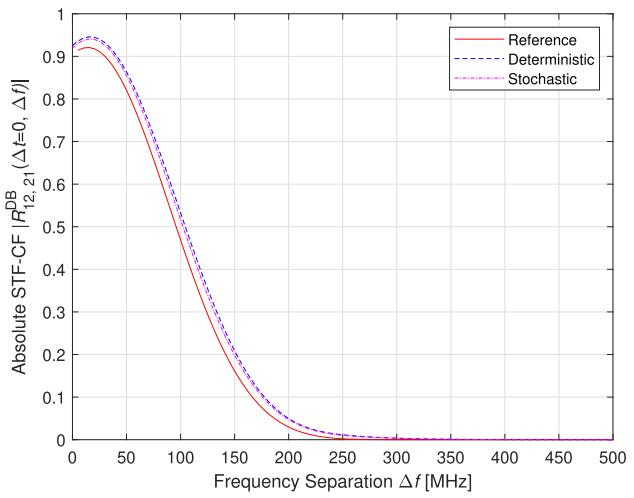  
Fig. 6. Comparison of the STF-CFs obtained from the reference model, the deterministic simulation model, and the stochastic simulation model, versus frequency separation for DB rays.

## V. ERGODIC CAPACITY OF MA AIDED MIMO WIDEBAND U2U CHANNELS

Suppose the Tx has no channel state information (CSI) and that the Rx has perfect CSI. Then, the wideband capacity is

$$
C \left( t \right) = \frac { 1 } { W } \int _ { W } \log _ { 2 } \operatorname* { d e t } \left( \mathbf { I } _ { M _ { R } } + \frac { \rho _ { \mathrm { S N R } } } { M _ { T } } \mathbf { H } \left( t , f \right) \mathbf { H } ^ { \dag } \left( t , f \right) \right) \mathrm { d } f ,\tag{49}
$$

where it is assumed that $M _ { T } \ge M _ { R } , { \bf I } _ { M _ { R } }$ is the $M _ { R } \times M _ { R }$ identity matrix, ρSNR is the signal-to-noise ratio (SNR) [33], W is the bandwidth, and H $( t , f )$ is the $M _ { R } \times M _ { T }$ transfer function matrix [34], [35]. Then, the ergodic capacity is

$$
C _ { \mathrm { e r g } } = \mathbb { E } \left[ C \left( t \right) \right] .\tag{50}
$$

Since the frequency selectivity does not affect the ergodic capacity of MIMO wideband channels [36], [37], maximizing the wideband ergodic capacity is equivalent to maximizing the narrowband one defined in [12, Eq. (58)]. Considering the fast fading of the U2U channels (due to the high mobility of the UAVs), we adopt the spatial correlation criterion for capacity maximization, as it varies slowly and thus easy to track [38]. In such a criterion, the capacity is maximized by maximizing the determinants of spatial correlation matrices [39].

Consider the Kronecker model, and here we denote the transmit and receive spatial correlation matrices, respectively, by $\mathbf { R } _ { T } ~ = ~ [ R _ { p q , p ^ { \prime } q } \left( \Delta t = 0 , \Delta f = 0 \right) ] _ { M _ { T } \times M _ { T } }$ and $\mathbf { R } _ { R } \mathbf { \Psi } =$ $[ R _ { p q , p q ^ { \prime } } ( \Delta t = 0 , \Delta f = 0 ) ] _ { M _ { R } \times M _ { R } } .$ These correlation matrices depend on the positions of MAs, i.e., $\mathbf { D } _ { T p }$ and $\mathbf { D } _ { R q } ,$ respectively. By optimizing those positions, in this paper, we aim to maximize the (natural) logarithms of their determinants, i.e., log det $\left( \mathbf { R } _ { T } \right)$ and log det $\left( \mathbf { R } _ { R } \right)$ . Compared to the determinants, the log-determinants of the correlation matrices directly quantify the capacity reduction, and can be concave for positive definite matrices.

To reduce coupling-effects between adjacent antennas and prevent solutions where antennas move towards identical positions, a minimum distance $D$ is introduced for each pair [25]. Thus, we formulate the optimization problem as

$$
\operatorname* { m a x } _ { \mathbf { D } _ { T p } , \ \mathbf { D } _ { R q } } \ \log \operatorname* { d e t } \left( \mathbf { R } _ { T } \left( \mathbf { D } _ { T p } \right) \right) + \log \operatorname* { d e t } \left( \mathbf { R } _ { R } \left( \mathbf { D } _ { R q } \right) \right)\tag{51a}
$$

$$
\mathrm { s . t . } \ \mathbf { D } _ { T p } \in \mathcal { C } _ { T } ,
$$

$$
\mathbf { D } _ { R q } \in \mathcal { C } _ { R } ,\tag{51b}
$$

$$
| d _ { p p ^ { \prime } } | \geq D , \quad \forall p , p ^ { \prime } = 1 , . . . , M _ { T } , \quad p \neq p ^ { \prime } ,\tag{51c}
$$

$$
| d _ { q q ^ { \prime } } | \geq D , \quad \forall q , q ^ { \prime } = 1 , . . . , M _ { R } , \quad q \neq q ^ { \prime } .\tag{51d}
$$

(51e)

Algorithm 1 Gradient-Based Transmit MA Optimization   
Input: $\lambda , M _ { T } , R _ { p q , p ^ { \prime } q ^ { \prime } } , \mathcal { C } _ { T } = [ - L / 2 , L / 2 ] ^ { 3 } , D$   
$\alpha _ { 0 } \colon$ Initial learning rate (default: 0.2)   
$T _ { \mathrm { m a x } } { \mathrm { : } }$ Maximum iterations (default: 100)   
$\epsilon { : }$ Convergence threshold (default: $1 0 ^ { - 6 } )$   
$\gamma \colon$ Momentum factor (default: 0.9)   
κ: Repulsion coefficient (default: 0.1)   
Output: $\mathbf { D } _ { T p } ^ { * } ,$ log det $( \mathbf { R } _ { T } ^ { * } )$   
1: Initialize:   
2: Generate $\mathbf { D } _ { T p } ^ { ( 0 ) } \in \mathcal { C } _ { T }$ satisfying $| \boldsymbol { d } _ { p p ^ { \prime } } | \geq D , \ \forall p \neq p ^ { \prime }$   
3: Compute $\mathbf { R } _ { T } ^ { ( 0 ) } = \mathbf { R } _ { T } ( \mathbf { D } _ { T p } ^ { ( 0 ) } )$ via $R _ { p q , p ^ { \prime } q ^ { \prime } }$   
4: Initialize momentum $\mathbf { V } ^ { ( 0 ) }  \mathbf { 0 }$   
5: Set $i  0 , \alpha  \alpha _ { 0 }$   
6: while $i \leq T _ { \mathrm { m a x } }$ and $\begin{array} { r } { { \bf \Xi } ( | \log \operatorname* { d e t } ( { \bf R } _ { T } ^ { ( i + 1 ) } ) - \log \operatorname* { d e t } ( { \bf R } _ { T } ^ { ( i ) } ) | \geq } \end{array}$   
$\mathbf { \epsilon } _ { \mathbf { \epsilon } \mathbf { 0 } \mathbf { r } } \mathbf { D } _ { T p } ^ { ( i + 1 ) } = \mathbf { D } _ { T p } ^ { ( i ) } )$ do   
7: Compute the gradient matrix $\mathbf { G } = [ G _ { x / y / z , p } ] _ { 3 \times M _ { T } } \mathrm { : }$   
8: for each antenna $p \in \{ 1 , \ldots , M _ { T } \}$ do   
9: for each dimension $x / y / z$ do   
10: $\begin{array} { r } { G _ { x / y / z , p }  \mathrm { T r } ( ( \mathbf R _ { T } ^ { ( i ) } ) ^ { - 1 } \frac { \partial \mathbf R _ { T } ^ { ( i ) } } { \partial d _ { T p , x / y / z } } ) } \end{array}$   
11: end for   
12: end for   
13: Update momentum: $\mathbf { V } ^ { ( i + 1 ) }  \gamma \mathbf { V } ^ { ( i ) } + \mathbf { G }$   
14: Update positions: $\mathbf { D } _ { T p } ^ { \mathrm { t e m p } }  \mathbf { D } _ { T p } ^ { ( i ) ^ { \prime } } + \alpha \mathbf { V } ^ { ( i + 1 ) }$   
15: Cubic region: $\mathbf { D } _ { T p } ^ { \mathrm { t e m p } }  \operatorname* { m a x } ( \operatorname* { m i n } ( \mathbf { D } _ { T p } ^ { \mathrm { t e m p } } , L / 2 ) , - L / 2 )$   
16: Apply minimum spacing constraint:   
17: while $\exists ( p , p ^ { \prime } )$ s.t. pp = | | < D do   
18: for each conflicting pair $( p , \dot { p } ^ { \prime } )$ do   
19: $\begin{array} { r } { d _ { T p } ^ { \mathrm { t e m p } }  d _ { T p } ^ { \mathrm { t e m p } } + \kappa \frac { D - \vert d _ { p p ^ { \prime } } ^ { \mathrm { t e m p } } \vert } { \vert d _ { n n ^ { \prime } } ^ { \mathrm { t e m p } } \vert } ( d _ { T p } ^ { \mathrm { t e m p } } - d _ { T p ^ { \prime } } ^ { \mathrm { t e m p } } ) } \end{array}$   
20: $\begin{array} { r } { d _ { T p ^ { \prime } } ^ { \mathrm { t e m p } }  d _ { T p ^ { \prime } } ^ { \mathrm { t e m p } } - \kappa \frac { D - \vert { \bar { d } } _ { p p ^ { \prime } } ^ { \mathrm { t e m p } } \vert } { \vert d _ { p p ^ { \prime } } ^ { \mathrm { t e m p } } \vert } ( d _ { T p } ^ { \mathrm { t e m p } } - d _ { T p ^ { \prime } } ^ { \mathrm { t e m p } } ) } \end{array}$   
21: end for   
22: $\mathbf { D } _ { T p } ^ { \mathrm { t e m p } }  \operatorname* { m a x } ( \operatorname* { m i n } ( \mathbf { D } _ { T p } ^ { \mathrm { t e m p } } , L / 2 ) , - L / 2 )$   
23: end while   
24: Compute ${ \bf R } _ { T } ^ { \mathrm { t e m p } } = { \bf R } _ { T } ( { \bf D } _ { T p } ^ { \mathrm { t e m p } } )$   
25: if log det $( { \bf R } _ { T } ^ { \mathrm { t e m p } } ) >$ log det $( { \bf R } _ { T } ^ { ( i ) } )$ then   
26: $\bar { \mathbf { D } _ { T p } ^ { ( i + 1 ) } }  \bar { \mathbf { D } _ { T p } ^ { \mathrm { t e m p } } } , \bar { \mathbf { R } _ { T } ^ { ( i + 1 ) } }  \bar { \mathbf { R } _ { T } ^ { \mathrm { t e m p } } }$   
27: α ← min(1.1α, 0.5)   
28: else   
29: $\mathbf { \Delta D } _ { T p } ^ { ( i + 1 ) } \gets \mathbf { D } _ { T p } ^ { ( i ) } , \mathbf { R } _ { T } ^ { ( i + 1 ) } \gets \mathbf { R } _ { T } ^ { ( i ) }$   
30: $\alpha \dot {  } 0 . 5 \alpha$   
31: end if   
32: $i \gets i + 1$   
33: end while

Note that Problem (51) can be divided into two independent yet analogous subproblems, each of which aims to maximize the log-determinant of the transmit/receive correlation matrix by optimizing the positions of the transmit/receive MAs. Here, we use the gradient ascent algorithm (with momentum, for better performance) to solve each subproblem, since the derivative of the log-determinant with respect to the antenna position can be found in a tractable form using the derived STF-CF. After each iteration, we apply the feasible region and minimum spacing constraints to the updated MA positions. The proposed gradient-based algorithm for the transmit MA optimization subproblem, as example, is in Algorithm 1. Note that the gradient matrix G in Algorithm 1 is given by1

$$
\mathbf G = \nabla \log \operatorname* { d e t } \left( \mathbf { R } _ { T } \left( \mathbf { D } _ { T p } \right) \right) = \mathrm { T r } \left( \mathbf { R } _ { T } ^ { - 1 } \frac { \partial \mathbf { R } _ { T } } { \partial \mathbf { D } _ { T p } } \right) ,\tag{52}
$$

which can be verified using matrix calculus. Compared to the definition-based calculation of the gradient in each iteration (e.g., in [20]), the closed-form gradient reduces computational complexity and facilitates practical implementation [40].

To exemplify the effect of Algorithm 1, we consider the optimization of transmit MA positions for the pure DB case in which $K = 0 , \eta _ { \mathrm { S B T } } = \eta _ { \mathrm { S B R } } = 0 ,$ , and $\eta _ { \mathrm { D B } } = 1$ . In such a case, using (38) and noting ${ d _ { p p ^ { \prime } } = d _ { T p ^ { \prime } } - d _ { T p } } ,$ , the partial derivative of $[ \mathbf { R } _ { T } ] _ { p p ^ { \prime } }$ (the entry in the pth row and p0th column of ${ \bf R } _ { T } )$ with respect to the position (relative to the center of the transmit region) of the p˜th transmit MA can be derived. By arranging the partial derivatives in the $x / y / z$ -dimension respectively, we can obtain the three $M _ { T } \times M _ { T }$ matrices $\frac { \hat { \partial } \mathbf { R } _ { T } ^ { ( i ) } } { \partial d _ { T p , x / y / z } }$ as in Line 1, Algorithm 1. Those partial derivatives are given by (53), (54), and (55), shown at the bottom of the page, respectively.

Fig. 7 presents the log-determinant maximization of the transmit correlation matrix in a pure DB case using Algorithm

$$
\begin{array} { r l } & { \mathrm { E } _ { \perp \perp } ^ { \mathrm { i } } = \frac { ( \Delta \xi ) ^ { 2 } } { \Delta \xi } } \\ & { = ( \begin{array} { l l l l } { \mathrm { E q } _ { \perp \perp } ^ { \mathrm { i } } ( \Delta \xi ) \Delta \xi } & & & { - \mathrm { i } ( \Delta \xi ) ^ { 2 } \Delta \xi } \\ & & { - \mathrm { i } ( \Delta \xi ) ^ { 2 } \Delta \xi } & & \\ & { \mathrm { E q } _ { \perp \perp } ^ { \mathrm { i } } ( \Delta \xi ) \Delta \xi } & & & { - \mathrm { i } ( \Delta \xi ) ^ { 2 } \Delta \xi } \\ & & & { - \mathrm { i } ( \Delta \xi ) ^ { 2 } \Delta \xi } & & \\ & & { \mathrm { E q } _ { \perp \perp } ^ { \mathrm { i } } ( \Delta \xi ) \Delta \xi } & & & { \mathrm { E q } _ { \perp \perp } ^ { \mathrm { i } } ( \Delta \xi ) \Delta \xi } \end{array} ) ^ { \frac { 1 } { 2 } } } \\ &  = ( \begin{array} { l l l l } { \mathrm { E q } _ { \perp \perp } ^ { \mathrm { i } } ( \Delta \xi ) \Delta \xi } & & & { - \mathrm { i } ( \Delta \xi ) ^ { 2 } \Delta \xi } \\ & & & { - \mathrm { i } ( \Delta \xi ) ^ { 2 } \Delta \xi } & & \\ & & { - \mathrm { i } ( \Delta \xi ) ^ { 2 } \Delta \xi } & & \\ & & & { \mathrm { E q } _ { \perp \perp } ^ { \mathrm { i } } ( \Delta \xi ) \Delta \xi } & & \\ & & & { - \mathrm { i } ( \Delta \xi ) ^ { 2 } \Delta \xi } & & \\ & & & { \mathrm { E q } _ { \perp \perp } ^ { \mathrm { i } } ( \Delta \xi ) \Delta \xi } & & \\ & & & { - \mathrm { i } ( \Delta \xi ) ^ { 2 } \Delta \xi } & & \\ & & &  \mathrm { E q } _ { \perp \perp } ^ { \mathrm { i } } ( \Delta \xi \ \end{array} \end{array}\tag{55}
$$

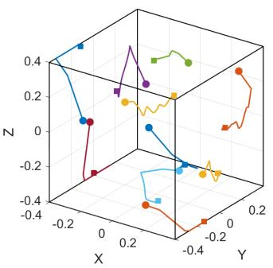

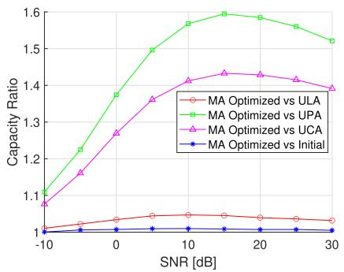

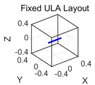  
(a)

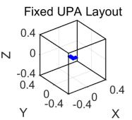

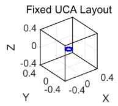  
(b)

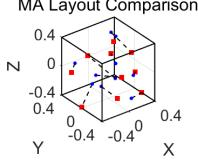  
(c)

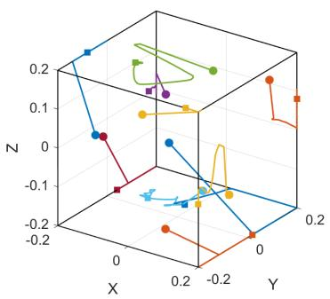  
(d)

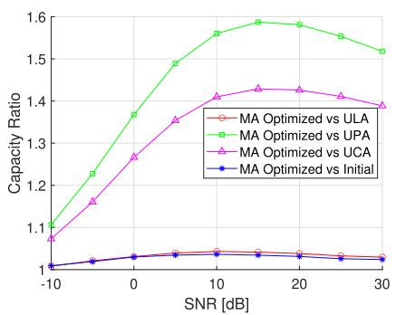  
(e)

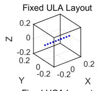

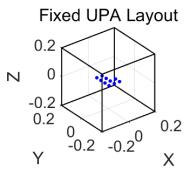

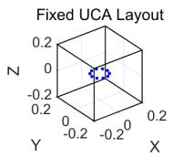

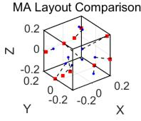  
(f)

Fig. 7. (a) and (d) Trajectories of the MAs, (b) and (e) capacity ratios, (c) and (f) corresponding antenna layouts, under $L = 1 0 \lambda$ and $L = 5 \lambda$ , respectively.  
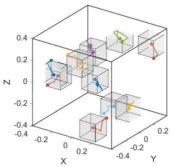  
(a)

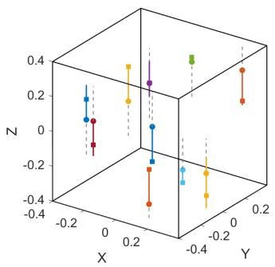  
(b)

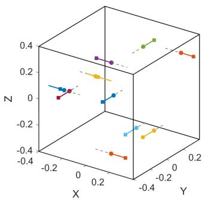  
(c)

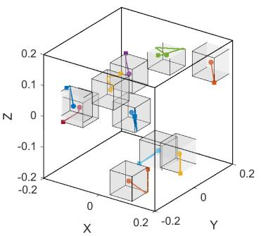  
(d)

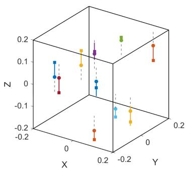  
(e)

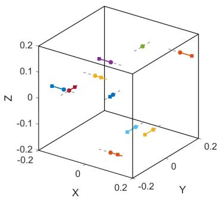  
(f)  
Fig. 8. Antenna trajectories from the same initial positions for (a)-(c) L = 10λ and $\left( \mathrm { d } \right) - \left( \mathrm { f } \right) L = 5 \lambda$ , showing fixed-volume, vertical-line, and horizontal-line movements, respectively. Final log-determinant values are −0.035, −0.042, −0.180 at $L = 1 0 \lambda$ and $- 0 . 4 5 \tilde { 0 , } - 0 . 8 2 8 , - 1 . 1 5 3$ at $L = 5 \lambda ,$ respectively.

1, with parameters $\lambda ~ = ~ 0 . 0 8$ m, $M _ { T } \ = \ 1 0 , \ D \ = \ 0 . 5 \lambda$ and 7c depict the MA trajectories (circles: initial; squares: $k _ { T } = 5 , \alpha _ { T \mu } = 9 0 ^ { \circ } , \beta _ { T m } = 1 5 ^ { \circ }$ , and $\beta _ { T \mu } = 1 0 ^ { \circ }$ . Under final), the capacity ratios of the optimized MA system to a cubic feasible region of size $L ~ = ~ 1 0 \lambda$ , Figs. 7a, 7b, fixed uniform linear/planar/circular array (ULA, UPA, UCA)

with the same element spacing $D = 0 . 5 \lambda$ , and the specific antenna layouts. Corresponding results for a smaller region with $L \ = \ 5 \lambda$ are shown in Figs. 7d, 7e, and 7f. A clear boundary effect is observed in the optimized MA layouts, as antennas migrate toward the cube’s extremities to exploit spatial diversity. This aligns with prior experimental studies [21], [22], where MAs moved to the edges of confined spaces to enhance performance. While earlier work focused on single-antenna linear trajectories, our results confirm that the same principle applies to multiple MAs operating in a 3-D volume, particularly in the more constrained $L \ = \ 5 \lambda$ case where most antennas reach the boundaries. Capacity analysis reveals a consistent gain hierarchy across region sizes: MA achieves the highest improvement over UPA (average $1 . 4 3 \times )$ , followed by UCA (1.32×), and ULA (1.03×). The relative gain over initial MA configurations is higher in the smaller region (2.6% vs 0.6% for $L = 1 0 \lambda )$ , underscoring the value of spatial optimization under tight constraints. All configurations achieve peak relative gains at medium SNR (10–20 dB), where spatial diversity is most effective before capacity saturates at higher SNR. These findings confirm that MA systems offer particular advantages in space-constrained deployments where fixed antennas underutilize spatial channel characteristics.

To address mechanical constraints in practice, Fig. 8 further compares three movement patterns under $L ~ = ~ 1 0 \lambda$ and $L = 5 \lambda \colon$ horizontal-line (along either x or y-axis), verticalline (z-axis only), and fixed-volume (local 3-D) movement. In the constrained $L = 5 \lambda$ case, parameters are adjusted with a lower learning rate (0.1), more spacing adjustments (100 iterations), and limited movement ranges to avoid mechanical violation. Results show that fixed-volume constraints preserve performance across scales, while line-based movements degrade severely under tight confinement. These findings highlight the need to balance spatial constraints with movement flexibility in UAV MA design, indicating that fixed-volume movement offers the best trade-off between performance and practicality.

While simulations focus on static optimization, our model also predicts dynamic behaviors. The correlation function in (38) incorporates mobility through velocity terms $v _ { T , x / y / z } \Delta t$ and $v _ { R , x / y / z } \Delta t$ (see $\tilde { D } _ { x / y / z } ^ { \mathrm { D B T } }$ and $\tilde { D } _ { x / y / z } ^ { \mathrm { D B R } } )$ . This implies that when a UAV moves with velocity vT over a short duration $\Delta t ,$ optimal performance requires MAs to execute counter-movements of $- { \pmb v } _ { T } \Delta t$ to preserve the correlation structure. When antennas reach volume boundaries, full compensation becomes infeasible, necessitating new MIMO configurations. These predicted behaviors align with counter-movement phenomena in [16] and [21], extending them to 3-D multi-antenna systems with complex boundary interactions.

## VI. CONCLUSION

We have proposed an arbitrary-elevation two-concentriccylinders model to characterize MA-aided MIMO wideband U2U channels, deriving the key characteristics and leveraging a closed-form correlation expression for gradient-based MA position optimization. Our analysis demonstrates that

MA technology yields the most significant gains in spatially constrained scenarios, identifying the medium SNR regime as optimal and fixed-volume constraints as a practical design trade-off. These insights provide valuable guidance for MA deployment on UAVs. Future work may focus on joint optimization of ergodic and outage performance, model extension to include airframe shadowing, validation with real UAV trajectories, and investigation under general scattering conditions.

## REFERENCES

[1] Z. Ma et al., “Hybrid-RIS-assisted cellular ISAC networks for UAVenabled low-altitude economy via deep reinforcement learning with mixture-of-experts,” IEEE Trans. Cogn. Commun. Netw., early access, Oct. 16, 2025, doi: 10.1109/TCCN.2025.3622130.

[2] B. Hua et al., “AAV air-to-air channel: Statistical properties and experimental verification,” IEEE Internet Things J., vol. 12, no. 13, pp. 25790–25803, Jul. 2025.

[3] B. Hua et al., “A novel A2A channel model incorporating rooftop specular reflection and airframe occlusion,” IEEE Trans. Wireless Commun., vol. 24, no. 10, pp. 8785–8798, Oct. 2025.

[4] K. Mao et al., “A survey on channel sounding technologies and measurements for UAV-assisted communications,” IEEE Trans. Instrum. Meas., vol. 73, pp. 1–24, 2024.

[5] A. G. Zajic and G. L. Stuber, “Three-dimensional modeling and simulation of wideband MIMO mobile-to-mobile channels,” IEEE Trans. Wireless Commun., vol. 8, no. 3, pp. 1260–1275, Mar. 2009.

[6] Z. Lian, Y. Wang, Y. Su, and P. Ji, “A novel beam channel model and capacity analysis for UAV-enabled millimeter-wave communication systems,” IEEE Trans. Wireless Commun., vol. 23, no. 4, pp. 3617–3632, Apr. 2024.

[7] Z. Ma, B. Ai, R. He, G. Wang, Y. Niu, and Z. Zhong, “A wideband non-stationary air-to-air channel model for UAV communications,” IEEE Trans. Veh. Technol., vol. 69, no. 2, pp. 1214–1226, Feb. 2020.

[8] Z. Ma, B. Ai, R. He, Z. Zhong, and M. Yang, “A nonstationary geometry-based MIMO channel model for millimeter-wave UAV networks,” IEEE J. Sel. Areas Commun., vol. 39, no. 10, pp. 2960–2974, Oct. 2021.

[9] X. Zhang, J. Liu, F. Gu, D. Ma, and J. Wei, “An extended 3-D ellipsoid model for characterization of UAV air-to-air channel,” in Proc. IEEE Int. Conf. Commun. (ICC), Shanghai, China, May 2019, pp. 1–6.

[10] X. Mao, C.-X. Wang, and H. Chang, “A 3D non-stationary geometrybased stochastic model for 6G UAV air-to-air channels,” in Proc. 13th Int. Conf. Wireless Commun. Signal Process. (WCSP), Oct. 2021, pp. 1–5.

[11] Y. Zhang, Y. Zhou, Z. Ji, K. Lin, and Z. He, “A three-dimensional geometry-based stochastic model for air-to-air UAV channels,” in Proc. IEEE 92nd Veh. Technol. Conf. (VTC-Fall), Victoria, BC, Canada, Nov. 2020, pp. 1–5.

[12] L. Zeng, X. Liao, Z. Ma, B. Xiong, H. Jiang, and Z. Chen, “Threedimensional UAV-to-UAV channels: Modeling, simulation, and capacity analysis,” IEEE Internet Things J., vol. 11, no. 6, pp. 10054–10068, Mar. 2024.

[13] L. Zeng, X. Liao, Z. Ma, H. Jiang, and Z. Chen, “UAV-to-UAV MIMO systems under multimodal nonisotropic scattering: Geometrical channel modeling and outage performance analysis,” IEEE Internet Things J., vol. 11, no. 15, pp. 26266–26278, Aug. 2024.

[14] L. Zeng, X. Liao, Z. Ma, W. Liu, H. Jiang, and Z. Chen, “Toward more adaptive UAV-to-UAV GBSMs: Introducing the extended vMF distribution,” IEEE Wireless Commun. Lett., vol. 14, no. 2, pp. 260–264, Feb. 2025.

[15] L. Zhu, W. Ma, and R. Zhang, “Movable antennas for wireless communication: Opportunities and challenges,” IEEE Commun. Mag., vol. 62, no. 6, pp. 114–120, Jun. 2024.

[16] W. Li, H. Yin, F. Fu, Y. Cao, and M. Debbah, “Transforming timevarying to static channels: The power of fluid antenna mobility,” IEEE Trans. Wireless Commun., vol. 24, no. 6, pp. 4767–4780, Jun. 2025.

[17] H. Jiang, W. Shi, Z. Chen, Z. Zhang, K.-K. Wong, and H. Shin, “Dynamic channel modeling of fluid antenna systems in UAV communications,” IEEE Wireless Commun. Lett., vol. 14, no. 10, pp. 3169–3173, Oct. 2025.

[18] W. K. New, K.-K. Wong, H. Xu, K.-F. Tong, and C.-B. Chae, “An information-theoretic characterization of MIMO-FAS: Optimization, diversity-multiplexing tradeoff and Q-outage capacity,” IEEE Trans. Wireless Commun., vol. 23, no. 6, pp. 5541–5556, Jun. 2024.

[19] L. Zhu, W. Ma, and R. Zhang, “Modeling and performance analysis for movable antenna enabled wireless communications,” IEEE Trans. Wireless Commun., vol. 23, no. 6, pp. 6234–6250, Jun. 2024.

[20] L. Zhu, W. Ma, Z. Xiao, and R. Zhang, “Performance analysis and optimization for movable antenna aided wideband communications,” IEEE Trans. Wireless Commun., vol. 23, no. 12, pp. 18653–18668, Dec. 2024.

[21] G. Artner, “Keeping mobile communication channels static with antenna counter-movements,” IEEE Access, vol. 8, pp. 40088–40095, 2020.

[22] G. Artner, “Improving mobile communications with antennas that map the channel and move to local maxima,” Microw. Opt. Technol. Lett., vol. 65, no. 6, pp. 1568–1574, Jun. 2023.

[23] W. Liu, X. Zhang, H. Xing, J. Ren, Y. Shen, and S. Cui, “UAV-enabled wireless networks with movable-antenna array: Flexible beamforming and trajectory design,” IEEE Wireless Commun. Lett., vol. 14, no. 3, pp. 566–570, Mar. 2025.

[24] T. Ren, X. Zhang, L. Zhu, W. Ma, X. Gao, and R. Zhang, “6D movable antenna enhanced interference mitigation for cellular-connected UAV communications,” IEEE Wireless Commun. Lett., vol. 14, no. 6, pp. 1618–1622, Jun. 2025.

[25] W. Ma, L. Zhu, and R. Zhang, “MIMO capacity characterization for movable antenna systems,” IEEE Trans. Wireless Commun., vol. 23, no. 4, pp. 3392–3407, Apr. 2024.

[26] M. Khammassi, A. Kammoun, and M.-S. Alouini, “A new analytical approximation of the fluid antenna system channel,” IEEE Trans. Wireless Commun., vol. 22, no. 12, pp. 8843–8858, Dec. 2023.

[27] P. Ram´ırez-Espinosa, D. Morales-Jimenez, and K.-K. Wong, “A new spatial block-correlation model for fluid antenna systems,” IEEE Trans. Wireless Commun., vol. 23, no. 11, pp. 15829–15843, Nov. 2024.

[28] L. Zhu et al., “A tutorial on movable antennas for wireless networks,” IEEE Commun. Surv. Tut., early access, Feb. 27, 2025, doi: 10.1109/ COMST.2025.3546373.

[29] Z. Ma et al., “Deep reinforcement learning for energy efficiency maximization in RSMA-IRS-assisted ISAC system,” IEEE Trans. Veh. Technol., vol. 74, no. 11, pp. 18273–18278, Nov. 2025.

[30] B. Hua et al., “Ultra-wideband nonstationary channel modeling for UAVto-ground communications,” IEEE Trans. Wireless Commun., vol. 24, no. 5, pp. 4190–4204, May 2025.

[31] L. Zeng et al., “UAV-to-ground channel modeling: (Quasi-)closed-form channel statistics and manual parameter estimation,” China Commun., 2024, doi: 10.23919/JCC.ja.2023-0661.

[32] H. An et al., “Measurement and ray-tracing for UAV air-to-air channel modeling,” in Proc. IEEE 5th Int. Conf. Electron. Inf. Commun. Technol. (ICEICT), Aug. 2022, pp. 415–420.

[33] H. Jiang et al., “Large-scale RIS enabled air-ground channels: Near-field modeling and analysis,” IEEE Trans. Wireless Commun., vol. 24, no. 2, pp. 1074–1088, Feb. 2025.

[34] H. Wang et al., “A novel wireless cable method for high-order MIMO device testing based on maximum RSRP measurement,” IEEE Trans. Antennas Propag., vol. 73, no. 12, pp. 10650–10664, Dec. 2025.

[35] H. Wang et al., “Achieving wireless cable testing for MIMO devices with a novel condition number reduction method,” IEEE Trans. Antennas Propag., vol. 73, no. 12, pp. 10613–10623, Dec. 2025.

[36] K. Liu, V. Raghavan, and A. M. Sayeed, “Capacity scaling and spectral efficiency in wide-band correlated MIMO channels,” IEEE Trans. Inf. Theory, vol. 49, no. 10, pp. 2504–2526, Oct. 2003.

[37] W. Fan, P. Kyosti, J. Ø. Nielsen, and G. F. Pedersen, “Wideband MIMO¨ channel capacity analysis in multiprobe anechoic chamber setups,” IEEE Trans. Veh. Technol., vol. 65, no. 5, pp. 2861–2871, May 2016.

[38] Y. Zhang, C. Ji, W. Malik, D. O’Brien, and D. Edwards, “Receive antenna selection for MIMO systems over correlated fading channels,” IEEE Trans. Wireless Commun., vol. 8, no. 9, pp. 4393–4399, Sep. 2009.

[39] L. Dai, S. Sfar, and K. B. Letaief, “Optimal antenna selection based on capacity maximization for MIMO systems in correlated channels,” IEEE Trans. Commun., vol. 54, no. 3, pp. 563–573, Mar. 2006.

[40] G. Hu et al., “Fluid antennas-enabled multiuser uplink: A lowcomplexity gradient descent for total transmit power minimization,” IEEE Commun. Lett., vol. 28, no. 3, pp. 602–606, Mar. 2024.

Linzhou Zeng (Member, IEEE) was born in Yueyang, Hunan, China, in 1995. He received the B.S. degree in electronic and information science and technology from Peking University, Beijing, China, in 2017, and the M.S. degree in electrical and computer engineering from the University of California, Los Angeles, Los Angeles, CA, USA, in 2018. He is currently pursuing the Ph.D. degree with Xi’an Jiaotong University, Xi’an, China. Since 2019, he has been with the School of Information Science and Engineering, Hunan Institute of Science and

Technology, Yueyang, where he is currently a Lecturer. His research interests include radio channel modeling and optical wireless communications.

Xuewen Liao (Member, IEEE) received the B.S. and Ph.D. degrees in information and communications engineering from Xi’an Jiaotong University, Xi’an, China, in 2002 and 2008, respectively. From 2008 to 2012, he was an Assistant Professor with Xi’an Jiaotong University. From 2016 to 2017, he was a Visiting Scholar with the Department of Electrical and Computer Engineering, The University of British Columbia, Vancouver, BC, Canada. He is currently a Professor with the School of Information and Communications Engineering, Xi’an Jiaotong

University. His research interests include wireless energy transfer, green communications, relay communications, and indoor positioning.

Zhangfeng Ma (Member, IEEE) received the B.S. degree in communications engineering from Huaihua University, Huaihua, China, in 2015, the M.S. degree in electronic and communication engineering from Chongqing University of Posts and Telecommunications, Chongqing, China, in 2018, and the Ph.D. degree (Hons.) in information and communication engineering from the School of Electronic and Information Engineering, Beijing Jiaotong University, Beijing, China, in 2022.

From 2021 to 2022, he was a Visiting Ph.D.

Student with the Antennas, Propagation and Millimetre-wave Systems Section, Department of Electronic Systems, Aalborg University, Aalborg, Denmark. He is currently an Associate Professor with the School of Information Science and Engineering, Shaoyang University, Shaoyang, China. His current research interests include wireless propagation channel modeling, non-stationary channel models, and unmanned aerial vehicle channel modeling. He was a recipient of the Best Student Paper Award from the IEEE Vehicular Technology Conference (VTC-Fall) in 2019, and the Outstanding Doctor’s Thesis Award from Chinese Institute of Electronics (CIE) in 2023.

Ruichen Zhang (Member, IEEE) received the B.E. degree from Henan University (HENU), China, in 2018, and the Ph.D. degree from Beijing Jiaotong University (BJTU), China, in 2023. In 2024, he was a Visiting Scholar with the College of Information and Communication Engineering, Sungkyunkwan University, Suwon, South Korea. He is currently a Post-Doctoral Research Fellow with the College of Computing and Data Science, Nanyang Technological University (NTU), Singapore. He has two ESI highly cited articles and one ESI hot article. His

research interests include the Internet of Agents, LLM-empowered networking, reinforcement learning-enabled wireless communications, generative AI models, and heterogeneous networks. He has received two Best Paper Awards from IEEE IWCMC. He also serves as a guest editor for several IEEE journals. In addition, he serves as the Managing Editor for IEEE TRANSACTIONS ON NETWORK SCIENCE AND ENGINEERING in 2025.

  
Dusit Niyato (Fellow, IEEE) received the B.Eng. degree from the King Mongkut’s Institute of Technology Ladkrabang (KMITL), Thailand, and the Ph.D. degree in electrical and computer engineering from the University of Manitoba, Canada. He is currently a Professor with the College of Computing and Data Science, Nanyang Technological University, Singapore. His research interests include mobile generative AI, edge intelligence, decentralized machine learning, and incentive mechanism design.

Hao Jiang (Senior Member, IEEE) received the B.S. and M.S. degrees in electrical and information engineering from Nanjing University of Information Science and Technology, Nanjing, China, in 2012 and 2015, respectively, and the Ph.D. degree from Southeast University, Nanjing in 2019. From 2017 to 2018, he was a Visiting Student with the Department of Electrical Engineering, Columbia University, New York, NY, USA. Since April 2019, he has been a Professor with the School of Information Science and Engineering, Nanjing University of Information

Science and Technology. His current research interests include wireless channel measurements and modeling, B5G wireless communication networks, signal processing, machine learning, and AI-driven technologies.

Cheng-Xiang Wang (Fellow, IEEE) received the B.Sc. and M.Eng. degrees in communication and information systems from Shandong University, China, in 1997 and 2000, respectively, and the Ph.D. degree in wireless communications from Aalborg University, Denmark, in 2004.

He was a Research Assistant with Hamburg University of Technology, Hamburg, Germany, from 2000 to 2001; a Visiting Researcher with Siemens AG Mobile Phones, Munich, Germany, in 2004; and a Research Fellow with the University of Agder,

Grimstad, Norway, from 2001 to 2005. He was with Heriot-Watt University, Edinburgh, U.K., from 2005 to 2018, where he was promoted to a Professor in 2011. He has been a Professor with Southeast University, Nanjing, China, since 2018. He has been the Dean of the School of Information Science and Engineering since December 2020. He is currently a Professor with the Purple Mountain Laboratories, Nanjing. He has authored four books, three book chapters, and more than 640 papers in refereed journals and conference proceedings, including over 240 IEEE journal/magazine papers and 29 highly cited articles. He has also delivered 34 invited keynote speeches and 23 tutorials in international conferences. His current research interests include wireless channel measurements and modeling, 6G wireless communication networks, and electromagnetic information theory.

Dr. Wang is a member of the Academia Europaea (The Academy of Europe) and European Academy of Sciences and Arts (EASA), and a fellow of the Royal Society of Edinburgh (FRSE) and IET, and China Institute of Communications (CIC). He is the IEEE Communications Society Distinguished Lecturer in 2019 and 2020, and a Highly-Cited Researcher recognized by Clarivate Analytics from 2017 to 2020. He is currently an Executive Editorial Committee Member of IEEE TRANSACTIONS ON WIRE-LESS COMMUNICATIONS. He received the IEEE Neal Shepherd Memorial Best Propagation Paper Award in 2024. He also received the 19 best paper awards from international conferences. He served as the TPC chair and the general chair for more than 30 international conferences. He served as an Editor for over 16 international journals, including IEEE TRANSACTIONS ON WIRELESS COMMUNICATIONS, from 2007 to 2009; IEEE TRANSACTIONS ON VEHICULAR TECHNOLOGY, from 2011 to 2017; and IEEE TRANSAC-TIONS ON COMMUNICATIONS, from 2015 to 2017. He was a Guest Editor of IEEE JOURNAL ON SELECTED AREAS IN COMMUNICATIONS, IEEE TRANSACTIONS ON BIG DATA, and IEEE TRANSACTIONS ON COGNITIVE COMMUNICATIONS AND NETWORKING.