# Modeling and Capacity Analysis of UAV-Assisted Three-Tier Heterogeneous Wireless Networks

Zhan Su , Xiaorong Zhu , and Xiaohua Qiu

Abstract—Sudden disasters frequently disrupt terrestrial cellular infrastructure, severely degrading network capacity in afected regions and necessitating the rapid restoration of uplink connectivity for rescue and monitoring operations. To address this challenge, we propose a systematic capacity analysis framework for a three-tier emergency wireless network comprising a device access layer, an uncrewed aerial vehicle (UAV) relay layer, and a backhaul layer. First, within the access layer, heterogeneous ground devices are modeled using a Poisson point process (PPP). We analyze the uplink transmissions under non-orthogonal multiple access (NOMA), deriving the coverage probability and ergodic capacity while accounting for imperfect successive interference cancellation (SIC). Next, in the relay layer, multiple concurrent flows are scheduled via time-frequency resource allocation across end-to-end UAV links, incorporating practical communication constraints and multihop packet-loss efects. To balance throughput and fairness, we introduce a joint resource allocation scheme that maximizes a novel satisfaction function. In the backhaul layer, the capacity between UAVs and base stations (BSs) is characterized under space-division multiple access (SDMA) with directional beamforming, explicitly modeling the impact of antenna-orientation jitter at both the UAV and BS sides. Finally, the overall end-to-end system capacity is formulated as the bottleneck capacity among the three tiers. Analytical and simulation results validate the accuracy of the proposed theoretical model. Furthermore, comparative evaluations demonstrate that the proposed resource allocation scheme for the UAV relay layer significantly improves allocation fairness among concurrent flows relative to conventional baselines.

Index Terms—Three-tier heterogeneous wireless networks, NOMA, stochastic geometry, capacity analysis, UAV relaying.

## I. INTRODUCTION

L OCALIZED disasters (e.g., fires, flash floods, explosions,and terrorist attacks) are frequent, abrupt, and spatially confined. They often disable terrestrial mobile networks within the afected area, preventing the timely aggregation of critical uplink trafic—environmental sensing data, alert messages, and distress signals—and thereby delaying emergency response and resource dispatch. With the rapid development of uncrewed aerial vehicle (UAV)-assisted communications, aerial access combined with multi-source backhaul enables resilient coverage and provides a structured basis for rapid post-disaster restoration [1], [2]. Against this backdrop, the central question of this paper is how to characterize the end-toend capacity of multiple concurrent uplink flows in a multi-tier emergency communications network so as to guide resource allocation and system design.

Extensive research has analyzed communication performance during emergencies. In [3], an emergency cooperative architecture combines cellular networks, Internet of Things (IoT), device-to-device (D2D) communication, UAVs, mobile ad hoc networks (MANETs), and satellite systems to provide resilient service across the afected area. An adaptive UAV placement and power control scheme is proposed in [4] to improve coverage while minimizing energy consumption. Reference [5] jointly optimizes access and backhaul by tuning UAV altitude, power, and bandwidth to increase uplink throughput. For UAV-assisted relays, the study in [6] optimizes real-time positioning and resource allocation to maximize energy eficiency and accelerate execution. Non-orthogonal multiple access (NOMA) has also been used to improve spectral eficiency (SE): [7] proposes a distributed NOMA scheme for UAV-assisted heterogeneous IoT that operates without successive interference cancellation (SIC) and formulates a multi-objective resource allocation. To extend coverage, D2D communication has been exploited: [8] designs multi-antenna transceivers and analyzes multihop D2D links to enhance reliability and broaden UAV coverage for IoT during disasters. For ground networks, [9] forms D2D clusters with dynamically selected cluster heads to improve the reliability and coverage of emergency systems.

However, most existing studies start from point-to-point link rates and approximate network capacity by simple summation [3], [4], [5], [6], [7], [8], [9], [10], [11], [12], [13], leaving a gap in systematic capacity analysis for heterogeneous three-tier emergency networks. In such networks, multiple concurrent uplink flows interleave and contend across the device access, UAV relay, and backhaul layers, substantially increasing the complexity of capacity analysis. As a result, prior work commonly overlooks end-to-end capacity analysis for multihop relay networks carrying concurrent trafic, as well as fairness among flows. Moreover, in multihop settings, naive resource allocation policies tend to favor UAVs closer to an available base station (BS), degrading the service quality of distant relays and inducing unfairness. These shortcomings motivate our study. We develop an end-to-end capacity analysis model for a three-tier emergency network—device access, UAV relay, and backhaul—tailored to sudden-disaster scenarios. In the device access layer, we model heterogeneous ground devices as a Poisson point process (PPP) and analyze uplink NOMA transmissions, deriving coverage probability and ergodic capacity under imperfect SIC. In the UAV relay layer, we consider multiple concurrent information flows, schedule and allocate their time–frequency resource occupancy factors over UAV end-to-end links subject to communication constraints and multihop packet-loss efects, and formulate a corresponding capacity model. To address fairness among concurrent flows, we propose a joint resource allocation method that maximizes a newly defined satisfaction function, enabling a tunable trade-of between throughput and fairness. In the backhaul layer, we model capacity under SDMA with directional beamforming gains, explicitly accounting for independent antenna-orientation jitter at the UAV side and common jitter at the BS.

This work proposes a three-tier capacity model for emergency communications, with the following contributions:

• In the device access layer, based on a PPP distribution of users and terminals, we derive the Laplace transform of aggregate interference for uplink NOMA and analyze the impact of imperfect SIC on both coverage probability and ergodic capacity, yielding a capacity analysis model for the access layer.

• In the UAV relay layer, by optimizing the time–frequency resource occupancy factors of multiple concurrent flows along their transmission paths, and incorporating multihop transmission constraints and decoding-induced packet loss, we formulate a capacity-optimization model for the relay layer. In addition, we introduce a satisfaction function to address fairness in end-to-end resource allocation, enabling an adjustable trade-of between throughput and fairness.

• In the backhaul layer, using SDMA directional gains, we capture beam-misalignment efects arising from UAVside independent jitter and BS-side common jitter, and further derive a simplified expression for the backhaullayer ergodic capacity. We prove an upper bound on the error between the simplified and true ergodic capacities, and characterize an ellipsoidal maximal feasible region of jitter variances that guarantees a bounded approximation error.

• Simulations compare theoretical and Monte Carlo results for each layer, confirming the accuracy of the proposed three-tier capacity analysis. We also conduct sensitivity analyses with respect to key factors at each layer, providing guidance for practical deployment of three-tier emergency networks.

The remainder of this paper is organized as follows. Section II presents the system model. Section III derives the capacities of the three layers and the overall system. Section IV reports simulation results and discusses key factors that afect capacity. Section V concludes the paper.

## II. SYSTEM MODEL

In this paper, we study the capacity of the three-tier heterogeneous network shown in Fig. 1, comprising a device access layer, a UAV relay layer, and a backhaul layer. During a disaster, nearby BSs may be impaired or destroyed, preventing devices from accessing the Internet locally. We therefore assume users and IoT devices forward their trafic over multihop UAV links to reach operational BSs located farther away. Each device is equipped with an omnidirectional antenna. To eliminate inter-layer interference, the system spectrum is partitioned into three bands (Band 1/Band 2/Band 3) with bandwidths $B _ { 1 } , B _ { 2 } , B _ { 3 }$ , assigned to the access, relay, and backhaul layers, respectively.

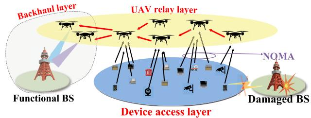  
Fig. 1. System model.

In the device access layer, ground devices are modeled as a PPP. All active devices transmit with equal power over the same time–frequency resource and employ non-orthogonal multiple access (NOMA) on Band 1 to communicate with their serving UAV. Consistent with prior emergency communications studies that assume UAVs hover at a fixed altitude [9], [14], [15], and in view of commercial platforms’ longduration hovering capabilities [16], [17] and real deployments (e.g., AT&T’s Flying COW after Hurricane Maria) [18], we likewise assume hovering UAVs at a fixed altitude provide access service.

In the UAV relay layer, signals traverse multiple relay UAVs using the decode-and-forward (DF) protocol and form a hierarchical multihop topology that connects, layer by layer, to the backhaul UAV. To suppress intra-layer interference in the UAV relay layer, we assign orthogonal frequency-hopping sequences to diferent clusters to eliminate inter-cluster interference and employ carrier-sense multiple access with collision avoidance (CSMA/CA) to reduce intracluster collisions. These mechanisms require high-precision time synchronization among UAVs. Flight tests of lightweight GNSS-disciplined oscillators (GNSSDOs) indicate that airborne platforms can provide a stable timing reference with a 1-pulse-per-second (1-PPS) relative timing error within 1 ns [19], while UWB-based two-way time transfer enables nanosecond-level synchronization for short-range multi-UAV cooperation [20]. Together, these techniques ensure tight inter-UAV synchronization, supporting interference avoidance and timing coordination in the relay layer. Additionally, relay UAVs operate at a common altitude and carry three antennas: one to receive ground-device signals on Band 1, and two to transmit and receive inter-UAV links on Band 2.

In the backhaul layer, the backhaul UAV and the BS employ phased-array antennas to form multiple beams and support SDMA on Band 3, forwarding the aggregated signals to the BS. However, air disturbances acting on UAVs and platform jitter at the BSs induce beam misalignment at the transmit and receive arrays—manifesting as UAV-side independent jitter and BS-side common jitter—which degrades the backhaul link capacity. We model these non-idealities and quantify their impact in the backhaul layer capacity analysis.

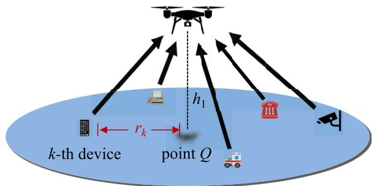  
Fig. 2. Distance from the k-th nearest device to the UAV’s ground projection.

## III. SYSTEM CAPACITY ANALYSIS

## A. Device Access Layer Capacity Analysis

1) Distance Distribution From Device to the UAV’s Projection: We assume the ground devices follow a PPP with density $\lambda _ { 1 }$ . Consider a UAV vertically above point $Q = ( 0 , 0 )$ Let $r _ { k }$ be the distance from Q to the k-th nearest device. The probability density function (PDF) of $r _ { k }$ is

$$
f _ { r _ { k } } ( r ) = \frac { 2 ( \pi \lambda _ { 1 } ) ^ { k } } { ( k - 1 ) ! } r ^ { 2 k - 1 } e ^ { - \pi \lambda _ { 1 } r ^ { 2 } } , \quad r \ge 0 .\tag{1}
$$

This follows from the order statistics of a PPP; specifically, the cumulative distribution function (CDF) corresponds to the probability that the number of devices within a disk of radius r centered at $Q$ is at least $k .$

2) Signal-to-Interference-Plus-Noise Ratio Analysis: Let $\mathcal { N } _ { U _ { i } }$ denote the set of devices that can communicate with UAV $U _ { i }$ . For an arbitrary device $y \in \mathcal { N } _ { U _ { i } }$ at position y and transmit power $P _ { d } ,$ the received power at $U _ { i }$ is

$$
S _ { y } = P _ { d } H _ { y } ( | | \mathbf { y } | | ^ { 2 } + h _ { 1 } ^ { 2 } ) ^ { - \alpha _ { a } / 2 } ,\tag{2}
$$

where $H _ { y } \sim \exp ( H _ { a } )$ models Rayleigh fading, $\alpha _ { a }$ is the pathloss exponent of the access link, and $h _ { 1 }$ is the UAV altitude.

Compared to small-scale multipath fading, large-scale path loss has a more stable and dominant efect. As such, the Signal-to-Interference-plus-Noise Ratio (SINR) is higher the closer the device is to the UAV [21]. Thus, we sort devices by their horizontal distance to Q. For the k-th nearest device $y _ { k } ,$ the SINR is $S _ { k } / ( I _ { k } + B _ { 1 } N _ { 0 } )$ where $B _ { 1 }$ is the bandwidth of Band 1, $N _ { 0 }$ is the noise power spectral density (PSD), and $I _ { k }$ is the aggregate interference from all other devices. Interference can be split into inner-ring (indices $< \ k )$ and outer-ring (indices $> k )$ <. With perfect successive interference cancellation (SIC) [22], the residual interference for the k-th device comes only from users with ranks greater than $k ,$ i.e., $\begin{array} { r } { I _ { k } ^ { \mathrm { ( p ) } } = \sum _ { j > k } S _ { j } } \end{array}$ . Hence the SINR $\gamma$ can be written as

$$
\gamma _ { k } ^ { \mathrm { ( p ) } } = \frac { S _ { k } } { \sum _ { j > k } S _ { j } + B _ { 1 } N _ { 0 } } .\tag{3}
$$

However, SIC may fail. In the worst case where all inner-ring users are not canceled, the interference includes all devices except the k-th one, i.e., $\begin{array} { r } { I _ { k } ^ { \mathrm { ( w ) } } = \sum _ { j \neq k } S _ { j } , } \end{array}$ , and

$$
\gamma _ { k } ^ { \mathrm { ( w ) } } = \frac { S _ { k } } { \sum _ { j \neq k } S _ { j } + B _ { 1 } N _ { 0 } } .\tag{4}
$$

In a general imperfect case, where some inner-ring users are canceled and some are not, let $b _ { j } \in \{ 0 , 1 \}$ be the SIC indicator for the j-th inner user $( b _ { j } = 1$ , means successful cancellation). The SINR becomes

$$
\gamma _ { k } ^ { ( \mathrm { i m } ) , \{ b \} } = \frac { S _ { k } } { \sum _ { j < k } ( 1 - b _ { j } ) S _ { j } + \sum _ { j > k } S _ { j } + B _ { 1 } N _ { 0 } } .\tag{5}
$$

where the imperfect interference term is given by $I _ { k } ^ { ( \mathrm { i m } ) , \{ b \} } =$ $\textstyle \sum _ { j < k } ( 1 - b _ { j } ) S _ { j } + \sum _ { j > k } S _ { j }$ . The Laplace transforms of $\hat { I } _ { k } ^ { \mathrm { ( p ) } } , I _ { k } ^ { \mathrm { ( w ) } }$ and $I _ { k } ^ { ( \mathrm { i m } ) , \{ b \} }$ are given as (6), (7), (8), as shown at the bottom of the page, where $\beta = H _ { a } P _ { d } > 0 , _ { 2 } F _ { 1 } ( \cdot )$ denotes the Gauss hypergeometric function, $L _ { k } ^ { \mathrm { o u t } } ( s )$ is the outer-interference Laplace transform, and $L _ { k , \{ b \} } ^ { \mathrm { i n } } ( s )$ is the inner term, $L _ { k , \{ 0 \} } ^ { \mathrm { i n } } ( s )$ denotes the , ,inner-ring term when all inner users remain (no cancellation). The inner-ring averaging factor $\mathcal { T } ( r _ { k } ; s )$ is:

$$
\begin{array} { c } { { \mathcal { J } ( r _ { k } ; s ) = \displaystyle \frac { 1 } { r _ { k } ^ { 2 } } \bigg [ ( r _ { k } ^ { 2 } + h _ { 1 } ^ { 2 } ) _ { 2 } F _ { 1 } \bigg ( 1 , \frac 2 { \alpha _ { a } } ; 1 + \frac 2 { \alpha _ { a } } ; - \frac { ( r _ { k } ^ { 2 } + h _ { 1 } ^ { 2 } ) ^ { \alpha _ { a } / 2 } } { s \beta } \bigg ) } } \\ { { - h _ { 1 2 } ^ { 2 } F _ { 1 } \bigg ( 1 , \frac 2 { \alpha _ { a } } ; 1 + \frac 2 { \alpha _ { a } } ; - \frac { h _ { 1 } ^ { \alpha _ { a } } } { s \beta } \bigg ) + r _ { k } ^ { 2 } \bigg ] . } } \end{array}\tag{9}
$$

Proof: See Appendix.

3) Coverage Probability and Ergodic Capacity Analysis: A device is covered if its SINR exceeds the threshold . By applying the “Laplace trick” under Rayleigh fading $( H \sim$ exp( $H _ { a } ) )$ and denoting $s ( r ) = \tau { P _ { d } } ^ { - 1 } ( r ^ { 2 } + \stackrel { . . } { h _ { 1 } ^ { 2 } } ) ^ { { \bar { \alpha } _ { a } } / 2 }$ , the coverage probability of the k-th device is evaluated as:

$$
P _ { k , U _ { i } } ^ { ( * ) } ( \tau ) = \mathbb { E } _ { r _ { k } } \Big [ \mathrm { P r } \left( \gamma _ { k } ^ { ( * ) } > \tau \big | r _ { k } = r \right) \Big ]
$$

$$
L _ { I _ { k } ^ { ( 0 ) } } ( s ) = L _ { k } ^ { \mathrm { o u t } } ( s ) = \exp \left( - \pi \lambda _ { 1 } ( s \beta ) ^ { \frac { 2 } { \alpha _ { \alpha } } } \left[ \frac { 2 \pi } { \alpha _ { \alpha } } \csc \left( \frac { 2 \pi } { \alpha _ { \alpha } } \right) - \frac { r _ { k } ^ { 2 } + h _ { 1 } ^ { 2 } } { ( s \beta ) ^ { \frac { 2 } { \alpha _ { \alpha } } } } F _ { 1 } \left( 1 , \frac { 2 } { \alpha _ { \alpha } } ; 1 + \frac { 2 } { \alpha _ { \alpha } } ; - \frac { ( r _ { k } ^ { 2 } + h _ { 1 } ^ { 2 } ) ^ { \alpha _ { \alpha } / 2 } } { s \beta } \right) \right] \right) ,\tag{6}
$$

$$
L _ { I _ { k } ^ { \mathrm { ( s ) } } } ( s ) = L _ { k } ^ { \mathrm { o u t } } ( s ) L _ { k ; \{ 0 \} } ^ { \mathrm { i n } } ( s ) = \exp \Biggl \{ - \pi \lambda _ { 1 } ( s \beta ) ^ { 2 / \alpha _ { \alpha } }  \frac { \left[ 2 \pi \right]} { \alpha _ { \alpha } } \csc \left( { \frac { 2 \pi } { \alpha _ { \alpha } } } \right) - { \frac { h _ { 1 } ^ { 2 } } { ( s \beta ) ^ { 2 / \alpha _ { \alpha } } } } _ { 2 } F _ { 1 } \left( 1 , { \frac { 2 } { \alpha _ { \alpha } } } ; 1 + { \frac { 2 } { \alpha _ { \alpha } } } ; - { \frac { h _ { 1 } ^ { \alpha _ { \alpha } } } { s \beta } } \right)  \Biggr \} ,\tag{7}
$$

$$
L _ { I _ { k } ^ { ( \mathrm { i m } ) , \{ b \} } } ( s ) = L _ { k } ^ { \mathrm { o u t } } ( s ) L _ { k , \{ b \} } ^ { \mathrm { i n } } ( s ) = L _ { I _ { k } ^ { ( \mathrm { p } ) } } ( s ) \cdot \prod _ { j = 1 } ^ { k - 1 } \Bigl [ b _ { j } + ( 1 - b _ { j } ) \mathcal { I } ( r _ { k } ; s ) \Bigr ] ,\tag{8}
$$

$$
\begin{array} { l } { \displaystyle = \int _ { 0 } ^ { \infty } \operatorname* { P r } \Big ( H _ { k } > \tau P _ { d } ^ { - 1 } ( r ^ { 2 } + h _ { 1 } ^ { 2 } ) ^ { \alpha _ { a } / 2 } } \\ { \displaystyle \qquad \times ( I _ { k } ^ { ( * ) } + B _ { 1 } N _ { 0 } ) \Big ) f _ { r _ { k } } ( r ) \mathrm { d } r } \\ { \displaystyle = \int _ { 0 } ^ { \infty } L _ { k } ^ { \mathrm { o u t } } \big ( s ( r ) \big ) L _ { k , \{ b \} } ^ { \mathrm { i n } } \big ( s ( r ) \big ) } \\ { \displaystyle \qquad \times \exp \big ( - s ( r ) B _ { 1 } N _ { 0 } \big ) f _ { r _ { k } } ( r ) \mathrm { d } r . } \end{array}\tag{10}
$$

where $( * ) \in \{ \mathfrak { p } , \mathfrak { w } ,$ im} indicates the SIC case. In the case of perfect SIC, define

$$
\Xi ( \tau , \alpha _ { a } ) = \tau ^ { \frac { 2 } { \alpha _ { a } } } \frac { 2 \pi } { \alpha _ { a } } \csc \left( \frac { 2 \pi } { \alpha _ { a } } \right) - { } _ { 2 } F _ { 1 } \left( 1 , \frac { 2 } { \alpha _ { a } } ; 1 + \frac { 2 } { \alpha _ { a } } ; - \frac { 1 } { \tau } \right) .\tag{11}
$$

Using $L _ { I _ { k } ^ { \mathrm { ( p ) } } } ( s )$ and $f _ { r _ { k } } ( r )$ , we obtain

$$
P _ { k , U _ { i } } ^ { ( \mathrm { p } ) } ( \tau ) = \int _ { 0 } ^ { \infty } \mathrm { e x p } \big ( - \pi \lambda _ { 1 } \Xi ( \tau , \alpha _ { a } ) ( r ^ { 2 } + h _ { 1 } ^ { 2 } ) \big )
$$

$$
\times e ^ { - s ( r ) B _ { 1 } N _ { 0 } } \frac { 2 ( \pi \lambda _ { 1 } ) ^ { k } } { ( k - 1 ) ! } r ^ { 2 k - 1 } e ^ { - \pi \lambda _ { 1 } r ^ { 2 } } \mathrm { d } r .\tag{12}
$$

In the interference-limited regime $( B _ { 1 } N _ { 0 } \to 0 )$ , we have the closed form

$$
P _ { k , U _ { i } } ^ { \mathrm { ( p ) } } ( \tau ) = \exp \bigl ( - \pi \lambda _ { 1 } \Xi ( \tau , \alpha _ { a } ) h _ { 1 } ^ { 2 } \bigr ) \left( \frac { 1 } { 1 + \Xi ( \tau , \alpha _ { a } ) } \right) ^ { k } .\tag{13}
$$

In the worst situation, using $L _ { I _ { k } ^ { \mathrm { ( w ) } } } ( s )$

$$
P _ { k , U _ { i } } ^ { \mathrm { ( w ) } } \left( \tau \right) = \int _ { 0 } ^ { \infty } L _ { I _ { k } ^ { \mathrm { ( w ) } } } ( s ) e ^ { - \tau \beta ^ { - 1 } \left( r ^ { 2 } + h _ { 1 } ^ { 2 } \right) ^ { \frac { \alpha _ { a } } { 2 } } B _ { 1 } N _ { 0 } } f _ { r _ { k } } \left( r \right) \mathrm { d } r .\tag{14}
$$

In the imperfect situation, for the given {b}, we obtain:

$$
\begin{array} { r l r } {  { P _ { k , U _ { i } } ^ { ( \mathrm { i m } ) , \{ b \} } ( \tau ) = \int _ { 0 } ^ { \infty } \exp \bigl ( - \pi \lambda _ { 1 } \Xi ( \tau , \alpha _ { a } ) ( r ^ { 2 } + h _ { 1 } ^ { 2 } ) \bigr ) } } \\ & { } & { \times \prod _ { j = 1 } ^ { k - 1 } \Bigl [ b _ { j } + ( 1 - b _ { j } ) \mathcal { I } \bigl ( r _ { k } ; s ( r ) \bigr ) \Bigr ] } \\ & { } & { \times e ^ { - s ( r ) B _ { 1 } N _ { 0 } } f _ { r _ { k } } ( r ) \mathrm { d } r . } \end{array}\tag{15}
$$

Thus, the ergodic capacity of the k-th device in $U _ { i }$ is

$$
\bar { R } _ { k , U _ { i } } ^ { ( * ) } = B _ { 1 } \mathbb { E } \Big [ \log _ { 2 } \big ( 1 + \gamma _ { k } ^ { ( * ) } \big ) \Big ] = B _ { 1 } \int _ { 0 } ^ { \infty } P _ { k , U _ { i } } ^ { ( * ) } \big ( 2 ^ { t } - 1 \big ) \mathrm { d } t .\tag{16}
$$

Assuming the main reception region of a UAV is a cone with angle $\theta _ { 0 }$ , the ground projection radius is

$$
r _ { U _ { i } } = \left\{ \begin{array} { l l } { h _ { 1 } \tan \theta _ { 0 } , } & { h _ { 1 } < r _ { 0 } \cos \theta _ { 0 } , } \\ { \sqrt { r _ { 0 } ^ { 2 } - h _ { 1 } ^ { 2 } } , } & { h _ { 1 } \ge r _ { 0 } \cos \theta _ { 0 } , } \\ { 0 , } & { \mathrm { o t h e r w i s e } , } \end{array} \right.\tag{17}
$$

where $r _ { 0 }$ is the UAV coverage radius. The number of covered devices is $\left| \mathcal { N } _ { U _ { i } } \right| = \lambda _ { 1 } \pi r _ { U _ { i } } ^ { 2 }$ . If at most z signals are processed simultaneously, the access-layer capacity of UAV $U _ { i }$ is

$$
R _ { U _ { i } } ^ { \mathrm { a c c e s s } } = \frac { \operatorname* { m i n } \{ \left| \mathcal { N } _ { U _ { i } } \right| , z \} } { \left| \mathcal { N } _ { U _ { i } } \right| } \sum _ { k = 1 } ^ { \left| \mathcal { N } _ { U _ { i } } \right| } \bar { R } _ { k , U _ { i } } ^ { ( * ) } ,\tag{18}
$$

and the total device access-layer capacity is

$$
R ^ { \mathrm { a c c e s s } } = \sum _ { U _ { i } \in \mathcal { U } } R _ { U _ { i } } ^ { \mathrm { a c c e s s } } .\tag{19}
$$

## B. UAV Relay Layer Capacity Analysis and Optimization

This section formulates an end-to-end throughput model for multihop flows in an OFDM relay-layer scheduling framework, where a time–frequency occupancy factor x specifies each flow’s scheduling share over links and subchannels. We then optimize x under a throughput objective and the associated system constraints to obtain the relay-layer resource allocation policy. UAV placement is not optimized in this section. In typical emergency deployments, flight trajectories and hovering locations are determined during mission planning to satisfy airspace/safety regulations (e.g., no-fly zones and controlled airspace) and coverage requirements; radio resource scheduling is executed online once the UAVs reach these predetermined locations. Incorporating placement or trajectory optimization would require a joint treatment of mobility, routing, and radio resource allocation, leading to a significantly more coupled and computationally demanding problem that is beyond the scope of this work. Accordingly, the analysis here focuses on relay-layer throughput optimization from the time–frequency resource allocation perspective.

1) End-to-End Throughput of the UAV Relay Layer: After receiving and aggregating ground-device signals, each UAV relays the aggregated trafic to a BS, forming multihop flows in the UAV relay layer. Denote an information flow by $I _ { U } ,$ indicating that the flow originates from UAV U. In the orthogonal frequency division multiplexing (OFDM) relay layer, consider transmitting flow $I _ { U }$ over link l on subchannel f . Flow $I _ { U }$ occupies a fraction of the time resource on that subchannel. Define the time–frequency resource occupancy factor $x _ { I _ { U } , l , f } \in [ 0 , 1 ]$ as the normalized time share of $I _ { U }$ on link l and subchannel f . Let I, L, U, and $\mathcal { F }$ be the sets of flows, links, UAVs, and subchannels, respectively. For link l, denote by $\mathcal { F } _ { l } \subseteq \mathcal { F }$ the set of usable subchannels, with $| \mathcal { F } _ { l } | = J$ when the UAV carries J relay-layer antennas. Under OFDM, subchannels are orthogonal. The per-link rate on l using $f \in \mathcal { F } _ { l }$ is

$$
C _ { l , f } = B _ { f } \log _ { 2 } \left( 1 + \frac { P _ { \mathrm { U A V } } H _ { r } d ^ { - \alpha _ { r } } } { B _ { f } N _ { 0 } } \right) ,\tag{20}
$$

where $H _ { r }$ is the small-scale fading power gain with an exponential distribution, $\alpha _ { r }$ is the path-loss exponent, $d$ is the link distance, $B _ { f }$ αis the bandwidth of subchannel $f ,$ and $N _ { 0 }$ is the noise spectral density. Besides, assume a per-hop data-loss ratio $E \in [ 0 , 1 )$ . Let $Z _ { I _ { U } , l }$ denote the hop count of flow $I _ { U }$ when traversing link l according to the given topology. Then the rate allocated to flow $I _ { U }$ on link l is

$$
\sum _ { f \in \mathcal { F } _ { l } } x _ { I _ { U } , l , f } C _ { l , f } \big ( 1 - E \big ) ^ { Z _ { I _ { U } , l } } .\tag{21}
$$

The end-to-end throughput of $I _ { U }$ is the minimum rate over its route:

$$
R _ { I _ { U } } = \operatorname* { m i n } \left\{ \sum _ { f \in \mathcal { F } _ { l } } x _ { I _ { U } , l , f } C _ { l , f } \big ( 1 - E \big ) ^ { Z _ { I _ { U } , l } } \Bigg | l \in \mathcal { L } ^ { I _ { U } } \right\} ,\tag{22}
$$

where $\mathcal { L } ^ { I _ { U } }$ is the ordered set of links used by flow $I _ { U }$

2) Problem Formulation and Solution: Transmission in the UAV relay layer is constrained by antenna availability, flowbalance (equal-rate) requirements along each multihop path, and minimum-rate demands. Let the relay-layer throughput be the sum over flows, i.e.,

$$
R ^ { \mathrm { r e l a y } } = \sum _ { I _ { U } \in \mathcal { T } } R _ { I _ { U } } .\tag{23}
$$

Then, we maximize $R ^ { \mathrm { r e l a y } }$ over $\{ x _ { I _ { U } , l , f } \}$ subject to the following constraints.

Antenna constraint: Each UAV U has J relay-layer antennas and can simultaneously transmit/receive on at most J links:

$$
\sum _ { I _ { U } \in \mathcal { T } } \sum _ { l \in \mathcal { L } ^ { U } } \sum _ { f \in \mathcal { F } _ { l } } x _ { I _ { U } , l , f } \le J , \quad \forall U \in \mathcal { U } ,\tag{24}
$$

where $\mathcal { L } ^ { U }$ is the set of links incident to $U .$

Energy constraint: Given the energy consumption during hovering, each UAV U can hover only for a limited time. Therefore, the time available to occupy the corresponding links is constrained by the remaining battery energy of the UAV. Let $x _ { U } ^ { \mathrm { r e m a i n } }$ denote the remaining normalized hovering time of UAV U. The energy constraint is given by:

$$
\sum _ { l \in \mathcal { L } ^ { U } } \sum _ { f \in \mathcal { F } _ { l } } x _ { I _ { U } , l , f } \le x _ { U } ^ { \mathrm { r e m a i n } } , \quad \forall U \in \mathcal { U } .\tag{25}
$$

Flow-balance (equal-rate) constraint: For each flow $I _ { U }$ , the allocated rate must be equal on every hop along its own path:

$$
\begin{array} { r l r } {  { \sum _ { f \in \mathcal { F } _ { l } } x _ { I _ { U } , l , f } C _ { l , f } \big ( 1 - E \big ) ^ { Z _ { I _ { U } , l } } } } \\ & { } & { = \sum _ { f \in \mathcal { F } _ { l ^ { \prime } } } x _ { I _ { U } , l ^ { \prime } , f } C _ { l ^ { \prime } , f } ( 1 - E ) ^ { Z _ { I _ { U } , l ^ { \prime } } } , } \\ & { } & { \forall l , l ^ { \prime } \in \mathcal { L } ^ { I _ { U } } , \quad \forall I _ { U } \in \mathcal { T } . } \end{array}\tag{26}
$$

Minimum-rate constraint:

$$
\sum _ { f \in \mathcal { F } _ { l } } x _ { I _ { U } , l , f } C _ { l , f } \big ( 1 - E \big ) ^ { Z _ { I _ { U } , l } } \geq R _ { \mathrm { t h } } , \quad \forall l \in \mathcal { L } ^ { I _ { U } } , \quad \forall I _ { U } \in \mathcal { T } .\tag{27}
$$

Normalization:

$$
x _ { I _ { U } , l , f } \in [ 0 , 1 ] , \quad \forall I _ { U } \in \mathcal { T } , \forall l \in \mathcal { L } , \quad \forall f \in \mathcal { F } .\tag{28}
$$

Taking the relay-layer sum throughput $R ^ { \mathrm { r e l a y } }$ as the objective and using the normalized resource occupancy $x _ { I _ { U } , l , f }$ as the decision variables, the relay-layer cluster throughput maximization problem is

$$
\begin{array} { r l } { { \bf P } _ { 1 } : } & { \underset { { \bf x } } { \operatorname* { m a x } } R ^ { \mathrm { r e l a y } } } \\ & { \mathrm { s . t . } \quad ( 2 4 ) , ( 2 5 ) , ( 2 6 ) , ( 2 7 ) , ( 2 8 ) . } \end{array}\tag{29}
$$

The objective aggregates the end-to-end throughputs of all flows. We refer to the resulting resource allocation policy as the Throughput-Maximization (THM) scheme. Since total resources are limited, THM naturally prioritizes flows that yield larger marginal gains in sum throughput. Flows with more hops consume resources on multiple links to deliver the same data and thus contribute less to the objective per unit of resource. This bias leads to unbalanced allocations under throughput maximization.

To mitigate this bias, we adopt a fairness-aware objective. Let $A _ { I _ { U } }$ denote the demand of flow $I _ { U }$ and $R _ { I _ { U } }$ its allocated end-to-end throughput. Define a satisfaction function S (·) with argument $R _ { I _ { U } } / A _ { I _ { U } }$ , and require $S ^ { \prime } ( x ) ~ > ~ 0$ and $S ^ { \prime \prime } ( x ) ~ < ~ 0$ (strictly increasing with diminishing returns). Maximizing $\textstyle \sum _ { I _ { U } \in { \mathcal { T } } } S \left( R _ { I _ { U } } / A _ { I _ { U } } \right)$ drives these ratios toward parity across flows, compensating for the extra resource usage of longhop routes and yielding a more balanced allocation under limited resources. A concrete choice is $S ( x ) = - e ^ { - a _ { 1 } x }$ with $a _ { 1 } > 0$ controlling the fairness–eficiency trade-of. Thus, the Satisfaction-Maximization (SFM) problem is

$$
\begin{array} { r l r } {  { \mathbf { P } _ { 2 } : \operatorname* { m a x } _ { \mathbf { x } } \sum _ { I _ { U } \in \mathcal { Z } } S ( \frac { 1 } { A _ { I _ { U } } } \operatorname* { m i n } _ { l \in \mathcal { L } ^ { I _ { U } } } \{ \sum _ { f \in \mathcal { F } _ { l } } x _ { I _ { U } , l , f } C _ { l , f }   } \\ & { } & {   \times ( 1 - E ) ^ { Z _ { I _ { U } , l } } \} ) } } \\ & { } & { \mathrm { s . t . } \quad ( 2 4 ) , ( 2 5 ) , ( 2 6 ) , ( 2 7 ) , ( 2 8 ) . } \end{array}\tag{30}
$$

When $S \left( x \right)$ is linear, SFM reduces to THM.

Using the equal-rate constraint (26), $R ^ { \mathrm { r e l a y } }$ can be equivalently written as the sum of per-flow rates on the last hop to the backhaul UAV (i.e., over links incident to the backhaul)

$$
R ^ { \mathrm { r e l a y } } = \sum _ { I _ { U } \in \mathcal { Z } } \sum _ { l \in \mathcal { L } ^ { \mathrm { l a s t } } } \sum _ { f \in \mathcal { F } _ { l } } x _ { I _ { U } , l , f } C _ { l , f } \big ( 1 - E \big ) ^ { Z _ { I _ { U } , l } } ,\tag{31}
$$

where ${ \mathcal { L } } ^ { \mathrm { l a s t } } \subseteq { \mathcal { L } }$ collects links incident to the backhaul UAV. With known topology, hop counts $Z _ { I _ { U } , l } ,$ and path indicators, ${ \bf P } _ { 1 }$ ,can be cast as a linear program by introducing standard slack/epigraph variables. Because the feasible set is nonempty and bounded, an optimum $R _ { \mathrm { T H M } } ^ { \mathrm { r e l a y } }$ exists.

Let $I = | \mathcal { I } |$ be the number of flows, $L = | \mathcal { L } |$ the number of links, $\bar { F }$ the average number of subchannels per link, and H¯ the average hop count per flow. The number of decision variables is $\begin{array} { r } { \dot { \sum _ { i } \sum _ { l \in \mathcal { L } ^ { i } } | \mathcal { F } _ { l } | } \~ \approx ~ I \bar { H } \bar { F } } \end{array}$ . Using epigraph variables ri to linearize the per-flow minimum, the total number of variables is $\begin{array} { r } { n _ { \mathrm { v a r } } \approx \sum _ { i } \sum _ { l \in \mathcal { L } ^ { i } } | \mathcal { F } _ { l } | \approx I \bar { H } \bar { F } + I = \Theta ( I \bar { H } \bar { F } ) } \end{array}$ . The number of linear constraints is $n _ { \mathrm { c o n } } \approx L \bar { F } + 2 \vert \mathcal { U } \vert + I \bar { H }$ (plus optional per-hop minimum-rate constraints).

For ${ \bf P } _ { 1 }$ (THM), the problem is a linear program. A primal–dual interior-point method requires $\mathcal { O } ( \sqrt { n _ { \mathrm { c o n } } } \log ( 1 / \varepsilon ) )$ iterations, each dominated by solving a Karush-Kuhn-Tucker (KKT) system of size $n _ { \mathrm { v a r } } .$ , leading to a dense worst-case time complexity $\mathcal { O } \big ( n _ { \mathrm { v a r } } ^ { 3 } \sqrt { n _ { \mathrm { c o n } } } \log ( 1 / \varepsilon ) \big )$ = $\mathcal { O } \big ( ( I \bar { H } \bar { F } ) ^ { 3 } \sqrt { L \bar { F } + 2 | \mathcal { U } | + I \bar { H } } \log ( 1 / \varepsilon ) \big )$ and memory $\mathcal { O } ( n _ { \mathrm { v a r } } ^ { 2 } )$

For ${ \bf P } _ { 2 } ~ ( \mathrm { S F M } )$ , the objective is a separable concave utility composed with the pointwise minimum of afine functions; with the same epigraph reformulation, the feasible set remains convex and the KKT system has the same size. Hence, ${ \bf P } _ { 2 }$ enjoys the same order of worst-case complexity as $\mathbf { P } _ { 1 } ;$ only constant factors difer due to the evaluation of $S ^ { \prime } ( \cdot )$ and $S ^ { \prime \prime } ( \cdot )$ at each iteration. In practice, the constraint matrix is blocksparse (each flow only couples variables on its own path), so sparse Cholesky reduces the per-iteration cost well below the dense bound; nevertheless, we report the conservative $\mathcal { O } ( n _ { \mathrm { v a r } } ^ { 3 } \sqrt { n _ { \mathrm { c o n } } } \log ( 1 / \varepsilon ) )$ bound for completeness.

## C. Backhaul Layer Capacity Analysis

Phased arrays can be mounted on both BSs and backhaul UAVs [23], producing highly directional, potentially nonorthogonal beams. We assume all UAVs share the same transmit beam pattern $\phi ( G _ { \mathrm { M L } } ^ { \mathrm { t } } , G _ { \mathrm { S L } } ^ { \mathrm { t } } , \theta )$ , where $G _ { \mathrm { M L } } ^ { \mathrm { t } }$ denotes the main-lobe gain, $G _ { \mathrm { S I } } ^ { \mathrm { t } }$ φ , , θthe side-lobe gain, and  the mainlobe beamwidth. The receive pattern at the BS is modeled analogously as $\phi ( G _ { \mathrm { M L } } ^ { \mathrm { r } } , G _ { \mathrm { S L } } ^ { \mathrm { r } } , \theta )$

In the paper, we consider the single-BS system. Let the set of backhaul UAVs be denoted by $B ,$ and consider any two UAVs $U _ { i } ^ { b } , U _ { j } ^ { b } \ \in \ B$ . Since the backhaul layer operates over the entire Band 3 spectrum, the inter-UAV interference cannot be ignored. In the backhaul uplink to BS M, the transmit beam of $U _ { i } ^ { b }$ aimed at M may partially overlap—at M—with the BS receive beam that is currently steered to $U _ { j } ^ { b }$ . This spatial overlap injects $U _ { i } ^ { b } { } ^ { \mathrm { { s } } }$ signal into the receive chain for $U _ { j } ^ { b }$ at M, thereby acting as cochannel interference to $U _ { j } ^ { b } \colon$ backhaul link. The magnitude of this interference depends on their relative pointing directions. Denote the ideal angular separation between the main lobes of the transmitting UAV $U _ { i } ^ { b }$ and the receiving UAV $U _ { j } ^ { b }$ as $\alpha _ { i , j } .$ . In practical systems, airflow disturbances, platform micro-vibrations, and limitedrate tracking introduce zero-mean pointing errors. We model a receiver-side common error $\delta ^ { \mathrm { r } }$ with variance $\sigma _ { r } ^ { 2 }$ that is shared by all backhaul links terminating at BS $M ,$ and transmitterside errors $\delta _ { i } ^ { \mathrm { t } }$ that are i.i.d. across UAVs with zero mean and common variance $\sigma _ { t } ^ { 2 }$ . The composite misalignment for link $( U _ { i } ^ { b } , M )$ is $\delta _ { i } = \delta ^ { \mathrm { r } } + \delta _ { i } ^ { \mathrm { t } }$ . Assuming independence between $\delta ^ { \mathrm { r } }$ and $\delta _ { i } ^ { \mathrm { t } } ,$ the total variance is $\mathrm { V a r } ( \bar { \delta _ { i } } ) = \bar { \sigma _ { r } ^ { 2 } } + \sigma _ { t } ^ { 2 }$ , denoted $\sigma _ { \mathrm { t r } } ^ { 2 } .$ Therefore, the actual angular overlap between the main lobe of the interference link’s transmit antenna and the receiving = max $\left\{ 0 , \theta - \alpha _ { i , j } - | \delta _ { i } | \right\}$ . Then, the interference gain from $\dot { U } _ { i } ^ { b }$ to $U _ { j } ^ { b }$ can be expressed as:

$$
G _ { i , j } ^ { I } = G _ { \mathrm { S L } } ^ { \mathrm { t } } G _ { \mathrm { M L } } ^ { \mathrm { r } } + \frac { \theta _ { i , j } ^ { \mathrm { o v e r } } ( G _ { \mathrm { M L } } ^ { \mathrm { t } } - G _ { \mathrm { S L } } ^ { \mathrm { t } } ) G _ { \mathrm { M L } } ^ { \mathrm { r } } } { \theta } ,\tag{32}
$$

and its expectation is:

$$
\mathbb { E } \left[ G _ { i , j } ^ { I } \right] = G _ { \mathrm { S L } } ^ { t } G _ { \mathrm { M L } } ^ { \mathrm { r } } + \mathbb { E } \left[ \theta _ { i , j } ^ { \mathrm { o v e r } } \right] \left( G _ { \mathrm { M L } } ^ { \mathrm { t } } - G _ { \mathrm { S L } } ^ { \mathrm { t } } \right) G _ { \mathrm { M L } } ^ { \mathrm { r } } \Big / { \theta } ,\tag{33}
$$

where

$$
\begin{array} { l } { { \displaystyle \mathbb { E } \left[ \theta _ { i , j } ^ { \mathrm { o v e r } } \right] = \left( \theta - \alpha _ { i , j } \right) \mathrm { e r f } \left( \frac { \theta - \alpha _ { i , j } } { \sqrt { 2 } \sigma _ { \mathrm { t r } } } \right) } } \\ { { \displaystyle \qquad - \frac { 2 \sigma _ { \mathrm { t r } } } { \sqrt { 2 \pi } } \left( 1 - e ^ { \frac { - \left( \theta - \alpha _ { i , j } \right) ^ { 2 } } { 2 \sigma _ { \mathrm { t r } } ^ { 2 } } } \right) . } } \end{array}\tag{34}
$$

For the source link between the backhaul UAV $U _ { i } ^ { b }$ and BS M, the same zero-mean pointing errors at both transmitter and receiver are considered. In this case, the actual angular overlap between the main lobe of the source link’s transmit antenna and the receiving antenna is $\theta _ { i } ^ { \mathrm { o v e r } } = \operatorname* { m a x } \left\{ 0 , \theta - \left. \delta _ { i } \right. \right\}$ The directional gain of the source link can then be expressed as:

$$
G _ { i } ^ { S } = G _ { \mathrm { S L } } ^ { t } G _ { \mathrm { M L } } ^ { \mathrm { r } } + \theta _ { i } ^ { \mathrm { o v e r } } \left( G _ { \mathrm { M L } } ^ { \mathrm { t } } - G _ { \mathrm { S L } } ^ { \mathrm { t } } \right) G _ { \mathrm { M L } } ^ { \mathrm { r } } \big / \theta .\tag{35}
$$

Thus, the instantaneous link capacity between UAV $U _ { i } ^ { b }$ and BS M can be expressed as:

$$
R _ { i } ^ { b } = B _ { 3 } \log _ { 2 } \left( 1 + { \frac { S _ { i } } { I _ { i } + B _ { 3 } N _ { 0 } } } \right)
$$

$$
= B _ { 3 } \log _ { 2 } \left( 1 + \frac { P _ { \mathrm { U A V } } H _ { b } G _ { i } ^ { S } d _ { i } ^ { - \alpha _ { b } } } { \underset { j \neq i } { \sum } P _ { \mathrm { U A V } } H _ { b } G _ { j , i } ^ { I } ( \theta _ { j , i } ^ { \mathrm { o v e r } } ) d _ { j } ^ { - \alpha _ { b } } + B _ { 3 } N _ { 0 } } \right) ,\tag{36}
$$

where $H _ { b }$ is channel coeficient with exponential distribution, d is the distance between the UAV and BS, and $\alpha _ { b }$ is the pathloss exponent. Combining the zero-mean Gaussian distribution of the pointing error, the ergodic capacity can be expressed as:

$$
\bar { R } _ { i } ^ { b } = \int _ { \delta _ { i } } \int _ { \{ \delta _ { j } \} _ { j \neq i } } R _ { i } ^ { b } f _ { \delta _ { i } } \left( \delta _ { i } \right) \prod _ { j \neq i } f _ { \delta _ { j } } \left( \delta _ { j } \right) \mathrm { d } \delta _ { i } \prod _ { j \neq i } \mathrm { d } \delta _ { j } ,\tag{37}
$$

where $f _ { \delta _ { i } } \left( \delta _ { i } \right) , f _ { \delta _ { j } } \left( \delta _ { j } \right)$ are the PDFs of pointing error. However, computing $R _ { i } ^ { b }$ requires evaluating a high-dimensional integral. For simplicity, we assume the interference links are angularly separated and mutually independent. With many interferers, jitter-induced fluctuations in beam-overlap are small, so we replace each interference link’s directional gain with its mean. Thus, the capacity of the backhaul link layer can be approximated as:

$$
\begin{array} { r l r } {  { \bar { R } _ { i } ^ { b } = \hat { R } _ { i } ^ { b } + \Delta R _ { i } ^ { b } } } \\ & { = \frac { B _ { 3 } } { \sqrt { 2 \pi } \sigma _ { \mathrm { t r } } } \int _ { \hat { \sigma } _ { i } } \log _ { 2 } \Biggl ( 1 + P _ { \mathrm { U A V } } H _ { b } G _ { i } ^ { S } d _ { i } ^ { - \alpha _ { b } } } \\ & { \times ( \displaystyle \sum _ { j \ne i } P _ { \mathrm { U A V } } H _ { b } \mathbb { E } \big [ G _ { j , i } ^ { I } ( \theta _ { j , i } ^ { \mathrm { o v e r } } ) \big ] d _ { j } ^ { - \alpha _ { b } } + B _ { 3 } N _ { 0 } ) ^ { - 1 } \Biggr ) } \\ & { } & { \times \exp ( - \frac { \delta _ { i } ^ { 2 } } { 2 \sigma _ { \mathrm { t r } } ^ { 2 } } ) \mathrm { d } \delta _ { i } + \Delta R _ { i } ^ { b } . } \end{array}\tag{38}
$$

By replacing the random interference directional gain with its mean, one can invoke the convexity of the logarithm with respect to the interference term and Jensen’s inequality to show that the resulting $\hat { R } _ { i } ^ { b }$ is a lower bound of $\bar { R } _ { i } ^ { b }$ . Define the diference $\Delta R _ { i } ^ { b } \ \triangleq \bar { R } _ { i } ^ { b } - \hat { R } _ { i } ^ { b }$ , and note that $\Delta R _ { i } ^ { b }$ still has a high-dimensional structure. A computable upper bound of $\Delta R _ { i } ^ { b }$ can be expressed with:

$$
\begin{array} { r l } & { \Delta R _ { i } ^ { b } } \\ & { \leq \operatorname* { s u p } \Delta R _ { i } ^ { b } } \\ & { = \cfrac { B _ { 3 } } { 2 \ln 2 } \cfrac { S _ { i , \mathrm { m a x } } \big ( 2 \big ( I _ { i , \mathrm { m i n } } + B _ { 3 } N _ { 0 } \big ) + S _ { i , \mathrm { m a x } } \big ) } { \big ( I _ { i , \mathrm { m i n } } + B _ { 3 } N _ { 0 } \big ) ^ { 2 } \big ( I _ { i , \mathrm { m i n } } + B _ { 3 } N _ { 0 } + S _ { i , \mathrm { m a x } } \big ) ^ { 2 } } \operatorname { V a r } ( I _ { i } ) . } \end{array}\tag{39}
$$

Here, ${ \cal I } _ { i , \mathrm { m i n } } ~ = ~ \sum _ { i \neq i } P _ { \mathrm { U A V } } H _ { b } G _ { \mathrm { S L } } ^ { t } G _ { \mathrm { M L } } ^ { r } d _ { j } ^ { - \alpha _ { b } } , S _ { i , \mathrm { m a x } } ~ = ~ P _ { \mathrm { U A V } } H _ { b } G _ { \mathrm { M L } } ^ { t }$ $G _ { \mathrm { M L } } ^ { r } d _ { i } ^ { - \alpha _ { b } }$ , and Var (I ) is the variance of the interference term. Thus, the relationship between $\bar { R } _ { i } ^ { b }$ and $\hat { R } _ { i } ^ { b }$ is

$$
\hat { R } _ { i } ^ { b } \leq \bar { R } _ { i } ^ { b } = \hat { R } _ { i } ^ { b } + { \Delta R } _ { i } ^ { b } \leq \hat { R } _ { i } ^ { b } + \operatorname* { s u p } { \Delta R _ { i } ^ { b } } .\tag{40}
$$

We can safely use $\hat { R } _ { i } ^ { b }$ to approximate the ergodic capacity of the backhaul link, provided that sup $\Delta R _ { i } ^ { b } \ < \varepsilon .$ , which is < εguaranteed within the following ellipsoidal feasible region in the $( \sigma _ { t } , \sigma _ { r } )$ space:

$$
\sigma _ { t } ^ { 2 } \sum _ { j \neq i } ( P _ { \mathrm { U A V } } H _ { b } d _ { j } ^ { - \alpha _ { b } } ) ^ { 2 } + \sigma _ { r } ^ { 2 } \left( \sum _ { j \neq i } P _ { \mathrm { U A V } } H _ { b } d _ { j } ^ { - \alpha _ { b } } \right) ^ { 2 }
$$

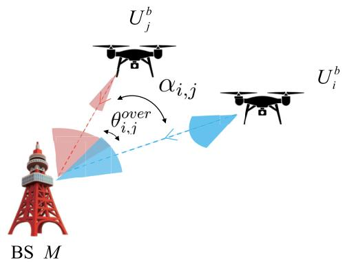  
Fig. 3. Interference between backhaul UAVs.

$$
\begin{array} { r l } {  { \leq ( \frac { \theta } { ( G _ { \mathrm { M L } } ^ { \mathrm { t } } - G _ { \mathrm { S L } } ^ { \mathrm { t } } ) G _ { \mathrm { M L } } ^ { \mathrm { r } } } ) ^ { 2 } } } \\ & { \times \ \frac { 2 \varepsilon ( I _ { i , \mathrm { m i n } } + B _ { 3 } N _ { 0 } ) ^ { 2 } ( I _ { i , \mathrm { m i n } } + B _ { 3 } N _ { 0 } + S _ { i , \mathrm { m a x } } ) ^ { 2 } } { B _ { 3 } S _ { i , \mathrm { m a x } } ( 2 ( I _ { i , \mathrm { m i n } } + B _ { 3 } N _ { 0 } ) + S _ { i , \mathrm { m a x } } ) } . } \end{array}\tag{41}
$$

The backhaul-layer ergodic capacity is then

$$
R ^ { \mathrm { b a c k h a u l } } = \sum _ { \forall U _ { i } ^ { b } \in B } \hat { R } _ { i } ^ { b } .\tag{42}
$$

The proof of (39), (41) is provided in the Appendix.

## D. System Capacity

In general, the information flow is generated from devices and eventually reaches the BS through multihop links between UAVs. The throughput of each information flow is defined as the minimum rate along its multihop path. Likewise, for a fixed total bandwidth, the system capacity can be viewed as the minimum layer capacity achieved under an appropriate bandwidth partition across the three layers. Hence, the system capacity is obtained by solving the following optimization problem:

$$
\begin{array} { r l } & { \underset { B _ { 1 } , B _ { 2 } , B _ { 3 } } { \operatorname* { m a x } } \left. \operatorname* { m i n } \left[ R ^ { \operatorname { a c c e s s } } \left( B _ { 1 } \right) , R ^ { \operatorname { r e l a y } } \left( B _ { 2 } \right) , R ^ { \operatorname { b a c k h a u l } } \left( B _ { 3 } \right) \right] \right. } \\ & { \mathrm { s . t . } \qquad 0 \leq B _ { 1 } + B _ { 2 } + B _ { 3 } \leq B _ { \mathrm { s y s t e m } } . } \end{array}\tag{43}
$$

Based on the layer-capacity results derived in the preceding sections, the overall system capacity is thus obtained via this max–min bandwidth-allocation problem.

## IV. SYSTEM PERFORMANCE SIMULATION AND EVALUATION

In this section, we validate the accuracy of the proposed capacity analysis model through Monte Carlo simulations. The validation is conducted from various perspectives, including electromagnetic environmental noise, UAV flight altitude, antenna angles and counts, and rate requirements. The network topology is depicted in Fig. 4, and the simulation scenario is set in an 800 m ×800 m area, consisting of one BS, multiple UAVs, and User equipment (UE). The essential simulation parameters are provided in Table I.

In the UAV access layer, UAVs can communicate with multiple ground devices using NOMA and SIC. We consider both perfect SIC and worst-case SIC scenarios. In the UAV relay layer, UAVs employ multi-antenna OFDM communication to mitigate interference by transmitting on diferent orthogonal subchannels. Phased array antennas are deployed in both the backhaul layer at the BS and the UAVs.

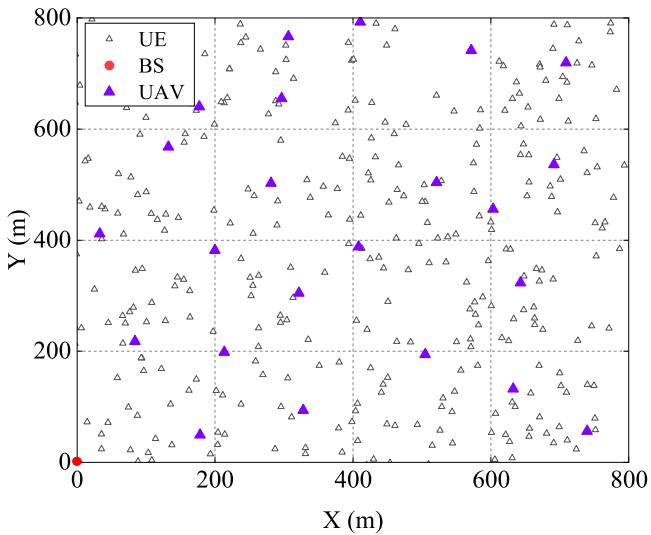  
Fig. 4. Network topology of BS and UAVs.

TABLE I  
KEY PARAMETERS AND VALUES IN THE SIMULATION
<table><tr><td rowspan=1 colspan=1>Parameter</td><td rowspan=1 colspan=1>Value</td></tr><tr><td rowspan=1 colspan=1>UE density  $\overline { { \lambda _ { 1 } } }$ </td><td rowspan=1 colspan=1> $\overline { { 1 \times 1 0 ^ { - 3 } ~ / m ^ { 2 } } }$ </td></tr><tr><td rowspan=1 colspan=1>Simulation area dimensions</td><td rowspan=1 colspan=1>800 m × 800 m</td></tr><tr><td rowspan=1 colspan=1>Transmission power  $P _ { \mathrm { d } } , P _ { \mathrm { U A V } }$ </td><td rowspan=1 colspan=1>17dBm, 20dBm</td></tr><tr><td rowspan=1 colspan=1>UAV coverage radius r</td><td rowspan=1 colspan=1>100 m</td></tr><tr><td rowspan=1 colspan=1>Mean values of  $\overline { { H _ { a } , H _ { r } , H _ { b } } }$ </td><td rowspan=1 colspan=1>1</td></tr><tr><td rowspan=1 colspan=1>UAV altitude  $h _ { 1 }$ </td><td rowspan=1 colspan=1>40 m</td></tr><tr><td rowspan=1 colspan=1>Channel fading factor  $\underline { { \alpha _ { a } , \alpha _ { r } , \alpha _ { b } } }$ </td><td rowspan=1 colspan=1>4, 2.7, 2.4</td></tr><tr><td rowspan=1 colspan=1>Power spectral density  $\overline { { \sigma ^ { 2 } } }$ </td><td rowspan=1 colspan=1>-174 dBm/Hz</td></tr><tr><td rowspan=1 colspan=1>Bandwidth  $\overline { { B _ { 1 } , B _ { 2 } , B _ { 3 } } }$ </td><td rowspan=1 colspan=1>30 MHz</td></tr><tr><td rowspan=1 colspan=1>Data loss E</td><td rowspan=1 colspan=1>0.05</td></tr></table>

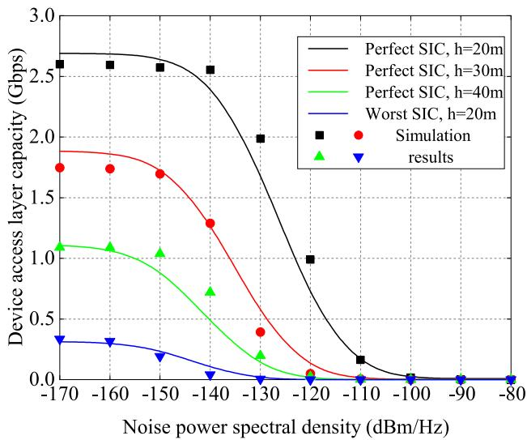  
Fig. 5. Device access layer capacity versus noise power.

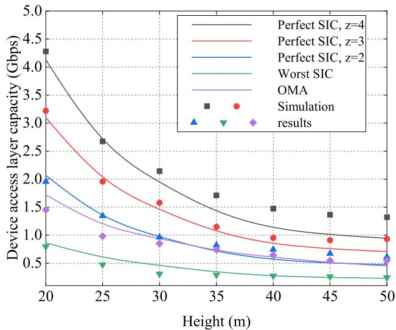  
Fig. 6. Device access layer capacity versus height.

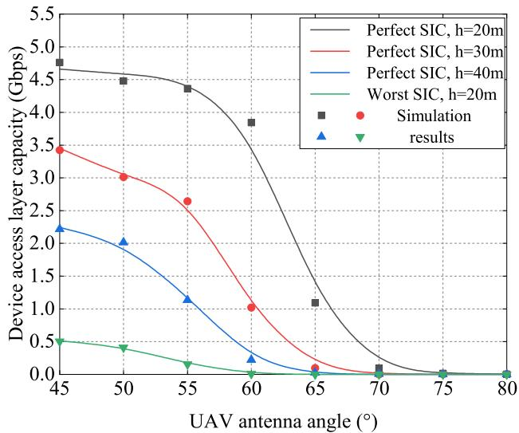  
Fig. 7. Device access layer capacity versus UAV antenna angle.

## A. Capacity Analysis of Device Access Layer

The capacity of the device access layer is analyzed from the perspectives of environmental noise power, UAV flight altitude, and UAV reception capability. Fig. 5, illustrates that when the noise PSD is low, the capacity of the device access layer remains largely unafected by increasing noise. However, once the noise PSD surpasses a certain threshold, the capacity experiences a sharp decline, indicating a “threshold efect.” As the altitude of the UAV increases, this “threshold efect” occurs at lower noise power spectral densities.

Fig. 6, demonstrates the relationship between the capacity of the device access layer and UAV altitude. Higher UAV altitude results in greater communication distances between the UAV and ground devices, leading to increased signal attenuation and reduced capacity. Additionally, Fig. 6, compares the capacity of NOMA with SIC to that of Orthogonal Multiple Access (OMA). Both theoretical analysis and simulation results reveal that, under perfect SIC conditions, NOMA with a SIC decoding depth greater than 2 outperforms OMA in terms of capacity, while the worst-case SIC condition results in the lowest capacity.

Fig. 7, shows that as the UAV reception antenna angle increases, the capacity of the device access layer decreases. This is because a larger UAV reception antenna angle allows for the reception of more signals from ground devices, but these additional signals often have poorer channel conditions. Moreover, the UAV’s SIC capability is limited, leading to a reduction in capacity as the antenna angle increases.

Furthermore, Figs. 5, 6, and 7 collectively indicate that the performance of the worst SIC scenario is significantly inferior to that of the perfect SIC scenario. Therefore, compromised SIC performance leads to a substantial decrease in network capacity. Additionally, because the simulation is conducted in a finite square region, whereas the analytical results assume an infinite-plane PPP for user locations and evaluate the ergodic capacity at the UAV, a natural discrepancy arises. Despite these diferences, the simulation trends closely follow the theoretical curves, which supports the validity of the analytical results.

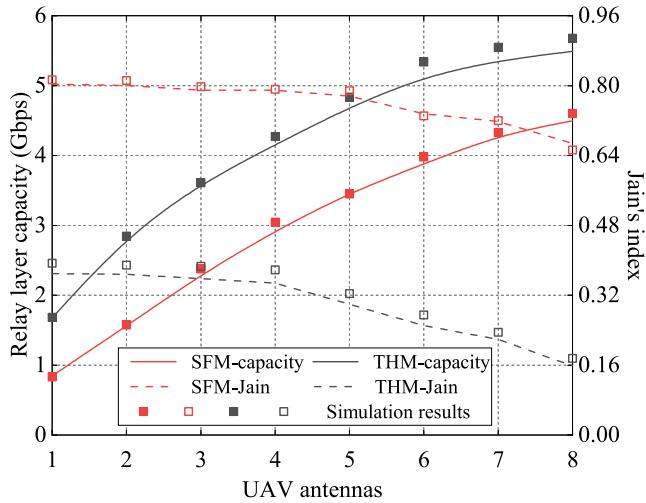  
Fig. 8. UAV relay layer capacity & Jain’s index versus UAV antenna counts.

## B. Capacity Analysis of UAV Relay Layer

Here, we analyze the capacity of the UAV relay layer considering the number of UAV antennas, link data loss, and UAV rate requirements.

Fig. 8, plots the relay-layer capacity and Jain’s index as functions of the number of relay antennas per UAV. Capacity rises at first but shows diminishing returns. This saturation stems from resource fragmentation and limits on concurrency: with Band 2 bandwidth fixed and the per-link, per-subchannel time-sharing constraint, additional antennas mainly introduce finer-grained parallelism, while the node-level Radio Frequency (RF) chain bound $J _ { \mathrm { m a x } }$ and the equal-rate bottleneck along multihop routes curb the incremental throughput. The THM scheme maximizes sum throughput and therefore achieves higher capacity than SFM, whereas SFM attains a larger Jain’s index at a modest capacity cost. As the antenna count grows, both schemes prioritize flows with higher marginal gains under the same bandwidth budget, which gradually reduces the fairness index. In comparison, the SFM algorithm places greater emphasis on fairness in resource allocation among information flows, resulting in a slower decline in its Jain’s index.

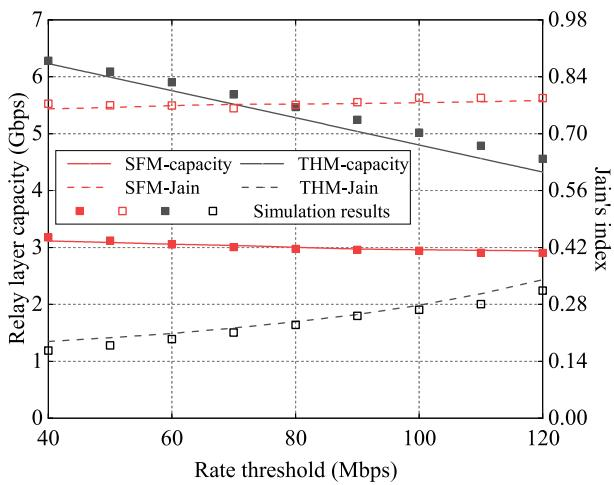

Fig. 9. UAV relay layer capacity & Jain’s index versus UAV requirement rate.  
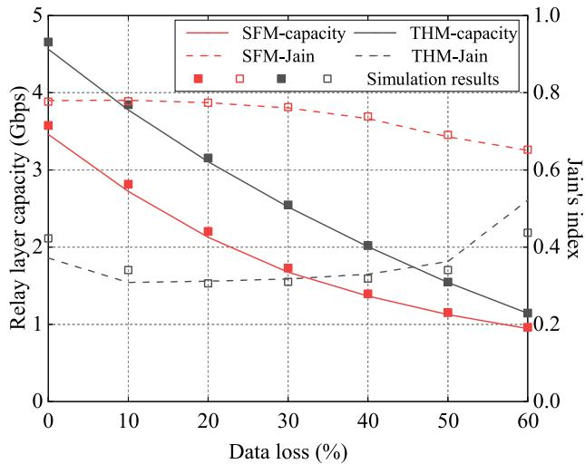  
Fig. 10. UAV relay layer capacity & Jain’s index versus data loss.

Fig. 9, shows relay-layer capacity versus UAV rate requirements. Because the optimization imposes per-flow rate constraints, allocated rates cannot fall below demand. Consequently, as required rates rise, capacity decreases under both schemes. Flows with fewer hops can increase overall capacity more eficiently for a given resource budget. Under THM, resources are primarily assigned to low-hop flows, while high-hop flows are kept at their minimum required rates. As rate demands increase further, more resources must be shifted to high-hop flows, reducing total capacity and forcing a fairer allocation—thereby increasing the Jain’s index. Under SFM, the satisfaction function drives a more balanced resource distribution, keeping capacity relatively stable across rate demands and yielding a more stable Jain’s index.

Fig. 10, presents relay-layer capacity versus link data-loss rate. At low loss rates, THM outperforms SFM in capacity; at high loss rates, the two converge. When losses are low, rising loss rates prompt THM to cut resources to longer-hop flows first, reducing the Jain’s index. As the loss rate continues to grow, “forced fairness” emerges, narrowing the gap in per-flow rates. In contrast, SFM exhibits a steadier decline in the Jain’s index, with most of the reduction occurring only at higher loss rates.

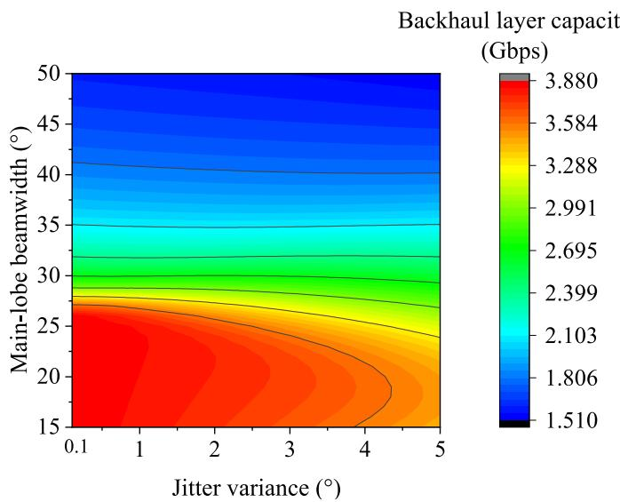  
Fig. 11. Backhaul layer capacity versus antenna transmit beamwidth and jitter variance.

In the UAV relay layer, discrepancies persist between simulation and theory because small diferences in channel coeficients translate into link-capacity variations that are amplified over end-to-end multihop transmissions, thereby afecting the resource allocation outcome and widening the gap between theoretical and simulated capacities.

## C. Capacity Analysis of Backhaul Layer

Fig. 11, shows how the transmit beamwidth and jitter variance on the UAV-BS backhaul link afect the backhaul layer capacity. Overall, larger beamwidth leads to lower total rates because increased interference gain reduces the SINR and thus the link capacity. At low beam-jitter variance, once the main lobes are suficiently narrow to be nearly non-overlapping, the backhaul capacity becomes insensitive to beamwidth. Under higher jitter, however, more directional (narrower) beams sufer greater capacity degradation, yielding an optimal beamwidth that maximizes the backhaul-layer capacity. Therefore, in high-jitter conditions, the transmit antenna directivity should be adapted to mitigate beam-misalignment efects.

## D. Total Capacity of the System

Fig. 12, depicts the correlation between the capacity of each layer and the allocated bandwidth. The results show that, when utilizing the same bandwidth resources, the access layer exhibits the highest capacity, followed by the UAV relay layer, with the backhaul link layer demonstrating the lowest capacity. We also compare the proposed three-tier system with a two-tier emergency system in which terminals, after device access, connect directly to the BS via UAV backhaul using SDMA. In the considered setting, the UAV-BS distance is large and simultaneous UAV-BS communications induce strong interference, yielding a relatively low backhaul capacity for the two-tier design. According to (43), under a fixed total bandwidth the end-to-end system capacity is achieved when the three layer capacities are equalized (max-min allocation). In Fig. 12, the red and black dashed curves plot the capacities of the three-tier and two-tier systems, respectively. In our simulated network, the proposed three-tier architecture achieves about a 20% capacity gain over the two-tier baseline, and the overall capacity is primarily constrained by the backhaul layer. Therefore, increasing the bandwidth of the backhaul layer and incorporating additional backhaul UAVs can significantly enhance the overall network capacity.

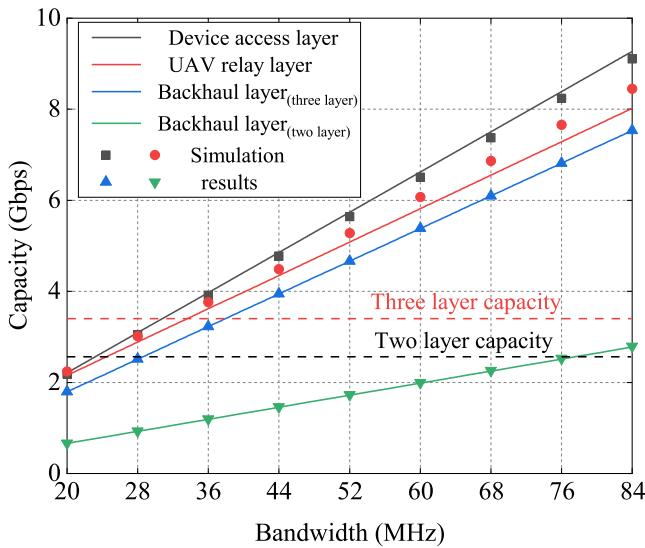  
Fig. 12. Capacity of the system.

## V. CONCLUSION

In this paper, we proposed an end-to-end capacity analysis for a three-tier emergency network with a device access layer using uplink NOMA and imperfect SIC, a UAV relay layer with OFDM time–frequency allocation, and a backhaul layer using SDMA while accounting for beam misalignment. Our analysis and simulation results demonstrate that the ergodic capacity of the access link decreases with increasing UAV height, noise PSD, and antenna angle, while it increases with higher SIC success rates. Although the proposed SFM scheme exhibits superior performance in terms of allocation fairness compared to the conventional THM scheme, it does so at the expense of reduced capacity. However, it is important to note that this study has certain limitations. Future research could focus on optimizing the capacity of the device access layer by jointly optimizing UAV flight height and antenna angle. Additionally, it would be beneficial to consider multiple BSs in the heterogeneous three-tier network model, where capacity can be enhanced through adjustments in UAV flight height, device deployment density, antenna beam transmission angle, and bandwidth resource allocation.

## APPENDIX A

## PROOF OF (6)–(8)

By using the definition of the Laplace transform yields:

$$
\begin{array} { l } { { { \cal L } _ { I _ { k } ^ { ( \mathrm { p } ) } } ( s ) } } \\ { { = \mathbb { E } _ { \Phi , H _ { j } } \left[ \exp \left( - s \sum _ { y _ { j } \in \Phi \backslash B _ { r _ { k } } } H _ { j } P _ { d } ( r _ { j } ^ { 2 } + h _ { 1 } ^ { 2 } ) ^ { - \alpha _ { a } / 2 } \right) \right] } } \end{array}
$$

$$
\begin{array} { r l } & { \stackrel { ( a ) } { = } \mathbb { E } _ { \Phi } [ \displaystyle \prod _ { y , \zeta ^ { \epsilon } \in \Phi ( B _ { L } ) } \mathbb { E } _ { H } \big [ \exp \big ( - s H P _ { d } ( \boldsymbol { r } _ { j } ^ { 2 } + h _ { 1 } ^ { 2 } ) ^ { - \alpha _ { d } / 2 } \big ) \big ] ] } \\ & { \stackrel { ( b ) } { = } \exp ( - 2 \pi \lambda _ { 1 } \displaystyle \int _ { r _ { x } } ^ { \infty } \Big ( 1 - \mathbb { E } _ { H } \Big [ e ^ { - s \beta ( x ^ { \epsilon } + h _ { 1 } ^ { \epsilon } ) ^ { \alpha _ { d } / 2 } } \Big ] \Big ) \ x \mathrm { d } x ) } \\ & { \stackrel { ( c ) } { = } \exp ( - 2 \pi \lambda _ { 1 } \displaystyle \int _ { r _ { x } } ^ { \infty } \Bigg ( 1 - \frac { 1 } { 1 + s \beta ( x ^ { 2 } + h _ { 1 } ^ { 2 } ) ^ { - \alpha _ { d } / 2 } } \Big ) \ x \mathrm { d } x ) } \\ & { = \exp ( - \pi \lambda _ { 1 } ( s \beta ) ^ { 2 / \alpha _ { s } } [ \frac { 2 \pi } { \alpha _ { a } } \cos ( \frac { 2 \pi } { \alpha _ { a } } ) - \frac { r _ { x } ^ { 2 } + h _ { 1 } ^ { 2 } } { ( s \beta ) ^ { 2 / \alpha _ { s } } }   } \\ & { \qquad  \times _ { 2 } F _ { 1 } \Big ( 1 , \frac { 2 } { \alpha _ { s } } ; 1 + \frac { 2 } { \alpha _ { s } } ; - \frac { ( r _ { x } ^ { 2 } + h _ { 1 } ^ { 2 } ) ^ { \alpha _ { d } / 2 } } { \beta } \Big ) \Big ] ) . } \end{array}\tag{44}
$$

where (a) follows from the i.i.d. distribution of $H _ { j }$ and its further independence from the point process Φ, and $B _ { r _ { k } }$ represents the circle centered on $y _ { k }$ with radius $r _ { k } . ~ ( b )$ follows from the probability generating functional (PGFL) of the PPP [24]. (c) follows from the exponential distribution of $H _ { j } .$ . Based on the proof of (8), it can be derived that (9) is as follows:

$$
\begin{array} { r l } & { \| \hat { \cal L } _ { \mathrm { P } } ^ { \mathrm { i n } } ( \omega ) \| _ { \mathrm { L } } ^ { 2 } } \\ & { = \mathbb R _ { 0 \times \mathbb R } \Bigg [ \exp \Bigg ( - \sum _ { j = 0 } ^ { \infty } \mu _ { j } R _ { j } ( \omega _ { j } ^ { 2 } + \Delta _ { j } ^ { 2 } ) ^ { \top } \hat { \sigma } _ { j } ^ { \top } \Bigg ) } \\ & { \qquad \times \exp \Bigg ( - \sum _ { j = 0 } ^ { \infty } ( 1 - \Delta _ { j } ) R _ { j } ^ { 2 } \rho _ { j } \Delta _ { j } ^ { 2 } \hat { \sigma } _ { j } ^ { \top } + \Delta _ { j } ^ { 2 } ) ^ { \top } \Bigg ) \Bigg ] } \\ & { = \exp \Bigg ( - \sum _ { j = 0 } ^ { \infty } \Bigg ( 1 - \Delta _ { j } ) R _ { j } ^ { 2 } \rho _ { j } \Delta _ { j } ^ { 2 } \Bigg ( \mathrm { e } ^ { - \mathrm { i } \omega \cdot \mathbf { r } } \Bigg ) ^ { \top } \Bigg ) \Delta \mathbf { r } \Bigg ) } \\ & { \qquad \times \prod _ { j = 0 } ^ { \infty } \Bigg ( \mathbb { P } _ { j } + \int _ { 0 } ^ { \infty } ( 1 - \Delta _ { j } ) \mathbb { E } _ { j } \left( \mathrm { e } ^ { - \mathrm { i } \omega \cdot \mathbf { r } } \right) ^ { \top } \Bigg ) \Delta \mathbf { r } \Bigg ) } \\ & { \qquad \times \prod _ { j = 0 } ^ { \infty } \exp \Bigg ( \Delta _ { j } ^ { 2 } \int _ { 0 } ^ { \infty } ( 1 - \Delta _ { j } ) R _ { j } \left( \mathrm { e } ^ { - \mathrm { i } \omega \cdot \mathbf { r } } \right) ^ { \top } \Bigg ) } \\ &  \qquad \times \exp \Bigg ( - \sum _ { j = 0 } ^ { \infty } \int _ { 0 } ^ { \infty } \left( 1 - \frac { 1 } { \mathrm { i } + \Delta _ { j } ( \omega _ { j } ^ { 2 } + \Delta _ { j } ^ { 2 } ) ^ { \top } } \right) \Delta \mathbf { r } \Bigg ) \end{array}\tag{45}
$$

Given the k-th nearest distance $R _ { k } = r _ { k } .$ , there are exactly $k - 1$ points uniformly and independently distributed within the disk $\boldsymbol { B } _ { \nabla _ { \| } }$ , and its radius conditional density $f _ { r _ { j } | r _ { k } } \left( x \right)$ is

$$
f _ { r _ { j } | r _ { k } } \left( x \right) = \frac { 2 x } { r _ { k } ^ { 2 } } , \quad 0 < x < r _ { k } ,\tag{46}
$$

For the j-th proximate interference, the SIC success indication is denoted as $b _ { j } \in \{ 0 , 1 \} \ ( 1 \ =$ successful elimination). Given the set {b}, the Laplace transform of the near end interference is

$$
L _ { k , \{ b \} } ^ { \mathrm { i n } } ( s ) = \prod _ { j = 1 } ^ { k - 1 } \Big [ b _ { j } + ( 1 - b _ { j } ) \mathcal { I } ( r _ { k } ; s ) \Big ] ,\tag{47}
$$

where

$$
\begin{array} { l } { \displaystyle \mathcal { I } ( r _ { k } ; s ) = \int _ { 0 } ^ { r _ { k } } \frac { 1 } { 1 + s \beta ( x ^ { 2 } + h _ { 1 } ^ { 2 } ) ^ { - \frac { \alpha _ { a } } { 2 } } } \frac { 2 x } { r _ { k } ^ { 2 } } \mathrm { d } x } \\ { \displaystyle = \frac { 1 } { r _ { k } ^ { 2 } } \int _ { h _ { 1 } ^ { 2 } } ^ { r _ { k } ^ { 2 } + h _ { 1 } ^ { 2 } } \frac { t ^ { - \frac { \alpha _ { a } } { 2 } } } { t ^ { - \frac { \alpha _ { a } } { 2 } } + s \beta } \mathrm { d } t } \end{array}
$$

$$
\begin{array} { l } { { = \displaystyle \frac { 1 } { r _ { k } ^ { 2 } } \Big [ ( r _ { k } ^ { 2 } + h _ { 1 } ^ { 2 } ) _ { 2 } F _ { 1 } \Big ( 1 , \frac { 2 } { \alpha _ { a } } ; 1 + \frac { 2 } { \alpha _ { a } } ; - \frac { ( r _ { k } ^ { 2 } + h _ { 1 } ^ { 2 } ) ^ { \alpha _ { a } / 2 } } { s \beta } \Big ) } } \\ { { - h _ { 1 2 } ^ { 2 } F _ { 1 } \Big ( 1 , \frac { 2 } { \alpha _ { a } } ; 1 + \frac { 2 } { \alpha _ { a } } ; - \frac { h _ { 1 } ^ { \alpha _ { a } } } { s \beta } \Big ) + r _ { k } ^ { 2 } \Big ] . } } \end{array}\tag{48}
$$

For the worst situation, the inference is the all signals except itself. Based on PGFL, the Laplace transform of $I _ { k } ^ { ( w ) } \mathrm { { i s } \mathrm { { : } } }$

$$
\begin{array} { l } { { L _ { I _ { k } ^ { \mathrm { ( w ) } } } ( s ) } } \\ { { \displaystyle = \exp \left( - 2 \pi \lambda _ { 1 } \int _ { 0 } ^ { \infty } \left( 1 - \frac { 1 } { 1 + s \beta ( x ^ { 2 } + h _ { 1 } ^ { 2 } ) ^ { - \alpha _ { a } / 2 } } \right) x \mathrm { d } x \right) } } \\ { { \displaystyle = \exp \Biggl \{ - \pi \lambda _ { 1 } ( s \beta ) ^ { 2 / \alpha _ { a } } \Biggl [ \frac { 2 \pi } { \alpha _ { a } } \csc \left( \frac { 2 \pi } { \alpha _ { a } } \right) } } \\ { { \displaystyle \quad - \frac { h _ { 1 } ^ { 2 } } { ( s \beta ) ^ { 2 / \alpha _ { a } } } { _ 2 F _ { 1 } } \left( 1 , \frac { 2 } { \alpha _ { a } } ; 1 + \frac { 2 } { \alpha _ { a } } ; - \frac { h _ { 1 } ^ { \alpha _ { a } } } { s \beta } \right) \Biggr ] \Biggr \} . } } \end{array}\tag{49}
$$

APPENDIX B PROOF OF (39)

Let $\mathcal { R } ( I ; S )$ denote the function obtained by treating the interference $I _ { i }$ and signal $S _ { i }$ in $R _ { i } ^ { b }$ as variables. Performing a first-order Taylor expansion with an integral remainder REMi at $I = \mathbb { E } \left( I _ { i } \right)$ yields:

$$
\begin{array} { r l } & { \mathcal { R } ( I ; S _ { i } ) } \\ & { = \mathcal { R } ( \mathbb { E } \left( I _ { i } \right) ; S _ { i } ) + \mathcal { R } ^ { \prime } \left( \mathbb { E } \left( I _ { i } \right) ; S _ { i } \right) \left( I - \mathbb { E } \left( I _ { i } \right) \right) + \mathrm { R E M _ { i } } , } \end{array}\tag{50}
$$

where

$$
\begin{array} { c l l } { \displaystyle \mathrm { R E M } _ { i } = \int _ { 0 } ^ { 1 } ( 1 - t ) \mathcal { R } ^ { \prime \prime } \big ( \mathbb { E } ( I _ { i } ) + t ( I - \mathbb { E } ( I _ { i } ) ) ; S _ { i } \big ) } \\ { \displaystyle \times ( I - \mathbb { E } ( I _ { i } ) ) ^ { 2 } \mathrm { d } t > 0 . } \end{array}\tag{51}
$$

Taking expectations over $S _ { i }$ and $I _ { i }$ on both sides of (50), the first-order term vanishes because $\mathbb { E } _ { I _ { i } } \left[ I - \mathbb { E } ( I ) \right] = 0$

$$
\begin{array} { r l } & { \mathbb { E } _ { I _ { i } , S _ { i } } [ \mathcal { R } ( I ; S _ { i } ) ] = \mathbb { E } _ { S _ { i } } [ \mathcal { R } ( \mathbb { E } ( I _ { i } ) ; S _ { i } ) ] } \\ & { \quad + \mathbb { E } _ { I _ { i } , S _ { i } } \bigg [ \int _ { 0 } ^ { 1 } ( 1 - t ) \mathcal { R } ^ { \prime \prime } \big ( \mathbb { E } ( I _ { i } ) + t ( I - \mathbb { E } ( I _ { i } ) ) ; S _ { i } \big ) } \\ & { \quad \times \ ( I - \mathbb { E } ( I _ { i } ) ) ^ { 2 } \mathrm { d } t \Big ] . } \end{array}\tag{52}
$$

Thus, $\Delta R _ { i } ^ { b }$ can be expressed as:

$$
\begin{array} { r l } & { \displaystyle \Delta R _ { j } ^ { b } } \\ & { = \int _ { 0 } ^ { 1 } ( 1 - t ) \mathbb { B } _ { i , j , s _ { i } } \bigg [ \mathcal { R } ^ { \prime \prime } \big ( \mathbb { B } ( I _ { i } ) + t ( I - \mathbb { B } ( I _ { i } ) ) ; S _ { i } \big ) } \\ & { \quad \times ( I - \mathbb { B } ( I _ { i } ) ) ^ { 2 } \bigg ] \mathrm { d } t } \\ & { \le \displaystyle \int _ { 0 } ^ { 1 } ( 1 - t ) \operatorname* { s u p } _ { \stackrel { \mathrm { i } , \mathrm { i } \mathrm { i } , \mathrm { o n } } { S _ { i } \le I _ { i } \le I _ { i } \mathrm { m a x } } } \big [ \mathcal { R } ^ { \prime \prime } ( \tilde { I } _ { i } ; S _ { i } ) \big ] } \\ & { \quad \times \mathbb { B } _ { i , i \setminus I } \big [ ( I - \mathbb { B } ( I _ { i } ) ) ^ { 2 } \big ] \mathrm { d } t } \\ & { = \displaystyle \frac { B _ { 3 } \mathrm { V a r } ( I _ { i } ) } { 2 \mathrm { I n } 2 } \frac { S _ { i , \mathrm { m a x } } ( 2 ( I _ { i , \mathrm { i n } } + B _ { 3 } \setminus N _ { 0 } ) + S _ { i \mathrm { m a x } } ) } { ( I _ { i , \mathrm { i n } + } + B _ { 3 } \setminus N _ { 0 } ) ^ { 2 } ( I _ { i , \mathrm { i n } + } + B _ { 3 } \setminus N _ { 0 } + S _ { i \mathrm { m a x } } ) ^ { 2 } } . } \end{array}\tag{53}
$$

where $\tilde { I } _ { i }$ is a convex combination of $I _ { i }$ and E $( I _ { i } )$ ; therefore, its range lies between $\begin{array} { r c l } { I _ { i , \mathrm { m i n } } } & { = } & { \displaystyle \sum _ { j \neq i } P _ { \mathrm { U A V } } H _ { b } G _ { \mathrm { S L } } ^ { t } G _ { \mathrm { M L } } ^ { r } d _ { j } ^ { - \alpha _ { b } } , } \end{array}$ $\begin{array} { r l r } { I _ { i , \mathrm { m a x } } } & { { } = } & { \sum _ { i \ne i } P _ { \mathrm { U A V } } H _ { b } G _ { \mathrm { M L } } ^ { t } G _ { \mathrm { M L } } ^ { r } d _ { j } ^ { - \alpha _ { b } } } \end{array}$ . In addition, $\begin{array} { r l } { S _ { \mathrm { \it i , m i n } } } & { { } = } \end{array}$ $\begin{array} { r l r l r l } & { P _ { \mathrm { U A V } } H _ { b } G _ { \mathrm { S L } } ^ { t } G _ { \mathrm { M L } } ^ { r } d _ { i } ^ { - \alpha _ { b } } , } & { S _ { i , \mathrm { m a x } } } & & { = } & & { P _ { \mathrm { U A V } } H _ { b } G _ { \mathrm { M L } } ^ { t } G _ { \mathrm { M L } } ^ { r } d _ { i } ^ { - \alpha _ { b } } . } \end{array}$ Since $\mathcal { R } ^ { \prime \prime } \mathrm { i s }$ monotonically decreasing with respect to $\tilde { I } _ { i }$ and monotonically increasing with respect to $S _ { i : }$ $\begin{array} { r l r } & { \mathrel { \phantom { = } } } & { \operatorname* { s u p } \quad \left[ \mathcal { R } ^ { \prime \prime } \left( \tilde { I } _ { i } ; S _ { i } \right) \right] } \\ & { I _ { i , \mathrm { m i n } } { \le } \tilde { I } _ { i } { \le } I _ { i , \mathrm { m a x } } } \\ & { S _ { i , \mathrm { m i n } } { \le } S _ { i } { \le } S _ { i , \mathrm { m a x } } } & \end{array}$ can thus be obtained.

## APPENDIX C PROOF OF (41)

To investigate the maximum admissible jitter variances under the requirement sup $\Delta R _ { i } ^ { b } ~ < ~ \varepsilon .$ , we first separate the contribution of jitter to the interference variance. For Var(I ), applying the law of total variance yields:

$$
\operatorname { V a r } \left( I _ { i } \right) = \mathbb { E } _ { \delta ^ { \mathrm { r } } } \left[ \operatorname { V a r } ( I _ { i } \mid \delta ^ { \mathrm { r } } ) \right] + \operatorname { V a r } _ { \delta ^ { \mathrm { r } } } \left( \mathbb { E } \left[ I _ { i } \mid \delta ^ { r } \right] \right) .\tag{54}
$$

For $\mathbb { E } _ { \delta ^ { \mathrm { r } } } \left[ \mathrm { V a r } ( I _ { i } \mid \delta ^ { \mathrm { r } } ) \right]$ , note that Ii is a weighted sum of independent interference terms. Conditional on $\delta ^ { \mathrm { r } }$ , these terms are conditionally independent. Hence:

$$
\begin{array} { r l } & { \mathbb { E } _ { \delta ^ { \tau } } \left[ \mathrm { V a r } ( I _ { i } \mid \delta ^ { \mathsf { r } } ) \right] } \\ & { = \mathbb { E } _ { \delta ^ { \tau } } \left[ \displaystyle \sum _ { j \neq i } P _ { \mathrm { U A V } } H _ { b } d _ { j } ^ { - \alpha _ { b } } \mathrm { V a r } ( G _ { j , i } ^ { I } \mid \delta ^ { \mathsf { r } } ) \right] } \\ & { = \displaystyle \sum _ { j \neq i } P _ { \mathrm { U A V } } H _ { b } d _ { j } ^ { - \alpha _ { b } } \mathbb { E } _ { \delta ^ { \tau } } \left[ \mathrm { V a r } ( G _ { j , i } ^ { I } \mid \delta ^ { \mathsf { r } } ) \right] . } \end{array}\tag{55}
$$

For two distinct interferer links, $G _ { j _ { 1 } , i } ^ { I }$ and $G _ { j _ { 2 } , i } ^ { I } ,$ taking their diference gives

$$
\begin{array} { r } { G _ { j _ { 1 } , i } ^ { I } - G _ { j _ { 2 } , i } ^ { I } = \big ( \theta _ { j _ { 1 } , i } ^ { \mathrm { o v e r } } - \theta _ { j _ { 2 } , i } ^ { \mathrm { o v e r } } \big ) ( G _ { \mathrm { M L } } ^ { \ t } - G _ { \mathrm { S L } } ^ { \ t } ) G _ { \mathrm { M L } } ^ { \mathrm { r } } / \theta . } \end{array}\tag{56}
$$

By the fact that the absolute diference is bounded by the diference of the arguments (here $\theta _ { j _ { 1 } , i } ^ { \mathrm { o v e r } } = \operatorname* { m a x } \{ 0 , \theta - \alpha _ { j _ { 1 } , i } - | \delta _ { j _ { 1 } } | \}$ is 1-Lipschitz), we obtain:

$$
\begin{array} { r l } & { \left| { G } _ { j _ { 1 } , i } ^ { I } - { G } _ { j _ { 2 } , i } ^ { I } \right| \leq \left| \delta _ { j _ { 1 } } ^ { \mathrm { t } } - \delta _ { j _ { 2 } } ^ { \mathrm { t } } \right| \left( { G } _ { \mathrm { M L } } ^ { \mathrm { t } } - { G } _ { \mathrm { S L } } ^ { \mathrm { t } } \right) { G } _ { \mathrm { M L } } ^ { \mathrm { r } } / \theta } \\ & { \qquad \stackrel { \Delta } { = } { L } _ { G } \left| \delta _ { j _ { 1 } } ^ { \mathrm { t } } - \delta _ { j _ { 2 } } ^ { \mathrm { t } } \right| . } \end{array}\tag{57}
$$

Thus $G _ { j , i } ^ { I }$ is LG-Lipschitz with respect to $\delta _ { j } ^ { \mathrm { t } }$ , where $\begin{array} { l l } { L _ { G } } & { = } \end{array}$ $( G _ { \mathrm { M L } } ^ { \mathrm { t } } - \tilde { G } _ { \mathrm { S L } } ^ { \mathrm { t } } ) G _ { \mathrm { M L } } ^ { \mathrm { r } } / \theta$ δ. By the variance bound for Lipschitz maps, Var $\left( { G } _ { j , i } ^ { I } | \delta ^ { \mathrm { r } } \right) \ \leq \ { L _ { G } } ^ { 2 } \mathrm { { V a r } } \left( \delta _ { j } ^ { \mathrm { t } } \right) \ = \ { L _ { G } } ^ { 2 } { \sigma _ { \mathrm { t } } } ^ { 2 }$ . Substituting it back ,into (55) gives the upper bound

$$
\mathbb { E } _ { \boldsymbol { \delta } ^ { \mathrm { r } } } \left[ \operatorname { V a r } ( I _ { i } \mid \boldsymbol { \delta } ^ { \mathrm { r } } ) \right] \leq L _ { G } { ^ 2 \sigma _ { t } ^ { 2 } } \sum _ { j \neq i } \bigg ( P _ { \mathrm { U A V } } H _ { b } d _ { j } ^ { - \alpha _ { b } } \bigg ) ^ { 2 } .\tag{58}
$$

For $\operatorname { V a r } _ { \delta ^ { \mathrm { r } } } \left( \mathbb { E } [ I _ { i } \mid \delta ^ { \mathrm { r } } ] \right)$ , we likewise use the Lipschitz property δ δto upper bound it. First expand $\mathbb { E } [ I _ { i } \mid \delta ^ { \mathrm { r } } ]$ as a sum over links and, for arbitrary $\delta _ { 1 } ^ { \mathrm { r } } , \delta _ { 2 } ^ { \mathrm { r } }$ , take their diference:

$$
\begin{array} { r l } & { \left| \mathbb { E } [ I _ { i } \mid \hat { \sigma } _ { 1 } ^ { \mathrm { r e l } } ] - \mathbb { E } [ I _ { i } | \hat { \sigma } _ { 2 } ^ { \mathrm { r e l } } ] \right| } \\ & { = \frac { ( G _ { \mathrm { M } } ^ { \mathrm { v } } - G _ { \mathrm { S M } } ^ { \mathrm { v } } ) G _ { \mathrm { M } } ^ { \mathrm { v } } } { \theta } \Bigg | \frac { \sum _ { j } P _ { \mathrm { U M } } H _ { j } d _ { j } ^ { - \alpha _ { \mathrm { b } } } } { \gamma \varepsilon i } } \\ & { \qquad \times \left[ \mathbb { E } _ { g } ( \theta _ { j j } ^ { \mathrm { p a g e r } } \mid \hat { \sigma } _ { 1 } ^ { \varepsilon } ) - \mathbb { E } _ { g } ( \theta _ { j i } ^ { \mathrm { p a g e r } } \mid \hat { \sigma } _ { 2 } ^ { \varepsilon } ) \right] \Bigg | } \\ & { \leq \frac { ( G _ { \mathrm { M } } ^ { \mathrm { v } } - G _ { \mathrm { M } } ^ { \mathrm { v } } ) G _ { \mathrm { M } } ^ { \mathrm { v } } } { \theta } \Bigg \sum _ { j \neq j } P _ { \mathrm { U M } } N _ { b } d _ { j } ^ { - \alpha _ { \mathrm { b } } } } \\ & { \qquad \times \mathbb { E } _ { g } \left[ \left| \theta _ { j i } ^ { \mathrm { p a g e r } } ( \hat { \sigma } _ { 1 } ^ { \varepsilon } ) - \theta _ { j i } ^ { \mathrm { p a r g } } ( \hat { \sigma } _ { 2 } ^ { \varepsilon } ) \right| \right] } \\ & { \leq \frac { ( G _ { \mathrm { M } } ^ { \mathrm { v } } - G _ { \mathrm { S M } } ^ { \mathrm { v } } ) G _ { \mathrm { M } } ^ { \mathrm { v } } } { \theta } \sum _ { j \neq i } P _ { \mathrm { U M } } N _ { b } d _ { j } ^ { - \alpha _ { \mathrm { b } } } \left| \hat { \sigma } _ { 1 } ^ { \varepsilon } - \delta _ { 2 } ^ { \varepsilon } \right| . } \end{array}\tag{59}
$$

Therefore, $\mathbb { E } [ I _ { i } \ | \ \delta ^ { \mathrm { r } } ]$ is also $L _ { G }$ -Lipschitz with respect to $\delta ^ { \mathrm { r } }$ and hence:

$$
\mathrm { V a r } _ { \delta ^ { \mathrm { r } } } \left( \mathbb { E } \left[ I _ { i } \mid \delta ^ { \mathrm { r } } \right] \right) \leq { L _ { G } } ^ { 2 } { \sigma _ { \mathrm { r } } } ^ { 2 } \left( \sum _ { j \neq i } P _ { \mathrm { U A V } } H _ { b } d _ { j } ^ { - \alpha _ { b } } \right) ^ { 2 } .\tag{60}
$$

Substituting back into (54), we obtain the final upper bound:

$$
\begin{array} { r } { \mathrm { V a r } \left( I _ { i } \right) \le L _ { G } { } ^ { 2 } { \sigma _ { \mathrm { t } } } ^ { 2 } \displaystyle \sum _ { j \ne i } \left( P _ { \mathrm { U A V } } H _ { b } d _ { j } ^ { - \alpha _ { b } } \right) ^ { 2 } \qquad } \\ { + L _ { G } { } ^ { 2 } { \sigma _ { \mathrm { r } } } ^ { 2 } \Biggl ( \displaystyle \sum _ { j \ne i } P _ { \mathrm { U A V } } H _ { b } d _ { j } ^ { - \alpha _ { b } } \Biggr ) ^ { 2 } } \end{array}\tag{61}
$$

After simplicy, (41) can be obtained.

## REFERENCES

[1] M. Sheng, Y. Zhang, J. Liu, Z. Xie, T. Q. S. Quek, and J. Li, “Enabling integrated access and backhaul in dynamic aerial-terrestrial networks for coverage enhancement,” IEEE Trans. Wireless Commun., vol. 23, no. 8, pp. 9072–9084, Aug. 2024.

[2] J. H. Kim, M. C. Lee, and T. S. Lee, “Generalized UAV deployment for UAV-assisted cellular networks,” IEEE Trans. Wireless Commun., vol. 23, no. 7, pp. 7894–7910, Jul. 2024.

[3] D. G. C.,A. Ladas, Y. A. Sambo, H. Pervaiz, C. Politis, and M. A. Imran, “An overview of post-disaster emergency communication systems in the future networks,” IEEE Wireless Commun., vol. 26, no. 6, pp. 132–139, Dec. 2019.

[4] N. Lin, Y. Liu, L. Zhao, D. O. Wu, and Y. Wang, “An adaptive UAV deployment scheme for emergency networking,” IEEE Trans. Wireless Commun., vol. 21, no. 4, pp. 2383–2398, Apr. 2022.

[5] B. Hu, L. Wang, S. Chen, J. Cui, and L. Chen, “An uplink throughput optimization scheme for UAV-enabled urban emergency communications,” IEEE Internet Things J., vol. 9, no. 6, pp. 4291–4302, Mar. 2022.

[6] T. Do-Duy, L. D. Nguyen, T. Q. Duong, S. R. Khosravirad, and H. Claussen, “Joint optimisation of real-time deployment and resource allocation for UAV-aided disaster emergency communications,” IEEE J. Sel. Areas Commun., vol. 39, no. 11, pp. 3411–3424, Nov. 2021.

[7] X. Liu et al., “Transceiver design and multihop D2D for UAV IoT coverage in disasters,” IEEE Internet Things J., vol. 6, no. 2, pp. 1803–1815, Apr. 2019.

[8] M. Liu, J. Yang, and G. Gui, “DSF-NOMA: UAV-assisted emergency communication technology in a heterogeneous Internet of Things,” IEEE Internet Things J., vol. 6, no. 3, pp. 5508–5519, Jun. 2019.

[9] A. Saif et al., “An eficient energy harvesting and optimal clustering technique for sustainable postdisaster emergency communication systems,” IEEE Access, vol. 9, pp. 78188–78202, 2021.

[10] K. M. S. Huq, I. E. Otung, and J. Rodriguez, “A study of coverage probability-based energy-eficiency analysis for UAV-aided THz-enabled 6G networks,” IEEE Trans. Intell. Transp. Syst., vol. 24, no. 7, pp. 7404–7411, Jul. 2023.

[11] C. Fan, X. Zhou, T. Zhang, W. Yi, and Y. Liu, “Cache-enabled UAV emergency communication networks: Performance analysis with stochastic geometry,” IEEE Trans. Veh. Technol., vol. 72, no. 7, pp. 9308–9321, Jul. 2023.

[12] S. Zhang and J. Liu, “Analysis and optimization of multiple unmanned aerial vehicle-assisted communications in post-disaster areas,” IEEE Trans. Veh. Technol., vol. 67, no. 12, pp. 12049–12060, Dec. 2018.

[13] M. Matracia, M. A. Kishk, and M.-S. Alouini, “On the topological aspects of UAV-assisted post-disaster wireless communication networks,” IEEE Commun. Mag., vol. 59, no. 11, pp. 59–64, Nov. 2021.

[14] N. Zhao et al., “UAV-assisted emergency networks in disasters,” IEEE Wireless Commun., vol. 26, no. 1, pp. 45–51, Feb. 2019.

[15] K. Ali, H. X. Nguyen, Q.-T. Vien, P. Shah, and M. Raza, “Deployment of drone-based small cells for public safety communication system,” IEEE Syst. J., vol. 14, no. 2, pp. 2882–2891, Jun. 2020.

[16] LIGH-T 4—Compact Tethered Drone Station. Accessed: Nov. 6, 2025. [Online]. Available: https://elistair.com/solutions/tethering-station-ligh-t/

[17] KHRONOS—All-in-One Tethered Dronebox for Static and Mobile Missions. Accessed: Nov. 6, 2025. [Online]. Available: https://elistair.com/ solutions/tethered-dronebox-khronos

[18] (2017). AT&T Flying COW Deployed to Puerto Rico. Accessed: Nov. 6, 2025. [Online]. Available: https://www.suasnews.com/2017/11/attflying-cow-deployed-puerto-rico/

[19] J. Beuster, C. Andrich, and S. Giehl, “Characterization of lightweight GPS disciplined oscillators for distributed UAV measurement applications,” in Proc. Eur. Freq. Time Forum (EFTF), Jun. 2024, pp. 90–93.

[20] B. Xue, Z. Li, P. Lei, Y. Wang, and X. Zou, “Wicsync: A wireless multinode clock synchronization solution based on optimized UWB two-way clock synchronization protocol,” Measurement, vol. 183, Oct. 2021, Art. no. 109760.

[21] G. Geraci, M. Wildemeersch, and T. Q. S. Quek, “Energy eficiency of distributed signal processing in wireless networks: A cross-layer analysis,” IEEE Trans. Signal Process., vol. 64, no. 4, pp. 1034–1047, Feb. 2016.

[22] Y. Saito, Y. Kishiyama, A. Benjebbour, T. Nakamura, A. Li, and K. Higuchi, “Non-orthogonal multiple access (NOMA) for cellular future radio access,” in Proc. IEEE 77th Veh. Technol. Conf. (VTC Spring), Jun. 2013, pp. 1–5.

[23] Q. Xue, X. Fang, M. Xiao, and L. Yan, “Multiuser millimeter wave communications with nonorthogonal beams,” IEEE Trans. Veh. Technol., vol. 66, no. 7, pp. 5675–5688, Jul. 2017.

[24] J. G. Andrews, F. Baccelli, and R. K. Ganti, “A tractable approach to coverage and rate in cellular networks,” IEEE Trans. Commun., vol. 59, no. 11, pp. 3122–3134, Nov. 2011.

  
Zhan Su was born in Xuzhou, Jiangsu, China, in 1999. He received the B.E. degree from Nanjing University of Posts and Telecommunications, Nanjing, China, where he is currently pursuing the Ph.D. degree. His research interests include 5G/6G networks and the Internet of Things.

Xiaorong Zhu received the Ph.D. degree in wireless communications from Southeast University, Nanjing, China, in 2008. She was a Post-Doctoral Researcher with The Chinese University of Hong Kong, Hong Kong, from 2008 to 2009. She is currently a Professor with the College of Telecommunications and Information Engineering, Nanjing University of Posts and Telecommunications, Nanjing. Her research interests include 5G/6G networks, swarm intelligence, and the Internet of Things.

Xiaohua Qiu was born in Yantai, Shandong, in September 1977. She received the Ph.D. degree in radio engineering from Southeast University. She is currently a Lecturer with Nanjing Institute of Technology. Her main research interests include wireless personal area networks and wireless communications.