# Movable Antenna Empowered Multi-UAV MIMO Communications: Joint Macro-Micro Positioning and Beamforming

Boyu Wan , Yu Zhang, Yong Chen , Songjie Yang , Qiuming Zhu , Senior Member, IEEE, Ning Wei , Member, IEEE, Chunxiao Jiang , Fellow, IEEE, and Yuanwei Liu , Fellow, IEEE

Abstract—Achieving the ambitious performance goals of Sixth-Generation (6G) networks necessitates harnessing new spatial degrees of freedom. Unmanned aerial vehicle (UAV) and movable antenna (MA) technologies are key enablers in this regard, providing such freedoms at the macro and micro scales, respectively. This paper investigates the uplink of a multi-user multiple-input multiple-output (MU-MIMO) system comprising multiple UAVs, each equipped with an MA array. To unlock the full potential of such system by jointly optimizing UAV positions, MA positions and transmit-receive beamforming, we formulate the optimization problem into a sum-rate maximization target function, which is highly challenging due to its non-convex nature and tightly coupled optimization variables. To address it, we propose a novel algorithm framework, termed Group Greedy Orthogonal Weighted Minimum Mean Square Error (GGO-WMMSE). The original problem is first converted into a weighted minimum mean square error (WMMSE) form, which is subsequently recast as a regularized least squares problem with sparse structure. Based on this sparsity observation, a novel sparse regression algorithm termed as Regularized Least Squares based Gradient Grouped Simultaneous Orthogonal Matching Pursuit (RLS-G-GSOMP), efficiently boosts the cohesive optimization on the precoders, UAV locations, and MA positions. Numerical results validate the substantial performance gain of the proposed algorithms, manifesting fast convergence speed. Our algorithms demonstrate superior performance under various

system configurations compared to state-of-the-art baselines. These results collectively underscore the potential of our proposed framework as a powerful new method for optimizing next-generation wireless networks.

Index Terms—Movable antenna, MU-MIMO, multi-UAV, beamforming, orthogonal matching pursuit, sparse optimization, WMMSE.

## I. INTRODUCTION

## A. Background

HE drive to achieve the sixth-generation (6G) vision of ultra-reliable, low-latency, and ubiquitous connectivity has spurred research far beyond the frontiers of current technology [1], [2], [3]. Pivotal innovations, including reconfigurable intelligent surfaces (RIS) [4], [5], semantic communication [6], revolutionary multiple access paradigm [7] and integrated sensing and communication (ISAC) [8], [9], have opened new avenues for network optimization and driven significant advancements. Among these, RIS epitomizes a pivotal paradigm shift from passively adapting to the wireless environment toward actively controlling it. It is within this context of proactive environmental control that multiple unmanned aerial vehicles (UAVs) emerge as a particularly compelling platform [10]. Their agile three-dimensional mobility enables dynamic network reconfiguration, allowing UAVs to establish robust line-of-sight (LoS) links for ondemand coverage in scenarios such as disaster relief and temporary event hotspots [11]. However, existing research primarily leverages platform-level mobility for macro-scale channel conditioning (e.g., by adjusting the UAV’s position to mitigate path loss and shadowing [12]). This approach fails to address the need for micro-scale control of the channel matrix, which is a capability essential for maximizing spatial multiplexing gains. Without the micro-scale control, it is difficult to enhance multi-user channel orthogonality and suppress inter-user interference, which are key to achieving near-capacity performance in multi-user multiple-input multiple-output (MU-MIMO) systems [13]. Overcoming this limitation calls for a transition from passive adaptation to active configuration of the wireless environment, encompassing both macro-scale adjustments via UAV mobility and micro-scale control through advanced antenna techniques.

The emergence of movable antenna (MA) technology offers a transformative solution to these limitations [14], [15], [16].

By facilitating precise positional adjustments of antenna elements, MAs enable the active reconfiguration of the channel matrix [17]. This allows for the direct shaping of the wireless channel response itself, leading to enhanced channel gain and optimized propagation conditions [18]. The conceptual alignment between UAVs, which provide macro-mobility, and MA systems, which offer micro-mobility, is clear: both reflect a paradigm shift from passive observation to active and intelligent control of the wireless environment. Integrating MAs into UAV platforms establishes a powerful hierarchical control architecture capable of synergistic gains [19]: the UAV optimizes the macro-scale link budget and LoS probability, while the MAs perform micro-scale adjustment of the multi-user channel matrix. This macro–micro cooperation is expected to unlock unprecedented spectral and energy efficiency gains, establishing a key technical pathway toward achieving the extreme performance targets of 6G [20], [21], [22].

## B. Related Work

Recent years, research on MA has garnered extensive attention [23], [24], [25]. The exploration of MA technology began with foundational studies establishing its core principles and potential gains. Early research focused on single-input singleoutput (SISO) systems, analyzing the performance benefits and laying a theoretical groundwork for the technology [26]. The fundamental mechanism behind MA’s performance improvement lies in its ability to position the antenna at the location with the most favorable channel conditions, thereby achieving higher spatial diversity gain. Following these initial efforts, research expanded the MA concept into more complex and practical multi-antenna systems, such as multiple-input singleoutput (MISO) [27], multiple-input multiple-output (MIMO) [28], and MU-MIMO [29], among others.

The flexibility of MA technology naturally facilitates its integration with other advanced wireless paradigms. Particularly promising is the combination with UAV, where a compelling conceptual congruence emerges: UAV mobility can be viewed as a form of large-scale, array-level positioning, operating at a macro-scale distinct from the micro-scale movement of MAs. This inherent synergy between macro-micro scale mobility has motivated initial research into integrated MA-UAV systems [30]. Reference [19] investigated a communication system in which a multi-antenna UAV serves multiple single-antenna users. They develop an alternating optimization method to find a suboptimal solution and demonstrate that employing MAs on the UAV yields significant gains over the FPA baseline. Reference [31] designed a two-stage optimization approach to jointly address UAV deployment, transmit beamforming, and antenna positioning. This approach is designed to significantly improve robustness to angle of departure uncertainty in air-to-ground channels resulting from UAV jitter. Reference [32] investigated a UAV relay framework aided by MA, and proposes an efficient penalty-based alternating optimization algorithm. This algorithm adopts the successive convex approximation (SCA) technique to handle non-convex constraints and utilizes a penalty method to address the rank-one constraint, thereby significantly enhancing the system throughput. Reference [33] explored a spectrum sharing system utilizing a MA array mounted on an UAV. By means of alternating optimization, it jointly optimizes the UAV’s altitude and the MA configuration, and verifies that vertical mobility significantly enhances the flexibility of beamforming. The aforementioned methods are primarily based on convex optimization. While these approaches possess a solid mathematical foundation and can achieve near-optimal performance under specific conditions, they often suffer from limitations such as the difficulty of transforming non-convex problems into convex forms, sensitivity to initial points, and challenges in incorporating practical constraints like minimum antenna spacing.

To address these limitations, heuristic algorithms, particularly swarm intelligence techniques such as particle swarm optimization (PSO), have been employed for antenna positioning. These methods are often utilized within a hybrid framework, whereby the heuristic algorithm optimizes the antenna positions while convex optimization techniques are subsequently used to solve the beamforming problem [34], [35]. In [36], a dynamic neighborhood pruning PSO (DNPPSO) is designed for MA-assisted near-field multi-user downlink systems, improving energy efficiency. Similarly, [37] and [38] apply PSO and successive convex approximation (SCA) in full-duplex MA systems to increase the sum rate. The recent advancement of deep learning has also led to its application in MA systems [39], [40]. While deep learningbased methods offer strong generalization capabilities and fast inference after training, they face distinct challenges. These include the need for extensive data generation, high training costs, and a general lack of interpretability [41]. Furthermore, despite the flexibility offered by both heuristic and deep learning approaches, they often lack performance guarantees and can incur significant computational overhead.

Despite these advances, the current research remains limited in several key aspects. Most existing works concentrate on single-UAV configurations, such as a UAV serving as a downlink base station [31] or acting as a relay node [32]. Nevertheless, a significant gap remains in the exploration of more complex and practically relevant multi-UAV communication systems. Furthermore, given the limitations associated with convex optimization, heuristic algorithms, and deep learning, including high computational complexity or lack of performance guarantees, there is a pressing need to develop a novel joint optimization algorithm. Such an algorithm should possess both mathematical rigor and low computational complexity to be viable for practical real-world deployment.

## C. Motivation and Contributions

To address the aforementioned gaps, this paper investigates an uplink MU-MIMO system where multiple UAVs equipped with MAs communicate with a base station. Specifically, the coupled spatial dynamics of macro-scale UAV mobility and micro-scale antenna positioning within multi-UAV networks are explored. To overcome the limitations of existing methods, a highly efficient algorithm is developed to jointly optimize UAV positions, antenna positions, and beamforming vectors. By leveraging virtual channel representation and dictionary design, the complex continuous position optimization is transformed into a tractable sparse recovery problem. This transformation enables the joint optimization of UAV and MA positions and beamforming, which effectively fills the critical gap in practical MA-enabled multi-UAV designs, significantly enhancing the system sum-rate. The main contributions of this work are as follows:

• We investigate an uplink MU-MIMO system where multiple UAVs each equipped with a MA array, communicate with a base station. The proposed model jointly considers macro-scale UAV mobility and micro-scale antenna positioning under practical constraints, and formulates a sum rate maximization problem that involves the optimization of UAV locations, antenna positions, precoding matrices, and receive combiners.

• To solve this challenging joint optimization problem, we first transform the sum rate maximization problem into a WMMSE problem, which is further reformulated as a regularized least squares problem. This reformulation introduces a sparsity structure into the solution, enabling the application of sparse optimization techniques. We then develop a new optimization framework, the group greedy orthogonal WMMSE (GGO-WMMSE), which employs an alternating optimization strategy: it iteratively updates the receive combiner and the weight matrix via closed-form expressions, followed by a joint sparse recovery step for the precoder, UAV positions, and antenna positions.

• For the sparse recovery subproblem, we propose the regularized least squares based gradient grouped simultaneous orthogonal matching pursuit (RLS-G-GSOMP) algorithm. This method incorporates a hierarchical group sparsity constraint, where the selection of a UAV position atom in the outer layer determines the candidate set for MA position atoms in the inner layer. By utilizing a gradient-based atom selection criterion, the algorithm can effectively solve this complex problem.

• Simulation results demonstrate that the proposed scheme, through joint macro-micro scale optimization, possesses unique advantages over traditional methods. It achieves significant system sum-rate gain across the entire SNR range while exhibiting robust interference mitigation capability. As the number of UAV increases, its performance advantage becomes more pronounced, highlighting exceptional scalability.

## D. Organization and Notations

The remainder of this paper is organized as follows. Section II introduces the system model for the MA-empowered multi-UAV MU-MIMO uplink communication scenario. Section III formulates the sum-rate maximization problem, detailing the optimization variables and constraints. Section IV elaborates on the proposed GGO-WMMSE framework and the core RLS-G-GSOMP algorithm. Section V provides simulation results and discussions. Finally, Section VI concludes the paper.

Notations: Throughout this paper, boldface lower-case and upper-case letters denote vectors and matrices, respectively. $( \cdot ) ^ { \top }$ represents the Hermitian transpose. $| \cdot | _ { F }$ is the Frobenius norm, and $\otimes$ signifies the Kronecker product. ${ \mathbf { I } } _ { N }$ stands for the $N \times N$ identity matrix. $\mathbb { C } ^ { m \times n }$ refers to $m \times n$ complex matrices.

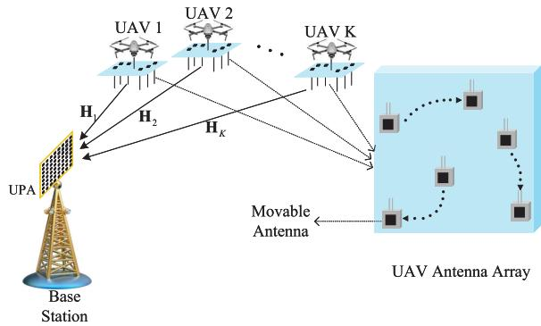  
Fig. 1. MA-enabled multi-UAV communication scenarios.

## II. SYSTEM MODEL

As shown in Fig. 1, this paper investigates the uplink transmission in a MU-MIMO system comprising UAVs and a base station. In this system architecture, the UAVs serve as transmitting nodes responsible for data stream transmission to the base station, while the base station acts as the receiving node, utilizing its configured antenna array to perform signal reception and processing for effective multi-user data separation.

The base station is equipped with $N _ { b } ~ = ~ N _ { b , x } \times N _ { b , z }$ antennas, indexed as $\mu _ { b } \in \left\{ 1 , 2 , \ldots , N _ { b } \right\}$ , arranged in a uniform planar array (UPA) configuration. The antenna elements are uniformly distributed along the x-axis and z-axis directions with an inter-element spacing of $\lambda / 2$ where λ denotes the carrier wavelength. The coordinates of the $( n _ { b , x } , n _ { b , z } )$ -th antenna at the base station are given by $\left( \left( n _ { b , x } - 1 \right) \cdot \frac { \lambda } { 2 } , 0 , \left( n _ { b , z } - 1 \right) \cdot \frac { \lambda } { 2 } \right)$ , where $n _ { b , x } \in$ $\{ 1 , 2 , \ldots , \hat { N _ { b , x } } \}$ and $n _ { b , z } \in \{ 1 , 2 , . . . , N _ { b , z } \}$ . On the UAV side, each UAV is equipped with $N _ { u } \mathbf { M } \mathbf { A }$ elements, indexed as $n _ { u } \in$ $\{ 1 , 2 , \ldots , N _ { u } \}$ . These antenna elements are distributed within an x-y plane of dimensions $( x _ { \mathrm { m a x } } ^ { a } - x _ { \mathrm { m i n } } ^ { a } ) \times ( y _ { \mathrm { m a x } } ^ { a } - y _ { \mathrm { m i n } } ^ { a } )$ to adapt to the time-varying channel environment during UAV mobility.

The system comprises K UAVs, and the k-th UAV is denoted as $\mathrm { U A V } _ { k }$ with $k \in \{ 1 , 2 , \ldots , K \}$ . Let the base station be positioned at the origin (0, 0, 0), and the location of $\mathrm { U A V } _ { k }$ be $\mathbf { p } _ { k } = \left( x _ { k } , y _ { k } , z _ { k } \right)$ . The absolute coordinates of the $n _ { u } \mathrm { - t h }$ antenna on $\mathrm { U A V } _ { k }$ are expressed as $\left( x _ { k } + x _ { n _ { u } , k } , y _ { k } + y _ { n _ { u } , k } , z _ { k } \right)$ where $( x _ { n _ { u } , k } , y _ { n _ { u } , k } )$ represents the local coordinate offset of antenna $n _ { u }$ relative to $\mathrm { U A V } _ { k }$ . Each UAV independently transmits $\textit { D } = \textit { 1 }$ data streams to the base station. Let $\mathbf { H } _ { k } \in \mathbb { C } ^ { N _ { b } \times N _ { u } }$ denote the wireless channel matrix from $\mathrm { U A V } _ { k }$ to the base station, where $k \in \{ 1 , 2 , \ldots , K \}$ . The received signal at the base station $\mathbf { y } \in \mathbb { C } ^ { N _ { b } \times 1 }$ can be expressed as:

$$
\mathbf { y } = \sum _ { k = 1 } ^ { K } \mathbf { H } _ { k } \mathbf { F } _ { k } \mathbf { s } _ { k } + \mathbf { n } ,\tag{1}
$$

where $\mathbf { F } _ { k } \in \mathbb { C } ^ { N _ { u } \times D }$ denotes the precoding matrix of $\mathrm { U A V } _ { k }$ for spatial preprocessing of the transmitted data streams, and $\mathbf { s } _ { k } \in \mathbb { C } ^ { D \times 1 }$ represents the D-dimensional data stream vector to be transmitted by $\mathbf { U A V } _ { k } . \ \mathbf { n } \in \mathbb { C } ^ { N _ { b } \times 1 }$ is the additive white gaussian noise vector, which follows a complex Gaussian distribution $\mathcal { C N } ( 0 , \sigma ^ { 2 } \mathbf { I } _ { N _ { b } } )$ , where $\sigma ^ { 2 }$ is the noise power and $\mathbf { I } _ { N _ { b } }$ is the $N _ { b } \times N _ { b }$ identity matrix.

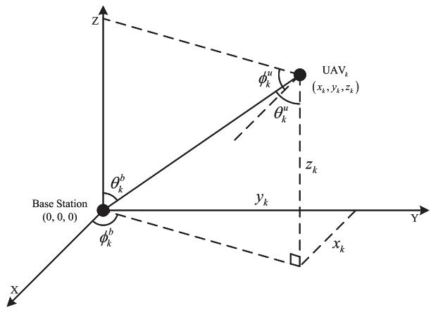  
Fig. 2. Elevation and azimuth angles annotations for MA-enabled multi-UAV systems.

Since the air-to-ground channel propagation environment is predominantly characterized by the line-of-sight (LOS) propagation path, the channel matrix $\mathbf { H } _ { k }$ between $\mathrm { U A V } _ { k }$ and the base station can be expressed as [20]:

$$
\mathbf { H } _ { k } = \frac { \lambda } { 4 \pi d _ { k } } e ^ { - j \frac { 2 \pi } { \lambda } d _ { k } } \mathbf { G } _ { k } ,\tag{2}
$$

where $d _ { k }$ denotes the distance between $\mathrm { U A V } _ { k }$ and the base station; $\mathbf { G } _ { k }$ represents the joint array response matrix between the base station and $\mathrm { U A V } _ { k }$ , which can be expressed as:

$$
\mathbf { G } _ { k } = \mathbf { a } _ { k } ^ { b } \left( \theta _ { k } ^ { b } , \phi _ { k } ^ { b } \right) \cdot \left( \mathbf { a } _ { k } ^ { u } \left( \theta _ { k } ^ { u } , \phi _ { k } ^ { u } , \mathbf { q } _ { k } \right) \right) ^ { H } ,\tag{3}
$$

where $\mathbf { a } _ { k } ^ { b } ( \theta _ { k } ^ { b } , \phi _ { k } ^ { b } ) \in \mathbb { C } ^ { N _ { b } \times 1 }$ is the array response vector of the base station, and $\mathbf { a } _ { k } ^ { u } ( \theta _ { k } ^ { b } , \phi _ { k } ^ { b } , \mathbf { q } _ { k } ) \ \in \ \mathbb { C } ^ { N _ { u } \times 1 }$ is the array response vector of $\mathrm { U A V } _ { k }$ , which can be respectively expressed as:

$$
\mathbf { a } _ { k } ^ { b } \left( \theta _ { k } ^ { b } , \phi _ { k } ^ { b } \right) = \mathbf { a } _ { b , x } \left( \theta _ { k } ^ { b } , \phi _ { k } ^ { b } \right) \otimes \mathbf { a } _ { b , z } \left( \theta _ { k } ^ { b } \right) ,\tag{4}
$$

$$
\begin{array} { r l } & { \mathbf { a } _ { k } ^ { u } \left( \theta _ { k } ^ { u } , \phi _ { k } ^ { u } , \mathbf { q } _ { k } \right) } \\ & { \quad \quad \quad = \left[ e ^ { - j \frac { 2 \pi } { \lambda } \left( x _ { 1 , k } \sin \theta _ { k } ^ { u } \cos \phi _ { k } ^ { u } + y _ { 1 , k } \sin \theta _ { k } ^ { u } \sin \phi _ { k } ^ { u } \right) } , \dots , \right. } \\ & { \quad \quad \quad \left. e ^ { - j \frac { 2 \pi } { \lambda } \left( x _ { N _ { u } , k } \sin \theta _ { k } ^ { u } \cos \phi _ { k } ^ { u } + y _ { N _ { u } , k } \sin \theta _ { k } ^ { u } \sin \phi _ { k } ^ { u } \right) } \right] ^ { T } , } \end{array}\tag{5}
$$

where $\mathbf { q } _ { k } = \{ ( x _ { n _ { u } , k } , y _ { n _ { u } , k } ) \} _ { n _ { u } = 1 } ^ { N _ { u } }$ represents the position set of the MA array on $\mathrm { U A V } _ { k \cdot } \ \mathbf { a } _ { b , x } \big ( \theta _ { k } ^ { b } , \phi _ { k } ^ { b } \big ) \ \in \ \mathbb { C } ^ { N _ { b , x } \times 1 }$ and $\mathbf { a } _ { b , z } ( \theta _ { k } ^ { b } ) \in \mathbb { C } ^ { N _ { b , z } \times 1 }$ are the array response vectors of the base station along the x-axis and z-axis directions, respectively, which can be expressed as:

$$
\begin{array} { r l } & { \mathbf { a } _ { b , x } \left( \theta _ { k } ^ { b } , \phi _ { k } ^ { b } \right) } \\ & { \mathbf { \Phi } = \Bigl [ 1 , e ^ { - j \pi \sin \theta _ { k } ^ { b } \cos \phi _ { k } ^ { b } } , \ldots , e ^ { - j \pi \left( N _ { b , x } - 1 \right) \sin \theta _ { k } ^ { b } \cos \phi _ { k } ^ { b } } \Bigr ] ^ { T } , } \end{array}\tag{6}
$$

$$
= \Big [ 1 , e ^ { - j \pi \cos { \theta _ { k } ^ { b } } } , \ldots , e ^ { - j \pi ( N _ { b , z } - 1 ) \cos { \theta _ { k } ^ { b } } } \Big ] ^ { T } ,\tag{7}
$$

where $\theta _ { k } ^ { u }$ and $\phi _ { k } ^ { u }$ are the elevation and azimuth angles from the base station to $\mathrm { U A V } _ { k } ; \theta _ { k } ^ { b }$ and $\phi _ { k } ^ { b }$ denote the corresponding

elevation and azimuth angles from $\mathrm { U A V } _ { k }$ to the base station. As shown in Fig. $2 , \theta _ { k } ^ { u } = \theta _ { k } ^ { b }$ and $\phi _ { k } ^ { u } = \pi - \phi _ { k } ^ { b }$ , with these angles expressible as:

$$
\theta _ { k } ^ { b } = \operatorname { a r c c o s } \left( \frac { z _ { k } } { d _ { k } } \right) ,\tag{8}
$$

$$
\phi _ { k } ^ { b } = \arctan \left( \frac { y _ { k } } { x _ { k } } \right) .\tag{9}
$$

## III. PROBLEM FORMULATION

Based on the aforementioned system model, to further analyze the communication performance and formulate the optimization problem, (1) can be rewritten as:

$$
\mathbf { y } = \mathbf { H } _ { k } \mathbf { F } _ { k } \mathbf { s } _ { k } + \sum _ { i \neq k } ^ { K } \mathbf { H } _ { i } \mathbf { F } _ { i } \mathbf { s } _ { i } + \mathbf { n } ,\tag{10}
$$

where the first term represents the desired signal from the target $\mathrm { U A V } _ { k }$ , and the second term represents the multi-user interference from other UAVs. Based on the treating interference as noise assumption and employing linear receive beamforming techniques, the base station’s estimate of the signal from $\mathrm { U A V } _ { k }$ is given by:

$$
\begin{array} { r } { \hat { \mathbf { s } } _ { k } = \mathbf { W } _ { k } ^ { H } \mathbf { y } , } \end{array}\tag{11}
$$

where $\mathbf { W } _ { k } \in \mathbb { C } ^ { N _ { b } \times D }$ denotes the linear receive beamforming matrix at the base station for $\mathrm { U A V } _ { k }$ . Based on the aforementioned signal model, the achievable rate of $\mathrm { U A V } _ { k }$ at the base station is given by:

$$
R _ { k } = \log _ { 2 } \operatorname* { d e t } \left( \mathbf { I } _ { D } + \mathbf { F } _ { k } ^ { H } \mathbf { H } _ { k } ^ { H } \mathbf { N } ^ { - 1 } \mathbf { H } _ { k } \mathbf { F } _ { k } \right) ,\tag{12}
$$

where $\textbf { N } ~ \in ~ \mathbb { C } ^ { N _ { b } \times N _ { b } }$ denotes the interference-plus-noise covariance matrix, given by $\mathbf { N } \triangleq \sum _ { i \neq k } ^ { K } \mathbf { H } _ { i } \mathbf { F } _ { i } \mathbf { F } _ { i } ^ { H } \mathbf { H } _ { i } ^ { H } + \sigma ^ { 2 } \mathbf { I } _ { N _ { b } }$

Therefore, the optimization objective is to maximize the achievable sum-rates of all UAVs:

$$
\begin{array} { r l } & { \quad \underset { ( \mathbf { F } _ { k } ) , ( \mathbf { \Psi } \mathbf { R } ) } { \mathrm { a r g ~ m a x } } \quad \underset { i \in \mathbb { N } } { K } } \\ & { \underset { ( \mathbf { F } _ { k } ) , ( \mathbf { \Psi } \mathbf { R } ) } { \mathrm { a r g ~ m a x } } , \ \underset { i \in \mathbb { N } } { K } } \\ & { \mathrm { s . t . } \quad \quad ( \mathbf { C l } ) : \mathrm { T r } ( \mathbf { F } _ { k } \mathbf { F } _ { k } ^ { H } ) \leq P _ { k , \operatorname* { m a x } } , \ \forall k } \\ & { \quad \quad ( \mathbf { C 2 } ) : \ x _ { \operatorname* { m i n } } ^ { u } \leq x _ { k } ^ { u } \leq x _ { \operatorname* { m a x } } ^ { u } } \\ & { \quad \quad ( \mathbf { C 3 } ) : \ \underset { y _ { m \mathrm { i n } } ^ { u } \leq y _ { k } } { y _ { m \mathrm { i n } } ^ { u } \leq y _ { k } ^ { u } \leq y _ { m \mathrm { a x } } ^ { u } } } \\ & { \quad \quad ( \mathbf { C 4 } ) : x _ { \operatorname* { m i n } } ^ { u } \leq x _ { n _ { u } , k } \leq x _ { \operatorname* { m a x } } ^ { u } } \\ & { \quad \quad ( \mathbf { C 5 } ) : y _ { \operatorname* { m i n } } ^ { u } \leq y _ { n _ { u } , k } \leq y _ { \operatorname* { m a x } } ^ { u } } \\ & { \quad \quad ( \mathbf { C 6 } ) : \left. \mathbf { p } _ { k } - \mathbf { p } _ { i } \right. \geq d _ { m \mathrm { i n } } ^ { u } , \ \forall k , \forall i } \\ & { \quad \quad ( \mathbf { C 7 } ) : \left. \mathbf { q } _ { k } - \mathbf { q } _ { k } \right. \geq d _ { m \mathrm { i n } } ^ { u } , \ \forall k , \forall i , } \end{array}\tag{13}
$$

where $( x _ { \mathrm { m i n } } ^ { u } , x _ { \mathrm { m a x } } ^ { u } )$ and $( y _ { \mathrm { m i n } } ^ { u } , y _ { \mathrm { m a x } } ^ { u } )$ denote the mobility ranges of the UAVs along the x-axis and y-axis, respectively, while $( x _ { \operatorname* { m i n } } ^ { a } , x _ { \operatorname* { m a x } } ^ { a } )$ and $( y _ { \mathrm { m i n } } ^ { a } , y _ { \mathrm { m a x } } ^ { a } )$ correspond to the adjustable ranges of the MAs mounted on the UAVs in the x-axis and y-axis directions, respectively; Constraint 6 is designed to prevent collisions caused by excessively close distances between UAVs, requiring that the distance between any two UAVs be no less than $d _ { \operatorname* { m i n } } ^ { u }$ , and Constraint 7 aims to mitigate coherent interference arising from overly small distances between antennas, with the distance between any two antennas needing to be greater than $d _ { \mathrm { m i n } } ^ { a }$

For traditional MU-MIMO systems, the WMMSE framework stands as a well-established iterative approach to solving the total rate maximization problem [42]. Nevertheless, as elaborated in the subsequent section, the classical WMMSE method necessitates substantial modifications to address the unique challenges arising from the joint optimization of UAV positioning and antenna configuration.

## IV. PROPOSED GGO-WMMSE

The optimization problem formulated in (13) is non-convex, which is challenging to solve directly. In this work, we transform the sum-rate maximization problem into a mean square error (MSE) minimization problem via the WMMSE method. Nevertheless, the introduction of MAs brings additional complexity: the flexibility of these MAs adds two extra sets of optimization variables, namely UAV positions p and antenna positions q. This renders the classical WMMSE method unable to solve the problem effectively. To tackle this key challenge, this paper proposes a new algorithmic framework. Specifically, we have developed a technique called RLS-G-GSOMP, which is integrated to enhance the classical WMMSE method.

To evaluate the system performance, the MSE matrix $\mathbf { E } _ { k }$ is defined to measure the estimation error between the estimated signal $\hat { \mathbf { s } } _ { k }$ of $\mathrm { U A V } _ { k }$ at the base station and the actual transmitted signal, which is expressed as:

$$
\begin{array} { r l } & { { \mathbf E } _ { k } = { \mathbb E } \bigg [ \big ( { \mathbf s } _ { k } - \hat { \mathbf s } _ { k } \big ) \big ( { \mathbf s } _ { k } - \hat { \mathbf s } _ { k } \big ) ^ { H } \bigg ] } \\ & { \quad \quad = { \mathbf I } _ { D } - { \mathbf W } _ { k } ^ { H } { \mathbf H } _ { k } { \mathbf F } _ { k } - { \mathbf F } _ { k } ^ { H } { \mathbf H } _ { k } ^ { H } { \mathbf W } _ { k } + { \mathbf W } _ { k } ^ { H } { \mathbf R } _ { y } { \mathbf W } _ { k } , } \end{array}\tag{14}
$$

where ${ \bf R } _ { y } \ = \ \mathbb { E } \left[ { \bf y } { \bf y } ^ { H } \right] \ = \ \sum _ { i = 1 } ^ { K } { \bf H } _ { i } { \bf F } _ { i } { \bf F } _ { i } ^ { H } { \bf H } _ { i } ^ { H } + \sigma ^ { 2 } { \bf I } _ { N _ { b } }$ . To minimize the overall estimation error of the system, the optimization problem can be formulated as:

$$
\begin{array} { r l r } { \quad } & { { } } & { \arg \operatorname* { m i n } _ { { \bf \Xi } } \displaystyle \sum _ { \{ { \bf F } _ { k } \} , { \bf \Xi } , { \bf \{ p } } _ { k } \} ^ { K } \mathrm { T r } ( { \bf E } _ { k } ) } \\ { \quad } & { { } } & { \{ { \bf F } _ { k } \} , \{ { \bf p } _ { k } \} , \{ { \bf q } _ { k } \} , \{ { \bf w } _ { k } \} \sum _ { k = 1 } ^ { K } \mathrm { T r } ( { \bf E } _ { k } ) } \\ { \quad } & { { } } & { \quad \mathrm { ( { \bf C 1 } ) } \sim \mathrm { ( { \bf C 7 } ) } . } \end{array}\tag{15}
$$

Reference [42] has proven that by introducing the positive semidefinite auxiliary weight matrix $\mathbf { B } _ { k } \succcurlyeq 0 \in \mathbb { C } ^ { D \times D }$ , the optimization problem can be equivalently reformulated as:

$$
\begin{array} { r l r } { \quad } & { \underset { \{ \mathbf { F } _ { k } \} , \{ \mathbf { p } _ { k } \} , \{ \mathbf { q } _ { k } \} , \{ \mathbf { w } _ { k } \} , \{ \mathbf { s } _ { k } \} } { \arg \operatorname* { m i n } } } & { \underset { \{ \mathbf { F } _ { k } \} , \{ \mathbf { B } _ { k } \} } { \sum } ( \mathrm { T r } ( \mathbf { B } _ { k } \mathbf { E } _ { k } ) - \log \operatorname* { d e t } ( \mathbf { B } _ { k } ) ) } \\ { \quad } & { \mathrm { s } . \mathrm { t } . } & { ( \mathbf { C 1 } ) \sim ( \mathbf { C 7 } ) . } \end{array}\tag{16}
$$

When solving for the optimal solutions of matrix $\mathbf { W } _ { k } , \mathbf { B } _ { k }$ and $\mathbf { F } _ { k }$ , the UAV position $\mathbf { p } _ { k }$ and the deployment positions of MAs on the UAV $\mathbf q _ { k }$ are treated as given parameters. Accordingly, the original optimization problem (16) can be equivalently reformulated as:

$$
\begin{array} { r l } & { \quad \quad \quad \quad \quad \quad \quad \quad \quad \quad \quad \quad \quad \quad \quad \quad \quad \quad \quad \quad \quad \quad \quad \quad \quad \quad \quad \quad \quad \quad \quad \quad \quad \quad \quad \quad } \\ & { \quad \quad \quad \quad \quad \quad \quad \quad \quad \quad \quad \quad \quad \quad \quad \quad \quad \quad \quad \quad \quad \quad \quad \quad \quad \quad \quad \quad \quad \quad } \\ & { \quad \quad \quad \quad \quad \quad \quad \quad \quad \quad \quad \quad \quad \quad \quad \quad \quad \quad \quad \quad \quad \quad } \\ & { \quad \quad { \mathrm { s . t . } } } \end{array}\tag{17}
$$

For the traditional WMMSE method, closed-form solutions exist for the weight matrix W, receive combining matrix B, and precoding matrix F.

## A. Optimizing W Given F, q, p and B

When $\mathbf { F } _ { k }$ and $\mathbf { B } _ { k }$ are fixed, the optimization problem of the base station’s receive beamforming matrix $\mathbf { W } _ { k }$ can be equivalently transformed into the classic minimum mean square error (MMSE) receiver design problem. The optimal solution to this problem can be obtained either by means of the orthogonality principle or by setting the partial derivative with respect to $\mathbf { W } _ { k }$ to zero. The following presents the derivation process based on setting the partial derivative of $\mathbf { W } _ { k }$ to zero:

$$
\nabla _ { \mathbf { W } _ { k } } \mathrm { T r } ( \mathbf { B } _ { k } \mathbf { E } _ { k } ) = \mathbf { R } _ { y } \mathbf { W } _ { k } \mathbf { B } _ { k } - \mathbf { H } _ { k } \mathbf { F } _ { k } \mathbf { B } _ { k } = 0 .\tag{18}
$$

Thus, the optimal $\mathbf { W } _ { k } ^ { * }$ is:

$$
\mathbf { W } _ { k } ^ { * } = \mathbf { R } _ { y } ^ { - 1 } \mathbf { H } _ { k } \mathbf { F } _ { k } .\tag{19}
$$

## B. Optimizing B Given F, q, p and W

To find the optimal $\mathbf { B } _ { k }$ , we take the derivative of the objective function with respect to $\mathbf { B } _ { k }$ and set it to zero:

$$
\nabla _ { \mathbf { B } _ { k } } \left[ \mathrm { T r } ( \mathbf { B } _ { k } \mathbf { E } _ { k } ) - \log \operatorname* { d e t } ( \mathbf { B } _ { k } ) \right] = \mathbf { E } _ { k } - \mathbf { B } _ { k } ^ { - 1 } .\tag{20}
$$

Setting this derivative to zero for optimization:

$$
\mathbf { B } _ { k } ^ { * } = \mathbf { E } _ { k } ^ { - 1 } .\tag{21}
$$

C. Optimizing F, q, p Given W and B Based on RLS-G-GOMP

With $\mathbf { W } _ { k }$ and $\mathbf { B } _ { k }$ fixed, the optimization problem for the UAV precoder $\mathbf { F } _ { k }$ can be reformulated as:

$$
\begin{array} { r l } & { \displaystyle \underset { \{ \mathbf { F } _ { k } \} , \{ \mathbf { p } _ { k } \} , \{ \mathbf { q } _ { k } \} } { \arg \operatorname* { m i n } } \sum _ { k = 1 } ^ { K } \mathrm { T r } ( \mathbf { B } _ { k } \mathbf { E } _ { k } ) } \\ & { \displaystyle \mathrm { s } . \mathbf { t } . \quad ( \mathbf { C } \mathbf { 1 } ) \sim ( \mathbf { C } 7 ) . } \end{array}\tag{22}
$$

Handle the power constraint C1 by introducing the Lagrange multiplier $\pmb { \mu } _ { k }$ , [43] has shown that problem (22) is equivalent to:

$$
\begin{array} { r } { \underset { \{ \mathbf { F } _ { k } \} , \{ \mathbf { p } _ { k } \} , \{ \mathbf { q } _ { k } \} } { \arg \operatorname* { m i n } } \mathcal { L } = \underset { k = 1 } { \overset { K } { \sum } } \mathrm { T r } ( \mathbf { B } _ { k } \mathbf { E } _ { k } ) } \\ { + \underset { k = 1 } { \overset { K } { \sum } } \mu _ { k } \left( \mathrm { T r } ( \mathbf { F } _ { k } \mathbf { F } _ { k } ^ { H } ) - P _ { k , \operatorname* { m a x } } \right) } \\ { \mathrm { s . t . } \quad ( \mathbf { C 2 } ) \sim ( \mathbf { C 7 } ) . } \end{array}\tag{23}
$$

where $\mu _ { k }$ can be calculated using the bisection method [43]. It is challenging to solve for F, p and q jointly from the above problem. Therefore, the objective function (23) is reconstructed by means of the following proposition.

Proposition 1: The multi-user MMSE transmitter optimiza tion problem is equivalent to the following Frobenius norm regularized least squares problem as:

$$
\underset { \{ \mathbf { F } _ { k } \} } { \arg \operatorname* { m i n } } \quad \sum _ { i = 1 } ^ { K } { \left\| \mathbf { B } _ { i } ^ { 1 / 2 } \mathbf { W } _ { i } ^ { H } \mathbf { H } _ { k } \mathbf { F } _ { k } - \delta _ { i k } \mathbf { B } _ { i } ^ { 1 / 2 } \right\| _ { F } ^ { 2 } } + \mu _ { k } \| \mathbf { F } _ { k } \| _ { F } ^ { 2 } .\tag{24}
$$

Proof: Please refer to Appendix A.

Remark 1: As indicated in Proposition 1, the subproblem of the WMMSE precoder in (22) is equivalent to a regularized zero-forcing (RZF) equalization problem, where the presence of and introduces regularization terms. In essence, it can be formulated as a regularized least squares problem. Therefore, we can incorporate the idea of sparse optimization to jointly optimize the precoder, antenna positions, and UAV placement.

Given proposition 1, the optimization problem (22) can be reformulated as:

$$
\begin{array} { r } { \underset { \{ \mathbf { r } _ { k } \} , \{ \mathbf { p } _ { k } \} , \{ \mathbf { q } _ { k } \} } { \arg \operatorname* { m i n } } \sum _ { k = 1 } ^ { K } ( \| \mathbf { B } _ { k } ^ { 1 / 2 } \mathbf { W } _ { k } ^ { H } \mathbf { H } \mathbf { F } _ { k } - \mathbf { B } _ { i } ^ { 1 / 2 } \| _ { F } ^ { 2 }  } \\ {  +  \sum _ { i \neq k } ^ { K } \| \mathbf { B } _ { i } ^ { 1 / 2 } \mathbf { W } _ { i } ^ { H } \mathbf { H } \mathbf { F } _ { k } \| _ { F } ^ { 2 } + \mu _ { k } \| \mathbf { F } _ { k } \| _ { F } ^ { 2 } ) } \end{array}\tag{25}
$$

The influence of UAV positions and antenna positions on the objective function renders this reformulated problem computationally intractable. To mitigate this challenge, we can frame the optimization of UAV positions and MAs positions as a two-layer sparse optimization problem: specifically, we treat both UAV positions and MAs positions as discrete variables, and select their optimal locations from a pre-defined candidate position dictionary. This approach enables the joint optimization of UAV precoding, UAV positions, and MAs positions.

Remark 2: Distinct from the downlink MU-MIMO problem investigated in [23], the uplink scenario studied in this paper presents a unique and critical challenge. The interference term $\begin{array} { r } { \sum _ { i \neq k } ^ { K } \left\| \bar { \mathbf { B } _ { i } ^ { 1 / 2 } } \mathbf { W } _ { i } ^ { H } \mathbf { H } \mathbf { F } _ { k } \right\| _ { F } ^ { 2 } } \end{array}$ in (25) captures the aggregate interference caused by the transmit signal of UAV k at the receive combiners of all other UAVs. This structure results in a tightly coupled and non-convex interference function, where the precoding matrix $( \mathbf { F } _ { k } )$ of any single UAV directly impacts the MSE and consequently the achievable rates of all other users in the system. This inherent coupling, combined with the necessity to jointly optimize the precoders $\{ \mathbf { F } _ { k } \}$ , positions $\left\{ \mathbf { p } _ { k } \right\}$ , and antenna positions $\left\{ \mathbf { q } _ { k } \right\}$ for all UAVs, renders the problem significantly more complex than its downlink counterpart. It is this very challenge that motivates our reformulation of the problem into a sparse recovery framework and the development of the RLS-G-GSOMP algorithm to efficiently navigate this complex optimization landscape.

As observed from (2), $\mathbf { H } _ { k }$ comprises three components: the first two are associated with UAV positions, while the third is related to both UAV positions and antenna positions. Consequently, $\mathbf { H } _ { k }$ can be rewritten as follows:

$$
\mathbf { H } _ { k } = p l \left( \mathbf { p } _ { k } \right) \mathbf { a } _ { k } ^ { b } \left( \mathbf { p } _ { k } \right) \cdot \left( \mathbf { a } _ { k } ^ { u } \left( \mathbf { p } _ { k } , \mathbf { q } _ { k } \right) \right) ^ { H } ,\tag{26}
$$

where $p l \left( \cdot \right)$ is denoted by $\frac { \lambda } { 4 \pi d \iota } e ^ { - j \frac { 2 \pi } { \lambda } d \iota }$ . We define two dictionaries that satisfy C6 and C7: GU represents the candidate positions for the UAV and has a length of $G _ { 1 }$ , while $\mathcal { G } _ { A }$ represents the candidate positions for the MA with a length of $G _ { 2 } .$ Let $a _ { k } ^ { u } ( { \bf p } _ { k } , { \bf q } _ { k } ) = { \bf \bar { \zeta } } e ^ { - j \frac { 2 \pi } { \lambda } ( x _ { n _ { u } } , { \bf \zeta } }$ k sin θu cos φu+ynu,k sin θu sin φu)

Based on this, a virtual channel representation $\mathbf { \left( V C R \right) \overline { { H } } \in }$ $\mathbb { C } ^ { N _ { b } \times G _ { 1 } G _ { 2 } }$ is established for all UAVs, defined as follows:

$$
\overline { { \mathbf { H } } } \overset { \mathrm { V C R } } { \Longrightarrow } [ \widetilde { \mathbf { H } } _ { 1 } , \cdot \cdot \cdot , \widetilde { \mathbf { H } } _ { G _ { 1 } } ] ,\tag{27}
$$

where

$$
\widetilde { \mathbf { H } } _ { g _ { 1 } } = [ \mathbf { h } _ { g _ { 1 } , 1 } , \cdots , \mathbf { h } _ { g _ { 1 } , G _ { 2 } } ] \in \mathbb { C } ^ { N _ { b } \times G _ { 2 } } ,\tag{28}
$$

$$
\mathbf { h } _ { g _ { 1 } , g _ { 2 } } = p l \left( g _ { 1 } \right) a _ { k } ^ { u } ( g _ { 1 } , g _ { 2 } ) \mathbf { a } _ { k } ^ { b } \left( g _ { 1 } \right) \in \mathbb { C } ^ { N _ { b } \times 1 } ,\tag{29}
$$

where, $g _ { 1 } \in { \mathcal { G } } _ { U } , g _ { 2 } \in { \mathcal { G } } _ { A }$ . Therefore, the following sparse recovery problem can be formulated for F, q and p:

$$
\begin{array} { r } { \underset { \{ \mathbf { r } _ { k } \} , \{ \mathbf { p } _ { k } \} , \{ \mathbf { q } _ { k } \} } { \arg \operatorname* { m i n } } \sum _ { k = 1 } ^ { K } ( \| \mathbf { B } _ { k } ^ { 1 / 2 } \mathbf { W } _ { k } ^ { H } \overline { { \mathbf { H } \mathbf { F } } } _ { k } - \mathbf { B } _ { i } ^ { 1 / 2 } \| _ { F } ^ { 2 }  } \\ {  +  \sum _ { i \neq k } ^ { K } \| \mathbf { B } _ { i } ^ { 1 / 2 } \mathbf { W } _ { i } ^ { H } \overline { { \mathbf { H } \mathbf { F } } } _ { k } \| _ { F } ^ { 2 } + \mu _ { k } \| \overline { { \mathbf { F } } } _ { k } \| _ { F } ^ { 2 } ) } \end{array}
$$

$$
\begin{array} { r l } { \mathrm { s . t . } } & { \| \overline { { \mathbf { F } } } _ { k } \| _ { \mathrm { r o w , 0 } } = N _ { u } , } \\ & { \mathrm { s u p p } \left( \overline { { \mathbf { F } } } _ { k } \right) \subseteq \mathcal G _ { g _ { 1 } } , } \end{array}\tag{30}
$$

where $\overline { { \mathbf { F } } } _ { k }$ denotes the sparse precoder of $\mathrm { U A V } _ { k } , \ \| \overline { { \mathbf { F } } } _ { k } \| _ { \mathrm { r o w } , 0 }$ denotes the number of non-zero rows of $\mathbf { F } _ { k } .$ , supp $\left( \overline { { \mathbf { F } } } _ { k } \right)$ represents the support set of $\begin{array} { r } { \overline { { \mathbf { F } } } _ { k } ( \mathrm { i } . \mathrm { e } . } \end{array}$ ., the indices of nonzero rows), and $\mathcal { G } _ { g _ { 1 } }$ denotes the subset of candidate antenna positions corresponding to the selected UAV position $g _ { 1 }$

We define $\bar { \mathbf { Y } _ { k } } = \bar { \mathbf { B } _ { k } ^ { 1 / 2 } } , \mathbf { C } _ { k } = \mathbf { B } _ { k } ^ { 1 / 2 } \mathbf { W } _ { k } ^ { H } \bar { \mathbf { H } } , \mathbf { X } = \overline { { \mathbf { F } _ { k } } }$ and $\mathbf { C } _ { i } = \mathbf { B } _ { i } ^ { 1 / 2 } \mathbf { W } _ { i } ^ { H } \overline { { \mathbf { H } } }$ . When $\overline { { \mathbf { F } } } _ { k }$ is optimized at each iteration, the other variables $\overline { { \mathbf { F } } } _ { i } ~ \left( i ~ \neq ~ k \right)$ are fixed. This transforms the original problem into an optimization problem specifically targeting $\overline { { \mathbf { F } } } _ { k } ,$ and in this case, the objective function can be expressed in the form of $J _ { k } ( { \mathbf X } )$

$$
J _ { k } \left( \mathbf { X } \right) = \| \mathbf { C } _ { k } \mathbf { X } - \mathbf { Y } _ { k } \| _ { F } ^ { 2 } + \sum _ { i \neq k } ^ { K } \| \mathbf { C } _ { i } \mathbf { X } \| _ { F } ^ { 2 } + \mu _ { k } \| \mathbf { X } \| _ { F } ^ { 2 } .\tag{31}
$$

This problem can be efficiently solved by the proposed Regularized Least Squares-based Gradient Grouped Simultaneous Orthogonal Matching Pursuit (RLS-G-GSOMP) algorithm. This algorithm overcomes the limitations of the traditional Orthogonal Matching Pursuit (OMP) framework. By incorporating Hierarchical Group Constraints and a Gradient - Projection - based Atom Selection Criterion, it deeply embeds the inherent structural priors of UAV antenna array configurations, thus enabling the efficient joint optimization of F, p, and q.

Specifically, the core concept of RLS-G-GSOMP is to model the sparse recovery process as a sequential decision - making problem. In this context, the selection of atoms at each step depends not only on the instantaneous correlation of the current residual but also on the global gradient information induced by the group structure. The Greedy Pursuit (GP) criterion [44] is adopted to select, at each iteration, the atoms that enable the steepest descent of the objective function. For a candidate atom $g _ { 2 }$ , its correlation with the negative gradient is measured by the norm of the gradient row corresponding to this atom:

$$
g ^ { * } = \arg \operatorname* { m a x } \quad \| \nabla J _ { k } \left( \mathbf { X } \right) _ { g } \| _ { 2 } ^ { 2 } ,\tag{32}
$$

where $\nabla J _ { k } \left( \mathbf { X } \right) _ { g _ { 2 } }$ denotes the $g _ { 2 } \mathrm { - t h }$ row of the gradient of the objective function $J _ { k } \left( \mathbf { X } \right)$ . Selecting the atom $g _ { 2 } ^ { * }$ that maximizes this norm ensures the greatest reduction in the objective function at each iteration. The gradient of $J _ { k } \left( \mathbf { X } \right)$ can be expressed as:

$$
\nabla J _ { k } ( { \mathbf { X } } ) = 2 { \mathbf { C } } _ { k } ^ { H } ( { \mathbf { C } } _ { k } { \mathbf { X } } - { \mathbf { Y } } _ { k } ) + 2 \sum _ { i \neq k } ^ { K } { \mathbf { C } } _ { i } ^ { H } { \mathbf { C } } _ { i } { \mathbf { X } } + 2 \mu _ { k } { \mathbf { X } } .\tag{33}
$$

Since the proposed RLS-G-GSOMP is a two-layer sparse optimization framework, the algorithm is designed with a two-stage iterative process. First, during the first iteration of each UAV, the algorithm conducts a global exploration and selects the atoms with the largest gradient from the complete dictionary for UAV position anchoring. At this point, the support set contains no atoms at all. Therefore, the gradient of $J _ { k } \left( \mathbf { X } \right)$ degenerates to the atom that has the maximum \` -norm inner product with the current residual:

$$
\nabla J _ { k } ( { \mathbf X } ) = - 2 { \mathbf C } _ { k } ^ { H } { \mathbf Y } _ { k } .\tag{34}
$$

At this point, the optimal atom $g ^ { * }$ selected according to (32) enables the determination of the optimal horizontal position of the UAV, denoted as $\mathbf { p } _ { k } .$ , which is given by $g ^ { * } \setminus G _ { 2 }$ (where $\backslash \backslash$ denotes the floor division operation). Consequently, the subsequent search space is collapsed into a specific candidate subset of antennas $\Gamma _ { k } .$ , that is associated with this UAV position.

Subsequently, in the following $N _ { u } - 1$ iterations, the algorithm performs a local search within the subset $\Gamma _ { \mathrm { { k } } }$ . Notably, the first term in (33) corresponds to the residual term of the traditional Orthogonal Matching Pursuit (OMP), the second term represents the interference term imposed on the current user by other users, and the third term is a regularization term. Since the third term does not affect (32), the gradient of $J _ { k } \left( \mathbf { X } \right)$ at this point can be expressed as follows:

$$
\nabla J _ { k } ( { \mathbf { X } } ) = 2 { \mathbf { C } } _ { k } ^ { H } ( { \mathbf { C } } _ { k } { \mathbf { X } } - { \mathbf { Y } } _ { k } ) + 2 \sum _ { i \neq k } ^ { K } { \mathbf { C } } _ { i } ^ { H } { \mathbf { C } } _ { i } { \mathbf { X } } .\tag{35}
$$

After the atom selected in each iteration expands the support set Λ, the objective function is maximized once to update the coefficients on the non-zero rows. By taking the derivative of the objective function, the update formula for the variable X is obtained as follows:

$$
\mathbf { X } _ { \Lambda } = \left( \mathbf { C } _ { k , \Lambda } ^ { H } \mathbf { C } _ { k , \Lambda } + \sum _ { i \neq k } \mathbf { C } _ { i , \Lambda } ^ { H } \mathbf { C } _ { i , \Lambda } + \mu _ { k } \mathbf { I } \right) ^ { - 1 } \mathbf { C } _ { k , \Lambda } ^ { H } \mathbf { Y } _ { k } ,\tag{36}
$$

where, the parameter $\mu _ { k }$ is dynamically adjusted via binary search to ensure that the solution satisfies the power constraint (C1). This solution is mathematically equivalent to the formulation derived in (40) of Appendix A. The pseudocode for the RLS-G-GSOMP algorithm is presented as algorithm 1.

## D. GGO-WMMSE Algorithm Summary

Optimizing the positions of UAVs and antennas provides new degrees of freedom for enhancing the performance of MU-MIMO systems, as UAV positions and antenna positions directly affect the array response vectors $\mathbf { a } _ { k } ^ { u }$ and $\mathbf { a } _ { k } ^ { b } .$ . However, since $\mathbf { a } _ { k } ^ { u }$ and $\mathbf { a } _ { k } ^ { b }$ must satisfy the structural constraints of the array manifold, coupled with the fact that the objective function is highly non-convex with respect to position variables and there exists stro ng coupling between variables, optimization methods based on gradients or convex relaxation face significant challenges in achieving effective solutions.

Algorithm 1 RLS-G-GSOMP   
Input: $\mathbf { Y } _ { k } \in \mathbb { C } ^ { D \times D } ; \overline { { \mathbf { H } } } \in \mathbb { C } ^ { N _ { b } \times G _ { 1 } G _ { 2 } } ; P _ { k , m a x } ; K ;$   
$N _ { u } ; N _ { b } ; D ; G _ { 1 } ; G _ { 2 } ,$   
Output: $\{ \mathbf { F } _ { 1 } , \cdots , \mathbf { F } _ { K } \} ;$ The selected atom index for   
each UAV;   
1 Initialize randomly $\{ \mathbf { F } _ { 1 } , \cdot \cdot \cdot , \mathbf { F } _ { K } \} , \{ \mathbf { p } _ { 1 } , \cdot \cdot \cdot , \mathbf { p } _ { K } \}$ and   
$\{ \mathbf { q } _ { 1 } , \dots , \mathbf { q } _ { K } \} ; \ : \Lambda _ { k } = \varnothing , \forall k \in K ;$ ; set of atom indices   
$\Gamma = \{ 1 , 2 , \cdot \cdot \cdot , G _ { 1 } \times G _ { 2 } \}$   
2 for $k = 1 , 2 , \cdots , K$ do   
3 Compute the gradients of all atoms for $\mathrm { U A V } _ { k }$   
according to (34);   
4 Select the atom $g ^ { * }$ according to (32);   
5 Add $g ^ { * }$ to the support set $\Lambda _ { k } ;$   
6 Remove $g ^ { * }$ from $\Gamma ;$   
7 Determine $\Gamma _ { k }$ based on $g ^ { * } ;$   
8 for $n = 0 , 1 , \cdots , N _ { u } - 2$ do   
9 Compute the gradients of all atoms in $\Gamma _ { k }$ for   
$\mathrm { U A V } _ { K }$ according to (35);   
10 Select the atom $g ^ { * }$ according to (32) ;   
11 Add $g ^ { * }$ to the support set $\Lambda _ { k } ;$   
12 Remove $\Gamma _ { k }$ from $\Gamma ;$

Algorithm 2 GGO-WMMSE   
Input: $I _ { m a x } ; P _ { k , m a x } ; K ; N _ { u } ; N _ { b } ; D ; G _ { 1 } ; G _ { 2 } ;$   
Output: $\{ \mathbf { F } _ { 1 } , \\\cdot \cdot \ , \mathbf { F } _ { K } \} ; \ \{ \mathbf { W } _ { 1 } , \cdot \cdot \cdot \ , \mathbf { W } _ { K } \} ;$   
$\{ \mathbf { p } _ { 1 } , \cdot \cdot \cdot , \mathbf { p } _ { K } \} ; \{ \mathbf { q } _ { 1 } , \cdot \cdot \cdot , \mathbf { q } _ { K } \} ;$   
1 Initialize randomly $\{ \mathbf { F } _ { 1 } , \cdot \cdot \cdot , \mathbf { F } _ { K } \} , \{ \mathbf { p } _ { 1 } , \cdot \cdot \cdot , \mathbf { p } _ { K } \}$ and   
$\{ \mathbf { q } _ { 1 } , \cdot \cdot \cdot , \mathbf { q } _ { K } \} ; \ : \Lambda _ { k } = \varnothing , \forall k \in K ;$ set of atom indices   
$\Gamma = \{ 1 , 2 , \cdot \cdot \cdot , G _ { 1 } \times G _ { 2 } \} ;$   
2 while $i < I _ { m a x }$ do   
UPDATE $\{ \mathbf { W } _ { k } \} , \forall k \in K$   
3 for $k = 1 , 2 , \cdots , K$ do   
4 ${ \bf R } _ { y } = \sum _ { i = 1 } ^ { \kappa } { \bf H } _ { i } { \bf F } _ { i } { \bf F } _ { i } ^ { H } { \bf H } _ { i } ^ { H } + \sigma ^ { 2 } { \bf I } _ { N _ { b } } ;$   
5 $\mathbf { W } _ { k } ^ { * } = \mathbf { \bar { R } } _ { y } ^ { - 1 } \mathbf { H } _ { k } \mathbf { F } _ { k } ;$   
UPDATE $\{ \mathbf { B } _ { k } \} , \forall k \in K$   
6 for $k = 1 , 2 , \cdots , K$ do   
$\mathbf { E } _ { k } = \mathbf { I } _ { D } - \mathbf { W } _ { k } ^ { H } \mathbf { H } _ { k } \mathbf { F } _ { k }$   
7 $\mathbf { \sigma } _ { \cdot } \mathbf { F } _ { k } ^ { H } \mathbf { H } _ { k } ^ { H } \mathbf { W } _ { k } + \mathbf { W } _ { k } ^ { H } \mathbf { R } _ { y } { \mathbf { W } _ { k } } ^ { \dagger }$   
8 $\mathbf { B } _ { k } ^ { * } = \mathbf { E } _ { k } ^ { - 1 } ;$   
UPDATE $\{ \mathbf { F } _ { k } \} , \{ \mathbf { p } _ { k } \} , \{ \mathbf { q } _ { k } \} \forall k \in K$   
9 Execute Algorithm 1: RLS-G-GSOMP

In contrast to traditional WMMSE algorithms, GGO-WMMSE not only optimizes the transmit precoders F and receivers W in each iteration but also enables additional joint optimization of UAV positions and antenna positions through the proposed RLS-G-GSOMP approach. This innovatively addresses the unique joint optimization challenges inherent in MA systems. The pseudocode for GGO-WMMSE is presented as algorithm 2.

## E. Convergence and Computational Complexity Analysis of GGO-WMMSE

The overall computational complexity of the algorithm is the sum of the complexities of the three alternating update steps within each iteration.

Step 1 (update W): The computational complexity of this step primarily stems from calculating the interference covariance matrix $\mathbf { R } _ { u } \in \mathbb { C } ^ { N _ { b } \times N _ { b } }$ and performing its matrix inversion. Specifically, computing $\mathbf { R } _ { y }$ requires summing the interference terms $\dot { \mathbf { H } } _ { k } \mathbf { F } _ { k } \mathbf { F } _ { k } ^ { \hat { H } } \mathbf { H } _ { k } ^ { H }$ across all $K$ users. Each matrix multiplication within this term has a complexity of $\mathcal { O } ( N _ { b } ^ { 2 } N _ { u } )$ , leading to an overall complexity of $\mathcal { O } ( K N _ { b } ^ { 2 } N _ { u } )$ for the summation process. Subsequently, the matrix inversion of $\mathbf { R } _ { y }$ incurs a complexity of $\mathcal { O } ( N _ { b } ^ { 3 } )$ . Thus, the total computational complexity of Step 1 is $\mathcal { \bar { O } } ( K N _ { b } ^ { 2 } N _ { u } + N _ { b } ^ { 3 } )$ For base stations with a moderate number of antennas $N _ { b }$ (e.g., $N _ { b } ~ \leq ~ 6 4 )$ , this complexity remains relatively low. Only when $N _ { b }$ becomes extremely large does matrix inversion potentially become a bottleneck, necessitating the adoption of low-complexity approximation algorithms.

Step 2 (update B): This step requires computing the mean squared error (MSE) matrix $\bar { \mathbf { E } _ { k } } \in \mathrm { \overline { { \mathbb { C } } } } ^ { D \times D }$ and performing its inversion for each user, resulting in a computational complexity of $\mathcal { O } ( K D ^ { 3 } )$ . Compared to Steps 1 and 3, this complexity is negligible and has almost no impact on the overall efficiency of the algorithm.

Step 3 (update F, p and q): This step is the primary contributor to the algorithm’s computational complexity, with its core being the execution of the RLS-G-GSOMP algorithm to solve the joint sparse recovery problem. First, in the global search phase, gradients must be computed for all $G _ { 1 } \times G _ { 2 }$ candidate atoms. Each gradient calculation involves matrix-vector multiplication and norm operations, incurring a complexity of $\mathcal { O } ( D N _ { b } )$ ; thus, the total complexity for this phase is $\mathcal { O } ( ( G _ { 1 } -$ $k ) G _ { 2 } D N _ { b } )$ . Next, in the local search phase, the search is restricted to the $G _ { 2 }$ candidate antenna atoms corresponding to the selected UAV positions. This process is repeated $N _ { u } - 1$ times, leading to a complexity of $\mathcal { O } ( ( N _ { u } - 1 ) G _ { 2 } D N _ { b } )$ . Additionally, after each atom selection, a regularized least squares problem (36) must be solved. Its complexity is proportional to the cube of the current support set size $| \Lambda | , \mathrm { i . e . , } \mathcal { O } ( | \Lambda | ^ { 3 } )$ . Since this operation is performed $N _ { u }$ times in total, the cumulative complexity becomes $\mathcal { O } \left( \sum _ { t = 1 } ^ { N _ { u } } t ^ { 3 } \right) = \mathcal { O } ( N _ { u } ^ { 4 } )$ . Therefore, for a single user, the overall complexity of RLS-G-GOMP is approximately $\mathcal { O } ( G _ { 1 } G _ { 2 } D N _ { b } + N _ { u } ^ { 4 } )$ . Given that this process is executed independently for K users, the total complexity of Step 3 is $\mathcal { O } \left( K \left( ( G _ { 1 } - k ) G _ { 2 } D N _ { b } + N _ { u } ^ { 4 } \right) \right)$ . Notably, while $G _ { 1 }$ and $G _ { 2 }$ may be relatively large, they are pre-determined constants dependent on the system deployment area and precision requirements, and they don’t scale with the number of users $K$ or the number of antennas $N _ { b } , N _ { u }$ . In practical applications, the trade-off between algorithm performance and complexity can be balanced by adjusting the sizes of the candidate position sets $G _ { 1 }$ and $G _ { 2 }$

TABLE I  
SIMULATION PARAMETERS
<table><tr><td>Parameter</td><td>Description</td><td>Value</td></tr><tr><td> $K$ </td><td>Number of UAV</td><td>3</td></tr><tr><td> $N _ { b }$ </td><td>Number of base station antennas</td><td>16</td></tr><tr><td> $N _ { u }$ </td><td>Number of UAV antennas</td><td>4</td></tr><tr><td> $f$ </td><td>Frequency</td><td>3GHz</td></tr><tr><td> $\lambda$ </td><td>Wavelength</td><td>0.1m</td></tr><tr><td> $d _ { m i n } ^ { u }$ </td><td>Minimum distance between UAVs</td><td>5m</td></tr><tr><td> $d _ { m i n } ^ { a }$ </td><td>Minimum distance between antennas</td><td>0.05m</td></tr><tr><td> $x _ { \mathrm { m i n } } ^ { u }$ </td><td>Lower bound of  $x _ { k }$ </td><td>0m</td></tr><tr><td> $x _ { \mathrm { m a x } } ^ { u }$ </td><td>Upper bound of  $x _ { k }$ </td><td>50m</td></tr><tr><td> $x _ { \mathrm { m i n } } ^ { a }$ </td><td>Lower bound of  $x _ { n _ { u } , k }$ </td><td>0.05m</td></tr><tr><td> $x _ { \mathrm { m a x } } ^ { a }$ </td><td>Upper bound of  $x _ { n _ { u } , k }$ </td><td>-0.05m</td></tr><tr><td> $z _ { k }$ </td><td>UAV altitude</td><td>20m</td></tr><tr><td>SNR</td><td>Transmit SNR</td><td>5dB</td></tr></table>

The convergence guarantee of the GGO-WMMSE algorithm stems from its alternating optimization framework and the optimality properties of each subproblem. First, when the transmitter parameters $( { \bf F } , { \bf p } , { \bf q } )$ are fixed, the updates for the receiver matrix W and weight matrix B admit closed-form solutions. Specifically, the update of $\mathbf { W } _ { k }$ yields a globally optimal solution by solving the MMSE receiver problem (19), while the update of $\mathbf { B } _ { k }$ directly obtains the optimal value via matrix inversion (21). This implies that Steps 1 and 2 strictly reduce the value of the objective function (i.e., (16)) at the current iteration. Second, when the receiver matrix W and weight matrix B are fixed, Step 3 jointly optimizes the transmitter using the RLS-G-GOMP algorithm. As a greedy algorithm, RLS-G-GOMP ensures that, in each atom selection step, the atom that maximizes the reduction of the objective function value is greedily chosen. This greedy selection strategy guarantees that the objective function value is non-increasing in each iteration. Meanwhile, the power constraint restricts the feasible region, ensuring the objective function value has a lower bound. By the Monotone Bounded Convergence Theorem, the sequence of objective function values is guaranteed to converge to a stable value. Thus, the GGO-WMMSE algorithm is convergent.

## V. SIMULATION RESULTS AND ANALYSIS

In this section, we verify the effectiveness of the proposed GGO-WMMSE algorithm through numerical simulations. Unless otherwise specified, the parameters for all algorithms are set according to table I.

Benchmarks: In addition to the proposed GGO-WMMSE, we adopt other four benchmarks for performance comparison, which are listed as follows:

• FPA-OPU: This scheme employs a conventional half-wavelength spaced UPA with fixed antenna positions. Optimization is confined to the UAV’s position, explicitly isolating the performance gain attributable to macro-scale UAV positioning.

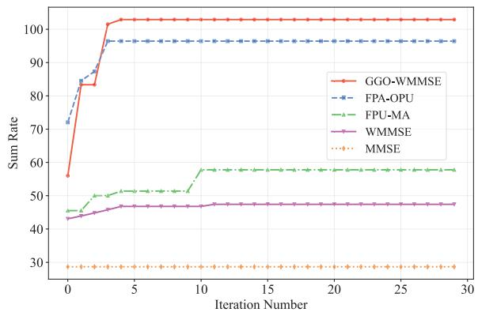

Fig. 3. Sum rate convergence comparison.  
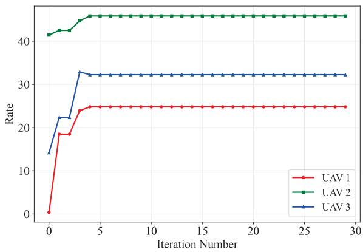  
Fig. 4. Individual UAV rate convergence.

• FPU-MA: This scheme employs MA with fixed UAV positions. Optimization is confined to the positions of the MAs, explicitly isolating the performance gain attributable to micro-scale antenna positioning.

WMMSE: This scheme employs a conventional half-wavelength spaced UPA with fixed UAV positions and fixed antenna positions. Optimization is confined to the transmit and receive beamforming using the WMMSE algorithm, explicitly isolating the performance gain attributable to algorithmic processing gain.

• MMSE: This scheme employs a conventional half-wavelength spaced UPA with fixed UAV positions and fixed antenna positions. Optimization is confined to the linear receiver filter based on the MMSE criterion, explicitly isolating the performance gain attributable to interference-aware reception.

Fig. 3 illustrates the sum rate versus the number of iterations for five different algorithms. It is observed that the proposed GGO-WMMSE algorithm achieves rapid convergence and eventually stabilizes, demonstrating excellent performance. The convergence behavior of each UAV under the GGO-WMMSE framework is visualized in fig. 4. This result validates that the embedded RLS-G-GSOMP scheme can efficiently coordinate the coupled variables of UAV and antenna positions, thereby ensuring the algorithm’s practicality and stability.Upon convergence, the sum rate of GGO-WMMSE is significantly superior to all baseline schemes. This proves the effectiveness of the adopted “macro-micro” joint optimization strategy in achieving complementary gains. In contrast, the FPA-OPU and FPU-MA schemes, which only optimize a single scale, exhibit limited performance. This suggests that macro and micro position optimizations are highly coupled, and fixing either dimension severely constrains the system. Furthermore, the conventional WMMSE and MMSE algorithms yield the lowest performance, demonstrating that relying solely on beamforming is insufficient. Therefore, the joint optimization of position and beamforming is critical to unleashing the full performance of multi-UAV uplink systems.

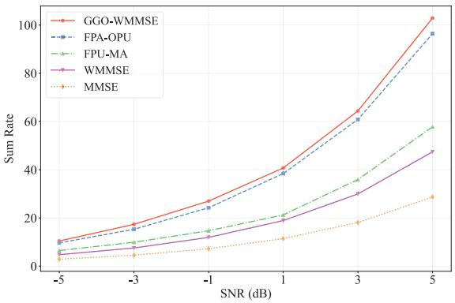  
(a) K = 3

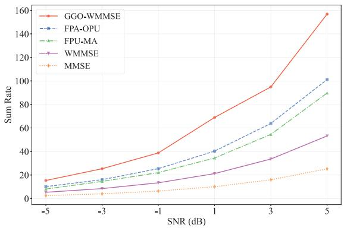  
(b) $K = 5$  
Fig. 5. The sum rate versus SNR.

As shown in Fig. 5, the proposed GGO-WMMSE algorithm achieves the highest sum rate across all SNRs for both K = 3 and $K \ = \ 5$ . At low SNR regimes, the performance gap between the proposed method and the benchmark schemes is relatively small. However, as the SNR increases, the superiority of the GGO-WMMSE algorithm becomes significantly more pronounced. This advantage comes from its ability to jointly optimize macro-scale UAV positions along with micro-scale MA positions and beamforming, thereby effectively suppressing inter-UAV interference compared to the benchmark schemes. Furthermore, by comparing Fig. 5(a) and Fig. 5(b), it can be observed that user density plays a critical role in the performance gain. When the number of UAVs is $K \ : = \ : 3 .$ , spatial resources are relatively abundant. In this scenario, the FPA-OPU benchmark is sufficient to mitigate interference, resulting in a marginal performance gap compared to the proposed algorithm. Conversely, as the number of UAVs increases to $K \ = \ 5 ,$ , spatial resources become scarce and interference intensifies. In this scenario, optimizing UAV positions alone is insufficient. The microscale adjustments enabled by the MA then become crucial for effective interference suppression, a capability that is beyond the reach of macro-scale optimization alone.

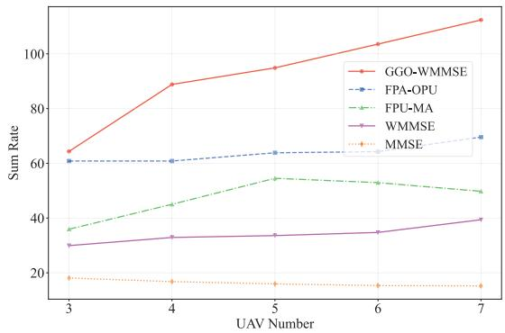  
(a) $N _ { u } = 4$

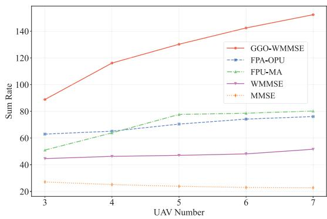  
(b) $N _ { u } = 6$  
Fig. 6. The sum rate versus number of UAVs.

Fig. 6 illustrates the sum rate performance versus number of UAV for the five algorithms under $N _ { u } = 4$ and $N _ { u } = 6$ configurations at $S N R \ = \ 3 \ \mathrm { d B }$ . The simulation results demonstrate that the proposed GGO-WMMSE algorithm consistently maintains a performance lead, showing excellent stability. As the number of UAVs increases, GGO-WMMSE achieves significant performance improvement, indicating its effectiveness in coordinating inter-UAV interference and fully exploiting the spatial degrees of freedom. This advantage becomes more pronounced as the system scales up, particularly in the $N _ { u } ~ = ~ 6$ configuration where the performance gap between GGO-WMMSE and the other algorithms widens further. Notably, the limitations of FPA-OPU and FPU-MA become apparent under different configurations. In the $N _ { u } = 4$ scenario, the performance of FPU-MA begins to degrade after the number of UAVs exceeds five. This suggests that with limited spatial resources, micro-scale optimization alone is insufficient to manage the growing interference, necessitating macro-scale UAV position optimization. Conversely, in the $N _ { u } ~ = ~ 6$ scenario, FPA-OPU is outperformed by FPU-MA once the UAV count reaches five. This indicates that as the number of antenna increase, the role of micro-scale optimization becomes more critical and macro-scale optimization by itself is not enough to unlock the full system potential. These observations collectively confirm that a significant synergistic effect exists between macro-micro position optimization as the system grows, rendering both indispensable. Through its joint optimization strategy, the proposed GGO-WMMSE algorithm can dynamically adapt to varying UAV network sizes, validating its significant application value in multi-UAV communication systems.

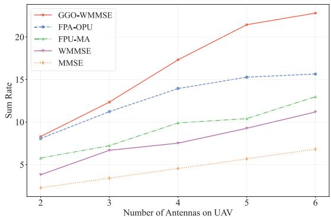  
(a) $S N R = - 3$ dB

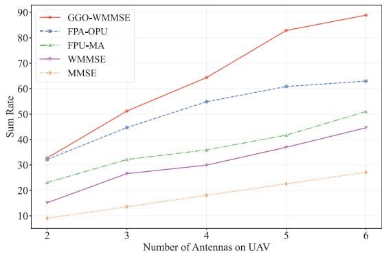  
(b) $S N R = 3 ~ ( $ IB

Fig. 7. The sum rate versus number of UAV antennas.  
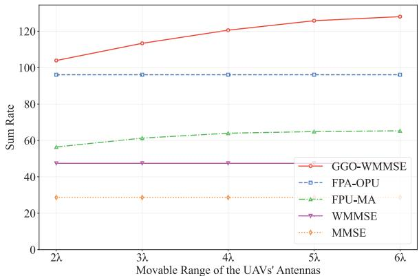  
Fig. 8. The sum rate versus the UAV antennas movable region.

Fig. 7 shows the relationship between the system sum rate and the number of UAV antennas under two channel conditions at $S N R = - 3$ dB and 3 dB. The simulation results demonstrate that the proposed GGO-WMMSE algorithm consistently outperforms the other algorithms. While all schemes benefit from increased spatial degrees of freedom as antennas grow from 2 to 6, GGO-WMMSE achieves significantly performance improvement through its integrated macro-micro position optimization. This advantage becomes particularly pronounced in the 3 dB SNR regime, where conventional methods like FPU-MA and FPA-OPU demonstrate inherent limitations due to their isolated optimization approaches. Their partial optimization fails to fully exploit the available spatial dimensions for effective interference management. In contrast, GGO-WMMSE’s joint optimization dynamically reconfigures the entire system geometry, precisely shaping spatial channels to support higher data rates. These results demonstrate that merely increasing antenna count provides limited benefits. The crucial determinant of performance is the coordinated design strategy that our algorithm uniquely delivers.

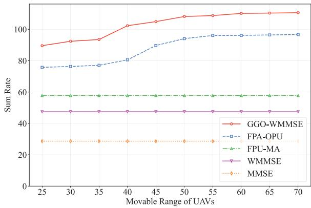  
Fig. 9. The sum rate versus the UAV movable region.

Figure 8 depicts the system sum-rate versus the movement range of the UAV-mounted MAs, which is varied from 2λ to 6λ. Simulation results demonstrate that the proposed GGO-WMMSE algorithm consistently achieves superior performance across all movement ranges. As the antenna movement range increases, GGO-WMMSE exhibits a steady performance improvement, highlighting its capability to effectively exploit the enhanced spatial degrees of freedom for system optimization. In contrast, although the FPU-MA scheme also benefits from a larger movement range, its performance gain is considerably lower than that of GGO-WMMSE. The FPA-OPU, WMMSE and MMSE scheme, relying on fixed-position antennas, shows no performance variation with increasing movement range. This result indirectly validates the value of introducing MA technology in UAV communication systems.

Figure 9 illustrates the relationship between the system sum rate and the UAV movement range, which varies from 25 meters to 70 meters. As demonstrated, the proposed GGO-WMMSE algorithm consistently achieves the highest performance across all benchmarks. Its sum rate increases monotonically with the expansion of the movement range, confirming its effectiveness in harnessing the additional spatial degrees of freedom. In contrast, while the FPU-MA scheme also exhibits some performance improvement, it consistently underperforms compared to GGO-WMMSE. This persistent gap, even at larger movement ranges, underscores the limitation of macro-scale optimization alone and highlights the superiority of jointly optimizing both macro and micro positions of MA empowered multi-UAV system. Such a result strongly validates the effectiveness of integrating

MA technology in UAV communication systems. Meanwhile, FPA-OPU, WMMSE, and MMSE, which lack the capability to leverage the increased macro-scale mobility, show no performance variation. These findings collectively demonstrate that the GGO-WMMSE algorithm effectively translates physical mobility into enhanced channel gain, and that the joint micromacro position optimization strategy is highly efficacious.

## VI. CONCLUSION

This work investigated the uplink sum-rate maximization problem in MA-enabled multi-UAV MU-MIMO networks. To address the challenge of coupled beamforming design, UAV position and antenna position optimization, we proposed a novel GGO-WMMSE optimization framework. Specifically, a low-complexity RLS-G-GSOMP algorithm was developed to efficiently solve the sparse optimization sub-problems. Numerical results demonstrated that the proposed scheme achieves a significant improvement in system sum-rate compared to conventional fixed-position antenna systems and existing baselines. These findings validate the synergy between the macro-scale mobility of UAVs and the micro-scale mobility of MAs, which allows the system to effectively leverage dual-scale spatial degrees of freedom to reshape the wireless propagation environment for enhancing system capacity. For future work, we plan to validate the proposed framework using measured channel data and investigate robust designs that explicitly account for practical impairments, such as UAV hovering jitter and mechanical vibrations of the MAs.

## APPENDIX PROOF OF PROPOSITION 1

To facilitate more effective joint optimization of F and q, we conduct further refinement on the optimization objective delineated in (23), the $\mathbf { E } _ { k }$ is rewritten as:

$$
\mathbf { E } _ { k } = \left( \mathbf { I } _ { D } - \mathbf { W } _ { k } ^ { H } \mathbf { H } _ { k } \mathbf { F } _ { k } \right) \left( \mathbf { I } _ { D } - \mathbf { W } _ { k } ^ { H } \mathbf { H } _ { k } \mathbf { F } _ { k } \right) ^ { H } + \mathbf { D } _ { k } ,\tag{37}
$$

where $\begin{array} { r l r } { { \bf D } _ { k } } & { = } & { \sum _ { i \neq k } { \bf W } _ { k } ^ { H } { \bf H } _ { i } { \bf F } _ { i } { \bf F } _ { i } ^ { H } { \bf H } _ { i } ^ { H } { \bf W } _ { k } + \sigma ^ { 2 } { \bf W } _ { k } ^ { H } { \bf W } _ { k } , } \end{array}$ which is independent of $\mathbf { F } _ { k }$ . Thus, $\mathrm { T r } ( \mathbf B _ { k } \mathbf E _ { k } )$ can be expressed as:

$$
\mathrm { T r } ( \mathbf { B } _ { k } \mathbf { E } _ { k } ) = \left\| \mathbf { B } _ { k } ^ { 1 / 2 } - \mathbf { B } _ { k } ^ { 1 / 2 } \mathbf { W } _ { k } ^ { H } \mathbf { H } _ { k } \mathbf { F } _ { k } \right\| _ { F } ^ { 2 } + \mathrm { T r } ( \mathbf { B } _ { k } \mathbf { D } _ { k } ) .\tag{38}
$$

However, (23) involves the summation over all users, $\scriptstyle \sum _ { k = 1 } ^ { K } \operatorname { T r } ( \mathbf { B } _ { k } \mathbf { E } _ { k } )$ . When optimizing $\mathbf { F } _ { k }$ , the terms corresponding to other users, $\operatorname { T r } ( \mathbf { B } _ { i } \mathbf { E } _ { i } )$ for $i \neq k ,$ , also depend on $\mathbf { F } _ { k }$ . This dependency arises because $\mathbf { D } _ { i }$ (a component of $\mathbf { E } _ { i } )$ incorporates the term $\mathbf { W } _ { i } ^ { H } \mathbf { H } _ { k } \mathbf { F } _ { k } \mathbf { F } _ { k } ^ { H } \mathbf { H } _ { k } ^ { H } \mathbf { W } _ { i } .$ . Consequently, the influence of all users must be accounted for in the optimization process. Consequently, (23) can be rewritten as follows:

$$
\arg \operatorname* { m i n } _ { \{ \mathbf { F } _ { k } \} } \quad \sum _ { i = 1 } ^ { K } \left\| \mathbf { B } _ { i } ^ { 1 / 2 } \mathbf { W } _ { i } ^ { H } \mathbf { H } _ { k } \mathbf { F } _ { k } - \delta _ { i k } \mathbf { B } _ { i } ^ { 1 / 2 } \right\| _ { F } ^ { 2 } + \mu _ { k } \| \mathbf { F } _ { k } \| _ { F } ^ { 2 } ,\tag{39}
$$

where $\delta _ { i k }$ denotes the Kronecker delta function (taking a value of 1 if $i = k$ and 0 otherwise). Constant terms independent of $\mathbf { F } _ { k }$ are omitted, and the regularization term $\mu _ { k } \| \mathbf F _ { k } \| _ { F } ^ { 2 }$ is derived from the power constraint C1. When $i \neq k ,$ , it can be converted into a regularization term with respect to $\mathbf { F } _ { k }$ . Its optimal solution is given by:

$$
\mathbf { F } _ { k } ^ { * } = \left( \mathbf { H } _ { k } ^ { H } \sum _ { i = 1 } ^ { K } \left( \mathbf { W } _ { i } \mathbf { B } _ { i } \mathbf { W } _ { i } ^ { H } \right) \mathbf { H } _ { k } + \mu _ { k } \mathbf { I } _ { N _ { u } } \right) ^ { - 1 } \mathbf { H } _ { k } ^ { H } \mathbf { W } _ { k } \mathbf { B } _ { k } .\tag{40}
$$

## REFERENCES

[1] Z. Wang, J. Zhang, E. Bjornson, D. Niyato, and B. Ai, “Optimal bilinear equalizer for cell-free massive mimo systems over correlated Rician channels,” IEEE Trans. Signal Process., vol. 73, pp. 1501–1517, 2025.

[2] J. Sang et al., “Coverage enhancement by deploying RIS in 5G commercial mobile networks: Field trials,” IEEE Wireless Commun., vol. 31, no. 1, pp. 172–180, Feb. 2024.

[3] J. Sang et al., “Multi-scenario broadband channel measurement and modeling for sub-6 GHz RIS-assisted wireless communication systems,” IEEE Trans. Wireless Commun., vol. 23, no. 6, pp. 6312–6329, Jun. 2024.

[4] Y. Sun et al., “Dual-polarized stacked metasurface transceiver design with rate splitting for next-generation wireless networks,” IEEE J. Sel. Areas Commun., vol. 43, no. 3, pp. 811–833, Mar. 2025.

[5] K. Feng, Q. Wang, X. Li, and C.-K. Wen, “Deep reinforcement learning based intelligent reflecting surface optimization for MISO communication systems,” IEEE Wireless Commun. Lett., vol. 9, no. 5, pp. 745–749, May 2020.

[6] Y. Sun et al., “Multi-functional RIS-assisted semantic anti-jamming communication and computing in integrated aerial-ground networks,” IEEE J. Sel. Areas Commun., vol. 42, no. 12, pp. 3597–3617, Dec. 2024.

[7] Z. Zhang, K.-K. Wong, J. Dang, Z. Zhang, C. Masouros, and C.- B. Chae, “On fundamental limits of slow-fluid antenna multiple access for unsourced random access,” IEEE Wireless Commun. Lett., vol. 14, no. 11, pp. 3455–3459, Nov. 2025.

[8] Z. Zhang, K.-K. Wong, J. Dang, Z. Zhang, and C.-B. Chae, “On fundamental limits for fluid antenna-assisted integrated sensing and communications for unsourced random access,” IEEE J. Sel. Areas Commun., vol. 44, pp. 136–149, 2026.

[9] W. Lyu et al., “CRB minimization for RIS-aided mmWave integrated sensing and communications,” IEEE Internet Things J., vol. 11, no. 10, pp. 18381–18393, May 2024.

[10] K. Mao et al., “A UAV-aided real-time channel sounder for highly dynamic nonstationary A2G scenarios,” IEEE Trans. Instrum. Meas., vol. 72, pp. 1–15, 2023.

[11] Y. Chen et al., “UAV-aided efficient informative path planning for autonomous 3D spectrum mapping,” IEEE Trans. Cognit. Commun. Netw., vol. 12, pp. 1664–1677, 2026.

[12] H. Ni et al., “Path loss and shadowing for UAV-to-ground UWB channels incorporating the effects of built-up areas and airframe,” IEEE Trans. Intell. Transp. Syst., vol. 25, no. 11, pp. 17066–17077, Nov. 2024.

[13] G. Hu et al., “Movable antennas-assisted secure transmission without Eavesdroppers’ instantaneous CSI,” IEEE Trans. Mobile Comput., vol. 23, no. 12, pp. 14263–14279, Dec. 2024.

[14] G. Chen, R. Zhang, X. Guan, Q. Wu, and W. Wu, “Joint beamforming and antenna position design for movable antenna-assisted uRLLC systems,” IEEE Wireless Commun. Lett., vol. 15, pp. 1195–1199, 2026.

[15] G. Hu, Q. Wu, J. Ouyang, K. Xu, Y. Cai, and N. Al-Dhahir, “Movableantenna-array-enabled communications with CoMP reception,” IEEE Commun. Lett., vol. 28, no. 4, pp. 947–951, Apr. 2024.

[16] G. Chen, R. Zhang, X. Guan, G. Hu, Q. Wu, and W. Wu, “Energy efficiency maximization for multiuser communications with movable antennas: Joint beamforming and antenna position design,” IEEE Internet Things J., vol. 13, no. 1, pp. 868–881, Jan. 2026.

[17] R. Zhang et al., “Channel estimation for movable-antenna MIMO systems via tensor decomposition,” IEEE Wireless Commun. Lett., vol. 13, no. 11, pp. 3089–3093, Nov. 2024.

[18] H. Jiang, W. Shi, Z. Chen, Z. Zhang, K.-K. Wong, and H. Shin, “Dynamic channel modeling of fluid antenna systems in UAV communications,” IEEE Wireless Commun. Lett., vol. 14, no. 10, pp. 3169–3173, Oct. 2025.

[19] W. Liu, X. Zhang, H. Xing, J. Ren, Y. Shen, and S. Cui, “UAV-enabled wireless networks with movable-antenna array: Flexible beamforming and trajectory design,” IEEE Wireless Commun. Lett., vol. 14, no. 3, pp. 566–570, Mar. 2025.

[20] T. Ren, X. Zhang, L. Zhu, W. Ma, X. Gao, and R. Zhang, “6-D movable antenna enhanced interference mitigation for cellular-connected UAV communications,” IEEE Wireless Commun. Lett., vol. 14, no. 6, pp. 1618–1622, Jun. 2025.

[21] Y. Zeng et al., “Fixed and movable antenna technology for 6G integrated sensing and communication,” 2024, arXiv:2407.04404.

[22] X. Shao et al., “A tutorial on six-dimensional movable antenna for 6G networks: Synergizing positionable and rotatable antennas,” 2025, arXiv:2503.18240.

[23] S. Yang et al., “Flexible WMMSE beamforming for MU-MIMO movable antenna communications,” IEEE Trans. Signal Process., vol. 73, pp. 1–13, 2025.

[24] G. Hu et al., “Two-timescale design for movable antenna array-enabled multiuser uplink communications,” IEEE Trans. Veh. Technol., vol. 74, no. 3, pp. 5152–5157, Mar. 2025.

[25] C. Ye, R. Zhang, C. Hu, L. Yao, W. Wu, and C. Yuen, “Robust DOA estimation for movable antenna arrays with partial gain and phase errors,” IEEE Wireless Commun. Lett., vol. 15, pp. 545–549, 2026.

[26] L. Zhu, W. Ma, and R. Zhang, “Modeling and performance analysis for movable antenna enabled wireless communications,” IEEE Trans. Wireless Commun., vol. 23, no. 6, pp. 6234–6250, Jun. 2024.

[27] S. Yang, W. Lyu, B. Ning, Z. Zhang, and C. Yuen, “Flexible precoding for multi-user movable antenna communications,” IEEE Wireless Commun. Lett., vol. 13, no. 5, pp. 1404–1408, May 2024.

[28] Z. Zhang et al., “Finite-blocklength fluid antenna systems,” 2025, arXiv:2509.15643.

[29] X. Pi, L. Zhu, H. Mao, Z. Xiao, X.-G. Xia, and R. Zhang, “Movable antenna enabled near-field MU-MIMO communication,” IEEE Wireless Commun. Lett., vol. 14, no. 10, pp. 3319–3323, Oct. 2025.

[30] X.-W. Tang, Y. Shi, Y. Huang, and Q. Wu, “UAV-mounted movable antenna: Joint optimization of UAV placement and antenna configuration,” 2024, arXiv:2409.02469.

[31] H. Mao, L. Zhu, X. Pi, Z. Xiao, X.-G. Xia, and R. Zhang, “Robust design for movable-antenna array enabled AAV communications with jittering,” IEEE Wireless Commun. Lett., vol. 14, no. 11, pp. 3470–3474, Nov. 2025.

[32] W. Zhou, D. Yang, Y. Xu, L. Xiao, F. Wu, and T. Zhang, “Movable antenna array for improving AAV relaying networks,” IEEE Wireless Commun. Lett., vol. 14, no. 12, pp. 4127–4131, Dec. 2025.

[33] X.-W. Tang, Y. Shi, Y. Huang, and Q. Wu, “Joint optimization of UAV height and antenna configuration for UAV-mounted movable antenna,” IEEE Wireless Commun. Lett., vol. 15, pp. 235–239, 2026.

[34] L. Lin, J. Ding, Z. Zhou, and B. Jiao, “Power-efficient full-duplex satellite communications aided by movable antennas,” IEEE Wireless Commun. Lett., vol. 14, no. 3, pp. 656–660, Mar. 2025.

[35] N. Li, P. Wu, B. Ning, L. Zhu, and W. Mei, “Over-the-air computation via 2-D movable antenna array,” IEEE Wireless Commun. Lett., vol. 14, no. 1, pp. 33–37, Jan. 2025.

[36] J. Ding, L. Zhu, Z. Zhou, B. Jiao, and R. Zhang, “Near-field multiuser communications aided by movable antennas,” IEEE Wireless Commun. Lett., vol. 14, no. 1, pp. 138–142, Jan. 2025.

[37] X. Jia, J. Ding, Z. Zhou, L. Lin, and B. Jiao, “Movable antenna-enabled full-duplex multiuser communications,” in Proc. IEEE Int. Workshop Radio Freq. Antenna Technol., May 2025, pp. 578–583.

[38] J. Ding, Z. Zhou, and B. Jiao, “Movable antenna-aided secure full-duplex multi-user communications,” IEEE Trans. Wireless Commun., vol. 24, no. 3, pp. 2389–2403, Mar. 2025.

[39] J.-M. Kang, “NMAP-net: Deep-learning-aided near-field multibeamforming design and antenna position optimization for XL-MIMO communications,” IEEE Internet Things J., vol. 12, no. 11, pp. 18397–18413, Jun. 2025.

[40] J.-M. Kang, “Deep learning enabled multicast beamforming with movable antenna array,” IEEE Wireless Commun. Lett., vol. 13, no. 7, pp. 1848–1852, Jul. 2024.

[41] C. Xie et al., “A learning-based flexible beamforming method for movable antenna-enabled integrated sensing, communication, and power transmission system,” IEEE Commun. Lett., vol. 29, no. 9, pp. 2043–2047, Sep. 2025.

[42] Q. Shi, M. Razaviyayn, Z.-Q. Luo, and C. He, “An iteratively weighted MMSE approach to distributed sum-utility maximization for a MIMO interfering broadcast channel,” IEEE Trans. Signal Process., vol. 59, no. 9, pp. 4331–4340, Sep. 2011.

[43] S. S. Christensen, R. Agarwal, E. de Carvalho, and J. M. Cioffi, “Weighted sum-rate maximization using weighted MMSE for MIMO-BC beamforming design,” in Proc. IEEE Int. Conf. Commun., Jun. 2009, pp. 1–6.

[44] T. Blumensath and M. E. Davies, “Gradient pursuits,” IEEE Trans. Signal Process., vol. 56, no. 6, pp. 2370–2382, Jun. 2008.