# Movable Antenna Enhanced Cellular-Connected UAV Communication With Trajectory Planning

Tianshi Ren , Xianchao Zhang , Member, IEEE, Wenyan Ma , Member, IEEE,

Lipeng Zhu , Senior Member, IEEE, Xiaozheng Gao , Member, IEEE, and Rui Zhang , Fellow, IEEE

Abstract—The sixth-generation (6G) mobile communication systems are expected to provide seamless connectivity for unpiloted aerial vehicles (UAVs) to support them in fulfilling various tasks. However, the line-of-sight (LoS)-dominated channels of cellular-connected UAVs expose them to severe cochannel interference from nearby base stations (BSs), which significantly degrades communication reliability. To address this challenge, this paper investigates a movable antenna (MA)-enhanced cellular-connected UAV communication system, where the additional spatial degrees of freedom (DoFs) offered by MAs are exploited for the interference-aware UAV trajectory planning. Specifically, we formulate an optimization problem to minimize the UAV mission completion time by jointly optimizing the UAV beamforming matrix, antenna position vector (APV), UAV trajectory, and UAV–BS association, subject to constraints on signal-to-interference-plus-noise ratio (SINR) requirements, UAV mobility, and MA mobility. To overcome the inherent challenges of the continuous-time formulation, we discretize both the flight region and trajectory of the UAV, thereby reformulating the problem into a tractable discrete optimization problem. A selective uniform cost search (SUCS) algorithm is then developed for UAV trajectory planning, where the feasibility of candidate grid points is evaluated by jointly optimizing beamforming, APV, and UAV–BS association to maximize the expected SINR. Simulation results show that, compared with benchmark schemes, the proposed MA enhanced design significantly improves the expected SINR of cellular-connected UAVs along the optimized trajectory, thereby reducing UAV mission completion time while ensuring reliable communication links.

Index Terms—UAV/drone communications, movable antenna (MA), cellular network, antenna position optimization, UAV trajectory planning.

## I. INTRODUCTION

N RECENT years, unpiloted aerial vehicles (UAVs) have attracted increasing attention due to their mobility, flexibility, and capability to provide on-demand services in a wide range of scenarios [1], [2], [3], [4]. In the context of wireless communication systems, UAVs have emerged as a promising technology to enhance coverage, capacity, and reliability. Specifically, UAVs can serve as aerial base stations (BSs) to support ground users in hotspot or emergency areas, act as relays to extend the coverage of existing networks, or operate as mobile users to enable various applications such as surveillance, delivery, and data collection [5], [6], [7]. Among these roles, when UAVs act as aerial users, terrestrial cellular networks are usually required to provide reliable connectivity to support their communication needs. This has given rise to the concept of cellular-connected UAV, where UAVs are integrated into existing cellular networks as aerial users [8]. However, integrating UAVs into cellular networks also introduces new challenges that have not been addressed in conventional terrestrial communications.

Compared with terrestrial users, UAVs in cellular-connected networks typically fly at higher altitudes, which results in lineof-sight (LoS)-dominated channels with ground BSs. On one hand, this enables UAVs to establish reliable links even with distant BSs, thereby improving connectivity opportunities. On the other hand, the strong LoS propagation also makes UAVs more susceptible to severe co-channel interference from a large number of non-associated BSs, which poses significant challenges for maintaining satisfactory communication performance [9], [10]. As a result, interference becomes a fundamental bottleneck for cellular-connected UAV communications, which needs to be effectively mitigated in UAV trajectory planning. Among previous studies, the authors in [11] and [12] investigated interference management schemes for cellular-connected UAVs in uplink and downlink scenarios, aiming to enhance communication performance. In addition, the authors in [13] and [14] focused on UAV trajectory design under signal-to-interference-plus-noise ratio (SINR) constraints, where the objective is to guarantee reliable connectivity while mitigating interference. Moreover, the authors in [15] addressed the co-channel interference from UAVs to terrestrial users, proposing joint designs that improve the performance of both aerial and ground communications. However, most existing studies on cellular-connected UAV communications primarily rely on conventional trajectory optimization, power control, or beamforming techniques under fixed-position antenna (FPA) setups. This approach limits the spatial degrees of freedom (DoFs) for efficient interference mitigation.

To address this limitation, the concept of movable antenna (MA) [16], [17], [18], [19] has recently emerged as a promising technology in wireless communications. By allowing antennas to adjust their positions within a confined region, MA arrays provide additional DoFs for enhancing beamforming flexibility and thus suppressing interference. Owing to their superior interference mitigation capability compared with conventional FPA arrays, MA arrays can be effectively integrated into wireless communication systems to improve communication performance in interference-limited systems. This has recently motivated extensive research to exploit the new spatial DoF in MA array beamforming for interference mitigation. Several recent studies have demonstrated the remarkable interference mitigation capability of MA array in various wireless communication scenarios. In multi-user systems, MA arrays have been shown to effectively suppress inter-user interference by jointly optimizing antenna position vector (APV) and antenna weight vector (AWV) [20], [21], [22]. In spectrum sharing networks, MA arrays have been exploited to flexibly adjust antenna positions and thereby alleviate interference for secondary receivers [23]. Moreover, in satellite communications, MA-enabled dynamic spatial adaptation can improve link reliability and efficiently mitigate interference [24]. These representative results highlight the great potential of integrating MA arrays into cellularconnected UAV networks to achieve reliable communication in interference-aware environments.

In addition to their interference suppression capability, recent research has further explored the use of MA array in diverse wireless communication and sensing scenarios. Specifically, studies in MA enhanced multi-user communications have exploited the flexibility of MA array to suppress interference and improve spectral efficiency [25], [26], [27], [28]. Moreover, MA arrays have also been shown to outperform conventional FPA arrays in wideband communication systems [29]. As the movement region of MAs increases, near-field communication models have been introduced for MA systems [30], [31]. In secure communications, MA arrays have been shown to provide resilience against eavesdropping and intentional jamming attacks [32]. Beyond communications, MAs can also benefit sensing tasks by improving detection and estimation performance [33], [34], [35]. For integrated sensing and communication (ISAC) systems, MAs can offer simultaneous gains for improving the trade-off between sensing and communication performance [36]. From an optimization perspective, some new methodologies for MA position optimization such as graph-based method have been proposed to efficiently exploit their spatial DoFs under practical constraints [37]. More recently, data-driven approaches, such as deep learning-based methods, have also been explored for MA systems, where neural networks are employed to optimize antenna positions and beamforming vectors in largescale wireless networks [38], [39], [40]. Furthermore, by extending the spatial flexibility of MAs to include antenna rotation in addition to position adjustment, the architecture of six-dimensional MA (6DMA) has recently emerged, providing a novel solution for future wireless systems [41], [42], [43], [44]. Collectively, these studies demonstrate that MA arrays provide new DoFs at the physical layer, enabling efficient interference management and performance enhancement across a wide range of communication and sensing scenarios.

Building upon these advancements across diverse domains, the integration of MA arrays into UAVs has also attracted growing attention, offering new possibilities for enhancing aerial communication systems. For cellular-connected UAV communications, 6DMA arrays have been employed to jointly optimize antenna position, rotation, and beamforming, achieving significant interference mitigation against non-associated BSs [45]. Beyond interference mitigation, MA array has also been utilized in UAV-enabled multi-user systems, where the joint optimization of UAV trajectory, transmit beamforming, and antenna positions substantially enhanced the throughput performance [46]. At a larger scale, the synergy of UAV swarms and MA arrays has been investigated, enabling a twolevel mobility structure in which UAV placement and local MA adjustments are jointly optimized to create favorable channels for multi-user communications [47]. In addition, UAV-mounted MA arrays have been applied to ISAC systems, where the simultaneous optimization of communication and sensing beamforming as well as antenna positioning improved both data rate and sensing accuracy [48]. To address practical impairments, robust MA-UAV designs have been proposed to mitigate performance degradation caused by angle-ofdeparture (AoD) uncertainties due to UAV jittering, thereby improving the worst-case user fairness compared with fixedantenna systems [49]. From a spectrum sharing perspective, UAV-mounted MAs introduced additional vertical mobility DoF, enabling efficient beamforming design that enhanced secondary user performance while keeping interference to primary users under control [50]. Furthermore, the role of MA-enabled micro-mobility has been combined with UAV trajectory-based macro-mobility in physical layer security, highlighting their complementary strengths [51]. The UAVenabled passive 6DMA was proposed in [52], where an intelligent reflecting surface (IRS) is mounted on a UAV to simultaneously adjust its three-dimensional (3D) location and orientation. By jointly optimizing IRS deployment and passive beamforming, this architecture significantly improved multicast performance under practical angle-dependent reflection models. These studies demonstrate the high potential of MA arrays in UAV-enhanced wireless systems, enabling more flexible, robust, and efficient aerial communications in terms of interference management, throughput enhancement, spectrum sharing, and secure transmission. Overall, existing MA enhanced UAV communication studies mainly aim to jointly optimize the UAV’s hovering location and the MAs positions to improve the instantaneous communication performance. However, since the UAV position is usually assumed to be fixed, the additional DoF of UAV in trajectory planning remains largely unexplored in MA enhanced UAV communication systems.

Despite the promising advances of MA arrays, their role in the trajectory design of cellular-connected UAVs has not been fully addressed in existing studies. In particular, cellularconnected UAVs are exposed to strong co-channel interference from multiple neighboring BSs, which fundamentally limits their communication performance. Motivated by the superior interference mitigation capability of MA arrays, this paper investigates interference-aware UAV trajectory planning by exploiting the additional spatial DoF provided by MA arrays. Specifically, we aim to minimize the UAV mission completion time in an MA enhanced cellular-connected communication system, while ensuring reliable communication performance along the UAV’s trajectory. The main contributions of this paper are summarized as follows:

First, we consider the MA enhanced cellular-connected UAV system, where the UAV has a mission of flying from the given initial point to the given final point. During the flight, the UAV establishes a communication link with one associated BS, while simultaneously experiencing co-channel interference from other interfering BSs. To minimize the mission completion time, the UAV beamforming matrix, APV, UAV trajectory, and UAV-BS association indicator are jointly optimized subject to the SINR requirement, the UAV flying constraint, the MA moving constraint and the UAV-BS association constraint.

• Then, to facilitate the optimization of UAV trajectory, we adopt the path discretization technique to discretize the UAV’s flight region into grids and represent the UAV trajectory as a finite sequence of segments, thereby transforming the problem into a more tractable form. For the discretized problem, we employ the selective uniform cost search (SUCS) algorithm for trajectory planning. At each step, the feasibility of candidate grid points is evaluated by solving a joint optimization problem over the receive UAV beamforming matrix, APV, and UAV-BS association indicator, which maximizes the expected SINR.

• Finally, simulation results validate the performance gains of employing MA arrays in cellular-connected UAV systems. Compared with conventional FPA arrays [53], [54], [55], the proposed MA-based scheme significantly improves the expected SINR along the optimized trajectory, thereby substantially reducing the overall UAV mission completion time with satisfactory communication performance.

The rest of this paper is organized as follows. Section II introduces the system model and formulates the UAV mission completion time minimization problem. Section III presents the proposed solution for the optimization problem in details. Section IV provides the simulation setup and discusses the numerical results. Finally, Section V concludes the paper.

Notations: x, x, X denote a scalar, vector, and matrix, respectively. $[ \mathbf { x } ] _ { n }$ denotes the n-th element of vector x, while $[ \mathbf { X } ] _ { i , j }$ denotes the (i, j)-th element of matrix X. $( \cdot ) ^ { T } , \ ( \cdot ) ^ { H }$ and $( \cdot ) ^ { - 1 }$ denote transpose, conjugate transpose, and inverse, respectively. kxk denotes the 2-norm of the vector x. R and C denote the set of real numbers and complex numbers, respectively. $\mathcal { A } \cup B$ denotes the union of set A and set $B ,$ and $\mathcal { A } \backslash \mathcal { B }$ denotes the set of elements that belong to A but are not in B. ∧ is used to represent the logical AND (conjunction) between two statements. bxc denotes the floor of a real number $x . \ \mathbb { E } [ \cdot ]$ denotes the statistical expectation. For a time-dependent function ${ \bf x } ( t ) , \dot { { \bf x } } ( t )$ denotes its first-order derivative with respect to (w.r.t.) time t.

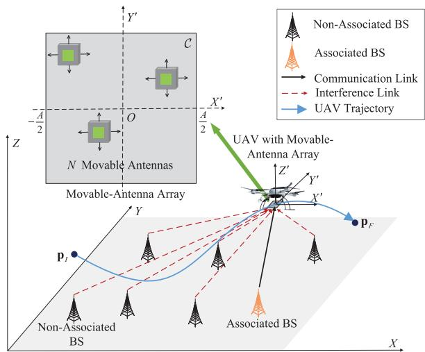  
Fig. 1. The downlink cellular-connected UAV communication system.

## II. SYSTEM MODEL AND PROBLEM FORMULATION

## A. System Model

As shown in Fig. 1, we consider a downlink cellularconnected UAV and $K \geq 1$ available BSs, any of which may potentially serve the UAV during its flight. Each BS is modeled as an equivalent single-antenna transmitter, which reflects the practice in current cellular networks where BSs employ fixed downtilt radiation patterns of antenna arrays to serve aerial users through their sidelobe. The UAV is equipped with a twodimensional (2D) MA array consisting of N MAs mounted at its bottom, while all BSs are assumed to be deployed at a height of $H _ { B }$ . We assume that the UAV flies at a fixed altitude $H > H _ { B }$ . This is feasible because modern UAV platforms have attitude stabilization and synchronization capabilities, which can effectively compensate short-term jitter and phase perturbation. In the 3D ground coordinate system $X { \mathrm { - } } Y { \mathrm { - } } Z ,$ the UAV needs to fly from a given initial point $( X _ { I } , Y _ { I } , H )$ to a given final point $( X _ { F } , Y _ { F } , H )$ , by associating with one of the available BSs over an assigned resource block (RB) at each time t. Let $T$ denote the UAV’s mission completion time, which is the total time consumption for the UAV flying from the initial point to the final point. For notational convenience, we define the horizontal coordinates of the initial and final points of the UAV as $\mathbf { p } _ { I } = [ X _ { I } , Y _ { I } ] ^ { T }$ and $\mathbf { p } _ { F } = [ X _ { F } , Y _ { F } ] ^ { T }$ respectively, and that of BS k as $\mathbf { b } _ { k } ~ = ~ [ a _ { k } , b _ { k } ] ^ { T }$ The time-varying UAV horizontal coordinate is denoted by p(t), $0 ~ \leq ~ t ~ \leq ~ T$ , where ${ \bf p } ( 0 ) \ = \ { \bf p } _ { I } , \ { \bf p } ( T ) \ = \ { \bf p } _ { F }$ . Moreover, the instantaneous UAV velocity is constrained by $\| \dot { \mathbf { p } } ( t ) \| ~ \leq$ $V _ { \mathrm { m a x } }$ , where $V _ { \mathrm { m a x } }$ represents the maximum speed of the UAV.

In the MA’s local coordinate system $X ^ { \prime } – Y ^ { \prime } – Z ^ { \prime }$ , the position of the n-th MA at time t is denoted by $\tilde { \mathbf { x } } _ { n } ( t ) \ = \ [ x _ { n } , y _ { n } , z _ { n } ] ^ { T } , 1 \ \leq \ n \ \leq \ N$ . Since each MA is constrained to move within the 2D plane of the panel, the position of n-th MA at time t can be further expressed as $\widetilde { \mathbf { x } } _ { n } ( t ) = [ \mathbf { x } _ { n } ( t ) ^ { T } , 0 ] ^ { T }$ , where $\mathbf { x } _ { n } ( t ) \subseteq \mathbb { R } ^ { 2 \times 1 }$ . Thus, ${ \bf x } _ { n } ( t )$ represents the 2D position of the n-th MA in the $X ^ { \prime } – O  – Y ^ { \prime }$ plane at time $t ,$ confined within the rectangular antenna moving region $\mathcal { C } = [ - A / 2 , A / 2 ] \times [ - A / 2 , A / 2 ]$ . The instantaneous velocity of the n-th MA satisfies $\| \dot { { \bf x } } _ { n } ( t ) \| \ \leq \ v _ { \operatorname* { m a x } } .$ , where $v _ { \mathrm { m a x } }$ denotes the maximum speed of antenna movement. The antenna position vector (APV) of the MA array at time t is defined as $\mathbf { x } ( t ) \triangleq [ \mathbf { x } _ { 1 } ^ { T } ( t ) , \mathbf { x } _ { 2 } ^ { T } ( t ) , \ldots , \mathbf { x } _ { N } ^ { T } ( t ) ] ^ { T }$ . Then, the wave vector from BS k to the UAV at time t is given by

$$
{ \bf v } _ { k } ( t ) = \frac { 2 \pi } { \lambda } \frac { \breve { \bf v } _ { k } ( t ) } { \| \breve { \bf v } _ { k } ( t ) \| } , 1 \leq k \leq K ,\tag{1}
$$

where $\breve { \mathbf { v } } _ { k } ( t ) = [ \mathbf { p } ^ { T } ( t ) , H ] ^ { T } - [ \mathbf { b } _ { k } ^ { T } , H _ { B } ] ^ { T }$ denotes the distance between BS k and the UAV at time t, and λ denotes the carrier wavelength. Accordingly, the steering vector from BS k to the MA array at time t is expressed as

$$
\mathbf { g } _ { k } ( t ) = \left[ e ^ { j \mathbf { v } _ { k } ( t ) \tilde { \mathbf { x } } _ { 1 } ( t ) } , e ^ { j \mathbf { v } _ { k } ( t ) \tilde { \mathbf { x } } _ { 2 } ( t ) } , . . . , e ^ { j \mathbf { v } _ { k } ( t ) \tilde { \mathbf { x } } _ { N } ( t ) } \right] ^ { T } .\tag{2}
$$

Due to the high operating altitude of the UAV, the communication links between the UAV and BSs are assumed to be LoS-dominant. It is worth noting that incorporating additional scattered or non-line-of-sight (NLoS) components would generally provide extra spatial diversity of wireless channels, which not only increases the average channel power but also decreases the channel correlation among different BSs, and thus can further improve the achievable SINR. Therefore, the LoS-dominant assumption does not overestimate the achievable performance, but instead serves as a conservative baseline for performance evaluation. Consequently, the channel power gain from BS k to the UAV at time t follows the free-space path loss model, which is given by

$$
\rho _ { k } ( t ) = \rho _ { 0 } d _ { k } ^ { - 2 } ( t ) = \frac { \rho _ { 0 } } { ( H - H _ { B } ) ^ { 2 } + \| \mathbf { p } ( t ) - \mathbf { b } _ { k } \| ^ { 2 } } ,\tag{3}
$$

where $\rho _ { 0 }$ is the path loss for the reference distance of 1 meter. Accordingly, the channel vector between BS k and the UAV at time t can be expressed as

$$
\begin{array} { r } { { \bf h } _ { k } ( t ) = \sqrt { \rho _ { k } ( t ) } e ^ { - j \frac { 2 \pi } { \lambda } \| \check { \bf v } _ { k } ( t ) \| } { \bf g } _ { k } ( t ) , } \end{array}\tag{4}
$$

where the exponential term accounts for the phase shift induced by the propagation distance.

We denote ${ \bf a } ( t ) ~ = ~ [ \alpha _ { 1 } ( t ) , \alpha _ { 2 } ( t ) , \ldots , \alpha _ { K } ( t ) ] ^ { T } ~ \in ~ \mathbb { R } ^ { K \times 1 }$ as the UAV-BS association indicator, where $\alpha _ { k } ( t ) \in \{ 0 , 1 \}$ indicates the association of the UAV and BS k. Specifically, $\alpha _ { k } ( t ) = 1$ if the UAV associates with BS $k \in \mathcal { K }$ over the assigned RB at time $t ,$ in which case the remaining BSs act as potentially interfering BSs, where $\mathcal { K } = \{ 1 , \ldots , K \}$ Otherwise, $\alpha _ { k } ( t ) = 0$ . Since the UAV can only be associated with one BS at a time, we have

$$
\sum _ { k = 1 } ^ { K } \alpha _ { k } ( t ) = 1 , \forall t .\tag{5}
$$

Furthermore, the RB assigned to the UAV may be reused by other BSs to serve their terrestrial users. In such cases, if BS k reuses the UAV-assigned RB, it will cause interference to the communication between the UAV and its associated BS. To characterize this, we define $\beta _ { k } ( t ) \in \{ 0 , 1 \}$ as the occupancy state of the UAV-assigned RB of BS k at time $t ,$ where $\beta _ { k } ( t ) =$ 1 indicates that the RB is occupied, and $\beta _ { k } ( t ) = 0$ otherwise. Accordingly, the received SINR at the UAV can be expressed as

$$
\begin{array} { r l } & { \displaystyle \gamma ( t ) = \sum _ { k = 1 } ^ { K } \alpha _ { k } ( t ) \gamma _ { k } ( t ) } \\ & { \quad \quad = \sum _ { k = 1 } ^ { K } \frac { \alpha _ { k } ( t ) | \mathbf { w } _ { k } ^ { H } ( t ) \mathbf { h } _ { k } ( t ) | ^ { 2 } P } { i \in K \backslash k } , } \\ & { \quad \quad 0 \leq t \leq T , } \end{array}\tag{6}
$$

where $P$ is the BS transmit power per RB (assumed to be identical for all BSs for simplicity), $\mathbf { w } _ { k } ( t )$ is the UAV receive beamforming vector when $\alpha _ { k } ( t ) = 1 , \sigma ^ { 2 }$ denotes the noise power at the UAV receiver, and $\gamma _ { k } ( t )$ denotes the UAV received SINR when associated with BS k at time t. We further define the receive beamforming matrix of the UAV at time t as $\mathbf { W } ( t ) = [ \mathbf { w } _ { 1 } ( t ) , \mathbf { w } _ { 2 } ( t ) , \ldots , \mathbf { \bar { w } } _ { K } ( t ) ] \in \mathbb { C } ^ { N \times K }$

Due to the fast changing occupancy state $\beta _ { k } ( t )$ in practice, the instantaneous received SINR at the $\mathrm { U A V } , \gamma ( t )$ , fluctuates over time. To account for this, we adopt the expected SINR as the communication performance metric. The occupancy state of the UAV-assigned RB, $\beta _ { k } ( t )$ , can be modeled as a Bernoulli random variable with mean $l _ { k }$ , i.e., $\mathbb { E } [ \beta _ { k } ( t ) ] = l _ { k }$ , where $l _ { k } \in$ [0, 1] denotes the loading factor of BS k [13]. Specifically, $l _ { k }$ represents the probability that the RB assigned to the UAV is occupied at BS $k ,$ which can be approximated by the average number of users served by each BS divided by the total number of available RBs over a given period of time. Accordingly, the lower bound of the expected SINR at time t is expressed as

$$
\begin{array} { l } { \displaystyle \mathbb { E } [ \gamma ( t ) ] } \\ { \displaystyle \overset { ( a ) } { \geq } \sum _ { k = 1 } ^ { K } \frac { \alpha _ { k } ( t ) | { \mathbf { w } } _ { k } ^ { H } ( t ) { \mathbf { h } } _ { k } ( t ) | ^ { 2 } P } { \mathbb { E } \left[ \displaystyle \sum _ { i \in \mathcal { K } \setminus k } \beta _ { i } ( t ) | { \mathbf { w } } _ { k } ^ { H } ( t ) { \mathbf { h } } _ { i } ( t ) | ^ { 2 } P + \| { \mathbf { w } } _ { k } ^ { H } ( t ) \| ^ { 2 } \sigma ^ { 2 } \right] } } \\ { = \displaystyle \sum _ { k = 1 } ^ { K } \frac { \alpha _ { k } ( t ) | { \mathbf { w } } _ { k } ^ { H } ( t ) { \mathbf { h } } _ { k } ( t ) | ^ { 2 } P } { \sum _ { i \in \mathcal { K } \setminus k } { l _ { i } | { \mathbf { w } } _ { k } ^ { H } ( t ) \mathbf { h } _ { i } ( t ) | ^ { 2 } P + \| { \mathbf { w } } _ { k } ^ { H } ( t ) \| ^ { 2 } \sigma ^ { 2 } } } } \\ { \displaystyle \overset { \mathrm { ( a ) } } { = } \bar { \gamma } ( t ) , \ 0 \leq t \leq T , } \end{array}\tag{7}
$$

where (a) follows from the Jensen’s inequality since the function $1 / x$ is convex for $x > 0$ . We adopt this lower bound as a tractable metric, due to the fact that it provides a sufficient condition for communication performance, i.e., by satisfying the lower bound, the actual expected SINR is guaranteed to exceed the threshold. Furthermore, this approach aligns with the timescale of trajectory planning, which relies on the knowledge of long-term statistical loading factors provided by the cellular network. Thus, the expected SINR allows us to quantify the communication link quality between the UAV and the BSs without requiring knowledge of the instantaneous RB allocation.

## B. Problem Formulation

In this paper, we aim to minimize the UAV mission completion time T by optimizing the UAV receive beamforming matrix $\{ \mathbf { W } ( t ) , 0 \ \leq \ t \ \leq \ T \}$ , APV $\{ \mathbf { x } ( t ) , 0 ~ \leq ~ t ~ \leq ~ T \}$ 2 UAV trajectory $\{ \mathbf { p } ( t ) , 0 \leq t \leq T \}$ , and UAV-BS association indicator $\{ \mathbf { a } ( t ) , 0 \leq t \leq T \}$ , subject to the expected SINR requirement, UAV flying constraints, MA moving constraints and UAV-BS association constraints. For notational simplicity, let $\mathbf { \boldsymbol { \Upsilon } } ( t ) \triangleq \{ \mathbf { W } ( t ) , \mathbf { \boldsymbol { x } } ( t ) , \mathbf { p } ( t ) , \mathbf { a } ( t ) \} , t \in [ 0 , T ]$ . The UAV mission completion time minimization problem can be formulated $\mathrm { a s } ^ { 1 }$

$$
( \mathrm { P 1 } ) \operatorname* { m i n } _ { \{ \Upsilon ( t ) \} , T } T\tag{8a}
$$

$$
\begin{array} { r l } { \mathrm { s . t . } } & { { } \bar { \gamma } ( t ) \geq \gamma _ { \operatorname* { m i n } } , \forall t , } \end{array}\tag{8b}
$$

$$
\alpha _ { k } ( t ) \in \{ 0 , 1 \} , \forall k , t ,\tag{8c}
$$

$$
\sum _ { k = 1 } ^ { K } \alpha _ { k } ( t ) = 1 , \forall t ,\tag{8d}
$$

$$
\mathbf { p } ( 0 ) = \mathbf { p } _ { I } , \mathbf { p } ( T ) = \mathbf { p } _ { F } ,
$$

$$
\| \dot { \mathbf { p } } ( t ) \| \leq V _ { \operatorname* { m a x } } , \forall t ,\tag{8e}
$$

$$
\mathbf { x } _ { n } ( t ) \in \mathcal { C } , \forall t , n ,\tag{8f}
$$

$$
\| \dot { { \bf x } } _ { n } ( t ) \| \leq v _ { \operatorname* { m a x } } , \forall t , n ,\tag{8g}
$$

$$
\| \mathbf { x } _ { n } ( t ) - \mathbf { x } _ { \hat { n } } ( t ) \| \geq D _ { 0 } , \forall t , { \hat { n } } \neq n ,\tag{8h}
$$

(8i)

where $\gamma _ { \mathrm { m i n } }$ denotes the minimum SINR threshold, and $D _ { 0 }$ represents the minimum inter-antenna distance to avoid coupling effects. Constraint (8b) ensures reliable UAV connectivity with the cellular network by enforcing the SINR requirement. Constraints (8c) and (8d) indicate that the UAV can only establish the communication link with one associated BS at any given time. Constraints (8e) and (8f) guarantee that the UAV’s trajectory satisfies the initial/final point and speed limits. Constraint (8g) confines each MA within its designated moving region, while constraint (8h) enforces the velocity limit of each MA. Finally, constraint (8i) ensures that the MAs maintain a minimum distance to avoid antenna coupling. The channel state information (CSI) and loading factors are slowly varying parameters. Therefore, the optimized UAV trajectory and APV are computed offline and stored for subsequent online use. During online operation, conventional channel estimation and beamforming techniques can be employed to cope with instantaneous channel variations.

Note that problem (P1) is a non-convex optimization problem, which makes obtaining the optimal solution challenging. First, the optimization variables $\{ \Upsilon ( t ) \}$ are defined over the continuous time interval [0, T ], resulting in an infinite-dimensional optimization space. Second, constraints (8b) and (8i) are inherently non-convex constraints, while constraint (8c) is a binary constraint, rendering (P1) a mixedinteger non-convex problem. Third, the strong coupling among the optimization variables further increases the problem’s intractability. To address these challenges, in the following section, we will propose the SUCS-based algorithm to obtain a suboptimal solution for (P1).

## III. PROPOSED SOLUTION

In this section, we first transform the continuous-time problem (P1) into a tractable discrete formulation by using the path discretization technique. Building on this transformation, we develop the SUCS algorithm that systematically plans the UAV trajectory.

## A. Problem Transformation

Without loss of generality, we consider a 2D square region at the UAV’s flying altitude H, with side length $L ,$ where L is chosen sufficiently large to cover all potential UAV locations during the flight. However, since the considered 2D UAV flight region is continuous, the optimization variables are infinite-dimensional, rendering the problem intractable. To tackle this issue, we discretize the considered region into a $D \times D$ grid with granularity $\Delta ,$ where $\begin{array} { r } { D = \lfloor \frac { L } { \Lambda } \rfloor } \end{array}$ , resulting in $D ^ { 2 }$ discrete points in total. The granularity $\Delta$ is chosen small enough so that the expected SINR can be regarded as approximately constant within each grid cell. Let $\mathbf { p } _ { i , j }$ denote the (i, j)-th location of the grid, $i , j \in \{ 1 , 2 , \dots , D \}$ and $\mathbf { p } _ { i , j } \ = \ \left[ i - \textstyle \frac { 1 } { 2 } , j - \textstyle \frac { 1 } { 2 } \right] ^ { T } \Delta$ . Then, by applying the path discretization technique, the UAV trajectory can be represented by M line segments, where the UAV visits $M + 1$ grid points in total during the flight. The m-th visited grid point is denoted as $ { \mathbf { p } } _ { i _ { m } , j _ { m } } , 0 \ \leq \ m \leq \ M$ . Since the $( m + 1 ) { \ - } \mathtt { t h }$ visited grid point must be adjacent to the m-th visited grid point, the relationship of two adjacent grid points is given by

$$
\begin{array} { r l } & { \| \mathbf { p } _ { i _ { m + 1 } , j _ { m + 1 } } - \mathbf { p } _ { i _ { m } , j _ { m } } \| } \\ & { = \left\{ \begin{array} { l l } { \Delta , } & { ( i _ { m + 1 } - i _ { m } ) ^ { 2 } + ( j _ { m + 1 } - j _ { m } ) ^ { 2 } = 1 , } \\ { \sqrt { 2 } \Delta , } & { ( i _ { m + 1 } - i _ { m } ) ^ { 2 } + ( j _ { m + 1 } - j _ { m } ) ^ { 2 } = 2 . } \end{array} \right. } \end{array}\tag{9}
$$

To minimize the UAV mission completion time, the UAV should always fly at its maximum speed between two adjacent grid points. Accordingly, the UAV flight time between two adjacent grid points is given by

$$
\tau _ { m } = \| \mathbf { p } _ { i _ { m } , j _ { m } } - \mathbf { p } _ { i _ { m - 1 } , j _ { m - 1 } } \| / V _ { \operatorname* { m a x } } , 1 \leq m \leq M .\tag{10}
$$

Hence, once the sequence of the $M \ + \ 1$ visited grid points $\{ ( i _ { m } , j _ { m } ) \} , 0 \leq m \leq M$ is determined, the UAV trajectory is fully specified. Meanwhile, after applying the path discretization technique, the time-varying variables $\mathbf { W } ( t ) , \ \mathbf { x } ( t )$ , and ${ \bf a } ( t )$ can be expressed in discrete forms as

$$
\mathbf { W } _ { m } \triangleq \left[ \mathbf { w } _ { m , 1 } , \mathbf { w } _ { m , 2 } , \hdots , \mathbf { w } _ { m , K } \right] \in \mathbb { C } ^ { N \times K } ,\tag{11a}
$$

$$
\begin{array} { r } { \mathbf { x } _ { m } \triangleq [ \mathbf { x } _ { m , 1 } ^ { T } , \mathbf { x } _ { m , 2 } ^ { T } , \hdots , \mathbf { x } _ { m , N } ^ { T } ] ^ { T } \in \mathbb { R } ^ { 2 N \times 1 } , } \end{array}\tag{11b}
$$

$$
\mathbf { a } _ { m } \triangleq [ \alpha _ { m , 1 } , \alpha _ { m , 2 } , \hdots , \alpha _ { m , K } ] ^ { T } \in \mathbb { R } ^ { K \times 1 } ,\tag{11c}
$$

where m denotes the index of the visited grid point. Accordingly, we define $\begin{array} { r c l } { \mathbf { Y } _ { m } } & { = } & { \{ \mathbf { W } _ { m } , \mathbf { x } _ { m } , \left( i _ { m } , j _ { m } \right) , \mathbf { a } _ { m } \} } \end{array}$ $0 \leq m \leq M$ . Based on this reformulation, problem (P1) can be equivalently transformed into

(P2)

$$
\operatorname* { m i n } _ { \{ \Upsilon _ { m } \} , M } \sum _ { m = 1 } ^ { M } \tau _ { m }\tag{12a}
$$

$$
\mathrm { s . t . } \quad \bar { \gamma } _ { m } \geq \gamma _ { \operatorname* { m i n } } , 0 \leq m \leq M ,\tag{12b}
$$

$$
\alpha _ { m , k } \in \{ 0 , 1 \} , 0 \leq m \leq M , 1 \leq k \leq K ,\tag{12c}
$$

$$
\sum _ { k = 1 } ^ { K } \alpha _ { m , k } = 1 , 0 \leq m \leq M ,\tag{12d}
$$

$$
\mathbf { p } _ { i _ { 0 } , j _ { 0 } } = \mathbf { p } _ { I } , \mathbf { p } _ { i _ { M } , j _ { M } } = \mathbf { p } _ { F } ,\tag{12e}
$$

$$
\begin{array} { r } { \mathbf { x } _ { m , n } \in \mathcal { C } , 0 \leq m \leq M , 1 \leq n \leq N , } \end{array}\tag{12f}
$$

$$
\begin{array} { r } { \| \mathbf { x } _ { m , n } - \mathbf { x } _ { m - 1 , n } \| \leq v _ { \operatorname* { m a x } } \tau _ { m } , } \end{array}
$$

$$
1 \leq m \leq M , 1 \leq n \leq N ,\tag{12g}
$$

$$
\begin{array} { r } { \| \mathbf { x } _ { m , n } - \mathbf { x } _ { m , \hat { n } } \| \geq D _ { 0 } , } \end{array}
$$

$$
0 \leq m \leq M , { \hat { n } } \neq n ,\tag{12h}
$$

(9), (10).

It is observed that the UAV trajectory and the APV are tightly coupled in problem (P2). Specifically, when planning the UAV trajectory at the m-th visited grid point, the SINR constraint (12b) for its neighboring grid points can only be evaluated once the APV at the (m − 1)-th grid point, i.e., $\mathbf x _ { m - 1 }$ , has been determined. To overcome this challenge, we propose the SUCS method, which performs the UAV trajectory planning step by step based on the APV information of the previously visited grid point. At each step, the problem of maximizing the expected SINR of the adjacent grid points is solved, thereby verifying their feasibility under the antenna velocity constraint. In the following, Section III-B introduces the algorithm for maximizing the expected SINR at each visited grid point, while Section III-C presents the complete SUCS trajectory planning method.

## B. SINR Maximization of Visited Grid Point

In this subsection, our goal is to maximize the expected SINR at the m-th visited grid point. Since the APV of grid point $\mathbf { p } _ { i _ { m } , j _ { m } }$ depends on the APV of the previous grid point $\mathbf { p } _ { i _ { m - 1 } , j _ { m - 1 } }$ due to the velocity constraints of the MAs, the maximum expected SINR across all grid points cannot be obtained simultaneously in advance. Thus, we need to verify whether the expected SINR at $\mathbf { p } _ { i _ { m } , j _ { m } }$ can satisfy the SINR requirement given the known $\mathrm { A P V } ~ \mathbf { x } _ { m - 1 }$ at $\mathbf { p } _ { i _ { m - 1 } , j _ { m - 1 } } .$ Specifically, during UAV trajectory planning, given the position of the (m − 1)-th visited grid point $\mathbf { p } _ { i _ { m - 1 } , j _ { m - 1 } } ,$ , the position of considered adjacent visited grid point $\mathbf { p } _ { i _ { m } , j _ { m } }$ , and the $\mathrm { A P V } \ \mathbf { x } _ { m - 1 }$ of grid point $\mathbf { p } _ { i _ { m - 1 } , j _ { m - 1 } }$ , we can formulate the expected SINR maximization problem of m-th visited grid point as

(P3)

$$
\operatorname* { m a x } _ { \mathbf { w } _ { m } , \mathbf { x } _ { m } , \mathbf { a } _ { m } } \bar { \gamma } _ { m } = \sum _ { k = 1 } ^ { K } \alpha _ { m , k } \bar { \gamma } _ { m , k }\tag{13a}
$$

$$
\mathrm { s . t . } \qquad \alpha _ { m , k } \in \{ 0 , 1 \} , 1 \leq k \leq K ,\tag{13b}
$$

$$
\sum _ { k = 1 } ^ { K } \alpha _ { m , k } = 1 ,
$$

$$
\mathbf { x } _ { m , n } \in \mathcal { C } , \forall n ,\tag{13c}
$$

(13d)

$$
\| \mathbf { x } _ { m , n } - \mathbf { x } _ { m , \hat { n } } \| \geq D _ { 0 } , \forall \hat { n } \neq n ,\tag{13e}
$$

$$
\begin{array} { r } { \| \mathbf { x } _ { m , n } - \mathbf { x } _ { m - 1 , n } \| \leq v _ { \operatorname* { m a x } } \tau _ { m } , 1 \leq n \leq N , } \end{array}\tag{13f}
$$

where $\bar { \gamma } _ { m , k }$ denotes the expected SINR when associated with BS k at the m-th visited grid point. Next, we present the optimization methods for the UAV-BS association indicator $\mathbf { a } _ { m }$ , the UAV receive beamforming matrix $\mathbf { W } _ { m } ,$ and the $\mathbf { A P V } \ \mathbf { x } _ { m }$ , which are employed to solve problem (P3).

1) Optimization of $\mathbf { a } _ { m } .$ : The associated BS $k _ { \mathrm { m a x } }$ which maximizes the UAV received SINR can be expressed as $k _ { \mathrm { m a x } } = \arg \operatorname* { m a x } _ { k } \gamma _ { m , k }$ . Then, the optimal UAV-BS association indicator can be expressed as

$$
\alpha _ { m , k } ^ { * } = \left\{ { \begin{array} { l l } { 1 , } & { { \mathrm { i f ~ } } k = k _ { \mathrm { m a x , } } } \\ { 0 , } & { { \mathrm { O t h e r w i s e . } } } \end{array} } \right.\tag{14}
$$

However, due to the small granularity $\Delta ,$ performing a BS handover at every visited grid point would be excessively frequent and thus impractical. In UAV communication systems, overly frequent BS handovers not only degrade communication performance but also significantly increase computational complexity in trajectory planning. To address this, if the associated BS at $\mathbf { p } _ { i _ { m - 1 } , j _ { m - 1 } }$ can still satisfy the SINR requirement at $\mathbf { p } _ { i _ { m } , j _ { m } }$ , the UAV maintains the same association without performing a handover. Otherwise, the UAV selects the BS that maximizes the SINR at m-th visited grid point as its new associated BS.

When the UAV remains the associated BS at $( m - 1 )$ -th visited grid point as the associated BS at m-th visited grid point, i.e., ${ \bf a } _ { m } ~ = ~ { \bf a } _ { m - 1 }$ , the expected SINR maximization problem can be formulated as

(P4)

$$
\operatorname* { m a x } _ { \mathbf { W } _ { m } , \mathbf { x } _ { m } } \bar { \gamma } _ { m } = \sum _ { k = 1 } ^ { K } \alpha _ { m - 1 , k } \bar { \gamma } _ { m , k }\tag{15a}
$$

$$
\mathrm { s . t . } \qquad \quad \mathbf { x } _ { m , n } \in \mathcal { C } , 1 \leq n \leq N ,\tag{15b}
$$

$$
\begin{array} { r } { \| \mathbf { x } _ { m , n } - \mathbf { x } _ { m , \hat { n } } \| \geq D _ { 0 } , \forall \hat { n } \neq n , } \end{array}\tag{15c}
$$

$$
\begin{array} { r } { \| \mathbf { x } _ { m , n } - \mathbf { x } _ { m - 1 , n } \| \leq v _ { \operatorname* { m a x } } \tau _ { m } , 1 \leq n \leq N . } \end{array}\tag{15d}
$$

$\begin{array} { r } { \mathrm { I f ~ } \sum _ { k = 1 } ^ { K } \alpha _ { m - 1 , k } \gamma _ { m , k } \ \leq \ \bar { \gamma } _ { \operatorname* { m i n } } , } \end{array}$ the UAV must perform a handover, i.e., select a new associated BS at the m-th visited grid point. In this case, the UAV-BS association indicator $\mathbf { a } _ { m }$ can be obtained according to (14). It is worth noting that in the SUCS trajectory planning process (Section III-C), a node is discarded only if the SINR requirement cannot be satisfied even with the optimal BS association. Therefore, the above handover strategy does not affect the UAV trajectory planning result, while effectively reducing the overall algorithmic complexity.

2) Optimization of $\mathbf { W } _ { m } .$ : For both problems (P3) and (P4), the receive beamforming vector $\mathbf { w } _ { m , k }$ has a closed-form solution, which can be obtained using

$$
\begin{array} { r l } & { \mathrm { t h e \quad m i n i m u m \quad m e a n \quad s q u a r e \quad e r r o r \quad ( M M S E ) \quad \mathrm { m e t h o c } } } \\ & { \mathrm { a s \quad [ 5 6 ] } } \\ & { \quad \mathbf { w } _ { m , k } ^ { * } } \\ & { \quad \quad = \left( \mathbf { I } _ { N } + \displaystyle \sum _ { i \in \mathcal { K } \setminus k } \frac { P l _ { i } } { \sigma ^ { 2 } } \mathbf { h } _ { m , i } \mathbf { h } _ { m , i } ^ { H } + \frac { P } { \sigma ^ { 2 } } \mathbf { h } _ { m , k } \mathbf { h } _ { m , k } ^ { H } \right) ^ { - 1 } \mathbf { h } _ { m , k } , } \end{array}\tag{16}
$$

where $\mathbf { h } _ { m , k }$ is the channel vector between BS k and the UAV at the m-th visited grid point. Thus, we can obtain the optimal UAV beamforming matrix $\mathbf { W } _ { m } ^ { * } = [ \mathbf { w } _ { m , 1 } ^ { * } , \mathbf { w } _ { m , 2 } ^ { * } , \ldots , \mathbf { w } _ { m , K } ^ { * } ] .$

3) Optimization of $\mathbf { x } _ { m } .$ With the optimal solutions of $\mathbf { a } _ { m }$ and $\mathbf { W } _ { m } .$ , the remaining task is to optimize ${ \bf x } _ { m }$ . Accordingly, both problems (P3) and (P4) can be reformulated as

$$
( \mathrm { P 5 } ) \quad \operatorname* { m a x } _ { \mathbf { x } _ { m } } \quad \bar { \gamma } _ { m , k }\tag{17a}
$$

$$
\begin{array} { r } { \mathrm { s . t . } \qquad \mathbf { x } _ { m , n } \in \mathcal { C } , 1 \leq n \leq N , } \end{array}\tag{17b}
$$

$$
\begin{array} { r } { \| \mathbf { x } _ { m , n } - \mathbf { x } _ { m , \hat { n } } \| \geq D _ { 0 } , \forall \hat { n } \neq n , } \end{array}\tag{17c}
$$

$$
\begin{array} { r } { \| \mathbf { x } _ { m , n } - \mathbf { x } _ { m - 1 , n } \| \leq v _ { \operatorname* { m a x } } \tau _ { m } , 1 \leq n \leq N . } \end{array}\tag{17d}
$$

Since constraint (17c) is non-convex w.r.t. $\mathbf { x } _ { m }$ , we relax it by leveraging the successive optimization technique. Denoted $\\begin{array} { r } { \bar { \bf x _ { \mathnormal { m } } ^ { q } } = [ ( \bar { \bf x } _ { \mathnormal { m , 1 } } ^ { q } ) ^ { T } , ( \bf x _ { \mathnormal { m , 2 } } ^ { q } ) ^ { T } , \ldots \bar { \bf \Phi } ( \bf x _ { \mathnormal { m , } N } ^ { q } ) ^ { T } ] ^ { T } \in \mathbb { C } ^ { \bar { 2 } N \times 1 } } \end{array}$ as the APV obtained in the q-th iteration of successive optimization. According to the Cauchy-Schwartz inequality

$$
\| \mathbf { x } _ { m , n } - \mathbf { x } _ { m , \hat { n } } \| \geq \frac { \bigl ( \mathbf { x } _ { m , n } ^ { q } - \mathbf { x } _ { m , \hat { n } } ^ { q } \bigr ) ^ { T } \bigl ( \mathbf { x } _ { m , n } - \mathbf { x } _ { m , \hat { n } } \bigr ) } { \| \mathbf { x } _ { m , n } ^ { q } - \mathbf { x } _ { m , \hat { n } } ^ { q } \| } ,\tag{18}
$$

constraint (17c) can be relaxed as

$$
\frac { ( \mathbf { x } _ { m , n } ^ { q } - \mathbf { x } _ { m , \hat { n } } ^ { q } ) ^ { T } ( \mathbf { x } _ { m , n } - \mathbf { x } _ { m , \hat { n } } ) } { \| \mathbf { x } _ { m , n } ^ { q } - \mathbf { x } _ { m , \hat { n } } ^ { q } \| } \geq D _ { 0 } , \forall \hat { n } \neq n .\tag{19}
$$

Thus, in the q-th iteration, the optimization of $\mathbf { x } _ { m }$ is relaxed as

$$
\begin{array} { r l } { ( \mathrm { P 6 } ) \underset { \mathbf { x } _ { m } } { \operatorname* { m a x } } } & { \bar { \gamma } _ { k , m } } \\ { \mathrm { s . t . } } & { ( 1 7 \mathrm { b } ) , ( 1 7 \mathrm { d } ) , ( 1 9 ) . } \end{array}\tag{20a}
$$

Since all constraints in problem (P6) are convex w.r.t. $\mathbf { x } _ { m } ,$ problem (P6) can be efficiently solved by using the feasible direction method. In each iteration, we first solve the following ascent direction finding subproblem:

$$
( \mathrm { P 7 } ) \quad \operatorname* { m a x } _ { \mathbf { d } } \ \mathbf { d } ^ { T } \nabla _ { \mathbf { x } _ { m } } \bar { \gamma } _ { k , m } ( \mathbf { x } _ { m } ^ { q } )\tag{21a}
$$

$$
\begin{array} { r } { \mathrm { s . t . } \qquad \mathbf { d } _ { n } \in \mathcal { C } , 1 \leq n \leq N , } \end{array}\tag{21b}
$$

$$
\frac { ( \mathbf { x } _ { m , n } ^ { q } - \mathbf { x } _ { m , \hat { n } } ^ { q } ) ^ { T } ( \mathbf { d } _ { n } - \mathbf { d } _ { \hat { n } } ) } { \| \mathbf { x } _ { m , n } ^ { q } - \mathbf { x } _ { m , \hat { n } } ^ { q } \| } \geq D _ { 0 } , \forall \hat { n } \neq n ,\tag{21c}
$$

$$
\begin{array} { r } { \| \mathbf { d } _ { n } - \mathbf { x } _ { m - 1 , n } \| \leq v _ { \operatorname* { m a x } } \tau _ { m } , 1 \leq n \leq N , } \end{array}\tag{21d}
$$

where $\nabla _ { \mathbf { x } _ { m } } \bar { \gamma } _ { k , m } \bigl ( \mathbf { x } _ { m } ^ { q } \bigr )$ denotes the gradient of $\bar { \gamma } _ { k , m }$ at $\mathbf { x } _ { m } ^ { q } ,$ which can be calculated as

$$
\begin{array} { l } { { [ \nabla _ { { \bf x } _ { m } } \bar { \gamma } _ { k , m } ( { \bf x } _ { m } ^ { q } ) ] _ { n } = \displaystyle \operatorname* { l i m } _ { \epsilon  0 } \frac { \bar { \gamma } _ { k , m } ( { \bf x } _ { m } ^ { q } + \epsilon { \bf e } _ { n } ) - \bar { \gamma } _ { k , m } ( { \bf x } _ { m } ^ { q } ) } { \epsilon } } , } \\ { { n = 1 , \ldots , 2 N , \qquad ( } } \end{array}\tag{22}
$$

Algorithm 1 Feasible Direction Method for Solving Problem   
(P6)   
Input: $N , K , D _ { 0 } , D _ { \mathrm { m a x , } } \epsilon$   
Output: $\mathbf { x } _ { m }$   
1 Initialize: $q \gets 0 , \mathbf { x } _ { m } ^ { 0 } \gets \mathbf { x } _ { m - 1 } .$   
2 while Increase of $\bar { \gamma } _ { k , m } ( \mathbf { x } _ { m } ^ { q } )$ is above  do   
3 Compute $\nabla _ { \mathbf { x } _ { m } } \bar { \gamma } _ { k , m } \bigl ( \mathbf { x } _ { m } ^ { q } \bigr )$ via (22).   
4 Obtain d by solving problem (P7).   
5 Obtain δ via (23).   
6 Update $\mathbf { x } _ { m } ^ { q + 1 }$ via (24).   
7 $q  q + 1 .$   
8 end while   
9 $\mathbf { x } _ { m } \gets \mathbf { x } _ { m } ^ { q } .$

where $\mathbf { e } _ { n }$ is a 2N -dimensional vector with its n-th element being 1 and the other elements being 0. Since the objective function, constraint (21b), and constraint (21c) are linear with d, and constraint (21d) is convex quadratic, problem (P7) is convex and can be solved efficiently using standard optimization toolboxes such as CVX [57].

Then, we can obtain the step size δ of the ascent direction finding using the one-dimensional search method as

$$
\delta = \arg \operatorname* { m a x } _ { \tilde { \delta } } \bar { \gamma } _ { k , m } ( \mathbf { x } _ { m } ^ { q } + \tilde { \delta } ( \mathbf { d } - \mathbf { x } _ { m } ^ { q } ) ) .\tag{23}
$$

Finally, $\mathbf { x } _ { m } ^ { q + 1 }$ is updated as

$$
\mathbf { x } _ { m } ^ { q + 1 } = \mathbf { x } _ { m } ^ { q } + \delta \bigl ( \mathbf { d } - \mathbf { x } _ { m } ^ { q } \bigr ) .\tag{24}
$$

The procedure for solving (P6) is summarized in Algorithm 1. Since the objective function of (P6) is continuously differentiable and the feasible set obtained after successive linearization is compact and convex, Algorithm 1 generates a sequence of feasible solutions with monotonically non-decreasing objective values. Moreover, the algorithm converges to a first-order stationary point of the original expected SINR maximization problem [58]. Specifically, in step 3, the gradient $\nabla _ { \mathbf { x } _ { m } } \bar { \gamma } _ { k , m } \bigl ( \mathbf { x } _ { m } ^ { q } \bigr )$ is computed according to (22). In step 4, the convex problem (P7) is solved to obtain the ascent direction d. In steps 5-6, the step size $\delta$ and the updated variable $\mathbf { x } _ { m } ^ { q + 1 }$ are determined via (22) and (23), respectively. The algorithm terminates once the improvement of $\bar { \gamma } _ { k , m } ( \mathbf { x } _ { m } ^ { q } )$ falls below a threshold . Finally, in step 9, the APV $\mathbf { x } _ { m }$ is obtained.

## C. UAV Trajectory Planning Method

In this subsection, we present the overall UAV trajectory planning method based on the expected SINR maximization results in Section III-B. The optimized trajectory is composed of a sequence of M connected line segments between adjacent grid points. However, since each trajectory planning step depends on the APV of the preceding grid point, the maximum achievable SINR at all grid points cannot be precomputed. As a result, conventional shortest-path algorithms such as Dijkstra’s method are not applicable [59]. To address this challenge, we develop the SUCS algorithm, which incrementally checks the feasibility of grid points and plans the trajectory in a step-by-step greedy manner to minimize the $\mathrm { U A V } \mathbf { \hat { s } }$ mission completion time [60]. The details of the proposed SUCS algorithm are described as follows.

First, at the UAV initial point ${ \bf p } _ { I }$ , we can obtain the initial antenna position $\mathbf { x } _ { 0 } ,$ , the initial UAV-BS association indicator $\mathbf { a } _ { 0 } ^ { * }$ , the initial beamforming matrix $\mathbf { W } _ { 0 } ^ { * } ,$ and the expected SINR $\bar { \gamma } _ { 0 }$ by solving problem (P3) without considering the MA movement constraint (13f), using the procedure in Section III-B. If $\bar { \gamma } _ { 0 } ~ \leq ~ \gamma _ { \mathrm { m i n } } .$ , this indicates that the SINR requirement cannot be guaranteed even at the initial position, which directly implies that no feasible trajectory exists for the considered scenario.

Second, we introduce the notion of an expandable intermediate node, denoted as $( \mathbf { p } _ { i _ { m } , j _ { m } } , \mathbf { x } _ { m } , \mathbf { a } _ { m } , \{ ( i _ { m } , j _ { m } ) \} )$ , where m is the index of the visited grid point in the $\mathrm { U A V } \mathbf { \hat { s } }$ trajectory, i.e., level of the node [60]. Each node consists of four elements: the grid point position $\mathbf { p } _ { i _ { m } , j _ { m } }$ , the corresponding $\mathbf { A P V } \ \mathbf { x } _ { m }$ , the UAV-BS association indicator $\mathbf { a } _ { m } .$ , and the UAV’s trajectory history up to the m-th visited grid point. This definition ensures that each node not only specifies the $\mathrm { U A V } \mathbf { \hat { s } }$ current location, but also retains all relevant historical information required for making consistent and feasible decisions in subsequent steps of trajectory planning. To facilitate the planning procedure, we use a dynamic set $\mathcal { F }$ that stores all expandable candidate nodes in the search process. Therefore, after the initialization, the node $\left( \mathbf { p } _ { I } , \mathbf { x } _ { 0 } , \mathbf { a } _ { 0 } ^ { * } , \{ ( i _ { 0 } , j _ { 0 } ) \} \right)$ corresponding to the initial UAV point is inserted into F . As the algorithm proceeds, every newly generated node that satisfies the feasibility conditions is also added into this set.

To accelerate the search for the minimum UAV mission completion time from the initial point ${ \bf p } _ { I }$ to the final point ${ \bf p } _ { F }$ , we introduce the following two definitions: $U A V ~ f l i g h t$ time and potential minimum UAV mission completion time.

Definition 1 (UAV Flight Time): For node $( \mathbf { p } _ { i _ { m } , j _ { m } } , \mathbf { x } _ { m } , \mathbf { a } _ { m } , \{ ( i _ { m } , j _ { m } ) \} )$ , its UAV flight time is accumulated flight time from ${ \bf p } _ { I }$ to $\mathbf { p } _ { i _ { m } , j _ { m } }$ along trajectory $\{ ( i _ { m } , j _ { m } ) \}$ }, which can be expressed as

$$
C _ { 1 } \left( \left( \mathbf { p } _ { i _ { m } , j _ { m } } , \mathbf { x } _ { m } , \mathbf { a } _ { m } , \{ \left( i _ { m } , j _ { m } \right) \} \right) \right) = \sum _ { l = 1 } ^ { m } \tau _ { l } .\tag{25}
$$

Definition 2: (Potential Minimum UAV Mission Completion Time): For node $( \mathbf { p } _ { i _ { m } , j _ { m } } , \mathbf { x } _ { m } , \mathbf { a } _ { m } , \{ ( i _ { m } , j _ { m } ) \} )$ , its potential minimum UAV mission completion time comprising two parts, the UAV flight time from initial point ${ \bf p } _ { I }$ to $\mathbf { p } _ { i _ { m } , j _ { m } }$ and the lower bound on the remaining flight time from $\mathbf { p } _ { i _ { m } , j _ { m } }$ to final point ${ \bf p } _ { F }$ , which is given by

$$
\begin{array} { r l r } {  { C _ { 2 } ( ( \mathbf { p } _ { i _ { m } , j _ { m } } , \mathbf { x } _ { m } , \mathbf { a } _ { m } , \{ ( i _ { m } , j _ { m } ) \} ) ) } } \\ & { = C _ { 1 } ( ( \mathbf { p } _ { i _ { m } , j _ { m } } , \mathbf { x } _ { m } , \mathbf { a } _ { m } , \{ ( i _ { m } , j _ { m } ) \} ) ) + C _ { \mathrm { r e m } } ( \mathbf { p } _ { i _ { m } , j _ { m } } ) } \\ & { = \displaystyle \sum _ { l = 1 } ^ { m } \tau _ { l } + ( \sqrt { 2 } \operatorname* { m i n } ( | p _ { F } ^ { x } - p _ { i _ { m } , j _ { m } } ^ { x } | , | p _ { F } ^ { y } - p _ { i _ { m } , j _ { m } } ^ { y } | )  } \\ & { } & {  + ( | p _ { F } ^ { x } - p _ { i _ { m } , j _ { m } } ^ { x } | - | p _ { F } ^ { y } - p _ { i _ { m } , j _ { m } } ^ { y } | ) ) / V _ { \mathrm { m a x } } , } \end{array}\tag{6}
$$

where $C _ { \mathrm { r e m } } \left( \mathbf { p } _ { i _ { m } , j _ { m } } \right)$ denotes the lower bound of the remaining flight time from grid point $\mathbf { p } _ { i _ { m } , j _ { m } }$ to the final point ${ \bf p } _ { F }$ under the discretized grid model, $p _ { F } ^ { x }$ and $p _ { F } ^ { y }$ are the X- and $Y -$ coordinates of $\mathbf { p } _ { F } ,$ , and $p _ { i _ { m } , j _ { m } } ^ { x }$ and $p _ { i _ { m } , j _ { m } } ^ { y }$ are the X- and $Y -$ coordinates of $\mathbf { p } _ { i _ { m } , j _ { m } }$ , respectively.

Next, with the above definitions, the SUCS algorithm selects and extends the most promising node in $\mathcal { F }$ at each iteration. The selection and expansion are performed as follows.

1) Node Selection: First, the candidate set is obtained by

$$
\mathcal { V } = \{ v \in \mathcal { F } | C _ { 2 } ( v ) = \operatorname* { m i n } _ { u \in \mathcal { F } } C _ { 2 } ( u ) \} ,\tag{27}
$$

which represents the node set in $\mathcal { F }$ with potential minimum mission completion time. Then, we select nodes that have progressed further along the trajectory. Specifically, let

$$
\mathcal { U } = \{ v \in \mathcal { V } | C _ { 1 } ( v ) = \operatorname* { m a x } _ { u \in \mathcal { V } } C _ { 1 } ( u ) \} ,\tag{28}
$$

and select one node $v = ( \mathbf { p } _ { i _ { m } , j _ { m } } , \mathbf { x } _ { m } , \mathbf { a } _ { m } , \{ ( i _ { m } , j _ { m } ) \} )$ from $\mathcal { U }$ (arbitrarily if $| \mathcal { U } | > 1 )$ for expansion; then remove v from ${ \mathcal F } .$ . Note that minimizing $C _ { 2 } ( u )$ guides the search toward short completion time; among equals, maximizing $C _ { 1 } ( u )$ favors the state that is closer to the final point.

Proposition 1: If the potential minimum UAV mission completion time in Definition 2 is a lower bound of the actual mission completion time, then prioritizing node $u \in { \mathcal { F } }$ with the minimum $C _ { 2 } \left( u \right)$ is guaranteed to find an optimal trajectory with the minimum mission completion time.

Proof: See Appendix.

2) Termination Check: If the selected node v satisfies $\mathbf { p } _ { i _ { m } , j _ { m } } = \mathbf { p } _ { F }$ , then a feasible trajectory to the final point has been found. The minimized UAV trajectory segments number $M$ and the corresponding variables $\boldsymbol { \Upsilon } _ { m }$ are then obtained, after which the algorithm terminates.

3) Adjacent Grid Point Expansion: Otherwise, we attempt to extend $v$ to its adjacent grid points. To accelerate convergence and limit unnecessary branching, we only consider adjacent grid points $\mathbf { p } _ { i _ { m } , j _ { m } }$ that make nonnegative progress toward the final point, i.e.,

$$
( \mathbf { p } _ { i _ { m + 1 } , j _ { m + 1 } } - \mathbf { p } _ { i _ { m } , j _ { m } } ) ^ { T } \cdot ( \mathbf { p } _ { F } - \mathbf { p } _ { I } ) \geq 0 .\tag{29}
$$

For each adjacent grid point satisfying (29), we solve problem (P3) to obtain the maximum expected SINR $\bar { \gamma } _ { m + 1 }$ and the resulting node $\begin{array} { r l r } { v ^ { \prime } } & { { } \ = \ } & { \left( \mathbf { p } _ { i _ { m + 1 } , j _ { m + 1 } } , \mathbf { x } _ { m + 1 } , \mathbf { a } _ { m + 1 } , \{ \left( i _ { m + 1 } , j _ { m + 1 } \right) \} \right) } \end{array}$ . If $\bar { \gamma } _ { m + 1 } < \gamma _ { \mathrm { m i n } } ,$ the node is infeasible and thus discarded.

4) Node Deduplication: To avoid redundant computation, we compare each feasible $v ^ { \prime }$ with existing nodes in $\mathcal { F }$ that represent the same state (i.e., same grid position, APV, and association). Specifically, the state projection is define as

$$
\pi ( u ) = ( { \bf p } _ { i _ { m } , j _ { m } } , { \bf x } _ { m } , { \bf a } _ { m } ) ,\tag{30}
$$

where $\boldsymbol { u } = ( \mathbf { p } _ { i _ { m } , j _ { m } } , \mathbf { x } _ { m } , \mathbf { a } _ { m } , \{ ( i _ { m } , j _ { m } ) \} )$ . If there exists $u \in$ $\mathcal { F }$ such that $\pi ( u ) = \pi ( v ^ { \prime } )$ , we keep in $\mathcal { F }$ only the node with the smaller UAV flight time $C _ { 1 } ( \cdot ) \ ( \mathrm { i . e . }$ , the node that reached the same state with less UAV flight time) and discard the other; otherwise, we insert $v ^ { \prime }$ into ${ \mathcal F } .$

5) Per-Level Pruning: To control the computational complexity of the trajectory planning, a per-level pruning strategy is adopted to limit the number of candidate nodes retained at each trajectory depth. We first define the level of node u as level(u), which represents the number of visited grid points (i.e., trajectory steps) associated with node $u .$

At a given level $m \in \{ 1 , \ldots , M \}$ , let $S _ { m } \subseteq \mathcal { F }$ denote the set of all candidate nodes such that leve $( u ) = m , u \in \mathcal { F }$ Each node $u \in S _ { m }$ is associated with a minimum UAV mission potential completion time $C _ { 2 } ( u )$ , which serves as a cost metric estimating the minimum total mission completion time if the trajectory is continued from node u. A smaller value of $C _ { 2 } ( u )$ indicates a more promising partial trajectory.

To limit the growth of the search tree, only the most promising candidate nodes are retained at each level. Specifically, we define the operator $\mathrm { T o p } _ { c } ( S , f ( \cdot ) )$ as the set containing up to c elements in $s$ with the smallest values of the evaluation function $f ( \cdot ) . \mathrm { ~ I f ~ } | S | < c ,$ the operator simply returns ${ \mathcal { S } } .$

After the expansion of adjacent grid, the candidate set $\mathcal { F }$ is updated by retaining only the top-c nodes in $\boldsymbol { S } _ { m + 1 }$ with the smallest potential completion time according to

$$
\mathcal { F }  ( \mathcal { F } \setminus \mathcal { S } _ { m + 1 } ) \cup \mathrm { T o p } _ { c } ( \mathcal { S } _ { m + 1 } , C _ { 2 } ( \cdot ) ) .\tag{31}
$$

6) Infeasibility Check: If the set $\mathcal { F }$ becomes empty and no node with grid point position ${ \bf p } _ { F }$ has been found, the algorithm terminates and reports that no feasible trajectory exists under the specified constraints.

The details of the SUCS algorithm for solving problem (P2) are summarized in Algorithm 2. In step 1, we initialize the variables at $\mathbf { p } _ { I } .$ In steps 2-6, the feasibility of the node at ${ \bf p } _ { I }$ is generated and evaluated. Steps 9-12 describe the node selection procedure, while steps 13-15 check the termination condition. Next, the adjacent grid points are expanded in steps 16-27, and duplicate nodes are removed in steps 28-36. Finally, step 38 performs pruning for each search step. The algorithm terminates when the selected node v is the final point $\mathbf { p } _ { F } ,$ or when no feasible trajectory exists. The proposed optimization framework can be extended to UAV-connected communication systems with adjustable BS antenna radiation patterns by incorporating the BS antenna radiation pattern into the channel and SINR expressions and jointly optimizing them with current variables.

## D. Computational Complexity Analysis

This subsection analyzes the computational complexity of the proposed algorithms by jointly considering the maximum achievable SINR for a given node (Algorithm 1) and the SUCS-based trajectory planning (Algorithm 2).

1) Complexity of Maximum Achievable SINR per Node (Algorithm 1): Algorithm 1 computes the maximum achievable SINR for the adjacent grid point. In step 3, the complexity of computing the gradient is $\mathcal { O } ( N ^ { 2 } K )$ . In step 4, solving the convex problem (P7) using the interior-point method requires $\mathcal { O } ( N ^ { 4 } \ln ( 1 / \iota ) )$ , where ι denotes the solution accuracy. In step 5, the one-dimensional search incurs a complexity of $\mathcal { O } ( I _ { d } N K )$ , where $I _ { d }$ is the number of discretization points in [0, 1].

Let $I _ { 1 }$ denote the maximum number of iterations of steps $^ { 3 - 7 , }$ the overall complexity of Algorithm 1 is $\mathcal { O } ( I _ { 1 } ( ( I _ { d } +$ $N ) N K + N ^ { 4 } \ln ( 1 / \iota ) ) )$

2) Complexity of SUCS-Based Trajectory Planning (Algorithm 2): Algorithm 2 performs trajectory planning

Algorithm 2 The Proposed SUCS Algorithm for Solving   
Problem (P2)   
Input: $N , K , D _ { 0 } , c , v _ { \operatorname* { m a x } } , V _ { \operatorname* { m a x } } , \mathbf { p } _ { I } , \mathbf { p } _ { F } , P , I _ { \operatorname* { m a x } }$   
Output: $\{ \pmb { \Upsilon } _ { m } \} , M$   
1 Initialize $\mathbf { x } _ { 0 } , \mathbf { a } _ { 0 } ,$ and obtain the maximum achievable   
SINR γ¯0 at $\mathbf { p } _ { I } .$   
2 if $\bar { \gamma } _ { 0 } \geq \gamma _ { \operatorname* { m i n } }$ then   
3 $\mathcal { F }  \ ( \mathbf { p } _ { I } , \mathbf { x } _ { 0 } , \mathbf { a } _ { 0 } , \{ ( i _ { 0 } , j _ { 0 } ) \} ) .$   
4 else   
5 return: No trajectory satisfies the conditions.   
6 end if   
7 $I  0 .$   
8 while ${ \mathcal { F } } \neq \emptyset \ \land \ I \leq I _ { \mathrm { m a x } }$ do   
9 $\begin{array} { r } { \mathcal { V } = \{ v \in \mathcal { F } | C _ { 2 } ( v ) = \operatorname* { m i n } _ { u \in \mathcal { F } } C _ { 2 } ( u ) \} . } \end{array}$   
10 $\mathcal { U } = \left\{ v \in \mathcal { V } | C _ { 1 } ( v ) = \operatorname* { m a x } _ { u \in \mathcal { V } } C _ { 1 } ( u ) \right\}$   
11 Select an element $v  ( \mathbf { p } _ { i _ { m } , j _ { m } } , \mathbf { x } _ { m } , \mathbf { a } _ { m } , \{ ( i _ { m } , j _ { m } ) \} )$   
from U arbitrarily.   
12 ${ \mathcal { F } } \gets { \mathcal { F } } \setminus v .$   
13 if $\mathbf { p } _ { i _ { m } , j _ { m } } = \mathbf { p } _ { F }$ then   
14 return: $\{ \Upsilon _ { m } \} , M \gets m .$   
15 end if   
16 if $( \mathbf { p } _ { i _ { m + 1 } , j _ { m + 1 } } - \mathbf { p } _ { i _ { m } , j _ { m } } ) ^ { T } \cdot ( \mathbf { p } _ { F } - \mathbf { p } _ { I } ) \geq 0$ then   
17 $\mathbf { a } _ { m + 1 } \gets \mathbf { a } _ { m } ,$ k ← arg max $\mathbf { a } _ { m }$   
18 Compute $\mathbf { W } _ { m + 1 } ^ { * }$ via (16).   
19 Compute $\mathbf { x } _ { m + 1 }$ and obtain $\bar { \gamma } _ { m + 1 , k }$ by solving prob  
lem (P5) using Algorithm 1.   
20 $\bar { \gamma } _ { m + 1 } \gets \bar { \gamma } _ { m + 1 , k } .$   
21 $\bar { \mathbf { i f } } \bar { \gamma } _ { m + 1 } < \gamma _ { \mathrm { m i n } }$ then   
22 for $k = 1 : 1 : K$ do   
23 Compute $\mathbf { x } _ { m + 1 }$ and obtain $\bar { \gamma } _ { m + 1 , k }$ by solving   
problem (P5) using Algorithm 1.   
24 end for   
25 Compute $\mathbf { a } _ { m + 1 }$ and obtain $\bar { \gamma } _ { m + 1 }$ via (14).   
26 end if   
27 $v ^ { \prime }  ( \mathbf { p } _ { i _ { m + 1 } , j _ { m + 1 } } , \mathbf { x } _ { m + 1 } , \mathbf { a } _ { m + 1 } , \{ ( i _ { m + 1 } , j _ { m + 1 } ) \} )$   
28 i $\because \bar { \gamma } _ { m + 1 } \geq \gamma$ min then   
29 if ∃u ∈ F with $\pi ( u ) = \pi ( v ^ { \prime } )$ then   
30 if $C _ { 1 } ( v ^ { \prime } ) < C _ { 1 } ( u )$ then   
31 ${ \mathcal { F } }  ( { \mathcal { F } } \backslash \{ u \} ) \cup \{ v ^ { \prime } \} .$   
32 end if   
33 else   
34 ${ \mathcal { F } } \gets { \mathcal { F } } \cup \{ v ^ { \prime } \}$   
35 end if   
36 end if   
37 end if   
38 $\mathcal { F }  ( \mathcal { F } \setminus \mathcal { S } _ { m + 1 } ) \cup \mathrm { T o p } _ { c } ( \mathcal { S } _ { m + 1 } , C _ { 2 } ( \cdot ) ) .$   
39 end while

using an SUCS-based search over discretized UAV positions.   
The dominant cost arises from the iterations in steps 9-39.

In particular, steps 9-11 involve arranging the nodes in set ${ \mathcal { F } } ,$ , with complexity $\mathcal { O } ( J \log ( J ) )$ ), where J denotes the maximum number of nodes in ${ \mathcal F } .$ In steps 17-26, computing the maximum achievable SINR incurs a complexity of $\mathcal { O } ( K I _ { 1 } ( ( I _ { d } + N ) N K + N ^ { 4 } \ln ( 1 / \iota ) ) )$ . Therefore, the overall worst-case complexity of Algorithm 2 is $\mathcal { O } ( I _ { \mathrm { m a x } } ( J \log ( J ) +$ ${ K I _ { 1 } } ( ( I _ { d } + N ) { N K } + { N ^ { 4 } } \ln ( 1 / \iota ) ) )$

## IV. NUMERICAL RESULTS

In this section, we present simulation results to evaluate the performance of the proposed MA enhanced UAV trajectory planning method. The considered scenario is a square region with side length $L = 1 0 0 0$ m where the UAV flies at a fixed altitude of $H = 1 0 0 \textrm { m }$ . The initial and final trajectory points are set to $\mathbf { p } _ { I } = [ 1 9 5 , 1 9 5 ] ^ { T }$ m and $\mathbf { p } _ { F } ~ = ~ [ 7 9 5 , 7 9 5 ] ^ { T } \mathrm { ~ n ~ }$ , respectively. The maximum speed of the UAV is set as $V _ { \mathrm { m a x } } ~ = ~ 1 0 ~ \mathrm { \ m / s }$ . Within the considered square region, $K = 1 0$ BSs are deployed following the uniform distribution, each with an antenna height of $H _ { B } = 3 0 \mathrm { ~ m ~ }$ . The UAV is equipped with $N = 4 ~ \mathrm { { M A s } }$ , each with a maximum movement speed of $v _ { \mathrm { m a x } } = 0 . 1 ~ \mathrm { m / s }$ . The carrier wavelength is set to $\lambda = 0 . 0 3$ m, and the minimum inter-antenna spacing is set to $D _ { 0 } \ = \ 0 . 5 \lambda$ , i.e., 0.015 m. The side length of the UAV moving region C is $A = 0 . 1 2$ m. The transmit power of each BS is $P = 3 0$ dBm, the noise power is $\sigma ^ { 2 } = - 1 0 9$ dBm, and the average channel power gain at reference distance is $\rho _ { 0 } ~ = ~ - 6 0$ dB. The BS loading factors are given by $\bar { \textbf { l } } \triangleq [ 0 . 5 9 9 9 , 0 . 2 6 5 8 , 0 . 2 8 4 7 , 0 . 2 5 3 6 , 0 . 3 2 7 6 , 0 . 1 4 4 2 , 0 . 1 6 5 6 ,$ $0 . 9 6 \dot { 3 } \dot { 9 } , 0 . 9 6 0 2 , 0 . 1 8 8 4 \rVert ^ { T }$ , where each of the loading factor is independently randomly generated from the uniform distribution in [0, 1]. The granularity for the UAV trajectory planning is set to be $\Delta = 1 0$ m, and the pruning parameter of SUCS is $c = 5 .$

## A. SINR Map

We first evaluate the impact of equipping the UAV with an MA array on the expected SINR at each grid point. By temporarily ignoring the movement speed constraint of the MAs, the expected SINR at every grid point $\mathbf { p } _ { i , j }$ can be directly computed from the channel vectors and BS loading factors by solving problem (P3) without constraint (13f). Collecting these values into a 2D matrix yields the so-called SINR map S, which provides a spatially resolved view of the expected SINR across the entire flight region. The SINR map enables intuitive visualization of the interference environment, thereby offering a clearer comparison among different antenna schemes. Specifically, each (i, j)-th element of S is given by

$$
= \underset { k \in \mathcal { K } } { \operatorname* { m a x } } \frac { \vert \mathbf { w } _ { k } ^ { H } ( \mathbf { p } _ { i , j } ) \mathbf { h } _ { k } ( \mathbf { p } _ { i , j } ) \vert ^ { 2 } P } { \sum _ { k ^ { \prime } \in \mathcal { K } \backslash k } l _ { k ^ { \prime } } \vert \mathbf { w } _ { k } ^ { H } ( \mathbf { p } _ { i , j } ) \mathbf { h } _ { k ^ { \prime } } ( \mathbf { p } _ { i , j } ) \vert ^ { 2 } P + \vert \vert \mathbf { w } _ { k } ^ { H } ( \mathbf { p } _ { i , j } ) \vert \vert ^ { 2 } \sigma ^ { 2 } } ,\tag{32}
$$

where $\mathbf { w } _ { k } ( \mathbf { p } _ { i , j } )$ denotes the UAV receive beamforming vector when communicating with BS k at grid point $\mathbf { p } _ { i , j }$ with the closed-form solution given by (16), and $\mathbf { h } _ { k } ( \mathbf { p } _ { i , j } )$ is the channel between BS k and the UAV at grid point $\mathbf { p } _ { i , j } .$

For performance comparison, we consider the following benchmark schemes, namely FPA-MMSE scheme, SA-MMSE scheme, MA-MRC scheme, and AS-MMSE scheme.

• FPA-MMSE scheme: In this scheme, the UAV is equipped with the FPA array (i.e., uniform planar array with N antennas and $\lambda / 2$ inter-antenna spacing) to communicate with BSs, and the beamforming vector $\mathbf { w } _ { m , k }$ is computed using the MMSE method.

• SA-MMSE scheme: In this scheme, the UAV is equipped with the sparse array (SA) to communicate with BSs, and the beamforming vector $\mathbf { w } _ { m , k }$ is obtained using the MMSE method. Given the minimum SINR threshold $\gamma _ { \mathrm { m i n } } ,$ the optimized inter-antenna spacing $d _ { \mathrm { S A } }$ is determined through the one-dimensional search.

MA-MRC scheme: In this scheme, the UAV is equipped with a MA array to communicate with BSs, and the beamforming vector $\mathbf { w } _ { m , k }$ is obtained using the maximum ratio combining (MRC) method, i.e., $\mathbf { w } _ { m , k } = \mathbf { h } _ { m , k }$ [56].

• AS-MMSE scheme: In this scheme, the UAV is equipped with the FPA array (i.e., uniform planar array with antennas covers the entire panel with inter-antenna spacing λ), and the beamforming vector $\mathbf { w } _ { m , k }$ is obtained using the MMSE method. We employ an exhaustive search to select N antennas that maximize the expected SINR for communication with BSs [61].

As shown in Fig. 2 and Fig. 3, we illustrate the SINR maps over the considered grid for the proposed MA-MMSE scheme and the benchmark schemes, where the minimum SINR requirement for the SA-MMSE scheme is set to $\gamma _ { \mathrm { m i n } } =$ 13 dB. These SINR maps provide an intuitive visualization of the spatial interference of the UAV.

From a quantitative perspective, the maximum SINR values observed in the maps are approximately 46 dB, 42 dB, 46 dB, 44 dB, and 47 dB for the FPA-MMSE, SA-MMSE, MA-MRC, AS-MMSE, and MA-MMSE schemes, respectively, while the corresponding minimum SINR values are about 4 dB, 4 dB, 7 dB, 11 dB, and 11 dB. More importantly, in terms of spatial coverage, the proportions of low-SINR regions (i.e., the proportion of $[ \mathbf { S } ] _ { i , j } < 2 0$ dB in S, $i , j \in \{ 1 , 2 , \dots , D \} )$ are 59.74%, 58.32%, 51.62%, 11.02%, and only 6.12%, respectively. This clearly indicates that MA-enabled schemes, especially MA-MMSE, are significantly more effective in suppressing strong interference over the entire operational area.

From a physical interpretation, although the SA-MMSE scheme achieves a lower maximum SINR than FPA-MMSE, optimizing the antenna spacing $d _ { \mathrm { S A } }$ reshapes the channel and reduces spatial correlation, which leads to a more favorable interference distribution. Similarly, the AS-MMSE scheme further exploits spatial diversity by selecting antennas at different panel locations, resulting in a higher SINR than SA-MMSE. However, AS-MMSE requires a fully occupied antenna panel and exhaustive antenna selection, which incurs a prohibitively high computational complexity.

By contrast, the proposed MA-MMSE scheme fully exploits the continuous spatial DoF offered by antenna moving, effectively reducing the correlation between the array steering vectors of the serving BS and interfering BSs. As a result, low-SINR regions are almost eliminated across the grid. Moreover, comparing MA-MRC and MA-MMSE in Fig. 2(c) and Fig. 3 shows that MMSE beamforming consistently yields higher SINR over all grid points. Therefore, the MA-based scheme under MMSE beamforming method is more favorable for minimizing the UAV mission completion time.

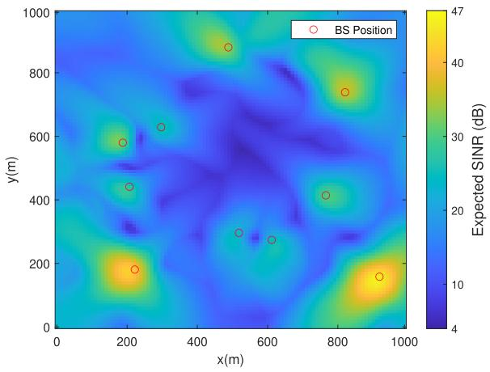  
(a) FPA-MMSE scheme

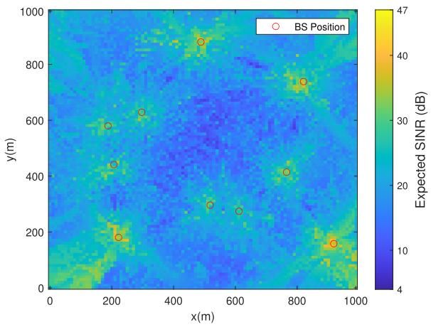  
(c) MA-MRC scheme

## B. Performance of Proposed Trajectory Design

Fig. 2. SINR map of benchmark schemes.  
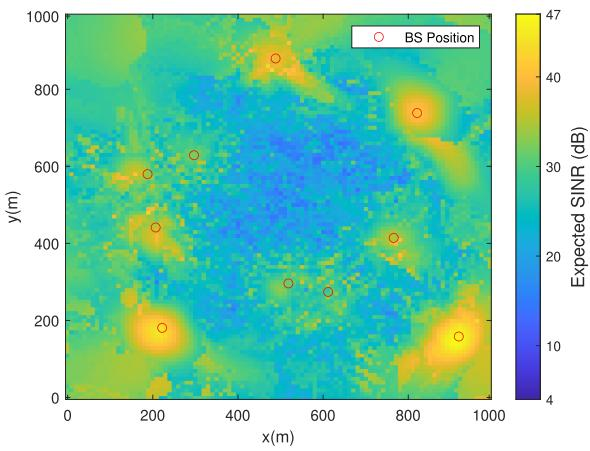

In Fig. 4, we illustrate the convergence behavior of the proposed Algorithm 1 at the initial point ${ \bf p } _ { I }$ for the proposed MA-MMSE scheme. It can be observed that Algorithm 1 converges within 10 iterations across all antenna number settings $N ,$ which clearly demonstrates the efficiency of Algorithm 1. Furthermore, as the number of antennas increases, the expected SINR also improves. Specifically, at the initial point $\mathbf { p } _ { I } ,$ the expected SINR with $N = 6$ antennas is approximately 2 dB higher than that with $N = 4$ , while the expected SINR with $N = 8$ antennas further improves by about 2 dB compared to the case of $N = 6$

(b) SA-MMSE scheme  
Fig. 3. SINR map of the proposed MA-MMSE scheme.  
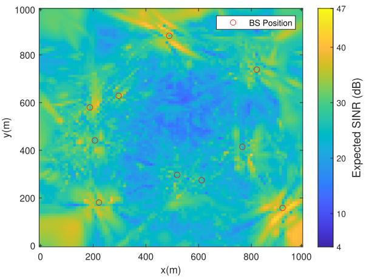

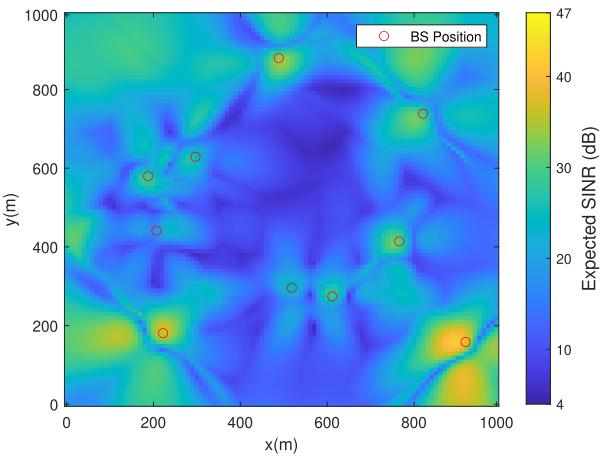

(d) AS-MMSE scheme  
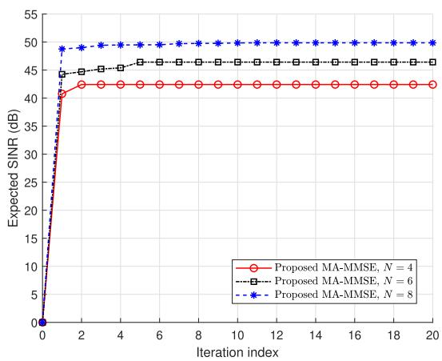  
Fig. 4. Evaluation of the convergence of the proposed Algorithm 1.

Fig. 5 illustrates the impact of grid granularity $\Delta$ on the performance of Algorithm 2 by showing the variation of the UAV mission completion time $T$ w.r.t. the SINR threshold $\gamma _ { \mathrm { m i n } }$ . As the SINR threshold $\gamma _ { \mathrm { m i n } }$ increases, the mission completion time $T$ increases monotonically for all $\Delta .$ . For a given SINR threshold $\gamma _ { \mathrm { m i n } } ,$ a smaller granularity $\Delta$ generally leads to a shorter mission completion time T . When $\gamma _ { \mathrm { m i n } } ~ \leq ~ 1 9$ dB, the mission completion times under different granularity $\Delta \mathit { \Psi } _ { \mathrm { s } }$ are nearly identical, indicating that the UAV can complete its mission along an almost straight trajectory under loose SINR constraints. $\mathrm { A s \ \gamma \gamma _ { m i n } \geq 2 1 \ \mathrm { d B } }$ , the performance gap among different granularity $\Delta$ becomes increasingly pronounced. In particular, when the SINR threshold reaches 29 dB, no feasible trajectory can be found for the granularity $\Delta$ of 20 m. This behavior can be attributed to the fact that a smaller grid granularity $\Delta$ enables the UAV to exploit additional detours to severe interference regions and thus identify more favorable trajectories. However, a smaller granularity $\Delta$ also incurs a higher computational complexity. Therefore, a moderate grid resolution of 10 m is adopted in this paper to balance performance and computational complexity.

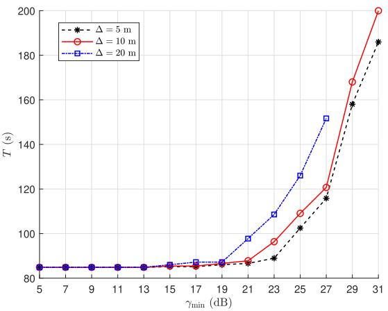  
Fig. 5. UAV mission completion time $_ T$ versus minimum SINR threshold $\gamma _ { \mathrm { m i n } }$ for the different grid granularity $\Delta .$

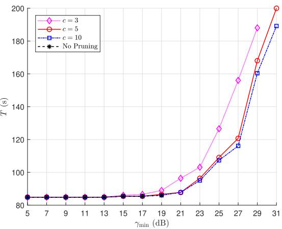  
Fig. $^ { 6 . }$ UAV mission completion time $_ T$ versus minimum SINR threshold γmin for the different pruning parameter c.

Fig. 6 evaluates the effect of the pruning parameter c on the performance of Algorithm 2 by depicting the mission completion time $T$ as a function of the SINR threshold $\gamma _ { \mathrm { m i n } }$ . The mission completion time $T$ increases monotonically with the SINR threshold for all pruning settings. For a fixed

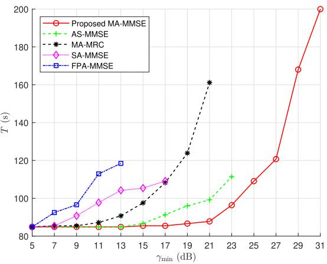  
Fig. 7. UAV mission completion time $_ T$ versus minimum SINR threshold $\gamma _ { \mathrm { m i n } }$ for the proposed and benchmark schemes.

SINR threshold $\gamma _ { \mathrm { m i n } } .$ , increasing the pruning parameter c generally leads to shorter mission completion time $T .$ . When $\gamma _ { \mathrm { m i n } } \leq 1 9 ~ \mathrm { d B }$ , the results obtained with $c = 5$ and $c = 1 0$ closely match those of the no pruning method, whereas a noticeable performance gap is observed when $c = 3$ . When $\gamma _ { \mathrm { m i n } } ~ \ge ~ 2 1$ dB, the no pruning method becomes computationally prohibitive and fails to produce feasible trajectories. In contrast, $c = 5$ and $c = 1 0$ continue to yield comparable performance, while $c = 3$ significantly magnifies the mission completion time $T$ and even results in infeasible trajectories at $\gamma _ { \mathrm { m i n } } = 3 1$ dB. This is because a smaller pruning parameter c substantially restricts the search space of future trajectory expansions, thereby increasing the likelihood of discarding promising trajectories. On the other hand, enlarging the pruning parameter leads to a higher computational complexity. Consequently, a moderate pruning parameter of 5 is adopted to keep a balance between solution quality and computational efficiency.

Then, we compare the performance of proposed MA-MMSE scheme with benchmark schemes. Fig. 7 shows the relationship between UAV mission completion time $T$ and minimum SINR threshold $\gamma _ { \mathrm { m i n } }$ for different schemes. It can be observed that UAV mission completion time $T$ increases monotonically with minimum SINR threshold $\gamma _ { \mathrm { m i n } }$ in all five schemes. This is because, as the minimum SINR threshold $\gamma _ { \mathrm { m i n } }$ increases, a larger portion of low-SINR regions fails to meet the $\mathrm { U A V } ^ { \ , } \mathbf { s }$ SINR requirement, regardless of whether the UAV is equipped with an FPA array, SA array, or MA array. To bypass these low-SINR regions, the UAV must take detours, which inevitably increases the UAV mission completion time $T .$ . Compared with four benchmark schemes, the proposed MA-MMSE scheme achieves substantial performance gains. First, it is evident that once minimum SINR threshold $\gamma _ { \mathrm { m i n } }$ exceeds a certain value, problem (P1) becomes infeasible, meaning no feasible trajectory exists that satisfies all constraints. In contrast to benchmark schemes, the proposed MA-MMSE scheme can still identify feasible trajectories under significantly stricter SINR requirements. Specifically, the maximum feasible value of $\gamma _ { \mathrm { m i n } }$ in the proposed MA-MMSE scheme is increased by 8 dB, 10 dB, 14 dB, and 22 dB compared with AS-MMSE, MA-MRC, SA-MMSE, and FPA-MMSE schemes, respectively. Second, for the same $\gamma _ { \mathrm { m i n } } ,$ the proposed MA-MMSE scheme consistently results in shorter UAV mission completion time compared with benchmark schemes. For example, when $\gamma _ { \mathrm { m i n } } ~ = ~ 1 3$ dB, the proposed MA-MMSE scheme achieves reductions in UAV mission completion time of 6.46%, 18.55%, and 28.35% over MA-MRC, SA-MMSE, and FPA-MMSE schemes, respectively. Although the AS-MMSE scheme achieves the same performance as the proposed MA-MMSE scheme at $\gamma _ { \mathrm { m i n } } = 1 3 ~ \mathrm { d B }$ , its performance gap compared to the proposed MA-MMSE scheme gradually increases as $\gamma _ { \mathrm { m i n } }$ continues to grow. These results clearly highlight the superiority of the proposed MA-MMSE scheme compared to benchmark schemes.

To gain further insights, we next examine the actual UAV trajectories obtained under different schemes. Fig. 8 provides a comparison of the UAV trajectories generated by the proposed MA-MMSE scheme and the four benchmark schemes for $\gamma _ { \mathrm { m i n } } ~ = ~ 1 3 ~ \mathrm { d B }$ . It is evident that, with the proposed MA-MMSE scheme and AS-MMSE scheme, the UAV can fly directly from the initial point to the final point, while all benchmark schemes require varying degrees of detours. Specifically, the MA-MRC scheme requires only minor detours in the central part of the flying region, whereas FPA-MMSE and SA-MMSE schemes must follow trajectories along the boundary to locate high-SINR regions that satisfy the SINR requirement. The underlying reason is that a UAV equipped with a traditional FPA array can only adjust its trajectory to avoid unfavorable channel conditions. Although an SA-equipped UAV can modify $d _ { \mathrm { S A } }$ , the inability to adjust the antenna position during flight limits its ability for reducing UAV mission completion time. Although the AS-MMSE scheme achieves the same performance as our proposed MA-MMSE scheme at $\gamma _ { \mathrm { m i n } } ~ = ~ 1 3 ~ \mathrm { d B } .$ , its computational complexity is excessively high. In contrast, the MA-equipped UAV benefits from the additional DoFs introduced by MAs, allowing dynamic adjustment of antenna positions during flight to improve channel conditions. As shown in Fig. 8, even with the MRC beamforming method which provides limited interference suppression, the MA-based scheme still achieves substantially better performance than the SA-MMSE and FPA-MMSE schemes.

Next, as shown in Fig. 9, we investigate how the UAV mission completion time $T$ varies with minimum SINR threshold $\gamma _ { \mathrm { m i n } }$ under different BS transmit power P when employing the proposed MA-MMSE scheme. It can be observed that increasing P consistently reduces $T$ for the same of minimum SINR threshold $\gamma _ { \mathrm { m i n } } .$ , and this reduction becomes more pronounced when minimum SINR threshold $\gamma _ { \mathrm { m i n } }$ is relatively large. Moreover, higher BS transmit power $P$ also expands the feasible range of $\gamma _ { \mathrm { m i n } } .$ . For example, when $P = 4 0$ dBm, the maximum feasible value of $\gamma _ { \mathrm { m i n } }$ is 2 dB and 8 dB higher than those under $P = 3 0$ dBm and P = 20 dBm, respectively. When $\gamma _ { \mathrm { m i n } } = 2 3 $ dB, the case of $P = 3 0$ dBm reduces the UAV mission completion time T by 10.96% compared with $P = 2 0$ dBm. When $\gamma _ { \mathrm { m i n } } = 2 9 ~ \mathrm { d B }$ , the case of $P = 4 0$ dBm achieves a 21.57% reduction in UAV mission completion time $T$ compared with that of $P = 3 0$ dBm. The underlying reason is that, for small $\gamma _ { \mathrm { m i n } }$ values, the proposed method can achieve near-straight trajectories even under relatively low BS transmit power $P .$ However, as $\gamma _ { \mathrm { m i n } }$ increases, BS transmit power $P$ has a stronger impact on UAV trajectory planning, leading to widening gaps in mission completion time $T$ across different $P$ levels.

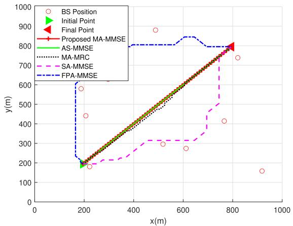  
Fig. 8. UAV trajectory of the proposed and benchmark schemes when $\gamma _ { \mathrm { m i n } } =$ 13 dB.

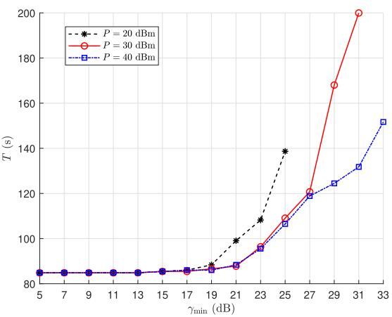  
Fig. 9. UAV mission completion time $_ T$ versus minimum SINR threshold γmin for the proposed MA-MMSE scheme with different BS transmit power ${ \ddot { P } } .$

Fig. 10 further illustrates the UAV trajectories obtained under different BS transmit powers for $\gamma _ { \mathrm { m i n } } ~ = ~ 2 3$ dB and $\gamma _ { \mathrm { m i n } } ~ = ~ 2 9$ dB. When $\gamma _ { \mathrm { m i n } } ~ = ~ 2 3 ~ \mathrm { d B } .$ , a relatively low BS transmit power $( \mathrm { i . e . , ~ } P \mathrm { ~ = ~ } 2 0 \mathrm { ~ d B m ) }$ forces the UAV to take a moderate detour for satisfying the minimum SINR requirement, whereas for higher BS transmit powers $( \mathrm { i . e . , }$ $P = 3 0$ , 40 dBm), the resulting UAV trajectories are broadly similar. When $\gamma _ { \mathrm { m i n } } ~ = ~ 2 9$ dB, a low transmit power $( \mathrm { i . e . , }$ $P = 2 0 ~ \mathrm { d B m } )$ fails to yield any feasible trajectory. Compared with the case of $P = 4 0$ dBm, the trajectory under $P =$ 30 dBm is pushed closer to the region boundary and requires more detours to satisfy the minimum SINR requirement. These trajectory patterns are well aligned with the UAV mission completion time shown in Fig. 9, thereby validating the consistency of the proposed scheme’s performance.

Fig. 11 demonstrates the impact of loading factor l on the UAV mission completion time T . For comparison, $1 = 1 ^ { \mathrm { m a x } }$ denotes that the exact loading factor at each BS k is uniformly replaced by $l ^ { \mathrm { m a x } } ~ = ~ 1$ , while $1 ~ = ~ 1 ^ { \mathrm { { m i n } } }$ denotes that it is replaced by $l ^ { \mathrm { m i n } } ~ = ~ 0$ These two comparison schemes therefore represent the “overestimate” and “underestimate” of the interference level at every UAV location, respectively. For $1 = 1 ^ { \mathrm { m i n } }$ , the absence of interference ensures that the UAV can pass through any region where the signal-to-noise ratio (SNR) exceeds $\gamma _ { \mathrm { m i n } }$ . Consequently, when $\gamma _ { \mathrm { m i n } }$ lies between 15 dB and 31 dB, the UAV follows a direct trajectory from the initial point to the final point. By contrast, for $1 = 1 ^ { \mathrm { m a x } }$ , the interference level is overestimated compared to $1 = { \bar { 1 } } ,$ resulting in a significantly longer UAV mission completion time $T$ under the same $\gamma _ { \mathrm { m i n } }$ . For instance, when $\gamma _ { \mathrm { m i n } } = 2 7 $ dB, the UAV mission completion time T for l = lmax is 41.17% longer than that of $1 = \bar { 1 }$ , whereas the UAV mission completion time $T$ for $1 = 1 ^ { \mathrm { m i n } } \ \mathrm { i s }$ 29.71% shorter. This performance gap arises because a higher level of interference lowers the SINR across the UAV flight region, thereby forcing the trajectory planning to introduce more detours for satisfying the minimum SINR requirement.

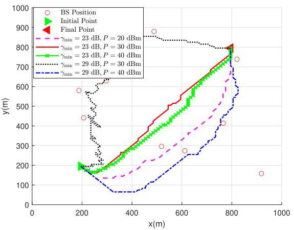  
Fig. 10. UAV trajectory of the proposed MA-MMSE scheme with different BS transmit power P and different minimum SINR threshold $\gamma _ { \mathrm { m i n } } .$

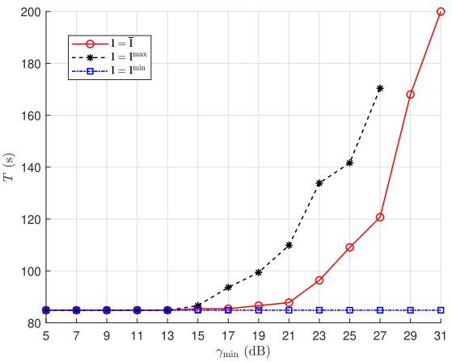  
Fig. 11. UAV mission completion time T versus minimum SINR threshold γmin for the proposed MA-MMSE scheme with different loading factor l.

To further illustrate this effect, Fig. 12 presents the UAV trajectory planning results corresponding to different loading factors when $\gamma _ { \mathrm { m i n } } = 2 7 ~ \mathrm { d B m }$ . As illustrated, for $1 = 1 ^ { \mathrm { m i n } }$ the UAV takes a direct trajectory from the initial point to the final point. In contrast, when $1 \ : = \ : 1 ^ { \mathrm { m a x } }$ , the relatively higher interference level compared with $1 ~ = ~ \bar { 1 }$ forces the UAV to detour along the boundary of the flight region for searching the trajectory that meets the minimum SINR requirement.

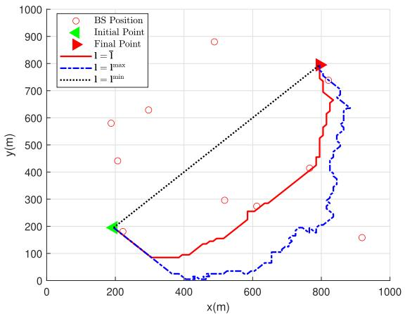  
Fig. 12. UAV trajectory of the proposed MA-MMSE scheme with different loading factor l when $\dot { \gamma } _ { \mathrm { m i n } } = 2 \dot { 7 } ~ \dot { \mathrm { d B } }$

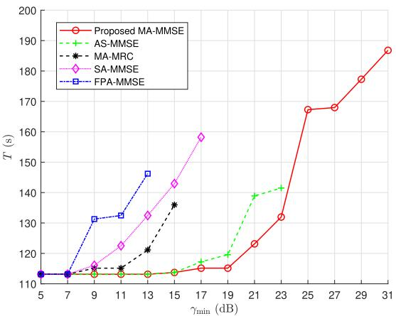  
Fig. 13. UAV mission completion time T versus minimum SINR threshold γ for different schemes with different UAV missions.

Finally, to evaluate performance under different UAV missions, the UAV initial and final points are set to $\begin{array} { r l } { \mathbf { p } _ { I } } & { { } = } \end{array}$ [95, 895] m and ${ \bf p } _ { F } = [ 8 9 5 , 9 5 ]$ m, respectively. The performance of the proposed MA-MMSE scheme is compared with benchmark schemes. Fig. 13 illustrates the relationship between the UAV mission completion time $T$ and the minimum SINR threshold $\gamma _ { \mathrm { m i n } } .$ . It can be observed that $T$ increases monotonically with $\gamma _ { \mathrm { m i n } }$ for all schemes, while the proposed MA-MMSE scheme consistently outperforms the benchmark schemes. Specifically, the maximum feasible $\gamma _ { \mathrm { m i n } }$ achieved by the proposed MA-MMSE scheme is increased by 8 dB, 14 dB, 16 dB, and 18 dB compared with the AS-MMSE, SA-MMSE, MA-MRC, and FPA-MMSE schemes, respectively. In addition, for a given $\gamma _ { \mathrm { m i n } } ,$ the proposed MA-MMSE scheme achieves a shorter mission completion time $T$ than all four benchmark schemes. For example, when $\gamma _ { \mathrm { m i n } } ~ = ~ 1 3$ dB, the proposed MA-MMSE scheme reduces the UAV mission completion time $T$ by 6.60%, 14.38%, and 22.63% compared with the MA-MRC, SA-MMSE, and FPA-MMSE schemes, respectively. Moreover, Fig. 14 depicts the resulting UAV trajectories for the proposed MA-MMSE scheme and the benchmark schemes when $\gamma _ { \mathrm { m i n } } = 1 3 ~ \mathrm { d B }$ , which is consistent with the performance trends observed in Fig. 13. These results demonstrate that the proposed method achieves a superior performance over all benchmark schemes across different UAV mission scenarios.

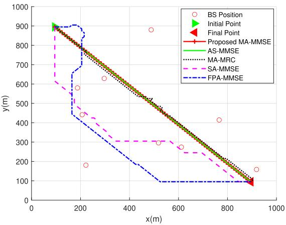  
Fig. 14. UAV trajectory of the proposed and benchmark schemes with different UAV missions when $\gamma _ { \mathrm { m i n } } = \mathrm { \bar { 1 3 } \ d B }$

## V. CONCLUSION

In this paper, we investigated the MA enhanced interference mitigation and interference-aware trajectory planning for cellular-connected UAV communication systems. We formulated an optimization problem to minimize the UAV mission completion time by jointly optimizing the UAV beamforming matrix, APV, UAV trajectory, and UAV-BS association indicator, subject to the expected SINR requirement, the UAV flying constraint, the MA moving constraint and the UAV-BS association constraint. In order to tackle the inherent difficulties of the continuous trajectory optimization, we first applied the path discretization technique to discretize both the flight region and trajectory of the UAV, which reformulates the problem into a tractable discrete optimization problem. Then, the SUCS algorithm was employed to perform trajectory planning over the discretized grids. At each planning step, the adjacent grid points were evaluated by jointly optimizing the UAV beamforming matrix, APV, and UAV-BS association indicator to maximize the expected SINR, which was then used to determine the feasibility of reliable link connectivity. Simulation results demonstrated that, compared with FPA-MMSE, SA-MMSE, MA-MRC, and AS-MMSE benchmark schemes, the proposed MA-MMSE design can substantially improve the cellular-connected expected SINR at given positions, thereby significantly reducing the UAV mission completion time while ensuring communication link quality. Overall, this study demonstrated that MA arrays can substantially enhance interference mitigation and trajectory planning efficiency for cellular-connected UAVs, offering a novel and effective design paradigm beyond conventional antenna architectures for future aerial communication networks.

## APPENDIX

## A. Proof of Proposition 1

Let $T ^ { * }$ denote the minimum achievable mission completion time from the initial point ${ \bf p } _ { I }$ to the final point ${ \bf p } _ { F }$ . For the sake of contradiction, we suppose that a termination node u with a total completion time $T _ { \mathrm { s u b } } > T ^ { * }$ is selected.

At any grid point before the algorithm selects node u, there must exist at least one node v in set $\mathcal { F }$ that lies on the optimal trajectory.

According to Definition 2, we have

$$
\begin{array} { r } { C _ { 2 } ( v ) = C _ { 1 } ( v ) + C _ { \mathrm { r e m } } ( \mathbf { p } _ { i _ { m } , j _ { m } } ) , } \end{array}\tag{33}
$$

where $\mathbf { p } _ { i _ { m } , j _ { m } }$ is the grid point position of node v. Since $C _ { \mathrm { r e m } } ( \mathbf { p } _ { i _ { m } , j _ { m } } )$ is the lower bound of the remaining flight time from grid point $\mathbf { p } _ { i _ { m } , j _ { m } }$ to the final point ${ \bf p } _ { F }$ , it follows

$$
\begin{array} { r } { C _ { 2 } ( v ) \leq C _ { 1 } ( v ) + \hat { C } _ { \mathrm { r e m } } ( \mathbf { p } _ { i _ { m } , j _ { m } } ) = T ^ { * } , } \end{array}\tag{34}
$$

where $\hat { C } _ { \mathrm { r e m } } \left( \mathbf { p } _ { i _ { m } , j _ { m } } \right)$ denotes the actual remaining completion time from grid point $\mathbf { p } _ { i _ { m } , j _ { m } }$ to the final point ${ \bf p } _ { F }$

For node $u ,$ since it is a termination node, the remaining flight time lower bound $C _ { \mathrm { r e m } } ( { \bf p } _ { F } ) = 0$ . Thus

$$
C _ { 2 } ( u ) = C _ { 1 } ( u ) = T _ { \mathrm { s u b } } .\tag{35}
$$

Since we assumed $T _ { \mathrm { s u b } } > T ^ { * }$ , combining (34) and (35) gives

$$
C _ { 2 } ( v ) \leq T ^ { * } < T _ { \mathrm { s u b } } = C _ { 2 } ( u ) .\tag{36}
$$

According to the node selection strategy, we always expand the node with the smallest potential minimum UAV mission completion time. Therefore, the algorithm would have expanded node v (and subsequently other nodes on the optimal trajectory) before ever selecting u for expansion. This contradicts the assumption that u was selected first. Therefore, the first termination node reached by our node selection strategy must be the optimal one.

This thus completes the proof of Proposition 1.

## REFERENCES

[1] Y. Zeng, R. Zhang, and T. J. Lim, “Wireless communications with unmanned aerial vehicles: Opportunities and challenges,” IEEE Commun. Mag., vol. 54, no. 5, pp. 36–42, May 2016.

[2] Y. Zeng, Q. Wu, and R. Zhang, “Accessing from the sky: A tutorial on UAV communications for 5G and beyond,” Proc. IEEE, vol. 107, no. 12, pp. 2327–2375, Dec. 2019.

[3] K. Yang et al., “Communications in space–air–ground integrated networks: An overview,” Space, Sci. Technol., vol. 5, p. 0199, Feb. 2024.

[4] Y. Li, X. Gao, M. Shi, J. Kang, D. Niyato, and K. Yang, “Hierarchical optimization for task execution cost minimization in D2D-assisted mobile edge computing networks,” IEEE Trans. Wireless Commun., vol. 25, pp. 587–601, 2026.

[5] Y. Zhang et al., “Robust secure UAV communications with the aid of jamming beamforming,” IEEE Trans. Commun., vol. 73, no. 11, pp. 12205–12220, Nov. 2025.

[6] Y. Li et al., “Joint trajectory, resource, and access optimization in multi-UAV collaborative mobile edge computing networks for low-altitude economy,” IEEE Internet Things J., vol. 13, no. 5, pp. 9467–9481, Mar. 2026.

[7] Y. Huang, X. Gao, M. Shi, N. Ye, and K. Yang, “Energy-efficient power control in D2D networks: A distributed ADMM approach with dynamic penalty coefficient,” IEEE Trans. Veh. Technol., vol. 74, no. 5, pp. 8238–8250, May 2025.

[8] Y. Zeng, J. Lyu, and R. Zhang, “Cellular-connected UAV: Potential, challenges, and promising technologies,” IEEE Wireless Commun., vol. 26, no. 1, pp. 120–127, Feb. 2019.

[9] B. Ning, Z. Chen, W. Chen, Y. Du, and J. Fang, “Terahertz multiuser massive MIMO with intelligent reflecting surface: Beam training and hybrid beamforming,” IEEE Trans. Veh. Technol., vol. 70, no. 2, pp. 1376–1393, Feb. 2021.

[10] Y. Zhao et al., “A multi-agent complex-valued LSTM framework for mmWave coordinated beamforming in interference networks via sub-6 GHz CSI,” IEEE Trans. Cogn. Commun. Netw., vol. 12, pp. 4346–4360, 2025.

[11] W. Mei, Q. Wu, and R. Zhang, “Cellular-connected UAV: Uplink association, power control and interference coordination,” IEEE Trans. Wireless Commun., vol. 18, no. 11, pp. 5380–5393, Nov. 2019.

[12] W. Mei and R. Zhang, “Cooperative downlink interference transmission and cancellation for cellular-connected UAV: A divide-and-conquer approach,” IEEE Trans. Commun., vol. 68, no. 2, pp. 1297–1311, Feb. 2020.

[13] S. Zhang and R. Zhang, “Radio map-based 3D path planning for cellular-connected UAV,” IEEE Trans. Wireless Commun., vol. 20, no. 3, pp. 1975–1989, Mar. 2021.

[14] C. Zhan and Y. Zeng, “Energy minimization for cellular-connected UAV: From optimization to deep reinforcement learning,” IEEE Trans. Wireless Commun., vol. 21, no. 7, pp. 5541–5555, Jul. 2022.

[15] J. Hou, Y. Deng, and M. Shikh-Bahaei, “Joint beamforming, user association, and height control for cellular-enabled UAV communications,” IEEE Trans. Commun., vol. 69, no. 6, pp. 3598–3613, Jun. 2021.

[16] L. Zhu, W. Ma, and R. Zhang, “Movable antennas for wireless communication: Opportunities and challenges,” IEEE Commun. Mag., vol. 62, no. 6, pp. 114–120, Jun. 2024.

[17] L. Zhu et al., “A tutorial on movable antennas for wireless networks,” IEEE Commun. Surveys Tuts., vol. 28, pp. 3002–3054, 2026.

[18] L. Zhu, W. Ma, and R. Zhang, “Modeling and performance analysis for movable antenna enabled wireless communications,” IEEE Trans. Wireless Commun., vol. 23, no. 6, pp. 6234–6250, Jun. 2024.

[19] H. Wang et al., “Throughput maximization for movable antenna systems with movement delay consideration,” IEEE Trans. Wireless Commun., vol. 25, pp. 883–899, 2026.

[20] W. Ma, L. Zhu, and R. Zhang, “Multi-beam forming with movableantenna array,” IEEE Commun. Lett., vol. 28, no. 3, pp. 697–701, Mar. 2024.

[21] H. Wang, Q. Wu, and W. Chen, “Movable antenna enabled interference network: Joint antenna position and beamforming design,” IEEE Wireless Commun. Lett., vol. 13, no. 9, pp. 2517–2521, Sep. 2024.

[22] S. Yang, W. Lyu, B. Ning, Z. Zhang, and C. Yuen, “Flexible precoding for multi-user movable antenna communications,” IEEE Wireless Commun. Lett., vol. 13, no. 5, pp. 1404–1408, May 2024.

[23] X. Wei, W. Mei, D. Wang, B. Ning, and Z. Chen, “Joint beamforming and antenna position optimization for movable antenna-assisted spectrum sharing,” IEEE Wireless Commun. Lett., vol. 13, no. 9, pp. 2502–2506, Sep. 2024.

[24] L. Zhu, X. Pi, W. Ma, Z. Xiao, and R. Zhang, “Dynamic beam coverage for satellite communications aided by movable-antenna array,” IEEE Trans. Wireless Commun., vol. 24, no. 3, pp. 1916–1933, Mar. 2025.

[25] G. Hu et al., “Two-timescale design for movable antenna array-enabled multiuser uplink communications,” IEEE Trans. Veh. Technol., vol. 74, no. 3, pp. 5152–5157, Mar. 2025.

[26] Z. Xiao, X. Pi, L. Zhu, X.-G. Xia, and R. Zhang, “Multiuser communications with movable-antenna base station: Joint antenna positioning, receive combining, and power control,” IEEE Trans. Wireless Commun., vol. 23, no. 12, pp. 19744–19759, Dec. 2024.

[27] L. Zhu, W. Ma, B. Ning, and R. Zhang, “Movable-antenna enhanced multiuser communication via antenna position optimization,” IEEE Trans. Wireless Commun., vol. 23, no. 7, pp. 7214–7229, Jul. 2024.

[28] Y. Gao, Q. Wu, and W. Chen, “Joint transmitter and receiver design for movable antenna enhanced multicast communications,” IEEE Trans. Wireless Commun., vol. 23, no. 12, pp. 18186–18200, Dec. 2024.

[29] L. Zhu, W. Ma, Z. Xiao, and R. Zhang, “Performance analysis and optimization for movable antenna aided wideband communications,” IEEE Trans. Wireless Commun., vol. 23, no. 12, pp. 18653–18668, Dec. 2024.

[30] J. Ding, L. Zhu, Z. Zhou, B. Jiao, and R. Zhang, “Near-field multiuser communications aided by movable antennas,” IEEE Wireless Commun. Lett., vol. 14, no. 1, pp. 138–142, Jan. 2025.

[31] L. Zhu, W. Ma, Z. Xiao, and R. Zhang, “Movable antenna enabled near-field communications: Channel modeling and performance optimization,” IEEE Trans. Commun., vol. 73, no. 9, pp. 7240–7256, Sep. 2025.

[32] W. Mei, X. Wei, Y. Liu, B. Ning, and Z. Chen, “Movable-antenna position optimization for physical-layer security via discrete sampling,” in Proc. IEEE Global Commun. Conf. (Globecom), Dec. 2024, pp. 4750–4755.

[33] W. Ma, L. Zhu, and R. Zhang, “Movable antenna enhanced wireless sensing via antenna position optimization,” IEEE Trans. Wireless Commun., vol. 23, no. 11, pp. 16575–16589, Nov. 2024.

[34] Y. Chen, Z. Ren, X. Yu, L. Liu, and J. Xu, “Exploiting moving arrays for near-field sensing,” IEEE Wireless Commun. Lett., vol. 14, no. 3, pp. 601–605, Mar. 2025.

[35] Z. Xiao et al., “Channel estimation for movable antenna communication systems: A framework based on compressed sensing,” IEEE Trans. Wireless Commun., vol. 23, no. 9, pp. 11814–11830, Sep. 2024.

[36] W. Ma, L. Zhu, and R. Zhang, “Movable antenna enhanced integrated sensing and communication via antenna position optimization,” IEEE Trans. Signal Process., early access, Mar. 17, 2026, doi: 10.1109/ TSP.2026.3674463.

[37] W. Mei, X. Wei, B. Ning, Z. Chen, and R. Zhang, “Movable-antenna position optimization: A graph-based approach,” IEEE Wireless Commun. Lett., vol. 13, no. 7, pp. 1853–1857, Jul. 2024.

[38] J.-M. Kang, “Deep learning enabled multicast beamforming with movable antenna array,” IEEE Wireless Commun. Lett., vol. 13, no. 7, pp. 1848–1852, Jul. 2024.

[39] J. Kang, “NMAP-Net: Deep-learning-aided near-field multibeamforming design and antenna position optimization for XL-MIMO communications,” IEEE Internet Things J., vol. 12, no. 11, pp. 18397–18413, Jun. 2025.

[40] J.-M. Kang and I.-M. Kim, “How much training is required for channel estimation in fluid antenna system?,” IEEE J. Sel. Areas Commun., vol. 44, pp. 1259–1275, 2026.

[41] X. Shao, Q. Jiang, and R. Zhang, “6D movable antenna based on user distribution: Modeling and optimization,” IEEE Trans. Wireless Commun., vol. 24, no. 1, pp. 355–370, Jan. 2025.

[42] X. Shao, R. Zhang, Q. Jiang, and R. Schober, “6D movable antenna enhanced wireless network via discrete position and rotation optimization,” IEEE J. Sel. Areas Commun., vol. 43, no. 3, pp. 674–687, Mar. 2025.

[43] X. Shao and R. Zhang, “6DMA enhanced wireless network with flexible antenna position and rotation: Opportunities and challenges,” IEEE Commun. Mag., vol. 63, no. 4, pp. 121–128, Apr. 2025.

[44] X. Shao, R. Zhang, Q. Jiang, J. Park, T. Q. S. Quek, and R. Schober, “Distributed channel estimation and optimization for 6D movable antenna: Unveiling directional sparsity,” IEEE J. Sel. Topics Signal Process., vol. 19, no. 2, pp. 349–365, Mar. 2025.

[45] T. Ren, X. Zhang, L. Zhu, W. Ma, X. Gao, and R. Zhang, “6-D movable antenna enhanced interference mitigation for cellular-connected UAV communications,” IEEE Wireless Commun. Lett., vol. 14, no. 6, pp. 1618–1622, Jun. 2025.

[46] W. Liu, X. Zhang, H. Xing, J. Ren, Y. Shen, and S. Cui, “UAV-enabled wireless networks with movable-antenna array: Flexible beamforming and trajectory design,” IEEE Wireless Commun. Lett., vol. 14, no. 3, pp. 566–570, Mar. 2025.

[47] H. Lu, Y. Zeng, S. Ma, B. Li, S. Jin, and R. Zhang, “Wireless communication for low-altitude economy with UAV swarm enabled twolevel movable antenna system,” 2025, arXiv:2505.22286.

[48] H. Wang et al., “Reconfigurable airspace: Synergizing movable antenna and intelligent surface for low-altitude ISAC networks,” 2025, arXiv:2511.10310.

[49] H. Mao, L. Zhu, X. Pi, Z. Xiao, X.-G. Xia, and R. Zhang, “Robust design for movable-antenna array enabled AAV communications with jittering,” IEEE Wireless Commun. Lett., vol. 14, no. 11, pp. 3470–3474, Nov. 2025.

[50] X.-W. Tang, Y. Shi, Y. Huang, and Q. Wu, “Joint optimization of UAV height and antenna configuration for UAV-mounted movable antenna,” IEEE Wireless Commun. Lett., vol. 15, pp. 235–239, 2025.

[51] K. Li et al., “Can movable antenna-enabled micro-mobility replace UAV-enabled macro-mobility? A physical layer security perspective,” IEEE Trans. Mobile Comput., vol. 25, no. 3, pp. 4317–4330, Mar. 2026.

[52] C. Liu, W. Mei, P. Wang, Y. Meng, Z. Chen, and B. Ning, “UAV-enabled passive 6D movable antennas: Joint deployment and beamforming optimization,” IEEE Trans. Wireless Commun., vol. 25, pp. 9765–9781, 2026.

[53] H. Wang and Y. Zeng, “Can sparse arrays outperform collocated arrays for future wireless communications?,” in Proc. IEEE Globecom Workshops (GC Wkshps), Dec. 2023, pp. 667–672.

[54] H. Wang et al., “Enhancing spatial multiplexing and interference suppression for near- and far-field communications with sparse MIMO,” IEEE Trans. Commun., pp. 5765–5782, 2024.

[55] X. Li et al., “Sparse MIMO for ISAC: New opportunities and challenges,” IEEE Wireless Commun., vol. 32, no. 4, pp. 170–178, Aug. 2025.

[56] D. Tse and P. Viswanath, Fundamentals of Wireless Communication. Cambridge, U.K.: Cambridge Univ. Press, 2005.

[57] S. Boyd and L. Vandenberghe, Convex Optimization. Cambridge, U.K.: Cambridge Univ. Press, 2004.

[58] S. Lacoste-Julien, “Convergence rate of Frank-Wolfe for non-convex objectives,” 2016, arXiv:1607.00345.

[59] D. B. West, Introduction to Graph Theory. Upper Saddle River, NJ, USA: Prentice-Hall, 2001.

[60] S. Even, Graph Algorithms. Cambridge, U.K.: Cambridge Univ. Press, 2011.

[61] Y. Gao, H. Vinck, and T. Kaiser, “Massive MIMO antenna selection: Switching architectures, capacity bounds, and optimal antenna selection algorithms,” IEEE Trans. Signal Process., vol. 66, no. 5, pp. 1346–1360, Mar. 2018.

  
Tianshi Ren received the B.S. degree in electronic information engineering from Beijing Institute of Technology, Beijing, China, in 2021, where she is currently pursuing the Ph.D. degree with the School of Information and Electronics. Her research interests include movable antenna (MA)-enabled wireless communications, wireless drone communications, and intelligent reflecting surface (IRS).

Xianchao Zhang (Member, IEEE) received the Ph.D. degree in systems engineering from Beihang University, Beijing, China, in 2013. From 2013 to 2015, he was a Post-Doctoral Fellow with Peking University, China. From 2018 to 2022, he was a Post-Doctoral Fellow with Southeast University, China. From 2015 to 2021, he was a Senior Engineer with China Academy of Electronic and Information Technology. He is currently a Professor with the Provincial Key Laboratory of Multimodal Perceiving and Intelligent Systems and the Engineering

Research Center of Intelligent Human Health Situation Awareness of Zhejiang Province, Jiaxing University, China. His research interests include multimodal perceiving, intelligent information networks, and quantum artificial intelligence.

Wenyan Ma (Member, IEEE) received the B.S. degree (Hons.) in information engineering and the M.S. degree in signal and information processing from Southeast University, Nanjing, China, in 2017 and 2020, respectively, and the Ph.D. degree from the Department of Electrical and Computer Engineering, National University of Singapore, in 2025. He is currently a Research Fellow with the Department of Electrical and Computer Engineering, National University of Singapore. His research interests include movable antenna (MA)-enabled wireless

communications, intelligent reflecting surface, and convex optimization. He was a recipient of the Outstanding Master’s Thesis Award from Chinese Institute of Electronics in 2020 and the Best Paper Award from 11th International Conference on Wireless Communications and Signal Processing in 2019. He was honored as the Exemplary Reviewer of IEEE COMMUNICATIONS LETTERS in 2019 and 2020. He serves as an Associate Editor for IEEE OPEN JOURNAL OF THE COMMUNICATIONS SOCIETY.

Lipeng Zhu (Senior Member, IEEE) received the B.S. degree from the Department of Mathematics and System Sciences, Beihang University, in 2017, and the Ph.D. degree from the Department of Electronic and Information Engineering, Beihang University, in 2021. From 2021 to 2025, he was a Research Fellow with the Department of Electrical and Computer Engineering, National University of Singapore. He is currently a Professor with the State Key Laboratory of CNS/ATM and the School of Interdisciplinary Science, Beijing Insti-

tute of Technology, China. His current research interests include movable antenna (MA)-enabled wireless communications, intelligent reflecting surface (IRS), millimeter-wave communications, airborne communications, and nonorthogonal multiple access (NOMA). He was a recipient of the Beijing Outstanding Doctoral Thesis Award in 2022, the Outstanding Doctoral Thesis Award from China Education Society of Electronics in 2022, the First Prize of Natural Science from Chinese Institute of Electronics in 2021, the Best Demo Award at IEEE/CIC ICCC in 2025, the Second Prize of the IEEE Communications Society Student Competition as the Team Leader in 2020, the Exemplary Editor of IEEE OPEN JOURNAL OF THE COMMUNICATIONS SOCIETY in 2025, and the Exemplary Reviewer of IEEE TRANSACTIONS ON COMMUNICATIONS c in 2022. He has been listed in the single-year ranking of World’s Top 2% Scientists by Stanford University since 2021. He served as the Chair for a series of workshops at IEEE Globecom 2024–2025, ICC 2025–2026, VTC2026-Spring, and VTC2026-Fall. He has also served as a TPC member for many IEEE conferences/workshops. He serves as an Associate Editor for IEEE TRANSACTIONS ON COMMUNICATIONS, IEEE TRANSACTIONS ON MOBILE COMPUTING, IEEE COMMUNICATIONS LETTERS, IEEE OPEN JOURNAL OF THE COMMUNICATIONS SOCIETY, and IEEE OPEN JOURNAL OF VEHICULAR TECHNOLOGY; and the Guest Editor for IEEE WIRELESS COMMUNICATIONS, Chinese Journal of Electronics, and China Communications.

Xiaozheng Gao (Member, IEEE) received the B.S. and Ph.D. degrees from Beijing Institute of Technology, Beijing, China, in 2014 and 2020, respectively.

He was a Visiting Student with the School of Computer Science and Engineering, Nanyang Technological University, Singapore. He is currently an Associate Professor with Beijing Institute of Technology. His current research interests include space–air–ground networks, backscatter communications, and the Internet of Things.

Rui Zhang (Fellow, IEEE) received the B.Eng. (Hons.) and M.Eng. degrees from the National University of Singapore, Singapore, and the Ph.D. degree from Stanford University, Stanford, CA, USA, all in electrical engineering.

From 2007 to 2009, he was a Research Scientist with the Institute for Infocomm Research, ASTAR, Singapore. In 2010, he joined the Department of Electrical and Computer Engineering, National University of Singapore, where he is currently a Provost’s Chair Professor. He is also an Adjunct

Professor with the School of Science and Engineering, The Chinese University of Hong Kong, Shenzhen, China. He has published over 600 papers, all in the field of wireless communications and networks. He has been listed as a Highly Cited Researcher by Thomson Reuters/Clarivate Analytics since 2015. His current research interests include intelligent surfaces, reconfigurable antennas, radio mapping, non-terrestrial communications, wireless power transfer, and AI and optimization methods.

Dr. Zhang is a fellow of the Academy of Engineering Singapore. He was a recipient of the Sixth IEEE Communications Society Asia–Pacific Region Best Young Researcher Award in 2011, the Young Researcher Award of National University of Singapore in 2015, the Wireless Communications Technical Committee Recognition Award in 2020, the IEEE Signal Processing and Computing for Communications (SPCC) Technical Recognition Award in 2021, the IEEE Communications Society Technical Committee on Cognitive Networks (TCCN) Recognition Award in 2023, and the IEEE James Evans Avant Garde

Award in 2025. His works received 18 IEEE Best Journal Paper Awards, including the IEEE Marconi Prize Paper Award in Wireless Communications in 2015 and 2020; the IEEE Signal Processing Society Best Paper Award in 2016; the IEEE Communications Society Heinrich Hertz Prize Paper Award in 2017, 2020, and 2022; and the IEEE Communications Society Stephen O. Rice Prize in 2021. He served as the TPC co-chair or an organizing committee member for over 30 international conferences. He was an Elected Member of the IEEE Signal Processing Society SPCOM Technical Committee from 2012 to 2017 and SAM Technical Committee from 2013 to 2015. He served as the Vice Chair for the IEEE Communications Society Asia–Pacific Board Technical Affairs Committee from 2014 to 2015 and a member of the Steering Committee of IEEE WIRELESS COMMUNICATIONS LETTERS from 2018 to 2021 and the IEEE Communications Society Wireless Communications Technical Committee (WTC) Award Committee from 2023 to 2025. He is the Chair of the IEEE Communications Society Wireless Communications Technical Committee (WTC) Award Committee. He served as an Editor for several IEEE journals, including IEEE TRANSACTIONS ON WIRELESS COMMUNICATIONS from 2012 to 2016, IEEE JOURNAL ON SELECTED AREAS IN COMMUNICATIONS: Green Communications and Networking Series from 2015 to 2016, IEEE TRANSACTIONS ON SIGNAL PROCESSING from 2013 to 2017, IEEE TRANSACTIONS ON GREEN COMMUNICATIONS AND NETWORKING from 2016 to 2020, and IEEE TRANSACTIONS ON COMMUNICATIONS from 2017 to 2022. He serves as an Editorial Board Member for npj Wireless Technology. He was a Distinguished Lecturer of IEEE Signal Processing Society and IEEE Communications Society from 2019 to 2020.