# Multi-Agent DRL-Based Coded Caching and Resource Allocation in UAV-Assisted Networks

Bingxin Tian , Li Wang , Senior Member, IEEE, Zheng Chang , Senior Member, IEEE, Lianming Xu , Member, IEEE, and Aiguo Fei

Abstract—In emergency communications constrained by bandwidth limitations, unmanned aerial vehicle (UAV)-based coded caching presents a promising approach for the efficient dissemination of high-bandwidth-demanding services. This paper focuses on content download and content repair in aerial caching networks, where UAVs deliver contents to both ground users and invalid UAVs. To address potential data loss due to limited power and high mobility, fault-tolerant codes are utilized to maintain data availability and reliability. Initially, we derive the expressions of communication cost and success rate for content download and content repair. The size of coded fragments, determined by the coding design, affects both the success rate and transmission cost, while the resource allocation, which influences the cooperative relationships, also impacts these two aspects. The interplay between coding design and resource allocation is thus established to jointly optimize the overall performance. Then, we design a joint optimization problem of erasure coding schemes, coding parameters, matching relations, and UAV trajectories to maximize the overall success rate. Moreover, we propose a hierarchical multi-agent parameterized deep Q-network (H-MA-PDQN) algorithm integrating a dual-component structure for long-term coding and immediate resource allocation to solve the mixed integer nonlinear programming (MINLP), and each agent employs a PDQN with hybrid discrete-continuous action space. Simulation results demonstrate that our proposed H-MA-PDQN algorithm increases the success probability by 26.7% and 66.7% and reduces the transmission cost by 27.3% and 42.9% compared with the DQN and greedy-based strategies, respectively.

Index Terms—Coded caching, content repair, hierarchical deep reinforcement learning, parameterized deep Q-network.

## I. INTRODUCTION

Received 13 September 2024; revised 11 February 2025 and 6 May 2025; accepted 3 July 2025. Date of publication 18 July 2025; date of current version 22 December 2025. This work was supported in part by the National Natural Science Foundation of China under Grant 62171054, in part by the Fundamental Research Funds for the Central Universities under Grant 24820232023YQTD01, in part by the Interdisciplinary Team Project Funds for the Double First-Class Construction Discipline under Grant 2023SYLTD06, in part by the NSFC under Grant 62201071, in part by the NSF of Sichuan under Grant 2025YFHZ0093, and in part by Horizon European Union Grant 101086159 and Grant 101131117. The associate editor coordinating the review of this article and approving it for publication was M. Giordani. (Corresponding author: Li Wang.)

Bingxin Tian and Lianming Xu are with the School of Electronic Engineering, Beijing University of Posts and Telecommunications, Beijing 100876, China (e-mail: bingxintian@bupt.edu.cn; xulianming@bupt.edu.cn).

Li Wang and Aiguo Fei are with the School of Computer Science (National Pilot Software Engineering School), Beijing University of Posts and Telecommunications, Beijing 100876, China (e-mail: liwang@bupt.edu.cn; aiguofei@bupt.edu.cn).

Zheng Chang is with the School of Computer Science and Engineering, University of Electronic Science and Technology of China, Chengdu 611731, China (e-mail: zheng.chang@uestc.edu.cn).

challenges for future communication systems [1], [2]. To alleviate the strain on cellular networks, coded caching emerges as a promising approach [3]. It can reduce core network traffic and latency to improve content delivery efficiency and reliability, particularly in bandwidth-constrained environments [4]. UAV-assisted coded caching offers a viable solution, where UAVs can be dispatched to cache and distribute coded fragments of important rescue-related files [5], [6]. Content requesters (CRs) can retrieve the required data through direct UAV-to-ground (U2G) communications. Moreover, in case some UAVs become invalid due to harsh environmental conditions, other UAVs can assist in repairing the lost content fragments [7] through UAV-to-UAV (U2U) communications.

Digital Object Identifier 10.1109/TWC.2025.3587959

Research on resource allocation for coded caching systems (CCS) can be categorized into terrestrial CCSs and UAV CCSs. In terrestrial CCSs, efforts have focused on efficient coding strategies [8], resource optimization [9] and cache placement [10] to improve data transmission and recovery. Research in [11] has investigated methods to reduce transmission costs for coding schemes such as Maximum Distance Separable (MDS), Minimum Bandwidth Regenerating (MBR) and Minimum Storage Regenerating (MSR) in Device-to-Device (D2D) networks. Fountain Codes (FC)-based caching has also been explored to reduce transmission delays in heterogeneous vehicular networks [12]. The selection of fault-tolerant codes and repair mechanisms is crucial for reducing repair bandwidth and storage. Partial piggybacking codes have emerged as an effective solution for multi-node recovery scenarios [13], while generalized regenerating codes [14] leverage graph connections to optimize repair costs and bandwidth efficiency. Hybrid architectures combining erasure coding with selective replication can achieve significant bandwidth reductions [15].

In the UAV CCS, the majority are non-coded caching systems, which have focused on tackling the unique challenges of UAVs, such as limited endurance and rapidly changing environments [16]. In [17], a user-centric cooperation scheme was proposed for cache-enabled UAV networks leveraging content and transmission diversity. The proposed probabilistic caching optimization effectively minimized outage probability under dynamic UAV interference conditions. Additionally, a cache-enabled UAV-assisted cellular network was examined in [18] for metaverse users, aimed at reducing latency and improving service quality through optimized UAV deployment and base station association decisions. Other research has focused on the communication coverage for vehicular networks [19] and multiple real-time users in hotspot areas [20]. For data recovery, a blockchain-based method was proposed to tackle node failures and network connectivity issues in UAV-caching networks [21]. Non-coded caching systems directly transmit complete content, which demands larger bandwidth and energy resources. They are also more prone to packet loss, and retransmission leads to high latency. In contrast, coded caching systems encode a large-bandwidth and large-storage content into multiple small-bandwidth and small-storage fragments, effectively alleviating these issues [22]. However, current UAV-assisted coded caching systems still have limitations. The intelligent selection of fault-tolerant schemes has not been adequately addressed. There is also a lack of integrated designs that combine coding design with UAV trajectory design and user association, and solutions are needed to account for the dynamic nature of UAVs in unstable and rapidly changing emergency environments.

TABLE I  
SUMMARY OF RELATED WORK
<table><tr><td rowspan=1 colspan=1>Paper</td><td rowspan=1 colspan=1>Scenario</td><td rowspan=1 colspan=1>Objective</td><td rowspan=1 colspan=1>Decision</td><td rowspan=1 colspan=1>Caching</td><td rowspan=1 colspan=1>Method</td></tr><tr><td rowspan=1 colspan=1>[26], [27]</td><td rowspan=1 colspan=1>UAV network</td><td rowspan=1 colspan=1>Max. throughput</td><td rowspan=1 colspan=1>Resource allocation andUAV trajectory</td><td rowspan=1 colspan=1>No-caching</td><td rowspan=1 colspan=1>Hierarchical DDPG,MADRL</td></tr><tr><td rowspan=1 colspan=1>[28], [29]</td><td rowspan=1 colspan=1>UAV network</td><td rowspan=1 colspan=1>Min. age of Information</td><td rowspan=1 colspan=1>Resource allocation andUAV trajectory</td><td rowspan=1 colspan=1>No-caching</td><td rowspan=1 colspan=1>Safe DQN, SCA</td></tr><tr><td rowspan=1 colspan=1>[30], [31]</td><td rowspan=1 colspan=1>UAV network</td><td rowspan=1 colspan=1>Max. energy efficiency</td><td rowspan=1 colspan=1>Resource allocation andUAV trajectory</td><td rowspan=1 colspan=1>No-caching</td><td rowspan=1 colspan=1>SCA</td></tr><tr><td rowspan=1 colspan=1>[32]</td><td rowspan=1 colspan=1>UAV network</td><td rowspan=1 colspan=1>Min. network cost</td><td rowspan=1 colspan=1>Resource allocation andUAV trajectory</td><td rowspan=1 colspan=1>No-caching</td><td rowspan=1 colspan=1>MADDPG</td></tr><tr><td rowspan=1 colspan=1>[33]</td><td rowspan=1 colspan=1>UAV network</td><td rowspan=1 colspan=1>Max. number of tasks</td><td rowspan=1 colspan=1>Resource allocation</td><td rowspan=1 colspan=1>No-coded</td><td rowspan=1 colspan=1>MAAC</td></tr><tr><td rowspan=1 colspan=1>[34], [35][36]</td><td rowspan=1 colspan=1>UAV network</td><td rowspan=1 colspan=1>Min. system delay</td><td rowspan=1 colspan=1>Cache design, resourceallocation and UAVtrajectory</td><td rowspan=1 colspan=1>No-coded</td><td rowspan=1 colspan=1>MAPPO, TD3MADDPG</td></tr><tr><td rowspan=1 colspan=1>[37], [38]</td><td rowspan=1 colspan=1>UAV network</td><td rowspan=1 colspan=1>Max. energy efficiency</td><td rowspan=1 colspan=1>Cache design, resourceallocation and UAVtrajectory</td><td rowspan=1 colspan=1>No-coded</td><td rowspan=1 colspan=1>MADDPG, DQN</td></tr><tr><td rowspan=1 colspan=1>[11]</td><td rowspan=1 colspan=1>D2D network</td><td rowspan=1 colspan=1>Max. success rate</td><td rowspan=1 colspan=1>Coding parameter anduser scheduling</td><td rowspan=1 colspan=1>MDS, MSR, MBR</td><td rowspan=1 colspan=1>Roth and VandeVate Matching</td></tr><tr><td rowspan=1 colspan=1>[12]</td><td rowspan=1 colspan=1>Vehicular network</td><td rowspan=1 colspan=1>Min. delivery delay</td><td rowspan=1 colspan=1>Cache design</td><td rowspan=1 colspan=1>Fountain code</td><td rowspan=1 colspan=1>Gale-ShapleyMatching</td></tr><tr><td rowspan=1 colspan=1>[39]</td><td rowspan=1 colspan=1>D2D and UAVnetwork</td><td rowspan=1 colspan=1>Max. content hit rate</td><td rowspan=1 colspan=1>Cache design, resourceallocation and UAVtrajectory</td><td rowspan=1 colspan=1>D2D MDS code,UAV No-coded</td><td rowspan=1 colspan=1>MA2T-DRL</td></tr></table>

In addressing the challenges of unstable conditions and uncertain content demands, deep reinforcement learning (DRL) has been introduced to optimize cache design, computation offloading and UAV trajectory [23]. In [24], a model-free DRL-based scheme using deep deterministic policy gradient (DDPG) was proposed to minimize task execution delay and energy consumption in an aerial to ground (A2G) network. Additionally, [25] proposed a hierarchical deep reinforcement learning (H-DRL) algorithm for multi-UAV trajectory planning and resource allocation. Although traditional RL methods can address UAV control decisions, they often require centralized control, which is impractical in dynamic aerial networks. Multi-agent deep reinforcement learning (MADRL) presents a viable alternative, enabling UAVs to learn and make decisions in a distributed manner with limited local information. Recent studies have focused on optimizing multi-UAV trajectory design and resource allocation [26], [27], [28], [29], [30], [31], [32], [33], [34], [35], [36], [37], [38], [39]. TABLE I provides a summary of some closely-related works.

Unlike our prior work in [39] that focused on terrestrial coded caching networks, this paper investigates UAV-assisted coded caching systems where aerial mobility fundamentally reshapes the optimization framework. While [39] addressed only the content download phase through content hit rate maximization, we extend the scope to encompass both content download and repair phases, jointly optimizing three critical metrics: content hit rate, repair success rate, and transmission cost. The decision space differs substantially in two aspects: 1) In [39], the optimization was limited to caching placement and transmission power via a multi-agent twotimescale deep Q-network (MA2T-DRL) under the QMIX framework, whereas this work introduces a more complex hierarchy of coupled decisions involving coding scheme selection, code parameter tuning, caching placement, allocation of UAVs to CRs and invalid UAVs, and trajectory planning. 2) The current formulation uniquely handles hybrid action spaces that integrate discrete coding choices with continuous resource allocation, necessitating the PDQN architecture instead of the conventional discrete DQN approaches. This advancement enables simultaneous optimization of codespecific caching redundancy and UAV mobility patterns, which is a critical capability for aerial networks that remains unexplored in existing literature focused on flat action space formulations.

To handle the mixed action space in aerial caching networks, we employ the PDQN framework integrating a DQN and a Deterministic Policy Gradient (DPG). The DPG selects continuous parameters for discrete actions, and the DQN processes states and those parameters to output Q-values. Based on this, we propose a Hierarchical Multi-Agent Parameterized Deep Q Network (H-MA-PDQN) algorithm. It has two main components: the Code and Parameter PDQN (CP-PDQN) at a central control station (CS) for long-term coding and parameter optimization, and the Pairing and Trajectory PDQN (PT-PDQN) on each UAV for immediate user matching and UAV trajectory planning. The CP-PDQN manages on a larger time scale, while the PT-PDQN focuses on a smaller one. This hierarchical structure effectively manages long- and short-

TABLE II  
NOTATION SUMMARY
<table><tr><td rowspan=1 colspan=1>Notation</td><td rowspan=1 colspan=1>Description</td><td rowspan=1 colspan=1>Notation</td><td rowspan=1 colspan=1>Description</td></tr><tr><td rowspan=1 colspan=1> $\mathcal { U } _ { f }$ </td><td rowspan=1 colspan=1>Set of valid UAVs caching content fragments of $f _ { f } .$ </td><td rowspan=1 colspan=1> $\overline { { \mathcal { U } _ { \Delta } ^ { \mathrm { i n v } } } }$ </td><td rowspan=1 colspan=1>Set of invalid UAVs after $\Delta .$ </td></tr><tr><td rowspan=1 colspan=1> $\Delta$ </td><td rowspan=1 colspan=1>Repair interval.</td><td rowspan=1 colspan=1> $E _ { i }$ </td><td rowspan=1 colspan=1>Energy status of UAV $u _ { i } .$ </td></tr><tr><td rowspan=1 colspan=1> $\scriptstyle { L _ { i } }$ </td><td rowspan=1 colspan=1>Position of UAV $u _ { i } .$ </td><td rowspan=1 colspan=1> $V _ { \mathrm { m a x } }$ </td><td rowspan=1 colspan=1>Maximum speed of UAV [m/sec].</td></tr><tr><td rowspan=1 colspan=1> $R _ { i j }$ </td><td rowspan=1 colspan=1>Data rate between UAV $u _ { i }$ and $u _ { j }$ [bits/sec].</td><td rowspan=1 colspan=1> $R _ { i m }$ </td><td rowspan=1 colspan=1>Data rate between UAV $u _ { i }$ and CR $m _ { m }$ [bits/sec].</td></tr><tr><td rowspan=1 colspan=1> $r _ { m f }$ </td><td rowspan=1 colspan=1>Content request of CR $m _ { m } .$ </td><td rowspan=1 colspan=1> $b _ { i m }$ </td><td rowspan=1 colspan=1>Transmission method between UAV $u _ { i }$ and CR $m _ { m } .$ </td></tr><tr><td rowspan=1 colspan=1> $x _ { i f }$ </td><td rowspan=1 colspan=1>Caching status of UAV $u _ { i } .$ </td><td rowspan=1 colspan=1> $v _ { i }$ </td><td rowspan=1 colspan=1>Flight speed of UAV $u _ { i } .$ </td></tr><tr><td rowspan=1 colspan=1>dl $z _ { i , m , f } ^ { \mathrm { w } }$ </td><td rowspan=1 colspan=1>Matching relation in download process.</td><td rowspan=1 colspan=1> $y _ { i , j , f } ^ { \mathrm { r e p } }$ </td><td rowspan=1 colspan=1>Matching relation in repair process.</td></tr><tr><td rowspan=1 colspan=1> $\overline { { E _ { i } ^ { \mathrm { d l } } } }$ </td><td rowspan=1 colspan=1>Download cost of UAV $u _ { i }$ [J].</td><td rowspan=1 colspan=1> ${ \overline { { E _ { i } ^ { \mathrm { r e p } } } } }$ </td><td rowspan=1 colspan=1>Repair cost of UAV $u _ { i }$ [J].</td></tr><tr><td rowspan=1 colspan=1> $\overline { { \mathrm { P r } _ { i , m , f } ^ { \mathrm { d l } } } }$ </td><td rowspan=1 colspan=1>Success probability of CR $m _ { m }$ downloading $f _ { f }$ from UAV $u _ { i } .$ </td><td rowspan=1 colspan=1> $\overline { { \mathrm { P r } _ { m , . } ^ { \mathrm { d l } } } }$ f</td><td rowspan=1 colspan=1>Success probability of CR $m _ { m }$ downloading $f _ { f } .$ </td></tr><tr><td rowspan=1 colspan=1> $\overline { { \mathrm { P r } ^ { \mathrm { H i t } } } }$ </td><td rowspan=1 colspan=1>Success probability of content download.</td><td rowspan=1 colspan=1> $\scriptstyle { \overline { { \mathrm { P r } ^ { \mathrm { R e p } } } } }$ </td><td rowspan=1 colspan=1>Success probability of content repair.</td></tr></table>

3) Simulation results confirm the effectiveness of our algorithm in maximizing success rate. In the experimental scheme, we verified the performance gain of the dynamic UAV coded caching network compared to the static UAV caching network under diverse user distributions. At the algorithm level, first, the PDQN for mixed-action optimization outperforms DQN-based strategies. Second, the hierarchical architecture proves advantageous compared to non-hierarchical MARL. Furthermore, we offer important guidance for configuring learning parameters, such as the learning rate, and network parameters, such as cache storage capacity.

term objectives, enhancing content delivery success, minimizing transmission costs, and considering UAV constraints like energy consumption and safe distances.

1) We present a novel UAV coded caching framework for aerial caching networks. Unlike prevalent non-coded schemes, multiple cache-enabled UAVs assist ground users in content downloads and handle invalid UAVs’ repair. By dissecting the relationship between coding design (including coding schemes and coding parameters) and system parameters, we derive the success rate and communication cost expressions. Under UAV safety and energy constraints, we maximize success rate through jointly optimizing coding design, UAV allocation, and flight trajectories, thereby improving the aerial caching network’s overall functionality and dependability.

2) We exploit the PDQN framework to handle the mixed action space in a hierarchical manner. Our proposed H-MA-PDQN algorithm extends the PDQN framework by integrating a dual-component structure. The central CP-PDQN, dedicated to long-term coding and parameter optimization, works in synergy with the local PT-PDQNs, which are focused on immediate user matching and UAV trajectory planning. This approach enables the simultaneous management of long-term coding design and short-term resource allocation, optimizing download and repair processes, maximizing success rates, and addressing UAV operational constraints more efficiently.

The main contributions of this work can be summarized as follows:

The paper is organized as follows. Section II introduces the system model. In Section III, we analyze communication cost, success rate, and formulate the problem. Section IV presents the H-MA-PDQN algorithm for optimization. Section V shows simulation results, and Section VI concludes the paper. Notations are listed in Table II.

## II. SYSTEM MODEL AND PROBLEM FORMULATION

## A. Network Model

We consider an UAV-assisted coded caching network, as illustrated in Fig. 1. Ground personnel request content while UAVs capture images and transmit data. A coded cachingbased data transmission approach is adopted, involving three processes: content placement, content download and content repair. During content placement, we use fault-tolerant codes to protect the data cached in the UAVs. First, the data with size F bits is divided into k packets, called symbols, of size $\frac { F } { k }$ bits, and then is encoded into n coded fragments, $n \geq 2 ,$ using a $( n , k , d )$ fault-tolerant code (e.g., MDS, MSR, MBR) with code rate $\textstyle { \frac { k } { n } } < 1$ . The coded data is distributed stored in n UAVs, while each UAV stores a piece of encoded data with size α bits. To download content, a CR must connect to at least k UAVs. If a UAV fails due to power issues, a new UAV restores the lost data by connecting to at least d UAVs and transmitting $\beta$ bits each. However, newly dispatched UAVs cannot retrieve cached fragments from failed UAVs due to their lack of knowledge about content popularity. If valid UAVs are insufficient, content is retrieved from the ground CS. The repair process is periodic with an interval $\Delta .$ , where $\Delta = 0$ denotes immediate repair. UAVs return to the ground CS for recharging when their battery levels fall to one-third of the total capacity. Coded caching and repair operate in dual time slots: large time frames for coding and caching updates, and small slots for user matching and UAV trajectory updates.

The UAV set is $\mathcal { U } ~ = ~ \{ u _ { 1 } , . . . , u _ { N } \}$ , where $u _ { i }$ has a real-time battery level $E _ { i } \ \leq \ E ^ { \operatorname* { m a x } }$ , and when $E _ { i }$ drops to $E ^ { \mathrm { m a x } } / 3$ , the UAV is replaced. Ground CRs are denoted as $\mathcal { M } = \{ m _ { 1 } , . . . , m _ { M } \}$ , arrive and depart following a Poisson process, with the expected number of CRs in the network remaining constant at M. Content items are represented by $\mathcal { F } = \{ f _ { 1 } , \ldots , f _ { F } \}$ , with size $F _ { f }$ . UAVs caching content $f _ { f }$ form the subset $\ U _ { f } \subseteq U ,$ , and requesting CRs form $\mathcal { M } _ { f } \subseteq \mathcal { M }$ UAV $u _ { i }$ caches content $\mathcal { F } _ { i } \subseteq \mathcal { F } .$

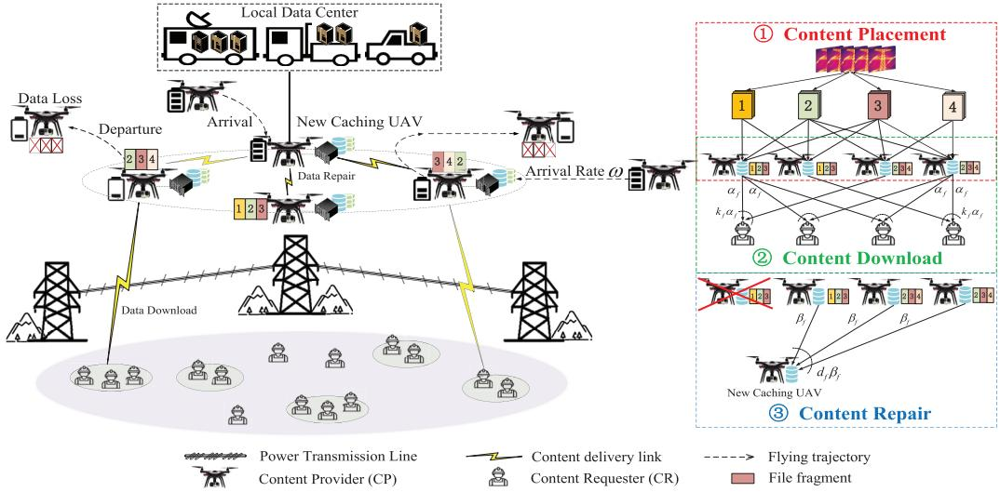  
Fig. 1. UAV-assisted coded caching network.

1) Arrival-Departure Model: Recall that Ground CRs arrive and depart according to a Poisson process, with inter-arrival times $T _ { e }$ that are exponentially distributed and independent and identically distributed (i.i.d), characterized by the probability density function (pdf)

$$
f _ { T _ { e } } ( t ) = M \lambda e ^ { - M \lambda t } , \quad t \geq 0 ,\tag{1}
$$

where Mλ represents the expected arrival rate of a CR.

The CRs remain in the network for a lifetime $T _ { a }$ that follows an i.i.d. exponential distribution

$$
f _ { T _ { a } } ( t ) = \zeta e ^ { - \zeta t } , \quad t \geq 0 ,\tag{2}
$$

where $\zeta$ represents the expected departure rate of a CR.

The number of CRs follows an $M / M / \infty \ [ 1 1 ]$ , where the probability of having m nodes in the network is

$$
{ \mathfrak { p } } ( m ) = { \frac { ( M \lambda / \zeta ) ^ { m } } { m ! } } e ^ { - ( M \lambda / \zeta ) } ,\tag{3}
$$

where, we assume that $\zeta = \lambda ,$ , meaning the flow of CRs into and out of the network is equal, and the expected number of CRs in the network remains constant at M.

2) UAV Mobility Model: We use a Cartesian coordinate system to denote the position of UAV $u _ { i }$ at time slot t as $L _ { i } ( t ) ~ = ~ ( x _ { i } ( t ) , y _ { i } ( t ) , z _ { i } ( t ) )$ . The location of UAVs is described as

$$
x _ { i } ( t + 1 ) = x _ { i } ( t ) + v _ { i } ( t ) \sin \left( \varphi _ { i } ( t ) \right) \cos \left( \theta _ { i } ( t ) \right) ,\tag{4a}
$$

$$
y _ { i } ( t + 1 ) = y _ { i } ( t ) + v _ { i } ( t ) \sin \left( \varphi _ { i } ( t ) \right) \sin \left( \theta _ { i } ( t ) \right) ,\tag{4b}
$$

$$
z _ { i } ( t + 1 ) = z _ { i } ( t ) + v _ { i } ( t ) \cos \left( \varphi _ { i } ( t ) \right) ,\tag{4c}
$$

where $v _ { i } ( t ) \in [ 0 , v _ { i } ^ { \operatorname* { m a x } } ]$ represents the flight speed of UAV $u _ { i } ,$ $\varphi _ { i } ( t )$ represents the pitch angle of $u _ { i } .$ , and $\theta _ { i } ( t )$ represents the yaw angle of $u _ { i } .$ . For simplicity, fix the pitch angle of the $\mathrm { U A V } ,$ $\mathrm { i . e . , }$ for any UAV $u _ { i } \in \mathcal { U } , \varphi _ { i } ( t ) = \pi / 2$ , thus maintaining the height of the UAV constant, $z _ { i } ( t ) = z _ { i } ( 1 )$ . The UAV movement model can be simplified to a two-dimensional trajectory model

$$
x _ { i } ( t + 1 ) = x _ { i } ( t ) + v _ { i } ( t ) \cos \left( \theta _ { i } ( t ) \right) ,\tag{5a}
$$

$$
y _ { i } ( t + 1 ) = y _ { i } ( t ) + v _ { i } ( t ) \sin \left( \theta _ { i } ( t ) \right) .\tag{5b}
$$

3) Content Popularity Model: The popularity of content follows a Zipf distribution [39]. The probability that the content item ranked k-th is requested is given by

$$
p _ { \mathrm { r e q } } ^ { k } = \frac { 1 } { k ^ { \eta } } \Big / \sum _ { f = 1 } ^ { F } \frac { 1 } { f ^ { \eta } } ,\tag{6}
$$

where $\eta ( \eta \geq 0 )$ is the Zipf distribution parameter. A larger η indicates a more concentrated distribution, meaning that the majority of requests will be for the most popular content items.

## B. UAV Communication and Energy Model

1) Communication Model: The UAV-to-UAV (U2U) channel is more likely to be dominated by the Line-of-Sight (LoS) link, with the channel quality largely determined by the distance. The channel gain between $u _ { i }$ and $u _ { j }$ is denoted as $h _ { i j } ( t ) = \lVert L _ { i } ( t ) - L _ { j } ( t ) \rVert ^ { - \epsilon }$ , where  represents the path loss factor. Thus, the transmission rate between ui and $u _ { j }$ at time slot t is given by $\begin{array} { r } { R _ { i j } ( t ) = B \log _ { 2 } \Big ( 1 + \frac { P _ { i } h _ { i j } ( t ) } { \delta ^ { 2 } } \Big ) } \end{array}$ , where B denotes the bandwidth allocated to the UAV. $P _ { i }$ is the transmit power of the UAV $u _ { i }$ , and $\delta ^ { 2 }$ is the noise power.

Unlike aerial communication propagation, the UAV-toground (U2G) channel is highly influenced by altitude and elevation angle. For the propagation model, we employ the log-normal shadowing channel model [40], where LoS and NLoS links are characterized by their respective channel parameters. The LoS and NLoS pathloss (in dB) from UAV $u _ { i }$ to CR $m _ { m }$ are given by

$$
l _ { i , m } ^ { \mathrm { L o S } } ( t ) = l _ { \mathrm { F S } } \left( d _ { 0 } \right) + 1 0 \mu _ { \mathrm { L o S } } \log \left( d _ { i , m } ( t ) \right) + \chi _ { \delta _ { \mathrm { L o S } } } ,\tag{7a}
$$

$$
l _ { i , m } ^ { \mathrm { N L o S } } ( t ) = l _ { \mathrm { F S } } \left( d _ { 0 } \right) + 1 0 \mu _ { \mathrm { N L o S } } \log \left( d _ { i , m } ( t ) \right) + \chi _ { \delta _ { \mathrm { N L o S } } } ,\tag{7b}
$$

where $\begin{array} { r } { l _ { \mathrm { F S } } \left( d _ { 0 } \right) = 2 0 \log \left( \frac { 4 \pi d _ { 0 } f _ { c } } { c } \right) } \end{array}$ denotes the free-space path loss at reference distance $d _ { 0 } .$ , and $d _ { i , m } ( t )$ is the distance between the UAV $u _ { i }$ and the CR $m _ { m }$ at the time slot t. $f _ { c }$ represents the carrier frequency, while c denotes the speed of light. The parameters $\mu _ { \mathrm { L o S } }$ and $\mu _ { \mathrm { N L o S } }$ correspond to the large-scale path loss exponents for LoS and NLoS links, respectively. $\chi _ { \delta _ { \mathrm { L o S } } }$ and $\chi _ { \delta _ { \mathrm { N L o S } } }$ are the Gaussian random variables with zero mean.

The probability of a LoS link can be modeled as a logistic function dependent on the elevation angle $\phi _ { i , m } ( t )$ , i.e.,

$$
\operatorname* { P r } \left( l _ { i , m } ^ { \mathrm { L o S } } ( t ) \right) = \frac { 1 } { 1 + A e ^ { - B ( \phi _ { i , m } ( t ) - A ) } } ,\tag{8}
$$

where A and B represent environment-specific parameters. The elevation angle is calculated as $\begin{array} { r } { \phi _ { i , m } \mathopen { } \mathclose \bgroup \left( t \aftergroup \egroup \right) = \bar { \sin ^ { - 1 } } \left( \frac { z _ { i } ( t ) } { d _ { i , m } ( t ) } \right) } \end{array}$ Consequently, the average path loss for the U2G links can be expressed as

$$
\bar { l } _ { i , m } ( t ) = l _ { i , m } ^ { \mathrm { L o S } } ( t ) \mathrm { P r } \left( l _ { i , m } ^ { \mathrm { L o S } } ( t ) \right) + l _ { i , m } ^ { \mathrm { N L o S } } ( t ) \big ( 1 - \mathrm { P r } \left( l _ { i , m } ^ { \mathrm { L o S } } ( t ) \right) \big )\tag{9}
$$

To prevent interference between UAVs, we assume all UAVs are assigned with orthogonal spectrum resources with the same total bandwidth B. Since the users are homogeneous in terms of their bandwidth requirement, to ensure user fairness, the bandwidth of each user is evenly shared by all its associated users with a maximal per user bandwidth constraint $B _ { m }$ . The achievable transmission rate from the UAV $u _ { i }$ to the CR $m _ { m }$ at time slot t is given by

$$
R _ { i m } ( t ) = { B _ { m } } \log _ { 2 } \left( 1 + \frac { P _ { i } \left| g _ { i , m } ( t ) \right| ^ { 2 } } { 1 0 ^ { \bar { l } _ { i , m } ( t ) / 1 0 } \delta ^ { 2 } } \right) ,\tag{10}
$$

where $| g _ { i , m } ( t ) | ^ { 2 }$ represents the small-scale fading gain following a Nakagami-m distribution to model various fading conditions.

2) Energy Model: In the system, each UAV has the same battery capacity, with an initial battery level of $E ^ { m a x }$ . Let $E _ { i } ( t )$ represent the remaining energy in the battery of the UAV $u _ { i }$ . The energy consumption mainly includes the propulsion energy and the communication energy. The analysis of the communication energy will be discussed in Section III. For a rotary-wing UAV with speed $\nu ,$ the propulsion power consumption and the propulsion energy consumption are given by

$$
\begin{array} { l } { { P ( v ) = P _ { 0 } \left( 1 + \displaystyle \frac { 3 v ^ { 3 } } { V _ { 0 } ^ { 2 } } \right) } } \\ { { \displaystyle ~ + P _ { 1 } \left( \left( 1 + \displaystyle \frac { v ^ { 4 } } { 4 V _ { 1 } ^ { 4 } } \right) ^ { \frac { 1 } { 2 } } - \displaystyle \frac { v ^ { 2 } } { 2 v _ { 1 } ^ { 2 } } \right) ^ { \frac { 1 } { 2 } } + \frac { 1 } { 2 } A v ^ { 3 } , } } \\ { { \displaystyle E ^ { P } ( x ) = \displaystyle \frac { x } { v } P ( v ) } } \\ { { \displaystyle ~ + \operatorname* { m a x } \left\{ \sigma _ { 0 } - \displaystyle \frac { x } { v } , 0 \right\} \cdot \left( P _ { 0 } + P _ { 1 } \right) \cdot \left( P _ { 0 } + P _ { 1 } \right) , } } \end{array}\tag{11}
$$

where x is the flying distance within one time slot. $P _ { 0 } =$ $\begin{array} { r } { \frac { \delta _ { e } } { 8 } \rho s A \Omega ^ { 3 } R ^ { 3 } , P _ { 1 } = ( 1 + k ) \frac { W ^ { 3 / 2 } } { \sqrt [ 2 ] { 2 \rho A } } } \end{array}$ . All parameters are constant parameters related to the UAV weight and the environment.

## C. Cache and Repair Model

The schematic diagram of the UAV-assisted coded caching system is described in Fig. 2, which involves the CR, invalid-UAV, valid-UAV, and CS.

1) Content Placement Stage: CS collects the request and the lost content information, and determines the coding design (including the coding scheme and coding parameters $k _ { f } , d _ { f } )$ and the deployment strategy for each content item $f .$ The strategy is released to all UAVs to execute the corresponding coding and storage plan.

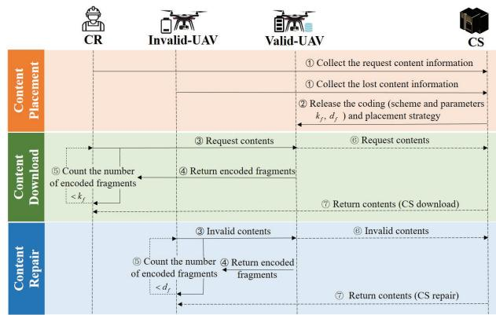  
Fig. 2. Schematic diagram of the aerial caching system.

2) Content Download Stage: The CR sends a content request to the valid-UAVs. After determining the transmission mode and collaboration relationship, the valid-UAVs transmit the encoded fragments to the CR. Upon receiving, the CR counts them. If the count is less than $k _ { f } ,$ , indicating failure to obtain content item f from the UAV, it requests the CS for the complete content.

3) Content Repair Stage: Similar to the download stage, the invalid-UAV sends the lost content information to the valid-UAVs. Upon determining the collaborative relationship, the valid-UAVs transmit the encoded fragments. The invalid-UAV, after receiving, counts the fragments. If the count is less than $d _ { f }$ , it requests the CS for the complete content item.

1) Content Placement: UAVs adopt $( n _ { f } , k _ { f } , d _ { f } )$ erasure code for content encoding, dividing each item $f _ { f }$ into $k _ { f }$ pieces and distributing them across nf UAVs, each storing $\alpha _ { f }$ bits. For simplicity, assume $n _ { f } = n < N$ for all $f _ { f } \in \mathcal { F }$ Binary variables $x _ { i f } \in \{ 0 , 1 \}$ indicate whether UAV $u _ { i }$ caches a fragment of $f _ { f } . x _ { i f } = 1$ , if cached, $x _ { i f } = 0 \quad$ , otherwise. Thus, the set of UAVs caching encoded fragments of content item $f _ { f }$ is denoted as $\mathcal { U } _ { f } = \{ u _ { i } \ | \ x _ { i f } = 1 , u _ { i } \in \mathcal { U } \} . \ x _ { i f }$ is subject to the following constraints

$$
\sum _ { f _ { f } \in \mathcal { F } } x _ { i f } \alpha _ { f } \le S _ { i } , \forall u _ { i } \in \mathcal { U } , \quad \sum _ { i = 1 } ^ { N } x _ { i f } = n _ { f } , \forall f _ { f } \in \mathcal { F } .\tag{12}
$$

The first constraint ensures that the content fragments cached by each $\mathrm { U A V } \ u _ { i }$ does not exceed its storage capacity. The second constraint guarantees that each content item $f _ { f }$ is distributed across exactly $n _ { f } ~ \mathrm { \ U A V s }$ according to the erasure coding scheme. In addition to the storage and encoding constraints, CR request variation and link connectivity also need to be considered. Content placement should be adjusted according to the real-time variation of CR requests and the distribution of user demands at different time slots. Meanwhile, the connectivity of network links, including the communication quality and distance between UAVs and CRs, should be taken into account to ensure that content distribution aligns with the network topology.

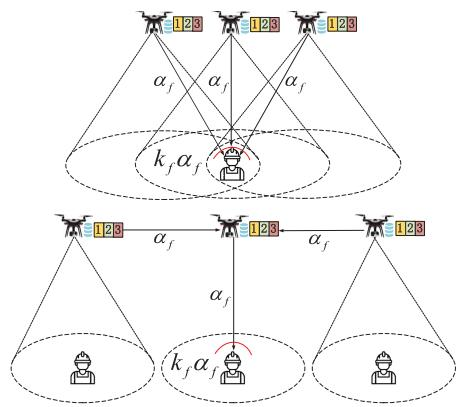  
Fig. 3. Air-to-ground transmission links.

2) Content Download: Ground CRs request the content item at a rate of $\varpi$ with inter-request times $T _ { d }$ following

$$
f _ { T _ { d } } ( t ) = \varpi e ^ { - \varpi t } , \varpi \ge 0 , t \ge 0 .\tag{13}
$$

When a ground CR requests content item $f _ { f }$ , if $| \boldsymbol { \mathcal { U } } _ { f } | \geq k _ { f }$ the CR needs to connect at least $k _ { f } \ \mathrm { \ U A V s } ,$ , which refers to the download locality. Content download is possible if $k _ { f }$ or more UAVs remain valid. In the case where $0 \leq | \mathcal { U } _ { f } | < k _ { f }$ the content item is obtained from the ground control station, which refers to the BS download. Let $r _ { m f } \in \{ 0 , 1 \}$ be the indicator to show whether CR mm $m _ { m }$ requests content item $f _ { f }$ or not. Specifically, $r _ { m f } = 1$ if and only if the CR $m _ { m }$ requests content item $f _ { f } .$ . In this work, each CR requests at most one content item in each time slot.

Content download can be accomplished via direct U2G links or relayed through multi-hop paths. As UAVs can directly communicate within LoS links, coded fragments can be delivered from an UAV to a CR via at most 2 hops, as shown in Fig. 3. Let $b _ { i m } = \left\{ b _ { i m } ^ { d } , b _ { i m } ^ { r } \right\}$ represent how the CR $m _ { m }$ obtains coded fragments from the UAV $u _ { i } ,$ where $b _ { i m } ^ { d } , b _ { i m } ^ { r } \in \{ 0 , 1 \} . \ b _ { i m } ^ { d } \ = \ 1$ indicates that CR $m _ { m }$ obtains coded fragments from $u _ { i }$ through a direct link, while $b _ { i m } ^ { r } = 1$ indicates the relay transmission. Notice that $b _ { i m } ^ { d } + b _ { i m } ^ { r } = 1$ In this paper, the coverage area boundary of the UAV is determined by the transmission rate threshold $R _ { t h }$ , and all CRs within the coverage area satisfy $R \geq R _ { t h }$ . Therefore, the variable $b _ { i m }$ satisfies

$$
\left\{ \begin{array} { l } { b _ { i m } ^ { d } = 1 , b _ { i m } ^ { r } = 0 , \mathrm { ~ i f ~ } R _ { i m } \geq R _ { t h } , } \\ { b _ { i m } ^ { d } = 0 , b _ { i m } ^ { r } = 1 , \quad \mathrm { o t h e r w i s e } . } \end{array} \right.\tag{14}
$$

3) Content Repair: When an UAV leaves the network due to low battery or hardware damage, its cached data is lost (as shown in Fig. 1). To recover the lost data and maintain the network’s reliability, another UAV must be dispatched. Similar to the data download process, repair can be carried out either by the remaining valid UAVs (UAV repair) or by the ground control station (CS repair). We implement a scheduled repair scheme where repairs are performed periodically. The interval between two repair actions is denoted by $\Delta , \Delta \ge 0$ . Note that $\Delta = 0$ represents instantaneous repair. We assume that each repair process is performed independently, and the integrity of the content is maintained during both the download and repair transmission processes.

When an UAV that has cached fragments of content item $f _ { f }$ become invalid,

1) If $| U _ { f } | \geq d _ { f }$ , a new UAV needs to connect to at least $d _ { f } \ \mathrm { U A V s }$ by direct links to repair the lost fragment of content item $f _ { f } .$ . Each UAV transmits $\beta _ { f } \leq \alpha _ { f }$ bits of data to the new UAV. The selected $d _ { f }$ UAVs, which refers to the repair locality.

2) If $0 \leq | \mathcal { U } _ { f } | < d _ { f } .$ , then the repair is carried out by the ground control station. The data volume (in bits) required to repair a single failed UAV is termed the repair bandwidth, denoted by $\gamma .$ Let γUAV and γCS represent the repair bandwidth through UAVs and BS, respectively, where $\gamma _ { \mathrm { U A V } } = d _ { f } \beta _ { f } , \gamma _ { \mathrm { C S } } = \alpha _ { f }$

## D. Coding Scheme and Parameters

As discussed in previous sections, the parameters $n , k , d , \alpha , \beta ,$ , and the corresponding γUAV and $\gamma _ { \mathrm { { C S } } }$ are influenced by the selection of fault-tolerant codes. Fault-tolerant codes are typically denoted by $[ n , k , d ]$ , which denotes the number of caching nodes, download locality and repair locality. In this subsection, we provide a brief overview of MDSs and RGCs, and relate the $[ n , k , d ]$ parameters of RGCs to the $[ n , k ]$ parameters of MDS code.

• Maximum Distance Separable (MDS) Code: Each UAV stores at most one coded fragment of one content item, so $\begin{array} { r } { \alpha _ { \mathrm { M D S } } = \frac { F } { k } . } \end{array}$ . Given the MDS property, both content download and repair processes require contacting k storage UAVs. Thus, an [n, k] MDS code can be described as $[ n , k , k ]$ . Additionally, $\begin{array} { r } { \dot { \alpha } _ { \mathrm { M D S } } = \beta _ { \mathrm { M D S } } = \frac { F } { k } } \end{array}$ , indicating that repairing a single invalid UAV requires retrieving an amount of data equal to the entire file size F.

$$
( \alpha _ { \mathrm { M D S } } , \beta _ { \mathrm { M D S } } , \gamma _ { \mathrm { M D S } } ) = \left( \frac { F } { k } , \frac { F } { k } , F \right) .\tag{15}
$$

• Minimum Storage Regenerating (MSR) Code: RGCs achieve an optimal tradeoff between storage and repair bandwidth while retaining the MDS property [11]. MSR codes minimize the storage required on each UAV, meaning that αMSR is at its minimum. Assuming the use of an $[ n , k , d ]$ MSR code, the MSR codes have

$$
\left( \alpha _ { \mathrm { M S R } } , \beta _ { \mathrm { M S R } } , \gamma _ { \mathrm { M S R } } \right) = \left( \frac { F } { k } , \frac { F } { k d - k ^ { 2 } + k } , \frac { F d } { k d - k ^ { 2 } + k } \right) .\tag{10}
$$

The bandwidth cost γMSR decreases as the repair locality d increases. During the repair process, the minimum value γMSR $\begin{array} { r } { \ = \ \frac { F ( n - 1 ) } { k ( n - k ) } } \end{array}$ is achieved when connecting to $d =$ n − 1 nodes.

• Minimum Bandwidth Regenerating (MBR) Code: MBR codes minimize the repair bandwidth, though they increase the storage α required per node. For an $[ n , k , d ]$ MBR code

$$
\left( \alpha _ { \mathrm { M B R } } , \beta _ { \mathrm { M B R } } \right) = \left( \frac { 2 F d } { 2 k d - k ^ { 2 } + k ) } , \frac { 2 F } { 2 k d - k ^ { 2 } + k ) } \right) ,\tag{17a}
$$

$$
\gamma _ { \mathrm { M B R } } = \left( \frac { 2 F d } { 2 k d - k ^ { 2 } + k } \right) .\tag{17b}
$$

The minimized repair bandwidth is $\begin{array} { r } { \gamma _ { \mathrm { M B R } } = \frac { 2 F ( n - 1 ) } { k ( 2 n - k - 1 ) } } \end{array}$ for $d = n - 1$

## III. SYSTEM COMMUNICATION COST AND SUCCESS RATE

In this section, we introduce two key metrics: system communication cost (including download cost and repair cost denoted by $E ^ { \mathrm { d l } }$ and $E ^ { \mathrm { r e p } } )$ and success rate (including download success rate and repair success rate denoted by $P r ^ { \mathrm { d l } }$ and $P r ^ { \mathrm { r e p } } )$ ). Let $\Delta$ denote the repair interval (i.e. the time between two repairs), and let ${ \mathcal { U } } _ { \Delta } ^ { \mathrm { i n v } }$ represent the set of invalid UAVs after $\Delta .$ . Consequently, the set of content items requiring repair can be expressed as $\bigcup _ { u _ { l } \in \mathcal { U } _ { \mathrm { ~ s ~ } } ^ { \mathrm { i n v } } } \mathcal { F } _ { l }$ . For content item $f _ { f }$ , assume that $x _ { f }$ of the n UAVs remain valid, leading to $C _ { n } ^ { x _ { f } }$ possible permutations and combinations. Let ${ \mathcal U } _ { f } ^ { m , x _ { f } } = \left\{ \boldsymbol u _ { f } ^ { m , 1 } , \bar { \boldsymbol u } _ { f } ^ { m , 2 } , \cdot \cdot \cdot \ : , \boldsymbol u _ { f } ^ { m , x _ { f } } \right\}$ denote these possible choices of valid UAVs, with cardinality $\left. \mathcal { U } _ { f } ^ { m , x _ { f } } \right. = x _ { f }$ , where $m = 1 , 2 , \cdots , C _ { n } ^ { x _ { f } }$ . Without loss of generality, we assume that a failed or departed UAV are replaced by a unique new UAV. Therefore, in the following context, we will continue to use the same symbols to represent the new UAVs.

Let $z _ { i , m , f } ^ { \mathrm { d l } }$ and $y _ { i , j , f } ^ { \mathrm { r e p } }$ denote the allocation of valid UAVs for CRs during the content download process, and the allocation of valid UAVs for new caching UAVs during the content repair process, respectively. In the download phase, a CR must connect to at least k UAVs, leading to $\begin{array} { r } { \sum _ { u _ { i } \in \mathcal { U } _ { \epsilon } ^ { m , x _ { f } } } z _ { i , m , f } ^ { \mathrm { d l } } ( t ) \geq k _ { f } } \end{array}$ . In the repair phase, a new UAV restores the lost data by connecting to at least d UAVs, and as a result, $\begin{array} { r } { \sum _ { u _ { i } \in \mathcal { U } _ { \epsilon } ^ { m , x _ { f } } } \mathcal { Y } _ { i , j , f } ^ { \mathrm { r e p } } ( t ) \geq d _ { f } } \end{array}$ . Thus, the aforementioned allocation problems are a one-to-many matching problems, specifically, there is $\mathrm { ~ a ~ } 1 - k _ { f }$ matching between valid UAVs and CRs in the download process and a $1 - d _ { f }$ matching between valid UAVs and new caching UAVs in the repair process. Specifically, we have

$$
\begin{array} { r } { z _ { i , m , f } ^ { \mathrm { d l } } = \left\{ \begin{array} { l l } { 1 , } & { \mathrm { U A V ~ } u _ { i } \mathrm { ~ t r a n s m i t s ~ a ~ f r a g m e n t ~ o f ~ } f _ { f } \mathrm { ~ t o ~ C R } } \\ & { m _ { m } \mathrm { ~ ( d i r e c t ~ l i n k ~ o r ~ r e l a y ~ l i n k ) } , } \\ { 0 , } & { \mathrm { ~ o t h e r w i s e } , } \end{array} \right. } \end{array}
$$

$$
\begin{array} { r } { y _ { i , j , f } ^ { \mathrm { r e p } } = \left\{ \begin{array} { l l } { 1 , } & { \mathrm { U A V ~ } u _ { i } \mathrm { ~ t r a n s m i t s ~ a ~ f r a g m e n t ~ o f ~ } f _ { f } \mathrm { ~ t o ~ n e w } } \\ & { \mathrm { c a c h i n g ~ U A V ~ } u _ { j } \mathrm { ~ ( d i r e c t ~ l i n k ) } , } \\ { 0 , } & { \mathrm { ~ o t h e r w i s e } . } \end{array} \right. } \end{array}
$$

## A. Analysis of Download Cost

1) Direct Transmission: If the ground CR $m _ { m }$ is within the coverage of UAV $u _ { i } , \mathrm { U A V } \ u _ { i }$ can deliver a fragment to CR $m _ { m }$ via a direct link. The latency required to transmit a complete content fragment is $\alpha _ { f } / R _ { i m } ( t )$ , where $\alpha _ { f }$ represents the size of the content fragment $f _ { f }$ . The direct transmission latency is given by $T _ { i , m , f } ^ { \mathrm { d l - d } } ( t ) = \mathrm { m i n } \{ T _ { i , m } , \alpha _ { f } / R _ { i m } ( t ) \}$ , where $T _ { i , m }$ indicates the contact duration between CR $m _ { m }$ and UAV $u _ { i } .$ The corresponding cost of direct transmission is

$$
E _ { i , m , f } ^ { \mathrm { d l - d } } ( t ) = P _ { i } \cdot T _ { i , m , f } ^ { \mathrm { d l - d } } ( t ) = P _ { i } \cdot \operatorname* { m i n } \left\{ T _ { i , m } , \frac { \alpha _ { f } } { R _ { i m } ( t ) } \right\} .\tag{18}
$$

2) Relay Transmission: If the ground CR $m _ { m }$ is not within the coverage of UAV $u _ { i }$ , UAV $u _ { i }$ can transmit a fragment to CR $m _ { m }$ via a two-hop relay link (UAV $u _ { i }$ to UAV $u _ { r }$ to CR $m _ { m } )$ . At this time, the CR $m _ { m }$ is within the coverage of relay UAV $u _ { r }$ . To simplify the analysis, we assume that the UAVs operate in full-duplex mode. the received signal-tointerference-plus-noise ratio (SINR) at relay UAV $u _ { r }$ and the SNR at CR $m _ { m }$ are given respectively by

$$
\mathrm { S I N R } _ { i , r } ( t ) = \frac { P _ { i } \left| h _ { i , r } ( t ) \right| ^ { 2 } } { I P _ { r } + \delta ^ { 2 } } , \mathrm { S N R } _ { r , m } ( t ) = \frac { P _ { r } \left| g _ { r , m } ( t ) \right| ^ { 2 } } { 1 0 ^ { \bar { l } _ { r , m } ( t ) / 1 0 } \delta ^ { 2 } } ,\tag{19}
$$

where I denotes the self-interference generated during fullduplex communication. The transmission cost of UAV $u _ { i }$ transmitting the content fragment $f _ { f }$ to CR $m _ { m }$ through relay UAV $u _ { r }$ is given by

$$
\begin{array} { r l r } {  { E _ { i , m , f } ^ { \mathrm { d l - } } ( t ) = P _ { i } \cdot T _ { i , r , f } ^ { \mathrm { d l - d } } ( t ) + P _ { r } \cdot T _ { r , m , f } ^ { \mathrm { d l - d } } ( t ) } } \\ & { } & { ~ = \frac { P _ { i } \alpha _ { f } } { B \log _ { 2 } ( 1 + \mathrm { S I N R } _ { i , r } ( t ) ) } + } \\ & { } & { P _ { r } \cdot \operatorname* { m i n } \{ T _ { r , m } , \frac { \alpha _ { f } } { B _ { m } \log _ { 2 } ( 1 + \mathrm { S N R } _ { r , m } ( t ) ) } \} . } \end{array}\tag{20}
$$

The download cost of UAV $u _ { i }$ transmitting the fragment of content item $f _ { f }$ to CR $m _ { m }$ is given as

$$
\begin{array} { r } { E _ { i , m , f } ^ { \mathrm { d l } } ( t ) = b _ { i m } ^ { d } ( t ) \cdot E _ { i , m , f } ^ { \mathrm { d l } - \mathrm { d } } ( t ) + b _ { i m } ^ { r } ( t ) \cdot E _ { i , m , f } ^ { \mathrm { d l } - \mathrm { r } } ( t ) , } \end{array}\tag{21}
$$

where, $b _ { i m } ~ = ~ \{ b _ { i m } ^ { d } , b _ { i m } ^ { r } \}$ is defined in Section II-C. The overall download cost of UAV $u _ { i }$ is given by

$$
E _ { i } ^ { \mathrm { { d l } } } ( t ) = \sum _ { f _ { f } \in { \mathscr { F } } } \sum _ { m _ { m } \in { \mathcal { M } } } x _ { i f } ( t ) z _ { i , m , f } ^ { \mathrm { { d l } } } ( t ) E _ { i , m , f } ^ { \mathrm { { d l } } } ( t ) .\tag{22}
$$

Recall that CRs needs to receive at least $k _ { f }$ fragments to retrieve content item $f _ { f }$ . Therefore, the total download cost for CR $m _ { m }$ to retrieve content item $f _ { f }$ is

$$
E _ { m , f } ^ { \mathrm { d l } } ( t ) = \sum _ { i = 1 } ^ { N } x _ { i f } ( t ) z _ { i , m , f } ^ { \mathrm { d l } } ( t ) E _ { i , m , f } ^ { \mathrm { d l } } ( t ) .\tag{23}
$$

The CR $m _ { m }$ can successfully retrieve the content item $f _ { f }$ only if $\textstyle \sum _ { i = 1 } ^ { N } x _ { i , f } ( t ) z _ { i , m , f } ^ { \mathrm { d l } } ( t ) \geq k _ { f }$

## B. Analysis of Repair Cost

If a UAV runs out of power, the repair process will commence. Assuming that UAV $u _ { j }$ loses a fragment of content item $f _ { f }$ and UAV $u _ { i }$ assists $u _ { j }$ in recovering the lost content fragment. Since the communication between UAVs is LoS, the transmission is done through direct transmission. The transmission delay for $\mathrm { U A V } ~ u _ { i }$ to send the fragment of content item $f _ { f }$ to UAV $u _ { j }$ for recovery is $\begin{array} { r } { T _ { i , j , f } ^ { \mathrm { r e p } } ( t ) \stackrel { = } { = } \frac { \beta _ { f } } { R _ { i j } ( t ) } } \end{array}$ , and the corresponding transmission overhead is

$$
E _ { i , j , f } ^ { \mathrm { r e p } } ( t ) = P _ { i } \cdot T _ { i , j , f } ^ { \mathrm { r e p } } ( t ) = \frac { P _ { i } \beta _ { f } } { B \log _ { 2 } \Big ( 1 + \frac { P _ { i } | h _ { i , j } ( t ) | ^ { 2 } } { \delta ^ { 2 } } \Big ) } .\tag{24}
$$

The repair cost of UAV $u _ { i }$ dto recover the lost content is

$$
E _ { i } ^ { \mathrm { r e p } } ( t ) = \sum _ { f _ { f } \in { \mathscr F } } \sum _ { u _ { j } \in { \mathscr U } _ { t } ^ { \mathrm { i n v } } } x _ { i f } ( t ) \left( 1 - x _ { j f } ( t ) \right) y _ { i , j , f } ^ { \mathrm { r e p } } ( t ) E _ { i , j , f } ^ { \mathrm { r e p } } ( t ) .\tag{25}
$$

Recall that invalid UAVs needs to receive at least $d _ { f }$ fragments from the valid UAVs. Therefore, the total repair cost for UAV $u _ { j }$ to recover the fragment of content item $f _ { f }$ is

$$
E _ { j , f } ^ { \mathrm { r e p } } ( t ) = \sum _ { i = 1 , i \neq j } ^ { N } x _ { i f } ( t ) \left( 1 - x _ { j . f } ( t ) \right) y _ { i , j , f } ^ { \mathrm { r e p } } ( t ) E _ { i , j , f } ^ { \mathrm { r e p } } ( t ) .\tag{26}
$$

The UAV $u _ { j }$ can successfully retrieve the fragment of content item $f _ { f }$ only $\begin{array} { r } { \mathrm { i f } \sum _ { i = 1 , i \ne j } ^ { N } \mathbf { \bar { y } } _ { i , j , f } ^ { \mathrm { r e p } } ( t ) x _ { i . f } ( t ) \geq \mathbf { \bar { d } } _ { f } } \end{array}$

## C. Analysis of Success Rate

In traditional evaluation metrics for distributed storage systems, system availability generally considers only the probability of successfully transmitting data once, based on the fault-tolerant coding parameters used in a static distributed system, while overlooking the effects of dynamic changes in system parameters. The system availability metric introduced in this section contrasts with traditional measures by providing a thorough assessment of success probability. It incorporates both data download and repair activities over the UAV’s operational period T. The success rate of each transmission reflects the interaction between coding and system parameters. Let $z _ { i , m , f } ^ { \mathrm { d l } } ( t )$ and $y _ { i , j , f } ^ { \mathrm { r e p } } ( t )$ represent the matching between valid UAVs and CRs, and between valid UAVs and new caching UAVs, respectively. Define $I _ { m , f } ^ { \mathrm { d l } } ( t )$ and $I _ { j , f } ^ { \mathrm { r e p } } ( t )$ as indicators for whether user $m _ { m }$ can find sufficient UAVs to download $f _ { f }$ , and whether UAV $u _ { j }$ can find sufficient UAVs to repair $f _ { f }$ , respectively. We have

$$
I _ { m , f } ^ { \mathrm { d l } } ( t ) = \epsilon \left( \left[ \frac { \sum _ { { \boldsymbol { u } } _ { f } ^ { m , i } \in { \mathcal { U } } _ { f } ^ { m , x _ { f } } \ : { \boldsymbol { z } } _ { i , m , f } ^ { \mathrm { d l } } ( t ) } { k _ { f } } } \right] \right) ,\tag{27a}
$$

$$
I _ { j , f } ^ { \mathrm { r e p } } ( t ) = \epsilon \left( \left[ \frac { \sum _ { { \boldsymbol { u } } _ { f } ^ { m , i } \in { \mathcal { U } } _ { f } ^ { m , x _ { f } } } { \boldsymbol { y } } _ { i , j , f } ^ { \mathrm { r e p } } ( t ) } { d _ { f } } \right] \right) ,\tag{27b}
$$

where $\epsilon ( t ) = \left\{ \begin{array} { l l } { { 1 , t > 0 } } \\ { { 0 , t \leq 0 } } \end{array} \right. , \lfloor x \rfloor$ represents the largest integer no larger than x. Clearly, $I _ { m , f } ^ { \mathrm { d l } } = 1$ if and only if $m _ { m }$ can connect to at least $k _ { f }$ UAVs to download $f _ { f }$ ; otherwise, $I _ { m , f } ^ { \mathrm { d l } } = 0$ Similarly, $I _ { j , f } ^ { \mathrm { r e p } } = 1$ if and only if $u _ { j }$ can connect to at least $d _ { f }$ UAVs to repair $f _ { f } ;$ otherwise, $I _ { j , f } ^ { \mathrm { r e p } } = 0$

Denote $I _ { i } ^ { \mathrm { v a l } } \left( t \right)$ as an indicator for whether UAV $u _ { i }$ remains valid at time slot t. When the remaining battery level $E _ { i } ( t )$ drops to one-third of its total capacity, the UAV needs to return to the ground CS for recharging. Therefore, $I _ { i } ^ { \mathrm { v a l } } \left( t \right)$ is defined as

$$
I _ { i } ^ { \mathrm { v a l } } \left( t \right) = \epsilon \left( \left[ E _ { i } ( t ) - \frac { E ^ { \operatorname* { m a x } } } { 3 } \right] \right)\tag{28}
$$

1) Download Success Probability: In the download process, content delivery are not always stable because of the NLoS links and user mobility. In other words, even if a CR is connected to a sufficient number of valid UAVs, the content download might still fail due to poor physical link conditions or insufficient contact duration. Next, we further consider the U2G successful transmission probability.

Recall that the CR $m _ { m }$ can obtain content fragments from UAV $u _ { i }$ either via a direct link, i.e., $b _ { i m } ^ { d } ~ = ~ 1$ or a relay link, i.e., $b _ { i m } ^ { r } ~ = ~ 1$ . When $b _ { i m } ^ { d } ~ = ~ 1$ , define $p _ { i , m , f } ^ { \mathrm { d l } - d } ( t )$ as the success probability for CR $m _ { m }$ to receive a fragment of content item $f _ { f }$ from UAV $u _ { i }$ over the direct link during the contact duration, which can be expressed as [39]

$$
\begin{array} { l } { p _ { i , m , f } ^ { \mathrm { d l } - d } ( t ) = \operatorname* { P r } \{ T _ { i m } \geq \frac { \alpha _ { f } } { R _ { i m } ( t ) } ) \} } \\ { = \displaystyle \int _ { 0 } ^ { \infty } \exp ( - \frac { 2 ^ { \frac { \alpha _ { f } } { B _ { m } \cdot \tau _ { i , m } \cdot t } } - 1 } { P _ { i } \gamma _ { i , m } / \delta ^ { 2 } } - t ) d t , } \end{array}\tag{29}
$$

where $\alpha _ { f }$ represents the size of the fragment of content item $f _ { f } , T _ { i m }$ denotes the contact duration between CR $m _ { m }$ and UAV $u _ { i } .$ . Since the arrivals and departures of ground CRs follow a Poisson process, $T _ { i m }$ thus follows an exponential distribution with mean $\tau _ { i , m } .$

When $b _ { i m } ^ { r } = 1$ , define $\mathcal { P } _ { i , m , f } ^ { \mathrm { d l } - r } = \left\{ u _ { i } , u _ { i , m , f } ^ { r } , m _ { m } \right\}$ as the path for delivering the fragment of content item $f _ { f }$ from UAV $u _ { i }$ to ground CR $m _ { m }$ , where $u _ { i , m , f } ^ { r }$ represents the relay UAV. In this case, we define $p _ { i , m , f } ^ { \mathrm { d l } - r }$ as the success probability for CR $m _ { m }$ to receive a fragment of content item $f _ { f }$ from UAV $u _ { i }$ over the relay link, equal to the success probability from UAV $u _ { i , m , f } ^ { r }$ over the direct link during the contact duration. We have

$$
p _ { i , m , f } ^ { \mathrm { { d l } } - r } ( t ) = \int _ { 0 } ^ { \infty } \exp \left( - \frac { 2 ^ { \frac { \alpha _ { f } } { B _ { m } \cdot \tau _ { r , m } \cdot t } } - 1 } { P _ { r } \gamma _ { r , m } / \delta ^ { 2 } } - t \right) d t .\tag{30}
$$

Therefore, the probability that CR $m _ { m }$ can successfully receive $f _ { f }$ from UAV $u _ { i }$ during the download process can be expressed as

$$
\operatorname* { P r } _ { i , m , f } ^ { \mathrm { d l } } ( t ) = b _ { i m } ^ { d } ( t ) \cdot p _ { i , m , f } ^ { \mathrm { d l } - d } ( t ) + b _ { i m } ^ { r } ( t ) \cdot p _ { i , m , f } ^ { \mathrm { d l } - r } ( t ) .\tag{31}
$$

Define ${ \mathcal { U } } _ { m , x _ { f } , f } ^ { \mathrm { d l } } = \left\{ u _ { i } \ | \ u _ { i } \in { \mathcal { U } } _ { f } ^ { m , x _ { f } } , z _ { i , m , f } ^ { \mathrm { d l } } = 1 \right\}$ as the set of selected valid UAVs $( k _ { f } \leq x _ { f } \leq n )$ that can deliver $f _ { f }$ to CR $m _ { m } .$ . The probability that $m _ { m }$ can successfully download $f _ { f }$ can be expressed as

$$
\mathrm { P r } _ { m , f } ^ { \mathrm { d l } } ( t ) = I _ { m , f } ^ { \mathrm { d l } } ( t ) \cdot \prod _ { u _ { i } \in \mathcal { U } _ { m , x _ { f } , f } ^ { \mathrm { d l } } } I _ { i } ^ { v a l } ( t ) \cdot \mathrm { P r } _ { i , m , f } ^ { \mathrm { d l } } ( t )\tag{32}
$$

The successful download of $f _ { f }$ occurs only if at least $k _ { f }$ valid UAVs are present. Considering that content requests adhere to Zipf distributions, and $r _ { m , f } ( t )$ indicates whether CR $m _ { m }$ requests content item $f _ { f }$ at time slot t, the overall probability of successfully downloading can be described as

$$
\mathrm { P r } ^ { \mathrm { H i t } } ( t ) = \frac { \sum _ { f _ { f } \in \mathcal { F } } \sum _ { m _ { m } \in \mathcal { M } } r _ { m f } ( t ) \left[ \frac { \sum _ { x _ { f } = k _ { f } } ^ { n } \sum _ { m = 1 } ^ { C _ { n } ^ { x _ { f } } } \mathrm { P r } _ { m , f } ^ { \mathrm { d l } } ( t ) } { \sum _ { x _ { f } = k _ { f } } ^ { n } C _ { n } ^ { x _ { f } } } \right] } { \sum _ { f _ { f } \in \mathcal { F } } \sum _ { m _ { m } \in \mathcal { M } } r _ { m f } ( t ) }\tag{33}
$$

2) Repair Success Probability: In the content repair phase, since communication links between UAVs are LoS, the lost data can be successfully repaired as long as a sufficient number of effective UAVs are assigned. Repairing content item $f _ { f }$ is successful only if at least $d _ { f }$ valid UAVs are available. Define ${ \bf \mathrm { \Delta } } { \mathcal { U } } _ { t } ^ { \mathrm { i n v } }$ as the set of invalid UAVs at time slot t. Consequently, the content items requiring repair can be represented by $\bigcup _ { u _ { l } \in \mathcal { U } _ { + } ^ { \mathrm { i n v } } } \mathcal { F } _ { l }$ . Therefore, the overall success probability for content repair is given by

$$
\mathrm { P r } ^ { \mathrm { R e p } } ( t ) = \frac { \sum _ { f _ { f } \in \bigcup _ { u _ { l } \in \mathcal { U } _ { t } ^ { \mathrm { i n v } } } \mathcal { F } _ { l } } \left\lfloor \sum _ { x _ { f } = d _ { f } } ^ { n } \sum _ { m = 1 } ^ { C _ { n } ^ { x _ { f } } } T _ { m , f } ( t ) \right\rfloor } { \left\| \bigcup _ { u _ { l } \in u _ { t } ^ { \mathrm { i n v a l } } } \mathcal { F } _ { l } \right\| }\tag{34}
$$

where $\begin{array} { r } { T _ { m , f } ( t ) = \bigvee _ { u _ { l } \in \mathcal { U } _ { t } ^ { i n v } } \left[ I _ { l , f } ^ { r e p } ( t ) \cdot \prod _ { u _ { i } \in u _ { { t } } ^ { m , x _ { f } } } I _ { i } ^ { v a l } ( t ) \right] } \end{array}$ represents whether the repair of f can be successfully completed under the m-th repair combination.

## D. Problem Formulation

We formulate the optimization problem in our scenario to maximize the overall transmission success probability (including the successful download probability of CRs $\mathrm { P r } ^ { \mathrm { \bar { H i t } } } ( t )$ and the successful repair probability of invalid UAVs $\mathrm { P r } ^ { \mathrm { R e p } } ( t ) )$ . The reason is that CRs’ successful download is the main aim for users to obtain contents, while repairing invalid UAVs is vital to maintain network integrity. Maximizing both probabilities ensures system robustness and optimal functioning. The decision variables involve: 1) coding schemes and parameters, 2) content caching in UAVs x, 3) CR-UAV matching in the download process $\boldsymbol { z _ { t } } ^ { \mathrm { d l } }$ , 4) UAV-UAV matching in the repair process ${ \mathbf { } } y _ { t } ^ { \mathrm { { ^ { r e p } } } }$ , and 5) UAV trajectory design ${ \mathbf { } } v _ { t }$ and $\varphi _ { t }$ . Thus, the problem can be modeled as

$$
\mathcal { P } _ { 1 } : \operatorname* { m a x } _ { \substack { { \boldsymbol { x } } , { \boldsymbol { v } } _ { t } , { \boldsymbol { \varphi } } _ { t } , { \boldsymbol { z } } _ { t } { \mathrm { d } } | , { \boldsymbol { y } } _ { t } \mathrm { r e p } } } \frac { 1 } { T } \sum _ { t = 1 } ^ { T } \left( \operatorname* { P r } ^ { \mathrm { R e p } } ( t ) + \operatorname* { P r } ^ { \mathrm { H i t } } ( t ) \right)\tag{35a}
$$

$$
\begin{array} { r l } { \mathrm { s . t . } } & { { } x _ { i f } \in \{ 0 , 1 \} , \forall u _ { i } \in \mathcal { U } , f _ { f } \in \mathcal { F } , } \end{array}\tag{35b}
$$

$$
\sum _ { f _ { f } \in \mathcal { F } } x _ { i f } \alpha _ { f } \le S _ { i } , \sum _ { i = 1 } ^ { N } x _ { i f } = n ,\tag{35c}
$$

$$
0 \leq v _ { i } ( t ) \leq V _ { \operatorname* { m a x } } ,\tag{35d}
$$

$$
0 \leq \theta _ { i } ( t ) \leq 2 \pi ,\tag{35e}
$$

$$
\sum _ { m _ { m } \in \mathcal { M } } z _ { i , m , f } ^ { \mathrm { d l } } ( t ) + \sum _ { u _ { j } \in \mathcal { U } } y _ { i , j , f } ^ { \mathrm { r e p } } ( t ) \leq q _ { i } ^ { \mathrm { m a x } } ,\tag{35f}
$$

$$
\sum _ { u _ { i } \in \mathcal { U } _ { f } ^ { m , x _ { f } } } z _ { i , m , f } ^ { \mathrm { d l } } ( t ) \geq k _ { f } , \forall m _ { m } \in \mathcal { M } ,\tag{35g}
$$

$$
\sum _ { \boldsymbol { x } _ { i } \in \mathcal { U } _ { f } ^ { m , x _ { f } } } \boldsymbol { y } _ { i , j , f } ^ { \mathrm { r e p } } ( t ) \geq d _ { f } , \forall \boldsymbol { u } _ { j } \in \mathcal { U } _ { t } ^ { \mathrm { i n v } } ,\tag{35h}
$$

$$
\begin{array} { r } { \| \boldsymbol { L } _ { i } ( t ) - \boldsymbol { L } _ { j } ( t ) \| \ge D _ { \operatorname* { m i n } } , } \end{array}\tag{35i}
$$

$$
\begin{array} { r } { \| \boldsymbol { L } _ { i } ( t ) - \boldsymbol { L } _ { i } ( t - 1 ) \| \le D _ { \operatorname* { m a x } } , } \end{array}\tag{35j}
$$

where $( \pmb { x } = \{ x _ { i f } \} , z _ { t } ^ { \mathrm { { d l } } } = \{ z _ { i , m , f } ^ { \mathrm { { d l } } } ( t ) \} , y _ { t } ^ { \mathrm { { r e p } } } = \{ y _ { i , j , f } ^ { \mathrm { { r e p } } } ( t ) \}$ ${ \boldsymbol { v } } _ { t } = \{ v _ { i } ( t ) \} , \ { \boldsymbol { \varphi } } _ { t } = \{ \varphi _ { i } ( t ) \} , \ \forall { \boldsymbol { \tilde { u _ { i } } } } , u _ { j } \in \mathcal { U } , f _ { f } \in \mathcal { F } , { \widetilde { m } } _ { m } \ \in$ $\mathcal { M } , t ~ \in ~ \mathcal { T } )$ . Constraint (35b) indicates that the total size of content items cached in the UAVs cannot exceed the corresponding maximum storage capacity. Constraint (35c) shows that one content item is encoded and cached in n UAVs. Constraints (35f)- (35h) impose that each UAV is limited to serving no more than $q _ { i } ^ { \operatorname* { m a x } }$ CRs or new caching UAVs. Additionally, they stipulate that at least $k _ { f }$ UAVs are needed for successful content download and at least $d _ { f }$ UAVs are required for successful content repair. Constraints (35i)- (35j) are UAV speed and flight trajectory constraints, including maximum speed constraint and safety distance constraint.

The objective function of (35a) involves both continuous variables (i.e., ${ \mathbf { } } v _ { t }$ and $\varphi _ { t } )$ and binary variables $( \mathrm { i } . \mathrm { e } . , x , y _ { t } ^ { \mathrm { { r e p } } }$ and $\boldsymbol { z } _ { t } ^ { \mathrm { { \scriptsize ~ d l } } } )$ . Due to this, $\mathcal { P } _ { 1 }$ is a mixed integer nonlinear programming (MINLP) and NP-Hard problem. Additionally, since the system operates dynamically, the optimal solution determined at time slot $t _ { 1 }$ may no longer be valid at time slot $t _ { 2 }$ . Therefore, solving the problem in real-time scenarios is highly challenging. However, DRL can adapt and learn in a dynamic environment to approach near-optimal solutions. Despite the complexity, its ability to handle dynamics makes it promising for real-time optimization. Thus, we propose a hierarchical multi agent deep reinforcement learning (H-MADRL) framework for fast decision-making, enhancing system performance and adaptability.

## IV. HIERARCHICAL MADRL-BASED CACHE AND TRAJECTORY DESIGN

A potential solution to solve problem $\mathcal { P } _ { 1 }$ is using MADRL [41], but traditional MADRL algorithms have issues with UAV caching and trajectory decisions due to mixed decision variables at different time scales. To tackle this, in this section, we propose a Hierarchical Multi-Agent Parameterized Deep Q Network (H-MA-PDQN), which has two time-scale decision-making mechanisms. The Code and Parameter PDQN (CP-PDQN) at the ground CS operates at a large time scale for coding and parameter design. The Pairing and Trajectory PDQN (PT-PDQN) on each UAV works at a small time scale for UAV matching and flight trajectory, enabling quick adjustments. The PDQN in H-MA-PDQN can directly works on the discrete-continuous hybrid action space without approximation or relaxation, which simplifies the process and boosts efficiency. Moreover, the H-MA-PDQN is well-suited for dynamic and large-scale emergency scenarios. Its hierarchical design facilitates efficient scaling. The CP-PDQN, at the central node, handles latency-insensitive yet globally-influential decisions. This enables the establishment of a more stable and farreaching strategic plan. In parallel, the PT-PDQN, with its smaller time scale, can rapidly adapt to local and instantaneous changes. Fig. 4 illustrates the architecture of the proposed H-MA-PDQN algorithm.

As shown in Fig. 4, to address the large timescale code design and cache placement, the ground CS uses CP-PDQN to broadcast coding schemes and parameters to all UAVs. For small timescale user matching and UAV trajectory planning, each UAV employs identical PT-PDQN, coordinating in a decentralized manner where observations and decisions are not shared. Each UAV acts as an independent agent with the shared goal of maximizing the overall success rate of content sharing, forming a cooperative multi-agent Decentralized Partially Observable Markov Decision Process (Dec-POMDP) [42].

## A. Two-TimeScale Dec-POMDP

The problem with two timescales are tackled hierarchically in the proposed H-MA-PDQN, and we model the problem as a two-timescale Dec-POMDP. As shown in Fig. 5, the highlevel CP-PDQN learns a caching policy with a large timescale that updated per time frame w, while the low-level PT-PDQ learns a policy over user pairing and trajectory with a small timescale that updated per time slot t to maximize the success rate of content sharing.

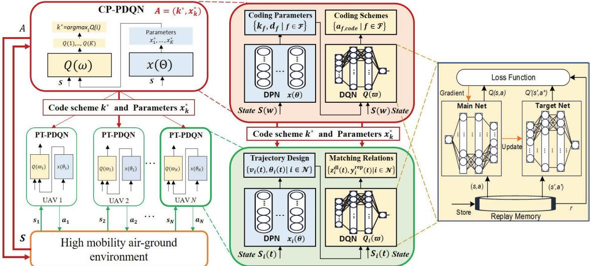

Fig. 4. Hierarchical multi-agent parameterized deep Q network.  
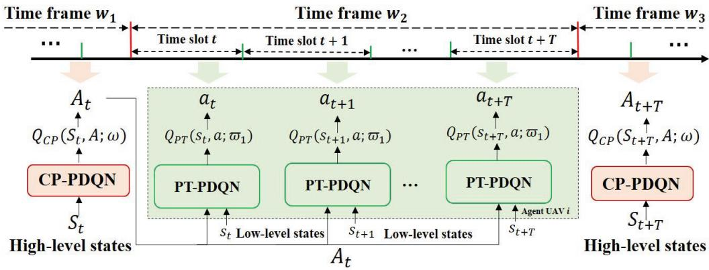  
Fig. 5. Two-Timescale Decision Framework for the H-MA-PDQN scheme.

1) Coded Caching Design in Large Timescale: To maximize the success rate, the code design and cache placement strategy for UAVs must be meticulously planned. It is important to note that the code design and cache placement are updated with each time frame. After each flight cycle, the ground CS revises the code and cache placement for all UAVs based on the feedback from the previous service cycle. The components of the MDP at the ground CS are described as follows.

• State Space: The state at time frame w is

$$
\pmb { S } ( \pmb { w } ) = [ \pmb { R } ( \pmb { w } ) , \pmb { H } _ { U 2 U } ( \pmb { w } ) , \pmb { H } _ { U 2 C } ( \pmb { w } ) , \pmb { E } ( \pmb { w } ) ] ,\tag{36}
$$

where $\pmb { R } ( w ) = [ \pmb { R } _ { 1 } ( w ) , \ldots , \pmb { R } _ { m } ( w ) , \ldots , \pmb { R } _ { M } ( w ) ]$ , and $\pmb { R _ { m } ( w ) } = [ r _ { m 1 } ( w ) , \allowbreak , \allowbreak \dots , r _ { m f } ( w ) , \allowbreak , \allowbreak \dots , r _ { m F } ( w ) ] . \ r _ { m f } ( w )$ represents the request of content item f by CR mm at time frame w. $\pmb { H } _ { U 2 U } ( w )$ and ${ \pmb { H } } _ { U 2 C } ( w )$ are path loss of the U2U and U2G channel, respectively. $\mathbf { { \mathcal { E } } } ( w ) \mathbf { \Psi } =$ $[ E _ { 1 } ( w ) , \ldots , E _ { i } ( w ) , \ldots , E _ { N } ( w ) ]$ , and $E _ { i } ( w ) = E _ { i } ( w -$

$1 ) - E _ { i } ^ { d l } ( w ) - E _ { i } ^ { r e p } ( w ) - E _ { i } ^ { P } \left( x _ { i } ( w ) \right)$ represents the remaining energy of the UAV i at time frame w.

• Action Space: The action at time frame w is

$$
\begin{array} { r } { \pmb { A } ( \pmb { w } ) = [ \pmb { A } _ { f , \mathrm { c o d e } } ( \pmb { w } ) , \pmb { A } _ { f , \mathrm { p a r a m e t e r } } ( \pmb { w } ) , \pmb { x } ( \pmb { w } ) ] . } \end{array}\tag{37}
$$

where cache placement $\pmb { x } ( \pmb { w } ) = \{ \pmb { x _ { 1 } } , \dotsc , \pmb { x _ { i } } , \dotsc , \pmb { x _ { N } } \}$ where $\pmb { x _ { i } } = \{ x _ { i 1 } , \ldots , x _ { i f } , \ldots , x _ { i F } \}$ and $x _ { i f } \in \{ 0 , 1 \}$ The coding design constitutes a hybrid action space, which is described as

$$
\begin{array} { r l } & { \left\{ A _ { f , \mathrm { c o d e } } ( w ) , A _ { f , \mathrm { p a r a m e t e r } } ( w ) \right\} = } \\ & { \left\{ a _ { f , \mathrm { c o d e } } ^ { i } , k _ { f } ^ { i } , d _ { f } ^ { i } , i = \left\{ \mathrm { M D S } , \mathrm { M S R } , \mathrm { M B R } \right\} \right\} . } \end{array}\tag{38}
$$

We first choose a high level coding scheme $a _ { f , \mathrm { c o d e } } ^ { i } \in \{ 0 , 1 \}$ , and $a _ { f , \mathrm { c o d e } } ^ { \mathrm { M D \breve { S } } } + a _ { f , \mathrm { c o d e } } ^ { \mathrm { M S R } } + a _ { f , \mathrm { c o d e } } ^ { \mathrm { \breve { M } B R } } = 1$ Upon choosing $a _ { f , \mathrm { c o d e } } ^ { i } ,$ we further choose a low level coding parameter, and the set of possible parameters is given as follows $k _ { f } ^ { \mathrm { M D S } } , d _ { f } ^ { \mathrm { M D S } } \ \in \ [ 2 , n _ { f } ^ { w } \Big | \ , k _ { f } ^ { \mathrm { M S R } } \ \in$ $\begin{array} { r l r } { \left[ 2 , n _ { f } ^ { w } \right] , d _ { f } ^ { \mathrm { M S R } } } & { { } \in } & { \left[ 2 \left( k _ { f } ^ { \mathrm { M S R } } - 1 \right) , n _ { f } ^ { w } \right] , \dot { k } _ { f } ^ { \mathrm { M B R } } } \end{array}$ ∈ $\left\lceil 2 , n _ { f } ^ { \omega } \right\rceil , d _ { f } ^ { \mathrm { M B R } } { \in } \left\lceil k _ { f } ^ { \mathrm { M B R } } , n _ { f } ^ { \overline { { w } } } \right\rceil$

• Reward Function: At the start of each time frame, UAVs perform code design and cache placement actions based on their observations of $S ( w )$ . After the time frame concludes, the success rate over T time slots of the entire period will be reported. The reward is then be calculated as the average of these feedbacks, given by

$$
R ( w ) = \frac { \sum _ { i = ( w - 1 ) T + 1 } ^ { w T } ( \mathrm { P r } ^ { \mathrm { R e p } } ( i ) + \mathrm { P r } ^ { \mathrm { H i t } } ( i ) ) } { T } .\tag{39}
$$

2) User Pairing and UAV Trajectory in Small Timescale: Given the coding scheme $A _ { f , \mathrm { c o d e } } ( w )$ , the coding parameter $\mathbf { } A _ { f , \mathrm { p a r a m e t e r } } ( \pmb { w } )$ , and the cache placement $\scriptstyle { \pmb x } ( { \pmb w } )$ from the previous time frame, UAVs act as agents seeking to independently determine which CR to serve, which invalid UAVs to address, and where to move. The elements of the Dec-POMDP for each UAV $u _ { i }$ are described as follows.

• State Space: The state of UAV $u _ { i }$ at time slot t can be expressed as follows

$$
{ \bf \boldsymbol { s } } _ { i } ( t ) = \left[ { \pmb R } ( t ) , { \pmb H } _ { i 2 U } ( t ) , { \pmb H } _ { i 2 C } ( t ) , { \pmb E } _ { i } ( t ) , { \pmb A } ( w ) \right] ,\tag{40}
$$

where $H _ { i 2 U } ( t ) = [ h _ { i , 1 } ( t ) , \dots , h _ { i , i } ( t ) , \dots , h _ { i , N } ( t ) ]$ , and $\begin{array} { l l l } { \pmb { H } _ { i 2 C } ( t ) } & { = } & { \left[ \bar { l } _ { i , 1 } ( t ) , \ldots , \bar { l } _ { i , m } ( t ) , \ldots , \bar { l } _ { i , M } ( t ) \right] } \end{array}$ are path loss of the U2U and U2G channel of UAV $u _ { i }$ , respectively.

• Action Space: The action of UAV $u _ { i }$ at time slot t can be expressed as

$$
\begin{array} { r } { \mathbf { \boldsymbol { a } } _ { i } ( t ) = \left[ \boldsymbol { z } _ { i , m , f } ^ { \mathrm { d l } } ( t ) , \boldsymbol { y } _ { i , j , f } ^ { \mathrm { r e p } } ( t ) , { v } _ { i } ( t ) , \boldsymbol { \theta } _ { i } ( t ) \right] , } \end{array}\tag{41}
$$

where $z _ { i , m , f } ^ { \mathrm { d l } } ( t ) , y _ { i , j , f } ^ { \mathrm { r e p } } ( t ) \in \{ 0 , 1 \}$ , and $v _ { i } ( t ) \in [ 0 , V _ { \operatorname* { m a x } } ]$ $\theta _ { i } ( t ) \in [ 0 , 2 \pi ]$ . The coordinate of UAV v is $\pmb { L } _ { i } ( t ) =$ $( x _ { i } ( t ) , y _ { i } ( t ) , H )$ ) with $x _ { i } ( t ) = x _ { i } ( t - 1 ) + v _ { i } ( t )$ cos $\left( \theta _ { i } ( t ) \right)$ and $y _ { i } ( t ) = y _ { i } ( t - 1 ) + v _ { i } ( t ) \sin \left( \theta _ { i } ( t ) \right)$

• Reward Function: The reward function of $\mathrm { U A V } ~ u _ { i }$ at time slot t is given by

$$
r _ { i } ( t ) = \mathrm { P r } ^ { \mathrm { R e p } } ( t ) + \mathrm { P r } ^ { \mathrm { H i t } } ( t ) - \psi _ { a } ( t ) p _ { a } - \psi _ { b } ( t ) p _ { b } .\tag{42}
$$

When designing the reward function, it is crucial to account for constraints (34i) and (34j). To address potential violations, we introduce penalty indicators $\psi _ { a } ( t )$ and $\psi _ { b } ( t )$ . Specifically, if constraint (34i) related to the flying range is not met, $\psi _ { a } ( t ) = 1$ , resulting in a penalty $p _ { a }$ for the UAV. Similarly, if constraint (34j) concerning collision avoidance is violated, $\psi _ { b } ( t ) = 1$ , and a penalty $p _ { b }$ is imposed.

## B. Solution for Mixed Action Space

Handling both discrete and continuous actions in RL is challenging. While discretizing continuous actions can manage mixed action spaces, it often leads to information loss due to quantization and increases complexity due to a larger discrete action space. To address these issues, we propose using independent multi-agent reinforcement learning with P-DQN to learn the optimal policy $\pi ^ { * }$ . In this approach, the optimal continuous action is modeled as a function of a specific state and discrete action, known as the deterministic policy network (DPN) as illustrated in Fig. 4. Unlike traditional methods that approximate or relax the action space, P-DQN extends DQN to handle hybrid action spaces more effectively [43]. Each agent thus trains its own policy and actor-parameters for both discrete and continuous actions.

Let $Q _ { i } ( \pmb { \mathscr { s } } _ { i } , \pmb { \mathscr { a } } _ { i } ) = Q _ { i } \left( \pmb { \mathscr { s } } _ { i } , z _ { i } , \pmb { x } _ { z _ { i } } \right)$ denote the action value function for agent i, where $z _ { i }$ represents the discrete actions and ${ \pmb x } _ { z _ { i } }$ signifies the corresponding continuous actions. For a given time slot t, let $z _ { t }$ denote the selected discrete action and ${ \mathbf { \mathcal { x } } } _ { z _ { t } }$ denote the associated continuous parameter. The Bellman recursive equation can then be formulated as:

$$
\begin{array} { r l } & { Q \left( \pmb { s } _ { t } , z _ { t } , \pmb { x } _ { z _ { t } } \right) = \underset { r _ { t } , \pmb { s } _ { t + 1 } } { \mathbb { E } } \left[ r _ { t } + \right. } \\ & { \left. \gamma \underset { z \in \left[ Z \right] } { \operatorname* { m a x } } \underset { \pmb { x } _ { z } \in \mathcal { X } _ { z } } { \operatorname* { s u p } } Q \left( \pmb { s } _ { t + 1 } , z , \pmb { x } _ { z } \right) \mid \pmb { s } _ { t } = s , a _ { t } = \left( z _ { t } , \pmb { x } _ { z _ { t } } \right) \right] . } \end{array}\tag{43}
$$

In the conditional expectation on the right-hand side of (46), we denote $\begin{array} { r } { \pmb { x } _ { z } ^ { * } = \mathrm { a r g s u p } _ { \pmb { x } , \in \mathcal { X } , } Q ( s _ { t + 1 } , z , \pmb { x } _ { z } ) } \end{array}$ for each $z \in { \mathcal { Z } }$ and then select the maximum value $Q ( s _ { m + 1 } , z , \pmb { x } _ { z } ^ { * } )$ . Given $\boldsymbol { \mathbf { \mathit { x } } } _ { z } ^ { * }$ the right-hand side of (46) can be computed. Additionally, with a fixed Q-function, for any state $s \in S$ and $z \in [ Z ]$ , we can interpret args $\begin{array} { r } { \operatorname* { l p } _ { \pmb { x } _ { z } \in \mathcal { X } _ { z } } Q \left( s , z , \pmb { x } _ { z } \right) } \end{array}$ as a function $\pmb { x } _ { z } ^ { Q } \colon S  \mathcal { X } _ { z } .$ Thus, the Bellman equation can be reformulated as:

$$
\begin{array} { r l } & { Q ( s _ { t } , z _ { t } , x _ { z _ { t } } ) } \\ & { \ = \underset { r _ { t } , s _ { t + 1 } } { \mathbb { E } } [ r _ { t } + \gamma \underset { z \in [ Z ] } { \operatorname* { m a x } } Q ( s _ { t + 1 } , z , x _ { z } ^ { Q } ( s _ { t + 1 } ) ) | s _ { t } = s ] . } \end{array}\tag{44}
$$

Similar with the deep Q-learning, we approximate the action value function using a deep neural network $Q ( s , z , x _ { z } ; \omega )$ where $\omega$ denotes the parameters of the network. For this $Q ( s , z , x _ { z } ; \omega )$ , we further approximate the continuous action $x _ { z } ^ { Q } ( s )$ using a deterministic policy network $x _ { z } ( \cdot ; \theta ) : { \cal S }  { \mathcal { X } } _ { z } ,$ with θ representing the weights of the policy network. Thus, with ω fixed, our objective is to determine the optimal θ that maximizes

$$
Q \left( s , z , x _ { z } ( s ; \theta ) ; \omega \right) \approx \operatorname* { s u p } _ { x _ { z } \in \mathcal { X } _ { z } } Q \left( s , z , x _ { z } ; \omega \right) , \forall z \in [ Z ] .\tag{45}
$$

Following the approach of DQN, we estimate ω by minimizing the mean-squared Bellman error using gradient descent. Specifically, at the time slot t, let $\omega _ { t }$ and $\theta _ { t }$ represent the weights of the value network and the deterministic policy network, respectively. The target value $y _ { t }$ is defined as follows

$$
y _ { t } = r _ { t } + \gamma \operatorname* { m a x } _ { z \in \left[ Z \right] } Q \left( s _ { t + 1 } , z , x _ { z } \left( s _ { t + 1 } , \theta _ { t } \right) ; \omega _ { t } \right) .\tag{46}
$$

Tthe least squares loss function for ω can be expressed as

$$
\ell _ { t } ^ { Q } ( \omega ) = \frac { 1 } { 2 } \left[ Q \left( s _ { t } , z _ { t } , x _ { z _ { t } } ; \omega \right) - y _ { t } \right] ^ { 2 } .\tag{47}
$$

The policy $x _ { z } ( \cdot ; \theta )$ for the continuous part is updated by minimizing the following loss with parameters θ fixed

$$
\ell _ { t } ^ { \mu } ( \boldsymbol { \theta } ) = - \sum _ { z = 1 } ^ { Z } Q \left( s _ { t } , z , x _ { z } \left( s _ { t } ; \boldsymbol { \theta } \right) ; \omega _ { t } \right) .\tag{48}
$$

The overall algorithms of the H-MA-PDQN is depicted in Algorithm 1.

## C. Complexity Analysis

As shown in the overall flowchart in Fig. 4, the proposed H-MA-PDQN algorithm consists of the upper CP-PDQN in the large timescale and the lower PT-PDQN in the small timescale. Firstly, we analyze the computational complexity of the PDQN algorithm. As referred in [44], we assume that the actor network and the critic network contain A and C fully connected layers, respectively, and the number of neurons in the a-th layer of the actor network and in the c-th layer of the critic network are $u _ { a } ^ { \mathrm { a c t o r } }$ and $u _ { c } ^ { \mathrm { c r i t i c } }$ , respectively. For a single sample, the computational complexity of each time slot can be denoted as $\begin{array} { r l } { ~ } & { { } \mathcal { O } \left( \sum _ { a = 0 } ^ { A - 1 } u _ { a } ^ { \mathrm { a c t o r } } u _ { a + 1 } ^ { \mathrm { a c t o r } } + \sum _ { c = 0 } ^ { C - 1 } u _ { c } ^ { \mathrm { c r i t i c } } u _ { c + 1 } ^ { \mathrm { c r i t i c } } \right) } \end{array}$ Thus, for T time slots and N UAV agents, the computational complexity of the lower H-MA-PDQN algorithm is $\mathcal { O } ( T N \mathcal { Z } )$ , in which $\begin{array} { r } { \dot { \mathcal { Z } } = \sum _ { a = 0 } ^ { A - 1 } u _ { a } ^ { \mathrm { a c t o r } } u _ { a + 1 } ^ { \mathrm { a c t o r } } + \sum _ { c = 0 } ^ { \bar { C } - 1 } \bar { u _ { c } ^ { \mathrm { c r i t i c } } } u _ { c + 1 } ^ { \mathrm { c r i t i c } } } \end{array}$ . To sum up, the overall computational complexity of the proposed H-MA-PDQN algorithm is $\mathcal { O } \left( ( W + T N ) \mathcal { Z } \right)$

Algorithm 1 H-MA-PDQN Algorithm   
Input: Hyperparameters of environment and algorithm, agent   
$i ^ { \prime } s \ Q _ { i } ( \cdot )$ and $\mu _ { i } ( \cdot )$ with parameters $\theta _ { i } ^ { Q }$ and $\theta _ { i } ^ { \mu }$   
Output: Coding design, user pairing and UAV trajectory   
Initialize the target $Q _ { i } ^ { \prime } ( \cdot )$ and $\mu _ { i } ^ { \prime } ( \cdot )$ with parameters $\theta _ { i } ^ { Q ^ { \pm } }  \theta _ { i } ^ { Q } .$   
$\theta _ { i } ^ { \mu ^ { \prime } }  \theta _ { i } ^ { \mu }$ , and the replay buffer D.   
for episode = 1 to E do   
Reset the caching environment.   
for time frame = 1 to $W$ do   
The ground CS agent receives observation $S ( w )$ and   
determines action according to the €-greedy policy.   
Each UAV gets the cache decisions for the upcoming   
flight.   
for time slot = 1 to T do   
for UAV $i = I$ to N do   
Each UAV agent obtains observation $s _ { i } ( t )$   
and determines action based on the e-greedy   
policy. Take action $a _ { i , t } ,$ observe reward ${ r } _ { i , t } ,$   
and observe the next state $s _ { i , t + 1 } .$   
if Agent i violates constraints (34i) or (34j)   
then   
Apply a penalty and cancel its movement.   
end   
Store the transition $\left( { \pmb { s } } _ { i , t } , { \boldsymbol { a } } _ { i , t } , { \boldsymbol { r } } _ { i , t } , { \pmb { s } } _ { i , t + 1 } \right)$ in   
$\mathcal { D } _ { i }$   
i $\dot { \mathrm { ~ \textit ~ { ~ D ~ } ~ } } i s \ f u l l$ then   
Sample a random $N _ { B }$ transitions from $\mathcal { D } _ { i } .$   
Update the Q net $Q _ { i } ( \cdot )$ by minimizing   
Eq. (47). Update the policy $\mu _ { i } ( \cdot )$ based on   
the Eq. (48).   
end   
Soft-update the target $Q _ { i } ^ { \prime } ( \cdot ) , \mu _ { i } ^ { \prime } ( \cdot )$   
end   
end   
The ground CS agent calculates the reward $R ( w )$   
based on the average rewards the UAVs accumulated   
over the previous $\check { T }$ time slots and observes the next   
state $S ( \dot { w } + 1 )$ . Store the transition   
(S(w), A(w), R(w), S(w + 1) in D. if D is full   
then   
Sample a random $N _ { B }$ transitions from D. Update   
the Q-network $Q ( \cdot )$ and the policy network $\mu ( \cdot )$   
end   
Soft-update the target networks $Q ^ { \prime } ( \cdot )$ and $\mu ^ { \prime } ( \cdot )$   
end   
end

## V. SIMULATIONS

## A. General Setups

This section presents the simulation results to showcase the performance of the proposed H-MA-PDQN algorithm. The simulation environment is configured as follows unless specified otherwise. A total of 10 mobile users are randomly distributed within a 2 km × 2 km area. The terrestrial CS is positioned at the center of this square. In the scenario, there are 4 UAVs, 10 CRs, and 2 invalid UAVs. Additionally, 5 distinct content items are cached within the system. The main parameter settings in the experiments are given in Table III, unless otherwise specified. All experiments were conducted on a laptop equipped with 8 GB of RAM, featuring an Intel(R) Core(TM) i7-7500U CPU running at 2.70 GHz. The following benchmark algorithms are used to evaluate the performance of the H-MA-PDQN algorithm. For a fair comparison, the states and reward function used in the benchmark algorithms are identical to those in the H-MA-PDQN.

TABLE III  
SIMULATIONS PARAMETERS
<table><tr><td rowspan=1 colspan=1>Parameters</td><td rowspan=1 colspan=1>Value</td></tr><tr><td rowspan=1 colspan=1>System bandwidth</td><td rowspan=1 colspan=1>10 MHz</td></tr><tr><td rowspan=1 colspan=1>Transmit power of UAVs</td><td rowspan=1 colspan=1>2W</td></tr><tr><td rowspan=1 colspan=1>Noise power</td><td rowspan=1 colspan=1>-96 dBm</td></tr><tr><td rowspan=1 colspan=1>Pathloss exponent</td><td rowspan=1 colspan=1>2.7</td></tr><tr><td rowspan=1 colspan=1>Request rate</td><td rowspan=1 colspan=1>0.2</td></tr><tr><td rowspan=1 colspan=1>Maximum UAV speed</td><td rowspan=1 colspan=1>30 m/s</td></tr><tr><td rowspan=1 colspan=1>Flight altitude</td><td rowspan=1 colspan=1>50 m</td></tr><tr><td rowspan=1 colspan=1>Cache storage capacity of UAVs</td><td rowspan=1 colspan=1>15</td></tr><tr><td rowspan=1 colspan=1>Safe distance $\overline { { D _ { \mathrm { m i n } } } }$ </td><td rowspan=1 colspan=1>10 m</td></tr><tr><td rowspan=1 colspan=1>Number of hidden layers</td><td rowspan=1 colspan=1>3</td></tr><tr><td rowspan=1 colspan=1>Number of neurons per layer</td><td rowspan=1 colspan=1>{512, 256, 128}</td></tr><tr><td rowspan=1 colspan=1>Learning rate</td><td rowspan=1 colspan=1>DQN=0.001DPN=0.0001</td></tr><tr><td rowspan=1 colspan=1>Discount factor γ</td><td rowspan=1 colspan=1>0.99</td></tr><tr><td rowspan=1 colspan=1>Replay buffer capacity ε</td><td rowspan=1 colspan=1>100,000</td></tr><tr><td rowspan=1 colspan=1>Mini-batch size $\overline { { N _ { B } } }$ </td><td rowspan=1 colspan=1>128</td></tr><tr><td rowspan=1 colspan=1>Soft update parameter</td><td rowspan=1 colspan=1>0.001</td></tr><tr><td rowspan=1 colspan=1>€-greedy policy €</td><td rowspan=1 colspan=1> $\overline { { 0 . 8 \to 0 . 0 1 } }$ </td></tr><tr><td rowspan=1 colspan=1>Training episode E</td><td rowspan=1 colspan=1>1500</td></tr><tr><td rowspan=1 colspan=1>Time frame W</td><td rowspan=1 colspan=1>100</td></tr><tr><td rowspan=1 colspan=1>Time slot T</td><td rowspan=1 colspan=1>10</td></tr></table>

• Multi-Agent Parameterized DQN (MA-PDQN): Each UAV is deployed a identical parameterized deep Qnetwork, and the decision can only be obtained in a single timescale, which is used in [43]. The caching decisions, user matching decisions and UAV trajectory decisions are jointly output by a parameterized deep Q-network. The neural network and parameter settings are the same as the proposed H-MA-PDQN.

• Hierarchical Multi-Agent DQN (H-MA-DQN): The structure is consistent with the proposed H-MA-PDQN, but the neural networks is DQNs. The upper layer is a CP-DQN that outputs the coding scheme and parameters, while the lower layer is a PT-PDQN that outputs user matching and UAV trajectory. Note that the DQN outputs are produced by discretizing continuous actions.

• Multi-agent DQN (MA-DQN): The discrete actions for each agent is selected using DQN algorithm. The continuous actions are discretized into L values, and the multiagent problem is decomposed into multiple singleagent problems that work in parallel [39].

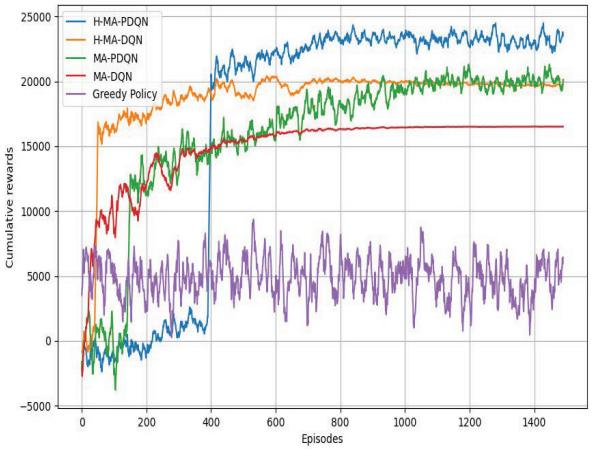  
Fig. 6. Training processes of different algorithms.

• Greedy Policy: Greedy approach selects the nearest available UAV. The code settings is fixed as (4, 2) MDS code.

## B. Performance Evaluation

Fig. 6 confirms the convergence performance of our proposed H-MA-PDQN algorithm, with the parameter settings listed in Table III. As the number of episodes increases, cumulative rewards stabilize, demonstrating convergence. H-MA-PDQN achieves the best performance, outperforming H-MA-DQN, MA-PDQN, and MA-DQN. The PDQN’s ability to handle both discrete and continuous decisions proves more effective than H-MA-DQN, which, although it converges faster due to its simpler structure, is less effective because it discretizes continuous variables, limiting its performance. The hierarchical design in H-MA-PDQN results in a smaller action space, making it easier to find the optimal strategy compared to the joint outputs in MA-PDQN and MA-DQN. MA-PDQN slightly outperforms MA-DQN, as PDQN efficiently manages mixed actions without the complexity of discretization. The greedy policy performs the worst, relying on fixed code design and nearest UAV selection, which fails to optimize system performance.

Fig. 7 illustrates the performances of the H-MA-PDQN with different hyper-parameters (e.g. learning rate of DQN αDQN). These results are obtained by retraining the algorithm with different hyper-parameter settings. The default values of αDQN, $N _ { B } , T ,$ and N are 0.001, 128, 10, and 4, respectively, if not specified. In Fig. 7 (a), we evaluate the performances of H-MA-PDQN with different learning rates. It can be noticed that the H-MA-PDQN converges at about episode 400 when $\alpha _ { \mathrm { D Q N } } ~ = ~ 1 * 1 0 ^ { - 4 }$ , while H-MA-PDQN converges at about episode 300 and 250 when $\alpha _ { \mathrm { D Q N } } = 1 * 1 0 ^ { - 3 }$ and $3 * 1 0 ^ { - 3 }$ respectively. As the learning rate increases, H-MA-PDQN converges faster due to more rapid parameter updates. However, if the learning rate is too high, it can cause instability and hinder convergence, so finding an optimal balance is crucial. In Fig. 7 (b), we observe that increasing the batch size $N _ { B }$ also accelerates the convergence of H-MA-PDQN. Larger batch sizes allow for more stable gradient estimates, leading to faster convergence. However, excessively large batch sizes may lead to diminishing returns and increased computational costs, so an optimal batch size should be selected. In Fig. 7 (c), we observe that when $T > 1 0 .$ , the convergence becomes slower and there is no significant performance improvement. Therefore, $T = 1 0$ is a reasonable setting. In Fig. 7 (d), we observe that the algorithm’s convergence slows as the number of UAVs rises. It converges around episode 180 for $N = 4$ , around episode 300 for $N = 6 .$ , and around episode 400 for $N = 8$ . This is due to increased complexity in managing caching strategies with more UAVs. However, the total caching utility (after convergence) improves significantly as the number of UAVs increases from 4 to 8, indicating that more UAVs enhance caching effectiveness.

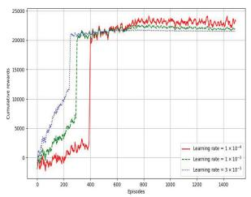  
(a) Learning rate.

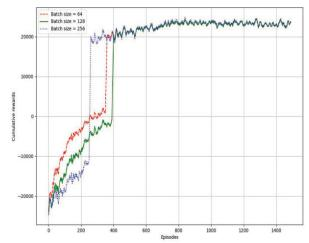  
(b) Batch size.

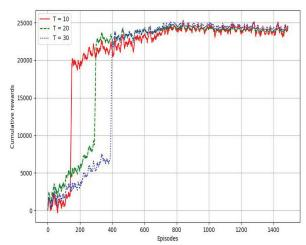  
(c) Time scale.

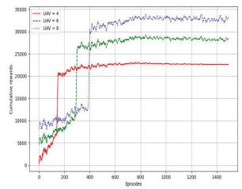  
(d) Number of UAVs.  
Fig. 7. Performance evaluation of H-MA-PDQN with different hyperparameters.

Fig. 8 illustrates the UAV trajectories generated by our proposed scheme under two different settings: users are static and users are mobile, both with $M = 2 0$ . The trajectories of four UAVs are plotted, with each UAV starting from the ground CS. In the setting with static users in Fig. 8 (a), the UAVs autonomously navigate to provide caching services to the static users. In contrast, with mobile users in Fig. 8 (b), the UAVs exhibit more dynamic trajectories as they continuously adapt to the moving positions of the users to deliver caching services. In Fig. 8(c), when ground users move according to a Poisson process, UAV trajectories exhibit more irregular patterns. Unlike the linear motion case in Fig. 8 (b), the UAVs must adapt more dynamically to the stochastic movement of users, leading to more erratic paths as they continuously adjust to the changing user positions. Our proposed algorithm effectively coordinates the UAV agents to collaboratively serve the users, whether they are static or mobile. This adaptability highlights the effectiveness of our approach in leveraging UAV mobility to enhance the performance of aerial caching network.

Fig. 9 illustrates the success probability of various algorithms under different system parameters. In Fig. 9 (a), as bandwidth rises, success probability increases due to enhanced UAV transmission rates, but levels off after 30 MHz as it also depends on cached content. H-MA-PDQN has the highest success probability due to its hierarchical optimization, followed by MA-PDQN, then H-MA-DQN, with the greedy algorithm performing the worst. In Fig. 9 (b), success probability grows with UAV cache storage capacity due to higher cache hit probability. In Fig. 9 (c), H-MA-PDQN achieves the highest success probability for different numbers of UAVs through its hierarchical decision-making for cache, coding, and flight trajectories, outperforming H-MA-DQN, MA-PDQN, and MA-DQN.

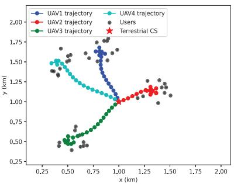  
(a) Twenty CRs (Static), M = 20

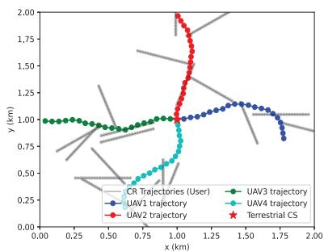  
(b) Twenty CRs (Uniform Linear), M = 20.

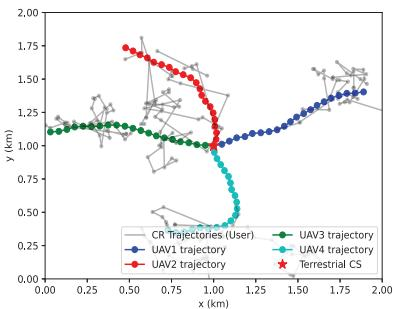  
(c) Twenty CRs (Poisson), M = 20.

Fig. 8. Trajectories of UAVs vs CRs in different modes.  
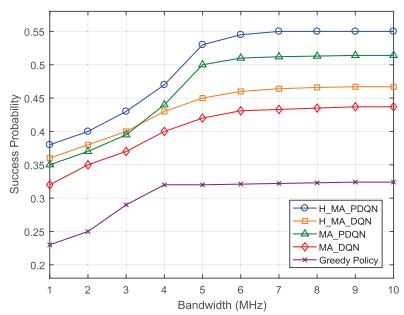  
(a) Success probability vs. bandwidth.

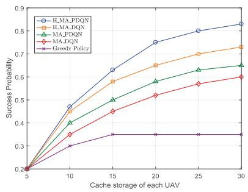  
(b) Success probability vs. cache storage capacity.

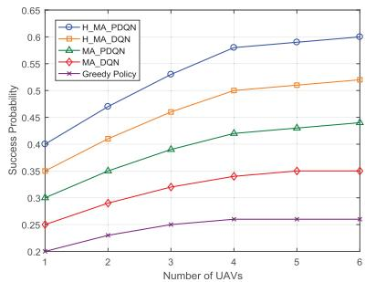  
(c) Success probability vs. number of UAVs.

Fig. 9. Success probability of different algorithms.  
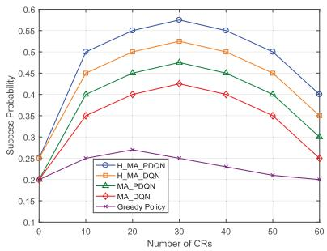  
(a) Success probability vs. CR loads.

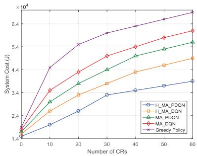  
(b) Transmission cost vs. CR loads

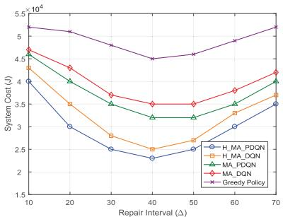  
(c) Transmission cost vs. repair interval.  
Fig. 10. Performance comparison under different CR loads and repair interval.

Fig. 10 illustrates the performance of success probability and system cost under varying CR loads and repair interval. In Fig. 10 (a), the success probability increases with the number of CRs, reaching its peak at $M = 3 0$ , after which it begins to decline as the number of CRs surpasses the UAVs’ cache capacity. Initially, UAVs can efficiently utilize their available cache space to meet the growing demand from CRs. However, as CR numbers exceed the storage capacity of the UAVs, they can no longer handle the excess demand, resulting in a decrease in the success probability. The proposed H-MA-PDQN algorithm performs best due to its hierarchical strategy, which allows for more precise optimization of caching and transmission across different scales. Additionally, the PDQN’s ability to jointly optimize both discrete and continuous variables contributes to its effectiveness, surpassing the performance of DQN-based network structures.

Fig. 10 (b) illustrates the relationship between system cost and the number of CRs. The system cost increases as the number of CRs grows. Among the algorithms, the H-MA-PDQN algorithm stands out, with its system cost rising at a relatively slower rate compared to others. This indicates that the H-MA-PDQN algorithm is highly efficient in handling overhead, and it shows less sensitivity to the increasing demand of CRs, thereby maintaining the stability of system cost. Fig. 10 (c) shows how the system cost varies with the repair interval $\Delta .$ For small values of $\Delta ,$ the system cost is high due to frequent repairs. As $\Delta$ increases, the cost decreases initially because of reduced repair frequency.

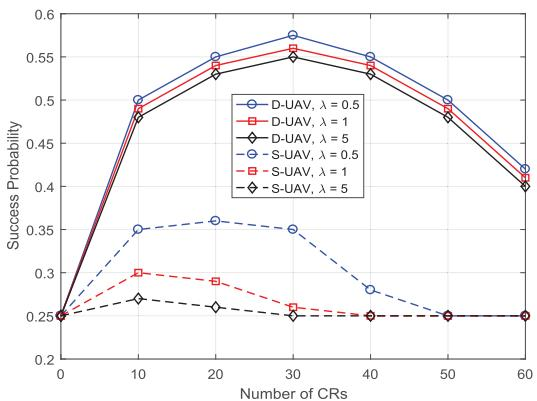

(a) Success probability.  
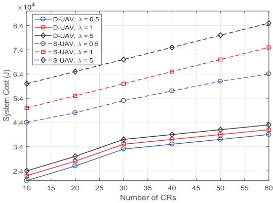  
(b) Transmission cost  
Fig. 11. Performance comparison of UAV dynamic trajectory vs. static deployment under different CR distributions.

However, the cost starts to rise again as ∆ grows further, reflecting the linear increase in requests generated by CRs over time. The system cost reaches a minimum around $\Delta \approx 4 0 .$ Among the algorithms evaluated, the proposed H-MA-PDQN demonstrates the most efficient performance, resulting in the lowest system cost. This is followed by H-MA-DQN, which offers a moderate cost reduction compared to MA-PDQN and MA-DQN, highlighting the superior cost-effectiveness of the hierarchical approaches. The greedy algorithm incurs the highest system cost.

In Fig. 11, a comparison is made between dynamic UAV (D-UAV) and static UAV (S-UAV) under different CR distributions in terms of success probability and transmission cost. Regarding success probability (Fig. 11(a)), the curves depict the probabilities for different λ values (0.5, 1, and 5) signifying user mobility levels. As the number of CRs rises, D-UAV exhibits a relatively high success probability compared to S-UAV, especially at a large number of CRs. The performance of D-UAV changes slightly with increasing λ, while for S-UAV, the success probability decreases more noticeably. For transmission cost (Fig. 11(b)), it shows that the cost of D-UAV is generally lower than that of S-UAV. As the number of CRs increases, both costs increase but D-UAV has a slower growth rate. With increasing λ, the transmission cost of S-UAV rises more rapidly, emphasizing the advantage of D-UAV’s dynamic trajectory planning in handling user mobility. Overall, the simulation results demonstrate that D-UAV has significant performance benefits over S-UAV under different CR distributions and user mobilities in terms of success probability and transmission cost.

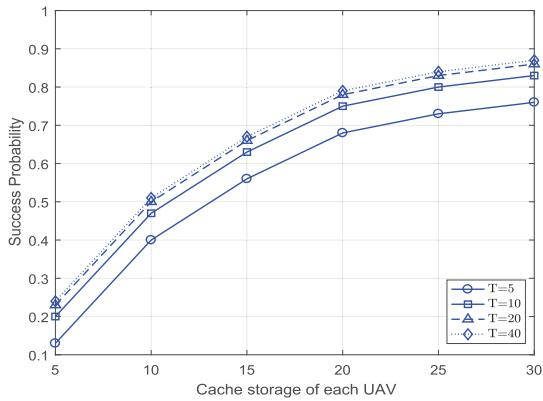  
Fig. 12. Success probability under different timescales.

In Fig. 12, we observe the success probability of different timescales $( T ~ = ~ 5 , ~ T ~ = ~ 1 0 , ~ T ~ = ~ 2 0$ , and $T ~ = ~ 4 0 )$ . As the timescale increases from 5 to 10, there is a noticeable increase in the success probability. Mathematically, this can be attributed to the fact that a moderate increment in the timescale allows for more efficient resource allocation and utilization, thereby enhancing the probability of successful transmission. However, when the timescale increases from 10 to 20 and further to 40, the success probabilities are relatively close. This implies that increasing the timescale beyond a certain point does not necessarily lead to better performance. Logically, as the timescale becomes too large, factors such as increased latency and potential inefficiencies in the system start to counterbalance any potential benefits. In other words, the setting of the timescale should be appropriate for the scale of the problem at hand, rather than simply being set as large as possible.

## VI. CONCLUSION

In this paper, we have investigated the effectiveness of the UAV-based coded caching in emergency communication scenarios. Content items are encode using an erasure code and distributed across UAVs. CRs and new UAVs are able to successfully receive the desired content items from valid UAVs through both U2G and U2U communications. The overall transmission success probability and cost are expressed analytically in terms of coding parameters, UAV-to-CR matching for downloads, UAV-to-invalid UAV interactions for repairs, and UAV trajectories. To handle the discrete and continuous action spaces, the H-MA-PDQN algorithm integrating a dualcomponent structure for long-term coding and immediate resource allocation has been leveraged to solve the joint optimization of coding schemes, coding parameters, matching relations, and trajectories. Numerical results demonstrate the effectiveness of the proposed algorithm in improving both success probability and reducing transmission cost.

## REFERENCES

[1] L. Wang, J. Zhang, J. Chuan, R. Ma, and A. Fei, “Edge intelligence for mission cognitive wireless emergency networks,” IEEE Wireless Commun., vol. 27, no. 4, pp. 103–109, Aug. 2020.

[2] Y. Fu, Y. Zhang, Q. Zhu, H.-N. Dai, M. Li, and T. Q. S. Quek, “A new vision of wireless edge caching networks (WECNs): Issues, technologies, and open research trends,” IEEE Netw., vol. 38, no. 1, pp. 247–253, Jan. 2024.

[3] B. Tian, L. Wang, L. Xu, Z. Chang, and A. Fei, “Exploiting parametrized deep Q-networks into emergency caching: A joint coding design and user allocation,” in Proc. IEEE Global Commun. Conf. (GLOBECOM), Dec. 2024, pp. 4150–4155.

[4] J. Bao, X. Peng, C. Liu, B. Jiang, and J. Wu, “Multilayered decentralized coded caching with nonuniform popularity and multilevel cache capacity in space–air–ground integrated networks,” IEEE Internet Things J., vol. 11, no. 8, pp. 13913–13926, Apr. 2024.

[5] H. Wu, F. Lyu, C. Zhou, J. Chen, L. Wang, and X. Shen, “Optimal UAV caching and trajectory in aerial-assisted vehicular networks: A learning-based approach,” IEEE J. Sel. Areas Commun., vol. 38, no. 12, pp. 2783–2797, Dec. 2020.

[6] S. Zhang, H. Luo, J. Li, W. Shi, and X. Shen, “Hierarchical soft slicing to meet multi-dimensional QoS demand in cache-enabled vehicular networks,” IEEE Trans. Wireless Commun., vol. 19, no. 3, pp. 2150–2162, Mar. 2020.

[7] Y. Fu, Q. Yu, T. Q. S. Quek, and W. Wen, “Revenue maximization for content-oriented wireless caching networks (CWCNs) with repair and recommendation considerations,” IEEE Trans. Wireless Commun., vol. 20, no. 1, pp. 284–298, Jan. 2021.

[8] Z. Tian, L. Wang, L. Xu, C. Xu, and A. Fei, “Coded caching for reliable map dissemination in symbiotic communication aided emergency UAV systems,” IEEE Trans. Cognit. Commun. Netw., vol. 10, no. 5, pp. 1663–1677, Oct. 2024.

[9] Q. Wei, L. Wang, L. Xu, Z. Tian, and Z. Han, “Hierarchical coded caching for multiscale content sharing in heterogeneous vehicular networks,” IEEE Trans. Veh. Technol., vol. 71, no. 6, pp. 5770–5786, Jun. 2022.

[10] Y. Chen, M. Wen, E. Basar, Y.-C. Wu, L. Wang, and W. Liu, “Exploiting reconfigurable intelligent surfaces in edge caching: Joint hybrid beamforming and content placement optimization,” IEEE Trans. Wireless Commun., vol. 20, no. 12, pp. 7799–7812, Dec. 2021.

[11] L. Wang, H. Wu, Z. Han, P. Zhang, and H. V. Poor, “Multi-hop cooperative caching in social IoT using matching theory,” IEEE Trans. Wireless Commun., vol. 17, no. 4, pp. 2127–2145, Apr. 2018.

[12] H. Wu et al., “Delay-minimized edge caching in heterogeneous vehicular networks: A matching-based approach,” IEEE Trans. Wireless Commun., vol. 19, no. 10, pp. 6409–6424, Oct. 2020.

[13] Z. Jiang, H. Shi, Z. Huang, B. Bai, G. Zhang, and H. Hou, “Toward lower repair bandwidth and optimal repair complexity of piggybacking codes with small sub-packetization,” IEEE Trans. Commun., vol. 72, no. 9, pp. 5279–5289, Sep. 2024.

[14] A. Patra and A. Barg, “Generalized regenerating codes and node repair on graphs,” IEEE Trans. Inf. Theory, vol. 71, no. 3, pp. 1613–1630, Mar. 2025.

[15] X. Yu, M. Noor-A-Rahim, Y. L. Guan, L. Deng, Z. Yang, and Z. Shi, “Design of rate-compatible anytime codes based on spatially coupled repeat-accumulate codes,” IEEE Trans. Commun., vol. 72, no. 1, pp. 13–27, Jan. 2024.

[16] J. Tang, J. Nie, Y. Zhang, Z. Xiong, W. Jiang, and M. Guizani, “Multi-UAV-assisted federated learning for energy-aware distributed edge training,” IEEE Trans. Netw. Service Manage., vol. 21, no. 1, pp. 280–294, Feb. 2024.

[17] W. Tang, H. Zhang, and J. Peng, “Performance analysis of cooperative caching and transmission diversity in cache-enabled UAV networks,” IEEE Trans. Wireless Commun., vol. 23, no. 5, pp. 4411–4423, May 2024.

[18] J. Zheng, Q. Zhu, and A. Jamalipour, “Content delivery performance analysis of a cache-enabled UAV base station assisted cellular network for metaverse users,” IEEE J. Sel. Areas Commun., vol. 42, no. 3, pp. 643–657, Mar. 2024.

[19] H. Fu, J. Wang, J. Chen, P. Ren, Z. Zhang, and G. Zhao, “Dense multiagent reinforcement learning aided multi-UAV information coverage for vehicular networks,” IEEE Internet Things J., vol. 11, no. 12, pp. 21274–21286, Jun. 2024.

[20] G. B. Tarekegn, R.-T. Juang, H.-P. Lin, Y. Y. Munaye, L. C. Wang, and M. A. Bitew, “Deep-reinforcement-learning-based drone base station deployment for wireless communication services,” IEEE Internet Things J., vol. 9, no. 21, pp. 21899–21915, Nov. 2022.

[21] V. Sharma, I. You, D. N. K. Jayakody, D. G. Reina, and K. R. Choo, “Neural-Blockchain-based ultrareliable caching for edge-enabled UAV networks,” IEEE Trans. Ind. Informat., vol. 15, no. 10, pp. 5723–5736, Oct. 2019.

[22] Y. Fu, Q. Yu, A. K. Y. Wong, Z. Shi, H. Wang, and T. Q. S. Quek, “Exploiting coding and recommendation to improve cache efficiency of reliability-aware wireless edge caching networks,” IEEE Trans. Wireless Commun., vol. 20, no. 11, pp. 7243–7256, Nov. 2021.

[23] Y. Bai et al., “Toward autonomous multi-UAV wireless network: A survey of reinforcement learning-based approaches,” IEEE Commun. Surveys Tuts., vol. 25, no. 4, pp. 3038–3067, 2nd Quart., 2023.

[24] A. M. Seid, G. O. Boateng, S. Anokye, T. Kwantwi, G. Sun, and G. Liu, “Collaborative computation offloading and resource allocation in multi-UAV-assisted IoT networks: A deep reinforcement learning approach,” IEEE Internet Things J., vol. 8, no. 15, pp. 12203–12218, Aug. 2021.

[25] W. Shi, J. Li, H. Wu, C. Zhou, N. Cheng, and X. Shen, “Drone-cell trajectory planning and resource allocation for highly mobile networks: A hierarchical DRL approach,” IEEE Internet Things J., vol. 8, no. 12, pp. 9800–9813, Jun. 2021.

[26] J. Li, H. Wu, X. Huang, Q. Huang, J. Huang, and X. S. Shen, “Toward reinforcement-learning-based intelligent network control in 6G networks,” IEEE Netw., vol. 37, no. 4, pp. 104–111, Jul. 2023.

[27] Z. Chang, H. Deng, L. You, G. Min, S. Garg, and G. Kaddoum, “Trajectory design and resource allocation for multi-UAV networks: Deep reinforcement learning approaches,” IEEE Trans. Netw. Sci. Eng., vol. 10, no. 5, pp. 2940–2951, Sep. 2023.

[28] H. Zhao, G. Lu, Y. Liu, Z. Chang, L. Wang, and T. Ham¨ al¨ ainen, “Safe¨ DQN-based AoI-minimal task offloading for UAV-aided edge computing system,” IEEE Internet Things J., vol. 11, no. 19, pp. 32012–32024, Oct. 2024.

[29] X. Zhang, Z. Chang, T. Ham¨ al¨ ainen, and G. Min, “AoI-energy tradeoff¨ for data collection in UAV-assisted wireless networks,” IEEE Trans. Commun., vol. 72, no. 3, pp. 1849–1861, Mar. 2024.

[30] X. Chen, N. Zhao, Z. Chang, T. Ham¨ al¨ ainen, and X. Wang, “UAV-¨ aided secure short-packet data collection and transmission,” IEEE Trans. Commun., vol. 71, no. 4, pp. 2475–2486, Apr. 2023.

[31] J. Xie, Z. Chang, X. Guo, and T. Hamalainen, “Energy efficient resource allocation for wireless powered UAV wireless communication system with short packet,” IEEE Trans. Green Commun. Netw., vol. 7, no. 1, pp. 101–113, Mar. 2023.

[32] A. M. Seid, G. O. Boateng, B. Mareri, G. Sun, and W. Jiang, “Multiagent DRL for task offloading and resource allocation in multi-UAV enabled IoT edge network,” IEEE Trans. Netw. Service Manage., vol. 18, no. 4, pp. 4531–4547, Dec. 2021.

[33] B. Hazarika and K. Singh, “AFL-DMAAC: Integrated resource management and cooperative caching for URLLC-IoV networks,” IEEE Trans. Intell. Vehicles, vol. 9, no. 6, pp. 5101–5117, Jun. 2024.

[34] P. Qin, Y. Fu, J. Zhang, S. Geng, J. Liu, and X. Zhao, “DRL-based resource allocation and trajectory planning for NOMA-enabled multi-UAV collaborative caching 6G network,” IEEE Trans. Veh. Technol., vol. 73, no. 6, pp. 8750–8764, Jun. 2024.

[35] P. Qin, M. Fu, Y. Fu, R. Ding, and X. Zhao, “Collaborative edge computing and program caching with routing plan in C-NOMA-enabled space-air-ground network,” IEEE Trans. Wireless Commun., vol. 23, no. 12, pp. 18302–18315, Dec. 2024.

[36] N. Lin, X. Han, A. Hawbani, Y. Sun, Y. Guan, and L. Zhao, “Deep reinforcement learning-based dual-timescale service caching and computation offloading for multi-UAV assisted MEC systems,” IEEE Trans. Netw. Service Manage., vol. 22, no. 1, pp. 605–617, Feb. 2025.

[37] P. Qin et al., “Joint resource allocation and UAV trajectory design for D2D-assisted energy-efficient air–ground integrated caching network,” IEEE Trans. Veh. Technol., vol. 73, no. 11, pp. 17558–17571, Nov. 2024.

[38] C. Zhu, G. Zhu, J. Yang, M. Liu, and Z. Shi, “Quick and good: A DRL based communication-caching-energy joint optimization scheme for prolonging the lifetime of UAV assisted IoE,” J. Commun. Inf. Netw., vol. 9, no. 4, pp. 1–14, Dec. 2024.

[39] B. Tian et al., “UAV-assisted wireless cooperative communication and coded caching: A multiagent two-timescale DRL approach,” IEEE Trans. Mobile Comput., vol. 23, no. 5, pp. 4389–4404, May 2024.

[40] S. Lee, H. Yu, and H. Lee, “Multiagent Q-learning-based multi-UAV wireless networks for maximizing energy efficiency: Deployment and power control strategy design,” IEEE Internet Things J., vol. 9, no. 9, pp. 6434–6442, May 2022.

[41] G. B. Tarekegn et al., “A centralized multi-agent DRL-based trajectory control strategy for unmanned aerial vehicle-enabled wireless communications,” IEEE Open J. Veh. Technol., vol. 5, pp. 1230–1241, 2024.

[42] H. Liu, J. Lai, J. Zhu, L. Gan, and Z. Chang, “Enabling high-throughput routing for LEO satellite broadband networks: A flow-centric deep reinforcement learning approach,” IEEE Internet Things J., vol. 11, no. 17, pp. 28705–28720, Sep. 2024.

[43] L. Wang, L. Hou, S. Liu, Z. Han, and J. Wu, “Reinforcement contract design for vehicular-edge computing scheduling and energy trading via deep Q-network with hybrid action space,” IEEE Trans. Mobile Comput., vol. 23, no. 6, pp. 6770–6784, Jun. 2024.

[44] B. Liu, C. Liu, and M. Peng, “Dynamic cache placement and trajectory design for UAV-assisted networks: A two-timescale deep reinforcement learning approach,” IEEE Trans. Veh. Technol., vol. 73, no. 4, pp. 5516–5530, Apr. 2024.

Bingxin Tian received the B.E. degree from Qingdao University, Qingdao, China, in 2019. He is currently pursuing the Ph.D. degree with the School of Electronic Engineering, Beijing University of Posts and Telecommunications (BUPT), Beijing, China.

His research interests include edge caching, mobile edge computing, wireless resource management, and the application of deep reinforcement learning for wireless networks.

Li Wang (Senior Member, IEEE) received the Ph.D. degree from Beijing University of Posts and Telecommunications (BUPT), Beijing, China, in 2009. She was a visiting positions with the School of Electrical and Computer Engineering, Georgia Tech, Atlanta, GA, USA, from December 2013 to January 2015, and with the Department of Signals and Systems, Chalmers University of Technology, Gothenburg, Sweden, from August 2015 to November 2015 and July 2018 to August 2018. She is currently a Full Professor with the School of Com-

puter Science, National Pilot Software Engineering School, BUPT, where she is also the Associate Dean and the Head of the High Performance Computing and Networking Laboratory. She is also a Member of the Key Laboratory of Universal Wireless Communications, Ministry of Education, China. She is also the rotating Director of the Key Laboratory of Application Innovation in Emergency Command Communication Technology, Ministry of Emergency Management, China. She has authored or co-authored almost 70 journal articles and four books. Her research interests include wireless communications, distributed networking and storage, vehicular communications, social networks, and edge AI. She was a recipient of the 2013 Beijing Young Elite Faculty for Higher Education Award and the Best Paper Awards from several IEEE conferences, IEEE ICCC 2017, IEEE GLOBECOM 2018, and IEEE WCSP 2019. She was a recipient of Beijing Technology Rising Star Award in 2018. She was the Vice Chair of the Meetings and Conference Committee (MCC) for IEEE Communication Society (ComSoc) Asia Pacific Board (APB) for the term of 2020 and 2021. She was the Symposium Chair of IEEE ICC 2019 on Cognitive Radio and Networks Symposium and the Tutorial Chair of IEEE VTC 2019. She is the Chair of the Special Interest Group (SIG) on Sensing, Communications, Caching, and Computing (C3) in Cognitive Networks for IEEE Technical Committee on Cognitive Networks. She has served on the TPC of multiple IEEE conferences, including IEEE Infocom, Globecom, International Conference on Communications, IEEE Wireless Communications and Networking Conference, and IEEE Vehicular Technology Conference in recent years. She currently serves on the Editorial Boards for IEEE TRANSACTIONS ON VEHICULAR TECHNOLOGY, IEEE TRANSACTIONS ON COGNITIVE COMMUNICATIONS AND NETWORKING, IEEE INTERNET OF THINGS JOURNAL, and China Communications. She was an Associate Editor of IEEE TRANSACTIONS ON GREEN COMMUNICATIONS AND NETWORKING.

Zheng Chang (Senior Member, IEEE) received the B.Eng. degree from Jilin University, Changchun, China in 2007, the M.Sc.(Tech.) degree from the Helsinki University of Technology (Now Aalto University), Espoo, Finland, in 2009, and the Ph.D. degree from the University of Jyvaskyl¨ a, Jyv¨ askyl¨ a,¨ Finland, in 2013. Since 2008, he has been a research positions at the Helsinki University of Technology, University of Jyvaskyl¨ a, and Magister Solutions¨ Ltd., Finland. He was a Visiting Researcher at Tsinghua University, China, from June 2013 to

August 2013, and at the University of Houston, TX, from April 2015 to May 2015. He has published more than 200 articles in journals and conferences. His research interests include federated learning, cloud/edge computing, UAV/vehicular networks, and green communications. He is a TPC member of many IEEE major conferences, such as INFOCOM, ICC, and Globecom. He has been awarded by the Ulla Tuominen Foundation, the Nokia Foundation, and the Riitta and Jorma J. Takanen Foundation for his research excellence. He has been awarded the 2018 IEEE Communications Society Best Young Researcher for Europe, Middle East, Africa Region, and the 2021 IEEE Communications Society MMTC Outstanding Young Researcher. He received the Best Paper Awards from the IEEE ICC in 2023, IEEE TCGCC, and APCC in 2017. He also serves as the Symposium/Track Co-Chair for IEEE ICC 2020, GLOBECOM 2023, VTS25S, and ICC26, the Publicity Co-Chair for IEEE Infocom 2022, the Workshop Co-Chair of ICCC 2022 and VTS25F, and the TPC Co-Chair for IEEE iThing 2022. He is an Exemplary Reviewer of IEEE WIRELESS COMMUNICATIONS LETTERS in 2018. He serves as an Editor for IEEE WIRELESS COMMU-NICATIONS LETTERS, IEEE TRANSACTIONS ON MACHINE LEARNING IN COMMUNICATIONS AND NETWORKING, and China Communications, and a Guest Editor for IEEE NETWORK, IEEE WIRELESS COMMUNICATIONS, IEEE Communications Magazine, IEEE INTERNET OF THINGS JOURNAL, and IEEE TRANSACTIONS ON INDUSTRIAL INFORMATICS. He was the Best Editor of IEEE WIRELESS COMMUNICATIONS LETTERS and China Communications in 2024. He has participated in organizing workshop and special session in GLOBECOM 2019, WCNC18-4, SPAWC 2019, and ISWCS 2018.

Lianming Xu (Member, IEEE) received the B.E. degree from Hefei University of Technology, Hefei, China, in 2003, and the Ph.D. degree from Beijing University of Posts and Telecommunications (BUPT), Beijing, China, in 2009.

He is currently an Assistant Professor with the School of Electronic Engineering, BUPT. His research interests include edge intelligence, the Internet of Things, caching, and collaborative computing.

Aiguo Fei received the M.S. degree from Beijing University of Posts and Telecommunications (BUPT), Beijing, China, in 1981, and the Ph.D. degree from the University of Science and Technology Beijing, Beijing, in 2004. He is a Professor with the School of Computer Science (National Pilot Software Engineering School), BUPT. He is also a Member of the State Key Laboratory of Networking and Switching Technology and an Academician of Chinese Academy of Engineering, Beijing. His current research interests include the Internet of

Things, intelligent emergency communication systems, intelligent information systems, big data, cloud computing, and intelligent software development and testing.