# Multi-Agent Deep Reinforcement Learning-Based Trajectory Planning for Multi-UAV Assisted Mobile Edge Computing

Liang Wang , Kezhi Wang , Senior Member, IEEE, Cunhua Pan , Member, IEEE, Wei Xu , Senior Member, IEEE, Nauman Aslam , Member, IEEE, and Lajos Hanzo , Fellow, IEEE

Abstract—An unmanned aerial vehicle (UAV)-aided mobile edge computing (MEC) framework is proposed, where several UAVs having different trajectories fly over the target area and support the user equipments (UEs) on the ground. We aim to jointly optimize the geographical fairness among all the UEs, the fairness of each UAV’ UE-load and the overall energy consumption of UEs. The above optimization problem includes both integer and continues variables and it is challenging to solve. To address the above problem, a multi-agent deep reinforcement learning based trajectory control algorithm is proposed for managing the trajectory of each UAV independently, where the popular Multi-Agent Deep Deterministic Policy Gradient (MADDPG) method is applied. Given the UAVs’ trajectories, a low-complexity approach is introduced for optimizing the offloading decisions of UEs. We show that our proposed solution has considerable performance over other traditional algorithms, both in terms of the fairness for serving UEs, fairness of UE-load at each UAV and energy consumption for all the UEs.

Index Terms—Multi-agent deep reinforcement learning, MADDPG, mobile edge computing, UAV, trajectory control.

# I. INTRODUCTION

S A BENEFIT of their compelling features, unmanned aerial vehicles (UAVs) are expected to play a vital role in wireless communication systems. To elaborate a little further, UAVs are capable of providing wireless connectivity

Manuscript received April 18, 2020; revised August 19, 2020; accepted September 21, 2020. Date of publication September 29, 2020; date of current version March 8, 2021. The work of W. Xu was supported in part by the NSFC under grants 62022026 and 61871109. L. Hanzo would like to acknowledge the financial support of the Engineering and Physical Sciences Research Council projects EP/N004558/1, EP/P034284/1, EP/P034284/1, EP/P003990/1 (COALESCE), of the Royal Society’s Global Challenges Research Fund Grant as well as of the European Research Council’s Advanced Fellow Grant QuantCom. The associate editor coordinating the review of this article and approving it for publication was G. Ding. (Corresponding author: Kezhi Wang.)

Liang Wang, Kezhi Wang, and Nauman Aslam are with the Department of Computer and Information Science, Northumbria University, Newcastle upon Tyne NE1 8ST, U.K. (e-mail: liang.wang@northumbria.ac.uk; kezhi.wang@northumbria.ac.uk; nauman.aslam@northumbria.ac.uk).

Cunhua Pan is with the School of Electronic Engineering and Computer Science, Queen Mary University of London, London E1 4NS, U.K. (e-mail: c.pan@qmul.ac.uk).

Wei Xu is with the National Mobile Communications Research Laboratory, Southeast University, Nanjing 210096, China, and also with Purple Mountain Laboratories, Nanjing 211111, China (e-mail: wxu@seu.edu.cn).

Lajos Hanzo is with the School of Electronics and Computer Science, University of Southampton, Southampton SO17 1BJ, U.K. (e-mail: lh@ecs.soton.ac.uk).

Digital Object Identifier 10.1109/TCCN.2020.3027695

even without network infrastructure, or complement the conventional base stations (BSs), whose coverage may suffer from severe blockage due to tall buildings or by the damage caused by natural disasters [1]. In order to support reliable communication links, UAVs can promptly adjust their locations according to the dynamic communication environment. Furthermore, since UAVs can be deployed freely and flexibly in three-dimensional (3D) space, direct line-of-sight (LoS) communication with ground-UEs can be readily established, which can potentially boost the throughput in practical scenarios [2]. As a benefit of the above appealing features, in [3] and [4], both fixed-wing UAVs and rotary-wing UAVs were considered as the relaying nodes, for providing seamless connectivity. In [5], Wang et al. investigated a fixed-wing UAV-to-UAV communication system, and they proposed a path planning algorithm for minimizing the latency of information transmission, under the constraints of accelerations, location uncertainties and throughput. In [6], Cui et al. studied the problem of maximizing the average data rate among UEs in mobile-UAV-enabled networks both in orthogonal multiple access (OMA) and non-orthogonal multiple access (NOMA) modes. Furthermore, in agricultural applications, as well as in weather monitoring and wildfire management, UAV can be utilized as a mobile data collector [7]. As a future development, in [8], the authors deployed the UAV as the mobile energy transmitter (ET) in a wireless power transfer (WPT) system.

In order to fully exploit the potential of UAVs in wireless communication systems, it is important to investigate their path planning, hovering altitude and trajectory control [9], [10], [11]. In [11], Wang et al. creatively proposed a joint UAV altitude and power allocation optimization method, which beneficially alleviated the inter-cell interference of each UAV network. In [12], Al-Hourani et al. optimized the latitude of UAVs in order to provide the maximum radio coverage area on the ground. In [13], both static and mobile UAVs were considered in device-to-device (D2D) networks. Additionally, the UAV’s altitude was optimized for maximizing the system’s sum-rate and coverage probability. To tackle the throughput maximization problem of UAVaided mobile relaying systems, Zeng et al. [14] proposed an iterative algorithm to optimize the UAV’s trajectory and power allocation. In the content of multi-UAV enabled multiuser systems, Wu et al. [15] maximized the minimum throughput over all ground users by jointly optimizing the user scheduling, power control and UAV trajectories. In order to meet the different quality-of-service (QoS) requirement of users, Alzenad et al. [16] investigated coverage-placement problem of UAV-BSs and proposed an optimal placement algorithm for maximizing the number of users supported.

TABLE I COMPARISON BETWEEN OUR WORK AND THE EXISTING LITERATURE 

<table><tr><td>Reference</td><td>Single UAV</td><td>Multi UAV</td><td>Mobile edge computing (incl.)</td><td>Path planning</td><td>Offloading decision</td><td>Reinforcement learning (e.g., Q-learning)</td><td>Multi agent learning</td><td>DNN</td></tr><tr><td>[2]</td><td>√</td><td></td><td></td><td>√</td><td></td><td></td><td></td><td></td></tr><tr><td>[4]</td><td>√</td><td></td><td></td><td>√</td><td></td><td></td><td></td><td></td></tr><tr><td>[5]</td><td></td><td>√</td><td></td><td>√</td><td></td><td></td><td></td><td></td></tr><tr><td>[6]</td><td>√</td><td></td><td></td><td>√</td><td></td><td></td><td></td><td></td></tr><tr><td>[7]</td><td>√</td><td></td><td></td><td>√</td><td></td><td></td><td></td><td></td></tr><tr><td>[8]</td><td>√</td><td></td><td></td><td>√</td><td></td><td></td><td></td><td></td></tr><tr><td>[9]</td><td></td><td>√</td><td></td><td>√</td><td></td><td></td><td></td><td>√</td></tr><tr><td>[10]</td><td></td><td>√</td><td></td><td>√</td><td></td><td>√</td><td>√</td><td></td></tr><tr><td>[11]</td><td></td><td>√</td><td></td><td>√</td><td></td><td></td><td></td><td></td></tr><tr><td>[13]</td><td>√</td><td></td><td></td><td>√</td><td></td><td></td><td></td><td></td></tr><tr><td>[14]</td><td></td><td>√</td><td></td><td>√</td><td></td><td></td><td></td><td></td></tr><tr><td>[15]</td><td></td><td>√</td><td></td><td>√</td><td></td><td></td><td></td><td></td></tr><tr><td>[16]</td><td>√</td><td></td><td></td><td>√</td><td></td><td></td><td></td><td></td></tr><tr><td>[20]</td><td></td><td>√</td><td>√</td><td>√</td><td>√</td><td></td><td></td><td></td></tr><tr><td>[21]</td><td>√</td><td></td><td></td><td>√</td><td>√</td><td></td><td></td><td></td></tr><tr><td>[23]</td><td>√</td><td></td><td>√</td><td>√</td><td></td><td></td><td></td><td></td></tr><tr><td>[24]</td><td></td><td>√</td><td></td><td>√</td><td></td><td></td><td></td><td></td></tr><tr><td>[30]</td><td></td><td></td><td></td><td></td><td></td><td>√</td><td>√</td><td></td></tr><tr><td>[34]</td><td></td><td></td><td></td><td></td><td></td><td>√</td><td>√</td><td>√</td></tr><tr><td>Our work</td><td></td><td>√</td><td>√</td><td>√</td><td>√</td><td>√</td><td>√</td><td>√</td></tr></table>

In recent years, mobile edge computing (MEC) has been shown to dramatically improve the user experience [17], [18]. By providing both computing and storage hardware at the network edges, namely at the BSs or access points (APs), the resource-limited UEs have the option of offloading their computation-intensive and latency-critical applications to the MEC servers [19]. Due to the mobility of UAVs, recent years have seen research progress on the integration of UAVs with MEC [20], [21]. In [22], Motlagh et al., were amongst the first who proposed UAV-enabled MEC, in which UEs can significantly reduce the energy consumption via offloading. In order to minimize the overall energy dissipation of UEs while meeting their QoS requirement, Jeong et al. [23] proposed an efficient successive convex approximation-based algorithm for jointly optimizing the bit allocation and UAV’s trajectory. Considering a multi-UAV system, Hua et al. [24] investigated the multi-UAV scenario, and they optimized the UAVs’ trajectories, transmit power and user scheduling.

Given the recent advances in machine learning [25], the combination of deep neural networks (DNNs) [26] and reinforcement learning (RL) [27], i.e., deep reinforcement learning (DRL) has become a hot research topic. In DRL, an agent is assumed to interact with the environment for learning the optimal policy with the aid of exploration. Compared to traditional RL, DRL facilitates more accurate convergence and approximation by exploiting the power of DNNs for estimating the associated functions in RL [28]. The great potential of DRL in solving complex control problems has also been demonstrated in [29], [30], [31], [32], [33]. In [29], Mnih et al. introduced the deep Q network (DQN) philosophy, which ignited the field of DRL. For instance, Wang et al. [30] systematically investigated the problem of distributed Q-learning aided heterogeneous network association in the content of energy-efficient Internet of Things (IoT). In order to improve the training procedure, DQN relies on a pair of techniques namely, experience replay and target networks. For the sake of tackling the typical over-estimation problem of RL, a double DQN (D-DQN) was proposed by Van Hasselt et al. [31]. However, DQN may suffer from the curse of high-dimensional action spaces and cannot be readily applied to continuous domains. Thus, motivated by this, Lillicrap et al. [32] proposed a deep deterministic policy gradient (DDPG) technique based on the so-called actor-critic architecture, which can be readily applied for a range of challenging problems. A comprehensive survey of multi-agent RL, have also been provided by Bu et al. [33].

Against the above background, we conceive a multi-UAV assisted MEC framework, where each UAV is controlled by a dedicated agent. We aim for jointly maximizing the geographical fairness1 among the UEs covered, the fairness of UE-load of each UAV,2 while minimizing the overall energy consumption of UEs by optimizing each UAV’s trajectory and offloading decisions. This is a complex problem which includes both integer and continuous variables. Hence it is challenging to address it by traditional algorithms, such as convex optimization and dynamic programming. Therefore, we conceive a multi-agent deep reinforcement learning based solution, with the help of the popular Multi-Agent Deep Deterministic Policy Gradient (MADDPG) [34] for solving it. Given the UAVs’ trajectories, a low-complexity approach is introduced for optimizing the offloading decisions of UEs. Our simulation results will show that the proposed DRL based algorithm outperforms the benchmark algorithms. We

1The geographical fairness reflects the QoS level of UEs served by UAVs from the initial time slot to the current time slot.   
2The UE-load of UAV is defined in (18).

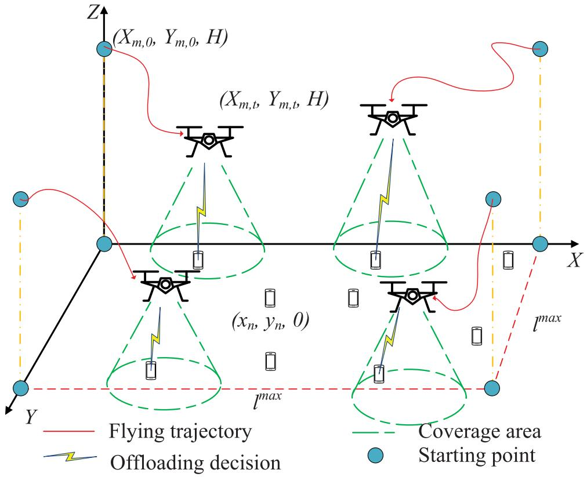

flowchart

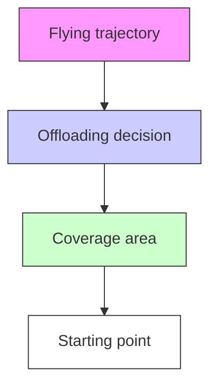

Fig. 1. Overall System Architecture.

summarize the difference between our work and the existing literature in Table I.

The rest of this article is organized as follows. In Section II, we introduce the system model and the optimization problem. In Section III, our multi-agent based DRL algorithm is proposed. Our experimental results are shown in Section IV. Finally, our conclusions are drawn in Section V.

The main notations used in this article are summarized in Table II.

# II. SYSTEM MODEL

In this section, we describe the system model. As shown in Fig. 1, we assume that there are N UEs randomly distributed in a square-shaped area with side length l max , and the set of UEs is denoted as $\mathcal { N } \triangleq \{ n = 1 , 2 , \dots , N \}$ . There are M UAVs flying at a fixed altitude H over the target area to serve the ground UEs, and the set of UAVs is denoted as $\mathcal { M } \triangleq \{ m = 1 , 2 , \dots , M \}$ . We also assume that UAVs can be deployed and easily charged on the building roof when UAVs run out of their energy. Assume that each UE has a computational task to be executed at each time slot (TS) over T consecutive TSs, $\mathcal { T } \triangleq \{ t = 1 , 2 , \dots , T \}$ . Each of the tasks can be executed either by the UE or offloaded to one of the UAVs. We define a new set $m \in \mathcal { M } ^ { \prime } \triangleq \{ 0 , 1 , \dots , M \}$ to denote the possible places where the tasks can be executed, with $m = 0$ representing local execution. Then, we define the offloading decision variable $z _ { n , m , t }$ as

$$
z _ {n, m, t} = \{0, 1 \}, \forall n \in \mathcal {N}, m \in \mathcal {M} ^ {\prime}, t \in \mathcal {T}, \tag {1}
$$

where $z _ { n , m , t } = 1 , m \neq 0$ means that UE n decides to offload the task to UAV m in TS t, while $z _ { n , m , t } = 1 , m = 0$ represents

TABLE II LIST OF MAIN NOTATIONS 

<table><tr><td>Notation</td><td>Description</td></tr><tr><td>n, N,  $\mathcal{N}$ </td><td>The index, number and the set of UEs</td></tr><tr><td>m, M,  $\mathcal{M}$ </td><td>The index, number and the set of UAVs</td></tr><tr><td>t, T,  $\mathcal{T}$ </td><td>The index, number and the set of TSs</td></tr><tr><td> $z_{n,m,t}$ </td><td>Offloading decision of UE n</td></tr><tr><td> $S_{n,t}$ </td><td>Computation task of UE n in TS t</td></tr><tr><td> $D_{n,t}$ </td><td>Data volume of task  $S_{n,t}$ </td></tr><tr><td> $F_{n,t}$ </td><td>Overall CPU cycles required for task  $S_{n,t}$ </td></tr><tr><td> $f_{n,m,t}$ </td><td>Computation capacity of UAV m allocated to UE n</td></tr><tr><td> $T_{n,m,t}^{C}$ </td><td>Execution time of UAV m to UE n in TS t</td></tr><tr><td> $T_{n,m,t}^{Tr}$ </td><td>Transmission time of UE n to UAV m in TS t</td></tr><tr><td> $T^{max}$ </td><td>Maximal time duration of each TS</td></tr><tr><td> $\alpha_{m,t}, d_{m,t}$ </td><td>Flying angle and distance of UAV m in TS t</td></tr><tr><td> $d^{max}$ </td><td>Maximal flying distance of UAV in each TS</td></tr><tr><td> $[X_{m,t}, Y_{m,t}, H]$ </td><td>Coordinates of UAV m in TS t</td></tr><tr><td> $[x_n, y_n]$ </td><td>Coordinates of UE n</td></tr><tr><td> $R_{n,m,t}$ </td><td>Horizontal distance between UAV m and UE n</td></tr><tr><td> $R_{m,m',t}$ </td><td>Horizontal distance between UAV m and UAV m&#x27;</td></tr><tr><td> $R^{max}$ </td><td>Maximal horizontal coverage radius of UAV</td></tr><tr><td> $r_{n,m,t}$ </td><td>Transmitting data rate of UE n to UAV m</td></tr><tr><td> $E_{n,m,t}^{C}$ </td><td>Energy consumption for task execution</td></tr><tr><td> $E_{n,m,t}^{Tr}$ </td><td>Energy consumption for offloading</td></tr><tr><td> $c_{m,t}$ </td><td>Relative UE-load of UAV m in TS t</td></tr><tr><td> $f_t^u$ </td><td>Fairness index of UE-load of each UAV in TS t</td></tr><tr><td> $f_t^e$ </td><td>Fairness index of UEs in TS t</td></tr></table>

that UE n carries out the task itself in TS t, and otherwise $z _ { n , m , t } = 0$ . Furthermore, we assume that each task can only be executed at a single place. Thus, we have

$$
\sum_ {m = 0} ^ {M} z _ {n, m, t} = 1, \forall n \in \mathcal {N}, t \in \mathcal {T}. \tag {2}
$$

Similarly to [35], in the TS t, we assume that UE n has a computationally intensive task $S _ { n , t }$ to be executed, which is defined as

$$
S _ {n, t} = \left\{D _ {n, t}, F _ {n, t} \right\}, \forall n \in \mathcal {N}, t \in \mathcal {T}, \tag {3}
$$

where $D _ { n , }$ t denotes the data volume to be processed, while $F _ { n , t }$ describes the total number of the CPU cycles required for executing this task. Both $D _ { n , t }$ and $F _ { n , t }$ can be characterized as in [36].

Furthermore, in TS t, each of UAV flies in a direction determined by the angle of $\alpha _ { m , t } ~ \in ~ [ 0 , 2 \pi )$ , distance of $d _ { m , t } ~ \in ~ [ 0 , d ^ { m a x } ]$ , and cannot go beyond the border of the target area. We assume that the initial coordinates of UAV m are set as $[ X _ { m , 0 } , Y _ { m , 0 } , H ]$ . Then, the coordinates of UAV m in TS t can be calculated as $[ X _ { m , t } , Y _ { m , t } , H ]$ , where $\begin{array} { r } { X _ { m , t } = X _ { m , 0 } + \sum _ { t ^ { \prime } = 1 } ^ { t } d _ { m , t ^ { \prime } } \mathrm { c o s } ( \alpha _ { m , t ^ { \prime } } ) } \end{array}$ and $Y _ { m , t } =$ $\begin{array} { r } { Y _ { m , 0 } + \sum _ { t ^ { \prime } = 1 } ^ { t } d _ { m , t ^ { \prime } } { \sin ( \alpha _ { m , t ^ { \prime } } ) } } \end{array}$ . Thus, we have

$$
0 \leq X _ {m, t} \leq l ^ {\max}, \forall m \in \mathcal {M}, t \in \mathcal {T}, \tag {4}
$$

and

$$
0 \leq Y _ {m, t} \leq l ^ {\max}, \forall m \in \mathcal {M}, t \in \mathcal {T}. \tag {5}
$$

Additionally, we denote the distance between UAV m and UAV m- in TS t as $R _ { m , m ^ { \prime } , t } .$ , which can be expressed as

$$
R _ {m, m ^ {\prime}, t} = \sqrt {\left(X _ {m , t} - X _ {m ^ {\prime} , t}\right) ^ {2} + \left(Y _ {m , t} - Y _ {m ^ {\prime} , t}\right) ^ {2}}. \tag {6}
$$

We assume that the UAVs should keep a minimal distance of $R ^ { u }$ for avoiding their collision in each TS. Then, we have

$$
R _ {m, m ^ {\prime}, t} \geq R ^ {u}, \forall m, m ^ {\prime} \in \mathcal {M}, m \neq m ^ {\prime}. \tag {7}
$$

The horizontal distance between UE n and UAV m in TS t is calculated as

$$
R _ {n, m, t} = \sqrt {\left(X _ {m , t} - x _ {n}\right) ^ {2} + \left(Y _ {m , t} - y _ {n}\right) ^ {2}},
$$

$$
\forall n \in N, \quad m \in \mathcal {M}, t \in \mathcal {T}, \tag {8}
$$

where $[ x _ { n } , y _ { n } ]$ is assumed to be the coordinate of UE n. Note that if UE n decides to offload a task to UAV m in TS $t ,$ it must be in the coverage of UAV m. Then, we have

$$
z _ {n, m, t} R _ {n, m, t} \leq R ^ {\max}, \forall n \in \mathcal {N}, m \in \mathcal {M}, t \in \mathcal {T}, \tag {9}
$$

where $R ^ { m a x }$ is the maximal horizontal coverage radius of the UAVs.

Then, the offloading data rate can be expressed by

$$
r _ {n, m, t} = B \log_ {2} \left(1 + \frac {\rho P _ {n}}{H ^ {2} + R _ {n , m , t} ^ {2}}\right),
$$

$$
\forall n \in \mathcal {N}, m \in \mathcal {M}, t \in \mathcal {T}, \tag {10}
$$

where B is the channel’s bandwidth, $P _ { n }$ is the transmission power of UE $n , \rho = g _ { 0 } G _ { 0 } / \sigma ^ { 2 } ,$ , G0 ≈ 2.2846, g0 is the channel’s power gain at the reference distance of 1 m and $\sigma ^ { 2 }$ is the noise power [37]. Here we do not consider any particular modulation and coding scheme.

Thus, if UE n decides for offloading its task to UAV m in TS t, the time required for offloading the data is given by

$$
T _ {n, m, t} ^ {T r} = \frac {D _ {n , t}}{r _ {n , m , t}}, \forall n \in \mathcal {N}, m \in \mathcal {M}, t \in \mathcal {T}, \tag {11}
$$

and the execution time of the task can be expressed as

$$
T _ {n, m, t} ^ {C} = \frac {F _ {n , t}}{f _ {n , m , t}}, \forall n \in \mathcal {N}, m \in \mathcal {M} ^ {\prime}, t \in \mathcal {T}, \tag {12}
$$

where $f _ { n , m , t }$ represents the computational capability of UAV m that can be allocated to UE n, and $m = 0$ indicates local execution. Thus, the overall time required for executing the task can be described as

$$
T _ {n, m, t} = \left\{ \begin{array}{l l} T _ {n, m, t} ^ {C}, & \text { if   local   execution }, \\ T _ {n, m, t} ^ {T r} + T _ {n, m, t} ^ {C}, & \text { if   offloading }. \end{array} \right. \tag {13}
$$

We also assume that all tasks should be executed within the maximal time duration $T ^ { m a x }$ of TS. Then, we have

$$
z _ {n, m, t} T _ {n, m, t} \leq T ^ {\max}, \forall n \in \mathcal {N}, m \in \mathcal {M} ^ {\prime}, t \in \mathcal {T}. \tag {14}
$$

According to [38], if the UE n decides to execute a task locally, the energy consumption is given by

$$
E _ {n, m, t} ^ {C} = k _ {n} \left(f _ {n, m, t}\right) ^ {v _ {n}} T _ {n, m, t} ^ {C}, \forall n \in \mathcal {N}, t \in \mathcal {T}, \tag {15}
$$

where $k _ { n } \geq 0 , v _ { n } \geq 1$ are positive coefficients.

If UE n decides to offload a task, the energy consumption of offloading is

$$
E _ {n, m, t} ^ {T r} = P _ {n} T _ {n, m, t} ^ {T r}, \forall n \in \mathcal {N}, m \in \mathcal {M}, t \in \mathcal {T}. \tag {16}
$$

Thus, the energy consumption at UE n can be expressed as

$$
E _ {n, m, t} = \left\{ \begin{array}{l l} E _ {n, m, t} ^ {C}, & \text { if   local   execution }, \\ E _ {n, m, t} ^ {T r}, & \text { if   offloading }. \end{array} \right. \tag {17}
$$

Then, we define $c _ { m , t } \in [ 0 , 1 ]$ as the relative UE-load of UAV m in TS t, as:

$$
c _ {m, t} = \frac {\sum_ {n = 1} ^ {N} z _ {n , m , t}}{N}, \forall m \in \mathcal {M}, t \in \mathcal {T}. \tag {18}
$$

In this article, our first objective is to minimize the total energy consumption of UEs via optimizing both the offloading decisions and the UAVs’ trajectories. However, this may lead to an unfair process since some UAVs may serve more UEs than others. To address this issue, similar to the Jain’s fairness equation, we apply a fairness index $f _ { t } ^ { u }$ as

$$
f _ {t} ^ {u} = \frac {\left(\sum_ {m = 1} ^ {M} \sum_ {t ^ {\prime} = 1} ^ {t} c _ {m , t ^ {\prime}}\right) ^ {2}}{M \sum_ {m = 1} ^ {M} \left(\sum_ {t ^ {\prime} = 1} ^ {t} c _ {m , t ^ {\prime}}\right) ^ {2}}, \tag {19}
$$

where $f _ { t } ^ { u }$ reflects the level of fairness among the UAVs physically, if all the UAVs have a similar UE-load commencing from the initial TS up to TS t, the value of $f _ { t } ^ { u }$ is closer to 1.

Then, to avoid the situation that some UEs are served during many TSs, while others are never served at all, similar to the Jain’s fairness equation, we apply the geographical fairness $f _ { t } ^ { e }$ as follows

$$
f _ {t} ^ {e} = \frac {\left(\sum_ {n = 1} ^ {N} \sum_ {t ^ {\prime} = 1} ^ {t} z _ {n , m , t ^ {\prime}}\right) ^ {2}}{N \sum_ {n = 1} ^ {N} \left(\sum_ {t ^ {\prime} = 1} ^ {t} z _ {n , m , t ^ {\prime}}\right) ^ {2}}, \tag {20}
$$

where $f _ { t } ^ { e }$ reflects the level of fairness among the UEs, explicitly, if all UEs are served for a similar number of TSs commencing from the initial TS to the TS t, the value of $f _ { t } ^ { e }$ is closer to 1.

Then, we formulate our optimization problem as follows

$$
\mathcal {P} 1: \max _ {\boldsymbol {P}, \boldsymbol {Z}} \sum_ {t = 1} ^ {T} \frac {f _ {t} ^ {u} \cdot f _ {t} ^ {e}}{\sum_ {n = 1} ^ {N} \sum_ {m = 0} ^ {M} z _ {n , m , t} E _ {n , m , t}} \tag {21a}
$$

subject to:

$$
z _ {n, m, t} = \{0, 1 \}, \forall n \in \mathcal {N}, m \in \mathcal {M} ^ {\prime}, t \in \mathcal {T}, \tag {21b}
$$

$$
\sum_ {m = 0} ^ {M} z _ {n, m, t} = 1, \forall n \in \mathcal {N}, t \in \mathcal {T}, \tag {21c}
$$

$$
0 \leq X _ {m, t} \leq l ^ {\max}, \forall m \in \mathcal {M}, t \in \mathcal {T}, \tag {21d}
$$

$$
0 \leq Y _ {m, t} \leq l ^ {\max}, \forall m \in \mathcal {M}, t \in \mathcal {T}, \tag {21e}
$$

$$
0 \leq \alpha_ {m, t} <   2 \pi , \forall m \in \mathcal {M}, t \in \mathcal {T}, \tag {21f}
$$

$$
0 \leq d _ {m, t} \leq d ^ {\max}, \forall m \in \mathcal {M}, t \in \mathcal {T}, \tag {21g}
$$

$$
R _ {m, m ^ {\prime}, t} \geq R ^ {u}, \forall m, m ^ {\prime} \in \mathcal {M}, m \neq m ^ {\prime}, \tag {21h}
$$

$$
z _ {n, m, t} R _ {n, m, t} \leq R ^ {\max}, \forall n \in \mathcal {N}, m \in \mathcal {M}, t \in \mathcal {T}, \tag {21i}
$$

$$
z _ {n, m, t} T _ {n, m, t} \leq T ^ {\max}, \forall n \in \mathcal {N}, m \in \mathcal {M} ^ {\prime}, t \in \mathcal {T}. \tag {21j}
$$

where $P ~ = ~ \{ \alpha _ { m , t } , d _ { m , t } , \forall m ~ \in ~ \mathcal { M } , t ~ \in ~ \mathcal { T } \}$ and $z \_ =$ $\{ z _ { n , m , t } , \forall n \in \mathcal { N } , m \in \mathcal { M } ^ { \prime } , t \in \mathcal { T } \}$ . Our objectives are to maximize the fairness of UE-load of each UAV and the fairness of the number of times that each UE is served by UAVs over all the TSs, while minimizing the overall energy consumption of UEs. It is readily observed that the optimization problem cannot be solved by traditional approaches, since it involves both the continuous variables $_ { P }$ and the discrete variables Z . Thus, in this article, a Multi-Agent deep reinforcement learning based Trajectory control algorithm (MAT) is proposed.

# III. THE PROPOSED ALGORITHM

In this section, we present our proposed algorithm. First, some background knowledge on deep reinforcement learning is provided, followed by our MAT conceived for solving Problem (21).

# A. Background Knowledge

In the traditional reinforcement learning setup, a Markov decision process (MDP) [39] is employed with the state space of $\begin{array} { r c l } { \mathcal { S } } & { = } & { \big \{ \ : s _ { t } ~ = ~ s _ { 1 } , s _ { 2 } , . . . , s _ { T } \big \} } \end{array}$ and the action space of $\mathcal { A } = \{ a _ { t } = a _ { 1 } , a _ { 2 } , . . . , a _ { T } \}$ . In the MDP, a decision agent interacts with the environment in discrete TSs. More specifically, the decision agent observes the current state $s _ { t }$ of the environment and takes the action $a _ { t }$ that is allowed in that state. As a benefit, the agent will obtain a reward $r _ { t }$ and traverses to a new state $s _ { t + 1 }$ . In [32], a policy $a _ { t } = \pi ( s _ { t } )$ is introduced that maps the state to a legitimate action. During the process of interacting with the environment, the agent aims for selecting lated reward $\begin{array} { r } { R _ { t } \ = \ \sum _ { i = t } ^ { T } \dot { \gamma } ^ { i - \dot { t } } r _ { i } } \end{array}$ hat maxi, where $\gamma \in \mathsf { \Gamma } ( 0 , 1 )$ ccumu-is the discount factor and T is the number of TSs. Additionally, as a beneficial combination of DNN and RL, the philosophy of DQN [29] was proposed, which uses an action-value function $Q ( \cdot )$ for approximately evaluating $R _ { t }$ by applying $a _ { t } , ~ s _ { t }$ and following $\pi ( \cdot ) \colon$

$$
Q (s _ {t}, a _ {t}) = \mathbb {E} _ {\pi} [ R _ {t} | s _ {t}, a _ {t} ], \tag {22}
$$

which is known as the Q-function, and can be obtained by a DNN. Then, the DNN can be trained with the aid of the loss function $L ( \cdot )$ defined as:

$$
L \left(\theta^ {Q}\right) = \mathbb {E} \left[ y _ {t} - Q \left(s _ {t}, a _ {t} \mid \theta^ {Q}\right) ^ {2} \right], \tag {23}
$$

where $\theta ^ { Q }$ denotes the network parameter of the DNN and $y _ { t }$ is formulated by

$$
y _ {t} = r _ {t} + \gamma Q \left(s _ {t + 1}, a _ {t + 1} \mid \theta^ {Q}\right), \tag {24}
$$

where $a _ { t + 1 }$ denotes the action of the agent in the next TS, which is generated by the DNN, given the state $s _ { t + 1 }$ .

Furthermore, in order to make the network more stable, a pair of techniques, namely the experience replay and the target network are utilized. The experience replay employs a buffer for storing transitions for the sake of mitigating the correlations between consecutive transitions and hence increasing their independence. Compared to the original RL training procedure, the DQN relies on a mini-batch for randomly sampling the transitions from the experience replay buffer, rather than only selecting a single transition. Furthermore, the target network that has the same network structure as $Q ( s _ { t } , a _ { t } )$ is employed for reducing the correlations. Note that the target network is only updated at certain intervals.

However, it is proved in [32] that DQN cannot be directly used for solving continuous-valued control problems. Thus, the popular actor-critic method at DDPG of [32] is resorted to. Specifically, DDPG consists of a DNN turned as actor and a DQN referred to as the critic network. The actor carries our the mapping function $\pi ( s _ { t } | \theta ^ { \pi } )$ while the critic performs the function $\overline { { Q ( s _ { t } , a _ { t } | \theta ^ { Q } ) } }$ . The actor can generate the optimal action $a _ { t }$ based on the state st and it can be trained by applying the policy gradient method of [40] defined as

$$
\begin{array}{l} \nabla_ {\theta^ {\pi}} J \approx \mathbb {E} \Big [ \nabla_ {\theta^ {\pi}} Q \Big (s, a | \theta^ {Q} \Big) | _ {s = s _ {t}, a = \pi (s _ {t} | \theta^ {\pi})} \Big ] \\ = \mathbb {E} \left[ \nabla_ {a} Q (s, a | \theta^ {Q}) | _ {s = s _ {t}, a = \pi (s _ {t}) \nabla_ {\theta} ^ {\pi} \pi (s | \theta^ {\pi}) | _ {s = s _ {t}}} \right], \tag {25} \\ \end{array}
$$

while the critic network can be updated by using the loss function of (23).

# B. MAT

In this section, by applying the popular MADDPG [34], we conceive a multi-agent MDP, namely an observable Markov game [41]. It is assumed that there are M agents interacting with the environment characterized by a set of states ${ \mathcal { S } } \ { \stackrel { \Delta } { = } } $ $\{ s _ { t } , t \in T \}$ and a set of actions $\mathcal { A } \triangleq \{ a _ { t } , t \in \mathcal { T } \}$ . The state $s _ { t }$ consists of the private observation $o _ { m , t }$ and some other extra information known by each agent. Additionally, each UAV is controlled by its dedicated agent. In each TS, each agent obtains its private observation $o _ { m , t }$ and takes its own action $a _ { m , t }$ as well as receives a reward $r _ { m , t }$ . Then, the environment updates the state and traverses to a new state. Note that each agent is equipped with an actor network $\boldsymbol { a } _ { m , t } = \pi ^ { m } ( \boldsymbol { o } _ { m , t } )$ , a critic network $Q ^ { m } ( s _ { t } , a _ { t } )$ , their target networks $a _ { m , t + 1 } =$ $\pi ^ { m ^ { \prime } } ( o _ { m , t + 1 } )$ and $Q ^ { m ^ { \prime } } ( s _ { t + 1 } , a _ { t + 1 } )$ , as well as an experience replay buffer $B _ { m }$ .

The proposed algorithm is based on the framework of centralized training combined with decentralized execution. During the training process, each agent sends its own private observation $o _ { m , t }$ and action $a _ { m , t }$ to the environment, and then the states $s _ { t }$ which consist of the observations of all the agents and actions are sent back to each agent. Here, all the agents can exchange their private information simultaneously with each other, including coordinates. Furthermore, the critic network of each agent is trained with the states and actions that includes all the agents’ observations and actions. Then, during the testing process, each agent can execute its action by only receiving its own private observations $o _ { m , t }$ , which can potentially maximize the accumulated rewards.

Thus, we define the observation, action and reward function for each agent in TS t as follows:

1) Observation $\mathrm { \Delta } O _ { m , t } \mathrm { \Delta } \mathrm { : \Omega }$ we first add the coordinates $[ X _ { m , t } , Y _ { m , t } ]$ of UAV m in TS t into the observation of agent m. For avoiding collisions between each pair of UAVs, we define the set of relative UAV distances $\{ R _ { m , m ^ { \prime } , t } , \forall m ^ { \prime } \ \in \ M , m ^ { \prime } \ \neq \ m \}$ as part of the observation. Additionally, for better exploration, we also add the set of accumulated times of UEs served by UAVs and UE-load of UAthe initial TS up to TS t, i.e., $\begin{array} { r } { \{ \sum _ { t ^ { \prime } = 1 } ^ { t } z _ { n , m , t ^ { \prime } } \} } \end{array}$ g fro, ∀n $\in$ $\mathcal { N } \} , \{ \sum _ { t ^ { \prime } = 1 } ^ { t } c _ { m , t ^ { \prime } } , \forall m \ \in \ M \}$ , respectively into the observation set.   
2) Action $a _ { m , t } \colon$ we define the UAV’s flying direction and distance as the action $a _ { m , t } = \{ \alpha _ { m , t } , d _ { m , t } \}$ of the m-th UAV in the t-th TS.   
3) Reward Function $r _ { m , t } \colon$ we define the reward function as:

$$
r _ {m, t} = \frac {f _ {t} ^ {u} \cdot f _ {t} ^ {e}}{\frac {1}{N} \sum_ {n = 1} ^ {N} \sum_ {m = 0} ^ {M} z _ {n , m , t} \cdot E _ {n , m , t}} - p _ {m}, \tag {26}
$$

where $p _ { m }$ is the penalty incurred if UAV m flies out of the target area or UAV m is collided with another UAV (i.e., the relative distance is under the defined limit).

Then, we define the entire state $s _ { t } ,$ and action $a _ { t }$ as follows

1) State $s t \colon$ the state consists of the observations of all the agents, which is expressed as $s _ { t } = \{ o _ { m , t } , \forall m \in \mathcal { M } \}$ .   
2) Action $a _ { t } \colon$ the action consists of the actions of all the agents, which is $a _ { t } = \{ a _ { m , t } , \forall m \in \mathcal { M } \}$ .

We show the structure of agent m in Fig. 2. During its interaction with the environment 1 , each UAV (controlled by agent) $\textcircled{2}$ selects the optimal action associated with its actor network $\pi ^ { m } ( \cdot ) ~ \textcircled { 6 }$ , and then obtains the Q value from the critic network $Q ^ { m } ( \cdot ) \textcircled { 8 }$ as well as its target action and target Q value from $\pi ^ { m ^ { \prime } } \textcircled { 7 }$ and $Q ^ { m ^ { \prime } } ( \cdot )$ 9 respectively. The profile of observation, action and reward, which determine the transition are defined as $e _ { m , t } \triangleq \{ s _ { t } , a _ { t } , r _ { m , t } , s _ { t + 1 } \}$ that are stored in the experience replay buffer 4 . However, during the training procedure, randomly sampling the mini-batch $\textcircled{5}$ may have unpredictable effects, since some transitions associated with poor attempts may lead to the termination of the training procedure or may not converge. As a result, Schaul et al. [42] pointed out that transitions having high Temporal Difference (TD)-error often indicate successful attempts. The TD-error $\delta _ { m }$ of agent m can be defined as follows

$$
\begin{array}{l} \delta_ {m} = r _ {m, t} + \gamma Q ^ {m ^ {\prime}} \bigg (s _ {t + 1}, a _ {t + 1} | \theta^ {Q ^ {m ^ {\prime}}} \bigg) \\ - Q ^ {m} \left(s _ {t}, a _ {t} | \theta^ {Q ^ {m}}\right), \forall m \in \mathcal {M}, t \in \mathcal {T}. \tag {27} \\ \end{array}
$$

Additionally, motivated by [42], we utilize a prioritized experience replay scheme, in which the absolute TD-error $| \delta _ { m , k } |$ was used for evaluating the probability of the k-th sampled transition in the mini-batch. Then, the probability of sampling the k-th transition is expressed as

$$
P _ {m, k} = \frac {\left(\left| \delta_ {m , k} \right| + \varepsilon\right) ^ {\beta}}{\sum_ {k ^ {\prime} = 1} ^ {K} \left(\left| \delta_ {m , k} \right| + \varepsilon\right) ^ {\beta}}, \forall m \in \mathcal {M}, \tag {28}
$$

where K is the size of mini-batch, $\varepsilon$ is a positive constant value, and $\beta$ is 0.6. Thus, the loss function 10 of the agent m is defined as

$$
L \left(\theta^ {Q ^ {m}}\right) = \mathbb {E} \left[ \frac {1}{(K \cdot P _ {m , k}) ^ {\mu}} (\delta_ {m}) ^ {2} \right], \tag {29}
$$

where $\mu$ is given as 0.4.

Then, the critic network 8 of agent m can be updated by the loss function 10 provided in (29). Furthermore, the actor network 6 of agent m can be trained by the policy gradient 11 defined as

$$
\nabla_ {\theta^ {\pi^ {m}}} J = \mathbb {E} \left[ \nabla_ {\theta^ {\pi^ {m}}} \pi^ {m} \left(o _ {m, t} | \theta^ {\pi^ {m}}\right) \nabla_ {a _ {m, t}} Q ^ {m} (s _ {t}, a _ {t}) | \theta^ {Q ^ {m}} \right],
$$

$$
\forall m \in \mathcal {M}, t \in \mathcal {T}. \tag {30}
$$

Given the UAVs’ trajectories, we introduce a lowcomplexity approach for optimizing the offloading decisions of UEs. Here, we do not consider the constraint of the maximal available computing resource in each UAV. This can be readily extended to more practical scenarios, where each UAV can only have a certain amount of the computing resources, with the introduction of the matching algorithm. We will leave this idea for our future work. For each UE in TS t, we select the offloading decision based on the following expression

$$
z _ {n, m, t} = \left\{ \begin{array}{l l} 1, & m = \underset {m ^ {\prime} \in \mathcal {M} ^ {\prime}} {\operatorname{argmin}} \left\{E _ {n, m ^ {\prime}, t} \right\}, \\ 0, & \text { otherwise. } \end{array} \right. \tag {31}
$$

Specifically, after the movement of UAVs, each UE can select the most suitable UAV for offloading, which consumes the least energy. Otherwise, the UE may execute the task itself. If UE n decides to offload a task to UAV m, the computational capacity allocated to UE from the UAV is expressed as

$$
f _ {n, m, t} = \frac {F _ {n , t}}{T ^ {\text { max }} - T _ {n , m , t} ^ {\text { Tr }}}. \tag {32}
$$

We provide the pseudo code of proposed procedure in Algorithm 1. Specifically, we carry out the initialization between Line 1 and 5 at the beginning, where each UAV initializes its actor, critic and two target networks. Then, the training procedure starts from Line 6, where each UAV first obtains its observation from the environment 1 . Note that each UAV is controlled by its dedicated agent 2 . Then, based on the achieved observation, each UAV selects the action $a _ { m , t } ,$ which is generated by its actor network 6 . In order to achieve a better exploration, we add a noise parameter , which follows a normal distribution with zero mean and a variance of 1. The exploration noise decays with the rate of 0.9995. Then, the UAV executes the action. Note that the UAV will stay at the current location and obtains a penalty $p _ { m } ,$ , if the next location is obtained outside the target area or the UAV is collided with other UAVs. Then, UE selects the UAV which consumes the least energy according to (31). Next, we obtain the reward $r _ { m , t }$ and the next observation $^ { O } m , t { + } 1$ . Then, each UAV stores the transition 3 into its experience replay buffer $B _ { m }$ 4 . From Line 28 to 34, when the learning procedure starts, the mini-batch 5 with prioritized experience replay 12 scheme samples K transitions from $B _ { m }$ . Furthermore, the critic network $\textcircled{8}$ is updated by the loss function 10 provided in (29), and the actor network 6 is also updated by the policy gradient 11 provided in (30). After that, the pair of target networks are updated at a rate of τ . Finally, we update the priorities of the K sampled transitions.

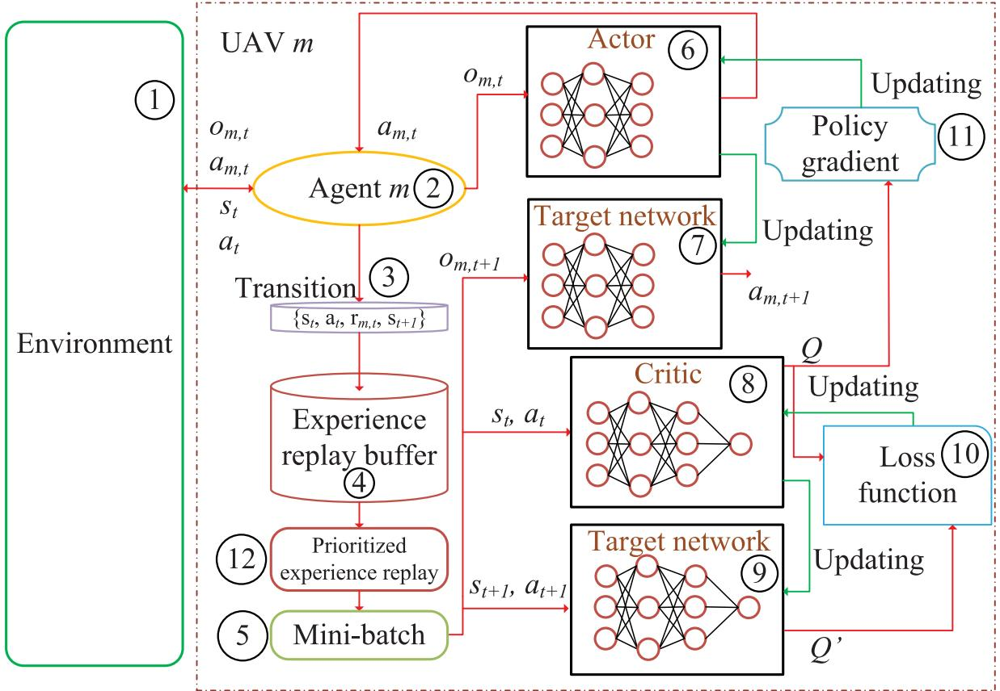

flowchart

```mermaid
graph TD
    A["Environment"] --> B["Agent m②"]
    B --> C{Action ⑥}
    C --> D["Policy gradient ⑪"]
    C --> E["Target network ⑦"]
    B --> F{Transition ③}
    F --> G["Experience replay buffer ④"]
    G --> H["Prioritized experience replay ⑫"]
    H --> I["Mini-batch ⑤"]
    B --> J["Actor ⑥"]
    J --> K["Policy gradient ⑪"]
    J --> L["Target network ⑦"]
    L --> M["Policy gradient ⑪"]
    L --> N["Policy gradient ⑦"]
    L --> O["Policy gradient ⑪"]
    P["Environment"] --> Q["Agent m②"]
    Q --> R["Action ⑥"]
    R --> S["Policy gradient ⑪"]
    R --> T["Target network ⑦"]
    T --> U["Policy gradient ⑪"]
    T --> V["Policy gradient ⑪"]
    T --> W["Policy gradient ⑪"]
    X["UAV m"] --> Y["Agent m②"]
    Y --> Z["Action ⑥"]
    Z --> AA["Policy gradient ⑪"]
    Z --> AB["Target network ⑦"]
    AB --> AC["Policy gradient ⑪"]
    AB --> AD["Policy gradient ⑪"]
    AB --> AE["Policy gradient ⑪"]
    AF["Environment"] --> AG["Agent m②"]
    AG --> AH["Action ⑥"]
    AH --> AI["Policy gradient ⑪"]
    AH --> AJ["Policy gradient ⑪"]
    AH --> AK["Policy gradient ⑪"]
    AL["Environment"] --> AM["Agent m②"]
    AM --> AN["Action ⑥"]
    AN --> AO["Policy gradient ⑪"]
    AN --> AP["Policy gradient ⑪"]
    AN --> AQ["Policy gradient ⑪"]
    AR["Environment"] --> AS["Agent m②"]
    AS --> AT["Action ⑥"]
    AT --> AU["Policy gradient ⑪"]
    AT --> AV["Policy gradient ⑪"]
    AT --> AW["Policy gradient ⑪"]
    AX["Environment"] --> AY["Agent m②"]
    AY --> AZ["Action ⑥"]
    AZ --> BA["Policy gradient ⑪"]
    AZ --> BB["Policy gradient ⑪"]
    AZ --> BC["Policy gradient ⑪"]
    BD["Environment"] --> BE["Agent m②"]
    BE --> BF["Action ⑥"]
    BF --> BG["Policy gradient ⑪"]
    BF --> BH["Policy gradient ⑪"]
    BF --> BI["Policy gradient ⑪"]
    BJ["Environment"] --> BK["Agent m②"]
    BK --> BL["Action ⑥"]
    BL --> BM["Policy gradient ⑪"]
    BL --> BN["Policy gradient ⑪"]
    BL --> BO["Policy gradient ⑪"]
    BP["Environment"] --> BQ["Agent m②"]
    BQ --> BR["Action ⑥"]
    BR --> BS["Policy gradient ⑪"]
    BR --> BT["Policy gradient ⑪"]
    BR --> BU["Policy gradient ⑪"]
    BV["Environment"] --> BW["Agent m②"]
    BW --> BX["Action ⑥"]
    BX --> BY["Policy gradient ⑪"]
    BX --> BZ["Policy gradient ⑪"]
    BX --> CA["Policy gradient ⑪"]
    CB["Environment"] --> CBQ["Agent m②"]
    CBQ --> CBZ["Critic ⑧"]
    CBZ --> CC["Policy gradient ⑪"]
    CBZ --> CD["Policy gradient ⑪"]
    CBZ --> DD["Policy gradient ⑪"]
    DE["Environment"] --> DF["Agent m②"]
    DF --> DG["Critic ⑧"]
    DG --> DH["Policy gradient ⑪"]
    DG --> DI["Policy gradient ⑪"]
    DG --> DJ["Policy gradient ⑪"]
    DK["Environment"] --> DKQ
    DKQ --> DKZ["Critic ⑧"]
    DKZ --> DL["Policy gradient ⑪"]
    DKZ --> DJ
    DKQ --> DJ
    DKZ --> DL
    DKQ --> DJ
    DKQ --> DL
```

Fig. 2. Structure of UAV m (i.e., controlled by Agent m).

# IV. SIMULATION RESULTS

In this section, we rely on our simulations for evaluating the performance of the proposed MAT algorithm. The simulations are conducted by using Python 3.7 and Tensorflow 1.15.0. We employ four fully-connected hidden layers having [400, 300, 200, 200] neurons in both the actor and critic networks. The actor network is trained at the learning rate of $3 \times 1 0 ^ { - 5 }$ , while the critic network is trained at the learning rate of $1 0 ^ { - 4 }$ . The AdamOptimizer [43] is used for updating the actor and critic networks. We set the target region to be a squareshaped area with side length of $l ^ { m a x } = 1 0 0 ~ \mathrm { m } .$ , where 50 UEs are randomly and uniformly distributed. We set the initial coordinates of UAVs to [10, 10], [90, 90], [10, 90] and [90, 10] m. Additionally, each UE generates a single task in each TS. The rest of the parameters can be found in Table III.

TABLE III SIMULATION PARAMETERS 

<table><tr><td>Notation</td><td>Description</td></tr><tr><td>N</td><td>50</td></tr><tr><td>T</td><td>20</td></tr><tr><td> $l^{max}$ </td><td>100 m</td></tr><tr><td> $D_{n,t}$ </td><td>[10, 14] Kb</td></tr><tr><td> $F_{n,t}$ </td><td>[1800, 2000] cycles/bit</td></tr><tr><td> $T^{max}$ </td><td>1 s</td></tr><tr><td> $d^{max}$ </td><td>20 m</td></tr><tr><td> $R^{max}$ </td><td>20 m</td></tr><tr><td> $R^u$ </td><td>1 m</td></tr><tr><td>H</td><td>50 m</td></tr><tr><td>B</td><td>10 MHz</td></tr><tr><td> $P_n$ </td><td>0.1 Watt</td></tr><tr><td> $σ^2$ </td><td>-90 dBm</td></tr><tr><td> $k_n$ </td><td> $10^{-28}$ </td></tr><tr><td> $v_n$ </td><td>3</td></tr><tr><td> $g_0$ </td><td> $1.42 × 10^{-4}$ </td></tr><tr><td>γ</td><td>0.95</td></tr><tr><td>K</td><td>256</td></tr><tr><td>τ</td><td>0.01</td></tr><tr><td>ε</td><td>0.001</td></tr><tr><td> $B_m$ </td><td> $10^5$ </td></tr><tr><td> $e^{max}$ </td><td>3000</td></tr><tr><td> $p_m$ </td><td>10</td></tr></table>

Algorithm 1 MAT   
1: for UAV m in M do
2: Initialize actor network $\pi^{m}(\cdot)$ , critic network $Q^{m}(\cdot)$ with parameters $\theta^{\pi^{m}}$ and $\theta^{Q^{m}}$ ;
3: Initialize target networks $\pi^{m'}(\cdot)$ and $Q^{m'}(\cdot)$ with parameters $\theta^{\pi^{m'}} = \theta^{\pi^{m}}$ and $\theta^{Q^{m'}} = \theta^{Q^{m}}$ ;
4: Initialize experience replay buffer $B_{m}$ ;
5: end for
6: for Episode = 1,2, ..., $e^{max}$ do
7: for UAV m in M do
8: Initialize observation $o_{m,t}$ ;
9: end for
10: for TS t in T do
11: Obtain $s_{t}$ ;
12: for UAV m in M do
13: Obtain action $a_{m,t} = \pi^{m}(o_{m,t}|\theta^{\pi^{m}}) + \epsilon$ ;
14: Execute $a_{m,t}$ . Note that the UAV will stay at the current location if it flies out of the target area or it is collided with another UAV;
15: end for
16: Obtain $a_{t}$ ;
17: for UE n in N do
18: Obtain the available offloading decision $z_{n,m,t}$ that consumes the least energy according to (31);
19: Calculate $E_{n,m,t}$ ;
20: end for
21: for UAV m in M do
22: Obtain $r_{m,t}$ according to (26);
23: Obtain $o_{m,t+1}$ ;
24: end for
25: Obtain $s_{t+1}$ ;
26: for UAV m in M do
27: Store transition $\{s_{t}, a_{t}, r_{m,t}, s_{t+1}\}$ into experience replay buffer $B_{m}$ with priority $|\delta_{m}| + \varepsilon$ ;
28: if learning process starts then
29: Sample a mini-batch of K transitions from $B_{m}$ with probability $P_{m,k}$ ;
30: Update critic network according to (29);
31: Update actor network according to (30);
32: Update target networks with updating rate $\tau$ : $\theta^{\pi^{m'}} \leftarrow \tau\theta^{\pi^{m}} + (1 - \tau)\theta^{\pi^{m'}};$ $\theta^{Q^{m'}} \leftarrow \tau\theta^{Q^{m}} + (1 - \tau)\theta^{Q^{m'}};$ 33: Update priorities of K transitions;
34: end if
35: end for
36: end for
37: end for

Firstly, we depict the training curve of MAT in Fig. 3, where 3 UAVs are deployed. Observe from Fig. 3 that the accumulated reward achieved by MAT remains under 50 at the beginning and starts increasing from the 1000-th episode. After about 2000 training episodes, the curve reaches about 300 and then convergence is achieved.

Then, we increase the number of UAV to 4 and in Fig. 4, we depict the accumulated reward achieved by MAT during the training process. Similarly, the curve remains below 200 at the beginning and then increases after the 1000-th episode. It finally saturates around 450. Observe that the accumulated reward seen in Fig. 4 is higher than that in Fig. 3. This is because deploying more UAVs can serve more UEs at the same time, hence resulting in increased accumulated rewards.

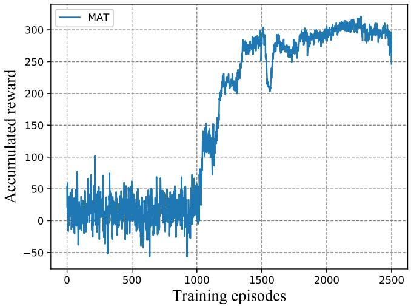

line

| Training episodes | Accumulated reward |
| ----------------- | ------------------ |
| 0                 | ~50                |
| 500               | ~40                |
| 1000              | ~150               |
| 1500              | ~300               |
| 2000              | ~300               |
| 2500              | ~250               |

Fig. 3. Accumulated reward versus training episodes (with 3 UAVs).

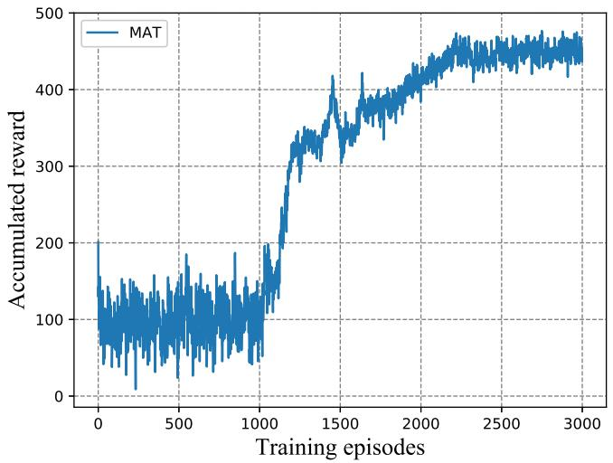

line

| Training episodes | Accumulated reward |
| ----------------- | ------------------ |
| 0                 | 200                |
| 500               | 150                |
| 1000              | 180                |
| 1500              | 420                |
| 2000              | 450                |
| 2500              | 460                |
| 3000              | 470                |

Fig. 4. Accumulated reward versus training episodes (with 4 UAVs).

After the training stage, both the model and the network parameters are saved for testing. Next, we compare our algorithm in the cases of 3 and 4 UAVs to the following benchmark solutions:

• RANDOM: In this setup, each UAV randomly selects a flying direction within $\alpha _ { m , t } \in [ 0 , 2 \pi )$ , and a flying distance $d _ { m , t } \in [ 0 , d ^ { m a x } ]$ . Note that the UAVs are restricted to the target area.   
• CIRCLE: We group all the UEs into a single cluster according to the UEs’ coordinates and then all the UAVs fly in a circle twice around the center of the cluster having a radius of $R ^ { m a x }$ .

Note that the MAT, RANDOM, and CIRCLE benchmarks have the same starting points for the UAVs and their offloading decisions are described in Eq. (31).

We first depict the UAV trajectories in Fig. 5, where 3 UAVs are deployed. In this figure, dots represent the location of UEs. We apply a heat map to show the number of times that each UE is served by the UAV commencing from the initial TS to the final TS. The darker the dots, the less amount of time that the UE is spent by the UAV serving. Observe from this figure that all the UAVs move around certain areas, since their coverage range is limited and they have to move for the sake of serving more UEs to increase the fairness index. Additionally, we can see that each UAV covers the particular area in a cooperative manner, so as to maximize the reward defined. For instance, ‘UAV2’ moves to the lower right corner from its initial location for serving more UEs, while ‘UAV3’ moves to the upper right corner to help users in this region.

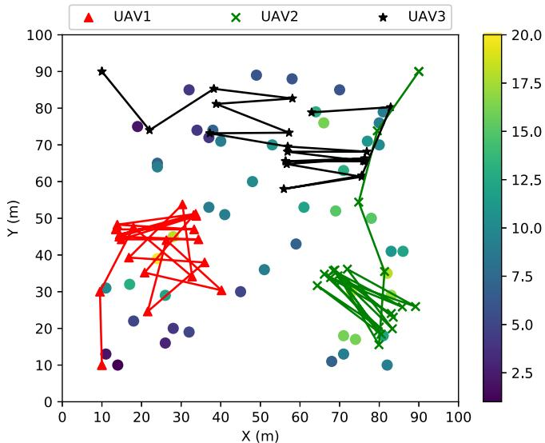

scatter

| UAV   | X (m) | Y (m) |
|-------|-------|-------|
| UAV1  | 10    | 10    |
| UAV1  | 15    | 30    |
| UAV1  | 20    | 45    |
| UAV1  | 25    | 50    |
| UAV1  | 30    | 45    |
| UAV1  | 35    | 55    |
| UAV1  | 40    | 50    |
| UAV1  | 45    | 40    |
| UAV1  | 50    | 35    |
| UAV1  | 55    | 30    |
| UAV1  | 60    | 25    |
| UAV1  | 65    | 20    |
| UAV1  | 70    | 15    |
| UAV1  | 75    | 10    |
| UAV1  | 80    | 5     |
| UAV1  | 85    | 2     |
| UAV1  | 90    | 1     |
| UAV2  | 65    | 35    |
| UAV2  | 70    | 30    |
| UAV2  | 75    | 25    |
| UAV2  | 80    | 20    |
| UAV2  | 85    | 15    |
| UAV2  | 90    | 10    |
| UAV2  | 95    | 5     |
| UAV2  | 100   | 2     |
| UAV3  | 10    | 90    |
| UAV3  | 20    | 75    |
| UAV3  | 30    | 85    |
| UAV3  | 40    | 80    |
| UAV3  | 50    | 70    |
| UAV3  | 60    | 65    |
| UAV3  | 70    | 60    |
| UAV3  | 80    | 75    |
| UAV3  | 90    | 80    |
| UAV3  | 100   | 85    |
| UAV3  | 110   | 90    |
| UAV3  | 120   | 95    |
| UAV3  | 130   | 100   |
The chart displays a scatter plot with color-coded values representing different data series. The x-axis and y-axis are labeled 'X (m)' and 'Y (m)' respectively. The legend indicates 'UAV1' (red triangle), 'UAV2' (green cross), and 'UAV3' (black star). The color scale on the right ranges from purple (low value) to yellow (high value).

Fig. 5. UAVs’ trajectories (with 3 UAVs and the locations of UEs are represented by dots.)

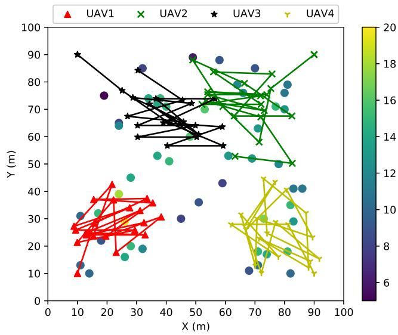  
Fig. 6. UAVs’ trajectories (with 4 UAVs and the locations of UEs are represented by dots.)

Then, we increase the number of UAVs to 4 and depict the trajectories in Fig. 6. Observe that more UAVs result in better coverage. Again, the UAVs cooperate for serving more UEs within the required number of TSs. Furthermore, compared to the heat map shown in Fig. 5, 4 UAVs can serve each UE more times than 3. More specially, 4 UAVs can increase the minimum number of serving occurrences from about 2.5 TSs in Fig. 5 to about 6 TSs in Fig. 6.

In Fig. 7, we show the fairness attained by 3 UAVs while serving all UEs, the fairness of each UAV’s UE-load and the overall energy consumption of all the UEs. Observe from Fig. 7a that the average fairness $f _ { t } ^ { e }$ among all the served UEs achieved by the MAT, CIRCLE and RANDOM regimes increases with the increase of the number of TSs, as expected. Specifically, MAT increases from 0.53 to 0.85, while CIRCLE increases from about 0.5 to 0.6. Finally, RANDOM remains under 0.4.

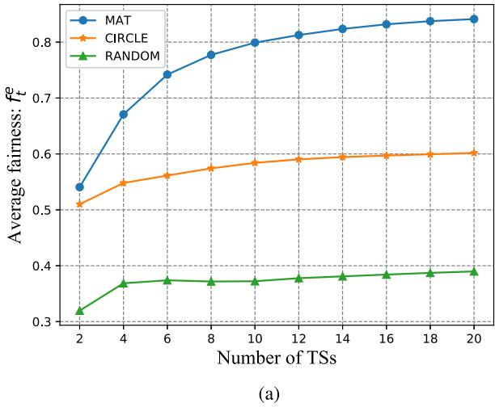

line

| Number of TSs | MAT   | CIRCLE | RANDOM |
| ------------- | ----- | ------ | ------ |
| 2             | 0.54  | 0.51   | 0.32   |
| 4             | 0.67  | 0.55   | 0.37   |
| 6             | 0.74  | 0.56   | 0.37   |
| 8             | 0.78  | 0.57   | 0.37   |
| 10            | 0.80  | 0.58   | 0.37   |
| 12            | 0.81  | 0.59   | 0.38   |
| 14            | 0.82  | 0.59   | 0.38   |
| 16            | 0.83  | 0.59   | 0.38   |
| 18            | 0.84  | 0.60   | 0.39   |
| 20            | 0.85  | 0.60   | 0.39   |

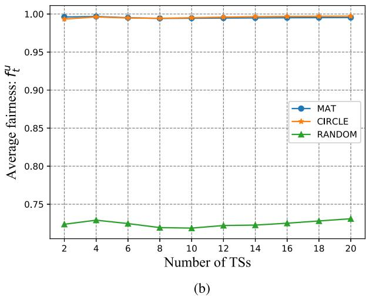

line

| Number of TSs | MAT   | CIRCLE | RANDOM |
| ------------- | ----- | ------ | ------ |
| 2             | 1.00  | 1.00   | 0.73   |
| 4             | 1.00  | 1.00   | 0.74   |
| 6             | 1.00  | 1.00   | 0.73   |
| 8             | 1.00  | 1.00   | 0.72   |
| 10            | 1.00  | 1.00   | 0.72   |
| 12            | 1.00  | 1.00   | 0.73   |
| 14            | 1.00  | 1.00   | 0.73   |
| 16            | 1.00  | 1.00   | 0.73   |
| 18            | 1.00  | 1.00   | 0.74   |
| 20            | 1.00  | 1.00   | 0.74   |

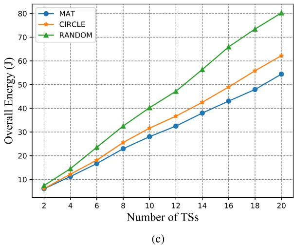

line

| Number of TSs | MAT  | CIRCLE | RANDOM |
| ------------- | ---- | ------ | ------ |
| 2             | 7    | 7      | 7      |
| 4             | 11   | 12     | 14     |
| 6             | 17   | 18     | 23     |
| 8             | 23   | 25     | 32     |
| 10            | 28   | 31     | 40     |
| 12            | 33   | 36     | 47     |
| 14            | 38   | 42     | 56     |
| 16            | 43   | 49     | 65     |
| 18            | 48   | 55     | 73     |
| 20            | 54   | 62     | 80     |

Fig. 7. The performance of MAT, CIRCLE and RANDOM versus different number of TSs, in terms of (a) fairness index $f _ { t } ^ { e }$ , (b) fairness index $f _ { t } ^ { u }$ and (c) overall energy consumption of all the UEs (with 3 UAVs).

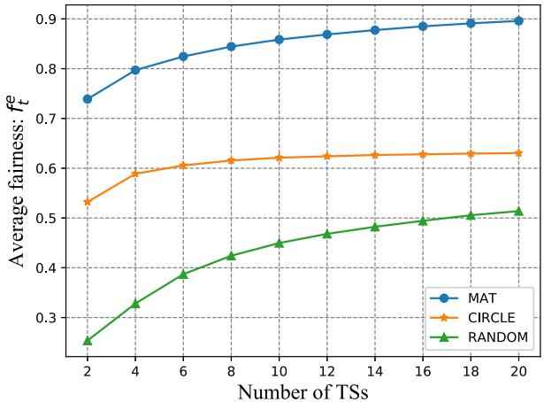

line

| Number of TSs | MAT   | CIRCLE | RANDOM |
| ------------- | ----- | ------ | ------ |
| 2             | 0.74  | 0.53   | 0.25   |
| 4             | 0.80  | 0.59   | 0.33   |
| 6             | 0.83  | 0.61   | 0.39   |
| 8             | 0.85  | 0.62   | 0.42   |
| 10            | 0.86  | 0.63   | 0.44   |
| 12            | 0.87  | 0.63   | 0.46   |
| 14            | 0.88  | 0.63   | 0.47   |
| 16            | 0.89  | 0.63   | 0.49   |
| 18            | 0.895 | 0.63   | 0.50   |
| 20            | 0.90  | 0.63   | 0.51   |

(a)

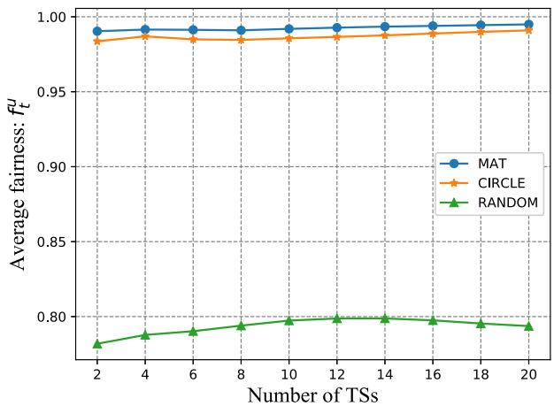

line

| Number of TSs | MAT    | CIRCLE | RANDOM |
| ------------- | ------ | ------ | ------ |
| 2             | 0.99   | 0.985  | 0.78   |
| 4             | 0.99   | 0.985  | 0.785  |
| 6             | 0.99   | 0.985  | 0.785  |
| 8             | 0.99   | 0.985  | 0.79   |
| 10            | 0.99   | 0.985  | 0.795  |
| 12            | 0.99   | 0.985  | 0.795  |
| 14            | 0.99   | 0.985  | 0.795  |
| 16            | 0.99   | 0.985  | 0.795  |
| 18            | 0.99   | 0.985  | 0.795  |
| 20            | 0.99   | 0.985  | 0.795  |

(b)

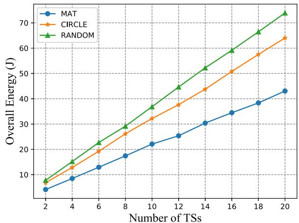

line

| Number of TSs | MAT  | CIRCLE | RANDOM |
| ------------- | ---- | ------ | ------ |
| 2             | 5    | 7      | 8      |
| 4             | 9    | 13     | 15     |
| 6             | 13   | 19     | 23     |
| 8             | 17   | 26     | 30     |
| 10            | 22   | 33     | 37     |
| 12            | 26   | 38     | 44     |
| 14            | 30   | 44     | 52     |
| 16            | 34   | 50     | 59     |
| 18            | 38   | 57     | 66     |
| 20            | 43   | 64     | 73     |

(c）  
Fig. 8. The performance of MAT, CIRCLE and RANDOM versus different number of TSs, in terms of (a) fairness index $f _ { t } ^ { e }$ , (b) fairness index $f _ { t } ^ { u }$ and (c) overall energy consumption of all the UEs (with 4 UAVs).

Then, we show the fairness $f _ { t } ^ { u }$ of each UAV’s UE-load achieved by the MAT, CIRCLE and RANDOM regimes in Fig. 7b. Observe that both MAT and CIRCLE approach the fairness of 1, because both solutions can control the UAVs to serve a similar number of UEs. However, RANDOM can only achieve a fairness of 0.75.

Next, in Fig. 7c, we analyse the energy consumed by UEs. We can see that our proposed MAT achieves the best performance, followed by CIRCLE and RANDOM. This is because after training, MAT assists the UAVs in a cooperative way serving the UEs. Hence, more UEs can offload their tasks to UAVs, which results in reduced energy consumption for all the UEs.

Next, in Fig. 8, we increase the number of UAVs to 4 and evaluate the performance of three compared solutions. One can see from Fig. 8a that the average fairness $f _ { t } ^ { e }$ increases with the increase of TSs, as expected. Our proposed MAT can achieve the best performance, reaching at 0.9, whereas the RANDOM performs the worst, which can only achieve about 0.5.

Then, in Fig. 8b, we draw the fairness of each UAV’s UEload $f _ { t } ^ { u }$ achieved by MAT, CIRCLE and RANDOM. One sees that MAT outperforms CIRCLE and RANDOM, as expected. CIRCLE performs worse than MAT but has much better performance than RANDOM.

Additionally, we show the performance of energy consumed by UEs in Fig. 8c. Similar with before, one can observe that MAT can always achieve the best performance and help UEs to save the energy consumption, while CIRCLE performs the second, followed by RANDOM. This further proves that with proper training, MAT can control the UAVs to provide better service to UEs.

# V. CONCLUSION

In this article, we have proposed a multi-agent deep reinforcement learning based trajectory control algorithm for jointly maximizing the fairness among all the UEs and the fairness of UE-load of each UAV, as well as minimizing the energy consumption of all the UEs by optimizing each UAV’ trajectory and offloading decision from all the UEs. Simulation results show that the proposed MAT has the considerable performance gain over the compared benchmark algorithms.

# REFERENCES

[1] Y. Zeng, R. Zhang, and T. J. Lim, “Wireless communications with unmanned aerial vehicles: Opportunities and challenges,” IEEE Commun. Mag., vol. 54, no. 5, pp. 36–42, May 2016.   
[2] Q. Wu and R. Zhang, “Common throughput maximization in UAVenabled OFDMA systems with delay consideration,” IEEE Trans. Commun., vol. 66, no. 12, pp. 6614–6627, Dec. 2018.   
[3] L. Kong, L. Ye, F. Wu, M. Tao, G. Chen, and A. V. Vasilakos, “Autonomous relay for millimeter-wave wireless communications,” IEEE J. Sel. Areas Commun., vol. 35, no. 9, pp. 2127–2136, Sep. 2017.   
[4] R. Fan, J. Cui, S. Jin, K. Yang, and J. An, “Optimal node placement and resource allocation for UAV relaying network,” IEEE Commun. Lett., vol. 22, no. 4, pp. 808–811, Apr. 2018.   
[5] H. Wang, J. Wang, G. Ding, J. Chen, F. Gao, and Z. Han, “Completion time minimization with path planning for fixed-wing UAV communications,” IEEE Trans. Wireless Commun., vol. 18, no. 7, pp. 3485–3499, Jul. 2019.

[6] F. Cui, Y. Cai, Z. Qin, M. Zhao, and G. Y. Li, “Multiple access for mobile-UAV enabled networks: Joint trajectory design and resource allocation,” IEEE Trans. Commun., vol. 67, no. 7, pp. 4980–4994, Jul. 2019.   
[7] J. Lyu, Y. Zeng, and R. Zhang, “UAV-aided offloading for cellular hotspot,” IEEE Trans. Wireless Commun., vol. 17, no. 6, pp. 3988–4001, Jun. 2018.   
[8] J. Xu, Y. Zeng, and R. Zhang, “UAV-enabled wireless power transfer: Trajectory design and energy optimization,” IEEE Trans. Wireless Commun., vol. 17, no. 8, pp. 5092–5106, Aug. 2018.   
[9] T. Q. Duong, L. D. Nguyen, H. D. Tuan, and L. Hanzo, “Learning-aided realtime performance optimisation of cognitive UAV-assisted disaster communication,” in Proc. IEEE Global Commun. Conf. (GLOBECOM), Waikoloa, HI, USA, 2019, pp. 1–6.   
[10] X. Liu, Y. Liu, Y. Chen, and L. Hanzo, “Trajectory design and power control for multi-UAV assisted wireless networks: A machine learning approach,” IEEE Trans. Veh. Technol., vol. 68, no. 8, pp. 7957–7969, Aug. 2019.   
[11] J. Wang, C. Jiang, Z. Wei, C. Pan, H. Zhang, and Y. Ren, “Joint UAV hovering altitude and power control for space-air-ground IoT networks,” IEEE Internet Things J., vol. 6, no. 2, pp. 1741–1753, Apr. 2019.   
[12] A. Al-Hourani, S. Kandeepan, and S. Lardner, “Optimal LAP altitude for maximum coverage,” IEEE Wireless Commun. Lett., vol. 3, no. 6, pp. 569–572, Dec. 2014.   
[13] M. Mozaffari, W. Saad, M. Bennis, and M. Debbah, “Unmanned aerial vehicle with underlaid device-to-device communications: Performance and tradeoffs,” IEEE Trans. Wireless Commun., vol. 15, no. 6, pp. 3949–3963, Jun. 2016.   
[14] Y. Zeng, R. Zhang, and T. J. Lim, “Throughput maximization for UAV-enabled mobile relaying systems,” IEEE Trans. Commun., vol. 64, no. 12, pp. 4983–4996, Dec. 2016.   
[15] Q. Wu, Y. Zeng, and R. Zhang, “Joint trajectory and communication design for multi-UAV enabled wireless networks,” IEEE Trans. Wireless Commun., vol. 17, no. 3, pp. 2109–2121, Mar. 2018.   
[16] M. Alzenad, A. El-Keyi, F. Lagum, and H. Yanikomeroglu, “3-D placement of an unmanned aerial vehicle base station (UAV-BS) for energy-efficient maximal coverage,” IEEE Wireless Commun. Lett., vol. 6, no. 4, pp. 434–437, Aug. 2017.   
[17] Y. C. Hu, M. Patel, D. Sabella, N. Sprecher, and V. Young, “Mobile edge computing—A key technology towards 5G,” ETSI, Sophia Antipolis, France, White Paper, 2015.   
[18] K. Wang, P. Huang, K. Yang, C. Pan, and J. Wang, “Unified offloading decision making and resource allocation in ME-RAN,” IEEE Trans. Veh. Technol., vol. 68, no. 8, pp. 8159–8172, Aug. 2019.   
[19] Y. Mao, C. You, J. Zhang, K. Huang, and K. B. Letaief, “A survey on mobile edge computing: The communication perspective,” IEEE Commun. Surveys Tuts., vol. 19, no. 4, pp. 2322–2358, 4th Quart., 2017.   
[20] Z. Yang, C. Pan, K. Wang, and M. Shikh-Bahaei, “Energy efficient resource allocation in UAV-enabled mobile edge computing networks,” IEEE Trans. Wireless Commun., vol. 18, no. 9, pp. 4576–4589, Sep. 2019.   
[21] Y. Zhou et al., “Secure communications for UAV-enabled mobile edge computing systems,” IEEE Trans. Commun., vol. 68, no. 1, pp. 376–388, Jan. 2020.   
[22] N. H. Motlagh, M. Bagaa, and T. Taleb, “UAV-based IoT platform: A crowd surveillance use case,” IEEE Commun. Mag., vol. 55, no. 2, pp. 128–134, Feb. 2017.   
[23] S. Jeong, O. Simeone, and J. Kang, “Mobile edge computing via a UAVmounted cloudlet: Optimization of bit allocation and path planning,” IEEE Trans. Veh. Technol., vol. 67, no. 3, pp. 2049–2063, Mar. 2018.   
[24] M. Hua, Y. Wang, Q. Wu, H. Dai, Y. Huang, and L. Yang, “Energyefficient cooperative secure transmission in multi-UAV-enabled wireless networks,” IEEE Trans. Veh. Technol., vol. 68, no. 8, pp. 7761–7775, Aug. 2019.   
[25] J. Wang, C. Jiang, H. Zhang, Y. Ren, K. Chen, and L. Hanzo, “Thirty years of machine learning: The road to Pareto-optimal wireless networks,” IEEE Commun. Surveys Tuts., vol. 22, no. 3, pp. 1472–1514, 3rd Quart., 2020.   
[26] Y. LeCun, Y. Bengio, and G. Hinton, “Deep learning,” Nature, vol. 521, no. 7553, pp. 436–444, 2015.   
[27] R. S. Sutton and A. G. Barto Introduction to Reinforcement Learning, vol. 2. Cambridge, MA, USA: MIT Press, 1998.   
[28] Y. Li, “Deep reinforcement learning: An overview,” 2017. [Online]. Available: arXiv:1701.07274.   
[29] V. Mnih et al., “Human-level control through deep reinforcement learning,” Nature, vol. 518, no. 7540, pp. 529–533, 2015.

[30] J. Wang, C. Jiang, K. Zhang, X. Hou, Y. Ren, and Y. Qian, “Distributed Q-learning aided heterogeneous network association for energy-efficient IIoT,” IEEE Trans. Ind. Informat., vol. 16, no. 4, pp. 2756–2764, Apr. 2020.   
[31] H. Van Hasselt, A. Guez, and D. Silver, “Deep reinforcement learning with double Q-learning,” in Proc. 13th AAAI Conf. Artif. Intell., 2016, pp. 2094–2100.   
[32] T. P. Lillicrap et al., “Continuous control with deep reinforcement learning,” 2015. [Online]. Available: arXiv:1509.02971.   
[33] L. Bu, R. Babu, and B. De Schutter, “A comprehensive survey of multiagent reinforcement learning,” IEEE Trans. Syst., Man, Cybern. C, Appl. Rev., vol. 38, no. 2, pp. 156–172, Mar. 2008.   
[34] R. Lowe, Y. Wu, A. Tamar, J. Harb, P. Abbeel, and I. Mordatch, “Multiagent actor-critic for mixed cooperative-competitive environments,” in Proc. 31st Int. Conf. Neural Inf. Process. Syst., 2017, pp. 6382–6393.   
[35] K. Wang, K. Yang, and C. S. Magurawalage, “Joint energy minimization and resource allocation in C-RAN with mobile cloud,” IEEE Trans. Cloud Comput., vol. 6, no. 3, pp. 760–770, Jul.–Sep. 2018.   
[36] L. Yang, J. Cao, Y. Yuan, T. Li, A. Han, and A. Chan, “A framework for partitioning and execution of data stream applications in mobile cloud computing,” ACM SIGMETRICS Perform. Eval. Rev., vol. 40, no. 4, pp. 23–32, 2013.   
[37] H. He, S. Zhang, Y. Zeng, and R. Zhang, “Joint altitude and beamwidth optimization for UAV-enabled multiuser communications,” IEEE Commun. Lett., vol. 22, no. 2, pp. 344–347, Feb. 2018.   
[38] X. Lyu, H. Tian, W. Ni, Y. Zhang, P. Zhang, and R. P. Liu, “Energyefficient admission of delay-sensitive tasks for mobile edge computing,” IEEE Trans. Commun., vol. 66, no. 6, pp. 2603–2616, Jun. 2018.   
[39] D. P. Bertsekas, Dynamic Programming and Optimal Control, vol. 1. Belmont, MA, USA: Athena Sci., 1995.   
[40] D. Silver, G. Lever, N. Heess, T. Degris, D. Wierstra, and M. Riedmiller, “Deterministic policy gradient algorithms,” in Proc. 31st Int. Conf. Mach. Learn.-Vol. 32, 2014, pp. 387–395.   
[41] M. L. Littman, “Markov games as a framework for multi-agent reinforcement learning,” in Proc. Mach. Learn., 1994, pp. 157–163.   
[42] T. Schaul, J. Quan, I. Antonoglou, and D. Silver, “Prioritized experience replay,” 2015. [Online]. Available: arXiv:1511.05952.   
[43] D. P. Kingma and J. Ba, “Adam: A method for stochastic optimization,” 2014. [Online]. Available: arXiv:1412.6980.

natural_image

Portrait of a young man wearing glasses against a blue background (no text or symbols visible)

Liang Wang is currently pursuing the Ph.D. degree with the Department of Computer and Information Sciences, Northumbria University, U.K. His research interests include UAV communication, mobile edge computing, and machine learning.

natural_image

Portrait of a smiling man in a white shirt (no text or symbols visible)

Kezhi Wang (Senior Member, IEEE) received the B.E. and M.E. degrees from the School of Automation, Chongqing University, China, in 2008 and 2011, respectively, and the Ph.D. degree in engineering from the University of Warwick, U.K., in 2015. He was a Senior Research Officer with the University of Essex, U.K., from 2015 to 2017. He is currently a Senior Lecturer with the Department of Computer and Information Sciences, Northumbria University, U.K. His research interests include mobile edge computing, intelligent reflection   
surface, and machine learning.

natural_image

Portrait photo of a man in formal attire (no text or symbols visible)

Cunhua Pan (Member, IEEE) received the B.S. and Ph.D. degrees from the School of Information Science and Engineering, Southeast University, Nanjing, China, in 2010 and 2015, respectively.

From 2015 to 2016, he was a Research Associate with the University of Kent, U.K. He held a Postdoctoral position with the Queen Mary University of London, U.K., from 2016 to 2019, where he is currently a Lecturer. His research interests mainly include intelligent reflection surface, machine learning, UAV, Internet of Things,

and mobile edge computing. He serves as the TPC Member for numerous conferences, such as ICC and GLOBECOM, and the Student Travel Grant Chair for ICC 2019. He also serves as an Editor for IEEE WIRELESS COMMUNICATION LETTERS, IEEE COMMUNICATION LETTERS and IEEE ACCESS.

natural_image

Portrait of a man in formal attire (no visible text or symbols)

Nauman Aslam (Member, IEEE) received the Ph.D. degree in engineering mathematics from Dalhousie University, Halifax, NS, Canada, in 2008, where he was an Assistant Professor. He is currently a Professor with the Department of Computer and Information Sciences, Northumbria University, Newcastle upon Tyne, U.K. He is also an Adjunct Assistant Professor with Dalhousie University. His research interests include wireless sensor network, energy efficiency, security, and WSN health applications.

natural_image

Portrait photo of a man wearing a striped polo shirt with a small logo (no text or symbols visible)

Wei Xu (Senior Member, IEEE) received the B.Sc. degree in electrical engineering and the M.S. and Ph.D. degrees in communication and information engineering from Southeast University, Nanjing, China, in 2003, 2006, and 2009, respectively. From 2009 to 2010, he was a Postdoctoral Research Fellow with the Department of Electrical and Computer Engineering, University of Victoria, Canada. He is currently a Professor with the National Mobile Communications Research Laboratory, Southeast University. He is also

an Adjunct Professor with the University of Victoria, Canada, and a Distinguished Visiting Fellow of the Royal Academy of Engineering, U.K. He has coauthored over 100 refereed journal papers in addition to 36 domestic patents and four U.S. patents granted. His research interests include cooperative communications, information theory, signal processing, and machine learning for wireless communications. He received the Best Paper Awards from IEEE MAPE 2013, IEEE/CIC ICCC 2014, IEEE Globecom 2014, IEEE ICUWB 2016, WCSP 2017, and ISWCS 2018. He was the co-recipient of the First Prize of the Science and Technology Award in Jiangsu Province, China, in 2014. He received the Youth Science and Technology Award of China Institute of Communications in 2018. He was an Editor of the IEEE COMMUNICATIONS LETTERS from 2012 to 2017. He is currently an Editor of the IEEE TRANSACTIONS ON COMMUNICATIONS and IEEE ACCESS.

natural_image

Portrait of a man with gray hair and glasses, wearing a suit and tie (no visible text or symbols)

Lajos Hanzo (Fellow, IEEE) received the master’s and Doctorate degrees from the Technical University (TU) of Budapest, in 1976 and 1983, respectively, the D.Sc. degree from the University of Southampton in 2004, and the Honorary Doctorates from the TU of Budapest in 2009, and the University of Edinburgh in 2015. He has published over 1900 contributions at IEEE Xplore and 19 Wiley-IEEE Press books and has helped the fast-track career of 123 Ph.D. students. Over 40 of them are Professors at various stages of their careers in academia and

many of them are leading scientists in the wireless industry. He is a Foreign Member of the Hungarian Academy of Sciences and a Former Editor-in-Chief of the IEEE Press. He has served several terms as Governor of both IEEE ComSoc and of VTS. He is a Fellow of the Royal Academy of Engineering, IET, and EURASIP.