# Multi-Agent Deep Reinforcement Learning With Trajectory Prediction for Task Migration-Assisted Computation Offloading

Xinyi Zhang , Chunyang Wang, Yanmin Zhu , Senior Member, IEEE, Jian Cao , Senior Member, IEEE, and Tong Liu , Member, IEEE

Abstract—Multi-access edge computing has become an effective paradigm to provide offloading services for computation-intensive and delay-sensitive tasks on vehicles. However, high mobility of vehicles usually incurs spatio-temporal load-imbalances among edge servers. Therefore, task migration is employed to maintain dynamic workload balancing by transmitting excessive tasks from overloaded to underloaded servers. Recent studies adopt deep reinforcement learning approaches to generate offloading and migration decisions based on current observations of systems. However, we argue that the migration direction is highly dependent on vehicular movements, and task migration towards the wrong direction could lead to additional delays. Therefore, we emphasize the importance of guiding task migration via exploring prospective trajectories of vehicles. We propose a Mobility-Aware Cooperative Multi-Agent (MCMA) deep reinforcement learning approach to make vehicle-by-vehicle decisions in multi-edge computation offloading scenarios. A two-stage decision framework is designed to solve the joint optimization problem of computation offloading and resource allocation. Additionally, an Informer-based multi-step vehicular trajectory prediction module is incorporated to enhance the capability of forecasting vehicular movements. Extensive experiments and analysis are conducted on synthetic and realistic scenarios, showing that our approach consistently outperforms both heuristic and DRL-based methods. The simulation scenarios and source codes are publicly available here.

Index Terms—Computation offloading, task migration, multi-agent reinforcement learning, trajectory prediction, edge computing.

# I. INTRODUCTION

W ITH the advancement of artificial intelligence (AI) andmobile communication technologies, the internet of mobile communication technologies,the internet of vehicles (IoV) has become a vital component within intelligent

Received 18 November 2024; revised 10 December 2024; accepted 2 February 2025. Date of publication 6 February 2025; date of current version 5 June 2025. This work was supported by the National Science Foundation of China under Grant 62472277, Grant 62072304, in part by the Program of Technology Innovation of the Science and Technology Commission of Shanghai Municipality under Grant 21511104700, and in part by Shanghai East Talents Program under Grant 2023-177. Recommended for acceptance by J. Rodrigues. (Corresponding author: Yanmin Zhu.)

Xinyi Zhang, Yanmin Zhu, and Jian Cao are with the Department of Computer Science and Engineering, Shanghai Jiao Tong University, Shanghai 200240, China (e-mail: xinyizhang@sjtu.edu.cn; yzhu@sjtu.edu.cn; cao-jian@sjtu.edu.cn).

Chunyang Wang is with the School of Data Science and Engineering, East China Normal University, Shanghai 200050, China (e-mail: cywang@dase.ecnu.edu.cn).

Tong Liu is with the School of Computer Engineering and Science, Shanghai University, Shanghai 200444, China (e-mail: tong_liu@shu.edu.cn).

Digital Object Identifier 10.1109/TMC.2025.3539945

transportation systems (ITSs) [1]. The expansion of intelligent vehicles along with in-vehicle services, such as autonomous driving [2], traffic navigation [3], real-time video streaming [4] and analysis [5], has considerably enhanced both transportation efficiency and user experience. However, these advanced services are notably computation-intensive and delay-sensitive, posing significant challenges for onboard task processing given the limited computation resources on vehicles [6]. Therefore, computation offloading has emerged as a promising solution to alleviate the burden on vehicles and ensure service reliability [7].

The abundant resources in cloud servers make traditio nal cloud computing an attractive option for computation offloading and centralized task execution. However, simultaneous offloading of numerous computation tasks to a remote cloud can lead to unpredictable transmission latency and network fluctuations [8]. By sinking the cloud resources to edge servers in proximity to vehicles, multi-access edge computing (MEC) not only compensates for vehicles’ resource constraints but also achieves faster task responses [9]. Some works focus on single edge server scenario and deal with resource competition among multiple vehicles [10], [11]. However, a strong assumption that all vehicles are covered by one edge is made, which is impractical in large-scale IoV systems. To cover a larger network, multiple edge servers are deployed to serve different regions with distributed resources [12], [13]. Since the resources on edges are finite, the coordination between vehicles and servers during task processing needs to be particularly addressed to ensure optimal resource utilization.

Moreover, the significant dynamics within vehicular networks amplify the challenges of achieving effective computation offloading. The inherent high mobility of vehicles enables them to traverse the network, frequently entering the coverage of different servers in a short span of time. As a result, a spatial load imbalance is prevalent among servers, and the workload of each server also exhibits temporal fluctuations [14]. For instance, during the morning rush hour, a higher volume of vehicles travel from home to offices, which causes an underload in residential areas and an overload in commercial areas. Conversely, an opposite traffic trend is observed during the evening rush hour, resulting in a reversal of the load condition. Therefore, in order to achieve high resource utilization and low latency, it is essential to devise strategies that could balance the overall workloads.

Task migration becomes an effective mechanism to assist the process of computation offloading in multi-edge scenarios. Specifically, edge servers with excessive workloads can transmit their overloaded tasks to the relatively idle servers for execution [15]. Such collaboration can alleviate the strain on overloaded servers and engage the underloaded ones, thereby reducing the task queuing time and enhancing the overall resource utilization [16]. However, it should be noticed that improper task migration can incur additional costs [17]. For example, migration of tasks to servers geographically distant from vehicles can lead to increased bandwidth occupation and migration latency. Moreover, if tasks are transmitted to servers situated in the opposite direction to the vehicles’ future movements, the return of computation results will cause additional delays. Consequently, designing cost-efficient offloading and migration strategies to ensure minimal completion latency and task failure rate is a nontrivial challenge, especially under the high dynamics and resource constraints of the system.

Due to the superiority of deep reinforcement learning (DRL) in sequential decision making, some recent studies have adopted DRL-based methods to address the aforementioned problem. For example, Ren et al. [18] design a dynamic service offloading and migration algorithm based on an asynchronous advantage actor-critic (A3C) framework to optimize execution delay and system throughput. Huang et al. [15] propose a decentralized deep deterministic policy gradient (DDPG)-based method to handle a similar problem in smart city scenarios. Liu et al. [19] employ a counterfactual multi-agent (COMA) DRL approach to solve the energy-aware task migration problem for distributed users. However, these frameworks either regard terminals as relatively static entities with limited mobility, ignoring their inherent dynamics as mobile devices; or fail to account for the spatio-temporal load-imbalances within networks. Besides, most studies design models to conduct simultaneous decision making constrained to a finite set of terminals. Once the models are trained, only a predetermined number of terminals can be handled, which restricts their scalability in response to fluctuations in terminal counts.

Furthermore, we argue that the future movements of highspeed vehicles play a critical role in guiding the strategic direction of task migration. Moreover, making decisions merely based on current observations can lead to hysteresis [18]. Specifically, tasks should basically follow the movements of vehicles rather than being migrated to distant servers. As shown in Fig. 1, a vehicle establishes a connection with an overloaded server $E _ { 1 }$ at time $t$ , thus necessitating an appropriate migration decision made between two underloaded options $E _ { 2 }$ and $E _ { 4 }$ . Assuming that decisions are made every three time slots, all tasks generated between $t$ and $t + 2$ will be migrated to the same server selected at time $t$ + 2. If the vehicle plans to move from $E _ { 1 }$ to $E _ { 4 }$ via $E _ { 3 }$ , the optimal migration option would be $E _ { 4 }$ , despite the tasks initiated at $t$ requiring two hops to reach it. The reason is that the delays associated with task migration and result return are expected to decrease as the vehicle approaches $E _ { 4 }$ . Therefore, to ensure time-efficient task migration, it is advantageous to proactively forecast vehicular trajectories instead of relying solely on reactive observations.

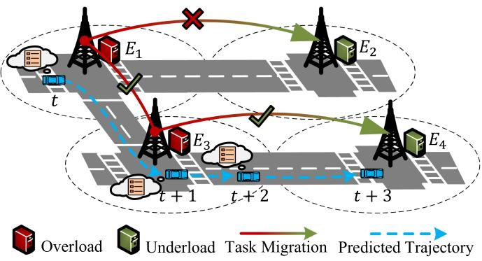  
Fig. 1. Illustration of task migration and trajectory prediction.

Given the aforementioned challenges and the necessity for vehicular trajectory prediction, we propose a Mobility-Aware Cooperative Multi-Agent (MCMA) DRL approach for task migration-assisted computation offloading in multi-edge vehicular networks. Considering the limited resources on servers and the diverse tasks from vehicles, resource allocation is further taken into account to achieve optimal resource utilization. We formulate this joint optimization problem as a Partially-Observable Markov Decision Process (POMDP), and design a two-stage cooperative multi-agent DRL (MADRL) decision framework to address it. Specifically, a combination of multi-agent proximal policy optimization (MAPPO) [20] and multi-agent deep deterministic policy gradient (MADDPG) [21] algorithms is employed. Each MEC server operates as a partialobserving agent and follows a centralized training and decentralized execution (CTDE) framework. The agents make vehicle-byvehicle decisions distributedly for their covered vehicles, ensuring the scalability as vehicles multiply. To effectively guide task migration, we design a multi-step vehicular trajectory prediction module based on Informer [22] and incorporate the predicted trajectories into the decision framework, providing prospective insights into future movements to enhance collaboration among servers.

Our main contributions are summarized as follows:

- Task Migration-Assisted Multi-Edge Computation Offloading System. We formulate a computation offloading problem in multi-edge vehicular networks and tackle the spatiotemporal load-imbalances with the assistance of task migration. To optimize resource utilization, we also take resource allocation into consideration.   
- Cooperative Multi-Agent DRL Approach with Trajectory Prediction. We design a two-stage cooperative multi-agent decision framework to solve the optimization problem, where MAPPO is for offloading and migration decisions while MADDPG determines resource allocation. A multistep vehicular trajectory prediction module is proposed to capture the future movements of vehicles, providing prospective information for MADRL training and vehicleby-vehicle decision making.   
- Performance Evaluation and Case Study. Extensive experiments are conducted on both synthetic and realistic scenarios to evaluate the performance of our approach.

Compared with heuristic and DRL-based strategies, our approach consistently achieves low completion latency and task failure rate, performing well under different network topologies. Moreover, further analysis shows the effectiveness of MCMA in balancing the workloads and resource utilization of the system.

The remainder of this paper is organized as follows. Section II reviews the related works. Section III gives the system model and problem formulation. In Section IV, the details of our proposed MCMA DRL approach are illustrated. Finally, we evaluate the performance with extensive experiments in Section V and draw our conclusions in Section VI.

# II. RELATED WORKS

# A. Computation Offloading Problems

Computation offloading has become an effective way to assist resource-constrained mobile terminals in handling computationintensive and delay-sensitive tasks. Based on the number of mobile terminals and edge servers, recent studies have mainly investigated three categories of offloading problems, including singleterminal multi-edge [23], multi-terminal single-edge [11], [24], [25], and multi-terminal multi-edge [12], [26] scenarios. For example, Zhang et al. [23] consider the online computation offloading of a single moving user with successively generated heterogeneous tasks in an ultra-dense network. Ke et al. [11] address an adaptive computation offloading problem in a singleserver system with multiple vehicles and roadside equipments, where the time-varying wireless channel state and the available bandwidth are considered. Wang et al. [26] develop a multiuser decentralized offloading framework considering uncertain system-side information of servers.

Some studies pay attention to more complex scenarios with combined optimization objectives [27], [28], [29], [30], [31]. For example, Jiang et al. [27] and Li et al. [28] jointly consider offloading and resource allocation under long-term MEC energy constraints. Zhou et al. [29] further consider the selfishness of third-party servers and adopt reverse auction to stimulate participation. Qiu et al. [30] design an end-edge-cloud offloading model that optimizes offloading and power allocation to minimize total delay and energy consumption. Huang et al. [31] investigate a joint optimization problem of dynamic data caching and computation offloading to minimize delay and maximize cache hit ratio. Besides, some studies introduce supplementary resources into MEC systems [32], [33], [34], [35]. For example, Dai et al. [32] adopt an unmanned aerial vehicle (UAV) equipped with servers to solve the potential overload of roadside edge servers. Liu et al. [33] employ multiple UAVs and one BS as edge servers to provide computing services for mobile users. Ji et al. [34] and Xie et al. [35] consider satellite-terrestrial integrated networks, where LEO satellites are introduced to serve terrestrial users in addition to BS servers. These works can be considered as variants of multi-edge scenarios.

Aligning with practical conditions, our work focuses on multi-vehicle multi-edge scenarios and takes edge resource allocation into consideration. Different from existing research, we highlight spatio-temporal load-imbalances brought by high

dynamics of vehicles and tackle the issues with predictionguided task migration mechanism.

# B. Deep Reinforcement Learning Approaches

Given the effectiveness and scalability of DRL in solving sequential decision-making problems within highly dynamic environments, many recent studies have employed it to address challenges in edge computing and communication networks [36], including but not limited to computation offloading [37], [38], [39], [40], [41], [42], [43], [44], [45], service chain deployment [46], edge caching [47], [48], and media access control [49]. Distinguished by the number of agents involved in decision, existing DRL approaches for computation offloading mainly fall into two categories, i.e., single-agent and multi-agent. The former employs a solitary agent to make centralized decisions for all computation tasks originating from terminals [38], [39], [40], [41]. For example, Ho et al. [38] study a collaborative offloading mechanism among MEC servers and a centralized cloud, and propose a Deep Q-Network (DQN)-based online strategy for decision making of users in the MEC wireless network. Zhang et al. [39] adopt a deep deterministic policy gradient (DDPG) algorithm to perform multi-part collaborative offloading of tasks in edge task queues. Wu et al. [41] combine DQN and DDPG algorithms in a central controller to make server selection and computation resource allocation decisions for each user.

In the multi-agent paradigm, a collective of agents work collaboratively to make decisions adhering to the idea of centralized training and decentralized execution [42], [43], [44], [45]. For example, Peng et al. [42] formulate a vehicle association and resource allocation problem and consider each server as an agent that makes continuous decisions distributively based on MAD-DPG method. Zhao et al. [43] apply a multi-agent TD3 (MATD3) approach to address the task offloading problem in a multi-UAV multi-edge system, with each UAV adopting a TD3 algorithm for continuous decision making. Ju et al. [44] adopt a multi-agent double DQN (MADDQN) method for secure offloading and resource allocation in discrete action space. Zhang et al. [45] consider task offloading in satellite MEC systems and propose a COMA-based approach for discretized action generation.

To extend network coverage, we design a cooperative multiagent DRL approach. Distinguished from prior works, we equip each server with a two-stage decision framework of MAPPO and MADDPG, adeptly handling both discrete and continuous decision making to satisfy diverse needs.

# C. Decision Making With Prediction

Recently, some researchers pay attention to the dynamics brought by mobile terminals in the MEC systems and make efforts to capture the time-varying uncertainty with prediction models in order to improve the estimation of the long-term cost in the DRL approaches. For example, Tang et al. [50] model the uncertain load levels at edges with a long short-term memory (LSTM) network to facilitate offloading decision generation. Xu et al. [51] design a graph weighted convolution network (GWCN) to predict the traffic flow of different road segments,

TABLE I NOTATIONS AND DESCRIPTIONS   

<table><tr><td>Notations</td><td>Descriptions</td></tr><tr><td>E</td><td>Set of N MEC servers configured with BSs.</td></tr><tr><td>T</td><td>Set of T consecutive time slots.</td></tr><tr><td>Ei</td><td>The i-th MEC server.</td></tr><tr><td>fi</td><td>Computing power of server Ei.</td></tr><tr><td>Bi</td><td>Channel bandwidth of the BS attached to server Ei.</td></tr><tr><td>Mt</td><td>Number of vehicles covered by server Ei at time slot t.</td></tr><tr><td>Qi</td><td>Task queue of server Ei.</td></tr><tr><td>β</td><td>Data transmission rate between BSs.</td></tr><tr><td>vtij</td><td>The j-th vehicle covered by server Ei at time slot t.</td></tr><tr><td>tai,tj</td><td>Task of vehicle vtij.</td></tr><tr><td>stij</td><td>Data size of task ttai,j.</td></tr><tr><td>ctij</td><td>Required number of CPU cycles of task ttai,j.</td></tr><tr><td>dtij</td><td>Maximum completion time (deadline) of task ttai,j.</td></tr><tr><td>utij</td><td>Computing power of vehicle vtij.</td></tr><tr><td>etij</td><td>Transmit power of vehicle vtij.</td></tr><tr><td>riij</td><td>Data transmission rate from vehicle vtij to server Ei.</td></tr><tr><td>Pti,j</td><td>Task queue of vehicle vtij.</td></tr><tr><td>o,tij</td><td>Offloading decision for task ttai,j.</td></tr><tr><td>rb,tij</td><td>Allocated proportion of bandwidth for task ttai,j.</td></tr><tr><td>rc,tij</td><td>Allocated proportion of computing power for task ttai,j.</td></tr><tr><td>lt1,i</td><td>Transmission latency of task ttai,j.</td></tr><tr><td>l2,comm,i,j</td><td>Migration latency of task ttai,j.</td></tr><tr><td>l2,comm,i,j</td><td>Wait latency of task ttai,j.</td></tr><tr><td>wait,i,j</td><td>Execution latency of task ttai,j.</td></tr><tr><td>exe,i,j</td><td>Total task completion latency of the system at time slot t.</td></tr></table>

which helps with the adjustment of edge resources in different regions. Duan et al. [14] adopt a LSTM-based algorithm in each MEC group to predict the task arrival rate of all mobile devices, based on which an optimal task offloading probability for each group can be obtained. Guo et al. [52] propose a dual LSTMbased spatio-temporal vehicular trajectory prediction model and guide the V2V task offloading from client vehicles to server vehicles. Wu et al. [41] introduce a glimpse mobility prediction model and use the predicted coarse-grain mobility information to assist the decision making for each user.

Compared with previous works, we predict trajectories of vehicles with Informer [22] to precisely determine the sequences of edges that will cover the vehicles. We creatively harness this prospective information as a guidance for task migration, ensuring workload balancing across the system.

# III. SYSTEM MODEL

We consider a multi-access edge computing system where multiple servers work cooperatively to provide computation offloading services with the assistance of task migration for the intelligent vehicles in mobility. In this section, we first present the overall architecture of the multi-edge system, and then describe the detailed communication and computation models. Finally, we formulate the problem as a constrained optimization problem and prove it is NP-hard. The notations and descriptions are listed in Table I.

# A. Task Migration-Assisted Multi-Edge Computation Offloading System

There are $N$ MEC servers $\mathcal { E } = \{ E _ { 1 } , E _ { 2 } , \dots , E _ { N } \}$ deployed =in a multi-intersection region, each of which is located at an individual intersection and configured with a nearby base station

(BS) via wired connections as shown in Fig. 2. Each server $E _ { i }$ is equipped with a fixed amount of computing power denoted by maximum CPU processing frequency $f _ { i }$ , and its connected BS provides a certain communication bandwidth $B _ { i }$ for wireless transmission. The wireless coverage of each BS for vehicles is constrained to a single intersection. We assume that the whole multi-intersection region can be completely covered by the BSs without overlapping. Through wireless communication, data can be transmitted between the BSs and their covered vehicles directly. As a result, computation tasks generated on the vehicles can be offloaded to the MEC servers, and the calculation results will be sent back after processing. Since adjacent BSs are interconnected via a separate multi-hop wireless communication network, the migration of offloaded tasks among MEC servers is facilitated.

Since vehicles are moving continuously in the multiintersection region with successively generated computation tasks, we discretize time into $T$ consecutive time slots $\mathcal { T } =$ $\{ 1 , 2 , \ldots , T \}$ to suit the practice. At time slot $t \in \tau$ =, a set 1of $M _ { i } ^ { t }$ vehicles denoted as $\{ v _ { i , 1 } ^ { t } , v _ { i , 2 } ^ { t } , \ldots , v _ { i , M _ { i } ^ { t } } ^ { t } \}$ are covered on vehicle $u _ { i , j } ^ { t }$ server . A co $E _ { i }$ $v _ { i , j } ^ { t }$ , each of wutation task , where sti,j $s _ { i , j } ^ { t }$ $t a _ { i , j } ^ { t } = \{ s _ { i , j } ^ { t } , c _ { i , j } ^ { t } , d _ { i , j } ^ { t } \}$ i,j = i,j i,j denotes the data size, cti,j , cti,j , puting poweris generated $c _ { i , j } ^ { t }$ represents the required number of CPU cycles, and $d _ { i , j } ^ { t }$ defines the maximum completion time (deadline), respectively. For a specific computation task $t a _ { i , j } ^ { t }$ , it can be executed on vehicle $\boldsymbol { v } _ { i , j } ^ { t }$ with on-board resources, or be offloaded to the nearest MEC server for handling. Besides, we pay particular attention to the phenomenon of spatio-temporal load-imbalances among servers, in which case the task can be strategically migrated to a relatively idle server with abundant computation resources for execution.

To improve the efficiency of the multi-edge system, all the MEC servers need to make computation offloading decisions cooperatively with the consideration of task mi-$t$ , computation offlll be made by server ing decisionsfor its covered $\big \{ a _ { i , 1 } ^ { o , t } , a _ { i , 2 } ^ { o , t } , \dotsc , a _ { i , M _ { i } ^ { t } } ^ { o , t } \big \}$ $E _ { i }$ vehicles $\{ v _ { i , 1 } ^ { t } , v _ { i , 2 } ^ { t } , \ldots , v _ { i , M _ { i } ^ { t } } ^ { t } \}$ . Specifically, o,t i,j $a _ { i , j } ^ { o , t }$ is a one vector of $N + 1$ dimensions, where a i,j,k $a _ { i , j , k } ^ { o , t }$ denotes the $k$ -th dimension. If $a _ { i , j , k = N + 1 } ^ { o , t } = 1 , \operatorname { t a s k } { t a _ { i , j } ^ { t } }$ + 1ao,t will be executed locally; if $a _ { i , j , k = i } ^ { o , t } = 1$ = 1, the task will be offloaded to server $E _ { i }$ that directly =covers vti,j ; $v _ { i , j } ^ { t }$ otherwise, it will first be offloaded to server $E _ { i }$ and then migrated to server $E _ { k }$ . Since the computation and bandwidth resources on the servers are limited, all the tasks offloaded or migrated to the same server will share the resources on it. Resource allocation decisions {ar,ti,1, i,2 . . . , $\{ a _ { i , 1 } ^ { r , t } , a _ { i , 2 } ^ { r , t } , \ldots , a _ { i , M _ { i } ^ { t } } ^ { r , t } \}$ ar,t , i,M ti } will ar,t also be made by server $E _ { i }$ for each covered vehicle. For decision i,j $a _ { i , j } ^ { r , t } = \{ a _ { i , j } ^ { r _ { b } , t } , \dot { a } _ { i , j } ^ { r _ { c } , t } \}$ , $a _ { i , j } ^ { r _ { b } , t }$ and arc,i,j $a _ { i , j } ^ { r _ { c } , t }$ denote the proportions of =bandwidth and computation resources allocated to $t a _ { i , j } ^ { t }$ , respectively.

# B. Communication Model

In this subsection, the task transmission latency from the vehicles to the MEC servers and the task migration latency among the MEC servers are analyzed.

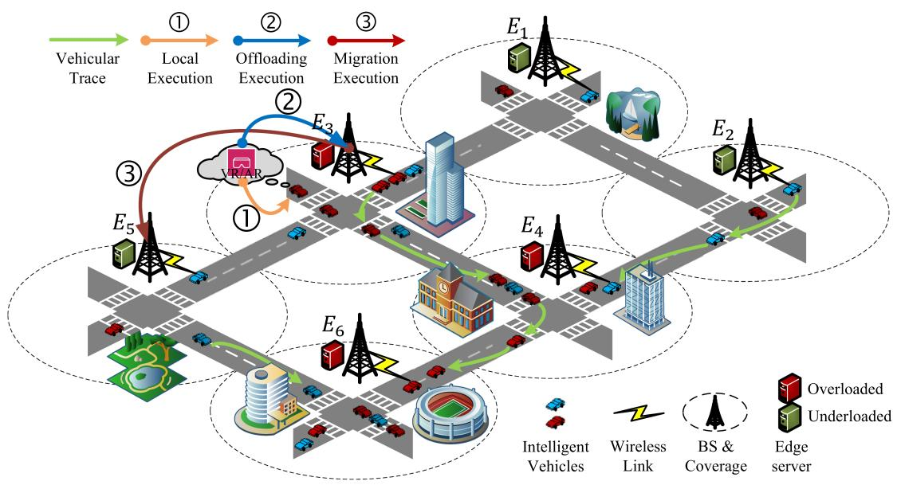  
Fig. 2. Illustration of our task migration-assisted multi-edge computation offloading system within a multi-intersection region in vehicular networks.

To leverage the computational capabilities of the MEC servers, tasks designated for offloading or migration must first be transmitted to the BSs that cover them, from where they will be forwarded for execution by the servers. Since the size of a task is often large, the uplink transmission latency of this process cannot be ignored. We assume the characteristics of the wireless channel are static throughout the data transmission period. Given transmit power $e _ { i , j } ^ { t }$ , the data transmission rate from vehicle $v _ { i , j } ^ { t }$ to server $E _ { i }$ can be calculated according to the Shannon equation:

$$
r _ {i, j} ^ {t} = B _ {i, j} ^ {t} \times \log_ {2} \left(1 + e _ {i, j} ^ {t} \times G _ {i} / \sigma^ {2}\right), \tag {1}
$$

where Bti,j  Bi × arb,ti,j $B _ { i , j } ^ { t } = B _ { i } \times a _ { i , j } ^ { r _ { b } , t }$ is the allocated bandwidth. $B _ { i }$ denotes the bandwidth of the channel, and $a _ { i , j } ^ { r _ { b } , t }$ i,j is the proportion of bandwidth allocated to $t a _ { i , j } ^ { t }$ . $\sigma ^ { 2 }$ denotes the power of the Gaussian noise, and $G _ { i }$ is the channel gain. The uplink transmission latency can be represented as

$$
l _ {c o m m, i, j} ^ {t, 1} = s _ {i, j} ^ {t} / r _ {i, j} ^ {t}. \tag {2}
$$

In the MEC-MEC communication process, tasks are migrated from server $E _ { i }$ to the intended destination $E _ { k }$ via multiple intermediate servers with the technology of multi-hop wireless transmission. We assume the microwave transmission rate $\beta$ is the same between any two adjacent BSs. The task migration latency can be computed as

$$
l _ {c o m m, i, j} ^ {t, 2} = s _ {i, j} ^ {t} H o p s (i, k) / \beta , \tag {3}
$$

where $H o p s ( i , k )$ is the number of hops in the shortest commu-( )nication path between servers $E _ { i }$ and $E _ { k }$ .

# C. Computation Model

Considering that the computation resources on both the vehicles and the MEC servers are limited, task queues will be maintained to store the tasks that cannot be processed immediately.

The execution of the tasks in the queues follows a batch-wise first-in-first-out (FIFO) rule.

In the case of local execution, the current task $t a _ { i , j } ^ { t }$ will not be computed until the task queue $P _ { i , j } ^ { t }$ of vehicle $v _ { i , j } ^ { t }$ is empty. The waiting latency can be calculated as

$$
l _ {w a i t, i, j} ^ {t} = p _ {i, j} ^ {t} / u _ {i, j} ^ {t}, \tag {4}
$$

where $p _ { i , j } ^ { t }$ denotes the cumulative number of CPU cycles reed by all tasks in queue have been executed, it $P _ { i , j } ^ { t }$ . After all the tasks ahead of finally be processed with an $t a _ { i , j } ^ { t }$ execution latency of

$$
l _ {e x e, i, j} ^ {t} = c _ {i, j} ^ {t} / u _ {i, j} ^ {t}. \tag {5}
$$

For offloading execution and migration execution to server $E _ { i }$ , task $t a _ { i , j } ^ { t }$ will wait for execution if there are unprocessed tasks in the task queue $Q _ { i } ^ { t }$ of server $E _ { i }$ . This waiting process results in a latency of

$$
l _ {w a i t, i, j} ^ {t} = \sum_ {\tau = 1} ^ {t - 1} \max  _ {k} \left(q _ {i, k} ^ {\tau} / f _ {i, k} ^ {\tau}\right), \tag {6}
$$

where $q _ { i , k } ^ { \tau }$ denotes the remaining CPU cycles required by task $t a _ { i , k } ^ { \tau }$ in queue $Q _ { i } ^ { t }$ , and $f _ { i , k } ^ { \tau } = f _ { i } \times a _ { i , k } ^ { r _ { c } , \tau }$ is the allocated com-=puting power. Then, the task can be executed with a latency of

$$
l _ {e x e, i, j} ^ {t} = c _ {i, j} ^ {t} / f _ {i, j} ^ {t}. \tag {7}
$$

Similarly, f ti,j  fi × arc,ti,j $f _ { i , j } ^ { t } = f _ { i } \times a _ { i , j } ^ { r _ { c } , t }$ is the computing power allocated to task $t a _ { i , j } ^ { t }$ .

# D. Problem Formulation

In this subsection, we propose a multi-objective constrained optimization problem that jointly considers computation offloading, task migration, and resource allocation. The optimization objective is to minimize the total task completion latency of all the vehicles in the multi-edge system.

At time slot $t$ , considering the resource utilization of the system and the load imbalance among servers, three kinds of computation offloading decisions might be made by server $E _ { i }$ for the task $t a _ { i , j } ^ { t }$ of vehicle $v _ { i , j } ^ { t }$ : executing locally on vehicle $v _ { i , j } ^ { t }$ i,j , offloading to server $E _ { i }$ , or migrating to another server $E _ { k }$ within the region.

If task $t a _ { i , j } ^ { t }$ is executed onboard, its total completion latency can be determined by

$$
l _ {l o c, i, j} ^ {t} = l _ {w a i t, i, j} ^ {t} + l _ {e x e, i, j} ^ {t} = \left(p _ {i, j} ^ {t} + c _ {i, j} ^ {t}\right) / u _ {i, j} ^ {t}. \tag {8}
$$

When the task is offloaded to server $E _ { i }$ that directly covers vehicle $\boldsymbol { v } _ { i , j } ^ { t }$ , the transmission latency needs to be considered. Thus, the task completion latency can be obtained as

$$
\begin{array}{l} l _ {o f f, i, j} ^ {t} = l _ {c o m m, i, j} ^ {t, 1} + l _ {w a i t, i, j} ^ {t} + l _ {e x e, i, j} ^ {t} \\ = s _ {i, j} ^ {t} / r _ {i, j} ^ {t} + \left(q _ {i} ^ {t} + c _ {i, j} ^ {t}\right) / f _ {i, j} ^ {t}. \tag {9} \\ \end{array}
$$

Alternatively, the task will be migrated to a remote server $E _ { k }$ to alleviate the burden on server $E _ { i }$ and balance the workloads across the system. In this instance, the migration latency should be further taken into account:

$$
\begin{array}{l} l _ {m i g, i, j} ^ {t} = l _ {c o m m, i, j} ^ {t, 1} + l _ {c o m m, i, j} ^ {t, 2} + l _ {w a i t, i, j} ^ {t} + l _ {e x e, i, j} ^ {t} \\ = s _ {i, j} ^ {t} / r _ {i, j} ^ {t} + s _ {i, j} ^ {t} H o p s (i, k) / \beta + \left(q _ {k} ^ {t} + c _ {i, j} ^ {t}\right) / f _ {i, j} ^ {t}, \tag {10} \\ \end{array}
$$

where $f _ { i , j } ^ { t } = f _ { k } \times a _ { i , j } ^ { r _ { c } , t }$ , since task $t a _ { i , j } ^ { t }$ is executed on $E _ { k }$

We use $L ^ { t }$ to denote the total task completion latency of the whole system at time slot $t$ . The task migration-assisted multiedge computation offloading problem during the $T$ consecutive time slots can be finally formulated as

$$
\begin{array}{l} \min  \sum_ {t = 1} ^ {T} L ^ {t} = \min  \sum_ {t = 1} ^ {T} \sum_ {i = 1} ^ {N} \sum_ {j = 1} ^ {M _ {i} ^ {t}} \left\{a _ {i, j, k = N + 1} ^ {o, t} l _ {l o c, i, j} ^ {t} \right. \\ \left. + \sum_ {k = 1} ^ {N} \left\{a _ {i, j, k = i} ^ {o, t} l _ {\text {o f f}, i, j} ^ {t} + a _ {i, j, k \neq i} ^ {o, t} l _ {\text {m i g}, i, j} ^ {t} \right\} \right\}, \tag {11} \\ \end{array}
$$

subject to:

$$
t \in \mathcal {T} = \{1, \dots , T \}, \tag {12}
$$

$$
a _ {i, j, k} ^ {o, t} \in \{0, 1 \}, \forall i, \forall j, \forall k, \tag {13}
$$

$$
\sum_ {k = 1} ^ {N + 1} a _ {i, j, k} ^ {o, t} = 1, \forall i, \forall j, \tag {14}
$$

$$
a _ {i, j} ^ {r _ {b}, t} \in (0, 1 ], a _ {i, j} ^ {r _ {c}, t} \in (0, 1 ], \forall i, \forall j, \tag {15}
$$

$$
\sum_ {j = 1} ^ {M _ {i} ^ {t}} B _ {i, j} ^ {t} \leq B _ {i}, \forall i, \tag {16}
$$

$$
\sum_ {i = 1} ^ {N} \sum_ {j = 1} ^ {M _ {i} ^ {t}} a _ {i, j, k} ^ {o, t} f _ {i, j} ^ {t} \leq f _ {k}, k \in \{1, \dots , N \}. \tag {17}
$$

The constraints of the optimization problem are explained as follows. Constraint (12) shows that the continuous offloading process $\tau$ is composed of $T$ slots. Constraints (13) and (14) mean

that each task can be executed either onboard or by at most one MEC server. Constraint (15) shows that the proportions of bandwidth and computation resources allocated to each task should not exceed one. Constraint (16) means that the summation of bandwidth allocated to the vehicles covered by server $E _ { i }$ should be less than the bandwidth owned by $E _ { i }$ . Similarly, Constraint (17) imposes a limitation on the total computing power allocated to the tasks offloaded or migrated to server $E _ { k }$ .

Theorem 1: The task migration-assisted multi-edge computation offloading problem is NP-hard.

Proof: We show that the formulated optimization problem is NP-hard via reduction from the well-known Generalized Assignment Problem (GAP) [53], which is defined as: given $n$ items and $m$ bins, how to find a minimum-cost assignment of items in which all bins do not exceed their weight budgets $b _ { i }$ . The GAP can be formulated as follows:

$$
\min  \sum_ {i = 1} ^ {m} \sum_ {j = 1} ^ {n} c _ {i, j} x _ {i, j}, \tag {18}
$$

$$
\mathrm {s . t .} \quad x _ {i, j} \in \{0, 1 \}, \forall i, \forall j, \tag {19}
$$

$$
\sum_ {i = 1} ^ {m} x _ {i, j} = 1, \forall j, \tag {20}
$$

$$
\sum_ {j = 1} ^ {n} w _ {i, j} x _ {i, j} \leq b _ {i}, \forall i, \tag {21}
$$

where $x _ { i , j } = 1$ if item $j$ is assigned to bin $i$ , and $x _ { i , j } = 0$ otherwise. $c _ { i , j }$ 1and $w _ { i , j }$ = 0denote the cost and occupied weight when assigning item $j$ to bin $i$ , respectively.

Next, we construct an instance of our optimization problem, and show reduction relationships between it and GAP within polynomial time. We set $\begin{array} { r } { n = \dot { \sum _ { t = 1 } ^ { T } } \sum _ { i = 1 } ^ { N } M _ { i } ^ { t } } \end{array}$ and regard every task generated during $\tau$ =as an item. We consider the devices capable of executing each task, specifically $N$ servers and 1 vehicle, as m  N   bins. Thus, ao,ti,j,k $m = N + 1$ $a _ { i , j , k } ^ { o , t }$ is equivalent to $x _ { i , j }$ , which denotes whether task $t a _ { i , j } ^ { t }$ (item $j$ ) is assigned to the $k$ -th device (bin i) or not. Then it is obvious that constraints (12)–(14) are equivalent to constraints (19)–(20). The latencies under different computation offloading decisions are regarded as costs of assigning items (tasks) to bins (devices). As a result, (11) is equivalent to (18). Besides, we set $B _ { i } \to + \infty$ to relax con-+straint (16), and consider the allocated computing power as the weight. We set fk=N+1  Ni=1 M ij=1 uti,j $\begin{array} { r } { f _ { k = N + 1 } = \sum _ { i = 1 } ^ { N } \sum _ { j = 1 } ^ { M _ { i } ^ { t } } { u _ { i , j } ^ { t } } } \end{array}$ and $f _ { i , j } ^ { t } = u _ { i , j } ^ { t }$ when $a _ { i , j , k = N + 1 } ^ { o , t } = 1$ = =, thus constraint (17) can be extended to $\forall k$ = 1. By summing up both sides of constraint (17) with respect to $t$ , constraint (17) can be relaxed to constraint (21) with $b _ { i } = T f _ { k }$ and $w _ { i , j } \in ( 0 , f _ { k } ]$ . At this point, constraints (15-17) = (0 ]are equivalent to constraint (21).

Given the above descriptions, we can conclude that the instance of our problem is polynomial-time reducible to GAP. Since GAP is known to be NP-hard, it can be proved that our problem is NP-hard. To this end, we try to propose an online learning-based approach to solve the problem.

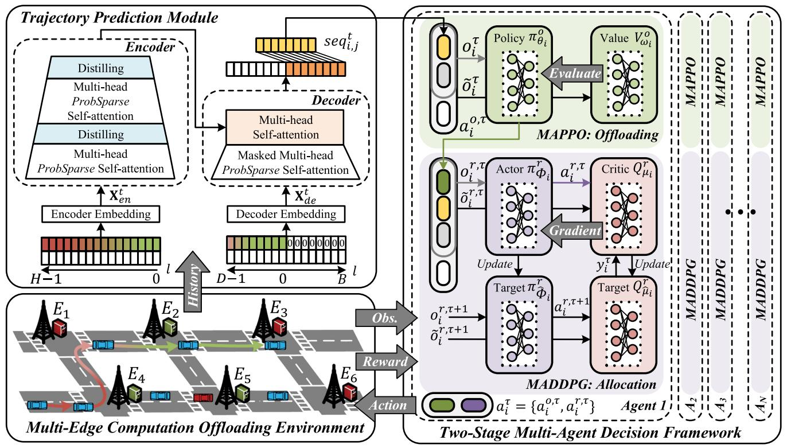  
Fig. 3. Workflow of our Mobility-Aware Cooperative Multi-Agent deep reinforcement learning approach with vehicular trajectory prediction module.

# IV. MOBILITY-AWARE COOPERATIVE MULTI-AGENT DEEPREINFORCEMENT LEARNING APPROACH

In this section, we introduce our Mobility-Aware Cooperative Multi-Agent (MCMA) deep reinforcement learning approach. We first describe the multi-step vehicular trajectory prediction module designed to encapsulate the dynamic movements of vehicles. Then we formalize the task migration-assisted multiedge computation offloading problem as a Partially-Observable Markov Decision Process (POMDP), and introduce our twostage cooperative multi-agent decision framework. The overall workflow is shown in Fig. 3. Finally, we analyze the complexity, compatibility, and convergence of the proposed approach.

# A. Informer-Based Multi-Step Vehicular Trajectory Prediction Module

We argue that the anticipation of vehicular trajectories can provide valuable insights into the future movements of highspeed vehicles, which is beneficial for guiding task migration and enhancing inter-server collaboration. Considering the mobility of vehicles, we design a multi-step vehicular trajectory prediction module to assist the vehicle-by-vehicle decisionmaking process with future spatio-temporal information. We first obtain the trajectory sequences of all vehicles by segmenting their long trajectories with a fixed-length sliding window. Given a historical sequence $\{ \mathcal { X } _ { i , j } ^ { t - l } \} _ { l = 0 } ^ { H - 1 }$ of vehicle $\boldsymbol { v } _ { i , j } ^ { t }$ , we want to predict its future trajectory $\{ \mathcal { X } _ { i , j } ^ { t + l } \} _ { l = 1 } ^ { B }$ , where $\mathcal { X } _ { i , j } ^ { t } = ( x _ { i , j } ^ { t } , y _ { i , j } ^ { t } )$ is the location of vehicle $v _ { i , j } ^ { t }$ at time slot $t$ .

Taking advantage of the computational, memory, and architectural efficiency of Informer [22], we design our prediction module based on its encoder-decoder architecture. Specifically, a uniform input representationis designed to capture both local and global temporal contexts for an input sequence ${ \mathcal { X } } ^ { t } =$ $\{ \mathcal { X } _ { l } ^ { t } \} _ { l = 1 } ^ { L }$ as follows:

$$
\mathcal {X} _ {\mathrm {e m b}} ^ {t} [ l ] = \alpha \mathbf {u} _ {l} ^ {t} + \mathrm {P E} _ {(L \times (t - 1) + l,)} + \sum_ {p} \left[ \mathrm {S E} _ {(L \times (t - 1) + l)} \right] _ {p}, \tag {22}
$$

where $\mathbf { u } _ { l } ^ { t }$ is the $d _ { m o d e l }$ -dim projection of $\mathcal { X } _ { l } ^ { t }$ obtained by 1-dim convolution operation and $\alpha$ is its weight. $\mathrm { P E } _ { ( p o s , ) }$ denotes the same local positional embedding employed in Transformer [54], and $\mathrm { S E } _ { ( p o s ) }$ is a learnable embedding for each hierarchical time stamp (e.g., minute, hour, and day).

After input representation, the historical sequence $\{ \mathcal { X } _ { i , j } ^ { t - l } \} _ { l = 0 } ^ { H - 1 }$ is shaped into a matrix $\mathbf { X } _ { e n } ^ { t } \in \mathbb { R } ^ { H \times { } d _ { m o d e l } }$ and forwarded into the encoder. ProbSparse self-attention mechanism and distilling operation are employed to obtain the hidden representation with reduced time and space complexity compared with Transformer. The ProbSparse self-attention can be calculated as

$$
\mathcal {A} (\mathbf {Q}, \mathbf {K}, \mathbf {V}) = \operatorname {S o f t m a x} \left(\frac {\overline {{\mathbf {Q}}} \mathbf {K} ^ {\top}}{\sqrt {d _ {\text {m o d e l}}}}\right) \mathbf {V}, \tag {23}
$$

where Q, K, V are derived from $\mathbf { X } _ { e n } ^ { t }$ through linear transformation. $\overline { { \mathbf { Q } } }$ has the same size as $\mathbf { Q }$ , but it only contains the Top- $u$ queries under the sparsity measured by Kullback-Leibler divergence, where $u = s \cdot \ln H$ and $s$ denotes the ProbSparse

sampling factor. Multi-head attention can be achieved by dividing Q, K, V to $h$ parts of dimension $d _ { m o d e l } / h$ and concatenating their results together. A distilling operation between two stacking self-attention layers is realized by max-pooling with stride 2, sampling $[ \mathbf { X } _ { k } ^ { t } ] _ { \mathcal { A } }$ into its half slice:

$$
\mathbf {X} _ {k + 1} ^ {t} = \operatorname {M a x P o o l} \left(\operatorname {E L U} \left(\operatorname {C o n v 1 d} \left([ \mathbf {X} _ {k} ^ {t} ] _ {\mathcal {A}}\right)\right)\right), \tag {24}
$$

where $[ \mathbf { X } _ { k } ^ { t } ] _ { \cal A }$ is the output of the $k$ -th ProbSparse self-attention [ ]layer, Conv1d · denotes the 1-dim convolution on time dimen-( )sion, and ELU · is the activation function.

( )The decoderemploys a generative inference to predict the output sequence within one forward proceduconventional dynamic decoding. A start token $\{ \mathcal { X } _ { i , j } ^ { t - l } \} _ { l = 0 } ^ { D - 1 }$ segmented from {X t−li,j }H−1l=0 $\{ \mathcal { X } _ { i , j } ^ { t - l } \} _ { l = 0 } ^ { H - 1 }$ and concatenated with a zeropadded placeholder of length $B$ . After embedding, a matrix $\mathbf { X } _ { d e } ^ { t } \in \mathbb { R } ^ { ( D + B ) \times d _ { m o d e l } }$ is obtained and fed into the decoder composed of a masked multi-head ProbSparse self-attention and a multi-head canonical self-attention. Finally, the predicted trajectory $\{ \mathcal { X } _ { i , j } ^ { t + l } \} _ { l = 1 } ^ { B }$ can be generated through a fully connected layer. Since task migration is conducted among servers, we focus on the number of hops between the source and destination servers. Therefore, we transform the predicted trajectory into a sequence of edge servers that vehicle $\boldsymbol { v } _ { i , j } ^ { t }$ will go through, by calculating the nearest server at each time slot. To assist vehicle-by-vehicle decision making, the predicted information $\{ s e q _ { i , j } ^ { t + l } \} _ { l = 1 } ^ { B }$ will be incorporated into the observation of vehicle $v _ { i , j } ^ { t }$ vti,j as an external feature and assigned to the two-stage decision framework of its corresponding agent, which will be detailed in the following subsections.

# B. Formalization of Cooperative Multi-Agent Deep Reinforcement Learning

Based on the system model described in Section III, we formulate this task migration-assisted multi-edge computation offloading problem as a Partially-Observable Markov Decision Process (POMDP), and propose a Mobility-Aware Cooperative Multi-Agent (MCMA) deep reinforcement learning approach to solve the problem. Specifically, each MEC server is treated as an individual agent with partial observations of the whole system. All the agents follow a centralized training and decentralized execution (CTDE) framework, where they use additional global states to guide training cooperatively and make their own decisions based on local policies for their covered vehicles. The final objective is to achieve the minimal overall task completion latency with optimal decisions of computation offloading and resource allocation. Since these two sub-problems are heavily coupled with each other, we employ a two-stage framework to jointly optimize them. Next, we define the key elements of the cooperative multi-agent deep reinforcement learning.

State Space $\boldsymbol { \mathcal { S } }$ : At time slot $t$ , the global state denoted as $s ^ { t } \in S$ describes the status of each component in the system. Specifically,

$$
\begin{array}{l} s ^ {t} = \{(f _ {i}, q _ {i} ^ {t}, B _ {i}), \{(u _ {i, j} ^ {t}, p _ {i, j} ^ {t}, e _ {i, j} ^ {t}) \} _ {j = 1} ^ {M _ {i} ^ {t}}, \\ \left\{\left(s _ {i, j} ^ {t}, c _ {i, j} ^ {t}, d _ {i, j} ^ {t}\right)\right\} _ {j = 1} ^ {M _ {i} ^ {t}}, \left\{\left\{s e q _ {i, j} ^ {t + l} \right\} _ {l = 1} ^ {B} \right\} _ {j = 1} ^ {M _ {i} ^ {t}} \left. \right\} _ {i = 1} ^ {N}, \tag {25} \\ \end{array}
$$

which consists of information from all the servers (i.e., fi, $q _ { i } ^ { t }$ , and $B _ { i }$ ), vehicles (i.e., $u _ { i , j } ^ { t }$ , $p _ { i , j } ^ { t }$ , and $e _ { i , j } ^ { t }$ ), and the generated tasks (i.e., $s _ { i , j } ^ { t }$ sti,j , $c _ { i , j } ^ { t }$ cti,j , and $d _ { i , j } ^ { t }$ ). To enhance collaborative decision making among agents, the predicted trajectory information $\{ s e q _ { i , j } ^ { t + l } \} _ { l = 1 } ^ { B }$ is incorporated into the state representation, where $B$ denotes the prediction length. Armed with predictive abilities, task migration can be strategically directed to idle servers along the vehicle’s trajectory, which can balance the workloads and shorten the overall task completion latency of the system. Since each agent operates with a limited scope of information perception, the global state $s ^ { t }$ is usually unobservable for an individual agent.

Observation Space $\mathcal { O }$ : Without information exchange and collaboration, each agent can only partially observe the local information of itself and its covered vehicles. Since we take a vehicle as the unit for decision making, this partial observation of server $E _ { i }$ for vehicle $v _ { i , j } ^ { t }$ at $t$ is denoted as $o _ { i , j } ^ { t } =$ $\{ ( f _ { i } , q _ { i } ^ { t } , B _ { i } ) , ( u _ { i , j } ^ { t } , p _ { i , j } ^ { t } , e _ { i , j } ^ { t } ) , ( s _ { i , j } ^ { t } , c _ { i , j } ^ { t } , d _ { i , j } ^ { t } ) , \{ s e q _ { i , j } ^ { t + l } \} _ { l = 1 } ^ { B } \}$ =. It can be noticed that $s ^ { t } = \{ \{ o _ { i , j } ^ { t } \} _ { j = 1 } ^ { M _ { i } ^ { t } } \} _ { i = 1 } ^ { N }$ , which means that observation $o _ { i , j } ^ { t }$ =is a subset of state $s ^ { t }$ . Since all the agents are trained in a centralized manner in our approach, they incorporate some additional global features besides their partial observations to guide the training process.

Shared Observation Space $\tilde { \mathcal { O } }$ : We denote the shared observation as $\tilde { o } _ { i , j } ^ { t } = \{ o _ { i , j } ^ { t } , \{ ( f _ { k } , q _ { k } ^ { t } , B _ { k } ) \} _ { E _ { k } \in \mathcal { E } \backslash \{ E _ { i } \} } \} \in \tilde { \mathcal { O } }$ . Note ˜ = (that besides the partial observation $o _ { i , j } ^ { t }$ , the current statuses of all the other edges are incorporated into the representation of shared observation. These features provide valuable insights into the relative idleness of various edges, thereby facilitating the collaborative decision-making process. For example, if edge $E _ { k }$ has a short task queue (i.e., small $q _ { k } ^ { t } )$ and sufficient resources (i.e., large $f _ { k }$ and $B _ { k }$ ), it is considered to be comparatively idle and suitable for undertaking more offloaded or migrated tasks.

Action Space $\mathcal { A }$ : Based on the observation $o _ { i , j } ^ { t }$ , each agent should decide the server on which its covered task $t a _ { i , j } ^ { t }$ will be executed, as well as the proportions of bandwidth and computation resources allocated to it. At time slot $t$ , we define the action of server $E _ { i }$ for all its covered vehicles as $a _ { i } ^ { t } = \{ a _ { i , j } ^ { o , t } , a _ { i , j } ^ { r , t } \} _ { j = 1 } ^ { M _ { i } ^ { t } } =$ {a i,j , i,j } j=1 ar,t M ti $\{ a _ { i , j } ^ { o , t } , \{ a _ { i , j } ^ { r _ { b } , t } , a _ { i , j } ^ { r _ { c } , t } \} \} _ { j = 1 } ^ { M _ { i } ^ { t } }$ {ai,j o,t , { i,j i,j . The task migration-assisted computation offloading decisions {ao,ti,j } $\{ a _ { i , j } ^ { o , t } \} _ { j = 1 } ^ { M _ { i } ^ { t } }$ are discrete, and the resource allocation decisions $\{ a _ { i , j } ^ { r , t } \} _ { j = 1 } ^ { M _ { i } ^ { t } }$ are continuous. From the perspective of the at time slot $t$ ulti-edge system, tcan be denoted as $a ^ { t } = \{ a _ { i } ^ { t } \} _ { i = 1 } ^ { N }$ n of all the agents.

Reward $\mathcal { R }$ =: Each agent will receive an immediate reward from the environment after performing action $a _ { i } ^ { t }$ at time slot t. We take the inverse of the total task completion latency as the immediate reward. If a task fails to meet its completion deadline, a penalty term $\rho _ { i , j } ^ { t }$ will be further incorporated into the reward to impose a punishment. Thus, the long-term discounted cumulative reward during $T$ time slots can be denoted as Ri  − Tt=1 Mtij=1 γt $\begin{array} { r } { \mathcal { R } _ { i } = - \sum _ { t = 1 } ^ { T } \sum _ { j = 1 } ^ { M _ { i } ^ { t } } \gamma ^ { t - 1 } ( l _ { i , j } ^ { t } + \rho _ { i , j } ^ { t } ) } \end{array}$ , where $\rho _ { i , j } ^ { t } = m a x ( l _ { i , j } ^ { t } - d _ { i , j } ^ { t } , 0 )$ . $\gamma$ ( + )is the discount factor, and $l _ { i , j } ^ { t }$ is = ( 0)the task completion latency of task $t a _ { i , j } ^ { t }$ . We decompose the objective of the multi-edge system and optimize the decision making of each agent to maximize its long-term reward function

during the process. Since a negative reward is adopted, maximizing the long-term discounted cumulative reward of each agent is equivalent to minimizing the total completion latency of the system.

# C. Two-Stage Cooperative Multi-Agent Decision Framework

Next, we will introduce our proposed two-stage cooperative multi-agent decision framework as illustrated in Algorithm 2. The two stages are realized by MAPPO and MADDPG, respectively. Each agent adopts MAPPO for offloading decisions and MADDPG for allocation decisions. In the following, we will first present the overall model execution procedure of the two stages as shown in Algorithm 1 and then illustrate the model update of each stage in detail.

1) Model Execution Phase: Since the action space of the task migration-assisted computation offloading problem consists of discrete variables, we develop the MAPPO algorithm to obtain the optimal cooperative offloading strategies for the agents. In each agent $A _ { i }$ , MAPPO applies a deep neural network (DNN) as the actor/policy network which is denoted as $\pi _ { \theta _ { i } } ^ { o }$ . Given the current observation $o _ { i , j } ^ { t }$ of server $E _ { i }$ for vehicle $\mathbf { \widetilde { \mathbf { \Gamma } } } _ { v _ { i , j } ^ { t } }$ , the policy network outputs a probability distribution of action $a _ { i , j } ^ { o , t } \sim$ $\pi _ { \theta _ { i } } ^ { o } ( a _ { i , j } ^ { o , t } | o _ { i , j } ^ { t } )$ , according to which a final offloading decision $a _ { i , j } ^ { o , t }$ ( )is chosen. After determining the offloading decision, appropriate proportions of bandwidth and computation resources should be allocated to task $t a _ { i , j } ^ { t }$ . As both the state and action spaces of the resource allocation problem involve continuous variables, we adopt the MADDPG algorithm to further generate the ideal allocation decisions. First, the previously generated offloading decision ao,ti,j $a _ { i , j } ^ { o , t }$ is concatenated with the original observation $o _ { i , j } ^ { t }$ to form a new observation i,j $o _ { i , j } ^ { r , t } = \{ a _ { i , j } ^ { o , t } , o _ { i , j } ^ { t } \}$ r,t {ai,j o,t , oti,j } for MADDPG. Then, the actor/policy network $\pi _ { \phi _ { i } } ^ { r }$ of MADDPG in agent $A _ { i }$ outputs an allocation decision $a _ { i , j } ^ { r , t } = \pi _ { \phi _ { i } } ^ { r } ( o _ { i , j } ^ { r , t } )$ πrφi based on the new = ( )observation. During the learning process, a Gaussian noise with variance $\sigma _ { a } ^ { 2 }$ is added to the action $a _ { i , j } ^ { r , t }$ for exploration.

In each agent $A _ { i }$ , the pair of MAPPO and MADDPG iteratively makes decisions {ao,ti,j , ar,ti,j } $\{ a _ { i , j } ^ { o , t } , a _ { i , j } ^ { r , t } \}$ for each vehicle covered by the corresponding server $E _ { i }$ following the process above. At time slot $t$ , a joint action $a ^ { t }$ of all the agents is obtained and executed in the environment. Since we take a vehicle as the unit for decision making, an experience tuple $( o _ { i , j } ^ { t } , \tilde { o } _ { i , j } ^ { t } , a _ { i , j } ^ { o , t } , r _ { i , j } ^ { t } , o _ { i , j } ^ { t ^ { \prime } } , \tilde { o } _ { i , j } ^ { t ^ { \prime } } )$ i,j oti,j , i,j oti,j will be obtained for MAPPO, and an experience tuple $( o _ { i , j } ^ { r , t } , \tilde { o } _ { i , j } ^ { r , t } , a _ { i , j } ^ { r , t } , r _ { i , j } ^ { t } , o _ { i , j } ^ { r , t ^ { \prime } } , \tilde { o } _ { i , j } ^ { r , t ^ { \prime } } )$ will be ob-( ˜ ˜ )tained for MADDPG, as shown in Algorithm 1. These tuples will be stored in two separate replay buffers $B _ { i } ^ { o }$ and $B _ { i } ^ { r }$ of agent $A _ { i }$ , where $B _ { i } ^ { o }$ is for MAPPO and $B _ { i } ^ { r }$ is for MADDPG. Note that ot $o _ { i , j } ^ { t ^ { \prime } }$ and $o _ { i , j } ^ { r , t ^ { \prime } }$ denote the next observations, which are different from $o _ { i , j } ^ { t + 1 }$ and oi,j $o _ { i , j } ^ { r , t + 1 }$ r,t+1 The latter ones denote the observations of from vti,j . vehicle $\boldsymbol { v } _ { i , j } ^ { t }$ $v _ { i , j } ^ { t + 1 }$ i,j The same is true for the next shared observations at next time slot, which can be a different vehicle $\tilde { o } _ { i , j } ^ { t ^ { \prime } }$ and o r,ti,j . $\tilde { o } _ { i , j } ^ { r , t ^ { \prime } }$

˜ 2) Model Update Phase: Besides the policy network $\pi _ { \theta _ { i } } ^ { o }$ MAPPOin agent $A _ { i }$ also has a critic/value network $V _ { \omega _ { i } } ^ { o }$ , which estimates the expected return starting from an observation under

Algorithm 1. The Two-Stage Model Execution Procedure at Time Slot t.   
Input: MAPPO policy network $\pi_{\theta_i}^o$ , MADDPG actor network $\pi_{\phi_i}^r$ , replay buffers $B_{i}^{o}$ and $B_{i}^{r}$ $\forall i$ /\* Action Generation \*/   
1 for each agent $A_{i},i = 1$ to $N$ do   
2 for each vehicle $v_{i,j}^{t},j = 1$ to $M_{i}^{t}$ do   
3 Get offloading observation $o_{i,j}^{t}$ and shared observation $\tilde{o}_{i,j}^{t}$ from the environment;   
4 Take an offloading action $a_{i,j}^{o,t}$ according to the probability distribution $\pi_{\theta_i}^o (a_{i,j}^{o,t}|o_{i,j}^t)$ .   
5 Obtain allocation observation $o_{i,j}^{r,t} = \{a_{i,j}^{o,t},o_{i,j}^{t}\}$ and shared observation $\tilde{o}_{i,j}^{r,t} = \{a_{i,j}^{o,t},\tilde{o}_{i,j}^{t}\}$ .   
6 Take an allocation action $a_{i,j}^{r,t}$ based on $\pi_{\phi_i}^r (\sigma_{i,j}^{r,t})$ $+N(0,\sigma_a^2)$ .   
7 end   
8 end   
9 Execute joint action $a^t = \{a_i^t\}_{i = 1}^N$ in the environment;   
/Replay Buffer Update \*/   
10 for each agent $A_{i},i = 1$ to $N$ do   
11 for each vehicle $v_{i,j}^{t},j = 1$ to $M_{i}^{t}$ do   
12 Get reward $r_{i,j}^{t}$ from the environment;   
13 Observe next offloading observation $o_{i,j}^{t'}$ and shared observation $\tilde{o}_{i,j}^{t'}$ of vehicle $v_{i,j}^{t}$ .   
14 Obtain next allocation observation $o_{i,j}^{r,t'}$ and shared observation $\tilde{o}_{i,j}^{r,t'}$ through concatenation;   
15 Store transition $(o_{i,j}^{t},\tilde{o}_{i,j}^{t},a_{i,j}^{o,t},r_{i,j}^{t},o_{i,j}^{t'},\tilde{o}_{i,j}^{t'})$ into replay buffer $B_{i}^{o}$ .   
16 Store transition $(o_{i,j}^{r,t},\tilde{o}_{i,j}^{r,t},a_{i,j}^{r,t},r_{i,j}^{t},o_{i,j}^{r,t'},\tilde{o}_{i,j}^{r,t'})$ into replay buffer $B_{i}^{r}$ .   
17 end   
18 end

policy $\pi _ { \theta _ { i } } ^ { o }$ . Instead of the partial observation $o _ { i , j } ^ { t }$ , the value θinetwork takes the shared observation $\tilde { o } _ { i , j } ^ { t }$ i,j as the input. Thus, ˜it obtains additional global features that are not available to the policy network, which helps with the evaluation and optimization of the policy in a centralized manner during training.

We run the policy for $T$ time slots in an episode and use the collected samples for an upby vehicle, there will be $\begin{array} { r } { \Gamma = \sum _ { t = 1 } ^ { T } M _ { i } ^ { t } } \end{array}$ isions are made vehicleexperience tuples in the MAPPO replay buffer $B _ { i } ^ { o }$ =of agent $A _ { i }$ , and $\Gamma$ may be larger than $T$ . We reindex the tuples with index $\tau$ Γ, where $1 \leq \tau \leq \Gamma$ . Thus, we have $\tilde { o } _ { i } ^ { \tau } = \tilde { o } _ { i , j } ^ { t }$ 1 Γand so on for the rest notations. Let $r _ { \tau } ( \theta _ { i } )$ ˜ = ˜ ( )denote the probability ratio between the current policy and the old policy, which measures the magnitude of policy update:

$$
r _ {\tau} \left(\theta_ {i}\right) = \frac {\pi_ {\theta_ {i}} ^ {o} \left(a _ {i} ^ {o , \tau} \mid o _ {i} ^ {\tau}\right)}{\pi_ {\theta_ {i} ^ {\text {o l d}}} ^ {o} \left(a _ {i} ^ {o , \tau} \mid o _ {i} ^ {\tau}\right)}. \tag {26}
$$

The optimization objective of the policy network is to maximize the following training loss with multiple epochs of stochastic gradient ascent:

$$
\mathcal {L} \left(\theta_ {i}\right) = \hat {\mathbb {E}} _ {\tau} \left[ \min  \left(r _ {\tau} \left(\theta_ {i}\right) \hat {A} _ {i} ^ {\tau}, r _ {\tau} ^ {c l i p} \left(\theta_ {i}\right) \hat {A} _ {i} ^ {\tau}\right) + c S \left[ \pi_ {\theta_ {i}} ^ {o} \right] \left(o _ {i} ^ {\tau}\right) \right], \tag {27}
$$

$$
r _ {\tau} ^ {c l i p} \left(\theta_ {i}\right) = c l i p \left(r _ {\tau} \left(\theta_ {i}\right), 1 - \epsilon , 1 + \epsilon\right), \tag {28}
$$

$$
\hat {A} _ {i} ^ {\tau} = \delta_ {i} ^ {\tau} + (\gamma \lambda) \delta_ {i} ^ {\tau + 1} + \dots + (\gamma \lambda) ^ {\Gamma - \tau} \delta_ {i} ^ {\Gamma}, \tag {29}
$$

$$
\delta_ {i} ^ {\tau} = r _ {i} ^ {\tau} + \gamma V _ {\omega_ {i} ^ {o l d}} ^ {o} \left(\tilde {o} _ {i} ^ {\tau + 1}\right) - V _ {\omega_ {i} ^ {o l d}} ^ {o} \left(\tilde {o} _ {i} ^ {\tau}\right), \tag {30}
$$

$$
S \left[ \pi_ {\theta_ {i}} ^ {o} \right] \left(o _ {i} ^ {\tau}\right) = - \hat {\mathbb {E}} _ {a _ {i} ^ {o, \tau}} \left[ \log \left(\pi_ {\theta_ {i}} ^ {o} \left(a _ {i} ^ {o, \tau} \mid o _ {i} ^ {\tau}\right)\right) \right]. \tag {31}
$$

The first term in (27) denotes the clipped surrogate objective, which is used to restrict the extent of policy update. $\epsilon$ is a hyper-parameter and clip limits $r _ { \tau } ( \theta _ { i } )$ to be within the range $[ 1 - \epsilon , 1 + \epsilon ]$ ( ), which prevents the policy from changing too [1 1 + ]much in one update, and thus helps to stabilize the training process. The advantage value $\hat { A } _ { i } ^ { \tau }$ reflects the relative advantage of taking a specific action $a _ { i } ^ { o , \tau }$ from a given observation $\tilde { o } _ { i } ^ { \tau }$ over randomly selecting an action according to the policy $\pi _ { \theta _ { i } ^ { o l d } } ^ { o }$ . During the sample generation process, it can be estimated by the truncated version of Generalized Advantage Estimation (GAE) algorithm as shown in (29) and (30), where $\lambda$ is a hyperparameter of GAE and $\gamma$ is the discount factor mentioned above. The second term in (27) denotes the entropy bonus introduced to ensure sufficient exploration during training, where $c$ is the coefficient/weight.

The loss function for updating the value network is the clipped Mean Squared Error (MSE) function, with the goal of making the predicted state values as close as possible to the actual returns. It can be expressed as

$$
\mathcal {L} \left(\omega_ {i}\right) = \frac {1}{2} \hat {\mathbb {E}} _ {\tau} \left[ \max  \left(\left(V _ {t a r g} ^ {o} - V _ {\omega_ {i}} ^ {o}\right) ^ {2}, \left(V _ {t a r g} ^ {o} - V _ {\omega_ {i}} ^ {o, c l i p}\right) ^ {2}\right) \right], \tag {32}
$$

$$
V _ {\omega_ {i}} ^ {o, c l i p} = V _ {\omega_ {i} ^ {o l d}} ^ {o} + c l i p \left(V _ {\omega_ {i}} ^ {o} - V _ {\omega_ {i} ^ {o l d}} ^ {o}, - \epsilon , + \epsilon\right), \tag {33}
$$

$$
V _ {t a r g} ^ {o} \left(\tilde {o} _ {i} ^ {\tau}\right) = \hat {A} _ {i} ^ {\tau} + V _ {\omega_ {i} ^ {o l d}} ^ {o} \left(\tilde {o} _ {i} ^ {\tau}\right). \tag {34}
$$

In (32) and (33), the input $\ddot { o } _ { i } ^ { \prime }$ of the value network is neglected for ˜simplicity. Two errors are calculated in (32) and the maximum is used to compute the mean squared error. The clipped state value prediction $V _ { \omega _ { i } } ^ { o , c l i p } ( \tilde { o } _ { i } ^ { \tau } )$ is obtained by clamping the difference (˜ )between the current prediction $V _ { \omega _ { i } } ^ { o } ( \tilde { o } _ { i } ^ { \tau } )$ and the old prediction $V _ { \omega _ { i } ^ { o l d } } ^ { o } ( \tilde { o } _ { i } ^ { \tau } )$ within the range $[ - \epsilon , + \epsilon ]$ ). This helps to limit the the training process. $V _ { t a r g } ^ { o } ( \tilde { o } _ { i } ^ { \tau } )$ denotes the actual return, which (˜ )is calculated as the sum of the advantage and the predicted state value.

For MADDPGin agent $A _ { i }$ , it contains two independent actor $\boldsymbol { \pi } _ { \phi _ { i } } ^ { r }$ φi and critic Qr $Q _ { \mu _ { i } } ^ { r }$ μi networks, and their corresponding target networks $\pi _ { \hat { \phi } _ { i } } ^ { r }$ and $Q _ { \hat { \mu } _ { i } } ^ { r }$ . In each episode, we also run the deterministic policy $\boldsymbol { \pi } _ { \phi _ { i } } ^ { r }$ for $T$ time slots, and reindex the experience tuples collected in the MADDPG replay buffer $B _ { i } ^ { r }$ . Before training, a batch of historical experience tuples $\mathcal { M } _ { i } ^ { r }$ is randomly sampled from buffer $B _ { i } ^ { r }$ . The target actor network $\boldsymbol { \pi } _ { \hat { \phi } _ { i } } ^ { r }$ , which has the same model structure as the actor network, takes next observatio n or,τ+1i $o _ { i } ^ { r , \tau + 1 }$ as the input and outputs the next action $\boldsymbol { a } _ { i } ^ { r , \tau + 1 } = \boldsymbol { \pi } _ { \boldsymbol { \hat { \phi } } _ { i } } ^ { r } ( \boldsymbol { o } _ { i } ^ { r , \tau + 1 } )$ a . Given the current shared observation and current action, the critic network estimates the state-action value $Q _ { \mu _ { i } } ^ { r } ( \tilde { o } _ { i } ^ { r , \tau } , a _ { i } ^ { r , \tau } )$ r,τ and evaluates the deterministic policy $\pi _ { \phi _ { i } } ^ { r }$ during (˜ )the centralized training process. And the target critic $Q _ { \hat { \mu } _ { i } } ^ { r }$ , which is a copy of the critic network, outputs the state-action value

Algorithm 2: Training Procedure of the Two-Stage Cooperative Multi-Agent Decision Framework.   
1 for each agent $A_{i}$ $i = 1$ to $N$ do   
2 Initialize MAPPO policy $\pi_{\theta_i}^o$ ,value $V_{\omega_i}^o$ networks;   
3 Initialize $\pi_{\theta_i^{old}}^o$ with $\theta_{i}^{old}\gets \theta_{i}$ $V_{\omega_i^{old}}^o$ with $\omega_{i}^{old}\leftarrow \omega_{i}$ 4 Initialize MADDPG actor $\pi_{\phi_i}^r$ ,critic $Q_{\mu i}^{r}$ networks;   
5 Initialize target actor $\pi_{\hat{\phi}_i}^r$ with $\hat{\phi}_i\gets \phi_i$ ,target critic $Q_{\hat{\mu}_i}^r$ with $\hat{\mu}_i\gets \mu_i$ .   
6 Initialize replay buffers $B_{i}^{o}$ and $B_{i}^{r}$ .   
7 end   
8 for episode $= 1$ to episode-length do   
9 /* Model Execution /\*   
10 for time slot $t = 1$ to $T$ do   
11 Perform Algorithm 1 with $\pi_{\theta_i^{old}}^o$ and $\pi_{\phi_i}^r$ for $\forall i$ to collect samples into replay buffers;   
12 Compute advantage estimates $\hat{A}_i^\tau$ by GAE algorithm as shown in equations (29-30);   
13 Compute actual returns with equation (34);   
14 end   
15 /* Model Update of MAPPO /\*   
16 for each agent $A_{i}$ $i = 1$ to $N$ do   
17 for mini-batch $\mathcal{M}_i^o$ in replay buffer $B_{i}^{o}$ do Update policy network $\pi_{\theta_i}^o$ by maximizing $\mathcal{L}(\theta_i)$ according to equations (27-31); Update value network $V_{\omega_i}^o$ by minimizing $\mathcal{L}(\omega_i)$ according to equations (32-34);   
19 end   
20 Clear replay buffer $B_{i}^{o}$ .   
21 Update $\theta_i^{old}\gets \theta_i$ and $\omega_{i}^{old}\gets \omega_{i}$ 22 end   
23 /* Model Update of MADDPG /\*   
24 for each agent $A_{i}$ $i = 1$ to $N$ do Sample a random batch $\mathcal{M}_i^r$ from buffer $B_{i}^{r}$ . Update the critic network $Q_{\mu i}^{r}$ by minimizing $\mathcal{L}(\mu_i)$ according to equations (35-36); Update the actor network $\pi_{\phi_i}^r$ by minimizing $\mathcal{L}(\phi_i)$ according to equation (37); Softly update $\hat{\mu}_i\gets (1 - \varphi)\hat{\mu}_i + \varphi \mu_i;$ 28 Softly update $\hat{\phi}_i\gets (1 - \varphi)\hat{\phi}_i + \varphi \phi_i;$ 29 end

based on the next shared observatio n o r,τ +1i $\tilde { o } _ { i } ^ { r , \tau + 1 }$ and next action ar,τ +1i . $a _ { i } ^ { r , \tau + 1 }$

Then the optimization objective of the critic network $Q _ { \mu _ { i } } ^ { r }$ is defined as to minimize the following MSE loss:

$$
\mathcal {L} \left(\mu_ {i}\right) = \frac {1}{2} \hat {\mathbb {E}} _ {\tau} \left[ \left(y _ {i} ^ {\tau} - Q _ {\mu_ {i}} ^ {r} \left(\tilde {\sigma} _ {i} ^ {r, \tau}, a _ {i} ^ {r, \tau}\right)\right) ^ {2} \right], \tag {35}
$$

$$
y _ {i} ^ {\tau} = r _ {i} ^ {\tau} + \gamma Q _ {\hat {\mu} _ {i}} ^ {r} \left(\tilde {o} _ {i} ^ {r, \tau + 1}, a _ {i} ^ {r, \tau + 1}\right), \tag {36}
$$

where $y _ { i } ^ { \tau }$ is the actual return computed by the target networks. $\pi _ { \hat { \phi } _ { i } } ^ { r }$ and $Q _ { \hat { \mu } _ { i } } ^ { r }$ . The purpose is to minimize the difference between the actual return and the predicted value, which is the Temporal Difference (TD) error. For the actor network $\boldsymbol { \pi } _ { \phi _ { i } } ^ { r }$ , its optimization objective is to maximize the expected return from each shared observation, which is realized by maximizing the output of the critic network for the given shared observation and the action proposed by the actor. The loss function is typically defined as

$$
\mathcal {L} \left(\phi_ {i}\right) = - \hat {\mathbb {E}} _ {\tau} \left[ Q _ {\mu_ {i}} ^ {r} \left(\tilde {o} _ {i} ^ {r, \tau}, a _ {i} ^ {r, \tau}\right) \right]. \tag {37}
$$

By minimizing this loss, the actor is trained to choose actions that will lead to the highest future rewards. During training, the actor and critic networks are updated by gradient descent, while the target networks are updated by moving their parameters towards the online networks according to weight $\varphi$ . The employment of the target networks helps to stabilize training by providing slowly changing targets.

# D. Further Analysis

Complexity: We analyze the time and space complexity to show the scalability of our approach. Both the computation and memory consumption consist of two parts: centralized trajectory prediction and distributed decision making.

- The total time complexity is $\mathcal { O } ( H \log H + \bar { M } ( B + d ) d )$ . Recall that $H$ and $B$ ( log + ( + ) )denote the lengths of historical and future sequences, respectively. The hidden embedding size is $d$ . And there are $N$ servers with an average coverage of $\bar { M }$ vehicles. Compared with Transformer, ProbSparse selfattention mechanism helps to reduce the complexity from $\mathcal { O } ( H ^ { 2 } )$ to $\mathcal { O } ( H \log H )$ [22]. After centralized prediction, ( ) ( log )results will be distributed to each server for concurrent decision making, thus only one decision module needs to be taken into account. It should be noticed that vehicles are distributed within the coverage of different servers, an average number $\bar { M }$ is considered which is far smaller than the total vehicle number $M$ . Besides, $\bar { M }$ is generally smaller than $d$ , demonstrating the scalability of our model to large-scale networks.   
- The space complexity is $\mathcal { O } ( H \log H + N C S )$ . Here, $C$ ( logdenotes the capacity of the buffers and $S$ )denotes the size of each experience tuple. With ProbSparse self-attention and distilling operation, Informer achieves $\mathcal { O } ( H \log H )$ ( log )memory usage [22]. In most practical applications, the space complexity of DRL algorithms is mainly dominated by experience replay buffers, especially when $C$ is large to store sufficient experiences. Thus, we only consider the complexity of $N$ buffers in $N$ servers. Note that $\mathcal { O } ( N C S )$ ( )is irrelevant to vehicle number, which means our model can scale to networks with massive vehicles.

Convergence: Our MCMA DRL approach demonstrates good convergence performances. The detailed convergence proof can be found in the Appendix.

Compatibility: Our MCMA approach provides a universal two-stage decision framework that is compatible with different base models. Besides our adopted MAPPO and MADDPG algorithms, the multi-agent version of other typical DRL models, such as MADDQN, Qmix, MATD3, and COMA, can also be applied to provide different forms of decisions at different stages. For example, employing MATD3 at the first stage yields continuous decisions for partitionable task offloading, while replacing MADDPG with Qmix can solve allocation problem with discretized resource levels. Besides, the multi-agent collaborative decision making is enhanced from the level of prospective information incorporation and observation augmentation. The predicted trajectories and additional global features are incorporated into the shared observations to facilitate cooperation, which can also be generalized to other base models.

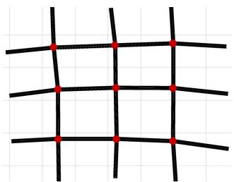  
(a) Grid3x3

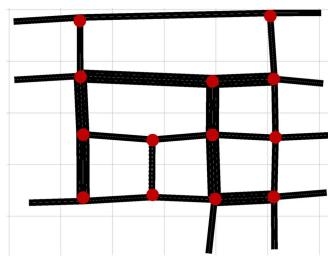  
(b) Net4   
Fig. 4. Topologies of two synthetic road networks.

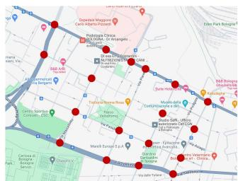  
(a) Pasubio

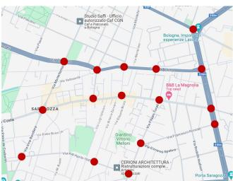  
(b) A.Costa   
Fig. 5. Topologies of two realistic road networks. The real-world scenarios are obtained from Google Maps (https://www.google.com/maps).

TABLE II   
STATISTICS OF SIMULATION SCENARIOS   

<table><tr><td rowspan="2">Scenarios</td><td colspan="2">Synthetic</td><td colspan="2">Realistic</td></tr><tr><td>Grid3×3</td><td>Net4</td><td>Pasubio</td><td>A.Costa</td></tr><tr><td># Servers (se)</td><td>9</td><td>13</td><td>18</td><td>16</td></tr><tr><td># Vehicles (ve)</td><td>12,000</td><td>32,400</td><td>30,955</td><td>27,051</td></tr><tr><td>Max. Flow/se</td><td>19 ve/s</td><td>24 ve/s</td><td>64 ve/s</td><td>28 ve/s</td></tr><tr><td>Avg. Flow/se</td><td>3.6 ve/s</td><td>6.8 ve/s</td><td>13.4 ve/s</td><td>5.9 ve/s</td></tr><tr><td>Train Periods</td><td>10h</td><td>24h</td><td>24h</td><td>24h</td></tr><tr><td rowspan="3">Test Periods</td><td rowspan="3">[150, 350]</td><td>[200, 300]</td><td>[130, 230]</td><td>[120, 220]</td></tr><tr><td>[1200, 1300]</td><td>[855, 955]</td><td>[1250, 1350]</td></tr><tr><td>[620, 720]</td><td>[735, 835]</td><td>[490, 590]</td></tr></table>

# V. PERFORMANCE EVALUATION

In this section, we evaluate the performance of our proposed MCMA DRL approach with experiments on both synthetic and realistic scenarios. We first describe the simulation scenarios and experimental setup, and then introduce the baselines and evaluation metrics. Finally, we validate the effectiveness of our approach by analyzing the results.

# A. Simulation Scenarios

Due to the challenges of deploying in large-scale real-world traffic networks and the absence of open-source datasets, we employ the widely used open-source traffic simulation package named Simulation of Urban MObility (SUMO) [55] to generate road networks and vehicular traces for experimental evaluation. Four simulation scenarios are employed as shown in Figs. 4 and 5, two of which are synthetic networks based on grids, while the other two are realistic networks constructed according to real-world regions. The statistics of simulation scenarios are summarized in Table II.

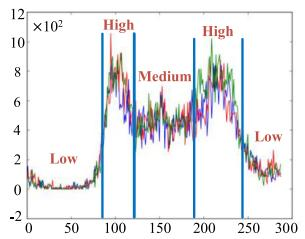  
(a)Real-world

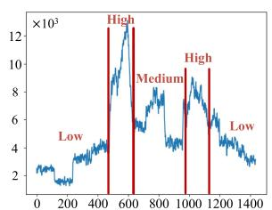  
(b) Simulated   
Fig. 6. Region-level traffic flow of 24 hours. Our simulated traffic flow follows similar patterns to real-world conditions.

Synthetic — Grid $\mathbf { 3 \times 3 }$ and Net $\mathbf { 4 }$ : Two synthetic road networks are designed to assess the general performance of our approach across typical grid-based scenarios. A standard $3 \times 3$ grid network is shown in Fig. 4(a), with each of the 9 intersections equipped with a base station and an MEC server. To simulate the condition of load-imbalances, we adapt a standard $4 \times 4$ grid network by selectively removing certain roads and designating multiple lanes to specific segments as shown in Fig. 4(b). Vehicular traces of 10 and 24 hours are randomly generated and split into one-minute episodes for the two scenarios, respectively.

Realistic — Pasubio and A. Costa: Two realistic road networks are built based on the real-world traffic conditions of Bologna in Italy [56]. The first scenario simulates the area around the Pasubio road of Bologna. We choose 18 major intersections and mount MEC servers to provide services as depicted in Fig. 5(a). The second scenario models another area around the Andrea Costa road, where 15 major intersections are selected and configured with servers to cover the whole area, as shown in Fig. 5(b). To approximate real-world traffic conditions as closely as possible, we thoroughly analyze daily traffic patterns and strive to reproduce realistic traffic flow throughout the simulation phase. Fig. 6(a) shows the real-world traffic flow of three weekdays measured from 636 detectors in 5-minute intervals within Bologna [56]. It can be observed that the traffic trends are basically the same for all three days (in three colors). There is a morning peak hour from 8 to 9 a.m. and another peak hour later in the evening; between these two peaks, the traffic volume remains at a moderate level. During the early morning and late at night, there is a significant reduction in vehicle number. Therefore, we generate 24-hour vehicular traces for both realistic scenarios following the similar patterns analyzed from the real world. Specifically, different vehicle generation rates are set according to real traffic flow; for example, peak periods of morning and evening are assigned higher rates. The simulated results are shown in Fig. 6(b), which exhibit similar trends as Fig. 6(a). Thus, experiments on two realistic scenarios closely mimic real-world deployments considering road networks and traffic patterns, which allows for an assessment of the practical applicability of MCMA to some extent.

# B. Experimental Setup

The default settings of the system model in the experiments are described as follows. The computing power of the MEC servers and vehicles (i.e., $f _ { i }$ and $u _ { i , j } ^ { t }$ ) is set to 12G and 2G CPU-cycles/s, respectively. Since there is a dramatic surge in

vehicle volume in the Pasubio scenario, we set $f _ { i }$ to 15G for appropriate edge resources. The channel bandwidth $B _ { i }$ between BSs and vehicles is set to $1 0 ~ \mathrm { M H z }$ , and the data transmission rate $\beta$ between BSs is 500 M bits/s. We assume that each vehicle samples one computation task randomly from the task pool at each time slot. The tasks within the task pool are characterized by a data size of $s _ { i , j } ^ { t } \in [ 6 0 0 , 9 0 0 ] \mathrm { I }$ M bits. These tasks require $c _ { i , j } ^ { t } \in$ [600 900],  G CPU cycles for completion, and must be accomplished [3 5]within a deadline of $d _ { i , j } ^ { t } \in [ 3 , 5 ]$ seconds. We set the required [3 5]CPU cycles of a task to be greater than the computing capacity of a vehicle per second, in order to reflect the computational intensity of the tasks. Thus, computation offloading and resource allocation are indispensable during the decision process.

The implementation details of our approach are presented as follows. Within our two-stage cooperative multi-agent decision framework, all networks $\pi _ { \theta _ { i } } ^ { o }$ , $V _ { \omega _ { i } } ^ { o }$ of MAPPO and $\pi _ { \phi _ { i } } ^ { r }$ $\pi _ { \phi _ { i } } ^ { r } , \pi _ { \hat { \phi } _ { i } } ^ { r } , Q _ { \mu _ { i } } ^ { r }$ , $Q _ { \hat { \mu } _ { i } } ^ { r }$ of MADDPG adopt two hidden layers of 128 neurons. The size of the experience replay buffers $B _ { i } ^ { o }$ and $B _ { i } ^ { r }$ is set to 30 000. Both algorithms are optimized by Adam optimizer, and a linear schedule is employed which means that the learning rates decrease linearly as the training process goes on. The initial learning rate of MAPPO is 0.00015, while the actor and critic networks of MADDPG are initialized with 0.00001 and 0.00005, respectively. The discount factor $\gamma$ of the cumulative reward is set to 0.99. For MAPPO, the clip hyper-parameter $\epsilon$ is 0.2, the GAE hyper-parameter $\lambda$ is 0.95, and the coefficient $c$ of the entropy term is 0.01. During the model update, each agent is trained for 15 epochs with 5 mini-batches. For MADDPG, we set the standard deviation $\sigma _ { a }$ of the Gaussian noise to 0.2. The batch size of sampling is set to 256, and the target networks are updated softly with the weight $\varphi$ of 0.001.

For the Informer-based multi-step vehicular trajectory prediction module, we set the lengths of historical sequence $H$ , future sequence $B$ , and start token $D$ , to 32, 8, and 16, respectively. There are two encoder layers and one decoder layer, and the dimension of model $d _ { m o d e l }$ is set to 512. An 8-head ProbSparse self-attention is employed with the ProbSparse sampling factor $s$ of 5. We choose the MSE loss function and adopt the Adam optimizer with a learning rate of 0.0001. The prediction model is pre-trained for 10 epochs with a batch size of 128, whose parameters are then kept unchanged during the MADRL training and test process.

There are 60 time slots in each decision episode of one minute, that is, $T = 6 0$ . In the $\mathrm { G r i d } _ { 3 \times 3 }$ scenario, we employ = 60a 10-hour traffic data (599 episodes) for training. Since the traffic flow is relatively stable during the 10 hours, we randomly select 200 episodes for testing. For the other three scenarios, a 24-hour span of traffic data (1439 episodes) is utilized to train our prediction and DRL models. To evaluate the performance under different levels of workloads, we select three 100-episode periods (i.e., low-level, medium-level, and high-level) for testing as shown in Table II.

# C. Baselines

We implement both heuristic strategies and state-of-the-art DRL methods, and conduct ablation studies to verify the effectiveness of our approach.

Heuristic Strategies: Different heuristic strategies for computation offloading are designed as follows. We adopt random resource allocation for comparison.

- Vehicular Execution (VE): computes all the generated tasks locally with onboard computation resources. No computation offloading or task migration is considered, assuming a system configuration without edge servers.   
- Edge Offloading (EO): offloads all tasks to the corresponding servers that directly cover them. It is assumed that the onboard resources are very limited in vehicles, and that the tasks are not subject to migration across servers.   
- Proportion-x Offloading (PO-x): directs a designated proportion $x$ of tasks to edge servers for offloading, and handles the remaining tasks on vehicles. In the experiments, we consider $x \in \{ 0 . 2 , 0 . 5 , 0 . 8 \}$ and neglect task migration.   
0 2 0 5 0 8- Random Execution (RE): generates the migration-assisted offloading decisions randomly for vehicles. A task may be executed locally, offloaded to its connected server, or migrated to any other server with a same probability.

Deep Reinforcement Learning Methods: We implement several state-of-the-art DRL methods specially designed for computation offloading and resource management.

- M-DRL [41]: a single-agent framework composed of LSTM and DRL for task offloading and discretized computing resource allocation. Since M-DRL is not scalable to an arbitrary number of vehicles, we predefine the maximum number of vehicles that can be handled and perform RE for vehicles exceeding this limit.   
- AB-MAPPO [33]: a DRL approach based on MAPPO with Beta distribution and attention mechanism for computation offloading and resource allocation in aerial edge networks. We adapt it to our vehicular networks.   
- MADDQN [44]: a MADDQN-based joint secure offloading and resource allocation scheme to improve secrecy performance and resource efficiency.   
- MATD3 [43]: a MATD3 framework in multi-UAV assisted MEC system, where each UAV adopts a TD3 for decision making. We treat edge servers as agents instead. Trajectory prediction is disregarded in the latter three baselines.

Ablation Studies: We further conduct ablation studies on four scenarios. Three approaches are specially designed by disabling the specific components of our approach.

- w/o-{m&p}: neglects task migration when constructing the system model, thereby limiting task processing to either vehicular execution or edge computing on the nearest server. The vehicular trajectory prediction module is also disabled, since it is designed for guiding the migration.   
- w/o-{a}: disables the adaptive resource allocation and serves as a benchmark to validate the superiority of MAD-DPG in optimizing the decision-making process.   
- w/o-{co}: employs a pair of independent PPO and DDPG in each edge server for decision making. No global states can be shared among the agents.

# D. Evaluation Metrics

To evaluate the performance of different strategies, we design six metrics to provide a thorough analysis of the results.

- Task Completion Latency (Lat.): is defined as the average time for completing a task during the given episodes:

$$
L a t. = \frac {1}{e p i} \sum_ {k = 1} ^ {e p i} \left(\frac {1}{N _ {t o t a l} ^ {k}} \sum_ {t = 1} ^ {T} \sum_ {i = 1} ^ {N} \sum_ {j = 1} ^ {M _ {i} ^ {t}} l _ {i, j} ^ {t}\right), \tag {38}
$$

where $\begin{array} { r } { N _ { t o t a l } ^ { k } = \sum _ { t = 1 } ^ { T } \sum _ { i = 1 } ^ { N } M _ { i } ^ { t } } \end{array}$ is the total number of =tasks generated on the vehicles in the $k$ -th episode.

- Task Computation Latency: refers to the average time for computing a task, which includes the waiting time in the task queue and the time spent on executing the task.   
- Task Communication Latency: is the average time of task communication, including the transmission time from vehicles to servers and the migration time between servers.   
- Task Failure Rate (FR): is the average proportion of tasks that exceed their respective deadlines to the total number of tasks during the given episodes:

$$
F R = \frac {1}{e p i} \sum_ {k = 1} ^ {e p i} \left(\frac {1}{N _ {\text {t o t a l}} ^ {k}} \sum_ {t = 1} ^ {T} \sum_ {i = 1} ^ {N} \sum_ {j = 1} ^ {M _ {i} ^ {t}} \nVdash \left(l _ {i, j} ^ {t} - d _ {i, j} ^ {t} > 0\right)\right), \tag {39}
$$

where $\mathcal { k } ( \cdot )$ denotes the indicator function whose value is ( )1 when the condition within the brackets is true.

- Edge Utilization (EU): denotes the average utilization proportion of computing resources on the edge servers:

$$
E U = \frac {1}{e p i} \sum_ {k = 1} ^ {e p i} \frac {1}{T N} \sum_ {t = 1} ^ {T} \sum_ {i = 1} ^ {N} \frac {\min \left(q _ {i} ^ {t} , f _ {i}\right)}{f _ {i}}. \tag {40}
$$

- Vehicle Utilization (VU): denotes the average utilization proportion of computing resources on the vehicles:

$$
V U = \frac {1}{e p i} \sum_ {k = 1} ^ {e p i} \left(\frac {1}{T N _ {\text {t o t a l}} ^ {k , t}} \sum_ {t = 1} ^ {T} \sum_ {i = 1} ^ {N} \sum_ {j = 1} ^ {M _ {i} ^ {t}} \frac {\min \left(p _ {i , j} ^ {t} , u _ {i , j} ^ {t}\right)}{u _ {i , j} ^ {t}}\right), \tag {41}
$$

where N k,t $\begin{array} { r } { N _ { t o t a l } ^ { k , t } = \sum _ { i = 1 } ^ { N } M _ { i } ^ { t } } \end{array}$ is the total number of tasks =generated in the $t$ -th time slot of the $k$ -th episode.

# E. Experimental Results

1) Convergence Performance: Fig. 7 illustrates the convergence performance of our MCMA DRL approach in the model training stage. Taking the $\mathrm { G r i d } _ { 3 \times 3 }$ scenario as an example, Fig. 7(a) shows that the average reward per task gradually increases and converges as the training proceeds. This aligns with the objectives of the DRL agents to maximize their rewards through an iterative process of trial and error, thereby demonstrating the effectiveness of model training within the two-stage cooperative multi-agent decision framework. Meanwhile, we can observe that the task failure rate experiences a significant reduction, dropping from almost $80 \%$ in the initial episodes to $5 \%$ upon reaching stabilization. All three types of latency decrease consistently and exhibit obvious convergence in Fig. 7(b). These indicate that the agents have gradually learned the optimal cooperative decision-making strategies for the joint problem of computation offloading, task migration, and resource

TABLE IIIPERFORMANCE COMPARISON OF DIFFERENT APPROACHES ON FOUR SIMULATION SCENARIOS  

<table><tr><td rowspan="2">Approaches</td><td colspan="4">Grid3×3</td><td colspan="4">Net4</td><td colspan="4">Pasubio</td><td colspan="4">A.Costa</td></tr><tr><td>Lat.</td><td>FR</td><td>EU</td><td>VU</td><td>Lat.</td><td>FR</td><td>EU</td><td>VU</td><td>Lat.</td><td>FR</td><td>EU</td><td>VU</td><td>Lat.</td><td>FR</td><td>EU</td><td>VU</td></tr><tr><td>VE</td><td>25.092</td><td>0.9095</td><td>0.0000</td><td>1.0000</td><td>25.762</td><td>0.9133</td><td>0.0000</td><td>1.0000</td><td>27.822</td><td>0.9227</td><td>0.0000</td><td>1.0000</td><td>27.664</td><td>0.9214</td><td>0.0000</td><td>1.0000</td></tr><tr><td>EO</td><td>26.072</td><td>0.7796</td><td>0.8196</td><td>0.0000</td><td>15.962</td><td>0.6130</td><td>0.8105</td><td>0.0000</td><td>47.061</td><td>0.5996</td><td>0.5812</td><td>0.0000</td><td>33.115</td><td>0.6730</td><td>0.6796</td><td>0.0000</td></tr><tr><td>PO-{0.2}</td><td>13.203</td><td>0.6920</td><td>0.2620</td><td>0.9898</td><td>13.464</td><td>0.6961</td><td>0.2304</td><td>0.9905</td><td>14.936</td><td>0.7378</td><td>0.2025</td><td>0.9915</td><td>14.520</td><td>0.7159</td><td>0.2389</td><td>0.9916</td></tr><tr><td>PO-{0.5}</td><td>5.6690</td><td>0.4475</td><td>0.5835</td><td>0.8824</td><td>4.1866</td><td>0.3453</td><td>0.5426</td><td>0.8841</td><td>11.259</td><td>0.4460</td><td>0.3982</td><td>0.8899</td><td>7.5309</td><td>0.4572</td><td>0.4901</td><td>0.8893</td></tr><tr><td>PO-{0.8}</td><td>14.246</td><td>0.5394</td><td>0.7557</td><td>0.3915</td><td>8.2926</td><td>0.3849</td><td>0.7365</td><td>0.3894</td><td>28.142</td><td>0.4270</td><td>0.5226</td><td>0.3907</td><td>18.863</td><td>0.4824</td><td>0.6222</td><td>0.3920</td></tr><tr><td>RE</td><td>9.4850</td><td>0.8128</td><td>0.9859</td><td>0.1974</td><td>10.385</td><td>0.7495</td><td>0.8646</td><td>0.1406</td><td>12.850</td><td>0.7834</td><td>0.7735</td><td>0.1025</td><td>14.114</td><td>0.8110</td><td>0.8335</td><td>0.1160</td></tr><tr><td>M-DRL</td><td>4.1527</td><td>0.3881</td><td>0.8349</td><td>0.7452</td><td>3.2512</td><td>0.2438</td><td>0.7655</td><td>0.5927</td><td>7.6941</td><td>0.3894</td><td>0.6752</td><td>0.5322</td><td>6.4931</td><td>0.4217</td><td>0.7923</td><td>0.6649</td></tr><tr><td>AB-MAPPO</td><td>2.6364</td><td>0.1482</td><td>0.7531</td><td>0.8227</td><td>2.2189</td><td>0.0943</td><td>0.7363</td><td>0.6257</td><td>4.8274</td><td>0.1842</td><td>0.6342</td><td>0.5529</td><td>3.3269</td><td>0.1917</td><td>0.6732</td><td>0.8011</td></tr><tr><td>MADDQN</td><td>2.8314</td><td>0.1754</td><td>0.7451</td><td>0.8240</td><td>2.2557</td><td>0.1023</td><td>0.7382</td><td>0.6114</td><td>5.0451</td><td>0.1921</td><td>0.6466</td><td>0.5427</td><td>3.5432</td><td>0.2187</td><td>0.6457</td><td>0.7817</td></tr><tr><td>MATD3</td><td>2.7467</td><td>0.1574</td><td>0.7508</td><td>0.8283</td><td>2.2337</td><td>0.0893</td><td>0.7392</td><td>0.6251</td><td>5.0213</td><td>0.1915</td><td>0.6398</td><td>0.5458</td><td>3.4570</td><td>0.1942</td><td>0.6529</td><td>0.7853</td></tr><tr><td>w/o-{m&amp;p}</td><td>3.6519</td><td>0.3434</td><td>0.7924</td><td>0.8256</td><td>2.3378</td><td>0.1300</td><td>0.7310</td><td>0.6871</td><td>5.4239</td><td>0.3459</td><td>0.6565</td><td>0.6773</td><td>4.5589</td><td>0.3509</td><td>0.6844</td><td>0.8113</td></tr><tr><td>w/o-{a}</td><td>2.1834</td><td>0.0684</td><td>0.7570</td><td>0.8161</td><td>2.0719</td><td>0.0669</td><td>0.7194</td><td>0.6610</td><td>4.4802</td><td>0.1701</td><td>0.6344</td><td>0.5469</td><td>2.5587</td><td>0.1253</td><td>0.6591</td><td>0.8142</td></tr><tr><td>w/o-{co}</td><td>2.1973</td><td>0.0746</td><td>0.7653</td><td>0.8144</td><td>2.0547</td><td>0.0612</td><td>0.7225</td><td>0.6347</td><td>4.4581</td><td>0.1683</td><td>0.6324</td><td>0.5632</td><td>2.5674</td><td>0.1435</td><td>0.6613</td><td>0.8156</td></tr><tr><td>MCMA</td><td>2.1467</td><td>0.0597</td><td>0.7773</td><td>0.7853</td><td>2.0064</td><td>0.0538</td><td>0.7305</td><td>0.6388</td><td>3.9637</td><td>0.1650</td><td>0.6293</td><td>0.5921</td><td>2.4924</td><td>0.1130</td><td>0.6608</td><td>0.8120</td></tr></table>

*Theevaluatiorsdesoletioteyat.)skFeRate()dgeUU),dcleUi). The best results are bolded.

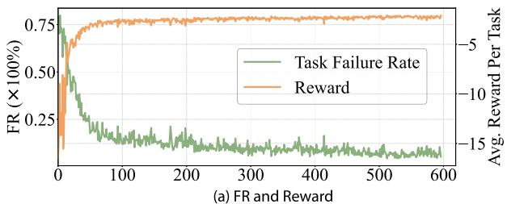

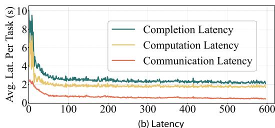  
Fig. 7. Convergence performance of our MCMA DRL approach in the training stage on $\mathrm { G r i d } _ { 3 \times 3 }$ scenario (without smoothing).

allocation, achieving the optimization objective of minimizing latency and FR.

2) Overall Performance Comparison: Table III shows the performance comparison between our approach and other baselines on four simulation scenarios. Four evaluation metrics are reported, which are calculated as the average results of the test periods listed in Table II. Overall, we can observe that MCMA consistently achieves the lowest latencies and failure rates among all approaches on all scenarios, which demonstrates its effectiveness and robustness. Besides, the edge and vehicle utilization of MCMA exhibits a balanced status, signifying an effective collaboration between edge servers and vehicles.

Out of all heuristic strategies, the two types of single-mode execution (VE and EO) yield the highest latencies with most tasks failing to meet their deadlines. The main reason lies in the unacceptable waiting latencies associated with the unprocessed tasks piled up in task queues. This reveals that an exclusive reliance on either vehicle-side or edge-side computing capacity can lead to severe resource under-utilization (i.e., $\mathrm { E U } = 0$ or $\mathrm { v U } = 0$ =), which highlights the necessity for an appropriate =offloading mechanism. PO- $\mathbf { \nabla } \cdot \mathbf { X }$ and RE have achieved a certain

degree of trade-off between EU and VU. Among different offloading ratios, PO-{0.5} achieves the lowest latencies and FRs in general, due to its relatively balanced resource utilization. As for RE, although its latencies are generally lower than that of most heuristic strategies except PO-{0.5}, it exhibits the second-highest FRs after VE. This owes to the stochastic generation of decisions, which results in the highest EU and lowest VU (besides EO) among all approaches. Such imbalances in resource utilization indicate an overload of servers and an underload of vehicles, greatly affecting the task success rate.

The DRL-based methods consistently outperform all heuristic strategies in terms of four metrics, due to their ability of dynamically adjusting decisions. For example, compared with PO-{0.5} over four scenarios, M-DRL achieves $2 6 . 7 \% / 1 3 . 3 \%$ , $2 2 . 3 \% / 2 9 . 4 \%$ , $3 1 . 7 \% / 1 2 . 7 \%$ , and $1 3 . 8 \% / 7 . 8 \%$ relative improvements w.r.t. latency/FR. However, since M-DRL can only handle a predefined number of vehicles, it exhibits the poorest performance among all DRL-based methods, which shows the significance of vehicle-by-vehicle decision-making in ensuring model scalability as vehicles multiply. Upon closer examination of the results, we can observe that none of these methods match the efficacy of our approach. This not only underscores the superiority of our two-stage decision framework in addressing problems within complex and dynamic environments, but also demonstrates the effectiveness of our trajectory prediction module in facilitating the migration of tasks.

Through further analysis of ablation studies, we can find that the latencies and FRs escalate as key components of MCMA are disabled. Approach w/o-{m&p} has the poorest results among all these ablation methods. Although both EU and VU are relatively high and well-balanced, its latencies/FRs are 1.7/5.8, 1.2/2.4, 1.4/2.1, and $1 . 8 / 3 . 1$ times those observed in MCMA. These show that without task migration, workload imbalances among servers can lead to low resource utilization efficiency. Besides, w/o-{a} also performs worse than MCMA, verifying the effectiveness of adaptive resource allocation. As for w/o-{co}, it attains higher latencies and FRs than MCMA. This suggests that centralized training of agents leveraging global features can generate better strategies for cooperative decision making.

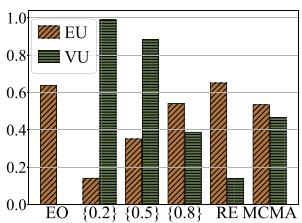  
(a) Net4: Low-level

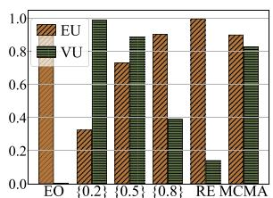  
(b) $\mathbf { N e t } _ { 4 }$ : High-level

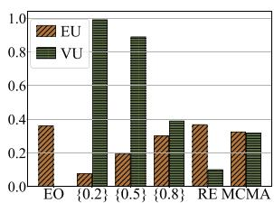  
(c)Pasubio: Low-level

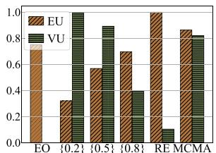  
(d) Pasubio: High-level

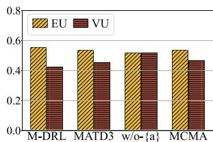  
Fig. 8. The utilization analysis of two computation resources compared with different heuristic strategies.   
(a) Net4: Low-level

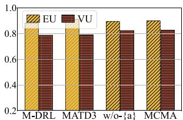  
(b) $\mathbf { N e t } _ { 4 }$ : High-level

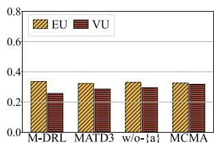  
(c)Pasubio: Low-level

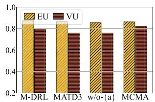  
(d)Pasubio: Low-level   
Fig. 9. The utilization analysis of two computation resources compared with different DRL-based methods.

3) Resource Utilization Analysis: To further investigate resource utilization under different levels of workloads, we provide an exhaustive analysis of the two types of computation resources. The comparisons of MCMA with different heuristic strategies and DRL-based methods on $\mathrm { N e t _ { 4 } }$ and Pasubio scenarios are shown in Figs. 8 and 9, respectively. Our analysis of the results primarily reveals the following insights. Firstly, compared with heuristic strategies, all DRL-based methods exhibit a more balanced resource utilization between edges and vehicles, among which MCMA achieves the most balanced performance. This demonstrates that, with computation offloading and task migration, MCMA can effectively harness resources from both sides, achieving efficient edge-vehicle collaboration. Secondly, from Fig. 8 we can observe that, an increase in workload will lead to a corresponding rise in EU across all heuristic strategies, while VU remains relatively stable. Taking Pasubio as an example, EU of PO-{0.5} at high level is 2.93 times that at low level, while VU is almost unchanged. The reason could be that more edge resources are required to compensate for the limited resources of vehicles as workload increases. And we can conclude that heuristic strategies are more inclined to take advantage of onboard resources although both sides of resources are available. Thirdly, as shown in Fig. 9, both EU and VU experience a simultaneous increase as workload transitions from low-level to highlevel. For example, in Pasubio, EU and VU of MCMA at high level are 2.65 and 2.58 times those at low level. This observation aligns with our expectations, since DRL-based methods can dynamically refining their decisions to make full use of all available resources.   
4) Robustness Analysis: To verify the robustness of our approach, we change two essential types of computation-relevant system settings, including 1) the computing power of edge servers and 2) the computational requirements of vehicular tasks, and exhibit the latencies of six approaches under medium-level workload on Pasubio and A.costa scenarios. As observed from

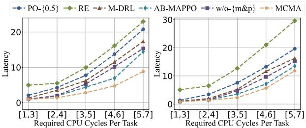  
(a)Pasubio   
(b)A.Costa   
Fig. 10. Latencies under different task requirements.

Table IV, all approaches demonstrate reduced latencies as the computing power $f _ { i }$ increases. This is intuitive because higher edge-side computation resources imply that more tasks can be offloaded under constant task requirements. By comparison, MCMA consistently achieves superior performances under different computing powers, validating its robustness in adaptively deploying tasks to ensure optimal resource utilization. As shown in Fig. 10, the required CPU cycles of each task vary in different ranges including , , , , , , , , , . [1 3] [2 4] [3 5] [4 6] [5 7]We notice that an increase in task computational requirements leads to a corresponding rise in latencies of all approaches, which aligns with the fact that higher task demands necessitate more computation resources. Besides, the differences between these approaches increase as the task demands escalate, whereas MCMA shows considerable and consistent advantages especially under high-demand conditions. This verifies the robustness of our approach in handling resource insufficient situations.   
5) Case Study: Workload Analysis: In order to gain insights into the effectiveness of task migration in addressing spatiotemporal load-imbalances among servers, we conduct case studies on different scenarios. On the one hand, we compare the spatial workload distributionsamong servers between different

TABLE IV   
LATENCIES UNDER DIFFERENT COMPUTING POWERS OF EDGE SERVERS ON PASUBIO AND A.COSTA SCENARIOS   

<table><tr><td rowspan="2">Approaches</td><td colspan="7">Pasubio</td><td colspan="6">A.Costa</td></tr><tr><td>\(f_i=9\)</td><td>\(f_i=11\)</td><td>\(f_i=13\)</td><td>\(f_i=15\)</td><td>\(f_i=17\)</td><td>\(f_i=19\)</td><td>\(f_i=21\)</td><td>\(f_i=4\)</td><td>\(f_i=8\)</td><td>\(f_i=12\)</td><td>\(f_i=16\)</td><td>\(f_i=20\)</td><td>\(f_i=24\)</td></tr><tr><td>PO-{0.5}</td><td>19.6770</td><td>15.0402</td><td>11.9686</td><td>9.8536</td><td>8.3330</td><td>7.2848</td><td>6.3476</td><td>35.9668</td><td>13.8471</td><td>7.5036</td><td>5.0426</td><td>3.9671</td><td>3.5146</td></tr><tr><td>RE</td><td>25.4476</td><td>16.9283</td><td>11.1800</td><td>7.7590</td><td>6.1829</td><td>5.6245</td><td>5.3922</td><td>81.4810</td><td>29.6261</td><td>12.6828</td><td>6.4663</td><td>5.3886</td><td>5.1267</td></tr><tr><td>M-DRL</td><td>12.8379</td><td>10.6898</td><td>8.3238</td><td>6.9827</td><td>5.3897</td><td>4.8398</td><td>4.3127</td><td>19.4326</td><td>10.3472</td><td>6.2387</td><td>4.7235</td><td>3.6237</td><td>3.1783</td></tr><tr><td>AB-MAPPO</td><td>7.8263</td><td>6.7138</td><td>5.6238</td><td>4.7346</td><td>3.9283</td><td>3.4982</td><td>2.8197</td><td>14.1367</td><td>6.8984</td><td>4.1362</td><td>2.9384</td><td>2.1354</td><td>1.7392</td></tr><tr><td>w/o-{m&amp;p}</td><td>8.7237</td><td>7.1095</td><td>6.1381</td><td>5.2915</td><td>4.4645</td><td>4.0502</td><td>3.6232</td><td>14.3685</td><td>7.9136</td><td>4.7221</td><td>3.1077</td><td>2.3220</td><td>1.9386</td></tr><tr><td>MCMA</td><td>4.2836</td><td>3.6015</td><td>3.1609</td><td>2.8215</td><td>2.2983</td><td>1.9417</td><td>1.5873</td><td>13.3867</td><td>5.0864</td><td>2.2922</td><td>1.8098</td><td>1.5653</td><td>1.4239</td></tr></table>

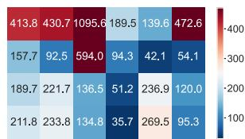  
(a)EO

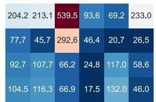  
(b) PO-{0.5}

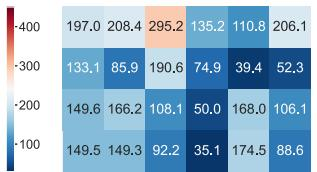  
(c)w/o-{m&p}

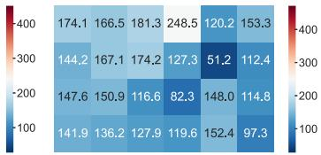  
(d) MCMA   
Fig. 11. Spatial workload distributions of different approaches on Pasubio scenario. Intersections without servers are padded with average values of nearby intersections. Dark red indicates extremely overloaded intersections, while dark blue indicates extremely underloaded intersections.

approaches on Pasubio scenario. The workload of each server is represented by the number of tasks assigned (i.e., offloaded or migrated) to it. As shown in Fig. 11, we present the minute-wise accumulative workloads of 18 edge servers with heat maps, where the grids represent intersections and the colors represent workloads. The intersections without servers are padded with average values of nearby workloads for completeness. We can observe that the workloads of different servers exhibit significant spatial imbalances in EO, as all tasks are directly offloaded without any cooperation. PO-{0.5} shows a more balanced performance than EO with the help of vehicle-side resources; however, it significantly lags behind w/o- $\{ \mathrm { m } \& \mathrm { p } \}$ and MCMA in terms of effectiveness. Without task migration, w/o-{m&p} still presents a risk of task accumulation in overloaded servers (e.g. 295.2 in orange), while the idle resources in underloaded servers are wasted (e.g. 35.1 in dark blue). These suggest that it is realistic to address spatial workload imbalances with the implementation of task migration mechanism. Moreover, the spatial workload distribution depicted in Fig. 11(d) exhibits the most balanced performance among all approaches, indicating that task migration is adept at handling dynamic workloads as an aid to computation offloading.

On the other hand, we further compare the temporal workload changesbetween EO and MCMA on A.Costa scenario. As shown in Fig. 12, we select six edge servers and display their workloads in episodes [700, 900], during which a low-high-low transition of task volume is experienced in the system. The curves and bars present the minute-wise accumulative workloads of servers in EO and MCMA, respectively. From the curves we can observe that, the workloads of all six servers in EO exhibit different levels of fluctuations in response to the changes in task volume. This is because all tasks are offloaded in EO and the workloads of servers are directly affected by the number of tasks in the system. However, it can be noticed that all bars remain relatively stable as time goes on, demonstrating a balanced performance in MCMA. These suggest that our approach has the ability to alleviate temporal load imbalances. Moreover, through task migration

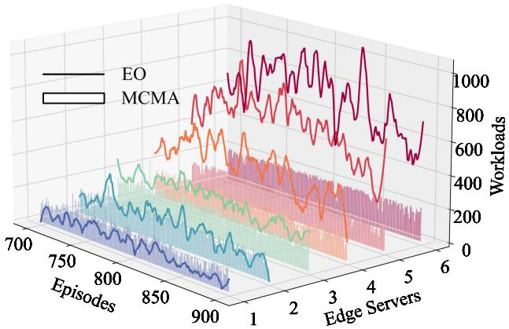  
Fig. 12. Temporal workload changes of EO and MCMA during episodes [700,900] on A.Costa scenario. Six colors represent six edge servers.

in MCMA, the overloaded servers 5 and 6 also achieve uniform workloads, aligning with the load levels of other servers. This is attributed to the collaboration among servers by leveraging the resources of underloaded servers to mitigate the burdens on the overloaded ones.

# VI. CONCLUSION

In this article, we have investigated a task migration-assisted computation offloading problem in multi-edge vehicular networks. With the employment of task migration, we aim to alleviate the spatio-temporal workload imbalance issues caused by high dynamics of vehicles, thus avoiding inefficient overload or underload conditions among edge servers. We formulate the joint optimization problem as a partially observable MDP, and design a two-stage cooperative multi-agent DRL decision framework to solve it. Given that timely perception of vehicle travel direction is crucial for making proper migration decisions, we propose a multi-step vehicular trajectory prediction module to capture future movements of vehicles. By incorporating the prediction module into the two-stage decision framework, our

MCMA DRL approach not only achieves workload balancing through effective collaboration among servers, but also ensures satisfactory latency performance and quality of service. Extensive experiments are conducted on both synthetic and realistic scenarios. The evaluation results show that our approach consistently outperforms all baselines in terms of different metrics. Besides, our in-depth analysis demonstrates the superiority of MCMA in enhancing both edge-vehicle and inter-server collaborations.

For future work, we will make promising extensions in the following three perspectives. First, we plan to extend our proposed approach to a more general framework that can be directly applicable to prototype systems under real-world scenarios, and we will try to examine the limits of its scalability. More specialized communication models and multiplexing techniques will be considered together with real-world validation to enhance the practical applicability of our approach. Second, while our trajectory prediction module offers considerable assistance in making task migration decisions, its centralized architecture may pose potential limitations on system robustness and immediacy. Besides, its guidance effectiveness is dependent on prediction accuracy. To address these, we will shift towards a distributed prediction system focusing on enhancing model accuracy to ensure the reliable and timely prediction of prospective information. Third, we will consider more complicated but practical system configurations, such as enriching resources from more diverse sources. Besides edge servers, UAVs and idle vehicles can also serve as potential targets for computation offloading and service provision. By employing Vehicle-to-Vehicle (V2V) and Infrastructure-to-Infrastructure (I2I) communications, we want to explore a more comprehensive utilization of system resources.

# REFERENCES

[1] H. Zhou, K. Jiang, S. He, G. Min, and J. Wu, “Distributed deep multiagent reinforcement learning for cooperative edge caching in Internet-of-Vehicles,” IEEE Trans. Wireless Commun., vol. 22, no. 12, pp. 9595–9609, Dec. 2023.   
[2] M. Li, J. Gao, L. Zhao, and X. Shen, “Adaptive computing scheduling for edge-assisted autonomous driving,” IEEE Trans. Veh. Technol., vol. 70, no. 6, pp. 5318–5331, Jun. 2021.   
[3] J. Zhou, S. Chen, K.-K. R. Choo, Z. Cao, and X. Dong, “EPNS: Efficient privacy-preserving intelligent traffic navigation from multiparty delegated computation in cloud-assisted vanets,” IEEE Trans. Mobile Comput., vol. 22, no. 3, pp. 1491–1506, Mar. 2023.   
[4] X. Jiang, F. R. Yu, T. Song, and V. C. M. Leung, “Resource allocation of video streaming over vehicular networks: A survey, some research issues and challenges,” IEEE Trans. Intell. Transp. Syst., vol. 23, no. 7, pp. 5955– 5975, Jul. 2022.   
[5] M. Cao, L. Zheng, W. Jia, and X. Liu, “Joint 3D reconstruction and object tracking for traffic video analysis under IoV environment,” IEEE Trans. Intell. Transp. Syst., vol. 22, no. 6, pp. 3577–3591, Jun. 2021.   
[6] H. Guo, X. Chen, X. Zhou, and J. Liu, “Trusted and efficient task offloading in vehicular edge computing networks,” IEEE Trans. Cogn. Commun. Netw., vol. 10, no. 6, pp. 2370–2382, Dec. 2024.   
[7] J. Liu, N. Liu, L. Liu, S. Li, H. Zhu, and P. Zhang, “A proactive stable scheme for vehicular collaborative edge computing,” IEEE Trans. Veh. Technol., vol. 72, no. 8, pp. 10724–10736, Aug. 2023.   
[8] W. Zhou et al., “Priority-aware resource scheduling for UAV-mounted mobile edge computing networks,” IEEE Trans. Veh. Technol., vol. 72, no. 7, pp. 9682–9687, Jul. 2023.   
[9] H. Guo, Y. Wang, J. Liu, and C. Liu, “Multi-UAV cooperative task offloading and resource allocation in 5G advanced and beyond,” IEEE Trans. Wireless Commun., vol. 23, no. 1, pp. 347–359, Jan. 2024.

[10] I. Sorkhoh, D. Ebrahimi, R. Atallah, and C. Assi, “Workload scheduling in vehicular networks with edge cloud capabilities,” IEEE Trans. Veh. Technol., vol. 68, no. 9, pp. 8472–8486, Sep. 2019.   
[11] H. Ke, J. Wang, L. Deng, Y. Ge, and H. Wang, “Deep reinforcement learning-based adaptive computation offloading for MEC in heterogeneous vehicular networks,” IEEE Trans. Veh. Technol., vol. 69, no. 7, pp. 7916– 7929, Jul. 2020.   
[12] A. Bozorgchenani, S. Maghsudi, D. Tarchi, and E. Hossain, “Computation offloading in heterogeneous vehicular edge networks: On-line and offpolicy bandit solutions,” IEEE Trans. Mobile Comput., vol. 21, no. 12, pp. 4233–4248, Dec. 2022.   
[13] Z. Ning et al., “Partial computation offloading and adaptive task scheduling for 5G-enabled vehicular networks,” IEEE Trans. Mobile Comput., vol. 21, no. 4, pp. 1319–1333, Apr. 2022.   
[14] S. Duan et al., “MOTO: Mobility-aware online task offloading with adaptive load balancing in small-cell MEC,” IEEE Trans. Mobile Comput., vol. 23, no. 1, pp. 645–659, Jan. 2024.   
[15] H. Huang, W. Zhan, G. Min, Z. Duan, and K. Peng, “Mobility-aware computation offloading with load balancing in smart city networks using MEC federation,” IEEE Trans. Mobile Comput., vol. 23, no. 11, pp. 10411– 10428, Nov. 2024.   
[16] W. Zhang, G. Zhang, and S. Mao, “Joint parallel offloading and load balancing for cooperative-MEC systems with delay constraints,” IEEE Trans. Veh. Technol., vol. 71, no. 4, pp. 4249–4263, Apr. 2022.   
[17] Y. Peng et al., “Computing and communication cost-aware service migration enabled by transfer reinforcement learning for dynamic vehicular edge computing networks,” IEEE Trans. Mobile Comput., vol. 23, no. 1, pp. 257–269, Jan. 2024.   
[18] Y. Ren, X. Chen, S. Guo, S. Guo, and A. Xiong, “Blockchain-based VEC network trust management: A DRL algorithm for vehicular service offloading and migration,” IEEE Trans. Veh. Technol., vol. 70, no. 8, pp. 8148–8160, Aug. 2021.   
[19] C. Liu, F. Tang, Y. Hu, K. Li, Z. Tang, and K. Li, “Distributed task migration optimization in MEC by extending multi-agent deep reinforcement learning approach,” IEEE Trans. Parallel Distrib. Syst., vol. 32, no. 7, pp. 1603–1614, Jul. 2021.   
[20] C. Yu et al., “The surprising effectiveness of PPO in cooperative multiagent games,” in Proc. Adv. Neural Inf. Process. Syst., 2022, pp. 24611– 24624.   
[21] R. Lowe, Y. Wu, A. Tamar, J. Harb, P. Abbeel, and I. Mordatch, “Multiagent actor-critic for mixed cooperative-competitive environments,” in Proc. Int. conf. Neural Inf. Process. Syst., 2017, pp. 6382–6393.   
[22] H. Zhou et al., “Informer: Beyond efficient transformer for long sequence time-series forecasting,” in Proc. 35th AAAI Conf. Artif. Intell., 2021, pp. 11106–11115.   
[23] Y. Zhang, T. Liu, Y. Zhu, and Y. Yang, “A deep reinforcement learning approach for online computation offloading in mobile edge computing,” in Proc. IEEE/ACM 28th Int. Symp. Qual. Service, 2020, pp. 1–10.   
[24] J. Shi, J. Du, J. Wang, J. Wang, and J. Yuan, “Priority-aware task offloading in vehicular fog computing based on deep reinforcement learning,” IEEE Trans. Veh. Technol., vol. 69, no. 12, pp. 16067–16081, Dec. 2020.   
[25] M. Gao, R. Shen, L. Shi, W. Qi, J. Li, and Y. Li, “Task partitioning and offloading in DNN-task enabled mobile edge computing networks,” IEEE Trans. Mobile Comput., vol. 22, no. 4, pp. 2435–2445, Apr. 2023.   
[26] X. Wang, J. Ye, and J. C. Lui, “Decentralized task offloading in edge computing: A multi-user multi-armed bandit approach,” in Proc. IEEE Conf. Comput. Commun., 2022, pp. 1199–1208.   
[27] H. Jiang, X. Dai, Z. Xiao, and A. Iyengar, “Joint task offloading and resource allocation for energy-constrained mobile edge computing,” IEEE Trans. Mobile Comput., vol. 22, no. 7, pp. 4000–4015, Jul. 2023.   
[28] K. Li et al., “Computation offloading in resource-constrained multi-access edge computing,” IEEE Trans. Mobile Comput., vol. 23, no. 11, pp. 10665– 10677, Nov. 2024.   
[29] H. Zhou, T. Wu, X. Chen, S. He, D. Guo, and J. Wu, “Reverse auctionbased computation offloading and resource allocation in mobile cloudedge computing,” IEEE Trans. Mobile Comput., vol. 22, no. 10, pp. 6144– 6159, Oct. 2023.   
[30] B. Qiu, Y. Wang, H. Xiao, and Z. Zhang, “Deep reinforcement learningbased adaptive computation offloading and power allocation in vehicular edge computing networks,” IEEE Trans. Intell. Transp. Syst., vol. 25, no. 10, pp. 13339–13349, Oct. 2024.   
[31] J. Huang, M. Zhang, J. Wan, Y. Chen, and N. Zhang, “Joint data caching and computation offloading in UAV-assisted internet of vehicles via federated deep reinforcement learning,” IEEE Trans. Veh. Technol., vol. 73, no. 11, pp. 17644–17656, Nov. 2024.

[32] X. Dai, Z. Xiao, H. Jiang, and J. C. S. Lui, “UAV-assisted task offloading in vehicular edge computing networks,” IEEE Trans. Mobile Comput., vol. 23, no. 4, pp. 2520–2534, Apr. 2024.   
[33] W. Liu, B. Li, W. Xie, Y. Dai, and Z. Fei, “Energy efficient computation offloading in aerial edge networks with multi-agent cooperation,” IEEE Trans. Wireless Commun., vol. 22, no. 9, pp. 5725–5739, 2023.   
[34] Z. Ji, S. Wu, and C. Jiang, “Cooperative multi-agent deep reinforcement learning for computation offloading in digital twin satellite edge networks,” IEEE J. Sel. Areas Commun., vol. 41, no. 11, pp. 3414–3429, Nov. 2023.   
[35] B. Xie, H. Cui, I. W.-H. Ho, Y. He, and M. Guizani, “Computation offloading and resource allocation in leo satellite-terrestrial integrated networks with system state delay,” IEEE Trans. Mobile Comput., vol. 24, no. 3, pp. 1372–1385, Mar. 2025.   
[36] T. Cerquitelli, M. Meo, M. Curado, L. Skorin-Kapov, and E. E. Tsiropoulou, “Machine learning empowered computer networks,” Comput. Netw., vol. 230, Jul. 2023, Art. no. 109807.   
[37] C. Grasso, R. Raftopoulos, G. Schembra, and S. Serrano, “H-HOME: A learning framework of federated FANETs to provide edge computing to future delay-constrained IoT systems,” Comput. Netw., vol. 219, Dec. 2022, Art. no. 109449.   
[38] T. M. Ho and K.-K. Nguyen, “Joint server selection, cooperative offloading and handover in multi-access edge computing wireless network: A deep reinforcement learning approach,” IEEE Trans. Mobile Comput., vol. 21, no. 7, pp. 2421–2435, Jul. 2022.   
[39] H. Zhang, Y. Yang, B. Shang, and P. Zhang, “Joint resource allocation and multi-part collaborative task offloading in MEC systems,” IEEE Trans. Veh. Technol., vol. 71, no. 8, pp. 8877–8890, Aug. 2022.   
[40] H. Guo, X. Zhou, J. Wang, J. Liu, and A. Benslimane, “Intelligent task offloading and resource allocation in digital twin based aerial computing networks,” IEEE J. Sel. Areas Commun., vol. 41, no. 10, pp. 3095–3110, Oct. 2023.   
[41] C.-L. Wu, T.-C. Chiu, C.-Y. Wang, and A.-C. Pang, “Mobility-aware deep reinforcement learning with seq2seq mobility prediction for offloading and allocation in edge computing,” IEEE Trans. Mobile Comput., vol. 23, no. 6, pp. 6803–6819, Jun. 2024.   
[42] H. Peng and X. Shen, “Multi-agent reinforcement learning based resource management in MEC- and UAV-assisted vehicular networks,” IEEE J. Sel. Areas Commun., vol. 39, no. 1, pp. 131–141, Jan. 2021.   
[43] N. Zhao, Z. Ye, Y. Pei, Y.-C. Liang, and D. Niyato, “Multi-agent deep reinforcement learning for task offloading in UAV-assisted mobile edge computing,” IEEE Trans. Wireless Commun., vol. 21, no. 9, pp. 6949–6960, Sep. 2022.   
[44] Y. Ju et al., “Joint secure offloading and resource allocation for vehicular edge computing network: A multi-agent deep reinforcement learning approach,” IEEE Trans. Intell. Transp. Syst., vol. 24, no. 5, pp. 5555–5569, May 2023.   
[45] H. Zhang, H. Zhao, R. Liu, A. Kaushik, X. Gao, and S. Xu, “Collaborative task offloading optimization for satellite mobile edge computing using multi-agent deep reinforcement learning,” IEEE Trans. Veh. Technol., vol. 73, no. 10, pp. 15483–15498, Oct. 2024.   
[46] M. A. Khoshkholghi and T. Mahmoodi, “Edge intelligence for service function chain deployment in NFV-enabled networks,” Comput. Netw., vol. 219, Dec. 2022, Art. no. 109451.   
[47] H. Zhou, H. Wang, Z. Yu, G. Bin, M. Xiao, and J. Wu, “Federated distributed deep reinforcement learning for recommendation-enabled edge caching,” IEEE Trans. Serv. Comput., vol. 17, no. 6, pp. 3640–3656, Nov. 2024.   
[48] T. Wang et al., “Towards intelligent adaptive edge caching using deep reinforcement learning,” IEEE Trans. Mobile Comput., vol. 23, no. 10, pp. 9289–9303, Oct. 2024.   
[49] J. Lei, L. Li, and Y. Wang, “QoS-oriented media access control using reinforcement learning for next-generation wlans,” Comput. Netw., vol. 219, Dec. 2022, Art. no. 109426.   
[50] M. Tang and V. W. Wong, “Deep reinforcement learning for task offloading in mobile edge computing systems,” IEEE Trans. Mobile Comput., vol. 21, no. 6, pp. 1985–1997, Jun. 2022.   
[51] X. Xu, C. Yang, M. Bilal, W. Li, and H. Wang, “Computation offloading for energy and delay trade-offs with traffic flow prediction in edge computingenabled IoV,” IEEE Trans. Intell. Transp. Syst., vol. 24, no. 12, pp. 15613– 15623, Dec. 2023.   
[52] H. Guo, L.-L. Rui, and Z.-P. Gao, “V2V task offloading algorithm with LSTM-based spatiotemporal trajectory prediction model in SVCNs,” IEEE Trans. Veh. Technol., vol. 71, no. 10, pp. 11017–11032, Oct. 2022.   
[53] D. B. Shmoys and É. Tardos, “An approximation algorithm for the generalized assignment problem,” Math. Program., vol. 62, no. 1, pp. 461–474, 1993.

[54] A. Vaswani et al., “Attention is all you need,” in Proc. 31st Int. Conf. Neural Inf. Process. Syst., Red Hook, NY, USA: Curran Associates Inc., 2017, pp. 6000–6010.   
[55] P. A. Lopez et al., “Microscopic traffic simulation using sumo,” in Proc. 21st Int. Conf. Intell. Transp. Syst., 2018, pp. 2575–2582.   
[56] L. Bieker, D. Krajzewicz, A. Morra, C. Michelacci, and F. Cartolano, “Traffic simulation for all: A real world traffic scenario from the city of bologna,” in Modeling Mobility With Open Data, M. Behrisch and M. Weber, Eds. Cham, Switzerland: Springer, 2015, pp. 47–60.

Xinyi Zhang received the BE degree in electronic science and technology from the Beijing Institute of Technology, China, in 2022. She is currently working toward the PhD degree with the Department of Computer Science and Engineering, Shanghai Jiao Tong University, China. Her research interests include data mining and edge computing.

Chunyang Wang received the BEng degree in computer science from the Harbin Institute of Technology, and the PhD degree from the Department of Computer Science and Engineering, Shanghai Jiao Tong University. He is currently an assistant professor with the School of Data Science and Engineering, East China Normal University, Shanghai, China. His research interests include spatio-temporal data mining, edge computing, and recommendation systems.

Yanmin Zhu (Senior Member, IEEE) received the BEng degree in computer science from the Xi’an Jiao Tong University, in 2002, and the PhD degree in computer science from the Hong Kong University of Science and Technology, in 2007. He is a professor with the Department of Computer Science and Engineering at the Shanghai Jiao Tong University. His research interests include sensor network, vehicular Ad Hoc networks, and mobile computing.

Jian Cao (Senior Member, IEEE) is currently a tenured professor with the Department of Computer Science and Engineering, Shanghai Jiao Tong University. He is also the director of research institute of network computing and service computing. His research interests include intelligent data analytics and service computing. He has published more than 300 research papers in prestigious journals and conferences. Currently, he is the distinguished member of CCF.

Tong Liu (Member, IEEE) received the BE and PhD degrees from the Department of Computer Science and Engineering, Shanghai Jiao Tong University, Shanghai, China, in 2012 and 2017, respectively. She is an associate professor with the School of Computer Engineering and Science, Shanghai University, China. Her research interests include edge computing, federated learning, and urban computing.