# Multi-Agent Deep Reinforcement Learning for Task Offloading in UAV-Assisted Mobile Edge Computing

Nan Zhao , Member, IEEE, Zhiyang Ye, Yiyang Pei , Senior Member, IEEE, Ying-Chang Liang , Fellow, IEEE, and Dusit Niyato , Fellow, IEEE

Abstract— Mobile edge computing can effectively reduce service latency and improve service quality by offloading computation-intensive tasks to the edges of wireless networks. Due to the characteristic of flexible deployment, wide coverage and reliable wireless communication, unmanned aerial vehicles (UAVs) have been employed as assisted edge clouds (ECs) for large-scale sparely-distributed user equipment. Considering the limited computation and energy capacities of UAVs, a collaborative mobile edge computing system with multiple UAVs and multiple ECs is investigated in this paper. The task offloading issue is addressed to minimize the sum of execution delays and energy consumptions by jointly designing the trajectories, computation task allocation, and communication resource management of UAVs. Moreover, to solve the above non-convex optimization problem, a Markov decision process is formulated for the multi-UAV assisted mobile edge computing system. To obtain the joint strategy of trajectory design, task allocation, and power management, a cooperative multi-agent deep reinforcement learning framework is investigated. Considering the high-dimensional continuous action space, the twin delayed deep deterministic policy gradient algorithm is exploited. The evaluation results demonstrate that our multi-UAV multi-EC task offloading method can achieve better performance compared with the other optimization approaches.

Manuscript received 3 June 2021; revised 14 December 2021; accepted 18 February 2022. Date of publication 2 March 2022; date of current version 12 September 2022. This work was supported in part by the National Key Research and Development Program of China under Grant 2018YFB1801105; in part by the National Natural Science Foundation of China under Grant U1801261 and Grant 61801101; in part by the Key Areas of Research and Development Program of Guangdong Province, China, under Grant 2018B010114001; in part by the Science and Technology Development Fund, Macau SAR, under Grant 0009/2020/A1; in part by the Key Research and Development Plan of Hubei Province under Grant 2021BGD013; in part by the Program of Introducing Talents of Discipline to Universities under Grant B20064; and in part by the National Research Foundation, Singapore, under its the AI Singapore Program, under Grant AISG2-RP-2020-019. The associate editor coordinating the review of this article and approving it for publication was K. Tourki. (Corresponding author: Yiyang Pei.)

Nan Zhao and Zhiyang Ye are with the Hubei Collaborative Innovation Center for High-Efficiency Utilization of Solar Energy, Hubei University of Technology, Wuhan 430068, China (e-mail: nzhao@mail.hbut.edu.cn; yezhiyang1104@163.com).

Yiyang Pei is with the Singapore Institute of Technology, Singapore 138683 (e-mail: yiyang.pei@singaporetech.edu.sg).

Ying-Chang Liang is with the Center for Intelligent Networking and Communications (CINC), University of Electronic Science and Technology of China (UESTC), Chengdu 610056, China, and also with the Peng Cheng Laboratory, Shenzhen, Guangdong 518066, China (e-mail: liangyc@ieee.org).

Dusit Niyato is with the School of Computer Science and Engineering, Nanyang Technological University, Singapore 639798 (e-mail: dniyato@ntu.edu.sg).

Color versions of one or more figures in this article are available at https://doi.org/10.1109/TWC.2022.3153316.

Digital Object Identifier 10.1109/TWC.2022.3153316

Index Terms— Mobile edge computing, UAV networks, task offloading, cooperative offloading, deep reinforcement learning.

# I. INTRODUCTION

WITH the development of mobile applications (i.e., auto-matic navigation, infrastructures monitoring, online matic navigation, infrastructures monitoring,online games, etc.), more and more mobile application tasks become computation-intensive and delay-sensitive, especially in Internet-of-Things [1], [2]. However, these tasks may impose a great challenge on user equipment (UE), which have a limited computation and battery capabilities. To address these challenges, multi-access edge computing (MEC) [3] is considered to be an extension of cloud computing for data computation and communication in mobile networks. Instead of transmitting the computation requests to the central computing stations, MEC places servers at the mobile network edges (i.e., cellular base stations or WiFi access points) with computation and storage resources. It will be more convenient for servers to offer computing services to deal with intensive computation tasks of UEs, leading to lower service latency and better service quality.

Nevertheless, there is still a challenging issue for UEs to obtain the reliable computation services. On one hand, many UEs execute computation-intensive applications in remote or mountainous areas, where communication infrastructures are always distributed sparsely with poor communication conditions and uncertain MEC environments [4]. On the other hand, there may be massive users to require computation-intensive services simultaneously. With limited storage and computation resources, it will be difficult for MEC servers to offer their computation services, especially in hotspot areas [5]. Fortunately, due to the advantages of flexible deployment and large coverage, unmanned aerial vehicles (UAVs) have been applied to assist MEC systems to execute the computation-intensive tasks [6], [7]. By establishing LoS links with ground UEs, the UAVs can act as the “flying MEC servers” to offer considerable offloading services with low network overhead and execution latency.

Although prior works in the UAV-assisted networks mainly focus on communication aspects [8], [9], there is still some research on UAVs-assisted MEC systems, such as trajectory design [10]–[12], resource management [13]–[15], computation offloading [16]–[18]. However, most existing works considered the scenario of single UAV for computation offloading.

Due to the limited computation and energy capacities, one UAV may provide the quite limited performance of task offloading. It will be more suitable to investigate the scenario with multiple UAVs and multiple edge clouds (ECs) collaboratively. Moreover, almost all the existing studies focused on the static UAV-assisted MEC systems with fixed UEs. Practically, UEs always move around during computing, which makes it difficult to obtain the optimal strategy. Furthermore, since UAVs need to fly to certain areas to offer their offloading helps from different taking off points, different trajectories of UAVs may cause various channel qualities, leading to different communication delays and energy consumptions. The allocated amounts of computation tasks of UAVs may also influence on computation delay and energy with the limited on-board resource. Thus, it will be necessary to jointly consider the issues of trajectories, computation tasks allocation, and communication resource management to obtain the minimum execution delays and energy consumptions. Unfortunately, with the non-convex nature and non-stationary environment, it may be difficult to obtain the global optimal policy without exact and complete information about the environment.

Recently, some research has tried to deal with the joint optimization issue in UAV-assisted MEC systems via reinforcement learning (RL) [19]–[22]. By exploring the dynamic MEC environments, RL can make intelligent decision under uncertainty. In [23], a hierarchical game-theoretic and RL framework was proposed for computational offloading with multiple service providers. Zhu et al. studied the learning-based computation offloading mechanism to minimize the average mission response time [24]. In [25], the authors presented a deep RL (DRL) approach to plan flying path for UAV-mounted MEC systems. In [26], a DRL approach was investigated to minimize energy consumption by optimizing the dynamic trajectory control strategy. In [27], Ren et al. proposed an efficient scheduling strategy via hierarchical RL for the large-scale UAV-assisted MEC. In [28], a multi-agent DRL method was studied for trajectory planning in multi-UAV assisted MEC systems. However, if the number of UAVs or UEs or ECs is large, the state (i.e., UAVs’ positions) and action (i.e., UAVs’ movements, tasks allocation, and resource management) may grow exponentially, leading to the poor convergence efficiency.

To deal with the above challenges, this paper investigates the collaborative UAV-assisted MEC systems, where multiple UAVs and multiple ECs are designed to offload computation tasks of UEs. The UEs’ tasks offloading optimization problem is formulated to obtain the minimum execution delays and energy consumptions. A cooperative multi-agent DRL (MADRL) approach is proposed to obtain the trajectories, computation task allocation, and communication resource management at UAVs. The major contributions of our work are the following

:• We investigate a collaborative task offloading strategy in the multi-UAV multi-EC MEC systems, where UAVs and ECs offload computation tasks of UEs collaboratively. Cooperative MADRL method for this scenario has never been investigated. The task offloading optimization problem is formulated to obtain the minimum total system

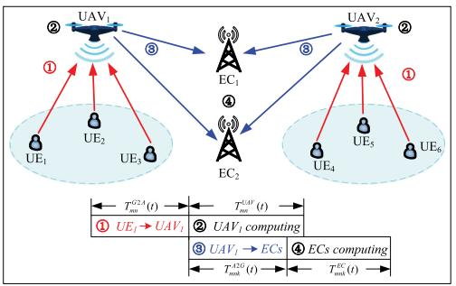

<details>
<summary>flowchart</summary>

```mermaid
graph TD
    subgraph UAV1
        A["② UAV1"] --> B["③"]
        B --> C["④"]
        C --> D["⑤"]
        D --> E["⑥"]
        E --> F["⑦"]
    end

    subgraph UAV2
        G["② UAV2"] --> H["③"]
        H --> I["④"]
        I --> J["⑤"]
        J --> K["⑥"]
        K --> L["⑦"]

    subgraph UE1
        M["UE1"] --> N["UE2"]
        O["UE3"] --> P["UE4"]
        Q["UE5"] --> R["UE6"]
    end

    subgraph UE2
        S["UE2"] --> T["UE3"]
        U["UE4"] --> V["UE5"]
        W["UE6"] --> X["UE7"]
    end

    style UAV1 fill:#f9f,stroke:#333
    style UAV2 fill:#f9f,stroke:#333
    style UE1 fill:#ccf,stroke:#333
    style UE2 fill:#ccf,stroke:#333
    style UE3 fill:#ccf,stroke:#333
    style UE4 fill:#ccf,stroke:#333
    style UE5 fill:#ccf,stroke:#333
    style UE6 fill:#ccf,stroke:#333

    note right of UAV1: T_G2A(t) → T_UAF(t)
    note left of UAV1: T_MK(t) ← T_MK(t)
    note right of UAV2: T_A2G(t) ← T_A2G(t)
    note bottom of UAV2: T_MK(t) ← T_MK(t)
    note top of UAV1: UE1 → UAV1
    note bottom of UAV2: UAV1 → ECs
    note top of UAV2: ECs computing
```
</details>

Fig. 1. Multi-UAV assisted MEC system with M UEs, N UAVs, and K ECs.

cost by jointly designing the trajectories, computation task allocation, and communication resource management of UAVs.

We formulate the highly complex non-convex optimization problem as an MDP, which is then solved by a novel cooperative MADRL framework with each UAV acting as an agent. Considering the high-dimensional continuous action space, the TD3 algorithm is designed to find the efficient UAVs’ movements, task offloading allocation, and communication resource management based on dynamic MEC environments.   
We conduct numerical simulations and demonstrate that the proposed collaborative UAV-EC offloading scheme outperforms other optimization approaches, especially in terms of adaptability to UEs’ mobility, robustness to the change of communication and computation resources, and flexibility to the dynamicity of computation tasks.

The rest of this paper is organized as follows. In Section II, we provide system model and problem formulation. Section III proposes MADRL framework to address task offloading issues. We present simulation results in Section IV and conclusion in Section V.

# II. SYSTEM MODEL AND PROBLEM FORMULATION

Fig. 1 presents the multi-UAV assisted MEC system with M UEs, N UAVs, and a set of K ECs. Each UE m needs to periodically handle computation-intensive tasks $\begin{array} { r l } { { \cal W } _ { m } } & { { } = } \end{array}$ $( D _ { m } , C _ { m } , \lambda _ { m } )$ , where $D _ { m }$ is the size of task data, $C _ { m }$ =is ( )the number of CPU cycles, and $\lambda _ { m }$ is the arrival rate of the tasks. Considering the limited computation capacities, UEs cannot perform local computing. Then, UAVs are deployed to offer MEC services to ground UEs. Practically, the UAVs are planned carefully to avoid overlapping trajectories to conserve energy and avoid collision. Therefore, we assume that each UAV is deployed to offer MEC services for ground UEs within one corresponding sub-area and that there are no overlaps between each sub-area. Moreover, it is assumed that all UAVs are connected to a single ground cloud server via the wireless backhaul links.

In the multi-UAV assisted MEC system, limited by factors such as size, weight, and power, the UAVs can provide limited computation and communication resources. Unlike UAVs, the ECs always consists of MEC servers with more resources of computation and communication. Therefore, this paper considers four main components of task offloading process: 1) ground-to-air (G2A) transmission from UEs to UAVs; 2) computation at the UAVs; 3) Air-to-ground (A2G) transmission from UAVs to ECs; and 4) computation at the ECs.

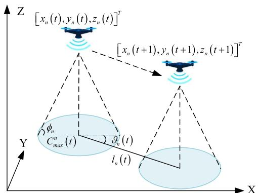

<details>
<summary>text_image</summary>

[x_n(t),y_n(t),z_n(t)]^T
[x_n(t+1),y_n(t+1),z_n(t+1)]^T
\phi_n
C_max^n(t)
g_n(t)
l_n(t)
Y
X
Z
</details>

Fig. 2. Multi-UAV assisted MEC system with M UEs, N UAVs, and K ECs.

# A. UAVs Movement

As shown in Fig. 2, the 3D coordinate of UAV n is denoted as $\omega _ { n } ( t ) = [ x _ { n } ( t ) , y _ { n } ( t ) , z _ { n } ( t ) ] ^ { T }$ , where $x _ { n } ( t ) , y _ { n } ( t )$ , and $z _ { n } ( t )$ ( ) = [ ( ) ( ) ( )] ( ) ( )are the X, Y, Z coordinates of UAV n at time ( )t, respectively. Denote $v _ { n } ( t ) \ = \ [ x _ { n } ( t ) , y _ { n } ( t ) ] ^ { T }$ as the 2D ( ) = [ ( ) ( )]coordinate of UAV n. Assume that UAV n flies the distance $l _ { n } ( t )$ with the angle direction $\vartheta _ { n } ( t ) \in [ 0 , 2 \pi )$ in the horizontal flight. Then, we have

$$
x _ {n} (t + 1) = x _ {n} (t) + l _ {n} (t) \cos (\vartheta_ {n} (t)), \tag {1}
$$

$$
y _ {n} (t + 1) = y _ {n} (t) + l _ {n} (t) \sin (\vartheta_ {n} (t)). \tag {2}
$$

Additionally, according to [26], [29], assume that UAV n has a maximum elevation angle $\phi _ { n }$ . Then, at time t, the maximum horizontal radius of UAV n $C _ { m a x } ^ { n } ( t )$ can be obtained

$$
C _ {m a x} ^ {n} (t) = z _ {n} (t) \tan (\phi_ {n}). \tag {3}
$$

Due to its limited horizontal-flight and vertical-flight speeds, UAVs always have limited flight distances, which can be given by

$$
Z _ {m i n} \leq z _ {n} (t) \leq Z _ {m a x}, \tag {4}
$$

$$
l _ {n} (t) = \left\| v _ {n} (t + 1) - v _ {n} (t) \right\| \leq L _ {\max} ^ {h}, \tag {5}
$$

$$
\Delta z _ {n} (t) = | z _ {n} (t + 1) - z _ {n} (t) | \leq L _ {\max} ^ {v}, \tag {6}
$$

where $Z _ { m i n }$ and $Z _ { m a x }$ denote the minimum and maximum heights, respectively; $\Delta z _ { n } ( t )$ denotes the vertical travel distance; $L _ { m a x } ^ { h }$ and $L _ { m a x } ^ { v }$ ( )are the maximum horizontal and vertical distances of the UAVs, respectively.

Moreover, in order to guarantee that UAVs move within the served rectangle-shaped area, the following move constraint must be satisfied, that is,

$$
0 \leq x _ {n} (t) \leq X _ {\max}, \tag {7}
$$

$$
0 \leq y _ {n} (t) \leq Y _ {\max}, \tag {8}
$$

where $X _ { m a x }$ and $Y _ { m a x }$ are the side lengths of the rectangleshaped area, respectively.

To ensure that the coverage of arbitrary two UAVs cannot overlap with each other, the following overlapping constraint must be satisfied,

$$
\left\| v _ {n} (t) - v _ {j} (t) \right\| \geq \left[ C _ {\max} ^ {n} (t) + C _ {\max} ^ {j} (t) \right], \quad \forall n, j, n \neq j. \tag {9}
$$

Similarly, to avoid collision between any two UAVs, the distance of UAVs should be no less than a minimum distance $D _ { m i n }$ . Then, we have the following collision constraint

$$
\left\| \boldsymbol {\omega} _ {n} (t) - \boldsymbol {\omega} _ {j} (t) \right\| \geq D _ {\min}, \quad \forall n, j, n \neq j. \tag {10}
$$

Note that if UEs are located within the coverage of certain UAV, the UEs will be served by the same UAV. Let UAV n serve $M _ { n } ( t )$ UEs at time t. We denote $\rho _ { m } ^ { n } ( t )$ as a binary ( )service-association vector. $\rho _ { m } ^ { n } ( t ) = 1$ ( )when UE m is served by UAV n, and $\rho _ { m } ^ { n } ( t ) = 0$ ( ) = 1otherwise. Assume that each UE ( ) = 0can only be served by at most one UAV at any time. That is,

$$
\sum_ {n = 1} ^ {N} \rho_ {m} ^ {n} (t) \leq 1, \forall m, \forall t.
$$

# B. G2A Transmission From UEs to UAVs

Here, we denote $\omega _ { m } ( t ) = [ x _ { m } ( t ) , y _ { m } ( t ) , 0 ] ^ { T }$ as the location of UE m, where $x _ { m } ( t )$ ( )and $y _ { m } ( t )$ ( ) ( ) 0]are the X and Y coordinates, ( ) ( )respectively. The distance between UAV n and UE m can be given by

$$
d _ {m n} (t) = \left\| \boldsymbol {\omega} _ {n} (t) - \boldsymbol {\omega} _ {m} (t) \right\|. \tag {11}
$$

Similar to [24], [26], [27], assume that the ground UEs can communicate with their serving UAV via the orthogonal frequency-division multiple access. Then, the interference between different UEs in the coverage of each UAV can be ignored. Due to the high altitude of UAVs, the LoS channel is much more dominant than other channel impairments such as shadowing or small-scale fading. The Doppler shift caused by the high mobility of UAVs can be assumed to be perfectly compensated at the UEs [15]. Then, the G2A channel gain between UE m and UAV n can be denoted by the free-space path loss model, which is given by

$$
h _ {m n} (t) = \frac {g _ {0}}{\left[ d _ {m n} (t) \right] ^ {2}}, \tag {12}
$$

where $g _ { 0 }$ denotes the power gain with the reference distance of 1 meter.

During the task offloading process, the uplink bandwidth $B _ { u }$ is assumed to be allocated to each UE equally. Then, the G2A data rate between UE m and UAV n is

$$
R _ {m n} (t) = \frac {B _ {u}}{M _ {n} (t)} \log_ {2} \left[ 1 + \frac {h _ {m n} (t) P _ {m}}{\sigma_ {u} ^ {2}} \right], \tag {13}
$$

where $P _ { m }$ is the transmit power of UE $m , \sigma _ { u } ^ { 2 }$ is the additive white Gaussian noise power at each UAV.

Considering that all tasks are offloaded to UAVs through the G2A channel, the G2A transmission delay between UE m and UAV n can be defined as the task data size $D _ { m }$ divided by the corresponding transmission data rate $R _ { m n } ( t )$ , that is,

$$
T _ {m n} ^ {G 2 A} (t) = \frac {D _ {m}}{R _ {m n} (t)}. \tag {14}
$$

Similarly, the G2A transmission energy consumption between UE m and UAV n can be defined as

$$
E _ {m n} ^ {G 2 A} (t) = P _ {n} ^ {r} T _ {m n} ^ {G 2 A} (t) = \frac {D _ {m} P _ {n} ^ {r}}{R _ {m n} (t)}, \tag {15}
$$

where $P _ { n } ^ { r }$ is the receiving power of UAV n.

# C. Computation at the UAVs

After receiving the entire input data from UEs, each UAV decides how much tasks computed locally. We define $\gamma _ { m k } ^ { n } ( t ) \in$ ,  and $\gamma _ { m 0 } ^ { n } ( t ) \in [ 0 , 1 ]$ ( )as the proportion of tasks of UE m [0 1] ( ) [0 1]executed at EC k and UAV n, respectively. The computation delay of UAV n handling the task of UE m is given by

$$
T _ {m n} ^ {U A V} (t) = \frac {\gamma_ {m 0} ^ {n} (t) D _ {m} C _ {m}}{f _ {m n} (t)}, \tag {16}
$$

where $f _ { m n } ( t )$ denotes the computation resource allocated from ( )UAV n to UE m. For simplicity, the UAV’s computation resource $F _ { u }$ is allocated to each served UE equally, that is $f _ { m n } ( t ) = F _ { u } / M _ { n } ( t )$ . If $\gamma _ { m 0 } ^ { n } ( t ) = 0$ , all tasks of UE m are ( ) = ( )processed at ECs, while $\gamma _ { m 0 } ^ { n } ( t ) = 1$ , all tasks of UE m are computed at UAV n.

Then, considering the computation time $T _ { m n } ^ { U A V } ( t )$ L and the ( )power consumption [30], the energy consumption of UAV n handling the task of UE m can be obtained as

$$
E _ {m n} ^ {U A V} (t) = \kappa \left[ f _ {m n} (t) \right] ^ {3} T _ {m n} ^ {U A V} (t), \tag {17}
$$

where $\kappa \geq 0$ is the effective switched capacitance.

# D. A2G Transmission From UAVs to ECs

Here, $\omega _ { k } = [ x _ { k } , y _ { k } , 0 ] ^ { T }$ is the fixed location of EC k, where $x _ { k }$ and $y _ { k }$ = [ 0]are the coordinates of EC k, respectively. Then, the distance between UAV n and EC k can be given by

$$
d _ {k n} (t) = \left\| \boldsymbol {\omega} _ {n} (t) - \boldsymbol {\omega} _ {k} \right\|. \tag {18}
$$

Considering that certain UAV offloads some tasks to ECs for further computing, the A2G channel gain between UAV n and EC k can be defined as

$$
h _ {n k} (t) = \frac {g _ {0}}{\left[ d _ {k n} (t) \right] ^ {2}}. \tag {19}
$$

Then, the transmission data rate between UAV n and EC k is given by

$$
R _ {n k} (t) = B _ {k} \log_ {2} \left[ 1 + \frac {h _ {n k} (t) P _ {n} ^ {t} (t)}{\sigma_ {e} ^ {2}} \right], \tag {20}
$$

where $B _ { k }$ is the bandwidth pre-assigned to EC k and $0 ~ \leq$ $P _ { n } ^ { t } ( t ) ~ \leq ~ P _ { m a x }$ 0denotes the transmit power of UAV n at ( )time $t , \ P _ { m a x }$ is the maximum transmission power of each UAV, and $\sigma _ { e } ^ { 2 }$ is the additive white Gaussian noise power at each EC.

Considering the task data size of ECs and the transmission data rate $R _ { m n } ( t )$ , the A2G transmission delay between UE m ( )and EC k through UAV n can be defined as

$$
T _ {m n k} ^ {A 2 G} (t) = \frac {\gamma_ {m k} ^ {n} (t) D _ {m}}{R _ {n k} (t)}. \tag {21}
$$

Similarly, the A2G transmission energy consumption between UE m and EC k through UAV n can be obtained as

$$
E _ {m n k} ^ {A 2 G} (t) = P _ {n} ^ {t} T _ {m n k} ^ {A 2 G} (t) = \frac {\gamma_ {m k} ^ {n} (t) D _ {m} P _ {n} ^ {t}}{R _ {n k} (t)}. \tag {22}
$$

# E. Computation at the ECs

ECs begin to handle the computation tasks when obtaining the task data from UAVs. Considering the task proportion $\gamma _ { m k } ^ { n } ( t )$ , the computation delay at EC k can be given by

$$
T _ {m n k} ^ {E C} (t) = \frac {\gamma_ {m k} ^ {n} (t) D _ {m} C _ {m}}{f _ {m k} (t)}, \tag {23}
$$

where $f _ { m k } ( t )$ denotes the computation resource allocated to ( )UE m. Here, the total computation resource $F _ { k } ^ { e }$ of EC k is allocated to each UE equally, that is $f _ { m k } ( t ) = F _ { k } ^ { e } / M$ .

# F. Problem Formulation

When the computation tasks of all UEs are completed, the energy consumption of UAV n can be obtained as

$$
E _ {n} (t) = \sum_ {m = 1} ^ {M} \rho_ {m} ^ {n} (t) \lambda_ {m} \left[ E _ {m n} ^ {G 2 A} (t) + E _ {m n} ^ {U A V} (t) + E _ {m n k} ^ {A 2 G} (t) \right], \tag {24}
$$

where $\lambda _ { m }$ denotes the arrival rate of tasks.

Moreover, considering that the communication and computation modules are often separated at the UAVs, the computation at the UAVs can be processed simultaneously with the task transmission to ECs. Then, the execution delay of UAV n is given by

$$
\begin{array}{l} T _ {n} (t) = \sum_ {m = 1} ^ {M} \rho_ {m} ^ {n} (t) \\ \times \left[ T _ {m n} ^ {G 2 A} (t) + \max _ {k} \{T _ {m n} ^ {U A V} (t), T _ {m n k} ^ {A 2 G} (t) + T _ {m n k} ^ {E C} (t) \} \right]. \tag {25} \\ \end{array}
$$

Then, similar to [13], [23], we denote the weighted sum of energy consumption $E _ { n } ( t )$ and execution delay $T _ { n } ( t )$ as the ( )system cost of UAV n, that is,

$$
U _ {n} (t) = w _ {1} E _ {n} (t) + w _ {2} T _ {n} (t), \tag {26}
$$

where $w _ { 1 }$ and $w _ { 2 }$ are the weights to indicate the different significance on energy consumption and execution delay, respectively. $w _ { 1 } \geq w _ { 2 }$ indicates the energy-saving scenarios while $w _ { 1 } < w _ { 2 }$ is for the delay-sensitive cases.

Thus, by jointly optimizing the UAVs’ position $\omega _ { n } ( t )$ , task partition ratios $( \gamma _ { m 0 } ^ { n } ( t )$ and $\gamma _ { m k } ^ { n } ( t ) )$ ( ), and transmit power $( P _ { n } ^ { t } ( t ) )$ ( ) ( ), the task offloading optimization problem can be ( )designed to minimize the total system cost, which is formulated as

$$
\min _ { \begin{array}{l} \boldsymbol {\omega} _ {n} (t), \gamma_ {m 0} ^ {n} (t), \\ \gamma_ {m k} ^ {n} (t), P _ {n} ^ {t} (t) \end{array} } \sum_ {n = 1} ^ {N} U _ {n} (t), \tag {27a}
$$

$$
s. t. \quad 0 \leq \gamma_ {m k} ^ {n} (t) \leq 1, \tag {27b}
$$

$$
0 \leq \gamma_ {m 0} ^ {n} (t) \leq 1, \tag {27c}
$$

$$
\gamma_ {m 0} ^ {n} (t) + \sum_ {k} \gamma_ {m k} ^ {n} (t) = 1, \forall n \tag {27d}
$$

$$
0 \leq P _ {n} ^ {t} (t) \leq P _ {\max}, \tag {27e}
$$

$$
(4) - (1 0), \tag {27f}
$$

where (27b), (27c), and (27d) denote the offloading tasks constraints of UEs, (27e) is the constraint about the transmit power of UAVs, (4)-(10) describe the movement constraints of UAVs.

Generally, it is challenging to solve the non-convex optimization problem (27). Certain unknown variables (i.e., UEs’ location and channel condition) may influence the energy consumption and execution delay, especially in the dynamic network induced by UAVs’ mobility. Moreover, considering the decision with the large solution space, it will be intractable to obtain the optimal strategy by traditional optimization schemes. To address these challenges, an RL method will be investigated to learn the near-optimal policy with little environment information in the next section.

# III. MADRL FOR TASK OFFLOADING OPTIMIZATION PROBLEM

Here, we first re-model the above problem as a multi-agent extension of the MDP, which is then solved by an MADRL method.

# A. MDP Formulation

In UAV-assisted MEC systems, UAVs determine their position, transmit power and task partition ratios to obtain the minimum total system cost. Considering that $\mathrm { U A V s } '$ actions (i.e., UAVs’ movements) may influence the environmental state, the total system cost is determined by the current state of system environment and the joint actions of all UAVs. Moreover, the former state and previous actions jointly trigger the system environment into a new stochastic state [31]. In this case, the task offloading optimization issue (27) can be formulated as a multi-agent Markov decision process (MDP) $\langle \mathcal { N } , \mathcal { S } , \{ \mathcal { A } _ { n } \} _ { n \in \mathcal { N } } , \mathcal { P } , \{ \mathcal { R } _ { n } \} _ { n \in \mathcal { N } } , \delta \rangle$ . N is the agent set, S is the state set of all agents, $\mathcal { A } _ { n }$ is the action space of agent $n ,$ $\mathcal { P }$ represents the state transition probability, $\mathcal { R } _ { n }$ is the reward function of agent n, and $\delta \in [ 0 , 1 ]$ denotes the discount factor.

[0 1]1) Agent Set N : Each UAV acts as an agent to learn its scheme of position, transmission power and task partition ratios and obtain the minimum total system cost. Thus, ${ \mathcal { N } } =$ $\{ 1 , \ldots , N \}$ .   
12) State Space S: According to the task offloading optimization problem, the state $s ( t )$ is composed of the 3D ( )coordinate positions of UAVs, that ${ \mathrm { i s } } ,$

$$
\boldsymbol {s} (t) = \{\omega_ {1} (t), \omega_ {2} (t) \dots , \omega_ {N} (t) \}. \tag {28}
$$

3) Action Space $\mathcal { A } _ { n } .$ Since each UAV is required to determine its movements (horizontal fly distance $l _ { n } ( t )$ , horizontal direction angle $\vartheta _ { n } ( t )$ ( ), and vertical fly distance $\Delta z _ { n } ( t ) )$ , transmission power $P _ { n } ^ { t } ( t )$ and task partition ratios $\gamma _ { m k } ^ { n } ( t )$ ( ), the action space $a _ { n } ( t )$ of UAV n can be given by

$$
a _ {n} (t) = \{l _ {n} (t), \vartheta_ {n} (t), \Delta z _ {n} (t), P _ {n} ^ {t} (t), \gamma_ {m k} ^ {n} (t), \forall k \}. \tag {29}
$$

According to the constraints of the minimum optimization problem (27), we can have the value ranges of each element in $a _ { n } ( t )$ , that is, $l _ { n } ( t ) \in [ 0 , L _ { m a x } ^ { h } ] , \vartheta _ { i } ( t ) \overset { \cdot } { \in } [ 0 , 2 \pi ) , \Delta z _ { n } ( t ) \in$ $[ - L _ { m a x } ^ { v } , L _ { m a x } ^ { v } ] , P _ { n } ^ { t } ( t ) \in [ 0 , P _ { m a x } ]$ (, and $\gamma _ { m k } ^ { n } ( t ) \in [ 0 , 1 ]$ ( ). Also, [ ] ( ) [0 ]we can observe that the action space $\mathcal { A } _ { n }$ ( ) [0 1]of UAV n is a continuous set. Moreover, with the number of UEs and ECs increasing, the size of action spaces exponentially increases.

4) Reward Function $\mathcal { R } _ { n } \dot { . }$ To solve the formulated task offloading optimization problem (27), the N agents should cooperatively minimize the total system cost while satisfying certain constraints, such as the overlapping and collision constraints. Then, the reward function $\mathcal { R } _ { n } ( t )$ of UAV n ( )is defined as the negative of the system cost $U _ { n } ( t )$ if all ( )constraints are satisfied. Otherwise, if certain constraints are not satisfied, there will be the corresponding penalties in the reward function $\mathcal { R } _ { n } ( t )$ . Moreover, to guarantee UAVs provide ( )computing service to all UEs, the coverage constraint of UAVs should be satisfied. If certain UE is beyond the $\mathrm { U A V s } ^ { \prime }$ coverage, there will be a penalty in the reward function. Thus, based on the above consideration, the reward function of UAV n is given by

$$
\mathcal {R} _ {n} (t) = \left\{ \begin{array}{l l} - U _ {n} (t), & \text { if   satisfying   constraints, } \\ - \eta_ {1} - \eta_ {2} - \eta_ {3} & \\ [ M - \sum_ {n = 1} ^ {N} M _ {n} (t) ], & \text { otherwise }, \end{array} \right. \tag {30}
$$

where $\eta _ { 1 } , ~ \eta _ { 2 }$ , and $\eta _ { 3 }$ denote the penalties related with the overlapping constraint (9), the collision constraint (10), and the coverage constraint, respectively. If the horizontal distance of any two UAVs does not meet the overlapping constraints (9), each of the two UAVs will experience a penalty $\eta _ { 1 }$ . Moreover, if the distance between any two UAVs does not satisfy the collision constraints (10), there will be a penalty $\eta _ { 2 }$ in the reward functions of the two UAVs. Finally, when any UEs are not covered by UAVs, all UAVs will incur the penalty

$$
\eta_ {3} [ M - \sum_ {n = 1} ^ {N} M _ {n} (t) ].
$$

# B. Multi-Agent DRL Algorithm

To solve the above multi-agent MDP, considering the high-dimensional continuous action space of the task offloading optimization problem, the multi-agent TD3 (MATD3) approach is proposed, shown in Fig. 3. Each UAV adopts a TD3 algorithm [32], which comprises one actor network with weights $\mu _ { n }$ and two critic networks with weights $\theta _ { n } ^ { 1 }$ and $\theta _ { n } ^ { 2 } .$ . With the two critic networks, each UAV can deal with the overestimation problem of the Q-values in the one-critic framework. In addition, to improve the learning stability, the target actor network with weights $\mu _ { n } ^ { \prime }$ and target critic networks with weights $\lbrace \theta _ { n } ^ { i ^ { \prime } } \rbrace _ { i = 1 , 2 }$ are adopted.

Different from other multi-agent RL algorithms, where each agent tries to maximize its reward function $\mathcal { R } _ { n } ( t )$ , a cooper-( )ative multi-agent RL architecture is adopted to achieve the maximum expected discounted reward with the sum reward of all UAVs, which is defined as

$$
\mathcal {R} (t) = \sum_ {n = 1} ^ {N} \mathcal {R} _ {n} (t). \tag {31}
$$

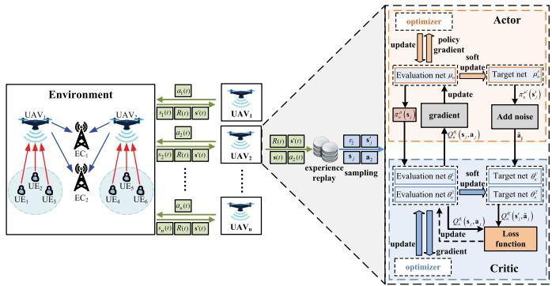

<details>
<summary>flowchart</summary>

```mermaid
graph TD
    subgraph Environment
        A["Environment"] --> B["UAV1"]
        A --> C["UAV2"]
        A --> D["UAV3"]
        A --> E["UAV4"]
        A --> F["UAV5"]
        B --> G["EC1"]
        C --> H["EC2"]
        D --> I["EC3"]
        E --> J["EC4"]
        F --> K["EC5"]
        G --> L["ε1(0)"]
        H --> M["ε2(0)"]
        I --> N["ε3(0)"]
        J --> O["ε4(0)"]
        K --> P["ε5(0)"]
        L --> Q["ε6(0)"]
        M --> R["ε7(0)"]
        N --> S["ε8(0)"]
        O --> T["ε9(0)"]
        P --> U["ε10(0)"]
        Q --> V["ε11(0)"]
        R --> W["ε12(0)"]
        S --> X["ε13(0)"]
        T --> Y["ε14(0)"]
        U --> Z["ε15(0)"]
        V --> AA["ε16(0)"]
        W --> AB["ε17(0)"]
        X --> AC["ε18(0)"]
        Y --> AD["ε19(0)"]
        Z --> AE["ε20(0)"]
    end

    subgraph Actor
        AF["Action"] --> AG["policy gradient"]
        AG --> AH["Evaluation net μi"]
        AH --> AI["gradient"]
        AI --> AJ["Add noise"]
        AJ --> AK["Target net μi"]
        AK --> AL["soft update"]
        AL --> AM["Loss function"]
    end

    subgraph Critic
        AN["optimizer"] --> AO["agent"]
        AO --> AP["policy gradient"]
        AP --> AQ["Evaluation net θi"]
        AQ --> AR["gradient"]
        AR --> AS["Add noise"]
        AS --> AT["Target net θi"]
        AT --> AU["soft update"]
        AU --> AV["Loss function"]
    end

    style Environment fill:#f9f,stroke:#333
    style Actor fill:#ccf,stroke:#333
    style Critic fill:#cfc,stroke:#333
```
</details>

Fig. 3. The MATD3 framework in Multi-UAV assisted MEC system.

Moreover, considering the non-stationarity of the network environment, to guarantee convergence, the strategy based on centralized training and decentralized execution is adopted [33]. Specifically, in the centralized training stage, the evaluation critic networks and target critic networks are designed to obtain a global view and deployed in the ground cloud server. Evaluation critic networks are at the state $s _ { n } ( t )$ and action $a _ { n } ( t )$ of other agents via communication. ( )Then, all $\mathrm { U A V s }$ ( ) utilize global state $s ( t )$ and joint actions $\pmb { a } ( t ) = \{ a _ { 1 } ( t ) , a _ { 2 } ( t ) , \ldots , a _ { N } ( t ) \}$ ( )so that the policy of other ( ) = ( ) ( ) ( )UAVs can be estimated and Q-function $Q _ { n } ^ { \theta _ { i } } ( s ( t ) , \pmb { a } ( t ) )$ can ( ( ) ( ))be obtained for all UAVs. Also, based on the estimated policy of other UAVs, each UAV can adjust the local actor policy $\pi _ { n } ^ { \mu } : { \mathcal { S } }  { \mathcal { A } } _ { n }$ to achieve the global optimal policy $\pi ^ { \mu } = \{ \bar { \pi } _ { 1 } ^ { \mu } , \pi _ { 2 } ^ { \mu } , . . . , \pi _ { N } ^ { \mu } \}$ . Then, the network environment is considered to be stationary to each UAV during the centralized offline training stage. During the decentralized execution stage, the critic networks of UAVs are no longer required, and the weights of the actor networks are fixed. Each UAV executes its policy using the trained evaluation actor network $\pi _ { n } ^ { \mu } ( s ( t ) )$ with the learned weight $\mu _ { n } ,$ ( ( )) based only on its local state information $s _ { n } ( t )$ . Considering that the UAVs do not commu-( )nicate with each other, this will greatly reduce communication overhead and enable its scalability to multi-UAV assisted MEC system.

The MATD3 approach for the task offloading optimization problem is summarized in Algorithm 1. We first initialize weights of the six neural networks and replay buffer B in all UAVs. In each episode, each UAV selects action based on its evaluation actor network $\pi _ { n } ^ { \mu } ( s ( t ) )$ with random noise ξ. ( ( ))According to the action taken above, all UAVs execute the three-dimensional movements (horizontal fly distance $l _ { n } ( t )$ , horizontal direction angle $\vartheta _ { n } ( t )$ ( ), and vertical fly distance $\Delta z _ { n } ( t ) )$ , transmission power $P _ { n } ^ { t } ( t )$ and task partition ratios $\gamma _ { m k } ^ { n } ( t )$ ( ). When moving out of the range of the served area, ( )certain UAV may fly with a random horizontal angle. Moreover, if moving beyond the limit vertical height, UAVs keep flying at the boundary height $( Z _ { m i n }$ or $Z _ { m a x } )$ . Also, when covering certain hotspots, the corresponding UAVs keep their 3D positions and only change their transmission power and task partition ratios. By executing the above actions, all UAVs will receive the next state $s ^ { \prime } ( t )$ , joint action $\mathbf { } \mathbf { } \mathbf { } \mathbf { } \mathbf { } \mathbf { } \mathbf { } \mathbf { } \mathbf { } \mathbf { } \mathbf { } \mathbf { } \mathbf { } \mathbf { } \mathbf { } \mathbf { } \mathbf { } \mathbf { } \mathbf { } \mathbf { } \mathbf { } \mathbf { } \mathbf { } \mathbf { } \mathbf { } \mathbf { } \mathbf { } \mathbf { } \mathbf { } \mathbf { } \mathbf { } \mathbf { } \mathbf { } \mathbf { } \mathbf { } \mathbf { } \mathbf { } \mathbf { } \mathbf { } \mathbf { } \mathbf { } \mathbf { } \mathbf { } \mathbf { } \mathbf { } \mathbf { } \mathbf { } \mathbf { } \mathbf { } \mathbf { } \mathbf { } \mathbf { } \mathbf { } \mathbf { } \mathbf { } \mathbf { } \mathbf { } \mathbf { } \mathbf { } \mathbf { } \mathbf { } \mathbf { } \mathbf { } \mathbf { } \mathbf { } \mathbf { } \mathbf { } \mathbf { } \mathbf { } \mathbf { } \mathbf { } \mathbf { } \mathbf { } \mathbf { } \mathbf { } \mathbf { } \mathbf { } \mathbf { } \mathbf { } \mathbf { } \mathbf { } \mathbf { } \mathbf { } \mathbf { } \mathbf { } \mathbf { } \mathbf { } \mathbf { } \mathbf { } \mathbf { } \mathbf { } \mathbf { } \mathbf { } \mathbf { } \mathbf { } \mathbf { } \mathbf { } \mathbf { } \mathbf { } \mathbf { } \mathbf { } \mathbf { } \mathbf { } \mathbf { } \mathbf { } \mathbf { } \mathbf { } \mathbf { } \mathbf { } \mathbf { } \mathbf { } \mathbf { } \mathbf { } \mathbf { } \mathbf { } \mathbf { } \mathbf { } \mathbf { } \mathbf { } \mathbf { } \mathbf { } \mathbf { } \mathbf \Psi \mathbf { } \Psi \mathbf { } \mathbf { } \mathbf { } \mathbf { } \mathbf { } \mathbf \Psi \Psi \mathbf { } \mathbf { } \mathbf \Psi \Psi \mathbf { } \mathbf { } \mathbf \Psi \Psi \mathbf { } \mathbf \Psi \Psi \mathbf { } \mathbf \Psi \Psi \mathbf { } \mathbf \Psi \mathbf { } \mathbf \Psi \mathbf { } \mathbf \Psi \Psi \mathbf \Psi \Psi \mathbf { } \mathbf \Psi \mathbf \Psi \Psi \Psi \mathbf \Psi \Psi \mathbf \Psi \Psi \mathbf \Psi \Psi \mathbf \Psi \mathbf \Psi \Psi \mathbf \Psi \mathbf \Psi \Psi \mathbf \Psi \mathbf \Psi \mathbf \Psi \Psi \mathbf \Psi$ and immediate reward R t .

( )To stabilize training process and improve sample efficiency, each UAV stores the current experience $( \pmb { s } ( t ) , \pmb { s } ^ { \prime } ( t ) , \pmb { a } ( t ) , \mathcal { R } ( t )$ in the replay buffer B with size Mr [34]. For each UAV, sample a random mini-batch of $\{ s _ { j } , s _ { j } ^ { \prime } , \pmb { a } _ { j } , r _ { j } \}$ with size $M _ { b }$ from B. Then, by feeding $s _ { j }$ into the evaluation actor network to generate the policy $\pi _ { n } ^ { \mu } ( s _ { j } )$ , each UAV can update the weight of evaluation actor network using policy gradient strategy [35], that is,

Algorithm 1 MATD3 Approach for Task Offloading Problem   
- Initialize each UAV's actor networks with weights $\mu_n$ and $\mu_n'$ , respectively.
- Initialize each UAV's critic networks with weights $\{\theta_n^i\}_{i=1,2}$ and $\{\theta_n^{i'}\}_{i=1,2}$ , respectively.
- Initialize each UAV's replay buffer $\mathcal{B}$ .
- for each episode do
- Initialize the state $s(t)$ and $t=1$ .
- while $t<T_p$ do
- Each UAV selects action $a_n(t)=\pi_n^\mu(s_n(t))+\xi$ .
- All UAVs set their movements, transmission power and task partition ratios according to the joint action $a(t)$ .
- All UAVs obtain the reward $\mathcal{R}(t)$ and the next state $s(t+1)$ and joint action $a(t)$ via communication.
- Store $(s(t), s'(t), a(t), \mathcal{R}(t))$ in $\mathcal{B}$ for all $n\in\mathcal{N}$ .
- $s(t)\leftarrow s'(t)$ .
- for $n=1,\ldots,N$ do
- Sample a random mini-batch of $(s_j, s'_j, a_j, r_j)$ for all UAVs from $\mathcal{B}$ .
- Update weights $\{\theta_n^i\}_{i=1,2}$ of evaluation critic networks by minimizing loss function $L(\theta_n^i)$ in (35).
- If $t$ mod $d$ then
- Update weights $\mu_n$ of evaluation actor network with (32).
- Update weights of the three target networks in (37).
- end If
- end for
- end for
- end for

$$
\begin{array}{l} \nabla_ {\mu_ {n}} J (\mu_ {n}) \\ = \frac {1}{M _ {b}} \sum_ {j = 1} ^ {M _ {b}} \nabla_ {\mu_ {n}} \pi_ {n} ^ {\mu} (s _ {n} ^ {j}) \nabla_ {a _ {n}} Q _ {n} ^ {\theta_ {1}} (\boldsymbol {s} _ {j}, a _ {1} ^ {j}, a _ {n}, \dots , a _ {N} ^ {j}) | _ {a _ {n} = \pi_ {n} ^ {\mu} (s _ {n} ^ {j})}. \tag {32} \\ \end{array}
$$

Moreover, to prevent over-fitting on the narrow peaks of Q-values, the random noise  is added to target actor network, ˜which can achieve a smoother state-action value estimation. The modified target actions $\tilde { \mathbf { a } } _ { j }$ is given by

$$
\tilde {\boldsymbol {a}} _ {j} = \pi_ {n} ^ {\mu^ {\prime}} \left(\boldsymbol {s} _ {j} ^ {\prime}\right) + \tilde {\epsilon}, \tag {33}
$$

where $\tilde { \epsilon } \sim c l i p \left( N \left( 0 , \hat { \sigma } ^ { 2 } \right) , - 1 , 1 \right)$ is the noise with mean ˜ 0 ˆ and standard deviation $\hat { \sigma }$ 1 1and clipped. Then, target values $y _ { j }$ can be obtained as

$$
y _ {j} = r _ {j} + \delta \min _ {i = 1, 2} Q _ {n} ^ {\theta_ {i} ^ {\prime}} \left(\boldsymbol {s} _ {j} ^ {\prime}, \tilde {\boldsymbol {a}} _ {j}\right), \quad i = 1, 2. \tag {34}
$$

Then, based on the policy $\pi _ { n } ^ { \mu } ( s _ { j } )$ , the two evaluation ( )critic network will concurrently obtain the two Q-values

$Q _ { n } ^ { \theta _ { 1 } } ( s _ { j } , \pi _ { n } ^ { \mu } ( s _ { j } ) )$ and $Q _ { n } ^ { \theta _ { 2 } } ( s _ { j } , \pi _ { n } ^ { \mu } ( s _ { j } ) )$ by minimizing the loss (function $L ( \theta _ { n } ^ { i } )$ )) ( ( ), which is defined as

$$
L (\theta_ {n} ^ {i}) = \frac {1}{M _ {b}} \sum_ {j = 1} ^ {M _ {b}} [ y _ {j} - Q _ {n} ^ {\theta_ {i}} (\boldsymbol {s} _ {j}, \boldsymbol {a} _ {j}) ] ^ {2}, \quad i = 1, 2. \tag {35}
$$

Next, according to (32) and (35), each UAV can update the weights of the three evaluation networks using the following equations

$$
\mu_ {n} \leftarrow \mu_ {n} - \lambda \nabla_ {\mu_ {n}} J (\mu_ {n}),
$$

$$
\theta_ {n} ^ {i} \leftarrow \theta_ {n} ^ {i} - \lambda \nabla_ {\theta_ {n} ^ {i}} L (\theta_ {n} ^ {i}), \quad i = 1, 2, \tag {36}
$$

where λ denotes the learning rate. To reduce errors resulting from temporal difference learning, each UAV updates the weights of evaluation actor network at a lower frequency than that of evaluation critic networks. Here, each UAV chooses to update the evaluation actor network every d time-steps.

Thus, in order to stabilize the training process, by copying the weights of corresponding evaluation networks, each UAV updates the weights of the three target networks every d timesteps through

$$
\mu_ {n} ^ {\prime} = \tau \mu_ {n} + (1 - \tau) \mu_ {n} ^ {\prime},
$$

$$
\theta_ {n} ^ {i ^ {\prime}} = \tau \theta_ {n} ^ {i} + (1 - \tau) \theta_ {n} ^ {i ^ {\prime}}, \quad i = 1, 2, \tag {37}
$$

where τ denotes the updating rate.

Finally, we discuss the complexity analysis of our proposed MATD3 algorithm. As for the communication complexity, in the centralized training procedure, the ground cloud server needs to frequently communicate with UAVs to obtain the state about the 3D coordinate positions of UAVs. Since the total dimension of UAVs’ positions is N , the communication 3complexity is O N . While in the decentralized execution ( )process, each UAV obtains its action locally, leading to no communication between UAVs. Hence, the overall communication complexity of our proposed MATD3 algorithm is O N .

( )Moreover, in the centralized training process, each UAV estimates the Q-function values with critic networks, where the sizes of the inputs and outputs are $3 N + N ( 4 + M K )$ and , 3 + (4 + ) 1respectively. In addition, each UAV determines its action based on its actor networks with the input size N and the output size $N ( 4 + M K )$ 3. While in the decentralized execution procedure, (4 + )each UAV obtains its action from its actor networks with the input size  and the output size   M K. According to [36], given the fully-connected neural network with fixed numbers of hidden layers and neurons, the computational complexity of the back-propagation algorithm is proportional to the product of the input size and the output size. For the critic network, the centralized training backprop complexity is O N M K while ( )for the actor network, the decentralized execution procedure is $\mathcal { O } ( N ^ { 2 } + N M K )$ . Therefore, the overall complexity is $\mathcal { O } ( N ^ { 2 } + N M K )$ .

# IV. PERFORMANCE EVALUATION

In this section, numerical experiments are conducted to evaluate the performance of our proposed MATD3. Here, a multi-UAV assisted MEC system is considered with 2 fixed ECs in an area of $4 0 0 \times 4 0 0 ~ m ^ { 2 }$ . The 30 UEs are randomly 400 400distributed within two hotspots, as illustrated in Fig. 4. The two UAVs are randomly located to offer their computing offloading help to the ground UEs. The size of input data $D _ { m }$ is generated randomly within , , and number of CPU cycles $C _ { m }$ [2 10]are uniform randomly chosen from , . The [100 200]main simulation parameter settings are summarized in Table I. The proposed MATD3 framework has two-hidden-layer neural networks with 400 and 300 neurons. Table II presents the main hyperparameters of the model.

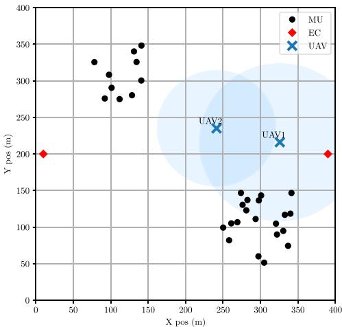

<details>
<summary>scatter</summary>

| Type | X pos (m) | Y pos (m) |
|------|-----------|-----------|
| MU   | 100       | 300       |
| MU   | 120       | 340       |
| MU   | 140       | 350       |
| MU   | 160       | 330       |
| MU   | 180       | 310       |
| MU   | 200       | 290       |
| MU   | 220       | 270       |
| MU   | 240       | 250       |
| MU   | 260       | 230       |
| MU   | 280       | 210       |
| MU   | 300       | 190       |
| MU   | 320       | 170       |
| MU   | 340       | 150       |
| MU   | 360       | 130       |
| MU   | 380       | 110       |
| MU   | 400       | 90        |
| MU   | 420       | 70        |
| MU   | 440       | 50        |
| MU   | 460       | 30        |
| MU   | 480       | 10        |
| MU   | 500       | 5         |
| MU   | 520       | 0         |
| MU   | 540       | -5        |
| MU   | 560       | -10       |
| MU   | 580       | -15       |
| MU   | 600       | -20       |
| MU   | 620       | -25       |
| MU   | 640       | -30       |
| MU   | 660       | -35       |
| MU   | 680       | -40       |
| MU   | 700       | -45       |
| MU   | 720       | -50       |
| MU   | 740       | -55       |
| MU   | 760       | -60       |
| MU   | 780       | -65       |
| MU   | 800       | -70       |
| MU   | 820       | -75       |
| MU   | 840       | -80       |
| MU   | 860       | -85       |
| MU   | 880       | -90       |
| MU   | 900       | -95       |
| MU   | 920       | -100      |
| MU   | 940       | -105      |
| MU   | 960       | -110      |
| MU   | 980       | -115      |
| MU   | 1000      | -120      |
| MU   | 1020      | -125      |
| MU   | 1040      | -130      |
| MU   | 1060      | -135      |
| MU   | 1080      | -140      |
| MU   | 1100      | -145      |
| MU   | 1120      | -150      |
| MU   | 1140      | -155      |
| MU   | 1160      | -160      |
| MU   | 1180      | -165      |
| MU   | 1200      | -170      |
| MU   | 1220      | -175      |
| MU   | 1240      | -180      |
| MU   | 1260      | -185      |
| MU   | 1280      | -190      |
| MU   | 1300      | -195      |
| MU   | 1320      | -200      |
| MU   | 1340      | -205      |
| MU   | 1360      | -210      |
| MU   | 1380      | -215      |
| MU   | 1400      | -220      |
| MU   | 1420      | -225      |
| MU   | 1440      | -230      |
| MU   | 1460      | -235      |
| MU   | 1480      | -240      |
| MU   | 1500      | -245      |
| MU   | 1520      | -250      |
| MU   | 1540      | -255      |
| MU   | 1560      | -260      |
| MU   | 1580      | -265      |
| MU   | 1600      | -270      |
| MU   | 1620      | -275      |
| MU   | 1640      | -280      |
| MU   | 1660      | -285      |
| MU   | 1680      | -290      |
| MU   | 1700      | -295      |
| MU   | 1720      | -300      |
| MU   | 1740      | -305      |
| MU   | 1760      | -310      |
| MU   | 1780      | -315      |
| MU   | 1800      | -320      |
| MU   | 1820      | -325      |
| MU   | 1840      | -330      |
| MU   | 1860      | -335      |
| MU   | 1880      | -340      |
| MU   | 1900      | -345      |
| MU   | 1920      | -350      |
| MU   | 1940      | -355      |
| MU   | 1960      | -360      |
| MU   | 1980      | -365      |
| MU   | 2000      | -370      |
| EUA2 (UAV)     | ~245     | ~235     |
| UAV (UAV)     | ~335     | ~225     |
| EC (EC)        | ~395     | ~295     |
The chart displays a scatter plot with X and Y axes labeled in meters. The data points are plotted as black dots for each category: 'MU' or 'UAV'. The legend indicates 'MU', 'UAV', and 'EC'. The values on the scatter points are explicitly labeled.
</details>

Fig. 4. Locations of 30 UEs, 2 ECs and 2 UAVs in multi-UAV assisted MEC system.

TABLE I NETWORK ENVIRONMENT PARAMETERS 

<table><tr><td>Parameters</td><td>Value</td></tr><tr><td>Size of input data  $D_m$ </td><td>[1,5] Mbits</td></tr><tr><td>Number of CPU cycles  $C_m$ </td><td>[100,200] cycles/bit</td></tr><tr><td>Arrival rate of tasks  $λ_m$ </td><td>1 task/sec</td></tr><tr><td>Maximum height of UAVs  $Z_{max}$ </td><td>100 m</td></tr><tr><td>Minimum height of UAVs  $Z_{min}$ </td><td>50 m</td></tr><tr><td>Minimum horizontal distance  $L_{max}^h$ </td><td>49 m</td></tr><tr><td>Minimum vertical distance  $L_{max}^v$ </td><td>12 m</td></tr><tr><td>Minimum distance of UAVs  $D_{min}$ </td><td>100 m</td></tr><tr><td>elevation angle  $φ_n$ </td><td>42.44° [29]</td></tr><tr><td>Path loss exponent  $g_0$ </td><td>-50dB</td></tr><tr><td>Uplink channel bandwidth  $B_u$ </td><td>10 MHz</td></tr><tr><td>Bandwidth preassigned to ECs  $B_k$ </td><td>0.5 MHz</td></tr><tr><td>Maximum transmit power of UAVs  $P_{max}$ </td><td>5 W</td></tr><tr><td>Transmit power of UE  $P_m$ </td><td>0.1 W</td></tr><tr><td>Receiving power of UAVs  $P_n^r$ </td><td>0.1 W</td></tr><tr><td>Computation resource  $F_u$ </td><td>3 GHz</td></tr><tr><td>Computation resource  $F_e^k$ </td><td>[6,9] GHz</td></tr><tr><td>Effective switched capacitance κ</td><td> $10^{-28}$ </td></tr><tr><td>Noise power  $σ_u^2$ </td><td>-100 dBm</td></tr><tr><td>Noise power  $σ_e^2$ </td><td>-100 dBm</td></tr><tr><td>Weights  $w_1$  and  $w_2$ </td><td>1</td></tr><tr><td>Penalty coefficient of UAVs&#x27; overlapping  $η_1$ </td><td>5</td></tr><tr><td>Penalty of UAVs&#x27; collision  $η_2$ </td><td>5</td></tr><tr><td>Penalty of UAVs&#x27; coverage  $η_3$ </td><td>5</td></tr></table>

# A. Training Efficiency of MATD3 Scheme

In this section, the training performance of our proposed MATD3 optimization method is analyzed. The optimal location and computing task allocation of UAVs are also present in this multi-UAV assisted MEC system. The training curves of our proposed MATD3 optimization method is shown in

TABLE II HYPERPARAMETERS OF MATD3 MODEL 

<table><tr><td>Parameter</td><td>Value</td></tr><tr><td>Total episodes</td><td>100</td></tr><tr><td>Time step  $T_p$ </td><td>200</td></tr><tr><td>Updating rate  $\tau$ </td><td>0.005</td></tr><tr><td>Mini-batch size  $M_b$ </td><td>100</td></tr><tr><td>Discount rate  $\delta$ </td><td>0.99</td></tr><tr><td>Learning rate  $\lambda$ </td><td>0.0001</td></tr><tr><td>Size of  $\mathcal{B}$ </td><td>100000</td></tr><tr><td>Optimizer</td><td>AdamOptimizer</td></tr></table>

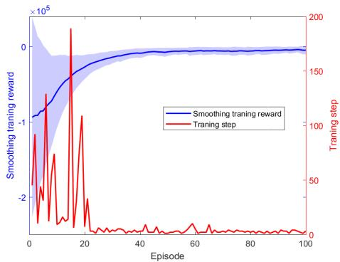

<details>
<summary>line</summary>

| Episode | Smoothing training reward | Training step |
| ------- | ------------------------- | ------------- |
| 0       | -10000                    | 200           |
| 10      | -5000                     | 100           |
| 20      | 0                         | 50            |
| 30      | 5000                      | 25            |
| 40      | 10000                     | 10            |
| 50      | 15000                     | 5             |
| 60      | 17500                     | 2             |
| 70      | 18000                     | 1             |
| 80      | 18500                     | 1             |
| 90      | 19000                     | 1             |
| 100     | 19500                     | 1             |
</details>

Fig. 5. Training curves of MATD3.

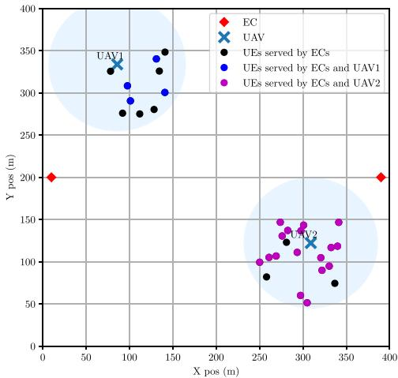  
Fig. 6. Optimal location of the UAVs.

Fig. 5. The training steps are very large at the beginning of learning. As the number of episodes increases, learning steps converge to less than 10 within 30 episodes, which makes the convergence speed tend to increase. Moreover, as the number of episodes increases, the two UAVs cover the area of served UEs more rapidly. Then, the value of [penalty in the reward function will tend to zero, leading to the convergence of the training reward.

Figures 6 and 7 present the corresponding optimal location and computing task allocation of UAVs, respectively. From Fig. 6, we can observe that each UAV can be almost located in the center of one hotspot, which make UAVs provide computing offloading efficiently. Moreover, the dodgerblue shade represents the coverage of UAVs. The higher the UAV’s location is, the larger its coverage becomes. Considering the collision avoiding constraints of UAVs and channel condition, our proposed method can obtain the optimal location of UAVs to provide offloading opportunities for UEs. Furthermore, according to the optimal task splitting ratio allocation strategy, certain UEs are served by ECs only, while certain UEs obtain computing offloading services from ECs and UAV.

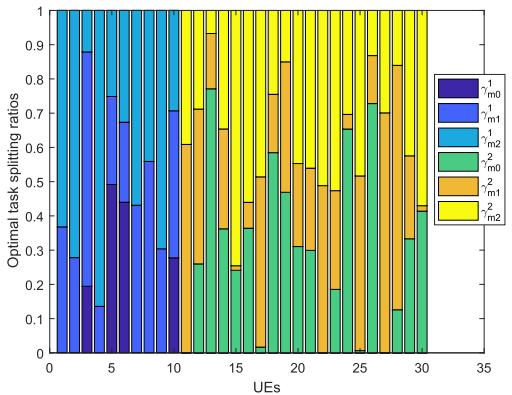

<details>
<summary>bar_stacked</summary>

| UEs | r1_m0 | r1_m1 | r1_m2 | r2_m0 | r2_m1 | r2_m2 |
|---|---|---|---|---|---|---|
| 0-5 | 0.38 | 0.97 | 0.00 | 0.00 | 0.00 | 0.00 |
| 5-10 | 0.44 | 0.68 | 0.00 | 0.00 | 0.00 | 0.00 |
| 10-15 | 0.31 | 0.56 | 0.00 | 0.26 | 0.13 | 0.00 |
| 15-20 | 0.01 | 0.00 | 0.78 | 0.37 | 0.13 | 0.00 |
| 20-25 | 0.00 | 0.00 | 0.78 | 0.37 | 0.13 | 0.00 |
| 25-30 | 0.01 | 0.00 | 0.78 | 0.37 | 0.13 | 0.00 |
| >30 | 0.00 | 0.00 | 0.78 | 0.37 | 0.13 | 0.00 |
The chart displays the optimal task splitting ratios for each UE count, categorized by the legend 'r1_m0', 'r1_m1', 'r2_m2', and 'r2_m2'. The values are normalized to a constant scale of 1. The chart is grouped into three rows: bottom row (purple), middle row (blue), and top row (green). The y-axis represents the optimal task splitting ratio ranging from 0 to 1. The x-axis represents the number of UEs (UEs). The data shows that for each UE count, the optimal split ratio varies significantly across the categories, with some lines indicating different conditions or models, though specific numerical values are not explicitly labeled on the chart.
</details>

Fig. 7. Optimal task splitting ratios of $\mathrm { E C s } \ \gamma _ { m k } ^ { n }$ (m = 1, 2 and n = 1, 2) for UEs.

Then, Fig. 7 presents the optimal task splitting ratio allocation strategy. Since the two UAVs cover the two hotspots respectively, UAV1 (UAV2) does not offer the computing offloading services for the UEs of the hotspot covered by UAV2 (UAV1). In this case, the first 10 UEs are served by UAV1, while the last 20 UEs are served by UAV2. Furthermore, we observe that for UEs (5 and 6) with large size of input tasks, over 40% of the tasks are first processed at UAV1 $( \mathrm { i } . \mathrm { e } . , \gamma _ { m 0 } ^ { 1 } )$ . After that, the remaining tasks will be offloaded to ECs for subsequent executing. While 75% of the last 20 UEs are served by both UAV2 and ECs.

Next, Fig. 8 indicates the effect of the per-device bandwidth on the optimal task partition ratios. The per-device bandwidth $B _ { 1 }$ of EC  changes from 0.1 to 3 MHz while the other 1per-device bandwidth $B _ { 2 }$ remains 0.5 MHz, and vice versa. With the bandwidth assigned to ECs increasing, the more bandwidth will be assigned to UEs when computing tasks are offloaded from the UAVs to the ECs, leading to the higher downlink data rates. Then, we can achieve the less transmission delay and energy consumption. Moreover, when $B _ { 1 } = B _ { 2 } = 0 . 5$ , we can achieve the same total system cost = = 0 5in both cases, that is, two lines intersect at the same point. Specifically, EC with the greater weight on total system cost when $B _ { 1 } = B _ { 2 } = 0 . 5$ will have a greater impact on = = 0 5reducing total system cost with more assigned bandwidth. While $B _ { k } ~ > ~ 0 . 5$ with the other fixed 0.5 MHz, the more 0 5bandwidth will be assigned to EC k. The case of EC will 1achieve the less total system cost compared with that of EC . However, when $B _ { k } < 0 . 5 .$ EC k will receive the less 2 0 5bandwidth. In the case of EC , EC  has a greater impact on 2reducing total system cost with $B _ { 1 } = 0 . 5 > B _ { 2 }$ .

Figure 9 plots total system cost with the various computation capacities of and different per-device bandwidths $B _ { 1 }$ . The computation capacity UAVs $F _ { u }$ increases from 3 to 10 GHz. The bandwidth $B _ { 1 }$ of EC increases from 0.5 to 2 MHz with $B _ { 2 } ~ = ~ 0 . 5$ 1. With the growing bandwidth of EC , the = 0 5 1higher downlink data rate will be obtained, resulting in the less transmission delay, energy consumption and total system cost. Moreover, with the computation capacity UAVs $F _ { u }$ increasing, the more computation resource is allocated UEs, leading to the less computation delay and total system cost.

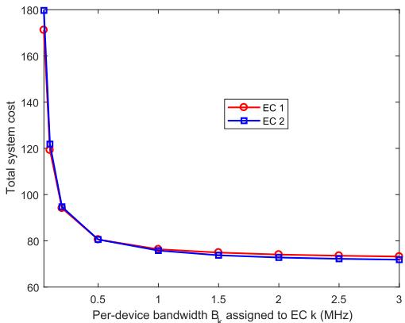

<details>
<summary>line</summary>

| Per-device bandwidth Bk assigned to EC k (MHz) | EC 1 | EC 2 |
| --------------------------------------------- | ---- | ---- |
| 0.0                                           | 175  | 180  |
| 0.5                                           | 95   | 95   |
| 1.0                                           | 78   | 78   |
| 1.5                                           | 75   | 75   |
| 2.0                                           | 74   | 74   |
| 2.5                                           | 73   | 73   |
| 3.0                                           | 72   | 72   |
</details>

Fig. 8. Total system cost with different per-device bandwidths $B _ { k } .$

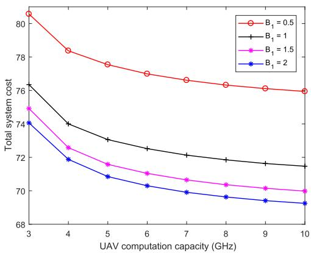

<details>
<summary>line</summary>

| UAV computation capacity (GHz) | B₁ = 0.5 | B₁ = 1 | B₁ = 1.5 | B₁ = 2 |
| ------------------------------ | -------- | ------ | -------- | ------ |
| 3                              | 80.5     | 76.5   | 75.0     | 74.0   |
| 4                              | 78.5     | 74.0   | 72.5     | 71.5   |
| 5                              | 77.5     | 73.0   | 71.5     | 70.5   |
| 6                              | 77.0     | 72.5   | 71.0     | 70.0   |
| 7                              | 76.5     | 72.0   | 70.5     | 69.5   |
| 8                              | 76.0     | 71.5   | 70.0     | 69.0   |
| 9                              | 75.5     | 71.0   | 69.5     | 68.5   |
| 10                             | 75.0     | 70.5   | 69.0     | 68.0   |
</details>

Fig. 9. Total system cost with different computation capacitis of UAVs.

To further analyze the scalability of our proposed MATD3 method, we evaluate the performance with different numbers of UAVs and UEs, as shown in Fig. 10. The UEs are distributed over N hotspots uniformly, with the number M increasing from 30 to 80. From Fig. 10, we can observe that as the numbers of UEs M increases, the more computation tasks are required to be processed, which results in the higher total system cost. Moreover, with the number of UAVs N increasing, there will be more UAVs participating in computation offloading. In the case of the same numbers of UEs and tasks, the greater number of participating UAVs is, the smaller total system cost will be achieved. However, if the numbers of UEs and tasks are so small, it may be not suitable to obtain much more UAVs to participate. For example, when M , the = 30performance of two UAVs is almost close to that of three UAVs. Furthermore, as we increase the numbers of UEs M to 80 with N , the MATD3 method can still deal with = 3the multi-UAV optimization problem. This confirms the high scalability of the MATD3 strategy with respect to the size of UAVs, state and action spaces.

Fig. 11 depicts the relationship between the energy consumption and execution delay of task offloading problem under the weight parameter w2. The weight $w _ { 2 }$ increases from 0.2 to 1.8 with $w _ { 1 } = 1$ . As can be seen, a small w2 puts more weight = 1to the energy consumption. With the weight w2 increasing, the execution delay is more emphasized and more tasks are offloaded to UAVs, which results in less delay and more energy consumption. However, when $w _ { 2 }$ is large enough, the execution delay even does not decrease any more since the

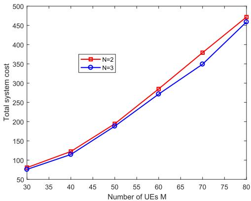

<details>
<summary>line</summary>

| Number of UEs M | N=2  | N=3  |
| --------------- | ---- | ---- |
| 30              | 80   | 80   |
| 40              | 120  | 115  |
| 50              | 195  | 190  |
| 60              | 285  | 270  |
| 70              | 380  | 350  |
| 80              | 475  | 460  |
</details>

Fig. 10. Total system cost as a function of the UAVs’ numbers.   
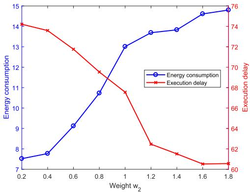

<details>
<summary>line</summary>

| Weight w₂ | Energy consumption | Execution delay |
| --------- | ------------------ | --------------- |
| 0.2       | 7.5                | 74              |
| 0.4       | 7.8                | 73              |
| 0.6       | 9.0                | 72              |
| 0.8       | 10.8               | 70              |
| 1.0       | 13.0               | 68              |
| 1.2       | 13.8               | 62              |
| 1.4       | 13.9               | 60              |
| 1.6       | 14.8               | 60              |
| 1.8       | 15.0               | 60              |
</details>

Fig. 11. Energy consumption and execution delay vs weight w2.

computing capacity that the UAVs can provide is limited and more tasks lead to higher processing delay.

# B. Optimization Performance With Various Approaches

In this section, we evaluate the performance with various optimization approaches in both fixed UEs and mobile UEs scenarios. In the mobile UEs scenarios, UEs can walk randomly with a normal distribution movement in each episode.

The MATD3 approach is compared with the following five other optimization methods. The degraded versions of the MATD3 approach with the fixed power scheme $( P _ { n } ^ { t } =$ 3 W ), the fixed hight of UAVs $( z _ { n } = 8 0 m )$ = are considered, = 80which are denoted as MATD3-FP and MATD3-FH. Multiagent DDPG (MADDPG) approach is also considered. In the MATD3-EC method, UAVs offload all tasks to ECs for processing directly. In the random scheme, all UAVs randomly select each element of action space within the constraints, that is, the horizontal flying distance $l _ { n } ( t ) \in [ 0 , L _ { m a x } ^ { h } ] .$ , the flying angle $\vartheta _ { i } ( t ) \in [ 0 , 2 \pi )$ ( ) [0 ], the vertical flying distance $\Delta z _ { n } ( t ) \ \in$ (−Lvmax, $[ - L _ { m a x } ^ { v } , L _ { m a x } ^ { v } ]$ [0 2 ), the transmission power $P _ { n } ^ { t } ( t ) \in [ 0 , P _ { m a x } ] .$ , [ ]and the task splitting ratio $\gamma _ { m k } ^ { n } ( t ) \in [ 0 , 1 ]$ .

( ) [0 1]Figure 12 presents total system cost as a function of uplink channel bandwidths $B _ { u }$ with different optimization methods. As the uplink channel bandwidth $B _ { u }$ increases, the higher uplink data rate from UEs is achieved, which leads to the less G2A transmission delay and energy consumption. Then, the total system cost decreases in all optimization methods. Moreover, compared with the case of N , more UAVs = 2will participate in computation tasks with the number of UAVs $N \ = \ 3$ , resulting in the smaller total system cost in all = 3optimization methods.

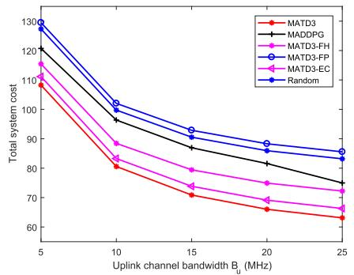

<details>
<summary>line</summary>

| Uplink channel bandwidth B_u (MHz) | MATD3 | MADDPG | MATD3-FH | MATD3-FP | MATD3-EC | Random |
| ----------------------------------- | ----- | ------ | -------- | -------- | -------- | ------ |
| 5                                   | 110   | 120    | 115      | 125      | 110      | 130    |
| 10                                  | 80    | 95     | 85       | 100      | 80       | 100    |
| 15                                  | 70    | 85     | 75       | 90       | 70       | 90     |
| 20                                  | 65    | 80     | 70       | 85       | 65       | 85     |
| 25                                  | 60    | 75     | 65       | 80       | 60       | 80     |
</details>

(a)Fixed UEs with N= 2

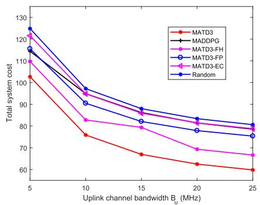

<details>
<summary>line</summary>

| Uplink channel bandwidth B_u (MHz) | MATD3 | MADDPG | MATD3-FH | MATD3-FP | MATD3-EC | Random |
| ----------------------------------- | ----- | ------ | -------- | -------- | -------- | ------ |
| 5                                   | 102   | 118    | 110      | 124      | 120      | 126    |
| 10                                  | 76    | 98     | 90       | 96       | 94       | 98     |
| 15                                  | 68    | 88     | 82       | 86       | 84       | 88     |
| 20                                  | 62    | 82     | 70       | 80       | 78       | 82     |
| 25                                  | 60    | 80     | 68       | 78       | 76       | 80     |
</details>

(b)Fixed UEs with N=3

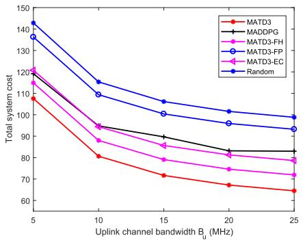

<details>
<summary>line</summary>

| Uplink channel bandwidth B_u (MHz) | MATD3 | MADDPG | MATD3-FH | MATD3-FP | MATD3-EC | Random |
| ----------------------------------- | ----- | ------ | -------- | -------- | -------- | ------ |
| 5                                   | 110   | 120    | 120      | 140      | 120      | 140    |
| 10                                  | 80    | 95     | 90       | 110      | 95       | 115    |
| 15                                  | 70    | 90     | 80       | 100      | 85       | 105    |
| 20                                  | 65    | 85     | 75       | 95       | 80       | 100    |
| 25                                  | 60    | 80     | 70       | 90       | 75       | 95     |
</details>

(c) Mobile UEs with $N = 3$

Fig. 12. Total system cost with different optimization methods and uplink channel bandwidths $B _ { u } .$   
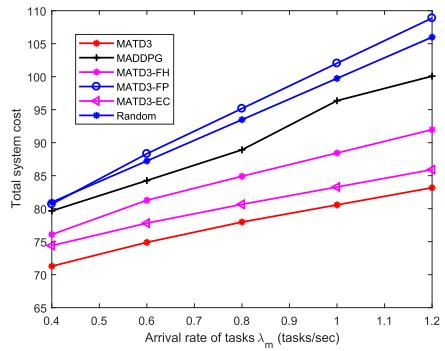

<details>
<summary>line</summary>

| Arrival rate of tasks λₘ (tasks/sec) | MATD3 | MADDPG | MATD3-FH | MATD3-FP | MATD3-EC | Random |
| ------------------------------------- | ----- | ------ | -------- | -------- | -------- | ------ |
| 0.4                                   | 71    | 80     | 75       | 80       | 75       | 80     |
| 0.6                                   | 75    | 85     | 80       | 85       | 80       | 85     |
| 0.8                                   | 78    | 90     | 85       | 90       | 85       | 90     |
| 1.0                                   | 80    | 95     | 88       | 95       | 88       | 95     |
| 1.2                                   | 82    | 100    | 92       | 100      | 92       | 100    |
</details>

(a) Fixed UEs with $N = 2$

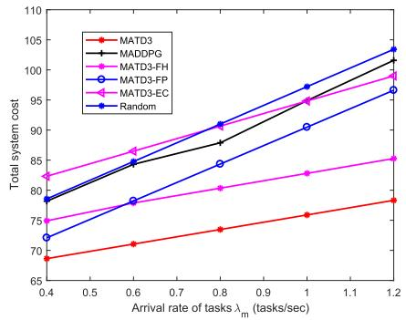

<details>
<summary>line</summary>

| Arrival rate of tasks λₘ (tasks/sec) | MATD3 | MADDPG | MATD3-FH | MATD3-FP | MATD3-EC | Random |
| ------------------------------------- | ----- | ------ | -------- | -------- | -------- | ------ |
| 0.4                                   | 68.5  | 79.0   | 78.0     | 72.0     | 75.0     | 72.0   |
| 0.6                                   | 71.0  | 84.0   | 85.0     | 78.0     | 86.0     | 78.0   |
| 0.8                                   | 73.0  | 88.0   | 90.0     | 84.0     | 91.0     | 84.0   |
| 1.0                                   | 75.0  | 92.0   | 95.0     | 90.0     | 95.0     | 90.0   |
| 1.2                                   | 78.0  | 102.0  | 102.0    | 98.0     | 104.0    | 104.0  |
</details>

(b)Fixed UEs with $N = 3$

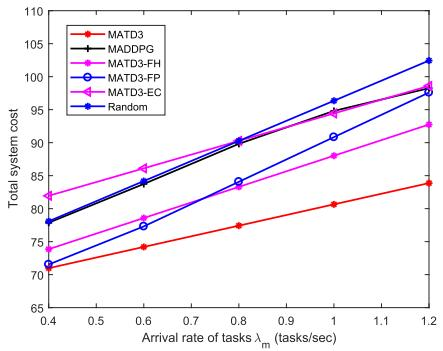

<details>
<summary>line</summary>

| Arrival rate of tasks λₘ (tasks/sec) | MATD3 | MADDPG | MATD3-FH | MATD3-FP | MATD3-EC | Random |
| ------------------------------------- | ----- | ------ | -------- | -------- | -------- | ------ |
| 0.4                                   | 71    | 78     | 82       | 75       | 72       | 71     |
| 0.6                                   | 74    | 84     | 86       | 79       | 76       | 75     |
| 0.8                                   | 77    | 90     | 90       | 84       | 80       | 80     |
| 1.0                                   | 80    | 96     | 94       | 89       | 85       | 85     |
| 1.2                                   | 84    | 102    | 98       | 94       | 90       | 90     |
</details>

(c) Mobile UEs with $N = 3$

Fig. 13. Total system cost with different optimization methods and arrival rate of tasks $\lambda _ { m } .$ .   
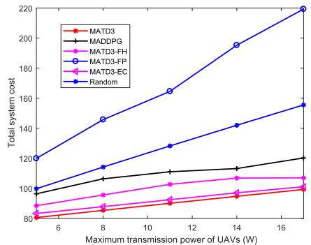

<details>
<summary>line</summary>

| Maximum transmission power of UAVs (W) | MATD3 | MADDPG | MATD3-FH | MATD3-FP | MATD3-EC | Random |
| ---------------------------------------- | ----- | ------ | -------- | -------- | -------- | ------ |
| 6                                        | 80    | 95     | 90       | 120      | 85       | 100    |
| 8                                        | 85    | 105    | 95       | 145      | 90       | 115    |
| 10                                       | 90    | 110    | 100      | 165      | 95       | 130    |
| 12                                       | 95    | 115    | 105      | 185      | 100      | 145    |
| 14                                       | 100   | 120    | 110      | 200      | 105      | 160    |
| 16                                       | 105   | 125    | 115      | 220      | 110      | 175    |
</details>

(a) Fixed UEs with N= 2

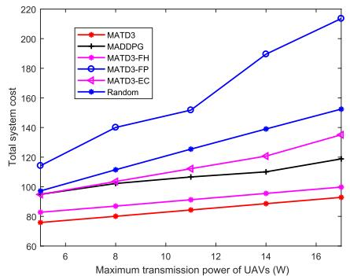

<details>
<summary>line</summary>

| Maximum transmission power of UAVs (W) | MATD3 | MADDPG | MATD3-FH | MATD3-FP | MATD3-EC | Random |
|---|---|---|---|---|---|---|
| 6 | 78 | 98 | 98 | 100 | 85 | 115 |
| 8 | 82 | 102 | 105 | 142 | 88 | 110 |
| 10 | 86 | 108 | 112 | 152 | 92 | 125 |
| 14 | 90 | 110 | 120 | 190 | 98 | 140 |
| 16 | 94 | 118 | 135 | 215 | 102 | 152 |
</details>

(b)Fixed UEswith N=3

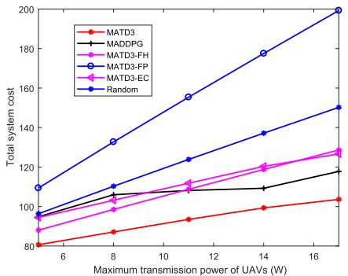

<details>
<summary>line</summary>

| Maximum transmission power of UAVs (W) | MATD3 | MADDPG | MATD3-FH | MATD3-FP | MATD3-EC | Random |
| ---------------------------------------- | ----- | ------ | -------- | -------- | -------- | ------ |
| 6                                        | 80    | 95     | 95       | 110      | 85       | 95     |
| 8                                        | 85    | 105    | 105      | 130      | 95       | 110    |
| 10                                       | 90    | 110    | 110      | 155      | 105      | 125    |
| 12                                       | 95    | 110    | 110      | 175      | 115      | 140    |
| 14                                       | 100   | 110    | 110      | 185      | 120      | 150    |
| 16                                       | 105   | 120    | 120      | 200      | 130      | 160    |
</details>

(c） Mobile UEs with $N = 3$   
Fig. 14. Total system cost with different optimization methods and maximum transmission power of UAVs $P _ { m a x } .$ .

Furthermore, since the random approach selects a random action to achieve the maximum immediate reward, the large total system cost is experienced with both numbers of UAVs, especially in the mobile UEs scenarios. With the fixed power allocation and fixed height of UAVs, the MATD3-FP and MATD3-FH methods always obtain the larger total system cost compared with our proposed MATD3 approach with both numbers of UAVs. In the case of the MADDPG method, as the number of UAVs increasing, it will be more difficult to obtain the optimal action, leading to the worse performance in the case of the three UAVs. In the MATD3-EC method, without UAVs participating in tasks processing, it always achieves larger total system cost compared with our proposed method. Our MATD3 method can always achieve the smallest total system cost among the six approaches in both fixed UEs and mobile UEs scenarios.

Figure 13 plots total system cost as a function of arrival rate of tasks $\lambda _ { m }$ with different optimization methods. With the arrival rate of tasks $\lambda _ { m }$ increasing, the more total energy needs to be consumed for UAVs, resulting in the higher total system cost decreases in all optimization approaches. In addition, with more UAVs participating in task offloading, the smaller total system cost can be achieved in Fig. 14(b). Moreover, with the relatively high fixed transmission power, the largest total system cost is obtained with the MATD3-FH method in the case of N  . The random scheme always obtains the large = 2total system cost with the high arrival rate of tasks. Without UAVs participating in tasks processing, it will be challenging for the MATD3-EC method to deal with so much tasks, especially in the case of N  . Compared with the other four learning approaches, our proposed MATD3 approach can achieve the smallest total system cost with both numbers of UAVs.

Figure 14 shows total system cost as a function of maximum transmission power of UAVs $P _ { m a x }$ with different optimization methods. The MATD3-FP approach is considered with the fixed power scheme $\begin{array} { l l l } { ( P _ { n } ^ { t } } & { = } & { P _ { m a x } ) } \end{array}$ . With the maximum transmission power of $\mathrm { U A V s } P _ { m a x }$ increasing, we may need to use the higher transmission power of UAVs $P _ { n } ^ { t }$ . Considering that the transmission energy consumption is an increasing function of $P _ { n } ^ { t }$ , the higher system cost can be obtained as $P _ { m a x }$ increases in all cases. It can be also observed that with more UAVs offering task offloading services, the scenario of $N = 3$ can achieve the smaller total system cost than that of $N = 2$ .

= 2Moreover, since the MATD3-FP approach always allocates the fixed transmission power of UAVs with $P _ { n } ^ { t } ~ =$ $P _ { m a x } ,$ =, it may achieve the maximum downlink transmission energy consumption among the six approaches, especially in the large maximum transmission power of UAVs $P _ { m a x } .$ As for the random method, the relatively higher total system cost is achieved compared with other four learning schemes (MATD3-FH, MADDPG, MATD3-EC, and MATD3). With the fixed height of UAVs, the MATD3-FH method may need the more transmission power of UAVs to guarantee the enough downlink transmission data rate, which results in the larger transmission energy consumption. In the MATD3-EC method, since all UAVs only offload all tasks to ECs for processing directly, the downlink transmission energy consumption accounts for a large proportion in the total system cost. Then, as $P _ { m a x }$ increases, it may achieve the larger total system cost, especially in the case of $N \ = \ 3$ . Clearly, MADDPG experiences the worse performance with the larger number of UAVs compared with other methods. Our proposed approach greatly outperforms the above four schemes with the smallest total system cost with both numbers of UAVs. Especially when $N = 2$ , our proposed approach always obtains the optimal = 2transmission power of UAVs regardless of the maximum transmission power $P _ { m a x }$ .

# V. CONCLUSION

This paper investigated a UAV-assisted MEC system with multiple UAVs and multiple ECs offloading computation tasks of UEs collaboratively. An optimization problem was formulated to obtain the minimum sum of execution delays and energy consumptions by jointly designing the trajectories, computation task allocation, and communication resource management. A cooperative MADRL framework was developed to tackle the non-convexity of the task offloading optimization issue. Considering the high-dimensional continuous action space, MATD3 algorithm was presented to obtain the optimal policy efficiently. Numerical evaluations were given to indicate that the proposed collaborative UAV-EC offloading method can adapt to the mobility of UEs, the change of communication and computation resources, and the dynamicity of computation tasks. The proposed scheme can significantly reduce the total system cost compared with other optimization approaches.

# REFERENCES

[1] G. Yang, Q. Zhang, and Y.-C. Liang, “Cooperative ambient backscatter communications for green Internet-of-Things,” IEEE Internet Things J., vol. 5, no. 2, pp. 1116–1130, Apr. 2018.

[2] X. Kang, Y.-C. Liang, and J. Yang, “Riding on the primary: A new spectrum sharing paradigm for wireless-powered IoT devices,” IEEE Trans. Wireless Commun., vol. 17, no. 9, pp. 6335–6347, Sep. 2018.   
[3] C. Park and J. Lee, “Mobile edge computing-enabled heterogeneous networks,” IEEE Trans. Wireless Commun., vol. 20, no. 2, pp. 1038–1051, Feb. 2021.   
[4] Q. Chen, H. Zhu, L. Yang, X. Chen, S. Pollin, and E. Vinogradov, “Edge computing assisted autonomous flight for UAV: Synergies between vision and communications,” IEEE Commun. Mag., vol. 59, no. 1, pp. 28–33, Jan. 2021.   
[5] P. A. Apostolopoulos, G. Fragkos, E. E. Tsiropoulou, and S. Papavassiliou, “Data offloading in UAV-assisted multi-access edge computing systems under resource uncertainty,” IEEE Trans. Mobile Comput., early access, Mar. 31, 2021, doi: 10.1109/TMC.2021.3069911.   
[6] G. Yang, Y.-C. Liang, R. Zhang, and Y. Pei, “Modulation in the air: Backscatter communication over ambient OFDM carrier,” IEEE Trans. Commun., vol. 66, no. 3, pp. 1219–1233, Mar. 2018.   
[7] X. Xu, H. Zhao, H. Yao, and S. Wang, “A blockchain-enabled energyefficient data collection system for UAV-assisted IoT,” IEEE Internet Things J., vol. 8, no. 4, pp. 2431–2443, Feb. 2021.   
[8] N. Zhao, Z. Liu, and Y. Cheng, “Multi-agent deep reinforcement learning for trajectory design and power allocation in multi-UAV networks,” IEEE Access, vol. 8, pp. 139670–139679, 2020.   
[9] G. Yang, R. Dai, and Y. C. Liang, “Energy-efficient UAV backscatter communication with joint trajectory design and resource optimization,” IEEE Trans. Wireless Commun., vol. 20, no. 2, pp. 926–941, Feb. 2021.   
[10] M. Li, N. Cheng, J. Gao, Y. Wang, L. Zhao, and X. Shen, “Energyefficient UAV-assisted mobile edge computing: Resource allocation and trajectory optimization,” IEEE Trans. Veh. Technol., vol. 69, no. 3, pp. 3424–3438, Mar. 2020.   
[11] Y. Wang, Z.-Y. Ru, K. Wang, and P.-Q. Huang, “Joint deployment and task scheduling optimization for large-scale mobile users in multi-UAVenabled mobile edge computing,” IEEE Trans. Cybern., vol. 50, no. 9, pp. 3984–3997, Sep. 2020.   
[12] Y. Xu, T. Zhang, D. Yang, Y. Liu, and M. Tao, “Joint resource and trajectory optimization for security in UAV-assisted MEC systems,” IEEE Trans. Commun., vol. 69, no. 1, pp. 573–588, Jan. 2021.   
[13] Z. Yu, Y. Gong, S. Gong, and Y. Guo, “Joint task offloading and resource allocation in UAV-enabled mobile edge computing,” IEEE Internet Things J., vol. 7, no. 4, pp. 3147–3159, Apr. 2020.   
[14] Y. Liu, S. Xie, and Y. Zhang, “Cooperative offloading and resource management for UAV-enabled mobile edge computing in power IoT system,” IEEE Trans. Veh. Technol., vol. 69, no. 10, pp. 12229–12239, Oct. 2020.   
[15] J. Ji, K. Zhu, C. Yi, and D. Niyato, “Energy consumption minimization in UAV-assisted mobile-edge computing systems: Joint resource allocation and trajectory design,” IEEE Internet Things J., vol. 8, no. 10, pp. 8570–8584, May 2021.   
[16] J. Zhang et al., “Stochastic computation offloading and trajectory scheduling for UAV-assisted mobile edge computing,” IEEE Internet Things J., vol. 6, no. 2, pp. 3688–3699, Apr. 2019.   
[17] C. Sun, W. Ni, and X. Wang, “Joint computation offloading and trajectory planning for UAV-assisted edge computing,” IEEE Trans. Wireless Commun., vol. 20, no. 8, pp. 5343–5358, Aug. 2021, doi: 10.1109/TWC.2021.3067163.   
[18] C. Zhan, H. Hu, Z. Liu, Z. Wang, and S. Mao, “Multi-UAV-enabled mobile-edge computing for time-constrained IoT applications,” IEEE Internet Things J., vol. 8, no. 20, pp. 15553–15567, Oct. 2021, doi: 10.1109/JIOT.2021.3073208.   
[19] R. S. Sutton, and A. G. Barto, Reinforcement learning: An introduction. MIT Press Cambridge, 1998.   
[20] N. C. Luong et al., “Applications of deep reinforcement learning in communications and networking: A survey,” IEEE Commun. Surveys Tuts., vol. 21, no. 4, pp. 3133–3174, May 2019, doi: 10.1109/COMST.2019.2916583.   
[21] N. Zhao, Y.-C. Liang, D. Niyato, Y. Pei, M. Wu, and Y. Jiang, “Deep reinforcement learning for user association and resource allocation in heterogeneous cellular networks,” IEEE Trans. Wireless Commun., vol. 18, no. 11, pp. 5141–5152, Nov. 2019.   
[22] H. Peng and X. Shen, “Multi-agent reinforcement learning based resource management in MEC- and UAV-assisted vehicular networks,” IEEE J. Sel. Areas Commun., vol. 39, no. 1, pp. 131–141, Jan. 2021.   
[23] A. Asheralieva and D. Niyato, “Hierarchical game-theoretic and reinforcement learning framework for computational offloading in UAV-enabled mobile edge computing networks with multiple service providers,” IEEE Internet Things J., vol. 6, no. 5, pp. 8753–8769, Oct. 2019.

[24] S. Zhu, L. Gui, D. Zhao, N. Cheng, Q. Zhang, and X. Lang, “Learningbased computation offloading approaches in UAVs-assisted edge computing,” IEEE Trans. Veh. Technol., vol. 70, no. 1, pp. 928–944, Jan. 2021.   
[25] Q. Liu, L. Shi, L. Sun, J. Li, M. Ding, and F. S. Shu, “Path planning for UAV-mounted mobile edge computing with deep reinforcement learning,” IEEE Trans. Veh. Technol., vol. 69, no. 5, pp. 5723–5728, May 2020.   
[26] L. Wang, K. Wang, C. Pan, W. Xu, N. Aslam, and A. Nallanathan, “Deep reinforcement learning based dynamic trajectory control for UAVassisted mobile edge computing,” IEEE Trans. Mobile Comput., early access, Feb. 16, 2021, doi: 10.1109/TMC.2021.3059691.   
[27] T. Ren et al., “Enabling efficient scheduling in large-scale UAVassisted mobile edge computing via hierarchical reinforcement learning,” IEEE Internet Things J., early access, Apr. 7, 2021, doi: 10.1109/JIOT.2021.3071531.   
[28] L. Wang, K. Wang, C. Pan, W. Xu, N. Aslam, and L. Hanzo, “Multiagent deep reinforcement learning-based trajectory planning for multi-UAV assisted mobile edge computing,” IEEE Trans. Cognit. Commun. Netw., vol. 7, no. 1, pp. 73–84, Mar. 2021.   
[29] M. Alzenad, A. El-Keyi, F. Lagum, and H. Yanikomeroglu, “3-D placement of an unmanned aerial vehicle base station (UAV-BS) for energyefficient maximal coverage,” IEEE Wireless Commun. Lett., vol. 6, no. 4, pp. 434–437, Aug. 2017.   
[30] Y. Wang, M. Sheng, X. Wang, L. Wang, and J. Li, “Mobile-edge computing: Partial computation offloading using dynamic voltage scaling,” IEEE Trans. Commun., vol. 64, no. 10, pp. 4268–4282, Oct. 2016.   
[31] F. Ding, X. Zhang, and L. Xu, “The innovation algorithms for multivariable state-space models,” Int. J. Adapt. Control Signal Process., vol. 33, no. 11, pp. 1601–1608, Oct. 2019.   
[32] S. Fujimoto, H. van Hoof, and D. Meger, “Addressing function approximation error in actor-critic methods,” 2018, arXiv:1802.09477.   
[33] T. Yuan, W. D. R. Neto, C. E. Rothenberg, K. Obraczka, C. Barakat, and T. Turletti, “Dynamic controller assignment in software defined Internet of vehicles through multi-agent deep reinforcement learning,” IEEE Trans. Netw. Service Manage., vol. 18, no. 1, pp. 585–596, Mar. 2021.   
[34] D. Silver, G. Lever, N. Heess, T. Degris, D. Wierstra, and M. Riedmiller, “Deterministic policy gradient algorithms,” in Proc. 31st Int. Conf. Mach. Learn., vol. 32, Jun. 2014, pp. 387–395.   
[35] F. Ding, L. Xu, D. Meng, X.-B. Jin, A. Alsaedi, and T. Hayat, “Gradient estimation algorithms for the parameter identification of bilinear systems using the auxiliary model,” J. Comput. Appl. Math., vol. 369, May 2020, Art. no. 112575.   
[36] M. Sipper, “A serial complexity measure of neural networks,” in Proc. IEEE Int. Conf. Neural Netw., San Francisco, CA, USA, Mar. 1993, pp. 962–966.

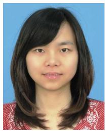

<details>
<summary>natural_image</summary>

Portrait photo of a woman with shoulder-length dark hair against a blue background (no text or symbols visible)
</details>

Nan Zhao (Member, IEEE) received the B.S., M.S., and Ph.D. degrees from Wuhan University, Wuhan, China, in 2005, 2007, and 2013, respectively. She is currently a Professor with the Hubei University of Technology, Wuhan, and also works as a Post-Doctoral Research Fellow at the University of Electronic Science and Technology of China. Her current research involves machine learning in wireless communications.


<details>
<summary>natural_image</summary>

Portrait photo of a smiling woman with long dark hair wearing a light blue collared shirt and black jacket (no text or symbols visible)
</details>

Yiyang Pei (Senior Member, IEEE) received the B.Eng. and Ph.D. degrees in electrical and electronic engineering from Nanyang Technological University, Singapore, in 2007 and 2012, respectively. From 2012 to 2016, she was a Research Scientist with the Institute for Infocomm Research, Singapore. She is currently an Associate Professor with the Singapore Institute of Technology, Singapore. Her current research interests include reconfigurable intelligent surface, dynamic spectrum access, and application of machine learning to wireless commu-  
nications and networks. She was a recipient of the IEEE Communications Society Stephen O. Rice Prize Paper Award in 2021. She is an Editor of IEEE TRANSACTIONS ON COGNITIVE COMMUNICATIONS AND NETWORKING.


<details>
<summary>natural_image</summary>

Portrait of a smiling man wearing glasses and a suit (no text or symbols visible)
</details>

Ying-Chang Liang (Fellow, IEEE) was a Professor with The University of Sydney, Australia, a Principal Scientist and a Technical Advisor with the Institute for Infocomm Research, Singapore, and a Visiting Scholar with Stanford University, USA. He is currently a Professor with the University of Electronic Science and Technology of China, China, where he leads the Center for Intelligent Networking and Communications (CINC). His research interests include wireless networking and communications, cognitive radio, symbiotic communications, dynamic

spectrum access, the Internet of Things, artificial intelligence, and machine learning techniques.

Dr. Liang is a Foreign Member of Academia Europaea. He was a Distinguished Lecturer of the IEEE Communications Society and the IEEE Vehicular Technology Society. He received the Prestigious Engineering Achievement Award from the Institution of Engineers, Singapore, in 2007, the Outstanding Contribution Appreciation Award from the IEEE Standards Association in 2011, and the Recognition Award from the IEEE Communications Society Technical Committee on Cognitive Networks in 2018. He was a recipient of numerous paper awards, including the IEEE Communications Society Stephen O. Rice Prize Paper Award in 2021, the IEEE Jack Neubauer Memorial Award in 2014, and the IEEE Communications Society APB Outstanding Paper Award in 2012. He was the Chair of the IEEE Communications Society Technical Committee on Cognitive Networks and served as the TPC Chair and the Executive Co-Chair for IEEE GLOBECOM’17. He was a Guest/an Associate Editor of IEEE TRANSACTIONS ON WIRELESS COMMU-NICATIONS, IEEE JOURNAL ON SELECTED AREAS IN COMMUNICATIONS, IEEE Signal Processing Magazine, IEEE TRANSACTIONS ON VEHICULAR TECHNOLOGY, and IEEE TRANSACTIONS ON SIGNAL AND INFORMATION PROCESSING OVER NETWORKS. He was the Associate Editor-in-Chief of the Random Matrices: Theory and Applications (World Scientific). He is the Founding Editor-in-Chief of IEEE JOURNAL ON SELECTED AREAS IN COM-MUNICATIONS: Cognitive Radio Series, and the Key Founder and the Editorin-Chief of IEEE TRANSACTIONS ON COGNITIVE COMMUNICATIONS AND NETWORKING. He is also serving as the Associate Editor-in-Chief for China Communications. He has been recognized by Thomson Reuters (now Clarivate Analytics) as a Highly Cited Researcher since 2014.


<details>
<summary>natural_image</summary>

Portrait of a man wearing glasses and a polo shirt against a blue background (no text or symbols visible)
</details>

Zhiyang Ye received the bachelor’s degree from Nanchang Hangkong University in 2019. He is currently pursuing the master’s degree in electrical engineering with the Hubei University of Technology. His main research focuses on machine learning in wireless communications.


<details>
<summary>natural_image</summary>

Portrait of a man wearing glasses and a light blue shirt (no text or symbols visible)
</details>

Dusit Niyato (Fellow, IEEE) received the B.Eng. degree from the King Mongkut’s Institute of Technology Ladkrabang in 1999 and the Ph.D. degree in electrical and computer engineering from the University of Manitoba, Canada, in 2008. He is currently a Full Professor with the School of Computer Science and Engineering, Nanyang Technological University, Singapore. His research interests are in the areas of green communications, the Internet of Things, and sensor networks.