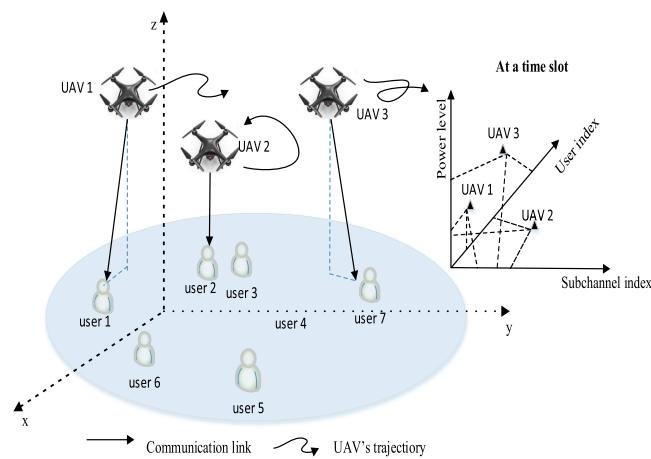
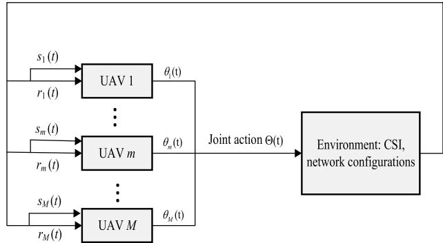
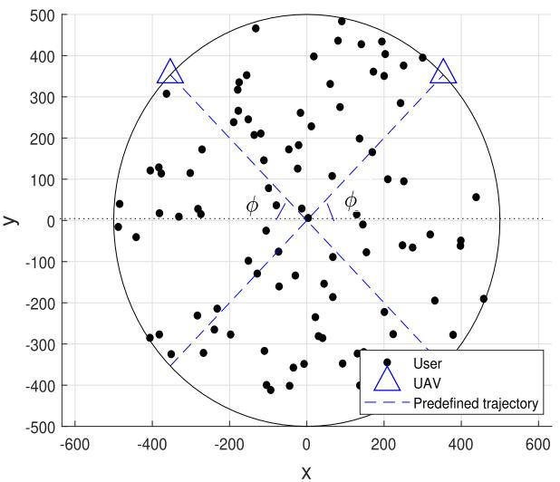
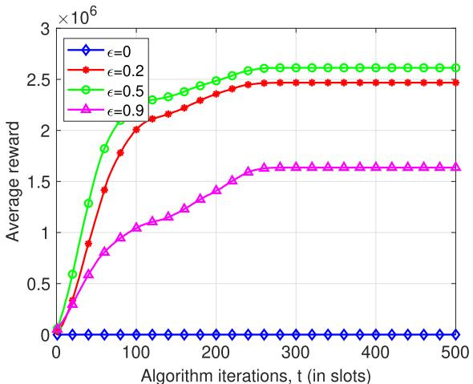
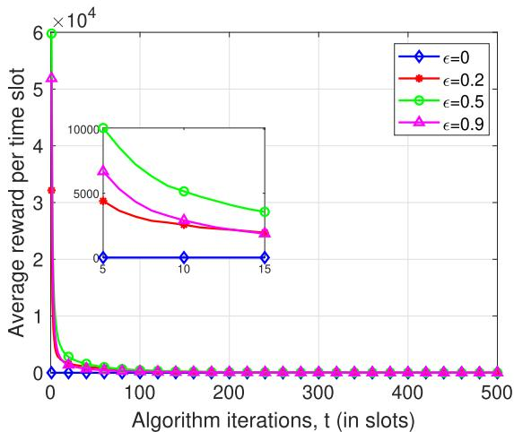
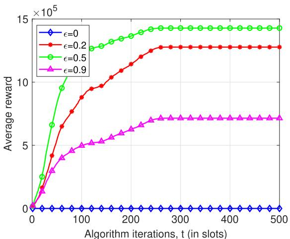
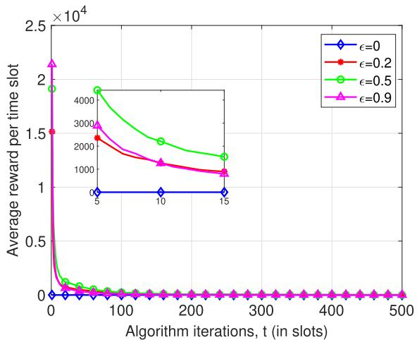
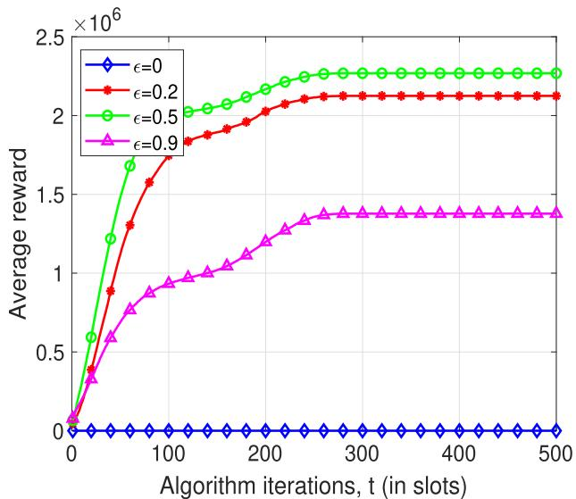
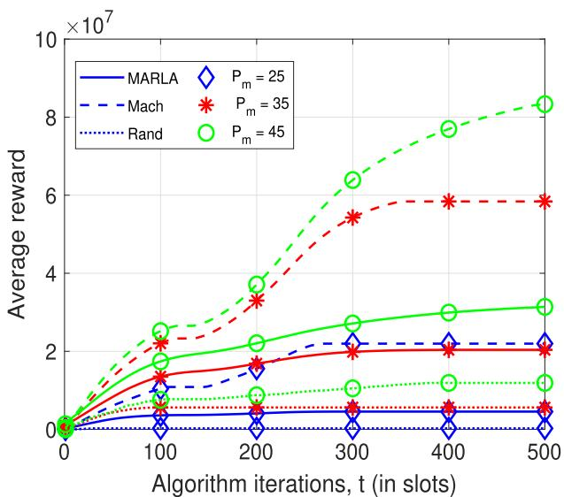
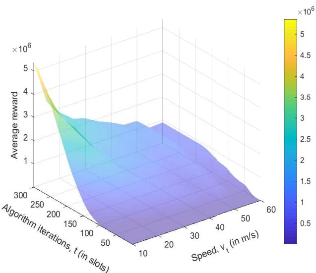

# Multi-Agent Reinforcement Learning-Based Resource Allocation for UAV Networks

Jingjing Cui , Member, IEEE, Yuanwei Liu , Senior Member, IEEE,

and Arumugam Nallanathan , Fellow, IEEE

Abstract— Unmanned aerial vehicles (UAVs) are capable of serving as aerial base stations (BSs) for providing both costeffective and on-demand wireless communications. This article investigates dynamic resource allocation of multiple UAVs enabled communication networks with the goal of maximizing long-term rewards. More particularly, each UAV communicates with a ground user by automatically selecting its communicating user, power level and subchannel without any information exchange among UAVs. To model the dynamics and uncertainty in environments, we formulate the long-term resource allocation problem as a stochastic game for maximizing the expected rewards, where each UAV becomes a learning agent and each resource allocation solution corresponds to an action taken by the UAVs. Afterwards, we develop a multi-agent reinforcement learning (MARL) framework that each agent discovers its best strategy according to its local observations using learning. More specifically, we propose an agent-independent method, for which all agents conduct a decision algorithm independently but share a common structure based on Q-learning. Finally, simulation results reveal that: 1) appropriate parameters for exploitation and exploration are capable of enhancing the performance of the proposed MARL based resource allocation algorithm; 2) the proposed MARL algorithm provides acceptable performance compared to the case with complete information exchanges among UAVs. By doing so, it strikes a good tradeoff between performance gains and information exchange overheads.

Index Terms— Dynamic resource allocation, multi-agent reinforcement learning (MARL), stochastic games, UAV communications.

## I. INTRODUCTION

A <sup>ERIAL</sup> <sup>communication</sup> <sup>networks,</sup> <sup>encouraging</sup> <sup>new</sup> <sup>inno-</sup>vative functions to deploy wireless infrastructure, have vative functions to deploy wireless infrastructure, have recently attracted increasing interests for providing high network capacity and enhancing coverage [2], [3]. Unmanned aerial vehicles (UAVs), also known as remotely piloted aircraft systems (RPAS) or drones, are small pilotless aircraft that are rapidly deployable for complementing terrestrial communications based on the 3rd Generation Partnership Project (3GPP) LTE-A (Long term evolution-advanced) [4]. In contrast to channel characteristics of terrestrial communications, the channels of UAV-to-ground communications are more probably line-of-sight (LoS) links [5], which is beneficial for wireless communications.

In particular, UAVs based different aerial platforms that for providing wireless services have attracted extensive research and industry efforts in terms of the issues of deployment, navigation and control [6]–[8]. Nevertheless, resource allocation such as transmit power, serving users and subchannels, as a key communication problem, is also essential to further enhance the energy-efficiency and coverage for UAV-enabled communication networks.

## A. Prior Works

Compared to terrestrial BSs, UAVs are generally faster to deploy and more flexible to configure. The deployment of UAVs in terms of altitude and distance between UAVs was investigated for UAV-enabled small cells in [9]. In [10], a three-dimensional (3D) deployment algorithm based on circle packing is developed for maximizing the downlink coverage performance. Additionaly, a 3D deployment algorithm of a single UAV is developed for maximizing the number of covered users in [11]. By fixing the altitudes, a successive UAV placement approach was proposed to minimize the number of UAVs required while guaranteeing each ground user to be covered by at least one UAV in [12]. Moreover, 3D drone-cell deployments for mitigating congestion of cellular networks was investigated in [13], where the 3D placement problem was solved by designing the altitude and the two-dimensional location, separately.

Despite the deployment optimization of UAVs, trajectory designs of UAVs for optimizing the communication performance have attracted tremendous attentions, such as in [14]–[16]. In [14], the authors considered one UAV as a mobile relay and investigated the throughput maximization problem by optimizing power allocation and the UAV’s trajectory. Then, a designing approach of the UAV’s trajectory based on successive convex approximation (SCA) techniques was proposed in [14]. By transforming the continuous trajectory into a set of discrete waypoints, the authors in [15] investigated the UAV’s trajectory design with minimizing the mission completion time in a UAV-enabled multicasting system. Additionally, multiple-UAV enabled wireless communication networks (multi-UAV networks) were considered in [16], where a joint design for optimizing trajectory and resource allocation was studied with the goal of guaranteeing fairness by maximizing the minimum throughput among users. In [17], the authors proposed a joint of subchannel assignment and trajectory design approach to strike a tradeoff between the sum rate and the delay of sensing tasks for a multi-UAV aided uplink single cell network.

Due to the versatility and manoeuvrability of UAVs, human intervention becomes restricted for UAVs’ control design. Therefore, machine learning based intelligent control of UAVs is desired for enhancing the performance for UAV-enabled communication networks. Neural networks based trajectory designs were considered from the perspective of UAVs’ manufactured structures in [18] and [19]. Furthermore, an UAV routing designing approach based on reinforcement learning was developed in [20]. Regarding UAVs enabled communication networks, a weighted expectation based predictive on-demand deployment approach of UAVs was proposed to minimize the transmit power in [21], where Gaussian mixture model was used for building data distributions. In [22], the authors studied the autonomous path planning of UAVs by jointly taking energy efficiency, latency and interference into consideration, in which an echo state networks based deep reinforcement learning algorithm was proposed. In [23], the authors proposed a liquid state machine (LSM) based resource allocation algorithm for cache enabled UAVs over LTE licensed and unlicensed bands. Additionally, a log-linear learning based joint channel-slot selection algorithm was developed for multi-UAV networks in [24].

## B. Motivation and Contributions

As discussed above, machine learning is a promising and power tool to provide autonomous and effective solutions in an intelligent manner to enhance the UAV-enabled communication networks. However, most research contributions focus on the deployment and trajectory designs of UAVs in communication networks, such as [21]–[23]. Though resource allocation schemes such as transmit power and subchannels were considered for UAV-enabled communication networks in [16] and [17], the prior studies focused on time-independent scenarios. That is the optimization design is independent for each time slot. Moreover, for time-dependent scenarios, [23] and [24] investigated the potentials of machine learning based resource allocation algorithms. However, most of the proposed machine learning algorithms mainly focused on single UAV scenarios or multi-UAV scenarios by assuming the availability of complete network information for each UAV. In practice, it is non-trivial to obtain perfect knowledge of dynamic environments due to the high movement speed of UAVs [25], [26], which imposes formidable challenges on the design of reliable UAV-enabled wireless communications. Besides, most existing research contributions focus on centralized approaches, which makes modeling and computational tasks become challenging as the network size continues to increase. Multi-agent reinforcement learning (MARL) is capable of providing a distributed perspective on the intelligent resource management for UAV-enabled communication networks especially when these UAVs only have individual local information.

The main benefits of MARL are: 1) agents consider individual application-specific nature and environment; 2) local interactions between agents can be modeled and investigated; 3) difficulties in modelling and computation can be handled in distributed manners. The applications of MARL for cognitive radio networks were studied in [27] and [28]. Specifically, in [27], the authors focused on the feasibilities of MARL based channel selection algorithms for a specific scenario with two secondary users. A real-time aggregated interference scheme based on MARL was investigated in [28] for wireless regional area networks (WRANs). Moreover, in [29], the authors proposed a MARL based channel and power level selection algorithm for device-to-device (D2D) pairs in heterogeneous cellular networks. The potential of machine learning based user clustering for mmWave-NOMA networks was presented in [30]. Therefore, invoking MARL to UAV-enabled communication networks provides a promising solution for intelligent resource management. Due to the high mobility and adaptive altitude, to the best of our knowledge, multi-UAV networks are not well-investigated, especially for the resource allocation from the perspective of MARL. However, it is challenging for MARL based multi-UAV networks to specify a suitable objective and strike a exploration-exploitation tradeoff.

Motivated by the features of MARL and UAVs, this article aims to develop a MARL framework for multi-UAV networks. In [1], we introduced a basic MARL inspired resource allocation framework for UAV networks and presented some initial results under a specific system set-up. The work of this article is an improvement and an extension on the studies in [1], we provide a detailed description and analysis on the benefits and limits on modeling resource allocation of the considered multi-UAV network. More specifically, we consider a multi-UAV enabled downlink wireless network, in which multiple UAVs try to communicate with ground users simultaneously. Each UAV flies according to the predefined trajectory. It is assumed that all UAVs communicate with ground users without the assistance of a central controller. Hence, each UAV can only observe its local information. Based on the proposed framework, our major contributions are summarized as follows:

1) We investigate the optimization problem of maximizing long-term rewards of multi-UAV downlink networks by jointly designing user, power level and subchannel selection strategies. Specifically, we formulate a quality of service (QoS) constrained energy efficiency function as the reward function for providing a reliable communication. Because of the time-dependent nature and environment uncertainties, the formulated optimization problem is non-trivial. To solve the challenging problem, we propose a learning based dynamic resource allocation algorithm.

2) We propose a novel framework based on stochastic game theory [31] to model the dynamic resource allocation problem of multi-UAV networks, in which each UAV becomes a learning agent and each resource allocation solution corresponds to an action taken by the UAVs. Particularly, in the formulated stochastic game, the actions for each UAV satisfy the properties of Markov chain [32], that is the reward of a UAV is only dependant on the current state and action. Furthermore, this framework can be also applied to model the resource allocation problem for a wide range of dynamic multi-UAV systems.

  
Fig. 1. Illustration of multi-UAV communication networks.

3) We develop a MARL based resource allocation algorithm for solving the formulated stochastic game of multi-UAV networks. Specifically, each UAV as an independent learning agent runs a standard Q-learning algorithm by ignoring the other UAVs, and hence information exchanges between UAVs and computational burdens on each UAV are substantially reduced. Additionally, we also provide a convergence proof of the proposed MARL based resource allocation algorithm.

4) Simulation results are provided to derive parameters for exploitation and exploration in the --greedy method over different network setups. Moreover, simulation results also demonstrate that the proposed MARL based resource allocation framework for multi-UAV networks strikes a good tradeoff between performance gains and information exchange overheads.

## C. Organization

The rest of this article is organized as follows. In Section II, the system model for downlink multi-UAV networks is presented. The problem of resource allocation is formulated and a stochastic game framework for the considered multi-UAV network is presented in Section III. In Section IV, a Q-learning based MARL algorithm for resource allocation is designed. Simulation results are presented in Section V, which is followed by the conclusions in Section VI.

## II. SYSTEM MODEL

Consider a multi-UAV downlink communication network as illustrated in Fig. 1 operating in a discrete-time axis, which consists of M single-antenna UAVs and L single-antenna users, denoted by $\mathcal { M } = \{ 1 , \cdots , M \}$ and $\mathcal { L } = \{ 1 , \cdots , L \}$ respectively. The ground users are randomly distributed in the considered disk with radius $r _ { d } .$ . As shown in Fig. 1, multiple UAVs fly over this region and communicate with ground users by providing direct communication connectivity from the sky [2]. The total bandwidth W that the UAVs can operate is divided into K orthogonal subchannels, denoted by $\kappa =$ $\{ 1 , \cdots , K \}$ <sup>=</sup>. Note that the subchannels occupied by UAVs may overlap with each other. Moreover, it is assumed that UAVs fly autonomously without human intervention based on pre-programmed flight plans as in [33]. That is the trajectories of UAVs are predefined based on the pre-programmed flight plans. As shown in Fig. 1, there are three UAVs flying on the considered region based on the pre-defined trajectories, respectively. This article focuses on the dynamic design of resource allocation for multi-UAV networks in term of user, power level and subchannel selections. Additionally, assuming that all UAVs communicate without the assistance of a central controller and have no global knowledge of wireless communication environments. In other words, the channel state information (CSI) between a UAV and users are known locally. This assumption is reasonable in practical due to the mobilities of UAVs, which is similar to the research contributions such as in [25], [26].

## A. UAV-to-Ground Channel Model

In contrast to the propagation of terrestrial communications, the air-to-ground (A2G) channel is highly dependent on the altitude, elevation angle and the type of the propagation environment [4], [5], [7]. In this article, we investigate the dynamic resource allocation problem for multi-UAV networks under two types of UAV-to-ground channel models:

1) Probabilistic Model: As discussed in [4], [5], UAV-toground communication links can be modeled by a probabilistic path loss model, in which the LoS and non-LoS (NLoS) links can be considered separately with different probabilities of occurrences. According to [5], at time slot t, the probability of having a LoS connection between UAV m and a ground user l is given by

$$
P ^ { \mathrm { L o S } } ( t ) = \frac { 1 } { 1 + \mathfrak { a } \exp ( - \mathfrak { b } \sin ^ { - 1 } ( \frac { H } { d _ { m , l } ( t ) } ) - \mathfrak { a } ) } ,\tag{1}
$$

where a and b are constants that depend on the environment. $d _ { m , l }$ denotes the distance between UAV m and user l and H denotes the altitude of UAV m. Furthermore, the probability of have NLoS links is $P ^ { \mathrm { N L o S } } ( t ) = 1 - P ^ { \mathrm { L o S } } ( t )$

Accordingly, in time slot t, the LoS and NLoS pathloss from UAV m to the ground user l can be expressed as

$$
\begin{array} { r } { P L _ { m , l } ^ { \mathrm { L o S } } = L _ { m , l } ^ { \mathrm { F S } } ( t ) + \eta ^ { \mathrm { L o S } } , } \end{array}\tag{2a}
$$

$$
P L _ { m , l } ^ { \mathrm { N L o S } } = L _ { m , l } ^ { \mathrm { F S } } ( t ) + \eta ^ { \mathrm { N L o S } } ,\tag{2b}
$$

where $L _ { m , l } ^ { \mathrm { F S } } ( t )$ denotes the free space pathloss with $L _ { m , l } ^ { \mathrm { F S } } ( t ) =$ $\begin{array} { r } { 2 0 \log ( d _ { m , l } ( t ) ) + 2 0 \log ( f ) + 2 0 \log ( \frac { 4 \pi } { c } ) } \end{array}$ , and f is the carrier frequency. Furthermore, $\eta ^ { \mathrm { L o S } }$ <sup>og(</sup><sub>and</sub> $\eta ^ { \mathrm { N L o S } }$ are the mean additional losses for LoS and NLoS, respectively. Therefore, at time slot $t ,$ the average pathloss between UAV m and user l can be expressed as

$$
L _ { m , l } ( t ) = P ^ { \mathrm { L o S } } ( t ) \cdot P L _ { m , l } ^ { \mathrm { L o S } } ( t ) + P ^ { \mathrm { N L o S } } ( t ) \cdot P L _ { m , l } ^ { \mathrm { N L o S } } ( t ) .\tag{3}
$$

2) LoS Model: As discussed in [14], the LoS model provides a good approximation for practical UAV-to-ground communications. In the LoS model, the path loss between a UAV and a ground user relies on the locations of the UAV and the ground user as well as the type of propagation. Specifically, under the LoS model, the channel gains between the UAVs and the users follow the free space path loss model, which is determined by the distance between the UAV and the user. Therefore, at time slot t, the LoS channel power gain from the m-th UAV to the l-th ground user can be expressed as

$$
g _ { m , l } ( t ) = \beta _ { 0 } d _ { m , l } ^ { - \alpha } ( t ) = \frac { \beta _ { 0 } } { \left( \| \mathbf { v } _ { l } - \mathbf { u } _ { m } ( t ) \| ^ { 2 } + H _ { m } ^ { 2 } \right) ^ { \frac { \alpha } { 2 } } } ,\tag{4}
$$

where ${ \bf u } _ { m } ( t ) = ( x _ { m } ( t ) , y _ { m } ( t ) )$ , and $( x _ { m } ( t ) , y _ { m } ( t ) )$ denotes the location of UAV m in the horizontal dimension at time slot t. Correspondingly, ${ \bf v } _ { l } = ( x _ { l } , y _ { l } )$ denotes the location of user l. Furthermore, $\beta _ { 0 }$ denotes the channel power gain at the reference distance of $d _ { 0 } = 1 \mathrm { ~ m ~ }$ , and $\alpha \geq 2$ is the path loss exponent.

## B. Signal Model

In the UAV-to-ground transmission, the interference to each UAV-to-ground user pair is created by other UAVs operating on the same subchannel. Let $c _ { m } ^ { k } ( t )$ denote the indicator of subchannel, where $c _ { m } ^ { k } ( t ) = 1$ if subchannel k occupied by UAV m at time slot $t ; c _ { m } ^ { k } ( t ) = 0$ , otherwise. It satisfies

$$
\sum _ { k \in \mathcal { K } } c _ { m } ^ { k } ( t ) \leq 1 .\tag{5}
$$

That is each UAV can only occupy a single subchannel for each time slot. Note that the number of states and actions would becomes huge with no limits on subchannel allocations, which results in extremely heavy complexities in learning and storage. In this case, modeling of the cooperation between the UAVs and the approximation approaches for the learning process are required to be introduced and treated carefully. Integrating more sophisticated subchannel allocation approaches into the learning process may be considered in future. Let $a _ { m } ^ { l } ( t )$ be the indicator of users. $a _ { m } ^ { l } ( t ) = 1$ if user l served by UAV m in time slot $t ; a _ { m } ^ { l } ( t ) = 0$ , otherwise. Therefore, the observed signal-to-interference-plus-noise ratio (SINR) for a UAV-to-ground user communication between UAV m and user l over subchannel k at time slot t is given by

$$
\gamma _ { m , l } ^ { k } ( t ) = \frac { G _ { m , l } ^ { k } ( t ) a _ { m } ^ { l } ( t ) c _ { m } ^ { k } ( t ) P _ { m } ( t ) } { I _ { m , l } ^ { k } ( t ) + \sigma ^ { 2 } } ,\tag{6}
$$

where $G _ { m , l } ^ { k } ( t )$ denotes the channel gain between UAV <sup>( )</sup>m and user l over subchannel k at time slot t. $P _ { m } ( t )$ denotes the transmit power selected by UAV m at time slot t. $I _ { m , l } ^ { k } ( t )$ is the interference to UAV m with $\begin{array} { r } { I _ { m , l } ^ { k } ( t ) = \sum _ { j \in \mathcal { M } , j \not = m } G _ { j , l } ^ { k } ( t ) c _ { m } ^ { k } ( t ) P _ { j } ( t ) } \end{array}$ . Therefore, at any <sup>( ) = ( ) ( ) ( )</sup>time slot t, the SINR for UAV m can be expressed as

$$
\gamma _ { m } ( t ) = \sum _ { l \in \mathcal { L } } \sum _ { k \in \mathcal { K } } \gamma _ { m , l } ^ { k } ( t ) .\tag{7}
$$

In this article, discrete transmit power control is adopted at UAVs [34]. The transmit power values by each UAV to communicate with its respective connected user can be expressed as a vector $\mathbf { P } = \{ P _ { 1 } , \cdots , P _ { J } \}$ . For each UAV m, we define a binary variable $p _ { m } ^ { j } ( t ) , ~ j ~ \in ~ \mathcal { I } ~ = ~ \{ 1 , \cdot \cdot , J \}$ $p _ { m } ^ { j } ( t ) = 1$ <sup>( ) = 1</sup>, if UAV m selects to transmit at a power level $P _ { j }$ at time slot $t ;$ and $p _ { m } ^ { j } ( t ) = 0$ , otherwise. Note that only one power level can be selected at each time slot t by UAV $m ,$ we have

$$
\sum _ { j \in \mathcal { I } } p _ { m } ^ { j } ( t ) \leq 1 , \forall m \in \mathcal { M } .\tag{8}
$$

As a result, we can define a finite set of possible power level selection decisions made by UAV m, as follows.

$$
\mathcal { P } _ { m } = \{ p _ { m } ( t ) \in { \bf P } | \sum _ { j \in \mathcal { I } } p _ { m } ^ { j } ( t ) \leq 1 \} , \ \forall m \in \mathcal { M } .\tag{9}
$$

Similarly, we also define finite sets of all possible subchannel selection and user selection by UAV m, respectively, which are given as follows:

$$
\mathcal { C } _ { m } = \{ c _ { m } ( t ) \in { \mathcal { K } } | \sum _ { k \in { \mathcal { K } } } c _ { m } ^ { k } ( t ) \leq 1 \} , \forall m \in { \mathcal { M } } ,\tag{10}
$$

$$
\mathcal { A } _ { m } = \{ a _ { m } ( t ) \in \mathcal { L } \vert \sum _ { l \in \mathcal { L } } a _ { m } ^ { l } ( t ) \leq 1 \} , \forall m \in \mathcal { M } .\tag{11}
$$

To proceed further, we assume that the considered multi-UAV network operates on a discrete-time basis where the time axis is partitioned into equal non-overlapping time intervals (slots). Furthermore, the communication parameters are assumed to remain constant during each time slot. Let t denote an integer valued time slot index. Particularly, each UAV holds the CSI of all ground users and decisions for a fixed time interval $T _ { s } \geq 1$ slots, which is called decision period. We consider the following scheduling strategy for the transmissions of UAVs: Any UAV is assigned a time slot t to start its transmission and must finish its transmission and select the new strategy or reselect the old strategy by the end of its decision period, i.e., at slot $t + T _ { s }$ . We also assume that the UAVs do not know the accurate duration of their stay in the network. This feature motivates us to design an online learning algorithm for optimizing the long-term energyefficiency performance of multi-UAV networks.

## III. STOCHASTIC GAME FRAMEWORK FOR MULTI-UAV NETWORKS

In this section, we first describe the optimization problem investigated in this article. Then, to model the uncertainty of stochastic environments, we formulate the problem of joint user, power level and subchannel selections by UAVs to be a stochastic game.

## A. Problem Formulation

Note that from (6) to achieve the maximal throughput, each UAV transmits at a maximal power level, which, in turn, results in increasing interference to other UAVs. Therefore, it is reasonable to consider the tradeoff between the achieved throughput and the consumed power as in [29]. Moreover, as discussed in [35], the reward function defines the goal of the learning problem, which indicates what are the good and bad events for the agent. Hence, it is rational for the UAVs to model the reward function in terms of throughput and the power consumption. To provide reliable communications of UAVs, the main goal of the dynamic design for joint user, power level and subchannel selection is to ensure that the SINRs provided by the UAVs no less than the predefined thresholds. Specifically, the mathematical form can be expressed as

$$
\gamma _ { m } ( t ) \geq \bar { \gamma } , \forall m \in \mathcal { M } ,\tag{12}
$$

where $\bar { \gamma }$ denotes the targeted QoS threshold of users served by UAVs.

At time slot t, if the constraint (12) is satisfied, then the UAV obtains a reward $R _ { m } ( t )$ , defined as the difference between the throughput and the cost of power consumption achieved by the selected user, subchannel and power level. Otherwise, it receives a zero reward. That is the reward would be zero when the communications cannot happen successfully between the UAV and the ground users. Therefore, we can express the reward function $R _ { m } ( t )$ of UAV m at time slot t, as follows:

$$
R _ { m } ( t ) = \left\{ \begin{array} { l l } { \frac { W } { K } \log _ { 2 } ( 1 + \gamma _ { m } ( t ) ) - \omega _ { m } P _ { m } ( t ) , } & { \mathrm { i f } \gamma _ { m } ( t ) \geq \bar { \gamma } _ { m } , } \\ { 0 , } & { \mathrm { o . w . , } } \end{array} \right.\tag{13}
$$

for all $m \in \mathcal { M }$ and the corresponding immediate reward is denoted as $R _ { m } ( t )$ . In $( 1 3 ) , \omega _ { m }$ is the cost per unit level of power. Note that at any time slot t, the instantaneous reward of UAV m in (13) relies on: 1) the observed information: the individual user, subchannel and power level decisions of UAV m, i.e., $a _ { m } ( t ) , ~ c _ { m } ( t )$ and $p _ { m } ( t )$ . In addition, it also relates with the current channel gain $G _ { m , l } ^ { k } ( t ) ; 2 )$ unobserved information: the subchannels and power levels selected by other UAVs and the channel gains. It should be pointed out that we omitted the fixed power consumption for UAVs, such as the power consumed by controller units and data processing [36]. As UAVs’ trajectories are pre-defined and fixed during its flight, we assume that the UAVs can always find at least one user that would be satisfied with the QoS requirements at each time slot. It’s reasonable such as in some UAV aided userintensive networks and cellular hotspots. Note that if some of the UAVs cannot find an user with satisfying the QoS requirements, these UAV would be non-functional from the network’s point of view resulting in the problem related to “isolation of network components”. In this case, more complex reward functions are required to be modeled for ensuring the effectiveness of the UAVs in the network, which we may include in our future work.

Next, we consider to maximize the long-term reward $v _ { m } ( t )$ by selecting the served user, subchannel and transmit power level at each time slot. Particularly, we adopt a future discounted reward [37] as the measurement for each UAV. Specifically, at a certain time slot of the process, the discounted reward is the sum of its payoff in the present time slot, plus the sum of future rewards discounted by a constant factor. Therefore, the considered long-term reward of UAV m is given by

$$
v _ { m } ( t ) = \sum _ { \tau = 0 } ^ { + \infty } \delta ^ { \tau } R _ { m } ( t + \tau + 1 ) ,\tag{14}
$$

where $\delta$ denotes the discount factor with $0 ~ \leq ~ \delta ~ < ~ 1$ Specifically, values of δ reflect the effect of future rewards on the optimal decisions: if δ is close to 0, it means that the decision emphasizes the near-term gain; By contrast, if δ is close to 1, it gives more weights to future rewards and we say the decisions are farsighted.

Next we introduce the set of all possible user, subchannel and power level decisions made by UAV $m , m \in { \mathcal { M } }$ , which can be denoted as $\Theta _ { m } = \mathcal { A } _ { m } \otimes \mathcal { C } _ { m } \otimes \mathcal { P } _ { m }$ with ⊗ denoting the Cartesian product. Consequently, the objective of each UAV m is to make a selection $\theta _ { m } ^ { * } ( t ) = ( a _ { m } ^ { * } ( t ) , c _ { m } ^ { * } ( t ) , p _ { m } ^ { * } ( t ) ) \ \in$ $\Theta _ { m } .$ , which maximizes its long-term reward in (14). Hence the optimization problem for UAV $m , m \in { \mathcal { M } }$ , can be formulated as

$$
\theta _ { m } ^ { * } ( t ) = \arg \operatorname* { m a x } _ { \theta _ { m } \in \Theta _ { m } } R _ { m } ( t ) .\tag{15}
$$

Note that the optimization design for the considered multi-UAV network consists of M subproblems, which corresponds to M different UAVs. Moreover, each UAV has no information about other UAVs such as their rewards, hence one cannot solve problem (15) accurately. To solve the optimization problem (15) in stochastic environments, we try to formulate the problem of joint user, subchannel and power level selections by UAVs to a stochastic non-cooperative game in the following subsection.

## B. Stochastic Game Formulation

In this subsection, we consider to model the formulated problem (15) by adopting a stochastic game (also called Markov game) framework [31], since it is the generalization of the Markov decision processes to the multi-agent case.

In the considered network, M UAVs communicate to users with having no information about the operating environment. It is assumed that all UAVs are selfish and rational. Hence, at any time slot t, all UAVs select their actions non-cooperatively to maximize the long-term rewards in (15). Note that the action for each UAV m is selected from its action space $\Theta _ { m } .$ <sup>Θ</sup>The action conducted by UAV m at time slot t, is a triple $\theta _ { m } ( t ) = ( a _ { m } ( t ) , c _ { m } ( t ) , p _ { m } ( t ) ) \in \Theta _ { m }$ , where $a _ { m } ( t ) , ~ c _ { m } ( t )$ and $p _ { m } ( t )$ represent the selected user, subchannel and power level respectively, for UAV m at time slot t. For each UAV m, denote by $\theta _ { - m } ( t )$ the actions conducted by the other $M - 1$ UAVs at time slot t, i.e., $\theta _ { - m } ( t ) \in \Theta \setminus \Theta _ { m }$

As a result, the observed SINR of (7) for UAV m at time slot t can be rewritten as

$$
\begin{array} { l } { \gamma _ { m } ( t ) [ \theta _ { m } ( t ) , \theta _ { - m } ( t ) , \mathbf { G } _ { m } ( t ) ] } \\ { = \displaystyle \sum _ { l \in \mathcal { L } } \sum _ { k \in \mathcal { K } } \frac { S _ { m , l } ^ { k } ( t ) [ \theta _ { m } ( t ) , \theta _ { - m } ( t ) , \mathbf { G } _ { m , l } ( t ) ] } { I _ { m , l } ^ { k } ( t ) [ \theta _ { m } ( t ) , \theta _ { - m } ( t ) , \mathbf { G } _ { m , l } ( t ) ] + \sigma ^ { 2 } } , } \end{array}\tag{16}
$$

where $S _ { m , l } ^ { k } ( t ) ~ = ~ G _ { m , l } ^ { k } ( t ) a _ { m } ^ { l } ( t ) c _ { m } ^ { k } ( t ) P _ { m } ( t )$ , and $I _ { m , l } ^ { k } ( t ) ( \cdot )$ is given in (6). Furthermore, ${ \bf G } _ { m , l } ( t )$ denotes the matrix of instantaneous channel responses between UAV m and user l at time slot t, which can be expressed as

$$
\mathbf { G } _ { m , l } ( t ) = \left[ \begin{array} { l l l } { G _ { 1 , l } ^ { 1 } ( t ) \ \cdots \ G _ { 1 , l } ^ { K } ( t ) } \\ { \qquad \vdots \qquad \vdots } \\ { G _ { M , l } ^ { 1 } ( t ) \cdots G _ { M , l } ^ { K } ( t ) } \end{array} \right] ,\tag{17}
$$

with $\mathbf { G } _ { m , l } ( t ) \in \mathbb { R } ^ { M \times K }$ , for all $l \in \mathcal L$ and $m \in \mathcal { M }$ Specifically, $G _ { m , l } ( t )$ includes the channel responses between <sup>( )</sup>UAV m and user l and the interference channel responses from the other M − UAV. Note that ${ \bf G } _ { m , l } ( t )$ and $\sigma ^ { 2 }$ in (16) result in the dynamics and uncertainty in communications between UAV m and user l.

At any time slot t, each UAV m can measure its current SINR level $\gamma _ { m } ( t )$ . Hence, the state $s _ { m } ( t )$ for each UAV m, m $\in \mathcal { M }$ , is fully observed, which can be defined as

$$
s _ { m } ( t ) = \left\{ \begin{array} { l l } { 1 , } & { \mathrm { i f } \ \gamma _ { m } ( t ) \geq \bar { \gamma } , } \\ { 0 , } & { \mathrm { o . w . } } \end{array} \right.\tag{18}
$$

Let $\mathbf { s } = ( s _ { 1 } , \cdots , s _ { M } )$ be a state vector for all UAVs. In this article, UAV m does not know the states for other UAVs as UAV cannot cooperate with each other.

We assume that the actions for each UAV satisfy the properties of Markov chain, that is the reward of a UAV is only dependant on the current state and action. As discussed in [32], Markov chain is used to describes the dynamics of the states of a stochastic game where each player has a single action in each state. Specifically, the formal definition of Markov chains is given as follows.

Definition 1: A finite state Markov chain is a discrete stochastic process, which can be described as follows: Let a finite set of states $\boldsymbol { S } = \{ \boldsymbol { s } _ { 1 } , \cdots , \boldsymbol { s } _ { q } \}$ and a $q \times q$ transition matrix F with each entry $0 \leq F _ { i , j } \leq 1$ and $\begin{array} { r } { \sum _ { j = 1 } ^ { q } F _ { i , j } = 1 } \end{array}$ for any $1 \leq i \leq q .$ <sup>0 1 = 1</sup>. The process starts in one of the states and moves to another state successively. Assume that the chain is currently in state $s _ { i } .$ . The probability of moving to the next state $s _ { j }$ is

$$
\mathrm { P r } \{ s ( t + 1 ) = s _ { j } | s ( t ) = s _ { i } \} = F _ { i , j } ,\tag{19}
$$

which depends only on the present state and not on the previous states and is also called Markov property.

Therefore, the reward function of UAV m in $( 1 3 ) , m \in { \mathcal { M } }$ can be expressed as

$$
\begin{array} { r l } & { r _ { m } ^ { t } = R _ { m } ( \theta _ { m } ^ { t } , \theta _ { - m } ^ { t } , s _ { m } ^ { t } ) } \\ & { \quad = s _ { m } ^ { t } \Big ( C _ { m } ^ { t } [ \theta _ { m } ^ { t } , \theta _ { - m } ^ { t } , \mathbf { G } _ { m } ^ { t } ] - \omega _ { m } P _ { m } [ \theta _ { m } ^ { t } ] \Big ) . } \end{array}\tag{20}
$$

Here we put the time slot index t in the superscript for notation compactness and it is adopted in the following of this article for notational simplicity. In (20), the instantaneous transmit

power is a function of the action $\theta _ { m } ^ { t }$ and the instantaneous rate of UAV m is given by

$$
C _ { m } ^ { t } ( \boldsymbol { \theta } _ { m } ^ { t } , \boldsymbol { \theta } _ { - m } ^ { t } , \mathbf { G } _ { m } ^ { t } ) = \frac { W } { K } \log _ { 2 } \Big ( 1 + \gamma _ { m } ( \boldsymbol { \theta } _ { m } ^ { t } , \boldsymbol { \theta } _ { - m } ^ { t } , \mathbf { G } _ { m } ^ { t } ) \Big ) ,\tag{21}
$$

Notice that from (20), at any time slot t, the reward $r _ { m } ^ { t }$ received by UAV m depends on the current state $s _ { m } ^ { t } .$ , which is fully observed, and partially-observed actions $( \theta _ { m } ^ { t } , \theta _ { - m } ^ { t } )$ At the next time slot $t + 1$ <sup>( )</sup>, UAV m moves to a new random state $s _ { m } ^ { t + 1 }$ whose possibilities are only based on the previous state $s _ { m } ( t )$ and the selected actions $( \theta _ { m } ^ { t } , \theta _ { - m } ^ { t } )$ . This procedure repeats for the indefinite number of slots. Specifically, at any time slot t, UAV m can observe its state $s _ { m } ^ { t }$ and the corresponding action $\theta _ { m } ^ { t } .$ , but it does not know the actions of other players, $\theta _ { - m } ^ { t } .$ and the precise values $\mathbf { G } _ { m } ^ { t }$ . The state transition probabilities are also unknown to each player UAV m. Therefore, the considered UAV system can be formulated as a stochastic game [38].

Definition 2: A stochastic game can be defined as a tuple $\Phi = ( \mathcal { S } , \mathcal { M } , \Theta , F , \mathcal { R } )$ where:

• S denotes the state set with $ { \boldsymbol { S } } =  { \boldsymbol { S } } _ { 1 } \times \cdot \cdot \cdot \times  { \boldsymbol { S } } _ { M } ,  { \boldsymbol { S } } _ { m } \in$ { , } being the state set of UAV m, for all $m \in { \mathcal { M } } ;$

• M is the set of players;

• denotes the joint action set and $\Theta _ { m }$ is the action set of player UAV m;

• F is the state transition probability function which depends on the actions of all players. Specifically, $F ( s _ { m } ^ { t } , \theta , s _ { m } ^ { t + 1 } ) = \operatorname* { P r } \{ s _ { m } ^ { t + 1 } | s _ { m } ^ { t } , \theta \}$ , denotes the probability of transitioning to the next state $s _ { m } ^ { t + 1 }$ from the state $s _ { m } ^ { t }$ by executing the joint action θ with $\boldsymbol { \theta } = \{ \theta _ { 1 } , \cdot \cdot \cdot , \theta _ { M } \} \in$ ;

$\mathcal { R } = \{ R _ { 1 } , \cdot \cdot \cdot , R _ { M } \}$ , where $R _ { m } : \Theta \times S \to \mathbb { R }$ is a real <sup>= : Θ</sup>valued reward function for player m.

In a stochastic game, a mixed strategy $\pi _ { m } \colon S _ { m } \to \Theta _ { m } ,$ denoting the mapping from the state set to the action set, is a collection of probability distribution over the available actions. Specifically, for UAV m in the state $s _ { m } .$ its mixed strategy is $\pi _ { m } ( s _ { m } ) = \{ \pi _ { m } ( s _ { m } , \theta _ { m } ) | \theta _ { m } \in \Theta _ { m } \}$ , where each element $\pi _ { m } ( s _ { m } , \theta _ { m } )$ <sup>=</sup>of $\pi _ { m } ( s _ { m } )$ <sup>) Θ</sup>is the probability with UAV m selecting an action $\theta _ { m }$ in state $s _ { m }$ and $\pi _ { m } ( s _ { m } , \theta _ { m } ) \in [ 0 , 1 ]$ A joint strategy $\pi = \{ \pi _ { 1 } ( s _ { 1 } ) , \cdot \cdot \cdot , \pi _ { M } ( s _ { M } ) \}$ is a vector of strategies for M players with one strategy for each player. Let $\pi _ { - m } = \{ \pi _ { 1 } , \cdot \cdot \cdot , \pi _ { m - 1 } , \pi _ { m + 1 } , \cdot \cdot \cdot , \pi _ { M } ( s _ { M } ) \}$ denote the same strategy profile but without the strategy $\pi _ { m }$ of player UAV m. Based on the above discussions, the optimization goal of each player UAV m in the formulated stochastic game is to maximize its expected reward over time. Therefore, for player UAV m under a joint strategy $\pi ~ = ~ \left( \pi _ { 1 } , \cdot \cdot \cdot , \pi _ { m } \right)$ with assigning a strategy $\pi _ { i }$ to each UAV i, the optimization objective in (14) can be reformulated as

$$
V _ { m } ( s , \pi ) = E \bigg \{ \sum _ { \tau = 0 } ^ { + \infty } \delta ^ { \tau } r _ { m } ^ { t + \tau + 1 } \mid s ^ { t } = s , \pi \bigg \} ,\tag{22}
$$

where $r _ { m } ^ { t + \tau + 1 }$ represents the immediate reward received by UAV m at time $t + \tau + 1 . ~ E \{ \cdot \}$ denotes the expectation operations and the expectation here is taken over the probabilistic state transitions under strategy π from state s. In the formulated stochastic game, players (UAVs) have individual expected reward which depends on the joint strategy and not on the individual strategies of the players. Hence one cannot simply expect players to maximize their expected rewards as it may not be possible for all players to achieve this goal at the same time. Next, we describe a solution for the stochastic game by Nash equilibrium [39].

  
Fig. 2. Illustration of MARL framework for multi-UAV networks.

Definition 3: A Nash equilibrium is a collection of strategies, one for each player, so that each individual strategy is a best-response to the others. That is if a solution $\pi ^ { * } =$ $\{ \pi _ { 1 } ^ { * } , \cdot \cdot \cdot , \pi _ { M } ^ { * } \}$ is a Nash equilibrium, then for each UAV $m ,$ the strategy $\pi _ { m } ^ { * }$ such that

$$
V _ { m } ( \pi _ { m } ^ { * } , \pi _ { - m } ) \geq V _ { m } ( \pi _ { m } ^ { \prime } , \pi _ { - m } ) , \ \forall \pi _ { m } ^ { \prime } ,\tag{23}
$$

where $\pi _ { m } ^ { \prime } ~ \in ~ [ 0 , 1 ]$ denotes all possible strategies taken by UAV m.

It means that in a Nash equilibrium, each UAV’s action is the best response to other UAVs’ choice. Thus, in a Nash equilibrium solution, no UAV can benefit by changing its strategy as long as all the other UAVs keep their strategies constant. Note that the presence of imperfect information in the formulated non-cooperative stochastic game provides opportunities for the players to learn their optimal strategies through repeated interactions with the stochastic environment. Hence, each player UAV m is regarded as a learning agent whose task is to find a Nash equilibrium strategy for any state $s _ { m }$ . In next section, we propose a multi-agent reinforcementlearning framework for maximizing the sum expected reward in (22) with partial observations.

## IV. PROPOSED MULTI-AGENT REINFORCEMENT-LEARNING ALGORITHM

In this section, we first describe the proposed MARL framework for multi-UAV networks. Then a Q-Learning based resource allocation algorithm will be proposed for maximizing the expected long-term reward of the considered for multi-UAV network.

## A. MARL Framework for Multi-UAV Networks

Fig. 2 describes the key components of MARL studied in this article. Specifically, for each UAV m, the left-hand side of the box is the locally observed information at time slot t–state $s _ { m } ^ { t }$ and reward $r _ { m } ^ { t } ;$ the right-hand side of the box is the action for UAV m at time slot t. The decision problem faced by a player in a stochastic game when all other players choose a fixed strategy profile is equivalent to an Markov decision processes (MDP) [32]. An agent-independent method is proposed, for which all agents conduct a decision algorithm independently but share a common structure based on Q-learning.

Since Markov property is used to model the dynamics of the environment, the rewards of UAVs are based only on the current state and action. MDP for agent (UAV) m consists of: 1) a discrete set of environment state $S _ { m } , 2 )$ a discrete set of possible actions $\Theta _ { m } , 3 )$ a one-slot dynamics of the environment given by the state transition probabilities $F _ { s _ { m } ^ { t }  s _ { m } ^ { t + 1 } } = F ( s _ { m } ^ { t } , \theta , s _ { m } ^ { t + 1 } )$ for all $\theta _ { m } \in \Theta _ { m }$ and $s _ { m } ^ { t } , s _ { m } ^ { t + 1 } \in$ $S _ { m } ^ { \mathrm { ~ m ~ } } ; 4 )$ a reward function $R _ { m }$ denoting the expected value of the next reward for UAV m. For instance, given the current state $s _ { m } .$ , action $\theta _ { m }$ and the next state $s _ { m } ^ { \prime } \colon R _ { m } ( s _ { m } , \theta _ { m } , s _ { m } ^ { \prime } ) =$ $E \{ r _ { m } ^ { t + 1 } | s _ { m } ^ { t } \ = \ s _ { m } , \theta _ { m } ^ { t } \ = \ \theta _ { m } , s _ { m } ^ { t + 1 } \ = \ s _ { m } ^ { \prime } \}$ , where $r _ { m } ^ { t + 1 }$ denotes the immediate reward of the environment to UAV m at time t . Notice that UAVs cannot interact with each other, hence each UAV knows imperfect information of its operating stochastic environment. In this article, Q-learning is used to solve MDPs, for which a learning agent operates in an unknown stochastic environment and does not know the reward and transition functions [35]. Next we describe the Q-learning algorithm for solving the MDP for one UAV. Without loss of generalities, UAV m is considered for simplicity. Two fundamental concepts of algorithms for solving the above MDP is the state value function and action value function (Q-function) [40]. Specifically, the former in fact is the expected reward for some state in (22) giving the agent in following some policy. Similarly, the Q-function for UAV m is the expected reward starting from the state $s _ { m }$ , taking the action $\theta _ { m }$ and following policy π, which can be expressed as

$$
Q _ { m } ( s _ { m } , \theta _ { m } , \pi ) = E \bigg \{ \sum _ { \tau = 0 } ^ { + \infty } \delta ^ { \tau } r _ { m } ^ { t + \tau + 1 } \mid s ^ { t } = s , \theta _ { m } ^ { t } = \theta _ { m } \bigg \} ,\tag{24}
$$

where the corresponding values of (24) are called action values (Q-values).

Proposition 1: A recursive relationship for the state value function can be derived from the established return. Specifically, for any strategy π and any state $s _ { m ; }$ , the following condition holds between two consistency states $s _ { m } ^ { t } = s _ { m }$ and $s _ { m } ^ { t + 1 } = s _ { m } ^ { \prime }$ , with $s _ { m } , \ s _ { m } ^ { \prime } \in S _ { m } .$

$$
\begin{array} { l } { { \displaystyle { V _ { m } ( s _ { m } , \pi ) = E \left\{ \sum _ { \tau = 0 } ^ { + \infty } \delta ^ { \tau } r _ { m } ^ { t + \tau + 1 } | s _ { m } ^ { t } = s _ { m } \right\} } } } \\ { { \displaystyle { \ = \sum _ { s _ { m } ^ { \prime } \in S _ { m } } F ( s _ { m } , \theta , s _ { m } ^ { \prime } ) \sum _ { \theta \in \Theta j \in \mathcal { M } } \prod _ { j \in \mathcal { M } } \pi _ { j } ( s _ { j } , \theta _ { j } ) } } } \\ { { \displaystyle { \ \times [ R _ { m } ( s _ { m } , \theta , s _ { m } ^ { \prime } ) + \delta V ( s _ { m } ^ { \prime } , \pi ) ] , } } } \end{array}\tag{25}
$$

where $\pi _ { j } ( s _ { j } , \theta _ { j } )$ is the probability of choosing action $\theta _ { j }$ in state $s _ { j }$ for UAV m.

Proof: See Appendix A.

Note that the state value function $V _ { m } ( s _ { m } , \pi )$ is the expected return when starting in state $s _ { m }$ and following a strategy $\pi$ thereafter. Based on Proposition 1, we can rewrite the Q-function in (24) also into a recursive from, which is given by

$$
\begin{array} { l } { { \displaystyle Q _ { m } \big ( s _ { m } , \theta _ { m } , \pi \big ) } } \\ { { { } = E \bigg \{ r _ { m } ^ { t + 1 } + \delta \sum _ { \tau = 0 } ^ { + \infty } \delta ^ { \tau } r _ { m } ^ { t + \tau + 2 } | s _ { m } ^ { t } = s _ { m } , \theta _ { m } ^ { t } = \theta , s _ { m } ^ { t + 1 } = s _ { m } ^ { \prime } \bigg \} } } \\ { { { } = \displaystyle \sum _ { s _ { m } ^ { \prime } \in S _ { m } } F \big ( s _ { m } , \theta , s _ { m } ^ { \prime } \big ) \sum _ { \theta _ { - m } \in \Theta _ { - m } } \prod _ { j \in \mathcal { M } \backslash \{ m \} } { \pi _ { j } \big ( s _ { j } , \theta _ { j } \big ) } } } \\ { { { } \times \big [ R \big ( s _ { m } , \theta , s _ { m } ^ { \prime } \big ) + \delta V _ { m } \big ( s _ { m } ^ { \prime } , \pi \big ) \big ] . } } \end{array}
$$

Note that from (26), Q-values depend on the actions of all the UAVs. It should be pointed out that (25) and (26) are the basic equations for the Q-learning based reinforcement learning algorithm for solving the MDP of each UAV. From (25) and (26), we also can derive the following relationship between state values and Q-values:

$$
V _ { m } ( s _ { m } , \pi ) = \sum _ { \theta _ { m } \in \Theta _ { m } } \pi _ { m } ( s _ { m } , \theta _ { m } ) Q _ { m } ( s _ { m } , \theta _ { m } , \pi ) .\tag{27}
$$

As discussed above, the goal of solving a MDP is to find an optimal strategy to obtain a maximal reward. An optimal strategy for UAV m at state $s _ { m }$ , can be defined, from the perspective of state value function, as

$$
V _ { m } ^ { * } = \operatorname* { m a x } _ { \pi _ { m } } V _ { m } ( s _ { m } , \pi ) , \ : \ : \ : s _ { m } \in S _ { m } .\tag{28}
$$

For the optimal Q-values, we also have

$$
Q _ { m } ^ { * } ( s _ { m } , \theta _ { m } ) = \operatorname* { m a x } _ { \pi _ { m } } Q _ { m } ( s _ { m } , \theta _ { m } , \pi ) , s _ { m } \in \mathcal S _ { m } , \theta _ { m } \in \Theta _ { m } .\tag{29}
$$

Substituting (27) to (28), the optimal state value equation in (28) can be reformulated as

$$
V _ { m } ^ { * } ( s _ { m } ) = \operatorname* { m a x } _ { \theta _ { m } } Q _ { m } ^ { * } ( s _ { m } , \theta _ { m } ) ,\tag{30}
$$

where the fact that $\begin{array} { r l } { \sum _ { \theta _ { m } } \pi ( s _ { m } , \theta _ { m } ) Q _ { m } ^ { * } ( s _ { m } , \theta _ { m } ) } & { { } \leq } \end{array}$ $\operatorname* { m a x } _ { \theta _ { m } } Q _ { m } ^ { * } ( s _ { m } , \theta _ { m } )$ was applied to obtain (30). Note that in (30), the optimal state value equation is a maximization over the action space instead of the strategy space.

Next by combining (30) with (25) and (26), one can obtain the Bellman optimality equations, for state values and for Q-values, respectively:

$$
\begin{array} { r l } {  { V _ { m } ^ { * } ( s _ { m } ) } } \\ & { = \sum _ { \theta _ { - m } \in \Theta _ { - m } } \prod _ { j \in \mathcal { M } \backslash \{ m \} } \pi _ { j } ( s _ { j } , \theta _ { j } ) } \\ & { \times \operatorname* { m a x } _ { \theta _ { m } } \sum _ { s _ { m } ^ { \prime } } F ( s _ { m } , \theta , s _ { m } ^ { \prime } ) \big [ R ( s _ { m } , \theta _ { m } , s _ { m } ^ { \prime } ) + \delta V _ { m } ^ { * } ( s _ { m } ^ { \prime } ) \big ] , } \end{array}\tag{31}
$$

and

$$
\begin{array} { r l } & { Q _ { m } ^ { * } ( s _ { m } , \boldsymbol { \theta } _ { m } ) } \\ & { = \displaystyle \sum _ { \boldsymbol { \theta } _ { - m } \in \Theta _ { - m } } \prod _ { j \in \mathcal { M } \backslash \{ m \} } \pi _ { j } ( s _ { j } , \boldsymbol { \theta } _ { j } ) } \\ & { \quad \times \displaystyle \sum _ { s _ { m } ^ { \prime } } F ( s _ { m } , \boldsymbol { \theta } , s _ { m } ^ { \prime } ) \bigg [ R ( s _ { m } , \boldsymbol { \theta } _ { m } , s _ { m } ^ { \prime } ) + \delta \operatorname* { m a x } _ { \boldsymbol { \theta } _ { m } ^ { \prime } } Q _ { m } ^ { * } ( s _ { m } ^ { \prime } , \boldsymbol { \theta } _ { m } ^ { \prime } ) \bigg ] . } \end{array}\tag{32}
$$

Note that (32) indicates that the optimal strategy will always choose an action that maximizes the Q-function for the current state. In the multi-agent case, the Q-function of each agent depends on the joint action and is conditioned on the joint policy, which makes it complex to find an optimal joint strategy [40]. To overcome these challenges, we consider UAV are independent learners (ILs), that is UAVs do not observe the rewards and actions of the other UAVs, they interact with the environment as if no other UAUs exist<sup>1</sup>. As for the UAVs with partial observability and limited communication, a belief planing approach was proposed in [42], by casting the partially observable problem as a fully observable underactuated stochastic control problem in belief space. Furthermore, evolutionary Bayesian coalition formation game was proposed in [43] to model the distributed resource allocation for multi-cell device-to-device networks. As observability of joint actions is a strong assumption in partially observable domains, ILs are more practical [44]. More complicated partially observable network would be considered in our future work.

## B. Q-Learning Based Resource Allocation for Multi-UAV Networks

In this subsection, an ILs [41] based MARL algorithm is proposed to solve the resource allocation among UAVs. Specifically, each UAV runs a standard Q-learning algorithm to learn its optimal Q-value and simultaneously determines an optimal strategy for the MDP. Specifically, the selection of an action in each iteration depends on the Q-function in terms of two states- $s _ { m }$ and its successors. Hence Q-values provide insights on the future quality of the actions in the successor state. The update rule for Q-learning [35] is given by

$$
\begin{array} { r l } & { Q _ { m } ^ { t + 1 } ( s _ { m } , \theta _ { m } ) = Q _ { m } ^ { t } ( s _ { m } , \theta _ { m } ) } \\ & { \quad + \alpha ^ { t } \bigg \{ r _ { m } ^ { t } + \delta \underset { \theta _ { m } ^ { \prime } \in \Theta _ { m } } { \operatorname* { m a x } } Q _ { m } ^ { t } ( s _ { m } ^ { \prime } , \theta _ { m } ^ { \prime } ) - Q _ { m } ^ { t } ( s _ { m } , \theta _ { m } ) \bigg \} , } \end{array}\tag{33}
$$

with $s _ { m } ^ { t } = s _ { m } , ~ \theta _ { m } ^ { t } = \theta _ { m }$ , where $s _ { m } ^ { \prime }$ and $\theta _ { m } ^ { \prime }$ correspond to $s _ { m } ^ { t + 1 }$ and $\theta _ { m } ^ { t + 1 }$ , respectively. Note that an optimal action-value function can be obtained recursively from the corresponding action-values. Specifically, each agent learns the optimal action-values based on the updating rule in (33), where $\alpha _ { t }$ denotes the learning rate and $Q _ { m } ^ { t }$ is the action-value of UAV m at time slot t.

Another important component of Q-learning is action selection mechanisms, which are used to select the actions that the agent will perform during the learning process. Its purpose is to strike a balance between exploration and exploitation that the agent can reinforce the evaluation it already knows to be good but also explore new actions [35]. In this article, we consider --greedy exploration. In --greedy selection, the agent selects a random action with probability - and selects the best action, which corresponds to the highest Q-value at the moment, with probability − -. As such, the probability of selecting action $\theta _ { m }$ at state $s _ { m }$ is given by

```latex
Algorithm 1 Q-learning Based MARL Algorithm for UAVs
1: Initialization:
2: Set $t = 0$ and the parameters $\delta , \ c _ { \alpha }$
<sup>=</sup>3: for all $m \in \mathcal { M }$ do
4: Initialize the action-value $Q _ { m } ^ { t } ( s _ { m } , \theta _ { m } ) ~ = ~ 0 .$ , strategy
$\begin{array} { r } { \pi _ { m } ( s _ { m } , \theta _ { m } ) = \frac { 1 } { | \Theta _ { m } | } = \frac { 1 } { M K J } ; } \end{array}$
5: Initialize the state $\begin{array} { r } { \dot { s } _ { m } = s _ { m } ^ { t } = 0 ; } \end{array}$
6: end for
7: Main Loop:
8: while $t < T$ do
9: for all UAV m, $m \in \mathcal { M }$ do
10: Update the learning rate $\alpha _ { t }$ according to (35).
11: Select an action $\theta _ { m }$ according to the strategy $\pi _ { m } ( s _ { m } )$
12: <sup>( )</sup>Measure the achieved SINR at the receiver according
to (16);
13: if $\gamma _ { m } ( t ) \geq \bar { \gamma } _ { m }$ then
14: Set $s _ { m } ^ { t } = 1 .$
15: else
16: Set $s _ { m } ^ { t } = 0 .$
17: end if
18: Update the instantaneous reward $r _ { m } ^ { t }$ according to (20).
19: Update the action-value $Q _ { m } ^ { t + 1 } { \bigl ( } s _ { m } , \theta _ { m } { \bigr ) }$ according
to (33).
20: Update the strategy $\pi _ { m } ( s _ { m } , \theta _ { m } )$ according to (34).
21: Update $t = t + 1$ <sup>(</sup>and the state $s _ { m } = s _ { m } ^ { t }$
22: end for
23: end while
```

$$
\pi _ { m } ( s _ { m } , \theta _ { m } ) = { \left\{ \begin{array} { l l } { 1 - \epsilon , { \mathrm { ~ i f ~ } } Q _ { m } { \mathrm { ~ o f ~ } } \theta _ { m } { \mathrm { i s ~ t h e ~ h i g h e s t } } , } \\ { \epsilon , { \mathrm { ~ o t h e r w i s e . } } } \end{array} \right. }\tag{34}
$$

where $\epsilon \in ( 0 , 1 )$ . To ensure the convergence of Q-learning, the learning rate $\alpha _ { t }$ are set as in [45], which is given by

$$
\alpha _ { t } = \frac { 1 } { ( t + c _ { \alpha } ) \varphi _ { \alpha } } ,\tag{35}
$$

where $\begin{array} { r } { c _ { \alpha } > 0 , \varphi _ { \alpha } \in ( \frac { 1 } { 2 } , 1 ] . } \end{array}$

<sup>0 ( 1]</sup>Note that each UAV runs the Q-learning procedure independently in the proposed ILs based MARL algorithm. Hence, for each $\mathrm { U A V ~ } m , m \in { \mathcal { M } }$ , the Q-learning procedure is concluded in Algorithm 1. In Algorithm 1, the initial Q-values are set to zero, therefore, it is also called zero-initialized Q-learning [46]. Since UAVs have no prior information on the initial state, a UAV takes a strategy with equal probabilities, i.e., $\begin{array} { r } { \pi _ { m } ( s _ { m } , \theta _ { m } ) = \frac { 1 } { | \Theta _ { m } | } } \end{array}$ . Note that though no coordination <sup>( ) =</sup>problems are addressed explicitly in independent learners (ILs) based MARL, IL based MARL has been applied in some applications by choosing the proper exploration strategy such as in [27], [47]. More sophisticated joint learning algorithms with cooperation between the UAVs as well as modelings of cooperation quantifications would be considered in our future work.

## C. Analysis of the Proposed MARL Algorithm

In this subsection, we investigate the convergence of the proposed MARL based resource allocation algorithm. Notice that the proposed MARL algorithm can be treated as an independent multi-agent Q-learning algorithm, in which each UAV as a learning agent makes a decision based on the Q-learning algorithm. Therefore, the convergence is concluded in the following proposition.

Proposition 2: In the proposed MARL algorithm of Algorithm 1, the Q-learning procedure for each UAV is always converged to the Q-value for individual optimal strategy.

The proof of Proposition 2 depends on the following observations. Due to the non-cooperative property of UAVs, the convergence of the proposed MARL algorithm is dependent on the convergence of Q-learning algorithm [41]. Therefore, we focus on the proof of convergence for the Q-learning algorithm in Algorithm 1.

Theorem 1: The Q-learning algorithm in Algorithm 1 with the update rule in (33) converges with probability one (w.p.1) to the optimal $Q _ { m } ^ { * } ( s _ { m } , \theta _ { m } )$ value if

1) The state and action spaces are finite;   
2) $\begin{array} { r } { \sum _ { t = 0 } ^ { + \infty } \alpha ^ { t } = \infty , \ \sum _ { t = 0 } ^ { + \infty } ( \alpha ^ { t } ) ^ { 2 } < } \end{array}$ ∞ uniformly w.p. 1;   
3) $\{ \overset { \cdot } { r } _ { m } ^ { t } \}$ is bounded;   
Proof: See Appendix B. -

## V. SIMULATION RESULTS

In this section, we verify the effectiveness of the proposed MARL based resource allocation algorithm for multi-UAV networks by simulations. The deployment and parameters setup of the multi-UAV network are mainly based on the investigations in [6], [11], [29]. Specifically, we consider the multi-UAV network deployed in a disc area with a radius $r _ { d } =$ m, where the ground users are randomly and uniformly distributed inside the disk and all UAVs are assumed to fly at a fixed altitude $H ~ = ~ 1 0 0$ m [2], [16]. In the simulations, the noise power is assumed to be $\sigma ^ { 2 } ~ = ~ - 8 0$ dBm, the subchannel bandwidth is $\textstyle { \frac { W } { K } } = 7 5$ KHz and $T s = 0 . 1 \mathrm { ~ s ~ } [ 6 ] .$ For the probabilistic model, the channel parameters in the simulations follow [11], where $\texttt { a } = \texttt { 9 } . 6 1$ and $ \begin{array} { r l r } { \mathrm {  ~ \theta ~ } } & { { } = } & { 0 . 1 6 . } \end{array}$ Moreover, the carrier frequency is $f = 2 \ \mathrm { G H z } , \eta ^ { \mathrm { L o S } } = 1$ <sup>16</sup>and $\eta ^ { \mathrm { N L o S } } = 2 0$ <sup>= 2 = 1</sup>. For the LoS channel model, the channel power gain at reference distance $d _ { 0 } = 1$ m is set as $\beta _ { 0 } = - 6 0$ dB and the path loss coefficient is set as $\alpha ~ = ~ 2 ~ [ 1 6 ]$ <sup>60</sup>. In the simulations, the maximal power level number is $J = 3$ , the maximal power for each UAV is $P _ { m } = P = 2 3$ dBm, where the maximal power is equally divided into J discrete power values. The cost per unit level of power is $\omega _ { m } = \omega = 1 0 0 [ 2 9 ]$ and the minimum SINR for the users is set as $\gamma _ { 0 } = 3 ~ \mathrm { d B }$ Moreover, $c _ { \alpha } = 0 . 5 , \rho _ { \alpha } = 0 . 8$ and δ .

In Fig. 3, we consider a random realization of a multi-UAV network in horizontal plane, where $L = 1 0 0$ users are uniformly distributed in a disk with radius $r = 5 0 0$ m and two <sup>= 500</sup>UAVs are initially located at the edge of the disk with the angle $\phi = \textstyle { \frac { \pi } { 4 } }$ . For illustrative purposes, Fig. 4 shows the average reward and the average reward per time slot of the UAVs under the setup of Fig. 3, where the speed of the UAVs are set as m/s. Fig. 4(a) shows average rewards with different $\epsilon ,$ which is calculated as $\begin{array} { r } { \boldsymbol { v } ^ { t } = \frac { 1 } { M } \sum _ { m \in \mathcal { M } } \boldsymbol { v } _ { m } ^ { t } } \end{array}$ . As it can be observed from Fig. 4(a), the average reward increases with the algorithm iterations. This is because the long-term reward can be improved by the proposed MARL algorithm. However, the curves of the average reward become flat when t is higher than 250 time slots. In fact, the UAVs will fly outside the disk when $t > 2 5 0$ . As a result, the average reward will not increase. Correspondingly, Fig. 4(b) illustrates the average instantaneous reward per time slot $\begin{array} { r } { r ^ { t } = \sum _ { m \in \mathcal { M } } r _ { m } ^ { t } } \end{array}$ . As it can be observed from Fig. 4(b), the average reward per time slot decreases with algorithm iterations. This is because the learning rate $\alpha _ { t }$ in the adopted Q-learning procedure is a function of t in (35), where $\alpha _ { t }$ decreases with time slots increasing. Notice that from (35), $\alpha _ { t }$ will decrease with algorithm iterations, which means that the update rate of the Q-values becomes slow with increasing t. Moreover, Fig. 4 also investigates the average reward with different $\epsilon = \{ 0 , \ 0 . 2 , \ 0 . 5 , \ 0 . 9 \}$ ${ \mathrm { ~ I f ~ } } \epsilon \ = \ 0 .$ , each UAV will choose a greedy action which is also called exploit strategy. If - goes to 1, each UAV will choose a random action with higher probabilities. Notice that from Fig. 4, $\epsilon \ : = \ : 0 . 5$ is a good choice in the considered setup.

  
Fig. 3. Illustration of UAVs based networks with $M = 2$ and $L = 1 0 0 .$

In Fig. 5 and Fig. 6, we investigate the average reward under different system configurations. Fig. 5 illustrates the average reward with LoS channel model given in (4) over different -. Moreover, Fig. 6 illustrates the average reward under probabilistic model with M , $K = 3$ and $L =$ . Specifically, the UAVs randomly distributed in the cell edge. In the iteration procedure, each UAV flies over the cell followed by a straight line over the cell center, that is the center of the disk. As can be observed from Fig. 5 and Fig. 6, the curves of the average reward have the similar trends with that of Fig. 4 under different -. Besides, the considered multi-UAV network attains the optimal average reward when $\epsilon = 0 . 5$ under different network configurations.

In Fig. 7, we investigate the average reward of the proposed MARL algorithm by comparing it to the matching theory based resource allocation algorithm (Mach). In Fig. 7, we consider the same setup as in Fig. 4 but with $J = 1$ for the simplicity of algorithm implementation, which indicates that the UAV’s action only contains the user selection for each time slot. Furthermore, we consider complete information exchanges among UAVs are performed in the matching theory based user selection algorithm, that is each UAV knows other UAVs’ action before making its own decision. For comparisons, in the matching theory based user selection procedure, we adopt the Gale-Shapley (GS) algorithm [48] at each time slot. Moreover, we also consider the performance of the randomly user selection algorithm (Rand) as a baseline scheme in Fig. 7. As can be observed that from Fig. 7, the achieved average reward of the matching based user selection algorithm outperforms that of the proposed MARL algorithm. This is because there is not information exchanges in the proposed MARL algorithm. In this case, each UAV cannot observe the other UAVs’ information such as rewards and decisions, and thus it makes its decision independently. Moreover, it can be observed from Fig. 7, the average reward for the randomly user selection algorithm is lower than that of the proposed MARL algorithm. This is because of the randomness of user selections, it cannot exploit the observed information effectively. As a result, the proposed MARL algorithm can achieve a tradeoff between reducing the information exchange overhead and improving the system performance.



(a) Comparisons of average rewards  
  
(b) Average rewards per time slot.  
Fig. 4. Comparisons for average rewards with different $\epsilon ,$ where $M = 2$ and $L = 1 0 0$



(a) Comparisons of average rewards  
  
(b) Average rewards per time slot.

Fig. 5. LoS channel model with different -, where M = 2 and $L = 1 0 0$  
  
Fig. 6. Illustration of multi-UAV networks with M = 4, K = 3 and $L = 2 0 0$

  
Fig. 7. Comparisons of average rewards among different algorithms, where M = 2, K = 1, J = 1 and L = 100.

  
Fig. 8. Average rewards with different time slots and speeds.

In Fig. 8, we investigate the average reward as a function of algorithm iterations and the UAV’s speed, where a UAU from a random initial location in the disc edge, flies over the disc along a direct line across the disc center with different speeds. The setup in Fig. 8 is the same as that in Fig. 6 but with $M = 1$ and $K = 1$ for illustrative purposes. As can be observed that for a fixed speed, the average reward increases monotonically with increasing the algorithm iterations. Besides, for a fixed time slot, the average reward of larger speeds increases faster than that with smaller speeds when t is smaller than 150. This is due to the randomness of the locations for users and the UAV, at the start point the UAV may not find an appropriate user satisfying its QoS requirement. Fig. 8 also shows that the achieved average reward decreases when the speed increases at the end of algorithm iterations. This is because if the UAV flies with a high speed, it will take less time to fly out the disc. As a result, the UAV with higher speeds has less serving time than that of slower speeds.

## VI. CONCLUSION

In this article, we investigated the real-time designs of resource allocation for multi-UAV downlink networks to maximize the long-term rewards. Motivated by the uncertainty of environments, we proposed a stochastic game formulation for the dynamic resource allocation problem of the considered multi-UAV networks, in which the goal of each UAV was to find a strategy of the resource allocation for maximizing its expected reward. To overcome the overhead of the information exchange and computation, we developed an ILs based MARL algorithm to solve the formulated stochastic game, where all UAVs conducted a decision independently based on Q-learning. Simulation results revealed that the proposed MARL based resource allocation algorithm for the multi-UAV networks can attain a tradeoff between the information exchange overhead and the system performance. One promising extension of this work is to consider more complicated joint learning algorithms for multi-UAV networks with the partial information exchanges, that is the need of cooperation. Moreover, incorporating the optimization of deployment and trajectories of UAVs into multi-UAV networks is capable of further improving energy efficiency of multi-UAV networks, which is another promising future research direction.

## APPENDIX A: PROOF OF PROPOSITION 1

Here, we show that the state values for one UAV m over time in (25). For one UAV m with state $s _ { m } \in S _ { m }$ at time step t, its state value function can be expressed as

$$
\begin{array} { r l } & { V ( s _ { m } , \pi ) } \\ & { \quad = E \left\{ \displaystyle \sum _ { \tau = 0 } ^ { + \infty } \delta ^ { \tau } r _ { m } ^ { t + \tau + 1 } | s _ { m } ^ { t } = s _ { m } \right\} } \\ & { \quad = E \left\{ r _ { m } ^ { t + 1 } + \displaystyle \sum _ { \tau = 0 } ^ { + \infty } \delta ^ { \tau } r _ { m } ^ { t + \tau + 2 } | s _ { m } ^ { t } = s _ { m } \right\} } \\ & { \quad = E \left\{ r _ { m } ^ { t + 1 } | s _ { m } ^ { t } = s _ { m } \right\} + \delta E \left\{ \displaystyle \sum _ { \tau = 0 } ^ { + \infty } \delta ^ { \tau } r _ { m } ^ { t + \tau + 2 } | s _ { m } ^ { t } = s _ { m } \right\} , } \end{array}\tag{A.1}
$$

where the first part and the second part represent the expected value and the state value function, respectively, at time $t +$ over the state space and the action space. Next we show the relationship between the first part and the reward function $R ( s _ { m } , \theta , s _ { m } ^ { \prime } )$ with $s _ { m } ^ { t } = s _ { m } , ~ \theta _ { m } ^ { t } = \theta$ and $s _ { m } ^ { t + 1 } = s _ { m } ^ { \prime }$

$$
\begin{array} { l } { E \left\{ \boldsymbol { r } _ { m } ^ { t + 1 } | \boldsymbol { s } _ { m } ^ { t } = \boldsymbol { s } _ { m } \right\} } \\ { = \displaystyle \sum _ { s _ { m } ^ { \prime } \in S _ { m } } F ( s _ { m } , \boldsymbol { \theta } , s _ { m } ^ { \prime } ) \sum _ { \boldsymbol { \theta } \in \Theta } \prod _ { j \in \mathcal { M } } \pi _ { j } ( s _ { j } , \boldsymbol { \theta } _ { j } ) } \\ { \quad \times E \left\{ \boldsymbol { r } ^ { t + 1 } | \boldsymbol { s } _ { m } ^ { t } = \boldsymbol { s } _ { m } , \boldsymbol { \theta } _ { m } ^ { t } = \boldsymbol { \theta } _ { m } , s _ { m } ^ { t + 1 } = s _ { m } ^ { \prime } \right\} } \\ { = \displaystyle \sum _ { s _ { m } ^ { \prime } \in S _ { m } } F ( s _ { m } , \boldsymbol { \theta } , s _ { m } ^ { \prime } ) \sum _ { \boldsymbol { \theta } \in \Theta } \prod _ { j \in \mathcal { M } } \pi _ { j } ( s _ { j } , \boldsymbol { \theta } _ { j } ) R _ { m } ( s _ { m } , \boldsymbol { \theta } , s _ { m } ^ { \prime } ) , } \end{array}\tag{A.2}
$$

where the definition of $R _ { m } ( s _ { m } , \theta , s _ { m } ^ { \prime } )$ has been used to obtain the final step. Similarly, the second part can be transformed into

$$
\begin{array} { r l } { E \left\{ \displaystyle \sum _ { \tau = 0 } ^ { + \infty } \delta ^ { \tau } r _ { m } ^ { t + \tau + 2 } | s _ { m } ^ { t } = s _ { m } \right\} } & { } \\ { = \displaystyle \sum _ { s _ { m } ^ { \prime } \in S _ { m } } F ( s _ { m } , \theta , s _ { m } ^ { \prime } ) \sum _ { \theta \in \Theta } \prod _ { j \in \mathcal { M } } \pi _ { j } ( s _ { j } , \theta _ { j } ) } & { } \\ { \times E \left\{ \displaystyle \sum _ { \tau = 0 } ^ { + \infty } \delta ^ { \tau } r _ { m } ^ { t + \tau + 2 } | s _ { m } ^ { t } = s _ { m } , \theta _ { m } ^ { t } = \theta _ { m } , s _ { m } ^ { t + 1 } = s _ { m } ^ { \prime } \right\} } & { } \\ { = \displaystyle \sum _ { s _ { m } ^ { \prime } \in S _ { m } } F ( s _ { m } , \theta , s _ { m } ^ { \prime } ) \sum _ { \theta \in \Theta } \prod _ { \ell } \pi _ { j } ( s _ { j } , \theta _ { j } ) V ( s _ { m } ^ { \prime } , \pi ) . \ ( \mathrm { A } . ) } \end{array}
$$

Substituting (A.2) and (A.3) into (A.1), we get

$$
\begin{array} { r l r } {  { V ( s _ { m } , \boldsymbol { \pi } ) = \sum _ { s _ { m } ^ { \prime } \in S _ { m } } F ( s _ { m } , \boldsymbol { \theta } , s _ { m } ^ { \prime } ) \sum _ { \boldsymbol { \theta } \in \Theta } \prod _ { j \in \mathcal { M } } \pi _ { j } ( s _ { j } , \boldsymbol { \theta } _ { j } ) } } \\ & { } & { \times [ R _ { m } ( s _ { m } , \boldsymbol { \theta } , s _ { m } ^ { \prime } ) + \delta V ( s _ { m } ^ { \prime } , \boldsymbol { \pi } ) ] . } \end{array}\tag{A.4}
$$

Thus, Proposition 1 is proved.

## APPENDIX B: PROOF OF THEOREM 1

The proof of Theorem 1 follows from the idea in [45], [49]. Here we give a more general procedure for Algorithm 1. Note that the Q-learning algorithm is a stochastic form of value iteration [45], which can be observed from (26) and (32). That is to perform a step of value iteration requires knowing the expected reward and the transition probabilities. Therefore, to prove the convergence of the Q-learning algorithm, stochastic approximation theory is applied. We first introduce a result of stochastic approcximation given in [45].

Lemma 1: A random iterative process $\triangle ^ { t + 1 } ( x )$ , which is defined as

$$
\triangle ^ { t + 1 } ( x ) = ( 1 - \alpha ^ { t } ( x ) ) \triangle ^ { t } ( x ) + \beta ^ { t } ( x ) \Psi ^ { t } ( x ) ,\tag{B.1}
$$

converges to zero w.p.1 if and only if the following conditions are satisfied.

1) The state space is finite;

2) $\begin{array} { r } { \sum _ { t = 0 } ^ { + \infty } \alpha ^ { t } \ = \ \infty , \ \sum _ { t = 0 } ^ { + \infty } ( \alpha ^ { t } ) ^ { 2 } \ < \ \infty , \ \sum _ { t = 0 } ^ { + \infty } \beta ^ { t } \ = \ \infty , } \end{array}$ $\begin{array} { r } { \sum _ { t = 0 } ^ { + \infty } ( \beta ^ { t } ) ^ { 2 } < \infty , } \end{array}$ and ${ E \{ \beta ^ { t } ( x ) | \Lambda ^ { t } \} } \le { E \{ \alpha ^ { t } ( x ) | \Lambda ^ { t } \} }$ <sup>( )</sup>uniformly w.p. 1;

3) $\| E \{ \Psi ^ { t } ( x ) | \Lambda ^ { t } \} \| _ { W } \leq \varrho \| \triangle ^ { t } \| _ { W } ,$ , where $\varrho \in ( 0 , 1 )$

4) $\mathrm { V a r } \{ \Psi ^ { t } ( x ) | \Lambda ^ { t } \} \le C ( 1 + \| \triangle ^ { t } \| _ { W } ) ^ { 2 }$ , where $C > 0$ is a constant.

Note that $\Lambda ^ { t } = \{ \triangle ^ { t } , \triangle ^ { t - 1 } , \cdot \cdot \cdot , \Psi ^ { t - 1 } , \cdot \cdot \cdot , \alpha ^ { t - 1 } , \cdot \cdot \cdot , \beta ^ { t - 1 } \}$ denotes the past at time slot $t . \parallel \cdot \parallel _ { W }$ denotes some weighted maximum norm.

Based on the results given in Lemma 1, we now prove Theorem 1 as follows.

Note that the Q-learning update equation in (33) can be rearranged as

$$
\begin{array} { r l } & { Q _ { m } ^ { t + 1 } ( s _ { m } , \theta _ { m } ) = ( 1 - \alpha ^ { t } ) Q _ { m } ^ { t } ( s _ { m } , \theta _ { m } ) } \\ & { \qquad + \alpha ^ { t } \bigl \{ r _ { m } ^ { t } + \delta \underset { \theta _ { m } ^ { \prime } \in \Theta _ { m } } { \operatorname* { m a x } } Q _ { m } ^ { t } ( s _ { m } ^ { \prime } , \theta _ { m } ^ { \prime } ) \bigl \} . } \end{array}\tag{B.2}
$$

By subtracting $Q _ { m } ^ { * } ( s _ { m } , \theta _ { m } )$ from both side of (B.2), we have

$$
\begin{array} { c } { { \bigtriangleup _ { m } ^ { t + 1 } ( s _ { m } , \theta _ { m } ) } } \\ { { = ( 1 - \alpha ^ { t } ) \bigtriangleup _ { m } ^ { t } ( s _ { m } , \theta _ { m } ) + \alpha ^ { t } \delta \Psi ^ { t } ( s _ { m } , \theta _ { m } ) , } } \end{array}\tag{B.3}
$$

$$
\begin{array} { r l } { | | \mathbf { H } q _ { 1 } ( s _ { m } , \theta _ { m } ) - \mathbf { H } q _ { 2 } ( s _ { m } , \theta _ { m } ) | | _ { \infty } \overset { \mathrm { ( a ) } } s \overset { \operatorname* { m a x } } { = } \underset { s _ { m } , \theta _ { m } } { \operatorname* { m a x } } \delta \bigg | \underset { s _ { m } ^ { \prime } } F ( s _ { m } , \theta _ { m } , s _ { m } ^ { \prime } ) \bigg [ \underset { \theta _ { m } ^ { \prime } } { \operatorname* { m a x } } q _ { 1 } ( s _ { m } ^ { \prime } , \theta _ { m } ^ { \prime } ) - \underset { \theta _ { m } ^ { \prime } } { \operatorname* { m a x } } q _ { 2 } ( s _ { m } ^ { \prime } , \theta _ { m } ^ { \prime } ) \bigg ] \bigg | } & \\ { \overset { \mathrm { ( b ) } } \leq \underset { s _ { m } , \theta _ { m } } { \operatorname* { m a x } } \delta \underset { s _ { m } ^ { \prime } } { \sum } F ( s _ { m } , \theta _ { m } , s _ { m } ^ { \prime } ) \bigg | \underset { \theta _ { m } ^ { \prime } } { \operatorname* { m a x } } q _ { 1 } ( s _ { m } ^ { \prime } , \theta _ { m } ^ { \prime } ) - \underset { \theta _ { m } ^ { \prime } } { \operatorname* { m a x } } q _ { 2 } ( s _ { m } ^ { \prime } , \theta _ { m } ^ { \prime } ) \bigg | } & \\ { \overset { \mathrm { ( c ) } } \leq \underset { s _ { m } , \theta _ { m } } { \operatorname* { m a x } } \delta \underset { s _ { m } ^ { \prime } } { \sum } F ( s _ { m } , \theta , s _ { m } ^ { \prime } ) \underset { \theta _ { m } ^ { \prime } } { \operatorname* { m a x } } \bigg | q _ { 1 } ( s _ { m } ^ { \prime } , \theta _ { m } ^ { \prime } ) - q _ { 2 } ( s _ { m } ^ { \prime } , \theta _ { m } ^ { \prime } ) \bigg | } & \\  \overset { \mathrm { ( d ) } } \leq \end{array}\tag{B.10}
$$

where

$$
\begin{array} { r } { \int _ { m } ^ { t } ( s _ { m } , \theta _ { m } ) = Q _ { m } ^ { t } ( s _ { m } , \theta _ { m } ) - Q _ { m } ^ { \ast } ( s _ { m } , \theta _ { m } ) , } \end{array}\tag{B.4}
$$

$$
\Psi _ { m } ^ { t } ( s _ { m } , \theta _ { m } ) = r _ { m } ^ { t } + \delta \operatorname* { m a x } _ { \theta _ { m } ^ { \prime } \in \Theta _ { m } } Q _ { m } ^ { t } ( s _ { m } ^ { \prime } , \theta _ { m } ^ { \prime } ) - Q _ { m } ^ { \ast } ( s _ { m } , \theta _ { m } ) .\tag{B.5}
$$

Therefore, the Q-learning algorithm can be seen as the random process of Lemma 1 with $\beta ^ { t } = \alpha ^ { t }$

Next we prove that the $\Psi ^ { t } ( s _ { m } , \theta _ { m } )$ has the properties of 3) <sup>Ψ ( )</sup>and 4) in Lemma 1. We start by showing that $\Psi ^ { t } ( s _ { m } , \theta _ { m } )$ is a contraction mapping with respect to some maximum norm.

Definition 4: For a set X , a mapping $\mathbf { H } : { \mathcal { X } }  { \mathcal { X } }$ is a contraction mapping, or contraction, if there exists a constant δ, with $d e l t a \in ( 0 , 1 )$ , such that

$$
\begin{array} { r } { \| \mathbf { H } x _ { 1 } - \mathbf { H } x _ { 2 } \| \leq \delta \| x _ { 1 } - x _ { 2 } \| , } \end{array}\tag{B.6}
$$

for any $x _ { 1 } , x _ { 2 } \in { \mathcal { X } }$

Proposition 3: There exists a contraction mapping H for the function q with the form of the optimal Q-function in (B.8). That is

$$
\begin{array} { r l } & { \| \mathbf { H } q _ { 1 } ( s _ { m } , \theta _ { m } ) - \mathbf { H } q _ { 2 } ( s _ { m } , \theta _ { m } ) \| _ { \infty } } \\ & { \qquad \leq \delta \| q _ { 1 } ( s _ { m } , \theta _ { m } ) - q _ { 2 } ( s _ { m } , \theta _ { m } ) \| _ { \infty } , } \end{array}\tag{B.7}
$$

Proof: From (32), the optimal Q-function for Algorithm 1 can be expressed as

$$
\begin{array} { l } { \displaystyle Q _ { m } ^ { * } ( s _ { m } , \theta _ { m } ) = \sum _ { s _ { m } ^ { \prime } } F ( s _ { m } , \theta _ { m } , s _ { m } ^ { \prime } ) } \\ { \displaystyle \quad \times \left[ R ( s _ { m } , \theta _ { m } , s _ { m } ^ { \prime } ) + \delta \operatorname* { m a x } _ { \theta _ { m } ^ { \prime } } Q _ { m } ^ { * } ( s _ { m } ^ { \prime } , \theta _ { m } ^ { \prime } ) \right] . } \end{array}\tag{B.8}
$$

Hence, we have

$$
\begin{array} { l } { { \displaystyle { \bf H } q \big ( s _ { m } , \theta _ { m } \big ) = \sum _ { s _ { m } ^ { \prime } } F \big ( s _ { m } , \theta _ { m } , s _ { m } ^ { \prime } \big ) } \ ~ } \\ { { \displaystyle ~ \times \left[ R \big ( s _ { m } , \theta _ { m } , s _ { m } ^ { \prime } \big ) + \delta \operatorname* { m a x } _ { \theta _ { m } ^ { \prime } } q \big ( s _ { m } ^ { \prime } , \theta _ { m } ^ { \prime } \big ) \right] } . } \end{array}\tag{B.9}
$$

To obtain (B.7), we make the following calculations in (B.10), shown at the top of the this page. Note that the definition of q is used in (a), (b) and (c) follows properties of absolute value inequalities. Moreover, (d) comes from the definition of infinity norm and (e) is based on the maximum calculation. -

Based on (B.5) and (B.9),

$$
\begin{array} { r l r } {  { E \{ \Psi ^ { t } ( s _ { m } , \theta _ { m } ) \} } } \\ & { = \sum _ { s _ { m } ^ { \prime } } F ( s _ { m } , \theta , s _ { m } ^ { \prime } ) }  \\ & { } & { \times \big [ r _ { m } ^ { t } + \delta \operatorname* { m a x } _ { m _ { m } ^ { \prime } \in \Theta _ { m } } Q _ { m } ^ { t } ( s _ { m } ^ { \prime } , \theta _ { m } ^ { \prime } ) - Q _ { m } ^ { * } ( s _ { m } , \theta _ { m } ) \big ] } \\ & { } & { = \mathbf { H } Q _ { m } ^ { t } ( s _ { m } , \theta _ { m } ) - Q _ { m } ^ { * } ( s _ { m } , \theta _ { m } ) } \\ & { } & { = \mathbf { H } Q _ { m } ^ { t } ( s _ { m } , \theta _ { m } ) - \mathbf { H } Q _ { m } ^ { * } ( s _ { m } , \theta _ { m } ) . } \end{array}\tag{B.11}
$$

where we have used the fact that $\begin{array} { r l } { Q _ { m } ^ { * } ( s _ { m } , \theta _ { m } ) } & { { } = } \end{array}$ $\mathbf { H } Q _ { m } ^ { * } ( s _ { m } , \theta _ { m } )$ since $Q _ { m } ^ { * } ( s _ { m } , \theta _ { m } )$ is a some constant value. As a result, we can obtain from Proposition 3 and (B.4) that

$$
\begin{array} { r l } & { \| E \{ \Psi ^ { t } ( s _ { m } , \theta _ { m } ) \} \| _ { \infty } \leq \delta \| Q _ { m } ^ { t } ( s _ { m } , \theta _ { m } ) - Q _ { m } ^ { * } ( s _ { m } , \theta _ { m } ) \| _ { \infty } } \\ & { \qquad = \delta \| \bigtriangleup _ { m } ^ { t } ( s _ { m } , \theta _ { m } ) \| _ { \infty } , \qquad ( \mathrm { B } . 1 2 ) } \end{array}
$$

Note that (B.12) corresponds to condition 3) of Lemma 1 in the form of infinity norm.

Finally, we verify the condition in 4) of Lemma 1 is satisfied.

$$
\begin{array} { r l r } {  { \operatorname { V a r } \{ \Psi ^ { t } ( s _ { m } , \theta _ { m } ) \} } } \\ & { } & { = E \{ r _ { m } ^ { t } + \delta \operatorname* { m a x } _ { \theta _ { m } ^ { \prime } \in \Theta _ { m } } Q _ { m } ^ { t } ( s _ { m } ^ { \prime } , \theta _ { m } ^ { \prime } ) - Q _ { m } ^ { * } ( s _ { m } , \theta _ { m } ) } \\ & { } & { \quad - \mathbf { H } Q _ { m } ^ { t } ( s _ { m } , \theta _ { m } ) + Q _ { m } ^ { * } ( s _ { m } , \theta _ { m } ) \} } \\ & { } & { = E \{ r _ { m } ^ { t } + \delta \operatorname* { m a x } _ { \theta _ { m } ^ { \prime } \in \Theta _ { m } } Q _ { m } ^ { t } ( s _ { m } ^ { \prime } , \theta _ { m } ^ { \prime } ) - \mathbf { H } Q _ { m } ^ { t } ( s _ { m } , \theta _ { m } ) \} } \\ & { } & { = \operatorname { V a r } \{ r _ { m } ^ { t } + \delta \operatorname* { m a x } _ { \theta _ { m } ^ { \prime } \in \Theta _ { m } } Q _ { m } ^ { t } ( s _ { m } ^ { \prime } , \theta _ { m } ^ { \prime } ) \} } \\ & { } & { \quad \leq C ( 1 + \| \Delta _ { m } ^ { t } ( s _ { m } , \theta _ { m } ) \| _ { W } ^ { 2 } ) , \qquad ( \mathrm { B } } \end{array}\tag{.13}
$$

where C is some constant. The final step is based on the fact that the variance of $r _ { m } ^ { t }$ is bounded and $Q _ { m } ^ { t } ( s _ { m } ^ { \prime } , \theta _ { m } ^ { \prime } )$ at most linearly.

Therefore, $\| ~ \bigtriangleup _ { m } ^ { t } ~ ( s _ { m } , \theta _ { m } ) \|$ converges to zero w.p.1 in Lemma 1, which indicates $Q _ { m } ^ { t } ( s _ { m } , \theta _ { m } )$ converges to $Q _ { m } ^ { * } ( s _ { m } , \theta _ { m } )$ w.p.1 in Theorem 1.

## REFERENCES

[1] J. Cui, Y. Liu, and A. Nallanathan, “The application of multi-agent reinforcement learning in UAV networks,” in Proc. IEEE Int. Commun. Conf. Workshops (ICCW), May 2019, pp. 1–6.

[2] I. Bucaille, S. Hethuin, T. Rasheed, A. Munari, R. Hermenier, and S. Allsopp, “Rapidly deployable network for tactical applications: Aerial base station with opportunistic links for unattended and temporary events ABSOLUTE example,” in Proc. IEEE Military Commun. Conf. (MILCOM), Nov. 2013, pp. 1116–1120.

[3] Z. Xiao, P. Xia, and X.-G. Xia, “Enabling UAV cellular with millimeterwave communication: Potentials and approaches,” IEEE Commun. Mag., vol. 54, no. 5, pp. 66–73, May 2016.

[4] S. Chandrasekharan et al., “Designing and implementing future aerial communication networks,” IEEE Commun. Mag., vol. 54, no. 5, pp. 26–34, May 2016.

[5] A. Al-Hourani, S. Kandeepan, and S. Lardner, “Optimal LAP altitude for maximum coverage,” IEEE Wireless Commun. Lett., vol. 3, no. 6, pp. 569–572, Dec. 2014.

[6] E. W. Frew and T. X. Brown, “Airborne communication networks for small unmanned aircraft systems,” Proc. IEEE, vol. 96, no. 12, pp. 2008–2027, Dec. 2008.

[7] M. Mozaffari, W. Saad, M. Bennis, Y. Nam, and M. Debbah, “A tutorial on UAVs for wireless networks: Applications, challenges, and open problems,” IEEE Commun. Surveys Tuts., to be published.

[8] X. Cao, P. Yang, M. Alzenad, X. Xi, D. Wu, and H. Yanikomeroglu, “Airborne communication networks: A survey,” IEEE J. Sel. Areas Commun., vol. 36, no. 10, pp. 1907–1926, Sep. 2018.

[9] M. Mozaffari, W. Saad, M. Bennis, and M. Debbah, “Drone small cells in the clouds: Design, deployment and performance analysis,” in Proc. IEEE Global Commun. Conf. (GLOBECOM), Dec. 2015, pp. 1–6.

[10] M. Mozaffari, W. Saad, M. Bennis, and M. Debbah, “Efficient deployment of multiple unmanned aerial vehicles for optimal wireless coverage,” IEEE Commun. Lett., vol. 20, no. 8, pp. 1647–1650, Aug. 2016.

[11] M. Alzenad, A. El-Keyi, F. Lagum, and H. Yanikomeroglu, “3-D Placement of an unmanned aerial vehicle base station (UAV-BS) for energyefficient maximal coverage,” IEEE Wireless Commun. Lett., vol. 6, no. 4, pp. 434–437, Aug. 2017.

[12] J. Lyu, Y. Zeng, R. Zhang, and T. J. Lim, “Placement optimization of UAV-mounted mobile base stations,” IEEE Commun. Lett., vol. 21, no. 3, pp. 604–607, Mar. 2017.

[13] P. Yang, X. Cao, X. Xi, Z. Xiao, and D. Wu, “Three-dimensional dronecell deployment for congestion mitigation in cellular networks,” IEEE Trans. Veh. Technol., vol. 67, no. 10, pp. 9867–9881, Oct. 2018.

[14] Y. Zeng, R. Zhang, and T. J. Lim, “Throughput maximization for UAV-enabled mobile relaying systems,” IEEE Trans. Commun., vol. 64, no. 12, pp. 4983–4996, Dec. 2016.

[15] Y. Zeng, X. Xu, and R. Zhang, “Trajectory design for completion time minimization in UAV-enabled multicasting,” IEEE Trans. Wireless Commun., vol. 17, no. 4, pp. 2233–2246, Apr. 2018.

[16] Q. Wu, Y. Zeng, and R. Zhang, “Joint trajectory and communication design for multi-UAV enabled wireless networks,” IEEE Trans. Wireless Commun., vol. 17, no. 3, pp. 2109–2121, Mar. 2018.

[17] S. Zhang, H. Zhang, B. Di, and L. Song, “Cellular UAV-to-X communications: Design and optimization for multi-UAV networks,” IEEE Trans. Wireless Commun., vol. 18, no. 2, pp. 1346–1359, Jan. 2019.

[18] B. Geiger and J. Horn, “Neural network-based trajectory optimization for unmanned aerial vehicles,” in Proc. 47th AIAA Aerosp. Sci. Meeting Including New Horizons Forum Aerosp. Exposit., Aug. 2009, p. 54.

[19] D. Nodland, H. Zargarzadeh, and S. Jagannathan, “Neural networkbased optimal control for trajectory tracking of a helicopter UAV,” in Proc. IEEE Conf. Decision Control Eur. Control Conf., Dec. 2011, pp. 3876–3881.

[20] D. Henkel and T. X. Brown, “Towards autonomous data ferry route design through reinforcement learning,” in Proc. Int. Symp. World Wireless, Mobile Multimedia Netw., Jun. 2008, pp. 1–6.

[21] Q. Zhang, M. Mozaffari, W. Saad, M. Bennis, and M. Debbah, “Machine learning for predictive on-demand deployment of UAVs for wireless communications,” Mar. 2018, arXiv:1803.00680. [Online]. Available: https://arxiv.org/abs/1803.00680

[22] U. Challita, W. Saad, and C. Bettstetter, “Cellular-connected UAVs over 5G: Deep reinforcement learning for interference management,” Jan. 2018, arXiv:1801.05500. [Online]. Available: https://arxiv.org/abs/ 1801.05500

[23] M. Chen, W. Saad, and C. Yin, “Liquid state machine learning for resource allocation in a network of cache-enabled LTE-U UAVs,” in Proc. IEEE Global Commun. Conf. (GLOBECOM), Singapore, Dec. 2017, pp. 1–6.

[24] J. Chen, Q. Wu, Y. Xu, Y. Zhang, and Y. Yang, “Distributed demandaware channel-slot selection for multi-UAV networks: A game-theoretic learning approach,” IEEE Access, vol. 6, pp. 14799–14811, 2018.

[25] N. Sun and J. Wu, “Minimum Error Transmissions with Imperfect Channel Information in High Mobility Systems,” in Proc. Mil. Commun. Conf. (MILCOM), Nov. 2013, pp. 922–927.

[26] Y. Cai, F. R. Yu, J. Li, Y. Zhou, and L. Lamont, “Medium access control for unmanned aerial vehicle (UAV) ad-hoc networks with full-duplex radios and multipacket reception capability,” IEEE Trans. Veh. Technol., vol. 62, no. 1, pp. 390–394, Jan. 2013.

[27] H. Li, “Multi-agent Q-learning of channel selection in multi-user cognitive radio systems: A two by two case,” in Proc. IEEE SMC, San Antonio, TX, USA, Oct. 2009, pp. 1893–1898.

[28] A. Galindo-Serrano and L. Giupponi, “Distributed Q-learning for aggregated interference control in cognitive radio networks,” IEEE Trans. Veh. Technol., vol. 59, no. 4, pp. 1823–1834, May 2010.

[29] A. Asheralieva and Y. Miyanaga, “An autonomous learning-based algorithm for joint channel and power level selection by D2D pairs in heterogeneous cellular networks,” IEEE Trans. Commun., vol. 64, no. 9, pp. 3996–4012, Sep. 2016.

[30] J. Cui, Z. Ding, P. Fan, and N. Al-Dhahir, “Unsupervised machine learning-based user clustering in millimeter-wave-NOMA systems,” IEEE Trans. Wireless Commun., vol. 17, no. 11, pp. 7425–7440, Nov. 2018.

[31] A. Nowé, P. Vrancx, and Y.-M. De Hauwere, “Game theory and multi-agent reinforcement learning,” in Reinforcement Learning. Berlin, Germany: Springer, 2012, pp. 441–470.

[32] A. Neyman, “From Markov chains to stochastic games,” in Stochastic Games Applications. Dordrecht, The Netherlands: Springer, 2003, pp. 9–25.

[33] J. How, Y. Kuwata, and E. King, “Flight demonstrations of cooperative control for UAV teams,” in Proc. 3rd AIAA Unmanned Unlimited Tech. Conf., Workshop Exhibit, Sep. 2004, p. 6490.

[34] J. Zheng, Y. Cai, Y. Liu, Y. Xu, B. Duan, and X. Shen, “Optimal power allocation and user scheduling in multicell networks: Base station cooperation using a game-theoretic approach,” IEEE Trans. Wireless Commun., vol. 13, no. 12, pp. 6928–6942, Dec. 2014.

[35] R. S. Sutton and A. G. Barto, Reinforcement Learning: An Introduction. Cambridge, MA, USA: MIT Press, 1998.

[36] B. Uragun, “Energy efficiency for unmanned aerial vehicles,” in Proc. Int. Conf. Mach. Learn. Appl. Workshops, Dec. 2011, vol. 2, pp. 316–320.

[37] Y. Shoham and K. Leyton-Brown, Multiagent Systems: Algorithmic, Game-Theoretic, and Logical Foundations. Cambridge, U.K.: Cambridge Univ. Press, 2008.

[38] A. Neyman and S. Sorin, Stochastic Game Application. New York, NY, USA: Springer-Verlag, 2003.

[39] M. J. Osborne and A. Rubinstein, A Course Game Theory. Cambridge, MA, USA: MIT Press, 1994.

[40] G. Neto, “From single-agent to multi-agent reinforcement learning: Foundational concepts and methods,” in Learning Theory Course (Lecture Notes), May 2005.

[41] L. Matignon, G. J. Laurent, and N. Le Fort-Piat, “Independent reinforcement learners in cooperative Markov games: A survey regarding coordination problems,” Knowl. Eng. Rev., vol. 27, no. 1, pp. 1–31, Feb. 2012.

[42] R. Platt, R. Tedrake, L. Kaelbling, and T. Lozano-Perez, “Belief space planning assuming maximum likelihood observations,” in Proc. Robot., Sci. Syst., Zaragoza, Spain, Jun. 2010, pp. 1–9.

[43] A. Asheralieva, T. Q. S. Quek, and D. Niyato, “An asymmetric evolutionary Bayesian coalition formation game for distributed resource sharing in a multi-cell device-to-device enabled cellular network,” IEEE Trans. Wireless Commun., vol. 17, no. 6, pp. 3752–3767, Jun. 2018.

[44] C. Claus and C. Boutilier, “The dynamics of reinforcement learning in cooperative multiagent systems,” in Proc. 15th National/Tenth Conf. Artif. Intell./Innov. Appl. Artif. Intell. Menlo Park, CA, USA: American Association Artificial Intelligence, 1998, pp. 746–752.

[45] T. Jaakkola, M. I. Jordan, and S. P. Singh, “Convergence of stochastic iterative dynamic programming algorithms,” in Proc. Adv. Neural Inf. Process. Syst., 1994, pp. 703–710.

[46] S. Koenig and R. G. Simmons, “Complexity analysis of real-time reinforcement learning applied to finding shortest paths in deterministic domains,” School Comput. Sci., Carnegie-Mellon Univ., Pittsburgh, PA, USA, Tech. Rep. CMU-CS-93-106, 1992.

[47] K. Tumer and A. Agogino, “Distributed agent-based air traffic flow management,” in Proc. 6th Int. Joint Conf. Auto. Agents Multiagent Syst. New York, NY, USA, May 2007, Art. no. 255.

[48] D. Gale and L. S. Shapley, “College admissions and the stability of marriage,” Amer. Math. Monthly, vol. 69, no. 1, pp. 9–15, Jan. 1962.

[49] F. S. Melo, “Convergence of Q-learning: A simple proof,” Inst. Syst. Robot., Tech. Rep., 2001, pp. 1–4.


Jingjing Cui (S’14–M’18) received the Ph.D. degree in information and communications engineering from Southwest Jiaotong University, Chengdu, China 2018. She was a Research Assistant with the School of Electronic Engineering and Computer Science, Queen Mary University of London, U.K., from May 2018 to May 2019 and a Visiting Ph.D. Student with the School of Computing and Communications, Lancaster University, U.K., from November 2016 to November 2017. She is currently a Research Fellow with the School of Electronics and Computer

Science, University of Southampton, U.K. Her research interests include UAV communications, quantum communications, non-orthogonal multiple access, machine learning, and optimization theory for wireless communications.


Yuanwei Liu (S’13–M’16–SM’19) received the B.S. and M.S. degrees from the Beijing University of Posts and Telecommunications in 2011 and 2014, respectively, and the Ph.D. degree in electrical engineering from the Queen Mary University of London, U.K., in 2016.

He was with the Department of Informatics, King’s College London, from 2016 to 2017, where he was a Post-Doctoral Research Fellow. He has been a Lecturer (Assistant Professor) with the School of Electronic Engineering and Computer Science,

Queen Mary University of London, since 2017. His research interests include 5G and beyond wireless networks, the Internet of Things, machine learning, and stochastic geometry. He has served as a TPC Member for many IEEE conferences, such as GLOBECOM and ICC. He received the Exemplary Reviewer Certificate of the IEEE WIRELESS COMMUNICATIONS LETTERS in 2015, the IEEE TRANSACTIONS ON COMMUNICATIONS in 2016 and 2017, and the IEEE TRANSACTIONS ON WIRELESS COMMUNICATIONS in 2017 and 2018. He has served as the Publicity Co-Chair for VTC 2019-Fall. He is also an Editor on the Editorial Board of the IEEE TRANSACTIONS ON COMMUNICATIONS, the IEEE COMMUNICATIONS LETTERS, and IEEE ACCESS. He also serves as the Guest Editor for IEEE JSTSP special issue on Signal Processing Advances for Non-Orthogonal Multiple Access in Next Generation Wireless Networks.


Arumugam Nallanathan (S’97–M’00–SM’05– F’17) was with the Department of Informatics, King’s College London, from December 2007 to August 2017, where he was a Professor of wireless communications from April 2013 to August 2017 and a Visiting Professor in September 2017. He was an Assistant Professor with the Department of Electrical and Computer Engineering, National University of Singapore, from August 2000 to December 2007. He has been a Professor of wireless communications and the Head of the Communication Systems

Research (CSR) Group, School of Electronic Engineering and Computer Science, Queen Mary University of London, since September 2017. He published nearly 500 technical papers in scientific journals and international conferences. His research interests include 5G wireless networks, the Internet of Things (IoT), and molecular communications.

Dr. Nallanathan was a co-recipient of the Best Paper Awards presented at the IEEE International Conference on Communications 2016 (ICC’2016), the IEEE Global Communications Conference 2017 (GLOBECOM’2017), and the IEEE Vehicular Technology Conference 2018 (VTC’2018). He was a recipient of the IEEE Communications Society SPCE Outstanding Service Award in 2012 and the IEEE Communications Society RCC Outstanding Service Award in 2014. He has been selected as a Web of Science Highly Cited Researcher in 2016. He has served as the Chair for the Signal Processing and Communication Electronics Technical Committee of the IEEE Communications Society and the technical program chair and a member of technical program committees in numerous IEEE conferences. He was an Editor of the IEEE TRANSACTIONS ON WIRELESS COMMUNICATIONS from 2006 to 2011, the IEEE TRANSACTIONS ON VEHICULAR TECHNOLOGY from 2006 to 2017, the IEEE WIRELESS COMMUNICATIONS LETTERS, and the IEEE SIGNAL PROCESSING LETTERS. He is also an Editor of the IEEE TRANSACTIONS ON COMMUNICATIONS. He is also an IEEE Distinguished Lecturer.