# Multi-Agent Reinforcement Learning Based Resource Management in MEC- and UAV-Assisted Vehicular Networks

Haixia Peng, Student Member, IEEE, and Xuemin Shen , Fellow, IEEE

Abstract— In this paper, we investigate multi-dimensional resource management for unmanned aerial vehicles (UAVs) assisted vehicular networks. To efficiently provide on-demand resource access, the macro eNodeB and UAV, both mounted with multi-access edge computing (MEC) servers, cooperatively make association decisions and allocate proper amounts of resources to vehicles. Since there is no central controller, we formulate the resource allocation at the MEC servers as a distributive optimization problem to maximize the number of offloaded tasks while satisfying their heterogeneous quality-of-service (QoS) requirements, and then solve it with a multi-agent deep deterministic policy gradient (MADDPG)-based method. Through centrally training the MADDPG model offline, the MEC servers, acting as learning agents, then can rapidly make vehicle association and resource allocation decisions during the online execution stage. From our simulation results, the MADDPG-based method can converge within 200 training episodes, comparable to the single-agent DDPG (SADDPG)-based one. Moreover, the proposed MADDPG-based resource management scheme can achieve higher delay/QoS satisfaction ratios than the SADDPG-based and random schemes.

Index Terms— Vehicular networks, multi-access edge computing, unmanned aerial vehicle, multi-dimensional resource management, multi-agent DDPG.

# I. INTRODUCTION

B ENEFITING from advances in the automobile industryand wireless communication technologies, the vehicular and wireless communication technologies,the vehicular network has been emerged as a key enabler of intelligent transportation services [1]–[4]. Allowing real-time information exchanging between vehicle and everything, traffic safety and efficiency are significantly enhanced, and ubiquitous Internet access is enabled to support new vehicular data services and applications [5], [6]. However, with more and more services and applications, mobile data traffic generated by vehicles has been increasing and the issue on the overloaded computing task has been getting worse [7]. Because of the limitation of spectrum resources and vehicles’ onboard computing/caching resources [8], it is challenging to promote vehicular networking technologies to support the emerged services and applica-

Manuscript received July 15, 2020; revised September 30, 2020; accepted October 27, 2020. Date of publication November 10, 2020; date of current version December 16, 2020. This work was supported by research grants from the Natural Sciences and Engineering Research Council (NSERC) of Canada. (Corresponding author: Haixia Peng.)

The authors are with the Department of Electrical and Computer Engineering, University of Waterloo, Waterloo, ON N2L 3G1, Canada (e-mail: h27peng@uwaterloo.ca; sshen@uwaterloo.ca).

Color versions of one or more figures in this article are available at https://doi.org/10.1109/JSAC.2020.3036962.

Digital Object Identifier 10.1109/JSAC.2020.3036962

tions, especially those requiring for sensitive delay and diverse resources. To effectively address the above challenges, two potential technologies, multi-access edge computing (MEC) and unmanned aerial vehicle (UAV) [9], [10], have been widely exploited in vehicular networks [11]–[13].

Considering the stringent delay requirements of some applications and huge latency on wireless and wired communications between a vehicle and the cloud computing server, offloading vehicles’ tasks to the cloud computing server is sometimes inapplicable [13]–[15]. Meanwhile, physically increasing the amount of onboard resources would result in a serious increase in the manufacturing cost of vehicles. The MEC server, as an extension of the cloud computing server, shifts computing and caching capabilities close to user devices [16]–[19], and allows vehicles to offload tasks to it via multiple wireless communication technologies. By saving the time consumption on communications between the MEC and the cloud computing server, the sensitive delay requirement of an offloaded task can be satisfied. However, the amount of computing/caching resources is generally preset in each MEC-mounted base station (BS) while the resource demand from vehicle users is time-varying, underused or wasted resource issues remain in the vehicular scenarios supported by only MEC-mounted BSs, especially when there exists bursty traffic caused by some social activities or events. Taking the flexibility advantage of UAVs, mounting MEC servers in UAVs can help to address the above issues by dispatching the MEC-mounted UAVs to assist the designated BSs [11], [20]. Related applications have been also considered in different projects launched by many leading companies [21].

To implement MEC- and UAV-assisted vehicular networks, many efforts have been made recently. Some of them have been focused on the deployment of MEC-mounted UAVs. For example, [22] has studied how to deploy and schedule the MEC-mounted UAVs to support vehicular applications. Resource management, as another research emphasis, has also attracted lots of attention from the existing works, where most of them adopt the optimization and reinforcement learning (RL) methods. In [12], the transmit powers of vehicles and the trajectories of UAVs have been jointly optimized to maximize the resource efficiency on MEC-mounted UAVs. In [23], a deep RL based adaptive computation offloading method has been proposed to balance the tradeoff between energy consumption and data transmission delay in an MEC-based vehicular network. In [24], a framework using MEC-mounted UAVs has been proposed to support mobile users in the extended 5G network, and an RL method is adopted to manage the resources carried by the UAV. To jointly manage the spectrum, computing, and caching resources available to an MEC-mounted BS, deep deterministic policy gradient (DDPG)- and hierarchical DDPG (HDDPG)-based schemes have been proposed in [25]. However, only vehicular networks supported either by MEC-mounted BSs or UAVs have been studied by most of the existing works. How to perform efficient resource allocation to support applications with various resource demand and heterogeneous quality-of-service (QoS) requirements in vehicular networks with MEC-mounted BSs and UAVs still needs efforts.

In this paper, we investigate multi-dimensional resource management in the MEC- and UAV-assisted vehicular networks, where MEC servers are mounted at a macro eNodeB (MeNB) and in some UAVs to provide resource access to vehicles with limited onboard resources. Inspired by existing works [23]–[26], we adopt RL methods to achieve real-time resource management in the considered scenario. Considering the sensitive delay requirements of some vehicular applications (e.g., autonomous driving) and the wireless transmission time between a UAV and a controller, installing a central controller either at the MeNB or an edge node to enable a centralized resource management scheme is infeasible sometimes. Thus, we develop a distributed cooperative scheme based on a multi-agent RL method to manage the multi-dimensional resources available to the MEC-mounted MeNB and UAVs. The main contributions of this work are summarized as follows,

1) To support as many offloaded tasks as possible while satisfying their QoS requirements, we formulate an individual optimization problem to each MEC server to jointly manage the MEC-mounted MeNB’s and UAVs’ spectrum, computing, and caching resources;   
2) Because of the vehicle association pattern variables, the formulated problems are coupled with each other and non-convex. To rapidly solve these problems to satisfy the sensitive delay requirements of the offloaded tasks, we transform each formulated problem according to the main idea of RL;   
3) We convert the transformed problems as a multi-agent problem by letting each MEC server act as an agent and develop a multi-agent DDPG (MADDPG) algorithm to solve it. Through training the MADDPG model offline, the vehicle association and resource allocation decisions can be made in real time by each MEC server.

The rest of this paper is organized as follows. In Section II, the MEC- and UAV-assisted vehicular network architecture and the multi-dimensional resource management model are presented, followed with the formulated optimization problems. We develop an MADDPG algorithm to solve the formulated problems in Section III and provide simulation results in Section IV to validate the performance of the MADDPG algorithm. This work is concluded in Section V.

# II. SYSTEM MODEL AND PROBLEM FORMULATION

In this section, we first introduce an MEC- and UAV-assisted vehicular network architecture and a resource management model, and then formulate optimization problems to manage the multi-dimensional resources available to the MEC servers.

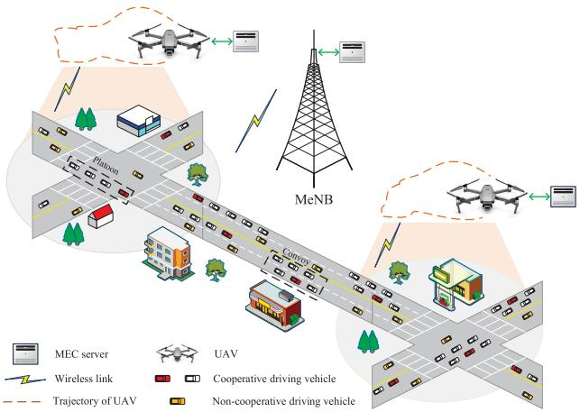

flowchart

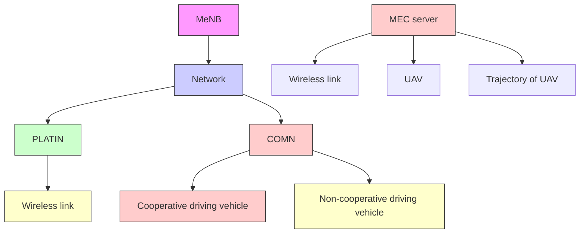

Fig. 1. An illustration of the MEC- and UAV-assisted vehicular network.

# A. MEC- and UAV-Assisted Vehicular Network

Consider an MEC- and UAV-assisted vehicular network with MEC servers mounted at an MeNB and in multiple UAVs to support heterogeneous delay-sensitive vehicular applications, as illustrated in Figure 1. Each UAV flies at a constant speed under the coverage area of the MeNB and cooperatively provides resource access to vehicles. Vehicles drive either in cooperative states, such as in convoy and platoon forms, or in non-cooperative states [5]. Each vehicle periodically generates computing tasks with different QoS requirements and computing/caching resource demands. If demands to offload its task to the MEC server, the vehicle first sends a resource access request to the MeNB and/or a UAV covering it. After receiving the access permission and resource allocation results from the corresponding MEC servers, the computing task will be offloaded to the associated MEC server over the allocated spectrum resources. As task division is not considered here, we assume a vehicle under the overlapping area between the MEC-mounted MeNB and UAV can only associate with and offload its task to one of the MEC servers.

# B. Resource Management Model

Due to the diversified applications and high vehicle mobility, the vehicular network topology and the distribution of resource access requests change over time frequently, thereby resulting in time-varying resource demand from vehicles under the service area of the MeNB. To allocate proper amounts of spectrum, computing, and caching resources to each resource access request to satisfy the offloaded tasks’ QoS requirements, a multi-dimensional resource management model is developed in this section.

Consider a two-lane and two-way country road segment, shown in Figure 2, an MEC-mounted MeNB is placed on one side of the road to provide full signal coverage to vehicles, and U MEC-mounted UAVs, denoted as U, are flying above the road and under the coverage of the MeNB. Each UAV covers parts of the considered road segment and flies at a constant speed with no overlapping with other UAVs.

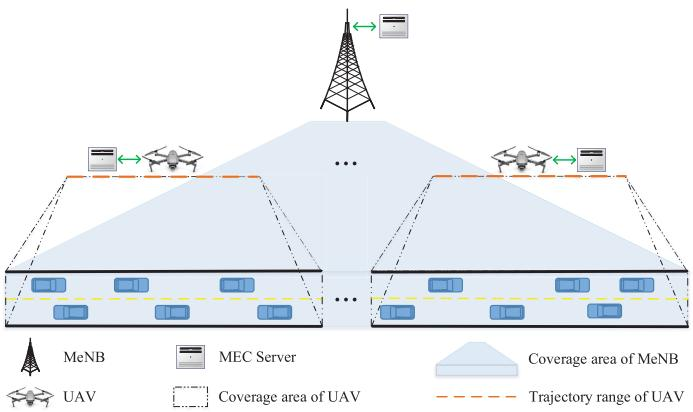

flowchart

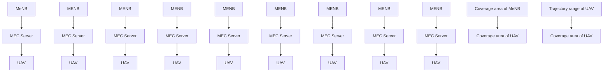

Fig. 2. A simplified MEC- and UAV-assisted vehicular network scenario for multi-dimensional resource management.

Let $\mathcal { N } ( t ) = \{ 1 , 2 , \cdot , i , \cdot , N ( t ) \} ^ { 1 }$ be the set of vehicles within ( ) = 1 2 ( )the coverage of the MeNB at time slot t, where $N ( t ) = | \mathcal { N } ( t ) |$ . ( ) = ( )The computing task generated by vehicle i at time slot t is described as $\{ c _ { i } ^ { s } ( t ) , c _ { i } ^ { c } ( t ) , c _ { i } ^ { d } ( t ) \}$ , where $c _ { i } ^ { s } ( t ) , ~ c _ { i } ^ { c } ( t )$ , and $c _ { i } ^ { d } ( t )$ ( ) ( ) ( ) ( ) ( )are the data size of, the number of CPU cycles required ( )to execute, and the maximum delay tolerated by vehicle $i \gamma _ { \mathrm { s } }$ task, respectively. Once a computing task is generated, vehicle i sends a resource access request, containing the detailed information about this task, i.e., $\{ c _ { i } ^ { s } ( t ) , c _ { i } ^ { c } ( t ) , c _ { i } ^ { d } ( t ) \}$ , and the ( ) ( ) ( )driving state, e.g., moving direction and current position, to the MEC servers on demand. According to the collected information, each MEC server then makes vehicle association and resource allocation decisions and returns them to vehicles, where each decision contains the vehicle-MeNB or vehicle-UAV association patterns and the fractions of the spectrum, computing, and caching resources allocated to vehicles.

Spectrum resource management: Denote the resource matrix for the MEC-mounted MeNB by where $S _ { m } , C _ { m } ^ { c o }$ , and $C _ { m } ^ { c a }$ are the amounts of available spec- $\{ S _ { m } , C _ { m } ^ { c o } , C _ { m } ^ { c a } \}$ , trum, computing, and caching resources, respectively. Likewise, for MEC-mounted $\operatorname { U A V } j \in { \mathcal { U } } .$ , the resource matrix is given by $\{ S _ { u } , C _ { u } ^ { c o } , C _ { u } ^ { c a } \}$ . To offload the computing tasks from each vehicle to its associated MEC server with an acceptable transmission delay, a proper amount of spectrum should be allocated to each vehicle. Let $\mathcal { N } ^ { \prime } ( t ) / N ^ { \prime } ( t )$ be the set/number ( ) ( )of vehicles under the coverage of the MeNB while outside of the U UAVs at time slot t, and $\mathcal { N } _ { j } ( t ) / N _ { j } ( t ) \ ( j \in \mathcal { U } )$ ( ) ( )is the set/number of vehicles under the coverage of UAV j. Namely, we have $\mathcal { N } ( t ) = \mathcal { N } ^ { \prime } ( t ) \cup \{ \mathcal { N } _ { j } ( t ) : \bar { j } \in \mathcal { U } \}$ . For vehicle $i \in \mathcal { N } _ { j } ( t )$ ( ) = ( ), let binary variables $b _ { i , m } ( t )$ and $b _ { i , j } ( t )$ ( ) ( ) ( )be the vehicle-MeNB and vehicle-UAV association patterns, where $b _ { i , m } ( t ) = 1 \ ( \mathrm { o r } \ b _ { i , j } ( t ) = 1 )$ if vehicle i associates with ( ) = 1 ( ) = 1the MeNB (or UAV j) at time slot $t ,$ and $b _ { i , m } ( t ) = 0$ (or $b _ { i , j } ( t ) = 0 )$ ( ) = 0 otherwise. As the task division technology is not ( ) = 0adopted, we have $b _ { i , m } ( t ) + b _ { i , j } ( t ) = 1$ for vehicles in $\mathcal { N } _ { j } ( t )$ . Note that for vehicle $i \in \mathcal { N } ^ { \prime } ( t ) , b _ { i , j } ( t )$ ( )is null and we set $b _ { i , m } ( t ) = 1$ ( ) ( )since it is outside of the coverage of any UAV.

1In this paper, we add (t) at the end of some notations to distinguish the fixed parameters from the time-varying parameters. Yet the vehicular network is assumed to be static during each time slot [12].

1) Vehicles Associated With the MeNB: Let $\mathcal { N } _ { m } ( t )$ denote ( )the set of vehicles associated with the MeNB, i.e., vehicles with $b _ { i , m } ( t ) = 1$ . Then, all uplink transmissions for offloading ( ) = 1tasks from vehicles in $\mathcal { N } _ { m } ( t )$ to the MeNB share spectrum resource $S _ { m }$ ( ). Considering the duality transmission over the same coherence interval, the channels for uplink and downlink transmissions between a vehicle and the MeNB/UAV are assumed to be symmetry [27]. Let $G _ { i , m } ( t )$ denote the average channel gain between vehicle $i \in \mathcal { N } _ { m } ( t )$ and the MeNB at time slot $t ,$ ( )which varies dynamically over the vehicle-MeNB distance. Then, we can express the achieved spectrum efficiency at the MeNB from vehicle i as

$$
e _ {i, m} (t) = \log_ {2} \left(1 + \frac {P G _ {i , m} (t)}{\sigma^ {2}}\right), \tag {1}
$$

where $P$ is the vehicle’s transmit power and $\sigma ^ { 2 }$ is the power spectral density of the white noise. Denote $f _ { i , m } ( t )$ as the ( )fraction of spectrum allocated to vehicle i by the MeNB at time slot t. Namely, vehicle i can occupy spectrum resource $S _ { m } f _ { i , m } ( t )$ to offload its task to the MeNB at time slot t. The ( )corresponding uplink transmission rate then can be given by

$$
R _ {i, m} (t) = S _ {m} f _ {i, m} (t) e _ {i, m} (t). \tag {2}
$$

2) Vehicles Associated With UAVs: Considering the limitation of spectrum resources, we adopt spectrum reusing among UAVs with acceptable interference by pre-designing the fly trajectory of each UAV. Specifically, the uplink transmissions from vehicles to the U UAVs reuse spectrum resource $S _ { u } .$ . As each UAV flies at a constant speed above the road, we assume there always exists a line-of-sight connection between a vehicle and a UAV. And the average channel gain between vehicle i and UAV $j ~ \in ~ \mathcal { U }$ at time slot $t ,$ $G _ { i , j } ( t )$ , is defined similar to [28]. In addition to the white ( )noise, UAV j also experiences the interference from the uplink transmission to UAV $\boldsymbol { v } ~ \in ~ \mathcal { U } \backslash \{ j \}$ . Thus, the corresponding spectrum efficiency achieved at UAV $j$ can be given by

$$
e _ {i, j} (t) = \log_ {2} \left(1 + \frac {P G _ {i , j} (t)}{\sum_ {v \in \mathcal {U} \setminus \{j \}} P G _ {i , v} (t) + \sigma^ {2}}\right). \tag {3}
$$

Let $f _ { i , j } ( t )$ be the fraction of spectrum allocated to vehicle ( )i by UAV j at time slot t. Then we can express the uplink transmission rate from vehicle i to UAV j as

$$
R _ {i, j} (t) = S _ {u} f _ {i, j} (t) e _ {i, j} (t). \tag {4}
$$

Computing/Caching resource management: As mentioned above, in addition to the vehicle-MeNB or vehicle-UAV association patterns and the spectrum allocation results, each MEC server also needs to allocate proper amounts of computing and caching resources to vehicles. As the transmit powers of the MeNB and UAVs are much higher than that of a vehicle and the data size of each task’s process result is relatively small [29], the time consumption on downlinking the task process result to each vehicle is neglected here [12]. Let $f _ { i , m } ^ { c o } ( t )$ (or $f _ { i , j } ^ { c o } ( t ) )$ be the fraction of computing resources allocated to vehicle i’s task from the MeNB (or from UAV $j \in \mathcal { U } )$ at time slot t. Then, the completion time of vehicle i’s computing task, i.e., the time duration from the task is generated until vehicle i receives the task process result from its associated MEC server, can be expressed as

$$
T _ {i} (t) = \left\{ \begin{array}{l l} \frac {c _ {i} ^ {s} (t)}{R _ {i , m} (t)} + \frac {c _ {i} ^ {c} (t)}{C _ {m} ^ {c o} f _ {i , m} ^ {c o} (t)}, & \text { if } b _ {i, m} (t) = 1 \\ \frac {c _ {i} ^ {s} (t)}{R _ {i , j} (t)} + \frac {c _ {i} ^ {c} (t)}{C _ {u} ^ {c o} f _ {i , j} ^ {c o} (t)}, & \text { if } b _ {i, j} (t) = 1. \end{array} \right. \tag {5}
$$

A proper amount of caching resource has to be pre-allocated to each resource access request, such that all data related to this task can be cached for task processing. For a resource access request sent by vehicle i, let $f _ { i , m } ^ { c a } ( t )$ (or $f _ { i , j } ^ { c a } ( t ) )$ be the fraction ( ) ( )of caching resources allocated by the MeNB (or by UAV j). Then, a task offloaded from vehicle i to an MEC server is regarded to be completed with satisfied QoS requirements, if i) at least $c _ { i } ^ { s } ( t )$ caching resource is allocated to cache vehicle $i \mathrm { \ ' } _ { \mathrm { s } }$ ( ) task, i.e., $f _ { i , m } ^ { c a } ( t ) C _ { m } ^ { c a } \geq c _ { i } ^ { s } ( t )$ or $f _ { i , j } ^ { c a } ( t ) C _ { u } ^ { c a } \geq c _ { i } ^ { s } ( t )$ , and ( ) ( ) ( ) ( )ii) the task’s delay requirement is satisfied, namely, the task completion time is less than its maximum tolerance delay, $T _ { i } ( t ) \leq c _ { i } ^ { d } ( t )$ .

# C. Problem Formulation

As resources available to both MeNB and UAV are finite, it is critical to efficiently allocate them. To avoid time consumption on exchanging information between a central controller and the MEC servers, a distributed resource management scheme is considered here. We formulate individual optimization problems to the MEC-mounted MeNB and UAVs to distributively manage their available spectrum, computing, and caching resources.

According to the resource management model presented in the previous subsection, the optimization problems formulated for the MeNB and UAVs can be described as

$$
\max_{\substack{\mathbf{b}_{m}(t),\mathbf{f}_{m}(t),\\ \mathbf{f}_{m}^{co}(t),\mathbf{f}_{m}^{ca}(t)}}\sum_{i\in \mathcal{N}(t)}b_{i,m}(t)H[c_{i}^{d}(t) - T_{i}(t)]H[f_{i,m}^{ca}(t)C_{m}^{ca} - c_{i}^{s}(t)]
$$

$$
\text { s.t. } \left\{ \begin{array}{l l} (1), (2), (5) & \text {(6a)} \\ b _ {i, m} (t) \in \{0, 1 \} \quad i \in \mathcal {N} (t) & \text {(6b)} \\ b _ {i, m} (t) + b _ {i, j} (t) = 1 \quad \forall i \in \cup_ {j \in \mathcal {U}} \mathcal {N} _ {j} (t) & \text {(6c)} \\ f _ {i, m} (t), f _ {i, m} ^ {c o} (t), f _ {i, m} ^ {c a} (t) \in [ 0, 1 ], \quad i \in \mathcal {N} (t) & \text {(6d)} \\ \sum_ {i \in \mathcal {N} (t)} b _ {i, m} (t) f _ {i, m} (t) = 1 & \text {(6e)} \\ \sum_ {i \in \mathcal {N} (t)} b _ {i, m} (t) f _ {i, m} ^ {c o} (t) = 1 & \text {(6f)} \\ \sum_ {i \in \mathcal {N} (t)} b _ {i, m} (t) f _ {i, m} ^ {c a} (t) = 1 & \text {(6g)} \end{array} \right.
$$

and

$$
\max_{\substack{\mathbf{b}_{j}(t),\mathbf{f}_{j}(t),\\ \mathbf{f}_{j}^{co}(t),\mathbf{f}_{j}^{ca}(t)}}\sum_{i\in \mathcal{N}_{j}(t)}b_{i,j}(t)H[c_{i}^{d}(t) - T_{i}(t)]H[f_{i,j}^{ca}(t)C_{u}^{ca} - c_{i}^{s}(t)]
$$

$$
\text { s.t. } \left\{ \begin{array}{l l} (3), (4), (5) & \text {(7a)} \\ b _ {i, j} (t) \in \{0, 1 \} \quad i \in \mathcal {N} _ {j} (t) & \text {(7b)} \\ b _ {i, j} (t) + b _ {i, m} (t) = 1 \quad \forall i \in \mathcal {N} _ {j} (t) & \text {(7c)} \\ f _ {i, j} (t), f _ {i, j} ^ {c o} (t), f _ {i, j} ^ {c a} (t) \in [ 0, 1 ], \quad i \in \mathcal {N} _ {j} (t) & \text {(7d)} \\ \sum_ {i \in \mathcal {N} _ {j} (t)} b _ {i, j} (t) f _ {i, j} (t) = 1 & \text {(7e)} \\ \sum_ {i \in \mathcal {N} _ {j} (t)} b _ {i, j} (t) f _ {i, j} ^ {c o} (t) = 1 & \text {(7f)} \\ \sum_ {i \in \mathcal {N} _ {j} (t)} b _ {i, j} (t) f _ {i, j} ^ {c a} (t) = 1, & \text {(7g)} \end{array} \right.
$$

respectively, where $ { \mathbf { b } } _ { m } ( t ) \ = \ \{ b _ { i , m } ( t ) \ : \ i \ \in \ \mathcal { N } ( t ) \}$ and $\mathbf { b } _ { j } ( t ) ~ = ~ \{ b _ { i , j } ( t ) ~ : ~ i ~ \in ~ \mathcal { N } _ { j } ( t ) \}$ ( ) : ( )are the vehicle association pattern matrices between vehicle $i \in \mathcal { N } ( t )$ and the MeNB and between vehicle $i \in \mathcal { N } _ { j } ( t )$ and $\mathrm { U A V } ~ j \in \mathcal { U } ,$ respectively. ( )As vehicles send their resource access requests to both MeNB and UAV, yet their computing tasks can be only offloaded to one of them, constraint $b _ { i , j } ( t ) + b _ { i , m } ( t ) = 1$ is considered in both formulated problems. ${ \bf f } _ { m } ( t ) , { \bf f } _ { m } ^ { c o } ( t )$ ) = 1, and ${ \bf f } _ { m } ^ { c a } ( t )$ (or $\mathbf { f } _ { j } ( t )$ , ${ \bf f } _ { j } ^ { c o } ( t )$ , and ${ \bf f } _ { j } ^ { c a } ( t ) )$ ( ) ( ) ( ) ( ) are the spectrum, computing, and caching resource allocation matrices among vehicles associated with the MeNB (or with UAV j), respectively. The objective function of both formulated problems is to maximize the number of offloaded tasks completed by the MEC server with satisfied QoS requirements, where the Heaviside step function, $H ( \cdot )$ , ( )indicates whether the offloaded task’s QoS requirements are satisfied.

# III. MADDPG-BASED RESOURCE MANAGEMENT SCHEME

It is difficult to rapidly solve the above optimization problems using the traditional methods due to the following reasons,

1) The two problems are mixed-integer programming problems.   
2) For each problem, spectrum resource management is coupled with computing resource management.   
3) As indicated by constraints (6c) and (7c), the problem formulated for the MeNB is coupled with those for the UAVs in U.   
4) Considering the high network dynamic caused by the mobility of vehicles and UAVs and the sensitive delay requirements of different vehicular applications, each formulated problem has to be solved rapidly.

Thus, an RL approach is leveraged here. Considering the coupled relation among the formulated problems and there is no central controller, a multi-agent RL algorithm is designed, where each MEC server acts as an agent to learn the resource management scheme and solve the corresponding formulated problem. Specifically, we first re-model the resource management problems targeting the MeNB and the U UAVs as a multi-agent extension of Markov decision processes (MDPs) [26], [30], [31], and then design an MADDPG algorithm to solve the MDPs.

# A. Problem Transformation

We transform the formulated problems into a partially observable Markov game for $U + 1$ agents, including the + 1MeNB agent and U UAV agents. Define the Markov game for $U + 1$ agents as a set of states $s ,$ a set of observations $\mathcal { O } = \{ \mathcal { O } _ { m } , \mathcal { O } _ { 1 } , \ldots , \mathcal { O } _ { j } , \ldots , \mathcal { O } _ { U } \}$ , and a set of actions $\mathcal { A } = \{ \mathcal { A } _ { m } , \mathcal { A } _ { 1 } , \ldots , \mathcal { A } _ { j } , \ldots , \mathcal { A } _ { U } \}$ . The state set S describes =the possible configurations of the road segment under the coverage of the MEC-mounted MeNB, including the mobility characteristics of vehicles and UAVs, and the time-varying tasks generated by vehicles. ${ \mathcal { O } } _ { m }$ and ${ \mathcal { O } } _ { j }$ are observation spaces for the MeNB agent and UAV j agent $( j \in { \mathcal { U } } )$ , respectively, and the observation of each agent at time slot t is a part of the current state, $s ( t ) \in \mathcal { S } . \ \mathcal { A } _ { m }$ and $\mathscr { A } _ { j } ~ ( j \in \mathcal { U } )$ are action ( )spaces for the MeNB and UAV j. For each given state $s \in S ,$ the MeNB agent and UAV j agent use the policies, $\pi _ { m } \colon S$ $\mapsto \ A _ { m }$ and $\pi _ { j } \colon S \mapsto { \mathcal { A } } _ { j }$ , to choose an action from their action spaces according to their observations corresponding to s, respectively.

1) Environment State: Let $x _ { i } ( t )$ and $y _ { i } ( t )$ be the x- and y- coordinates of vehicle $i \in \mathcal { N } ( t )$ , and $x _ { j } ^ { \prime } ( t ) , ~ y _ { j } ^ { \prime } ( t )$ , and $z _ { j } ^ { \prime } ( t )$ denote the $\mathrm { X ^ { - } , \ y ^ { - } }$ ( ) ( ) ( ), and z- coordinates of UAV j at time ( )slot t. Then, according to the resource management problems formulated for the MEC- and UAV-assisted vehicular network, the environment state at time slot $t , s ( t ) \in S ,$ can be given by

$$
\begin{array}{l} s (t) = \{x _ {1} (t), x _ {2} (t), \dots , x _ {N (t)} (t), y _ {1} (t), y _ {2} (t), \dots , \\ y _ {N (t)} (t), c _ {1} ^ {s} (t), c _ {2} ^ {s} (t), \dots , c _ {N (t)} ^ {s} (t), c _ {1} ^ {c} (t), c _ {2} ^ {c} (t), \\ \ldots , c _ {N (t)} ^ {c} (t), c _ {1} ^ {d} (t), c _ {2} ^ {d} (t), \ldots , c _ {N (t)} ^ {d} (t), x _ {1} ^ {\prime} (t), \\ x _ {2} ^ {\prime} (t), \ldots , x _ {U} ^ {\prime} (t), y _ {1} ^ {\prime} (t), y _ {2} ^ {\prime} (t), \ldots , y _ {U} ^ {\prime} (t), \\ \left. z _ {1} ^ {\prime} (t), z _ {2} ^ {\prime} (t), \dots , z _ {U} ^ {\prime} (t) \right\}. \tag {8} \\ \end{array}
$$

2) Observation: As the considered road segment is under the coverage of the MeNB and no information exchanging among different MEC servers, the observations of the MeNB and UAV j at time slot t, i.e., $o _ { m } ( t ) \in \mathcal { O } _ { m }$ and $o _ { j } ( t ) \in \mathcal { O } _ { j }$ , can be described as

$$
\begin{array}{l} o _ {m} (t) = \{x _ {1} (t), x _ {2} (t), \dots , x _ {N (t)} (t), y _ {1} (t), y _ {2} (t), \dots , \\ y _ {N (t)} (t), c _ {1} ^ {s} (t), c _ {2} ^ {s} (t), \dots , c _ {N (t)} ^ {s} (t), c _ {1} ^ {c} (t), c _ {2} ^ {c} (t), \\ \left. \dots , c _ {N (t)} ^ {c} (t), c _ {1} ^ {d} (t), c _ {2} ^ {d} (t), \dots , c _ {N (t)} ^ {d} (t) \right\} \tag {9} \\ \end{array}
$$

and

$$
\begin{array}{l} o _ {j} (t) = \left\{x _ {1, j} (t), x _ {2, j} (t), \dots , x _ {N _ {j} (t), j} (t), y _ {1, j} (t), \right. \\ y _ {2, j} (t), \ldots , y _ {N _ {j} (t), j} (t), c _ {1, j} ^ {s} (t), c _ {2, j} ^ {s} (t), \ldots , \\ c _ {N _ {j} (t), j} ^ {s} (t), c _ {1, j} ^ {c} (t), c _ {2, j} ^ {c} (t), \ldots , c _ {N _ {j} (t), j} ^ {c} (t), \\ c _ {1, j} ^ {d} (t), c _ {2, j} ^ {d} (t), \ldots , c _ {N _ {j} (t), j} ^ {d} (t), x _ {j} ^ {\prime} (t), y _ {j} ^ {\prime} (t), \\ \left. z _ {j} ^ {\prime} (t) \right\}, \quad j \in \mathcal {U}, \tag {10} \\ \end{array}
$$

respectively. For vehicle $i \in \mathcal { N } _ { j } ( t )$ under the coverage of UAV $j , x _ { i , j } ( t )$ and $y _ { i , j } ( t )$ ( )denote the x- and y- coordinates, and $c _ { i , j } ^ { s } ( t ) , ~ c _ { i , j } ^ { c } ( t )$ (, and $c _ { i , j } ^ { d } ( t )$ are the detailed information ( ) ( ) ( )about the offloaded computing tasks. Note that, for vehicle i under the overlapping area between the MeNB and UAV j, we have $\{ x _ { i , j } ( t ) , y _ { i , j } ( t ) , z _ { i , j } ( t ) \} \ = \ \{ x _ { i } ( t ) , y _ { i } ( t ) , z _ { i } ( t ) \}$ } and $\{ c _ { i , j } ^ { s } ( t ) , c _ { i , j } ^ { c } ( t ) , c _ { i , j } ^ { d } ( t ) \} = \{ c _ { i } ^ { s } ( t ) , c _ { i } ^ { c } ( t ) , c _ { i } ^ { d } ( t ) \}$ .

3) Action: According to the current policy, $\pi _ { m } \ { \mathrm { o r } } \ \pi _ { j }$ , and the corresponding observation, each MEC server chooses an action from its action space. The actions of the MeNB and UAV j at time slot t, i.e., $a _ { m } ( t ) \ \in \ \mathcal { A } _ { m }$ and $a _ { j } ( t ) \in \mathcal { A } _ { j }$ $( j \in \mathcal { U } )$ , can be described as

$$
\begin{array}{l} a _ {m} (t) = \{b _ {1, m} ^ {\prime} (t), b _ {2, m} ^ {\prime} (t), \dots , b _ {N (t), m} ^ {\prime} (t), f _ {1, m} (t), \\ f _ {2, m} (t), \dots , f _ {N (t), m} (t), f _ {1, m} ^ {c o} (t), f _ {2, m} ^ {c o} (t), \dots , \\ \left. f _ {N (t), m} ^ {c o} (t), f _ {1, m} ^ {c a} (t), f _ {2, m} ^ {c a} (t), \dots , f _ {N (t), m} ^ {c a} (t) \right\} \tag {11} \\ \end{array}
$$

and

$$
\begin{array}{l} a _ {j} (t) = \left\{b _ {1, j} ^ {\prime} (t), b _ {2, j} ^ {\prime} (t), \dots , b _ {N _ {j} (t), j} ^ {\prime} (t), f _ {1, j} (t), f _ {2, j} (t), \right. \\ \ldots , f _ {N _ {j} (t), j} (t), f _ {1, j} ^ {c o} (t), f _ {2, j} ^ {c o} (t), \ldots , f _ {N _ {j} (t), j} ^ {c o} (t), \\ f _ {1, j} ^ {c a} (t), f _ {2, j} ^ {c a} (t), \dots , f _ {N _ {j} (t), j} ^ {c a} (t) \}, \quad j \in \mathcal {U}, \tag {12} \\ \end{array}
$$

respectively, where the value ranges of $f _ { i , m } ( t ) , ~ f _ { i , m } ^ { c o } ( t )$ , $f _ { i , m } ^ { c a } ( t ) , f _ { i , j } ( t ) , f _ { i , j } ^ { c o } ( t )$ , and $f _ { i , j } ^ { c a } ( t )$ ( ) ( )are same to constraints (6d) ( ) ( ) ( ) ( )and (7d), namely, within , . To address the challenge caused [0 1]by the mixed integers, we relax the binary variables, $b _ { i , m } ( t )$ and $b _ { i , j } ( t )$ , into real-valued ones, $b _ { i , m } ^ { \prime } ( t ) \in [ 0 , 1 ]$ and $b _ { i , j } ^ { \prime } ( t ) \in$ ( ) ( ) [0 1] ( ), . As task division is not considered here, when measure [0 1]the effect of an action at a given state, vehicle i under the overlapping area between the MeNB and UAV j will choose to offload its task to the MeNB if $b _ { i , m } ^ { \prime } ( t ) \geq b _ { i , j } ^ { \prime } ( t )$ , otherwise ( ) ( )to UAV j. Also, we do additional processing on each action’s elements to guarantee the total amount of resources allocated to or ed vehicles is no more than , corresponding to the cons $\{ S _ { m } , C _ { m } ^ { c o } , C _ { m } ^ { c a } \}$ $\{ S _ { u } , C _ { u } ^ { c o } , C _ { u } ^ { c a } \}$ u $\left( 6 \mathrm { e } \right) \mathbf { - } ( 6 \mathrm { g } )$ or $\mathrm { ( 7 e ) } { } _ { - } \mathrm { ( 7 g ) }$ in the formulated problems. According to the actions defined by equations (11) and (12) and the value range of each element of $a _ { m } ( t )$ and $a _ { j } ( t )$ , the action spaces for the MeNB and UAV $j \in \mathcal { U } , \mathcal { A } _ { m }$ (and $A _ { j }$ , are continuous sets.

4) Reward: The reward is a function of state and action, which measures the effect of the action taken by an agent at a given state. Similar to any other learning algorithms [32], during the training stage, a corresponding reward will be returned to an agent at time slot t once the chosen action is taken by this agent at the previous time slot. Then according to the received reward, each agent updates its policy $( \pi _ { m }$ or $\pi _ { j } )$ to direct to an optimal one, i.e., to a policy that the chosen actions at different environment states are always with high rewards. Denote the reward returned to the MeNB agent as $r _ { m } \colon S \times \mathcal { A } _ { m } \ \mapsto$ R and that to UAV j agent as $r _ { j } \colon S \times \mathcal { A } _ { j } \mapsto \mathbb { R }$ .

As the reward leads each agent to its optimal policy and the policy directly determines the association and resource allocation decision for the corresponding MEC server, the reward function should be designed based on the objectives of the original formulated problems. Thus, considering shaped rewards would help the algorithm learn faster than sparse rewards [33], [34], the following two reward elements corresponding to $H ( c _ { i } ^ { d } ( t ) - T _ { i } ( t ) )$ and $H ( f _ { i , m } ^ { c a } ( t ) C _ { m } ^ { c a } - c _ { i } ^ { s } ( t ) )$ of ( ( ) ( )) ( ( )equation (6) are designed for the MeNB agent,

$$
r _ {i, m} ^ {d} (t + 1) = \log_ {2} \left(\frac {c _ {i} ^ {d} (t)}{T _ {i} (t)} + 0. 0 1\right), \tag {13}
$$

$$
r _ {i, m} ^ {s} (t + 1) = \log_ {2} \left(\frac {f _ {i , m} ^ {c a} (t) C _ {m} ^ {c a}}{c _ {i} ^ {s} (t)} + 0. 0 1\right), \tag {14}
$$

where $r _ { i , m } ^ { d } ( t + 1 )$ and $r _ { i , m } ^ { s } ( t + 1 )$ describe how far the delayi by action $a _ { m } ( t )$ , respectively. Specifically, we have $r _ { i , m } ^ { d } ( t +$ $1 ) \geq 0$ and $r _ { i , m } ^ { s } ( t + 1 ) \ \geq 0$ ( +for vehicle i if its requested 1) 0 ( + 1) 0delay and caching resources are satisfied by action $a _ { m } ( t )$ , respectively, and negative $r _ { i , m } ^ { d } ( t + 1 )$ and $r _ { i , m } ^ { s } ( t + 1 )$ ( )are ( + 1) ( + 1)obtained otherwise. Similarly, the two reward elements for UAV j agent corresponding to equation (7) can be designed as

$$
r _ {i, j} ^ {d} (t + 1) = \log_ {2} \left(\frac {c _ {i , j} ^ {d} (t)}{T _ {i} (t)} + 0. 0 1\right), \tag {15}
$$

$$
r _ {i, j} ^ {s} (t + 1) = \log_ {2} \left(\frac {f _ {i , j} ^ {c a} (t) C _ {u} ^ {c a}}{c _ {i , j} ^ {s} (t)} + 0. 0 1\right). \tag {16}
$$

As the formulated problems’ objective is to maximize the number of offloaded tasks while satisfying their QoS requirements, the logarithmic function is adopted in the reward for fairness. The reward increases with the amounts of allocated resources. However, the incremental rate of a logarithm reward element slows once it reaches a positive value. Thus, instead of allocating more resources to parts of the offloaded tasks to achieve a higher reward, each agent is guided by the logarithm reward to allocate its resources to satisfy the QoS requirements of as many tasks as possible. Moreover, to avoid sharp fluctuation on the reward, a small value . is added to 0 01limit the minimum value of each reward element to . .

# B. MADDPG-Based Solution

To solve the above Markov game for U   agents, + 1an MADDPG algorithm combines the DDPG algorithm with a cooperative multi-agent learning architecture. For each agent, indicated by equations (9), (10), (11), and (12), the observation and action spaces are continuous. Also, as the value range of each resource allocation element is ,  and their [0 1]numerical relationships must satisfy the original problems’ constraints, disassembling the action space into discrete and efficient action vectors is difficult, especially for the cases with large size of action vectors. Hence, instead of RL algorithms for discrete state or action spaces, such as deep Q-network (DQN), the DDPG algorithm is adopted by each agent to address its corresponding MDP. Yet from the perspective of the whole Markov game, as the central controller is not considered in the network scenario, the RL algorithm with a single agent is infeasible. Moreover, to avoid spectrum and time cost on wireless communications among different MEC servers, we assume there is no information exchanging among different agents. Namely, only partial observation is available to each MEC server, and meanwhile, the decision made by one MEC server is unaware to others. Thus, considering the coupled relation among the formulated optimization problems, a cooperative multi-agent learning architecture with returning the same reward to the U  agents is adopted to address the + 1re-modeled Markov game to achieve the common objective of the original problems.

1) DDPG Algorithm: The DDPG algorithm adopted by the MeNB agent is illustrated in the left of Figure 3, which combines the advantages of policy gradient and DQN. Here, we take the MeNB agent as an example to explain how to address the corresponding MDP with the DDPG algorithm, and which can be easily extended to the DDPG algorithm adopted by a UAV agent. Two main components, actor and critic, are included in the MeNB agent. According to policy $\pi _ { m } .$ , an action decision is made by the actor for each observation. Another component, critic, then uses a state-action function, $Q _ { m } ( \cdot )$ , to evaluate the action chosen by the actor. Let $s _ { m }$ ( )be the input state to the MeNB and γ be the discount factor to the immediate reward $r _ { m }$ . Then we have $Q _ { m } ( s _ { m } , a _ { m } ) =$ $\begin{array} { r } { \mathbb { E } [ \sum _ { \tau = 0 } ^ { \infty } \gamma ^ { \tau } r _ { m } ( t + \tau ) | \pi _ { m } , s _ { m } = s _ { m } ( t ) , a _ { m } = a _ { m } ( t ) ] } \end{array}$ ) =, and [ ( + ) = ( )which can be recursively re-expressed as $Q _ { m } ( s _ { m } , a _ { m } ) \ =$ $\mathbb { E } [ ( r _ { m } | _ { s _ { m } , a _ { m } } ) + Q _ { m } ( s _ { m } ^ { \prime } , a _ { m } ^ { \prime } ) ]$ ( ) =. As in DQN, target networks and experience replay technology are adopted to improve the stabilization of DDPG. As shown in Figure 3, both the actor and the critic are implemented by two deep neural networks (DNNs), an evaluation network and a target network. And an experience replay buffer with size $M _ { r }$ is used to save transitions for the training stage.

As a type of policy gradient algorithm, the main idea of DDPG is to obtain an optimal policy $\pi _ { m } ^ { * }$ and learn the stateaction function corresponding to $\pi _ { m } ^ { * } ,$ which is carried out by adjusting the parameters of the evaluation and target networks for the actor and the critic until convergence. In the above, the evaluation networks’ parameters, $\pmb { \theta } _ { m } ^ { \mu }$ and $\theta _ { m } ^ { Q }$ , are updated in real time. Specifically, a mini-batch of transitions with size $M _ { b }$ are randomly sampled from the replay buffer and inputted into the agent one by one. According to each inputted transition, the actor and the critic then update the parameters of the evaluation networks during the training stage.

Taking the i-th transition, $\{ s _ { m } ^ { i } , a _ { m } ^ { i } , r _ { m } ^ { i } , s _ { m } ^ { i \prime } \}$ , as an example, the critic adjusts the evaluation network’s parameters by minimizing the loss,

$$
L (\boldsymbol {\theta} _ {m} ^ {Q}) = \mathbb {E} [ (Q _ {m} (s _ {m} ^ {i}, a _ {m} ^ {i}) - (r _ {m} ^ {i} + \gamma Q _ {m} ^ {\prime} (s _ {m} ^ {i \prime}, a _ {m} ^ {i \prime}))) ^ {2} ], \tag {17}
$$

where $Q _ { m } ^ { \prime } ( \cdot )$ is the state-action function for the target network. (That is, if $L ( \theta _ { m } ^ { Q } )$ is continuously differentiable, $\dot { \theta } _ { m } ^ { Q }$ can be adjusted with the gradient of the loss function [35]. As the actor makes action decisions for each observation and each agent aims to maximize the cumulative reward, the evaluation network’s parameters for the actor are updated by maximizing the policy objective function,

$$
J (\boldsymbol {\theta} _ {m} ^ {\mu}) = \mathbb {E} [ Q _ {m} (s _ {m} ^ {i}, a _ {m}) | a _ {m} = \mu_ {m} (o _ {m} ^ {i}) ], \tag {18}
$$

where $\mu _ { m } ( \cdot )$ is the evaluation network function of the actor, ( )which represents the deterministic policy $\pi _ { m } \colon \mathcal { O } _ { m } \mapsto a _ { m }$ . As each association pattern variable is relaxed to , , the action space of the MeNB agent, $A _ { m } ,$ is continuous, and so as $\mu _ { m } ( \cdot )$ is. Under this condition, we can conclude that $J ( \theta _ { m } ^ { \mu } )$ is ( )continuously differentiable according to [31], such that $\pmb { \theta } _ { m } ^ { \mu }$ )can be adjusted in the direction of $\nabla _ { \theta _ { m } ^ { \mu } } J ( \theta _ { m } ^ { \mu } )$ . With the real-time ated and $\theta _ { m } ^ { \mu }$ and , the $\theta _ { m } ^ { Q }$ , the parameters of the target networks,n be softly updated as follows, $\pmb { \theta } _ { m } ^ { \mu ^ { \prime } }$ $\pmb { \theta } _ { m } ^ { \tilde { Q } ^ { \prime } }$

$$
\pmb {\theta} _ {m} ^ {\mu^ {\prime}} = \kappa_ {m} ^ {a} \pmb {\theta} _ {m} ^ {\mu} + (1 - \kappa_ {m} ^ {a}) \pmb {\theta} _ {m} ^ {\mu^ {\prime}},
$$

$$
\boldsymbol {\theta} _ {m} ^ {Q ^ {\prime}} = \kappa_ {m} ^ {c} \boldsymbol {\theta} _ {m} ^ {Q} + (1 - \kappa_ {m} ^ {c}) \boldsymbol {\theta} _ {m} ^ {Q ^ {\prime}}, \tag {19}
$$

with $\kappa _ { m } ^ { a } \ll 1$ and $\kappa _ { m } ^ { c } \ll 1$ .

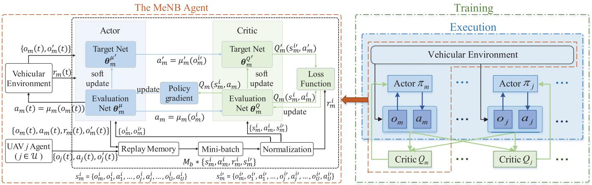

flowchart

```mermaid
graph TD
    subgraph "The MeNB Agent"
        A["Vehicular Environment"] --> B["Action"]
        B --> C["Target Net θ_m^μ'"]
        C --> D["Evaluation Net θ_m^μ"]
        D --> E["Policy gradient"]
        E --> F["Evaluation Net θ_m^Q"]
        F --> G["Loss Function"]
        G --> H["Normalized"]
        H --> I["Mini-batch"]
        I --> J["Replay Memory"]
        J --> K["{o_j(t), a_j(t), o_j'(t)}"]
        K --> L["{o_m(t), a_m(t), r_m(t), o'_m(t)}"]
        L --> M["{o_m(t), o'_m(t)}"]
        M --> N["r_m(t)"]
        N --> O["..."]
    end

    subgraph "Training Environment"
        P["Vehicular Environment"] --> Q["Actor π_m"]
        Q --> R["O_m"]
        Q --> S["O_j"]
        Q --> T["Critic Q_m"]
        R --> U["..."]
        S --> V["..."]
        T --> W["Critic Q_j"]
    end

    B --> X["soft update"]
    X --> Y["update"]
    Y --> Z["Policy gradient"]
    Z --> AA["Q_m(s_m^i, a_m)"]
    AA --> AB["Evaluation Net θ_m^Q"]
    AB --> AC["soft update"]
    AC --> AD["update"]
    AD --> AE["Loss Function"]
    AE --> AF["r_m^i"]
    AF --> AG["..."]
    AG --> AH["..."]
    AH --> AI["Critic Q_j"]
    AI --> AJ["..."]
    AJ --> AK["Critic Q_m"]
    AK --> AL["..."]
    AL --> AM["..."]
    AM --> AN["Critic Q_j"]
    AN --> AO["..."]
    AO --> AP["Critic Q_m"]
    AP --> AQ["..."]
    AQ --> AR["Critic Q_j"]
    AR --> AS["..."]
    AS --> AT["Critic Q_m"]
    AT --> AU["Critic Q_j"]
    AU --> AV["Critic Q_m"]
    AV --> AW["Critic Q_j"]
    AW --> AX["Critic Q_m"]
    AX --> AY["Critic Q_j"]
    AY --> AZ["Critic Q_m"]
    AZ --> BA["Critic Q_j"]
    BA --> BB["Critic Q_m"]
    BB --> BC["Critic Q_j"]
    BC --> BD["Critic Q_m"]
    BD --> BE["Critic Q_j"]
    BE --> BF["Critic Q_m"]
    BF --> BG["Critic Q_j"]
    BG --> BH["Critic Q_m"]
    BH --> BI["Critic Q_j"]
    BI --> BJ["Critic Q_m"]
    BJ --> BK["Critic Q_j"]
    BK --> BL["Critic Q_m"]
    BL --> BM["Critic Q_j"]
    BM --> BN["Critic Q_m"]
    BN --> BO["Critic Q_j"]
    BO --> BP["Critic Q_m"]
    BP --> BQ["Critic Q_j"]
    BQ --> BR["Critic Q_m"]
    BR --> BS["Critic Q_j"]
    BS --> BT["Critic Q_m"]
    BT --> BU["Critic Q_j"]
    BU --> BV["Critic Q_m"]
    BV --> BW["Critic Q_j"]
    BW --> BX["Critic Q_m"]
    BX --> BYC["Critic Q_j"]
    BYC --> BZ["Critic Q_m"]
    BZ --> CA["Critic Q_j"]
    CA --> CB["Critic Q_m"]
    CB --> CC["Critic Q_j"]
    CC --> CD["Critic Q_m"]
    CD --> CE["Critic Q_j"]
    CE --> CF["Critic Q_m"]
    CF --> CG["Critic Q_j"]
    CG --> CH["Critic Q_m"]
    CH --> CI["Critic Q_j"]
    CI --> CJ["Critic Q_m"]
    CJ --> CK["Critic Q_j"]
    CK --> CL["Critic Q_m"]
    CL --> CM["Critic Q_j"]
    CM --> CN["Critic Q_m"]
    CN --> CO["Critic Q_j"]
    CO --> CP["Critic Q_m"]
    CP --> CP1["Critic Q_j"]
    CP1 --> CS["Critic Q_m"]
    CS --> CS1["Critic Q_j"]
    CS1 --> CS2["Critic Q_m"]
    CS2 --> CS3["Critic Q_j"]
    CS3 --> CS4["Critic Q_m"]
    CS4 --> CS5["Critic Q_j"]
    CS5 --> CS6["Critic Q_m"]
    CS6 --> CS7["Critic Q_j"]
    CS7 --> CS8["Critic Q_m"]
    CS8 --> CS9["Critic Q_j"]
    CS9 --> CS10["Critic Q_m"]
    CS10 --> CS11["Critic Q_j"]
    CS11 --> CS12["Critic Q_m"]
    CS12 --> CS13["Critic Q_j"]
    CS13 --> CS14["Critic Q_m"]
    CS14 --> CS15["Critic Q_j"]
    CS15 --> CS16["Critic Q_m"]
    CS16 --> CS17["Critic Q_j"]
    CS17 --> CS18["Critic Q_m"]
    CS18 --> CS19["Critic Q_j"]
    CS19 --> CS20["Critic Q_m"]
    CS20 --> CS21["Critic Q_j"]
    CS21 --> CS22["Critic Q_m"]
    CS22 --> CS23["Critic Q_j"]
    CS23 --> CS24["Critic Q_m"]
    CS24 --> CS25["Critic Q_j"]
    CS25 --> CS26["Critic Q_m"]
    CS26 --> CS27["Critic Q_j"]
    CS27 --> CS28["Critic Q_m"]
    CS28 --> CS29["Critic Q_j"]
    CS29 --> CS30["Critic Q_m"]
```

Fig. 3. The MADDPG framework in the MEC- and UAV-assisted vehicular network.

2) MADDPG Framework: As illustrated in the right figure of Figure 3, the MADDPG framework is composed of the vehicular environment and U   agents, where each agent + 1is implemented by the DDPG algorithm similar to the MeNB agent. Benefiting from the actor and the critic compositions in the DDPG algorithm, centralized training and decentralized execution can be adopted directly in the MADDPG framework as in [36]. Next, we take the MeNB agent as an example to explain how to centrally train the MADDPG model and execute the learned model in a decentralized way.

In the centralized offline training stage, in addition to the local observation, extra information, i.e., observations and actions of all the UAV agents, is also available to the MeNB agent, $o _ { m } ( t )$ in (9). Namely, at time slot t, $\{ o _ { j } ( t ) , a _ { j } ( t ) , o _ { j } ^ { \prime } ( t ) \}$ $( j \in \ U )$ ( ) ( ) ( ) ( )is saved into the MeNB’s replay buffer with $\{ o _ { m } ( t ) , a _ { m } ( t ) , r _ { m } ( t ) , o _ { m } ^ { \prime } ( t ) \}$ together. For the i-th transition ( ) ( ) ( )of the MeNB agent, $\{ s _ { m } ^ { i } , a _ { m } ^ { i } , r _ { m } ^ { i } , s _ { m } ^ { i \prime } \}$ , we have $s _ { m } ^ { i } =$ $\{ o _ { m } ^ { i } ( t ) , o _ { 1 } ^ { i } ( t ) , a _ { 1 } ^ { i } ( t ) , \ldots , o _ { j } ^ { i } ( t ) , a _ { j } ^ { i } ( t ) , \ldots , o _ { U } ^ { i } ( t ) , a _ { U } ^ { i } ( t ) \}$ =and $s _ { m } ^ { i \prime } = \{ o _ { m } ^ { i \prime } ( t ) , o _ { 1 } ^ { i \prime } ( t ) , a _ { 1 } ^ { i \prime } ( t ) , \ldots , o _ { j } ^ { i \prime } ( t ) , a _ { j } ^ { i \prime } ( t ) , \ldots , o _ { U } ^ { i \prime } ( t ) , a _ { U } ^ { i \prime } ( t ) \}$ = ( ) ( ) ( ) ( ) ( ) ( ) ( )as shown in Figure 3. When updating the parameters of the actor and the critic according to the inputted mini-batch of transitions, the actor chooses an action according to the local observation $o _ { m } ^ { i } ,$ i.e., $a _ { m } = \mu _ { m } ( o _ { m } ^ { i } ) .$ , and the chosen action and $s _ { m } ^ { i }$ = ( )then are valued by the critic. As the QoS satisfaction of each vehicle under the considered road segment is co-determined by the actions of the U   agents, using $s _ { m } ^ { i }$ + 1which includes the information about other agents’ actions to learn the state-action value function $Q _ { m }$ would ease training. Moreover, with the extra information, each agent allows to learn its state-action value function separately. Also, as aware of all other agents’ actions, the environment is stationary to each agent during the offline training stage. Thus, the biggest concern to other multi-agent RL algorithms, i.e., the dynamic environment caused by other agents’ actions, is addressed here. During the execution stage, as only local observation is required by the actor, each agent can obtain its action without aware of other agents’ information.

Considering the common objective of the formulated optimization problems, the U   agents should cooperatively + 1maximize the number of offloaded tasks while satisfying their QoS requirements. To achieve a cooperative Markov game, we assume the same immediate reward r is returned to each agent [6], i.e., $r ( t ) ~ = ~ r _ { m } ( t ) ~ = ~ r _ { j } ( t ) ~ ( j ~ \in ~ \mathcal { U } )$ . To avoid ( ) = ( ) =large fluctuation on reward, define $\begin{array} { r } { r ( t ) = \frac { 1 } { N ( t ) } \sum _ { i \in \mathcal { N } ( t ) } r _ { i } ( t ) } \end{array}$ , where $r _ { i } ( t )$ ( ) = ( )is the reward achieved by vehicle i at time slot t and

$$
r _ {i} (t) = \left\{ \begin{array}{l l} r _ {i, m} ^ {d} (t) + r _ {i, m} ^ {s} (t), & \text { if } b _ {i, m} (t) = 1 \\ r _ {i, j} ^ {d} (t) + r _ {i, j} ^ {s} (t), & \text { if } b _ {i, j} (t) = 1. \end{array} \right. \tag {20}
$$

3) MADDPG-Based Solution: According to the above discussion and Figure 3, the proposed MADDPG-based resource management scheme can be summarized in Algorithm 1. In Algorithm 1, continuous time slots are grouped into different episodes with $M _ { s }$ time slots included in each episode. To better describe the convergence performance, we let $r ^ { \prime }$ denote the total rewards achieved per episode. For example, for an episode starts at time slot t0, we have $\begin{array} { r } { r ^ { \prime } = \sum _ { t = t _ { 0 } } ^ { M _ { s } + t _ { 0 } } r ( t ) } \end{array}$ Ms+t0t t r t .

# IV. SIMULATION RESULTS

In this section, we present simulation results to validate the proposed MADDPG-based resource management scheme. Specifically, we use PTV Vissim [37], a traffic simulation software, to simulate the vehicle mobility on a two-lane and two-way country road, where the behavior type is set to be “Freeway” and the number of inputs is . Environment 3states then can be obtained according to the vehicles’ position information. With a mass of environment states, we train the MADDPG model2 based on Algorithm 1 in the training stage. Then new environment states are used to test the performance of the learned model, i.e., the MADDPGbased resource management scheme, in the execution stage. In this section, we show the convergence performance of the MADDPG algorithm and compare it with a single agent DDPG (SADDPG) algorithm [25]. Also, we compare the performance of the MADDPG-based resource management scheme with the SADDPG-based scheme and the random scheme. For the SADDPG algorithm, we assume a controller is installed at the MeNB and acts as the agent to centrally

2For the actors of the MeNB agent and the UAV agent, we respectively deploy two fully-connected hidden layers with [1024, 512] and [512, 256] neurons. And four fully-connected hidden layers with [2048, 1024, 512, 256] neurons are deployed for their critics. Except for the output layer of each agent’s actor which is activated by the tanh function, all other layers’ neurons are activated by the ReLU function.

Algorithm 1 MADDPG-Based Solution   
/* Initialization */
Initialize each agent's actor's and critic's evaluation and target networks to explore actions for the training stage;
Initialize the size of each agent's replay memory buffer.
/* Parameter updating */

foreach episode do   
Receive initial observations $o_m$ and $o_j$ ( $j \in \mathcal{U}$ ), and set $r' = 0$ .   
= 0foreach step t do

Each agent k selects action $a_{k}(t) = \mu_{k}(o_{k}(t))$ w.r.t. the current policy $\pi_{k}$ and obtains the corresponding input state $s_{k}(t)$ ;
Execute $a(t)=\{a_{m}(t),a_{1}(t),\ldots,a_{U}(t)\}$ , receive reward $r(t)$ , and obtain new observations $o_{k}^{\prime}$ and input states $s_{k}^{\prime}(t)$ to each agent.   
( )foreach each agent k do

if the number of transitions $< M_r$ then
    Store $\{s_k(t), a_k(t), r(t), s_k'\}$ into its replay
    buffer.
else
    Replace the earliest saved transitions in the
    buffer with $\{s_k(t), a_k(t), r(t), s_k'\}$ ;
    Randomly select a mini-batch of transitions $\{s_k^i(t), a_k^i(t), r^i(t), s_k^{i'}\}$ with size $\mathcal{M}_b$ from
    the replay buffer;
    Update the parameter matrix of critic's
    evaluation network by minimizing the loss $L(\boldsymbol{\theta}_k^Q) = \frac{1}{M_b} \sum_{\mathcal{M}_b}(Q_k(s_k^i, a_k^i) - (r^i + \gamma Q_k'(s_k^{i'}) a_k^{i'}))^2$ ;
    Update the parameter matrix of actor's
    evaluation network by maximizing the policy
    objective function $J(\boldsymbol{\theta}_k^\mu) = \frac{1}{M_b} \sum_{\mathcal{M}_b}(Q_k(s_k^i, a_k) | a_k = \mu_k(o_k^i))$ ;
    Update actor's and critic's target networks'
    parameters according to equation (19).
= $r' + r(t)$ .

manage the resources available to the MeNB and UAVs. As this algorithm is based on DDPG and implemented with one agent, we call it as SADDPG to distinguish from the MADDPG algorithm proposed in this work. For the random scheme, the association patterns and the amounts of resources allocated to vehicles under the coverage of an MEC server are randomly decided by the MeNB and/or a UAV.

Assume an MEC-mounted MeNB with  meters high is 50deployed on one side of the considered road segment [38]. On each side of the MeNB, two MEC-mounted UAVs are flying at speed  m/s in fixed altitude of  meters and 10 40parallel to the road to support vehicular applications [10], [20]. To guarantee an acceptable inter-UAV interference, assume the two UAVs are always flying with the same direction and the distance between them keeps at  meters. Vehicles under the 600coverage of a UAV can either associate with the UAV or the MeNB, and each vehicle’s association pattern is co-determined

TABLE I PARAMETERS FOR THE LEARNING STAGE 

<table><tr><td>Parameter</td><td>Value</td></tr><tr><td>Vehicle&#x27;s transmit power</td><td>1 watt</td></tr><tr><td>Communication range of the MeNB/UAV</td><td>600/100 m</td></tr><tr><td>Length of the considered road segment</td><td>1200 m</td></tr><tr><td>Background noise power</td><td>-104 dBm</td></tr><tr><td>Size of the replay buffer</td><td>10000</td></tr><tr><td>Size of a mini-batch</td><td>32</td></tr><tr><td>Actor&#x27;s learning rate</td><td>Decaying from 0.0002 to 0.0000001</td></tr><tr><td>Critic&#x27;s learning rate</td><td>Decaying from 0.002 to 0.000001</td></tr><tr><td> $\kappa_a/\kappa_c$ </td><td>Decaying from 0.02 to 0.0001</td></tr><tr><td>Reward discount factor</td><td>Augmenting from 0.8 to 0.99</td></tr></table>

by the association action elements of the MeNB and UAV. Similar to [28] and [39], the channel gains of uplinks from a vehicle to the MeNB and to the UAV are defined as $L _ { m } ( d _ { m } ^ { \prime } ) =$ $- 4 0 \mathrm { ~ - ~ } 3 5 \log _ { 1 0 } ( d _ { m } ^ { \prime } )$ and $L _ { u } ( d _ { u } ^ { \prime } ) \ = \ - 3 0 \ - \ 3 5 \mathrm { l o g } _ { 1 0 } ( d _ { u } ^ { \prime } )$ , 40 35log (respectively, where $d _ { m } ^ { \prime }$ (or $d _ { u } ^ { \prime } )$ ( ) = 30 35log ( ) denotes the vehicle-MeNB (or vehicle-UAV) distance. As vehicles randomly generate heterogeneous computing tasks and the agents periodically manage the available resources among the received resource access requests, we assume the task generation rate of each vehicle to be one task per time slot, and the computing task generated by vehicle i at time slot t is with $c _ { i } ^ { s } ( t ) ~ \in ~ [ 0 . 5 , 1 ]$ kbits, $c _ { i } ^ { c } ( t ) \in [ 5 0$ ,  MHz, and $c _ { i } ^ { d } ( t ) \in [ 1 \bar { 0 } , 5 0 ]$ [0 5 1]ms. During the ( ) [50 100] ( ) [10 50]training stage, we fix the amounts of spectrum, computing, and caching resources available to the MeNB and UAVs to be { ,  ,  } a n d { ,  ,  } , 10 MHz 250 GHz 50 kbits 2 MHz 30 GHz 6 kbitsrespectively. As a high learning rate speeds up the convergence of the RL algorithm while impacts the convergence stability, we take exponential decay/augment on the actors’ and critics’ learning rates, as well as on $\kappa _ { a } / \kappa _ { c }$ and the reward discount factor. Unless otherwise specified, other parameters used in the training and execution stages are listed in Table I.

Figure 4 shows the rewards achieved per episode in the training stages of the MADDPG and SADDPG algorithms. As all parameters of the MeNB and the two UAV agents are globally initialized by the TensorFlow based on the initial state in the first episode, the rewards achieved by one episode are small and fluctuate dramatically in the first  episodes 200of the MADDPG algorithm. Yet, with the training going, the actors and critics adjust their evaluation and target networks’ parameters to gradually approximate the optimal policies and the state-action functions corresponding to the optimal policies, respectively. Therefore, relatively high and stable rewards are achieved starting from the -th episode. Comparing with 200the SADDPG algorithm, the MADDPG algorithm converges as quickly as the SADDPG algorithm does although the achieved rewards are a little bit less stable.

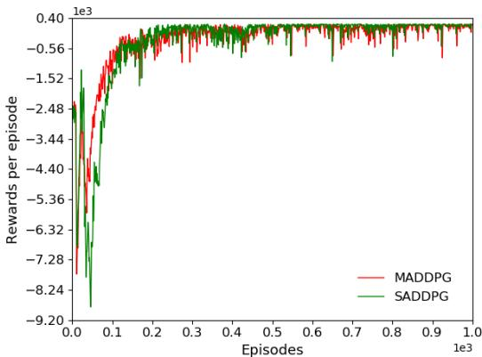

line

| Episodes | MADDPG | SADDPG |
| -------- | ------ | ------ |
| 0.0      | -7.28  | -9.20  |
| 0.1      | -3.44  | -5.36  |
| 0.2      | -0.56  | -0.56  |
| 0.3      | -0.56  | -0.56  |
| 0.4      | -0.56  | -0.56  |
| 0.5      | -0.56  | -0.56  |
| 0.6      | -0.56  | -0.56  |
| 0.7      | -0.56  | -0.56  |
| 0.8      | -0.56  | -0.56  |
| 0.9      | -0.56  | -0.56  |
| 1.0      | -0.56  | -0.56  |

Fig. 4. Rewards achieved per episode in the training stage.

As discussed above, three agents, i.e., one MeNB agent and two UAV agents, are trained centrally by the MADDPG algorithm. To demonstrate the convergence performance of the three agents, we show the varying tendency of the Q-values obtained from the evaluation network of each agent’s critic in Figure 5. With the training going, positive and stable Q-values are obtained by the three agents starting from the -th 200episode, which implies that, the training processes converge within  episodes and their convergence rates are consistent 200with the rewards achieved per episode of the MADDPG algorithm.

Similar to [8], we use the delay/QoS satisfaction ratios, defined as the proportions of the offloaded tasks with satisfied delay/QoS requirements, to measure the performance of different resource management schemes. As the amounts of resources carried at the MEC-mounted MeNB and UAVs are always pre-allocated, we use fixed amounts of resources to train the MADDPG model. During the online execution stage, the learned model is tested over ,  continuous environment states.

Figure 6 shows the average delay/QoS satisfaction ratios achieved by different schemes versus the amounts of spectrum, computing, and caching resources available to the MEC-mounted MeNB and UAVs, respectively3 . Different from the random scheme, both MADDPG- and SADDPGbased schemes jointly manage the multi-dimensional resources available to the MeNB and UAVs to satisfy the offloaded tasks’ QoS requirements. Thus, under the scenarios with different amounts of available spectrum, computing, and caching resources, more than doubled delay or QoS satisfaction ratios are achieved by the MADDPG- and SADDPG-based schemes than the random one. As the delay satisfaction ratio is not affected by the allocation of caching resources, only the QoS satisfaction ratio curves are described in Figures 6(c) and 6(f).

Constrained by the achieved delay satisfaction ratios, the QoS satisfaction ratios of the MADDPG- and SADDPG-based schemes tend to stable and reach the corresponding delay satisfaction ratios with the increasing of caching resources. However, for the random scheme, as the gap between the delay and QoS satisfaction ratios is relatively large, the QoS satisfaction ratio increases slowly when the amounts of caching resources at the MeNB and UAVs increase from  MHz to 10 MHz and from  MHz to  MHz, respectively. Moreover, as the delay requirement is a part of the QoS requirement, i.e., satisfying the delay requirement is indispensable for a task with satisfied QoS requirement, the delay satisfaction ratio is always higher than the corresponding QoS satisfaction ratio for the three schemes.

As we know, when leveraging learning-based methods to solve an optimization problem, only sub-optimal results can be obtained in most cases [40]. In the MADDPG-based scheme, three agents are cooperatively trained to solve three MDPs to achieve a maximum common reward. Allowing each agent to learn other agents’ policies during the training stage, issues caused by the coupled relation among the optimization problems are partially addressed. The central optimization problem is much more complex than the ones formulated for the MeNB agent or the UAV agent, and which makes solving it by the SADDPG algorithm more challenging. Thus, in addition to avoiding extra spectrum and time cost on exchanging information between the central controller and the UAV4, a higher delay/QoS satisfaction ratio is even achieved by the MADDPG-based scheme than the SADDPG-based one under most of the scenarios, as shown in the zoom-in figures in Figure 6. Moreover, the gap between the delay and QoS satisfaction ratios achieved by the MADDPG-based scheme is smaller than that of the SADDPG-based one, which indicates that the MADDPG-based scheme can better manage the multidimensional resources.

As discussed in subsection III-A, reward element $r _ { d }$ is defined to measure how far the task’s delay requirement is satisfied, which is co-determined by the spectrum and computing resource management results. However, for both MADDPG and SADDPG algorithms, allocating more spectrum resources to satisfy the delay requirement of an offloaded task is the same as allocating more computing resources. Namely, performance difference would be resulted between the spectrum and computing resource management for both learned MADDPG and SADDPG models. From the zoom in figures in Figures 6(a) and 6(b), under the scenarios with a small amount of spectrum and a large amount of computing resources at the MeNB, higher delay satisfaction ratios are achieved by the SADDPG-based scheme than the MADDPG-based one, which means that more optimal spectrum management is obtained by the SADDPG-based scheme5 while more optimal computing management is obtained by the MADDPG-based scheme.

3Unless specified in the x-coordinate of each figure, the amounts of spectrum, computing, and caching resources available to the MeNB and UAVs during each test are fixed to {6 MHz, 250 GHz, 50 kbits} and {0.5 MHz, 25 GHz, 5 kbits}, respectively.

4For the SADDPG-based scheme, we assume extra spectrum resources are used for wireless communications between the UAV and the MeNB and the time cost on them are not counted in Figure 6.

5The communication delay satisfaction ratio, defined as the proportions of tasks with $\begin{array} { r } { \frac { c _ { i } ^ { s } ( t ) } { R _ { i , m } ( t ) } \leq c _ { i } ^ { d } ( t ) \mathrm { ~ o r ~ } \frac { c _ { i } ^ { s } ( t ) } { R _ { i , j } ( t ) } \leq c _ { i } ^ { d } ( t ) . } \end{array}$ , achieved by the SADDPGbased scheme is always higher than that of the MADDPG-based scheme.

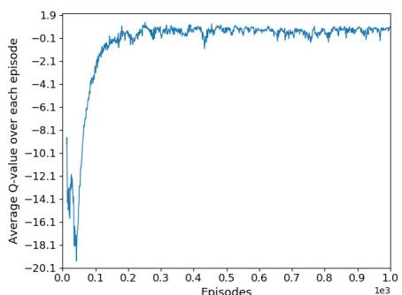

line

| Episodes (x1e3) | Average Q-value over each episode |
| --------------- | --------------------------------- |
| 0.0             | -20.1                             |
| 0.1             | -0.1                              |
| 0.2             | -0.1                              |
| 0.3             | -0.1                              |
| 0.4             | -0.1                              |
| 0.5             | -0.1                              |
| 0.6             | -0.1                              |
| 0.7             | -0.1                              |
| 0.8             | -0.1                              |
| 0.9             | -0.1                              |
| 1.0             | -0.1                              |

(a) MeNB agent

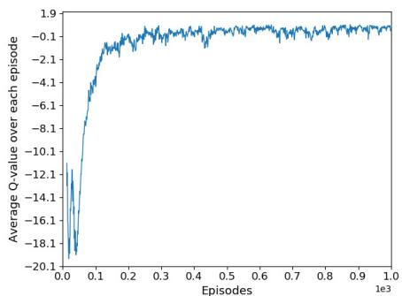

line

| Episodes (x1e3) | Average Q-value over each episode |
| --------------- | --------------------------------- |
| 0.0             | -20.1                             |
| 0.1             | -14.1                             |
| 0.2             | -8.1                              |
| 0.3             | -6.1                              |
| 0.4             | -4.1                              |
| 0.5             | -2.1                              |
| 0.6             | -1.9                              |
| 0.7             | -1.9                              |
| 0.8             | -1.9                              |
| 0.9             | -1.9                              |
| 1.0             | -1.9                              |

(b) UAV 1 agent

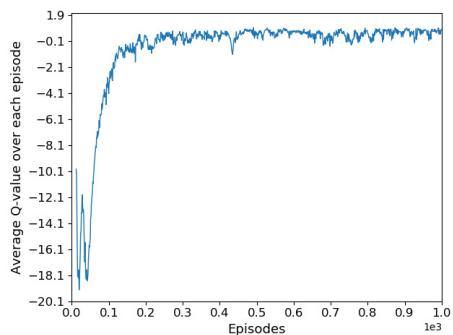

line

| Episodes (x1e3) | Average Q-value over each episode |
| --------------- | --------------------------------- |
| 0.0             | -20.1                             |
| 0.1             | -1.9                              |
| 0.2             | -0.1                              |
| 0.3             | -0.1                              |
| 0.4             | -0.1                              |
| 0.5             | -0.1                              |
| 0.6             | -0.1                              |
| 0.7             | -0.1                              |
| 0.8             | -0.1                              |
| 0.9             | -0.1                              |
| 1.0             | -0.1                              |

(c) UAV 2 agent

Fig. 5. The averaged Q-value over each episode under the MADDPG algorithm.   
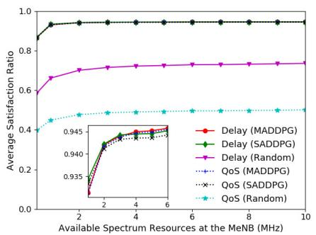

line

| Available Spectrum Resources at the MeNB (MHz) | Delay (MADDPG) | Delay (SADDPG) | Delay (Random) | QoS (MADDPG) | QoS (SADDPG) | QoS (Random) |
|--- | --- | --- | --- | --- | --- | --- |
| 0.5 | 0.935 | 0.940 | 0.60 | 0.935 | 0.935 | 0.40 |
| 1.0 | 0.940 | 0.945 | 0.65 | 0.940 | 0.940 | 0.42 |
| 2.0 | 0.945 | 0.950 | 0.70 | 0.945 | 0.945 | 0.44 |
| 4.0 | 0.948 | 0.955 | 0.72 | 0.948 | 0.948 | 0.45 |
| 6.0 | 0.950 | 0.960 | 0.73 | 0.950 | 0.950 | 0.46 |
| 8.0 | 0.952 | 0.962 | 0.74 | 0.952 | 0.952 | 0.47 |
| 10.0 | 0.953 | 0.963 | 0.75 | 0.953 | 0.953 | 0.48 |

(a)

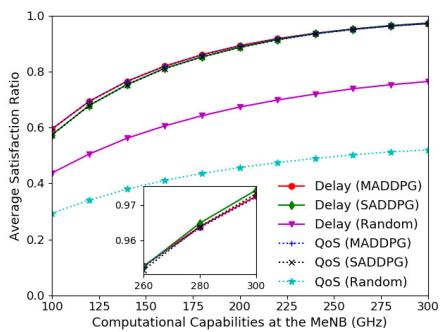

line

| Computational Capabilities at the MeNB (GHz) | Delay (MADDPG) | Delay (SADDPG) | Delay (Random) | QoS (MADDPG) | QoS (SADDPG) | QoS (Random) |
|---|---|---|---|---|---|---|
| 100 | 0.6 | 0.58 | 0.43 | 0.28 | 0.27 | 0.29 |
| 125 | 0.7 | 0.68 | 0.5 | 0.32 | 0.31 | 0.33 |
| 150 | 0.78 | 0.76 | 0.58 | 0.36 | 0.35 | 0.37 |
| 175 | 0.85 | 0.83 | 0.65 | 0.41 | 0.4 | 0.42 |
| 200 | 0.9 | 0.88 | 0.7 | 0.45 | 0.43 | 0.45 |
| 225 | 0.93 | 0.91 | 0.74 | 0.48 | 0.46 | 0.47 |
| 250 | 0.95 | 0.93 | 0.76 | 0.51 | 0.48 | 0.49 |
| 275 | 0.97 | 0.95 | 0.78 | 0.53 | 0.5 | 0.51 |
| 300 | 0.98 | 0.96 | 0.79 | 0.54 | 0.51 | 0.52 |

(b)

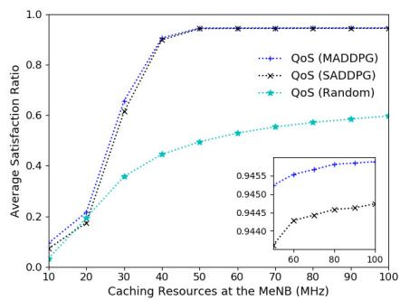  
(（c）

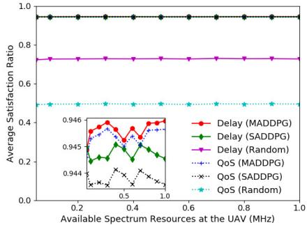

line

| Available Spectrum Resources at the UAV (MHz) | Delay (MADDPG) | Delay (SADDPG) | Delay (Random) | QoS (MADDPG) | QoS (SADDPG) | QoS (Random) |
|---|---|---|---|---|---|---|
| 0.2 | 0.95 | 0.95 | 0.73 | 0.945 | 0.944 | 0.5 |
| 0.4 | 0.95 | 0.95 | 0.73 | 0.946 | 0.944 | 0.5 |
| 0.6 | 0.95 | 0.95 | 0.73 | 0.946 | 0.944 | 0.5 |
| 0.8 | 0.95 | 0.95 | 0.73 | 0.946 | 0.944 | 0.5 |
| 1.0 | 0.95 | 0.95 | 0.73 | 0.946 | 0.944 | 0.5 |

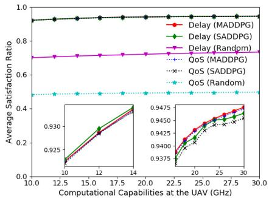

line

| Computational Capabilities at the UAV (GHz) | Delay (MADDPG) | Delay (SADDPG) | Delay (Random) | QoS (MADDPG) | QoS (SADDPG) | QoS (Random) |
|--- | --- | --- | --- | --- | --- | ---|
| 10.0 | 0.930 | 0.925 | 0.70 | 0.930 | 0.925 | 0.930 |
| 12.5 | 0.945 | 0.935 | 0.71 | 0.940 | 0.935 | 0.935 |
| 15.0 | 0.948 | 0.940 | 0.72 | 0.942 | 0.940 | 0.935 |
| 17.5 | 0.949 | 0.942 | 0.72 | 0.943 | 0.942 | 0.935 |
| 20.0 | 0.950 | 0.943 | 0.73 | 0.944 | 0.943 | 0.935 |
| 22.5 | 0.951 | 0.945 | 0.73 | 0.946 | 0.945 | 0.936 |
| 25.0 | 0.952 | 0.947 | 0.73 | 0.948 | 0.947 | 0.936 |
| 27.5 | 0.953 | 0.948 | 0.73 | 0.949 | 0.948 | 0.936 |
| 30.0 | 0.954 | 0.949 | 0.73 | 0.950 | 0.949 | 0.936 |

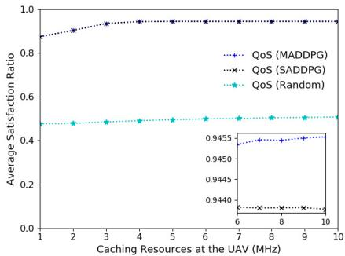  
(f)   
Fig. 6. The average delay/QoS satisfaction ratios achieved by different schemes versus the amounts of spectrum, computing, and caching resources at the MeNB (subfigures (a), (b), and (c)) and UAVs (subfigures (d), (e), and (f)).

As most of the vehicles choose to offload tasks to the MeNB, the amounts of resources at the MeNB mainly determine the delay/QoS satisfaction ratios achieved by the three schemes when very small amounts of resources at the UAV, as shown in Figures 6(d), 6(e), and 6(f). And with the increase of resources at the UAV, the varying tendencies of the delay/QoS satisfaction ratios achieved by the three schemes are then gradually similar to Figures 6(a), 6(b), and 6(c).

# V. CONCLUSION

In this paper, we have studied multi-dimensional resource management in the MEC- and UAV-assisted vehicular networks. To cooperatively support the heterogeneous and delaysensitive vehicular applications, an MADDPG-based scheme has been proposed to distributively manage the spectrum, computing, and caching resources available to the MEC-mounted MeNB and UAVs. For the high dynamic vehicular scenarios with delay-sensitive and computing-intensive applications, the MADDPG-based scheme can rapidly make vehicle association decisions and allocate proper amounts of multi-dimensional resources to vehicle users to achieve high delay/QoS satisfaction ratios. For the future work, we will investigate the task offloading and resource management problem in satelliteterrestrial vehicular networks.

# REFERENCES

[1] A. Ullah, X. Yao, S. Shaheen, and H. Ning, “Advances in position based routing towards ITS enabled FoG-oriented VANET—A survey,” IEEE Trans. Intell. Transp. Syst., vol. 21, no. 2, pp. 828–840, Feb. 2020.   
[2] L. Liang, H. Ye, G. Yu, and G. Y. Li, “Deep-learning-based wireless resource allocation with application to vehicular networks,” Proc. IEEE, vol. 108, no. 2, pp. 341–356, Feb. 2020.   
[3] S. Gurugopinath, P. C. Sofotasios, Y. Al-Hammadi, and S. Muhaidat, “Cache-aided non-orthogonal multiple access for 5G-enabled vehicular networks,” IEEE Trans. Veh. Technol., vol. 68, no. 9, pp. 8359–8371, Sep. 2019.   
[4] H. Ye, G. Y. Li, and B.-H.-F. Juang, “Deep reinforcement learning based resource allocation for V2V communications,” IEEE Trans. Veh. Technol., vol. 68, no. 4, pp. 3163–3173, Apr. 2019.   
[5] H. Peng, L. Liang, X. Shen, and G. Y. Li, “Vehicular communications: A network layer perspective,” IEEE Trans. Veh. Technol., vol. 68, no. 2, pp. 1064–1078, Feb. 2019.

[6] L. Liang, H. Ye, and G. Y. Li, “Spectrum sharing in vehicular networks based on multi-agent reinforcement learning,” IEEE J. Sel. Areas Commun., vol. 37, no. 10, pp. 2282–2292, Oct. 2019.   
[7] H. Zhou, H. Wang, X. Chen, X. Li, and S. Xu, “Data offloading techniques through vehicular ad hoc networks: A survey,” IEEE Access, vol. 6, pp. 65250–65259, Nov. 2018.   
[8] H. Peng and X. S. Shen, “Deep reinforcement learning based resource management for multi-access edge computing in vehicular networks,” IEEE Trans. Netw. Sci. Eng., early access, Mar. 6, 2020, doi: 10.1109/TNSE.2020.2978856.   
[9] Q. Hu, Y. Cai, G. Yu, Z. Qin, M. Zhao, and G. Y. Li, “Joint offloading and trajectory design for UAV-enabled mobile edge computing systems,” IEEE Internet Things J., vol. 6, no. 2, pp. 1879–1892, Apr. 2019.   
[10] X. Hu, K.-K. Wong, K. Yang, and Z. Zheng, “UAV-assisted relaying and edge computing: Scheduling and trajectory optimization,” IEEE Trans. Wireless Commun., vol. 18, no. 10, pp. 4738–4752, Oct. 2019.   
[11] W. Chen, B. Liu, H. Huang, S. Guo, and Z. Zheng, “When UAV swarm meets edge-cloud computing: The QoS perspective,” IEEE Netw., vol. 33, no. 2, pp. 36–43, Mar. 2019.   
[12] L. Zhang, Z. Zhao, Q. Wu, H. Zhao, H. Xu, and X. Wu, “Energy-aware dynamic resource allocation in UAV assisted mobile edge computing over social Internet of vehicles,” IEEE Access, vol. 6, pp. 56700–56715, Oct. 2018.   
[13] H. Peng, Q. Ye, and X. Shen, “Spectrum management for multi-access edge computing in autonomous vehicular networks,” IEEE Trans. Intell. Transp. Syst., vol. 21, no. 7, pp. 3001–3012, Jul. 2020.   
[14] Why Autonomous Vehicles Will Rely on Edge Computing and Not the Cloud? Accessed: Jul. 13, 2020. [Online]. Available: https://www.zdnet.com/article/why-autonomous-vehicles-will-relyon-edge-computing-and-not-the-cloud/,   
[15] F. Lyu et al., “LEAD: Large-scale edge cache deployment based on spatio-temporal WiFi traffic statistics,” IEEE Trans. Mobile Comput., early access, Apr. 2, 2020, doi: 10.1109/TMC.2020.2984261.   
[16] Y. Du, K. Yang, K. Wang, G. Zhang, Y. Zhao, and D. Chen, “Joint resources and workflow scheduling in UAV-enabled wirelessly-powered MEC for IoT systems,” IEEE Trans. Veh. Technol., vol. 68, no. 10, pp. 10187–10200, Oct. 2019.   
[17] W. Zhuang, Q. Ye, F. Lyu, N. Cheng, and J. Ren, “SDN/NFV-empowered future IoV with enhanced communication, computing, and caching,” Proc. IEEE, vol. 108, no. 2, pp. 274–291, Feb. 2020.   
[18] X. Xiong, K. Zheng, L. Lei, and L. Hou, “Resource allocation based on deep reinforcement learning in IoT edge computing,” IEEE J. Sel. Areas Commun., vol. 38, no. 6, pp. 1133–1146, Jun. 2020.   
[19] M. Min, L. Xiao, Y. Chen, P. Cheng, D. Wu, and W. Zhuang, “Learning-based computation offloading for IoT devices with energy harvesting,” IEEE Trans. Veh. Technol., vol. 68, no. 2, pp. 1930–1941, Feb. 2019.   
[20] Z. Yang, C. Pan, K. Wang, and M. Shikh-Bahaei, “Energy efficient resource allocation in UAV-enabled mobile edge computing networks,” IEEE Trans. Wireless Commun., vol. 18, no. 9, pp. 4576–4589, Sep. 2019.   
[21] Building an Ecosystem for Responsible Drone Use and Development on Microsoft Azure. Accessed: Sep. 19, 2020. [Online]. Available: https://azure.microsoft.com/en-ca/blog/building-an-ecosystem-forresponsible-drone-use-and-development-on-microsoft-azure/

[22] N. Cheng et al., “Air-ground integrated mobile edge networks: Architecture, challenges, and opportunities,” IEEE Commun. Mag., vol. 56, no. 8, pp. 26–32, Aug. 2018.   
[23] H. Ke, J. Wang, L. Deng, Y. Ge, and H. Wang, “Deep reinforcement learning-based adaptive computation offloading for MEC in heterogeneous vehicular networks,” IEEE Trans. Veh. Technol., vol. 69, no. 7, pp. 7916–7929, Jul. 2020.   
[24] G. Faraci, C. Grasso, and G. Schembra, “Design of a 5G network slice extension with MEC UAVs managed with reinforcement learning,” IEEE J. Sel. Areas Commun., vol. 38, no. 10, pp. 2356–2371, Oct. 2020.   
[25] H. Peng and X. Shen, “DDPG-based resource management for MEC/UAV-assisted vehicular networks,” in Proc. IEEE VTC Fall, Oct. 2020, pp. 1–6.   
[26] Y. S. Nasir and D. Guo, “Multi-agent deep reinforcement learning for dynamic power allocation in wireless networks,” IEEE J. Sel. Areas Commun., vol. 37, no. 10, pp. 2239–2250, Oct. 2019.   
[27] Y. Wei, F. R. Yu, M. Song, and Z. Han, “Joint optimization of caching, computing, and radio resources for fog-enabled IoT using natural actor– critic deep reinforcement learning,” IEEE Internet Things J., vol. 6, no. 2, pp. 2061–2073, Apr. 2019.   
[28] J. Cui, Y. Liu, and A. Nallanathan, “Multi-agent reinforcement learningbased resource allocation for UAV networks,” IEEE Trans. Wireless Commun., vol. 19, no. 2, pp. 729–743, Feb. 2020.   
[29] F. Zhou, Y. Wu, R. Q. Hu, and Y. Qian, “Computation rate maximization in UAV-enabled wireless-powered mobile-edge computing systems,” IEEE J. Sel. Areas Commun., vol. 36, no. 9, pp. 1927–1941, Sep. 2018.   
[30] M. L. Puterman, Markov Decision Processes: Discrete Stochastic Dynamic Programming. Hoboken, NJ, USA: Wiley, 2014.   
[31] R. Lowe, Y. Wu, A. Tamar, J. Harb, O. P. Abbeel, and I. Mordatch, “Multi-agent actor-critic for mixed cooperative-competitive environments,” in Proc. Adv. Neural Inf. Process. Syst., 2017, pp. 6379–6390.   
[32] X. Shen et al., “AI-assisted network-slicing based next-generation wireless networks,” IEEE Open J. Veh. Technol., vol. 1, pp. 45–66, Jan. 2020.   
[33] A. Y. Ng et al., “Policy invariance under reward transformations: Theory and application to reward shaping,” in Proc. ICML, vol. 99, Jun. 1999, pp. 278–287.   
[34] Bonsai. Deep Reinforcement Learning Models: Tips & Tricks for Writing Reward Functions. Accessed: Jun. 26, 2020. [Online]. Available: https://medium.com/BonsaiAI/deep-reinforcement-learningmodels-tips-tricks-for-writing-reward-functions-a84fe525e8e0/   
[35] T. P. Lillicrap et al., “Continuous control with deep reinforcement learning,” in Proc. ICLR, San Juan, Puerto Rico, 2016, pp. 1–14.   
[36] J. Foerster, I. A. Assael, N. De Freitas, and S. Whiteson, “Learning to communicate with deep multi-agent reinforcement learning,” in Proc. Adv. Neural Inf. Process. Syst., 2016, pp. 2137–2145.   
[37] PTV Vissim. Accessed: Jun. 16, 2020. [Online]. Available: https://en.wikipedia.org/wiki/PTV\_VISSIM/   
[38] H. Peng et al., “Resource allocation for cellular-based inter-vehicle communications in autonomous multiplatoons,” IEEE Trans. Veh. Technol., vol. 66, no. 12, pp. 11249–11263, Dec. 2017.   
[39] Q. Ye, W. Zhuang, S. Zhang, A.-L. Jin, X. Shen, and X. Li, “Dynamic radio resource slicing for a two-tier heterogeneous wireless network,” IEEE Trans. Veh. Technol., vol. 67, no. 10, pp. 9896–9910, Oct. 2018.   
[40] A. K. Kalakanti, S. Verma, T. Paul, and T. Yoshida, “RL SolVeR pro: Reinforcement learning for solving vehicle routing problem,” in Proc. 1st Int. Conf. Artif. Intell. Data Sci. (AiDAS), Sep. 2019, pp. 9839–9849.