# Multi-Agent Transformer Learning for Moving Target Positioning and Tracking in Complex Environments Using UAV Swarms

Haowen Wang , Graduate Student Member, IEEE, Junyu Wei , Ni Zhu , Member, IEEE, Zongqing Zhao, Zhuoyuan Wu, Shiqi Li, Yuyang Xiao, Jiangyi Qin , and Zhiqiang Wang , Member, IEEE

Abstract—This paper presents a novel approach that integrates Time Diference of Arrival (TDOA)-based positioning with Multi-Agent Reinforcement Learning (MARL) to enhance the performance of Unmanned Aerial Vehicle (UAV) swarms in tracking and locating a moving ground target within complex environments. To ensure optimal target assignment, we employ the Hungarian algorithm, enabling each UAV to track a designated target and maintain a spatial formation that minimizes the geometric dilution of precision (GDOP). The coordinated behavior of the UAV swarm is then formulated as a partially observable Markov decision process (POMDP), where a Multi-Agent Transformer (MAT) model, built upon the multi-agent advantage decomposition theorem, is employed to map UAV observations to coordinated actions efectively. Finally, the UAVs adjust their trajectories based on the generated actions to improve positioning accuracy, avoid obstacles, and conserve energy. Through extensive simulations, the proposed approach demonstrates its efectiveness in continuously and accurately tracking a moving target, even in dynamic and challenging environments.

Index Terms—TDOA, target tracking, UAV swarm, MARL, Transformer.

## I. INTRODUCTION

U NMANNED Aerial Vehicles (UAVs), with their excellentmobility and flexibility, are increasingly utilized in fields mobility and flexibility, are increasingly utilized in fields such as search and rescue [1], autonomous vehicle navigation [2], military target tracking [3] and data transmission [4], [5].

Among these, UAV-based target positioning is one of the most basic applications, which can be broadly categorized into active [6], [7] and passive [8], [9] approaches. Active positioning systems rely on the UAV transmitting signals and serving as a virtual mobile anchor. The UAVs measure their distance from the target at diferent locations and use geometric relationships to determine the target’s position.

While efective for certain scenarios, they often face challenges in real-time tracking of moving targets and may be unsuitable for scenarios requiring stealth. On the other hand, passive positioning systems do not require UAVs to actively transmit signals, ofering improved stealth and energy eficiency. Among passive methods, Time Diference of Arrival (TDOA) [10], which estimates the target’s location based on diferences in signal arrival times across multiple UAVs, has been proven to be highly efective, providing superior positioning accuracy and robustness.

Despite the success of TDOA-based positioning systems using a UAV swarm, several limitations remain, particularly concerning obstacle avoidance, non-line-of-sight (NLoS) signal propagation and UAV swarm formation optimization. Addressing these challenges requires more sophisticated coordination strategies for UAV swarms, ensuring not only high positioning accuracy but also robust adaptation to environmental complexities. This has motivated the integration of multi-agent reinforcement learning (MARL) [11], [12] approaches to optimize UAV swarm trajectories and coordination. MARL ofers a promising solution to improve the decision-making capabilities of UAV swarms, allowing them to adaptively coordinate in dynamic environments. Centralized training with decentralized execution (CTDE) [13], [14], [15] has become a widely adopted paradigm in MARL, enabling agents to learn collective strategies while maintaining individual autonomy during execution. Recent advancements such as Heterogenous-Agent Trust Region Policy Optimisation (HATRPO) and Heterogeneous-Agent Proximal Policy Optimisation (HAPPO) [16] leverage the multi-agent advantage decomposition theorem to enhance cooperative capabilities and address the complexities of MARL.

In light of these developments, this study focuses on leveraging a TDOA-based system to track and locate a moving ground target using a UAV swarm, integrating MARL to enhance swarm coordination and positioning accuracy. Additionally, the recent success of Transformers [17] in reinforcement learning (RL) has inspired their use in MARL settings. By utilizing Multi-Agent Transformer (MAT) [18] techniques, we aim to address the limitations of conventional methods, optimizing UAV formations and minimizing positioning errors, particularly in challenging environments characterized by obstacles and NLoS conditions. The proposed system demonstrates the potential of integrating TDOA with MAT to achieve precise, real-time target tracking with UAV swarm. The schematic diagram of the main structure of the system is shown in Fig. 1. The main contributions of this paper are as follows:

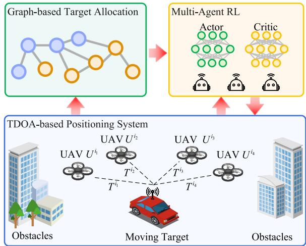  
Fig. 1. TDOA-based moving target positioning system using an intelligent UAV swarm. The UAV swarm uses the time diference of signal arrival at diferent UAVs to locate the target. To achieve a better formation, we first divide the area around the target into subspaces and assign each UAV a corresponding tracking target using the graph-based algorithm. Then, using the assigned tracking target and sensor data as observations, a MARL algorithm generates actions for each UAV. The UAVs execute these actions to adjust their trajectories, avoiding obstacles, optimizing the formation, and enhancing target positioning accuracy.

• We design a graph-based UAV swarm target assignment method. Using the Hungarian algorithm, UAVs are dynamically assigned to track targets based on the current positions and the target localization results, forming a layout with low geometric dilution of precision (GDOP) to improve positioning accuracy while optimizing the overall UAV swarm path.

• We formulate the UAV swarm-based target tracking task as a partially observable Markov decision process (POMDP). We carefully design the reward function to ensure that the UAV swarm avoids obstacles, optimizes formation, and reduces unnecessary exploration to save energy.

• We employ the MAT to eficiently map UAV observations to actions. The Transformer architecture ofers contextual awareness, dynamic adaptation, and eficiency in optimizing the trajectories of the UAV swarm in complex environments. The UAV swarm takes actions to adjust their trajectories to avoid obstacles, optimize formation, and conserve energy.

The remainder of this article is organized as follows. Section I reviews the related work on UAV-based positioning system and MARL. Section III introduces the background and problem of the TDOA-based positioning system using a UAV swarm. Section IV describes the system model, the Hungarian algorithm based tracking target allocation and POMDP. Section V introduces our TDOA and MAT based moving target tracking algorithm. Section V-C presents the simulation results and performance analysis. Finally, Section VII summarizes the work.

## II. RELATED WORK

## A. Target Tracking Using a UAV Swarm

Based on whether UAVs actively transmit signals, positioning systems can be categorized as active or passive. In active systems, UAVs typically serve as mobile virtual anchors [6], [7], [19], measuring distances to the target from diferent locations and using geometric relationships to determine its position [20], [21]. This approach is enhanced with path planning algorithms that enable secure ground target localization via multilateration [7], [22], while minimizing flight paths and ensuring eficient computation. A two-step optimization method is proposed in [19] to ensure positioning accuracy. However, these methods are unsuitable for tracking moving targets and are time-consuming.

Passive positioning does not require UAVs to transmit signals, ofering better stealth. Common techniques include TDOA [10], AOA [23], RSS [24], and TOA [25], with RSS and TDOA being the most cost-efective. RSS estimates target position by measuring signal strength at multiple UAVs based on a signal attenuation model [8]. In [9], a multi-UAV tracking method using time-varying radio maps is proposed, considering terrain impact on RSS, and employing particle swarm optimization for dynamic environments. A dueling deep Q-network is proposed for multi-UAV positioning, based on the Cramer-Rao lower bound (CRLB)´ [26]. Nonetheless, RSS is susceptible to factors like obstacles and reflections, leading to NLoS propagation and reduced accuracy.

TDOA estimates the target position by measuring the time diference of signal arrival across multiple UAVs [10], ofering higher accuracy and robustness than RSS. A joint data collection and sensor localization scheme is presented in [27], where a main UAV gathers data and auxiliary UAVs estimate the position via TDOA. UAV trajectories are optimized with particle swarm optimization to minimize localization error. Formation design further enhances accuracy [28], [29]. In [30], UAVs form a predefined pattern and follow the target based on TDOA estimates. In [29], a linear non-conservative robust Kalman filter framework is used to analytically evaluate tracking performance considering formation and sensor accuracy. However, these works do not address NLoS efects or obstacle impact on UAV formations.

To further highlight the advantages of our proposed tracking framework, we provide a comparative summary of representative UAV-based positioning and tracking methods in Table I.

## B. UAV Navigation in Complex Environments

UAVs operating in cluttered or dynamic environments depend on onboard sensors to perceive their surroundings and avoid obstacles. Typical setups include LiDARs [32] and depth cameras [33], which support 3D environmental mapping through occupancy grids or local maps used in trajectory planning. Although efective, these systems often demand high computation and energy, limiting their use on lightweight UAVs. Our approach adopts eight directional ultrasonic sensors to measure distances to nearby obstacles. Despite being simple and low-cost, this setup provides adequate spatial awareness for local planning. More importantly, the model is sensor-agnostic: equivalent input can be generated from depth or LiDAR data by computing directional distances from point clouds. This allows easy integration with more advanced sensing modalities when available.

TABLE I  
COMPARISON OF DIFFERENT UAV-BASED POSITIONING AND TRACKING METHODS
<table><tr><td>References</td><td>Positioning Type</td><td>Ranging Method</td><td>Dynamic Target</td><td>Obstacle Avoidance</td><td>NLOS Consideration</td><td>GDOP Optimization</td></tr><tr><td>Gong et al. [6]</td><td>Active</td><td>RSSI</td><td>X</td><td>×</td><td>√</td><td>X</td></tr><tr><td>Perazzo et al. [7]</td><td>Active</td><td>TOA/TDOA</td><td>X</td><td>X</td><td>×</td><td>√</td></tr><tr><td>Pinotti et al. [19]</td><td>Active</td><td>TOA (RTT)</td><td>×</td><td>X</td><td>√</td><td>√</td></tr><tr><td>Dong et al. [9]</td><td>Passive</td><td>RSSI</td><td>√</td><td>×</td><td>√</td><td>×</td></tr><tr><td>Cheng et al. [31]</td><td>Passive</td><td>RSSI</td><td>√</td><td>×</td><td>×</td><td>×</td></tr><tr><td>Zhu et al. [27]</td><td>Active</td><td>RSSI</td><td>×</td><td>√</td><td>×</td><td>X</td></tr><tr><td>Moon et al. [26]</td><td>Passive</td><td>TOA</td><td>√</td><td>×</td><td>√</td><td>×</td></tr><tr><td>Our work</td><td>Passive</td><td>TDOA</td><td>√</td><td>√</td><td>√</td><td>√</td></tr></table>

Traditional navigation methods include velocity obstacle (VO) approaches [34] and potential fields [35] work well in structured environments but struggle with scalability in large swarms or complex scenes. Distributed planners like MADER [36] and EGO-Swarm [37] enable asynchronous or parallel replanning for improved real-time performance. Recently, learning-based methods have shown strong adaptability in dynamic scenarios. Systems such as Agile Autonomy [38] and Deep-PANTHER [39] use imitation learning from expert demonstrations for reactive planning. RL, particularly in multi-agent setups, enables UAVs to coordinate and adapt in unknown environments [33]. Our method builds on this by employing a MAT to process observations and generate coordinated actions, enabling eficient navigation without explicit maps.

## C. Multi-Agent Reinforcement Learning

MARL enables multiple agents to make decisions in a shared environment by learning from interaction and feedback. One of the main challenges in MARL is improving individual policies while optimizing the joint performance of all agents. CTDE [14] mitigates this by allowing agents to access global information and others’ actions during training, which supports the adaptation of single-agent algorithms to multi-agent settings. COMA [13] introduces a multi-agent policy gradient to replace the standard form. VDN [12] simplifies joint action-value functions by decomposing them into the sum of individual Q-values, which supports scalable decentralized learning. MAPPO [11] adopts shared parameters and trust-region updates to enhance stability. Despite their contributions, these methods often struggle with complex cooperative scenarios. The multi-agent advantage decomposition theorem proposed in [16] helps quantify each agent’s impact on team returns and ofers a way to understand how cooperation evolves during decision-making. Based on this theory, HATRPO and HAPPO [16] achieve strong performance by applying sequential updates and advantage decomposition. However, they still depend on well-designed optimization objectives and do not model cooperative intent explicitly.

## D. Attention-Based Architectures in MARL

Transformers have shown remarkable success in natural language processing (NLP) [17], [40], which has inspired the RL community to explore sequence modeling techniques. Several Transformer-based methods have achieved strong results in single-agent ofline RL. For example, Decision Transformer [41] avoids dynamic programming by training autoregressive models on ofline trajectories to generate actions based on desired returns, past states, and actions. The Trajectory Transformer [42] models trajectory distributions and uses beam search for planning, achieving state-of-the-art performance in long-horizon tasks with sparse rewards. These results highlight the ability of Transformers to learn from sequential data in RL settings. However, these models are limited to single-agent environments and do not address key challenges in MARL, such as agent coordination and credit assignment. Standard architectures like BERT [40] are efective for capturing temporal dependencies but lack the structure needed for sequential action generation or inter-agent interaction. When applied to MARL without coordination mechanisms, treating each agent independently often fails to improve joint performance [16].

To address this, MAT [18] reformulates cooperative MARL as a sequence modeling problem. It uses an encoder-decoder architecture with autoregressive decoding to generate each agent’s action based on its observation and the actions of previous agents. MAT integrates the multi-agent advantage decomposition theorem into training, which supports accurate credit assignment and stable joint policy updates. These design elements enable MAT to model inter-agent dependencies, improve coordination, and achieve consistent performance gains across complex tasks.

## III. PROBLEM STATEMENT

In this section, we introduce the basics of the UAV swarm passive positioning system. We first introduce the TDOAbased positioning system using the Taylor algorithm. Next, we explain the signal propagation model and the impact of NLoS on distance measurements. We then discuss how the UAV swarm’s formation afects positioning accuracy, and finally, we summarize the optimization problem of the UAV swarm passive positioning system.

## A. TDOA-Based Positioning System

We develop a TDOA-based passive positioning system utilizing a UAV swarm, denoted as $U = \{ U ^ { i _ { 1 } } , U ^ { i _ { 2 } } , \ldots , U ^ { i _ { N } } \}$ . Each UAV detects signals emitted by the target, and by analyzing the time diferences of the same signal reaching diferent UAVs, the relative distances between the signal source (target) and each UAV can be determined. The target’s position is represented as $\mathbf { x } _ { t } = \left\lceil x _ { t } y _ { t } z _ { t } \right\rceil \in \mathbb { R } ^ { 3 }$ , and the position of UAV $U ^ { i _ { m } }$ is $\mathbf { p } _ { t } ^ { i _ { m } } = \left[ x _ { t } ^ { i _ { m } } \ y _ { t } ^ { i _ { m } } \ z _ { t } ^ { \tilde { i } _ { m } } \right] \in \mathbb { R } ^ { 3 }$ , where $m = 1 , 2 , . . . , N$ . For simplicity, the subscript t is omitted in the following discussion. Let c be the propagation speed of the signal. The time diference of arrival between UAVs is given by $\bar { \Delta } T ^ { i _ { m } } = T ^ { i _ { m } } - T ^ { i _ { 1 } }$ , where $T ^ { i _ { m } }$ and $T ^ { i _ { 1 } }$ represent the times the signal reaches UAV $U ^ { i _ { m } }$ and the reference UAV $U ^ { i _ { 1 } }$ , respectively. Using this information, the relative distance diference between UAVs can be expressed as:

$$
\Delta R ^ { i _ { m } } = R ^ { i _ { m } } - R ^ { i _ { 1 } } = c \Delta T ^ { i _ { m } }\tag{1}
$$

where $R ^ { i _ { m } }$ is the distance between the target and UAV $U ^ { i _ { m } }$ To solve for the target’s position, we perform a first-order Taylor expansion of $R ^ { i _ { m } }$ around an initial estimated position $\hat { \mathbf { x } } _ { ( 0 ) } = \left[ \hat { x } _ { ( 0 ) } \hat { y } _ { ( 0 ) } \hat { z } _ { ( 0 ) } \right]$ . This expansion allows us to convert the equations into matrix form:

$$
\mathbf { b } = \mathbf { G } \Delta \mathbf { x }\tag{2}
$$

where $\textbf { b } = \ \left\lceil b ^ { i _ { 2 } } \ b ^ { i _ { 3 } } \ \cdot \cdot \cdot \ b ^ { i _ { N } } \right\rceil ^ { T } \ \in \ \mathbb { R } ^ { N - 1 }$ , with $b ^ { i _ { m } } ~ = ~ \Delta R ^ { i _ { m } } ~ -$ $\left( R _ { 0 } ^ { i _ { m } } - R _ { 0 } ^ { i _ { 1 } } \right)$ , and $R _ { 0 } ^ { i _ { m } }$ represents the distance between the initial estimated position $\hat { \mathbf { X } } _ { ( 0 ) }$ of the target and UAV $U ^ { i _ { m } }$ . The term $\Delta { \bf x } = \left\lceil \Delta x \Delta y \Delta z \right\rceil \in \mathbb { R } ^ { 3 }$ is the position increment, and $\mathbf { G } \in \mathbb { R } ^ { ( \tilde { N } - 1 ) \times 3 }$ is the geometry matrix [43], which depends on the spatial formation of the UAVs relative to the target. The position increment ∆x can be estimated using the least squares method:

$$
\Delta \mathbf { x } = \left( \mathbf { G } ^ { T } \mathbf { G } \right) ^ { - 1 } \mathbf { G } ^ { T } \mathbf { b }\tag{3}
$$

The estimated position of the target can be updated as:

$$
\hat { \mathbf { x } } _ { ( 1 ) } = \hat { \mathbf { x } } _ { ( 0 ) } + \Delta \mathbf { x }\tag{4}
$$

The process $( 2 ) \AA - \thinspace ( 4 )$ is repeated iteratively, updating the estimated position until convergence. The final estimated position of the target is denoted as xˆ.

## B. Measurement Error Model

The target’s position is determined using the TDOA of a signal emitted by the target and received by multiple UAVs. However, this measurement often contains random errors. The propagation of the signal is modeled as:

$$
T ^ { i _ { m } } = \frac { R ^ { i _ { m } } + w ^ { i _ { m } } } { c }\tag{5}
$$

where $w ^ { i _ { m } }$ represents random noise. In real environments, obstacles are often present, and when they lie between the UAV and the target, the signal can only reach the receiver through reflection, scattering, or difraction, known as NLoS propagation [44]. NLoS propagation introduces additional delay and increased noise. The noise is modeled as follows:

$$
w ^ { i _ { m } } \sim \left\{ \begin{array} { l l } { { \mathcal N \left( 0 , \sigma _ { \mathrm { L o S } } ^ { 2 } \right) , } } & { { \mathrm { L o S ~ s i t u a t i o n } } } \\ { { \mathcal N \left( \mu _ { \mathrm { N L o S } } , \sigma _ { \mathrm { N L o S } } ^ { 2 } \right) , } } & { { \mathrm { N L o S ~ s i t u a t i o n } } } \end{array} \right.\tag{6}
$$

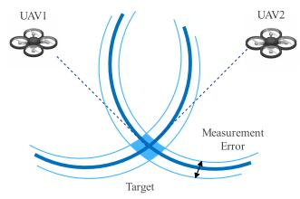  
(a) Well-formed

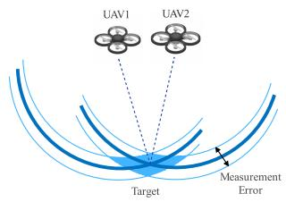  
(b) Poorly-formed  
Fig. 2. Target positioning error with UAVs in well and poor formations.

where $w ^ { i }$ is a random variable that, in the LoS situation, follows a normal distribution with mean 0 and variance $\sigma _ { \mathrm { L o S } } ^ { 2 } ,$ σand in the NLoS situation, follows a normal distribution with mean $\mu _ { \mathrm { N L o S } }$ and variance $\sigma _ { \mathrm { N L o S } } ^ { 2 }$ . The noise will introduce a bias with non-zero mean $\pmb { \mu } _ { \varepsilon }$ and covariance $\begin{array} { r l } { \mathbf { C } _ { \varepsilon \varepsilon } } & { { } = } \end{array}$ diag $\left( \sigma _ { i _ { 2 } } ^ { 2 } , \sigma _ { i _ { 3 } } ^ { 2 } , \ldots , \sigma _ { i _ { N } } ^ { 2 } \right)$ εin the equation (2) as $\mathbf { b } = \mathbf { G } \Delta \mathbf { x } + \pmb { \varepsilon } ,$ and thus introducing a biased position estimation error with each iteration:

$$
\delta \mathbf { x } = \left( \mathbf { G } ^ { T } \mathbf { G } \right) ^ { - 1 } \mathbf { G } ^ { T } \pmb { \varepsilon }\tag{7}
$$

The mean of the position estimation error is:

$$
\mathbb { E } [ \delta \mathbf { x } ] = \left( \mathbf { G } ^ { T } \mathbf { G } \right) ^ { - 1 } \mathbf { G } ^ { T } \mathbb { E } [ \mathbf { \boldsymbol { \varepsilon } } ] = \left( \mathbf { G } ^ { T } \mathbf { G } \right) ^ { - 1 } \mathbf { G } ^ { T } \boldsymbol { \mu } _ { \varepsilon }\tag{8}
$$

The covariance of the position increments can be expressed as:

$$
\mathbf { C } _ { x x } = \left( \mathbf { G } ^ { T } \mathbf { G } \right) ^ { - 1 } \mathbf { G } ^ { T } \mathbf { C } _ { \varepsilon \varepsilon } \mathbf { G } \left( \mathbf { G } ^ { T } \mathbf { G } \right) ^ { - 1 }\tag{9}
$$

Since $\mathbf { C } _ { \varepsilon \varepsilon }$ is a diagonal matrix, the equation can be simplified as:

$$
\mathbf { C } _ { x x } = \mathbf { C } _ { \varepsilon \varepsilon } \left( \mathbf { G } ^ { T } \mathbf { G } \right) ^ { - 1 }\tag{10}
$$

Considering that NLoS propagation introduces a non-zero mean bias and increases measurement variance, while the UAVs have limited signal reception capabilities, we aim to have the UAVs follow the target to minimize the efects of NLoS propagation in complex environments. This approach helps maintain accurate and continuous target localization.

## C. GDOP Definition and Significance

On the other hand, we also notice the amplifying efect of the geometric matrix G on measurement errors. As shown in equation (10), the original measurement error covariance $\mathbf { C } _ { \varepsilon \varepsilon }$ is multiplied by the matrix $( \mathbf { G } ^ { T } \mathbf { G } ) ^ { - 1 }$ , resulting in the amplified positioning covariance $\mathbf { C } _ { x x } .$ . Here, we define the GDOP as the square root of the ratio between the trace of the position estimation error covariance matrix and the trace of the measurement error variance:

$$
\mathrm { G D O P } = \sqrt { \frac { \mathrm { t r a c e } \left( \mathbf { C } _ { x x } \right) } { \mathrm { t r a c e } \left( \mathbf { C } _ { \varepsilon \varepsilon } \right) } } = \sqrt { \mathrm { t r a c e } \left( \left( \mathbf { G } ^ { T } \mathbf { G } \right) ^ { - 1 } \right) }\tag{11}
$$

GDOP measures the extent to which measurement errors are amplified in the final positioning result due to the formation of the UAVs. Fig. 2 clearly illustrates that GDOP is a critical factor in positioning accuracy. In the wellformed configuration (a), UAVs are spread apart, resulting in lower GDOP and smaller measurement errors, as their wider angle provides better spatial coverage and more precise target location estimation. In contrast, the poor formation (b) shows UAVs positioned too closely, leading to higher GDOP and larger measurement errors due to the reduced geometric diversity. This demonstrates the importance of maintaining optimal UAV spatial distribution for precise positioning in multi-UAV systems.

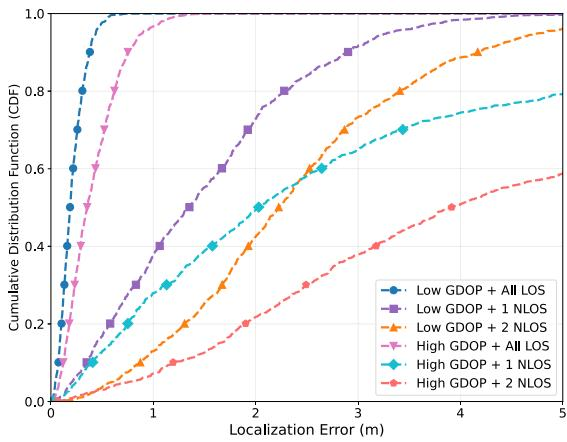  
Fig. 3. CDF of localization error for six scenarios combining GDOP conditions and NLoS counts.

## D. Experimental Validation of GDOP and NLoS Efects

To validate the impact of UAV geometry and signal propagation conditions on TDOA-based localization accuracy, we conducted a simulation experiment using four UAVs and a fixed ground target. Two geometric configurations were considered: in the low-GDOP setting, UAVs were evenly distributed on a circle with a 10-meter radius; in the high-GDOP setting, UAVs were placed along a straight 20-meter line, leading to poor angular diversity. We also varied the signal propagation environment by assigning diferent numbers of UAVs to NLoS conditions. Specifically, we tested three levels: all-LoS, one NLoS, and two NLoS links. The TDOA measurement noise was modeled as Gaussian, with $\sigma _ { \mathrm { L o S } } = 0 . 3$ m under LoS, and $\mu _ { \mathrm { L o S } } = 3 . 0$ m and $\sigma _ { \mathrm { N L o S } } = 3 . 0 \ i$ m under NLoS. For each setting, we performed 1000 Monte Carlo simulations using the Taylor-based TDOA algorithm, and recorded the localization errors. Fig. 3 shows the cumulative distribution functions (CDFs) of the error for all scenarios.

The results show that both higher GDOP and more NLoS links significantly degrade positioning accuracy. In the low-GDOP and all-LoS case, over 80% of errors were below 0.5 meter, while in the high-GDOP with two NLoS links case, errors were much larger and more dispersed. These findings confirm the theoretical analysis and highlight the importance of optimizing UAV geometry and avoiding NLoS conditions to ensure robust localization.

## E. Problem Formulation

We consider a system of N UAVs $U = \{ U ^ { i _ { 1 } } , U ^ { i _ { 2 } } , . . . , U ^ { i _ { N } } \}$ forming a TDOA positioning network to locate a moving ground target. The mission takes place over the time interval [0 T ]. The objective is to minimize the overall GDOP along the UAV path to enhance positioning accuracy, while also reducing the total flight path length to save energy and time. The objective function is defined as:

$$
J = \int _ { 0 } ^ { T } \mathrm { G D O P } _ { t } d t + \lambda L _ { \mathrm { t o t a l } }\tag{12}
$$

where $\begin{array} { r } { L _ { \mathrm { t o t a l } } = \sum _ { m = 1 } ^ { N } \int _ { 0 } ^ { T } | \dot { \mathbf { p } } _ { t } ^ { i _ { m } } | d t } \end{array}$ represents the total flight length of the UAVs, and is a weighting factor balancing GDOP and path length. The UAVs should also comply with kinematic constraints during their movement:

$$
\left\| \dot { \mathbf { p } } _ { t } ^ { i _ { m } } \right\| \leq \nu _ { \operatorname* { m a x } } , \quad \left\| \dot { \mathbf { p } } _ { t } ^ { i _ { m } } \right\| \leq a _ { \operatorname* { m a x } } , \quad \forall t \in [ 0 , T ] , \quad \forall m\tag{13}
$$

Additionally, the UAVs need to maintain a safe distance from obstacles to avoid collisions:

$$
\left\| \mathbf { p } _ { t } ^ { i _ { m } } - \mathbf { 0 } _ { b s } \right\| \geq D _ { \operatorname* { m i n } } , \quad \forall \mathbf { 0 } _ { b s } \in O , \quad \forall t \in [ 0 , T ] , \quad \forall m\tag{14}
$$

where $o$ is the set of obstacles, and $D _ { \mathrm { m i n } }$ is the minimum safe distance between the UAVs and obstacles. The complete optimization problem can be formulated as:

$$
\begin{array} { r l } { \underset { \mathfrak { p } _ { i } ^ { i } \dots \geq \mathfrak { p } _ { i } ^ { i } } { \operatorname* { m i n } } } & { J = \int _ { 0 } ^ { T } \mathrm { G D O P } _ { t } d t + \lambda \underset { m = 1 } { \overset { N } { \sum } } \int _ { 0 } ^ { T } \left\| \hat { \mathbf { p } } _ { t } ^ { i _ { n } } \right\| d t } \\ { \mathrm { s u b j e c t ~ t o : } } & { \left\| \mathbf { p } _ { t } ^ { i _ { n } } - \mathbf { 0 } _ { b s } \right\| \geq D _ { \operatorname* { m i n } } , \quad \forall \mathbf { 0 } _ { b s } \in O , } \\ & { \forall t \in [ 0 , T ] , \quad \forall m } \\ & { \left\| \hat { \mathbf { p } } _ { t } ^ { i _ { n } } \right\| \leq \nu _ { \operatorname* { m a x } } , \quad \left\| \hat { \mathbf { p } } _ { t } ^ { i _ { n } } \right\| \leq a _ { \operatorname* { m a x } } , } \\ & { \forall t \in [ 0 , T ] , \quad \forall m } \\ & { \left\| \hat { \mathbf { p } } _ { 0 } ^ { i _ { n } } \right\| = 0 , \quad \forall m } \end{array}\tag{15}
$$

The goal is to determine the optimal trajectories for the UAVs that balance positioning accuracy, energy eficiency, and safety, ensuring reliable target tracking throughout the mission.

## IV. SYSTEM FRAMEWORK AND DRL MODEL DEFINITION

In this section, we first provide an overview of the system, followed by an introduction to UAV tracking target allocation based on graph theory. Furthermore, we define UAV path planning as a POMDP. Finally, we describe the UAVs’ observations, actions, and rewards.

## A. System Overview

We propose a mobile target positioning system based on MARL, as shown in Fig. 4. The system uses TDOA measurements of signals received by multiple UAVs and applies the Taylor algorithm to estimate the target’s position. To reduce the efects of NLoS propagation and signal attenuation in complex environments, the UAV swarm maintains a certain distance from the target while continuously adjusting their positions to enhance positioning accuracy. At each time step, the Hungarian algorithm is used to assign tracking targets to each UAV-based on the current positioning results. Each UAV gathers information about its own state, distances to surrounding obstacles, and relative position to the target. These individual observations are combined into a joint observation matrix, which is then processed by a MAT network to generate actions for each UAV. These actions guide the UAVs in adjusting their positions to avoid obstacles, minimize GDOP, and improve positioning accuracy. Once the UAVs adjust their positions, the swarm uses the Taylor algorithm to update the target’s position. This updated position is used for the next iteration of tracking target assignment and observations. Through continuous iterations, the UAV swarm efectively tracks the target, avoids obstacles, and forms an optimal geometric layout to locate the target.

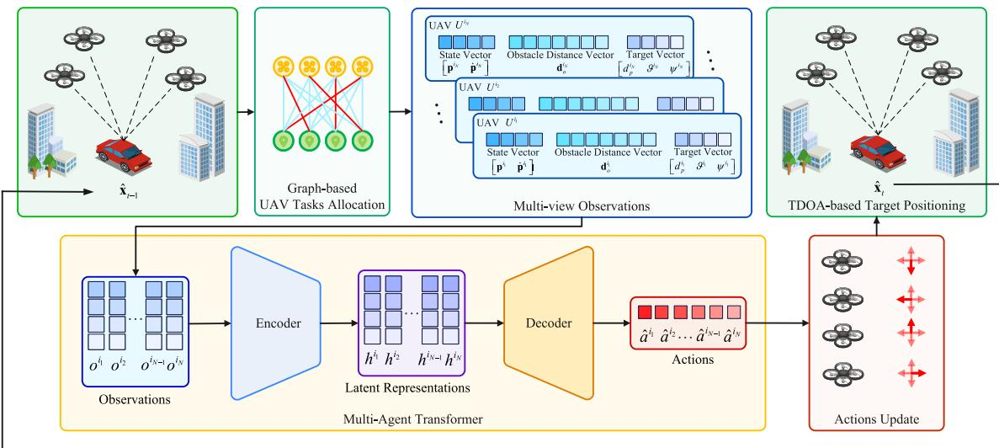  
Fig. 4. Overview of the proposed MAT-based moving target tracking system. Tracking target allocation for the UAV swarm is performed using graph theor methods. Each UAV then obtains its corresponding observation information based on the assigned tracking target, UAV sensor data, and the target’s previous positioning results. All UAV observations are combined into a joint observation matrix, which is fed into a MAT network. The network generates actions for each UAV to track the target and optimize the formation. After updating their positions, the UAV swarm uses the TDOA of the received signals and applies the Taylor algorithm to locate the target. This target positioning result is iteratively used as the initial position estimate for the next time step.

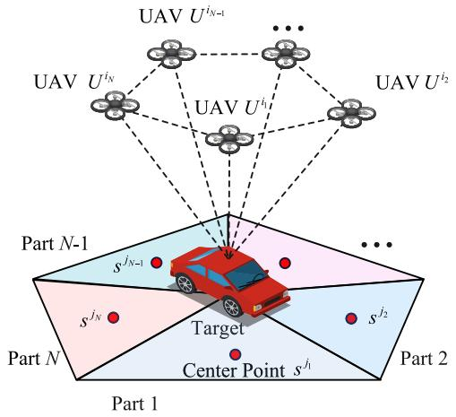  
Fig. 5. The space around the target is partitioned into N subspaces. Each UAV tracks the center point of a unique subspace, allowing the swarm to form an optimal formation, thereby achieving lower GDOP values.

## B. UAV Tracking Target Allocation

When UAVs set $U \ = \ \{ U ^ { i _ { 1 } } , U ^ { i _ { 2 } } , \cdot \cdot \cdot \ , U ^ { i _ { N } } \}$ are evenly distributed around the moving target, a lower GDOP can be achieved, resulting in higher positioning accuracy. Using the estimated position from the previous time step, $\hat { \mathbf { X } } _ { t - 1 } .$ the surrounding space is partitioned into N subspaces, with each subspace having a center point from the set $\begin{array} { r l } { S } & { { } = } \end{array}$ $\{ s ^ { j _ { 1 } } , s ^ { j _ { 2 } } , . . . , s ^ { j _ { N } } \}$ . Each UAV is assigned to track the center point of a subspace, forming a balanced UAV distribution that helps achieve lower GDOP, as shown in Fig. 5.

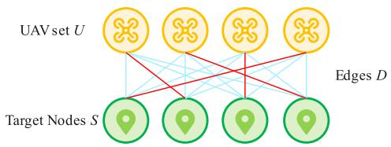  
Fig. 6. Graph structure of UAVs and the target nodes $G = ( ( U , S ) , D ) ,$ , where , ,U is the set of UAVs, S is the set of target nodes, and D is the set of edges connecting UAVs to target nodes. Each edge is weighted by the distance between the corresponding UAV and target node.

However, obstacles in the environment can cause UAVs to deviate from their assigned positions or even get temporarily trapped, disrupting their tracking targets. To address this, tracking targets are reassigned dynamically to ensure that UAVs maintain an optimal formation and continue to track the target efectively.

The UAV swarm U and target points S are treated as vertex sets, with edges $D = [ d ^ { m n } ]$ representing the distances between each UAV $U ^ { i _ { m } }$ and its assigned target point $s ^ { j _ { n } }$

$$
D = \left[ \begin{array} { c c c c c } { { d _ { t } ^ { 1 1 } } } & { { d _ { t } ^ { 1 2 } } } & { { \dots } } & { { d _ { t } ^ { 1 N } } } \\ { { d _ { t } ^ { 2 1 } } } & { { d _ { t } ^ { 2 2 } } } & { { \dots } } & { { d _ { t } ^ { 2 N } } } \\ { { \vdots } } & { { \vdots } } & { { \ddots } } & { { \vdots } } \\ { { d _ { t } ^ { N 1 } } } & { { d _ { t } ^ { N 2 } } } & { { \dots } } & { { d _ { t } ^ { N N } } } \end{array} \right]\tag{16}
$$

This creates a weighted bipartite graph $G \ : = \ : ( ( U , S ) , D )$ as shown in Fig. 6. The objective is to establish a one-to-one mapping between UAVs and target points, such that each UAV tracks a unique target point while minimizing the overall path length for the swarm.

The tracking target allocation problem is formulated as an integer linear programming model:

$$
\begin{array} { l l } { \displaystyle \operatorname* { m i n } } & { ~ \displaystyle \sum _ { m = 1 } ^ { N } \sum _ { n = 1 } ^ { N } d _ { t } ^ { m n } x ^ { m n } } \\ { \mathrm { s u b j e c t ~ t o : } } & { ~ \displaystyle \sum _ { m = 1 } ^ { N } x ^ { m n } = 1 , \quad \forall n , \quad \displaystyle \sum _ { n = 1 } ^ { N } x ^ { m n } = 1 , \quad \forall m } \\ { \displaystyle } & { ~ x ^ { m n } \in \{ 0 , 1 \} , \quad \forall m , \quad \forall n } \end{array}\tag{7}
$$

where $x ^ { m n }$ indicates whether UAV $U ^ { i _ { m } }$ is assigned to target node $s ^ { j _ { n } }$ . The objective function represents the total cost of assigning UAVs to target nodes. The Hungarian algorithm is used to solve this assignment problem:

$$
X = { \mathrm { H u n g a r i a n } } ( D )\tag{18}
$$

where $X = [ x ^ { m n } ]$ is the resulting assignment matrix.

## C. Partially Observed Markov Decision Process Formulation

In cooperative MARL, problems are typically represented as a POMDP defined by the tuple $\langle \mathcal { N } , \mathcal { O } , \mathcal { A } , R , P , \gamma \rangle$ . The set of agents is $\mathcal { N } = \{ 1 , \ldots , N \}$ . The joint observation space $\begin{array} { r } { \mathcal { O } = \prod _ { m = 1 } ^ { \widetilde { N } } \mathcal { O } ^ { i _ { m } } } \end{array}$ is the product of each agent’s local observation space $\mathcal { O } ^ { i _ { m } }$ . Similarly, the joint action space $\begin{array} { r } { \pmb { \mathcal { A } } = \prod _ { m = 1 } ^ { N } \pmb { \mathcal { A } } ^ { i _ { m } } } \end{array}$ represents the product of the agents’ action spaces $\mathcal { A } ^ { i _ { m } }$ . The joint reward function is $R : \mathcal { O } \times \mathcal { A }  [ - R _ { \mathrm { { m a x } } } , R _ { \mathrm { { m a x } } } ]$ , and the transition probability function is $P : \mathcal { O } \times \mathcal { A } \times \mathcal { O } \to \mathbb { R }$ The discount factor is within the range [0 1). At each time step t, each agent $i _ { m } \in \mathcal { N }$ receives an observation $o _ { t } ^ { i _ { m } } \ \in \ \mathcal { O } ^ { i _ { m } }$ , forming a joint observation $\pmb { \mathscr { o } } ~ = ~ ( o ^ { i _ { 1 } } , \dots , o ^ { i _ { N } } )$ Each agent then selects an action $a _ { t } ^ { i _ { m } }$ according to its policy $\pi ^ { i _ { m } }$ , which contributes to the joint policy . All agents act simultaneously, independently of each other’s actions. The transition function P and joint policy determine the marginal observation distribution: $\begin{array} { r } { \rho _ { \pi } ( \cdot ) = \sum _ { t = 0 } ^ { \infty } \gamma ^ { t } \operatorname* { P r } ( \pmb { \theta } _ { t } = \pmb { \theta } _ { } \mid \pi ) } \end{array}$ At the end of each time step, the agents receive a joint reward $R ( o _ { t } , a _ { t } )$ and observe the next joint observation $\pmb { o } _ { t + 1 } ,$ with its probability given by $\begin{array} { r } { P ( \cdot \mid \pmb { o } _ { t } , \pmb { a } _ { t } ) } \end{array}$ . Over an infinite horizon, the agents seek to maximize the expected discounted cumulative return: $\begin{array} { r } { R = \sum _ { t = 0 } ^ { \infty } \gamma ^ { t } R \left( \pmb { \sigma } _ { t } , \pmb { a } _ { t } \right) } \end{array}$ . The goal is to find a joint policy that maximizes this cumulative return, ensuring efective cooperation among agents to achieve optimal tracking performance.

## D. Observation and Action Definition

To efectively track the moving target in an unknown environment with obstacles, each UAV requires three types of information: its own state, interactions with the environment, and its relative position with the target. The UAV’s state includes its position $\mathbf { p } ^ { i _ { m } }$ and velocity $\dot { \mathbf { p } } ^ { i _ { m } }$ , which can be measured using a GNSS/INS integrated navigation system [45]. Next, each UAV must perceive its environment to determine distances to obstacles and prevent collisions. In this work, to reduce computational complexity, we use eight ultrasonic sensors evenly distributed around the UAV to provide distance information in eight directions, as shown in Fig. 7a. However, our algorithm only relies on distance vectors between the UAV and obstacles, which can be easily obtained from other sensors such as LiDAR [32] or depth cameras [33] via environmental mapping. This ensures the system’s flexibility and scalability with respect to diferent sensing modalities. The obstacle distance vector is defined as: ${ \bf d } _ { o } ^ { i _ { m } } = \left[ d _ { o 1 } ^ { i _ { m } } d _ { o 2 } ^ { i _ { m } } d _ { o 3 } ^ { i _ { m } } d _ { o 4 } ^ { i _ { m } } d _ { o 5 } ^ { i _ { m } } d _ { o 6 } ^ { i _ { m } } d _ { o 7 } ^ { i _ { m } } d _ { o 8 } ^ { i _ { m } } \right]$ ∀m. Additionally, the relative position between the UAV and the target is crucial for guiding the UAV to track the target continuously, as shown in Fig. 7. Using the positioning results from the previous time step as a reference, the Hungarian algorithm is applied to determine the target node that each UAV should track. The diference between the target position and the UAV’s current position yields the distance $d _ { p } ^ { i _ { m } j _ { n } }$ , azimuth angle $\vartheta ^ { i _ { m } }$ and elevation angle $\psi ^ { i _ { m } }$ . Thus, the observation for each UAV is defined as:

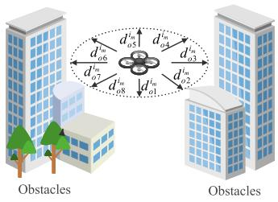  
(a)

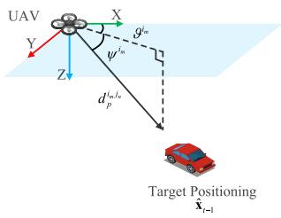  
(b)  
Fig. 7. Schematic representation of UAV observations. (a) The UAV is equipped with eight ultrasonic distance sensors, evenly distributed in eight directions around the UAV. They are used to detect the distance between the UAV and obstacles. (b) The relative position between the UAV and the target, including distance, azimuth angle and elevation angle.

$$
O ^ { i _ { m } } = \{ { \bf p } ^ { i _ { m } } , \dot { \bf p } ^ { i _ { m } } , { \bf d } _ { o } ^ { i _ { m } } , d _ { p } ^ { i _ { m } j _ { n } } , \vartheta ^ { i _ { m } } , \psi ^ { i _ { m } } \}\tag{19}
$$

Each UAV selects an action at each time step and transitions to a new state. The available actions include incrementing or decrementing the velocity in the x-axis or y-axis by a fixed value $\Delta \nu ,$ or leaving the velocity unchanged. Mathematically, the action set is expressed as:

$$
a ^ { i _ { m } } \in \left\{ \dot { \mathbf { p } } ^ { i _ { m } } \pm \left[ \begin{array} { c } { \Delta \nu } \\ { 0 } \\ { 0 } \end{array} \right] , \dot { \mathbf { p } } ^ { i _ { m } } \pm \left[ \begin{array} { c } { 0 } \\ { \Delta \nu } \\ { 0 } \end{array} \right] , \dot { \mathbf { p } } ^ { i _ { m } } \right\}\tag{20}
$$

## E. Reward Definition

The reward function is crucial for guiding the action of each UAV within the MARL framework to achieve mission objectives efectively. It is designed to balance several key factors: encouraging minimize GDOP for accurate target localization, discouraging unnecessary movements to promote energy eficiency, imposing penalties for close proximity to obstacles to ensure collision avoidance, and fostering cooperative behavior among UAVs. At each time step, the reward for each UAV includes four components: transfer reward, GDOPbased reward, obstacle penalty, and step penalty.

The transfer reward is defined as:

$$
r _ { \mathrm { t r a n s } } ^ { i _ { m } } ~ = \beta \left( d _ { p t } ^ { i _ { m } j _ { n } } - d _ { p t - 1 } ^ { i _ { m } j _ { n } } \right)\tag{21}
$$

where $\beta$ is a constant and $d _ { p t } ^ { i _ { m } } - d _ { p t - } ^ { i _ { m } }$ represents the reduction in distance to the target point after the UAV takes an action. This reward encourages the UAV to move closer to the target.

The GDOP-based reward is defined as:

$$
r _ { \mathrm { G D O P } } ^ { i _ { m } } = - \alpha \mathrm { G D O P } _ { t }\tag{22}
$$

where is a scaling factor. Since GDOP should be minimized, the reward is negative proportional to GDOP. Although the division of subspaces and Hungarian algorithm allow the UAVs to achieve a uniform formation for target positioning, the GDOP-based reward enables the UAVs to further fine-tune their positions, leading to an even more optimal formation.

The obstacle penalty is defined as:

$$
r _ { \mathrm { o b s t a c l e } } ^ { i _ { m } } ~ = - \delta \sum _ { q = 1 } ^ { 8 } \operatorname* { m a x } { \left( 0 , D _ { \mathrm { m i n } } - d _ { o q } ^ { i _ { m } } \right) }\tag{23}
$$

where $\delta$ is a scaling factor, and $D _ { m i n }$ is the minimum safe distance between the UAVs and obstacles. UAVs are penalized when they get too close to obstacles, ensuring safe navigation.

The step penalty is defined as:

$$
r _ { \mathrm { s t e p } } ^ { i _ { m } } = - \epsilon \cdot \left\| \mathbf { p } _ { t } ^ { i _ { m } } - \mathbf { p } _ { t - 1 } ^ { i _ { m } } \right\|\tag{24}
$$

where is a scaling factor. The penalty discourages unnecessary movements to promote energy eficiency [46].

Thus, the total reward for UAV $U ^ { i _ { m } }$ is

$$
r ^ { i _ { m } } = r _ { \mathrm { t r a n s } } ^ { i _ { m } } ~ + r _ { \mathrm { G D O P } } ^ { i _ { m } } + r _ { \mathrm { o b s t a c l e } } ^ { i _ { m } } ~ + r _ { \mathrm { s t e p } } ^ { i _ { m } }\tag{25}
$$

The joint reward for all agents is the sum of their individual rewards:

$$
R \left( \pmb { o } _ { t } , \pmb { a } _ { t } \right) = \sum _ { m = 1 } ^ { N } r ^ { i _ { m } }\tag{26}
$$

By integrating these components and carefully tuning their weights, the reward function guides UAVs to learn policies that ensure precise target tracking, eficient path planning, and safe operation in a dynamic environment.

## V. MULTI-AGENT TRANSFORMER BASED TARGET TRACKING

In this section, we introduce the multi-agent advantage decomposition theory, which forms the theoretical basis of the algorithm. Next, we briefly introduce the core of the transformer network, specifically the attention mechanism. Finally, we present the TDOA and MAT based tracking algorithm.

## A. Multi-Agent Advantage Decomposition

The agents evaluate the value of actions and observations with $Q _ { \pi } ( \pmb { o } , \pmb { a } )$ and $V _ { \pi } ( o )$ , defined as

$$
\begin{array} { c } { { \mathcal { Q } _ { \pi } ( o , a ) = \mathbb { E } _ { o _ { 1 : \infty } \sim P , a _ { 1 : \infty } \sim \pi } \left[ R \mid o _ { 0 } = o , \pmb { a } _ { 0 } = a \right] } } \\ { { V _ { \pi } ( o ) = \mathbb { E } _ { a _ { 0 } \sim \pi , o _ { 1 : \infty } \sim P , a _ { 1 : \infty } \sim \pi } \left[ R \mid \pmb { o } _ { 0 } = o \right] } } \end{array}\tag{27}
$$

In cooperative multi-agent systems, the joint objective poses challenges related to credit assignment. When agents receive a joint reward, it is dificult for them to assess their individual contributions to the team’s success or failure. Using traditional RL methods with standard value functions often results in training dificulties. To address this, we adopt the multi-agent observation-value function approach. For any disjoint, ordered subsets of agents $i _ { 1 : m } ~ = ~ \{ i _ { 1 } , . . . , i _ { m } \}$ and $j _ { 1 : h } ~ = ~ \{ j _ { 1 } , . . . , j _ { h } \}$ where $m , h \leq N$ , we define the multi-agent observation-value function as

$$
Q _ { \pi } ( \pmb { \mathscr { o } } , \pmb { a } ^ { i _ { 1 : m } } ) = \mathbb { E } \left[ R \mid \pmb { o } _ { 0 } ^ { i _ { 1 : N } } = \pmb { o } , \pmb { a } _ { 0 } ^ { i _ { 1 : m } } = \pmb { a } ^ { i _ { 1 : m } } \right] ,\tag{28}
$$

We further evaluate the contribution of a specific subset of agents to the overall return by defining the multi-agent advantage function:

$$
\begin{array} { r l } & { A _ { \pi } ^ { i _ { 1 : m } } ( o , a ^ { j _ { 1 : h } } , a ^ { i _ { 1 : m } } ) = Q _ { \pi } ^ { j _ { 1 : h } , i _ { 1 : m } } ( o , a ^ { j _ { 1 : h } } , a ^ { i _ { 1 : m } } ) } \\ & { \qquad - \ Q _ { \pi } ^ { j _ { 1 : h } } ( o , a ^ { j _ { 1 : h } } ) . } \end{array}\tag{29}
$$

The multi-agent advantage indicates how much better or worse the joint action a will be if agents $i _ { 1 : m }$ take actions $\pmb { a } ^ { i _ { 1 : m } }$ , given that agents $j _ { 1 : h }$ have taken actions $\pmb { a } ^ { j _ { 1 : h } }$ . When $h =$ $0 ,$ the advantage compares the value of $\pmb { a } ^ { i _ { 1 : m } }$ to the baseline value function of the entire team. The representation allows us to analyze agent interactions and decompose the joint value function, thereby mitigating the credit assignment problem. The insights from the advantage function are formalized by the Multi-Agent Advantage Decomposition theorem [16].

Theorem 1: (Multi-Agent Advantage Decomposition). Let $i _ { 1 : n }$ be a permutation of agents. Then, for any joint observation $\textbf { \em o } = \textbf { \em o } \in \mathcal { O }$ and joint action ${ \pmb a } = { \pmb a } ^ { i _ { 1 : N } } \in \mathcal { A } .$ , the following equation always holds:

$$
A _ { \pi } ^ { i _ { 1 : N } } \left( o , a ^ { i _ { 1 : N } } \right) = \sum _ { m = 1 } ^ { N } A _ { \pi } ^ { i _ { m } } \left( o , a ^ { i _ { 1 : m - 1 } } , a ^ { i _ { m } } \right)\tag{30}
$$

The theorem establishes that the joint advantage of joint actions by multiple agents is equal to the sum of the sequentially derived advantages from each individual agent’s action. The insight allows a MARL problem to be treated as a combination of N independent RL problems. Building on this idea, we propose decomposing the overall advantage variance into individual contributions from each agent. The approach leads us to design a sequence model that optimizes joint policies incrementally, focusing on one agent at a time, thereby avoiding the computational complexity of the entire joint action space.

## B. Attention Mechanism

The Transformer model is a neural network architecture primarily used for natural language processing tasks, known for its encoder-decoder structure. The encoder processes the input sequence into a set of continuous representations, while the decoder generates the output sequence based on these representations and previous output tokens. A key innovation is the use of scaled dot-product attention, which allows the model to focus on diferent parts of the input sequence simultaneously. The attention function is written as Attention(Q K V) = softmax $\left( \frac { \mathbf { Q } \mathbf { K } ^ { T } } { \sqrt { d _ { k } } } \right) \mathbf { V }$ , where Q, K, V are the queries, keys and values, and $\dot { d _ { k } }$ is the dimension of Q and K. The attention mechanism enables eficient parallelization and capturing long-range dependencies in the data.

## C. Multi-Agent Transformer

Theorem 1 establishes a connection between MARL and sequence models by demonstrating that when each agent is aware of its predecessors’ actions, the sum of local advantages is equivalent to the joint advantage. The equivalence simplifies the process of updating the joint policy, as optimizing each agent’s local advantage directly contributes to maximizing the joint advantage without concerns about interference among agents. Leveraging the insight, we adopt a sequential decisionmaking paradigm in which agents act in a given order, making optimal decisions based on the observed actions of preceding agents. To capture these interactions efectively, we adopt the MAT. The MAT consists of an encoder that generates representations from the agents’ observations and a decoder that produces actions for each agent sequentially in an auto-regressive manner. The encoder, parameterized by $\phi ,$ transforms the observations of a sequence of agents $( o ^ { i _ { 1 } } , . . . . , o ^ { i _ { N } } )$ using a combination of self-attention mechanisms and multi-layer perceptrons (MLPs), enhanced by residual connections to ensure stability during learning and mitigate gradient vanishing. The resulting encoded observations, $( h ^ { i _ { 1 } } , . . . . , h ^ { i _ { N } } )$ , capture both individual agent information and the interactions among agents. The encoder is trained by minimizing the empirical Bellman error:

$$
\begin{array} { c } { { \displaystyle \mathcal { L } _ { \mathrm { E n c o d e r } } ( \phi ) = \frac { 1 } { T N } \sum _ { m = 1 } ^ { N } \sum _ { t = 0 } ^ { T - 1 } \left[ R \left( \pmb { o } _ { t } , \pmb { a } _ { t } \right) \right. } } \\ { { \left. + \gamma V _ { \bar { \phi } } \left( h _ { t + 1 } ^ { i _ { m } } \right) - V _ { \phi } \left( h _ { t } ^ { i _ { m } } \right) \right] ^ { 2 } } } \end{array}\tag{31}
$$

where $\bar { \phi }$ represents the parameters of a non-diferentiable target network.

The decoder, parameterized by , utilizes the encoded observations along with the joint actions of preceding agents to determine each agent’s action sequentially. Masked selfattention mechanisms are employed to ensure that each agent $i _ { j }$ only considers the actions of preceding agents $i _ { r }$ for $r < j ,$ thereby preserving the order in which actions are generated. The final outputs are passed through MLPs to produce the policy distribution $\pi _ { \theta } ^ { i _ { m } } ( a ^ { i _ { m } } | h ^ { i _ { 1 } } , \pmb { a } ^ { i _ { 1 } } )$ . The decoder is trained by θoptimizing a clipped PPO objective:

$$
\begin{array} { c } { \displaystyle \mathcal { L } _ { \mathrm { D e c o d e r } } ( \theta ) = \displaystyle - \frac { 1 } { T N } \sum _ { m = 1 } ^ { N } \sum _ { t = 0 } ^ { T - 1 } \operatorname* { m i n } \left( r _ { t } ^ { i _ { m } } ( \theta ) \hat { A } _ { t } , \right. } \\ { \displaystyle \left. \mathrm { c l i p } \left( \mathrm { r } _ { t } ^ { i _ { m } } ( \theta ) , 1 \pm \epsilon \right) \hat { A } _ { t } \right) } \\ { \displaystyle r _ { t } ^ { i _ { m } } ( \theta ) = \frac { \pi _ { \theta } ^ { i _ { m } } \left( a _ { t } ^ { i _ { m } } \mid h _ { t } ^ { i _ { 1 : N } } , \hat { a } _ { t } ^ { i _ { 1 : m - 1 } } \right) } { \pi _ { \theta _ { 0 \mathrm { d e l } } } ^ { i _ { m } } \left( a _ { t } ^ { i _ { m } } \mid h _ { t } ^ { i _ { 1 : N } } , \hat { a } _ { t } ^ { i _ { 1 : m - 1 } } \right) } } \end{array}\tag{32}
$$

where $r _ { t } ^ { i _ { m } } ( \theta )$ represents the ratio of the updated policy to the old policy probabilities, and $\hat { A } _ { t }$ is an estimate of the joint advantage function. During inference, actions are generated auto-regressively. Each action $a ^ { i _ { m } }$ is used to generate the subsequent action $a ^ { i _ { m + 1 } }$ , beginning with $a ^ { i _ { 0 } }$ and ending with $a ^ { i _ { N - 1 } }$ 1 . During training, however, all actions $\pmb { a } ^ { i _ { 1 : N } }$ are computed in parallel using previous data $\pmb { a } ^ { i _ { 1 : N - 1 } }$ from the replay bufer, allowing for eficient learning. The MAT based target positioning algorithm is summarized in Algorithm 1.

Algorithm 1 TDOA and MAT Based Target Positioning   
1 Network Initialize: batch size B, number of agents $N ,$   
episodes $K ,$ steps per episode T , Encoder $\{ \phi _ { 0 } \}$ , Decoder   
$\{ \theta _ { 0 } \}$ , Replay bufer $B .$   
θ2 for $k = 1 , 2 . . . , K$ do   
3 , . . .,Environment Initialize: UAVs positions $\mathbf { p } _ { 0 } ^ { i _ { m } }$ , UAVs   
velocity $\left\| \dot { \mathbf { p } } _ { 0 } ^ { i _ { m } } \right\| = 0 ,$ target position estimation $\hat { \mathbf { X } } _ { 0 } .$   
4 for $t = 1 , \stackrel { \cdot \cdot } { 2 } , \stackrel { \cdot \cdot } { \dots } , T$ do   
5 Partition the area around $\hat { \mathbf { X } } _ { t - 1 }$ into N subspaces,   
and the center set of the subspaces is $\begin{array} { r l } { S } & { { } = } \end{array}$   
$\{ s ^ { j _ { 1 } } , s ^ { j _ { 2 } } , \cdots , s ^ { j _ { N } } \}$   
6 , , ,Map each UAV to a center point one-to-one based   
on (18).   
7 Collect the sequence of observations $o _ { t } ^ { i _ { 1 } } , . . . , o _ { t } ^ { i _ { N } }$   
from UAVs.   
8 Generate representation sequence $h _ { t } ^ { i _ { 1 } } , . . . , h _ { t } ^ { i _ { N } }$ by   
feeding observations to the encoder.   
9 Input $\bar { h } _ { t } ^ { i _ { 1 } } , . . . , h _ { t } ^ { i _ { N } }$ to the decoder.   
10 for $m = 1 , 2 , . . . , N - 1$ do   
11 Input $a _ { t } ^ { i _ { 0 } } , . . . . , a _ { t } ^ { i _ { m } }$ and infer $a _ { t } ^ { i _ { m + 1 } }$ with the auto  
regressive decoder.   
12 end for   
13 Execute joint actions $a _ { t } ^ { i _ { 1 } } , . . . , a _ { t } ^ { i _ { N } }$ for UAVs in the   
, . . .,environment and collect the reward $R ( o _ { t } , { \pmb a } _ { t } )$   
14 Update the replay bufer B as $\begin{array} { r l r l } { B } & { { } } & { = } & { { } } \end{array}$   
$B \bigcup \{ \pmb { o } _ { t } , \pmb { a } _ { t } , R ( \pmb { o } _ { t } , \pmb { a } _ { t } ) \}$   
15 Locate the moving target $\hat { \mathbf { X } } _ { t }$ based on the TDOA   
Taylor algorithm.   
16 end for   
17 Network Training:   
18 Sample a random mini batch of B steps from B.   
19 Calculate $V _ { \phi } \left( h ^ { i _ { 1 } } \right) , \ldots , V _ { \phi } \left( h ^ { i _ { N } } \right)$ with the output layer of   
φthe encoder.   
20 Calculate the encoder loss ${ \mathcal { L } } _ { \mathrm { E n c o d e r } } ( \phi )$ with (31).   
21 φCompute the joint advantage function Aˆ based on   
$V _ { \phi } \left( h ^ { i _ { 1 } } \right) , \ldots , V _ { \phi } \left( h ^ { i _ { N } } \right)$ with GAE.   
22 Input $h ^ { i _ { 1 } } , . . . , h ^ { i _ { N } }$ and $a ^ { i _ { 0 } } , \ldots , a ^ { i _ { N - 1 } }$ , generate $\pi _ { \theta } ^ { i _ { 1 } } , \ldots , \pi _ { \theta } ^ { i _ { N } }$   
with the decoder.   
23 Calculate the decoder loss ${ \mathcal { L } } _ { \mathrm { D e c o d e r } } ( \theta )$ with (32).   
24 Update the encoder and decoder by minimizing   
${ \mathcal { L } } _ { \mathrm { E n c o d e r } } ( \phi ) + { \mathcal { L } } _ { \mathrm { D e c o d e r } } ( \theta )$ with gradient descent.   
25 end for

## D. Computational Complexity Analysis

To assess the computational eficiency of our method, we analyze the complexity of the two key components in each decision step: the Hungarian algorithm for dynamic target allocation and the MAT for cooperative trajectory generation.

The target allocation is formulated as a bipartite graph matching problem between N UAVs and N target points. The Hungarian algorithm solves this optimally with a worst-case time complexity:

$$
T _ { \mathrm { H u n g a r i a n } } = \mathcal { O } ( N ^ { 3 } )\tag{33}
$$

This arises from operating on an $N \times N$ cost matrix, where up to N iterations are required and each involves searching for augmenting paths in $\mathcal { O } ( N ^ { 2 } )$ time. Although cubic, this cost is acceptable for small to medium swarm sizes and is incurred only once per step.

The MAT model includes an encoder and a decoder. The encoder processes N observation vectors of dimension d through self-attention and feedforward layers, resulting in complexity $\mathcal { O } ( N ^ { 2 } d + N d ^ { 2 } )$ . The decoder generates N actions autoregressively, with each step including masked self-attention, cross-attention, and feedforward computation, yielding the same order of complexity. Hence, the overall inference complexity per decision step is:

$$
T _ { \mathrm { M A T } } = \mathcal { O } ( N ^ { 2 } d + N d ^ { 2 } )\tag{34}
$$

In practice, the hidden size d is typically much larger than N, i.e., $d \ \gg \ N .$ Under this setting, the dominant term becomes $\mathcal { O } ( N d ^ { 2 } )$ , and the main bottleneck lies in the feedforward layers. This implies that the inference cost scales approximately linearly with N and is mainly influenced by the model dimension d.

## VI. EXPERIMENT RESULTS AND ANALYSIS

## A. Experiment Setup

The experiments were developed and tested using AMOVLAB’s open-source software Prometheus [47]. We develop six distinct simulation environments to comprehensively evaluate the performance of the proposed algorithms. Three of these environments are constructed from randomly generated block structures and are categorized based on obstacle density into Blocks-Easy, Blocks-Medium, and Blocks-Hard. The classification allows for the assessment of UAV navigation and control under varying degrees of environmental complexity. The remaining three environments are designed to emulate realistic physical settings, encompassing a Neighborhood, a Village, and a Forest. These scenarios incorporate authentic geographical features and obstacle distributions, providing a robust framework for testing UAV behavior in real-world conditions.

At the beginning of each iteration, the UAVs are arranged in a line, and the vehicle is positioned randomly within the environment. The vehicle moves within the environment, while the UAVs, perceiving the environment, use the TDOA and MAT algorithm to track and locate the vehicle. Once any UAV collides with an obstacle or the vehicle reaches its destination, the environment is reset. The data collected from each iteration are stored in a replay bufer for algorithm training.

To validate the efectiveness of our method, we compare it against several MARL algorithms:

1) MAPPO [11]: MAPPO is an extension of PPO to multiagent systems, using a centralized value function to improve cooperation between agents.

2) RMAPPO [11]: Recurrent MAPPO (RMAPPO) enhances MAPPO by incorporating recurrent neural networks to handle partial observability in multi-agent environments.

3) HAPPO [16]: HAPPO extends PPO for heterogeneous agents, allowing each agent to have its own distinct policy and value network.

4) HATRPO [16]: HATRPO is a variant of Trust Region Policy Optimization (TRPO) for heterogeneous multi-agent systems, where agents have individualized policies and share a centralized critic.

TABLE II  
MAIN PARAMETERS OF SIMULATION
<table><tr><td>Parameters</td><td>Setting</td></tr><tr><td>Number of UAVs N</td><td>4</td></tr><tr><td>Speed of target</td><td> $5 m / s$ </td></tr><tr><td>LoS measurement std</td><td>0.3 m</td></tr><tr><td>NLoS measurement mean</td><td>3m</td></tr><tr><td>NLoS measurement std</td><td>3m</td></tr><tr><td>Hidden layer dim</td><td>64</td></tr><tr><td>Training Steps</td><td>8e4</td></tr><tr><td>Discount factor γ</td><td>0.99</td></tr><tr><td>Num of blocks</td><td>1</td></tr><tr><td>Num of head</td><td>1</td></tr><tr><td>Optimizer</td><td>Adam</td></tr><tr><td>Actor learning rate</td><td>7e − 4</td></tr><tr><td>Critic learning rate</td><td>7e − 4</td></tr></table>

5) MAT-Dec: MAT-Dec is a CTDE-based variant of MAT. It version utilizes a fully decentralized actor for each agent (instead of using the decoder from MAT) while keeping the decoder fixed. The critic loss is:

$$
\begin{array} { c } { { \displaystyle \mathcal { L } ( \phi ) = \frac { 1 } { T } \sum _ { t = 0 } ^ { T - 1 } \Biggl [ R \left( \boldsymbol { o } _ { t } , \boldsymbol { a } _ { t } \right) + \gamma \frac { 1 } { N } \sum _ { m = 1 } ^ { N } V _ { \bar { \phi } } \left( h _ { t + 1 } ^ { i _ { m } } \right) } } \\ { { \displaystyle - \frac { 1 } { N } \sum _ { m = 1 } ^ { N } V _ { \phi } \left( h _ { t } ^ { i _ { m } } \right) \Biggr ] ^ { 2 } } } \end{array}
$$

and the local advantage estimation $A _ { t } \left( h _ { t } ^ { i _ { m } } , a ^ { i _ { m } } \right)$ is applied to guide the subsequent policy update.

The main parameter settings for the experiment are shown in Table II.

## B. Convergence Performance

We compare the convergence speeds of various algorithms across diferent environments. MAT achieves the best overall performance, showing significant advantages, especially as the complexity of the environment increased. In the Blocks-Easy environment, all algorithms gradually improve over time, but MAT converges faster and achieves a higher average reward. In the more complex Blocks-Medium and Blocks-Hard environments, MAT significantly outperforms the other algorithms. This demonstrates that MAT enables the UAV swarm to adapt more quickly to dynamic environmental changes, even in more challenging scenarios. Similarly, in the environments simulating real-world physical conditions, MAT rapidly increases its reward values in the early learning stages and maintained high stability. In particular, in the Village environment, MAT sig nificantly outperforms the other algorithms, converging faster with smaller fluctuations, indicating more stable performance. Additionally, MAT outperforms MAT-Dec, highlighting the crucial role that the decoder architecture plays in the design of MAT.

TABLE III  
COMPARISON OF MAE, RMSE AND GDOP IN THE BLOCKS ENVIRONMENTS
<table><tr><td rowspan="3">Methods</td><td colspan="3">Blocks-Easy</td><td colspan="3">Blocks-Medium</td><td colspan="3">Blocks-Hard</td><td colspan="3">Mean</td></tr><tr><td>MAE (m)</td><td>RMSE (m)</td><td>GDOP</td><td>MAE (m)</td><td>RMSE (m)</td><td>GDOP</td><td>MAE (m)</td><td>RMSE (m)</td><td>GDOP</td><td>MAE (m)</td><td>RMSE (m)</td><td>GDOP</td></tr><tr><td>MAPPO [11]</td><td>2.39</td><td>5.13</td><td>2.87</td><td>3.86</td><td>6.04</td><td>3.23</td><td>4.44</td><td>6.25</td><td>3.76</td><td>3.56</td><td>5.81</td><td>3.29</td></tr><tr><td>RMAPPO [11]</td><td>1.43</td><td>2.97</td><td>2.57</td><td>2.39</td><td>4.02</td><td>2.27</td><td>3.63</td><td>5.38</td><td>2.95</td><td>2.48</td><td>4.12</td><td>2.60</td></tr><tr><td>HAPPO [16]</td><td>2.42</td><td>5.18</td><td>3.17</td><td>2.44</td><td>4.03</td><td>2.21</td><td>4.44</td><td>6.37</td><td>3.89</td><td>3.10</td><td>5.19</td><td>3.09</td></tr><tr><td>HATRPO [16]</td><td>2.56</td><td>5.65</td><td>2.95</td><td>1.75</td><td>2.98</td><td>1.93</td><td>3.71</td><td>5.94</td><td>3.07</td><td>2.67</td><td>4.86</td><td>2.65</td></tr><tr><td>MAT-Dec</td><td>0.94</td><td>1.83</td><td>2.31</td><td>3.93</td><td>10.77</td><td>3.80</td><td>6.66</td><td>16.54</td><td>4.54</td><td>3.84</td><td>9.71</td><td>3.55</td></tr><tr><td>MAT</td><td>0.86</td><td>1.55</td><td>2.32</td><td>1.04</td><td>1.61</td><td>1.68</td><td>1.52</td><td>2.82</td><td>1.83</td><td>1.14</td><td>1.99</td><td>1.94</td></tr></table>

TABLE IV

COMPARISON OF MAE, RMSE AND GDOP IN THE REAL-WORLD PHYSICAL CONDITIONS BASED ENVIRONMENTS
<table><tr><td rowspan="3">Methods</td><td colspan="3">Neighborhood</td><td colspan="3">Village</td><td colspan="3">Forest</td><td colspan="3">Mean</td></tr><tr><td>MAE (m)</td><td>RMSE (m)</td><td>GDOP</td><td>MAE (m)</td><td>RMSE (m)</td><td>GDOP</td><td>MAE (m)</td><td>RMSE (m)</td><td>GDOP</td><td>MAE (m)</td><td>RMSE (m)</td><td>GDOP</td></tr><tr><td>MAPPO [11]</td><td>3.08</td><td>5.98</td><td>2.81</td><td>1.62</td><td>3.03</td><td>2.51</td><td>2.92</td><td>15.95</td><td>35.49</td><td>2.54</td><td>8.32</td><td>13.61</td></tr><tr><td>RMAPPO [11]</td><td>2.75</td><td>6.06</td><td>2.88</td><td>1.67</td><td>3.21</td><td>2.62</td><td>2.95</td><td>15.95</td><td>30.38</td><td>2.46</td><td>8.41</td><td>11.96</td></tr><tr><td>HAPPO [16]</td><td>3.63</td><td>7.48</td><td>3.25</td><td>1.51</td><td>2.87</td><td>2.41</td><td>2.81</td><td>16.25</td><td>24.49</td><td>2.65</td><td>8.87</td><td>10.05</td></tr><tr><td>HATRPO [16]</td><td>3.16</td><td>6.88</td><td>2.85</td><td>1.61</td><td>3.01</td><td>2.51</td><td>2.91</td><td>16.13</td><td>33.06</td><td>2.56</td><td>8.67</td><td>12.80</td></tr><tr><td>MAT-Dec</td><td>1.09</td><td>1.90</td><td>2.61</td><td>1.00</td><td>1.84</td><td>2.28</td><td>2.88</td><td>16.68</td><td>61.96</td><td>1.66</td><td>6.81</td><td>22.28</td></tr><tr><td>MAT</td><td>1.02</td><td>1.82</td><td>2.40</td><td>1.00</td><td>1.76</td><td>2.60</td><td>2.59</td><td>13.84</td><td>41.11</td><td>1.54</td><td>5.81</td><td>15.37</td></tr></table>

In summary, whether in simple or complex environments, MAT exhibits faster convergence and higher average rewards, proving its superior generalization ability and stability across diferent types of environments. This demonstrates that MAT has stronger exploration capabilities and better strategy optimization in multi-UAV systems compared to the other algorithms.

## C. Positioning Performance Evaluation

We compare the performance of various algorithms across diferent environments. We use Mean Absolute Error (MAE) and Root Mean Square Error (RMSE) to measure positioning accuracy, and record the average Geometric Dilution of Precision (GDOP) to evaluate the UAV formation. The statistical results are shown in Table III and Table IV.

MAT consistently demonstrates superior positioning accuracy and eficient UAV formation across the Blocks environments. In the Neighborhood, Village, and Forest environments, MAT also outperforms other methods, showing significantly better overall performance. In particular, MAT showed strong performance in the Village environment, achieving the highest positioning precision. In the challenging Forest environment, MAT maintains competitive accuracy, although the UAV formation becomes less optimal due to the increased environmental complexity. These results highlight MAT’s ability to adapt to varying levels of environmental complexity while maintaining high positioning accuracy and efective UAV distribution. MAT is designed to enable the UAV swarm to achieve continuous and stable target tracking while maintaining a reasonable formation, resulting in high-precision target positioning. MAT-Dec performs well in simpler environments but shows a decline in performance in more complex settings, as the UAV formation becomes less optimal. This suggests that MAT-Dec is more suitable for environments with fewer obstacles or lower complexity, as it struggles to maintain an optimal UAV arrangement when the environment becomes more challenging. Other algorithms, such as HATRPO and MAPPO, also faced significant challenges in complex environments, showing limitations in achieving both precise positioning and eficient UAV formations. Their performance tended to vary significantly, especially as environmental complexity increased, which limits their overall reliability.

Overall, MAT’s robustness and adaptability make it the best performer. The low GDOP maintained by MAT ensures that the UAV swarm remains in an optimal configuration, enhancing overall target positioning precision. The consistent results suggest that MAT is capable of handling diverse conditions, from simple to highly complex environments, without compromising on accuracy or UAV eficiency. This level of performance is particularly important for real-world applications, where environmental conditions can vary greatly.

## D. Positioning Trajectory Analysis

The positioning trajectory analysis in the Neighborhood, Village, and Forest environments further illustrates MAT’s efectiveness under diferent conditions, as shown in Fig. 11. In the Neighborhood environment, MAT demonstrates superior performance during straight-line movements, maintaining close alignment with the ground truth, which indicates stable and accurate tracking in straightforward scenarios. In the Village environment, MAT closely follows the ground truth during sharp turns, outperforming other algorithms by minimizing deviations and showing precise adaptability during sudden directional changes. Lastly, in the Forest environment, the UAVs are initially arranged in a straightline formation, leading to relatively inaccurate positioning results at the beginning. However, MAT demonstrates the ability to converge to the true trajectory more quickly compared to other algorithms, showcasing its adaptability and eficiency in correcting initial inaccuracies. The results across all three environments—representing straight-line movement, sharp turns, and initial formation challenges—demonstrate MAT’s versatility and efectiveness in handling a wide range of challenges.

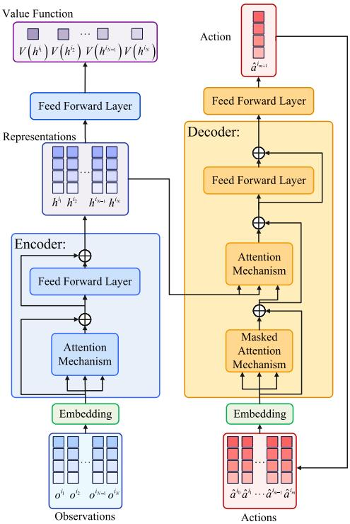

Fig. 8. The MAT utilizes an encoder-decoder architecture. At every time step, the encoder processes a sequence of observations from multiple agents and transforms them into latent representations. These representations are then fed into the decoder. The decoder sequentially generates the optimal action for each agent in an auto-regressive manner. Masked attention blocks are employed to ensure that during training, each agent can only access the actions of preceding agents.  
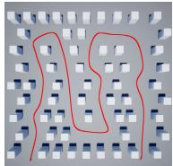  
(a) Blocks-Easy

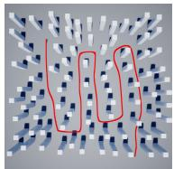

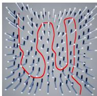

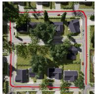  
(d) Neighborhood

(b) Blocks-Medium  
(c) Blocks-Hard  
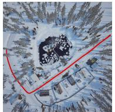  
(e) Village

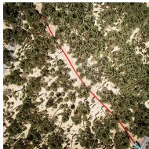  
(f) Forest  
Fig. 9. The vertical view of UAV simulation environments, and the trajectory of the moving target is highlighted in red. The Blocks environments are procedurally generated using random block configurations, categorized by obstacle density into Blocks-Easy, Blocks-Medium, and Blocks-Hard scenarios. The remaining three environments are based on realistic physical conditions, specifically representing a Neighborhood, a Village and a Forest.

TABLE V  
GENERALIZATION PERFORMANCE IN UNSEEN ENVIRONMENTS
<table><tr><td>Environment</td><td>MAE (m)</td><td>RMSE (m)</td><td>GDOP</td></tr><tr><td>City Park</td><td>1.26</td><td>2.58</td><td>2.65</td></tr><tr><td>Airport</td><td>1.18</td><td>2.35</td><td>2.42</td></tr><tr><td>Downtown</td><td>1.68</td><td>3.12</td><td>3.24</td></tr><tr><td>Urban Area</td><td>1.42</td><td>2.79</td><td>2.88</td></tr><tr><td>Mean</td><td>1.39</td><td>2.71</td><td>2.80</td></tr></table>

## E. UAV Trajectories Analysis

Here, we compare the UAV trajectories during the positioning process. The village environment is selected for the experiment. The black curve represents the ground truth trajectory of the moving target, the red curve shows the estimated trajectory, and the remaining curves represent the UAV flight paths. The MAT presents a more streamlined and well-distributed trajectory for each UAV. The paths have significantly less overlap, indicating that the UAVs are efectively collaborating to minimize redundancy. This eficient coordination leads to reduced energy consumption and a more optimized spatial arrangement, contributing to higher positioning accuracy and mission eficiency. Another notable diference is the overall smoothness of the UAV trajectories. For example, the trajectories generated by MAT-Dec show more frequent sharp turns and adjustments, which can lead to increased energy consumption and faster wear and tear on the UAV components. In contrast, the MAT generates smoother paths with fewer abrupt changes in direction, which not only improves energy eficiency but also reduces the mechanical stress on the UAVs, potentially extending their operational lifespan.

Overall, the MAT demonstrates an improved capability to avoid unnecessary overlap, optimize formation, and achieve higher positioning accuracy. The results highlight the advantages of MAT in UAV swarm coordination, particularly in challenging and resource-constrained environments.

## F. Generalization Evaluation

To further evaluate the generalization capability of our proposed MAT-based algorithm, we conducted transfer experiments using the model trained exclusively in the Blocks environments and tested it on four previously unseen and more complex environments: City Park, Airport, Downtown, and Urban Area, as shown in Fig. 13. These environments feature significantly diferent spatial layouts and obstacle types compared to the Blocks settings, including natural elements (trees, grass), urban features (buildings, lamp posts, bus stops), and constrained geometries (narrow alleyways, metal barriers). The evaluation results are summarized in Table V. Despite the domain gap, the model generalizes well to unseen settings, achieving comparable performance to the in-domain results. The GDOP values remain low, indicating that the learned policy efectively maintains spatial formation under diferent conditions. These results demonstrate that the proposed method can generalize across environments with varying levels of structure and obstacle density without retraining.

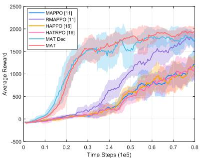  
(a) Blocks-Easy

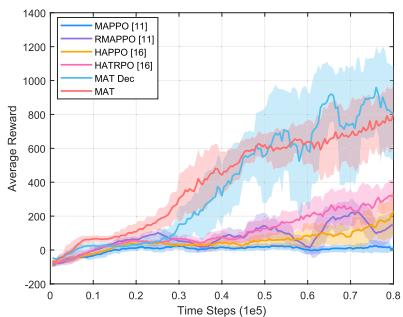  
(b) Blocks-Medium

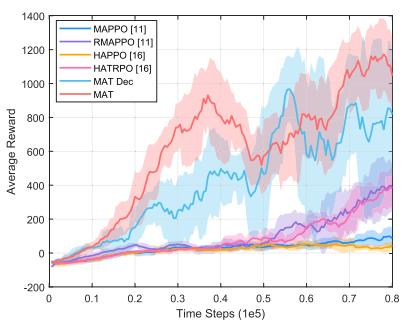  
(c) Blocks-Hard

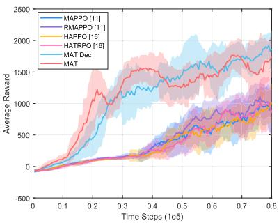  
(d) Neighborhood

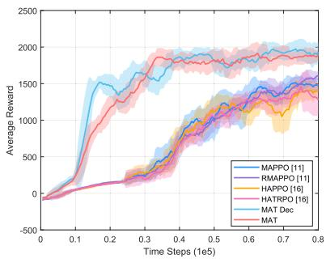  
(e) Village

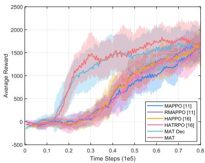  
(f) Forest

Fig. 10. Convergence performance comparison of the diferent algorithms in various environments.  
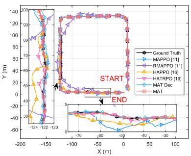  
(a) Neighborhood

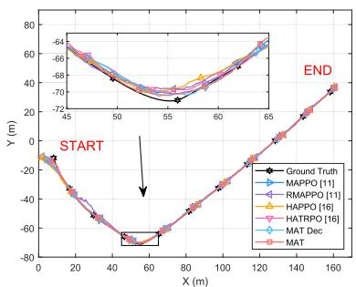  
(b) Village

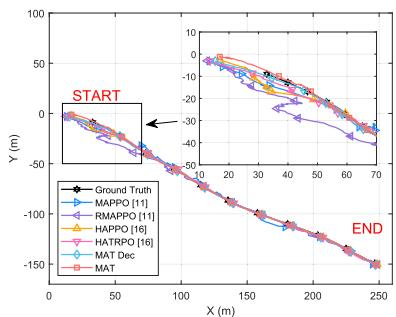  
(c) Forest  
Fig. 11. Positioning trajectories of the diferent algorithms in various environments. The zoomed-in part of the figures illustrate the system’s performance during (a) straight-line movement, (b) turning, and (c) initialization.

TABLE VI  
SYSTEM PERFORMANCE METRICS UNDER DIFFERENT NUMBERS OF UAVS
<table><tr><td>UAVs</td><td>GDOP↓</td><td>Training Time ↑  $( 1 0 ^ { 3 } s )$ </td><td>(104)</td><td>Convergence Steps ↓ Avg. Path Length ↓ (m)</td><td>Success Rate ↑ (%)</td><td>Computation Time ↓ (ms)</td></tr><tr><td>4</td><td>2.20</td><td>5.5</td><td>3.1</td><td>190</td><td>87.5</td><td>5.2</td></tr><tr><td>5</td><td>1.85</td><td>6.2</td><td>3.2</td><td>183</td><td>90.2</td><td>6.8</td></tr><tr><td>6</td><td>1.53</td><td>7.1</td><td>3.6</td><td>172</td><td>92.6</td><td>8.9</td></tr><tr><td>7</td><td>1.47</td><td>8.4</td><td>4.3</td><td>178</td><td>91.3</td><td>11.6</td></tr><tr><td>8</td><td>1.51</td><td>9.8</td><td>5.1</td><td>188</td><td>89.0</td><td>15.1</td></tr><tr><td>9</td><td>1.58</td><td>11.2</td><td>6.0</td><td>205</td><td>87.1</td><td>19.4</td></tr><tr><td>10</td><td>1.66</td><td>12.3</td><td>7.7</td><td>232</td><td>86.4</td><td>24.5</td></tr></table>

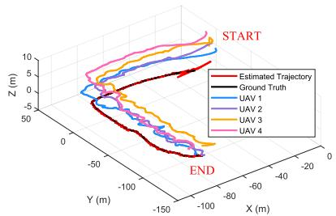  
(a) MAPPO [11]

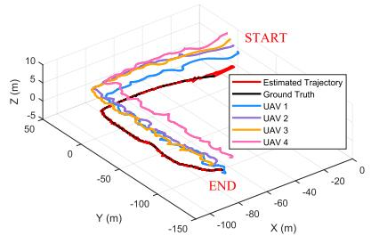  
(b) HAPPO [16]

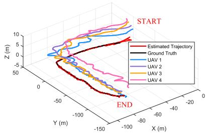  
(c) MAT-Dec

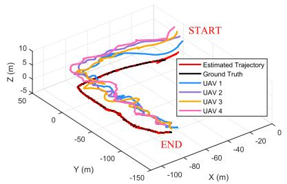  
(d) RMAPPO [11]

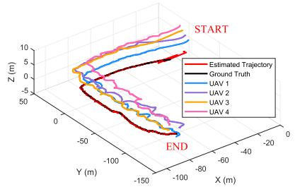  
(e) HATRPO [16]

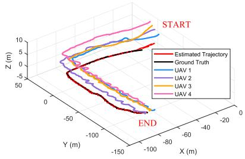  
(f) MAT

Fig. 12. UAV trajectories with diferent algorithms in the Village environment.  
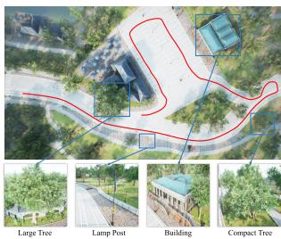  
(a) City Park

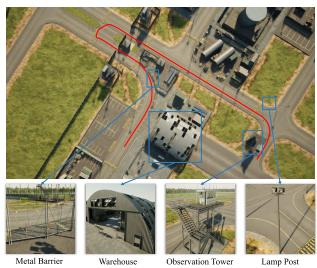  
(b) Airport

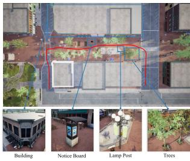  
(c) Downtown

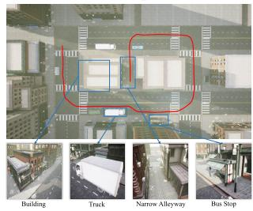  
(d) Urban Area  
Fig. 13. Unseen simulation environments used for generalization evaluation. These include: (a) City Park, featuring trees, buildings, and lamp posts; (b) Airport, including large open spaces with metal barriers, warehouses, and observation towers; (c) Downtown, characterized by dense urban elements such as buildings, notice boards, and trees; and (d) Urban Area, containing urban infrastructure like trucks, narrow alleyways, and bus stops. These diverse and unstructured environments are used to validate the robustness and generalization ability of the proposed algorithm under zero-shot transfer settings.

## G. Scalability Analysis

Table VI presents the variation of system performance metrics with respect to the number of UAVs in the swarm. As the number of UAVs increases from 4 to 6, the system exhibits steady improvements in coordination, adaptability, and tracking stability. The swarm benefits from enhanced spatial coverage and more efective task distribution during this range. When the swarm size goes beyond 6 or 7 UAVs, the improvement trend becomes less apparent. The addition of more UAVs increases communication and control complexity, which may lead to higher computational burden, longer training duration, and reduced coordination eficiency. In certain cases, a larger swarm can also slightly impair overall tracking performance due to interference and overlapping behaviors among agents. These results indicate that a swarm consisting of approximately 6 to 7 UAVs achieves a favorable balance between performance and computational eficiency.

TABLE VII  
PERFORMANCE COMPARISON UNDER DIFFERENTREWARD WEIGHT SETTINGS
<table><tr><td>α ε</td><td></td><td>MAE (m) ↓ GDOP↓</td><td>Path Length (m) ↓</td></tr><tr><td>0.5</td><td>0.1</td><td>1.80</td><td>2.45 164</td></tr><tr><td>1.0</td><td>0.1</td><td>1.52</td><td>1.83 173</td></tr><tr><td>2.0</td><td>0.1</td><td>1.31</td><td>1.52 190</td></tr><tr><td>0.5</td><td>0.3</td><td>1.95</td><td>2.65 142</td></tr><tr><td>1.0</td><td>0.3</td><td>1.70</td><td>2.12 167</td></tr><tr><td>2.0</td><td>0.3</td><td>1.47</td><td>1.68 187</td></tr></table>

## H. Reward Weight Sensitivity

To verify the adaptability of the designed reward function, we performed a controlled sensitivity analysis on two key weight parameters: , which penalizes GDOP, and , which penalizes UAV movement for energy conservation. The experiment was conducted using the proposed MAT algorithm, with environment and all other hyperparameters fixed. We varied within 0.5, 1.0, 2.0 and within 0.1, 0.3, resulting in six parameter combinations. The results, summarized in Table VII, indicate that increasing  tends to promote more precise UAV formations, leading to lower GDOP values. In contrast, increasing  discourages unnecessary motion, reducing path length and improving energy eficiency. These observations confirm that the reward structure ofers a tunable balance between positioning accuracy and resource consumption, allowing flexible adaptation to diferent task priorities.

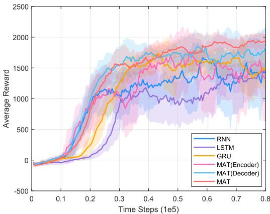  
Fig. 14. The performance comparison of diferent model architectures.

## I. Ablation Study

In this section, we conduct ablation study to investigate the importance of diferent components. We conduct a comparison using various model architectures, to assess the importance of each architectural component. MAT represents the original implementation. MAT(decoder) uses only the decoder while retaining the auto-regressive process. MAT(encoder) utilizes only the encoder, excluding the auto-regressive process. The RNN/LSTM/GRU model maintains both the encoder-decoder processes but implements them using RNN/LSTM/GRU networks. This ablation study is performed on the Blocks-Easy environment, and the results are illustrated in Fig. 14. The results show that the full Transformer architecture delivers the highest performance, highlighting both the superiority of the Transformer model and the importance of using the encoder-decoder structure.

## VII. CONCLUSION AND FUTURE WORK

In this paper, we propose a novel approach that integrates TDOA-based positioning with MAT to track and locate a moving ground target in complex environments using a UAV swarm. The MAT allows UAVs to collaboratively optimize their trajectories, avoid obstacles, maintain low GDOP, and accurately locate the target. The experiments in the simulation environments demonstrate the efectiveness of the proposed approach. Our algorithm demonstrates faster convergence and greater stability compared to other MARL algorithms across various environments, showing strong generalization capabilities. MAT achieves a more optimal geometric formation and higher positioning accuracy. It can quickly initialize and respond rapidly to target movements, with its positioning trajectory closely matching the real trajectory, even under challenging conditions involving obstacles and dynamic changes. Additionally, the UAV trajectories generated by our algorithm are smoother and avoid redundant exploration, significantly reducing energy consumption.

Nevertheless, the current evaluation is restricted to simulation environments, which do not fully capture the challenges of real-world deployment such as RF signal interference, sensor noise, hardware limitations, environmental uncertainties, or communication latency. Addressing these issues is an essential direction for future work. We plan to transition our system to real-world UAV platforms and conduct field experiments to validate its robustness and practical applicability. At the same time, we will explore the integration of advanced sensor fusion techniques, including LiDAR, cameras, and inertial measurement units, to replace or enhance the current ultrasonic-based perception system. This enhancement will enable more reliable operation in cluttered or large-scale environments. Furthermore, we aim to improve the scalability and coordination eficiency of the UAV swarm to support multi-target tracking tasks under limited resources. To further enhance learning eficiency, we also intend to investigate hybrid learning strategies that combine supervised learning with RL. For instance, expert trajectory data can be used for pre-training to accelerate convergence and improve sample eficiency. These eforts will help bridge the gap between simulation and real-world application and contribute to the development of robust and intelligent UAV swarm-based positioning systems.

## REFERENCES

[1] S. Qi, B. Lin, Y. Deng, X. Chen, and Y. Fang, “Minimizing maximum latency of task ofloading for multi-UAV-assisted maritime search and rescue,” IEEE Trans. Veh. Technol., vol. 73, no. 9, pp. 13625–13638, Sep. 2024.

[2] A. V. Savkin and H. Huang, “Multi-UAV navigation for optimized video surveillance of ground vehicles on uneven terrains,” IEEE Trans. Intell Transp. Syst., vol. 24, no. 9, pp. 10238–10242, Sep. 2023.

[3] P. Zhan, D. W. Casbeer, and A. L. Swindlehurst, “Adaptive mobile sensor positioning for multi-static target tracking,” IEEE Trans. Aerosp. Electron. Syst., vol. 46, no. 1, pp. 120–132, Jan. 2010.

[4] A. I. Ameur, O. S. Oubbati, A. Lakas, A. Rachedi, and M. B. Yagoubi, “Eficient vehicular data sharing using aerial P2P backbone,” IEEE Trans. Intell. Vehicles, vol. 10, no. 1, pp. 1–14, Jan. 2025.

[5] T. Bouzid, N. Chaib, M. L. Bensaad, and O. S. Oubbati, “5G network slicing with unmanned aerial vehicles: Taxonomy, survey, and future directions,” Trans. Emerg. Telecommun. Technol., vol. 34, no. 3, p. 4721, Mar. 2023.

[6] Z. Gong et al., “Design, analysis, and field testing of an innovative drone-assisted zero-configuration localization framework for wireless sensor networks,” IEEE Trans. Veh. Technol., vol. 66, no. 11, pp. 10322–10335, Nov. 2017.

[7] P. Perazzo, F. B. Sorbelli, M. Conti, G. Dini, and C. M. Pinotti, “Drone path planning for secure positioning and secure position verification,” IEEE Trans. Mobile Comput., vol. 16, no. 9, pp. 2478–2493, Sep. 2017.

[8] X. Jiang, N. Li, Y. Guo, D. Yu, and S. Yang, “Localization of multiple RF sources based on Bayesian compressive sensing using a limited number of UAVs with airborne RSS sensor,” IEEE Sensors J., vol. 21, no. 5, pp. 7067–7079, Mar. 2021.

[9] Y. Dong, C. He, and Z. J. Wang, “Dynamic object tracking by multi-UAV with time-variant radio maps,” IEEE Trans. Wireless Commun., vol. 23, no. 7, pp. 7471–7487, Jul. 2024.

[10] Y. Liu, Y. Wang, J. Wang, and Y. Shen, “Distributed 3D relative localization of UAVs,” IEEE Trans. Veh. Technol., vol. 69, no. 10, pp. 11756–11770, Oct. 2020.

[11] C. Yu, A. Velu, E. Vinitsky, Y. Wang, A. Bayen, and Y. Wu, “The surprising efectiveness of mappo in cooperative, multi-agent games,” 2021, arXiv:2103.01955.

[12] P. Sunehag et al., “Value-decomposition networks for cooperative multiagent learning based on team reward,” in Proc. Int. Joint Conf. Auto. Agents Multiagent Syst., Jul. 2018, pp. 2085–2087.

[13] J. Foerster, G. Farquhar, T. Afouras, N. Nardelli, and S. Whiteson, “Counterfactual multi-agent policy gradients,” in Proc. AAAI Conf. Artif. Intell., vol. 32, 2018, pp. 2974–2982.

[14] Y. Yang, Y. Wen, and J. Wang, “Multi-agent determinantal Q-learning,” in Proc. 37th Int. Conf. Mach. Learn. (ICML), Vienna, Austria, 2020, pp. 10757–10766.

[15] X. Deng, Y. Li, D. H. Mguni, J. Wang, and Y. Yang, “On the complexity of computing Markov perfect equilibrium in general-sum stochastic games,” 2021, arXiv:2109.01795.

[16] J. G. Kuba et al., “Trust region policy optimisation in multi-agent reinforcement learning,” in Proc. ICLR, 2021, p. 1046.

[17] A. Vaswani et al., “Attention is all you need,” in Proc. Adv. Neural Inf. Process. Syst., 2017, pp. 5998–6008.

[18] J. Kuba et al., “Multi-agent reinforcement learning is a sequence modeling problem,” in Proc. Adv. Neural Inf. Process. Syst. 35, 2022, pp. 16509–16521.

[19] C. M. Pinotti, F. Betti Sorbelli, P. Perazzo, and G. Dini, “Localization with guaranteed bound on the position error using a drone,” in Proc. 14th ACM Int. Symp. Mobility Manage. Wireless Access, Nov. 2016, pp. 147–154.

[20] D. Ebrahimi, S. Sharafeddine, P.-H. Ho, and C. Assi, “Autonomous UAV trajectory for localizing ground objects: A reinforcement learning approach,” IEEE Trans. Mobile Comput., vol. 20, no. 4, pp. 1312–1324, Apr. 2021.

[21] B. Yuan et al., “A UAV-assisted search and localization strategy in non-line-of-sight scenarios,” IEEE Internet Things J., vol. 9, no. 23, pp. 23841–23851, Dec. 2022.

[22] S. Capkun and J.-P. Hubaux, “Secure positioning in wireless networks,” IEEE J. Sel. Areas Commun., vol. 24, no. 2, pp. 221–232, Feb. 2006.

[23] Y. Zheng, M. Sheng, J. Liu, and J. Li, “Exploiting AoA estimation accuracy for indoor localization: A weighted AoA-based approach,” IEEE Wireless Commun. Lett., vol. 8, no. 1, pp. 65–68, Feb. 2019.

[24] T.-M.-T. Dinh, N.-S. Duong, and Q.-T. Nguyen, “Developing a novel real-time indoor positioning system based on BLE beacons and smartphone sensors,” IEEE Sensors J., vol. 21, no. 20, pp. 23055–23068, Oct. 2021.

[25] S. Monfared, E. I. P. Copa, P. De Doncker, and F. Horlin, “AoAbased iterative positioning of IoT sensors with anchor selection in NLOS environments,” IEEE Trans. Veh. Technol., vol. 70, no. 6, pp. 6211–6216, Jun. 2021.

[26] J. Moon, S. Papaioannou, C. Laoudias, P. Kolios, and S. Kim, “Deep reinforcement learning multi-UAV trajectory control for target tracking,” IEEE Internet Things J., vol. 8, no. 20, pp. 15441–15455, Oct. 2021.

[27] M. Zhu, Z. Wei, C. Qiu, W. Jiang, H. Wu, and Z. Feng, “Joint data collection and sensor positioning in multi-UAV-assisted wireless sensor network,” IEEE Sensors J., vol. 23, no. 19, pp. 23664–23675, Oct. 2023.

[28] H. Li, H. Sun, R. Zhou, and H. Zhang, “Hybrid TDOA/FDOA and track optimization of UAV swarm based on A-optimality,” J. Syst. Eng. Electron., vol. 34, no. 1, pp. 149–159, Feb. 2023.

[29] U.-S. Suh, S.-K. Han, and W.-S. Ra, “Optimal formation of UAV swarm for TDOA-based passive target tracking,” J. Electr. Eng. Technol., vol. 17, no. 1, pp. 551–564, Jan. 2022.

[30] M. Doostmohammadian, A. Taghieh, and H. Zarrabi, “Distributed estimation approach for tracking a mobile target via formation of UAVs,” IEEE Trans. Autom. Sci. Eng., vol. 19, no. 4, pp. 3765–3776, Oct. 2022.

[31] X. Cheng et al., “Communication-eficient coordinated RSS-based distributed passive localization via drone cluster,” IEEE Trans. Veh. Technol., vol. 71, no. 1, pp. 1072–1076, Jan. 2022.

[32] W. Xu and F. Zhang, “FAST-LIO: A fast, robust LiDAR-inertial odometry package by tightly-coupled iterated Kalman filter,” IEEE Robot. Autom. Lett., vol. 6, no. 2, pp. 3317–3324, Apr. 2021.

[33] J. Wang, Z. Yu, D. Zhou, J. Shi, and R. Deng, “Vision-based deep reinforcement learning of unmanned aerial vehicle (UAV) autonomous navigation using privileged information,” Drones, vol. 8, no. 12, p. 782, 2024.

[34] P. Fiorini and Z. Shiller, “Motion planning in dynamic environments using velocity obstacles,” Int. J. Robot. Res., vol. 17, no. 7, pp. 760–772, Jul. 1998.

[35] G. Hao, Q. Lv, Z. Huang, H. Zhao, and W. Chen, “UAV path planning based on improved artificial potential field method,” Aerospace, vol. 10, no. 6, p. 562, Jun. 2023.

[36] J. Tordesillas and J. P. How, “MADER: Trajectory planner in multiagent and dynamic environments,” IEEE Trans. Robot., vol. 38, no. 1, pp. 463–476, Feb. 2022.

[37] X. Zhou, Z. Wang, H. Ye, C. Xu, and F. Gao, “EGO-planner: An ESDFfree gradient-based local planner for quadrotors,” IEEE Robot. Autom. Lett., vol. 6, no. 2, pp. 478–485, Apr. 2021.

[38] A. Loquercio, E. Kaufmann, R. Ranftl, M. Muller, V. Koltun, and¨ D. Scaramuzza, “Learning high-speed flight in the wild,” Sci. Robot., vol. 6, no. 59, p. 5810, Oct. 2021.

[39] J. Tordesillas and J. P. How, “Deep-PANTHER: Learning-based perception-aware trajectory planner in dynamic environments,” IEEE Robot. Autom. Lett., vol. 8, no. 3, pp. 1399–1406, Mar. 2023.

[40] J. Devlin, M.-W. Chang, K. Lee, and K. Toutanova, “BERT: Pre-training of deep bidirectional transformers for language understanding,” in Proc. NAACL-HLT, 2019, pp. 4171–4186.

[41] L. Chen et al., “Decision transformer: Reinforcement learning via sequence modeling,” 2021, arXiv:2106.01345.

[42] M. Janner, Q. Li, and S. Levine, “O ¨ fline reinforcement learning as one big sequence modeling problem,” in Proc. Adv. Neural Inf. Process. Syst., vol. 34, 2021, pp. 1273–1286.

[43] B. Hofmann-Wellenhof, H. Lichtenegger, and E. Wasle, GNSS-global Navigation Satellite Systems: GPS, GLONASS, Galileo, and More. Cham, Switzerland: Springer, 2008.

[44] J. Wei, H. Wang, S. Su, Y. Tang, X. Guo, and X. Sun, “NLOS identification using parallel deep learning model and time-frequency information in UWB-based positioning system,” Measurement, vol. 195, May 2022, Art. no. 111191.

[45] H. Wang et al., “Dynamic process noise covariance adjustment in GNSS/INS integrated navigation using GRU-SAC for enhanced positioning accuracy,” IEEE Trans. Intell. Transp. Syst., vol. 26, no. 6, pp. 9047–9064, Jun. 2025.

[46] K. Messaoudi, A. Baz, O. Sami Oubbati, A. Rachedi, T. Bendouma, and M. Atiquzzaman, “UGV charging stations for UAV-assisted AoI-aware data collection,” IEEE Trans. Cognit. Commun. Netw., vol. 10, no. 6, pp. 2325–2343, Dec. 2024.

[47] AMOVLAB.(2025). Prometheus Autonomous UAV Open-Source Project. [Online]. Available: https://github.com/amov-lab/Prometheus

  
Haowen Wang (Graduate Student Member, IEEE) received the bachelor’s degree in communication engineering from the National University of Defense Technology, Changsha, China, in 2023. His current research interests include multi-sensor fusion, reinforcement learning, and machine learning for navigation systems.

Junyu Wei received the bachelor’s degree in communication engineering from the University of South China in 2009 and the M.Sc. and Ph.D. degrees in instrument science and technology from the National University of Defense Technology, Changsha, China, in 2011 and 2016, respectively. Currently, he is a Lecturer with the College of Intelligence Science and Technology, National University of Defense Technology. His research interests include sensors, sensor data fusion, measurement, and the application of artificial intelligence in signal processing.

Ni Zhu (Member, IEEE) received the Engineering degree in aeronautic telecommunications from the Ecole Nationale de l’Aviation Civile (ENAC),´ France, in 2015, and the Ph.D. degree in science of information and communication from the University of Lille, France, in 2018. She is currently a Research Fellow with the GEOLOC Laboratory of Gustave Eifel University (ex-IFSTTAR), France. Her recent research specializes in GNSS channel propagation modeling in urban environments, positioning integrity monitoring for terrestrial safetycritical applications, and multi-sensory fusion techniques for indoor/outdoor pedestrian positioning assisted by artificial intelligence. She has been the cochair of the foot-mounted IMU-based positioning track of Indoor Positioning and Indoor Navigation (IPIN) Competition since 2020. She is an Associate Editor of IEEE SENSORS JOURNAL.

Yuyang Xiao is currently pursuing the degree in mechanical and electronic engineering with Southwest Petroleum University, China. His current research focuses on the design of quadrotor drones and their auxiliary components, such as sensors and navigation systems.

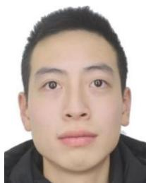

Zongqing Zhao received the B.S. degree in mechanical design and manufacturing and automation from Fuzhou University, Fuzhou, China, in 2023. He is currently pursuing the M.S. degree in electronic information with the College of Intelligent Science and Technology, National University of Defense Technology, Changsha, China. His research interests focus on infrared signal processing and radio spectrum detection.

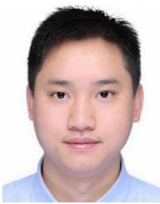

Jiangyi Qin received the B.E., M.E., and Ph.D. degrees from the School of Intelligent Science, National University of Defense Technology, Changsha, China, in 2011, 2014, and 2018, respectively. He is currently an Assistant Research Fellow with the National Innovation Institute of Defense Technology, Academy of Military Science, Beijing, China. His main research interests include wireless communications, optical fibre communication, and artificial intelligence.

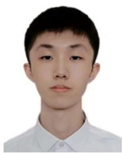

Zhuoyuan Wu received the bachelor’s and master’s degrees in engineering from the National University of Defense Technology in 2021 and 2023, respectively, where he is currently pursuing the Ph.D. degree with the College of Intelligence Science and Technology. His research interests focus on image fusion, object detection, and localization.

Shiqi Li received the bachelor’s degree in measurement and control technology and instrumentation from Chongqing University, Chongqing, China, in 2024. He is currently pursuing the master’s degree in instrument science and technology with the National University of Defense Technology, Changsha, China. His research interests focus on cooperative detection based on optoelectronic images and radio signals.

Zhiqiang Wang (Member, IEEE) received the bachelor’s degree in mechanical engineering from Shanghai Jiao Tong University in 2009, the master’s degree in mechanical engineering from ENSAM ParisTech, France, in 2012, and the Ph.D. degree in data mining and machine learning in the manufacturing industry from Ecole Centrale de Nantes,´ Nantes, France, in 2021. He has been an Associate Professor with the Devinci Higher Education, De Vinci Research Center, Paris, France, since 2022. He has also been an Associate Researcher with the

Ecole Centrale de Nantes since March 2024. He developed an intelligent´ failure analysis system for the semiconductor industry based on NLP and deep learning, which is financed by European project FA 4.0. His research interests include Industry 4.0, AI-based failure analysis, and intelligent decision-aid systems based on multi-modal data.