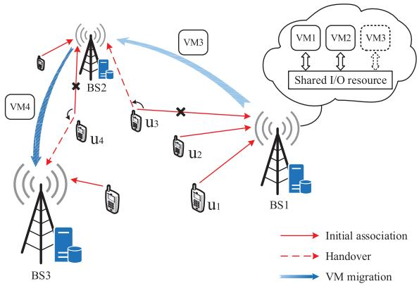
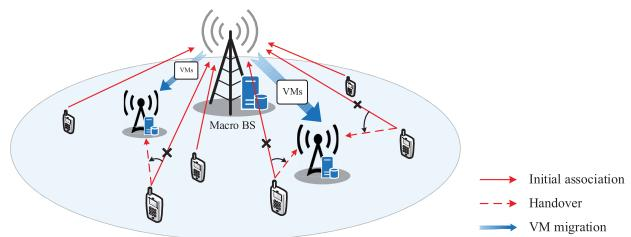
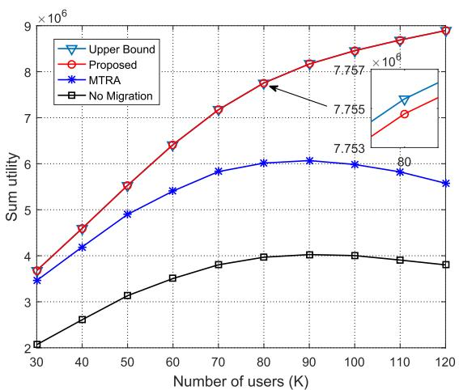
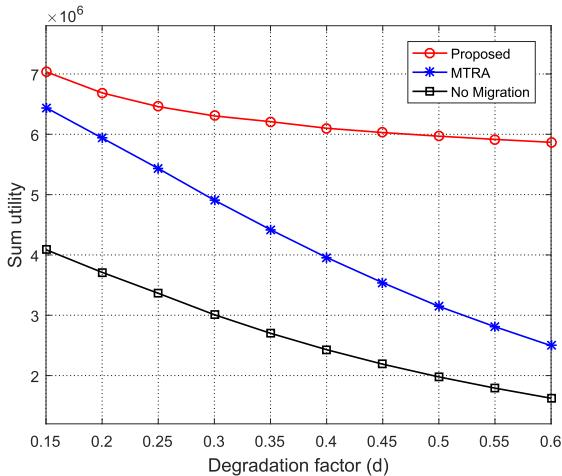
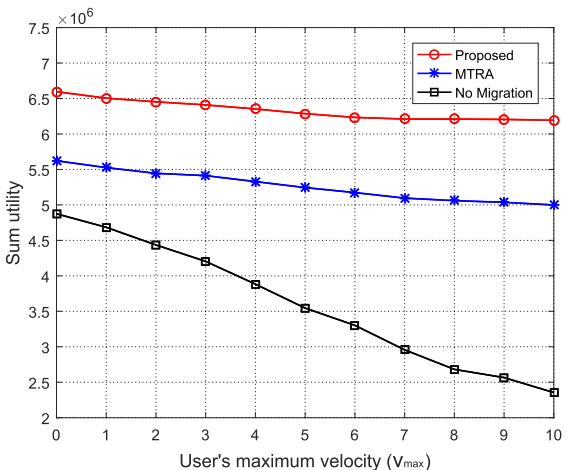
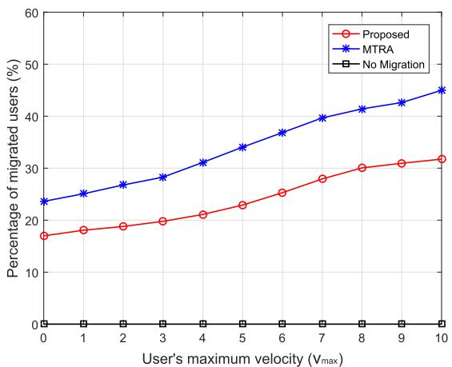
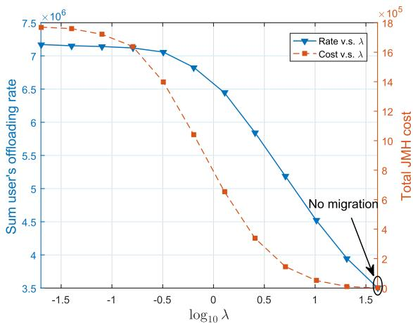
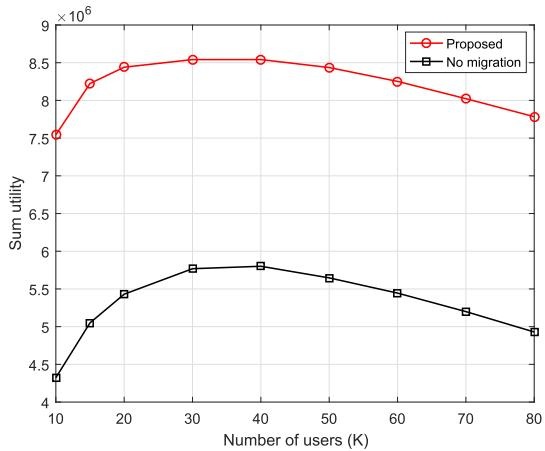
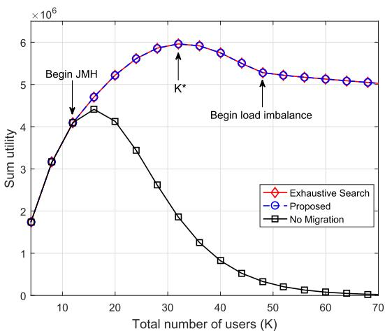
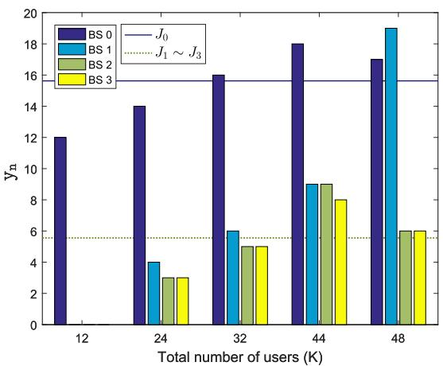

# Multi-Cell Mobile Edge Computing: Joint Service Migration and Resource Allocation

Zezu Liang , Student Member, IEEE, Yuan Liu , Senior Member, IEEE,

Tat-Ming Lok , Senior Member, IEEE, and Kaibin Huang , Fellow, IEEE

Abstract— Mobile-edge computing (MEC) enhances the capacities and features of mobile devices by offloading computation-intensive tasks over wireless networks to edge servers. One challenge faced by the deployment of MEC in cellular networks is to support user mobility. As a result, offloaded tasks can be seamlessly migrated between base stations (BSs) without compromising the resource-utilization efficiency and link reliability. In this paper, we tackle the challenge by optimizing the policy for migration/handover between BSs by jointly managing computation-and-radio resources. The objectives are twofold: maximizing the sum offloading rate, quantifying MEC throughput, and minimizing the migration cost. The policy design is formulated as a decision-optimization problem that accounts for virtualization, I/O interference between virtual machines (VMs), and wireless multi-access. To solve the complex combinatorial problem, we develop an efficient relaxation-and-rounding based solution approach. The approach relies on an optimal iterative algorithm for solving the integer-relaxed problem and a novel integer-recovery design. The latter outperforms the traditional rounding method by exploiting the derived problem properties and applying matching theory. In addition, we also consider the design for a special case of “hotspot mitigation”, referring to alleviating an overloaded server/BS by migrating its load to the nearby idle servers/BSs. From simulation results, we observed close-to-optimal performance of the proposed migration policies under various settings. This demonstrates their efficiency in computation-and-radio resource management for joint service migration and BS handover in multi-cell MEC networks.

Index Terms— Mobile-edge computing (MEC), service migration, handover, resource management.

Manuscript received September 20, 2020; revised February 9, 2021; accepted March 22, 2021. Date of publication April 12, 2021; date of current version September 10, 2021. The work of Yuan Liu was supported in part by the Natural Science Foundation of China under Grant 61971196, Grant U1701265, and Grant U2001210. The work of Tat-Ming Lok was supported in part by the General Research Fund from the Research Grants Council, Hong Kong, under Project CUHK 14201118. The work of Kaibin Huang was supported in part by the Guang-Dong Basic and Applied Basic Research Foundation under Grant 2019B1515130003, in part by the Hong Kong Research Grants Council under Grant 17208319 and Grant 17209917, and in part by the Innovation and Technology Fund under Grant GHP/016/18GD. This article was presented in part at the IEEE Global Communications Conference (GLOBECOM), Taipei, Taiwan, December 2020. The associate editor coordinating the review of this article and approving it for publication was W. Saad. (Corresponding author: Yuan Liu.)

## I. INTRODUCTION

OBILE (or multi-access) edge computing (MEC), edge, is envisioned as a key technology in the fifth generation (5G) systems for supporting computation-intensive and latency-critical mobile applications [1], [2]. In MEC systems, the computation intensive tasks of mobile users are offloaded to edge servers co-located with base stations (BSs) or access points. This avoids data transportation to the remote cloud centers, thereby dramatically reduce latency and avoid traffic congestion in the backhaul network. In this work, we address the issue of supporting mobility in an MEC network, referring to a cellular network providing MEC services. In a traditional radio access network, a key solution for mobility is to handover a travelling users wireless link from one BS to another to ensure its reliability [3]. The handover in an MEC network is more complex as it may also involve the migration of computing tasks between servers, called service migration [4]. Making a migration decision should account for factors including computation resources and load at two servers/BSs and the migration cost incurred by data transportation across the backhaul network. To tackle the challenges, we propose in this paper a framework of joint migration-and-handover (JMH) for multi-user multi-cell MEC systems.

## A. Resource Management in MEC Networks

Among others, one vein of MEC research that is aligned with the current work is resource management. It features the joint management of computation and radio resources to achieve a high efficiency for computation offloading. A binary offloading policy is proposed in [5] for adapting the offloading decision to a stochastic wireless channel under the criterion of minimizing mobile energy consumption. Peer-to-peer cooperative MEC is proposed in [6] where one mobile device serves as a helper for another by offloading the latters computation or relaying it to a server. For multi-user MEC systems, the resource management is more complicated since it involves resource sharing by multiple offloading users. In [7], a centralized resource allocation scheme is proposed for minimizing sum mobile energy consumption. The design is extended in [8] to the case of asynchronous offloading. On the other hand, distributed resource allocation strategies can be designed by applying game theory, which is pursued in [9], [10]. In a multi-user and multi-server system, there is an additional issue of load distribution among servers. It is addressed in [11] by an efficient distributed offloading design based on matching theory and in [12] using the reinforcement-learning approach. It has also been studied in various MEC system configurations like vehicular networks [13] and unmanned aerial vehicle (UAV) systems [14].

Another important type of resources in computing is I/O resources such as the bandwidth of a bus connecting a GPU and its associated system. For edge or cloud computing based on virtualization, tasks are executed simultaneously in the same server in the forms of virtual machines (VMs). The sharing of finite I/O resources by VMs causes mutual computing interference, called I/O interference, which slows down their computing speeds [15]–[17]. Being a potential performance bottleneck, I/O interference is extensively studied in the area of cloud computing to understand its effects and find solutions (see e.g., [17]). In contrast, I/O interference is not yet extensively studied in the area of MEC despite some recent work on factoring it into the design of offloading policies [18]. In this work, we also consider I/O interference in JMH.

In view of prior work, existing results on resource management for MEC focus on the optimization of offloading policies. In this work, we explore an uncharted direction of resource management for migration and handover to support mobility in MEC networks. Most existing work focuses on sharing the resources of a single server (or server cluster) by multiple offloading users. In contrast, we focus on the balancing of the resources among servers/BSs by controlling both migration and handover.

## B. Service Migration and BS Handover

As a key mechanism for dynamic resource management, service migration has been widely studied in the area of cloud computing covering a wide range of topics including network load balancing [19], hotspot mitigation [20], and I/O interference aware migration [21]. Migration in cloud computing targets a wired network (e.g., server grid within a data center) where links are assumed reliable. In contrast, the implementation of service migration in an MEC network will be inevitably coupled with the handover of wireless links over BSs. The links experience fading and each BS serves a dynamic number of users and hence has time-varying available radio sources besides a random computation load. The coupling between service migration and BS handover calls for their joint design to improve the offloading performance of the MEC network, which forms the theme of this work.

In traditional wireless networks, BS handover is incurred by deterioration in wireless link quality of the serving BS and is employed to re-associate with another for higher radio access. However, such handover mechanisms are not sufficient to support efficient computation offloading in an MEC network. On one hand, as mentioned earlier, handover of MEC services is conducted in JMH for ensuring radio and computing reliability, and thereby the migration cost on both sides should be taken into account. On the other hand, apart from channel condition, the computation capabilities of different BSs need to be considered when associating a user with an appropriate BS. The work [22]–[25] investigates BS handover in MEC under mobility consideration, which however does not consider the variation of computation resource by BS handover. In contrast, our proposed JMH framework considers that the computing speeds of two servers/BSs fluctuate caused by handover. Such an issue is not studied yet in MEC migration/handover.

## C. Our Contributions

In this paper, we study the problem of optimal JMH in a multi-user multi-cell MEC system based on virtualization. The optimization problem aims at maximizing the weighted sum offloading rates of all the users while minimizing the incurred migration cost as much as possible by controlling the migration/handover decisions. The problem accounts for both I/O interference and multi-user interference.

The main contribution of the work lies in developing a practical algorithm for designing the optimal JMH policy. The said problem is an integer nonlinear program and nonconvex. To overcome the difficulty, we propose a two-stage solution method. First, the binary constraints of the migration decisions are relaxed, allowing fractional programming to be applied to solve the relaxed problem. Next, a novel rounding method based on the problems properties is proposed for recovering the binary decision solution, which outperforms the naive rounding method.

The other contribution of the work is to optimize JMH for the hotspot mitigation scenario, referring to alleviating an overloaded server by migrating its load to the helper servers. We show that when the load of the hotspot server is below a certain threshold, the optimal JMH scheme can effectively address the overloaded condition of the hotspot server via load balance among servers. When the load exceeds the threshold, all the servers are overloaded after optimal JMH and in this case adding more helper servers is needed.

The rest of this paper is organized as follows. In Section II, we present the system model and problem formulation. We introduce the algorithm to solve the formulated problem in Section III and discuss the special case of the hotspot mitigation in Section IV. Finally, simulation results and conclusions are provided in Section V and Section VI, respectively.

## II. SYSTEM MODEL AND PROBLEM FORMULATION

## A. System Model

As shown in Fig. 1, we consider an MEC system consisting of N BSs and K users, denoted by the set $\mathcal { N } = \{ 1 , \cdots , N \}$ and set $\mathcal { K } = \{ 1 , \cdots , K \}$ , respectively. Each BS is integrated with a server that can provide computing services to users if it hosts the users’ corresponding VMs. We assume that each user is served by one dedicated VM and each VM only serves the corresponding user.1 A VM is a software clone of user’s service environment, which contains the user’s profiles and applications for running user’s offloaded tasks and can be migrated among BSs to continue serving the user wherever it moves. In the proposed JMH framework, when a user switches its association from one BS to another, the user’s corresponding VM is also migrated between the two BSs (e.g., see users $u _ { 3 }$ and $u _ { 4 }$ in Fig. 1). We assume a time-slotted model that the user-BS associations and channel gains remain unchanged in each slot but can be varied from one slot to another. The channel gains are considered to include path loss and shadowing while neglect the small-scale (fast) fading, in view of the fact that small-scale fading has little effect on reference signal receiving quality (RSRQ) that is the measurement for handover and dominated by path loss in practice. Moreover, the effect of small-scale fading can be averaged out by employing a sufficiently long channel code in practice [26], [27]. Thus, the channel gains can be regarded as static within each slot but may vary from one slot to another. Let $x _ { k , n }$ denote the JMH decision for the service migration, with $x _ { k , n } = 1$ indicating the service of user k is placed at BS n and $x _ { k , n } = 0$ otherwise. We assume that each user can associate with only one BS, thus, $\textstyle \sum _ { n \in { \mathcal { N } } } x _ { k , n } = 1$ $\forall k \in \mathcal { K }$ . The JMH process can incur system overheads, such as consuming backhaul bandwidth to transfer VM data and the handover signaling. To account for this, we consider a fixed cost $c _ { k , j , n }$ occurs when user’s k service is migrated from BS j to BS n, with $n \ \ne \ j$ . We assume $c _ { k , j , n } ~ = ~ 0 ~ \mathrm { i f } ~ n ~ = ~ j$ (i.e., no cost occurs if not migrated). Then, given the current service locations $\{ x _ { k , n } ^ { 0 } \}$ , the JMH cost of each user in next time slot is given by

  
Fig. 1. A multi-cell MEC system, where u3 and $u _ { 4 } \mathrm { ^ { * } s }$ services are enabled by joint BS handover and VM migration.

$$
C _ {k} = \sum_ {n \in \mathcal {N}} \sum_ {j \in \mathcal {N}} x _ {k, j} ^ {0} x _ {k, n} c _ {k, j, n},\tag{1}
$$

where $x _ { k , j } ^ { 0 } x _ { k , n }$ indicates whether user $k ' s$ service is initially placed on BS j and to be migrated to BS n $( \mathrm { i } . \mathrm { e } . , x _ { k , j } ^ { 0 } x _ { k , n } = 1 )$ or not $( \mathrm { i . e . , } x _ { k , j } ^ { 0 } x _ { k , n } = 0 )$ . For simplicity, we assume that the migration/handover time is negligible compared with the slot length.

1) Communication Model: Denote the uplink channel gain from user k to BS n as $g _ { k , n } .$ , the transmit power of user k as $p _ { k }$ and the noise power of BS n as $\sigma _ { n } ^ { 2 }$ . For the ease of problem analysis, we consider the simple case that users offload data at the same band, i.e., frequency reuse factor of 1. The extension to radio resource allocation among users will be elaborated in Section III-E. Then, the achievable uplink transmission rate for user k offloading tasks to BS n, denoted as $r _ { k , n } .$ , is

$$
r _ {k, n} = B \log_ {2} \left(1 + \frac {p _ {k} g _ {k , n}}{\sigma_ {n} ^ {2} + \sum_ {j \in \mathcal {K} \backslash \{k \}} p _ {j} g _ {j , n}}\right).\tag{2}
$$

where B denotes the system bandwidth. As the transmit powers are assumed to be fixed, each user’s transmission rate $r _ { k , n }$ is deterministic through (2). We ignore the result downloading phase because of the relative much smaller sizes of computation results [23].

2) Computation Model: The MEC server at each BS accommodates users’ offloaded tasks into their own VMs and executes them in parallel, namely parallel computing. We consider the I/O interference in parallel computing [15], [16] and adopt a model developed in the literature [28] to characterize the computation rate. Specifically, let $f _ { k , n }$ denote the expected computation rate (offloaded bits per second) of user $k ' \mathrm { s }$ VM when running in isolation at BS n. Following [28], we define $d _ { n } > 0$ as a performance degradation $\mathrm { f a c t o r } ^ { 2 }$ at BS n to specify the computation rate reduction of a VM when multiplexed with another VM. With one-to-one correspondence between each VM and each user as mentioned earlier, the number of VMs hosted at a BS is equal to the number of the associated users $\textstyle \sum _ { k \in { \mathcal { K } } } x _ { k , n }$ . Therefore, given $\textstyle \sum _ { k \in { \mathcal { K } } } x _ { k , n }$ associated users at BS $n ,$ the actual computation rate for execution of user k’s task is

$$
F _ {k, n} = f _ {k, n} (1 + d _ {n}) ^ {1 - \sum_ {k \in \mathcal {K}} x _ {k, n}}.\tag{3}
$$

Here (3) indicates that the computation rate of each user decreases as the number of co-located users at a BS increases. This implies a tradeoff that accommodating more users (or consolidating more VMs) at a BS can increase multiplexing gain in parallel computing but degrades the computation rates for individual users due to the I/O interference. On the other hand, considering the finite computation capacity of a BS, we assume that the number of multiplexed VMs (or equivalently, the number of users) at a BS is bounded by a number $M _ { n } , \mathrm { i . e . , } \sum _ { k \in \mathcal { K } } x _ { k , n } \leq M _ { n }$

After characterizing user’s communication rate in (2) and computation rate in (3), we use the offloading rate as a metric to measure the computation offloading performance. Here, the offloading rate is defined as the number of user’s offloadable bits per unit time, which is given by

$$
R _ {k, n} = 1 \bigg / \left(\frac {1}{r _ {k , n}} + \frac {1}{F _ {k , n}}\right),\tag{4}
$$

where the first and second terms in the denominator are the inverse of the transmission rate and computation rate, respectively, denoting the corresponding required time for transmitting and computing 1-bit.

## B. Problem Formulation

We consider a problem of service migration among BSs under the consideration of joint computation-andradio resource management. Specifically, given the initial offloading-service placement, we aim to find the optimal JMH decisions that maximize the weighted sum offloading rate while reduce the total incurred JMH cost at the same time. The problem is formulated as

$$
\text {(P1)} \max _ {\mathbf {X}} \sum_ {k \in \mathcal {K}} \omega_ {k} \sum_ {n \in \mathcal {N}} x _ {k, n} R _ {k, n}
$$

$$
- \lambda \sum_ {k \in \mathcal {K}} \sum_ {n \in \mathcal {N}} \sum_ {j \in \mathcal {N}} x _ {k, j} ^ {0} x _ {k, n} c _ {k, j, n}\tag{5}
$$

$$
\text { s.t. } \sum_ {n \in \mathcal {N}} x _ {k, n} = 1, \quad \forall k \in \mathcal {K},\tag{6}
$$

$$
\sum_ {k \in \mathcal {K}} x _ {k, n} \leq M _ {n}, \quad \forall n \in \mathcal {N},\tag{7}
$$

$$
x _ {k, n} \in \{0, 1 \}, \quad \forall k \in \mathcal {K}, \forall n \in \mathcal {N},\tag{8}
$$

where $\mathbf { X } = \{ x _ { k , n } \}$ and $\omega _ { k } \geq 0$ denotes a weight assigned to user k’s offloading rate. $\lambda \geq 0$ is a weight factor for adjusting the sum offloading rate and JMH cost, which is determined by the system operator according to the system preference.3 The objective (5) is to optimize the tradeoff between the weighted sum of users’ offloading rates and the required JMH cost, which can be regarded as the utility by JMH. Constraint (6) states that each user is associated with only one BS. Constraint (7) ensures that the number of users (or VMs) served by a BS does not exceed the maximum number. Clearly, $\begin{array} { r } { \sum _ { n \in \mathcal { N } } M _ { n } \ \ge \ K } \end{array}$ should be satisfied for problem feasibility.

Due to the binary variables X, Problem (P1) is an integer nonlinear programming problem that is difficult to solve exactly. The brute force algorithm has a complexity of $\mathcal { O } ( N ^ { K } )$ , which is prohibitive when the size of the cellular network is large. To this end, we design a low-complexity and suboptimal algorithm in the next section, which is shown to have close-to-optimal performance in the simulations.

## III. ALGORITHM DEVELOPMENT

In this section, we develop an efficient algorithm to solve Problem (P1), which proceeds in two stages: First, by integer relaxation and some mathematic manipulation, we transform Problem (P1) into a sequence of convex problems that can be optimally solved. In the second stage, as the obtained results may be fractional, we propose a new method to recover a feasible integer solution. Last, we extend the algorithm framework to the radio-resource allocation case.

## A. Continuous Relaxation and Fractional Programming Transform

To make Problem (P1) more tractable, we first relax the binary variable $x _ { k , n }$ into [0, 1]. Moreover, we introduce a new variable $y _ { n }$ to replace the term $\textstyle \sum _ { k \in { \mathcal { K } } } x _ { k , n }$ in (4) and in (7), which implies the computation load (or the number of VM) that BS n accommodates. Then, the relaxed Problem (P1) can be written as the following equivalent form:

$$
\text {(P1^{\prime})} \max _ {\mathbf {X}, \mathbf {y}} \sum_ {k \in \mathcal {K}} \sum_ {n \in \mathcal {N}} x _ {k, n} \left(\frac {\omega_ {k}}{\frac {1}{r _ {k , n}} + \frac {(1 + d _ {n}) ^ {y _ {n} - 1}}{f _ {k , n}}} + z _ {k, n}\right)\tag{9}
$$

$$
\mathrm{s.t.} \sum_ {n \in \mathcal {N}} x _ {k, n} = 1, \quad \forall k \in \mathcal {K},\tag{10}
$$

$$
\sum_ {k \in \mathcal {K}} x _ {k, n} \leq y _ {n}, \quad \forall n \in \mathcal {N},\tag{11}
$$

$$
0 \leq x _ {k, n} \leq 1, \quad \forall k \in \mathcal {K}, \forall n \in \mathcal {N},\tag{12}
$$

$$
0 \leq y _ {n} \leq M _ {n}, \quad \forall n \in \mathcal {N},\tag{13}
$$

where $\mathbf { y } = \{ y _ { n } \}$ , and $\begin{array} { r } { z _ { k , n } \triangleq Z - \lambda \sum _ { j \in \mathcal { N } } x _ { k , j } ^ { 0 } c _ { k , j , n } \geq 0 } \end{array}$ in (9) is an aggregated term related to the cost, in which $Z$ is a sufficiently large constant for ensuring all the $z _ { k , n } \mathrm { ^ { * } s }$ being nonnegative, e.g., set $\begin{array} { r } { Z \geq \operatorname* { m a x } _ { k , n } \{ \lambda \sum _ { j \in \mathcal { N } } x _ { k , j } ^ { 0 } c _ { k , j , n } \} } \end{array}$ . Adding a common Z to each term serves for rewriting the objective function (5) as a form of sum of non-negative functions, so as to meet the requirement of the sum-of-ratios algorithm design. Evidently, since $R _ { k , n }$ monotonically decreases with $y _ { n } .$ , the auxiliary variable $y _ { n }$ always achieves its lower bound $\textstyle \sum _ { k \in { \mathcal { K } } } x _ { k , n }$ in (11) for optimality, i.e., the equality holds in (11). Due to the integer relaxation at constraints (12), Problem (P1) yields the upper bound of the original Problem (P1).

Based on the above transformation, Problem (P1) becomes a continuous optimization problem with the sum-of-ratios objective. According to [29], we can transform Problem (P1) into an equivalent parameterized subtractive-form problem via the following theorem.

Theorem 1: If $( \mathbf { X } ^ { * } , \mathbf { y } ^ { * } )$ is the optimal solution to Problem (P1), there exist $\alpha ^ { * } ~ = ~ \{ \alpha _ { k , n } ^ { * } \} , ~ \beta ^ { * } ~ = ~ \{ \beta _ { k , n } ^ { * } \}$ , and $\gamma ^ { * } ~ = ~ \{ \gamma _ { k , n } ^ { * } \}$ such that $( \mathbf { X } ^ { * } , \mathbf { y } ^ { * } )$ is the optimal solution to the following parameterized problem with $( \alpha , \beta , \gamma ) \ =$ $( \alpha ^ { * } , \beta ^ { * } , \gamma ^ { * } ) ;$

$$
\begin{array}{l} \max _ {(\mathbf {X}, \mathbf {y}) \in \mathcal {F}} \sum_ {k \in \mathcal {K}} \sum_ {n \in \mathcal {N}} \alpha_ {k, n} \left[ x _ {k, n} \omega_ {k} - \beta_ {k, n} \left(\frac {1}{r _ {k , n}} + \frac {(1 + d _ {n}) ^ {y _ {n} - 1}}{f _ {k , n}}\right) \right] \\ + \sum_ {k \in \mathcal {K}} \sum_ {n \in \mathcal {N}} (x _ {k, n} z _ {k, n} - \gamma_ {k, n}), \end{array} \tag {14}\tag{P2}
$$

where $\mathcal { F }$ denotes the feasible solution set satisfying the constraints (10)-(13). Moreover, $( \mathbf { X } ^ { * } , \mathbf { y } ^ { * } )$ also satisfies the following conditions when $( \alpha , \beta , \gamma ) ~ = ~ ( \alpha ^ { * } , \beta ^ { * } , \gamma ^ { * } )$ , for all k and n:

$$
\alpha_ {k, n} \left(\frac {1}{r _ {k , n}} + \frac {(1 + d _ {n}) ^ {y _ {n} - 1}}{f _ {k , n}}\right) - 1 = 0,\tag{15}
$$

$$
\beta_ {k, n} \left(\frac {1}{r _ {k , n}} + \frac {(1 + d _ {n}) ^ {y _ {n} - 1}}{f _ {k , n}}\right) - x _ {k, n} \omega_ {k} = 0,\tag{16}
$$

$$
\gamma_ {k, n} - x _ {k, n} z _ {k, n} = 0.\tag{17}
$$

$$
\text { Proof:   Please   see   our   technique   report   [30]. }
$$

Theorem 1 reveals that the sum-of-ratios maximization Problem (P1) shares the same optimal solution with the parameterized subtractive-form Problem (P2) when $\begin{array} { r l r } { ( \alpha , \beta , \gamma ) } & { { } = } & { ( \alpha ^ { * } , \beta ^ { * } , \gamma ^ { * } ) } \end{array}$ . Here, $( \alpha ^ { * } , \beta ^ { * } , \gamma ^ { * } )$ denotes the optimal tuple of parameters that meets the system equations (15)-(17) together with its corresponding solution $( \mathbf { X } , \mathbf { y } )$ to Problem (P2). Based on Theorem 1, we can solve Problem (P1) by a two-layer iterative approach: In the inner layer, we solve the subtractive-form Problem (P2) with given $( \alpha , \beta , \gamma )$ . Then, in the outer layer, we find the optimal $( \alpha ^ { * } , \beta ^ { * } , \gamma ^ { * } )$ satisfying (15)-(17).

## B. Solving Problem (P2) Given $( \alpha , \beta , \gamma )$

Problem (P2) with given $( \alpha , \beta , \gamma ) ~ \succeq ~ 0$ can be further re-expressed as

$$
\begin{array}{l} \max _ {(\mathbf {X}, \mathbf {y}) \in \mathcal {F}} \sum_ {k \in \mathcal {K}} \sum_ {n \in \mathcal {N}} x _ {k, n} (\alpha_ {k, n} \omega_ {k} + z _ {k, n}) \\ - \sum_ {n \in \mathcal {N}} \Big [ \Big (\sum_ {k \in \mathcal {K}} \frac {\alpha_ {k , n} \beta_ {k , n}}{f _ {k , n}} \Big) (1 + d _ {n}) ^ {y _ {n} - 1} \Big ] \end{array}\tag{18}
$$

where the objective function (18) is derived from (14) by omitting the constant terms $\textstyle \sum _ { k } \sum _ { n } \gamma _ { k , n }$ and $\begin{array} { r } { \sum _ { k } \sum _ { n } \frac { \alpha _ { k , n } ^ { - } \beta _ { k , n } } { r _ { k , n } } } \end{array}$

It can be readily proved that Problem (18) is convex because the objective function is concave and the constraints are linear. As a result, the convex optimization methods can be used to solve this problem optimally. By introducing a set of Lagrangian multipliers $\pmb { \mu } = \{ \mu _ { n } \} \succeq 0$ associated with the constraints (11), the dual problem of Problem (18) can be expressed as

$$
\min _ {\boldsymbol {\mu} \succeq 0} \theta (\boldsymbol {\mu}) = \sum_ {k \in \mathcal {K}} \phi_ {k} (\boldsymbol {\mu}) + \sum_ {n \in \mathcal {N}} \xi_ {n} (\mu_ {n}),\tag{19}
$$

where

$$
\phi_ {k} (\boldsymbol {\mu}) = \left\{ \begin{array}{c c} \max _ {\{x _ {k, n} \} _ {n \in \mathcal {N}}} & \sum_ {n \in \mathcal {N}} x _ {k, n} (\alpha_ {k, n} \omega_ {k} + z _ {k, n} - \mu_ {n}) \\ \text {s.t.} & \sum_ {n \in \mathcal {N}} x _ {k, n} = 1, \\ & 0 \leq x _ {k, n} \leq 1, \quad \forall n \in \mathcal {N}, \end{array} \right. \xi_ {n} (\mu_ {n}) = \max _ {0 \leq y _ {n} \leq M _ {n}} \mu_ {n} y _ {n} - \Bigl (\sum_ {k \in \mathcal {K}} \frac {\alpha_ {k , n} \beta_ {k , n}}{f _ {k , n}} \Bigr) (1 + d _ {n}) ^ {y _ {n} - 1}.\tag{20}
$$

(21)

Since all the constraints in the convex Problem (18) are linear, the Slater’s condition is satisfied and the strong duality holds [31]. The primal Problem (18) can therefore be equivalently solved by the dual Problem (19).

1) Optimal JMH Policy in Dual Domain: We can observe that the dual function $\theta ( \mu )$ has a decomposable structure. Specifically, given $\mu , \theta ( \mu )$ can be determined by solving K independent subproblems (20), where each user k individually makes its own JMH decision $\{ x _ { k , n } \} _ { n \in \mathcal { N } }$ over the BSs, and at the same time N independent subproblems (21), where each BS n optimizes its own computational load $y _ { n } .$

To solve the JMH subproblem (20) for each user, we have the following observation:

Remark 1 (JMH Revenue): The value of $( \alpha _ { k , n } \omega _ { k } + z _ { k , n } -$ $\mu _ { n } )$ in subproblem (20) can be interpreted as the revenue of user k when its service is migrated to BS n. Specifically, with $\alpha _ { k , n }$ referred as to the offloading rate in each iteration [see (15)], $( \alpha _ { k , n } \omega _ { k } + z _ { k , n } )$ represents the profit obtained from BS n, consisting of the weighted offloading rate $\omega _ { k } \alpha _ { k , n }$ and the modified cost $z _ { k , n }$ . On the other hand, the Lagrangian multiplier $\mu _ { n }$ is the price of BS n to provide service. Therefore, the difference between the profit and the payment, $( \omega _ { k } \alpha _ { k , n } + z _ { k , n } - \mu _ { n } )$ , can be measured as the revenue of user k obtained from BS n.

Based on Remark 1, the objective of subproblem (20) can be interpreted as maximizing the revenue of user k over all the BSs. Through a direct observation, each subproblem (20) always has an optimal binary solution $\{ x _ { k , n } ^ { * } \}$

$$
x _ {k, n} ^ {*} = \left\{ \begin{array}{l l} 1, & \text { if } n = \underset {n ^ {\prime} \in \mathcal {N}} {\operatorname{argmax}} \big \{\alpha_ {k, n ^ {\prime}} \omega_ {k} + z _ {k, n ^ {\prime}} - \mu_ {n ^ {\prime}} \big \}, \\ 0, & \text { otherwise }, \end{array} \right.\tag{22}
$$

i.e., each user selects the BS with the maximum revenue $( \alpha _ { k , n } \omega _ { k } + z _ { k , n } - \mu _ { n } )$ . Note that when there are multiple maximizers, the user can choose any one of them without affecting the value of dual function.

For subproblem (21), the optimal amount of load $y _ { n } ^ { * }$ at BS n can be obtained via differentiating $\xi _ { n } ( \mu _ { n } )$ in (21) with respect to $y _ { n }$ and letting the result be zero:

$$
y _ {n} ^ {*} = \left\{ \begin{array}{l l} \min \left\{\frac {\ln \mu_ {n} - \ln q _ {n}}{\ln (1 + d _ {n})} + 1, M _ {n} \right\} & \text { if } \mu_ {n} \geq \frac {q _ {n}}{1 + d _ {n}}, \\ 0, & \text { otherwise }, \end{array} \right.\tag{23}
$$

where $\begin{array} { r } { q _ { n } = ( \sum _ { k \in \mathcal { K } } \frac { \alpha _ { k , n } \beta _ { k , n } } { f _ { l \cdot \infty } } ) \ln ( 1 + d _ { n } ) . } \end{array}$

For the dual Problem (19), we use the subgradient method to find the optimal Lagrangian multipliers $\mu ^ { * }$ , in which each $\mu _ { n }$ is updated as

$$
\mu_ {n} ^ {t + 1} = \left[ \mu_ {n} ^ {t} - \epsilon^ {t} \Big (y _ {n} ^ {t} - \sum_ {k \in \mathcal {K}} x _ {k, n} ^ {t} \Big) \right] ^ {+},\tag{24}
$$

for $t = 1 , 2 , . . . ,$ where $[ \cdot ] ^ { + } \triangleq \operatorname* { m a x } \{ \cdot , 0 \}$ and $\epsilon ^ { t }$ is the step size chosen in iteration t. In this paper, we adopt a harmonic series step size $\epsilon ^ { t } = \epsilon / ( t + 1 ) , t = 1 , 2 , \cdot \cdot \cdot , \epsilon > 0$ is a properly designed constant. Since the primal problem is a convex problem satisfying Slater’s condition, the subgradient method in (24) operated with the above step-size rule guarantees the convergence to an optimal dual solution $\mu ^ { * }$ and the primal optimal value [32].

2) Optimal Primal Solution Recovery for Problem (P2): Although the optimal $\mu ^ { * }$ is obtained by the above subgradient method, its associated solution $( \mathbf { X } ( \mu ^ { * } ) , \mathbf { y } ( \mu ^ { * } ) )$ by (22) and (23) may not be optimal and can even be infeasible for the primal Problem (P2). This is because the dual subgradient method does not guarantee to find an optimal primal solution even for the convex problem satisfying strong duality, unless the dual function $\theta ( \mu )$ is differentiable at $\mu ^ { * }$ [32], [33]. In our Problem (P2), it arises from the fact that the dual subproblem (20) is a linear programming (LP) problem. When there exists a user that has more than one BS with the same maximum revenue at $\mu ^ { * }$ , the binary-form solution in (22) is not a unique solution to the dual Problem (19) such that it may not be primal optimal to Problem (P2) (see [33, Proposition 7]). However, the optimal solution to the inner-layer Problem (P2) with given $( \alpha , \beta , \gamma )$ is required for ensuring the convergence of sum-of-ratios algorithm [29].

Algorithm 1 Optimal Algorithm for Solving Problem (P2)

Input:  $(\alpha, \beta, \gamma)$ .

1: Initialize  $\{\mu_{n} \geq 0\}$ .

2: repeat

3: Compute  $\{x_{k,n}\}$  and  $\{y_{n}\}$  for given  $\mu$  according to (22) and (23), respectively.

4: Update  $\mu$  based on subgradient method in (24).

5: Update primal variables  $\{\bar{x}_{k,n}\}$  and  $\{\bar{y}_{n}\}$  according to (25) and (26), respectively.

6: until  $\mu$  converges.

7: return  $x_{k,n}^{*} = \bar{x}_{k,n}, \forall k, n$  and  $y_{n}^{*} = \bar{y}_{n}, \forall n$ .

Output:  $(\mathbf{X}^{*}, \mathbf{y}^{*})$  for given  $(\alpha, \beta, \gamma)$ .

To address this issue, we adopt the average procedure [33] to recover the primal solution. The idea behind is to reconstruct an approximate primal feasible solution by a weighted convex combination of the previous primal iterates $( \{ x _ { k , n } ^ { t } \} , \{ y _ { n } ^ { t } \} )$ obtained by (22) and (23), which is shown to converge an optimal primal solution.

Theorem 2 (Primal Convergence): Consider the primaland-dual iteration scheme [(22), (23), and (24)] for Problem (P2) and that we recursively average the primal iterates $( \{ x _ { k , n } ^ { t } \} , \{ y _ { n } ^ { t } \} )$ generated by (22) and (23) as follows:

$$
\bar {x} _ {k, n} ^ {t} = \left(1 - \frac {t ^ {\nu}}{\sum_ {s = 1} ^ {t} s ^ {\nu}}\right) \bar {x} _ {k, n} ^ {t - 1} + \frac {t ^ {\nu}}{\sum_ {s = 1} ^ {t} s ^ {\nu}}   x _ {k, n} ^ {t},\tag{25}
$$

$$
\bar {y} _ {n} ^ {t} = \left(1 - \frac {t ^ {\nu}}{\sum_ {s = 1} ^ {t} s ^ {\nu}}\right) \bar {y} _ {n} ^ {t - 1} + \frac {t ^ {\nu}}{\sum_ {s = 1} ^ {t} s ^ {\nu}} y _ {n} ^ {t},\tag{26}
$$

for $t ~ = ~ 1 , 2 , . . . ,$ where $\nu > 0$ is a proper constant for controlling weights. $( \{ \bar { x } _ { k , n } ^ { 0 } \} , \{ \bar { y } _ { n } ^ { 0 } \} )$ is set as an initial feasible solution to Problem (P2). Then, $\bar { x } _ { k , n } ^ { t }  x _ { k , n } ^ { * } , \forall k , n$ , and $\bar { y } _ { n } ^ { t } \to$ $y _ { n } ^ { * } , \forall n , \mathrm { i . e . }$ , converge to the optimal solution of Problem (P2). Proof: See [33, Theorem 2]. ■

We summarize the detailed procedures of solving the inner-layer Problem (P2) in Algorithm 1.

## C. Finding Optimal Parameters $( \alpha ^ { * } , \beta ^ { * } , \gamma ^ { * } )$

After obtaining the optimal $( \mathbf { X } ^ { * } , \mathbf { y } ^ { * } )$ for given $( \alpha , \beta , \gamma )$ in above subsection, we develop an algorithm to find the optimal $( \alpha ^ { * } , \beta ^ { * } , \gamma ^ { * } )$ for solving Problem $( \mathrm { P l ^ { \prime } } )$ . For notational brevity, we denote $\begin{array} { r } { \eta _ { k , n } \triangleq \frac { 1 } { r _ { k , n } } + \frac { ( 1 + d _ { n } ) ^ { y _ { n } - 1 } } { f _ { k , n } } } \end{array}$ and define some functions (for all k and n) as follows:

$$
\psi_ {k, n} ^ {1} (\alpha_ {k, n}) = \alpha_ {k, n} \eta_ {k, n} - 1,\tag{27}
$$

$$
\psi_ {k, n} ^ {2} (\beta_ {k, n}) = \beta_ {k, n} \eta_ {k, n} - x _ {k, n} \omega_ {k},\tag{28}
$$

$$
\psi_ {k, n} ^ {3} (\gamma_ {k, n}) = \gamma_ {k, n} - x _ {k, n} z _ {k, n},\tag{29}
$$

where $( \{ x _ { k , n } \} , \{ y _ { n } \} )$ is the inner-layer optimal solution obtained by Algorithm 1.

According to [29, Theorem 3.1], the unique optimal solution of $( \alpha ^ { * } , \beta ^ { * } , \gamma ^ { * } )$ is achieved if and only if $\psi _ { k , n } ^ { i } = 0$ , ∀k, n and $\forall i \in \{ 1 , 2 , 3 \}$ , as in conditions $( 1 5 ) ‐ ( 1 7 )$ . We employ the modified Newton method [29] to update $\alpha _ { k , n } , \beta _ { k , n }$ and $\gamma _ { k , n }$ to meet above conditions. Specifically, the parameters (for all k and n) are point-wisely updated as

$$
\alpha_ {k, n} ^ {l + 1} = \left(1 - \zeta^ {l}\right) \alpha_ {k, n} ^ {l} + \zeta^ {l} \frac {1}{\eta_ {k , n}},\tag{30}
$$

$$
\beta_ {k, n} ^ {l + 1} = \left(1 - \zeta^ {l}\right) \beta_ {k, n} ^ {l} + \zeta^ {l} \frac {x _ {k , n} \omega_ {k}}{\eta_ {k , n}},\tag{31}
$$

$$
\gamma_ {k, n} ^ {l + 1} = \left(1 - \zeta^ {l}\right) \gamma_ {k, n} ^ {l} + \zeta^ {l} x _ {k, n} z _ {k, n},\tag{32}
$$

where l is the iteration index for the sum-of-ratios algorithm. $\zeta ^ { l }$ is the step size at iteration l chosen via the following manner. Let ml be the smallest integer among $m \in \{ 0 , 1 , \ldots \}$ satisfying

$$
\begin{array}{l} \sum_ {k \in \mathcal {K}} \sum_ {n \in \mathcal {N}} \Bigg \{\Big | \psi_ {k, n} ^ {1} \Big ((1 - \rho^ {m}) \alpha_ {k, n} ^ {l} + \rho^ {m} \frac {1}{\eta_ {k , n}} \Big) \Big | ^ {2} \\ \qquad + \Big | \psi_ {k, n} ^ {2} \Big ((1 - \rho^ {m}) \beta_ {k, n} ^ {l} + \rho^ {m} \frac {x _ {k , n} \omega_ {k}}{\eta_ {k , n}} \Big) \Big | ^ {2} \\ \qquad + \Big | \psi_ {k, n} ^ {3} \Big ((1 - \rho^ {m}) \gamma_ {k, n} ^ {l} + \rho^ {m} x _ {k, n} z _ {k, n} \Big) \Big | ^ {2} \Bigg \} \\ \leq (1 - \varepsilon \rho^ {m}) \sum_ {k \in \mathcal {K}} \sum_ {n \in \mathcal {N}} \Big (| \psi_ {k, n} ^ {1} (\alpha_ {k, n} ^ {l}) | ^ {2} \\ \qquad + | \psi_ {k, n} ^ {2} (\beta_ {k, n} ^ {l}) | ^ {2} + | \psi_ {k, n} ^ {3} (\gamma_ {k, n} ^ {l}) | ^ {2} \Big), \end{array}\tag{33}
$$

where $\varepsilon , \rho \in ( 0 , 1 )$ . We set $\zeta ^ { l } = \rho ^ { m _ { l } }$ at the l-th iteration.

As indicated in [29], the sum-of-ratios iterative algorithm can converge to the global optimum of Problem (P1) if the inner-layer Problem (P2) for given $( \alpha , \beta , \gamma )$ is optimally solved and the outer-layer update of $( \alpha , \beta , \gamma )$ is via the modified Newton method (30)-(32). Evidently, the global optimum of Problem (P2) can be guaranteed by Algorithm 1 due to its convexity. Thus, our proposed sum-of-ratios algorithm can achieve the global optimal solution to Problem (P1).

## D. Integer Recovery for Problem (P1)

Let $( \mathbf { X } ^ { \prime } , \mathbf { y } ^ { \prime } )$ denote the optimal solution to Problem $( \mathrm { P l ^ { \prime } } )$ As explained in Section III-B, $( \mathbf { X } ^ { \prime } , \mathbf { y } ^ { \prime } )$ may be fractional due to the possibility that the binary-form solution in (22) is not the primal optimal to Problem (P2). Therefore, in this subsection, we discuss the integer recovery on JMH decisions $\mathbf { X } ^ { \prime }$ to finalize solving Problem (P1). There are two major challenges in recovery for our problem instance. First of all, the recovery operation needs to guarantee the obtained result still meeting the hard constraints (6) and (8) of Problem (P1). Second, since the user’s offloading rate $R _ { k , n }$ is a function of the sum of users’ decisions $\textstyle \sum _ { k } x _ { k , n }$ [see in (4)], rounding $x _ { k , n }$ without considering this correlation may accumulate a significant variance in $\textstyle \sum _ { k } x _ { k , n }$ , which in turn affects $\{ R _ { k , n } \}$ greatly in the objective of Problem (P1) and incurs high performance loss. In order to recover a feasible decision solution with less rounding loss, we propose an effective rounding method that captures the problem structure. The key idea is to utilize an important property of Problem (P1) given any feasible integer y, which is described as follows.

Theorem 3: Define $\begin{array} { r } { \mathcal { Y } ~ \triangleq ~ \{ \mathbf { y } ~ \in ~ \mathbb { Z } ^ { N } | \sum _ { n \in \mathcal { N } } y _ { n } ~ = ~ K . } \end{array}$ and $0 \leq y _ { n } \leq M _ { n } , \forall n \in \mathcal { N } \}$ as the feasible integer set of y, where $\mathbb { Z } ^ { N }$ denotes the integer set. For any given $\mathbf { y } \in \mathcal { V }$ , Problem (P1) is reduced into an integer linear programming (ILP)

problem, expressed as

$$
\text {(P3)} \max _ {\mathbf {X}} \sum_ {k \in \mathcal {K}} \sum_ {n \in \mathcal {N}} x _ {k, n} u _ {k, n} (y _ {n})\tag{34}
$$

$$
\mathrm{s.t.} \sum_ {n \in \mathcal {N}} x _ {k, n} = 1, \quad \forall k \in \mathcal {K},\tag{35}
$$

$$
\sum_ {k \in \mathcal {K}} x _ {k, n} = y _ {n}, \quad \forall n \in \mathcal {N},\tag{36}
$$

$$
x _ {k, n} \in \{0, 1 \}, \quad \forall k \in \mathcal {K}, \forall n \in \mathcal {N},\tag{37}
$$

where $\begin{array} { r } { u _ { k , n } ( y _ { n } ) \ \triangleq \ \frac { \omega _ { k } } { \frac { 1 } { r _ { k , n } } + \frac { ( 1 + d _ { n } ) y _ { n } - 1 } { f _ { k , n } } } - \lambda \sum _ { j \in \mathcal { N } } x _ { k , j } ^ { 0 } c _ { k , j , n } } \end{array}$ is

pre-calculated for the given y. And Problem (P3) is equivalent to the linear assignment problem (LAP).

Proof: See [34, Theorem 1].

According to Theorem 3, we can map Problem (P1) with any given $\textbf { y } \in { \mathcal { D } }$ into an equivalent LAP problem. It is well-known that the LAP problem is a special linear integer programming problem with a nice combinatorial property that its integer-relaxed problem always has an integer optimal solution, i.e., LAP is equivalent to its continuous relaxation. Also, the famous Hungarian algorithm [35] can provide an optimal solution to LAP in a polynomial complexity of $\mathcal { O } ( K ^ { 3 } )$ . As a result, the optimal X to Problem (P1) can be efficiently obtained once $\mathbf { y } \in \mathcal { V }$ is determined.

Next, we turn to construct an effective $\mathbf { y } \in \mathcal { V }$ by rounding the fractional-optimal $\mathbf { y } ^ { \prime }$ . Note that $\mathbf { y } ^ { \prime }$ satisfies $\textstyle \sum _ { n \in { \mathcal { N } } } y _ { n } ^ { \prime } = K$ because of the necessarily optimal condition $\textstyle \sum _ { k \in { \mathcal { K } } } x _ { k , n } ^ { \prime } = y _ { n } ^ { \prime }$ in (11), and $\lceil y _ { n } ^ { \prime } \rceil \leq M _ { n } , \forall n$ , since $y _ { n } ^ { \prime } \leq M _ { n }$ by (13) and $M _ { n }$ is integral, where $\lfloor \cdot \rfloor / \lceil \cdot \rceil$ denotes the floor/ceil operation. Let $\begin{array} { r } { s \triangleq \bar { K } - \sum _ { n \in \mathcal { N } } \lfloor \bar { y _ { n } ^ { \prime } } \rfloor } \end{array}$ and $\hat { \textbf { y } } \triangleq \{ \hat { y } _ { n } \}$ be the recovered integer solution. We round $\mathbf { y } ^ { \prime }$ to construct yˆ by setting $\hat { y } _ { n } = \lceil y _ { n } ^ { \prime } \rceil$ for s BSs with the maximal value of $\left( y _ { n } ^ { \prime } - \left\lfloor y _ { n } ^ { \prime } \right\rfloor \right)$ and setting $\hat { y } _ { n } = \lfloor y _ { n } ^ { \prime } \rfloor$ for the rest of BSs. Mathematically, the recovered ${ \hat { y } } _ { n }$ is given by

$$
\hat {y} _ {n} = \left\{ \begin{array}{l l} \lceil y _ {n} ^ {\prime} \rceil , & \text { if } y _ {n} ^ {\prime} - \lfloor y _ {n} ^ {\prime} \rfloor \text { is   one   of   the } s \text { largest }, \\ \lfloor y _ {n} ^ {\prime} \rfloor , & \text { otherwise }. \end{array} \right.\tag{38}
$$

Proposition $I \colon { \hat { \textbf { y } } }$ constructed by rule (38) satisfies:

a) $\hat { \mathbf { y } } \in \mathcal { V }$ , i.e., yˆ is an integer vector meeting $\textstyle \sum _ { n \in { \mathcal { N } } } y _ { n } =$ K and $0 \leq y _ { n } \leq K , \forall n \in \mathcal { N } ;$

b) $\hat { \textbf { y } } \in$ arg min $\mathbf { 1 } _ { \mathbf { y } \in \mathcal { y } } \| \mathbf { y } - \mathbf { y } ^ { \prime } \| _ { q } ,$ with $q \geq 1$ , i.e., $\hat { \mathbf { y } }$ is one of the closest integer vectors in set Y to the fractional-optimal $\mathbf { y } ^ { \prime } .$ , for any norm $q \geq 1$

Proof: Please see our technical report [30].

Compared with the method that directly rounds $x _ { k , n }$ and incurs a unstable rounding error on $| { \hat { y } } _ { n } - y _ { n } ^ { \prime } |$ , the rounding rule (38) generates a feasible integer $\mathbf { y } \in \mathcal { V }$ with the smallest rounding error $\| \mathbf { y } - \mathbf { y } ^ { \prime } \| _ { q }$ . Moreover, as the optimal X with given $\mathbf { y } \in \mathcal { V }$ can be optimally solved by Hungarian algorithm, it can be perceived that our recovery method has lower performance loss than that of the direct rounding.

Based on the discussions above, we present the whole algorithm procedures of solving Problem (P1) in Algorithm 2. Its computational complexity is dominated by the sum-ofratios algorithm in Steps 2-5 and solving the LAP problem at the rounding stage in Step 7. The sum-of-ratios algorithm is an iterative method that repeatedly solves the parameterized Problem (P2) by Algorithm 1 and updates auxiliary parameters until convergence. The complexity of Algorithm 1 is $\mathcal { O } ( N K / \delta ^ { 2 } )$ , where the complexity of computing $( \mathbf { X } , \mathbf { y } )$ per iteration is $\mathcal { O } ( N K )$ and the subgradient method iterates $\mathcal { O } ( 1 / \delta ^ { 2 } )$ to converge, given a solution accuracy of $\delta \ > \ 0 [ 3 1 ]$ . Thus, the total complexity of sum-ofratios algorithm is $\mathcal { O } ( T _ { 1 } N K / \delta ^ { 2 } )$ , where $T _ { 1 }$ is the number of sum-of-ratio iterations and is independent of the amount of variables and fractional functions [29]. Solving the LAP Problem (P3) using Hungarian algorithm is of complexity $O ( K ^ { 3 } )$ . Therefore, Algorithm 2 has the total complexity of $O ( \dot { T } _ { 1 } N K / \delta ^ { 2 } + K ^ { 3 } )$ .

Algorithm 2 Whole Algorithm for Solving Problem (P1)
1: Initialize  $(\alpha, \beta, \gamma) \succeq 0$ .
2: repeat
3: Given  $(\alpha, \beta, \gamma)$ , obtain the optimal solution  $(\mathbf{X}', \mathbf{y}')$  to Problem (P2) by Algorithm 1.
4: Update  $(\alpha, \beta, \gamma)$  using (30), (31), and (32).
5: until  $\sum_{i=1}^{3}\sum_{k\in\mathcal{K}}\sum_{n\in\mathcal{N}}|\psi_{k,n}^{i}|^{2}&lt;\epsilon$ , where  $\epsilon$  controls accuracy.
6: Round  $y' \rightarrow \hat{y}$  by rule (38).
7: Given  $\hat{y}$ , obtain the optimal solution  $\hat{X}$  by solving Problem (P3).
Output:  $\hat{X}$ .

## E. Extension: JMH With Radio Resource Allocation

In the previous sections, we consider the full frequency reuse scheme in multiuser’s offloading to reduce the complexity of analysis. Allocating users with different sub-bands is however necessary in large systems to mitigate their mutual interference. To this end, in this subsection we consider radio resource allocation into the JMH design.

Consider that the spectrum of BSs do not overlap each other and each BS allocates its time and frequency radio resources, which is known as physical resource blocks (RBs), to the associated users in an orthogonal manner. We denote $v _ { k , n }$ as the spectral efficiency in uplink transmission between user k and BS $n ,$ and $b _ { k , n }$ as the amount of RBs allocated by BS n to user k. Based on above assumptions, the achievable uplink transmission rate of user k to BS n is rewritten by $\begin{array} { r c l } { r _ { k , n } } & { = } & { b _ { k , n } v _ { k , n } } \end{array}$ and the JMH Problem (P1) with radio resource allocation can be formulated as

$$
\max _ {\mathbf {X}, \mathbf {B}} \sum_ {k \in \mathcal {K}} \sum_ {n \in \mathcal {N}} \frac {x _ {k , n} \omega_ {k}}{\frac {1}{b _ {k , n} v _ {k , n}} + \frac {1}{F _ {k , n}}}
$$

$$
- \lambda \sum_ {k \in \mathcal {K}} \sum_ {n \in \mathcal {N}} \sum_ {j \in \mathcal {N}} x _ {k, j} ^ {0} x _ {k, n} c _ {k, j, n}\tag{39}
$$

$$
\text { s.t. } \sum_ {k \in \mathcal {K}} x _ {k, n} b _ {k, n} \leq B _ {n}, \quad \forall n \in \mathcal {N},\tag{40}
$$

$$
\sum_ {n \in \mathcal {N}} x _ {k, n} = 1, \quad \forall n \in \mathcal {K},\tag{41}
$$

$$
\sum_ {k \in \mathcal {K}} x _ {k, n} \leq M _ {n}, \quad \forall n \in \mathcal {N},\tag{42}
$$

$$
x _ {k, n} \in \{0, 1 \}, b _ {k, n} \geq 0, \forall k \in \mathcal {K}, \forall n \in \mathcal {N},\tag{43}
$$

where $\mathrm { ~ \bf ~ B ~ } = \{ b _ { k , n } \}$ . Note that if $b _ { k , n } ~ = ~ 0 _ { \mathrm { : } }$ the offloading rate $R _ { k , n }$ in (39) is equal to zero. (40) is the radio resource capacity constraint on each BS, with $B _ { n }$ denoting the total amount of RBs at BS n. It is easy to check that constraint (40) can be equivalently re-written as ${ \begin{array} { l } { \sum _ { k \in { \mathcal { K } } } b _ { k , n } } \end{array} } \leq \ B _ { n }$ since $x _ { k , n } = 0$ in (39) would enforce $b _ { k , n } = { \bar { 0 } } .$

We can extend the proposed Algorithm 2 to solve Problem (39). Specifically, in the stage of sum-of-ratios algorithm design, the integer-relaxed Problem (39) can be addressed by solving a sequence of subtractive-form problems with given auxiliary parameters $( \alpha , \beta , \gamma )$ , which are convex problems expressed as

$$
\begin{array}{l} \max_ {\substack {(\mathbf {X}, \mathbf {y}) \in \mathcal {F} \\ \mathbf {B} \in \mathcal {S}}} \sum_ {k \in \mathcal {K}} \sum_ {n \in \mathcal {N}} \alpha_ {k, n} \\ \times \left[ x _ {k, n} \omega_ {k} - \beta_ {k, n} \left(\frac {1}{b _ {k , n} v _ {k , n}} + \frac {(1 + d _ {n}) ^ {y _ {n} - 1}}{f _ {k , n}}\right) \right] \\ + \sum_ {k \in \mathcal {K}} \sum_ {n \in \mathcal {N}} (x _ {k, n} z _ {k, n} - \gamma_ {k, n}), \\ = \sum_ {k \in \mathcal {K}} \sum_ {n \in \mathcal {N}} x _ {k, n} (\alpha_ {k, n} \omega_ {k} + z _ {k, n}) \\ - \sum_ {n \in \mathcal {N}} \left[ \left(\sum_ {k \in \mathcal {K}} \frac {\alpha_ {k , n} \beta_ {k , n}}{f _ {k , n}}\right) (1 + d _ {n}) ^ {y _ {n} - 1} \right] \\ - \sum_ {k \in \mathcal {K}} \sum_ {k \in \mathcal {N}} \frac {\alpha_ {k , n} \beta_ {k , n}}{b _ {k , n} v _ {k , n}} - \sum_ {k \in \mathcal {K}} \sum_ {k \in \mathcal {N}} \gamma_ {k, n} \end{array}\tag{44}
$$

where $\begin{array} { r } { S \triangleq \{ { \bf B } \vert \sum _ { k \in \mathcal { K } } b _ { k , n } \leq B _ { n } , b _ { k , n } \geq 0 \} . \ y _ { n } , \ z _ { k , n } , } \end{array}$ and ${ \mathcal F } ,$ , as specified in Section III-A, are respectively the auxiliary variable, the modified JMH cost, and the set of $( \mathbf { X } , \mathbf { y } )$ satisfying constraints (10)-(13).

It can be seen that for given $( \alpha , \beta , \gamma )$ , Problem (44) can be solved optimally by solving two separate problems. The first problem of optimizing $( \mathbf { X } , \mathbf { y } )$ is identical to Problem (18) and can be solved by Algorithm 1. For the second problem of optimizing B, the optimal RB allocation $b _ { k , n } ^ { * }$ can be easily obtained as

$$
b _ {k, n} ^ {*} = B _ {n} \frac {(\alpha_ {k , n} \beta_ {k , n} / v _ {k , n}) ^ {1 / 2}}{\sum_ {k \in \mathcal {K}} (\alpha_ {k , n} \beta_ {k , n} / v _ {k , n}) ^ {1 / 2}}.\tag{45}
$$

In outer layer of updating $( \alpha , \beta , \gamma )$ , we can use the same modified Newton method in (30)-(32) to find the optimal $( \alpha ^ { * } , \beta ^ { * } , \gamma ^ { * } )$ . Therefore, the sum-of-ratios algorithm design for solving resource allocation included Problem (39) is almost the same as the original one except the extra computation of $b _ { k , n } ^ { * }$ in each iteration.

In the stage of integer recovery of X as well as finding its corresponding optimal B∗, we first apply the rounding rule (38) to recover an $\textbf { y } \in { \mathcal { D } }$ . Then, given the recovered y, the residual Problem (39) is expressed as

$$
\max _ {\mathbf {X}, \mathbf {B}} \sum_ {k \in \mathcal {K}} \sum_ {n \in \mathcal {N}} x _ {k, n} V _ {k, n} (b _ {k, n})\tag{46}
$$

$$
\text { s.t. } \sum_ {k \in \mathcal {K}} x _ {k, n} b _ {k, n} \leq B _ {n}, \quad \forall n \in \mathcal {N},\tag{47}
$$

$$
\sum_ {n \in \mathcal {N}} x _ {k, n} = y _ {n}, \quad \forall k \in \mathcal {K},\tag{48}
$$

$$
\sum_ {k \in \mathcal {K}} x _ {k, n} = 1, \quad \forall n \in \mathcal {N},\tag{49}
$$

$$
x _ {k, n} \in \{0, 1 \}, b _ {k, n} \geq 0, \forall k \in \mathcal {K}, \forall n \in \mathcal {N},\tag{50}
$$

where $\begin{array} { r } { V _ { k , n } ( b _ { k , n } ) \triangleq \frac { \omega _ { k } } { \frac { 1 } { b _ { k , n } v _ { k , n } } + \frac { ( 1 + d _ { n } ) ^ { y _ { n } - 1 } } { f _ { k , n } } } - \lambda \sum _ { j \in \mathcal { N } } x _ { k , j } ^ { 0 } c _ { k , j , n } } \end{array}$ is a concave function of $b _ { k , n } .$ . Compared with Problem (P3), Problem (47) is coupled with RB allocation and more challenging to solve. Fortunately, we can leverage the analysis of Problem (P3) and the Lagrangian relaxation method to offer an effective solution for Problem (47). Specifically, let $\nu = \{ \nu _ { n } \} \succeq 0$ be the Lagrangian multipliers associated with constraint (47). For given ν, we consider the relaxed problem

$$
\begin{array}{l} Z (\boldsymbol {\nu}) \triangleq \max _ {\mathbf {X}, \mathbf {B}} \sum_ {k \in \mathcal {K}} \sum_ {n \in \mathcal {N}} x _ {k, n} V _ {k, n} (b _ {k, n}) \\ \quad + \sum_ {n \in \mathcal {N}} \nu_ {n} \Big (B _ {n} - \sum_ {k \in \mathcal {K}} x _ {k, n} b _ {k, n} \Big), \\ \text { s.t. } (4 8) - (5 0). \end{array}\tag{51}
$$

The optimal $b _ { k , n } ^ { * } ( \nu _ { n } )$ in Problem (51) can be determined by

$$
b _ {k, n} ^ {*} (\nu_ {n}) = \frac {f _ {k , n}}{(1 + d _ {n}) ^ {y _ {n} - 1}} \left[ \sqrt {\frac {\omega_ {k}}{\nu_ {n}}} - \frac {1}{v _ {k , n}} \right] ^ {+}.\tag{52}
$$

Let $U _ { k , n } ( \nu _ { n } ) \triangleq V _ { k , n } ( b _ { k , n } ^ { * } ( \nu _ { n } ) ) - \nu _ { n } b _ { k , n } ^ { * } ( \nu _ { n } )$ . By plugging $b _ { k , n } ^ { * } ( \nu _ { n } )$ into (51), we have

$$
\begin{array}{l l} \max _ {\mathbf {X}} & \sum_ {k \in \mathcal {K}} \sum_ {n \in \mathcal {N}} x _ {k, n} U _ {k, n} (\nu_ {n}) + \sum_ {n \in \mathcal {N}} \nu_ {n} B _ {n}, \\ \text { s.t. } & (4 8) - (4 9), x _ {k, n} \in \{0, 1 \}, \forall k \in \mathcal {K}, \forall n \in \mathcal {N}, \end{array}\tag{53}
$$

which is a LAP problem like Problem (P3) and similarly can be solved by Hungarian algorithm. The optimal Lagrangian multiplier $\nu ^ { * }$ to the dual problem $\mathrm { m i n } _ { \nu \succeq 0 } Z ( \nu )$ can be found using the subgradient method. Note that due to the non-convexity of Problem (46), the optimal $( \mathbf { X } ^ { * } , \mathbf { B } ^ { * } )$ obtained in dual domain may not be the primal optimum, meaning that the duality gap exists. However, the proposed dual-based algorithm is of low complexity and yields to a good solution to the primal Problem (46) in some sense.

The complexity of the modified Algorithm 2 for solving Problem (39) is $\mathcal { O } ( T _ { 1 } N K / \delta ^ { 2 } + ( N \bar { K } + K ^ { 3 } ) / \delta _ { 2 } ^ { 2 } )$ , where $\mathcal { O } ( N K + K ^ { 3 } ) / \delta _ { 2 } ^ { 2 } )$ is the complexity of the lagrangian relaxation method, including $\mathcal { O } ( N K )$ and $\mathcal { O } ( K ^ { 3 } )$ for determining B and X in each iteration and $\mathcal { O } ( 1 / \delta _ { 2 } ^ { 2 } )$ for subgradient method convergence.

## IV. HOTSPOT MITIGATION CASE

In this section, we consider the JMH design for a hotspot mitigation scenario as depicted in Fig 2, where a macro-BS distributes its load among N idle small-BSs in a small cell. Specifically, the macro-BS, denoted by BS 0, initially hosts all the K users’ services and attempts to migrate some of them to N idle small-BSs for alleviating its load. Let ${ \mathcal { N } } ^ { + } =$ ${ \mathcal { N } } \cup \{ 0 \}$ denote the set of all the BSs. To facilitate exposition, we assume the users associated with the same ${ \mathrm { B S ~ } } n \in \mathcal { N } ^ { + }$ have the average transmission rates and computation rates, i.e., $r _ { k , n } ~ = ~ r _ { n }$ and $f _ { k , n } ~ = ~ f _ { n } , ~ \forall k ~ \in ~ \mathcal { K }$ . Also, the JMH cost from BS 0 to BS $n \in \mathcal N$ is assumed to be identical for each user, i.e., $c _ { k , 0 , n } = c _ { n } , \forall k \in \mathcal { K }$ . Under the assumptions, Problem (P1) reduces to a problem of determining the number of services (or users) allocated to each BS, which can be formulated as

  
Fig. 2. A hotspot mitigation scenario, where an overloaded macro-BS migrates some users’ services to small-BSs by JMH.

$$
\text {(P4)} \max _ {\mathbf {y} \in \mathbb {Z} ^ {N + 1}} R = \sum_ {n \in \mathcal {N}} \left[ \frac {y _ {n}}{\frac {1}{r _ {n}} + \frac {(1 + d _ {n}) ^ {y _ {n} - 1}}{f _ {n}}} - \lambda y _ {n} c _ {n} \right]\tag{54}
$$

$$
\text { s.t. } \sum_ {n \in \mathcal {N} ^ {+}} y _ {n} = K,\tag{55}
$$

$$
0 \leq y _ {n} \leq M _ {n}, \quad \forall n \in \mathcal {N} ^ {+},\tag{56}
$$

where ${ \bf y } = ( y _ { 0 } , \cdot \cdot \cdot , y _ { N } )$ and $c _ { 0 } = 0 ,$ , i.e., no cost incurs if a service is hosted by the macro-BS.

Like Problem (P1), Problem (P4) is also an integer nonlinear programming problem, which in general has no efficient method to solve it optimally. Nevertheless, we show in the following that Problem (P4) can be optimally solved, provided that the total number of users $K ~ \leq ~ K ^ { * }$ , where $K ^ { * }$ is the optimal number of the total users that yields the maximum network utility R. For the other case that $K > K ^ { * }$ , the proposed algorithm in the preceding section can be adopted to find a suboptimal solution in an efficient manner.

## A. Optimal Load Distribution for $K \leq K ^ { * }$

In this subsection, we develop an optimal relaxation-androunding based algorithm to solve Problem (P4), conditioned on $K \leq K ^ { * }$ . The key idea is to verify that the integer-relaxed Problem (P4) is a convex problem given $K \leq K ^ { * }$ and design the optimal rounding method in the sequel.

We first relax the integer y into real numbers and solve the relaxed Problem (P4). To proceed, we define the one-sided optimal load of BS n as

$$
J _ {n} = \underset {0 \leq y _ {n} \leq M _ {n}} {\operatorname{argmax}} \left\{\frac {y _ {n}}{\frac {1}{r _ {n}} + \frac {(1 + d _ {n}) ^ {y _ {n} - 1}}{f _ {n}}} - \lambda y _ {n} c _ {n} \right\}.\tag{57}
$$

Clearly, $J _ { n }$ is the amount of load achieving the maximum utility at BS $n .$ . By taking the first derivative with respect to $y _ { n }$ , we derive a general solution of $J _ { n }$ as

$$
J _ {n} = \left\{ \begin{array}{l l} \min \{J _ {n} ^ {\prime}, M _ {n} \}, & \text { if } \lambda c _ {n} \leq \frac {1}{\frac {1}{r _ {n}} + \frac {1}{f _ {n} (1 + d _ {n})}}, \\ 0, & \text { otherwise }, \end{array} \right.\tag{58}
$$

where $J _ { n } ^ { \prime } \geq 0$ is the root of the following equation:

$$
\begin{array}{c} \frac {1}{r _ {n}} + \frac {(1 + d _ {n}) ^ {y _ {n} - 1}}{f _ {n}} \left[ 1 - y _ {n} \ln (1 + d _ {n}) \right] \\ = \lambda c _ {n} \left[ \frac {1}{r _ {n}} + \frac {(1 + d _ {n}) ^ {y _ {n} - 1}}{f _ {n}} \right] ^ {2}. \end{array}\tag{59}
$$

It can be checked that the LHS of (59) is monotonically decreasing while the RHS is monotonically increasing over $y _ { n } \geq 0$ . Thus, $J _ { n } ^ { \prime }$ can be obtained by the bisection search.

Now, we make a key observation of the relaxed Problem (P4) under different values of $K \colon$

Proposition 2: Define $\begin{array} { r } { K ^ { * } \triangleq \sum _ { n \in N ^ { + } } J _ { n } } \end{array}$ and $R ( K )$ as the optimal objective value of the relaxed Problem (P4) in terms of K. The following properties hold:

• Property 1: If $K = K ^ { * }$ , the optimal load distribution is $y _ { n } ^ { * } = J _ { n } , \forall n \in N ^ { + }$

• Property 2: If $K < K ^ { * } , y _ { n } ^ { * } \leq J _ { n }$ and R is strictly concave in $0 \leq y _ { n } \leq J _ { n } , \forall n \in N ^ { + }$

• Property 3: I $\harpoonright K \gg K ^ { * } , y _ { n } ^ { * } \ge J _ { n } , \forall n \in \mathcal { N } ^ { + }$

• Property 4: R(K) monotonically increases in $0 \leq K \leq$ $K ^ { * } { \mathrm { ~ a n d ~ } } R ( K ^ { * } ) > R ( K ) , \forall K > K ^ { * }$

Proof: See Appendix A.

Proposition 2 reveals that $K ^ { * }$ is the optimal number of users that the network can accommodate to achieve the maximum network utility. Seen from Property 4, when $K \ < \ K ^ { * }$ provisioning more users’ services into the macro-BS can help increase the network utility, mainly because the resources on each BS are under-utilized $( \mathrm { i } . \mathrm { e } . , y _ { n } ^ { \ast } \leq J _ { n }$ by Property 2) after the optimal JMH. On the contrary, when $K > K ^ { * }$ , there are too many users hosted by the macro-BS such that each BS is overloaded $( \mathrm { i . e . , ~ } y _ { n } ^ { \ast } ~ \geq ~ J _ { n }$ by Property 3) even after the optimal JMH. In this case, more small-BSs are needed to increase the network capacity and address the overloaded condition.

Using Property 2 in Proposition 2, for an under-utilized system $( \mathrm { i . e . , ~ } K \leq K ^ { * } )$ , we can safely impose constraints $y _ { n } \leq J _ { n }$ , ∀n, into the relaxed Problem (P4) without loss of optimality:

$$
\begin{array}{l} \max _ {\mathbf {y} \in \mathbb {R} ^ {N + 1}} R = \sum_ {n \in \mathcal {N} ^ {+}} \left[ \frac {y _ {n}}{\frac {1}{r _ {n}} + \frac {(1 + d _ {n}) ^ {y _ {n} - 1}}{f _ {n}}} - \lambda y _ {n} c _ {n} \right] \\ \text {s.t.} \sum_ {n \in \mathcal {N} ^ {+}} y _ {n} = K, 0 \leq y _ {n} \leq J _ {n}, \forall n \in \mathcal {N} ^ {+}. \end{array}\tag{60}
$$

With the objective function R being concave over the feasible region of $\mathbf { y } ,$ Problem (60) is a convex problem and can be readily solved and the details are omitted here due to space limitation.

After solving Problem (60), we propose a rounding method to recover the optimal integer solution to Problem (P4).

Proposition 3: Any solution $\mathbf { y } ^ { * } = ( y _ { 0 } ^ { * } , \cdots , y _ { N } ^ { * } ) \in \mathbb { Z } _ { + } ^ { N + 1 }$ to Problem (P4) satisfies

$$
y _ {n} ^ {*} \in \left\{\lfloor y _ {n} ^ {\prime} \rfloor , \lceil y _ {n} ^ {\prime} \rceil \right\},\tag{61}
$$

where $\mathbf { y } ^ { \prime } = ( y _ { 0 } ^ { \prime } , \cdot \cdot \cdot , y _ { N } ^ { \prime } ) \in \mathbb { R } _ { + } ^ { N + 1 }$ denotes the unique solution of Problem (60).

Proof: Please see our technical report [30].

Thanks to Proposition 3, we can dramatically reduce the range of numerical searching the optimal integer $y _ { n } ^ { * }$ . Moreover, since the recovered $y _ { n }$ has to satisfy the sum constraint (55), we can further derive the optimal rounding rule as follows.

Proposition 4 (Optimal Rounding Rule): Let $s \stackrel { \triangle } { = } K -$ $\begin{array} { r l r } { \sum _ { n \in \mathcal { N } ^ { + } } \lfloor y _ { n } ^ { \prime } \rfloor , R _ { n } ( y _ { n } ) } & { \triangleq } & { \frac { y _ { n } } { \underline { { \mathrm { \tiny ~ 1 ~ 2 ~ } } } + \frac { ( 1 + d _ { n } ) ^ { y _ { n } - 1 } } { 9 } } - \lambda y _ { n } c _ { n } } \end{array}$ , and $\Delta ( y _ { n } ) = R _ { n } ( [ y _ { n } ^ { \prime } ] ) - R _ { n } ( [ y _ { n } ^ { \prime } ] ) , \forall n \in \mathcal { N } ^ { + }$ . The optimal $\mathbf { y } ^ { * }$ that solves Problem (P4) is given by

$$
y _ {n} ^ {*} = \left\{ \begin{array}{l l} \lceil y _ {n} ^ {\prime} \rceil , & \text { if } \Delta (y _ {n}) \text { is   one   of   the } s \text { largest }, \\ \lfloor y _ {n} ^ {\prime} \rfloor , & \text { otherwise }. \end{array} \right.\tag{62}
$$

Proof: Based on Proposition 3 and constraint (55), the optimal integer $\mathbf { y } ^ { * }$ should meet the combinatorial condition that s of the $y _ { n } ^ { * } \mathrm { { ' s } }$ satisfy $y _ { n } ^ { * } = \lceil y _ { n } ^ { \prime } \rceil$ and the rest $N + 1 - s$ satisfy $y _ { n } ^ { * } ~ = ~ \left\lfloor y _ { n } ^ { \prime } \right\rfloor$ . Among all the possible combinations, (62) is the one with the maximum R and thus the optimal solution to Problem (P4), which completes the proof.

## B. Modified Algorithm for $K > K ^ { * }$

It is worth noting that we can simplify the proposed Algorithm 2 to suboptimally solve Problem (P4) for any K. Recall that Algorithm 2 consists of the optimal sum-of-ratios algorithm for solving the relaxed problem and the suboptimal rounding method for recovering a feasible integer solution. For Problem (P4), the same rounding rule (38) can be applied in the integer recovery while the sum-of-ratios algorithm design can be simplified as follows.

We start by transforming the relaxed Problem (P4) into a standard sum-of-ratios problem:

$$
\max _ {\mathbf {y} \in \mathcal {G}} \sum_ {n \in \mathcal {N} ^ {+}} \left[ \frac {y _ {n}}{\frac {1}{r _ {n}} + \frac {(1 + d _ {n}) ^ {y _ {n} - 1}}{f _ {n}}} + y _ {n} z _ {n} \right]\tag{63}
$$

where $\begin{array} { r } { \mathcal { G } ~ \triangleq ~ \{ \mathbf { y } ~ \in ~ \mathbb { R } ^ { N + 1 } | \sum _ { n \in \mathcal { N } ^ { + } } y _ { n } ~ = ~ K , ~ 0 ~ \leq ~ y _ { n } ~ \leq } \end{array}$ $M _ { n } , \forall n \}$ and $z _ { n } = \operatorname* { m a x } _ { n } \{ \lambda c _ { n } \} - \lambda c _ { n } \geq 0 , \forall n$ , is the modified cost coefficient for reshaping the objective function into a form of sum of non-negative functions.

The sum-of-ratios Problem (63) can be solved by two-layer optimization. The inner layer is to find the optimal solution to the subtractive-form problem with given auxiliary parameters $( \alpha _ { n } , \beta _ { n } , \gamma _ { n } )$ , which is a convex problem expressed as

$$
\begin{array}{l} \max _ {\mathbf {y} \in \mathcal {F}} \sum_ {n \in \mathcal {N} ^ {+}} \alpha_ {n} \left[ y _ {n} - \beta_ {n} \left(\frac {1}{r _ {n}} + \frac {(1 + d _ {n}) ^ {y _ {n} - 1}}{f _ {n}}\right) \right] \\ \qquad \qquad \qquad \qquad \qquad \qquad \qquad \qquad + \sum_ {n \in \mathcal {N} ^ {+}} (y _ {n} z _ {n} - \gamma_ {n}). \end{array}\tag{64}
$$

The subtractive-form Problem (64) can be easily solved through the following proposition.

Proposition 5: The optimal load distribution that solves Problem (64) is

$$
y _ {n} ^ {*} = \left[ 1 + \ln \left(\frac {(\alpha_ {n} + z _ {n} - \nu) f _ {n}}{\alpha_ {n} \beta_ {n} \ln (1 + d _ {n})}\right) \right] _ {0} ^ {M _ {n}},\tag{65}
$$

where $[ \cdot ] _ { a } ^ { b } = \operatorname* { m a x } \{ a , \operatorname* { m i n } \{ \cdot , b \} \}$ . ν satisfying $\textstyle \sum _ { n \in N ^ { + } } y _ { n } ^ { * } = K$ can be obtained by bisection search.

In the outer layer, we use the modified Newton method to find the optimal $\left( \alpha _ { n } ^ { * } , \beta _ { n } ^ { * } , \gamma _ { n } ^ { * } \right)$ like Algorithm 2. Thus, we omit the detailed description of the sum-of-ratios algorithm for Problem (P4) when $K > K ^ { * }$

TABLE I SYSTEM PARAMETERS

<table><tr><td>Parameter</td><td>Value</td></tr><tr><td>Number of BSs, N</td><td>7</td></tr><tr><td>Number of users, K</td><td>60</td></tr><tr><td>System bandwidth, B</td><td>20MHz</td></tr><tr><td>Path loss from user to BS</td><td>128.1 + 37.6 log10l[km] dB</td></tr><tr><td>User transmit power, pk</td><td>0.1 W</td></tr><tr><td>Expected computation rate, fk,n</td><td>[0.5 × 107, 2 × 107] bits/sec</td></tr><tr><td>Degradation factor, dn</td><td>0.25</td></tr><tr><td>Weight of user&#x27;s offloading rate, ωk</td><td>1</td></tr><tr><td>Weight of JMH cost, λ,</td><td>0.5</td></tr><tr><td>Number of Monte Carlo simulations</td><td>500</td></tr><tr><td>Maximum number of VM, Mn</td><td>45</td></tr></table>

TABLE II

SUM UTILITY [ 106] V.S. NUMBER OF USERS

<table><tr><td>Number of Users</td><td>6</td><td>8</td><td>10</td><td>60</td></tr><tr><td>Upper Bound</td><td>0.814994</td><td>1.110704</td><td>1.306949</td><td>6.408008</td></tr><tr><td>Optimal</td><td>0.814991</td><td>1.110697</td><td>1.306941</td><td>-</td></tr><tr><td>Proposed</td><td>0.814991</td><td>1.110697</td><td>1.306941</td><td>6.407563</td></tr></table>

## V. SIMULATION RESULTS

In this section, we perform simulation to evaluate the performance of our proposed algorithms. We consider $N = 7$ BSs deployed in a square area of 1 km2 with a regular hexagonal-lattice layout (see [36, Fig. 2]). All the users are randomly distributed within the area at the beginning and their BS associations are initialized using the conventional max-SINR association scheme. We adopt the Random Waypoint Mobility model [37] to generate the new user’s locations for the considered time slot, with the parameters taken as: the static probability and pause time $p _ { s } = t _ { p } = 0$ , and the user velocities chosen uniformly at random within the interval $[ v _ { \mathrm { m i n } } , v _ { \mathrm { m a x } } ] = [ 0 , 5 ]$ m/s. We set the JMH cost $c _ { k , j , n } = W _ { 0 } + W _ { k }$ ${ \mathrm { i f ~ } } j \ \neq \ n .$ , and $c _ { k , j , n } ~ = ~ 0$ otherwise, where $W _ { 0 } ~ = ~ 1 0 ^ { 5 }$ is the handover cost while $W _ { k }$ denotes the VM migration cost, which is chosen from the set $\{ 1 , 2 , 5 \} \times 1 0 ^ { 5 }$ according to user $k ' \mathrm { s }$ subscribed service. Unless mentioned otherwise, the main communication and computation parameters used in the simulations are summarized in Table I.

## A. JMH in a General Multi-Cell MEC System

In Table II, we evaluate the sum utility of the proposed Algorithm 2 in comparison with the globally optimal solution by exhaustive search, and the upper-bound result, referring to the optimal solution of Problem (P1). Note that we only provide the performance of the exhaustive search in a small network size due to its exponential complexity. It can be observed that, the performance gap between the upper bound and the exhaustive search does exist. Meanwhile, we can see that the proposed algorithm achieves the optimal performance, indicating that the proposed rounding method in Algorithm 2 can efficiently recover the optimal integer solutions from the fractional results of the relaxation stage.

  
Fig. 3. Sum utility vs. K.

Next, we introduce two benchmark schemes for performance comparison: 1) No migration: All the users continue the associations with their original BSs; 2) Radio-oriented migration: Each user connects to the BS with the highest value of $r _ { k , n } - \lambda c _ { k , n }$ , which represents the traditional BS handover without considering system dynamics on the computation side.

In Fig. 3, we compare the sum utility performance of different algorithms versus the number of users K. First, we can observe that the performance of the proposed algorithm approaches to the upper bound, indicating its close-to-optimal performance. The proposed algorithm and radio-oriented migration scheme have large utility gain against the no-migration scheme, since these two schemes jointly manage computation-and-radio resources according to the system dynamics. The radio-oriented migration performs well when $3 0 \leq K \leq 5 0 ;$ however it begins to degrade when $K \geq 9 0$ This is because when K is small, each BS is lightly loaded and wireless channel condition dominates system performance. When K becomes large, the load of each BS becomes varied, leading to notable computation-rate variations among BSs caused by I/O interference. In this case, the radio-oriented migration scheme without considering the computation rate of BSs will suffer severe performance degradation. In contrast, our proposed JMH framework can efficiently mitigate the I/O interference and thus further improve system performance especially when K is large. For instance, when $K = 9 0$ the proposed algorithm obtains about 34% utility improvement over the radio-oriented migration scheme.

In Fig. 4, we evaluate the impact of degradation factor on the sum utility performance, where the factor of each BS is set to be identical, i.e., $d _ { n } = d ,$ ∀n. As expected, the proposed algorithm has the slowest descending rate among all the algorithms, showing that our proposed algorithm has the best performance resistance against the I/O interference. We also observe that the performance of radio-oriented migration is close to that of the proposed algorithm when d is small, however, it dramatically decreases when d increases. This is aligned with the discussion in Fig. 3 that the radio-oriented migration performs well when the channel condition is dominant while it has poor performance when the I/O interference becomes a key factor.

  
Fig. 4. Sum utility vs. d.

Fig. 5(a) shows the impact of user’s mobility on the sum utility, where $v _ { \mathrm { m a x } }$ denotes the user’s maximum velocity, with a larger $v _ { \mathrm { m a x } }$ indicating more dramatic location changes and in turn higher channel variations. As expected, the performance of no-migration scheme drastically decreases as $v _ { \mathrm { m a x } }$ increases due to the channel deterioration of the initial BSs. In contrast, the proposed algorithm and radio-oriented migration scheme can efficiently resist the impact of $v _ { \mathrm { m a x } } ,$ thanks to their flexible user-BS association. On the other hand, when $v _ { \mathrm { m a x } } = 0$ , i.e., user’s location remains static, there are still performance gains achieved by the proposed algorithm and radio-oriented migration compared with no migration. This is because besides user’s movement, wireless fading is time-varying, which affects channel condition and thus the JMH policies.

Fig. 5(b) shows the percentage of migrated users among the total number of users versus $v _ { \mathrm { m a x } }$ . We can see that the percentage of migrated users increases with $v _ { \mathrm { m a x } }$ in both proposed algorithm and radio-oriented migration scheme, which fits our intuition that the user’s migration demand grows as the level of mobility increases. Compared with the radio-oriented migration scheme, the proposed algorithm has a lower migration percentage and slower ascending rate against the mobility level; combining with the sum utility behaviors shown in Fig. 5(a), these demonstrate our proposed algorithm can reduce unnecessary migrations and make more accurate migration decisions to improve sum utility.

Fig. 6 shows the impacts of λ on the sum user’s offloading rate and total JMH cost of the proposed algorithm. It can be observed that when the price of JMH cost λ is small, the proposed algorithm triggers more migrations to improve sum user’s offloading rate at the cost of high JMH cost consumption. However, as λ increases, the price of doing migration operations increases and our proposed algorithm avoids more worthless migrations (i.e., those with little offloading-rate improvement but at high JMH cost). Therefore, there exists

(a)  
  
(b)

Fig. 5. (a) Sum utility vs. user’s maximum velocity vmax. (b) Percentage of migrated users vs. vmax.  
  
Fig. 6. Sum offloading rate/total JMH cost vs. λ.

a tradeoff between the sum offloading rate improvement and the JMH cost consumption. We also observe that setting $\lambda \in [ 0 . 8 , 5 ]$ can achieve over 50% offloading-rate improvement compared to the no-migration scheme while maintaining the JMH cost less than half of the maximum JMH cost consumption, which is a desirable interval to balance the performance of these two metrics.

  
Fig. 7. Sum utility vs. K in radio-resource allocation case.

Fig. 7 shows the sum utility versus the number of users K under the radio-resource allocation scenario, where the bandwidth of each BS is set as $B _ { n } { = } B / N$ and the user-BS associations are initialized by choosing the BS with the highest value of spectral efficiency $\boldsymbol { v } _ { \boldsymbol { k } , n } ^ { 0 }$ . We can observe that the proposed algorithm has a much larger and more stable performance than the no-migration scheme, thanks to its high spectrum efficiency achieved by radio-resource allocation among users. The performance of the proposed algorithm increases with K when K is small while decreases slowly when $K \ \geq \ 4 0$ This is because when K is small, increasing the number of user at each BS can help leverage the VM-multiplexing gain to further improve the system performance. However, when K is large, the I/O interference becomes the dominant issue of degrading the system performance. In this case, our algorithm can efficiently mitigate the interference so that the system performance decreases at a slower rate than that of the no-migration scheme.

## B. Hotspot Mitigation Case

In this subsection, we turn our attention to the special case of hotspot-mitigation scenario. We consider a macro BS, denoted by BS 0, with the assistance of $N = 3 ~ \mathrm { B S s }$ . For BS 0, we set $[ r _ { 0 } , f _ { 0 } , d _ { 0 } ] = [ 5 \mathrm { { M b p s } , 5 \times 1 0 ^ { 7 } \mathrm { { b i t } / s , 0 . 2 5 ] } }$ . For each BS $n = 1 , 2 , 3$ , we consider a homogenous setting of $[ r _ { n } , f _ { n } , c _ { n } , d _ { n } ] = [ 2 \mathbf { M } \mathbf { b } \mathbf { p } \mathbf { s } , 1 \times 1 0 ^ { 7 } \mathbf { b i } \mathbf { t } / \mathbf { s } , 2 \times 1 0 ^ { 5 } , 0 . 4 ]$ for the ease of graphic illustration.

Fig. 8(a) shows the utility performance of our proposed algorithm versus K, where the proposed algorithm includes the relaxation-and-rounding based algorithm to resolve the case $K \leq K ^ { * }$ and the modified Algorithm 2 towards the case $K > K ^ { * }$ . For comparison, we also present the optimal performance obtained by exhaustive search and the performance of no-migration scheme mentioned in the preceding section. As can be seen in Fig. 8(a), the proposed algorithm can achieve the optimal performance for all K, which verifies its optimality behavior when $K \leq K ^ { * }$ and the effectiveness of finding the optimal solution when $K > K ^ { * }$ . We also observe that, for both proposed algorithm and no-migration scheme, the utility monotonically increases with K when K is small and it begins to decrease when K exceeds some thresholds due to the computation-rate degradation caused by I/O interference. Nevertheless, compared with the no-migration scheme, our proposed algorithm not only greatly prolongs the utility growth until $K > K ^ { * }$ but also keeps the utility reduction in a much slower rate afterwards.

(a)  
  
(b)  
Fig. 8. (a) Sum utility vs. K. (b) Load distributions among BSs sampled from Line “Proposed” in Fig. 8(a).

To illustrate the mechanism behind the optimal JMH scheme, we further analyze the load distribution among BSs shown in Fig. 8(b), along with the results shown in Fig. 8(a). Specifically, by varying K from 4 to 70, the optimal utility goes through the following four stages:

1) Stage $I ( 0 \leq K \leq 1 2 ) .$ : The utility increases with K and no JMH occurs since BS 0 is still under-utilized. The representative load distribution is K = 12 in Fig. 8(b).

2) Stage II $( 1 2 < K \le 3 2 )$ : Unlike no-migration scheme, the utility of the optimal JMH scheme keeps increasing in this stage thanks to migrating the load to the helper BSs. The load of each BS $( \mathrm { i . e . , ~ } y _ { n } )$ gradually increases as K grows up and all of them are below their one-side optimal load levels $[ \mathrm { i } . \mathrm { e } . , J _ { n }$ defined in (57)].

When $K = 3 2 .$ , the utility achieves its maximum by the scheme that $y _ { n } ~ \approx ~ J _ { n } , \forall n$ n, shown in $K \ : = \ : 3 2$ All the observations in this stage verify the results in Proposition 2 that when $K \leq K ^ { * } , R ( K )$ monotonically increases and $y _ { n } ^ { * } \ \leq \ J _ { n } , \forall n ;$ when $K = K ^ { * } , R ( K )$ achieves its optimum by ${ { y } } _ { n } ^ { * } { = } J _ { n } , \forall n$

3) Stage III $( 3 2 < K \leq 4 4 ) .$ : The utility begins to decrease. Nevertheless, as shown in $K = 4 4$ , the corresponding optimal JMH scheme is implemented in a load-balance manner, where each BS is lightly overloaded (i.e., slightly above $J _ { n } )$ to share the total load, without sacrificing the performance of any one of the BSs.

4) Stage $I V ( K > 4 4 ) :$ The utility decreases slowly in an approximately linear rate. However, contrary to Stage III, it is realized by load imbalance that allocates all the unwanted load into one of the BSs while maintaining the others at their optimal load levels.

To summarize, in the considered hotspot-mitigation scenario, our proposed algorithm can achieve higher utility than no-migration scheme. It performs well especially when the total number of users K is in Stage II or Stage III, which is conducted in efficient resource utilization and load balance among BSs. However, when K is in Stage IV, the system still remains load imbalance after the optimal JMH, implying that there are too many services accommodated at the system and the number of helper BSs is not enough. In this case, adding more BSs is needed to address the overloaded issue.

## VI. CONCLUSION

In this paper, we studied the JMH optimization problem in a multi-user multi-cell MEC system, where the I/O interference is considered. We proposed a novel efficient algorithm to solve the combinatorial problem, which achieves the close-tooptimal performance. In addition, we also considered the JMH design for a special hotspot-mitigation scenario. We obtained the following useful insights for practical multi-user multicell/server MEC design: First, communication aspect dominates the system performance when the number of users is small, and computation is the key factor when the number of users is large due to the I/O interference. Second, there exists a threshold on the number of users, such that load balance among BSs can be captured within the threshold while load imbalance happens beyond the threshold.

## APPENDIX

## A. Proof of Proposition 2

To prove this proposition, we need the following property of R, which can be easily verified by taking the first derivative of R with respect to $y _ { n }$

Lemma 1: The objective value R is monotonically increasing with $y _ { n }$ in $[ 0 , J _ { n } ^ { \prime } ]$ and monotonically decreasing when $y _ { n } > J _ { n } ^ { \prime }$ , for all $n \in \mathcal N ^ { + }$

Property 1: It is due to the facts that i) $y _ { n } = J _ { n } , \forall n \in N ^ { + }$ can achieve the maximal service migration utility at each BS and thus maximize the sum utility R; and ii) $\textstyle \sum _ { n \in { \mathcal { N } } ^ { + } } J _ { n } =$ $K ^ { * }$ meets the constraint (55).

Property 2: Given $K \ : < \ : K ^ { * } , \ : y _ { n } ^ { * } \ : \le \ : J _ { n } , \forall n \in \mathcal { N } ^ { + }$ can be verified by contradiction as follows. Since $K \ < \ K ^ { * }$ it follows that $\begin{array} { r } { \sum _ { n \in \mathcal { N } ^ { + } } y _ { n } ^ { * } < \sum _ { n \in \mathcal { N } ^ { + } } J _ { n } } \end{array}$ and there always exists an non-empty subset $\tilde { \mathcal { N } } \subseteq \mathcal { N } ^ { + }$ such that $y _ { n } ^ { * } \ <$ $J _ { n } , \forall n \in \widetilde { \mathcal { N } }$ . Suppose that there exist $y _ { i } ^ { * } \ > \ J _ { i }$ for some $i \in \mathcal { N } ^ { + }$ . By Lemma 1, we can always find a larger R by decreasing $y _ { i } ^ { * }$ and meanwhile increasing some $y _ { n } ^ { * } \mathrm { { ' s } }$ with $\textit { n } \in  { \widetilde { \mathcal { N } } }$ to rein in the constraint (55), which contradicts the definition of the optimal $y _ { n } ^ { * }$ . Thus, the optimal workload distribution satisfies $y _ { n } ^ { * } \leq J _ { n } , \forall n \in N ^ { + }$

We first prove the concavity of R in $0 \leq y _ { n } \leq J _ { n } ^ { \prime }$ , ∀n ∈ $\mathcal { N } ^ { + }$ . Take the second derivative of R with respect to $y _ { n } \colon$

$$
\begin{array}{l} \frac {d ^ {2} R}{d y _ {n} ^ {2}} \\ = \underbrace {- 2 \left(\frac {1}{r _ {n}} + \frac {(1 + d _ {n}) ^ {y _ {n} - 1} [ 1 - y _ {n} \ln (1 + d _ {n}) ]}{f _ {n}}\right) (1 + d _ {n}) ^ {y _ {n} - 1} \ln (1 + d _ {n})} _ {A} \\ + \underbrace {\frac {- y _ {n} (1 + d _ {n}) ^ {y _ {n} - 1} \ln^ {2} (1 + d _ {n})}{f _ {n} \left[ \frac {1}{r _ {n}} + \frac {(1 + d _ {n}) ^ {y _ {n} - 1}}{f _ {n}} \right] ^ {2}}} _ {B}. \end{array} \tag {66}
$$

As $B \leq 0$ and the denominator of A is positive for $y _ { n } \geq 0$ to prove $\begin{array} { r } { \frac { d ^ { 2 } \ R } { d y _ { n } ^ { 2 } } \leq 0 } \end{array}$ in $0 \leq y _ { n } \leq J _ { n } ^ { \prime }$ , it is sufficient to show the term $\begin{array} { r } { g ( y _ { n } ) \triangleq \frac { 1 } { r _ { n } } + \frac { ( 1 + d _ { n } ) ^ { y _ { n } - 1 } } { f _ { n } } \left[ 1 - y _ { n } \ln ( 1 + d _ { n } ) \right] } \end{array}$ in A is positive, $\forall y _ { n } \in [ 0 , \ ^ { ' } J _ { n } ^ { \prime } ]$ . Consider the non-trivial case $J _ { n } ^ { \prime } > 0$ According to the definition of $J _ { n } ^ { \prime }$ in (59), we have $g ( J _ { n } ^ { \prime } ) > 0 .$ Also, it easily proved that $g ( y _ { n } )$ monotonically decreases with $y _ { n } \geq 0$ . Thus, $g ( y _ { n } ) \ge g ( J _ { n } ^ { \prime } ) > 0 , \forall y _ { n } \in [ 0 , J _ { n } ^ { \prime } ]$ and the strong concavity of R holds in $0 ~ \leq ~ y _ { n } ~ \leq ~ J _ { n } ^ { \prime }$ . Note that $J _ { n } \leq [ J _ { n } ^ { \prime } ] ^ { + }$ by (58). Hence the strong concavity of R is also valid in $0 \leq y _ { n } \leq J _ { n }$

Property 3: Similar to the proof of Property 2 and thus omitted.

Property 4: Let $K _ { 1 } , K _ { 2 } \in [ 0 , K ^ { * } ]$ and $K _ { 1 } < K _ { 2 }$ . Define $\{ y _ { n } ^ { ( 1 ) } \} _ { n \in \mathcal { N } ^ { + } }$ as the optimal solution to the integer-relaxed Problem (P4) for given $K _ { 1 }$ . Since $\begin{array} { r } { K _ { 1 } \ = \ \sum _ { n \in \mathcal { N } ^ { + } } y _ { n } ^ { ( 1 ) } \ < \quad } \end{array}$ $\begin{array} { r } { K _ { 2 } \le \sum _ { n \in \mathcal { N } ^ { + } } J _ { n } } \end{array}$ and $y _ { n } ^ { ( 1 ) } \leq J _ { n } , \forall n \in N ^ { + }$ by Property 2, there always exists an increment $\left\{ \delta _ { n } \begin{array} { l l } { \geq } & { 0 \} } \end{array} \right.$ that meets $\begin{array} { r } { \sum _ { n \in \mathcal { N } ^ { + } } ( y _ { n } ^ { ( 1 ) } + \delta _ { n } ) = K _ { 2 } } \end{array}$ and $y _ { n } ^ { ( 1 ) } + \delta _ { n } \leq \bar { J _ { n } } , \forall n \in N ^ { + }$ Then, for any $K _ { 1 } , K _ { 2 } ,$ , we have

$$
\begin{array}{l} R (K _ {1}) \stackrel {(a)} {<  } \sum_ {n \in \mathcal {N} ^ {+}} \left[ \frac {y _ {n} ^ {(1)} + \delta_ {n}}{\frac {1}{r _ {n}} + \frac {(1 + d _ {n}) ^ {y _ {n} ^ {(1)} + \delta_ {n} - 1}}{f _ {n}}} - \lambda (y _ {n} ^ {(1)} + \delta_ {n}) c _ {n} \right] \\ \stackrel {(b)} {\leq} R (K _ {2}), \end{array} \tag {67}
$$

where (a) is derived by the monotonically increasing property of R when $y _ { n } \in [ 0 , J _ { n } ]$ in Lemma 1 and (b) is because $\{ y _ { n } ^ { ( 1 ) } +$ $\delta _ { n } \} _ { n \in \mathcal { N } ^ { + } }$ is a feasible solution to the continuous relaxation of Problem (P4) given $K _ { 2 }$ . Hence, $R ( K )$ is monotonically increasing with K in $[ 0 , K ^ { * } ]$

As $R ( K ^ { * } )$ is the optimal objective value of the continuous relaxation of Problem (P4) without the constraint (55) by

Lemma 1, $R ( K ^ { * } )$ is the upper bound of R(K), ∀K, ending the proof.

## REFERENCES

[1] “Mobile-edge computing—Introductory technical white paper,” White Paper, ETSI, Sophia Antipolis, France, Sep. 2014. [Online]. Available: https://portal.etsi.org/portals/0/tbpages/mec/docs/mobileedge\_computing\_-\_introductory\_technical\_white\_paper\_v1%2018-09- 14.pdf

[2] Y. Mao, C. You, J. Zhang, K. Huang, and K. B. Letaief, “A survey on mobile edge computing: The communication perspective,” IEEE Commun. Surveys Tuts., vol. 19, no. 4, pp. 2322–2358, 4th Quart., 2017.

[3] D. Xenakis, N. Passas, L. Merakos, and C. Verikoukis, “Mobility management for femtocells in LTE-advanced: Key aspects and survey of handover decision algorithms,” IEEE Commun. Surveys Tuts., vol. 16, no. 1, pp. 64–91, 1st Quart., 2014.

[4] F. Zhang, G. Liu, X. Fu, and R. Yahyapour, “A survey on virtual machine migration: Challenges, techniques, and open issues,” IEEE Commun. Surveys Tuts., vol. 20, no. 2, pp. 1206–1243, 2nd Quart., 2018.

[5] W. Zhang, Y. Wen, K. Guan, D. Kilper, H. Luo, and D. O. Wu, “Energy-optimal mobile cloud computing under stochastic wireless channel,” IEEE Trans. Wireless Commun., vol. 12, no. 9, pp. 4569–4581, Sep. 2013.

[6] Y. Liu, “Exploiting NOMA for cooperative edge computing,” IEEE Wireless Commun., vol. 26, no. 5, pp. 99–103, Oct. 2019.

[7] C. You, K. Huang, H. Chae, and B.-H. Kim, “Energy-efficient resource allocation for mobile-edge computation offloading,” IEEE Trans. Wireless Commun., vol. 16, no. 3, pp. 1397–1411, Mar. 2017.

[8] C. You, Y. Zeng, R. Zhang, and K. Huang, “Asynchronous mobile-edge computation offloading: Energy-efficient resource management,” IEEE Trans. Wireless Commun., vol. 17, no. 11, pp. 7590–7605, Nov. 2018.

[9] X. Chen, “Decentralized computation offloading game for mobile cloud computing,” IEEE Trans. Parallel Distrib. Syst., vol. 26, no. 4, pp. 974–983, Apr. 2015.

[10] M. Liu and Y. Liu, “Price-based distributed offloading for mobileedge computing with computation capacity constraints,” IEEE Wireless Commun. Lett., vol. 7, no. 3, pp. 420–423, Jun. 2018.

[11] H. Bao and Y. Liu, “A two-sided matching approach for distributed edge computation offloading,” in Proc. IEEE/CIC Int. Conf. Commun. China (ICCC), Aug. 2019, pp. 535–540.

[12] S. Wang, M. Chen, X. Liu, C. Yin, S. Cui, and H. Vincent Poor, “A machine learning approach for task and resource allocation in mobileedge computing-based networks,” IEEE Internet Things J., vol. 8, no. 3, pp. 1358–1372, Feb. 2021.

[13] Z. Zhou, P. Liu, J. Feng, Y. Zhang, S. Mumtaz, and J. Rodriguez, “Computation resource allocation and task assignment optimization in vehicular fog computing: A contract-matching approach,” IEEE Trans. Veh. Technol., vol. 68, no. 4, pp. 3113–3125, Apr. 2019.

[14] Z. Yang, C. Pan, K. Wang, and M. Shikh-Bahaei, “Energy efficient resource allocation in UAV-enabled mobile edge computing networks,” IEEE Trans. Wireless Commun., vol. 18, no. 9, pp. 4576–4589, Sep. 2019.

[15] M. Armbrust et al., “A view of cloud computing,” Commun. ACM, vol. 53, no. 4, pp. 50–58, Apr. 2010, doi: 10.1145/1721654.1721672.

[16] X. Pu et al., “Who is your neighbor: Net I/O performance interference in virtualized clouds,” IEEE Trans. Services Comput., vol. 6, no. 3, pp. 314–329, Jul. 2013.

[17] X. Pu, L. Liu, Y. Mei, S. Sivathanu, Y. Koh, and C. Pu, “Understanding performance interference of I/O workload in virtualized cloud environments,” in Proc. IEEE 3rd Int. Conf. Cloud Comput., Jul. 2010, pp. 51–58.

[18] Z. Liang, Y. Liu, T.-M. Lok, and K. Huang, “Multiuser computation offloading and downloading for edge computing with virtualization,” IEEE Trans. Wireless Commun., vol. 18, no. 9, pp. 4298–4311, Sep. 2019.

[19] M. Mishra, A. Das, P. Kulkarni, and A. Sahoo, “Dynamic resource management using virtual machine migrations,” IEEE Commun. Mag., vol. 50, no. 9, pp. 34–40, Sep. 2012.

[20] T. Wood, P. Shenoy, A. Venkataramani, and M. Yousif, “Sandpiper: Black-box and gray-box resource management for virtual machines,” Comput. Netw., vol. 53, no. 17, pp. 2923–2938, Dec. 2009.

[21] L. Gkatzikis and I. Koutsopoulos, “Mobiles on cloud nine: Efficient task migration policies for cloud computing systems,” in Proc. IEEE 3rd Int. Conf. Cloud Netw. (CloudNet), Oct. 2014, pp. 204–210.

[22] W. Bao et al., “Follow me fog: Toward seamless handover timing schemes in a fog computing environment,” IEEE Commun. Mag., vol. 55, no. 11, pp. 72–78, Nov. 2017.

[23] Y. Sun, S. Zhou, and J. Xu, “EMM: Energy-aware mobility management for mobile edge computing in ultra dense networks,” IEEE J. Sel. Areas Commun., vol. 35, no. 11, pp. 2637–2646, Nov. 2017.

[24] S. Wang, R. Urgaonkar, M. Zafer, T. He, K. Chan, and K. K. Leung, “Dynamic service migration in mobile edge computing based on Markov decision process,” IEEE/ACM Trans. Netw., vol. 27, no. 3, pp. 1272–1288, Jun. 2019.

[25] T. Ouyang, Z. Zhou, and X. Chen, “Follow me at the edge: Mobilityaware dynamic service placement for mobile edge computing,” IEEE J. Sel. Areas Commun., vol. 36, no. 10, pp. 2333–2345, Oct. 2018.

[26] T. X. Tran and D. Pompili, “Joint task offloading and resource allocation for multi-server mobile-edge computing networks,” IEEE Trans. Veh. Technol., vol. 68, no. 1, pp. 856–868, Jan. 2019.

[27] C. You and R. Zhang, “Hybrid offline-online design for UAV-enabled data harvesting in probabilistic LoS channels,” IEEE Trans. Wireless Commun., vol. 19, no. 6, pp. 3753–3768, Jun. 2020.

[28] D. Bruneo, “A stochastic model to investigate data center performance and QoS in IaaS cloud computing systems,” IEEE Trans. Parallel Distrib. Syst., vol. 25, no. 3, pp. 560–569, Mar. 2014.

[29] Y. Jong. (2012). An efficient global optimization algorithm for nonlinear sum-of-ratios problem. Optimization Online. [Online]. Available: http://www.optimization-online.org/DB\_FILE/2012/08/3586.pdf

[30] Z. Liang, Y. Liu, T.-M. Lok, and K. Huang, “Multi-cell mobile edge computing: Joint service migration and resource allocation,” 2021, arXiv:2102.03036. [Online]. Available: http://arxiv.org/abs/2102.03036

[31] S. Boyd and L. Vandenberghe, Convex Optimization. Cambridge, U.K.: Cambridge Univ. Press, 2004.

[32] K. M. Anstreicher and L. A. Wolsey, “Two ‘well-known’ properties of subgradient optimization,” Math. Program., vol. 120, no. 1, pp. 213–220, Aug. 2009.

[33] E. Gustavsson, M. Patriksson, and A.-B. Strömberg, “Primal convergence from dual subgradient methods for convex optimization,” Math. Program., vol. 150, no. 2, pp. 365–390, May 2015.

[34] Y. Liu, “Optimal mode selection in D2D-enabled multibase station systems,” IEEE Commun. Lett., vol. 20, no. 3, pp. 470–473, Mar. 2016.

[35] H. W. Kuhn, “The hungarian method for the assignment problem,” Nav. Res. Logistics Quart., vol. 2, nos. 1–2, pp. 83–97, Mar. 1955.

[36] W. Tang and S. Feng, “User selection and power minimization in fullduplex cloud radio access networks,” IEEE Trans. Signal Process., vol. 67, no. 9, pp. 2426–2438, May 2019.

[37] C. Bettstetter, G. Resta, and P. Santi, “The node distribution of the random waypoint mobility model for wireless ad hoc networks,” IEEE Trans. Mobile Comput., vol. 2, no. 3, pp. 257–269, Jul. 2003.

  
Zezu Liang (Student Member, IEEE) received the B.S. degree from the School of Electronic and Information Engineering, South China University of Technology, in 2017. He is currently pursuing the Ph.D. degree with the Department of Information Engineering, The Chinese University of Hong Kong (CUHK). His research interests include mobile edge computing, resource management, and stochastic optimization.

Yuan Liu (Senior Member, IEEE) received the B.S. degree in electronic engineering from the Hunan University of Science and Technology, Xiangtan, China, in 2006, the M.S. degree in electronic engineering from the Guangdong University of Technology, Guangzhou, China, in 2009, and the Ph.D. degree in electronic engineering from Shanghai Jiao Tong University, China, in 2013.

Since 2013, he has been with the School of Electronic and Information Engineering, South China University of Technology, Guangzhou, where he is

currently an Associate Professor. His research interests include 5G communications and beyond, mobile edge computation offloading, and machine learning in wireless networks. He serves as an Editor for the IEEE COMMU-NICATIONS LETTERS and IEEE ACCESS.

Tat-Ming Lok (Senior Member, IEEE) received the B.Sc. degree in electronic engineering from The Chinese University of Hong Kong, Hong Kong, and the M.S.E.E. and Ph.D. degrees in electrical engineering from Purdue University, West Lafayette, IN, USA. He is currently an Associate Professor with the Department of Information Engineering, The Chinese University of Hong Kong. His research interests include communication theory, communication networks, signal processing for communications, and wireless systems. He served on the

Technical Program Committee for many international conferences, including the IEEE International Conference on Communications, the IEEE Vehicular Technology Conference, the IEEE GLOBECOM, the IEEE Wireless Communications and Networking Conference, and the IEEE International Symposium on Information Theory. He also served as an Associate Editor for the IEEE TRANSACTIONS ON VEHICULAR TECHNOLOGY from 2002 to 2008 and an Editor for the IEEE TRANSACTIONS ON WIRELESS COMMUNICATIONS from 2015 to 2018.

Kaibin Huang (Fellow, IEEE) received the B.Eng. and M.Eng. degrees in electrical engineering from the National University of Singapore, and the Ph.D. degree in electrical engineering from The University of Texas at Austin. He is currently an Associate Professor with the Department of Electrical and Electronic Engineering, The University of Hong Kong, Hong Kong. He received the IEEE Communication Society 2019 Best Tutorial Paper Award, the 2015 Asia Pacific Best Paper Award, the 2019 Asia Pacific Outstanding Paper

Award, the Best Paper Award from the IEEE GLOBECOM 2006 and the IEEE/CIC ICCC 2018, the Outstanding Teaching Award from Yonsei University, South Korea, in 2011. He has served as the Lead Chair for the Wireless Communication Symposium of IEEE Globecom 2017 and the Communication. Theory Symposium of IEEE GLOBECOM 2014 and the TPC Co-Chair for IEEE PIMRC 2017 and IEEE CTW 2013. He has also served on the Editorial Board of IEEE WIRELESS COMMUNICATIONS LETTERS. He has Guest Edited Special Issues for IEEE JOURNAL ON SELECTED AREAS IN COMMUNICATIONS (JSAC), IEEE JOURNAL ON SELECTED TOPICS IN SIG-NAL PROCESSING, and IEEE Communications Magazine. He is an Associate Editor of the IEEE TRANSACTIONS ON WIRELESS COMMUNICATIONS and JOURNAL ON SELECTED AREAS IN COMMUNICATIONS (JSAC), and an Area Editor of the IEEE TRANSACTIONS ON GREEN COMMUNICATIONS AND NETWORKING. He is an IEEE Distinguished Lecturer of both the IEEE Communications and Vehicular Technology Societies. He has been named a Highly Cited Researcher by Clarivate Analytics in 2019 and 2020.