# Multi-Frequency Radio Map Assisted Unmanned Aerial Relay for Bridging Ground D2D Networks

Yangrui Dong, Chen He , Member, IEEE, Huiyu Bai, Dusit Niyato , Fellow, IEEE, and Z. Jane Wang , Fellow, IEEE

Abstract—In the rapidly advancing realm of wireless communication, device-to-device (D2D) technology, an emerging approach for data exchange and connectivity, has been attracting increasing attention. Unmanned Aerial Vehicles (UAVs) can act as air relays or base stations, and integrate isolated D2D clusters into a cohesive network fabric in outdoor environments. However, in complex terrain, the communication signals are subject to irregular attenuation, and the signal propagation attenuation of different frequency bands in the same terrain is inconsistent. It is challenging to utilize UAVs to coverage D2D terrestrial users in complex terrain. In this paper, we propose the UAVs relaying for bridging the terrestrial D2D networks assisted by multi-frequency radio maps. From the real-world topographical data, we generate multi-frequency radio maps, which represent the distortion of different frequency band signals by rich information about land layouts. Next, we focus on the air-to-ground D2D network topology and formulate it into an optimization problem. Then, we decompose it into two subproblems. The first subproblem pertains to the design of the ground network structure. We employ the D2D frequency band radio map to assess the communication quality between user pairs, and propose a measure of D2D closeness centrality to select ‘cellular users’ that can communicate directly to a UAV. The second subproblem involves the UAVs’ deployment and the frequency selection. We present a multi-frequency radio map improved k-means method, which has lower algorithm complexity than the traversal method by reducing the utilization of the radio maps. Simulations validate the proposed scheme, demonstrating that: 1. Multi-frequency radio maps can provide efficient gains with real-world complex topography; 2. The proposed network structure and algorithm outperform other existing approaches.

Index Terms—Unmanned aerial vehicles, UAV deployment, radio map, geographic sensing, device-to-device.

## I. INTRODUCTION

the increasing demand for high-quality connectivity have spurred the exploration of novel communication technology. Among these, device-to-device (D2D) communication has emerged as a promising solution to enhance network performance, reduce latency, and improve overall user experience [1].

By enabling nearby devices to directly exchange data without relying solely on base station infrastructure, D2D communication offers significant advantages.

Unmanned aerial vehicles (UAVs) play a pivotal role in next-generation communication systems [2]. As aerial base stations or relays, UAVs can bridge ground D2D networks, optimizing coverage, extending communication range, and enhancing network connectivity [3]. However, in the real world, electromagnetic waves experience significant distortion due to complex terrain [4]. This distortion significantly impacts communication quality between UAVs and ground D2D networks, as well as communication quality among nodes within the ground D2D network. Furthermore, the degree of attenuation caused by irregular terrain varies for signals of different frequencies [5].

Radio maps serve as efficient tools for collecting and storing wireless signals within an area, providing valuable insights into terrain characteristics and signal blockages [6]. These maps exhibit diverse representations tailored to specific application scenarios, achieved by adjusting relevant parameters. For example, radio maps can correspond to single-frequency or multi-frequency signals, as well as air-to-ground and groundto-ground communication scenarios. They can be distributed across geographical space or mapped to communication nodes. Leveraging radio maps is particularly advantageous for designing UAV-based D2D networks. By utilizing radio maps, we can effectively model D2D connections for ground users and optimize air-to-ground links based on different UAV deployment positions.

In practice, there are several methods for generating radio maps. These include the measurement collection method, the model-free method, and the model-based method [6]. The measurement collection method relies on a significant number of sensing devices and a substantial duration of time [7]. However, due to the dynamic nature of UAVs and the large number of ground nodes, pre-collecting signals for the entire mission region is infeasible. The model-free method, while useful, may exhibit sensitivity to sensor placement or measurement errors, especially when the number of measurement samples is limited [8]. On the other hand, the model-based method [9] generates radio maps by computing signals based on topographic data, without requiring direct measurements. This approach relies on obtaining real-world topographic data from reliable sources, such as the Global Multi-resolution Terrain Elevation Data (GMTED2010) [10]. Additionally, reasonable assumptions about the radio propagation model are made. It’s worth noting that commercial radio map tools, which provide high-precision results, typically combine radio propagation models with topographic data [11].

TABLE I  
UAV COMMUNICATION ASSISTED GROUND D2D NETWORK
<table><tr><td rowspan=1 colspan=1>Reference</td><td rowspan=1 colspan=1>Optimization object</td><td rowspan=1 colspan=1>Method</td><td rowspan=1 colspan=1>UAV number</td><td rowspan=1 colspan=1>Topography</td><td rowspan=1 colspan=1>Radio map</td><td rowspan=1 colspan=1>Frequency</td></tr><tr><td rowspan=1 colspan=1>A.Nadeem et al. [12]</td><td rowspan=1 colspan=1>The ground D2D network</td><td rowspan=1 colspan=1>Q-Learning Approach</td><td rowspan=1 colspan=1>Single</td><td rowspan=1 colspan=1>N/A</td><td rowspan=1 colspan=1>N/A</td><td rowspan=1 colspan=1>Single</td></tr><tr><td rowspan=1 colspan=1>H. Nguyen et al. [13]</td><td rowspan=1 colspan=1>The ground D2D network</td><td rowspan=1 colspan=1>Convex optimization</td><td rowspan=1 colspan=1>Single</td><td rowspan=1 colspan=1>N/A</td><td rowspan=1 colspan=1>N/A</td><td rowspan=1 colspan=1>Single</td></tr><tr><td rowspan=1 colspan=1>W.Huang et al. [14]</td><td rowspan=1 colspan=1>The ground D2D networkand the UAV position</td><td rowspan=1 colspan=1>Iterative Algorithm</td><td rowspan=1 colspan=1>Single</td><td rowspan=1 colspan=1>N/A</td><td rowspan=1 colspan=1>N/A</td><td rowspan=1 colspan=1>Single</td></tr><tr><td rowspan=1 colspan=1>S.Ghosh et al. [15]</td><td rowspan=1 colspan=1>The ground D2D network</td><td rowspan=1 colspan=1>Performance analysis</td><td rowspan=1 colspan=1>Single</td><td rowspan=1 colspan=1>N/A</td><td rowspan=1 colspan=1>N/A</td><td rowspan=1 colspan=1>Single</td></tr><tr><td rowspan=1 colspan=1>P.Chen et al. [16]</td><td rowspan=1 colspan=1>The ground D2D network</td><td rowspan=1 colspan=1>Alternating optimization</td><td rowspan=1 colspan=1>Single</td><td rowspan=1 colspan=1>N/A</td><td rowspan=1 colspan=1>N/A</td><td rowspan=1 colspan=1>Single</td></tr><tr><td rowspan=1 colspan=1>T.Fang et al. [17]</td><td rowspan=1 colspan=1>The ground D2D network</td><td rowspan=1 colspan=1>Stackelberg game</td><td rowspan=1 colspan=1>Single</td><td rowspan=1 colspan=1>N/A</td><td rowspan=1 colspan=1>N/A</td><td rowspan=1 colspan=1>Single</td></tr><tr><td rowspan=1 colspan=1>J.Ji et al. [18]</td><td rowspan=1 colspan=1>The ground D2D networkand the UAV position</td><td rowspan=1 colspan=1>Alternating iteration</td><td rowspan=1 colspan=1>Multiple</td><td rowspan=1 colspan=1>N/A</td><td rowspan=1 colspan=1>N/A</td><td rowspan=1 colspan=1>Single</td></tr><tr><td rowspan=1 colspan=1>This work</td><td rowspan=1 colspan=1>The ground D2D networkand the UAV position</td><td rowspan=1 colspan=1>Proposed algorithm:Radio map improved k-means</td><td rowspan=1 colspan=1>Multiple</td><td rowspan=1 colspan=1>Real-world terrain(GMTED2010 [10])</td><td rowspan=1 colspan=1>Yes</td><td rowspan=1 colspan=1>Multiple</td></tr></table>

TABLE II

RADIO MAP ASSISTED UAV COMMUNICATION
<table><tr><td rowspan=1 colspan=1>Reference</td><td rowspan=1 colspan=1>Objective</td><td rowspan=1 colspan=1>Method</td><td rowspan=1 colspan=1>UAV number</td><td rowspan=1 colspan=1>D2D users</td><td rowspan=1 colspan=1>Radio map</td><td rowspan=1 colspan=1>Frequency</td></tr><tr><td rowspan=1 colspan=1>X.Yuan et al. [19]</td><td rowspan=1 colspan=1>UAV placementoptimization</td><td rowspan=1 colspan=1>PSO</td><td rowspan=1 colspan=1>Multiple</td><td rowspan=1 colspan=1>No</td><td rowspan=1 colspan=1>assume to be obtainedin advance</td><td rowspan=1 colspan=1>Single</td></tr><tr><td rowspan=1 colspan=1>Q. Chen et al. [20]</td><td rowspan=1 colspan=1>Trajectoryplanning</td><td rowspan=1 colspan=1>ECAAF framework</td><td rowspan=1 colspan=1>Single</td><td rowspan=1 colspan=1>No</td><td rowspan=1 colspan=1>only by the LOS channelmodel without consideringNLOS channel</td><td rowspan=1 colspan=1>Single</td></tr><tr><td rowspan=1 colspan=1>S. Zhang et al. [21]</td><td rowspan=1 colspan=1>Trajectoryplanning</td><td rowspan=1 colspan=1>Graph theory</td><td rowspan=1 colspan=1>Single</td><td rowspan=1 colspan=1>No</td><td rowspan=1 colspan=1>by the cellular channelmodel</td><td rowspan=1 colspan=1>Single</td></tr><tr><td rowspan=1 colspan=1>Y. Dong et al. [22]</td><td rowspan=1 colspan=1>Trajectoryplanning</td><td rowspan=1 colspan=1>A* algorithm</td><td rowspan=1 colspan=1>Single</td><td rowspan=1 colspan=1>No</td><td rowspan=1 colspan=1>by the irregular terrainmodel and the SINR model</td><td rowspan=1 colspan=1>Single</td></tr><tr><td rowspan=1 colspan=1>X. Mo et al. [23]</td><td rowspan=1 colspan=1>UAV placementoptimization</td><td rowspan=1 colspan=1>Robust optimizationand Lagrange duality</td><td rowspan=1 colspan=1>Multiple</td><td rowspan=1 colspan=1>No</td><td rowspan=1 colspan=1>assume to be obtainedin advance</td><td rowspan=1 colspan=1>Single</td></tr><tr><td rowspan=1 colspan=1>J. Chen et al. [24]</td><td rowspan=1 colspan=1>UAV placementoptimization</td><td rowspan=1 colspan=1>Shaded-contour-exploration strategy</td><td rowspan=1 colspan=1>Single</td><td rowspan=1 colspan=1>No</td><td rowspan=1 colspan=1>by a nested segmentedmodel</td><td rowspan=1 colspan=1>Single</td></tr><tr><td rowspan=1 colspan=1>C. He et al. [25]</td><td rowspan=1 colspan=1>Target localization</td><td rowspan=1 colspan=1>MMSE estimator</td><td rowspan=1 colspan=1>Multiple</td><td rowspan=1 colspan=1>No</td><td rowspan=1 colspan=1>by the Longley-rice modelwith irregular terrain</td><td rowspan=1 colspan=1>Single</td></tr><tr><td rowspan=1 colspan=1>Y. Dong et al. [26]</td><td rowspan=1 colspan=1>Target tracking</td><td rowspan=1 colspan=1>Particle filter</td><td rowspan=1 colspan=1>Multiple</td><td rowspan=1 colspan=1>No</td><td rowspan=1 colspan=1>by the Longley-rice modelwith irregular terrain</td><td rowspan=1 colspan=1>Single</td></tr><tr><td rowspan=1 colspan=1>This work</td><td rowspan=1 colspan=1>Joint UAV placementand ground D2Dnetwork optimization</td><td rowspan=1 colspan=1>Proposed algorithm:radio map improvedk-means</td><td rowspan=1 colspan=1>Multiple</td><td rowspan=1 colspan=1>Yes</td><td rowspan=1 colspan=1>by the Longley-ricepropagation modelfor the complex topography</td><td rowspan=1 colspan=1>Multiple</td></tr></table>

## A. Related Works

As summarized in Table I, research on UAV-assisted ground D2D networks has been extensive, with several notable studies [12], [13], [14], [15], [16], [17], [18]. In [12], a UAV-assisted scheme enhances peer selection in D2D networks using Qlearning. Reference [13] proposes a computational method that jointly optimizes D2D assignment, bandwidth allocation, and power allocation in cognitive UAV-enabled networks. An iterative algorithm in [14] optimizes UAV transmit power, altitude, location, and ground terminals’ allocated bandwidth to maximize the rate of a D2D pair in a UAV-aided wireless communication system. For disaster management, [15] introduces a UAV-based cognitive hybrid multi-hop D2D communication network. Energy-efficient resource allocation for

D2D communications in UAV-enabled networks is addressed in [16]. The authors of [17] propose a multi-stage hierarchical channel allocation method for UAV-assisted D2D networks. In [18], an alternating iterative algorithm optimizes user association, UAV scheduling, transmission power, and UAV trajectory to maximize the minimum secrecy rate in a cacheenabled UAV-relaying network with D2D communications. The Link symmetry is adopted as the assumption in all above works. Notably, most previous studies in UAV communicationassisted ground D2D networks have been conducted without leveraging real-world terrain data or radio maps.

As summarized in Table II, several authors have explored radio map-assisted UAV communication in their research. In [19], the authors investigate a network where multiple UAV relays assist wireless communication between a base station and ground users using radio maps. Reference [20] explores the interaction between vision and communications during UAV flight, leveraging radio maps. A novel framework for UAV path planning using radio maps is proposed in [21]. In [22], an algorithm for path planning in UAV anti-jamming communications is developed, incorporating radio maps. Efficient positioning optimization for a UAV-enabled wireless power transfer system, based on radio maps, is studied in [23]. Reference [24] focuses on UAV-assisted wireless networking, where communication-enabled robots serve as flying wireless relays to enhance network coverage and capacity, utilizing radio maps. The radio map can also be employed to UAV object localization and tracking [25], [26]. Clearly, previous studies on radio map-assisted UAV communication have not explicitly considered D2D users.

## B. Major Contributions

This research investigates UAV-based air-to-ground D2D networks, focusing on optimizing communication performance. The key contributions of this work are as follows:

To the best of our knowledge, this is the first work to investigate radio map-assisted multi-frequency unmanned aerial relays for bridging ground D2D networks. Prior works on UAV-based D2D networks (summarized in Table I) lack radio map assistance, while previous studies on radio map-assisted unmanned aerial relays (summarized in Table II) do not specifically address D2D networks.

We employed the Longley-Rice propagation model with the real-world terrain dataset (GMTED2010) to create radio maps. For air-to-ground communication, we created multi-frequency radio maps distributed in the geographical space. For ground-to-ground communication, we generated specific D2D frequency band radio maps with the two-dimensional mapping distribution of user nodes. These radio maps are subsequently incorporated into UAV-based D2D networks, framing the problem as an optimization problem to maximize the transmission rate of the air-to-ground network.

• We formulate this optimization problem and divide it into two subproblems. The first subproblem is the design of the ground network structure. For this, we use the D2D frequency band radio map for ground-to-ground network design and propose a measure of D2D closeness centrality to categorize all ground users into two types: the ‘D2D users’ that can only utilize D2D communication within the ground sub-network, and the ‘cellular users’ that can directly connect to the UAVs. The second subproblem is the UAV deployment and the selection of ‘cellular user’- to-UAV communication frequencies. For this, we propose a multi-frequency radio map improved k-means method to solve this problem. In this method, we replace the minimum distance and objective of the original K-means with maximizing the transmission rate of the air-toground network. Compared with the traversal method, the approach significantly reduces the complexity of using multi-frequency radio maps.

Finally, we generate radio maps from real-world topographic data for the mountainous area, and conduct several simulations to evaluate the performance of the proposed algorithms, which shows that the radio map can significantly improve the air-to-ground transmission rate, and the proposed scheme outperform other existing approaches [12], [13], [14], [15], [16], [17], [18], [19], [20], [21], [22], [23], [24], [27], and the algorithm is efficient for different numbers of UAVs and users.

The rest of this paper is organized as follows. In Section II, we show how to generate radio maps with real-world data for the UAV bridging the D2D users. Section III formulates the problem of UAV communication for D2D users, and comprehensively investigates the ground network structure design and the UAV deployment with radio maps. Section IV presents simulation experiments to demonstrate the performance of the proposed algorithm. Finally, Section V draws the conclusions. The symbols used in this paper are summarized in Table III.

## II. RADIO MAP GENERATION FOR REAL-WORLD TOPOGRAPHIC DATA

In this section, we delve into the process of creating radio maps using real-world topographic data. Specifically, we focus on air-to-ground communication with multiple frequencies and ground-to-ground communication links with D2D frequencies. To achieve this, we introduce the model-based method [9] which finds common use in commercial radio map tools [11]. Unlike the measurement collection-based and modelfree methods, the model-based approach enables effective construction of multi-frequency radio maps. In the subsequent discussion, we address the generation of radio maps using the model-based method for both air-to-ground and groundto-ground communication scenarios.

## A. Multi-Frequency Radio Map for Air-to-Ground Communication

In this study, we consider UAVs as aerial base stations capable of providing multi-frequency communication. The associated radio map focuses on air-to-ground communication, illustrating the spatial distribution of received signal strength (RSS) received by the ground-based user from UAVs. The mission region is a rectangle, denoted by

$$
\boldsymbol { X } = [ x _ { i , j } ] _ { A \times B } ,\tag{1}
$$

where A denotes the number of divisions for the longitude, B denotes the number of divisions for the latitude. The coordinate of the center of the grid $i , j$ is denoted as $x _ { i , j } ~ \in ~ \{ ( - 9 0 ^ { \circ } , 9 0 ^ { \circ } ) , ( - 1 8 0 ^ { \circ } , 1 8 0 ^ { \circ } ) \}$ , which is in longitude and latitude. The coordinate of n-th UAV is defined by $x _ { n } ,$ and the position of k-th user is defined by $v _ { k } .$ , where $x _ { n } , v _ { k } \ \in \ X$ . UAVs provide W frequency bands for air-toground communication with frequency $f _ { w }$ and bandwidth $B _ { w }$ $( w \in W )$ , where one user can connect to at most one of the UAVs and use one of the W frequency bands. The multifrequency radio map for the k-th user with w-th frequency band is represented by

$$
M _ { k , w } = [ m _ { i , j } ^ { k , w } ] _ { A \times B } .\tag{2}
$$

The element in $M _ { k , w }$ corresponding to a specific location $x _ { i , j }$ is denoted as $m _ { i , j } ^ { k , w }$ , which represents the RSS at the receiver location $x _ { i , j }$ when a power signal is transmitted from the kth user. Especially, the element in $M _ { k , w }$ corresponding to the n-th UAV’s location $x _ { n }$ is denoted as $m _ { n } ^ { k , w }$ , which indicates the RSS is at the n-th UAV.

Consider the radio map element $m _ { x } ^ { k , w }$ associated with the w-th frequency band. It can be evaluated using the Friis path loss equation [5], which is expressed in decibels (dB) and defined as follows:

$$
m _ { x } ^ { k , w } = P _ { t } + G _ { t } + G _ { r } - \omega ^ { w } \mathrm { ( T g r a ) } ,\tag{dB}
$$

(3)

TABLE III  
SYMBOL NOTATION
<table><tr><td rowspan=1 colspan=1>Symbol</td><td rowspan=1 colspan=1>Notation</td></tr><tr><td rowspan=1 colspan=1> $\underline { { { x } _ { i , j } , { x } _ { n } , { v } _ { k } } }$ </td><td rowspan=1 colspan=1>Coordinate of the {i,j}-th grid/n-th UAV/k-th User</td></tr><tr><td rowspan=1 colspan=1> $\overline { { f _ { w } , B _ { w } } }$ </td><td rowspan=1 colspan=1>The w-th frequency/bandwidth of air-to-ground link</td></tr><tr><td rowspan=1 colspan=1> $\overline { { M _ { k , w } , m _ { i , i } ^ { k , w } } }$ </td><td rowspan=1 colspan=1>Radio map/radio map element for the k-th user with the w-th frequency band</td></tr><tr><td rowspan=1 colspan=1> $\overline { { P _ { t } , G _ { t } , G _ { r } } }$ </td><td rowspan=1 colspan=1>Transmission power/Transmitter gain/Receiver gain</td></tr><tr><td rowspan=1 colspan=1> $\overline { { \omega ^ { w } ( \cdot ) , \omega _ { L R } ^ { w } ( \cdot ) , \omega _ { f r e e } ^ { w } ( \cdot ) } }$ </td><td rowspan=1 colspan=1>the path loss with any/longley-rice/free space model</td></tr><tr><td rowspan=1 colspan=1> $\underline { { d , d _ { r l } , d _ { d l } } }$ </td><td rowspan=1 colspan=1>Path distance/Distance from LOS to diffraction/Distance from diffraction to scattering</td></tr><tr><td rowspan=1 colspan=1> $\overline { { { \omega _ { r l } ^ { w } , \omega _ { d l } ^ { w } , \omega _ { s l } ^ { w } } } }$ </td><td rowspan=1 colspan=1>LOS gain/Diffraction gain/Scattering gain</td></tr><tr><td rowspan=1 colspan=1> $q _ { d } ^ { w } , q _ { s } ^ { w } , n _ { 1 } ^ { w } , n _ { 2 } ^ { w }$ </td><td rowspan=1 colspan=1>Diffraction effects/Scattering effects/LOS coefficient 1/LOS coefficient 2</td></tr><tr><td rowspan=1 colspan=1> $\tilde { G } = ( V , \tilde { E } ) , \bar { C }$ </td><td rowspan=1 colspan=1>Terrestrial D2D network graph/Link state matrix of G</td></tr><tr><td rowspan=1 colspan=1> $\overline { { h \in H , e _ { k } } }$ </td><td rowspan=1 colspan=1>Cellular nodes number/Node attribute indicator</td></tr><tr><td rowspan=1 colspan=1> $\overline { { \Phi _ { h } , I _ { h } } }$ </td><td rowspan=1 colspan=1>Terrestrial D2D subnetworks/Nodes number in the h-th subnetwork</td></tr><tr><td rowspan=1 colspan=1> $R _ { n } ^ { k , w } , R _ { d }$ </td><td rowspan=1 colspan=1>Transmission rate/Transmission rate bound</td></tr><tr><td rowspan=1 colspan=1> $\overline { { \gamma ( k ) , \gamma _ { d } ( k ) } }$ </td><td rowspan=1 colspan=1>Classical/D2D closeness centrality</td></tr><tr><td rowspan=1 colspan=1> $\overline { { \boldsymbol { A } _ { k } , \boldsymbol { C } _ { k } } }$ </td><td rowspan=1 colspan=1>Nodes number reachable from node/Sum of distances from node k</td></tr><tr><td rowspan=1 colspan=1> $\overline { { a _ { \iota _ { \circ } } ^ { n , t } , b _ { \iota _ { \circ } } ^ { w , t } } }$ </td><td rowspan=1 colspan=1>Connection state/The w-th communication frequency band</td></tr><tr><td rowspan=1 colspan=1> $\overline { { T _ { \mathrm { m a x } } } }$ </td><td rowspan=1 colspan=1>The maximum mission time</td></tr></table>

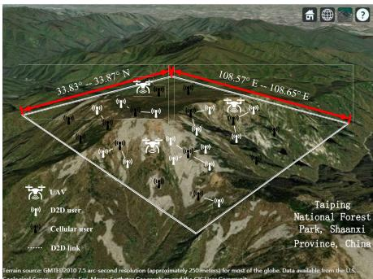  
(a) The satellite map of the mission region.

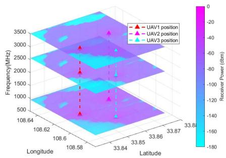  
(b) The multi-frequency radio map from the UAV's perspective

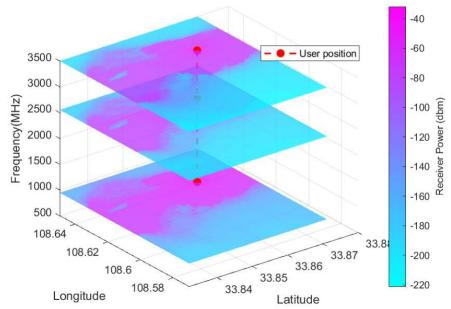  
(c) The multi-frequency radio map from one of the users' perspective.  
Fig. 1. Illustrations showing the satellite map and the multi-frequency radio maps for the complex terrain in Taiping National Forest Park, Shaanxi Province, China, as seen from the perspectives of the UAV and one of the users.

where $P _ { t }$ represents the transmission power, $G _ { t }$ denotes the gain of the transmitter, $G _ { r }$ signifies the receiver gain, and $\omega ^ { w }$ influenced by the topographic data Tgra, accounts for path loss due to radio propagation attenuation when the transmission signal reaches the receiver. We consider that the transmission signal from the UAV corresponds precisely to the known transmission power $P _ { t } .$ , as it is available to the users [21].

In practice, there are several methods to model the path loss $\omega ^ { W }$ for generating radio maps, including the measurement collection method, the model-free method, and the modelbased method [6]. The measurement collection method need to pre-collecting signals for the entire mission region, and the model-free method require collected radio waves data set by UAVs and then employed interpolation/machine learning method. For the real-time purposes, the model-based method in this paper, however, is from geographical data to radio map, which is more practical to generate radio map and can be obtained for real world. This is a general radio map generation method which can adopt any propagation model such as Longley-Rice, free space, OKumura-Hata, COST231- Hata, and ray-tracing models [28].

In this paper, we employ the Longley-Rice model [29] because it is the most widely used for irregular terrains. Indeed, since the radio maps in this paper are generated from real world geographical data, they can be generated in real time by taking climate data (can be obtained in real time) into account. Given any two coordinates in the mission region, we have

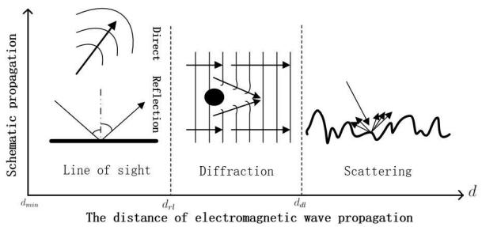  
Fig. 2. The Longley-Rice propagation model.

$$
\begin{array} { r l } & { \omega _ { L R } ^ { w } ( \mathrm { T g r a } ) } \\ & { = \omega _ { f r e e } ^ { w } + \left\{ \begin{array} { l l } { \operatorname* { m a x } ( 0 , \omega _ { r l } ^ { w } + n _ { 1 } ^ { w } d + n _ { 2 } ^ { w } \log d ) , \ 0 \leq d \leq d _ { r l } } \\ { \omega _ { d l } ^ { w } + q _ { d } ^ { w } d , \ d _ { r l } \leq d \leq d _ { d l } } \\ { \omega _ { s l } ^ { w } + q _ { s } ^ { w } d , \ d _ { d l } \leq d , } \end{array} \right. } \end{array}\tag{4}
$$

where $\omega _ { f r e e } ^ { w }$ represents the path loss in free space propagation, and $d$ denotes the path distance between the object and the UAV. Additionally, $d _ { r l }$ corresponds to the ground plane distance, marking the transition point from Line of Sight (LOS) propagation to diffraction propagation. Similarly, ddl signifies the distance at which diffraction loss equals scattering loss. We use $\omega _ { r l } ^ { w } , \omega _ { d l } ^ { w }$ , and $\omega _ { s l } ^ { w }$ to denote the gains associated with LOS, diffraction, and scattering, respectively. The coefficients $q _ { d } ^ { w }$ and $q _ { s } ^ { w }$ represent diffraction and scattering effects, while $n _ { 1 } ^ { w }$ and $n _ { 2 } ^ { w }$ characterize the LOS coefficients. Fig. 2 provides a visual illustration of the Longley-Rice propagation model principle [30].

## B. D2D Radio Map for Ground-to-Ground Communication

We assume that ground user nodes possess D2D communication capabilities. To assess communication links between these ground users and design a hybrid ground D2D network, we introduce the D2D radio map for ground-to-ground communication. This map illustrates the mutual electromagnetic attenuation distribution among K user nodes, specifically utilizing the designated D2D frequency band.

We use an undirected graph to model the structure of the terrestrial D2D network, which is defined as $G = ( V , E )$ . In the undirected graph G, $V = \{ v _ { 1 } , v _ { 2 } , \ldots v _ { K } \}$ is the set of K nodes (users), E is the set of edges (link state), which directly determine the structure of the D2D network. Furthermore, we define the adjacency matrix C to evaluate the structure of the graph G:

$$
C = [ c _ { i , j } ] _ { K \times K } ,\tag{5}
$$

where $c _ { i , j }$ is the link state. $c _ { i , j } = 1$ indicates that the i-th user and j-th users can form a D2D communication link; conversely, it is not possible, i.e.,

$$
c _ { i , j } = \left\{ \begin{array} { l l } { 1 , } & { \left[ v _ { i } , v _ { j } \right] \in E } \\ { 0 , } & { \left[ v _ { i } , v _ { j } \right] \notin E . } \end{array} \right.\tag{6}
$$

To assess whether the i-th and j-th users can form a D2D communication link, i.e., the value of $c _ { i , j }$ , we can model the channel attenuation between the i-th and j-th users. We define the channel attenuation among K ground users (nodes) as a D2D radio map in the specified D2D frequency band:

$$
M _ { \mathrm { d 2 d } } = [ m _ { i , j } ^ { \mathrm { d 2 d } } ] _ { K \times K } .\tag{7}
$$

The element corresponding to both the i-th user and the $j -$ th user in $M _ { \mathrm { d } 2 \mathrm { d } }$ is denoted as $m _ { i , j } ^ { \mathrm { d 2 d } }$ , which represents the received signal strength at the receiver location of the i-th user when a power signal is transmitted from the j-th user with a special frequency band $B _ { d }$ for D2D communication. Especially, $m _ { i , j } ^ { \mathrm { d } 2 \mathrm { d } } = { m _ { j , i } ^ { \mathrm { d } 2 \mathrm { d } } }$

Similarly, the D2D radio map element $m _ { i , j } ^ { d 2 d }$ with D2D frequency band can be evaluated using the Friis path loss equation [5], which is expressed in dB, and it is defined as follows:

$$
m _ { i , j } ^ { d 2 d } = P _ { t } ^ { d 2 d } + G _ { t } ^ { d 2 d } + G _ { r } ^ { d 2 d } - \omega ^ { d 2 d } \mathrm { ( T g r a ) } ,\tag{dB}
$$

(8)

where $P _ { t } ^ { d 2 d }$ represents the D2D transmission power, $G _ { t } ^ { d 2 d }$ denotes the D2D transmission gain, $G _ { r } ^ { d 2 d }$ signifies the D2D received gain, and $\omega ^ { d 2 d }$ , dependent on the topographic data Tgra, represents the D2D path loss resulting from radio propagation attenuation when the transmission signal reaches the receiver. As the topography of the ground is complex and irregular, we also employ the Longley–Rice model to model the D2D path loss. The modeling process is similar to Eq.(4) of air-to-ground radio map and hence it is omitted for brevity.

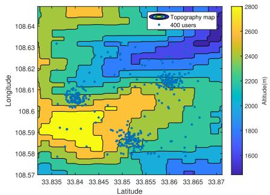  
(a) The 400 users distribution on the topography map.

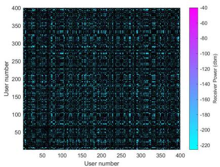  
(b) The D2D radio map from the users’ perspective.  
Fig. 3. Illustrations showing the topography map and the D2D radio map for the complex terrain in Taiping National Forest Park, Shaanxi Province, China, as seen from the perspectives of the 400 users.

An essential consideration lies in the dependence of Longley-Rice model parameters on real-world topographic data, denoted as Tgra. This data encompasses terrain information, including elevation and the presence of urban buildings. Additionally, climate conditions, atmospheric refractivity near the ground, ground conductivity, and relative permittivity of ground and building materials influence the model. To acquire necessary Tgra data, sources such as the Global Multiresolution Terrain Elevation Data (GMTED2010) [10] and OpenStreetMap data [31] can be leveraged. Incorporating this topographic data into the models allows calculation of path loss coefficients, such as $m _ { x } ^ { k , w }$ , and $m _ { i , j } ^ { d 2 d }$ , which play a crucial role in generating the radio maps $M _ { k , w }$ and $M _ { d 2 d }$ . Note that this radio map generation method can generate both static and real-time radio maps.

## III. RADIO MAP ASSISTED UAV COMMUNICATION FOR D2D USERS

## A. Problem Formulation

Fig.4 illustrates the air-to-ground communication scheme for hybrid D2D users assisted by UAVs. The UAVs provide W frequency bands for air-to-ground communication with frequency $f _ { w }$ and bandwidth $B _ { w } \ ( w \in W )$ , where one user can connect to at most one of the UAVs and use one of the W frequency bands. In this scheme, the K users located at $v _ { 1 : K }$ are capable of D2D communication and forming a hybrid D2D communication network (including independent cellular nodes and multi-node subnetworks). For independent cellular users, they can only communicate directly with UAVs. For users within a subnetwork, we define them as two types of nodes, called the cellular nodes and the D2D nodes, which have different modes of air-to-ground communication: one can directly connect to UAVs for communication, the other can use D2D communication to connect with the cellular users who are directly linked to UAVs within a ground subnetwork. The number of cellular nodes is denoted as H, and the number of D2D nodes is denoted as $\{ K - H \}$ . Then, we define the node attribute indicator $e _ { k }$ to evaluate the importance of airto-ground communication of all users, i.e.,

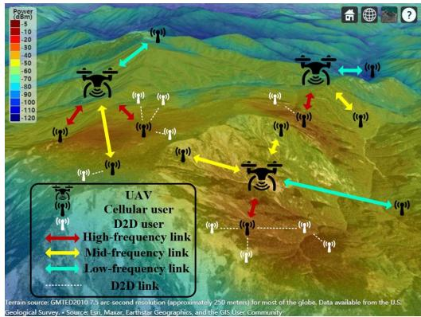  
Fig. 4. Illustrations of bridging ground D2D networks by multi-UAV multifrequency communication with radio map in complex real-world topography. The background image used in this figure is one type of radio map, where the color represents the intensity of the electromagnetic waves emitted from the UAV.

$$
e _ { k } = \left\{ \begin{array} { l l } { 0 , } & { \mathrm { D 2 D ~ n o d e ~ i n ~ t h e ~ D 2 D ~ s u b n e t w o r k } , } \\ { I _ { h } , } & { \mathrm { i n d e p e n d e n t ~ c e l l u l a r ~ n o d e ~ o r ~ c e l l u l a r } } \\ { } & { \mathrm { n o d e ~ i n ~ t h e ~ } h - \mathrm { t h ~ D 2 D ~ s u b n e t w o r k } , } \end{array} \right.\tag{9}
$$

where h denotes the number of subnetworks and individual nodes, $I _ { h }$ is the number of nodes in the h-th subnetwork. Especially, $e _ { k } = I _ { h } = 1$ indicates that the k-th node within h-th subnetwork is an independent cellular node. Obviously, $h \in \{ 1 : H \}$ also indicates the h-th cellular node of H cellular nodes. The structure of the hybrid D2D network is also shown in Fig.4. We can see the UAV can communicate directly with the cellular nodes, while the D2D nodes are indirectly connected to the UAVs via D2D communication with the cellular nodes of their subnetwork. We adopt time division duplex (TDD) [32], in which the frequency bands used for up-link and down-link transmissions are identical over short time scales.

Based on the multi-frequency radio map $M _ { k , w }$ generated from the mission region X in Section.II-A, we aim to maximize the mean transmission rate of one of D2D users. The channel noise is assumed by the Gaussian white noise with power denoting by $B _ { w } \mu ,$ , where $\mu$ is the noise power spectral density. Given the positions of the users $\{ v _ { k } | k \ \in \ K \}$ with D2D communication capability, the transmission rate of the air-toground communication with w-th frequency band between the n-th UAV and the k-th user is indicated by $R _ { n } ^ { k , w }$ , i.e.,

$$
R _ { n } ^ { k , w } = B _ { w } l o g _ { 2 } \left( 1 + \frac { m _ { i n , j n } ^ { k , w } } { B _ { w } \mu } \right) ,\tag{10}
$$

where $m _ { i n , j n } ^ { k , w }$ is the element of the multi-frequency radio map indicating the RSS at the UAV location $x _ { n }$ when a power signal is received at the k-th user with w-th frequency band. Then, in the complex terrain, this optimization problem is thus formulated as follows:

$$
\begin{array} { r l r } {  { ( \mathrm { P } 0 ) \sum _ { x _ { 1 : N } , a _ { k } ^ { 1 : N } , b _ { k } ^ { w } , e _ { k } } \frac { 1 } { K } \sum _ { k = 1 } ^ { K } \sum _ { n = 1 } ^ { N } \sum _ { w = 1 } ^ { W } a _ { k } ^ { n } b _ { k } ^ { w } e _ { k } R _ { n } ^ { k , w } } } \\ & { } & \\ & { } & { \mathrm { s } . \mathrm { t } . \{ a _ { k } ^ { n } \in { \cal X } \atop a _ { k } ^ { n } \in \{ 0 , 1 \} , \sum _ { n = 1 } ^ { N } a _ { k } ^ { n } = 1  } \\ & { } & \\ & { } & {  \{ b _ { k } ^ { w } \in \{ 0 , 1 \} , \sum _ { w = 1 } ^ { W } b _ { k } ^ { w } = 1   } \\ & { } & \end{array}\tag{11}
$$

(12)

where $x _ { n }$ is the n-th UAV, $a _ { k } ^ { n }$ indicates the state of the communication link from the n-th UAV to the k-th user, and $b _ { k } ^ { w }$ indicates the state of the w-th communication frequency band of the k-th user. Note that the real-world topographical data is modeled in radio map $m _ { i n , j n } ^ { k , w }$ of $R _ { n } ^ { k , w }$

For problem (P0), it is difficult to jointly handle the position of the UAV $x _ { n } ,$ the selection of the link of the UAV to the ground $a _ { k } ^ { n } .$ , the frequency choice $b _ { k } ^ { w }$ , and the D2D network topology $e _ { k }$ . Therefore, we divide the problem (P0) into two subproblems as follows.

## B. Subproblem 1: The Ground Network Structure

In Subproblem 1, our primary objective is to design an optimal ground network structure. This involves the selection of cellular nodes and D2D nodes, with the aim of establishing direct connections between cellular nodes and UAVs. To alleviate the air-to-ground communication load when cellular nodes directly connect to the UAV and to maximize the utilization of the D2D capabilities of ground nodes, an effective network architecture is to minimize the number of ground cellular nodes while maximizing the number of D2D nodes engaging in ground D2D communication. This problem can be modeled as:

$$
\begin{array} { r l r } {  { ( \mathrm { P l . 1 } ) \ \underset { e _ { k } } { \operatorname* { m i n } } H } } & { \ ( \mathrm { l } } \\ & { \ } & { \mathrm { s . t . } \{ \{ \exists ( i \in \{ 1 : K \} ) \cap ( i \neq k ) , c _ { i , k } = 1 \} | e _ { k } = 0  } \\ & { } & { \quad  e _ { k } \in \{ 0 , I _ { h } \} ,  } \end{array}\tag{3}
$$

(14)

where H is the number of the cellular nodes, $c _ { i , k }$ is the link state, and $c _ { i , k } = 1$ indicates that the i-th user and k-th users can form a D2D communication link.

To obtain the solution $e _ { k }$ of (P1.1), we focus on how to form the D2D network for ground users with D2D communication capability and select the cellular users connected to UAVs.

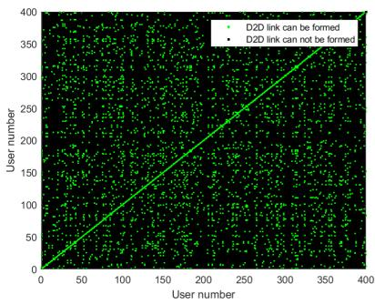  
Fig. 5. The D2D link map from the users’ perspective.

1) Terrestrial D2D Network Construction: First, we aim to have the minimum number of subnetworks, that is, to enable as many ground users as possible to communicate directly with each other through D2D communication while ensuring D2D communication capability, so as to reduce the load of airground communication. We introduce the undirected graph G to model the ground D2D network structure. A direct way to form this D2D network is to enable all links that satisfy the D2D communication constraint to communicate via D2D, forming the edge set of graph G. Note that the D2D radio map element $m _ { i , j } ^ { d 2 d }$ is defined in Section II-B. Then, we can define the adjacency matrix of G as $[ C ] ^ { K \times K }$ , and the element of C is:

$$
c _ { i , j } = \left\{ \begin{array} { l l } { 1 , } & { B _ { d } l o g _ { 2 } \left( 1 + \frac { m _ { i , j } ^ { d 2 d } } { B _ { d } \mu } \right) \geq R _ { d } } \\ { 0 , } & { B _ { d } l o g _ { 2 } \left( 1 + \frac { m _ { i , j } ^ { d 2 d } } { B _ { d } \mu } \right) < R _ { d } , } \end{array} \right.\tag{15}
$$

where $B _ { d }$ is the bandwidth of the D2D frequency, $R _ { d }$ denotes the transmission rate bound for D2D communication, and $\mu$ is the noise power spectral density. Clearly C can be easily obtained with low computational complexity $\mathcal { O } ( K ^ { 2 } )$ . Fig. 5 shows the D2D link map based on the adjacency matrix $C ,$ which indicates whether the D2D link can be formed between two users within 400 users. The number of the subnetworks is indicated by H. With $C ,$ we can achieve the hybrid D2D ground network structure, and we define the index set of users in the h-th subnetwork as

$$
\Phi _ { h } = \left\{ \begin{array} { l l } { \{ k _ { I _ { 1 } } , k _ { I _ { 2 } } , \ldots , k _ { I _ { h } } \} , I _ { h } > 1 , } \\ { k _ { I _ { h } } , I _ { h } = 1 , } \end{array} \right.\tag{16}
$$

where $k _ { I _ { x } }$ is the index of the node, and $I _ { h } = 1$ indicates that the h-th subnetwork only has one independent node.

2) Cellular Users Selection: After forming the terrestrial D2D subnetworks $\big \{ \Phi _ { 1 } , \dots , \Phi _ { H } \big \}$ , the further classification of nodes into cellular nodes and D2D nodes within a D2D subnetwork $\Phi _ { h }$ represents a crucial and final step in completing the construction of the entire terrestrial network. Our design objective, while ensuring all nodes can be served, is to minimize the number of air-to-ground links, thus reducing the communication load and interference. In order to ensure that all ground users can communicate with UAVs, UAVs should establish a direct communication link with all independent ground nodes and only one node of a subnetwork, i.e., the cellular nodes. Consequently, the minimum number of ground nodes directly connected to UAVs equals the sum of the subnetworks including the independent nodes. Therefore, selecting the cellular node of each subnetwork is a critical issue.

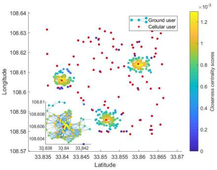  
Fig. 6. The terrestrial D2D network with the closeness centrality of the 400 users.

We propose the D2D closeness centrality of nodes in the network G to select the cellular user within a subnetwork. The classical closeness centrality is the reciprocal of the sum of distances from a node to all other nodes in the network, i.e., the classical closeness centrality [33] of the k-th node is

$$
\gamma ( k ) = \left( \frac { A _ { k } } { K - 1 } \right) ^ { 2 } \frac { 1 } { C _ { k } } ,\tag{17}
$$

where $A _ { k }$ represents the number of nodes reachable from node k (excluding k), K is the total number of nodes in $G ,$ and $C _ { k }$ is the sum of distances from node k to all reachable nodes. If node k cannot reach any other nodes, then $C _ { k }$ is zero. However, the classical closeness centrality cannot evaluate the node importance of D2D communication. In the terrestrial D2D communication scenario, the importance of the node should be determined by their maximum throughput with other nodes, rather than the distance to other nodes. Then, for the k-th node in the h-th subnetwork $\Phi _ { h }$ , we define its ‘D2D closeness centrality’ as follows:

$$
\gamma _ { d } ( k ) = \bigg ( \frac { \sum _ { i = k _ { 1 } } ^ { k _ { I _ { h } } } c _ { i , k } } { I _ { h } - 1 } \bigg ) ^ { 2 } \sum _ { i = k _ { 1 } } ^ { k _ { I _ { h } } } \frac { c _ { i , k } } { B _ { d } l o g _ { 2 } \bigg ( 1 + \frac { m _ { k , i } ^ { d 2 d } } { B _ { d } \mu _ { d } } \bigg ) } ,\tag{18}
$$

where $m _ { i , j } ^ { d 2 d } ~ \in ~ M _ { d 2 d }$ is the ground radio map, $B _ { d }$ is the frequency of D2D and $\mu _ { d }$ is the noise density of D2D. $I _ { h }$ is the number of nodes in the h-th subnetwork, especially, $I _ { h } ~ = ~ 1$ when the node is an independent node, $c _ { i , k } \in C$ is the adjacency matrix of graph $G .$ This metric reflects the importance of communication network nodes. For each subnetwork $\Phi _ { h }$ , we can easily find the cellular node by traversing all nodes within $\Phi _ { h }$ indicated by

$$
k _ { h } = \arg \operatorname* { m a x } _ { k \in \Phi _ { h } } \gamma _ { d } ( k ) .\tag{19}
$$

To obtain $\{ k _ { 1 } : k _ { H } \}$ , we need to evaluate all K nodes in subnetworks, whose computational complexity is O(K ·max $\{ I _ { 1 }$ $I _ { H } \} )$ depending on the number of operations in Eq.(19). Even in the worst-case complexity scenario, max $\{ I _ { 1 } : I _ { H } \} < K$ Thus, the worst-case complexity of this step is $\mathcal { O } ( K ^ { 2 } )$

The complexity of subproblem 1 (P1.1) includes two parts: the terrestrial D2D network construction $\mathcal { O } ( K ^ { 2 } )$ and cellular users selection $\mathcal { O } ( K ^ { 2 } )$ in the worst-case complexity scenario. Therefore, the complexity of (P1.1) is given by $\mathcal { O } ( K ^ { 2 } ) + \mathcal { O } ( K ^ { 2 } ) = \mathcal { O } ( K ^ { 2 } )$ . Fig.6 shows the D2D closeness centrality of the 400 users, where the node with maximum D2D closeness centrality is the cellular node in each subnetwork. Then, we can easily obtain the node attribute indicator of the k-th user:

$$
e _ { k } = \left\{ { 0 , \quad k \neq k _ { h } , } \right.\tag{20}
$$

where $e _ { k } = I _ { h } = 1$ when k-th is an independent node.

## C. Subproblem 2: The Deployment of UAVs for Air-to-Ground Communication

With the terrestrial D2D network structure and cellular nodes, we aim to maximize the mean transmission rate from the UAV to the terrestrial D2D network by optimizing the UAV position $x _ { n }$ and the state of the air-to-ground communication link $a _ { k } ^ { n }$ with the communication frequency $b _ { k } ^ { w }$

1) Problem Formulation: As the $e _ { k }$ can be obtained, the problem of UAV deployment can be formulated by

(P1.2)

$$
\operatorname* { m a x } _ { x _ { 1 : N } , a _ { k } ^ { 1 : N } , b _ { k } ^ { w } } \frac { 1 } { K } \sum _ { k = 1 } ^ { K } \sum _ { n = 1 } ^ { N } \sum _ { w = 1 } ^ { W } a _ { k } ^ { n } b _ { k } ^ { w } e _ { k } R _ { n } ^ { k , w }\tag{21}
$$

$$
\mathrm { s . t . } \left\{ \begin{array} { l } { x _ { n } \in X , } \\ { a _ { k } ^ { n } \in \{ 0 , 1 \} , \sum _ { n = 1 } ^ { N } a _ { k } ^ { n } = 1 } \\ { b _ { k } ^ { w } \in \{ 0 , 1 \} , \sum _ { w = 1 } ^ { W } b _ { k } ^ { w } = 1 } \end{array} \right.\tag{22}
$$

2) The Traversing Method for (P1.2): To solve the problem (P1) using the traversal method, we need to traverse all possible cases of the solution.

The traversing method for (P1.2) includes two steps. The first step is, assuming UAV positions $x _ { 1 : N } ~ = ~ \{ x _ { i 1 , j 1 } ~ :$ $x _ { i N , j N } \}$ , maximizing the throughput of the air-to-ground link by traverse $a _ { k } ^ { n }$ and $b _ { k } ^ { w }$ in their constraint space:

$$
\begin{array} { l } { { \displaystyle \Theta \big ( x _ { 1 : N } = \big \{ x _ { i 1 , j 1 } : x _ { i N , j N } \big \} \big ) } } \\ { { = \operatorname* { m a x } _ { a _ { k } ^ { n } , b _ { k } ^ { w } } \displaystyle \sum _ { k = 1 } ^ { K } \sum _ { n = 1 } ^ { N } \sum _ { w = 1 } ^ { W } a _ { k } ^ { n } b _ { k } ^ { w } e _ { k } R _ { n } ^ { k , w } \bigg | x _ { 1 : N } = \big \{ x _ { i 1 , j 1 } : x _ { i N , j N } \big \} } } \\ { { \mathrm { s . t . } \left\{ a _ { k } ^ { n } \in \{ 0 , 1 \} , \sum _ { n = 1 } ^ { N } a _ { k } ^ { n } = 1 \begin{array} { l } { { } } \\ { { } } \\ { { b _ { k } ^ { w } \in \{ 0 , 1 \} , \sum _ { w = 1 } ^ { W } b _ { k } ^ { w } = 1 } } \end{array} \right. } } \end{array}
$$

where $\Theta ( x _ { 1 : N } )$ is a function denotes the maximize the throughput of the air-to-ground link given $x _ { 1 : N }$ . The terrestrial D2D users will try all the possibilities of connecting to the UAV and the possibility of frequency selection of air-to-ground. The computational complexity of this step is $\mathcal { O } ( K N W )$ ), depending on the number of operations in Eq.(23). The second step is, we can traverse any possible UAV positions $x _ { 1 : N } \in X$ to evaluate the objective function, i.e.,

$$
x _ { 1 : N } ^ { t } = \arg \operatorname* { m a x } _ { x _ { 1 : N } \in X } \Theta ( x _ { 1 : N } ) .\tag{24}
$$

Note that the traversal space of UAV position $x _ { n }$ is the mission area X divided by $A \times B$ grids as Eq.(1). The computational complexity of this step is $\mathcal { O } ( ( A B ) ^ { N } )$ , depending on the number of operations in traverse $\boldsymbol { x } _ { 1 : N } \in [ \boldsymbol { X } ] ^ { \bar { \boldsymbol { A } } \times \boldsymbol { B } }$ . Thus, the total computational complexity is $\mathcal { O } ( ( A B ) ^ { N } ) \cdot \mathcal { O } ( K N W ) =$ $\mathcal { O } ( K N W ( A B ) ^ { N } )$

We can obtain theoretical optimality by dividing the searching region into infinite grids. However, the algorithm’s complexity grows exponentially with the number of UAVs N. Within a limited time, algorithms will become challenging for multiple UAV scenarios. Therefore, designing a fast lowcomplexity algorithm for multiple UAVs is essential.

3) The Radio Map Improved k-Means Method for (P1.2): Classical k-means clustering is a method of vector quantization with low computational complexity, that aims to partition n observations into k clusters in which each observation belongs to the cluster with the nearest mean (cluster centers or cluster centroid), serving as a prototype of the cluster [34]. Let the users be the observations, and let the UAVs be the clusters, and the k-means algorithm can be employed for the UAV deployment. However, the classical k-means algorithm minimizes within-cluster variances (squared Euclidean distances), which is different from the maximum of the air-to-ground transmission rate as (P1.2).

Thus, we propose a radio map based k-means method for the UAV deployment with air-to-ground communication. The algorithm undergoes T iterations. $t \in \{ 1 : T \}$ represents the t-th iteration. The algorithm includes 3 major parts:

a) Initialization: Similar to the classic k-means algorithm, we employ the Forgy method [35] to initialize the coordinates of the N core of the clusters (UAV coordinates). Notably, the Forgy method tends to distribute the initial means more widely. For expectation maximization and standard k-means algorithms, the Forgy method of initialization is preferable [36]. Let $\boldsymbol { x } _ { n } ^ { t }$ denote the n-th UAV coordinates in the t-th iteration. The Forgy method randomly selects N observations from the dataset and uses them as the initial {1 : N} UAV coordinates of the algorithm:

$$
x _ { 1 : N } ^ { 1 } = \{ { \mathrm { r a n d } } ( v _ { 1 } , \ldots , v _ { K } ) , \ldots , { \mathrm { r a n d } } ( v _ { 1 } , \ldots , v _ { K } ) \} _ { 1 \times N } ,\tag{25}
$$

where $x _ { 1 : N } ^ { 1 }$ denotes the initial N UAV coordinates at the 1-th iteration, and rand(·) denotes that taking a random value from the user positions index $\{ v _ { 1 } : v _ { k } \}$

b) Assignment with the transmission rate: Assign each user $v _ { k }$ to the cluster with the multi-frequency radio map that has the highest transmission rate. Mathematically, this means partitioning the $K$ users according to the air-toground transmission rate generated by the UAV positions $\boldsymbol { x } _ { n } ^ { t }$

$$
\{ a _ { k } ^ { n , t } , b _ { k } ^ { w , t } \} = \arg \Theta ( x _ { 1 : N } = x _ { 1 : N } ^ { t } ) ,\tag{26}
$$

where $\Theta ( \cdot )$ is a function to maximize the throughput of the air-to-ground link given $x _ { 1 : N } = x _ { 1 : N } ^ { t }$ defined in Eq.(23), $a _ { k } ^ { n , t }$ and $b _ { k } ^ { w , t }$ denote the connection state and the w-th communication frequency of the air-to-ground communication link between the n-th UAV and the k-th user in the t-th iteration, respectively. The complexity of this step is O(KNW ) depending on the number of operations in Eq.(26) similar to Eq.(23).

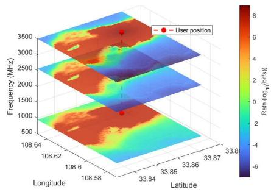  
Fig. 7. The multi-frequency rate map from one of the users’ perspective.

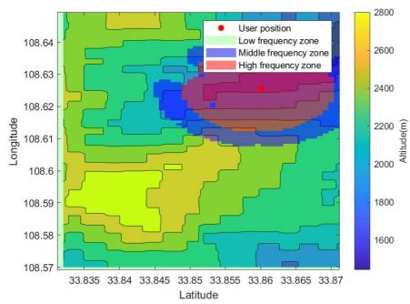  
Fig. 8. The frequency selection map from one of the users’ perspective on the topography map.

c) Update of the clustering core: update the clustering core as the UAV positions for K users assigned to each cluster with $a _ { k } ^ { n , t }$ and $b _ { k } ^ { w , t }$ :

$$
\begin{array} { c } { { { \displaystyle x _ { n } ^ { t + 1 } = \arg \operatorname* { m a x } _ { x _ { n } ^ { t } } \sum _ { k = 1 } ^ { K } \sum _ { w = 1 } ^ { W } a _ { k } ^ { n , t } b _ { k } ^ { w , t } e _ { k } \times } } } \\ { { { \displaystyle B _ { w } l o g _ { 2 } \left( 1 + \frac { m _ { i n , j n } ^ { k , w } } { B _ { w } \mu } \right) . } } } \end{array}\tag{27}
$$

The complexity of this step is $\mathcal { O } ( A B N )$ depending on the number of operations in Eq.(27).

d) Loop and termination conditions: The algorithm will converge when the assignments no longer change, or if the maximum number of the iterations T has expired.1

One iteration of this algorithm includes two major parts, ‘Assignment with the transmission rate’ and ‘Update of the clustering core’. The complexity of an iteration is $\mathcal { O } ( K N W )$ $\mathcal { O } ( A B \bar { N ) } ~ = ~ \mathcal { O } ( K N ^ { 2 } \bar { W } A B )$ . The algorithm requires the maximum of T iterations; therefore, the complexity of the radio map improved k-means method for subproblem (P1.2) is $\mathcal { O } ( K N ^ { 2 } W A B T )$ . Fig.7 and Fig.8 show that the rate map and the frequency selection map generated from the multifrequency map of Fig. 1(c). The rate map is the transmission rate distributed in the mission area X, and the frequency selection map is the selected frequency distributed in X with the highest transmission rate. Compared with the traversing method, the radio map based K-means method significantly reduces computational complexity. It is only necessary for this method to independently consider UAV deployment within each clusters and apply the radio map corresponding to a single UAV with complexity $\mathcal O ( A B )$ , rather than requiring the superposition of radio maps of N UAVs with complexity $\mathcal { O } ( ( A \dot { B } ) ^ { \dot { N } } )$ , as in the traversal method. This transformation enables the algorithm to be executed within a reasonable time frame for scenarios involving multiple UAVs, serving as a suboptimal solution while ensuring considerable computational performance.

Algorithm 1 The proposed Radio Map Assisted Multi-  
Frequency Unmanned Aerial Relay for Bridging Ground D2D   
Networks   
Input: Mission area X, the topography of mission area   
Tgra, the terrestrial users location set $v _ { 1 : K } ,$ the UAV   
numbers $N ,$ the multiple frequency $f _ { 1 : W }$ with the   
bandwidth $B _ { 1 : W }$ for the air-to-ground link, and the   
maximum iterations allowed $T$ for radio map   
improved k-means.   
1 Subproblem I: Construct the terrestrial network with   
D2D radio map:   
2 Generate D2D radio map $M _ { d 2 d }$ by Eq.(8) with Longley-Rice   
propagation model $\omega ^ { d 2 d } ( \mathbf { T g r a } )$ as $\operatorname { E q . } ( 4 ) ;$   
3 Evaluate the D2D link by the defined adjacency matrix $C$ as   
Eq.(15) with the D2D radio map $M _ { d 2 d } \mathrm { ; }$   
4 Construct the D2D subnetworks set $\Phi _ { 1 : H }$ as Eq.(16) from   
the defined adjacency matrix $C ;$   
5 Select the cellular users index $k _ { 1 : H }$ within each subnetworks   
$\Phi _ { 1 : H }$ by the proposed D2D closeness centrality $\gamma _ { d } ( k )$ as   
Eq.(19) with the D2D radio map $M _ { d 2 d } .$ Obtain the node   
attribute indicator $e _ { 1 : K }$ from $k _ { 1 : H }$ by Eq.(20).   
6 Subproblem II: Deploy the UAVs by multi-frequency   
map improved K-means:   
7 Generate multi-frequency radio maps $M _ { 1 : K , 1 : W }$ by $\operatorname { E q . } ( 3 )$   
with Longley-Rice propagation model $\omega ^ { w } ( \mathbf { T g r a } )$ as Eq.(4);   
8 Initialization of UAV positions $x _ { 1 : N } ^ { 1 }$ by Eq.(25);   
9 Initialize time point $t = 1 ;$   
10 while $t \leq T \underline { { a } } \underline { { n } } d \{ a _ { k } ^ { n , t } , b _ { k } ^ { w , t } \} \neq \{ a _ { k } ^ { n , t - 1 } , b _ { k } ^ { w , t - 1 } \} \wedge t \geq 2$ do   
11 Assign the state of UAV-to-user link $\ddot { a _ { k } ^ { n , t } }$ and the   
communication frequency $b _ { k } ^ { w , t }$ with the air-to-ground   
rate by Eq.(26);   
12 Update of the clustering core (UAV positions) $x _ { n } ^ { t + 1 }$ by   
Eq.(27) with $M _ { 1 : K , 1 : W } ;$   
13 $t = \widehat { t } + 1 ;$   
14 end   
Output: The terrestrial D2D subnetworks $\Phi _ { 1 : H } ;$ The   
cellular users index $k _ { 1 : H } ;$ The state of UAV-to-user   
link $a _ { 1 : K } ^ { 1 : N , t - 1 } .$ ; The communication frequency   
$b _ { 1 : K } ^ { 1 : W , t - 1 } ;$ The UAVs positions $\boldsymbol { x } _ { 1 : N } ^ { t } .$

## D. Complexity and Optimality Analysis

The entire proposed scheme is shown in Algorithm 1. The complexity of the overall algorithm is composed of two parts. The first part is the complexity of the solution to sub-problem (P1.1) $\bar { \mathcal { O } ( K ^ { 2 } ) }$ , and the second part is the complexity of the solution to sub-problem (P1.2) $\bar { \mathcal { O } } ( K N ^ { 2 } W A B \bar { T } )$ . Therefore, the complexity of the entire algorithm is the sum of these two complexities, $\mathcal { O } ( K ^ { 2 } ) + \mathcal { O } ( \hat { K } N ^ { 2 } W A B T )$ . By the rules of big-O notation simplification, we can rewrite it as $\mathcal { O } ( K$ $( N ^ { 2 } W A B T + K ) )$ ).

TABLE IV  
SIMULATION PARAMETERS
<table><tr><td rowspan=1 colspan=1></td><td rowspan=1 colspan=1>Parameters</td><td rowspan=1 colspan=3>Value</td></tr><tr><td rowspan=8 colspan=1>Mission Area</td><td rowspan=1 colspan=1>Location name</td><td rowspan=1 colspan=3>Taiping National Forest Park,Shaanxi Province, China</td></tr><tr><td rowspan=1 colspan=1>Area coverage</td><td rowspan=1 colspan=3>8.88km × 4.44km = 39.43 km^2</td></tr><tr><td rowspan=1 colspan=1>Scope of longitude</td><td rowspan=1 colspan=3>108.57E to 108.65E</td></tr><tr><td rowspan=1 colspan=1>Scope of latitude</td><td rowspan=1 colspan=3>33.83N to 33.87N</td></tr><tr><td rowspan=1 colspan=1>Ground material Type</td><td rowspan=1 colspan=3>Common Ground</td></tr><tr><td rowspan=1 colspan=1>Ground permittivity</td><td rowspan=1 colspan=3>15</td></tr><tr><td rowspan=1 colspan=1>Climate Zone</td><td rowspan=1 colspan=3>Continental-temperate</td></tr><tr><td rowspan=1 colspan=1>Propagation model</td><td rowspan=1 colspan=3>Longley-Rice Propagation Model</td></tr><tr><td rowspan=2 colspan=1>Ground Users</td><td rowspan=1 colspan=1>Number</td><td rowspan=1 colspan=3>400</td></tr><tr><td rowspan=1 colspan=1>The Height above the ground</td><td rowspan=1 colspan=3>1.5 m</td></tr><tr><td rowspan=3 colspan=1>UAVs</td><td rowspan=1 colspan=1>Number</td><td rowspan=1 colspan=3>3</td></tr><tr><td rowspan=1 colspan=1>Maximum mission time</td><td rowspan=1 colspan=3>25min</td></tr><tr><td rowspan=1 colspan=1>The height above the ground</td><td rowspan=1 colspan=3>100m</td></tr><tr><td rowspan=3 colspan=1>Ground-to-groundcommunication(Among ground users)</td><td rowspan=1 colspan=1>Transmitter frequency</td><td rowspan=1 colspan=3>2.4 GHz</td></tr><tr><td rowspan=1 colspan=1>Transmitter power</td><td rowspan=1 colspan=3>1W</td></tr><tr><td rowspan=1 colspan=1>Minimum receivced powerfor D2D communication</td><td rowspan=1 colspan=3>-80 dbm</td></tr><tr><td rowspan=4 colspan=1>Air-to-groundcommunication(Among UAVs and users)</td><td rowspan=1 colspan=1>Transmitter power</td><td rowspan=1 colspan=3>1W</td></tr><tr><td rowspan=2 colspan=1>Multiple transmission frequency</td><td rowspan=1 colspan=1>Low</td><td rowspan=1 colspan=1>Middle</td><td rowspan=1 colspan=1>High</td></tr><tr><td rowspan=1 colspan=1>949MHz</td><td rowspan=1 colspan=1>2555MHz</td><td rowspan=1 colspan=1>3500MHz</td></tr><tr><td rowspan=1 colspan=1>Transmission bandwidth</td><td rowspan=1 colspan=1>5MHz</td><td rowspan=1 colspan=1>20MHz</td><td rowspan=1 colspan=1>100MHz</td></tr></table>

Next, we analyze the sub-optimality of the proposed solutions for these two subproblems separately: For Subproblem (P1.1) (ground network structure design), the proposed method employs an efficient traversal method, which guarantees theoretical optimality. This complexity is manageable within practical computational limits, allowing the algorithm to find the optimal solution efficiently. For Subproblem (P1.2) (UAV deployment and frequency allocation), the radio map improved k-means method, is a heuristic, suboptimal approach with comlexity of $\mathcal { O } ( K N ^ { 2 } W A B T )$ ). The optimal solution to (P1.2) would require an exhaustive search (traversal method), which has a much higher complexity of $\mathcal { O } ( K N W ( A B ) ^ { N } )$ . Since the complexity grows exponentially with the number of UAVs (N), this method becomes computationally infeasible for largescale air-to-ground networks.

## IV. SIMULATIONS

In this section, we showcase simulations that highlight the efficiency of the UAV-based air-to-ground network introduced in this paper. The simulations utilize real-world topographical data from the mountainous region in Taiping National Forest Park, situated in Xi’an, Shaanxi, China. This area features highly intricate topography. The dimensions of this region are 8.88 km ×4.44 km. The ground permittivity is given a value of 15, and the climate zone is classified as Continentaltemperate. The number of ground users is set to 400, with their height above the ground being 1.5 m. There are 3 UAVs, each flying at a height of 100 m above the ground. We assume that the flight duration of the UAV is 25 minutes, which is the parameter of civilian small UAV, such as the Dji Mavic series [37].

UAVs within the network provide various frequencies for communication to ground users, who predominantly use D2D via a short-range protocol akin to WIFI at 2.4 GHz with 1W transmission power [38]. The minimum power required for ground-to-ground links is −80 dBm. The UAVs serve as flying relays in the air-to-ground network, offering three bands: low (949MHz, 5MHz BW), middle (2555MHz, 20MHz BW), and high (3500MHz, 100MHz BW), referencing Chinese 3G, 4G, and 5G standards [38]. Higher frequencies offer more bandwidth but suffer more from terrain attenuation. To create radio maps for both D2D and multi-frequency air-to-ground communication, we use the Longley-Rice model, detailed in Section II-B, for accurate terrain-based radio propagation simulation. It is worth noting that other propagation models are easily applicable. All simulation parameters, including altitude variations, are listed in Table IV.

## A. Verification of the Effectiveness

In this subsection, we conduct simulations with the proposed network architecture and UAV deployment algorithm, comparing them to other relevant networks or algorithms in the complex mountainous terrain mentioned earlier, to verify the effectiveness of our proposed scheme.

1) Verification With Other Network Structures: We choose the benchmarks to verify our network structure, Fig.10 shows that the simulations of the proposed network structure verse other following network structures:

(a) The proposed network: Multi-frequency for air-toground communication with D2D for ground-to-ground communication,

(b) Network 1: Multi-frequency for air-to-ground communication without D2D for ground-to-ground communication [19], [20], [21], [22], [23], [24],

(c) Network 2: High-frequency for air-to-ground communication with D2D for ground-to-ground communication (operating at 3500 MHz with a 100 MHz bandwidth) [12], [13], [14], [15], [16], [17], [18],

(d) Network 3: Low-frequency for air-to-ground communication with D2D for ground-to-ground communication (operating at 949 MHz with a 5 MHz bandwidth) [12], [13], [14], [15], [16], [17], [18].

In Fig.9(a), ground users(nodes) in proposed network structure can interconnect via D2D communication, forming multiple ground subnetworks. Notably, all users within each subnetwork transmit their data through the ‘cellular users’ to establish an air-to-ground link with the UAVs, where the details of the ‘cellular users’ are provided in Section III-B.2. In contrast, as depicted in Fig.9(b), the Network 1 lacks direct

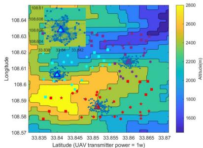  
(a) The Proposed Network: Multiple frequency for air-to-ground communication with D2D for ground-to-ground communication.

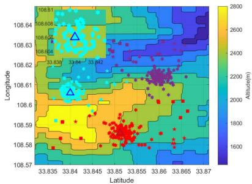  
(b) Network 1: Multi-frequency for air-to-ground communication without D2D for ground-toground communication.

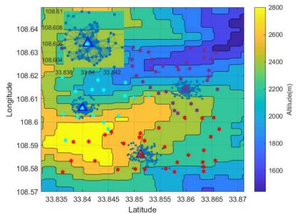  
(c) Network 2: High-frequency for air-to-ground communication with D2D for ground-to-ground communication.

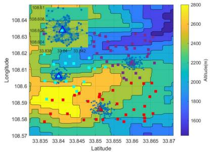  
(d) Network 3: Low-frequency for air-to-ground communication with D2D for ground-to-ground communication.

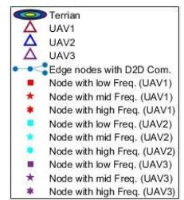  
(e) Legend of figure (a) (b) (c) and (d).

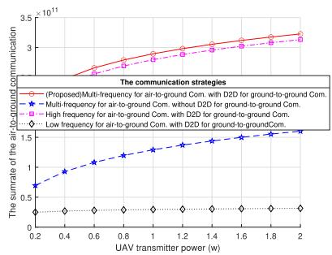  
(f) Transmission rate of the air-to-ground communication.

Fig. 9. Comparison of algorithms for air-to-ground network design in the Taiping National Forest Park, Shaanxi Province, China. The figures (a), (b), (c), and (d) depict the structures of the air-to-ground network using different communication modes. The figure (e) is the legend of figure (a) (b) (c) and (d). The figure (f) presents the transmission rate of the air-to-ground communication between the proposed network and other networks, measuring their air-to-ground communication capacity.  
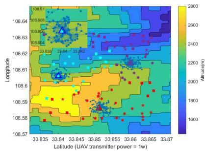  
(a) The Proposed Algorithm: The improved k-means with radio map.

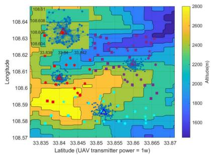  
(b) Algorithm 1: The improved k-means with free space propagation model.

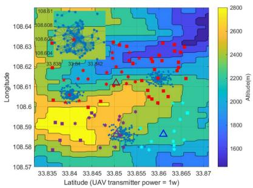  
(c) Algorithm 2: Classical k-means.

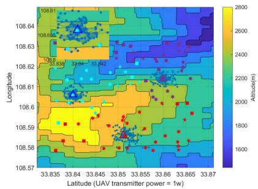  
(d) Algorithm 3: The traversing method with radio map.

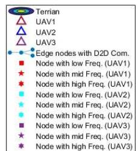  
(e) Legend of figure (a) (b) (c) and (d)

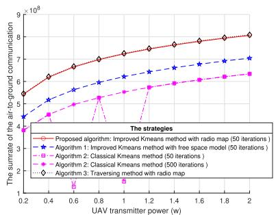  
(f) Transmission rate of the air-to-ground communication.  
Fig. 10. Comparison of algorithms for air-to-ground network design in the Taiping National Forest Park, Shaanxi Province, China. The figures (a), (b), (c), and (d) depict the structures of the air-to-ground network using different algorithms. The figure (e) is the legend of figure (a) (b) (c) and (d). The figure (f) presents the transmission rate of the air-to-ground communication between the proposed algorithms and other algorithms, measuring their air-to-ground communication capacity.

D2D communication capabilities for ground users. UAVs in this structure need to provide air-to-ground communication services for all ground users. Fig.9(c) and Fig.9(d) respectively depict network structure diagrams for air-to-ground communication using high-frequency, wide-bandwidth (Network 2) and low-frequency, narrow-bandwidth (Network 3) singlefrequency carriers. Despite their similar network structures, Fig.9(f) reveals that the system’s air-to-ground communication transmission rate is significantly higher for Network 2 compared with Network 3. However, Network 2 falls short of the air-to-ground communication throughput achieved by the proposed network, which employs multiple frequency carriers. The reason for this disparity lies in the fact that although lowfrequency signals have lower bandwidth, they experience less attenuation in complex terrains compared to high-frequency signals, thereby conferring a significant advantage of transmission rate in covering remote user locations [5].

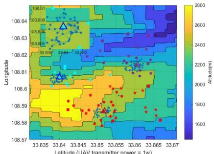  
(a) 200 users.

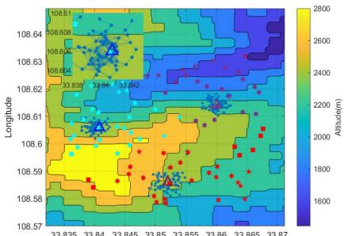  
(b) 300 users.

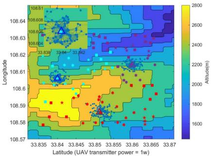  
(c) 400 users.

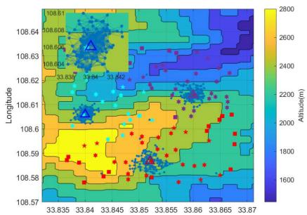  
(d) 500 users.

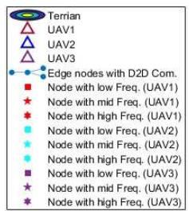  
(e) Legend of figure (a) (b) (c) and (d).

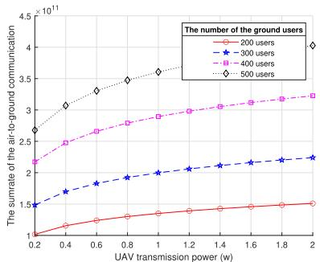  
(f) Sum transmission rate of all users for the air-to ground communication.

Fig. 11. Comparison of different ground user numbers for air-to-ground network design in the Taiping National Forest Park, Shaanxi Province, China. Th figures (a), (b), (c), and (d) depict the structures of the air-to-ground network with different ground user numbers. The figure (e) is the legend of figure (a) (b) (c) and (d). The figure (f) presents the transmission rate with different ground user numbers, measuring their air-to-ground communication capacity.  
  
(a) 2 UAVs.

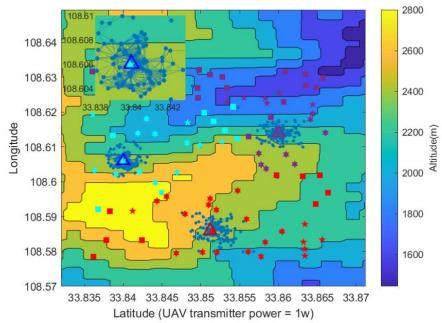

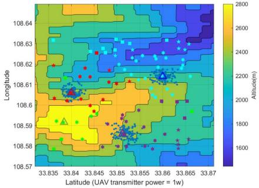

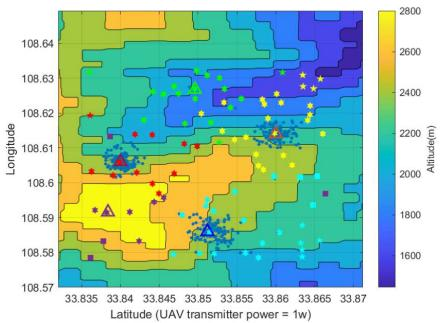  
(d) 5 UAVs.

(b) 3 UAVs.  
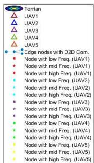  
(e) Legend of figure (a) (b) (c) and (d).

(c) 4 UAVs.  
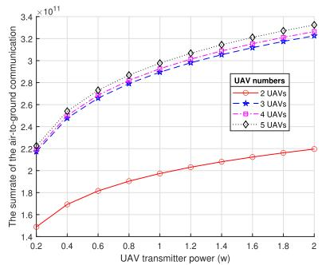  
(f) Transmission rate of the air-to-ground communication.  
Fig. 12. Comparison of different UAV numbers for air-to-ground network design in the Taiping National Forest Park, Shaanxi Province, China. The figures (a), (b), (c), and (d) depict the structures of the air-to-ground network with different UAV numbers. The figure (e) is the legend of figure (a) (b) (c) and (d) The figure (f) presents the transmission rate with different UAV numbers, measuring their air-to-ground communication capacity.

2) Verification With Other UAV Deployment Algorithms: Fig.10 shows that the simulations of the proposed algorithm verse other following algorithms:

(a) The proposed algorithm: Radio map improved k-means (iteration number = 50),

(b) Algorithm 1: The improved k-means with free space propagation model (iteration number = 50),

(c) Algorithm 2: Classical k-means with Euclidean distance [27] (iteration number = 50),

(d) Algorithm 2: Classical k-means with Euclidean distance(iteration number = 500),

(e) Algorithm 3: The traversing method with radio map (The area is divided by 100 × 50 grids).

The network structures of these methods are shown in Fig.10(a), Fig.10(b), Fig.10(c), and Fig.10(d), and Fig.10(f) presents the transmission rate of the air-to-ground communication. Clearly, the proposed algorithm performs much better than Algorithm 1 and Algorithm 2, which is very close to approach Algorithm 3. As the Fig.10(f) shown, algorithm 2 presented instability of the results when the number of iterations was small (50 iterations) in the UAV transmission power index {0.2 : 0.2 : 2}, and it required a larger number of iterations (500 iterations) to converge to the optimal result [34]. Even in the case where the number of iterations is relatively large, the performance of Algorithm 2 (500 iterations) is still inferior to that of the proposed algorithm (50 iterations). Note that Algorithm 3 has high complexity with the area divided to 100 grids, which needs much more time than the proposed method to achieve this simulation.

## B. Verification of the Performance and Robustness

In this section, we simulate the proposed algorithm and network architecture under varying numbers of UAVs and ground users to verify the practicality and robustness of our proposed approach.

1) Verification of User Numbers: Fig.11 shows that the simulations of the proposed approach with varying numbers of ground users. Fig.11(a), Fig.11(b), Fig.11(c), and Fig.11(d) show the network structures for 200, 300, 400, and 500 ground users respectively. Fig.11(f) shows the transmission rate with varying numbers of ground users. The above observations are consistent with our intuitions, and it is clear that the proposed approach works well for the air-to-ground communication.

2) Verification of UAVs Numbers: Fig.12 shows that the simulations of the proposed approach with varying numbers of UAVs. Fig.12(a), Fig.12(b), Fig.12(c), and Fig.12(d) show the network structures with 2, 3, 4, and 5 UAVs respectively. Fig.12(f) illustrates the transmission rate’s increase with the number of UAVs. With 2 UAVs, the rate is notably lower, but it rises and stabilizes with 3 or more UAVs. The data indicates that 3 UAVs offer the best service for all users in the area, and adding more UAVs yields minimal benefits. The optimal number of UAVs for this area and user count is 3.

## V. CONCLUSION

In this paper, we employed multi-frequency radio map assisted UAV relays to bridge the ground D2D network in complex terrain. We modeled the problem and divided it into two subproblems: designing the ground D2D network and deploying UAVs. We focused on creating radio maps for air-to-ground and ground-to-ground links, leveraging geographical-aware propagation models and real-world datasets. Based on the radio maps, we proposed the D2D closeness centrality measure and an improved radio map assisted k-means algorithm to address these problems respectively. The simulation results demonstrated that our approach enhanced the air-to-ground transmission rate and performed better compared to existing methods in an environment using complex terrain data. We also confirmed the robustness of our method by varying the number of UAVs and users. In future work, we can further study the construction of D2D asymmetric airground networks and the optimization of UAV trajectories in dynamic scenarios. Also, we can further incorporate the realtime and various traffic demand to the networks.

## REFERENCES

[1] L. Zhang, Y.-C. Liang, and D. Niyato, “6G visions: Mobile ultrabroadband, super Internet-of-Things, and artificial intelligence,” China Commun., vol. 16, no. 8, pp. 1–14, Aug. 2019.

[2] X. Liu et al., “Placement and power allocation for NOMA-UAV networks,” IEEE Wireless Commun. Lett., vol. 8, no. 3, pp. 965–968, Jun. 2019.

[3] R. Wu, N. Deng, H. Wei, N. Zhao, and G. Zheng, “Performance enhancement for cell-edge users via UAVs in cellular networks,” IEEE Trans. Commun., vol. 73, no. 8, pp. 6720–6733, Aug. 2025.

[4] S. Kasampalis et al., “Longley-rice model prediction inaccuracies in the UHF and VHF TV bands in mountainous terrain,” in Proc. IEEE Int. Symp. Broadband Multimedia Syst. Broadcast., Jun. 2015, pp. 1–5.

[5] D. Tse and P. Viswanath, Fundamentals of Wireless Communication. Cambridge, U.K.: Cambridge Univ. Press, 2005.

[6] S. Bi, J. Lyu, Z. Ding, and R. Zhang, “Engineering radio maps for wireless resource management,” IEEE Wireless Commun., vol. 26, no. 2, pp. 133–141, Apr. 2019.

[7] O. Mehanna and N. D. Sidiropoulos, “Frugal sensing: Wideband power spectrum sensing from few bits,” IEEE Trans. Signal Process., vol. 61, no. 10, pp. 2693–2703, May 2013.

[8] M. Lee and D. Han, “Voronoi tessellation based interpolation method for Wi-Fi radio map construction,” IEEE Commun. Lett., vol. 16, no. 3, pp. 404–407, Mar. 2012.

[9] D. Denkovski, V. Atanasovski, L. Gavrilovska, J. Riihijarvi, and¨ P. Mah¨ onen, “Reliability of a radio environment map: Case of spa-¨ tial interpolation techniques,” in Proc. 7th Int. ICST Conf. Cognit. Radio Oriented Wireless Netw. Commun. (CROWNCOM), Jun. 2012, pp. 248–253.

[10] J. J. Danielson and D. B. Gesch, Global Multi-Resolution Terrain Elevation Data 2010 (GMTED2010). Reston, VA, USA: U.S. Department of the Interior, U.S. Geological Survey, 2011.

[11] P. Gajewski, “Propagation models in radio environment map design,” in Proc. Baltic URSI Symp. (URSI), May 2018, pp. 234–237.

[12] A. Nadeem, A. Ullah, and W. Choi, “Social-aware peer selection for energy efficient D2D communications in UAV-assisted networks: A Q-learning approach,” IEEE Wireless Commun. Lett., vol. 13, no. 5, pp. 1468–1472, May 2024.

[13] H. T. Nguyen, H. D. Tuan, T. Q. Duong, H. V. Poor, and W.-J. Hwang, “Joint D2D assignment, bandwidth and power allocation in cognitive UAV-enabled networks,” IEEE Trans. Cognit. Commun. Netw., vol. 6, no. 3, pp. 1084–1095, Sep. 2020.

[14] W. Huang et al., “Joint power, altitude, location and bandwidth optimization for UAV with underlaid D2D communications,” IEEE Wireless Commun. Lett., vol. 8, no. 2, pp. 524–527, Apr. 2019.

[15] S. Ghosh, A. Bhowmick, S. D. Roy, and S. Kundu, “A UAV based multihop D2D network for disaster management,” in Proc. IEEE INFOCOM Conf. Comput. Commun. Workshops (INFOCOM WKSHPS), May 2021, pp. 1–6.

[16] P. Chen, X. Zhou, J. Zhao, F. Shen, and S. Sun, “Energy-efficient resource allocation for secure D2D communications underlaying UAV-enabled networks,” IEEE Trans. Veh. Technol., vol. 71, no. 7, pp. 7519–7531, Jul. 2022.

[17] T. Fang, D. Wu, M. Wang, and J. Chen, “Multi-stage hierarchical channel allocation in UAV-assisted D2D networks: A Stackelberg game approach,” China Commun., vol. 18, no. 2, pp. 13–26, Feb. 2021.

[18] J. Ji, K. Zhu, D. Niyato, and R. Wang, “Joint trajectory design and resource allocation for secure transmission in cache-enabled UAVrelaying networks with D2D communications,” IEEE Internet Things J., vol. 8, no. 3, pp. 1557–1571, Feb. 2021.

[19] X. Yuan, Y. Hu, J. Gross, and A. Schmeink, “Radio-map-based UAV placement design for UAV-assisted relaying networks,” in Proc. IEEE Stat. Signal Process. Workshop (SSP), Jul. 2021, pp. 286–290.

[20] Q. Chen, H. Zhu, L. Yang, X. Chen, S. Pollin, and E. Vinogradov, “Edge computing assisted autonomous flight for UAV: Synergies between vision and communications,” IEEE Commun. Mag., vol. 59, no. 1, pp. 28–33, Jan. 2021.

[21] S. Zhang and R. Zhang, “Radio map-based 3D path planning for cellular-connected UAV,” IEEE Trans. Wireless Commun., vol. 20, no. 3, pp. 1975–1989, Mar. 2021.

[22] Y. Dong, C. He, Z. Wang, and L. Zhang, “Radio map assisted path planning for UAV anti-jamming communications,” IEEE Signal Process. Lett., vol. 29, pp. 607–611, 2022.

[23] X. Mo, Y. Huang, and J. Xu, “Radio-map-based robust positioning optimization for UAV-enabled wireless power transfer,” IEEE Wireless Commun. Lett., vol. 9, no. 2, pp. 179–183, Feb. 2020.

[24] J. Chen and D. Gesbert, “Efficient local map search algorithms for the placement of flying relays,” IEEE Trans. Wireless Commun., vol. 19, no. 2, pp. 1305–1319, Feb. 2020.

[25] C. He, Y. Dong, and Z. J. Wang, “Radio map assisted multi-UAV target searching,” IEEE Trans. Wireless Commun., vol. 22, no. 7, pp. 4698–4711, Jul. 2023.

[26] Y. Dong, C. He, and Z. J. Wang, “Dynamic object tracking by multi-UAV with time-variant radio maps,” IEEE Trans. Wireless Commun., vol. 23, no. 7, pp. 7471–7487, Jul. 2024.

[27] J. Mi, X. Wen, C. Sun, Z. Lu, and W. Jing, “Energy-efficient and low package loss clustering in UAV-assisted WSN using Kmeans++ and fuzzy logic,” in Proc. IEEE/CIC Int. Conf. Commun. Workshops China (ICCC Workshops), Aug. 2019, pp. 210–215.

[28] W. Khawaja, I. Guvenc, D. W. Matolak, U. C. Fiebig, and N. Schneckenburger, “A survey of air-to-ground propagation channel modeling for unmanned aerial vehicles,” IEEE Commun. Surveys Tuts., vol. 21, no. 3, pp. 2361–2391, 3rd Quart., 2019.

[29] K. Chamberlin and R. Luebbers, “An evaluation of longley-rice and GTD propagation models,” IEEE Trans. Antennas Propag., vol. AP-30, no. 6, pp. 1093–1098, Nov. 1982.

[30] Q. Yi, Research on Electromagnetic Wave Propagation Model of Sea Area. Haikou, Hainan: Hainan Univ., Hainan, 2015.

[31] O. Contributors. (2025). Welcome To OpenStreetMap. Accessed: Feb. 12, 2025. [Online]. Available: https://www.openstreetmap.org

[32] V. D. Tuong, W. Noh, and S. Cho, “Spatial deep learning-based dynamic TDD control for UAV-assisted 6G hotspot networks,” IEEE Trans. Ind. Informat., vol. 20, no. 9, pp. 11092–11102, Sep. 2024.

[33] M. Coscia, “The atlas for the aspiring network scientist,” 2021, arXiv:2101.00863.

[34] A. Vattani, “K-means requires exponentially many iterations even in the plane,” in Proc. 25th Annu. Symp. Comput. Geometry. New York, NY, USA: Association for Computing Machinery, Jun. 2009, pp. 324–332.

[35] E. W. Forgy, “Cluster analysis of multivariate data: Efficiency versus interpretability of classifications,” Biometrics, vol. 21, pp. 768–769, Jan. 1965.

[36] G. Hamerly and C. Elkan, “Alternatives to the k-means algorithm that find better clusterings,” in Proc. 11th Int. Conf. Inf. Knowl. Manage. New York, NY, USA: ACM, 2002, pp. 600–607.

[37] DJI. (2025). Mavic 3 Pro-Specs. Accessed: Feb. 12, 2025. [Online]. Available: https://www.dji.com/cn/mavic-3-pro/specs

[38] A. R. Mishra, Fundamentals of Network Planning and Optimisation 2G/3G/4G: Evolution To 5G. Hoboken, NJ, USA: Wiley, 2018, pp. 295–313.

Yangrui Dong received the B.Eng. degree in communication engineering and the Ph.D. degree in computer science from Northwest University, Xi’an, China, in 2020 and 2025, respectively. He is currently with China Unicom Group Company Ltd., Guangdong Branch, Guangzhou, China. His research interests include UAV communications, radio map, and target localization.

Chen He (Member, IEEE) received the B.Eng. degree (summa cum laude) in electrical and computer engineering from McMaster University in 2007 and the M.A.Sc. and Ph.D. degrees in electrical and computer engineering from The University of British Columbia (UBC), Vancouver, in 2009 and 2014, respectively. He was a Research Engineer with Blackberry Ltd., Canada, and a Post-Doctoral Research Fellow with UBC. He is currently a Full Professor with Northwest University, China. His research interests are the area of wireless communications and signal processing. He is serving as an Associate Editor for the IEEE SIGNAL PROCESSING LETTERS.

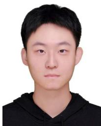

Huiyu Bai received the B.Eng. degree in communication engineering from Xidian University, Xi’an, China, in 2022. He is currently pursuing the Ph.D. degree in computer science with Northwest University, Xi’an, China. His current research interests include UAV communications, target localization, and trajectory planning.

Dusit Niyato (Fellow, IEEE) received the B.Eng. degree from the King Mongkut’s Institute of Technology Ladkrabang (KMITL), Thailand, and the Ph.D. degree in electrical and computer engineering from the University of Manitoba, Canada. He is currently a Professor with the College of Computing and Data Science, Nanyang Technological University, Singapore. His research interests include mobile generative AI, edge intelligence, quantum computing and networking, and incentive mechanism design.

Z. Jane Wang (Fellow, IEEE) received the B.Sc. degree in electrical engineering from Tsinghua University, China, in 1996, and the M.Sc. and Ph.D. degrees in electrical engineering from the University of Connecticut, in 2000 and 2002, respectively. She has been a Research Associate with the Electrical and Computer Engineering Department, University of Maryland, College Park. Since 2004, she has been with the Department Electrical and Computer Engineering, The University of British Columbia, Canada, where she is currently a Professor. Her research interests include statistical signal processing theory and applications, with focus on multimedia security and biomedical signal processing and modeling. While with the University of Connecticut, she received the Outstanding Engineering Doctoral Student Award. She co-received the EURASIP Journal on Applied Signal Processing (JASP) Best Paper Award in 2004 and the IEEE Signal Processing Society Best Paper Award in 2005. She is the Chair and the Founder of the IEEE Signal Processing Chapter at Vancouver. She is serving as an Associate Editor for IEEE TRANSACTIONS ON SIGNAL PROCESSING, IEEE TRANSACTIONS ON INFORMATION FORENSICS AND SECURITY, and IEEE TRANSACTIONS ON BIOMEDICAL ENGINEERING.