# Multi-Functional RIS-Assisted Semantic Anti-Jamming Communication and Computing in Integrated Aerial-Ground Networks

Yifu Sun , Zhi Lin , Kang An , Dong Li , Senior Member, IEEE, Cheng Li, Yonggang Zhu , Derrick Wing Kwan Ng , Fellow, IEEE, Naofal Al-Dhahir , Fellow, IEEE, and Jiangzhou Wang, Fellow, IEEE

Abstract— Mobile edge computing-assisted integrated aerial-ground network (MEC-IAGN) emerges as a promising key component of the sixth-generation (6G) wireless networks due to its potential capabilities in providing ubiquitous connectivity for global coverage and computing services. However, the inevitable existences of computation-intensive tasks, uncontrollable propagation environment, and malicious jamming attacks pose three significant bottlenecks for enabling efficient MEC-IAGN. With these focuses, we propose a novel framework of multi-functional reconfigurable intelligent surface (MF-RIS) aided semantic anti-jamming communication and computing in MEC-IAGN. Under this framework, a semantic transceiver exhibits inherent robustness and data compression capability, and MF-RIS can customize the full-space wireless environment by leveraging its signal reflection, refraction, amplification, and energy harvesting functions, thereby achieving substantial global coverage, reliable connectivity, and high-rate computing. Based on our proposed framework, we formulate a semantic computation rate maximization problem considering the impacts

Received 15 February 2024; revised 17 June 2024; accepted 5 August 2024. Date of publication 12 September 2024; date of current version 22 November 2024. This work was supported in part by the National Natural Science Foundation of China under Grant 61901502, Grant 62201592, Grant 62471477, and Grant 62131005; in part by the Research Plan Project of the National University of Defense Technology under Grant ZK21-33; in part by the Young Elite Scientist Sponsorship Program of China Association for Science and Technology (CAST) under Grant 2021-JCJQ-QT-048; in part by the National Postdoctoral Program for Innovative Talents under Grant BX20200101; and in part by the Science and Technology Development Fund, Macau, SAR, under Grant 0188/2023/RIA3. An earlier version of this paper was presented in part at the International Conference on Wireless Communications and Signal Processing (WCSP), Hefei, China, in 2024. (Corresponding authors: Zhi Lin; Dong Li.)

Yifu Sun, Kang An, Cheng Li, and Yonggang Zhu are with the Sixty-Third Research Institute, National University of Defense Technology, Nanjing 210007, China (e-mail: sunyifu\_nudt@163.com; ankang89@ nudt.edu.cn; licheng@nudt.edu.cn; zhumaka1982@163.com).

Zhi Lin is with the College of Electronic Engineering, National University of Defense Technology, Hefei 230037, China (e-mail: linzhi945@163.com).

Dong Li is with the School of Computer Science and Engineering, Macau University of Science and Technology, Macau, China (e-mail: dli@must.edu.mo).

Derrick Wing Kwan Ng is with the School of Electrical Engineering and Telecommunications, University of New South Wales, Sydney, NSW 2025, Australia (e-mail: w.k.ng@unsw.edu.au).

Naofal Al-Dhahir is with the Department of Electrical and Computer Engineering, The University of Texas at Dallas, Richardson, TX 75080 USA (e-mail: aldhahir@utdallas.edu).

Jiangzhou Wang is with the School of Information Sciences and Engineering, Southeast University, Nanjing 211111, China (e-mail: j.z.wang@seu.edu.cn).

Color versions of one or more figures in this article are available at https://doi.org/10.1109/JSAC.2024.3459028.

Digital Object Identifier 10.1109/JSAC.2024.3459028

of jammer’s channel state information (CSI) imperfection, while maintaining the energy partition constraint for computation offloading decision, semantic similarity requirement, semantic computation rate target, and MF-RIS’s self-sustainability. Then, by transforming the imperfect CSI into a worst-case one by exploiting a discretization method, we propose a fast-converging monotonic optimization algorithm that is combined with decoupling second-order cone programming to obtain a globally optimal solution with fewer feasibility evaluations. Furthermore, to strike a satisfactory tradeoff between performance and computational complexity, we develop a suboptimal generalized power iteration algorithm. Numerical simulations demonstrate the superiority of our proposed framework and algorithms compared to various benchmarks.

Index Terms— Integrated aerial-ground network, mobile edge computing (MEC), multi-functional RIS, semantic anti-jamming communication and computing, robust optimization.

# I. INTRODUCTION

TO COMMERCIALIZE emerging applications (e.g.,enhanced mobile broadband, ultra-reliable low-latency enhanced mobile broadband, ultra-reliable low-latency communication, massive machine type communication, etc.), sixth-generation (6G) networks are required to provide global coverage and computing services [1], [2], [3]. Consequently, integrated aerial-ground networks (IAGN), which interconnects aerial platforms (APs) and terrestrial nodes, have been widely utilized to provide enhanced coverage and ubiquitous connectivity for massive users [4]. On the other hand, mobile edge computing (MEC) extends cloud computing to both power-constrained devices and the network edge, thereby enabling low-latency and stable computing services anywhere [5], [6]. However, there are still three main potential bottlenecks with the application of MEC-IAGN. First, due to the popularization of intelligent applications (e.g., augmented reality and seamless holographic services), computation-intensive tasks involve handling a large volume of data, thus leading to high latency. Second, complex weather conditions, stochastic aerial shadowing, and the long-distance transmission in MEC-IAGN create a poor and uncontrollable wireless propagation environment, often causing low offloading rates and limited coverage. Third, given the inherent broadcast and superposition nature of open wireless media, MEC-IAGN is vulnerable to jamming attacks, leading to the potential failure of computation tasks [7], [8].

To alleviate the aforementioned bottlenecks, various techniques have been developed recently, which can be categorized into three approaches [1]. The first approach involves constructing heterogeneous networks by deploying multi-layer APs and terrestrial nodes for enhancing spectrum utilization and access availability. Specifically, the users can select the optimal edge servers for collaborative offloading, thus mitigating the computation burden and the negative effects induced by poor environment [9]. The second approach adopts massive antennas at the transceiver to enhance array aperture gain and degrees-of-freedom (DoFs) for effective jamming/interference mitigation. This leads to a significant offloading rate improvement without increasing transmit power and bandwidth [10]. The third approach utilizes wider bandwidth and higher carrier frequency, enabling users to choose substantial bandwidth and appropriate frequency to achieve high offloading rates, overcome stochastic fading, and avoid malicious jamming attacks [7]. Although these techniques have shown their effectiveness in enhancing the anti-jamming communication and computing performance of IAGN, they entail prohibitive implementation costs and consume additional bandwidth/energy. This has motivated the exploration of other effective techniques to address the bottlenecks of MEC-IAGN in the 6G era.

# A. Emerging Techniques for 6G Applications

Recently, two promising 6G techniques, namely, reconfigurable intelligent surfaces (RIS) and semantic communication, have promoted the rapid development of various advanced applications. Thus, we start by reviewing the above techniques.

1) Reconfigurable Intelligent Surfaces (RIS): The emerging RIS technique has demonstrated significant potentials in proactively customizing the wireless propagation environment, since it can manipulate electromagnetic waves in a cost-effective and energy-efficient manner [11]. By employing an RIS, it is possible to establish additional reconfigurable propagation paths, thereby increasing service coverage [11], [12], [13], [14], maximizing achievable rate/energy efficiency [15], [16], [17], [18], [19], enhancing physical layer security [20], [21], [22], [23], [24], [25], and improving MEC performance [26], [27], [28], [29], [30]. For instance, the authors in [26] investigated the impact of passive RIS on computational performance in MEC networks, where the sum computational bits were maximized by jointly optimizing the CPU frequency, the offloading time allocation, and the phase shifts of passive RIS. Additionally, RIS has also been successfully applied in unmanned aerial vehicle (UAV) aided MEC-IAGN to extend UAV’s low endurance limits and improve offloading energy efficiency [27]. Besides, considering potential eavesdropping attacks, the authors in [28] proposed a RIS-aided secure MEC network, where the max-min computation efficiency was maximized taking into account the secure computation rate requirements. However, these works on RIS-aided MEC utilized the passive RIS, which suffer from limited half-space coverage and severe multiplicative fading effects. With these focuses, the authors in [29] adopted simultaneously transmitting and reflecting RIS (STAR-RIS) to provide full-space service coverage and new DoFs for enhancing computation rates for end users. In addition, to circumvent multiplicative fading effects, active RIS was employed in [30] to minimize maximum computational latency. Nevertheless, in view of the energy consumption on the RIS side, it is challenging to deploy active RIS in MEC networks, since it requires a large amount of energy compared to passive RIS. Obviously, neither passive RIS/STAR-RIS nor active RIS has fully tapped into potential of the RIS in enhancing MEC networks. On the other hand, it was shown in [31] that the capacity performance with continuous phase shifts is nearly identical to that with discrete ones when the quantized bits are at least 3. In [31] and [32], it was observed that capacity and energy efficiency scale as a concave logarithmical function of the number of RIS units.

2) Semantic Communication: Different from Shannon communication, which directly transmits the bit sequence representing an entire source, semantic communication only transmits the key information by eliminating irrelevant information without any performance degradation [33]. The great benefits introduced by semantic communication have been demonstrated for different types of sources, including text [34], speech [35], and image [36]. These works have showed that semantic communication can significantly improve spectral efficiency (SE), energy efficiency, and transmission reliability. However, most existing semantic works (e.g., [34]) focused on the extraction and recovery of semantic information by exploiting various deep learning-based source and channel coding technologies. Only a few works have studied the problem of how to implement efficient resource management in semantic communication. In [37], the authors designed a semantic-aware resource allocation, optimizing the channel assignment and the number of transmitted symbols to maximize semantic SE. Building upon these foundations, the resource management of semantic communication has sprouted up in various aspects, such as non-orthogonal multiple access [33], extended reality [38], MEC [39], [40], etc. To alleviate network congestion induced by large data volumes, the authors in [39] proposed a semantic-aware joint communication and computation resource allocation framework for MEC networks, where the energy consumption was minimized by designing the joint semantic-aware division factor, communication and computation resource management. However, existing designs for semantic MEC networks have been limited to simplistic single-antenna scenario, which requires in-depth investigation.

# B. Motivation

The seamless integration of RIS and semantic communication under MEC-IAGN is expected to further mitigate the aforementioned bottlenecks. Before proceeding, we first elaborate on our motivation from the following three perspectives:

Why does MEC-IAGN need both RIS and semantic communication? The main advantage of RIS resides in its capability to reconfigure the wireless propagation environment, providing extensive coverage, and suppressing jamming/interference to realize reliable connectivity [21].

Besides, semantic communication excels in significantly reducing the volume of offloading tasks, and often achieving satisfactory performance in low signal-to-jamming-noise ratio (SJNR) regimes [33]. Hence, both RIS and semantic communication can significantly enhance offloading rate of MEC-IAGN with low energy consumption and hardware costs, especially in long-distance stochastic jamming environments. However, the promised performance benefits of RIS rely on the availability of accurate and instantaneous channel state information (CSI), while semantic communication relies on a pre-trained knowledge base, which may not be applicable to the stochastic channels. Fortunately, each one can counterbalance the other’s drawback by leveraging its own strengths. Specifically, the robustness of semantic communication in an imperfect regime can ease the stringent requirement for CSI in RIS-aided MEC-IAGN, and RIS offers a stable channel for semantic communication. To sum up, they are mutually beneficial solutions that significantly enhance the scalability, coverage and reliability of MEC-IAGN services.

▶ How to design a framework of RIS-assisted semantic antijamming communication and computing in IAGN? Although RIS and semantic communication have proven their advantages in MEC, the specific framework of RIS-assisted semantic anti-jamming communication and computing has not yet been investigated in MEC-IAGN, particularly in the presence of CSI imperfection. To elaborate, as stated before, the existing passive RIS [27], STAR-RIS [29], and active RIS [41] aided MEC-IAGN either suffer from severe multiplicative fading effects and limited half-space coverage, or require high power consumption. Thus, a novel RIS-aided MEC-IAGN aiming to overcome the aforementioned drawbacks should be developed. Besides, the existing semantic MEC networks only considered the single-antenna terrestrial scenario (e.g., [37]), which is not applicable to RIS-aided multi-antenna MEC-IAGN. Moreover, previous works tend to overlook jamming attacks, where the joint design of RIS and semantic communication should be focused also on anti-jamming. Thus, a framework of RIS-aided semantic anti-jamming communication and computing is not merely a straightforward integration of two techniques, but rather requires a strategic design for each technique, as well as an appropriate bond to harness their combined strengths.

▶ How to implement resource management and computation offloading for the proposed framework? The novel framework designed must introduce new concepts of resource management and computation offloading. Specifically, compared to existing works, the integration of RIS and semantic communication under jamming attacks leads to distinct offloading schemes and poses a challenging optimization problem. In particular, this problem involves solving a large number of tightly coupled variables. Besides, the novel RIS architecture necessitates more complicated resource configuration, especially with imperfect CSI. Most importantly, various RIS-aided semantic MEC metrics involve complex expressions, rendering existing convex optimization methods are unsuitable. Hence, the tuning of the proposed framework requires the development of unified and efficient optimization algorithms.

# C. Contributions

Motivated by the aforementioned observations, in this paper, we propose a novel RIS-aided MEC-IAGN. The main contributions of this paper are summarized as follows:

• We establish a novel framework of anti-jamming communication and computing in IAGN by leveraging a semantic transceiver and a multi-functional RIS (MF-RIS)1. In [42], the architecture, system modeling, and performance optimization of MF-RIS was developed, where the phase shifts and amplitude of refraction and reflection can be independently manipulated to enhance the performance of wireless networks. However, achieving this level of control in practice presents challenges. Thus, the authors in [44] further investigated the scenario with the coupled amplitude and phase shift model for the MF-RIS. Besides, MF-RIS has also been utilized to enhance the performance of cell-free networks [45], non-orthogonal multiple-access (NOMA) networks [46], physical layer security [47], etc. [42] for achieving substantial global coverage, reliable connectivity, and high-rate computing. The employed MF-RIS possesses capabilities for signal reflection, refraction, amplification, and energy harvesting, which help overcome the drawbacks of half-space coverage, multiplicative fading, and reliance on battery prevalent in existing RIS technologies, thus establishing a favorable environment for semantic-aware MEC-IAGN. When combined with the inherent robustness and data compression capability of semantic communication, our framework promises enhanced computational efficiency with reduced power consumption and lower hardware cost, particularly in scenarios involving malicious jamming attacks and CSI imperfection. To the best of our knowledge, this is the first work to investigate MF-RIS aided semantic MEC-IAGN under jamming attacks, while the existing works either considered the conventional RIS-aided Bit-MEC (e.g., [27]) or single-antenna semantic MEC (e.g., [37]).

• We formulate a semantic computation rate maximization problem which focuses on optimizing the local and offloaded semantic computation rate under jamming attacks and CSI imperfection, while maintaining the semantic similarity requirement, semantic computation rate target, and MF-RIS’s self-sustainability, by jointly optimizing the energy partition parameter for computation offloading decision, transmit precoder, MF-RIS’s mode/coefficient matrices, and receive decoder. Different from the existing works aiming at bit computation rate maximization problem with a concave logarithmical objective function and perfect CSI, e.g., [29], our formulation considers an intractable one with quasi-convex “S” shape objective functions and jammer’s CSI imperfection, which have not been handled in the literature yet.

1Recently, to overcome the practical drawbacks of existing RIS technologies, MF-RIS has been proposed to achieve full-space signal manipulation while alleviating the multiplicative fading effects and maintaining low power consumption 1¸0225701,10198355,10313072,10504587,10021586,10146504 • We develop a fast-converging monotonic optimization algorithm combined with decoupling second-order cone programming (MO-DSOCP) to solve the intractable formulated problem consisting of a quasi-convex objective function and mixed-integer non-linear programming (MINLP) constraints. Specifically, a novel sequential partition and relocation method is proposed to reduce the total number of MO’s feasibility evaluations, and DSOCP can update the optimization variables simultaneously in each iteration. In addition, we transform the jammer’s CSI imperfection into a worst-case one by exploiting the discretization method. It is worth-mentioning that our proposed MO-DSOCP algorithm is not based on a specific expression for the objective function, thus can be regarded as a unified algorithm for other semantic-aware applications with more intractable objectives, broadening its scope of usability in the field.

• We also propose a low-complexity suboptimal algorithm to obtain a satisfactory tradeoff between performance and complexity. To elaborate, a generalized power iteration (GPI) algorithm is proposed to derive a semiclosed-form solution for the transmit precoder, and a heuristic optimization is developed to design the remaining variables. Simulation results unveils that the proposed MF-RIS-aided semantic MEC-IAGN can achieve higher computation rate and wider coverage than both the other RIS-aided ones and bit MEC-IAGN, especially under high jamming power and inter-user interference. Besides, our proposed algorithms outperform the existing ones in terms of convergence, computation rate, and computational complexity.

The remainder of this work is organized as follows. The system model and the problem formulation are presented in Section II. In Sections III and IV, the fast-converging MO-DSOCP framework and low-complexity suboptimal algorithm are proposed to address the formulated beamforming design problem. Numerical results are provided in Section V. We conclude this paper in Section VI.

Notation: $\mathbf { X } ^ { H } , \mathbf { X } ^ { T } , \mathbf { X } ^ { * }$ , and $\| \mathbf { X } \| _ { F }$ denote conjugate transpose, transpose, conjugate, and Frobenius norm of a matrix X. The notations E{·}, tr{·}, ℜ{·}, ℑ{·} and $\lambda \{ \cdot \}$ denote the expectation, trace, real part, imaginary part, and eigenvalue of a complex number or matrix, respectively. $\mathbb { C } ^ { m \times n }$ represents the complex space of $m \times n$ dimensions. The symbol $\mathbb { H } ^ { n \times n }$ is the Hermitian matrix of $n \times n$ dimensions. $[ \cdot ] _ { n , n }$ represents the nth diagonal element of a matrix. The distribution of a circularly symmetric complex Gaussian (CSCG) random vector with mean vector x and covariance matrix Σ is denoted by $\mathcal { C N } ( x , \Sigma )$ . diag is a diagonal matrix. $\mathcal { R } _ { + } ^ { K }$ is the N-dimensional non-negative real domain.

# II. SYSTEM MODEL AND PROBLEM FORMULATION

# A. MEC Integrated Aerial-Ground Network Model

As shown in Fig. 1, we consider a new MEC-IAGN, where an aerial platform (AP) performs local computing onaboard and simultaneously communicates with K ground base stations (GBSs) for offloading partial computation tasks,2 thereby executing intensive computation tasks with a limited energy budget. Besides, there are R jammers utilizing omnidirectional single antenna to impair the signal reception at the GBSs from all angles, thus degrading the MEC performance. To enable anti-jamming communication and computing efficiently, semantic communication and MF-RIS are adopted, which can greatly compress the volume of offloading tasks and construct a controllable wireless environment, thereby reducing the time latency, spectrum resources, and required power. The entire three-dimensional (3D) space is divided into two halves by the MF-RIS. As such, we denote the reflected and refracted regions as R and T, respectively. Without loss of generality, the set of reflective and refracted GBSs are represented as ${ \mathcal { K } } _ { \mathrm { R } } \in \{ 1 , 2 , \cdots , K _ { \mathrm { R } } \}$ and $\begin{array} { r l r } { \mathcal { K } _ { \mathrm { T } } } & { { } \in } & { \left\{ K _ { \mathrm { R } } + 1 , K _ { \mathrm { R } } + 2 , \cdots , K _ { \mathrm { R } } + K _ { \mathrm { T } } \right\} } \end{array}$ , where $K \ = \ K _ { \mathrm { R } } + K _ { \mathrm { T } }$ . In addition, the gateway (GW) acts as a control center to collect various kinds of information and implement resource allocation in the entire network [49]. This enables AP to effectively cooperate with MF-RIS for synchronizing the RIS’s coefficients and transmit beamformer. Furthermore, we assume that the AP and each GBS are equipped with M and L antennas, respectively, and MF-RIS consists of N RIS units. For exposition, we denote $\mathbf { G } \in \mathbb { C } ^ { N \times M } , \mathbf { H } _ { k } \in \mathbb { C } ^ { L \times N } , \mathbf { D } _ { k } \in \mathbb { C } ^ { L \times \hat { M } } , \mathbf { g } _ { r } \in \mathbb { C } ^ { N \times 1 }$ , and $\mathbf { d } _ { r k } \in \mathbb { C } ^ { L \times 1 }$ as the channels between the AP and MF-RIS, between the MF-RIS and the k-th GBS, between the AP and the k-th GBS, between the r-th jammer and the MF-RIS, and between the r-th jammer and the k-th GBS, respectively.

# B. MF-RIS’s Architecture, Signal, and EH Model

As illustrated in Fig. 1, each MF-RIS unit has two operation modes, i.e., the energy harvesting mode (E mode) and the reflecting & refracting mode (R mode), with each unit capable of flexibly switching between these modes [42]. In E mode, the units employ an energy harvesting circuit to harvest the radiofrequency (RF) energy from the incident superimposed signals, subsequently converting it into direct current (DC) power to support the simultaneous reflection, refraction, and amplification of the incident signals. In R mode, the incident signals can be reflected and refracted into two half-spaces, respectively, by manipulating the magnetic and electric currents, and simultaneously amplified via current-inverting converters. To elaborate, the MF-RIS unit adopts symmetrical reflective and refractive layers to enable the reflection and refraction of incident signals, while an amplification layer is simultaneously used to dynamically adjust the amplitude of both reflected and refracted signals [43]. It is important to note that MF-RIS does not require any external power supply, since the harvested energy in E mode can be leveraged to sustain operations in R mode [42]. Furthermore, each unit can operate exclusively in either E or R mode. In practice, there have been various

2Partial offloading mode in [5] is adopted in this paper, where the overall computation tasks are partitioned to multiple subtasks with arbitrary size for facilitating the offloading and parallel execution in different GBSs. Due to the MEC server’s strong computation and storage capabilities, the size of offloading computation results are much smaller than that of original input tasks, such that the computation downloading from GBSs to AP can be ignored practically [48].

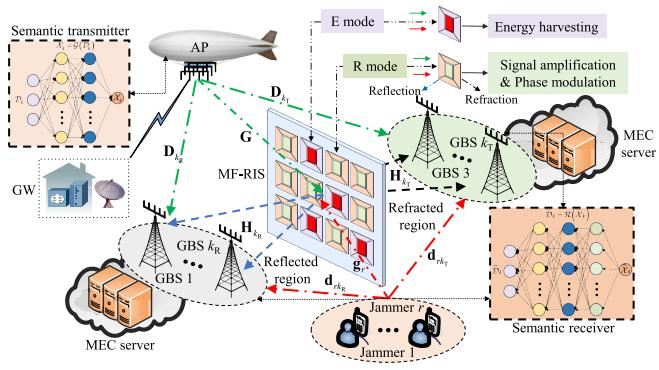

flowchart

```mermaid
graph TD
    A["AP"] -->|D_kg| B["MF-RIS"]
    B -->|G| C["Refracted region"]
    C -->|d_rk_t| D["Jammer r"]
    D --> E["Semantic receiver"]
    E --> F["MEC server"]
    F --> G["MEC server"]
    G --> H["GBS 1"]
    H --> I["GBS kR"]
    I --> J["Reflected region"]
    J --> K["H_{sR}"]
    K --> L["Refracted region"]
    L --> M["H_{sL}"]
    M --> N["GBS 3"]
    N --> O["Energy harvesting"]
    O --> P["E mode"]
    P --> Q["Signal amplification & Phase modulation"]
    Q --> R["R mode"]
    R --> S["Reflection"]
    S --> T["Refraction"]
    T --> U["GBS kT"]
    U --> V["MEC server"]
    V --> W["MEC server"]
    W --> X["GBS 1"]
    X --> Y["GBS kR"]
    Y --> Z["Reflected region"]
    Z --> AA["H_{sR}"]
    AA --> AB["Refracted region"]
    AB --> AC["H_{sL}"]
    AC --> AD["GBS 3"]
    AD --> AE["Energy harvesting"]
    AE --> AF["E mode"]
    AF --> AG["Energy harvesting"]
```

Fig. 1. The illustration of an MF-RIS-aided MEC-IAGN.

research contributions focused on the prototype design of MF-RIS. These prototypes support signal reflection/refraction [50], amplification [51], and energy harvesting [52], backed by solid theoretical foundations and or real-world experiments.

Mathematically, the signal model of the adopted MF-RIS can be described as follows. Denote $s _ { n }$ as the incident signal to the n-th RIS unit. Borrowing the terminology coined in [42] and [53], the corresponding output signals of the n-th RIS unit at the harvested, reflected, and refracted parts are expressed as $y _ { \mathrm { E } , n } = \left( 1 - \varsigma _ { n } \right) s _ { n } , y _ { \mathrm { R } , n } = \varsigma _ { n } \sqrt { \alpha _ { \mathrm { R } , n } } e ^ { j \theta _ { \mathrm { R } , n } } s _ { n } ,$ and $y _ { \mathrm { T } , n } ~ = ~ \varsigma _ { n } \sqrt { \alpha _ { \mathrm { T } , n } } e ^ { j \theta _ { \mathrm { T } , n } } s _ { n } ,$ , respectively, where $\varsigma _ { n } =$ $\{ 0 , 1 \} , \ \alpha _ { \mathrm { R } , n } , \alpha _ { \mathrm { T } , n } \ \in \ [ 0 , \alpha _ { \mathrm { m a x } } ]$ , and $\theta _ { \mathrm { R } , n } , \theta _ { \mathrm { T } , n } \in [ 0 , 2 \pi )$ are the mode switching coefficient, the reflective and refractive amplitude coefficients, and the reflective and refractive phase shifts, respectively. To elaborate, $\varsigma _ { n } ~ = ~ 0$ denotes that the n-th unit operates in E mode, while $\varsigma _ { n } = 1$ indicates that it operates in R mode. Here, $\alpha _ { \operatorname* { m a x } } \geq 1$ is the maximum power amplification factor introduced by magnetic amplifier circuits, and the total energy consumption of both the reflective and refractive amplifier must be lower than $\alpha _ { \mathrm { m a x } } ,$ i.e., $\alpha _ { \mathrm { R } , n } \ +$ $\alpha _ { \mathrm { T } , n } \leq \alpha _ { \mathrm { m a x } } .$ . Then, by packing all the N signals $s _ { n } { } ^ { \prime } \mathbf { s } , y _ { \mathrm { E } , n } { } ^ { \prime } \mathbf { s } ,$ $y _ { \mathrm { R } , n } \mathrm { \bar { s } } ,$ and $y _ { \mathrm { T } , n } \mathrm { ^ { \circ } s }$ into ${ \bf s } , { \bf y } _ { \mathrm { E } } , { \bf y } _ { \mathrm { R } } .$ , and $\mathbf { y } _ { \mathrm { T } } .$ , respectively, the signal model of the two modes in the MF-RIS can be given by

$$
\mathbf {y} _ {\mathrm{E}} = \mathbf {T} (\mathbf {s} + \mathbf {n} _ {1}), \mathbf {y} _ {i} = \boldsymbol {\Phi} _ {i} (\mathbf {s} + \mathbf {n} _ {1}), i \in \{\mathrm{R}, \mathrm{T} \}, \tag {1}
$$

where ${ \bf T } { = } \mathrm { d i a g } \{ [ 1 - \varsigma _ { 1 } , \cdot \cdot \cdot , 1 - \varsigma _ { N } ] \} , \quad \quad { \bf n } _ { 1 }$ ∼ $\mathcal { C N } \left( \mathbf { 0 } , \sigma _ { 1 } ^ { 2 } \mathbf { I } _ { N } \right)$ is thermal noise introduced at the MF-RIS, and Φi = diag {φi} = diag $\left\{ \varsigma _ { 1 } \sqrt { \alpha _ { i , 1 } } e ^ { j \theta _ { i , 1 } } , \varsigma _ { 2 } \sqrt { \alpha _ { i , 2 } } e ^ { j \theta _ { i , 2 } } , \cdot \cdot \cdot , \varsigma _ { N } \sqrt { \alpha _ { i , N } } e ^ { j \theta _ { i , N } } \right\} , i \ \in$ {R, T} is the diagonal coefficient matrixNotably, the passive RIS does not suffer from RIS’s noise since it is negligibly small compared to the white noise and thus is omitted [41], and MF-RIS’s dynamic noise is related to its amplitude coefficients [42].

We adopt a practical non-linear EH model in [54] to characterize dynamics of the energy conversion efficiency for various input power levels. Hence, the total harvested power is

$$
P _ {\mathrm{H}} = \frac {\Gamma - \Xi \Omega}{1 - \Omega}, \Gamma = \frac {\Xi}{1 + e ^ {- a (p _ {\mathrm{I}} - b)}}, \Omega = \frac {1}{1 + e ^ {a b}}, \tag {2}
$$

where Γ is the logistic function with respect to the total input RF power $p _ { \mathrm { I } } = \bar { \mathbb { E } } \Big \{ \| \mathbf { T } \left( \mathbf { s } + \mathbf { n } _ { 1 } \right) \| ^ { 2 } \Big \} . \Xi \geq 0$ is the maximum harvested power, which can guarantee a zero-input/zero-output response for E mode. Besides, $a , b \ > \ 0$ are the constants capturing the current leakage effects and circuit sensitivity limitations [54].

To ensure energy self-sustainability, the total power consumption of the MF-RIS must not exceed the harvested MF-RIS is mainly contributed by the power. According to [42], the power consumed by the $2 \sum _ { n = 1 } ^ { N } \varsigma _ { n }$ amplifiers, $\left( N - \textstyle \sum _ { n = 1 } ^ { N } \varsigma _ { n } \right)$ $2 \sum _ { n = 1 } ^ { N } \varsigma _ { n }$ n=1   power conversion cir- phase shifters, cuits, and outpur power $\begin{array} { r } { \dot { p _ { \mathrm { O } } } = \sum _ { i \in \{ \mathrm { R , T } \} } \mathbb { E } \left\{ \left\| \Phi _ { i } \left( \mathbf { s } + \mathbf { n } _ { 1 } \right) \right\| ^ { 2 } \right\} } \end{array}$ . Thus, we have the following energy self-sustainability constraint, i.e.,

$$
2 \left(p _ {\mathrm{S}} + p _ {\mathrm{DC}}\right) \sum_ {n = 1} ^ {N} \varsigma_ {n} + p _ {\mathrm{C}} \left(N - \sum_ {n = 1} ^ {N} \varsigma_ {n}\right) + \eta p _ {\mathrm{O}} \leq P _ {\mathrm{H}}, \tag {3}
$$

where $p _ { \mathrm { S } } , \ p _ { \mathrm { D C } } ,$ and $p _ { \mathrm { C } }$ denote the power consumption of each phase shifter, the amplifier’s DC biasing power, and the RF-to-DC power consumption, respectively. Here, $\eta$ is the inverse of the power amplifier efficiency. In summary, By allowing all the elements to flexibly switch between different operating modes, MF-RIS offers more degrees of freedom DoFs for signal manipulation, which can effectively enhance the offloading rate and mitigate the jamming attacks.

Remark 1 (Connections With Other Emerging RIS Techniques): Note that the MF-RIS is a generalization of other cutting-edge RIS techniques, e.g., passive RIS [11], active RIS [41], STAR-RIS [53], and self-sustainable RIS [55]. To elaborate, when $\varsigma _ { n } = 1 , \alpha _ { \mathrm { m a x } } = 1 , \theta _ { \mathrm { T } , n } = 0$ , and $\alpha _ { \mathrm { T } , n } = 0$ , MF-RIS reduces to the passive RIS; when $\varsigma _ { n } = 1 .$ , $\theta _ { \mathrm { T } , n } = 0$ , and $\alpha _ { \mathrm { T } , n } = 0$ , MF-RIS reduces to the active RIS; when $\varsigma _ { n } = 1 , \alpha _ { \mathrm { m a x } } = 1$ , MF-RIS reduces to the STAR-RIS; when $\alpha _ { \mathrm { m a x } } = 1 , \ : \theta _ { \mathrm { T } , n } = 0 .$ , and $\alpha _ { \mathrm { T } , n } = 0$ , MF-RIS reduces to the self-sustainable RIS. Thus, the optimization problems with other emerging RIS techniques are all special cases of the one with MF-RIS. Hence, the proposed algorithms in Sections III and IV indeed provide unified solutions for configuring the emerging RIS techniques for performance enhancement.

# C. Semantic Anti-Jamming Communication and Computing

Taking deep learning-based semantic (DeepSC) text transmission framework3 [34] into account, as illustrated in Fig. 1, an original sentence $\mathcal { D } _ { k } = [ w _ { k , 1 } , w _ { k , 2 } , \cdot \cdot \cdot , w _ { k , S } ]$ is sent to the k-th GBS at the transmitter for offloading tasks, where S is the average number of words per sentence and $w _ { k , s }$ denotes the s-th word in the sentence. Different from the typical bit-based transmitter which directly transmits the whole sentence $\mathcal { D } _ { k }$ , the DeepSC text transmitter utilizes neural networks G to extract

3Note that state-of-the-art semantic image and video transmission frameworks can be also applied in the considered MEC-IAGN by replacing the pretrained knowledge base at the transceiver. In addition, since the proposed unified optimization framework in Section III is applicable to arbitrary objective function expression, it can be also applied to allocate the resource in semantic image and video frameworks with various objectives.

the semantic features4 and map them into semantic symbols for transmission, i.e., $\begin{array} { r } { \mathcal { X } _ { k } = \mathcal { G } \left( \mathcal { D } _ { k } \right) . } \end{array}$ .5 Denote $x _ { k }$ as the k-th GBS’s normalized semantic symbol selected from $\mathcal { X } _ { k }$ for offloading task.6 Prior to transmission, $x _ { k }$ should be weighted by the transmit precoder $\mathbf { w } _ { k } \in \mathbb { C } ^ { M \times 1 }$ , and thus the transmit signal at the AP can be expressed as $\begin{array} { r } { \mathbf { x } = \sum _ { k = 1 } ^ { K } \mathbf { w } _ { k } x _ { k } } \end{array}$ . Meanwhile, the√ r-th jammer transmits the jamming signal $x _ { \mathrm { J } , r } = \sqrt { p _ { \mathrm { J } , r } } \overline { { x } } _ { \mathrm { J } , r }$ to impair the signal reception, where $\overline { { x } } _ { \mathrm { J } , r } \in \mathbb { C } ^ { 1 \times 1 }$ is normalized symbol and $p _ { \mathrm { J } , r }$ is the corresponding jamming power. For ease of presentation, a mapping function $\iota ( k ) : \mathcal { K }  \{ \mathrm { R } , \mathrm { T } \}$ is introduced, i.e.,

$$
\iota (k): \mathcal {K} \rightarrow \{\mathrm{R}, \mathrm{T} \}: \left\{\begin{array}{l}\iota (k) = \mathrm{R}, \text {   if   } k \in \mathcal {K} _ {\mathrm{R}},\\\iota (k) = \mathrm{T}, \text {   if   } k \in \mathcal {K} _ {\mathrm{T}}.\end{array}\right. \tag {4}
$$

As such, the received signal at the k-th GBS is given by

$$
y _ {k} = \mathbf {v} _ {k} ^ {H} \left(\overline {{\mathbf {D}}} _ {k} \mathbf {x} + \sum_ {r = 1} ^ {R} \overline {{\mathbf {q}}} _ {r k} x _ {\mathrm{J}, r} + \mathbf {H} _ {k} \boldsymbol {\Phi} _ {\iota (k)} \mathbf {n} _ {1} + \mathbf {n} _ {2}\right), \tag {5}
$$

where $\overline { { \mathbf { D } } } _ { k }$ is the equivalent end-to-end desired channel between the AP and the k-th GBS, i.e., $\overline { { \mathbf { D } } } _ { k } ~ = ~ \mathbf { D } _ { k } + \mathbf { \delta }$ $\mathbf { H } _ { k } \Phi _ { \iota ( k ) } \mathbf { G } , \overline { { \mathbf { q } } } _ { r k }$ is the equivalent jamming channel between the r-th jammer and the k-th GBS, i.e., $\overline { { \mathbf { q } } } _ { r k } = \mathbf { d } _ { r k } +$ $\mathbf { H } _ { k } \Phi _ { \iota ( k ) } \mathbf { g } _ { r } , \mathbf { n } _ { 2 } \sim \mathcal { C N } \left( \mathbf { 0 } , \sigma _ { 2 } ^ { 2 } \mathbf { I } _ { L } \right)$ is the receive noise, and $\mathbf { v } _ { k } \in \dot { \mathbb { C } } ^ { L \times 1 }$ is the decoder adopted at the k-th GBS.

After receiving the superimposed signals, the k-th GBS can obtain the degraded semantic symbols $\widehat { \mathcal { X } } _ { k }$ , which are decoded by a DeepSC text receiver $\mathcal { R }$ for extracting the original sentence, i.e., $\widehat { \mathcal { D } } _ { k } = \mathcal { R } \left( \widehat { \mathcal { X } } _ { k } \right)$ . Finally, the recovered tasks are sent to a MEC server for computing offloading. To evaluate the performance of semantic anti-jamming communication and computing, semantic computation rate (suts/s) is adopted [34]:

$$
S _ {k} \left(\rho , \gamma_ {k}\right) = \frac {W I}{\rho L _ {1}} \xi \left(\rho , \gamma_ {k}\right), \tag {6}
$$

where W (Hz) is the transmission bandwidth, I (semantic units (suts)) denotes the expected amount of semantic information in the sentence $\mathcal { D } _ { k } , \rho$ is the average semantic symbols number per word, $L _ { 1 }$ denotes the expected number of words of $\mathcal { D } _ { k }$ , and $\xi \left( \rho , \gamma _ { k } \right)$ is the semantic similarity between the recovered sentence $\ddot { \mathcal { D } } _ { k }$ and the original one $\mathcal { D } _ { k }$ . Here, $\gamma _ { k }$ is the SJNR of the k-th GBS, which is given by

$$
\gamma_ {k} = \frac {\left| \mathbf {v} _ {k} ^ {H} \overline {{\mathbf {D}}} _ {k} \mathbf {w} _ {k} \right| ^ {2}}{\sum_ {i \neq k} ^ {K} \left| \mathbf {v} _ {k} ^ {H} \overline {{\mathbf {D}}} _ {k} \mathbf {w} _ {i} \right| ^ {2} + \sum_ {r = 1} ^ {R} p _ {\mathrm{J}, r} \left| \mathbf {v} _ {k} ^ {H} \overline {{\mathbf {q}}} _ {r k} \right| ^ {2} + \widetilde {\sigma} _ {k} ^ {2}}, \tag {7}
$$

where $\widetilde { \sigma } _ { k } ^ { 2 } = \sigma _ { 1 } ^ { 2 } \big \| \mathbf { v } _ { k } ^ { H } \mathbf { H } _ { k } \Phi _ { \iota ( k ) } \big \| ^ { 2 } + \sigma _ { 2 } ^ { 2 } .$ .

eLemma 1: Based on the DeepSC in [34], the semantic similarity $\xi \left( \rho , \gamma _ { k } \right)$ depends on the received SJNR and the adopted neural network structure. In particular, a generalized logistic function can be adopted to approximate $\xi \left( \rho , \gamma _ { k } \right)$ , which is expressed as

$$
\xi (\rho , \gamma_ {k}) \approx A _ {\rho , 1} + \frac {A _ {\rho , 2} - A _ {\rho , 1}}{1 + e ^ {- (C _ {\rho , 1} d (\gamma_ {k}) + C _ {\rho , 2})}}, \tag {8}
$$

where $A _ { \rho , 1 } , A _ { \rho , 2 } \mathrm { ~ \ > ~ 0 ~ }$ denote the left and right asymptotes, respectively, $C _ { \rho , 1 } ~ > ~ 0$ is the logistic growth rate, $C _ { \rho , 2 } ~ > ~ 0$ controls the logistic mid-point, and $d \left( \gamma _ { k } \right)$ = $1 0 \log _ { 1 0 } \left( 1 + \gamma _ { k } \right)$ . More specifically, $\xi \left( \rho , \gamma _ { k } \right)$ follows the $\mathbf { \ddot { S } } ^ { \prime }$ shape, and it is monotonically non-decreasing with $\gamma _ { k }$ .

Proof : Please refer to [33].

By leveraging Lemma 1, the semantic computation rate of the k-th GBS due to the offloading is converted to

$$
S _ {k} (\rho , \gamma_ {k}) = \frac {W I}{\rho L _ {1}} \left(A _ {\rho , 1} + \frac {A _ {\rho , 2} - A _ {\rho , 1}}{1 + e ^ {- (C _ {\rho , 1} d (\gamma_ {k}) + C _ {\rho , 2})}}\right). \tag {9}
$$

Since partial computation tasks are performed on the AP, the local computation rate at the AP should be considered, which is $f / C .$ Here, $f$ is the AP’s CPU frequency, and C denotes the number of required CPU cycles. According to [29], the energy consumption of the AP for local computing can be calculated as $T \kappa _ { 1 } f ^ { 2 }$ , where T is the length of time slots, and $\kappa _ { 1 }$ is effective capacitance coefficient. Denoting $E _ { \mathrm { l o c } }$ as the energy for local computing, the local semantic computation rate (suts/s) can be expressed as [29] and [37]

$$
R _ {\mathrm{loc}} = f / \varepsilon_ {\mathrm{B} \rightarrow \mathrm{S}} C = \frac {1}{C \varepsilon_ {\mathrm{B} \rightarrow \mathrm{S}}} \sqrt {\frac {E _ {\mathrm{loc}}}{T \kappa_ {1}}}, \tag {10}
$$

where $\varepsilon _ { \mathrm { B \to S } }$ (bit/word) is the converting factor from the bit rate to semantic rate for a fair comparison [37].

To enable local and offloading computation efficiently, we adopt an energy partition parameter $\mathcal { V } \in [ 0 , 1 ]$ to divide the $\mathrm { A P } ^ { * } \mathrm { s }$ total energy into two parts, where $\mathcal { V } E _ { \mathrm { m a x } }$ is adopted to design $\mathbf { w } _ { k }$ for computation offloading and $\left( 1 - \mathcal { y } \right) E _ { \operatorname* { m a x } }$ is utilized for local computing. Here, $E _ { \mathrm { m a x } }$ is the $\mathsf { A P s }$ maximum energy within $T$ time slots. Note that optimizing Y can flexibly determine the amount of offloading tasks, thereby maximizing the total computation rate. To sum up, the total semantic computation rate is given by

$$
\bar {S} \left(\gamma_ {k}, \mathcal {Y}\right) = \sum_ {k = 1} ^ {K} S _ {k} \left(\gamma_ {k}, \mathcal {Y}\right) + \frac {1}{C \varepsilon_ {\mathrm{R} \rightarrow \mathrm{S}}} \sqrt {\frac {(1 - \mathcal {Y}) E _ {\max}}{T \kappa_ {1}}}. \tag {11}
$$

# D. Channel Model and CSI Uncertainty

In the considered MEC-IAGN, there are aerial-to-ground (A2G) and ground-to-ground (G2G) channels. To characterize all the involved A2G channels (e.g., AP-RIS channels), 3D MIMO A2G channel model in [56] and [57] is adopted, capturing the A2G Rician factor dominated by the height of the AP, which is omitted here for brevity. As for G2G channels, we utilize a general geometric channel model in [57] to characterize them, which can capture the underlying characteristics. Notably, the main differences between the A2G and G2G channels are LoS conditions [56]. To elaborate, the height of the AP significantly affects the propagation characteristics of the A2G communication link since the LoS condition and the environment between the AP and user alter as the elevation angle varies. Due to the space limits, we omit the details. To proceed on, we first provide $\mathrm { A P } ^ { * } \mathrm { s }$ geometrical relation in Fig. 2.

Due to the cooperation between the legitimate nodes, a realtime angle of departure (AoD) and angle of arrival (AoA) of the adopted channel model can be estimated by using the estimated initial angular parameters of these nodes [56]. Thus, we assume that all the involved legitimate CSI can be accurately obtained. However, since the jammers are not expected to cooperate with the legitimate nodes for channel estimation, the jammers’ azimuth and elevation angles can be only estimated by detecting the jamming power [22], leading to inaccurate jammers’ CSI, i.e., uncertainty boundary.7 Taking these effects into account, we assume that the jamming channels $\mathbf { g } _ { r }$ and $\mathbf { d } _ { \boldsymbol { r } \boldsymbol { k } }$ have a given azimuth/elevation angle range, which is expressed $\mathrm { a s ^ { 8 } }$ [21]

$$
\Delta = \left\{\mathbf {g} _ {r}, \mathbf {d} _ {r k} \mid \theta \in \left[ \theta_ {\mathrm{L}}, \theta_ {\mathrm{U}} \right], \varphi \in \left[ \varphi_ {\mathrm{L}}, \varphi_ {\mathrm{U}} \right], \forall r, k \right\}, \tag {12}
$$

where $\theta _ { \mathrm { U } }$ and $\theta _ { \mathrm { { L } } }$ denote the upper and lower bounds of azimuth angle, φU and $\varphi _ { \mathrm { L } }$ are the upper and lower bounds of elevation angle, respectively.

# E. Problem Formulation

Our goal is to maximize the total semantic computation rate within T time slots under the malicious jamming attacks, while maintaining the semantic similarity requirement, each GBS’s semantic computation rate target, and MF-RIS’s self-sustainability, by jointly optimizing the energy partition

7According to [58] and [59], the uncertainty boundary of the jamming channels mainly depends on the direction of the jamming links, which remain stable over long periods and can be pre-obtained by detecting the jamming power transmitted from the jammers’ RF frontend. To elaborate, further by positing the legitimate nodes as the coordinate origin and the line between the jammers and legitimate nodes as the coordinate axis, we can employ the array-based phase rotation schemes [60] or the rotational invariance techniques (ESPRIT) algorithm [61] to estimate the direction range of the jamming links. As such, the uncertainty boundary of the jamming channels can be obtained by the AP.

8The reasons that the LoS and NLoS components have the common CSI accuracy can be two-fold. First, recalling the jamming channel models in [57], it can be observed that both the LoS and NLoS components in jamming channels are related to the azimuth and elevation angle, which depends on the location estimation errors of jammers. As such, we can adopt the imperfect angular uncertainty set ∆ to account for the location estimation errors, thereby characterizing the CSI imperfection of both the LoS and NLoS components. Furthermore, according to [60], the random angle deviation in NLoS links can be obtained by leveraging array-based phase rotation schemes. Thus, it is reasonable to assume that the LoS and NLoS components share the same accuracy ∆. Second, based on findings from [62], the contribution of the RIS-assisted link is mainly determined by its LoS component. Thus, for simplicity, we assume the same accuracy ∆ in the LoS and NLoS components, e.g., [59].

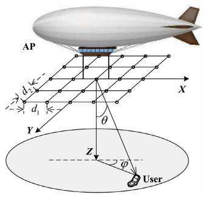

text_image

AP
d₂
d₁
Y
X
θ
Z
φ
User

Fig. 2. Geometrical relation between AP and any user.

parameter for computation offloading decision, transmit precoder, MF-RIS’s coefficient matrices, and receive decoder. Here, we focus on the utilization of energy partition parameter for deciding the volume of offloading tasks, thus assuming $T$ time slots is fixed for brevity as [29]. The optimization problem9 is formulated as

$$
\max _ {\mathbf {v} _ {k}, \mathbf {w} _ {k}, \boldsymbol {\Phi} _ {\mathrm{R}}, \boldsymbol {\Phi} _ {\mathrm{T}}, \mathcal {Y}} \min _ {\Delta} \bar {S} (\gamma_ {k}, \mathcal {Y})
$$

$$
\text { s.t. } \mathrm{C1}: \min _ {\Delta} \xi (\gamma_ {k}, \mathcal {Y}) \geq \xi_ {\mathrm{th}}, \forall k,
$$

$$
\mathrm{C2}: \min _ {\Delta} S _ {k} \left(\gamma_ {k}, \mathcal {Y}\right) \geq S _ {\mathrm{th}}, \forall k,
$$

$$
\mathrm{C3}: \sum_ {k = 1} ^ {K} \| \mathbf {w} _ {k} \| ^ {2} \leq \mathcal {Y} E _ {\max} / T,
$$

$$
\mathrm{C} 4: \| \mathbf {v} _ {k} \| ^ {2} = 1, \forall k, \mathrm{C} 5: \varsigma_ {n} = \{0, 1 \}, \forall n,
$$

$$
\mathrm{C} 6: \alpha_ {\mathrm{R}, n}, \alpha_ {\mathrm{T}, n} \in [ 0, \alpha_ {\max} ], \alpha_ {\mathrm{R}, n} + \alpha_ {\mathrm{T}, n}
$$

$$
\leq \alpha_ {\max}, \forall n,
$$

$$
\mathrm{C} 7: \left| \left[ \Phi_ {\iota (k)} \right] _ {n, n} \right| = \varsigma_ {n} \sqrt {\alpha_ {\iota (k) , n}}, \forall \iota (k), n,
$$

$$
\mathrm{C} 8: \mathcal {Y} \in [ 0, 1 ], \mathrm{C} 9: \min _ {\Delta} P _ {\mathrm{H}} \geq P _ {\mathrm{Tot}}, \tag {13}
$$

where $\xi _ { \mathrm { t h } }$ is the minimum semantic similarity threshold, and $S _ { \mathrm { t h } }$ is the minimum semantic computation rate requirement. $P _ { \mathrm { H } }$ and $P _ { \mathrm { T o t } }$ are the total harvested power and total power consumption defined in (2) and (3), respectively, $\begin{array} { r l r } { p _ { \mathrm { I } } } & { = } & { \sum _ { k = 1 } ^ { K } \dot { \left\| { \bf T G w } _ { k } \right\| ^ { 2 } } + \sum _ { r = 1 } ^ { R } p _ { \mathrm { J } , r } \| \bf { \check { T g } } _ { \mathit { r } } \| ^ { 2 } + \left\| { \bf T \tilde { n } } _ { 1 } \right\| ^ { 2 } , } \end{array}$ PK and the MF-RIS’s output power consumption is pO = $\begin{array} { r } { \sum _ { \iota ( k ) \in \{ \mathrm { R } , \mathrm { T } \} } \left( \sum _ { i = 1 } ^ { K } \left\| \Phi _ { \iota ( k ) } \mathbf { G } \mathbf { w } _ { i } \right\| ^ { 2 } + \sum _ { r = 1 } ^ { R } p _ { \mathrm { J } , r } \right\| \Phi _ { \iota ( k ) } \mathbf { g } _ { r } \Big \| ^ { 2 } + } \end{array}$ $\sigma _ { 1 } ^ { 2 }  \Phi _ { \iota ( k ) }  _ { F } ^ { 2 } )$ . C1 and C2 ensure successful semantic anti-jamming communication and offloading tasks,10

9The performance gain introduced by the optimization of AP’s trajectory has been thoroughly investigated in the existing works, e.g., [6], and the existing trajectory optimization method can be also applicable to the problem. However, considering the trajectory optimization will significantly increase the complexity of solving the problem without adding new contributions. Besides, in various practical scenarios, the AP’s position is usually fixed, e.g., [21]. Thus, to highlight our proposed semantic anti-jamming communication and computing in 3D space, this paper does not consider the AP’s trajectory. However, the optimization is still related to AP’s parameters. To elaborate, since the LoS condition and the environment between AP and GBSs/MF-RIS change as the height varies [56], the AP’s height affects the propagation characteristics of A2G communication link, which will indirectly affects the optimization of AP’s beamforming.

10In semantic communication, a user can recovery the semantic features only if the minimum semantic similarity is guaranteed. Similarly, in MEC networks, ensuring the minimum semantic computation rate is crucial, otherwise leading to the failure of computation tasks. Thus, this paper has formulated an optimization with both semantic similarity and semantic computation rate constraints, which is consistent with [33] and [37].

C3 guarantees that the total transmit power must be lower than the power budget $y E _ { \operatorname* { m a x } } / T ,$ , C4 is the receive decoder restriction, C5-C7 specify the allowable ranges of MF-RIS coefficients, C8 is the energy partition constraint which optimizes the energy for local and offloaded semantic computation rate, and C9 ensures the MF-RIS’s selfsustainability.11

Next, we discuss the unique challenges in solving the formulated problem, which are summarized as follows:

D1: The objective function using the generalized logistic function has a quasi-convex form, and thus various existing approximation methods tailor-made for bit communication (e.g., successive convex approximation (SCA) [42] and majorization-minimization (MM) method [22]) are not directly applicable to approximate it,12 which constitutes a major challenge for solving problem (13).

D2: It is very challenging to jointly handle a large number of tightly coupled variables, especially for the high-dimensional $\mathbf { w } _ { k } , \Phi _ { \mathrm { R } } ,$ , and $\Phi _ { \mathrm { T } }$ . Although the block coordinate descent (BCD) method in [11] can be adopted to significantly simplify the optimization problem with coupled variables, it may result in an undesired suboptimal solution due to the intricate coupling between the optimization variables, thereby calling for an efficient algorithm to optimize the closely coupled variables simultaneously.

D3: Despite the convexity of constraints induced by the additional RIS noise, the non-linear EH model and its binary EH coefficients lead to combinatorial constraints, which makes (13) a MINLP problem. Thus, problem (13) with MF-RIS is more challenging than the existing schemes with other emerging RIS techniques.

D4: Another challenge arises from the existence of jammers. Specifically, when the jamming signals are considered in the objective function and constraints, the optimization problem becomes more complicated due to a new fractional structure of SJNR expression. In addition, the jammers’ CSI uncertainties ∆ not only lead to the max/min formulations for the objective function and constraints, but also result in the infinite possibilities in (13).

# III. FAST-CONVERGING MO-DSOCP FOR GLOBALLY OPTIMAL SOLUTION OF (13)

In this section, we develop a fast-converging monotonic optimization with decoupling second-order cone programming (MO-DSOCP) to address the foregoing challenges in D1-D4. Specifically, we first resort to the general discretization method to tackle the jammers’ CSI uncertainties $\Delta$ in D4. Next,

11According to [52], it is shown that RIS can significantly improve the operational distance and power transfer efficiency for energy harvesting. To elaborate, RIS-assisted EH systems have been proven to realize kilowatt level microwave wireless energy transmission at dozens of meters away in practice. To sum up, considering the fact that the malicious jammers are always deployed near MF-RIS/GBS and transmit at extremely high power, the EH on MF-RIS for self-sustainability is feasible.

12To elaborate, SCA and MM usually introduces surrogate objective function to approximate the objective function [22], [42], but the quasi-convex “S”-shape one prevents us from finding appropriate one.

we elaborate upon the fast-converging monotonic optimization to deal with the quasi-convex objective function in D1, where a DSOCP is proposed to handle D2 and D3.

# A. Fast-Converging Monotonic Optimization Framework

As stated in D4, ∆ is a continuous set leading to infinite possibilities, thus complicating the optimization of (13). Therefore, a general discretization method in [23] is adopted to convert the imperfect CSI ∆ into a robust one. To this end, by uniformly discretizing all the angle range in ∆, i.e.,

$$
\theta^ {(p)} = \theta_ {L} + (i - 1) \Delta \theta , p = 1, \dots , Q _ {1},
$$

$$
\varphi^ {(q)} = \varphi_ {L} + (j - 1)   \Delta \varphi , q = 1, \dots , Q _ {2}, \tag {14}
$$

where $Q _ { 1 }$ and $Q _ { 2 }$ are the number of samples of θ and $\begin{array} { r l r } { \varphi , } & { { } \Delta \theta } & { = } & { ( \theta _ { U } - \theta _ { L } ) / ( Q _ { 1 } - 1 ) , } \end{array}$ and $\begin{array} { r l } { \Delta \varphi } & { { } = } \end{array}$ $( \varphi _ { U } - \varphi _ { L } ) / ( Q _ { 2 } - 1 )$ $\mathbf { d } _ { { r k } }$ and and $\widetilde { \mathbf { g } } _ { r }$ $\begin{array} { r c l } { \widetilde { \mathbf { d } } _ { r k } } & { = } & { \sum _ { p = 1 } ^ { L _ { 1 } } \sum _ { q = 1 } ^ { L _ { 2 } } \left( 1 / L \right) \mathbf { d } _ { r k } ^ { \left( p , q \right) } } \end{array}$ $\begin{array} { r l } { \widetilde { \mathbf { g } } _ { r } } & { { } = } \end{array}$ $\begin{array} { r } { \sum _ { p = 1 } ^ { N _ { 1 } } \sum _ { q = 1 } ^ { N _ { 2 } } \left( 1 / N \right) \mathbf { g } _ { r } ^ { \left( p , q \right) } } \end{array}$ p=1 q=1 rk e , respectively. Hence, the max/min formulations inside (13) can be removed, and the optimization problem (13) can be recast as

$$
\max _ {\mathbf {v} _ {k}, \mathbf {w} _ {k}, \boldsymbol {\Phi} _ {\mathrm{R}}, \boldsymbol {\Phi} _ {\mathrm{T}}, \mathcal {Y}} \sum_ {k = 1} ^ {K} \overline {{S}} _ {k} (\widetilde {\gamma} _ {k}, \mathcal {Y}) \text {s.t.} \widetilde {\mathrm{C}} 1, \widetilde {\mathrm{C}} 2, \mathrm{C} 3 - \mathrm{C} 8, \widetilde {\mathrm{C}} 9, \tag {15}
$$

where $\widetilde \mathrm { C }$ denotes the modified version of C with $\widetilde { \mathbf { d } } _ { r k }$ and $\widetilde { \mathbf { g } } _ { r }$ . Clearly, as stated in D1, the objective function in (15) has a quasi-convex “S” shape, so it is challenging to solve (15) by applying existing convex optimization methods. However, we can reformulate the original problem as

$$
\max _ {\boldsymbol {\tau}} g (\boldsymbol {\tau}) = \sum_ {k = 1} ^ {K} \tau_ {k} \text {   s.t.   } \boldsymbol {\tau} \in \mathcal {G}, \tag {16}
$$

where $\pmb { \tau } = \{ \tau _ { 1 } , \tau _ { 2 } , \tau \cdot \cdot , \tau _ { K } \} \in \mathcal { R } _ { + } ^ { K }$ can be regarded as the new optimization variables instead of the original ones ${ \mathcal { F } } =$ $\left\{ \mathbf { v } _ { k } , \mathbf { w } _ { k } , \Phi _ { \mathrm { R } } , \Phi _ { \mathrm { T } } , \mathcal { V } \right\}$ , whose achievable region is defined as

$$
\mathcal {G} = \left\{\boldsymbol {\tau} | 0 \leq \tau_ {k} \leq \overline {{{S}}} _ {k} \left(\widetilde {\gamma} _ {k} (\mathcal {F}), \mathcal {Y}\right), \forall k \in \mathcal {K}, \mathcal {F} \in \mathcal {P} \right\},
$$

and $\mathcal { P } { = } \left\{ \mathcal { F } | \widetilde \mathrm { C } 1 , \widetilde \mathrm { C } 2 , \mathrm { C } 3 - \mathrm { C } 8 , \widetilde \mathrm { C } 9 \right\}$ . Before attempting to solve (15), it is critical to show the equivalence between (15) and (16), which is given by the following proposition.

Proposition 1: Denote $\tau ^ { \star }$ as the optimal solution to problem (16). If there exists a fixed point ${ \mathcal { F } } ^ { \star }$ corresponding to $\tau ^ { \star }$ , ${ \mathcal { F } } ^ { \star }$ must be the unique optimal solution to problem (15).

Proof : Due to constraints C1 and $\mathrm { { \tilde { C } 2 } }$ held with equality at the optimum, the equivalence between problem (15) and (16) is easily established. Then, we turn to prove the uniqueness of ${ \mathcal { F } } ^ { \star }$ . Since $g \left( \tau \right)$ is an increasing function w.r.t. $\tau ,$ the optimal solution ${ \mathcal { F } } ^ { \star }$ must occur at the point where $\tau _ { k } ^ { \star } { = } \overline { { S } } _ { k } \left( \bar { \widetilde { \gamma } } _ { k } ^ { \star } \left( \mathcal { F } \right) , \mathcal { y } \right)$ , ∀k. Thus, finding ${ \mathcal { F } } ^ { \star }$ involves solving esolve K equations, which are given by

$$
\tau_ {k} ^ {\star} = \frac {W I}{\rho L _ {1}} \left(A _ {\rho , 1} + \frac {A _ {\rho , 2} - A _ {\rho , 1}}{1 + e ^ {- (C _ {\rho , 1} d (\widetilde {\gamma} _ {k} (\mathcal {F} ^ {\star})) + C _ {\rho , 2})}}\right) + R _ {\text {loc}} (\mathcal {Y}). \tag {17}
$$

Next, taking $\mathbf { w } _ { k } ^ { \star }$ inside ${ \mathcal { F } } ^ { \star }$ as an example, (17) w.r.t. $\mathbf { w } _ { k } ^ { \star }$ can be recast as a system of K linear equations, namely,

$$
\mathrm{Tr} \left(\overline {{\overline {{\mathbf {D}}}}} _ {k} \mathbf {W} _ {k} ^ {\star}\right) - \overline {{\tau}} _ {1, k} ^ {\star} \sum_ {i \neq k} ^ {K} \mathrm{Tr} \left(\overline {{\overline {{\mathbf {D}}}}} _ {k} \mathbf {W} _ {i} ^ {\star}\right) = \overline {{\tau}} _ {1, k} ^ {\star} \overline {{\sigma}} _ {k} ^ {2}, \tag {18}
$$

where $\mathbf { W } _ { k } ^ { \star } = \mathbf { w } _ { k } ^ { \star } \mathbf { w } _ { k } ^ { \star , H } , \overline { { \mathbf { D } } } _ { k } = \overline { { \mathbf { D } } } _ { k } ^ { H } \mathbf { v } _ { k } \mathbf { v } _ { k } ^ { H } \overline { { \mathbf { D } } } _ { k }$ , and

$$
\begin{array}{l} \bar {\tau} _ {1, k} ^ {\star} = \overline {{f}} \left(\tau_ {k} ^ {\star} - R _ {\mathrm{loc}}\right) \\ = 10\bigg\{-\frac{1}{10C_{\rho,1}}\left[\mathcal{C}_{\rho ,2} + \ln \left(\frac{A_{\rho,2} - A_{\rho,1}}{\frac{\rho L_1}{W!}\left(\tau_k^{\star} - R_{\mathrm{loc}}(\mathcal{Y})\right) - A_{\rho,1}} - 1\right)\right]\bigg\} . \\ \end{array}
$$

As the channels $\mathbf { D } _ { k }$ and $\mathbf { H } _ { k }$ inside $\overline { { \mathbf { D } } } _ { k }$ are generally independent from each other due to the different GBS’s positions, $K$ equations in (18) are linearly independent, suggesting there is a unique solution $\mathbf { w } _ { k } ^ { \star }$ . By using a proof similar to the one above for the remaining variables, we can prove that all variables in ${ \mathcal { F } } ^ { \star }$ are unique to $\tau ^ { \star }$ . Combined with the equivalence between (15) and (16), we conclude that ${ \mathcal { F } } ^ { \star }$ must be the unique optimal solution to problem (15). ■

Based on Proposition 1, we will focus on solving problem (16) in the rest of this section, which can find the globally optimal solution of (15). To proceed, we first provide some definitions in the following, which are essential to the description of our proposed fast-converging monotonic optimization (MO) algorithm.

Definition 1 (Box): Given two vectors $\mathbf { a } \leq \mathbf { b } \in \mathcal { R } _ { + } ^ { K }$ , the box with vertices a and b can be defined as the hyper rectangle $[ \mathbf { a } , \mathbf { b } ] = [ \pmb { \tau } | \mathbf { a } \leq \pmb { \tau } \leq \mathbf { b } ]$ .

Definition 2 (Normal Set): Given a box $\mathbf { \mathcal { D } } = [ \mathbf { a } , \mathbf { b } ] \subset \mathcal { R } _ { + } ^ { K }$ if $\overline { { \mathbf { b } } } \in \mathcal { D } \Rightarrow \left[ \mathbf { a } , \overline { { \mathbf { b } } } \right] \in \mathcal { D } .$ , D is the normal set in [a, b].

Definition 3 (MO [63]): Define a nonempty normal set $\mathcal { G } \subset \mathcal { R } _ { + } ^ { K }$ and increasing function $\overline { { g } } \left( \mathbf { y } \right)$ on $\mathcal { \bar { R } } _ { + } ^ { K }$ . If an optimization problem can be reformulated as max $\overline { { g } } \left( \mathbf { y } \right) \mathrm { s . t . } \mathbf { y } \in \mathcal { G }$ , it can be regarded as a monotonic optimization problem.

Definition 4 (Optimality): Define a point $\psi \in \mathcal { R } _ { + } ^ { K }$ and a set $\mathcal { T } _ { \psi } = \left\{ \overline { { \psi } } \in \mathcal { R } _ { + } ^ { K } | \overline { { \psi } } > \psi \right\}$ . If $\psi \in { \mathcal { D } }$ and $\mathcal { T } _ { \psi } \in \dot { \mathcal { R } } _ { + } ^ { K } / \mathcal { D }$ , ψ is the upper boundary point of $\mathcal { D } _ { : }$ , which is denoted as $\partial _ { + } ^ { \cdot } \mathcal { D }$ . Besides, the global optimality of MO can be attained on $\partial _ { + } \mathcal { D }$ .

According to Definitions 1-4, we can easily obtain that (16) is a MO problem over a normal set ${ \mathcal { G } } ,$ and the global optimality can be attained on $\partial _ { + } \mathcal { G }$ . Thus, the monotonicity properties of the objective function can be exploited to solve problem (15) instead of using convexity. Although three existing algorithms have been proposed to solve MO problem, i.e., intersection point search method [64], polyblock approximation (PA) [65], and branch-reduce-and-bound (BRB) method [66], they have very slow convergence speeds, especially with a large number of optimization variables. To improve the convergence speed of existing MO, we propose a fast-converging MO framework, which contains five steps, namely, initialization, selection, intersection, partition, and relocation. In the following, we provide the details.

Step 1 (Initialization): At first, we initialize a box set with $\mathcal { H } _ { 0 } = [ \mathbf { a } _ { 0 } , \mathbf { b } _ { 0 } ]$ , such that the initial upper and lower bounds can be calculated as $g _ { \mathrm { m a x } } \left( \mathbf { b } _ { 0 } \right)$ and $g _ { \mathrm { m i n } } \left( \mathbf { a } _ { 0 } \right)$ , respectively. Note that $\mathcal { H } _ { 0 }$ should contain all the possible semantic computation rate regions. Thus, the minimum and maximum of $\tau \in \mathcal G$ , i.e., $\tau \in [ \tau _ { \operatorname* { m i n } } , \tau _ { \operatorname* { m a x } } ] .$ , can be set as the initial upper and lower bounds, ${ \bf a } _ { 0 } = \tau _ { \mathrm { m i n } } , { \bf b } _ { 0 } = \tau _ { \mathrm { m a x } } .$ . Clearly, the minimum of τ can be obtained as the semantic threshold in C1 and $\mathrm { { \tilde { C } 2 } }$ , which is given by $\pmb { \tau } _ { \mathrm { m i n } } = \left[ \overline { { S } } _ { \mathrm { m i n , 1 } } , \overline { { S } } _ { \mathrm { m i n , 2 } } , \cdot \cdot \cdot , \overline { { S } } _ { \mathrm { m i n } , K } \right]$ , ewhere $\begin{array} { r } { \overline { { S } } _ { \mathrm { m i n } , k } ~ = ~ \operatorname* { m a x } \left\{ \frac { W I } { \rho L _ { 1 } } \xi _ { \mathrm { t h } } , S _ { \mathrm { t h } } \right\} } \end{array}$ . As for the maximum $\tau _ { \mathrm { m a x } } = [ \overline { { S } } _ { \mathrm { m a x } , 1 } , \overline { { S } } _ { \mathrm { m a x } , 2 } , \cdot \cdot \cdot , \overline { { S } } _ { \mathrm { m a x } , K } ]$ , the element $\overline { { S } } _ { \mathrm { m a x } , k }$ can be obtained by letting the AP only serve one GBS with the maximum energy, ignoring the jamming signals, and exploiting the maximuwhich is calculated as Smax,k = $\begin{array} { r } { \overline { { S } } _ { \mathrm { m a x } , k } = \frac { W I } { o L _ { 1 } } \xi \left( \widetilde { \gamma } _ { \mathrm { m a x } , k } \right) + \overline { { R } } _ { \mathrm { l o c } } ^ { \mathrm { m a x } } } \end{array}$ mputing,, where $\widetilde { \gamma } _ { \mathrm { m a x } , k }$ ρL1is the maximum SJNR and $\overline { { R } } _ { \mathrm { l o c } } ^ { \mathrm { m a x } }$ loc  is the maximum semantic local computation rate. Here, $\widetilde { \gamma } _ { \mathrm { m a x } , k }$ can be obtained by the following inequalities, which are given by

$$
\widetilde {\gamma} _ {k} \leq \left| \mathbf {v} _ {k} ^ {H} \overline {{\mathbf {D}}} _ {k} \mathbf {w} _ {k} \right| ^ {2} / \sigma_ {2} ^ {2}
$$

$$
\stackrel {(a)} {\leq} \left(\left\| \mathbf {w} _ {k} \right\| ^ {2} \bigg / \sigma_ {2} ^ {2}\right) \left\| \mathbf {v} _ {k} ^ {H} \right\| ^ {2} \left\| \mathbf {D} _ {k} + \mathbf {H} _ {k} \boldsymbol {\Phi} _ {\iota (k)} \mathbf {G} \right\| _ {F} ^ {2}
$$

$$
\stackrel {(b)} {\leq} \left(\mathcal {Y} E _ {\max} / T \sigma_ {2} ^ {2}\right) \left(\| \mathbf {D} _ {k} \| _ {F} ^ {2} + \left\| \mathbf {H} _ {k} \boldsymbol {\Phi} _ {\iota (k)} \mathbf {G} \right\| _ {F} ^ {2}\right)
$$

$$
\stackrel {(a)} {\leq} \left(\mathcal {Y} E _ {\max} / T \sigma_ {2} ^ {2}\right) \left(\| \mathbf {D} _ {k} \| _ {F} ^ {2} + \left\| \boldsymbol {\varphi} _ {\iota (k)} \right\| ^ {2} \| \mathbf {H} _ {k} \| _ {F} ^ {2} \| \mathbf {G} \| _ {F} ^ {2}\right)
$$

$$
\stackrel {(c)} {\leq} \widetilde {\gamma} _ {\max, k} = \left(\mathcal {Y} E _ {\max} / T \sigma_ {2} ^ {2}\right) \left(\| \mathbf {D} _ {k} \| _ {F} ^ {2} + N \alpha_ {\max} \| \mathbf {H} _ {k} \| _ {F} ^ {2} \| \mathbf {G} \| _ {F} ^ {2}\right), \tag {19}
$$

where inequality (a) holds due to the Cauchy-Schwarz inequality, (b) holds due to the triangle inequality, and (c) holds owing to the MF-RIS’s amplitude and phase shift properties. Besides, $R _ { \mathrm { l o c } } ^ { \mathrm { m a x } } = \sqrt { E _ { \mathrm { m a x } } } \Big / \Big ( \varepsilon _ { \mathrm { R }  \mathrm { S } } C \sqrt { T \kappa } \Big )$ .

Step 2 (Selection): In the l-th iteration, a box $[ \mathbf { a } _ { l } , \mathbf { b } _ { l } ]$ is selected from $\mathcal { H } _ { l } ,$ , which satisfies $g \left( \mathbf { a } _ { l } \right) = g _ { \mathrm { m i n } }$ and $g \left( \mathbf { b } _ { l } \right) =$ $g _ { \mathrm { m a x } }$ . Then, we should check the feasibility of ${ \bf a } _ { l }$ . If the vertex ${ \bf a } _ { l }$ does not belong to the achievable region, $[ \mathbf { a } _ { l } , \mathbf { b } _ { l } ]$ is removed from $\mathcal { H } _ { l }$ . Finally, a box $[ \mathbf { a } _ { l } , \mathbf { b } _ { l } ]$ with feasible vertex $\mathbf { a } _ { l }$ can be obtained by using the aforementioned selection and checking.

Step 3 (Intersection): After obtaining $[ \mathbf { a } _ { l } , \mathbf { b } _ { l } ] .$ , we should search for the intersection point $\psi _ { l }$ on the Pareto boundary $\mathcal { D } \subset \mathcal { R } _ { + } ^ { K }$ along with the line $l _ { \mathbf { a } _ { l } \mathbf { b } _ { l } } ,$ i.e., $\pmb { \psi } _ { l } = \pi ^ { \mathcal { D } } \left( \left[ \mathbf { a } _ { l } , \mathbf { b } _ { l } \right] \right)$ , which can efficiently improve the lower bound $g _ { \mathrm { m i n } } .$ . Here, $l _ { { \bf a } _ { l } { \bf b } _ { l } }$ with $\overline { { S } } _ { \mathrm { s u m } } = g \left( x \right)$ is given by

$$
l _ {\mathbf {a} _ {l} \mathbf {b} _ {l}}: \boldsymbol {\chi} = \mathbf {a} _ {l} + (\mathbf {a} _ {l} - \mathbf {b} _ {l}) \frac {\overline {{{S}}} _ {\text { sum }} - g (\mathbf {a} _ {l})}{g (\mathbf {a} _ {l} - \mathbf {b} _ {l})}. \tag {20}
$$

Given a search accuracy, we can achieve $[ { \psi _ { \mathrm { m i n } , l } } , { \psi _ { \mathrm { m a x } , l } } ]$ such that the lower bound can be updated as $g _ { \mathrm { m i n } } = g \left( \psi _ { \mathrm { m i n } , l } \right)$ . If $g \left( \psi _ { \mathrm { m i n } , l } \right) \leq g \left( \mathbf { a } _ { l } \right)$ , we abandon $\psi _ { l }$ and set $g _ { \mathrm { m i n } } = g \left( \mathbf { a } _ { l } \right)$ .

Step 4 (Partition): Next, to improve the upper bound $g _ { \mathrm { m a x } } .$ , the selected box $[ \mathbf { a } _ { l } , \mathbf { b } _ { l } ]$ should be partitioned into $K$ non-overlapping small boxes based on the intersection point $\psi _ { l }$ . Thus, a new set of upper vertices $\{ \mathbf { b } _ { l , d } \}$ can be generated, i.e.,

$$
\mathbf {b} _ {l, d} = \mathbf {b} _ {l} - (b _ {l, d} - \psi_ {l, d})   \mathbf {e} _ {d}, d = 1, \dots , K, \tag {21}
$$

where subscript d is the d-th element in bl and $\mathbf { e } _ { d }$ is the vector having only the d-th element equal to 1. Furthermore, the corresponding lower vertex set can be updated as

$$
\mathbf {a} _ {l, d} = \left\{ \begin{array}{l l} \mathbf {a} _ {l}, & d = 1, \\ \mathbf {a} _ {l, d - 1} + (\psi_ {l, d - 1} - a _ {l, d - 1})   \mathbf {e} _ {d - 1}, & d > 1. \end{array} \right. \tag {22}
$$

As such, the updated K boxes with the new upper and lower vertices satisfy the following conditions:

$$
\bigcup_ {d = 1, \dots , K} [ \mathbf {a} _ {l, d}, \mathbf {b} _ {l, d} ] = [ \mathbf {a} _ {l}, \mathbf {b} _ {l} ] / [ \boldsymbol {\psi} _ {l}, \mathbf {b} _ {l} ],
$$

$$
\left[ \mathbf {a} _ {l, d}, \mathbf {b} _ {l, d} \right] \cap \left[ \mathbf {a} _ {l, \bar {d}}, \mathbf {b} _ {l, \bar {d}} \right] = \emptyset , \forall d \neq \bar {d}, \tag {23}
$$

where the new boxes $\left[ \mathbf { a } _ { l , d } , \mathbf { b } _ { l , d } \right]$ have no overlaps with the previous boxes, and they achieve a larger $g \left( \mathbf { b } _ { l , d } \right)$ , which quickly improves $g _ { \mathrm { m a x } }$ and $g _ { \mathrm { m i n } }$ . Then, $\mathcal { H } _ { l + 1 }$ is updated as

$$
\mathcal {H} _ {l + 1} = \mathcal {H} _ {l} / [ \mathbf {a} _ {l}, \mathbf {b} _ {l} ] \cup \left\{\bigcup_ {d = 1, \dots , K} [ \mathbf {a} _ {l, d}, \mathbf {b} _ {l, d} ] \right\}. \tag {24}
$$

Note that the new box fulfills the following proposition.

Proposition 2: The updated boxes $\mathcal { H } _ { l + 1 }$ and $\mathcal { H } _ { l }$ satisfy

$$
\mathcal {H} _ {l} \supset \mathcal {H} _ {l + 1} \supset \mathcal {D}. \tag {25}
$$

Proof : The proof is similar to that of [67] and hence it is omitted for brevity.

Step 5 (Relocation): It can be observed that the updated boxes insides $\mathcal { H } _ { l + 1 }$ have some parts that have lower values than the lower bound. Thus, we should cut off these parts to guarantee that the useful parts can be contained. To elaborate, for a box $[ \mathbf { a } _ { l + 1 } , \mathbf { b } _ { l + 1 } ]$ in $\mathcal { H } _ { l + 1 } ,$ if $g \left( \mathbf { b } _ { l + 1 } \right) \leq g _ { \mathrm { m i n } } ,$ $[ \mathbf { a } _ { l + 1 } , \mathbf { b } _ { l + 1 } ]$ is removed from $\mathcal { H } _ { l + 1 }$ . If $g \left( \mathbf { b } _ { l + 1 } \right) > g _ { \mathrm { m i n } }$ , the corresponding ${ \mathbf a } _ { l + 1 }$ should be relocated as

$$
\widetilde {a} _ {d} = b _ {d} - \min \left\{\frac {g \left(\mathbf {b} _ {l + 1}\right) - g _ {\min}}{b _ {d} - a _ {d}}, 1 \right\} \times \left(b _ {d} - a _ {d}\right). \tag {26}
$$

At the end of the iteration, when the gap between $g _ { \mathrm { m a x } }$ and $g _ { \mathrm { m i n } }$ is less than the given accuracy, the fast-converging MO framework terminates at the globally optimal solution, whose illustration of the l-th iteration for $K = 3$ is shown in Fig. 3.

Remark 2: First, different from the intersection point search method in [64] directly searches for the Pareto boundary, our proposed fast-converging MO algorithm first adopts a sensible search method to check the feasibility of the intersection point on the Pareto boundary determined by the lower bound, which can significantly reduce the number of feasibility evaluations such that the main complexity is decreased. Second, compared to PA in [65] and BRB method in [66] which contain the whole achievable region and only partition the upper vertices, our proposed algorithm always maintains the reduced region with the global optimal solutions and updates both the upper and lower vertices, leading to the reduced iterations. Besides, to avoid unnecessary feasibility checks, our proposed algorithm relocates the lower-left vertex to minimize the box size. To sum up, our proposed algorithm can be regarded as a reduced polyblock at each iteration, which results in a faster convergence as compared to the existing MO. Third, the proposed algorithm does not require the convexity of objective function, which can be extended to both the bit and semantic image/video communication with other objective functions.

# B. Novel DSOCP Algorithm for Feasibility Evaluation

After developing the fast-converging MO algorithm, the remaining problem is to evaluate the feasibility of a point $\tau = \chi .$ , which is equivalent to solving the following problem, i.e.,

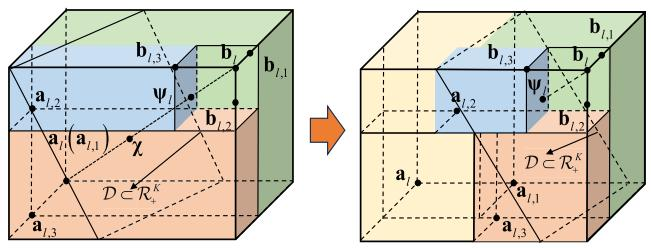

text_image

b_{l,3}
a_{l,2}
\psi_1
b_{l,2}
b_{l,1}
a_{l}(a_{l,1})
\chi
D \subset \mathcal{R}_+^k
a_{l,3}
b_{l,3}
\psi_1
b_{l,2}
a_{l,2}
b_{l,2}
a_1
D \subset \mathcal{R}_+^k
a_{l,1}
a_{l,3}

Fig. 3. The illustration of the l-th iteration for $K = 3 .$ .

$$
\max _ {\mathcal {F}} \mathbf {0} \text {   s.t.   } \widetilde {\mathrm{C}} 1, \widetilde {\mathrm{C}} 2, \overline {{\mathrm{C}}} 2: \overline {{S}} _ {k} (\widetilde {\gamma} _ {k}) \geq \tau_ {k}, \forall k, \mathrm{C} 3 - \mathrm{C} 8, \widetilde {\mathrm{C}} 9. \tag {27}
$$

As shown in D2, a large number of variables are tightly coupled, especially for the high-dimensional $\mathbf { w } _ { k } , \Phi _ { \mathrm { R } }$ , and ΦT, and the combinatorial constraints prevent us from solving (27). To handle these issues, we propose a novel DSOCP algorithm, which first decouples $\mathcal { F }$ into two parts, i.e., $\mathcal { F } _ { 1 } = \{ \mathbf { v } _ { k } , \mathcal { V } \}$ and $\mathcal { F } _ { 2 } = \{ \mathbf { w } _ { k } , \Phi _ { \mathrm { R } } , \Phi _ { \mathrm { T } } \}$ , and then the closed-form solution of $\mathcal { F } _ { 1 }$ can be obtained and DSOCP can be adopted to solve $\mathcal { F } _ { 2 }$ with the intractable constraints.

As for $\mathcal { F } _ { 1 } = \{ \mathbf { v } _ { k } , \mathcal { V } \}$ , the linear minimum-mean-square-error (MMSE) detector in [22] and the dual method in [29] can be adopted to obtain a closed-form solution for ${ \mathcal { F } } _ { 1 } .$ , which is omitted here due to the space limits. Then, we elaborate upon the proposed DSOCP algorithm, where the corresponding optimization problem w.r.t. $\mathcal { F } _ { 2 }$ can be reformulated as

$$
\max _ {\mathcal {F} _ {2}} \mathbf {0} \text {   s.t.   } \overline {{\mathrm{C}}} 2: \widetilde {\gamma} _ {k} \geq \overline {{\tau}} _ {k}, \forall k, \mathrm{C} 3, \mathrm{C} 5 - \mathrm{C} 7, \widetilde {\mathrm{C}} 9, \tag {28}
$$

where C2 is obtained by transforming C1 , ${ \mathrm { \tilde { C } } } 2 .$ C2 in (27) via some mathematical manipulations, $\begin{array} { r } { \bar { \tau } _ { k } = \overline { { f } } \left( \operatorname* { m a x } \left\{ \xi _ { \mathrm { t h } } , \frac { \rho L _ { 1 } } { W I } S _ { \mathrm { t h } } , \tau _ { k } ^ { \star } - R _ { \mathrm { l o c } } \right\} \right) } \end{array}$ , and $\overline { { f } }$ is given in (18). Note that C2 in (28) can ensure that C1 and $\widetilde { \mathrm { C } } 2$ can always be satisfied.

Next, we deal with the intractable constraints exploiting the notion of DSOCP, where $\mathbf { w } _ { k } , \Phi _ { \mathrm { R } }$ , and $\Phi _ { \mathrm { T } }$ are updated in each iteration simultaneously. First, C2 can be recast as

$$
\begin{array}{l} \overline {{\mathrm{C}}} 2 \mathrm{a}: \frac {\left| \mathbf {h} _ {k} ^ {H} \mathbf {w} _ {k} \right| ^ {2}}{\overline {{\tau}} _ {k}} \geq \sigma_ {2} ^ {2} + \sum_ {i \neq k} ^ {K} \Bigl (\beta_ {i k} ^ {2} + \overline {{\beta}} _ {i k} ^ {2} \Bigr) + \sum_ {r = 1} ^ {R} \vartheta_ {k r} ^ {2} + \overline {{\vartheta}} _ {k} ^ {2}, \\ \overline {{\mathrm{C}}} 2 \mathrm{b}: \beta_ {i k} \geq \left| \Re \left\{\mathbf {h} _ {k} ^ {H} \mathbf {w} _ {i} \right\} \right|, \overline {{\mathrm{C}}} 2 \mathrm{c}: \overline {{\beta}} _ {i k} \geq \left| \Im \left\{\mathbf {h} _ {k} ^ {H} \mathbf {w} _ {i} \right\} \right|, \forall i \neq k, \\ \overline {{\mathrm{C}}} 2 \mathrm{d}: \vartheta_ {k r} \geq \sqrt {p _ {\mathrm{J} , r}} \left| \mathbf {v} _ {k} ^ {H} \widetilde {\mathbf {q}} _ {r k} \right|, \overline {{\mathrm{C}}} 2 \mathrm{e}: \overline {{\vartheta}} _ {k} \geq \sigma_ {1} \left\| \mathbf {v} _ {k} ^ {H} \mathbf {H} _ {k} \boldsymbol {\Phi} _ {\iota (k)} \right\|, \tag {29} \\ \end{array}
$$

where $\left\{ \beta _ { i k } , \overline { { \beta } } _ { i k } , \vartheta _ { k r } , \overline { { \vartheta } } _ { k } \right\}$ are the introduced slack variables, and $\mathbf h _ { k } = \overline { { \mathbf D } } _ { k } ^ { H } \mathbf v _ { k }$ . However, (29) is still intractable due to the convexity in $\left| \mathbf { h } _ { k } ^ { H } \mathbf { w } _ { k } \right| ^ { 2 }$ and the tightly coupled variables. Thus, we have the following proposition.

Proposition 3: Denote φ(id)ι(k) $\dot { \varphi } _ { \iota ( k ) } ^ { ( i _ { \mathrm { d } } ) }$ and wk $\mathbf { w } _ { k } ^ { ( i _ { \mathrm { d } } ) }$ as $\varphi _ { \iota ( k ) }$ and $\mathbf { w } _ { k }$ in DSOCP’s $i _ { \mathrm { d } } .$ -th iteration, $\overline { { \mathrm { C 2 a } } } - \overline { { \mathrm { C 2 e } } }$ can be rewritten as the following convex and decoupled constraints:

$$
\begin{array}{l} \overline {{\mathrm{C}}} 2 \mathrm{a}: f \left(\boldsymbol {\varphi} _ {\iota (k)}, \mathbf {w} _ {k}; \boldsymbol {\varphi} _ {\iota (k)} ^ {(i _ {\mathrm{d}})}, \mathbf {w} _ {k} ^ {(i _ {\mathrm{d}})}\right) / \overline {{\tau}} _ {k} \\ \geq \sigma_ {2} ^ {2} + \sum_ {i \neq k} ^ {K} \left(\beta_ {k i} ^ {2} + \overline {{\beta}} _ {k i} ^ {2}\right) + \sum_ {r = 1} ^ {R} \vartheta_ {k r} ^ {2} + \overline {{\vartheta}} _ {k} ^ {2}, \\ \end{array}
$$

C2b :βki ≥ ski φι(k), wi; φ(iι( $\begin{array} { r } { \overline { { \mathrm { C 2 b } } } : \beta _ { k i } \geq s _ { k i } \left( \varphi _ { \iota ( k ) } , \mathbf { w } _ { i } ; \varphi _ { \iota ( k ) } ^ { ( i _ { \mathrm { d } } ) } , \mathbf { w } _ { i } ^ { ( i _ { \mathrm { d } } ) } \right) , } \end{array}$ d )k ) , w (i d )i  ,

$$
\beta_ {k i} \geq \overline {{s}} _ {k i} \left(\boldsymbol {\varphi} _ {\iota (k)}, \mathbf {w} _ {i}; \boldsymbol {\varphi} _ {\iota (k)} ^ {(i _ {\mathrm{d}})}, \mathbf {w} _ {i} ^ {(i _ {\mathrm{d}})}\right), \forall i \neq k,
$$

$\begin{array} { r } { \overline { { \mathrm { C 2 c } } } : \overline { { \boldsymbol { \beta } } } _ { k i } \geq z _ { k i } \left( \varphi _ { \iota ( k ) } , \mathbf { w } _ { i } ; \varphi _ { \iota ( k ) } ^ { ( i _ { \mathrm { d } } ) } , \mathbf { w } _ { i } ^ { ( i _ { \mathrm { d } } ) } \right) , } \end{array}$

$$
\overline {{\beta}} _ {k i} \geq \overline {{z}} _ {k i} \left(\varphi_ {\iota (k)}, \mathbf {w} _ {i}; \varphi_ {\iota (k)} ^ {(i _ {\mathrm{d}})}, \mathbf {w} _ {i} ^ {(i _ {\mathrm{d}})}\right), \forall i \neq k, \overline {{\mathrm{C}}} 2 \mathrm{d}, \overline {{\mathrm{C}}} 2 \mathrm{e}, \tag {30}
$$

where $u _ { k } ^ { ( i _ { \mathrm { d } } ) } = \mathbf { h } _ { k } ^ { ( i _ { \mathrm { d } } ) , H } \mathbf { w } _ { k } ^ { ( i _ { \mathrm { d } } ) } , \mathbf { u } _ { k } ^ { ( i _ { \mathrm { d } } ) } = u _ { k } ^ { ( i _ { \mathrm { d } } ) } \mathbf { h } _ { k } ^ { ( i _ { \mathrm { d } } ) } + \mathbf { w } _ { k } ^ { ( i _ { \mathrm { d } } ) }$ uk w k u k h(ik ,

$$
\begin{array}{l} f \left(\boldsymbol {\varphi} _ {\iota (k)}, \mathbf {w} _ {k}; \boldsymbol {\varphi} _ {\iota (k)} ^ {(i _ {\mathrm{d}})}, \mathbf {w} _ {k} ^ {(i _ {\mathrm{d}})}\right) = \Re \left\{\mathbf {u} _ {k} ^ {(i _ {\mathrm{d}}), H} \left(u _ {k} ^ {(i _ {\mathrm{d}})} \mathbf {h} _ {k} + \mathbf {w} _ {k}\right) \right\} \\ - \frac {1}{2} \left\| \mathbf {u} _ {k} ^ {(i _ {\mathrm{d}})} \right\| ^ {2} - \frac {1}{2} \left\| u _ {k} ^ {(i _ {\mathrm{d}})} \mathbf {h} _ {k} - \mathbf {w} _ {k} \right\| ^ {2} - \left| u _ {k} ^ {(i _ {\mathrm{d}})} \right| ^ {2}, \\ \end{array}
$$

$$
s _ {k i} \left(\boldsymbol {\varphi} _ {\iota (k)}, \mathbf {w} _ {i}; \boldsymbol {\varphi} _ {\iota (k)} ^ {(i _ {\mathrm{d}})}, \mathbf {w} _ {i} ^ {(i _ {\mathrm{d}})}\right) = \frac {1}{4} \left\{\| \mathbf {h} _ {k} + \mathbf {w} _ {i} \| ^ {2} + \left\| \mathbf {h} _ {k} ^ {(i _ {\mathrm{d}})} - \mathbf {w} _ {i} ^ {(i _ {\mathrm{d}})} \right\| ^ {2} \right.
$$

$$
\left. - 2 \Re \left\{\left(\mathbf {h} _ {k} ^ {(i _ {\mathrm{d}}), H} - \mathbf {w} _ {i} ^ {(i _ {\mathrm{d}}), H}\right) (\mathbf {h} _ {k} - \mathbf {w} _ {i}) \right\} \right\},
$$

$$
\overline {{s}} _ {k i} \left(\boldsymbol {\varphi} _ {\iota (k)}, \mathbf {w} _ {i}; \boldsymbol {\varphi} _ {\iota (k)} ^ {(i _ {\mathrm{d}})}, \mathbf {w} _ {i} ^ {(i _ {\mathrm{d}})}\right) = \frac {1}{4} \left\{\| \mathbf {h} _ {k} - \mathbf {w} _ {i} \| ^ {2} + \left\| \mathbf {h} _ {k} ^ {(i _ {\mathrm{d}})} + \mathbf {w} _ {i} ^ {(i _ {\mathrm{d}})} \right\| ^ {2} \right.
$$

$$
\left. - 2 \Re \left\{\left(\mathbf {h} _ {k} ^ {(i _ {\mathrm{d}}) H} + \mathbf {w} _ {i} ^ {(i _ {\mathrm{d}}), H}\right) (\mathbf {h} _ {k} + \mathbf {w} _ {i}) \right\} \right\},
$$

$$
\begin{array}{l} z _ {k i} \left(\boldsymbol {\varphi} _ {\iota (k)}, \mathbf {w} _ {i}; \boldsymbol {\varphi} _ {\iota (k)} ^ {(i _ {\mathrm{d}})}, \mathbf {w} _ {i} ^ {(i _ {\mathrm{d}})}\right) = \frac {1}{4} \left\{\| \mathbf {h} _ {k} - j \mathbf {w} _ {i} \| ^ {2} + \left\| \mathbf {h} _ {k} ^ {(i _ {\mathrm{d}})} + j \mathbf {w} _ {i} ^ {(i _ {\mathrm{d}})} \right\| ^ {2} \right. \\ \left. - 2 \Re \left\{\left(\mathbf {h} _ {k} ^ {(i _ {\mathrm{d}}), H} - j \mathbf {w} _ {i} ^ {(i _ {\mathrm{d}}), H}\right) (\mathbf {h} _ {k} + j \mathbf {w} _ {i}) \right\} \right\}, \\ \end{array}
$$

$$
\overline {{z}} _ {k i} \left(\boldsymbol {\varphi} _ {\iota (k)}, \mathbf {w} _ {i}; \boldsymbol {\varphi} _ {\iota (k)} ^ {(i _ {\mathrm{d}})}, \mathbf {w} _ {i} ^ {(i _ {\mathrm{d}})}\right) = \frac {1}{4} \left\{\| \mathbf {h} _ {k} + j \mathbf {w} _ {i} \| ^ {2} + \left\| \mathbf {h} _ {k} ^ {(i _ {\mathrm{d}})} - j \mathbf {w} _ {i} ^ {(i _ {\mathrm{d}})} \right\| ^ {2} \right.
$$

$$
\left. - 2 \Re \left\{\left(\mathbf {h} _ {k} ^ {(i _ {\mathrm{d}}), H} + j \mathbf {w} _ {i} ^ {(i _ {\mathrm{d}}), H}\right) (\mathbf {h} _ {k} - j \mathbf {w} _ {i}) \right\} \right\}.
$$

Proof : Please refer to Appendix A.

Subsequently, we turn to address the non-convexity of C5. The binary constraint C5 can be converted into two continuous ones, i.e., $0 \leq \varsigma _ { n } \leq 1$ and $\varsigma _ { n } - \varsigma _ { n } ^ { 2 } \leq 0 .$ . Nevertheless, the term $- \varsigma _ { n } ^ { 2 }$ in $\varsigma _ { n } - \varsigma _ { n } ^ { 2 } \leq 0$ is still non-convex. The first inequality in (A.1) can be applied to handle it. To elaborate, we can obtain the upper bound of $- \varsigma _ { n } ^ { 2 } .$ , namely, $\overline { { { \varsigma } } } _ { n } ^ { 2 } = - 2 \varsigma _ { n } ^ { ( i _ { \mathrm { d } } ) } \varsigma _ { n } \ : +$ ς(id),2n . Hence, C5 can be recast as $\varsigma _ { n } ^ { ( i _ { \mathrm { d } } ) , 2 }$ Sn

$$
\overline {{{\mathrm{C}}}} 5: 0 \leq \varsigma_ {n} \leq 1, \varsigma_ {n} - \bar {\varsigma} _ {n} ^ {2} \leq 0, \forall n. \tag {31}
$$

To handle the coupled term $\varsigma _ { n } \sqrt { \alpha _ { \iota ( k ) , n } }$ inside C7, we introduce an auxiliary variable $\mu _ { \iota ( k ) , n } = \varsigma _ { n } \sqrt { \alpha _ { \iota ( k ) , n } }$ , such that the equivalent form of C7 can be obtained as

$$
\overline {{{C}}} 7: \left| \left[ \varphi_ {\iota (k)} \right] _ {n} \right| = \mu_ {\iota (k), n}, \mu_ {\iota (k), n} = \varsigma_ {n} \sqrt {\alpha_ {\iota (k) , n}}, \forall \iota (k), n. \tag {32}
$$

Then, by using the convex upper bound method [68], the non-convex term $\mu _ { \iota ( k ) , n } = \varsigma _ { n } \sqrt { \alpha _ { \iota ( k ) , n } }$ can be transformed into

$$
\mathcal {Q} \left(\mu_ {\iota (k), n}, \varsigma_ {n}, \alpha_ {\iota (k), n}\right) = \frac {c _ {\iota (k) , n}}{2} \alpha_ {\iota (k), n} + \frac {1}{2 c _ {\iota (k) , n}} \varsigma_ {n} ^ {2} - \mu_ {\iota (k), n},
$$

where cι(k),n $c _ { \iota ( k ) , n } ^ { ( i _ { \mathrm { d } } ) }$ is updated by c(id)ι(k),n $c _ { \iota ( k ) , n } ^ { ( i _ { \mathrm { d } } ) } = \varsigma _ { n } ^ { ( i _ { \mathrm { d } } - 1 ) } \bigg / \sqrt { \alpha _ { \iota ( k ) , n } ^ { ( i _ { \mathrm { d } } - 1 ) } } .$ = ς n αι(k),n .

For the energy self-sustainability constraint ${ \widetilde { \mathrm { C 9 } } } ,$ it is challenging to handle due to the logistic function insides the non-linear EH model (2). Thus, we equivalently recast C9 as

$$
(1 - \Omega) (P _ {\mathrm{Tot}, 1} + \eta p _ {\mathrm{O}}) \Xi^ {- 1} + \Omega \leq \left(1 + e ^ {- a (p _ {\mathrm{I}} - b)}\right) ^ {- 1}, \tag {33}
$$

where $\begin{array} { r } { P _ { \mathrm { T o t , 1 } } = 2 \left( p _ { \mathrm { S } } + p _ { \mathrm { D C } } \right) \sum _ { n = 1 } ^ { N } \varsigma _ { n } + p _ { \mathrm { E } } \left( N - \sum _ { n = 1 } ^ { N } \varsigma _ { n } \right) } \end{array}$ However, the RHS of (33) is still intractable. By introducing slack variables $\mathcal { I } { = } 1 + e ^ { { - a } ( p _ { \mathrm { I } } - b ) }$ and $\zeta = p _ { \mathrm { I } }$ , we have

$$
\overline {{{\mathrm{C}}}} 9 \mathrm{a}: (1 - \Omega) \left(P _ {\text { Tot }, 1} + \eta p _ {\mathrm{O}}\right) \Xi^ {- 1} + \Omega \leq \mathcal {J} ^ {- 1}
$$

$$
\overline {{{\mathrm{C}}}} 9 \mathrm{b}: p _ {\mathrm{I}} \geq \zeta , \overline {{{\mathrm{C}}}} 9 \mathrm{c}: \mathcal {J} \geq 1 + e ^ {- a (\zeta - b)}. \tag {34}
$$

Clearly, the RHS of C9a is non-convex. Then, we use the first-order Taylor expansion to obtain the lower bound of $\mathcal { T } ^ { - 1 } , \mathrm { i . e . , } \overline { { \mathcal { T } } } \mathrm { = } 2 / \mathcal { J } ^ { ( i _ { \mathrm { d } } ) } - \mathcal { I } \Big / \big ( \mathcal { I } ^ { ( i _ { \mathrm { d } } ) } \big ) ^ { 2 }$ , so that C9a can be equivalently transformed into the following ones:

$$
\overline {{{\mathrm{C}}}} 9 \mathrm{a}: \widetilde {\mathcal {J}} = \frac {(\overline {{{\mathcal {J}}}} - \Omega) \Xi}{\eta (1 - \Omega)} - \frac {P _ {\mathrm{Tot} , 1}}{\eta} \geq p _ {\mathrm{O}}. \tag {35}
$$

Next, by using slack variables $\left\{ \rho _ { \iota ( k ) , i } , \omega _ { \iota ( k ) , r } , \overline { { \omega } } _ { \iota ( k ) } \right\}$ to address the intractable $p _ { \mathrm { { O } } }$ , C9a can be further recast as

$$
\overline {{\mathrm{C}}} 9 \mathrm{a} _ {1}: \widetilde {\mathcal {J}} \geq \sum_ {\iota (k)} \left(\sum_ {i = 1} ^ {K} \rho_ {\iota (k), i} + \sum_ {r = 1} ^ {R} \omega_ {\iota (k), r} ^ {2} + \overline {{\omega}} _ {\iota (k)} ^ {2}\right)
$$

$$
\overline {{\mathrm{C}}} 9 \mathrm{a} _ {3}: \omega_ {\iota (k), r} \geq \sqrt {p _ {\mathrm{J} , r}} \left\| \boldsymbol {\Phi} _ {\iota (k)} \mathbf {g} _ {r} \right\|, \overline {{\mathrm{C}}} 9 \mathrm{a} _ {4}: \overline {{\omega}} _ {\iota (k)} \geq \sigma_ {1} \left\| \boldsymbol {\varphi} _ {\iota (k)} \right\|,
$$

$$
\overline {{{\mathrm{C}}}} 9 \mathrm{a} _ {2}: \rho_ {\iota (k), i} \geq \left\| \boldsymbol {\Phi} _ {\iota (k)} \mathbf {G} \mathbf {w} _ {i} \right\| ^ {2}, \forall \iota (k), i. \tag {36}
$$

Following a similar procedure as in (36), the intractable expression of $p _ { \mathrm { I } }$ in C9b can be handled, such that we have

$$
\overline {{{\mathrm{C}}}} 9 \mathrm{b} _ {1}: \sum_ {k = 1} ^ {K} \zeta_ {1, k} + \sum_ {r = 1} ^ {R} \zeta_ {2, r} + \zeta_ {3} \geq \zeta , \overline {{{\mathrm{C}}}} 9 \mathrm{b} _ {4}: \sigma_ {2} ^ {2} \| \mathbf {t} \| ^ {2} \geq \zeta_ {3},
$$

$$
\overline {{\mathrm{C}}} 9 \mathrm{b} _ {2}: \| \mathbf {T G w} _ {k} \| ^ {2} \geq \zeta_ {1, k}, \overline {{\mathrm{C}}} 9 \mathrm{b} _ {3}: p _ {\mathrm{J}, r} \| \mathbf {T g} _ {r} \| ^ {2} \geq \zeta_ {2, r}, \tag {37}
$$

where $\{ \zeta _ { 1 , k } , \zeta _ { 2 , r } , \zeta _ { 3 } \}$ are the slack variables. However, $\overline { { \mathrm { C } } } 9 \mathrm { a } _ { 1 }$ , $\overline { { \mathrm { C 9 b } } } _ { 2 } - \overline { { \mathrm { C } } } 9 \mathrm { b } _ { 4 }$ have some non-convex tightly coupled terms. To address this issue, we adopt the similar arguments in Proposition 3 to transform $\overline { { \mathrm { C } } } 9 mathrm { a _ { 1 } , \ \overline { { \mathrm { C } } } 9 \mathrm { b _ { 2 } \ - \ \overline { { \mathrm { C } } } 9 \mathrm { b _ { 4 } } } }$ into the solvable forms:

$$
\overline {{\mathrm{C}}} 9 \mathrm{a} _ {2}: \rho_ {\iota (k), i} \geq h \left(\varphi_ {\iota (k)}, \mathbf {w} _ {i}; \varphi_ {\iota (k)} ^ {(i _ {\mathrm{d}})}, \mathbf {w} _ {i} ^ {(i _ {\mathrm{d}})}\right), \forall \iota (k), i,
$$

$$
\overline {{\mathrm{C}}} 9 \mathrm{b} _ {2}: q _ {1} \left(\mathbf {t}, \mathbf {w} _ {k}; \mathbf {t} ^ {(i _ {\mathrm{d}})}, \mathbf {w} _ {k} ^ {(i _ {\mathrm{d}})}\right) \geq \zeta_ {1, k}, \forall k,
$$

$$
\overline {{\mathrm{C}}} 9 \mathrm{b} _ {3}: 2 \Re \left\{\overline {{\mathbf {m}}} _ {r} ^ {(i _ {\mathrm{d}}), H} \mathbf {T} \mathbf {g} _ {r} \right\} - \left\| \overline {{\mathbf {m}}} _ {r} ^ {(i _ {\mathrm{d}})} \right\| ^ {2} \geq \zeta_ {2, r} / p _ {\mathrm{J}, r}, \forall r,
$$

$$
\overline {{{\mathrm{C}}}} 9 \mathrm{b} _ {4}: 2 \Re \left\{\mathbf {t} ^ {(i _ {\mathrm{d}}), H} \mathbf {t} \right\} - \left\| \mathbf {t} ^ {(i _ {\mathrm{d}})} \right\| ^ {2} \geq \zeta_ {3} / \sigma_ {2} ^ {2}, \tag {38}
$$

where $\overline { { \mathbf { m } } } _ { r } ^ { ( i _ { \mathrm { d } } ) } = \mathbf { T } ^ { ( i _ { \mathrm { d } } ) } \mathbf { g } _ { r }$

$$
h \left(\boldsymbol {\varphi} _ {\iota (k)}, \mathbf {w} _ {i}; \boldsymbol {\varphi} _ {\iota (k)} ^ {(i _ {\mathrm{d}})}, \mathbf {w} _ {i} ^ {(i _ {\mathrm{d}})}\right) = \frac {1}{2} \left\| \mathbf {G} ^ {H} \boldsymbol {\Phi} _ {\iota (k)} ^ {H} \mathbf {e} _ {\iota (k), i} ^ {(i _ {\mathrm{d}})} + \mathbf {w} _ {i} \right\| ^ {2}
$$

$$
- \Re \left\{\mathbf {s} _ {\iota (k), i} ^ {(i _ {\mathrm{d}}), H} \left(\mathbf {G} ^ {H} \boldsymbol {\Phi} _ {\iota (k)} ^ {H} \mathbf {e} _ {\iota (k), i} ^ {(i _ {\mathrm{d}})} - \mathbf {w} _ {i}\right) \right\} + \frac {1}{2} \left\| \mathbf {s} _ {\iota (k), i} ^ {(i _ {\mathrm{d}})} \right\| ^ {2} - \left\| \mathbf {e} _ {\iota (k), i} ^ {(i _ {\mathrm{d}})} \right\| ^ {2},
$$

$$
q _ {1} \left(\mathbf {t}, \mathbf {w} _ {k}; \mathbf {t} ^ {(i _ {\mathrm{d}})}, \mathbf {w} _ {k} ^ {(i _ {\mathrm{d}})}\right) = \Re \left\{\mathbf {n} _ {k} ^ {(i _ {\mathrm{d}}), H} \left(\mathbf {G} ^ {H} \mathbf {T} ^ {H} \mathbf {m} _ {k} ^ {(i _ {\mathrm{d}})} + \mathbf {w} _ {k}\right) \right\}
$$

$$
- \frac {1}{2} \left\| \mathbf {n} _ {k} ^ {(i _ {\mathrm{d}})} \right\| ^ {2} - \frac {1}{2} \left\| \mathbf {G} ^ {H} \mathbf {T} ^ {H} \mathbf {m} _ {k} ^ {(i _ {\mathrm{d}})} - \mathbf {w} _ {k} \right\| ^ {2},
$$

$$
\mathbf {m} _ {k} ^ {(i _ {\mathrm{d}})} = \mathbf {T} ^ {(i _ {\mathrm{d}})} \mathbf {G} \mathbf {w} _ {k} ^ {(i _ {\mathrm{d}})}, \mathbf {n} _ {k} ^ {(i _ {\mathrm{d}})} = \mathbf {G} ^ {H} \mathbf {T} ^ {(i _ {\mathrm{d}}), H} \mathbf {m} _ {k} ^ {(i _ {\mathrm{d}})} + \mathbf {w} _ {k} ^ {(i _ {\mathrm{d}})},
$$

$$
\mathbf {e} _ {\iota (k), i} ^ {(i _ {\mathrm{d}})} = \boldsymbol {\Phi} _ {\iota (k)} ^ {(i _ {\mathrm{d}})} \mathbf {G} \mathbf {w} _ {i} ^ {(i _ {\mathrm{d}})}, \mathbf {s} _ {\iota (k), i} ^ {(i _ {\mathrm{d}})} = \mathbf {G} ^ {H} \boldsymbol {\Phi} _ {\iota (k)} ^ {H} \mathbf {e} _ {\iota (k), i} ^ {(i _ {\mathrm{d}})} - \mathbf {w} _ {i}.
$$

Finally, by penalizing $\overline { { \mathrm { C } } } 7$ via the penalty factor $\kappa _ { 2 } ~ > ~ 0$ and adding it into the objective function, (28) can be

Algorithm 1 DSOCP for Feasibility Evaluation   
1 Initialize $\left\{\mathcal{Y}^{(0)},\mathbf{v}_{k}^{(0)},\mathbf{w}_{k}^{(0)},\boldsymbol{\Phi}_{\mathrm{R}}^{(0)},\boldsymbol{\Phi}_{\mathrm{T}}^{(0)}\right\}$ , and set $i_{d}=1;$ 2 Set a point $\tau$ for feasibility evaluation;
3 repeat
4 Update $\mathbf{v}_{k}^{(i_{\mathrm{d}})}$ by using MMSE detector in [22];
5 Update $\mathcal{Y}^{(i_{\mathrm{d}})}$ by using dual method in [29];
6 Compute $\left\{\mathbf{w}_{k}^{(i_{\mathrm{d}})},\boldsymbol{\Phi}_{\mathrm{R}}^{(i_{\mathrm{d}})},\boldsymbol{\Phi}_{\mathrm{T}}^{(i_{\mathrm{d}})}\right\}$ by solving (39);
7 Set $i_{d}=i_{d}+1;$ 8 until some stopping criterion is satisfied;
9 Judge the feasibility of $\tau$ by substituting the solution $\left\{\mathcal{Y}^{(i_{\mathrm{d}})},\mathbf{v}_{k}^{(i_{\mathrm{d}})},\mathbf{w}_{k}^{(i_{\mathrm{d}})},\boldsymbol{\Phi}_{\mathrm{R}}^{(i_{\mathrm{d}})},\boldsymbol{\Phi}_{\mathrm{T}}^{(i_{\mathrm{d}})}\right\}$ into (27);
10 if $\tau$ is feasible then
11 Set output as $\left\{\mathcal{Y}^{(i_{\mathrm{d}})},\mathbf{v}_{k}^{(i_{\mathrm{d}})},\mathbf{w}_{k}^{(i_{\mathrm{d}})},\boldsymbol{\Phi}_{\mathrm{R}}^{(i_{\mathrm{d}})},\boldsymbol{\Phi}_{\mathrm{T}}^{(i_{\mathrm{d}})}\cdot\right.$ ;
12 else
13 Set output as $\left\{\mathcal{Y}^{(0)},\mathbf{v}_{k}^{(0)},\mathbf{w}_{k}^{(0)},\boldsymbol{\Phi}_{\mathrm{R}}^{(0)},\boldsymbol{\Phi}_{\mathrm{T}}^{(0)}\right\};$ 14 end
15 end
Output: Feasibility state and $\left\{\mathcal{Y},\mathbf{v}_{k},\mathbf{w}_{k},\boldsymbol{\Phi}_{k},\boldsymbol{\Phi}_{k}\right\}.$

recast as

$$
\begin{array}{l} \max _ {\overline {{\mathcal {F}}} _ {2}} - \kappa_ {2} \mathcal {Q} \left(\mu_ {\iota (k), n}, \varsigma_ {n}, \alpha_ {\iota (k), n}\right) \\ \text { s.t. } \overline {{\mathrm{C}}} 2 \mathrm{a} - \overline {{\mathrm{C}}} 2 \mathrm{e}, \mathrm{C} 3, \overline {{\mathrm{C}}} 5, \overline {{\mathrm{C}}} 7, \overline {{\mathrm{C}}} 9 \mathrm{a} _ {1} - \overline {{\mathrm{C}}} 9 \mathrm{a} _ {3}, \overline {{\mathrm{C}}} 9 \mathrm{b} _ {1} - \overline {{\mathrm{C}}} 9 \mathrm{b} _ {4}, \overline {{\mathrm{C}}} 9 \mathrm{c}, \end{array} \tag {39}
$$

where $\overline { { \mathcal { F } } } _ { 2 } = \Big \{ \varphi _ { \iota ( k ) } , \mathbf { w } _ { k } , \beta _ { i k } , \overline { { \beta } } _ { i k } , \vartheta _ { k r } , \overline { { \vartheta } } _ { k } , \mu _ { \iota ( k ) , n } , \rho _ { \iota ( k ) , i } , \mathcal { I } , \zeta ,$ $\omega _ { \iota ( k ) , r } , \overline { { \omega } } _ { \iota ( k ) } , \zeta _ { 1 , k } , \zeta _ { 2 , r } , \zeta _ { 3 } \Big \}$ . Clearly, problem (39) is a SOCP problem, which can be solved efficiently by CVX tool. Under the alternative optimization framework, $\mathcal { F } _ { 1 }$ and $\mathcal { F } _ { 2 }$ are optimized in an iterative manner until converging to a fixed point ${ \mathcal { F } } ^ { \star }$ , such that we can check the feasibility of $\tau = \chi$ by judging the constraints in (28). The overall DSOCP algorithm is summarized in Algorithm 1.

Remark 3: Different from the conventional SCA-based BCD algorithm (e.g., [21]) which alternately optimizes each variable with the others kept fixed, the proposed DSOCP algorithm first optimizes the low-dimensional variables in $\mathcal { F } _ { 1 }$ via the closed-form solutions, and then designs the high-dimensional ones in $\mathcal { F } _ { 2 }$ simultaneously via DSOCP without iteration, which can be regarded as an efficient semi-BCD algorithm, thereby partially reducing the intricate coupling among the design variables and yielding a high-performance solution.

# C. Feasibility Set for Problem (13)

The semantic computation rate maximization problem formulated in (13) is worth solving only when it is feasible under a given set of constraints. However, under the jammers’ uncertainty boundary ∆, problem (13) may not be feasible due to the high minimum semantic similarity and computation rate requirement C1-C2, or insufficient available power budget C3.

Algorithm 2 Fast-Converging MO-DSOCP for (13)   
1 Initialize $\mathcal{H}_0 = [\mathbf{a}_0, \mathbf{b}_0]$ , $l = 1$ , $\epsilon$ , and calculate $g_{\max}(\mathbf{b}_0)$ and $g_{\min}(\mathbf{a}_0)$ ;

2 repeat

3 Choose a box $[\mathbf{a}_l, \mathbf{b}_l]$ from $\mathcal{H}_l$ with $g(\mathbf{a}_l) = g_{\min}$ and $g(\mathbf{b}_l) = g_{\max}$ ;

4 Check the feasibility of $\mathbf{a}_l$ by using Algorithm 1;

5 if $\mathbf{a}_l$ is infeasible then

6 Remove $[\mathbf{a}_l, \mathbf{b}_l]$ from $\mathcal{H}_l$ , and go back to Step 3;

7 end

8 Search for the intersection point $\psi$ on Pareto boundary and update $g_{\min} = g(\boldsymbol{\rho}^{(n_2)})$ ;

9 if $g(\psi_{\min,l}) \leq g(\mathbf{a}_l)$ then

10 Abandon $\psi_l$ , and reset $g_{\min} = g(\mathbf{a}_l)$ ;

11 end

12 Divide the box $[\mathbf{a}_l, \mathbf{b}_l]$ into $K$ new boxes by (21)-(23);

13 Update $\mathcal{H}_{l+1}$ by (24);

14 if $g(\mathbf{b}_{l+1}) \leq g_{\min}$ then

15 Remove $[\mathbf{a}_{l+1}, \mathbf{b}_{l+1}]$ from $\mathcal{H}_{l+1}$ ;

16 else

17 Reassign $\mathbf{a}_{l+1}$ by (26);

18 end

19 end

20 Set $l = l + 1$ ;

21 until $g_{\max} - g_{\min} \leq \epsilon$ ;

Output: Globally optimal solution $\{\mathcal{Y}, \mathbf{v}_k, \mathbf{w}_k, \boldsymbol{\Phi}_k, \boldsymbol{\Phi}_k\}$ .

Thus, it is worth verifying the feasibility set prior to attempting to solve (13). In this paper, a heuristic initial optimization scheme for verifying the feasibility condition is proposed, such that the feasibility set that contains all the feasibility condition can be obtained. Specifically, we measure how far are the constraints of (39) from being achieved by introducing a positive variable δ, i.e.,

$$
\begin{array}{l} \min _ {\delta , \overline {{\mathcal {F}}} _ {3}} \delta + \kappa_ {2} \mathcal {Q} \left(\mu_ {\iota (k), n}, \varsigma_ {n}, \alpha_ {\iota (k), n}\right) \\ \text { s.t. } \widehat {\mathrm{C}} 2 \mathrm{a} - \widehat {\mathrm{C}} 2 \mathrm{e}, \widehat {\mathrm{C}} 3, \widehat {\mathrm{C}} 5, \widehat {\mathrm{C}} 7, \widehat {\mathrm{C}} 9 \mathrm{a} _ {1} - \widehat {\mathrm{C}} 9 \mathrm{a} _ {3}, \widehat {\mathrm{C}} 9 \mathrm{b} _ {1} - \widehat {\mathrm{C}} 9 \mathrm{b} _ {4}, \widehat {\mathrm{C}} 9 \mathrm{c}, \end{array} \tag {40}
$$

where $\overline { { \mathcal { F } } } _ { 3 } = \left\{ \varphi _ { \iota ( k ) } , \mathcal { V } , \mathbf { w } _ { k } , \mathbf { v } _ { k } , \beta _ { i k } , \overline { { \beta } } _ { i k } , \vartheta _ { k r } , \overline { { \vartheta } } _ { k } , \mu _ { \iota ( k ) , n } , \rho _ { \iota ( k ) } \right.$ , $i , \mathcal { I } , \omega _ { \iota ( k ) , r } , \overline { { \omega } } _ { \iota ( k ) } , \zeta _ { 1 , k } , \zeta _ { 2 , r } , \zeta _ { 3 } \Big \}$ , and $\widehat { \mathrm { C } }$ is modified version of $\overline { { \mathrm { C } } }$ with δ. To elaborate, the constraint of (39) C is reformulated as $f \left( x \right) ~ \leq ~ \delta .$ After solving $\mathbf { w } _ { k }$ and $\varphi _ { \iota ( k ) }$ by using CVX to solve (40), we update $\mathbf { v } _ { k }$ and $\mathcal { V }$ and by adopting a MMSE detector and the dual method. Then, n  , (13)Y (0) , v (0)k , w (0)k , Φ (0)R , Φ (0)T o c If $\left\{ { \mathcal { V } } ^ { ( 0 ) } , { \bf v } _ { k } ^ { ( 0 ) } , { \bf w } _ { k } ^ { ( 0 ) } , \Phi _ { \mathrm { R } } ^ { ( 0 ) } , \Phi _ { \mathrm { T } } ^ { ( 0 ) } \right\}$ $\delta \ \leq \ 0 , \ ( 1 3 )$ is a feasible problem, and feasible solution an be obtained.

# D. Complexity Analysis

To better understand the algorithm, the details of the proposed fast-converging MO-DSOCP algorithm is summarized in Algorithm 2. In the fast-converging MO-DSOCP algorithm, the main computational complexity arises from updating the boxes and conducting the feasibility evaluations in (27). For updating the boxes via fast-converging MO framework proposed in Section III-A, the computational complexity is $\bar { \mathcal { O } } \left( 2 ^ { K } \right)$ [65]. For executing the feasibility evaluations in (27) via the DSOCP algorithm, the computational complexity includes three parts, i.e., the complexity for computing $\mathbf { v } _ { k } ,$ Y, and $\mathcal { F } _ { 2 } = \{ \mathbf { w } _ { k } , \Phi _ { \mathrm { R } } , \Phi _ { \mathrm { T } } \}$ . Firstly, the complexity of MMSE detector for optimizing $\mathbf { v } _ { k }$ is O (KL). Then, according to [29], the complexity to update Y by adopting the dual method is $\mathcal O \left( K \right)$ . Finally, since $\mathcal { F } _ { 2 } { = } \{ { \bf w } _ { k } , { \Phi } _ { \mathrm { R } } , { \Phi } _ { \mathrm { T } } \}$ is optimized by solving (39) where the total number of variables and constraints are $\mathcal { D } _ { 1 } \ = \ 2 N + K \left( N + M + R + K + 4 \right) +$ $R + 3$ and $\mathcal { D } _ { 2 } = N + 2 K \left( K + R + 1 + 0 . 5 N \right) + 2 R + 5 ,$ respectively, the complexity of solving (39) is $\mathcal { O } \left( \mathcal { D } _ { 1 } ^ { 2 } \mathcal { D } _ { 2 } \right)$ [69]. As such, the total complexity of MO-DSOCP is given by $\mathcal { O } \left( 2 ^ { K } \left( K \left( L + 1 \right) + I _ { 1 } \dot { \mathcal { D } } _ { 1 } ^ { 2 } \mathcal { D } _ { 2 } \right) \right)$ , where $I _ { 1 }$ is the number of iterations for DSOCP.

# IV. LOW-COMPLEXITY GPI-DSOCP FOR SUB-OPTIMAL SOLUTION OF (13)

In the previous section, although the fast-converging MO-DSOCP algorithm can find the globally optimal solution regardless of the objective function expression, and significantly reduce the computational complexity as compared to the existing MO algorithms, it still entails a high computational complexity, especially for high-dimensional optimization variables. In this section, a low-complexity algorithm is developed.

# A. Generalized Power Iteration Algorithm for $\mathbf { w } _ { k }$

First, we focus on investigating the optimization of $\mathbf { w } _ { k }$ with given ${ \bf v } _ { k } , { \Phi _ { \mathrm { R } } } , { \Phi _ { \mathrm { T } } } , { \mathcal { D } }$ . After removing the imperfect CSI $\Delta$ by using the general discretization method in (14), the corresponding subproblem can be reformulated as

$$
\max _ {\mathbf {w} _ {k}} \sum_ {k = 1} ^ {K} S _ {k} (\widetilde {\gamma} _ {k}, \mathcal {Y}) \text {   s.t.   } \underline {{C}} 1: \min _ {\forall k \in \mathcal {K}} \xi (\widetilde {\gamma} _ {k}) \geq \overline {{\xi}} _ {\mathrm{th}}, \mathrm{C3}, \widetilde {\mathrm{C}} 9, (4 1)
$$

where $\begin{array} { r } { \overline { { \xi } } _ { \mathrm { t h } } = \operatorname* { m a x } \bigg \{ \xi _ { \mathrm { t h } } , \frac { \rho L _ { 1 } } { W I } S _ { \mathrm { t h } } \bigg \} } \end{array}$ . According to [70], the optimal solution must obey the full power property, i.e., C3 must hold with equality, such that C3 can be ignored in the following, which can be guaranteed by the derived semiclosed-form solution later. Note that the non-smoothness in C1 prevents us from solving (41), so that the LogSumExp inequality in [71] is adopted to approximate it, which is given by

$$
\begin{array}{l} \underline {{\mathrm{C1}}}: \min _ {\forall k \in \mathcal {K}} \xi (\widetilde {\gamma} _ {k}) \\ \approx \vartheta \ln \biggl \{\sum_ {k = 1} ^ {K} \exp \left[ - \frac {1}{\vartheta} \left(A _ {\rho , 1} + \frac {A _ {\rho , 2} - A _ {\rho , 1}}{1 + e ^ {- (C _ {\rho , 1} d (\widetilde {\gamma} _ {k}) + C _ {\rho , 2})}}\right) \right] \biggr \} \\ \geq \overline {{\xi}} _ {\mathrm{th}}, \\ \end{array}
$$

where $\vartheta ~ > ~ 0$ denotes the smoothing parameter, and $\begin{array} { r l } { \mathbf { w } } & { { } = } \end{array}$ $\begin{array} { r } { \left[ { \bf w } _ { 1 } ^ { T } , \cdot \cdot \cdot , { \bf w } _ { K } ^ { T } \right] ^ { T } \in \mathbb { C } ^ { K M \times 1 } , \overline { { \sigma } } _ { k } ^ { 2 } = \sum _ { r = 1 } ^ { \overline { { R } } ^ { \cdot } } p { \bf { J } } _ { , r } \big | { \bf v } _ { k } ^ { H } \widetilde { \bf { q } } _ { r k } \big | ^ { 2 } + \widetilde { \sigma } _ { k } ^ { 2 } , } \end{array}$

$$
1 + \widetilde {\gamma} _ {k} = \frac {\mathbf {w} ^ {H} \mathbf {B} _ {k} \mathbf {w}}{\mathbf {w} ^ {H} \mathbf {C} _ {k} \mathbf {w}}, \boldsymbol {\Omega} _ {k} = \left(\mathbf {v} _ {k} ^ {H} \overline {{\mathbf {D}}} _ {k}\right) ^ {H} \mathbf {v} _ {k} ^ {H} \overline {{\mathbf {D}}} _ {k}, P _ {\max} = E _ {\max} \mathcal {Y} / T,
$$

Algorithm 3 Low-Complexity GPI-DSOCP for (13)   
1 Initialize $\left\{\mathcal{Y}^{(0)},\mathbf{v}_{k}^{(0)},\mathbf{w}_{k}^{(0)},\boldsymbol{\Phi}_{\mathrm{R}}^{(0)},\boldsymbol{\Phi}_{\mathrm{T}}^{(0)}\right\}$ , and set $i_{d}=1$ ;
2 repeat
3 Update $\mathbf{v}_{k}^{(i_{\mathrm{d}})}$ by using MMSE detector in [22];
4 Update $\mathcal{Y}^{(i_{\mathrm{d}})}$ by using dual method in [29];
5 Compute $\mathbf{B}_{k}^{(i_{\mathrm{d}})}$ and $\mathbf{C}_{k}^{(i_{\mathrm{d}})}$ by (42);
6 Compute $\mathbf{F}^{(i_{\mathrm{d}})}$ and $\mathbf{Q}^{(i_{\mathrm{d}})}$ by (43);
7 Set $i_{w}=1$ ;
8 repeat
9 Update $\mathbf{M}\left(\mathbf{w}^{(i_{\mathrm{w}})}\right)$ and $\mathbf{N}\left(\mathbf{w}^{(i_{\mathrm{w}})}\right)$ by (48)-(49);
10 Update $\mathbf{w}^{(i_{\mathrm{w}})}$ by (50), and set $\mathbf{w}^{(i_{\mathrm{d}})}=\mathbf{w}^{(i_{\mathrm{w}})}$ ;
11 Set $i_{w}=i_{w}+1$ ;
12 until Objective value of (41) is converged;
13 Update $\left\{\Phi_{R}^{(i_{\mathrm{d}})},\Phi_{T}^{(i_{\mathrm{d}})}\right\}$ by (51);
14 Set $i_{d}=i_{d}+1$ ;

15 until Objective value of (13) is converged;

Output: Suboptimal solution $\left\{ \mathcal { V } , \mathbf { v } _ { k } , \mathbf { w } _ { k } , \Phi _ { k } , \Phi _ { k } \right\}$ .

$$
\mathbf {B} _ {k} = \operatorname{Blkdiag} \left\{\boldsymbol {\Omega} _ {k}, \dots , \boldsymbol {\Omega} _ {k}, \dots , \boldsymbol {\Omega} _ {k} \right\} + \left(\overline {{\sigma}} _ {k} ^ {2} / P _ {\max}\right) \mathbf {I} _ {K M},
$$

$$
\mathbf {C} _ {k} = \text { Blkdiag } \left\{\boldsymbol {\Omega} _ {k}, \dots , \underbrace {\mathbf {0} _ {M \times M}} _ {k - \text { th   block }}, \dots , \boldsymbol {\Omega} _ {k} \right\} + \left(\overline {{\sigma}} _ {k} ^ {2} / P _ {\max}\right) \mathbf {I} _ {K M}.
$$

Similarly, constraint $\mathrm { \tilde { C } 9 }$ can be recast as

$$
\underline {{\mathrm{C}}} 9: \frac {1}{1 + e ^ {- a (\mathbf {w} ^ {H} \mathbf {Q} \mathbf {w} - b)}} \geq \overline {{\Omega}} \mathbf {w} ^ {H} \mathbf {F} \mathbf {w} - \Omega , \tag {43}
$$

where ${ \bf F } = { \bf I } _ { K } \otimes { \bf \overline { { G } } } + \left( P _ { \mathrm { T o t , 1 } } / P _ { \mathrm { m a x } } \right) { \bf I } _ { K M } , { \boldsymbol \Omega } = ( 1 - \Omega ) \Xi ^ { - 1 }$ ,

$$
\mathbf {Q} = \mathbf {I} _ {K} \otimes \mathbf {G} ^ {H} \mathbf {T} ^ {H} \mathbf {T} \mathbf {G} + (p _ {\mathrm{I}, 1} / P _ {\max}) \mathbf {I} _ {K M},
$$

$$
\overline {{P}} _ {\mathrm{Tot,1}} = P _ {\mathrm{Tot,1}} + \eta p _ {\mathrm{O,1}}, p _ {\mathrm{I,1}} = \sum_ {r = 1} ^ {R} p _ {\mathrm{J}, r} \| \mathbf {T} \widetilde {\mathbf {g}} _ {r} \| ^ {2} + \| \mathbf {T n} _ {1} \| ^ {2},
$$

$$
p _ {\mathrm{O}, 1} = \sum_ {\iota (k)} \left(\sum_ {r = 1} ^ {R} p _ {\mathrm{J}, r} \left\| \boldsymbol {\Phi} _ {\iota (k)} \widetilde {\mathbf {g}} _ {r} \right\| ^ {2} + \sigma_ {1} ^ {2} \left\| \boldsymbol {\Phi} _ {\iota (k)} \right\| _ {F} ^ {2}\right),
$$

$$
\overline {{\mathbf {G}}} = \eta \mathbf {G} ^ {H} \left(\sum_ {\iota (k) \in \{\mathrm{R}, \mathrm{T} \}} \boldsymbol {\Phi} _ {\iota (k)} ^ {H} \boldsymbol {\Phi} _ {\iota (k)}\right) \mathbf {G}.
$$

Hence, (41) can be reformulated as

$$
\max _ {\mathbf {w} _ {k}} \sum_ {k = 1} ^ {K} S _ {k} \left(\widetilde {\gamma} _ {k}\right) \text {   s.t.   } \underline {{\mathrm{C}}} 1, \underline {{\mathrm{C}}} 9. \tag {44}
$$

Then, by adding C1 and C9 into the objective function of (44) with the non-negative Lagrange multipliers λ and ϖ, we have

$$
\begin{array}{l} \mathcal {L} _ {1} \left(\mathbf {w}, \lambda , \varpi\right) \\ = \sum_ {k = 1} ^ {K} \frac {W I}{\rho L _ {1}} \xi (\widetilde {\gamma} _ {k}) + \varpi \left(\frac {1}{1 + e ^ {- a (\mathbf {w} ^ {H} \mathbf {Q} \mathbf {w} - b)}} \right. \\ \left. - \overline {{\Omega}} \mathbf {w} ^ {H} \mathbf {F} \mathbf {w} + \Omega\right) - \lambda \left(\bar {\xi} _ {\mathrm{th}} + \vartheta \ln \left\{\frac {1}{K} \sum_ {k = 1} ^ {K} \exp \left[ - \frac {1}{\vartheta} \right. \right. \right. \\ \left. \times \left.\left(A _ {\rho , 1} + \frac {A _ {\rho , 2} - A _ {\rho , 1}}{1 + e ^ {- \left(C _ {\rho , 1} d \left(\widetilde {\gamma} _ {k}\right) + C _ {\rho , 2}\right)}}\right)\right]\right\}\left. \right). \tag {45} \\ \end{array}
$$

Thus, the dual problem of (44) can be formulated as

$$
\min _ {\lambda , \varpi} \max _ {\mathbf {w}} \mathcal {L} _ {1} (\mathbf {w}, \lambda , \varpi) \text {   s.t.   } \lambda , \varpi \geq 0. \tag {46}
$$

For the dual problem (46), we first derive the closed-form solution of w with given λ, ϖ. By calculating the gradient of the Lagrangian function (45) w.r.t. w, we can obtain the first-order optimality condition of (44), which is given by

$$
\mathbf {N} ^ {\dagger} (\mathbf {w}) \mathbf {M} (\mathbf {w}) \mathbf {w} = \mathcal {L} _ {1} (\mathbf {w}) \mathbf {w}, \tag {47}
$$

where $\mathbf { N } \left( \mathbf { w } \right)$ and $\mathbf { M } \left( \mathbf { w } \right)$ are shown in (48) and (49), as shown at the bottom of the page, $\mathcal { L } _ { 1 , \mathrm { d e n } } \left( \mathbf { w } \right)$ and $\mathcal { L } _ { \mathrm { 1 , n u m } } \left( \mathbf { w } \right)$ are the denominator and the numerator of ${ \mathcal { L } } _ { 1 } \left( \mathbf { w } \right)$ , respectively.

Clearly, (47) can be regarded as an eigenvector-dependent non-linear eigenvalue problem (NEPv) [72], where w is the eigenvector, and ${ \mathcal { L } } _ { 1 } \left( \mathbf { w } \right)$ denotes the eigenvalue. Note that if we have any eigenvector of $\mathbf { N } ^ { \dagger } \left( \mathbf { w } \right) \mathbf { M } \left( \mathbf { w } \right)$ , a stationary point of (44) can be obtained. Furthermore, since the eigenvalue is equivalent to ${ \mathcal { L } } _ { 1 } \left( \mathbf { w } \right)$ , we can obtain a locally optimal solution by finding the principal eigenvector of (47). Thus, we propose a GPI to obtain the principal eigenvector w, which is

$$
\mathbf {w} ^ {(i _ {\mathrm{d}} + 1)} = \sqrt {P _ {\max}} \frac {\mathbf {N} ^ {\dagger} \left(\mathbf {w} ^ {(i _ {\mathrm{d}})}\right) \mathbf {M} \left(\mathbf {w} ^ {(i _ {\mathrm{d}})}\right) \mathbf {w} ^ {(i _ {\mathrm{d}})}}{\left\| \mathbf {N} ^ {\dagger} \left(\mathbf {w} ^ {(i _ {\mathrm{d}})}\right) \mathbf {M} \left(\mathbf {w} ^ {(i _ {\mathrm{d}})}\right) \mathbf {w} ^ {(i _ {\mathrm{d}})} \right\|}. \tag {50}
$$

Next, we turn to solve for the Lagrange multipliers λ and ϖ. In [22], the multi-dimensional bisection search method can be utilized to search for the optimal λ and ϖ, which is omitted here due to the space limits. Finally, under the iterative framework, a semi-closed-form solution for w is obtained.

Proposition 4 (Convergence and of Proposed GPI Algorithm): Under alternative framework, w converges to local optimal solution.

Proof: Please refer to Appendix B.

B. Low-Complexity Heuristic Optimization for ${ \bf v } _ { k } , \Phi _ { \mathrm { R } } , \Phi _ { \mathrm { T } } , \mathcal { V }$

In this subsection, we turn to design the remaining variables ${ \bf v } _ { k } , \Phi _ { \mathrm { R } } , \Phi _ { \mathrm { T } } , \mathcal { V }$ for a given w. As for $\Phi _ { \mathrm { R } } , \Phi _ { \mathrm { T } }$ , we still measure how far are the constraints of (39) from being achieved by introducing a positive variable δ, i.e.,

$$
\min _ {\delta , \overline {{\mathcal {F}}} _ {4}} \delta + \kappa_ {2} \mathcal {Q} \left(\mu_ {\iota (k), n}, \varsigma_ {n}, \alpha_ {\iota (k), n}\right)
$$

$$
\text {s.t.} \widehat {\mathrm{C}} 2 \mathrm{a} - \widehat {\mathrm{C}} 2 \mathrm{e}, \widehat {\mathrm{C}} 3, \widehat {\mathrm{C}} 5, \widehat {\mathrm{C}} 7, \widehat {\mathrm{C}} 9 \mathrm{a} _ {1} - \widehat {\mathrm{C}} 9 \mathrm{a} _ {3}, \widehat {\mathrm{C}} 9 \mathrm{b} _ {1} - \widehat {\mathrm{C}} 9 \mathrm{b} _ {4}, \widehat {\mathrm{C}} 9 \mathrm{c}, \tag {51}
$$

where $\begin{array} { r l r } { \overline { { \mathcal { F } } } _ { 4 } } & { = } & { \Big \{ \varphi _ { \iota ( k ) } , \beta _ { i k } , \overline { { \beta } } _ { i k } , \vartheta _ { k r } , \overline { { \vartheta } } _ { k } , \mu _ { \iota ( k ) , n } , \rho _ { \iota ( k ) , i } , \mathcal { I } , \zeta , } \end{array}$ $\omega _ { \iota ( k ) , r } , \overline { { \omega } } _ { \iota ( k ) } , \zeta _ { 1 , k } , \zeta _ { 2 , r } , \zeta _ { 3 } \Big \}$ . After solving $\overline { { \mathcal { F } } } _ { 3 } ^ { ( i _ { \mathrm { d } } ) }$ via (50), we update $\mathcal { F } _ { 1 } ^ { ( i _ { \mathrm { d } } ) }$ by adopting a MMSE detector in [22] and the dual method in [29]. Finally, the suboptimal solution of $\mathbf { w } _ { k } , \mathbf { v } _ { k } , \Phi _ { \mathrm { R } } , \Phi _ { \mathrm { T } } , \mathcal { V }$ can be obtained in an iterative manner.

# C. Complexity Analysis

We summarize the overall GPI-DSOCP algorithm in Algorithm 3. The computational complexity of the reducedcomplexity GPI-DSOCP algorithm is dominated by four parts, namely, the optimization of $\mathbf { v } _ { k } , \mathbf { \nabla } \mathcal { V }$ , w, and $\Phi _ { \mathrm { R } } , \Phi _ { \mathrm { T } } .$ . Similar to the optimization of $\mathbf { v } _ { k }$ and Y in MO-DSOCP, their computational complexities are given by $\mathcal { O } \left( K L \right)$ and $\mathcal O \left( K \right)$ , respectively. For the update of w through the calculation of (50), the complexity is given by $\mathcal { O } \left( 1 / 3 I _ { 2 } K M ^ { 2 } \right)$ [73]. where $I _ { 2 }$ is the number of iterations for GPI. For the design of $\mathbf { \Phi } \mathbf { \Phi } \mathbf { \Phi } \mathbf { \Phi } \mathbf { \Phi } \mathbf { \Phi } \mathbf { \Phi } \mathbf { \Phi } \mathbf { \Phi } \mathbf { \Phi } \mathbf { \Phi } \mathbf { \Phi } \mathbf { \Phi } \mathbf { \Phi } \mathbf { \Phi } \mathbf { \Phi } \mathbf { \Phi } \mathbf { \Phi } \mathbf { \Phi } \mathbf { \Phi } \mathbf { \Phi } \mathbf { \Phi } \mathbf { \Phi } \mathbf { \Phi } \mathbf { \Phi } \mathbf { \Phi } \mathbf { \Phi } \mathbf { \Phi } \mathbf { \Phi } \mathbf { \Phi } \mathbf { \Phi } \mathbf { \Phi } \mathbf { \Phi } \mathbf { \Phi } \mathbf { \Phi } \mathbf { \Phi } \mathbf { \Phi } \mathbf { \Phi } \mathbf { \Phi } \mathbf { \Phi } \mathbf { \Phi } \mathbf { \Phi } \mathbf { \Phi } \mathbf { \Phi } \mathbf { \Phi } \mathbf { \Phi } \mathbf { \Phi } \mathbf { \Phi }$ via solving (51), where the total number of variables and constraints are $\mathcal { D } _ { 3 } = \mathcal { D } _ { 1 } - K M + 1$ and $\mathcal { D } _ { 2 }$ , respectively, the complexity of solving (51) is $\mathcal { O } \left( \mathcal { D } _ { 3 } ^ { 2 } \mathcal { D } _ { 2 } \right)$ [69]. Thus, the total computational complexity of GPI-DSOCP is given by $\mathcal { O } \left( I _ { 3 } \left( 1 / \bar { 3 } I _ { 2 } K M ^ { 2 } + K \bar { ( L + 1 ) } + \mathcal { D } _ { 3 } ^ { 2 } \mathcal { D } _ { 2 } \right) \right)$ . Here, $I _ { 3 }$ is the number of iterations for overall algorithm. In practice, there is a large number of transmit antennas and RIS units, i.e., N and M. Therefore, as compared to the fast-converging MO-DSOCP, the GPI-DSOCP has a much lower complexity.

# V. SIMULATION RESULTS

In this section, numerical results using realistic IAGN settings are provided to demonstrate the viability of the proposed algorithms and the superiority of the considered MF-RIS assisted semantic anti-jamming communication and computing scheme. Here, we consider a scenario of ${ \mathcal { K } } _ { \mathrm { R } } = { \mathcal { K } } _ { \mathrm { T } } = 2 { \mathrm { G B S s } }$ and $L = 1$ jammer, where the MF-RIS is deployed at $[ 0 , 0 , 1 0 ]$ m and the AP is located at the direction $\{ ( \theta , \varphi ) | ( 1 5 0 ^ { \circ } , - 1 7 0 ^ { \circ } ) \}$ of the MF-RIS with a distance of 200 m. The four GBSs are distributed at the directions $\{ \left( \theta , \varphi \right) | \left( 3 0 ^ { \circ } , - 4 5 ^ { \circ } \right) , \left( 6 0 ^ { \circ } , - 1 3 5 ^ { \circ } \right) , \left( 6 0 ^ { \circ } , 8 0 ^ { \circ } \right) , \left( 7 5 ^ { \circ } , 1 3 5 ^ { \circ } \right) \}$ of MF-RIS with a radius of 100 m, and the jammer is located in the direction $\{ ( \theta , \varphi ) | ( 1 3 5 ^ { \circ } , - 6 0 ^ { \circ } ) \}$ with a distance of 200 m. In addition, CSI uncertainty is set

$$
\begin{array}{l} \mathbf {M} \left(\mathbf {w}\right) = \mathcal {L} _ {1, \mathrm{num}} \left(\mathbf {w}\right) \times \left\{\sum_ {k = 1} ^ {K} \left(\frac {W I}{\rho L _ {1}} + \frac {\lambda \exp \left[ - \frac {1}{\vartheta} \left(A _ {\rho , 1} + \frac {A _ {\rho , 2} - A _ {\rho , 1}}{1 + e ^ {- (C _ {\rho , 1} d (\widetilde {\gamma} _ {k}) + C _ {\rho , 2})}}\right) \right]}{\sum_ {i = 1} ^ {K} \exp \left[ - \frac {1}{\vartheta} \left(A _ {\rho , 1} + \frac {A _ {\rho , 2} - A _ {\rho , 1}}{1 + e ^ {- (C _ {\rho , 1} d (\widetilde {\gamma} _ {i}) + C _ {\rho , 2})}}\right) \right]}\right) \right. \\ \left. \times \frac {C _ {\rho , 1} \left(A _ {\rho , 2} - A _ {\rho , 1}\right) e ^ {- \left(C _ {\rho , 1} d \left(\widetilde {\gamma} _ {k}\right) + C _ {\rho , 2}\right)}}{\left[ 1 + e ^ {- \left(C _ {\rho , 1} d \left(\widetilde {\gamma} _ {k}\right) + C _ {\rho , 2}\right)} \right] ^ {2}} \frac {1 0}{\ln (1 0)} \frac {\mathbf {B} _ {k}}{\mathbf {w} ^ {H} \mathbf {B} _ {k} \mathbf {w}} \frac {\varpi a e ^ {- a \left(\mathbf {w} ^ {H} \mathbf {Q} \mathbf {w} - b\right)}}{\left[ 1 + e ^ {- a \left(\mathbf {w} ^ {H} \mathbf {Q} \mathbf {w} - b\right)} \right] ^ {2}} \mathbf {Q} \right\}, (48) \\ \mathbf {N} \left(\mathbf {w}\right) = \mathcal {L} _ {1, \mathrm{den}} \left(\mathbf {w}\right) \times \left\{\sum_ {k = 1} ^ {K} \left(\frac {W I}{\rho L _ {1}} + \frac {\lambda \exp \left[ - \frac {1}{\vartheta} \left(A _ {\rho , 1} + \frac {A _ {\rho , 2} - A _ {\rho , 1}}{1 + e ^ {- (C _ {\rho , 1} \tilde {\gamma} _ {k} + C _ {\rho , 2})}}\right) \right]}{\sum_ {i = 1} ^ {K} \exp \left[ - \frac {1}{\vartheta} \left(A _ {\rho , 1} + \frac {A _ {\rho , 2} - A _ {\rho , 1}}{1 + e ^ {- (C _ {\rho , 1} d (\tilde {\gamma} _ {i}) + C _ {\rho , 2})}}\right) \right]}\right) \right. \\ \left. \times \frac {C _ {\rho , 1} \left(A _ {\rho , 2} - A _ {\rho , 1}\right) e ^ {- \left(C _ {\rho , 1} d \left(\widetilde {\gamma} _ {k}\right) + C _ {\rho , 2}\right)}}{\left[ 1 + e ^ {- \left(C _ {\rho , 1} d \left(\widetilde {\gamma} _ {k}\right) + C _ {\rho , 2}\right)} \right] ^ {2}} \frac {1 0}{\ln (1 0)} \frac {\mathbf {C} _ {k}}{\mathbf {w} ^ {H} \mathbf {C} _ {k} \mathbf {w}} + \varpi \overline {{{\Omega}}} \mathbf {F} \right\}. (49) \\ \end{array}
$$

TABLE I MAIN SIMULATION PARAMETERS 

<table><tr><td>Parameter</td><td>Values</td></tr><tr><td>Bandwidth</td><td> $W = 1 \text{ MHz}$ </td></tr><tr><td>Average number of semantic symbols per word</td><td> $\rho = 5$ </td></tr><tr><td>Minimum semantic similarity threshold</td><td> $\xi_{\text{th}} = 0.55$  [33]</td></tr><tr><td>Minimum semantic computation rate requirement</td><td> $S_{\text{th}} = 5000I/L_1 \text{suts/s}$ </td></tr><tr><td>Left and right asymptotes</td><td> $A_{\rho,1} = 0.14, A_{\rho,2} = -1$  [34]</td></tr><tr><td>Logistic growth rate</td><td> $C_{\rho,1} = 0.26, C_{\rho,2} = -0.96$  [34]</td></tr><tr><td>Energy harvesting parameters</td><td> $\eta = 1.1, \Xi = 24 \text{ mW}, a = 150, b = 0.014$  [42]</td></tr><tr><td>Power consumption parameters</td><td> $p_S = 1.5 \text{ mW}, p_{\text{DC}} = 0.3 \text{ mW}, p_C = 2.1 \text{ uW}$  [55]</td></tr><tr><td>Effective capacitance coefficient</td><td> $\kappa_1 = 10^{-16}$  [29]</td></tr><tr><td>Computing parameters</td><td> $E_{\text{max}} = 1 \text{ Joule}, C = 200 \text{ cycles/bit}$  [29]</td></tr><tr><td>Maximum amplification factor</td><td> $\alpha_{\text{max}} = 20 \text{ dB}$  [42]</td></tr><tr><td>Thermal and white noise</td><td> $\sigma_1^2 = \sigma_2^2 = -70 \text{ dBm}$ </td></tr><tr><td>Length of time slots</td><td> $T = 1 \text{ s}$ </td></tr><tr><td>Penalty factor</td><td> $\kappa_2 = 0.001$ </td></tr></table>

as $\Delta \ = \ \theta _ { U \_ } - \ \theta _ { L \ } = \ \varphi _ { U } - \ \varphi _ { L } \ = \ 4 ^ { \circ }$ . SJNR is defined as $\begin{array} { l } { \mathrm { S J N R } = \left\lfloor p _ { \mathrm { m a x } } \middle / \sum _ { r = 1 } ^ { R } p _ { \mathrm { J } , m } \right\rfloor _ { \mathrm { [ d B ] } } = - 2 0 } \end{array}$ dB, where $p _ { \operatorname* { m a x } } = E _ { \operatorname* { m a x } } / T$ . The A2G channel’s Rician factor related to the height of AP is set as [56]. Other parameters are summarized in Table I. In this paper, we compare our proposed scheme and algorithms with the following benchmarks: 1) Sem-MEC-IAGN with Active STAR-RIS: the active STAR-RIS in [41] is adopted to assist the semantic anti-jamming communications and computing in IAGN (Sem-MEC-IAGN); 2) Sem-MEC-IAGN with Passive STAR-RIS: passive STAR-RIS in [53] is adopted to improve the performance of Sem-MEC-IAGN; 3) Sem-MEC-IAGN without RIS: Only semantic anti-jamming communications and computing is conducted in MEC-IAGN without MF-RIS; 4) Bit-MEC-IAGN with MF-RIS: the MF-RIS is used to assist conventional bit anti-jamming communications and computing in MEC-IAGN (Bit-MEC-IAGN); 5) BRB-SCA Algorithm: the MO problem (16) is solved by adopting BRB in [66], where the conventional SCA in [21] is adopted to evaluate the feasibility of (27) by optimizing each variable; 6) PA-DSOCP Algorithm: PA in [65] is utilized to address the MO problem (16), and the feasibility of (27) is evaluated by the DSOCP algorithm.

Fig. 4 shows the convergence performance of the different algorithms, where $N = M = 8 \times 8$ and $L \ = \ 1 0 \times 1 0$ . It can be seen that our proposed MO-DSOCP algorithm converges to the optimal solution quickly as compared to the BRB-SCA and PA-DSOCP algorithms. This can be explained by the following two reasons. First, the partition for both the lower and upper vertex set accelerates the convergence of MO-DSOCP and the relocation removes a large number of unnecessary feasibility checks. Second, our proposed DSOCP updates multiple variables simultaneously, thereby avoiding additional iterations for the optimization of each variable in conventional SCA. Furthermore, we can observe that as compared to the MO-DSOCP, the low-complexity algorithm converges much faster, which achieves a satisfactory tradeoff between the performance and complexity.

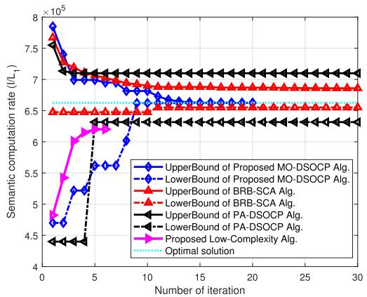

line

| Number of iteration | UpperBound of Proposed MO-DSOCP Alg. | LowerBound of Proposed MO-DSOCP Alg. | UpperBound of BRB-SCA Alg. | LowerBound of BRB-SCA Alg. | UpperBound of PA-DSOCP Alg. | LowerBound of PA-DSOCP Alg. | Proposed Low-Complexity Alg. | Optimal solution |
| ------------------- | ------------------------------------ | ------------------------------------ | -------------------------- | -------------------------- | --------------------------- | --------------------------- | ---------------------------- | ---------------- |
| 0                   | 7.8e5                                | 4.7e5                                | 7.7e5                      | 6.5e5                      | 7.2e5                       | 4.4e5                       | 4.8e5                        | 6.5e5            |
| 5                   | 7.0e5                                | 5.2e5                                | 7.0e5                      | 6.5e5                      | 7.1e5                       | 4.4e5                       | 6.0e5                        | 6.5e5            |
| 10                  | 6.8e5                                | 6.0e5                                | 6.9e5                      | 6.5e5                      | 7.1e5                       | 6.4e5                       | 6.2e5                        | 6.5e5            |
| 15                  | 6.7e5                                | 6.0e5                                | 6.9e5                      | 6.5e5                      | 7.1e5                       | 6.4e5                       | 6.2e5                        | 6.5e5            |
| 20                  | 6.7e5                                | 6.0e5                                | 6.9e5                      | 6.5e5                      | 7.1e5                       | 6.4e5                       | 6.2e5                        | 6.5e5            |
| 25                  | 6.7e5                                | 6.0e5                                | 6.9e5                      | 6.5e5                      | 7.1e5                       | 6.4e5                       | 6.2e5                        | 6.5e5            |
| 30                  | 6.7e5                                | 6.0e5                                | 6.9e5                      | 6.5e5                      | 7.1e5                       | 6.4e5                       | 6.2e5                        | 6.5e5            |

Fig. 4. Convergence of the algorithms.

Fig. 5 illustrates the 3D beampattern of different architectures, i.e., the transceiver’s beampattern and MF-RIS’s ones. As expected, the main beampattern directions of all the architectures point to the desired targets, while the nulls can be accurately generated at the region of other GBSs and jammer, even under the CSI imperfection. Taking the receive beampattern of $\mathbf { v } _ { 1 }$ as an example, the SJNR at the directions of $\mathbf { A P }$ and MF-RIS are guaranteed about -1.8 dB and -3.1 dB, respectively, whereas the jammer’s region is placed at the null with depth of -28.3 dB. Besides, due to the feasible set for the MF-RIS coefficients in C5-C7, the resolution of MF-RIS’s beampatterns is lower than those of transceiver’s ones. However, the accurate mainlobe and sidelobe can be still generated at desired regions. These behaviors verify that the obtained beampatterns can boost the desired signal quality and simultaneously nullify the interference/jamming signals at the CSI uncertainty regions.

Fig. 6 plots the semantic computation rate versus the number of RIS units for the different schemes. As N increases, more DoFs and spatial diversity gain are available for simultaneous jamming nulling and desired signal enhancement, thereby leading to the improvement of semantic computation rates over the scheme without RIS. Since the active

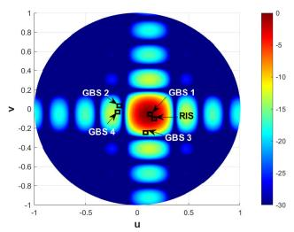

heatmap

| Region | Value |
|--------|-------|
| GBS 1  | -5    |
| GBS 2  | -10   |
| GBS 3  | -15   |
| GBS 4  | -20   |

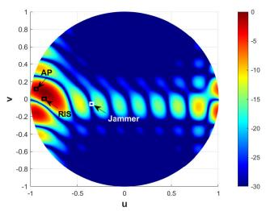

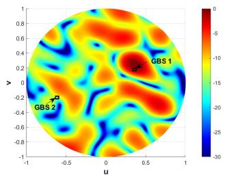  
（c）

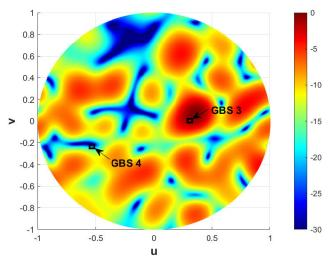

heatmap

| u     | y     | Value |
|-------|-------|-------|
| -0.5  | -0.2  | -25   |
| 0.0   | 0.0   | -10   |
| 0.5   | 0.2   | -5    |
| 0.8   | 0.4   | 0     |
| 0.3   | -0.4  | -20   |
| -0.2  | -0.6  | -15   |
| 0.7   | -0.8  | -5    |
| 0.1   | -1.0  | -10   |
| -0.6  | -1.2  | -25   |
| 0.9   | -1.4  | -5    |
| -0.4  | -1.6  | -15   |
| 0.6   | -1.8  | -5    |
| -0.7  | -2.0  | -20   |
| 0.2   | -2.2  | -10   |
| -0.3  | -2.4  | -5    |
| 0.8   | -2.6  | 0     |
| -0.1  | -2.8  | -15   |
| 0.4   | -3.0  | -25   |
| -0.9  | -3.2  | -30   |
| 0.7   | -3.4  | -25   |
| -0.5  | -3.6  | -20   |
| 0.3   | -3.8  | -15   |
| -0.2  | -4.0  | -10   |
| 0.6   | -4.2  | -5    |
| -0.6  | -4.4  | 0     |
| 0.9   | -4.6  | 5     |
| -0.7  | -4.8  | 10    |
| 0.4   | -5.0  | 15    |
| -0.8  | -5.2  | 20    |
| 0.7   | -5.4  | 25    |
| -0.3  | -5.6  | 30    |
| 0.2   | -5.8  | 25    |
| -0.9  | -6.0  | 20    |
| 0.6   | -6.2  | 15    |
| -0.1  | -6.4  | 10    |
| 0.8   | -6.6  | 5     |
| -0.5  | -6.8  | 15    |
| 0.3   | -7.0  | 25    |
| -0.7  | -7.2  | 35    |
| 0.7   | -7.4  | 30    |
| -0.2  | -7.6  | 25    |
| 0.9   | -7.8  | 20    |
| -0.6  | -8.0  | 15    |
| 0.4   | -8.2  | 10    |
| -0.8  | -8.4  | 5     |
| 0.6   | -8.6  | 15    |
| -0.4  | -8.8  | 25    |
| 0.8   | -9.0  | 35    |
| -0.7  | -9.2  | 30    |
| 0.3   | -9.4  | 25    |
| -0.9  | -9.6  | 20    |
| 0.7   | -9.8  | 15    |
| -0.3  | -10.0 | 10    |
| 0.9   | -10.2 | 5     |
| -0.1  | -10.4 | 15    |
| 0.6   | -10.6 | 25    |
| -0.5  | -10.8 | 35    |
| 0.8   | -11.0 | 30    |
| -0.7  | -11.2 | 25    |
| 0.4   | -11.4 | 20    |
| -0.9  | -11.6 | 15    |
| 0.7   | -11.8 | 10    |
| -0.2  | -12.0 | 5     |
| 0.9   | -12.2 | 15    |
| -0.6  | -12.4 | 25    |
| 0.3   | -12.6 | 35    |
| -0.8  | -12.8 | 30    |
| 0.7   | -13.0 | 25    |
| -0.4  | -13.2 | 20    |
| 0.9   | -13.4 | 15    |
| -0.9  | -13.6 | 5     |
| 0.2   | -13.8 | 15    |
| -0.3  | -14.0 | 25    |
| 0.6   | -14.2 | 35    |
| -0.1  | -14.4 | 30    |
| 0.8   | -14.6 | 25    |
| -0.5  | -14.8 | 20    |
| 0.4   | -15.0 | 15    |
| -0.7  | -15.2 | 5     |
| 0.7   | -15.4 | 15    |
| -0.3  | -15.6 | 25    |
| 0.9   | -15.8 | 35    |
| -0.8  | -16.0 | 30    |
| 0.3   | -16.2 | 25    |
| -0.9  | -16.4 | nan    |
|

(d）  
Fig. 5. Beampattern of different architectures (colorbar on the right denotes SJNR, unit: dB, u = sin θ cos φ, v = cos θ): (a) The transmit beampattern of w1 pointing to (20◦, 0◦); (b) The receive beampattern of v1 pointing to (150◦, 0◦); (c) The MF-RIS’s reflecting beampattern of $\Phi _ { \mathrm { R } } \mathbf { G w } _ { 1 }$ pointing to (45◦, −90◦); (d) The MF-RIS’s refracting beampattern of $\Phi _ { \mathrm { T } } \bf { G w } _ { 3 }$ pointing to $( 6 0 ^ { \circ } , 1 0 0 ^ { \circ } )$ ).

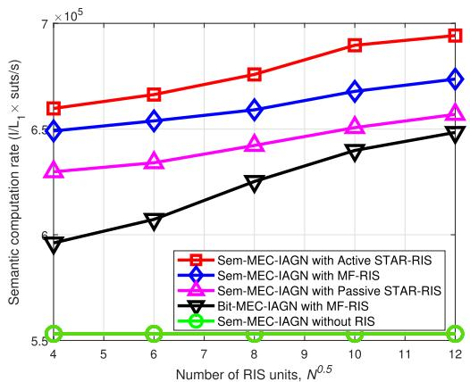

line

| Number of RIS units, N^0.5 | Sem-MEC-IAGN with Active STAR-RIS | Sem-MEC-IAGN with MF-RIS | Sem-MEC-IAGN with Passive STAR-RIS | Bit-MEC-IAGN with MF-RIS | Sem-MEC-IAGN without RIS |
| -------------------------- | --------------------------------- | ------------------------ | ---------------------------------- | ------------------------ | ------------------------ |
| 4                          | 6.6e5                             | 6.5e5                    | 6.3e5                              | 5.9e5                    | 5.5e5                    |
| 6                          | 6.7e5                             | 6.6e5                    | 6.4e5                              | 6.0e5                    | 5.5e5                    |
| 8                          | 6.8e5                             | 6.7e5                    | 6.5e5                              | 6.2e5                    | 5.5e5                    |
| 10                         | 6.9e5                             | 6.8e5                    | 6.6e5                              | 6.4e5                    | 5.5e5                    |
| 12                         | 7.0e5                             | 6.9e5                    | 6.7e5                              | 6.5e5                    | 5.5e5                    |

Fig. 6. S¯ $\mathrm { v . s . } \sqrt { N }$ for different schemes.

STAR-RIS having both the ideal power supply process and a larger amplification factor utilizes all the RIS units to enable Sem-MEC-IAGN, it has higher semantic computation rate than MF-RIS. In addition, due to the severe “doublefading” effects and limited DoFs for signal amplification, the performance of passive STAR-RIS is lower than that of MF-RIS. On the other hand, since the semantic communication can greatly compress the volume of offloading tasks, Sem-MEC-IAGN can exploit the limited energy to offloading more tasks to GBSs than Bit-MEC-IAGN, such that the semantic computation rate of Sem-MEC-IAGN is much higher than that of Bit-MEC-IAGN. Furthermore, we can observe that the performance gap between Sem-MEC-IAGN and Bit-MEC-IAGN gradually decreases. This is because semantic and bit communication are generally preferable in the low- and high-SJNR cases [33], respectively. These results demonstrate that semantic communication can be tailor-made for anti-jamming communication and computing, and MF-RIS further constructs

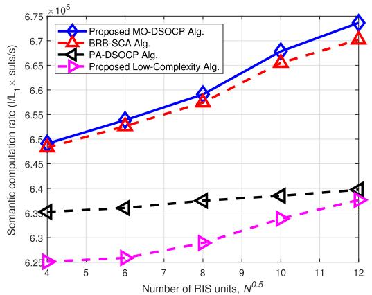

line

| Number of RIS units, N^0.5 | Proposed MO-DSOCP Alg. | BRB-SCA Alg. | PA-DSOCP Alg. | Proposed Low-Complexity Alg. |
| -------------------------- | ---------------------- | ------------ | ------------- | ---------------------------- |
| 4                          | 6.50                   | 6.48         | 6.33          | 6.25                         |
| 6                          | 6.55                   | 6.53         | 6.33          | 6.27                         |
| 8                          | 6.60                   | 6.58         | 6.37          | 6.30                         |
| 10                         | 6.68                   | 6.65         | 6.39          | 6.33                         |
| 12                         | 6.75                   | 6.70         | 6.40          | 6.37                         |

Fig. 7. S¯ v.s. $\sqrt { N }$ for different algorithms.

a controllable wireless environment to maintain the stable performance.

Fig. 7 depicts the semantic computation rate versus the number of RIS units for different algorithms. Clearly, our proposed MO-DSOCP algorithm outperforms the other MO algorithms, and the performance gap between them becomes larger as N increases, especially between the MO-DSOCP and PA-DSOCP. This is because the proposed MO-DSOCP converges to the optimal solution within 20 iterations, while the other MO algorithms require a larger number of iterations to converge. Thus, given the fixed maximum number of iterations, the other MO algorithms cannot converge to the optimal solution, especially when N is large. In addition, we can see that our proposed low-complexity algorithm can still achieve satisfactory performance, even as N increases, which verifies its validity and effectiveness.

Fig. 8 illustrates the semantic computation rate versus the number of transmit antennas. As M increases from $4 \times 4$ to $8 \times 8 ,$ the semantic computation rates of all schemes increase quickly, while they converge gradually as M grows from $8 \times 8$ to $1 2 \times 1 2 .$ . This is because the resolution of the transmit precoder’s beampattern can be improved by employing $4 \times 4$ to $8 \times 8$ transmit antennas, and thus inter-user interference strength can be significantly mitigated. However, both the intended signal and inter-user interference strength are simultaneously increased as M increases from $8 \times 8$ to $1 2 \times 1 2 .$ , thereby leading to the convergence of semantic computation rate. It can be also observed that since semantic communication is superior to bit communication in the low SJNR regime, the performance of Sem-MEC-IAGN is much more stable than that of Bit-MEC-IAGN when $M \leq 6 \times 6 .$ , which is consistent with the results of existing works [33]. In addition, when $M \ < \ 6 \times 6 ,$ , Sem-MEC-IAGN without RIS cannot enable semantic anti-jamming communication and computing, verifying the additional DoFs introduced by RIS for performance enhancement.

Finally, Fig. 9 presents the semantic computation rate versus SJNR. Clearly, the performance gap between the Bit-MEC-IAGN and Sem-MEC-IAGN becomes smaller as the SJNR increases, which implies that bit communication and computing is still effective when SJNR is high, and we can choose the communication and computing mode based on the value of SJNR. Moreover, since RIS can balance the enhancement of the desired signal and the suppression of the jamming signal as SJNR increases, the performance increment of RIS-aided Sem-MEC-IAGN is larger than that of Sem-MEC-IAGN without RIS, which also demonstrates the performance gain introduced by RIS in Sem-MEC-IAGN.

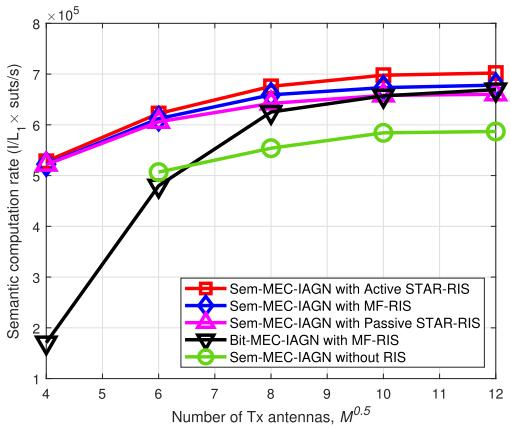

line

| Number of Tx antennas, M^0.5 | Sem-MEC-IAGN with Active STAR-RIS | Sem-MEC-IAGN with MF-RIS | Sem-MEC-IAGN with Passive STAR-RIS | Bit-MEC-IAGN with MF-RIS | Sem-MEC-IAGN without RIS |
| ---------------------------- | --------------------------------- | ------------------------ | ---------------------------------- | ------------------------- | ------------------------ |
| 4                            | 50000                             | 50000                    | 50000                              | 15000                     | 50000                    |
| 6                            | 65000                             | 60000                    | 62000                              | 48000                     | 50000                    |
| 8                            | 70000                             | 68000                    | 65000                              | 62000                     | 55000                    |
| 10                           | 72000                             | 70000                    | 68000                              | 65000                     | 58000                    |
| 12                           | 73000                             | 71000                    | 69000                              | 66000                     | 59000                    |

Fig. 8. Semantic computation rate v.s. ${ \sqrt { M } } .$

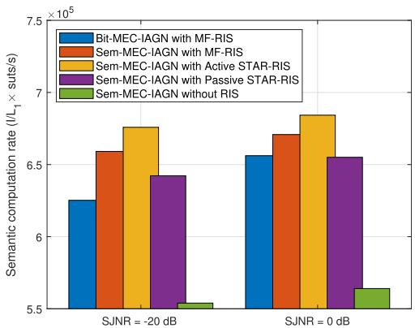

bar

| SJNR | Bit-MEC-IAGN with MF-RIS | Sem-MEC-IAGN with MF-RIS | Sem-MEC-IAGN with Active STAR-RIS | Sem-MEC-IAGN with Passive STAR-RIS | Sem-MEC-IAGN without RIS |
|---|---|---|---|---|---|
| -20 dB | 6.25 | 6.6 | 6.8 | 6.4 | 5.5 |
| 0 dB | 6.55 | 6.75 | 6.85 | 6.55 | 5.65 |

Fig. 9. Semantic computation rate v.s. SJNR.

# VI. CONCLUSION

In this paper, a MF-RIS aided semantic anti-jamming communication and computing framework has been proposed to overcome three bottlenecks for enabling MEC-IAGN, where the customized wireless environment provided by MF-RIS, inherent robustness and data compression capability of semantic transceiver can lead to substantial global coverage, reliable connectivity, and high-rate computing of MEC-IAGN. Based on the above framework, a worst-case semantic computation rate maximization problem was formulated, while satisfying the energy partition constraint, semantic similarity requirement, and MF-RIS’s self-sustainability requirement. To solve this intractable optimization problem, a fast-converging MO-DSOCP was proposed to find the globally optimal solution with a reduced number of feasibility evaluations. In addition, a low-complexity GPI algorithm was developed to obtain a semi-closed-form solution. Our simulation results confirmed the superiority of our proposed framework and algorithms over key benchmarks.

# APPENDIX A PROOF OF PROPOSITION 3

Before proving the proposition, we first provide the following inequality and equalities for two arbitrary vectors x and $\mathbf { y } ,$ which is given by

$$
\left\| \mathbf {x} \right\| ^ {2} \geq 2 \Re \left\{\mathbf {y} ^ {H} \mathbf {x} \right\} - \left\| \mathbf {y} \right\| ^ {2},
$$

$$
\Re \left(\mathbf {x} ^ {H} \mathbf {y}\right) = \frac {1}{4} \left(\| \mathbf {x} + \mathbf {y} \| ^ {2} - \| \mathbf {x} - \mathbf {y} \| ^ {2}\right),
$$

$$
\Im \left(\mathbf {x} ^ {H} \mathbf {y}\right) = \frac {1}{4} \left(\left\| \mathbf {x} - j \mathbf {y} \right\| ^ {2} - \left\| \mathbf {x} + j \mathbf {y} \right\| ^ {2}\right), \tag {A.1}
$$

where the first inequality holds due to the first-order Taylor expansion, and the other two equalities are obtained by expanding the terms in the right-hand side (RHS). Then, the lower bound of $\left| \mathbf { h } _ { k } ^ { H } \mathbf { w } _ { k } \right| ^ { 2 }$ in (29) can be obtained, i.e.,

$$
\begin{array}{l} \left| \mathbf {h} _ {k} ^ {H} \mathbf {w} _ {k} \right| ^ {2} \overset {(a)} {\geq} 2 \Re \left\{u _ {k} ^ {(i _ {\mathrm{d}}), H} \mathbf {h} _ {k} ^ {H} \mathbf {w} _ {k} \right\} - \left| u _ {k} ^ {(i _ {\mathrm{d}})} \right| ^ {2} \\ \stackrel {(b)} {\geq} \frac {1}{2} \left(\left\| u _ {k} ^ {(i _ {\mathrm{d}})} \mathbf {h} _ {k} + \mathbf {w} _ {k} \right\| ^ {2} - \left\| u _ {k} ^ {(i _ {\mathrm{d}})} \mathbf {h} _ {k} - \mathbf {w} _ {k} \right\| ^ {2}\right) - \left| u _ {k} ^ {(i _ {\mathrm{d}})} \right| ^ {2} \\ \stackrel {(c)} {\geq} f \left(\boldsymbol {\varphi} _ {\iota (k)}, \mathbf {w} _ {k}; \boldsymbol {\varphi} _ {\iota (k)} ^ {(i _ {\mathrm{d}})}, \mathbf {w} _ {k} ^ {(i _ {\mathrm{d}})}\right), \tag {A.2} \\ \end{array}
$$

where (a) and (c) hold due to the first inequality in (A.1), and (b) holds due to the second equality in (A.1). Clearly, $f \left( \varphi _ { \iota ( k ) } , \mathbf { w } _ { k } ; \varphi _ { \iota ( k ) } ^ { ( i _ { \mathrm { d } } ) } , \mathbf { w } _ { k } ^ { ( i _ { \mathrm { d } } ) } \right)$ is concave w.r.t. $\varphi _ { \iota ( k ) } , \mathbf { w } _ { k } ,$ , and thus we can obtain C2a in (30).

Next, due to (A.1) and the fact that $x \geq | y |$ holds if and only if $x \geq y { \mathrm { ~ o r ~ } } x \geq - y$ , we can rewrite C2b in (29) as

$$
\beta_ {i k} \geq \Re \left\{\mathbf {h} _ {k} ^ {H} \mathbf {w} _ {i} \right\} = \frac {1}{4} \left(\| \mathbf {h} _ {k} + \mathbf {w} _ {i} \| ^ {2} - \| \mathbf {h} _ {k} - \mathbf {w} _ {i} \| ^ {2}\right),
$$

$$
\beta_ {i k} \geq - \Re \left\{\mathbf {h} _ {k} ^ {H} \mathbf {w} _ {i} \right\} = \frac {1}{4} \left(\left\| \mathbf {h} _ {k} - \mathbf {w} _ {i} \right\| ^ {2} - \left\| \mathbf {h} _ {k} + \mathbf {w} _ {i} \right\| ^ {2}\right). \tag {A.3}
$$

However, the terms in RHS of (A.3) are non-convex due to the negative quadratic terms. To convexify (A.3), we use the inequality in (A.1) to approximate it as C2b in (30), which is convex w.r.t. $\varphi _ { \iota ( k ) } , \mathbf { w } _ { k }$ . Following a similar line of arguments, we can recast C2c in (29) as the counterpart in (30). ■

# APPENDIX B PROOF OF PROPOSITION 4

Owing to the basis’s properties, w can be defined as $\mathbf { w } ^ { ( 0 ) } =$ $\textstyle \sum _ { i = 1 } ^ { N } \kappa _ { i } \mathbf { q } _ { i } .$ N , where $\mathbf { q } _ { i }$ is the i-th eigenvector and $\kappa _ { i }$ is the weight factor. Denoting $\lambda _ { 1 } \ \geq \ \lambda _ { 2 } \ \geq \ \cdot \ \cdot \ \geq \ \lambda _ { N }$ and $\overline { { \mathbf { N } } } \mathbf { \Phi } = \mathbf { \Phi }$ $\mathbf { N } ^ { \dagger } \left( \mathbf { w } \right) \mathbf { M } \left( \mathbf { w } \right)$ , due to the fact that $\overline { { { \bf N } } } { \bf q } _ { i } = \lambda _ { i } { \bf q } _ { i }$ , we can obtain

$$
\begin{array}{l} \mathcal {D} (\mathbf {q}) = \overline {{\mathbf {N}}} \overline {{\mathbf {w}}} ^ {(i _ {\mathrm{d}})} = \sum_ {i = 1} ^ {N} \kappa_ {i} \lambda_ {i} ^ {(i _ {\mathrm{d}})} \mathbf {q} _ {i} \\ = \kappa_ {1} \lambda_ {1} ^ {(i _ {\mathrm{d}})} \left(\mathbf {q} _ {1} + \underbrace {\sum_ {i = 2} ^ {N} \frac {\kappa_ {i}}{\kappa_ {1}} \left(\frac {\lambda_ {i}}{\lambda_ {1}}\right) ^ {(i _ {\mathrm{d}})} \mathbf {q} _ {i}} _ {(a)}\right). \tag {B.1} \\ \end{array}
$$

Then, we prove that (a) will vanish as $i _ { \mathrm { d } } ~  ~ \infty$ . For an arbitrary vector ${ \bf q } ,$ the Taylor expansion of $\mathcal { D } \left( \mathbf { q } \right)$ at ${ \bf q } _ { 1 }$

leads to

$$
\begin{array}{l} \mathcal {D} ^ {H} (\mathbf {q}) \mathbf {q} _ {i} = \mathcal {D} ^ {H} (\mathbf {q} _ {1}) \mathbf {q} _ {i} \\ + \left(\mathbf {q} - \mathbf {q} _ {1}\right) ^ {H} \partial_ {\mathbf {q} _ {1}} \mathcal {D} \left(\mathbf {q} _ {1}\right) \mathbf {q} _ {i} + o \left(\left\| \mathbf {q} - \mathbf {q} _ {1} \right\|\right). \tag {B.2} \\ \end{array}
$$

Thus, we can further obtain

$$
\left(\mathcal {D} ^ {H} (\mathbf {q}) \mathbf {q} _ {1}\right) ^ {2} = \left(\lambda_ {1} + o \left(\| \mathbf {q} - \mathbf {q} _ {1} \|\right)\right) ^ {2}, \tag {B.3}
$$

$$
\begin{array}{l} \sum_ {i = 2} ^ {N} \left(\mathcal {D} ^ {H} (\mathbf {q}) \mathbf {q} _ {i}\right) ^ {2} \\ \leq \sum_ {i = 2} ^ {N} \left(\lambda_ {i} \left(\mathbf {q} ^ {H} \mathbf {q} _ {i}\right) ^ {2} + 2 \lambda_ {i} \left(\mathbf {q} ^ {H} \mathbf {q} _ {i}\right) ^ {2} o \left(\| \mathbf {q} - \mathbf {q} _ {1} \|\right)\right) \\ + o ^ {2} \left(\| \mathbf {q} - \mathbf {q} _ {1} \|\right) \leq \left(\lambda_ {2} \| \mathbf {q} - \mathbf {q} _ {1} \| + o \left(\| \mathbf {q} - \mathbf {q} _ {1} \|\right)\right) ^ {2}. \tag {B.4} \\ \end{array}
$$

Due to $\lambda _ { 1 } \geq \lambda _ { 2 } \geq \dots \geq \lambda _ { N }$ , (a) vanishes by projecting q onto $\mathcal { D } \left( \mathbf { q } \right)$ with (50). Hence, w will converge to stationary point.

Then, we prove that the stationary point is a local optimal solution. It is worth noting that w satisfying (47) is a stationary solution of (41), since (47) is the first-order optimality condition. Besides, it can be seen that the first-order optimality condition (47) is a non-linear eigenvalue problem, namely, eigenvector-dependent non-linear eigenvalue problem (NEPv). As such, w is also an eigenvector of N† (w) M (w), which corresponds to the eigenvalue ${ \mathcal { L } } _ { 1 } \left( \mathbf { w } \right)$ . Moreover, we can observe that $\lambda _ { \mathrm { m a x } }$ is equivalent to ${ \mathcal { L } } _ { 1 } \left( \mathbf { w } \right)$ in (45). Thus, the leading eigenvector of $\mathbf { N } ^ { \dagger } \left( \mathbf { w } \right) \mathbf { M } \left( \mathbf { w } \right)$ maximizing the objective function must be local optimal solution of (47).

Finally, according to [74], under the alternative optimization framework, w converges to the local optimal solutions.

# REFERENCES

[1] R. Xie, Q. Tang, Q. Wang, X. Liu, F. R. Yu, and T. Huang, “Satellite-terrestrial integrated edge computing networks: Architecture, challenges, and open issues,” IEEE Netw., vol. 34, no. 3, pp. 224–231, May/Jun. 2020.   
[2] Y. He, Y. Liu, C. Jiang, and X. Zhong, “Multiobjective anti-collision for massive access ranging in MF-TDMA satellite communication system,” IEEE Internet Things J., vol. 9, no. 16, pp. 14655–14666, Aug. 2022.   
[3] Y. He, Y. Xiao, S. Zhang, M. Jia, and Z. Li, “Direct-to-smartphone for 6G NTN: Technical routes, challenges, and key technologies,” IEEE Netw., vol. 38, no. 4, pp. 128–135, Jul. 2024.   
[4] H.-C. Chao, D. E. Comer, and O. Kao, “Space and terrestrial integrated networks: Emerging research advances, prospects, and challenges,” IEEE Netw., vol. 33, no. 1, pp. 6–7, Jan. 2019.   
[5] Y. Mao, C. You, J. Zhang, K. Huang, and K. B. Letaief, “A survey on mobile edge computing: The communication perspective,” IEEE Commun. Surveys Tuts., vol. 19, no. 4, pp. 2322–2358, 4th Quart., 2017.   
[6] F. Zhou, Y. Wu, R. Q. Hu, and Y. Qian, “Computation rate maximization in UAV-enabled wireless-powered mobile-edge computing systems,” IEEE J. Sel. Areas Commun., vol. 36, no. 9, pp. 1927–1941, Sep. 2018.   
[7] Y. Xu et al., “Energy-efficient channel access and data offloading against dynamic jamming attacks,” IEEE Trans. Green Commun. Netw., vol. 5, no. 4, pp. 1734–1746, Dec. 2021.   
[8] R. Ma, W. Yang, X. Guan, X. Lu, Y. Song, and D. Chen, “Covert mmWave communications with finite blocklength against spatially random wardens,” IEEE Internet Things J., vol. 11, no. 2, pp. 3402–3416, Jan. 2024.   
[9] W.-C. Chien, C.-F. Lai, M. S. Hossain, and G. Muhammad, “Heterogeneous space and terrestrial integrated networks for IoT: Architecture and challenges,” IEEE Netw., vol. 33, no. 1, pp. 15–21, Jan. 2019.

[10] W. Feng et al., “Hybrid beamforming design and resource allocation for UAV-aided wireless-powered mobile edge computing networks with NOMA,” IEEE J. Sel. Areas Commun., vol. 39, no. 11, pp. 3271–3286, Nov. 2021.   
[11] Q. Wu and R. Zhang, “Intelligent reflecting surface enhanced wireless network via joint active and passive beamforming,” IEEE Trans. Wireless Commun., vol. 18, no. 11, pp. 5394–5409, Nov. 2019.   
[12] Z. Lin et al., “Refracting RIS-aided hybrid satellite-terrestrial relay networks: Joint beamforming design and optimization,” IEEE Trans. Aerosp. Electron. Syst., vol. 58, no. 4, pp. 3717–3724, Aug. 2022.   
[13] S. Li, B. Duo, X. Yuan, Y.-C. Liang, and M. Di Renzo, “Reconfigurable intelligent surface assisted UAV communication: Joint trajectory design and passive beamforming,” IEEE Wireless Commun. Lett., vol. 9, no. 5, pp. 716–720, May 2020.   
[14] W. Ni, X. Liu, Y. Liu, H. Tian, and Y. Chen, “Resource allocation for multi-cell IRS-aided NOMA networks,” IEEE Trans. Wireless Commun., vol. 20, no. 7, pp. 4253–4268, Jul. 2021.   
[15] Z. Zheng, W. Jing, Z. Lu, X. Wen, Q. Wu, and H. Shao, “RISaided hotspot capacity enhancement for multibeam satellite systems,” IEEE Trans. Wireless Commun., vol. 23, no. 4, pp. 3648–3664, Apr. 2024.   
[16] L. You, J. Xiong, D. W. K. Ng, C. Yuen, W. Wang, and X. Gao, “Energy efficiency and spectral efficiency tradeoff in RIS-aided multiuser MIMO uplink transmission,” IEEE Trans. Signal Process., vol. 69, pp. 1407–1421, 2021.   
[17] K. Tekbiyik, G. K. Kurt, and H. Yanikomeroglu, “Energy-efficient RISassisted satellites for IoT networks,” IEEE Internet Things J., vol. 9, no. 16, pp. 14891–14899, Aug. 2022.   
[18] Z. Chu, P. Xiao, D. Mi, W. Hao, Y. Xiao, and L.-L. Yang, “Multi-IRS assisted multi-cluster wireless powered IoT networks,” IEEE Trans. Wireless Commun., vol. 22, no. 7, pp. 4712–4728, Jul. 2023.   
[19] Z. Chu et al., “IRS-assisted wireless powered IoT network with multiple resource blocks,” IEEE Trans. Commun., vol. 71, no. 4, pp. 2335–2350, Apr. 2023.   
[20] H. Niu et al., “Active RIS-assisted secure transmission for cognitive satellite terrestrial networks,” IEEE Trans. Veh. Technol., vol. 72, no. 2, pp. 2609–2614, Feb. 2023.   
[21] Y. Sun et al., “Energy-efficient hybrid beamforming for multilayer RIS-assisted secure integrated terrestrial-aerial networks,” IEEE Trans. Commun., vol. 70, no. 6, pp. 4189–4210, Jun. 2022.   
[22] Y. Sun et al., “Active-passive cascaded RIS-aided receiver design for jamming nulling and signal enhancing,” IEEE Trans. Wireless Commun., vol. 23, no. 6, pp. 5345–5362, Jun. 2024.   
[23] Y. Sun et al., “Joint transmissive and reflective RIS-aided secure MIMO systems design under spatially-correlated angular uncertainty and coupled PSEs,” IEEE Trans. Inf. Forensics Security, vol. 18, pp. 3606–3621, 2023.   
[24] Z. Chu, W. Hao, P. Xiao, and J. Shi, “Intelligent reflecting surface aided multi-antenna secure transmission,” IEEE Wireless Commun. Lett., vol. 9, no. 1, pp. 108–112, Jan. 2020.   
[25] H. Niu, Z. Chu, F. Zhou, Z. Zhu, L. Zhen, and K. Wong, “Robust design for intelligent reflecting surface-assisted secrecy SWIPT network,” IEEE Trans. Wireless Commun., vol. 21, no. 6, pp. 4133–4149, Jun. 2022.   
[26] Z. Chu, P. Xiao, M. Shojafar, D. Mi, J. Mao, and W. Hao, “Intelligent reflecting surface assisted mobile edge computing for Internet of Things,” IEEE Wireless Commun. Lett., vol. 10, no. 3, pp. 619–623, Mar. 2021.   
[27] Z. Zhai, X. Dai, B. Duo, X. Wang, and X. Yuan, “Energy-efficient UAVmounted RIS assisted mobile edge computing,” IEEE Wireless Commun. Lett., vol. 11, no. 12, pp. 2507–2511, Dec. 2022.   
[28] S. Mao et al., “Reconfigurable intelligent surface-assisted secure mobile edge computing networks,” IEEE Trans. Veh. Technol., vol. 71, no. 6, pp. 6647–6660, Jun. 2022.   
[29] Z. Liu, Z. Li, M. Wen, Y. Gong, and Y.-C. Wu, “STAR-RIS-Aided mobile edge computing: Computation rate maximization with binary amplitude coefficients,” IEEE Trans. Commun., vol. 71, no. 7, pp. 4313–4327, Jul. 2023.   
[30] Z. Peng, R. Weng, Z. Zhang, C. Pan, and J. Wang, “Active reconfigurable intelligent surface for mobile edge computing,” IEEE Wireless Commun. Lett., vol. 11, no. 12, pp. 2482–2486, Dec. 2022.

[31] D. Li, “Ergodic capacity of intelligent reflecting surface-assisted communication systems with phase errors,” IEEE Commun. Lett., vol. 24, no. 8, pp. 1646–1650, Aug. 2020.   
[32] D. Li, “How many reflecting elements are needed for energyand spectral-efficient intelligent reflecting surface-assisted communication,” IEEE Trans. Commun., vol. 70, no. 2, pp. 1320–1331, Feb. 2022.   
[33] X. Mu, Y. Liu, L. Guo, and N. Al-Dhahir, “Heterogeneous semantic and bit communications: A semi-NOMA scheme,” IEEE J. Sel. Areas Commun., vol. 41, no. 1, pp. 155–169, Jan. 2023.   
[34] H. Xie, Z. Qin, G. Y. Li, and B.-H. Juang, “Deep learning enabled semantic communication systems,” IEEE Trans. Signal Process., vol. 69, pp. 2663–2675, 2021.   
[35] Z. Weng and Z. Qin, “Semantic communication systems for speech transmission,” IEEE J. Sel. Areas Commun., vol. 39, no. 8, pp. 2434–2444, Aug. 2021.   
[36] E. Bourtsoulatze, D. B. Kurka, and D. Gündüz, “Deep joint sourcechannel coding for wireless image transmission,” IEEE Trans. Cogn. Commun. Netw., vol. 5, no. 3, pp. 567–579, Sep. 2019.   
[37] L. Yan, Z. Qin, R. Zhang, Y. Li, and G. Y. Li, “Resource allocation for text semantic communications,” IEEE Wireless Commun. Lett., vol. 11, no. 7, pp. 1394–1398, Jul. 2022.   
[38] J. Chen, J. Wang, C. Jiang, and J. Wang, “Age of incorrect information in semantic communications for NOMA aided XR applications,” IEEE J. Sel. Topics Signal Process., vol. 17, no. 5, pp. 1093–1105, Sep. 2023.   
[39] Y. Cang et al., “Online resource allocation for semantic-aware edge computing systems,” IEEE Internet Things J., vol. 11, no. 7, pp. 28094–28110, Sep. 2024.   
[40] Y. Cang et al., “Resource allocation for semantic-aware mobile edge computing systems,” in Proc. IEEE Globecom Workshops (GC Wkshps), Dec. 2023, pp. 1585–1590.   
[41] R. Long, Y. C. Liang, Y. Pei, and E. G. Larsson, “Active reconfigurable intelligent surface-aided wireless communications,” IEEE Trans. Wireless Commun., vol. 20, no. 8, pp. 4962–4975, Aug. 2021.   
[42] W. Wang, W. Ni, H. Tian, Y. C. Eldar, and R. Zhang, “Multifunctional reconfigurable intelligent surface: System modeling and performance optimization,” IEEE Trans. Wireless Commun., vol. 23, no. 4, pp. 3025–3041, Apr. 2024.   
[43] A. Zheng, W. Ni, W. Wang, and H. Tian, “Next-generation RIS: From single to multiple functions,” IEEE Wireless Commun. Lett., vol. 12, no. 12, pp. 1988–1992, Dec. 2023.   
[44] A. Zheng, W. Ni, W. Wang, H. Tian, Y. C. Eldar, and D. Niyato, “Multifunctional RIS: Signal modeling and optimization,” IEEE Trans. Veh. Technol., vol. 73, no. 4, pp. 5971–5976, Apr. 2024.   
[45] H. Wei, W. Wang, W. Ni, and D. Niyato, “Multi-functional RISaided cell-free networks,” IEEE Trans. Veh. Technol., vol. 73, no. 9, pp. 13968–13973, Sep. 2024.   
[46] A. Zheng, W. Ni, W. Wang, and H. Tian, “Enhancing NOMA networks via reconfigurable multi-functional surface,” IEEE Commun. Lett., vol. 27, no. 4, pp. 1195–1199, Apr. 2023.   
[47] W. Wang, W. Ni, H. Tian, Y. C. Eldar, and D. Niyato, “UAV-mounted multi-functional RIS for combating eavesdropping in wireless networks,” IEEE Wireless Commun. Lett., vol. 12, no. 10, pp. 1667–1671, Oct. 2023.   
[48] X. Hu, L. Wang, K.-K. Wong, M. Tao, Y. Zhang, and Z. Zheng, “Edge and central cloud computing: A perfect pairing for high energy efficiency and low-latency,” IEEE Trans. Wireless Commun., vol. 19, no. 2, pp. 1070–1083, Feb. 2020.   
[49] Z. Lin, M. Lin, Y. Huang, T. D. Cola, and W.-P. Zhu, “Robust multiobjective beamforming for integrated satellite and high altitude platform network with imperfect channel state information,” IEEE Trans. Signal Process., vol. 67, no. 24, pp. 6384–6396, Dec. 2019.   
[50] S. Zeng et al., “Intelligent omni-surfaces: Reflection-refraction circuit model, full-dimensional beamforming, and system implementation,” IEEE Trans. Commun., vol. 70, no. 11, pp. 7711–7727, Nov. 2022.   
[51] Z. Zhang et al., “Active RIS vs. passive RIS: Which will prevail in 6G?” IEEE Trans. Commun., vol. 71, no. 3, pp. 1707–1725, Mar. 2023.   
[52] J. Zhou, P. Zhang, J. Han, L. Li, and Y. Huang, “Metamaterials and metasurfaces for wireless power transfer and energy harvesting,” Proc. IEEE, vol. 110, no. 1, pp. 31–55, Jan. 2022.   
[53] J. Xu, Y. Liu, X. Mu, and O. A. Dobre, “STAR-RISs: Simultaneous transmitting and reflecting reconfigurable intelligent surfaces,” IEEE Commun. Lett., vol. 25, no. 9, pp. 3134–3138, Sep. 2021.

[54] E. Boshkovska, D. W. K. Ng, N. Zlatanov, and R. Schober, “Practical non-linear energy harvesting model and resource allocation for SWIPT systems,” IEEE Commun. Lett., vol. 19, no. 12, pp. 2082–2085, Dec. 2015.   
[55] S. Hu, Z. Wei, Y. Cai, C. Liu, D. W. K. Ng, and J. Yuan, “Robust and secure sum-rate maximization for multiuser MISO downlink systems with self-sustainable IRS,” IEEE Trans. Commun., vol. 69, no. 10, pp. 7032–7049, Oct. 2021.   
[56] M. M. Azari, F. Rosas, K. Chen, and S. Pollin, “Ultra reliable UAV communication using altitude and cooperation diversity,” IEEE Trans. Commun., vol. 66, no. 1, pp. 330–344, Jan. 2018.   
[57] C. Hu, L. Dai, T. Mir, Z. Gao, and J. Fang, “Super-resolution channel estimation for mmWave massive MIMO with hybrid precoding,” IEEE Trans. Veh. Technol., vol. 67, no. 9, pp. 8954–8958, Sep. 2018.   
[58] Z. Shen, K. Xu, and X. Xia, “Beam-domain anti-jamming transmission for downlink massive MIMO systems: A Stackelberg game perspective,” IEEE Trans. Inf. Forensics Security, vol. 16, pp. 2727–2742, 2021.   
[59] Y. Sun et al., “RIS-assisted robust hybrid beamforming against simultaneous jamming and eavesdropping attacks,” IEEE Trans. Wireless Commun., vol. 21, no. 11, pp. 9212–9231, Nov. 2022.   
[60] H. Lin, F. Gao, S. Jin, and G. Y. Li, “A new view of multiuser hybrid massive MIMO: Non-orthogonal angle division multiple access,” IEEE J. Sel. Areas Commun., vol. 35, no. 10, pp. 2268–2280, Oct. 2017.   
[61] R. Schmidt, “Multiple emitter location and signal parameter estimation,” IEEE Trans. Antennas Propag., vol. AP-34, no. 3, pp. 276–280, Mar. 1986.   
[62] Y. Han, W. Tang, S. Jin, C.-K. Wen, and X. Ma, “Large intelligent surface-assisted wireless communication exploiting statistical CSI,” IEEE Trans. Veh. Technol., vol. 68, no. 8, pp. 8238–8242, Aug. 2019.   
[63] H. Tuy, “Monotonic optimization: Problems and solution approaches,” SIAM J. Optim., vol. 11, no. 2, pp. 464–494, Jan. 2000.   
[64] L. Liu, R. Zhang, and K.-C. Chua, “Achieving global optimality for weighted sum-rate maximization in the K-user Gaussian interference channel with multiple antennas,” IEEE Trans. Wireless Commun., vol. 11, no. 5, pp. 1933–1945, May 2012.   
[65] Y. Wang, V. W. S. Wong, and J. Wang, “Flexible rate-splitting multiple access with finite blocklength,” IEEE J. Sel. Areas Commun., vol. 41, no. 5, pp. 1398–1412, May 2023.   
[66] C. Wang, Z. Li, H. Zhang, D. W. K. Ng, and N. Al-Dhahir, “Achieving covertness and security in broadcast channels with finite blocklength,” IEEE Trans. Wireless Commun., vol. 21, no. 9, pp. 7624–7640, Sep. 2022.   
[67] E. A. Jorswieck and E. G. Larsson, “Monotonic optimization framework for the two-user MISO interference channel,” IEEE Trans. Commun., vol. 58, no. 7, pp. 2159–2168, Jul. 2010.   
[68] W. Wang, W. Ni, H. Tian, Z. Yang, C. Huang, and K.-K. Wong, “Safeguarding NOMA networks via reconfigurable dual-functional surface under imperfect CSI,” IEEE J. Sel. Topics Signal Process., vol. 16, no. 5, pp. 950–966, Aug. 2022.   
[69] Z. Yang, W. Xu, C. Huang, J. Shi, and M. Shikh-Bahaei, “Beamforming design for multiuser transmission through reconfigurable intelligent surface,” IEEE Trans. Commun., vol. 69, no. 1, pp. 589–601, Jan. 2021.   
[70] X. Zhao, S. Lu, Q. Shi, and Z.-Q. Luo, “Rethinking WMMSE: Can its complexity scale linearly with the number of BS antennas?” IEEE Trans. Signal Process., vol. 71, pp. 433–446, 2023.   
[71] C. Shen and H. Li, “On the dual formulation of boosting algorithms,” IEEE Trans. Pattern Anal. Mach. Intell., vol. 32, no. 12, pp. 2216–2231, Dec. 2010.   
[72] Y. Cai, L.-H. Zhang, Z. Bai, and R.-C. Li, “On an eigenvector-dependent nonlinear eigenvalue problem,” SIAM J. Matrix Anal. Appl., vol. 39, no. 3, pp. 1360–1382, 2018.   
[73] K. An et al., “Exploiting multi-layer refracting RIS-assisted receiver for HAP-SWIPT networks,” IEEE Trans. Wireless Commun., early access, May 3, 2024, doi: 10.1109/TWC.2024.3394214.   
[74] C. Pan et al., “Intelligent reflecting surface aided MIMO broadcasting for simultaneous wireless information and power transfer,” IEEE J. Sel. Areas Commun., vol. 38, no. 8, pp. 1719–1734, Aug. 2020.

natural_image

Portrait of a young man wearing a white shirt and black backpack (no text or symbols visible)

Yifu Sun received the B.Eng. and Ph.D. degrees in information and communications engineering from the National University of Defense Technology (NUDT), Changsha, China, in 2019 and 2024, respectively. He is currently a Research Assistant Professor with the Sixty-Third Research Institute, NUDT. His current research interests include antijamming communications, reconfigurable intelligent surface, physical layer security, semantic communications, and mobile edge computing.

natural_image

Portrait of a man wearing glasses and a suit jacket, with a lakeside background and distant mountains (no text or symbols visible)

Zhi Lin received the B.E. and M.E. degrees in information and communication engineering from the PLA University of Science and Technology in 2013 and 2016, respectively, and the Ph.D. degree in electronic science and technology from the Army Engineering University of PLA, Nanjing, China, in 2020.

From March 2019 to June 2020, he was a Visiting Ph.D. Student with the Department of Electrical and Computer Engineering, McGill University, Montréal, Canada. Since February 2023, he has been a

Post-Doctoral Fellow with the School of Computer Science and Engineering, Macau University of Science and Technology, Macau, China. Since January 2021, he has been with the College of Electronic Engineering, National University of Defense Technology, Hefei, China, where he is currently an Associate Professor. His research interests include array signal processing, physical layer security, reconfigurable intelligent surface, and satellite-aerialterrestrial integrated networks. He was a TPC Member of IEEE flagship conferences, including IEEE ICC, GLOBECOM, Infocom, and VTC. He was a recipient of the Outstanding Ph.D. Thesis Award of the Chinese Institute of Electronics in 2022, the Macao Young Scholars Fellowship in 2022, and the Best Paper Award from IEEE/CIC ICCC 2024, EAI WiSATS 2024, IEEE ICCT 2023, and IWCMC 2023. He was the Symposium Co-Chair of WCSP 2022 and 2024. He has been serving as an Area Editor for Physical Communication since 2024. He was also the Lead Guest Editor of IET Communications Special Issues on Reconfigurable Intelligent Surfaces Aided Physical Layer Security in 6G Wireless Networks. He was listed in the World’s Top 2% Scientists identified by Stanford University in 2022-2024.

natural_image

Portrait of a man wearing glasses and a maroon blazer (no visible text or symbols)

Dong Li (Senior Member, IEEE) received the Ph.D. degree in electronics and communication engineering from Sun Yat-sen University, Guangzhou, China, in 2010. Since 2010, he has been with the School of Computer Science and Engineering (formally, Faculty of Information Technology), Macau University of Science and Technology (MUST), Macau, China, where he is currently a Full Professor. He held a visiting position with the Institute for Infocomm Research, Singapore, in 2012. His current research interests include 6G wireless communications, the

battery-free Internet of Things (IoT), and wireless AI. He is an Executive Board Member of the IEEE Macau Section and a member of the Association for Promotion of Science and Technology of Macau. He was a recipient of the MUST Best Research Output Award in 2022 and the MUST Bank of China (BoC) Excellent Research Award in 2011, 2016, 2019, and 2021. He was a co-recipient of the Best Paper Award of IEEE ICCT 2023, IEEE HealthCom 2023, and MICCIS 2024, and the Distinguished Paper Award of IEEE GreenCom 2023. He is an Editor of IEEE MMTC Review. He has been listed among World’s Top 2% Scientists recognized by Stanford University since 2020.

natural_image

Portrait photo of a man in formal attire (no text or symbols visible)

Cheng Li received the B.S. degree in information engineering and the M.S. and Ph.D. degrees in information and communication engineering from the National University of Defense Technology, Changsha, in 2007, 2009, and 2015, respectively. He is currently an Assistant Research Fellow of the Sixty-Third Research Institute, National University of Defense Technology, Nanjing. His current research interests include signal processing, wireless communications, and electromagnetic countermeasure.

natural_image

Portrait of a man wearing glasses and a suit (no text or symbols visible)

Kang An received the B.E. degree in electronic engineering from Nanjing University of Aeronautics and Astronautics, Nanjing, China, in 2011, and the Ph.D. degree in communication engineering from Army Engineering University, Nanjing, in 2017. He is currently an Associate Professor with the Sixty-Third Research Institute, National University of Defense Technology, Nanjing. He has published more than 100 peer-reviewed research papers in leading journals and flagship conferences and many of them are ESI highly cited papers. His current

research interests include reconfigurable intelligent surface, anti-jamming communications, satellite/aerial communications, physical-layer security, signal processing, and machine learning for wireless communications. He was a recipient of an Exemplary Reviewer for IEEE TRANSACTIONS ON COM-MUNICATIONS and IEEE COMMUNICATIONS LETTERS in 2022. He was a recipient of the Outstanding Ph.D. Thesis Award of the Chinese Institute of Command and Control in 2019. He was a co-recipient of the Best Paper Award from IEEE/CIC ICCC 2024, EAI WiSATS 2024, IEEE ICCT 2023, and IWCMC 2023. He is also serving as an Editor for Frontiers in Communications and Networks and Frontiers in Space Technologies. He was listed in the World’s Top 2% Scientists identified by Stanford University in 2022, 2023, and 2024.

natural_image

Portrait photo of a man in formal attire (no text or symbols visible)

Yonggang Zhu received the B.S. degree in electronical engineering and the Ph.D. degree in science of military equipment from the PLA University of Science and Technology, Nanjing, China, in 2004, and 2009, respectively. He is currently a Research Associate Professor with the Sixty-Third Research Institute, National University of Defense Technology, Nanjing. His research interests include compressive sensing, statistical signal processing, reconfigurable intelligent surface, and anti-jamming communication.

natural_image

Portrait of a young man wearing glasses and a sweater (no visible text or symbols)

Derrick Wing Kwan Ng (Fellow, IEEE) received the bachelor’s (Hons.) and Master of Philosophy (M.Phil.) degrees in electronic engineering from The Hong Kong University of Science and Technology (HKUST) in 2006 and 2008, respectively, and the Ph.D. degree from The University of British Columbia (UBC) in November 2012.

He was a Senior Post-Doctoral Fellow with the Institute for Digital Communications, Friedrich-Alexander-University Erlangen–Nürnberg (FAU), Germany. He is currently a Scientia Associate Professor with the University of New South Wales, Sydney, Australia. His research interests include global optimization, physical layer security, IRS-assisted communication, UAV-assisted communication, wireless information and power transfer, and green (energy-efficient) wireless communications. He received the Australian Research Council (ARC) Discovery Early Career Researcher Award in 2017, the IEEE Communications Society Leonard G. Abraham Prize in 2023, the IEEE Communications Society Stephen O. Rice Prize in 2022, the Best Paper Award from WCSP 2020 and 2021, the IEEE TCGCC Best Journal Paper Award in 2018, INISCOM 2018, the IEEE International Conference on Communications (ICC) 2018 and 2021, the IEEE International Conference on Computing, Networking and Communications (ICNC) 2016, the IEEE Wireless Communications and Networking Conference (WCNC) 2012, the IEEE Global Telecommunication Conference (GLOBECOM) 2011 and 2021, and the IEEE Third International Conference on Communications and Networking in China 2008. He served as an Editorial Assistant to the Editor-in-Chief of IEEE TRANSACTIONS ON COMMUNICATIONS from January 2012 to December 2019. He is serving as an Editor for IEEE TRANSACTIONS ON COMMUNICATIONS and an Associate Editor-in-Chief for IEEE OPEN JOURNAL OF THE COMMUNICATIONS SOCIETY. He has been listed as a Highly Cited Researcher by Clarivate Analytics (Web of Science) since 2018.

natural_image

Portrait of a man in formal suit and tie, wearing glasses (no visible text or symbols)

Naofal Al-Dhahir (Fellow, IEEE) received the Ph.D. degree from Stanford University. He was a Principal Member of Technical Staff with the GE Research Center and AT&T Shannon Laboratory from 1994 to 2003. He is currently an Erik Jonsson Distinguished Professor and the ECE Associate Head with The University of Texas at Dallas. He is the co-inventor of 43 issued patents, the co-author of over 600 articles, and a co-recipient of eight IEEE best paper awards. He is a fellow of AAIA. He is a fellow of the U.S. National Academy of Inventors and a member of the European Academy of Sciences and Arts. He received the 2019 IEEE COMSOC SPCC Technical Recognition Award, the 2021 Qualcomm Faculty Award, and the 2022 IEEE COMSOC RCC Technical Recognition Award. From January 2016 to December 2019, he served as the Editor-in-Chief for IEEE TRANSACTIONS ON COMMUNICATIONS.

natural_image

Portrait photo of a smiling man in business attire (no text or symbols visible)

Jiangzhou Wang (Fellow, IEEE) is currently a Professor with Southeast University, China, and an Emeritus Professor with the University of Kent, U.K. He has published more than 500 articles and five books. His research interests include mobile communications. He is an International Member of the Chinese Academy of Engineering (CAE), a fellow of the Royal Academy of Engineering (R.A.Eng.), U.K., and a fellow of IET. He was a recipient of the 2024 IEEE Communications Society Fred W. Ellersick Prize and the 2022 IEEE Communications

Society Leonard G. Abraham Prize. He was the Technical Program Chair of the 2019 IEEE International Conference on Communications (ICC 2019), Shanghai, the Executive Chair of IEEE ICC2015, London, and the Technical Program Chair of the IEEE WCNC 2013.