# Multi-Objective ISAC for Low-Altitude Economy Based on Multi-Task Deep Reinforcement Learning with Mixture of Experts

Xiaowen Ye, Hengyi Lin, Xianxin Song, Yi Wu, and Liqun Fu, Senior Member, IEEE

Abstract—This paper studies a low-altitude economy (LAE)-oriented terrestrial integrated sensing and communication (ISAC) system, where a ground base station (GBS) provides communication and navigation services for authorized unmanned aerial vehicles (UAVs), as well as senses the low-altitude airspace to monitor the unauthorized mobile target. Both the communication sum-rate and sensing signal-to-noise ratio are maximized through joint optimization of GBS’s beamforming and authorized UAVs’ trajectories, subject to constraints including UAV mission completion and collision avoidance, as well as the GBS’s maximum transmit power. To address this problem, we propose an intelligent joint optimization scheme, termed Multi-task mixture Of Drl Experts (MODE), based on multi-task deep reinforcement learning (DRL) with mixture of experts (MoE). Specifically, the MODE scheme first introduces the deep deterministic policy gradient algorithm to handle all continuous-domain variables and incorporates an objective-preference weight to capture the trade-off between communication and sensing performance. Thereafter, a multi-task MoE architecture is developed as the neural network of MODE, which treats each optimization problem with a specific objective-preference weight as a distinct task and trains these tasks concurrently within shared gating and expert networks. As such, MODE can generalize well to unseen weights. To facilitate efficient learning of the multi-task MoE architecture, we further put forth a hybrid experience replay mechanism that utilizes multi-task experience sets for training; each set contains all experiences from a complete episode under a specific task. Simulation results show that MODE attains more Pareto-efficient solutions than other schemes while maintaining stronger robustness across various simulation setups. Besides, we demonstrate the generalization ability of MODE for unseen tasks.

Index Terms—Integrated sensing and communication (ISAC), low-altitude economy (LAE), multi-objective optimization, multi-task deep reinforcement learning (DRL), mixture of experts (MoE).

## 1 INTRODUCTION

S an emerging economic paradigm that integrates munications and automation, the low-altitude economy (LAE) has garnered growing attention from both academia and industry [1]. Propelled by advancements in the unmanned aerial vehicle (UAV) industry, LAE encompasses a wide range of aerial activities conducted within airspace below 1,000 meters, generating significant commercial and societal value [2]. Owing to its cost-effectiveness and deployment efficiency, LAE is poised to revolutionize multiple vertical industries, including emergency rescue, cargo delivery, and agriculture [3].

To support miscellaneous LAE applications, it is crucial to ensure seamless communication and navigation for authorized UAVs, alongside ubiquitous surveillance of targets (e.g., unauthorized UAVs). As a key enabling technology for next-generation wireless systems, integrated sensing and communication (ISAC) can effectively address these issues [4]. By combining communication and sensing functionalities into a unified spectrum, infrastructure, and signal processing framework, ISAC significantly enhances the utilization efficiency of both spectral and hardware resources. With ISAC, the ground base station (GBS) can provide communication and navigation services to authorized UAVs, while detecting low-altitude unauthorized targets.

## 1.1 Related Work

Substantial research has adopted UAVs as airborne base stations or relays to overcome the non-line-of-sight limitations of terrestrial infrastructure [5]–[44]. For example, by jointly optimizing UAV placement and transmit beamforming, the accuracy of target detection was maximized in [5] and [6], subject to user communication requirements. To maximize the communication sum-rate under localization accuracy constraints, the authors of [7] proposed a coalition formation game method with successive convex approximation (SCA) to optimize UAV location, user association, and power control. These works [5]–[7], however, focused on scenarios with UAVs at fixed positions, thus failing to fully exploit their maneuverability in three-dimensional (3D) space.

To leverage the advantages of UAV mobility, prior works [8]–[44] explored trajectory optimization in ISAC systems. Specifically, using iterative SCA-based algorithms, the weighted communication sum-rate was maximized in [8]– [11], while a sensing-centric ISAC system was considered in [12]. In [13], joint optimization of target sensing scheduling, sensing/communication beamforming, and UAV trajectory was studied, with an alternating direction method proposed to maximize average beam pattern gain under communication constraints. A two-layer penalty-based algorithm was designed in [13] and [14] to jointly optimize UAV trajectory, user association, sensing selection, and beamforming, aiming to maximize the achievable system rate under sensing requirements. To minimize the Cramer-Rao bound (CRB),´ the authors of [15] combined SCA and semi-definite relaxation to jointly optimize time allocation, transmit beamforming, and UAV trajectory, whilst a genetic algorithm was proposed in [16] for joint offloading task and location refinement. In addition, to enhance adaptability over conventional optimization methods, several learning-based UAV-assisted ISAC schemes were introduced in [17]–[21].

The above studies [8]–[21] primarily focused on single-UAV systems and did not incorporate collision-avoidance constraints. On the contrary, investigations [22]–[44] considered multi-UAV systems with explicit collision-avoidance requirements. In [22], a collaborative multi-UAV-aided ISAC system was studied, with the goal of maximizing communication spectrum efficiency through joint optimization of UAV trajectory and transmit power under a sensing CRB constraint. Besides, in [23]–[39], other variables, e.g., GBS selection [23], UAV-user association [24]–[26], load management [27], and coordinated transmit-receive phase [28], were optimized alongside UAV trajectory and transmit power. To enable distributed UAV swarm, several multi-agent reinforcement learning methods were designed in [29]–[31] for adaptive control of motion, power, and channel allocation. Unlike [23]–[31], energy efficiency optimization in UAVaided ISAC systems was investigated [32]–[34], whereas the potential of UAVs for enhancing physical layer security in ISAC systems was explored in [35]–[39].

A key limitation of the aforementioned works [22]– [39] is their lack of consideration for the trade-off between communication and sensing performance. In practical systems, it is often necessary to dynamically balance these two aspects according to different application scenarios. To address this gap, several studies concentrated on designing multi-objective ISAC schemes [40]–[44]. In [40], the trade-off function was defined as the weighted sum of the communication data rate and the effective sensing power, with UAV deployment and ISAC precoder optimized via a two-layer penalty-based SCA approach. To attain trade-offs between the total transmitted data and the sensing CRB, a gradientbased method was proposed in [41] for jointly optimizing UAV trajectory, bandwidth allocation, and sensing target estimation, whereas an alternating optimization-based algorithm was used in [42] to design transmit beamforming, antenna positions, and UAV trajectory. Besides, an intelligent scheme for joint target sensing, data scheduling, and UAV trajectory was proposed in [43], and a weighted Tchebycheff transformation-based waveform was designed in [44].

Existing works [5]–[44], however, cannot well cater to LAE-oriented terrestrial ISAC systems, where authorized UAVs (as communication users) with specific missions such as cargo delivery coexist with unauthorized UAVs (as sensing targets) in low-altitude airspace. Instead, limited studies [45]–[51] explored the adoption of GBS to provide ISAC services for aircraft, and thus better align with terrestrial ISAC systems for LAE. For example, the authors of [45] developed a dual identity association-based ISAC scheme to enable fast and precise beamforming for different UAVs. In [46], a joint UAV tracking and handover method was proposed using a centralized extended Kalman filter. In [47], joint optimization of transmit beamforming and target assignment was studied to improve the sensing SNR. To maximize UAV parameter estimation accuracy, a compressed sensing-based algorithm was introduced in [49], whilst a spatial smoothing tensor decomposition with data fusion method was developed in [48]. A networked ISAC system was considered in [50], where multiple GBSs cooperatively transmit unified ISAC signals to communicate with authorized UAVs and detect unauthorized targets simultaneously. In addition, our previous work [51] proposed a learning-based approach to jointly optimize trajectory and beamforming for maximizing long-term communication sum-rate.

## 1.2 Challenges and Motivations

The implementation of existing LAE-oriented terrestrial ISAC schemes [45]–[51] in practical systems faces three critical limitations. First, prior works [45]–[51] focused on the communication (or sensing)-centric performance under given sensing (or communication) constraints, without considering the dynamic trade-off between them. In real-world deployments, however, dynamically balancing these competing objectives is essential to meet diverse application requirements and operational constraints. Second, existing schemes [45]–[50] assume static targets and employ optimization-based algorithms that alternately optimize variables based on instantaneous performance metrics. In practice, targets are highly mobile, and channel state information (CSI) exhibits time correlation, as future positions of both targets and UAVs depend on their current ones. Consequently, the LAE-oriented ISAC problem constitutes a long-term optimization task, requiring joint optimization of all variables to maximize average system performance over the flight mission. Heuristic algorithms struggle to escape local optima in high-dimensional search spaces, and the computational overhead required to achieve an appropriate solution is often prohibitive [52]. Fortunately, model-free deep reinforcement learning (DRL) techniques [53] are wellsuited to such sequential decision problems. Third, although our prior work [51] introduced a DRL-based ISAC solution, it relied on a given optimization objective, limiting its generalization under varying objective-preference weights. Typically, the performance of DRL hinges on whether the artificial neural network (ANN) has been exposed to specific objective-preference weights during training. When deployed with an unseen weight, the ANN must be retrained from scratch, leading to inefficient trial-and-error behavior.

Thus, it is imperative to design an efficient LAE-oriented ISAC scheme to address these practical challenges, which motivates this paper.

## 1.3 Contributions

This paper proposes a new ISAC scheme for LAE, termed Multi-task mixture Of Drl Experts (MODE), that leverages multi-task DRL with mixture of experts (MoE) [54]. We consider an LAE-oriented scenario where the GBS serves authorized UAVs with communication and navigation while sensing an unauthorized target. Both the expected communication sum-rate and the expected sensing SNR over a flight mission are maximized through joint optimization of GBS’s beamforming and UAVs’ trajectories. Various practical constraints, including UAV mission completion, collision avoidance, and the GBS’s maximum power, are also incorporated. The main contributions are summarized as follows:

1) Multi-Objective Optimization Problem Formulation: The joint optimization of GBS’s beamforming and UAVs’ trajectories is formulated as a multi-objective optimization problem, with the goals of maximizing the expected communication sum-rate and the expected sensing SNR. To capture the trade-off between these competing objectives, the problem is transformed into a multi-objective Markov decision process (MOMDP) through the introduction of a reward vector and an objective-preference weight within the Markov decision process (MDP) [55]. By adjusting the objective-preference weight on the fly, the Pareto front among different objectives is attained. This MOMDP model is also an episode task [55], where a complete flight mission corresponds to an episode task, and each flight period is regarded as an episode.

2) MODE Scheme with the Multi-Task MoE Architecture: A new LAE-oriented ISAC scheme, called MODE, is developed to address the above episode MOMDP problem. The underpinning DRL algorithm in MODE is deep deterministic policy gradient (DDPG) [53], as it involves continuous control variables. Conventional DDPG, however, is limited to single-objective optimization problems and lacks generalization across diverse optimization objectives. To fill this gap, MODE incorporates the multi-task MoE architecture [54] into DDPG. The gist is to treat the optimization problem under each objective-preference weight as a task and employ a shared MoE framework to train multiple tasks simultaneously. By doing so, MODE can generalize well to various objective-preference weights. Two prominent features of MODE are that it requires no prior knowledge of target mobility patterns and quickly derives an efficient joint optimization strategy for a new unseen weight.

3) Hybrid Experience Replay Mechanism: A new hybrid experience replay mechanism is proposed in MODE to enable efficient ANN training. To be specific, the conventional experience replay mechanism [56] is limited in two aspects: (i) it is designed for single-task scenarios, and (ii) it independently stores and samples experiences from different time slots within an episode. Instead, MODE is tailored for episode multi-task learning with diverse objectivepreference weights, where the movement characteristics of the target vary across episodes. To facilitate effective learning, our hybrid mechanism: (i) maintains a dedicated experience buffer per task while jointly utilizing multi-task experiences to train the MoE architecture, and (ii) utilizes experience sets, each comprising all experiences from a complete episode under each task, for loss function calculation.

Simulation results show that MODE is more Paretoefficient than MODE-c (i.e., MODE with conventional experience replay [56]), MODE-w (i.e., MODE without the multi-task MoE architecture), MODE-o (i.e., MODE with offline training but without online fine-tuning), and AC (i.e., the actor-critic algorithm [55]). Furthermore, compared with baselines, MODE is more robust against different objectivepreference weights and numbers of UAVs.

TABLE 1: Main notations of this paper.
<table><tr><td rowspan=1 colspan=1> $\overline { { N } }$ </td><td rowspan=1 colspan=1>Number of antennas at BS</td></tr><tr><td rowspan=1 colspan=1>K/K</td><td rowspan=1 colspan=1>Number/Set of UAVs</td></tr><tr><td rowspan=1 colspan=1> $\overline { { T / \mathcal { T } } }$ </td><td rowspan=1 colspan=1>Number/Set of time slots within a flight period</td></tr><tr><td rowspan=1 colspan=1> ${ \bf u } _ { k }$ </td><td rowspan=1 colspan=1>Horizontal location of UAV k</td></tr><tr><td rowspan=1 colspan=1> $\psi _ { k }$ </td><td rowspan=1 colspan=1>AoD from the GBS to UAV k</td></tr><tr><td rowspan=1 colspan=1> $\varsigma _ { k }$ </td><td rowspan=1 colspan=1>Path loss exponent</td></tr><tr><td rowspan=1 colspan=1> $\mathbf { h } _ { k } / \mathbf { h } _ { \mathrm { s } }$ </td><td rowspan=1 colspan=1>CSI between the GBS and UAV k/the target</td></tr><tr><td rowspan=1 colspan=1> $\overline { { \mathbf { H } _ { \mathrm { s } } / \mathbf { H } _ { \mathrm { c } } } }$ </td><td rowspan=1 colspan=1>Communication/Sensing CSI</td></tr><tr><td rowspan=1 colspan=1> $\overline { { \mathbfcal { W } _ { \mathrm { s } } / \mathbf { W } _ { \mathrm { c } } } }$ </td><td rowspan=1 colspan=1>Communication/Sensing beamforming</td></tr><tr><td rowspan=1 colspan=1> $\Gamma _ { \mathrm { t a r } } / R _ { \mathrm { t o t a l } }$ </td><td rowspan=1 colspan=1>Sensing SNR/Communication sum-rate</td></tr><tr><td rowspan=1 colspan=1> $\overline { { \mathbf { S } / \mathbf { A } / \mathbf { r } / e } }$ </td><td rowspan=1 colspan=1>State/Action/Reward/Experience</td></tr><tr><td rowspan=1 colspan=1> $\delta$ </td><td rowspan=1 colspan=1>Reward coefficient</td></tr><tr><td rowspan=1 colspan=1> $\mathbf { b }$ </td><td rowspan=1 colspan=1>Objective-preference weight</td></tr><tr><td rowspan=1 colspan=1> $Q ( \mathbf { S } , \mathbf { A } )$ </td><td rowspan=1 colspan=1>Action-value function</td></tr><tr><td rowspan=1 colspan=1> $\overline { { L / M } }$ </td><td rowspan=1 colspan=1>Number of training tasks/expert networks</td></tr><tr><td rowspan=1 colspan=1> $\pi _ { \mathfrak { a } } / \pi _ { \mathfrak { a } } ^ { - }$ </td><td rowspan=1 colspan=1>Policy of the MoE-eval-actor/MoE-target-actor</td></tr><tr><td rowspan=1 colspan=1> $\Theta _ { \mathrm { a } } / \Theta _ { \mathrm { c } }$ </td><td rowspan=1 colspan=1>Parameter of the MoE-eval-actor/MoE-eval-critic</td></tr><tr><td rowspan=1 colspan=1> $\chi _ { \mathrm { a } } / \chi _ { \mathrm { c } }$ </td><td rowspan=1 colspan=1>Update coefficient of the MoE-target-actor/MoE-target-critic</td></tr><tr><td rowspan=1 colspan=1> $\Theta _ { \mathrm { a , g } } / \Theta _ { \mathrm { c , g } }$ </td><td rowspan=1 colspan=1>Parameter of the shared gating network</td></tr><tr><td rowspan=1 colspan=1> $\Theta _ { \mathrm { a , e } } / \Theta _ { \mathrm { c , e } }$ </td><td rowspan=1 colspan=1>Parameter of expert networks</td></tr><tr><td rowspan=1 colspan=1> $\Theta _ { \mathrm { a } , \mathrm { o } , l } / \Theta _ { \mathrm { c } , \mathrm { o } , l }$ </td><td rowspan=1 colspan=1>Parameter of the output layer for task l</td></tr><tr><td rowspan=1 colspan=1> $\sigma _ { \mathrm { a , i n i t } } / \zeta$ </td><td rowspan=1 colspan=1>Initial exploration variance/Decay factor</td></tr><tr><td rowspan=1 colspan=1> $\alpha _ { \mathrm { a } } / \alpha _ { \mathrm { c } }$ </td><td rowspan=1 colspan=1>Learning rate of the MoE-eval-actor/MoE-eval-target</td></tr><tr><td rowspan=1 colspan=1> $\mathcal { F } / F _ { \mathrm { m a x } }$ </td><td rowspan=1 colspan=1>Experience buffer and its size</td></tr><tr><td rowspan=1 colspan=1> $B / N _ { \mathrm { t r a i n } }$ </td><td rowspan=1 colspan=1>Mini-batch and its size</td></tr><tr><td rowspan=1 colspan=1> $\chi _ { \mathrm { c } } / \chi _ { \mathrm { a } }$ </td><td rowspan=1 colspan=1>Update factors of the MoE-target-critic/MoE-target-actor</td></tr></table>

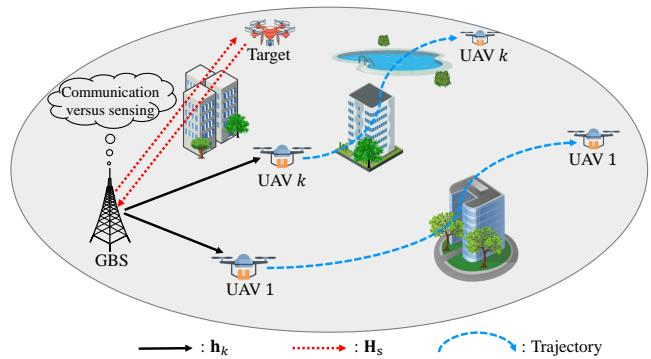  
Fig. 1. LAE-oriented multi-objective ISAC systems.

Notations: Vectors (matrices) are denoted by boldface lower (upper) case letters, $\mathbb { C } ^ { N \times K }$ represents the space of $N { \times } K$ complex matrices, | · | represents the absolute value, $| | \cdot | | _ { 2 }$ represents the 2-norm, E[·] represents the statistical expectation, ⌈x⌉ represents the smallest integer not less than $x ,$ while $\operatorname { T r } ( \cdot ) , ( \cdot ) ^ { T }$ , and $( \cdot ) ^ { H }$ represent the trace, transpose, and conjugate transpose, respectively. TABLE 1 summarizes the main notations of this paper.

## 2 SYSTEM MODEL AND PROBLEM FORMULATION

As shown in Fig. 1, consider an ISAC system for lowaltitude environments, where a GBS equipped with N transmit/receive antennas serves K single-antenna authorized

UAVs in the downlink and simultaneously detects a lowaltitude target (e.g., an unauthorized UAV).1 The set of UAVs is denoted by ${ \mathcal { K } } = \{ 1 , 2 , \cdots , K \}$ , with each UAV $k \in \mathcal { K }$ operating at a fixed altitude $H _ { k }$ to transport cargo between predetermined locations over a total mission duration $\Delta _ { \mathrm { T } } .$ . This duration is divided into $T$ time slots indexed by t ∈ $\mathcal { T } = \{ 1 , 2 , \cdots , T \}$ , where each slot has duration $\Delta _ { \mathrm { t } } = \dot { \Delta _ { \mathrm { T } } } / T$ that is sufficiently small to assume static positions of both UAVs and the target within each slot [50]. In the 3D Cartesian coordinate system, the GBS is located at $( 0 , 0 , 0 )$ , while the target position is denoted by $( \mathbf { g } ( t ) , H _ { \mathrm { t a r } } ( t ) )$ with horizontal coordinate $\mathbf { g } ( t ) = [ \widetilde { x } ( t ) , \widetilde { y } ( t ) ] ^ { T }$ . The position of UAV k is represented as $( { \bf u } _ { k } ( t ) , H _ { k } )$ , with $\mathbf { u } _ { k } ( t ) \triangleq [ x _ { k } ( t ) , y _ { k } ( t ) ] ^ { T }$

Let λ and d represent the carrier wavelength and antenna spacing, respectively. The steering vector at the GBS towards UAV k is given by $\mathbf { c } ( \psi _ { k } ( t ) ) \mathbf { \Psi } = \mathbf { \psi } [ 1 , e ^ { \ j 2 \pi \frac { d } { \lambda } }$ cos ψk(t), $\cdot \cdot \cdot , e ^ { \jmath 2 \pi \frac { d } { \lambda } ( N - 1 ) \cos \psi _ { k } ( t ) } ] ^ { T }$ , where $\psi _ { k } ( t )$ denotes the angle of departure from the GBS to $\mathrm { U A V } k \in { \dot { \mathcal { K } } } ,$ calculated as:

$$
\psi _ { k } ( t ) = \operatorname { a r c c o s } \frac { H _ { k } } { \sqrt { \| \mathbf { u } _ { k } ( t ) \| _ { 2 } ^ { 2 } + H _ { k } ^ { 2 } } } .\tag{1}
$$

Following prior work [50], the air-ground channels between the GBS and UAVs are dominated by line-of-sight (LoS) links. Consequently, the channel vector $\mathbf h _ { k } ( t ) \in \mathbb C ^ { N \times 1 }$ between the GBS and UAV k at time slot t is modeled as:

$$
\mathbf { h } _ { k } ( t ) = \sqrt { L _ { 0 } \frac { D _ { 0 } } { ( \| \mathbf { u } _ { k } ( t ) \| _ { 2 } ^ { 2 } + H _ { k } ^ { 2 } ) ^ { \varsigma _ { k } } } } \mathbf { c } ( \psi _ { k } ( t ) ) ,\tag{2}
$$

where $L _ { 0 }$ represents the path loss at reference distance $D _ { 0 } ,$ and $\varsigma _ { k }$ is the path loss exponent. The composite channel matrix from the GBS to all UAVs at time slot t is denoted by $\mathbf { H } _ { \mathrm { c } } ( t ) ~ = ~ [ \mathbf { h } _ { 1 } ( t ) , \mathbf { h } _ { 2 } ( t ) , \mathbf { \eta } \cdot \cdot \cdot , \mathbf { h } _ { K } ( t ) ] \in \mathbb { C } ^ { N \times K }$ $\mathrm { A }$ similar channel model applies to the sensing channel vector ${ \bf h } _ { \mathrm { s } } ( t )$ between the GBS and the target, with the corresponding round-trip channel matrix expressed as ${ \bf H } _ { \mathrm { s } } ( t ) =$ $\mathbf { h } _ { s } ( \dot { t } ) \mathbf { h } _ { s } ^ { T } ( t ) \in \mathbb { C } ^ { N \times N }$

## 2.1 Transmission Model

In each time slot $t \in { \mathcal { T } } .$ , the GBS transmits a composite signal that combines communication symbols and sensing waveforms, given by $\mathbf { x } ( t ) = \mathbf { W } ( t ) \dot { \mathbf { v } } ( t )$ , where $\mathbf { W } ( t ) { \triangleq } [ \mathbf { W } _ { \mathrm { c } } ( t )$ ${ \bf W } _ { \mathrm { s } } ( t ) ]$ and $\mathbf { v } ( i ) \triangleq [ \mathbf { \dot { v } } _ { \mathrm { c } } ^ { T } ( t ) , \mathbf { v } _ { \mathrm { s } } ^ { T } ( \dot { t } ) ] ^ { T }$ [4]. Symbol $\mathbf { v } _ { \mathrm { c } } ( t ) \bar { \in } \mathbb { C } ^ { K \times 1 }$ denotes the communication signal with $\dot { \mathbb { E } } [ { \bf v } _ { \mathrm { c } } ( t ) { \bf v } _ { \mathrm { c } } ^ { H } ( t ) ] = { \bf I } _ { K }$ and $\mathbf { v } _ { \mathrm { s } } ( t ) \in \mathbb { C } ^ { N \times 1 }$ is the radar signal with $\mathbb { E } [ { \bf \check { v } } _ { s } ( t ) { \bf \check { v } } _ { s } ^ { \hat { H } } ( t ) ] =$ ${ \mathbf { I } } _ { N }$ . The beamforming matrices are $\mathbf { W } _ { \mathrm { c } } ( t ) \in \dot { \mathbb { C } } ^ { N \times \dot { K } }$ for communication and $\mathbf { W } _ { \mathrm { s } } ( t ) \in \mathbb { C } ^ { N \times N }$ for sensing.

## 2.1.1 Communication Model Between the GBS and UAVs

Over the mission duration $\Delta _ { \mathrm { T } }$ , the trajectory of UAV k is defined by a sequence of $T + 1$ positions: $( \mathbf { u } _ { k } ( 0 ) , H _ { k } ) , ( \mathbf { u } _ { k } ( 1 )$ $H _ { k } ) , \cdot \cdot \cdot , ( \mathbf { u } _ { k } ( T ) , H _ { k } )$ . This sequence must satisfy the boundary conditions $\mathbf { \dot { u } } _ { k } ( 0 ) = \mathbf { u } _ { k } ^ { \mathrm { I } } .$ and $\mathbf { u } _ { k } ( T ) = \mathbf { u } _ { k } ^ { \mathrm { F } }$ for all $k \in \mathcal { K } ,$ , wherein $\mathbf { u } _ { k } ^ { \mathrm { I } } = [ x _ { k } ^ { \mathrm { I } } , y _ { k } ^ { \mathrm { I } } ] ^ { T }$ and $\mathbf { u } _ { k } ^ { \mathrm { F } } = \mathrm { [ } x _ { k } ^ { \mathrm { F } } , y _ { k } ^ { \mathrm { F } } ] ^ { T }$ are the initial and final horizontal locations of UAV $k ,$ respectively. Assuming each UAV k flies at a constant speed $v _ { k }$ [51], the distance traveled per time slot is $v _ { k } \Delta _ { \mathrm { t } } ,$ leading to the mobility constraint: $\| \mathbf { u } _ { k } ( t + 1 ) - \mathbf { u } _ { k } ( t ) \| _ { 2 } = v _ { k } \Delta _ { \mathrm { t } } , \breve { \forall } k \in \mathcal { K } , t \in \mathcal { T }$ In each time slot t, the received signal at UAV k can be expressed as $y _ { k } ( t ) = \mathbf { h } _ { k } ^ { T } ( t ) \mathbf { x } ( t ) \dot { + } n _ { k } ( t ) .$ , wherein $n _ { k } ( t ) { \sim } \mathcal { C N } ( 0 , \sigma _ { k } ^ { 2 } )$ represents the additive white Gaussian noise (AWGN) with noise power $\sigma _ { k } ^ { 2 }$ . The communication signal-to-interference-plus-noise ratio (SINR) at UAV k is then calculated as $\begin{array} { r } { \hat { \mathrm { S I N R } } _ { k } ( t ) ~ { = } ~ { \big | \mathbf { h } _ { k } ^ { T } ( t ) \mathbf { w } _ { k } ( t ) \big | ^ { 2 } / \big ( \sum _ { j = 1 , j \ne k } ^ { N + K } } } \end{array}$ $\left| \mathbf { h } _ { k } ^ { T } ( t ) \mathbf { w } _ { j } ( t ) \right| ^ { 2 } + \sigma _ { k } ^ { 2 } )$ , where $\mathbf { w } _ { k }$ is the k-th column of $\mathbf { W } _ { }$ Thus, the communication sum-rate of all UAVs is given by

$$
\mathrm { R } _ { \mathrm { t o t a l } } ( t ) = \sum _ { k = 1 } ^ { K } \log _ { 2 } \left( 1 + { \mathrm { S I N R } } _ { k } ( t ) \right) .\tag{3}
$$

In addition, to ensure safe operation, collision avoidance constraints are imposed. To be specific, the Euclidean distance between any two distinct UAVs must satisfy $\| { \mathbf { u } } _ { k } ( t )$ $- \mathbf { u } _ { i } ( t ) \lVert _ { 2 } ^ { 2 } + ( H _ { k } - H _ { i } ) ^ { 2 } \geq D _ { \operatorname* { m i n } } ^ { 2 } , \forall k , i \in \mathcal { K } , k \neq i , t \in \mathcal { T } .$ , with $D _ { \mathrm { m i n } }$ being the minimum allowed distance. Similarly, the minimum distance constraint between $\mathrm { U A V } \ k \in \mathcal { K }$ and the target is $\begin{array} { r } { \| \mathbf { u } _ { k } ( t ) - \mathbf { g } ( t ) \| _ { 2 } ^ { 2 } + ( H _ { k } - H _ { \mathrm { t a r } } ( t ) ) ^ { 2 } \geq D _ { \operatorname* { m i n } } ^ { 2 } , \forall t \in \mathcal { T } } \end{array}$

## 2.1.2 Sensing Model Between the GBS and the Target

The target flies at a constant speed $v _ { \mathrm { t a r } } ,$ covering a distance of $v _ { \mathrm { t a r } } \Delta _ { \mathrm { t } }$ per time slot [57]. To capture the temporal correlation of its movement, we model the target’s motion direction using a Gauss-Markov process [58]. Let $\varphi _ { \mathrm { a } } ( t )$ and $\varphi _ { \mathrm { e } } ( t )$ denote the azimuth and elevation angles of the target’s movement at time slot $t ,$ respectively, which evolve as:

$$
\left\{ \begin{array} { l l } { \varphi _ { \mathrm { a } } ( t ) = \mu _ { \mathrm { a } } \varphi _ { \mathrm { a } } ( t - 1 ) + ( 1 - \mu _ { \mathrm { a } } ) \xi _ { \mathrm { a } } + \sqrt { 1 - \mu _ { \mathrm { a } } ^ { 2 } } \hat { \varphi } _ { \mathrm { a } } ( t ) , } \\ { \varphi _ { \mathrm { e } } ( t ) = \mu _ { \mathrm { e } } \varphi _ { \mathrm { e } } ( t - 1 ) + ( 1 - \mu _ { \mathrm { e } } ) \xi _ { \mathrm { e } } + \sqrt { 1 - \mu _ { \mathrm { e } } ^ { 2 } } \hat { \varphi } _ { \mathrm { e } } ( t ) , } \end{array} \right.\tag{4}
$$

where $\mu _ { \mathrm { a } } , \mu _ { \mathrm { e } } \in [ 0 , 1 ]$ are time correlation coefficients, while $\xi _ { \mathrm { a } }$ and $\xi _ { \mathrm { e } }$ are long-term asymptotic means of $\varphi _ { \mathrm { a } } ( t )$ and $\varphi _ { \mathrm { e } } ( t ) .$ respectively. Parameters $\hat { \varphi } _ { \mathrm { a } } ( t ) \sim \mathcal N ( 0 , \sigma _ { \varphi _ { \mathrm { a } } } ^ { 2 } )$ and $\hat { \varphi } _ { \mathrm { e } } ( t ) \sim$ $\mathcal { N } ( \bar { 0 } , \sigma _ { \varphi _ { \mathrm { e } } } ^ { 2 } )$ are independent and stationary Gaussian processes with standard deviations $\sigma _ { \varphi _ { a } }$ and $\sigma _ { \varphi _ { \mathrm { e } } } ,$ , respectively. Given $\varphi _ { \mathrm { a } } ( t )$ and $\varphi _ { \mathrm { e } } ( t )$ , the target’s location at time slot t + 1 is updated as $\tilde { x } ( t + \mathrm { 1 } ) = \tilde { x } ( t ) + v _ { \mathrm { t a r } } \Delta _ { \mathrm { t } } \mathrm { c o s } \left( \varphi _ { \mathrm { e } } ( t ) \right)$ cos $\left( \varphi _ { \mathsf { a } } ( t ) \right)$ $\tilde { y } ( t + 1 ) = \tilde { y } ( t ) + v _ { \mathrm { t a r } } \Delta _ { \mathrm { t } } \mathrm { c o s } ( \ \varphi _ { \mathrm { e } } ( t ) ) \mathrm { s i n } \left( \varphi _ { \mathrm { a } } ( t ) \right)$ , and $H _ { \mathrm { t a r } } ( t +$ $1 ) = H _ { \mathrm { t a r } } ( t ) + v _ { \mathrm { t a r } } \Delta _ { \mathrm { t } } \mathrm { s i n } \left( \varphi _ { \mathrm { e } } ( t ) \right)$

During the sensing phase, the echo signal at the GBS can be expressed as $\mathbf { y } _ { \mathrm { s } } ( t ) { \bf \bar { \alpha } } = \mathbf { H } _ { \mathrm { s } } ( t ) \mathbf { x } ( t ) + \mathbf { n } _ { \mathrm { b } } ( t )$ , where ${ \bf n } _ { \mathrm { b } } ( t ) \sim$ $\mathcal { C N } ( \dot { \mathbf { 0 } _ { N } } , \sigma _ { \mathrm { b } } ^ { 2 } \mathbf { I } _ { N } )$ is the AWGN with noise power $\sigma _ { \mathrm { b } } ^ { 2 }$ . The resulting sensing SNR for target detection is then given by

$$
\Gamma _ { \mathrm { t a r } } ( t ) = \frac { \mathrm { T r } \left( \mathbf { W } ^ { H } ( t ) \mathbf { H } _ { \mathrm { s } } ^ { H } ( t ) \mathbf { H } _ { \mathrm { s } } ( t ) \mathbf { W } ( t ) \right) } { \sigma _ { \mathrm { b } } ^ { 2 } } .\tag{5}
$$

## 2.2 Problem Formulation

The considered system faces a fundamental trade-off between communication and sensing, as both functionalities compete for limited transmit power and spatial degrees of freedom. Reliable downlink transmission to UAVs requires adequate communication resources for high data rates, while accurate target detection demands sufficient radar probing power. Prioritizing communication may degrade sensing accuracy, risking safety by missing the unauthorized target. Conversely, excessive sensing resource allocation could disrupt critical command links to authorized

UAVs. Moreover, the mobility of both UAVs and the target complicates this trade-off, necessitating dynamic resource allocation strategies. Motivated by this, this paper optimizes the communication beamforming ${ \bf W } _ { \mathrm { c } } ( t )$ , the sensing beamforming $\mathbf { W } _ { \mathrm { s } } ( t )$ , and the trajectory ${ \bf u } _ { k } ( t )$ of each UAV to achieve two objectives: (i) expected communication sumrate maximization and (ii) expected sensing SNR maximization.2 Mathematically, the corresponding optimization problem is formulated as follows:

$$
\begin{array} { r l } { \underset { \mathbf { W } _ { \mathrm { c } } ( t ) , \mathbf { W } _ { \mathrm { s } } ( t ) , \mathbf { u } _ { k } ( t ) } { \mathrm { m a x } } } & { \left( \mathbb { E } \left[ \underset { t = 1 } { \overset { T } { \sum } } \mathrm { R } _ { \mathrm { t o t a l } } ( t ) \right] , \mathbb { E } \left[ \underset { t = 1 } { \overset { T } { \sum } } \Gamma _ { \mathrm { t a r } } ( t ) \right] \right) } \end{array}\tag{6a}
$$

$$
\mathrm { s . t . } \ \lVert \mathbf { u } _ { k } ( t + 1 ) - \mathbf { u } _ { k } ( t ) \rVert _ { 2 } = v _ { k } \Delta _ { \mathrm { t } } , \forall k \in \mathcal { K } , t \in \mathcal { T } ,\tag{6b}
$$

$$
\mathbf { u } _ { k } ( 0 ) = \mathbf { u } _ { k } ^ { \mathrm { I } } \ \mathrm { a n d } \ \mathbf { u } _ { k } ( T ) = \mathbf { u } _ { k } ^ { \mathrm { F } } , \forall k \in \mathcal { K } ,\tag{6c}
$$

$$
\begin{array} { r } { \| \mathbf { u } _ { k } ( t ) - \mathbf { u } _ { i } ( t ) \| _ { 2 } ^ { 2 } + ( H _ { k } - H _ { i } ) ^ { 2 } \geq D _ { \operatorname* { m i n } } ^ { 2 } , } \end{array}
$$

$$
\forall k , i \in \mathcal { K } , k \neq i , t \in \mathcal { T } ,\tag{6d}
$$

$$
\begin{array} { r } { \| \mathbf { u } _ { k } ( t ) - \mathbf { g } ( t ) \| _ { 2 } ^ { 2 } + ( H _ { k } - H _ { \mathrm { t a r } } ( t ) ) ^ { 2 } \geq D _ { \operatorname* { m i n } } ^ { 2 } , } \end{array}
$$

$$
\forall k \in K , t \in \mathcal T ,\tag{6e}
$$

$$
\begin{array} { r } { \mathrm { T r } \left( \mathbf { W } _ { \mathrm { c } } ^ { H } ( t ) \mathbf { W } _ { \mathrm { c } } ( t ) \right) + \mathrm { T r } \left( \mathbf { W } _ { \mathrm { s } } ^ { H } ( t ) \mathbf { W } _ { \mathrm { s } } ( t ) \right) \leq P _ { \mathrm { m a x } } , } \end{array}
$$

$$
\forall t \in { \mathcal { T } } ,\tag{6f}
$$

with the expectation in (6a) taken over varying target mobility, which is unknown to the GBS. In addition, constraint (6b) bounds the flight distance of each UAV within one time slot; constraint (6c) ensures the completion of UAVs’ flight missions; constraints (6d) and (6e) avoid collisions between any given UAV and other UAVs or the target, respectively [59]; and constraint (6f) limits the maximum transmit power of the GBS to $P _ { \mathrm { m a x } }$

## 3 PROBLEM ANALYSIS AND TRANSFORMATION

This section first analyzes the fundamental properties of the formulated joint optimization problem. Then, we recast it into an MOMDP framework for DRL solutions.

## 3.1 Problem Analysis

The formulated problem exhibits three key characteristics.

Non-convexity and long-term impact: Due to its multi-variable and complicated objective function, problem (6) is non-convex. Furthermore, since all variables are optimized over the total duration of UAVs’ flight missions and the next locations of the target and UAVs depend on their current ones, problem (6) is a typical long-term optimization problem.

Intricately coupled variables: Constraint (6f) reveals the coupling between communication beamforming Wc(t) and sensing beamforming Ws(t). Also, since the communication sum-rate and the sensing SNR depend on both the GBS’s beamforming and the UAVs’ trajectories, an efficient solution must be derived through the joint optimization of all variables.

Conflicting optimization objectives: In problem (6), the two objectives exhibit an inherent trade-off: increasing the communication sum-rate requires allocating more power to ${ \bf W } _ { \mathrm { c } } ( t )$ , which reduces the power available for $\mathbf { W } _ { \mathrm { s } } ( t )$ and thus the sensing SNR. On the other hand, the location ${ \bf u } _ { k } ( t )$ of each UAV inevitably affects both communication and sensing performance. Typically, the formulated problem is a multi-objective optimization problem.

Consequently, problem (6) is a non-convex continuous multi-variable optimization problem with a long-term objective. Conventional optimization methods alternately adjust different variables through extensive iterations, often resulting in suboptimal solutions. Moreover, UAVs’ flight missions further limit these methods, as they fail to leverage historical information or account for long-term impacts. If the GBS can learn the complex temporal correlations between different time slots, it can derive the appropriate $\mathbf { W } _ { \mathrm { c } } ( t ) , \ \mathbf { W } _ { \mathrm { s } } ( t )$ , and ${ \bf u } _ { k } ( t ) , \forall t \in \mathcal { T } .$ , over the whole flight mission. This task can be achieved using model-free DRL, a dynamic programming technique that excels at sequential decision-making in unknown environments [60]. However, traditional DRL algorithms are generally limited to singleobjective optimization problems and lack generalization across diverse optimization objectives. Therefore, this paper designs a new multi-task DRL algorithm with MoE, i.e., MODE, to address problem (6).

## 3.2 Problem Transformation

To derive an MODE-based solution, we reformulate the joint optimization problem of beamforming and trajectory as an MOMDP model. Formally, an MOMDP is composed of four key elements: state S(t), action ${ \bf A } ( t )$ , transition probability $p ( \mathbf { \dot { S } } ( t + 1 ) | \mathbf { S } ( t ) , \mathbf { A } ( t ) )$ , reward vector r(t+1), and objectivepreference weight b. Unlike MDP, ${ \bf r } = ( r _ { 1 } , r _ { 2 } )$ in MOMDP is a reward vector [55], where each component $( \mathrm { i . e . , } r _ { 1 } \ \mathrm { o r } \ r _ { 2 } )$ corresponds to a specific objective. With different objectivepreference weights, multi-objective DRL can aggregate the reward vector r into a single scalar, yielding policies that capture trade-offs. In the following, we present the details of MOMDP for joint beamforming and trajectory in LAEoriented multi-objective ISAC systems.

## 3.2.1 Agent and Environment

In the MOMDP framework, an agent learns optimal strategies for different objectives through trial-and-error interactions with the environment. In our system, the GBS acts as the agent, while the target, UAVs, and wireless channels constitute the environment. During each time slot, the GBS first determines an efficient joint beamforming and trajectory strategy. It then executes communication beamforming for UAV data transmission and navigation, and simultaneously performs sensing beamforming for target monitoring.

## 3.2.2 System State

The system state should contain sufficient useful information, such that the agent can derive an efficient ISAC decision. Within our system, at time slot t, the observable state S(t) is determined by the communication CSI H (t), the sensing CSI ${ \bf H } _ { \mathrm { s } } ( t ) ,$ , and all UAVs’ locations $\mathbf { U } ( t ) = [ \mathbf { u } _ { 1 } ( t )$ ${ \bf u } _ { 2 } ( t ) , \dot { \cdot } \cdot \cdot , { \bf u } _ { K } ( t ) ]$ . It can be represented as

$$
\mathbf { S } ( t ) = \big [ \mathbf { H } _ { \mathrm { c } } ( t ) , \mathbf { H } _ { \mathrm { s } } ( t ) , \mathbf { U } ( t ) \big ] .\tag{7}
$$

## 3.2.3 Agent Action

The actions should be associated with system optimization variables. Based on (6), the agent must decide on three types of sub-actions. The first two are the communication beamforming ${ \bf W } _ { \mathrm { c } } ( t )$ and the sensing beamforming $\mathbf { W } _ { \mathrm { s } } ( t ) ,$ respectively. The third type of sub-actions is the movement directions for all $\mathrm { U A V s } ,$ denoted by $\mathbf { a } _ { \mathrm { u } } ( t ) = [ a _ { \mathrm { u } , 1 } ( t )$ $a _ { \mathrm { u } , 2 } ( t ) , \cdot \cdot \cdot , a _ { \mathrm { u } , K } ( t ) ] ^ { T }$ . Given $a _ { \mathrm { u } , k } ( t )$ , the horizontal location of UAV k at time slot $t + 1$ is updated as ${ \bf u } _ { k } ( t + 1 ) =$ $\left[ x _ { k } ( t ) + v _ { k } \Delta _ { \mathrm { t } } \cos ( a _ { \mathrm { u } , k } ( t ) ) , y _ { k } ( t ) + v _ { k } \Delta _ { \mathrm { t } } \sin ( a _ { \mathrm { u } , k } ( t ) ) \right] ^ { T }$ . All elements in $\mathbf { W } _ { \mathrm { c } } ( t ) , \mathbf { W } _ { \mathrm { s } } ( t ) .$ , and ${ \bf a } _ { \mathrm { u } } ( t )$ are continuous optimization variables. Overall, the action of the agent at time slot t is represented by $\mathbf { A } ( t ) = [ \mathbf { W } _ { \mathrm { c } } ( t ) , \mathbf { W } _ { \mathrm { s } } ( t ) , \bar { \mathbf { a } _ { \mathrm { u } } } ( t ) ]$

## 3.2.4 Transition Probability

The transition probability is defined as $p ( \mathbf { S } ( t + 1 ) \ =$ $\mathbf { S } ^ { \prime } | \mathbf { S } ( t ) = \mathbf { S } , \mathbf { A } ( \acute { t } ) = \mathbf { A } )$ , which quantifies the probability that action A in state S leads to next state S′ [55]. As the target’s mobility information is not available, the transition probability $p ( \check { \mathbf { S } ^ { \prime } } | \mathbf { S } , \mathbf { A } )$ cannot be precisely known. Thus, problem (6) is a partially observable MDP problem.

## 3.2.5 Reward Function

The reward function $\mathbf { r } ( t + 1 )$ reflects the quality of the action ${ \bf A } ( t )$ in state S(t). In this paper, the agent aims to learn an efficient joint strategy of communication beamforming, sensing beamforming, and UAVs’ trajectories, so as to simultaneously maximize both the communication sum-rate and the sensing SNR. Due to the inherent trade-off between these two objectives, we design a reward vector $\mathbf { r } ( t + 1 )$ to evaluate how good an action ${ \bf \cal A } ( t )$ is, defined as

$$
\mathbf { r } ^ { T } ( t + 1 ) = [ r _ { \mathrm { c } } ( t + 1 ) , r _ { \mathrm { s } } ( t + 1 ) ] = [ \mathrm { R } _ { \mathrm { t o t a l } } ( t ) , \Gamma _ { \mathrm { t a r } } ( t ) ] \mathrm { ~ } [\tag{8}
$$

where rewards $r _ { \mathrm { c } } ( t { + } 1 )$ and $r _ { \mathrm { s } } ( t { + } 1 )$ are used to evaluate the impact of ${ \bf A } ( t )$ on communication and sensing performance, respectively. In $\mathbf { r } ( t + 1 )$ , both $\mathrm { R } _ { \mathrm { t o t a l } } ( t )$ and $\Gamma _ { \mathrm { t a r } } ( \ r _ { t } )$ retain only the numerical values, disregarding their units [61].

Recall that the agent must satisfy various constraints in (6). In the action design, constraint (6a) has been strictly enforced. In the following, we incorporate constraints (6d) and (6e) into the design of the reward function. Section 4 will then detail how to guarantee constraints (6b) and (6f) through the action selection policy. Specifically, according to (6d) and (6e), the agent needs to avoid collisions between any UAV and other UAVs or the target. When these constraints are violated, the agent should be aware of its unwise decisions. Thus, the reward vector $\mathbf { r } ( t + 1 )$ is modified as

$$
\mathbf { r } ^ { T } ( t + 1 ) = \left\{ \begin{array} { l l } { \left[ r _ { \mathrm { c } } ( t + 1 ) , r _ { \mathrm { s } } ( t + 1 ) \right] , } & { \mathrm { i f ~ ( 6 d ) ~ a n d ~ ( 6 e ) ~ a r e ~ m e t } , } \\ { \left[ - \delta , - \delta \right] , } & { \mathrm { o t h e r w i s e } , } \end{array} \right.\tag{9}
$$

where $\delta > 0$ is the reward coefficient, balancing the utility and cost [61]. The larger δ is, the more the agent attaches importance to the given constraint. Once the agent learns a policy that consistently satisfies the collision avoidance constraint, the penalty term effectively vanishes, and the reward is exactly the objective function (6a). Therefore, the penalty term $- \delta$ does not alter the optimum; it merely guides the agent toward feasible policies efficiently.

## 3.2.6 Discount Factor and Objective-Preference Weight

Given the flight missions of UAVs, the formulated problem corresponds to a specific type of MDP, referred to as episode task [55]. In this setting, the task ends at a terminal status $( \mathrm { i . e . , }$ the final locations of UAVs) that divides the agentenvironment interactions into episodes with each containing T time slots. Different episodes are independent of each other, and a new episode begins from the starting status $( \mathrm { i . e . , }$ the initial locations of UAVs) after the previous one ends. For episode tasks, the discount factor in the MOMDP framework is typically set to 1 [55].

In each time slot, given a state $\mathbf { S } ( t ) .$ , the agent selects an action ${ \bf A } ( t )$ in the light of the policy $\pi ( \mathbf { A } ( { \bar { t } } ) | \mathbf { S } ( t ) \rangle ,$ ). To obtain the optimal joint policy $\pi ^ { * }$ of GBS’s beamforming and UAVs’ trajectories, it strives to maximize the cumulative reward as follows:

$$
G ( t ) = \sum _ { l = t } ^ { \infty } \mathbf { b } ^ { T } \mathbf { r } ( l + 1 ) = \sum _ { l = t } ^ { \infty } [ b , 1 - b ] \mathbf { r } ( l + 1 ) ,\tag{10}
$$

where b represents the objective-preference weight vector with weight $b \in [ 0 , 1 ]$ . The action-value (i.e., Q-value) for the state-action pair (S(t), A(t)) hinges on both π and ${ \mathcal { P } } ,$ and is defined as

$$
{ Q } _ { \pi } \left( { \mathbf { S } } ( t ) , { \mathbf { A } } ( t ) \right) = \mathbb { E } _ { \pi } \left[ G ( t ) | { \mathbf { S } } ( t ) , { \mathbf { A } } ( t ) \right] .\tag{11}
$$

Thus far, problem (6) has been transformed into an MOMDP problem. When the mobility pattern of the target is accurately known, the transition probability $p \left( \mathbf { S } ^ { \prime } | \mathbf { S } , \mathbf { A } \right)$ can be readily determined. In such cases, this MOMDP problem can be effectively solved employing dynamic programming [55]. However, this pattern is unavailable to the GBS, which motivates the adoption of model-free DRL techniques.

## 4 MODE SCHEME

Conventional value-based DRL algorithms, e.g., deep Qnetwork (DQN) [55], are well-suited for problems with lowdimensional discrete action spaces. The formulated joint beamforming and trajectory optimization problem, however, involves continuous control variables. DDPG [53], although it can effectively handle such continuous control tasks, is limited to single-objective optimization problems and lacks generalization across diverse optimization objectives. To fill this gap, we develop a new multi-task DRL framework with MoE, i.e., MODE, for the formulated MOMDP model. The main idea of MODE is to treat the optimization problem under each objective-preference weight as a task and employ a shared MoE framework [54] to train multiple tasks simultaneously. In this way, MODE can quickly derive an efficient joint beamforming and trajectory solution for new unseen objective-preference weights. For convenience of illustration, we consider L tasks during training, where the objective-preference weight for task $l ~ \stackrel { \sim } { \in } ~ \mathcal { L } ~ = ~ \{ 1 , 2 , \cdots , L \}$ is represented as bl. Similarly, the state, action, and reward under task l are represented as $\mathbf { S } _ { l } ( t ) , \mathbf { A } _ { l } ( t )$ , and $\mathbf { r } _ { l } ( t + 1 )$ , respectively. Fig. 2 illustrates the complete MODE framework, which consists of: (i) the DDPG algorithm [53] for continuous decisionmaking, including communication beamforming $\mathbf { W } _ { \mathrm { c } , l } ( t )$ sensing beamforming $\mathbf { W } _ { \mathrm { s } , l } ( t ) .$ , and UAV trajectory $\mathbf { U } _ { l } ( t )$ (ii) an objective-preference weight for processing the multiobjective reward vector, and (iii) an MoE architecture to enhance generalization. The details are provided below.

This article has been accepted for publication in IEEE Transactions on Mobile Computing. This is the author's version which has not been fully edited and content may change prior to final publication. Citation information: DOI 10.1109/TMC.2026.3693366  
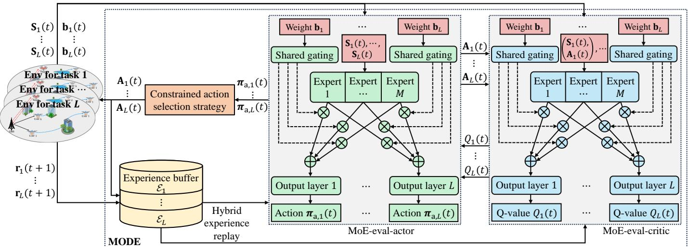  
Fig. 2. MODE framework.

## 4.1 Multi-Task MoE Architecture

Two types of ANNs, referred to as MoE-actor and MoEcritic, are adopted in MODE. Each of them comprises two networks, i.e., MoE-eval-actor with parameter $\mathbf { \Theta } _ { \mathbf { e } } ,$ MoEtarget-actor with parameter $\Theta _ { \mathrm { a } } ^ { - }$ , MoE-eval-critic with parameter $\Theta _ { \mathrm { c } } ,$ and MoE-target-critic with parameter $\Theta _ { \mathrm { c } } ^ { - }$ . As shown in Fig. 2, all ANNs possess the same structure, i.e., one shared gating network, M expert networks, and $L$ output layers, but their roles are different. Specifically, the MoE-eval-actor makes the joint beamforming and trajectory decision based on the state $\mathbf { S } _ { l }$ and the objective-preference weight $\mathbf { { b } } _ { l } ,$ the MoE-eval-critic evaluates the action-value $Q ( \mathbf { S } _ { l } , \mathbf { A } _ { l } , \mathbf { b } _ { l } ; \mathbf { \Theta } _ { \mathrm { c } } )$ of the pair $( \mathbf { S } _ { l } , \mathbf { A } _ { l } )$ , while the targetactor and the target-critic compute the target value of $Q ( \mathbf { S } _ { l } , \mathbf { A } _ { l } , \mathbf { b } _ { l } ; \mathbf { \Theta } _ { \mathrm { c } } )$ [53]. Taking MoE-eval-actor as an example, the detailed components of each ANN are as follows.

## 4.1.1 Shared Gating Network

The shared gating network is composed of an input layer, a fully connected (FC) layer, and a softmax layer [55]. It is designed to determine the weighting of each expert network for a given task based on the input data. To be specific, given an objective-preference weight $\mathbf b _ { l } \in \mathbb R ^ { 2 \times 1 }$ , the input layer delivers it into the FC layer for analysis. The FC layer then outputs a M-dimensional vector $\mathbf { c } _ { \mathrm { g , f } } = \Theta _ { \mathrm { a , g } } ^ { T } \mathbf { b } _ { l } ,$ where $\mathbf { \Theta } _ { \mathbf { e } , \mathbf { \Lambda } _ { \mathbf { g } } } \in \mathbf { \hat { \mathbb { R } } } ^ { 2 \times M }$ is the parameter of the FC layer. In $\mathbf { c _ { g , \textup { f } } } \in$ $\mathbb { R } ^ { \vec { M } \times 1 }$ , each element corresponds to the original weight of one expert network. To ensure that the weights across all experts sum to 1, $\mathbf { c } _ { \mathrm { g } , \mathrm { f } }$ is passed through a softmax layer for normalization. Thus, the output of the gating network is expressed as $\mathbf { c } _ { \mathrm { g } , \mathrm { s } } = \mathrm { S o f t m a x } ( \mathbf { c } _ { \mathrm { g } , \mathrm { f } } )$ , with each element in $\mathbf { c } _ { \mathrm { g } , \mathfrak { s } }$ computed as

$$
c _ { \mathfrak { g } , \mathfrak { s } } ^ { m } = \frac { \exp ( c _ { \mathfrak { g } , \mathfrak { t } } ^ { m } ) } { \sum _ { m = 1 } ^ { M } \exp ( c _ { \mathfrak { g } , \mathfrak { t } } ^ { m } ) } , \forall m \in \mathcal { M } = \{ 1 , 2 , \cdots , M \} .\tag{12}
$$

Furthermore, all tasks share a common gating network, such that MODE can maintain its generalization capability to new unseen objective-preference weights.

## 4.1.2 Expert Networks

By treating the optimization problem under each objectivepreference weight as a distinct task, the original multiobjective optimization problem can be reformulated as a multi-task problem [54]. The key role of the expert network is to learn miscellaneous feature representations from system states $\{ \mathbf { S } _ { l } | l \in \mathcal { L } \}$ , where $\mathbf { S } _ { l }$ denotes the state under task l. Typically, when task objectives conflict, e.g., between b = [0.01, 0.99] and $\mathbf { b } ~ = ~ [ 0 . \dot { 9 } 9 , 0 . 0 1 ]$ , a single expert network suffers from performance degradation due to interference in parameter updates. By contrast, in MODE, multiple expert networks are adopted, each specializing in specific aspects of the input states. For example, in our problem, some experts focus on communication patterns that improve the total downlink rate, some concentrate on strategies to enhance the sensing SNR, and others specialize in complex collision avoidance mechanisms. This design effectively mitigates the “task conflict” issue in multi-task learning. Besides, through the shared gating network, MODE dynamically and softly combines relevant experts according to each specific task, enabling adaptive and specialized model behavior [54].

In MODE, each expert network comprises an input layer, a gated recurrent unit (GRU) layer [55], and an FC layer.3 Since the ANN cannot process complex-valued inputs directly, we decompose Hc and ${ \bf { H } } _ { \mathrm { { s } } }$ into the corresponding real and imaginary components, which are then concatenated with U to form the preprocessed state $\mathbf { S } _ { l }$ . The input layer delivers $\mathbf { S } _ { l }$ into the GRU layer, which extracts the underlying temporal correlation from the input sequence. The extracted features are subsequently fed into the FC layer for further analysis. Let $\Theta _ { \mathrm { a , e } , m } \stackrel { \cdot } { \in } \bar { \mathbb { R } ^ { 2 ( N K + N ^ { 2 } + K ) \times N _ { \mathrm { e } } } }$ denote the parameter of expert network m $\in \mathcal { M } = \{ 1 , 2 , \cdots , M \}$ wherein $2 ( N K + { \bf \nabla } \dot { N } ^ { 2 } + K )$ and $N _ { \mathrm { e } }$ are the sizes of the preprocessed state $\mathbf { S } _ { l }$ and the FC layer, respectively. The output of the FC layer is then computed as

$$
\mathbf { c } _ { \mathrm { e } , m } = \boldsymbol { \Theta } _ { \mathrm { a } , \mathrm { e } , m } ^ { T } \cdot \mathrm { p r e p r o c e s s e d } ( \mathbf { S } _ { l } ) .\tag{13}
$$

For ease of illustration, let $\Theta _ { \mathrm { a , \ell } }$ e denote $[ \Theta _ { \mathrm { a , e , 1 } } , \Theta _ { \mathrm { a , e , 2 } }$ $\cdot \cdot \cdot , \Theta _ { \mathrm { a , e , } M } ]$ in the following.

## 4.1.3 Output Layers

With the outputs of the shared gating network and all expert networks, the input of output layer $\bar { l } \in \mathcal { L }$ can be denoted by

$$
\mathbf { c } _ { \mathrm { o } , l } = \sum _ { m = 1 } ^ { M } c _ { \mathrm { g } , \mathrm { s } } ^ { m } \mathbf { c } _ { \mathrm { e } , m } .\tag{14}
$$

Since the ANN cannot generate complex-valued matrices, it is infeasible to generate the communication beamforming matrix $\mathbf { W } _ { c } \in \mathbb { C } ^ { N \times K }$ and sensing beamforming matrix $\mathbf { W } _ { s }$ $\in \mathbb { C } ^ { N \times N }$ outright. Therefore, the output layer generates the joint beamforming and trajectory decision $\pi _ { \mathrm { a } , l }$ for task l via $\Theta _ { \mathrm { a } , \mathrm { o } , l } ^ { T } \mathbf { c } _ { \mathrm { o } , l } ,$ with $\breve { \Theta } _ { \mathrm { a } , \mathrm { o } , l } ~ \in ~ \mathrm { \bar { \mathbb { R } } } ^ { N _ { \mathrm { e } } \times \breve { ( 2 } N K + 2 N ^ { 2 } + K ) }$ being the parameter of output layer l. There are three real-valued vectors in $\pi _ { \mathfrak { a } , l } ,$ with the first of size 2NK for communication beamforming, the second of size $2 N ^ { 2 }$ for sensing beamforming, and the third of size K for UAV trajectory. Furthermore, through element-wise concatenation, the communication beamforming is constructed from the first vector: the first N K elements are treated as the real parts of individual elements in the temporary communication beamforming and the remaining elements are the corresponding imaginary parts. The sensing beamforming can also be generated in a similar way.

By aggregating the parameters of the shared gating network, all expert networks, and all output layers, the parameter $\Theta _ { \mathrm { a } }$ of the MoE-eval-actor can be represented as $\{ \Theta _ { \mathrm { a , g } } , \Theta _ { \mathrm { a , e } } , \Theta _ { \mathrm { a , o , 1 } } , \cdot \cdot \cdot , \Theta _ { \mathrm { a , o , } L } \}$

## 4.2 Constrained Action Selection Strategy

In the light of (6), the MODE agent/GBS aims to maximize both communication sum-rate and sensing SNR, subject to the UAV flight mission, collision avoidance, and maximum power constraints, by jointly optimizing GBS’s beamforming and UAVs’ trajectories. In Section 3.2, constraints (6b), (6d), and (6e) have been incorporated into the design of ${ \bf A } ( t )$ and $\mathbf { r } ( t + 1 )$ . Next, we introduce a constrained action selection strategy [51] to meet the flight mission constraint (6c) and the maximum power constraint (6f).

## 4.2.1 Random Exploration

At time slot t, based on the state $\mathbf { S } _ { l } ( t )$ and the objectivepreference weight $\mathbf { b } _ { l } , \forall l \in \mathcal { L } ,$ the MoE-eval-actor makes a joint beamforming and trajectory decision $\pi _ { \mathrm { a } , l } ( \mathbf { S } _ { l } ( t )$ , bl; $\mathbf { \Theta } \Theta _ { \mathrm { a , g } } , \Theta _ { \mathrm { a , e } } , \Theta _ { \mathrm { a , o , } l } \big )$ . To encourage exploration of random actions for better solutions, the constrained action selection strategy first refines $\pi _ { a , l } \bigl ( { \mathbf { S } } _ { l } ( t ) , \mathbf { b } _ { l } ; \Theta _ { a , \mathrm { g } } , \Theta _ { \mathrm { a , e } } , \Theta _ { \mathrm { a , o , } l } \bigr )$ by injecting randomness:

$$
\begin{array} { r l r } & { } & { ( { \bf A } _ { \mathrm { c } , l } ( t ) , { \bf A } _ { \mathrm { s } , l } ( t ) , { \bf a } _ { \mathrm { u } , l } ( t ) ) = \pi _ { \mathrm { a } , l } ( { \bf S } _ { l } ( t ) , { \bf b } _ { l } ; \Theta _ { \mathrm { a } , \mathrm { g } } , \Theta _ { \mathrm { a } , \mathrm { e } } , } \\ & { } & { \Theta _ { \mathrm { a } , \mathrm { o } , { l } } ) + ( { \bf D } _ { \mathrm { c } , l } ( t ) , { \bf D } _ { \mathrm { s } , l } ( t ) , { \bf d } _ { \mathrm { u } , l } ( t ) ) , \qquad ( \mathrm { \bf A } _ { \mathrm { s } , l } ( t ) , \mathrm { \bf A } _ { \mathrm { s } , l } ( t ) ) \mathrm { ~ . ~ } } \end{array}\tag{15}
$$

where $\mathbf { A } _ { \mathrm { c } , l } ( t )$ and ${ \bf A } _ { s , l } ( t )$ are matrices with size $N \times K$ and $N \times N ,$ , respectively. Symbols $\mathbf { D } _ { \mathrm { c } , l } ( t ) , \mathbf { D } _ { \mathrm { s } , l } ( t )$ , and ${ \bf d } _ { \mathrm { u } , l } ( t )$ have the same sizes as ${ \bf A } _ { \mathrm { c } , l } ( t ) , { \bf A } _ { \mathrm { s } , l } ( t )$ , and $\mathbf { a } _ { \mathrm { u } , l } ( t ) ,$ respectively, with each element sampled as cli $\mathsf { p } ( \mathcal { N } ( 0 , \sigma _ { \mathrm { a } } ^ { 2 } ) , - c , c )$ The clipping operation confines the noise to the range $[ - c , c ] ,$ thereby preventing policy instability caused by overexploration [51]. Once an efficient solution is learned, extensive exploration becomes unnecessary. Hence, a decay factor $\zeta \in ( 0 , \bar { 1 ) }$ is used to reduce $\sigma _ { \mathrm { a } } ^ { 2 } ( t )$ over time. Let ${ \sigma } _ { \mathrm { a , i n i t } } ^ { 2 }$ denote the initial variance; then $\sigma _ { \mathrm { a } } ^ { 2 } ( t ) = \sigma _ { \mathrm { a , i n i t } } ^ { 2 } \zeta ^ { t }$ at time slot t.

To satisfy constraints (6c) and (6f), the decisions ${ \bf A } _ { \mathrm { c } , l } ( t )$ ${ \bf A } _ { s , l } ( t )$ , and $\mathbf { a } _ { \mathrm { u } , l } ( t )$ are further refined as follows.

## 4.2.2 Beamforming Decision

To derive the communication beamforming $\mathbf { W } _ { \mathrm { c } , l } ( t )$ and the sensing beamforming $\mathbf { W } _ { \mathrm { s } , l } ( t )$ under the power constraint (6f), the constrained action selection strategy introduces a scaling factor defined as

$$
\xi ^ { 2 } = P _ { \operatorname* { m a x } } \frac { 1 } { \operatorname { T r } \big ( \mathbf { A } _ { \mathrm { c } , l } ^ { H } ( t ) \mathbf { A } _ { \mathrm { c } , l } ( t ) \big ) + \operatorname { T r } \big ( \mathbf { A } _ { s , l } ^ { H } ( t ) \mathbf { A } _ { s , l } ( t ) \big ) } .\tag{16}
$$

Then, $\mathbf { W } _ { \mathrm { c } , l } ( t )$ and $\mathbf { W } _ { \mathrm { s } , l } ( t )$ can be obtained by $\xi \mathbf { A } _ { \mathrm { c } , l } ( t )$ and $\xi \mathbf { A } _ { \mathrm { s } , l } ( t )$ , respectively.

## 4.2.3 Trajectory Decision

As specified in (6c), all UAVs’ trajectories $\begin{array} { r l } { \{ \mathbf { a } _ { \mathrm { u } , l } ( t ) } & { { } = } \end{array}$ $[ a _ { \mathbf { u } , l , 1 } ( t ) , ~ a _ { \mathbf { u } , l , 2 } ( t ) , \cdot \cdot \cdot ~ , ~ a _ { \mathbf { u } , l , K } ( t ) ] ^ { T } | t \in \mathcal { T } \}$ must fulfill the flight mission within each episode. To achieve this, our strategy restricts the movement direction of each UAV in the last $T - t - 1$ time slots of an episode. Specifically, at time slot t, if the minimum number of time slots required to reach the destination ${ \bf u } _ { k } ^ { \mathrm { F } }$ from the current location is not less than $T - t - 1 , \mathrm { i . e . , } \ \lceil \rceil \mathbf { \check { u } } _ { k } ( t ) - \mathbf { u } _ { k } ^ { \mathrm { F } } \Vert _ { 2 } / ( v _ { k } \Delta _ { \mathrm { t } } ) \rceil \geq T - t - 1 , \mathrm { U A V }$ k must fly directly towards ${ \bf u } _ { k } ^ { \mathrm { F } } \ ( \mathrm { i . e . , } \ a _ { \mathrm { u } , l , k } ( t ) = \mathrm { " }$ “straight flight”). In other time slots, the movement decision $a _ { \mathrm { u } , l , k } ( t )$ can be determined via (15), since constraint (6c) no longer applies, thus allowing more efficient movement directions towards other objectives.

## 4.3 Hybrid Experience Replay for Training

While conventional experience replay mechanisms [53] perform well in single-task scenarios, they are not directly applicable to the multi-task learning problems under the MODE framework. Moreover, MODE is designed for episodic tasks, where experiences collected across all time slots of an entire flight mission must be utilized simultaneously to train the ANN, which is a requirement that conventional experience replay methods cannot fulfill [51]. To fill this gap, we propose a new hybrid experience replay mechanism for MODE. The gist is to (i) construct a dedicated experience buffer for each task to store experiences and simultaneously adopt experiences from multiple tasks to train the MoE architecture, and (ii) employ experience sets, each comprising all experiences from a complete episode under each task, for loss function calculation. Further details are given below.

## 4.3.1 Experience Storage

To store and reuse historical experiences, a first-input-firstoutput experience buffer $\mathcal { F } _ { l }$ with size $F _ { \mathrm { m a x } }$ is assigned to each task ${ \mathrm { ~ \bf ~ \chi ~ } } l { \mathrm { ~ \bf ~ \in ~ \bf ~ \chi ~ } } L ,$ . In each time slot of an episode, after calculating the reward $\mathbf { r } _ { l } ( t + 1 )$ for task $l ,$ the agent collects the experience $e _ { l } ( t )$ in the form of $( \mathbf { S } _ { l } ( t ) , \mathbf { A } _ { l } ( \top ) , \mathbf { r } _ { l } ( t +$ $1 ) , \mathbf { S } _ { l } ( t + \hat { 1 ) } , \mathbf { b } _ { l } )$ , where $\mathbf { A } _ { l } ( t ) = [ \mathbf { W } _ { \mathrm { c } , l } ( t ) , \mathbf { W } _ { \mathrm { s } , l } ( t ) , \mathbf { a } _ { \mathrm { u } , l } ( t ) ]$ Once all experiences from a complete episode are generated, an experience set $\mathcal { E } _ { l } = \{ e _ { l } ( t ) | t \stackrel { \cdot } { = } 1 , \hat { 2 } , \cdot \cdot \cdot , T \}$ is obtained and stored in $\mathcal { F } _ { l }$

## 4.3.2 Episode Loss Function

In accordance with (6), the MODE agent aims to maximize the total communication sum-rate and total sensing SNR across all time slots within an episode. To effectively learn joint beamforming and trajectory decisions that are beneficial to the entire flight mission, the MODE agent leverages an episode training method to train its MoE architecture. In particular, for each round of training, $N _ { \mathrm { t r a i n } }$ experience sets are sampled from $\mathcal { F } _ { l }$ to form the mini-batch $\boldsymbol { B } _ { l } .$ . Then, under task l, the loss function for training the MoE-eval-critic is given as $\begin{array} { r } { L _ { l } ( \boldsymbol { \Theta } _ { \mathrm { c } , \mathrm { g } } , \boldsymbol { \Theta } _ { \mathrm { c } , \mathrm { e } } , \boldsymbol { \Theta } _ { \mathrm { c } , \mathrm { o } , l } ) = \sum _ { \mathcal { E } _ { l } \subset \mathcal { B } _ { l } } \left( \sum _ { t = 1 } ^ { T } \left( z _ { l } ( t + 1 ) \right. \right. } \end{array}$ $ - Q ( \mathbf { S } _ { l } ( t ) , \mathbf { A } _ { l } ( t ) , \mathbf { b } _ { l } ; \boldsymbol { \Theta } _ { \mathrm { c } , \mathrm { g } } , \boldsymbol { \Theta } _ { \mathrm { c } , \mathrm { e } } , \boldsymbol { \Theta } _ { \mathrm { c } , \mathrm { o } , l } ) ) ^ { 2 } ) / N _ { \mathrm { t r a i n } . }$ where $\displaystyle \Theta _ { \mathrm { c , g } } , \Theta _ { \mathrm { c , e } } ,$ and $\Theta _ { \mathrm { c } , \mathrm { o } , l }$ represent the parameters of the shared gating network, the expert networks, and output layer l of the MoE-eval-critic, respectively. Term $z _ { l } ( t + 1 \bar { ) }$ is referred to as the target value related to the MoE-eval-actor, which is given in (17), wherein $\pi _ { { \mathrm a } , l } ^ { - }$ is the policy of the MoEtarget-actor, $\Theta _ { \mathrm { a , g } } ^ { - } , \Theta _ { \mathrm { a , e } } ^ { - } ,$ and $\Theta _ { \mathrm { a } , \mathrm { o } , l } ^ { - }$ denote the parameters of the shared gating network, the expert networks, and output layer l of the MoE-target-actor, respectively, while $\Theta _ { \mathrm { c , g } } ^ { - } ,$ $\Theta _ { \mathrm { c } , \mathrm { e } } ^ { - } ,$ and $\Theta _ { \mathrm { c } , \mathrm { o } , l } ^ { - }$ represent the parameters of the shared gating network, the expert networks, and output layer l of the MoE-target-critic, respectively.

Furthermore, under task l, the loss function utilized to train the MoE-eval-actor is calculated according to [53], i.e., $\begin{array} { r } { L _ { l } ( \boldsymbol { \Theta } _ { \mathrm { a , g } } , \boldsymbol { \Theta } _ { \mathrm { a , e } } , \boldsymbol { \Theta } _ { \mathrm { a , o , } l } ) = \sum _ { \mathcal { E } _ { l } \subset \mathcal { B } _ { l } } \Big ( \sum _ { t = 1 } ^ { T } \big ( \nabla _ { \mathbf { A } _ { l } ( t ) } Q \big ( \mathbf { S } _ { l } ( t ) } \end{array}$ $\mathbf { A } _ { l } ( t ) , \mathbf { b } _ { l } ; \mathbf { \Theta } _ { \mathbf { { e } } , \mathbf { g } } , \mathbf { \Theta } _ { \mathbf { c } , \mathbf { e } } , \mathbf { \Theta } _ { \mathbf { c } , \mathbf { e } , \mathbf { \Theta } , l } \big ) \times \nabla _ { ( \mathbf { \Theta } _ { \mathbf { e } , \mathbf { g } } , \mathbf { \Theta } _ { \mathbf { a } , \mathbf { e } } , \mathbf { \Theta } _ { \mathbf { a } , \mathbf { o } , \mathbf { \Theta } , l } ) } \pi _ { \mathbf { a } , l } \big ( \mathbf { S } _ { l } ( t )$ $\mathbf { b } _ { l } ; \mathbf { \Theta } \Theta _ { \mathrm { a , g } } , \Theta _ { \mathrm { a , e } } , \Theta _ { \mathrm { a , o , } l } \big ) \big ) \big / N _ { \mathrm { t r a i n } } .$

## 4.3.3 Multi-Task Loss Function

In MODE, each expert network must acquire skills that are effective across diverse objective-preference weights b. Training with only a limited set of b would prevent the experts from fully specializing. Similarly, the shared gating network learns the mapping from b to the weights of all experts. If trained on experiences involving only one or a few types of b, the shared gating network would only learn weight combinations specific to those b and fail to generalize to new ones. Therefore, during ANN training, we sample $N _ { \mathrm { t r a i n } }$ experiences from the experience buffer dedicated to each task to jointly calculate the loss function. In this regard, the loss function of the MoE-eval-critic is calculated by (18). Similarly, the loss function of training the MoE-eval-actor is given in (19).

Furthermore, employing the stochastic gradient descent (SGD) approach [55], the parameters $\{ \Theta _ { \mathrm { c , g } } , \Theta _ { \mathrm { c , e } } , \Theta _ { \mathrm { c , o , 1 } } ,$ $\cdot \cdot \cdot , \Theta _ { \mathrm { c } , \mathrm { o } , L } , \Theta _ { \mathrm { a } , \mathrm { g } } , \Theta _ { \mathrm { a } , \mathrm { e } } , \Theta _ { \mathrm { a } , \mathrm { o } , 1 } , \cdot \cdot \cdot , \Theta _ { \mathrm { a } , \mathrm { o } , L } \Big \}$ of the MoEeval-actor and the MoE-eval-critic are updated by (20) and (21), respectively, with $\alpha _ { \mathrm { c } }$ and $\alpha _ { \mathrm { a } }$ being the learning rates of the MoE-eval-critic and the MoE-eval-actor, respectively. As shown, the shared gating network and all expert networks serve as shared underlying resources, jointly trained with experience sets generated across all tasks. Conversely, each output layer is trained only with experience sets specific to its corresponding task, ensuring that independent and accurate predictions can be generated for each task. By doing so, the multi-task MoE architecture can generalize well to a wide variety of tasks (i.e., various $\mathbf { b } _ { l } , \forall \ : \tilde { l _ { } } \in \mathcal { L } )$

Algorithm 1 MODE Scheme   
1: Initialize $N , K , T , \mathbf { g } ( 0 ) , H _ { \mathrm { T a r } } ( 0 ) , \mathbf { u } _ { k } ^ { \mathrm { I } } , \mathbf { u } _ { k } ^ { \mathrm { F } } , \{ H _ { k } | k \in \mathcal { K } \} , v _ { k } .$   
2: Initialize $\delta , L , \{ \mathbf { b } _ { l } | l \in \mathcal { L } \} , \sigma _ { \mathrm { a , i n i t } } ^ { 2 } , \zeta , \tilde { \alpha _ { \mathrm { a } } } , \tilde { \alpha _ { \mathrm { c } } } , \{ \dot { \mathcal { F } } _ { l } | l \in \mathcal { L } \}$   
3: Initialize $F _ { \mathrm { m a x } } , N _ { \mathrm { t r a i n } } , \chi _ { \mathrm { a } } , \chi _ { \mathrm { c } } , \Theta _ { \mathrm { c , g } } , \Theta _ { \mathrm { c , e } } , \{ \Theta _ { \mathrm { c , o , } l } | l \in \mathcal { L } \}$   
4: Initialize $\Theta _ { \mathrm { c } , \mathrm { g } } ^ { - } , \Theta _ { \mathrm { c } , \mathrm { e } } ^ { - } , \{ \Theta _ { \mathrm { c } , \mathrm { o } , \iota } ^ { - } | l \in \bar { \mathcal { L } } \} , \Theta _ { \mathrm { a } , \mathrm { g } } , \Theta _ { \mathrm { a } , \mathrm { e } } .$   
5: Initialize $\{ \Theta _ { \mathrm { a , o , } l } ^ { - } | l \in \mathcal { L } \} , \Theta _ { \mathrm { a , g } } ^ { - } , \Theta _ { \mathrm { a , e } } ^ { - } , \{ \Theta _ { \mathrm { a , o , } l } ^ { - } | l \in \mathcal { L } \}$   
6: for episode $: = 1 , 2 , \cdots$ do   
7: for $t = 1 , 2 , \cdots , T$ do   
8: for $l = 1 , 2 , \cdots , L$ do   
9: Input $\mathbf { S } _ { l } ( t )$ into the MoE-eval-actor;   
10: Generate a joint decision $\pi _ { \mathrm { a } , l } ( { \mathbf { S } } _ { l } ( t ) , { \mathbf { b } } _ { l } ; \Theta _ { \mathrm { a } , \mathrm { g } } ,$   
$\mathbf { \Theta } _ { \mathbf { e } , \mathbf { \Lambda } , \mathbf { e } } , \mathbf { \Theta } _ { \mathbf { e } , \mathbf { \Lambda } _ { \mathbf { o } , l } } ) ;$   
11: Obtain $\mathbf { W } _ { \mathrm { c } , l } ( t ) , \mathbf { W } _ { \mathrm { s } , l } ( t ) ,$ and $\mathbf { a } _ { \mathrm { u } , l } ( t )$ via the   
constrained action selection policy;   
12: Update $\sigma _ { \mathrm { a } } ^ { 2 } ( t ) \mathrm { t o } \sigma _ { \mathrm { a , i n i t } } ^ { \mathrm { 2 } } \zeta ^ { \dot { t } } ;$   
13: Take ${ \bf A } _ { l } ( t )$ to interact with the environment;   
14: Compute r $\phantom { } _ { l } ( t + 1 )$ via $( 9 ) ;$   
15: Obtain $\mathbf { S } _ { l } ( t + 1 )$ via (7);   
16: Form $e _ { l } ( t ) = ( \mathbf { S } _ { l } ( t ) , \mathbf { A } _ { l } ( t ) , \mathbf { r } _ { l } ( t + 1 ) , \mathbf { S } _ { l } ( t +$   
1), bl).   
17: end for   
18: end for   
19: for $l = 1 , 2 , \cdots , L$ do   
20: Collect $\{ e _ { l } ( t ) | t = 1 , 2 , \cdots , T \}$ to store into $\mathcal { F } _ { l } ;$   
21: Randomly sample $N _ { \mathrm { t r a i n } }$ experience sets from $\mathcal { F } _ { l } ;$   
22: end for   
23: Calculate $L ( \boldsymbol { \Theta } _ { \mathrm { c , g } } , \boldsymbol { \Theta } _ { \mathrm { c , e } } , \{ \boldsymbol { \Theta } _ { \mathrm { c , o } , l } \vert l \in \mathcal { L } \} )$ via (18);   
24: Calculate $L ( \mathbf { \Theta } _ { \mathrm { a , g } } ^ { } , \mathbf { \Theta } _ { \mathrm { { a , e } } } ^ { } , \{ \Theta _ { \mathrm { a , o , \it l } } ^ { } | l \in \mathcal { L } \} )$ via (19);   
25: Train $\Theta _ { \mathrm { c } , i } , i \in \{ \mathrm { g } , \mathrm { e } , \{ \mathrm { o } , 1 \} , \cdots , \{ \mathrm { o } , L \} \}$ via (20);   
26: Train $\Theta _ { a , i } , i \in \{ \mathrm { g } , \mathrm { e } , \{ \mathrm { o } , 1 \} , \cdots , \{ \mathrm { o } , L \} \}$ via (21);   
27: Update $\Theta _ { \mathrm { c } , i } ^ { - }$ and $\Theta _ { a , i } ^ { - }$ via (22).   
28: end for

## 4.3.4 Update of Target ANNs

To enhance the stability of the DDPG algorithm, the softupdate method [55] was introduced to update parameters of both the MoE-target-critic and MoE-target-actor, which can be described as follows:

$$
\{ \Theta _ { \mathrm { c } , i } ^ { - }  \chi _ { \mathrm { c } } \Theta _ { \mathrm { c } , i } + ( 1 - \chi _ { \mathrm { c } } ) \Theta _ { \mathrm { c } , i } ^ { - } ,\tag{22}
$$

where $i \in \{ \mathrm { g } , \mathrm { e } , \{ \mathrm { o } , 1 \} , \cdot \cdot \cdot , \{ \mathrm { o } , L \} \}$ , while $\chi _ { \mathrm { a } } \in [ 0 , 1 ]$ and $\chi _ { \mathrm { c } } \in [ 0 , 1 ]$ are the update factors of the MoE-target-critic and the MoE-target-actor, respectively. With the soft-update mechanism, all target ANNs can maintain a certain continuity during the update process to better adapt to the continuous control task [53].

Thus far, we have detailed the main components of the MODE scheme, and Algorithm 1 presents its pseudocode.

This article has been accepted for publication in IEEE Transactions on Mobile Computing. This is the author's version which has not been fully edited and content may change prior to final publication. Citation information: DOI 10.1109/TMC.2026.3693366

10

$$
z _ { l } ( t + 1 ) = \mathbf { b } _ { l } ^ { T } \mathbf { r } _ { l } ( t + 1 ) + Q \big ( \mathbf { S } _ { l } ( t + 1 ) , \pi _ { a , l } ^ { - } \big ( \mathbf { S } _ { l } ( t + 1 ) , \mathbf { b } _ { l } ; \mathbf { \Theta } _ { \mathbf { a } , \mathbf { g } } ^ { - } , \boldsymbol { \Theta } _ { \mathbf { a } , \mathbf { e } } ^ { - } , \boldsymbol { \Theta } _ { \mathbf { a } , \mathbf { o } , l } ^ { - } \big ) , \mathbf { b } _ { l } ; \boldsymbol { \Theta } _ { \mathbf { c } , \mathbf { g } } ^ { - } , \boldsymbol { \Theta } _ { \mathbf { c } , \mathbf { e } } ^ { - } , \boldsymbol { \Theta } _ { \mathbf { c } , \mathbf { o } , l } ^ { - } \big ) .\tag{17}
$$

$$
L ( \boldsymbol { \Theta } _ { \mathbf { c } , \mathbf { g } } , \boldsymbol { \Theta } _ { \mathbf { c } , \mathbf { e } } , \boldsymbol { \Theta } _ { \mathbf { c } , \mathbf { o } , \mathbf { l } } , \cdots , \boldsymbol { \Theta } _ { \mathbf { c } , \mathbf { o } , \mathbf { l } } ) = \frac { 1 } { L N _ { \mathrm { t r a i n } } } \sum _ { l = 1 } ^ { L } \Biggl ( \sum _ { \varepsilon _ { l } \subset B _ { l } } ( \sum _ { t = 1 } ^ { T } ( z _ { l } ( t + 1 ) - Q ( \mathbf { S } _ { l } ( t ) , \mathbf { A } _ { l } ( t ) , \mathbf { b } _ { l } ; \boldsymbol { \Theta } _ { \mathbf { c } , \mathbf { g } } , \boldsymbol { \Theta } _ { \mathbf { c } , \mathbf { e } } , \boldsymbol { \Theta } _ { \mathbf { c } , \mathbf { e } , \mathbf { l } } ) ) ^ { 2 } \Biggr ) \Biggr ) .\tag{18}
$$

$$
L ( \boldsymbol { \Theta } _ { \mathbf { a } , \mathbf { g } } , \boldsymbol { \Theta } _ { \mathbf { a } , \mathbf { e } } , \boldsymbol { \Theta } _ { \mathbf { a } , \mathbf { o } , 1 } , \cdots , \boldsymbol { \Theta } _ { \mathbf { a } , \mathbf { o } , L } ) = \frac { 1 } { L N _ { \mathrm { U a i n } } } \sum _ { l = 1 } ^ { L } ( \sum _ { \varepsilon _ { l } \subset B _ { l } } ( \sum _ { t = 1 } ^ { T } ( \nabla _ { \mathbf { A } _ { l } ( t ) } Q ( \mathbf { S } _ { l } ( t ) , \mathbf { A } _ { l } ( t ) , \mathbf { b } _ { l } ; \boldsymbol { \Theta } _ { \mathbf { c } , \mathbf { g } } , \boldsymbol { \Theta } _ { \mathbf { c } , \mathbf { e } } , \boldsymbol { \Theta } _ { \mathbf { c } , \mathbf { o } , l } ) \times  
$$

$$
\begin{array} { r } { \nabla _ { ( \Theta _ { a , \mathrm { g } } , \Theta _ { a , \mathrm { e } } , \Theta _ { a , \mathrm { o } , \iota } ) } \pi _ { a , \iota } \bigl ( \mathbf { S } _ { l } ( t ) , \mathbf { b } _ { l } ; \Theta _ { a , \mathrm { g } } , \Theta _ { a , \mathrm { e } } , \Theta _ { a , \mathrm { o } , \iota } \bigr ) \bigr ) \Bigg ) . } \end{array}\tag{19}
$$

$$
\begin{array} { r l } & { \Theta _ { \mathrm { c } , i }  \Theta _ { \mathrm { c } , i } - \alpha _ { \mathrm { c } } \nabla \Theta _ { \mathrm { c } , i } L ( \Theta _ { \mathrm { c } , \mathrm { g } } , \Theta _ { \mathrm { c } , \mathrm { e } } , \Theta _ { \mathrm { c } , \mathrm { o } , 1 } , \cdots , \Theta _ { \mathrm { c } , \mathrm { o } , L } ) , \ i \in \{ \mathrm { g } , \mathrm { e } , \{ \mathrm { o } , \ 1 \} , \cdots , \{ \mathrm { o } , L \} \} . } \end{array}\tag{20}
$$

$$
\begin{array} { r } { \Theta _ { a , i }  \Theta _ { a , i } - \alpha _ { a } \nabla \Theta _ { a , i } L ( \Theta _ { a , \mathrm { g } } , \Theta _ { a , \mathrm { e } } , \Theta _ { a , \mathrm { o } , 1 } , \cdots , \Theta _ { a , \mathrm { o } , L } ) , \ i \in \{ \mathrm { g } , \mathrm { e } , \{ \mathrm { o } , \ 1 \} , \cdots , \{ \mathrm { } 0 , L \} \} . } \end{array}\tag{21}
$$

## 4.4 Practical Implementation

To achieve fast convergence in the environment with an unseen objective-preference weight b, the MODE solution employs an offline training-online execution deployment method. The detailed procedures for applying MODE in practical scenarios are provided below.

## 4.4.1 Offline Training

Similar to the previous work [63], the agent interacts with a simulation environment constructed using mathematical models. The state-of-the-art mathematical models, including the LoS channel model, the Gauss-Markov-based target mobility model, and the UAV flight model, are derived from real-world data [2] to ensure simulation realism. Furthermore, with sufficient prior data, this simulation environment that reflects real-world scenarios can also be implemented using a digital twin or radio map.

During the offline training phase, L simulation environments are initialized. In each time slot, the MODE agent interacts with all environments in parallel. Specifically, based on the state $\mathbf { S } _ { l } ( t )$ and the objective-preference weight bl of the l-th environment, the agent executes an action ${ \bf A } _ { l } ( t )$ using a constrained action selection policy. After acquiring the reward $\mathbf { r } _ { l } ( t { + } 1 )$ and the next state $\mathbf { S } _ { l } ( t { + } 1 )$ , the resulting experience $e _ { l } ( t ) = ( { \bf S } _ { l } ( t ) , { \bf A } _ { l } ( t ) , { \bf r } _ { l } ( t + 1 ) , { \bf S } _ { l } ( t + 1 ) , { \bf b } _ { l } )$ is collected. Upon completion of an entire episode, the experience set $\hat { \mathcal { E } _ { l } } = \{ e _ { l } ( t ) \tilde { | } t = 1 , 2 , \cdot \cdot \cdot , T \}$ is stored into the experience buffer $\mathcal { F } _ { l }$ . The proposed hybrid experience replay mechanism is then used to randomly sample experience sets from all experience buffers to train the multi-task MoE architecture for efficient decisions. Once the ANN model converges, MODE can be deployed in realistic systems.

## 4.4.2 Online Execution

During the deployment phase, the agent/GBS may interact with the environment with an unseen objective-preference weight vector b. In the previous well-trained multi-task MoE architecture, although the shared gating network and expert networks exhibit good generalization ability to various $\{ \mathbf { b } _ { l } | l \in { \mathcal { L } } \}$ , each output layer was originally trained for a specific task l. Thus, during execution, all original output layers in the well-trained MoE architecture are removed, and a new output layer is introduced for the new task (i.e., the new objective-preference weight vector b). Since the output layer generally contains few parameters [64], the deployed MODE scheme can rapidly converge to an efficient joint beamforming and trajectory decision for the new task with minimal training $( \mathrm { i . e . , }$ fine-tuning).

## 4.5 Computational Complexity Analysis

As mentioned in Section 4.1, MODE consists of four ANNs with the same structure. Each ANN includes one shared gating network (comprising an input layer, one FC layer, and one softmax/output layer), M expert networks (each consisting of an input layer, one GRU layer, and one FC layer), and $L$ output layers. According to [65], the computational complexity of forward propagation through an FC or softmax layer is $\mathcal { O } ( K _ { 1 } K _ { 2 } )$ , where $K _ { 2 }$ and $K _ { 1 }$ denote the number of neurons in the current layer and its preceding layer, respectively. For back propagation, the complexity is $\dot { \mathcal { O } } ( N _ { \mathrm { t r a i n } } \dot { K } _ { 2 } K _ { 3 } )$ , with $K _ { 3 }$ being the number of neurons in the subsequent layer and $N _ { \mathrm { t r a i n } }$ being the number of training experiences. For a GRU layer, the complexity for forward propagation is $\mathcal { O } ( K _ { 4 } K _ { 5 } ^ { 2 } )$ , wherein $K _ { 5 }$ is the number of neurons in the GRU layer and $K _ { 4 }$ is the number of neurons in the preceding layer. The corresponding back propagation complexity is $\tilde { \mathcal { O } } ( \tilde { N _ { \mathrm { t r a i n } } } K _ { 4 } K _ { 5 } ^ { 2 } )$ ). As noted in [65], the computational cost of the input layer and output layer should be accounted for during the backward and forward propagation stages, respectively. Their complexity is calculated in the same manner as for an FC layer.

As shown in Fig. 2, in the shared gating network, the input vector ${ \bf b } _ { l } ( t )$ has a size of 2, and both the FC and softmax layers contain M neurons. Accordingly, the computational complexities for forward and back propagation are $\mathcal { O } ( 2 M + M ^ { \frac { 1 } { 2 } } )$ and $\mathcal { O } ( N _ { \mathrm { t r a i n } } M ( M + 2 ) )$ ), respectively. In each expert network, the pre-processed input matrix $\mathbf { S } ( t )$ has a size of $2 ( N K + N ^ { 2 } + { \bf \bar { \Phi } } { K } )$ , the total number of optional sub-actions in output layer l is $2 N K + 2 N ^ { 2 } + k ,$ and both the GRU and FC layers contain $N _ { \mathrm { e } }$ neurons. With M expert networks, the forward and back propagation complexities are $\mathcal { O } ( M N _ { \mathrm { e } } ^ { 2 } ( N ^ { 2 } + N K + K ) )$ and $\mathcal { O } ( \dot { N } _ { \mathrm { t r a i n } } M N _ { \mathrm { e } } ^ { 2 } ( \dot { N ^ { 2 } } + N K$ $+ K ) )$ , respectively. In each output layer, the input matrix has a size of $N _ { \mathrm { e } } ,$ and the number of neurons is $2 \dot { N } K + 2 N ^ { 2 }$ $+ K$ . Given L output layers, the forward propagation complexity is ${ \mathcal O } ( L N _ { \mathrm { e } } ( { \dot { N } } ^ { 2 } + { \dot { N } } K + K ) )$ ), while the back propagation complexity is O(0).

Thus, in the MODE framework, the total computational complexities for forward and back propagation are given by $\mathcal { O } ( \dot { M } ^ { 2 } + ( N ^ { 2 } + N K + K ) ( M N _ { \mathrm { e } } ^ { 2 } + L \dot { N } _ { \mathrm { e } } ) )$ and $\mathcal { O } ( N _ { \mathrm { t r a i n } } \mathbf { \bar { \Gamma } } M ( M \mathbf { \bar { + } }$ $N _ { \mathrm { e } } ^ { \dot { 2 } } ( N ^ { 2 } + N K + K ) ) )$ , respectively. The multi-task MoE architecture enhances the generalization capability of MODE but also introduces additional computational overhead. Specifically, compared to MODE-w (i.e., MODE without the multi-task MoE architecture), the additional components in MODE include one shared gating network, $M \bar { - } 1$ expert networks, and L − 1 output layers. Consequently, compared with MODE, MODE-w achieves significantly lower computational complexity, requiring only $\mathcal { O } ( N _ { \mathrm { e } } ^ { 2 } ( \bar { N ^ { 2 } } + N K + \dot { K } ) )$ ) for forward propagation and $\mathcal { O } ( \bar { N } _ { \mathrm { t r a i n } } N _ { \mathrm { e } } ^ { 2 } ( N ^ { 2 } + N K + K ) )$ ) for back propagation.

## 5 PERFORMANCE EVALUATION

This section evaluates the performance of MODE based on the Python 3.6 simulation platform, where all ANNs are implemented with the Keras library [66].

## 5.1 Parameter Settings

## 5.1.1 System Setups

We consider a scenario with one GBS, one target, and K = 6 UAVs, unless stated otherwise. The GBS is located at (0, 0, 0) m, and the target’s initial location is (−60, 100, 50) m. The UAVs’ initial locations are uniformly distributed in $[ - 1 5 0 , - 9 0 ] \mathrm { ~ m ~ } \times \mathrm { ~ [ 8 0 , 1 5 0 ] ~ m ~ } \times \mathrm { ~ 6 0 ~ m ~ }$ , and their final locations are uniformly selected from [80, 150] m × [50, 120] m × 60 m. The target’s movement azimuth and elevation are initialized to 30◦. The time correlation coefficients for the target movement, i.e., $\mu _ { \mathrm { a } }$ and $\mu _ { \mathrm { e } } ,$ are 0.9, with corresponding asymptotic means and standard deviations $( \xi _ { \mathrm { a } } , \xi _ { \mathrm { e } } , \sigma _ { \varphi _ { \mathrm { a } } }$ , and $\sigma _ { \varphi _ { \mathrm { e } } } )$ all equal to $1 0 ^ { \circ }$ [51]. Both the target and UAVs move at 10 m per time slot, and each episode consists of T = 40 time slots by default. The number of antennas is N = 8, and the noise power at both the GBS and UAVs is −80 dBm. The path loss exponent is 3.3, with a reference distance $D _ { 0 } = 1$ m and corresponding path loss $L _ { 0 } = - 3 0 ~ \mathrm { d B }$

## 5.1.2 Algorithm Setups

In MODE, both the GRU and FC layers contain 128 neurons, with detailed hyper-parameters summarized in TABLE 2. For multi-task training, we employ L = 20 tasks, each assigned an objective-preference weight randomly sampled from [0, 1]. The objective-preference weight b for online execution is set to 0.6, unless stated otherwise. The simulation compares the following schemes:

TABLE 2: Algorithm hyper-parameters.
<table><tr><td rowspan=1 colspan=1>Hyper-parameter</td><td rowspan=1 colspan=1>Value</td><td rowspan=1 colspan=1>Hyper-parameter</td><td rowspan=1 colspan=1>Value</td></tr><tr><td rowspan=1 colspan=1>Learning rate $\left( \alpha _ { \mathrm { a } } \right)$ </td><td rowspan=1 colspan=1>1e-4</td><td rowspan=1 colspan=1>Mini-batch size $\overline { { ( N _ { \mathrm { t r a i n } } ) } }$ </td><td rowspan=1 colspan=1>128</td></tr><tr><td rowspan=1 colspan=1>Learning rate $\left( \alpha _ { \mathrm { c } } \right)$ </td><td rowspan=1 colspan=1>2e-4</td><td rowspan=1 colspan=1>Update coefficient $\left( \chi _ { \mathfrak { a } } \right)$ </td><td rowspan=1 colspan=1>1e-3</td></tr><tr><td rowspan=1 colspan=1>Buffer size $\overline { { ( F _ { \mathrm { m a x } } ) } }$ </td><td rowspan=1 colspan=1>4e3</td><td rowspan=1 colspan=1>Update coefficient $( \chi _ { \mathrm { c } } )$ </td><td rowspan=1 colspan=1>1e-3</td></tr><tr><td rowspan=1 colspan=1>Number of tasks (L)</td><td rowspan=1 colspan=1>20</td><td rowspan=1 colspan=1>Reward coefficient (δ)</td><td rowspan=1 colspan=1>10</td></tr></table>

• MODE: This is our LAE-oriented objective ISAC scheme based on multi-task DRL with MoE.

MODE-w: This is a simplified variant of MODE that omits the multi-task MoE architecture [54].

• MODE-o: This version retains the offline training phase, but removes the online fine-tuning phase.

MODE-c: This scheme replaces the proposed hybrid experience replay mechanism with the conventional experience replay mechanism [56].

AC: This scheme utilizes the actor-critic algorithm [55] to solve problem (6), where the agent adopts an instantaneous experience set instead of historical ones for training.

## 5.1.3 Metric Setups

We consider 50,000 episodes, each consisting of T time slots for UAVs to complete the preset flight missions. Performance metrics include the communication sum-rate and sensing SNR. In each episode, the communication sumrate and sensing SNR are calculated as short-term averages of $\begin{array} { r } { \sum _ { t = 1 } ^ { T } \mathrm { R } _ { \mathrm { t o t a l } } ( t ) } \end{array}$ and $\scriptstyle \sum _ { t = 1 } ^ { T } \Gamma _ { \mathrm { t a r } } ( t )$ over the preceding 1000 episodes, respectively. For reliability, all simulations are repeated 20 times to obtain average results.

## 5.2 Learning Curves

Fig. 3a and Fig. 3b present the communication sum-rate and sensing SNR of various schemes, respectively. It can be observed that due to the random mobility of the target, all curves exhibit significant fluctuations.4 In other words, across different episodes, the joint beamforming and trajectory strategies under the same scheme may vary. Given the large number of UAVs and their constant altitudes over time, we provide the 2D flight trajectory of a specific UAV under various schemes in Fig. 4.

## 5.2.1 MODE Versus MODE-w

As shown in Fig. 3, both MODE and MODE-w achieve the highest communication sum-rate and sensing SNR among all schemes. However, MODE attains a better starting point than MODE-w, with approximately 18.82% higher initial sum-rate and 35.52% higher initial sensing SNR. This is due to the lack of sufficient experience sets for training in the initial stage. As a result, MODE-w must gradually collect experiences and learn from scratch. In contrast, MODE utilizes a pre-trained multi-task MoE architecture, enabling efficient warm-starting and fast adaptation to the new task, even though the pre-training tasks and the target task are not identical. Furthermore, it can be found that MODE requires 68.81% fewer time slots to converge than MODE-w. The underlying reasons are explained below. As trial-and-error interactions accumulate, the agent gathers a large number of diverse experience sets to train the ANN. Consequently, MODE-w gradually converges to a performance close to that of MODE. These results validate that the multi-task MoE architecture significantly enhances the initialization performance and convergence speed of the DRL algorithm, though it does not further improve performance after convergence once sufficient trial-and-error interactions are available.

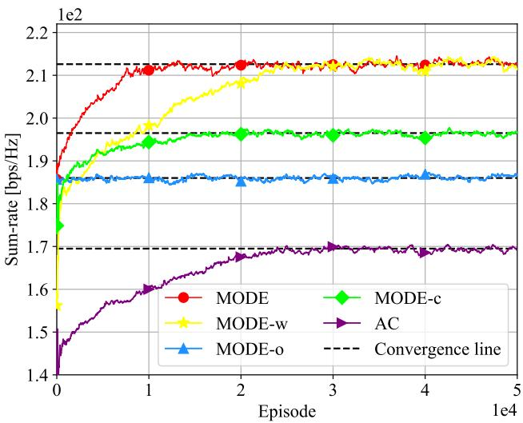  
(a) Sum-rate.

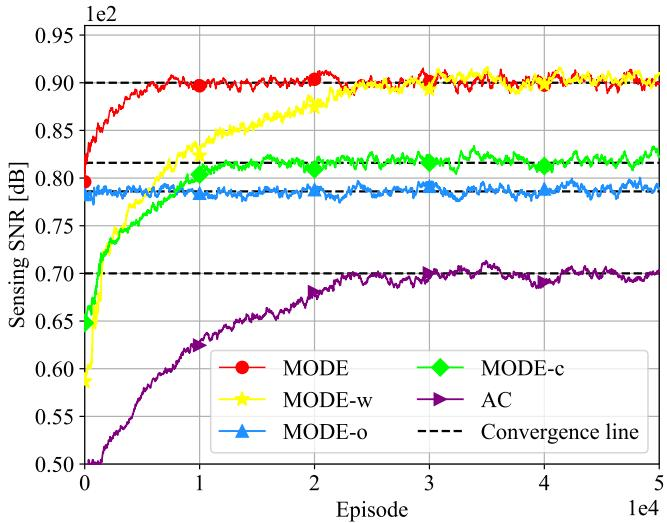  
(b) Sensing SNR.  
Fig. 3. Sum-rate and sensing SNR achieved by various schemes when the objective-preference weight is b = 0.6 and the number of time slots within a flight period is $T = 4 0$

## 5.2.2 MODE Versus AC

From Fig. 3, it can be seen that AC achieves significantly lower communication sum-rate and sensing SNR than other schemes. Specifically, compared with MODE, AC exhibits about 20.30% and 21.73% reduction in sum-rate and sensing SNR, respectively. This performance gap can be attributed to three main reasons. First, MODE employs an ANN model to generate a deterministic joint beamforming and trajectory decision, whilst AC generates a probability distribution over all possible actions and randomly samples an action from it. The consequence is that the decision of AC may be inappropriate. Second, MODE makes full use of historical experience sets to train all ANN models, whereas AC relies only on a single instantaneous experience set. This leads to strong correlations between ANN parameters before and after updates, further degrading decision-making efficiency [55]. Third, unlike AC, MODE exploits both target-actor and target-critic networks to assist in training eval-actor and eval-critic, thus improving the stability of the algorithm.

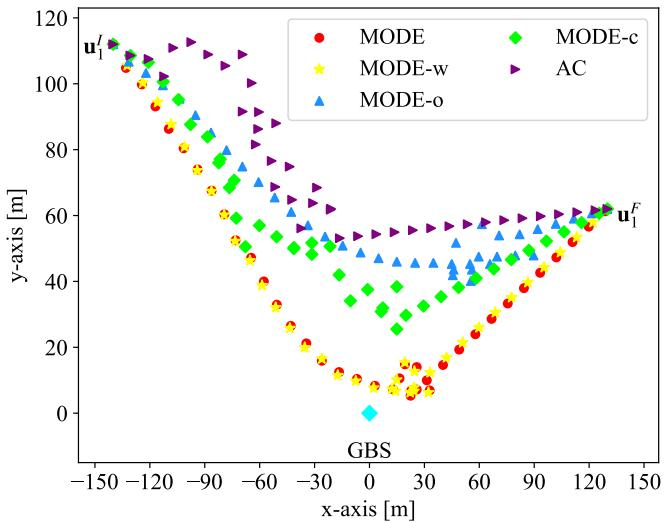  
Fig. 4. Flight trajectory of a specific UAV under various schemes.

## 5.2.3 MODE Versus MODE-o

MODE-o, although it uses a well-pre-trained multi-task MoE architecture to jointly decide beamforming and trajectory, does not undergo fine-tuning during online execution. As a consequence, its performance is slightly inferior to that of MODE, leading to sum-rate and sensing SNR reductions of 26.57 bps/Hz and 11.63 dB, respectively. Nevertheless, MODE-o still achieves a 9.80% higher sumrate and an 11.33% greater sensing SNR in comparison to the AC scheme. This is because the multi-task MoE architecture equips MODE-o with strong generalization capabilities through its shared gating and expert networks, enabling fairly good performance even when the adaptation environment differs from the training environments. The above observations further demonstrate the effectiveness of the multi-task MoE architecture in enhancing generalization for LAE-oriented multi-objective ISAC systems.

## 5.2.4 MODE Versus MODE-c

Similar to MODE, MODE-c adopts the DDPG algorithm with a multi-task MoE architecture for offline training and online execution. Hence, compared with MODE-o, MODEc achieves gains of around 10.57 bps/Hz in sum-rate and 3.72 dB in sensing SNR. However, MODE-c relies on the conventional experience replay mechanism [53] to train its multi-task MoE architecture. This mechanism, designed for single-task scenarios, collects and utilizes experiences from different time slots within an episode independently. Since the optimization problem is formulated as an episodic task, the multi-task MoE architecture should be trained jointly on all experiences from an episode across diverse tasks. As a result, MODE-c is not well suited for the formulated episodic MOMDP model. Instead, owing to the hybrid experience replay mechanism, MODE can take advantage of multi-task experience sets, each comprising all experiences from an entire episode under a specific task, for training. These results exemplify the effectiveness of the proposed hybrid experience replay mechanism.

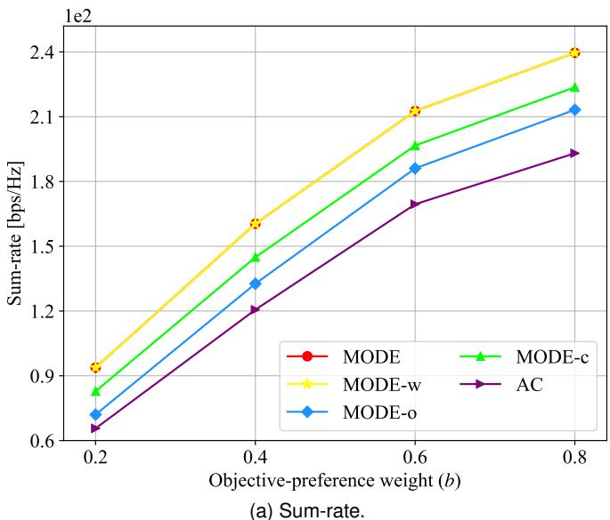

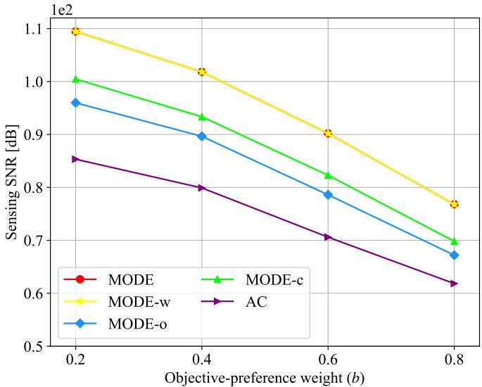  
(b) Sensing SNR.  
Fig. 5. Sum-rate and sensing SNR achieved by various schemes under different objective-preference weights.

## 5.3 Robustness to Different Preference Weights

This subsection evaluates the robustness of various schemes against different objective-preference weights, in which b increases from 0.2 to 0.8 with a step size of 0.2. Fig. 5a and Fig. 5b provide the communication sum-rate and sensing SNR of different schemes, respectively.

As observed, as the objective-preference weight b increases, the sum-rate of all schemes gradually increases, while the corresponding sensing SNR decreases. Besides, with the increase of $b ,$ the sum-rate differences among all schemes increase, while their sensing SNR differences decrease. This trend stems from the inherent trade-off between communication performance and sensing performance: a higher b assigns greater importance to sum-rate in the optimization objective, while reducing the emphasis on sensing SNR, i.e., all schemes will focus more on sum-rate than sensing SNR. Nevertheless, across different values of $b ,$ MODE always attains much higher system performance than other schemes. In particular, under various simulation setups, compared with MODE-o, MODE-c, and AC, the MODE scheme yields (i) sum-rate gains exceeding 12.38%, 7.13%, and 24.11%, respectively, and (ii) sensing SNR gains exceeding 13.58%, 8.96%, and 24.23%, respectively.

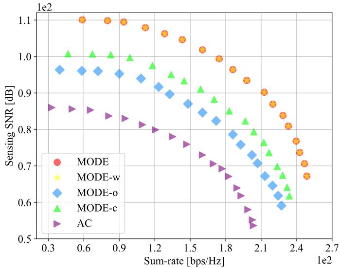  
Fig. 6. Pareto fronts achieved by various schemes.

To more intuitively illustrate the trade-offs among different objectives, we vary b from 0.1 to 0.95 in steps of 0.05 and provide the resulting Pareto front diagram of various schemes in Fig. 6. It can be observed that all schemes yield a set of Pareto policies with broad coverage across the two considered objectives. Besides, both MODE and MODE-w outperform the benchmark schemes. This improvement can be attributed to their adoption of the proposed hybrid experience replay mechanism and online fine-tuning approach, which help preserve more periodic information in their ANN models, thereby facilitating the learning of the periodicity of the considered system. Overall, the above results indicate that compared to various benchmarks, MODE (i) achieves more Pareto-efficient solutions and (ii) maintains stronger robustness against varying objective-preference weights. In addition, by adjusting $\begin{array} { r } { \boldsymbol { b } , } \end{array}$ the trade-off between communication and sensing performance can be well captured.

## 5.4 Robustness to Different Numbers of Time Slots Within a Flight Period

This subsection studies the performance of various schemes under different numbers of time slots within a flight period, in which T increases from 40 to 70 with a step size of 10. To fully demonstrate the advantages of a longer flight period for joint optimization, we adopt the per-slot average sum-rate and per-slot average sensing SNR as performance metrics, which are shown in Fig. 7a and Fig. 7b, respectively.

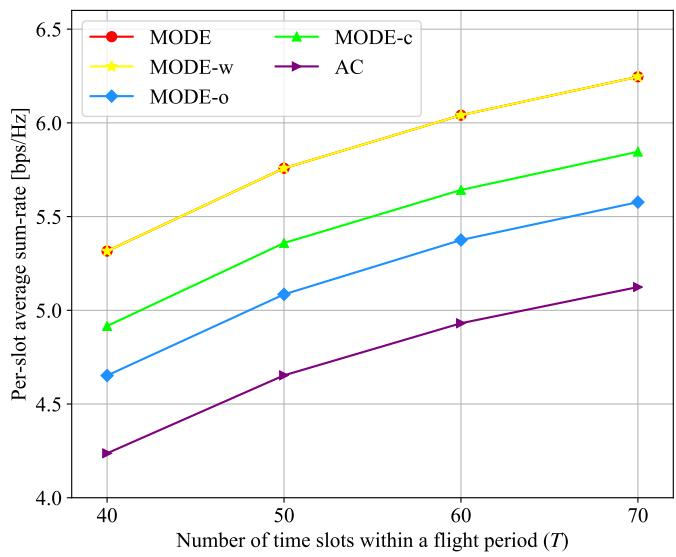  
(a) Sum-rate.

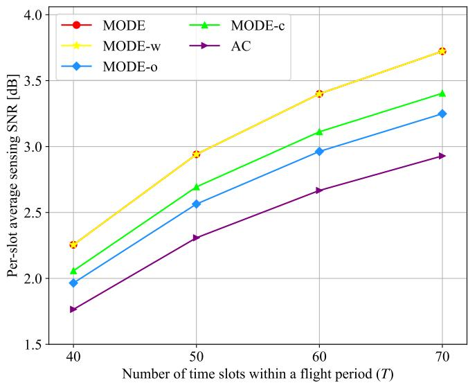  
(b) Sensing SNR.  
Fig. 7. Per-slot average sum-rate and sensing SNR achieved by various schemes under different numbers of time slots within a flight period.

As expected, the per-slot average sum-rate and sensing SNR achieved by all schemes improve monotonically as T increases. This is because a larger T provides more time slots during which UAVs can fly freely without being constrained by mission requirements. As a result, all schemes gain greater temporal degrees of freedom to optimize the joint beamforming and trajectory design, thereby enhancing both sum-rate and sensing SNR. Furthermore, with a more intelligent and efficient joint optimization strategy, MODE achieves higher communication and sensing performance than the other schemes. Across different values of T , MODE yields (i) over 12.00% higher sum-rate and 14.59% higher sensing SNR than MODE-o; (ii) over 6.84% higher sum-rate and 9.17% higher sensing SNR than MODE-c; and (iii) over 21.90% higher sum-rate and 27.11% higher sensing SNR than AC. Fig. 7 also shows that as T increases, the performance gap in both communication and sensing between MODE and the other schemes (i.e., MODE-w, MODE-o, MODE-c, and AC) gradually increases. For example, when T increases from 40 to 70, the sum-rate improvement of MODE over AC rises from 1.08 bps/Hz to 1.12 bps/Hz, and its sensing SNR improvement increases from 0.49 dB to 0.79 dB. These results demonstrate that MODE exhibits stronger robustness than other schemes across different numbers of time slots within a flight period.

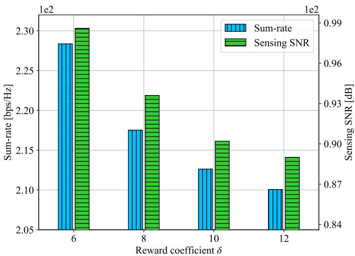  
Fig. 8. Sum-rate and sensing SNR achieved by various schemes under different values of the reward coefficient δ.

TABLE 3: Collision avoidance satisfactory of MODE under different values of δ.
<table><tr><td rowspan=1 colspan=1>Value of δ</td><td rowspan=1 colspan=1>6</td><td rowspan=1 colspan=1>8</td><td rowspan=1 colspan=1>10</td><td rowspan=1 colspan=1>12</td></tr><tr><td rowspan=1 colspan=1>Collision avoidance satisfaction</td><td rowspan=1 colspan=1>×</td><td rowspan=1 colspan=1>X</td><td rowspan=1 colspan=1>√</td><td rowspan=1 colspan=1>√</td></tr></table>

## 5.5 Impact of Different Values of the Reward Coefficient

Previous evaluations assumed the reward coefficient δ in the reward function to be 10. We now study how different values of δ affect the performance of the proposed MODE scheme and explain why δ = 10 was chosen in previous simulations. Specifically, we consider four values for δ: 6, 8, 10, and 12. The corresponding communication sum-rate and sensing SNR of MODE are depicted in Fig. 8, and the collision avoidance satisfaction is presented in TABLE 3.

It can be observed that as δ increases from 6 to 12, the communication sum-rate and sensing SNR of MODE gradually decrease, while collision avoidance is progressively satisfied. This is because a larger δ causes MODE to place more emphasis on the collision avoidance constraint. However, when δ becomes excessively large, MODE tends to over-focus on this single constraint at the cost of communication sum-rate or sensing SNR. Thus, a moderate value (i.e., δ = 10) is more effective than an overly large one $( \mathrm { i . e . , ~ } \delta ~ = ~ 1 2 )$ . Overall, setting δ = 10 strikes a wellbalanced trade-off among communication sum-rate, sensing SNR, and collision avoidance.

## 6 CONCLUSION

This paper developed a new multi-objective ISAC scheme for LAE, referred to as MODE, based on multi-task DRL with an MoE architecture. The objective of MODE is to maximize both the communication sum-rate and sensing SNR, while satisfying constraints on UAV mission completion, collision avoidance, and the GBS’s maximum transmit power. A salient advantage of MODE is that it requires no prior knowledge of target mobility patterns. First, by leveraging DDPG with a new reward function and a constrained action selection strategy, MODE optimizes all continuous variables while guaranteeing constraint satisfaction. To achieve the trade-off between communication and sensing performance, an objective-preference weight was further incorporated into MODE. Second, a multi-task MoE architecture was designed to enhance the generalization ability of MODE across different objective-preference weights, which trains optimization problems with different weights concurrently within shared gating and expert networks. Besides, to enable efficient learning of the MoE architecture, we developed a hybrid experience replay mechanism to exploit multi-task experience sets for MoE training. Simulation results showed that compared with other schemes, MODE is more (i) Pareto-efficient and (ii) robust against different objective-preference weights and numbers of time slots within a flight period. Furthermore, we demonstrated that with the multi-task MoE architecture, the convergence of MODE can be significantly accelerated for unseen tasks.

In the current work, we only focused on a single-GBS scenario. In practice, however, LAE-oriented ISAC systems are deployed with multiple GBSs. Despite potential inter-GBS interference, such a configuration constitutes a network-level ISAC system, capable of providing broader coverage and sensing capabilities for both authorized lowaltitude UAVs and unauthorized targets. Besides, performance indicators for sensing, such as detection probability and the CRB, may offer more informative insights than relying solely on the sensing SNR. Therefore, in future work, we plan to explore these metrics more thoroughly to better evaluate and optimize sensing accuracy.

## REFERENCES

[1] Y. Song, Y. Zeng, Y. Yang, Z. Ren, G. Cheng, X. Xu, J. Xu, S. Jin, and R. Zhang, “An overview of cellular ISAC for low-altitude UAV: New opportunities and challenges,” IEEE Commun. Mag., vol. 63, no. 12, pp. 88–95, Jul. 2025.

[2] Y. Wang, G. Sun, Z. Sun, J. Wang, J. Li, C. Zhao, J. Wu, S. Liang, M. Yin, P. Wang et al., “Toward realization of low-altitude economy networks: Core architecture, integrated technologies, and future directions,” IEEE Trans. Cogn. Commun. Netw., vol. 11, no. 5, pp. 2788–2820, Aug. 2025.

[3] Y. Jiang, X. Li, G. Zhu, H. Li, J. Deng, K. Han, C. Shen, Q. Shi, and R. Zhang, “Integrated sensing and communication for low altitude economy: Opportunities and challenges,” IEEE Commun. Mag., vol. 63, no. 12, pp. 72–78, Apr. 2025.

[4] F. Liu, Y. Cui, C. Masouros, J. Xu, T. X. Han, Y. C. Eldar, and S. Buzzi, “Integrated sensing and communications: Toward dualfunctional wireless networks for 6G and beyond,” IEEE J. Sel. Areas in Commun., vol. 40, no. 6, pp. 1728–1767, Mar. 2022.

[5] L. Xu, W. Xia, Y. Zhu, Q. Zhu, and W. Feng, “MAPRT detector based air-ground ISAC systems: Joint UAV placement and precoding,” IEEE J. Sel. Areas in Commun., vol. 44, pp. 578–591, Sept. 2025.

[6] L. Xu, Q. Zhu, W. Xia, Z. Wang, T. Q. Quek, and H. Zhu, “Joint placement and beamforming design in UAV enabled multi-stage ISAC system,” IEEE Trans. Commun., vol. 73, no. 11, pp. 12 248– 12 263, May 2025.

[7] X. Wang, Z. Fei, J. A. Zhang, J. Huang, and J. Yuan, “Constrained utility maximization in dual-functional radar-communication multi-UAV networks,” IEEE Trans. Commun., vol. 69, no. 4, pp. 2660–2672, Dec. 2020.

[8] B. Li, H. Zhang, Y. Rong, and Z. Han, “A control-based design of beamforming and trajectory for UAV-enabled ISAC system,” IEEE Trans. Wireless Commun., vol. 25, pp. 3469–3484, Sept. 2025.

[9] S. Xu, Z. Liu, L. Zhao, Z. Liu, X. Wang, Z. Fei, and A. Nallanathan, “Joint trajectory and beamforming optimization for UAV-relayed integrated sensing and communication with mobile edge computing,” IEEE Trans. Mobile Comput., vol. 24, no. 10, pp. 11 180–11 192, May 2025.

[10] Z. Lyu, G. Zhu, and J. Xu, “Joint maneuver and beamforming design for UAV-enabled integrated sensing and communication,” IEEE Trans. Wireless Commun., vol. 22, no. 4, pp. 2424–2440, Oct. 2022.

[11] C. Deng, X. Fang, and X. Wang, “Beamforming design and trajectory optimization for UAV-empowered adaptable integrated sensing and communication,” IEEE Trans. Wireless Commun., vol. 22, no. 11, pp. 8512–8526, Apr. 2023.

[12] Z. Liu, X. Liu, Y. Liu, V. C. Leung, and T. S. Durrani, “UAV assisted integrated sensing and communications for internet of things: 3D trajectory optimization and resource allocation,” IEEE Trans. Wireless Commun., vol. 23, no. 8, pp. 8654–8667, Jan. 2024.

[13] W. Wang, X. Liu, and Z. Liu, “Joint beamforming and trajectory design for multi-antenna UAV-enabled ISAC,” IEEE Trans. Veh. Technol., vol. 75, no. 2, pp. 8283–8287, Aug. 2025.

[14] K. Meng, Q. Wu, S. Ma, W. Chen, K. Wang, and J. Li, “Throughput maximization for UAV-enabled integrated periodic sensing and communication,” IEEE Trans. Wireless Commun., vol. 22, no. 1, pp. 671–687, Aug. 2022.

[15] Z. Liu, X. Liu, J. Feng, and B. Chen, “Radar estimation rate maximization for UAV assisted integrated sensing and communication,” IEEE Trans. Veh. Technol., vol. 74, no. 12, pp. 19 760–19 765, Jul. 2025.

[16] T. Van Chien, M. D. Cong, N. C. Luong, T. N. Do, D. I. Kim, and S. Chatzinotas, “Joint computation offloading and target tracking in integrated sensing and communication enabled UAV networks,” IEEE Commun. Lett., vol. 28, no. 6, pp. 1327–1331, Apr. 2024.

[17] P. Saikia, A. Jee, K. Singh, W.-J. Huang, A.-A. A. Boulogeorgos, and T. A. Tsiftsis, “Hybrid-RIS empowered UAV-assisted ISAC systems: Transfer learning-based DRL,” IEEE Trans. Commun., vol. 73, no. 9, pp. 8314–8329, Mar. 2025.

[18] T. Zhang, K. Zhu, S. Zheng, D. Niyato, and N. C. Luong, “Trajectory design and power control for joint radar and communication enabled multi-UAV cooperative detection systems,” IEEE Trans. Commun., vol. 71, no. 1, pp. 158–172, Nov. 2022.

[19] Y. Bai, Y. Zhang, B. Xie, Z. Chang, Y. Zhang, R. Jantti, and Z. Han, “Age of information minimization in UAV-enabled integrated sensing and communication systems,” arXiv preprint arXiv:2507.14299, 2025.

[20] X. Liu, J. Wu, C. Zhao, and Z. Liu, “Integrated sensing and communications for UAV assisted internet of things based on deep reinforcement learning,” IEEE Trans. Veh. Technol., vol. 74, no. 6, pp. 9604–9616, Feb. 2025.

[21] X. Chen, X. Cao, L. Xie, and Y. He, “DRL-based joint trajectory planning and beamforming optimization in aerial RIS-assisted ISAC system,” in Proc. IEEE iWRF&AT, Shenzhen, China, Jul. 2024, pp. 510–515.

[22] C. Fei, Z. Lu, L. Gao, W. Jiang, and J. Zhang, “Game-theoretic optimization for multi-UAV integrated sensing and communication networks,” IEEE Internet Things J., vol. 12, no. 20, pp. 42 741–42 753, Aug. 2025.

[23] Y. Hu, X. Zhuo, Z. Meng, W. Wu, W. Lu, L. Tang, F. Qu, and Z. Bu, “Collaborative positioning optimization for multiple moving users in UAV-enabled ISAC,” IEEE Trans. Cogn. Commun. Net., vol. 11, no. 5, pp. 3016–3030, Jul. 2025.

[24] J. Wu, W. Yuan, and L. Bai, “On the interplay between sensing and communications for UAV trajectory design,” IEEE Internet Things J., vol. 10, no. 23, pp. 20 383–20 395, Jun. 2023.

[25] R. Zhang, Y. Zhang, R. Tang, H. Zhao, Q. Xiao, and C. Wang, “A joint UAV trajectory, user association, and beamforming design

strategy for multi-UAV assisted ISAC systems,” IEEE Internet Things J., vol. 11, no. 8, pp. 29 360–29 374, Jul. 2024.

[26] Y. Qin, Z. Zhang, X. Li, W. Huangfu, and H. Zhang, “Deep reinforcement learning based resource allocation and trajectory planning in integrated sensing and communications UAV network,” IEEE Trans. Wireless Commun., vol. 22, no. 11, pp. 8158– 8169, Mar. 2023.

[27] S. Zhou, L. Xiang, K. Yang, K. K. Wong, D. O. Wu, and C.-B. Chae, “Beamforming-based achievable rate maximization in ISAC system for multi-UAV networking,” arXiv preprint arXiv:2507.21895, 2025.

[28] J. Wang, X. Zhang, Y. Wang, X. Yao, Z. Wei, F. Sun, and Z. Feng, “Transmit-receive beamforming for ISAC-enabled multi-UAVs system,” IEEE Trans. Green Commun. Net., vol. 10, pp. 652–666, Aug. 2025.

[29] Z. Xie, Z. Wang, Z. Zhang, J. Wang, Z. Jiang, and Z. Han, “Distributed UAV swarm for device-free integrated sensing and communication relying on multi-agent reinforcement learning,” IEEE Trans. Veh. Technol., vol. 73, no. 12, pp. 19 925–19 930, Aug. 2024.

[30] Z. Wang, X.-P. Zhang, W. Ding, Y. Dong, and X. Chen, “A novel integrated sensing and communication scheme in UAVs-enabled vehicular networks with MARL-driven adaptive control,” IEEE Trans. Mobile Comput., vol. 25, no. 1, pp. 132–147, Jul. 2025.

[31] C. Dai, T. Wu, G. Sun, Y. Zuo, Z. Guo, and F. Xiao, “Joint UAV trajectory and beamforming design for RIS-aided integrated sensing and communication system,” in Proc. IEEE INFOCOM Workshops, Vancouver, BC, Canada, May 2024, pp. 1–6.

[32] W. Mao, Y. Lu, B. Ai, and T. Q. Quek, “Covert communications in MEC-based networked ISAC systems towards lowaltitude economy,” IEEE J. Sel. Areas in Commun., Mar. 2026, doi: 10.1109/JSAC.2026.3670076.

[33] B. He, W. Mao, Y. Liu, W. Huangfu, Y. Xiao, F. Wang, and Y. Ji, “Energy-efficient joint beamforming and trajectory optimization for UAV-enabled integrated sensing and communication,” IEEE Trans. Commun., vol. 73, no. 12, pp. 13 426–13 440, Aug. 2025.

[34] Y. Chen, H. Yang, W. Xie, H. Lu, and C. Zhang, “Energy efficient UAV-RIS-aided integrated sensing and communication systems using deep reinforcement learning,” IEEE Trans. Veh. Technol., vol. 75, no. 1, pp. 1613–1618, Jul. 2025.

[35] X. Yu, J. Xu, N. Zhao, X. Wang, and D. Niyato, “Security enhancement of ISAC via IRS-UAV,” IEEE Trans. Wireless Commun., vol. 23, no. 10, pp. 15 601–15 612, Jul. 2024.

[36] Y. Guo, X. Jia, M. Xie, and Y. Li, “Secrecy rate maximization for IRS-enabled UAV-ISAC systems via phase shifting adjustment and resource allocation,” IEEE Trans. Green Commun. Net., vol. 10, pp. 289–299, Jun. 2025.

[37] Q. Wang, X. Qin, H. Jin, C. Li, N. Zhao, and D. Niyato, “UAVaided covert ISAC via full-duplex jamming,” IEEE Trans. Wireless Commun., vol. 25, pp. 3675–3687, sept. 2025.

[38] A. M. Benaya, M. S. Hassan, M. H. Ismail, and T. Landolsi, “Aerial ISAC: A HAPS-assisted integrated sensing, communications and computing framework for enhanced coverage and security,” IEEE Trans. Green Commun. Net., vol. 9, no. 4, pp. 2101–2114, Mar. 2025.

[39] C. Wang, X. Zhang, W. Liu, J. Ren, H. Xing, S. Wang, and Y. Shen, “Coordinated beamforming for RIS-empowered ISAC systems over secure low-altitude networks,” arXiv preprint arXiv:2505.24804, 2025.

[40] G. A. Bayessa, R. Chai, C. Liang, D. K. Jain, and Q. Chen, “Joint UAV deployment and precoder optimization for multicasting and target sensing in UAV-assisted ISAC networks,” IEEE Internet Things J., vol. 11, no. 20, pp. 33 392–33 405, Jul. 2024.

[41] X. Jing, F. Liu, C. Masouros, and Y. Zeng, “ISAC from the sky: UAV trajectory design for joint communication and target localization,” IEEE Trans. Wireless Commun., vol. 23, no. 10, pp. 12 857–12 872, May 2024.

[42] W. Liu, X. Zhang, J. Ren, W. Yuan, C. You, and S. Li, “UAVenabled ISAC systems with fluid antennas,” arXiv preprint arXiv:2509.21105, 2025.

[43] R. Tang, R. Chai, and P. Li, “Deep reinforcement learningbased sensing and communication scheduling algorithm for UAVassisted target detection systems,” in Proc. IEEE VTC, Hong Kong, China, Dec. 2023, pp. 1–5.

[44] P. Wang, D. Han, Y. Cao, W. Ni, and D. Niyato, “Multiobjective optimization-based waveform design for multi-user and multi-target MIMO-ISAC systems,” IEEE Trans. Wireless Commun., vol. 23, no. 10, pp. 15 339–15 352, Jul. 2024.

[45] Y. Cui, Q. Zhang, Z. Feng, F. Liu, C. Shi, J. Fan, and P. Zhang, “Specific beamforming for multi-UAV networks: A dual identitybased ISAC approach,” in Proc. IEEE ICC, Rome, Italy, May 2023, pp. 4979–4985.

[46] Y. Feng, C. Zhao, H. Luo, F. Gao, F. Liu, and S. Jin, “Networked ISAC based UAV tracking and handover towards low-altitude economy,” IEEE Trans. Wireless Commun., vol. 24, no. 9, pp. 7670– 7685, Apr. 2025.

[47] R. Li, Q. Zhang, D. Ma, K. Yu, and Y. Huang, “Joint target assignment and resource allocation for multi-base station cooperative ISAC in UAV detection,” IEEE Trans. Veh. Tech., vol. 74, no. 5, pp. 7700–7714, Jan. 2025.

[48] J. Tang, Y. Yu, C. Pan, H. Ren, D. Wang, J. Wang, and X. You, “Cooperative ISAC-empowered low-altitude economy,” IEEE Trans. Wireless Commun., vol. 24, no. 5, pp. 3837–3853, Feb. 2025.

[49] Y. Huang, J. Yang, C.-K. Wen, S. Xia, X. Li, and S. Jin, “Cooperative ISAC network for off-grid imaging-based low-altitude surveillance,” in Proc. IEEE VTC, Oslo, Norway, Sept. 2025, pp. 1–7.

[50] G. Cheng, X. Song, Z. Lyu, and J. Xu, “Networked ISAC for lowaltitude economy: Coordinated transmit beamforming and UAV trajectory design,” IEEE Trans. Commun., vol. 73, no. 8, pp. 5832– 5847, Feb. 2025.

[51] X. Ye, Y. Mao, X. Yu, S. Sun, L. Fu, and J. Xu, “Integrated sensing and communications for low-altitude economy: A deep reinforcement learning approach,” IEEE Trans. Wireless Commun., vol. 25, pp. 351–367, Jul. 2025.

[52] N. C. Luong, D. T. Hoang, S. Gong, D. Niyato, P. Wang, Y.-C. Liang, and D. I. Kim, “Applications of deep reinforcement learning in communications and networking: A survey,” IEEE Commun. Surveys Tuts., vol. 21, no. 4, pp. 3133–3174, 4th Quart. 2019.

[53] T. Lillicrap, J. Hunt, A. Pritzel, N. Heess, T. Erez, Y. Tassa, D. Silver, and D. Wierstra, “Continuous control with deep reinforcement learning,” in Proc. Int. Conf. Learn. Represent., San Juan, Puerto Rico, May 2016, pp. 1–14.

[54] J. Ma, Z. Zhao, X. Yi, J. Chen, L. Hong, and E. H. Chi, “Modeling task relationships in multi-task learning with multi-gate mixtureof-experts,” in Proc. 24th ACM SIGKDD Int. Conf. Knowl. Discov. Data Mining, Jul. 2018, pp. 1930–1939.

[55] R. S. Sutton and A. G. Barto, Reinforcement learning: An introduction. Cambridge, MA, USA:MIT press, 2018.

[56] L.-J. Lin, “Self-improving reactive agents based on reinforcement learning, planning and teaching,” Mach. Learn., vol. 8, pp. 293–321, May 1992.

[57] X. Ye, X. Song, Y. Wu, H. Xu, and J. Zhang, “Integrated sensing and communication for underwater acoustic networks based on deep reinforcement learning,” IEEE Trans. Mobile Comput., Mar. 2026, doi: 10.1109/TMC.2026.3678951.

[58] H. Tabassum, M. Salehi, and E. Hossain, “Fundamentals of mobility-aware performance characterization of cellular networks: A tutorial,” IEEE Commun. Surveys Tuts., vol. 21, no. 3, pp. 2288– 2308, Mar. 2019.

[59] M. Yan, C. A. Chan, A. F. Gygax, C. Li, A. Nirmalathas, and I. Chih-Lin, “Efficient generation of optimal UAV trajectories with uncertain obstacle avoidance in MEC networks,” IEEE Internet Things J., vol. 11, no. 23, pp. 38 380–38 392, Dec 2024.

[60] M. Yan, R. Xiong, Y. Wang, and C. Li, “Edge computing task offloading optimization for a UAV-assisted internet of vehicles via deep reinforcement learning,” IEEE Trans. Veh. Technol., vol. 73, no. 4, pp. 5647–5658, Apr. 2023.

[61] X. Ye, Y. Mao, X. Yu, and L. Fu, “Intelligent omni-surface-aided integrated sensing and communications based on deep reinforcement learning with knowledge transfer,” IEEE Trans. Wireless Commun., vol. 24, no. 5, pp. 4344–4360, Feb. 2025.

[62] X. Ye, Y. Yu, and L. Fu, “Multi-channel opportunistic access for heterogeneous networks based on deep reinforcement learning,” IEEE Trans. Wireless Commun., vol. 21, no. 2, pp. 794–807, Feb. 2022.

[63] P. Wang, H. Yang, G. Han, R. Yu, L. Yang, G. Sun, H. Qi, X. Wei, and Q. Zhang, “Decentralized navigation with heterogeneous federated reinforcement learning for UAV-enabled mobile edge computing,” IEEE Trans. Mob. Comput., vol. 23, no. 12, pp. 13 621– 13 638, Aug. 2024.

[64] M. Yan, L. Zhang, W. Jiang, C. A. Chan, A. F. Gygax, and A. Nirmalathas, “Energy consumption modeling and optimization of UAV-assisted MEC networks using deep reinforcement learning,” IEEE Sensors J., vol. 24, no. 8, pp. 13 629–13 639, Apr. 2024.

[65] I. Goodfellow, Y. Bengio, and A. Courville, Deep learning. Cambridge, MA, USA:MIT press, 2016.

[66] F. Chollet, Keras: The python deep learning library, Jun. 2018. [Online]. Available: https://keras.io.

[67] X. Ye, Y. Yu, and L. Fu, “Deep reinforcement learning based MAC protocol for underwater acoustic networks,” IEEE Trans. Mobile Comput., vol. 21, no. 5, pp. 1625–1638, May 2020.

Xiaowen Ye received the Ph.D. degree in communication and information systems from Xiamen University, Xiamen, China, in 2024. He was a post-doctoral research fellow with the Department of Electrical Engineering, City University of Hong Kong, during 2024-2025. He is an Associate Professor of the College of Photonic and Electronic Engineering at Fujian Normal University, China. His research interests include deep reinforcement learning, wireless network optimization, and dynamic resource allocation.

Hengyi Lin received the B.Eng. degree in communication engineering from Jimei University, China, in 2025, and is currently pursuing the M.S. degree in communication engineering at Fujian Normal University, China. His research interests include wireless communications, underwater acoustic communications, and deep reinforcement learning.

Xianxin Song (Member, IEEE) received the Ph.D. degree in Computer and Information Engineering from The Chinese University of Hong Kong, Shenzhen, China, in 2024, the M.Eng. degree from Beijing University of Posts and Telecommunications, Beijing, China, in 2020, and the B.Eng. degree from the University of Electronic Science and Technology of China, Chengdu, China, in 2017. He is currently a Post-Doctoral Research Fellow with the Department of Electrical Engineering, City University of Hong

Kong, Hong Kong SAR, China. His research interests include integrated sensing and communication, intelligent reflecting surface, and edge intelligence.

  
networks.

Yi Wu received the B.Eng. degree in radio technology from Southeast University, China, in 1991, the M.S. degree in communications and information systems from Fuzhou University, China, in 2004, and the Ph.D. degree in information and communication engineering from Southeast University, China, in 2013. She is currently a Professor in the College of Photonic and Electronic Engineering at Fujian Normal University. Her research interests include visible light positioning, vehicular ad hoc networks, and 5G

  
sor during 2015-2016.

Liqun Fu (S’08-M’11-SM’17) is a Full Professor of the School of Informatics at Xiamen University, China. She received her Ph.D. Degree in Information Engineering from The Chinese University of Hong Kong in 2010. She was a postdoctoral research fellow with the Institute of Network Coding of The Chinese University of Hong Kong, and the ACCESS Linnaeus Centre of KTH Royal Institute of Technology during 2011- 2013 and 2013-2015, respectively. She was with ShanghaiTech University as an Assistant Profes-

Her research interests are mainly in communication theory, optimization theory, game theory, and learning theory, with applications in wireless networks. She is on the editorial board of IEEE Transactions on Mobile Computing (TMC), IEEE Communications Letters and the Journal of Communications and Information Networks (JCIN). She served as the Technical Program Co-Chair of IEEE/CIC ICCC 2021 and the GCCCN Workshop of the IEEE INFOCOM 2014, the Publicity Co-Chair of the GSNC Workshop of the IEEE INFOCOM 2016, and the Web Chair of the IEEE WiOpt 2018. She also serves as a TPC member for many leading conferences in communications and networking, such as the IEEE INFOCOM, ICC, and GLOBECOM.