# Multi-Task Parallel Execution-Oriented Content Caching, Computation Offloading and Channel Allocation in UAV-Assisted MEC Network

Chaoqiong Fan, Jichao Zhan, Jing Wang, Shiwen Mao, Fellow, IEEE

Abstract—Leveraging flexible deployment, extensive coverage, and reliable communication links, unmanned aerial vehicle (UAV)-assisted mobile edge computing offers new opportunities to support mobile devices with heavy computational tasks. Considering the energy constraint of UAVs and delay requirement of tasks, many efforts should be devoted to pursuing lower service latency, which however is under explored in this innovational architecture. In this paper, with the purpose of minimizing the overall network service duration, departing from traditional serial task execution, we first design a multi-task parallel execution paradigm, and then investigate a joint optimization problem encompassing content caching, computation offloading, and channel allocation. To address this intractable problem involving large state and action spaces, we decompose it into two subproblems, i.e., an intra content caching and computation offloading optimization of each UAV, and an inter channel allocation of all UAVs. We then propose a reinforcement learning-based two-layer optimization scheme that integrates the efficient representation of DQN learning and the comprehensive exploration of regret minimization learning. Specifically, in the lower layer, a DQN-based algorithm is developed to solve the intra subproblem, and in the upper layer, a regret minimization-based algorithm is designed to tackle the inter subproblem. Through nested optimization between the two layers, optimal strategies for content caching, computation offloading and channel allocation can be achieved. Numerical results demonstrate that the proposed scheme significantly reduces service latency compared to various baseline methods.

Index Terms—MEC, UAV, multi-task parallel execution, resource optimization, reinforcement learning, regret minimization

## 1 INTRODUCTION

P <sup>ROMOTED</sup> <sup>by</sup> <sup>the</sup> <sup>rapid</sup> <sup>development</sup> <sup>of</sup> <sup>mobile</sup> <sup>Internet</sup>and edge intelligence, various novel applications, such as automatic navigation, augmented/virtual reality, image identification and object recognition have emerged explosively. These applications are characterized by computationintensive and delay-sensitive features, posing sever challenges to mobile devices (MDs) with limited computation capabilities [1]. As an extension of the traditional cloudbased data processing architecture, mobile edge computing (MEC) has emerged as a promising paradigm to address these challenges [2], [3]. By deploying servers equipped with storage and computation resources at the mobile network edges, MEC shifts service provisioning from the centralized cloud to the network periphery, closer to where applications are generated. This proximity facilitates more efficient task execution for MDs, thereby substantially enhancing the user experience.

On the other hand, unmanned aerial vehicles (UAVs), known for their mobility, flexibility, accessibility, and maneuverability, have shown significant potential in future 6G and beyond wireless networks [4], [5]. When equipped with caching, computing, and communication capabilities, UAVs can serve as aerial edge servers, delivering content, computation, and communication services to ground MDs. Leveraging these advantages, UAV-assisted MEC networks offer several key benefits [6], [7], including: (i) the availability of line-of-sight (LoS) links between UAV servers and ground MDs; (ii) agile and on-demand provisioning of MEC services to MDs in hotspot areas [8]; and (iii) improved fairness in service performance across MDs due to more balanced network loads [9]. Empowered by these strengths, UAV-assisted MEC networks are poised to deliver pervasive and reliable edge computing services for ground MDs.

Numerous studies have provided valuable insights into resource optimization in UAV-assisted MEC networks from various perspectives. Given the mobility of UAVs, a significant body of research focuses on the joint optimization of UAV trajectory/placement and task offloading strategies. For instance, [10] jointly optimizes UAV deployment and computation offloading to minimize service duration in dynamic environments, while [11] proposes a multi-objective reinforcement learning (RL) approach aimed at minimizing both total task delay and energy consumption. Meanwhile, [12] designs a DRL-based two-layer training framework to address the joint optimization of UAV trajectory, computation offloading, and user association. In addition to computational resources, communication resources also significantly impact network performance. A comprehensive analysis and discussion on downlink resource management in UAV-assisted MEC, along with future research directions, is provided in [13]. More contributions are devoted to the joint optimization of computation and communication. For example, [14] optimizes UAV trajectories, task allocation, and communication resources to jointly reduce service delay and energy cost. Emphasizing task priorities, [15] investigates multi-UAV cooperative MEC with joint optimization of trajectories, task offloading, and computation and communication resources. Leveraging digital twin technology, [16] formulates a problem that jointly optimizes MD association, computation offloading, CPU and bandwidth allocation, and UAV velocity to minimize both task delay and energy consumption. Furthermore, caching content on UAV servers can significantly enhance the quality of experience (QoE) for MDs and reduce overall network costs, making caching strategy another critical dimension in optimization [17]– [20]. To minimize service latency, [17] designs a two timescale optimization framework for service caching and task offloading. Similarly, [18] proposes a federated DRL method for joint data caching and computation offloading, while [19] studies bitrate-aware video caching and processing under uncertain content popularity distributions. With a focus on service experience, [20] jointly optimizes task offloading, resource allocation, trajectory planning, and service caching. Recently, increasing attention has been paid to the joint optimization of caching, computation, and other resource dimensions [21]–[23]. In [21], the authors jointly optimize caching and offloading decisions, UAV deployment, and radio and computation resources to minimize the weighted sum of latency and energy consumption. Meanwhile, [22] investigates the joint optimization of content caching, service placement, and task offloading to maximize the weighted sum of content cache hit ratio and service delay reduction ratio. Additionally, [23] addresses secure service scenarios by jointly optimizing task offloading, service placement, UAV deployment, and transmit power to minimize the total task completion delay for MDs.

From the aforementioned studies, it is evident that service duration is a critical performance metric in UAVassisted MEC networks, as it directly impacts both the QoE for MDs and the overall network cost. Although existing works have achieved inspiring results, several key aspects in reducing the service duration remain under explored. On one hand, the tacit task processing paradigm in most related works follows a serialized approach. That is, generated tasks have to be executed one after another, leading to inefficient resource utilization and prolonged task execution delay. On the other hand, a UAV server is capable of performing computation, data reception, and transmission operations synchronously. This enables it to serve multiple MDs simultaneously, provided there are no resource conflicts during task execution. This potential for concurrent processing motivates us to design a multi-task parallel execution scheme for UAV-assisted MEC networks. Intuitively, such an innovative execution mechanism can significantly reduce service duration. Moreover, within the multi-task parallel execution framework, it is essential to adopt a joint optimization perspective that integrates content caching, computation offloading, and communication resources in the UAV-assisted MEC network. Given the inherent coupling between content caching and computation offloading, the joint optimization of multi-dimensional resources to support parallel task execution presents a significant challenge. This complexity necessitates the design of more efficient optimization strategies to effectively coordinate these interdependent resources.

Therefore, to further leverage the advantages of UAVassisted MEC architecture and improve the QoE of MDs, this paper focuses on the service duration metric and proposes a multi-task parallel execution paradigm that enables tasks from different MDs to be processed simultaneously. Furthermore, under this novel execution framework, we jointly optimize content caching, computation offloading, and channel allocation, and develop a reinforcement learningbased two-layer (RLTL) optimization scheme to solve the resulting joint optimization problem. By integrating the efficient representation of DQN learning [24] and the broad exploration of regret minimization (RM) learning [25], the proposed RLTL method effectively addresses this challenging problem and achieves near-optimal solutions. The main contributions of this work are summarized as follows.

(1) We propose a multi-task parallel execution scheme tailored for UAV-assisted MEC networks. Based on the relationship between the content requested by MDs and that cached on UAVs, we classify MDs associated with the same UAV sever into three distinct categories, each with different task execution procedures. By leveraging differences in resource requirements of MDs’ task processing among these categories, tasks from different MD groups can be executed in parallel, thereby improving the utilization efficiency of both computation and transmission resources.

(2) We formulate a joint optimization problem encompassing content caching, computation offloading, and channel allocation, with the objective of minimizing service duration. To tackle this challenging problem, by analyzing the coupling relationship of the content caching, computation offloading and channel allocation, we decompose it into two subproblems with nested characteristic, i.e., an intra-UAV caching and computation optimization for individual UAVs, and an inter-UAV channel allocation across all UAVs.

(3) We develop a RLTL optimization scheme to address the formulated problem. The proposed architecture consists of a lower-layer network and an upper-layer network, dedicated to solving intra-subproblem and intersubproblem optimization, respectively. In the lowerlayer, a DQN-based algorithm is developed to construct an efficient representation of the massive actions for each UAV. In the upper-layer, a stochastic game is adopted to model the complex interaction among UAVs, and a RM-based algorithm is designed to encourage space exploration to find optimal solutions.

(4) We conduct extensive simulations to evaluate both the multi-task parallel execution scheme and the RLTL optimization method. Through comprehensive comparisons with multiple baseline approaches (including alternative task execution schemes and resource optimization algorithms), the numerical results confirm that our proposed framework combined with RLTL significantly reduces service duration compared to the benchmarks. These findings underscore the potential of our approach for task-intensive and latency-sensitive MEC applications.

The remainder of this paper is organized as follows. We describe the system model of the UAV-assisted MEC network in Section 2. We introduce the multi-task parallel execution design and formulate the joint resource optimization in Section 3. The proposed RLTL scheme is detailed in Section $^ { 4 , }$ followed by simulation results in Section 5. Finally, Section 6 concludes the paper. Key symbols of this paper are summarized in Table 1.

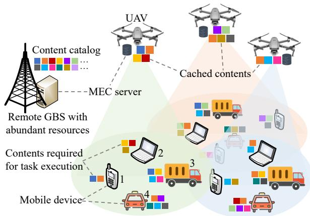  
Fig. 1: System model of the UAV-assisted MEC network.

## 2 SYSTEM MODEL

## 2.1 Network Model

As shown in Fig. 1, we consider a multiple UAV-assisted MEC network which consists of a set of MDs M = $\{ 1 , . . . , m , . . . , M \}$ , a set of UAVs $\mathcal { N } = \{ 1 , . . . , n . . . , N \}$ , and a remote GBS. Denote the 3-D locations of MD m, UAV $n ,$ and the GBS as ${ \bf l } _ { m } ~ = ~ ( x _ { m } , y _ { m } , 0 ) , ~ { \bf l } _ { n } ~ = ~ ( x _ { n } , y _ { n } , z _ { n } )$ and $\mathbf { l } _ { \mathrm { G } } = \left( x _ { 0 } , y _ { 0 } , z _ { 0 } \right)$ , respectively. Then, the distance $d _ { n m }$ between MD m and $\mathrm { U A V } ~ n ,$ , and the distance $d _ { n \mathrm { G } }$ between UAV n and the GBS are respectively given by:

$$
\left\{ \begin{array} { l l } { d _ { n m } = \sqrt { ( x _ { n } - x _ { m } ) ^ { 2 } + ( y _ { n } - y _ { m } ) ^ { 2 } + z _ { n } ^ { 2 } } } \\ { d _ { n \mathrm { G } } = \sqrt { ( x _ { n } - x _ { 0 } ) ^ { 2 } + ( y _ { n } - y _ { 0 } ) ^ { 2 } + ( z _ { n } - z _ { 0 } ) ^ { 2 } } } \end{array} \right.\tag{1}
$$

We assume that MDs are located out of the coverage area of the GBS, and thus no direct communication link exists between MDs and the remote GBS [26]. UAVs embedded with lightweight aerial MEC servers are deployed to facilitate computing services for ground MDs. However, due to limitations in size, weight, and power, UAVs can only offer restricted caching and computational resources [27]. While the GBS equipped with ground MEC servers possesses abundant caching and computation capabilities. Assume the content catalog comprises K contents, indexed by ${ \mathcal { K } } = \{ 1 , . . . , k . . . , K \}$ , where the data size of content k is $v _ { k }$ . Thanks to its sufficient caching resources, the GBS can store all contents in $\kappa .$ In contrast, each UAV can only cache a subset of contents that have a high probability of being requested within its coverage area, subject to its storage capacity<sup>1</sup>. Thus, each UAV n can be characterized by a tuple $( { \bar { V _ { n } } } , { \bar { { \cal K } _ { n } } } , f _ { n } )$ , where $V _ { n }$ denotes the storage capacity budget, $\textstyle { \mathcal { K } } _ { n } \subset { \mathcal { K } }$ represents the set of cached contents at UAV $n ,$ and

1. In this work, content caching is preferred over result caching as it enables adaptive processing, supports parameter customization, and satisfies privacy requirements while maintaining service versatility.

$f _ { n }$ is its computational frequency. The storage capacity must satisfy the following constraint:

$$
\sum _ { k \in \mathcal { K } _ { n } } v _ { k } \leqslant V _ { n }\tag{2}
$$

In this scenario, MDs periodically generate computation tasks that rely on specific contents for execution. Due to constraints in storage, computational capacity, and battery life, local computation at the MDs is infeasible for the sake of QoE guarantee. Therefore, when a task is generated, the MD first offloads it to its associated UAV, which then determines the computing pattern, either executing the task locally on the UAV or forwarding it to the GBS for remote computing, based on the current caching and computational status. For an MD $m ,$ a computation-intensive or latency-sensitive task can be characterized by a triplet $\xi _ { m } \triangleq ( \boldsymbol { K } _ { m } , \dot { C } _ { m } , D _ { m } )$ , where $\kappa _ { m } \subset \kappa$ denotes the set of contents required to execute task $\xi _ { m } ,$ $C _ { m }$ represents the total number of CPU cycles needed to complete the task, and $D _ { m }$ indicates the data size of computation results.

For simplicity, the association of UAVs and MDs is assumed to be predetermined based on the link distance and channel quality [28]. Denote the set of MDs that are associated with UAV n as $\mathcal { M } _ { n } ,$ and the sets of different UAVs are non-overlapping. Thus, we have $\mathcal { M } _ { n } \cap \mathcal { M } _ { n ^ { \prime } } = \emptyset$ for any $n \neq n ^ { \prime } .$ , and $\begin{array} { r } { \dot { \mathcal { M } } = \bigcup _ { n = 1 } ^ { N } \mathcal { M } _ { n } } \end{array}$ . Moreover, for a specific UAV $n ,$ its associated MDs m $\in \mathcal { M } _ { n }$ can be further classified into two categories according to the relationship between the cached contents set $\kappa _ { n }$ at $\mathrm { U A V } ~ n$ and the required contents set $\kappa _ { m }$ of each MD m $\mathbf { \Psi } , \in \mathcal { M } _ { n }$ for task execution. Specifically, one is that all required contents of MD m are cached by UAV $n ,$ i.e., ${ \mathcal K } _ { n } \cap \mathbf { \hat { K } } _ { m } = { \mathcal K } _ { m } ,$ and the other is that not all required contents of MD m are cached by UAV $n , \mathrm { i . e . , } \ K _ { n } \cap \hat { \mathcal { K } _ { m } } \neq \mathcal { K } _ { m } .$ Denote the set of MDs in the first category as $\mathcal { M } _ { n } ^ { 1 } ,$ , and that in the second category as $\mathcal { M } _ { n } ^ { 2 }$ Taking the MDs associated with the left UAV server in Fig. 1 as an example, we have $\mathcal { M } _ { n } ^ { 1 } = \{ 1 \}$ and $\mathcal { M } _ { n } ^ { 2 } = \{ 2 , 3 , 4 \}$ Intuitively, tasks from MDs in $\mathcal { M } _ { n } ^ { 1 }$ can be executed directly via edge computing at the UAV. In contrast, the computing pattern for tasks generated by MDs in $\mathcal { M } _ { n } ^ { 2 }$ requires further optimization by the UAV server, which will be elaborated in the following sections.

## 2.2 Communication Model

In the considered UAV-assisted MEC network, the execution of a task from an MD may involve two types of communication links, $\mathrm { i . e . , }$ transmissions from the GBS to UAVs (G2A) and from UAVs to ground MDs (A2G). Operating in fullduplex mode, UAV servers can simultaneously receive data via G2A links and transmit via A2G links [29]. We assume that G2A links operate in the mmWave band, while A2G links use the LTE band. Due to the relatively abundant spectrum in the mmWave band, orthogonal frequency division multiple access is employed for G2A transmissions, ensuring interference-free communication. In contrast, to improve spectrum efficiency and accommodate more MDs, A2G links may reuse the same channel for multiple concurrent transmissions, leading to mutual interference. Both LoS and non-line-of-sight (NLoS) path loss are considered for for links between air and ground, and the communication models for G2A and A2G are detailed below.

TABLE 1: Summary of Key Symbols
<table><tr><td rowspan=1 colspan=1>Key Symbols</td><td rowspan=1 colspan=1>Descriptions</td></tr><tr><td rowspan=1 colspan=1> $\mathcal { N } ( n ) , \mathcal { M } ( m ) , \mathcal { K } ( k ) , \mathcal { L } ( l )$ </td><td rowspan=1 colspan=1>sets (elements) of UAVs, MDs, contents, and channel bands, respectively</td></tr><tr><td rowspan=1 colspan=1> $V _ { n } , { \cal K } _ { n } , f _ { n }$ </td><td rowspan=1 colspan=1>storage capacity budget, set of cached contents, and computational frequency of UAV n</td></tr><tr><td rowspan=1 colspan=1> $\mathcal { K } _ { m } , C _ { m } , D _ { m }$ </td><td rowspan=1 colspan=1>set of required contents, required CPU cycles, and data size of results of MD m</td></tr><tr><td rowspan=1 colspan=1> $\mathcal { M } _ { n } , \mathcal { M } _ { n } ^ { 1 } , \mathcal { M } _ { n } ^ { 2 }$ </td><td rowspan=1 colspan=1>set of MDs that are associated with UAV n, and its two subsets</td></tr><tr><td rowspan=1 colspan=1> $\mathcal { M } _ { n } ^ { \mathrm { 2 U } } , \mathcal { M } _ { n } ^ { \mathrm { 2 G } }$ </td><td rowspan=1 colspan=1>two subsets of $\mathcal { M } _ { n } ^ { 2 }$ divided according to the task computing pattern (locally or remotely)</td></tr><tr><td rowspan=1 colspan=1> $\eta _ { n \mathrm { G } } ^ { \mathrm { L o S } } , \eta _ { n \mathrm { G } } ^ { \mathrm { N L o S } }$ </td><td rowspan=1 colspan=1>LoS path loss and NLoS path loss of the link between the GBS and UAV n</td></tr><tr><td rowspan=1 colspan=1> $\mathrm { P r } _ { n _ { \mathrm { G } } } ^ { \mathrm { L o S } } , \eta _ { n _ { \mathrm { G } } } , h _ { n _ { \mathrm { G } } }$ </td><td rowspan=1 colspan=1>LoS probability, path loss, and channel power gain of G2A communication link</td></tr><tr><td rowspan=1 colspan=1> $B _ { 0 } , P _ { 0 } , R _ { n \mathrm { G } }$ </td><td rowspan=1 colspan=1>bandwidth, transmission power, and transmission rate of G2A communication link</td></tr><tr><td rowspan=1 colspan=1> $\delta _ { n m } ^ { \mathrm { L o S } } , \delta _ { n m } ^ { \mathrm { N L o S } }$ </td><td rowspan=1 colspan=1>LoS path loss and NLoS path loss of the link between UAV n and MD m</td></tr><tr><td rowspan=1 colspan=1> $\mathrm { P r } _ { n m } ^ { \mathrm { L o S } } , \delta _ { n m } , g _ { n m }$ </td><td rowspan=1 colspan=1>LoS probability, path loss, and channel power gain of A2G communication link</td></tr><tr><td rowspan=1 colspan=1> $B _ { 1 } , P _ { n } , R _ { n m } ^ { l }$ </td><td rowspan=1 colspan=1>bandwidth, transmission power, and transmission rate of A2G communication link</td></tr><tr><td rowspan=1 colspan=1> $\kappa _ { 0 } / \kappa _ { 1 } , \sigma _ { 0 } ^ { 2 } / \sigma _ { 1 } ^ { 2 }$ </td><td rowspan=1 colspan=1>carrier frequency and noise power of the mmWave band/LTE band</td></tr><tr><td rowspan=1 colspan=1> $t _ { \mathrm { C } } ^ { 1 } / t _ { \mathrm { T } } ^ { 1 } , \tau _ { \mathrm { C } } ^ { 1 } / \tau _ { \mathrm { T } } ^ { 1 }$ </td><td rowspan=1 colspan=1>start time and processing delay of computing/transmission of MDs in set $\mathcal { M } _ { n } ^ { 1 }$ </td></tr><tr><td rowspan=1 colspan=1> $t _ { \mathrm { R } } ^ { \mathrm { 2 U } } / t _ { \mathrm { C } } ^ { \mathrm { 2 U } } / t _ { \mathrm { T } } ^ { \mathrm { 2 U } } , \tau _ { \mathrm { R } } ^ { \mathrm { 2 U } } / \tau _ { \mathrm { C } } ^ { \mathrm { 2 U } } / \tau _ { \mathrm { T } } ^ { \mathrm { 2 U } }$ </td><td rowspan=1 colspan=1>start time and processing delay of content receiving/edge computing/result transmission ofMDs in set $\mathcal { M } _ { n } ^ { \mathrm { 2 U } }$ </td></tr><tr><td rowspan=1 colspan=1> $t _ { \mathrm { C } } ^ { 2 \mathrm { G } } / t _ { \mathrm { R } } ^ { 2 \mathrm { G } } / t _ { \mathrm { T } } ^ { 2 \mathrm { G } } , \tau _ { \mathrm { C } } ^ { 2 \mathrm { G } } / \tau _ { \mathrm { R } } ^ { 2 \mathrm { G } } / \tau _ { \mathrm { T } } ^ { 2 \mathrm { G } }$ </td><td rowspan=1 colspan=1>start time and processing delay of remote computing/result receiving/result transmission ofMDs in set $\mathcal { M } _ { n } ^ { \mathrm { 2 G } }$ </td></tr><tr><td rowspan=1 colspan=1> $T _ { n } , ( T _ { n } ^ { 1  2 \mathrm { U }  2 \mathrm { G } } ,$  $T _ { n } ^ { \mathrm { 1 \to 2 G \to 2 U } } , T _ { n } ^ { \mathrm { 2 G \to 1 \to 2 U } } )$ </td><td rowspan=1 colspan=1>total service duration of UAV $n ,$ and its three possible forms according to the specific taskcompletion sequence</td></tr><tr><td rowspan=1 colspan=1> $\mathbf { A } ( \mathbf { a } _ { n } ) , \mathbf { B } ( \mathbf { b } _ { n } ) , \mathbf { C } ( \mathbf { c } _ { n } )$ </td><td rowspan=1 colspan=1>matrixes(vectors) of content caching, computation offloading, and channel allocation of all UAVs</td></tr></table>

## 2.2.1 G2A Transmission

The LoS path loss $\eta _ { n \mathrm { G } } ^ { \mathrm { L o S } }$ and NLoS path loss $\eta _ { n \mathrm { G } } ^ { \mathrm { N L o S } }$ of the link between the GBS and UAV n are respectively defined as:

$$
\left\{ \begin{array} { l l } { \eta _ { n \mathrm { G } } ^ { \mathrm { L o S } } = 2 0 \log \left( \displaystyle \frac { 4 \pi \kappa _ { 0 } } { c } \right) + 2 0 \log ( d _ { n \mathrm { G } } ) + \iota _ { \mathrm { L o S } } } \\ { \eta _ { n \mathrm { G } } ^ { \mathrm { N L o S } } = 2 0 \log \left( \displaystyle \frac { 4 \pi \kappa _ { 0 } } { c } \right) + 2 0 \log ( d _ { n \mathrm { G } } ) + \iota _ { \mathrm { N L o S } } } \end{array} \right.\tag{3}
$$

where $\kappa _ { 0 }$ represents the carrier frequency of the mmWave band, c is the speed of light, $\iota _ { \mathrm { L o S } }$ and $\iota _ { \mathrm { N L o S } }$ are the average added losses for the LoS and NLoS links.

The LoS probability depends on the environment and the elevation angle, which can be approximated by [30]:

$$
\mathrm { P r } _ { n \mathrm { G } } ^ { \mathrm { L o S } } = \frac { 1 } { 1 + \varphi \exp [ - \zeta ( \vartheta _ { n \mathrm { G } } - \varphi ) ] }\tag{4}
$$

where $\varphi$ and $\zeta$ are constants related to environments, and $\vartheta _ { n \mathrm { G } }$ is the elevation angle between the GBS and UAV n.

Then the path loss of the G2A link can be expressed as a probabilistic model containing the LoS and the NLoS, i.e.,

$$
\eta _ { n \mathrm { G } } = \mathrm { P r } _ { n \mathrm { G } } ^ { \mathrm { L o S } } \eta _ { n \mathrm { G } } ^ { \mathrm { L o S } } + ( 1 - \mathrm { P r } _ { n \mathrm { G } } ^ { \mathrm { L o S } } ) \eta _ { n \mathrm { G } } ^ { \mathrm { N L o S } }\tag{5}
$$

Denote the bandwidth of the allocated channel for each UAV as $B _ { 0 } ,$ , and the transmission power of the GBS as $P _ { 0 }$ Then, the transmission rate $R _ { n \mathrm { G } }$ between the GBS and UAV n is given by:

$$
R _ { n \mathrm { G } } = B _ { 0 } \log _ { 2 } \bigg ( 1 + \frac { P _ { 0 } h _ { n \mathrm { G } } } { \sigma _ { 0 } ^ { 2 } } \bigg )\tag{6}
$$

where $h _ { n \mathrm { G } } = 1 0 ^ { - \eta _ { n \mathrm { G } } / 1 0 }$ is the channel power gain of the G2A link, and $\sigma _ { 0 } ^ { 2 }$ is the noise power of the mmWave band.

## 2.2.2 A2G Transmission

Similarly, the LoS path loss $\delta _ { n m } ^ { \mathrm { L o S } }$ and NLoS path loss $\delta _ { n m } ^ { \mathrm { N L o S } }$ of the link between UAV server n and ground MD m are respectively given by:

$$
\left\{ \begin{array} { l l } { \delta _ { n m } ^ { \mathrm { L o S } } = 2 0 \log \left( \displaystyle \frac { 4 \pi \kappa _ { 1 } } { c } \right) + 2 0 \log ( d _ { n m } ) + \iota _ { \mathrm { L o S } } } \\ { \delta _ { n m } ^ { \mathrm { N L o S } } = 2 0 \log \left( \displaystyle \frac { 4 \pi \kappa _ { 1 } } { c } \right) + 2 0 \log ( d _ { n m } ) + \iota _ { \mathrm { N L o S } } } \end{array} \right.\tag{7}
$$

where $\kappa _ { 1 }$ represents the carrier frequency of the LTE band.

The LoS probability of the A2G link between UAV n and MD m is given by:

$$
\operatorname* { P r } _ { n m } ^ { \mathrm { L o S } } = \frac { 1 } { 1 + \varphi \exp [ - \zeta ( \vartheta _ { n m } - \varphi ) ] }\tag{8}
$$

where $\vartheta _ { n m }$ represents the elevation angle between UAV n and MD m.

Then the path loss of the A2G link can be expressed as:

$$
\delta _ { n m } = \mathrm { P r } _ { n m } ^ { \mathrm { L o S } } \delta _ { n m } ^ { \mathrm { L o S } } + ( 1 - \mathrm { P r } _ { n m } ^ { \mathrm { L o S } } ) \delta _ { n m } ^ { \mathrm { N L o S } }\tag{9}
$$

The total available spectrum in the LTE frequency band is divided into L orthogonal channels, denoted by ${ \mathcal { L } } =$ $\{ 1 , . . . , l , . . . , L \}$ , with a bandwidth $B _ { 1 }$ for each channel. Denote the selected channel and transmission power of UAV n as $\varsigma _ { n } \left( \varsigma _ { n } \in \mathcal { L } \right)$ and $P _ { n }$ respectively. Then, the date rate $R _ { n m } ^ { l }$ between UAV n and MD m is given by:

$$
R _ { n m } ^ { l } = B _ { 1 } \log _ { 2 } \left( 1 + \frac { P _ { n } g _ { n m } } { \sum _ { n ^ { \prime } \in \{ \mathcal { N } _ { l } \backslash n \} } P _ { n ^ { \prime } } g _ { n ^ { \prime } m } + \sigma _ { 1 } ^ { 2 } } \right)\tag{10}
$$

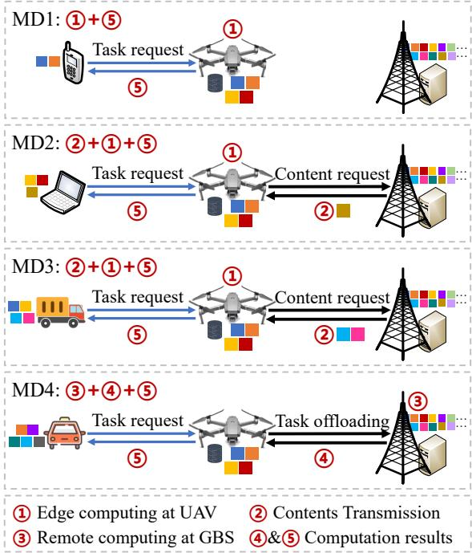  
Fig. 2: Task execution processes of the four MDs that are associated with the left UAV in Fig. 1.

where $g _ { n m } = 1 0 ^ { - \delta _ { n m } / 1 0 }$ is the channel power gain of the A2G link, $\mathcal { N } _ { l }$ is the set of UAVs that select channel l for transmission, i.e., $\mathcal { N } _ { l } = \{ n \in \mathcal { N } | \varsigma _ { n } = l \}$ , and $\sigma _ { 1 } ^ { 2 }$ is the noise power of the LTE band.

## 2.3 Computation Model

As previously described, for UAV n, the MDs (m $\in \mathcal { M } _ { n } )$ within its coverage are classified into two sets, $\mathcal { M } _ { n } ^ { 1 }$ and $\mathcal { M } _ { n } ^ { 2 } ,$ , based on the relationship between the $\mathrm { U A V } ^ { \prime } \mathbf { s }$ cached content set $\textstyle { \boldsymbol { \mathcal { K } } } _ { n }$ and the required content set $\kappa _ { m }$ of each MD m. In addition, the MDs in $\mathcal { M } _ { n } ^ { 2 }$ can be subdivided into two subsets according to the computing pattern, $\mathrm { i } . \mathrm { e } . , \ : \mathcal { M } _ { n } ^ { 2 \mathrm { U } }$ and $\mathcal { M } _ { n } ^ { \mathrm { 2 G } }$ , such that $\check { \mathcal { M } } _ { n } ^ { 2 } = \mathcal { M } _ { n } ^ { 2 \mathrm { U } } \dot { \cup } \mathcal { M } _ { n } ^ { 2 \ddot { \mathrm { G } } }$ , and $\mathcal { M } _ { n } ^ { \mathrm { 2 U } } \cap \mathcal { M } _ { n } ^ { \mathrm { 2 \ddot { G } } } = \emptyset$ Here, $\mathcal { M } _ { n } ^ { \mathrm { 2 U } }$ denotes the set of MDs whose tasks are executed locally via edge computing at the UAV, and $\mathcal { M } _ { n } ^ { \mathrm { 2 G } }$ refers to that whose tasks are offloaded to the GBS for remote computing. Overall, the community associated with UAV n consists of three mutually exclusive MD sets $\mathcal { M } _ { n } ^ { 1 } , \mathcal { M } _ { n } ^ { \mathrm { 2 U } }$ and $\mathcal { M } _ { n } ^ { \mathrm { 2 G } }$ . As illustrated in Fig. 2, the task execution process differs across these sets and is elaborated in detail below.

## 2.3.1 MDs belonging to set $\mathcal { M } _ { n } ^ { 1 }$

In this case, since UAV n caches all the contents required by task $\xi _ { m } \in \mathcal { M } _ { n } ^ { 1 } )$ , it can execute the task locally upon receiving the request from MD m. Specifically, UAV n performs edge computing and subsequently returns the computation results to MD m via the A2G link. The computing delay $\tau _ { \mathrm { C } } ^ { 1 }$ and the transmission delay $\tau _ { \mathrm { T } } ^ { 1 }$ are respectively calculated by:

$$
\tau _ { \mathrm { C } } ^ { 1 } = \sum _ { m \in \mathcal { M } _ { n } ^ { 1 } } \frac { C _ { m } } { f _ { n } }\tag{11}
$$

and

$$
\tau _ { \mathrm { T } } ^ { 1 } = \sum _ { m \in \mathcal { M } _ { n } ^ { 1 } } \frac { D _ { m } } { R _ { n m } ^ { \varsigma _ { n } } }\tag{12}
$$

## 2.3.2 MDs belonging to set $\mathcal { M } _ { n } ^ { 2 U }$

In this case, UAV n caches only a portion of the contents required for executing task $\xi _ { m } ~ ( \bar { m } \in \cdot  { M _ { n } } ^ { \mathrm { 2 U } } )$ . To complete the task, UAV n must first retrieve the missing contents from the GBS via the G2A link. The delay $\tau _ { \mathrm { R } } ^ { \mathrm { 2 U } }$ associated with receiving the missing contents is given by:

$$
\tau _ { \mathrm { { R } } } ^ { \mathrm { { 2 U } } } = \frac { \sum _ { k \in { \cal K } _ { n } ^ { \mathrm { F } } } v _ { k } } { R _ { n \mathrm { { G } } } }\tag{13}
$$

where $\begin{array} { r } { \mathcal { K } _ { n } ^ { \mathrm { F } } = \bigcup _ { m \in \mathcal { M } _ { \mathrm { - } } ^ { \mathrm { 2 U } } } \mathcal { K } _ { m } \backslash \mathcal { K } _ { n } } \end{array}$ represents the set of contents that need to be fetched.

With the complete contents, UAV n conducts edge computing, and the computing delay $\tau _ { \mathrm { C } } ^ { \mathrm { 2 U } }$ is expressed as:

$$
\tau _ { \mathrm { C } } ^ { \mathrm { 2 U } } = \sum _ { m \in \mathcal { M } _ { n } ^ { \mathrm { 2 U } } } \frac { C _ { m } } { f _ { n } }\tag{14}
$$

After computation, UAV n transmits the results to MDs, and the transmission delay $\tau _ { \mathrm { T } } ^ { \mathrm { 2 U } }$ is calculated by:

$$
\tau _ { \mathrm { T } } ^ { \mathrm { 2 U } } = \sum _ { m \in \mathcal { M } _ { n } ^ { \mathrm { 2 U } } } \frac { D _ { m } } { R _ { n m } ^ { \varsigma _ { n } } }\tag{15}
$$

## 2.3.3 MDs belonging to set $\mathcal { M } _ { n } ^ { 2 G }$

In this case, UAV n offloads tasks $\xi _ { m } \ ( m \in \mathcal { M } _ { n } ^ { 2 \mathrm { G } } )$ to the GBS for remote computation. After the GBS completes the computation, the results are transmitted back to MD m via UAV $n ,$ which relays the data through both the G2A and A2G links. The delay of the three steps, i.e., remote computing $\tau _ { \mathrm { C } } ^ { 2 \mathrm { G } }$ , G2A transmission (UAV n receiving) $\tau _ { \mathrm { R } } ^ { \mathrm { 2 G } }$ and A2G transmission $\tau _ { \mathrm { T } } ^ { \mathrm { 2 G } }$ , are respectively given by:

$$
\tau _ { \mathrm { C } } ^ { \mathrm { 2 G } } = \sum _ { m \in \mathcal { M } _ { n } ^ { \mathrm { 2 G } } } \frac { C _ { m } } { f _ { 0 } }\tag{16}
$$

$$
\tau _ { \mathrm { R } } ^ { \mathrm { 2 G } } = \sum _ { m \in \mathcal { M } _ { n } ^ { \mathrm { 2 G } } } \frac { D _ { m } } { R _ { n \mathrm { G } } }\tag{17}
$$

$$
\tau _ { \mathrm { T } } ^ { \mathrm { 2 G } } = \sum _ { m \in \mathcal { M } _ { n } ^ { \mathrm { 2 G } } } \frac { D _ { m } } { R _ { n m } ^ { \varsigma _ { n } } }\tag{18}
$$

where $f _ { 0 }$ represents the computation frequency of the GBS.

## 3 PROBLEM FORMULATION

In this section, we first elaborate on the multi-task parallel execution mechanism from the perspective of a UAV server. We then formulate the joint optimization of caching, computation, and communication as a service duration minimization problem. Moreover, to tackle this issue, we decompose the original problem into an intra-UAV caching and computation optimization for each individual UAV, and an inter-UAV channel allocation problem across all UAVs.

## 3.1 Multi-Task Parallel Execution

Benefiting from the separation of communication and computation modules and the full-duplex operation mode, UAV servers are capable of performing computing, receiving, and transmission tasks simultaneously. Moreover, remote computing executed at the GBS operates independently from the UAV servers. Leveraging these capabilities, certain processing steps of tasks can be carried out in parallel, thereby effectively enhancing the QoE for MDs, shortening the service duration of UAVs, and reducing energy consumption. For instance, the transmission of results for MDs in $\bar { \mathcal { M } } _ { n } ^ { 1 }$ , edge computing for MDs in $\mathcal { M } _ { n } ^ { \mathrm { 2 U } }$ , and the reception of results for MDs in $\breve { \mathscr { M } } _ { n } ^ { \mathrm { 2 G } }$ can all be executed concurrently.

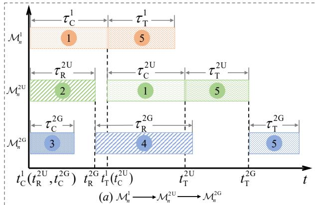

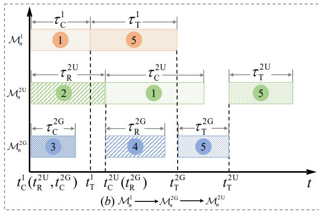

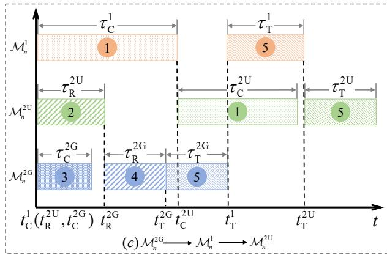  
Fig. 3: Three possible completion sequences with multi-task parallel execution paradigm.

To ensure the accuracy of task execution, it is assumed that processing steps cannot be interrupted. Therefore, each step may only be performed under two conditions: (i) all its preceding steps have been completed, and (ii) the necessary resources whether for computation, reception, or transmission are available. Since edge computing, content receiving, and remote computing constitute the initial steps for MDs in sets $\mathcal { M } _ { n } ^ { 1 } , ~ \mathcal { M } _ { n } ^ { \mathrm { 2 U } }$ , and $\mathcal { M } _ { n } ^ { \mathrm { 2 G } }$ respectively, they can be initiated immediately upon task request arrival. In contrast, subsequent steps must satisfy both conditions, introducing greater complexity in scheduling and resource coordination.

Under these circumstances, for the service processes at UAV servers, edge computing for MDs in set $\mathcal { M } _ { n } ^ { 1 }$ takes priority over that for MDs in set $\mathcal { M } _ { n } ^ { \mathrm { 2 U } }$ , and the same priority order applies to the transmission of results for MDs in these two sets. Similarly, the receiving of missing contents for MDs in set $\mathcal { M } _ { n } ^ { \mathrm { 2 U } }$ has priority over the receiving of computation results for MDs in set $\mathcal { M } _ { n } ^ { \mathrm { 2 G } }$ . Therefore, it can be concluded that tasks generated by MDs in set $\mathcal { M } _ { n } ^ { 1 }$ must be completed before those generated by MDs in set $\mathcal { M } _ { n } ^ { \mathrm { 2 U } }$ While the completion order of tasks generated by MDs in set $\mathcal { M } _ { n } ^ { \mathrm { 2 G } }$ is not fixed and may occur either before or after the tasks from sets $\mathcal { M } _ { n } ^ { 1 }$ and $\mathcal { M } _ { n } ^ { \mathrm { 2 U } }$ . As a result, there exist three possible task completion sequences, which are as follows:

$$
\left\{ \begin{array} { l l } { { ( \mathrm { a } ) : } } & { { \mathcal { M } _ { n } ^ { 1 } \to \mathcal { M } _ { n } ^ { 2 \mathrm { U } } \to \mathcal { M } _ { n } ^ { 2 \mathrm { G } } } } \\ { { ( \mathrm { b } ) : } } & { { \mathcal { M } _ { n } ^ { 1 } \to \mathcal { M } _ { n } ^ { 2 \mathrm { G } } \to \mathcal { M } _ { n } ^ { 2 \mathrm { U } } } } \\ { { ( \mathrm { c } ) : } } & { { \mathcal { M } _ { n } ^ { 2 \mathrm { G } } \to \mathcal { M } _ { n } ^ { 1 } \to \mathcal { M } _ { n } ^ { 2 \mathrm { U } } } } \end{array} \right.\tag{19}
$$

Clearly, the service duration $T _ { n }$ of UAV n would be different under different task completion orders. In order to distinguish these cases, we denote that:

$$
T _ { n } = \{ \begin{array} { l l } { T _ { n } ^ { 1  2 \mathrm { U }  2 \mathrm { G } } , } & { \mathrm { w i t h } \quad \mathcal { M } _ { n } ^ { 1 }  \mathcal { M } _ { n } ^ { 2 \mathrm { U } }  \mathcal { M } _ { n } ^ { 2 \mathrm { G } } } \\ { T _ { n } ^ { 1  2 \mathrm { G }  2 \mathrm { U } } , } & { \mathrm { w i t h } \quad \mathcal { M } _ { n } ^ { 1 }  \mathcal { M } _ { n } ^ { 2 \mathrm { G } }  \mathcal { M } _ { n } ^ { 2 \mathrm { U } } } \\ { T _ { n } ^ { 2 \mathrm { G }  1  2 \mathrm { U } } , } & { \mathrm { w i t h } \quad \mathcal { M } _ { n } ^ { 2 \mathrm { G } }  \mathcal { M } _ { n } ^ { 1 }  \mathcal { M } _ { n } ^ { 2 \mathrm { U } } } \end{array}\tag{20}
$$

To precisely characterize the service duration of UAV servers under different scenarios, in addition to the delays of each task execution step outlined in subsection 2.3, we introduce further notations to indicate the permissible start times of certain steps. Specifically, for MDs in set $\mathcal { M } _ { n } ^ { 1 } ,$ , let $t _ { \mathrm { C } } ^ { 1 }$ and $t _ { \mathrm { T } } ^ { 1 }$ denote the start times of edge computing and result transmission, respectively. For MDs in set $\mathbf { \dot { \mathcal { M } } } _ { n } ^ { \mathrm { 2 U } }$ , let $t _ { \mathrm { R } } ^ { 2 \mathrm { U } } , t _ { \mathrm { C } } ^ { 2 \mathrm { U } } .$ and $t _ { \mathrm { T } } ^ { \mathrm { 2 U } }$ represent the start times of content receiving, edge computing, and result transmission, respectively. Similarly, for MDs in set $\mathcal { M } _ { n } ^ { \mathrm { 2 G } } , t _ { \mathrm { C } } ^ { \mathrm { 2 G } } , t _ { \mathrm { R } } ^ { \mathrm { 2 G } }$ , and $t _ { \mathrm { T } } ^ { \mathrm { 2 G } }$ denote the start times of remote computing, result receiving, and result transmission, respectively. Examples of the three task sequences are illustrated in Fig. 3. It can be observed that the start times of the same processing step vary across different cases, as detailed in the following.

## 3.1.1 Case (a) with sequence $\mathcal { M } _ { n } ^ { 1 } \to \mathcal { M } _ { n } ^ { 2 U } \to \mathcal { M } _ { n } ^ { 2 G }$

As shown in Fig. 3(a), since the tasks from MDs in set $\mathcal { M } _ { \boldsymbol { n } } ^ { \mathrm { 2 G } }$ are completed last, the entire service duration $T _ { n } ^ { 1 \to \mathrm { 2 U } \to \mathrm { 2 G } }$ of UAV n depends on the delay of results transmission for MDs in set $\dot { \mathcal { M } } _ { n } ^ { \mathrm { 2 G } }$ , which is given by:

$$
T _ { n } ^ { \mathrm { 1 \to 2 U \mathrm { \to 2 G } } } = t _ { \mathrm { T } } ^ { \mathrm { 2 G } } + \tau _ { \mathrm { T } } ^ { \mathrm { 2 G } }\tag{21}
$$

Under this task completion sequence, the start times of those processing steps are expressed as:

$$
\left\{ \begin{array} { l l } { t _ { \mathrm { C } } ^ { \mathrm { I } } = t _ { \mathrm { R } } ^ { \mathrm { 2 U } } = t _ { \mathrm { C } } ^ { \mathrm { 2 G } } = 0 } \\ { t _ { \mathrm { T } } ^ { \mathrm { I } } = t _ { \mathrm { C } } ^ { \mathrm { I } } + \tau _ { \mathrm { C } } ^ { \mathrm { I } } } \\ { t _ { \mathrm { C } } ^ { \mathrm { 2 U } } = \operatorname* { m a x } ( t _ { \mathrm { T } } ^ { \mathrm { I } } , t _ { \mathrm { R } } ^ { \mathrm { 2 U } } + \tau _ { \mathrm { R } } ^ { \mathrm { 2 U } } ) } \\ { t _ { \mathrm { R } } ^ { \mathrm { 2 G } } = \operatorname* { m a x } ( t _ { \mathrm { R } } ^ { \mathrm { 2 U } } + \tau _ { \mathrm { R } } ^ { \mathrm { 2 U } } , t _ { \mathrm { C } } ^ { \mathrm { 2 G } } + \tau _ { \mathrm { C } } ^ { \mathrm { 2 G } } ) } \\ { t _ { \mathrm { T } } ^ { \mathrm { 2 U } } = \operatorname* { m a x } ( t _ { \mathrm { T } } ^ { \mathrm { 1 } } + \tau _ { \mathrm { T } } ^ { \mathrm { 1 } } , t _ { \mathrm { C } } ^ { \mathrm { 2 U } } + \tau _ { \mathrm { C } } ^ { \mathrm { 2 U } } ) } \\ { t _ { \mathrm { T } } ^ { \mathrm { 2 G } } = \operatorname* { m a x } ( t _ { \mathrm { T } } ^ { \mathrm { 2 U } } + \tau _ { \mathrm { T } } ^ { \mathrm { 2 U } } , t _ { \mathrm { R } } ^ { \mathrm { 2 G } } + \tau _ { \mathrm { R } } ^ { \mathrm { 2 G } } ) } \end{array} \right.\tag{22}
$$

## 3.1.2 Case (b) with sequence $\mathcal { M } _ { n } ^ { 1 } \to \mathcal { M } _ { n } ^ { 2 G } \to \mathcal { M } _ { n } ^ { 2 U }$

As shown in Fig. 3(b), similarly, the total service duration $T _ { n } ^ { \mathrm { 1 \to 2 G \to 2 U } }$ of UAV n is determined by the result transmission delay for MDs in set $\mathcal { M } _ { n } ^ { \mathrm { 2 U } }$ , which can be expressed as:

$$
T _ { n } ^ { 1  2 \mathrm { G }  2 \mathrm { U } } = t _ { \mathrm { T } } ^ { \mathrm { 2 U } } + \tau _ { \mathrm { T } } ^ { \mathrm { 2 U } }\tag{23}
$$

Under this task execution order, the start times of those processing steps are calculated by:

$$
\left\{ \begin{array} { l l } { t _ { \mathrm { C } } ^ { \mathrm { I } } = t _ { \mathrm { R } } ^ { \mathrm { 2 U } } = t _ { \mathrm { C } } ^ { \mathrm { 2 G } } = 0 } \\ { t _ { \mathrm { r } } ^ { \mathrm { I } } = t _ { \mathrm { C } } ^ { \mathrm { I } } + \tau _ { \mathrm { C } } ^ { \mathrm { I } } } \\ { t _ { \mathrm { C } } ^ { \mathrm { 2 U } } = \operatorname* { m a x } ( t _ { \mathrm { T } } ^ { \mathrm { I } } , t _ { \mathrm { R } } ^ { \mathrm { 2 U } } + \tau _ { \mathrm { R } } ^ { \mathrm { 2 U } } ) } \\ { t _ { \mathrm { R } } ^ { \mathrm { 2 G } } = \operatorname* { m a x } ( t _ { \mathrm { R } } ^ { \mathrm { 2 U } } + \tau _ { \mathrm { R } } ^ { \mathrm { 2 U } } , t _ { \mathrm { C } } ^ { \mathrm { 2 G } } + \tau _ { \mathrm { C } } ^ { \mathrm { 2 G } } ) } \\ { t _ { \mathrm { r } } ^ { \mathrm { 2 G } } = \operatorname* { m a x } ( t _ { \mathrm { T } } ^ { \mathrm { 1 } } + \tau _ { \mathrm { T } } ^ { \mathrm { 1 } } , t _ { \mathrm { R } } ^ { \mathrm { 2 G } } + \tau _ { \mathrm { R } } ^ { \mathrm { 2 G } } ) } \\ { t _ { \mathrm { r } } ^ { \mathrm { 2 U } } = \operatorname* { m a x } ( t _ { \mathrm { T } } ^ { \mathrm { 2 G } } + \tau _ { \mathrm { T } } ^ { \mathrm { 2 G } } , t _ { \mathrm { C } } ^ { \mathrm { 2 U } } + \tau _ { \mathrm { C } } ^ { \mathrm { 2 U } } ) } \end{array} \right.\tag{24}
$$

## 3.1.3 Case (c) with sequence $\mathcal { M } _ { n } ^ { 2 G } \to \mathcal { M } _ { n } ^ { 1 } \to \mathcal { M } _ { n } ^ { 2 U }$

As shown in Fig. 3(c), similar to case (b), the tasks from MDs in set $\mathcal { M } _ { n } ^ { \mathrm { 2 U } }$ are still the last to be completed. Thus the whole service duration $T _ { n } ^ { \mathrm { 2 G  1  2 U } }$ of UAV n is also given by:

$$
T _ { n } ^ { \mathrm { 2 G  1  2 U } } = t _ { \mathrm { T } } ^ { \mathrm { 2 U } } + \tau _ { \mathrm { T } } ^ { \mathrm { 2 U } }\tag{25}
$$

Although the expression for the service duration is identical to that in case (b), the start times of certain processing steps differ as a result of the distinct completion sequence. These are given by:

$$
\left\{ \begin{array} { l l } { t _ { \mathrm { C } } ^ { 1 } = t _ { \mathrm { R } } ^ { 2 \mathrm { U } } = t _ { \mathrm { C } } ^ { 2 \mathrm { G } } = 0 } \\ { t _ { \mathrm { C } } ^ { 2 \mathrm { U } } = \operatorname* { m a x } ( t _ { \mathrm { T } } ^ { 1 } , t _ { \mathrm { R } } ^ { 2 \mathrm { U } } + \tau _ { \mathrm { R } } ^ { 2 \mathrm { U } } ) } \\ { t _ { \mathrm { R } } ^ { 2 \mathrm { G } } = \operatorname* { m a x } ( t _ { \mathrm { R } } ^ { 2 \mathrm { U } } + \tau _ { \mathrm { R } } ^ { 2 \mathrm { U } } , t _ { \mathrm { C } } ^ { 2 \mathrm { G } } + \tau _ { \mathrm { C } } ^ { 2 \mathrm { G } } ) } \\ { t _ { \mathrm { T } } ^ { 2 \mathrm { G } } = t _ { \mathrm { R } } ^ { 2 \mathrm { G } } + \tau _ { \mathrm { R } } ^ { 2 \mathrm { G } } } \\ { t _ { \mathrm { T } } ^ { 1 } = \operatorname* { m a x } ( t _ { \mathrm { T } } ^ { 2 \mathrm { G } } + \tau _ { \mathrm { T } } ^ { 2 \mathrm { G } } , t _ { \mathrm { C } } ^ { 1 } + \tau _ { \mathrm { C } } ^ { 1 } ) } \\ { t _ { \mathrm { T } } ^ { 2 \mathrm { U } } = \operatorname* { m a x } ( t _ { \mathrm { T } } ^ { 1 } + \tau _ { \mathrm { T } } ^ { 1 } , t _ { \mathrm { C } } ^ { 2 \mathrm { U } } + \tau _ { \mathrm { C } } ^ { 2 \mathrm { U } } ) } \end{array} \right.\tag{26}
$$

## 3.2 Network Service Duration Minimization

A UAV aims to minimize its service duration $T _ { n }$ by optimizing the content caching strategy $\textstyle { \mathcal { K } } _ { n . }$ , the set of MDs selected for edge computing $\breve { \mathscr { M } } _ { n } ^ { \mathrm { 2 U } }$ (the optimizations for $\mathcal { M } _ { n } ^ { 1 }$ and $\mathcal { M } _ { n } ^ { \mathrm { 2 G } }$ are implicitly addressed, since $\mathcal { M } _ { n } ^ { 1 }$ is fully determined by the cached contents $\kappa _ { n }$ , and $\mathcal { M } _ { n } ^ { \mathrm { 2 G } }$ can be directly derived once $\mathcal { M } _ { n } ^ { \mathrm { 2 U } }$ is determined), and the A2G transmission channel $\varsigma _ { n }$ subject to the storage capacity constraint, i.e.,

$$
\begin{array} { r } { \operatorname* { m i n } _ { ( \mathcal { K } _ { n } , \mathcal { M } _ { n } ^ { \mathrm { 2 U } } , \varsigma _ { n } ) } T _ { n } } \\ { \mathrm { s . t . ~ } \sum _ { k \in \mathcal { K } _ { n } } v _ { k } \leqslant V _ { n } } \end{array}\tag{27}
$$

To facilitate the analysis of the formulated optimization problem, we further introduce three vectors $\mathbf { a } _ { n } = [ a _ { n k } ] _ { k \in K }$ $\bar { \mathbf { b } } _ { n } = [ b _ { n m } ] _ { m \in \mathcal { M } _ { n } ^ { 2 } }$ and $\mathbf { c } _ { n } ~ = ~ [ c _ { n l } ] _ { l \in \mathcal { L } }$ . Here $a _ { n k } , ~ b _ { n m }$ and $c _ { n l }$ are binary indicators representing the content caching decisions, the computing mode selections for MDs, and the channel assignment of UAV $n ,$ respectively. Specifically,

$$
\begin{array} { r } { \{ \begin{array} { l l } { a _ { n k } = \{ 1 , } & { \mathrm { i f ~ c o n t e n t ~ } k \mathrm { ~ i s ~ c a c h e d ~ b y ~ U A V ~ } n } \\ { 0 , } & { \mathrm { e l s e } } \end{array}  } \\ { b _ { n m } = \{ \begin{array} { l l } { 1 , } & { \mathrm { i f ~ t a s k ~ } \xi _ { m } \mathrm { ~ i s ~ e x e c u t e d ~ b y ~ U A V ~ } n } \\ { 0 , } & { \mathrm { e l s e } } \end{array}  } \\ { c _ { n l } = \{ \begin{array} { l l } { 1 , } & { \mathrm { i f ~ c h a n n e l ~ } l \mathrm { ~ i s ~ a d o p t e d ~ b y ~ U A V ~ } n } \\ { 0 , } & { \mathrm { e l s e } } \end{array}  } \end{array}\tag{28}
$$

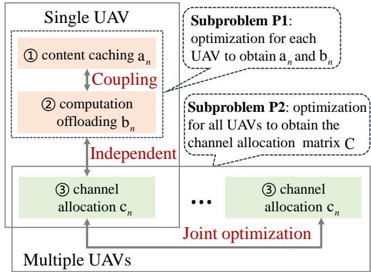  
Fig. 4: Coupling relations among the optimization variables.

Since each UAV adopts one channel for A2G transmission, $\mathbf { c } _ { n }$ is an one hot vector, which satisfies with $\begin{array} { r } { \sum _ { l = 1 } ^ { L } c _ { n l } = 1 } \end{array}$

Then, the optimization objective in eq. (27) expressed in terms of the set variables $\mathcal { K } _ { n } , \mathcal { M } _ { n } ^ { \mathrm { 2 U } }$ and the scalar variable $\varsigma _ { n }$ can be reformulated as an integer optimization problem:

$$
\begin{array} { r l r } & { } & { \mathrm { m i n } _ { ( { \mathbf a } _ { n } , { \mathbf b } _ { n } , { \mathbf c } _ { n } ) } T _ { n } } \\ & { } & { \mathrm { s . t . } \left\{ \begin{array} { l l } { \displaystyle \sum _ { k \in K } a _ { n k } v _ { k } \leqslant V _ { n } } \\ { \displaystyle \sum _ { l = 1 } ^ { L } c _ { n l } = 1 } \end{array} \right. } \end{array}\tag{29}
$$

Therefore, the service duration minimization problem at system-level can be mathematically formulated as:

$$
\begin{array} { r l } { \mathbf { P 0 } : } & { \operatorname* { m i n } _ { ( \mathbf { A } , \mathbf { B } , \mathbf { C } ) } T _ { n } \quad \quad \quad \forall n \in \mathcal { N } } \\ & { \mathrm { s . t . } \left\{ \begin{array} { l l } { \displaystyle \sum _ { k \in \mathcal { K } } a _ { n k } v _ { k } \leqslant V _ { n } } & \\ { \displaystyle \sum _ { l = 1 } ^ { L } c _ { n l } = 1 } & \end{array} \right. \quad \forall n \in \mathcal { N } } \end{array}\tag{30}
$$

where $\mathbf { A } = [ \mathbf { a } _ { n } ] _ { n \in \mathcal { N } } , \mathbf { B } = [ \mathbf { b } _ { n } ] _ { n \in \mathcal { N } } .$ , and ${ \bf C } = [ { \bf c } _ { n } ] _ { n \in \mathcal { N } } \mathrm { \bf ~ r e p - }$ resent the content caching matrix, computation offloading matrix, and channel allocation matrix of all UAV servers.

## 3.3 Optimization Problem Decomposition

We analyze the coupling relationships among the optimization variables of the formulated problem P0, shown in Fig. 4. From a single-UAV perspective, whether UAV n executes tasks via edge computing or offloads them to the remote GBS depends on its cached contents $\kappa _ { n } .$ . This indicates that the computation offloading decision $ { \mathbf { b } } _ { n }$ is coupled with the content caching strategy $\mathbf { a } _ { n } .$ . In contrast, the channel assignment variable $\mathbf { c } _ { n } ,$ which only affects the transmission rate, is independent of ${ \bf a } _ { n }$ and $\mathbf { b } _ { n } .$ From a multi-UAV perspective, the content caching and computation offloading decisions are naturally independent across different UAVs, meaning $\mathbf { a } _ { n }$ and $ { \mathbf { b } } _ { n }$ can be optimized separately for each UAV. However, the channel allocation matrix C must be jointly optimized across all UAVs, because the transmission delay for any UAV depends not only on its own channel selection but also on those of other UAVs, introducing inter-UAV competition for limited spectral resources.

Based on the above analysis, the original problem P0 can be decomposed into two subproblems, i.e., an intra-UAV caching and computation optimization for each individual UAV, and an inter-UAV channel allocation among all UAVs.

## 3.3.1 Intra-UAV Caching and Computation Optimization

It is evident that the optimization of content caching ${ \bf a } _ { n }$ and computation offloading $ { \mathbf { b } } _ { n }$ does not affect the A2G transmission delay. Therefore, in this subproblem, the latency for result transmission via the A2G link $( \mathrm { i . e . , }$ , the three steps 5 in each subgraph of Fig. 3) is excluded from the UAV’s service duration. Instead, we only consider the time required to complete the computation process (for MDs in sets $\mathcal { M } _ { n } ^ { 1 }$ and $\mathsf { \overline { { M } } } _ { n } ^ { 2 \mathrm { U } } )$ and the time needed to receive the results from the GBS (for MDs in set $\mathcal { M } _ { n } ^ { \mathrm { 2 G } } )$ . As explained in subsection 3.1, since edge computing for MDs in $\mathcal { M } _ { n } ^ { 1 }$ is completed before that for MDs in $\mathscr { M } _ { n } ^ { \mathrm { 2 U } }$ , the total duration excluding the transmission of results back to the MDs is determined by the completion time $U _ { \mathrm { C } } ^ { 2 \mathrm { U } }$ of computing tasks for MDs in $\dot { \mathcal { M } } _ { n } ^ { \mathrm { 2 U } }$ and the completion time $U _ { \mathrm { R } } ^ { 2 \mathrm { G } ^ { * } }$ of receiving results for MDs in $\mathcal { M } _ { n } ^ { \mathrm { 2 G } }$ , which are given respectively by:

$$
\left\{ \begin{array} { l l } { U _ { \mathrm { C } } ^ { \mathrm { 2 U } } = t _ { \mathrm { C } } ^ { \mathrm { 2 U } } + \tau _ { \mathrm { C } } ^ { \mathrm { 2 U } } } \\ { U _ { \mathrm { R } } ^ { \mathrm { 2 G } } = t _ { \mathrm { R } } ^ { \mathrm { 2 G } } + \tau _ { \mathrm { R } } ^ { \mathrm { 2 G } } } \end{array} \right.\tag{31}
$$

Then, for UAV $n ,$ the service duration $U _ { n }$ without results transmission back to MDs is given by:

$$
U _ { n } = \operatorname* { m a x } ( U _ { \mathrm { C } } ^ { \mathrm { 2 U } } , U _ { \mathrm { R } } ^ { \mathrm { 2 G } } )\tag{32}
$$

Thus, the subproblem with content caching and computation offloading joint optimization can be constructed as:

$$
\begin{array} { r } { \mathbf { P 1 } : \operatorname* { m i n } _ { ( \mathbf { a } _ { n } , \mathbf { b } _ { n } ) } U _ { n } \quad \forall n \in \mathcal { N } } \\ { \mathrm { s . t . ~ } \sum _ { k \in \mathcal { K } } a _ { n k } v _ { k } \leqslant V _ { n } } \end{array}\tag{33}
$$

Subproblem P1 involves a high-dimensional and nonconvex space, where traditional convex optimization methods may struggle to find high-quality solutions efficiently.

## 3.3.2 Inter-UAV Channel Allocation

Given the optimal content caching matrix A<sup>?</sup> and computation offloading matrix B<sup>?</sup> for all UAVs, the next step in solving problem P0 is to determine the optimal channel allocation matrix $\mathbf { C } ^ { \star }$ so as to minimize the A2G transmission delay for each UAV. Since channel resources are shared among all UAVs, each UAV seeks to maximize its transmission rate in a competitive manner. Hence, the inter-UAV joint channel allocation subproblem can be formulated as:

$$
\begin{array} { r } { \mathbf { P 2 } : \displaystyle \operatorname* { m a x } _ { \mathbf { C } } \displaystyle \sum _ { m \in \mathcal { M } _ { n } } \sum _ { l \in \mathcal { L } } c _ { n l } R _ { n m } ^ { l } \forall n \in \mathcal { N } } \\ { \mathrm { s . t . ~ } \displaystyle \sum _ { l = 1 } ^ { L } c _ { n l } = 1 \qquad \forall n \in \mathcal { N } } \end{array}\tag{34}
$$

Subproblem P2 operates in a dynamic and partially observable environment, in which each UAV has incomplete information regarding the states of other agents.

## 4 RL-BASED TWO-LAYER OPTIMIZATION SCHEME

Reinforcement learning (RL) is regarded as one of the most vigorous paradigm in decision making scenarios. The characteristics of our decomposed subproblems challenge conventional optimization approaches but align well with the strengths of RL. Specifically, assisted by deep neural network (DNN), RM and other advanced techniques, RL can effectively handle large state-action spaces and partial observability. Motivated by these advantages, we propose a novel RLTL optimization scheme to solve the minimization problem. In accordance with the intra- and inter-UAV subproblem decomposition, the RLTL framework consists of a lower-layer network maintained by each UAV for joint caching and computation optimization, and an upper-layer network shared among all UAVs to model inter-agent interactions for channel allocation. Since the caching and offloading decisions from the lower layer are required for inter-UAV optimization, the well-trained lower-layer network is nested into the upper layer as part of the environment.

In the following, we first detail the designs of the lowerlayer and upper-layer networks for addressing subproblems P1 and P2, respectively. Then, by integrating these two RLbased networks, we present the overall framework of the proposed RLTL scheme, followed by its convergence and complexity analysis.

## 4.1 Lower-Layer Network for Subproblem P1

In the lower-layer network, the joint content caching and computation offloading subproblem P1 is first formulated as a Markov decision process (MDP). To address the challenges of the large state and action spaces, a DQN-based learning algorithm is proposed, enabling each UAV to independently derive near-optimal caching and offloading strategies.

## 4.1.1 MDP Formulation

For a single agent (e.g. UAV n), the MDP is characterized by a tuple $( s , \alpha , r )$ , where s denotes the current state, α is the selected action, and r is the feedback reward. The details about the MDP elements are described as follows.

1) State: The content caching and computation offloading decisions are made based on the storage capacity $\bar { V _ { n } }$ and the generated task $\xi _ { m }$ of the associated MD m (m ∈ $\boldsymbol { \mathcal { M } } _ { n } )$ . Thus, the state s is expressed as:

$$
s = ( V _ { n } , [ m , \xi _ { m } | m \in \mathcal { M } _ { n } ] )\tag{35}
$$

2) Action: The agent is required to determine which content should be cached and one specific task should be conducted with which pattern (edge computing or remote computing). Hence, the action α is given by:

$$
\alpha = \left( \mathbf { a } _ { n } , \mathbf { b } _ { n } \right)\tag{36}
$$

The action space A of α is relatively large, which contains all possibilities of content caching and computation offloading. With a notation $| \mathcal { X } |$ representing the size of set X , the scale of A is given by:

$$
| A | = \frac { | \bigcup _ { m \in \mathcal { M } _ { n } } \mathcal { K } _ { m } | ! } { ( | \bigcup _ { m \in \mathcal { M } _ { n } } \mathcal { K } _ { m } | - | \mathcal { K } _ { n } | ) ! | \mathcal { K } _ { n } | ! } \times 2 ^ { | \mathcal { M } _ { n } ^ { 2 } | }\tag{37}
$$

It is evident that a large action space increases the complexity of the MDP. To alleviate this issue, we aim to reduce the action space A to make the problem more tractable. According to eq. (37), the dimension of $\mathcal { A }$ primarily depends on two factors $| \cup _ { m \in \mathcal { M } _ { n } } \mathcal { K } _ { m } |$ and $\lvert \mathcal { M } _ { n } ^ { 2 } \rvert$ |. Since the union of required contents $\textstyle \bigcup _ { m \in { \mathcal { M } } _ { n } } { \mathcal { K } } _ { m }$ from MDs associated with UAV n is predetermined by the system model, it cannot be optimized to reduce. While for the second item $| { \mathcal { M } } _ { n } ^ { 2 } | ^ { 2 }$ if more MDs are assigned to set $\mathcal { M } _ { n } ^ { 1 } ,$ the number in $\mathcal { M } _ { n } ^ { 2 }$ decreases, thereby reducing the dimension of the action space. Furthermore, as discussed in subsection 2.3, the service duration for MDs in $\mathcal { M } _ { n } ^ { 1 }$ is typically much shorter than that for those in $\mathcal { M } _ { n } ^ { 2 }$ due to their simpler execution processes. Therefore, increasing the number of MDs in $\mathbf { \mathcal { M } } _ { n } ^ { 1 }$ not only reduces the complexity of subproblem P1, but also supports the overall objective of minimizing service duration.

Based on the above analysis, the content caching strategy $\kappa _ { n }$ of UAV n should be optimized to maximize the number of MDs in $\mathcal { M } _ { n } ^ { 1 }$ . To achieve this, we first rank the content sets $\kappa _ { m }$ (for m $\in \mathcal { M } _ { n } )$ in ascending order of their sizes, $\mathrm { i . e . , } | \mathcal { K } _ { m } ^ { 1 } | \leqslant | \mathcal { K } _ { m } ^ { 2 } | \leqslant \cdot \cdot \cdot \leqslant | \mathcal { K } _ { m } ^ { | \mathcal { M } _ { n } | } | ,$ . Then, the cached content $\kappa _ { n }$ is constructed by incrementally incorporating these sets starting from the smallest, i.e., ${ \mathcal { K } } _ { n } \ { \stackrel { . } { = } } \ { \mathcal { K } } _ { m } ^ { 1 } \cup { \mathcal { K } } _ { m } ^ { 2 } \cup \cdot \cdot \cdot ,$ until the storage capacity $V _ { n }$ is reached. This procedure yields the content caching vector $\mathbf { a } _ { n } ,$ leaving only the computation offloading decision $ { \mathbf { b } } _ { n }$ to be optimized. Consequently, the action simplifies to $\alpha = \mathbf { b } _ { n } ,$ and the dimension of the action space becomes $| { \mathcal { A } } | = 2 ^ { | { \mathcal { M } } _ { n } ^ { 2 } | }$ . Compared to the original dimensions given in eq. (37), this approach significantly reduces the solution space of subproblem P1.

3) Reward: According to eq. (33), the agent aims to minimize a portion of the service duration while adhering to the storage capacity constraint. Since this constraint is already incorporated in the process of determining the content caching result $\mathbf { a } _ { n } ( \mathrm { i . e . , } \mathcal { K } _ { n } )$ , the optimization problem becomes unconstrained. Therefore, the reward function can be defined as the negative of the corresponding duration $U _ { n } ,$ that is,

$$
r = - U _ { n }\tag{38}
$$

Under state s, the agent selects an action $\alpha$ from the action space A according to a policy $\pi : s  \alpha ,$ , and receives an immediate reward $r .$ The environment then transitions to a new state $s ^ { \prime } .$ The interaction between the agent and the environment can be represented as a series of transitions $( s _ { i } , \alpha _ { i } , r _ { i } , s _ { i + 1 } )$ . The action-value function $Q ( s , \alpha )$ is used to evaluate the policy π, defined as the expected cumulative discounted reward:

$$
Q ( s , \alpha ) = \mathbb { E } _ { \pi } \left[ \sum _ { j = 0 } ^ { \infty } \gamma ^ { j } r _ { i + j } \bigg | s _ { i } = s , \alpha _ { i } = \alpha \right]\tag{39}
$$

where $\gamma \in [ 0 , 1 ]$ is the discount factor.

With the purpose of maximizing the expected discounted reward, a randomly generated policy $\pi \in \Pi$ would

be gradually enhanced towards the optimal policy $\pi ^ { \star }$ by interacting with environment, i.e.,

$$
\pi ^ { \star } = \arg \operatorname* { m a x } _ { \pi \in \Pi } \mathbb { E } _ { \pi } \left[ \sum _ { j = 0 } ^ { \infty } \gamma ^ { j } r _ { i + j } \Big | s _ { i } , \alpha _ { i } \right]\tag{40}
$$

## 4.1.2 Single Agent DQN-based Learning Algorithm

With the capabilities of efficient representation and strong scalability, DNN is adopted for RL. By leveraging DNN to estimate the Q-value function, DQN can solve the following Bellman optimality equation,

$$
Q ^ { \star } ( s , \alpha ) = \mathbb { E } _ { \pi } \biggl [ r _ { i } + \gamma \operatorname* { m a x } _ { \alpha _ { i + 1 } } Q ^ { \star } ( s _ { i + 1 } , \alpha _ { i + 1 } ) \Bigl | s _ { i } = s , \alpha _ { i } = \alpha \biggr ]\tag{41}
$$

To be specific, each agent utilizes an evaluation network $Q ( s _ { i } , \alpha _ { i } ; \theta )$ and a target network $Q ^ { \mathrm { T } } ( s _ { i } , \alpha _ { i } ; \theta ^ { \mathrm { T } } )$ . These networks share the same architecture but maintain separate parameters. The evaluation network computes the estimated Q-values, and its parameters θ are updated at every training step. While the target network is used to generate target $\mathrm { Q - }$ values, and its parameters $\theta ^ { \mathrm { T } }$ remain fixed for a period and are periodically synchronized with those of the evaluation network $\theta ^ { \mathrm { T } } = { \dot { \theta } }$ after a certain number of steps.

In addition to the dual-network structure, the DQN incorporates a replay memory mechanism. As the agent interacts with the environment, transitions $( s _ { i } , \alpha _ { i } , r _ { i } , s _ { i + 1 } )$ are collected and stored in an experience buffer D. break the correlation between samples and improve the data efficiency, a mini-batch of experiences is randomly sampled from $\dot { \mathcal { D } }$ to update the weight θ of the evaluation network. During training, an ε-greedy policy is adopted to balance exploration and exploitation. The exploration rate ε decays over time to gradually shift from exploration to exploitation [31]. Particularly, the agent has a probability of $1 - \varepsilon$ to choose the optimal action for exploitation, and has a probability of ε to choose a random action for exploration.

In the target network, the target Q-value $Y _ { i }$ is defined as the sum of the current reward $r _ { i }$ and the discounted optimal Q-value $Q ^ { \mathrm { T } } ( s _ { i + 1 } , \alpha _ { i + 1 } ; \theta ^ { \mathrm { T } } )$ of the next state:

$$
Y _ { i } = r _ { i } + \gamma \operatorname* { m a x } _ { \alpha _ { i + 1 } } Q ^ { \mathrm { T } } ( s _ { i + 1 } , \alpha _ { i + 1 } ; \theta ^ { \mathrm { T } } )\tag{42}
$$

The purpose of the DQN is to make the predicted $\mathrm { Q } \mathrm { - }$ value $\bar { Q ( } s _ { i } , \bar { \alpha } _ { i } ; \theta { ) }$ and the target Q-value $Y _ { i }$ approximate as much as possible. Hence the loss function is designed as:

$$
\mathcal { I } ( \theta ) = \mathbb { E } _ { ( s _ { i } , a _ { i } , r _ { i } , s _ { i + 1 } ) \sim \mathcal { D } } \left[ \Big ( Y _ { i } - Q ( s _ { i } , \alpha _ { i } ; \theta ) \Big ) ^ { 2 } \right]\tag{43}
$$

To obtain the optimal setting of parameter θ, the stochastic gradient descent method is adopted to minimize the loss function, and the gradient of parameter θ is expressed as:

$$
\begin{array} { r } { \nabla _ { \theta } \mathcal { I } ( \theta ) = \mathbb { E } _ { ( s _ { i } , a _ { i } , r _ { i } , s _ { i + 1 } ) \sim \mathcal { D } } \bigg [ \Big ( Y _ { i } - Q ( s _ { i } , \alpha _ { i } ; \theta ) \Big ) } \\ { \times \nabla _ { \theta } Q ( s _ { i } , \alpha _ { i } ; \theta ) \bigg ] } \end{array}\tag{44}
$$

The DQN-based optimization algorithm for computation offloading is outlined in Algorithm 1. Each episode consists of two stages: sample collection and network training. During the sample collection stage, the UAV agent interacts with the environment to generate training data, which are stored as transition tuples $( s _ { i } , \alpha _ { i } , r _ { i } , s _ { i + 1 } )$ in the experience buffer D. In the network training stage, a mini-batch of tuples is randomly sampled from D to train the evaluation network $Q ( s _ { i } , \alpha _ { i } ; \theta )$ . The parameters θ of the evaluation network and $\theta ^ { \mathrm { T } }$ of the target network are iteratively updated to converge toward their optimal values. Using the well-trained DQN, the UAV can derive an effective computation offloading solution within the lower-layer network.

```latex
Algorithm 1 Single Agent DQN-based Learning
Input: The MD set $\mathcal { M } _ { n } ^ { 2 } ;$
Output: The optimal offloading solution $\alpha ^ { \star } = \mathbf { b } _ { n } ^ { \star } ;$
Initialize: The evaluation network parameter $\theta ,$ the target
network parameter $\theta ^ { \mathrm { T } } ,$ the experience buffer ${ \mathcal { D } } ,$ , the
maximum number of episodes, the maximum number
of steps in each episode, and other hyper-parameters,
such as exploration rate ε and discount factor γ;
1: In each episode, reset the stochastic environment;
2: For each step of the current episode, UAV agent obtains
the task information $\xi _ { m }$ of it associated MDs in set $\mathcal { M } _ { n } ^ { 2 } .$
and chooses an action $\alpha _ { i }$ according to ε-greedy;
3: Receive the immediate reward $r _ { i }$ according to eq. (38)
and the environment transits to a new state $s _ { i + 1 } ;$
4: Store transition $( s _ { i } , \alpha _ { i } , r _ { i } , s _ { i + 1 } )$ in experience buffer $\mathcal { D } ;$
5: If the experience buffer is filled, sample a mini-batch
transitions from the experience buffer randomly;
6: Calculate the target Q-value $Y _ { i }$ according to eq. (42);
7: Minimize the loss function ${ \mathcal { I } } ( \theta )$ in eq. (43);
8: Calculate the gradient of parameter θ according to eq.
(44) and update θ with stochastic gradient descent;
9: Periodically update parameter $\theta ^ { \mathrm { T } }$ with $\theta ^ { \mathrm { T } }  \theta ;$
10: Set $i = i + 1$ until the maximum number of steps is
reached. Then start a new episode training.
```

## 4.2 Upper-Layer Network for Subproblem P2

Owing to mutual interference, the channel allocation decisions of one UAV can impact the performance of others. To model the complex interactions among multiple UAVs, the subproblem P2 is formulated as a stochastic game. A RM-based learning algorithm is then introduced to attain a correlated equilibrium of the game, which provides the solution for multi-agent channel allocation.

## 4.2.1 Stochastic Game Formulation

Stochastic games extend the MDP formalism to multi-agent setting by taking the interaction between agents into account. Specially regarding the subproblem P2, the stochastic game can be represented as $\mathcal { G } \triangleq ( \dot { \mathcal { N } } , \mathbf { o } , \beta , \mathbf { u } )$ , and the details about these components are elaborated as follows.

1) Agent: Each UAV acts as an agent to learn its channel allocation policy and receives the corresponding feedback. Thus, the agent set of G is the UAV set N .

2) Observation: Since there is no information exchanging among different UAVs, each UAV only has local information about the environment state, which involves its location $\mathbf { l } _ { n } ,$ the decisions about content caching ${ \bf a } _ { n }$ and computation offloading $\mathbf { b } _ { n . }$ , as well as the locations $1 _ { m }$ and tasks $\xi _ { m }$ of its associated MDs $m \in { \mathcal { M } } _ { n } .$ . Therefore, the observation $o _ { n }$ of agent n can be represented as:

$$
o _ { n } = ( \mathbf { l } _ { n } , \mathbf { a } _ { n } , \mathbf { b } _ { n } , [ m , \mathbf { l } _ { m } , \xi _ { m } | m \in \mathcal { M } _ { n } ] )\tag{45}
$$

The observations of all agents constitute the environment state o of $\mathcal { G } , \mathrm { i . e . , } \mathbf { o } = [ o _ { 1 } , . . . , o _ { n } , . . . , o _ { N } ]$

3) Action: Under local observation, each agent takes an action $\beta _ { n }$ from its action space $B _ { n } ( \forall n \in \dot { \mathcal { N } } )$ , which would derive a particular action profile $\beta = [ \beta _ { 1 } , . . . , \beta _ { n } , . . . , \beta _ { N } ]$ of game ${ \bar { \boldsymbol { g } } } .$ . In this layer, the decision of agent n involves choosing a channel from the channel set $\mathcal { L } .$ That is,

$$
\beta _ { n } = \mathbf { c } _ { n }\tag{46}
$$

Since $\mathbf { c } _ { n }$ is an one hot vector, the action space $B _ { n }$ of agent n can be expressed as:

$$
\begin{array} { r } { \mathcal { B } _ { n } = \left[ \begin{array} { l l l l } { 1 } & { 0 } & { \cdots } & { 0 } \\ { 0 } & { 1 } & { \cdots } & { 0 } \\ { \vdots } & { \vdots } & { \vdots } & { \vdots } \\ { 0 } & { 0 } & { \cdots } & { 1 } \end{array} \right] _ { L \times L } } \end{array}\tag{47}
$$

By convention, we apply $B _ { - n }$ to denote the action space of all agents excluding agent $n ,$ and its element $\beta _ { - n }$ refers to the action profile of all agents except agent n. Thus, we have, $\beta = \dot { [ \beta _ { n } , \beta _ { - n } ] }$

4) Utility: $\textbf { u } = \ [ u _ { 1 } , . . . , u _ { n } , . . . , u _ { N } ]$ is the set of utility (reward) function of ${ \mathcal { G } } .$ Aligning with the subproblem P2, agents aim to maximize their transmission rates, and the utility function $u _ { n }$ of agent n is defined as:

$$
u _ { n } = \sum _ { m \in \mathcal { M } _ { n } } \sum _ { l \in \mathcal { L } } c _ { n l } R _ { n m } ^ { l }\tag{48}
$$

Note that, in the MDP, the reward r of the agent depends on its own action $\alpha ,$ and it has no relation with the actions of other agents. On the contrary, in the stochastic game, the utility $u _ { n }$ received by agent n not only depends on its own action $\beta _ { n }$ but also the actions profile ${ \bar { \beta } } _ { - n }$ of other agents, which is the primary difference between single agent decision-making systems and multi-agent decision-making systems [32].

In the game formulation, for agent $n ,$ the policy $\omega _ { n }$ is a probability distribution over the action space $B _ { n }$ . That is, $\omega _ { n } \ = \ [ p _ { n \beta _ { n } } ] _ { \beta _ { n } \in \mathcal { B } _ { n } . }$ , where $p _ { n \beta _ { r } }$ denotes the probability of taking action $\beta _ { n } .$ Since the utility of an arbitrary agent is a function of all agents’ actions $\beta ,$ agent n should take into consideration not only the policy $\omega _ { n }$ of itself but also the policies $\omega _ { - n }$ of the other agents. Denote the policy profile of all agents as $\omega = [ \omega _ { 1 } , . . . , \bar { \omega } _ { n } , . . . , \omega _ { N } ] = [ \omega _ { n } , \bar { \omega } _ { - n } ]$ . In multiagent decision-making scenarios, each agent interacts with the environment and more importantly with other agents to learn an optimal policy $\omega _ { n } ^ { \star } \left( n \in \mathcal { N } \right)$ from its policy space $\Omega _ { n }$ to maximize the long-term utility.

Equilibrium plays a core role in the game formulation, which is regarded as a proper solution to the multi-agent decision-making problem. Among these diverse equilibrium notations, correlated equilibrium [33], which is tractable computation and can lead to superior social welfare via inducing the agents to coordinate their policies, is adopted for the formulated stochastic game G.

Definition 1 (Correlated Equilibrium). A correlated equilibrium of the stochastic game $\mathcal { G }$ is a policy profile $\omega ^ { \star } =$ $[ \omega _ { 1 } ^ { \star } , . . . , \omega _ { n } ^ { \star } , . . . , \omega _ { N } ^ { \star } ]$ over the joint action space $\boldsymbol { B } = \otimes \boldsymbol { B _ { n } }$ of all agents, such that for any agent $n ,$ it holds that,

$$
\begin{array} { c } { { \sum _ { \beta \in \mathcal { B } } \omega ^ { \star } ( \beta ) \Big [ u _ { n } \big ( \beta _ { n } , \beta _ { - n } \big ) - u _ { n } \big ( \beta _ { n } ^ { \prime } , \beta _ { - n } \big ) \Big ] \gtrsim 0 } } \\ { { \beta _ { n } , \beta _ { n } ^ { \prime } \in \mathcal { B } _ { n } , \ \beta _ { - n } \in \mathcal { B } _ { - n } , \ n \in \mathcal { N } } } \end{array}\tag{49}
$$

where $\begin{array} { r } { \omega ^ { \star } ( \beta ) = \prod _ { n = 1 } ^ { N } ( p _ { n \beta _ { n } } ^ { \star } ) } \end{array}$ represents the probability that the action profile $\beta$ is taken.

## 4.2.2 Multi-agent RM-based Learning Algorithm

To achieve the correlated equilibrium of the formulated stochastic game and maximize the long-term utilities in the upper-layer network, a RM-based learning algorithm is proposed. Derived from the regret matching framework, the core idea of this algorithm is to use the counterfactual advantage of actions as an evaluation metric for policy improvement. This approach encourages broader exploration of the action space and can lead to higher-quality equilibrium solutions.

To capture the local observation attribute, the counterfactual advantage of actions is determined by both the actionvalue and the observation-value. Specifically, for agent $n ,$ the action-value $\phi _ { n } ( o _ { n } , \beta _ { n } )$ of action $\beta _ { n }$ with observation $o _ { n }$ is defined as the achieved immediate utility, i.e.,

$$
\phi _ { n } ( o _ { n } , \beta _ { n } ) \triangleq u _ { n } ( \beta _ { n } , \beta _ { - n } )\tag{50}
$$

and the observation-value $\psi _ { n } ( o _ { n } )$ of observation $o _ { n }$ is the expectation of the action-value $\phi _ { n } ( o _ { n } , \beta _ { n } )$ of all available actions $\beta _ { n } \in B _ { n }$ , which is given by:

$$
\begin{array} { r } { \psi _ { n } ( o _ { n } ) = \sum _ { \beta _ { n } \in \mathcal { B } _ { n } } p _ { n \beta _ { n } } \phi _ { n } ( o _ { n } , \beta _ { n } ) } \end{array}\tag{51}
$$

Accordingly, for agent n with observation $o _ { n } ,$ the counterfactual advantage $A _ { n } \big ( o _ { n } , \beta _ { n } \big )$ of not taking action $\beta _ { n }$ can be expressed as:

$$
A _ { n } ( o _ { n } , \beta _ { n } ) = \phi _ { n } ( o _ { n } , \beta _ { n } ) - \psi _ { n } ( o _ { n } )\tag{52}
$$

In order to fully utilize the past experiences to learn the optimal policy, we consider a sequence of plays from the first iteration $( j = 1 )$ to the J -th iteration $( j \overset { \cdot } { = } \dot { J } )$ to capture the historical statistics of the advantage $A _ { n } \big ( o _ { n } , \beta _ { n } \big )$ . Then the historical cumulative regret $H _ { n } ( o _ { n } , \beta _ { n } , J )$ of action $\beta _ { n }$ indicating how much agent n would have gained by always taking action $\beta _ { n }$ up to iteration $J ,$ is expressed as:

$$
H _ { n } ( o _ { n } , \beta _ { n } , J ) = \sum _ { j = 1 } ^ { J } A _ { n } ( o _ { n } , \beta _ { n } , j )\tag{53}
$$

With the proposed RM-based learning algorithm, each agent calculates a new policy according to the historical

<table><tr><td>Algorithm 2 Multi-Agent RM-based Learning</td></tr><tr><td>Input: The agents set N, the results of content caching  $\mathbf { a } _ { n } ^ { \star }$  and computation offloading  $\mathbf { b } _ { n } ^ { \star } ,$  and the action space  $B _ { n }$  e4 Output: The channel allocation profile  $\beta ^ { \star } = \mathbf { C } ^ { \star }$  of all UAV agents, which is aligned with the correlated equilibrium; Initialize: The action selection policy  $\omega _ { n }$  of all UAV agents, and the maximum number of iterations;</td></tr><tr><td>1: In the j-th slot, each UAV n obtains the local observation  $o _ { n } ,$  and takes action  $\beta _ { n } ( j )$  from its action sapce  $B _ { n }$  1 2: Each agent n obtains the utility  $u _ { n } ( j )$  based to eq. (48); 3: Calculate the action-value  $\phi _ { n } ( o _ { n } , \beta _ { n } )$  of all actions and the observation-value  $\psi _ { n } ( o _ { n } )$  of the current observation  $o _ { n }$  according to eqs. (50) and (51), respectively; 4: Calculate the cumulative regret  $H _ { n } ( o _ { n } , \beta _ { n } , j )$  from the initial slot to the current slot according to eq. (53); 5: Each agent n updates all elements  $p _ { n , \beta _ { n } } ( j + 1 )$  of its</td></tr></table>

cumulative regret $H _ { n } ( o _ { n } , \beta _ { n } , j )$ . Specifically, for agent n, the policy $\omega _ { n } = [ p _ { n , \beta _ { n } } ] _ { \beta _ { n } \in \boldsymbol { B } _ { n } }$ is updated as:

$$
\begin{array} { r } { p _ { n , \beta _ { n } } ( j + 1 ) = \left\{ \begin{array} { l l } { \displaystyle \frac { \Big [ H _ { n } \big ( o _ { n } , \beta _ { n } , j \big ) \Big ] ^ { + } } { \Xi } } & { \quad \Xi > 0 , } \\ { \displaystyle \frac { 1 } { | \mathcal { B } _ { n } | } } & { \quad \mathrm { o t h e r w i s e } , } \end{array} \right. } \end{array}\tag{54}
$$

where $[ X ] ^ { + } \ \triangleq$ max{X, 0} represents the maximal value between X and 0, and $\begin{array} { r } { \Xi = \dot { \sum _ { \beta _ { n } \in B _ { n } } } [ H _ { n } ( o _ { n } , \beta _ { n } , j ) ] ^ { + } } \end{array}$ is the sum of non-negative regrets of all feasible actions.

The RM-based learning algorithm for joint channel allocation in the upper-layer network is detailed in Algorithm 2. As a model-free RL method, it enables UAV agents to leverage past experiences to form hindsight assessments, thereby reducing the regret associated with their action selections. This process facilitates the generation of improved policies to guide future decisions. Owing to this policy improvement capability, the algorithm progressively converges toward a correlated equilibrium, ultimately achieving the optimization objective of the upper-layer network.

## 4.3 Analysis of the RLTL Optimization Scheme

The framework of the proposed RLTL scheme is illustrated in Fig. 5, consisting of multiple lower-layer networks and a single upper-layer network. To address the intra-UAV subproblem P1, each UAV maintains its own lower-layer network, which employs a DQN to optimize content caching and computation offloading decisions. The resulting solutions to P1, along with other environmental information, form the local observation for the corresponding UAV agent in the upper-layer network. For the inter-UAV subproblem

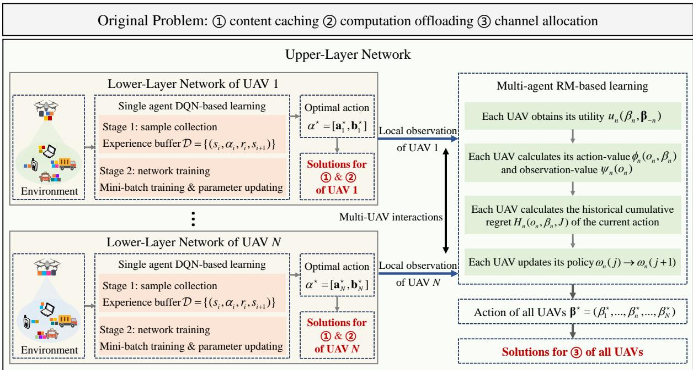  
Fig. 5: Framework of the RL-based two-layer optimization scheme.

P2, a RM-based learning algorithm is adopted in the upperlayer network to handle partial observability. In this setting, each UAV interacts both with the environment and with other UAVs to collaboratively determine the optimal channel allocation strategy across all agents. This hierarchical architecture integrates proactive exploration (via DQN) with reactive optimization (via RM), ensuring robustness against environmental dynamics and partial observability.

The convergence performance and computation complexity of our proposed scheme are analyzed as follows.

## 4.3.1 Convergence Performance

For the proposed RLTL optimization scheme, we analyze the convergence of the learning algorithm in the lower and upper layers separately.

Although DQN does not possess strict theoretical convergence guarantees, its empirical stability is well demonstrated through the use of key techniques such as target networks, experience replay, and a balanced explorationexploitation strategy. Therefore, in the lower-layer network, the DQN-based learning process is expected to converge to an optimal or near-optimal solution for content caching and computation offloading.

The convergence of the upper-layer algorithm, by contrast, is formally guaranteed by the following theorem.

Theorem 1. With the RM-based learning in the upper-layer, as the number of iteration $J \to \infty ,$ the average regret of each agent approaches 0, i.e., lim $_ { J  \infty } H _ { n } ( o _ { n } , \beta _ { n } , J ) / J = 0$ , and the channel allocation converges to a CE solution.

Proof. See APPENDIX A in the supplemental file.

□

## 4.3.2 Computation Complexity

The computational complexity of the proposed RLTL optimization scheme is determined by the complexity of both the DQN-based learning in the lower layer and the RMbased learning in the upper layer, as detailed in the following two propositions. Although the resulting computational costs are non-negligible, they remain manageable through the use of GPU acceleration and distributed training.

Proposition 1. With W layers and $E _ { w }$ neurons in each wth layer, the computation complexity of the DQN-based learning algorithm within one iteration for training is given by $\mathcal { O } _ { \mathrm { D Q N } } = \mathcal { O } _ { \mathrm { f w d } } + \mathcal { O } _ { \mathrm { b w d } }$ [34], where

$$
\left\{ \begin{array} { l l } { \displaystyle { \mathcal O } _ { \mathrm { f w d } } = { \mathcal O } \Bigl ( E _ { 0 } E _ { 1 } + \sum _ { w = 2 } ^ { W } ( E _ { w } E _ { w - 1 } E _ { w - 2 } ) + \sum _ { w = 1 } ^ { W } E _ { w } \Bigr ) } \\ { \displaystyle { \mathcal O } _ { \mathrm { b w d } } = { \mathcal O } \Bigl ( E _ { 0 } E _ { 1 } + W ( W - 1 ) + 2 \sum _ { w = 2 } ^ { W } ( E _ { w } E _ { w - 1 } E _ { w - 2 } ) \Bigr ) } \end{array} \right.\tag{55}
$$

Proof. See APPENDIX B in the supplemental file. □

Proposition 2. For a single agent, the computation complexity of the RM-based learning algorithm is given by $\mathcal { O } _ { \mathrm { R M } } = \mathcal { O } ( | \mathcal { M } _ { n } | \times | \mathcal { L } | )$

Proof. See APPENDIX C in the supplemental file.

## 5 SIMULATION RESULTS

In this section, we conduct numerical simulations to evaluate the performance of the proposed RLTL scheme for joint caching, computation, and communication optimization with multi-task parallel execution. First, we present the convergence behavior of the DQN-based and RM-based algorithms in terms of both one-shot and statistical performance. Then, to fully demonstrate the advantages of our designed parallel execution paradigm and optimization framework, we compare the performance of various execution modes, caching strategies, and offloading schemes, along with different resource optimization methods. Furthermore, for the considered UAV-assisted multi-task parallel execution network, we explore the optimal MD classification and model configurations. The key performance metrics are the average service duration per $\mathrm { U A V } \ { \frac { \sum _ { n \in { \mathcal { N } } } T _ { n } } { N } }$ and the average service duration per $\mathrm { M D } \stackrel { \sum _ { n \in \mathcal { N } } { T _ { n } } } { M }$ . All curves in the figures (except Fig. 5) are obtained from over 2000 simulation instances. The system parameter configurations are provided in Table I.

TABLE 2: System Parameters
<table><tr><td rowspan=1 colspan=5>Number of contents |KC|</td><td rowspan=1 colspan=1>50</td></tr><tr><td rowspan=1 colspan=5>Data size of a content vk</td><td rowspan=1 colspan=1>100Kbits</td></tr><tr><td rowspan=1 colspan=5>Storage capacity of $\mathrm { U A V s } \ V _ { n }$ </td><td rowspan=1 colspan=1>[1,2]Mbits</td></tr><tr><td rowspan=1 colspan=5>Computation frequency of UAVs $f _ { n }$ </td><td rowspan=1 colspan=1> $1 { \times } 1 0 ^ { 9 } \mathrm { c y c l e s } / \mathrm { s }$ </td></tr><tr><td rowspan=1 colspan=5>Computation frequency of UAVs $f _ { 0 }$ </td><td rowspan=1 colspan=1> $3 0 { \times } 1 0 ^ { 9 } \mathrm { c y c l e s } / s$ </td></tr><tr><td rowspan=1 colspan=5>Number of required contents of MDs $| \boldsymbol { \mathcal { K } } _ { m } |$ </td><td rowspan=1 colspan=1>[5,8]</td></tr><tr><td rowspan=1 colspan=5>CPU required for computation $C _ { m }$ </td><td rowspan=1 colspan=1>[1,2]Kcycles/bit</td></tr><tr><td rowspan=1 colspan=5>Data size of the result $D _ { m }$ </td><td rowspan=1 colspan=1>[500,1000]Kbits</td></tr><tr><td rowspan=1 colspan=5>Number of orthogonal channels |C|</td><td rowspan=1 colspan=1>4</td></tr><tr><td rowspan=2 colspan=1>Carrierfrequency</td><td rowspan=1 colspan=1> $\kappa _ { 0 }$ </td><td rowspan=1 colspan=1>30GHz</td><td rowspan=2 colspan=1>Bandwidth</td><td rowspan=1 colspan=1> $B _ { 0 }$ </td><td rowspan=1 colspan=1>100MHz</td></tr><tr><td rowspan=1 colspan=1> $\kappa _ { 1 }$ </td><td rowspan=1 colspan=1>2GHz</td><td rowspan=1 colspan=1> $B _ { 1 }$ </td><td rowspan=1 colspan=1>10MHz</td></tr><tr><td rowspan=2 colspan=1>Transmissionpower</td><td rowspan=1 colspan=1> $P _ { 0 }$ </td><td rowspan=1 colspan=1>30dBm</td><td rowspan=2 colspan=1>Noise power</td><td rowspan=1 colspan=1> $\sigma _ { 0 } ^ { 2 }$ </td><td rowspan=1 colspan=1>-90dBm</td></tr><tr><td rowspan=1 colspan=1> $P _ { 1 }$ </td><td rowspan=1 colspan=1>10dBm</td><td rowspan=1 colspan=1> $\sigma _ { 1 } ^ { 2 }$ </td><td rowspan=1 colspan=1>-100dBm</td></tr><tr><td rowspan=2 colspan=1>Path loss</td><td rowspan=1 colspan=1> $\iota _ { \mathrm { L o S } }$ </td><td rowspan=1 colspan=1>2</td><td rowspan=1 colspan=1>Los probability</td><td rowspan=1 colspan=1> $\varphi$ </td><td rowspan=1 colspan=1>11.95</td></tr><tr><td rowspan=1 colspan=1> $\scriptstyle \iota _ { \mathrm { N L o S } }$ </td><td rowspan=1 colspan=1>4.5</td><td rowspan=1 colspan=1>parameters</td><td rowspan=1 colspan=1> $\zeta$ </td><td rowspan=1 colspan=1>0.14</td></tr></table>

## 5.1 Convergence Performance of the Two Algorithms

To demonstrate the convergence of the DQN-based and RMbased learning algorithms in the lower and upper layers, Fig. 6 presents the one-shot convergence behavior of their respective metrics for a representative UAV. Specifically, Fig. 6(a) and Fig. 6(b) depict the evolution curves of the DQNbased algorithm in the lower layer and the RM-based algorithm in the upper layer, respectively. It can be observed that as the number of iterations increases, the loss/regret of the DQN-based/RM-based algorithm decreases to zero, while the reward/utility eventually converges to a stable value. This indicates that the proposed optimizations for lowerlayer caching and computation/upper-layer channel allocation achieve optimal or near-optimal solutions. Moreover, compared to the upper-layer subproblem, the UAV agents in the lower layer operate in a larger action space, requiring more iterations to converge, which is exactly suitable for the DNN-enabled DQN learning algorithm.

Given the stochastic nature of the two learning algorithms, we further assess their convergence performance from a perspective of statistical indicators, including the mean and confidence interval. The results under different numbers of MDs are presented in Fig. 7 with a 95% confidence level. It can be observed that for the DQN-based method, the number of required iterations increases with the number of MDs. In contrast, for the RM-based method, with a fixed number of UAVs (here $| \mathcal { N } | = 7 )$ , the number of iterations remains largely consistent across different MD counts. This discrepancy arises because the action space of the DQN-based algorithm in the lower layer is influenced by the number of MDs, and more MDs lead to a larger action space, thus requiring more iterations to converge. On the other hand, the action space of the RM-based algorithm in the upper layer depends primarily on the number of orthogonal channels, meaning the number of MDs does not affect its computational complexity. Despite the increased iteration count of the DQN-based approach, the proposed two-layer optimization scheme demonstrates favorable scalability as

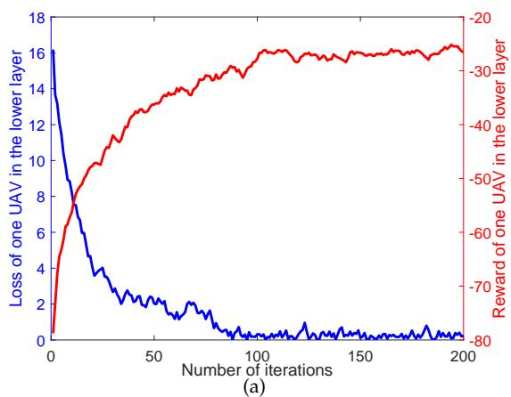

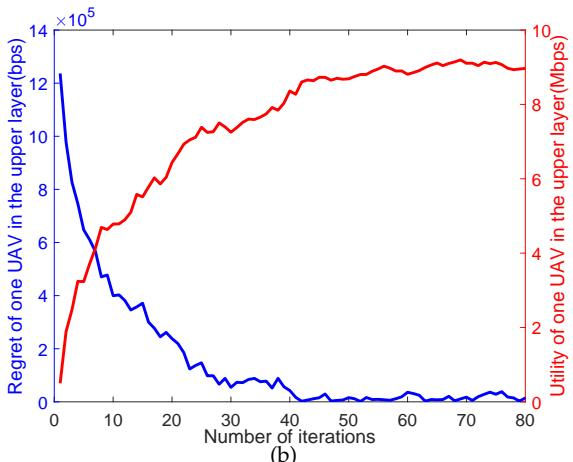  
Fig. 6: One shot convergence performance with $| { \mathcal { N } } | { = } 7$ and $| { \mathcal { M } } | { = } 6 0 .$ . (a) DQN-based algorithm; (b) RM-based algorithm.

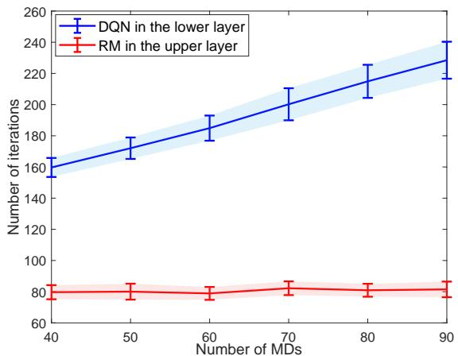  
Fig. 7: Statistical convergence performance of the DQNbased and RM-based algorithms with $| { \mathcal { N } } | { = } 7 .$

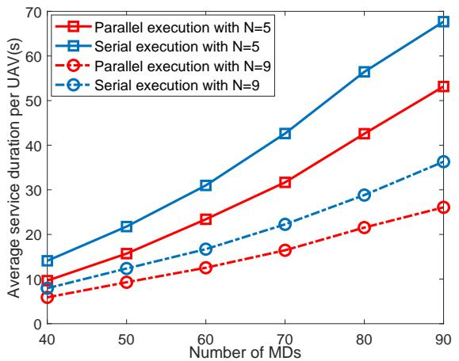  
Fig. 8: Average service duration per UAV under parallel and serial execution schemes.

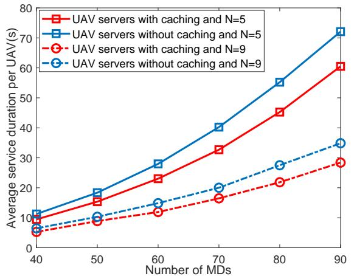  
Fig. 9: Average service duration per UAV under different content caching schemes.

the network size grows.

## 5.2 Comparison Performance of Execution Schemes

In this subsection, we compare different task execution schemes, including parallel versus serial execution, UAVs with caching versus without caching, and hybrid computation using both UAVs and the GBS versus full offloading to the GBS or full local computation at UAVs.

First, to validate the superiority of the multi-task parallel execution scheme, the comparison results of the average service duration per UAV under parallel and serial executions are shown in Fig. 8. It is evident that the parallel execution scheme significantly reduces the average service duration compared to the serial approach. Under serial execution, tasks from MDs must be processed sequentially, leading to increased service latency. In contrast, the proposed parallel execution framework enables simultaneous computation, reception, and transmission of different tasks, thereby substantially lowering the service latency. Moreover, the performance gap between the two schemes becomes more pronounced in scenarios with high MD density, i.e., when the number of MDs is large and the number of UAVs is limited. For instance, in a sparse MD setting (e.g., |N | = 9, $| { \mathcal M } | \ = \ 4 0 )$ , the parallel execution reduces the average latency per UAV by 12.6% compared to serial execution. In a dense MD setting (e.g., $| \hat { \mathcal { N } } | = 5 , | \mathcal { M } | = 9 0 )$ , this improvement increases to 21.6%.

Subsequently, to demonstrate the advantage of content caching, we compare the proposed paradigm with a baseline scheme where no content is cached in UAV servers, and the comparison results are presented in Fig. 9. It is evident that, under identical parameter configurations, the average service duration per UAV is significantly reduced when content is proactively cached at UAV servers. This improvement stems from the fact that, without caching, UAVs must fetch all contents required by MDs in sets $\mathcal { M } _ { n } ^ { 1 }$ and $\mathcal { M } _ { n } ^ { \mathrm { 2 U } }$ , or offload more tasks from their associated MDs to the GBS. Both alternatives introduce additional delays compared to our caching-enabled strategy. Furthermore, for a fixed number of UAVs, the performance gap between the two schemes widens as the number of MDs increases. Similarly, for a fixed number of MDs, the advantage becomes more pronounced with fewer UAVs, a trend consistent with the observations in Fig. 7.

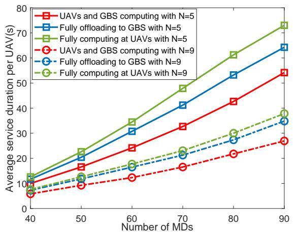  
Fig. 10: Average service duration per UAV under different task offloading schemes.

Moreover, to evaluate the efficiency of hybrid computing, we compare our proposed UAV-GBS collaborative computing approach with two baseline schemes: (i) full offloading to the GBS, where all tasks are executed by the GBS and UAVs only serve as relays to return the results; and (ii) full local computing at UAVs, where all tasks are processed solely by the edge servers on UAVs without any offloading. The comparison results of the average service duration per UAV are shown in Fig. 10. It can be observed that the hybrid computing paradigm achieves lower task completion latency than both baseline schemes. Furthermore, between the two benchmarks, full local computing at UAVs performs worse than full offloading to the GBS, especially as the number of MDs increases. This indicates that in scenarios with high task load, computational resources rather than communication resources become the primary bottleneck affecting service latency. Overall, in conjunction with the results from Figs. 8C10, we conclude that the reduction in task completion latency can be attributed to parallel execution, content caching, and effective offloading strategies.

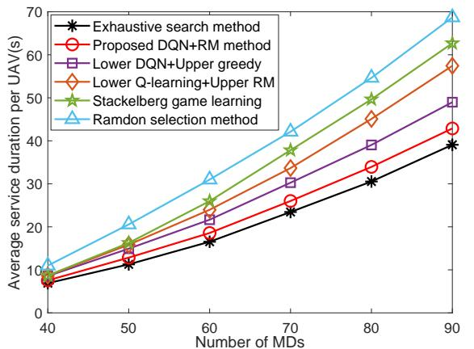  
Fig. 11: Average service duration per UAV under different resource optimization methods with $| { \mathcal { N } } | { = } 7 .$

## 5.3 Comparison Performance of Optimization Methods

In addition to the task execution schemes discussed above, the performance of the proposed RLTL optimization scheme is further evaluated by comparison with several alternative optimization methods. Specifically, we replace the DQNbased and RM-based algorithms in their respective layers with Q-learning and greedy algorithms, forming two comparative combinations: one pairing DQN with a greedy method, and another combining Q-learning with the RMbased approach. Furthermore, as a widely recognized hierarchical optimization framework, the Stackelberg game learning method from the recent work [35] is also included for comparison. The results are presented in Fig. 11.

The results indicate that the proposed optimization method performs close to the exhaustive search benchmark and surpasses all other counterparts. This demonstrates the superiority of the DQN-based algorithm over Q-learning, owing to its stronger representational capacity. Similarly, the regret-driven RM-based learning algorithm excels over the greedy approach due to its enhanced capability in exploring the solution space. Regarding the Stackelberg game learning method, it exhibits comparable performance to the Qlearning and RM combination when the number of MDs is relatively small. However, its performance degrades significantly under a large number of MDs, indicating that this approach is less suitable for scenarios with high MD density. In contrast, the proposed RLTL optimization scheme effectively reduces the service duration of UAVs even in densely populated MD environments.

## 5.4 System Performance of Different Parameters

For our proposed multi-task parallel execution paradigm, we investigate the optimal MD classification ratio under varying UAV storage capacities, and the results are shown in Fig. 12. It can be observed that the number of MDs in set $\mathcal { M } _ { n } ^ { 1 }$ increases with the storage capacity of the UAVs, while the number in set $\mathcal { M } _ { n } ^ { 2 }$ decreases accordingly. Among the two subcategories of ${ \ddot { \mathcal { M } } } _ { n } ^ { 2 } ,$ , the number of MDs in set $\mathrm { \bar { \mathcal { M } } } _ { n } ^ { \mathrm { 2 U } }$ is smaller than that in $\mathrm { \mathcal { M } } _ { n } ^ { \mathrm { 2 G } }$ . This trend, consistent with the findings in Fig. 9, further confirms that computational resources play a more critical role than communication resources in reducing task completion latency.

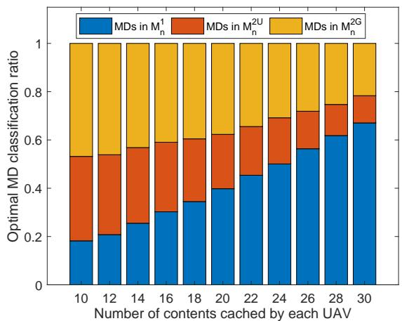  
Fig. 12: Optimal MD classification ratio under different number of contents cached by each UAV.

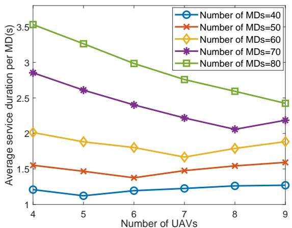  
Fig. 13: Average service duration per MD under different number of UAVs settings.

Furthermore, to determine the appropriate number of UAVs required to deliver satisfactory MEC services for different quantities of MDs, we analyze the average service duration per MD under varying UAV counts, as shown in Fig. 13. The results indicate that, under the current system configurations, the minimum service duration per MD is achieved when the number of UAVs is $5 , 6 , 7 , 8 ,$ and 9 for MD counts of 40, 50, 60, 70, and 80, respectively. This suggests that deploying more UAVs is not always beneficial. For a given number of MDs, a limited number of UAVs in conjunction with the GBS can adequately support the computational demands. Excessive UAVs may intensify mutual interference in A2G transmissions, thereby degrading overall system performance.

## 6 CONCLUSION

In this paper, we study the joint optimization of content caching, computation offloading, and channel allocation in UAV-assisted MEC networks. Aimed at minimizing the service duration, we propose a multi-task parallel execution paradigm that enables concurrent processing of multiple tasks, in contrast to conventional serial execution. To tackle the resulting joint optimization problem, we decompose it into two nested subproblems, an intra-UAV caching and computation subproblem, and an inter-UAV channel allocation subproblem. We then introduce a RLTL optimization scheme, where a DQN-based lower-layer handles the intra-UAV subproblem and an RM-based upper-layer addresses the inter-UAV subproblem. By effectively decomposing and coordinating the two layers, the joint resource allocation is efficiently solved. Simulation results confirm the superiority of our approach over several benchmark methods. For future work, we plan to extend the multi-task parallel execution framework to account for task priorities and dependencies. We will also explore advanced reinforcement learning techniques, such as meta-RL and decentralized multi-agent coordination, to enhance robustness in dynamic and uncertain environments.

## REFERENCES

[1] A. A. Laghari, K. Wu, R. A. Laghari, M. Ali, and A. A. Khan, “A review and state of art of internet of things (IOT),” Archives of Computational Methods in Engineering, pp. 1–19, 2021.

[2] T. K. Rodrigues, K. Suto, H. Nishiyama, J. Liu, and N. Kato, “Machine learning meets computation and communication control in evolving edge and cloud: Challenges and future perspective,” IEEE Commun. Surv. & Tut., vol. 22, no. 1, pp. 38–67, 2020.

[3] N. Abbas, Y. Zhang, A. Taherkordi, and T. Skeie, “Mobile edge computing: A survey,” IEEE Internet of Things Journal, vol. 5, no. 1, pp. 450–465, 2018.

[4] H. Nawaz, H. M. Ali, and A. A. Laghari, “UAV communication networks issues: A review,” Archives of Computational Methods in Engineering, vol. 28, no. 3, pp. 1349–1369, 2021.

[5] Q. Liu, R. Liu, and C. Xu, “Prospective UAV-assisted positioning architecture and technologies for 6G network edge,” IEEE Network, vol. 39, no. 2, pp. 61–68, 2025.

[6] S. A. Huda and S. Moh, “Survey on computation offloading in UAV-enabled mobile edge computing,” Journal of Network and Computer Applications, vol. 201, pp. 103 341–103 366, 2022.

[7] M. Abrar, U. Ajmal, Z. M. Almohaimeed, X. Gui, and R. Akram, “Energy efficient UAV-enabled mobile edge computing for IoT devices: A review,” IEEE Access, vol. 9, pp. 127 779–127 798, 2021.

[8] T. Ouyang, Z. Zhou, and X. Chen, “Follow me at the edge: Mobility-aware dynamic service placement for mobile edge computing,” IEEE Journal on Selected Areas in Communications, vol. 36, no. 10, pp. 2333–2345, 2018.

[9] S. Wang, X. Song, T. Song, and Y. Yang, “Fairness-aware computation offloading with trajectory optimization and phase-shift design in RIS-assisted multi-UAV MEC network,” IEEE Internet of Things Journal, vol. 11, no. 11, pp. 20 547–20 561, 2024.

[10] Z. Ning, Y. Yang, X. Wang, L. Guo, X. Gao, S. Guo, and G. Wang, “Dynamic computation offloading and server deployment for UAV-enabled multi-access edge computing,” IEEE Transactions on Mobile Computing, vol. 22, no. 5, pp. 2628–2644, 2023.

[11] F. Song, H. Xing, X. Wang, S. Luo, P. Dai, Z. Xiao, and B. Zhao, “Evolutionary multi-objective reinforcement learning based trajectory control and task offloading in UAV-assisted mobile edge computing,” IEEE Transactions on Mobile Computing, vol. 22, no. 12, pp. 7387–7405, 2023.

[12] Y. Luo, Y. Wang, Y. Lei, C. Wang, D. Zhang, and W. Ding, “Decentralized user allocation and dynamic service for multi-UAVenabled MEC system,” IEEE Transactions on Vehicular Technology, vol. 73, no. 1, pp. 1306–1321, 2024.

[13] Z. Xiao, Y. Chen, H. Jiang, Z. Hu, J. C. Lui, and G. Min, “Resource management in UAV-assisted MEC: state-of-the-art and open challenges,” Wireless Networks, vol. 28, no. 7, pp. 3305–3322, 2022.

[14] N. Zhao, Z. Ye, Y. Pei, Y.-C. Liang, and D. Niyato, “Multi-agent deep reinforcement learning for task offloading in UAV-assisted mobile edge computing,” IEEE Transactions on Wireless Communications, vol. 21, no. 9, pp. 6949–6960, 2022.

[15] H. Hao, C. Xu, W. Zhang, S. Yang, and G.-M. Muntean, “Joint task offloading, resource allocation, and trajectory design for multi-UAV cooperative edge computing with task priority,” IEEE Transactions on Mobile Computing, pp. 1–16, 2024.

[16] W. Liu, B. Li, W. Xie, Y. Dai, and Z. Fei, “Energy efficient computation offloading in aerial edge networks with multi-agent cooperation,” IEEE Transactions on Wireless Communications, vol. 22, no. 9, pp. 5725–5739, 2023.

[17] R. Zhou, X. Wu, H. Tan, and R. Zhang, “Two time-scale joint service caching and task offloading for UAV-assisted mobile edge computing,” in IEEE INFOCOM 2022-IEEE Conference on Computer Communications, London, United Kingdom, 2022, pp. 1189–1198.

[18] J. Huang, M. Zhang, J. Wan, Y. Chen, and N. Zhang, “Joint data caching and computation offloading in UAV-assisted internet of vehicles via federated deep reinforcement learning,” IEEE Transactions on Vehicular Technology, pp. 1–13, 2024.

[19] Y. Chen, M. Liu, B. Ai, Y. Wang, and S. Sun, “Adaptive bitrate video caching in UAV-assisted MEC networks based on distributionally robust optimization,” IEEE Transactions on Mobile Computing, vol. 23, no. 5, pp. 5245–5259, 2024.

[20] X. Gao and L. Zhai, “Service experience oriented cooperative computing in cache-enabled UAVs assisted MEC networks,” IEEE Transactions on Mobile Computing, pp. 1–16, 2024.

[21] B. Liu, C. Liu, and M. Peng, “Computation offloading and resource allocation in unmanned aerial vehicle networks,” IEEE Transactions on Vehicular Technology, vol. 72, no. 4, pp. 4981–4995, 2023.

[22] Y. Zhao, C. Liu, X. Hu, J. He, M. Peng, D. Wing Kwan Ng, and T. Q. S. Quek, “Joint content caching, service placement, and task offloading in uav-enabled mobile edge computing networks,” IEEE Journal on Selected Areas in Communications, vol. 43, no. 1, pp. 51–63, 2025.

[23] M. Wu, H. Wu, W. Lu, L. Guo, I. Lee, and A. Jamalipour, “Securityaware designs of multi-uav deployment, task offloading and service placement in edge computing networks,” IEEE Transactions on Mobile Computing, pp. 1–15, 2025.

[24] J. Fan, Z. Wang, Y. Xie, and Z. Yang, “A theoretical analysis of deep Q-learning,” in Learning for dynamics and control, vol. 120. PMLR, 10–11 Jun 2020, pp. 486–489.

[25] X. Liu, Z. Xue, J. Pang, S. Jiang, F. Xu, and Y. Yu, “Regret minimization experience replay in off-policy reinforcement learning,” in Advances in Neural Information Processing Systems, vol. 34. Curran Associates, Inc., 2021, pp. 17 604–17 615.

[26] T. Ma, H. Zhou, B. Qian, N. Cheng, X. Shen, X. Chen, and B. Bai, “UAV-LEO integrated backbone: A ubiquitous data collection approach for B5G internet of remote things networks,” IEEE J. Sel. Areas Commun., vol. 39, no. 11, pp. 3491–3505, 2021.

[27] T. Zhang, Y. Wang, Y. Liu, W. Xu, and A. Nallanathan, “Cacheenabling UAV communications: Network deployment and resource allocation,” IEEE Transactions on Wireless Communications, vol. 19, no. 11, pp. 7470–7483, 2020.

[28] L. Wang, H. Zhang, S. Guo, and D. Yuan, “Deployment and association of multiple UAVs in UAV-assisted cellular networks with the knowledge of statistical user position,” IEEE Transactions on Wireless Communications, vol. 21, no. 8, pp. 6553–6567, 2022.

[29] K. Tian, B. Duo, S. Li, Y. Zuo, and X. Yuan, “Hybrid uplink and downlink transmissions for full-duplex UAV communication with RIS,” IEEE Wireless Commun. Lett., vol. 11, no. 4, pp. 866–870, 2022.

[30] C. You and R. Zhang, “Hybrid offline-online design for UAVenabled data harvesting in probabilistic LoS channels,” IEEE Trans. Wireless Commun., vol. 19, no. 6, pp. 3753–3768, 2020.

[31] C. Dann, Y. Mansour, M. Mohri, A. Sekhari, and K. Sridharan, “Guarantees for epsilon-greedy reinforcement learning with function approximation,” in International conference on machine learning, vol. 162. PMLR, 17–23 Jul 2022, pp. 4666–4689.

[32] S. Gronauer and K. Diepold, “Multi-agent deep reinforcement learning: a survey,” Artificial Intelligence Review, vol. 55, no. 2, pp. 895–943, 2022.

[33] I. Anagnostides, C. Daskalakis, G. Farina, M. Fishelson, N. Golowich, and T. Sandholm, “Near-optimal no-regret learning for correlated equilibria in multi-player general-sum games,” in Proceedings of the 54th Annual ACM SIGACT Symposium on Theory of Computing, 2022, pp. 736–749.

[34] X. Li, S. Cheng, H. Ding, M. Pan, and N. Zhao, “When uavs meet cognitive radio: Offloading traffic under uncertain spectrum environment via deep reinforcement learning,” IEEE Transactions on Wireless Communications, vol. 22, no. 2, pp. 824–838, 2023.

[35] J. Chen, Z. Kuang, Y. Zhang, S. Lin, and A. Liu, “Blockchainenabled computing offloading and resource allocation in multiuavs mec network: A stackelberg game learning approach,” IEEE Transactions on Information Forensics and Security, vol. 20, no. 5, pp. 3632–3645, 2025.

  
Chaoqiong Fan received the Bachelor’s degree in communication engineering from China University of Petroleum(UPC), Shandong, China, in 2015, the Ph.D. degree in communication and information engineering from Beijing University of Posts and Telecommunications (BUPT), China, in 2020. Then she jointed Beijing Normal University, and now she is a lecturer with the School of Artificial Intelligence. Her research interests

include game theory, reinforcement learning, UAV communications and resource allocation.


Jichao Zhan received the Bachelor’s degree in computer science from China University of Geosciences (CUG), Wuhan, China, in 2023. He is currently pursuing the master’s degree in computer science with the Beijing Normal University (BNU), Beijing, China. His research interests include game theory, reinforcement learning, and machine learning.


Jing Wang received the Ph.D. degree from Beijing University of Posts and Telecommunications, China, in 2012. Now she is an associate professor with the School of Artificial Intelligence, Beijing Normal University, China. Her current research interests include networking, communications and security.


Shiwen Mao (Fellow, IEEE) is a professor and EarleC. Williams Eminent Scholar, and director of the Wireless Engineering Research and Education Center with Auburn University. He is research interest includes wireless networks, multimedia communications, and smart grid. He is a distinguished lecturer of IEEE Communications Society and IEEE Council of RFID (2021-2022), and the editor-in-chief of IEEE Transactions on

Cognitive Communications and Networking. He received the IEEE Com-Soc MMTC Outstanding Researcher Award, in 2023, the SEC (Southeastern Conference) 2023 Faculty Achievement Award for Auburn, the IEEE ComSoc TC-CSR Distinguished Technical Achievement Award in 2019, the Auburn University Creative Research & Scholarship Award in 2018, the NSF CAREER Award, in 2010, and several service awards from the IEEE. He is a co-recipient of several journal and conference best paper awards from the IEEE.