# Multi-UAV-Assisted MEC in Internet of Vehicles With Combined Multi-Modal Semantic Communication Under Jamming Attacks

Shuai Liu , Student Member, IEEE, Helin Yang , Senior Member, IEEE, Mengting Zheng , Student Member, IEEE, and Liang Xiao , Fellow, IEEE

Abstract—Semantic communication technology, which transmits only relevant semantic information, can significantly conserve communication resources and reduce service time. This technology is particularly promising for unpiloted aerial vehicle (UAV)-assisted mobile edge computing (MEC) in the internet of vehicles (IoV). However, integrating semantic communication with UAV-assisted vehicle MEC is susceptible to malicious jamming. This paper introduces a reliable communication method that combines multi-modal semantic communication with UAV-assisted vehicle MEC to minimize delays in communication and computation while maintaining semantic accuracy during jamming attacks. Our approach optimizes UAV trajectories, user associations, and channel selections, enabling the UAV to select optimal positions when associating with different modal users and reducing the impact of jammers during multi-modal task reception. Due to the non-convex nature of the optimization problem and the highly dynamic environment, we employ the semantic communication combined with the multi-agent twin delayed deep deterministic policy gradient (SC-MA-TD3) approach, a multi-agent deep reinforcement learning (DRL) strategy that fosters UAV cooperation for efficient resource allocation. Simulation results show that our approach outperforms existing approaches in reducing delays and enhancing semantic accuracy.

Index Terms—Multi-modal semantic communication, antijamming, UAV-assisted MEC, deep reinforcement learning, Internet of vehicles.

## I. INTRODUCTION

N past years, with the development of emerging communication technologies such as 5G and 6G networks, many fields had experienced rapid growth, with the internet of vehicles (IoV) being one of them [1], [2]. IoV technology referred to the technology that had allowed vehicles to communicate with each other via wireless networks. The application of this technology had greatly enhanced the efficiency and safety of the transportation system [3]. The primary mode of communication with the external world in this technology had been wireless communication, thus making it an essential component of vehicular network technology [4]. However, the spectrum in the environment had been limited, and as the application of IoV technology had become more widespread and the number of intelligent vehicle users had increased, the data transmitted also had grown [5]. How to better meet the needs of intelligent vehicle users to transmit massive amounts of data with limited spectrum resources had become a focal point of research in the field of IoV in those years.

In traditional communication networks, massive amounts of user data had been transmitted through channels, with all information being emitted by the transmitter and received by the receiver at the destination. In cases of high data volumes, this could easily have led to a shortage of spectrum resources [6]. Semantic communication technology could have effectively addressed such issues. Semantic communication technology refers to the process of transmitting data where only the information useful to the user was extracted from massive datasets and then conveyed to the user [7]. Thus, the size of the data transmitted was significantly reduced, and the required spectrum resources were also greatly diminished, enhancing spectrum utilization and effectively alleviating the spectrum scarcity problems found in traditional communications [8], [9]. Due to these advantages, semantic communication technology holds great potential in the past field of wireless communication, and some researchers had combined semantic communication technology with IoV [10].

Guzman et al. [11] had proposed an IoV scheme using semantic segmentation-based semantic communication technology, addressing the issue of insufficient spectrum resources in IoV. Xu et al. [10] had introduced a cooperative semantic-aware architecture that reduced data traffic in vehicular communications; simulation results had shown that this scheme could effectively conserve radio resources under low signal-to-noise ratio (SINR) conditions. However, semantic communication primarily optimized the data transmission process [12], and a significant amount of data still remained after decoding at the receivers end. Therefore, semantic communication technology had not efficiently optimized computational resources. How to optimize computational resources while also optimizing spectrum resources had been an important issue. Edge computing technology could have effectively addressed this problem [13]. Edge computing had allowed user tasks to be offloaded to edge devices for processing, saving user computational resources and alleviating computational pressures. By integrating semantic communication technology with edge computing technology [14], both spectrum and computational resources could be optimized simultaneously, reducing system latency, and offering broad application prospects in the field of vehicular networks.

## A. Related Work

Existing IoV schemes that had incorporated edge computing achieved notable results. Ernest et al. [15] had explored the energy efficiency of computation offloading strategies in a vehic ular network based on multi-access edge computing, achieving nearly optimal energy efficiency within the vehicular network. However, vehicular communications were greatly affected by terrestrial terrain or buildings, often resulting in non-line-of sight (NLoS) channels that decreased communication efficiency [16]. Unpiloted aerial vehicles (UAVs), with their flexibility and rapid deployment capabilities, had been conveniently deployed in various terrains and communication environments, forming line-of-sight (LoS) channels with ground users. Therefore, com bining UAV communication technology with edge computing had allowed computing and storage resources to be moved closer to users, significantly reducing communication latency and achieving better mobile edge computing (MEC) perfor mance [17], [18]. Liu et al. [19] had designed a UAV-supported vehicular MEC system that ensured efficient data processing and reduced response times by servicing vehicular networks with UAVs. However, existing UAV-supported vehicular MEC schemes had not integrated semantic communication technol ogy, thus failing to optimize spectrum resources effectively. Additionally, in UAV-assisted vehicular communication net works, there generally existed various modalities of semantic information, such as traffic conditions and vehicle flow as textual information [20], and surrounding environment as image infor mation [21]. Integrating these multimodal information types had been essential for developing comprehensive vehicular operation strategies [22]. Ren et al. [23] had leveraged micro machine learning to map heterogeneous multimodal communication and UAV task execution processes from a semantic communica tion perspective, enhancing UAV task execution capabilities. Hu et al. [24] had studied resource allocation problems for multimodal semantic communication, achieving good perfor mance in terms of latency and semantic information quantity. However, existing UAV combinations with multimodal semantic communication technology had not been integrated with MEC technology. Using only semantic communication technology in UAV-assisted communications had not optimally utilized computational resources [25], and using only MEC in UAV-assisted vehicular communications had not optimally utilized spectrum resources [26]. Furthermore, if UAV communication technology was not used in IoV MEC, the flexibility and environmental adaptability of mobile communication technology could not be optimized [27]. Therefore, finding an efficient UAV-assisted vehicular scheme that combined MEC and multimodal semantic communication technologies could have leveraged the advantages of both [28], optimizing computational and spectrum resources in UAV-assisted vehicular communications, and enhancing communication efficiency. However, during UAV-assisted MEC in IoV, the likelihood of UAVs forming LoS channels had made them susceptible to jamming attacks [29]. Researching anti-jamming during the transmission process of multimodal semantic communication had been crucial [30], and combating jamming attacks to enhance network performance in MEC had been a difficult research point [31], [32]. Thus, in a UAV communication model combining multimodal semantic communication with MEC technology, anti-jamming attacks were a bottleneck in achieving efficient MEC [33]. A strategy was needed that had maintained system performance under jamming attacks, improving the performance of UAV-assisted MEC in IoV.

In previous research on UAV communication anti-jamming, Duo et al. [34] had employed block coordinate descent and successive convex approximation techniques to optimize UAV data collection strategies in interference environments, signifi cantly enhancing communication rates. However, this approach had primarily relied on traditional algorithms to optimize UAV assisted communication schemes, which were less adaptable to dynamic environments, making communication performance susceptible to fluctuations with environmental changes. The communication networks in jamming environments had generally been dynamic and complex, and traditional algorithms had struggled to adapt to such environments. Deep reinforce ment learning (DRL) algorithms could interact with and learn from the environment, adapting well to dynamic conditions, and demonstrating stability and adaptability [35]. Therefore, combining DRL with semantic communication technology and UAV-assisted MEC anti-jamming schemes could fully leverage the flexibility of UAV and the advantages of semantic communication and MEC, saving spectrum and computational resources while interacting effectively with jamming environ ments to improve network reliability. Liu et al. [36] had optimized UAV trajectories and user associations using semantic communication technology in dynamic jamming environments, reducing system task processing latency and enhancing system reliability. However, this scheme had only discussed the antijamming approach of single-modal semantic communication. In IoV, where multi-modal information had existed, researching multi-modal semantic communication anti-jamming techniques in UAV-assisted MEC in IoV held high practical value. In a single-modal semantic communication system, when the UAV under jamming attacks, it is sufficient to move the UAV as far away from the jammer and as close to the user as possible. However, when the UAV is performing tasks in a multimodal semantic communication system, it needs to receive different modalities of information from different types of users through different channels. The jammer may emit jamming signals to multiple channels. Therefore, in the multimodal semantic communication process, if the SINR of any one modality’s communication link is affected, it will impact the transmission accuracy of the entire semantic communication system. The UAV must balance between users sending different modal tasks and avoid jamming. Compared to a single-modal semantic communication system, the anti-jamming strategy in a multimodal semantic communication system is much more complex. Existing research rarely discusses anti-jamming schemes for UAV-assisted MEC in multimodal semantic communication systems. Existing UAV-assisted communication anti-jamming schemes that had utilized DRL either had not discussed MEC technology [37] or had not incorporated multi-modal semantic communication [36], indicating that existing UAV-assisted MEC in IoV schemes involving DRL still had room for improvement in optimizing computational resources, spectrum utilization, and reliability. Therefore, finding a reliable UAV-assisted MEC approach in IoV scheme that combines multi-modal semantic communication under jamming attacks could effectively enhance computational resource allocation, spectrum utilization, and communication reliability, offering high practical value.

## B. Contributions and Organization

Based on this, this paper proposes a UAV-assisted MEC in an IoV scheme that integrates DRL and multi-modal semantic communication technologies. The goal of this scheme is to minimize communication and computation delay while maximizing semantic accuracy in environments under jamming attacks, while satisfying system-related constraints. The semantic communication combined with the multi-agent twin delayed deep deterministic policy gradient (SC-MA-TD3) approach designed in this paper optimizes UAV trajectories, user association, and channel selection in complex dynamic environments to obtain optimal strategies. The main contributions of this paper are as follows.

For the first time, this paper presents a UAV-assisted MEC in IoV model that defends against jamming attacks by integrating multi-modal semantic communication with DRL. This model optimizes UAV trajectories, user associations, and channel selection, thereby enhancing communication efficiency and reliability, and increasing the resilience of UAV-assisted MEC in IoV against jamming. To our knowledge, no previous UAV-assisted MEC in IoV scheme has combined DRL and multi-modal semantic communication under such conditions. Specifically, this method aims to minimize communication and computation delay and maximize semantic accuracy while considering multi-modal semantic communication and relevant communication constraints. It also explores different scenarios across varying semantic symbol averages and levels of jamming power.

In the joint optimization problem, based on discussing the constraints of semantic accuracy and the minimum distance between UAVs, an efficient technique has been designed that combines multi-modal semantic communication with anti-jamming strategies. This approach maintains a stable SINR in the UAV-assisted MEC in the IoV network under jamming attacks, reduces the impact of jamming power on UAV communication links, and enhances communication efficiency. Given that the optimization problem posed in this paper is a challenging non-convex problem, it is formulated as a Markov Decision Process (MDP), allowing the system to effectively learn about the jamming environment and develop optimal UAV-assisted MEC in IoV strategies.

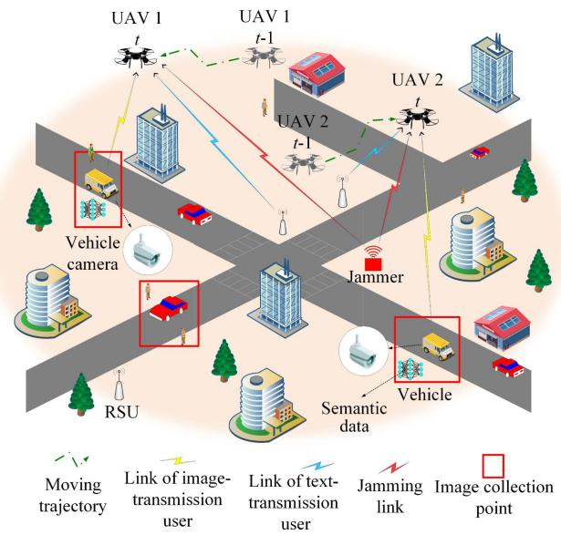  
Fig. 1. A UAV-assisted MEC in IoV for multi-modal semantic communication system under jammer attacks.

\- Considering the complex communication environment and dynamic jamming behavior, we propose an SC-MA-TD3 approach to obtain actions. This approach can operate in dynamic environments with jamming attacks, providing appropriate actions, effectively accumulating experience, and quickly learning transmission strategies in a large state space.

We provide extensive simulation results that verify the superior communication performance of the proposed UAVassisted MEC in IoV scheme under jamming attacks and multi-modal semantic communication, compared to existing approaches. Our proposed approach improves semantic accuracy by at least 6.10%. Compared to traditional approaches, communication and computation delay are reduced by 29.07%.

The rest of the paper is organized as follows: Section II presents the system model and problem formulation. Problem transformation is given in Section III. Section IV primarily describes the UAV-assisted MEC in IoV scheme proposed in this paper, which combines reinforcement learning with multi-modal semantic communication. Section V includes simulation results. The paper is concluded in Section VI.

## II. SYSTEM MODEL AND PROBLEM FORMULATION

This paper studies a UAV-assisted MEC in an IoV network, as depicted in Fig. 1. The network comprises M ground image collection points, I ground text-transmission users, N UAVs, N ground image-transmission users, and one jammer. The collections of ground image collection points, ground text-transmission users, UAVs, ground image-transmission users, and the jammer are denoted as ${ { \cal U } } ^ { i m } = \{ u _ { 1 } ^ { i m } , \ldots , u _ { m } ^ { i m } , \ldots , u _ { M } ^ { i m } \} , \quad { { \cal U } } ^ { t e } =$ $\{ u _ { 1 } ^ { t e } , \ldots , u _ { i } ^ { t e } , \ldots , u _ { I } ^ { t e } \} , \ \bar { U } ^ { u \bar { a } v } = \{ u _ { 1 } ^ { u \bar { a } \bar { v } } , \ldots , u _ { n } ^ { u \bar { a } \bar { v } } , \ldots , u _ { N } ^ { u a v } \}$ $U ^ { v e } = \{ u _ { 1 } ^ { v e } , \ldots , u _ { n } ^ { v e } , \ldots , u _ { N } ^ { v e } \}$ , and $J = \{ j \}$ , respectively. The M ground image collection points are distributed across various areas with high pedestrian density and complex traffic conditions, thus necessitating the capture of real-time traffic images to assist with traffic management. These points may shift or remain fixed depending on traffic and pedestrian flow. The N image-transmission users, consisting of vehicles equipped with onboard cameras, move to the vicinity of image collection points to extract relevant traffic image data. The I ground text-transmission users are roadside units (RSUs) storing textual data related to the areas traffic conditions, such as traffic volumes, traffic light logs, and road condition reports. These RSUs share information and store traffic data, providing textual traffic information to nearby pedestrians or vehicles. Each RSU can extract relevant textual information needed by vehicles and combine it with the vehicles image data to determine the traffic conditions in that area. Vehicles with onboard cameras travel between image collection points, capturing image data and then combining this real-time image information with data from the RSU to analyze traffic conditions near the image collection points. The results are then transmitted back to the RSU to update the traffic information in real time, which can provide services to nearby vehicles and pedestrians. However, due to obstacles such as high buildings in urban areas, the communication channel formed between vehicles and RSU is likely to be NLoS, resulting in poor communication quality. UAVs can form LoS communication channels with ground users and have a better vantage point from the air. They capture traffic information from an aerial perspective, storing aerial-to-ground views of traffic conditions. Additionally, UAVs possess certain computational capabilities and can serve as aerial base stations. At the same time, UAVs have great flexibility and can coordinate the distance between different modal users, achieving optimal communication performance. By combining the UAV’s air-to-ground information with decoded multi-modal information from RSUs and vehicles, calculations can be better tailored to reflect the road condition information at the vehicle’s image collection points, thus more effectively assisting MEC in IoV networks. Therefore, UAVs are used to collect both the image information from vehicles and textual information from RSUs. By combining these two types of information with their own aerial perspective of traffic conditions, they can more effectively analyze traffic information. During the process of receiving tasks, jammers continuously emit jamming power across various channels to disrupt the reception of tasks by UAVs.

Our work is divided into T equal time slots, denoted as $\{ 1 , 2 , \ldots , t , \ldots , T \}$ . The order of the image collection points that need to collect images in each time slot is determined at the beginning of the episode. Before each time slot starts, N vehicles move to N image collection points to collect images. In each time slot, each UAV is associated with one vehicle at an image collection point. After uploading tasks to their associated UAVs, the vehicles move in a predetermined order to the next image collection point that has not yet been visited to collect images. Each time slot is designed to exceed the time needed for N vehicles to travel, ensuring they reach predetermined image collection points punctually. Due to the high number of wireless users in urban areas, the scarcity of spectrum resources, and the limited computing resources of UAVs, each UAV is associated with only one vehicle user per time slot, select a channel to receive image tasks simultaneously. At the start of the time slot, each UAV first flies to hover near its associated vehicle. When the UAV reaches the hovering point to receive the image tasks from the associated vehicle, the vehicle immediately encodes the collected images into semantic image tasks and uploads them. The task is uploaded only after the UAV reaches the hovering point, rather than immediately after the vehicle collects the image. This is because, for multimodal semantic communication, it is essential to ensure that the SINR of the communication links between the text-transmitting user and the image-transmitting user, and the UAV all reach optimal values to obtain high-quality multimodal semantic information. If any of the communication links has a low SINR, it will lead to poor quality of the received semantic information, which can affect the judgment of road conditions in the computational results. Simultaneously, it selects a nearest RSU to receive textual information necessary for the image information. Meanwhile, the hovering points chosen by the UAVs can both effectively receive information and minimize the impact of jammers on task offloading. The information is encoded into semantic information by the vehicles and RSUs, then decoded by the UAVs and processed through MEC combining it with their aerial traffic data. The processed MEC results are then relayed back to the RSUs to update the traffic information. UAVs, vehicles, and RSUs utilize the DeepSC-VQA model [38], [39] handling both image and text semantic tasks which are merged into multi-modal tasks processed onboard the UAVs. As in [40], the computational results returned to the RSUs occupy minimal space, hence the time and energy costs of returning the data are negligible. After vehicles upload image semantic tasks at the collection points, they immediately start moving to the next collection point to collection image tasks, waiting for the next time slot to begin. Each time slots duration far exceeds the communication and computation time of the UAVs, so this paper mainly discusses the communication and computation delay of the UAVs. Before the next time slot begins, N vehicles move to N unvisited collection points to gather image. At the start of the next time slot, each UAV similarly flies to hover near its associated vehicle, receives the semantic image and text tasks, and then processes them. N UAVs receive image tasks from N vehicles in each time slot, and after T time slots, the image tasks from M collection points have all been received and processed, concluding the episode, where $N T = M$ . The UAV communication channels remaining orthogonal to avoid interference. In the system, there are N channels available for image task transmission, with unequal bandwidth sizes. There are also N channels for text task transmission, with equal bandwidth sizes. Due to the high variability of image tasks, in this paper, the channels for each UAV to receive image tasks need to be selected to allocate spectrum resources reasonably, while the channels for receiving text tasks are fixed.

The number of image sets in the image tasks at image collection points is fixed at $\lambda _ { p } ,$ , and the number of sentences in the text tasks transmitted from each RSU to each UAV in each time slot is fixed at $\lambda _ { t e }$ . Additionally, the text and image semantic data in the paper are similar to those in [38], [39] and the results after encoding and decoding can be directly used, thus the delay and computing resource of the encoding process can be ignored.

## A. Channel Model

As discussed in [17], [41], we address a widely used path loss model that includes both LoS and NLoS links. At time slot t, the probability of a LoS link between the vehicle in image collection point m and UAV n is

$$
P _ { t , m n } ^ { L o S } = \frac { 1 } { 1 + \omega _ { 1 } \exp \left\{ - \omega _ { 2 } ( \theta _ { t , m n } - \omega _ { 1 } ) \right\} } ,\tag{1}
$$

where $\theta _ { t , m n }$ represents the elevation angle between the vehicle in image collection point m and UAV n at time slot $t , \omega _ { 1 }$ and $\omega _ { 2 }$ are coefficients related to the environment.

The channel gain of image-transmission user, the vehicle in image collection point m to UAV n at time slot t denotes

$$
h _ { t , m n } = \frac { 1 0 ^ { - \frac { ( \eta _ { \mathrm { L o S } } - \eta _ { \mathrm { N L o S } } ) P _ { t , m n } ^ { \mathrm { L o S } } + \eta _ { \mathrm { N L o S } } } { 1 0 } } } { \bigl ( \frac { 4 d _ { t , m n } \pi f _ { c } } { c } \bigr ) ^ { 2 } } ,\tag{2}
$$

where $\eta _ { \mathrm { L o S } }$ and $\eta _ { \mathrm { N L o S } }$ are the free-space path loss gains corresponding to LoS and NLoS connections, respectively, $d _ { t , m n }$ denotes the distance between the vehicle in image collection point m and UAV n at time slot t. The channel gains between the UAV and RSU and between other devices in this work are also similar with this method.

## B. Task Offloading Model

The semantic task offloading model as shown in Fig. 2. At time slot t, a UAV can only select one image-transmission user and one text-transmission user to receive tasks. At time slot $t ,$ UAV n selects image-transmission user, the vehicle in image collection point m and text-transmission user i to receive tasks. The process of task offloading involves three parts. First, the task of image-transmission user, the vehicle in image collection point m denote as $s _ { m } ^ { i m } = \{ s _ { m } ^ { d , i m } , s ^ { l , i m } , s ^ { v , i m } \}$ and the tasks of the text-transmission user i denote as $s _ { i } ^ { t e } = \{ s _ { i } ^ { d , t e } , s ^ { l , t e } , s ^ { v , t e } \}$ are encoded into semantic tasks using the DeepSC-VQA model, and upload these semantic tasks to the UAV, where $m \in$ $\{ 1 , 2 , \ldots , M \} , i \in \{ 1 , 2 , \ldots , I \}$ . The $s _ { m } ^ { d , i m }$ denotes the average number of image sets for image-transmission, the vehicle in image collection point $m , s ^ { l , i m }$ denotes the average hardware requirement per image set for image-transmission user, $s ^ { v , i m }$ denotes the average size of each image set for imagetransmission user, $s _ { i } ^ { d , t e }$ denotes the average number of sentences by text-transmission user $i , s ^ { l , t e }$ denotes the average hardware requirement per sentence by text-transmission user, and $s ^ { v , t e }$ denotes the average size of each sentence for text-transmission user. $s _ { m } ^ { d , i m }$ varies with different image-transmission users, while the remaining parameters are fixed values. Subsequently, these semantic tasks are decoded using the DeepSC-VQA model and computed on the UAV. Finally, the computation results are returned to the users. As in [40], since the returned data is minimal, it is considered negligible. Meanwhile, the jammer emits jamming power to disrupt task offloading to each UAV in UAV-assisted MEC system. During the task offloading process, it is assumed that the transmitted tasks are similar to those described in [39]. The encoding and decoding results of the DeepSC-VQA model are used directly, combined with relevant information to derive data related to semantic communication, thereby eliminating the need for additional data compression and storage in the semantic communication system. Similar to previous literature, the impact on users performing different tasks with the same modality is set to be the same in our work.

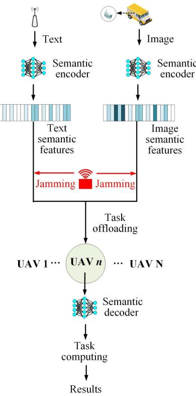  
Fig. 2. Semantic task processing model.

The channel gain [41] of image-transmission user, the vehicle in image collection point m to UAV n at time slot t denotes $h _ { t , m n } \cdot \rho _ { t , m n }$ denotes the upload channel by image-transmission user, the vehicle in image collection point m upload image tasks to UAV n at time slot $t ,$ with a channel bandwidth of $\rho _ { t , m n } ^ { c }$ . The bandwidth for uploading tasks by image-transmission users and text-transmission users is orthogonal to each other.

When image-transmission users offload tasks to UAVs, the jammer emits jamming power to disrupt the task offloading process. Therefore, the SINR from image-transmission user, the vehicle in image collection point m to UAV n at time slot t is given by

$$
\gamma _ { t , m n } ^ { i m } = \frac { \delta _ { t , m n } h _ { t , m n } p _ { t , m n } \big | h _ { t , m n } ^ { r a } \big | ^ { 2 } } { h _ { t , n } ^ { j } p _ { t , m n } ^ { j } \big | h _ { t , m n } ^ { r a , j } \big | ^ { 2 } + N _ { t , m n } ^ { 0 } } ,\tag{3}
$$

where $\delta _ { t , m n }$ denotes the association coefficient of the imagetransmission user, the vehicle in image collection point m to UAV n at time slot t, if UAV n choose image-transmission user, the vehicle in image collection point m to receive task at time slot $t , \delta _ { t , m n } = 1 ;$ otherwise $\delta _ { t , m n } = 0 . \ p _ { t , m n }$ denotes the transmission power of image-transmission user, the vehicle in image collection point m to UAV n at time slot t, and $N _ { t , m n } ^ { 0 }$ represents the environmental noise power. $p _ { t , m n } ^ { j }$ denotes the jamming power transmitted by jammer to $\mathrm { U A V }$ n through the channel $\rho _ { t , m n }$ at time slot t, and $h _ { t , n } ^ { j }$ denotes the channel gain between the jammer and UAV n. $h _ { t , m n } ^ { r a } \sim \mathcal { C N } ( 0 , 1 )$ is the Rayleigh fading coefficient for the sub-channel assigned to image-transmission, the vehicle in image collection point m to UAV n through the channel $\rho _ { t , m n }$ at time slot t, and $h _ { t , m n } ^ { r a , j } \sim \mathcal { C N } ( 0 , 1 )$ is the Rayleigh fading coefficient for the sub-channel assigned to jammer to UAV n through the channel $\rho _ { t , m n }$ at time slot t.

The $h _ { t , i n }$ denotes the channel gain between the texttransmission user i and UAV n, the calculation method is similar to (2). $\rho _ { t , i n }$ denotes the channel by text-transmission user i upload image tasks to UAV n at time slot t, with a fix channel bandwidth of $\rho ^ { t e }$ . The SINR from the text-transmission user i to UAV n at time slot t is given by

$$
\gamma _ { t , i n } ^ { t e } = \frac { { { \delta _ { t , i n } } { h _ { t , i n } } { p _ { t , i n } } { \left| { { h _ { t , i n } ^ { r a } } } \right| ^ { 2 } } } } { { { h _ { t , n } ^ { j } } { p _ { t , i n } ^ { j , t e } } { \left| { { h _ { t , i n } ^ { r a , j } } } \right| ^ { 2 } } + { N _ { t , i n } ^ { 0 } } } } ,\tag{4}
$$

where $\delta _ { t , i n }$ denotes the association coefficient of the texttransmission user i to UAV n, if UAV n choose text-transmission user i to receive task, $\delta _ { t , i n } = 1 ;$ ; otherwise $\delta _ { t , i n } = 0 . \ p _ { t , i n }$ denotes the transmission power of the text-transmission user i offloading tasks to UAV n at time slot $t , \ N _ { t , i n } ^ { 0 }$ denotes the environmental noise power. $p _ { t , i n } ^ { j , t e }$ denotes the jamming power transmitted by the jammer to UAV n through the channel $\rho _ { t , i n }$ at time slot $t . h _ { t . n } ^ { j }$ denotes the channel gain between the UAV n and jammer. $h _ { t , i n } ^ { r a } \sim \mathcal { C N } ( 0 , 1 )$ is the Rayleigh fading coefficient for the sub-channel assigned to text-transmission user i to UAV n through the channel $\rho ^ { t e }$ at time slot t, and $h _ { t , i n } ^ { r a , j } \sim \mathcal { C N } ( 0 , 1 )$ is the Rayleigh fading coefficient for the sub-channel assigned to jammer to UAV n through the channel $\rho _ { t , i n }$ at time slot t.

Traditional channel modeling methods typically follow a oneto-one approach, where a user and a UAV form a communication link, and then the communication rate is derived using SINR and Shannon’s formula, transmitting all information from the sender to the receiver. This can lead to spectrum resource shortages. In contrast to traditional channel modeling, multimodal semantic communication systems use a many-to-one approach, where users transmitting different modalities of information simultaneously form multiple communication links with the receiving UAV. The multiple SINRs from these communication links jointly affect the receiver, determining the semantic accuracy of the multimodal semantic information. This is then combined with parameters such as the average number of semantic symbols to derive the semantic rate of multimodal semantic communication. By transmitting only the semantic information useful to the receiver, this approach can effectively conserve spectrum resources.

Unlike the traditional Shannon formula expressing communication rate, the semantic rate is based on semantic units and semantic information. The semantic rate is defined as the amount of semantic information sent to the transmission medium per second, measured in suts/s. For the pre-trained DeepSC-VQA model, when UAV n selection image-transmission user, the vehicle in image collection point m and text-transmission user i to associations, the semantic accuracy of UAV n at time slot t denoted by $\varpi _ { t , n } = \varpi ( k _ { m } ^ { i m } , k _ { i } ^ { t e } , \gamma _ { t , m n } ^ { i m } , \gamma _ { t , i n } ^ { t e } )$ [39]. The semantic accuracy of multi-modal tasks refers to the accuracy of textual information in explaining image information. In this paper, semantic accuracy specifically pertains to the accuracy of textual semantic information uploaded from RSUs to UAVs in analyzing and interpreting the image semantic information uploaded from vehicles to UAVs. The higher the similarity between the uploaded textual and image semantic information and the original semantic information, the more accurate the textual explanation of the image information will be. Therefore, in this paper, the higher the semantic accuracy of multi-modal tasks, the more accurate the analysis of road conditions around the vehicle. The $k _ { m } ^ { i m }$ denotes the average number of semantic symbols in each image of the task offloaded by image-transmission user, the vehicle in image collection point m. The $k _ { i } ^ { t e }$ denotes the average number of semantic symbols in each word of the task offloaded by text-transmission user i. This paper defines the average semantic information task offloaded by image-transmission user in each image set as $\psi ^ { s , i m }$ , where $\psi ^ { w , i m }$ denotes the number of images in each image set. Both values are constants in this work. Text semantic information and image semantic information refer to the text data generated by RSUs and the image data generated by vehicles, respectively, which are encoded into text and image information using relevant models. These encoded pieces of information are respectively referred to as text semantic information and image semantic information. The semantic symbols for text information refer to the important letters in each word, while the average number of semantic symbols for image information refers to the important pixels in each image. The smaller the number of semantic symbols, the less spectrum space is occupied when transmitting semantic information, but the lower the similarity between the decoded semantic information and the original information. Therefore, a balance must be found between the average number of semantic symbols and semantic accuracy to maximize the reward of the communication system. The semantic rate task offloaded by image-transmission user, the vehicle in image collection point m to UAV n at time slot t [39] can be expressed as

$$
r _ { t , m n } = \frac { \delta _ { t , m n } \rho _ { t , m n } ^ { c } \psi ^ { s , i m } \varpi _ { t , n } } { \psi ^ { w , i m } k _ { m } ^ { i m } } ,\tag{5}
$$

where $\varpi _ { t , n }$ denotes the semantic accuracy of UAV n at time slot $t , k _ { m } ^ { i m } , \psi ^ { s , i m }$ , and $\psi ^ { w , i m }$ are parameters dependent on the pre-trained DeepSC-VQA model and the type of source [39], which can be treated as constants during the training process.

The average semantic information per sentenced unloaded from text-transmission user is denotes $\psi ^ { s , t e }$ , where the average word length per sentence is denotes $\psi ^ { w , t e }$ , both values are constants in this work. Therefore, the semantic rate from text-transmission user i to UAV n at time slot t can be expressed

as

$$
r _ { t , i n } ^ { t e } = \frac { \delta _ { t , i n } \rho ^ { t e } \psi ^ { s , t e } \varpi _ { t , n } } { \psi ^ { w , t e } k _ { i } ^ { t e } } ,\tag{6}
$$

where $\psi ^ { s , t e } , \psi ^ { w , t e }$ , and $k _ { i } ^ { t e }$ are parameters dependent on the pre-trained DeepSC-VQA model and the type of source, which can be considered constants during the training process, and $\rho ^ { t e }$ refers to the channel bandwidth used by text-transmission user transmitting tasks to UAVs.

In this paper, the quality of semantic communication is measured using the concept of semantic accuracy proposed in reference [38], which refers to the similarity between the original data and the data recovered through semantic communication. The total semantic accuracy between users and UAVs at time slot t is

$$
\varpi _ { t } = \sum _ { n = 1 } ^ { N } \varpi _ { t , n } .\tag{7}
$$

The total semantic accuracy for one episode is

$$
\varpi _ { s u m } = \sum _ { t = 1 } ^ { T } \varpi _ { t } .\tag{8}
$$

## C. Communication and Computation Delay Model

Each time slot t divided into flight phase $t _ { f , n }$ and hover phase $t _ { h , n }$ . During the flight phase, the UAV flies from one hover point to the next. In the hover phase, the UAV receives tasks and processes them, resulting in communication and computation delay.

The amount of semantic image tasks received by UAV n during this period is $\begin{array} { r } { { c } _ { t , n } ^ { s i m } = \sum _ { m = 1 } ^ { m = M } \delta _ { t , m n } s _ { m } ^ { d , i \bar { m } } \psi ^ { s , i m } } \end{array}$ and the amount of semantic text tasks received is $c _ { t , n } ^ { s t e } =$ $\begin{array} { r } { \sum _ { i = 1 } ^ { i = I } \delta _ { t , i n } s _ { i } ^ { d , t e } \psi ^ { s , t e } } \end{array}$ . Then, the total amount of semantic image tasks received by UAVs at time slot t is

$$
c _ { t } ^ { s i m } = \sum _ { n = 1 } ^ { N } c _ { t , n } ^ { s i m } .\tag{9}
$$

The amount of text semantic tasks received by UAVs at time slot t is

$$
c _ { t } ^ { s t e } = \sum _ { n = 1 } ^ { N } c _ { t , n } ^ { s t e } .\tag{10}
$$

The total transmission delay for image tasks in each time slot is $\begin{array} { r } { D _ { t } ^ { c i m } = \sum _ { n = 1 } ^ { N } D _ { t , n } ^ { c i m } } \end{array}$ , and the total transmission delay for text tasks in each time slot is $\begin{array} { r } { D _ { t } ^ { c t e } = \sum _ { n = 1 } ^ { N } D _ { t , n } ^ { c t e } } \end{array}$

Same as [40], the total computation delay of UAV n is $D _ { t , n } ^ { r c } = ( c _ { t , n } ^ { s i m } s ^ { l , i m } / \psi ^ { s , i m } + c _ { t , n } ^ { s i \hat { e } } s ^ { l , t e } / \psi ^ { s , t e } + \bar { c } _ { t , n } ^ { u a v } \varphi ) / f _ { n } ^ { u } +$ $t _ { n } ^ { u a v }$ , where $t _ { n } ^ { u a v }$ refers to the computation time for UAV n to process aerial perspective images, which is a fixed constant in this paper. Therefore, the total computation delay is

$$
D _ { t } ^ { r c } = \sum _ { n = 1 } ^ { N } D _ { t , n } ^ { r c } ,\tag{11}
$$

where $f _ { n } ^ { u }$ denotes the computing capability of the $\mathrm { U A V } ~ n , c _ { t , n } ^ { u a v }$ refers to the corresponding ground-to-air perspective traffic data in UAV $n ,$ which can be combined with the multi-modal information from vehicles and RSUs to better plan vehicle routes. $\varphi$ refers to the number of CPU cycles required to process each bit of data.

Therefore, the communication and computation delay of UAV n at time slot t is $D _ { t , n } ^ { s u m } = D _ { t , n } ^ { c i m } + D _ { t , n } ^ { c t e } + D _ { t , n } ^ { r c } .$ , the total communication and computation delay at time slot t is

$$
D _ { t } ^ { s u m } = \sum _ { n = 1 } ^ { N } D _ { t , n } ^ { s u m } .\tag{12}
$$

The smaller the communication and computation delay, the less time is needed to transmit and compute tasks of the same size, indicating better allocation of spectrum and computational resources.

## D. Problem Formulation

Our objective is joint optimize UAV trajectory L, channel selections $\rho ,$ user association δ to maximum the semantic accuracy and minimize total communication and computation delay. The original problem P1 is formulated as

$$
\begin{array} { r l } & { \mathbb { P } { \mathbf 1 } _ { : \mathrm { R } / \eta , \eta , \eta , \eta , \xi } ( D _ { t } ^ { 3 / 2 \eta , \eta } ) } \\ & { \mathrm { s . t . } ( \mathbf { C } ) \} :  \mathbf { z } , \mathbf { m } _ { t } , \mathbf { \eta }  = \mathcal { D } _ { t h } \forall \eta , \eta , t , } \\ & { \begin{array} { r l } { ( C ) :  \mathbf { z } , \mathbf { \eta }  =  \rho _ { t , \eta , \eta } \forall m , \eta , t , } \\ { ( C ) :  \mathbf { z } , \mathbf { \eta }  =  \rho _ { t , \eta , \eta } , \nabla m , t , } \end{array}  } \\ & { \begin{array} { r l } { ( C ) :  \mathbf { z }  =  \mathbf { \bar { \xi } } , \mathbf { z }  , } \\ { \mathrm { s . t . }  \mathbf { \bar { \xi } }  =  \mathbf { \bar { \xi } }  , } \\ { \mathrm { o r t . }  \mathbf { \bar { \xi } }  =  \mathbf { \bar { \xi } }  , } \end{array} } \\ & { \begin{array} { r l } & { \mathrm { ~ i . e . c . } } \\ & { \mathrm { ~ i . e . c . } } \end{array} } \\ & { \begin{array} { r l } { ( C ) :  \mathbf { \bar { \xi } }  = \dot { \delta } _ { t , \eta , \eta } = 1 , \forall n , t , } \\ & { \mathrm { ~ i . e . c . } } \end{array} } \\ & { \begin{array} { r l } { ( C ) : \sum _ { i = 1 } ^ { \infty } \delta _ { i , \mathrm { a n } } = 1 , \forall n , t , } \\ & { \mathrm { ~ i . e . c . } } \end{array} } \\ & { \begin{array} { r l } { ( C ) _ { i } : \omega \mathrm { a r s } \geq L _ { f } \omega \mathrm { a r s } . } \end{array} } \end{array}\tag{13}
$$

where (C1) refers to the semantic accuracy constraints, which should be greater than the semantic accuracy threshold $\varpi _ { t h } . ( \mathrm { C } 2 )$ refers the environment channel selection constraint, the limited of channels number in the environment, requiring UAVs to make reasonable selections of channels. (C3) refers to the time slot limitation, the number of time slots per episode in this paper is $T ,$ (C4) and (C5) denotes a UAV can only association one image-transmission user and one text-transmission user at each time slot t. (C6) refers to the distance restriction between UAVs, which should be greater than the minimum to avoid collisions.

## III. PROBLEM TRANSFORMATION

As discussed in Section II, the optimization problem P1 presented in (13) is non-convex and non-deterministic polynomialtime (NP)-hard, and the environment is dynamic, traditional methods, i.e., genetic algorithms and ant colony optimization algorithm difficulty adapting to dynamic environments, resulting in lower optimization efficiency for the optimization problem.

Moreover, traditional methods cannot utilize historical information and are prone to getting stuck in local optima. Therefore, this paper employs DRL algorithm to address the optimization issue of low-latency transmission in communication. The DRL algorithm has the capability to autonomously learn, solving decision-making problems by finding optimal solutions in $\mathrm { { d y } \mathrm { { - } } }$ namic environments, numerous states and actions. The DRL algorithms can learn in complex dynamic environments, using numerous states and actions for training, and combining neural network analysis to find the optimal solution to optimization problems. Similar to most existing schemes, this paper models the decision-making problem within the DRL framework using MDP, transforming the optimization problem into an MDP.

In the MDP, each UAV acts as an agent interacting with the environment, responsible for the joint design of optimization variables such as UAV trajectories L, user associations δ, and channel selections $\rho .$ The joint design can be achieved through interaction with the dynamic jamming environment. In this paper, the jammers continuously move towards the area center, simultaneously emitting jamming power through different channels to each UAV, interfering with the reception of users task for each UAV. The MDP is defined as a tuple $\langle U , S , A , P , r \rangle$ , where U represents the set of agents, S represents the set of states, A represents the set of actions, P represents the state transition probabilities, and r represents the reward function.

In this paper, the text-transmission user is defined as the RSU, and the image-transmission user is defined as the vehicle at the image collection point. Similar to [42], the UAV can use visual observation to locate the ground RSU, vehicles, and eavesdroppers, distinguishing between different modality users. During this process, the specific distance between the UAV and the jammer is continuously analyzed through learning. The impact of the jammer on the UAV is primarily reflected in the rewards; therefore, the perception of the jamming power is initially vague and delayed, with some errors. Perceiving the jamming factors requires a learning process; by continuously accumulating experience and incorporating the errors and delays caused by these vague jamming signals into the training process, more accurate jamming information is obtained through multiple training sessions. Subsequently, when encountering situations with estimated errors and delayed jamming information, the system can quickly and accurately identify the jamming information based on the training experience, and swiftly adjust strategies such as UAV trajectories, user associations, and channel selections to counteract the jamming, reducing its impact on the system. The MDP model details as follows.

Agent U: Each UAV in the system.

State S: The state of UAV n at time slot t denoted as $s _ { t , n } = \{ l _ { t } ^ { u a v } , l _ { t } ^ { j } , l _ { t } ^ { u s , i m } , l _ { t } ^ { u s , t e } , \rho _ { t - 1 , n } , \varpi _ { t , n } \}$ , where $l _ { t } ^ { u a v }$ denotes the position of all UAV at time slot $t , \ l _ { t } ^ { u a v } =$ $\{ l _ { t , 1 } ^ { u a v } , \ldots , l _ { t , n } ^ { u a v } , \ldots , l _ { t , N } ^ { u a v } \} , l _ { t , n } ^ { u a v }$ denotes the position of UAV n at time slot $t , l _ { t } ^ { j }$ denotes the position of the jammer at time slot $t , l _ { t } ^ { u s , i m }$ denotes the position of the all image-transmission user, $l _ { t } ^ { u s , i m } = \{ l _ { t , 1 } ^ { u s , i m } , \therefore , l _ { t , m } ^ { u s , i m } , \dots , l _ { t , M } ^ { u s , i m } \} , l _ { t , m } ^ { u s , i m }$ denotes the vehicle in image collection point m at time slot $t , \ l _ { t } ^ { u s , t e }$ denotes the position of the all text user at time slot $t , l _ { t } ^ { u s , \bar { t } e } =$ $\{ l _ { t , 1 } ^ { u s , t e } , \ldots , l _ { t , i } ^ { u s , t e } , \ldots , l _ { t , I } ^ { u s , t e } \} , \rho _ { t - 1 , n }$ denotes the channel selections of the UAV n at time slot t-1, and $\varpi _ { t , n }$ denotes the semantic accuracy of the tasks transmitted between UAV n and the associated users at time slot t. The UAV obtains information such as the positions of the UAVs, users, and jammer, as well as the task volume, channel selections, and semantic accuracy through observation, with the latter derived from experience gained through prior training. $m = 1 , 2 , \ldots , M , i = 1 , 2 , \ldots , I .$ $n = 1 , 2 , \ldots , N$

Action A: For the optimization problem, each agent will decide its trajectory and user association, with the action of UAV n at time slot t denoted as $a _ { t , n } = \{ d _ { t , n } ^ { u a v } , \theta _ { t , n } ^ { u a v } , \delta _ { t , n } ^ { a s i } , \delta _ { t , m n } ^ { a s m } , \rho _ { t , m n } \}$ where $d _ { t , n } ^ { u a v }$ denotes the moving distance of the UAV n at time slot $t , \ \theta _ { t , n } ^ { u a v }$ denotes the moving direction of the UAV n at time slot $t , \delta _ { t , i n } ^ { a s i }$ denotes UAV $n \mathrm { { : } }$ association selections with the text-transmission user at time slot $t , \ \delta _ { t , m n } ^ { a s m }$ denotes UAV n’s association selections with the vehicle at time slot t, and $\rho _ { t , m n }$ denotes the channel selection when UAV n is associated with the corresponding vehicle at work site m during time slot $t . ~ i = 1 , 2 , \ldots , I , ~ n = 1 , 2 , \ldots , N .$ . The association order of image-transmission user is fixed, and only select $\delta _ { t , i n }$ during the action selection.

Transfer probability P : P denotes the state transition probability. $\textstyle P ( s _ { t + 1 } | s _ { t } , a _ { t } )$ denotes the probability that the state $s _ { t }$ transitions to $s _ { t + 1 }$ after the UAV executes action $a _ { t }$ in state $s _ { t } .$

Reward r: The reward is $\boldsymbol { r } _ { t } = \{ r _ { t , 1 } , . . . , r _ { t , n } , . . . , r _ { t , N } \}$ $r _ { t , n } = - \lambda _ { 1 } D _ { t , n } ^ { s u m } + \lambda _ { 2 } - \lambda _ { 3 }$ . Where $\lambda _ { 1 }$ delay balance coefficient, which normalizes the delay values for easier optimization, $\lambda _ { 2 }$ denotes the reward coefficient when semantic accuracy greater than the threshold, $\lambda _ { 2 } = \lambda _ { 2 } ^ { 1 } ( \varpi _ { t , m n } - \varpi _ { t h } ) , \lambda _ { 2 } ^ { 1 }$ is the reward coefficient for semantic accuracy, and $\lambda _ { 3 }$ denotes the penalty coefficient when the distance between two UAVs is less than the minimum distance. $m = 1 , 2 , \ldots , M , i = 1 , 2 , \ldots , I .$ $n = 1 , 2 , \ldots , N$

## IV. PROPOSED DRL-BASED UAV-ASSISTED MEC COMBINED WITH MULTI-MODAL SEMANTIC COMMUNICATION UNDER JAMMING ATTACKS

In research, traditional optimization approaches such as linear optimization and Lagrange multipliers are valued for their stability and efficiency in well-defined mathematical models. These approaches perform well in stable conditions but falter in complex, dynamic scenarios, often due to their reliance on manually designed rules and extensive labeled data. On the other hand, DRL algorithms, including multi-agent deep deterministic policy gradient (MA-DDPG) and SC-MA-TD3, offer robust alternatives suited for dynamic environments like UAV-assisted MEC schemes, which involve jamming. These DRL strategies learn through continuous interaction, adapting to changes without predefined rules, and feature strong generalization and real-time online learning capabilities. This paper discusses their frameworks and processes, highlighting how they enable UAVs to derive optimal strategies in jamming-affected MEC contexts. Common DRL algorithms like Q-learning and deep Q-network (DQN) show commendable results in dynamic environments but face limitations in handling large state and action spaces effectively. While DQN uses neural networks to approximate the Q-value function, addressing higher dimensionality, the dueling DQN variant further enhances learning by separating the state’s value function from each action’s advantage function, improving training efficiency and performance. However, these approaches are generally designed for discrete action spaces and single-agent scenarios. In contrast, multi-agent DRL strategies allow collaboration among agents, adapting to and responding more effectively to complex multi-agent environments.

## A. MA-DDPG

The core idea of MA-DDPG is centralized learning with decentralized execution. During the training phase, the algorithm can access all agents, while in the execution phase, each agent independently chooses and executes its strategy. In the MA-DDPG algorithm, each agent has a pair of actor and critic networks, the actor network generates actions, while the critic network evaluates these actions. The critic network observes and assesses the states and actions of all agents, whereas the actor network bases its actions solely on its own observations. The algorithm updates the networks at each iteration through a loss function, which is shown as follow.

The loss function of the critic network is

$$
L ( \theta _ { g _ { i } } ^ { Q } ) = \frac { 1 } { N } \sum _ { k _ { 1 } } \big ( y _ { k _ { 1 } } - Q _ { g _ { i } } ( o , a _ { 1 } , \dots , a _ { N } | \theta _ { g _ { i } } ^ { Q } ) \big ) ^ { 2 } ,\tag{14}
$$

where $\theta _ { g _ { i } } ^ { Q }$ denotes as the parameters of agent $g _ { i }$ ’s critic network. $N$ is the number of samples, $k _ { 1 }$ is the sample index, $y _ { k _ { 1 } }$ is the target Q-value, where $r _ { g _ { i } }$ is the reward, γ is the discount factor, $Q _ { g _ { i } }$ is the output of the target critic network, o is the global state, and $a _ { s u }$ refers to the set of actions taken by all agents.

The loss function of the actor network is

$$
L ( \theta _ { g _ { i } } ^ { \mu } ) = - \frac { 1 } { N } \sum _ { k _ { 1 } } ( Q _ { g _ { i } } ( o , \mu _ { g _ { i } } ( s _ { g _ { i } } | \theta _ { g _ { i } } ^ { \mu } ) , a _ { - g _ { i } } ) ,\tag{15}
$$

where $\theta _ { g _ { i } } ^ { \mu }$ denotes as the parameters of agent $\vec { g _ { i } \cdot \mathbf { s } }$ actor network, $\mu _ { g _ { i } }$ is the action taken by agent $g _ { i } , s _ { g _ { i } }$ is the local observation state of agent $g _ { i }$ , and $a _ { - g _ { i } }$ refers to the set of actions taken by all agents except for agent gi.

## B. SC-MA-TD3 Approach

The SC-MA-TD3 approach combination of the multi-agent twin delayed deep deterministic policy gradients (MA-TD3) approach and the semantic communication technology. Although the MA-DDPG algorithm performs well, there is still room for improvement in terms of performance and stability. Similar to the MA-DDPG algorithm, the MA-TD3 algorithm is also an extension of the deep deterministic policy gradient (DDPG) algorithm. However, the MA-TD3 algorithm employs a twin delayed policy network, that is, two Q networks to estimate the action-value function. These two networks have the same structure but different parameters. Furthermore, the optimization objective of the MA-TD3 algorithm includes the loss of the state-value function and the loss of the advantage function, meaning it incorporates two parts of the loss function. In other words, the MA-TD3 algorithm adopts a twin delayed strategy and more complex optimization objectives, thereby significantly enhancing the performance and stability of the algorithm. The algorithm updates the neural networks through the loss function.

The loss function of critic network is

$$
L ( \theta _ { g _ { i } } ^ { Q _ { j _ { 1 } } } ) = \frac { 1 } { N } \sum _ { k _ { 1 } } ( Q _ { g _ { i } , j _ { 1 } } ( s , a _ { s u } | \theta _ { g _ { i } } ^ { Q _ { j _ { 1 } } } ) - y _ { k _ { 1 } } ) ^ { 2 } ,\tag{16}
$$

where $\theta _ { g _ { i } } ^ { Q _ { j _ { 1 } } }$ represents the parameters of agent $g _ { i }$ critic network, $N$ denotes the total number of samples in batch training, $Q _ { g _ { i } , j _ { 1 } }$ refers to the output Q-value of the critic network $j _ { 1 }$ of the agent $g _ { i } , y _ { k } .$ is the target Q-value, $k _ { 1 }$ refers to the sample index, s indicates the current state, and $a _ { s u }$ represents the sum of the actions of all agents.

The loss function of actor network is represented as

$$
L ( \theta _ { g _ { i } } ^ { \mu } ) = - \frac { 1 } { N } \sum _ { k _ { 1 } } Q _ { g _ { i } , 1 } ( s | \mu ( s | \theta _ { g _ { i } } ^ { \mu } ) , a _ { - g _ { i } } ) ^ { 2 } ,\tag{17}
$$

where $\theta _ { g _ { i } } ^ { \mu }$ represents the parameters of agent $g _ { i } { } ^ { \ \mathrm { ~ s ~ } }$ actor network, $Q _ { g _ { i } , 1 }$ denotes an estimated value from one of agent $\vec { g _ { i } \cdot \mathbf { s } }$ critic networks, s represents the global state, $\mu ( s | \theta _ { g _ { i } } ^ { \mu } )$ refers to the action generated by agent $g _ { i }$ based on the current state and parameters, and $\boldsymbol { a } _ { - i k _ { 1 } }$ indicates the set of actions taken by all other agents except agent $g _ { i }$ in state s.

The proposed SC-MA-TD3 approach, as shown in Algorithm 1 and Fig. 3, involves integrating DRL algorithms with multi-modal semantic communication technology to optimize UAV-assisted MEC in IoV under jamming attacks. Multimodal semantic communication technology does not directly influence the DRL algorithms but indirectly affects them by reducing communication latency, thereby achieving the goal of enhancing system rewards through integration with DRL algorithms. The scheme utilizes the MA-TD3 algorithm to optimize UAV flight trajectories, user association, and channel selection, reducing the impact of jammers and system latency. In addition, it employs multimodal semantic communication technology during the communication process to transmit tasks, saving spectrum resources by transmitting only user-relevant information and reducing UAV communication delays, thereby minimizing the time UAVs are exposed to jammers and reducing the impact of jamming. However, improper adjustments to UAV trajectories during the multimodal semantic communication process can lead to excessively low SINR, potentially harming semantic accuracy and rendering the transmitted information unclear. Therefore, the DRL algorithms adjust strategies such as UAV trajectories to appropriately manage SINR during communication, optimally utilizing technical and spectrum resources to reduce system latency while maintaining semantic accuracy, and collaborating with multi-modal semantic communication to optimize system rewards.

Remark 1: The DRL algorithm used in this paper is an online DRL algorithm that interacts with a dynamic environment, continuously accumulating experience to derive better strategies. In the initial phase, UAVs choose image and text users for association. After reaching the hovering point, users encode tasks using the DeepSC-VQA system and offload them to the

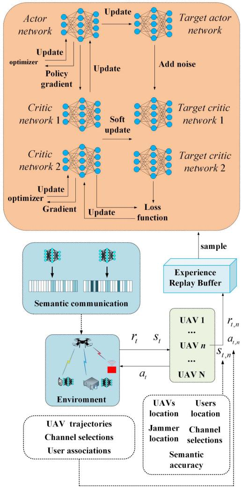  
Fig. 3. Network diagram of the SC-MA-TD3 algorithm.

UAV. The UAV then selects the offloading channel, decodes the received semantic tasks, and processes them. However, a jammer disrupts the task reception, leading to inefficiency, increased delays, and reduced accuracy. Initially, the UAVs lack sufficient experience, resulting in delays and errors in perceiving the jamming environment, which lowers system rewards. Over time, as UAVs interact with and learn from the environment, they improve strategies for flight trajectories, user associations, and channel selections, effectively mitigating the jammer’s impact and maximizing system rewards. The UAV-assisted MEC strategy eventually reaches a dynamic equilibrium with the jamming effects, stabilizing the system’s reward curve. Despite the complex and dynamic jamming environment, the agent selectively learns from relevant environmental information. Although the convergence may not represent the optimal value, it is the best attainable solution under the given conditions. The proposed UAV-assisted MEC solution, integrating multi-modal semantic communications with DRL, requires extensive environmental exploration to gather sufficient experience for effective strategic formulation under jamming. This paper assumes that the jammer can learn the channel information used for task offloading.

Algorithm 1: A UAV-Assisted MEC Scheme Incorporat  
ing Semantic Communication and DRL Under Jamming   
Attacks.   
Input: UAVs location, image-transmission users location,   
text-transmission users location, jammers location, and   
other relevant status information.   
Output: UAVs trajectories, users associations, channel   
selections.   
1: Initialize: Network parameters $\theta _ { d u e } , \theta _ { g _ { i } } ^ { Q _ { j _ { 1 } } }$ , and $\theta _ { g _ { i } } ^ { \mu }$   
2: for $e p i s o d e = 0 , 1 , . . . ,$ 1000 do.   
3: Initialize the information of UAV location, users   
location, jammers location etc. to get the initial state   
$s _ { 0 } .$   
4: for $t = 1 , 2 , . . . , T$ do.   
5: Obtain state $s _ { t } = \{ s _ { t , 1 } , \ldots , s _ { t , n } , \ldots , s _ { t , N } \}$   
6: The decision network of obtains action   
$a _ { t } = \{ a _ { t , 1 } , \ldots , a _ { t , n } , \ldots , a _ { t , N } \}$ based on the state   
$s _ { t }$ using (1)–(12), simultaneously encode and   
decode tasks using semantic communication   
technology during the communication process.   
7: Apply $a _ { t }$ to the environment and receive reward $r _ { t , n }$   
from each agent.   
8: Combining each agents reward into $r _ { t } .$   
9: Obtain $s _ { t + 1 } .$   
10: Store $\left. s _ { t } , a _ { t } , s _ { t + 1 } , r _ { t } \right.$ in reply buffer.   
11: Update network used (16)–(17).   
12: end for.   
13: end for.   
14: Obtain the optimal strategy.

Remark 2: The states of various UAVs are not fully shared; a UAV can observe certain states like the locations of others but not details such as channel selection and semantic accuracy during communication. These must be estimated initially and refined through interactions with the environment, necessitating a learning and training process. The system aims to maximize the total reward for all UAVs. After training, the UAVs can cooperate under jamming attacks by optimizing flight trajectories and user associations, mitigating the jammer’s impact on communications and efficiently allocating computing and communication resources. This enhances the semantic rate for task offloading to UAVs, reduces communication and computation delays, and improves overall system rewards.

Computational complexity analysis: This section provides a complexity analysis of the SC-MA-TD3 approach proposed in this paper. The SC-MA-TD3 approach consists of the MA-TD3 and semantic communication. Each TD3 algorithm has two actor networks and four critic networks. In the approach, $U$ and V are defined as the number of neural network layers of the actor network and the critic network, respectively. Both the actor network and the critic network are fully connected networks, with $U _ { u }$ defined as the number of neurons in u-th layer of the actor network, and $V _ { v }$ as the number of neurons in v-th layer of the critic network. In the actor network, the computational complexity of u-th layer is $O ( U _ { u - 1 } U _ { u } + U _ { u } U _ { u + 1 } )$ , and the total computational complexity with U layers is $O ( \sum _ { u = 2 } ^ { U - 1 } \left( U _ { u - 1 } U _ { u } + U _ { u } U _ { u + 1 } \right) )$ Similarly, in the critic network, the total computational complexity across layers V is $\begin{array} { r } { O ( \sum _ { v = 2 } ^ { V - 1 } ( V _ { v - 1 } V _ { v } + \bar { V } _ { v } V _ { v + 1 } ) ) } \end{array}$ Since the MA-TD3 algorithm consists of actor and critic networks, the computational complexity per training iteration is $O ( 2 \sum _ { u = 2 } ^ { U - 1 } { ( U _ { u - 1 } { U _ { u } } + U _ { u } \bar { U _ { u + 1 } } ) } ^ { - } +$ $4 \textstyle \sum _ { v = 2 } ^ { V - 1 } \big ( V _ { v - 1 } V _ { v } + V _ { v } V _ { v + 1 } \big ) \big )$ . With E epochs in the training phase, T time slots per epoch, N agents in the system, the total computational complexity of the MATD3 algorithm during training is ${ \cal O } ( N \bar { E } T ( 2 \sum _ { u = 2 } ^ { U - 1 } ( U _ { u - 1 } U _ { u } + U _ { u } \bar { U _ { u + 1 } } ) +$ $4 \textstyle \sum _ { v = 2 } ^ { V - 1 } \bigl ( V _ { v - 1 } V _ { v } + V _ { v } V _ { v + 1 } \bigr ) \bigr )$

This paper employs multi-agent DRL algorithm, which are relatively more complex than single-agent algorithm. However, compared to single-agent DRL algorithms, multi-agent reinforcement learning algorithms possess stronger collaborative capabilities. They can naturally simulate situations where multiple agents work together, allowing each agent to learn to optimize overall system performance through cooperation, thereby significantly enhancing the overall system benefits. Given the presence of a massive number of state variables in the environment, this paper selects only the most relevant variables for interactive learning, effectively minimizing complexity. Therefore, although the solution to the optimized problem is not the optimal solution, it is the best attainable solution.

## V. SIMULATION RESULTS AND DISCUSSION

This section provides simulation results to evaluate the performance of the proposed UAV-assisted MEC scheme under jamming attacks based on learning and multi-modal semantic communication, while also comparing it with benchmark approaches. The number of UAVs is set to $N = 2$ , the number of vehicles is set to $N = 2$ , the number of image collection point is set to $M = 1 2$ , the number of text-transmission users is set to $I = 5 ,$ , and the number of jammers is set to 1, all moving or remaining stationary within a $1 0 0 0 \times 1 0 0 0 \mathrm { m }$ area. The UAVs fly at a height of 100m, with the speed of 20 m/s, and can cover a maximum distance of 300m within one time slot. $\lambda _ { p } = 2 6$ , the average size of each image set is 1 Mb, $\lambda _ { t e } = 5 0 0 0$ , the average size of each sentence is 1200 bit, $k _ { i } ^ { t e } = 4 , k _ { m } ^ { i m } = k _ { i } ^ { t e } \times 1 9 7 = 7 8 8$

In SC-MA-TD3, both the actor network and the critic network consist of two hidden layers, with each layer having 128 and 64 neurons, respectively. The learning rates are 0.001 and 0.0069, respectively. The benchmark approaches include four approaches. SC-D4N approach: Combining Semantic Communication technology with the DDPG algorithm presented in [24] and the double deep Q-network (DDQN) algorithm presented in [43], which is the SC-D4N approach, the DDPG algorithm is used to optimize discrete actions such as UAV trajectories, while the DDQN algorithm optimizes discrete actions such as user association. In DDPG, both the actor network and the critic network consist of one hidden layer, each containing 128 neurons. The learning rates are $1 0 ^ { - 3 }$ and $1 0 ^ { - 6 }$ , respectively. In DDQN, the network consists of three hidden layers, each with 128 neurons, and the learning rate is $1 0 ^ { - 3 }$ . SC-MA-DDPG approach: combination of semantic communication technology with the MA-DDPG [35] algorithm. SC-MA-TD3-F approach: all actions being fixed values. N-SC-MA-TD3 approach: traditional approaches using non-semantic communication.

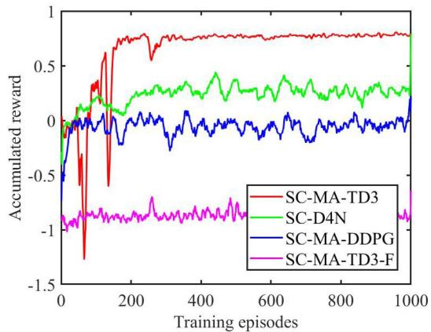  
Fig. 4. Reward curves for different approaches.

Fig. 4 shows the convergence performance of the SC-MA-TD3 approach proposed in this paper compared to other approaches. The curves of several approaches all reach convergence after a certain number of episodes. However, it can be observed that the SC-MA-TD3 approach proposed in this paper has a significantly higher reward at convergence compared to the other approaches. This is because the reward in this paper is composed of constraints related to the communication and computation delay and semantic accuracy. The DRL algorithm is used to plan UAV trajectories, user associations, and channel selections, adjusting actions under dynamic environments and jamming attacks to increase semantic accuracy, thereby increasing the semantic rate while reducing communication and computation delay. The SC-MA-TD3 approach proposed in this paper uses a double Q-network to address the overestimation issue, reducing estimation errors and increasing the stability of the learning process, which allows for better multi-agent coordination. Therefore, it can better optimize system actions under jamming attacks, maximizing system semantic accuracy and minimizing communication and computation delay, thus significantly increasing the reward. In comparison, The SC-D4N approach are more suitable for optimizing single-agent problems and cannot effectively adapt to the behaviors of other agents in the environment. As a result, they are unable to achieve optimal solutions. The SC-MA-DDPG approach cannot reduce overestimation and only use a single Q-network for decision-making, leading to relatively unstable learning processes, while SC-MA-TD3-F cannot fully optimize UAV trajectories, user associations, and channel selections, resulting in increased communication and computation delay and reduced semantic accuracy under jamming attacks, thus a lower reward. In summary, the SC-MA-TD3 approach can better optimize UAV-assisted MEC strategies under jamming attacks, by appropriately adjusting UAV trajectories, user associations, and channel selections to achieve the maximum reward.

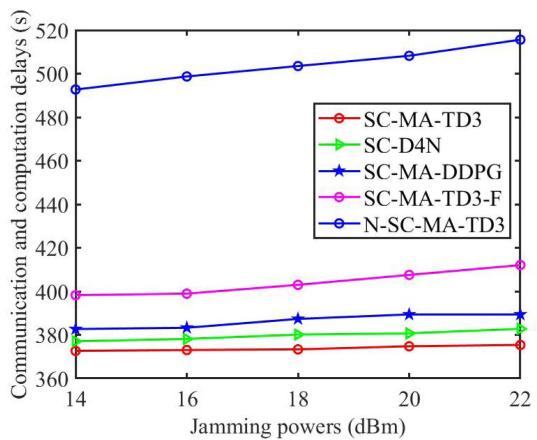  
(a) Comparison of communication and computation delay of different approaches

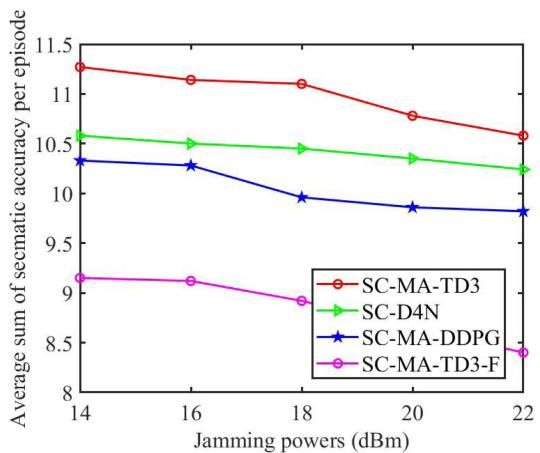  
(b) Comparison of semantic accuracy of different approaches  
Fig. 5. Performance comparison of different jamming powers.

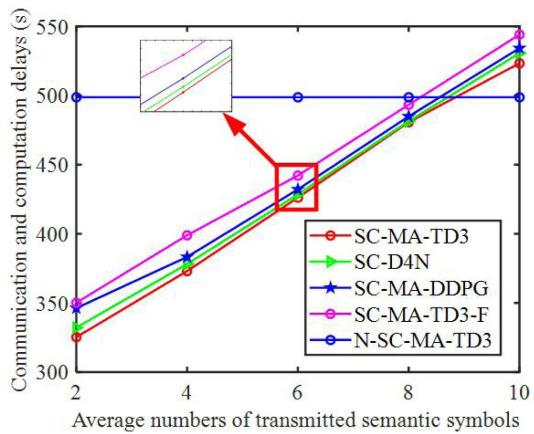  
(a) Comparison of communication and computation delay of different approaches

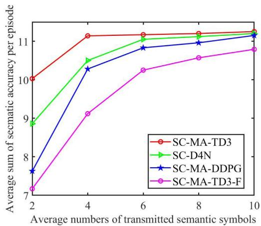  
(b) Comparison of semantic accuracy of different approaches  
Fig. 6. Performance comparison of different average number of semantic symbols.

Fig. 5(a) and (b) compares the accumulated communication and computation delay and semantic accuracy per episode among different approaches under varying jamming power levels, respectively. The figure shows that as jamming power increases, communication and computation delays increase while semantic accuracy decreases. This is due to the reduced SINR between users and the jammer, which lowers semantic accuracy, leading to increased delays and reduced semantic rate. This paper integrates semantic communication with DRL algorithms to optimize UAV trajectories, user associations, and channel selections, minimizing the impact of jamming. The SC-MA-TD3 approach, which employs dual actor networks and a critic network with a delayed update strategy, improves learning efficiency and algorithm stability. In contrast, the SC-D4N and SC-MA-DDPG approaches lack this sophisticated network structure, resulting in less optimal stability and efficiency. The SC-MA-TD3-F approaches have limited action capabilities during task execution. Consequently, the SC-MA-TD3 approach interacts effectively with the environment to select the best strategy, achieving the shortest delays and highest semantic accuracy under changing jamming conditions, as demonstrated in the figure. This shows the least variation and most stability among the approaches. Compared to traditional schemes, the semantic communication technology significantly reduces communication and computation delays, indicating that the proposed UAV-assisted MEC strategy effectively mitigates the effects of jamming attacks during strategy optimization.

Fig. 6(a) and (b) shows the comparison of communication and computation delay and semantic accuracy among different approaches under varying average numbers of transmitted semantic symbols by users, respectively. The average number of semantic symbols k = 4 refers to the average number of semantic symbols transmitted by text-transmission users $k _ { i } ^ { t e } = k = 4$ and image-transmission users $k _ { m } ^ { i m } = 1 9 7 ^ { \circ } k = 1 9 7 \times 4 = 7 8 8 .$ respectively, and so forth. As illustrated in the figure, as the k value increases, the communication and computation delay and the semantic accuracy continually increases. This is because, as described in (5), when the k value increases, the semantic accuracy also increases, but the increase is not as significant as the denominator in (5). Therefore, the semantic rate decreases as the k value increases, consequently increasing the communication and computation delay. The SC-MA-TD3 approach proposed in this paper features dual Q-networks and a delayed update mechanism, possessing higher learning efficiency and stability, allowing it to adaptively adjust resource allocation through optimizing UAV trajectories, user associations, and channel selections as k value changes. In contrast, the learning efficiency and stability of the comparative approaches are lower, failing to find an optimal UAV-assisted MEC strategy as the k value changes. Therefore, as the k value varies, the SC-MA-TD3 approach achieves the shortest communication and computation delay and the highest semantic accuracy compared to the other approaches. The figure shows that when $k = 8 ,$ , the delay of semantic communication is similar to that of traditional communication. However, when $k = 2$ , the sematic accuracy of the transmitted semantics cannot be guaranteed. Therefore, this paper selects $k = 4 .$ , which ensures a high semantic rate while maintaining high semantic accuracy. Compared to N-SC-MA-TD3, approaches using semantic communication technology can extract and transmit more important information, thereby saving channel resources. For example, compared to traditional communication approaches, the communication and computation delay of SC-MA-TD3 is improved by at least 29.07% when $k = 4$

Fig. 7 shows the performance comparison of different approaches with varying average numbers of semantic symbols k under different modalities. Fig. 7(a) shows the comparison of semantic accuracy in a single modality scenario, where all users’ tasks are text-based. When the tasks are multi-modal, two users form one semantic accuracy, whereas in single modality tasks, each user has their own semantic accuracy, thus the total semantic accuracy in single modality tasks is greater compared to the multi-modal scenario in Fig. 6(b). In Fig. 7(a), the semantic accuracy increases with the increase in the average number of semantic symbols, which is due to, as known from Section II-B, the larger the average number of semantic symbols, the greater the semantic accuracy. Fig. 7(b) shows the comparison of semantic rate changes in only the image modality semantic tasks of users when the parameters change. This is a comparison graph of communication and computational delay semantic rate in a multi-modal setting, where the average number of semantic symbols in text modality tasks remains constant, and the average number of semantic symbols in image modality tasks changes. From the figure, it is known that the semantic rate decreases with the increase in the average number of semantic symbols for image tasks, because, as known from Section II-B, although a larger average number of semantic symbols increases semantic accuracy, the increase in the numerator is not as large as that in the denominator, thus reducing the semantic rate. However, in Fig. 7(a) and (b), regardless of how the average number of semantic symbols changes, the SC-MA-TD3 approach always achieves the highest semantic accuracy and semantic rate. This is because the SC-MA-TD3 approach uses two independent Q-networks to reduce overestimation bias and uses a delay strategy update mechanism, thereby adapting well to changes in modalities and average numbers of semantic symbols, resulting in better performance. Whereas the SC-D4N approach, SC-MA-DDPG approach, SC-MA-TD3-F approach, and N-MA-TD3 approach either only adapt to a single-agent environment, or have overestimation issues, or do not utilize semantic communication technology, and thus cannot efficiently use spectrum resources, resulting in lower system rewards. In Fig. 7(a), when $k = 6 ,$ , the semantic accuracy has increased by at least 4.33%. In Fig. 7(b), when $k = 8$ , the semantic rate has increased by at least 2.67%. The simulation results indicate that the approach proposed in this paper can well adapt to the changes in different modalities of tasks.

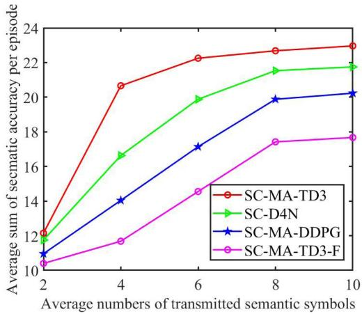  
(a) Comparison of semantic accuracy of different approaches

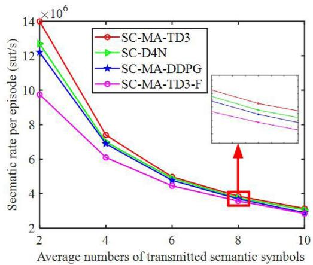  
(b) Comparison of semantic rate of different approaches  
Fig. 7. Performance comparison of different modal.

Fig. 8 shows a comparison of delay curves for different weight algorithms under varying jamming power. Specifically, SC-MA-TD3-T refers to the SC-MA-TD3 approach where the communication delay weight in the reward is twice the weight of the computation delay, and SC-MA-TD3-H refers to the SC-MA-TD3 approach where the communication delay weight in the reward is half the weight of the computation delay. As can be seen from the figure, as the jamming power increases, the delays of all approaches rise. However, the delay for the SC-MA-TD3 approach is the lowest, indicating that setting the communication delay weight equal to the computation delay weight in this paper achieves the best performance.

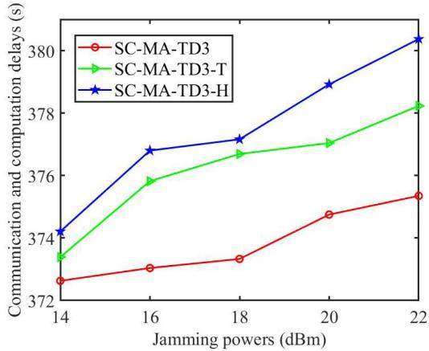  
Fig. 8. Communication and computation delays for different weights.

## VI. CONCLUSION

We propose an advanced UAV-assisted MEC scheme that integrates multi-modal semantic communication under jamming attacks, combining decisions on UAV trajectories, user associations, and channel selections to form an optimized solution. This scheme aims to minimize communication and computation delay and improve semantic accuracy to the greatest extent, under the constraints of communication resources and semantic communication-related thresholds. Specifically, given the complexity and dynamism of the communication environment and the challenging of the optimization problem, we designed the SC-MA-TD3 approach. This approach combines multi-modal semantic communication with various action selections to derive the optimal UAV-assisted MEC strategy under jamming attacks. The proposed approach can effectively capture the dynamic changes of jamming attacks in the environment and rapidly learn UAV-assisted MEC strategies in a high-dimensional state space. Simulation results demonstrate that, under different jamming powers and varying numbers of image-transmission users, our proposed approach significantly reduces communication and computation delay and enhances UAV semantic accuracy compared to benchmark approaches. Despite the many advantages of the proposed approach, there is still potential for betterment. In future work, we will explore the differences in the impact on users performing different tasks with the same modality in semantic communication.

## REFERENCES

[1] C. X. Wang et al., “On the road to 6G: Visions, requirements, key technologies, and testbeds,” IEEE Commun. Surv. Tut., vol. 25, no. 2, pp. 905–974, Second Quarter 2023.

[2] J. Clancy et al., “Wireless access for V2X communications: Research, challenges and opportunities,” IEEE Commun. Surv. Tut., vol. 26, no. 3, pp. 208–2119, Third Quarter 2024.

[3] S. Gyawali, S. Xu, Y. Qian, and R. Q. Hu, “Challenges and solutions for cellular based V2X communications,” IEEE Commun. Surv. Tut., vol. 23, no. 1, pp. 222–255, First Quarter 2021.

[4] W. Hamdi, C. Ksouri, H. Bulut, and M. Mosbah, “Network slicing-based learning techniques for IoV in 5G and beyond networks,” IEEE Commun. Surv. Tut., vol. 26, no. 3, pp. 1989–2047, Third Quarter 2024.

[5] W. Zhuang, Q. Ye, F. Lyu, N. Cheng, and J. Ren, “SDN/NFV-Empowered future IoV with enhanced communication, computing, and caching,” Proc. IEEE, vol. 108, no. 2, pp. 274–291, Feb. 2020.

[6] P. Zhang et al., “Intellicise wireless networks from semantic communications: A survey, research issues, and challenges,” IEEE Commun. Surv. Tut., early access, Aug. 13, 2024, doi: 10.1109/COMST.2024.3443193.

[7] Z. Qin, F. Gao, B. Lin, X. Tao, G. Liu, and C. Pan, “A generalized semantic communication system: From sources to channels,” IEEE Wireless Commun., vol. 30, no. 3, pp. 18–26, Jun. 2023.

[8] W. Yang et al., “Semantic communications for future internet: Fundamentals, applications, and challenges,” IEEE Commun. Surv. Tut., vol. 25, no. 1, pp. 213–250, First Quarter, 2023.

[9] Y. Wang et al., “Performance optimization for semantic communications: An attention-based reinforcement learning approach,” IEEE J. Sel. Areas Commun., vol. 40, no. 9, pp. 2598–2613, Sep. 2022.

[10] W. Xu, Y. Zhang, F. Wang, Z. Qin, C. Liu, and P. Zhang, “Semantic communication for the Internet of Vehicles: A multiuser cooperative approach,” IEEE Veh. Technol. Mag., vol. 18, no. 1, pp. 100–109, Mar. 2023.

[11] J. M. Gimenez-Guzman, I. Leyva-Mayorga, and P. Popovski, “Semantic V2X communications for image transmission in 6G systems,” IEEE Netw., vol. 38, no. 6, pp. 48–54, Nov. 2024, doi: 10.1109/MNET.2024.3420214.

[12] H. Xie, Z. Qin, G. Y. Li, and B.-H. Juang, “Deep learning enabled semantic communication systems,” IEEE Trans. Signal Process., vol. 69, pp. 2663– 2675, 2021.

[13] L. Sun, L. Wan, J. Wang, L. Lin, and M. Gen, “Joint resource scheduling for UAV-enabled mobile edge computing system in Internet of Vehicles,” IEEE Trans. Intell. Transp. Syst., vol. 24, no. 12, pp. 15624–15632, Dec. 2023.

[14] W. Yu and J. Zhao, “Semantic communications, semantic edge computing, and semantic caching,” 2023, arXiv:2304.08096.

[15] T. Z. H. Ernest and A. S. Madhukumar, “Computation offloading in MEC-enabled IoV networks: Average energy efficiency analysis and learning-based maximization,” IEEE Trans. Mobile Comput., vol. 23, no. 5, pp. 6074–6087, May 2024.

[16] S. Huang, L. Li, Q. Pan, W. Zheng, and Z. Lu, “Fine-grained task offloading for UAV via MEC-enabled networks,” in Proc. IEEE 30th Int. Symp. Pers. Indoor Mobile Radio Commun., 2019, pp. 1–6.

[17] J. Chen, X. Cao, P. Yang, M. Xiao, and S. Ren, “Deep reinforcement learning based resource allocation in multi-UAV-aided MEC networks,” IEEE Trans. Commun., vol. 71, no. 1, pp. 296–309, Jan. 2023.

[18] J. Zhao, M. Chen, Y. Pan, H. Sun, Y. Cang, and J. Wang, “Energy minimization of the cell-free MEC networks with two-timescale resource allocation,” IEEE Trans. Wireless Commun., vol. 23, no. 12, pp. 18623–18636, Dec. 2024.

[19] Y. Liu, P. Lin, M. Zhang, Z. Zhang, and F. R. Yu, “Mobile-aware service offloading for UAV-assisted IoV: A multiagent tiny distributed learning approach,” IEEE Internet Things J., vol. 11, no. 12, pp. 21191–21201, Jun. 2024.

[20] L. Yan, Z. Qin, R. Zhang, Y. Li, and G. Y. Li, “Resource allocation for text semantic communications,” IEEE Wireless Commun. Lett., vol. 11, no. 7, pp. 1394–1398, Jul. 2022.

[21] Z. Ji and Z. Qin, “Energy-efficient task offloading for semantic-aware networks,” in Proc. IEEE Int. Conf. Commun., Rome, Italy, 2023, pp. 3584–3589.

[22] J. Xu, H. Yao, R. Zhang, T. Mai, S. Huang, and S. Guo, “Federated learning powered semantic communication for UAV swarm cooperation,” IEEE Wireless Commun., vol. 31, no. 4, pp. 140–146, Aug. 2024.

[23] C. Ren, Z. He, Y. Long, C. Zhao, L. Sun, and K. Xu, “Multimodal virtual semantic communication for tiny-machine-learning-based UAV task execution,” IEEE Internet Things J., vol. 11, no. 19, pp. 30864–30874, Oct. 2024.

[24] H. Hu, X. Zhu, F. Zhou, W. Wu, and R. Q. Hu, “Semantic-oriented resource allocation for multi-modal UAV semantic communication networks,” in Proc. IEEE Glob. Commun. Conf., Kuala Lumpur, Malaysia, 2023, pp. 7213–7218.

[25] Z. Q. Liew, M. Xu, W. Y. B. Lim, Z. Xiong, D. Niyato, and D. I. Kim, “Mechanism design for semantic communication in UAV-assisted metaverse: A combinatorial auction approach,” IEEE Trans. Veh. Technol., vol. 73, no. 2, pp. 2236–2251, Feb. 2024.

[26] L. Sun, L. Wan, J. Wang, L. Lin, and M. Gen, “Joint resource scheduling for UAV-enabled mobile edge computing system in Internet of Vehicles,” IEEE Trans. Intell. Transp. Syst., vol. 24, no. 12, pp. 15624–15632, Dec. 2023.

[27] Y. Zheng, T. Zhang, R. Huang, and Y. Wang, “Computing offloading and semantic compression for intelligent computing tasks in MEC systems,” in Proc. IEEE Wireless Commun. Netw. Conf., 2023, pp. 1–6.

[28] W. Yang et al., “Semantic communication meets edge intelligence,” IEEE Wireless Commun., vol. 29, no. 5, pp. 28–35, Oct. 2022.

[29] Y. Wu, W. Yang, X. Guan, and Q. Wu, “UAV-enabled relay communication under malicious jamming: Joint trajectory and transmit power optimization,” IEEE Trans. Veh. Technol., vol. 70, no. 8, pp. 8275–8279, Aug. 2021.

[30] R. Tang, D. Gao, M. Yang, T. Guo, H. Wu, and G. Shi, “GAN-inspired intelligent jamming and anti-jamming strategy for semantic communication systems,” in Proc. IEEE Int. Conf. Commun. Workshops, Rome, Italy, 2023, pp. 1623–1628.

[31] Y. Xu et al., “Energy-efficient channel access and data offloading against dynamic jamming attacks,” IEEE Trans. Green Commun. Netw., vol. 5, no. 4, pp. 1734–1746, Dec. 2021.

[32] S. Liu et al., “Fight against intelligent reactive jammer in MEC networks: A hierarchical reinforcement learning-based hybrid hidden strategy,” IEEE Wireless Commun., vol. 13, no. 4, pp. 1078–1082, Apr. 2024.

[33] Y. Sun et al., “Multi-functional RIS-assisted semantic anti-jamming communication and computing in integrated aerial-ground networks,” IEEE J. Sel. Areas Commun., vol. 42, no. 12, pp. 3597–3617, Dec. 2024, doi: 10.1109/JSAC.2024.3459028.

[34] B. Duo, Q. Wu, X. Yuan, and R. Zhang, “Anti-jamming 3D trajectory design for UAV-enabled wireless sensor networks under probabilistic LoS channel,” IEEE Trans. Veh. Technol., vol. 69, no. 12, pp. 16288–16293, Dec. 2020.

[35] P. Qin, Y. Fu, Y. Xie, K. Wu, X. Zhang, and X. Zhao, “Multi-agent learning-based optimal task offloading and UAV trajectory planning for AGIN-power IoT,” IEEE Trans. Commun., vol. 71, no. 7, pp. 4005–4017, Jul. 2023.

[36] S. Liu, H. Yang, M. Zheng, L. Xiao, Z. Xiong, and D. Niyato, “UAVenabled semantic communication in mobile edge computing under jamming attacks: An intelligent resource management approach,” IEEE Trans. Wireless Commun., vol. 23, no. 11, pp. 17493–17507, Nov. 2024, doi: 10.1109/TWC.2024.3454073.

[37] Z. Yin, Y. Lin, Y. Zhang, Y. Qian, F. Shu, and J. Li, “Collaborative multiagent reinforcement learning aided resource allocation for UAV anti-Jamming communication,” IEEE Internet Things J., vol. 9, no. 23, pp. 23995–24008, Dec. 2022.

[38] H. Xie, Z. Qin, and G. Y. Li, “Task-oriented multi-user semantic communications for VQA,” IEEE J. Sel. Areas Commun., vol. 40, no. 9, pp. 2584–2597, Sep. 2022.

[39] L. Yan, Z. Qin, R. Zhang, Y. Li, and G. Y. Li, “QoE-aware resource allocation for semantic communication networks,” in Proc. IEEE Glob. Commun. Conf., Rio de Janeiro, Brazil, 2022, pp. 3272–3277.

[40] F. Song et al., “Evolutionary multi-objective reinforcement learning based trajectory control and task offloading in UAV-assisted mobile edge computing,” IEEE Trans. Mobile Comput., vol. 22, no. 12, pp. 7387–7405, Dec. 2023.

[41] S. Huang, L. Li, Q. Pan, W. Zheng, and Z. Lu, “Fine-grained task offloading for UAV via MEC-enabled networks,” in Proc. IEEE 30th Int. Symp. Pers. Indoor Mobile Radio Commun., Istanbul, Turkey, 2019, pp. 1–6.

[42] Z. Lin, X. Lu, C. Dai, G. Sheng, and L. Xiao, “Reinforcement learning based UAV trajectory and power control against jamming,” in Proc. Int. Conf. Mach. Learn. Cyber Secur., 2019, pp. 336–347.

[43] R. Lin, C. Guo, J. Chen, and Y. Wang, “Multidimensional resource joint allocation algorithm based on deep double Q network in semantic communication,” Mobile Commun., vol. 47, no. 4, pp. 45–53, Sep. 2023.

Shuai Liu (Student Member, IEEE) received the MS degree in electricity theory and new technology from the Shanghai University of Electric Power, Shanghai, China, in 2022. He is currently working toward the PhD degree with the Department of Information and Communication Engineering, Xiamen University. His research interests include UAV communications, anti-jamming, and reinforcement learning.

Helin Yang (Senior Member, IEEE) received the BS and MS degrees from the School of Telecommunications Information Engineering, Chongqing University of Posts and Telecommunications, in 2013 and 2016, respectively, and the PhD degree from the School of Electrical and Electronic Engineering, Nanyang Technological University, Singapore, in 2020. He is currently an associate professor with the School of Informatics, Xiamen University, Xiamen, China. His research interests include wireless communication and resource management.

Mengting Zheng (Student Member, IEEE) received the BS degree in communication engineering from Fuzhou University, in 2023. She is currently working toward the master’s degree with the Department of Information and Communication Engineering, Xiamen University. Her research interests include edge computing, UAV communications, and resource scheduling.

Liang Xiao (Fellow, IEEE) received the BS degree in communication engineering from the Nanjing University of Posts and Telecommunications, China, in 2000, the MS degree in electrical engineering from Tsinghua University, China, in 2003, and the PhD degree in electrical engineering from Rutgers University, NJ, in 2009. She is currently a professor with the Department of Information and Communication Engineering, Xiamen University, Xiamen, China. She has served as an associate editor of IEEE Transactions on Information Forensics and Security and guest editor of the IEEE Journal of Selected Topics in Signal Processing. She is the recipient of the best paper award for 2016 INFOCOM Big Security WS and 2017 ICC. She was a visiting professor with Princeton University, Virginia Tech, and University of Maryland, College Park.