# Multi-UAV Aided Multi-Access Edge Computing in Marine Communication Networks: A Joint System-Welfare and Energy-Efficient Design

Minghui Dai , Chenglong Dou , Yuan Wu , Senior Member, IEEE, Liping Qian , Senior Member, IEEE, Rongxing Lu , Fellow, IEEE, and Tony Q. S. Quek , Fellow, IEEE

Abstract— The integration of unmanned aerial vehicles (UAVs) and marine communication networks has been emerging as a promising paradigm to cater for the growing maritime activities, e.g., marine environment monitoring and ocean resource exploration. The increasing growth of marine applications and services poses challenges for processing marine data, while the resources-limited UAVs cannot satisfy the requirements of computing-intensive and energy consumption. In this paper, we consider a marine edge computing scenario with a group of UAVs and ocean beacon stations (OBSs) and propose a multi-UAV aided multi-access edge computing for marine networks from the perspective of system-welfare and energy-efficient design. Specifically, we propose a multi-task multi-access offloading scheme in marine edge computing networks, in which multiple UAVs can process their workloads locally or offload their partial workloads to multiple OBSs for processing. We consider the total utilities for completing all tasks as the system welfare, and measure the difference between the system welfare and energy consumption as the system revenue. A joint optimization problem is formulated by optimizing the OBS selection, the offloading ratio and the transmission duration, with the objective of increasing the system revenue in marine edge computing networks. We exploit a vertical decomposition architecture to solve the formulated non-convex problem via decomposing it into three sub-problems. Regarding each sub-problem, we propose efficient algorithms to derive the

Manuscript received 4 September 2023; revised 10 December 2023; accepted 7 April 2024. Date of publication 15 April 2024; date of current version 18 September 2024. This work was supported in part by National Natural Science Foundation of China under Grants 62122069, 62072490, and 62071431, in part by Science and Technology Development Fund of Macau SAR under Grant 0158/2022/A, in part by the Guangdong Basic and Applied Basic Research Foundation (2022A1515011287), and in part by the National Research Foundation, Singapore and Infocomm Media Development Authority under its Future Communications Research & Development Programme. The associate editor coordinating the review of this article and approving it for publication was C. Li. (Corresponding author: Yuan Wu.)

Minghui Dai and Chenglong Dou are with the State Key Laboratory of Internet of Things for Smart City, Department of Computer and Information Science, University of Macau, Macau, China (e-mail: minghuidai@um.edu.mo; cldou.um@gmail.com).

Yuan Wu is with the State Key Laboratory of Internet of Things for Smart City, Department of Computer and Information Science, University of Macau, Macau, China, and also with Zhuhai UM Science and Technology Research Institute, Zhuhai 519031, China (e-mail: yuanwu@um.edu.mo).

Liping Qian is with the College of Information Engineering, Zhejiang University of Technology, Hangzhou 310023, China (e-mail: lpqian@zjut.edu.cn).

Rongxing Lu is with the Faculty of Computer Science, University of New Brunswick, Fredericton, NB E3B 5A3, Canada (e-mail: rlu1@unb.ca).

Tony Q. S. Quek is with the Information Systems Technology and Design Pillar, Singapore University of Technology and Design, Singapore 487372 (e-mail: tonyquek@sutd.edu.sg).

Color versions of one or more figures in this article are available at https://doi.org/10.1109/TCOMM.2024.3388501.

Digital Object Identifier 10.1109/TCOMM.2024.3388501

optimal solutions. We finally conduct simulations to verify the performance of the proposed algorithms. The results demonstrate that our proposed algorithms can achieve the best performance for improving the system revenue in comparison with several benchmark algorithms.

Index Terms— Marine communication networks, multi-access edge computing, energy-efficient resource allocation.

# I. INTRODUCTION

N RECENT years, with the continuous exploration of I marine resources, the rapid growing marine activities have put forward low-latency and high-data rate demands for the development of marine communication networks [1], [2]. For instance, the navigation of unmanned ships requires realtime data transmission. Marine observation stations need to collect environmental data and process the data in real-time for providing kinds of information to ships [3]. Therefore, the requirements for low-latency and high-throughput transmission play an important role in improving the quality of service (QoS) of marine communication networks. Different from the terrestrial networks where the ground base-stations can be densely deployed to provide communication and computing services for wireless devices, it is difficult to deploy a large number of ocean beacon stations (OBSs) due to the complex ocean environment and the expenditure issues. Therefore, the design of efficient marine communication networks is still an open issue that has attracted much attention from both academia and industries [4].

With the rapid development of unmanned aerial vehicle (UAV) and its remarkable characteristics such as highflexibility and easy-operability, the integration of UAV and marine communication networks has been envisioned as a promising paradigm to enhance marine communication performance [5], [6], [7]. Specifically, as the representative unmanned devices, UAVs with the sensing, computing, communication and caching capacities can support multifunctional applications in marine networks. For instance, UAVs equipped with multiple sensors can perceive marine information in the air. By embedding communication modules in UAVs, it can forward data among vessels as the relay nodes in the air. Therefore, the significant advantages of UAVs will further promote the development of marine communication networks [8]. However, a large number of collected oceanic data by UAVs need to be processed, which leads to great challenges for UAVs with limited computing resources.

Marine edge computing is an efficient technique to promote the computing services for resource-limited UAVs by migrating the computing capacity from the cloud to the edge of marine networks [9], [10]. In marine environment, the OBSs equipped with edge servers can provide computing services for UAVs when the computing resources of UAVs are fully occupied. Nevertheless, the energy efficiency is another critical issue for UAVs and OBSs in marine edge computing owing to the fact that marine devices are generally battery-powered, and these devices will be exhausted if they are not charged frequently [11]. Therefore, how to design energy-efficient resource allocation schemes to enhance the performance of marine edge computing is also an important problem. There have been several existing studies focusing on the design of data transmission [12], energy harvesting [13], and trajectory optimization [14] in marine networks. For instance, the authors in [15] proposed a secure data sharing method in marine edge computing framework via federated learning and blockchain technology. A three-layer fog-based edge computing architecture has been proposed in [16] for multi-sensor data processing. The authors in [17] investigated the UAV-assisted maritime networks and formulated an optimization problem to minimize the total energy consumption by jointly optimizing the resource allocation and UAV trajectory. Although the tremendous efforts have been devoted to UAV-aided edge computing networks, the multi-UAV aided multi-access edge computing for improving the energy efficiency has not been yet studied in marine networks [18]. To address the abovementioned issues, in this paper, we present a multi-UAV aided multi-access edge computing framework in marine networks by jointly optimizing the resource allocation and OBS selection to improve the task offloading efficiency. The main contributions of this work are summarized as follows.

• Multi-UAV Aided Marine Multi-access Edge Computing Framework: We consider a two-layer marine edge computing scenario consisting of the aerial layer and the sea surface layer, and we design a multi-UAV aided multi-access edge computing scheme to improve the QoS in marine networks. In aerial layer, a cluster of UAVs perceive marine environment and collect various marine data for processing. In sea surface layer, a group of OBSs equipped with edge servers can process tasks with low latency. By embedding aerial edge servers in UAVs, UAVs can process part of workloads locally and offload partial workloads to OBSs for computing.

• Joint System-Welfare and Energy-Efficient Design: We consider the total utilities for completing the total workloads as the system welfare, and we formulate a joint optimization for the system revenue based on the difference between the system welfare and energy consumption to optimize the OBS selection and the resource allocation. To solve the formulated non-convex problem, we exploit a layered structure to decompose the original problem into three sub-problems. Regarding the sub-problem, we present a double auction approach to determine the optimal OBS choice. Regarding the mid-problem and the top-problem, we propose efficient algorithms to obtain the optimal solutions for resource allocation.

• Effectiveness of the Proposed Algorithms: Extensive numerical results are conducted to verify the accuracy and effectiveness of our proposed algorithms. The results demonstrate that the proposed algorithms can obtain the optimal solutions and achieve the best performance for maximizing the system revenue in comparison with several benchmark algorithms.

The remainder of this paper is organized as follows. Section II gives the literature review. Section III presents the system model and problem formulation. The proposed algorithms to solve the formulated problem are described in Section IV. Section V presents the numerical results and analysis to validate the efficiency and effectiveness of the proposed algorithms. Section VI closes this paper with conclusion.

# II. LITERATURE REVIEW

This section reviews the related studies including (i) UAVaided task offloading, and (ii) marine multi-access edge computing. There have been many works investigating the UAV-aided task offloading framework by designing different schemes to improve offloading efficiency. Zhao et al. [19] formulated a joint optimization problem to determine UAV trajectories, task scheduling and communication resource allocation. Seid et al. [20] presented a computational offloading with energy harvesting scheme and formulated a joint optimization problem for offloading decision, energy harvesting and optimal resource price to maximize the system profits. Lyu et al. [21] exploited the UAV trajectory algorithm to promote the data collection rate of ocean devices in marine networks. Apostolopoulos et al. [22] investigated the UAVassisted aerial edge servers to provide services, and the optimal task offloading scheme for available computing choices is proposed to maximize QoS. Ng et al. [23] considered a UAV-enabled hybrid edge computing network and presented a two-tier optimization method to minimize the system cost.

Multi-access edge computing has been envisioned as a promising approach to improve the computing efficiency by migrating tasks to multiple edge servers simultaneously [24], [25]. Jung et al. [26] presented the integrated satellite-UAV edge computing networks, and an optimization for the total energy consumption of UAVs is formulated for resource allocation. Dai et al. [27] investigated a two-tier multi-access task offloading framework in marine networks and formulated a joint optimization to minimize the energy consumption. Liu et al. [28] introduced a two-layer maritime communication network, and a joint communication and computation latency minimization problem is formulated in UAV-aided maritime edge computing. Jiang et al. [29] investigated the secure data caching and placement strategy in edge-enabled marine transportation systems via a designed lightweight blockchain. Ruby et al. [30] presented a software defined networking-aided underwater communication networks to minimize the energy consumption. Su et al. [31] proposed an edge-computing-based marine network to support computing and communication demands for marine vessels.

Despite the above studies, to the best of the authors’ knowledge, few studies have jointly investigated the edge computing for UAVs and the mobility of UAVs in marine networks. In contrast to existing works, this paper presents a multi-UAV aided multi-access edge computing scheme in marine communication networks by jointly considering the latency, energy consumption, mobility of UAVs and the system welfare.

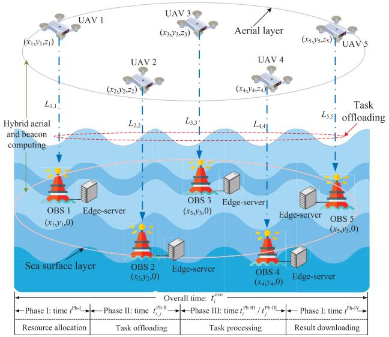

<details>
<summary>flowchart</summary>

```mermaid
graph TD
    subgraph_UAV1["AVAV 1"]
        A1["(x₁,y₁,z₁)"]
        A2["(x₂,y₂,z₂)"]
    end
    subgraph_UAV2["AVAV 2"]
        B1["(x₃,y₃,z₃)"]
        B2["(x₄,y₄,z₄)"]
    end
    subgraph_UAV3["AVAV 3"]
        C1["(x₅,y₅,z₅)"]
        C2["(x₆,y₆,z₆)"]
    end
    subgraph_UAV4["AVAV 4"]
        D1["(x₇,y₇,z₇)"]
        D2["(x₈,y₈,z₈)"]
    end
    subgraph_UAV5["AVAV 5"]
        E1["(x₉,y₉,z₉)"]
        E2["(x₁₀,y₁₀)"]
    end

    subgraph_OBS1["OBS 1 (x₁,y₁,0)"]
        F1["OBS 2 (x₂,y₂,0)"]
        G1["OBS 3 (x₃,y₃,0)"]
        H1["OBS 4 (x₄,y₄,0)"]
    end

    subgraph_OBS2["OBS 2 (x₂,y₂,0)"]
        I1["OBS 3 (x₃,y₃,0)"]
        J1["OBS 4 (x₄,y₄,0)"]
    end

    subgraph_OBS3["OBS 3 (x₃,y₃,0)"]
        K1["OBS 4 (x₄,y₄,0)"]
    end

    subgraph_OBS4["OBS 4 (x₄,y₄,0)"]
        L1["OBS 5 (x₂,y₂,0)"]
    end

    subgraph_OBS5["OBS 5 (x₂,y₂,0)"]
        M1["OBS 5 (x₂,y₂,0)"]
    end

    A1 -->|L₁,₁| F
    A2 -->|L₂,₂| G
    A3 -->|L₃,₃| H
    A4 -->|L₄,₄| I
    A5 -->|L₅,₅| J
    A6 -->|L₆,₆| K
    A7 -->|L₇,₇| L
    A8 -->|L₈,₈| M
    A9 -->|L₉,₉| N
    A10 -->|L₁₀| O
    A11 -->|L₁₁| P
    A12 -->|L₁₂| Q
    A13 -->|L₁₃| R
    A14 -->|L₁₄| S
    A15 -->|L₁₅| T
    A16 -->|L₁₆| U
    A17 -->|L₁₇| V
    A18 -->|L₁₈| W
    A19 -->|L₁₉| X
    A20 -->|L₂₀| Y
    A21 -->|L₂₁| Z
    A22 -->|L₂₂| AA
    A23 -->|L₂₃| AB
    A24 -->|L₂₄| AC
    A25 -->|L₂₅| AD
    A26 -->|L₂₆| AE
    A27 -->|L₂₇| AF
    A28 -->|L₂₈| AG
    A29 -->|L₂₉| AH
    A30 -->|L₃₀| AI
    A31 -->|L₃₁| AJ
    A32 -->|L₃₂| AK
    A33 -->|L₃₃| AL
    A34 -->|L₃₄| AM
    A35 -->|L₃₅| AN
    A36 -->|L₃₆| AO
    A37 -->|L₃₇| AP
    A38 -->|L₃₈| AQ
    A39 -->|L₃₉| AR
    A40 -->|L₄₀| AS
    A41 -->|L₄₁| AT
    A42 -->|L₄₂| AU
    A43 -->|L₄₃| AV
    A44 -->|L₄₄| AW
    A45 -->|L₄₅| AX
    A46 -->|L₄₆| AY
    A47 -->|L₄₇| AZ
    A48 -->|L₄₈| BA
    A49 -->|L₄₉| BB
    A50 -->|L₅₀| BC
    A51 -->|L₅₁| BD
    A52 -->|L₅₂| BE
    A53 -->|L₅₃| BF
    A54 -->|L₅₄| BG
    A55 -->|L₅₅| BH
    A56 -->|L₅₆| BI
    A57 -->|L₅₇| BJ
    A58 -->|L₅₈| BK
    A59 -->|L₅₉| BL
    A60 -->|L₆₀| BM
    style OBS1 fill:#f9f,stroke:#333
    style OBS2 fill:#f9f,stroke:#333
    style OBS3 fill:#f9f,stroke:#333
    style OBS4 fill:#f9f,stroke:#333
```
</details>

Fig. 1. The scenario of multi-UAV aided multi-task offloading in marine edge computing networks.

# III. SYSTEM MODEL AND PROBLEM FORMULATION

For the sake of clear presentation, Table I provides a summary of the key notations used in the system model.

# A. System Model

As shown in Fig. 1, we consider a two-layer marine edge computing system consisting of multiple OBSs and multiple UAVs. OBSs are deployed at the sea surface for providing computing services. OBSs (denoted as $\mathcal { I } = \{ 1 , 2 , \ldots , J \} )$ equipped with edge-servers have computing capacities to process tasks. We use $\mathbf l _ { j } ~ = ~ ( x _ { j } , y _ { j } , 0 ) ~ \in ~ \mathbb R ^ { 3 \times 1 }$ to denote the horizontal location of OBS j in three-dimensional (3D) Cartesian coordinate system. The covering radius of OBS j is denoted by $R _ { j } . ^ { 1 }$ A cluster of UAVs (denoted as $\mathcal { T } =$ $\{ 1 , 2 , \ldots , I \} )$ cruise over the sea to monitor marine environment. The specific position of UAV i is denoted as $\mathbf { l } _ { i } ~ =$ $( x _ { i } , y _ { i } , z _ { i } ) \in \mathbb { R } ^ { 3 \times 1 }$ . Considering the fluidity of wind, UAVs may shift in a region of radius Θ. Let $x _ { i } ^ { \prime }$ and $y _ { i } ^ { \prime }$ denote the displacement variables of UAV i in the horizontal level. The position of UAV i should satisfy $\left( x _ { i } - x _ { i } ^ { \prime } \right) ^ { 2 } + \left( y _ { i } - y _ { i } ^ { \prime } \right) ^ { 2 } \leq$ $\Theta ^ { 2 } , \forall i \in \mathcal { T }$ . Each UAV can sense different tasks, and the set of sensing tasks of UAVs is denoted by $\mathcal { M } = \{ m _ { 1 } , m _ { 2 } , . ~ . ~ . , m _ { I } \}$ . Due to the limited computing capacity, UAVs can either process their tasks locally or offload partial workloads to OBSs depending on the allocated computing resources.2 We use $T _ { i } ^ { \mathrm { m a x } }$ to denote the task completion deadline of UAV i, i.e., the maximum latency that UAV i can tolerate.

1In order to make full use of the resources of OBSs, we consider that different OBSs have no overlap to reduce the cost for deploying OBSs.

2Considering the movement of UAVs and the spatial distribution and resource capacity of OBSs, it is necessary to select a suitable OBS to avoid service interruption, i.e., reducing the number of re-connections to other OBSs.

Based on [32], when UAV i cruises at a speed of $v _ { i } ,$ , the power consumption depends on the flying consumption, which can be expressed as

$$
\begin{array}{l} p _ {i} ^ {\text { fly }} = p ^ {\text { bla }} \left(1 + \frac {3 v _ {i} ^ {2}}{e _ {\text { tip }} ^ {2}}\right) + p ^ {\text { ind }} \left(\sqrt {1 + \frac {v _ {i} ^ {4}}{4 v _ {0} ^ {4}}} - \frac {v _ {i} ^ {2}}{2 v _ {0} ^ {2}}\right) ^ {\frac {1}{2}} \\ + \frac {1}{2} d ^ {\text { fus }} \rho^ {\text { den }} s ^ {\text { rot }} r ^ {\text { dis }} v _ {i} ^ {3}, \forall i \in \mathcal {I}, \tag {1} \\ \end{array}
$$

where parameter $e _ { \mathrm { t i p } }$ denotes the tip speed of rotor blade. $v _ { 0 }$ is the mean rotor induced velocity during hovering. Parameter $d ^ { \mathrm { f u s } }$ indicates the fuselage drag ratio. $\rho ^ { \mathrm { d e n } }$ is the air density. Parameter $s ^ { \mathrm { r o t } }$ denotes the rotor solidity. Parameter $r ^ { \mathrm { { d i s } } }$ represents rotor disc area. $p ^ { \mathrm { b l a } }$ and $p ^ { \mathrm { i n d } }$ are two constant parameters regarding the blade profile power and induced power in hovering status, respectively, which are determined by

$$
\left\{ \begin{array}{l} p ^ {\mathrm{bla}} = \frac {c ^ {\mathrm{pro}}}{8} \rho^ {\mathrm{den}} s ^ {\mathrm{rot}} r ^ {\mathrm{dis}} v _ {\mathrm{bla}} ^ {3} r _ {\mathrm{rad}} ^ {3}, \\ p ^ {\mathrm{ind}} = \frac {(1 + f ^ {\mathrm{inc}}) w ^ {\frac {3}{2}}}{(2 \rho^ {\mathrm{den}} r ^ {\mathrm{dis}}) ^ {\frac {1}{2}}}. \end{array} \right. \tag {2}
$$

Here, parameter $c ^ { \mathrm { p r o } }$ indicates the profile drag coefficient. $v _ { \mathrm { b l a } }$ is the blade angular velocity. $r _ { \mathrm { r a d } }$ denotes the rotor radius. $f ^ { \mathrm { i n c } }$ represents the incremental correlation factor to induced power. w is the weight of UAV. When UAV i hovers over the ocean $( \mathrm { i } . \mathbf { e } . , v _ { i } = 0 )$ , the hovering power consumption is

$$
p _ {i} ^ {\text { hov }} = p ^ {\text { bla }} + p ^ {\text { ind }}, \quad \forall i \in \mathcal {I}. \tag {3}
$$

Considering the covering radius of OBS j, if UAV i is within the covering radius of OBS $j ~ ( \mathrm { i . e . , ~ } \| \mathbf { l } _ { i } - \mathbf { l } _ { j } \| ~ \leqslant ~ R _ { j } )$ , UAV i can directly offload its workloads to OBS j. The energy consumption of UAV i is the hovering consumption, which can be expressed as $E _ { i } ^ { \mathrm { { h o v } } } = p _ { i } ^ { \mathrm { { h o v } } } t _ { i } ^ { \mathrm { { o v e } } }$ . Here, $t _ { i } ^ { \mathrm { o v e } }$ denotes the overall delay for completing the workloads of UAV i, which will be explained in Section III-C. Otherwise, if UAV i is not within the communication range of OBS $j ~ ( \mathrm { i . e . , ~ } \| \mathbf { l } _ { i } - \mathbf { l } _ { j } \| ~ > ~ R _ { j } )$ , UAV i first needs to fly to the covering radius of OBS j. Then, UAV i should hover in the coverage of OBS j for offloading workloads. The flying energy consumption of UAV i can be expressed as $E _ { i } ^ { \mathrm { { f l y } } } = \mathbf { \bar { \Gamma } } _ { p _ { i } } ^ { \mathrm { { f l y } } } t _ { i } ^ { \mathrm { { f l y } } }$ = pi flytfly. i Here, $t _ { i } ^ { \mathrm { f i y } }$ denotes the propulsion flying time of UAV i, which can be expressed as $\begin{array} { r } { t _ { i } ^ { \mathrm { f l y } } ~ = ~ \frac { \| { \bf l } _ { i } - { \bf l } _ { j } \| - R _ { j } } { v _ { i } } } \end{array}$ ∥li−lj ∥−Rj . Therefore, based on the above analysis, vi the movement energy consumption of UAV i consists of the flying consumption and hovering consumption, which can be expressed as

$$
E _ {i} ^ {\mathrm{mov}} = \left\{ \begin{array}{l l} p _ {i} ^ {\mathrm{hov}} t _ {i} ^ {\mathrm{ove}}, & \| \mathbf {l} _ {i} - \mathbf {l} _ {j} \| \leqslant R _ {j} \\ p _ {i} ^ {\mathrm{fly}} t _ {i} ^ {\mathrm{fly}} + p _ {i} ^ {\mathrm{hov}} t _ {i} ^ {\mathrm{ove}}, & \| \mathbf {l} _ {i} - \mathbf {l} _ {j} \| > R _ {j}, \end{array} \right.
$$

$$
\forall i \in \mathcal {I}, \forall j \in \mathcal {J}. \tag {4}
$$

# B. Communication Model

In marine environment, the communications between UAV and its associated OBS are based on air-to-ground (A2G) communication. The Line-of-Sight (LoS) channel and non-LoS (NLoS) channel are adopted to model the path loss [34].

TABLE I NOTATIONS AND DEFINITIONS IN THIS PAPER 

<table><tr><td>Notations</td><td>Definitions</td><td>Notations</td><td>Definitions</td></tr><tr><td> $\mathcal{I}$ </td><td>The group of UAVs.</td><td> $t^{Ph-I}$ </td><td>The resource allocation time in Phase I.</td></tr><tr><td> $\mathcal{J}$ </td><td>The group of OBSs.</td><td> $t_{i,j}^{Ph-II}$ </td><td>The transmission time in Phase II.</td></tr><tr><td> $p_i^{fly}$ </td><td>The flying power consumption of UAV i.</td><td> $t_i^{Ph-III}$ </td><td>The local processing time by UAV i in Phase III.</td></tr><tr><td> $p_i^{hov}$ </td><td>The hovering power consumption of UAV i.</td><td> $t_j^{Ph-III}$ </td><td>The offloading processing time by OBS j in Phase III.</td></tr><tr><td> $p^{\text{bla}}$ </td><td>The blade profile power of UAV i.</td><td> $t^{Ph-IV}$ </td><td>The downloading result time in Phase IV.</td></tr><tr><td> $p^{\text{ind}}$ </td><td>The induced power of UAV i.</td><td> $U_i (m_i)$ </td><td>The utility of UAV i for offloading task  $m_i$ .</td></tr><tr><td> $R_j$ </td><td>The covering radius of OBS j.</td><td> $U_j (m_i)$ </td><td>The utility of OBS j for processing task  $m_i$ .</td></tr><tr><td> $T_i^{\text{max}}$ </td><td>The maximum latency of UAV i completing task.</td><td> $\mathcal{B}_i [\nu_i (m_i)]$ </td><td>The bidding function of UAV i.</td></tr><tr><td> $L_{i,j}$ </td><td>The average path loss of UAV i with its associated OBS j.</td><td> $\mathcal{B}_j [\nu_j (m_i)]$ </td><td>The bidding function of OBS j.</td></tr></table>

The LoS and NLoS channels happen with a certain probability, denoted as

$$
\left\{ \begin{array}{l} P _ {\mathrm{LoS}} = \frac {1}{1 + \alpha \exp (- \beta [ \theta - \alpha ])}, \\ P _ {\mathrm{NLoS}} = 1 - P _ {\mathrm{LoS}}. \end{array} \right. \tag {5}
$$

Here, both $\alpha$ and $\beta$ denote the ocean environment-specific coefficients. θ = arctan $\left( \frac { z _ { i } } { R _ { j } } \right)$ means the elevation angle of UAV i to OBS $j .$ The path loss for LoS and NLoS between UAV i and its associated OBS $j$ can be expressed as

$$
\left\{ \begin{array}{l l} L _ {\text { LoS }} = \varsigma_ {\text { LoS }} \left(\frac {4 \pi f}{c}\right) ^ {2} \| \mathbf {l} _ {i} - \mathbf {l} _ {j} \| ^ {2}, & \text { if   } \text { LoS   channel } \\ L _ {\text { NLoS }} = \varsigma_ {\text { NLoS }} \left(\frac {4 \pi f}{c}\right) ^ {2} \| \mathbf {l} _ {i} - \mathbf {l} _ {j} \| ^ {2}, & \text { if   } \text { NLoS   channel }, \end{array} \right.
$$

$$
\forall i \in \mathcal {I}, \forall j \in \mathcal {J}. \tag {6}
$$

Here, $\varsigma _ { \mathrm { L o S } }$ and $\mathsf { \bar { S N L o S } }$ denote the attenuation factors regarding the LoS and NLoS channels, respectively. Parameter f represents the carrier frequency. Parameter c means the speed of light. Therefore, the average path loss of UAV i with its associated OBS $j$ can be expressed as

$$
L _ {i, j} = P _ {\mathrm{LoS}} L _ {\mathrm{LoS}} + P _ {\mathrm{NLoS}} L _ {\mathrm{NLoS}}, \quad \forall i \in \mathcal {I}, \forall j \in \mathcal {J}. \tag {7}
$$

We use $W _ { j }$ to denote the bandwidth of OBS $j ,$ and use $P _ { i }$ to denote the transmission power of UAV i. The available transmission rate between UAV i and its associated OBS $j$ can be expressed as

$$
r _ {i, j} = W _ {j} \log_ {2} \left(1 + \frac {P _ {i}}{n W _ {j} L _ {i , j}}\right), \quad \forall i \in \mathcal {I}, \forall j \in \mathcal {J}. \tag {8}
$$

where $n$ denotes Gaussian noise density in ocean environment.

# C. Task Offloading Model

As depicted in Fig. 2, we illustrate the procedure of the proposed resource allocation for task offloading between UAVs and OBSs. We consider that a leader OBS maintains the control platform and is responsible for multi-UAV and multitask allocation. The proposed task offloading process is shown in Fig. 2(a). Specifically, (1) UAV first sends the request message to the nearest OBS. OBS then reports the received information and its corresponding resource information to the control platform. (2) The control platform periodically collects the feature information of UAVs and OBSs (including their positions, communication and computing resources), and generates the resource allocation strategy based on the resource allocation algorithm (illustrated in Section IV-B). (3) Each OBS reports the feedback information to UAVs according to the received resource allocation strategy, and each UAV uploads their respective tasks to the corresponding OBS for processing. (4) After completing one round task offloading process, the control platform updates the system information for the next round task offloading. The overall delay for completing one round task offloading consists of four phases: Phase I is the resource allocation time. Phase II is the task offloading time. Phase III is the task processing time. Phase IV is the downloading result time.

Phase I for the resource allocation time. The control platform generates resource allocation strategy in a timely manner. Let $t ^ { \mathrm { P h - I } }$ denote the resource allocation time. It is considered as a constant due to the fact that the control platform can execute the resource allocation very efficiently.

Phase II for the task offloading time. We use $\epsilon _ { i } ( 0 \leqslant \epsilon _ { i } \leqslant 1 )$ to denote the offloading ratio of UAV i, and use $S _ { i } ^ { \mathrm { t o t } }$ to denote the total workloads of UAV i. The transmission time for offloading workloads $\epsilon _ { i } S _ { i } ^ { \mathrm { t o t } }$ to OBS j can be expressed as

$$
t _ {i, j} ^ {\mathrm{Ph-II}} = \frac {\epsilon_ {i} S _ {i} ^ {\mathrm{tot}}}{r _ {i , j}}, \quad \forall i \in \mathcal {I}, \forall j \in \mathcal {J}. \tag {9}
$$

Phase III for the task processing time. To improve the utilization of OBS resources, UAV i can partially offload its workloads to OBS j for processing. The local processing time by UAV i and the offloading processing time by OBS j can be separately expressed as

$$
t _ {i} ^ {\mathrm{Ph-III}} = \varrho_ {i} \frac {(1 - \epsilon_ {i}) S _ {i} ^ {\mathrm{tot}}}{\eta_ {i}}, \quad \forall i \in \mathcal {I}, \tag {10}
$$

$$
t _ {j} ^ {\mathrm{Ph-III}} = \varrho_ {j} \frac {\epsilon_ {i} S _ {i} ^ {\mathrm{tot}}}{\eta_ {j}}, \quad \forall i \in \mathcal {I},   \forall j \in \mathcal {J}, \tag {11}
$$

where $\varrho _ { i }$ and $\varrho _ { j }$ denote the number of CPU cycles for processing one bit of data by UAV i and OBS $j ,$ respectively. $\eta _ { i }$ and $\eta _ { j }$ represent the processing capabilities of UAV i and OBS $j$ in CPU cycles per second, respectively. We use $\kappa _ { j }$ to denote the power consumption coefficient of OBS j. Therefore, the energy consumption of OBS $j$ for processing workloads $\epsilon _ { i } S _ { i } ^ { \mathrm { t o t } }$ can be expressed as

$$
E _ {j} ^ {\mathrm{OBS}} = \kappa_ {j} \eta_ {j} ^ {3} t _ {j} ^ {\text { Ph - III }} = \kappa_ {j} \varrho_ {j} \eta_ {j} ^ {2} \epsilon_ {i} S _ {i} ^ {\text { tot }}, \quad \forall i \in \mathcal {I}, \forall j \in \mathcal {J}. \tag {12}
$$

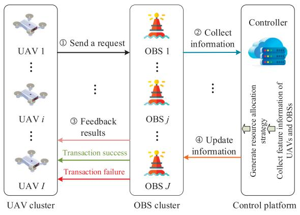

<details>
<summary>flowchart</summary>

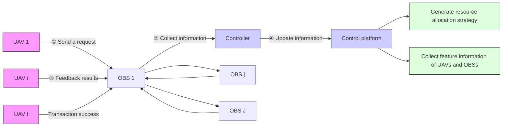
</details>

(a) Task offloading process

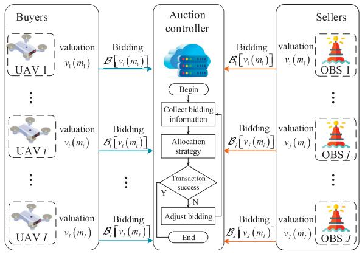

<details>
<summary>flowchart</summary>

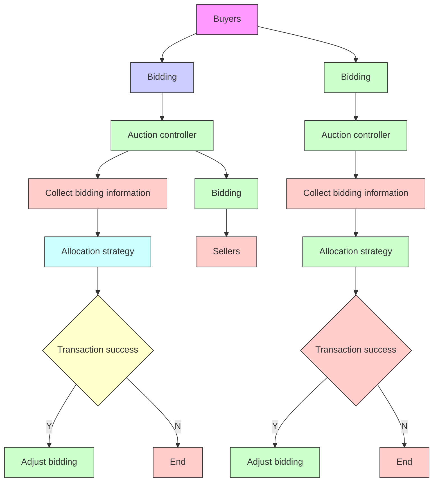
</details>

(b) Double auction process for the proposed task offloading   
Fig. 2. Procedure of the proposed resource allocation for task offloading among UAVs and OBSs.

Phase IV for the downloading result time. Let $t ^ { \mathrm { P h - I V } }$ denote the downloading result time after OBS completes task processing. Similar to [9], we consider the downloading time of the processing result as a constant, since the size of computation result is usually small.

Based on the above analysis, the overall delay for completing the workloads of UAV i can be expressed as

$$
\begin{array}{l} t _ {i} ^ {\mathrm{ove}} = \left\{ \begin{array}{l l} t ^ {\mathrm{Ph-I}} + t ^ {\mathrm{Ph-IV}} + \\ \max _ {\forall i \in \mathcal {I}} \big \{t _ {i} ^ {\mathrm{Ph-III}}, t _ {i, j} ^ {\mathrm{Ph-II}} + t _ {j} ^ {\mathrm{Ph-III}} \big \}, & \| \mathbf {l} _ {i} - \mathbf {l} _ {j} \| \leqslant R _ {j} \\ t _ {i} ^ {\mathrm{fly}} + t ^ {\mathrm{Ph-I}} + t ^ {\mathrm{Ph-IV}} + \\ \max _ {\forall i \in \mathcal {I}} \big \{t _ {i} ^ {\mathrm{Ph-III}}, t _ {i, j} ^ {\mathrm{Ph-II}} + t _ {j} ^ {\mathrm{Ph-III}} \big \}, & \| \mathbf {l} _ {i} - \mathbf {\boldsymbol {l}} _ {j} \| > R _ {j}, \end{array} \right. \\ \forall i \in \mathcal {I}, \forall j \in \mathcal {J}. \tag {13} \\ \end{array}
$$

Let $\kappa _ { i }$ denote the power consumption coefficient of UAV i. The local energy consumption of UAV i can be expressed as

$$
E _ {i} ^ {\mathrm{loc}} = \kappa_ {i} \eta_ {i} ^ {3} t _ {i} ^ {\mathrm{Ph-III}} = \kappa_ {i} \varrho_ {i} \eta_ {i} ^ {2} (1 - \epsilon_ {i}) S _ {i} ^ {\mathrm{tot}}, \forall i \in \mathcal {I}. \tag {14}
$$

According to (8), the transmission power of UAV i can be expressed as

$$
P _ {i} = n W _ {j} L _ {i, j} \left(2 ^ {\frac {r _ {i , j}}{W _ {j}}} - 1\right), \forall i \in \mathcal {I}, \forall j \in \mathcal {J}. \tag {15}
$$

Combining with (9), the energy consumption of UAV i for offloading workloads $\epsilon _ { i } S _ { i } ^ { \mathrm { t o t } }$ can be denoted as

$$
\begin{array}{l} E _ {i} ^ {\text {off}} = P _ {i} t _ {i, j} ^ {\text {Ph - II}} = t _ {i, j} ^ {\text {Ph - II}} n W _ {j} L _ {i, j} \left(2 ^ {\frac {\epsilon_ {i} S _ {i} ^ {\text {tot}}}{W _ {j} t _ {i , j} ^ {\text {Ph - II}}}} - 1\right), \\ \forall i \in \mathcal {I}, \quad \forall j \in \mathcal {J}. \tag {16} \\ \end{array}
$$

Based on the above analysis, the energy consumption of UAV i for completing its task consists of the movement energy, local computing energy and the offloading transmission energy, which can be expressed as

$$
E _ {i} ^ {\mathrm{UAV}} = E _ {i} ^ {\mathrm{mov}} + E _ {i} ^ {\mathrm{loc}} + E _ {i} ^ {\mathrm{off}}, \forall i \in \mathcal {I}. \tag {17}
$$

The total system energy consumption of all OBSs and UAVs can be expressed as

$$
E ^ {\mathrm{tot}} = \sum_ {i = 1} ^ {I} E _ {i} ^ {\mathrm{UAV}} + \sum_ {j = 1} ^ {J} E _ {j} ^ {\mathrm{OBS}}. \tag {18}
$$

# D. Problem Formulation for System Revenue

In this subsection, we formulate a joint optimization problem for the total system welfare and the total energy consumption of OBSs and UAVs to complete the total workloads, with the objective of optimizing the resource allocation and OBS selection in marine edge computing networks.

Let $\Delta _ { i , j } \left( m _ { i } \right) \in \{ 0 , 1 \}$ denote the decision variable that whether UAV i offloads task mi to OBS j or not. If UAV i offloads task $m _ { i }$ to OBS j, $\Delta _ { i , j } \left( m _ { i } \right) \ = \ 1$ . Otherwise, $\Delta _ { i , j } \left( m _ { i } \right) = 0$ . In order to describe the system welfare for both UAV and OBS, a concept named utility is introduced in our considered scenario [33]. Specifically, the utility of UAV i (which is the purchaser to buy computing service from OBS) is defined as its valuation $\nu _ { i } \left( m _ { i } \right)$ minus the transaction price $\Upsilon _ { i } \left( m _ { i } \right)$ (defined in Section IV-B) for offloading task $m _ { i }$ . The valuation $\nu _ { i } \left( m _ { i } \right)$ of UAV i is related to the offloading workloads and the required computing resource. As the service buyer, UAV i expects to pay as less transaction price as possible to maximize its utility. When UAV i offloads task $m _ { i }$ to OBS j, the utility of UAV i can be defined as follows

$$
\begin{array}{l} U _ {i} \left(m _ {i}\right) = \left\{ \begin{array}{l l} \nu_ {i} \left(m _ {i}\right) - \Upsilon_ {i} \left(m _ {i}\right), & \Delta_ {i, j} \left(m _ {i}\right) = 1 \\ 0, & \Delta_ {i, j} \left(m _ {i}\right) = 0, \end{array} \right. \\ \forall i \in \mathcal {I}, \forall j \in \mathcal {J}. \tag {19} \\ \end{array}
$$

The utility of OBS j (which is the seller to provide computing service to UAV) is measured by the difference between the transaction price $\Upsilon _ { i } \left( m _ { i } \right)$ and its valuation $\nu _ { j } \left( m _ { i } \right)$ (defined in Section IV-B) for completing task $m _ { i }$ . The valuation $\nu _ { j } \left( m _ { i } \right)$ of OBS j is evaluated by the required communication and computing resources. As the service seller, OBS j expects to charge the transaction price as much as possible to maximize its utility. The utility of OBS j for processing task $m _ { i }$ can be expressed as

$$
\begin{array}{l} U _ {j} \left(m _ {i}\right) = \left\{ \begin{array}{l l} \Upsilon_ {i} \left(m _ {i}\right) - \nu_ {j} \left(m _ {i}\right), & \Delta_ {i, j} \left(m _ {i}\right) = 1 \\ 0, & \Delta_ {i, j} \left(m _ {i}\right) = 0, \end{array} \right. \\ \forall i \in \mathcal {I}, \forall j \in \mathcal {J}. \tag {20} \\ \end{array}
$$

In marine edge computing system, we consider that the total system welfare is defined as the summation of the total utilities

of UAVs and OBSs, i.e.,

$$
U ^ {\text { tot }} = \sum_ {i = 1} ^ {I} U _ {i} (m _ {i}) + \sum_ {j = 1} ^ {J} U _ {j} (m _ {i}). \tag {21}
$$

Based on the above modelings, we aim at maximizing the system revenue, i.e., the difference between the system welfare and the total energy consumption of UAVs and OBSs for completing all tasks, by jointly optimizing the offloading decision $\epsilon _ { i } , \forall i \in \mathcal { T }$ $\Delta _ { i , j } \left( m _ { i } \right) , \forall i \ \in \ { \mathcal { T } } , j \ \in \ { \mathcal { I } }$ , and the transmission time tPh-II, $t _ { i , j } ^ { \mathrm { P h - I I } } , \forall i \in \mathcal { T } , j \in \mathcal { \bar { I } }$ , the offloading ratio . The “Maximum System Revenue”)

$$
(\mathrm{MSR}): R ^ {\mathrm{tot}} = \max U ^ {\mathrm{tot}} - \varpi E ^ {\mathrm{tot}}
$$

$\mathrm { s u b j e c t ~ t o : ~ } \Delta _ { i , j } \left( m _ { i } \right) \in \left\{ 0 , 1 \right\} , \forall i \in \mathcal { I } , \forall j \in \mathcal { I } ,$ (22)

$$
0 \leq \sum_ {i = 1} ^ {I} \Delta_ {i, j} (m _ {i}) \varrho_ {j} \leq \varrho_ {j} ^ {\max}, \forall j \in \mathcal {J}, \tag {23}
$$

$$
0 \leq \sum_ {i = 1} ^ {I} \Delta_ {i, j} (m _ {i}) \eta_ {j} \leq \eta_ {j} ^ {\max}, \forall j \in \mathcal {J}, \tag {24}
$$

$$
0 \leq \sum_ {i = 1} ^ {I} \Delta_ {i, j} (m _ {i}) W _ {j} \leq W _ {j} ^ {\max}, \forall j \in \mathcal {J}, \tag {25}
$$

$$
0 \leq t _ {i} ^ {\text { ove }} \leq T _ {i} ^ {\max}, \forall i \in \mathcal {I}, \tag {26}
$$

$$
0 \leq t _ {i, j} ^ {\mathrm{Ph-II}} \leq T _ {i, j} ^ {\max}, \forall i \in \mathcal {I}, \forall j \in \mathcal {J}, \tag {27}
$$

$$
0 \leq S _ {i} ^ {\text { tot }} \leq S _ {i} ^ {\max}, \forall i \in \mathcal {I}, \tag {28}
$$

$$
0 \leq \epsilon_ {i} \leq 1, \forall i \in \mathcal {I}, \tag {29}
$$

$\mathrm { v a r i a b l e s : } ~ \Delta _ { i , j } \left( m _ { i } \right) , \epsilon _ { i } , t _ { i , j } ^ { \mathrm { P h \mathrm { - } I I } } , \forall i \in \mathcal { I } , \forall j \in \mathcal { I } .$ tPh-II

In Problem (MSR), parameter ϖ is a constant factor used to balance the utilities and energy consumption. Constraint (22) is a binary variable, which guarantees that one UAV can only offload a task to one OBS at a time. Constraints (23) and (24) are the computing resource conditions, which mean that the total amount of computing resources $\begin{array} { r } { ( \mathrm { i . e . , } \sum _ { i = 1 } ^ { I } \Delta _ { i , j } \left( m _ { i } \right) \varrho _ { j } } \end{array}$ and $\begin{array} { r } { \sum _ { i = 1 } ^ { I } \Delta _ { i , j } ( m _ { i } ) \eta _ { j } ) } \end{array}$ allocated to multiple UAVs cannot exceed the maximum computing resource at OBS j (i.e., $\varrho _ { j } ^ { \mathrm { m a x } }$ and $\eta _ { j } ^ { \operatorname* { m a x } } )$ . Constraint (25) denotes the communication resource condition, which guarantees that the total amount of bandwidth $( \mathrm { i . e . , ~ } \sum _ { i = 1 } ^ { I } \Delta _ { i , j } ( m _ { i } ) W _ { j } )$ allocated to multiple UAVs cannot exceed the maximum bandwidth at OBS j (i.e., $W _ { j } ^ { \mathrm { m a x } } )$ . Constraint (26) indicates the time delay condition for task offloading, which means that the overall delay for completing the workloads of UAV i cannot exceed the maximum latency $\left( \mathrm { i . e . , \ } T _ { i } ^ { \mathrm { m a x } } \right)$ . Constraint (27) means that the task offloading time in Phase II cannot exceed the delay limitation $( \mathrm { i . e . , ~ } T _ { i , j } ^ { \mathrm { m a x } } )$ . Constraint (28) guarantees that the total workloads of UAV i cannot exceed the maximum task size $\operatorname { ( i . e . , } \ S _ { i } ^ { \operatorname* { m a x } } )$ due to the limited caching size of UAV i. Constraint (29) means that the offloading ratio to OBS cannot exceed the total workloads of UAV i.

Problem (MSR) is a strictly non-convex optimization problem. There are no general algorithms to solve it efficiently. Therefore, in the next section, we focus on proposing algorithms to obtain the solutions of Problem (MSR).

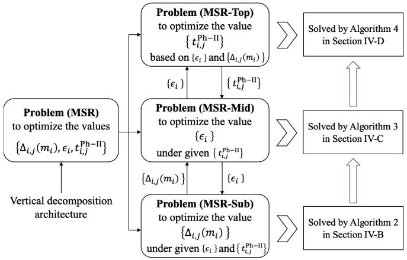

<details>
<summary>flowchart</summary>

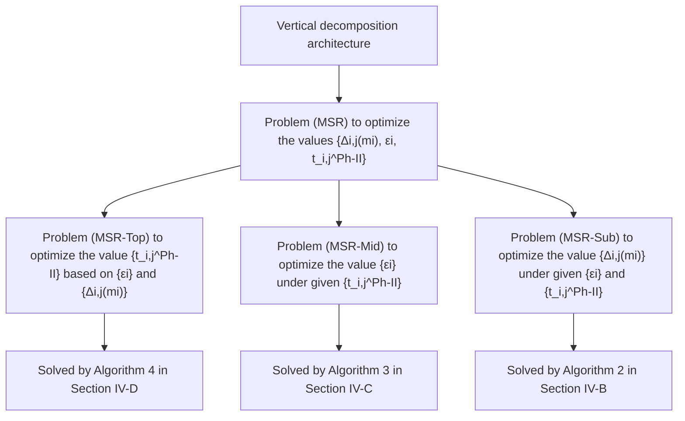
</details>

Fig. 3. An illustration of the proposed vertical decomposition architecture for solving Problem (MSR).

# IV. PROPOSED ALGORITHMS FOR SOLVING THE FORMULATED PROBLEM

# A. Analysis of Problem (MSR)

We propose a vertical decomposition architecture as shown in Fig. 3 for solving the formulated Problem (MSR). Specifically, we divide Problem (MSR) into a top-problem, a mid-problem and a sub-problem as follows.

• Given the values of $\epsilon _ { i } , t _ { i , j } ^ { \mathrm { P h - I I } } , \forall i \ \in \ { \mathcal { I } } , \forall j \ \in \ { \mathcal { I } }$ , subproblem aims to maximize the total system revenue by optimizing the decision variable $\Delta _ { i , j } \left( m _ { i } \right) , \forall i \in \mathcal { I } , \forall j \in$ J . This leads to the following sub-problem.

$$
(\text { MSR - Sub }): R _ {\text { sub }} ^ {\text { tot }} = \max U ^ {\text { tot }} - \varpi E ^ {\text { tot }}
$$

subject to : constraints (22), (23), (24), (25), and (26)

variables : $\Delta _ { i , j } \left( m _ { i } \right) , \forall i \in \mathcal { I } , \forall j \in \mathcal { I }$ .

• After determining the decision variable $\Delta _ { i , j } \left( m _ { i } \right) , \forall i \in$ $\mathcal { T } , \forall j \in \mathcal { I }$ for task offloading between UAV i and its associated OBS j, we continue to maximize the total system revenue by optimizing the offloading ratio $\epsilon _ { i } , \forall i \in$ I. This leads to the mid-problem as follows.

$$
(\text { MSR - Mid }): R _ {\text { mid }} ^ {\text { tot }} = \max R _ {\text { sub }} ^ {\text { tot }}
$$

• According to the derived offloading ratio $\begin{array} { r l } { \epsilon _ { i } , \forall i } & { { } \in } \end{array}$ I, we can further optimize the task offloading time $t _ { i , j } ^ { \mathrm { P h - I I } } , \forall i \in \mathcal { I } , \forall j \in \mathcal { T }$ in Phase II to maximize the theWe can express the top-problem as follows.

$$
(\text { MSR - Top }): R _ {\text { top }} ^ {\text { tot }} = \max R _ {\text { mid }} ^ {\text { tot }}
$$

subject to : constraint (27)

$\mathrm { v a r i a b l e s : ~ } t _ { i , j } ^ { \mathrm { P h - I I } } , \forall i \in \mathcal { I } , \forall j \in \mathcal { I } .$

The above proposed vertical decomposition architecture enables us to solve the optimization problem efficiently. Specifically, we first exploit the feature of Problem (MSR-Sub) (which is a nonlinear integer programming problem) and design algorithms (described in Section IV-B) to address it. A key observation regarding Problem (MSR-Mid) is that it the value of is strictly convex with respect to $t _ { i , j } ^ { \mathrm { P h - I I } } , \forall i \in \mathcal { I } , \forall j \in \mathcal { I }$ $\epsilon _ { i } , \forall i \in \mathcal { I }$ . According to this when given important feature, we can solve it by the convex optimization approach in Section IV-C. Moreover, exploiting the feature of Problem (MSR-Top), we find that the value of $t _ { i , j } ^ { \mathrm { P h - I I } } , \forall i \in$ $\mathcal { T } , \forall j \in \mathcal { T }$ falls within the interval $\left[ 0 , T _ { i , j } ^ { \operatorname* { m a x } } \right]$ based on constraint (27). This feature enables us to derive the optimal value of $t _ { i , j } ^ { \mathrm { P h - I I } } , \forall i \in \mathcal { T } , \forall j \in \mathcal { I }$ via a linear searching approach in Section IV-D.

# B. Proposed Algorithms for Solving Problem (MSR-Sub)

Exploiting the feature of Problem (MSR-Sub), it can be found that Problem (MSR-Sub) aims to determine which task should be offloaded to a feasible OBS, i.e., setting $\Delta _ { i , j } \left( m _ { i } \right) =$ $1 , \forall i \in \mathcal { T } , \forall j \in \mathcal { T }$ . Therefore, we can model the task offloading process among UAVs and OBSs as a many-to-many supply and demand relationship. Double auction game is an efficient approach to deal with the many-to-many supply and demand problem as a many-to-many market framework. The buyers (i.e., UAVs) and sellers (i.e., OBSs) maintain a mutual equal relationship of supply and demand for computing service. In the following, we will design a resource allocation scheme based on the double auction approach [35] to determine the offloading strategy $\Delta _ { i , j } \left( m _ { i } \right) \in \left\{ 0 , 1 \right\} , \forall i \in \mathcal { I } , \forall j \in \mathcal { I }$ .

Fig. 2(b) shows the double auction process for the proposed task offloading scheme. Three types of participants are included: the buyers (i.e., UAVs), the sellers (i.e., OBSs), and the auction controller (i.e., the leader OBS). UAVs buy computing service from the resource providers (i.e., OBSs). The auction controller is responsible for collecting the bidding information from UAVs and OBSs and broadcasting the auction results based on the designed resource allocation scheme. Here, we consider a multi-round double auction process between UAVs and OBSs for task offloading, such that both UAV and OBS can reach an agreement by adjusting their bidding strategies. The resource valuation rule is first introduced, the bidding strategy is then elicited, followed by the payment rule. Moreover, we also design a dynamic bidding adjustment strategy to improve the transaction success ratio.

1) Resource Valuation Rule for Both UAV and OBS: The task offloading process can be considered as a resource bidding market. The biddings for UAVs and OBSs are associated with their estimated values of the computing and communication resources. We combine the bidding of computing and communication resources as a whole, i.e., both UAprovide a total bidding in the market. We use $\xi _ { \mathrm { c o m p } } ^ { \mathrm { m a x } }$ OB and $\xi _ { \mathrm { c o m p } } ^ { \mathrm { m i n } }$ valuations, respectively, and use $\zeta _ { \mathrm { c o m m } } ^ { \mathrm { m a x } }$ and $\zeta _ { \mathrm { c o m m } } ^ { \mathrm { m i n } }$ to denote the maximum and minimum communication resource valuations, respectively. Therefore, the maximum and minimum total valuations of computing and communication resources for both UAV and OBS can be expressed as $v ^ { \mathrm { m a x } } = \xi _ { \mathrm { c o m p } } ^ { \mathrm { m a x } } + \zeta _ { \mathrm { c o m m } } ^ { \mathrm { m a x } }$ and υmin $v ^ { \mathrm { m i n } } = \xi _ { \mathrm { c o m p } } ^ { \mathrm { m i n } } + \zeta _ { \mathrm { c o m m } } ^ { \mathrm { m i n } }$ , respectively.

We consider that the valuation of UAV i for task $m _ { i }$ is related to the offloading workloads $\epsilon _ { i } S _ { i } ^ { \mathrm { t o t } }$ and the required computing resource $\eta _ { j }$ of OBS $j .$ If the offloading workloads $\epsilon _ { i } S _ { i } ^ { \mathrm { t o t } }$ are large, it requires high energy cost to complete it, which will lead to a high valuation for UAV i. If the deadline of task $m _ { i }$ is short, it means that the task should be completed as soon as possible, which also results in a high valuation for UAV i. Moreover, the large computing resource provided by OBS j will also lead to a high valuation for UAV i. Therefore, we can express the valuation of UAV i for offloading task $m _ { i }$ as follows

$$
\nu_ {i} (m _ {i}) = v ^ {\min} + \frac {(\omega_ {1} \epsilon_ {i} S _ {i} ^ {\mathrm{tot}} + 1) (\omega_ {2} \eta_ {j} + 1)}{\omega_ {3} T _ {i} ^ {\max} + 1} (v ^ {\max} - v ^ {\min}),
$$

$$
\forall i \in \mathcal {I}, \forall j \in \mathcal {J}, \tag {30}
$$

where parameter $\omega _ { 1 }$ is an impact factor regarding the offloading workloads $\epsilon _ { i } S _ { i } ^ { \mathrm { t o t } }$ . Parameter $\omega _ { 2 }$ means the impact factor regarding the computing resource $\eta _ { j }$ provided by OBS $j .$ Parameter $\omega _ { 3 }$ denotes the impact factor regarding the deadline $T _ { i } ^ { \mathrm { m a x } }$ of task $m _ { i }$ . To guarantee the feasibility of the double auction, the valuation of UAV i satisfies $v ^ { \mathrm { m i n } } \leq \nu _ { i } ( m _ { i } ) \leq$ $v ^ { \mathrm { m a x } } , \forall i \in \mathcal { T }$ .

We consider that the valuation of OBS j for task $m _ { i }$ is associated with the required communication resource $W _ { j }$ and computing resource $\eta _ { j }$ of $\mathrm { O B S } \ j$ . The normalized value of communication and computing resources for OBS $j$ is

$$
\mathcal {V} _ {j} ^ {\text { norm }} = \lambda_ {1} W _ {j} + \lambda_ {2} \eta_ {j}, \quad \forall j \in \mathcal {J}, \tag {31}
$$

where parameters $\lambda _ { 1 }$ and $\lambda _ { 2 }$ are the weighting factors regarding the communication resource and the computing resource of OBS j, respectively. The weighting factors are normalized as

$$
\left\{ \begin{array}{l} \lambda_ {1} = \frac {\zeta_ {\mathrm{comm}} ^ {\max} + \zeta_ {\mathrm{comm}} ^ {\min}}{v ^ {\max} + v ^ {\min}}, \\ \lambda_ {2} = \frac {\xi_ {\mathrm{comp}} ^ {\max} + \xi_ {\mathrm{comp}} ^ {\min}}{v ^ {\max} + v ^ {\min}}. \end{array} \right. \tag {32}
$$

A large total amount of resource of OBS j will lead to a low cost of the resource, which results in a small valuation for OBS j. Therefore, we can express the valuation of OBS j for processing task $m _ { i }$ as follows

$$
\nu_ {j} \left(m _ {i}\right) = v ^ {\min} + \frac {1}{\omega_ {4} \mathcal {V} _ {j} ^ {\mathrm{norm}} + 1} \left(v ^ {\max} - v ^ {\min}\right),
$$

$$
\forall i \in \mathcal {I}, \forall j \in \mathcal {J}, \tag {33}
$$

where parameter $\omega _ { 4 }$ means the impact factor regarding the total amount of communication and computing resources. The valuation of OBS $j$ should satisfy $v ^ { \mathrm { m i n } } \ \leq \ \nu _ { j } \left( m _ { i } \right) \ \leq$ $v ^ { \mathrm { m a x } } , \forall i \in \mathcal { T } , \forall j \in \mathcal { T }$ .

2) Bidding Strategies for Both UAV and OBS: In order to increase the utilities of UAV and OBS, both UAV and OBS will determine their bidding values based on the valuations. The bidding strategy of UAV i is a positive function with its valuation $\nu _ { i } \left( m _ { i } \right)$ . Specifically, the bidding strategy of UAV i is affected by the deadline of task $m _ { i }$ , the workloads $\epsilon _ { i } S _ { i } ^ { \mathrm { { t o t } } }$ and the computing resource $\eta _ { j }$ , i.e., the bidding value of UAV i is inversely proportional to the value of $T _ { i } ^ { \mathrm { m a x } }$ and proportional to the values of $\epsilon _ { i } S _ { i } ^ { \mathrm { t o t } }$ and $\eta _ { j }$ . Therefore, the bidding function of UAV i can be expressed as

$$
\mathcal {B} _ {i} \left[ \nu_ {i} (m _ {i}) \right] = \nu_ {i} (m _ {i}) \frac {1 - \varepsilon_ {1} T _ {i} ^ {\max}}{\left(1 - \varepsilon_ {2} \epsilon_ {i} S _ {i} ^ {\mathrm{tot}}\right) \left(1 - \varepsilon_ {3} \eta_ {j}\right)},
$$

$$
\forall i \in \mathcal {I}, \forall j \in \mathcal {J}, \tag {34}
$$

where parameters $\varepsilon _ { 1 } , \varepsilon _ { 2 }$ and $\varepsilon _ { 3 }$ denote the adjustment parameters. To ensure the individual rationality in double auction, the bidding value of UAV i cannot exceed its maximum valuation (i.e., the highest price that UAV i is willing to pay for task mi) defined in eq. (30).

The bidding strategy of OBS j is proportional to its valuation $\nu _ { j } \left( m _ { i } \right)$ . The bidding value of OBS j is influenced by the load-rate of the OBS, which is determined by the communication and computing resources. We can express the load-rate of OBS $j$ as

$$
\mathcal {V} _ {j} ^ {\text { rate }} = 1 - \left(\lambda_ {1} \frac {W _ {j} ^ {\max} - W _ {j}}{W _ {j} ^ {\max}} + \lambda_ {2} \frac {\eta_ {j} ^ {\max} - \eta_ {j}}{\eta_ {j} ^ {\max}}\right), \forall j \in \mathcal {J}, \tag {35}
$$

where $W _ { j } ^ { \mathrm { m a x } } \ - \ W _ { j }$ and $\eta _ { j } ^ { \mathrm { m a x } } \ : - \ : \eta _ { j }$ mean the remaining communication resource and computing resource of OBS $j ,$ respectively. If the load-rate of OBS $j$ is large, it means that OBS j has less resources, which leads to a high bidding value for OBS $j .$ The bidding function of OBS $j$ can be expressed as follows

$$
\mathcal {B} _ {j} \left[ \nu_ {j} \left(m _ {i}\right) \right] = \nu_ {j} \left(m _ {i}\right) \left(1 + \omega_ {5} \mathcal {V} _ {j} ^ {\text { rate }}\right), \forall i \in \mathcal {I}, \forall j \in \mathcal {J}, \tag {36}
$$

where $\omega _ { 5 }$ denotes the impact factor of the load-rate of OBS $j .$ Considering the individual rationality of OBS, the bidding value of OBS j should be higher than the valuation $( \mathrm { i . e . }$ , the lowest price that OBS $j$ will be charged for task $m _ { i } )$ defined in eq. (33).

3) Payment Rule for Both UAV and OBS: We adopt the $K \mathfrak { - }$ payment rule to determine the transaction price $( \mathrm { i . e . }$ , the fee paid to OBS $j$ by UAV i) for completing workloads $\epsilon _ { i } S _ { i } ^ { \mathrm { { t o t } } }$ . Parameter K means the partition factor regarding the bidding values of UAV i and OBS $j .$ The transaction price by UAV i is defined as follows

$$
\Upsilon_ {i} \left(m _ {i}\right) = K \left\{\mathcal {B} _ {i} \left[ \nu_ {i} \left(m _ {i}\right) \right] + \mathcal {B} _ {j} \left[ \nu_ {j} \left(m _ {i}\right) \right] \right\}, \forall i \in \mathcal {I}, \forall j \in \mathcal {J}. \tag {37}
$$

However, there might be some UAVs or OBSs that fail to reach an agreement for completing tasks when UAVs bid too low or OBSs charge too high, resulting in that UAVs cannot complete their tasks and the resource utilization of OBSs is low. Therefore, we introduce a dynamic bidding adjustment strategy for UAVs and OBSs to adjust their bidding values and improve the transaction success ratio. The details are introduced as follows.

As the increasing number of UAVs and OBSs fail to reach an agreement, UAV i (i.e., buyer) will gradually increase its bidding $B _ { i } \left[ \nu _ { i } \left( m _ { i } \right) \right]$ to buy resource from OBS. Let M be the number of UAVs or OBSs that failed in task transaction. We can express the bidding adjustment function of UAV i as follows

$$
\Psi_ {i} \left\{M, \mathcal {B} _ {i} \left[ \nu_ {i} (m _ {i}) \right] \right\} = \mathcal {B} _ {i} \left[ \nu_ {i} (m _ {i}) \right] \left[ 1 + \left(\iota_ {1} M\right) ^ {\delta_ {1}} \right], \forall i \in \mathcal {I}, \tag {38}
$$

where parameter $\iota _ { 1 }$ denotes the increment magnitude. Parameter $\delta _ { 1 }$ denotes the incremental-rate control factor for the bidding value of UAV i. The bidding adjustment function for UAV i cannot exceed its valuation threshold, i.e., the bidding value for UAV i will not increase until it reaches the maximum valuation.

Different from the bidding strategy of UAV i, OBS $j$ will gradually decrease its bidding $B _ { j } \ [ \nu _ { j } \ ( m _ { i } ) ]$ for selling resource. The bidding adjustment function for OBS $j$ can be expressed as follows

$$
\Psi_ {j} \left\{M, \mathcal {B} _ {j} \left[ \nu_ {j} (m _ {i}) \right] \right\} = \mathcal {B} _ {j} \left[ \nu_ {j} (m _ {i}) \right] \left[ 1 - (\iota_ {2} M) ^ {\delta_ {2}} \right],
$$

$$
\forall i \in \mathcal {I}, \forall j \in \mathcal {J}, \tag {39}
$$

where parameter $\iota _ { 2 }$ means the increment magnitude. Parameter $\delta _ { 2 }$ means the decrement-rate control factor for the bidding value of OBS $j .$ . The bidding adjustment function for OBS $j$ should be higher than the valuation threshold. The bidding value for OBS j will not decrease until it reaches the minimum valuation. Therefore, based on the bidding adjustment functions in eq. (38) and eq. (39), UAV i and OBS j can dynamically adjust their biddings to reach an agreement.

Based on the above analysis, we propose algorithms to solve Problem (MSR-Sub). To classify the set of feasible OBSs for each UAV, we introduce a concept, named preference, for OBS selection based on the distance between UAV and OBS and the resource provided by OBS. If the distance between UAV i and OBS $j$ is closer, the task offloading time will be shorter. UAV i also prefers the OBS with more remaining resources (i.e., communication resource $W _ { j } ^ { \mathrm { m a x } } - W _ { j }$ and computing resource $\eta _ { j } ^ { \mathrm { m a x } } - \eta _ { j } )$ , which can improve the efficiency of task processing. Therefore, the preference function of UAV i for OBS $j$ can be expressed as

$$
\Xi_ {i, j} = \gamma_ {1} \frac {1}{\| \mathbf {l} _ {i} - \mathbf {l} _ {j} \|} + \gamma_ {2} \left(W _ {j} ^ {\max} - W _ {j}\right) + \gamma_ {3} \left(\eta_ {j} ^ {\max} - \eta_ {j}\right),
$$

$$
\forall i \in \mathcal {I}, \forall j \in \mathcal {J}, \tag {40}
$$

where $\gamma _ { 1 } , ~ \gamma _ { 2 }$ and $\gamma _ { 3 }$ denote the weighting parameters to normalize the preference. Based on the preference function, each UAV can choose the feasible OBS with the highest preference. We propose Algorithm 1 to classify the set of OBSs for each UAV based on the distance $\| \mathbf { l } _ { i } - \mathbf { l } _ { j } \|$ and the preference function $\Xi _ { i , j }$ . The key steps of Algorithm 1 are explained as follows.

• Step 3 to Step 10: We first calculate the distance between UAV i and OBS $j .$ If the distance $\| \boldsymbol { 1 } _ { i } - \boldsymbol { 1 } _ { j } \|$ is lower than the covering radius of OBS j, we add the set of available OBSs $\mathcal { T } _ { i }$ to UAV i.   
• Step 12 to Step 18: We calculate the preference value of UAV i to OBS j for obtaining the preference list $\Xi _ { i , j }$ . Then, we sort the preference in descending order and obtain the appropriate OBS index with the largest preference $\mathcal { T } _ { i } ^ { \prime } \gets \operatorname* { m a x } _ { j \in \mathcal { I } } \left\{ \Xi _ { i , j } \right\}$ .

Based on the classified OBSs and UAVs, we propose Algorithm 2 to determine the resource allocation strategy in Problem (MSR-Sub). To improve the transaction success ratio, the auction at the OBS will last for N -rounds, i.e., UAV i and OBS j can dynamically adjust their biddings based on eq. (38) and eq. (39). In each auction round, we allocate the resource of OBS to each UAV by checking whether constraint (26) satisfies the delay requirement or not. Once the transaction between UAV i and OBS j is successful, we record the offloading decision $\Delta _ { i , j } \left( m _ { i } \right)$ and the current system revenue. The key steps of Algorithm 2 are explained as follows.

Algorithm 1 Proposed Algorithm to Classify the Set of OBSs for Each UAV   
1: Input: Given the set of UAVs I and the set of OBSs J.
2: Initialization: Initialize the set of available OBSs for UAVs as $I_{1} = I_{2} = \cdots = I_{I} = \emptyset$ .
3: for $i \in I$ do
4:    for $j \in J$ do
5:    if $\|l_{i} - l_{j}\| \leq R_{j}$ then
6:    add index j of OBS to set $I_{i}$ .
7:    end if
8:    end for
9:    add the set of available OBSs $I_{i}$ to UAV i.
10: end for
11: Initialize the appropriate OBSs for UAVs as $I_{1}' = I_{2}' = \cdots = I_{I}' = \emptyset$ .
12: for $i \in I$ do
13:    for $j \in J$ do
14:    calculate the preference function $\Xi_{i,j}$ by using (40).
15:    end for
16:    sort the preferences in descending order.
17:    obtain the appropriate OBS index with the largest preference $I_{i}' \leftarrow \max_{j \in J} \{\Xi_{i,j}\}$ .
18: end for
19: Output: The set of available OBSs $I_{i}$ and the appropriate OBS $I_{i}'$ for each UAV.

• Step 3 to Step 10: We first invoke Algorithm 1 to obtain the set of classified OBSs. Then, the valuation and bidding values for each UAV and OBS are calculated in preparation for double auction.   
• Step 13 to Step 17: If the bidding value of UAV i is greater than that of OBS j, we need to check whether the offloading requirements (i.e., communication, computing and delay demands) of UAV i are satisfied or not. If the requirements of UAV i are satisfied, the resource allocation is successful. We update the remaining resources of OBS $j .$   
• Step 18 to Step 20: If the resource allocation between UAV i and OBS j is successful, we record the total system revenue $R _ { \mathrm { s u b } } ^ { \mathrm { t o t } }$ and the allocation strategy $\Delta _ { i , j } \left( m _ { i } \right)$ .   
• Step 22 to Step 27: If the bidding value of UAV i is lower than that of OBS $j ,$ we need to adjust their bidding strategies and wait for the next round of the auction. Otherwise, Problem (MSR-Sub) is infeasible. Finally, we can derive the optimal system revenue $R _ { \mathrm { s u b } } ^ { \mathrm { t o t } \ * }$ and the corresponding allocation strategy $\Delta _ { i , j } ^ { * } \left( m _ { i } \right)$ in Problem (MSR-Sub).

Proposition 1: The proposed algorithm for resource allocation in Problem (MSR-Sub) satisfies individual rationality.

Proof: As a rational participant in the system, the utility of each participant should be higher than zero. According to the payment rule defined in eq. (37), we consider that the transaction price is the average bidding values of UAV i and OBS j, i.e., $\begin{array} { r } { \dot { \Upsilon _ { i } } \left( m _ { i } \right) = \frac { 1 } { 2 } \left\{ \mathcal { B } _ { i } \left[ \bar { \nu _ { i } } \left( m _ { i } \right) \right] + \mathcal { B } _ { j } \left[ \nu _ { j } \left( m _ { i } \right) \right] \right\} } \end{array}$ . If UAV i and OBS j reach an agreement, i.e., the transaction is successful $( \Delta _ { i , j } \left( m _ { i } \right) \ = \ 1 )$ , it can be identified that $B _ { i } \left[ \nu _ { i } \left( m _ { i } \right) \right] >$ $B _ { j } \left[ \nu _ { j } \left( m _ { i } \right) \right]$ . For UAV i, the valuation $\nu _ { i } \left( m _ { i } \right)$ is the highest bidding value of UAV $i , \mathrm { i . e . , } \nu _ { i } \left( m _ { i } \right) > B _ { i } \left[ \nu _ { i } \left( m _ { i } \right) \right]$ ]. Therefore, the utility of UAV i satisfies

$$
\begin{array}{l} U _ {i} \left(m _ {i}\right) = \nu_ {i} \left(m _ {i}\right) - \Upsilon_ {i} \left(m _ {i}\right) \\ = \nu_ {i} (m _ {i}) - \frac {1}{2} \left\{\mathcal {B} _ {i} [ \nu_ {i} (m _ {i}) ] + \mathcal {B} _ {j} [ \nu_ {j} (m _ {i}) ] \right\} \\ \end{array}
$$

Algorithm 2 Proposed Algorithm to Determine the Resource Allocation Strategy in Problem (MSR-Sub)   
1: Input: Given the set of UAVs $\mathcal{I}$ , the set of OBSs $\mathcal{J}$ and the auction round $\mathcal{N}$ .
2: Initialization: Set the current best value CBV as a very small number, and set the current best solution as CBS = $\emptyset$ .
3: Invoke Algorithm 1 to obtain the set of classified OBSs.
4: for $n = 1 : \mathcal{N}$ do
5:    for $i \in \mathcal{I}$ do
6:    calculate $\nu_i(m_i)$ and $\mathcal{B}_i[\nu_i(m_i)]$ by using (30) and (34).
7:    end for
8:    for $j \in \mathcal{J}$ do
9:    calculate $\nu_j(m_i)$ and $\mathcal{B}_j[\nu_j(m_i)]$ by using (33) and (36).
10:    end for
11:    for $i \in \mathcal{I}_i'$ do
12:    for $j \in \mathcal{J}$ do
13:    if $\mathcal{B}_i[\nu_i(m_i)] > \mathcal{B}_j[\nu_j(m_i)]$ then
14:    if $j \in \mathcal{I}_i$ then
15:    if $\eta_j \leq \eta_j^{\max}, \varrho_j \leq \varrho_j^{\max}, W_j \leq W_j^{\max}$ and $t_i^{\text{ove}} \leq T_i^{\text{max}}$ are satisfied, set $\Delta_{i,j}(m_i) = 1$ .
16:    update $\eta_j^{\max} \leftarrow \eta_j^{\max} - \eta_j, \varrho_j^{\max} \leftarrow \varrho_j^{\max} - \varrho_j$ and $W_j^{\max} \leftarrow W_j^{\max} - W_j$ .
17:    end if
18:    if $\Delta_{i,j}(m_i) == 1$ then
19:    if $R_{\text{sub}}^{\text{tot}}$ outputted by Problem (MSR-Sub) satisfies CBV < $R_{\text{sub}}^{\text{tot}}$ , update CBV = $R_{\text{sub}}^{\text{tot}}$ , record CBS = $\Delta_{i,j}(m_i)$ .
20:    end if
21:    else
22:    update the bidding strategy by using (38) and (39).
23:    else
24:    Problem (MSR-Sub) is infeasible.
25:    end if
26:    end for
27:    end for
28: end for
29: Output: The optimal value of Problem (MSR-Sub) $R_{\text{sub}}^{\text{tot}} * = \text{CBV}$ and the corresponding solution set $\Delta_{i,j}^{*}(m_i) = \text{CBS}$ .

$$
\begin{array}{l} > \mathcal {B} _ {i} [ \nu_ {i} (m _ {i}) ] - \frac {1}{2} \left\{\mathcal {B} _ {i} [ \nu_ {i} (m _ {i}) ] + \mathcal {B} _ {j} [ \nu_ {j} (m _ {i}) ] \right\} \\ = \frac {1}{2} \left\{\mathcal {B} _ {i} \left[ \nu_ {i} (m _ {i}) \right] - \mathcal {B} _ {j} \left[ \nu_ {j} (m _ {i}) \right] \right\} > 0. \tag {41} \\ \end{array}
$$

For OBS j, the valuation $\nu _ { j } \left( m _ { i } \right)$ is the lowest bidding of OBS j, i.e., $\nu _ { j } \left( m _ { i } \right) < B _ { j } \left[ \nu _ { j } \left( \bar { m } _ { i } \right) \right]$ . Therefore, the utility of OBS j can be rewritten as follows

$$
\begin{array}{l} U _ {j} \left(m _ {i}\right) = \Upsilon_ {i} \left(m _ {i}\right) - \nu_ {j} \left(m _ {i}\right) \\ = \frac {1}{2} \left\{\mathcal {B} _ {i} \left[ \nu_ {i} (m _ {i}) \right] + \mathcal {B} _ {j} \left[ \nu_ {j} (m _ {i}) \right] \right\} - \nu_ {j} (m _ {i}) \\ > \frac {1}{2} \left\{\mathcal {B} _ {i} \left[ \nu_ {i} (m _ {i}) \right] + \mathcal {B} _ {j} \left[ \nu_ {j} (m _ {i}) \right] \right\} - \mathcal {B} _ {j} \left[ \nu_ {j} (m _ {i}) \right] \\ = \frac {1}{2} \left\{\mathcal {B} _ {i} \left[ \nu_ {i} (m _ {i}) \right] - \mathcal {B} _ {j} \left[ \nu_ {j} (m _ {i}) \right] \right\} > 0. \tag {42} \\ \end{array}
$$

Based on the above analysis, the utilities of both UAV and OBS are non-negative. Therefore, the proposed algorithm for solving Problem (MSR-Sub) satisfies the individual rationality. This completes our proof.

Proposition 2: The proposed algorithm for solving Problem (MSR-Sub) satisfies incentive compatibility.

Proof: In the proposed double auction game, to improve the transaction success ratio, UAV i should increase its bidding and OBS j should decrease its bidding based on the dynamic bidding adjustment strategy defined in eq. (38) and $e q .$ (39). For UAV i, as the bidding value $B _ { i } \left[ \nu _ { i } \left( m _ { i } \right) \right]$ continues to increase, the utility of UAV i will gradually decrease. Although reducing the bidding can increase the utility of UAV i, it will reduce the success ratio of the transaction, even lead to transaction failure when the bidding of UAV i is less than that of OBS j. Similarly, as the bidding value $B _ { j } \left[ \nu _ { j } \left( m _ { i } \right) \right]$ of OBS j decreases, the utility of OBS j will gradually decrease. Although increasing the bidding of OBS can increase its utility, the high transaction price will cause the transaction failure when the bidding of OBS j is higher than that of UAV i. According to the above analysis for the bidding strategies of UAV and OBS, it can be identified that both UAV and OBS will provide their real biddings in the auction. Therefore, the proposed algorithm for solving Problem (MSR-Sub) satisfies incentive compatibility. This completes our proof.

# C. Proposed Algorithms for Solving Problem (MSR-Mid)

After determining the resource allocation strategy in Problem (MSR-Sub), we then solve Problem (MSR-Mid) to obtain the optimal offloading ratio $\epsilon _ { i } .$ . We first identify the following important feature for Problem (MSR-Mid).

Proposition 3: Problem (MSR-Mid) is a concave optimization problem with respect to $\epsilon _ { i } .$ .

Proof: According to (13), when determining the value of $\Delta _ { i , j } \left( m _ { i } \right)$ , there are two cases for completing the workloads of UAV i. Since the flying time $t _ { i } ^ { \mathrm { f l y } }$ of UAV i does not affect the offloading ratio, we ignore this impact.

Case 1. The overall delay is denoted as $t _ { i } ^ { \mathrm { o v e } } = t ^ { \mathrm { P h - I } } +$ $t ^ { \mathrm { P h - I V } } + t _ { i } ^ { \mathrm { P h - I I I } }$ i  we can calculate the first derivative of $R _ { \mathrm { m i d } } ^ { \mathrm { t o t } }$ $\epsilon _ { i }$

$$
\begin{array}{l} \frac {\partial R _ {\mathrm{mid}} ^ {\mathrm{tot}}}{\partial \epsilon_ {i}} = \sum_ {i = 1} ^ {I} \frac {\omega_ {1} S _ {i} ^ {\mathrm{tot}} \left(\omega_ {2} \eta_ {j} + 1\right) \left(v ^ {\max} - v ^ {\min}\right)}{\omega_ {3} T _ {i} ^ {\max} + 1} \\ - \varpi \sum_ {i = 1} ^ {I} \left(n L _ {i, j} S _ {i} ^ {\mathrm{tot}} 2 ^ {\frac {\epsilon_ {i} S _ {i} ^ {\mathrm{tot}}}{W _ {j} t _ {i , j} ^ {\mathrm{Ph-II}}}} \ln 2 \right. \\ - \left. \frac {p _ {i} ^ {\mathrm{hov}} \varrho_ {i} S _ {i} ^ {\mathrm{tot}}}{\eta_ {i}} - \kappa_ {i} \varrho_ {i} \eta_ {i} ^ {2} S _ {i} ^ {\mathrm{tot}}\right) \\ - \varpi \sum_ {j = 1} ^ {J} \kappa_ {j} \varrho_ {j} \eta_ {j} ^ {2} S _ {i} ^ {\text { tot }}. \tag {43} \\ \end{array}
$$

The second derivative of $R _ { \mathrm { m i d } } ^ { \mathrm { t o t } }$ with respect to $\epsilon _ { i }$ can be expressed as

$$
\frac {\partial^ {2} R _ {\mathrm{mid}} ^ {\mathrm{tot}}}{\partial \epsilon_ {i} ^ {2}} = - \varpi \sum_ {i = 1} ^ {I} \frac {n L _ {i , j} (S _ {i} ^ {\mathrm{tot}} \ln 2) ^ {2}}{W _ {j} t _ {i , j} ^ {\mathrm{Ph-II}}} 2 ^ {\frac {\epsilon_ {i} S _ {i} ^ {\mathrm{tot}}}{W _ {j} t _ {i , j} ^ {\mathrm{Ph-II}}}} <   0. \tag {44}
$$

Case 2. The overall delay is expressed as $t _ { i } ^ { \mathrm { o v e } } = t ^ { \mathrm { P h - I } } +$ $t ^ { \mathrm { P h - I V } } + t _ { i , j } ^ { \mathrm { P h - I I } } + t _ { j } ^ { \mathrm { P h - I I I } }$ ti,j , the first derivative of $R _ { \mathrm { m i d } } ^ { \mathrm { t o t } }$ with respect to $\epsilon _ { i }$ can be calculated as follows

$$
\begin{array}{l} \frac {\partial R _ {\mathrm{mid}} ^ {\mathrm{tot}}}{\partial \epsilon_ {i}} = \sum_ {i = 1} ^ {I} \frac {\omega_ {1} S _ {i} ^ {\mathrm{tot}} (\omega_ {2} \eta_ {j} + 1) (v ^ {\max} - v ^ {\min})}{\omega_ {3} T _ {i} ^ {\max} + 1} \\ - \varpi \sum_ {i = 1} ^ {I} \left(n L _ {i, j} S _ {i} ^ {\mathrm{tot}} 2 ^ {\frac {\epsilon_ {i} S _ {i} ^ {\mathrm{tot}}}{W _ {j} t _ {i , j} ^ {\mathrm{Ph-II}}}} \ln 2 \right. \\ \left. + \frac {p _ {i} ^ {\mathrm{hov}} \varrho_ {j} S _ {i} ^ {\mathrm{tot}}}{\eta_ {j}} - \kappa_ {i} \varrho_ {i} \eta_ {i} ^ {2} S _ {i} ^ {\mathrm{tot}}\right) \\ \end{array}
$$

Algorithm 3 Proposed Algorithm to Find the Optimal Offloading Ratio in Problem (MSR-Mid)   
1: Input: Given the values of $\Delta_{i,j}(m_i)$ and $t_{i,j}^{Ph-II}$ .
2: Initialization: Set the upper bound as $\epsilon_{i}^{ub}=1$ and the lower bound as $\epsilon_{i}^{ub}=0$ , set the computation-error as a very small value $\iota$ .
3: Invoke Algorithm 2 to obtain the offloading decision.
4: if $t_{i}^{Ph-III}>t_{i,j}^{Ph-II}+t_{j}^{Ph-III}$ then
5: if $\lim_{\epsilon_{i}^{exist}\to0}\frac{\partial R_{mid}^{tot}}{\partial\epsilon_{i}^{exist}}<0$ then
6: set $\epsilon_{i}^{*}=0$ .
7: else
8: if $\lim_{\epsilon_{i}^{exist}\to1}\frac{\partial R_{mid}^{tot}}{\partial\epsilon_{i}^{exist}}>0$ then
9: set $\epsilon_{i}^{*}=1$ .
10: else
11: $\epsilon_{i}^{*}=\epsilon_{i}^{exist}$ , where the value of $\epsilon_{i}^{exist}$ can be derived via a bisection-search method within the interval [0,1].
12: go to Step 18.
13: end if
14: end if
15: else
16: go to Step 5.
17: end if
18: while $\epsilon_{i}^{ub}-\epsilon_{i}^{lb}>\iota$ do
19: compute the current value as $\epsilon_{i}^{cur}=\frac{\epsilon_{i}^{ub}+\epsilon_{i}^{ul}}{2}$ .
20: compute the value of $\frac{\partial R_{mid}^{tot}}{\partial\epsilon_{i}^{cur}}$ by (43).
21: if $\frac{\partial R_{mid}^{tot}}{\partial\epsilon_{i}^{cur}}>0$ then
22: set the lower bound as $\epsilon_{i}^{lb}=\epsilon_{i}^{cur}$ .
23: else
24: set the upper bound as $\epsilon_{i}^{ub}=\epsilon_{i}^{cur}$ .
25: end if
26: end while
27: set $\epsilon_{i}^{*}=\epsilon_{i}^{cur}$ .
28: Output: The maximum value of $R_{mid}^{tot}$ for Problem (MSR-Mid) and the corresponding solution $\epsilon_{i}^{*}$ .

$$
- \varpi \sum_ {j = 1} ^ {J} \kappa_ {j} \varrho_ {j} \eta_ {j} ^ {2} S _ {i} ^ {\text { tot }}. \tag {45}
$$

The second derivative of $R _ { \mathrm { m i d } } ^ { \mathrm { t o t } }$ with respect to $\epsilon _ { i }$ is the same one as shown in eq. (44). Therefore, combining Case 1 with Case 2, we can identify that Problem (MSR-Mid) is a concave optimization problem. This completes our proof.

The feature of Proposition 3 enables us to solve Problem (MSR-Mid) efficiently. Specifically, according to eq. (44), we can identify that the first derivative of $R _ { \mathrm { m i d } } ^ { \mathrm { t o t } }$ is strictly decreasing with the value of $\epsilon _ { i } .$ . There must exist an $\epsilon _ { i } ^ { \mathrm { e x i s t } }$ that makes $\frac { \partial \breve { R } _ { \mathrm { m i d } } ^ { \mathrm { t o t } } } { \partial \epsilon _ { i } ^ { \mathrm { e x i s t } } } = 0$ . To obtain the optimal offloading ratio $\boldsymbol { \epsilon } _ { i } ^ { * }$ of UAV i, we propose Algorithm 3 to find the optimal solution. The key steps of Algorithm 3 are as follows.

• Step 4 to Step 6: If the local computing delay is higher than the offloading delay (i.e., $\begin{array} { r } { t _ { i } ^ { \mathrm { P h - I I I } } > \dot { \bar { { t } } } _ { i , j } ^ { \mathrm { P h - \overline { { \mathrm { I I } } } } } + } \end{array}$ tPh−IIIj ), we will invoke Case 1. Notice that the first $t _ { i } ^ { \mathrm { P h - I I I } } )$ derivative of value of $\epsilon _ { i }$ falls within [0, 1]. If $R _ { \mathrm { m i d } } ^ { \mathrm { t o t } }$ is strictly decreasing with $\begin{array} { r } { \operatorname* { l i m } _ { \epsilon _ { i } ^ { \mathrm { e x i s t } } \longrightarrow 0 } \frac { \partial R _ { \mathrm { m i d } } ^ { \mathrm { t o t } } } { \partial \epsilon _ { i } ^ { \mathrm { e x i s t } } } < 0 } \end{array}$ $\epsilon _ { i }$ , and the is satisfied, the optimal offloading ratio should be $\epsilon _ { i } ^ { * } \ =$ 0 that can maximize the value of $R _ { \mathrm { m i d } } ^ { \mathrm { t o t } }$ .   
• Step 8 to Step 9: If ϵexisti →1 $\operatorname* { l i m } _ { \epsilon _ { i } ^ { \mathrm { e x i s t } } \longrightarrow 1 } \frac { \partial R _ { \mathrm { m i d } } ^ { \mathrm { t o t } } } { \partial \epsilon _ { i } ^ { \mathrm { e x i s t } } } > 0$ is satisfied, the optimal offloading ratio should be $\epsilon _ { i } ^ { * } = 1$ that can maximize the value of $R _ { \mathrm { m i d } } ^ { \mathrm { t o t } }$ .

Algorithm 4 Proposed Algorithm to Find the Optimal Offloading Time in Problem (MSR-Top)   
1: Input: Given the small step size $\ell$ , set the lower bound of the offloading time as $t_{i,j}^{\mathrm{lb}} = 0$ and the upper bound as $t_{i,j}^{\mathrm{ub}} = T_{i,j}^{\max}$ .

2: Initialization: Set the current best value CBV of $R_{\mathrm{top}}^{\mathrm{tot}}$ as a very small value, set the current best solution CBS as $\left\{\Delta_{i,j}(m_i), \epsilon_i, t_{i,j}^{\mathrm{Ph-II}}\right\} = \emptyset$ .

3: while $t_{i,j}^{\mathrm{lb}} < t_{i,j}^{\mathrm{ub}}$ do

4: if Problem (MSR-Sub) and Problem (MSR-Mid) are feasible then

5: invoke Algorithm 2 to determine the resource allocation strategy $\Delta_{i,j}(m_i)$ .

6: invoke Algorithm 3 to obtain the offloading ratio $\epsilon_i$ .

7: calculate the current value of $R_{\mathrm{top}}^{\mathrm{tot}}$ .

8: if $\mathrm{CBV} < R_{\mathrm{top}}^{\mathrm{tot}}$ then

9: set $\mathrm{CBV} = R_{\mathrm{top}}^{\mathrm{tot}}$ .

10: set $\mathrm{CBS} = \left\{\Delta_{i,j}(m_i), \epsilon_i, t_{i,j}^{\mathrm{Ph-II}}\right\}$ .

11: end if

12: else

13: Problem (MSR-Top) is infeasible.

14: end if

15: update the step size as $t_{i,j}^{\mathrm{lb}} = t_{i,j}^{\mathrm{lb}} + \ell$ .

16: end while

17: Output: The maximum value of Problem (MSR-Top) as $R_{\mathrm{top}}^{\mathrm{tot}*} = \mathrm{CBV}$ and the corresponding solution $\left\{\Delta_{i,j}^{*}(m_i), \epsilon_i^{*}, t_{i,j}^{\mathrm{Ph-II}*}\right\} = \mathrm{CBS}$ .

• Step 11 to Step 15: In the case of $\operatorname* { l i m } _ { \epsilon _ { i } ^ { \mathrm { e x i s t } } \longrightarrow 0 } \frac { \partial R _ { \mathrm { m i d } } ^ { \mathrm { t o t } } } { \partial \epsilon _ { i } ^ { \mathrm { e x i s t } } } > 0$ and ϵexisti →0 ϵexisti →1 ∂ $\operatorname * { l i m } _ { \varepsilon _ { i } ^ { \mathrm { e x i s t } } \to 1 } \frac { \partial R _ { \mathrm { m i d } } ^ { \mathrm { t o t } } } { \partial \epsilon _ { i } ^ { \mathrm { e x i s t } } } < 0$ , the optimal offloading ratio $\boldsymbol { \epsilon } _ { i } ^ { * }$ is obtained within the interval [0, 1].   
• Step 18 to Step 28: The bisection-search approach is used to obtain the optimal offloading ratio $\boldsymbol { \epsilon } _ { i } ^ { * }$ until the computation-error is satisfied. Finally, we output the maximum value of $R _ { \mathrm { m i d } } ^ { \mathrm { t o t } ~ * }$ for Problem (MSR-Mid) and the corresponding solution $\boldsymbol { \epsilon } _ { i } ^ { * }$ .

# D. Proposed Algorithms for Solving Problem (MSR-Top)

After determining the optimal offloading ratio of Problem (MSR-Mid), we continue to maximize the total system revenue by solving Problem (MSR-Top). It can be identified that the value of $\epsilon _ { i }$ is obtained via the bisection-search approach, such that it is difficult to mathematically express the objective function of Problem (MSR-Top). Recall that constraint (27) ensures that the offloading time $t _ { i , j } ^ { \mathrm { P h - I I } }$ in Phase II falls within the interval -0, T maxi,j . This feature enables us to find the optimal value of tPh−IIi,j ∗ $t _ { i , j } ^ { \mathrm { ( p h - I I ^ { * } } }$ via the linear-search approach by a small step size. Algorithm 4 shows the proposed linear-search approach to obtain the optimal offloading time in Phase II. The key steps of Algorithm 4 are explained as follows.

• Step 1 to Step 2: In Problem (MSR-Top), we first determine the lower bound and upper bound for the offloading time tPh−IIi,j . Next, the current best value and current best ti,j $t _ { i , j } ^ { \mathrm { P h - I I } }$ solution for Problem (MSR-Top) are initialized.   
• Step 3 to Step 6: Under a given value of $t _ { i , j } ^ { \mathrm { l b } }$ , we invoke Algorithm 2 and Algorithm 3 to obtain the resource allocation strategy $\Delta _ { i , j } \left( m _ { i } \right)$ and the offloading ratio $\epsilon _ { i } ,$ respectively.   
• Step 7 to Step 11: We compute the current value of $R _ { \mathrm { t o p } } ^ { \mathrm { t o t } } .$ if $\mathrm { C B V } < R _ { \mathrm { t o p } } ^ { \mathrm { t o t } }$ is satisfied, we update the $\mathrm { C B V } = R _ { \mathrm { t o p } } ^ { \mathrm { i o t } }$ and CBS = ∆i,j (mi) , ϵi, i,j $\mathrm { C B S } = \left\{ \bar { \Delta } _ { i , j } \left( m _ { i } \right) , \epsilon _ { i } , t _ { i , j } ^ { \mathrm { P h - I I } } \right\}$ tPh−II	.

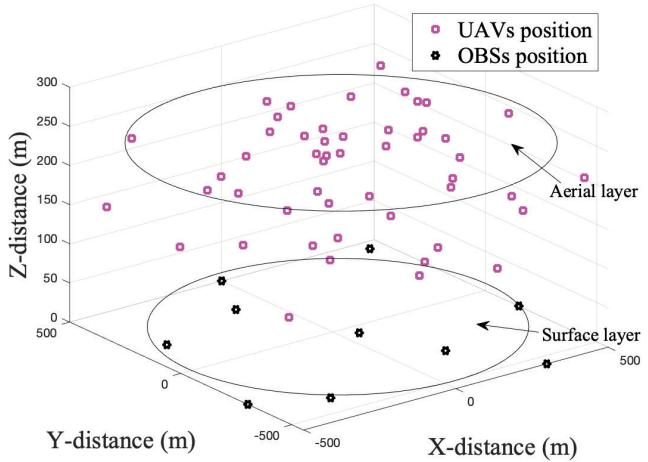

<details>
<summary>scatter</summary>

| Position Type | X-distance (m) | Y-distance (m) | Z-distance (m) |
| ------------- | -------------- | -------------- | -------------- |
| UAVs          | -100           | 150            | 250            |
| UAVs          | 0              | 200            | 280            |
| UAVs          | 100            | 220            | 260            |
| UAVs          | 200            | 240            | 270            |
| UAVs          | 300            | 260            | 290            |
| OBSs          | -100           | -50            | 50             |
| OBSs          | 0              | -200           | 80             |
| OBSs          | 100            | -100           | 60             |
| OBSs          | 200            | 0              | 40             |
| OBSs          | 300            | 100            | 30             |
</details>

Fig. 4. The simulation scenario of 3D coordinate for UAV and OBS position.

TABLE II SIMULATION PARAMETERS 

<table><tr><td>Parameters</td><td>Values</td><td>Parameters</td><td>Values</td></tr><tr><td> $I$ </td><td>50</td><td> $\alpha$ </td><td>4.88</td></tr><tr><td> $J$ </td><td>10</td><td> $\beta$ </td><td>0.43</td></tr><tr><td> $\rho^{\text{den}}$ </td><td> $1.225\text{kg/m}^{3}$ </td><td> $\theta$ </td><td>0.464rad</td></tr><tr><td> $c^{\text{pro}}$ </td><td>0.012</td><td> $\text{SLoS}$ </td><td>0.1</td></tr><tr><td> $s^{\text{rot}}$ </td><td>0.05</td><td> $\text{SNLoS}$ </td><td>21</td></tr><tr><td> $r^{\text{dis}}$ </td><td> $0.503\text{m}^{2}$ </td><td> $c$ </td><td> $3.0 \times 10^{8}\text{m/s}$ </td></tr><tr><td> $v_{\text{bla}}$ </td><td>300m/s</td><td> $f$ </td><td>2MHz</td></tr><tr><td> $r_{\text{rad}}$ </td><td>0.4m</td><td> $P_{i}$ </td><td>0.1W</td></tr><tr><td> $f^{\text{inc}}$ </td><td>0.1</td><td> $n$ </td><td> $10^{-6}\text{dBm}$ </td></tr><tr><td> $w$ </td><td>[20,30]Newton</td><td> $W_{j}$ </td><td>[1,4] MHz</td></tr><tr><td> $v_{0}$ </td><td>4.03m/s</td><td> $R_{j}$ </td><td>300m</td></tr><tr><td> $v_{i}$ </td><td>18m/s</td><td> $S_{i}^{\text{tot}}$ </td><td>[1,4] Mbits</td></tr><tr><td> $e_{\text{tip}}$ </td><td>120m/s</td><td> $\varrho_{i}$ </td><td> $10^{9}\text{cycles}$ </td></tr><tr><td> $d^{\text{fus}}$ </td><td>0.6</td><td> $\eta_{i}$ </td><td> $[1,5] \times 10^{9}\text{cycles/s}$ </td></tr><tr><td> $t^{\text{Ph-I}}$ </td><td>0.01sec</td><td> $\kappa_{i}$ </td><td> $5 \times 10^{-29}$ </td></tr><tr><td> $t^{\text{Ph-IV}}$ </td><td>0.05sec</td><td> $\varrho_{j}$ </td><td> $10^{9}\text{cycles}$ </td></tr><tr><td> $T_{i}^{\text{max}}$ </td><td>4sec</td><td> $\eta_{j}$ </td><td> $[1,10] \times 10^{9}\text{cycles/s}$ </td></tr><tr><td> $\varpi$ </td><td>0.01</td><td> $\kappa_{j}$ </td><td> $10^{-30}$ </td></tr></table>

• Step 15 to Step 17: We enumerate the value of $t _ { i , j } ^ { \mathrm { l b } }$ by the step size ℓ until it reaches the maximum value $\check { T } _ { i , j } ^ { \mathrm { m a x } }$ Top) as $R _ { \mathrm { t o p } } ^ { \mathrm { t o t } ^ { * } } = \mathbf { C B V }$ and the corresponding solution $\left\{ \Delta _ { i , j } ^ { * } \left( m _ { i } \right) , \epsilon _ { i } ^ { * } , t _ { i , j } ^ { \mathrm { P h - I I } ^ { * } } \right\} = \mathrm { C B S }$ .

# V. PERFORMANCE EVALUATION

# A. Simulation Setup

In the simulation scenario, we consider a cuboid space 1000m × 1000m × 500m to model the marine environment. The simulation scenario of 3D coordinate for UAVs and OBSs position is shown in Fig. 4. Fifty UAVs are deployed to collect marine information, and these UAVs equipped with edge servers can process tasks locally. The positions of UAVs are randomly determined within the interval of x-axis (−500, 500) m, y-axis (−500, 500) m, z-axis (0, 300) m according to Monte Carlo-based random deployment scheme [36]. Ten OBSs are deployed at the sea surface, and the positions are determined by (0, 500) m, (450, 450) m, (−100, 300) m, (−400, 200) m, (50, −50) m, $( - 5 0 0 , - 3 0 0 ) { \mathrm { m } } , \qquad ( 5 0 0 , - 1 5 0 ) { \mathrm { m } } , \qquad ( - 3 0 0 , - 4 0 0 ) { \mathrm { m } }$ , (150, −300) m, (300, −550) m, respectively. According to [32], the simulation parameters used in this paper are summarized in Table II.

TABLE III AN EXAMPLE OF THE PROPOSED ALGORITHM FOR DETERMINING THE RESOURCE ALLOCATION STRATEGY 

<table><tr><td>OBS index (j)</td><td>UAV index (i)</td><td> $Allocation\ strategy^{\dagger}$ </td><td>OBS index (j)</td><td>UAV index (i)</td></tr><tr><td>1</td><td>8,11,14,19,25,39</td><td rowspan="5"> $\Delta_{i,j}(m_i)=1$ </td><td>6</td><td>15,24,37,49</td></tr><tr><td>2</td><td>20,36,42</td><td>7</td><td>5,38,40,45</td></tr><tr><td>3</td><td>3,13,18,22,46</td><td>8</td><td>1,10,34</td></tr><tr><td>4</td><td>7,17,21,27,31,41,43,48</td><td>9</td><td>4,6,9,23,35,44,47,50</td></tr><tr><td>5</td><td>2,12,16,26,28,30,32,33</td><td>10</td><td>29</td></tr></table>

t Fixing the offloading ratio as $\epsilon _ { i } = 0 . 5 ,$ ,the transmissiontime in Phase I as tPh-II=0.1s. $t _ { i , j } ^ { \mathrm { P h - I I } } = 0 . 1 \mathrm { s }$

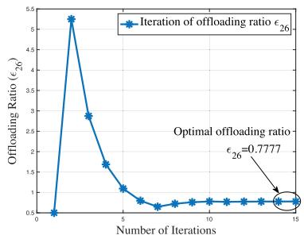

<details>
<summary>line</summary>

| Number of Iterations | Offloading Ratio (ε₂₆) |
| -------------------- | ------------------------ |
| 0                    | 0.5                      |
| 1                    | 5.2                      |
| 2                    | 2.8                      |
| 3                    | 1.6                      |
| 4                    | 1.0                      |
| 5                    | 0.8                      |
| 6                    | 0.7                      |
| 7                    | 0.7                      |
| 8                    | 0.7                      |
| 9                    | 0.7                      |
| 10                   | 0.7                      |
| 11                   | 0.7                      |
| 12                   | 0.7                      |
| 13                   | 0.7                      |
| 14                   | 0.7                      |
| 15                   | 0.7                      |
</details>

(a) Offloading ratio with index $\epsilon _ { 2 6 }$

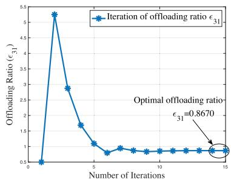

<details>
<summary>line</summary>

| Number of Iterations | Offloading Ratio (ε₃₁) |
| -------------------- | ---------------------- |
| 0                    | 0.5                    |
| 1                    | 5.2                    |
| 2                    | 2.9                    |
| 3                    | 1.7                    |
| 4                    | 1.1                    |
| 5                    | 0.8                    |
| 6                    | 0.9                    |
| 7                    | 0.9                    |
| 8                    | 0.9                    |
| 9                    | 0.9                    |
| 10                   | 0.9                    |
| 11                   | 0.9                    |
| 12                   | 0.9                    |
| 13                   | 0.9                    |
| 14                   | 0.9                    |
| 15                   | 0.9                    |
</details>

(b) Offloading ratio with index $\epsilon _ { 3 1 }$

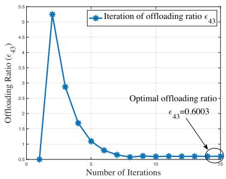

<details>
<summary>line</summary>

| Number of Iterations | Offloading Ratio (ε₄₃) |
| -------------------- | ------------------------ |
| 0                    | 0.5                      |
| 1                    | 5.2                      |
| 2                    | 2.8                      |
| 3                    | 1.7                      |
| 4                    | 1.1                      |
| 5                    | 0.8                      |
| 6                    | 0.6                      |
| 7                    | 0.5                      |
| 8                    | 0.5                      |
| 9                    | 0.5                      |
| 10                   | 0.5                      |
| 11                   | 0.5                      |
| 12                   | 0.5                      |
| 13                   | 0.5                      |
| 14                   | 0.5                      |
| 15                   | 0.5                      |
</details>

(c) Offloading ratio with index E43

Fig. 5. Illustration of the proposed Algorithm 3 for obtaining the optimal offloading ratio $\epsilon _ { i } .$   
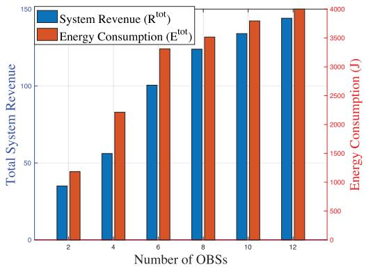

<details>
<summary>bar_line</summary>

| Number of OBSs | Total System Revenue (R_tot) | Energy Consumption (E_tot) |
|---|---|---|
| 2 | 35 | 1000 |
| 4 | 55 | 2000 |
| 6 | 100 | 3000 |
| 8 | 125 | 3500 |
| 10 | 160 | 3750 |
| 12 | 180 | 4000 |
</details>

(a) Total system revenue and energy consumption with the number of OBSswhile fixingI=50

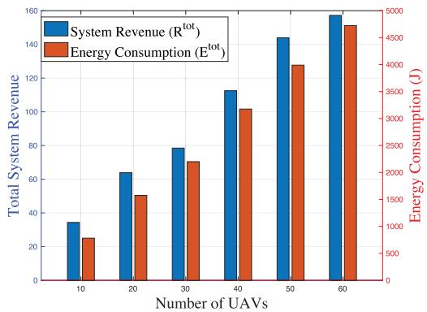

<details>
<summary>bar_line</summary>

| Number of UAVs | System Revenue (R_tot) (J) | Energy Consumption (E_tot) (J) |
|---|---|---|
| 10 | 35 | 250 |
| 20 | 64 | 500 |
| 30 | 78 | 700 |
| 40 | 112 | 1020 |
| 50 | 144 | 1200 |
| 60 | 158 | 1500 |
</details>

(b）Total system revenue and\_energy consumption with the numberofUAVswhile fixing $J = 1 { \bar { 0 } }$   
Fig. 6. Performance of the proposed algorithm for the total system revenue and energy consumption.

We evaluate the efficiency and effectiveness of the proposed algorithms in comparison with the following benchmark algorithms.

• Distance-based OBS Selection (DOS) Algorithm: This algorithm is a greedy strategy, i.e., UAVs always select the closest OBS based on the distance $\| \mathbf { l } _ { i } - \mathbf { l } _ { j } \|$ for task offloading. The optimal offloading ratio mission time $t _ { i , j } ^ { \mathrm { P h - I I } }$ are determined by the proposed $\epsilon _ { i }$ and transalgorithms.   
• Random OBS Selection (ROS) Algorithm: This algorithm randomly chooses one OBS for UAV for task offloading. The optimal offloading ratio $\epsilon _ { i }$ and transmission time $t _ { i , j } ^ { \mathrm { P h - I I } }$ ti,j are obtained via the proposed algorithms.   
• Fixed Offloading $F \left( \epsilon _ { i } \right)$ Algorithm: This algorithm determines the offloading ratio $\epsilon _ { i }$ with a fixed value when offloading task. The OBS selection and the transmission time $t _ { i , j } ^ { \mathrm { P h - I I } }$ ti,j are determined based on the proposed algorithms.   
• Random Offloading $R \left( \epsilon _ { i } \right)$ Algorithm: This algorithm randomly determines the offloading ratio $\epsilon _ { i }$ for task

offloading. The OBS selection and the transmission time $t _ { i , j } ^ { \mathrm { P h - I I } }$ are derived according to the proposed algorithms.

# B. Numerical Results and Analysis

We first evaluate the resource allocation strategy for solving Problem (MSR-Sub). Table III shows an example of the proposed algorithms for determining the resource allocation strategy by fixing the offloading ratio as $\epsilon _ { i } ~ = ~ 0 . 5$ and the transmission time as $t _ { i , j } ^ { \mathrm { P h - I I } } = 0 . \bar { 1 } \mathrm { s }$ ti,j . In Table III, $\Delta _ { i , j } \left( m _ { i } \right) =$ 1 means that UAV with i-index and OBS with j-index reach an agreement for resource allocation based on the proposed Algorithm 2.

Fig. 5 shows an illustration of the proposed Algorithm 3 for obtaining the optimal offloading ratio $\epsilon _ { i }$ in Problem (MSR-Mid). It can be seen that the offloading ratio can coverage to a fixed value after several iterations based on the bisectionsearch approach. The results show that our proposed algorithm can determine the optimal offloading ratio for task offloading. For instance, it can be observed from Fig. 5 that the optimal offloading ratio for UAV 26-index, 31-index and 43-index are $\epsilon _ { 2 6 } = 0 . 7 7 7 7 , \epsilon _ { 3 1 } = 0 . 8 6 7 0$ and $\epsilon _ { 4 3 } = 0 . 6 0 0 3$ , respectively.

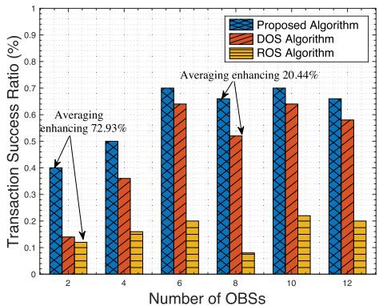

<details>
<summary>bar</summary>

| Number of OBSs | Proposed Algorithm | DOS Algorithm | ROS Algorithm |
| -------------- | ------------------ | ------------- | ------------- |
| 2              | 0.4                | 0.15          | 0.12          |
| 4              | 0.5                | 0.37          | 0.16          |
| 6              | 0.7                | 0.65          | 0.2           |
| 8              | 0.65               | 0.52          | 0.08          |
| 10             | 0.7                | 0.65          | 0.22          |
| 12             | 0.67               | 0.58          | 0.2           |
</details>

(a)Transactionsuccessratio with the number of OBSs by fixing (b) Transactionsuccessratio withthe numberof UAVs by fixing 1=50 J=10

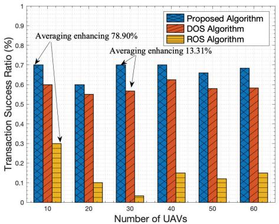

<details>
<summary>bar</summary>

| Number of UAVs | Proposed Algorithm (%) | DOS Algorithm (%) | ROS Algorithm (%) |
|---|---|---|---|
| 10 | 0.71 | 0.60 | 0.30 |
| 20 | 0.60 | 0.55 | 0.11 |
| 30 | 0.71 | 0.57 | 0.04 |
| 40 | 0.71 | 0.63 | 0.16 |
| 50 | 0.66 | 0.58 | 0.12 |
| 60 | 0.69 | 0.58 | 0.16 |
Averaging enhancing 78.90% Averaging enhancing 13.31%
</details>

Fig. 7. Performance of the proposed algorithm for transaction success ratio in comparison with benchmark algorithms.   
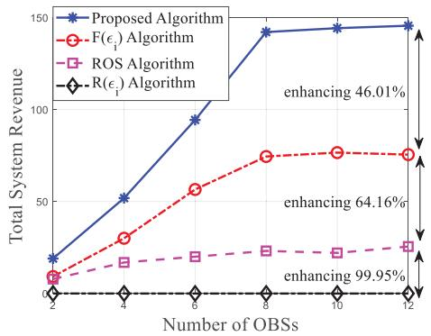

<details>
<summary>line</summary>

| Number of OBSs | Proposed Algorithm | F(εᵢ) Algorithm | ROS Algorithm | R(εᵢ) Algorithm |
| -------------- | ------------------ | -------------- | ------------- | --------------- |
| 2              | 20                 | 10             | 5             | 0               |
| 4              | 50                 | 30             | 10            | 0               |
| 6              | 90                 | 55             | 15            | 0               |
| 8              | 140                | 75             | 20            | 0               |
| 10             | 145                | 78             | 22            | 0               |
| 12             | 150                | 78             | 25            | 0               |
</details>

(a)Total system revenue withthe number of OBSs while fixing (b) Energy consumption with the number of OBSs while fixing I=50 I=50   
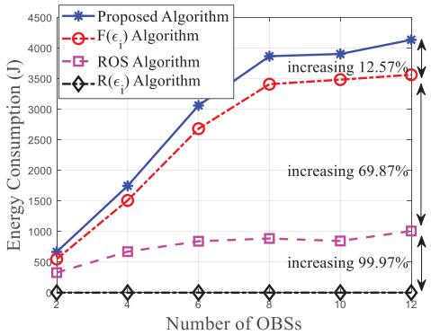

<details>
<summary>line</summary>

| Number of OBSs | Proposed Algorithm | F(ε₁) Algorithm | ROS Algorithm | R(ε₁) Algorithm |
| -------------- | ------------------ | --------------- | ------------- | --------------- |
| 2              | 500                | 500             | 500           | 0               |
| 4              | 1700               | 1500            | 700           | 0               |
| 6              | 3100               | 2700            | 800           | 0               |
| 8              | 3900               | 3400            | 900           | 0               |
| 10             | 4000               | 3500            | 950           | 0               |
| 12             | 4200               | 3600            | 1000          | 0               |
</details>

Fig. 8. Performance comparisons of the total system revenue and energy consumption under different numbers of OBSs.   
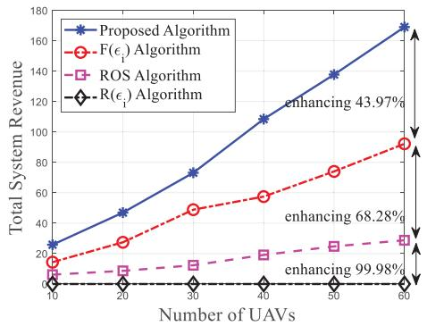

<details>
<summary>line</summary>

| Number of UAVs | Proposed Algorithm | F(ε_i) Algorithm | ROS Algorithm | R(ε_i) Algorithm |
| -------------- | ------------------ | ---------------- | ------------- | ---------------- |
| 10             | 25                 | 15               | 5             | 0                |
| 20             | 50                 | 30               | 10            | 0                |
| 30             | 75                 | 45               | 15            | 0                |
| 40             | 110                | 60               | 20            | 0                |
| 50             | 140                | 75               | 25            | 0                |
| 60             | 170                | 90               | 30            | 0                |
</details>

(a)Total system revenue withthe numberof UAVs while fixing (b) Energy consumption with the numberof UAVs while fixing J=10 J=10   
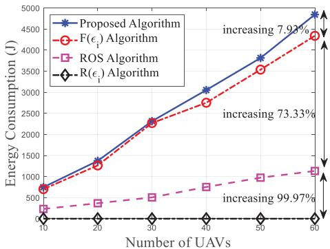

<details>
<summary>line</summary>

| Number of UAVs | Proposed Algorithm | F(ε₁) Algorithm | ROS Algorithm | R(ε₁) Algorithm |
| -------------- | ------------------ | --------------- | ------------- | --------------- |
| 10             | 750                | 750             | 250           | 0               |
| 20             | 1250               | 1250            | 400           | 0               |
| 30             | 2250               | 2250            | 600           | 0               |
| 40             | 3000               | 2800            | 800           | 0               |
| 50             | 3750               | 3500            | 1000          | 0               |
| 60             | 4750               | 4500            | 1200          | 99.97%          |
</details>

Fig. 9. Performance comparisons of the total system revenue and energy consumption under different numbers of UAVs.

Fig. 6 shows the performance evaluation of the proposed algorithms for the total system revenue and energy consumption by exploiting the number of OBSs and UAVs. From Fig. 6(a) and Fig. 6(b), it can be found that with the increasing number of OBSs and UAVs, both system revenue and energy consumption are increasing. The reason is as follows. The increasing numbers of OBSs and UAVs will lead to more transactions for task offloading, which can increase the total system revenue while consuming more energy for task computing.

Fig. 7 illustrates the performance evaluation of the proposed algorithms for transaction success ratio in comparison with DOS algorithm and ROS algorithm. Fig. 7(a) shows the transaction success ratio with the number of OBSs while fixing I = 50. Fig. 7(b) shows the transaction success ratio with the number of UAVs while fixing J = 10. It can be seen from Fig. 7(a) and Fig. 7(b) that the proposed algorithms can obtain the best performance for improving the transaction success ratio. The reason is explained as follows. The proposed algorithms take the preference between UAV and OBS into account, which make UAVs match the highest preference OBSs, thus increasing the transaction success ratio.

Fig. 8 depicts the performance comparison of the proposed algorithms for the total system revenue and energy consumption by exploiting the number of OBSs. We can see from Fig. 8(a) that the proposed algorithms can achieve a higher system revenue than other benchmark algorithms. It is worth noting from Fig. 8(b) that our proposed algorithms lead to higher energy consumption than other benchmark algorithms. The reason can be explained as follows. The proposed algorithms promote the transaction success ratio for resource allocation between UAVs and OBSs, which increases the total system revenue. However, UAVs and OBSs need to consume more energy to complete workloads in the proposed algorithms, which increases the system energy consumption.

Fig. 9 demonstrates the performance comparison of the proposed algorithms for the total system revenue and energy consumption by exploiting the number of UAVs. It can be seen that both system revenue and energy consumption are increasing with the number of UAVs. The results in Fig. 9(a) illustrate the advantages of our proposed algorithms, which can significantly improve the total system revenue in comparison with other benchmark algorithms. Furthermore, the proposed algorithms also result in a higher energy consumption compared with the benchmark algorithms in Fig. 9(b). The reasons are as follows. In the proposed algorithms, more UAVs and OBSs can reach an agreement for task offloading, thus increasing the total system revenue and the energy consumption compared to benchmark algorithms.

# VI. CONCLUSION

In this paper, we have proposed a multi-UAV aided multiaccess edge computing framework in marine communication networks. To improve task offloading efficiency, we designed a multi-task multi-access offloading scheme, in which UAVs can process their tasks locally or offload their partial workloads to OBSs for processing. By considering the total system welfare and energy consumption for completing tasks, a joint optimization problem is formulated to optimize the OBS choice, the offloading ratio and the transmission duration. To obtain the optimal solutions of the formulated non-convex problem, we exploited a layered structure to decompose it into three sub-problems, and proposed efficient algorithms to derive the optimal solutions. We finally provided simulation results to validate the efficiency and effectiveness of the proposed algorithms compared to several benchmark algorithms. In the future work, we will further investigate the integrated sensing and computational task offloading schemes for marine communication networks.

# REFERENCES

[1] M. Jahanbakht, W. Xiang, L. Hanzo, and M. Rahimi Azghadi, “Internet of Underwater things and big marine data analytics—A comprehensive survey,” IEEE Commun. Surveys Tuts., vol. 23, no. 2, pp. 904–956, 2nd Quart., 2021.   
[2] K. A. Mahmoodi and M. Uysal, “Energy aware trajectory optimization of solar powered AUVs for optical underwater sensor networks,” IEEE Trans. Commun., vol. 70, no. 12, pp. 8258–8269, Dec. 2022.   
[3] L. Lyu et al., “AoI-aware co-design of cooperative transmission and state estimation for marine IoT systems,” IEEE Internet Things J., vol. 8, no. 10, pp. 7889–7901, May 2021.   
[4] X. Ye, Y. Yu, and L. Fu, “Multi-channel opportunistic access for heterogeneous networks based on deep reinforcement learning,” IEEE Trans. Wireless Commun., vol. 21, no. 2, pp. 794–807, Feb. 2022.   
[5] S. S. Hassan, D. H. Kim, Y. K. Tun, N. H. Tran, W. Saad, and C. S. Hong, “Seamless and energy-efficient maritime coverage in coordinated 6G space-air-sea non-terrestrial networks,” IEEE Internet Things J., vol. 10, no. 6, pp. 4749–4769, Mar. 2023.

[6] X. Li, W. Feng, Y. Chen, C.-X. Wang, and N. Ge, “Maritime coverage enhancement using UAVs coordinated with hybrid satellite-terrestrial networks,” IEEE Trans. Commun., vol. 68, no. 4, pp. 2355–2369, Apr. 2020.   
[7] J. Xu, K. Ota, and M. Dong, “Aerial edge computing: Flying attitudeaware collaboration for multi-UAV,” IEEE Trans. Mobile Comput., vol. 22, no. 10, pp. 5706–5718, Oct. 2023.   
[8] X. Wang, L. T. Yang, D. Meng, M. Dong, K. Ota, and H. Wang, “Multi-UAV cooperative localization for marine targets based on weighted subspace fitting in SAGIN environment,” IEEE Internet Things J., vol. 9, no. 8, pp. 5708–5718, Apr. 2022.   
[9] P. Mach and Z. Becvar, “Mobile edge computing: A survey on architecture and computation offloading,” IEEE Commun. Surveys Tuts., vol. 19, no. 3, pp. 1628–1656, 3rd Quart., 2017.   
[10] Z. Xiong, Y. Zhang, D. Niyato, P. Wang, and Z. Han, “When mobile blockchain meets edge computing,” IEEE Commun. Mag., vol. 56, no. 8, pp. 33–39, Aug. 2018.   
[11] M. Dong, H. Li, C. Li, Y. Hu, and H. Huang, “Energy-efficient sensor deployment strategy for optimal coverage of underwater events inspired by Krill Herd,” IEEE Trans. Ind. Informat., vol. 20, no. 3, pp. 3900–3912, Mar. 2024, doi: 10.1109/TII.2023.3316212.   
[12] M. Cheng, Q. Guan, Q. Wang, F. Ji, and T. Q. S. Quek, “FER-restricted AUV-relaying data collection in underwater acoustic sensor networks,” IEEE Trans. Wireless Commun., vol. 22, no. 12, pp. 9131–9142, Dec. 2023, doi: 10.1109/TWC.2023.3268720.   
[13] N. Saeed, A. Celik, T. Y. Al-Naffouri, and M. -S. Alouini, “Localization of energy harvesting empowered underwater optical wireless sensor networks,” IEEE Trans. Wireless Commun., vol. 18, no. 5, pp. 2652–2663, May 2019.   
[14] C. Zeng, J.-B. Wang, C. Ding, H. Zhang, M. Lin, and J. Cheng, “Joint optimization of trajectory and communication resource allocation for unmanned surface vehicle enabled maritime wireless networks,” IEEE Trans. Commun., vol. 69, no. 12, pp. 8100–8115, Dec. 2021.   
[15] Z. Qin, J. Ye, J. Meng, B. Lu, and L. Wang, “Privacy-preserving blockchain-based federated learning for marine Internet of Things,” IEEE Trans. Comput. Soc. Syst., vol. 9, no. 1, pp. 159–173, Feb. 2022.   
[16] J. Yang, J. Wen, Y. Wang, B. Jiang, H. Wang, and H. Song, “Fog-based marine environmental information monitoring toward Ocean of Things,” IEEE Internet Things J., vol. 7, no. 5, pp. 4238–4247, May 2020.   
[17] L. P. Qian, H. Zhang, Q. Wang, Y. Wu, and B. Lin, “Joint multi-domain resource allocation and trajectory optimization in UAV-assisted maritime IoT networks,” IEEE Internet Things J., vol. 10, no. 1, pp. 539–552, Jan. 2023.   
[18] T. K. Rodrigues, J. Liu, and N. Kato, “Offloading decision for mobile multi-access edge computing in a multi-tiered 6G network,” IEEE Trans. Emerg. Topics Comput., vol. 10, no. 3, pp. 1414–1427, Jul./Sep. 2022.   
[19] N. Zhao, Z. Ye, Y. Pei, Y.-C. Liang, and D. Niyato, “Multi-agent deep reinforcement learning for task offloading in UAV-assisted mobile edge computing,” IEEE Trans. Wireless Commun., vol. 21, no. 9, pp. 6949–6960, Sep. 2022.   
[20] A. M. Seid, J. Lu, H. N. Abishu, and T. A. Ayall, “Blockchain-enabled task offloading with energy harvesting in multi-UAV-assisted IoT networks: A multi-agent DRL approach,” IEEE J. Sel. Areas Commun., vol. 40, no. 12, pp. 3517–3532, Dec. 2022.   
[21] L. Lyu, Z. Chu, B. Lin, Y. Dai, and N. Cheng, “Fast trajectory planning for UAV-enabled maritime IoT systems: A fermat-point based approach,” IEEE Wireless Commun. Lett., vol. 11, no. 2, pp. 328–332, Feb. 2022.   
[22] P. A. Apostolopoulos, G. Fragkos, E. E. Tsiropoulou, and S. Papavassiliou, “Data offloading in UAV-assisted multi-access edge computing systems under resource uncertainty,” IEEE Trans. Mobile Comput., vol. 22, no. 1, pp. 175–190, Jan. 2023.   
[23] W. C. Ng et al., “Resource optimization for UAV-assisted wireless power charging enabled hybrid coded edge computing network,” IEEE Trans. Mobile Comput., vol. 23, no. 3, pp. 2022–2038, Feb. 2023, doi: 10.1109/TMC.2023.3246994.   
[24] Q.-V. Pham et al., “A survey of multi-access edge computing in 5G and beyond: Fundamentals, technology integration, and state-of-the-art,” IEEE Access, vol. 8, pp. 116974–117017, 2020.   
[25] Y. Wu, K. Ni, C. Zhang, L. P. Qian, and D. H. K. Tsang, “NOMAassisted multi-access mobile edge computing: A joint optimization of computation offloading and time allocation,” IEEE Trans. Veh. Technol., vol. 67, no. 12, pp. 12244–12258, Dec. 2018.   
[26] S. Jung, S. Jeong, J. Kang, and J. Kang, “Marine IoT systems with spaceair-sea integrated networks: Hybrid LEO and UAV edge computing,” IEEE Internet Things J., vol. 10, no. 23, pp. 20498–20510, Dec. 2023.

[27] M. Dai, Y. Wu, L. Qian, Z. Su, B. Lin, and N. Chen, “UAV-assisted multi-access computation offloading via hybrid NOMA and FDMA in marine networks,” IEEE Trans. Netw. Sci. Eng., vol. 10, no. 1, pp. 113–127, Jan. 2023.   
[28] Y. Liu, J. Yan, and X. Zhao, “Deep reinforcement learning based latency minimization for mobile edge computing with virtualization in maritime UAV communication network,” IEEE Trans. Veh. Technol., vol. 71, no. 4, pp. 4225–4236, Apr. 2022.   
[29] Y. Jiang, X. Xu, H. Gao, A. D. Rajab, F. Xiao, and X. Wang, “LBlockchainE: A lightweight blockchain for edge IoT-enabled maritime transportation systems,” IEEE Trans. Intell. Transp. Syst., vol. 24, no. 2, pp. 2307–2321, Feb. 2023.   
[30] R. Ruby, S. Zhong, B. M. ElHalawany, H. Luo, and K. Wu, “SDN-enabled energy-aware routing in underwater multi-modal communication networks,” IEEE/ACM Trans. Netw., vol. 29, no. 3, pp. 965–978, Jun. 2021.   
[31] X. Su, L. Meng, and J. Huang, “Intelligent maritime networking with edge services and computing capability,” IEEE Trans. Veh. Technol., vol. 69, no. 11, pp. 13606–13620, Nov. 2020.   
[32] Y. Zeng, J. Xu, and R. Zhang, “Energy minimization for wireless communication with rotary-wing UAV,” IEEE Trans. Wireless Commun., vol. 18, no. 4, pp. 2329–2345, Apr. 2019.   
[33] X. Huang, G. Ji, B. Zhang, and C. Li, “Platform profit maximization in D2D collaboration based multi-access edge computing,” IEEE Trans. Wireless Commun., vol. 22, no. 7, pp. 4282–4295, Jul. 2023.   
[34] S. Gu, X. Sun, Z. Yang, T. Huang, W. Xiang, and K. Yu, “Energy-aware coded caching strategy design with resource optimization for satellite-UAV-vehicle-integrated networks,” IEEE Internet Things J., vol. 9, no. 8, pp. 5799–5811, Apr. 2022.   
[35] A.-L. Jin, W. Song, and W. Zhuang, “Auction-based resource allocation for sharing cloudlets in mobile cloud computing,” IEEE Trans. Emerg. Topics Comput., vol. 6, no. 1, pp. 45–57, Jan. 2018.   
[36] N. T. Boardman and K. M. Sullivan, “Time-based node deployment policies for reliable wireless sensor networks,” IEEE Trans. Rel., vol. 70, no. 3, pp. 1204–1217, Sep. 2021.


<details>
<summary>natural_image</summary>

Portrait of a young man in formal attire (no text or symbols visible)
</details>

Minghui Dai received the Ph.D. degree from Shanghai University, Shanghai, China, in 2021. He is currently a Post-Doctoral Fellow with the State Key Laboratory of Internet of Things for Smart City, University of Macau, Macau, China. His research interests are in the general area of wireless network architecture and vehicular networks.


<details>
<summary>natural_image</summary>

Portrait photo of a young man in formal attire (no text or symbols visible)
</details>

Chenglong Dou received the B.Sc. degree in communication engineering from Jilin University, China, in 2022. He is currently pursuing the Ph.D. degree with the Department of Computer and Information Science, University of Macau, Macau, China. His current research interest focuses on mobile edge computing, non-orthogonal multiple access, and integrated sensing and communication.


<details>
<summary>natural_image</summary>

Portrait of a man wearing glasses and a light blue shirt (no text or symbols visible)
</details>

Yuan Wu (Senior Member, IEEE) received the Ph.D. degree in electronic and computer engineering from The Hong Kong University of Science and Technology in 2010. He is currently an Associate Professor with the State Key Laboratory of Internet of Things for Smart City and the Department of Computer and Information Science, University of Macau, Macau, China. His research interests include resource management for wireless networks, green communications and computing, edge computing and edge intelligence, and energy informatics.

He received the Best Paper Award from the IEEE ICC’2016, IEEE TCGCC’2017, IWCMC’2021, and IEEE WCNC’2023. He is on the editorial board of IEEE TRANSACTIONS ON VEHICULAR TECHNOLOGY, IEEE TRANSACTIONS ON NETWORK SCIENCE AND ENGINEERING, and IEEE INTERNET OF THINGS JOURNAL.


<details>
<summary>natural_image</summary>

Portrait of a woman with long dark hair and glasses (no visible text or symbols)
</details>

Liping Qian (Senior Member, IEEE) received the Ph.D. degree in information engineering from The Chinese University of Hong Kong in 2010. She was a Post-Doctoral Research Associate with The Chinese University of Hong Kong, from 2010 to 2011. Since 2011, she has been with the College of Information Engineering, Zhejiang University of Technology, Hangzhou, China, where she is currently a Full Professor. From 2016 to 2017, she was a Visiting Scholar with the Broadband Communications Research Group, ECE Department, University

of Waterloo. Her research interests include wireless communication and networking, resource management in wireless networks, massive IoTs, mobile edge computing, emerging multiple access techniques, and machine learning oriented towards wireless communications. She was a co-recipient of the IEEE Marconi Prize Paper Award in Wireless Communications in 2011, the Best Paper Award from IEEE ICC 2016, and the Best Paper Award from IEEE Communication Society GCCTC 2017. She is on the editorial board of IEEE TRANSACTIONS ON COGNITIVE COMMUNICATIONS AND NETWORKING.


<details>
<summary>natural_image</summary>

Portrait of a man wearing glasses and a white shirt with black tie (no text or symbols visible)
</details>

Rongxing Lu (Fellow, IEEE) received the Ph.D. degree from the Department of Electrical and Computer Engineering, University of Waterloo, Canada, in 2012. He was a Post-Doctoral Fellow with the University of Waterloo, from May 2012 to April 2013. He is currently a Mastercard IoT Research Chair, a University Research Scholar, and a Professor with the Faculty of Computer Science (FCS), University of New Brunswick (UNB), Canada. Before that, he was an Assistant Professor with the School of Electrical and Electronic Engineering,

Nanyang Technological University (NTU), Singapore, from April 2013 to August 2016. His research interests include applied cryptography, privacy enhancing technologies, and IoT big data security and privacy. He serves as the Chair for IEEE Communications and Information Security Technical Committee (ComSoc CISTC) and the Founding Co-Chair for IEEE TEMS Blockchain and Distributed Ledgers Technologies Technical Committee (BDLT-TC).


<details>
<summary>natural_image</summary>

Portrait of a smiling man in a blue striped shirt (no text or symbols visible)
</details>

Tony Q. S. Quek (Fellow, IEEE) received the B.E. and M.E. degrees in electrical and electronics engineering from Tokyo Institute of Technology in 1998 and 2000, respectively, and the Ph.D. degree in electrical engineering and computer science from Massachusetts Institute of Technology in 2008.

Currently, he is the Cheng Tsang Man Chair Professor and a ST Engineering Distinguished Professor with Singapore University of Technology and Design (SUTD). He is also the Director of the Future Communications Research and Development

Program, the Head of ISTD Pillar, and the Deputy Director of SUTD-ZJU IDEA. His current research topics include wireless communications and networking, network intelligence, non-terrestrial networks, open radio access networks, and 6G.

Dr. Quek is a fellow of the Academy of Engineering Singapore. He received the 2008 Philip Yeo Prize for Outstanding Achievement in Research, the 2012 IEEE William R. Bennett Prize, the 2015 SUTD Outstanding Education Awards–Excellence in Research, the 2016 IEEE Signal Processing Society Young Author Best Paper Award, the 2017 CTTC Early Achievement Award, the 2017 IEEE ComSoc AP Outstanding Paper Award, the 2020 IEEE Communications Society Young Author Best Paper Award, the 2020 IEEE Stephen O. Rice Prize, the 2020 Nokia Visiting Professor, and the 2022 IEEE Signal Processing Society Best Paper Award. He has been actively involved in organizing and chairing sessions, and has served as a member for the technical program committee and symposium chairs in a number of international conferences. He is serving as an Area Editor for IEEE TRANSACTIONS ON WIRELESS COMMUNICATIONS.