# Multi-UAV CoMP Transmission Based on UAV Jitter Characteristics: Analysis and Optimization

Wanyang Jin , Changhao Du , Jiacheng Wang , Member, IEEE, Shuai Wang , Senior Member, IEEE, Gaofeng Pan , Senior Member, IEEE, and Dusit Niyato , Fellow, IEEE

Abstract—With the rapid advancement of uncrewed aerial vehicle (UAV) technology in recent years, cooperative communication in UAV networks (UAV-Ns) has made significant strides. However, the effectiveness of UAV-Ns cooperative communication relies heavily on the accurate estimation of channel state information (CSI). Unlike terrestrial networks, the mobility of UAV introduces time-varying channel characteristics, which can substantially affect the overall system capacity. Therefore, this paper investigates the system capacity of UAV-Ns while accounting for the effect of jitter characteristics of UAV. Specifically, we propose a cooperative transmission model utilizing multiple UAV base stations (UAV-BSs) to enhance the signal quality received by ground users through coordinated multipoint (CoMP) transmission. Additionally, we present a jittering channel model, derive the channel autocorrelation function, and assess the capacity of the proposed system. To deal with the jitter, we introduce a jitter compensation scheme based on long short-term memory networks to counteract the effects of UAV jitter and improve the accuracy of channel precoding. Numerical results demonstrate that our approach significantly enhances the communication performance of UAV-Ns under the impact of jitter. Compared to the traditional method, our scheme improves the estimation accuracy of the channel state by up to 3.8%, highlighting the potential of distributed UAV-BSs with CoMP to strengthen UAV-Ns communication.

Index Terms—Channel state information, cooperative communication, coordinated multi-point, jittering channel model, long short-term memory, uncrewed aerial vehicle networks (UAV-Ns).

## I. INTRODUCTION

U NCREWED aerial vehicle (UAV), with its high mobil- ity and exceptional flexibility, can serve as aerial base station (BS) or relay node, providing services in regions where traditional communication infrastructure is either absent or compromised. Building on these advantages, UAV networks (UAV-Ns) can expand network coverage, enhance overall communication capacity, and enable quick deployment capabilities. Addressing the limitations of conventional ground-based stations in emergency situations and complex terrains. Therefore, UAV-Ns are widely utilized across various applications, including aerial BS deployment [1], network capacity expansion [2], disaster rescue and search operations [3], secure communications [4], aerial relaying [5], and the integration of satellite and ground networks [6].

These applications place significant pressure on UAV-Ns, particularly in terms of managing a large number of simultaneous users and supporting high data transmission rates. As a result, UAV BSs (UAV-BSs) are used to enhance the transmission capability to meet these growing demands. However, existing UAV platforms are inherently limited by size and energy constraints, which restrict their transmission power and processing ability, thus limiting the channel capacity of the whole system.

## A. Related Works

To enhance the communication capabilities of UAV-Ns within the constraints of time, frequency, and spatial resources, various approaches have been proposed, which can be primarily categorized into application, network, and physical layers [7], [8], [9], [10], [11], [12]. At the application layer, studies focus on optimizing system performance through task allocation and mission planning within UAV formations [7]. At the network layer, diverse access methods have been developed. For example, several studies [8], [9], [10] have investigated the energy efficiency of rate-splitting multiple access (RSMA) [8] and non-orthogonal multiple access (NOMA) schemes [9] within the context of cellular-connected UAV-Ns. At the physical layer, technologies such as multiple-input multiple-output (MIMO), reconfigurable intelligent surfaces (RIS), and millimeter-wave (mmWave) have significantly increased capacity. A MIMO conjugate beamforming scheme is proposed in [11] that enhances cellular connectivity for user equipment (UE) and improves spectral efficiency. The authors explore the application of RIS in UAV-based multiuser communications in [12], while [10] investigates mmWave downlink transmission combined with RSMA and NOMA for cellular-connected UAV-Ns.

Although these methods can enhance signal strength for specific users, they still have their limitations. MIMO and NOMA may lead to increased inter-user interference as the number of network users and antennas grows [13], [14]. Similarly, mmWave faces challenges such as severe channel fading and susceptibility to blockages [15]. While RIS is a promising technology for enhancing system capacity and reducing interference, it still suffers from limited processing resources, complex optimization problems, and difficulty obtaining perfect channel state information (CSI) [16], [17], [18]. Meanwhile, benefiting from its effective mitigation of interference, coordinated multi-point (CoMP) transmissions [19] for UAV-BSs has demonstrated significant potential in UAV-Ns.

As a technology widely employed in mobile cellular networks, CoMP can enhance cooperative channel capacity and mitigate interference between BSs, potentially leading to substantial improvements in UAV-Ns’ capacity [20], [21], [22], [23], [24]. For instance, in [21], the authors propose a CoMP approach for UAV-BSs where all signals received by ground users are forwarded to a central processor for joint processing. Additionally, they introduce a location adjustment method to maximize network throughput. Furthermore, [22] explores downlink coherent CoMP transmissions to support both static and three-dimensional (3D) mobile UAV, demonstrating the effectiveness of CoMP in improving coverage probability. In [23], the authors explore an algorithm for the joint optimization of UAV BS and RIS, enhancing the overall system efficiency. On the other hand, [24] analyzes a new system incorporating joint CoMP and NOMA for UAV UE and ground UE.

For CoMP systems, the method to enhance the performance can be broadly classified into two categories: coordinated beamforming (CBF) [25] and joint transmission (JT) [26]. The CBF method reduces inter-user interference by adjusting the beam direction of the BS antenna. In contrast, the JT method improves system capacity by combining transmissions with a precoding approach. However, both methods require real-time acquisition of CSI. They are highly dependent on the quality of feedback, indicating that inaccurate channel information can lead to substantial performance degradation [27]. As a result, many researchers have begun investigating the impact of UAV channels on system performance. For example, in [28], the line-of-sight (LoS) probability of the air-to-ground (AtG) channel is modeled as a sigmoid function of the elevation angle. However, UAV deployed in urban areas often encounter multiple propagation paths due to reflections and refractions from buildings, unlike UAV deployed at higher altitudes or in suburban areas. For instance, in [29], the performance of urban UAV-Ns is analyzed under the effects of 3D building blockages by employing the Nakagami-m fading model. In addition, [30] considers time-varying channel characteristics, focusing on measuring temporal correlation and evaluating time-averaged network performance in multi-UAV-aided networks.

In the studies mentioned above, the instantaneous channel of UAV in both stationary and mobile scenarios has been well modeled. However, these analyses often overlook the effects of airflow, which can cause variations in the signal propagation path, even when the UAV is stationary.

Recently, many studies have recognized that UAV jitter could lead to a noticeable impact on UAV-Ns. Some of the studies have focused on analyzing the energy efficiency and optimization of the system with UAV jitter. The authors in [31] analyze a UAV-BS system based on RIS and demonstrate that optimizing RIS reflection coefficients with UAV trajectory significantly enhances power efficiency. In [32], the authors propose a CBF joint optimization scheme that integrates confidential signals and artificial noise signals to balance energy efficiency and security.

Furthermore, due to the jitter characteristics of UAV, some studies have also combined artificial intelligence (AI) and CBF to analyze the impact and optimization of UAV jitter. For instance, the authors in [33] introduce a deep learningbased blind beam tracking and adaptive scheme, which adjusts the beam by estimating the probability mass function (PMF), effectively managing UAV jitter and channel variations. In [34], the authors proposed a learning-based predictive CBF scheme that leverages deep learning to predict the angle between UAV and UE, enabling proactive beam adjustments to maintain communication reliability.

However, existing studies mainly focus on CBF-based cooperative transmission methods, emphasizing the impact of UAV jitter on beamforming direction. Although [35] analyzes the effect of UAV jitter on omnidirectional antenna models with multipath channels, it does not explore the performance boundaries of UAV cooperative transmission. In summary, research on the impact of UAV jitter in time-varying channels remains limited, and there is a lack of studies integrating UAV jitter with the JT mode of CoMP in UAV-Ns.

## B. Organization

The overall structure of this paper is as follows: In Section II, the basic model of distributed UAV with CoMP is presented. Section III introduces a channel model for UAV jitter and analyzes the correlation coefficients of the jittering channel. In Section IV, the overall communication capacity of the system under UAV jitter is further examined. Section V proposes a channel compensation scheme for UAV jitter characteristics. Finally, Section VI provides the numerical simulation results.

Notations: Unless specified otherwise, the lowercase letters, the bold-faced lowercase letters, and the bold-faced uppercase letters denote the scalar vectors. Moreover, \* and ⊗ denote the convolutional product and Kronecker product, respectively. In addition, (·)T, (·)H and (·)† represent the operators of transpose, conjugate, and pseudo-inverse, respectively. The definitions of typical mathematical symbols used in this paper are shown in TABLE I.

## C. Contributions

This paper investigates and analyzes the performance limits of UAV-Ns systems with CoMP under the effect of UAV jitter. Given the distinct characteristics of UAV jitter, a jitter compensation scheme based on long short-term memory (LSTM) networks is proposed, which significantly improves system performance. The key contributions of this paper are as follows:

• First, we propose a collaborative transmission model, where multiple UAVs form aerial BSs, and the benefits of channel capacity of UAV CoMP are analyzed.

• To assess the capacity of UAV-Ns, we introduce a channel model that accounts for UAV jitter characteristics. Based on this model, we derive the channel expression for UAV jitter channel and analyze its time-varying behavior of correlation coefficients.

TABLE I LIST OF NOTATIONS
<table><tr><td rowspan=1 colspan=1>Symbol</td><td rowspan=1 colspan=1>Definition</td></tr><tr><td rowspan=1 colspan=1> $M , U , V$ </td><td rowspan=1 colspan=1>Number of UAV-BSs, UEs, UAVs per UAV-BS</td></tr><tr><td rowspan=1 colspan=1> $\mathbf { h } _ { m , u } , \overline { { \mathbf { h } } } _ { m , u }$ </td><td rowspan=1 colspan=1>Channel vector, normalized channel vector</td></tr><tr><td rowspan=1 colspan=1> $\mathbb { L } _ { A G }$ </td><td rowspan=1 colspan=1>The transmission link of UAV-BS to UE</td></tr><tr><td rowspan=1 colspan=1> $\mathcal { R } , \mathcal { R } _ { u } ^ { \mathbb { P } } , \mathcal { R } _ { u } ^ { \mathbb { S } } , \mathcal { R } _ { u } ^ { \mathbb { J } }$ </td><td rowspan=1 colspan=1>Channel capacities (general, ideal, nointerference, with UAV jitter)</td></tr><tr><td rowspan=1 colspan=1> $\mathrm { S I N R } , \mathrm { S } _ { u } , \mathrm { I } _ { u }$ </td><td rowspan=1 colspan=1>Signal-to-interference-plus-noise ratio, usefulsignal, interference</td></tr><tr><td rowspan=1 colspan=1> $n _ { u } , \sigma _ { n } ^ { 2 }$ </td><td rowspan=1 colspan=1>Noise vector, the variance of noise</td></tr><tr><td rowspan=1 colspan=1> $\delta _ { m , u }$ </td><td rowspan=1 colspan=1>Large-scale fading factor</td></tr><tr><td rowspan=1 colspan=1> $\mathbf { x } _ { m } , s _ { u }$ </td><td rowspan=1 colspan=1>Transmitted vector, original transmittedsequence</td></tr><tr><td rowspan=1 colspan=1> $P$ </td><td rowspan=1 colspan=1>Power constraints</td></tr><tr><td rowspan=1 colspan=1> $\mathbf { w } _ { m , u }$ </td><td rowspan=1 colspan=1>Precoding vector</td></tr><tr><td rowspan=1 colspan=1> $R _ { m , u } ^ { [ l , l + k ] }$ </td><td rowspan=1 colspan=1>Channel correlation coefficient between symboll and symbol l + k</td></tr><tr><td rowspan=1 colspan=1> $\hat { R } _ { m , u } ^ { [ l + 1 ] }$ </td><td rowspan=1 colspan=1>Predicted channel correlation coefficient</td></tr><tr><td rowspan=1 colspan=1> $l , k$ </td><td rowspan=1 colspan=1>Symbol index, Symbol step of two channels</td></tr><tr><td rowspan=1 colspan=1> $\mathbf { e } ^ { [ l , l + 1 ] } , \epsilon _ { m , u } ^ { [ l , l + 1 ] }$ </td><td rowspan=1 colspan=1>Error vector, the variance of error vector</td></tr><tr><td rowspan=1 colspan=1> $Q _ { v , m } ^ { [ 0 ] } , Q _ { u } , Q _ { S _ { n } }$ </td><td rowspan=1 colspan=1>UAV initial location, UE location, scattererlocation</td></tr><tr><td rowspan=1 colspan=1> $d _ { t r }$ </td><td rowspan=1 colspan=1>The offset distance of UAV antenna</td></tr><tr><td rowspan=1 colspan=1> $\overline { { d _ { v , m , u } ^ { [ l ] } , { d _ { v , m , S _ { n } } ^ { [ l ] } } } } ,$  $d _ { S _ { n } , u }$ </td><td rowspan=1 colspan=1>Distances (UAV to UE, UAV to scatterer,scatterer to UE)</td></tr><tr><td rowspan=1 colspan=1> $\alpha _ { v , m , S _ { n } }$ </td><td rowspan=1 colspan=1>Path attenuation for different transmission path</td></tr><tr><td rowspan=1 colspan=1> $\lambda$ </td><td rowspan=1 colspan=1>The wavelength of the transmitted signal</td></tr><tr><td rowspan=1 colspan=1> $\varphi _ { n } , \phi _ { n }$ </td><td rowspan=1 colspan=1>Angles between UAV and UE (respect to thez-axis, respect to the x-axis)</td></tr><tr><td rowspan=1 colspan=1> $\theta _ { v , m } ^ { [ l ] } , \omega _ { v , m } ^ { [ l ] } , \varpi _ { v , m } ^ { [ l ] }$ </td><td rowspan=1 colspan=1>Pitch, yaw, roll angles at symbol l of UAV</td></tr><tr><td rowspan=1 colspan=1> $\Phi , \Psi , F _ { 1 } , F _ { 2 }$ </td><td rowspan=1 colspan=1>Jitter amplitudes and frequencies (pitch, yaw)</td></tr><tr><td rowspan=1 colspan=1> $\mathcal { K }$ </td><td rowspan=1 colspan=1>Rician K-factor of UAV channel</td></tr><tr><td rowspan=1 colspan=1> $L _ { p }$ </td><td rowspan=1 colspan=1>The order of AR scheme</td></tr><tr><td rowspan=1 colspan=1> $\mathbf { G } _ { m , u }$ </td><td rowspan=1 colspan=1>Wiener filter matrix</td></tr><tr><td rowspan=1 colspan=1> $q , p , \mathfrak { T }$ </td><td rowspan=1 colspan=1>Sequence length, training step, and testinground (J-LSTM)</td></tr><tr><td rowspan=1 colspan=1> $\pmb { \Lambda } ^ { [ p ] }$ </td><td rowspan=1 colspan=1>Input tensor of J-LSTM</td></tr><tr><td rowspan=1 colspan=1> $\overline { { \hat { \mathbf { h } } _ { m , u } ^ { [ l + 1 ] } } }$ </td><td rowspan=1 colspan=1>Predicted CSI (J-LSTM)</td></tr><tr><td rowspan=1 colspan=1> $\mathbf { c } _ { \mathrm { n } } ^ { [ p ] } , \mathbf { r } _ { \mathrm { n } } ^ { [ p ] }$ </td><td rowspan=1 colspan=1>Cell state, hidden output (J-LSTM)</td></tr><tr><td rowspan=1 colspan=1> $\mathbf { f } _ { \mathrm { n } } ^ { [ p ] } , \mathbf { o } _ { \mathrm { n } } ^ { [ p ] }$ </td><td rowspan=1 colspan=1>Forget, output gates state (J-LSTM)</td></tr><tr><td rowspan=1 colspan=1> $\mathbf { i } _ { \mathfrak { n } } ^ { [ p ] } , \tilde { \mathbf { c } } _ { \mathfrak { n } } ^ { [ p ] }$ </td><td rowspan=1 colspan=1>Input gates state (J-LSTM)</td></tr><tr><td rowspan=1 colspan=1> $\mathbf { W } _ { r f , \mathfrak { n } } ^ { [ p ] } , \mathbf { W } _ { r i , \mathfrak { n } } ^ { [ p ] } ,$  $\mathbf { W } _ { r f , \mathfrak { n } } ^ { [ p ] }$ </td><td rowspan=1 colspan=1>weight matrices of the input vectors</td></tr><tr><td rowspan=1 colspan=1> $\mathbf { W } _ { h f , \mathfrak { n } } ^ { [ p ] } , \mathbf { W } _ { h i , \mathfrak { n } } ^ { [ p ] } ,$  $\underline { { \mathbf { W } _ { h o , \mathfrak { n } } ^ { [ { p } ] } } } , \mathbf { W } _ { h c , \mathfrak { n } } ^ { [ { p } ] }$ </td><td rowspan=1 colspan=1>Weight matrices of the short-term memories</td></tr><tr><td rowspan=1 colspan=1> $\mathbf { b } _ { f , \mathfrak { n } } ^ { [ p ] } , \mathbf { b } _ { i , \mathfrak { n } } ^ { [ p ] } , \mathbf { b } _ { o , \mathfrak { n } } ^ { [ p ] }$  $\mathbf { b } _ { c , \mathfrak { n } } ^ { \lfloor p \rfloor }$ </td><td rowspan=1 colspan=1>Bias vectors of J-LSTM networks</td></tr><tr><td rowspan=1 colspan=1> $\sigma _ { g } ( \cdot ) , \sigma _ { h } ( \cdot )$ </td><td rowspan=1 colspan=1>Activation functions (sigmoid, tanh)</td></tr><tr><td rowspan=1 colspan=1> $\Theta _ { v , m } ^ { [ p ] } , \hat { \Theta } _ { v , m } ^ { [ p ] }$ </td><td rowspan=1 colspan=1>Output vector of J-LSTM (train, test)</td></tr></table>

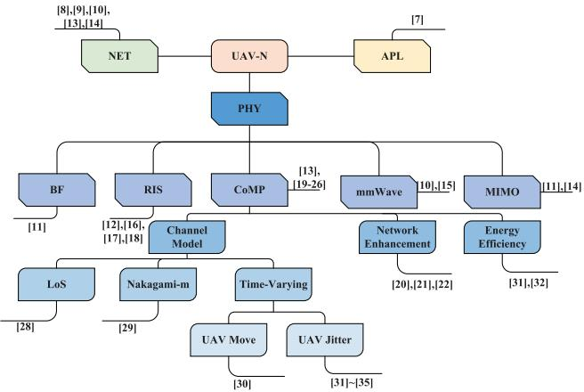  
Fig. 1. A classification chart of UAV-Ns literature referenced by this paper.

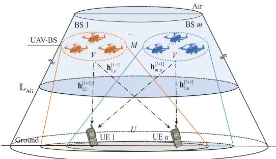  
Fig. 2. System model: UAV-Ns cell with M UAV-BSs and U UEs with channel $\mathbf { h } _ { m , u }$ of link $\mathbb { L } _ { A G }$

• Further, we analyze the channel capacity of the UAV-Ns system with CoMP under the influence of UAV jitter by using the derived correlation coefficients.

• Eventually, we propose a jitter-characteristics-based LSTM (J-LSTM) channel compensation scheme, with the goal of enhancing the accuracy of channel precoding and improving the overall system capacity.

## II. SYSTEM MODEL

This paper considers UAV-Ns as illustrated in Fig. 2. In this model, different UAVs form independent clusters based on proximity, and UAVs within the same cluster cooperate to form a distributed UAV-BS. We assume that different UEs can receive signals from one or more UAV-BSs via link $\mathbb { L } _ { A G }$ . Consequently, multiple UAV-BSs can also cooperate to enhance UEs’ communication capacity. Furthermore, it is assumed that links between different UAV-BSs are LoS channels, which permit ideal information exchange. Based on these assumptions, the collaborative transmission capacity for UEs is only influenced by the capacity of $\mathbb { L } _ { A G }$ , which can be expressed as

$$
\mathcal { R } = \mathbb { E } \left[ \log _ { 2 } \left( 1 + \mathrm { S I N R } \right) \right] ,\tag{1}
$$

where SINR represents the total signal and interference to noise ratio (SINR) and E represents the operators of expectation.

Moreover, we provide a detailed overview of the model for the $\mathbb { L } _ { A G }$ link. We assume that M coordinated UAV-BSs are simultaneously deployed in the air, with each including V UAVs. Within the service range of each UAV-BS, we assume there are U UEs, and each of them can independently receive information from all M UAV-BSs. Both UAVs and UEs are equipped with single-antenna transceivers, sharing the same time and frequency resources. Thus, the set of UAV-BSs, $\{ 1 , \ldots , M \}$ , is denoted by $\mathcal { M } ;$ the set of UAVs in a single UAV-BS, $\{ 1 , \ldots , V \}$ , is denoted by $\nu ;$ and the set of UEs, $\{ 1 , \ldots , U \}$ , is denoted by U.

This paper investigates a CoMP system consisting of distributed UAV-BSs cooperating to enhance channel capacity using the JT method. The expression for the JT signal received by the u-th UE is given by

$$
y _ { u } = \sum _ { m = 1 } ^ { M } \delta _ { m , u } \mathbb { D } \left( \mathbf { h } _ { m , u } ^ { \mathbf { H } } \right) { \bf x } _ { m } + n _ { u } , \quad \forall u \in \mathcal { U } , \quad \forall m \in \mathcal { M } ,\tag{2}
$$

$$
\mathbf { x } _ { m } = \sum _ { u = 1 } ^ { U } \mathbf { w } _ { m , u } s _ { u } , \quad \forall u \in \mathcal { U } , \quad \forall m \in \mathcal { M } ,\tag{3}
$$

where $n _ { u }$ represents an additive and suitably complex Gaussian noise with mean of zero and variance of $\sigma _ { n } ^ { 2 } .$ . D represents the operation of diagonalizing the vector into a matrix, where the elements on the main diagonal are the vector elements, and the other elements are all zeros. The vector $\delta _ { m , u } \in \mathbb { C } ^ { 1 \times V }$ represents the large-scale fading factor of the channel, which is directly proportional to the distance between the m-th UAV-BS and the u-th UE. Meanwhile, we employ a practical power constraint P for each UAV-BS, that is E $\begin{array} { r } { \left\lceil \sum _ { m \in \mathcal { M } } \left\| \mathbf { x } _ { m } \right\| ^ { 2 } \right\rceil \leq } \end{array}$ $P ,$ where $P _ { u } ~ = ~ P / \left( M U \right)$ . The vector $\mathbf { x } _ { m }$ represents the signal transmitted by m-th UAV-BS. In addition, $s _ { u }$ represents the original transmitted sequence that follows the distribution $s _ { u } \sim \mathcal { C N } ( 0 , P _ { u } )$ . The vector $\mathbf { w } _ { m , u }$ represents the precoding vector, denoted as the normalized pseudo-inverse matrix of the channel vector $\mathbf { h } _ { m , u } .$ , which represents the small-scale fading channel between the m-th UAV-BS and the u-th UE. Let $\overline { { \mathbf { h } } } _ { \mathbf { m } , \mathbf { u } } = \mathbf { h } _ { m , u } / \| \mathbf { h } _ { m , u } \|$ as the normalized channel vector. Then, the precoding matrix can be defined as ${ \bf w } _ { m } = \overline { { \bf h } } _ { m } ^ { \dag }$

Typically, $\mathbf { h } _ { m , u }$ can be modeled as independent and identically distributed (i.i.d.) Rayleigh fading, i.e., $\mathbf { h } _ { m , u } \in \mathbb { C } ^ { 1 \times V }$ However, when the airflow effect is considered, the UAV platform is no longer stable but experiences random jitter. This results in the channel vector $\mathbf { h } _ { m , u }$ becoming time-varying rather than remaining constant. Consequently, the m-th UAV-BS cannot obtain perfect CSI. To model this phenomenon, the standard Gauss-Markov process is employed. We assume $\mathbf { h } _ { m , u }$ remains constant over a coherence time and evolves from one frame to another according to a traversing stationary-space white joint Gaussian process. The set of transmitted symbols $\{ 1 , \ldots , L \}$ is denoted by L. Then, under the Gauss-Markov auto-regressive (AR) of order 1 model, the channel evolves in

time is denoted as

$$
\mathbf { h } _ { m , u } ^ { [ l + 1 ] } = R _ { m , u } ^ { [ l , l + 1 ] } \mathbf { h } _ { m , u } ^ { [ l ] } + \mathbf { e } ^ { [ l , l + 1 ] } , \quad \forall l , l + 1 \in \mathcal { L } ,\tag{4}
$$

where $R _ { m , u } ^ { [ l , l + 1 ] }$ represents the correlation coefficient $( 0 ~ \leq$ $R _ { m , u } ^ { [ l , l + 1 ] } \leq \hat { 1 } ) , \mathbf { h } _ { m , u } ^ { [ l ] }$ denotes the transmission channel between the m-th UAV-BS and the u-th UE at the transmitted symbol $l ,$ and $\mathbf { e } ^ { [ l , l + 1 ] } ~ \in ~ \mathbb { C } ^ { 1 \times V }$ denotes the error vector, which is zero-mean complex Gaussian distributed with a variance of $\left( \epsilon _ { m , u } ^ { [ l , l + 1 ] } \right) ^ { 2 } = 1 - \left( R _ { m , u } ^ { [ l , l + 1 ] } \right) ^ { 2 }$ . As can be seen that $R _ { m , u } ^ { [ l , l + 1 ] }$ is crucial to the channel state. Therefore, this paper specifically models and analyzes the behavior of UAV jitter to obtain the value of $R _ { m , u } ^ { [ l , l + 1 ] }$ , shown in Section III.

From Eq. (2), it can be seen that $y _ { u }$ consists of three components: the useful signal, the interference signal, and the noise signal. First, the useful signal $\mathbf { S } _ { u }$ received by the u-th UE is given as

$$
\mathrm { S } _ { u } = \sum _ { m = 1 } ^ { M } \left| \delta _ { m , u } \mathbb { D } \left( \mathbf { h } _ { m , u } ^ { \mathbf { H } } \right) \mathbf { w } _ { m , u } s _ { u } \right| ^ { 2 } .\tag{5}
$$

Then, the interference signal $\mathrm { I } _ { u }$ received by the u-th UE can be expressed as

$$
\mathrm { I } _ { u } = \sum _ { m = 1 } ^ { M } \sum _ { j \neq u } ^ { U } \left| \delta _ { m , u } \mathbb { D } \left( \mathbf { h } _ { m , u } ^ { \mathbf { H } } \right) \mathbf { w } _ { m , j } s _ { j } \right| ^ { 2 } .\tag{6}
$$

After that, the $\operatorname { S I N R } _ { u }$ expression for the u-th UE can be written as $\mathrm { S I N R } _ { u } = \mathrm { S } _ { u } / \left( 1 + \mathrm { I } _ { u } \right)$ . It can be seen that two key factors directly influence the $\operatorname { S I N R } _ { u } .$ . The first factor is the distance between the m-th UAV-BS and the u-th UE, which typically exhibits a large-scale effect and is relatively less influenced by UAV jitter. The second factor is the channel vector $\mathbf { h } _ { m , u } .$ , whose time-varying characteristics can lead to fluctuations in $\operatorname { S I N R } _ { u } .$ In this paper, we will focus on the second factor in the next few sections.

## III. UAV JITTERING CHANNEL MODEL

This section presents a small-scale channel model with UAV jitter, focusing on the impact of the jitter phenomenon on the channel autocorrelation function. As shown in Fig. 3, the UAV is equipped with a single omnidirectional antenna (transceiver), which is located under the UAV platform with an offset of $d _ { t r }$ meters from its centroid. It is assumed that the ground users are aligned with the xy-plane, while the UAV platform is initially parallel to the xy-plane at height $Z _ { v , m } ^ { [ 0 ] }$ . The initial location of the transceiver is assumed to be $Q _ { v , m } ^ { [ 0 ] } = ( X _ { v , m } ^ { [ 0 ] } , Y _ { v , m } ^ { [ 0 ] } , Z _ { v , m } ^ { [ 0 ] } )$ , where $X _ { v , m } ^ { [ 0 ] } = 0$ and $Y _ { v , m } ^ { [ 0 ] } = 0$ while the locations of the u-th UE and the scatterers are denoted by $Q _ { u } = ( X _ { u } , Y _ { u } , 0 )$ and $Q _ { S _ { n } } = ( X _ { n } , Y _ { n } , Z _ { n } )$

As shown in Fig. 3, the distance between the UAV and the u-th UE at the symbol l is represented by $d _ { v , m , u } ^ { [ l ] }$ , the distance between the UAV and the scatterers is $\bar { d } _ { v , m , S _ { n } } ^ { [ l ] }$ , when $n = 0$ we have $S _ { 0 } = u .$ . The distance between the scatterers and the u-th UE is represented by $d _ { S _ { n } , u } .$ Then, the channel response from the v-th UAV in the m-th UAV-BS to the u-th UE can be defined as

$$
h _ { v , m , u } ^ { [ l ] } = \sum _ { n = 0 } ^ { N } \alpha _ { v , m , S _ { n } } e ^ { - j \frac { 2 \pi } { \lambda } \left( d _ { v , m , S _ { n } } ^ { [ l ] } + d _ { S _ { n } , u } \right) } ,\tag{7}
$$

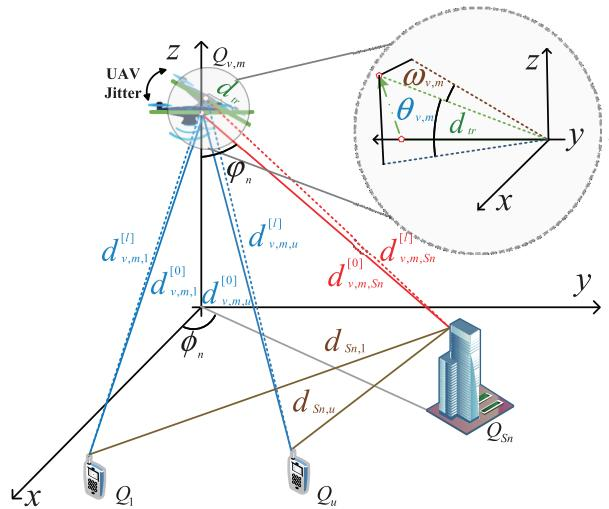  
Fig. 3. UAV jittering channel model with U UEs and scatterers. The blue lines represent the LoS link between the UAV and UEs. The red lines and brown lines represent the N multipath components (MPCs) originating from scatterers. The solid lines represent the propagation path before UAV jitter, and the dashed lines represent the propagation path after UAV jitter.

where $a _ { v , m , S _ { n } }$ represents the attenuation factor for different paths, and λ is the wavelength of the transmitted signal. The channel is typically associated with the $d _ { v , m , S _ { r } } ^ { [ l ] }$ and $d _ { S _ { n } , u }$ . We assume that the distance $d _ { S _ { n } , u }$ from the scatterers to the u-th UE remains constant for a specified period.

The angle between the UAV and the u-th UE and the angle between the UAV and the n-th scatterer (measured with respect to the z-axis) are denoted by $\varphi _ { 0 }$ and $\varphi _ { n }$ , respectively. The angle between the x-axis and the line connecting the origin to the n-th scatterer is defined by $\phi _ { n }$ . The behavior of UAV jitter in the air can be decomposed into three components: roll, pitch, and yaw. Let $\theta _ { v , m } ^ { [ l ] }$ denote the pitch angle at symbol time $\bar { l } , \omega _ { v , m } ^ { [ l ] }$ denote the yaw angle, and $\stackrel { \cdot } { \varpi } _ { v , m } ^ { [ l ] }$ denote the roll angle. The effect of UAV jitter in the pitch dimension has been well studied in [35]. As UAV is equipped with an omnidirectional antenna, it will not significantly affect the system unless the roll angle exceeds $9 0 ^ { \circ }$ . Hence, only the effect of pitch and yaw angles are analyzed in this paper.

As shown in Fig. 3, when UAV jitter is considered, the location of the transmitter changes from $Q _ { v , m } ^ { [ 0 ] }$ to $Q _ { v , m } ^ { [ l ] }$ , where

$$
X _ { v , m } ^ { [ l ] } = d _ { t r } \sin \omega _ { v , m } ^ { [ l ] } ,\tag{8}
$$

$$
Y _ { v , m } ^ { [ l ] } = d _ { t r } \left( 1 - \cos \theta _ { v , m } ^ { [ l ] } \cos \omega _ { v , m } ^ { [ l ] } \right) ,\tag{9}
$$

$$
Z _ { v , m } ^ { [ l ] } = Z _ { v , m } ^ { [ 0 ] } + d _ { t r } \sin \theta _ { v , m } ^ { [ l ] } .\tag{10}
$$

After that, we can express $d _ { v , m , S _ { n } } ^ { [ 0 ] }$ and $d _ { v , m , S _ { n } } ^ { [ l ] }$ as

$$
d _ { v , m , S _ { n } } ^ { [ 0 ] } = \sqrt { X _ { n } ^ { 2 } + Y _ { n } ^ { 2 } + \left( Z _ { n } - Z _ { v , m } ^ { [ 0 ] } \right) ^ { 2 } } ,\tag{11}
$$

$$
d _ { v , m , S _ { n } } ^ { [ l ] } =
$$

$$
\sqrt { \Big ( X _ { n } - X _ { v , m } ^ { [ l ] } \Big ) ^ { 2 } + \Big ( Y _ { n } - Y _ { v , m } ^ { [ l ] } \Big ) ^ { 2 } + \Big ( Z _ { n } - Z _ { v , m } ^ { [ l ] } \Big ) ^ { 2 } } .\tag{12}
$$

For a UAV with jitter, let $d _ { t r } \ll d _ { v , m , S _ { n } } ^ { [ l ] }$ . On this basis, the expression for $d _ { v , m , S _ { n } } ^ { [ l ] }$ can be written as

$$
\begin{array} { l } { d _ { v , m , S _ { n } } ^ { l | } \approx d _ { v , m , S _ { n } } ^ { [ 0 ] } - d _ { t r } \displaystyle \frac { \sin \omega _ { v , m } ^ { [ l ] } X _ { n } } { d _ { v , m , S _ { n } } ^ { [ 0 ] } } } \\ { - d _ { t r } \displaystyle \frac { \left( 1 - \cos \theta _ { v , m } ^ { [ l ] } \cos \omega _ { v , m } ^ { [ l ] } \right) Y _ { n } } { d _ { v , m , S _ { n } } ^ { [ 0 ] } } } \\ { - d _ { t r } \displaystyle \frac { \sin \theta _ { v , m } ^ { [ l ] } ( Z _ { n } - Z _ { v , m } ^ { [ 0 ] } ) } { d _ { v , m , S _ { n } } ^ { [ 0 ] } } . } \end{array}\tag{13}
$$

Please see the detailed derivations in Appendix A. Then, we further define

$$
\begin{array}{c} \frac { Y _ { n } } { \left( Z _ { v , m } ^ { [ 0 ] } - Z _ { n } \right) } = \frac { \left( Z _ { v , m } ^ { [ 0 ] } - Z _ { n } \right) \tan \varphi _ { n } \sin \phi _ { n } } { \left( Z _ { v , m } ^ { [ 0 ] } - Z _ { n } \right) }  \\ { = \tan \varphi _ { n } \sin \phi _ { n } , } \end{array}\tag{14}
$$

$$
\frac { X _ { n } } { \left( Z _ { v , m } ^ { [ 0 ] } - Z _ { n } \right) } = \frac { \left( Z _ { v , m } ^ { [ 0 ] } - Z _ { n } \right) \tan \varphi _ { n } \cos \phi _ { n } } { \left( Z _ { v , m } ^ { [ 0 ] } - Z _ { n } \right) }\tag{15}
$$

By using $d _ { v , m , S _ { n } } ^ { [ 0 ] } = \left( Z _ { v , m } ^ { [ 0 ] } - Z _ { n } \right) / \cos \varphi _ { n } , \Delta d _ { v , m , S _ { n } } ^ { [ 0 , l ] }$ can be simplified as

$$
\begin{array} { r l } & { \Delta d _ { v , m , S _ { n } } ^ { [ 0 , l ] } = d _ { v , m , S _ { n } } ^ { [ l ] } - d _ { v , m , S _ { n } } ^ { [ 0 ] } } \\ & { \qquad = d _ { t r } \cos \varphi _ { n } \sin \theta _ { v , m } ^ { [ l ] } - d _ { t r } \cos \phi _ { n } \sin \varphi _ { n } \sin \omega _ { v , m } ^ { [ l ] } } \\ & { \qquad - d _ { t r } \cos \phi _ { n } \sin \varphi _ { n } \left( 1 - \cos \theta _ { v , m } ^ { [ l ] } \cos \omega _ { v , m } ^ { [ l ] } \right) } \\ & { \qquad \approx d _ { t r } \cos \varphi _ { n } \theta _ { v , m } ^ { [ l ] } + d _ { t r } \cos \phi _ { n } \sin \left( - \varphi _ { n } \right) \omega _ { v , m } ^ { [ l ] } , } \end{array}\tag{16}
$$

where $\theta _ { v , m } ^ { [ l ] } \ \ll \ 1$ rad and $\omega _ { v , m } ^ { [ l ] } \ \ll \ 1$ rad are assumed for simplification. Therefore, we can use the approximation sin $\beta \approx \beta$ for small β. By using 1 − cos $\beta = 2 \sin ^ { 2 } \left( \frac { \beta } { 2 } \right)$ , we can further obtain $\left( 1 - \cos \theta _ { v , m } ^ { [ l ] } \cos \omega _ { v , m } ^ { [ l ] } \right) \approx 0 \mathrm { , }$

To calculate the channel capacity of the UAV jittering channel, from Eq. (4), it is essential to obtain the channel correlation coefficient. We further define the time between different channels as k symbols. Then, the channel correlation coefficient between symbol l and symbol l + k can be defined as

$$
R _ { v , m , u } ^ { [ l , l + k ] } = \mathbb { E } \left[ h _ { v , m , u } ^ { [ l ] } { h _ { v , m , u } ^ { [ l + k ] } } ^ { * } \right] .\tag{17}
$$

After that, we can expand the expression for the channel correlation coefficient of the signal as Eq. (18), shown at the bottom of the next page..In step (a) of Eq. (18), $\mathbb { E } \left[ e ^ { j \frac { 2 \pi } { \lambda } \left( d _ { S _ { n } , u } ^ { [ l ] } - d _ { S _ { j } , u } ^ { [ l + k ] } \right) } \right]$ ≈ 0 is used, which can be found in Ref. [36, Lemma 4]. Then, we can express Eq. (17) as

$$
R _ { v , m , u } ^ { [ l , l + k ] } = \sum _ { n = 0 } ^ { N } \mathbb { E } \left[ \left| \alpha _ { v , m , S _ { n } } \right| ^ { 2 } e ^ { j \frac { 2 \pi } { \lambda } \left( d _ { v , m , S _ { n } } ^ { [ l + k ] } - d _ { v , m , S _ { n } } ^ { [ l ] } \right) } \right] ,\tag{19}
$$

where we use the Laplacian model for the power of the n-th MPC [37], which is given as $\begin{array} { r } { \left| \alpha _ { v , m , S _ { n } } \right| ^ { 2 } = \overset { \cdot \bigstar } { 2 \sigma _ { a } } e ^ { - \frac { | \varphi _ { n } - \varphi _ { 0 } | } { \sigma _ { a } } } } \end{array}$ and $\sigma _ { a }$ is the scale parameter of the Laplacian model. Then, we further define the Rician multipath fading model with factor

K to reflect the probability of LoS. Therefore, the Laplacian angular power spectrum can be defined as $\left| \alpha _ { v , m , u } \right| ^ { 2 } =$ $\begin{array} { r } { \mathcal { K } \sum _ { n = 1 } ^ { N } \left| \alpha _ { v , m , S _ { n } } \right| ^ { 2 } } \end{array}$

In step (b), a sinusoidal process is employed to delineate the jitter behavior of UAV. In detail, the pitch angle is given by $\mathsf { \bar { \theta } } _ { v , m } ^ { [ l ] } \ = \ \Phi \sin \left( 2 \pi F _ { 1 } l \right)$ , and the yaw angle is given by $\bar { \omega _ { v , m } ^ { [ l ] } } = \Psi \sin \left( 2 \pi \dot { F _ { 2 } } l \right)$ . In the above equation, $\Phi , \Psi , F _ { 1 }$ , and $F _ { 2 }$ are independent random variables. We define Φ and Ψ represent the jitter amplitude, which follow uniform distribution with maximum pitch angle $\theta _ { m }$ and maximum yaw angle $\omega _ { m } .$ $F _ { 1 }$ represents the frequency of the pitch angle variations with probability density function (PDF) $p _ { F _ { 1 } } ( f _ { 1 } )$ , and $F _ { 2 }$ represents the frequency of the yaw angle variations with $p _ { F _ { 2 } } ( f _ { 2 } )$ . In step (c), the sinc function $\mathrm { s i n c } ( x ) = \sin ( \pi x ) / \pi x$ is used for simplification.

It can be seen from Eq. (18) that the effect of UAV jitter is mainly determined by the distribution of UAV jitter angle $\theta _ { v , m } ^ { [ l ] }$ and $\omega _ { v , m } ^ { [ l ] }$ . Meanwhile, since the ground obstacles are macroscopically enormous on the distance scale from UAV-BSs, $\varphi _ { n }$ and $\phi _ { n }$ are considered as constants. Therefore, the expression obtained for $R _ { v , m , u } ^ { [ l , l + k ] }$ can be seen as a general result for different UAV-BSs.

## IV. CHANNEL CAPACITY ANALYSIS

In this section, we further derive the communication capacity based on the $R _ { v , m , u } ^ { [ l , l + k ] }$ obtained in the previous section. By substituting Eq. (18) into Eq. (4), we can further analyze the channel capacity of the $\mathbb { L } _ { A G }$ link.

Under a given channel condition with UAV jitter, the received signal power of the u-th UE can be given by

$$
\mathbf { S } _ { u } = P _ { u } \sum _ { m = 1 } ^ { M } R _ { m , u } ^ { [ l , l + 1 ] } \Big | \mathbf { h } _ { m , u } ^ { [ l ] } \Big | ^ { 2 } \big | \delta _ { m , u } \big | ^ { 2 } .\tag{20}
$$

Please see the detailed derivations in Appendix B.

As discussed in Eq. $( 4 ) ,  { \mathbf { h } } _ { m , u } ^ { [ l ] }$ can be modeled as a complex Gaussian distribution. Therefore, $\left| \mathbf { h } _ { m , u } ^ { [ l ] } \right| ^ { 2 }$ represents the sum of squares of the complex Gaussian distribution, which statistically follows a Chi-squared distribution, denoted as $\chi ^ { 2 } ( K )$ where $\chi$ represents a distribution of Chi-squared and K is the degree of freedom. Let $c \chi ^ { 2 } ( K ) = C ,$ , we can obtain $C \sim \Gamma ( K , c )$ , where Γ represents the Gamma distribution, c is the scale parameter, and K is the shape parameter.

It is known that $A = \sum _ { i = 1 } ^ { M } C _ { i }$ , where $C _ { i } \sim \Gamma ( K _ { i } , c _ { i } )$ . Then, A can be approximated as a Gamma distribution $\hat { A } \sim \Gamma ( \hat { K } _ { A } , \hat { c } _ { A } )$ [38], which can be defined as

$$
\hat { K } _ { A } = \mathfrak { f } _ { K } ( \bar { K } , \bar { c } ) = \left( \sum _ { i = 1 } ^ { M } K _ { i } c _ { i } \right) ^ { 2 } / \sum _ { i = 1 } ^ { M } K _ { i } c _ { i } ^ { 2 } ,\tag{21}
$$

$$
\hat { c } _ { A } = \mathfrak { f } _ { c } ( \bar { K } , \bar { c } ) = \sum _ { i = 1 } ^ { M } K _ { i } c _ { i } ^ { 2 } / \sum _ { i = 1 } ^ { M } K _ { i } c _ { i } ,\tag{22}
$$

where $\hat { K } = [ K _ { 1 } , \ldots , K _ { M } ]$ and $\hat { c } = [ c _ { 1 } , \dots , c _ { M } ]$

Based on the above derivation, the interference signal power received by different users can be further expressed as

$$
\mathbf { S } _ { u } \sim P _ { u } R _ { m , u } ^ { [ l , l + 1 ] ^ { 2 } } \hat { \mathfrak { X } _ { u } } \sim \xi _ { u } \hat { \mathfrak { X } } _ { u } ,\tag{23}
$$

where $\xi _ { u } ~ = ~ P _ { u } R _ { m , u } ^ { [ l , l + 1 ] ^ { 2 } }$ . Meanwhile, $\left( \left| \mathbf { h } _ { m , u } ^ { [ l ] } \right| ^ { 2 } \left| \delta _ { m , u } \right| ^ { 2 } \right)$ obeys a Gamma distribution $\begin{array} { r c l } { \hat { \mathfrak { X } } _ { u } } & { \sim } & { \hat { \Gamma } \left( \hat { K } _ { \hat { \mathfrak { X } } _ { u } } , \hat { c } _ { \hat { \mathfrak { X } } _ { u } } \right) } \end{array}$ . The shape parameter can be obtained by $\begin{array} { r l r } { \hat { K } _ { \hat { \mathfrak { X } } _ { u } } } & { { } = } & { V \mathrm { ~ - ~ } } \end{array}$ $U ~ + ~ 1$ due to the normalized channel power, the scale parameter can be obtained from Eq. (22) with $\hat { c } _ { \hat { \mathfrak { X } } _ { n } } = { \mathfrak { f } } _ { c } \left( \left[ V - U + 1 , \ldots , V - U + 1 \right] , \left[ c _ { 1 , u } , \ldots , c _ { M , u } \right] \right)$ and $c _ { m , u } = | \delta _ { m , u } | ^ { 2 }$

$$
\begin{array} { r l } &  \begin{array} { r l } & { L _ { \mathrm { C } , \mathrm { R } , \mathrm { R } } ^ { \mathrm { i n } } , } \\ & { = \mathbb { E } [ | \frac { \partial \xi } { \partial \xi } | _ { \xi = 0 } ^ { 2 } \Delta \xi _ { \mathrm { R } , \xi } ^ { \mathrm { i n } } \Delta \xi _ { \mathrm { R } , \xi } ^ { \mathrm { i n } } ] } \\ & { = \mathbb { E } [ | \frac { \partial \xi } { \partial \xi } | _ { \xi = 0 } ^ { 3 } \sum _ { \xi = 0 } ^ { \infty } \Delta \xi _ { \mathrm { R } , \xi } \partial \xi _ { \mathrm { R } , \xi } ^ { \mathrm { i n } } \frac { \partial \xi } { \partial \xi } \overline { { \xi } } \overline { { \xi } } \overline { { \xi } } \overline { { \xi } } ( \overline { { \xi } } _ { \mathrm { R } , \xi \xi } ^ { \mathrm { i n } } , \alpha _ { 0 } ^ { - \mathrm { i n } } , \overline { { \xi } } _ { 0 } ^ { \mathrm { i n } } , \overline { { \xi } } _ { 0 } ^ { \mathrm { i n } } ) ] } \\ & { = \mathbb { E } [ | \frac { \partial \xi } { \partial \xi } | _ { \xi = 0 } ^ { 3 } \sum _ { \xi = 0 } ^ { \infty } | \frac { \partial \xi } { \partial \xi } \overline { { \xi } } ( \overline { { \xi } } _ { \mathrm { R } , \xi } ^ { \mathrm { i n } } , \alpha _ { 0 } ^ { - \mathrm { i n } } , \overline { { \xi } } _ { 0 } ^ { \mathrm { i n } } ) | \mathbb { E } [ \overline { { \xi } } ^ { 2 } \overline { { \xi } } \overline { { \xi } } \overline { { \xi } } ^ { 2 } ( \overline { { \xi } } _ { \mathrm { R } , \xi } ^ { \mathrm { i n } } , \overline { { \xi } } _ { 0 } ^ { \mathrm { i n } } , \overline { { \xi } } _ { 0 } ^ { \mathrm { i n } } ) ] } \\  \end{array} \end{array}\tag{}
$$

Meanwhile, the interference signal received by the UEs due to imperfect CSI of the signals during CoMP of different UAV-BSs can be written as

$$
\mathrm { I } _ { u } = P _ { u } \sum _ { m = 1 } ^ { M } \sum _ { j \neq u } ^ { U } \Bigl | \delta _ { m , u } \mathbb { D } \left( \mathbf { e } ^ { [ l , l + 1 ] ^ { \mathbf { H } } } \mathbf { w } _ { m , j } ^ { [ l ] } \right) \Bigr | ^ { 2 } .\tag{24}
$$

Please see the detailed derivations in Appendix C.

In Eq. (24), $\mathbf { e } ^ { [ l , l + 1 ] }$ and $\mathbf { w } _ { m , j } ^ { [ l + 1 ] }$ are independent Gaussian distributions. Therefore, $\left| \mathbf { e } ^ { [ l , l + 1 ] ^ { \mathbf { H } } } \mathbf { w } _ { m , j } ^ { [ l + 1 ] } \right| ^ { 2 }$ obeys a Gamma distribution Γ $ ( 1 , \varepsilon _ { m , u } ^ { [ l , l + 1 ] ^ { 2 } } ) [ 3 9 ]$ . After that, we can obtain

$$
\sum _ { m = 1 } ^ { M } \sum _ { j \neq u } ^ { U } \Bigl | \delta _ { m , u } \mathbb { D } \left( \mathbf { e } ^ { [ l , l + 1 ] ^ { \mathbf { H } } } \mathbf { w } _ { m , j } ^ { [ l + 1 ] } \right) \Bigr | ^ { 2 } \sim \varepsilon _ { m , u } ^ { [ l , l + 1 ] ^ { 2 } } \hat { \mathfrak { V } } _ { u } ,\tag{25}
$$

where $\begin{array} { r l r } { \hat { c } _ { \mathfrak { H } _ { u } } } & { { } = } & { \mathfrak { f } _ { c } \left( \left[ U - 1 , \ldots , U - 1 \right] , \left[ c _ { 1 , u } , \ldots , c _ { M , u } \right] \right) , } \end{array}$ $\hat { K } _ { \mathfrak { H } _ { n } } = { \mathfrak { f } } _ { K } \ \overset {  } { \ ( } [ U - 1 , \ldots , U - 1 ] , [ c _ { 1 , u } , \ldots , c _ { M , u } ] \big )$ and $c _ { m , u } =$ $| \delta _ { m , u } | ^ { 2 }$ . Therefore, we can rewrite the Eq. (24) as

$$
\mathrm { I } _ { u } \sim P _ { u } \varepsilon _ { m , u } ^ { [ l , l + 1 ] ^ { 2 } } \hat { \mathfrak { Y } } _ { u } \sim \zeta _ { u } \hat { \mathfrak { Y } } _ { u } ,\tag{26}
$$

where $\zeta _ { u } = P _ { u } \varepsilon _ { m , u } ^ { [ l , l + 1 ] ^ { 2 } }$ . After that, we can obtain

$$
\mathrm { S I N R } _ { u } = \frac { \xi _ { u } \hat { \mathfrak { X } } _ { u } } { 1 + \zeta _ { u } \hat { \mathfrak { Y } } _ { u } } .\tag{27}
$$

On this basis, the channel capacity with the absence of jitter effect $( R _ { m , u } ^ { [ l , l + 1 ] } = 1 )$ can be given by

$$
\begin{array} { r l } {  { \mathcal { R } _ { u } ^ { \mathbb { P } } = \mathbb { E } [ \log _ { 2 } ( 1 + \xi _ { u } \hat { \mathfrak { X } } _ { u } ) ] } \quad } & { } \\ & { \leq \log _ { 2 } \mathbb { E } [ 1 + \xi _ { u } \hat { \mathfrak { X } } _ { u } ] } \\ & { = \log _ { 2 } [ 1 + \xi _ { u } \hat { c } _ { \hat { \mathfrak { X } } _ { u } } \hat { K } _ { \hat { \mathfrak { X } } _ { u } } ] } \\ & { = \log _ { 2 } [ 1 + \frac { P ( V - U + 1 ) } { M U } \sum _ { i = 1 } ^ { M } | \delta _ { m , u } | ^ { 2 } ] . } \end{array}\tag{28}
$$

It is clear that $\mathcal { R } _ { u } ^ { \mathbb { P } }$ is the upper bound of the whole system. Moreover, when the effect of UAV jitter is considered $( \mathbf { \check { R } } _ { m , u } ^ { [ l , l + 1 ] } \ \leq \ 1 )$ , the channel capacity of the whole system without interference can be written as

$$
\mathcal { R } _ { u } ^ { \mathbb { S } } = \log _ { 2 } \left[ 1 + \frac { P \left( V - U + 1 \right) R _ { m , u } ^ { [ l , l + 1 ] ^ { 2 } } } { M U } \sum _ { i = 1 } ^ { M } \left| \delta _ { m , u } \right| ^ { 2 } \right] .\tag{29}
$$

Furthermore, with interference, the capacity will decrease, and the loss of the channel capacity can be expressed as

$$
\begin{array} { r l r } & { \Delta \mathcal { R } _ { u } ^ { \mathbb { I } } = \mathbb { E } \left[ \log _ { 2 } \left( 1 + \mathrm { S } _ { u } \right) \right] - \mathbb { E } \left[ \log _ { 2 } \left( 1 + \mathrm { S I N R } _ { u } \right) \right] } & \\ & { \quad \quad \leq \log _ { 2 } \left[ 1 + \zeta _ { u } \hat { c } _ { \hat { \mathfrak { M } } _ { u } } \hat { K } _ { \hat { \mathfrak { M } } _ { u } } \right] . \quad } & \end{array}\tag{30}
$$

Please see the detailed derivations in Appendix D.

Therefore, by substituting Eqs. (20) and (24) into Eq. (30), we can obtain

$$
\begin{array} { l } { \displaystyle \Delta \mathcal { R } _ { u } ^ { \mathbb { I } } \leq \log _ { 2 } \left[ 1 + \zeta _ { u } \hat { c } _ { \hat { \mathfrak { Y } } _ { u } } \hat { K } _ { \hat { \mathfrak { Y } } _ { u } } \right] } \\ { \displaystyle = \log _ { 2 } \left[ 1 + \frac { P \left( U - 1 \right) \varepsilon _ { m , u } ^ { \left[ l , l + 1 \right] ^ { 2 } } } { M U } \sum _ { i = 1 } ^ { M } \left| \delta _ { m , u } \right| ^ { 2 } \right] . } \end{array}\tag{31}
$$

Finally, we can express the channel capacity expression with the effect of UAV jitter as

$$
\begin{array} { r l r } {  { \mathcal { R } _ { u } ^ { \sharp } \approx \mathcal { R } _ { u } ^ { \mathfrak { S } } - \Delta \mathcal { R } _ { u } ^ { \mathfrak { I } } } } \\ & { } & { = = \log _ { 2 } [ 1 + \frac { P ( V - U + 1 ) R _ { m , u } ^ { [ l , l + 1 ] ^ { 2 } } } { M U } \sum _ { i = 1 } ^ { M } | \delta _ { m , u } | ^ { 2 } ] } \\ & { } & { \ - \log _ { 2 } [ 1 + \frac { P ( U - 1 ) \varepsilon _ { m , u } ^ { [ l , l + 1 ] ^ { 2 } } } { M U } \sum _ { i = 1 } ^ { M } | \delta _ { m , u } | ^ { 2 } ] . } \end{array}\tag{32}
$$

By using Eq. (18), we can derive the $\mathcal { R } _ { u } ^ { \mathbb { J } }$ as

$$
\begin{array} { r l } & { \mathbb { E } _ { \mathrm { q } \leq t \leq \frac { 1 } { 2 } } } \\ & { \mathrm { ~ K e ~ e ~ } [ 1 + \frac { P ( \mathcal { N } - \mathcal { U } - 1 ) } { \sqrt { \mathcal { M } \mathcal { U } } } \frac { \mathcal { M } } { \exp - 1 } | \partial _ { t \alpha \alpha } | ^ { 2 }  } \\ & {  \qquad \times \frac { \mathcal { M } } { \exp - 1 } |  \operatorname { l i m } _ { \alpha \in \mathcal { N } _ { s } \leq t \leq \frac { 1 } { 2 } } | \operatorname { l i m } _ { \alpha \in \mathcal { N } _ { s } \leq t \leq \frac { \mathcal { N } ( \frac { \epsilon } { 2 } , \lambda , \mathcal { M } , \mathcal { H } ) } { \mathcal { M } \mathcal { H } } } | ^ { 2 } ] | } \\ & {  \underset { \mathrm { ~ K \geq 0 ~ } } { \overset { \exp } { \sum } } [ 1 + \frac { P ( \mathcal { N } - \mathcal { U } - 1 ) } { \sqrt { \mathcal { M } \mathcal { L } _ { \alpha \in \mathcal { N } _ { s } \leq t } } } \frac { \mathcal { M } } { \exp - 1 } | \partial _ { t \alpha \alpha } | ^ { 2 }  } \\ & {  \qquad - \log _ { \alpha } [ 1 + \frac { P ( \mathcal { N } - \mathcal { U } - 1 ) } { \sqrt { \mathcal { M } \mathcal { L } _ { \alpha \in \mathcal { N } _ { s } \leq t } } } \frac { \mathcal { M } } { \exp - 1 } | \partial _ { t \alpha } | ^ { 2 }  } \\ & {  \qquad \times [ 1 - \displaystyle \sum _ { s = t } ^ { \frac { \mathcal { N } } { 2 } } [ 1  \operatorname { l i m } _ { s = s , t \leq 1 } 2 \nu _ { 1 } \mathcal { N } _ { s } ] | ^ { 2 }  \Im ( \mathrm { f } _ { s } ^ { 2 } , \lambda , \mathcal { M } \mathrm { f } _ { s } ^ { 2 } ) ] ] , } \end{array}\tag{33}
$$

It is difficult to obtain results using integrals in Eq. (18). Hence, we use the Gauss-Chebyshev approximation for performance analysis [40], where $M _ { f }$ represents the coefficients of the approximation function, and the approximation function I can be defined as

$$
\begin{array} { l } { \displaystyle \Im \left( f , \lambda , M _ { f } \right) } \\ { \displaystyle = \frac { b - a } { 2 } \times \frac { \pi } { M _ { f } } \sum _ { k = 1 } ^ { M _ { f } } \sqrt { 1 - \mathfrak { d } _ { k } ^ { 2 } } f \left( \frac { b - a } { 2 } \mathfrak { d } _ { k } + \frac { a + b } { 2 } \right) . } \end{array}\tag{34}
$$

Please see the detailed derivations in Appendix E.

V. JITTER COMPENSATION SCHEME FOR UAV CHANNEL

From the analysis in the previous sections, it can be seen that the characteristics of UAV jitter directly influence the capacity of UAV channel transmission. In this section, we introduce a channel compensation scheme to address the characteristics of UAV channel jitter by enhancing the accuracy of the precoding matrix. Our goal is to compensate for the jitter effect in the UAV channel to enhance the capacity of the UAV-Ns. Accordingly, the capacity enhancement problem can be defined as

$$
\operatorname* { m a x } _ { \hat { R } _ { m , u } ^ { [ l + 1 ] } } \quad \log _ { 2 } \left[ 1 + \frac { P \left( V - U + 1 \right) \left( \hat { R } _ { m , u } ^ { [ l + 1 ] } \right) ^ { 2 } } { M U } \sum _ { i = 1 } ^ { M } { | \delta _ { m , u } | ^ { 2 } } \right]
$$

$$
\begin{array} { r l } & { \mathrm { s . t . } \quad 0 \leq \hat { R } _ { m , u } ^ { [ l + 1 ] } \leq 1 , } \\ & { \hat { R } _ { m , u } ^ { [ l + 1 ] } = \mathbb { E } \left[ \hat { \mathbf { h } } _ { m , u } ^ { [ l + 1 ] } \mathbf { h } _ { m , u } ^ { [ l + 1 ] } \mathbf { H } \right] , } \end{array}\tag{35}
$$

where $\hat { R } _ { m , u } ^ { [ l + 1 ] }$ represents the autocorrelation coefficient of the predicted channel vector $\hat { \mathbf { h } } _ { m , u } ^ { [ l + 1 ] }$ , which can be obtained by the predicted method, and the real instance channel vector $\mathbf { h } _ { v , m , u } ^ { [ \tilde { l } + 1 ] } .$ We can enhance the capacity by compensating for the jitter effect and improving the prediction accuracy. Therefore, we present a J-LSTM compensation scheme and compare it with a traditional AR scheme.

## A. AR-Based Channel Compensation Scheme

An AR-based channel compensation scheme is proposed to predict parameters of CSI in [41]. First, an ${ L _ { p } } { \cdot } { \mathrm { t h } }$ order wiener filter is adopted, which is denoted by $\mathbf { G } _ { m , u } \overset { \cdot } { \in } \mathbb { C } ^ { V \times V L _ { p } }$ . The input signal consists of the channel vector received by the UAV from u-th UE feedback over the previous $L _ { p }$ time instants, which can be defined as

$$
\mathbf { H } _ { m , u } ^ { [ l , l - L _ { p } + 1 ] } = \left\{ \mathbf { h } _ { m , u } ^ { [ l ] } , \mathbf { h } _ { m , u } ^ { [ l - 1 ] } , \ldots , \mathbf { h } _ { m , u } ^ { [ l - L _ { p } + 1 ] } \right\} \in { \cal C } ^ { 1 \times V L _ { p } } .\tag{36}
$$

The output of the filter is $\hat { \mathbf { h } } _ { m , u } ^ { [ l ] }$ . Then, the mean squared error (MSE) criterion is used, which can be written as

$$
\begin{array} { r } { \mathbb { E } \left[ \left( \mathbf { h } _ { m , u } ^ { [ l + 1 ] } - \mathbf { G } _ { m , u } \mathbf { H } _ { m , u } ^ { [ l , l - L _ { p } + 1 ] ^ { H } } \right) \mathbf { H } _ { m , u } ^ { [ l , l - L _ { p } + 1 ] } \right] = 0 . } \end{array}\tag{37}
$$

After that, we can rewrite Eq. (37) as

$$
\mathbf { G } _ { m , u } \mathbb { E } \left[ \mathbf { H } _ { m , u } ^ { [ l , l - L _ { p } + 1 ] } \mathbf { H } _ { m , u } ^ { [ l , l - L _ { p } + 1 ] } \right] = \mathbb { E } \left[ \mathbf { h } _ { m , u } ^ { [ l + 1 ] } \mathbf { H } _ { m , u } ^ { [ l , l - L _ { p } + 1 ] } \right] .\tag{38}
$$

Meanwhile, we can define

$$
\begin{array} { r l } & { \mathbb { E } \left[ \mathbf { H } _ { m , u } ^ { [ l , l - L _ { p } + 1 ] } \mathbf { H } _ { { \mathbf m } , u } ^ { [ l , l - L _ { p } + 1 ] } \right] } \\ & { = \left( \begin{array} { c c c c } { R _ { m , u } ^ { [ l , l ] } } & { R _ { m , u } ^ { [ l - 1 , l ] } } & { \cdots } & { R _ { m , u } ^ { [ l - L _ { p } + 1 , l ] } } \\ { R _ { m , u } ^ { [ l , l - 1 ] } } & { R _ { m , u } ^ { [ l - 1 , l - 1 ] } } & { \cdots } & { R _ { m , u } ^ { [ l - L _ { p } + 1 , l - 1 ] } } \\ { \vdots } & { \vdots } & { \ddots } & { \vdots } \\ { R _ { m , u } ^ { [ l , l - L _ { p } + 1 ] } } & { R _ { m , u } ^ { [ l - 1 , l - L _ { p } + 1 ] } } & { \cdots } & { R _ { m , u } ^ { [ l - L _ { p } + 1 , l - L _ { p } + 1 ] } } \end{array} \right) . } \end{array}\tag{39}
$$

On this basis, we can obtain

$$
\begin{array} { r l } & { \mathbb { E } \left[ { \bf h } _ { m , u } ^ { [ l + 1 ] } { \bf H } _ { m , u } ^ { [ l , l - L _ { p } + 1 ] } \right] } \\ & { = \left( R _ { m , u } ^ { [ l , l + 1 ] } , R _ { m , u } ^ { [ l - 1 , l + 1 ] } , \ldots , R _ { m , u } ^ { [ l - L _ { p } + 1 , l + 1 ] } \right) . } \end{array}\tag{40}
$$

From Eq. (40), it can be seen that the AR scheme requires CSI both the current symbol time l and the future time $l + 1$ for UAV transmissions, which is impossible in reality. Meanwhile, for a jittering UAV, it is hard to know the $R _ { m , u } ^ { [ l , l + 1 ] }$ at the symbol time $l + 1$ . Hence, we can only use the wiener filter at symbol time l to compensate for the jitter effect of UAV. This limitation could reduce the effectiveness of channel compensation. To distinguish between the two schemes, in the following parts, we use the perfect AR scheme to represent the AR scheme with the acknowledgment of the $R _ { m , u } ^ { [ l , l + 1 ] }$ at the symbol time l + 1 and delay AR scheme to represent the AR scheme without it.

## B. J-LSTM Channel Compensation Scheme

To eliminate the limitations of the AR scheme discussed before, we propose a J-LSTM channel compensation scheme. This scheme is based on the consensus of the UAV’s built-in angle sensor, allowing to obtain the $\theta _ { v , m } ^ { [ l ] } , \omega _ { v , m } ^ { [ l ] }$ and $h _ { u , m , v } ^ { [ l ] }$ to predict the $\mathbf { h } _ { u , m } ^ { [ l + 1 ] }$ and compensate UAV jitter effect.

We construct a four-layer neural network as shown in $\operatorname { F i g } _ { \mathrm { : } } 4 .$ In the design process, the input sequence is composed of $\theta _ { v , m } ^ { [ l ] } ,$ $\omega _ { v , m } ^ { [ l ] }$ and $\mathsf { \Pi } _ { h _ { v , m , u } ^ { [ l ] } } ^ { - }$ . For the $\mathbf { \bar { \mathbf { \Phi } } } _ { h _ { v , m , u } } ^ { [ l ] }$ , we have split $h _ { v , m , { u } } ^ { [ l ] }$ into its real and imaginary parts, which are defined as $\mathsf { R e } ( h _ { v , m , u } ^ { [ l ] } )$ and Im $( h _ { v , m , u } ^ { [ l ] } )$ . This network is formed by cascading multiple LSTM layers, where the time-sequence extension depth for each round of input is $q ,$ the training time step is $p .$ Further, the input for the p-th round is denoted as $\Lambda ^ { [ p ] }$ and the output of the network is defined as $\hat { \Theta } _ { v , m } ^ { [ p ] }$

Algorithm 1 J-LSTM Compensation Scheme   
Input: Input training data and testing data:   
•100, 000 training data groups, each including sequences   
of $\theta _ { v , m } , \omega _ { v , m } , h _ { v , m , u }$   
$\bullet \mathfrak { T }$ testing data group   
Output: Predicted CSI: $\mathbf { \widehat { h } } _ { v , m , u } ^ { [ l + 1 ] }$   
// Phase 1: Network Training   
1: Normalize training group   
2: for $p = 1$ to 100, 000 do   
3: Stack normalized sequences to form $\Lambda ^ { [ p ] }$   
4: Extract corresponding 4-dimensional target vector   
5: Train a two-layer LSTM network with dropout and   
fully connected output layer using the aggregated train  
ing set   
6: end for   
// Phase 2: Network Testing   
7: for $v = 1$ to V do   
8: Normalize the test sequences.   
9: for $p = 1$ to ${ \mathfrak { T } } - \mathbf { 1 }$ do   
10: Stack normalized sequences to form $\Lambda ^ { [ p ] }$   
11: Extract corresponding 4-dimensional target vector   
12: Update the weight of the network   
13: end for   
14: Feed $\Lambda ^ { \mathfrak { T } }$ into the trained LSTM network   
15: Obtain 4-dimensional predicted output   
16: Apply inverse normalization to get $\mathbf { \widehat { \Theta } } _ { v , m } ^ { [ l + 1 ] }$   
17: Get $\check { \mathsf { R e } } ( \hat { \Theta } _ { v , m } ^ { [ \mathfrak { T } ] } )$ and Im(hˆ) from $\mathcal { \bar { \Theta } } _ { v , m } ^ { [ \mathfrak { T } ] ] }$   
18: Reconstruct: $\begin{array} { r } { \hat { h } _ { v , m , u } ^ { [ l + 1 ] } = \operatorname { R e } ( \hat { h } _ { v , m , u } ^ { [ l + 1 ] } ) + j \cdot \operatorname { I m } ( \hat { h } _ { v , m , u } ^ { [ l + 1 ] } ) } \end{array}$   
19: end for   
20: Reconstruct: $\hat { \mathbf { h } } _ { m , u } ^ { [ l + 1 ] } = \left\{ \hat { h } _ { 1 , m , u } ^ { [ l + 1 ] } \cdot \cdot \cdot \hat { h } _ { V , m , u } ^ { [ l + 1 ] } \right\}$

The pseudocode is presented as follows to demonstrate the structure of our scheme.

1) Neural Network Structure: The detailed structure of the proposed network is as follows.

• Input Layer: Input normalized input features, including $\theta _ { v , m } , \omega _ { v , m } , \mathrm { R e } ( h _ { v , m , u } )$ , and Im $\left( h _ { v , m , u } \right)$

• Hidden Layer: 2 LSTM layers with 64 hidden units of each layer, followed by a sigmoid activation function, batch normalization, and 10% dropout.

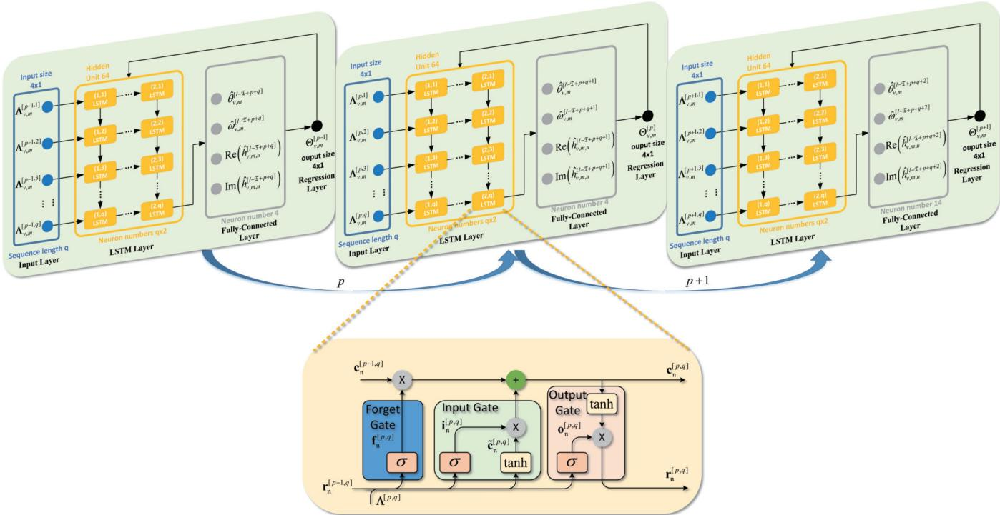  
Fig. 4. The J-LSTM structure for compensating the jittering channel. The three diagrams on the top side represent the neural network trained at different time steps, where the results of round p are conducted to the next time step $p + 1$ . The detailed structure of the LSTM layer at time step p can be seen on the bottom side of this figure.

• Fully Connected Layer: 4 neurons followed by a sigmoid activation function.

• Regression Layer: Outputs a 4-dimensional prediction vector.

2) Data Construction and Feature Extraction: The input layer of J-LSTM structure is formed by the jitter theta and the real-time CSI, which can be written as

$$
\begin{array} { l } { { \displaystyle \Lambda ^ { [ p ] } = \left\{ \Lambda _ { 1 } ^ { [ p ] } , \Lambda _ { 2 } ^ { [ p ] } , \Lambda _ { 3 } ^ { [ p ] } , \Lambda _ { 4 } ^ { [ p ] } \right\} , } } \end{array}\tag{41}
$$

where

$$
\pmb { \Lambda } _ { 1 } ^ { [ p ] } = \left\{ \theta _ { v , m } ^ { [ l - \mathfrak { T } + p ] } , \theta _ { v , m } ^ { [ l - \mathfrak { T } + p + 1 ] } , \dots , \theta _ { v , m } ^ { [ l - \mathfrak { T } + p + q ] } \right\} ,\tag{42}
$$

$$
\pmb { \Lambda } _ { 2 } ^ { [ p ] } = \left\{ \omega _ { v , m } ^ { [ l - \mathfrak { T } + p ] } , \omega _ { v , m } ^ { [ l - \mathfrak { T } + p + 1 ] } , \dots , \omega _ { v , m } ^ { [ l - \mathfrak { T } + p + q ] } \right\} ,\tag{43}
$$

$$
\Lambda _ { 3 } ^ { [ p ] } = \left\{ \mathrm { R e } \left( h _ { v , m , u } ^ { [ l - \mathfrak { T } + p ] } , h _ { v , m , u } ^ { [ l - \mathfrak { T } + p + 1 ] } , \ldots , h _ { v , m , u } ^ { [ l - \mathfrak { T } + p + q ] } \right) \right\} ,\tag{44}
$$

$$
\pmb { \Lambda } _ { 4 } ^ { [ p ] } = \left\{ \mathrm { I m } \left( h _ { v , m , u } ^ { [ l - \mathfrak { T } + p ] } , h _ { v , m , u } ^ { [ l - \mathfrak { T } + p + 1 ] } , \ldots , h _ { v , m , u } ^ { [ l - \mathfrak { T } + p + q ] } \right) \right\} .\tag{45}
$$

The training data consist of 100,000 sets of randomly generated normalized jitter angles and corresponding channel data, where the jitter angles follow a uniform distribution in the range of $0 ^ { \circ }$ to $1 4 ^ { \circ }$ . For the testing data, based on Eq. (18), we generate continuously varying UAV jitter channels, which consist T data sets. Using the previously trained model, the first $\mathfrak T - 1$ data sets are employed to update the network parameters, while the T-th data set is used to predict the realtime channel parameters.

3) Training and Weight Updating Strategies: The network employs the Adam optimizer to train and adjust the network parameters. The parameters of the optimizer are defined as follows:

• Initial learning rate: 0.001.

• Weight decay: $1 \times 1 0 ^ { - 4 }$

• Learning rate decay: 10% every 1500 iterations.

• Dynamic learning rate scheduling: Initial rate $1 \times 1 0 ^ { - 3 }$ with step decay scheduler.

Further, we define the cell state of the q-th neuron in LSTM layer n as $\mathbf { c } _ { \mathrm { n } } ^ { [ p , q ] }$ and the hidden layer output as $\mathbf { r } _ { \mathrm { n } } ^ { [ p , q ] }$ . After that, the forget gate, input gate, and output gate functions can be written as

$$
\mathbf { f } _ { \mathsf { n } } ^ { [ p , q ] } = \sigma _ { g } \left( \mathbf { W } _ { r f , \mathsf { n } } ^ { [ p , q ] } \pmb { \Lambda } _ { v , m } ^ { [ p , q ] } + \mathbf { W } _ { h f , \mathsf { n } } ^ { [ p , q ] } \pmb { \mathrm { r } } _ { \mathsf { n } } ^ { [ p - 1 , q ] } + \mathbf { b } _ { f , \mathsf { n } } ^ { [ p , q ] } \right) ,\tag{46}
$$

$$
\mathbf { i } _ { \mathrm { n } } ^ { [ p , q ] } = \sigma _ { g } \left( \mathbf { W } _ { r i , \mathrm { n } } ^ { [ p , q ] } \Lambda _ { v , m } ^ { [ p , q ] } + \mathbf { W } _ { h i , \mathrm { n } } ^ { [ p , q ] } \mathbf { r } _ { \mathrm { n } } ^ { [ p - 1 , q ] } + \mathbf { b } _ { i , \mathrm { n } } ^ { [ p , q ] } \right) ,\tag{47}
$$

$$
\begin{array} { r } { \tilde { \mathbf { c } } _ { \mathfrak { n } } ^ { [ p , q ] } = \sigma _ { h } \left( \mathbf { W } _ { r c , \mathfrak { n } } ^ { [ p , q ] } \mathbf { \Lambda } _ { v , m } ^ { [ p , q ] } + \mathbf { W } _ { h c , \mathfrak { n } } ^ { [ p , q ] } \mathbf { r } _ { \mathfrak { n } } ^ { [ p - 1 , q ] } + \mathbf { b } _ { c , \mathfrak { n } } ^ { [ p , q ] } \right) , } \end{array}\tag{48}
$$

$$
\mathbf { o } _ { \mathfrak { n } } ^ { [ p , q ] } = \sigma _ { g } \left( \mathbf { W } _ { r o , \mathfrak { n } } ^ { [ p , q ] } \mathbf { \Lambda } _ { v , m } ^ { [ p , q ] } + \mathbf { W } _ { h o , \mathfrak { n } } ^ { [ p , q ] } \mathbf { r } _ { \mathfrak { n } } ^ { [ p - 1 , q ] } + \mathbf { b } _ { o , \mathfrak { n } } ^ { [ p , q ] } \right) ,\tag{49}
$$

where $\mathbf { f } _ { \mathrm { n } } ^ { [ p , q ] }$ represents the forget gate output, $\mathbf { i } _ { \mathfrak { n } } ^ { [ p , q ] }$ and $\tilde { \mathbf { c } } _ { p , \mathfrak { n } } ^ { [ p , q ] }$ represent the input gate output, and $\mathbf { o } _ { \mathfrak { n } } ^ { [ p , q ] }$ represents the output gate output. Meanwhile, $\begin{array} { r } { \bar { \mathbf { W } } _ { r f , { \ n } } ^ { [ p , q ] } , \mathbf { W } _ { r i , { \ n } } ^ { [ p , q ] } , \bar { \mathbf { W } } _ { r o , { \ n } } ^ { [ p , q ] } } \end{array}$ , and $\mathbf { W } _ { r c , \mathfrak { n } } ^ { [ \tilde { p } , q ] }$ represent the weight matrices of the input vectors. $\mathbf { W } _ { h f , \mathfrak { n } } ^ { [ p , q ] }$ $\mathbf { W } _ { h i , \mathfrak { n } } ^ { [ p , q ] } , \mathbf { W } _ { h o , \mathfrak { n } } ^ { [ p , q ] }$ , and $\mathbf { W } _ { h c , \mathfrak { n } } ^ { [ p , q ] }$ represent the weight matrices of the short-term memories. $\mathbf { b } _ { f , \mathfrak { n } } ^ { [ p , q ] } , \mathbf { b } _ { i , \mathfrak { n } } ^ { [ p , q ] } , \mathbf { b } _ { o , \mathfrak { n } } ^ { [ p , q ] }$ , and $\mathbf { b } _ { c , \mathfrak { n } } ^ { [ p , q ] }$ stand for bias vectors. $\sigma _ { g }$ represents the sigmoid activation function, defined by

$$
\sigma _ { g } ( x ) = \frac { 1 } { 1 + e ^ { - x } } ,\tag{50}
$$

and $\sigma _ { h }$ represents the hyperbolic tangent function defined by

$$
\sigma _ { h } ( x ) = \frac { e ^ { 2 x } - 1 } { e ^ { 2 x } + 1 } .\tag{51}
$$

We define the network output of the J-LSTM as $\hat { \Theta } _ { v , m } ^ { [ p ] }$ which can be obtained by

$$
\begin{array} { r l } & { \hat { \Theta } _ { v , m } ^ { [ p ] } = \sigma _ { g } ( \mathbf { W } _ { h y } ^ { [ p ] } \mathbf { \Phi } _ { \mathbf { h } } ^ { [ p , q ] } \sigma _ { h } ( \mathbf { c } _ { \mathrm { n } } ^ { [ p - 1 , q ] } \mathbf { f } _ { \mathrm { n } } ^ { [ p , q ] } + \tilde { \mathbf { c } } _ { \mathrm { n } } ^ { [ p , q ] } \mathbf { i } _ { \mathrm { n } } ^ { [ p , q ] } ) ) } \\ & { = \sigma _ { g } ( W _ { h y } ^ { [ p ] } ( \mathbf { W } _ { r o , \mathrm { n } } ^ { [ p , q ] } \mathbf { \Lambda } _ { v , m } ^ { [ p , q ] } + \mathbf { W } _ { h o , \mathrm { n } } ^ { [ p , q ] } \mathbf { r } _ { \mathrm { n } } ^ { [ p - 1 , q ] } + \mathbf { b } _ { o , \mathrm { n } } ^ { [ p , q ] } ) \sigma _ { h }  } \\ & {  ( \mathbf { c } _ { \mathrm { n } } ^ { [ p - 1 , q ] } \sigma _ { g } ( \mathbf { W } _ { r f , \mathrm { n } } ^ { [ p , q ] } \mathbf { \Lambda } _ { v , m } ^ { [ p , q ] } + \mathbf { W } _ { h f , \mathrm { n } } ^ { [ p , q ] } \mathbf { r } _ { \mathrm { n } } ^ { [ p - 1 , q ] } + \mathbf { b } _ { f , \mathrm { n } } ^ { [ p , q ] } ) ) ) } \\ & { \qquad + \sigma _ { h } ( \mathbf { W } _ { r c , \mathrm { n } , [ p ] } ^ { [ p , q ] } \mathbf { \Lambda } _ { v , m } ^ { [ p , q ] } + \mathbf { W } _ { h c , \mathrm { n } } ^ { [ p , q ] } \mathbf { r } _ { \mathrm { n } } ^ { [ p - 1 , q ] } + \mathbf { b } _ { c , \mathrm { n } } ^ { [ p , q ] } ) } \\ &  \qquad \cdot \sigma _ { g } ( \mathbf { W } _ { r i , \mathrm { n } } ^ { [ p , q ] } \ \end{array}\tag{52}
$$

After passing through the LSTM layers, the output goes through a fully connected layer to generate the training result. Through the regression layer, the output is used to calculate the loss function of the network, which can be defined as

$$
\begin{array} { l } { { \displaystyle { \cal J } _ { \mathrm { e r r o r } } = \frac { 1 } { 2 } \Big ( \Theta _ { v , m } ^ { [ p ] } - \hat { \Theta } _ { v , m } ^ { [ p ] } \Big ) ^ { 2 } } \ ~ } \\ { { \displaystyle ~ = \frac { 1 } { 2 } \Big ( \Theta _ { v , m } ^ { [ p ] } - \sigma _ { g } \Big ( { \bf W } _ { h y , \mathrm { n } } ^ { [ p ] } { \bf r } _ { \mathrm { n } } ^ { [ p , q ] } \Big ) \Big ) ^ { 2 } } . } \end{array}\tag{53}
$$

According to our definitions, the last two feature dimensions of $\hat { \Theta } _ { v , m } ^ { [ p ] }$ correspond to the Re $\left( \hat { \mathbf { h } } _ { m , u } ^ { [ l + 1 ] } \right)$ and Im $\left( \hat { h } _ { m , u , v } ^ { [ l + 1 ] } \right)$ . Therefore, we can have $\hat { h } _ { m , u , v } ^ { [ l + 1 ] } = \operatorname { R e } \Big ( \hat { h } _ { m , u , v } ^ { [ l + 1 ] } \Big ) +$ jIm $\left( \hat { h } _ { m , u , v } ^ { [ l + 1 ] ^ { ' } } \right)$ . Then, the predicted channel vector at symbol time $\wr + 1$ can be denoted as

$$
\hat { \mathbf { h } } _ { m , u } ^ { [ l + 1 ] } = \left\{ \hat { h } _ { 1 , m , u } ^ { [ l + 1 ] } \cdot \cdot \cdot \hat { h } _ { V , m , u } ^ { [ l + 1 ] } \right\} .\tag{54}
$$

On this basis, the capacity of the predicted J-LSTM system can be written as

$$
\begin{array} { c } { { \displaystyle \mathcal { R } _ { u } ^ { \mathbb { L } } = \log _ { 2 } \left[ 1 + \frac { P \left( V - U + 1 \right) \left( \hat { R } _ { m , u } ^ { [ l + 1 ] } \right) ^ { 2 } } { M U } \sum _ { i = 1 } ^ { M } { \left| \delta _ { m , u } \right| ^ { 2 } } \right] } } \\ { { \displaystyle - \log _ { 2 } \left[ 1 + \frac { P \left( U - 1 \right) \left( \hat { \varepsilon } _ { m , u } ^ { [ l + 1 ] } \right) ^ { 2 } } { M U } \sum _ { i = 1 } ^ { M } { \left| \delta _ { m , u } \right| ^ { 2 } } \right] . } } \end{array}\tag{55}
$$

## C. Computational Complexity

The number of parameters of the AR scheme can be written as

$$
\begin{array} { r l } & { N _ { A R } = L _ { p } V ^ { 2 } + \left( L _ { p } \right) V ^ { 2 } + \left( L _ { p } \right) V ^ { 3 } + { L _ { p } } ^ { 2 } } \\ & { \qquad = L _ { p } V \left( L _ { p } V + V + L _ { p } ^ { 2 } V ^ { 2 } + L _ { p } \right) . } \end{array}\tag{56}
$$

For the J-LSTM scheme, the number of parameters can be written as

$$
N _ { J - L S T M } = n _ { i } \cdot n _ { c } + n _ { c } \cdot n _ { c } + n _ { c } \cdot n _ { o } + n _ { c } + n _ { o } ,\tag{57}
$$

where $n _ { c } , n _ { i }$ , and $n _ { o }$ denote the numbers of hidden neurons, input, and output units, respectively. For the J-LSTM scheme shown in Fig. 4, Eq. (57) can be rewritten as

$$
\begin{array} { r } { N _ { J - L S T M } = V \Bigg ( \sum _ { p = 1 } ^ { \mathfrak { T } } \left( 4 q \cdot n _ { c } ^ { p } + n _ { c } ^ { p } \cdot n _ { c } ^ { p } + n _ { c } ^ { p } \right) } \\ { + n _ { c } ^ { \mathfrak { T } } \cdot n _ { o } + n _ { o } } \end{array}\tag{58}
$$

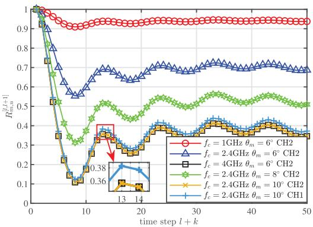  
Fig. 5. The correlation coefficients $R _ { m , u } ^ { [ l , l + k ] }$ with $l = 0$ of UAV jittering channel for different $\theta _ { m }$ and different $f _ { c }$

After that, the complexity of the AR and J-LSTM schemes are O $( N _ { A R } )$ and $\mathcal { O } \left( N _ { J - L S T M } \right)$ , respectively. Assuming $q \ll$ $L _ { p } ,$ from Eqs. (57) and (58), we observe that the complexity of the AR scheme remains constant with respect to T, V, and $q ,$ while the complexity of the J-LSTM scheme depends on the number of neurons $n _ { c }$ when T is set as a number close to $L _ { p } .$ . We define $n _ { c }$ of each layer as $n _ { c } ^ { p } \cdot n _ { c } ^ { p } \ll L _ { p } ^ { 2 } V ^ { 2 }$ . Then, the complexity of the J-LSTM scheme is substantially lower than that of the AR scheme. Otherwise, it may approach or even exceed the complexity of the AR scheme.

## VI. NUMERICAL RESULTS

This section presents numerical results to evaluate the performance of UAV-Ns with CoMP under the effect of UAV jitter.

## A. UAV Jittering Channel Correlation Coefficient Analysis

Based on the jitter model of Section III, we simulate the channel correlation coefficients $R _ { m , u } ^ { [ l , l + k ] }$ at different times under different jitter behavior. First, we assume the system frequency is $f _ { c } = \{ 1 , 2 . 4 , 4 \}$ GHz [42], which is the typical frequency of UAV communication. Further, in [43], the K-factor parameter for a UAV flying at a height of 60m in an urban environment with an omnidirectional antenna is set as 10.89. In order to closely match the real-world application environment, we define a Laplacian angular power spectrum with $\ K \ = \ 1 0 . 8 9$ and $\sigma _ { a } ~ = ~ 1$ [44]. For the scatterers parameters, we define $\varphi _ { n } \sim [ 0 , 1 / 2 \pi )$ with $\varphi _ { 0 } ~ = ~ 1 5 ^ { \circ }$ $\omega _ { n } \sim [ 0 , 2 \pi )$ with $\omega _ { 0 } = 1 5 ^ { \circ }$ [45]. For the sinusoidal process, we assume that the amplitude and frequency of the jitter angle both follow the uniform distribution, i.e., $\Phi \sim U \left[ - \theta _ { m } , \theta _ { m } \right)$ and $\Psi \sim U \left[ - \omega _ { m } , \omega _ { m } \right)$ . Meanwhile, $\omega _ { m } = \theta _ { m }$ is assumed to simplify the simulation, where $\theta _ { m } = \{ 6 , 8 , 1 0 \}$ (the maximum angle $\theta _ { m }$ is less than 10◦ [46]). Then, we can define $F _ { 1 } ,$ $F _ { 2 } \sim U \left[ 5 , 2 5 \right)$ Hz and the number of MPC is $N = 2 0 \ [ 3 5 ]$ We assume all the transceivers of different UAVs are placed at the same location with $d _ { t r } = 4 0 \ \mathrm { c m }$

Furthermore, given the inherent randomness in the simulation parameters, we employed the Monte Carlo simulation method to model the results with the number of Monte Carlo iterations set to 1,000.

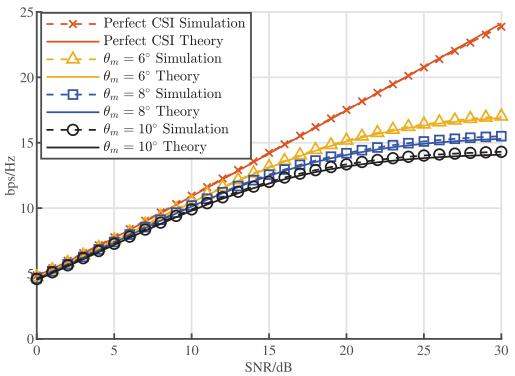  
Fig. 6. The channel capacity analysis of link $\mathbb { L } _ { A G }$ with UAV jittering channel of different $\theta _ { m }$

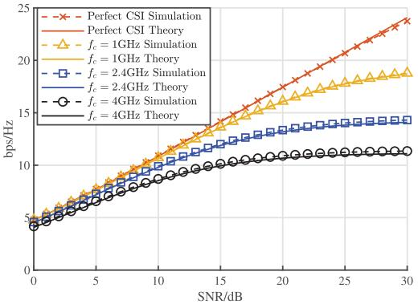  
Fig. 7. The channel capacity analysis of link $\mathbb { L } _ { A G }$ with UAV jittering channel of different $f _ { c } .$

Fig. 5 shows the effect of $f _ { c }$ and $\theta _ { m }$ to the $R _ { m , u } ^ { [ l , l + k ] }$ CH1 represents the channel in [35], while CH2 represents the channel in this paper. Since the channel impulse response depends on the distance $\Delta d _ { v , m , S _ { n } } ^ { [ l , l + k ] }$ change of UAV jitter and the signal wavelength $\lambda ,$ the larger $\Delta d _ { v , m , S _ { n } } ^ { [ l , l + k ] } / \lambda .$ , the greater the channel variation. Therefore, increasing $\theta _ { m }$ (increasing $\Delta d _ { v , m , S _ { n } } ^ { [ l , l + k ] } )$ or $f _ { c }$ (decreasing λ) will make $\bar { R } _ { m , u } ^ { [ l , l + k ] }$ decrease faster. Similarly, it can be inferred that increasing $d _ { t r }$ has the same effect on the $R _ { m , u } ^ { [ l , l + k ] }$ . In addition, the simulation results show that the channel of CH2 exhibits greater channel variation than that of CH1, and this variation is caused by the introduction of an additional yaw angle.

## B. UAV Jittering Channel Capacity Analysis

Further, we analyze the reachable channel capacity of the whole system. It is assumed that the number of UAV-BSs is $M = 2 ,$ , each UAV-BS containing $V = 1 0 \ \mathrm { U A V s } ,$ and the number of UEs is $U = 2$ . The symbolic period $T _ { s }$ of l is 0.002s with $l = 5 0 0$ . In Figs. 6 and 7, we analyze the reachable capacity of the system with different $\theta _ { m }$ and different $f _ { c } .$

It can be seen that with the increase of $\theta _ { m }$ and $f _ { c } ,$ the upper limit of the system’s achievable channel capacity has experienced a significant decline. Due to the time-varying characteristics of the channel generated by the UAV jitter, the system’s capacity decreases significantly under higher SNR conditions. In Fig. 6, the capacity loss compared to the perfect CSI is nearly 2 bps/Hz with $\mathbf { S N R } = 2 0 \mathbf { d B }$ and $\theta _ { m } = 6 ^ { \circ }$ , but when SNR reaches 30 dB, the capacity loss has reached almost 9 bps/Hz. However, even when the $\theta _ { m }$ increases from $6 ^ { \circ }$ to $1 0 ^ { \circ }$ , the channel capacity only decreases by 1 bps/Hz. Similarly, the same phenomenon can also be observed in Fig. 7. Indicating that the UAV jitter causes the capacity to have a plateau effect, with much higher performance regression in higher SNR conditions.

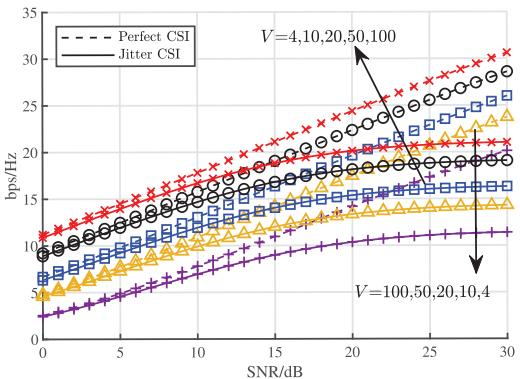  
Fig. 8. The channel capacity analysis of link $\mathbb { L } _ { A G }$ with UAV jittering channel of different V .

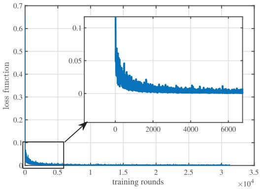  
Fig. 9. The training convergence curve of the J-LSTM network is based on the loss function.

Then, in Fig. 8, the effect of the $V = \{ 4 , 1 0 , 2 0 , 5 0 , 1 0 0 \}$ is investigated with $\theta _ { m } = 6 ^ { \circ }$ and $f _ { c } = 2 . 4$ GHz.It can be seen that there is a significant increase in the capacity with the rise of V under perfect CSI conditions. Meanwhile, the increase in V in jittering channel conditions significantly increases the capacity in lower SNR conditions. However, in higher SNR conditions, the primary influence of the system is UAV jitter. Hence, the channel capacity increase is not substantial. For instance, when $V = 1 0 0$ , the channel capacity is almost the same as that when $V = 5 0$ in the higher SNR conditions.

The above results are mainly due to the fact that $\Delta \mathcal { R } _ { u } ^ { \mathbb { I } }$ will increase with the increase of SNR, which leads to a larger performance loss at higher SNR conditions. Although $\mathcal { R } _ { u } ^ { \mathbb { S } }$ will increase with the increase of V, the increment will decrease when the UAV jitter is considered. Hence, the capacity improvement with V is insignificant.

## C. J-LSTM Scheme Convergence Analysis

In order to verify the performance of the J-LSTM network, we conducted simulations on the network’s convergence. We randomly generated 100,000 sets of data with various jitter thetas as training inputs, while simultaneously producing another 1,000 sets of test data for jitter thetas ranging from $0 ^ { \circ }$ to $1 4 ^ { \circ }$ to validate the performance of the network. In this context, $q = 2 4$ , and the convergence curve for the network’s training is demonstrated in Fig. 9, while the results of the testing on the test data are presented in Fig. 10. Moreover, Fig. 11 analyzes the goodness of fit of the test data.

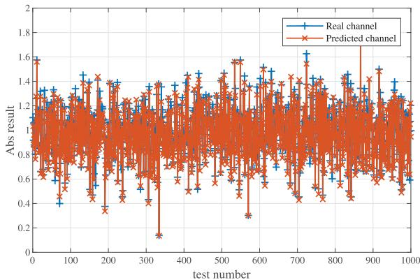

Fig. 10. The comparison results between the testing data and the real data of the J-LSTM network.  
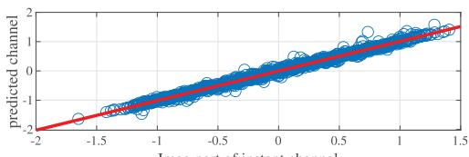

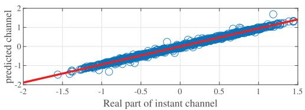  
Fig. 11. The fitted curves of the testing data and the real data of J-LSTM network.

From Fig. 9, it can be seen that the training data converges after approximately 6000 iterations. When testing the trained network with random data, it is observed that the data fitting is quite accurate.

As shown in Fig. 10, the test data accurately predicts the actual channel data following network training. Meanwhile, the MSE result for the test data is 0.0087, which essentially meets the practical usage requirements. Moreover, Fig. 11 shows that both the real and imaginary components closely align with the true channel values, further confirming the effectiveness of the proposed network.

## D. Channel Compensation Scheme Analysis

Further, we simulate the performance of the UAV jittering channel system using the channel compensation scheme. The basic parameters of this simulation are $f _ { c } = 2 . 4$ GHz and $V = 1 0$ . The performance with $\theta _ { m } = \{ 6 ^ { \circ } , 1 0 ^ { \circ } , 1 4 ^ { \circ } \}$ , of the AR scheme (perfect AR scheme and delay AR are involved as defined in Section V) and J-LSTM scheme are analyzed and compared. In order to evaluate the effectiveness of the proposed scheme, we added the analysis of $\theta _ { m } = 1 4 ^ { \circ }$ , which is the maximum jitter that UAV could stand for [47].

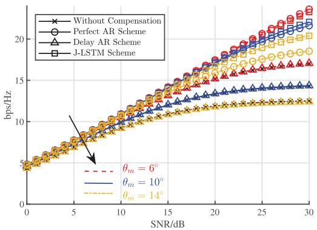  
Fig. 12. The channel capacity analysis of link $\mathbb { L } _ { A G }$ with UAV jittering channel of $\theta _ { m } = \{ 6 ^ { \circ } , 1 \dot { 0 ^ { \circ } } , 1 \dot { 4 } ^ { \circ } \}$ under the method of Perfect AR, Delay AR, and J-LSTM.

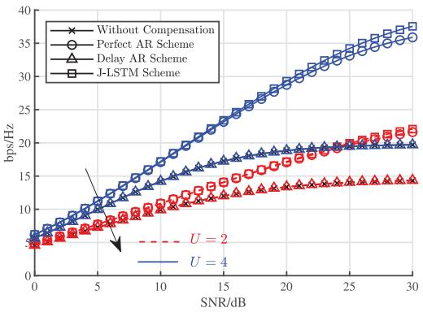  
Fig. 13. The channel capacity analysis of link $\mathbb { L } _ { A G }$ with the number of UE $\check { U = } \{ 2 , 4 \}$ under the method of Perfect AR, Delay AR, and J-LSTM.

As shown in Fig. 12, the perfect AR and J-LSTM schemes demonstrated the best compensation results. They provided a performance improvement of at least 4 bps/Hz under the condition of $\mathrm { S N R } = 3 0 ~ \mathrm { d B }$ . In contrast, the delay AR scheme only offers a minimal performance gain. Further comparison reveals that when $\theta _ { m } = 6 ^ { \circ }$ , the perfect AR scheme performs slightly better than the J-LSTM scheme. However, when $\theta _ { m } = 1 0 ^ { \circ }$ , the situation reverses. When the jitter angle is further increased, the performance advantage of the J-LSTM scheme becomes more significant. This highlights the potential advantage of J-LSTM in handling larger jitter angles. Additionally, unlike the perfect AR scheme, J-LSTM does not require prior channel information at the symbol time l + 1, making it more practical for real-world applications.

Meanwhile, in order to compare the system performance under different users, we further simulated the conditions with the number of UEs is $U = \{ 2 , 4 \}$ with the prediction channel of the perfect AR, delay AR, and J-LSTM scheme. The basic parameters of this simulation are $f _ { c } = 2 . 4 ~ \mathrm { G H z } , V = 1 0$ , and $\theta _ { m } = 1 0 ^ { \circ }$

Fig. 13 shows that as U increases, the overall network channel capacity improves accordingly. However, in the presence of jitter effects, the rate of capacity improvement is notably reduced. When comparing different schemes, it can be seen that the J-LSTM scheme consistently maintains strong transmission performance as the U grows, highlighting its potential suitability for multi-user deployment scenarios.

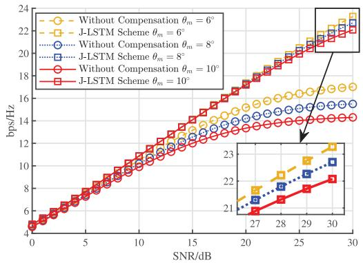  
Fig. 14. The channel capacity analysis of link LAG with UAV jittering channel of different $\theta _ { m }$ under the method of J-LSTM.

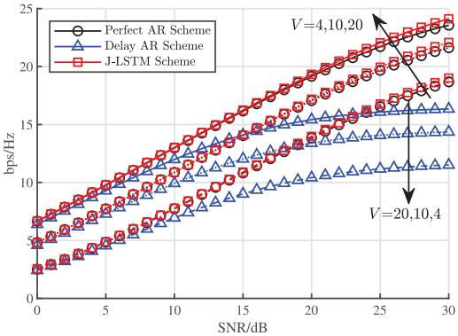  
Fig. 15. The channel capacity analysis of link $\mathbb { L } _ { A G }$ with UAV jittering channel of different V under the method of Perfect AR, Delay AR, and J-LSTM.

After that, we simulate the performance of the system using the channel compensation scheme with different $\theta _ { m }$ and V. Fig. 14 demonstrates that the optimization effect of J-LSTM becomes more pronounced as $\theta _ { m }$ increases. Simulation results indicate that the enhancement achieved by J-LSTM grows with the increasing of $\theta _ { m }$ . For instance, when $\theta _ { m } = 6 ^ { \circ }$ , J-LSTM provides 6 bps/Hz improvement at higher SNR conditions, while when $\theta _ { m } = 1 0 ^ { \circ }$ , its performance enhancement exceeds 8 bps/Hz. This indicates that J-LSTM is particularly useful under conditions of severe jitter.

As shown in Fig. 15, the J-LSTM scheme outperforms the AR scheme in improving system performance, with the enhancement becoming more pronounced as V increases. Meanwhile, it can be seen that J-LSTM effectively mitigates the platform effects caused by UAV jitter, which leads to great performance improvement at higher SNR conditions.

Further, we compare the channel correlation coefficients with the prediction channel of the perfect AR, delay AR, and J-LSTM scheme for different $\theta _ { m }$ with l = 500 and k = 1.

From Fig. 16, it can be seen that as the $\theta _ { m }$ increases, the J-LSTM compensation accuracy improves more compared to the delay AR scheme. For instance, when $\theta _ { m } \ = \ 1 0 ^ { \circ }$ , the improvement of the J-LSTM scheme compared with the delay AR scheme exceeds more than 3.8%. Furthermore, as the $\theta _ { m }$ increases, the performance improvement of the J-LSTM scheme becomes more pronounced. When $\theta _ { m } = 1 4 ^ { \circ }$ , the J-LSTM scheme achieves nearly 7% improvement. Compared to the perfect AR scheme, the compensation accuracy of the J-LSTM scheme is nearly the same. It is worth mentioning that the J-LSTM scheme shows better compensation accuracy when $\theta _ { m } \ > \ 8 ^ { \circ }$ , though the performance difference is less than 0.1%. Therefore, the proposed J-LSTM scheme exhibits superior adaptability to jittering channels, providing higher accuracy than the delay AR method.

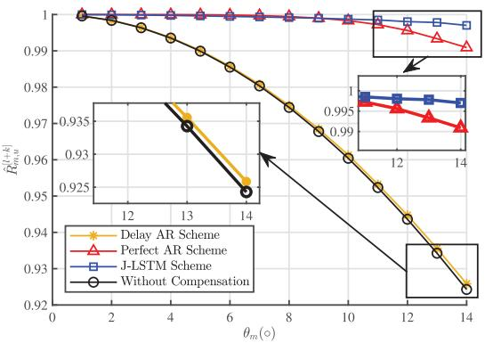  
Fig. 16. The $\hat { R } _ { m , u } ^ { [ l + k ] }$ analysis of different predicted methods of Perfect AR, Delay AR, and J-LSTM.

## VII. CONCLUSION

This paper analyzes the performance of UAV-Ns with CoMP under the influence of UAV jitter. Specifically, a channel function expression is established based on a UAV jitter model to investigate the impact of airflow on the system’s overall channel capacity. Additionally, this paper proposes a J-LSTM scheme that leverages the channel characteristics of UAV jitter. Theoretical analysis and numerical results demonstrate that UAV jitter can cause a significant capacity loss that intensifies with increased jitter intensity, particularly under higher SNR conditions. Meanwhile, our proposed J-LSTM scheme can effectively mitigate the performance loss caused by UAV jitter, showing a significant advantage over the AR scheme. Compared to the AR scheme, our proposed J-LSTM scheme improves estimation accuracy by 3.8% when the jitter angle is 10◦. This paper lays a foundation for applying CoMP in practical UAV-Ns, with the J-LSTM scheme addressing challenges caused by UAV jitter and offering valuable insights for enhancing network capacity. However, there are still other research directions worth further exploration.

In the future, we plan to conduct a more in-depth analysis of the associated power characteristics and explore optimal energy allocation strategies. Meanwhile, we will focus on leveraging UAV mobility characteristics to analyze performance boundaries and develop global optimization methods for heterogeneous UAV-Ns. Furthermore, we intend to carry out real-world measurements and testing of UAV jitter channels to evaluate system performance under practical channel conditions and gain a clearer understanding of the system’s operational boundaries, thereby enhancing its real-world applicability.

APPENDIX A To derive Ea (13) $d _ { v , m , S _ { n } } ^ { [ l ] }$ can be rewritten as

$$
\begin{array} { r l } & { \mathrm { S y ~ a r a n g ~ \mathscr { L } _ { 1 } ~ } } \\ & { = \delta _ { 1 } ^ { ( 1 ) } ( \Delta \phi , \Delta \phi , \Delta \phi , \Delta \phi , \phi , \Delta \phi , \phi , \Delta \phi , \phi , \phi , \Delta \phi , \phi , \phi ) } \\ & { = \delta _ { 1 } ^ { ( 1 ) } ( \Delta \phi , \Delta \phi , \Delta \phi , \phi , \Delta \phi , \phi , \phi , \Delta \phi , \phi , \phi , \Delta \phi , \phi , \phi ) } \\ &  = \{ \begin{array} { l l } { \mathrm { S y } _ { 1 } ^ { ( 1 ) } - \Delta \phi , \Delta \phi , \mathrm { i } ( 1 + \phi ^ { ( 1 ) } + \Delta \phi ^ { ( 1 ) } - \phi ^ { ( 1 ) } ) , \displaystyle \sum _ { j = 1 } ^ { j } \mathrm { i } \mathrm { i } ( \Delta \phi , \Delta \phi , \phi ) , \displaystyle \sum _ { k = 1 } ^ { j } \mathrm { i } \mathrm { i } ( 1 - \phi ^ { ( 1 ) } ) , } \\ { \mathrm { i } ( 1 + \phi ^ { ( 1 ) } - \Delta \phi ^ { ( 1 ) } - \phi ^ { ( 1 ) } ) , \displaystyle \sum _ { k = 1 } ^ { j } \mathrm { i } ( 1 - \phi ^ { ( 1 ) } ) , \displaystyle \sum _ { k = 1 } ^ { j } \mathrm { i } \mathrm { i } ( 1 - \phi ^ { ( 1 ) } ) , \displaystyle \sum _ { k = 1 } ^ { j } \mathrm { i } \mathrm { i } ( 1 - \phi ^ { ( 1 ) } ) , \displaystyle \sum _ { k = 1 } ^ { j } \mathrm { i } ( 1 - \phi ^ { ( 1 ) } ) , } \\  \mathrm { i } ( 1 + \phi ^ { ( 1 ) } - \Delta \phi ^ { ( 1 ) } - \phi ^ { ( 1 ) } ) , \displaystyle \sum _ { k = 1 } ^ { j } \mathrm { i } ( 1 - \phi ^ { ( 1 ) } ) , \displaystyle \sum _ { k = 1 } ^ { j } \mathrm { i } ( 1 - \phi ^ { ( 1 ) } ) , \displaystyle \sum _ { k = 1 } ^ { j } \mathrm  i  \end{array} \end{array}
$$

where in step $( \mathrm { a } ) , d _ { t r } \ll d _ { v , m , S _ { n } } ^ { [ l ] }$ is assumed and in step (b), we used $\begin{array} { r } { \sqrt { 1 - \beta } \approx 1 - \frac { \beta } { 2 } } \end{array}$ for small $\beta .$

## APPENDIX B

Starting from Eq. (5) and applying the channel vector as described in Eq. (4), the received signal power is given by

$$
\begin{array} { r l } { S _ { u _ { 1 } } = } & { P _ { u _ { 2 } } \underbrace { \frac { M ^ { [ 1 ] } } { \omega _ { 1 } } } _ { \displaystyle \sum _ { n = 1 } ^ { M } } \Big \{ \delta _ { n , n } \mathbf { u } _ { n } ^ { [ 1 ] + 1 } \mathbf { u } _ { 1 } ^ { [ 1 ] } \Big \} \mathbf { w } _ { n , n } ^ { [ 2 ] + 1 } \Big | ^ { 2 } } \\ & { \stackrel { ( a ) } { \leq } P _ { u _ { 2 } } \displaystyle \sum _ { n = 1 } ^ { M } \Big | \delta _ { n , n } \mathbf { u } _ { n } [ \Big ( P _ { u _ { 2 } , n + 1 } ^ { [ 2 , 1 ] } \mathbf { h } _ { n , n } ^ { [ 1 ] } \mathbf { u } _ { n , n } ^ { [ 1 ] } + \mathbf { t } ^ { [ 2 , 1 ] } \mathbf { u } _ { 1 } ^ { [ 2 ] } \Big ) \mathbf { w } _ { n , n } ^ { [ 1 ] + 1 } \Big | ^ { 2 } } \\ & { \stackrel { ( b ) } { \leq } P _ { u _ { 2 } } \displaystyle \sum _ { n = 1 } ^ { M } \Big | \delta _ { n , n } \mathbf { u } _ { n } ^ { [ 1 ] } \Big ( P _ { u _ { 2 } , n } ^ { [ 2 , 1 ] } \mathbf { u } _ { n } ^ { [ 1 ] } \Big ) \mathbf { w } _ { n , n } ^ { [ 1 ] } \Big | ^ { 2 } } \\ & { - P _ { u _ { 2 } } \displaystyle \sum _ { n = 1 } ^ { M } E _ { u _ { 2 } , n + 1 } ^ { [ 2 , 1 ] } \Big | \delta _ { n , n } \mathbf { u } _ { n } ^ { [ 1 ] } \Big | ^ { 2 } \Big | \delta _ { n , n } \mathbf { u } _ { n } ^ { [ 1 ] } \Big | ^ { 2 } \mathrm { w } _ { n , n } ^ { [ 1 ] } \Big | ^ { 2 } } \\ &  - E _ { u _ { 2 } } \displaystyle \sum _ { n = 1 } ^ { M } E _ { u _ { 2 } , n + 1 } ^ { [ 2 , 1 ] } \Big | ^ { 2 } \delta _  \end{array}
$$

In step (a), Eq. (4) is applied. In step (b), we assume that $\mathbf { e } ^ { [ l , l + 1 ] }$ is negligible compared to $R _ { m , u } ^ { [ i , l + 1 ] }$ . In step (c), we use $\overline { { \mathbf { h } } } _ { \mathbf { m } , \mathbf { u } } = \bar { \mathbf { h } } _ { m , u } / \| \mathbf { h } _ { m , u } \|$ . Finally, in step (d), as previously defined, $\mathbf { w } _ { m } = \overline { { \mathbf { h } } } _ { m } ^ { \dagger }$ , hence $\mathbb { D } \left( \bar { \mathbf { h } } _ { m , u } ^ { [ l ] } \right) \mathbf { w } _ { m , u } ^ { [ l + 1 ] } = \bar { \mathbf { I } } _ { V }$ where $\mathbf { I } _ { V }$ denotes an identity matrix.

## APPENDIX C

The interference term in Eq. (6) can be written as

$$
\begin{array} { r l } { \Gamma _ { 5 , - } \quad } & { \underbrace { \mathcal { P } _ { 6 , 4 } ^ { \mathrm { T } } } _ { \mathrm { w _ { 5 } , 0 , 2 , 3 , 4 } } [ \mathcal { C } _ { \mathrm { s } , \mathrm { e } , 3 , 3 } ( \Gamma _ { 6 , - 1 } ^ { \mathrm { L } , \mathrm { a } ; \mathrm { e } } ) ^ { \mathrm { i } } ] ^ { 2 } } \\ &  = E _ { \mathrm { s } } \underbrace { \sum _ { i = 1 } ^ { 2 } \sum _ { j = 1 } ^ { 3 } \bigg | \delta _ { \mathrm { s } , \mathrm { o } } ( \mathrm { e } ^ { i \mathrm { Q } _ { i , + 1 } ^ { \mathrm { ( L - 1 ) } } ( \mathbf { b } _ { i , j , - 1 } ^ { \mathrm { T } , \mathrm { a } ; \mathrm { e } } ) } + \mathrm { e } ^ { i \mathrm { Q } _ { i , + 1 } ^ { \mathrm { ( L + 1 ) } } ( \mathbf { b } _ { i , j } ^ { \mathrm { T } } ) } ) \mathrm { w } _ { 5 , 0 , 4 } ^ { \mathrm { i } + \mathrm { Q } _ { i , + 1 } ^ { \mathrm { T } } } \bigg | ^ { 2 } } \\ & { = E _ { \mathrm { s } } \underbrace { \sum _ { i = 1 } ^ { 2 } \sum _ { j = 1 } ^ { 3 } \bigg | \delta _ { \mathrm { s } , \mathrm { o } } ( \mathrm { E } _ { i , j , - 1 } ^ { \mathrm { a } ; \mathrm { a } ; \mathrm { b } } ( \mathbf { b } _ { i , j , - 1 } ^ { \mathrm { T } , \mathrm { a } ; \mathrm { b } } + \mathrm { e } ^ { i \mathrm { Q } _ { i , + 1 } ^ { \mathrm { ( L + 1 ) } } ( \mathbf { b } _ { i , j } ^ { \mathrm { T } , \mathrm { a } } ) } ) \bigg | ^ { 2 } } _ { \mathrm { w _ { 5 } , 0 , 2 , 3 } } } \\ &  = E _ { \mathrm { s } } \underbrace  \sum _ { i = 1 } ^ { 2 } \sum _ { j = 1 } ^ { 3 } \bigg | \mathrm { e } \end{array}
$$

where in step (a) we neglect the term combined by $\mathbf { e } ^ { [ l , l + 1 ] }$ and $\mathbf { h } _ { m , u } ^ { [ l ] }$ which is insignificant compared to the other terms. In step (b) we use the fact that $\mathbf { w } _ { m } = \overline { { \mathbf { h } } } _ { m } ^ { \dag }$ . Hence, the value of $\bar { \mathbf { h } } _ { m , u } ^ { [ l ] } \mathbf { w } _ { m , j } ^ { [ l + 1 ] }$ when $j \neq u$ is zero.

## APPENDIX D

$$
\begin{array} { r l } & { \Delta \mathcal { R } _ { n } ^ { \mathrm { { I } } } = \mathbb { E } \big [ \log _ { 2 } ( 1 + S _ { n } ) \big ] - \mathbb { E } \big [ \log _ { 2 } ( 1 + \mathrm { S N R } _ { n } ) \big ] } \\ & { \qquad = \mathbb { E } \big [ \log _ { 2 } ( 1 + S _ { n } ) \big ] - \mathbb { E } \bigg [ \log _ { 2 } \bigg ( 1 + \frac { S _ { n } } { 1 + \mathrm { I } _ { n } } \bigg ) \bigg ] } \\ & { \qquad = \mathbb { E } \big [ \log _ { 2 } ( 1 + S _ { n } ) \big ] - \mathbb { E } \big [ \log _ { 2 } ( 1 + S _ { n } + \mathrm { I } _ { n } ) \big ] } \\ & { \qquad + \mathbb { E } \big [ \log _ { 2 } ( 1 + \mathrm { I } _ { n } ) \big ] } \\ & { \qquad \le \mathbb { E } \big [ \log _ { 2 } ( 1 + S _ { n } ) \big ] - \mathbb { E } \big [ \log _ { 2 } ( 1 + S _ { n } ) \big ] } \\ & { \qquad + \mathbb { E } \big [ \log _ { 2 } ( 1 + \mathrm { I } _ { n } ) \big ] } \\ & { \qquad = \mathbb { E } \big [ \log _ { 2 } ( 1 + \mathrm { I } _ { n } ) \big ] \le \log _ { 2 } \mathbb { E } \big [ ( 1 + \mathrm { I } _ { n } ) \big ] } \\ & { \qquad = \log _ { 2 } \mathbb { E } \big [ 1 + \zeta _ { n } \big ] \tilde { \mathrm { a } } _ { n } \bigg ] } \\ & { \qquad = \log _ { 2 } \mathbb { E } \bigg [ 1 + \zeta _ { n } \tilde { c } _ { 3 } \tilde { \mathrm { e } } _ { 3 } \bigg ] . } \end{array}\tag{62}
$$

## APPENDIX E

We define the integral result of $f _ { 1 }$ as $\mathbb { f } _ { 1 } ^ { n }$ and the integral result of $f _ { 2 }$ as $\mathbf { f } _ { 2 } ^ { n }$ . Then, by using the Gauss-Chebyshev method, we can obtain an algebraic expression of $R _ { v , m , u } ^ { [ l , l + k ] }$

$$
\mathcal { V } _ { 1 } ^ { n } = \mathrm { s i n c } \left( \frac { 2 } { \lambda } d _ { t r } \cos \varphi _ { n } \theta _ { m } \sin \left( 2 \pi f _ { 1 } k \right) \right) p _ { F _ { 1 } } \left( f _ { 1 } \right) ,\tag{63}
$$

$$
\mathbb { U } _ { 2 } ^ { n } = \operatorname { s i n c } \left( { \phantom { - } } \frac { 2 } { \lambda } d _ { t r } \cos \phi _ { n } \sin \left( - \varphi _ { n } \right) \right.\tag{64}
$$

Furthermore, we can derive

$$
\Im = \int _ { a } ^ { b } \mathrm { f } _ { 1 } ^ { n } d f _ { 1 }
$$

$$
\begin{array} { l } { { \displaystyle = \frac { b - a } { 2 } \int _ { - 1 } ^ { 1 } \frac { 1 } { \sqrt { 1 - \vartheta ^ { 2 } } } \underbrace { \sqrt { 1 - \vartheta ^ { 2 } } \mathrm { f } \left( \frac { b - a } { 2 } \vartheta + \frac { a + b } { 2 } \right) } _ { g ( \mathfrak { d } ) } d \mathfrak { d } \quad } } \\ { { \displaystyle = \frac { b - a } { 2 } \int _ { - 1 } ^ { 1 } \frac { 1 } { \sqrt { 1 - \vartheta ^ { 2 } } } \mathfrak { g } ( \mathfrak { d } ) d \mathfrak { d } \quad \quad } } \end{array}\tag{5}
$$

where a and b represent the upper limit and lower limit of the integral. Meanwhile, we can define

$$
\mathfrak { d } _ { k } = \cos \left( ( 2 k - 1 ) \pi / \left( 2 M _ { f } \right) \right) .\tag{66}
$$

After that, we can rewrite Eq. (65) as

$$
\begin{array} { l } { \displaystyle \Im = \frac { b - a } { 2 } \int _ { - 1 } ^ { 1 } \frac { 1 } { \sqrt { 1 - { \vartheta } ^ { 2 } } } g ( \circ ) d \circ } \\ { \displaystyle \stackrel { ( a ) } { \approx } \frac { b - a } { 2 } \sum _ { k = 1 } ^ { M _ { f } } \frac { \pi } { M _ { f } } \mathfrak { f } \left( \cos \left( ( 2 k - 1 ) \pi / \left( 2 M _ { f } \right) \right) \right) } \\ { \displaystyle = \frac { b - a } { 2 } \times \frac { \pi } { M _ { f } } \sum _ { k = 1 } ^ { M _ { f } } \sqrt { 1 - { \vartheta } _ { k } ^ { 2 } } \mathfrak { f } \left( \frac { b - a } { 2 } { \mathfrak { d } } _ { k } + \frac { a + b } { 2 } \right) , } \end{array}\tag{67}
$$

where in step (a), the Gauss-Chebyshev inequality is used for simplification.

## ACKNOWLEDGMENT

The authors would like to thank the Anechoic Chamber of Beijing Institute of Technology for providing the experimental data of the typical UAV channel.

## REFERENCES

[1] Z. Yang, X. Miao, L. Ding, G. Pan, S. Wang, and J. An, “Optimal SWIPT transmission in RIS-based air–ground wireless communication,” IEEE Trans. Aerosp. Electron. Syst., vol. 60, no. 4, pp. 4310–4322, Aug. 2024.

[2] M. D. Nguyen, L. B. Le, and A. Girard, “UAV placement and resource allocation for intelligent reflecting surface assisted UAV-based wireless networks,” IEEE Commun. Lett., vol. 26, no. 5, pp. 1106–1110, May 2022.

[3] R. G. Ribeiro, L. P. Cota, T. A. M. Euzebio, J. A. Ram ´ ´ırez, and F. G. Guimaraes, “Unmanned-aerial-vehicle routing problem with˜ mobile charging stations for assisting search and rescue missions in postdisaster scenarios,” IEEE Trans. Syst., Man, Cybern., Syst., vol. 52, no. 11, pp. 6682–6696, Nov. 2022.

[4] C. Zhang et al., “Multi-objective aerial collaborative secure communication optimization via generative diffusion model-enabled deep reinforcement learning,” IEEE Trans. Mobile Comput., vol. 24, no. 4, pp. 1–18, Apr. 2025.

[5] Z. Song et al., “Cooperative satellite-aerial-terrestrial systems: A stochastic geometry model,” IEEE Trans. Wireless Commun., vol. 22, no. 1, pp. 220–236, Jan. 2023.

[6] H. Zhang, G. Pan, S. Ke, S. Wang, and J. An, “Outage analysis of cooperative satellite-aerial-terrestrial networks with spatially random terminals,” IEEE Trans. Commun., vol. 70, no. 7, pp. 4972–4987, Jul. 2022.

[7] H. Luan et al., “Energy efficient task cooperation for multi-UAV networks: A coalition formation game approach,” IEEE Access, vol. 8, pp. 149372–149384, 2020.

[8] X. Liu, J. Feng, F. Li, and V. C. M. Leung, “Downlink energy efficiency maximization for RSMA-UAV assisted communications,” IEEE Wireless Commun. Lett., vol. 13, no. 1, pp. 98–102, Jan. 2024.

[9] A. Masaracchia, L. D. Nguyen, T. Q. Duong, C. Yin, O. A. Dobre, and E. Garcia-Palacios, “Energy-efficient and throughput fair resource allocation for TS-NOMA UAV-assisted communications,” IEEE Trans. Commun., vol. 68, no. 11, pp. 7156–7169, Nov. 2020.

[10] A. Rahmati, Y. Yapici, N. Rupasinghe, I. Guvenc, H. Dai, and A. Bhuyan, “Energy efficiency of RSMA and NOMA in cellularconnected mmWave UAV networks,” in Proc. IEEE Int. Conf. Commun. Workshops (ICC Workshops), May 2019, pp. 1–6.

[11] R. Amer, W. Saad, and N. Marchetti, “Toward a connected sky: Performance of beamforming with down-tilted antennas for ground and UAV user co-existence,” IEEE Commun. Lett., vol. 23, no. 10, pp. 1840–1844, Oct. 2019.

[12] A. Bansal, N. Agrawal, K. Singh, C.-P. Li, and S. Mumtaz, “RIS selection scheme for UAV-based multi-RIS-aided multiuser downlink network with imperfect and outdated CSI,” IEEE Trans. Commun., vol. 71, no. 8, pp. 4650–4664, Aug. 2023.

[13] M. S. Ali, E. Hossain, A. Al-Dweik, and D. I. Kim, “Downlink power allocation for CoMP-NOMA in multi-cell networks,” IEEE Trans. Commun., vol. 66, no. 9, pp. 3982–3998, Sep. 2018.

[14] J. Li, Z. Song, T. Hou, J. Gao, A. Li, and Z. Tang, “An RIS-aided interference mitigation-based design for MIMO-NOMA in cellular networks,” IEEE Trans. Green Commun. Netw., vol. 8, no. 1, pp. 317–329, Mar. 2024.

[15] Y. Xiu et al., “Reconfigurable intelligent surfaces aided mmWave NOMA: Joint power allocation, phase shifts, and hybrid beamforming optimization,” IEEE Trans. Wireless Commun., vol. 20, no. 12, pp. 8393–8409, Dec. 2021.

[16] X. Yuan, Y.-J. A. Zhang, Y. Shi, W. Yan, and H. Liu, “Reconfigurableintelligent-surface empowered wireless communications: Challenges and opportunities,” IEEE Wireless Commun., vol. 28, no. 2, pp. 136–143, Apr. 2021.

[17] P. Yang, L. Yang, and S. Wang, “Performance analysis for RIS-aided wireless systems with imperfect CSI,” IEEE Wireless Commun. Lett., vol. 11, no. 3, pp. 588–592, Mar. 2022.

[18] R. Liu, M. Li, H. Luo, Q. Liu, and A. L. Swindlehurst, “Integrated sensing and communication with reconfigurable intelligent surfaces: Opportunities, applications, and future directions,” IEEE Wireless Commun., vol. 30, no. 1, pp. 50–57, Feb. 2023.

[19] M. Sawahashi et al., “Coordinated multipoint transmission/reception techniques for LTE-advanced,” IEEE Wireless Commun., vol. 17, no. 3, pp. 26–34, Jun. 2010.

[20] P. K. Sharma and D. I. Kim, “Coverage probability of 3D mobile UAV networks,” IEEE Wireless Commun. Lett., vol. 8, no. 1, pp. 97–100, Feb. 2019.

[21] L. Liu, S. Zhang, and R. Zhang, “CoMP in the sky: UAV placement and movement optimization for multi-user communications,” IEEE Trans. Commun., vol. 67, no. 8, pp. 5645–5658, Aug. 2019.

[22] R. Amer, W. Saad, and N. Marchetti, “Mobility in the sky: Performance and mobility analysis for cellular-connected UAVs,” IEEE Trans. Commun., vol. 68, no. 5, pp. 3229–3246, May 2020.

[23] J. Chen, K. Zhai, Z. Wang, Y. Liu, J. Jia, and X. Wang, “CoMP and RISassisted multicast transmission in a multi-UAV communication system,” IEEE Trans. Commun., vol. 72, no. 6, pp. 3602–3617, Jun. 2024.

[24] H. Sun, L. Zhang, J. Hou, T. Q. S. Quek, X. Wang, and Y. Zhang, “CoMP transmission in downlink NOMA-based cellular-connected UAV networks,” IEEE Trans. Wireless Commun., vol. 23, no. 7, pp. 7392–7407, Jul. 2024.

[25] D. Jaramillo-Ramirez, M. Kountouris, and E. Hardouin, “Coordinated multi-point transmission with quantized and delayed feedback,” in Proc. IEEE Global Commun. Conf. (GLOBECOM), Dec. 2012, pp. 2391–2396.

[26] N. Arad and Y. Noam, “C-RAN zero-forcing with imperfect CSI: Analysis and precode & quantize feedback,” IEEE Trans. Wireless Commun., vol. 22, no. 7, pp. 4773–4787, Jul. 2023.

[27] D. Jaramillo-Ram´ırez, M. Kountouris, and E. Hardouin, “Coordinated multi-point transmission with imperfect CSI and other-cell interference,” IEEE Trans. Wireless Commun., vol. 14, no. 4, pp. 1882–1896, Apr. 2015.

[28] A. Al-Hourani, S. Kandeepan, and S. Lardner, “Optimal LAP altitude for maximum coverage,” IEEE Wireless Commun. Lett., vol. 3, no. 6, pp. 569–572, Dec. 2014.

[29] W. Tang, H. Zhang, and Y. He, “Tractable modelling and performance analysis of UAV networks with 3D blockage effects,” IEEE Wireless Commun. Lett., vol. 9, no. 12, pp. 2064–2067, Dec. 2020.

[30] L. Yang, H. Zhang, and Y. He, “Temporal correlation and long-term average performance analysis of multiple UAV-aided networks,” IEEE Internet Things J., vol. 8, no. 11, pp. 8854–8864, Jun. 2021.

[31] Y. Ge, J. Fan, and J. Zhang, “Active reconfigurable intelligent surface enhanced secure and energy-efficient communication of jittering UAV,” IEEE Internet Things J., vol. 10, no. 24, pp. 22386–22400, Dec. 2023.

[32] H. Wu, Y. Wen, J. Zhang, Z. Wei, N. Zhang, and X. Tao, “Energyefficient and secure air-to-ground communication with jittering UAV,” IEEE Trans. Veh. Technol., vol. 69, no. 4, pp. 3954–3967, Apr. 2020.

[33] S. Kim, C. Im, J. Lee, and C. Lee, “Learning-aided blind beam adaptation for UAV communication systems with jittering,” IEEE Wireless Commun. Lett., vol. 13, no. 5, pp. 1528–1532, May 2024.

[34] W. Yuan, C. Liu, F. Liu, S. Li, and D. W. K. Ng, “Learning-based predictive beamforming for UAV communications with jittering,” IEEE Wireless Commun. Lett., vol. 9, no. 11, pp. 1970–1974, Nov. 2020.

[35] M. Banagar, H. S. Dhillon, and A. F. Molisch, “Impact of UAV wobbling on the air-to-ground wireless channel,” IEEE Trans. Veh. Technol., vol. 69, no. 11, pp. 14025–14030, Nov. 2020.

[36] H. S. Dhillon and G. Caire, “Wireless backhaul networks: Capacity bound, scalability analysis and design guidelines,” IEEE Trans. Wireless Commun., vol. 14, no. 11, pp. 6043–6056, Nov. 2015.

[37] K. I. Pedersen, P. Mogensen, and B. H. Fleury, “Power azimuth spectrum in outdoor environments,” Electron. Lett., vol. 33, no. 18, pp. 1583–1584, Aug. 1997.

[38] C. A. Coelho and J. T. Mexia, “On the distribution of the product and ratio of independent central and doubly non-central generalized gamma ratio random variables,” Indian J. Statist., vol. 69, pp. 221–255, May 2007.

[39] J. Zhang, R. W. Heath, M. Kountouris, and J. G. Andrews, “Mode switching for the multi-antenna broadcast channel based on delay and channel quantization,” EURASIP J. Adv. Signal Process., vol. 2009, no. 1, Dec. 2009, Art. no. 802548.

[40] Y. Dhungana and C. Tellambura, “Rational gauss-chebyshev quadratures for wireless performance analysis,” IEEE Wireless Commun. Lett., vol. 2, no. 2, pp. 215–218, Apr. 2013.

[41] T. Yang, R. Zhang, X. Cheng, and L. Yang, “Secure massive MIMO under imperfect CSI: Performance analysis and channel prediction,” IEEE Trans. Inf. Forensics Security, vol. 14, no. 6, pp. 1610–1623, Jun. 2019.

[42] Z. Cui, C. Briso-Rodr´ıguez, K. Guan, C. Calvo-Ram´ırez, B. Ai, and Z. Zhong, “Measurement-based modeling and analysis of UAV airground channels at 1 and 4 GHz,” IEEE Antennas Wireless Propag. Lett., vol. 18, pp. 1804–1808, 2019.

[43] J. Rodr´ıguez-Pineiro, T. Dom˜ ´ınguez-Bolano, X. Cai, Z. Huang, and˜ X. Yin, “Air-to-Ground channel characterization for low-height UAVs in realistic network deployments,” IEEE Trans. Antennas Propag., vol. 69, no. 2, pp. 992–1006, Feb. 2021.

[44] P. S. Bithas, V. Nikolaidis, A. G. Kanatas, and G. K. Karagiannidis, “UAV-to-ground communications: Channel modeling and UAV selection,” IEEE Trans. Commun., vol. 68, no. 8, pp. 5135–5144, Aug. 2020.

[45] R. Jia, Y. Li, X. Cheng, and B. Ai, “3D geometry-based UAV-MIMO channel modeling and simulation,” China Commun., vol. 15, no. 12, pp. 64–74, Dec. 2018.

[46] B. Ahmed and H. R. Pota, “Flight control of a rotary wing UAV using adaptive backstepping,” in Proc. IEEE Int. Conf. Control Autom., Dec. 2009, pp. 1780–1785.

[47] Z.-K. Li, S.-G. Su, J.-S. Cao, and S.-J. Luo, “Study on wind resistance characteristics of multi-rotor UAV,” in Proc. Asia Pacific Int. Symp. Aerosp. Technol. (APISAT), Aug. 2022, pp. 23–35.

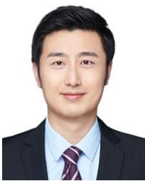

Changhao Du received the Ph.D. degree from Beijing Institute of Technology, China, in 2018. From October 2016 to October 2017, he was a Visiting Ph.D. Student at the Chalmers University of Technology, Sweden, under the financial support of China Scholarship Council. From July 2018 to March 2021, he was a Post-Doctoral Research Associate at Beijing University of Posts and Telecommunications, China. He is currently an Assistant Professor with the School of Cyberspace Science and Technology, Beijing Institute of Technology. His research interests include statistical signal processing, applied signal processing, and the physical layer of wireless communication systems, including D2D communications, GPS navigation, laser and THz communications, channel estimation, and synchronization.

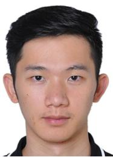

Jiacheng Wang (Member, IEEE) received the Ph.D. degree from the School of Communications and Information Engineering, Chongqing University of Posts and Telecommunications, Chongqing, China. He is a Research Fellow with the College of Computing and Data Science, Nanyang Technological University, Singapore. His research interests include wireless sensing, generative AI, semantic communications, and low-altitude wireless networks.

Shuai Wang (Senior Member, IEEE) received the Ph.D. degree in communications systems from Beijing Institute of Technology (BIT), China, in 2012. Upon his graduation, he joined as a Faculty Member with the School of Information and Electronics, BIT. In 2021, he transferred to the new-founded School of Cyberspace Science and Technology, where he was appointed as the Chair Professor of the Department for Information Security and Countermeasures. He has contributed more than 40 peer-reviewed articles, mainly in leading IEEE journals or conferences, and holds more than 60 patents. His research interests include satellite communications, anti-interference communications, and datalink technologies for space platforms. He was a co-recipient of the Second Class National Technical Invention Award of China in 2019. He served as an Editor for IEEE WIRELESS COMMUNICATIONS LETTERS. He is serving as an Editor for China Communications.

Gaofeng Pan (Senior Member, IEEE) received the B.Sc. degree in communication engineering from Zhengzhou University, Zhengzhou, China, in 2005, and the Ph.D. degree in communication and information systems from Southwest Jiaotong University, Chengdu, China, in 2011. He is currently with the School of Cyberspace Science and Technology, Beijing Institute of Technology, China, as a Professor. His research interests include communications theory, signal processing, and protocol design. He is serving as an Editor for several journals, such as

IEEE TRANSACTIONS ON COMMUNICATIONS and IEEE TRANSACTIONS ON GREEN COMMUNICATIONS AND NETWORKING.

  
Wanyang Jin received the M.E. degree in electronics and communication engineering from Beijing Institute of Technology, China, in 2022, where he is currently pursuing the Ph.D. degree with the School of Cyberspace Science and Technology. His main research interests include uncrewed aerial vehicle communication, signal processing, and satellite communication.

Dusit Niyato (Fellow, IEEE) received the B.Eng. degree from the King Mongkut’s Institute of Technology Ladkrabang (KMITL), Thailand, and the Ph.D. degree in electrical and computer engineering from the University of Manitoba, Canada. He is a Professor with the College of Computing and Data Science, Nanyang Technological University, Singapore. His research interests include mobile generative AI, edge intelligence, quantum computing and networking, and incentive mechanism design.