JOURNAL OF LAT X CLASS FILES, VOL. 18, NO. 9, SEPTEMBER 2020

# Multi-UAV Collaborative ISCPT: Joint 3D Deployment and Power Control of UAVs

Yuping Lu, Student Member, IEEE, Ke Xiong, Member, IEEE, Wei Chen, Senior Member, IEEE, Pingyi Fan, Senior Member, IEEE, Derrick Wing Kwan Ng, Fellow, IEEE, and Khaled Ben Letaief, Fellow, IEEE

Abstract—Integrated sensing, communication, and power transfer (ISCPT) paradigm has emerged as a promising solution for multi-functional integration and efficient resource sharing in upcoming sixth-generation (6G) wireless networks. To overcome the limited flexibility and coverage of existing terrestrial ISCPT systems based on ground base stations in complex terrains and temporary hotspots, we propose a novel multi-UAV ISCPT system that leverages UAVs’ high mobility, flexible deployment, and reliable line-of-sight links to improve ISCPT performance. A multiobjective optimization problem is formulated to simultaneously maximize the minimum quality of service across communication, sensing, and energy users by jointly optimizing the threedimensional (3D) deployment and transmit power allocation of UAVs. To address this challenging non-convex problem, a twostage joint optimization method based on a cascading residual graph attention network (CRGAT) is proposed, effectively capturing the intricate spatial correlations among users and task coupling characteristics. Simulation results unveil that the proposed CRGAT-based method improves overall performance by over 39.6% compared to baseline methods adopting existing schemes. Under fixed weight configurations, it effectively balances multiple objectives; by traversing the weight space, it further produces a well-distributed and continuous approximate Pareto front, demonstrating its strong adaptability to diverse objective preferences. Moreover, the proposed method remains adaptability under varying user distributions without retraining, indicating good generalization and deployment potential.

Index Terms—Graph Neural Network (GNN), integrated sensing communication and power transfer (ISCPT), unmanned aerial vehicle (UAV).

## I. INTRODUCTION

## A. Background

The emergence of new application scenarios, such as smart cities and autonomous driving, necessitates that future wireless networks not only provide ultra-high data transmission rates but also enable ubiquitous intelligent connectivity, precise environmental sensing, and diverse multi-functional services [1]– [4]. Compared with existing wireless networks, the multifunctional integration of seamless connectivity, advanced sensing, and communication functions has become a critical requirement for forthcoming sixth-generation (6G) mobile communications [5]–[7]. However, this multi-function integration also introduces significant challenges to the development of 6G, including ensuring sustainable energy supplies for numerous network nodes [8], effectively utilizing limited spectrum resources [9], managing overlapping deployment of heterogeneous wireless systems, and mitigating high deployment and operational costs [10].

To address these challenges, the technology of integrated sensing, communication, and power transfer (ISCPT) has emerged as a viable solution [11]. Specifically, ISCPT enables the unified execution of communication, sensing, and wireless power transfer (WPT) tasks by sharing both spectrum and hardware resources [12], [13]. Indeed, it facilitates sustainable energy supply through WPT and achieves multi-functional integration, thereby significantly reducing network deployment complexity and operational costs. So far, ISCPT has attracted increasing research interest.

In addition to communication, sensing, and energy transfer, global coverage is another critical requirement in 6G networks [14], [15]. By integrating space-air-ground network resources, 6G is expected to achieve global coverage and flexible deployment [16]. Among various aerial platforms, unmanned aerial vehicles (UAVs) have attracted significant attention due to their high mobility, flexible deployment, low cost, and favorable line-of-sight (LoS) communication characteristics [17]– [20]. Compared with ground-based base stations, UAVs offer dynamic positioning and are better suited to establish strong LoS links while avoiding terrain and building obstructions that cause non-line-of-sight (NLoS) issues [21]. In scenarios such as emergency rescue, military operations, or temporary communication hotspots where ground infrastructure is impractical, UAVs can provide rapid and adaptive coverage [22]. To date, UAVs have been widely applied in various multifunctional wireless systems such as integrated sensing and communication (ISAC) and simultaneous wireless information and power transfer (SWIPT), e.g. [23]–[27]. It has been reported that when integrated with these functionalities, UAVs offer not only enhanced coverage and flexible deployment, but also enable intelligent and adaptive network services. In view of this, by leveraging the unique advantages of UAVs, the performance and efficiency of ISCPT systems are expected to

JOURNAL OF LAT X CLASS FILES, VOL. 18, NO. 9, SEPTEMBER 2020

be greatly enhanced. Therefore, it is of great significance to investigate UAVs-assisted ISCPT networks.

## B. Related Work

Since ISCPT was first proposed, it has attracted increasing research interest. For instance, in [28] and [29], multipleinput single-output (MISO) ISCPT networks were investigated, where base stations simultaneously performed downlink multi-user communication, energy harvesting (EH), and radar target sensing through composite signal transmission. Specifically, in [28], beamforming was optimized to minimize beampattern matching errors subject to total transmit power and user quality of service (QoS) constraints. Also in [29], beamforming was optimized to minimize the sensing Cramer-Rao bound (CRB) while satisfying both communication and power transfer requirements. Furthermore, multipleinput multiple-output (MIMO) ISCPT networks were explored in [30] and [31]. Specifically, in [30], the authors defined achievable CRB-rate-energy regions to characterize non-trivial trade-offs among sensing, communication, and power transfer. Moreover in [31], MIMO beamforming was optimized to minimize sensing CRB subject to signal-to-interference-plusnoise ratio (SINR) and EH constraints. In [32], reconfigurable intelligent surface (RIS)-assisted ISCPT networks were investigated, by jointly optimizing transmit beamforming, power signal covariance, and RIS phase shifts to maximize the total harvested energy, taking both sensing and communication constraints into account.

Although the aforementioned studies have provided valuable insights on ISCPT, they primarily focused on ground base station-based ISCPT, which did not exploit the advantages of air-to-ground links. As mentioned previously, leveraging UAVs in wireless networks can enhance coverage flexibility and improve channel quality due to the flexibility and favorable LoS characteristics of UAVs. Some existing works have investigated the UAV-assisted ISAC and SWIPT networks [23]– [27]. For example, in [23], UAVs were employed as aerial base stations in ISAC systems to support ground target sensing. In particular, by jointly optimizing UAV placement and power control, the minimum detection probability in the target area was maximized while ensuring communication QoS. And, in [24], UAV mobility was leveraged to enhance ISAC communication performance. Specifically, for static scenarios, UAV deployment and beamforming were jointly optimized; for dynamic flight scenarios, UAV trajectory and beamforming were jointly optimized to maximize the weighted sum rate of communication users under sensing performance constraints. Moreover, in [25], a cellular-connected UAV was utilized for communication-assisted radar sensing, where the UAV trajectory was optimized to enhance sensing performance under communication constraints. In [26], UAVs served as mobile aerial base stations in SWIPT networks, simultaneously transmitting information and power to ground users. By jointly optimizing the UAV trajectory, transmit power, and EH ratio, the average throughput was maximized while satisfying energy harvesting requirements. Furthermore, in [27], a UAV was exploited as a mobile aerial edge computing server equipped with wireless energy transfer capabilities in SWIPT networks. During the downlink period, the assisting UAV was able to simultaneously transmit energy and the computation results. The UAV trajectory and beamforming were optimized to maximize the residual energy available to users while satisfying edge-computing QoS constraints.

Nevertheless, only a limited number of studies have discussed UAV-assisted ISCPT networks thus far. For example, in [33], a UAV was employed to assist ISCPT, where a singleobjective optimization problem was formulated to maximize the total data acquisition rate. This study demonstrated that by leveraging UAV mobility and flexibility, the performance of ISCPT networks could be effectively enhanced.

Actually, compared to single-UAV assisted wireless networks, by employing multiple collaborative UAVs, the performances of various functional wireless networks can be further enhanced in terms of flexibility, scalability, and service quality. For example, in [34], a multi-UAV-assisted ISAC system was developed, where UAV trajectories, user association, and beamforming were jointly optimized to improve communication and sensing performance. In [35] a cooperative multi-UAV perception and trajectory optimization framework for ISAC networks was proposed, demonstrating the benefits of multi-agent coordination. In [36] a multi-UAV-enabled SWIPT network was investigated, where joint trajectory and resource allocation strategies yielded significant improvements in throughput and energy delivery.

## C. Motivation and Contributions

Motivated by the prior studies on UAV-assisted ISAC and SWIPT [23]–[27], which have demonstrated the effectiveness of UAV deployment design and multi-UAV cooperation in enhancing system performance, we propose a novel multi-UAV ISCPT network. By deploying multiple UAVs equipped with sensing, communication, and WPT modules to collaboratively serve distributed users, the proposed system is expected to provide more flexible and balanced service coverage.

It is noted that designing an efficient multi-UAV collaborative ISCPT network is generally non-trivial. First, the 3D UAV deployment and transmit power allocation are tightly coupled and therefore need to be jointly optimized. Specif ically, UAV locations determine link distances and channel quality, while transmit power affects coverage and influences inter-UAV interference. Due to such coupling, the resulting joint optimization problem is typically non-convex and highly complex. Second, the coexistence of communication, sensing, and energy services induces heterogeneous interuser relationships, which makes joint UAV deployment and power control more challenging. Particularly, signals from other UAVs may act as interference for communication users, while contributing to energy harvesting for energy users. As a result, UAV deployment and transmit power control can have different and interdependent effects across user types under mixed service demands. Third, the 3D deployment of multiple UAVs must be carefully optimized, since improper deployment can significantly degrade communication quality, sensing reliability, and energy transfer efficiency.

It should be emphasized that existing optimization methods cannot be directly applied to multi-UAV-assisted ISCPT. As is known, existing optimization schemes mainly fall into two categories, i.e., convex optimization theory (CVX)-based methods and machine learning (ML)-based methods. CVXbased methods (e.g., [37]–[39]) are able to handle coupled non-convex problems, but often involve high computational complexity and scale poorly in dynamic multi-UAV settings. ML-based methods [40]–[42], such as K-means clustering, multilayer perceptrons (MLPs), and graph neural networks (GNNs), initially appear promising in solving complex optimization problems by learning the historical data, but they face challenges in capturing the heterogeneous spatial dependencies and cross-task interactions that are critical for coordinated decision-making in multi-UAV ISCPT networks.

To overcome the aforementioned limitations, we propose a novel cascading residual graph attention network (CRGAT)- based method, specifically designed for multi-UAV collaborative ISCPT networks. By leveraging the graph-structured topology of user distributions and capturing the spatial and task-related correlations among heterogeneous users, CRGAT enables adaptive and topology-aware decision-making for 3D deployments and power control of UAVs. This strategy allows the system to effectively balance conflicting service objectives and enhance overall performance, scalability, and robustness in complex ISCPT environments. The main contributions of this paper are summarized as follows:

• In order to maximize the minimum QoS among communication, sensing, and power transfer users in ISCPT networks, we formulate a multi-objective optimization problem. Specifically, by jointly optimizing the 3D deployment and transmit power control of multiple UAVs, the minimum SINR for communication users, the minimum RSP for sensing users, and the minimum received energy for energy users are all improved concurrently. To the best of our knowledge, this is the first study to investigate multi-UAV collaborative ISCPT networks and comprehensively address the challenges of multi-objective design inherent in this context.

• To effectively address the formulated non-convex multiobjective optimization problem, we propose a novel twostage joint optimization method based on CRGAT. Specifically, the proposed method adopts a cascaded structure to decompose the original problem into two interrelated subproblems, i.e., UAV 3D deployment and transmit power control. A linear scalarization strategy is employed to unify multiple conflicting objectives, including communication, sensing, and energy transfer, into a single utility function, thereby enabling joint optimization of UAV placement and power control. In addition, the proposed CRGAT incorporates residual connections to enhance the stability of gradient propagation and integrates a multihead graph attention mechanism to effectively capture the heterogeneity in user types and service demands, as well as the spatial correlations embedded in the user distribution topology. Benefiting from this innovative design, the proposed model not only enables effective trade-offs among multiple objectives under given specific weights, but also dynamically adapts to varying user distributions without the need for retraining, demonstrating strong generalization and adaptability.

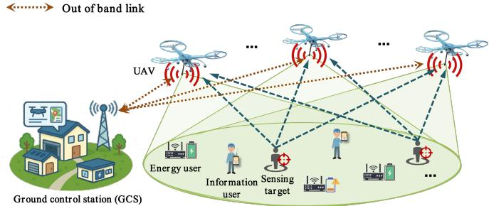  
Fig. 1: Multi-UAV collaborative ISCPT network.

• Comprehensive simulation results demonstrate that the proposed CRGAT-based method significantly outperforms existing approaches in overall network performance and balanced service delivery. It effectively adapts to varying optimization objectives, achieves flexible trade-offs under diverse service demands, and maintains strong generalization across different user distribution scenarios without the need for retraining. Furthermore, it successfully explores Pareto-optimal solutions with mul tiple objective preferences, confirming its generalization and practical value in complex multi-UAV collaborative ISCPT networks.

## D. Organization

The rest of this paper is organized as follows. Section II presents the system model and problem formulation. Section III details the proposed CRGAT-based optimization method. Section IV provides simulation settings and performance evaluations. Section V concludes the paper and discusses potential future research directions.

## II. SYSTEM MODEL

The considered multi-UAV collaborative ISCPT network is illustrated in Fig. 1, comprising K UAVs, N I information users, $N ^ { \mathrm { S } }$ potential sensing targets, and $N ^ { \mathrm { E } }$ energy users. Each UAV and user (totaling $\bar { N = N ^ { \mathrm { I } } { + } N ^ { \mathrm { S } } { + } N ^ { \mathrm { E } } ) }$ is equipped with a single antenna, and the transmit power of UAV k is denoted as $p _ { k } , \forall k \in \{ 1 , \ldots , K \}$ . In this network, a ground control station (GCS) performs deployment optimization based on the spatial distribution of users1, and then delivers the optimized 3D placements and transmit powers to all UAVs via outof-band links, similar to [43]. After deployment, all UAVs collaboratively provide communication, sensing, and WPT services by broadcasting their respective ISCPT signals in the

JOURNAL OF LAT X CLASS FILES, VOL. 18, NO. 9, SEPTEMBER 2020

downlink. Specifically, the UAVs collaboratively serve sensing targets and energy users. Upon receiving the downlink ISCPT signals, sensing targets reflect the signals back as echoes, while energy users harvest radio-frequency energy from the received signals for charging. For sensing reception, each UAV employs matched filtering to mitigate cross-link interference from other UAVs [44]. The filtered sensing echoes are then conveyed to a centralized processing unit at the GCS through out-of-band wireless backhaul links for joint target detection [45]. For information users, similar to [46], although they may receive signals from multiple UAVs, each user associates exclusively with the UAV providing the highest SINR to establish a dedicated communication link. Thus, each information user is exclusively served by a single UAV. Once the UAV-user association is established, to avoid intra-UAV interference, similar to [47], each UAV employs a time-division multiple access (TDMA) protocol to sequentially transmit data to its associated information users during the downlink phase.

The locations of UAVs are represented by the set $\begin{array} { c c l c l } { { { \cal L } ^ { \mathrm { U A V } } } } & { { = } } & { { \{ l _ { k } ^ { \mathrm { U A V } } \} , \forall k } } & { { \in } } & { { \{ 1 , \ldots , K \} } } \end{array}$ , where the 3D Cartesian coordinates of UAV k location is given by $l _ { k } ^ { \mathrm { U A V } } ~ = ~ \left( x _ { k } ^ { \mathrm { U A V } } , y _ { k } ^ { \mathrm { U A V } } , z _ { k } ^ { \mathrm { U A V } } \right)$ . Similarly, the locations of information users, potential sensoring targets, and energy users are denoted as $\bar { L ^ { \dot { \mathrm { I } } } } = \lbrace l _ { n } ^ { \mathrm { I } } = ( x _ { n } ^ { \mathrm { I } } , y _ { n } ^ { \mathrm { I } } , z _ { n } ^ { \mathrm { I } } ) ^ { \top } \vert n \in \lbrace { 1 , . . . , N ^ { \mathrm { I } } \rbrace } \rbrace$ $\begin{array} { r l r } { { \cal L } ^ { \mathrm { S } } } & { { } } & { = } & { \left\{ l _ { n } ^ { \mathrm { S } } = ( \dot { x } _ { n } ^ { \mathrm { S } } , y _ { n } ^ { \mathrm { S } } , z _ { n } ^ { \mathrm { S } } ) \ | \ n \in \{ 1 , \ldots , N ^ { \mathrm { S } } \} \right\} } \end{array}$ and ${ \cal L } ^ { \mathrm { E } } = \left\{ l _ { n } ^ { \mathrm { E } } = ( \mathrm { \dot { x } } _ { n } ^ { \mathrm { E } } , y _ { n } ^ { \mathrm { E } } , z _ { n } ^ { \mathrm { E } } ) \ : \vert \ : n \in \ : \mathrm { \{ 1 , \ldots , \ : N ^ { \mathrm { E } } \} } \right\}$ , respectively. The distance between UAV k and user n is defined as $d _ { k , n } = \| l _ { k } ^ { \mathrm { U A V } } - l _ { n } ^ { \mathrm { u s e r } } \|$ , where ∥·∥ denotes the Euclidean norm. To systemically characterize and analyze the performance of the ISCPT network, we introduce the channel, communication, sensing, and EH models in the following sections2.

## A. Channel Model

The wireless channel between UAV k and user n is affected by the propagation environment, where the LoS probability plays a critical role in determining the channel quality. In general, a probabilistic LoS channel model is employed to characterize the wireless links between UAVs and ground users [48]–[50]. The channel gain $g _ { k , n }$ between UAV k and user n can be presented as follows

$$
g _ { k , n } = \sqrt { \beta _ { k , n } } \tilde { g } _ { k , n } ,\tag{1}
$$

where the small-scale fading coefficient $\tilde { g } _ { k , n }$ is modeled as a complex random variable with $\mathbb { E } [ | \tilde { g } _ { k , n } | ^ { 2 } ] = 1$ . The largescale channel gain $\beta _ { k , n }$ depends on whether the link is LoS or NLoS. Specifically, it is given by

$$
\beta _ { k , n } = { \left\{ \begin{array} { l l } { \lambda _ { 0 } d _ { k , n } ^ { - \tilde { \alpha } } , } & { \mathrm { L o S ~ l i n k } , } \\ { \kappa \lambda _ { 0 } d _ { k , n } ^ { - \tilde { \alpha } } , } & { \mathrm { N L o S ~ l i n k } , } \end{array} \right. }\tag{2}
$$

2The considered network model has numerous practical application scenarios. For example, in emergency rescue situations, multiple UAVs can be deployed collaboratively to provide temporary communication coverage for rescue teams, wirelessly power environmental sensors, and preform remote sensing to monitor disaster-stricken areas. These capabilities effectively address critical challenges such as damaged communication infrastructure, restricted physical access to maintain sensors, and the need for real-time monitoring at night or in hazardous conditions.

where $\lambda _ { 0 }$ represents the channel gain at a reference distance of 1 meter, α˜ is the path loss exponent, and κ is the NLoS path loss factor. The probability of having an LoS link [51] between UAV k and user n is considered and expressed as

$$
P _ { k , n } ^ { \mathrm { L o S } } = \frac { 1 } { 1 + a _ { c } \exp \left( - b _ { c } \left( \theta _ { k , n } - a _ { c } \right) \right) } ,\tag{3}
$$

where $a _ { c }$ and $b _ { c }$ are environment-dependent parameters, and $\theta _ { k , n }$ represents the elevation angle between UAV k and user n. The elevation angle $\theta _ { k , n }$ can be expressed as

$$
\theta _ { k , n } = \arctan \left( \Delta z _ { k , n } / d _ { k , n } ^ { \mathrm { H } } \right) ,\tag{4}
$$

where $d _ { k , n } ^ { \mathrm { H } } = { \sqrt { ( x _ { k } ^ { \mathrm { U A V } } - x _ { n } ^ { \mathrm { u s e r } } ) ^ { 2 } + ( y _ { k } ^ { \mathrm { U A V } } - y _ { n } ^ { \mathrm { u s e r } } ) ^ { 2 } } }$ is the horizontal distance and $\Delta z _ { k , n } = z _ { k } ^ { \mathrm { U A V } } - z _ { n } ^ { \mathrm { u s e r } }$ is the vertical height difference between UAV k and user n. Given the probability of LoS link $P _ { k , n } ^ { \mathrm { L o S } }$ , the expected channel gain $h _ { k , n }$ between UAV k and user n is calculated as

$$
h _ { k , n } = P _ { k , n } ^ { \mathrm { L o S } } \lambda _ { 0 } d _ { k , n } ^ { - \tilde { \alpha } } + \left( 1 - P _ { k , n } ^ { \mathrm { L o S } } \right) \kappa \lambda _ { 0 } d _ { k , n } ^ { - \tilde { \alpha } } .\tag{5}
$$

## B. Communication Model

In the communication component of the proposed system, each information user $n ~ \in ~ \{ 1 , \ldots , N ^ { \mathrm { I } } \}$ receives downlink signals from all UAVs. Specifically, the received signal power at user n from UAV k is given by $h _ { k , n } p _ { k }$ , where $h _ { k , n }$ denotes the channel power gain between UAV k and user n, and $p _ { k }$ represents the transmit power of UAV k.

However, due to the broadcast nature of the downlink, each users experiences co-channel interference caused by transmissions from other UAVs. Therefore, the SINR at user n with respect to UAV k is expressed as

$$
\gamma _ { k , n } = \frac { h _ { k , n } p _ { k } } { \sum _ { i \neq k } ^ { K } h _ { i , n } p _ { i } + \sigma _ { c } ^ { 2 } } ,\tag{6}
$$

where the term $\textstyle \sum _ { i \neq k } ^ { K } h _ { i , n } p _ { i }$ accounts for the total interference at user n from all UAVs other than UAV k, and $\sigma _ { c } ^ { 2 }$ denotes the power of additive white Gaussian noise (AWGN).

Each information user associates the UAV offering the highest SINR, thereby establishing a dedicated communication link with it [46]. Hence, the effective SINR at user n is defined as the maximum SINR achieved among all UAVs, given by

$$
\gamma _ { n } = \operatorname* { m a x } _ { k \in \{ 1 , \dots , K \} } \left( \gamma _ { k , n } \right) .\tag{7}
$$

Based on this user association strategy, each user is served by exactly one UAV, and UAVs employ a TDMA scheme to schedule downlink data transmissions to their associated information users in a non-overlapping manner.

## C. Sensing Model

In the sensing component of the system, upon receiving ISCPT signals from UAVs, each sensing target $n \_ { \mathrm { ~ \scriptsize ~ \in ~ } }$ $\{ 1 , \ldots , N ^ { \mathrm { S } } \}$ reflects them as sensing echoes. Each UAV employs matched filtering to mitigate cross-link interference from other UAVs [44]. The filtered signals are then converged to a centralized processing unit via out-of-band wireless backhaul links for joint target detection. Following the approach in [45], the detection probability for sensing target n is given by

$$
p _ { n } ^ { D } = Q \left( \left( \delta ^ { \prime } - \sum _ { k = 1 } ^ { K } \alpha _ { k , n } \frac { p _ { k , n } } { d _ { k , n } ^ { 4 } } \right) \sqrt { \frac { 2 } { \sigma _ { c } ^ { 2 } \sum _ { k = 1 } ^ { K } \alpha _ { k , n } \frac { p _ { k , n } } { d _ { k , n } ^ { 4 } } } } \right)\tag{8}
$$

where $Q ( \cdot )$ denotes the complementary cumulative distribution function, $\delta ^ { \prime }$ denotes the detector threshold and $\sigma _ { c } ^ { 2 }$ denotes the variance of the effective disturbance after receive processing, including thermal noise and residual inter-UAV interference after matched filtering. The unit antenna gain $\alpha _ { k , n }$ is

$$
\alpha _ { k , n } = \left( P _ { k , n } ^ { \mathrm { L o S } } + \left( 1 - P _ { k , n } ^ { \mathrm { L o S } } \right) \kappa \right) \frac { \lambda _ { 0 } \sigma _ { r } } { 4 \pi } ,\tag{9}
$$

where $\sigma _ { r }$ is the radar cross-section of target. For notational simplicity, we define the total RSP of sensing target n as

$$
S _ { n } = \sum _ { k = 1 } ^ { K } \alpha _ { k , n } \frac { p _ { k , n } } { d _ { k , n } ^ { 4 } } .\tag{10}
$$

which corresponds to the cumulative sensing echo power, as also discussed in [45]. According to (8), the detection probability $p _ { n } ^ { D }$ of sensing target n increases monotonically with the total RSP $S _ { n }$ . Consequently, maximizing $S _ { n }$ is equivalent to maximizing the joint detection probability, and we will leverage this property in our design later.

## D. Nonlinear EH Model

In the EH component of the system, each energy user $n \in$ $\{ 1 , \ldots , N ^ { \mathrm { E } } \}$ harvests energy from ISCPT signals transmitted by the UAVs. The amount of energy harvested from UAV k depends on both the channel gain and UAV transmit power. Accordingly, the total received signal power at energy user n from all UAVs is given by

$$
\mathcal { P } _ { n } = \sum _ { k = 1 } ^ { K } h _ { k , n } p _ { k } ,\tag{11}
$$

To more accurately represent practical conditions, the harvested energy follows a logistic nonlinear EH model [52], where the EH efficiency decreases due to circuit saturation at high received power levels. For energy user $n ,$ given the total received signal power ${ \mathcal { P } } _ { n } .$ , the harvested energy $E _ { n }$ is

$$
E _ { n } = \frac { \frac { \mathrm { Q } _ { \mathrm { m a x } } } { 1 + e ^ { - a ( \mathcal { P } _ { n } - b ) } } - \frac { \mathrm { Q } _ { \mathrm { m a x } } } { 1 + e ^ { a b } } } { 1 - \frac { 1 } { 1 + e ^ { a b } } } ,\tag{12}
$$

where $Q _ { \mathrm { m a x } } ,$ , a and b are constants determined by EH circuit properties. In particular, $Q _ { \mathrm { m a x } }$ denotes the maximum achievable harvested power.

## E. Optimization Problem Formulation

In multi UAV ISCPT networks, communication, sensing, and WPT compete for limited spectral, energy, and spatial resources, while users and targets face heterogeneous channel and spatial separations. Simply maximizing the sum performance or the average performance may improve overall efficiency but often biases resource allocation toward users with favorable channels and leaves others persistently underserved [53]. To prevent resource monopoly by strong users and suppress performance degradation of weak users, we adopt three intra-class max–min objectives, namely maximizing the minimum SINR among communication users, maximizing the minimum RSP among sensing targets, and maximizing the minimum harvested energy among energy users. This fairnessoriented design guarantees worst-case QoS within each functional domain and mitigates allocation imbalance, and has been widely adopted in wireless network optimization [54]–[56]. Specifically, the minimum performance metrics are defined by

$$
\gamma _ { \operatorname* { m i n } } = \operatorname* { m i n } _ { n \in \{ 1 , \dots , N ^ { \mathrm { I } } \} } \gamma _ { n } ,\tag{13}
$$

$$
S _ { \mathrm { m i n } } = \operatorname* { m i n } _ { \substack { n \in \{ 1 , \dots , N ^ { \mathrm { S } } \} } } S _ { n } ,\tag{14}
$$

$$
E _ { \mathrm { m i n } } = \operatorname* { m i n } _ { \substack { n \in \{ 1 , \dots , N ^ { \mathrm { E } } \} } } E _ { n } .\tag{15}
$$

Based on these definitions, a multi-objective optimization problem is formulated to jointly optimize the 3D deployment locations $L ^ { \mathrm { U A V } }$ , and transmit powers $p ^ { \mathrm { U A V } } = \{ p _ { k } \}$ of the UAVs to simultaneously maximize the minimum performance metrics across the three types of users, which is expressed as

$$
P _ { 0 } : \operatorname* { m a x } _ { L ^ { \mathrm { U A V } } , p ^ { \mathrm { U A V } } } \Bigl \{ \gamma _ { \mathrm { m i n } } , S _ { \mathrm { m i n } } , E _ { \mathrm { m i n } } \Bigr \}\tag{16}
$$

$$
\begin{array} { r l } { \mathrm { s . t . } } & { { } \mathcal { D } _ { \operatorname* { m i n } } \leq l _ { k } ^ { \mathrm { U A V } } \leq \mathcal { D } _ { \operatorname* { m a x } } , \forall k \in \{ 1 , \ldots , K \} , } \end{array}\tag{17}
$$

$$
0 \leq p _ { k } \leq P _ { k } ^ { \operatorname* { m a x } } , \forall k \in \{ 1 , \ldots , K \} ,\tag{18}
$$

where constraint (17) ensures that the 3D coordinates of each UAV remain confined within the region defined by $\mathcal { D } _ { \operatorname* { m i n } } =$ $\left( x _ { \mathrm { m i n } } ^ { \mathrm { U A V } } , y _ { \mathrm { m i n } } ^ { \mathrm { U A V } } , z _ { \mathrm { m i n } } ^ { \mathrm { U A V } } \right)$ and $\begin{array} { r c l } { \mathcal { D } _ { \operatorname* { m a x } } } & { = } & { \left( x _ { \operatorname* { m a x } } ^ { \mathrm { U A V } } , y _ { \operatorname* { m a x } } ^ { \mathrm { U A V } } , z _ { \operatorname* { m a x } } ^ { \mathrm { U A V } } \right) } \end{array}$ Constraint (18) guarantees that the transmit power of each UAV does not exceed its individual maximum value $P _ { k } ^ { \mathrm { m a x } }$

## III. CRGAT-BASED JOINT UAVS 3D-DEPLOYMENT AND POWER OPTIMIZATION METHOD

The formulated problem $P _ { 0 }$ in the considered multi-UAV collaborative ISCPT networks is highly non-convex and challenging to solve directly, due to the complex spatial correlations, diverse user service demands, and strong interdependencies among decision variables. To effectively address these challenges, we propose a novel CRGAT-based optimization approach that decomposes the joint optimization problem into two sequential stages, as shown in Fig. 2. In the first stage, the 3D deployment of UAVs is optimized based on a graphbased representation of the user distribution. Subsequently, in the second stage, the UAVs’ transmit power is further optimized exploiting the deployment results from the first stage. This cascaded structure enables efficient cross-stage coordination between 3D deployment and power control of UAVs, thereby facilitating joint optimization within an endto-end learning framework. In the following subsections, we detail the proposed CRGAT-based method, including the system graph representation and the CRGAT architecture.

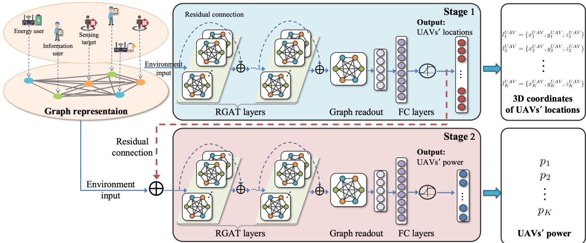  
Fig. 2: The architecture of the proposed CRGAT-based method.

## A. System Graph Representation

To effectively leverage the topological information of user distribution in ISCPT networks, we model the system as a fully connected directed graph, denoted by G(V, E), where V is the set of nodes representing all users, and E is the set of edges representing pairwise relationships among users. Also each node $v _ { i } \in \mathcal V$ corresponds to a unique user and is associated with a feature vector $\mathbf { x } _ { i } = [ t _ { i } , x _ { i } , y _ { i } , z _ { i } ] ^ { \top }$ that encodes relevant attributes such as the user type $t _ { i }$ (e.g., information, sensing, or energy) and its 3D coordinates of location $( x _ { i } , y _ { i } , z _ { i } )$ . Each edge $e _ { i j } \in \mathcal { E }$ connects nodes $v _ { i }$ and $v _ { j }$ , and is associated with a scalar feature $d _ { i j } ^ { \mathrm { u s e r } } = \lvert \lvert l _ { i } - l _ { j } \rvert$ 2 indicating the Euclidean distance between the two users.

## B. CRGAT Network Architecture

The proposed CRGAT network consists of two sequential stages: the 3D deployment stage and the transmit power control stage for UAVs, as shown in Fig. 2. These two stages are interconnected via a residual connection, enabling the output of the first stage to directly guide the second stage for joint optimization.

In the first stage, the 3D deployment of UAVs is optimized by considering the spatial distribution of users. Since UAV locations fundamentally affect wireless channel characteristics, such as path loss and LoS probability, it is essential to incorporate spatial dependencies in the decision-making process. To this end, the node features $\mathbf { X } ~ = ~ \{ \mathbf { x } _ { i } \} _ { i = } ^ { N }$ and edge features ${ \bf E } = \{ d _ { i j } ^ { \mathrm { u s e r } } \}$ derived from the user graph $\mathcal { G }$ are jointly embedded through a graph-based encoder to guide the UAVs’ deployment decision. The resulting 3D coordinate is

$$
\pmb { L } ^ { \mathrm { U A V } } = \mathcal { F } _ { \mathrm { d e p l o y } } ( \mathbf { X } , \mathbf { E } ) \in \mathbb { R } ^ { K \times 3 } ,\tag{19}
$$

where $\mathcal { F } _ { \mathrm { d e p l o y } } ( \cdot )$ represents the first-stage sub-network, which is composed of $L _ { 1 }$ RGAT layers, a graph readout module, and $M _ { 1 }$ fully connected (FC) layers. By leveraging the encoded user topology, the model learns to deploy UAVs at locations that benefit communication, sensing, and energy transfer.

In the second stage, the user graph G is augmented with the predicted UAV locations $L ^ { \mathrm { U A V } }$ to construct an enhanced input for power optimization. Specifically, the UAV deployment is first encoded into a feature vector $\mathbf { f } ^ { \mathrm { U A V } }$ via a learnable extractor, which is then added to each node feature to reflect the spatial relationships between UAVs and users. Formally, each node feature is updated in terms of

$$
\mathbf { x } _ { i } ^ { \prime } = \mathbf { x } _ { i } + \mathbf { f } ^ { \mathrm { U A V } } , \quad \forall i \in \mathcal { V } .\tag{20}
$$

This integrated topology enables the model to capture not only the spatial coupling among users but also their relative locations to UAVs, which jointly influence signal strength and interference. Leveraging this integrated information, the power optimization stage effectively balances signal enhancement and interference mitigation, thereby achieving a desirable trade-off among communication, sensing, and energy transfer objectives. The updated node features ${ \bf { X } } ^ { \prime } = \{ { \bf { x } } _ { i } ^ { \prime } \}$ , along with the edge features E, are then exploited as inputs for the second-stage sub-network, which designs the transmit power of each UAV, expressed as

$$
\begin{array} { r } { \pmb { p } ^ { \mathrm { U A V } } = \mathcal { F } _ { \mathrm { p o w e r } } ( \mathbf { X } ^ { \prime } , \mathbf { E } ) \in \mathbb { R } ^ { K } , } \end{array}\tag{21}
$$

where $\mathcal { F } _ { \mathrm { p o w e r } } ( \cdot )$ represents the sub-network of the second stage composed of $L _ { 2 }$ RGAT layers, a graph readout module, and $M _ { 2 }$ FC layers.

Both stages are trained in an end-to-end manner, allowing joint optimization over spatial deployment and power control, with their outputs collectively contributing to the overall loss for updating the CRGAT model parameters.

## C. Residual Graph Attention Layer

In the CRGAT network, the RGAT layer plays a central role to capture complex spatial relationships and interaction patterns inherent to ISCPT networks. It extends traditional graph attention networks [57] by integrating both multi-head attention mechanisms and residual connections, improving both expressiveness and training stability of the network. In the following subsections, we describe the formulation of the multi-head attention mechanism and the incorporation of residual connections in the RGAT layer, which jointly enable effective aggregation of spatial and relational information while maintaining robust gradient flow during training.

Multi-Head Attention: In the considered ISCPT network, users have different roles such as communication, sensing, and energy harvesting, which lead to distinct performance requirements. Meanwhile, users are unevenly distributed in space, resulting in differences in distance and link quality. These factors cause varying impacts on UAV decisions such as deployment and power allocation. Therefore, it is important to learn the relative influence of each neighbor instead of treating all neighbors equally.

To effectively account for such heterogeneity, an attention mechanism is employed that dynamically quantifies the relative importance of each neighboring user node. By learning attention coefficients based on feature similarity and spatial proximity, the network can adaptively focus on the users that are more influential or performance-critical under different service objectives. This capability enables the model to better support the joint optimization of SINR, sensing RSP, and harvested energy, while implicitly promoting user fairness.

Moreover to enhance expressiveness, a multi-head attention mechanism is incorporated, where each attention head learns to capture distinct interaction patterns. This parallel structure enhances the network’s ability to represent the diverse relationships needed to effectively meet different user requirements.

Specifically, for each attention head $h = 1 , \ldots , H$ the input node features are first linearly transformed as

$$
\mathbf { X } ^ { \prime ( l , h ) } = \mathbf { W } ^ { ( h ) } \mathbf { X } ^ { ( l ) } ,\tag{22}
$$

where $\mathbf { W } ^ { ( h ) } \ \in \ \mathbb { R } ^ { F ^ { \prime } \times F }$ is the learnable weight matrix for head $h ,$ projecting the input features of dimension F to a transformed dimensional ${ \bar { F } } ^ { \prime }$

Then, for a target node i and one of its neighbors $j \in \mathcal N _ { i }$ the attention coefficient is computed as

$$
\tilde { \alpha } _ { i j } ^ { ( l , h ) } = \mathrm { L e a k y R e L U } \left( \mathbf { a } ^ { ( h ) \top } \left[ \mathbf { x } _ { i } ^ { \prime ( l , h ) } \mid \mid \mathbf { x } _ { j } ^ { \prime ( l , h ) } \mid \mid d _ { i j } ^ { \mathrm { u s e r } } \right] \right)\tag{23}
$$

where $\mathbf { a } ^ { ( h ) } \in \mathbb { R } ^ { 2 F ^ { \prime } + 1 }$ is a learnable attention vector for head $h , \mid \mid$ denotes vector concatenation.

Furthermore, to ensure that attention scores are comparable across all neighbor nodes, each attention coefficient is normalized exploiting the softmax function as

$$
\alpha _ { i j } ^ { ( l , h ) } = \frac { \exp { \left( \tilde { \alpha } _ { i j } ^ { ( l , h ) } \right) } } { \sum _ { k \in \mathcal { N } _ { i } } \exp { \left( \tilde { \alpha } _ { i k } ^ { ( l , h ) } \right) } } .\tag{24}
$$

The updated embedding of node i for head h is then obtained by a weighted aggregation of its neighbors’ features and is expressed as

$$
\mathbf { z } _ { i } ^ { ( l , h ) } = \sum _ { j \in \mathcal { N } _ { i } } \alpha _ { i j } ^ { ( l , h ) } \mathbf { x } _ { j } ^ { \prime ( l , h ) } .\tag{25}
$$

Finally, the outputs of all attention heads are concatenated to form the node’s final attention-based representation at layer l, expressed as

$$
\begin{array} { r } { { \bf z } _ { i } ^ { ( l ) } = \big \| _ { h = 1 } ^ { H } { \bf z } _ { i } ^ { ( l , h ) } . } \end{array}\tag{26}
$$

Residual Connections: Residual connections in the proposed CRGAT network serve two main purposes. First, they enable effective information fusion between the two stages of UAV optimization. After the first stage predicts the 3D deployment of UAVs, the resulting output is encoded into a learnable feature vector and added to each user node. This allows the second stage to jointly consider both user distribution and UAV positions when optimizing transmit power, ensuring that spatial relationships are preserved across stages. Second, residual connections are applied within each RGAT layer to improve training stability. By combining the input features with the attention-based representations, the network mitigates vanishing gradient issues and supports deeper architectures capable of learning more expressive representations.

This residual structure enhances both cross-stage integration and the stable learning of attention-based features. Specifically, the output of layer l is computed by adding the input and the attention-based representation, followed by a non-linear activation, expressed as

$$
\mathbf { x } _ { i } ^ { ( l + 1 ) } = \mathrm { R e L U } \left( \mathbf { z } _ { i } ^ { ( l ) } + \mathbf { W } _ { \mathrm { r e s } } \mathbf { x } _ { i } ^ { ( l ) } \right) ,\tag{27}
$$

where $\mathbf { W } _ { \mathrm { r e s } } \in \mathbb { R } ^ { H F ^ { \prime } \times F }$ is a learnable projection matrix that aligns the dimensions of the input and output features.

## D. Graph Readout and Fully Connected Layers

By employing multiple RGAT layers, collectively termed the RGAT block, the CRGAT network is able to learn expressive and high-dimensional node representations by effectively extracting local node features from their neighborhoods. To further leverage global information from the entire graph, we introduce a graph-level readout module at the end of RGAT block, enabling the CRGAT to aggregate the entire graph representation. In this work, we adopt mean pooling as the readout function, defined as

$$
\mathbf { g } = \frac { 1 } { | \mathcal { V } | } \sum _ { i \in \mathcal { V } } \mathbf { z } _ { i } ^ { ( L ) } ,\tag{28}
$$

where $\mathbf { z } _ { i } ^ { ( L ) }$ denotes the embedding of node i after the final RGAT layer, and $\mathbf { g } \in \mathbb { R } ^ { H F ^ { \prime } }$ is the global graph representation.

Each graph-level representation is then passed through a stage-specific FC network to generate the corresponding output. Specifically, the two-stage architecture consists of two distinct RGAT blocks, each followed by a graph readout and its own FC network, corresponding to

$$
\pmb { L } ^ { \mathrm { U A V } } = \mathcal { F } _ { \mathrm { F C } } ^ { ( 1 ) } ( \mathbf { g } ) \in \mathbb { R } ^ { K \times 3 } ,\tag{29}
$$

$$
\pmb { p } ^ { \mathrm { U A V } } = \mathcal { F } _ { \mathrm { F C } } ^ { ( 2 ) } ( \mathbf { g } ^ { \prime } ) \in \mathbb { R } ^ { K } ,\tag{30}
$$

where $\mathbf { g } ^ { \prime }$ is the graph-level feature vector read out from the second RGAT block. The functions $\mathcal { F } _ { \mathrm { F C } } ^ { ( 1 ) }$ and $\mathcal { F } _ { \mathrm { F C } } ^ { ( 2 ) }$ denote the stage-specific multi-layer FC networks, each consisting of linear transformations, ReLU activations, and normalization layers. These dedicated FC networks ensure that the outputs satisfy the physical constraints (17) and (18).

## E. Loss Function and Learning Framework

To achieve end-to-end joint optimization of UAV deployment and transmit power control, while simultaneously balancing diverse user requirements, a key challenge is how to effectively coordinate multiple task-specific objectives during training. Specifically, it is essential to ensure that the gradient signals from different objectives can be jointly leveraged to update the model parameters efficiently.

Among various multi-objective learning approaches, linear scalarization has been widely adopted in deep learning frameworks due to its simplicity, differentiability, and compatibility with gradient-based optimization methods [58]– [60]. This method transforms a multi-objective problem into a single scalar objective by applying task-specific weights, enabling the model to learn jointly from multiple objectives. It is particularly suitable for end-to-end unsupervised training, where the model is supervised directly by performance metrics rather than labeled data.

Motivated by such advantages, we adopt a linear scalarization approach to convert the original multi-objective problem into a single-objective one by applying task-specific weights. Specifically, the optimization target becomes the maximization of a weighted utility function. Accordingly, the loss function is the negative of the objective, defined as

$$
\mathcal { L } _ { \mathrm { t o t a l } } = - \Big [ w _ { \mathrm { I } } \cdot \alpha _ { \mathrm { I } } \cdot \gamma _ { \mathrm { m i n } } + w _ { \mathrm { S } } \cdot \alpha _ { \mathrm { S } } \cdot S _ { \mathrm { m i n } } + w _ { \mathrm { E } } \cdot \alpha _ { \mathrm { E } } \cdot E _ { \mathrm { m i n } } \Big ] ,\tag{31}
$$

where $w _ { \mathrm { I } } , w _ { \mathrm { S } }$ , and $w _ { \mathrm { E } }$ denote the relative importance weights for the three tasks respectively, and $\alpha _ { \mathrm { I } } , \alpha _ { \mathrm { S } }$ , and $\alpha _ { \mathrm { E } }$ are normalization coefficients applied to balance different physical units and numerical scales of the performance metrics, so that they become comparable in the weighted scalar objective.

For clarity, Fig. 3 summarizes the overall learning and optimization framework of the proposed CRGAT-based method, which consists of an offline training stage and an online optimization stage. In the offline training stage, given a user distribution and a task-preference weight vector w, CRGAT takes the user graph as input and sequentially outputs the 3D deployment locations and transmit power allocation of all UAVs through its two-stage architecture. The resulting communication, sensing, and WPT metrics are evaluated to compute the weighted loss in (31), and the model parameters are updated via backpropagation. In the online optimization stage, a well-trained CRGAT model is directly deployed and generates the UAV deployment and power control strategies through a single forward pass, without iterative optimization, making it suitable for real-time deployment scenarios. Accordingly, the detailed training procedure corresponding to Fig. 3 is summarized in Algorithm 1.

## F. Complexity Analysis

The computational complexity of the proposed CRGAT mainly consists of the RGAT layers, readout module, and FC networks. Since the user distribution is modeled as a fully connected graph, the number of nodes is $| \nu | = N ,$ , and the number of edges is $| \mathcal { E } | = N ( N - 1 )$

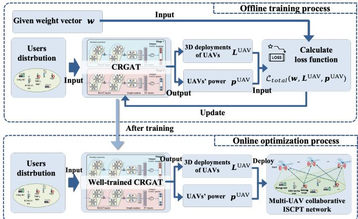  
Fig. 3: The flowchart of training and optimization process.

Algorithm 1 Proposed CRGAT-based Joint UAVs’ 3D  
deployment and Power Optimization Method   
1: Initialize model parameters Θ;   
2: for epoch $= 1 , \ldots , \mathrm { e p o c h _ { m a x } }$ do   
3: In stage 1, given the user graph $\mathcal { G } ~ = ~ ( \nu , \mathcal { E } )$ with   
node features X and edge features $\mathbf { E } ,$ generate 3D   
deployment locations for all UAVs $\pmb { L } ^ { \mathrm { U A V } } = \mathcal { F } ( \mathbf { X } , \mathbf { E } )$ ;   
4: In stage 2, encode $\pmb { L } ^ { \mathrm { U A V } }$ into a feature vector $\dot { \mathbf { f } } ^ { \mathrm { U A V } }$ and   
update each node feature as $\mathbf { x } _ { i } ^ { \prime } = \mathbf { x } _ { i } + \mathbf { f } ^ { \mathrm { U A V } } , \quad \forall i \in \mathcal { V } ;$   
5: Generate the transmit power allocation for all UAVs   
$\pmb { p } ^ { \mathrm { U A V } } = \mathcal { F } ( \mathbf { X } ^ { \prime } , \mathbf { E } )$ ;   
6: Based on $\dot { \pmb { L } } ^ { \mathrm { U A V } }$ and $p ^ { \mathrm { U A V } }$ , evaluate the minimum SINR   
γmin, the minimum RSP $S _ { \mathrm { m i n } } .$ , and the minimum har  
vested energy $E _ { \mathrm { m i n } } ;$   
7: Formulate the overall loss as   
$\mathcal { L } _ { \mathrm { t o t a l } } = - \Big [ w _ { \mathrm { I } } \alpha _ { \mathrm { I } } \gamma _ { \mathrm { m i n } } + w _ { \mathrm { S } } \alpha _ { \mathrm { S } } S _ { \mathrm { m i n } } + w _ { \mathrm { E } } \alpha _ { \mathrm { E } } E _ { \mathrm { m i n } } \Big ] ;$   
8: Backpropagate and update model parameters Θ;   
9: end for   
10: return Optimized UAV locations $\pmb { L } ^ { \mathrm { U A V } }$ and transmit   
power allocation $p ^ { \mathrm { U A V } }$

The computational complexity of the l-th RGAT layer with $H ^ { ( l ) }$ attention heads can be expressed as

$$
\mathcal { O } \left( H ^ { ( l ) } \left( N F ^ { ( l ) } F ^ { \prime ( l ) } + N ( N - 1 ) F ^ { \prime ( l ) } \right) \right) ,\tag{32}
$$

where $F ^ { ( l ) }$ and $F ^ { \prime ( l ) }$ are the input and per-head output dimensions, respectively. The complexity of the readout module after RGAT layers is computed as $\mathcal { O } ( \dot { N } H ^ { ( L _ { s } ) } F ^ { \prime ( L _ { s } ) } )$ , where $L _ { s }$ is the last RGAT layer index in stage s. Also the complexity of each FC layer is ${ \mathcal { O } } ( d ^ { ( m ) } d ^ { ( m + 1 ) } )$ , where $d ^ { ( m ) }$ and $\stackrel { \bullet } { d } ^ { ( m + 1 ) }$ are the input and output dimensions of the m-th FC layer. Combining these components, the total complexity of CRGAT with two stages is

$$
\begin{array} { r l } {  { \mathcal O \Bigg ( \sum _ { l = 1 } ^ { L _ { 1 } + L _ { 2 } } H ^ { ( l ) } ( N F ^ { ( l ) } F ^ { \prime ( l ) } + N ( N - 1 ) F ^ { \prime ( l ) } ) } \Bigg . } \\ & { \Bigg .  + \sum _ { s = 1 } ^ { 2 } N H ^ { ( L _ { s } ) } F ^ { \prime ( L _ { s } ) } + \sum _ { m = 1 } ^ { M _ { 1 } + M _ { 2 } } d ^ { ( m ) } d ^ { ( m + 1 ) } ) , } \end{array}\tag{33}
$$

TABLE I: Simulation Parameter Settings
<table><tr><td>Parameter</td><td>Meaning</td><td>Value</td></tr><tr><td> $Q _ { \mathrm { m a x } }$ </td><td>Max harvested energy [52]</td><td> $\overline { { 9 . 0 9 7 \times 1 0 ^ { - 6 } \mathrm { W } } }$ </td></tr><tr><td> $^ a$ </td><td>Nonlinear EH model parameter [52]</td><td>47083</td></tr><tr><td> $^ { b }$ </td><td>Nonlinear EH model parameter [52]</td><td> $2 . 9 \times 1 0 ^ { - 6 }$ </td></tr><tr><td> $a _ { c }$ </td><td>Probability LoS channel parameter [61]</td><td>4.88</td></tr><tr><td> $b _ { c }$ </td><td>Probability LoS channel parameter [61]</td><td>0.43</td></tr><tr><td> $\tilde { \alpha }$ </td><td>Path loss exponent</td><td>2</td></tr><tr><td> $\lambda _ { 0 }$ </td><td>Channel gain at unit distance</td><td>-30 dB</td></tr><tr><td> $\kappa$ </td><td>NLoS path loss factor</td><td>0.2</td></tr><tr><td> $\sigma ^ { 2 }$ </td><td>Noise power</td><td>-120 dB</td></tr><tr><td> $_ { r } \mathrm { U A V }$ </td><td>Max mission area in x</td><td>300 m</td></tr><tr><td> $\yen 123,45$   $y _ { \mathrm { m a x } } ^ { \mathrm { { v } } }$ </td><td>Max mission area in y</td><td>300 m</td></tr><tr><td> $z _ { \mathrm { m a x } } ^ { \mathrm { U A V } }$ </td><td>Max UAV flight height</td><td>100m</td></tr><tr><td> $\tilde { \mathrm { \Delta } } _ { \mathrm { - } } ^ { \mathrm { m a x } }$   $z _ { \mathrm { m i n } }$ </td><td>Min UAV flight height</td><td>30m</td></tr><tr><td> $P _ { \mathrm { m a x } }$ </td><td>Max UAV transmit power</td><td>1W</td></tr></table>

where $M _ { 1 }$ and $M _ { 2 }$ are the number of FC layers in each stage.

## IV. NUMERICAL RESULTS

To comprehensively evaluate the effectiveness, adaptability, and generalization capability of the proposed CRGAT-based method, we present extensive simulation results covering eight aspects: (a) experimental setup, (b) comparison with different baseline methods, (c) performance under different optimization objectives, (d) performance versus the number of UAVs, (e) model robustness under different user distributions, (f) model generalization under varying numbers of users, (g) analysis of the Pareto front, and (h) complexity-performance tradeoff analysis.

## A. Experimental Setup

In the considered multi-UAV collaborative ISCPT network, four UAVs are deployed to cooperatively provide ISCPT services over a $3 0 0 \mathrm { m } \times 3 0 0 \mathrm { m }$ area. Specifically, a total of 30 information users and 30 energy harvested users are randomly distributed according to a two-dimensional Poisson point process within the region defined by $x \ \in \ [ 0 , 2 5 0 ]$ m and $y ~ \in ~ [ 0 , 1 5 0 ] \mathrm { m }$ . Additionally, 12 sensing targets are uniformly distributed within the sensing region defined by $x \in [ 1 0 0 , 2 0 0 ]$ m and $y \in [ 2 0 0 , 2 5 0 ] \mathrm { m }$ . The remaining key simulation parameters are summarized in Table I.

## B. Comparison with Different Methods

To evaluate the performance of the proposed CRGAT method, we compare it with 4 representative baseline methods, namely RGAT, MLP, K-means, and Random. Each method optimizes UAVs’ 3D deployment locations and transmit power allocations using different strategies, as described below:

• RGAT (baseline 1): A single-stage residual graph attention network that jointly optimizes UAV 3D deployment locations and transmit powers. It takes a graph constructed from the spatial distribution of users as input, and outputs all optimization variables in a one-shot manner. Compared to CRGAT, it lacks the cascaded structure for sequential decision refinement.

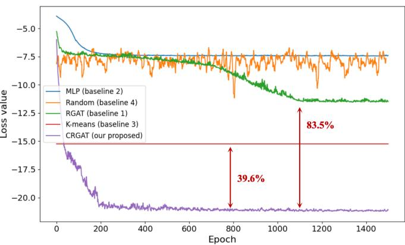  
Fig. 4: Training loss versus different methods.

• MLP (baseline 2): A fully connected MLP that directly maps user feature vectors to UAV deployment and power outputs. This method does not consider spatial or relational information among users, and operates in a purely feedforward manner.

• K-means (baseline 3): A spatial heuristic method utilizes the K-means clustering algorithm to group users in the 2D plane. UAVs are then deployed at the cluster centroids, with the minimum flight height and maximum transmit power assigned to each UAV.

• Random (baseline 4): This method randomly samples feasible values for UAV locations and power within the predefined operational constraints.

Fig. 4 depicts the training loss curves for the considered methods, which is used to analyze both their convergence behavior and achieved performance levels. The x-axis represents the training epochs, while the y-axis shows the loss defined in (31). For the Random method, the results are averaged over 10 independent runs per epoch.

As shown in Fig. 4, the proposed CRGAT exhibits fast and stable convergence, with the loss decreasing rapidly in the early epochs and then converging to a steady plateau, indicating stable optimization dynamics during training. By contrast, the Random baseline fluctuates noticeably across epochs, and both MLP and RGAT converge to a much higher loss level. These observations indicate that CRGAT exhibits more reliable and stable convergence behavior than the considered baselines.

In addition to the convergence behavior, we further compare the achieved loss levels of different methods. As shown in Fig. 4, the proposed CRGAT method achieves the lowest training loss, achieving over 39.6% improvement in overall performance compared to the baseline approaches, and validating the effectiveness of joint deployment and power control of UAVs. Notably, the MLP-based method performs even worse than the Random baseline, highlighting that ignoring spatial and relational information limits model effectiveness. In contrast, RGAT outperforms both MLP and Random by exploiting a graph attention mechanism to capture user interactions. This shows that representing user distributions as a graph helps the model learn better features and make smarter decisions. However, RGAT still underperforms compared to the heuristic Kmeans method. This suggests that a single-stage graph model struggles to handle both deployment and power decisions at the same time. In contrast, CRGAT leverages a cascaded structure that separates these two tasks into two steps, rendering it easier to optimize each part. As a result, CRGAT takes advantage of both the graph structure and the step-by-step design, and achieves better performance than both K-means and RGAT. This confirms the benefit of utilizing a cascaded structure.

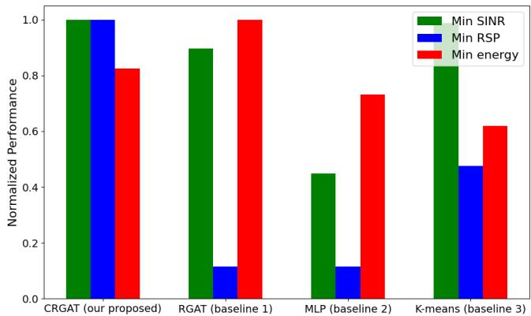  
Fig. 5: Normalized performance versus different methods.

Fig. 5 compares the normalized performance of different methods. The green bars represent the minimum SINR for information users, the black bars indicate the minimum RSP for sensing targets, and the red bars represent the minimum received energy for energy harvested users. As can be observed in the figure, the proposed CRGAT method can effectively a strike the best balance across all three objectives, outperforming other methods. In contrast, the RGAT method fails to adequately balance the sensing performance, while the Kmeans method can balance the objectives to a certain extent but still falls short compared to CRGAT.

Fig. 6 visualizes the 3D UAV deployment results under different methods. In each subfigure, green solid circles represent communication users, purple rectangles are sensing targets, black hollow circles are energy users, and red triangles indicate UAVs. To better visualize the association between UAVs and information users, light green shaded regions are plotted around each UAV that is associated with one or more information users. These regions are constructed based on user association, where each information user connects to the UAV that provides the highest SINR.

As shown in Fig. 6(a), the proposed CRGAT method achieves a balanced deployment: two UAVs are strategically positioned near communication and energy users, while the other two are positioned near sensing regions. This deployment significantly enhances sensing performance with only minimal compromise to communication and energy user performance. By intelligently allocating UAVs based on spatial distribution and task heterogeneity, CRGAT effectively balances conflicting objectives and enhances overall system performance.

In contrast, traditional methods such as RGAT (Fig. 6(b)) tend to over-concentrate UAVs in areas with high densities of communication and energy users, resulting in severe neglect of sensing targets and poor sensing performance. Fig. 6(c) shows the deployment from the MLP-based method, where the absence of graph-based modeling leads to redundant UAV placement and suboptimal coverage for multiple user types. The K-means approach in Fig. 6(d) distributes UAVs according to user cluster centers and considers all users, but lacks taskspecific differentiation, ultimately underperforming CRGAT in achieving an optimal trade-off.

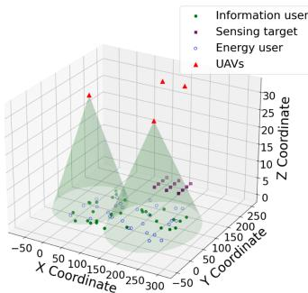  
(a) CRGAT (Our proposed).

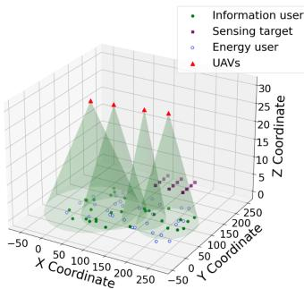  
(b) RGAT (Baseline 1).

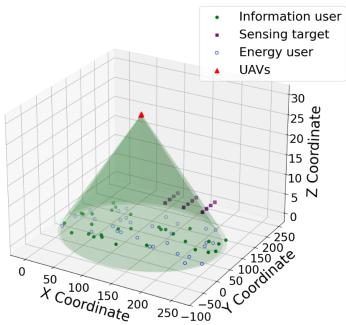  
(c) MLP (Baseline 2).

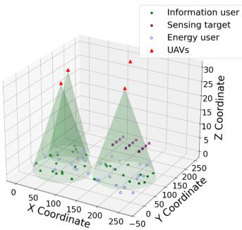  
(d) K-means (Baseline 3).  
Fig. 6: UAV 3D-deployment results versus different methods.

Overall, CRGAT distinguishes itself by leveraging a cascaded two-stage architecture with residual connections and multi-head graph attention mechanisms to learn nuanced UAVuser interactions, enabling task-aware UAV deployment and precise power contorl. This comprehensive design facilitates superior coordination across communication, sensing, and energy objectives, thereby validating the effectiveness of the proposed method in the considered ISCPT network.

## C. Performance under Different Optimization Objectives

After validating the performance of the proposed CRGAT method against baseline models, we further investigate its adaptability to different optimization objectives, which reflect the multi-task nature of the ISCPT network. In addition to the full-task setting that jointly optimizes information, sensing, and energy users (denoted as ISE), we also examine three partial-task scenarios: information and sensing (IS), information and energy (IE), and sensing and energy (SE). This comparison reveals how CRGAT adapts to different task priorities and balances resource trade-offs. To this end, Figs. 7-9 further show the performance of CRGAT under these different optimization objectives.

Fig. 7 shows the convergence behavior of the proposed CRGAT-based method under different optimization objectives. The x-axis represents training epochs, and the y-axis shows the normalized loss value. As shown in the figure, the proposed method achieves convergence across all four objective settings, confirming its reliability and robust training performance.

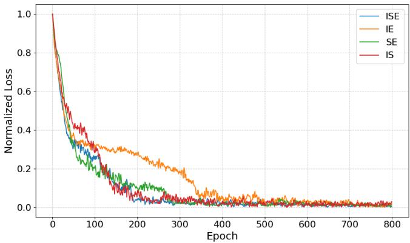  
Fig. 7: The convergence of the proposed CRAGT-based method versus different objectives.

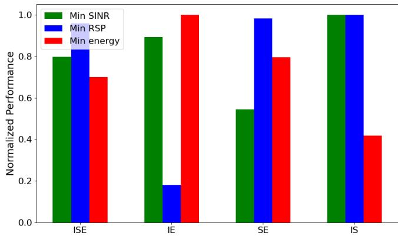  
Fig. 8: Normalized performance versus different objectives.

Fig. 8 shows the normalized network performance of the proposed method versus different optimization objectives. Similar to Fig. 5, the green bars represent the minimum SINR for information users, the black bars indicate the minimum RSP for sensing targets, and the red bars represent the minimum received energy for energy users. As shown in the figure, when optimizing all three objectives jointly (ISE), the proposed method achieves a balanced performance across all metrics. When optimizing only two objectives, such as IE, the performance of information and energy users improves compared to the ISE case, while the unoptimized sensing performance drops significantly. Similarly, in the SE setting, sensing and energy performances are enhanced, and in the IS setting, information and sensing users benefit. These results demonstrate that the proposed CRGAT method can effectively adapt to different optimization objectives and achieve the optima performance for the targeted objectives.

Fig. 9 visualizes the 3D UAV deployment results of the proposed CRGAT-based method under different optimization objectives. As shown in Fig. 9(a), (b), and (c), when sensing performance is included among the optimization goals, the method consistently deploys two UAVs near the sensing regions to ensure sufficient sensing coverage. Beyond this, the remaining two UAVs are adaptively deployed based on other objectives such as communication and energy harvesting demands, enabling fine-grained performance enhancement for these user types. Specifically, in Fig. 9(a), where communication, sensing, and energy objectives are jointly optimized, UAV deployment achieves a balanced trade-off by allocating UAVs both to sensing areas and to the regions dense with communication and energy users. In Fig. 9(b), which optimizes communication and sensing, UAVs are positioned closer to the center of the overall area, shortening distances to sensing regions and thus improving both sensing and communication performance. Fig. 9(c) demonstrates the scenario where sensing and energy harvesting are prioritized: UAVs are deployed to slightly approach the central region while ensuring energy user coverage, effectively enhancing both objectives. Finally, in Fig. 9(d), where only communication and energy harvesting are considered, no UAVs are allocated to sensing regions, and all UAVs are carefully positioned to maximize communication and energy user performance without wasting resources on sensing coverage. These deployment strategies validate the proposed CRGAT method’s ability to flexibly and rationally allocate UAV resources according to diverse and possibly conflicting objectives, thereby achieving superior multi-objective balance in ISCPT networks.

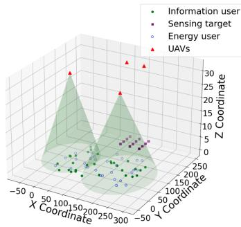  
(a) ISE.

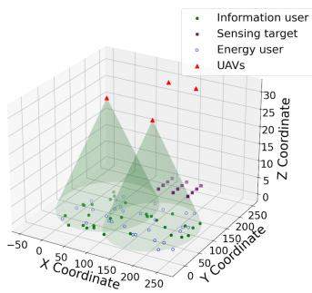  
(b) IS.

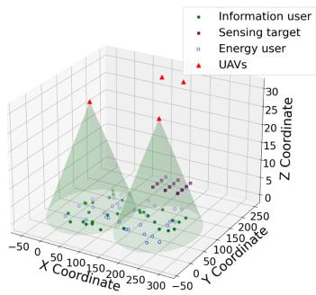  
(c) SE.

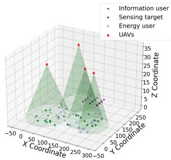  
(d) IE.  
Fig. 9: UAV 3D-deployment results versus different objectives.

## D. Performance Versus the Number of UAVs

To examine the impact of the number of UAVs on system performance, the proposed CRGAT-based method is evaluated under different UAV counts. To ensure that the performance variation is mainly caused by changing the number of UAVs rather than increasing the total transmit power, the total transmit power is fixed at 4 W, and the maximum transmit power of each UAV is 4/K. Fig. 10 presents the normalized performance versus the number of UAVs. The bar plots (left vertical axis) show the normalized minimum performance metrics, including the minimum SINR of information users, the minimum RSP of sensing targets, and the minimum harvested energy of energy users. The curve with markers (right vertical axis) shows the weighted-sum performance, which aggregates the three objectives according to the predefined weights.

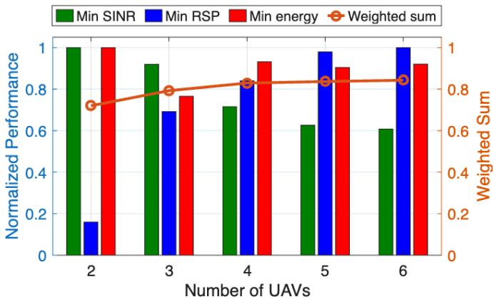  
Fig. 10: Normalized performance versus numbers of UAVs.

As shown in Fig. 10, with a fixed total transmit power, the weighted-sum performance increases with the number of UAVs, indicating a clear cooperation gain enabled by multi-UAV deployment. However, the incremental improvement gradually decreases as more UAVs are added, revealing a diminishing-return effect. This behavior suggests that the benefit of deploying additional UAVs mainly comes from improved spatial coordination and coverage diversity, while the marginal gain weakens when the UAV count further increases because the available power budget per UAV (i.e., the power upper bound $4 / K )$ becomes smaller. From the perspective of individual objectives, when the number of UAVs is small (e.g., $K = 2 )$ , the limited UAV resources are primarily allocated to communication and energy service regions, resulting in relatively poor sensing performance. As the number of UAVs increases, the sensing metric improves noticeably, indicating that additional UAVs can be assigned to sensing tasks and positioned closer to sensing targets, which effectively reduces geometric path loss. In contrast, the minimum SINR of communication users gradually decreases with increasing K, reflecting the growing co-channel interference introduced by more simultaneously transmitting UAVs. The energy harvesting performance remains relatively stable across different UAV counts, implying that the increased spatial flexibility provided by additional UAVs is largely offset by the reduced power budget available to each UAV.

## E. Model Adaptability Under Different User Distributions

To evaluate the adaptability of the proposed CRGAT-based method under more general spatial configurations, its performance is further examined under different user distribution scenarios. Three representative spatial layouts are considered: (i) a separated scenario, where different user types occupy non-overlapping regions; (ii) a partially overlapped scenario, where the regions of different user types intersect; and (iii) a fully overlapped scenario, where information users, sensing targets, and energy users are intermingled within the same area. In all scenarios, the numbers of information users, sensing targets, and energy users are kept identical, and the UAV count and system parameters remain unchanged. Fig.11 presents the training loss and the evolution of the minimum performance metrics under three user distribution scenarios. Specifically, Fig.11a reports the training loss convergence, while Figs.11b–11d show the minimum SINR of information users, the minimum RSP of sensing targets, and the minimum harvested energy of energy users, respectively. As shown in Fig.11a, the proposed CRGAT-based method converges stably in all three scenarios, indicating its ability to adapt to different spatial arrangements of user types through retraining. Although the final loss values differ across scenarios due to differences in spatial coupling and resource competition, consistent convergence behavior is observed in all cases. Moreover, the minimum SINR, minimum RSP, and minimum harvested energy in Figs. 11b–11d increase during training and then converge to steady values under each distribution, indicating that the proposed framework can jointly optimize the three objectives under different spatial arrangements of user types. Overall, these results suggest that the CRGATbased approach does not depend on a specific user distribution pattern, but can be effectively trained to adapt to different spatial configurations. This further implies that CRGAT provides an adaptable optimization framework that can accommodate different deployment environments through retraining.

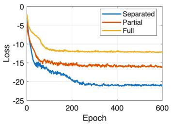  
(a) Training loss.

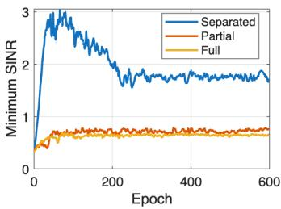  
(b) Minimum SINR.

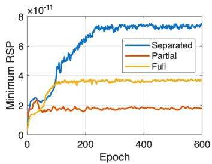  
(c) Minimum RSP.

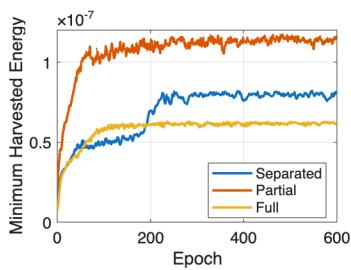  
(d) Minimum harvested energy.  
Fig. 11: Performance under different user distribution scenarios.

## F. Model Generalization Under Varying Numbers of Users

To evaluate the generalization capability of the proposed CRGAT method, we conduct experiments on ISCPT networks with varying numbers of users while keeping the UAV count fixed. The model is initially trained on a scenario with 72 users and then directly applied to different user configurations without retraining. The normalized minimum performance metrics for communication, sensing, and energy harvesting are recorded to assess generalization under unseen user cardinalities. Fig. 12 shows that CRGAT maintains balanced optimization across the three objectives under different user scales. As the number of users decreases, the minimum performance metrics improve, which is expected since resource contention becomes less severe and more spatial and power degrees of freedom are available for serving the worst-case users under the max–min criterion. The improvement is more pronounced for energy harvesting, as fewer users allow UAVs to allocate higher effective energy intensity to the weakest EH users. These results indicate that the learned CRGAT policy can be directly applied to varying user cardinalities and dynamic network sizes without retraining. This generalization capability is essential for practical UAV-enabled ISCPT deployment, where user distributions and densities can be time-varying and difficult to predict. By accommodating such variations without retraining, the proposed CRGAT reduces deployment overhead and operational complexity, which lowers maintenance cost. It also enables timely adaptation to evolving network sizes and user distributions under limited computational resources.

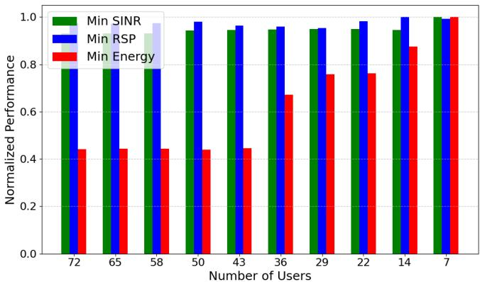  
Fig. 12: Normalized performance versus number of users.

## G. Analysis of the Pareto Front

Although the proposed CRGAT-based method is primarily designed to achieve on-demand trade-offs among multiple objectives with given weight preferences, in practical scenarios, decision-makers may not always be able to clearly specify the relative importance of each objective. To further evaluate the method’s potential to generate a representative set of candidate solutions under uncertain or varying weight preferences, we conduct a supplementary Pareto front analysis experiment. Specifically, we consider the simultaneous optimization of three objectives: the minimum SINR for communication users (min SINR), the minimum RSP for sensing users (min RSP), and the minimum received energy for energy users (min energy). This weight space is uniformly discretized with a step size of 0.05, yielding 225 valid weight vectors. For each weight configuration, the proposed CRGAT-based method is independently executed to obtain a solution that reflects the corresponding objective preference. All resulting solutions are aggregated and evaluated using Pareto dominance analysis.

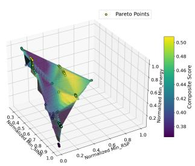

(a) 3D Pareto front for communication, sensing, and WPT objective.  
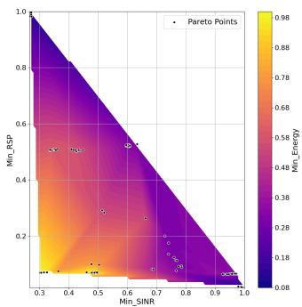  
(b) 2D available regions of the 3D Pareto front onto the communication-sensing plane.

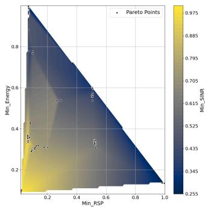  
(c) 2D available regions of the 3D Pareto front onto the sensing-WPT plane.

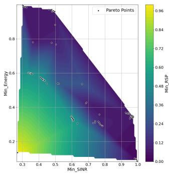  
(d) 2D available regions of the 3D Pareto front onto the communication-WPT plane.  
Fig. 13: 3D Pareto front and 2D available regions under joint optimization of communication, sensing, and WPT objectives.

Fig. 13 (a) plots the approximate 3D Pareto front constructed from 104 non-dominated solutions extracted out of 225 solutions obtained under various weight configurations using the proposed CRGAT-based method. The three axes represent the normalized values of the three objectives: min SINR, min RSP, min energy. The color represents the composite score, which is the average of the three objectives. As shown in the figure, the Pareto points are well distributed across the objective space, forming a smooth and continuous Pareto front. This distribution indicates that the proposed method can effectively explore the trade-off space under different preference configurations, without bias toward any single objective. Moreover, the shape of the Pareto front reveals clear conflicts among the objectives, as improving one typically comes at the expense of others. Notably, 104 out of the 225 solutions are non-dominated, accounting for approximately 46.2%, which further demonstrates that the proposed CRGATbased method not only performs effectively with given weight settings but also shows strong potential in supporting multiobjective decision-making through the approximate Pareto front constructed via preference space traversal.

To better understand the pairwise trade-offs among the three objectives, we further project the approximate 3D Pareto front onto three 2D planes. As shown in Fig. 13(b), (c) and (d), the 3D Pareto front is respectively projected onto the communication-sensing (min SINR vs. min RSP), sensing-WPT (min RSP vs. min energy), and communication-WPT (min SINR vs. min energy) planes. In each plot, the nondominated solutions are marked as black dots, while the background color map encodes the third objective not shown on the axes. From these figures, it can be observed that improving one objective generally comes at the cost of degrading the others, due to limited UAV and power resources and the competition among objectives. In Fig. 13(b) and (c), the available regions appear triangular, reflecting strong trade-offs involving the sensing objective. In contrast, Fig. 13(d) presents a larger, pentagon-shaped feasible region between communication and WPT, indicating a relatively milder conflict. This difference is mainly caused by user distribution, where communication and energy users are located in the same region while sensing users are spatially separated. As a result, improving sensing performance requires the UAV to move away from the other user groups, which increases conflict. Additionally, in Fig. 13(d), two inflection points are visible along the Pareto boundary. These indicate that at certain stages, modest sacrifices in one objective can yield noticeable gains in the other. However, beyond these points, further improvement in either objective leads to rapid deterioration of the other. This is because enhancing communication performance depends not only on increasing transmit power but also on reducing interference, while power transfer benefits more directly from power increase. These observations suggest that UAV positioning is effective for initial balancing, but power control becomes dominant as performance demands grow.

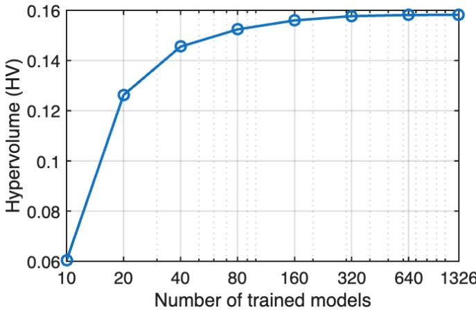  
Fig. 14: Hypervolume versus number of trained models.

## H. Complexity–Performance Tradeoff Analysis

In Section IV-G, we showed that the proposed CRGATbased method can generate a well-distributed approximate Pareto front through weight-space traversal, effectively capturing the tradeoffs among communication, sensing, and WPT objectives in multi-UAV ISCPT systems. Since each Pareto solution is obtained by training a separate model under a specific weight, denser traversal of the weight space inevitably increases the offline training complexity. This section therefore examines the tradeoff between offline training complexity and the achievable multi-objective performance. To quantify this tradeoff, we evaluate the quality of the constructed Pareto front versus different numbers of trained models. The hypervolume (HV) metric [62] is adopted to measure the volume of the objective space dominated by the Pareto front with respect to a predefined reference point, where a larger HV indicates better Pareto-front quality in terms of convergence and diversity. All objective values are normalized prior to HV computation to ensure fair comparison.

Fig. 14 shows the achieved hypervolume versus the number of trained models. The horizontal axis represents the offline training complexity quantified by the number of trained models, while the vertical axis denotes the corresponding hypervolume value. Specifically, the entire weight space is first traversed with step size $\Delta = 0 . 0 2$ to construct a highresolution model pool containing 1326 trained models. Model subsets of different sizes are then uniformly selected from this pool to emulate different offline training budgets. As shown in Fig. 14, the hypervolume increases monotonically with the number of trained models, indicating that denser sampling of the preference space improves the quality of the approximated Pareto front. When the number of trained models is small, the hypervolume increases rapidly, whereas the growth rate gradually decreases as more models are added, revealing a diminishing-return effect in Pareto-front improvement. This tradeoff suggests that, for multi-UAV ISCPT systems, training a moderate number of models is sufficient to obtain a high-quality approximation of the Pareto front, while further increasing the training budget yields only limited additional performance gains. Accordingly, in practical deployments, the offline training scale can be flexibly configured according to available computational resources and service demands, enabling effective control of training overhead while maintaining multi-objective performance.

## V. CONCLUSION

This paper presented a multi-UAV collaborative ISCPT network. A novel CRGAT-based joint optimization method was proposed to maximize the minimum SINR for communication users, the minimum RSP for sensing users, and the minimum received energy for energy users, by optimizing the 3D deployment and transmit power of UAVs. Simulation results show that the proposed CRGAT-based method achieves over 39.6% performance improvement compared to baselines. Moreover, the proposed method also adapts well to varying objective combinations and user distributions, achieving balanced tradeoffs across communication, sensing, and energy tasks. Pareto analysis further reveals asymmetric conflicts among objectives, with sensing often requiring greater compromise due to spatial separation. Importantly, the model maintains high performance without retraining under dynamic user densities, demonstrating strong generalization capability. In our future work, we shall further explore the optimization of multi-antenna UAV beamforming design to enhance the performance of multi-UAV collaborative ISCPT systems.

## REFERENCES

[1] C.-X. Wang, X. You, X. Gao et al., “On the road to 6G: Visions, requirements, key technologies, and testbeds,” IEEE Commun. Surveys Tuts., vol. 25, no. 2, pp. 905–974, 2023.

[2] Y. Zhao, Q. Wu, W. Chen et al., “Multi-functional beamforming design for integrated sensing, communication, and computation,” IEEE Trans. Commun., vol. 73, no. 8, pp. 6322–6336, 2025.

[3] A. Magbool, V. Kumar, A. Bazzi et al., “Multi-functional RIS for a multi-functional system: Integrating sensing, communication, and wireless power transfer,” IEEE Network, vol. 39, no. 1, pp. 71–79, 2025.

[4] H. Yan, Y. Chen, and S.-H. Yang, “UAV-enabled wireless power transfer with base station charging and UAV power consumption,” IEEE Trans. Veh. Technol., vol. 69, no. 11, pp. 12 883–12 896, 2020.

[5] A. Tishchenko, M. Khalily, A. Shojaeifard et al., “The emergence of multi-functional and hybrid reconfigurable intelligent surfaces for integrated sensing and communications-a survey,” IEEE Commun. Surveys Tuts., vol. 27, no. 5, pp. 2895–2936, 2025.

[6] Y. Ge, K. Xiong, Q. Wang et al., “AoI-minimal power adjustment in RF-EH-powered industrial IoT networks: A soft actor-critic-based method,” IEEE Trans. Mob. Comput., vol. 23, no. 9, pp. 8729–8741, 2024.

[7] R. Zhang, K. Xiong, Y. Lu et al., “Energy efficiency maximization in RIS-assisted SWIPT networks with rsma: A ppo-based approach,” IEEE J. Sel. Areas Commun., vol. 41, no. 5, pp. 1413–1430, 2023.

[8] X. Zhang, K. Xiong, W. Chen et al., “Maximizing harvested energy in natural energy powered RF WPT with nonlinear EH model,” IEEE Trans. Wireless Commun., early access, 2025.

[9] W. Mao, Y. Lu, C.-Y. Chi et al., “Communication-sensing region for cellfree massive MIMO ISAC systems,” IEEE Trans. Wireless Commun., vol. 23, no. 9, pp. 12 396–12 411, 2024.

[10] D. Wen, Y. Zhou, X. Li et al., “A survey on integrated sensing, communication, and computation.”

[11] Y. Chen, H. Hua, J. Xu et al., “ISAC meets SWIPT: Multi-functional wireless systems integrating sensing, communication, and powering,” IEEE Trans. Wireless Commun., vol. 23, no. 8, pp. 8264–8280, 2024.

[12] Y. Chen, C. Hu, Z. Ren et al., “Integrated sensing, communication, and powering over multi-antenna OFDM systems,” IEEE Trans. Wireless Commun., vol. 24, no. 8, pp. 7142–7157, 2025.

[13] J. Yaswanth, P. Saikia, K. Singh et al., “Active and STAR-RIS assisted MIMO ISAC systems with SWIPT,” IEEE Trans. Cognit. Commun. Networking, early access, 2025.

[14] H. Tataria, M. Shafi, A. F. Molisch et al., “6G wireless systems: Vision, requirements, challenges, insights, and opportunities,” Proc. IEEE, vol. 109, no. 7, pp. 1166–1199, 2021.

[15] S. Zhang, Q. Liu, K. Chen et al., “Large models for aerial edges: An edge-cloud model evolution and communication paradigm,” IEEE J. Sel. Areas Commun., vol. 43, no. 1, pp. 21–35, 2025.

[16] Y. Xiao, Z. Ye, M. Wu et al., “Space-air-ground integrated wireless networks for 6G: Basics, key technologies and future trends,” IEEE J. Sel. Areas Commun., vol. 42, no. 12, pp. 3327–3354, 2024.

[17] Y. Liu, K. Xiong, Y. Zhu et al., “Outage analysis of IRS-assisted UAV NOMA downlink wireless networks,” IEEE Internet Things J., vol. 11, no. 6, pp. 9298–9311, 2023.

[18] Y. Liu, K. Xiong, W. Zhang et al., “Jamming-enhanced secure UAV communications with propulsion energy and curvature radius constraints,” IEEE Trans. Veh. Technol., vol. 72, no. 8, pp. 10 852–10 866, 2023.

[19] W. Mao, K. Xiong, Y. Lu et al., “Energy consumption minimization in secure multi-antenna UAV-assisted MEC networks with channel uncertainty,” IEEE Trans. Wireless Commun., vol. 22, no. 11, pp. 7185– 7200, 2023.

[20] Q. Wu, J. Xu, Y. Zeng et al., “A comprehensive overview on 5g-andbeyond networks with UAVs: From communications to sensing and intelligence,” IEEE J. Sel. Areas Commun., vol. 39, no. 10, pp. 2912– 2945, 2021.

[21] L. Xie, Z. Su, Q. Xu et al., “A secure UAV cooperative communication framework: Prospect theory based approach,” IEEE Trans. Mob. Comput., vol. 23, no. 11, pp. 10 219–10 234, 2024.

[22] S. Javed, A. Hassan, R. Ahmad et al., “State-of-the-art and future research challenges in UAV swarms,” IEEE Internet Things J., vol. 11, no. 11, pp. 19 023–19 045, 2024.

[23] W. Ding, C. Chen, Y. Fang et al., “Multi-UAV-enabled integrated sensing and communications: Joint UAV placement and power control,” in Proc. IEEE Globecom Workshops, 2023, pp. 842–847.

[24] Z. Lyu, G. Zhu, and J. Xu, “Joint maneuver and beamforming design for UAV-enabled integrated sensing and communication,” IEEE Trans. Wireless Commun., vol. 22, no. 4, pp. 2424–2440, 2022.

[25] Y. Zeng, J. Xu, and R. Zhang, “Trajectory planning of cellular-connected UAV for communication-assisted radar sensing,” IEEE Trans. Commun., vol. 70, no. 10, pp. 6917–6930, 2022.

[26] K. Heo, H.-H. Choi, and K. Lee, “Joint trajectory and resource optimization for UAV-assisted SWIPT systems: A comparative study of linear and nonlinear energy harvesting models,” IEEE Internet Things J., vol. 11, no. 24, pp. 40 293–40 305, 2024.

[27] X. Hu, P. Wen, H. Xiao et al., “Maximizing energy charging for UAVassisted MEC systems with SWIPT,” IEEE Trans. Veh. Technol., vol. 74, no. 5, pp. 8442–8447, 2025.

[28] X. Zeng, L. Xing, Y. Wu et al., “Beamforming design for integrated sensing and SWIPT system,” in Proc. IEEE 33rd Annu. Int. Symp. Pers., Indoor Mobile Radio Commun. (PIMRC), Sep. 2022, pp. 403–408.

[29] X. Li, X. Yi, Z. Zhou et al., “Multi-user beamforming design for integrating sensing, communications, and power transfer,” in Proc. IEEE WCNC, 2023, pp. 1–6.

[30] Y. Chen, H. Hua, J. Xu et al., “ISAC meets SWIPT: Multi-functional wireless systems integrating sensing, communication, and powering,” IEEE Trans. Wireless Commun., vol. 23, no. 8, pp. 8264–8280, 2024.

[31] Z. Zhou, X. Li, G. Zhu et al., “Integrating sensing, communication, and power transfer: Multiuser beamforming design,” IEEE J. Sel. Areas Commun., vol. 42, no. 9, pp. 2228–2242, 2024.

[32] Y. Yang, H. Gao, X. Yang et al., “Joint beamforming for RIS-assisted integrated communication, sensing and power transfer systems,” IEEE Wireless Commun. Lett., vol. 13, no. 2, pp. 288–292, 2023.

[33] B. Li, J. Liu, Y. Liang et al., “UAV-enabled joint sensing, communication, powering and backhaul transmission in maritime monitoring networks,” 2025, arXiv:2505.12190.

[34] R. Zhang, Y. Zhang, R. Tang et al., “A joint UAV trajectory, user association, and beamforming design strategy for multi-UAV-assisted ISAC systems,” IEEE Internet Things J., vol. 11, no. 18, pp. 29 360– 29 374, 2024.

[35] Q. Wang, R. Chai, R. Sun et al., “ISAC-enabled multi-UAV cooperative perception and trajectory optimization,” IEEE Internet Things J., vol. 11, no. 24, pp. 40 982–40 995, 2024.

[36] C. Kim, H.-H. Choi, and K. Lee, “Joint optimization of trajectory and resource allocation for multi-UAV-enabled wireless-powered communication networks,” IEEE Trans. Commun., vol. 72, no. 9, pp. 5752–5764, 2024.

[37] L. Zhu, J. Zhang, Z. Xiao et al., “Multi-UAV aided millimeter-wave networks: Positioning, clustering, and beamforming,” IEEE Trans. Wireless Commun., vol. 21, no. 7, pp. 4637–4653, 2022.

[38] Q. Wei, R. Li, W. Bai et al., “Multi-UAV-enabled energy-efficient data delivery for low-altitude economy: Joint coded caching, user grouping, and UAV deployment,” IEEE Internet Things J., pp. 1–1, 2025.

[39] G. Abdissa Bayessa, R. Chai, C. Liang et al., “Joint UAV deployment and precoder optimization for multicasting and target sensing in UAVassisted ISAC networks,” IEEE Internet Things J., vol. 11, no. 20, pp. 33 392–33 405, 2024.

[40] J.-H. Kim, M.-C. Lee, and T.-S. Lee, “Generalized UAV deployment for UAV-assisted cellular networks,” IEEE Trans. Wireless Commun., vol. 23, no. 7, pp. 7894–7910, 2024.

[41] X. Tang, K. Zhao, C. Shen et al., “Deep graph reinforcement learning for UAV-enabled multi-user secure communications,” IEEE Trans. Mob. Comput., pp. 1–13, early access, 2025.

[42] J. C. Park, K.-M. Kang, and J. Choi, “K-means clustering-aided power control for UAV-enabled OFDM networks,” IEEE Access, vol. 12, pp. 15 549–15 560, 2024.

[43] W. Ding, C. Chen, Y. Fang, and R. Zhang, “Multi-UAV-enabled integrated sensing and communications: Joint UAV placement and power control,” in Proc. IEEE Globecom Workshops, 2023, pp. 842–847.

[44] W. Ding, Z. Ren, Y. Fang et al., “Multi-UAV-enabled integrated sensing and communications: Joint beamforming and UAV placement design,” in Proc. 16th Int. Conf. Wireless Commun. Signal Process. (WCSP), 2024, pp. 770–775.

[45] G. Cheng, Y. Fang, J. Xu et al., “Optimal coordinated transmit beamforming for networked integrated sensing and communications,” IEEE Trans. Wireless Commun., vol. 23, no. 8, pp. 8200–8214, 2024.

[46] W. K. New, C. Y. Leow, K. Navaie et al., “Interference-aware NOMA for cellular-connected UAVs: Stochastic geometry analysis,” IEEE J. Sel. Areas Commun., vol. 39, no. 10, pp. 3067–3080, 2021.

[47] S. Li, B. Duo, M. D. Renzo et al., “Robust secure UAV communications with the aid of reconfigurable intelligent surfaces,” IEEE Trans. Wireless Commun., vol. 20, no. 10, pp. 6402–6417, 2021.

[48] G. Sun, L. He, Z. Sun et al., “Joint task offloading and resource allocation in aerial-terrestrial UAV networks with edge and fog computing

for post-disaster rescue,” IEEE Trans. Mob. Comput., vol. 23, no. 9, pp. 8582–8600, 2024.

[49] Y. Zeng, Q. Wu, and R. Zhang, “Accessing from the sky: A tutorial on UAV communications for 5G and beyond,” Proc. IEEE, vol. 107, no. 12, pp. 2327–2375, 2019.

[50] Y. Zeng, J. Xu, and R. Zhang, “Energy minimization for wireless communication with rotary-wing UAV,” IEEE Trans. Wireless Commun., vol. 18, no. 4, pp. 2329–2345, 2019.

[51] A. Al-Hourani, S. Kandeepan, and S. Lardner, “Optimal LAP altitude for maximum coverage,” IEEE Wireless Commun. Lett., vol. 3, no. 6, pp. 569–572, 2014.

[52] E. Boshkovska, D. W. K. Ng, N. Zlatanov et al., “Practical non-linear energy harvesting model and resource allocation for SWIPT systems,” IEEE Commun. Lett., vol. 19, no. 12, pp. 2082–2085, 2015.

[53] Q. Wu, Y. Zeng, and R. Zhang, “Joint trajectory and communication design for multi-UAV enabled wireless networks,” IEEE Trans. Wireless Commun., vol. 16, no. 12, pp. 8196–8210, 2017.

[54] K. Heo, H.-H. Choi, and K. Lee, “Joint trajectory and resource optimization for UAV-assisted SWIPT systems: A comparative study of linear and nonlinear energy harvesting models,” IEEE Internet Things J., vol. 11, no. 24, pp. 40 293–40 305, 2024.

[55] P. Li, “Max–min fairness beamforming design for UAV-enabled networks,” Electron. Lett., vol. 60, no. 2, pp. 43–46, 2024.

[56] Y. Liu, K. Xiong, W. Chen, and P. Fan, “Sensing-fairness-based energyefficiency optimization for UAV-enabled integrated sensing and communication systems,” IEEE Wireless Commun. Lett., vol. 12, no. 9, pp. 1678–1682, 2023.

[57] P. Velickovic, G. Cucurull, A. Casanova et al., “Graph attention networks,” in Proc. Int. Conf. Learn. Represent., 2018, pp. 1–12.

[58] M. Sun, X. Xu, X. Qin et al., “AoI-energy-aware UAV-assisted data collection for IoT networks: A deep reinforcement learning method,” IEEE Internet Things J., vol. 8, no. 24, pp. 17 275–17 289, 2021.

[59] Z. Gong, O. Hashash, Y. Wang et al., “UAV-aided lifelong learning for AoI and energy optimization in nonstationary IoT networks,” IEEE Internet Things J., vol. 11, no. 24, pp. 39 206–39 224, 2024.

[60] S. Tao, M. Yuan, Q. Wu et al., “Generative AI-aided vertical handover decision in SAGIN for IoT with integrated sensing and communication,” IEEE Internet Things J., vol. 12, no. 10, pp. 13 297–13 310, 2025.

[61] J. Chen, X. Cao, P. Yang et al., “Deep reinforcement learning based resource allocation in multi-UAV-aided MEC networks,” IEEE Trans. Commun., vol. 71, no. 1, pp. 296–309, 2023.

[62] F. Song, H. Xing, X. Wang et al., “Evolutionary multi-objective reinforcement learning based trajectory control and task offloading in uavassisted mobile edge computing,” IEEE Trans. Mob. Comput., vol. 22, no. 12, pp. 7387–7405, 2022.