# Multi-UAV Cooperative Task Offloading and Resource Allocation in 5G Advanced and Beyond

Hongzhi Guo , Member, IEEE, Yutao Wang , Graduate Student Member, IEEE, Jiajia Liu , Senior Member, IEEE, and Chang Liu , Graduate Student Member, IEEE

Abstract— In 5G advanced and beyond, latency-critical and computation-intensive applications require more communication and computing resources. However, remote areas without available terrestrial edge/cloud infrastructure fail to satisfy these applications’ demands. This motivates the emergence of the UAV-enabled aerial computing paradigm. Single UAV-enabled aerial computing (SUEAC) is limited by small coverage area and insufficient resources, which cannot meet the application requirements. Multiple UAV-enabled aerial computing (MUEAC) has broken through the limitation of SUEAC and has attracted wide attention. Cooperation among multiple UAVs in MUEAC can fully utilize UAV resources and achieve load balancing. Furthermore, for divisible tasks with data-dependent characteristics, using partial offloading makes task scheduling more flexible compared to binary offloading, thus reducing task processing delay. Therefore, we propose a software defined networking enhanced cooperative MUEAC system. To minimize the processing delay of divisible tasks, we study the problem of joint task scheduling and computing resource allocation under task data dependency and UAV energy consumption constraints. To solve the non-convex problem, a multi-UAV cooperative communication and computing optimization (MCCCO) scheme is proposed. Experimental results corroborate that MCCCO can achieve better performance in task processing delay reduction and load balancing on UAV energy consumption than the traditional schemes.

Index Terms— Multiple UAV-enabled aerial computing, task offloading, resource allocation, partial offloading.

# I. INTRODUCTION

IN5G advanced and beyond, more and more Internetof Things (IoT) applications emerge in our lives, of Things (IoT） applications emerge in our lives, such as automatic driving, face detection, etc [1]. Due to their computation-intensive and latency-sensitive nature, these applications often demand more communication and computing resources. Mobile edge computing (MEC) can be used

Manuscript received 10 October 2022; revised 2 March 2023; accepted 4 May 2023. Date of publication 24 May 2023; date of current version 9 January 2024. This work was supported in part by the National Key Research and Development Program of China under Grant 2022YFB3104200; in part by National Natural Science Foundation of China under Grant 62202386; in part by the Xi’an Unmanned System Security and Intelligent Communications International Science and Technology Cooperation (ISTC) Center; and in part by the Special Funds for Central Universities Construction of World-Class Universities (Disciplines) and Special Development Guidance under Grant 0639023GH202282, Grant 0639023SH0201282, Grant 0639023GH0202091, and Grant 0639023SH0201091. The associate editor coordinating the review of this article and approving it for publication was Y. Zheng. (Corresponding author: Jiajia Liu.)

The authors are with the National Engineering Laboratory for Integrated Aero-Space-Ground-Ocean Big Data Application Technology, School of Cybersecurity, Northwestern Polytechnical University, Xi’an, Shaanxi 710072, China (e-mail: liujiajia@nwpu.edu.cn).

Color versions of one or more figures in this article are available at https://doi.org/10.1109/TWC.2023.3277801.

Digital Object Identifier 10.1109/TWC.2023.3277801

to resolve conflicts between these applications and resourceconstrained user devices, and can greatly reduce task processing delay and energy consumption [2]. However, because edge servers are typically embedded in fixed base stations (BSs) or access points (APs) close to user devices, they cannot handle computing tasks in temporary or emergency scenarios (e.g., remote areas without available terrestrial edge/cloud infrastructure, emergency rescue sites, etc.) [3], [4], [5]. Recently, owing to the strong adaptive ability, fast movement rate, and low deployment cost of unmanned aerial vehicles (UAVs), a new diagram of UAV-enabled aerial computing (UEAC) has attracted increasing attention [6]. By embedding computing servers in UAVs or utilizing UAVs as mobile relays, UEAC can provide flexible communication, computing, and cache services for ground devices [7]. Compared with conventional MEC, UEAC has many advantages. First, UAV platforms can be quickly deployed to specific locations to meet user demands for computing resources due to UAVs’ flexibility, mobility, and ease of deployment when edge computing servers are overloaded or unavailable [8]. Second, taking advantage of the line-of-sight (LoS) property of air-ground links, UEAC can deliver higher data rate and significantly minimize energy consumption and task processing delay, so as to guarantee user quality of service (QoS) [9].

With the increase in application requirements, UEAC has developed from single UAV-enabled aerial computing (SUEAC) to multiple UAV-enabled aerial computing (MUEAC). SUEAC is adaptable to scenarios with small tasks. However, with the number of tasks and the demand for computing resources increasing, it is difficult for SUEAC to meet users’ resource requirements. MUEAC that has more resources and larger service scope becomes an effective way to break these limitations [10], [11], [12]. Meanwhile, MUEAC also faces many issues to be solved. Specifically, cooperation among multiple UAVs should be further studied, including resource allocation, task offloading, and load balancing among cooperative UAVs. On the one hand, computing and communication resources should be properly assigned across time to achieve efficient utilization of UAV resources. In other words, a reasonable task offloading strategy needs to be developed to offload tasks from users to specific UAVs in a relatively balanced manner and to allocate the required computing resources to them. On the other hand, to prevent some UAVs from being damaged due to their long-term highintensity operations, it is necessary to achieve load balancing on UAV energy consumption.

Due to the different types of user devices and UAVs in the network, the traditional network management approach requires professional managers to perform frequent maintenance and management of the devices and UAVs in the network, and network upgrades and new service expansions require changes in hardware and software configurations. All these make network management more inefficient and network expansion more difficult. For this reason, software defined networking (SDN) has become an efficient network management [13], [14]. SDN is a new innovative network architecture, which can not only provide centralized management of the entire network architecture but also realize flexible control of network traffic. The architecture of SDN is divided into three main parts: data plane, control plane, and application plane. These three network layers integrate user devices, UAVs, and other elements into the system. The data plane, as the bottom layer of the SDN architecture, includes the ground user task data collected by the UAVs, as well as the communication, computing, and storage resource data of the UAVs. The control plane, as the middle layer of SDN architecture, is composed of many controllers, which are deployed on the head UAVs to manage and schedule all user devices, UAVs, and resources in the network. The application plane, as the top layer of the SDN architecture, includes a set of virtual machine management programs, such as resource management. These programs are deployed on the central SDN controller and are primarily responsible for offloading decisions and resource allocation.

Additionally, delay-sensitive and computationally intensive complex tasks contain multiple subtasks with data dependencies and need to comply with strict timing constraints for subtask execution. For example, tasks such as video navigation, face detection, camera preview, and video processing can be partitioned into 14 dependent subtasks. For the computation offloading of these divisible tasks, offloading them all to one UAV in the binary offloading mode would have the following problems. First, it is difficult for the performance of one UAV to meet the computation resource requirements of all subtasks at the same time, which leads to prolonged task computation delay; second, the waiting delay of subsequent tasks in the task execution sequence will be prolonged. Based on the above problems, compared with using the binary offloading mode, dividing the complex task into multiple subtasks, and using the partial offloading mode to offload the subtasks to different UAVs for computation, the UAVs will flexibly allocate the resources required by the subtasks with smaller granularity, which can further reduce the task processing latency.

# A. Related Work

UEAC refers to server-loaded UAVs as aerial base stations to provide services to users, which is a supplementary computing method to terrestrial computing. UAV-enabled edge computing refers to placing edge servers on UAVs to provide flexible and convenient services to users, which is an improved computing method of MEC. Although the focus of the two is different, the content of their research is roughly the same. The model studied in this paper is capable of disaster relief and rescue, remote villages, and other areas without ground computing facilities, so “UEAC” is used. However, “UAV-enabled edge computing” is still used in a large number of existing studies, so this section will introduce the work related to UEAC in detail.

In single UAV-enabled MEC systems, Bor-yaliniz et al. [15] studied the single UAV deployment optimization problem according to the different configurations of the UAV and the ground BS, to maximize network revenue. Guo and Liu [16] optimized offloading decisions, transmitted bits, and UAV trajectory to reduce energy consumption in UAV-enabled MEC. However, one UAV cannot serve complex application scenarios due to limited energy and computation resources. Then multiple UAV-enabled MEC with more resources and enlarged service scope has attracted extensive research. In multiple UAV-enabled MEC systems, Ti and Le [17] proposed a contributed UAV-fog-cloud computation system, which can provide services for mobile applications. A two-stage algorithm was given to solve the joint problem of task offloading, transmit power, and UAV trajectory. In consideration of the number and position of UAVs, Wang et al. [18] adopted a two-layer optimization approach to optimize the deployment of UAVs and task offloading in order to minimize energy consumption. However, the related works seldom studied cooperation among UAVs, which leads to high latency and insufficient resources utilization [19]. To meet the ubiquitous and unpredictable demands of IoT applications, Guo et al. [20] designed a multi-UAV MEC framework that supports UAVs’ dynamic entry and exit, aiming to achieve load balancing on UAV energy consumption and deliver long-term MEC services for user devices in a fixed area. To assist IoT smart devices in offloading compute-intensive tasks, Seid et al. [21] deployed a clustered multi-UAV to provide task offloading and resource allocation services to IoT devices. A multi-agent deep reinforcement learning-based approach was proposed to minimize the overall network computation cost while ensuring the quality of QoS requirements of IoT devices.

Note that partial offloading can further reduce task processing delay by allocating resources flexibly compared with binary offloading. Some papers related to partial offloading are displayed as follows. Intending to achieve the UAV energy efficiency maximization, Li et al. [22] optimized UAV trajectory, user transmission power, and binary task offloading strategy, under the constraints of UAVs’ computing capability and energy budget. Xu et al. [23] studied the data security problems in UAV-assisted MEC for both TDMA and NOMA schemes under partial offloading mode. Yang et al. [24] used deep reinforcement learning (DRL) to optimize binary task offloading, to improve task execution efficiency. Ning et al. [25] applied ARkit to simplify the complicated application module as the linear module. Considering the resource competition among users, an iterative heuristic resource allocation method is designed to get the partial offloading strategy. However, the above works just studied the linear tasks without considering tree and mesh model, which is not available in practical scenarios.

# B. Contribution

Through our analysis, we found the following problems in the research on the problem of task offloading and resource allocation for divisible tasks with data dependency in MUEAC systems. Many related studies have focused on fixed UAV cooperation mode and the tasks are offloaded to UAVs using the binary offloading mode. This not only makes the communication and computation resources of UAVs unreasonably allocated but also is not conducive to the load balancing on UAV energy consumption, resulting in the ineffective reduction of task response latency. For this reason, we propose a SDN-enhanced cooperative MUEAC system. In the system, we consider incorporating device-to-device (D2D) communication and air-to-air (A2A) communication models to increase the flexibility of the task transfer process, and the tasks are offloaded to the UAVs using the partial offloading mode. To achieve load balancing on UAV energy consumption and computation task processing delay minimization, we investigate the joint task scheduling and resource allocation problem. A multi-UAV cooperative communication and computation optimization (MCCCO) scheme is proposed as our solution. The main contributions of this paper are summarized as follows.

• We construct a SDN-enhanced cooperative MUEAC system, which implements a two-hop task offloading based on device-to-device (D2D) communication and air-to-air (A2A) communication models. To address the problem that computation offloading using binary offloading mode for divisible tasks leads to large task response delays, the intrinsic association model of tasks and computational partial offloading model are constructed, and the task scheduling process under the task data dependency constraint is modeled. To achieve load balancing on UAV energy consumption and task processing delay minimization, we study the joint task scheduling and resource allocation problem to optimize the task uplink from the user device to the UAV, the task transfer link between UAVs, and the computation resource allocation of UAVs under the constraints of task data dependency and UAV energy consumption. To solve this nonconvex problem, the MCCCO scheme is developed, which decouples the variables and decomposes the original problem into two subproblems. By using convex optimization tools and a two-layer game-theoretic approximation offloading algorithm (TGAOA), the optimization subproblem of ground D2D association strategy and the optimization subproblem of computation task offloading strategy can be respectively solved.

• To verify the performance of our proposed MCCCO scheme in reducing the task processing delay, we compare the MCCCO scheme with the traditional multi-UAV scheme by taking whether there is coordination, whether there is D2D association, and whether binary offloading or partial offloading is used as experimental comparison points. Numerical results show that our MCCCO scheme achieves better performance in terms of task processing delay reduction and load balancing on UAV energy consumption compared to the traditional multi-UAV schemes.

The rest of this paper is organized as follows. Section II introduces the system model. In Section III, the joint optimization problem is given and our solution is proposed to solve this problem. Section IV verifies the performance of our proposed solution. Finally, Section V makes a conclusion of this paper.

# II. SYSTEM MODEL

# A. System Overview

Fig. 1 shows a SDN-enhanced cooperative MUEAC system, where multiple UAVs are deployed to provide services for user devices, assisting them in accomplishing computation tasks. In this model, the UAVs are classified as a group of computing UAVs and a UAV manager to serve user devices effectively. The computing UAVs are mainly responsible for processing tasks and have a good performance on computing, which could be considered computing servers. The UAV manager is responsible for information management and control, and is inferior to the computing UAVs in terms of computing ability. The configuration of the computing UAVs and UAV manager is therefore different. The computing UAVs are configured with UAV controllers (UAV-Cs), computing units, communication units, storage units, and processing units. The UAV-Cs are able to collect information about ground users and can forward rules (task offloading and resource allocation decisions) from the SDN controller (SDN-C). The UAV manager configures three components: SDN-C, centralized data cloud (CDC), and centralized control cloud (CCC). The SDN-C can manage the global network based on the information collected by the UAV-Cs. The data collected and the actions performed are stored in the CDC and CCC. Besides, the UAVs are equipped with multiple antennae, and the user devices can send tasks to other user devices covered by the same UAV.

For convenience, the information of the computing UAVs can be expressed as $U ~ = ~ \{ V , F , P , L , N \}$ , where $V =$ $\{ 1 , 2 , \ldots , | V | \}$ denotes the set of computing UAVs and |V | is the number of computing UAVs, $F = \{ f _ { 1 } , f _ { 2 } , \dots , f _ { | V | } \}$ is the computation ability of computing UAVs, $\begin{array} { r l } { P } & { { } = } \end{array}$ $\{ p _ { 1 } , p _ { 2 } , \dotsc , p _ { | V | } \}$ is the transmit power of computing UAVs, $\begin{array} { r l r } { L } & { { } = } & { \{ ( x _ { 1 } , y _ { 1 } ) , ( x _ { 2 } , y _ { 2 } ) , \dots , ( x _ { | V | } , y _ { | V | } ) \} } \end{array}$ is the horizontal position of each computing UAV, and $\begin{array} { r l } { N } & { { } = } \end{array}$ $\{ N _ { 1 } , N _ { 2 } , \ldots , N _ { | V | } \}$ denotes user devices covered by computing UAVs. Likewise, $G _ { k } = \{ p _ { k } , ( x _ { k } , y _ { k } ) \}$ } is used to represent user device k. Especially, $p _ { k }$ and $( x _ { k } , y _ { k } )$ respectively denote user device $k ' s$ transmit power and two-dimensional coordinates. Besides, the UAVs hover at a certain height h. More key notations are shown in Table I.

# B. Communication Model

We assume that the total bandwidth B is divided into three main parts: $B ^ { D }$ for D2D links, $B ^ { G }$ for G2A links, and $B ^ { A }$ for A2A links. We do not consider the cross-interference between UAVs and user devices in this paper [26], and the issue is left for the future extension of this work.

1) Ground-to-Air Communication: For G2A communication links, since many different objects in the actual environment act as scatters or obstacles, radio signals emitted by ground devices or UAVs are not propagated in free space, but may instead be subject to shadowing or scattering caused by artificial structures, resulting in additional path loss. As a result, the simplified free space path loss (FSPL) model is insufficient to accurately describe the communication between ground devices and UAVs [27], [28]. Based on this, we model the G2A communication links by a probabilistic path loss model that considers the occurrence probabilities and path loss of LoS and Non-LoS (NLoS) communication, which provides a comprehensive characterisation for the G2A communication.

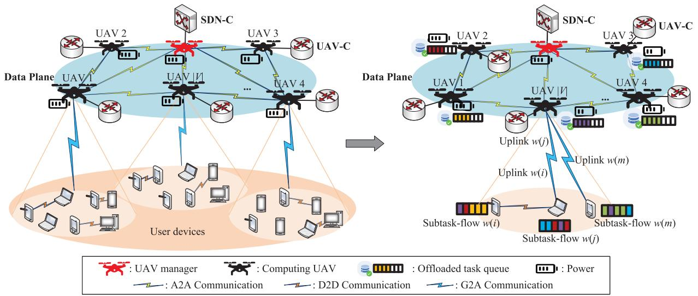

flowchart

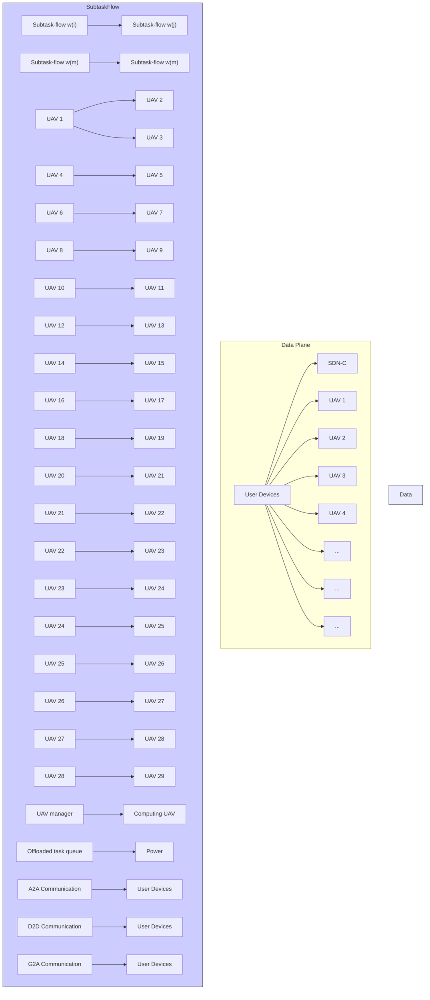

Fig. 1. SDN-enhanced cooperative MUEAC system. The left model depicts the entire architecture, while the right model describes the processing steps of divisible tasks with data dependency.

TABLE I SUMMARY OF KEY NOTATIONS 

<table><tr><td>Notation</td><td>Description</td></tr><tr><td> $V$ </td><td>Set of computing UAVs</td></tr><tr><td> $G_{k}$ </td><td>User device  $k$ </td></tr><tr><td> $N_{v}$ </td><td>User devices covered by computing UAV  $v$ </td></tr><tr><td> $f_{v}$ </td><td>Computation ability of computing UAV  $v$ </td></tr><tr><td> $p_{v},p_{k}$ </td><td>Transmit power of computing UAV  $v$ , user device  $k$ </td></tr><tr><td> $B^{D},B^{G},B^{A}$ </td><td>Channel bandwidth of D2D, G2A, and A2A links</td></tr><tr><td> $L_{k,v}^{FSPL}$ </td><td>Free space pathloss of G2A links</td></tr><tr><td> $\eta_{\xi}$ </td><td>Excessive pathloss of LoS or NLoS links</td></tr><tr><td> $n$ </td><td>Number of subtask-flow  $w(i)$  in set  $W$ </td></tr><tr><td> $m$ </td><td>Number of subtask  $\varphi_{w(i),s(j)}$  in  $w(i)$ </td></tr><tr><td> $\alpha_{w(i),s(j)}$ </td><td>Input data size of subtask  $\varphi_{w(i),s(j)}$ </td></tr><tr><td> $\beta_{w(i),s(j)}$ </td><td>Output data size of subtask  $\varphi_{w(i),s(j)}$ </td></tr><tr><td> $c_{w(i),s(j)}$ </td><td>Required CPU cycles of subtask  $\varphi_{w(i),s(j)}$ </td></tr><tr><td> $S_{w(i),s(j)}$ </td><td>Set of precursor subtasks of subtask  $\varphi_{w(i),s(j)}$ </td></tr><tr><td> $x_{w(i),s(j)}^{v}$ </td><td>Offloading strategy of subtask  $\varphi_{w(i),s(j)}$ </td></tr><tr><td> $y_{w(i)}^{k}$ </td><td>Ground D2D association strategy of device  $k$ </td></tr><tr><td> $X$ </td><td>Overall task offloading strategy of all subtasks</td></tr><tr><td> $Y$ </td><td>Overall ground D2D association strategy of subtask-flows in set  $W$ </td></tr><tr><td> $t^{upl}(w(i))$ </td><td>Uplink delay of subtask-flow  $w(i)$ </td></tr><tr><td> $t^{com}(w(i),s(j),v)$ </td><td>Average computing delay of subtask  $\varphi_{w(i),s(j)}$ </td></tr><tr><td> $e_{0}$ </td><td>Energy budget of UAVs</td></tr><tr><td> $e_{M},e_{v}^{C}$ </td><td>Energy consumption of UAV manager, computing UAV  $v$ </td></tr></table>

The occurrence probabilities of LoS and NLoS communication between device k and UAV v are

$$
\left\{ \begin{array}{l} P _ {k, v} ^ {L o S} = \frac {1}{1 + a \exp (- b ((1 8 0 / \pi) \arcsin (h / d _ {k , v}) - a))}, \\ P _ {k, v} ^ {N L o S} = 1 - P _ {k, v} ^ {L o S}, \end{array} \right. \tag {1}
$$

where $d _ { k , v } = \sqrt { ( x _ { k } - x _ { v } ) ^ { 2 } + ( y _ { k } - y _ { v } ) ^ { 2 } + h ^ { 2 } }$ . Moreover, a and b are constant values that depend on the environment. Thus, the path loss between device k and UAV v in each case is modeled as

$$
P L _ {k, v} ^ {\xi} = L _ {k, v} ^ {F S P L} + \eta_ {\xi}, \xi \in \{L o S, N L o S \}, \tag {2}
$$

where LF Sk,v $\begin{array} { r } { L _ { k , v } ^ { F S P L } = 2 0 \log ( \frac { 4 \pi } { c } ) + 2 0 } \end{array}$ log $f _ { c } + 2 0 \log d _ { k , \upsilon }$ denotes the free space path loss, $f _ { c }$ means the carrier frequency, c means the speed of light, and $\eta _ { \xi }$ is excessive path loss of LoS or NLoS links. The average path loss for G2A links is given as

$$
\overline {{{P L}}} _ {k, v} = P L _ {k, v} ^ {L o S} P _ {k, v} ^ {L o S} + P L _ {k, v} ^ {N L o S} P _ {k, v} ^ {N L o S}, \tag {3}
$$

and the channel gain between device k and UAV v is given as follows

$$
g _ {k, v} = 1 / \overline {{{P L}}} _ {k, v}. \tag {4}
$$

Therefore, the data rate for uplinking computation task from device k to UAV v is defined as

$$
\gamma^ {G 2 A} (k, v) = B ^ {G} \log_ {2} (1 + \frac {p _ {k} g _ {k , v}}{I N _ {k , v} + N _ {0}}), \tag {5}
$$

where $\begin{array} { r } { I N _ { k , v } \ = \ \sum _ { k _ { 0 } \neq k } ^ { k _ { 0 } \in N _ { v } } p _ { k _ { 0 } } g _ { k _ { 0 } , v } } \end{array}$ is the interference power signal from other devices in the coverage area of UAV v, and $N _ { 0 }$ is the noise power.

G2A communication constraint: Due to the limited coverage of the UAV, if the device k is to communicate with the UAV $v ,$ the distance between the device k and UAV v cannot exceed the specified communication distance $R _ { G 2 A }$ , which is expressed as follows

$$
d _ {k, v} \leq R _ {G 2 A} \tag {6}
$$

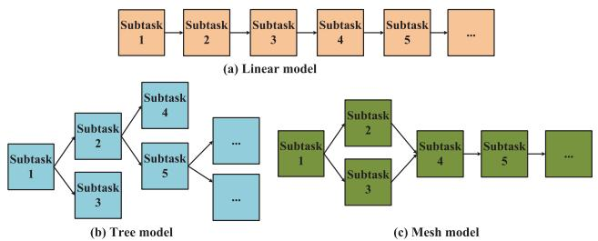

flowchart

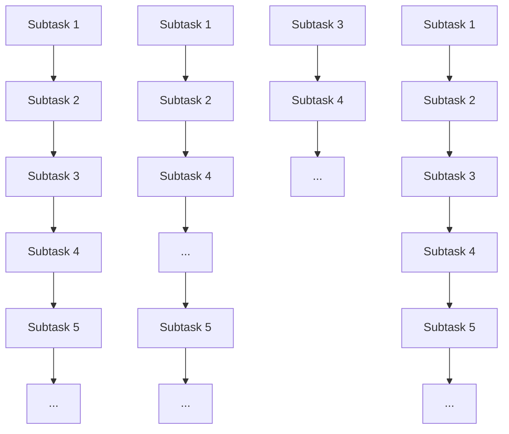

Fig. 2. Subtask-flow models.

2) Device-to-Device Communication: It is assumed that the D2D communication links between ground devices are dominated by LoS links [29], and the channel power gain between device k and device $k ^ { \prime }$ is given by

$$
g _ {k, k ^ {\prime}} = \frac {g _ {0}}{(x _ {k} - x _ {k ^ {\prime}}) ^ {2} + (y _ {k} - y _ {k ^ {\prime}}) ^ {2}}, \tag {7}
$$

where $g _ { 0 }$ is the channel power gain at a reference distance of 1 m, so the data rate from device k to device $k ^ { \prime }$ is given by

$$
\gamma^ {D 2 D} (k, k ^ {\prime}) = B ^ {D} \log_ {2} (1 + \frac {p _ {k} g _ {k , k ^ {\prime}}}{I N _ {k , k ^ {\prime}} + N _ {0}}), \tag {8}
$$

where INk,k′ = Pk0∈A[k],k ∈k0̸=k,k0̸=k′ $\begin{array} { r } { I N _ { k , k ^ { \prime } } = \sum _ { k _ { 0 } \neq k , k _ { 0 } \neq k ^ { \prime } } ^ { k _ { 0 } \in A [ k ] , k ^ { \prime } \in A [ k ] } p _ { k _ { 0 } } g _ { k _ { 0 } , k ^ { \prime } } } \end{array}$ is the interference power signal from other devices in the same area $A [ k ]$ of device k.

D2D communication constraint: Due to the limited coverage of the device, if the device k is to communicate with another device $k ^ { \prime } ,$ the distance between these two devices cannot exceed the specified communication distance $R _ { D 2 D }$ , which is expressed as follows

$$
d _ {k, k ^ {\prime}} \leq R _ {D 2 D} \tag {9}
$$

3) Air-to-Air Communication: Considering that the UAVs hover at a high height, A2A communication is primarily dominated by the LoS link, hence the communication environment between UAVs can be approximated as free space, the FSPL model can be applied to A2A communication [30]. Thus, the path loss between UAV v and $v ^ { \prime }$ is given as

$$
P L _ {v, v ^ {\prime}} ^ {A 2 A} = 3 2. 4 5 + 2 0 \log f _ {c} + 2 0 \log d _ {v, v ^ {\prime}}. \tag {10}
$$

Then, the data rate between UAV v and $v ^ { \prime }$ is expressed as

$$
\gamma^ {A 2 A} (v, v ^ {\prime}) = B ^ {A} \log_ {2} (1 + \frac {p _ {v} 1 0 ^ {- \frac {P L _ {v , v ^ {\prime}} ^ {A 2 A}}{1 0}}}{N _ {0}}). \tag {11}
$$

# C. Computing Model

The computation tasks from user devices can be regarded as subtask-flows. Some typical interdependent subtask-flows including linear, tree, and mesh models [31], are shown in Fig. 2. The set of subtask-flows are denoted as $W ~ = ~ \{ w ( 1 ) , w ( 2 ) , \ldots , w ( n ) \}$ , and each flow w(i) is composed of multiple subtasks, i.e., w(i) = $\{ s ( 1 ) , s ( 2 ) , \ldots , s ( m ) \}$ . We adopt the 3-tuple $\begin{array} { r l } { \varphi _ { w ( i ) , s ( j ) } } & { { } = } \end{array}$ $\left( \alpha _ { w ( i ) , s ( j ) } , \beta _ { w ( i ) , s ( j ) } , c _ { w ( i ) , s ( j ) } \right)$ to describe the subtasks, where $\alpha _ { w ( i ) , s ( j ) } , \beta _ { w ( i ) , s ( j ) }$ and $c _ { w ( i ) , s ( j ) }$ respectively denote the input data size, output data size and the required CPU cycles of subtask $\varphi _ { w ( i ) , s ( j ) }$ . The inter-dependencies in $w ( i )$ can be described as a square matrix $\mathbf { I } ^ { i } = ( I _ { j , j ^ { \prime } } ^ { i } ) _ { m \times m }$ , where

$I _ { j , j ^ { \prime } } ^ { i } = 0 , 1$ is an indicator of whether subtask $j ^ { \prime }$ needs the output data of subtask $j . ~ I _ { j , j ^ { \prime } } ^ { i } ~ = ~ 1$ indicates that subtask $j ^ { \prime }$ needs the output data of subtask $j ,$ otherwise, $I _ { j , j ^ { \prime } } ^ { i } = 0$ Accordingly, ${ \bf { I } } ^ { i }$ of three subatsk-flows in Fig. 2 are defined as

$$
\begin{array}{l} I ^ {i} = \left[ \begin{array}{c c c c c c} 0 & 0 & 0 & 0 & 0 & \dots \\ 0 & 0 & 0 & 0 & 0 & \dots \\ 0 & 0 & 0 & 0 & 0 & \dots \\ 0 & 0 & 0 & 0 & 0 & \dots \\ 0 & 0 & 0 & 0 & 0 & \dots \\ \dots & \dots & \dots & \dots & \dots & \dots \end{array} \right], \\ I ^ {i} = \left[ \begin{array}{c c c c c c} 0 & 0 & 0 & 0 & 0 & \dots \\ 1 & 0 & 0 & 0 & 0 & \dots \\ 1 & 0 & 0 & 0 & 0 & \dots \\ 0 & 1 & 0 & 0 & 0 & \dots \\ 0 & 1 & 0 & 0 & 0 & \dots \\ \dots & \dots & \dots & \dots & \dots & \dots \end{array} \right], \\ I ^ {i} = \left[ \begin{array}{c c c c c c} 0 & 0 & 0 & 0 & 0 & \dots \\ 1 & 0 & 0 & 0 & 0 & \dots \\ 1 & \textbf {0} & \textbf {0} & \textbf {0} & \textbf {0} & \dots \\ \textbf {0} & \textbf {1} & \textbf {1} & \textbf {0} & \textbf {0} & \dots \\ \textbf {0} & \textbf {0} & \textbf {0} & \textbf {1} & \textbf {0} & \dots \\ \dots & \dots & \dots & \dots & \dots & \dots \end{array} \right]. \end{array}
$$

The three intrinsically correlation characteristics of these three subtask-flow models can be summarized as follows: (a) linear model: the output data generated by each subtask is used as the input data of the next subtask; (b) tree model: the node at the top of the tree is the entry node of the computation task, and the rest of the subtasks are expanded from the top down; (c) mesh model: unlike tree model, there is no obvious hierarchical relationship among subtasks. Moreover, we group two adjacent subtasks that transmit data from one to the other, and refer to them as a segment $< s ( j ) , s ( j ^ { \prime } ) >$ . In detail, the output data of subtask $s ( j )$ is sent to subtask $s ( j ^ { \prime } )$ as a part of input data. For example, subtasks $s ( 2 ) , s ( 4 )$ and $s ( 5 )$ can form segments $< s ( 2 ) , s ( 4 ) > \mathrm { a n d } < s ( 2 ) , s ( 5 ) >$ in Fig. 2(b). We define the precursor subtasks of subtask $\varphi _ { w ( i ) , s ( j ) }$ as a set $S _ { w ( i ) , s ( j ) }$ . For example, the precursor subtasks of subtask $s ( 4 )$ in Fig. 2(b) can be expressed as $S _ { w ( 2 ) , s ( 4 ) } = \{ \varphi _ { w ( 2 ) , s ( 2 ) } \}$ , but for subtasks like s(1) in Fig. 2(a) without precursor subtasks, $S _ { w ( 1 ) , s ( 1 ) } = \emptyset$ .

Especially, we define an indicator function $I ( i \ \ \in \ \ N _ { v } )$ to symbolize whether computing UAV v covers device i. As shown below, if UAV v covers device i, $I ( i \in N _ { v } ) = 1$ , and if UAV v does not cover device i, otherwise:

$$
I (i \in N _ {v}) = \left\{ \begin{array}{l l} 1, & i \in N _ {v}, \\ 0, & i \notin N _ {v}. \end{array} \right. \tag {12}
$$

To illustrate the offloading strategy of subtasks, we define a binary variable $x _ { w ( i ) , s ( j ) } ^ { v }$ to indicate if subtask $\varphi _ { w ( i ) , s ( j ) }$ is computed on computing UAV v:

$$
x _ {w (i), s (j)} ^ {v} = \left\{ \begin{array}{l l} 1, & \text { if } \varphi_ {w (i), s (j)} \text { is   computed   on   UAV } v, \\ 0, & \text { otherwise. } \end{array} \right. \tag {13}
$$

Moreover, to illustrate the ground D2D association strategy of user devices, we define a binary variable ykw(i) $y _ { w ( i ) } ^ { k }$ to indicate if device i sends its subtask-flow w(i) to device k:

$$
y _ {w (i)} ^ {k} = \left\{ \begin{array}{l l} 1, & \text { if   } w (i) \text {   is   sent   to   device   } k, \\ 0, & \text { otherwise. } \end{array} \right. \tag {14}
$$

Based on the above definitions, we believe that the execution process of task with interdependency requires frequent intermediate data transmission, and the instability of G2A communication links leads to long delay during intermediate data transmission. Therefore, in this paper, we assume that the tasks can only be computed on computing UAVs to avoid intermediate data communication between devices and UAVs. Moreover, literature [32], [33] indicates that the First Come First Served (FCFS) queuing model performs better than the average computing model, so we adopt the FCFS queuing model. It is assumed that the arrival of subtasks follows the poisson process, and we denote $P _ { i , j }$ as the probability of subtask $\varphi _ { w ( i ) , s ( j ) }$ at a certain time, $0 ~ < ~ P _ { i , j } ~ < ~ 1$ . The service delay on the computing UAV v follows an exponential distribution with a average service time $1 / f _ { v } . \ \overline { { \lambda _ { v } } }$ represents UAV v based on offloading decision the average arrival rate of subtasks $\varphi _ { w ( i ) , s ( j ) }$ $x _ { w ( i ) , s ( j ) } ^ { v } = 1$ on computing , which is expressed as

$$
\overline {{{\lambda}}} _ {v} = \sum_ {i = 1} ^ {n} \sum_ {j = 1} ^ {m} P _ {i, j} c _ {w (i), s (j)} x _ {w (i), s (j)} ^ {v}. \tag {15}
$$

# III. MULTI-UAV COOPERATIVE COMMUNICATION ANDCOMPUTING OPTIMIZATION

# A. Multi-UAV Cooperative Communication and Computing Model

We consider that the execution process of the task consists of three steps, that is, subtask-flow D2D scheduling and uplinking, subtask A2A scheduling and computing, and result downlinking. We neglect the time cost and energy cost in the result downlinking because the output data size of subtasks is typically shorter than the input data [34].

Considering the instability of the G2A communication link, we assume that the subtask-flow will be uplinked to the UAV by the device with better G2A communication links in the same UAV coverage area. The delay for user device i to uplink its subtask-flow w(i) to another user device k through the D2D communication link is defined as

$$
t ^ {D 2 D} (w (i), i, k) = \sum_ {j = 1} ^ {m} \frac {\alpha_ {w (i) , s (j)}}{\gamma^ {D 2 D} (i , k)}. \tag {16}
$$

The delay for user device k to uplink subtask-flow $w ( i )$ to UAV v through the G2A communication link is expressed as

$$
t ^ {G 2 A} (w (i), k, v) = \sum_ {j = 1} ^ {m} \frac {\alpha_ {w (i) , s (j)}}{\gamma^ {G 2 A} (k , v)}. \tag {17}
$$

Therefore, the uplink delay of the subtask-flow being uploaded to the UAV after D2D scheduling is expressed as

$$
\begin{array}{l} t ^ {u p l} (w (i)) = \sum_ {k \in A [ i ]} y _ {w (i)} ^ {k} \left(t ^ {D 2 D} (w (i), i, k) \right. \\ + t ^ {G 2 A} (w (i), k, v) I (k \in N _ {v})). \tag {18} \\ \end{array}
$$

Then the subtask-flow uplinked to the UAV is divided into multiple subtasks according to the subtask-flow models. For interdependent subtasks in a subtask-flow, the processing delay of subtasks is affected by their precursor subtasks. Specifically, after precursor subtasks in set $S _ { w ( i ) , s ( j ) }$ are completely executed and their output data are sent to the computing UAV where $\varphi _ { w ( i ) , s ( j ) }$ is computed, subtask $\varphi _ { w ( i ) , s ( j ) }$ start to compute. We ignore the communication time for sending precursor subtasks’ output data because of the small data size. In this process, the transmission of subtask $\varphi _ { w ( i ) , s ( j ) }$ among the UAVs and the processing of its precursor subtasks are concurrent. The delay for transmitting subtask $\varphi _ { w ( i ) , s ( j ) }$ from UAV v to UAV v′ and the average service delay for computing subtask $\varphi _ { w ( i ) , s ( j ) }$ are respectively expressed as

$$
t ^ {A 2 A} (w (i), s (j), v, v ^ {\prime}) = \frac {\alpha_ {w (i) , s (j)}}{\gamma^ {A 2 A} (v , v ^ {\prime})}. \tag {19}
$$

and

$$
t ^ {c o m} (w (i), s (j), v) = \frac {c _ {w (i) , s (j)}}{f _ {v} - \overline {{\lambda}} _ {v}}. \tag {20}
$$

Therefore, the aerial communication and computing delay of subtask $\varphi _ { w ( i ) , s ( j ) }$ depends on the largest value of them, which is defined as the sum of computing delay and a maximum value.

$$
\begin{array}{l} t (w (i), s (j)) = t ^ {c o m} (w (i), s (j), v) \\ + \max \{t (w (i), s (j ^ {\prime})) | \\ \times j ^ {\prime} \in S _ {w (i), s (j)}, t ^ {A 2 A} (w (i), (j), v, v ^ {\prime}) \\ \times x _ {w (i), s (j)} ^ {v ^ {\prime}} I (i \in N _ {v}) \}. \tag {21} \\ \end{array}
$$

In the tree and mesh models, some subtasks execute in parallel. For example in Fig. 2(c), subtask s(2) and subtask s(3) are concurrent subtasks and have the same successor subtask s(4). Therefore, the processing delay of the subtask-flow depends on the sum of the subtask-flow’s uplink delay and the largest aerial communication and computing delay of the subtask in this subtask-flow, which is defined below

$$
t (w (i)) = t ^ {u p l} (w (i)) + \max \{t (w (i), s (j)) | s (j) \in w (i) \}. \tag {22}
$$

The energy consumed by the UAVs includes the computing energy, the hovering energy, and the transmission energy. The computing energy consumption of UAV v for computing subtask $\varphi _ { w ( i ) , s ( j ) }$ is denoted as $\epsilon ( f _ { v } ) ^ { 2 } c _ { w ( i ) , s ( j ) }$ , where ϵ is UAV’s effective switched capacitance. $\mathrm { U A V } _ { \mathbf { \lambda S } } ^ { \prime }$ hovering energy consumption is $e _ { h } / \eta ,$ where $e _ { h }$ means the minimum hovering power and η means power efficiency. The $\mathrm { U A V } _ { \mathrm { \Delta } }$ transmission energy consumed by transmitting subtask $\varphi _ { w ( i ) , s ( j ) }$ can be defined as $\begin{array} { r } { \sum _ { v ^ { \prime } \in V } p _ { v } t ^ { A 2 A } ( w ( i ) , s ( j ) , v , v ^ { \prime } ) \ [ 3 5 ] } \end{array}$ , [36]. Under the UAV energy constraints, all UAVs’ energy consumption must be below the energy budget e0. For the UAV manager, the main energy is consumed by hovering [37], that is,

$$
e ^ {M} = \frac {e _ {h}}{\eta}. \tag {23}
$$

For computing UAVs, the energy consumption is the sum of energy consumed by computing, transmitting, and hovering. We neglect subtasks’ energy consumed by transmission because of small output data size. The energy consumption of UAV v for executing subtask-flows in set $W$ can be calculated as follows

$$
\begin{array}{l} e _ {v} ^ {C} = \sum_ {i = 1} ^ {n} \sum_ {j = 1} ^ {m} \sum_ {v ^ {\prime} = 1} ^ {| V |} p _ {v} t ^ {A 2 A} (w (i), s (j), v, v ^ {\prime}) x _ {w (i), s (j)} ^ {v ^ {\prime}} + \frac {e _ {h}}{\eta} \\ + \sum_ {i = 1} ^ {n} \sum_ {j = 1} ^ {m} \epsilon (f _ {v}) ^ {2} c _ {w (i), s (j)} x _ {w (i), s (j)} ^ {v}. \tag {24} \\ \end{array}
$$

# B. Problem Formulation

The target of this paper is to achieve load balancing on UAV energy consumption and task processing delay minimization. Subtask-flows in set W are irrelevant to each other, so the total processing delay of subtask-flows in set W is the sum of each subtask-flow’s processing delay. We denote $\boldsymbol { X } \ =$ $\{ { x _ { w ( i ) , s ( j ) } ^ { v } } | s ( j ) \in w ( i ) , w ( i ) \in W \}$ and $Y = \{ y _ { w ( i ) } ^ { k } | w ( i ) \in$ $W \}$ as overall computation task offloading and ground D2D association strategies respectively. The joint optimization problem can be formulated as

$$
\begin{array}{l} \mathbf {P 1}: T = \min _ {X, Y} \sum_ {i = 1} ^ {n} t (w (i)) \\ s. t. C 1: x _ {w (i), s (j)} ^ {v} \in \{0, 1 \}, \quad \forall w (i) \in W, \\ \forall s (j) \in w (i), \quad \forall v \in V, \\ C 2: y _ {w (i)} ^ {k} \in \{0, 1 \}, \quad \forall w (i) \in W, \forall k \in N _ {v}, \\ C 3: \sum_ {v = 1} ^ {| V |} x _ {w (i), s (j)} ^ {v} = 1, \quad \forall w (i) \in W, \\ \forall s (j) \in w (i), \\ C 4: \sum_ {k \in A [ i ]} y _ {w (i)} ^ {k} = 1, \quad \forall w (i) \in W, \\ C 5: e ^ {M} \leq e _ {0}, \\ C 6: e _ {v} ^ {\mathcal {C}} \leq e _ {0}, \quad \forall v \in V, \\ C 7: d _ {k, v} \leq R _ {G 2 A}, \quad \forall v \in V, \forall k \in K, \\ C 8: d _ {k, k ^ {\prime}} \leq R _ {D 2 D}, \quad \forall k, k ^ {\prime} \in K. \\ \end{array}
$$

In problem P1, constraints C1 and C2 represent that computation task offloading and ground D2D association strategies are binary variables. Constraint C3 states that subtasks can only be computed on one computing UAV in set V . Constraint C4 states that the user device can only transmit the task to another user device covered by the same UAV. Constraints C5 and C6 respectively guarantee that the energy consumed by the UAV manager and computing UAVs must be below a fixed threshold $e _ { 0 } .$ . Note that P1 is not easy to solve because of the non-convex equation (20). Constraints C7 and C8 represent G2A communication distance constraint and D2D communication distance constraint. Generally, the enumeration method is widely used to solve this problem type of P1 and obtain the optimal solution. However, its computational complexity is very high, i.e., $O ( n ^ { n } + ( m n ) ^ { | V | } )$ , which is used as a benchmark method to demonstrate the effectiveness of our proposed scheme.

Proposition 1: The computational complexity of the enumeration method is $O ( n ^ { n } + ( m n ) ^ { | V | } )$ .

Proof: To solve P1, the enumeration method needs to traverse all combinations of ground D2D association strategy and computation offloading strategy to find the combination with the minimum total task processing delay while satisfying the task data dependency and UAV energy consumption constraints. The number of ground devices is n, then the computational complexity of traversing all D2D association strategies is $O ( n ^ { n } )$ . The number of subtask-flow is $n ,$ and each subtask-flow contains m subtasks, then the computational complexity of traversing all computation offloading strategies is $\dot { O ( } ( m n ) ^ { \vert V \vert } )$ . Therefore, the computational complexity of the enumeration method is equal to the sum of the above parts, that is, $O ( n ^ { n } + ( m n ) ^ { | V | } )$ ).

Considering that in equation (20), the value of task aerial communication and computing delay max $\{ t ( w ( i ) , s ( j ) ) \}$ is only related to variable X, and the value of the rest part, e.g., task uplink delay, is only affected by variable Y . Therefore, the MCCCO scheme is developed to solve this problem. In order to transfer it into a tractable manner, the MCCCO scheme decomposes the task processing delay minimization problem into two parts, namely, minimizing the task uplink delay $T ^ { u p l }$ through ground D2D association strategy optimization and minimizing the task aerial communication and computing delay $T ^ { o f f }$ through computation task offloading strategy optimization. Accordingly, the original objection function can be reformulated as $T \ = \ T ^ { u p l } + T ^ { o f f }$ . Then we get two subproblems: 1) near-optimal ground device-to-device association strategy optimization, and 2) two-layer game-theoretic approximation computation offloading strategy optimization. The subproblems are presented as detailed in the subsection followed.

# C. Near-Optimal Ground Device-to-Device Association Strategy

The task uplink delay $t ^ { u p l } ( w ( i ) )$ is a function of variable $Y$ , so we can optimize ground D2D association strategy $Y$ to minimize task uplink delay. The optimization problem can be given as follows

$$
\begin{array}{l} \mathbf {P 2}: T ^ {u p l} = \min _ {Y} \sum_ {i = 1} ^ {n} t ^ {u p l} (w (i)) \\ s. t. C 2, C 4, C 8 \\ \end{array}
$$

P2 is a non-convex problem due to the integer variable $y _ { w ( i ) } ^ { k }$ in constraint C2. By relaxing constraint C2 into the continuous one as a typic $0 \leq \overline { { y _ { w ( i ) } ^ { k } } } \leq 1$ , the subproblem can be reformulated asblem. The subproblem is given as

$$
\begin{array}{l} \mathbf {P 3}: T ^ {u p l} = \min _ {Y} \sum_ {i = 1} ^ {n} t ^ {u p l} (w (i)) \\ s. t. C 9: 0 \leq \widehat {y _ {w (i)} ^ {k}} \leq 1, \quad \forall w (i) \in W, \forall k \in N _ {v}, \\ C 4, C 8 \\ \end{array}
$$

Clearly, the subproblem is convex and is easy to be solved by the typical convex optimization tool CVX. Then we adopt the method in [38] as follows to discrete the value of y[kw(i) t $\widehat { y _ { w ( i ) } ^ { k } }$ o

be 0 or 1:

$$
y _ {w (i)} ^ {k} = \left\{ \begin{array}{l l} 1, & \widehat {y _ {w (i)} ^ {k}} \geq 0. 5, \\ 0, & \widehat {y _ {w (i)} ^ {k}} <   0. 5. \end{array} \right. \tag {25}
$$

Based on optimized ground D2D association strategy ${ \cal Y } ,$ minimal uplink delay $T ^ { \bar { u } p l }$ can be calculated.

# D. Two-Layer Game-Theoretic Approximation Computation Offloading Strategy

In equation (20), the task aerial communication and computing delay max $\{ t ( w ( i ) , s ( j ) ) \}$ is a function of variable X. This subproblem aims to minimize subtask-flows’ aerial communication and computing delay by optimizing the computation task offloading strategy X, which can be given as

$$
\mathbf {P 4}: T ^ {\text { off }} = \min _ {X} \sum_ {i = 1} ^ {n} \max \{t (w (i), s (j)) \}
$$

$$
s. t. C 1, C 3, C 5, C 6, C 7
$$

Owing to the non-convex min-max property, P4 is difficult to directly solve [36]. Noted that game theory can solve the multi-player decision-making problems [39]. Based on this, we propose the TGAOA to solve this subproblem, which is adopted to find an near-optimal offloading strategy for all subtask-flows in W in the outer layer, and to find a near-optimal offloading strategy for subtask-flow $w ( i )$ in the inner layer. When the outer layer game reaches a Nash equilibrium, a near-optimal solution is obtained. We describe TGAOA in detail below. To facilitate the understanding of the algorithm, we predefine the following notation. For the outer layer game, we denote offloading strategies of all subtask-flows in set W as X, and let $X _ { - w ( i ) } = ( x _ { w ( 1 ) } , x _ { w ( 2 ) } , \ldots , x _ { w ( i ) } , x _ { w ( i + 1 ) } , \ldots , x _ { w ( n ) } )$ represents offloading strategy profiles of all subtask-flows except flow $w ( i )$ . For the inner layer game, we denote and let offloading strategies of all subtasks in $x _ { w ( i ) , s ( i + 1 ) } ^ { v } , \ldots , x _ { w ( i ) , s ( m ) } ^ { v } )$ $\begin{array} { r c l } { x _ { w ( i ) , - s ( j ) } } & { = } & { ( x _ { w ( i ) , s ( 1 ) } ^ { v } , x _ { w ( i ) , s ( 2 ) } ^ { v } , \ldots , x _ { w ( i ) , s ( i ) } ^ { v } , } \end{array}$ w(i),s(1) w(i),s(2) w(i),s(i) represents offloading strategy $w ( i )$ as $x _ { w ( i ) }$ , profiles of all subtasks in flow w(i) except $\varphi _ { w ( i ) , s ( j ) } .$

Definition 1 (Locally Optimal Subtask Offloading Strategy): For subtask $\varphi _ { w ( i ) , s ( j ) } ,$ given the offloading strategy profiles $x _ { w ( i ) , - s ( j ) }$ of oth strategy subtask  that cat + 1 $\varphi _ { w ( i ) , s ( j ) }$ finds theze its pro-$x _ { w ( i ) , s ( j ) , t + 1 } ^ { v }$ formula is satisfied

$$
\begin{array}{l} \min t (w (i), s (j), x _ {w (i), s (j), t + 1} ^ {v}, x _ {w (i), - s (j)}) \\ = \min _ {x _ {w (i), s (j), t + 1} ^ {v}} t (w (i), s (j)). \tag {26} \\ \end{array}
$$

at this point, the offloading decision is called the locally optimal subtask offloading decision for subtask $\varphi _ { w ( i ) , s ( j ) }$ .

Definition 2 (Locally Optimal Subtask-flow Offloading Strategy): For subtask-flow w(i), given the offloading strategy profiles $X _ { - w ( i ) }$ of other subtask-flows, subtask-flow w(i) finds the offloading strategy $X _ { w ( i ) , t + 1 }$ that can minimize its

processing delay in the coming slot t+1. That is, the following formula is satisfied

$$
\begin{array}{l} \min t (w (i), X _ {w (i), t + 1}, X _ {- w (i)}, t + 1) \\ = \min _ {X _ {w (i), t + 1}} t (w (i)) \tag {27} \\ \end{array}
$$

at this point, the offloading strategy is called the locally optimal subtask-flow offloading decision for subtask-flow w(i).

Algorithm 1 Two-Layer Game-Theoretic Approximation Offloading Algorithm (TGAOA)   
Input: Initial computation offloading strategy X, subtaskflow set $U_{i}(t) = \emptyset$ and subtasks set $U_{j}(t) = \emptyset$ that needs to update offloading strategy.
Output: Near-optimal X and minimal task aerial communication and computing delay $T^{off}$ .
1: for each slot t do
2:    for $w(i) \in W$ do
3:    for $s(j) \in w(i)$ do
4:    adopt equation (26) to calculate subtask's processing delay $t(w(i), s(j))$ at the coming slot $t + 1$ based on $x_{w(i),s(j),t+1}^{v}$ ;
5:    adopt equation (24) to compute $e_{v}^{C}$ ;
6:    if $e_{v}^{C} < e_{0}$ and $t(w(i), s(j))$ at slot $t + 1 < t(w(i), s(j))$ at slot t then
7:    put $s(j)$ into set $U_{j}(t)$ ;
8:    end if
9:    end for
10:    if $U_{j}(t) \neq \emptyset$ then
11:    each element in $U_{j}(t)$ content for opportunity to update its strategy;
12:    if $s(j)$ gets the opportunity then
13:    label its offloading strategy as the local optimal subtask offloading strategy $x(*)$ ;
14:    update $x(*)$ in $X_{w(i),t+1}$ ;
15:    end if
16:    end if
17:    adopt equation (27) to calculate subtask-flow's processing delay $t(w(i))$ at the coming slot $t + 1$ based on $x_{w(i),t+1}$ ;
18:    if $t(w(i))$ at slot $t + 1 < t(w(i))$ at slot t then
19:    put $w(i)$ into set $U_{i}(t)$ ;
20:    end if
21: end for
22: if $U_{i}(t) \neq \emptyset$ then
23:    each element in set $U_{i}(t)$ content for opportunity to update its strategy;
24:    if element w(i) gets the opportunity then
25:    label its offloading strategy as the local optimal offloading strategy $X(*)$ ;
26:    update $X(*)$ in X;
27:    end if
28: end if
29: end for
30: calculate $T^{off}$ based on obtained X;

Algorithm 1 describes more details of TGAOA. In Algorithm 1, steps 3-16 represent the inner-layer game, all subtasks calculate their locally optimal computation task offloading strategy and content for an opportunity to update their strategies. After that, the outer-layer game starts, all subtask-flows calculate locally optimal computation task offloading strategy in the coming slot t+1 with minimum total processing delay, then they content for opportunities to update strategies. When all subtask-flows no longer change their strategies, we obtain a near-optimal computation offloading strategy and minimal task aerial communication and computing delay.

Proposition 2: The computational complexity of TGAOA is $O ( C \times m \times n )$ .

Proof: Subtask-flows compare their processing delay in slot t and t + 1 respectively and determine whether their offloading strategies need to update or not. We assume subtaskflow i gets the opportunity to update its strategy in slot t, the others should keep unchanged. After certain iterations, all subtask-flows need not change and the algorithm converges. Therefore, the game can reach a Nash equilibrium state. Some proofs about more details have been shown in [40]. The algorithm traverses m subtasks in the inner-layer game and n subtask-flows in the outer-layer game to find an optimal offloading strategy. After C iterations, a near-optimal offloading strategy is given. Therefore, the computational complexity of TGAOA is $O ( C \times m \times n )$ .

# E. Multi-UAV Cooperative Communication and Computing Optimization Scheme

The MCCCO scheme solves the original problem by decomposing it into two subproblems. The near-optimal ground device-to-device association strategy optimization subproblem applies CVX to obtain a near-optimal ground D2D association strategy Y and minimal task uplink delay $T ^ { u p l }$ . The two-layer game-theoretic approximation computation offloading strategy optimization subproblem adopts TGAOA to obtain a nearoptimal computation task offloading strategy X and minimal task aerial communication and computing delay $T ^ { o f f }$ . Therefore, MCCCO can gain a minimal total task processing delay, that is $T = T ^ { u p l } + \bar { T } ^ { o f f }$ , by joint optimizing variables X and Y based on solving subproblem P3 and subproblem P4. The details of MCCCO are shown in Algorithm 2.

Proposition 3: The computational complexity of MCCCO is smaller than the enumeration methods.

Proof: The computational complexity of our proposed MCCCO depends on the sum computational complexity of TGAOA and the CVX toolkit solving the problem. According to the previous analysis, the computational complexity of TGAOA is $O ( C \times m \times n )$ . The computational complexity of the CVX toolkit solution problem is not known, but according to the simulation, the running time for solving problem P2 is much lower than that of the enumeration method. Overall, the computational complexity of the enumeration method is higher than that of MCCCO.

# IV. PERFORMANCE EVALUATION

# A. Parameter Settings

We consider a MUEAC scenario with user devices randomly distributed in an area of $1 0 0 0 \times 1 0 0 0 m ^ { 2 }$ . For the user Algorithm 2 Multi-UAV Cooperative Communication and Computing Optimization (MCCCO) Scheme

Input: Initial computation task offloading strategy X and ground D2D association strategy Y .

Output: Near-optimal $X$ and $Y ,$ and minimal total task processing delay T . divide P1 into subproblems P2 and $\mathrm { P 4 } ;$

2: convert P2 as a convex subproblem P3; solve P3 to obtain continuous variable $Y ;$

4: adopt equation (26) to discrete continuous variable Y into 0 or 1, and obtain a near-optimal solution Y to subproblem P3; calculate task uplink delay $T ^ { u p l }$ based on obtained $Y ;$

6: solve P4 to obtain a near-optimal solution X; calculate task aerial communication and computing delay $T ^ { o f f }$ based on obtained X;

8: apply equation $T = T ^ { u p l } + T ^ { o f f }$ to calculate total task processing delay $T ;$ return near-optimal X, Y , and minimal $T ;$ otherwise, NIL.

devices’ subtasks, we assume the input and output data size are respectively set from 1 to 3 MB and from 40 to 120 KB, the required CPU cycles of subtasks are between 500 and 800 Megacycles. For the UAVs, we assume that the UAVs hover at a fixed height of 10 m and consume 220 W per unit time. The energy budget is 500 kJ and computing capability is set from 6 to 10 Gigacycles/s. Moreover, the transmitted power of devices and UAVs is set between 80 mW and 100 mW and between 180 mW to 220 mW, respectively. The channel bandwidth of D2D, A2A, and G2A communications are respectively set as 1 MHz, 1 MHz, and no more than 1 MHz. Constant values and excessive path loss a, b, $\eta _ { L o s } .$ , and $\eta _ { N L o s }$ are respectively set as 9.61, 0.16, 1, and 20.

# B. Numerical Results

To evaluate the effectiveness and efficiency of our proposed MCCCO scheme, we compare its obtained total task processing delay, total UAV energy consumption, and running time with those of the benchmark method, e.g., the enumeration method. In particular, considering the exponential computational complexity of the enumeration method, we set each subtask-flow to have 2 subtasks in this experiment. Comparison results with the different number of subtask-flows on a small scale are illustrated in Fig. 3, and the three subtask-flow models all meet this results. Fig. 3(a) indicates that MCCCO can find near-optimal solutions to the task processing delay minimization problem compared to the benchmark method. From Fig. 3(b), it can be found that MCCCO does not consume much more energy than the benchmark method while finding near-optimal solutions. Cooperative communication among UAVs is considered in the MCCCO scheme, which generates extra energy consumption, resulting in UAV energy consumption in the MCCCO scheme being slightly higher than that in the enumeration method. From the previous analysis of the computational complexity, we know that the computational complexity of MCCCO is lower than that of the enumeration method. The experimental results in Fig. 3(c) also verify this view once again, so that the running time of MCCCO is lower than that of the enumeration method. In addition, the time complexity of the enumeration method shows exponential growth with the increase of user devices, which is limited. All of these validate our proposed MCCCO scheme is effective and efficient.

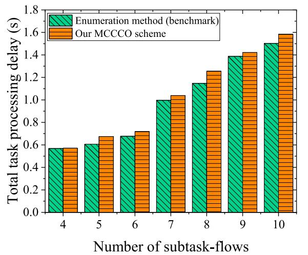

bar

| Number of subtask-flows | Enumeration method (benchmark) | Our MCCCO scheme |
| ----------------------- | ------------------------------ | ---------------- |
| 4                       | 0.57                           | 0.57             |
| 5                       | 0.61                           | 0.67             |
| 6                       | 0.68                           | 0.72             |
| 7                       | 1.00                           | 1.03             |
| 8                       | 1.15                           | 1.26             |
| 9                       | 1.40                           | 1.43             |
| 10                      | 1.50                           | 1.59             |

(a) Total task processing delay   
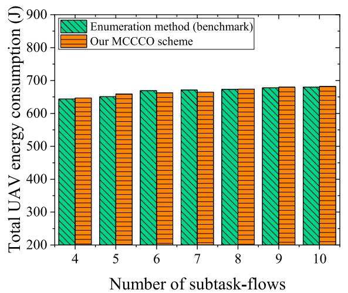

bar

| Number of subtask-flows | Enumeration method (benchmark) (J) | Our MCCCO scheme (J) |
| :--- | :--- | :--- |
| 4 | 645 | 645 |
| 5 | 650 | 655 |
| 6 | 665 | 658 |
| 7 | 668 | 660 |
| 8 | 670 | 668 |
| 9 | 672 | 675 |
| 10 | 673 | 676 |

(b） Total UAV energy consumption  
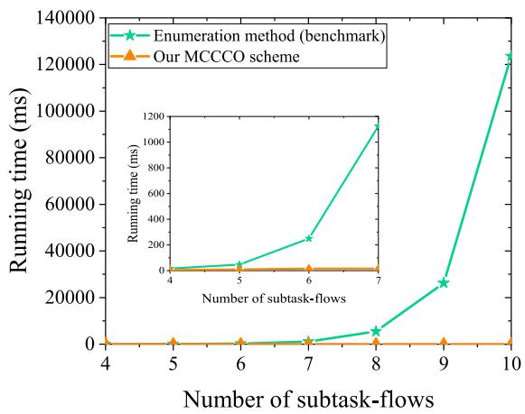

line

| Number of subtask-flows | Enumeration method (benchmark) | Our MCCCO scheme |
| ----------------------- | -------------------------------- | ---------------- |
| 4                       | 0                                | 0                |
| 5                       | 0                                | 0                |
| 6                       | 0                                | 0                |
| 7                       | 0                                | 0                |
| 8                       | 5000                             | 0                |
| 9                       | 25000                            | 0                |
| 10                      | 120000                           | 0                |

(c) Running time   
Fig. 3. Illustration of the numerical results of total task processing delay, total UAV energy consumption, and running time using different schemes. In particular, linear subtask-flow model, $m \overset { \cdot } { = } 2 , \vert V \vert = \overset { \cdot } { 2 }$ .

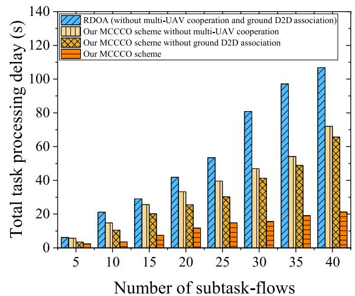

bar

| Number of subtask-flows | RDOA (without multi-UAV cooperation and ground D2D association) | Our MCCCO scheme without multi-UAV cooperation | Our MCCCO scheme without ground D2D association | Our MCCCO scheme |
| ----------------------- | ------------------------------------------------------------- | ----------------------------------------------- | ------------------------------------------------- | ---------------- |
| 5                       | 6                                                             | 5                                               | 3                                                 | 2                |
| 10                      | 21                                                            | 15                                              | 10                                                | 4                |
| 15                      | 29                                                            | 26                                              | 20                                                | 7                |
| 20                      | 41                                                            | 33                                              | 25                                                | 12               |
| 25                      | 53                                                            | 40                                              | 30                                                | 15               |
| 30                      | 81                                                            | 47                                              | 41                                                | 16               |
| 35                      | 97                                                            | 54                                              | 49                                                | 19               |
| 40                      | 107                                                           | 72                                              | 66                                                | 21               |

(a) Linear model   
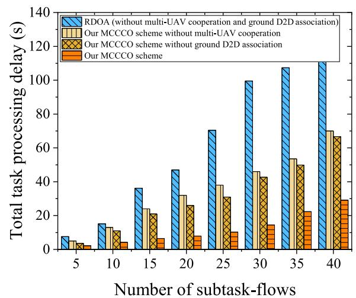

bar

| Number of subtask-flows | RDOA (without multi-UAV cooperation and ground D2D association) | Our MCCCO scheme without multi-UAV cooperation | Our MCCCO scheme without ground D2D association | Our MCCCO scheme |
| ----------------------- | ------------------------------------------------------------- | ----------------------------------------------- | ----------------------------------------------- | ---------------- |
| 5                       | 8                                                             | 4                                               | 3                                               | 2                |
| 10                      | 16                                                            | 12                                              | 10                                              | 4                |
| 15                      | 36                                                            | 24                                              | 20                                              | 6                |
| 20                      | 46                                                            | 32                                              | 26                                              | 8                |
| 25                      | 70                                                            | 38                                              | 30                                              | 10               |
| 30                      | 100                                                           | 46                                              | 42                                              | 14               |
| 35                      | 108                                                           | 54                                              | 50                                              | 22               |
| 40                      | 112                                                           | 70                                              | 68                                              | 30               |

(b) Tree model   
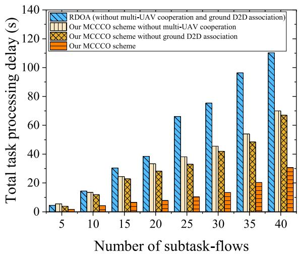

bar

| Number of subtask-flows | RDOA (without multi-UAV cooperation and ground D2D association) | Our MCCCO scheme without multi-UAV cooperation | Our MCCCO scheme without ground D2D association | Our MCCCO scheme |
| ----------------------- | ------------------------------------------------------------- | ----------------------------------------------- | ---------------------------------------------- | ---------------- |
| 5                       | 5                                                             | 5                                               | 3                                              | 2                |
| 10                      | 15                                                            | 13                                              | 12                                             | 4                |
| 15                      | 30                                                            | 25                                              | 22                                             | 6                |
| 20                      | 40                                                            | 35                                              | 30                                             | 8                |
| 25                      | 65                                                            | 40                                              | 35                                             | 10               |
| 30                      | 75                                                            | 45                                              | 40                                             | 13               |
| 35                      | 95                                                            | 55                                              | 48                                             | 20               |
| 40                      | 110                                                           | 70                                              | 68                                             | 30               |

(c) Mesh model   
Fig. 4. Comparisons of the impact of multi-UAV cooperation and ground D2D association on task processing delay by adopting different schemes. Particularly, $n = 5$ .

To further verify the necessity of joint D2D association and multi-UAV cooperation optimization in our proposed MCCCO scheme, we use the response delay optimization algorithm (RDOA) as the traditional multi-UAV scheme from the literature [41]. RDOA can get the optimal response delay by joint optimizing communication and computation optimization in the multiple UAV-enabled MEC scenario. However, RDOA does not consider multi-UAV cooperation and ground D2D association. Fig. 4 compares the total task processing delay by adopting four different schemes, i.e., RDOA (without multi-UAV cooperation and ground D2D association), our MCCCO scheme without multi-UAV cooperation, our MCCCO scheme without ground D2D association, and our MCCCO scheme. The numerical results show that by jointly optimizing ground D2D association and multi-UAV cooperative computing, our proposed MCCCO scheme obtains a much smaller task processing delay than the other three schemes. The reason for this result is that D2D communication can help to uplink tasks by using the communication resources of the device, allowing the device to transmit tasks to those G2A links that have a good communication situation, thus reducing the task uplink delay; by optimizing the cooperative task offloading strategy, sending some subtasks to resource-rich UAVs, the A2A communication and computation delay can be further reduced. Thus, our proposed MCCCO scheme helps to efficiently utilize the computation and communication resources of UAVs, thus reducing the task processing latency.

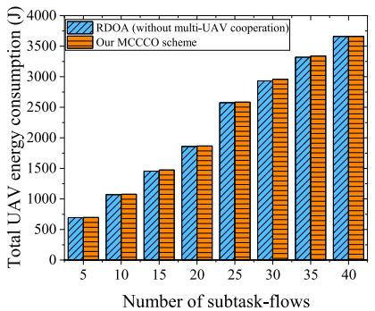

bar

| Number of subtask-flows | RDOA (without multi-UAV cooperation) (J) | Our MCCCO scheme (J) |
| :--- | :--- | :--- |
| 5 | 700 | 720 |
| 10 | 1050 | 1080 |
| 15 | 1450 | 1480 |
| 20 | 1850 | 1880 |
| 25 | 2550 | 2580 |
| 30 | 2950 | 2980 |
| 35 | 3350 | 3380 |
| 40 | 3650 | 3680 |

(a) Linear model

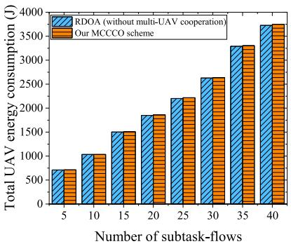

bar

| Number of subtask-flows | RDOA (without multi-UAV cooperation) (J) | Our MCCCO scheme (J) |
| :--- | :--- | :--- |
| 5 | 700 | 720 |
| 10 | 1000 | 1020 |
| 15 | 1500 | 1520 |
| 20 | 1850 | 1880 |
| 25 | 2200 | 2230 |
| 30 | 2600 | 2630 |
| 35 | 3300 | 3330 |
| 40 | 3750 | 3780 |

(b) Tree model

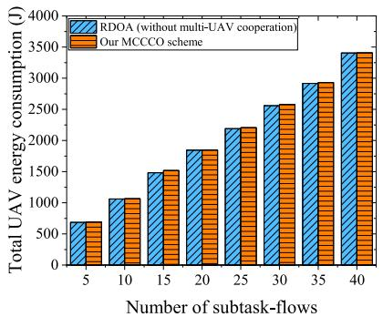

bar

| Number of subtask-flows | RDOA (without multi-UAV cooperation) (J) | Our MCCCO scheme (J) |
| :--- | :--- | :--- |
| 5 | 700 | 700 |
| 10 | 1050 | 1050 |
| 15 | 1450 | 1500 |
| 20 | 1800 | 1800 |
| 25 | 2200 | 2250 |
| 30 | 2550 | 2600 |
| 35 | 2950 | 2950 |
| 40 | 3400 | 3400 |

(c)Mesh model

Fig. 5. Comparisons of the impact of multi-UAV cooperation on UAV energy consumption by adopting different schemes. Particularly, $n = 5 .$   
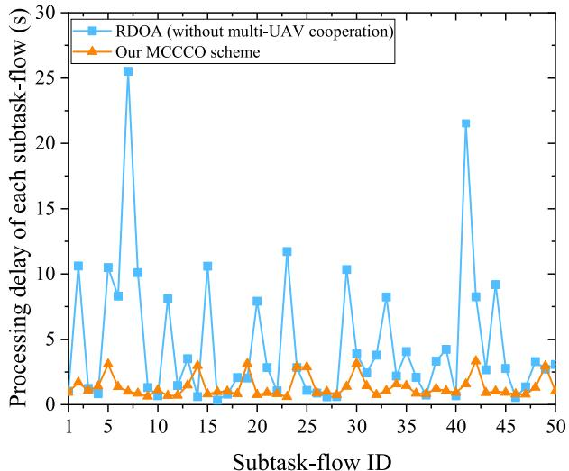

line

| Subtask-flow ID | RDOA (without multi-UAV cooperation) | Our MCCCO scheme |
| --------------- | ------------------------------------ | ---------------- |
| 1               | 10.5                                 | 1.5              |
| 5               | 8.0                                  | 3.0              |
| 10              | 1.0                                  | 0.5              |
| 15              | 10.5                                 | 3.5              |
| 20              | 7.5                                  | 1.0              |
| 25              | 11.5                                 | 2.5              |
| 30              | 10.0                                 | 3.0              |
| 35              | 4.0                                  | 1.5              |
| 40              | 21.5                                 | 3.0              |
| 45              | 9.0                                  | 1.0              |
| 50              | 3.0                                  | 2.5              |

Fig. 6. Comparisons of the impact of multi-UAV cooperation on task processing delay of each subtask-flow by adopting different schemes. Linear subtask-flow model, n = 50, m = 5, and $| V | = \mathrm { \bar { 1 0 } }$ .

The energy of the UAV is limited, and too much energy consumption will lead to low UAV power and shortened endurance. Considering that multiple UAVs collaborating in communication and computation will generate additional UAV energy consumption, in this set of experiments we compare the UAV energy consumption of the traditional multi-UAV scheme without multi-UAV cooperation (i.e., RDOA) with that of our proposed MCCCO scheme. Fig. 5(a)-(c) indicate that MCCCO consumes more energy than RDOA with an increase of less than 5%. This is due to the fact that communication time among UAVs brings communication energy consumption. In brief, our MCCCO scheme can greatly reduce the total task processing delay with a little increase in UAV energy consumption. From two comparison results in Fig. 4 and Fig. 5, MCCO outperforms the traditional multi-UAV scheme (without multi-UAV cooperation) in reducing task processing delay of subtask-flows with the linear, tree, and mesh models.

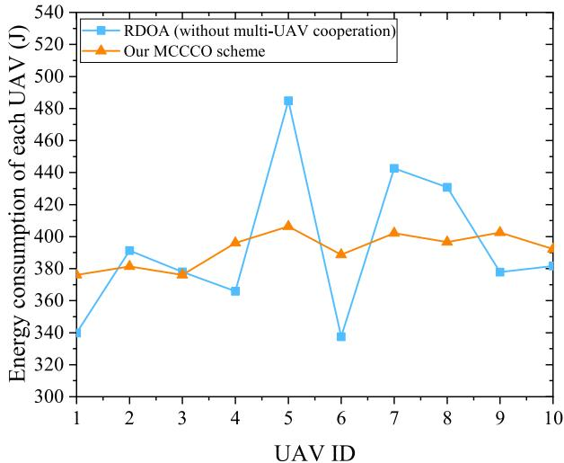

line

| UAV ID | RDOA (without multi-UAV cooperation) | Our MCCCO scheme |
| ------ | ----------------------------------- | ---------------- |
| 1      | 340                                 | 378              |
| 2      | 392                                 | 382              |
| 3      | 380                                 | 378              |
| 4      | 365                                 | 398              |
| 5      | 485                                 | 405              |
| 6      | 335                                 | 390              |
| 7      | 445                                 | 402              |
| 8      | 430                                 | 398              |
| 9      | 378                                 | 402              |
| 10     | 382                                 | 392              |

Fig. 7. Comparisons of the impact of multi-UAV cooperation on energy consumption of each UAV by adopting different schemes. Linear subtask-flow model, n = 50, $m = 5 ,$ and $| V | = \bar { 1 0 }$ .

Regarding the robustness and load balancing on UAV energy consumption of our MCCCO scheme, we run experiments on the variation of each subtask-flow’s processing delay and each UAV’s energy consumption by adopting our MCCCO scheme and RDOA (without multi-UAV cooperation), under the environment with $n = 5 0$ subtask-flows, $m = 5$ subtasks in each subtask-flow and $| V | \ = \ 1 0 \ \mathrm { \ U A V s }$ . To be specific, Fig. 6 shows the comparison results of 50 subtask-flows’ processing delay. The experimental results reveal that the line of MCCCO’s task processing delay is lower and more steady than that of RDOA. Moreover, Fig. 7 compares 10 UAVs’ energy consumption consumed by processing 50 subtask-flows. The numerical result shows that each UAV’s energy consumption of MCCCO is also more steady than that of RDOA. In this case, RDOA may cause some UAVs to run out of power and cannot continue providing computing services. Therefore, our MCCCO scheme is capable of providing a robust service, ensuring user QoS, as well as achieving load balancing on UAV energy consumption.

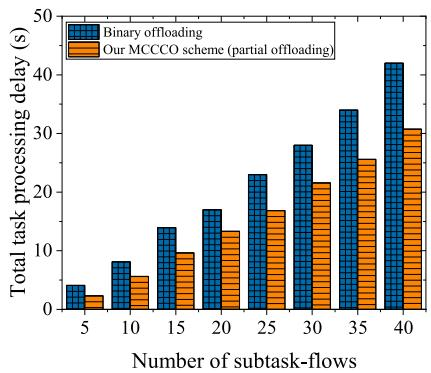

bar

| Number of subtask-flows | Binary offloading (s) | Our MCCCO scheme (partial offloading) (s) |
| :--- | :--- | :--- |
| 5 | 4 | 2 |
| 10 | 8 | 5 |
| 15 | 14 | 9 |
| 20 | 17 | 13 |
| 25 | 23 | 17 |
| 30 | 28 | 21 |
| 35 | 34 | 26 |
| 40 | 42 | 31 |

(a) Linear model

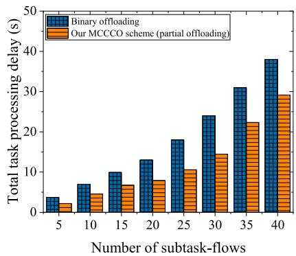

bar

| Number of subtask-flows | Binary offloading (s) | Our MCCCO scheme (partial offloading) (s) |
| :--- | :--- | :--- |
| 5 | 4 | 2 |
| 10 | 7 | 5 |
| 15 | 10 | 7 |
| 20 | 13 | 8 |
| 25 | 18 | 11 |
| 30 | 24 | 15 |
| 35 | 31 | 23 |
| 40 | 38 | 29 |

(b） Tree model

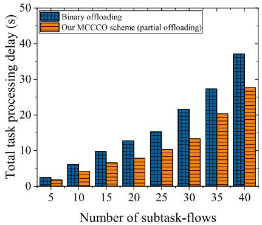

bar

| Number of subtask-flows | Binary offloading (s) | Our MCCCO scheme (partial offloading) (s) |
| :--- | :--- | :--- |
| 5 | 2.5 | 1.5 |
| 10 | 6.0 | 4.0 |
| 15 | 9.5 | 6.5 |
| 20 | 13.0 | 7.5 |
| 25 | 15.5 | 10.0 |
| 30 | 21.5 | 13.5 |
| 35 | 27.0 | 20.0 |
| 40 | 37.0 | 27.5 |

(c) Mesh model   
Fig. 8. Comparisons of the impact of binary offloading and partial offloading on task processing delay by adopting different schemes. Particularly, ${ \mathrm { ~ n ~ } } = 5 .$

To verify the performance of using partial offloading mode in reducing the task processing delay, we compare the delay obtained by the MCCCO algorithm (using partial offloading mode) with that of the binary offloading scheme. Fig. 8(a)-(c) shows the processing delay results for the three types of subtask-flows obtained using the binary offloading scheme and MCCCO. The experimental results demonstrate that the delay obtained with the partial offloading mode is lower than that obtained with the binary offloading mode, and the processing latency is reduced by about 21%, 30%, and 20% for linear, tree, and mesh subtask-flows, respectively. This is due to the fact that using the partial offloading mode allows dividing the tasks into smaller subtasks, which enables the subtasks to be allocated more flexibly to the limited computation and communication resources of the UAVs, resulting in a further reduction in the task waiting latency.

# V. CONCLUSION

In this paper, we studied joint task scheduling and computing resource allocation in SDN-enhanced cooperative MUEAC system, with the goal of task processing delay minimization. This system considered D2D communication, A2A communication, and task interdependency and modeled a detailed process of computation task execution from ground devices to UAVs. To achieve load balancing on UAV energy consumption and task processing delay minimization, we studied the problem of joint task scheduling and resource allocation, which optimizes the ground D2D association strategy and computation task offloading strategy. The MCCCO scheme was proposed to solve this problem. The experimental results revealed that our MCCCO scheme can achieve good performance in task processing delay reduction and load balancing on UAV energy consumption compared to traditional multi-UAV schemes.

# REFERENCES

[1] Y. Lu et al., “Accelerating at the edge: A storage-elastic blockchain for latency-sensitive vehicular edge computing,” IEEE Trans. Intell. Transp. Syst., vol. 23, no. 8, pp. 11862–11876, Aug. 2022.

[2] H. Guo, W. Huang, J. Liu, and Y. Wang, “Inter-server collaborative federated learning for ultra-dense edge computing,” IEEE Trans. Wireless Commun., vol. 21, no. 7, pp. 5191–5203, Jul. 2022.   
[3] Y. Yu, J. Tang, J. Huang, X. Zhang, D. K. C. So, and K. Wong, “Multiobjective optimization for UAV-assisted wireless powered IoT networks based on extended DDPG algorithm,” IEEE Trans. Commun., vol. 69, no. 9, pp. 6361–6374, Sep. 2021.   
[4] Y. Qu et al., “Service provisioning for UAV-enabled mobile edge computing,” IEEE J. Sel. Areas Commun., vol. 39, no. 11, pp. 3287–3305, Nov. 2021.   
[5] S. Verma, Y. Kawamoto, and N. Kato, “A smart internet-wide port scan approach for improving IoT security under dynamic WLAN environments,” IEEE Internet Things J., vol. 9, no. 14, pp. 11951–11961, Jul. 2022.   
[6] N. Zhao, Z. Ye, Y. Pei, Y. Liang, and D. Niyato, “Multi-agent deep reinforcement learning for task offloading in UAV-assisted mobile edge computing,” IEEE Trans. Wireless Commun., vol. 21, no. 9, pp. 6949–6960, Sep. 2022.   
[7] J. Ji, K. Zhu, and D. Niyato, “Joint communication and computation design for UAV-enabled aerial computing,” IEEE Commun. Mag., vol. 59, no. 11, pp. 73–79, Nov. 2021.   
[8] H. Xu, W. Huang, Y. Zhou, D. Yang, M. Li, and Z. Han, “Edge computing resource allocation for unmanned aerial vehicle assisted mobile network with blockchain applications,” IEEE Trans. Wireless Commun., vol. 20, no. 5, pp. 3107–3121, May 2021.   
[9] C. Dong et al., “UAVs as an intelligent service: Boosting edge intelligence for air-ground integrated networks,” IEEE Netw., vol. 35, no. 4, pp. 167–175, Jul. 2021.   
[10] H. Guo, J. Li, J. Liu, N. Tian, and N. Kato, “A survey on space-airground-sea integrated network security in 6G,” IEEE Commun. Surveys Tuts., vol. 24, no. 1, pp. 53–87, 1st Quart., 2022.   
[11] C. Sun, W. Ni, and X. Wang, “Joint computation offloading and trajectory planning for UAV-assisted edge computing,” IEEE Trans. Wireless Commun., vol. 20, no. 8, pp. 5343–5358, Aug. 2021.   
[12] G. Yang, Y. Liang, R. Zhang, and Y. Pei, “Modulation in the air: Backscatter communication over ambient OFDM carrier,” IEEE Trans. Commun., vol. 66, no. 3, pp. 1219–1233, Mar. 2018.   
[13] H. Guo, J. Liu, J. Ren, and Y. Zhang, “Intelligent task offloading in vehicular edge computing networks,” IEEE Wireless Commun., vol. 27, no. 4, pp. 126–132, Aug. 2020.   
[14] Y. Wang, J. Cao, and Y. Zheng, “Toward a low-cost software-defined UHF RFID system for distributed parallel sensing,” IEEE Internet Things J., vol. 8, no. 17, pp. 13664–13676, Sep. 2021.   
[15] R. I. Bor-Yaliniz, A. El-Keyi, and H. Yanikomeroglu, “Efficient 3-D placement of an aerial base station in next generation cellular networks,” in Proc. IEEE Int. Conf. Commun. (ICC), May 2016, pp. 1–5.   
[16] H. Guo and J. Liu, “UAV-enhanced intelligent offloading for Internet of Things at the edge,” IEEE Trans. Ind. Informat., vol. 16, no. 4, pp. 2737–2746, Apr. 2020.   
[17] N. T. Ti and L. B. Le, “Joint resource allocation, computation offloading, and path planning for UAV based hierarchical fog-cloud mobile systems,” in Proc. IEEE 7th Int. Conf. Commun. Electron. (ICCE), Jul. 2018, pp. 373–378.   
[18] Y. Wang, Z. Ru, K. Wang, and P. Huang, “Joint deployment and task scheduling optimization for large-scale mobile users in multi-UAVenabled mobile edge computing,” IEEE Trans. Cybern., vol. 50, no. 9, pp. 3984–3997, Sep. 2020.

[19] L. Wang, K. Wang, C. Pan, W. Xu, N. Aslam, and L. Hanzo, “Multiagent deep reinforcement learning-based trajectory planning for multi-UAV assisted mobile edge computing,” IEEE Trans. Cognit. Commun. Netw., vol. 7, no. 1, pp. 73–84, Mar. 2021.   
[20] H. Guo, X. Zhou, Y. Wang, and J. Liu, “Achieve load balancing in multi-UAV edge computing IoT networks: A dynamic entry and exit mechanism,” IEEE Internet Things J., vol. 9, no. 19, pp. 18725–18736, Oct. 2022.   
[21] A. M. Seid, G. O. Boateng, B. Mareri, G. Sun, and W. Jiang, “Multiagent DRL for task offloading and resource allocation in multi-UAV enabled IoT edge network,” IEEE Trans. Netw. Service Manag., vol. 18, no. 4, pp. 4531–4547, Dec. 2021.   
[22] M. Li, N. Cheng, J. Gao, Y. Wang, L. Zhao, and X. Shen, “Energyefficient UAV-assisted mobile edge computing: Resource allocation and trajectory optimization,” IEEE Trans. Veh. Technol., vol. 69, no. 3, pp. 3424–3438, Mar. 2020.   
[23] Y. Xu, T. Zhang, D. Yang, Y. Liu, and M. Tao, “Joint resource and trajectory optimization for security in UAV-assisted MEC systems,” IEEE Trans. Commun., vol. 69, no. 1, pp. 573–588, Jan. 2021.   
[24] L. Yang, H. Yao, J. Wang, C. Jiang, A. Benslimane, and Y. Liu, “Multi-UAV-enabled load-balance mobile-edge computing for IoT networks,” IEEE Internet Things J., vol. 7, no. 8, pp. 6898–6908, Aug. 2020.   
[25] Z. Ning, P. Dong, X. Kong, and F. Xia, “A cooperative partial computation offloading scheme for mobile edge computing enabled Internet of Things,” IEEE Internet Things J., vol. 6, no. 3, pp. 4804–4814, Jun. 2019.   
[26] M. H. Kumar, S. Sharma, K. Deka, and M. Thottappan, “Reconfigurable intelligent surfaces assisted hybrid NOMA system,” IEEE Commun. Lett., vol. 27, no. 1, pp. 357–361, Jan. 2023.   
[27] L. Pei et al., “Energy-efficient D2D communications underlaying NOMA-based networks with energy harvesting,” IEEE Commun. Lett., vol. 22, no. 5, pp. 914–917, May 2018.   
[28] X. Zhang, J. Zhang, J. Xiong, L. Zhou, and J. Wei, “Energy-efficient multi-UAV-enabled multiaccess edge computing incorporating NOMA,” IEEE Internet Things J., vol. 7, no. 6, pp. 5613–5627, Jun. 2020.   
[29] A. Alsharoa and M. Yuksel, “Energy efficient D2D communications using multiple UAV relays,” IEEE Trans. Commun., vol. 69, no. 8, pp. 5337–5351, Aug. 2021.   
[30] Y. Zhou et al., “Secure communications for UAV-enabled mobile edge computing systems,” IEEE Trans. Commun., vol. 68, no. 1, pp. 376–388, Jan. 2020.   
[31] S. Zhu, L. Gui, D. Zhao, N. Cheng, Q. Zhang, and X. Lang, “Learningbased computation offloading approaches in UAVs-assisted edge computing,” IEEE Trans. Veh. Technol., vol. 70, no. 1, pp. 928–944, Jan. 2021.   
[32] U. Saleem, Y. Liu, S. Jangsher, X. Tao, and Y. Li, “Latency minimization for D2D-enabled partial computation offloading in mobile edge computing,” IEEE Trans. Veh. Technol., vol. 69, no. 4, pp. 4472–4486, Apr. 2020.   
[33] S. Verma, Y. Kawamoto, H. Nishiyama, N. Kato, and C. Huang, “Novel group paging scheme for improving energy efficiency of IoT devices over LTE-A pro networks with QoS considerations,” in Proc. IEEE Int. Conf. Commun. (ICC), May 2018, pp. 1–6.   
[34] Z. Yu, Y. Gong, S. Gong, and Y. Guo, “Joint task offloading and resource allocation in UAV-enabled mobile edge computing,” IEEE Internet Things J., vol. 7, no. 4, pp. 3147–3159, Apr. 2020.   
[35] Y. Du, K. Yang, K. Wang, G. Zhang, Y. Zhao, and D. Chen, “Joint resources and workflow scheduling in UAV-enabled wirelessly-powered MEC for IoT systems,” IEEE Trans. Veh. Technol., vol. 68, no. 10, pp. 10187–10200, Oct. 2019.   
[36] L. Zhang and N. Ansari, “Latency-aware IoT service provisioning in UAV-aided mobile-edge computing networks,” IEEE Internet Things J., vol. 7, no. 10, pp. 10573–10580, Oct. 2020.   
[37] K. Zhang, X. Gui, D. Ren, and D. Li, “Energy-latency tradeoff for computation offloading in UAV-assisted multiaccess edge computing system,” IEEE Internet Things J., vol. 8, no. 8, pp. 6709–6719, Apr. 2021.   
[38] F. Cheng et al., “UAV trajectory optimization for data offloading at the edge of multiple cells,” IEEE Trans. Veh. Technol., vol. 67, no. 7, pp. 6732–6736, Jul. 2018.   
[39] J. Zheng, Y. Cai, N. Lu, Y. Xu, and X. Shen, “Stochastic game-theoretic spectrum access in distributed and dynamic environment,” IEEE Trans. Veh. Technol., vol. 64, no. 10, pp. 4807–4820, Oct. 2015.   
[40] H. Guo and J. Liu, “Collaborative computation offloading for multiaccess edge computing over fiber-wireless networks,” IEEE Trans. Veh. Technol., vol. 67, no. 5, pp. 4514–4526, May 2018.

[41] Q. Zhang, J. Chen, L. Ji, Z. Feng, Z. Han, and Z. Chen, “Response delay optimization in mobile edge computing enabled UAV swarm,” IEEE Trans. Veh. Technol., vol. 69, no. 3, pp. 3280–3295, Mar. 2020.

natural_image

Portrait photo of a man in a striped shirt against a red background (no text or symbols visible)

Hongzhi Guo (Member, IEEE) received the B.S., M.S., and Ph.D. degrees in computer science and technology from the Harbin Institute of Technology in 2004, 2006, and 2011, respectively. He is currently an Associate Professor with the School of Cybersecurity, Northwestern Polytechnical University. He has published more than 40 peer-reviewed papers in many prestigious IEEE journals and conferences. His research interests include edge computing, SAGSIN, IoT security, AI security, and 5G security. He was a recipient of WiMob Best Paper

Award in 2019 and the IEEE TRANSACTIONS ON VEHICULAR TECHNOL-OGY Top Reviewer Award in 2019. He has been serving as an Associate Editor for IEEE TRANSACTIONS ON VEHICULAR TECHNOLOGY since January 2021 and Frontiers in Communications and Network since January 2021 and an Editor for International Journal of Multimedia Intelligence and Security since March 2019.

natural_image

Portrait of a young woman wearing glasses and a striped top against a blue background (no text or symbols visible)

Yutao Wang (Graduate Student Member, IEEE) received the B.S. degree in computer science and technology from Southwest University in 2020, and the M.S. degree from the School of Cybersecurity, Northwestern Polytechnical University, in 2023. Her research interests include mobile edge computing and space-ground cooperative computing.

natural_image

Portrait photo of a man in formal attire (no text or symbols visible)

Jiajia Liu (Senior Member, IEEE) is currently a Full Professor (the Vice Dean) with the School of Cybersecurity, Northwestern Polytechnical University. He has published more than 220 peer-reviewed papers in many high-quality publications, including prestigious IEEE journals and conferences. His research interests include intelligent and connected vehicles, mobile/edge/cloud computing and storage, the IoT security, wireless and mobile ad hoc networks, and SAGIN. He received the IEEE ComSoc Asia–Pacific Outstanding Young Researcher Award

in 2017, and the IEEE ComSoc Asia–Pacific Outstanding Paper Award in 2019, the IEEE VTS Early Career Award in 2019, and the IEEE ComSoc Best YP at Acedemia Award in 2020. He is the Chair of IEEE IOT-AHSN TC and a Distinguished Lecturer of IEEE Communications Society and the Vehicular Technology Society. He has been serving as an Associate Editor for IEEE TRANSACTIONS ON VEHICULAR TECHNOLOGY from January 2016 to December 2020, IEEE TRANSACTIONS ON COMPUTERS from October 2015 to June 2017, and IEEE TRANSACTIONS ON WIRELESS COM-MUNICATIONS since May 2018, and an Editor for IEEE NETWORK since July 2015 and IEEE TRANSACTIONS ON COGNITIVE COMMUNICATIONS AND NETWORKING since January 2019.

natural_image

Portrait photo of a woman in a white collared shirt against a blue background (no text or symbols visible)

Chang Liu (Graduate Student Member, IEEE) received the B.S. degree in computer science and technology from Chang’an University in 2022. She is currently pursuing the master’s degree with the School of Cybersecurity, Northwestern Polytechnical University. Her research interests include edge computing and the IoT security.